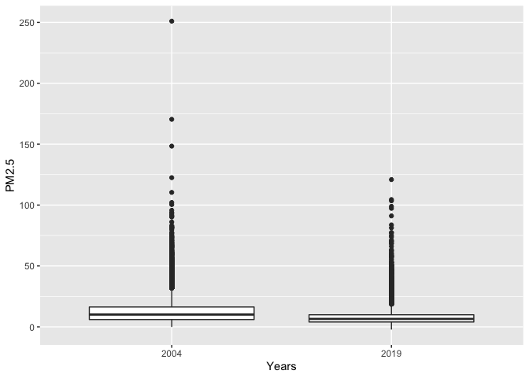
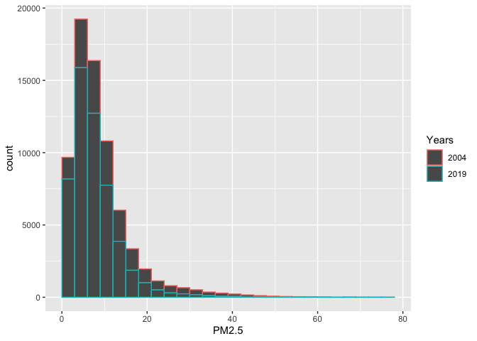
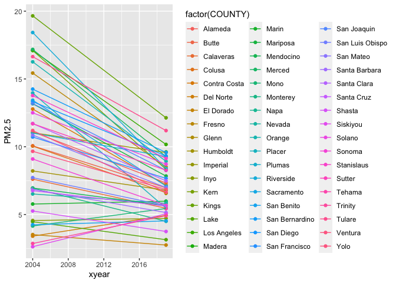
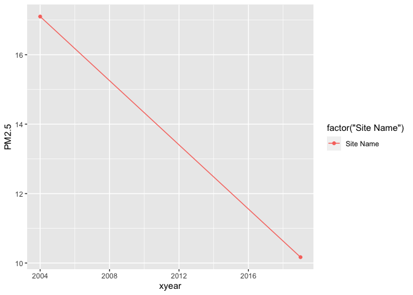

PM566-assignment1
================
Leona Ma

\#Step1 Given the formulated question from the assignment description,
you will now conduct EDA Checklist items 2-4. First, download 2004 and
2019 data for all sites in California from the EPA Air Quality Data
website. Read in the data using data.table(). For each of the two
datasets, check the dimensions, headers, footers, variable names and
variable types. Check for any data issues, particularly in the key
variable we are analyzing. Make sure you write up a summary of all of
your findings.

## Reading in the datas

``` r
library(data.table)
library(tidyverse)
```

    ## ── Attaching packages ─────────────────────────────────────── tidyverse 1.3.1 ──

    ## ✓ ggplot2 3.3.5     ✓ purrr   0.3.4
    ## ✓ tibble  3.1.2     ✓ dplyr   1.0.7
    ## ✓ tidyr   1.1.3     ✓ stringr 1.4.0
    ## ✓ readr   1.4.0     ✓ forcats 0.5.1

    ## ── Conflicts ────────────────────────────────────────── tidyverse_conflicts() ──
    ## x dplyr::between()   masks data.table::between()
    ## x dplyr::filter()    masks stats::filter()
    ## x dplyr::first()     masks data.table::first()
    ## x dplyr::lag()       masks stats::lag()
    ## x dplyr::last()      masks data.table::last()
    ## x purrr::transpose() masks data.table::transpose()

``` r
EDA04 <- data.table::fread("2004.csv")
EDA19 <- data.table::fread("2019.csv")
```

## Checking dimentions

``` r
dim(EDA04)
```

    ## [1] 19233    20

``` r
dim(EDA19)
```

    ## [1] 53086    20

## Checking headers

``` r
head(EDA04)
```

<div data-pagedtable="false">

<script data-pagedtable-source type="application/json">
{"columns":[{"label":["Date"],"name":[1],"type":["chr"],"align":["left"]},{"label":["Source"],"name":[2],"type":["chr"],"align":["left"]},{"label":["Site ID"],"name":[3],"type":["int"],"align":["right"]},{"label":["POC"],"name":[4],"type":["int"],"align":["right"]},{"label":["Daily Mean PM2.5 Concentration"],"name":[5],"type":["dbl"],"align":["right"]},{"label":["UNITS"],"name":[6],"type":["chr"],"align":["left"]},{"label":["DAILY_AQI_VALUE"],"name":[7],"type":["int"],"align":["right"]},{"label":["Site Name"],"name":[8],"type":["chr"],"align":["left"]},{"label":["DAILY_OBS_COUNT"],"name":[9],"type":["int"],"align":["right"]},{"label":["PERCENT_COMPLETE"],"name":[10],"type":["dbl"],"align":["right"]},{"label":["AQS_PARAMETER_CODE"],"name":[11],"type":["int"],"align":["right"]},{"label":["AQS_PARAMETER_DESC"],"name":[12],"type":["chr"],"align":["left"]},{"label":["CBSA_CODE"],"name":[13],"type":["int"],"align":["right"]},{"label":["CBSA_NAME"],"name":[14],"type":["chr"],"align":["left"]},{"label":["STATE_CODE"],"name":[15],"type":["int"],"align":["right"]},{"label":["STATE"],"name":[16],"type":["chr"],"align":["left"]},{"label":["COUNTY_CODE"],"name":[17],"type":["int"],"align":["right"]},{"label":["COUNTY"],"name":[18],"type":["chr"],"align":["left"]},{"label":["SITE_LATITUDE"],"name":[19],"type":["dbl"],"align":["right"]},{"label":["SITE_LONGITUDE"],"name":[20],"type":["dbl"],"align":["right"]}],"data":[{"1":"01/01/2004","2":"AQS","3":"60010007","4":"1","5":"11.0","6":"ug/m3 LC","7":"46","8":"Livermore","9":"1","10":"100","11":"88502","12":"Acceptable PM2.5 AQI & Speciation Mass","13":"41860","14":"San Francisco-Oakland-Hayward, CA","15":"6","16":"California","17":"1","18":"Alameda","19":"37.68753","20":"-121.7842"},{"1":"01/02/2004","2":"AQS","3":"60010007","4":"1","5":"12.2","6":"ug/m3 LC","7":"51","8":"Livermore","9":"1","10":"100","11":"88502","12":"Acceptable PM2.5 AQI & Speciation Mass","13":"41860","14":"San Francisco-Oakland-Hayward, CA","15":"6","16":"California","17":"1","18":"Alameda","19":"37.68753","20":"-121.7842"},{"1":"01/03/2004","2":"AQS","3":"60010007","4":"1","5":"16.5","6":"ug/m3 LC","7":"60","8":"Livermore","9":"1","10":"100","11":"88502","12":"Acceptable PM2.5 AQI & Speciation Mass","13":"41860","14":"San Francisco-Oakland-Hayward, CA","15":"6","16":"California","17":"1","18":"Alameda","19":"37.68753","20":"-121.7842"},{"1":"01/04/2004","2":"AQS","3":"60010007","4":"1","5":"19.5","6":"ug/m3 LC","7":"67","8":"Livermore","9":"1","10":"100","11":"88502","12":"Acceptable PM2.5 AQI & Speciation Mass","13":"41860","14":"San Francisco-Oakland-Hayward, CA","15":"6","16":"California","17":"1","18":"Alameda","19":"37.68753","20":"-121.7842"},{"1":"01/05/2004","2":"AQS","3":"60010007","4":"1","5":"11.5","6":"ug/m3 LC","7":"48","8":"Livermore","9":"1","10":"100","11":"88502","12":"Acceptable PM2.5 AQI & Speciation Mass","13":"41860","14":"San Francisco-Oakland-Hayward, CA","15":"6","16":"California","17":"1","18":"Alameda","19":"37.68753","20":"-121.7842"},{"1":"01/06/2004","2":"AQS","3":"60010007","4":"1","5":"32.5","6":"ug/m3 LC","7":"94","8":"Livermore","9":"1","10":"100","11":"88502","12":"Acceptable PM2.5 AQI & Speciation Mass","13":"41860","14":"San Francisco-Oakland-Hayward, CA","15":"6","16":"California","17":"1","18":"Alameda","19":"37.68753","20":"-121.7842"}],"options":{"columns":{"min":{},"max":[10]},"rows":{"min":[10],"max":[10]},"pages":{}}}
  </script>

</div>

``` r
head(EDA19)
```

<div data-pagedtable="false">

<script data-pagedtable-source type="application/json">
{"columns":[{"label":["Date"],"name":[1],"type":["chr"],"align":["left"]},{"label":["Source"],"name":[2],"type":["chr"],"align":["left"]},{"label":["Site ID"],"name":[3],"type":["int"],"align":["right"]},{"label":["POC"],"name":[4],"type":["int"],"align":["right"]},{"label":["Daily Mean PM2.5 Concentration"],"name":[5],"type":["dbl"],"align":["right"]},{"label":["UNITS"],"name":[6],"type":["chr"],"align":["left"]},{"label":["DAILY_AQI_VALUE"],"name":[7],"type":["int"],"align":["right"]},{"label":["Site Name"],"name":[8],"type":["chr"],"align":["left"]},{"label":["DAILY_OBS_COUNT"],"name":[9],"type":["int"],"align":["right"]},{"label":["PERCENT_COMPLETE"],"name":[10],"type":["dbl"],"align":["right"]},{"label":["AQS_PARAMETER_CODE"],"name":[11],"type":["int"],"align":["right"]},{"label":["AQS_PARAMETER_DESC"],"name":[12],"type":["chr"],"align":["left"]},{"label":["CBSA_CODE"],"name":[13],"type":["int"],"align":["right"]},{"label":["CBSA_NAME"],"name":[14],"type":["chr"],"align":["left"]},{"label":["STATE_CODE"],"name":[15],"type":["int"],"align":["right"]},{"label":["STATE"],"name":[16],"type":["chr"],"align":["left"]},{"label":["COUNTY_CODE"],"name":[17],"type":["int"],"align":["right"]},{"label":["COUNTY"],"name":[18],"type":["chr"],"align":["left"]},{"label":["SITE_LATITUDE"],"name":[19],"type":["dbl"],"align":["right"]},{"label":["SITE_LONGITUDE"],"name":[20],"type":["dbl"],"align":["right"]}],"data":[{"1":"01/01/2019","2":"AQS","3":"60010007","4":"3","5":"5.7","6":"ug/m3 LC","7":"24","8":"Livermore","9":"1","10":"100","11":"88101","12":"PM2.5 - Local Conditions","13":"41860","14":"San Francisco-Oakland-Hayward, CA","15":"6","16":"California","17":"1","18":"Alameda","19":"37.68753","20":"-121.7842"},{"1":"01/02/2019","2":"AQS","3":"60010007","4":"3","5":"11.9","6":"ug/m3 LC","7":"50","8":"Livermore","9":"1","10":"100","11":"88101","12":"PM2.5 - Local Conditions","13":"41860","14":"San Francisco-Oakland-Hayward, CA","15":"6","16":"California","17":"1","18":"Alameda","19":"37.68753","20":"-121.7842"},{"1":"01/03/2019","2":"AQS","3":"60010007","4":"3","5":"20.1","6":"ug/m3 LC","7":"68","8":"Livermore","9":"1","10":"100","11":"88101","12":"PM2.5 - Local Conditions","13":"41860","14":"San Francisco-Oakland-Hayward, CA","15":"6","16":"California","17":"1","18":"Alameda","19":"37.68753","20":"-121.7842"},{"1":"01/04/2019","2":"AQS","3":"60010007","4":"3","5":"28.8","6":"ug/m3 LC","7":"86","8":"Livermore","9":"1","10":"100","11":"88101","12":"PM2.5 - Local Conditions","13":"41860","14":"San Francisco-Oakland-Hayward, CA","15":"6","16":"California","17":"1","18":"Alameda","19":"37.68753","20":"-121.7842"},{"1":"01/05/2019","2":"AQS","3":"60010007","4":"3","5":"11.2","6":"ug/m3 LC","7":"47","8":"Livermore","9":"1","10":"100","11":"88101","12":"PM2.5 - Local Conditions","13":"41860","14":"San Francisco-Oakland-Hayward, CA","15":"6","16":"California","17":"1","18":"Alameda","19":"37.68753","20":"-121.7842"},{"1":"01/06/2019","2":"AQS","3":"60010007","4":"3","5":"2.7","6":"ug/m3 LC","7":"11","8":"Livermore","9":"1","10":"100","11":"88101","12":"PM2.5 - Local Conditions","13":"41860","14":"San Francisco-Oakland-Hayward, CA","15":"6","16":"California","17":"1","18":"Alameda","19":"37.68753","20":"-121.7842"}],"options":{"columns":{"min":{},"max":[10]},"rows":{"min":[10],"max":[10]},"pages":{}}}
  </script>

</div>

## Checking footers

``` r
tail(EDA04)
```

<div data-pagedtable="false">

<script data-pagedtable-source type="application/json">
{"columns":[{"label":["Date"],"name":[1],"type":["chr"],"align":["left"]},{"label":["Source"],"name":[2],"type":["chr"],"align":["left"]},{"label":["Site ID"],"name":[3],"type":["int"],"align":["right"]},{"label":["POC"],"name":[4],"type":["int"],"align":["right"]},{"label":["Daily Mean PM2.5 Concentration"],"name":[5],"type":["dbl"],"align":["right"]},{"label":["UNITS"],"name":[6],"type":["chr"],"align":["left"]},{"label":["DAILY_AQI_VALUE"],"name":[7],"type":["int"],"align":["right"]},{"label":["Site Name"],"name":[8],"type":["chr"],"align":["left"]},{"label":["DAILY_OBS_COUNT"],"name":[9],"type":["int"],"align":["right"]},{"label":["PERCENT_COMPLETE"],"name":[10],"type":["dbl"],"align":["right"]},{"label":["AQS_PARAMETER_CODE"],"name":[11],"type":["int"],"align":["right"]},{"label":["AQS_PARAMETER_DESC"],"name":[12],"type":["chr"],"align":["left"]},{"label":["CBSA_CODE"],"name":[13],"type":["int"],"align":["right"]},{"label":["CBSA_NAME"],"name":[14],"type":["chr"],"align":["left"]},{"label":["STATE_CODE"],"name":[15],"type":["int"],"align":["right"]},{"label":["STATE"],"name":[16],"type":["chr"],"align":["left"]},{"label":["COUNTY_CODE"],"name":[17],"type":["int"],"align":["right"]},{"label":["COUNTY"],"name":[18],"type":["chr"],"align":["left"]},{"label":["SITE_LATITUDE"],"name":[19],"type":["dbl"],"align":["right"]},{"label":["SITE_LONGITUDE"],"name":[20],"type":["dbl"],"align":["right"]}],"data":[{"1":"12/14/2004","2":"AQS","3":"61131003","4":"1","5":"11","6":"ug/m3 LC","7":"46","8":"Woodland-Gibson Road","9":"1","10":"100","11":"88101","12":"PM2.5 - Local Conditions","13":"40900","14":"Sacramento--Roseville--Arden-Arcade, CA","15":"6","16":"California","17":"113","18":"Yolo","19":"38.66121","20":"-121.7327"},{"1":"12/17/2004","2":"AQS","3":"61131003","4":"1","5":"16","6":"ug/m3 LC","7":"59","8":"Woodland-Gibson Road","9":"1","10":"100","11":"88101","12":"PM2.5 - Local Conditions","13":"40900","14":"Sacramento--Roseville--Arden-Arcade, CA","15":"6","16":"California","17":"113","18":"Yolo","19":"38.66121","20":"-121.7327"},{"1":"12/20/2004","2":"AQS","3":"61131003","4":"1","5":"17","6":"ug/m3 LC","7":"61","8":"Woodland-Gibson Road","9":"1","10":"100","11":"88101","12":"PM2.5 - Local Conditions","13":"40900","14":"Sacramento--Roseville--Arden-Arcade, CA","15":"6","16":"California","17":"113","18":"Yolo","19":"38.66121","20":"-121.7327"},{"1":"12/23/2004","2":"AQS","3":"61131003","4":"1","5":"9","6":"ug/m3 LC","7":"38","8":"Woodland-Gibson Road","9":"1","10":"100","11":"88101","12":"PM2.5 - Local Conditions","13":"40900","14":"Sacramento--Roseville--Arden-Arcade, CA","15":"6","16":"California","17":"113","18":"Yolo","19":"38.66121","20":"-121.7327"},{"1":"12/26/2004","2":"AQS","3":"61131003","4":"1","5":"24","6":"ug/m3 LC","7":"76","8":"Woodland-Gibson Road","9":"1","10":"100","11":"88101","12":"PM2.5 - Local Conditions","13":"40900","14":"Sacramento--Roseville--Arden-Arcade, CA","15":"6","16":"California","17":"113","18":"Yolo","19":"38.66121","20":"-121.7327"},{"1":"12/29/2004","2":"AQS","3":"61131003","4":"1","5":"9","6":"ug/m3 LC","7":"38","8":"Woodland-Gibson Road","9":"1","10":"100","11":"88101","12":"PM2.5 - Local Conditions","13":"40900","14":"Sacramento--Roseville--Arden-Arcade, CA","15":"6","16":"California","17":"113","18":"Yolo","19":"38.66121","20":"-121.7327"}],"options":{"columns":{"min":{},"max":[10]},"rows":{"min":[10],"max":[10]},"pages":{}}}
  </script>

</div>

``` r
tail(EDA19)
```

<div data-pagedtable="false">

<script data-pagedtable-source type="application/json">
{"columns":[{"label":["Date"],"name":[1],"type":["chr"],"align":["left"]},{"label":["Source"],"name":[2],"type":["chr"],"align":["left"]},{"label":["Site ID"],"name":[3],"type":["int"],"align":["right"]},{"label":["POC"],"name":[4],"type":["int"],"align":["right"]},{"label":["Daily Mean PM2.5 Concentration"],"name":[5],"type":["dbl"],"align":["right"]},{"label":["UNITS"],"name":[6],"type":["chr"],"align":["left"]},{"label":["DAILY_AQI_VALUE"],"name":[7],"type":["int"],"align":["right"]},{"label":["Site Name"],"name":[8],"type":["chr"],"align":["left"]},{"label":["DAILY_OBS_COUNT"],"name":[9],"type":["int"],"align":["right"]},{"label":["PERCENT_COMPLETE"],"name":[10],"type":["dbl"],"align":["right"]},{"label":["AQS_PARAMETER_CODE"],"name":[11],"type":["int"],"align":["right"]},{"label":["AQS_PARAMETER_DESC"],"name":[12],"type":["chr"],"align":["left"]},{"label":["CBSA_CODE"],"name":[13],"type":["int"],"align":["right"]},{"label":["CBSA_NAME"],"name":[14],"type":["chr"],"align":["left"]},{"label":["STATE_CODE"],"name":[15],"type":["int"],"align":["right"]},{"label":["STATE"],"name":[16],"type":["chr"],"align":["left"]},{"label":["COUNTY_CODE"],"name":[17],"type":["int"],"align":["right"]},{"label":["COUNTY"],"name":[18],"type":["chr"],"align":["left"]},{"label":["SITE_LATITUDE"],"name":[19],"type":["dbl"],"align":["right"]},{"label":["SITE_LONGITUDE"],"name":[20],"type":["dbl"],"align":["right"]}],"data":[{"1":"11/11/2019","2":"AQS","3":"61131003","4":"1","5":"13.5","6":"ug/m3 LC","7":"54","8":"Woodland-Gibson Road","9":"1","10":"100","11":"88101","12":"PM2.5 - Local Conditions","13":"40900","14":"Sacramento--Roseville--Arden-Arcade, CA","15":"6","16":"California","17":"113","18":"Yolo","19":"38.66121","20":"-121.7327"},{"1":"11/17/2019","2":"AQS","3":"61131003","4":"1","5":"18.1","6":"ug/m3 LC","7":"64","8":"Woodland-Gibson Road","9":"1","10":"100","11":"88101","12":"PM2.5 - Local Conditions","13":"40900","14":"Sacramento--Roseville--Arden-Arcade, CA","15":"6","16":"California","17":"113","18":"Yolo","19":"38.66121","20":"-121.7327"},{"1":"11/29/2019","2":"AQS","3":"61131003","4":"1","5":"12.5","6":"ug/m3 LC","7":"52","8":"Woodland-Gibson Road","9":"1","10":"100","11":"88101","12":"PM2.5 - Local Conditions","13":"40900","14":"Sacramento--Roseville--Arden-Arcade, CA","15":"6","16":"California","17":"113","18":"Yolo","19":"38.66121","20":"-121.7327"},{"1":"12/17/2019","2":"AQS","3":"61131003","4":"1","5":"23.8","6":"ug/m3 LC","7":"76","8":"Woodland-Gibson Road","9":"1","10":"100","11":"88101","12":"PM2.5 - Local Conditions","13":"40900","14":"Sacramento--Roseville--Arden-Arcade, CA","15":"6","16":"California","17":"113","18":"Yolo","19":"38.66121","20":"-121.7327"},{"1":"12/23/2019","2":"AQS","3":"61131003","4":"1","5":"1.0","6":"ug/m3 LC","7":"4","8":"Woodland-Gibson Road","9":"1","10":"100","11":"88101","12":"PM2.5 - Local Conditions","13":"40900","14":"Sacramento--Roseville--Arden-Arcade, CA","15":"6","16":"California","17":"113","18":"Yolo","19":"38.66121","20":"-121.7327"},{"1":"12/29/2019","2":"AQS","3":"61131003","4":"1","5":"9.1","6":"ug/m3 LC","7":"38","8":"Woodland-Gibson Road","9":"1","10":"100","11":"88101","12":"PM2.5 - Local Conditions","13":"40900","14":"Sacramento--Roseville--Arden-Arcade, CA","15":"6","16":"California","17":"113","18":"Yolo","19":"38.66121","20":"-121.7327"}],"options":{"columns":{"min":{},"max":[10]},"rows":{"min":[10],"max":[10]},"pages":{}}}
  </script>

</div>

\#\#Checking variable names and variables types

``` r
str(EDA04)
```

    ## Classes 'data.table' and 'data.frame':   19233 obs. of  20 variables:
    ##  $ Date                          : chr  "01/01/2004" "01/02/2004" "01/03/2004" "01/04/2004" ...
    ##  $ Source                        : chr  "AQS" "AQS" "AQS" "AQS" ...
    ##  $ Site ID                       : int  60010007 60010007 60010007 60010007 60010007 60010007 60010007 60010007 60010007 60010007 ...
    ##  $ POC                           : int  1 1 1 1 1 1 1 1 1 1 ...
    ##  $ Daily Mean PM2.5 Concentration: num  11 12.2 16.5 19.5 11.5 32.5 15.5 29.9 21 16.9 ...
    ##  $ UNITS                         : chr  "ug/m3 LC" "ug/m3 LC" "ug/m3 LC" "ug/m3 LC" ...
    ##  $ DAILY_AQI_VALUE               : int  46 51 60 67 48 94 58 88 70 61 ...
    ##  $ Site Name                     : chr  "Livermore" "Livermore" "Livermore" "Livermore" ...
    ##  $ DAILY_OBS_COUNT               : int  1 1 1 1 1 1 1 1 1 1 ...
    ##  $ PERCENT_COMPLETE              : num  100 100 100 100 100 100 100 100 100 100 ...
    ##  $ AQS_PARAMETER_CODE            : int  88502 88502 88502 88502 88502 88502 88502 88502 88502 88502 ...
    ##  $ AQS_PARAMETER_DESC            : chr  "Acceptable PM2.5 AQI & Speciation Mass" "Acceptable PM2.5 AQI & Speciation Mass" "Acceptable PM2.5 AQI & Speciation Mass" "Acceptable PM2.5 AQI & Speciation Mass" ...
    ##  $ CBSA_CODE                     : int  41860 41860 41860 41860 41860 41860 41860 41860 41860 41860 ...
    ##  $ CBSA_NAME                     : chr  "San Francisco-Oakland-Hayward, CA" "San Francisco-Oakland-Hayward, CA" "San Francisco-Oakland-Hayward, CA" "San Francisco-Oakland-Hayward, CA" ...
    ##  $ STATE_CODE                    : int  6 6 6 6 6 6 6 6 6 6 ...
    ##  $ STATE                         : chr  "California" "California" "California" "California" ...
    ##  $ COUNTY_CODE                   : int  1 1 1 1 1 1 1 1 1 1 ...
    ##  $ COUNTY                        : chr  "Alameda" "Alameda" "Alameda" "Alameda" ...
    ##  $ SITE_LATITUDE                 : num  37.7 37.7 37.7 37.7 37.7 ...
    ##  $ SITE_LONGITUDE                : num  -122 -122 -122 -122 -122 ...
    ##  - attr(*, ".internal.selfref")=<externalptr>

``` r
str(EDA19)
```

    ## Classes 'data.table' and 'data.frame':   53086 obs. of  20 variables:
    ##  $ Date                          : chr  "01/01/2019" "01/02/2019" "01/03/2019" "01/04/2019" ...
    ##  $ Source                        : chr  "AQS" "AQS" "AQS" "AQS" ...
    ##  $ Site ID                       : int  60010007 60010007 60010007 60010007 60010007 60010007 60010007 60010007 60010007 60010007 ...
    ##  $ POC                           : int  3 3 3 3 3 3 3 3 3 3 ...
    ##  $ Daily Mean PM2.5 Concentration: num  5.7 11.9 20.1 28.8 11.2 2.7 2.8 7 3.1 7.1 ...
    ##  $ UNITS                         : chr  "ug/m3 LC" "ug/m3 LC" "ug/m3 LC" "ug/m3 LC" ...
    ##  $ DAILY_AQI_VALUE               : int  24 50 68 86 47 11 12 29 13 30 ...
    ##  $ Site Name                     : chr  "Livermore" "Livermore" "Livermore" "Livermore" ...
    ##  $ DAILY_OBS_COUNT               : int  1 1 1 1 1 1 1 1 1 1 ...
    ##  $ PERCENT_COMPLETE              : num  100 100 100 100 100 100 100 100 100 100 ...
    ##  $ AQS_PARAMETER_CODE            : int  88101 88101 88101 88101 88101 88101 88101 88101 88101 88101 ...
    ##  $ AQS_PARAMETER_DESC            : chr  "PM2.5 - Local Conditions" "PM2.5 - Local Conditions" "PM2.5 - Local Conditions" "PM2.5 - Local Conditions" ...
    ##  $ CBSA_CODE                     : int  41860 41860 41860 41860 41860 41860 41860 41860 41860 41860 ...
    ##  $ CBSA_NAME                     : chr  "San Francisco-Oakland-Hayward, CA" "San Francisco-Oakland-Hayward, CA" "San Francisco-Oakland-Hayward, CA" "San Francisco-Oakland-Hayward, CA" ...
    ##  $ STATE_CODE                    : int  6 6 6 6 6 6 6 6 6 6 ...
    ##  $ STATE                         : chr  "California" "California" "California" "California" ...
    ##  $ COUNTY_CODE                   : int  1 1 1 1 1 1 1 1 1 1 ...
    ##  $ COUNTY                        : chr  "Alameda" "Alameda" "Alameda" "Alameda" ...
    ##  $ SITE_LATITUDE                 : num  37.7 37.7 37.7 37.7 37.7 ...
    ##  $ SITE_LONGITUDE                : num  -122 -122 -122 -122 -122 ...
    ##  - attr(*, ".internal.selfref")=<externalptr>

\#\#Checking key variables

``` r
summary(EDA04$`Daily Mean PM2.5 Concentration`)
```

    ##    Min. 1st Qu.  Median    Mean 3rd Qu.    Max. 
    ##   -0.10    6.00   10.10   13.12   16.30  251.00

``` r
summary(EDA04$DAILY_AQI_VALUE)
```

    ##    Min. 1st Qu.  Median    Mean 3rd Qu.    Max. 
    ##    0.00   25.00   42.00   46.33   60.00  301.00

``` r
summary(EDA19$`Daily Mean PM2.5 Concentration`)
```

    ##    Min. 1st Qu.  Median    Mean 3rd Qu.    Max. 
    ##  -2.200   4.000   6.500   7.734   9.900 120.900

``` r
summary(EDA19$DAILY_AQI_VALUE)
```

    ##    Min. 1st Qu.  Median    Mean 3rd Qu.    Max. 
    ##    0.00   17.00   27.00   30.56   41.00  185.00

There is a data issue, which is that some values in “Daily Mean PM2.5
Concentration” data from both years are less than 0.

``` r
EDA_04 <- EDA04[`Daily Mean PM2.5 Concentration` >0]
EDA_19 <- EDA19[`Daily Mean PM2.5 Concentration` >0]
```

\#\#Getting summary statistics of data

``` r
summary(EDA_04$`Daily Mean PM2.5 Concentration`)
```

    ##    Min. 1st Qu.  Median    Mean 3rd Qu.    Max. 
    ##    0.10    6.00   10.10   13.13   16.30  251.00

``` r
summary(EDA_04$DAILY_AQI_VALUE)
```

    ##    Min. 1st Qu.  Median    Mean 3rd Qu.    Max. 
    ##    0.00   25.00   42.00   46.35   60.00  301.00

After deleting implausible values, the minimum value of daily mean PM2.5
concentration in 2004 is 0.10 ug/m3 LC, and the maximum value is 251.00
ug/m3 LC. The minimum daily AQI value is 0.00 in 2004, and the maximun
value is 301.00.

``` r
summary(EDA_19$`Daily Mean PM2.5 Concentration`)
```

    ##    Min. 1st Qu.  Median    Mean 3rd Qu.    Max. 
    ##    0.10    4.10    6.50    7.79   10.00  120.90

``` r
summary(EDA_19$DAILY_AQI_VALUE)
```

    ##    Min. 1st Qu.  Median    Mean 3rd Qu.    Max. 
    ##    0.00   17.00   27.00   30.76   42.00  185.00

After deleting implausible values, the minimum value of daily mean PM2.5
concentration in 2019 is 0.10 ug/m3 LC, and the maximum value is 120.90
ug/m3 LC. The minimum daily AQI value is 0.00 in 2019, and the maximum
value is 185.00.

According to the decrease of maximum value of daily mean PM2.5
concentration and daily AQI value from 2004 to 2019, we can have a basic
idea that air pollution had been improved a lot in these 15 years.

\#Step2 Combine the two years of data into one data frame. Use the Date
variable to create a new column for year, which will serve as an
identifier. Change the names of the key variables so that they are
easier to refer to in your code.

\#\#Combine the two years of data into one data frame

``` r
EDA <- rbind(EDA04, EDA19)
```

\#\#Creating new column

``` r
EDA$Years <- format(as.POSIXct(EDA$Date, format = "%m/%d/%Y"), format = "%Y")
```

\#\#Rename key variables

``` r
EDA <- rename(EDA, PM2.5 = `Daily Mean PM2.5 Concentration`, AQI = DAILY_AQI_VALUE)
```

\#Step3 Create a basic map in leaflet() that shows the locations of the
sites (make sure to use different colors for each year). Summarize the
spatial distribution of the monitoring sites.

``` r
library(leaflet)

tem.pal <- colorFactor(topo.colors(4), domain = EDA$Years)
leaflet(EDA) %>% 
  addTiles() %>%
  addCircles (lat = ~SITE_LATITUDE, lng = ~SITE_LONGITUDE, color = ~tem.pal(Years),
               label = ~Years, 
               opacity=0.01, fillOpacity = 0.01, radius = 500) %>%
  addLegend('bottomleft', pal= tem.pal, values = EDA$Years,
             title ='years', opacity=1)
```

<div id="htmlwidget-405cbb703b92f49e6eb1" style="width:672px;height:480px;" class="leaflet html-widget"></div>
<script type="application/json" data-for="htmlwidget-405cbb703b92f49e6eb1">{"x":{"options":{"crs":{"crsClass":"L.CRS.EPSG3857","code":null,"proj4def":null,"projectedBounds":null,"options":{}}},"calls":[{"method":"addTiles","args":["//{s}.tile.openstreetmap.org/{z}/{x}/{y}.png",null,null,{"minZoom":0,"maxZoom":18,"tileSize":256,"subdomains":"abc","errorTileUrl":"","tms":false,"noWrap":false,"zoomOffset":0,"zoomReverse":false,"opacity":1,"zIndex":1,"detectRetina":false,"attribution":"&copy; <a href=\"http://openstreetmap.org\">OpenStreetMap<\/a> contributors, <a href=\"http://creativecommons.org/licenses/by-sa/2.0/\">CC-BY-SA<\/a>"}]},{"method":"addCircles","args":[[37.687526,37.687526,37.687526,37.687526,37.687526,37.687526,37.687526,37.687526,37.687526,37.687526,37.687526,37.687526,37.687526,37.687526,37.687526,37.687526,37.687526,37.687526,37.687526,37.687526,37.687526,37.687526,37.687526,37.687526,37.687526,37.687526,37.687526,37.687526,37.687526,37.687526,37.687526,37.687526,37.687526,37.687526,37.687526,37.687526,37.687526,37.687526,37.687526,37.687526,37.687526,37.687526,37.687526,37.687526,37.687526,37.687526,37.687526,37.687526,37.687526,37.687526,37.687526,37.687526,37.687526,37.687526,37.687526,37.687526,37.687526,37.687526,37.687526,37.687526,37.687526,37.687526,37.687526,37.687526,37.687526,37.687526,37.687526,37.687526,37.687526,37.687526,37.687526,37.687526,37.687526,37.687526,37.687526,37.687526,37.687526,37.687526,37.687526,37.687526,37.687526,37.687526,37.687526,37.687526,37.687526,37.687526,37.687526,37.687526,37.687526,37.687526,37.687526,37.687526,37.687526,37.687526,37.687526,37.687526,37.687526,37.687526,37.687526,37.687526,37.687526,37.687526,37.687526,37.687526,37.687526,37.687526,37.687526,37.687526,37.687526,37.687526,37.687526,37.687526,37.687526,37.687526,37.687526,37.687526,37.687526,37.687526,37.687526,37.687526,37.687526,37.687526,37.687526,37.687526,37.687526,37.687526,37.687526,37.687526,37.687526,37.687526,37.687526,37.687526,37.687526,37.687526,37.687526,37.687526,37.687526,37.687526,37.687526,37.687526,37.687526,37.687526,37.687526,37.687526,37.687526,37.687526,37.687526,37.687526,37.687526,37.687526,37.687526,37.687526,37.687526,37.687526,37.687526,37.687526,37.687526,37.687526,37.687526,37.687526,37.687526,37.687526,37.687526,37.687526,37.687526,37.687526,37.687526,37.687526,37.687526,37.687526,37.687526,37.687526,37.687526,37.687526,37.687526,37.687526,37.687526,37.687526,37.687526,37.687526,37.687526,37.687526,37.687526,37.687526,37.687526,37.687526,37.687526,37.687526,37.687526,37.687526,37.687526,37.687526,37.687526,37.687526,37.687526,37.687526,37.687526,37.687526,37.687526,37.687526,37.687526,37.687526,37.687526,37.687526,37.687526,37.687526,37.687526,37.687526,37.687526,37.687526,37.687526,37.687526,37.687526,37.687526,37.687526,37.687526,37.687526,37.687526,37.687526,37.687526,37.687526,37.687526,37.687526,37.687526,37.687526,37.687526,37.687526,37.687526,37.687526,37.687526,37.687526,37.687526,37.687526,37.687526,37.687526,37.687526,37.687526,37.687526,37.687526,37.687526,37.687526,37.687526,37.687526,37.687526,37.687526,37.687526,37.687526,37.687526,37.687526,37.687526,37.687526,37.687526,37.687526,37.687526,37.687526,37.687526,37.687526,37.687526,37.687526,37.687526,37.687526,37.687526,37.687526,37.687526,37.687526,37.687526,37.687526,37.687526,37.687526,37.687526,37.687526,37.687526,37.687526,37.687526,37.687526,37.687526,37.687526,37.687526,37.687526,37.687526,37.687526,37.687526,37.687526,37.687526,37.687526,37.687526,37.687526,37.687526,37.687526,37.687526,37.687526,37.687526,37.687526,37.687526,37.687526,37.687526,37.687526,37.687526,37.687526,37.687526,37.687526,37.687526,37.687526,37.687526,37.687526,37.687526,37.687526,37.687526,37.687526,37.687526,37.687526,37.687526,37.687526,37.687526,37.687526,37.687526,37.687526,37.687526,37.687526,37.687526,37.687526,37.687526,37.687526,37.687526,37.687526,37.687526,37.687526,37.687526,37.687526,37.687526,37.687526,37.687526,37.687526,37.687526,37.687526,37.687526,37.687526,37.687526,37.687526,37.687526,37.687526,37.687526,37.687526,37.687526,37.687526,37.687526,37.687526,37.687526,37.687526,37.687526,37.687526,37.687526,37.687526,37.687526,37.687526,37.687526,37.687526,37.687526,37.687526,37.687526,37.687526,37.687526,37.687526,37.687526,37.535833,37.535833,37.535833,37.535833,37.535833,37.535833,37.535833,37.535833,37.535833,37.535833,37.535833,37.535833,37.535833,37.535833,37.535833,37.535833,37.535833,37.535833,37.535833,37.535833,37.535833,37.535833,37.535833,37.535833,37.535833,37.535833,37.535833,37.535833,37.535833,37.535833,37.535833,37.535833,37.535833,37.535833,37.535833,37.535833,37.535833,37.535833,37.535833,37.535833,37.535833,37.535833,37.535833,37.535833,37.535833,37.535833,37.535833,37.535833,37.535833,37.535833,37.535833,37.535833,37.535833,37.535833,37.535833,37.535833,37.535833,37.535833,37.535833,37.535833,37.535833,37.535833,37.535833,37.535833,37.535833,37.535833,37.535833,37.535833,37.535833,37.535833,37.535833,37.535833,37.535833,37.535833,37.535833,37.535833,37.535833,37.535833,37.535833,37.535833,37.535833,37.535833,37.535833,37.535833,37.535833,37.535833,37.535833,37.535833,37.535833,37.535833,37.535833,37.535833,37.535833,37.535833,39.757371488392,39.757371488392,39.757371488392,39.757371488392,39.757371488392,39.757371488392,39.757371488392,39.757371488392,39.757371488392,39.757371488392,39.757371488392,39.757371488392,39.757371488392,39.757371488392,39.757371488392,39.757371488392,39.757371488392,39.757371488392,39.757371488392,39.757371488392,39.757371488392,39.757371488392,39.757371488392,39.757371488392,39.757371488392,39.757371488392,39.757371488392,39.757371488392,39.757371488392,39.757371488392,39.757371488392,39.757371488392,39.757371488392,39.757371488392,39.757371488392,39.757371488392,39.757371488392,39.757371488392,39.757371488392,39.757371488392,39.757371488392,39.757371488392,39.757371488392,39.757371488392,39.757371488392,39.757371488392,39.757371488392,39.757371488392,39.757371488392,39.757371488392,39.757371488392,39.757371488392,39.757371488392,39.757371488392,39.757371488392,39.757371488392,39.757371488392,39.757371488392,39.757371488392,39.757371488392,39.757371488392,39.757371488392,39.757371488392,39.757371488392,39.757371488392,39.757371488392,39.757371488392,39.757371488392,39.757371488392,39.757371488392,39.757371488392,39.757371488392,39.757371488392,39.757371488392,39.757371488392,39.757371488392,39.757371488392,39.757371488392,39.757371488392,39.757371488392,39.757371488392,39.757371488392,39.757371488392,39.757371488392,39.757371488392,39.757371488392,39.757371488392,39.757371488392,39.757371488392,39.757371488392,39.757371488392,39.757371488392,39.757371488392,39.757371488392,39.757371488392,39.757371488392,39.757371488392,39.757371488392,39.757371488392,39.757371488392,39.757371488392,39.757371488392,39.757371488392,39.757371488392,39.757371488392,39.757371488392,39.757371488392,39.757371488392,39.757371488392,39.757371488392,39.757371488392,39.757371488392,39.757371488392,39.757371488392,39.757371488392,39.757371488392,39.757371488392,39.757371488392,39.757371488392,39.757371488392,39.757371488392,39.757371488392,39.327563,39.327563,39.327563,39.327563,39.327563,39.327563,39.327563,39.327563,39.327563,39.327563,39.327563,39.327563,39.327563,39.327563,39.327563,39.327563,39.327563,39.327563,39.327563,39.327563,39.327563,39.327563,39.327563,39.327563,39.327563,39.327563,39.327563,39.327563,39.327563,39.327563,39.327563,39.327563,39.327563,39.327563,39.327563,39.327563,39.327563,39.327563,39.327563,39.327563,39.327563,39.327563,39.327563,39.327563,39.327563,39.327563,39.327563,39.327563,39.327563,39.327563,39.327563,39.327563,39.327563,39.327563,39.327563,39.327563,39.327563,39.327563,39.327563,39.327563,39.327563,39.327563,39.327563,39.327563,39.327563,39.327563,39.327563,39.327563,39.327563,39.327563,39.327563,39.327563,39.327563,39.327563,39.327563,39.327563,39.327563,39.327563,39.327563,39.327563,39.327563,39.327563,39.327563,39.327563,39.327563,39.327563,39.327563,39.327563,39.327563,39.327563,39.327563,39.327563,39.327563,39.327563,39.327563,39.327563,39.327563,39.327563,39.327563,39.327563,39.327563,39.327563,39.327563,39.327563,39.327563,39.327563,39.327563,39.327563,39.327563,39.327563,39.327563,39.327563,39.327563,39.327563,39.327563,39.327563,39.327563,39.327563,39.327563,39.327563,39.327563,39.327563,39.327563,39.327563,39.327563,39.327563,39.327563,39.327563,39.327563,39.327563,39.327563,39.327563,39.327563,39.327563,39.327563,39.327563,39.327563,39.327563,39.327563,39.327563,39.327563,39.327563,39.327563,39.327563,39.327563,39.327563,39.327563,39.327563,39.327563,39.327563,39.327563,39.327563,39.327563,39.327563,39.327563,39.327563,39.327563,39.327563,39.327563,39.327563,39.327563,39.327563,39.327563,39.327563,39.327563,39.327563,39.327563,39.327563,39.327563,39.327563,39.327563,39.327563,39.327563,39.327563,39.327563,39.327563,39.327563,39.327563,39.327563,39.327563,39.327563,39.327563,39.327563,39.327563,39.327563,39.327563,39.327563,39.327563,39.327563,39.327563,39.327563,39.327563,39.327563,39.327563,39.327563,39.327563,39.327563,39.327563,39.327563,39.327563,39.327563,39.327563,39.327563,39.327563,39.327563,39.327563,39.327563,39.327563,39.327563,39.327563,39.327563,39.327563,39.327563,39.327563,39.327563,39.327563,39.327563,39.327563,39.327563,39.327563,39.327563,39.327563,39.327563,39.327563,39.327563,39.327563,39.327563,39.327563,39.327563,39.327563,39.327563,39.327563,39.327563,39.327563,39.327563,39.327563,39.327563,39.327563,39.327563,39.327563,39.327563,39.327563,39.327563,39.327563,39.327563,39.327563,39.327563,39.327563,39.327563,39.327563,39.327563,39.327563,39.327563,39.327563,39.327563,39.327563,39.327563,39.327563,39.327563,39.327563,39.327563,39.327563,39.327563,39.327563,39.327563,39.327563,39.327563,39.327563,39.327563,39.327563,39.327563,39.327563,39.327563,39.327563,39.327563,39.327563,39.327563,39.327563,39.327563,39.327563,39.327563,39.327563,39.327563,39.327563,39.327563,39.327563,39.327563,39.327563,39.327563,39.327563,39.327563,39.327563,39.327563,39.327563,39.327563,39.327563,39.327563,39.327563,39.327563,39.327563,39.327563,39.327563,39.327563,39.327563,39.327563,39.327563,39.327563,39.327563,39.327563,39.327563,39.327563,39.327563,39.327563,39.327563,39.327563,39.327563,39.327563,39.327563,39.327563,39.327563,39.327563,39.327563,38.20185,38.20185,38.20185,38.20185,38.20185,38.20185,38.20185,38.20185,38.20185,38.20185,38.20185,38.20185,38.20185,38.20185,38.20185,38.20185,38.20185,38.20185,38.20185,38.20185,38.20185,38.20185,38.20185,38.20185,38.20185,38.20185,38.20185,38.20185,38.20185,38.20185,38.20185,38.20185,38.20185,38.20185,38.20185,38.20185,38.20185,38.20185,38.20185,38.20185,38.20185,38.20185,38.20185,38.20185,38.20185,38.20185,38.20185,38.20185,38.20185,38.20185,38.20185,38.20185,38.20185,38.20185,38.20185,38.20185,38.20185,38.20185,38.20185,38.20185,38.20185,39.18919,39.18919,39.18919,39.18919,39.18919,39.18919,39.18919,39.18919,39.18919,39.18919,39.18919,39.18919,39.18919,39.18919,39.18919,39.18919,39.18919,39.18919,39.18919,39.18919,39.18919,39.18919,39.18919,39.18919,39.18919,39.18919,39.18919,39.18919,39.18919,39.18919,39.18919,39.18919,39.18919,39.18919,39.18919,39.18919,39.18919,39.18919,39.18919,39.18919,39.18919,39.18919,39.18919,39.18919,39.18919,39.18919,39.18919,39.18919,39.18919,39.18919,39.18919,39.18919,39.18919,39.18919,39.18919,39.18919,39.18919,39.18919,39.18919,39.18919,39.18919,39.18919,39.18919,39.18919,39.18919,39.18919,39.18919,39.18919,39.18919,39.18919,39.18919,39.18919,39.18919,39.18919,39.18919,39.18919,39.18919,39.18919,39.18919,39.18919,39.18919,39.18919,39.18919,39.18919,39.18919,39.18919,39.18919,39.18919,39.18919,39.18919,39.18919,39.18919,39.18919,39.18919,39.18919,39.18919,39.18919,39.18919,39.18919,39.18919,39.18919,39.18919,39.18919,39.18919,39.18919,39.18919,39.18919,39.18919,39.18919,39.18919,39.18919,39.18919,39.18919,39.18919,39.18919,39.18919,39.18919,39.18919,39.18919,39.18919,39.18919,39.18919,39.18919,39.18919,39.18919,39.18919,39.18919,39.18919,39.18919,39.18919,39.18919,39.18919,39.18919,39.18919,39.18919,39.18919,39.18919,39.18919,39.18919,39.18919,39.18919,39.18919,39.18919,39.18919,39.18919,39.18919,39.18919,39.18919,39.18919,39.18919,39.18919,39.18919,39.18919,39.18919,39.18919,39.18919,39.18919,39.18919,39.18919,39.18919,39.18919,39.18919,39.18919,39.18919,39.18919,39.18919,39.18919,39.18919,39.18919,39.18919,39.18919,39.18919,39.18919,39.18919,39.18919,39.18919,39.18919,39.18919,39.18919,39.18919,39.18919,39.18919,39.18919,39.18919,39.18919,39.18919,39.18919,39.18919,39.18919,39.18919,39.18919,39.18919,39.18919,39.18919,39.18919,39.18919,39.18919,39.18919,39.18919,39.18919,39.18919,37.936013,37.936013,37.936013,37.936013,37.936013,37.936013,37.936013,37.936013,37.936013,37.936013,37.936013,37.936013,37.936013,37.936013,37.936013,37.936013,37.936013,37.936013,37.936013,37.936013,37.936013,37.936013,37.936013,37.936013,37.936013,37.936013,37.936013,37.936013,37.936013,37.936013,37.936013,37.936013,37.936013,37.936013,37.936013,37.936013,37.936013,37.936013,37.936013,37.936013,37.936013,37.936013,37.936013,37.936013,37.936013,37.936013,37.936013,37.936013,37.936013,37.936013,37.936013,37.936013,37.936013,37.936013,37.936013,37.936013,37.936013,37.936013,37.936013,37.936013,37.936013,37.936013,37.936013,37.936013,37.936013,37.936013,37.936013,37.936013,37.936013,37.936013,37.936013,37.936013,37.936013,37.936013,37.936013,37.936013,37.936013,37.936013,37.936013,37.936013,37.936013,37.936013,37.936013,37.936013,37.936013,37.936013,37.936013,37.936013,37.936013,37.936013,37.936013,37.936013,37.936013,37.936013,37.936013,37.936013,37.936013,37.936013,37.936013,37.936013,37.936013,37.936013,37.936013,37.936013,37.936013,37.936013,37.936013,37.936013,37.936013,37.936013,37.936013,37.936013,37.936013,37.936013,37.936013,37.936013,37.936013,37.936013,37.936013,37.936013,37.936013,37.936013,37.936013,37.936013,37.936013,37.936013,37.936013,37.936013,37.936013,37.936013,37.936013,37.936013,37.936013,37.936013,37.936013,37.936013,37.936013,37.936013,37.936013,37.936013,37.936013,37.936013,37.936013,37.936013,37.936013,37.936013,37.936013,37.936013,37.936013,37.936013,37.936013,37.936013,37.936013,37.936013,37.936013,37.936013,37.936013,37.936013,37.936013,37.936013,37.936013,37.936013,37.936013,37.936013,37.936013,37.936013,37.936013,37.936013,37.936013,37.936013,37.936013,37.936013,37.936013,37.936013,37.936013,37.936013,37.936013,37.936013,37.936013,37.936013,37.936013,37.936013,37.936013,37.936013,37.936013,37.936013,37.936013,37.936013,37.936013,37.936013,37.936013,37.936013,37.936013,37.936013,37.936013,37.936013,37.936013,37.936013,37.936013,37.936013,37.936013,37.936013,37.936013,37.936013,37.936013,37.936013,37.936013,37.936013,37.936013,37.936013,37.936013,37.936013,37.936013,37.936013,37.936013,37.936013,37.936013,37.936013,37.936013,37.936013,37.936013,37.936013,37.936013,37.936013,37.936013,37.936013,37.936013,37.936013,37.936013,37.936013,37.936013,37.936013,37.936013,37.936013,37.936013,37.936013,37.936013,37.936013,37.936013,37.936013,37.936013,37.936013,37.936013,37.936013,37.936013,37.936013,37.936013,37.936013,37.936013,37.936013,37.936013,37.936013,37.936013,37.936013,37.936013,37.936013,37.936013,37.936013,37.936013,41.560952388,41.560952388,41.560952388,41.560952388,41.560952388,41.560952388,41.560952388,41.560952388,41.560952388,41.560952388,41.560952388,41.560952388,41.560952388,41.560952388,41.560952388,41.560952388,41.560952388,41.560952388,41.560952388,41.560952388,41.560952388,41.560952388,41.560952388,41.560952388,41.560952388,41.560952388,41.560952388,41.560952388,41.560952388,41.560952388,41.560952388,41.560952388,41.560952388,41.560952388,41.560952388,41.560952388,41.560952388,41.560952388,41.560952388,41.560952388,41.560952388,41.560952388,41.560952388,41.560952388,41.560952388,41.560952388,41.560952388,41.560952388,41.560952388,41.560952388,41.560952388,41.560952388,41.560952388,41.560952388,41.560952388,41.560952388,41.560952388,41.560952388,41.560952388,41.560952388,41.560952388,41.560952388,41.560952388,41.560952388,41.560952388,41.560952388,41.560952388,41.560952388,41.560952388,41.560952388,41.560952388,41.560952388,41.560952388,41.560952388,41.560952388,41.560952388,41.560952388,41.560952388,41.560952388,41.560952388,41.560952388,41.560952388,41.560952388,41.560952388,41.560952388,41.560952388,41.560952388,41.560952388,41.560952388,41.560952388,41.560952388,41.560952388,41.560952388,41.560952388,41.560952388,41.560952388,41.560952388,41.560952388,41.560952388,41.560952388,41.560952388,41.560952388,41.560952388,41.560952388,41.560952388,41.560952388,41.560952388,41.560952388,41.560952388,41.560952388,41.560952388,41.560952388,41.560952388,41.560952388,41.560952388,41.560952388,41.560952388,38.944979,38.944979,38.944979,38.944979,38.944979,38.944979,38.944979,38.944979,38.944979,38.9759996246692,38.9759996246692,38.9759996246692,38.9759996246692,38.9759996246692,38.9759996246692,38.9759996246692,38.9759996246692,38.9759996246692,38.9759996246692,38.9759996246692,38.9759996246692,38.9759996246692,38.9759996246692,38.9759996246692,38.9759996246692,38.9759996246692,38.9759996246692,38.9759996246692,38.9759996246692,38.9759996246692,38.9759996246692,38.9759996246692,38.9759996246692,38.9759996246692,38.9759996246692,38.9759996246692,38.9759996246692,38.9759996246692,38.9759996246692,38.9759996246692,38.9759996246692,38.9759996246692,38.9759996246692,38.9759996246692,38.9759996246692,38.9759996246692,38.9759996246692,38.9759996246692,38.9759996246692,38.9759996246692,38.9759996246692,38.9759996246692,38.9759996246692,38.9759996246692,38.9759996246692,38.9759996246692,38.9759996246692,38.9759996246692,38.9759996246692,38.9759996246692,38.9759996246692,38.9759996246692,38.9759996246692,38.9759996246692,38.9759996246692,38.9759996246692,38.9759996246692,38.9759996246692,38.9759996246692,38.9759996246692,38.9759996246692,38.9759996246692,38.9759996246692,38.9759996246692,38.9759996246692,38.9759996246692,38.9759996246692,38.9759996246692,38.9759996246692,38.9759996246692,38.9759996246692,38.9759996246692,38.9759996246692,38.9759996246692,38.9759996246692,38.9759996246692,38.9759996246692,38.9759996246692,38.9759996246692,38.9759996246692,38.9759996246692,38.9759996246692,38.9759996246692,38.9759996246692,38.9759996246692,38.9759996246692,38.9759996246692,38.9759996246692,38.9759996246692,38.9759996246692,38.9759996246692,38.9759996246692,38.9759996246692,38.9759996246692,38.9759996246692,38.9759996246692,38.9759996246692,38.9759996246692,38.9759996246692,38.9759996246692,38.9759996246692,38.9759996246692,38.9759996246692,38.9759996246692,38.9759996246692,38.9759996246692,38.9759996246692,38.9759996246692,38.9759996246692,38.9759996246692,38.9759996246692,38.9759996246692,38.9759996246692,38.9759996246692,38.9759996246692,38.9759996246692,38.9759996246692,38.9759996246692,36.7813328518401,36.7813328518401,36.7813328518401,36.7813328518401,36.7813328518401,36.7813328518401,36.7813328518401,36.7813328518401,36.7813328518401,36.7813328518401,36.7813328518401,36.7813328518401,36.7813328518401,36.7813328518401,36.7813328518401,36.7813328518401,36.7813328518401,36.7813328518401,36.7813328518401,36.7813328518401,36.7813328518401,36.7813328518401,36.7813328518401,36.7813328518401,36.7813328518401,36.7813328518401,36.7813328518401,36.7813328518401,36.7813328518401,36.7813328518401,36.7813328518401,36.7813328518401,36.7813328518401,36.7813328518401,36.7813328518401,36.7813328518401,36.7813328518401,36.7813328518401,36.7813328518401,36.7813328518401,36.7813328518401,36.7813328518401,36.7813328518401,36.7813328518401,36.7813328518401,36.7813328518401,36.7813328518401,36.7813328518401,36.7813328518401,36.7813328518401,36.7813328518401,36.7813328518401,36.7813328518401,36.7813328518401,36.7813328518401,36.7813328518401,36.7813328518401,36.7813328518401,36.7813328518401,36.7813328518401,36.7813328518401,36.7813328518401,36.7813328518401,36.7813328518401,36.7813328518401,36.7813328518401,36.7813328518401,36.7813328518401,36.7813328518401,36.7813328518401,36.7813328518401,36.7813328518401,36.7813328518401,36.7813328518401,36.7813328518401,36.7813328518401,36.7813328518401,36.7813328518401,36.7813328518401,36.7813328518401,36.7813328518401,36.7813328518401,36.7813328518401,36.7813328518401,36.7813328518401,36.7813328518401,36.7813328518401,36.7813328518401,36.7813328518401,36.7813328518401,36.7813328518401,36.7813328518401,36.7813328518401,36.7813328518401,36.7813328518401,36.7813328518401,36.7813328518401,36.7813328518401,36.7813328518401,36.7813328518401,36.7813328518401,36.7813328518401,36.7813328518401,36.7813328518401,36.7813328518401,36.7813328518401,36.7813328518401,36.7813328518401,36.7813328518401,36.7813328518401,36.7813328518401,36.7813328518401,36.7813328518401,36.7813328518401,36.7813328518401,36.7813328518401,36.7813328518401,36.7813328518401,36.7813328518401,36.7813328518401,36.7813328518401,36.7813328518401,36.7813328518401,36.7813328518401,36.7813328518401,36.7813328518401,36.7813328518401,36.7813328518401,36.7813328518401,36.7813328518401,36.7813328518401,36.7813328518401,36.7813328518401,36.7813328518401,36.7813328518401,36.7813328518401,36.7813328518401,36.7813328518401,36.7813328518401,36.7813328518401,36.7813328518401,36.7813328518401,36.7813328518401,36.7813328518401,36.7813328518401,36.7813328518401,36.7813328518401,36.7813328518401,36.7813328518401,36.7813328518401,36.7813328518401,36.7813328518401,36.7813328518401,36.7813328518401,36.7813328518401,36.7813328518401,36.7813328518401,36.7813328518401,36.7813328518401,36.7813328518401,36.7813328518401,36.7813328518401,36.7813328518401,36.7813328518401,36.7813328518401,36.7813328518401,36.7813328518401,36.7813328518401,36.7813328518401,36.7813328518401,36.7813328518401,36.7813328518401,36.7813328518401,36.7813328518401,36.7813328518401,36.7813328518401,36.7813328518401,36.7813328518401,36.7813328518401,36.7813328518401,36.7813328518401,36.7813328518401,36.7813328518401,36.7813328518401,36.7813328518401,36.7813328518401,36.7813328518401,36.7813328518401,36.7813328518401,36.7813328518401,36.7813328518401,36.7813328518401,36.7813328518401,36.7813328518401,36.7813328518401,36.7813328518401,36.7813328518401,36.7813328518401,36.7813328518401,36.7813328518401,36.7813328518401,36.7813328518401,36.7813328518401,36.7813328518401,36.7813328518401,36.7813328518401,36.7813328518401,36.7813328518401,36.7813328518401,36.7813328518401,36.7813328518401,36.7813328518401,36.7813328518401,36.7813328518401,36.7813328518401,36.7813328518401,36.7813328518401,36.7813328518401,36.7813328518401,36.7813328518401,36.7813328518401,36.7813328518401,36.7813328518401,36.7813328518401,36.7813328518401,36.7813328518401,36.7813328518401,36.7813328518401,36.7813328518401,36.7813328518401,36.7813328518401,36.7813328518401,36.7813328518401,36.7813328518401,36.7813328518401,36.7813328518401,36.7813328518401,36.7813328518401,36.7813328518401,36.7813328518401,36.7813328518401,36.7813328518401,36.7813328518401,36.7813328518401,36.7813328518401,36.7813328518401,36.7813328518401,36.7813328518401,36.7813328518401,36.7813328518401,36.7813328518401,36.7813328518401,36.7813328518401,36.7813328518401,36.7813328518401,36.7813328518401,36.7813328518401,36.7813328518401,36.7813328518401,36.7813328518401,36.7813328518401,36.7813328518401,36.7813328518401,36.7813328518401,36.7813328518401,36.7813328518401,36.7813328518401,36.7813328518401,36.7813328518401,36.7813328518401,36.7813328518401,36.7813328518401,36.7813328518401,36.7813328518401,36.7813328518401,36.7813328518401,36.7813328518401,36.7813328518401,36.7813328518401,36.7813328518401,36.7813328518401,36.7813328518401,36.7813328518401,36.7813328518401,36.7813328518401,36.7813328518401,36.7813328518401,36.7813328518401,36.7813328518401,36.7813328518401,36.7813328518401,36.7813328518401,36.7813328518401,36.7813328518401,36.7813328518401,36.7813328518401,36.7813328518401,36.7813328518401,36.7813328518401,36.7813328518401,36.7813328518401,36.7813328518401,36.7813328518401,36.7813328518401,36.7813328518401,36.7813328518401,36.7813328518401,36.7813328518401,36.7813328518401,36.7813328518401,36.7813328518401,36.7813328518401,36.7813328518401,36.7813328518401,36.7813328518401,36.7813328518401,36.7813328518401,36.7813328518401,36.7813328518401,36.7813328518401,36.7813328518401,36.7813328518401,36.7813328518401,36.7813328518401,36.7813328518401,36.7813328518401,36.7813328518401,36.7813328518401,36.7813328518401,36.7813328518401,36.7813328518401,36.7813328518401,36.7813328518401,36.7813328518401,36.7813328518401,36.7813328518401,36.7813328518401,36.7813328518401,36.7813328518401,36.7813328518401,36.7813328518401,36.7813328518401,36.7813328518401,36.7813328518401,36.7813328518401,36.7813328518401,36.7813328518401,36.7813328518401,36.7813328518401,36.7813328518401,36.7813328518401,36.7813328518401,36.7813328518401,36.7813328518401,36.7813328518401,36.7813328518401,36.7813328518401,36.7813328518401,36.7813328518401,36.7813328518401,36.7813328518401,36.7813328518401,36.7813328518401,36.7813328518401,36.7813328518401,36.7813328518401,36.7813328518401,36.7813328518401,36.7813328518401,36.7813328518401,36.7813328518401,36.7813328518401,36.7813328518401,36.7813328518401,36.7813328518401,36.7813328518401,36.7813328518401,36.7813328518401,36.7813328518401,36.7813328518401,36.7813328518401,36.7813328518401,36.7813328518401,36.7813328518401,36.7813328518401,36.7813328518401,36.7813328518401,36.7813328518401,36.7813328518401,36.7813328518401,36.7813328518401,36.7813328518401,36.7813328518401,36.7813328518401,36.7813328518401,36.7813328518401,36.7813328518401,36.7813328518401,36.7813328518401,36.7813328518401,36.7813328518401,36.7813328518401,36.7813328518401,36.7813328518401,36.7813328518401,36.7813328518401,36.7813328518401,36.7813328518401,36.7813328518401,36.7813328518401,36.7813328518401,36.7813328518401,36.7813328518401,36.7813328518401,36.7813328518401,36.7813328518401,36.7813328518401,36.7813328518401,36.7813328518401,36.7813328518401,36.7813328518401,36.7813328518401,36.7813328518401,36.7813328518401,36.7813328518401,36.7813328518401,36.7813328518401,36.7813328518401,36.7813328518401,36.7813328518401,36.7813328518401,36.7813328518401,36.7813328518401,36.7813328518401,36.7813328518401,36.7813328518401,36.7813328518401,36.7813328518401,36.7813328518401,36.7813328518401,36.7813328518401,36.7813328518401,36.7813328518401,36.7813328518401,36.7813328518401,36.7813328518401,36.7813328518401,36.7813328518401,36.7813328518401,36.7813328518401,36.7813328518401,36.7813328518401,36.7813328518401,36.7813328518401,36.7813328518401,36.7813328518401,36.7813328518401,36.7813328518401,36.7813328518401,36.7813328518401,36.7813328518401,36.7813328518401,36.7813328518401,36.7813328518401,36.7813328518401,36.7813328518401,36.7813328518401,36.7813328518401,36.7813328518401,36.7813328518401,36.7813328518401,36.7813328518401,36.7813328518401,36.7813328518401,36.7813328518401,36.7813328518401,36.7813328518401,36.7813328518401,36.7813328518401,36.7813328518401,36.7813328518401,36.7813328518401,36.7813328518401,36.7813328518401,36.7813328518401,36.7813328518401,36.7813328518401,36.7813328518401,36.7813328518401,36.7813328518401,36.7813328518401,36.7813328518401,36.7813328518401,36.7813328518401,36.7813328518401,36.7813328518401,36.7813328518401,36.7813328518401,36.7813328518401,36.7813328518401,36.7813328518401,36.7813328518401,36.7813328518401,36.7813328518401,36.7813328518401,36.7813328518401,36.7813328518401,36.7813328518401,36.7813328518401,36.7813328518401,36.7813328518401,36.7813328518401,36.7813328518401,36.7813328518401,36.7813328518401,36.7813328518401,36.7813328518401,36.7813328518401,36.7813328518401,36.7813328518401,36.7813328518401,36.819449,36.819449,36.819449,36.819449,36.819449,36.819449,36.819449,36.819449,36.819449,36.819449,36.819449,36.819449,36.819449,36.819449,36.819449,36.819449,36.819449,36.819449,36.819449,36.819449,36.819449,36.819449,36.819449,36.819449,36.819449,36.819449,36.819449,36.819449,36.819449,36.819449,36.819449,36.819449,36.819449,36.819449,36.819449,36.819449,36.819449,36.819449,36.819449,36.819449,36.819449,36.819449,36.819449,36.819449,36.819449,36.819449,36.819449,36.819449,36.819449,36.819449,36.819449,36.819449,36.819449,36.819449,36.819449,36.819449,36.819449,36.819449,36.819449,36.819449,36.819449,36.819449,36.819449,36.819449,36.819449,36.819449,36.819449,36.819449,36.819449,36.819449,36.819449,36.819449,36.819449,36.819449,36.819449,36.819449,36.819449,36.819449,36.819449,36.819449,36.819449,36.819449,36.819449,36.819449,36.819449,36.819449,36.819449,36.819449,36.819449,36.819449,36.72639,36.72639,36.72639,36.72639,36.72639,36.72639,36.72639,36.72639,36.72639,36.72639,36.72639,36.72639,36.72639,36.72639,36.72639,36.72639,36.72639,36.72639,36.72639,36.72639,36.72639,36.72639,36.72639,36.72639,36.72639,36.72639,36.72639,36.72639,36.72639,36.72639,36.72639,36.72639,36.72639,36.72639,36.72639,36.72639,36.72639,36.72639,36.72639,36.72639,36.72639,36.72639,36.72639,36.72639,36.72639,36.72639,36.72639,36.72639,36.72639,36.72639,36.72639,36.72639,36.72639,36.72639,36.72639,36.72639,36.72639,36.72639,36.72639,36.72639,36.72639,36.72639,36.72639,36.72639,36.72639,36.72639,36.72639,36.72639,36.72639,36.72639,36.72639,36.72639,36.72639,36.72639,36.72639,36.72639,36.72639,36.72639,36.72639,36.72639,36.72639,36.72639,36.72639,36.72639,36.72639,36.72639,36.72639,36.72639,36.72639,36.72639,37.2206398607598,37.2206398607598,37.2206398607598,37.2206398607598,37.2206398607598,37.2206398607598,37.2206398607598,37.2206398607598,37.2206398607598,37.2206398607598,37.2206398607598,37.2206398607598,37.2206398607598,37.2206398607598,37.2206398607598,37.2206398607598,37.2206398607598,37.2206398607598,37.2206398607598,37.2206398607598,37.2206398607598,37.2206398607598,37.2206398607598,37.2206398607598,37.2206398607598,37.2206398607598,37.2206398607598,37.2206398607598,37.2206398607598,37.2206398607598,37.2206398607598,37.2206398607598,37.2206398607598,37.2206398607598,37.2206398607598,37.2206398607598,37.2206398607598,37.2206398607598,37.2206398607598,37.2206398607598,37.2206398607598,37.2206398607598,37.2206398607598,37.2206398607598,37.2206398607598,37.2206398607598,37.2206398607598,37.2206398607598,37.2206398607598,37.2206398607598,37.2206398607598,37.2206398607598,37.2206398607598,37.2206398607598,37.2206398607598,37.2206398607598,37.2206398607598,37.2206398607598,37.2206398607598,37.2206398607598,37.2206398607598,37.2206398607598,37.2206398607598,37.2206398607598,37.2206398607598,37.2206398607598,37.2206398607598,37.2206398607598,37.2206398607598,37.2206398607598,37.2206398607598,37.2206398607598,37.2206398607598,37.2206398607598,37.2206398607598,37.2206398607598,37.2206398607598,37.2206398607598,37.2206398607598,37.2206398607598,37.2206398607598,37.2206398607598,37.2206398607598,37.2206398607598,37.2206398607598,37.2206398607598,37.2206398607598,37.2206398607598,37.2206398607598,37.2206398607598,37.2206398607598,37.2206398607598,37.2206398607598,37.2206398607598,37.2206398607598,37.2206398607598,37.2206398607598,37.2206398607598,37.2206398607598,37.2206398607598,37.2206398607598,37.2206398607598,37.2206398607598,37.2206398607598,37.2206398607598,37.2206398607598,37.2206398607598,37.2206398607598,37.2206398607598,37.2206398607598,40.80178,40.80178,40.80178,40.80178,40.80178,40.80178,40.80178,40.80178,40.80178,40.80178,40.80178,40.80178,40.80178,40.80178,40.80178,40.80178,40.80178,40.80178,40.80178,40.80178,40.80178,40.80178,40.80178,40.80178,40.80178,40.80178,40.80178,40.80178,40.80178,40.80178,40.80178,40.80178,40.80178,40.80178,40.80178,40.80178,40.80178,40.80178,40.80178,40.80178,40.80178,40.80178,40.80178,40.80178,40.80178,40.80178,40.80178,40.80178,40.80178,40.80178,40.80178,40.80178,40.80178,40.80178,40.80178,40.80178,40.80178,40.80178,32.67618,32.67618,32.67618,32.67618,32.67618,32.67618,32.67618,32.67618,32.67618,32.67618,32.67618,32.67618,32.67618,32.67618,32.67618,32.67618,32.67618,32.67618,32.67618,32.67618,32.67618,32.67618,32.67618,32.67618,32.67618,32.67618,32.67618,32.67618,32.67618,32.67618,32.67618,32.67618,32.67618,32.67618,32.67618,32.67618,32.67618,32.67618,32.67618,32.67618,32.67618,32.67618,32.67618,32.67618,32.67618,32.67618,32.67618,32.67618,32.67618,32.67618,32.67618,32.67618,32.67618,32.67618,32.67618,32.67618,32.67618,32.67618,32.67618,32.67618,32.67618,32.67618,32.67618,32.67618,32.67618,32.67618,32.67618,32.67618,32.67618,32.67618,32.67618,32.67618,32.67618,32.67618,32.67618,32.67618,32.67618,32.67618,32.67618,32.67618,32.67618,32.67618,32.67618,32.67618,32.67618,32.67618,32.67618,32.67618,32.67618,32.67618,32.67618,32.67618,32.67618,32.67618,32.67618,32.67618,32.67618,32.67618,32.67618,32.67618,32.67618,32.67618,32.67618,32.67618,32.67618,32.67618,32.67618,32.67618,32.67618,32.67618,32.67618,32.67618,32.67618,32.67618,32.67618,32.67618,32.67618,32.67618,32.67618,32.67618,32.67618,32.67618,32.67618,32.67618,32.67618,32.67618,32.67618,32.67618,32.67618,32.67618,32.67618,32.67618,32.67618,32.67618,32.67618,32.67618,32.67618,32.67618,32.67618,32.67618,32.67618,32.67618,32.67618,32.67618,32.67618,32.67618,32.67618,32.67618,32.67618,32.67618,32.67618,32.67618,32.67618,32.67618,32.67618,32.67618,32.67618,32.67618,32.67618,32.67618,32.67618,32.67618,32.97833,32.97833,32.97833,32.97833,32.97833,32.97833,32.97833,32.97833,32.97833,32.97833,32.97833,32.97833,32.97833,32.97833,32.97833,32.97833,32.97833,32.97833,32.97833,32.97833,32.97833,32.97833,32.97833,32.97833,32.97833,32.97833,32.97833,32.97833,32.97833,32.97833,32.97833,32.97833,32.97833,32.97833,32.97833,32.97833,32.97833,32.97833,32.97833,32.97833,32.97833,32.97833,32.97833,32.97833,32.97833,32.97833,32.97833,32.97833,32.97833,32.97833,32.97833,32.97833,32.97833,32.97833,32.97833,32.97833,32.97833,32.97833,32.97833,32.97833,32.97833,32.97833,32.97833,32.97833,32.97833,32.97833,32.97833,32.97833,32.97833,32.97833,32.97833,32.97833,32.97833,32.97833,32.97833,32.97833,32.97833,32.97833,32.97833,32.97833,32.97833,32.97833,32.97833,32.97833,32.97833,32.97833,32.97833,32.97833,32.97833,32.97833,32.97833,32.97833,32.97833,32.97833,32.97833,32.97833,32.97833,32.97833,32.97833,32.79222,32.79222,32.79222,32.79222,32.79222,32.79222,32.79222,32.79222,32.79222,32.79222,32.79222,32.79222,32.79222,32.79222,32.79222,32.79222,32.79222,32.79222,32.79222,32.79222,32.79222,32.79222,32.79222,32.79222,32.79222,32.79222,32.79222,32.79222,32.79222,32.79222,32.79222,32.79222,32.79222,32.79222,32.79222,32.79222,32.79222,32.79222,32.79222,32.79222,32.79222,32.79222,32.79222,32.79222,32.79222,32.79222,32.79222,32.79222,32.79222,32.79222,32.79222,32.79222,32.79222,32.79222,32.79222,32.79222,32.79222,32.79222,32.79222,32.79222,32.79222,32.79222,32.79222,32.79222,32.79222,32.79222,32.79222,32.79222,32.79222,32.79222,32.79222,32.79222,32.79222,32.79222,32.79222,32.79222,32.79222,32.79222,32.79222,32.79222,32.79222,32.79222,32.79222,32.79222,32.79222,32.79222,32.79222,32.79222,32.79222,32.79222,32.79222,32.79222,32.79222,32.79222,32.79222,32.79222,32.79222,32.79222,32.79222,32.79222,32.79222,32.79222,32.79222,32.79222,32.79222,36.508611,36.508611,36.508611,36.508611,36.508611,36.508611,36.508611,36.508611,36.508611,36.508611,36.508611,36.508611,36.508611,36.508611,36.508611,36.508611,36.508611,36.508611,36.508611,36.508611,36.508611,36.508611,36.508611,36.508611,36.508611,36.508611,36.508611,36.508611,36.508611,36.508611,36.508611,36.508611,36.508611,36.508611,36.508611,36.508611,36.508611,36.508611,36.508611,36.508611,36.508611,36.508611,36.508611,36.508611,36.508611,36.508611,36.508611,36.508611,36.508611,36.508611,36.508611,36.508611,36.508611,36.508611,36.508611,36.508611,36.508611,36.508611,36.508611,36.508611,36.508611,36.508611,36.508611,36.508611,36.508611,36.508611,36.508611,36.508611,36.508611,36.508611,36.508611,36.508611,36.508611,36.508611,36.508611,36.508611,36.508611,36.508611,36.508611,36.508611,36.508611,36.508611,36.508611,36.508611,36.508611,36.508611,36.508611,36.508611,36.508611,36.508611,36.508611,36.508611,36.508611,36.508611,36.508611,36.508611,36.508611,36.508611,36.508611,36.508611,36.508611,36.508611,36.508611,36.508611,36.508611,36.508611,36.508611,36.508611,36.508611,36.508611,36.508611,36.508611,36.508611,36.508611,36.508611,36.508611,36.508611,36.508611,36.508611,36.487823,36.487823,36.487823,36.487823,36.487823,36.487823,36.487823,36.487823,36.487823,36.487823,36.487823,36.487823,36.487823,36.487823,36.487823,36.487823,36.487823,36.487823,36.487823,36.487823,36.487823,36.487823,36.487823,36.487823,36.487823,36.487823,36.487823,36.487823,36.487823,36.487823,36.487823,36.487823,36.487823,36.487823,36.487823,36.487823,36.487823,36.487823,36.487823,36.487823,36.487823,36.487823,36.487823,36.487823,36.487823,36.487823,36.487823,36.487823,36.487823,36.487823,36.487823,36.487823,36.487823,36.487823,36.487823,36.487823,36.487823,36.487823,36.487823,36.487823,36.487823,36.487823,36.487823,36.487823,36.487823,36.487823,36.487823,36.487823,36.487823,36.487823,36.487823,36.487823,36.487823,36.487823,36.487823,36.487823,36.487823,36.487823,36.487823,36.487823,36.487823,36.487823,36.487823,36.487823,36.487823,36.487823,36.487823,36.487823,36.487823,36.487823,36.487823,36.487823,36.487823,36.487823,36.487823,36.487823,36.487823,36.487823,36.487823,36.487823,36.487823,36.487823,36.487823,36.487823,36.487823,36.487823,36.487823,36.487823,36.487823,36.487823,36.487823,36.487823,36.487823,36.487823,36.487823,36.487823,36.487823,36.487823,36.487823,36.487823,36.487823,36.487823,36.487823,36.487823,36.487823,36.487823,36.487823,36.487823,35.385574,35.385574,35.385574,35.385574,35.385574,35.385574,35.385574,35.385574,35.385574,35.385574,35.385574,35.385574,35.385574,35.385574,35.385574,35.385574,35.385574,35.385574,35.385574,35.385574,35.385574,35.385574,35.385574,35.385574,35.385574,35.385574,35.385574,35.385574,35.385574,35.385574,35.385574,35.385574,35.385574,35.385574,35.385574,35.385574,35.385574,35.385574,35.385574,35.385574,35.385574,35.385574,35.385574,35.385574,35.385574,35.385574,35.385574,35.385574,35.385574,35.385574,35.385574,35.385574,35.385574,35.385574,35.385574,35.385574,35.385574,35.385574,35.385574,35.385574,35.385574,35.385574,35.385574,35.385574,35.385574,35.385574,35.385574,35.385574,35.385574,35.385574,35.385574,35.385574,35.385574,35.385574,35.385574,35.385574,35.385574,35.385574,35.385574,35.385574,35.385574,35.385574,35.385574,35.385574,35.385574,35.385574,35.385574,35.385574,35.0505513494936,35.0505513494936,35.0505513494936,35.0505513494936,35.0505513494936,35.0505513494936,35.0505513494936,35.0505513494936,35.0505513494936,35.0505513494936,35.0505513494936,35.0505513494936,35.0505513494936,35.0505513494936,35.0505513494936,35.0505513494936,35.0505513494936,35.0505513494936,35.0505513494936,35.0505513494936,35.0505513494936,35.0505513494936,35.0505513494936,35.0505513494936,35.0505513494936,35.0505513494936,35.0505513494936,35.0505513494936,35.0505513494936,35.0505513494936,35.0505513494936,35.0505513494936,35.0505513494936,35.0505513494936,35.0505513494936,35.0505513494936,35.0505513494936,35.0505513494936,35.0505513494936,35.0505513494936,35.0505513494936,35.0505513494936,35.0505513494936,35.0505513494936,35.0505513494936,35.0505513494936,35.0505513494936,35.0505513494936,35.0505513494936,35.0505513494936,35.0505513494936,35.0505513494936,35.0505513494936,35.0505513494936,35.0505513494936,35.0505513494936,35.0505513494936,35.0505513494936,35.0505513494936,35.0505513494936,35.0505513494936,35.0505513494936,35.0505513494936,35.356615,35.356615,35.356615,35.356615,35.356615,35.356615,35.356615,35.356615,35.356615,35.356615,35.356615,35.356615,35.356615,35.356615,35.356615,35.356615,35.356615,35.356615,35.356615,35.356615,35.356615,35.356615,35.356615,35.356615,35.356615,35.356615,35.356615,35.356615,35.356615,35.356615,35.356615,35.356615,35.356615,35.356615,35.356615,35.356615,35.356615,35.356615,35.356615,35.356615,35.356615,35.356615,35.356615,35.356615,35.356615,35.356615,35.356615,35.356615,35.356615,35.356615,35.356615,35.356615,35.356615,35.356615,35.356615,35.356615,35.356615,35.356615,35.356615,35.356615,35.356615,35.356615,35.356615,35.356615,35.356615,35.356615,35.356615,35.356615,35.356615,35.356615,35.356615,35.356615,35.356615,35.356615,35.356615,35.356615,35.356615,35.356615,35.356615,35.356615,35.356615,35.356615,35.356615,35.356615,35.356615,35.356615,35.356615,35.356615,35.356615,35.356615,35.356615,35.356615,35.356615,35.356615,35.356615,35.356615,35.356615,35.356615,35.356615,35.356615,35.356615,35.356615,35.356615,35.356615,35.356615,35.356615,35.356615,35.356615,35.356615,35.356615,35.356615,35.356615,35.356615,35.356615,35.356615,35.356615,35.356615,35.356615,35.356615,35.356615,35.356615,35.356615,35.356615,35.356615,35.356615,35.356615,35.356615,35.356615,35.356615,35.356615,35.356615,35.356615,35.356615,35.356615,35.356615,35.356615,35.356615,35.356615,35.356615,35.356615,35.356615,35.356615,35.356615,35.356615,35.356615,35.356615,35.356615,35.356615,35.356615,35.356615,35.356615,35.356615,35.356615,35.356615,35.356615,35.356615,35.356615,35.356615,35.356615,35.356615,35.356615,35.356615,35.356615,35.356615,35.356615,35.356615,35.356615,35.356615,35.356615,35.356615,35.356615,35.356615,35.356615,35.356615,35.356615,35.356615,35.356615,35.356615,35.356615,35.356615,35.356615,35.356615,35.356615,35.356615,35.356615,35.356615,35.356615,35.356615,35.356615,35.356615,35.356615,35.356615,35.356615,35.356615,35.356615,35.356615,35.356615,35.356615,35.356615,35.356615,35.356615,35.356615,35.356615,35.356615,35.356615,35.356615,35.356615,35.356615,35.356615,35.356615,35.356615,35.356615,35.356615,35.356615,35.356615,35.356615,35.356615,35.356615,35.356615,35.356615,35.356615,35.356615,35.356615,35.356615,35.356615,35.356615,35.356615,35.356615,35.356615,35.356615,35.356615,35.356615,35.356615,35.356615,35.356615,35.356615,35.356615,35.356615,35.356615,35.356615,35.356615,35.356615,35.356615,35.356615,35.356615,35.356615,35.356615,35.356615,35.356615,35.356615,35.356615,35.356615,35.356615,35.356615,35.356615,35.356615,35.356615,35.356615,35.356615,35.356615,35.356615,35.356615,35.356615,35.356615,35.356615,35.356615,35.356615,35.356615,35.356615,35.356615,35.356615,35.356615,35.356615,35.356615,35.356615,35.356615,35.356615,35.356615,35.356615,35.356615,35.356615,35.356615,35.356615,35.356615,35.356615,35.356615,35.356615,35.356615,35.356615,35.356615,35.356615,35.356615,35.356615,35.356615,35.356615,35.356615,35.356615,35.356615,35.356615,35.356615,35.356615,35.356615,35.356615,35.356615,35.356615,35.356615,35.356615,35.356615,35.356615,35.356615,35.356615,35.356615,35.356615,35.356615,35.356615,35.356615,35.356615,35.356615,35.356615,35.356615,35.356615,35.356615,35.356615,35.356615,35.356615,35.356615,35.356615,35.356615,35.356615,35.356615,35.356615,35.356615,35.356615,35.356615,35.356615,35.356615,35.356615,35.356615,35.356615,35.356615,35.356615,35.356615,35.356615,35.356615,35.356615,35.356615,35.356615,35.356615,35.356615,35.356615,35.356615,35.356615,35.356615,35.356615,35.356615,35.356615,35.356615,35.356615,35.356615,35.356615,35.356615,35.356615,35.356615,35.356615,35.356615,35.356615,35.356615,35.356615,35.356615,35.356615,35.356615,35.356615,35.356615,35.356615,35.356615,35.356615,35.356615,35.356615,35.356615,35.356615,35.356615,35.356615,35.356615,35.356615,35.356615,35.356615,35.356615,35.356615,35.356615,35.356615,35.356615,35.356615,35.356615,35.356615,35.356615,35.356615,35.356615,35.356615,35.356615,35.356615,35.356615,35.356615,35.356615,35.356615,35.356615,35.356615,35.356615,35.356615,35.356615,35.356615,35.356615,35.356615,35.356615,35.356615,35.356615,35.356615,35.356615,35.356615,35.356615,35.356615,35.356615,35.356615,35.356615,35.356615,35.356615,35.356615,35.356615,35.356615,35.356615,35.356615,35.356615,35.356615,35.356615,35.356615,35.356615,35.356615,35.356615,35.356615,35.356615,35.356615,35.356615,35.356615,35.356615,35.356615,35.356615,35.356615,35.356615,35.356615,35.356615,35.356615,35.356615,35.356615,35.356615,35.356615,35.356615,35.356615,35.356615,35.356615,35.356615,35.356615,35.356615,35.356615,35.356615,35.356615,35.356615,35.356615,35.356615,35.356615,35.356615,35.356615,35.356615,35.356615,35.356615,35.356615,35.356615,35.356615,35.356615,35.356615,35.356615,35.356615,35.356615,35.356615,35.356615,35.356615,35.356615,35.356615,35.356615,35.356615,35.356615,35.356615,35.356615,35.356615,35.356615,35.356615,35.356615,35.356615,35.356615,35.356615,35.356615,35.356615,35.356615,35.356615,35.356615,35.356615,35.356615,35.356615,35.356615,35.356615,35.356615,35.356615,35.356615,35.356615,35.356615,35.356615,35.356615,35.356615,35.356615,35.356615,35.356615,35.356615,35.356615,35.356615,35.356615,35.356615,35.356615,35.356615,35.356615,35.356615,35.356615,35.356615,35.356615,35.356615,35.356615,35.356615,35.356615,35.356615,35.356615,35.356615,35.356615,35.356615,35.356615,35.356615,35.356615,35.356615,35.356615,35.356615,35.356615,35.356615,35.356615,35.356615,35.356615,35.356615,35.356615,35.356615,35.356615,35.356615,35.356615,35.356615,35.356615,35.356615,35.356615,35.356615,35.356615,35.356615,35.356615,35.356615,35.356615,35.356615,35.356615,35.356615,35.356615,35.356615,35.356615,35.356615,35.356615,35.356615,35.356615,35.356615,35.356615,35.356615,35.356615,35.356615,35.356615,35.356615,35.356615,35.356615,35.356615,35.356615,35.356615,35.356615,35.356615,35.356615,35.356615,35.356615,35.356615,35.356615,35.356615,35.356615,35.356615,35.356615,35.356615,35.356615,35.356615,35.356615,35.356615,35.356615,35.356615,35.356615,35.356615,35.356615,35.356615,35.356615,35.356615,35.356615,35.356615,35.356615,35.356615,35.356615,35.356615,35.356615,35.356615,35.356615,35.356615,35.356615,35.356615,35.356615,35.356615,35.356615,35.356615,35.356615,35.356615,35.356615,35.356615,35.356615,35.356615,35.356615,35.356615,35.356615,35.356615,35.356615,35.356615,35.356615,35.356615,35.356615,35.356615,35.356615,35.356615,35.356615,35.356615,35.356615,35.356615,35.356615,35.356615,35.356615,35.356615,35.356615,35.356615,35.356615,35.356615,35.356615,35.356615,35.356615,35.356615,35.356615,35.356615,35.356615,35.356615,35.356615,35.356615,35.356615,35.356615,35.356615,35.356615,35.356615,35.356615,35.356615,35.356615,35.356615,35.356615,35.356615,35.356615,35.356615,35.356615,35.356615,35.356615,35.356615,35.356615,35.356615,35.356615,35.356615,35.356615,35.356615,35.356615,35.356615,35.356615,35.356615,35.356615,35.356615,35.356615,35.356615,35.356615,35.356615,35.356615,35.356615,35.356615,35.356615,35.356615,35.356615,35.356615,35.356615,35.356615,35.356615,35.356615,35.356615,35.356615,35.356615,35.356615,35.356615,35.356615,35.356615,35.356615,35.356615,35.356615,35.356615,35.356615,35.356615,35.356615,35.356615,35.356615,35.356615,35.356615,35.356615,35.356615,35.356615,35.356615,35.356615,35.356615,35.356615,35.356615,35.356615,35.356615,35.356615,35.356615,35.356615,35.356615,35.356615,35.356615,35.356615,35.356615,35.356615,35.356615,35.356615,35.356615,35.356615,35.356615,35.356615,35.356615,35.356615,35.356615,35.356615,35.356615,35.356615,35.356615,35.356615,35.356615,35.356615,35.356615,35.356615,35.356615,35.356615,35.356615,35.356615,35.356615,35.356615,35.356615,35.356615,35.356615,35.356615,35.356615,35.356615,35.356615,35.356615,35.356615,35.356615,35.356615,35.356615,35.356615,35.356615,35.356615,35.356615,35.356615,35.356615,35.356615,35.356615,35.356615,35.356615,35.356615,35.356615,35.356615,35.356615,35.356615,35.356615,35.356615,35.356615,35.356615,35.356615,35.356615,35.356615,35.356615,35.356615,35.356615,35.356615,35.356615,35.356615,35.356615,35.356615,35.356615,35.356615,35.356615,35.356615,35.356615,35.356615,35.356615,35.356615,35.356615,35.356615,35.356615,35.356615,35.356615,35.356615,35.356615,35.356615,35.356615,35.356615,35.356615,35.356615,35.356615,35.356615,35.356615,35.356615,35.356615,35.356615,35.356615,35.356615,35.356615,35.356615,35.356615,35.356615,35.356615,35.356615,35.62109,35.62109,35.62109,35.62109,35.62109,35.62109,35.62109,35.62109,35.62109,35.62109,35.62109,35.62109,35.62109,35.62109,35.62109,35.62109,35.62109,35.62109,35.62109,35.62109,35.62109,35.62109,35.62109,35.62109,35.62109,35.62109,35.62109,35.62109,35.62109,35.62109,35.62109,35.62109,35.62109,35.62109,35.62109,35.62109,35.62109,35.62109,35.62109,35.62109,35.62109,35.62109,35.62109,35.62109,35.62109,35.62109,35.62109,35.62109,35.62109,35.62109,35.62109,35.62109,35.62109,35.62109,35.62109,35.62109,35.62109,35.62109,35.62109,35.62109,35.62109,35.62109,35.62109,35.62109,35.62109,35.62109,35.62109,35.62109,35.62109,35.62109,35.62109,35.62109,35.62109,35.62109,35.62109,35.62109,35.62109,35.62109,35.62109,35.62109,35.62109,35.62109,35.62109,35.62109,35.62109,35.62109,35.62109,35.62109,35.62109,35.62109,35.62109,35.62109,35.62109,35.62109,35.62109,35.62109,35.324636,35.324636,35.324636,35.324636,35.324636,35.324636,35.324636,35.324636,35.324636,35.324636,35.324636,35.324636,35.324636,35.324636,35.324636,35.324636,35.324636,35.324636,35.324636,35.324636,35.324636,35.324636,35.324636,35.324636,35.324636,35.324636,35.324636,35.324636,35.324636,35.324636,35.324636,35.324636,35.324636,35.324636,35.324636,35.324636,35.324636,35.324636,35.324636,35.324636,35.324636,35.324636,35.324636,35.324636,35.324636,35.324636,35.324636,35.324636,35.324636,35.324636,35.324636,35.324636,35.324636,35.324636,35.324636,35.324636,35.324636,35.324636,35.324636,35.324636,35.324636,35.324636,35.324636,35.324636,35.324636,35.324636,35.324636,35.324636,35.324636,35.324636,35.324636,35.324636,35.324636,35.324636,35.324636,35.324636,35.324636,35.324636,35.324636,35.324636,35.324636,35.324636,35.324636,35.324636,35.324636,35.324636,35.324636,35.324636,35.324636,35.324636,35.324636,35.324636,35.324636,35.324636,35.324636,35.324636,35.324636,35.324636,35.324636,35.324636,34.828839434,34.828839434,34.828839434,34.828839434,34.828839434,34.828839434,34.828839434,34.828839434,34.828839434,34.828839434,34.828839434,34.828839434,34.828839434,34.828839434,34.828839434,34.828839434,34.828839434,34.828839434,34.828839434,34.828839434,34.828839434,34.828839434,34.828839434,34.828839434,34.828839434,34.828839434,34.828839434,34.828839434,34.828839434,34.828839434,34.828839434,34.828839434,34.828839434,34.828839434,34.828839434,34.828839434,34.828839434,34.828839434,34.828839434,34.828839434,34.828839434,34.828839434,34.828839434,34.828839434,34.828839434,34.828839434,34.828839434,34.828839434,34.828839434,34.828839434,34.828839434,34.828839434,34.828839434,34.828839434,34.828839434,34.828839434,34.828839434,34.828839434,34.828839434,34.828839434,34.828839434,34.828839434,34.828839434,34.828839434,34.828839434,34.828839434,34.828839434,34.828839434,34.828839434,34.828839434,34.828839434,34.828839434,34.828839434,34.828839434,34.828839434,34.828839434,34.828839434,34.828839434,34.828839434,34.828839434,34.828839434,34.828839434,34.828839434,34.828839434,34.828839434,34.828839434,34.828839434,34.828839434,34.828839434,34.828839434,34.828839434,34.828839434,34.828839434,34.828839434,34.828839434,34.828839434,34.828839434,34.828839434,34.828839434,34.828839434,34.828839434,34.828839434,34.828839434,34.828839434,34.828839434,34.828839434,34.828839434,36.102244,36.102244,36.102244,36.102244,36.102244,36.102244,36.102244,36.102244,36.102244,36.102244,36.102244,36.102244,36.102244,36.102244,36.102244,36.102244,36.102244,36.102244,36.102244,36.102244,36.102244,36.102244,36.102244,36.102244,36.102244,36.102244,36.102244,36.102244,36.102244,36.102244,36.102244,36.102244,36.102244,36.102244,36.102244,36.102244,36.102244,36.102244,36.102244,36.102244,36.102244,36.102244,36.102244,36.102244,36.102244,36.102244,36.102244,36.102244,36.102244,36.102244,36.102244,36.102244,36.102244,36.102244,36.102244,36.102244,36.102244,36.102244,36.102244,36.102244,36.102244,36.102244,36.102244,36.102244,36.102244,36.102244,36.102244,36.102244,36.102244,36.102244,36.102244,36.102244,36.102244,36.102244,36.102244,36.102244,36.102244,36.102244,36.102244,36.102244,36.102244,36.102244,36.102244,36.102244,39.0327,39.0327,39.0327,39.0327,39.0327,39.0327,39.0327,39.0327,39.0327,39.0327,39.0327,39.0327,39.0327,39.0327,39.0327,39.0327,39.0327,39.0327,39.0327,39.0327,39.0327,39.0327,39.0327,39.0327,39.0327,39.0327,39.0327,39.0327,39.0327,39.0327,39.0327,39.0327,39.0327,39.0327,39.0327,39.0327,39.0327,39.0327,39.0327,39.0327,39.0327,39.0327,39.0327,39.0327,39.0327,39.0327,39.0327,39.0327,39.0327,39.0327,39.0327,39.0327,39.0327,39.0327,39.0327,39.0327,39.0327,39.0327,39.0327,39.0327,34.1365,34.1365,34.1365,34.1365,34.1365,34.1365,34.1365,34.1365,34.1365,34.1365,34.1365,34.1365,34.1365,34.1365,34.1365,34.1365,34.1365,34.1365,34.1365,34.1365,34.1365,34.1365,34.1365,34.1365,34.1365,34.1365,34.1365,34.1365,34.1365,34.1365,34.1365,34.1365,34.1365,34.1365,34.1365,34.1365,34.1365,34.1365,34.1365,34.1365,34.1365,34.1365,34.1365,34.1365,34.1365,34.1365,34.1365,34.1365,34.1365,34.1365,34.1365,34.1365,34.1365,34.1365,34.1365,34.1365,34.1365,34.1365,34.1365,34.1365,34.1365,34.1365,34.1365,34.1365,34.1365,34.1365,34.1365,34.1365,34.1365,34.1365,34.1365,34.1365,34.1365,34.1365,34.1365,34.1365,34.1365,34.1365,34.1365,34.1365,34.1365,34.1365,34.1365,34.1365,34.1365,34.1365,34.1365,34.1365,34.1365,34.1365,34.1365,34.1365,34.1365,34.1365,34.1365,34.1365,34.1365,34.1365,34.1365,34.1365,34.1365,34.1365,34.1365,34.1365,34.1365,34.1365,34.1365,34.1365,34.1365,34.1365,34.1365,34.1365,34.1365,34.1365,34.1365,34.1365,34.1365,34.1365,34.1365,34.1365,34.1365,34.1365,34.1365,34.1365,34.1365,34.1365,34.1365,34.1365,34.1365,34.1365,34.1365,34.1365,34.1365,34.1365,34.1365,34.1365,34.1365,34.1365,34.1365,34.1365,34.1365,34.1365,34.1365,34.1365,34.1365,34.1365,34.1365,34.1365,34.1365,34.1365,34.1365,34.1365,34.1365,34.1365,34.1365,34.1365,34.1365,34.1365,34.1365,34.1365,34.1365,34.1365,34.1365,34.1365,34.1365,34.1365,34.1365,34.1365,34.1365,34.1365,34.1365,34.1365,34.1365,34.1365,34.1365,34.1365,34.1365,34.1365,34.1365,34.1365,34.1365,34.1365,34.1365,34.1365,34.1365,34.1365,34.1365,34.1365,34.1365,34.1365,34.1365,34.1365,34.1365,34.1365,34.1365,34.1365,34.1365,34.1365,34.1365,34.1365,34.1365,34.1365,34.1365,34.1365,34.1365,34.1365,34.1365,34.1365,34.1365,34.1365,34.1365,34.1365,34.1365,34.1365,34.1365,34.1365,34.1365,34.1365,34.1365,34.1365,34.1365,34.1365,34.1365,34.1365,34.1365,34.1365,34.1365,34.1365,34.1365,34.1365,34.1365,34.1365,34.1365,34.1365,34.1365,34.1365,34.1365,34.1365,34.1365,34.1365,34.1365,34.1365,34.1365,34.1365,34.1365,34.1365,34.1365,34.1365,34.1365,34.1365,34.1365,34.1365,34.1365,34.1365,34.1365,34.1365,34.1365,34.1365,34.1365,34.1365,34.1365,34.1365,34.1365,34.1365,34.1365,34.1365,34.1365,34.1365,34.1365,34.1365,34.1365,34.1365,34.1365,34.1365,34.1365,34.1365,34.1365,34.1365,34.1365,34.17605,34.17605,34.17605,34.17605,34.17605,34.17605,34.17605,34.17605,34.17605,34.17605,34.17605,34.17605,34.17605,34.17605,34.17605,34.17605,34.17605,34.17605,34.17605,34.17605,34.17605,34.17605,34.17605,34.17605,34.17605,34.17605,34.17605,34.17605,34.17605,34.17605,34.17605,34.17605,34.17605,34.17605,34.17605,34.17605,34.17605,34.17605,34.17605,34.17605,34.17605,34.17605,34.17605,34.17605,34.17605,34.17605,34.17605,34.17605,34.17605,34.17605,34.17605,34.17605,34.17605,34.17605,34.17605,34.17605,34.17605,34.17605,34.17605,34.17605,34.17605,34.17605,34.17605,34.17605,34.17605,34.17605,34.17605,34.17605,34.17605,34.17605,34.17605,34.17605,34.17605,34.17605,34.17605,34.17605,34.17605,34.17605,34.17605,34.17605,34.17605,34.17605,34.17605,34.17605,34.17605,34.17605,34.17605,34.17605,34.17605,34.17605,34.17605,34.17605,34.17605,34.17605,34.17605,34.17605,34.17605,34.17605,34.17605,34.17605,34.17605,34.17605,34.17605,34.17605,34.17605,34.17605,34.17605,34.17605,34.17605,34.0665900008759,34.0665900008759,34.0665900008759,34.0665900008759,34.0665900008759,34.0665900008759,34.0665900008759,34.0665900008759,34.0665900008759,34.0665900008759,34.0665900008759,34.0665900008759,34.0665900008759,34.0665900008759,34.0665900008759,34.0665900008759,34.0665900008759,34.0665900008759,34.0665900008759,34.0665900008759,34.0665900008759,34.0665900008759,34.0665900008759,34.0665900008759,34.0665900008759,34.0665900008759,34.0665900008759,34.0665900008759,34.0665900008759,34.0665900008759,34.0665900008759,34.0665900008759,34.0665900008759,34.0665900008759,34.0665900008759,34.0665900008759,34.0665900008759,34.0665900008759,34.0665900008759,34.0665900008759,34.0665900008759,34.0665900008759,34.0665900008759,34.0665900008759,34.0665900008759,34.0665900008759,34.0665900008759,34.0665900008759,34.0665900008759,34.0665900008759,34.0665900008759,34.0665900008759,34.0665900008759,34.0665900008759,34.0665900008759,34.0665900008759,34.0665900008759,34.0665900008759,34.0665900008759,34.0665900008759,34.0665900008759,34.0665900008759,34.0665900008759,34.0665900008759,34.0665900008759,34.0665900008759,34.0665900008759,34.0665900008759,34.0665900008759,34.0665900008759,34.0665900008759,34.0665900008759,34.0665900008759,34.0665900008759,34.0665900008759,34.0665900008759,34.0665900008759,34.0665900008759,34.0665900008759,34.0665900008759,34.0665900008759,34.0665900008759,34.0665900008759,34.0665900008759,34.0665900008759,34.0665900008759,34.0665900008759,34.0665900008759,34.0665900008759,34.0665900008759,34.0665900008759,34.0665900008759,34.0665900008759,34.0665900008759,34.0665900008759,34.0665900008759,34.0665900008759,34.0665900008759,34.0665900008759,34.0665900008759,34.0665900008759,34.0665900008759,34.0665900008759,34.0665900008759,34.0665900008759,34.0665900008759,34.0665900008759,34.0665900008759,34.0665900008759,34.0665900008759,34.0665900008759,34.0665900008759,34.0665900008759,34.0665900008759,34.0665900008759,34.0665900008759,34.0665900008759,34.0665900008759,34.0665900008759,34.0665900008759,34.0665900008759,34.0665900008759,34.0665900008759,34.0665900008759,34.0665900008759,34.0665900008759,34.0665900008759,34.0665900008759,34.0665900008759,34.0665900008759,34.0665900008759,34.0665900008759,34.0665900008759,34.0665900008759,34.0665900008759,34.0665900008759,34.0665900008759,34.0665900008759,34.0665900008759,34.0665900008759,34.0665900008759,34.0665900008759,34.0665900008759,34.0665900008759,34.0665900008759,34.0665900008759,34.0665900008759,34.0665900008759,34.0665900008759,34.0665900008759,34.0665900008759,34.0665900008759,34.0665900008759,34.0665900008759,34.0665900008759,34.0665900008759,34.0665900008759,34.0665900008759,34.0665900008759,34.0665900008759,34.0665900008759,34.0665900008759,34.0665900008759,34.0665900008759,34.0665900008759,34.0665900008759,34.0665900008759,34.0665900008759,34.0665900008759,34.0665900008759,34.0665900008759,34.0665900008759,34.0665900008759,34.0665900008759,34.0665900008759,34.0665900008759,34.0665900008759,34.0665900008759,34.0665900008759,34.0665900008759,34.0665900008759,34.0665900008759,34.0665900008759,34.0665900008759,34.0665900008759,34.0665900008759,34.0665900008759,34.0665900008759,34.0665900008759,34.0665900008759,34.0665900008759,34.0665900008759,34.0665900008759,34.0665900008759,34.0665900008759,34.0665900008759,34.0665900008759,34.0665900008759,34.0665900008759,34.0665900008759,34.0665900008759,34.0665900008759,34.0665900008759,34.0665900008759,34.0665900008759,34.0665900008759,34.0665900008759,34.0665900008759,34.0665900008759,34.0665900008759,34.0665900008759,34.0665900008759,34.0665900008759,34.0665900008759,34.0665900008759,34.0665900008759,34.0665900008759,34.0665900008759,34.0665900008759,34.0665900008759,34.0665900008759,34.0665900008759,34.0665900008759,34.0665900008759,34.0665900008759,34.0665900008759,34.0665900008759,34.0665900008759,34.0665900008759,34.0665900008759,34.0665900008759,34.0665900008759,34.0665900008759,34.0665900008759,34.0665900008759,34.0665900008759,34.0665900008759,34.0665900008759,34.0665900008759,34.0665900008759,34.0665900008759,34.0665900008759,34.0665900008759,34.0665900008759,34.0665900008759,34.0665900008759,34.0665900008759,34.0665900008759,34.0665900008759,34.0665900008759,34.0665900008759,34.0665900008759,34.0665900008759,34.0665900008759,34.0665900008759,34.0665900008759,34.0665900008759,34.0665900008759,34.0665900008759,34.0665900008759,34.0665900008759,34.0665900008759,34.0665900008759,34.0665900008759,34.0665900008759,34.0665900008759,34.0665900008759,34.0665900008759,34.0665900008759,34.0665900008759,34.0665900008759,34.0665900008759,34.0665900008759,34.0665900008759,34.0665900008759,34.0665900008759,34.0665900008759,34.0665900008759,34.0665900008759,34.0665900008759,34.0665900008759,34.0665900008759,34.0665900008759,34.0665900008759,34.0665900008759,34.0665900008759,34.0665900008759,34.0665900008759,34.0665900008759,34.0665900008759,34.0665900008759,34.0665900008759,34.0665900008759,34.0665900008759,34.0665900008759,34.0665900008759,34.0665900008759,34.0665900008759,34.0665900008759,34.0665900008759,34.0665900008759,34.0665900008759,34.0665900008759,34.0665900008759,34.0665900008759,34.0665900008759,34.0665900008759,34.0665900008759,34.0665900008759,34.0665900008759,34.0665900008759,34.0665900008759,34.0665900008759,34.0665900008759,34.0665900008759,34.0665900008759,34.0665900008759,34.0665900008759,34.0665900008759,34.0665900008759,34.0665900008759,34.0665900008759,34.0665900008759,34.0665900008759,34.0665900008759,34.0665900008759,34.0665900008759,34.0665900008759,34.0665900008759,34.0665900008759,34.0665900008759,34.0665900008759,34.0665900008759,34.0665900008759,34.0665900008759,34.0665900008759,34.0665900008759,34.0665900008759,34.0665900008759,34.0665900008759,34.0665900008759,34.0665900008759,34.0665900008759,34.0665900008759,34.0665900008759,34.0665900008759,34.0665900008759,34.0665900008759,34.0665900008759,34.0665900008759,34.0665900008759,34.0665900008759,34.0665900008759,34.0665900008759,34.0665900008759,34.0665900008759,34.0665900008759,34.0665900008759,34.0665900008759,34.0665900008759,34.0665900008759,34.0665900008759,34.0665900008759,34.0665900008759,34.0665900008759,34.0665900008759,34.0665900008759,34.0665900008759,34.0665900008759,34.0665900008759,34.0665900008759,34.0665900008759,34.0665900008759,34.0665900008759,34.0665900008759,34.0665900008759,34.0665900008759,34.0665900008759,34.0665900008759,34.0665900008759,34.0665900008759,34.0665900008759,34.0665900008759,34.0665900008759,34.0665900008759,34.0665900008759,34.0665900008759,34.0665900008759,34.0665900008759,34.0665900008759,34.0665900008759,34.0665900008759,34.0665900008759,34.0665900008759,34.0665900008759,34.0665900008759,34.0665900008759,34.0665900008759,34.0665900008759,34.0665900008759,34.0665900008759,34.0665900008759,34.0665900008759,34.0665900008759,34.0665900008759,34.0665900008759,34.0665900008759,34.0665900008759,34.0665900008759,34.0665900008759,34.0665900008759,34.0665900008759,34.0665900008759,34.0665900008759,34.0665900008759,34.0665900008759,34.0665900008759,34.0665900008759,34.0665900008759,34.0665900008759,34.0665900008759,34.0665900008759,34.0665900008759,34.0665900008759,34.0665900008759,34.0665900008759,34.0665900008759,34.0665900008759,34.0665900008759,34.0665900008759,34.0665900008759,34.0665900008759,34.0665900008759,34.0665900008759,34.0665900008759,34.0665900008759,34.0665900008759,34.0665900008759,34.0665900008759,34.0665900008759,34.0665900008759,34.0665900008759,34.0665900008759,34.0665900008759,34.0665900008759,34.0665900008759,34.0665900008759,34.0665900008759,34.0665900008759,34.0665900008759,34.0665900008759,34.0665900008759,34.0665900008759,34.0665900008759,34.0665900008759,34.0665900008759,34.0665900008759,34.0665900008759,34.0665900008759,34.0665900008759,34.0665900008759,34.0665900008759,34.0665900008759,34.0665900008759,34.0665900008759,34.0665900008759,34.0665900008759,34.0665900008759,34.0665900008759,34.0665900008759,34.0665900008759,34.0665900008759,34.0665900008759,34.0665900008759,34.0665900008759,34.0665900008759,34.0665900008759,34.0665900008759,34.0665900008759,34.0665900008759,34.0665900008759,34.0665900008759,34.0665900008759,34.0665900008759,34.0665900008759,34.0665900008759,34.0665900008759,34.0665900008759,34.0665900008759,34.0665900008759,34.0665900008759,34.0665900008759,34.0665900008759,34.0665900008759,34.0665900008759,34.0665900008759,34.0665900008759,34.0665900008759,34.0665900008759,34.0665900008759,34.0665900008759,34.0665900008759,34.0665900008759,34.0665900008759,34.0665900008759,34.0665900008759,34.0665900008759,34.0665900008759,34.0665900008759,34.0665900008759,34.0665900008759,34.0665900008759,34.0665900008759,34.0665900008759,34.0665900008759,34.0665900008759,34.0665900008759,34.0665900008759,34.0665900008759,34.0665900008759,34.0665900008759,34.0665900008759,34.0665900008759,34.0665900008759,34.0665900008759,34.0665900008759,34.0665900008759,34.0665900008759,34.0665900008759,34.0665900008759,34.0665900008759,34.0665900008759,34.0665900008759,34.0665900008759,34.0665900008759,34.19925,34.19925,34.19925,34.19925,34.19925,34.19925,34.19925,34.19925,34.19925,34.19925,34.19925,34.19925,34.19925,34.19925,34.19925,34.19925,34.19925,34.19925,34.19925,34.19925,34.19925,34.19925,34.19925,34.19925,34.19925,34.19925,34.19925,34.19925,34.19925,34.19925,34.19925,34.19925,34.19925,34.19925,34.19925,34.19925,34.19925,34.19925,34.19925,34.19925,34.19925,34.19925,34.19925,34.19925,34.19925,34.19925,34.19925,34.19925,34.19925,34.19925,34.19925,34.19925,34.19925,34.19925,34.19925,34.19925,34.19925,34.19925,34.19925,34.19925,34.19925,34.19925,34.19925,34.19925,34.19925,34.19925,34.19925,34.19925,34.19925,34.19925,34.19925,34.19925,34.19925,34.19925,34.19925,34.19925,34.19925,34.19925,34.19925,34.19925,34.19925,34.19925,34.19925,34.19925,34.19925,34.19925,34.19925,34.19925,34.19925,34.19925,34.19925,34.19925,34.19925,34.19925,34.19925,34.19925,34.19925,34.19925,34.19925,34.19925,34.19925,34.19925,34.19925,34.19925,34.19925,34.19925,33.92899,33.92899,33.92899,33.92899,33.92899,33.92899,33.92899,33.92899,33.92899,33.92899,33.92899,33.92899,33.92899,33.92899,33.92899,33.92899,33.92899,33.92899,33.92899,33.92899,33.92899,33.92899,33.92899,33.92899,33.92899,33.92899,33.92899,33.92899,33.92899,33.92899,33.92899,33.92899,33.92899,33.92899,33.92899,33.92899,33.92899,33.92899,33.92899,33.92899,33.92899,33.92899,33.92899,33.92899,33.92899,33.92899,33.92899,33.92899,33.92899,33.92899,33.92899,33.92899,33.92899,33.92899,33.92899,33.92899,33.92899,33.92899,33.92899,33.92899,33.92899,33.92899,33.92899,33.92899,33.92899,33.92899,33.92899,33.92899,33.92899,33.92899,33.92899,33.92899,33.92899,33.92899,33.92899,33.92899,33.92899,33.92899,33.92899,33.92899,33.92899,33.92899,33.92899,33.92899,33.92899,33.92899,33.92899,33.92899,33.92899,33.92899,33.92899,33.92899,33.92899,33.92899,33.92899,33.92899,33.92899,33.92899,33.92899,33.92899,33.92899,33.92899,33.92899,33.92899,33.92899,33.92899,33.92899,33.92899,33.92899,33.92899,33.92899,33.92899,33.92899,33.92899,33.92899,34.01407,34.01407,34.01407,34.01407,34.01407,34.01407,34.01407,34.01407,34.01407,34.01407,34.01407,34.01407,34.01407,34.01407,34.01407,34.01407,34.01407,34.01407,34.01407,34.01407,34.01407,34.01407,34.01407,34.01407,34.01407,34.01407,34.01407,34.01407,34.01407,34.01407,34.01407,34.01407,34.01407,34.01407,34.01407,34.01407,34.01407,34.01407,34.01407,34.01407,34.01407,34.01407,34.01407,34.01407,34.01407,34.01407,34.01407,34.01407,34.01407,34.01407,34.01407,34.01407,34.01407,34.01407,34.01407,34.01407,34.01407,34.01407,34.01407,34.01407,34.01407,34.01407,34.01407,34.01407,34.01407,34.01407,34.01407,34.01407,34.01407,34.01407,34.01407,34.01407,34.01407,34.01407,34.01407,34.01407,34.01407,34.01407,34.01407,34.01407,34.01407,34.01407,34.01407,34.01407,34.01407,34.01407,34.01407,34.01407,34.01407,34.01407,34.01407,34.01407,34.01407,34.01407,34.01407,34.01407,34.01407,34.01407,34.01407,34.01407,34.01407,34.01407,34.01407,34.01407,34.01407,34.01407,34.01407,34.01407,34.1326,34.1326,34.1326,34.1326,34.1326,34.1326,34.1326,34.1326,34.1326,34.1326,34.1326,34.1326,34.1326,34.1326,34.1326,34.1326,34.1326,34.1326,34.1326,34.1326,34.1326,34.1326,34.1326,34.1326,34.1326,34.1326,34.1326,34.1326,34.1326,34.1326,34.1326,34.1326,34.1326,34.1326,34.1326,34.1326,34.1326,34.1326,34.1326,34.1326,34.1326,34.1326,34.1326,34.1326,34.1326,34.1326,34.1326,34.1326,34.1326,34.1326,34.1326,34.1326,34.1326,34.1326,34.1326,34.1326,34.1326,34.1326,34.1326,34.1326,34.1326,34.1326,34.1326,34.1326,34.1326,34.1326,34.1326,34.1326,34.1326,34.1326,34.1326,34.1326,34.1326,34.1326,34.1326,34.1326,34.1326,34.1326,34.1326,34.1326,34.1326,34.1326,34.1326,34.1326,34.1326,34.1326,34.1326,34.1326,34.1326,34.1326,34.1326,34.1326,34.1326,34.1326,34.1326,34.1326,34.1326,34.1326,34.1326,34.1326,34.1326,34.1326,34.1326,34.1326,34.1326,34.1326,34.1326,34.1326,34.1326,34.1326,34.1326,34.1326,34.1326,33.82376,33.82376,33.82376,33.82376,33.82376,33.82376,33.82376,33.82376,33.82376,33.82376,33.82376,33.82376,33.82376,33.82376,33.82376,33.82376,33.82376,33.82376,33.82376,33.82376,33.82376,33.82376,33.82376,33.82376,33.82376,33.82376,33.82376,33.82376,33.82376,33.82376,33.82376,33.82376,33.82376,33.82376,33.82376,33.82376,33.82376,33.82376,33.82376,33.82376,33.82376,33.82376,33.82376,33.82376,33.82376,33.82376,33.82376,33.82376,33.82376,33.82376,33.82376,33.82376,33.82376,33.82376,33.82376,33.82376,33.82376,33.82376,33.82376,33.82376,33.82376,33.82376,33.82376,33.82376,33.82376,33.82376,33.82376,33.82376,33.82376,33.82376,33.82376,33.82376,33.82376,33.82376,33.82376,33.82376,33.82376,33.82376,33.82376,33.82376,33.82376,33.82376,33.82376,33.82376,33.82376,33.82376,33.82376,33.82376,33.82376,33.82376,33.82376,33.82376,33.82376,33.82376,33.82376,33.82376,33.82376,33.82376,33.82376,33.82376,33.82376,33.82376,33.82376,33.82376,33.82376,33.82376,33.82376,33.82376,33.82376,33.82376,33.82376,33.82376,33.82376,33.82376,33.82376,33.82376,33.82376,33.82376,33.82376,33.82376,33.82376,33.82376,33.82376,33.82376,33.82376,33.82376,33.82376,33.82376,33.82376,33.82376,33.82376,33.82376,33.82376,33.82376,33.82376,33.82376,33.82376,33.82376,33.82376,33.82376,33.82376,33.82376,33.82376,33.82376,33.82376,33.82376,33.82376,33.82376,33.82376,33.82376,33.82376,33.82376,33.82376,33.82376,33.82376,33.82376,33.82376,33.82376,33.82376,33.82376,33.82376,33.82376,33.82376,33.82376,33.82376,33.82376,33.82376,33.82376,33.82376,33.82376,33.82376,33.82376,33.82376,33.82376,33.82376,33.82376,33.82376,33.82376,33.82376,33.82376,33.82376,33.82376,33.82376,33.82376,33.82376,33.82376,33.82376,33.82376,33.82376,33.82376,33.82376,33.82376,33.82376,33.82376,33.82376,33.82376,33.82376,33.82376,33.82376,33.82376,33.82376,33.82376,33.82376,33.82376,33.82376,33.82376,33.82376,33.82376,33.82376,33.82376,33.82376,33.82376,33.82376,33.82376,33.82376,33.82376,33.82376,33.82376,33.82376,33.82376,33.82376,33.82376,33.82376,33.82376,33.82376,33.82376,33.82376,33.82376,33.82376,33.82376,33.82376,33.82376,33.82376,33.82376,33.82376,33.82376,33.82376,33.82376,33.82376,33.82376,33.82376,33.82376,33.82376,33.82376,33.82376,33.82376,33.82376,33.82376,33.82376,33.82376,33.82376,33.82376,33.82376,33.82376,33.82376,33.82376,33.82376,33.82376,33.82376,33.82376,33.82376,33.82376,33.82376,33.82376,33.82376,33.82376,33.82376,33.82376,33.82376,33.82376,33.82376,33.82376,33.82376,33.82376,33.82376,33.82376,33.82376,33.82376,33.82376,33.82376,33.82376,33.82376,33.82376,33.82376,33.82376,33.82376,33.82376,33.82376,33.82376,33.82376,33.82376,33.82376,33.82376,33.82376,33.82376,33.82376,33.82376,33.82376,33.82376,33.82376,33.82376,33.82376,33.82376,33.82376,33.82376,33.82376,33.82376,33.82376,33.82376,33.82376,33.82376,33.82376,33.82376,33.82376,33.82376,33.82376,33.82376,33.82376,33.82376,33.82376,33.82376,33.82376,33.82376,33.82376,33.82376,33.79236,33.79236,33.79236,33.79236,33.79236,33.79236,33.79236,33.79236,33.79236,33.79236,33.79236,33.79236,33.79236,33.79236,33.79236,33.79236,33.79236,33.79236,33.79236,33.79236,33.79236,33.79236,33.79236,33.79236,33.79236,33.79236,33.79236,33.79236,33.79236,33.79236,33.79236,33.79236,33.79236,33.79236,33.79236,33.79236,33.79236,33.79236,33.79236,33.79236,33.79236,33.79236,33.79236,33.79236,33.79236,33.79236,33.79236,33.79236,33.79236,33.79236,33.79236,33.79236,33.79236,33.79236,33.79236,33.79236,33.79236,33.79236,33.79236,33.79236,33.79236,33.79236,33.79236,33.79236,33.79236,33.79236,33.79236,33.79236,33.79236,33.79236,33.79236,33.79236,33.79236,33.79236,33.79236,33.79236,33.79236,33.79236,33.79236,33.79236,33.79236,33.79236,33.79236,33.79236,33.79236,33.79236,33.79236,33.79236,33.79236,33.79236,33.79236,33.79236,33.79236,33.79236,33.79236,33.79236,33.79236,33.79236,33.79236,33.79236,33.79236,33.79236,33.79236,33.79236,33.79236,33.79236,33.79236,33.79236,33.79236,33.79236,33.79236,33.79236,33.79236,33.79236,33.79236,33.79236,33.79236,33.79236,33.79236,33.79236,33.79236,33.79236,33.79236,33.79236,33.79236,33.79236,33.79236,33.79236,33.79236,33.79236,33.79236,33.79236,33.79236,33.79236,33.79236,33.79236,33.79236,33.79236,33.79236,33.79236,33.79236,33.79236,33.79236,33.79236,33.79236,33.79236,33.79236,33.79236,33.79236,33.79236,33.79236,33.79236,33.79236,33.79236,33.79236,33.79236,33.79236,33.79236,33.79236,33.79236,33.79236,33.79236,33.79236,33.79236,33.79236,33.79236,33.79236,33.79236,33.79236,33.79236,33.79236,33.79236,33.79236,33.79236,33.79236,33.79236,33.79236,33.79236,33.79236,33.79236,33.79236,33.79236,33.79236,33.79236,33.79236,33.79236,33.79236,33.79236,33.79236,33.79236,33.79236,33.79236,33.79236,33.79236,33.79236,33.79236,33.79236,33.79236,33.79236,33.79236,33.79236,33.79236,33.79236,33.79236,33.79236,33.79236,33.79236,33.79236,33.79236,33.79236,33.79236,33.79236,33.79236,33.79236,33.79236,33.79236,33.79236,33.79236,33.79236,33.79236,33.79236,33.79236,33.79236,33.79236,33.79236,33.79236,33.79236,33.79236,33.79236,33.79236,33.79236,33.79236,33.79236,33.79236,33.79236,33.79236,33.79236,33.79236,33.79236,33.79236,33.79236,33.79236,33.79236,33.79236,33.79236,33.79236,33.79236,33.79236,33.79236,33.79236,33.79236,33.79236,33.79236,33.79236,33.79236,33.79236,33.79236,33.79236,33.79236,33.79236,33.79236,33.79236,33.79236,33.79236,33.79236,33.79236,33.79236,33.79236,33.79236,33.79236,33.79236,33.79236,33.79236,33.79236,33.79236,33.79236,33.79236,33.79236,33.79236,33.79236,33.79236,33.79236,33.79236,33.79236,33.79236,33.79236,33.79236,33.79236,33.79236,33.79236,33.79236,33.79236,33.79236,33.79236,33.79236,33.79236,33.79236,33.79236,33.79236,33.79236,33.79236,33.79236,33.79236,33.79236,33.79236,33.79236,33.79236,33.79236,33.79236,33.79236,33.79236,33.79236,33.79236,33.79236,33.79236,33.79236,33.79236,33.79236,33.79236,33.79236,33.79236,33.79236,33.79236,33.79236,33.79236,33.79236,33.79236,34.6697390008831,34.6697390008831,34.6697390008831,34.6697390008831,34.6697390008831,34.6697390008831,34.6697390008831,34.6697390008831,34.6697390008831,34.6697390008831,34.6697390008831,34.6697390008831,34.6697390008831,34.6697390008831,34.6697390008831,34.6697390008831,34.6697390008831,34.6697390008831,34.6697390008831,34.6697390008831,34.6697390008831,34.6697390008831,34.6697390008831,34.6697390008831,34.6697390008831,34.6697390008831,34.6697390008831,34.6697390008831,34.6697390008831,34.6697390008831,34.6697390008831,34.6697390008831,34.6697390008831,34.6697390008831,34.6697390008831,34.6697390008831,34.6697390008831,34.6697390008831,34.6697390008831,34.6697390008831,34.6697390008831,34.6697390008831,34.6697390008831,34.6697390008831,34.6697390008831,34.6697390008831,34.6697390008831,34.6697390008831,34.6697390008831,34.6697390008831,34.6697390008831,34.6697390008831,34.6697390008831,34.6697390008831,34.6697390008831,34.6697390008831,34.6697390008831,34.6697390008831,34.6697390008831,34.6697390008831,34.6697390008831,34.6697390008831,34.6697390008831,34.6697390008831,34.6697390008831,34.6697390008831,34.6697390008831,34.6697390008831,34.6697390008831,34.6697390008831,34.6697390008831,34.6697390008831,34.6697390008831,34.6697390008831,34.6697390008831,34.6697390008831,34.6697390008831,34.6697390008831,34.6697390008831,34.6697390008831,34.6697390008831,34.6697390008831,34.6697390008831,34.6697390008831,34.6697390008831,34.6697390008831,34.6697390008831,34.6697390008831,34.6697390008831,34.6697390008831,34.6697390008831,34.6697390008831,34.6697390008831,34.6697390008831,34.6697390008831,34.6697390008831,34.6697390008831,34.6697390008831,34.6697390008831,34.6697390008831,34.6697390008831,34.6697390008831,34.6697390008831,34.6697390008831,34.6697390008831,34.6697390008831,34.6697390008831,34.6697390008831,34.6697390008831,34.6697390008831,34.6697390008831,34.813034257,34.813034257,34.813034257,34.813034257,34.813034257,34.813034257,34.813034257,34.813034257,34.813034257,34.813034257,34.813034257,34.813034257,34.813034257,34.813034257,34.813034257,34.813034257,34.813034257,34.813034257,34.813034257,34.813034257,34.813034257,34.813034257,34.813034257,34.813034257,34.813034257,34.813034257,34.813034257,34.813034257,34.813034257,34.813034257,34.813034257,34.813034257,34.813034257,34.813034257,34.813034257,34.813034257,34.813034257,34.813034257,34.813034257,34.813034257,34.813034257,34.813034257,34.813034257,34.813034257,34.813034257,34.813034257,34.813034257,34.813034257,34.813034257,34.813034257,34.813034257,34.813034257,34.813034257,34.813034257,34.813034257,34.813034257,34.813034257,34.813034257,34.813034257,34.813034257,34.813034257,34.813034257,34.813034257,34.813034257,34.813034257,34.813034257,34.813034257,34.813034257,34.813034257,34.813034257,34.813034257,34.813034257,34.813034257,34.813034257,34.813034257,34.813034257,34.813034257,34.813034257,34.813034257,34.813034257,34.813034257,34.813034257,34.813034257,34.813034257,34.813034257,34.813034257,34.813034257,34.813034257,34.813034257,34.813034257,34.813034257,34.813034257,34.813034257,34.813034257,34.813034257,34.813034257,34.813034257,34.813034257,34.813034257,34.813034257,34.813034257,34.813034257,34.813034257,34.813034257,34.813034257,34.813034257,34.813034257,34.813034257,34.813034257,34.813034257,34.813034257,34.813034257,34.813034257,34.813034257,34.813034257,38.122978522,38.122978522,38.122978522,38.122978522,38.122978522,38.122978522,38.122978522,38.122978522,38.122978522,38.122978522,38.122978522,38.122978522,38.122978522,38.122978522,38.122978522,38.122978522,38.122978522,38.122978522,38.122978522,38.122978522,38.122978522,38.122978522,38.122978522,38.122978522,38.122978522,38.122978522,38.122978522,38.122978522,38.122978522,38.122978522,38.122978522,38.122978522,38.122978522,38.122978522,38.122978522,38.122978522,38.122978522,38.122978522,38.122978522,38.122978522,38.122978522,38.122978522,38.122978522,38.122978522,38.122978522,38.122978522,38.122978522,38.122978522,38.122978522,38.122978522,38.122978522,38.122978522,38.122978522,38.122978522,38.122978522,38.122978522,38.122978522,38.122978522,38.122978522,38.122978522,38.122978522,38.122978522,38.122978522,38.122978522,38.122978522,38.122978522,38.122978522,38.122978522,38.122978522,38.122978522,38.122978522,38.122978522,38.122978522,38.122978522,38.122978522,38.122978522,38.122978522,38.122978522,38.122978522,38.122978522,38.122978522,38.122978522,38.122978522,38.122978522,38.122978522,38.122978522,38.122978522,38.122978522,38.122978522,38.122978522,38.122978522,38.122978522,38.122978522,38.122978522,38.122978522,38.122978522,38.122978522,38.122978522,38.122978522,38.122978522,38.122978522,38.122978522,38.122978522,38.122978522,38.122978522,38.122978522,38.122978522,38.122978522,38.122978522,38.122978522,38.122978522,38.122978522,38.122978522,38.122978522,38.122978522,38.122978522,38.122978522,38.122978522,38.122978522,38.122978522,37.71325,37.71325,37.71325,37.71325,37.71325,37.71325,37.71325,37.71325,37.71325,37.71325,37.71325,37.71325,37.71325,37.71325,37.71325,37.71325,37.71325,37.71325,37.71325,37.71325,37.71325,37.71325,37.71325,37.71325,37.71325,37.71325,37.71325,37.71325,37.71325,37.71325,37.71325,37.71325,37.71325,37.71325,37.71325,37.71325,37.71325,37.71325,37.71325,37.71325,37.71325,37.71325,37.71325,37.71325,37.71325,37.71325,37.71325,37.71325,37.71325,37.71325,37.71325,37.71325,37.71325,37.71325,37.71325,37.71325,37.71325,37.71325,37.71325,37.71325,37.71325,37.71325,37.71325,37.71325,37.71325,37.71325,37.71325,37.71325,37.71325,37.71325,37.71325,37.71325,37.71325,37.71325,37.71325,37.71325,37.71325,37.71325,37.71325,37.71325,37.71325,37.71325,37.71325,37.71325,37.71325,37.71325,37.71325,37.71325,37.71325,37.71325,37.71325,37.71325,37.71325,37.71325,37.71325,37.71325,37.71325,37.71325,37.71325,37.71325,37.71325,37.71325,37.71325,37.71325,37.71325,37.71325,37.71325,37.71325,37.71325,37.71325,37.748707,37.748707,37.748707,37.748707,37.748707,37.748707,37.748707,37.748707,37.748707,37.748707,37.748707,37.748707,37.748707,37.748707,37.748707,37.748707,37.748707,37.748707,37.748707,37.748707,37.748707,37.748707,37.748707,37.748707,37.748707,37.748707,37.748707,37.748707,37.748707,37.748707,37.748707,37.748707,37.748707,37.748707,37.748707,37.748707,37.748707,37.748707,37.748707,37.748707,37.748707,37.748707,37.748707,37.748707,37.748707,37.748707,37.748707,37.748707,37.748707,37.748707,37.748707,37.748707,37.748707,37.748707,37.748707,37.748707,37.748707,37.748707,37.748707,37.748707,37.748707,37.748707,37.748707,37.748707,37.748707,37.748707,37.748707,37.748707,37.748707,37.748707,37.748707,37.748707,37.748707,37.748707,37.748707,37.748707,37.748707,37.748707,37.748707,37.748707,37.748707,37.748707,37.748707,37.748707,37.748707,37.748707,37.748707,37.748707,37.748707,37.748707,37.748707,37.748707,37.748707,37.748707,37.748707,37.748707,37.748707,37.748707,37.748707,37.748707,37.748707,37.748707,37.748707,37.748707,37.748707,37.748707,37.748707,37.748707,37.748707,37.748707,37.748707,37.748707,37.748707,37.748707,37.748707,37.748707,37.748707,37.748707,37.748707,37.748707,37.748707,37.748707,37.748707,37.748707,37.748707,37.748707,37.748707,37.748707,37.748707,37.748707,37.748707,37.748707,37.748707,37.748707,37.748707,37.748707,37.748707,37.748707,37.748707,37.748707,37.748707,37.748707,37.748707,37.748707,37.748707,37.748707,37.748707,37.748707,37.748707,37.748707,37.748707,37.748707,37.748707,37.748707,37.748707,37.748707,37.748707,37.748707,37.748707,37.748707,37.748707,37.748707,37.748707,37.748707,37.748707,37.748707,37.748707,37.748707,37.748707,37.748707,37.748707,37.748707,37.748707,37.748707,37.748707,37.748707,37.748707,37.748707,37.748707,37.748707,37.748707,37.748707,37.748707,37.748707,37.748707,37.748707,37.748707,37.748707,37.748707,37.748707,37.748707,37.748707,37.748707,37.748707,37.748707,37.748707,37.748707,37.748707,37.748707,37.748707,37.748707,37.748707,37.748707,37.748707,37.748707,37.748707,37.748707,37.748707,37.748707,37.748707,39.15047,39.15047,39.15047,39.15047,39.15047,39.15047,39.15047,39.15047,39.15047,39.15047,39.15047,39.15047,39.15047,39.15047,39.15047,39.15047,39.15047,39.15047,39.15047,39.15047,39.15047,39.15047,39.15047,39.15047,39.15047,39.15047,39.15047,39.15047,39.15047,39.15047,39.15047,39.15047,39.15047,39.15047,39.15047,39.15047,39.15047,39.15047,39.15047,39.15047,39.15047,39.15047,39.15047,39.15047,39.15047,39.15047,39.15047,39.15047,39.15047,39.15047,39.15047,39.15047,39.15047,39.15047,39.15047,39.15047,39.15047,39.15047,39.15047,39.15047,39.15047,37.30832,37.30832,37.30832,37.30832,37.30832,37.30832,37.30832,37.30832,37.30832,37.30832,37.30832,37.30832,37.30832,37.30832,37.30832,37.30832,37.30832,37.30832,37.30832,37.30832,37.30832,37.30832,37.30832,37.30832,37.30832,37.30832,37.30832,37.30832,37.30832,37.30832,37.30832,37.30832,37.30832,37.30832,37.30832,37.30832,37.30832,37.30832,37.30832,37.30832,37.30832,37.30832,37.30832,37.30832,37.30832,37.30832,37.30832,37.30832,37.30832,37.30832,37.30832,37.30832,37.30832,37.30832,37.30832,37.30832,37.30832,37.30832,37.30832,37.30832,37.30832,37.30832,37.30832,37.30832,37.30832,37.30832,37.30832,37.30832,37.30832,37.30832,37.30832,37.30832,37.30832,37.30832,37.30832,37.30832,37.30832,37.30832,37.30832,37.30832,37.30832,37.30832,37.30832,37.30832,37.30832,37.30832,37.30832,37.30832,37.30832,37.30832,37.64571,37.64571,37.64571,37.64571,37.64571,37.64571,37.64571,37.64571,37.64571,37.64571,37.64571,37.64571,37.64571,37.64571,37.64571,37.64571,37.64571,37.64571,37.64571,37.64571,37.64571,37.64571,37.64571,37.64571,37.64571,37.64571,37.64571,37.64571,37.64571,37.64571,37.64571,37.64571,37.64571,37.64571,37.64571,37.64571,37.64571,37.64571,37.64571,37.64571,37.64571,37.64571,37.64571,37.64571,37.64571,37.64571,37.64571,37.64571,37.64571,37.64571,37.64571,37.64571,37.64571,37.64571,37.64571,37.64571,37.64571,37.64571,37.64571,38.0880230383045,38.0880230383045,38.0880230383045,38.0880230383045,38.0880230383045,38.0880230383045,38.0880230383045,38.0880230383045,38.0880230383045,38.0880230383045,38.0880230383045,38.0880230383045,38.0880230383045,38.0880230383045,38.0880230383045,38.0880230383045,38.0880230383045,38.0880230383045,38.0880230383045,38.0880230383045,38.0880230383045,38.0880230383045,38.0880230383045,38.0880230383045,38.0880230383045,38.0880230383045,38.0880230383045,38.0880230383045,38.0880230383045,38.0880230383045,38.0880230383045,38.0880230383045,38.0880230383045,38.0880230383045,38.0880230383045,38.0880230383045,38.0880230383045,38.0880230383045,38.0880230383045,38.0880230383045,38.0880230383045,38.0880230383045,38.0880230383045,38.0880230383045,38.0880230383045,38.0880230383045,38.0880230383045,38.0880230383045,38.0880230383045,38.0880230383045,38.0880230383045,38.0880230383045,38.0880230383045,38.0880230383045,38.0880230383045,38.0880230383045,38.0880230383045,38.0880230383045,38.0880230383045,38.0880230383045,38.0880230383045,38.0880230383045,38.0880230383045,38.0880230383045,38.0880230383045,38.0880230383045,38.0880230383045,38.0880230383045,38.0880230383045,38.0880230383045,38.0880230383045,38.0880230383045,38.0880230383045,38.0880230383045,38.0880230383045,38.0880230383045,38.0880230383045,38.0880230383045,38.0880230383045,38.0880230383045,38.0880230383045,38.0880230383045,38.0880230383045,38.0880230383045,38.0880230383045,38.0880230383045,38.0880230383045,38.0880230383045,38.0880230383045,38.0880230383045,38.0880230383045,38.0880230383045,38.0880230383045,38.0880230383045,38.0880230383045,38.0880230383045,38.0880230383045,38.0880230383045,38.0880230383045,38.0880230383045,38.0880230383045,38.0880230383045,38.0880230383045,38.0880230383045,38.0880230383045,38.0880230383045,38.0880230383045,38.0880230383045,38.0880230383045,38.0880230383045,38.0880230383045,38.0880230383045,38.0880230383045,38.0880230383045,38.0880230383045,38.0880230383045,38.0880230383045,38.0880230383045,38.0880230383045,38.0880230383045,38.0880230383045,38.0880230383045,36.6942610009043,36.6942610009043,36.6942610009043,36.6942610009043,36.6942610009043,36.6942610009043,36.6942610009043,36.6942610009043,36.6942610009043,36.6942610009043,36.6942610009043,36.6942610009043,36.6942610009043,36.6942610009043,36.6942610009043,36.6942610009043,36.6942610009043,36.6942610009043,36.6942610009043,36.6942610009043,36.6942610009043,36.6942610009043,36.6942610009043,36.6942610009043,36.6942610009043,36.6942610009043,36.6942610009043,36.6942610009043,36.6942610009043,36.6942610009043,36.6942610009043,36.6942610009043,36.6942610009043,36.6942610009043,36.6942610009043,36.6942610009043,36.6942610009043,36.6942610009043,36.6942610009043,36.6942610009043,36.6942610009043,36.6942610009043,36.6942610009043,36.6942610009043,36.6942610009043,36.6942610009043,36.6942610009043,36.6942610009043,36.6942610009043,36.6942610009043,36.6942610009043,36.6942610009043,36.6942610009043,36.6942610009043,36.6942610009043,36.6942610009043,36.6942610009043,36.6942610009043,36.6942610009043,36.6942610009043,39.2334770009245,39.2334770009245,39.2334770009245,39.2334770009245,39.2334770009245,39.2334770009245,39.2334770009245,39.2334770009245,39.2334770009245,39.2334770009245,39.2334770009245,39.2334770009245,39.2334770009245,39.2334770009245,39.2334770009245,39.2334770009245,39.2334770009245,39.2334770009245,39.2334770009245,39.2334770009245,39.2334770009245,39.2334770009245,39.2334770009245,39.2334770009245,39.2334770009245,39.2334770009245,39.2334770009245,39.2334770009245,39.2334770009245,39.2334770009245,39.2334770009245,39.2334770009245,39.2334770009245,39.2334770009245,39.2334770009245,39.2334770009245,39.2334770009245,39.2334770009245,39.2334770009245,39.2334770009245,39.2334770009245,39.2334770009245,39.2334770009245,39.2334770009245,39.2334770009245,39.2334770009245,39.2334770009245,39.2334770009245,39.2334770009245,39.2334770009245,39.2334770009245,39.2334770009245,39.2334770009245,39.2334770009245,39.2334770009245,39.2334770009245,39.3278300009251,39.3278300009251,39.3278300009251,39.3278300009251,39.3278300009251,39.3278300009251,39.3278300009251,39.3278300009251,39.3278300009251,39.3278300009251,39.3278300009251,39.3278300009251,39.3278300009251,39.3278300009251,39.3278300009251,39.3278300009251,39.3278300009251,39.3278300009251,39.3278300009251,39.3278300009251,39.3278300009251,39.3278300009251,39.3278300009251,39.3278300009251,39.3278300009251,39.3278300009251,39.3278300009251,39.3278300009251,39.3278300009251,39.3278300009251,39.3278300009251,39.3278300009251,39.3278300009251,39.3278300009251,39.3278300009251,39.3278300009251,39.3278300009251,39.3278300009251,39.3278300009251,39.3278300009251,39.3278300009251,39.3278300009251,39.3278300009251,39.3278300009251,39.3278300009251,39.3278300009251,39.3278300009251,39.3278300009251,39.3278300009251,39.3278300009251,39.3278300009251,39.3278300009251,39.3278300009251,39.3278300009251,39.3278300009251,39.3278300009251,39.3278300009251,39.3278300009251,39.3278300009251,39.3278300009251,39.3278300009251,39.3278300009251,39.3278300009251,39.3278300009251,39.3278300009251,39.3278300009251,39.3278300009251,39.3278300009251,39.3278300009251,39.3278300009251,39.3278300009251,39.3278300009251,39.3278300009251,39.3278300009251,39.3278300009251,39.3278300009251,39.3278300009251,39.3278300009251,39.3278300009251,39.3278300009251,39.3278300009251,39.3278300009251,39.3278300009251,39.3278300009251,39.3278300009251,39.3278300009251,39.3278300009251,39.3278300009251,39.3278300009251,39.3278300009251,39.3278300009251,39.3278300009251,39.3278300009251,39.3278300009251,39.3278300009251,39.3278300009251,39.3278300009251,39.3278300009251,39.3278300009251,39.3278300009251,39.3278300009251,39.3278300009251,39.3278300009251,39.3278300009251,39.3278300009251,39.3278300009251,39.3278300009251,39.3278300009251,39.3278300009251,39.3278300009251,39.3278300009251,39.3278300009251,39.3278300009251,39.3278300009251,39.3278300009251,39.3278300009251,39.3278300009251,39.3278300009251,39.3278300009251,39.3278300009251,39.3278300009251,39.3278300009251,39.3278300009251,39.3278300009251,39.3278300009251,39.3278300009251,39.3278300009251,39.3278300009251,39.3278300009251,39.3278300009251,39.3278300009251,39.3278300009251,39.3278300009251,39.3278300009251,39.3278300009251,39.3278300009251,39.3278300009251,39.3278300009251,39.3278300009251,39.3278300009251,39.3278300009251,39.3278300009251,39.3278300009251,39.3278300009251,39.3278300009251,39.3278300009251,39.3278300009251,39.3278300009251,39.3278300009251,39.3278300009251,39.3278300009251,39.3278300009251,39.3278300009251,39.3278300009251,39.3278300009251,39.3278300009251,39.3278300009251,39.3278300009251,39.3278300009251,39.3278300009251,39.3278300009251,39.3278300009251,39.3278300009251,39.3278300009251,39.3278300009251,39.3278300009251,39.3278300009251,39.3278300009251,39.3278300009251,39.3278300009251,39.3278300009251,39.3278300009251,39.3278300009251,39.3278300009251,39.3278300009251,39.3278300009251,33.83062,33.83062,33.83062,33.83062,33.83062,33.83062,33.83062,33.83062,33.83062,33.83062,33.83062,33.83062,33.83062,33.83062,33.83062,33.83062,33.83062,33.83062,33.83062,33.83062,33.83062,33.83062,33.83062,33.83062,33.83062,33.83062,33.83062,33.83062,33.83062,33.83062,33.83062,33.83062,33.83062,33.83062,33.83062,33.83062,33.83062,33.83062,33.83062,33.83062,33.83062,33.83062,33.83062,33.83062,33.83062,33.83062,33.83062,33.83062,33.83062,33.83062,33.83062,33.83062,33.83062,33.83062,33.83062,33.83062,33.83062,33.83062,33.83062,33.83062,33.83062,33.83062,33.83062,33.83062,33.83062,33.83062,33.83062,33.83062,33.83062,33.83062,33.83062,33.83062,33.83062,33.83062,33.83062,33.83062,33.83062,33.83062,33.83062,33.83062,33.83062,33.83062,33.83062,33.83062,33.83062,33.83062,33.83062,33.83062,33.83062,33.83062,33.83062,33.83062,33.83062,33.83062,33.83062,33.83062,33.83062,33.83062,33.83062,33.83062,33.83062,33.83062,33.83062,33.83062,33.83062,33.83062,33.83062,33.83062,33.83062,33.83062,33.83062,33.83062,33.83062,33.83062,33.83062,33.83062,33.83062,33.83062,33.83062,33.83062,33.83062,33.83062,33.83062,33.83062,33.83062,33.83062,33.83062,33.83062,33.83062,33.83062,33.83062,33.83062,33.83062,33.83062,33.83062,33.83062,33.83062,33.83062,33.83062,33.83062,33.83062,33.83062,33.83062,33.83062,33.83062,33.83062,33.83062,33.83062,33.83062,33.83062,33.83062,33.83062,33.83062,33.83062,33.83062,33.83062,33.83062,33.83062,33.83062,33.83062,33.83062,33.83062,33.83062,33.83062,33.83062,33.83062,33.83062,33.83062,33.83062,33.83062,33.83062,33.83062,33.83062,33.83062,33.83062,33.83062,33.83062,33.83062,33.83062,33.83062,33.83062,33.83062,33.83062,33.83062,33.83062,33.83062,33.83062,33.83062,33.83062,33.83062,33.83062,33.83062,33.83062,33.83062,33.83062,33.83062,33.83062,33.83062,33.83062,33.83062,33.83062,33.83062,33.83062,33.83062,33.83062,33.83062,33.83062,33.83062,33.83062,33.83062,33.83062,33.83062,33.83062,33.83062,33.83062,33.83062,33.83062,33.83062,33.83062,33.83062,33.83062,33.83062,33.83062,33.83062,33.83062,33.83062,33.83062,33.83062,33.83062,33.83062,33.83062,33.83062,33.83062,33.83062,33.83062,33.83062,33.83062,33.83062,33.83062,33.83062,33.83062,33.83062,33.83062,33.83062,33.83062,33.83062,33.83062,33.83062,33.83062,33.83062,33.83062,33.83062,33.83062,33.83062,33.83062,33.83062,33.83062,33.83062,33.83062,33.83062,33.83062,33.83062,33.83062,33.83062,33.83062,33.83062,33.83062,33.83062,33.83062,33.83062,33.83062,33.83062,33.83062,33.83062,33.83062,33.83062,33.83062,33.83062,33.83062,33.83062,33.83062,33.83062,33.83062,33.83062,33.83062,33.83062,33.83062,33.83062,33.83062,33.83062,33.83062,33.83062,33.83062,33.83062,33.83062,33.83062,33.83062,33.83062,33.83062,33.83062,33.83062,33.83062,33.83062,33.83062,33.83062,33.83062,33.83062,33.83062,33.83062,33.83062,33.83062,33.83062,33.83062,33.83062,33.83062,33.83062,33.83062,33.83062,33.83062,33.83062,33.83062,33.83062,33.83062,33.83062,33.83062,33.83062,33.83062,33.83062,33.83062,33.83062,33.83062,33.83062,33.83062,33.83062,33.83062,33.83062,33.83062,33.83062,33.83062,33.83062,33.83062,33.83062,33.83062,33.83062,33.83062,33.83062,33.83062,33.83062,33.83062,33.83062,33.83062,33.83062,33.83062,33.83062,33.83062,33.83062,33.83062,33.83062,33.83062,33.83062,33.83062,33.83062,33.83062,33.83062,33.83062,33.83062,33.83062,33.83062,33.83062,33.83062,33.83062,33.83062,33.83062,33.83062,33.83062,33.83062,33.83062,33.83062,33.83062,33.83062,33.83062,33.83062,33.83062,33.83062,33.83062,33.83062,33.83062,33.83062,33.83062,33.83062,33.83062,33.83062,33.83062,33.83062,33.83062,33.83062,33.83062,33.83062,33.83062,33.83062,33.83062,33.83062,33.83062,33.83062,33.83062,33.83062,33.83062,33.83062,33.83062,33.83062,33.83062,33.83062,33.83062,33.83062,33.83062,33.83062,33.83062,33.83062,33.63003,33.63003,33.63003,33.63003,33.63003,33.63003,33.63003,33.63003,33.63003,33.63003,33.63003,33.63003,33.63003,33.63003,33.63003,33.63003,33.63003,33.63003,33.63003,33.63003,33.63003,33.63003,33.63003,33.63003,33.63003,33.63003,33.63003,33.63003,33.63003,33.63003,33.63003,33.63003,33.63003,33.63003,33.63003,33.63003,33.63003,33.63003,33.63003,33.63003,33.63003,33.63003,33.63003,33.63003,33.63003,33.63003,33.63003,33.63003,33.63003,33.63003,33.63003,33.63003,33.63003,33.63003,33.63003,33.63003,33.63003,33.63003,33.63003,33.63003,33.63003,33.63003,33.63003,33.63003,33.63003,33.63003,33.63003,33.63003,33.63003,33.63003,33.63003,33.63003,33.63003,33.63003,33.63003,33.63003,33.63003,33.63003,33.63003,33.63003,33.63003,33.63003,33.63003,33.63003,33.63003,33.63003,33.63003,33.63003,33.63003,33.63003,33.63003,33.63003,33.63003,33.63003,33.63003,33.63003,33.63003,33.63003,33.63003,33.63003,33.63003,33.63003,33.63003,33.63003,33.63003,33.63003,33.63003,33.63003,33.63003,33.63003,33.63003,38.74643,38.74643,38.74643,38.74643,38.74643,38.74643,38.74643,38.74643,38.74643,38.74643,38.74643,38.74643,38.74643,38.74643,38.74643,38.74643,38.74643,38.74643,38.74643,38.74643,38.74643,38.74643,38.74643,38.74643,38.74643,38.74643,38.74643,38.74643,38.74643,38.74643,38.74643,38.74643,38.74643,38.74643,38.74643,38.74643,38.74643,38.74643,38.74643,38.74643,38.74643,38.74643,38.74643,38.74643,38.74643,38.74643,38.74643,38.74643,38.74643,38.74643,38.74643,38.74643,38.74643,38.74643,38.74643,38.74643,38.74643,38.74643,38.74643,38.74643,38.74643,38.74643,38.74643,38.74643,38.74643,38.74643,38.74643,38.74643,38.74643,38.74643,38.74643,38.74643,38.74643,38.74643,38.74643,38.74643,38.74643,38.74643,38.74643,38.74643,38.74643,38.74643,38.74643,38.74643,38.74643,38.74643,38.74643,38.74643,38.74643,38.74643,38.74643,38.74643,38.74643,38.74643,38.74643,38.74643,38.74643,38.74643,38.74643,38.74643,38.74643,38.74643,38.74643,38.74643,38.74643,38.74643,38.74643,38.74643,38.74643,38.74643,38.74643,38.74643,38.74643,38.74643,38.74643,38.74643,38.74643,38.74643,38.74643,38.74643,38.74643,38.74643,38.74643,38.74643,38.74643,38.74643,38.74643,38.74643,38.74643,38.74643,38.74643,38.74643,38.74643,38.74643,38.74643,38.74643,38.74643,38.74643,38.74643,38.74643,38.74643,38.74643,38.74643,38.74643,38.74643,38.74643,38.74643,38.74643,38.74643,38.74643,38.74643,38.74643,38.74643,38.74643,38.74643,38.74643,38.74643,38.74643,38.74643,38.74643,38.74643,38.74643,38.74643,38.74643,38.74643,38.74643,38.74643,38.74643,38.74643,38.74643,38.74643,38.74643,38.74643,38.74643,38.74643,38.74643,38.74643,38.74643,38.74643,38.74643,38.74643,38.74643,38.74643,38.74643,38.74643,38.74643,38.74643,38.74643,38.74643,38.74643,38.74643,38.74643,38.74643,38.74643,38.74643,38.74643,38.74643,38.74643,38.74643,38.74643,38.74643,38.74643,38.74643,38.74643,38.74643,38.74643,38.74643,38.74643,38.74643,38.74643,38.74643,38.74643,38.74643,38.74643,38.74643,38.74643,38.74643,38.74643,38.74643,38.74643,38.74643,38.74643,38.74643,38.74643,38.74643,38.74643,38.74643,38.74643,38.74643,38.74643,38.74643,38.74643,38.74643,38.74643,38.74643,38.74643,38.74643,38.74643,38.74643,38.74643,38.74643,38.74643,38.74643,38.74643,38.74643,38.74643,39.9395670009288,39.9395670009288,39.9395670009288,39.9395670009288,39.9395670009288,39.9395670009288,39.9395670009288,39.9395670009288,39.9395670009288,39.9395670009288,39.9395670009288,39.9395670009288,39.9395670009288,39.9395670009288,39.9395670009288,39.9395670009288,39.9395670009288,39.9395670009288,39.9395670009288,39.9395670009288,39.9395670009288,39.9395670009288,39.9395670009288,39.9395670009288,39.9395670009288,39.9395670009288,39.9395670009288,39.9395670009288,39.9395670009288,39.9395670009288,39.9395670009288,39.9395670009288,39.9395670009288,39.9395670009288,39.9395670009288,39.9395670009288,39.9395670009288,39.9395670009288,39.9395670009288,39.9395670009288,39.9395670009288,39.9395670009288,39.9395670009288,39.9395670009288,39.9395670009288,39.9395670009288,39.9395670009288,39.9395670009288,39.9395670009288,39.9395670009288,39.9395670009288,39.9395670009288,39.9395670009288,39.9395670009288,39.9395670009288,39.9395670009288,39.9395670009288,39.9395670009288,39.9395670009288,39.9395670009288,39.9395670009288,39.9395670009288,39.9395670009288,39.9395670009288,39.9395670009288,39.9395670009288,39.9395670009288,39.9395670009288,39.9395670009288,39.9395670009288,39.9395670009288,39.9395670009288,39.9395670009288,39.9395670009288,39.9395670009288,39.9395670009288,39.9395670009288,39.808333,39.808333,39.808333,39.808333,39.808333,39.808333,39.808333,39.808333,39.808333,39.808333,39.808333,39.808333,39.808333,39.808333,39.808333,39.808333,39.808333,39.808333,39.808333,39.808333,39.808333,39.808333,39.808333,39.808333,39.808333,39.808333,39.808333,39.808333,39.808333,39.808333,39.808333,39.808333,39.808333,39.808333,39.808333,39.808333,39.808333,39.808333,39.808333,39.808333,39.808333,39.808333,39.808333,39.808333,39.808333,39.808333,39.808333,39.808333,39.808333,39.808333,39.808333,39.808333,39.808333,39.808333,39.808333,39.808333,39.808333,39.808333,39.808333,39.808333,39.808333,39.808333,39.808333,39.808333,39.808333,39.808333,39.808333,39.808333,39.808333,39.808333,39.808333,39.808333,39.808333,39.808333,39.808333,39.808333,39.808333,39.808333,39.808333,39.808333,39.808333,39.808333,39.808333,39.808333,39.808333,39.808333,39.808333,39.808333,39.808333,39.808333,39.808333,39.808333,39.808333,39.808333,39.808333,39.808333,39.808333,39.808333,39.808333,39.808333,39.808333,39.808333,39.808333,39.808333,39.808333,39.808333,39.808333,39.808333,39.808333,39.808333,39.808333,39.808333,39.808333,39.808333,39.808333,39.808333,39.808333,39.808333,39.808333,39.808333,39.808333,39.808333,39.808333,39.808333,39.808333,39.808333,39.808333,39.808333,39.808333,39.808333,39.808333,39.808333,39.808333,39.808333,39.808333,39.808333,39.808333,39.808333,39.808333,39.808333,39.808333,39.808333,39.808333,39.808333,39.808333,39.808333,39.808333,39.808333,39.808333,39.808333,39.808333,39.808333,39.808333,39.808333,39.808333,39.808333,39.808333,39.808333,39.808333,39.808333,39.808333,39.808333,39.808333,39.808333,39.808333,39.808333,39.808333,39.808333,39.808333,39.808333,39.808333,39.808333,39.808333,39.808333,39.808333,39.808333,39.808333,39.808333,39.808333,39.808333,39.808333,33.94603,33.94603,33.94603,33.94603,33.94603,33.94603,33.94603,33.94603,33.94603,33.94603,33.94603,33.94603,33.94603,33.94603,33.94603,33.94603,33.94603,33.94603,33.94603,33.94603,33.94603,33.94603,33.94603,33.94603,33.94603,33.94603,33.94603,33.94603,33.94603,33.94603,33.94603,33.94603,33.94603,33.94603,33.94603,33.94603,33.94603,33.94603,33.94603,33.94603,33.94603,33.94603,33.94603,33.94603,33.94603,33.94603,33.94603,33.94603,33.94603,33.94603,33.94603,33.94603,33.94603,33.94603,33.94603,33.94603,33.94603,33.94603,33.94603,33.94603,33.94603,33.94603,33.94603,33.94603,33.94603,33.94603,33.94603,33.94603,33.94603,33.94603,33.94603,33.94603,33.94603,33.94603,33.94603,33.94603,33.94603,33.94603,33.94603,33.94603,33.94603,33.94603,33.94603,33.94603,33.94603,33.94603,33.94603,33.94603,33.94603,33.94603,33.94603,33.94603,33.94603,33.94603,33.94603,33.94603,33.94603,33.94603,33.94603,33.94603,33.94603,33.94603,33.94603,33.94603,33.94603,33.94603,33.94603,33.94603,33.94603,33.94603,33.70853,33.70853,33.70853,33.70853,33.70853,33.70853,33.70853,33.70853,33.70853,33.70853,33.70853,33.70853,33.70853,33.70853,33.70853,33.70853,33.70853,33.70853,33.70853,33.70853,33.70853,33.70853,33.70853,33.70853,33.70853,33.70853,33.70853,33.70853,33.70853,33.70853,33.70853,33.70853,33.70853,33.70853,33.70853,33.70853,33.70853,33.70853,33.70853,33.70853,33.70853,33.70853,33.70853,33.70853,33.70853,33.70853,33.70853,33.70853,33.70853,33.70853,33.70853,33.70853,33.70853,33.70853,33.70853,33.70853,33.70853,33.70853,33.70853,33.70853,33.70853,33.70853,33.70853,33.70853,33.70853,33.70853,33.70853,33.70853,33.70853,33.70853,33.70853,33.70853,33.70853,33.70853,33.70853,33.70853,33.70853,33.70853,33.70853,33.70853,33.70853,33.70853,33.70853,33.70853,33.70853,33.70853,33.70853,33.70853,33.70853,33.70853,33.70853,33.70853,33.70853,33.70853,33.70853,33.70853,33.70853,33.70853,33.70853,33.70853,33.70853,33.70853,33.70853,33.70853,33.70853,33.70853,33.70853,33.70853,33.70853,33.70853,33.70853,33.70853,33.70853,33.70853,33.70853,33.70853,33.70853,33.70853,33.70853,33.70853,33.70853,33.70853,33.70853,33.70853,33.70853,33.70853,33.70853,33.70853,33.70853,33.70853,33.70853,33.70853,33.70853,33.70853,33.70853,33.70853,33.70853,33.70853,33.70853,33.70853,33.70853,33.70853,33.70853,33.70853,33.70853,33.70853,33.70853,33.70853,33.70853,33.70853,33.70853,33.70853,33.70853,33.70853,33.70853,33.70853,33.70853,33.70853,33.70853,33.70853,33.70853,33.85275,33.85275,33.85275,33.85275,33.85275,33.85275,33.85275,33.85275,33.85275,33.85275,33.85275,33.85275,33.85275,33.85275,33.85275,33.85275,33.85275,33.85275,33.85275,33.85275,33.85275,33.85275,33.85275,33.85275,33.85275,33.85275,33.85275,33.85275,33.85275,33.85275,33.85275,33.85275,33.85275,33.85275,33.85275,33.85275,33.85275,33.85275,33.85275,33.85275,33.85275,33.85275,33.85275,33.85275,33.85275,33.85275,33.85275,33.85275,33.85275,33.85275,33.85275,33.85275,33.85275,33.85275,33.85275,33.85275,33.85275,33.85275,33.85275,33.85275,33.85275,33.85275,33.85275,33.85275,33.85275,33.85275,33.85275,33.85275,33.85275,33.85275,33.85275,33.85275,33.85275,33.85275,33.85275,33.85275,33.85275,33.85275,33.85275,33.85275,33.85275,33.85275,33.85275,33.85275,33.85275,33.85275,33.85275,33.85275,33.85275,33.85275,33.85275,33.85275,33.85275,33.85275,33.85275,33.85275,33.85275,33.85275,33.85275,33.85275,33.85275,33.85275,33.85275,33.85275,33.85275,33.85275,33.85275,33.85275,33.85275,33.85275,33.85275,33.85275,33.9995800008751,33.9995800008751,33.9995800008751,33.9995800008751,33.9995800008751,33.9995800008751,33.9995800008751,33.9995800008751,33.9995800008751,33.9995800008751,33.9995800008751,33.9995800008751,33.9995800008751,33.9995800008751,33.9995800008751,33.9995800008751,33.9995800008751,33.9995800008751,33.9995800008751,33.9995800008751,33.9995800008751,33.9995800008751,33.9995800008751,33.9995800008751,33.9995800008751,33.9995800008751,33.9995800008751,33.9995800008751,33.9995800008751,33.9995800008751,33.9995800008751,33.9995800008751,33.9995800008751,33.9995800008751,33.9995800008751,33.9995800008751,33.9995800008751,33.9995800008751,33.9995800008751,33.9995800008751,33.9995800008751,33.9995800008751,33.9995800008751,33.9995800008751,33.9995800008751,33.9995800008751,33.9995800008751,33.9995800008751,33.9995800008751,33.9995800008751,33.9995800008751,33.9995800008751,33.9995800008751,33.9995800008751,33.9995800008751,33.9995800008751,33.9995800008751,33.9995800008751,33.9995800008751,33.9995800008751,33.9995800008751,33.9995800008751,33.9995800008751,33.9995800008751,33.9995800008751,33.9995800008751,33.9995800008751,33.9995800008751,33.9995800008751,33.9995800008751,33.9995800008751,33.9995800008751,33.9995800008751,33.9995800008751,33.9995800008751,33.9995800008751,33.9995800008751,33.9995800008751,33.9995800008751,33.9995800008751,33.9995800008751,33.9995800008751,33.9995800008751,33.9995800008751,33.9995800008751,33.9995800008751,33.9995800008751,33.9995800008751,33.9995800008751,33.9995800008751,33.9995800008751,33.9995800008751,33.9995800008751,33.9995800008751,33.9995800008751,33.9995800008751,33.9995800008751,33.9995800008751,33.9995800008751,33.9995800008751,33.9995800008751,33.9995800008751,33.9995800008751,33.9995800008751,33.9995800008751,33.9995800008751,33.9995800008751,33.9995800008751,33.9995800008751,33.9995800008751,33.9995800008751,33.9995800008751,33.9995800008751,33.9995800008751,33.9995800008751,33.9995800008751,33.9995800008751,33.9995800008751,33.9995800008751,33.9995800008751,33.9995800008751,33.9995800008751,33.9995800008751,33.9995800008751,33.9995800008751,33.9995800008751,33.9995800008751,33.9995800008751,33.9995800008751,33.9995800008751,33.9995800008751,33.9995800008751,33.9995800008751,33.9995800008751,33.9995800008751,33.9995800008751,33.9995800008751,33.9995800008751,33.9995800008751,33.9995800008751,33.9995800008751,33.9995800008751,33.9995800008751,33.9995800008751,33.9995800008751,33.9995800008751,33.9995800008751,33.9995800008751,33.9995800008751,33.9995800008751,33.9995800008751,33.9995800008751,33.9995800008751,33.9995800008751,33.9995800008751,33.9995800008751,33.9995800008751,33.9995800008751,33.9995800008751,33.9995800008751,33.9995800008751,33.9995800008751,33.9995800008751,33.9995800008751,33.9995800008751,33.9995800008751,33.9995800008751,33.9995800008751,33.9995800008751,33.9995800008751,33.9995800008751,33.9995800008751,33.9995800008751,33.9995800008751,33.9995800008751,33.9995800008751,33.9995800008751,33.9995800008751,33.9995800008751,33.9995800008751,33.9995800008751,33.9995800008751,33.9995800008751,33.9995800008751,33.9995800008751,33.9995800008751,33.9995800008751,33.9995800008751,33.9995800008751,33.9995800008751,33.9995800008751,33.9995800008751,33.9995800008751,33.9995800008751,33.9995800008751,33.9995800008751,33.9995800008751,33.9995800008751,33.9995800008751,33.9995800008751,33.9995800008751,33.9995800008751,33.9995800008751,33.9995800008751,33.9995800008751,33.9995800008751,33.9995800008751,33.9995800008751,33.9995800008751,33.9995800008751,33.9995800008751,33.9995800008751,33.9995800008751,33.9995800008751,33.9995800008751,33.9995800008751,33.9995800008751,33.9995800008751,33.9995800008751,33.9995800008751,33.9995800008751,33.9995800008751,33.9995800008751,33.9995800008751,33.9995800008751,33.9995800008751,33.9995800008751,33.9995800008751,33.9995800008751,33.9995800008751,33.9995800008751,33.9995800008751,33.9995800008751,33.9995800008751,33.9995800008751,33.9995800008751,33.9995800008751,33.9995800008751,33.9995800008751,33.9995800008751,33.9995800008751,33.9995800008751,33.9995800008751,33.9995800008751,33.9995800008751,33.9995800008751,33.9995800008751,33.9995800008751,33.9995800008751,33.9995800008751,33.9995800008751,33.9995800008751,33.9995800008751,33.9995800008751,33.9995800008751,33.9995800008751,33.9995800008751,33.9995800008751,33.9995800008751,33.9995800008751,33.9995800008751,33.9995800008751,33.9995800008751,33.9995800008751,33.9995800008751,33.9995800008751,33.9995800008751,33.9995800008751,33.9995800008751,33.9995800008751,33.9995800008751,33.9995800008751,33.9995800008751,33.9995800008751,33.9995800008751,33.9995800008751,33.9995800008751,33.9995800008751,33.9995800008751,33.9995800008751,33.9995800008751,33.9995800008751,33.9995800008751,33.9995800008751,33.9995800008751,33.9995800008751,33.9995800008751,33.9995800008751,33.9995800008751,33.9995800008751,33.9995800008751,33.9995800008751,33.9995800008751,33.9995800008751,33.9995800008751,33.9995800008751,33.9995800008751,33.9995800008751,33.9995800008751,33.9995800008751,33.9995800008751,33.9995800008751,33.9995800008751,33.9995800008751,33.9995800008751,33.9995800008751,33.9995800008751,33.9995800008751,33.9995800008751,33.9995800008751,33.9995800008751,33.9995800008751,33.9995800008751,33.9995800008751,33.9995800008751,33.9995800008751,33.9995800008751,33.9995800008751,33.9995800008751,33.9995800008751,33.9995800008751,33.9995800008751,33.9995800008751,33.9995800008751,33.9995800008751,33.9995800008751,33.9995800008751,33.9995800008751,33.9995800008751,33.9995800008751,33.9995800008751,33.9995800008751,33.9995800008751,33.9995800008751,33.9995800008751,33.9995800008751,33.9995800008751,33.9995800008751,33.9995800008751,33.9995800008751,33.9995800008751,33.9995800008751,33.9995800008751,33.9995800008751,33.9995800008751,33.9995800008751,33.9995800008751,33.9995800008751,33.9995800008751,33.9995800008751,33.9995800008751,33.9995800008751,33.9995800008751,33.9995800008751,33.9995800008751,33.9995800008751,33.9995800008751,33.9995800008751,33.9995800008751,33.9995800008751,33.9995800008751,33.9995800008751,33.9995800008751,33.9995800008751,33.9995800008751,33.9995800008751,33.9995800008751,33.9995800008751,33.9995800008751,33.9995800008751,33.9995800008751,33.9995800008751,33.9995800008751,33.9995800008751,33.9995800008751,33.9995800008751,33.9995800008751,33.9995800008751,33.9995800008751,33.9995800008751,33.9995800008751,33.9995800008751,33.9995800008751,33.9995800008751,33.9995800008751,33.9995800008751,33.9995800008751,33.9995800008751,33.9995800008751,33.9995800008751,33.9995800008751,33.9995800008751,33.9995800008751,33.9995800008751,33.9995800008751,33.9995800008751,33.9995800008751,33.9995800008751,33.9995800008751,33.9995800008751,33.9995800008751,33.9995800008751,33.9995800008751,33.9995800008751,33.9995800008751,33.9995800008751,33.9995800008751,33.9995800008751,33.9995800008751,33.9995800008751,33.9995800008751,33.9995800008751,33.9995800008751,33.9995800008751,33.9995800008751,33.9995800008751,33.9995800008751,33.9995800008751,33.9995800008751,33.9995800008751,33.9995800008751,33.9995800008751,33.9995800008751,33.9995800008751,33.9995800008751,33.9995800008751,33.9995800008751,33.9995800008751,33.9995800008751,33.9995800008751,33.9995800008751,33.9995800008751,33.9995800008751,33.9995800008751,33.9995800008751,33.9995800008751,33.9995800008751,33.9995800008751,33.9995800008751,33.9995800008751,33.9995800008751,33.9995800008751,33.9995800008751,33.9995800008751,33.9995800008751,33.9995800008751,33.9995800008751,33.9995800008751,33.9995800008751,33.9995800008751,33.9995800008751,33.9995800008751,33.9995800008751,33.9995800008751,33.9995800008751,33.9995800008751,33.9995800008751,33.9995800008751,33.9995800008751,33.9995800008751,33.9995800008751,33.9995800008751,33.9995800008751,33.9995800008751,33.9995800008751,33.9995800008751,33.9995800008751,33.9995800008751,33.9995800008751,33.9995800008751,33.9995800008751,33.9995800008751,33.9995800008751,33.9995800008751,33.9995800008751,33.9995800008751,33.9995800008751,33.9995800008751,33.9995800008751,33.9995800008751,33.9995800008751,33.9995800008751,33.9995800008751,33.9995800008751,33.9995800008751,33.9995800008751,33.9995800008751,33.9995800008751,33.9995800008751,33.9995800008751,33.9995800008751,33.9995800008751,33.9995800008751,33.9995800008751,33.9995800008751,33.9995800008751,33.9995800008751,33.9995800008751,33.9995800008751,33.9995800008751,33.9995800008751,33.9995800008751,33.9995800008751,33.9995800008751,33.9995800008751,33.9995800008751,33.9995800008751,33.9995800008751,33.9995800008751,33.9995800008751,33.9995800008751,33.9995800008751,33.9995800008751,33.9995800008751,33.9995800008751,33.9995800008751,33.9995800008751,33.9995800008751,33.9995800008751,33.9995800008751,33.9995800008751,33.9995800008751,33.9995800008751,33.9995800008751,33.9995800008751,33.9995800008751,33.9995800008751,33.9995800008751,33.9995800008751,33.9995800008751,33.9995800008751,33.9995800008751,33.9995800008751,33.9995800008751,33.9995800008751,33.9995800008751,33.9995800008751,33.9995800008751,33.9995800008751,33.9995800008751,33.9995800008751,33.9995800008751,33.9995800008751,33.9995800008751,33.9995800008751,33.9995800008751,33.9995800008751,33.9995800008751,33.9995800008751,33.9995800008751,33.9995800008751,33.9995800008751,33.9995800008751,33.9995800008751,33.9995800008751,33.9995800008751,33.9995800008751,33.9995800008751,33.9995800008751,33.9995800008751,33.9995800008751,33.9995800008751,33.9995800008751,33.9995800008751,33.9995800008751,33.9995800008751,33.9995800008751,33.9995800008751,33.9995800008751,33.9995800008751,33.9995800008751,33.9995800008751,33.9995800008751,33.9995800008751,33.9995800008751,33.9995800008751,33.9995800008751,33.9995800008751,33.9995800008751,33.9995800008751,33.9995800008751,33.9995800008751,33.9995800008751,33.9995800008751,33.9995800008751,33.9995800008751,33.9995800008751,33.9995800008751,33.9995800008751,33.9995800008751,33.9995800008751,33.9995800008751,33.9995800008751,33.9995800008751,33.9995800008751,33.9995800008751,33.9995800008751,33.9995800008751,33.9995800008751,33.9995800008751,33.9995800008751,33.9995800008751,33.9995800008751,33.9995800008751,33.9995800008751,33.9995800008751,33.9995800008751,33.9995800008751,33.9995800008751,33.9995800008751,33.9995800008751,33.9995800008751,33.9995800008751,33.9995800008751,33.9995800008751,33.9995800008751,33.9995800008751,33.9995800008751,33.9995800008751,33.9995800008751,33.9995800008751,33.9995800008751,33.9995800008751,33.9995800008751,33.9995800008751,33.9995800008751,33.9995800008751,33.9995800008751,33.9995800008751,33.9995800008751,33.9995800008751,33.9995800008751,33.9995800008751,33.9995800008751,33.9995800008751,33.9995800008751,33.9995800008751,33.9995800008751,33.9995800008751,33.9995800008751,33.9995800008751,33.9995800008751,33.9995800008751,33.9995800008751,33.9995800008751,33.9995800008751,33.9995800008751,33.9995800008751,33.9995800008751,33.9995800008751,33.9995800008751,33.9995800008751,33.9995800008751,33.9995800008751,33.9995800008751,33.9995800008751,33.9995800008751,33.9995800008751,33.9995800008751,33.9995800008751,33.9995800008751,33.9995800008751,33.9995800008751,33.9995800008751,33.9995800008751,33.9995800008751,33.9995800008751,33.9995800008751,33.9995800008751,33.9995800008751,33.9995800008751,33.9995800008751,33.9995800008751,33.9995800008751,33.9995800008751,33.9995800008751,33.9995800008751,33.9995800008751,33.9995800008751,33.9995800008751,33.9995800008751,33.9995800008751,33.9995800008751,33.9995800008751,33.9995800008751,33.9995800008751,33.9995800008751,33.9995800008751,33.9995800008751,33.9995800008751,33.9995800008751,33.9995800008751,33.9995800008751,33.9995800008751,33.9995800008751,33.9995800008751,33.9995800008751,33.9995800008751,33.9995800008751,33.9995800008751,33.9995800008751,33.9995800008751,33.9995800008751,33.9995800008751,33.9995800008751,33.9995800008751,33.9995800008751,33.9995800008751,33.9995800008751,33.9995800008751,33.9995800008751,33.4636438345227,33.4636438345227,33.4636438345227,33.4636438345227,33.4636438345227,33.4636438345227,33.4636438345227,33.4636438345227,33.4636438345227,33.4636438345227,33.4636438345227,33.4636438345227,33.4636438345227,33.4636438345227,33.4636438345227,33.4636438345227,33.4636438345227,33.4636438345227,33.4636438345227,33.4636438345227,33.4636438345227,33.4636438345227,33.4636438345227,33.4636438345227,33.4636438345227,33.4636438345227,33.4636438345227,33.4636438345227,33.4636438345227,33.4636438345227,33.4636438345227,33.4636438345227,33.4636438345227,33.4636438345227,33.4636438345227,33.4636438345227,33.4636438345227,33.4636438345227,33.4636438345227,33.4636438345227,33.4636438345227,33.4636438345227,33.4636438345227,33.4636438345227,33.4636438345227,33.4636438345227,33.4636438345227,33.4636438345227,33.4636438345227,33.4636438345227,33.4636438345227,33.4636438345227,33.4636438345227,33.4636438345227,33.4636438345227,33.4636438345227,33.4636438345227,33.4636438345227,33.4636438345227,33.4636438345227,33.4636438345227,33.4636438345227,33.4636438345227,33.4636438345227,33.4636438345227,33.4636438345227,33.4636438345227,33.4636438345227,33.4636438345227,33.4636438345227,33.4636438345227,33.4636438345227,33.4636438345227,33.4636438345227,33.4636438345227,33.4636438345227,33.4636438345227,33.4636438345227,33.4636438345227,33.4636438345227,33.4636438345227,33.4636438345227,33.4636438345227,33.4636438345227,33.4636438345227,33.4636438345227,33.4636438345227,33.4636438345227,33.4636438345227,33.4636438345227,33.4636438345227,33.4636438345227,33.4636438345227,33.4636438345227,33.4636438345227,33.4636438345227,33.4636438345227,33.4636438345227,33.4636438345227,33.4636438345227,33.4636438345227,33.4636438345227,33.4636438345227,33.4636438345227,33.4636438345227,33.4636438345227,33.4636438345227,33.4636438345227,33.4636438345227,38.6137790009202,38.6137790009202,38.6137790009202,38.6137790009202,38.6137790009202,38.6137790009202,38.6137790009202,38.6137790009202,38.6137790009202,38.6137790009202,38.6137790009202,38.6137790009202,38.6137790009202,38.6137790009202,38.6137790009202,38.6137790009202,38.6137790009202,38.6137790009202,38.6137790009202,38.6137790009202,38.6137790009202,38.6137790009202,38.6137790009202,38.6137790009202,38.6137790009202,38.6137790009202,38.6137790009202,38.6137790009202,38.6137790009202,38.6137790009202,38.6137790009202,38.6137790009202,38.6137790009202,38.6137790009202,38.6137790009202,38.6137790009202,38.6137790009202,38.6137790009202,38.6137790009202,38.6137790009202,38.6137790009202,38.6137790009202,38.6137790009202,38.6137790009202,38.6137790009202,38.6137790009202,38.6137790009202,38.6137790009202,38.6137790009202,38.6137790009202,38.6137790009202,38.6137790009202,38.6137790009202,38.6137790009202,38.6137790009202,38.6137790009202,38.6137790009202,38.6137790009202,38.6137790009202,38.6137790009202,38.6137790009202,38.6137790009202,38.6137790009202,38.6137790009202,38.6137790009202,38.6137790009202,38.6137790009202,38.6137790009202,38.6137790009202,38.6137790009202,38.6137790009202,38.6137790009202,38.6137790009202,38.6137790009202,38.6137790009202,38.6137790009202,38.6137790009202,38.6137790009202,38.6137790009202,38.6137790009202,38.6137790009202,38.6137790009202,38.6137790009202,38.6137790009202,38.6137790009202,38.6137790009202,38.6137790009202,38.6137790009202,38.6137790009202,38.6137790009202,38.6137790009202,38.6137790009202,38.6137790009202,38.6137790009202,38.6137790009202,38.6137790009202,38.6137790009202,38.6137790009202,38.6137790009202,38.6137790009202,38.6137790009202,38.6137790009202,38.6137790009202,38.6137790009202,38.6137790009202,38.6137790009202,38.6137790009202,38.6137790009202,38.6137790009202,38.6137790009202,38.6137790009202,38.6137790009202,38.6137790009202,38.6137790009202,38.6137790009202,38.6137790009202,38.6137790009202,38.6137790009202,38.6137790009202,38.6137790009202,38.6137790009202,38.6137790009202,38.6137790009202,38.6137790009202,38.6137790009202,38.6137790009202,38.6137790009202,38.6137790009202,38.6137790009202,38.6137790009202,38.6137790009202,38.6137790009202,38.6137790009202,38.6137790009202,38.6137790009202,38.6137790009202,38.6137790009202,38.6137790009202,38.6137790009202,38.6137790009202,38.6137790009202,38.6137790009202,38.6137790009202,38.6137790009202,38.6137790009202,38.6137790009202,38.6137790009202,38.6137790009202,38.6137790009202,38.6137790009202,38.6137790009202,38.6137790009202,38.6137790009202,38.6137790009202,38.6137790009202,38.6137790009202,38.6137790009202,38.6137790009202,38.6137790009202,38.6137790009202,38.6137790009202,38.6137790009202,38.6137790009202,38.6137790009202,38.6137790009202,38.6137790009202,38.6137790009202,38.6137790009202,38.6137790009202,38.6137790009202,38.6137790009202,38.6137790009202,38.6137790009202,38.6137790009202,38.6137790009202,38.6137790009202,38.6137790009202,38.6137790009202,38.6137790009202,38.6137790009202,38.6137790009202,38.6137790009202,38.6137790009202,38.6137790009202,38.6137790009202,38.6137790009202,38.6137790009202,38.6137790009202,38.6137790009202,38.6137790009202,38.6137790009202,38.6137790009202,38.6137790009202,38.6137790009202,38.6137790009202,38.6137790009202,38.6137790009202,38.6137790009202,38.6137790009202,38.6137790009202,38.6137790009202,38.6137790009202,38.6137790009202,38.6137790009202,38.6137790009202,38.6137790009202,38.6137790009202,38.6137790009202,38.6137790009202,38.6137790009202,38.6137790009202,38.6137790009202,38.6137790009202,38.6137790009202,38.6137790009202,38.6137790009202,38.6137790009202,38.6137790009202,38.6137790009202,38.6137790009202,38.6137790009202,38.6137790009202,38.6137790009202,38.6137790009202,38.6137790009202,38.6137790009202,38.6137790009202,38.6137790009202,38.6137790009202,38.6137790009202,38.6137790009202,38.6137790009202,38.6137790009202,38.6137790009202,38.6137790009202,38.6137790009202,38.6137790009202,38.6137790009202,38.6137790009202,38.6137790009202,38.6137790009202,38.6137790009202,38.6137790009202,38.6137790009202,38.6137790009202,38.6137790009202,38.6137790009202,38.6137790009202,38.6137790009202,38.6137790009202,38.6137790009202,38.6137790009202,38.6137790009202,38.6137790009202,38.6137790009202,38.6137790009202,38.6137790009202,38.6137790009202,38.6137790009202,38.6137790009202,38.6137790009202,38.6137790009202,38.6137790009202,38.6137790009202,38.6137790009202,38.6137790009202,38.6137790009202,38.6137790009202,38.6137790009202,38.6137790009202,38.6137790009202,38.6137790009202,38.6137790009202,38.6137790009202,38.6137790009202,38.6137790009202,38.6137790009202,38.6137790009202,38.6137790009202,38.6137790009202,38.6137790009202,38.6137790009202,38.6137790009202,38.6137790009202,38.6137790009202,38.6137790009202,38.6137790009202,38.6137790009202,38.6137790009202,38.6137790009202,38.6137790009202,38.6137790009202,38.6137790009202,38.6137790009202,38.6137790009202,38.6137790009202,38.6137790009202,38.6137790009202,38.6137790009202,38.6137790009202,38.6137790009202,38.6137790009202,38.6137790009202,38.6137790009202,38.6137790009202,38.6137790009202,38.6137790009202,38.6137790009202,38.6137790009202,38.6137790009202,38.6137790009202,38.6137790009202,38.6137790009202,38.6137790009202,38.6137790009202,38.6137790009202,38.6137790009202,38.6137790009202,38.6137790009202,38.6137790009202,38.6137790009202,38.6137790009202,38.6137790009202,38.6137790009202,38.6137790009202,38.6137790009202,38.6137790009202,38.6137790009202,38.6137790009202,38.6137790009202,38.6137790009202,38.6137790009202,38.6137790009202,38.6137790009202,38.6137790009202,38.6137790009202,38.6137790009202,38.6137790009202,38.6137790009202,38.6137790009202,38.6137790009202,38.6137790009202,38.6137790009202,38.6137790009202,38.6137790009202,38.6137790009202,38.6137790009202,38.6137790009202,38.6137790009202,38.6137790009202,38.6137790009202,38.6137790009202,38.6137790009202,38.6137790009202,38.6137790009202,38.6137790009202,38.6137790009202,38.6137790009202,38.6137790009202,38.6137790009202,38.6137790009202,38.6137790009202,38.6137790009202,38.6137790009202,38.6137790009202,38.6137790009202,38.6137790009202,38.6137790009202,38.6137790009202,38.6137790009202,38.6137790009202,38.6137790009202,38.6137790009202,38.6137790009202,38.6137790009202,38.6137790009202,38.6137790009202,38.6137790009202,38.6137790009202,38.6137790009202,38.6137790009202,38.6137790009202,38.6137790009202,38.6137790009202,38.6137790009202,38.6137790009202,38.6137790009202,38.6137790009202,38.6137790009202,38.6137790009202,38.6137790009202,38.6137790009202,38.6137790009202,38.6137790009202,38.6137790009202,38.6137790009202,38.6137790009202,38.6137790009202,38.6137790009202,38.6137790009202,38.6137790009202,38.6137790009202,38.6137790009202,38.6137790009202,38.6137790009202,38.6137790009202,38.6137790009202,38.6137790009202,38.6137790009202,38.6137790009202,38.6137790009202,38.6137790009202,38.6137790009202,38.6137790009202,38.56844,38.56844,38.56844,38.56844,38.56844,38.56844,38.56844,38.56844,38.56844,38.56844,38.56844,38.56844,38.56844,38.56844,38.56844,38.56844,38.56844,38.56844,38.56844,38.56844,38.56844,38.56844,38.56844,38.56844,38.56844,38.56844,38.56844,38.56844,38.56844,38.56844,38.56844,38.56844,38.56844,38.56844,38.56844,38.56844,38.56844,38.56844,38.56844,38.56844,38.56844,38.56844,38.56844,38.56844,38.56844,38.56844,38.56844,38.56844,38.56844,38.56844,38.56844,38.56844,38.56844,38.56844,38.56844,38.56844,38.56844,38.56844,38.56844,38.56844,38.56844,38.56844,38.56844,38.56844,38.56844,38.56844,38.56844,38.56844,38.56844,38.56844,38.56844,38.56844,38.56844,38.56844,38.56844,38.56844,38.56844,38.56844,38.56844,38.56844,38.56844,38.56844,38.56844,38.56844,38.56844,38.56844,38.56844,38.56844,38.56844,38.56844,38.56844,38.56844,38.56844,38.56844,38.56844,38.56844,38.56844,38.56844,38.56844,38.56844,38.56844,38.56844,38.56844,38.56844,38.56844,38.56844,38.56844,38.56844,38.56844,38.56844,38.56844,38.56844,38.56844,38.56844,38.56844,38.56844,38.56844,38.56844,38.56844,38.56844,38.56844,38.56844,38.56844,38.56844,38.56844,38.56844,38.56844,38.56844,38.56844,38.56844,38.56844,38.56844,38.56844,38.56844,38.56844,38.56844,38.56844,38.56844,38.56844,38.56844,38.56844,38.56844,38.56844,38.56844,38.56844,38.56844,38.56844,38.56844,38.56844,38.56844,38.56844,38.56844,38.56844,38.56844,38.56844,38.56844,38.56844,38.56844,38.56844,38.56844,38.56844,38.56844,38.56844,38.56844,38.56844,38.56844,38.56844,38.56844,38.56844,38.56844,38.56844,38.56844,38.56844,38.56844,38.56844,38.56844,38.56844,38.56844,38.56844,38.56844,38.56844,38.56844,38.56844,38.56844,38.56844,38.56844,38.56844,38.56844,38.56844,38.56844,38.56844,38.56844,38.56844,38.56844,38.56844,38.56844,38.56844,38.56844,38.56844,38.56844,38.56844,38.56844,38.56844,38.56844,38.56844,38.56844,38.56844,38.56844,38.56844,38.56844,38.56844,38.56844,38.56844,38.56844,38.56844,38.56844,38.56844,38.56844,38.56844,38.56844,38.56844,38.56844,38.56844,38.56844,38.56844,38.56844,38.56844,38.56844,38.56844,38.56844,38.56844,38.56844,38.56844,38.56844,38.56844,38.56844,38.56844,38.56844,38.56844,38.56844,38.56844,38.56844,38.56844,38.56844,38.56844,38.56844,38.56844,38.56844,38.56844,38.56844,38.56844,38.56844,38.56844,38.56844,38.56844,38.56844,38.56844,38.56844,38.56844,38.56844,38.56844,38.56844,38.56844,38.56844,38.56844,38.56844,38.56844,38.56844,38.56844,38.56844,38.56844,38.56844,38.56844,38.56844,38.56844,38.56844,38.56844,38.56844,38.56844,38.56844,38.56844,38.56844,38.56844,38.56844,38.56844,38.56844,38.56844,38.56844,38.56844,38.56844,38.56844,38.56844,38.56844,38.56844,38.56844,38.56844,38.56844,38.56844,38.56844,38.56844,38.56844,38.56844,38.56844,38.56844,38.56844,38.56844,38.56844,38.56844,38.56844,38.56844,38.56844,38.56844,38.56844,38.56844,38.56844,38.56844,38.56844,38.56844,38.56844,38.56844,38.56844,38.56844,38.56844,38.56844,38.56844,38.56844,38.56844,38.56844,38.56844,38.56844,38.56844,38.56844,38.56844,38.56844,38.56844,38.56844,38.56844,38.56844,38.56844,38.56844,38.56844,38.56844,38.56844,38.56844,38.56844,38.56844,38.56844,38.56844,38.56844,38.56844,38.56844,38.56844,38.56844,38.56844,38.56844,38.56844,38.56844,38.56844,38.56844,38.56844,38.56844,38.56844,38.56844,38.56844,38.56844,38.56844,38.56844,38.56844,38.56844,38.56844,38.56844,38.56844,38.56844,38.56844,38.56844,38.56844,38.56844,38.56844,38.56844,38.56844,38.56844,38.56844,38.56844,38.56844,38.56844,38.56844,38.56844,38.56844,38.56844,38.56844,38.56844,38.56844,38.56844,38.56844,38.56844,38.56844,38.56844,38.56844,38.56844,38.56844,38.56844,38.56844,38.56844,38.56844,38.56844,38.56844,38.56844,38.56844,38.56844,38.56844,38.56844,38.56844,38.56844,38.56844,38.56844,38.56844,38.56844,38.56844,38.56844,38.56844,38.56844,38.56844,38.56844,38.56844,38.56844,38.56844,38.56844,38.56844,38.56844,38.56844,38.56844,38.56844,38.56844,38.56844,38.56844,38.56844,38.56844,38.56844,38.56844,38.56844,38.56844,38.56844,38.56844,38.56844,38.56844,38.56844,38.56844,38.56844,38.56844,38.56844,38.56844,38.56844,38.56844,38.56844,38.56844,38.56844,38.56844,38.56844,38.56844,38.56844,38.56844,38.56844,38.56844,38.56844,38.56844,38.56844,38.56844,38.56844,38.56844,38.56844,38.56844,38.56844,38.56844,38.56844,38.56844,38.56844,38.56844,38.56844,38.56844,38.56844,38.56844,38.56844,38.56844,38.56844,38.56844,38.56844,38.56844,38.56844,38.56844,38.56844,38.56844,38.56844,38.56844,38.56844,38.56844,38.56844,38.56844,38.56844,38.56844,38.56844,38.56844,38.56844,38.56844,38.56844,38.56844,38.56844,38.56844,38.56844,38.56844,38.56844,38.56844,38.56844,38.56844,38.56844,38.56844,38.56844,38.56844,38.56844,38.56844,38.56844,38.56844,38.56844,38.56844,38.56844,38.56844,38.56844,38.56844,38.56844,38.56844,38.56844,38.56844,38.56844,38.56844,38.56844,38.56844,38.56844,38.56844,38.56844,38.56844,38.56844,38.56844,38.56844,38.56844,38.56844,38.56844,38.56844,38.56844,38.56844,38.56844,38.56844,38.56844,38.56844,38.56844,38.56844,38.56844,38.56844,38.56844,38.56844,38.56844,38.56844,38.56844,38.56844,38.56844,38.56844,38.56844,38.56844,38.56844,38.56844,38.56844,38.56844,38.56844,38.56844,38.56844,38.56844,38.56844,38.56844,38.56844,38.56844,38.56844,38.56844,38.56844,38.56844,38.56844,38.56844,38.56844,38.56844,38.56844,38.56844,38.56844,38.56844,38.56844,38.56844,38.56844,38.56844,38.56844,38.56844,38.56844,38.56844,38.56844,38.56844,38.56844,38.56844,38.56844,38.56844,38.56844,38.56844,38.56844,38.56844,38.56844,38.56844,38.56844,38.56844,38.56844,38.56844,38.56844,38.56844,38.56844,38.56844,38.56844,38.56844,38.56844,38.56844,38.56844,38.56844,38.56844,38.56844,38.56844,38.56844,38.56844,38.56844,38.56844,38.56844,38.56844,38.56844,38.56844,38.56844,38.56844,38.56844,38.56844,38.56844,38.56844,38.56844,38.56844,38.56844,38.56844,38.56844,38.56844,38.56844,38.56844,38.56844,38.56844,38.56844,38.56844,38.56844,38.56844,38.56844,38.56844,38.56844,38.56844,38.56844,38.56844,38.56844,38.56844,38.56844,38.56844,38.56844,38.56844,38.56844,38.56844,38.56844,38.56844,38.56844,38.56844,38.56844,38.56844,38.56844,38.56844,38.56844,38.56844,38.56844,38.56844,38.56844,38.56844,38.56844,38.56844,38.56844,38.56844,38.56844,38.56844,38.56844,38.56844,38.56844,38.56844,38.56844,38.56844,38.56844,38.56844,38.56844,38.56844,38.56844,38.56844,38.56844,38.56844,38.56844,38.56844,38.56844,38.56844,38.56844,38.56844,38.56844,38.56844,38.56844,38.56844,38.56844,38.56844,38.56844,38.56844,38.56844,38.56844,38.56844,38.56844,38.56844,38.56844,38.56844,38.56844,38.56844,38.56844,38.56844,38.56844,38.56844,38.56844,38.56844,38.56844,38.56844,38.56844,38.56844,38.56844,38.56844,38.56844,38.56844,38.56844,38.56844,38.56844,38.56844,38.56844,38.56844,38.56844,38.56844,38.56844,38.56844,38.56844,38.56844,38.56844,38.56844,38.56844,38.56844,38.56844,38.56844,38.56844,38.56844,38.56844,38.56844,38.56844,38.56844,38.56844,38.56844,38.56844,38.56844,38.56844,38.56844,38.56844,38.56844,38.56844,38.56844,38.56844,38.56844,38.56844,38.56844,38.56844,38.56844,38.56844,38.56844,38.56844,38.56844,38.56844,38.56844,38.56844,38.56844,38.56844,38.56844,38.56844,38.56844,38.56844,38.56844,38.56844,38.56844,38.56844,38.56844,38.56844,38.56844,38.56844,38.56844,38.56844,38.56844,38.56844,38.56844,38.556326,38.556326,38.556326,38.556326,38.556326,38.556326,38.556326,38.556326,38.556326,38.556326,38.556326,38.556326,38.556326,38.556326,38.556326,38.556326,38.556326,38.556326,38.556326,38.556326,38.556326,38.556326,38.556326,38.556326,38.556326,38.556326,38.556326,38.556326,38.556326,38.556326,38.556326,38.556326,38.556326,38.556326,38.556326,38.556326,38.556326,38.556326,38.556326,38.556326,38.556326,38.556326,38.556326,38.556326,38.556326,38.556326,38.556326,38.556326,38.556326,38.556326,38.556326,38.556326,38.556326,38.556326,38.556326,38.556326,38.556326,38.556326,38.556326,38.556326,38.556326,38.556326,38.556326,38.556326,38.556326,38.556326,38.556326,38.556326,38.556326,38.556326,38.556326,38.556326,38.556326,38.556326,38.556326,38.556326,38.556326,38.556326,38.556326,38.556326,38.556326,38.556326,38.556326,38.556326,38.556326,38.556326,38.556326,38.556326,38.556326,38.556326,38.556326,38.556326,38.556326,38.556326,38.556326,38.556326,38.556326,38.556326,38.556326,38.556326,38.556326,38.556326,38.556326,38.556326,38.556326,38.556326,38.556326,38.556326,38.556326,38.556326,38.556326,38.556326,38.556326,38.556326,38.556326,38.556326,38.556326,38.556326,38.556326,38.556326,38.556326,38.556326,38.556326,38.556326,38.556326,38.556326,38.556326,38.556326,38.556326,38.556326,38.556326,38.556326,38.556326,38.556326,38.556326,38.556326,38.556326,38.556326,38.556326,38.556326,38.556326,38.556326,38.556326,38.556326,38.556326,38.556326,38.556326,38.556326,38.556326,38.556326,38.556326,38.556326,38.556326,38.556326,38.556326,38.556326,38.556326,38.556326,38.556326,38.556326,38.556326,38.556326,38.556326,38.556326,38.556326,38.556326,38.556326,38.556326,38.556326,38.556326,38.556326,38.556326,38.556326,38.556326,38.556326,38.556326,38.556326,38.556326,38.556326,38.556326,38.556326,38.556326,38.556326,38.556326,38.556326,38.556326,38.556326,38.556326,38.556326,38.556326,38.556326,38.556326,38.556326,38.556326,38.556326,38.556326,38.556326,38.556326,38.556326,38.556326,38.556326,38.556326,38.556326,38.556326,38.556326,38.556326,38.556326,38.556326,38.556326,38.556326,38.556326,38.556326,38.556326,38.556326,38.556326,38.556326,38.556326,38.556326,38.556326,38.556326,38.556326,38.556326,38.556326,38.556326,38.556326,38.556326,38.556326,38.556326,38.556326,38.556326,38.556326,38.556326,38.556326,36.48324,36.48324,36.48324,36.48324,36.48324,36.48324,36.48324,36.48324,36.48324,36.48324,36.48324,36.48324,36.48324,36.48324,36.48324,36.48324,36.48324,36.48324,36.48324,36.48324,36.48324,36.48324,36.48324,36.48324,36.48324,36.48324,36.48324,36.48324,36.48324,36.48324,36.48324,36.48324,36.48324,36.48324,36.48324,36.48324,36.48324,36.48324,36.48324,36.48324,36.48324,36.48324,36.48324,36.48324,36.48324,36.48324,36.48324,36.48324,36.48324,36.48324,36.48324,36.48324,36.48324,36.48324,36.48324,36.48324,36.48324,36.48324,36.48324,36.48324,36.48324,36.48324,36.48324,36.48324,36.48324,36.48324,36.48324,36.48324,36.48324,36.48324,36.48324,36.48324,36.48324,36.48324,36.48324,36.48324,36.48324,36.48324,36.48324,36.48324,36.48324,36.48324,36.48324,36.48324,36.48324,36.48324,36.48324,36.48324,36.48324,36.48324,36.48324,36.48324,36.48324,36.48324,36.48324,36.48324,36.48324,36.48324,36.48324,36.48324,36.48324,36.48324,36.48324,36.48324,36.48324,36.48324,36.48324,36.48324,36.48324,36.48324,36.48324,36.48324,36.48324,36.48324,36.48324,36.48324,36.48324,36.48324,36.48324,36.48324,36.48324,36.48324,34.03723364,34.03723364,34.03723364,34.03723364,34.03723364,34.03723364,34.03723364,34.03723364,34.03723364,34.03723364,34.03723364,34.03723364,34.03723364,34.03723364,34.03723364,34.03723364,34.03723364,34.03723364,34.03723364,34.03723364,34.03723364,34.03723364,34.03723364,34.03723364,34.03723364,34.03723364,34.03723364,34.03723364,34.03723364,34.03723364,34.03723364,34.03723364,34.03723364,34.03723364,34.03723364,34.03723364,34.03723364,34.03723364,34.03723364,34.03723364,34.03723364,34.03723364,34.03723364,34.03723364,34.03723364,34.03723364,34.03723364,34.03723364,34.03723364,34.03723364,34.03723364,34.03723364,34.03723364,34.03723364,34.03723364,34.03723364,34.03723364,34.03723364,34.03723364,34.03723364,34.03723364,34.03723364,34.03723364,34.03723364,34.03723364,34.03723364,34.03723364,34.03723364,34.03723364,34.03723364,34.03723364,34.03723364,34.03723364,34.03723364,34.03723364,34.03723364,34.03723364,34.03723364,34.03723364,34.03723364,34.03723364,34.03723364,34.03723364,34.03723364,34.03723364,34.03723364,34.03723364,34.03723364,34.03723364,34.03723364,34.03723364,34.03723364,34.03723364,34.03723364,34.03723364,34.03723364,34.03723364,34.03723364,34.03723364,34.03723364,34.03723364,34.03723364,34.03723364,34.03723364,34.03723364,34.03723364,34.03723364,34.03723364,34.03723364,34.03723364,34.03723364,34.03723364,34.5109611108812,34.5109611108812,34.5109611108812,34.5109611108812,34.5109611108812,34.5109611108812,34.5109611108812,34.5109611108812,34.5109611108812,34.5109611108812,34.5109611108812,34.5109611108812,34.5109611108812,34.5109611108812,34.5109611108812,34.5109611108812,34.5109611108812,34.5109611108812,34.5109611108812,34.5109611108812,34.5109611108812,34.5109611108812,34.5109611108812,34.5109611108812,34.5109611108812,34.5109611108812,34.5109611108812,34.5109611108812,34.5109611108812,34.5109611108812,34.5109611108812,34.5109611108812,34.5109611108812,34.5109611108812,34.5109611108812,34.5109611108812,34.5109611108812,34.5109611108812,34.5109611108812,34.5109611108812,34.5109611108812,34.5109611108812,34.5109611108812,34.5109611108812,34.5109611108812,34.5109611108812,34.5109611108812,34.5109611108812,34.5109611108812,34.5109611108812,34.5109611108812,34.5109611108812,34.5109611108812,34.5109611108812,34.5109611108812,34.5109611108812,34.5109611108812,34.5109611108812,34.5109611108812,34.5109611108812,34.5109611108812,34.5109611108812,34.5109611108812,34.5109611108812,34.5109611108812,34.5109611108812,34.5109611108812,34.5109611108812,34.5109611108812,34.5109611108812,34.5109611108812,34.5109611108812,34.5109611108812,34.5109611108812,34.5109611108812,34.5109611108812,34.5109611108812,34.5109611108812,34.5109611108812,34.5109611108812,34.5109611108812,34.5109611108812,34.5109611108812,34.5109611108812,34.5109611108812,34.5109611108812,34.5109611108812,34.5109611108812,34.5109611108812,34.5109611108812,34.5109611108812,34.5109611108812,34.5109611108812,34.5109611108812,34.5109611108812,34.5109611108812,34.5109611108812,34.5109611108812,34.5109611108812,34.5109611108812,34.5109611108812,34.5109611108812,34.5109611108812,34.5109611108812,34.5109611108812,34.5109611108812,34.5109611108812,34.5109611108812,34.5109611108812,34.5109611108812,34.5109611108812,34.5109611108812,34.5109611108812,34.5109611108812,34.5109611108812,34.5109611108812,34.5109611108812,34.5109611108812,34.5109611108812,34.5109611108812,34.5109611108812,34.5109611108812,34.5109611108812,34.5109611108812,34.5109611108812,34.5109611108812,34.5109611108812,34.5109611108812,34.5109611108812,34.5109611108812,34.5109611108812,34.5109611108812,34.5109611108812,34.5109611108812,34.5109611108812,34.5109611108812,34.5109611108812,34.5109611108812,34.5109611108812,34.5109611108812,34.5109611108812,34.5109611108812,34.5109611108812,34.5109611108812,34.5109611108812,34.5109611108812,34.5109611108812,34.5109611108812,34.5109611108812,34.5109611108812,34.5109611108812,34.5109611108812,34.5109611108812,34.5109611108812,34.5109611108812,34.5109611108812,34.5109611108812,34.5109611108812,34.5109611108812,34.5109611108812,34.5109611108812,34.5109611108812,34.5109611108812,34.5109611108812,34.5109611108812,34.5109611108812,34.5109611108812,34.5109611108812,34.5109611108812,34.5109611108812,34.5109611108812,34.5109611108812,34.5109611108812,34.5109611108812,34.5109611108812,34.5109611108812,34.5109611108812,34.5109611108812,34.5109611108812,34.5109611108812,34.5109611108812,34.5109611108812,34.10002,34.10002,34.10002,34.10002,34.10002,34.10002,34.10002,34.10002,34.10002,34.10002,34.10002,34.10002,34.10002,34.10002,34.10002,34.10002,34.10002,34.10002,34.10002,34.10002,34.10002,34.10002,34.10002,34.10002,34.10002,34.10002,34.10002,34.10002,34.10002,34.10002,34.10002,34.10002,34.10002,34.10002,34.10002,34.10002,34.10002,34.10002,34.10002,34.10002,34.10002,34.10002,34.10002,34.10002,34.10002,34.10002,34.10002,34.10002,34.10002,34.10002,34.10002,34.10002,34.10002,34.10002,34.10002,34.10002,34.10002,34.10002,34.10002,34.10002,34.10002,34.10002,34.10002,34.10002,34.10002,34.10002,34.10002,34.10002,34.10002,34.10002,34.10002,34.10002,34.10002,34.10002,34.10002,34.10002,34.10002,34.10002,34.10002,34.10002,34.10002,34.10002,34.10002,34.10002,34.10002,34.10002,34.10002,34.10002,34.10002,34.10002,34.10002,34.10002,34.10002,34.10002,34.10002,34.10002,34.10002,34.10002,34.10002,34.10002,34.10002,34.10002,34.10002,34.10002,34.10002,34.10002,34.10002,34.10002,34.10002,34.10002,34.10002,34.10002,34.10002,34.10002,34.10002,34.10002,34.10002,34.10002,34.10002,34.10002,34.10002,34.10002,34.10002,34.10002,34.10002,34.10002,34.10002,34.10002,34.10002,34.10002,34.10002,34.10002,34.10002,34.10002,34.10002,34.10002,34.10002,34.10002,34.10002,34.10002,34.10002,34.10002,34.10002,34.10002,34.10002,34.10002,34.10002,34.10002,34.10002,34.10002,34.10002,34.10002,34.10002,34.10002,34.10002,34.10002,34.10002,34.10002,34.10002,34.10002,34.10002,34.10002,34.10002,34.10002,34.10002,34.10002,34.10002,34.10002,34.10002,34.10002,34.10002,34.10002,34.10002,34.10002,34.10002,34.10002,34.10002,34.10002,34.10002,34.10002,34.10002,34.10002,34.10002,34.10002,34.10002,34.10002,34.10002,34.10002,34.10002,34.10002,34.10002,34.10002,34.10002,34.10002,34.10002,34.10002,34.10002,34.10002,34.10002,34.2646400008783,34.2646400008783,34.2646400008783,34.2646400008783,34.2646400008783,34.2646400008783,34.2646400008783,34.2646400008783,34.2646400008783,34.2646400008783,34.2646400008783,34.2646400008783,34.2646400008783,34.2646400008783,34.2646400008783,34.2646400008783,34.2646400008783,34.2646400008783,34.2646400008783,34.2646400008783,34.2646400008783,34.2646400008783,34.2646400008783,34.2646400008783,34.2646400008783,34.2646400008783,34.2646400008783,34.2646400008783,34.2646400008783,34.2646400008783,34.2646400008783,34.2646400008783,34.2646400008783,34.2646400008783,34.2646400008783,34.2646400008783,34.2646400008783,34.2646400008783,34.2646400008783,34.2646400008783,34.2646400008783,34.2646400008783,34.2646400008783,34.2646400008783,34.2646400008783,34.2646400008783,34.2646400008783,34.2646400008783,34.2646400008783,34.2646400008783,34.2646400008783,34.2646400008783,34.06957,34.06957,34.06957,34.06957,34.06957,34.06957,34.06957,34.06957,34.06957,34.06957,34.06957,34.06957,34.06957,34.06957,34.06957,34.06957,34.06957,34.06957,34.06957,34.06957,34.06957,34.06957,34.06957,34.06957,34.06957,34.06957,34.06957,34.06957,34.06957,34.06957,34.06957,34.06957,34.06957,34.06957,34.06957,34.06957,34.06957,34.06957,34.06957,34.06957,34.06957,34.06957,34.06957,34.06957,34.06957,34.06957,34.06957,34.06957,34.06957,34.06957,34.06957,34.06957,34.06957,34.06957,34.06957,34.06957,34.06957,34.06957,34.06957,34.06957,34.06957,34.06957,34.06957,34.06957,34.06957,34.06957,34.06957,34.06957,34.06957,34.06957,34.06957,34.06957,34.06957,34.06957,34.06957,34.06957,34.06957,34.06957,34.06957,34.06957,34.06957,34.06957,34.06957,34.06957,34.06957,34.06957,34.06957,34.06957,34.06957,34.06957,34.06957,34.06957,34.06957,34.06957,34.06957,34.06957,34.06957,34.06957,34.06957,34.06957,34.06957,34.06957,34.06957,34.06957,34.06957,34.06957,34.06957,34.06957,34.06957,34.06957,34.06957,34.06957,34.06957,34.06957,34.06957,34.06957,34.06957,34.06957,34.06957,34.06957,34.06957,34.1066780008763,34.1066780008763,34.1066780008763,34.1066780008763,34.1066780008763,34.1066780008763,34.1066780008763,34.1066780008763,34.1066780008763,34.1066780008763,34.1066780008763,34.1066780008763,34.1066780008763,34.1066780008763,34.1066780008763,34.1066780008763,34.1066780008763,34.1066780008763,34.1066780008763,34.1066780008763,34.1066780008763,34.1066780008763,34.1066780008763,34.1066780008763,34.1066780008763,34.1066780008763,34.1066780008763,34.1066780008763,34.1066780008763,34.1066780008763,34.1066780008763,34.1066780008763,34.1066780008763,34.1066780008763,34.1066780008763,34.1066780008763,34.1066780008763,34.1066780008763,34.1066780008763,34.1066780008763,34.1066780008763,34.1066780008763,34.1066780008763,34.1066780008763,34.1066780008763,34.1066780008763,34.1066780008763,34.1066780008763,34.1066780008763,34.1066780008763,34.1066780008763,34.1066780008763,34.1066780008763,34.1066780008763,34.1066780008763,34.1066780008763,34.1066780008763,34.1066780008763,34.1066780008763,34.1066780008763,34.1066780008763,34.1066780008763,34.1066780008763,34.1066780008763,34.1066780008763,34.1066780008763,34.1066780008763,34.1066780008763,34.1066780008763,34.1066780008763,34.1066780008763,34.1066780008763,34.1066780008763,34.1066780008763,34.1066780008763,34.1066780008763,34.1066780008763,34.1066780008763,34.1066780008763,34.1066780008763,34.1066780008763,34.1066780008763,34.1066780008763,34.1066780008763,34.1066780008763,34.1066780008763,34.1066780008763,34.1066780008763,34.1066780008763,34.1066780008763,34.1066780008763,34.1066780008763,34.1066780008763,34.1066780008763,34.1066780008763,34.1066780008763,34.1066780008763,34.1066780008763,34.1066780008763,34.1066780008763,34.1066780008763,34.1066780008763,34.1066780008763,34.1066780008763,34.1066780008763,34.1066780008763,34.1939253249244,34.1939253249244,34.1939253249244,34.1939253249244,34.1939253249244,34.1939253249244,34.1939253249244,34.1939253249244,34.1939253249244,34.1939253249244,34.1939253249244,34.1939253249244,34.1939253249244,34.1939253249244,34.1939253249244,34.1939253249244,34.1939253249244,34.1939253249244,34.1939253249244,34.1939253249244,34.1939253249244,34.1939253249244,34.1939253249244,34.1939253249244,34.1939253249244,34.1939253249244,34.1939253249244,34.1939253249244,34.1939253249244,34.1939253249244,34.1939253249244,34.1939253249244,34.1939253249244,34.1939253249244,34.1939253249244,34.1939253249244,34.1939253249244,34.1939253249244,34.1939253249244,34.1939253249244,34.1939253249244,34.1939253249244,34.1939253249244,34.1939253249244,34.1939253249244,34.1939253249244,34.1939253249244,34.1939253249244,34.1939253249244,34.1939253249244,34.1939253249244,34.1939253249244,34.1939253249244,34.1939253249244,34.1939253249244,34.1939253249244,34.1939253249244,34.1939253249244,34.1939253249244,34.1939253249244,34.1939253249244,34.1939253249244,34.1939253249244,34.1939253249244,34.1939253249244,34.1939253249244,34.1939253249244,34.1939253249244,34.1939253249244,34.1939253249244,34.1939253249244,34.1939253249244,34.1939253249244,34.1939253249244,34.1939253249244,34.1939253249244,34.1939253249244,34.1939253249244,34.1939253249244,34.1939253249244,34.1939253249244,34.1939253249244,34.1939253249244,34.1939253249244,34.1939253249244,34.1939253249244,34.1939253249244,34.1939253249244,34.1939253249244,34.1939253249244,34.1939253249244,34.1939253249244,34.1939253249244,34.1939253249244,34.1939253249244,34.1939253249244,34.1939253249244,34.1939253249244,34.1939253249244,34.1939253249244,34.1939253249244,34.1939253249244,34.1939253249244,34.1939253249244,34.1939253249244,34.1939253249244,34.1939253249244,34.1939253249244,34.1939253249244,34.1939253249244,34.1939253249244,34.1939253249244,34.1939253249244,34.1939253249244,34.1939253249244,34.1939253249244,34.1939253249244,34.1939253249244,34.1939253249244,34.1939253249244,34.1939253249244,32.6312420008573,32.6312420008573,32.6312420008573,32.6312420008573,32.6312420008573,32.6312420008573,32.6312420008573,32.6312420008573,32.6312420008573,32.6312420008573,32.6312420008573,32.6312420008573,32.6312420008573,32.6312420008573,32.6312420008573,32.6312420008573,32.6312420008573,32.6312420008573,32.6312420008573,32.6312420008573,32.6312420008573,32.6312420008573,32.6312420008573,32.6312420008573,32.6312420008573,32.6312420008573,32.6312420008573,32.6312420008573,32.6312420008573,32.6312420008573,32.6312420008573,32.6312420008573,32.6312420008573,32.6312420008573,32.6312420008573,32.6312420008573,32.6312420008573,32.6312420008573,32.6312420008573,32.6312420008573,32.6312420008573,32.6312420008573,32.6312420008573,32.6312420008573,32.6312420008573,32.6312420008573,32.6312420008573,32.6312420008573,32.6312420008573,32.6312420008573,32.6312420008573,32.6312420008573,32.6312420008573,32.6312420008573,32.6312420008573,32.6312420008573,32.6312420008573,32.6312420008573,32.6312420008573,32.6312420008573,32.6312420008573,32.6312420008573,32.6312420008573,32.6312420008573,32.6312420008573,32.6312420008573,32.6312420008573,32.6312420008573,32.6312420008573,32.6312420008573,32.6312420008573,32.6312420008573,32.6312420008573,32.6312420008573,32.6312420008573,32.6312420008573,32.6312420008573,32.6312420008573,32.6312420008573,32.6312420008573,32.6312420008573,32.6312420008573,32.6312420008573,32.6312420008573,32.6312420008573,32.6312420008573,32.6312420008573,32.6312420008573,32.6312420008573,32.6312420008573,32.6312420008573,32.6312420008573,32.6312420008573,32.6312420008573,32.6312420008573,32.6312420008573,32.6312420008573,32.6312420008573,32.6312420008573,32.6312420008573,32.6312420008573,32.6312420008573,32.6312420008573,32.6312420008573,32.6312420008573,32.6312420008573,32.6312420008573,32.6312420008573,32.6312420008573,32.6312420008573,32.6312420008573,32.6312420008573,32.6312420008573,32.7911940008595,32.7911940008595,32.7911940008595,32.7911940008595,32.7911940008595,32.7911940008595,32.7911940008595,32.7911940008595,32.7911940008595,32.7911940008595,32.7911940008595,32.7911940008595,32.7911940008595,32.7911940008595,32.7911940008595,32.7911940008595,32.7911940008595,32.7911940008595,32.7911940008595,32.7911940008595,32.7911940008595,32.7911940008595,32.7911940008595,32.7911940008595,32.7911940008595,32.7911940008595,32.7911940008595,32.7911940008595,32.7911940008595,32.7911940008595,32.7911940008595,32.7911940008595,32.7911940008595,32.7911940008595,32.7911940008595,32.7911940008595,32.7911940008595,32.7911940008595,32.7911940008595,32.7911940008595,32.7911940008595,32.7911940008595,32.7911940008595,32.7911940008595,32.7911940008595,32.7911940008595,32.7911940008595,32.7911940008595,32.7911940008595,32.7911940008595,32.7911940008595,32.7911940008595,32.7911940008595,32.7911940008595,32.7911940008595,32.7911940008595,32.7911940008595,32.7911940008595,32.7911940008595,32.7911940008595,32.7911940008595,32.7911940008595,32.7911940008595,32.7911940008595,32.7911940008595,32.7911940008595,32.7911940008595,32.7911940008595,32.7911940008595,32.7911940008595,32.7911940008595,32.7911940008595,32.7911940008595,32.7911940008595,32.7911940008595,32.7911940008595,32.7911940008595,32.7911940008595,32.7911940008595,32.7911940008595,32.7911940008595,32.7911940008595,32.7911940008595,32.7911940008595,32.7911940008595,32.7911940008595,32.7911940008595,32.7911940008595,32.7911940008595,32.7911940008595,32.7911940008595,32.7911940008595,32.7911940008595,32.7911940008595,32.7911940008595,32.7911940008595,32.7911940008595,32.7911940008595,32.7911940008595,32.7911940008595,32.7911940008595,32.7911940008595,32.7911940008595,32.7911940008595,32.7911940008595,32.7911940008595,32.7911940008595,32.7911940008595,32.7911940008595,32.7911940008595,32.7911940008595,32.7911940008595,32.7911940008595,32.7911940008595,32.7911940008595,32.7911940008595,32.7911940008595,32.7911940008595,32.7911940008595,32.7911940008595,32.7911940008595,32.7911940008595,32.7911940008595,32.7911940008595,32.7911940008595,32.7911940008595,32.7911940008595,32.7911940008595,32.7911940008595,32.7911940008595,32.7911940008595,32.7911940008595,32.7911940008595,32.7911940008595,32.7911940008595,32.7911940008595,32.7911940008595,32.7911940008595,32.7911940008595,32.7911940008595,32.7911940008595,32.7911940008595,32.7911940008595,32.7911940008595,32.7911940008595,32.7911940008595,32.7911940008595,32.7911940008595,32.7911940008595,32.7911940008595,32.7911940008595,32.7911940008595,32.7911940008595,32.7911940008595,32.7911940008595,32.7911940008595,32.7911940008595,32.7911940008595,32.7911940008595,32.7911940008595,32.7911940008595,32.7911940008595,32.7911940008595,32.7911940008595,32.7911940008595,32.7911940008595,32.7911940008595,32.7911940008595,32.7911940008595,32.7911940008595,32.7911940008595,32.7911940008595,32.7911940008595,32.7911940008595,32.7911940008595,32.7911940008595,32.7911940008595,32.7911940008595,32.7911940008595,32.7911940008595,32.7911940008595,32.7911940008595,32.7911940008595,32.7911940008595,32.7911940008595,32.7911940008595,32.7911940008595,32.7911940008595,32.7911940008595,32.7911940008595,32.7911940008595,32.7911940008595,32.7911940008595,32.7911940008595,32.7911940008595,32.7911940008595,32.7911940008595,32.7911940008595,32.7911940008595,32.7911940008595,32.7911940008595,32.7911940008595,32.7911940008595,32.7911940008595,32.7911940008595,32.7911940008595,32.7911940008595,32.7911940008595,32.7911940008595,32.7911940008595,32.7911940008595,32.7911940008595,32.7911940008595,32.7911940008595,32.7911940008595,32.7911940008595,32.7911940008595,32.7911940008595,32.7911940008595,32.7911940008595,32.7911940008595,32.7911940008595,32.7911940008595,32.7911940008595,32.7911940008595,32.7911940008595,32.7911940008595,32.7911940008595,32.7911940008595,32.7911940008595,32.7911940008595,32.7911940008595,32.7911940008595,32.7911940008595,32.7911940008595,32.7911940008595,32.7911940008595,32.7911940008595,32.7911940008595,32.7911940008595,32.7911940008595,32.7911940008595,32.7911940008595,32.7911940008595,32.7911940008595,32.7911940008595,32.7911940008595,32.7911940008595,32.7911940008595,32.7911940008595,32.7911940008595,32.7911940008595,32.7911940008595,32.7911940008595,32.7911940008595,32.7911940008595,32.7911940008595,32.7911940008595,32.7911940008595,32.7911940008595,32.7911940008595,32.7911940008595,32.7911940008595,32.7911940008595,32.7911940008595,32.7911940008595,32.7911940008595,32.7911940008595,32.7911940008595,32.7911940008595,32.7911940008595,32.7911940008595,32.7911940008595,32.7911940008595,32.7911940008595,32.7911940008595,32.7911940008595,32.7911940008595,32.7911940008595,32.7911940008595,32.7911940008595,32.7911940008595,32.7911940008595,32.7911940008595,32.7911940008595,32.7911940008595,32.7911940008595,32.7911940008595,32.7911940008595,32.7911940008595,32.7911940008595,32.7911940008595,32.7911940008595,32.7911940008595,32.7911940008595,32.7911940008595,32.7911940008595,32.7911940008595,32.7911940008595,32.7911940008595,32.7911940008595,32.7911940008595,32.7911940008595,32.7911940008595,32.7911940008595,32.7911940008595,32.7911940008595,32.7911940008595,32.7911940008595,32.7911940008595,32.7911940008595,32.7911940008595,32.7911940008595,32.7911940008595,32.7911940008595,32.7911940008595,32.7911940008595,32.7911940008595,32.7911940008595,32.7911940008595,32.7911940008595,32.7911940008595,32.7911940008595,32.7911940008595,32.7911940008595,32.7911940008595,32.7911940008595,32.7911940008595,32.7911940008595,32.7911940008595,32.7911940008595,32.7911940008595,32.7911940008595,32.7911940008595,32.7911940008595,32.7911940008595,32.7911940008595,32.7911940008595,32.7911940008595,32.7911940008595,32.7911940008595,32.7911940008595,32.7911940008595,32.7911940008595,32.7911940008595,32.7911940008595,32.7911940008595,32.7911940008595,32.7911940008595,32.7911940008595,32.7911940008595,32.7911940008595,32.7911940008595,32.7911940008595,32.7911940008595,32.7911940008595,32.7911940008595,32.7911940008595,32.7911940008595,32.7911940008595,32.7911940008595,32.7911940008595,32.7911940008595,32.7911940008595,32.7911940008595,32.7911940008595,32.7911940008595,32.7911940008595,32.7911940008595,32.7911940008595,32.7911940008595,32.7911940008595,32.7911940008595,32.7911940008595,32.7911940008595,32.7911940008595,32.7911940008595,32.7911940008595,32.7911940008595,32.7911940008595,32.7911940008595,32.7911940008595,32.7911940008595,32.7911940008595,32.7911940008595,32.7911940008595,32.7911940008595,32.7911940008595,32.7911940008595,32.7911940008595,32.7911940008595,32.7911940008595,32.7911940008595,32.7911940008595,32.7911940008595,32.7911940008595,32.7911940008595,32.7911940008595,32.7911940008595,32.7911940008595,32.7911940008595,32.7911940008595,32.7911940008595,32.7911940008595,32.7911940008595,32.7911940008595,32.7911940008595,32.7911940008595,32.7911940008595,32.7911940008595,32.7911940008595,32.7911940008595,32.7911940008595,32.7911940008595,32.7911940008595,32.7911940008595,32.7911940008595,32.7911940008595,32.7911940008595,32.7911940008595,32.7911940008595,32.7911940008595,32.7911940008595,32.7911940008595,32.7911940008595,32.7911940008595,32.7911940008595,32.7911940008595,32.7911940008595,32.7911940008595,32.7911940008595,32.7911940008595,32.7911940008595,32.7911940008595,32.7911940008595,32.7911940008595,32.7911940008595,32.7911940008595,32.8364610008601,32.8364610008601,32.8364610008601,32.8364610008601,32.8364610008601,32.8364610008601,32.8364610008601,32.8364610008601,32.8364610008601,32.8364610008601,32.8364610008601,32.8364610008601,32.8364610008601,32.8364610008601,32.8364610008601,32.8364610008601,32.8364610008601,32.8364610008601,32.8364610008601,32.8364610008601,32.8364610008601,32.8364610008601,32.8364610008601,32.8364610008601,32.8364610008601,32.8364610008601,32.8364610008601,32.8364610008601,32.8364610008601,32.8364610008601,32.8364610008601,32.8364610008601,32.8364610008601,32.8364610008601,32.8364610008601,32.8364610008601,32.8364610008601,32.8364610008601,32.8364610008601,32.8364610008601,32.8364610008601,32.8364610008601,32.8364610008601,32.8364610008601,32.8364610008601,32.8364610008601,32.8364610008601,32.8364610008601,32.8364610008601,32.8364610008601,32.8364610008601,32.8364610008601,32.8364610008601,32.8364610008601,32.8364610008601,32.8364610008601,32.8364610008601,32.8364610008601,32.8364610008601,32.8364610008601,32.8364610008601,32.8364610008601,32.8364610008601,32.8364610008601,32.8364610008601,32.8364610008601,32.8364610008601,32.8364610008601,32.8364610008601,32.8364610008601,32.8364610008601,32.8364610008601,32.8364610008601,32.8364610008601,32.8364610008601,32.8364610008601,32.8364610008601,32.8364610008601,32.8364610008601,32.8364610008601,32.8364610008601,32.8364610008601,32.8364610008601,32.8364610008601,32.8364610008601,32.8364610008601,32.8364610008601,32.8364610008601,32.8364610008601,32.8364610008601,32.8364610008601,32.8364610008601,32.8364610008601,32.8364610008601,32.8364610008601,32.8364610008601,32.8364610008601,32.8364610008601,32.8364610008601,32.8364610008601,32.8364610008601,32.8364610008601,32.8364610008601,32.8364610008601,32.8364610008601,32.8364610008601,32.8364610008601,32.8364610008601,33.127769000864,33.127769000864,33.127769000864,33.127769000864,33.127769000864,33.127769000864,33.127769000864,33.127769000864,33.127769000864,33.127769000864,33.127769000864,33.127769000864,33.127769000864,33.127769000864,33.127769000864,33.127769000864,33.127769000864,33.127769000864,33.127769000864,33.127769000864,33.127769000864,33.127769000864,33.127769000864,33.127769000864,33.127769000864,33.127769000864,33.127769000864,33.127769000864,33.127769000864,33.127769000864,33.127769000864,33.127769000864,33.127769000864,33.127769000864,33.127769000864,33.127769000864,33.127769000864,33.127769000864,33.127769000864,33.127769000864,33.127769000864,33.127769000864,33.127769000864,33.127769000864,33.127769000864,33.127769000864,33.127769000864,33.127769000864,33.127769000864,33.127769000864,33.127769000864,33.127769000864,33.127769000864,33.127769000864,33.127769000864,33.127769000864,33.127769000864,33.127769000864,33.127769000864,33.127769000864,33.127769000864,33.127769000864,33.127769000864,33.127769000864,33.127769000864,33.127769000864,33.127769000864,33.127769000864,33.127769000864,33.127769000864,33.127769000864,33.127769000864,33.127769000864,33.127769000864,33.127769000864,33.127769000864,33.127769000864,33.127769000864,33.127769000864,33.127769000864,33.127769000864,33.127769000864,33.127769000864,33.127769000864,33.127769000864,33.127769000864,33.127769000864,33.127769000864,33.127769000864,33.127769000864,33.127769000864,33.127769000864,33.127769000864,33.127769000864,33.127769000864,33.127769000864,33.127769000864,33.127769000864,33.127769000864,33.127769000864,33.127769000864,33.127769000864,33.127769000864,33.127769000864,33.127769000864,33.127769000864,33.127769000864,33.127769000864,33.127769000864,33.127769000864,33.127769000864,33.127769000864,33.127769000864,33.127769000864,33.127769000864,33.127769000864,33.127769000864,33.127769000864,33.127769000864,33.127769000864,33.127769000864,33.127769000864,33.127769000864,33.127769000864,33.127769000864,33.127769000864,33.127769000864,33.127769000864,33.127769000864,33.127769000864,33.127769000864,33.127769000864,33.127769000864,33.127769000864,33.127769000864,33.127769000864,33.127769000864,33.127769000864,33.127769000864,33.127769000864,33.127769000864,33.127769000864,33.127769000864,33.127769000864,33.127769000864,33.127769000864,33.127769000864,33.127769000864,33.127769000864,33.127769000864,33.127769000864,33.127769000864,33.127769000864,33.127769000864,33.127769000864,33.127769000864,33.127769000864,33.127769000864,33.127769000864,33.127769000864,33.127769000864,33.127769000864,33.127769000864,33.127769000864,33.127769000864,33.127769000864,33.127769000864,33.127769000864,33.127769000864,33.127769000864,33.127769000864,33.127769000864,33.127769000864,33.127769000864,33.127769000864,33.127769000864,33.127769000864,33.127769000864,33.127769000864,33.127769000864,33.127769000864,33.127769000864,33.127769000864,33.127769000864,33.127769000864,33.127769000864,33.127769000864,33.127769000864,33.127769000864,33.127769000864,33.127769000864,33.127769000864,33.127769000864,33.127769000864,33.127769000864,33.127769000864,33.127769000864,33.127769000864,33.127769000864,33.127769000864,33.127769000864,33.127769000864,33.127769000864,33.127769000864,33.127769000864,33.127769000864,33.127769000864,33.127769000864,33.127769000864,33.127769000864,33.127769000864,33.127769000864,33.127769000864,33.127769000864,33.127769000864,33.127769000864,33.127769000864,33.127769000864,33.127769000864,33.127769000864,33.127769000864,33.127769000864,33.127769000864,33.127769000864,33.127769000864,33.127769000864,33.127769000864,33.127769000864,33.127769000864,33.127769000864,33.127769000864,33.127769000864,33.127769000864,33.127769000864,33.127769000864,33.127769000864,33.127769000864,33.127769000864,33.127769000864,33.127769000864,33.127769000864,33.127769000864,33.127769000864,33.127769000864,33.127769000864,33.127769000864,33.127769000864,33.127769000864,33.127769000864,33.127769000864,33.127769000864,33.127769000864,33.127769000864,33.127769000864,33.127769000864,33.127769000864,33.127769000864,33.127769000864,33.127769000864,33.127769000864,33.127769000864,33.127769000864,33.127769000864,33.127769000864,33.127769000864,33.127769000864,33.127769000864,33.127769000864,33.127769000864,33.127769000864,33.127769000864,33.127769000864,33.127769000864,33.127769000864,33.127769000864,33.127769000864,33.127769000864,33.127769000864,33.127769000864,33.127769000864,33.127769000864,33.127769000864,33.127769000864,33.127769000864,33.127769000864,33.127769000864,33.127769000864,33.127769000864,33.127769000864,33.127769000864,33.127769000864,33.127769000864,33.127769000864,33.127769000864,33.127769000864,33.127769000864,33.127769000864,33.127769000864,33.127769000864,33.127769000864,33.127769000864,33.127769000864,33.127769000864,33.127769000864,33.127769000864,33.127769000864,33.127769000864,33.127769000864,33.127769000864,33.127769000864,33.127769000864,33.127769000864,33.127769000864,33.127769000864,33.127769000864,33.127769000864,33.127769000864,33.127769000864,33.127769000864,33.127769000864,33.127769000864,33.127769000864,33.127769000864,33.127769000864,33.127769000864,33.127769000864,33.127769000864,33.127769000864,33.127769000864,33.127769000864,33.127769000864,33.127769000864,33.127769000864,33.127769000864,33.127769000864,33.127769000864,33.127769000864,33.127769000864,33.127769000864,33.127769000864,33.127769000864,33.127769000864,33.127769000864,33.127769000864,33.127769000864,33.127769000864,33.127769000864,33.127769000864,33.127769000864,33.127769000864,33.127769000864,33.127769000864,33.127769000864,33.127769000864,33.127769000864,33.127769000864,33.127769000864,33.127769000864,33.127769000864,33.127769000864,33.127769000864,33.127769000864,33.127769000864,33.127769000864,33.127769000864,33.127769000864,33.127769000864,33.127769000864,33.127769000864,33.127769000864,33.127769000864,33.127769000864,33.127769000864,33.127769000864,33.127769000864,33.127769000864,33.127769000864,33.127769000864,33.127769000864,33.127769000864,33.127769000864,33.127769000864,33.127769000864,33.127769000864,33.127769000864,33.127769000864,33.127769000864,33.127769000864,33.127769000864,33.127769000864,33.127769000864,33.127769000864,33.127769000864,33.127769000864,33.127769000864,33.127769000864,33.127769000864,33.127769000864,33.127769000864,33.127769000864,33.127769000864,33.127769000864,33.127769000864,33.127769000864,33.127769000864,33.127769000864,33.127769000864,33.127769000864,33.127769000864,33.127769000864,33.127769000864,33.127769000864,32.709223612,32.709223612,32.709223612,32.709223612,32.709223612,32.709223612,32.709223612,32.709223612,32.709223612,32.709223612,32.709223612,32.709223612,32.709223612,32.709223612,32.709223612,32.709223612,32.709223612,32.709223612,32.709223612,32.709223612,32.709223612,32.709223612,32.709223612,32.709223612,32.709223612,32.709223612,32.709223612,32.709223612,32.709223612,32.709223612,32.709223612,32.709223612,32.709223612,32.709223612,32.709223612,32.709223612,32.709223612,32.709223612,32.709223612,32.709223612,32.709223612,32.709223612,32.709223612,32.709223612,32.709223612,32.709223612,32.709223612,32.709223612,32.709223612,32.709223612,32.709223612,32.709223612,32.709223612,32.709223612,32.709223612,32.709223612,32.709223612,32.709223612,32.709223612,32.709223612,32.709223612,32.709223612,32.709223612,32.709223612,32.709223612,32.709223612,32.709223612,32.709223612,32.709223612,32.709223612,32.709223612,32.709223612,32.709223612,32.709223612,32.709223612,32.709223612,32.709223612,32.709223612,32.709223612,32.709223612,32.709223612,32.709223612,32.709223612,32.709223612,32.709223612,32.709223612,32.709223612,32.709223612,32.709223612,32.709223612,32.709223612,32.709223612,32.709223612,32.709223612,32.709223612,32.709223612,32.709223612,32.709223612,32.709223612,32.709223612,32.709223612,32.709223612,32.709223612,32.709223612,32.709223612,32.709223612,32.709223612,32.709223612,32.709223612,32.709223612,32.709223612,32.709223612,32.709223612,32.709223612,32.709223612,32.709223612,32.709223612,32.709223612,32.709223612,32.709223612,32.709223612,32.709223612,32.709223612,32.709223612,32.709223612,32.709223612,32.709223612,32.709223612,32.709223612,32.709223612,32.709223612,32.709223612,32.709223612,32.709223612,32.709223612,32.709223612,32.709223612,32.709223612,32.709223612,32.709223612,32.709223612,32.709223612,32.709223612,32.709223612,32.709223612,32.709223612,32.709223612,32.709223612,32.709223612,32.709223612,32.709223612,32.709223612,32.709223612,32.709223612,32.709223612,32.709223612,32.709223612,32.709223612,32.709223612,32.709223612,32.709223612,32.709223612,32.709223612,32.709223612,32.709223612,32.709223612,32.709223612,32.709223612,32.709223612,32.709223612,32.709223612,32.709223612,32.709223612,32.709223612,32.709223612,32.709223612,32.709223612,32.709223612,32.709223612,32.709223612,32.709223612,32.709223612,32.709223612,32.709223612,32.709223612,32.709223612,32.709223612,32.709223612,32.709223612,32.709223612,32.709223612,32.709223612,32.709223612,32.709223612,32.709223612,32.709223612,32.709223612,32.709223612,32.709223612,32.709223612,32.709223612,32.709223612,32.709223612,32.709223612,32.709223612,32.709223612,32.709223612,32.709223612,32.709223612,32.709223612,32.709223612,32.709223612,32.709223612,32.709223612,32.709223612,32.709223612,32.709223612,32.709223612,32.709223612,32.709223612,32.709223612,32.709223612,32.709223612,32.709223612,32.709223612,32.709223612,32.709223612,32.709223612,32.709223612,32.709223612,32.709223612,32.709223612,32.709223612,32.709223612,32.709223612,32.709223612,32.709223612,32.709223612,32.709223612,32.709223612,32.709223612,32.709223612,32.709223612,32.709223612,32.709223612,32.709223612,32.709223612,32.709223612,32.709223612,32.709223612,32.709223612,32.709223612,32.709223612,32.709223612,32.709223612,32.709223612,32.709223612,32.709223612,32.709223612,32.709223612,32.709223612,32.709223612,32.709223612,32.709223612,32.709223612,32.709223612,32.709223612,32.709223612,32.709223612,32.709223612,32.709223612,32.709223612,32.709223612,32.709223612,32.709223612,32.709223612,32.709223612,32.709223612,32.709223612,32.709223612,32.709223612,32.709223612,32.709223612,32.709223612,32.709223612,32.709223612,32.709223612,32.709223612,32.709223612,32.709223612,32.709223612,32.709223612,32.709223612,32.709223612,32.709223612,32.709223612,32.709223612,32.709223612,32.709223612,32.709223612,32.709223612,32.709223612,32.709223612,32.709223612,32.709223612,32.709223612,32.709223612,32.709223612,32.709223612,32.709223612,32.709223612,32.709223612,32.709223612,32.709223612,32.709223612,32.709223612,32.709223612,32.709223612,32.709223612,32.709223612,32.709223612,32.709223612,32.709223612,32.709223612,32.709223612,32.709223612,32.709223612,32.709223612,32.709223612,32.709223612,32.709223612,32.709223612,32.709223612,32.709223612,32.709223612,32.709223612,32.709223612,32.7252260005939,32.7252260005939,32.7252260005939,32.7252260005939,32.7252260005939,32.7252260005939,32.7252260005939,32.7252260005939,32.7252260005939,32.7252260005939,32.7252260005939,32.7252260005939,32.7252260005939,32.7252260005939,32.7252260005939,32.7252260005939,32.7252260005939,32.7252260005939,32.7252260005939,32.7252260005939,32.7252260005939,32.7252260005939,32.7252260005939,37.765946,37.765946,37.765946,37.765946,37.765946,37.765946,37.765946,37.765946,37.765946,37.765946,37.765946,37.765946,37.765946,37.765946,37.765946,37.765946,37.765946,37.765946,37.765946,37.765946,37.765946,37.765946,37.765946,37.765946,37.765946,37.765946,37.765946,37.765946,37.765946,37.765946,37.765946,37.765946,37.765946,37.765946,37.765946,37.765946,37.765946,37.765946,37.765946,37.765946,37.765946,37.765946,37.765946,37.765946,37.765946,37.765946,37.765946,37.765946,37.765946,37.765946,37.765946,37.765946,37.765946,37.765946,37.765946,37.765946,37.765946,37.765946,37.765946,37.765946,37.765946,37.765946,37.765946,37.765946,37.765946,37.765946,37.765946,37.765946,37.765946,37.765946,37.765946,37.765946,37.765946,37.765946,37.765946,37.765946,37.765946,37.765946,37.765946,37.765946,37.765946,37.765946,37.765946,37.765946,37.765946,37.765946,37.765946,37.765946,37.765946,37.765946,37.765946,37.765946,37.765946,37.765946,37.765946,37.765946,37.765946,37.765946,37.765946,37.765946,37.765946,37.765946,37.765946,37.765946,37.765946,37.765946,37.765946,37.765946,37.765946,37.765946,37.765946,37.765946,37.765946,37.765946,37.765946,37.765946,37.765946,37.765946,37.765946,37.765946,37.765946,37.765946,37.765946,37.765946,37.765946,37.765946,37.765946,37.765946,37.765946,37.765946,37.765946,37.765946,37.765946,37.765946,37.765946,37.765946,37.765946,37.765946,37.765946,37.765946,37.765946,37.765946,37.765946,37.765946,37.765946,37.765946,37.765946,37.765946,37.765946,37.765946,37.765946,37.765946,37.765946,37.765946,37.765946,37.765946,37.765946,37.765946,37.765946,37.765946,37.765946,37.765946,37.765946,37.765946,37.765946,37.765946,37.765946,37.765946,37.765946,37.765946,37.765946,37.765946,37.765946,37.765946,37.765946,37.765946,37.765946,37.765946,37.765946,37.765946,37.765946,37.765946,37.765946,37.765946,37.765946,37.765946,37.765946,37.765946,37.765946,37.765946,37.765946,37.765946,37.765946,37.765946,37.765946,37.765946,37.765946,37.765946,37.765946,37.765946,37.765946,37.765946,37.765946,37.765946,37.765946,37.765946,37.765946,37.765946,37.765946,37.765946,37.765946,37.765946,37.765946,37.765946,37.765946,37.765946,37.765946,37.765946,37.765946,37.765946,37.765946,37.765946,37.765946,37.765946,37.765946,37.765946,37.765946,37.765946,37.765946,37.765946,37.765946,37.765946,37.765946,37.765946,37.765946,37.765946,37.765946,37.765946,37.765946,37.765946,37.765946,37.765946,37.765946,37.765946,37.765946,37.765946,37.765946,37.765946,37.765946,37.765946,37.765946,37.765946,37.765946,37.765946,37.765946,37.765946,37.765946,37.765946,37.765946,37.765946,37.765946,37.765946,37.765946,37.765946,37.765946,37.765946,37.765946,37.765946,37.765946,37.765946,37.765946,37.765946,37.765946,37.765946,37.765946,37.765946,37.765946,37.765946,37.765946,37.765946,37.765946,37.765946,37.765946,37.765946,37.765946,37.765946,37.765946,37.765946,37.765946,37.765946,37.765946,37.765946,37.765946,37.765946,37.765946,37.765946,37.765946,37.765946,37.765946,37.765946,37.765946,37.765946,37.765946,37.765946,37.765946,37.765946,37.765946,37.765946,37.765946,37.765946,37.765946,37.765946,37.765946,37.765946,37.765946,37.765946,37.765946,37.765946,37.765946,37.765946,37.765946,37.765946,37.765946,37.765946,37.765946,37.765946,37.765946,37.765946,37.765946,37.765946,37.765946,37.765946,37.765946,37.765946,37.765946,37.765946,37.765946,37.765946,37.765946,37.765946,37.765946,37.765946,37.765946,37.765946,37.765946,37.765946,37.765946,37.765946,37.765946,37.765946,37.765946,37.765946,37.765946,37.765946,37.765946,37.765946,37.765946,37.765946,37.765946,37.765946,37.765946,37.765946,37.765946,37.7338,37.7338,37.7338,37.7338,37.7338,37.7338,37.7338,37.7338,37.7338,37.7338,37.7338,37.7338,37.7338,37.7338,37.7338,37.7338,37.7338,37.7338,37.7338,37.7338,37.7338,37.7338,37.7338,37.7338,37.7338,37.7338,37.7338,37.7338,37.7338,37.7338,37.7338,37.7338,37.7338,37.7338,37.7338,37.7338,37.7338,37.7338,37.7338,37.7338,37.7338,37.7338,37.7338,37.7338,37.7338,37.7338,37.7338,37.7338,37.7338,37.7338,37.7338,37.7338,37.7338,37.7338,37.7338,37.7338,37.7338,37.7338,37.7338,37.7338,37.7338,37.7338,37.7338,37.7338,37.7338,37.7338,37.7338,37.7338,37.7338,37.7338,37.7338,37.7338,37.7338,37.7338,37.7338,37.7338,37.7338,37.7338,37.7338,37.7338,37.7338,37.7338,37.7338,37.7338,37.7338,37.7338,37.7338,37.7338,37.7338,37.7338,37.7338,37.7338,37.7338,37.7338,37.7338,37.7338,37.7338,37.7338,37.7338,37.7338,37.7338,37.7338,37.7338,37.7338,37.7338,37.7338,37.7338,37.7338,37.7338,37.7338,37.7338,37.7338,37.7338,37.7338,37.7338,37.7338,37.7338,37.7338,37.7338,37.7338,37.7338,37.7338,37.7338,37.7338,37.7338,37.7338,37.7338,37.7338,37.7338,37.7338,37.7338,37.7338,37.7338,37.7338,37.7338,37.7338,37.7338,37.7338,37.7338,37.7338,37.7338,37.7338,37.7338,37.7338,37.7338,37.7338,37.7338,37.7338,37.7338,37.7338,37.7338,37.7338,37.7338,37.7338,37.7338,37.7338,37.7338,37.7338,37.7338,37.7338,37.7338,37.7338,37.7338,37.7338,37.7338,37.7338,37.7338,37.7338,37.7338,37.7338,37.7338,37.7338,37.7338,37.7338,37.7338,37.7338,37.7338,37.7338,37.7338,37.7338,37.7338,37.7338,37.7338,37.7338,37.7338,37.7338,37.7338,37.7338,37.7338,37.7338,37.7338,37.7338,37.7338,37.7338,37.7338,37.7338,37.7338,37.9507408985318,37.9507408985318,37.9507408985318,37.9507408985318,37.9507408985318,37.9507408985318,37.9507408985318,37.9507408985318,37.9507408985318,37.9507408985318,37.9507408985318,37.9507408985318,37.9507408985318,37.9507408985318,37.9507408985318,37.9507408985318,37.9507408985318,37.9507408985318,37.9507408985318,37.9507408985318,37.9507408985318,37.9507408985318,37.9507408985318,37.9507408985318,37.9507408985318,37.9507408985318,37.9507408985318,37.9507408985318,37.9507408985318,37.9507408985318,37.9507408985318,37.9507408985318,37.9507408985318,37.9507408985318,37.9507408985318,37.9507408985318,37.9507408985318,37.9507408985318,37.9507408985318,37.9507408985318,37.9507408985318,37.9507408985318,37.9507408985318,37.9507408985318,37.9507408985318,37.9507408985318,37.9507408985318,37.9507408985318,37.9507408985318,37.9507408985318,37.9507408985318,37.9507408985318,37.9507408985318,37.9507408985318,37.9507408985318,37.9507408985318,37.9507408985318,37.9507408985318,37.9507408985318,37.9507408985318,37.9507408985318,37.9507408985318,37.9507408985318,37.9507408985318,37.9507408985318,37.9507408985318,37.9507408985318,37.9507408985318,37.9507408985318,37.9507408985318,37.9507408985318,37.9507408985318,37.9507408985318,37.9507408985318,37.9507408985318,37.9507408985318,37.9507408985318,37.9507408985318,37.9507408985318,37.9507408985318,37.9507408985318,37.9507408985318,37.9507408985318,37.9507408985318,37.9507408985318,37.9507408985318,37.9507408985318,37.9507408985318,37.9507408985318,37.9507408985318,37.9507408985318,37.9507408985318,37.9507408985318,37.9507408985318,37.9507408985318,37.9507408985318,37.9507408985318,37.9507408985318,37.9507408985318,37.9507408985318,37.9507408985318,37.9507408985318,37.9507408985318,37.9507408985318,37.9507408985318,37.9507408985318,37.9507408985318,37.9507408985318,37.9507408985318,37.9507408985318,37.9507408985318,37.9507408985318,37.9507408985318,37.9507408985318,37.9507408985318,37.9507408985318,37.9507408985318,37.9507408985318,37.9507408985318,37.9507408985318,37.9507408985318,37.9507408985318,35.28386358,35.28386358,35.28386358,35.28386358,35.28386358,35.28386358,35.28386358,35.28386358,35.28386358,35.28386358,35.28386358,35.28386358,35.28386358,35.28386358,35.28386358,35.28386358,35.28386358,35.28386358,35.28386358,35.28386358,35.28386358,35.28386358,35.28386358,35.28386358,35.28386358,35.28386358,35.28386358,35.28386358,35.28386358,35.28386358,35.28386358,35.28386358,35.28386358,35.28386358,35.28386358,35.28386358,35.28386358,35.28386358,35.28386358,35.28386358,35.28386358,35.28386358,35.28386358,35.28386358,35.28386358,35.28386358,35.28386358,35.28386358,35.28386358,35.28386358,35.28386358,35.28386358,35.28386358,35.28386358,35.28386358,35.28386358,35.28386358,35.28386358,35.28386358,35.49158,35.49158,35.49158,35.49158,35.49158,35.49158,35.49158,35.49158,35.49158,35.49158,35.49158,35.49158,35.49158,35.49158,35.49158,35.49158,35.49158,35.49158,35.49158,35.49158,35.49158,35.49158,35.49158,35.49158,35.49158,35.49158,35.49158,35.49158,35.49158,35.49158,35.49158,35.49158,35.49158,35.49158,35.49158,35.49158,35.49158,35.49158,35.49158,35.49158,35.49158,35.49158,35.49158,35.49158,35.49158,35.49158,35.49158,35.49158,35.49158,35.49158,35.49158,35.49158,35.49158,35.49158,35.49158,35.49158,35.49158,35.49158,35.49158,35.49158,35.49158,35.49158,35.49158,35.49158,35.49158,35.49158,35.49158,35.49158,35.49158,35.49158,35.49158,35.49158,35.49158,35.49158,35.49158,35.49158,35.49158,35.49158,35.49158,35.49158,35.49158,35.49158,35.49158,35.49158,35.49158,35.49158,35.49158,35.49158,35.49158,35.49158,35.49158,35.49158,35.49158,35.49158,35.49158,35.49158,35.49158,35.49158,35.49158,35.49158,35.49158,35.49158,35.49158,35.49158,35.49158,35.49158,35.49158,35.49158,35.49158,35.49158,35.49158,35.49158,35.49158,35.49158,35.49158,35.49158,35.49158,37.482934,37.482934,37.482934,37.482934,37.482934,37.482934,37.482934,37.482934,37.482934,37.482934,37.482934,37.482934,37.482934,37.482934,37.482934,37.482934,37.482934,37.482934,37.482934,37.482934,37.482934,37.482934,37.482934,37.482934,37.482934,37.482934,37.482934,37.482934,37.482934,37.482934,37.482934,37.482934,37.482934,37.482934,37.482934,37.482934,37.482934,37.482934,37.482934,37.482934,37.482934,37.482934,37.482934,37.482934,37.482934,37.482934,37.482934,37.482934,37.482934,37.482934,37.482934,37.482934,37.482934,37.482934,37.482934,37.482934,37.482934,37.482934,37.482934,37.482934,37.482934,37.482934,37.482934,37.482934,37.482934,37.482934,37.482934,37.482934,37.482934,37.482934,37.482934,37.482934,37.482934,37.482934,37.482934,37.482934,37.482934,37.482934,37.482934,37.482934,37.482934,37.482934,37.482934,37.482934,37.482934,37.482934,37.482934,37.482934,37.482934,37.482934,37.482934,37.482934,37.482934,37.482934,37.482934,37.482934,37.482934,37.482934,37.482934,37.482934,37.482934,37.482934,37.482934,37.482934,37.482934,37.482934,37.482934,37.482934,37.482934,37.482934,37.482934,37.482934,37.482934,37.482934,37.482934,37.482934,37.482934,37.482934,37.482934,37.482934,37.482934,37.482934,37.482934,37.482934,37.482934,37.482934,37.482934,37.482934,37.482934,37.482934,37.482934,37.482934,37.482934,37.482934,37.482934,37.482934,37.482934,37.482934,37.482934,37.482934,37.482934,37.482934,37.482934,37.482934,37.482934,37.482934,37.482934,37.482934,37.482934,37.482934,37.482934,37.482934,37.482934,37.482934,37.482934,37.482934,37.482934,37.482934,37.482934,37.482934,37.482934,37.482934,37.482934,37.482934,37.482934,37.482934,37.482934,37.482934,37.482934,37.482934,37.482934,37.482934,37.482934,37.482934,37.482934,37.482934,37.482934,37.482934,37.482934,37.482934,37.482934,37.482934,37.482934,37.482934,37.482934,37.482934,37.482934,37.482934,37.482934,37.482934,37.482934,37.482934,37.482934,37.482934,37.482934,37.482934,37.482934,37.482934,37.482934,37.482934,37.482934,37.482934,37.482934,37.482934,37.482934,37.482934,37.482934,37.482934,37.482934,37.482934,37.482934,37.482934,37.482934,37.482934,37.482934,37.482934,37.482934,37.482934,37.482934,37.482934,37.482934,37.482934,37.482934,37.482934,37.482934,37.482934,37.482934,37.482934,37.482934,37.482934,37.482934,37.482934,37.482934,37.482934,37.482934,37.482934,37.482934,37.482934,37.482934,37.482934,37.482934,37.482934,37.482934,37.482934,37.482934,37.482934,37.482934,37.482934,37.482934,37.482934,37.482934,37.482934,37.482934,37.482934,37.482934,37.482934,37.482934,37.482934,37.482934,37.482934,37.482934,37.482934,37.482934,37.482934,37.482934,37.482934,37.482934,37.482934,37.482934,37.482934,37.482934,37.482934,37.482934,37.482934,37.482934,37.482934,37.482934,37.482934,37.482934,37.482934,37.482934,37.482934,37.482934,37.482934,37.482934,37.482934,37.482934,37.482934,37.482934,37.482934,37.482934,37.482934,37.482934,37.482934,37.482934,37.482934,37.482934,37.482934,37.482934,37.482934,37.482934,37.482934,37.482934,37.482934,37.482934,37.482934,37.482934,37.482934,37.482934,37.482934,37.482934,37.482934,37.482934,37.482934,37.482934,37.482934,37.482934,37.482934,37.482934,37.482934,37.482934,37.482934,37.482934,37.482934,37.482934,37.482934,37.482934,37.482934,37.482934,37.482934,37.482934,37.482934,37.482934,37.482934,37.482934,37.482934,37.482934,37.482934,37.482934,37.482934,37.482934,37.482934,37.482934,37.482934,37.482934,37.482934,37.482934,37.482934,37.482934,37.482934,37.482934,37.482934,37.482934,37.482934,34.4277749961254,34.4277749961254,34.4277749961254,34.4277749961254,34.4277749961254,34.4277749961254,34.4277749961254,34.4277749961254,34.4277749961254,34.4277749961254,34.4277749961254,34.4277749961254,34.4277749961254,34.4277749961254,34.4277749961254,34.4277749961254,34.4277749961254,34.4277749961254,34.4277749961254,34.4277749961254,34.4277749961254,34.4277749961254,34.4277749961254,34.4277749961254,34.4277749961254,34.4277749961254,34.4277749961254,34.4277749961254,34.4277749961254,34.4277749961254,34.4277749961254,34.4277749961254,34.4277749961254,34.4277749961254,34.4277749961254,34.4277749961254,34.4277749961254,34.4277749961254,34.4277749961254,34.4277749961254,34.4277749961254,34.4277749961254,34.4277749961254,34.4277749961254,34.4277749961254,34.4277749961254,34.4277749961254,34.4277749961254,34.4277749961254,34.4277749961254,34.4277749961254,34.4277749961254,34.4277749961254,34.4277749961254,34.4277749961254,34.942872,34.942872,34.942872,34.942872,34.942872,34.942872,34.942872,34.942872,34.942872,34.942872,34.942872,34.942872,34.942872,34.942872,34.942872,34.942872,34.942872,34.942872,34.942872,34.942872,34.942872,34.942872,34.942872,34.942872,34.942872,34.942872,34.942872,34.942872,34.942872,34.942872,34.942872,34.942872,34.942872,34.942872,34.942872,34.942872,34.942872,34.942872,34.942872,34.942872,34.942872,34.942872,34.942872,34.942872,34.942872,34.942872,34.942872,34.942872,34.942872,34.942872,34.942872,34.942872,34.942872,34.942872,34.942872,34.942872,34.942872,34.942872,34.733888868675,34.733888868675,34.733888868675,34.733888868675,34.733888868675,34.733888868675,34.733888868675,34.733888868675,34.733888868675,34.733888868675,34.733888868675,34.733888868675,34.733888868675,34.733888868675,34.733888868675,34.733888868675,34.733888868675,34.733888868675,34.733888868675,34.733888868675,34.733888868675,34.733888868675,34.733888868675,34.733888868675,34.733888868675,34.733888868675,34.733888868675,34.733888868675,34.733888868675,34.733888868675,34.733888868675,34.733888868675,34.733888868675,34.733888868675,34.733888868675,34.733888868675,34.733888868675,34.733888868675,34.733888868675,34.733888868675,34.733888868675,34.733888868675,34.733888868675,34.733888868675,34.733888868675,34.733888868675,34.733888868675,34.733888868675,34.733888868675,34.733888868675,34.733888868675,34.733888868675,34.733888868675,34.733888868675,34.733888868675,34.733888868675,34.733888868675,34.733888868675,34.733888868675,34.733888868675,34.733888868675,34.733888868675,34.733888868675,34.733888868675,34.733888868675,34.733888868675,34.733888868675,34.733888868675,34.733888868675,34.733888868675,34.733888868675,34.733888868675,34.733888868675,34.733888868675,34.733888868675,34.733888868675,34.733888868675,34.733888868675,34.733888868675,34.733888868675,34.733888868675,34.733888868675,34.733888868675,34.733888868675,34.733888868675,34.733888868675,34.733888868675,34.733888868675,34.733888868675,34.733888868675,34.733888868675,34.733888868675,34.733888868675,34.733888868675,34.733888868675,34.733888868675,34.733888868675,34.733888868675,34.733888868675,34.733888868675,34.733888868675,34.733888868675,34.733888868675,34.733888868675,34.733888868675,34.733888868675,34.733888868675,34.733888868675,34.733888868675,34.733888868675,34.733888868675,34.733888868675,37.348497,37.348497,37.348497,37.348497,37.348497,37.348497,37.348497,37.348497,37.348497,37.348497,37.348497,37.348497,37.348497,37.348497,37.348497,37.348497,37.348497,37.348497,37.348497,37.348497,37.348497,37.348497,37.348497,37.348497,37.348497,37.348497,37.348497,37.348497,37.348497,37.348497,37.348497,37.348497,37.348497,37.348497,37.348497,37.348497,37.348497,37.348497,37.348497,37.348497,37.348497,37.348497,37.348497,37.348497,37.348497,37.348497,37.348497,37.348497,37.348497,37.348497,37.348497,37.348497,37.348497,37.348497,37.348497,37.348497,37.348497,37.348497,37.348497,37.348497,37.348497,37.348497,37.348497,37.348497,37.348497,37.348497,37.348497,37.348497,37.348497,37.348497,37.348497,37.348497,37.348497,37.348497,37.348497,37.348497,37.348497,37.348497,37.348497,37.348497,37.348497,37.348497,37.348497,37.348497,37.348497,37.348497,37.348497,37.348497,37.348497,37.348497,37.348497,37.348497,37.348497,37.348497,37.348497,37.348497,37.348497,37.348497,37.348497,37.348497,37.348497,37.348497,37.348497,37.348497,37.348497,37.348497,37.348497,37.348497,37.348497,37.348497,37.348497,37.348497,37.348497,37.348497,37.348497,37.348497,37.348497,37.348497,37.348497,37.348497,37.348497,37.348497,37.348497,37.348497,37.348497,37.348497,37.348497,37.348497,37.348497,37.348497,37.348497,37.348497,37.348497,37.348497,37.348497,37.348497,37.348497,37.348497,37.348497,37.348497,37.348497,37.348497,37.348497,37.348497,37.348497,37.348497,37.348497,37.348497,37.348497,37.348497,37.348497,37.348497,37.348497,37.348497,37.348497,37.348497,37.348497,37.348497,37.348497,37.348497,37.348497,37.348497,37.348497,37.348497,37.348497,37.348497,37.348497,37.348497,37.348497,37.348497,37.348497,37.348497,37.348497,37.348497,37.348497,37.348497,37.348497,37.348497,37.348497,37.348497,37.348497,37.348497,37.348497,37.348497,37.348497,37.348497,37.348497,37.348497,37.348497,37.348497,37.348497,37.348497,37.348497,37.348497,37.348497,37.348497,37.348497,37.348497,37.348497,37.348497,37.348497,37.348497,37.348497,37.348497,37.348497,37.348497,37.348497,37.348497,37.348497,37.348497,37.348497,37.348497,37.348497,37.348497,37.348497,37.348497,37.348497,37.348497,37.348497,37.348497,37.348497,37.348497,37.348497,37.348497,37.348497,37.348497,37.348497,37.348497,37.348497,37.348497,37.348497,37.348497,37.348497,37.348497,37.348497,37.348497,37.348497,37.348497,37.348497,37.348497,37.348497,37.348497,37.348497,37.348497,37.348497,37.348497,37.348497,37.348497,37.348497,37.348497,37.348497,37.348497,37.348497,37.348497,37.348497,37.348497,37.348497,37.348497,37.348497,37.348497,37.348497,37.348497,37.348497,37.348497,37.348497,37.348497,37.348497,37.348497,37.348497,37.348497,37.348497,37.348497,37.348497,37.348497,37.348497,37.348497,37.348497,37.348497,37.348497,37.348497,37.348497,37.348497,37.348497,37.348497,37.348497,37.348497,37.348497,37.348497,37.348497,37.348497,37.348497,37.348497,37.348497,37.348497,37.348497,37.348497,37.348497,37.348497,37.348497,37.348497,37.348497,37.348497,37.348497,37.348497,37.348497,37.348497,37.348497,37.348497,37.348497,37.348497,37.348497,37.348497,37.348497,37.348497,37.348497,37.348497,37.348497,37.348497,37.348497,37.348497,37.348497,37.348497,37.348497,37.348497,37.348497,37.348497,37.348497,37.348497,37.348497,37.348497,37.348497,37.348497,37.348497,37.348497,37.348497,37.348497,37.348497,37.348497,37.348497,37.348497,37.348497,37.348497,37.348497,37.348497,37.348497,37.348497,37.348497,37.348497,37.348497,37.348497,37.348497,37.348497,37.348497,37.348497,37.348497,37.348497,37.348497,37.348497,37.348497,37.348497,37.348497,37.348497,37.348497,37.348497,37.348497,37.348497,37.348497,37.348497,37.348497,37.348497,37.348497,37.348497,37.348497,37.348497,37.348497,37.348497,37.348497,37.348497,37.348497,37.348497,37.348497,37.348497,37.348497,37.348497,37.348497,37.348497,37.348497,37.348497,37.348497,37.348497,37.348497,37.348497,37.348497,37.348497,37.348497,37.348497,37.348497,37.348497,37.348497,37.348497,37.348497,37.348497,37.348497,37.348497,37.348497,37.348497,37.348497,37.348497,37.348497,37.348497,37.348497,37.348497,37.348497,37.348497,37.348497,37.348497,37.348497,37.348497,37.348497,37.348497,37.348497,37.348497,37.348497,37.348497,37.348497,37.348497,37.348497,37.348497,37.348497,37.348497,37.348497,37.348497,37.348497,37.348497,37.348497,37.348497,37.348497,37.348497,37.348497,37.348497,37.348497,37.348497,37.348497,37.348497,37.348497,37.348497,37.348497,37.3062,37.3062,37.3062,37.3062,37.3062,37.3062,37.3062,37.3062,37.3062,37.3062,37.3062,37.3062,37.3062,37.3062,37.3062,37.3062,37.3062,37.3062,37.3062,37.3062,37.3062,37.3062,37.3062,37.3062,37.3062,37.3062,37.3062,37.3062,37.3062,37.3062,37.3062,37.3062,37.3062,37.3062,37.3062,37.3062,37.3062,37.3062,37.3062,37.3062,37.3062,37.3062,37.3062,37.3062,37.3062,37.3062,37.3062,37.3062,37.3062,37.3062,37.3062,37.3062,37.3062,37.3062,37.3062,37.3062,37.3062,37.3062,37.3062,37.3062,37.3062,37.3062,37.3062,37.3062,37.3062,37.3062,37.3062,37.3062,37.3062,37.3062,37.3062,37.3062,37.3062,37.3062,37.3062,37.3062,37.3062,37.3062,37.3062,37.3062,37.3062,37.3062,37.3062,37.3062,37.3062,37.3062,37.3062,37.3062,37.3062,37.3062,37.3062,37.3062,37.3062,37.3062,37.3062,37.3062,37.3062,37.3062,37.3062,37.3062,37.3062,37.3062,37.3062,37.3062,37.3062,37.3062,37.3062,37.3062,37.3062,37.3062,37.3062,37.3062,37.3062,37.3062,37.3062,37.3062,37.3062,37.3062,37.3062,37.3062,37.3062,37.3062,37.3062,37.3062,37.3062,37.3062,37.3062,37.3062,37.3062,37.3062,37.3062,37.3062,37.3062,37.3062,37.3062,37.3062,37.3062,37.3062,37.3062,37.3062,37.3062,37.3062,37.3062,37.3062,37.3062,37.3062,37.3062,37.3062,37.3062,37.3062,37.3062,37.3062,37.3062,37.3062,37.3062,37.3062,37.3062,37.3062,37.3062,37.3062,37.3062,37.3062,37.3062,37.3062,37.3062,37.3062,37.3062,37.3062,37.3062,37.3062,37.3062,37.3062,37.3062,37.3062,37.3062,37.3062,37.3062,37.3062,37.3062,37.3062,37.3062,37.3062,37.3062,37.3062,37.3062,37.3062,37.3062,37.3062,37.3062,37.3062,37.3062,37.3062,37.3062,37.3062,37.3062,37.3062,37.3062,37.3062,37.3062,37.3062,37.3062,37.3062,37.3062,37.3062,37.3062,37.3062,37.3062,37.3062,37.3062,37.3062,37.3062,37.3062,37.3062,36.983320000907,36.983320000907,36.983320000907,36.983320000907,36.983320000907,36.983320000907,36.983320000907,36.983320000907,36.983320000907,36.983320000907,36.983320000907,36.983320000907,36.983320000907,36.983320000907,36.983320000907,36.983320000907,36.983320000907,36.983320000907,36.983320000907,36.983320000907,36.983320000907,36.983320000907,36.983320000907,36.983320000907,36.983320000907,36.983320000907,36.983320000907,36.983320000907,36.983320000907,36.983320000907,36.983320000907,36.983320000907,36.983320000907,36.983320000907,36.983320000907,36.983320000907,36.983320000907,36.983320000907,36.983320000907,36.983320000907,36.983320000907,36.983320000907,36.983320000907,36.983320000907,36.983320000907,36.983320000907,36.983320000907,36.983320000907,36.983320000907,36.983320000907,36.983320000907,36.983320000907,36.983320000907,36.983320000907,36.983320000907,36.983320000907,40.550130000932,40.550130000932,40.550130000932,40.550130000932,40.550130000932,40.550130000932,40.550130000932,40.550130000932,40.550130000932,40.550130000932,40.550130000932,40.550130000932,40.550130000932,40.550130000932,40.550130000932,40.550130000932,40.550130000932,40.550130000932,40.550130000932,40.550130000932,40.550130000932,40.550130000932,40.550130000932,40.550130000932,40.550130000932,40.550130000932,40.550130000932,40.550130000932,40.550130000932,40.550130000932,40.550130000932,40.550130000932,40.550130000932,40.550130000932,40.550130000932,40.550130000932,40.550130000932,40.550130000932,40.550130000932,40.550130000932,40.550130000932,40.550130000932,40.550130000932,40.550130000932,40.550130000932,40.550130000932,40.550130000932,40.550130000932,40.550130000932,40.550130000932,40.550130000932,40.550130000932,40.550130000932,40.550130000932,40.550130000932,40.550130000932,40.550130000932,40.550130000932,40.53999,40.53999,40.53999,40.53999,40.53999,40.53999,40.53999,40.53999,40.53999,40.53999,40.53999,40.53999,40.53999,40.53999,40.53999,40.53999,40.53999,40.53999,40.53999,40.53999,40.53999,40.53999,40.53999,40.53999,40.53999,40.53999,40.53999,40.53999,40.53999,40.53999,40.53999,40.53999,40.53999,40.53999,40.53999,40.53999,40.53999,40.53999,40.53999,40.53999,40.53999,40.53999,40.53999,40.53999,40.53999,40.53999,40.53999,40.53999,40.53999,40.53999,40.53999,40.53999,40.53999,40.53999,40.53999,40.53999,40.53999,40.53999,40.53999,40.53999,40.53999,40.53999,40.53999,40.53999,40.53999,40.53999,40.53999,40.53999,40.53999,40.53999,40.53999,40.53999,40.53999,40.53999,40.53999,40.53999,40.53999,40.53999,40.53999,40.53999,40.53999,40.53999,40.53999,40.53999,40.53999,40.53999,40.53999,40.53999,40.53999,40.53999,40.53999,40.53999,40.53999,40.53999,40.53999,40.53999,40.53999,40.53999,40.53999,40.53999,40.53999,40.53999,40.53999,40.53999,40.53999,40.53999,40.53999,40.53999,40.53999,40.53999,40.6304,40.6304,40.6304,40.6304,40.6304,40.6304,40.69184,40.69184,40.69184,40.69184,40.69184,40.69184,40.69184,41.711824509,41.711824509,41.711824509,41.711824509,41.711824509,41.711824509,41.711824509,41.711824509,41.711824509,41.711824509,41.711824509,41.711824509,41.711824509,41.711824509,41.711824509,41.711824509,41.711824509,41.711824509,41.711824509,41.711824509,41.711824509,41.711824509,41.711824509,41.711824509,41.711824509,41.711824509,41.711824509,41.711824509,41.711824509,41.711824509,41.711824509,41.711824509,41.711824509,41.711824509,41.711824509,41.711824509,41.711824509,41.711824509,41.711824509,41.711824509,41.711824509,41.711824509,41.711824509,41.711824509,41.711824509,41.711824509,41.711824509,41.711824509,41.711824509,41.711824509,41.711824509,41.711824509,41.711824509,41.711824509,41.711824509,41.711824509,41.711824509,41.711824509,41.711824509,41.711824509,41.711824509,41.711824509,41.711824509,41.711824509,41.711824509,41.711824509,41.711824509,41.711824509,41.711824509,41.711824509,41.711824509,41.711824509,41.711824509,41.711824509,41.711824509,41.711824509,41.711824509,41.711824509,41.711824509,41.711824509,41.711824509,41.711824509,41.711824509,41.711824509,41.711824509,41.711824509,41.711824509,41.711824509,41.711824509,41.711824509,41.711824509,41.711824509,41.711824509,41.711824509,41.711824509,41.711824509,41.711824509,41.711824509,41.711824509,41.711824509,41.711824509,41.711824509,41.711824509,41.711824509,41.711824509,41.711824509,41.711824509,41.711824509,41.711824509,41.711824509,41.711824509,41.711824509,41.711824509,41.711824509,41.711824509,41.711824509,41.711824509,38.102507,38.102507,38.102507,38.102507,38.102507,38.102507,38.102507,38.102507,38.102507,38.102507,38.102507,38.102507,38.102507,38.102507,38.102507,38.102507,38.102507,38.102507,38.102507,38.102507,38.102507,38.102507,38.102507,38.102507,38.102507,38.102507,38.102507,38.102507,38.102507,38.102507,38.102507,38.102507,38.102507,38.102507,38.102507,38.102507,38.102507,38.102507,38.102507,38.102507,38.102507,38.102507,38.102507,38.102507,38.102507,38.102507,38.102507,38.102507,38.102507,38.102507,38.102507,38.102507,38.102507,38.102507,38.102507,38.102507,38.102507,38.102507,38.102507,38.102507,38.102507,38.102507,38.102507,38.102507,38.102507,38.102507,38.102507,38.102507,38.102507,38.102507,38.102507,38.102507,38.102507,38.102507,38.102507,38.102507,38.102507,38.102507,38.102507,38.102507,38.102507,38.102507,38.102507,38.102507,38.102507,38.102507,38.102507,38.102507,38.102507,38.102507,38.102507,38.102507,38.102507,38.102507,38.102507,38.102507,38.102507,38.102507,38.102507,38.102507,38.102507,38.102507,38.102507,38.102507,38.102507,38.102507,38.102507,38.102507,38.102507,38.102507,38.102507,38.102507,38.102507,38.102507,38.102507,38.102507,38.102507,38.102507,38.102507,38.102507,38.102507,38.102507,38.102507,38.102507,38.102507,38.102507,38.102507,38.102507,38.102507,38.102507,38.102507,38.102507,38.102507,38.102507,38.102507,38.102507,38.102507,38.102507,38.102507,38.102507,38.102507,38.102507,38.102507,38.102507,38.102507,38.102507,38.102507,38.102507,38.102507,38.102507,38.102507,38.102507,38.102507,38.102507,38.102507,38.102507,38.102507,38.102507,38.102507,38.102507,38.102507,38.102507,38.102507,38.102507,38.102507,38.102507,38.102507,38.102507,38.102507,38.102507,38.102507,38.102507,38.102507,38.102507,38.102507,38.102507,38.102507,38.102507,38.102507,38.102507,38.102507,38.102507,38.102507,38.102507,38.102507,38.102507,38.102507,38.102507,38.102507,38.102507,38.102507,38.102507,38.102507,38.102507,38.102507,38.102507,38.102507,38.102507,38.102507,38.102507,38.102507,38.102507,38.102507,38.102507,38.102507,38.102507,38.102507,38.102507,38.102507,38.102507,38.102507,38.102507,38.102507,38.102507,38.102507,38.102507,38.102507,38.102507,38.102507,38.102507,38.102507,38.102507,38.102507,38.102507,38.102507,38.102507,38.102507,38.102507,38.102507,38.102507,38.102507,38.102507,38.102507,38.102507,38.102507,38.102507,38.102507,38.102507,38.102507,38.102507,38.102507,38.102507,38.102507,38.102507,38.102507,38.102507,38.102507,38.102507,38.102507,38.102507,38.102507,38.102507,38.102507,38.102507,38.102507,38.102507,38.102507,38.102507,38.102507,38.102507,38.102507,38.102507,38.102507,38.102507,38.102507,38.102507,38.102507,38.102507,38.102507,38.102507,38.102507,38.102507,38.102507,38.102507,38.102507,38.102507,38.102507,38.102507,38.102507,38.102507,38.102507,38.102507,38.102507,38.102507,38.102507,38.102507,38.102507,38.102507,38.102507,38.102507,38.102507,38.102507,38.102507,38.102507,38.102507,38.102507,38.102507,38.102507,38.102507,38.102507,38.102507,38.102507,38.102507,38.102507,38.102507,38.102507,38.102507,38.102507,38.102507,38.102507,38.102507,38.102507,38.102507,38.102507,38.102507,38.102507,38.102507,38.102507,38.102507,38.102507,38.102507,38.102507,38.102507,38.102507,38.102507,38.102507,38.102507,38.102507,38.102507,38.102507,38.102507,38.102507,38.102507,38.102507,38.102507,38.102507,38.102507,38.102507,38.102507,38.102507,38.102507,38.102507,38.102507,38.102507,38.102507,38.102507,38.102507,38.102507,38.102507,38.102507,38.102507,38.102507,38.102507,38.102507,38.102507,38.102507,38.102507,38.102507,38.102507,38.102507,38.102507,38.443503,38.443503,38.443503,38.443503,38.443503,38.443503,38.443503,38.443503,38.443503,38.443503,38.443503,38.443503,38.443503,38.443503,38.443503,38.443503,38.443503,38.443503,38.443503,38.443503,38.443503,38.443503,38.443503,38.443503,38.443503,38.443503,38.443503,38.443503,38.443503,38.443503,38.443503,38.443503,38.443503,38.443503,38.443503,38.443503,38.443503,38.443503,38.443503,38.443503,38.443503,38.443503,38.443503,38.443503,38.443503,38.443503,38.443503,38.443503,38.443503,38.443503,38.443503,38.443503,38.443503,38.443503,38.443503,38.443503,38.443503,38.443503,38.443503,38.443503,38.443503,38.443503,38.443503,38.443503,38.443503,38.443503,38.443503,38.443503,38.443503,38.443503,38.443503,38.443503,38.443503,38.443503,38.443503,38.443503,38.443503,38.443503,38.443503,38.443503,38.443503,38.443503,38.443503,38.443503,38.443503,38.443503,38.443503,38.443503,38.443503,38.443503,38.443503,38.443503,37.642165,37.642165,37.642165,37.642165,37.642165,37.642165,37.642165,37.642165,37.642165,37.642165,37.642165,37.642165,37.642165,37.642165,37.642165,37.642165,37.642165,37.642165,37.642165,37.642165,37.642165,37.642165,37.642165,37.642165,37.642165,37.642165,37.642165,37.642165,37.642165,37.642165,37.642165,37.642165,37.642165,37.642165,37.642165,37.642165,37.642165,37.642165,37.642165,37.642165,37.642165,37.642165,37.642165,37.642165,37.642165,37.642165,37.642165,37.642165,37.642165,37.642165,37.642165,37.642165,37.642165,37.642165,37.642165,37.642165,37.642165,37.642165,37.642165,37.642165,37.642165,37.642165,37.642165,37.642165,37.642165,37.642165,37.642165,37.642165,37.642165,37.642165,37.642165,37.642165,37.642165,37.642165,37.642165,37.642165,37.642165,37.642165,37.642165,37.642165,37.642165,37.642165,37.642165,37.642165,37.642165,37.642165,37.642165,37.642165,37.642165,37.642165,37.642165,37.642165,37.642165,37.642165,37.642165,37.642165,37.642165,37.642165,37.642165,37.642165,37.642165,37.642165,37.642165,37.642165,37.642165,37.642165,37.642165,37.642165,37.642165,37.642165,37.642165,37.642165,37.642165,37.642165,37.642165,37.642165,37.642165,37.642165,37.642165,37.642165,37.642165,37.642165,37.642165,37.642165,37.642165,37.642165,37.642165,37.642165,37.642165,37.642165,37.642165,37.642165,37.642165,37.642165,37.642165,37.642165,37.642165,37.642165,37.642165,37.642165,37.642165,37.642165,37.642165,37.642165,37.642165,37.642165,37.642165,37.642165,37.642165,37.642165,37.642165,37.642165,37.642165,37.642165,37.642165,37.642165,37.642165,37.642165,37.642165,37.642165,37.642165,37.642165,37.642165,37.642165,37.642165,37.642165,37.642165,37.642165,37.642165,37.642165,37.642165,37.642165,37.642165,37.642165,37.642165,37.642165,37.642165,37.642165,37.642165,37.642165,37.642165,37.642165,37.642165,39.1387725442464,39.1387725442464,39.1387725442464,39.1387725442464,39.1387725442464,39.1387725442464,39.1387725442464,39.1387725442464,39.1387725442464,39.1387725442464,39.1387725442464,39.1387725442464,39.1387725442464,39.1387725442464,39.1387725442464,39.1387725442464,39.1387725442464,39.1387725442464,39.1387725442464,39.1387725442464,39.1387725442464,39.1387725442464,39.1387725442464,39.1387725442464,39.1387725442464,39.1387725442464,39.1387725442464,39.1387725442464,39.1387725442464,39.1387725442464,39.1387725442464,39.1387725442464,39.1387725442464,39.1387725442464,39.1387725442464,39.1387725442464,39.1387725442464,39.1387725442464,39.1387725442464,39.1387725442464,39.1387725442464,39.1387725442464,39.1387725442464,39.1387725442464,39.1387725442464,39.1387725442464,39.1387725442464,39.1387725442464,39.1387725442464,39.1387725442464,39.1387725442464,39.1387725442464,39.1387725442464,39.1387725442464,39.1387725442464,39.1387725442464,39.1387725442464,39.1387725442464,39.1387725442464,39.1387725442464,39.1387725442464,39.1387725442464,39.1387725442464,39.1387725442464,39.1387725442464,39.1387725442464,39.1387725442464,39.1387725442464,39.1387725442464,39.1387725442464,39.1387725442464,39.1387725442464,39.1387725442464,39.1387725442464,39.1387725442464,39.1387725442464,39.1387725442464,39.1387725442464,39.1387725442464,39.1387725442464,39.1387725442464,39.1387725442464,39.1387725442464,39.1387725442464,39.1387725442464,39.1387725442464,39.1387725442464,39.1387725442464,39.1387725442464,39.1387725442464,39.1387725442464,39.1387725442464,39.1387725442464,39.1387725442464,39.1387725442464,39.1387725442464,39.1387725442464,39.1387725442464,39.1387725442464,39.1387725442464,39.1387725442464,39.1387725442464,39.1387725442464,39.1387725442464,39.1387725442464,39.1387725442464,39.1387725442464,39.1387725442464,39.1387725442464,39.1387725442464,39.1387725442464,39.1387725442464,39.1387725442464,39.1387725442464,39.1387725442464,39.1387725442464,39.1387725442464,39.1387725442464,39.1387725442464,39.1387725442464,39.1387725442464,39.1387725442464,39.1387725442464,39.1387725442464,39.1387725442464,39.1387725442464,39.1387725442464,39.1387725442464,39.1387725442464,39.1387725442464,39.1387725442464,39.1387725442464,39.1387725442464,39.1387725442464,39.1387725442464,39.1387725442464,39.1387725442464,39.1387725442464,39.1387725442464,39.1387725442464,39.1387725442464,39.1387725442464,39.1387725442464,39.1387725442464,39.1387725442464,39.1387725442464,39.1387725442464,39.1387725442464,39.1387725442464,39.1387725442464,39.1387725442464,39.1387725442464,39.1387725442464,39.1387725442464,39.1387725442464,39.1387725442464,39.1387725442464,39.1387725442464,39.1387725442464,39.1387725442464,39.1387725442464,39.1387725442464,39.1387725442464,39.1387725442464,39.1387725442464,39.1387725442464,39.1387725442464,39.1387725442464,39.1387725442464,39.1387725442464,39.1387725442464,39.1387725442464,39.1387725442464,39.1387725442464,39.1387725442464,39.1387725442464,39.1387725442464,39.1387725442464,39.1387725442464,39.1387725442464,39.1387725442464,39.1387725442464,39.1387725442464,39.1387725442464,39.1387725442464,39.1387725442464,39.1387725442464,39.1387725442464,39.1387725442464,39.1387725442464,39.1387725442464,39.1387725442464,39.1387725442464,39.1387725442464,39.1387725442464,39.1387725442464,39.1387725442464,39.1387725442464,39.1387725442464,39.1387725442464,39.1387725442464,39.1387725442464,39.1387725442464,39.1387725442464,39.1387725442464,39.1387725442464,39.1387725442464,39.1387725442464,39.1387725442464,39.1387725442464,39.1387725442464,39.1387725442464,39.1387725442464,39.1387725442464,39.1387725442464,39.1387725442464,39.1387725442464,39.1387725442464,39.1387725442464,39.1387725442464,39.1387725442464,39.1387725442464,39.1387725442464,39.1387725442464,39.1387725442464,39.1387725442464,39.1387725442464,39.1387725442464,39.1387725442464,39.1387725442464,39.1387725442464,39.1387725442464,39.1387725442464,39.1387725442464,39.1387725442464,39.1387725442464,39.1387725442464,39.1387725442464,39.1387725442464,39.1387725442464,39.1387725442464,39.1387725442464,39.1387725442464,39.1387725442464,39.1387725442464,39.1387725442464,39.1387725442464,39.1387725442464,39.1387725442464,39.1387725442464,39.1387725442464,39.1387725442464,39.1387725442464,39.1387725442464,39.1387725442464,39.1387725442464,39.1387725442464,39.1387725442464,39.1387725442464,39.1387725442464,39.1387725442464,39.1387725442464,39.1387725442464,39.1387725442464,39.1387725442464,39.1387725442464,39.1387725442464,39.1387725442464,39.1387725442464,39.1387725442464,39.1387725442464,39.1387725442464,39.1387725442464,39.1387725442464,39.1387725442464,39.1387725442464,39.1387725442464,39.1387725442464,39.1387725442464,39.1387725442464,39.1387725442464,39.1387725442464,39.1387725442464,39.1387725442464,39.1387725442464,39.1387725442464,39.1387725442464,39.1387725442464,39.1387725442464,39.1387725442464,39.1387725442464,39.1387725442464,39.1387725442464,39.1387725442464,39.1387725442464,39.1387725442464,39.1387725442464,39.1387725442464,39.1387725442464,39.1387725442464,39.1387725442464,39.1387725442464,39.1387725442464,39.1387725442464,39.1387725442464,39.1387725442464,39.1387725442464,39.1387725442464,39.1387725442464,40.7862473556073,40.7862473556073,40.7862473556073,40.7862473556073,40.7862473556073,40.7862473556073,40.7862473556073,40.7862473556073,40.7862473556073,40.7862473556073,40.7862473556073,40.7862473556073,40.7862473556073,40.7862473556073,40.7862473556073,40.7862473556073,40.7862473556073,40.7862473556073,40.7862473556073,40.7862473556073,40.7862473556073,40.7862473556073,40.7862473556073,40.7862473556073,40.7862473556073,40.7862473556073,40.7862473556073,40.7862473556073,40.7862473556073,40.7862473556073,40.7862473556073,40.7862473556073,40.7862473556073,40.7862473556073,40.7862473556073,40.7862473556073,40.7862473556073,40.7862473556073,40.7862473556073,40.7862473556073,40.7862473556073,40.7862473556073,40.7862473556073,40.7862473556073,40.7862473556073,40.7862473556073,40.7862473556073,40.7862473556073,40.7862473556073,40.7862473556073,40.7862473556073,40.7862473556073,40.7862473556073,40.7862473556073,40.7862473556073,40.7862473556073,40.7862473556073,40.7862473556073,40.7862473556073,40.7862473556073,40.7862473556073,40.7862473556073,40.7862473556073,40.7862473556073,40.7862473556073,40.7862473556073,40.7862473556073,40.7862473556073,40.7862473556073,40.7862473556073,40.7862473556073,40.7862473556073,40.7862473556073,40.7862473556073,40.7862473556073,40.7862473556073,40.7862473556073,40.7862473556073,40.7862473556073,40.7862473556073,40.7862473556073,40.7862473556073,40.7862473556073,40.7862473556073,40.7862473556073,40.7862473556073,40.7862473556073,40.7862473556073,40.7862473556073,40.7862473556073,40.7862473556073,40.7862473556073,40.7862473556073,40.7862473556073,40.7862473556073,40.7862473556073,40.7862473556073,40.7862473556073,40.7862473556073,40.7862473556073,40.7862473556073,40.7862473556073,40.7862473556073,40.7862473556073,40.7862473556073,40.7862473556073,40.7862473556073,40.7862473556073,40.7862473556073,40.7862473556073,40.7862473556073,40.7862473556073,40.7862473556073,40.7862473556073,40.7862473556073,36.498834948,36.498834948,36.498834948,36.498834948,36.498834948,36.498834948,36.498834948,36.498834948,36.498834948,36.498834948,36.498834948,36.498834948,36.498834948,36.498834948,36.498834948,36.498834948,36.498834948,36.498834948,36.498834948,36.498834948,36.498834948,36.498834948,36.498834948,36.498834948,36.498834948,36.498834948,36.498834948,36.498834948,36.498834948,36.498834948,36.498834948,36.498834948,36.498834948,36.498834948,36.498834948,36.498834948,36.498834948,36.498834948,36.498834948,36.498834948,36.498834948,36.498834948,36.498834948,36.498834948,36.498834948,36.498834948,36.498834948,36.498834948,36.498834948,36.498834948,36.498834948,36.498834948,36.498834948,36.498834948,36.498834948,36.498834948,36.498834948,36.498834948,36.498834948,36.498834948,36.498834948,36.498834948,36.498834948,36.498834948,36.498834948,36.498834948,36.498834948,36.498834948,36.498834948,36.498834948,36.498834948,36.498834948,36.498834948,36.498834948,36.498834948,36.498834948,36.498834948,36.498834948,36.498834948,36.498834948,36.498834948,36.498834948,36.498834948,36.498834948,36.498834948,36.498834948,36.498834948,36.498834948,36.498834948,36.498834948,36.498834948,36.498834948,36.498834948,36.498834948,36.498834948,36.498834948,36.498834948,36.498834948,36.498834948,36.498834948,36.498834948,36.498834948,36.498834948,36.498834948,36.498834948,36.498834948,36.498834948,36.498834948,36.498834948,36.498834948,36.498834948,36.498834948,36.3321793109462,36.3321793109462,36.3321793109462,36.3321793109462,36.3321793109462,36.3321793109462,36.3321793109462,36.3321793109462,36.3321793109462,36.3321793109462,36.3321793109462,36.3321793109462,36.3321793109462,36.3321793109462,36.3321793109462,36.3321793109462,36.3321793109462,36.3321793109462,36.3321793109462,36.3321793109462,36.3321793109462,36.3321793109462,36.3321793109462,36.3321793109462,36.3321793109462,36.3321793109462,36.3321793109462,36.3321793109462,36.3321793109462,36.3321793109462,36.3321793109462,36.3321793109462,36.3321793109462,36.3321793109462,36.3321793109462,36.3321793109462,36.3321793109462,36.3321793109462,36.3321793109462,36.3321793109462,36.3321793109462,36.3321793109462,36.3321793109462,36.3321793109462,36.3321793109462,36.3321793109462,36.3321793109462,36.3321793109462,36.3321793109462,36.3321793109462,36.3321793109462,36.3321793109462,36.3321793109462,36.3321793109462,36.3321793109462,36.3321793109462,36.3321793109462,36.3321793109462,36.3321793109462,36.3321793109462,36.3321793109462,36.3321793109462,36.3321793109462,36.3321793109462,36.3321793109462,36.3321793109462,36.3321793109462,36.3321793109462,36.3321793109462,36.3321793109462,36.3321793109462,36.3321793109462,36.3321793109462,36.3321793109462,36.3321793109462,36.3321793109462,36.3321793109462,36.3321793109462,36.3321793109462,36.3321793109462,36.3321793109462,36.3321793109462,36.3321793109462,36.3321793109462,36.3321793109462,36.3321793109462,36.3321793109462,36.3321793109462,36.3321793109462,36.3321793109462,36.3321793109462,36.3321793109462,36.3321793109462,36.3321793109462,36.3321793109462,36.3321793109462,36.3321793109462,36.3321793109462,36.3321793109462,36.3321793109462,36.3321793109462,36.3321793109462,36.3321793109462,36.3321793109462,36.3321793109462,36.3321793109462,36.3321793109462,36.3321793109462,36.3321793109462,36.3321793109462,36.3321793109462,36.3321793109462,36.3321793109462,36.3321793109462,36.3321793109462,36.3321793109462,36.3321793109462,36.3321793109462,36.3321793109462,36.3321793109462,36.3321793109462,36.3321793109462,36.3321793109462,36.3321793109462,36.3321793109462,36.3321793109462,36.3321793109462,36.3321793109462,36.3321793109462,36.3321793109462,36.3321793109462,36.3321793109462,36.3321793109462,36.3321793109462,36.3321793109462,36.3321793109462,36.3321793109462,36.3321793109462,36.3321793109462,36.3321793109462,36.3321793109462,36.3321793109462,36.3321793109462,36.3321793109462,36.3321793109462,36.3321793109462,36.3321793109462,36.3321793109462,36.3321793109462,36.3321793109462,36.3321793109462,36.3321793109462,36.3321793109462,36.3321793109462,36.3321793109462,36.3321793109462,36.3321793109462,36.3321793109462,36.3321793109462,36.3321793109462,36.3321793109462,36.3321793109462,36.3321793109462,36.3321793109462,36.3321793109462,36.3321793109462,36.3321793109462,36.3321793109462,36.3321793109462,36.3321793109462,36.3321793109462,36.3321793109462,36.3321793109462,36.3321793109462,36.3321793109462,36.3321793109462,36.3321793109462,36.3321793109462,36.3321793109462,36.3321793109462,36.3321793109462,36.3321793109462,36.3321793109462,36.3321793109462,36.3321793109462,36.3321793109462,36.3321793109462,36.3321793109462,36.3321793109462,36.3321793109462,36.3321793109462,36.3321793109462,36.3321793109462,36.3321793109462,36.3321793109462,36.3321793109462,36.3321793109462,36.3321793109462,36.3321793109462,36.3321793109462,36.3321793109462,36.3321793109462,36.3321793109462,36.3321793109462,36.3321793109462,36.3321793109462,36.3321793109462,36.3321793109462,36.3321793109462,36.3321793109462,36.3321793109462,36.3321793109462,36.3321793109462,36.3321793109462,36.3321793109462,36.3321793109462,36.3321793109462,36.3321793109462,36.3321793109462,36.3321793109462,36.3321793109462,36.3321793109462,36.3321793109462,36.3321793109462,36.3321793109462,36.3321793109462,36.3321793109462,36.3321793109462,36.3321793109462,36.3321793109462,36.3321793109462,36.3321793109462,36.3321793109462,36.3321793109462,36.3321793109462,36.3321793109462,36.3321793109462,36.3321793109462,36.3321793109462,36.3321793109462,36.3321793109462,36.3321793109462,36.3321793109462,36.3321793109462,36.3321793109462,36.3321793109462,36.3321793109462,36.3321793109462,36.3321793109462,36.3321793109462,36.3321793109462,36.3321793109462,36.3321793109462,36.3321793109462,36.3321793109462,36.3321793109462,36.3321793109462,36.3321793109462,36.3321793109462,36.3321793109462,36.3321793109462,36.3321793109462,36.3321793109462,36.3321793109462,36.3321793109462,36.3321793109462,36.3321793109462,36.3321793109462,36.3321793109462,36.3321793109462,36.3321793109462,36.3321793109462,36.3321793109462,36.3321793109462,36.3321793109462,36.3321793109462,36.3321793109462,36.3321793109462,36.3321793109462,36.3321793109462,36.3321793109462,36.3321793109462,36.3321793109462,36.3321793109462,36.3321793109462,36.3321793109462,36.3321793109462,36.3321793109462,36.3321793109462,36.3321793109462,36.3321793109462,36.3321793109462,36.3321793109462,36.3321793109462,36.3321793109462,36.3321793109462,36.3321793109462,36.3321793109462,36.3321793109462,36.3321793109462,36.3321793109462,36.3321793109462,36.3321793109462,36.3321793109462,36.3321793109462,36.3321793109462,36.3321793109462,36.3321793109462,36.3321793109462,36.3321793109462,36.3321793109462,36.3321793109462,36.3321793109462,36.3321793109462,36.3321793109462,36.3321793109462,36.3321793109462,36.3321793109462,36.3321793109462,36.3321793109462,36.3321793109462,36.3321793109462,36.3321793109462,36.3321793109462,36.3321793109462,36.3321793109462,36.3321793109462,36.3321793109462,36.3321793109462,36.3321793109462,36.3321793109462,36.3321793109462,36.3321793109462,36.3321793109462,36.3321793109462,36.3321793109462,36.3321793109462,36.3321793109462,36.3321793109462,36.3321793109462,36.3321793109462,36.3321793109462,36.3321793109462,36.3321793109462,36.3321793109462,36.3321793109462,36.3321793109462,36.3321793109462,36.3321793109462,36.3321793109462,36.3321793109462,36.3321793109462,36.3321793109462,36.3321793109462,36.3321793109462,36.3321793109462,36.3321793109462,36.3321793109462,36.3321793109462,36.3321793109462,36.3321793109462,36.3321793109462,36.3321793109462,36.3321793109462,36.3321793109462,36.3321793109462,36.3321793109462,36.3321793109462,36.3321793109462,36.3321793109462,36.3321793109462,36.3321793109462,36.3321793109462,36.3321793109462,36.3321793109462,36.3321793109462,36.3321793109462,36.3321793109462,36.3321793109462,36.3321793109462,36.3321793109462,36.3321793109462,36.3321793109462,36.3321793109462,36.3321793109462,36.3321793109462,36.3321793109462,36.3321793109462,36.3321793109462,36.3321793109462,36.3321793109462,36.3321793109462,36.3321793109462,36.3321793109462,36.3321793109462,36.3321793109462,36.3321793109462,36.3321793109462,36.3321793109462,36.3321793109462,36.3321793109462,36.3321793109462,36.3321793109462,36.3321793109462,36.3321793109462,36.3321793109462,36.3321793109462,36.3321793109462,36.3321793109462,36.3321793109462,36.3321793109462,36.3321793109462,36.3321793109462,36.3321793109462,36.3321793109462,36.3321793109462,36.3321793109462,36.3321793109462,36.3321793109462,36.3321793109462,36.3321793109462,36.3321793109462,36.3321793109462,36.3321793109462,36.3321793109462,36.3321793109462,36.3321793109462,36.3321793109462,36.3321793109462,36.3321793109462,36.3321793109462,36.3321793109462,36.3321793109462,36.3321793109462,36.3321793109462,36.3321793109462,36.3321793109462,36.3321793109462,36.3321793109462,36.3321793109462,36.3321793109462,36.3321793109462,36.3321793109462,36.3321793109462,36.3321793109462,36.3321793109462,36.3321793109462,36.3321793109462,36.3321793109462,36.3321793109462,36.3321793109462,36.3321793109462,36.3321793109462,36.3321793109462,36.3321793109462,36.3321793109462,36.3321793109462,36.3321793109462,36.3321793109462,36.3321793109462,36.3321793109462,36.3321793109462,36.3321793109462,36.3321793109462,36.3321793109462,36.3321793109462,36.3321793109462,36.3321793109462,36.3321793109462,36.3321793109462,36.3321793109462,36.3321793109462,36.3321793109462,36.3321793109462,36.3321793109462,36.3321793109462,36.3321793109462,36.3321793109462,36.3321793109462,36.3321793109462,36.3321793109462,36.3321793109462,36.3321793109462,36.3321793109462,36.3321793109462,36.3321793109462,36.3321793109462,36.3321793109462,36.3321793109462,36.3321793109462,36.3321793109462,36.3321793109462,36.3321793109462,36.3321793109462,36.3321793109462,36.3321793109462,36.3321793109462,36.3321793109462,36.3321793109462,36.3321793109462,36.3321793109462,36.3321793109462,36.3321793109462,36.3321793109462,36.3321793109462,36.3321793109462,36.3321793109462,36.3321793109462,36.3321793109462,36.3321793109462,36.3321793109462,36.3321793109462,36.3321793109462,36.3321793109462,36.3321793109462,34.210169,34.210169,34.210169,34.210169,34.210169,34.210169,34.210169,34.210169,34.210169,34.210169,34.210169,34.210169,34.210169,34.210169,34.210169,34.210169,34.210169,34.210169,34.210169,34.210169,34.210169,34.210169,34.210169,34.210169,34.210169,34.210169,34.210169,34.210169,34.210169,34.210169,34.210169,34.210169,34.210169,34.210169,34.210169,34.210169,34.210169,34.210169,34.210169,34.210169,34.210169,34.210169,34.210169,34.210169,34.210169,34.210169,34.210169,34.210169,34.210169,34.210169,34.210169,34.210169,34.210169,34.210169,34.210169,34.210169,34.210169,34.210169,34.210169,34.210169,34.210169,34.210169,34.210169,34.210169,34.210169,34.210169,34.210169,34.210169,34.210169,34.210169,34.210169,34.210169,34.210169,34.210169,34.210169,34.210169,34.210169,34.210169,34.210169,34.210169,34.210169,34.210169,34.210169,34.210169,34.210169,34.210169,34.210169,34.210169,34.210169,34.210169,34.210169,34.210169,34.210169,34.210169,34.210169,34.210169,34.210169,34.210169,34.210169,34.210169,34.210169,34.210169,34.210169,34.210169,34.210169,34.210169,34.210169,34.210169,34.210169,34.210169,34.210169,34.210169,34.210169,34.210169,34.210169,34.210169,34.210169,34.210169,34.210169,34.210169,34.210169,34.210169,34.210169,34.210169,34.210169,34.210169,34.210169,34.210169,34.210169,34.210169,34.210169,34.210169,34.210169,34.210169,34.210169,34.210169,34.210169,34.210169,34.210169,34.210169,34.210169,34.210169,34.210169,34.210169,34.210169,34.210169,34.210169,34.210169,34.210169,34.210169,34.210169,34.210169,34.210169,34.210169,34.210169,34.210169,34.210169,34.210169,34.210169,34.210169,34.210169,34.210169,34.210169,34.210169,34.210169,34.210169,34.210169,34.210169,34.210169,34.210169,34.210169,34.210169,34.210169,34.210169,34.210169,34.210169,34.210169,34.210169,34.210169,34.210169,34.404281,34.404281,34.404281,34.404281,34.404281,34.404281,34.404281,34.404281,34.404281,34.404281,34.404281,34.404281,34.404281,34.404281,34.404281,34.404281,34.404281,34.404281,34.404281,34.404281,34.404281,34.404281,34.404281,34.404281,34.404281,34.404281,34.404281,34.404281,34.404281,34.404281,34.404281,34.404281,34.404281,34.404281,34.404281,34.404281,34.404281,34.404281,34.404281,34.404281,34.404281,34.404281,34.404281,34.404281,34.404281,34.404281,34.404281,34.404281,34.404281,34.404281,34.404281,34.404281,34.404281,34.404281,34.404281,34.404281,34.404281,34.404281,34.404281,34.404281,34.404281,34.404281,34.404281,34.404281,34.404281,34.404281,34.404281,34.404281,34.404281,34.404281,34.404281,34.404281,34.404281,34.404281,34.404281,34.404281,34.404281,34.404281,34.404281,34.404281,34.404281,34.404281,34.404281,34.404281,34.404281,34.404281,34.404281,34.404281,34.404281,34.404281,34.404281,34.404281,34.404281,34.404281,34.404281,34.404281,34.404281,34.404281,34.404281,34.404281,34.404281,34.404281,34.404281,34.404281,34.404281,34.404281,34.404281,34.404281,34.404281,34.404281,34.404281,34.276316,34.276316,34.276316,34.276316,34.276316,34.276316,34.276316,34.276316,34.276316,34.276316,34.276316,34.276316,34.276316,34.276316,34.276316,34.276316,34.276316,34.276316,34.276316,34.276316,34.276316,34.276316,34.276316,34.276316,34.276316,34.276316,34.276316,34.276316,34.276316,34.276316,34.276316,34.276316,34.276316,34.276316,34.276316,34.276316,34.276316,34.276316,34.276316,34.276316,34.276316,34.276316,34.276316,34.276316,34.276316,34.276316,34.276316,34.276316,34.276316,34.276316,34.276316,34.276316,34.276316,34.276316,34.276316,34.276316,34.276316,34.276316,34.276316,34.276316,34.276316,34.276316,34.276316,34.276316,34.276316,34.276316,34.276316,34.276316,34.276316,34.276316,34.276316,34.276316,34.276316,34.276316,34.276316,34.276316,34.276316,34.276316,34.276316,34.276316,34.276316,34.276316,34.276316,34.276316,34.276316,34.276316,34.276316,34.276316,34.276316,34.276316,34.276316,34.276316,34.276316,34.276316,34.276316,34.276316,34.276316,34.276316,34.276316,34.276316,34.276316,34.276316,34.276316,34.276316,34.276316,34.276316,34.276316,34.276316,34.276316,34.276316,34.276316,34.276316,34.276316,34.276316,34.276316,34.276316,34.276316,34.276316,34.276316,34.276316,34.276316,34.276316,34.276316,34.276316,34.276316,34.276316,34.276316,34.276316,34.276316,34.276316,34.276316,34.276316,34.276316,34.276316,34.276316,34.276316,34.276316,34.276316,34.276316,34.276316,34.276316,34.276316,34.276316,34.276316,34.276316,34.276316,34.276316,34.276316,34.276316,34.276316,34.276316,34.276316,34.276316,34.276316,34.276316,34.276316,34.276316,34.276316,34.276316,34.276316,34.276316,34.276316,34.276316,34.276316,34.276316,34.276316,34.276316,34.276316,34.276316,34.276316,34.276316,34.276316,34.25239,34.25239,34.25239,34.25239,34.25239,34.25239,34.25239,34.25239,34.25239,34.25239,34.25239,34.25239,34.25239,34.25239,34.25239,34.25239,34.25239,34.25239,34.25239,34.25239,34.25239,34.25239,34.25239,34.25239,34.25239,34.25239,34.25239,34.25239,34.25239,34.25239,34.25239,34.25239,34.25239,34.25239,34.25239,34.25239,34.25239,34.25239,34.25239,34.25239,34.25239,34.25239,34.25239,34.25239,34.25239,34.25239,34.25239,34.25239,34.25239,34.25239,34.25239,34.25239,34.25239,34.25239,34.25239,34.25239,34.25239,34.25239,34.25239,34.25239,34.25239,34.25239,34.25239,34.25239,34.25239,34.25239,34.25239,34.25239,34.25239,34.25239,34.25239,34.25239,34.25239,34.25239,34.25239,34.25239,34.25239,34.25239,34.25239,34.25239,34.25239,34.25239,34.25239,34.25239,34.25239,34.25239,34.25239,34.25239,34.25239,34.25239,34.25239,34.25239,34.25239,34.25239,34.25239,34.25239,34.25239,34.25239,34.25239,34.25239,34.25239,34.25239,34.25239,34.25239,34.25239,34.25239,34.25239,34.25239,34.25239,34.25239,34.25239,34.25239,34.25239,34.25239,34.25239,34.25239,34.25239,38.53445,38.53445,38.53445,38.53445,38.53445,38.53445,38.53445,38.53445,38.53445,38.53445,38.53445,38.53445,38.53445,38.53445,38.53445,38.53445,38.53445,38.53445,38.53445,38.53445,38.53445,38.53445,38.53445,38.53445,38.53445,38.53445,38.53445,38.53445,38.53445,38.53445,38.53445,38.53445,38.53445,38.53445,38.53445,38.53445,38.53445,38.53445,38.53445,38.53445,38.53445,38.53445,38.53445,38.53445,38.53445,38.53445,38.53445,38.53445,38.53445,38.53445,38.53445,38.53445,38.53445,38.53445,38.53445,38.53445,38.53445,38.53445,38.53445,38.53445,38.53445,38.53445,38.53445,38.53445,38.53445,38.53445,38.53445,38.53445,38.53445,38.53445,38.53445,38.53445,38.53445,38.53445,38.53445,38.53445,38.53445,38.53445,38.53445,38.53445,38.53445,38.53445,38.53445,38.53445,38.53445,38.53445,38.53445,38.53445,38.53445,38.53445,38.53445,38.53445,38.53445,38.53445,38.53445,38.53445,38.53445,38.53445,38.53445,38.53445,38.53445,38.53445,38.53445,38.53445,38.53445,38.53445,38.53445,38.53445,38.53445,38.53445,38.53445,38.53445,38.53445,38.53445,38.53445,38.53445,38.53445,38.53445,38.53445,38.53445,38.53445,38.53445,38.53445,38.53445,38.53445,38.53445,38.53445,38.53445,38.53445,38.53445,38.53445,38.53445,38.53445,38.53445,38.53445,38.53445,38.53445,38.53445,38.53445,38.53445,38.53445,38.53445,38.53445,38.53445,38.53445,38.53445,38.53445,38.53445,38.53445,38.53445,38.53445,38.53445,38.53445,38.53445,38.53445,38.53445,38.53445,38.53445,38.53445,38.53445,38.53445,38.53445,38.53445,38.53445,38.53445,38.53445,38.53445,38.53445,38.53445,38.53445,38.53445,38.53445,38.53445,38.53445,38.53445,38.53445,38.53445,38.53445,38.53445,38.53445,38.53445,38.53445,38.53445,38.53445,38.53445,38.53445,38.53445,38.53445,38.53445,38.53445,38.53445,38.53445,38.53445,38.53445,38.53445,38.53445,38.53445,38.53445,38.53445,38.53445,38.53445,38.53445,38.53445,38.53445,38.53445,38.53445,38.53445,38.53445,38.53445,38.53445,38.53445,38.53445,38.53445,38.53445,38.53445,38.53445,38.53445,38.53445,38.53445,38.53445,38.53445,38.53445,38.53445,38.53445,38.53445,38.53445,38.53445,38.53445,38.53445,38.53445,38.53445,38.53445,38.53445,38.53445,38.53445,38.53445,38.53445,38.53445,38.53445,38.53445,38.53445,38.53445,38.53445,38.53445,38.53445,38.53445,38.53445,38.53445,38.53445,38.53445,38.53445,38.53445,38.53445,38.53445,38.53445,38.53445,38.53445,38.53445,38.53445,38.53445,38.53445,38.53445,38.53445,38.53445,38.53445,38.53445,38.53445,38.53445,38.53445,38.53445,38.53445,38.53445,38.53445,38.53445,38.53445,38.53445,38.53445,38.53445,38.53445,38.53445,38.53445,38.53445,38.53445,38.53445,38.53445,38.53445,38.53445,38.53445,38.53445,38.53445,38.53445,38.53445,38.53445,38.53445,38.53445,38.53445,38.53445,38.53445,38.53445,38.53445,38.53445,38.53445,38.53445,38.53445,38.53445,38.53445,38.53445,38.53445,38.53445,38.53445,38.53445,38.53445,38.53445,38.53445,38.53445,38.53445,38.53445,38.53445,38.53445,38.53445,38.53445,38.53445,38.53445,38.53445,38.53445,38.53445,38.53445,38.53445,38.53445,38.53445,38.53445,38.53445,38.53445,38.53445,38.53445,38.53445,38.53445,38.53445,38.53445,38.53445,38.53445,38.53445,38.53445,38.53445,38.53445,38.53445,38.53445,38.53445,38.53445,38.53445,38.53445,38.53445,38.53445,38.53445,38.53445,38.53445,38.53445,38.53445,38.53445,38.66121,38.66121,38.66121,38.66121,38.66121,38.66121,38.66121,38.66121,38.66121,38.66121,38.66121,38.66121,38.66121,38.66121,38.66121,38.66121,38.66121,38.66121,38.66121,38.66121,38.66121,38.66121,38.66121,38.66121,38.66121,38.66121,38.66121,38.66121,38.66121,38.66121,38.66121,38.66121,38.66121,38.66121,38.66121,38.66121,38.66121,38.66121,38.66121,38.66121,38.66121,38.66121,38.66121,38.66121,38.66121,38.66121,38.66121,38.66121,38.66121,38.66121,38.66121,38.66121,38.66121,38.66121,38.66121,38.66121,38.66121,38.66121,38.66121,38.66121,38.66121,38.66121,38.66121,38.66121,38.66121,38.66121,38.66121,38.66121,38.66121,38.66121,38.66121,38.66121,38.66121,38.66121,38.66121,38.66121,38.66121,38.66121,38.66121,38.66121,38.66121,38.66121,38.66121,38.66121,38.66121,38.66121,38.66121,38.66121,38.66121,38.66121,38.66121,38.66121,38.66121,38.66121,38.66121,38.66121,38.66121,38.66121,38.66121,38.66121,38.66121,38.66121,38.66121,38.66121,38.66121,38.66121,38.66121,38.66121,38.66121,38.66121,38.66121,38.66121,38.66121,38.66121,38.66121,38.66121,37.687526,37.687526,37.687526,37.687526,37.687526,37.687526,37.687526,37.687526,37.687526,37.687526,37.687526,37.687526,37.687526,37.687526,37.687526,37.687526,37.687526,37.687526,37.687526,37.687526,37.687526,37.687526,37.687526,37.687526,37.687526,37.687526,37.687526,37.687526,37.687526,37.687526,37.687526,37.687526,37.687526,37.687526,37.687526,37.687526,37.687526,37.687526,37.687526,37.687526,37.687526,37.687526,37.687526,37.687526,37.687526,37.687526,37.687526,37.687526,37.687526,37.687526,37.687526,37.687526,37.687526,37.687526,37.687526,37.687526,37.687526,37.687526,37.687526,37.687526,37.687526,37.687526,37.687526,37.687526,37.687526,37.687526,37.687526,37.687526,37.687526,37.687526,37.687526,37.687526,37.687526,37.687526,37.687526,37.687526,37.687526,37.687526,37.687526,37.687526,37.687526,37.687526,37.687526,37.687526,37.687526,37.687526,37.687526,37.687526,37.687526,37.687526,37.687526,37.687526,37.687526,37.687526,37.687526,37.687526,37.687526,37.687526,37.687526,37.687526,37.687526,37.687526,37.687526,37.687526,37.687526,37.687526,37.687526,37.687526,37.687526,37.687526,37.687526,37.687526,37.687526,37.687526,37.687526,37.687526,37.687526,37.687526,37.687526,37.687526,37.687526,37.687526,37.687526,37.687526,37.687526,37.687526,37.687526,37.687526,37.687526,37.687526,37.687526,37.687526,37.687526,37.687526,37.687526,37.687526,37.687526,37.687526,37.687526,37.687526,37.687526,37.687526,37.687526,37.687526,37.687526,37.687526,37.687526,37.687526,37.687526,37.687526,37.687526,37.687526,37.687526,37.687526,37.687526,37.687526,37.687526,37.687526,37.687526,37.687526,37.687526,37.687526,37.687526,37.687526,37.687526,37.687526,37.687526,37.687526,37.687526,37.687526,37.687526,37.687526,37.687526,37.687526,37.687526,37.687526,37.687526,37.687526,37.687526,37.687526,37.687526,37.687526,37.687526,37.687526,37.687526,37.687526,37.687526,37.687526,37.687526,37.687526,37.687526,37.687526,37.687526,37.687526,37.687526,37.687526,37.687526,37.687526,37.687526,37.687526,37.687526,37.687526,37.687526,37.687526,37.687526,37.687526,37.687526,37.687526,37.687526,37.687526,37.687526,37.687526,37.687526,37.687526,37.687526,37.687526,37.687526,37.687526,37.687526,37.687526,37.687526,37.687526,37.687526,37.687526,37.687526,37.687526,37.687526,37.687526,37.687526,37.687526,37.687526,37.687526,37.687526,37.687526,37.687526,37.687526,37.687526,37.687526,37.687526,37.687526,37.687526,37.687526,37.687526,37.687526,37.687526,37.687526,37.687526,37.687526,37.687526,37.687526,37.687526,37.687526,37.687526,37.687526,37.687526,37.687526,37.687526,37.687526,37.687526,37.687526,37.687526,37.687526,37.687526,37.687526,37.687526,37.687526,37.687526,37.687526,37.687526,37.687526,37.687526,37.687526,37.687526,37.687526,37.687526,37.687526,37.687526,37.687526,37.687526,37.687526,37.687526,37.687526,37.687526,37.687526,37.687526,37.687526,37.687526,37.687526,37.687526,37.687526,37.687526,37.687526,37.687526,37.687526,37.687526,37.687526,37.687526,37.687526,37.687526,37.687526,37.687526,37.687526,37.687526,37.687526,37.687526,37.687526,37.687526,37.687526,37.687526,37.687526,37.687526,37.687526,37.687526,37.687526,37.687526,37.687526,37.687526,37.687526,37.687526,37.687526,37.687526,37.687526,37.687526,37.687526,37.687526,37.687526,37.687526,37.687526,37.687526,37.687526,37.687526,37.687526,37.687526,37.687526,37.687526,37.687526,37.687526,37.687526,37.687526,37.687526,37.687526,37.687526,37.687526,37.687526,37.687526,37.687526,37.687526,37.687526,37.687526,37.687526,37.687526,37.687526,37.687526,37.687526,37.743065,37.743065,37.743065,37.743065,37.743065,37.743065,37.743065,37.743065,37.743065,37.743065,37.743065,37.743065,37.743065,37.743065,37.743065,37.743065,37.743065,37.743065,37.743065,37.743065,37.743065,37.743065,37.743065,37.743065,37.743065,37.743065,37.743065,37.743065,37.743065,37.743065,37.743065,37.743065,37.743065,37.743065,37.743065,37.743065,37.743065,37.743065,37.743065,37.743065,37.743065,37.743065,37.743065,37.743065,37.743065,37.743065,37.743065,37.743065,37.743065,37.743065,37.743065,37.743065,37.743065,37.743065,37.743065,37.743065,37.743065,37.743065,37.743065,37.743065,37.743065,37.743065,37.743065,37.743065,37.743065,37.743065,37.743065,37.743065,37.743065,37.743065,37.743065,37.743065,37.743065,37.743065,37.743065,37.743065,37.743065,37.743065,37.743065,37.743065,37.743065,37.743065,37.743065,37.743065,37.743065,37.743065,37.743065,37.743065,37.743065,37.743065,37.743065,37.743065,37.743065,37.743065,37.743065,37.743065,37.743065,37.743065,37.743065,37.743065,37.743065,37.743065,37.743065,37.743065,37.743065,37.743065,37.743065,37.743065,37.743065,37.743065,37.743065,37.743065,37.743065,37.743065,37.743065,37.743065,37.743065,37.743065,37.743065,37.743065,37.743065,37.743065,37.743065,37.743065,37.743065,37.743065,37.743065,37.743065,37.743065,37.743065,37.743065,37.743065,37.743065,37.743065,37.743065,37.743065,37.743065,37.743065,37.743065,37.743065,37.743065,37.743065,37.743065,37.743065,37.743065,37.743065,37.743065,37.743065,37.743065,37.743065,37.743065,37.743065,37.743065,37.743065,37.743065,37.743065,37.743065,37.743065,37.743065,37.743065,37.743065,37.743065,37.743065,37.743065,37.743065,37.743065,37.743065,37.743065,37.743065,37.743065,37.743065,37.743065,37.743065,37.743065,37.743065,37.743065,37.743065,37.743065,37.743065,37.743065,37.743065,37.743065,37.743065,37.743065,37.743065,37.743065,37.743065,37.743065,37.743065,37.743065,37.743065,37.743065,37.743065,37.743065,37.743065,37.743065,37.743065,37.743065,37.743065,37.743065,37.743065,37.743065,37.743065,37.743065,37.743065,37.743065,37.743065,37.743065,37.743065,37.743065,37.743065,37.743065,37.743065,37.743065,37.743065,37.743065,37.743065,37.743065,37.743065,37.743065,37.743065,37.743065,37.743065,37.743065,37.743065,37.743065,37.743065,37.743065,37.743065,37.743065,37.743065,37.743065,37.743065,37.743065,37.743065,37.743065,37.743065,37.743065,37.743065,37.743065,37.743065,37.743065,37.743065,37.743065,37.743065,37.743065,37.743065,37.743065,37.743065,37.743065,37.743065,37.743065,37.743065,37.743065,37.743065,37.743065,37.743065,37.743065,37.743065,37.743065,37.743065,37.743065,37.743065,37.743065,37.743065,37.743065,37.743065,37.743065,37.743065,37.743065,37.743065,37.743065,37.743065,37.743065,37.743065,37.743065,37.743065,37.743065,37.743065,37.743065,37.743065,37.743065,37.743065,37.743065,37.743065,37.743065,37.743065,37.743065,37.743065,37.743065,37.743065,37.743065,37.743065,37.743065,37.743065,37.743065,37.743065,37.743065,37.743065,37.743065,37.743065,37.743065,37.743065,37.743065,37.743065,37.743065,37.743065,37.743065,37.743065,37.743065,37.743065,37.743065,37.743065,37.743065,37.743065,37.743065,37.743065,37.743065,37.743065,37.743065,37.743065,37.743065,37.743065,37.743065,37.743065,37.743065,37.743065,37.743065,37.743065,37.743065,37.743065,37.743065,37.743065,37.743065,37.743065,37.743065,37.743065,37.743065,37.743065,37.743065,37.743065,37.743065,37.743065,37.743065,37.743065,37.743065,37.743065,37.743065,37.743065,37.743065,37.743065,37.743065,37.743065,37.743065,37.743065,37.743065,37.743065,37.743065,37.743065,37.743065,37.743065,37.814781,37.814781,37.814781,37.814781,37.814781,37.814781,37.814781,37.814781,37.814781,37.814781,37.814781,37.814781,37.814781,37.814781,37.814781,37.814781,37.814781,37.814781,37.814781,37.814781,37.814781,37.814781,37.814781,37.814781,37.814781,37.814781,37.814781,37.814781,37.814781,37.814781,37.814781,37.814781,37.814781,37.814781,37.814781,37.814781,37.814781,37.814781,37.814781,37.814781,37.814781,37.814781,37.814781,37.814781,37.814781,37.814781,37.814781,37.814781,37.814781,37.814781,37.814781,37.814781,37.814781,37.814781,37.814781,37.814781,37.814781,37.814781,37.814781,37.814781,37.814781,37.814781,37.814781,37.814781,37.814781,37.814781,37.814781,37.814781,37.814781,37.814781,37.814781,37.814781,37.814781,37.814781,37.814781,37.814781,37.814781,37.814781,37.814781,37.814781,37.814781,37.814781,37.814781,37.814781,37.814781,37.814781,37.814781,37.814781,37.814781,37.814781,37.814781,37.814781,37.814781,37.814781,37.814781,37.814781,37.814781,37.814781,37.814781,37.814781,37.814781,37.814781,37.814781,37.814781,37.814781,37.814781,37.814781,37.814781,37.814781,37.814781,37.814781,37.814781,37.814781,37.814781,37.814781,37.814781,37.814781,37.814781,37.814781,37.814781,37.814781,37.814781,37.814781,37.814781,37.814781,37.814781,37.814781,37.814781,37.814781,37.814781,37.814781,37.814781,37.814781,37.814781,37.814781,37.814781,37.814781,37.814781,37.814781,37.814781,37.814781,37.814781,37.814781,37.814781,37.814781,37.814781,37.814781,37.814781,37.814781,37.814781,37.814781,37.814781,37.814781,37.814781,37.814781,37.814781,37.814781,37.814781,37.814781,37.814781,37.814781,37.814781,37.814781,37.814781,37.814781,37.814781,37.814781,37.814781,37.814781,37.814781,37.814781,37.814781,37.814781,37.814781,37.814781,37.814781,37.814781,37.814781,37.814781,37.814781,37.814781,37.814781,37.814781,37.814781,37.814781,37.814781,37.814781,37.814781,37.814781,37.814781,37.814781,37.814781,37.814781,37.814781,37.814781,37.814781,37.814781,37.814781,37.814781,37.814781,37.814781,37.814781,37.814781,37.814781,37.814781,37.814781,37.814781,37.814781,37.814781,37.814781,37.814781,37.814781,37.814781,37.814781,37.814781,37.814781,37.814781,37.814781,37.814781,37.814781,37.814781,37.814781,37.814781,37.814781,37.814781,37.814781,37.814781,37.814781,37.814781,37.814781,37.814781,37.814781,37.814781,37.814781,37.814781,37.814781,37.814781,37.814781,37.814781,37.814781,37.814781,37.814781,37.814781,37.814781,37.814781,37.814781,37.814781,37.814781,37.814781,37.814781,37.814781,37.814781,37.814781,37.814781,37.814781,37.814781,37.814781,37.814781,37.814781,37.814781,37.814781,37.814781,37.814781,37.814781,37.814781,37.814781,37.814781,37.814781,37.814781,37.814781,37.814781,37.814781,37.814781,37.814781,37.814781,37.814781,37.814781,37.814781,37.814781,37.814781,37.814781,37.814781,37.814781,37.814781,37.814781,37.814781,37.814781,37.814781,37.814781,37.814781,37.814781,37.814781,37.814781,37.814781,37.814781,37.814781,37.814781,37.814781,37.814781,37.814781,37.814781,37.814781,37.814781,37.814781,37.814781,37.814781,37.814781,37.814781,37.814781,37.814781,37.814781,37.814781,37.814781,37.814781,37.814781,37.814781,37.814781,37.814781,37.814781,37.814781,37.814781,37.814781,37.814781,37.814781,37.814781,37.814781,37.814781,37.814781,37.814781,37.814781,37.814781,37.814781,37.814781,37.814781,37.814781,37.814781,37.814781,37.814781,37.814781,37.814781,37.814781,37.814781,37.814781,37.814781,37.814781,37.814781,37.814781,37.814781,37.814781,37.814781,37.814781,37.814781,37.814781,37.814781,37.814781,37.814781,37.814781,37.793624,37.793624,37.793624,37.793624,37.793624,37.793624,37.793624,37.793624,37.793624,37.793624,37.793624,37.793624,37.793624,37.793624,37.793624,37.793624,37.793624,37.793624,37.793624,37.793624,37.793624,37.793624,37.793624,37.793624,37.793624,37.793624,37.793624,37.793624,37.793624,37.793624,37.793624,37.793624,37.793624,37.793624,37.793624,37.793624,37.793624,37.793624,37.793624,37.793624,37.793624,37.793624,37.793624,37.793624,37.793624,37.793624,37.793624,37.793624,37.793624,37.793624,37.793624,37.793624,37.793624,37.793624,37.793624,37.793624,37.793624,37.793624,37.793624,37.793624,37.793624,37.793624,37.793624,37.793624,37.793624,37.793624,37.793624,37.793624,37.793624,37.793624,37.793624,37.793624,37.793624,37.793624,37.793624,37.793624,37.793624,37.793624,37.793624,37.793624,37.793624,37.793624,37.793624,37.793624,37.793624,37.793624,37.793624,37.793624,37.793624,37.793624,37.793624,37.793624,37.793624,37.793624,37.793624,37.793624,37.793624,37.793624,37.793624,37.793624,37.793624,37.793624,37.793624,37.793624,37.793624,37.793624,37.793624,37.793624,37.793624,37.793624,37.793624,37.793624,37.793624,37.793624,37.793624,37.793624,37.793624,37.793624,37.793624,37.793624,37.793624,37.793624,37.793624,37.793624,37.793624,37.793624,37.793624,37.793624,37.793624,37.793624,37.793624,37.793624,37.793624,37.793624,37.793624,37.793624,37.793624,37.793624,37.793624,37.793624,37.793624,37.793624,37.793624,37.793624,37.793624,37.793624,37.793624,37.793624,37.793624,37.793624,37.793624,37.793624,37.793624,37.793624,37.793624,37.793624,37.793624,37.793624,37.793624,37.793624,37.793624,37.793624,37.793624,37.793624,37.793624,37.793624,37.793624,37.793624,37.793624,37.793624,37.793624,37.793624,37.793624,37.793624,37.793624,37.793624,37.793624,37.793624,37.793624,37.793624,37.793624,37.793624,37.793624,37.793624,37.793624,37.793624,37.793624,37.793624,37.793624,37.793624,37.793624,37.793624,37.793624,37.793624,37.793624,37.793624,37.793624,37.793624,37.793624,37.793624,37.793624,37.793624,37.793624,37.793624,37.793624,37.793624,37.793624,37.793624,37.793624,37.793624,37.793624,37.793624,37.793624,37.793624,37.793624,37.793624,37.793624,37.793624,37.793624,37.793624,37.793624,37.793624,37.793624,37.793624,37.793624,37.793624,37.793624,37.793624,37.793624,37.793624,37.793624,37.793624,37.793624,37.793624,37.793624,37.793624,37.793624,37.793624,37.793624,37.793624,37.793624,37.793624,37.793624,37.793624,37.793624,37.793624,37.793624,37.793624,37.793624,37.793624,37.793624,37.793624,37.793624,37.793624,37.793624,37.793624,37.793624,37.793624,37.793624,37.793624,37.793624,37.793624,37.793624,37.793624,37.793624,37.793624,37.793624,37.793624,37.793624,37.793624,37.793624,37.793624,37.793624,37.793624,37.793624,37.793624,37.793624,37.793624,37.793624,37.793624,37.793624,37.793624,37.793624,37.793624,37.793624,37.793624,37.793624,37.793624,37.793624,37.793624,37.793624,37.793624,37.793624,37.793624,37.793624,37.793624,37.793624,37.793624,37.793624,37.793624,37.793624,37.793624,37.793624,37.793624,37.793624,37.793624,37.793624,37.793624,37.793624,37.793624,37.793624,37.793624,37.793624,37.793624,37.793624,37.793624,37.793624,37.793624,37.793624,37.793624,37.793624,37.793624,37.793624,37.793624,37.793624,37.793624,37.793624,37.793624,37.793624,37.793624,37.793624,37.793624,37.793624,37.793624,37.793624,37.793624,37.793624,37.793624,37.793624,37.793624,37.793624,37.793624,37.793624,37.793624,37.793624,37.793624,37.793624,37.793624,37.793624,37.793624,37.793624,37.793624,37.793624,37.793624,37.793624,37.793624,37.793624,37.793624,37.793624,37.793624,37.793624,37.8647670009145,37.8647670009145,37.8647670009145,37.8647670009145,37.8647670009145,37.8647670009145,37.8647670009145,37.8647670009145,37.8647670009145,37.8647670009145,37.8647670009145,37.8647670009145,37.8647670009145,37.8647670009145,37.8647670009145,37.8647670009145,37.8647670009145,37.8647670009145,37.8647670009145,37.8647670009145,37.8647670009145,37.8647670009145,37.8647670009145,37.8647670009145,37.8647670009145,37.8647670009145,37.8647670009145,37.8647670009145,37.8647670009145,37.8647670009145,37.8647670009145,37.8647670009145,37.8647670009145,37.8647670009145,37.8647670009145,37.8647670009145,37.8647670009145,37.8647670009145,37.8647670009145,37.8647670009145,37.8647670009145,37.8647670009145,37.8647670009145,37.8647670009145,37.8647670009145,37.8647670009145,37.8647670009145,37.8647670009145,37.8647670009145,37.8647670009145,37.8647670009145,37.8647670009145,37.8647670009145,37.8647670009145,37.8647670009145,37.8647670009145,37.8647670009145,37.8647670009145,37.8647670009145,37.8647670009145,37.8647670009145,37.8647670009145,37.8647670009145,37.8647670009145,37.8647670009145,37.8647670009145,37.8647670009145,37.8647670009145,37.8647670009145,37.8647670009145,37.8647670009145,37.8647670009145,37.8647670009145,37.8647670009145,37.8647670009145,37.8647670009145,37.8647670009145,37.8647670009145,37.8647670009145,37.8647670009145,37.8647670009145,37.8647670009145,37.8647670009145,37.8647670009145,37.8647670009145,37.8647670009145,37.8647670009145,37.8647670009145,37.8647670009145,37.8647670009145,37.8647670009145,37.8647670009145,37.8647670009145,37.8647670009145,37.8647670009145,37.8647670009145,37.8647670009145,37.8647670009145,37.8647670009145,37.8647670009145,37.8647670009145,37.8647670009145,37.8647670009145,37.8647670009145,37.8647670009145,37.8647670009145,37.8647670009145,37.8647670009145,37.8647670009145,37.8647670009145,37.8647670009145,37.8647670009145,37.8647670009145,37.8647670009145,37.8647670009145,37.8647670009145,37.8647670009145,37.8647670009145,37.8647670009145,37.8647670009145,37.8647670009145,37.8647670009145,37.8647670009145,37.8647670009145,37.8647670009145,37.8647670009145,37.8647670009145,37.8647670009145,37.8647670009145,37.8647670009145,37.8647670009145,37.8647670009145,37.8647670009145,37.8647670009145,37.8647670009145,37.8647670009145,37.8647670009145,37.8647670009145,37.8647670009145,37.8647670009145,37.8647670009145,37.8647670009145,37.8647670009145,37.8647670009145,37.8647670009145,37.8647670009145,37.8647670009145,37.8647670009145,37.8647670009145,37.8647670009145,37.8647670009145,37.8647670009145,37.8647670009145,37.8647670009145,37.8647670009145,37.8647670009145,37.8647670009145,37.8647670009145,37.8647670009145,37.8647670009145,37.8647670009145,37.8647670009145,37.8647670009145,37.8647670009145,37.8647670009145,37.8647670009145,37.8647670009145,37.8647670009145,37.8647670009145,37.8647670009145,37.8647670009145,37.8647670009145,37.8647670009145,37.8647670009145,37.8647670009145,37.8647670009145,37.8647670009145,37.8647670009145,37.8647670009145,37.8647670009145,37.8647670009145,37.8647670009145,37.8647670009145,37.8647670009145,37.8647670009145,37.8647670009145,37.8647670009145,37.8647670009145,37.8647670009145,37.8647670009145,37.8647670009145,37.8647670009145,37.8647670009145,37.8647670009145,37.8647670009145,37.8647670009145,37.8647670009145,37.8647670009145,37.8647670009145,37.8647670009145,37.8647670009145,37.8647670009145,37.8647670009145,37.8647670009145,37.8647670009145,37.8647670009145,37.8647670009145,37.8647670009145,37.8647670009145,37.8647670009145,37.8647670009145,37.8647670009145,37.8647670009145,37.8647670009145,37.8647670009145,37.8647670009145,37.8647670009145,37.8647670009145,37.8647670009145,37.8647670009145,37.8647670009145,37.8647670009145,37.8647670009145,37.8647670009145,37.8647670009145,37.8647670009145,37.8647670009145,37.8647670009145,37.8647670009145,37.8647670009145,37.8647670009145,37.8647670009145,37.8647670009145,37.8647670009145,37.8647670009145,37.8647670009145,37.8647670009145,37.8647670009145,37.8647670009145,37.8647670009145,37.8647670009145,37.8647670009145,37.8647670009145,37.8647670009145,37.8647670009145,37.8647670009145,37.8647670009145,37.8647670009145,37.8647670009145,37.8647670009145,37.8647670009145,37.8647670009145,37.8647670009145,37.8647670009145,37.8647670009145,37.8647670009145,37.8647670009145,37.8647670009145,37.8647670009145,37.8647670009145,37.8647670009145,37.8647670009145,37.8647670009145,37.8647670009145,37.8647670009145,37.8647670009145,37.8647670009145,37.8647670009145,37.8647670009145,37.8647670009145,37.8647670009145,37.8647670009145,37.8647670009145,37.8647670009145,37.8647670009145,37.8647670009145,37.8647670009145,37.8647670009145,37.8647670009145,37.8647670009145,37.8647670009145,37.8647670009145,37.8647670009145,37.8647670009145,37.8647670009145,37.8647670009145,37.8647670009145,37.8647670009145,37.8647670009145,37.8647670009145,37.8647670009145,37.8647670009145,37.8647670009145,37.8647670009145,37.8647670009145,37.8647670009145,37.8647670009145,37.8647670009145,37.8647670009145,37.8647670009145,37.8647670009145,37.8647670009145,37.8647670009145,37.8647670009145,37.8647670009145,37.8647670009145,37.8647670009145,37.8647670009145,37.8647670009145,37.8647670009145,37.8647670009145,37.8647670009145,37.8647670009145,37.8647670009145,37.8647670009145,37.8647670009145,37.8647670009145,37.8647670009145,37.8647670009145,37.8647670009145,37.8647670009145,37.8647670009145,37.8647670009145,37.8647670009145,37.8647670009145,37.8647670009145,37.8647670009145,37.8647670009145,37.8647670009145,37.8647670009145,37.8647670009145,37.8647670009145,37.8647670009145,37.8647670009145,37.8647670009145,37.8647670009145,37.8647670009145,37.8647670009145,37.8647670009145,37.8647670009145,37.8647670009145,37.8647670009145,37.8647670009145,37.8647670009145,37.8647670009145,37.8647670009145,37.8647670009145,37.8647670009145,37.8647670009145,37.8647670009145,37.8647670009145,37.8647670009145,37.7012220009132,37.7012220009132,37.7012220009132,37.7012220009132,37.7012220009132,37.7012220009132,37.7012220009132,37.7012220009132,37.7012220009132,37.7012220009132,37.7012220009132,37.7012220009132,37.7012220009132,37.7012220009132,37.7012220009132,37.7012220009132,37.7012220009132,37.7012220009132,37.7012220009132,37.7012220009132,37.7012220009132,37.7012220009132,37.7012220009132,37.7012220009132,37.7012220009132,37.7012220009132,37.7012220009132,37.7012220009132,37.7012220009132,37.7012220009132,37.7012220009132,37.7012220009132,37.7012220009132,37.7012220009132,37.7012220009132,37.7012220009132,37.7012220009132,37.7012220009132,37.7012220009132,37.7012220009132,37.7012220009132,37.7012220009132,37.7012220009132,37.7012220009132,37.7012220009132,37.7012220009132,37.7012220009132,37.7012220009132,37.7012220009132,37.7012220009132,37.7012220009132,37.7012220009132,37.7012220009132,37.7012220009132,37.7012220009132,37.7012220009132,37.7012220009132,37.7012220009132,37.7012220009132,37.7012220009132,37.7012220009132,37.7012220009132,37.7012220009132,37.7012220009132,37.7012220009132,37.7012220009132,37.7012220009132,37.7012220009132,37.7012220009132,37.7012220009132,37.7012220009132,37.7012220009132,37.7012220009132,37.7012220009132,37.7012220009132,37.7012220009132,37.7012220009132,37.7012220009132,37.7012220009132,37.7012220009132,37.7012220009132,37.7012220009132,37.7012220009132,37.7012220009132,37.7012220009132,37.7012220009132,37.7012220009132,37.7012220009132,37.7012220009132,37.7012220009132,37.7012220009132,37.7012220009132,37.7012220009132,37.7012220009132,37.7012220009132,37.7012220009132,37.7012220009132,37.7012220009132,37.7012220009132,37.7012220009132,37.7012220009132,37.7012220009132,37.7012220009132,37.7012220009132,37.7012220009132,37.7012220009132,37.7012220009132,37.7012220009132,37.7012220009132,37.7012220009132,37.7012220009132,37.7012220009132,37.7012220009132,37.7012220009132,37.7012220009132,37.7012220009132,37.7012220009132,37.7012220009132,37.7012220009132,37.7012220009132,37.7012220009132,37.7012220009132,37.7012220009132,37.7012220009132,37.7012220009132,37.7012220009132,37.7012220009132,37.7012220009132,37.7012220009132,37.7012220009132,37.7012220009132,37.7012220009132,37.7012220009132,37.7012220009132,37.7012220009132,37.7012220009132,37.7012220009132,37.7012220009132,37.7012220009132,37.7012220009132,37.7012220009132,37.7012220009132,37.7012220009132,37.7012220009132,37.7012220009132,37.7012220009132,37.7012220009132,37.7012220009132,37.7012220009132,37.7012220009132,37.7012220009132,37.7012220009132,37.7012220009132,37.7012220009132,37.7012220009132,37.7012220009132,37.7012220009132,37.7012220009132,37.7012220009132,37.7012220009132,37.7012220009132,37.7012220009132,37.7012220009132,37.7012220009132,37.7012220009132,37.7012220009132,37.7012220009132,37.7012220009132,37.7012220009132,37.7012220009132,37.7012220009132,37.7012220009132,37.7012220009132,37.7012220009132,37.7012220009132,37.7012220009132,37.7012220009132,37.7012220009132,37.7012220009132,37.7012220009132,37.7012220009132,37.7012220009132,37.7012220009132,37.7012220009132,37.7012220009132,37.7012220009132,37.7012220009132,37.7012220009132,37.7012220009132,37.7012220009132,37.7012220009132,37.7012220009132,37.7012220009132,37.7012220009132,37.7012220009132,37.7012220009132,37.7012220009132,37.7012220009132,37.7012220009132,37.7012220009132,37.7012220009132,37.7012220009132,37.7012220009132,37.7012220009132,37.7012220009132,37.7012220009132,37.7012220009132,37.7012220009132,37.7012220009132,37.7012220009132,37.7012220009132,37.7012220009132,37.7012220009132,37.7012220009132,37.7012220009132,37.7012220009132,37.7012220009132,37.7012220009132,37.7012220009132,37.7012220009132,37.7012220009132,37.7012220009132,37.7012220009132,37.7012220009132,37.7012220009132,37.7012220009132,37.7012220009132,37.7012220009132,37.7012220009132,37.7012220009132,37.7012220009132,37.7012220009132,37.7012220009132,37.7012220009132,37.7012220009132,37.7012220009132,37.7012220009132,37.7012220009132,37.7012220009132,37.7012220009132,37.7012220009132,37.7012220009132,37.7012220009132,37.7012220009132,37.7012220009132,37.7012220009132,37.7012220009132,37.7012220009132,37.7012220009132,37.7012220009132,37.7012220009132,37.7012220009132,37.7012220009132,37.7012220009132,37.7012220009132,37.7012220009132,37.7012220009132,37.7012220009132,37.7012220009132,37.7012220009132,37.7012220009132,37.7012220009132,37.7012220009132,37.7012220009132,37.7012220009132,37.7012220009132,37.7012220009132,37.7012220009132,37.7012220009132,37.7012220009132,37.7012220009132,37.7012220009132,37.7012220009132,37.7012220009132,37.7012220009132,37.7012220009132,37.7012220009132,37.7012220009132,37.7012220009132,37.7012220009132,37.7012220009132,37.7012220009132,37.7012220009132,37.7012220009132,37.7012220009132,37.7012220009132,37.7012220009132,37.7012220009132,37.7012220009132,37.7012220009132,37.7012220009132,37.7012220009132,37.7012220009132,37.7012220009132,37.7012220009132,37.7012220009132,37.7012220009132,37.7012220009132,37.7012220009132,37.7012220009132,37.7012220009132,37.7012220009132,37.7012220009132,37.7012220009132,37.7012220009132,37.7012220009132,37.7012220009132,37.7012220009132,37.7012220009132,37.7012220009132,37.7012220009132,37.7012220009132,37.7012220009132,37.7012220009132,37.7012220009132,37.7012220009132,37.7012220009132,37.7012220009132,37.7012220009132,37.7012220009132,37.7012220009132,37.7012220009132,37.7012220009132,37.7012220009132,37.7012220009132,37.7012220009132,37.7012220009132,37.7012220009132,37.7012220009132,37.7012220009132,37.7012220009132,37.7012220009132,37.7012220009132,37.7012220009132,37.7012220009132,37.7012220009132,37.7012220009132,37.7012220009132,37.7012220009132,37.7012220009132,37.7012220009132,37.7012220009132,37.7012220009132,37.7012220009132,37.7012220009132,37.7012220009132,37.7012220009132,37.7012220009132,37.7012220009132,37.7012220009132,37.7012220009132,37.7012220009132,39.76168,39.76168,39.76168,39.76168,39.76168,39.76168,39.76168,39.76168,39.76168,39.76168,39.76168,39.76168,39.76168,39.76168,39.76168,39.76168,39.76168,39.76168,39.76168,39.76168,39.76168,39.76168,39.76168,39.76168,39.76168,39.76168,39.76168,39.76168,39.76168,39.76168,39.76168,39.76168,39.76168,39.76168,39.76168,39.76168,39.76168,39.76168,39.76168,39.76168,39.76168,39.76168,39.76168,39.76168,39.76168,39.76168,39.76168,39.76168,39.76168,39.76168,39.76168,39.76168,39.76168,39.76168,39.76168,39.76168,39.76168,39.76168,39.76168,39.76168,39.76168,39.76168,39.76168,39.76168,39.76168,39.76168,39.76168,39.76168,39.76168,39.76168,39.76168,39.76168,39.76168,39.76168,39.76168,39.76168,39.76168,39.76168,39.76168,39.76168,39.76168,39.76168,39.76168,39.76168,39.76168,39.76168,39.76168,39.76168,39.76168,39.76168,39.76168,39.76168,39.76168,39.76168,39.76168,39.76168,39.76168,39.76168,39.76168,39.76168,39.76168,39.76168,39.76168,39.76168,39.76168,39.76168,39.76168,39.76168,39.76168,39.76168,39.76168,39.76168,39.76168,39.76168,39.76168,39.76168,39.76168,39.76168,39.76168,39.76168,39.76168,39.76168,39.76168,39.76168,39.76168,39.76168,39.76168,39.76168,39.76168,39.76168,39.76168,39.76168,39.76168,39.76168,39.76168,39.76168,39.76168,39.76168,39.76168,39.76168,39.76168,39.76168,39.76168,39.76168,39.76168,39.76168,39.76168,39.76168,39.76168,39.76168,39.76168,39.76168,39.76168,39.76168,39.76168,39.76168,39.76168,39.76168,39.76168,39.76168,39.76168,39.76168,39.76168,39.76168,39.76168,39.76168,39.76168,39.76168,39.76168,39.76168,39.76168,39.76168,39.76168,39.76168,39.76168,39.76168,39.76168,39.76168,39.76168,39.76168,39.76168,39.76168,39.76168,39.76168,39.76168,39.76168,39.76168,39.76168,39.76168,39.76168,39.76168,39.76168,39.76168,39.76168,39.76168,39.76168,39.76168,39.76168,39.76168,39.76168,39.76168,39.76168,39.76168,39.76168,39.76168,39.76168,39.76168,39.76168,39.76168,39.76168,39.76168,39.76168,39.76168,39.76168,39.76168,39.76168,39.76168,39.76168,39.76168,39.76168,39.76168,39.76168,39.76168,39.76168,39.76168,39.76168,39.76168,39.76168,39.76168,39.76168,39.76168,39.76168,39.76168,39.76168,39.76168,39.76168,39.76168,39.76168,39.76168,39.76168,39.76168,39.76168,39.76168,39.76168,39.76168,39.76168,39.76168,39.76168,39.76168,39.76168,39.76168,39.76168,39.76168,39.76168,39.76168,39.76168,39.76168,39.76168,39.76168,39.76168,39.76168,39.76168,39.76168,39.76168,39.76168,39.76168,39.76168,39.76168,39.76168,39.76168,39.76168,39.76168,39.76168,39.76168,39.76168,39.76168,39.76168,39.76168,39.76168,39.76168,39.76168,39.76168,39.76168,39.76168,39.76168,39.76168,39.76168,39.76168,39.76168,39.76168,39.76168,39.76168,39.76168,39.76168,39.76168,39.76168,39.76168,39.76168,39.76168,39.76168,39.76168,39.76168,39.76168,39.76168,39.76168,39.76168,39.76168,39.76168,39.76168,39.76168,39.76168,39.76168,39.76168,39.76168,39.76168,39.76168,39.76168,39.76168,39.76168,39.76168,39.76168,39.76168,39.76168,39.76168,39.76168,39.76168,39.76168,39.76168,39.76168,39.76168,39.76168,39.76168,39.76168,39.76168,39.76168,39.76168,39.76168,39.76168,39.76168,39.76168,39.76168,39.76168,39.76168,39.76168,39.76168,39.76168,39.76168,39.76168,39.76168,39.76168,39.76168,39.76168,39.76168,39.76168,39.76168,39.76168,39.76168,39.76168,39.76168,39.76168,39.76168,39.76168,39.76168,39.76168,39.76168,39.76168,39.76168,39.76168,39.76168,39.76168,39.76168,39.76168,39.76168,39.76168,39.76168,39.76168,39.76168,39.76168,39.76168,39.76168,39.76168,39.76168,39.76168,39.76168,39.76168,39.76168,39.76168,39.76168,39.76168,39.76168,39.76168,39.76168,39.76168,39.76168,39.76168,39.76168,39.76168,39.76168,39.76168,39.76168,39.76168,39.76168,39.76168,39.76168,39.76168,39.76168,39.76168,39.76168,39.76168,39.76168,39.76168,39.76168,39.76168,39.76168,39.76168,39.76168,39.76168,39.76168,39.76168,39.76168,39.76168,39.76168,39.76168,39.76168,39.76168,39.76168,39.76168,39.76168,39.76168,39.76168,39.76168,39.76168,39.76168,39.76168,39.76168,39.76168,39.76168,39.76168,39.76168,39.76168,39.76168,39.76168,39.76168,39.76168,39.76168,39.76168,39.76168,39.76168,39.76168,39.76168,39.76168,39.76168,39.76168,39.76168,39.76168,39.76168,39.76168,39.76168,39.76168,39.76168,39.76168,39.76168,39.76168,39.76168,39.76168,39.76168,39.76168,39.76168,39.76168,39.76168,39.76168,39.76168,39.76168,39.76168,39.76168,39.76168,39.76168,39.76168,39.76168,39.76168,39.76168,39.76168,39.76168,39.76168,39.76168,39.76168,39.76168,39.76168,39.76168,39.76168,39.76168,39.76168,39.76168,39.76168,39.76168,39.76168,39.76168,39.76168,39.76168,39.76168,39.76168,39.76168,39.76168,39.76168,39.76168,39.76168,39.76168,39.76168,39.76168,39.76168,39.76168,39.76168,39.76168,39.76168,39.76168,39.76168,39.76168,39.76168,39.76168,39.76168,39.76168,39.76168,39.76168,39.76168,39.76168,39.76168,39.76168,39.76168,39.76168,39.76168,39.76168,39.76168,39.76168,39.76168,39.76168,39.76168,39.76168,39.76168,39.76168,39.76168,39.76168,39.76168,39.76168,39.76168,39.76168,39.76168,39.76168,39.76168,39.76168,39.76168,39.76168,39.76168,39.76168,39.76168,39.76168,39.77919,39.77919,39.77919,39.77919,39.77919,39.77919,39.77919,39.77919,39.77919,39.77919,39.77919,39.77919,39.77919,39.77919,39.77919,39.77919,39.77919,39.77919,39.77919,39.77919,39.77919,39.77919,39.77919,39.77919,39.77919,39.77919,39.77919,39.77919,39.77919,39.77919,39.77919,39.77919,39.77919,39.77919,39.77919,39.77919,39.77919,39.77919,39.77919,39.77919,39.77919,39.77919,39.77919,39.77919,39.77919,39.77919,39.77919,39.77919,39.77919,39.77919,39.77919,39.77919,39.77919,39.77919,39.77919,39.77919,39.77919,39.77919,39.77919,39.77919,39.77919,39.77919,39.77919,39.77919,39.77919,39.77919,39.77919,39.77919,39.77919,39.77919,39.77919,39.77919,39.77919,39.77919,39.77919,39.77919,39.77919,39.77919,39.77919,39.77919,39.77919,39.77919,39.77919,39.77919,39.77919,39.77919,39.77919,39.77919,39.77919,39.77919,39.77919,39.77919,39.77919,39.77919,39.77919,39.77919,39.77919,39.77919,39.77919,39.77919,39.77919,39.77919,39.77919,39.77919,39.77919,39.77919,39.77919,39.77919,39.77919,39.77919,39.77919,39.77919,39.77919,39.77919,39.77919,39.77919,39.77919,39.77919,39.77919,39.77919,39.77919,39.77919,39.77919,39.77919,39.77919,39.77919,39.77919,39.77919,39.77919,39.77919,39.77919,39.77919,39.77919,39.77919,39.77919,39.77919,39.77919,39.77919,39.77919,39.77919,39.77919,39.77919,39.77919,39.77919,39.77919,39.77919,39.77919,39.77919,39.77919,39.77919,39.77919,39.77919,39.77919,39.77919,39.77919,39.77919,39.77919,39.77919,39.77919,39.77919,39.77919,39.77919,39.77919,39.77919,39.77919,39.77919,39.77919,39.77919,39.77919,39.77919,39.77919,39.77919,39.77919,39.77919,39.77919,39.77919,39.77919,39.77919,39.77919,39.77919,39.77919,39.77919,39.77919,39.77919,39.77919,39.77919,39.77919,39.77919,39.77919,39.77919,39.77919,39.77919,39.77919,39.77919,39.77919,39.77919,39.77919,39.77919,39.77919,39.77919,39.77919,39.77919,39.77919,39.77919,39.77919,39.77919,39.77919,39.77919,39.77919,39.77919,39.77919,39.77919,39.77919,39.77919,39.77919,39.77919,39.77919,39.77919,39.77919,39.77919,39.77919,39.77919,39.77919,39.77919,39.77919,39.77919,39.77919,39.77919,39.77919,39.77919,39.77919,39.77919,39.77919,39.77919,39.77919,39.77919,39.77919,39.77919,39.77919,39.77919,39.77919,39.77919,39.77919,39.77919,39.77919,39.77919,39.77919,39.77919,39.77919,39.77919,39.77919,39.77919,39.77919,39.77919,39.77919,39.77919,39.77919,39.77919,39.77919,39.77919,39.77919,39.77919,39.77919,39.77919,39.77919,39.77919,39.77919,39.77919,39.77919,39.77919,39.77919,39.77919,39.77919,39.77919,39.77919,39.77919,39.77919,39.77919,39.77919,39.77919,39.77919,39.77919,39.77919,39.77919,39.77919,39.77919,39.77919,39.77919,39.77919,39.77919,39.77919,39.77919,39.77919,39.77919,39.77919,39.77919,39.77919,39.77919,39.77919,39.77919,39.77919,39.77919,39.77919,39.77919,39.77919,39.77919,39.77919,39.77919,39.77919,39.77919,39.77919,39.77919,39.77919,39.77919,39.77919,39.77919,39.77919,39.77919,39.77919,39.77919,39.77919,39.77919,39.77919,39.77919,39.77919,39.77919,39.77919,39.77919,39.77919,39.77919,39.77919,39.77919,39.77919,39.77919,39.77919,39.77919,39.77919,39.77919,39.77919,39.327563,39.327563,39.327563,39.327563,39.327563,39.327563,39.327563,39.327563,39.327563,39.327563,39.327563,39.327563,39.327563,39.327563,39.327563,39.327563,39.327563,39.327563,39.327563,39.327563,39.327563,39.327563,39.327563,39.327563,39.327563,39.327563,39.327563,39.327563,39.327563,39.327563,39.327563,39.327563,39.327563,39.327563,39.327563,39.327563,39.327563,39.327563,39.327563,39.327563,39.327563,39.327563,39.327563,39.327563,39.327563,39.327563,39.327563,39.327563,39.327563,39.327563,39.327563,39.327563,39.327563,39.327563,39.327563,39.327563,39.327563,39.327563,39.327563,39.327563,39.327563,39.327563,39.327563,39.327563,39.327563,39.327563,39.327563,39.327563,39.327563,39.327563,39.327563,39.327563,39.327563,39.327563,39.327563,39.327563,39.327563,39.327563,39.327563,39.327563,39.327563,39.327563,39.327563,39.327563,39.327563,39.327563,39.327563,39.327563,39.327563,39.327563,39.327563,39.327563,39.327563,39.327563,39.327563,39.327563,39.327563,39.327563,39.327563,39.327563,39.327563,39.327563,39.327563,39.327563,39.327563,39.327563,39.327563,39.327563,39.327563,39.327563,39.327563,39.327563,39.327563,39.327563,39.327563,39.327563,39.327563,39.327563,39.327563,39.327563,39.327563,39.327563,39.327563,39.327563,39.327563,39.327563,39.327563,39.327563,39.327563,39.327563,39.327563,39.327563,39.327563,39.327563,39.327563,39.327563,39.327563,39.327563,39.327563,39.327563,39.327563,39.327563,39.327563,39.327563,39.327563,39.327563,39.327563,39.327563,39.327563,39.327563,39.327563,39.327563,39.327563,39.327563,39.327563,39.327563,39.327563,39.327563,39.327563,39.327563,39.327563,39.327563,39.327563,39.327563,39.327563,39.327563,39.327563,39.327563,39.327563,39.327563,39.327563,39.327563,39.327563,39.327563,39.327563,39.327563,39.327563,39.327563,39.327563,39.327563,39.327563,39.327563,39.327563,39.327563,39.327563,39.327563,39.327563,39.327563,39.327563,39.327563,39.327563,39.327563,39.327563,39.327563,39.327563,39.327563,39.327563,39.327563,39.327563,39.327563,39.327563,39.327563,39.327563,39.327563,39.327563,39.327563,39.327563,39.327563,39.327563,39.327563,39.327563,39.327563,39.327563,39.327563,39.327563,39.327563,39.327563,39.327563,39.327563,39.327563,39.327563,39.327563,39.327563,39.327563,39.327563,39.327563,39.327563,39.327563,39.327563,39.327563,39.327563,39.327563,39.327563,39.327563,39.327563,39.327563,39.327563,39.327563,39.327563,39.327563,39.327563,39.327563,39.327563,39.327563,39.327563,39.327563,39.327563,39.327563,39.327563,39.327563,39.327563,39.327563,39.327563,39.327563,39.327563,39.327563,39.327563,39.327563,39.327563,39.327563,39.327563,39.327563,39.327563,39.327563,39.327563,39.327563,39.327563,39.327563,39.327563,39.327563,39.327563,39.327563,39.327563,39.327563,39.327563,39.327563,39.327563,39.327563,39.327563,39.327563,39.327563,39.327563,39.327563,39.327563,39.327563,39.327563,39.327563,39.327563,39.327563,39.327563,39.327563,39.327563,39.327563,39.327563,39.327563,39.327563,39.327563,39.327563,39.327563,39.327563,39.327563,39.327563,39.327563,39.327563,39.327563,39.327563,39.327563,39.327563,39.327563,39.327563,39.327563,39.327563,39.327563,39.327563,39.327563,39.327563,39.327563,39.327563,39.327563,39.327563,39.327563,39.327563,39.327563,39.327563,39.327563,39.327563,39.327563,39.327563,39.327563,39.327563,39.327563,39.327563,39.327563,39.327563,39.327563,39.327563,39.327563,39.327563,39.327563,39.327563,39.327563,39.327563,39.327563,39.327563,39.327563,39.327563,39.327563,39.327563,39.327563,39.327563,39.327563,39.327563,39.327563,39.327563,39.327563,39.327563,39.327563,39.327563,39.327563,39.327563,38.20185,38.20185,38.20185,38.20185,38.20185,38.20185,38.20185,38.20185,38.20185,38.20185,38.20185,38.20185,38.20185,38.20185,38.20185,38.20185,38.20185,38.20185,38.20185,38.20185,38.20185,38.20185,38.20185,38.20185,38.20185,38.20185,38.20185,38.20185,38.20185,38.20185,38.20185,38.20185,38.20185,38.20185,38.20185,38.20185,38.20185,38.20185,38.20185,38.20185,38.20185,38.20185,38.20185,38.20185,38.20185,38.20185,38.20185,38.20185,38.20185,38.20185,38.20185,38.20185,38.20185,38.20185,38.20185,38.20185,38.20185,38.20185,38.20185,38.20185,38.20185,38.20185,38.20185,38.20185,38.20185,38.20185,38.20185,38.20185,38.20185,38.20185,38.20185,38.20185,38.20185,38.20185,38.20185,38.20185,38.20185,38.20185,38.20185,38.20185,38.20185,38.20185,38.20185,38.20185,38.20185,38.20185,38.20185,38.20185,38.20185,38.20185,38.20185,38.20185,38.20185,38.20185,38.20185,38.20185,38.20185,38.20185,38.20185,38.20185,38.20185,38.20185,38.20185,38.20185,38.20185,38.20185,38.20185,38.20185,38.20185,38.20185,38.20185,38.20185,38.20185,38.20185,38.20185,38.20185,38.20185,38.20185,38.20185,38.20185,38.20185,38.20185,38.20185,38.20185,38.20185,38.20185,38.20185,38.20185,38.20185,38.20185,38.20185,38.20185,38.20185,38.20185,38.20185,38.20185,38.20185,38.20185,38.20185,38.20185,38.20185,38.20185,38.20185,38.20185,38.20185,38.20185,38.20185,38.20185,38.20185,38.20185,38.20185,38.20185,38.20185,38.20185,38.20185,38.20185,38.20185,38.20185,38.20185,38.20185,38.20185,38.20185,38.20185,38.20185,38.20185,38.20185,38.20185,38.20185,38.20185,38.20185,38.20185,38.20185,38.20185,38.20185,38.20185,38.20185,38.20185,38.20185,38.20185,38.20185,38.20185,38.20185,38.20185,38.20185,38.20185,38.20185,38.20185,38.20185,38.20185,38.20185,38.20185,38.20185,38.20185,38.20185,38.20185,38.20185,38.20185,38.20185,38.20185,38.20185,38.20185,38.20185,38.20185,38.20185,38.20185,38.20185,38.20185,38.20185,38.20185,38.20185,38.20185,38.20185,38.20185,38.20185,38.20185,38.20185,38.20185,38.20185,38.20185,38.20185,38.20185,38.20185,38.20185,38.20185,38.20185,38.20185,38.20185,38.20185,38.20185,38.20185,38.20185,38.20185,38.20185,38.20185,38.20185,38.20185,38.20185,38.20185,38.20185,38.20185,38.20185,38.20185,38.20185,38.20185,38.20185,38.20185,38.20185,38.20185,38.20185,38.20185,38.20185,38.20185,38.20185,38.20185,38.20185,38.20185,38.20185,38.20185,38.20185,38.20185,38.20185,38.20185,38.20185,38.20185,38.20185,38.20185,38.20185,38.20185,38.20185,38.20185,38.20185,38.20185,38.20185,38.20185,38.20185,38.20185,38.20185,38.20185,38.20185,38.20185,38.20185,38.20185,38.20185,38.20185,38.20185,38.20185,38.20185,38.20185,38.20185,38.20185,38.20185,38.20185,38.20185,38.20185,38.20185,38.20185,38.20185,38.20185,38.20185,38.20185,38.20185,38.20185,38.20185,38.20185,38.20185,38.20185,38.20185,38.20185,38.20185,38.20185,38.20185,38.20185,38.20185,38.20185,38.20185,38.20185,38.20185,38.20185,38.20185,38.20185,38.20185,38.20185,38.20185,38.20185,38.20185,38.20185,38.20185,38.20185,38.20185,38.20185,38.20185,38.20185,38.20185,38.20185,38.20185,38.20185,38.20185,38.20185,39.0212210009231,39.0212210009231,39.0212210009231,39.0212210009231,39.0212210009231,39.0212210009231,39.0212210009231,39.0212210009231,39.0212210009231,39.0212210009231,39.0212210009231,39.0212210009231,39.0212210009231,39.0212210009231,39.0212210009231,39.0212210009231,39.0212210009231,39.0212210009231,39.0212210009231,39.0212210009231,39.0212210009231,39.0212210009231,39.0212210009231,39.0212210009231,39.0212210009231,39.0212210009231,39.0212210009231,39.0212210009231,39.0212210009231,39.0212210009231,39.0212210009231,39.0212210009231,39.0212210009231,39.0212210009231,39.0212210009231,39.0212210009231,39.0212210009231,39.0212210009231,39.0212210009231,39.0212210009231,39.0212210009231,39.0212210009231,39.0212210009231,39.0212210009231,39.0212210009231,39.0212210009231,39.0212210009231,39.0212210009231,39.0212210009231,39.0212210009231,39.0212210009231,39.0212210009231,39.0212210009231,39.0212210009231,39.0212210009231,39.0212210009231,39.0212210009231,39.0212210009231,39.0212210009231,39.0212210009231,39.0212210009231,39.0212210009231,39.0212210009231,39.0212210009231,39.0212210009231,39.0212210009231,39.0212210009231,39.0212210009231,39.0212210009231,39.0212210009231,39.0212210009231,39.0212210009231,39.0212210009231,39.0212210009231,39.0212210009231,39.0212210009231,39.0212210009231,39.0212210009231,39.0212210009231,39.0212210009231,39.0212210009231,39.0212210009231,39.0212210009231,39.0212210009231,39.0212210009231,39.0212210009231,39.0212210009231,39.0212210009231,39.0212210009231,39.0212210009231,39.0212210009231,39.0212210009231,39.0212210009231,39.0212210009231,39.0212210009231,39.0212210009231,39.0212210009231,39.0212210009231,39.0212210009231,39.0212210009231,39.0212210009231,39.0212210009231,39.0212210009231,39.0212210009231,39.0212210009231,39.0212210009231,39.0212210009231,39.0212210009231,39.0212210009231,39.0212210009231,39.0212210009231,39.0212210009231,39.0212210009231,39.0212210009231,39.0212210009231,39.0212210009231,39.0212210009231,39.0212210009231,39.0212210009231,39.0212210009231,39.0212210009231,39.0212210009231,39.0212210009231,39.0212210009231,39.0212210009231,39.0212210009231,39.0212210009231,39.0212210009231,39.0212210009231,39.0212210009231,39.0212210009231,39.0212210009231,39.0212210009231,39.0212210009231,39.0212210009231,39.0212210009231,39.0212210009231,39.0212210009231,39.0212210009231,39.0212210009231,39.0212210009231,39.0212210009231,39.0212210009231,39.0212210009231,39.0212210009231,39.0212210009231,39.0212210009231,39.0212210009231,39.0212210009231,39.0212210009231,39.0212210009231,39.0212210009231,39.0212210009231,39.0212210009231,39.0212210009231,39.0212210009231,39.0212210009231,39.0212210009231,39.0212210009231,39.0212210009231,39.0212210009231,39.0212210009231,39.0212210009231,39.0212210009231,39.0212210009231,39.0212210009231,39.0212210009231,39.0212210009231,39.0212210009231,39.0212210009231,39.0212210009231,39.0212210009231,39.0212210009231,39.0212210009231,39.0212210009231,39.0212210009231,39.0212210009231,39.0212210009231,39.0212210009231,39.0212210009231,39.0212210009231,39.0212210009231,39.0212210009231,39.0212210009231,39.0212210009231,39.0212210009231,39.0212210009231,39.0212210009231,39.0212210009231,39.0212210009231,39.0212210009231,39.0212210009231,39.0212210009231,39.0212210009231,39.0212210009231,39.0212210009231,39.0212210009231,39.0212210009231,39.0212210009231,39.0212210009231,39.0212210009231,39.0212210009231,39.0212210009231,39.0212210009231,39.0212210009231,39.0212210009231,39.0212210009231,39.0212210009231,39.0212210009231,39.0212210009231,39.0212210009231,39.0212210009231,39.0212210009231,39.0212210009231,39.0212210009231,39.0212210009231,39.0212210009231,39.0212210009231,39.0212210009231,39.0212210009231,39.0212210009231,39.0212210009231,39.0212210009231,39.0212210009231,39.0212210009231,39.0212210009231,39.0212210009231,39.0212210009231,39.0212210009231,39.0212210009231,39.0212210009231,39.0212210009231,39.0212210009231,39.0212210009231,39.0212210009231,39.0212210009231,39.0212210009231,39.0212210009231,39.0212210009231,39.0212210009231,39.0212210009231,39.0212210009231,39.0212210009231,39.0212210009231,39.0212210009231,39.0212210009231,39.0212210009231,39.0212210009231,39.0212210009231,39.0212210009231,39.0212210009231,39.0212210009231,39.0212210009231,39.0212210009231,39.0212210009231,39.0212210009231,39.0212210009231,39.0212210009231,39.0212210009231,39.0212210009231,39.0212210009231,39.0212210009231,39.0212210009231,39.0212210009231,39.0212210009231,39.0212210009231,39.0212210009231,39.0212210009231,39.0212210009231,39.0212210009231,39.0212210009231,39.0212210009231,39.0212210009231,39.0212210009231,39.0212210009231,39.0212210009231,39.0212210009231,39.0212210009231,39.0212210009231,39.0212210009231,39.0212210009231,39.0212210009231,39.0212210009231,39.0212210009231,39.0212210009231,39.0212210009231,39.0212210009231,39.0212210009231,39.0212210009231,39.0212210009231,39.0212210009231,39.0212210009231,39.0212210009231,39.0212210009231,39.0212210009231,39.0212210009231,39.0212210009231,39.0212210009231,39.0212210009231,39.0212210009231,39.0212210009231,39.0212210009231,39.0212210009231,39.0212210009231,39.0212210009231,39.18919,39.18919,39.18919,39.18919,39.18919,39.18919,39.18919,39.18919,39.18919,39.18919,39.18919,39.18919,39.18919,39.18919,39.18919,39.18919,39.18919,39.18919,39.18919,39.18919,39.18919,39.18919,39.18919,39.18919,39.18919,39.18919,39.18919,39.18919,39.18919,39.18919,39.18919,39.18919,39.18919,39.18919,39.18919,39.18919,39.18919,39.18919,39.18919,39.18919,39.18919,39.18919,39.18919,39.18919,39.18919,39.18919,39.18919,39.18919,39.18919,39.18919,39.18919,39.18919,39.18919,39.18919,39.18919,39.18919,39.18919,39.18919,39.18919,39.18919,39.18919,39.18919,39.18919,39.18919,39.18919,39.18919,39.18919,39.18919,39.18919,39.18919,39.18919,39.18919,39.18919,39.18919,39.18919,39.18919,39.18919,39.18919,39.18919,39.18919,39.18919,39.18919,39.18919,39.18919,39.18919,39.18919,39.18919,39.18919,39.18919,39.18919,39.18919,39.18919,39.18919,39.18919,39.18919,39.18919,39.18919,39.18919,39.18919,39.18919,39.18919,39.18919,39.18919,39.18919,39.18919,39.18919,39.18919,39.18919,39.18919,39.18919,39.18919,39.18919,39.18919,39.18919,39.18919,39.18919,39.18919,39.18919,39.18919,39.18919,39.18919,39.18919,39.18919,39.18919,39.18919,39.18919,39.18919,39.18919,39.18919,39.18919,39.18919,39.18919,39.18919,39.18919,39.18919,39.18919,39.18919,39.18919,39.18919,39.18919,39.18919,39.18919,39.18919,39.18919,39.18919,39.18919,39.18919,39.18919,39.18919,39.18919,39.18919,39.18919,39.18919,39.18919,39.18919,39.18919,39.18919,39.18919,39.18919,39.18919,39.18919,39.18919,39.18919,39.18919,39.18919,39.18919,39.18919,39.18919,39.18919,39.18919,39.18919,39.18919,39.18919,39.18919,39.18919,39.18919,39.18919,39.18919,39.18919,39.18919,39.18919,39.18919,39.18919,39.18919,39.18919,39.18919,39.18919,39.18919,39.18919,39.18919,39.18919,39.18919,39.18919,39.18919,39.18919,39.18919,39.18919,39.18919,39.18919,39.18919,39.18919,39.18919,39.18919,39.18919,39.18919,39.18919,39.18919,39.18919,39.18919,39.18919,39.18919,39.18919,39.18919,39.18919,39.18919,39.18919,39.18919,39.18919,39.18919,39.18919,39.18919,39.18919,39.18919,39.18919,39.18919,39.18919,39.18919,39.18919,39.18919,39.18919,39.18919,39.18919,39.18919,39.18919,39.18919,39.18919,39.18919,39.18919,39.18919,39.18919,39.18919,39.18919,39.18919,39.18919,39.18919,39.18919,39.18919,39.18919,39.18919,39.18919,39.18919,39.18919,39.18919,39.18919,39.18919,39.18919,39.18919,39.18919,39.18919,39.18919,39.18919,39.18919,39.18919,39.18919,39.18919,39.18919,39.18919,39.18919,39.18919,39.18919,39.18919,39.18919,39.18919,39.18919,39.18919,39.18919,39.18919,39.18919,39.18919,39.18919,39.18919,39.18919,39.18919,39.18919,39.18919,39.18919,39.18919,39.18919,39.18919,39.18919,39.18919,39.18919,39.18919,39.18919,39.18919,39.18919,39.18919,39.18919,39.18919,39.18919,39.18919,39.18919,39.18919,39.18919,39.18919,39.18919,39.18919,39.18919,39.18919,39.18919,39.18919,39.18919,39.18919,39.18919,39.18919,39.18919,39.18919,39.18919,39.18919,39.18919,39.18919,39.18919,39.18919,39.18919,39.18919,39.18919,39.18919,39.18919,39.18919,39.18919,39.18919,39.18919,39.18919,39.18919,39.18919,39.18919,39.18919,39.18919,39.18919,39.18919,39.18919,39.18919,39.18919,39.18919,39.18919,39.18919,39.18919,39.18919,39.18919,39.18919,39.18919,39.18919,39.18919,39.18919,39.18919,39.18919,39.18919,39.18919,39.18919,39.18919,39.18919,39.18919,39.18919,39.18919,39.18919,39.18919,39.18919,39.18919,39.18919,39.18919,39.18919,39.18919,39.18919,39.18919,39.18919,39.18919,39.18919,39.18919,39.18919,39.18919,39.18919,39.18919,39.18919,39.18919,39.18919,39.18919,39.18919,39.18919,39.18919,39.18919,39.18919,39.18919,39.18919,39.18919,39.18919,39.18919,39.18919,39.18919,39.18919,39.18919,39.18919,39.18919,39.18919,39.18919,39.18919,39.18919,39.18919,39.18919,39.18919,39.18919,39.18919,39.18919,39.18919,39.18919,39.18919,39.18919,39.18919,39.18919,39.18919,39.18919,39.18919,39.18919,39.18919,37.936013,37.936013,37.936013,37.936013,37.936013,37.936013,37.936013,37.936013,37.936013,37.936013,37.936013,37.936013,37.936013,37.936013,37.936013,37.936013,37.936013,37.936013,37.936013,37.936013,37.936013,37.936013,37.936013,37.936013,37.936013,37.936013,37.936013,37.936013,37.936013,37.936013,37.936013,37.936013,37.936013,37.936013,37.936013,37.936013,37.936013,37.936013,37.936013,37.936013,37.936013,37.936013,37.936013,37.936013,37.936013,37.936013,37.936013,37.936013,37.936013,37.936013,37.936013,37.936013,37.936013,37.936013,37.936013,37.936013,37.936013,37.936013,37.936013,37.936013,37.936013,37.936013,37.936013,37.936013,37.936013,37.936013,37.936013,37.936013,37.936013,37.936013,37.936013,37.936013,37.936013,37.936013,37.936013,37.936013,37.936013,37.936013,37.936013,37.936013,37.936013,37.936013,37.936013,37.936013,37.936013,37.936013,37.936013,37.936013,37.936013,37.936013,37.936013,37.936013,37.936013,37.936013,37.936013,37.936013,37.936013,37.936013,37.936013,37.936013,37.936013,37.936013,37.936013,37.936013,37.936013,37.936013,37.936013,37.936013,37.936013,37.936013,37.936013,37.936013,37.936013,37.936013,37.936013,37.936013,37.936013,37.936013,37.936013,37.936013,37.936013,37.936013,37.936013,37.936013,37.936013,37.936013,37.936013,37.936013,37.936013,37.936013,37.936013,37.936013,37.936013,37.936013,37.936013,37.936013,37.936013,37.936013,37.936013,37.936013,37.936013,37.936013,37.936013,37.936013,37.936013,37.936013,37.936013,37.936013,37.936013,37.936013,37.936013,37.936013,37.936013,37.936013,37.936013,37.936013,37.936013,37.936013,37.936013,37.936013,37.936013,37.936013,37.936013,37.936013,37.936013,37.936013,37.936013,37.936013,37.936013,37.936013,37.936013,37.936013,37.936013,37.936013,37.936013,37.936013,37.936013,37.936013,37.936013,37.936013,37.936013,37.936013,37.936013,37.936013,37.936013,37.936013,37.936013,37.936013,37.936013,37.936013,37.936013,37.936013,37.936013,37.936013,37.936013,37.936013,37.936013,37.936013,37.936013,37.936013,37.936013,37.936013,37.936013,37.936013,37.936013,37.936013,37.936013,37.936013,37.936013,37.936013,37.936013,37.936013,37.936013,37.936013,37.936013,37.936013,37.936013,37.936013,37.936013,37.936013,37.936013,37.936013,37.936013,37.936013,37.936013,37.936013,37.936013,37.936013,37.936013,37.936013,37.936013,37.936013,37.936013,37.936013,37.936013,37.936013,37.936013,37.936013,37.936013,37.936013,37.936013,37.936013,37.936013,37.936013,37.936013,37.936013,37.936013,37.936013,37.936013,37.936013,37.936013,37.936013,37.936013,37.936013,37.936013,37.936013,37.936013,37.936013,37.936013,37.936013,37.936013,37.936013,37.936013,37.936013,37.936013,37.936013,37.936013,37.936013,37.936013,37.936013,37.936013,37.936013,37.936013,37.936013,37.936013,37.936013,37.936013,37.936013,37.936013,37.936013,37.936013,37.936013,37.936013,37.936013,37.936013,37.936013,37.936013,37.936013,37.936013,37.936013,37.936013,37.936013,37.936013,37.936013,37.936013,37.936013,37.936013,37.936013,37.936013,37.936013,37.936013,37.936013,37.936013,37.936013,37.936013,37.936013,37.936013,37.936013,37.936013,37.936013,37.936013,37.936013,37.936013,37.936013,37.936013,37.936013,37.936013,37.936013,37.936013,37.936013,37.936013,37.936013,37.936013,37.936013,37.936013,37.936013,37.936013,37.936013,37.936013,37.936013,37.936013,37.936013,37.936013,37.936013,37.936013,37.936013,37.936013,37.936013,37.936013,37.936013,37.936013,37.936013,37.936013,37.936013,37.936013,37.936013,37.936013,37.936013,37.936013,37.936013,37.936013,37.936013,37.936013,37.936013,37.936013,37.936013,37.936013,37.936013,37.936013,37.936013,37.936013,37.936013,37.936013,37.936013,37.936013,37.936013,37.936013,37.936013,37.936013,37.936013,37.936013,37.936013,37.936013,37.936013,37.936013,37.936013,37.936013,37.936013,37.936013,37.936013,37.936013,37.936013,37.936013,37.936013,37.936013,37.936013,37.936013,37.936013,37.936013,37.936013,37.936013,37.936013,37.936013,37.936013,37.936013,37.936013,37.936013,37.936013,37.936013,37.936013,37.936013,37.936013,37.936013,37.936013,37.936013,37.936013,37.936013,37.936013,37.936013,37.936013,37.936013,37.936013,37.936013,37.936013,37.936013,37.936013,37.936013,37.936013,37.936013,37.936013,37.936013,37.936013,37.936013,37.936013,37.936013,37.936013,37.936013,37.936013,37.936013,37.936013,37.936013,37.936013,37.936013,37.936013,37.936013,37.936013,37.936013,37.936013,37.936013,37.936013,37.936013,37.936013,37.936013,37.936013,37.936013,37.936013,37.936013,37.936013,37.936013,37.936013,37.936013,37.936013,37.936013,37.936013,37.936013,37.936013,37.936013,37.936013,37.936013,37.936013,37.9604,37.9604,37.9604,37.9604,37.9604,37.9604,37.9604,37.9604,37.9604,37.9604,37.9604,37.9604,37.9604,37.9604,37.9604,37.9604,37.9604,37.9604,37.9604,37.9604,37.9604,37.9604,37.9604,37.9604,37.9604,37.9604,37.9604,37.9604,37.9604,37.9604,37.9604,37.9604,37.9604,37.9604,37.9604,37.9604,37.9604,37.9604,37.9604,37.9604,37.9604,37.9604,37.9604,37.9604,37.9604,37.9604,37.9604,37.9604,37.9604,37.9604,37.9604,37.9604,37.9604,37.9604,37.9604,37.9604,37.9604,37.9604,37.9604,37.9604,37.9604,37.9604,37.9604,37.9604,37.9604,37.9604,37.9604,37.9604,37.9604,37.9604,37.9604,37.9604,37.9604,37.9604,37.9604,37.9604,37.9604,37.9604,37.9604,37.9604,37.9604,37.9604,37.9604,37.9604,37.9604,37.9604,37.9604,37.9604,37.9604,37.9604,37.9604,37.9604,37.9604,37.9604,37.9604,37.9604,37.9604,37.9604,37.9604,37.9604,37.9604,37.9604,37.9604,37.9604,37.9604,37.9604,37.9604,37.9604,37.9604,37.9604,37.9604,37.9604,37.9604,37.9604,37.9604,37.9604,37.9604,37.9604,37.9604,37.9604,37.9604,37.9604,37.9604,37.9604,37.9604,37.9604,37.9604,37.9604,37.9604,37.9604,37.9604,37.9604,37.9604,37.9604,37.9604,37.9604,37.9604,37.9604,37.9604,37.9604,37.9604,37.9604,37.9604,37.9604,37.9604,37.9604,37.9604,37.9604,37.9604,37.9604,37.9604,37.9604,37.9604,37.9604,37.9604,37.9604,37.9604,37.9604,37.9604,37.9604,37.9604,37.9604,37.9604,37.9604,37.9604,37.9604,37.9604,37.9604,37.9604,37.9604,37.9604,37.9604,37.9604,37.9604,37.9604,37.9604,37.9604,37.9604,37.9604,37.9604,37.9604,37.9604,37.9604,37.9604,37.9604,37.9604,37.9604,37.9604,37.9604,37.9604,37.9604,37.9604,37.9604,37.9604,37.9604,37.9604,37.9604,37.9604,37.9604,37.9604,37.9604,37.9604,37.9604,37.9604,37.9604,37.9604,37.9604,37.9604,37.9604,37.9604,37.9604,37.9604,37.9604,37.9604,37.9604,37.9604,37.9604,37.9604,37.9604,37.9604,37.9604,37.9604,37.9604,37.9604,37.9604,37.9604,37.9604,37.9604,37.9604,37.9604,37.9604,37.9604,37.9604,37.9604,37.9604,37.9604,37.9604,37.9604,37.9604,37.9604,37.9604,37.9604,37.9604,37.9604,37.9604,37.9604,37.9604,37.9604,37.9604,37.9604,37.9604,37.9604,37.9604,37.9604,37.9604,37.9604,37.9604,37.9604,37.9604,37.9604,37.9604,37.9604,37.9604,37.9604,37.9604,37.9604,37.9604,37.9604,37.9604,37.9604,37.9604,37.9604,37.9604,37.9604,37.9604,37.9604,37.9604,37.9604,37.9604,37.9604,37.9604,37.9604,37.9604,37.9604,37.9604,37.9604,37.9604,37.9604,37.9604,37.9604,37.9604,37.9604,37.9604,37.9604,37.9604,37.9604,37.9604,37.9604,37.9604,37.9604,37.9604,37.9604,37.9604,37.9604,37.9604,37.9604,37.9604,37.9604,37.9604,37.9604,37.9604,37.9604,37.9604,37.9604,37.9604,37.9604,37.9604,37.9604,37.9604,37.9604,37.9604,37.9604,37.9604,37.9604,37.9604,37.9604,37.9604,37.9604,37.9604,37.9604,37.9604,37.9604,37.9604,37.9604,37.9604,37.9604,37.9604,37.9604,37.9604,37.9604,37.9604,37.9604,37.9604,37.9604,37.9604,37.9604,37.9604,37.9604,37.9604,37.9604,37.9604,41.560952388,41.560952388,41.560952388,41.560952388,41.560952388,41.560952388,41.560952388,41.560952388,41.560952388,41.560952388,41.560952388,41.560952388,41.560952388,41.560952388,41.560952388,41.560952388,41.560952388,41.560952388,41.560952388,41.560952388,41.560952388,41.560952388,41.560952388,41.560952388,41.560952388,41.560952388,41.560952388,41.560952388,41.560952388,41.560952388,41.560952388,41.560952388,41.560952388,41.560952388,41.560952388,41.560952388,41.560952388,41.560952388,41.560952388,41.560952388,41.560952388,41.560952388,41.560952388,41.560952388,41.560952388,41.560952388,41.560952388,41.560952388,41.560952388,41.560952388,41.560952388,41.560952388,41.560952388,41.560952388,41.560952388,41.560952388,41.560952388,41.560952388,41.560952388,41.560952388,41.560952388,41.560952388,41.560952388,41.560952388,41.560952388,41.560952388,41.560952388,41.560952388,41.560952388,41.560952388,41.560952388,41.560952388,41.560952388,41.560952388,41.560952388,41.560952388,41.560952388,41.560952388,41.560952388,41.560952388,41.560952388,41.560952388,41.560952388,41.560952388,41.560952388,41.560952388,41.560952388,41.560952388,41.560952388,41.560952388,41.560952388,41.560952388,41.560952388,41.560952388,41.560952388,41.560952388,41.560952388,41.560952388,41.560952388,41.560952388,41.560952388,41.560952388,41.560952388,41.560952388,41.560952388,41.560952388,41.560952388,41.560952388,41.560952388,41.560952388,41.560952388,41.560952388,41.560952388,41.560952388,41.7561300009374,41.7561300009374,41.7561300009374,41.7561300009374,41.7561300009374,41.7561300009374,41.7561300009374,41.7561300009374,41.7561300009374,41.7561300009374,41.7561300009374,41.7561300009374,41.7561300009374,41.7561300009374,41.7561300009374,41.7561300009374,41.7561300009374,41.7561300009374,41.7561300009374,41.7561300009374,41.7561300009374,41.7561300009374,41.7561300009374,41.7561300009374,41.7561300009374,41.7561300009374,41.7561300009374,41.7561300009374,41.7561300009374,41.7561300009374,41.7561300009374,41.7561300009374,41.7561300009374,41.7561300009374,41.7561300009374,41.7561300009374,41.7561300009374,41.7561300009374,41.7561300009374,41.7561300009374,41.7561300009374,41.7561300009374,41.7561300009374,41.7561300009374,41.7561300009374,41.7561300009374,41.7561300009374,41.7561300009374,41.7561300009374,41.7561300009374,41.7561300009374,41.7561300009374,41.7561300009374,41.7561300009374,41.7561300009374,41.7561300009374,41.7561300009374,41.7561300009374,41.7561300009374,41.7561300009374,41.7561300009374,41.7561300009374,41.7561300009374,41.7561300009374,41.7561300009374,41.7561300009374,41.7561300009374,41.7561300009374,41.7561300009374,41.7561300009374,41.7561300009374,41.7561300009374,41.7561300009374,41.7561300009374,41.7561300009374,41.7561300009374,41.7561300009374,41.7561300009374,41.7561300009374,41.7561300009374,41.7561300009374,41.7561300009374,41.7561300009374,41.7561300009374,41.7561300009374,41.7561300009374,41.7561300009374,41.7561300009374,41.7561300009374,41.7561300009374,41.7561300009374,41.7561300009374,41.7561300009374,41.7561300009374,41.7561300009374,41.7561300009374,41.7561300009374,41.7561300009374,41.7561300009374,41.7561300009374,41.7561300009374,41.7561300009374,41.7561300009374,41.7561300009374,41.7561300009374,41.7561300009374,41.7561300009374,41.7561300009374,41.7561300009374,41.7561300009374,41.7561300009374,41.7561300009374,41.7561300009374,41.7561300009374,41.7561300009374,41.7561300009374,41.7561300009374,41.7561300009374,41.7561300009374,41.7561300009374,41.7561300009374,41.7561300009374,41.7561300009374,41.7561300009374,41.7561300009374,41.7561300009374,41.7561300009374,41.7561300009374,41.7561300009374,41.7561300009374,41.7561300009374,41.7561300009374,41.7561300009374,41.7561300009374,41.7561300009374,41.7561300009374,41.7561300009374,41.7561300009374,41.7561300009374,41.7561300009374,41.7561300009374,41.7561300009374,41.7561300009374,41.7561300009374,41.7561300009374,41.7561300009374,41.7561300009374,41.7561300009374,41.7561300009374,41.7561300009374,41.7561300009374,41.7561300009374,41.7561300009374,41.7561300009374,41.7561300009374,41.7561300009374,41.7561300009374,41.7561300009374,41.7561300009374,41.7561300009374,41.7561300009374,41.7561300009374,41.7561300009374,41.7561300009374,41.7561300009374,41.7561300009374,41.7561300009374,41.7561300009374,41.7561300009374,41.7561300009374,41.7561300009374,41.7561300009374,41.7561300009374,41.7561300009374,41.7561300009374,41.7561300009374,41.7561300009374,41.7561300009374,41.7561300009374,41.7561300009374,41.7561300009374,41.7561300009374,41.7561300009374,41.7561300009374,41.7561300009374,41.7561300009374,41.7561300009374,41.7561300009374,41.7561300009374,41.7561300009374,41.7561300009374,41.7561300009374,41.7561300009374,41.7561300009374,41.7561300009374,38.9759996246692,38.9759996246692,38.9759996246692,38.9759996246692,38.9759996246692,38.9759996246692,38.9759996246692,38.9759996246692,38.9759996246692,38.9759996246692,38.9759996246692,38.9759996246692,38.9759996246692,38.9759996246692,38.9759996246692,38.9759996246692,38.9759996246692,38.9759996246692,38.9759996246692,38.9759996246692,38.9759996246692,38.9759996246692,38.9759996246692,38.9759996246692,38.9759996246692,38.9759996246692,38.9759996246692,38.9759996246692,38.9759996246692,38.9759996246692,38.9759996246692,38.9759996246692,38.9759996246692,38.9759996246692,38.9759996246692,38.9759996246692,38.9759996246692,38.9759996246692,38.9759996246692,38.9759996246692,38.9759996246692,38.9759996246692,38.9759996246692,38.9759996246692,38.9759996246692,38.9759996246692,38.9759996246692,38.9759996246692,38.9759996246692,38.9759996246692,38.9759996246692,38.9759996246692,38.9759996246692,38.9759996246692,38.9759996246692,38.9759996246692,38.9759996246692,38.9759996246692,38.9759996246692,38.9759996246692,38.9759996246692,38.9248,38.9248,38.9248,38.9248,38.9248,38.9248,38.9248,38.9248,38.9248,38.9248,38.9248,38.9248,38.9248,38.9248,38.9248,38.9248,38.9248,38.9248,38.9248,38.9248,38.9248,38.9248,38.9248,38.9248,38.9248,38.9248,38.9248,38.9248,38.9248,38.9248,38.9248,38.9248,38.9248,38.9248,38.9248,38.9248,38.9248,38.9248,38.9248,38.9248,38.9248,38.9248,38.9248,38.9248,38.9248,38.9248,38.9248,38.9248,38.9248,38.9248,38.9248,38.9248,38.9248,38.9248,38.9248,38.9248,38.9248,38.9248,38.9248,38.9248,38.9248,38.9248,38.9248,38.9248,38.9248,38.9248,38.9248,38.9248,38.9248,38.9248,38.9248,38.9248,38.9248,38.9248,38.9248,38.9248,38.9248,38.9248,38.9248,38.9248,38.9248,38.9248,38.9248,38.9248,38.9248,38.9248,38.9248,38.9248,38.9248,38.9248,38.9248,38.9248,38.9248,38.9248,38.9248,38.9248,38.9248,38.9248,38.9248,38.9248,38.9248,38.9248,38.9248,38.9248,38.9248,38.9248,38.9248,38.9248,38.9248,38.9248,38.9248,38.9248,38.9248,38.9248,38.9248,38.9248,36.78538,36.78538,36.78538,36.78538,36.78538,36.78538,36.78538,36.78538,36.78538,36.78538,36.78538,36.78538,36.78538,36.78538,36.78538,36.78538,36.78538,36.78538,36.78538,36.78538,36.78538,36.78538,36.78538,36.78538,36.78538,36.78538,36.78538,36.78538,36.78538,36.78538,36.78538,36.78538,36.78538,36.78538,36.78538,36.78538,36.78538,36.78538,36.78538,36.78538,36.78538,36.78538,36.78538,36.78538,36.78538,36.78538,36.78538,36.78538,36.78538,36.78538,36.78538,36.78538,36.78538,36.78538,36.78538,36.78538,36.78538,36.78538,36.78538,36.78538,36.78538,36.78538,36.78538,36.78538,36.78538,36.78538,36.78538,36.78538,36.78538,36.78538,36.78538,36.78538,36.78538,36.78538,36.78538,36.78538,36.78538,36.78538,36.78538,36.78538,36.78538,36.78538,36.78538,36.78538,36.78538,36.78538,36.78538,36.78538,36.78538,36.78538,36.78538,36.78538,36.78538,36.78538,36.78538,36.78538,36.78538,36.78538,36.78538,36.78538,36.78538,36.78538,36.78538,36.78538,36.78538,36.78538,36.78538,36.78538,36.78538,36.78538,36.78538,36.78538,36.78538,36.78538,36.78538,36.78538,36.78538,36.78538,36.78538,36.78538,36.78538,36.78538,36.78538,36.78538,36.78538,36.78538,36.78538,36.78538,36.78538,36.78538,36.78538,36.78538,36.78538,36.78538,36.78538,36.78538,36.78538,36.78538,36.78538,36.78538,36.78538,36.78538,36.78538,36.78538,36.78538,36.78538,36.78538,36.78538,36.78538,36.78538,36.78538,36.78538,36.78538,36.78538,36.78538,36.78538,36.78538,36.78538,36.78538,36.78538,36.78538,36.78538,36.78538,36.78538,36.78538,36.78538,36.78538,36.78538,36.78538,36.78538,36.78538,36.78538,36.78538,36.78538,36.78538,36.78538,36.78538,36.78538,36.78538,36.78538,36.78538,36.78538,36.78538,36.78538,36.78538,36.78538,36.78538,36.78538,36.78538,36.78538,36.78538,36.78538,36.78538,36.78538,36.78538,36.78538,36.78538,36.78538,36.78538,36.78538,36.78538,36.78538,36.78538,36.78538,36.78538,36.78538,36.78538,36.78538,36.78538,36.78538,36.78538,36.78538,36.78538,36.78538,36.78538,36.78538,36.78538,36.78538,36.78538,36.78538,36.78538,36.78538,36.78538,36.78538,36.78538,36.78538,36.78538,36.78538,36.78538,36.78538,36.78538,36.78538,36.78538,36.78538,36.78538,36.78538,36.78538,36.78538,36.78538,36.78538,36.78538,36.78538,36.78538,36.78538,36.78538,36.78538,36.78538,36.78538,36.78538,36.78538,36.78538,36.78538,36.78538,36.78538,36.78538,36.78538,36.78538,36.78538,36.78538,36.78538,36.78538,36.78538,36.78538,36.78538,36.78538,36.78538,36.78538,36.78538,36.78538,36.78538,36.78538,36.78538,36.78538,36.78538,36.78538,36.78538,36.78538,36.78538,36.78538,36.78538,36.78538,36.78538,36.78538,36.78538,36.78538,36.78538,36.78538,36.78538,36.78538,36.78538,36.78538,36.78538,36.78538,36.78538,36.78538,36.78538,36.78538,36.78538,36.78538,36.78538,36.78538,36.78538,36.78538,36.78538,36.78538,36.78538,36.78538,36.78538,36.78538,36.78538,36.78538,36.78538,36.78538,36.78538,36.78538,36.78538,36.78538,36.78538,36.78538,36.78538,36.78538,36.78538,36.78538,36.78538,36.78538,36.78538,36.78538,36.78538,36.78538,36.78538,36.78538,36.78538,36.78538,36.78538,36.78538,36.78538,36.78538,36.78538,36.78538,36.78538,36.78538,36.78538,36.78538,36.78538,36.78538,36.78538,36.78538,36.78538,36.78538,36.78538,36.78538,36.78538,36.78538,36.78538,36.78538,36.78538,36.78538,36.78538,36.78538,36.78538,36.78538,36.78538,36.78538,36.78538,36.78538,36.78538,36.78538,36.78538,36.78538,36.78538,36.78538,36.78538,36.78538,36.78538,36.78538,36.78538,36.78538,36.78538,36.78538,36.78538,36.78538,36.78538,36.78538,36.78538,36.78538,36.78538,36.78538,36.78538,36.78538,36.78538,36.78538,36.78538,36.78538,36.78538,36.78538,36.78538,36.78538,36.78538,36.78538,36.78538,36.78538,36.78538,36.78538,36.78538,36.78538,36.78538,36.78538,36.78538,36.78538,36.78538,36.78538,36.78538,36.78538,36.78538,36.78538,36.78538,36.78538,36.78538,36.78538,36.78538,36.78538,36.78538,36.78538,36.78538,36.78538,36.78538,36.78538,36.78538,36.78538,36.78538,36.78538,36.78538,36.78538,36.78538,36.78538,36.78538,36.78538,36.78538,36.78538,36.78538,36.78538,36.78538,36.78538,36.78538,36.78538,36.78538,36.78538,36.78538,36.78538,36.78538,36.78538,36.78538,36.78538,36.78538,36.78538,36.78538,36.78538,36.78538,36.78538,36.78538,36.78538,36.78538,36.78538,36.78538,36.78538,36.78538,36.78538,36.78538,36.78538,36.78538,36.78538,36.78538,36.78538,36.78538,36.78538,36.78538,36.78538,36.78538,36.78538,36.78538,36.78538,36.78538,36.78538,36.78538,36.78538,36.78538,36.78538,36.78538,36.78538,36.78538,36.78538,36.78538,36.78538,36.78538,36.78538,36.78538,36.78538,36.78538,36.78538,36.78538,36.78538,36.78538,36.78538,36.78538,36.78538,36.78538,36.78538,36.78538,36.78538,36.78538,36.78538,36.78538,36.78538,36.78538,36.78538,36.78538,36.78538,36.78538,36.78538,36.78538,36.78538,36.78538,36.78538,36.78538,36.78538,36.78538,36.78538,36.78538,36.78538,36.78538,36.78538,36.78538,36.78538,36.78538,36.78538,36.78538,36.78538,36.78538,36.78538,36.78538,36.78538,36.78538,36.78538,36.78538,36.78538,36.78538,36.78538,36.78538,36.78538,36.78538,36.78538,36.78538,36.78538,36.78538,36.78538,36.78538,36.78538,36.78538,36.78538,36.78538,36.78538,36.78538,36.78538,36.78538,36.78538,36.78538,36.78538,36.78538,36.78538,36.78538,36.78538,36.78538,36.78538,36.78538,36.78538,36.78538,36.78538,36.78538,36.78538,36.78538,36.78538,36.78538,36.78538,36.78538,36.78538,36.78538,36.78538,36.78538,36.78538,36.78538,36.78538,36.78538,36.78538,36.78538,36.78538,36.78538,36.78538,36.78538,36.78538,36.78538,36.78538,36.78538,36.78538,36.78538,36.78538,36.78538,36.78538,36.78538,36.78538,36.78538,36.78538,36.78538,36.78538,36.78538,36.78538,36.78538,36.78538,36.78538,36.78538,36.78538,36.78538,36.78538,36.78538,36.78538,36.78538,36.78538,36.78538,36.78538,36.78538,36.78538,36.78538,36.78538,36.78538,36.78538,36.78538,36.78538,36.78538,36.78538,36.78538,36.78538,36.78538,36.78538,36.78538,36.78538,36.78538,36.78538,36.78538,36.78538,36.78538,36.78538,36.78538,36.78538,36.78538,36.78538,36.78538,36.78538,36.78538,36.78538,36.78538,36.78538,36.78538,36.78538,36.78538,36.78538,36.78538,36.78538,36.78538,36.78538,36.78538,36.78538,36.78538,36.78538,36.78538,36.78538,36.78538,36.78538,36.78538,36.78538,36.78538,36.78538,36.78538,36.78538,36.78538,36.78538,36.78538,36.78538,36.78538,36.78538,36.78538,36.78538,36.78538,36.78538,36.78538,36.78538,36.78538,36.78538,36.78538,36.78538,36.78538,36.78538,36.78538,36.78538,36.78538,36.78538,36.78538,36.78538,36.78538,36.78538,36.78538,36.78538,36.78538,36.78538,36.78538,36.78538,36.78538,36.78538,36.78538,36.78538,36.78538,36.78538,36.78538,36.78538,36.78538,36.78538,36.78538,36.78538,36.78538,36.78538,36.78538,36.78538,36.78538,36.78538,36.78538,36.78538,36.78538,36.78538,36.78538,36.78538,36.78538,36.78538,36.78538,36.78538,36.78538,36.78538,36.78538,36.78538,36.78538,36.78538,36.78538,36.78538,36.78538,36.78538,36.78538,36.78538,36.78538,36.78538,36.78538,36.78538,36.78538,36.78538,36.78538,36.78538,36.78538,36.78538,36.78538,36.78538,36.78538,36.78538,36.78538,36.78538,36.78538,36.78538,36.78538,36.78538,36.78538,36.78538,36.78538,36.78538,36.78538,36.78538,36.78538,36.78538,36.78538,36.78538,36.78538,36.78538,36.78538,36.78538,36.78538,36.78538,36.78538,36.78538,36.78538,36.78538,36.78538,36.78538,36.78538,36.78538,36.78538,36.78538,36.78538,36.78538,36.78538,36.78538,36.78538,36.78538,36.78538,36.78538,36.78538,36.78538,36.78538,36.78538,36.78538,36.78538,36.78538,36.78538,36.78538,36.78538,36.78538,36.78538,36.78538,36.78538,36.78538,36.78538,36.78538,36.78538,36.78538,36.78538,36.78538,36.78538,36.78538,36.78538,36.78538,36.78538,36.78538,36.78538,36.78538,36.78538,36.78538,36.78538,36.78538,36.78538,36.78538,36.78538,36.78538,36.78538,36.78538,36.78538,36.78538,36.78538,36.78538,36.78538,36.78538,36.78538,36.78538,36.78538,36.78538,36.78538,36.78538,36.78538,36.78538,36.78538,36.78538,36.78538,36.78538,36.78538,36.78538,36.78538,36.78538,36.78538,36.78538,36.78538,36.78538,36.78538,36.78538,36.78538,36.78538,36.78538,36.78538,36.78538,36.78538,36.78538,36.78538,36.78538,36.78538,36.78538,36.78538,36.78538,36.78538,36.78538,36.78538,36.78538,36.78538,36.78538,36.78538,36.78538,36.78538,36.78538,36.78538,36.78538,36.78538,36.78538,36.78538,36.78538,36.78538,36.78538,36.78538,36.78538,36.78538,36.78538,36.78538,36.78538,36.78538,36.78538,36.78538,36.78538,36.78538,36.78538,36.78538,36.78538,36.78538,36.78538,36.78538,36.78538,36.78538,36.78538,36.78538,36.78538,36.78538,36.78538,36.78538,36.78538,36.78538,36.78538,36.78538,36.78538,36.78538,36.78538,36.78538,36.78538,36.78538,36.78538,36.78538,36.78538,36.78538,36.78538,36.78538,36.78538,36.78538,36.78538,36.78538,36.78538,36.78538,36.78538,36.78538,36.78538,36.78538,36.78538,36.78538,36.78538,36.78538,36.78538,36.78538,36.78538,36.78538,36.78538,36.78538,36.78538,36.78538,36.78538,36.78538,36.78538,36.78538,36.78538,36.78538,36.78538,36.78538,36.78538,36.78538,36.78538,36.78538,36.78538,36.78538,36.78538,36.78538,36.78538,36.78538,36.78538,36.78538,36.78538,36.78538,36.78538,36.78538,36.78538,36.78538,36.78538,36.78538,36.78538,36.78538,36.78538,36.78538,36.78538,36.78538,36.78538,36.78538,36.78538,36.78538,36.78538,36.78538,36.78538,36.78538,36.78538,36.78538,36.78538,36.78538,36.78538,36.78538,36.78538,36.78538,36.78538,36.78538,36.78538,36.78538,36.78538,36.78538,36.78538,36.78538,36.78538,36.78538,36.78538,36.78538,36.78538,36.78538,36.78538,36.78538,36.78538,36.78538,36.78538,36.78538,36.78538,36.78538,36.78538,36.78538,36.78538,36.78538,36.78538,36.78538,36.78538,36.78538,36.78538,36.78538,36.78538,36.78538,36.78538,36.78538,36.78538,36.78538,36.78538,36.78538,36.78538,36.78538,36.78538,36.78538,36.78538,36.78538,36.78538,36.78538,36.78538,36.78538,36.78538,36.78538,36.78538,36.78538,36.78538,36.78538,36.78538,36.78538,36.78538,36.78538,36.78538,36.78538,36.78538,36.78538,36.78538,36.78538,36.78538,36.78538,36.78538,36.78538,36.78538,36.78538,36.78538,36.78538,36.78538,36.78538,36.78538,36.78538,36.78538,36.78538,36.78538,36.78538,36.78538,36.78538,36.78538,36.78538,36.78538,36.78538,36.78538,36.78538,36.78538,36.78538,36.78538,36.78538,36.78538,36.78538,36.78538,36.78538,36.78538,36.9851185574381,36.9851185574381,36.9851185574381,36.9851185574381,36.9851185574381,36.9851185574381,36.9851185574381,36.9851185574381,36.9851185574381,36.9851185574381,36.9851185574381,36.9851185574381,36.9851185574381,36.9851185574381,36.9851185574381,36.9851185574381,36.9851185574381,36.9851185574381,36.9851185574381,36.9851185574381,36.9851185574381,36.9851185574381,36.9851185574381,36.9851185574381,36.9851185574381,36.9851185574381,36.9851185574381,36.9851185574381,36.9851185574381,36.9851185574381,36.9851185574381,36.9851185574381,36.9851185574381,36.9851185574381,36.9851185574381,36.9851185574381,36.9851185574381,36.9851185574381,36.9851185574381,36.9851185574381,36.9851185574381,36.9851185574381,36.9851185574381,36.9851185574381,36.9851185574381,36.9851185574381,36.9851185574381,36.9851185574381,36.9851185574381,36.9851185574381,36.9851185574381,36.9851185574381,36.9851185574381,36.9851185574381,36.9851185574381,36.9851185574381,36.9851185574381,36.9851185574381,36.9851185574381,36.9851185574381,36.9851185574381,36.9851185574381,36.9851185574381,36.9851185574381,36.9851185574381,36.9851185574381,36.9851185574381,36.9851185574381,36.9851185574381,36.9851185574381,36.9851185574381,36.9851185574381,36.9851185574381,36.9851185574381,36.9851185574381,36.9851185574381,36.9851185574381,36.9851185574381,36.9851185574381,36.9851185574381,36.9851185574381,36.9851185574381,36.9851185574381,36.9851185574381,36.9851185574381,36.9851185574381,36.9851185574381,36.9851185574381,36.9851185574381,36.9851185574381,36.9851185574381,36.9851185574381,36.9851185574381,36.9851185574381,36.9851185574381,36.9851185574381,36.9851185574381,36.9851185574381,36.9851185574381,36.9851185574381,36.9851185574381,36.9851185574381,36.9851185574381,36.9851185574381,36.9851185574381,36.9851185574381,36.9851185574381,36.9851185574381,36.9851185574381,36.9851185574381,36.9851185574381,36.9851185574381,36.9851185574381,36.9851185574381,36.9851185574381,36.9851185574381,36.9851185574381,36.9851185574381,36.9851185574381,36.9851185574381,36.9851185574381,36.9851185574381,36.9851185574381,36.9851185574381,36.9851185574381,36.9851185574381,36.9851185574381,36.9851185574381,36.9851185574381,36.9851185574381,36.9851185574381,36.9851185574381,36.9851185574381,36.9851185574381,36.9851185574381,36.9851185574381,36.9851185574381,36.9851185574381,36.9851185574381,36.9851185574381,36.9851185574381,36.9851185574381,36.9851185574381,36.9851185574381,36.9851185574381,36.9851185574381,36.9851185574381,36.9851185574381,36.9851185574381,36.9851185574381,36.9851185574381,36.9851185574381,36.9851185574381,36.9851185574381,36.9851185574381,36.9851185574381,36.9851185574381,36.9851185574381,36.9851185574381,36.9851185574381,36.9851185574381,36.9851185574381,36.9851185574381,36.9851185574381,36.9851185574381,36.9851185574381,36.9851185574381,36.9851185574381,36.9851185574381,36.9851185574381,36.9851185574381,36.9851185574381,36.9851185574381,36.9851185574381,36.9851185574381,36.9851185574381,36.9851185574381,36.9851185574381,36.9851185574381,36.9851185574381,36.9851185574381,36.9851185574381,36.9851185574381,36.9851185574381,36.9851185574381,36.9851185574381,36.9851185574381,36.9851185574381,36.9851185574381,36.9851185574381,36.9851185574381,36.9851185574381,36.9851185574381,36.9851185574381,36.9851185574381,36.9851185574381,36.9851185574381,36.9851185574381,36.9851185574381,36.9851185574381,36.9851185574381,36.9851185574381,36.9851185574381,36.9851185574381,36.9851185574381,36.9851185574381,36.9851185574381,36.9851185574381,36.9851185574381,36.9851185574381,36.9851185574381,36.9851185574381,36.9851185574381,36.9851185574381,36.9851185574381,36.9851185574381,36.9851185574381,36.9851185574381,36.9851185574381,36.9851185574381,36.9851185574381,36.9851185574381,36.9851185574381,36.9851185574381,36.9851185574381,36.9851185574381,36.9851185574381,36.9851185574381,36.9851185574381,36.9851185574381,36.9851185574381,36.9851185574381,36.9851185574381,36.9851185574381,36.9851185574381,36.9851185574381,36.9851185574381,36.9851185574381,36.9851185574381,36.9851185574381,36.9851185574381,36.9851185574381,36.9851185574381,36.9851185574381,36.9851185574381,36.9851185574381,36.9851185574381,36.9851185574381,36.9851185574381,36.9851185574381,36.9851185574381,36.9851185574381,36.9851185574381,36.9851185574381,36.9851185574381,36.9851185574381,36.9851185574381,36.9851185574381,36.9851185574381,36.9851185574381,36.9851185574381,36.9851185574381,36.9851185574381,36.9851185574381,36.9851185574381,36.9851185574381,36.9851185574381,36.9851185574381,36.9851185574381,36.9851185574381,36.9851185574381,36.9851185574381,36.9851185574381,36.9851185574381,36.9851185574381,36.9851185574381,36.9851185574381,36.9851185574381,36.9851185574381,36.9851185574381,36.9851185574381,36.9851185574381,36.9851185574381,36.9851185574381,36.9851185574381,36.9851185574381,36.9851185574381,36.9851185574381,36.9851185574381,36.9851185574381,36.9851185574381,36.9851185574381,36.9851185574381,36.9851185574381,36.9851185574381,36.9851185574381,36.9851185574381,36.9851185574381,36.9851185574381,36.9851185574381,36.9851185574381,36.9851185574381,36.9851185574381,36.9851185574381,36.9851185574381,36.9851185574381,36.9851185574381,36.9851185574381,36.9851185574381,36.9851185574381,36.9851185574381,36.9851185574381,36.9851185574381,36.9851185574381,36.9851185574381,36.9851185574381,36.9851185574381,36.9851185574381,36.9851185574381,36.9851185574381,36.9851185574381,36.9851185574381,36.9851185574381,36.9851185574381,36.9851185574381,36.9851185574381,36.9851185574381,36.9851185574381,36.9851185574381,36.9851185574381,36.9851185574381,36.9851185574381,36.9851185574381,36.9851185574381,36.9851185574381,36.9851185574381,36.9851185574381,36.9851185574381,36.9851185574381,36.9851185574381,36.9851185574381,36.9851185574381,36.9851185574381,36.9851185574381,36.9851185574381,36.9851185574381,36.9851185574381,36.9851185574381,36.9851185574381,36.9851185574381,36.9851185574381,36.9851185574381,36.9851185574381,36.9851185574381,36.9851185574381,36.9851185574381,36.9851185574381,36.9851185574381,36.198672,36.198672,36.198672,36.198672,36.198672,36.198672,36.198672,36.198672,36.198672,36.198672,36.198672,36.198672,36.198672,36.198672,36.198672,36.198672,36.198672,36.198672,36.198672,36.198672,36.198672,36.198672,36.198672,36.198672,36.198672,36.198672,36.198672,36.198672,36.198672,36.198672,36.198672,36.198672,36.198672,36.198672,36.198672,36.198672,36.198672,36.198672,36.198672,36.198672,36.198672,36.198672,36.198672,36.198672,36.198672,36.198672,36.198672,36.198672,36.198672,36.198672,36.198672,36.198672,36.198672,36.198672,36.198672,36.198672,36.198672,36.198672,36.198672,36.198672,36.198672,36.198672,36.198672,36.198672,36.198672,36.198672,36.198672,36.198672,36.198672,36.198672,36.198672,36.198672,36.198672,36.198672,36.198672,36.198672,36.198672,36.198672,36.198672,36.198672,36.198672,36.198672,36.198672,36.198672,36.198672,36.198672,36.198672,36.198672,36.198672,36.198672,36.198672,36.198672,36.198672,36.198672,36.198672,36.198672,36.198672,36.198672,36.198672,36.198672,36.198672,36.198672,36.198672,36.198672,36.198672,36.198672,36.198672,36.198672,36.198672,36.198672,36.198672,36.198672,36.198672,36.198672,36.198672,36.198672,36.198672,36.198672,36.198672,36.198672,36.198672,36.198672,36.198672,36.198672,36.198672,36.198672,36.198672,36.198672,36.198672,36.198672,36.198672,36.198672,36.198672,36.198672,36.198672,36.198672,36.198672,36.198672,36.198672,36.198672,36.198672,36.198672,36.198672,36.198672,36.198672,36.198672,36.198672,36.198672,36.198672,36.198672,36.198672,36.198672,36.198672,36.198672,36.198672,36.198672,36.198672,36.198672,36.198672,36.198672,36.198672,36.198672,36.198672,36.198672,36.198672,36.198672,36.198672,36.198672,36.198672,36.198672,36.198672,36.198672,36.198672,36.198672,36.198672,36.198672,36.198672,36.198672,36.198672,36.198672,36.198672,36.198672,36.198672,36.198672,36.198672,36.198672,36.198672,36.198672,36.198672,36.198672,36.198672,36.198672,36.198672,36.198672,36.198672,36.198672,36.198672,36.198672,36.198672,36.198672,36.198672,36.198672,36.198672,36.198672,36.198672,36.198672,36.198672,36.198672,36.198672,36.198672,36.198672,36.198672,36.198672,36.198672,36.198672,36.198672,36.198672,36.198672,36.198672,36.198672,36.198672,36.198672,36.198672,36.198672,36.198672,36.198672,36.198672,36.198672,36.198672,36.198672,36.198672,36.198672,36.198672,36.198672,36.198672,36.198672,36.198672,36.198672,36.198672,36.198672,36.198672,36.198672,36.198672,36.198672,36.198672,36.198672,36.198672,36.198672,36.198672,36.198672,36.198672,36.198672,36.198672,36.198672,36.198672,36.198672,36.198672,36.198672,36.198672,36.198672,36.198672,36.198672,36.198672,36.198672,36.198672,36.198672,36.198672,36.198672,36.198672,36.198672,36.198672,36.198672,36.198672,36.198672,36.198672,36.198672,36.198672,36.198672,36.198672,36.198672,36.198672,36.198672,36.198672,36.198672,36.198672,36.198672,36.198672,36.198672,36.198672,36.198672,36.198672,36.198672,36.198672,36.198672,36.198672,36.198672,36.198672,36.198672,36.198672,36.198672,36.198672,36.198672,36.198672,36.198672,36.198672,36.198672,36.198672,36.198672,36.198672,36.198672,36.198672,36.198672,36.198672,36.198672,36.198672,36.198672,36.198672,36.198672,36.198672,36.198672,36.198672,36.198672,36.198672,36.198672,36.198672,36.198672,36.198672,36.198672,36.198672,36.198672,36.198672,36.198672,36.198672,36.198672,36.198672,36.198672,36.198672,36.198672,36.198672,36.198672,36.198672,36.198672,36.198672,36.198672,36.198672,36.198672,36.198672,36.198672,36.198672,36.198672,36.198672,36.198672,36.198672,36.198672,36.6342250009037,36.6342250009037,36.6342250009037,36.6342250009037,36.6342250009037,36.6342250009037,36.6342250009037,36.6342250009037,36.6342250009037,36.6342250009037,36.6342250009037,36.6342250009037,36.6342250009037,36.6342250009037,36.6342250009037,36.6342250009037,36.6342250009037,36.6342250009037,36.6342250009037,36.6342250009037,36.6342250009037,36.6342250009037,36.6342250009037,36.6342250009037,36.6342250009037,36.6342250009037,36.6342250009037,36.6342250009037,36.6342250009037,36.6342250009037,36.6342250009037,36.6342250009037,36.6342250009037,36.6342250009037,36.6342250009037,36.6342250009037,36.6342250009037,36.6342250009037,36.6342250009037,36.6342250009037,36.6342250009037,36.6342250009037,36.6342250009037,36.6342250009037,36.6342250009037,36.6342250009037,36.6342250009037,36.6342250009037,36.6342250009037,36.6342250009037,36.6342250009037,36.6342250009037,36.6342250009037,36.6342250009037,36.6342250009037,36.6342250009037,36.6342250009037,36.6342250009037,36.6342250009037,36.6342250009037,36.6342250009037,36.6342250009037,36.6342250009037,36.6342250009037,36.6342250009037,36.6342250009037,36.6342250009037,36.6342250009037,36.6342250009037,36.6342250009037,36.6342250009037,36.6342250009037,36.6342250009037,36.6342250009037,36.6342250009037,36.6342250009037,36.6342250009037,36.6342250009037,36.6342250009037,36.6342250009037,36.6342250009037,36.6342250009037,36.6342250009037,36.6342250009037,36.6342250009037,36.6342250009037,36.6342250009037,36.6342250009037,36.6342250009037,36.6342250009037,36.6342250009037,36.6342250009037,36.6342250009037,36.6342250009037,36.6342250009037,36.6342250009037,36.6342250009037,36.6342250009037,36.6342250009037,36.6342250009037,36.6342250009037,36.6342250009037,36.6342250009037,36.6342250009037,36.6342250009037,36.6342250009037,36.6342250009037,36.6342250009037,36.6342250009037,36.6342250009037,36.6342250009037,36.6342250009037,36.6342250009037,36.6342250009037,36.6342250009037,36.6342250009037,36.6342250009037,36.6342250009037,36.6342250009037,36.6342250009037,36.6342250009037,36.6342250009037,36.6342250009037,36.6342250009037,36.6342250009037,36.6342250009037,36.6342250009037,36.6342250009037,36.6342250009037,36.6342250009037,36.6342250009037,36.6342250009037,36.6342250009037,36.6342250009037,36.6342250009037,36.6342250009037,36.6342250009037,36.6342250009037,36.6342250009037,36.6342250009037,36.6342250009037,36.6342250009037,36.6342250009037,36.6342250009037,36.6342250009037,36.6342250009037,36.6342250009037,36.6342250009037,36.6342250009037,36.6342250009037,36.6342250009037,36.6342250009037,36.6342250009037,36.6342250009037,36.6342250009037,36.6342250009037,36.6342250009037,36.6342250009037,36.6342250009037,36.6342250009037,36.6342250009037,36.6342250009037,36.6342250009037,36.6342250009037,36.6342250009037,36.6342250009037,36.6342250009037,36.6342250009037,36.6342250009037,36.6342250009037,36.6342250009037,36.6342250009037,36.6342250009037,36.6342250009037,36.6342250009037,36.6342250009037,36.6342250009037,36.6342250009037,36.6342250009037,36.6342250009037,36.6342250009037,36.6342250009037,36.6342250009037,36.6342250009037,36.6342250009037,36.6342250009037,36.6342250009037,36.6342250009037,36.6342250009037,36.6342250009037,36.6342250009037,36.6342250009037,36.6342250009037,36.6342250009037,36.6342250009037,36.6342250009037,36.6342250009037,36.6342250009037,36.6342250009037,36.6342250009037,36.6342250009037,36.6342250009037,36.6342250009037,36.6342250009037,36.6342250009037,36.6342250009037,36.6342250009037,36.6342250009037,36.6342250009037,36.6342250009037,36.6342250009037,36.6342250009037,36.6342250009037,36.6342250009037,36.6342250009037,36.6342250009037,36.6342250009037,36.6342250009037,36.6342250009037,36.6342250009037,36.6342250009037,36.6342250009037,36.6342250009037,36.6342250009037,36.6342250009037,36.6342250009037,36.6342250009037,36.6342250009037,36.6342250009037,36.6342250009037,36.6342250009037,36.6342250009037,36.6342250009037,36.6342250009037,36.6342250009037,36.6342250009037,36.6342250009037,36.6342250009037,36.6342250009037,36.6342250009037,36.6342250009037,36.6342250009037,36.6342250009037,36.6342250009037,36.6342250009037,36.6342250009037,36.6342250009037,36.6342250009037,36.6342250009037,36.6342250009037,36.6342250009037,36.6342250009037,36.6342250009037,36.6342250009037,36.6342250009037,36.6342250009037,36.6342250009037,36.6342250009037,36.6342250009037,36.6342250009037,36.6342250009037,36.6342250009037,36.6342250009037,36.6342250009037,36.6342250009037,36.6342250009037,36.6342250009037,36.6342250009037,36.6342250009037,36.6342250009037,36.6342250009037,36.6342250009037,36.6342250009037,36.6342250009037,36.6342250009037,36.6342250009037,36.6342250009037,36.6342250009037,36.6342250009037,36.6342250009037,36.6342250009037,36.6342250009037,36.6342250009037,36.6342250009037,36.6342250009037,36.6342250009037,36.6342250009037,36.6342250009037,36.6342250009037,36.6342250009037,36.6342250009037,36.6342250009037,36.6342250009037,36.6342250009037,36.6342250009037,36.6342250009037,36.6342250009037,36.6342250009037,36.6342250009037,36.6342250009037,36.6342250009037,36.6342250009037,36.6342250009037,36.6342250009037,36.6342250009037,36.6342250009037,36.6342250009037,36.6342250009037,36.6342250009037,36.6342250009037,36.6342250009037,36.6342250009037,36.6342250009037,36.6342250009037,36.6342250009037,36.6342250009037,36.6342250009037,36.6342250009037,36.6342250009037,36.6342250009037,36.6342250009037,36.6342250009037,36.6342250009037,36.6342250009037,36.6342250009037,36.6342250009037,36.6342250009037,36.6342250009037,36.6342250009037,36.6342250009037,36.6342250009037,36.6342250009037,36.6342250009037,36.6342250009037,36.6342250009037,36.6342250009037,36.6342250009037,36.6342250009037,36.6342250009037,36.6342250009037,36.6342250009037,36.819449,36.819449,36.819449,36.819449,36.819449,36.819449,36.819449,36.819449,36.819449,36.819449,36.819449,36.819449,36.819449,36.819449,36.819449,36.819449,36.819449,36.819449,36.819449,36.819449,36.819449,36.819449,36.819449,36.819449,36.819449,36.819449,36.819449,36.819449,36.819449,36.819449,36.819449,36.819449,36.819449,36.819449,36.819449,36.819449,36.819449,36.819449,36.819449,36.819449,36.819449,36.819449,36.819449,36.819449,36.819449,36.819449,36.819449,36.819449,36.819449,36.819449,36.819449,36.819449,36.819449,36.819449,36.819449,36.819449,36.819449,36.819449,36.819449,36.819449,36.819449,36.819449,36.819449,36.819449,36.819449,36.819449,36.819449,36.819449,36.819449,36.819449,36.819449,36.819449,36.819449,36.819449,36.819449,36.819449,36.819449,36.819449,36.819449,36.819449,36.819449,36.819449,36.819449,36.819449,36.819449,36.819449,36.819449,36.819449,36.819449,36.819449,36.819449,36.819449,36.819449,36.819449,36.819449,36.819449,36.819449,36.819449,36.819449,36.819449,36.819449,36.819449,36.819449,36.819449,36.819449,36.819449,36.819449,36.819449,36.819449,36.819449,36.819449,36.819449,36.819449,36.819449,36.819449,36.819449,36.819449,36.819449,36.819449,36.819449,36.819449,36.819449,36.819449,36.819449,36.819449,36.819449,36.819449,36.819449,36.819449,36.819449,36.819449,36.819449,36.819449,36.819449,36.819449,36.819449,36.819449,36.819449,36.819449,36.819449,36.819449,36.819449,36.819449,36.819449,36.819449,36.819449,36.819449,36.819449,36.819449,36.819449,36.819449,36.819449,36.819449,36.819449,36.819449,36.819449,36.819449,36.819449,36.819449,36.819449,36.819449,36.819449,36.819449,36.819449,36.819449,36.819449,36.819449,36.819449,36.819449,36.819449,36.819449,36.819449,36.819449,36.819449,36.819449,36.819449,36.819449,36.819449,36.819449,36.819449,36.819449,36.819449,36.819449,36.819449,36.819449,36.819449,36.819449,36.819449,36.819449,36.819449,36.819449,36.819449,36.819449,36.819449,36.819449,36.819449,36.819449,36.819449,36.819449,36.819449,36.819449,36.819449,36.819449,36.819449,36.819449,36.819449,36.819449,36.819449,36.819449,36.819449,36.819449,36.819449,36.819449,36.819449,36.819449,36.819449,36.819449,36.819449,36.819449,36.819449,36.819449,36.819449,36.819449,36.819449,36.819449,36.819449,36.819449,36.819449,36.819449,36.819449,36.819449,36.819449,36.819449,36.819449,36.819449,36.819449,36.819449,36.819449,36.819449,36.819449,36.819449,36.819449,36.819449,36.819449,36.819449,36.819449,36.819449,36.819449,36.819449,36.819449,36.819449,36.819449,36.819449,36.819449,36.819449,36.819449,36.819449,36.819449,36.819449,36.819449,36.819449,36.819449,36.819449,36.819449,36.819449,36.819449,36.819449,36.819449,36.819449,36.819449,36.819449,36.819449,36.819449,36.819449,36.819449,36.819449,36.819449,36.819449,36.72639,36.72639,36.72639,36.72639,36.72639,36.72639,36.72639,36.72639,36.72639,36.72639,36.72639,36.72639,36.72639,36.72639,36.72639,36.72639,36.72639,36.72639,36.72639,36.72639,36.72639,36.72639,36.72639,36.72639,36.72639,36.72639,36.72639,36.72639,36.72639,36.72639,36.72639,36.72639,36.72639,36.72639,36.72639,36.72639,36.72639,36.72639,36.72639,36.72639,36.72639,36.72639,36.72639,36.72639,36.72639,36.72639,36.72639,36.72639,36.72639,36.72639,36.72639,36.72639,36.72639,36.72639,36.72639,36.72639,36.72639,36.72639,36.72639,36.72639,36.72639,36.72639,36.72639,36.72639,36.72639,36.72639,36.72639,36.72639,36.72639,36.72639,36.72639,36.72639,36.72639,36.72639,36.72639,36.72639,36.72639,36.72639,36.72639,36.72639,36.72639,36.72639,36.72639,36.72639,36.72639,36.72639,36.72639,36.72639,36.72639,36.72639,36.72639,36.72639,36.72639,36.72639,36.72639,36.72639,36.72639,36.72639,36.72639,36.72639,36.72639,36.72639,36.72639,36.72639,36.72639,36.72639,36.72639,36.72639,36.72639,36.72639,36.72639,36.72639,36.72639,36.72639,37.2206398607598,37.2206398607598,37.2206398607598,37.2206398607598,37.2206398607598,37.2206398607598,37.2206398607598,37.2206398607598,37.2206398607598,37.2206398607598,37.2206398607598,37.2206398607598,37.2206398607598,37.2206398607598,37.2206398607598,37.2206398607598,37.2206398607598,37.2206398607598,37.2206398607598,37.2206398607598,37.2206398607598,37.2206398607598,37.2206398607598,37.2206398607598,37.2206398607598,37.2206398607598,37.2206398607598,37.2206398607598,37.2206398607598,37.2206398607598,37.2206398607598,37.2206398607598,37.2206398607598,37.2206398607598,37.2206398607598,37.2206398607598,37.2206398607598,37.2206398607598,37.2206398607598,37.2206398607598,37.2206398607598,37.2206398607598,37.2206398607598,37.2206398607598,37.2206398607598,37.2206398607598,37.2206398607598,37.2206398607598,37.2206398607598,37.2206398607598,37.2206398607598,37.2206398607598,37.2206398607598,37.2206398607598,37.2206398607598,37.2206398607598,37.2206398607598,37.2206398607598,37.2206398607598,37.2206398607598,37.2206398607598,37.2206398607598,37.2206398607598,37.2206398607598,37.2206398607598,37.2206398607598,37.2206398607598,37.2206398607598,37.2206398607598,37.2206398607598,37.2206398607598,37.2206398607598,37.2206398607598,37.2206398607598,37.2206398607598,37.2206398607598,37.2206398607598,37.2206398607598,37.2206398607598,37.2206398607598,37.2206398607598,37.2206398607598,37.2206398607598,37.2206398607598,37.2206398607598,37.2206398607598,37.2206398607598,37.2206398607598,37.2206398607598,37.2206398607598,37.2206398607598,37.2206398607598,37.2206398607598,37.2206398607598,37.2206398607598,37.2206398607598,37.2206398607598,37.2206398607598,37.2206398607598,37.2206398607598,37.2206398607598,37.2206398607598,37.2206398607598,37.2206398607598,37.2206398607598,37.2206398607598,37.2206398607598,37.2206398607598,39.53387,39.53387,39.53387,39.53387,39.53387,39.53387,39.53387,39.53387,39.53387,39.53387,39.53387,39.53387,39.53387,39.53387,39.53387,39.53387,39.53387,39.53387,39.53387,39.53387,39.53387,39.53387,39.53387,39.53387,39.53387,39.53387,39.53387,39.53387,39.53387,39.53387,39.53387,39.53387,39.53387,39.53387,39.53387,39.53387,39.53387,39.53387,39.53387,39.53387,39.53387,39.53387,39.53387,39.53387,39.53387,39.53387,39.53387,39.53387,39.53387,39.53387,39.53387,39.53387,39.53387,39.53387,39.53387,39.53387,39.53387,39.53387,39.53387,39.53387,39.53387,39.53387,39.53387,39.53387,39.53387,39.53387,39.53387,39.53387,39.53387,39.53387,39.53387,39.53387,39.53387,39.53387,39.53387,39.53387,39.53387,39.53387,39.53387,39.53387,39.53387,39.53387,39.53387,39.53387,39.53387,39.53387,39.53387,39.53387,39.53387,39.53387,39.53387,39.53387,39.53387,39.53387,39.53387,39.53387,39.53387,39.53387,39.53387,39.53387,39.53387,39.53387,39.53387,39.53387,39.53387,39.53387,39.53387,39.53387,39.53387,39.53387,39.53387,39.53387,39.53387,39.53387,39.53387,39.53387,39.53387,39.53387,39.53387,39.53387,39.53387,39.53387,39.53387,39.53387,39.53387,39.53387,39.53387,39.53387,39.53387,39.53387,39.53387,39.53387,39.53387,39.53387,39.53387,39.53387,39.53387,39.53387,39.53387,39.53387,39.53387,39.53387,39.53387,39.53387,39.53387,39.53387,39.53387,39.53387,39.53387,39.53387,39.53387,39.53387,39.53387,39.53387,39.53387,39.53387,39.53387,39.53387,39.53387,39.53387,39.53387,39.53387,39.53387,39.53387,39.53387,39.53387,39.53387,39.53387,39.53387,39.53387,39.53387,39.53387,39.53387,39.53387,39.53387,39.53387,39.53387,39.53387,39.53387,39.53387,39.53387,39.53387,39.53387,39.53387,39.53387,39.53387,39.53387,39.53387,39.53387,39.53387,39.53387,39.53387,39.53387,39.53387,39.53387,39.53387,39.53387,39.53387,39.53387,39.53387,39.53387,39.53387,39.53387,39.53387,39.53387,39.53387,39.53387,39.53387,39.53387,39.53387,39.53387,39.53387,39.53387,39.53387,39.53387,39.53387,39.53387,39.53387,39.53387,39.53387,39.53387,39.53387,39.53387,39.53387,39.53387,39.53387,39.53387,39.53387,39.53387,39.53387,39.53387,39.53387,39.53387,39.53387,39.53387,39.53387,39.53387,39.53387,39.53387,39.53387,39.53387,39.53387,39.53387,39.53387,39.53387,39.53387,39.53387,39.53387,39.53387,39.53387,39.53387,39.53387,39.53387,39.53387,39.53387,39.53387,39.53387,39.53387,39.53387,39.53387,39.53387,39.53387,39.53387,39.53387,39.53387,39.53387,39.53387,39.53387,39.53387,39.53387,39.53387,39.53387,39.53387,39.53387,39.53387,39.53387,39.53387,39.53387,39.53387,39.53387,39.53387,39.53387,39.53387,39.53387,39.53387,39.53387,39.53387,39.53387,39.53387,39.53387,39.53387,39.53387,39.53387,39.53387,39.53387,39.53387,39.53387,39.53387,39.53387,39.53387,39.53387,39.53387,39.53387,39.53387,39.53387,39.53387,39.53387,39.53387,39.53387,39.53387,39.53387,39.53387,39.53387,39.53387,39.53387,39.53387,39.53387,39.53387,39.53387,39.53387,39.53387,39.53387,39.53387,39.53387,39.53387,39.53387,39.53387,39.53387,39.53387,39.53387,39.53387,39.53387,39.53387,39.53387,39.53387,39.53387,39.53387,39.53387,39.53387,39.53387,39.53387,39.53387,39.53387,39.53387,39.53387,39.53387,39.53387,39.53387,39.53387,39.53387,39.53387,39.53387,39.53387,39.53387,39.53387,39.53387,40.7767800009332,40.7767800009332,40.7767800009332,40.7767800009332,40.7767800009332,40.7767800009332,40.7767800009332,40.7767800009332,40.7767800009332,40.7767800009332,40.7767800009332,40.7767800009332,40.7767800009332,40.7767800009332,40.7767800009332,40.7767800009332,40.7767800009332,40.7767800009332,40.7767800009332,40.7767800009332,40.7767800009332,40.7767800009332,40.7767800009332,40.7767800009332,40.7767800009332,40.7767800009332,40.7767800009332,40.7767800009332,40.7767800009332,40.7767800009332,40.7767800009332,40.7767800009332,40.7767800009332,40.7767800009332,40.7767800009332,40.7767800009332,40.7767800009332,40.7767800009332,40.7767800009332,40.7767800009332,40.7767800009332,40.7767800009332,40.7767800009332,40.7767800009332,40.7767800009332,40.7767800009332,40.7767800009332,40.7767800009332,40.7767800009332,40.7767800009332,40.7767800009332,40.7767800009332,40.7767800009332,40.7767800009332,40.7767800009332,40.7767800009332,40.7767800009332,40.7767800009332,40.7767800009332,40.7767800009332,40.7767800009332,40.7767800009332,40.7767800009332,40.7767800009332,40.7767800009332,40.7767800009332,40.7767800009332,40.7767800009332,40.7767800009332,40.7767800009332,40.7767800009332,40.7767800009332,40.7767800009332,40.7767800009332,40.7767800009332,40.7767800009332,40.7767800009332,40.7767800009332,40.7767800009332,40.7767800009332,40.7767800009332,40.7767800009332,40.7767800009332,40.7767800009332,40.7767800009332,40.7767800009332,40.7767800009332,40.7767800009332,40.7767800009332,40.7767800009332,40.7767800009332,40.7767800009332,40.7767800009332,40.7767800009332,40.7767800009332,40.7767800009332,40.7767800009332,40.7767800009332,40.7767800009332,40.7767800009332,40.7767800009332,40.7767800009332,40.7767800009332,40.7767800009332,40.7767800009332,40.7767800009332,40.7767800009332,32.67618,32.67618,32.67618,32.67618,32.67618,32.67618,32.67618,32.67618,32.67618,32.67618,32.67618,32.67618,32.67618,32.67618,32.67618,32.67618,32.67618,32.67618,32.67618,32.67618,32.67618,32.67618,32.67618,32.67618,32.67618,32.67618,32.67618,32.67618,32.67618,32.67618,32.67618,32.67618,32.67618,32.67618,32.67618,32.67618,32.67618,32.67618,32.67618,32.67618,32.67618,32.67618,32.67618,32.67618,32.67618,32.67618,32.67618,32.67618,32.67618,32.67618,32.67618,32.67618,32.67618,32.67618,32.67618,32.67618,32.67618,32.67618,32.67618,32.67618,32.67618,32.67618,32.67618,32.67618,32.67618,32.67618,32.67618,32.67618,32.67618,32.67618,32.67618,32.67618,32.67618,32.67618,32.67618,32.67618,32.67618,32.67618,32.67618,32.67618,32.67618,32.67618,32.67618,32.67618,32.67618,32.67618,32.67618,32.67618,32.67618,32.67618,32.67618,32.67618,32.67618,32.67618,32.67618,32.67618,32.67618,32.67618,32.67618,32.67618,32.67618,32.67618,32.67618,32.67618,32.67618,32.67618,32.67618,32.67618,32.67618,32.67618,32.67618,32.67618,32.67618,32.67618,32.67618,32.67618,32.67618,32.67618,32.67618,32.67618,32.67618,32.67618,32.67618,32.67618,32.67618,32.67618,32.67618,32.67618,32.67618,32.67618,32.67618,32.67618,32.67618,32.67618,32.67618,32.67618,32.67618,32.67618,32.67618,32.67618,32.67618,32.67618,32.67618,32.67618,32.67618,32.67618,32.67618,32.67618,32.67618,32.67618,32.67618,32.67618,32.67618,32.67618,32.67618,32.67618,32.67618,32.67618,32.67618,32.67618,32.67618,32.67618,32.67618,32.67618,32.67618,32.67618,32.67618,32.67618,32.67618,32.67618,32.67618,32.67618,32.67618,32.67618,32.67618,32.67618,32.67618,32.67618,32.67618,32.67618,32.67618,32.67618,32.67618,32.67618,32.67618,32.67618,32.67618,32.67618,32.67618,32.67618,32.67618,32.67618,32.67618,32.67618,32.67618,32.67618,32.67618,32.67618,32.67618,32.67618,32.67618,32.67618,32.67618,32.67618,32.67618,32.67618,32.67618,32.67618,32.67618,32.67618,32.67618,32.67618,32.67618,32.67618,32.67618,32.67618,32.67618,32.67618,32.67618,32.67618,32.67618,32.67618,32.67618,32.67618,32.67618,32.67618,32.67618,32.67618,32.67618,32.67618,32.67618,32.67618,32.67618,32.67618,32.67618,32.67618,32.67618,32.67618,32.67618,32.67618,32.67618,32.67618,32.67618,32.67618,32.67618,32.67618,32.67618,32.67618,32.67618,32.67618,32.67618,32.67618,32.67618,32.67618,32.67618,32.67618,32.67618,32.67618,32.67618,32.67618,32.67618,32.67618,32.67618,32.67618,32.67618,32.67618,32.67618,32.67618,32.67618,32.67618,32.67618,32.67618,32.67618,32.67618,32.67618,32.67618,32.67618,32.67618,32.67618,32.67618,32.67618,32.67618,32.67618,32.67618,32.67618,32.67618,32.67618,32.67618,32.67618,32.67618,32.67618,32.67618,32.67618,32.67618,32.67618,32.67618,32.67618,32.67618,32.67618,32.67618,32.67618,32.67618,32.67618,32.67618,32.67618,32.67618,32.67618,32.67618,32.67618,32.67618,32.67618,32.67618,32.67618,32.67618,32.67618,32.67618,32.67618,32.67618,32.67618,32.67618,32.67618,32.67618,32.67618,32.67618,32.67618,32.67618,32.67618,32.67618,32.67618,32.67618,32.67618,32.67618,32.67618,32.67618,32.67618,32.67618,32.67618,32.67618,32.67618,32.67618,32.67618,32.67618,32.67618,32.67618,32.67618,32.67618,32.67618,32.67618,32.67618,32.67618,32.67618,32.67618,32.67618,32.67618,32.67618,32.67618,32.67618,32.67618,32.67618,32.67618,32.67618,32.67618,32.67618,32.67618,32.67618,32.67618,32.67618,32.67618,32.67618,32.67618,32.67618,32.67618,32.67618,32.67618,32.67618,32.67618,32.67618,32.67618,32.67618,32.67618,32.67618,32.67618,32.67618,32.67618,32.67618,32.67618,32.67618,32.67618,32.67618,32.67618,32.67618,32.67618,32.67618,32.67618,32.67618,32.67618,32.67618,32.67618,32.67618,32.67618,32.67618,32.67618,32.67618,32.67618,32.67618,32.67618,32.67618,32.67618,32.67618,32.67618,32.67618,32.67618,32.67618,32.67618,32.67618,32.67618,32.67618,32.67618,32.67618,32.67618,32.67618,32.67618,32.67618,32.67618,32.67618,32.67618,32.67618,32.67618,32.67618,32.67618,32.67618,32.67618,32.67618,32.67618,32.67618,32.67618,32.67618,32.67618,32.67618,32.67618,32.67618,32.67618,32.67618,32.67618,32.67618,32.67618,32.67618,32.67618,32.67618,32.67618,32.67618,32.67618,32.67618,32.67618,32.67618,32.67618,32.67618,32.67618,32.67618,32.67618,32.67618,32.67618,32.67618,32.67618,32.67618,32.67618,32.67618,32.67618,32.67618,32.67618,32.67618,32.67618,32.67618,32.67618,32.67618,32.67618,32.67618,32.67618,32.67618,32.67618,32.67618,32.67618,32.67618,32.67618,32.67618,32.67618,32.67618,32.67618,32.67618,32.67618,32.67618,32.67618,32.67618,32.67618,32.67618,32.67618,32.67618,32.67618,32.67618,32.67618,32.67618,32.67618,32.67618,32.67618,32.67618,32.67618,32.67618,32.67618,32.67618,32.67618,32.67618,32.67618,32.67618,32.67618,32.67618,32.67618,32.67618,32.67618,32.67618,32.67618,32.67618,32.67618,32.67618,32.67618,32.67618,32.67618,32.67618,32.67618,32.67618,32.67618,32.67618,32.67618,32.67618,32.67618,32.67618,32.67618,32.67618,32.67618,32.67618,32.67618,32.67618,32.67618,32.67618,32.67618,32.67618,32.67618,32.67618,32.67618,32.67618,32.67618,32.67618,32.67618,32.67618,32.67618,32.67618,32.67618,32.67618,32.67618,32.67618,32.67618,32.67618,32.67618,32.67618,32.67618,32.67618,32.67618,32.67618,32.67618,32.67618,32.67618,32.67618,32.67618,32.67618,32.67618,32.67618,32.67618,32.67618,32.67618,32.67618,32.67618,32.67618,32.67618,32.67618,32.67618,32.67618,32.67618,32.67618,32.67618,32.67618,32.67618,32.67618,32.67618,32.67618,32.67618,32.67618,32.67618,32.67618,32.67618,32.67618,32.67618,32.67618,32.67618,32.67618,32.67618,32.67618,32.67618,32.67618,32.67618,32.67618,32.67618,32.67618,32.67618,32.67618,32.67618,32.67618,32.67618,32.67618,32.67618,32.67618,32.67618,32.67618,32.67618,32.67618,32.67618,32.67618,32.67618,32.67618,32.67618,32.67618,32.67618,32.67618,32.67618,32.67618,32.67618,32.67618,32.67618,32.67618,32.67618,32.67618,32.67618,32.67618,32.67618,32.67618,32.67618,32.67618,32.67618,32.67618,32.67618,32.67618,32.67618,32.67618,32.67618,32.67618,32.67618,32.67618,32.67618,32.67618,32.67618,32.67618,32.67618,32.67618,32.67618,32.67618,32.67618,32.67618,32.67618,32.67618,32.67618,32.67618,32.67618,32.67618,32.67618,32.67618,32.67618,32.67618,32.67618,32.67618,32.67618,32.67618,32.67618,32.67618,32.67618,32.67618,32.67618,32.67618,32.67618,32.67618,32.67618,32.67618,32.67618,32.67618,32.67618,32.67618,32.67618,32.67618,32.67618,32.67618,32.67618,32.67618,32.67618,32.67618,32.67618,32.67618,32.67618,32.67618,32.67618,32.67618,32.67618,32.67618,32.67618,32.67618,32.67618,32.67618,32.67618,32.67618,32.67618,32.67618,32.67618,32.67618,32.67618,32.67618,32.67618,32.67618,32.67618,32.67618,32.67618,32.67618,32.67618,32.67618,32.67618,32.67618,32.67618,32.67618,32.67618,32.67618,32.67618,32.67618,32.67618,32.67618,32.67618,32.67618,32.67618,32.67618,32.67618,32.67618,32.67618,32.67618,32.67618,32.67618,32.67618,32.67618,32.67618,32.67618,32.67618,32.67618,32.67618,32.67618,32.67618,32.67618,32.67618,32.67618,32.67618,32.67618,32.67618,32.67618,32.67618,32.67618,32.67618,32.67618,32.67618,32.67618,32.67618,32.67618,32.97833,32.97833,32.97833,32.97833,32.97833,32.97833,32.97833,32.97833,32.97833,32.97833,32.97833,32.97833,32.97833,32.97833,32.97833,32.97833,32.97833,32.97833,32.97833,32.97833,32.97833,32.97833,32.97833,32.97833,32.97833,32.97833,32.97833,32.97833,32.97833,32.97833,32.97833,32.97833,32.97833,32.97833,32.97833,32.97833,32.97833,32.97833,32.97833,32.97833,32.97833,32.97833,32.97833,32.97833,32.97833,32.97833,32.97833,32.97833,32.97833,32.97833,32.97833,32.97833,32.97833,32.97833,32.97833,32.97833,32.97833,32.97833,32.97833,32.97833,32.97833,32.97833,32.97833,32.97833,32.97833,32.97833,32.97833,32.97833,32.97833,32.97833,32.97833,32.97833,32.97833,32.97833,32.97833,32.97833,32.97833,32.97833,32.97833,32.97833,32.97833,32.97833,32.97833,32.97833,32.97833,32.97833,32.97833,32.97833,32.97833,32.97833,32.97833,32.97833,32.97833,32.97833,32.97833,32.97833,32.97833,32.97833,32.97833,32.97833,32.97833,32.97833,32.97833,32.97833,32.97833,32.97833,32.97833,32.97833,32.97833,32.97833,32.97833,32.97833,32.97833,32.97833,32.97833,32.97833,32.97833,32.79222,32.79222,32.79222,32.79222,32.79222,32.79222,32.79222,32.79222,32.79222,32.79222,32.79222,32.79222,32.79222,32.79222,32.79222,32.79222,32.79222,32.79222,32.79222,32.79222,32.79222,32.79222,32.79222,32.79222,32.79222,32.79222,32.79222,32.79222,32.79222,32.79222,32.79222,32.79222,32.79222,32.79222,32.79222,32.79222,32.79222,32.79222,32.79222,32.79222,32.79222,32.79222,32.79222,32.79222,32.79222,32.79222,32.79222,32.79222,32.79222,32.79222,32.79222,32.79222,32.79222,32.79222,32.79222,32.79222,32.79222,32.79222,32.79222,32.79222,32.79222,32.79222,32.79222,32.79222,32.79222,32.79222,32.79222,32.79222,32.79222,32.79222,32.79222,32.79222,32.79222,32.79222,32.79222,32.79222,32.79222,32.79222,32.79222,32.79222,32.79222,32.79222,32.79222,32.79222,32.79222,32.79222,32.79222,32.79222,32.79222,32.79222,32.79222,32.79222,32.79222,32.79222,32.79222,32.79222,32.79222,32.79222,32.79222,32.79222,32.79222,32.79222,32.79222,32.79222,32.79222,32.79222,32.79222,32.79222,32.79222,32.79222,32.79222,32.79222,32.79222,32.79222,32.79222,32.79222,37.360684,37.360684,37.360684,37.360684,37.360684,37.360684,37.360684,37.360684,37.360684,37.360684,37.360684,37.360684,37.360684,37.360684,37.360684,37.360684,37.360684,37.360684,37.360684,37.360684,37.360684,37.360684,37.360684,37.360684,37.360684,37.360684,37.360684,37.360684,37.360684,37.360684,37.360684,37.360684,37.360684,37.360684,37.360684,37.360684,37.360684,37.360684,37.360684,37.360684,37.360684,37.360684,37.360684,37.360684,37.360684,37.360684,37.360684,37.360684,37.360684,37.360684,37.360684,37.360684,37.360684,37.360684,37.360684,37.360684,37.360684,37.360684,37.360684,37.360684,37.360684,37.360684,37.360684,37.360684,37.360684,37.360684,37.360684,37.360684,37.360684,37.360684,37.360684,37.360684,37.360684,37.360684,37.360684,37.360684,37.360684,37.360684,37.360684,37.360684,37.360684,37.360684,37.360684,37.360684,37.360684,37.360684,37.360684,37.360684,37.360684,37.360684,37.360684,37.360684,37.360684,37.360684,37.360684,37.360684,37.360684,37.360684,37.360684,37.360684,37.360684,37.360684,37.360684,37.360684,37.360684,37.360684,37.360684,37.360684,37.360684,37.360684,37.360684,37.360684,37.360684,37.360684,37.360684,37.360684,37.360684,37.360684,37.360684,37.360684,37.360684,37.360684,37.360684,37.360684,37.360684,37.360684,37.360684,37.360684,37.360684,37.360684,37.360684,37.360684,37.360684,37.360684,37.360684,37.360684,37.360684,37.360684,37.360684,37.360684,37.360684,37.360684,37.360684,37.360684,37.360684,37.360684,37.360684,37.360684,37.360684,37.360684,37.360684,37.360684,37.360684,37.360684,37.360684,37.360684,37.360684,37.360684,37.360684,37.360684,37.360684,37.360684,37.360684,37.360684,37.360684,37.360684,37.360684,37.360684,37.360684,37.360684,37.360684,37.360684,37.360684,37.360684,37.360684,37.360684,37.360684,37.360684,37.360684,37.360684,37.360684,37.360684,37.360684,37.360684,37.360684,37.360684,37.360684,37.360684,37.360684,37.360684,37.360684,37.360684,37.360684,37.360684,37.360684,37.360684,37.360684,37.360684,37.360684,37.360684,37.360684,37.360684,37.360684,37.360684,37.360684,37.360684,37.360684,37.360684,37.360684,37.360684,37.360684,37.360684,37.360684,37.360684,37.360684,37.360684,37.360684,37.360684,37.360684,37.360684,37.360684,37.360684,37.360684,37.360684,37.360684,37.360684,37.360684,37.360684,37.360684,37.360684,37.360684,37.360684,37.360684,37.360684,37.360684,37.360684,37.360684,37.360684,37.360684,37.360684,37.360684,37.360684,37.360684,37.360684,37.360684,37.360684,37.360684,37.360684,37.360684,37.360684,37.360684,37.360684,37.360684,37.360684,37.360684,37.360684,37.360684,37.360684,37.360684,37.360684,37.360684,37.360684,37.360684,37.360684,37.360684,37.360684,37.360684,37.360684,37.360684,37.360684,37.360684,37.360684,37.360684,37.360684,37.360684,37.360684,37.360684,37.360684,37.360684,37.360684,37.360684,37.360684,37.360684,37.360684,37.360684,37.360684,37.360684,37.360684,37.360684,37.360684,37.360684,37.360684,37.360684,37.360684,37.360684,37.360684,37.360684,37.360684,37.360684,37.360684,37.360684,37.360684,37.360684,37.360684,37.360684,37.360684,37.360684,37.360684,37.360684,37.360684,37.360684,37.360684,37.360684,37.360684,37.360684,37.360684,37.360684,37.360684,37.360684,37.360684,37.360684,37.360684,37.360684,37.360684,37.360684,37.360684,37.360684,37.360684,37.360684,37.360684,37.360684,37.360684,37.360684,37.360684,37.360684,37.360684,37.360684,37.360684,37.360684,37.360684,37.360684,37.360684,37.360684,37.360684,37.360684,37.360684,37.360684,37.360684,37.360684,37.360684,37.360684,37.360684,37.360684,37.360684,37.360684,37.360684,37.360684,37.360684,37.360684,37.360684,37.360684,37.360684,37.360684,37.360684,37.360684,37.360684,37.360684,37.360684,37.360684,37.360684,37.360684,37.360684,37.360684,37.360684,37.360684,37.360684,37.360684,37.360684,37.360684,37.360684,37.360684,37.360684,37.360684,37.360684,37.360684,37.360684,37.360684,37.360684,37.360684,37.360684,37.360684,37.360684,37.360684,37.360684,37.360684,37.360684,37.360684,37.360684,37.360684,37.360684,37.360684,37.360684,37.360684,37.360684,37.360684,37.360684,37.360684,37.360684,37.360684,37.360684,37.360684,37.360684,37.360684,37.360684,37.360684,37.360684,36.487823,36.487823,36.487823,36.487823,36.487823,36.487823,36.487823,36.487823,36.487823,36.487823,36.487823,36.487823,36.487823,36.487823,36.487823,36.487823,36.487823,36.487823,36.487823,36.487823,36.487823,36.487823,36.487823,36.487823,36.487823,36.487823,36.487823,36.487823,36.487823,36.487823,36.487823,36.487823,36.487823,36.487823,36.487823,36.487823,36.487823,36.487823,36.487823,36.487823,36.487823,36.487823,36.487823,36.487823,36.487823,36.487823,36.487823,36.487823,36.487823,36.487823,36.487823,36.487823,36.487823,36.487823,36.487823,36.487823,36.487823,36.487823,36.487823,36.487823,36.487823,36.487823,36.487823,36.487823,36.487823,36.487823,36.487823,36.487823,36.487823,36.487823,36.487823,36.487823,36.487823,36.487823,36.487823,36.487823,36.487823,36.487823,36.487823,36.487823,36.487823,36.487823,36.487823,36.487823,36.487823,36.487823,36.487823,36.487823,36.487823,36.487823,36.487823,36.487823,36.487823,36.487823,36.487823,36.487823,36.487823,36.487823,36.487823,36.487823,36.487823,36.487823,36.487823,36.487823,36.487823,36.487823,36.487823,36.487823,36.487823,36.487823,36.487823,36.487823,36.487823,36.487823,36.487823,36.487823,36.487823,36.487823,36.487823,36.487823,36.487823,36.487823,36.487823,36.487823,36.487823,36.487823,36.487823,36.487823,36.487823,36.487823,36.487823,36.487823,36.487823,36.487823,36.487823,36.487823,36.487823,36.487823,36.487823,36.487823,36.487823,36.487823,36.487823,36.487823,36.487823,36.487823,36.487823,36.487823,36.487823,36.487823,36.487823,36.487823,36.487823,36.487823,36.487823,36.487823,36.487823,36.487823,36.487823,36.487823,36.487823,36.487823,36.487823,36.487823,36.487823,36.487823,36.487823,36.487823,36.487823,36.487823,36.487823,36.487823,36.487823,36.487823,36.487823,36.487823,36.487823,36.487823,36.487823,36.487823,36.487823,36.487823,36.487823,36.487823,36.487823,36.487823,36.487823,36.487823,36.487823,36.487823,36.487823,36.487823,36.487823,36.487823,36.487823,36.487823,36.487823,36.487823,36.487823,36.487823,36.487823,36.487823,36.487823,36.487823,36.487823,36.487823,36.487823,36.487823,36.487823,36.487823,36.487823,36.487823,36.487823,36.487823,36.487823,36.487823,36.487823,36.487823,36.487823,36.487823,36.487823,36.487823,36.487823,36.487823,36.487823,36.487823,36.487823,36.487823,36.487823,36.487823,36.487823,36.487823,36.487823,36.487823,36.487823,36.487823,36.487823,36.487823,36.487823,36.487823,36.487823,36.487823,36.487823,36.487823,36.487823,36.487823,36.487823,36.487823,36.487823,36.487823,36.487823,36.487823,36.487823,36.487823,36.487823,36.487823,36.487823,36.487823,36.487823,36.487823,36.487823,36.487823,36.487823,36.487823,36.487823,36.487823,36.487823,36.487823,36.487823,36.487823,36.487823,36.487823,36.487823,36.487823,36.487823,36.487823,36.487823,36.487823,36.487823,36.487823,36.487823,36.487823,36.487823,36.487823,36.487823,36.487823,36.487823,36.487823,36.487823,36.487823,36.487823,36.487823,36.487823,36.487823,36.487823,36.487823,36.487823,36.487823,36.487823,36.487823,36.487823,36.487823,36.487823,36.487823,36.487823,36.487823,36.487823,36.487823,36.487823,36.487823,36.487823,36.487823,36.487823,36.487823,36.487823,36.487823,36.487823,36.487823,36.487823,36.487823,36.487823,36.487823,36.487823,36.487823,36.487823,36.487823,36.487823,36.487823,36.487823,36.487823,36.487823,36.487823,36.487823,36.487823,36.487823,36.487823,36.487823,36.487823,36.487823,36.487823,36.487823,36.487823,36.487823,36.487823,36.487823,36.487823,36.487823,36.487823,36.487823,36.487823,36.487823,36.487823,36.487823,36.487823,36.487823,36.487823,36.487823,36.487823,36.487823,36.487823,36.487823,36.487823,36.487823,36.487823,36.487823,36.487823,36.487823,36.487823,36.487823,36.487823,36.487823,36.487823,36.487823,36.487823,36.487823,36.487823,36.487823,36.487823,36.487823,36.487823,36.487823,36.487823,36.487823,36.487823,36.487823,36.487823,36.487823,36.487823,36.487823,36.487823,36.487823,36.487823,36.487823,36.487823,36.487823,36.487823,36.487823,36.487823,36.487823,36.487823,36.487823,36.487823,36.487823,36.487823,36.487823,36.487823,36.487823,36.487823,36.487823,36.487823,36.487823,36.487823,36.487823,36.487823,36.487823,36.487823,36.487823,36.487823,36.487823,36.487823,36.487823,36.487823,36.487823,36.487823,36.487823,36.487823,36.487823,36.487823,36.487823,36.487823,36.487823,36.487823,36.487823,36.487823,36.487823,36.487823,36.487823,36.487823,36.487823,36.487823,36.487823,36.487823,36.487823,36.487823,36.487823,36.487823,36.487823,36.487823,36.487823,36.487823,36.487823,36.487823,36.487823,36.487823,36.487823,36.487823,36.487823,36.487823,36.487823,36.487823,36.487823,36.487823,36.487823,36.487823,36.487823,36.487823,36.487823,36.487823,36.487823,36.487823,36.487823,36.487823,36.487823,36.487823,36.487823,36.487823,36.487823,36.487823,36.487823,36.487823,36.487823,36.487823,36.487823,36.487823,36.487823,36.487823,35.385574,35.385574,35.385574,35.385574,35.385574,35.385574,35.385574,35.385574,35.385574,35.385574,35.385574,35.385574,35.385574,35.385574,35.385574,35.385574,35.385574,35.385574,35.385574,35.385574,35.385574,35.385574,35.385574,35.385574,35.385574,35.385574,35.385574,35.385574,35.385574,35.385574,35.385574,35.385574,35.385574,35.385574,35.385574,35.385574,35.385574,35.385574,35.385574,35.385574,35.385574,35.385574,35.385574,35.385574,35.385574,35.385574,35.385574,35.385574,35.385574,35.385574,35.385574,35.385574,35.385574,35.385574,35.385574,35.385574,35.385574,35.385574,35.385574,35.385574,35.385574,35.385574,35.385574,35.385574,35.385574,35.385574,35.385574,35.385574,35.385574,35.385574,35.385574,35.385574,35.385574,35.385574,35.385574,35.385574,35.385574,35.385574,35.385574,35.385574,35.385574,35.385574,35.385574,35.385574,35.385574,35.385574,35.385574,35.385574,35.385574,35.385574,35.385574,35.385574,35.385574,35.385574,35.385574,35.385574,35.385574,35.385574,35.385574,35.385574,35.385574,35.385574,35.385574,35.385574,35.385574,35.385574,35.385574,35.385574,35.385574,35.385574,35.385574,35.385574,35.385574,35.385574,35.385574,35.385574,35.385574,35.385574,35.385574,35.385574,35.385574,35.0505513494936,35.0505513494936,35.0505513494936,35.0505513494936,35.0505513494936,35.0505513494936,35.0505513494936,35.0505513494936,35.0505513494936,35.0505513494936,35.0505513494936,35.0505513494936,35.0505513494936,35.0505513494936,35.0505513494936,35.0505513494936,35.0505513494936,35.0505513494936,35.0505513494936,35.0505513494936,35.0505513494936,35.0505513494936,35.0505513494936,35.0505513494936,35.0505513494936,35.0505513494936,35.0505513494936,35.0505513494936,35.0505513494936,35.0505513494936,35.0505513494936,35.0505513494936,35.0505513494936,35.0505513494936,35.0505513494936,35.0505513494936,35.0505513494936,35.0505513494936,35.0505513494936,35.0505513494936,35.0505513494936,35.0505513494936,35.0505513494936,35.0505513494936,35.0505513494936,35.0505513494936,35.0505513494936,35.0505513494936,35.0505513494936,35.0505513494936,35.0505513494936,35.0505513494936,35.0505513494936,35.0505513494936,35.0505513494936,35.0505513494936,35.0505513494936,35.0505513494936,35.0505513494936,35.0505513494936,35.0505513494936,35.0505513494936,35.0505513494936,35.0505513494936,35.0505513494936,35.0505513494936,35.0505513494936,35.0505513494936,35.0505513494936,35.0505513494936,35.0505513494936,35.0505513494936,35.0505513494936,35.0505513494936,35.0505513494936,35.0505513494936,35.0505513494936,35.0505513494936,35.0505513494936,35.0505513494936,35.0505513494936,35.0505513494936,35.0505513494936,35.0505513494936,35.0505513494936,35.0505513494936,35.0505513494936,35.0505513494936,35.0505513494936,35.0505513494936,35.0505513494936,35.0505513494936,35.0505513494936,35.0505513494936,35.0505513494936,35.0505513494936,35.0505513494936,35.0505513494936,35.0505513494936,35.0505513494936,35.0505513494936,35.0505513494936,35.0505513494936,35.0505513494936,35.0505513494936,35.0505513494936,35.0505513494936,35.0505513494936,35.0505513494936,35.0505513494936,35.0505513494936,35.0505513494936,35.0505513494936,35.0505513494936,35.0505513494936,35.0505513494936,35.0505513494936,35.0505513494936,35.0505513494936,35.0505513494936,35.0505513494936,35.0505513494936,35.0505513494936,35.0505513494936,35.0505513494936,35.0505513494936,35.0505513494936,35.0505513494936,35.0505513494936,35.0505513494936,35.0505513494936,35.0505513494936,35.0505513494936,35.0505513494936,35.0505513494936,35.0505513494936,35.0505513494936,35.0505513494936,35.0505513494936,35.0505513494936,35.0505513494936,35.0505513494936,35.0505513494936,35.0505513494936,35.0505513494936,35.0505513494936,35.0505513494936,35.0505513494936,35.0505513494936,35.0505513494936,35.0505513494936,35.0505513494936,35.0505513494936,35.0505513494936,35.0505513494936,35.0505513494936,35.0505513494936,35.0505513494936,35.0505513494936,35.0505513494936,35.0505513494936,35.0505513494936,35.0505513494936,35.0505513494936,35.0505513494936,35.0505513494936,35.0505513494936,35.0505513494936,35.0505513494936,35.0505513494936,35.0505513494936,35.0505513494936,35.0505513494936,35.0505513494936,35.0505513494936,35.0505513494936,35.0505513494936,35.0505513494936,35.0505513494936,35.0505513494936,35.0505513494936,35.0505513494936,35.0505513494936,35.0505513494936,35.0505513494936,35.0505513494936,35.0505513494936,35.0505513494936,35.0505513494936,35.0505513494936,35.0505513494936,35.0505513494936,35.0505513494936,35.0505513494936,35.0505513494936,35.0505513494936,35.0505513494936,35.0505513494936,35.0505513494936,35.0505513494936,35.0505513494936,35.0505513494936,35.0505513494936,35.0505513494936,35.0505513494936,35.0505513494936,35.0505513494936,35.0505513494936,35.0505513494936,35.0505513494936,35.0505513494936,35.0505513494936,35.0505513494936,35.0505513494936,35.0505513494936,35.0505513494936,35.0505513494936,35.0505513494936,35.0505513494936,35.0505513494936,35.0505513494936,35.0505513494936,35.0505513494936,35.0505513494936,35.0505513494936,35.0505513494936,35.0505513494936,35.0505513494936,35.0505513494936,35.0505513494936,35.0505513494936,35.0505513494936,35.0505513494936,35.0505513494936,35.0505513494936,35.0505513494936,35.0505513494936,35.0505513494936,35.0505513494936,35.0505513494936,35.0505513494936,35.0505513494936,35.0505513494936,35.0505513494936,35.0505513494936,35.0505513494936,35.0505513494936,35.0505513494936,35.0505513494936,35.0505513494936,35.0505513494936,35.0505513494936,35.0505513494936,35.0505513494936,35.0505513494936,35.0505513494936,35.0505513494936,35.0505513494936,35.0505513494936,35.0505513494936,35.0505513494936,35.0505513494936,35.0505513494936,35.0505513494936,35.0505513494936,35.0505513494936,35.0505513494936,35.0505513494936,35.0505513494936,35.0505513494936,35.0505513494936,35.0505513494936,35.0505513494936,35.0505513494936,35.0505513494936,35.0505513494936,35.0505513494936,35.0505513494936,35.0505513494936,35.0505513494936,35.0505513494936,35.0505513494936,35.0505513494936,35.0505513494936,35.0505513494936,35.0505513494936,35.0505513494936,35.0505513494936,35.0505513494936,35.0505513494936,35.0505513494936,35.0505513494936,35.0505513494936,35.0505513494936,35.0505513494936,35.0505513494936,35.0505513494936,35.0505513494936,35.0505513494936,35.0505513494936,35.0505513494936,35.0505513494936,35.0505513494936,35.0505513494936,35.0505513494936,35.0505513494936,35.0505513494936,35.0505513494936,35.0505513494936,35.0505513494936,35.0505513494936,35.0505513494936,35.0505513494936,35.0505513494936,35.0505513494936,35.0505513494936,35.0505513494936,35.0505513494936,35.0505513494936,35.0505513494936,35.0505513494936,35.0505513494936,35.0505513494936,35.0505513494936,35.0505513494936,35.0505513494936,35.0505513494936,35.0505513494936,35.0505513494936,35.0505513494936,35.0505513494936,35.0505513494936,35.0505513494936,35.0505513494936,35.0505513494936,35.0505513494936,35.0505513494936,35.0505513494936,35.0505513494936,35.0505513494936,35.0505513494936,35.0505513494936,35.0505513494936,35.0505513494936,35.0505513494936,35.0505513494936,35.0505513494936,35.0505513494936,35.0505513494936,35.0505513494936,35.0505513494936,35.0505513494936,35.0505513494936,35.0505513494936,35.0505513494936,35.0505513494936,35.0505513494936,35.0505513494936,35.0505513494936,35.0505513494936,35.0505513494936,35.0505513494936,35.0505513494936,35.0505513494936,35.0505513494936,35.356615,35.356615,35.356615,35.356615,35.356615,35.356615,35.356615,35.356615,35.356615,35.356615,35.356615,35.356615,35.356615,35.356615,35.356615,35.356615,35.356615,35.356615,35.356615,35.356615,35.356615,35.356615,35.356615,35.356615,35.356615,35.356615,35.356615,35.356615,35.356615,35.356615,35.356615,35.356615,35.356615,35.356615,35.356615,35.356615,35.356615,35.356615,35.356615,35.356615,35.356615,35.356615,35.356615,35.356615,35.356615,35.356615,35.356615,35.356615,35.356615,35.356615,35.356615,35.356615,35.356615,35.356615,35.356615,35.356615,35.356615,35.356615,35.356615,35.356615,35.356615,35.356615,35.356615,35.356615,35.356615,35.356615,35.356615,35.356615,35.356615,35.356615,35.356615,35.356615,35.356615,35.356615,35.356615,35.356615,35.356615,35.356615,35.356615,35.356615,35.356615,35.356615,35.356615,35.356615,35.356615,35.356615,35.356615,35.356615,35.356615,35.356615,35.356615,35.356615,35.356615,35.356615,35.356615,35.356615,35.356615,35.356615,35.356615,35.356615,35.356615,35.356615,35.356615,35.356615,35.356615,35.356615,35.356615,35.356615,35.356615,35.356615,35.356615,35.356615,35.356615,35.356615,35.356615,35.356615,35.356615,35.356615,35.356615,35.356615,35.356615,35.356615,35.356615,35.356615,35.356615,35.356615,35.356615,35.356615,35.356615,35.356615,35.356615,35.356615,35.356615,35.356615,35.356615,35.356615,35.356615,35.356615,35.356615,35.356615,35.356615,35.356615,35.356615,35.356615,35.356615,35.356615,35.356615,35.356615,35.356615,35.356615,35.356615,35.356615,35.356615,35.356615,35.356615,35.356615,35.356615,35.356615,35.356615,35.356615,35.356615,35.356615,35.356615,35.356615,35.356615,35.356615,35.356615,35.356615,35.356615,35.356615,35.356615,35.356615,35.356615,35.356615,35.356615,35.356615,35.356615,35.356615,35.356615,35.356615,35.356615,35.356615,35.356615,35.356615,35.356615,35.356615,35.356615,35.356615,35.356615,35.356615,35.356615,35.356615,35.356615,35.356615,35.356615,35.356615,35.356615,35.356615,35.356615,35.356615,35.356615,35.356615,35.356615,35.356615,35.356615,35.356615,35.356615,35.356615,35.356615,35.356615,35.356615,35.356615,35.356615,35.356615,35.356615,35.356615,35.356615,35.356615,35.356615,35.356615,35.356615,35.356615,35.356615,35.356615,35.356615,35.356615,35.356615,35.356615,35.356615,35.356615,35.356615,35.356615,35.356615,35.356615,35.356615,35.356615,35.356615,35.356615,35.356615,35.356615,35.356615,35.356615,35.356615,35.356615,35.356615,35.356615,35.356615,35.356615,35.356615,35.356615,35.356615,35.356615,35.356615,35.356615,35.356615,35.356615,35.356615,35.356615,35.356615,35.356615,35.356615,35.356615,35.356615,35.356615,35.356615,35.356615,35.356615,35.356615,35.356615,35.356615,35.356615,35.356615,35.356615,35.356615,35.356615,35.356615,35.356615,35.356615,35.356615,35.356615,35.356615,35.356615,35.356615,35.356615,35.356615,35.356615,35.356615,35.356615,35.356615,35.356615,35.356615,35.356615,35.356615,35.356615,35.356615,35.356615,35.356615,35.356615,35.356615,35.356615,35.356615,35.356615,35.356615,35.356615,35.356615,35.356615,35.356615,35.356615,35.356615,35.356615,35.356615,35.356615,35.356615,35.356615,35.356615,35.356615,35.356615,35.356615,35.356615,35.356615,35.356615,35.356615,35.356615,35.356615,35.356615,35.356615,35.356615,35.356615,35.356615,35.356615,35.356615,35.356615,35.356615,35.356615,35.356615,35.356615,35.356615,35.356615,35.356615,35.356615,35.356615,35.356615,35.356615,35.356615,35.356615,35.356615,35.356615,35.356615,35.356615,35.356615,35.356615,35.356615,35.356615,35.356615,35.356615,35.356615,35.356615,35.356615,35.356615,35.356615,35.356615,35.356615,35.356615,35.356615,35.356615,35.356615,35.356615,35.356615,35.356615,35.356615,35.356615,35.356615,35.356615,35.356615,35.356615,35.356615,35.356615,35.356615,35.356615,35.356615,35.356615,35.356615,35.356615,35.356615,35.356615,35.356615,35.356615,35.356615,35.356615,35.356615,35.356615,35.356615,35.356615,35.356615,35.356615,35.356615,35.356615,35.356615,35.356615,35.356615,35.356615,35.356615,35.356615,35.356615,35.356615,35.356615,35.356615,35.356615,35.356615,35.356615,35.356615,35.356615,35.356615,35.356615,35.356615,35.356615,35.356615,35.356615,35.356615,35.356615,35.356615,35.356615,35.356615,35.356615,35.356615,35.356615,35.356615,35.356615,35.356615,35.356615,35.356615,35.356615,35.356615,35.356615,35.356615,35.356615,35.356615,35.356615,35.356615,35.356615,35.356615,35.356615,35.356615,35.356615,35.356615,35.356615,35.356615,35.356615,35.356615,35.356615,35.356615,35.356615,35.356615,35.356615,35.356615,35.356615,35.356615,35.356615,35.356615,35.356615,35.356615,35.356615,35.356615,35.356615,35.356615,35.356615,35.356615,35.356615,35.356615,35.356615,35.356615,35.356615,35.356615,35.356615,35.356615,35.356615,35.356615,35.356615,35.356615,35.356615,35.356615,35.356615,35.356615,35.356615,35.356615,35.356615,35.356615,35.356615,35.356615,35.356615,35.356615,35.356615,35.356615,35.356615,35.356615,35.356615,35.356615,35.356615,35.356615,35.356615,35.356615,35.356615,35.356615,35.356615,35.356615,35.356615,35.356615,35.356615,35.356615,35.356615,35.356615,35.356615,35.356615,35.356615,35.356615,35.356615,35.356615,35.356615,35.356615,35.356615,35.356615,35.356615,35.356615,35.356615,35.356615,35.356615,35.356615,35.356615,35.356615,35.356615,35.356615,35.356615,35.356615,35.356615,35.356615,35.356615,35.356615,35.356615,35.356615,35.356615,35.356615,35.356615,35.356615,35.356615,35.356615,35.356615,35.356615,35.356615,35.356615,35.356615,35.356615,35.356615,35.356615,35.356615,35.356615,35.356615,35.356615,35.356615,35.356615,35.356615,35.356615,35.356615,35.356615,35.356615,35.356615,35.356615,35.356615,35.356615,35.356615,35.356615,35.356615,35.356615,35.356615,35.356615,35.356615,35.356615,35.356615,35.356615,35.356615,35.356615,35.356615,35.356615,35.356615,35.356615,35.356615,35.356615,35.356615,35.356615,35.356615,35.356615,35.356615,35.356615,35.356615,35.356615,35.356615,35.356615,35.356615,35.356615,35.356615,35.356615,35.356615,35.356615,35.356615,35.356615,35.356615,35.356615,35.356615,35.356615,35.356615,35.356615,35.356615,35.356615,35.356615,35.356615,35.356615,35.356615,35.356615,35.356615,35.356615,35.356615,35.356615,35.356615,35.356615,35.356615,35.356615,35.356615,35.356615,35.356615,35.356615,35.356615,35.356615,35.356615,35.356615,35.356615,35.356615,35.356615,35.356615,35.356615,35.356615,35.356615,35.356615,35.356615,35.356615,35.356615,35.356615,35.356615,35.356615,35.356615,35.356615,35.356615,35.356615,35.356615,35.356615,35.356615,35.356615,35.356615,35.356615,35.356615,35.356615,35.356615,35.356615,35.356615,35.356615,35.356615,35.356615,35.356615,35.356615,35.356615,35.356615,35.356615,35.356615,35.356615,35.356615,35.356615,35.356615,35.356615,35.356615,35.356615,35.356615,35.356615,35.356615,35.356615,35.356615,35.356615,35.356615,35.356615,35.356615,35.356615,35.356615,35.356615,35.356615,35.356615,35.356615,35.356615,35.356615,35.356615,35.356615,35.356615,35.356615,35.356615,35.356615,35.356615,35.356615,35.356615,35.356615,35.356615,35.356615,35.356615,35.356615,35.356615,35.356615,35.356615,35.356615,35.356615,35.356615,35.356615,35.356615,35.356615,35.356615,35.356615,35.356615,35.356615,35.356615,35.356615,35.356615,35.356615,35.356615,35.356615,35.356615,35.356615,35.356615,35.356615,35.356615,35.356615,35.356615,35.356615,35.356615,35.356615,35.356615,35.356615,35.356615,35.356615,35.356615,35.356615,35.356615,35.356615,35.356615,35.356615,35.324636,35.324636,35.324636,35.324636,35.324636,35.324636,35.324636,35.324636,35.324636,35.324636,35.324636,35.324636,35.324636,35.324636,35.324636,35.324636,35.324636,35.324636,35.324636,35.324636,35.324636,35.324636,35.324636,35.324636,35.324636,35.324636,35.324636,35.324636,35.324636,35.324636,35.324636,35.324636,35.324636,35.324636,35.324636,35.324636,35.324636,35.324636,35.324636,35.324636,35.324636,35.324636,35.324636,35.324636,35.324636,35.324636,35.324636,35.324636,35.324636,35.324636,35.324636,35.324636,35.324636,35.324636,35.324636,35.324636,35.324636,35.324636,35.324636,35.324636,35.324636,35.324636,35.324636,35.324636,35.324636,35.324636,35.324636,35.324636,35.324636,35.324636,35.324636,35.324636,35.324636,35.324636,35.324636,35.324636,35.324636,35.324636,35.324636,35.324636,35.324636,35.324636,35.324636,35.324636,35.324636,35.324636,35.324636,35.324636,35.324636,35.324636,35.324636,35.324636,35.324636,35.324636,35.324636,35.324636,35.324636,35.324636,35.324636,35.324636,35.324636,35.324636,35.324636,35.324636,35.324636,35.324636,35.324636,35.324636,35.324636,35.324636,35.324636,35.324636,35.324636,35.324636,35.324636,35.6429431008838,35.6429431008838,35.6429431008838,35.6429431008838,35.6429431008838,35.6429431008838,35.6429431008838,35.6429431008838,35.6429431008838,35.6429431008838,35.6429431008838,35.6429431008838,35.6429431008838,35.6429431008838,35.6429431008838,35.6429431008838,35.6429431008838,35.6429431008838,35.6429431008838,35.6429431008838,35.6429431008838,35.6429431008838,35.6429431008838,35.6429431008838,35.6429431008838,35.6429431008838,35.6429431008838,35.6429431008838,35.6429431008838,35.6429431008838,35.6429431008838,35.6429431008838,35.6429431008838,35.6429431008838,35.6429431008838,35.6429431008838,35.6429431008838,35.6429431008838,35.6429431008838,35.6429431008838,35.6429431008838,35.6429431008838,35.6429431008838,35.6429431008838,35.6429431008838,35.6429431008838,35.6429431008838,35.6429431008838,35.6429431008838,35.6429431008838,35.6429431008838,35.6429431008838,35.6429431008838,35.6429431008838,35.6429431008838,35.6429431008838,35.6429431008838,35.6429431008838,35.6429431008838,35.6429431008838,35.6429431008838,35.6429431008838,35.6429431008838,35.6429431008838,35.6429431008838,35.6429431008838,35.6429431008838,35.6429431008838,35.6429431008838,35.6429431008838,35.6429431008838,35.6429431008838,35.6429431008838,35.6429431008838,35.6429431008838,35.6429431008838,35.6429431008838,35.6429431008838,35.6429431008838,35.6429431008838,35.6429431008838,35.6429431008838,35.6429431008838,35.6429431008838,35.6429431008838,35.6429431008838,35.6429431008838,35.6429431008838,35.6429431008838,35.6429431008838,35.6429431008838,35.6429431008838,35.6429431008838,35.6429431008838,35.6429431008838,35.6429431008838,35.6429431008838,35.6429431008838,35.6429431008838,35.6429431008838,35.6429431008838,35.6429431008838,35.6429431008838,35.6429431008838,35.6429431008838,35.6429431008838,35.6429431008838,35.6429431008838,35.6429431008838,35.6429431008838,35.6429431008838,35.6429431008838,35.6429431008838,35.6429431008838,35.6429431008838,35.6429431008838,35.6429431008838,35.6429431008838,35.6429431008838,35.6429431008838,35.6429431008838,35.6429431008838,35.6429431008838,35.6429431008838,35.6429431008838,35.6429431008838,35.6429431008838,35.6429431008838,35.6429431008838,35.6429431008838,35.6429431008838,35.6429431008838,35.6429431008838,35.6429431008838,35.6429431008838,35.6429431008838,35.6429431008838,35.6429431008838,35.6429431008838,35.6429431008838,35.6429431008838,35.6429431008838,35.6429431008838,35.6429431008838,35.6429431008838,35.6429431008838,35.6429431008838,35.6429431008838,35.6429431008838,35.6429431008838,35.6429431008838,35.6429431008838,35.6429431008838,35.6429431008838,35.6429431008838,35.6429431008838,35.6429431008838,35.6429431008838,35.6429431008838,35.6429431008838,35.6429431008838,35.6429431008838,35.6429431008838,35.6429431008838,35.6429431008838,35.6429431008838,35.6429431008838,35.6429431008838,35.6429431008838,35.6429431008838,35.6429431008838,35.6429431008838,35.6429431008838,35.6429431008838,35.6429431008838,35.6429431008838,35.6429431008838,35.6429431008838,35.6429431008838,35.6429431008838,35.6429431008838,35.6429431008838,35.6429431008838,35.6429431008838,35.6429431008838,35.6429431008838,35.6429431008838,35.6429431008838,35.6429431008838,35.6429431008838,35.6429431008838,35.6429431008838,35.6429431008838,35.6429431008838,35.6429431008838,35.6429431008838,35.6429431008838,35.6429431008838,35.6429431008838,35.6429431008838,35.6429431008838,35.6429431008838,35.6429431008838,35.6429431008838,35.6429431008838,35.6429431008838,35.6429431008838,35.6429431008838,35.6429431008838,35.6429431008838,35.6429431008838,35.6429431008838,35.6429431008838,35.6429431008838,35.6429431008838,35.6429431008838,35.6429431008838,35.6429431008838,35.6429431008838,35.6429431008838,35.6429431008838,35.6429431008838,35.6429431008838,35.6429431008838,35.6429431008838,35.6429431008838,35.6429431008838,35.6429431008838,35.6429431008838,35.6429431008838,35.6429431008838,35.6429431008838,35.6429431008838,35.6429431008838,35.6429431008838,35.6429431008838,35.6429431008838,35.6429431008838,35.6429431008838,35.6429431008838,35.6429431008838,35.6429431008838,35.6429431008838,35.6429431008838,35.6429431008838,35.6429431008838,35.6429431008838,35.6429431008838,35.6429431008838,35.6429431008838,35.6429431008838,35.6429431008838,35.6429431008838,35.6429431008838,35.6429431008838,35.6429431008838,35.6429431008838,35.6429431008838,35.6429431008838,35.6429431008838,35.6429431008838,35.6429431008838,35.6429431008838,35.6429431008838,35.6429431008838,35.6429431008838,35.6429431008838,35.6429431008838,35.6429431008838,35.6429431008838,35.6429431008838,35.6429431008838,35.6429431008838,35.6429431008838,35.6429431008838,35.6429431008838,35.6429431008838,35.6429431008838,35.6429431008838,35.6429431008838,35.6429431008838,35.6429431008838,35.6429431008838,35.6429431008838,35.6429431008838,35.6429431008838,35.6429431008838,35.6429431008838,35.6429431008838,35.6429431008838,35.6429431008838,35.6429431008838,35.6429431008838,35.6429431008838,35.6429431008838,35.6429431008838,35.6429431008838,35.6429431008838,35.6429431008838,35.6429431008838,35.6429431008838,35.6429431008838,35.6429431008838,35.6429431008838,35.6429431008838,35.6429431008838,35.6429431008838,35.6429431008838,35.6429431008838,35.6429431008838,35.6429431008838,35.6429431008838,35.6429431008838,35.6429431008838,35.6429431008838,35.6429431008838,35.6429431008838,35.6429431008838,35.6429431008838,35.6429431008838,35.6429431008838,35.6429431008838,35.6429431008838,35.6429431008838,35.6429431008838,35.6429431008838,35.6429431008838,35.6429431008838,35.6429431008838,35.6429431008838,35.6429431008838,35.6429431008838,35.6429431008838,35.6429431008838,35.6429431008838,35.6429431008838,35.6429431008838,35.6429431008838,35.6429431008838,35.6429431008838,35.6429431008838,35.6429431008838,35.6429431008838,35.6429431008838,35.6429431008838,35.6429431008838,35.6429431008838,35.6429431008838,35.6429431008838,35.6429431008838,35.6429431008838,35.6429431008838,35.6429431008838,35.6429431008838,35.6429431008838,35.6429431008838,35.6429431008838,35.6429431008838,35.6429431008838,35.6429431008838,34.841567,34.841567,34.841567,34.841567,34.841567,34.841567,34.841567,34.841567,34.841567,34.841567,34.841567,34.841567,34.841567,34.841567,34.841567,34.841567,34.841567,34.841567,34.841567,34.841567,34.841567,34.841567,34.841567,34.841567,34.841567,34.841567,34.841567,34.841567,34.841567,34.841567,34.841567,34.841567,34.841567,34.841567,34.841567,34.841567,34.841567,34.841567,34.841567,34.841567,34.841567,34.841567,34.841567,34.841567,34.841567,34.841567,34.841567,34.841567,34.841567,34.841567,34.841567,34.841567,34.841567,34.841567,34.841567,34.841567,34.841567,34.841567,34.841567,34.841567,34.841567,34.841567,34.841567,34.841567,34.841567,34.841567,34.841567,34.841567,34.841567,34.841567,34.841567,34.841567,34.841567,34.841567,34.841567,34.841567,34.841567,34.841567,34.841567,34.841567,34.841567,34.841567,34.841567,34.841567,34.841567,34.841567,34.841567,34.841567,34.841567,34.841567,34.841567,34.841567,34.841567,34.841567,34.841567,34.841567,34.841567,34.841567,34.841567,34.841567,34.841567,34.841567,34.841567,34.841567,34.841567,34.841567,34.841567,34.841567,34.841567,34.841567,34.841567,34.841567,34.841567,34.841567,34.841567,34.841567,34.841567,34.841567,34.841567,34.841567,34.841567,34.841567,34.841567,34.841567,34.841567,34.841567,34.841567,34.841567,34.841567,34.841567,34.841567,34.841567,34.841567,34.841567,34.841567,34.841567,34.841567,34.841567,34.841567,34.841567,34.841567,34.841567,34.841567,34.841567,34.841567,34.841567,34.841567,34.841567,34.841567,34.841567,34.841567,34.841567,34.841567,34.841567,34.841567,34.841567,34.841567,34.841567,34.841567,34.841567,34.841567,34.841567,34.841567,34.841567,34.841567,34.841567,34.841567,34.841567,34.841567,34.841567,34.841567,34.841567,34.841567,34.841567,34.841567,34.841567,34.841567,34.841567,34.841567,34.841567,34.841567,34.841567,34.841567,34.841567,34.841567,34.841567,34.841567,34.841567,34.841567,34.841567,34.841567,34.841567,34.841567,34.841567,34.841567,34.841567,34.841567,34.841567,34.841567,34.841567,34.841567,34.841567,34.841567,34.841567,34.841567,34.841567,34.841567,34.841567,34.841567,34.841567,34.841567,34.841567,34.841567,34.841567,34.841567,34.841567,34.841567,34.841567,34.841567,34.841567,34.841567,34.841567,34.841567,34.841567,34.841567,34.841567,34.841567,34.841567,34.841567,34.841567,34.841567,34.841567,34.841567,34.841567,34.841567,34.841567,34.841567,34.841567,34.841567,34.841567,34.841567,34.841567,34.841567,34.841567,34.841567,34.841567,34.841567,34.841567,34.841567,34.841567,34.841567,34.841567,34.841567,34.841567,34.841567,34.841567,34.841567,34.841567,34.841567,34.841567,34.841567,34.841567,34.841567,34.841567,34.821921799,34.821921799,34.821921799,34.821921799,34.821921799,34.821921799,34.821921799,34.821921799,34.821921799,34.821921799,34.821921799,34.821921799,34.821921799,34.821921799,34.821921799,34.821921799,34.821921799,34.821921799,34.821921799,34.821921799,34.821921799,34.821921799,34.821921799,34.821921799,34.821921799,34.821921799,34.821921799,34.821921799,34.821921799,34.821921799,34.821921799,34.821921799,34.821921799,34.821921799,34.821921799,34.821921799,34.821921799,34.821921799,34.821921799,34.821921799,34.821921799,34.821921799,34.821921799,34.821921799,34.821921799,34.821921799,34.821921799,34.821921799,34.821921799,34.821921799,34.821921799,34.821921799,34.821921799,34.821921799,34.821921799,34.821921799,34.821921799,34.821921799,34.821921799,34.821921799,34.821921799,34.821921799,34.821921799,34.821921799,34.821921799,34.821921799,34.821921799,34.821921799,34.821921799,34.821921799,34.821921799,34.821921799,34.821921799,34.821921799,34.821921799,34.821921799,34.821921799,34.821921799,34.821921799,34.821921799,34.821921799,34.821921799,34.821921799,34.821921799,34.821921799,34.821921799,34.821921799,34.821921799,34.821921799,34.821921799,34.821921799,34.821921799,34.821921799,34.821921799,34.821921799,34.821921799,34.821921799,34.821921799,34.821921799,34.821921799,34.821921799,34.821921799,34.821921799,34.821921799,34.821921799,34.821921799,34.821921799,34.821921799,34.821921799,34.821921799,34.821921799,36.102244,36.102244,36.102244,36.102244,36.102244,36.102244,36.102244,36.102244,36.102244,36.102244,36.102244,36.102244,36.102244,36.102244,36.102244,36.102244,36.102244,36.102244,36.102244,36.102244,36.102244,36.102244,36.102244,36.102244,36.102244,36.102244,36.102244,36.102244,36.102244,36.102244,36.102244,36.102244,36.102244,36.102244,36.102244,36.102244,36.102244,36.102244,36.102244,36.102244,36.102244,36.102244,36.102244,36.102244,36.102244,36.102244,36.102244,36.102244,36.102244,36.102244,36.102244,36.102244,36.102244,36.102244,36.102244,36.102244,36.102244,36.102244,36.102244,36.102244,36.102244,36.102244,36.102244,36.102244,36.102244,36.102244,36.102244,36.102244,36.102244,36.102244,36.102244,36.102244,36.102244,36.102244,36.102244,36.102244,36.102244,36.102244,36.102244,36.102244,36.102244,36.102244,36.102244,36.102244,36.102244,36.102244,36.102244,36.102244,36.102244,36.102244,36.102244,36.102244,36.102244,36.102244,36.102244,36.102244,36.102244,36.102244,36.102244,36.102244,36.102244,36.102244,36.102244,36.102244,36.102244,36.102244,36.102244,36.102244,36.102244,36.102244,36.102244,36.102244,36.102244,36.102244,36.102244,36.102244,36.102244,36.102244,36.102244,36.102244,36.102244,36.102244,36.102244,36.102244,36.102244,36.102244,36.102244,36.102244,36.102244,36.102244,36.102244,36.102244,36.102244,36.102244,36.102244,36.102244,36.102244,36.102244,36.102244,36.102244,36.102244,36.102244,36.102244,36.102244,36.102244,36.102244,36.102244,36.102244,36.102244,36.102244,36.102244,36.102244,36.102244,36.102244,36.102244,36.102244,36.102244,36.102244,36.102244,36.102244,36.102244,36.102244,36.102244,36.102244,36.102244,36.102244,36.102244,36.102244,36.102244,36.102244,36.102244,36.102244,36.102244,36.102244,36.102244,36.102244,36.102244,36.102244,36.102244,36.102244,36.102244,36.102244,36.102244,36.102244,36.102244,36.102244,36.102244,36.102244,36.102244,36.102244,36.102244,36.102244,36.102244,36.102244,36.102244,36.102244,36.102244,36.102244,36.102244,36.102244,36.102244,36.102244,36.102244,36.102244,36.102244,36.102244,36.102244,36.102244,36.102244,36.102244,36.102244,36.102244,36.102244,36.102244,36.102244,36.102244,36.102244,36.102244,36.102244,36.102244,36.102244,36.102244,36.102244,36.102244,36.102244,36.102244,36.102244,36.102244,36.102244,36.102244,36.102244,36.102244,36.102244,36.102244,36.102244,36.102244,36.102244,36.102244,36.102244,36.102244,36.102244,36.102244,36.102244,36.102244,36.102244,36.102244,36.102244,36.102244,36.102244,36.102244,36.102244,36.102244,36.102244,36.102244,36.102244,36.102244,36.102244,36.102244,36.102244,36.102244,36.102244,36.102244,36.102244,36.102244,36.102244,36.102244,36.102244,36.102244,36.102244,36.102244,36.102244,36.102244,36.102244,36.102244,36.102244,36.102244,36.102244,36.102244,36.102244,36.102244,36.102244,36.102244,36.102244,36.102244,36.102244,36.102244,36.102244,36.102244,36.102244,36.102244,36.102244,36.102244,36.102244,36.102244,36.102244,36.102244,36.102244,36.102244,36.102244,36.102244,36.102244,36.102244,36.102244,36.102244,36.102244,36.102244,36.102244,36.102244,36.102244,36.102244,36.102244,36.102244,36.102244,36.102244,36.102244,36.102244,36.102244,36.102244,36.102244,36.102244,36.102244,36.102244,36.102244,36.102244,36.102244,36.102244,36.102244,36.102244,36.102244,36.102244,36.102244,36.102244,36.102244,36.102244,36.102244,36.102244,36.102244,36.102244,36.102244,36.102244,36.102244,36.102244,36.102244,36.102244,36.102244,36.102244,36.102244,36.102244,36.102244,36.102244,36.102244,36.102244,36.102244,36.102244,36.102244,36.102244,36.102244,36.102244,36.102244,36.102244,36.102244,36.102244,36.102244,36.102244,36.102244,36.102244,36.102244,36.102244,36.102244,36.102244,36.102244,36.102244,36.102244,36.102244,36.102244,36.102244,36.102244,36.102244,36.102244,36.102244,36.102244,36.102244,36.102244,36.102244,36.102244,36.102244,36.102244,36.102244,36.102244,36.102244,36.102244,36.102244,36.102244,36.102244,36.102244,36.102244,36.102244,36.102244,36.102244,36.102244,36.102244,36.102244,36.102244,36.102244,36.102244,36.102244,36.102244,36.102244,36.102244,36.102244,36.102244,36.102244,36.102244,36.102244,36.102244,36.102244,36.102244,36.102244,36.102244,36.102244,36.102244,36.102244,36.102244,36.102244,36.102244,36.102244,36.102244,36.102244,36.102244,36.102244,36.102244,36.102244,36.102244,36.102244,36.102244,36.102244,36.102244,36.102244,36.102244,36.102244,36.102244,36.102244,36.102244,36.102244,36.102244,36.102244,36.102244,36.102244,36.102244,36.102244,36.102244,36.102244,36.102244,36.102244,36.102244,36.102244,36.31567,36.31567,36.31567,36.31567,36.31567,36.31567,36.31567,36.31567,36.31567,36.31567,36.31567,36.31567,36.31567,36.31567,36.31567,36.31567,36.31567,36.31567,36.31567,36.31567,36.31567,36.31567,36.31567,36.31567,36.31567,36.31567,36.31567,36.31567,36.31567,36.31567,36.31567,36.31567,36.31567,36.31567,36.31567,36.31567,36.31567,36.31567,36.31567,36.31567,36.31567,36.31567,36.31567,36.31567,36.31567,36.31567,36.31567,36.31567,36.31567,36.31567,36.31567,36.31567,36.31567,36.31567,36.31567,36.31567,36.31567,36.31567,36.31567,36.31567,36.31567,36.31567,36.31567,36.31567,36.31567,36.31567,36.31567,36.31567,36.31567,36.31567,36.31567,36.31567,36.31567,36.31567,36.31567,36.31567,36.31567,36.31567,36.31567,36.31567,36.31567,36.31567,36.31567,36.31567,36.31567,36.31567,36.31567,36.31567,36.31567,36.31567,36.31567,36.31567,36.31567,36.31567,36.31567,36.31567,36.31567,36.31567,36.31567,36.31567,36.31567,36.31567,36.31567,36.31567,36.31567,36.31567,36.31567,36.31567,36.31567,36.31567,36.31567,36.31567,36.31567,36.31567,36.31567,36.31567,36.31567,36.31567,36.31567,36.31567,36.31567,36.31567,36.31567,36.31567,36.31567,36.31567,36.31567,36.31567,36.31567,36.31567,36.31567,36.31567,36.31567,36.31567,36.31567,36.31567,36.31567,36.31567,36.31567,36.31567,36.31567,36.31567,36.31567,36.31567,36.31567,36.31567,36.31567,36.31567,36.31567,36.31567,36.31567,36.31567,36.31567,36.31567,36.31567,36.31567,36.31567,36.31567,36.31567,36.31567,36.31567,36.31567,36.31567,36.31567,36.31567,36.31567,36.31567,36.31567,36.31567,36.31567,36.31567,36.31567,36.31567,36.31567,36.31567,36.31567,36.31567,36.31567,36.31567,36.31567,36.31567,36.31567,36.31567,36.31567,36.31567,36.31567,36.31567,36.31567,36.31567,36.31567,36.31567,36.31567,36.31567,36.31567,36.31567,36.31567,36.31567,36.31567,36.31567,36.31567,36.31567,36.31567,36.31567,36.31567,36.31567,36.31567,36.31567,36.31567,36.31567,36.31567,36.31567,36.31567,36.31567,36.31567,36.31567,36.31567,36.31567,36.31567,36.31567,36.31567,36.31567,36.31567,36.31567,36.31567,36.31567,36.31567,36.31567,36.31567,36.31567,36.31567,36.31567,36.31567,36.31567,36.31567,36.31567,36.31567,36.31567,36.31567,36.31567,36.31567,36.31567,36.31567,36.31567,36.31567,36.31567,36.31567,36.31567,36.31567,36.31567,36.31567,36.31567,36.31567,36.31567,36.31567,36.31567,36.31567,36.31567,36.31567,36.31567,36.31567,36.31567,36.31567,36.31567,36.31567,36.31567,36.31567,36.31567,36.31567,36.31567,36.31567,36.31567,36.31567,36.31567,36.31567,36.31567,36.31567,36.31567,36.31567,36.31567,36.31567,36.31567,36.31567,36.31567,36.31567,36.31567,36.31567,36.31567,36.31567,36.31567,36.31567,36.31567,36.31567,36.31567,36.31567,36.31567,36.31567,36.31567,36.31567,36.31567,36.31567,36.31567,36.31567,36.31567,36.31567,36.31567,36.31567,36.31567,36.31567,36.31567,36.31567,36.31567,36.31567,36.31567,36.31567,36.31567,36.31567,36.31567,36.31567,36.31567,36.31567,36.31567,36.31567,36.31567,36.31567,36.31567,36.31567,36.31567,36.31567,36.31567,36.31567,36.31567,36.31567,36.31567,36.31567,36.31567,36.31567,36.31567,36.31567,36.31567,36.31567,36.31567,36.31567,36.31567,36.31567,36.31567,36.31567,36.31567,36.31567,36.31567,39.0189300009231,39.0189300009231,39.0189300009231,39.0189300009231,39.0189300009231,39.0189300009231,39.0189300009231,39.0189300009231,39.0189300009231,39.0189300009231,39.0189300009231,39.0189300009231,39.0189300009231,39.0189300009231,39.0189300009231,39.0189300009231,39.0189300009231,39.0189300009231,39.0189300009231,39.0189300009231,39.0189300009231,39.0189300009231,39.0189300009231,39.0189300009231,39.0189300009231,39.0189300009231,39.0189300009231,39.0189300009231,39.0189300009231,39.0189300009231,39.0189300009231,39.0189300009231,39.0189300009231,39.0189300009231,39.0189300009231,39.0189300009231,39.0189300009231,39.0189300009231,39.0189300009231,39.0189300009231,39.0189300009231,39.0189300009231,39.0189300009231,39.0189300009231,39.0189300009231,39.0189300009231,39.0189300009231,39.0189300009231,39.0189300009231,39.0189300009231,39.0189300009231,39.0189300009231,39.0189300009231,39.0189300009231,39.0189300009231,39.0189300009231,39.0189300009231,39.0189300009231,39.0189300009231,39.0189300009231,34.1365,34.1365,34.1365,34.1365,34.1365,34.1365,34.1365,34.1365,34.1365,34.1365,34.1365,34.1365,34.1365,34.1365,34.1365,34.1365,34.1365,34.1365,34.1365,34.1365,34.1365,34.1365,34.1365,34.1365,34.1365,34.1365,34.1365,34.1365,34.1365,34.1365,34.1365,34.1365,34.1365,34.1365,34.1365,34.1365,34.1365,34.1365,34.1365,34.1365,34.1365,34.1365,34.1365,34.1365,34.1365,34.1365,34.1365,34.1365,34.1365,34.1365,34.1365,34.1365,34.1365,34.1365,34.1365,34.1365,34.1365,34.1365,34.1365,34.1365,34.1365,34.1365,34.1365,34.1365,34.1365,34.1365,34.1365,34.1365,34.1365,34.1365,34.1365,34.1365,34.1365,34.1365,34.1365,34.1365,34.1365,34.1365,34.1365,34.1365,34.1365,34.1365,34.1365,34.1365,34.1365,34.1365,34.1365,34.1365,34.1365,34.1365,34.1365,34.1365,34.1365,34.1365,34.1365,34.1365,34.1365,34.1365,34.1365,34.1365,34.1365,34.1365,34.1365,34.1365,34.1365,34.1365,34.1365,34.1365,34.1365,34.1365,34.1365,34.1365,34.1365,34.1365,34.1365,34.1365,34.1365,34.1365,34.1365,34.1365,34.1365,34.14435,34.14435,34.14435,34.14435,34.14435,34.14435,34.14435,34.14435,34.14435,34.14435,34.14435,34.14435,34.14435,34.14435,34.14435,34.14435,34.14435,34.14435,34.14435,34.14435,34.14435,34.14435,34.14435,34.14435,34.14435,34.14435,34.14435,34.14435,34.14435,34.14435,34.14435,34.14435,34.14435,34.14435,34.14435,34.14435,34.14435,34.14435,34.14435,34.14435,34.14435,34.14435,34.14435,34.14435,34.14435,34.14435,34.14435,34.14435,34.14435,34.14435,34.14435,34.14435,34.14435,34.14435,34.14435,34.14435,34.14435,34.14435,34.14435,34.14435,34.14435,34.14435,34.14435,34.14435,34.14435,34.14435,34.14435,34.14435,34.14435,34.14435,34.14435,34.14435,34.14435,34.14435,34.14435,34.14435,34.14435,34.14435,34.14435,34.14435,34.14435,34.14435,34.14435,34.14435,34.14435,34.14435,34.14435,34.14435,34.14435,34.14435,34.14435,34.14435,34.14435,34.14435,34.14435,34.14435,34.14435,34.14435,34.14435,34.14435,34.14435,34.14435,34.14435,34.14435,34.14435,34.14435,34.14435,34.14435,34.14435,34.14435,34.14435,34.14435,34.14435,34.14435,34.14435,34.14435,34.14435,34.14435,34.14435,34.14435,34.14435,34.14435,34.14435,34.14435,34.14435,34.14435,34.14435,34.14435,34.14435,34.14435,34.14435,34.14435,34.14435,34.14435,34.14435,34.14435,34.14435,34.14435,34.14435,34.14435,34.14435,34.14435,34.14435,34.14435,34.14435,34.14435,34.14435,34.14435,34.14435,34.14435,34.14435,34.14435,34.14435,34.14435,34.14435,34.14435,34.14435,34.14435,34.14435,34.14435,34.14435,34.14435,34.14435,34.14435,34.14435,34.14435,34.14435,34.14435,34.14435,34.14435,34.14435,34.14435,34.14435,34.14435,34.14435,34.14435,34.14435,34.14435,34.14435,34.14435,34.14435,34.14435,34.14435,34.14435,34.14435,34.14435,34.14435,34.14435,34.14435,34.14435,34.14435,34.14435,34.14435,34.14435,34.14435,34.14435,34.14435,34.14435,34.14435,34.14435,34.14435,34.14435,34.14435,34.14435,34.14435,34.14435,34.14435,34.14435,34.14435,34.14435,34.14435,34.14435,34.14435,34.14435,34.14435,34.14435,34.14435,34.14435,34.14435,34.14435,34.14435,34.14435,34.14435,34.14435,34.14435,34.14435,34.14435,34.14435,34.14435,34.14435,34.14435,34.14435,34.14435,34.14435,34.14435,34.14435,34.14435,34.14435,34.14435,34.14435,34.14435,34.14435,34.14435,34.14435,34.14435,34.14435,34.14435,34.14435,34.14435,34.14435,34.14435,34.14435,34.14435,34.14435,34.14435,34.14435,34.14435,34.14435,34.14435,34.14435,34.14435,34.14435,34.14435,34.14435,34.14435,34.14435,34.14435,34.14435,34.14435,34.14435,34.14435,34.14435,34.14435,34.14435,34.14435,34.14435,34.14435,34.14435,34.14435,34.14435,34.14435,34.14435,34.14435,34.14435,34.14435,34.14435,34.14435,34.14435,34.14435,34.14435,34.14435,34.14435,34.14435,34.14435,34.14435,34.14435,34.14435,34.14435,34.14435,34.14435,34.14435,34.14435,34.14435,34.14435,34.14435,34.14435,34.14435,34.14435,34.14435,34.14435,34.14435,34.14435,34.14435,34.14435,34.14435,34.14435,34.14435,34.14435,34.14435,34.14435,34.14435,34.14435,34.14435,34.14435,34.14435,34.14435,34.14435,34.14435,34.14435,34.14435,34.14435,34.14435,34.14435,34.14435,34.14435,34.14435,34.14435,34.14435,34.14435,34.14435,34.14435,34.14435,34.14435,34.14435,34.14435,34.14435,34.14435,34.14435,34.14435,34.14435,34.14435,34.14435,34.14435,34.14435,34.14435,34.14435,34.14435,34.14435,34.14435,34.14435,34.0665900008759,34.0665900008759,34.0665900008759,34.0665900008759,34.0665900008759,34.0665900008759,34.0665900008759,34.0665900008759,34.0665900008759,34.0665900008759,34.0665900008759,34.0665900008759,34.0665900008759,34.0665900008759,34.0665900008759,34.0665900008759,34.0665900008759,34.0665900008759,34.0665900008759,34.0665900008759,34.0665900008759,34.0665900008759,34.0665900008759,34.0665900008759,34.0665900008759,34.0665900008759,34.0665900008759,34.0665900008759,34.0665900008759,34.0665900008759,34.0665900008759,34.0665900008759,34.0665900008759,34.0665900008759,34.0665900008759,34.0665900008759,34.0665900008759,34.0665900008759,34.0665900008759,34.0665900008759,34.0665900008759,34.0665900008759,34.0665900008759,34.0665900008759,34.0665900008759,34.0665900008759,34.0665900008759,34.0665900008759,34.0665900008759,34.0665900008759,34.0665900008759,34.0665900008759,34.0665900008759,34.0665900008759,34.0665900008759,34.0665900008759,34.0665900008759,34.0665900008759,34.0665900008759,34.0665900008759,34.0665900008759,34.0665900008759,34.0665900008759,34.0665900008759,34.0665900008759,34.0665900008759,34.0665900008759,34.0665900008759,34.0665900008759,34.0665900008759,34.0665900008759,34.0665900008759,34.0665900008759,34.0665900008759,34.0665900008759,34.0665900008759,34.0665900008759,34.0665900008759,34.0665900008759,34.0665900008759,34.0665900008759,34.0665900008759,34.0665900008759,34.0665900008759,34.0665900008759,34.0665900008759,34.0665900008759,34.0665900008759,34.0665900008759,34.0665900008759,34.0665900008759,34.0665900008759,34.0665900008759,34.0665900008759,34.0665900008759,34.0665900008759,34.0665900008759,34.0665900008759,34.0665900008759,34.0665900008759,34.0665900008759,34.0665900008759,34.0665900008759,34.0665900008759,34.0665900008759,34.0665900008759,34.0665900008759,34.0665900008759,34.0665900008759,34.0665900008759,34.0665900008759,34.0665900008759,34.0665900008759,34.0665900008759,34.0665900008759,34.0665900008759,34.0665900008759,34.0665900008759,34.0665900008759,34.0665900008759,34.0665900008759,34.0665900008759,34.0665900008759,34.0665900008759,34.0665900008759,34.0665900008759,34.0665900008759,34.0665900008759,34.0665900008759,34.0665900008759,34.0665900008759,34.0665900008759,34.0665900008759,34.0665900008759,34.0665900008759,34.0665900008759,34.0665900008759,34.0665900008759,34.0665900008759,34.0665900008759,34.0665900008759,34.0665900008759,34.0665900008759,34.0665900008759,34.0665900008759,34.0665900008759,34.0665900008759,34.0665900008759,34.0665900008759,34.0665900008759,34.0665900008759,34.0665900008759,34.0665900008759,34.0665900008759,34.0665900008759,34.0665900008759,34.0665900008759,34.0665900008759,34.0665900008759,34.0665900008759,34.0665900008759,34.0665900008759,34.0665900008759,34.0665900008759,34.0665900008759,34.0665900008759,34.0665900008759,34.0665900008759,34.0665900008759,34.0665900008759,34.0665900008759,34.0665900008759,34.0665900008759,34.0665900008759,34.0665900008759,34.0665900008759,34.0665900008759,34.0665900008759,34.0665900008759,34.0665900008759,34.0665900008759,34.0665900008759,34.0665900008759,34.0665900008759,34.0665900008759,34.0665900008759,34.0665900008759,34.0665900008759,34.0665900008759,34.0665900008759,34.0665900008759,34.0665900008759,34.0665900008759,34.0665900008759,34.0665900008759,34.0665900008759,34.0665900008759,34.0665900008759,34.0665900008759,34.0665900008759,34.0665900008759,34.0665900008759,34.0665900008759,34.0665900008759,34.0665900008759,34.0665900008759,34.0665900008759,34.0665900008759,34.0665900008759,34.0665900008759,34.0665900008759,34.0665900008759,34.0665900008759,34.0665900008759,34.0665900008759,34.0665900008759,34.0665900008759,34.0665900008759,34.0665900008759,34.0665900008759,34.0665900008759,34.0665900008759,34.0665900008759,34.0665900008759,34.0665900008759,34.0665900008759,34.0665900008759,34.0665900008759,34.0665900008759,34.0665900008759,34.0665900008759,34.0665900008759,34.0665900008759,34.0665900008759,34.0665900008759,34.0665900008759,34.0665900008759,34.0665900008759,34.0665900008759,34.0665900008759,34.0665900008759,34.0665900008759,34.0665900008759,34.0665900008759,34.0665900008759,34.0665900008759,34.0665900008759,34.0665900008759,34.0665900008759,34.0665900008759,34.0665900008759,34.0665900008759,34.0665900008759,34.0665900008759,34.0665900008759,34.0665900008759,34.0665900008759,34.0665900008759,34.0665900008759,34.0665900008759,34.0665900008759,34.0665900008759,34.0665900008759,34.0665900008759,34.0665900008759,34.0665900008759,34.0665900008759,34.0665900008759,34.0665900008759,34.0665900008759,34.0665900008759,34.0665900008759,34.0665900008759,34.0665900008759,34.0665900008759,34.0665900008759,34.0665900008759,34.0665900008759,34.0665900008759,34.0665900008759,34.0665900008759,34.0665900008759,34.0665900008759,34.0665900008759,34.0665900008759,34.0665900008759,34.0665900008759,34.0665900008759,34.0665900008759,34.0665900008759,34.0665900008759,34.0665900008759,34.0665900008759,34.0665900008759,34.0665900008759,34.0665900008759,34.0665900008759,34.0665900008759,34.0665900008759,34.0665900008759,34.0665900008759,34.0665900008759,34.0665900008759,34.0665900008759,34.0665900008759,34.0665900008759,34.0665900008759,34.0665900008759,34.0665900008759,34.0665900008759,34.0665900008759,34.0665900008759,34.0665900008759,34.0665900008759,34.0665900008759,34.0665900008759,34.0665900008759,34.0665900008759,34.0665900008759,34.0665900008759,34.0665900008759,34.0665900008759,34.0665900008759,34.0665900008759,34.0665900008759,34.0665900008759,34.0665900008759,34.0665900008759,34.0665900008759,34.0665900008759,34.0665900008759,34.0665900008759,34.0665900008759,34.0665900008759,34.0665900008759,34.0665900008759,34.0665900008759,34.0665900008759,34.0665900008759,34.0665900008759,34.0665900008759,34.0665900008759,34.0665900008759,34.0665900008759,34.0665900008759,34.0665900008759,34.0665900008759,34.0665900008759,34.0665900008759,34.0665900008759,34.0665900008759,34.0665900008759,34.0665900008759,34.0665900008759,34.0665900008759,34.0665900008759,34.0665900008759,34.0665900008759,34.0665900008759,34.0665900008759,34.0665900008759,34.0665900008759,34.0665900008759,34.0665900008759,34.0665900008759,34.0665900008759,34.0665900008759,34.0665900008759,34.0665900008759,34.0665900008759,34.0665900008759,34.0665900008759,34.0665900008759,34.0665900008759,34.0665900008759,34.0665900008759,34.0665900008759,34.0665900008759,34.0665900008759,34.0665900008759,34.0665900008759,34.0665900008759,34.0665900008759,34.0665900008759,34.0665900008759,34.0665900008759,34.0665900008759,34.0665900008759,34.0665900008759,34.0665900008759,34.0665900008759,34.0665900008759,34.0665900008759,34.0665900008759,34.0665900008759,34.0665900008759,34.0665900008759,34.0665900008759,34.0665900008759,34.0665900008759,34.0665900008759,34.0665900008759,34.0665900008759,34.0665900008759,34.0665900008759,34.0665900008759,34.0665900008759,34.0665900008759,34.0665900008759,34.0665900008759,34.0665900008759,34.0665900008759,34.0665900008759,34.0665900008759,34.0665900008759,34.0665900008759,34.0665900008759,34.0665900008759,34.0665900008759,34.0665900008759,34.0665900008759,34.0665900008759,34.0665900008759,34.0665900008759,34.0665900008759,34.0665900008759,34.0665900008759,34.0665900008759,34.0665900008759,34.0665900008759,34.0665900008759,34.0665900008759,34.0665900008759,34.0665900008759,34.0665900008759,34.0665900008759,34.0665900008759,34.0665900008759,34.0665900008759,34.0665900008759,34.0665900008759,34.0665900008759,34.0665900008759,34.0665900008759,34.0665900008759,34.0665900008759,34.0665900008759,34.0665900008759,34.0665900008759,34.0665900008759,34.0665900008759,34.0665900008759,34.0665900008759,34.0665900008759,34.0665900008759,34.0665900008759,34.0665900008759,34.0665900008759,34.0665900008759,34.0665900008759,34.0665900008759,34.0665900008759,34.0665900008759,34.0665900008759,34.0665900008759,34.0665900008759,34.0665900008759,34.0665900008759,34.0665900008759,34.0665900008759,34.0665900008759,34.0665900008759,34.0665900008759,34.0665900008759,34.0665900008759,34.0665900008759,34.0665900008759,34.0665900008759,34.0665900008759,34.0665900008759,34.0665900008759,34.0665900008759,34.0665900008759,34.0665900008759,34.0665900008759,34.0665900008759,34.0665900008759,34.0665900008759,34.0665900008759,34.0665900008759,34.0665900008759,34.0665900008759,34.0665900008759,34.0665900008759,34.0665900008759,34.0665900008759,34.0665900008759,34.0665900008759,34.0665900008759,34.0665900008759,34.0665900008759,34.0665900008759,34.0665900008759,34.0665900008759,34.0665900008759,34.0665900008759,34.0665900008759,34.0665900008759,34.0665900008759,34.0665900008759,34.0665900008759,34.0665900008759,34.0665900008759,34.0665900008759,34.0665900008759,34.0665900008759,34.0665900008759,34.0665900008759,34.0665900008759,34.0665900008759,34.0665900008759,34.0665900008759,34.0665900008759,34.0665900008759,34.0665900008759,34.0665900008759,34.0665900008759,34.0665900008759,34.0665900008759,34.0665900008759,34.0665900008759,34.0665900008759,34.0665900008759,34.0665900008759,34.0665900008759,34.0665900008759,34.0665900008759,34.0665900008759,34.0665900008759,34.0665900008759,34.0665900008759,34.0665900008759,34.0665900008759,34.0665900008759,34.0665900008759,34.0665900008759,34.0665900008759,34.0665900008759,34.0665900008759,34.0665900008759,34.0665900008759,34.0665900008759,34.0665900008759,34.0665900008759,34.0665900008759,34.0665900008759,34.0665900008759,34.0665900008759,34.0665900008759,34.0665900008759,34.0665900008759,34.0665900008759,34.0665900008759,34.0665900008759,34.0665900008759,34.0665900008759,34.0665900008759,34.0665900008759,34.0665900008759,34.0665900008759,34.0665900008759,34.0665900008759,34.0665900008759,34.0665900008759,34.0665900008759,34.0665900008759,34.0665900008759,34.0665900008759,34.0665900008759,34.0665900008759,34.0665900008759,34.0665900008759,34.0665900008759,34.0665900008759,34.0665900008759,34.0665900008759,34.0665900008759,34.0665900008759,34.0665900008759,34.0665900008759,34.0665900008759,34.0665900008759,34.0665900008759,34.0665900008759,34.0665900008759,34.0665900008759,34.0665900008759,34.0665900008759,34.0665900008759,34.0665900008759,34.0665900008759,34.0665900008759,34.0665900008759,34.0665900008759,34.0665900008759,34.0665900008759,34.0665900008759,34.0665900008759,34.0665900008759,34.0665900008759,34.0665900008759,34.0665900008759,34.0665900008759,34.0665900008759,34.0665900008759,34.0665900008759,34.0665900008759,34.0665900008759,34.0665900008759,34.0665900008759,34.0665900008759,34.0665900008759,34.0665900008759,34.0665900008759,34.0665900008759,34.0665900008759,34.0665900008759,34.0665900008759,34.0665900008759,34.0665900008759,34.0665900008759,34.0665900008759,34.0665900008759,34.0665900008759,34.0665900008759,34.0665900008759,34.0665900008759,34.0665900008759,34.0665900008759,34.0665900008759,34.0665900008759,34.0665900008759,34.0665900008759,34.0665900008759,34.0665900008759,34.0665900008759,34.0665900008759,34.0665900008759,34.0665900008759,34.0665900008759,34.0665900008759,34.0665900008759,34.0665900008759,34.0665900008759,34.0665900008759,34.0665900008759,34.0665900008759,34.0665900008759,34.0665900008759,34.0665900008759,34.0665900008759,34.0665900008759,34.0665900008759,34.0665900008759,34.0665900008759,34.0665900008759,34.0665900008759,34.0665900008759,34.0665900008759,34.0665900008759,34.0665900008759,34.0665900008759,34.0665900008759,34.0665900008759,34.0665900008759,34.0665900008759,34.0665900008759,34.0665900008759,34.0665900008759,34.0665900008759,34.0665900008759,34.0665900008759,34.0665900008759,34.0665900008759,34.0665900008759,34.0665900008759,34.0665900008759,34.0665900008759,34.0665900008759,34.0665900008759,34.0665900008759,34.0665900008759,34.0665900008759,34.0665900008759,34.0665900008759,34.0665900008759,34.0665900008759,34.0665900008759,34.0665900008759,34.0665900008759,34.0665900008759,34.0665900008759,34.0665900008759,34.0665900008759,34.0665900008759,34.0665900008759,34.0665900008759,34.0665900008759,34.0665900008759,34.0665900008759,34.0665900008759,34.0665900008759,34.0665900008759,34.0665900008759,34.0665900008759,34.0665900008759,34.0665900008759,34.0665900008759,34.0665900008759,34.0665900008759,34.0665900008759,34.0665900008759,34.0665900008759,34.0665900008759,34.0665900008759,34.0665900008759,34.0665900008759,34.0665900008759,34.0665900008759,34.0665900008759,34.0665900008759,34.0665900008759,34.0665900008759,34.0665900008759,34.0665900008759,34.0665900008759,34.0665900008759,34.0665900008759,34.0665900008759,34.0665900008759,34.0665900008759,34.0665900008759,34.0665900008759,34.0665900008759,34.0665900008759,34.0665900008759,34.0665900008759,34.0665900008759,34.0665900008759,34.0665900008759,34.0665900008759,34.0665900008759,34.0665900008759,34.0665900008759,34.0665900008759,34.0665900008759,34.0665900008759,34.0665900008759,34.0665900008759,34.0665900008759,34.0665900008759,34.0665900008759,34.0665900008759,34.0665900008759,34.0665900008759,34.0665900008759,34.0665900008759,34.0665900008759,34.0665900008759,34.0665900008759,34.0665900008759,34.0665900008759,34.0665900008759,34.0665900008759,34.0665900008759,34.0665900008759,34.0665900008759,34.0665900008759,34.0665900008759,34.0665900008759,34.0665900008759,34.0665900008759,34.0665900008759,34.0665900008759,34.0665900008759,34.0665900008759,34.0665900008759,34.0665900008759,34.0665900008759,34.0665900008759,34.0665900008759,34.0665900008759,34.0665900008759,34.0665900008759,34.0665900008759,34.0665900008759,34.0665900008759,34.0665900008759,34.0665900008759,34.0665900008759,34.0665900008759,34.0665900008759,34.0665900008759,34.0665900008759,34.0665900008759,34.0665900008759,34.0665900008759,34.0665900008759,34.0665900008759,34.0665900008759,34.0665900008759,34.0665900008759,34.0665900008759,34.0665900008759,34.0665900008759,34.0665900008759,34.0665900008759,34.0665900008759,34.0665900008759,34.0665900008759,34.0665900008759,34.0665900008759,34.0665900008759,34.0665900008759,34.0665900008759,34.0665900008759,34.0665900008759,34.0665900008759,34.0665900008759,34.0665900008759,34.0665900008759,34.0665900008759,34.0665900008759,34.0665900008759,34.0665900008759,34.0665900008759,34.0665900008759,34.0665900008759,34.0665900008759,34.0665900008759,34.0665900008759,34.0665900008759,34.0665900008759,34.0665900008759,34.0665900008759,34.0665900008759,34.0665900008759,34.0665900008759,34.0665900008759,34.0665900008759,34.0665900008759,34.0665900008759,34.0665900008759,34.0665900008759,34.0665900008759,34.0665900008759,34.0665900008759,34.0665900008759,34.0665900008759,34.0665900008759,34.0665900008759,34.0665900008759,34.0665900008759,34.0665900008759,34.0665900008759,34.0665900008759,34.19925,34.19925,34.19925,34.19925,34.19925,34.19925,34.19925,34.19925,34.19925,34.19925,34.19925,34.19925,34.19925,34.19925,34.19925,34.19925,34.19925,34.19925,34.19925,34.19925,34.19925,34.19925,34.19925,34.19925,34.19925,34.19925,34.19925,34.19925,34.19925,34.19925,34.19925,34.19925,34.19925,34.19925,34.19925,34.19925,34.19925,34.19925,34.19925,34.19925,34.19925,34.19925,34.19925,34.19925,34.19925,34.19925,34.19925,34.19925,34.19925,34.19925,34.19925,34.19925,34.19925,34.19925,34.19925,34.19925,34.19925,34.19925,34.19925,34.19925,34.19925,34.19925,34.19925,34.19925,34.19925,34.19925,34.19925,34.19925,34.19925,34.19925,34.19925,34.19925,34.19925,34.19925,34.19925,34.19925,34.19925,34.19925,34.19925,34.19925,34.19925,34.19925,34.19925,34.19925,34.19925,34.19925,34.19925,34.19925,34.19925,34.19925,34.19925,34.19925,34.19925,34.19925,34.19925,34.19925,34.19925,34.19925,34.19925,34.19925,34.19925,34.19925,34.19925,34.19925,34.19925,34.19925,34.19925,34.19925,34.19925,34.19925,34.19925,34.19925,34.19925,34.19925,34.19925,34.19925,34.19925,34.19925,34.19925,34.19925,34.19925,34.19925,34.19925,34.19925,34.19925,34.19925,34.19925,34.19925,34.19925,34.19925,34.19925,34.19925,34.19925,34.19925,34.19925,34.19925,34.19925,34.19925,34.19925,34.19925,34.19925,34.19925,34.19925,34.19925,34.19925,34.19925,34.19925,34.19925,34.19925,34.19925,34.19925,34.19925,34.19925,34.19925,34.19925,34.19925,34.19925,34.19925,34.19925,34.19925,34.19925,34.19925,34.19925,34.19925,34.19925,34.19925,34.19925,34.19925,34.19925,34.19925,34.19925,34.19925,34.19925,34.19925,34.19925,34.19925,34.19925,34.19925,34.19925,34.19925,34.19925,34.19925,34.19925,34.19925,34.19925,34.19925,34.19925,34.19925,34.19925,34.19925,34.19925,34.19925,34.19925,34.19925,34.19925,34.19925,34.19925,34.19925,34.19925,34.19925,34.19925,34.19925,34.19925,34.19925,34.19925,34.19925,34.19925,34.19925,34.19925,34.19925,34.19925,34.19925,34.19925,34.19925,34.19925,34.19925,34.19925,34.19925,34.19925,34.19925,34.19925,34.19925,34.19925,34.19925,34.19925,34.19925,34.19925,34.19925,34.19925,34.19925,34.19925,34.19925,34.19925,34.19925,34.19925,34.19925,34.19925,34.19925,34.19925,34.19925,34.19925,34.19925,34.19925,34.19925,34.19925,34.19925,34.19925,34.19925,34.19925,34.19925,34.19925,34.19925,34.19925,34.19925,34.19925,34.19925,34.19925,34.19925,34.19925,34.19925,34.19925,34.19925,34.19925,34.19925,34.19925,34.19925,34.19925,34.19925,34.19925,34.19925,34.19925,34.19925,34.19925,34.19925,34.19925,34.19925,34.19925,34.19925,34.19925,34.19925,34.19925,34.19925,34.19925,34.19925,34.19925,34.19925,34.19925,34.19925,34.19925,34.19925,34.19925,34.19925,34.19925,34.19925,34.19925,34.19925,34.19925,34.19925,34.19925,34.19925,34.19925,34.19925,34.19925,34.19925,34.19925,34.19925,34.19925,34.19925,34.19925,34.19925,34.19925,34.19925,34.19925,34.19925,34.19925,34.19925,34.19925,34.19925,34.19925,34.19925,34.19925,34.19925,34.19925,34.19925,34.19925,34.19925,34.19925,34.19925,34.19925,34.19925,34.19925,34.19925,34.19925,34.19925,34.19925,34.19925,34.19925,34.19925,34.19925,34.19925,34.19925,34.19925,34.19925,34.19925,34.19925,34.19925,34.19925,34.19925,34.19925,34.19925,34.19925,34.19925,34.19925,34.19925,34.19925,34.19925,34.19925,34.19925,34.19925,34.19925,34.19925,34.19925,34.19925,34.19925,34.19925,34.19925,34.19925,34.19925,34.19925,34.19925,34.19925,34.19925,34.19925,34.19925,34.19925,34.19925,34.19925,34.19925,34.19925,34.19925,34.19925,34.19925,34.19925,34.19925,34.19925,34.19925,34.19925,34.19925,34.19925,34.19925,34.19925,34.19925,34.19925,34.19925,34.19925,34.19925,34.19925,34.19925,34.19925,34.19925,34.19925,34.19925,34.19925,34.19925,34.19925,34.19925,34.19925,34.19925,34.19925,34.19925,34.19925,34.19925,34.19925,34.19925,34.19925,34.19925,34.19925,34.19925,34.19925,34.19925,34.19925,34.19925,34.19925,34.19925,34.19925,34.19925,34.19925,34.19925,34.19925,34.19925,34.19925,34.19925,34.19925,34.19925,34.19925,34.19925,34.19925,34.19925,34.19925,34.19925,34.19925,34.19925,34.19925,34.19925,34.19925,34.19925,34.19925,34.19925,34.19925,34.19925,34.19925,34.19925,34.19925,34.19925,34.19925,34.19925,34.19925,34.19925,34.19925,34.19925,34.19925,34.19925,34.19925,34.19925,34.19925,34.19925,34.19925,34.19925,34.19925,34.19925,34.19925,34.19925,34.19925,34.19925,34.19925,34.19925,34.19925,34.19925,34.19925,34.19925,33.9013890008739,33.9013890008739,33.9013890008739,33.9013890008739,33.9013890008739,33.9013890008739,33.9013890008739,33.9013890008739,33.9013890008739,33.9013890008739,33.9013890008739,33.9013890008739,33.9013890008739,33.9013890008739,33.9013890008739,33.9013890008739,33.9013890008739,33.9013890008739,33.9013890008739,33.9013890008739,33.9013890008739,33.9013890008739,33.9013890008739,33.9013890008739,33.9013890008739,33.9013890008739,33.9013890008739,33.9013890008739,33.9013890008739,33.9013890008739,33.9013890008739,33.9013890008739,33.9013890008739,33.9013890008739,33.9013890008739,33.9013890008739,33.9013890008739,33.9013890008739,33.9013890008739,33.9013890008739,33.9013890008739,33.9013890008739,33.9013890008739,33.9013890008739,33.9013890008739,33.9013890008739,33.9013890008739,33.9013890008739,33.9013890008739,33.9013890008739,33.9013890008739,33.9013890008739,33.9013890008739,33.9013890008739,33.9013890008739,33.9013890008739,33.9013890008739,33.9013890008739,33.9013890008739,33.9013890008739,33.9013890008739,33.9013890008739,33.9013890008739,33.9013890008739,33.9013890008739,33.9013890008739,33.9013890008739,33.9013890008739,33.9013890008739,33.9013890008739,33.9013890008739,33.9013890008739,33.9013890008739,33.9013890008739,33.9013890008739,33.9013890008739,33.9013890008739,33.9013890008739,33.9013890008739,33.9013890008739,33.9013890008739,33.9013890008739,33.9013890008739,33.9013890008739,33.9013890008739,33.9013890008739,33.9013890008739,33.9013890008739,33.9013890008739,33.9013890008739,33.9013890008739,33.9013890008739,33.9013890008739,33.9013890008739,33.9013890008739,33.9013890008739,33.9013890008739,33.9013890008739,33.9013890008739,33.9013890008739,33.9013890008739,33.9013890008739,33.9013890008739,33.9013890008739,33.9013890008739,33.9013890008739,33.9013890008739,33.9013890008739,33.9013890008739,33.9013890008739,33.9013890008739,33.9013890008739,33.9013890008739,33.9013890008739,33.9013890008739,33.9013890008739,33.9013890008739,33.9013890008739,33.9013890008739,33.9013890008739,33.9013890008739,33.9013890008739,33.9013890008739,33.9013890008739,33.9013890008739,33.9013890008739,33.9013890008739,33.9013890008739,33.9013890008739,33.9013890008739,33.9013890008739,33.9013890008739,33.9013890008739,33.9013890008739,33.9013890008739,33.9013890008739,33.9013890008739,33.9013890008739,33.9013890008739,33.9013890008739,33.9013890008739,33.9013890008739,33.9013890008739,33.9013890008739,33.9013890008739,33.9013890008739,33.9013890008739,33.9013890008739,33.9013890008739,33.9013890008739,33.9013890008739,33.9013890008739,33.9013890008739,33.9013890008739,33.9013890008739,33.9013890008739,33.9013890008739,33.9013890008739,33.9013890008739,33.9013890008739,33.9013890008739,33.9013890008739,33.9013890008739,33.9013890008739,33.9013890008739,33.9013890008739,33.9013890008739,33.9013890008739,33.9013890008739,33.9013890008739,33.9013890008739,33.9013890008739,33.9013890008739,33.9013890008739,33.9013890008739,33.9013890008739,33.9013890008739,33.9013890008739,33.9013890008739,33.9013890008739,33.9013890008739,33.9013890008739,33.9013890008739,33.9013890008739,33.9013890008739,33.9013890008739,33.9013890008739,33.9013890008739,33.9013890008739,33.9013890008739,33.9013890008739,33.9013890008739,33.9013890008739,33.9013890008739,33.9013890008739,33.9013890008739,33.9013890008739,33.9013890008739,33.9013890008739,33.9013890008739,33.9013890008739,33.9013890008739,33.9013890008739,33.9013890008739,33.9013890008739,33.9013890008739,33.9013890008739,33.9013890008739,33.9013890008739,33.9013890008739,33.9013890008739,33.9013890008739,33.9013890008739,33.9013890008739,33.9013890008739,33.9013890008739,33.9013890008739,33.9013890008739,33.9013890008739,33.9013890008739,33.9013890008739,33.9013890008739,33.9013890008739,33.9013890008739,33.9013890008739,33.9013890008739,33.9013890008739,33.9013890008739,33.9013890008739,33.9013890008739,33.9013890008739,33.9013890008739,33.9013890008739,33.9013890008739,33.9013890008739,33.9013890008739,33.9013890008739,33.9013890008739,33.9013890008739,33.9013890008739,33.9013890008739,33.9013890008739,33.9013890008739,33.9013890008739,33.9013890008739,33.9013890008739,33.9013890008739,33.9013890008739,33.9013890008739,33.9013890008739,33.9013890008739,33.9013890008739,33.9013890008739,33.9013890008739,33.9013890008739,33.9013890008739,33.9013890008739,33.9013890008739,33.9013890008739,33.9013890008739,33.9013890008739,33.9013890008739,33.9013890008739,33.9013890008739,33.9013890008739,33.9013890008739,33.9013890008739,33.9013890008739,33.9013890008739,33.9013890008739,33.9013890008739,33.9013890008739,33.9013890008739,33.9013890008739,33.9013890008739,33.9013890008739,33.9013890008739,33.9013890008739,33.9013890008739,33.9013890008739,33.9013890008739,33.9013890008739,33.9013890008739,33.9013890008739,33.9013890008739,33.9013890008739,33.9013890008739,33.9013890008739,33.9013890008739,33.9013890008739,33.9013890008739,33.9013890008739,33.9013890008739,33.9013890008739,33.9013890008739,33.9013890008739,33.9013890008739,33.9013890008739,33.9013890008739,33.9013890008739,33.9013890008739,33.9013890008739,33.9013890008739,34.0102900008752,34.0102900008752,34.0102900008752,34.0102900008752,34.0102900008752,34.0102900008752,34.0102900008752,34.0102900008752,34.0102900008752,34.0102900008752,34.0102900008752,34.0102900008752,34.0102900008752,34.0102900008752,34.0102900008752,34.0102900008752,34.0102900008752,34.0102900008752,34.0102900008752,34.0102900008752,34.0102900008752,34.0102900008752,34.0102900008752,34.0102900008752,34.0102900008752,34.0102900008752,34.0102900008752,34.0102900008752,34.0102900008752,34.0102900008752,34.0102900008752,34.0102900008752,34.0102900008752,34.0102900008752,34.0102900008752,34.0102900008752,34.0102900008752,34.0102900008752,34.0102900008752,34.0102900008752,34.0102900008752,34.0102900008752,34.0102900008752,34.0102900008752,34.0102900008752,34.0102900008752,34.0102900008752,34.0102900008752,34.0102900008752,34.0102900008752,34.0102900008752,34.0102900008752,34.0102900008752,34.0102900008752,34.0102900008752,34.0102900008752,34.0102900008752,34.0102900008752,34.0102900008752,34.0102900008752,34.0102900008752,34.0102900008752,34.0102900008752,34.0102900008752,34.0102900008752,34.0102900008752,34.0102900008752,34.0102900008752,34.0102900008752,34.0102900008752,34.0102900008752,34.0102900008752,34.0102900008752,34.0102900008752,34.0102900008752,34.0102900008752,34.0102900008752,34.0102900008752,34.0102900008752,34.0102900008752,34.0102900008752,34.0102900008752,34.0102900008752,34.0102900008752,34.0102900008752,34.0102900008752,34.0102900008752,34.0102900008752,34.0102900008752,34.0102900008752,34.0102900008752,34.0102900008752,34.0102900008752,34.0102900008752,34.0102900008752,34.0102900008752,34.0102900008752,34.0102900008752,34.0102900008752,34.0102900008752,34.0102900008752,34.0102900008752,34.0102900008752,34.0102900008752,34.0102900008752,34.0102900008752,34.0102900008752,34.0102900008752,34.0102900008752,34.0102900008752,34.0102900008752,34.0102900008752,34.0102900008752,34.0102900008752,34.0102900008752,34.0102900008752,34.0102900008752,34.0102900008752,34.0102900008752,34.0102900008752,34.0102900008752,34.0102900008752,34.0102900008752,34.0102900008752,34.0102900008752,34.0102900008752,34.0102900008752,34.0102900008752,34.0102900008752,34.0102900008752,34.0102900008752,34.0102900008752,34.0102900008752,34.0102900008752,34.0102900008752,34.0102900008752,34.0102900008752,34.0102900008752,34.0102900008752,34.0102900008752,34.0102900008752,34.0102900008752,34.0102900008752,34.0102900008752,34.0102900008752,34.0102900008752,34.0102900008752,34.0102900008752,34.0102900008752,34.0102900008752,34.0102900008752,34.0102900008752,34.0102900008752,34.0102900008752,34.0102900008752,34.0102900008752,34.0102900008752,34.0102900008752,34.0102900008752,34.0102900008752,34.0102900008752,34.0102900008752,34.0102900008752,34.0102900008752,34.0102900008752,34.0102900008752,34.0102900008752,34.0102900008752,34.0102900008752,34.0102900008752,34.0102900008752,34.0102900008752,34.0102900008752,34.0102900008752,34.0102900008752,34.0102900008752,34.0102900008752,34.0102900008752,34.1326,34.1326,34.1326,34.1326,34.1326,34.1326,34.1326,34.1326,34.1326,34.1326,34.1326,34.1326,34.1326,34.1326,34.1326,34.1326,34.1326,34.1326,34.1326,34.1326,34.1326,34.1326,34.1326,34.1326,34.1326,34.1326,34.1326,34.1326,34.1326,34.1326,34.1326,34.1326,34.1326,34.1326,34.1326,34.1326,34.1326,34.1326,34.1326,34.1326,34.1326,34.1326,34.1326,34.1326,34.1326,34.1326,34.1326,34.1326,34.1326,34.1326,34.1326,34.1326,34.1326,34.1326,34.1326,34.1326,34.1326,34.1326,34.1326,34.1326,34.1326,34.1326,34.1326,34.1326,34.1326,34.1326,34.1326,34.1326,34.1326,34.1326,34.1326,34.1326,34.1326,34.1326,34.1326,34.1326,34.1326,34.1326,34.1326,34.1326,34.1326,34.1326,34.1326,34.1326,34.1326,34.1326,34.1326,34.1326,34.1326,34.1326,34.1326,34.1326,34.1326,34.1326,34.1326,34.1326,34.1326,34.1326,34.1326,34.1326,34.1326,34.1326,34.1326,34.1326,34.1326,34.1326,34.1326,34.1326,34.1326,34.1326,34.1326,34.1326,34.1326,34.1326,34.1326,34.1326,34.1326,34.1326,34.1326,34.1326,34.1326,34.1326,34.1326,34.1326,34.1326,34.1326,34.1326,34.1326,34.1326,34.1326,34.1326,34.1326,34.1326,34.1326,34.1326,34.1326,34.1326,34.1326,34.1326,34.1326,34.1326,34.1326,34.1326,34.1326,34.1326,34.1326,34.1326,34.1326,34.1326,34.1326,34.1326,34.1326,34.1326,34.1326,34.1326,34.1326,34.1326,34.1326,34.1326,34.1326,34.1326,34.1326,34.1326,34.1326,34.1326,34.1326,34.1326,34.1326,34.1326,34.1326,34.1326,34.1326,34.1326,34.1326,34.1326,33.82376,33.82376,33.82376,33.82376,33.82376,33.82376,33.82376,33.82376,33.82376,33.82376,33.82376,33.82376,33.82376,33.82376,33.82376,33.82376,33.82376,33.82376,33.82376,33.82376,33.82376,33.82376,33.82376,33.82376,33.82376,33.82376,33.82376,33.82376,33.82376,33.82376,33.82376,33.82376,33.82376,33.82376,33.82376,33.82376,33.82376,33.82376,33.82376,33.82376,33.82376,33.82376,33.82376,33.82376,33.82376,33.82376,33.82376,33.82376,33.82376,33.82376,33.82376,33.82376,33.82376,33.82376,33.82376,33.82376,33.82376,33.82376,33.82376,33.82376,33.82376,33.82376,33.82376,33.82376,33.82376,33.82376,33.82376,33.82376,33.82376,33.82376,33.82376,33.82376,33.82376,33.82376,33.82376,33.82376,33.82376,33.82376,33.82376,33.82376,33.82376,33.82376,33.82376,33.82376,33.82376,33.82376,33.82376,33.82376,33.82376,33.82376,33.82376,33.82376,33.82376,33.82376,33.82376,33.82376,33.82376,33.82376,33.82376,33.82376,33.82376,33.82376,33.82376,33.82376,33.82376,33.82376,33.82376,33.82376,33.82376,33.82376,33.82376,33.82376,33.82376,33.82376,33.82376,33.82376,33.82376,33.82376,33.82376,33.82376,33.82376,33.82376,33.82376,33.82376,33.82376,33.82376,33.82376,33.82376,33.82376,33.82376,33.82376,33.82376,33.82376,33.82376,33.82376,33.82376,33.82376,33.82376,33.82376,33.82376,33.82376,33.82376,33.82376,33.82376,33.82376,33.82376,33.82376,33.82376,33.82376,33.82376,33.82376,33.82376,33.82376,33.82376,33.82376,33.82376,33.82376,33.82376,33.82376,33.79236,33.79236,33.79236,33.79236,33.79236,33.79236,33.79236,33.79236,33.79236,33.79236,33.79236,33.79236,33.79236,33.79236,33.79236,33.79236,33.79236,33.79236,33.79236,33.79236,33.79236,33.79236,33.79236,33.79236,33.79236,33.79236,33.79236,33.79236,33.79236,33.79236,33.79236,33.79236,33.79236,33.79236,33.79236,33.79236,33.79236,33.79236,33.79236,33.79236,33.79236,33.79236,33.79236,33.79236,33.79236,33.79236,33.79236,33.79236,33.79236,33.79236,33.79236,33.79236,33.79236,33.79236,33.79236,33.79236,33.79236,33.79236,33.79236,33.79236,33.79236,33.79236,33.79236,33.79236,33.79236,33.79236,33.79236,33.79236,33.79236,33.79236,33.79236,33.79236,33.79236,33.79236,33.79236,33.79236,33.79236,33.79236,33.79236,33.79236,33.79236,33.79236,33.79236,33.79236,33.79236,33.79236,33.79236,33.79236,33.79236,33.79236,33.79236,33.79236,33.79236,33.79236,33.79236,33.79236,33.79236,33.79236,33.79236,33.79236,33.79236,33.79236,33.79236,33.79236,33.79236,33.79236,33.79236,33.79236,33.79236,33.79236,33.79236,33.79236,33.79236,33.79236,33.79236,33.79236,33.79236,33.79236,33.79236,33.79236,33.79236,33.79236,33.79236,33.79236,33.79236,33.79236,33.79236,33.79236,33.79236,33.79236,33.79236,33.79236,33.79236,33.79236,33.79236,33.79236,33.79236,33.79236,33.79236,33.79236,33.79236,33.79236,33.79236,33.79236,33.79236,33.79236,33.79236,33.79236,33.79236,33.79236,33.79236,33.79236,33.79236,33.79236,33.79236,33.79236,33.79236,33.79236,33.79236,33.79236,33.79236,33.79236,33.79236,33.79236,33.79236,33.79236,33.79236,33.79236,33.79236,33.79236,33.79236,33.79236,33.79236,33.79236,33.79236,33.79236,33.79236,33.79236,33.79236,33.79236,33.79236,33.79236,33.79236,33.79236,33.79236,33.79236,33.79236,33.79236,33.79236,33.79236,33.79236,33.79236,33.79236,33.79236,33.79236,33.79236,33.79236,33.79236,33.79236,33.79236,33.79236,33.79236,33.79236,33.79236,33.79236,33.79236,33.79236,33.79236,33.79236,33.79236,33.79236,33.79236,33.79236,33.79236,33.79236,33.79236,33.79236,33.79236,33.79236,33.79236,33.79236,33.79236,33.79236,33.79236,33.79236,33.79236,33.79236,33.79236,33.79236,33.79236,33.79236,33.79236,33.79236,33.79236,33.79236,33.79236,33.79236,33.79236,33.79236,33.79236,33.79236,33.79236,33.79236,33.79236,33.79236,33.79236,33.79236,33.79236,33.79236,33.79236,33.79236,33.79236,33.79236,33.79236,33.79236,33.79236,33.79236,33.79236,33.79236,33.79236,33.79236,33.79236,33.79236,33.79236,33.79236,33.79236,33.79236,33.79236,33.79236,33.79236,33.79236,33.79236,33.79236,33.79236,33.79236,33.79236,33.79236,33.79236,33.79236,33.79236,33.79236,33.79236,33.79236,33.79236,33.79236,33.79236,33.79236,33.79236,33.79236,33.79236,33.79236,33.79236,33.79236,33.79236,33.79236,33.79236,33.79236,33.79236,33.79236,33.79236,33.79236,33.79236,33.79236,33.79236,33.79236,33.79236,33.79236,33.79236,33.79236,33.79236,33.79236,33.79236,33.79236,33.79236,33.79236,33.79236,33.79236,33.79236,33.79236,33.79236,33.79236,33.79236,33.79236,33.79236,33.79236,33.79236,33.79236,33.79236,33.79236,33.79236,33.79236,33.79236,33.79236,33.79236,33.79236,33.79236,33.79236,33.79236,33.79236,33.79236,33.79236,33.79236,33.79236,33.79236,33.79236,33.79236,33.79236,33.79236,33.79236,33.79236,33.79236,33.79236,33.79236,33.79236,33.79236,33.79236,33.79236,33.79236,33.79236,33.79236,33.79236,33.79236,33.79236,33.79236,33.79236,33.79236,33.79236,33.79236,33.79236,33.79236,33.79236,33.79236,33.79236,33.79236,33.79236,33.79236,33.79236,33.79236,33.79236,33.79236,33.79236,33.79236,33.79236,33.79236,33.79236,33.79236,33.79236,33.79236,33.79236,33.79236,33.79236,33.79236,33.79236,33.79236,33.79236,33.79236,33.79236,33.79236,33.79236,33.79236,33.79236,33.79236,33.79236,33.79236,33.79236,33.79236,33.79236,33.79236,33.79236,33.79236,33.79236,33.79236,33.79236,33.79236,33.79236,33.79236,33.79236,33.79236,33.79236,33.79236,33.79236,33.79236,33.79236,33.79236,33.79236,33.79236,33.79236,33.79236,33.79236,33.79236,33.79236,33.79236,33.79236,33.79236,33.79236,33.79236,33.79236,33.79236,33.79236,33.79236,33.79236,33.79236,33.79236,33.79236,33.79236,33.79236,33.79236,33.79236,33.79236,33.79236,33.79236,33.79236,33.79236,33.79236,33.79236,33.79236,33.79236,33.79236,33.79236,33.79236,33.79236,33.79236,33.79236,33.79236,33.79236,33.79236,33.79236,33.79236,33.79236,33.79236,33.79236,33.79236,33.79236,33.79236,33.79236,33.79236,33.79236,33.79236,33.79236,33.79236,33.79236,33.79236,33.79236,33.79236,33.79236,33.79236,33.79236,33.79236,33.79236,33.79236,33.79236,33.79236,33.79236,33.79236,33.79236,33.79236,33.79236,33.79236,33.79236,33.79236,33.79236,33.79236,33.79236,33.79236,33.79236,33.79236,33.79236,33.79236,33.79236,33.79236,33.79236,33.79236,33.79236,33.79236,33.79236,33.79236,33.79236,33.79236,33.79236,33.79236,33.79236,33.79236,33.79236,33.79236,33.79236,33.79236,33.79236,33.79236,33.79236,33.79236,33.79236,33.79236,33.79236,33.79236,33.79236,33.79236,33.79236,33.79236,33.79236,33.79236,33.79236,33.79236,33.79236,33.79236,33.79236,33.79236,33.79236,33.79236,33.79236,33.79236,33.79236,33.79236,33.79236,33.79236,33.79236,33.79236,33.79236,33.79236,33.79236,33.79236,33.79236,33.79236,33.79236,33.79236,33.79236,33.79236,33.79236,33.79236,33.79236,33.79236,33.79236,33.79236,33.79236,33.79236,33.79236,33.79236,33.79236,33.79236,33.79236,33.79236,33.79236,33.79236,33.79236,33.79236,33.79236,33.79236,33.79236,33.79236,33.79236,33.79236,33.79236,33.79236,33.79236,33.79236,33.79236,33.79236,33.79236,33.79236,33.79236,33.79236,33.79236,33.79236,33.79236,33.79236,33.79236,33.79236,33.79236,33.79236,33.79236,33.79236,33.79236,33.79236,33.79236,33.79236,33.79236,33.79236,33.79236,33.79236,33.79236,33.79236,33.79236,33.79236,33.79236,33.79236,33.79236,33.79236,33.79236,33.79236,33.79236,33.79236,33.79236,33.79236,33.79236,33.79236,33.79236,33.79236,33.79236,33.79236,33.79236,33.79236,33.79236,33.79236,33.79236,33.79236,33.79236,33.79236,33.79236,33.79236,33.79236,33.79236,33.79236,33.79236,33.79236,33.79236,33.79236,33.79236,33.79236,33.79236,33.79236,33.79236,33.79236,33.79236,33.79236,33.79236,33.79236,33.79236,33.79236,33.79236,33.79236,33.79236,33.79236,33.79236,33.79236,33.79236,33.79236,33.79236,33.79236,33.79236,33.79236,33.79236,33.79236,33.79236,33.79236,33.79236,33.79236,33.79236,33.79236,33.79236,33.79236,33.79236,33.79236,33.79236,33.79236,33.79236,33.79236,33.79236,33.79236,33.79236,33.79236,33.79236,33.79236,33.79236,33.79236,33.79236,33.79236,33.79236,33.79236,33.79236,33.79236,33.79236,33.79236,33.79236,33.79236,33.79236,33.79236,33.79236,33.8596620008734,33.8596620008734,33.8596620008734,33.8596620008734,33.8596620008734,33.8596620008734,33.8596620008734,33.8596620008734,33.8596620008734,33.8596620008734,33.8596620008734,33.8596620008734,33.8596620008734,33.8596620008734,33.8596620008734,33.8596620008734,33.8596620008734,33.8596620008734,33.8596620008734,33.8596620008734,33.8596620008734,33.8596620008734,33.8596620008734,33.8596620008734,33.8596620008734,33.8596620008734,33.8596620008734,33.8596620008734,33.8596620008734,33.8596620008734,33.8596620008734,33.8596620008734,33.8596620008734,33.8596620008734,33.8596620008734,33.8596620008734,33.8596620008734,33.8596620008734,33.8596620008734,33.8596620008734,33.8596620008734,33.8596620008734,33.8596620008734,33.8596620008734,33.8596620008734,33.8596620008734,33.8596620008734,33.8596620008734,33.8596620008734,33.8596620008734,33.8596620008734,33.8596620008734,33.8596620008734,33.8596620008734,33.8596620008734,33.8596620008734,33.8596620008734,33.8596620008734,33.8596620008734,33.8596620008734,33.8596620008734,33.8596620008734,33.8596620008734,33.8596620008734,33.8596620008734,33.8596620008734,33.8596620008734,33.8596620008734,33.8596620008734,33.8596620008734,33.8596620008734,33.8596620008734,33.8596620008734,33.8596620008734,33.8596620008734,33.8596620008734,33.8596620008734,33.8596620008734,33.8596620008734,33.8596620008734,33.8596620008734,33.8596620008734,33.8596620008734,33.8596620008734,33.8596620008734,33.8596620008734,33.8596620008734,33.8596620008734,33.8596620008734,33.8596620008734,33.8596620008734,33.8596620008734,33.8596620008734,33.8596620008734,33.8596620008734,33.8596620008734,33.8596620008734,33.8596620008734,33.8596620008734,33.8596620008734,33.8596620008734,33.8596620008734,33.8596620008734,33.8596620008734,33.8596620008734,33.8596620008734,33.8596620008734,33.8596620008734,33.8596620008734,33.8596620008734,33.8596620008734,33.8596620008734,33.8596620008734,33.8596620008734,33.8596620008734,33.8596620008734,33.8596620008734,33.8596620008734,33.8596620008734,33.8596620008734,33.8596620008734,33.8596620008734,33.8596620008734,33.8596620008734,33.8596620008734,33.8596620008734,33.8596620008734,33.8596620008734,33.8596620008734,33.8596620008734,33.8596620008734,33.8596620008734,33.8596620008734,33.8596620008734,33.8596620008734,33.8596620008734,33.8596620008734,33.8596620008734,33.8596620008734,33.8596620008734,33.8596620008734,33.8596620008734,33.8596620008734,33.8596620008734,33.8596620008734,33.8596620008734,33.8596620008734,33.8596620008734,33.8596620008734,33.8596620008734,33.8596620008734,33.8596620008734,33.8596620008734,33.8596620008734,33.8596620008734,33.8596620008734,33.8596620008734,33.8596620008734,33.8596620008734,33.8596620008734,33.8596620008734,33.8596620008734,33.8596620008734,33.8596620008734,33.8596620008734,33.8596620008734,33.8596620008734,33.8596620008734,33.8596620008734,33.8596620008734,33.8596620008734,33.8596620008734,33.8596620008734,33.8596620008734,33.8596620008734,33.8596620008734,33.8596620008734,33.8596620008734,33.8596620008734,33.8596620008734,33.8596620008734,33.8596620008734,33.8596620008734,33.8596620008734,33.8596620008734,33.8596620008734,33.8596620008734,33.8596620008734,33.8596620008734,33.8596620008734,33.8596620008734,33.8596620008734,33.8596620008734,33.8596620008734,33.8596620008734,33.8596620008734,33.8596620008734,33.8596620008734,33.8596620008734,33.8596620008734,33.8596620008734,33.8596620008734,33.8596620008734,33.8596620008734,33.8596620008734,33.8596620008734,33.8596620008734,33.8596620008734,33.8596620008734,33.8596620008734,33.8596620008734,33.8596620008734,33.8596620008734,33.8596620008734,33.8596620008734,33.8596620008734,33.8596620008734,33.8596620008734,33.8596620008734,33.8596620008734,33.8596620008734,33.8596620008734,33.8596620008734,33.8596620008734,33.8596620008734,33.8596620008734,33.8596620008734,33.8596620008734,33.8596620008734,33.8596620008734,33.8596620008734,33.8596620008734,33.8596620008734,33.8596620008734,33.8596620008734,33.8596620008734,33.8596620008734,33.8596620008734,33.8596620008734,33.8596620008734,33.8596620008734,33.8596620008734,33.8596620008734,33.8596620008734,33.8596620008734,33.8596620008734,33.8596620008734,33.8596620008734,33.8596620008734,33.8596620008734,33.8596620008734,33.8596620008734,33.8596620008734,33.8596620008734,33.8596620008734,33.8596620008734,33.8596620008734,33.8596620008734,33.8596620008734,33.8596620008734,33.8596620008734,33.8596620008734,33.8596620008734,33.8596620008734,33.8596620008734,33.8596620008734,33.8596620008734,33.8596620008734,33.8596620008734,33.8596620008734,33.8596620008734,33.8596620008734,33.8596620008734,33.8596620008734,33.8596620008734,33.8596620008734,33.8596620008734,33.8596620008734,33.8596620008734,33.8596620008734,33.8596620008734,33.8596620008734,33.8596620008734,33.8596620008734,33.8596620008734,33.8596620008734,33.8596620008734,33.8596620008734,33.8596620008734,33.8596620008734,33.8596620008734,33.8596620008734,33.8596620008734,33.8596620008734,33.8596620008734,33.8596620008734,33.8596620008734,33.8596620008734,33.8596620008734,33.8596620008734,33.8596620008734,33.8596620008734,33.8596620008734,33.8596620008734,33.8596620008734,33.8596620008734,33.8596620008734,33.8596620008734,33.8596620008734,33.8596620008734,33.8596620008734,33.8596620008734,33.8596620008734,33.8596620008734,33.8596620008734,33.8596620008734,33.8596620008734,33.8596620008734,33.8596620008734,33.8596620008734,33.8596620008734,33.8596620008734,33.8596620008734,33.8596620008734,33.8596620008734,33.8596620008734,33.8596620008734,33.8596620008734,33.8596620008734,33.8596620008734,33.8596620008734,33.8596620008734,33.8596620008734,33.8596620008734,33.8596620008734,33.8596620008734,33.8596620008734,33.8596620008734,33.8596620008734,33.8596620008734,33.8596620008734,33.8596620008734,33.8596620008734,33.8596620008734,33.8596620008734,33.8596620008734,33.8596620008734,33.8596620008734,33.8596620008734,33.8596620008734,33.8596620008734,33.8596620008734,33.8596620008734,33.8596620008734,33.8596620008734,33.8596620008734,33.8596620008734,33.8596620008734,33.8596620008734,33.8596620008734,33.8596620008734,33.8596620008734,33.8596620008734,33.8596620008734,33.8596620008734,33.8596620008734,33.8596620008734,33.8596620008734,33.8596620008734,33.8596620008734,33.8596620008734,33.8596620008734,33.8596620008734,33.8596620008734,33.8596620008734,33.8596620008734,33.8596620008734,33.8596620008734,33.8596620008734,33.8596620008734,33.8596620008734,33.8596620008734,33.8596620008734,33.8596620008734,33.8596620008734,33.8596620008734,33.8596620008734,33.8596620008734,33.8596620008734,33.8596620008734,33.8596620008734,33.8596620008734,33.8596620008734,33.8596620008734,33.8596620008734,33.8596620008734,33.8596620008734,33.8596620008734,33.8596620008734,33.8596620008734,33.8596620008734,33.8596620008734,33.8596620008734,33.8596620008734,33.8596620008734,33.8596620008734,33.8596620008734,33.8596620008734,33.8596620008734,33.8596620008734,33.8596620008734,33.8596620008734,33.8596620008734,33.8596620008734,33.8596620008734,33.8596620008734,33.8596620008734,33.8596620008734,33.8596620008734,33.8596620008734,33.8596620008734,33.8596620008734,33.8596620008734,33.8596620008734,33.8596620008734,33.8596620008734,33.8596620008734,33.8596620008734,33.8596620008734,33.8596620008734,33.8596620008734,33.8596620008734,33.8596620008734,33.8596620008734,33.8596620008734,33.8596620008734,33.8596620008734,33.8596620008734,33.8596620008734,33.8596620008734,33.8596620008734,33.8596620008734,33.8596620008734,33.8596620008734,33.8596620008734,33.8596620008734,33.8596620008734,33.8596620008734,33.8596620008734,33.8596620008734,33.8596620008734,33.8596620008734,33.8596620008734,33.8596620008734,33.8596620008734,33.8596620008734,33.8596620008734,33.8596620008734,33.8596620008734,33.8596620008734,33.8596620008734,33.8596620008734,33.8596620008734,33.8596620008734,33.8596620008734,33.8596620008734,33.8596620008734,33.8596620008734,33.8596620008734,33.8596620008734,33.8596620008734,33.8596620008734,33.8596620008734,33.8596620008734,33.8596620008734,33.8596620008734,33.8596620008734,33.8596620008734,33.8596620008734,33.8596620008734,33.8596620008734,33.8596620008734,33.8596620008734,33.8596620008734,33.8596620008734,33.8596620008734,33.8596620008734,33.8596620008734,33.8596620008734,33.8596620008734,33.8596620008734,33.8596620008734,33.8596620008734,33.8596620008734,33.8596620008734,33.8596620008734,33.8596620008734,33.8596620008734,33.8596620008734,33.8596620008734,33.8596620008734,33.8596620008734,33.8596620008734,33.8596620008734,33.8596620008734,33.8596620008734,33.8596620008734,33.8596620008734,33.8596620008734,33.8596620008734,33.8596620008734,33.8596620008734,33.8596620008734,33.8596620008734,33.8596620008734,33.8596620008734,33.8596620008734,33.8596620008734,33.8596620008734,33.8596620008734,33.8596620008734,33.8596620008734,33.8596620008734,33.8596620008734,33.8596620008734,33.8596620008734,33.8596620008734,33.8596620008734,33.8596620008734,33.8596620008734,33.8596620008734,33.8596620008734,33.8596620008734,33.8596620008734,33.8596620008734,33.8596620008734,33.8596620008734,33.8596620008734,33.8596620008734,33.8596620008734,33.8596620008734,33.8596620008734,33.8596620008734,33.8596620008734,33.8596620008734,33.8596620008734,33.8596620008734,33.8596620008734,33.8596620008734,33.8596620008734,33.8596620008734,33.8596620008734,33.8596620008734,33.8596620008734,33.8596620008734,33.8596620008734,33.8596620008734,33.8596620008734,33.8596620008734,33.8596620008734,33.8596620008734,33.8596620008734,33.8596620008734,33.8596620008734,33.8596620008734,33.8596620008734,33.8596620008734,33.8596620008734,33.8596620008734,33.8596620008734,33.8596620008734,33.8596620008734,33.8596620008734,33.8596620008734,33.8596620008734,33.8596620008734,33.8596620008734,33.8596620008734,33.8596620008734,33.8596620008734,33.8596620008734,33.8596620008734,33.8596620008734,33.8596620008734,33.8596620008734,33.8596620008734,33.8596620008734,33.8596620008734,33.8596620008734,33.8596620008734,33.8596620008734,33.8596620008734,33.8596620008734,33.8596620008734,33.8596620008734,33.8596620008734,33.8596620008734,33.8596620008734,33.8596620008734,33.8596620008734,33.8596620008734,33.8596620008734,33.8596620008734,33.8596620008734,33.8596620008734,33.8596620008734,33.8596620008734,33.8596620008734,33.8596620008734,33.8596620008734,33.8596620008734,33.8596620008734,33.8596620008734,33.8596620008734,33.8596620008734,33.8596620008734,33.8596620008734,33.8596620008734,33.8596620008734,33.8596620008734,33.8596620008734,33.8596620008734,33.8596620008734,33.8596620008734,33.8596620008734,33.8596620008734,33.8596620008734,33.8596620008734,33.8596620008734,33.8596620008734,33.8596620008734,33.8596620008734,33.8596620008734,33.8596620008734,33.8596620008734,33.8596620008734,33.8596620008734,33.8596620008734,33.8596620008734,33.8596620008734,33.8596620008734,33.8596620008734,33.8596620008734,33.8596620008734,33.8596620008734,33.8596620008734,33.8596620008734,33.8596620008734,33.8596620008734,33.8596620008734,33.8596620008734,33.8596620008734,33.8596620008734,33.8596620008734,33.8596620008734,33.8596620008734,33.8596620008734,33.8596620008734,33.8596620008734,33.8596620008734,33.8596620008734,33.8596620008734,33.8596620008734,33.8596620008734,33.8596620008734,33.8596620008734,33.8596620008734,33.8596620008734,33.8596620008734,33.8596620008734,33.8596620008734,33.8596620008734,33.8596620008734,33.8596620008734,33.8596620008734,33.8596620008734,33.8596620008734,33.8596620008734,33.8596620008734,33.8596620008734,33.8596620008734,33.8596620008734,33.8596620008734,33.8596620008734,33.8596620008734,33.8596620008734,33.8596620008734,33.8596620008734,33.8596620008734,33.8596620008734,33.8596620008734,33.8596620008734,33.8596620008734,33.8596620008734,33.8596620008734,33.8596620008734,33.8596620008734,33.8596620008734,33.8596620008734,33.8596620008734,33.8596620008734,33.8596620008734,33.8596620008734,33.8596620008734,33.8596620008734,33.8596620008734,33.8596620008734,33.8596620008734,33.8596620008734,33.8596620008734,33.8596620008734,34.38344,34.38344,34.38344,34.38344,34.38344,34.38344,34.38344,34.38344,34.38344,34.38344,34.38344,34.38344,34.38344,34.38344,34.38344,34.38344,34.38344,34.38344,34.38344,34.38344,34.38344,34.38344,34.38344,34.38344,34.38344,34.38344,34.38344,34.38344,34.38344,34.38344,34.38344,34.38344,34.38344,34.38344,34.38344,34.38344,34.38344,34.38344,34.38344,34.38344,34.38344,34.38344,34.38344,34.38344,34.38344,34.38344,34.38344,34.38344,34.38344,34.38344,34.38344,34.38344,34.38344,34.38344,34.38344,34.38344,34.38344,34.38344,34.38344,34.38344,34.38344,34.38344,34.38344,34.38344,34.38344,34.38344,34.38344,34.38344,34.38344,34.38344,34.38344,34.38344,34.38344,34.38344,34.38344,34.38344,34.38344,34.38344,34.38344,34.38344,34.38344,34.38344,34.38344,34.38344,34.38344,34.38344,34.38344,34.38344,34.38344,34.38344,34.38344,34.38344,34.38344,34.38344,34.38344,34.38344,34.38344,34.38344,34.38344,34.38344,34.38344,34.38344,34.38344,34.38344,34.38344,34.38344,34.38344,34.38344,34.38344,34.38344,34.38344,34.38344,34.38344,34.38344,34.38344,34.38344,34.38344,34.38344,34.38344,34.38344,34.38344,34.38344,34.38344,34.38344,34.38344,34.38344,34.38344,34.38344,34.38344,34.38344,34.38344,34.38344,34.38344,34.38344,34.38344,34.38344,34.38344,34.38344,34.38344,34.38344,34.38344,34.38344,34.38344,34.38344,34.38344,34.38344,34.38344,34.38344,34.38344,34.38344,34.38344,34.38344,34.38344,34.38344,34.38344,34.38344,34.38344,34.38344,34.38344,34.38344,34.38344,34.38344,34.38344,34.38344,34.38344,34.38344,34.38344,34.38344,34.38344,34.38344,34.38344,34.38344,34.38344,34.38344,34.38344,34.38344,34.38344,34.38344,34.38344,34.38344,34.38344,34.38344,34.38344,34.38344,34.38344,34.38344,34.38344,34.38344,34.38344,34.38344,34.38344,34.38344,34.38344,34.38344,34.38344,34.38344,34.38344,34.38344,34.38344,34.38344,34.38344,34.38344,34.38344,34.38344,34.38344,34.38344,34.38344,34.38344,34.38344,34.38344,34.38344,34.38344,34.38344,34.38344,34.38344,34.38344,34.38344,34.38344,34.38344,34.38344,34.38344,34.38344,34.38344,34.38344,34.38344,34.38344,34.38344,34.38344,34.38344,34.38344,34.38344,34.38344,34.38344,34.38344,34.38344,34.38344,34.38344,34.38344,34.38344,34.38344,34.38344,34.38344,34.38344,34.38344,34.38344,34.38344,34.38344,34.38344,34.38344,34.38344,34.38344,34.38344,34.38344,34.38344,34.38344,34.38344,34.38344,34.38344,34.38344,34.38344,34.38344,34.38344,34.38344,34.38344,34.38344,34.38344,34.38344,34.38344,34.38344,34.38344,34.38344,34.38344,34.38344,34.38344,34.38344,34.38344,34.38344,34.38344,34.38344,34.38344,34.38344,34.38344,34.38344,34.38344,34.38344,34.38344,34.38344,34.38344,34.38344,34.38344,34.38344,34.38344,34.38344,34.38344,34.38344,34.38344,34.38344,34.38344,34.38344,34.38344,34.38344,34.38344,34.38344,34.38344,34.38344,34.38344,34.38344,34.38344,34.38344,34.38344,34.38344,34.38344,34.38344,34.38344,34.38344,34.38344,34.38344,34.38344,34.38344,34.38344,34.38344,34.38344,34.38344,34.38344,34.38344,34.38344,34.38344,34.38344,34.38344,34.38344,34.38344,34.38344,34.38344,34.38344,34.38344,34.38344,34.38344,34.38344,34.38344,34.38344,34.38344,34.38344,34.38344,34.38344,34.38344,34.38344,34.38344,34.38344,34.38344,34.38344,34.38344,34.38344,34.38344,34.38344,34.38344,34.38344,34.38344,34.38344,34.6697390008831,34.6697390008831,34.6697390008831,34.6697390008831,34.6697390008831,34.6697390008831,34.6697390008831,34.6697390008831,34.6697390008831,34.6697390008831,34.6697390008831,34.6697390008831,34.6697390008831,34.6697390008831,34.6697390008831,34.6697390008831,34.6697390008831,34.6697390008831,34.6697390008831,34.6697390008831,34.6697390008831,34.6697390008831,34.6697390008831,34.6697390008831,34.6697390008831,34.6697390008831,34.6697390008831,34.6697390008831,34.6697390008831,34.6697390008831,34.6697390008831,34.6697390008831,34.6697390008831,34.6697390008831,34.6697390008831,34.6697390008831,34.6697390008831,34.6697390008831,34.6697390008831,34.6697390008831,34.6697390008831,34.6697390008831,34.6697390008831,34.6697390008831,34.6697390008831,34.6697390008831,34.6697390008831,34.6697390008831,34.6697390008831,34.6697390008831,34.6697390008831,34.6697390008831,34.6697390008831,34.6697390008831,34.6697390008831,34.6697390008831,34.6697390008831,34.6697390008831,34.6697390008831,34.6697390008831,34.6697390008831,34.6697390008831,34.6697390008831,34.6697390008831,34.6697390008831,34.6697390008831,34.6697390008831,34.6697390008831,34.6697390008831,34.6697390008831,34.6697390008831,34.6697390008831,34.6697390008831,34.6697390008831,34.6697390008831,34.6697390008831,34.6697390008831,34.6697390008831,34.6697390008831,34.6697390008831,34.6697390008831,34.6697390008831,34.6697390008831,34.6697390008831,34.6697390008831,34.6697390008831,34.6697390008831,34.6697390008831,34.6697390008831,34.6697390008831,34.6697390008831,34.6697390008831,34.6697390008831,34.6697390008831,34.6697390008831,34.6697390008831,34.6697390008831,34.6697390008831,34.6697390008831,34.6697390008831,34.6697390008831,34.6697390008831,34.6697390008831,34.6697390008831,34.6697390008831,34.6697390008831,34.6697390008831,34.6697390008831,34.6697390008831,34.6697390008831,34.6697390008831,34.6697390008831,34.6697390008831,34.6697390008831,34.6697390008831,34.6697390008831,34.6697390008831,34.6697390008831,34.6697390008831,34.6697390008831,34.6697390008831,34.6697390008831,34.6697390008831,34.6697390008831,34.6697390008831,34.6697390008831,34.6697390008831,34.6697390008831,34.6697390008831,34.6697390008831,34.6697390008831,34.6697390008831,34.6697390008831,34.6697390008831,34.6697390008831,34.6697390008831,34.6697390008831,34.6697390008831,34.6697390008831,34.6697390008831,34.6697390008831,34.6697390008831,34.6697390008831,34.6697390008831,34.6697390008831,34.6697390008831,34.6697390008831,34.6697390008831,34.6697390008831,34.6697390008831,34.6697390008831,34.6697390008831,34.6697390008831,34.6697390008831,34.6697390008831,34.6697390008831,34.6697390008831,34.6697390008831,34.6697390008831,34.6697390008831,34.6697390008831,34.6697390008831,34.6697390008831,34.6697390008831,34.6697390008831,34.6697390008831,34.6697390008831,34.6697390008831,34.6697390008831,34.6697390008831,34.6697390008831,34.6697390008831,34.6697390008831,34.6697390008831,34.6697390008831,34.6697390008831,34.6697390008831,34.6697390008831,34.6697390008831,34.6697390008831,34.6697390008831,34.6697390008831,34.6697390008831,34.6697390008831,34.6697390008831,34.6697390008831,34.6697390008831,34.6697390008831,34.6697390008831,34.6697390008831,34.6697390008831,34.6697390008831,34.6697390008831,34.6697390008831,34.6697390008831,34.6697390008831,34.6697390008831,34.6697390008831,34.6697390008831,34.6697390008831,34.6697390008831,34.6697390008831,34.6697390008831,34.6697390008831,34.6697390008831,34.6697390008831,34.6697390008831,34.6697390008831,34.6697390008831,34.6697390008831,34.6697390008831,34.6697390008831,34.6697390008831,34.6697390008831,34.6697390008831,34.6697390008831,34.6697390008831,34.6697390008831,34.6697390008831,34.6697390008831,34.6697390008831,34.6697390008831,34.6697390008831,34.6697390008831,34.6697390008831,34.6697390008831,34.6697390008831,34.6697390008831,34.6697390008831,34.6697390008831,34.6697390008831,34.6697390008831,34.6697390008831,34.6697390008831,34.6697390008831,34.6697390008831,34.6697390008831,34.6697390008831,34.6697390008831,34.6697390008831,34.6697390008831,34.6697390008831,34.6697390008831,34.6697390008831,34.6697390008831,34.6697390008831,34.6697390008831,34.6697390008831,34.6697390008831,34.6697390008831,34.6697390008831,34.6697390008831,34.6697390008831,34.6697390008831,34.6697390008831,34.6697390008831,34.6697390008831,34.6697390008831,34.6697390008831,34.6697390008831,34.6697390008831,34.6697390008831,34.6697390008831,34.6697390008831,34.6697390008831,34.6697390008831,34.6697390008831,34.6697390008831,34.6697390008831,34.6697390008831,34.6697390008831,34.6697390008831,34.6697390008831,34.6697390008831,34.6697390008831,34.6697390008831,34.6697390008831,34.6697390008831,34.6697390008831,34.6697390008831,34.6697390008831,34.6697390008831,34.6697390008831,34.6697390008831,34.6697390008831,34.6697390008831,34.6697390008831,34.6697390008831,34.6697390008831,34.6697390008831,34.6697390008831,34.6697390008831,34.6697390008831,34.6697390008831,34.6697390008831,34.6697390008831,34.6697390008831,34.6697390008831,34.6697390008831,34.6697390008831,34.6697390008831,34.6697390008831,34.6697390008831,34.6697390008831,34.6697390008831,34.6697390008831,34.6697390008831,34.6697390008831,34.6697390008831,34.6697390008831,34.6697390008831,34.6697390008831,34.6697390008831,34.6697390008831,34.6697390008831,34.6697390008831,34.6697390008831,34.6697390008831,34.6697390008831,34.6697390008831,34.6697390008831,34.6697390008831,34.6697390008831,34.6697390008831,34.6697390008831,34.6697390008831,34.6697390008831,34.6697390008831,34.6697390008831,34.6697390008831,34.6697390008831,34.6697390008831,34.6697390008831,34.6697390008831,34.6697390008831,34.6697390008831,34.6697390008831,34.6697390008831,34.6697390008831,34.6697390008831,34.6697390008831,34.6697390008831,34.6697390008831,34.6697390008831,34.6697390008831,34.6697390008831,34.6697390008831,34.6697390008831,34.6697390008831,34.6697390008831,34.6697390008831,34.6697390008831,34.6697390008831,34.6697390008831,34.6697390008831,34.6697390008831,34.6697390008831,34.6697390008831,34.6697390008831,34.6697390008831,34.813034257,34.813034257,34.813034257,34.813034257,34.813034257,34.813034257,34.813034257,34.813034257,34.813034257,34.813034257,34.813034257,34.813034257,34.813034257,34.813034257,34.813034257,34.813034257,34.813034257,34.813034257,34.813034257,34.813034257,34.813034257,34.813034257,34.813034257,34.813034257,34.813034257,34.813034257,34.813034257,34.813034257,34.813034257,34.813034257,34.813034257,34.813034257,34.813034257,34.813034257,34.813034257,34.813034257,34.813034257,34.813034257,34.813034257,34.813034257,34.813034257,34.813034257,34.813034257,34.813034257,34.813034257,34.813034257,34.813034257,34.813034257,34.813034257,34.813034257,34.813034257,34.813034257,34.813034257,34.813034257,34.813034257,34.813034257,34.813034257,34.813034257,34.813034257,34.813034257,34.813034257,34.813034257,34.813034257,34.813034257,34.813034257,34.813034257,34.813034257,34.813034257,34.813034257,34.813034257,34.813034257,34.813034257,34.813034257,34.813034257,34.813034257,34.813034257,34.813034257,34.813034257,34.813034257,34.813034257,34.813034257,34.813034257,34.813034257,34.813034257,34.813034257,34.813034257,34.813034257,34.813034257,34.813034257,34.813034257,34.813034257,34.813034257,34.813034257,34.813034257,34.813034257,34.813034257,34.813034257,34.813034257,34.813034257,34.813034257,34.813034257,34.813034257,34.813034257,34.813034257,36.953256,36.953256,36.953256,36.953256,36.953256,36.953256,36.953256,36.953256,36.953256,36.953256,36.953256,36.953256,36.953256,36.953256,36.953256,36.953256,36.953256,36.953256,36.953256,36.953256,36.953256,36.953256,36.953256,36.953256,36.953256,36.953256,36.953256,36.953256,36.953256,36.953256,36.953256,36.953256,36.953256,36.953256,36.953256,36.953256,36.953256,36.953256,36.953256,36.953256,36.953256,36.953256,36.953256,36.953256,36.953256,36.953256,36.953256,36.953256,36.953256,36.953256,36.953256,36.953256,36.953256,36.953256,36.953256,36.953256,36.953256,36.953256,36.953256,36.953256,36.953256,36.953256,36.953256,36.953256,36.953256,36.953256,36.953256,36.953256,36.953256,36.953256,36.953256,36.953256,36.953256,36.953256,36.953256,36.953256,36.953256,36.953256,36.953256,36.953256,36.953256,36.953256,36.953256,36.953256,36.953256,36.953256,36.953256,36.953256,36.953256,36.953256,36.953256,36.953256,36.953256,36.953256,36.953256,36.953256,36.953256,36.953256,36.953256,36.953256,36.953256,36.953256,36.953256,36.953256,36.953256,36.953256,36.953256,36.953256,36.953256,36.953256,36.953256,36.953256,36.953256,36.953256,36.953256,36.953256,36.953256,36.953256,36.953256,36.953256,36.953256,36.953256,36.953256,36.953256,36.953256,36.953256,36.953256,36.953256,36.953256,36.953256,36.953256,36.953256,36.953256,36.953256,36.953256,36.953256,36.953256,36.953256,36.953256,36.953256,36.953256,36.953256,36.953256,36.953256,36.953256,36.953256,36.953256,36.953256,36.953256,36.953256,36.953256,36.953256,36.953256,36.953256,36.953256,36.953256,36.953256,36.953256,36.953256,36.953256,36.953256,36.953256,36.953256,36.953256,36.953256,36.953256,36.953256,36.953256,36.953256,36.953256,36.953256,36.953256,36.953256,36.953256,36.953256,36.953256,36.953256,36.953256,36.953256,36.953256,36.953256,36.953256,36.953256,36.953256,36.953256,36.953256,36.953256,36.953256,36.953256,36.953256,36.953256,36.953256,36.953256,36.953256,36.953256,36.953256,36.953256,36.953256,36.953256,36.953256,36.953256,36.953256,36.953256,36.953256,36.953256,36.953256,36.953256,36.953256,36.953256,36.953256,36.953256,36.953256,36.953256,36.953256,36.953256,36.953256,36.953256,36.953256,36.953256,36.953256,36.953256,36.953256,36.953256,36.953256,36.953256,36.953256,36.953256,36.953256,36.953256,36.953256,36.953256,36.953256,36.953256,36.953256,36.953256,36.953256,36.953256,36.953256,36.953256,36.953256,36.953256,36.953256,36.953256,36.953256,36.953256,36.953256,36.953256,36.953256,36.953256,36.953256,36.953256,36.953256,36.953256,36.953256,36.953256,36.953256,36.953256,36.953256,36.953256,36.953256,36.953256,36.953256,36.953256,36.953256,36.953256,36.953256,36.953256,36.953256,36.953256,36.953256,36.953256,36.953256,36.953256,36.953256,36.953256,36.953256,36.953256,36.953256,36.953256,36.953256,36.953256,36.953256,36.953256,36.953256,36.953256,36.953256,36.953256,36.953256,36.953256,36.953256,36.953256,36.953256,36.953256,36.953256,36.953256,36.953256,36.953256,36.953256,36.953256,36.953256,36.953256,36.953256,36.953256,36.953256,36.953256,36.953256,36.953256,36.953256,36.953256,36.953256,36.953256,36.953256,36.953256,36.953256,36.953256,36.953256,36.953256,36.953256,36.953256,36.953256,36.953256,36.953256,36.953256,36.953256,36.953256,36.953256,36.953256,36.953256,36.953256,36.953256,36.953256,36.953256,36.953256,36.953256,36.953256,36.953256,36.953256,36.953256,36.953256,36.953256,36.953256,36.953256,36.953256,36.953256,36.953256,36.953256,36.953256,36.953256,36.953256,36.953256,36.953256,36.953256,36.953256,36.953256,36.953256,36.953256,36.953256,37.97231,37.97231,37.97231,37.97231,37.97231,37.97231,37.97231,37.97231,37.97231,37.97231,37.97231,37.97231,37.97231,37.97231,37.97231,37.97231,37.97231,37.97231,37.97231,37.97231,37.97231,37.97231,37.97231,37.97231,37.97231,37.97231,37.97231,37.97231,37.97231,37.97231,37.97231,37.97231,37.97231,37.97231,37.97231,37.97231,37.97231,37.97231,37.97231,37.97231,37.97231,37.97231,37.97231,37.97231,37.97231,37.97231,37.97231,37.97231,37.97231,37.97231,37.97231,37.97231,37.97231,37.97231,37.97231,37.97231,37.97231,37.97231,37.97231,37.97231,37.97231,37.97231,37.97231,37.97231,37.97231,37.97231,37.97231,37.97231,37.97231,37.97231,37.97231,37.97231,37.97231,37.97231,37.97231,37.97231,37.97231,37.97231,37.97231,37.97231,37.97231,37.97231,37.97231,37.97231,37.97231,37.97231,37.97231,37.97231,37.97231,37.97231,37.97231,37.97231,37.97231,37.97231,37.97231,37.97231,37.97231,37.97231,37.97231,37.97231,37.97231,37.97231,37.97231,37.97231,37.97231,37.97231,37.97231,37.97231,37.97231,37.97231,37.97231,37.97231,37.97231,37.97231,37.97231,37.97231,37.97231,37.97231,37.97231,37.97231,37.97231,37.97231,37.97231,37.97231,37.97231,37.97231,37.97231,37.97231,37.97231,37.97231,37.97231,37.97231,37.97231,37.97231,37.97231,37.97231,37.97231,37.97231,37.97231,37.97231,37.97231,37.97231,37.97231,37.97231,37.97231,37.97231,37.97231,37.97231,37.97231,37.97231,37.97231,37.97231,37.97231,37.97231,37.97231,37.97231,37.97231,37.97231,37.97231,37.97231,37.97231,37.97231,37.97231,37.97231,37.97231,37.97231,37.97231,37.97231,37.97231,37.97231,37.97231,37.97231,37.97231,37.97231,37.97231,37.97231,37.97231,37.97231,37.97231,37.97231,37.97231,37.97231,37.97231,37.97231,37.97231,37.97231,37.97231,37.97231,37.97231,37.97231,37.97231,37.97231,37.97231,37.97231,37.97231,37.97231,37.97231,37.97231,37.97231,37.97231,37.97231,37.97231,37.97231,37.97231,37.97231,37.97231,37.97231,37.97231,37.97231,37.97231,37.97231,37.97231,37.97231,37.97231,37.97231,37.97231,37.97231,37.97231,37.97231,37.97231,37.97231,37.97231,37.97231,37.97231,37.97231,37.97231,37.97231,37.97231,37.97231,37.97231,37.97231,37.97231,37.97231,37.97231,37.97231,37.97231,37.97231,37.97231,37.97231,37.97231,37.97231,37.97231,37.97231,37.97231,37.97231,37.97231,37.97231,37.97231,37.97231,37.97231,37.97231,37.97231,37.97231,37.97231,37.97231,37.97231,37.97231,37.97231,37.97231,37.97231,37.97231,37.97231,37.97231,37.97231,37.97231,37.97231,37.97231,37.97231,37.97231,37.97231,37.97231,37.97231,37.97231,37.97231,37.97231,37.97231,37.97231,37.97231,37.97231,37.97231,37.97231,37.97231,37.97231,37.97231,37.97231,37.97231,37.97231,37.97231,37.97231,37.97231,37.97231,37.97231,37.97231,37.97231,37.97231,37.97231,37.97231,37.97231,37.97231,37.97231,37.97231,37.97231,37.97231,37.97231,37.97231,37.97231,37.97231,37.97231,37.97231,37.97231,37.97231,37.97231,37.97231,37.97231,37.97231,37.97231,37.97231,37.97231,37.97231,37.97231,37.97231,37.97231,37.97231,37.97231,37.97231,37.97231,37.97231,37.97231,37.97231,37.97231,37.97231,37.97231,37.97231,37.97231,37.97231,37.97231,37.97231,37.97231,37.97231,37.97231,37.97231,37.97231,37.97231,37.97231,37.97231,37.97231,37.97231,37.97231,37.97231,37.97231,37.97231,37.97231,37.97231,38.122978522,38.122978522,38.122978522,38.122978522,38.122978522,38.122978522,38.122978522,38.122978522,38.122978522,38.122978522,38.122978522,38.122978522,38.122978522,38.122978522,38.122978522,38.122978522,38.122978522,38.122978522,38.122978522,38.122978522,38.122978522,38.122978522,38.122978522,38.122978522,38.122978522,38.122978522,38.122978522,38.122978522,38.122978522,38.122978522,38.122978522,38.122978522,38.122978522,38.122978522,38.122978522,38.122978522,38.122978522,38.122978522,38.122978522,38.122978522,38.122978522,38.122978522,38.122978522,38.122978522,38.122978522,38.122978522,38.122978522,38.122978522,38.122978522,38.122978522,38.122978522,38.122978522,38.122978522,38.122978522,38.122978522,38.122978522,38.122978522,38.122978522,38.122978522,38.122978522,38.122978522,38.122978522,38.122978522,38.122978522,38.122978522,38.122978522,38.122978522,38.122978522,38.122978522,38.122978522,38.122978522,38.122978522,38.122978522,38.122978522,38.122978522,38.122978522,38.122978522,38.122978522,38.122978522,38.122978522,38.122978522,38.122978522,38.122978522,38.122978522,38.122978522,38.122978522,38.122978522,38.122978522,38.122978522,38.122978522,38.122978522,38.122978522,38.122978522,38.122978522,38.122978522,38.122978522,38.122978522,38.122978522,38.122978522,38.122978522,38.122978522,38.122978522,38.122978522,38.122978522,37.71325,37.71325,37.71325,37.71325,37.71325,37.71325,37.71325,37.71325,37.71325,37.71325,37.71325,37.71325,37.71325,37.71325,37.71325,37.71325,37.71325,37.71325,37.71325,37.71325,37.71325,37.71325,37.71325,37.71325,37.71325,37.71325,37.71325,37.71325,37.71325,37.71325,37.71325,37.71325,37.71325,37.71325,37.71325,37.71325,37.71325,37.71325,37.71325,37.71325,37.71325,37.71325,37.71325,37.71325,37.71325,37.71325,37.71325,37.71325,37.71325,37.71325,37.71325,37.71325,37.71325,37.71325,37.71325,37.71325,37.71325,37.71325,37.71325,37.71325,37.71325,37.71325,37.71325,37.71325,37.71325,37.71325,37.71325,37.71325,37.71325,37.71325,37.71325,37.71325,37.71325,37.71325,37.71325,37.71325,37.71325,37.71325,37.71325,37.71325,37.71325,37.71325,37.71325,37.71325,37.71325,37.71325,37.71325,37.71325,37.71325,37.71325,37.71325,37.71325,37.71325,37.71325,37.71325,37.71325,37.71325,37.71325,37.71325,37.71325,37.71325,37.71325,37.71325,37.71325,37.71325,37.71325,37.71325,37.71325,37.71325,37.71325,37.71325,37.71325,37.71325,37.71325,37.71325,37.71325,37.71325,37.71325,37.71325,37.71325,37.71325,37.71325,37.71325,37.71325,37.71325,37.71325,37.71325,37.71325,37.71325,37.71325,37.71325,37.71325,37.71325,37.71325,37.71325,37.71325,37.71325,37.71325,37.71325,37.71325,37.71325,37.71325,37.71325,37.71325,37.71325,37.71325,37.71325,37.71325,37.71325,37.71325,37.71325,37.71325,37.71325,37.71325,37.71325,37.71325,37.71325,37.71325,37.71325,37.71325,37.71325,37.71325,37.71325,37.71325,37.71325,37.71325,37.71325,37.71325,37.71325,37.71325,37.71325,37.71325,37.71325,37.71325,37.71325,37.71325,37.71325,37.71325,37.71325,37.71325,37.71325,37.71325,37.71325,37.71325,37.71325,37.71325,37.71325,37.71325,37.71325,37.71325,37.71325,37.71325,37.71325,37.71325,37.71325,37.71325,37.71325,37.71325,37.71325,37.71325,37.71325,37.71325,37.71325,37.71325,37.71325,37.71325,37.71325,37.71325,37.71325,37.71325,37.71325,37.71325,37.71325,37.71325,37.71325,37.71325,37.748707,37.748707,37.748707,37.748707,37.748707,37.748707,37.748707,37.748707,37.748707,37.748707,37.748707,37.748707,37.748707,37.748707,37.748707,37.748707,37.748707,37.748707,37.748707,37.748707,37.748707,37.748707,37.748707,37.748707,37.748707,37.748707,37.748707,37.748707,37.748707,37.748707,37.748707,37.748707,37.748707,37.748707,37.748707,37.748707,37.748707,37.748707,37.748707,37.748707,37.748707,37.748707,37.748707,37.748707,37.748707,37.748707,37.748707,37.748707,37.748707,37.748707,37.748707,37.748707,37.748707,37.748707,37.748707,37.748707,37.748707,37.748707,37.748707,37.748707,37.748707,37.748707,37.748707,37.748707,37.748707,37.748707,37.748707,37.748707,37.748707,37.748707,37.748707,37.748707,37.748707,37.748707,37.748707,37.748707,37.748707,37.748707,37.748707,37.748707,37.748707,37.748707,37.748707,37.748707,37.748707,37.748707,37.748707,37.748707,37.748707,37.748707,37.748707,37.748707,37.748707,37.748707,37.748707,37.748707,37.748707,37.748707,37.748707,37.748707,37.748707,37.748707,37.748707,37.748707,37.748707,37.748707,37.748707,37.748707,37.748707,37.748707,37.748707,37.748707,37.748707,37.748707,37.748707,37.748707,37.748707,37.748707,37.748707,37.748707,37.748707,37.748707,37.748707,37.748707,37.748707,37.748707,37.748707,37.748707,37.748707,37.748707,37.748707,37.748707,37.748707,37.748707,37.748707,37.748707,37.748707,37.748707,37.748707,37.748707,37.748707,37.748707,37.748707,37.748707,37.748707,37.748707,37.748707,37.748707,37.748707,37.748707,37.748707,37.748707,37.748707,37.748707,37.748707,37.748707,37.748707,37.748707,37.748707,37.748707,37.748707,37.748707,37.748707,37.748707,37.748707,37.748707,37.748707,37.748707,37.748707,37.748707,37.748707,37.748707,37.748707,37.748707,37.748707,37.748707,37.748707,37.748707,37.748707,37.748707,37.748707,37.748707,37.748707,37.748707,37.748707,37.748707,37.748707,37.748707,37.748707,37.748707,37.748707,37.748707,37.748707,37.748707,37.748707,37.748707,37.748707,37.748707,37.748707,37.748707,37.748707,37.748707,37.748707,37.748707,37.748707,37.748707,37.748707,37.748707,37.748707,37.748707,37.748707,37.748707,37.748707,37.748707,37.748707,37.748707,37.748707,37.748707,37.748707,37.748707,37.748707,37.748707,37.748707,37.748707,37.748707,37.748707,37.748707,37.748707,37.748707,37.748707,37.748707,37.748707,37.748707,37.748707,37.748707,37.748707,37.748707,37.748707,37.748707,37.748707,37.748707,37.748707,37.748707,37.748707,37.748707,37.748707,37.748707,37.748707,37.748707,37.748707,37.748707,37.748707,37.748707,37.748707,37.748707,37.748707,37.748707,37.748707,37.748707,37.748707,37.748707,37.748707,37.748707,37.748707,37.748707,37.748707,37.748707,37.748707,37.748707,37.748707,37.748707,37.748707,37.748707,37.748707,37.748707,37.748707,37.748707,37.748707,37.748707,37.748707,37.748707,37.748707,37.748707,37.748707,37.748707,37.748707,37.748707,37.748707,37.748707,37.748707,37.748707,37.748707,37.748707,37.748707,37.748707,37.748707,37.748707,37.748707,37.748707,37.748707,37.748707,37.748707,37.748707,37.748707,37.748707,37.748707,37.748707,37.748707,37.748707,37.748707,37.748707,37.748707,37.748707,37.748707,37.748707,37.748707,37.748707,37.748707,37.748707,37.748707,39.15047,39.15047,39.15047,39.15047,39.15047,39.15047,39.15047,39.15047,39.15047,39.15047,39.15047,39.15047,39.15047,39.15047,39.15047,39.15047,39.15047,39.15047,39.15047,39.15047,39.15047,39.15047,39.15047,39.15047,39.15047,39.15047,39.15047,39.15047,39.15047,39.15047,39.15047,39.15047,39.15047,39.15047,39.15047,39.15047,39.15047,39.15047,39.15047,39.15047,39.15047,39.15047,39.15047,39.15047,39.15047,39.15047,39.15047,39.15047,39.15047,39.15047,39.15047,39.15047,39.15047,39.15047,39.15047,39.15047,39.15047,39.15047,39.15047,39.15047,39.15047,39.15047,39.15047,39.15047,39.15047,39.15047,39.15047,39.15047,39.15047,39.15047,39.15047,39.15047,39.15047,39.15047,39.15047,39.15047,39.15047,39.15047,39.15047,39.15047,39.15047,39.15047,39.15047,39.15047,39.15047,39.15047,39.15047,39.15047,39.15047,39.15047,39.15047,39.15047,39.15047,39.15047,39.15047,39.15047,39.15047,39.15047,39.15047,39.15047,39.15047,39.15047,39.15047,39.15047,39.15047,39.15047,39.15047,39.15047,39.15047,39.15047,39.15047,39.15047,39.15047,39.15047,39.15047,39.15047,39.15047,39.15047,39.15047,39.15047,39.15047,39.15047,39.15047,39.15047,39.15047,39.15047,39.15047,39.15047,39.15047,39.15047,39.15047,39.15047,39.15047,39.15047,39.15047,39.15047,39.15047,39.15047,39.15047,39.15047,39.15047,39.15047,39.15047,39.15047,39.15047,39.15047,39.15047,39.15047,39.15047,39.15047,39.15047,39.15047,39.15047,39.15047,39.15047,39.15047,39.15047,39.15047,39.15047,39.15047,39.15047,39.15047,39.15047,39.15047,39.15047,39.15047,39.15047,39.15047,39.15047,39.15047,39.15047,39.15047,39.15047,39.15047,39.15047,39.15047,39.15047,39.15047,39.15047,39.15047,39.15047,39.15047,39.15047,39.15047,39.15047,39.15047,39.15047,39.15047,39.15047,39.15047,39.15047,39.15047,39.15047,39.15047,39.15047,39.15047,39.15047,39.15047,39.15047,39.15047,39.15047,39.15047,39.15047,39.15047,39.15047,39.15047,39.15047,39.15047,39.15047,39.15047,39.15047,39.15047,39.15047,39.15047,39.15047,39.15047,39.15047,39.15047,39.15047,39.15047,39.15047,39.15047,39.15047,39.15047,39.15047,39.15047,39.15047,39.15047,39.15047,39.15047,39.15047,39.15047,39.15047,39.15047,39.15047,39.15047,39.15047,39.15047,39.15047,39.15047,39.15047,39.15047,39.15047,39.15047,39.15047,39.15047,39.15047,39.15047,39.15047,39.15047,39.15047,39.15047,39.15047,39.15047,39.15047,39.15047,39.15047,39.15047,39.15047,39.15047,39.15047,39.15047,39.15047,39.15047,39.15047,39.15047,39.15047,39.15047,39.15047,39.15047,39.15047,39.15047,39.15047,39.15047,39.15047,39.15047,39.15047,39.15047,39.15047,39.15047,39.15047,39.15047,39.15047,39.15047,39.15047,39.15047,39.15047,39.15047,39.15047,39.15047,39.15047,39.15047,39.15047,39.15047,39.15047,39.15047,39.15047,39.15047,39.15047,39.15047,39.15047,39.15047,39.15047,39.15047,39.15047,39.15047,39.15047,39.15047,39.15047,39.15047,39.15047,39.15047,39.15047,39.15047,39.15047,39.15047,39.15047,39.15047,39.15047,39.15047,39.15047,39.15047,39.15047,39.15047,39.15047,39.15047,39.15047,39.15047,39.15047,39.15047,39.15047,39.15047,39.15047,39.15047,39.15047,39.15047,39.15047,39.15047,39.15047,39.15047,39.15047,39.15047,39.15047,39.15047,39.15047,39.15047,39.15047,39.15047,39.15047,39.15047,39.15047,39.15047,39.15047,39.15047,39.15047,39.15047,39.15047,39.15047,39.15047,39.41174,39.41174,39.41174,39.41174,39.41174,39.41174,39.41174,39.41174,39.41174,39.41174,39.41174,39.41174,39.41174,39.41174,39.41174,39.41174,39.41174,39.41174,39.41174,39.41174,39.41174,39.41174,39.41174,39.41174,39.41174,39.41174,39.41174,39.41174,39.41174,39.41174,39.41174,39.41174,39.41174,39.41174,39.41174,39.41174,39.41174,39.41174,39.41174,39.41174,39.41174,39.41174,39.41174,39.41174,39.41174,39.41174,39.41174,39.41174,39.41174,39.41174,39.41174,39.41174,39.41174,39.41174,39.41174,39.41174,39.41174,39.41174,39.41174,39.41174,39.41174,39.41174,39.41174,39.41174,39.41174,39.41174,39.41174,39.41174,39.41174,39.41174,39.41174,39.41174,39.41174,39.41174,39.41174,39.41174,39.41174,39.41174,39.41174,39.41174,39.41174,39.41174,39.41174,39.41174,39.41174,39.41174,39.41174,39.41174,39.41174,39.41174,39.41174,39.41174,39.41174,39.41174,39.41174,39.41174,39.41174,39.41174,39.41174,39.41174,39.41174,39.41174,39.41174,39.41174,39.41174,39.41174,39.41174,39.41174,39.41174,39.41174,39.41174,39.41174,39.41174,39.41174,39.41174,39.41174,39.41174,39.41174,39.41174,39.41174,39.41174,39.41174,39.41174,39.41174,39.41174,39.41174,39.41174,39.41174,39.41174,39.41174,39.41174,39.41174,39.41174,39.41174,39.41174,39.41174,39.41174,39.41174,39.41174,39.41174,39.41174,39.41174,39.41174,39.41174,39.41174,39.41174,39.41174,39.41174,39.41174,39.41174,39.41174,39.41174,39.41174,39.41174,39.41174,39.41174,39.41174,39.41174,39.41174,39.41174,39.41174,39.41174,39.41174,39.41174,39.41174,39.41174,39.41174,39.41174,39.41174,39.41174,39.41174,39.41174,39.41174,39.41174,39.41174,39.41174,39.41174,39.41174,39.41174,39.41174,39.41174,39.41174,39.41174,39.41174,39.41174,39.41174,39.41174,39.41174,39.41174,39.41174,39.41174,39.41174,39.41174,39.41174,39.41174,39.41174,39.41174,39.41174,39.41174,39.41174,39.41174,39.41174,39.41174,39.41174,39.41174,39.41174,39.41174,39.41174,39.41174,39.41174,39.41174,39.41174,39.41174,39.41174,39.41174,39.41174,39.41174,39.41174,39.41174,39.41174,39.41174,39.41174,39.41174,39.41174,39.41174,39.41174,39.41174,39.41174,39.41174,39.41174,39.41174,39.41174,39.41174,39.41174,39.41174,39.41174,39.41174,39.41174,39.41174,39.41174,39.41174,39.41174,39.41174,39.41174,39.41174,39.41174,39.41174,39.41174,39.41174,39.41174,39.41174,39.41174,39.41174,39.41174,39.41174,39.41174,39.41174,39.41174,39.41174,39.41174,39.41174,39.41174,39.41174,39.41174,39.41174,39.41174,39.41174,39.41174,39.41174,39.41174,39.41174,39.41174,39.41174,39.41174,39.41174,39.41174,39.41174,39.41174,39.41174,39.41174,39.41174,39.41174,39.41174,39.41174,39.41174,39.41174,39.41174,39.41174,39.41174,39.41174,39.41174,39.41174,39.41174,39.41174,39.41174,39.41174,39.41174,39.41174,39.41174,39.41174,39.41174,39.41174,39.41174,39.41174,39.41174,39.41174,39.41174,39.41174,39.41174,39.41174,39.41174,39.41174,39.41174,39.41174,39.41174,39.41174,39.41174,39.41174,39.41174,39.41174,39.41174,39.41174,39.41174,39.41174,39.41174,39.41174,39.41174,39.41174,39.41174,39.41174,39.41174,39.41174,39.41174,39.41174,39.41174,39.41174,39.41174,39.41174,39.41174,39.41174,39.41174,39.41174,39.41174,39.41174,39.41174,39.41174,39.41174,39.41174,39.41174,39.41174,39.41174,39.41174,39.41174,39.41174,37.281853,37.281853,37.281853,37.281853,37.281853,37.281853,37.281853,37.281853,37.281853,37.281853,37.281853,37.281853,37.281853,37.281853,37.281853,37.281853,37.281853,37.281853,37.281853,37.281853,37.281853,37.281853,37.281853,37.281853,37.281853,37.281853,37.281853,37.281853,37.281853,37.281853,37.281853,37.281853,37.281853,37.281853,37.281853,37.281853,37.281853,37.281853,37.281853,37.281853,37.281853,37.281853,37.281853,37.281853,37.281853,37.281853,37.281853,37.281853,37.281853,37.281853,37.281853,37.281853,37.281853,37.281853,37.281853,37.281853,37.281853,37.281853,37.281853,37.281853,37.281853,37.281853,37.281853,37.281853,37.281853,37.281853,37.281853,37.281853,37.281853,37.281853,37.281853,37.281853,37.281853,37.281853,37.281853,37.281853,37.281853,37.281853,37.281853,37.281853,37.281853,37.281853,37.281853,37.281853,37.281853,37.281853,37.281853,37.281853,37.281853,37.281853,37.281853,37.281853,37.281853,37.281853,37.281853,37.281853,37.281853,37.281853,37.281853,37.281853,37.281853,37.281853,37.281853,37.281853,37.281853,37.281853,37.281853,37.281853,37.281853,37.281853,37.281853,37.281853,37.281853,37.281853,37.281853,37.281853,37.281853,37.281853,37.281853,37.281853,37.281853,37.281853,37.281853,37.281853,37.281853,37.281853,37.281853,37.281853,37.281853,37.281853,37.281853,37.281853,37.281853,37.281853,37.281853,37.281853,37.281853,37.281853,37.281853,37.281853,37.281853,37.281853,37.281853,37.281853,37.281853,37.281853,37.281853,37.281853,37.281853,37.281853,37.281853,37.281853,37.281853,37.281853,37.281853,37.281853,37.281853,37.281853,37.281853,37.281853,37.281853,37.281853,37.281853,37.281853,37.281853,37.281853,37.281853,37.281853,37.281853,37.281853,37.281853,37.281853,37.281853,37.281853,37.281853,37.281853,37.281853,37.281853,37.281853,37.281853,37.281853,37.281853,37.281853,37.281853,37.281853,37.281853,37.281853,37.281853,37.281853,37.281853,37.281853,37.281853,37.281853,37.281853,37.281853,37.281853,37.281853,37.281853,37.281853,37.281853,37.281853,37.281853,37.281853,37.281853,37.281853,37.281853,37.281853,37.281853,37.281853,37.281853,37.281853,37.281853,37.281853,37.281853,37.281853,37.281853,37.281853,37.281853,37.281853,37.281853,37.281853,37.281853,37.281853,37.281853,37.281853,37.281853,37.281853,37.281853,37.281853,37.281853,37.281853,37.281853,37.281853,37.281853,37.281853,37.281853,37.281853,37.281853,37.281853,37.281853,37.281853,37.281853,37.281853,37.281853,37.281853,37.281853,37.281853,37.281853,37.281853,37.281853,37.281853,37.281853,37.281853,37.281853,37.281853,37.281853,37.281853,37.281853,37.281853,37.281853,37.281853,37.281853,37.281853,37.281853,37.281853,37.281853,37.281853,37.281853,37.281853,37.281853,37.281853,37.281853,37.281853,37.281853,37.281853,37.281853,37.281853,37.281853,37.281853,37.281853,37.281853,37.281853,37.281853,37.281853,37.281853,37.281853,37.281853,37.281853,37.281853,37.281853,37.281853,37.281853,37.281853,37.281853,37.281853,37.281853,37.281853,37.281853,37.281853,37.281853,37.281853,37.281853,37.281853,37.281853,37.281853,37.281853,37.281853,37.281853,37.281853,37.281853,37.281853,37.281853,37.281853,37.281853,37.281853,37.281853,37.281853,37.281853,37.281853,37.281853,37.281853,37.281853,37.281853,37.281853,37.281853,37.281853,37.281853,37.281853,37.281853,37.281853,37.281853,37.281853,37.281853,37.281853,37.281853,37.281853,37.281853,37.281853,37.281853,37.281853,37.281853,37.281853,37.281853,37.281853,37.281853,37.281853,37.281853,37.281853,37.281853,37.281853,37.281853,37.281853,37.281853,37.281853,37.281853,37.281853,37.281853,37.281853,37.281853,37.30832,37.30832,37.30832,37.30832,37.30832,37.30832,37.30832,37.30832,37.30832,37.30832,37.30832,37.30832,37.30832,37.30832,37.30832,37.30832,37.30832,37.30832,37.30832,37.30832,37.30832,37.30832,37.30832,37.30832,37.30832,37.30832,37.30832,37.30832,37.30832,37.30832,37.30832,37.30832,37.30832,37.30832,37.30832,37.30832,37.30832,37.30832,37.30832,37.30832,37.30832,37.30832,37.30832,37.30832,37.30832,37.30832,37.30832,37.30832,37.30832,37.30832,37.30832,37.30832,37.30832,37.30832,37.30832,37.30832,37.30832,37.30832,37.30832,37.30832,37.30832,37.30832,37.30832,37.30832,37.30832,37.30832,37.30832,37.30832,37.30832,37.30832,37.30832,37.30832,37.30832,37.30832,37.30832,37.30832,37.30832,37.30832,37.30832,37.30832,37.30832,37.30832,37.30832,37.30832,37.30832,37.30832,37.30832,37.30832,37.30832,37.30832,37.30832,37.30832,37.30832,37.30832,37.30832,37.30832,37.30832,37.30832,37.30832,37.30832,37.30832,37.30832,37.30832,37.30832,37.30832,37.30832,37.30832,37.30832,37.30832,37.30832,37.30832,37.30832,37.30832,37.30832,37.30832,37.30832,37.30832,37.30832,37.30832,37.30832,37.64571,37.64571,37.64571,37.64571,37.64571,37.64571,37.64571,37.64571,37.64571,37.64571,37.64571,37.64571,37.64571,37.64571,37.64571,37.64571,37.64571,37.64571,37.64571,37.64571,37.64571,37.64571,37.64571,37.64571,37.64571,37.64571,37.64571,37.64571,37.64571,37.64571,37.64571,37.64571,37.64571,37.64571,37.64571,37.64571,37.64571,37.64571,37.64571,37.64571,37.64571,37.64571,37.64571,37.64571,37.64571,37.64571,37.64571,37.64571,37.64571,37.64571,37.64571,37.64571,37.64571,37.64571,37.64571,37.64571,37.64571,37.64571,37.64571,37.64571,37.64571,37.64571,37.64571,37.64571,37.64571,37.64571,37.64571,37.64571,37.64571,37.64571,37.64571,37.64571,37.64571,37.64571,37.64571,37.64571,37.64571,37.64571,37.64571,37.64571,37.64571,37.64571,37.64571,37.64571,37.64571,37.64571,37.64571,37.64571,37.64571,37.64571,37.64571,37.64571,37.64571,37.64571,37.64571,37.64571,37.64571,37.64571,37.64571,37.64571,37.64571,37.64571,37.64571,37.64571,37.64571,37.64571,37.64571,37.64571,37.64571,37.64571,37.64571,37.64571,37.64571,37.64571,37.64571,37.64571,37.64571,37.64571,37.64571,37.64571,37.64571,37.64571,37.64571,37.64571,37.64571,37.64571,37.64571,37.64571,37.64571,37.64571,37.64571,37.64571,37.64571,37.64571,37.64571,37.64571,37.64571,37.64571,37.64571,37.64571,37.64571,37.64571,37.64571,37.64571,37.64571,37.64571,37.64571,37.64571,37.64571,37.64571,37.64571,37.64571,37.64571,37.64571,37.64571,37.64571,37.64571,37.64571,37.64571,37.64571,37.64571,37.64571,37.64571,37.64571,37.64571,37.64571,37.64571,37.64571,37.64571,37.64571,37.64571,37.64571,37.64571,37.64571,37.64571,37.64571,37.64571,37.64571,37.64571,37.64571,37.64571,37.64571,37.64571,37.64571,37.64571,37.64571,37.64571,37.64571,37.64571,37.64571,37.64571,37.64571,37.64571,37.64571,37.64571,37.64571,37.64571,37.64571,37.64571,37.64571,37.64571,37.64571,37.64571,37.64571,37.64571,37.64571,37.64571,37.64571,37.64571,37.64571,37.64571,37.64571,37.64571,37.64571,37.64571,37.64571,37.64571,37.64571,37.64571,37.64571,37.64571,37.64571,37.64571,37.64571,37.64571,37.64571,37.64571,37.64571,37.64571,37.64571,37.64571,37.64571,37.64571,37.64571,37.64571,37.64571,37.64571,37.64571,37.64571,37.64571,37.64571,37.64571,37.64571,37.64571,37.64571,37.64571,37.64571,37.64571,37.64571,37.64571,37.64571,37.64571,37.64571,37.64571,37.64571,37.64571,37.64571,37.64571,37.64571,37.64571,37.64571,37.64571,37.64571,37.64571,37.64571,37.64571,37.64571,37.64571,37.64571,37.64571,37.64571,37.64571,37.64571,37.64571,37.64571,37.64571,37.64571,37.64571,37.64571,37.64571,37.64571,37.64571,37.64571,37.64571,37.64571,37.64571,37.64571,37.64571,37.64571,37.64571,37.64571,37.64571,37.64571,37.64571,37.64571,37.64571,37.64571,37.64571,37.64571,37.64571,37.64571,37.64571,37.64571,37.64571,37.64571,37.64571,37.64571,37.64571,37.64571,37.64571,37.64571,37.64571,37.64571,37.64571,37.64571,37.64571,37.64571,37.64571,37.64571,37.64571,37.64571,37.64571,37.64571,37.64571,37.64571,37.64571,37.64571,37.64571,37.64571,37.64571,37.64571,37.64571,37.64571,37.64571,37.64571,37.64571,37.64571,37.64571,37.64571,37.64571,37.64571,37.64571,37.64571,37.64571,37.64571,37.64571,37.64571,37.64571,37.64571,37.64571,37.64571,37.64571,37.64571,37.64571,37.64571,37.64571,37.64571,37.64571,37.64571,37.64571,37.64571,37.64571,37.64571,37.64571,37.64571,37.64571,37.64571,37.64571,37.64571,37.64571,37.64571,37.64571,37.64571,37.64571,37.64571,37.64571,37.64571,37.64571,37.64571,37.64571,37.64571,37.64571,37.64571,37.64571,37.64571,37.64571,37.64571,37.64571,37.64571,37.64571,37.64571,37.64571,37.64571,37.64571,37.64571,37.64571,37.64571,37.64571,37.64571,37.64571,37.64571,37.64571,37.64571,37.64571,37.64571,37.64571,37.64571,37.64571,37.64571,37.64571,37.64571,37.64571,37.64571,37.64571,37.64571,37.64571,37.64571,37.64571,37.64571,37.64571,37.64571,37.64571,37.64571,37.64571,37.64571,37.64571,37.64571,37.64571,37.64571,37.64571,37.64571,37.64571,37.64571,37.64571,37.64571,37.64571,37.64571,37.64571,37.64571,37.64571,37.64571,37.64571,37.64571,37.64571,37.64571,37.64571,37.64571,37.64571,37.64571,37.64571,37.962069,37.962069,37.962069,37.962069,37.962069,37.962069,37.962069,37.962069,37.962069,37.962069,37.962069,37.962069,37.962069,37.962069,37.962069,37.962069,37.962069,37.962069,37.962069,37.962069,37.962069,37.962069,37.962069,37.962069,37.962069,37.962069,37.962069,37.962069,37.962069,37.962069,37.962069,37.962069,37.962069,37.962069,37.962069,37.962069,37.962069,37.962069,37.962069,37.962069,37.962069,37.962069,37.962069,37.962069,37.962069,37.962069,37.962069,37.962069,37.962069,37.962069,37.962069,37.962069,37.962069,37.962069,37.962069,37.962069,37.962069,37.962069,37.962069,37.962069,37.962069,37.962069,37.962069,37.962069,37.962069,37.962069,37.962069,37.962069,37.962069,37.962069,37.962069,37.962069,37.962069,37.962069,37.962069,37.962069,37.962069,37.962069,37.962069,37.962069,37.962069,37.962069,37.962069,37.962069,37.962069,37.962069,37.962069,37.962069,37.962069,37.962069,37.962069,37.962069,37.962069,37.962069,37.962069,37.962069,37.962069,37.962069,37.962069,37.962069,37.962069,37.962069,37.962069,37.962069,37.962069,37.962069,37.962069,37.962069,37.962069,37.962069,37.962069,37.962069,37.962069,37.962069,37.962069,37.962069,37.962069,37.962069,37.962069,37.962069,37.962069,37.962069,37.962069,37.962069,37.962069,37.962069,37.962069,37.962069,37.962069,37.962069,37.962069,37.962069,37.962069,37.962069,37.962069,37.962069,37.962069,37.962069,37.962069,37.962069,37.962069,37.962069,37.962069,37.962069,37.962069,37.962069,37.962069,37.962069,37.962069,37.962069,37.962069,37.962069,37.962069,37.962069,37.962069,37.962069,37.962069,37.962069,37.962069,37.962069,37.962069,37.962069,37.962069,37.962069,37.962069,37.962069,37.962069,37.962069,37.962069,37.962069,37.962069,37.962069,37.962069,37.962069,37.962069,37.962069,37.962069,37.962069,37.962069,37.962069,37.962069,37.962069,37.962069,37.962069,37.962069,37.962069,37.962069,37.962069,37.962069,37.962069,37.962069,37.962069,37.962069,37.962069,37.962069,37.962069,37.962069,37.962069,37.962069,37.962069,37.962069,37.962069,37.962069,37.962069,37.962069,37.962069,37.962069,37.962069,37.962069,37.962069,37.962069,37.962069,37.962069,37.962069,37.962069,37.962069,37.962069,37.962069,37.962069,37.962069,37.962069,37.962069,37.962069,37.962069,37.962069,37.962069,37.962069,37.962069,37.962069,37.962069,37.962069,37.962069,37.962069,37.962069,37.962069,37.962069,37.962069,37.962069,37.962069,37.962069,37.962069,37.962069,37.962069,37.962069,37.962069,37.962069,37.962069,37.962069,37.962069,37.962069,37.962069,37.962069,37.962069,37.962069,37.962069,37.962069,37.962069,37.962069,37.962069,37.962069,37.962069,37.962069,37.962069,37.962069,37.962069,37.962069,37.962069,37.962069,37.962069,37.962069,37.962069,37.962069,37.962069,37.962069,37.962069,37.962069,37.962069,37.962069,37.962069,37.962069,37.962069,37.962069,37.962069,37.962069,37.962069,37.962069,37.962069,37.962069,37.962069,37.962069,37.962069,37.962069,37.962069,37.962069,37.962069,37.962069,37.962069,37.962069,37.962069,37.962069,37.962069,37.962069,37.962069,37.962069,37.962069,37.962069,37.962069,37.962069,37.962069,37.962069,37.962069,37.962069,37.962069,37.962069,37.962069,37.962069,37.962069,37.962069,37.962069,37.962069,37.962069,37.962069,37.962069,37.962069,37.962069,37.962069,37.962069,37.962069,37.962069,37.962069,37.962069,37.962069,37.962069,37.962069,37.962069,37.962069,37.962069,37.962069,37.962069,38.0880230383045,38.0880230383045,38.0880230383045,38.0880230383045,38.0880230383045,38.0880230383045,38.0880230383045,38.0880230383045,38.0880230383045,38.0880230383045,38.0880230383045,38.0880230383045,38.0880230383045,38.0880230383045,38.0880230383045,38.0880230383045,38.0880230383045,38.0880230383045,38.0880230383045,38.0880230383045,38.0880230383045,38.0880230383045,38.0880230383045,38.0880230383045,38.0880230383045,38.0880230383045,38.0880230383045,38.0880230383045,38.0880230383045,38.0880230383045,38.0880230383045,38.0880230383045,38.0880230383045,38.0880230383045,38.0880230383045,38.0880230383045,38.0880230383045,38.0880230383045,38.0880230383045,38.0880230383045,38.0880230383045,38.0880230383045,38.0880230383045,38.0880230383045,38.0880230383045,38.0880230383045,38.0880230383045,38.0880230383045,38.0880230383045,38.0880230383045,38.0880230383045,38.0880230383045,38.0880230383045,38.0880230383045,38.0880230383045,38.0880230383045,38.0880230383045,38.0880230383045,38.0880230383045,38.0880230383045,38.0880230383045,38.0880230383045,38.0880230383045,38.0880230383045,38.0880230383045,38.0880230383045,38.0880230383045,38.0880230383045,38.0880230383045,38.0880230383045,38.0880230383045,38.0880230383045,38.0880230383045,38.0880230383045,38.0880230383045,38.0880230383045,38.0880230383045,38.0880230383045,38.0880230383045,38.0880230383045,38.0880230383045,38.0880230383045,38.0880230383045,38.0880230383045,38.0880230383045,38.0880230383045,38.0880230383045,38.0880230383045,38.0880230383045,38.0880230383045,38.0880230383045,38.0880230383045,38.0880230383045,38.0880230383045,38.0880230383045,38.0880230383045,38.0880230383045,38.0880230383045,38.0880230383045,38.0880230383045,38.0880230383045,36.4818700009023,36.4818700009023,36.4818700009023,36.4818700009023,36.4818700009023,36.4818700009023,36.4818700009023,36.4818700009023,36.4818700009023,36.4818700009023,36.4818700009023,36.4818700009023,36.4818700009023,36.4818700009023,36.4818700009023,36.4818700009023,36.4818700009023,36.4818700009023,36.4818700009023,36.4818700009023,36.4818700009023,36.4818700009023,36.4818700009023,36.4818700009023,36.4818700009023,36.4818700009023,36.4818700009023,36.4818700009023,36.4818700009023,36.4818700009023,36.4818700009023,36.4818700009023,36.4818700009023,36.4818700009023,36.4818700009023,36.4818700009023,36.4818700009023,36.4818700009023,36.4818700009023,36.4818700009023,36.4818700009023,36.4818700009023,36.4818700009023,36.4818700009023,36.4818700009023,36.4818700009023,36.4818700009023,36.4818700009023,36.4818700009023,36.4818700009023,36.4818700009023,36.4818700009023,36.4818700009023,36.4818700009023,36.4818700009023,36.4818700009023,36.4818700009023,36.4818700009023,36.4818700009023,36.4818700009023,36.4818700009023,36.4818700009023,36.4818700009023,36.4818700009023,36.4818700009023,36.4818700009023,36.4818700009023,36.4818700009023,36.4818700009023,36.4818700009023,36.4818700009023,36.4818700009023,36.4818700009023,36.4818700009023,36.4818700009023,36.4818700009023,36.4818700009023,36.4818700009023,36.4818700009023,36.4818700009023,36.4818700009023,36.4818700009023,36.4818700009023,36.4818700009023,36.4818700009023,36.4818700009023,36.4818700009023,36.4818700009023,36.4818700009023,36.4818700009023,36.4818700009023,36.4818700009023,36.4818700009023,36.4818700009023,36.4818700009023,36.4818700009023,36.4818700009023,36.4818700009023,36.4818700009023,36.4818700009023,36.4818700009023,36.4818700009023,36.4818700009023,36.4818700009023,36.4818700009023,36.4818700009023,36.4818700009023,36.4818700009023,36.4818700009023,36.4818700009023,36.4818700009023,36.4818700009023,36.4818700009023,36.4818700009023,36.4818700009023,36.4818700009023,36.4818700009023,36.4818700009023,36.4818700009023,36.4818700009023,36.4818700009023,36.4818700009023,36.4818700009023,36.4818700009023,36.4818700009023,36.4818700009023,36.4818700009023,36.4818700009023,36.4818700009023,36.4818700009023,36.4818700009023,36.4818700009023,36.4818700009023,36.4818700009023,36.4818700009023,36.4818700009023,36.4818700009023,36.4818700009023,36.4818700009023,36.4818700009023,36.4818700009023,36.4818700009023,36.4818700009023,36.4818700009023,36.4818700009023,36.4818700009023,36.4818700009023,36.4818700009023,36.4818700009023,36.4818700009023,36.4818700009023,36.4818700009023,36.4818700009023,36.4818700009023,36.4818700009023,36.4818700009023,36.4818700009023,36.4818700009023,36.4818700009023,36.4818700009023,36.4818700009023,36.4818700009023,36.4818700009023,36.4818700009023,36.4818700009023,36.4818700009023,36.4818700009023,36.4818700009023,36.4818700009023,36.4818700009023,36.4818700009023,36.4818700009023,36.4818700009023,36.4818700009023,36.4818700009023,36.4818700009023,36.4818700009023,36.4818700009023,36.4818700009023,36.4818700009023,36.4818700009023,36.4818700009023,36.4818700009023,36.4818700009023,36.4818700009023,36.4818700009023,36.4818700009023,36.4818700009023,36.4818700009023,36.4818700009023,36.4818700009023,36.4818700009023,36.4818700009023,36.4818700009023,36.4818700009023,36.4818700009023,36.4818700009023,36.4818700009023,36.4818700009023,36.4818700009023,36.4818700009023,36.4818700009023,36.4818700009023,36.4818700009023,36.4818700009023,36.4818700009023,36.4818700009023,36.4818700009023,36.4818700009023,36.4818700009023,36.4818700009023,36.4818700009023,36.4818700009023,36.4818700009023,36.4818700009023,36.4818700009023,36.4818700009023,36.4818700009023,36.4818700009023,36.4818700009023,36.4818700009023,36.4818700009023,36.4818700009023,36.4818700009023,36.4818700009023,36.4818700009023,36.4818700009023,36.4818700009023,36.4818700009023,36.4818700009023,36.4818700009023,36.4818700009023,36.4818700009023,36.4818700009023,36.4818700009023,36.4818700009023,36.4818700009023,36.4818700009023,36.4818700009023,36.4818700009023,36.4818700009023,36.4818700009023,36.4818700009023,36.4818700009023,36.4818700009023,36.4818700009023,36.4818700009023,36.4818700009023,36.4818700009023,36.4818700009023,36.4818700009023,36.4818700009023,36.4818700009023,36.4818700009023,36.4818700009023,36.4818700009023,36.4818700009023,36.4818700009023,36.4818700009023,36.4818700009023,36.4818700009023,36.4818700009023,36.4818700009023,36.4818700009023,36.4818700009023,36.4818700009023,36.4818700009023,36.4818700009023,36.4818700009023,36.4818700009023,36.4818700009023,36.4818700009023,36.4818700009023,36.4818700009023,36.4818700009023,36.4818700009023,36.4818700009023,36.4818700009023,36.4818700009023,36.4818700009023,36.4818700009023,36.4818700009023,36.4818700009023,36.4818700009023,36.4818700009023,36.4818700009023,36.4818700009023,36.4818700009023,36.4818700009023,36.4818700009023,36.4818700009023,36.4818700009023,36.4818700009023,36.4818700009023,36.4818700009023,36.4818700009023,36.4818700009023,36.4818700009023,36.4818700009023,36.4818700009023,36.4818700009023,36.4818700009023,36.4818700009023,36.4818700009023,36.4818700009023,36.4818700009023,36.4818700009023,36.4818700009023,36.4818700009023,36.4818700009023,36.4818700009023,36.4818700009023,36.4818700009023,36.4818700009023,36.4818700009023,36.4818700009023,36.4818700009023,36.4818700009023,36.4818700009023,36.4818700009023,36.4818700009023,36.4818700009023,36.4818700009023,36.4818700009023,36.4818700009023,36.4818700009023,36.4818700009023,36.4818700009023,36.4818700009023,36.4818700009023,36.4818700009023,36.4818700009023,36.4818700009023,36.4818700009023,36.4818700009023,36.4818700009023,36.4818700009023,36.4818700009023,36.4818700009023,36.4818700009023,36.4818700009023,36.4818700009023,36.4818700009023,36.4818700009023,36.4818700009023,36.4818700009023,36.4818700009023,36.4818700009023,36.4818700009023,36.4818700009023,36.4818700009023,36.4818700009023,36.4818700009023,36.4818700009023,36.4818700009023,36.4818700009023,36.4818700009023,36.4818700009023,36.2092860008996,36.2092860008996,36.2092860008996,36.2092860008996,36.2092860008996,36.2092860008996,36.2092860008996,36.2092860008996,36.2092860008996,36.2092860008996,36.2092860008996,36.2092860008996,36.2092860008996,36.2092860008996,36.2092860008996,36.2092860008996,36.2092860008996,36.2092860008996,36.2092860008996,36.2092860008996,36.2092860008996,36.2092860008996,36.2092860008996,36.2092860008996,36.2092860008996,36.2092860008996,36.2092860008996,36.2092860008996,36.2092860008996,36.2092860008996,36.2092860008996,36.2092860008996,36.2092860008996,36.2092860008996,36.2092860008996,36.2092860008996,36.2092860008996,36.2092860008996,36.2092860008996,36.2092860008996,36.2092860008996,36.2092860008996,36.2092860008996,36.2092860008996,36.2092860008996,36.2092860008996,36.2092860008996,36.2092860008996,36.2092860008996,36.2092860008996,36.2092860008996,36.2092860008996,36.2092860008996,36.2092860008996,36.2092860008996,36.2092860008996,36.2092860008996,36.2092860008996,36.2092860008996,36.2092860008996,36.2092860008996,36.2092860008996,36.2092860008996,36.2092860008996,36.2092860008996,36.2092860008996,36.2092860008996,36.2092860008996,36.2092860008996,36.2092860008996,36.2092860008996,36.2092860008996,36.2092860008996,36.2092860008996,36.2092860008996,36.2092860008996,36.2092860008996,36.2092860008996,36.2092860008996,36.2092860008996,36.2092860008996,36.2092860008996,36.2092860008996,36.2092860008996,36.2092860008996,36.2092860008996,36.2092860008996,36.2092860008996,36.2092860008996,36.2092860008996,36.2092860008996,36.2092860008996,36.2092860008996,36.2092860008996,36.2092860008996,36.2092860008996,36.2092860008996,36.2092860008996,36.2092860008996,36.2092860008996,36.2092860008996,36.2092860008996,36.2092860008996,36.2092860008996,36.2092860008996,36.2092860008996,36.2092860008996,36.2092860008996,36.2092860008996,36.2092860008996,36.2092860008996,36.2092860008996,36.2092860008996,36.2092860008996,36.2092860008996,36.2092860008996,36.2092860008996,36.2092860008996,36.2092860008996,36.2092860008996,36.2092860008996,36.2092860008996,36.2092860008996,36.2092860008996,36.2092860008996,36.2092860008996,36.2092860008996,36.2092860008996,36.2092860008996,36.2092860008996,36.2092860008996,36.2092860008996,36.2092860008996,36.2092860008996,36.2092860008996,36.2092860008996,36.2092860008996,36.2092860008996,36.2092860008996,36.2092860008996,36.2092860008996,36.2092860008996,36.2092860008996,36.2092860008996,36.2092860008996,36.2092860008996,36.2092860008996,36.2092860008996,36.2092860008996,36.2092860008996,36.2092860008996,36.2092860008996,36.2092860008996,36.2092860008996,36.2092860008996,36.2092860008996,36.2092860008996,36.2092860008996,36.2092860008996,36.2092860008996,36.2092860008996,36.2092860008996,36.2092860008996,36.2092860008996,36.2092860008996,36.2092860008996,36.2092860008996,36.2092860008996,36.2092860008996,36.2092860008996,36.2092860008996,36.2092860008996,36.2092860008996,36.2092860008996,36.2092860008996,36.2092860008996,36.2092860008996,36.2092860008996,36.2092860008996,36.2092860008996,36.2092860008996,36.2092860008996,36.2092860008996,36.2092860008996,36.2092860008996,36.2092860008996,36.2092860008996,36.2092860008996,36.2092860008996,36.2092860008996,36.2092860008996,36.2092860008996,36.2092860008996,36.2092860008996,36.2092860008996,36.2092860008996,36.2092860008996,36.2092860008996,36.2092860008996,36.2092860008996,36.2092860008996,36.2092860008996,36.2092860008996,36.2092860008996,36.2092860008996,36.2092860008996,36.2092860008996,36.2092860008996,36.2092860008996,36.2092860008996,36.2092860008996,36.2092860008996,36.2092860008996,36.2092860008996,36.2092860008996,36.2092860008996,36.2092860008996,36.2092860008996,36.2092860008996,36.2092860008996,36.2092860008996,36.2092860008996,36.2092860008996,36.2092860008996,36.2092860008996,36.2092860008996,36.2092860008996,36.2092860008996,36.2092860008996,36.2092860008996,36.2092860008996,36.2092860008996,36.2092860008996,36.2092860008996,36.2092860008996,36.2092860008996,36.2092860008996,36.2092860008996,36.2092860008996,36.2092860008996,36.2092860008996,36.2092860008996,36.2092860008996,36.2092860008996,36.2092860008996,36.2092860008996,36.2092860008996,36.2092860008996,36.2092860008996,36.2092860008996,36.2092860008996,36.2092860008996,36.2092860008996,36.2092860008996,36.2092860008996,36.2092860008996,36.2092860008996,36.2092860008996,36.2092860008996,36.2092860008996,36.2092860008996,36.2092860008996,36.2092860008996,36.2092860008996,36.2092860008996,36.2092860008996,36.2092860008996,36.2092860008996,36.2092860008996,36.2092860008996,36.2092860008996,36.2092860008996,36.2092860008996,36.2092860008996,36.2092860008996,36.2092860008996,36.2092860008996,36.2092860008996,36.2092860008996,36.2092860008996,36.2092860008996,36.2092860008996,36.2092860008996,36.2092860008996,36.2092860008996,36.2092860008996,36.2092860008996,36.2092860008996,36.2092860008996,36.2092860008996,36.2092860008996,36.2092860008996,36.2092860008996,36.2092860008996,36.2092860008996,36.2092860008996,36.2092860008996,36.2092860008996,36.2092860008996,36.2092860008996,36.2092860008996,36.2092860008996,36.2092860008996,36.2092860008996,36.2092860008996,36.2092860008996,36.2092860008996,36.2092860008996,36.2092860008996,36.2092860008996,36.2092860008996,36.2092860008996,36.2092860008996,36.2092860008996,36.2092860008996,36.2092860008996,36.2092860008996,36.2092860008996,36.2092860008996,36.2092860008996,36.2092860008996,36.2092860008996,36.2092860008996,36.2092860008996,36.2092860008996,36.2092860008996,36.2092860008996,36.2092860008996,36.2092860008996,36.2092860008996,36.2092860008996,36.2092860008996,36.2092860008996,36.2092860008996,36.2092860008996,36.2092860008996,36.2092860008996,36.2092860008996,36.2092860008996,36.2092860008996,36.2092860008996,36.2092860008996,36.2092860008996,36.2092860008996,36.2092860008996,36.2092860008996,36.2092860008996,36.2092860008996,36.2092860008996,36.2092860008996,36.2092860008996,36.2092860008996,36.2092860008996,36.2092860008996,36.2092860008996,36.2092860008996,36.2092860008996,36.2092860008996,36.2092860008996,36.2092860008996,36.6942610009043,36.6942610009043,36.6942610009043,36.6942610009043,36.6942610009043,36.6942610009043,36.6942610009043,36.6942610009043,36.6942610009043,36.6942610009043,36.6942610009043,36.6942610009043,36.6942610009043,36.6942610009043,36.6942610009043,36.6942610009043,36.6942610009043,36.6942610009043,36.6942610009043,36.6942610009043,36.6942610009043,36.6942610009043,36.6942610009043,36.6942610009043,36.6942610009043,36.6942610009043,36.6942610009043,36.6942610009043,36.6942610009043,36.6942610009043,36.6942610009043,36.6942610009043,36.6942610009043,36.6942610009043,36.6942610009043,36.6942610009043,36.6942610009043,36.6942610009043,36.6942610009043,36.6942610009043,36.6942610009043,36.6942610009043,36.6942610009043,36.6942610009043,36.6942610009043,36.6942610009043,36.6942610009043,36.6942610009043,36.6942610009043,36.6942610009043,36.6942610009043,36.6942610009043,36.6942610009043,36.6942610009043,36.6942610009043,36.6942610009043,36.6942610009043,36.6942610009043,36.6942610009043,36.6942610009043,36.6942610009043,36.6942610009043,36.6942610009043,36.6942610009043,36.6942610009043,36.6942610009043,36.6942610009043,36.6942610009043,36.6942610009043,36.6942610009043,36.6942610009043,36.6942610009043,36.6942610009043,36.6942610009043,36.6942610009043,36.6942610009043,36.6942610009043,36.6942610009043,36.6942610009043,36.6942610009043,36.6942610009043,36.6942610009043,36.6942610009043,36.6942610009043,36.6942610009043,36.6942610009043,36.6942610009043,36.6942610009043,36.6942610009043,36.6942610009043,36.6942610009043,36.6942610009043,36.6942610009043,36.6942610009043,36.6942610009043,36.6942610009043,36.6942610009043,36.6942610009043,36.6942610009043,36.6942610009043,36.6942610009043,36.6942610009043,36.6942610009043,36.6942610009043,36.6942610009043,36.6942610009043,36.6942610009043,36.6942610009043,36.6942610009043,36.6942610009043,36.6942610009043,36.6942610009043,36.6942610009043,36.6942610009043,36.6942610009043,36.6942610009043,36.6942610009043,36.6942610009043,36.6942610009043,36.6942610009043,36.6942610009043,36.6942610009043,36.6942610009043,36.6942610009043,36.6942610009043,36.6942610009043,36.6942610009043,36.6942610009043,36.6942610009043,36.6942610009043,36.6942610009043,36.6942610009043,36.6942610009043,36.6942610009043,36.6942610009043,36.6942610009043,36.6942610009043,36.6942610009043,36.6942610009043,36.6942610009043,36.6942610009043,36.6942610009043,36.6942610009043,36.6942610009043,36.6942610009043,36.6942610009043,36.6942610009043,36.6942610009043,36.6942610009043,36.6942610009043,36.6942610009043,36.6942610009043,36.6942610009043,36.6942610009043,36.6942610009043,36.6942610009043,36.6942610009043,36.6942610009043,36.6942610009043,36.6942610009043,36.6942610009043,36.6942610009043,36.6942610009043,36.6942610009043,36.6942610009043,36.6942610009043,36.6942610009043,36.6942610009043,36.6942610009043,36.6942610009043,36.6942610009043,36.6942610009043,36.6942610009043,36.6942610009043,36.6942610009043,36.6942610009043,36.6942610009043,36.6942610009043,36.6942610009043,36.6942610009043,36.6942610009043,36.6942610009043,36.6942610009043,36.6942610009043,36.6942610009043,36.6942610009043,36.6942610009043,36.6942610009043,36.6942610009043,36.6942610009043,36.6942610009043,36.6942610009043,36.6942610009043,36.6942610009043,36.6942610009043,36.6942610009043,36.6942610009043,36.6942610009043,36.6942610009043,36.6942610009043,36.6942610009043,36.6942610009043,36.6942610009043,36.6942610009043,36.6942610009043,36.6942610009043,36.6942610009043,36.6942610009043,36.6942610009043,36.6942610009043,36.6942610009043,36.6942610009043,36.6942610009043,36.6942610009043,36.6942610009043,36.6942610009043,36.6942610009043,36.6942610009043,36.6942610009043,36.6942610009043,36.6942610009043,36.6942610009043,36.6942610009043,36.6942610009043,36.6942610009043,36.6942610009043,36.6942610009043,36.6942610009043,36.6942610009043,36.6942610009043,36.6942610009043,36.6942610009043,36.6942610009043,36.6942610009043,36.6942610009043,36.6942610009043,36.6942610009043,36.6942610009043,36.6942610009043,36.6942610009043,36.6942610009043,36.6942610009043,36.6942610009043,36.6942610009043,36.6942610009043,36.6942610009043,36.6942610009043,36.6942610009043,36.6942610009043,36.6942610009043,36.6942610009043,36.6942610009043,36.6942610009043,36.6942610009043,36.6942610009043,36.6942610009043,36.6942610009043,36.6942610009043,36.6942610009043,36.6942610009043,36.6942610009043,36.6942610009043,36.6942610009043,36.6942610009043,36.6942610009043,36.6942610009043,36.6942610009043,36.6942610009043,36.6942610009043,36.6942610009043,36.6942610009043,36.6942610009043,36.6942610009043,36.6942610009043,36.6942610009043,36.6942610009043,36.6942610009043,36.6942610009043,36.6942610009043,36.6942610009043,36.6942610009043,36.6942610009043,36.6942610009043,36.6942610009043,36.6942610009043,36.6942610009043,36.6942610009043,36.6942610009043,36.6942610009043,36.6942610009043,36.6942610009043,36.6942610009043,36.6942610009043,36.6942610009043,36.6942610009043,36.6942610009043,36.6942610009043,36.6942610009043,36.6942610009043,36.6942610009043,36.6942610009043,36.6942610009043,36.6942610009043,36.6942610009043,36.6942610009043,36.6942610009043,36.6942610009043,36.6942610009043,36.6942610009043,36.6942610009043,36.6942610009043,36.6942610009043,36.6942610009043,36.6942610009043,36.6942610009043,36.6942610009043,36.6942610009043,36.6942610009043,36.6942610009043,36.6942610009043,36.6942610009043,36.6942610009043,36.6942610009043,36.6942610009043,36.6942610009043,36.6942610009043,36.6942610009043,36.6942610009043,36.6942610009043,36.6942610009043,36.6942610009043,36.6942610009043,36.6942610009043,36.6942610009043,36.6942610009043,36.6942610009043,36.6942610009043,36.6942610009043,36.6942610009043,36.6942610009043,36.6942610009043,36.6942610009043,36.6942610009043,36.6942610009043,36.6942610009043,36.6942610009043,36.6942610009043,36.6942610009043,36.6942610009043,36.6942610009043,36.6942610009043,36.6942610009043,36.6942610009043,36.6942610009043,36.6942610009043,36.6942610009043,36.6942610009043,36.6942610009043,36.6942610009043,36.6942610009043,36.6942610009043,36.6942610009043,36.6942610009043,36.6942610009043,36.6942610009043,36.6942610009043,36.6942610009043,36.6942610009043,36.6942610009043,36.6942610009043,36.6942610009043,36.6942610009043,36.6942610009043,36.6942610009043,36.6942610009043,36.6942610009043,36.6942610009043,36.6942610009043,36.6942610009043,36.6942610009043,36.6942610009043,36.6942610009043,36.6942610009043,36.6942610009043,36.6942610009043,36.6942610009043,36.6942610009043,36.6942610009043,36.6942610009043,36.6942610009043,36.6942610009043,36.6942610009043,36.6942610009043,36.6942610009043,36.6942610009043,36.6942610009043,36.6942610009043,36.6942610009043,36.6942610009043,36.6942610009043,36.6942610009043,36.6942610009043,36.6942610009043,36.6942610009043,36.6942610009043,36.6942610009043,36.6942610009043,36.6942610009043,38.2788490009178,38.2788490009178,38.2788490009178,38.2788490009178,38.2788490009178,38.2788490009178,38.2788490009178,38.2788490009178,38.2788490009178,38.2788490009178,38.2788490009178,38.2788490009178,38.2788490009178,38.2788490009178,38.2788490009178,38.2788490009178,38.2788490009178,38.2788490009178,38.2788490009178,38.2788490009178,38.2788490009178,38.2788490009178,38.2788490009178,38.2788490009178,38.2788490009178,38.2788490009178,38.2788490009178,38.2788490009178,38.2788490009178,38.2788490009178,38.2788490009178,38.2788490009178,38.2788490009178,38.2788490009178,38.2788490009178,38.2788490009178,38.2788490009178,38.2788490009178,38.2788490009178,38.2788490009178,38.2788490009178,38.2788490009178,38.2788490009178,38.2788490009178,38.2788490009178,38.2788490009178,38.2788490009178,38.2788490009178,38.2788490009178,38.2788490009178,38.2788490009178,38.2788490009178,38.2788490009178,38.2788490009178,38.2788490009178,38.2788490009178,38.2788490009178,38.2788490009178,38.2788490009178,38.2788490009178,38.2788490009178,38.2788490009178,38.2788490009178,38.2788490009178,38.2788490009178,38.2788490009178,38.2788490009178,38.2788490009178,38.2788490009178,38.2788490009178,38.2788490009178,38.2788490009178,38.2788490009178,38.2788490009178,38.2788490009178,38.2788490009178,38.2788490009178,38.2788490009178,38.2788490009178,38.2788490009178,38.2788490009178,38.2788490009178,38.2788490009178,38.2788490009178,38.2788490009178,38.2788490009178,38.2788490009178,38.2788490009178,38.2788490009178,38.2788490009178,38.2788490009178,38.2788490009178,38.2788490009178,38.2788490009178,38.2788490009178,38.2788490009178,38.2788490009178,38.2788490009178,38.2788490009178,38.2788490009178,38.2788490009178,38.2788490009178,38.2788490009178,38.2788490009178,38.2788490009178,38.2788490009178,38.2788490009178,38.2788490009178,38.2788490009178,38.2788490009178,38.2788490009178,38.2788490009178,38.2788490009178,38.2788490009178,38.2788490009178,38.2788490009178,38.2788490009178,38.2788490009178,38.2788490009178,38.2788490009178,38.2788490009178,38.2788490009178,38.2788490009178,38.2788490009178,38.2788490009178,38.2788490009178,38.2788490009178,38.2788490009178,38.2788490009178,38.2788490009178,38.2788490009178,38.2788490009178,38.2788490009178,38.2788490009178,38.2788490009178,38.2788490009178,38.2788490009178,38.2788490009178,38.2788490009178,38.2788490009178,38.2788490009178,38.2788490009178,38.2788490009178,38.2788490009178,38.2788490009178,38.2788490009178,38.2788490009178,38.2788490009178,38.2788490009178,38.2788490009178,38.2788490009178,38.2788490009178,38.2788490009178,38.2788490009178,38.2788490009178,38.2788490009178,38.2788490009178,38.2788490009178,38.2788490009178,38.2788490009178,38.2788490009178,38.2788490009178,38.2788490009178,38.2788490009178,38.2788490009178,38.2788490009178,38.2788490009178,38.2788490009178,38.2788490009178,38.2788490009178,38.2788490009178,38.2788490009178,38.2788490009178,38.2788490009178,38.2788490009178,38.2788490009178,38.2788490009178,38.2788490009178,38.2788490009178,38.2788490009178,38.2788490009178,38.2788490009178,38.2788490009178,38.2788490009178,38.2788490009178,38.2788490009178,38.2788490009178,38.2788490009178,38.2788490009178,38.2788490009178,38.2788490009178,38.2788490009178,38.2788490009178,38.2788490009178,38.2788490009178,38.2788490009178,38.2788490009178,38.2788490009178,38.2788490009178,38.2788490009178,38.2788490009178,38.2788490009178,38.2788490009178,38.2788490009178,38.2788490009178,38.2788490009178,38.2788490009178,38.2788490009178,38.2788490009178,38.2788490009178,38.2788490009178,38.2788490009178,38.2788490009178,38.2788490009178,38.2788490009178,38.2788490009178,38.2788490009178,38.2788490009178,38.2788490009178,38.2788490009178,38.2788490009178,38.2788490009178,38.2788490009178,38.2788490009178,38.2788490009178,38.2788490009178,38.2788490009178,38.2788490009178,38.2788490009178,38.2788490009178,38.2788490009178,38.2788490009178,38.2788490009178,38.2788490009178,38.2788490009178,38.2788490009178,38.2788490009178,38.2788490009178,38.2788490009178,38.2788490009178,38.2788490009178,38.2788490009178,38.2788490009178,38.2788490009178,38.2788490009178,38.2788490009178,38.2788490009178,38.2788490009178,38.2788490009178,38.2788490009178,38.2788490009178,38.2788490009178,38.2788490009178,38.2788490009178,38.2788490009178,38.2788490009178,38.2788490009178,38.2788490009178,38.2788490009178,38.2788490009178,38.2788490009178,38.2788490009178,38.2788490009178,38.2788490009178,38.2788490009178,38.2788490009178,38.2788490009178,38.2788490009178,38.2788490009178,38.2788490009178,38.2788490009178,38.2788490009178,38.2788490009178,38.2788490009178,38.2788490009178,38.2788490009178,38.2788490009178,38.2788490009178,38.2788490009178,38.2788490009178,38.2788490009178,38.2788490009178,38.2788490009178,38.2788490009178,38.2788490009178,38.2788490009178,38.2788490009178,38.2788490009178,38.2788490009178,38.2788490009178,38.2788490009178,38.2788490009178,38.2788490009178,38.2788490009178,38.2788490009178,38.2788490009178,38.2788490009178,38.2788490009178,38.2788490009178,38.2788490009178,38.2788490009178,38.2788490009178,38.2788490009178,38.2788490009178,38.2788490009178,38.2788490009178,38.2788490009178,38.2788490009178,38.2788490009178,38.2788490009178,38.2788490009178,38.2788490009178,38.2788490009178,38.2788490009178,38.2788490009178,38.2788490009178,38.2788490009178,38.2788490009178,38.2788490009178,38.2788490009178,38.2788490009178,38.2788490009178,38.2788490009178,38.2788490009178,38.2788490009178,38.2788490009178,38.2788490009178,38.2788490009178,38.2788490009178,38.2788490009178,38.2788490009178,38.2788490009178,38.2788490009178,38.2788490009178,38.2788490009178,38.2788490009178,38.2788490009178,38.2788490009178,38.2788490009178,38.2788490009178,38.2788490009178,38.2788490009178,38.2788490009178,38.2788490009178,38.2788490009178,38.2788490009178,38.2788490009178,38.2788490009178,38.2788490009178,38.2788490009178,38.2788490009178,38.2788490009178,38.2788490009178,38.2788490009178,38.2788490009178,39.2334770009245,39.2334770009245,39.2334770009245,39.2334770009245,39.2334770009245,39.2334770009245,39.2334770009245,39.2334770009245,39.2334770009245,39.2334770009245,39.2334770009245,39.2334770009245,39.2334770009245,39.2334770009245,39.2334770009245,39.2334770009245,39.2334770009245,39.2334770009245,39.2334770009245,39.2334770009245,39.2334770009245,39.2334770009245,39.2334770009245,39.2334770009245,39.2334770009245,39.2334770009245,39.2334770009245,39.2334770009245,39.2334770009245,39.2334770009245,39.2334770009245,39.2334770009245,39.2334770009245,39.2334770009245,39.2334770009245,39.2334770009245,39.2334770009245,39.2334770009245,39.2334770009245,39.2334770009245,39.2334770009245,39.2334770009245,39.2334770009245,39.2334770009245,39.2334770009245,39.2334770009245,39.2334770009245,39.2334770009245,39.2334770009245,39.2334770009245,39.2334770009245,39.2334770009245,39.2334770009245,39.2334770009245,39.2334770009245,39.2334770009245,39.2334770009245,39.2334770009245,39.2334770009245,39.2334770009245,39.2334770009245,39.2334770009245,39.2334770009245,39.2334770009245,39.2334770009245,39.2334770009245,39.2334770009245,39.2334770009245,39.2334770009245,39.2334770009245,39.2334770009245,39.2334770009245,39.2334770009245,39.2334770009245,39.2334770009245,39.2334770009245,39.2334770009245,39.2334770009245,39.2334770009245,39.2334770009245,39.2334770009245,39.2334770009245,39.2334770009245,39.2334770009245,39.2334770009245,39.2334770009245,39.2334770009245,39.2334770009245,39.2334770009245,39.2334770009245,39.2334770009245,39.2334770009245,39.2334770009245,39.2334770009245,39.2334770009245,39.2334770009245,39.2334770009245,39.2334770009245,39.2334770009245,39.2334770009245,39.2334770009245,39.2334770009245,39.2334770009245,39.2334770009245,39.2334770009245,39.2334770009245,39.2334770009245,39.2334770009245,39.2334770009245,39.2334770009245,39.2334770009245,39.2334770009245,39.2334770009245,39.2334770009245,39.2334770009245,39.2334770009245,39.2334770009245,39.2334770009245,39.2334770009245,39.2334770009245,39.2334770009245,39.2334770009245,39.2334770009245,39.2334770009245,39.2334770009245,39.2334770009245,39.2334770009245,39.2334770009245,39.2334770009245,39.2334770009245,39.2334770009245,39.2334770009245,39.2334770009245,39.2334770009245,39.2334770009245,39.2334770009245,39.2334770009245,39.2334770009245,39.2334770009245,39.2334770009245,39.2334770009245,39.2334770009245,39.2334770009245,39.2334770009245,39.2334770009245,39.2334770009245,39.2334770009245,39.2334770009245,39.2334770009245,39.2334770009245,39.2334770009245,39.2334770009245,39.2334770009245,39.2334770009245,39.2334770009245,39.2334770009245,39.2334770009245,39.2334770009245,39.2334770009245,39.2334770009245,39.2334770009245,39.2334770009245,39.2334770009245,39.2334770009245,39.2334770009245,39.2334770009245,39.2334770009245,39.2334770009245,39.2334770009245,39.2334770009245,39.2334770009245,39.2334770009245,39.2334770009245,39.2334770009245,39.2334770009245,39.2334770009245,39.2334770009245,39.2334770009245,39.2334770009245,39.2334770009245,39.2334770009245,39.2334770009245,39.2334770009245,39.2334770009245,39.2334770009245,39.2334770009245,39.2334770009245,39.2334770009245,39.2334770009245,39.2334770009245,39.2334770009245,39.2334770009245,39.2334770009245,39.2334770009245,39.2334770009245,39.2334770009245,39.2334770009245,39.2334770009245,39.2334770009245,39.2334770009245,39.2334770009245,39.2334770009245,39.2334770009245,39.2334770009245,39.2334770009245,39.2334770009245,39.2334770009245,39.2334770009245,39.2334770009245,39.2334770009245,39.2334770009245,39.2334770009245,39.2334770009245,39.2334770009245,39.2334770009245,39.2334770009245,39.2334770009245,39.2334770009245,39.2334770009245,39.2334770009245,39.2334770009245,39.2334770009245,39.2334770009245,39.2334770009245,39.2334770009245,39.2334770009245,39.2334770009245,39.2334770009245,39.2334770009245,39.2334770009245,39.2334770009245,39.2334770009245,39.2334770009245,39.2334770009245,39.2334770009245,39.2334770009245,39.2334770009245,39.2334770009245,39.2334770009245,39.2334770009245,39.2334770009245,39.2334770009245,39.2334770009245,39.2334770009245,39.2334770009245,39.2334770009245,39.2334770009245,39.2334770009245,39.2334770009245,39.2334770009245,39.2334770009245,39.2334770009245,39.2334770009245,39.2334770009245,39.2334770009245,39.2334770009245,39.2334770009245,39.2334770009245,39.2334770009245,39.2334770009245,39.2334770009245,39.2334770009245,39.2334770009245,39.2334770009245,39.2334770009245,39.2334770009245,39.2334770009245,39.2334770009245,39.2334770009245,39.2334770009245,39.2334770009245,39.2334770009245,39.2334770009245,39.2334770009245,39.2334770009245,39.2334770009245,39.2334770009245,39.2334770009245,39.2334770009245,39.2334770009245,39.2334770009245,39.2334770009245,39.2334770009245,39.2334770009245,39.2334770009245,39.2334770009245,39.2334770009245,39.2334770009245,39.2334770009245,39.2334770009245,39.2334770009245,39.2334770009245,39.2334770009245,39.2334770009245,39.2334770009245,39.2334770009245,39.2334770009245,39.2334770009245,39.2334770009245,39.2334770009245,39.2334770009245,39.2334770009245,39.2334770009245,39.2334770009245,39.2334770009245,39.2334770009245,39.2334770009245,39.2334770009245,39.2334770009245,39.2334770009245,39.2334770009245,39.2334770009245,39.2334770009245,39.2334770009245,39.2334770009245,39.2334770009245,39.2334770009245,39.2334770009245,39.2334770009245,39.2334770009245,39.2334770009245,39.2334770009245,39.2334770009245,39.2334770009245,39.2334770009245,39.2334770009245,39.2334770009245,39.2334770009245,39.2334770009245,39.2334770009245,39.2334770009245,39.2334770009245,39.2334770009245,39.2334770009245,39.2334770009245,39.2334770009245,39.2334770009245,39.2334770009245,39.2334770009245,39.2334770009245,39.2334770009245,39.2334770009245,39.2334770009245,39.2334770009245,39.2334770009245,39.2334770009245,39.2334770009245,39.2334770009245,39.2334770009245,39.2334770009245,39.2334770009245,39.2334770009245,39.2334770009245,39.2334770009245,39.2334770009245,39.2334770009245,39.2334770009245,39.2334770009245,39.2334770009245,39.2334770009245,39.2334770009245,39.2334770009245,39.2334770009245,39.2334770009245,39.2334770009245,39.2334770009245,39.2334770009245,39.2334770009245,39.2334770009245,39.2334770009245,39.2334770009245,39.2334770009245,39.2334770009245,39.2334770009245,39.2334770009245,39.2334770009245,39.2334770009245,39.2334770009245,39.2334770009245,39.2334770009245,39.2334770009245,39.2334770009245,39.2334770009245,39.2334770009245,39.2334770009245,39.2334770009245,39.2334770009245,39.2334770009245,39.2334770009245,39.2334770009245,39.2334770009245,39.2334770009245,39.2334770009245,39.2334770009245,39.2334770009245,39.2334770009245,39.2334770009245,39.2334770009245,39.2334770009245,39.2334770009245,39.2334770009245,39.2334770009245,39.2334770009245,39.2334770009245,39.2334770009245,39.2334770009245,39.2334770009245,39.2334770009245,39.2334770009245,39.2334770009245,39.2334770009245,39.2334770009245,39.2334770009245,39.2334770009245,39.3278300009251,39.3278300009251,39.3278300009251,39.3278300009251,39.3278300009251,39.3278300009251,39.3278300009251,39.3278300009251,39.3278300009251,39.3278300009251,39.3278300009251,39.3278300009251,39.3278300009251,39.3278300009251,39.3278300009251,39.3278300009251,39.3278300009251,39.3278300009251,39.3278300009251,39.3278300009251,39.3278300009251,39.3278300009251,39.3278300009251,39.3278300009251,39.3278300009251,39.3278300009251,39.3278300009251,39.3278300009251,39.3278300009251,39.3278300009251,39.3278300009251,39.3278300009251,39.3278300009251,39.3278300009251,39.3278300009251,39.3278300009251,39.3278300009251,39.3278300009251,39.3278300009251,39.3278300009251,39.3278300009251,39.3278300009251,39.3278300009251,39.3278300009251,39.3278300009251,39.3278300009251,39.3278300009251,39.3278300009251,39.3278300009251,39.3278300009251,39.3278300009251,39.3278300009251,39.3278300009251,39.3278300009251,39.3278300009251,39.3278300009251,39.3278300009251,39.3278300009251,39.3278300009251,39.3278300009251,39.3278300009251,39.3278300009251,39.3278300009251,39.3278300009251,39.3278300009251,39.3278300009251,39.3278300009251,39.3278300009251,39.3278300009251,39.3278300009251,39.3278300009251,39.3278300009251,39.3278300009251,39.3278300009251,39.3278300009251,39.3278300009251,39.3278300009251,39.3278300009251,39.3278300009251,39.3278300009251,39.3278300009251,39.3278300009251,39.3278300009251,39.3278300009251,39.3278300009251,39.3278300009251,39.3278300009251,39.3278300009251,39.3278300009251,39.3278300009251,39.3278300009251,39.3278300009251,39.3278300009251,39.3278300009251,39.3278300009251,39.3278300009251,39.3278300009251,39.3278300009251,39.3278300009251,39.3278300009251,39.3278300009251,39.3278300009251,39.3278300009251,39.3278300009251,39.3278300009251,39.3278300009251,39.3278300009251,39.3278300009251,39.3278300009251,39.3278300009251,39.3278300009251,39.3278300009251,33.83062,33.83062,33.83062,33.83062,33.83062,33.83062,33.83062,33.83062,33.83062,33.83062,33.83062,33.83062,33.83062,33.83062,33.83062,33.83062,33.83062,33.83062,33.83062,33.83062,33.83062,33.83062,33.83062,33.83062,33.83062,33.83062,33.83062,33.83062,33.83062,33.83062,33.83062,33.83062,33.83062,33.83062,33.83062,33.83062,33.83062,33.83062,33.83062,33.83062,33.83062,33.83062,33.83062,33.83062,33.83062,33.83062,33.83062,33.83062,33.83062,33.83062,33.83062,33.83062,33.83062,33.83062,33.83062,33.83062,33.83062,33.83062,33.83062,33.83062,33.83062,33.83062,33.83062,33.83062,33.83062,33.83062,33.83062,33.83062,33.83062,33.83062,33.83062,33.83062,33.83062,33.83062,33.83062,33.83062,33.83062,33.83062,33.83062,33.83062,33.83062,33.83062,33.83062,33.83062,33.83062,33.83062,33.83062,33.83062,33.83062,33.83062,33.83062,33.83062,33.83062,33.83062,33.83062,33.83062,33.83062,33.83062,33.83062,33.83062,33.83062,33.83062,33.83062,33.83062,33.83062,33.83062,33.83062,33.83062,33.83062,33.83062,33.83062,33.83062,33.83062,33.83062,33.83062,33.83062,33.83062,33.83062,33.83062,33.83062,33.83062,33.83062,33.83062,33.83062,33.83062,33.83062,33.83062,33.83062,33.83062,33.83062,33.83062,33.83062,33.83062,33.83062,33.83062,33.83062,33.83062,33.83062,33.83062,33.83062,33.83062,33.83062,33.83062,33.83062,33.83062,33.83062,33.83062,33.83062,33.83062,33.83062,33.83062,33.83062,33.83062,33.83062,33.83062,33.83062,33.83062,33.83062,33.83062,33.83062,33.83062,33.83062,33.83062,33.83062,33.83062,33.83062,33.83062,33.83062,33.83062,33.83062,33.83062,33.83062,33.83062,33.83062,33.83062,33.83062,33.83062,33.83062,33.83062,33.83062,33.83062,33.83062,33.83062,33.83062,33.83062,33.83062,33.83062,33.83062,33.83062,33.83062,33.83062,33.83062,33.83062,33.83062,33.83062,33.83062,33.83062,33.83062,33.83062,33.83062,33.83062,33.83062,33.83062,33.83062,33.83062,33.83062,33.83062,33.83062,33.83062,33.83062,33.83062,33.83062,33.83062,33.83062,33.83062,33.83062,33.83062,33.83062,33.83062,33.83062,33.83062,33.83062,33.83062,33.83062,33.83062,33.83062,33.83062,33.83062,33.83062,33.83062,33.83062,33.83062,33.83062,33.83062,33.83062,33.83062,33.83062,33.83062,33.83062,33.83062,33.83062,33.83062,33.83062,33.83062,33.83062,33.83062,33.83062,33.83062,33.83062,33.83062,33.83062,33.83062,33.83062,33.83062,33.83062,33.83062,33.83062,33.83062,33.83062,33.83062,33.83062,33.83062,33.83062,33.83062,33.83062,33.83062,33.83062,33.83062,33.83062,33.83062,33.83062,33.83062,33.83062,33.83062,33.83062,33.83062,33.83062,33.83062,33.83062,33.83062,33.83062,33.83062,33.83062,33.83062,33.83062,33.83062,33.83062,33.83062,33.83062,33.83062,33.83062,33.83062,33.83062,33.83062,33.83062,33.83062,33.83062,33.83062,33.83062,33.83062,33.83062,33.83062,33.83062,33.83062,33.83062,33.83062,33.83062,33.83062,33.83062,33.83062,33.83062,33.83062,33.83062,33.83062,33.83062,33.83062,33.83062,33.83062,33.83062,33.83062,33.83062,33.83062,33.83062,33.83062,33.83062,33.83062,33.83062,33.83062,33.83062,33.83062,33.83062,33.83062,33.83062,33.83062,33.83062,33.83062,33.83062,33.83062,33.83062,33.83062,33.83062,33.83062,33.83062,33.83062,33.83062,33.83062,33.83062,33.83062,33.83062,33.83062,33.83062,33.83062,33.83062,33.83062,33.83062,33.83062,33.83062,33.83062,33.83062,33.83062,33.83062,33.83062,33.83062,33.83062,33.83062,33.83062,33.83062,33.83062,33.83062,33.83062,33.83062,33.83062,33.83062,33.83062,33.83062,33.83062,33.83062,33.83062,33.83062,33.83062,33.83062,33.83062,33.83062,33.83062,33.83062,33.83062,33.83062,33.83062,33.83062,33.83062,33.83062,33.83062,33.83062,33.83062,33.83062,33.83062,33.83062,33.83062,33.83062,33.83062,33.83062,33.83062,33.83062,33.83062,33.83062,33.83062,33.83062,33.83062,33.83062,33.83062,33.83062,33.83062,33.83062,33.83062,33.83062,33.83062,33.83062,33.83062,33.83062,33.83062,33.83062,33.83062,33.83062,33.83062,33.83062,33.83062,33.83062,33.83062,33.83062,33.83062,33.83062,33.83062,33.83062,33.83062,33.83062,33.83062,33.83062,33.83062,33.83062,33.83062,33.83062,33.83062,33.83062,33.83062,33.83062,33.83062,33.83062,33.83062,33.83062,33.83062,33.83062,33.83062,33.83062,33.83062,33.83062,33.83062,33.83062,33.83062,33.83062,33.83062,33.83062,33.83062,33.83062,33.83062,33.83062,33.83062,33.83062,33.83062,33.83062,33.83062,33.83062,33.83062,33.83062,33.83062,33.83062,33.83062,33.83062,33.83062,33.83062,33.83062,33.83062,33.83062,33.83062,33.83062,33.83062,33.83062,33.83062,33.83062,33.83062,33.83062,33.83062,33.83062,33.83062,33.83062,33.83062,33.83062,33.83062,33.83062,33.83062,33.83062,33.83062,33.83062,33.83062,33.83062,33.83062,33.83062,33.83062,33.83062,33.83062,33.83062,33.83062,33.83062,33.83062,33.83062,33.83062,33.83062,33.83062,33.83062,33.83062,33.83062,33.83062,33.83062,33.83062,33.83062,33.83062,33.83062,33.83062,33.83062,33.83062,33.83062,33.83062,33.83062,33.83062,33.83062,33.83062,33.83062,33.83062,33.83062,33.83062,33.83062,33.83062,33.83062,33.83062,33.83062,33.83062,33.83062,33.83062,33.83062,33.83062,33.83062,33.83062,33.83062,33.83062,33.83062,33.83062,33.83062,33.83062,33.83062,33.83062,33.83062,33.83062,33.83062,33.83062,33.83062,33.83062,33.83062,33.83062,33.83062,33.83062,33.83062,33.83062,33.83062,33.83062,33.83062,33.83062,33.83062,33.83062,33.83062,33.83062,33.83062,33.83062,33.83062,33.83062,33.83062,33.83062,33.83062,33.83062,33.83062,33.83062,33.83062,33.83062,33.83062,33.83062,33.83062,33.83062,33.83062,33.83062,33.83062,33.83062,33.83062,33.83062,33.83062,33.83062,33.83062,33.83062,33.83062,33.83062,33.83062,33.83062,33.83062,33.83062,33.83062,33.83062,33.83062,33.83062,33.83062,33.83062,33.83062,33.83062,33.83062,33.83062,33.83062,33.83062,33.83062,33.83062,33.83062,33.83062,33.83062,33.83062,33.83062,33.83062,33.83062,33.83062,33.83062,33.83062,33.83062,33.83062,33.83062,33.83062,33.83062,33.83062,33.83062,33.83062,33.83062,33.83062,33.83062,33.83062,33.83062,33.83062,33.83062,33.83062,33.83062,33.83062,33.83062,33.83062,33.83062,33.83062,33.83062,33.83062,33.83062,33.83062,33.83062,33.83062,33.83062,33.83062,33.83062,33.83062,33.83062,33.83062,33.83062,33.83062,33.83062,33.83062,33.83062,33.83062,33.83062,33.83062,33.83062,33.83062,33.83062,33.83062,33.83062,33.83062,33.83062,33.83062,33.83062,33.83062,33.83062,33.83062,33.83062,33.83062,33.83062,33.83062,33.83062,33.83062,33.83062,33.83062,33.83062,33.83062,33.83062,33.83062,33.83062,33.83062,33.83062,33.83062,33.83062,33.83062,33.83062,33.83062,33.83062,33.83062,33.83062,33.83062,33.83062,33.83062,33.83062,33.83062,33.83062,33.83062,33.83062,33.83062,33.83062,33.83062,33.83062,33.83062,33.83062,33.83062,33.83062,33.83062,33.83062,33.83062,33.83062,33.83062,33.83062,33.83062,33.83062,33.83062,33.83062,33.83062,33.83062,33.83062,33.83062,33.83062,33.83062,33.83062,33.83062,33.83062,33.83062,33.83062,33.83062,33.83062,33.83062,33.83062,33.83062,33.83062,33.83062,33.83062,33.83062,33.63003,33.63003,33.63003,33.63003,33.63003,33.63003,33.63003,33.63003,33.63003,33.63003,33.63003,33.63003,33.63003,33.63003,33.63003,33.63003,33.63003,33.63003,33.63003,33.63003,33.63003,33.63003,33.63003,33.63003,33.63003,33.63003,33.63003,33.63003,33.63003,33.63003,33.63003,33.63003,33.63003,33.63003,33.63003,33.63003,33.63003,33.63003,33.63003,33.63003,33.63003,33.63003,33.63003,33.63003,33.63003,33.63003,33.63003,33.63003,33.63003,33.63003,33.63003,33.63003,33.63003,33.63003,33.63003,33.63003,33.63003,33.63003,33.63003,33.63003,33.63003,33.63003,33.63003,33.63003,33.63003,33.63003,33.63003,33.63003,33.63003,33.63003,33.63003,33.63003,33.63003,33.63003,33.63003,33.63003,33.63003,33.63003,33.63003,33.63003,33.63003,33.63003,33.63003,33.63003,33.63003,33.63003,33.63003,33.63003,33.63003,33.63003,33.63003,33.63003,33.63003,33.63003,33.63003,33.63003,33.63003,33.63003,33.63003,33.63003,33.63003,33.63003,33.63003,33.63003,33.63003,33.63003,33.63003,33.63003,33.63003,33.63003,33.63003,38.93568,38.93568,38.93568,38.93568,38.93568,38.93568,38.93568,38.93568,38.93568,38.93568,38.93568,38.93568,38.93568,38.93568,38.93568,38.93568,38.93568,38.93568,38.93568,38.93568,38.93568,38.93568,38.93568,38.93568,38.93568,38.93568,38.93568,38.93568,38.93568,38.93568,38.93568,38.93568,38.93568,38.93568,38.93568,38.93568,38.93568,38.93568,38.93568,38.93568,38.93568,38.93568,38.93568,38.93568,38.93568,38.93568,38.93568,38.93568,38.93568,38.93568,38.93568,38.93568,38.93568,38.93568,38.93568,38.93568,38.93568,38.93568,38.93568,38.93568,38.93568,38.93568,38.93568,38.93568,38.93568,38.93568,38.93568,38.93568,38.93568,38.93568,38.93568,38.93568,38.93568,38.93568,38.93568,38.93568,38.93568,38.93568,38.93568,38.93568,38.93568,38.93568,38.93568,38.93568,38.93568,38.93568,38.93568,38.93568,38.93568,38.93568,38.93568,38.93568,38.93568,38.93568,38.93568,38.93568,38.93568,38.93568,38.93568,38.93568,38.93568,38.93568,38.93568,38.93568,38.93568,38.93568,38.93568,38.93568,38.93568,38.93568,38.93568,38.93568,38.93568,38.93568,38.93568,38.93568,38.93568,38.93568,38.93568,38.93568,38.93568,38.93568,38.93568,38.93568,38.93568,38.93568,38.93568,38.93568,38.93568,38.93568,38.93568,38.93568,38.93568,38.93568,38.93568,38.93568,38.93568,38.93568,38.93568,38.93568,38.93568,38.93568,38.93568,38.93568,38.93568,38.93568,38.93568,38.93568,38.93568,38.93568,38.93568,38.93568,38.93568,38.93568,38.93568,38.93568,38.93568,38.93568,38.93568,38.93568,38.93568,38.93568,38.93568,38.93568,38.93568,38.93568,38.93568,38.93568,38.93568,38.93568,38.93568,38.93568,38.93568,38.93568,38.93568,38.93568,38.93568,38.93568,38.93568,38.93568,38.93568,38.93568,38.93568,38.93568,38.93568,38.93568,38.93568,38.93568,38.93568,38.93568,38.93568,38.93568,38.93568,38.93568,38.93568,38.93568,38.93568,38.93568,38.93568,38.93568,38.93568,38.93568,38.93568,38.93568,38.93568,38.93568,38.93568,38.93568,38.93568,38.93568,38.93568,38.93568,38.93568,38.93568,38.93568,38.93568,38.93568,38.93568,38.93568,38.93568,38.93568,38.93568,38.93568,38.93568,38.93568,38.93568,38.93568,38.93568,38.93568,38.93568,38.93568,38.93568,38.93568,38.93568,38.93568,38.93568,38.93568,38.93568,38.93568,38.93568,38.93568,38.93568,38.93568,38.93568,38.93568,38.93568,38.93568,38.93568,38.93568,38.93568,38.93568,38.93568,38.93568,38.93568,38.93568,38.93568,38.93568,38.93568,38.93568,38.93568,38.93568,38.93568,38.93568,38.93568,38.93568,38.93568,38.93568,38.93568,38.93568,38.93568,38.93568,38.93568,38.93568,38.93568,38.93568,38.93568,38.93568,38.93568,38.93568,38.93568,38.93568,38.93568,38.93568,38.93568,38.93568,38.93568,38.93568,38.93568,38.93568,38.93568,38.93568,38.93568,38.93568,38.93568,38.93568,38.93568,38.93568,38.93568,38.93568,38.93568,38.93568,38.93568,38.93568,38.93568,38.93568,38.93568,38.93568,38.93568,38.93568,38.93568,38.93568,38.93568,38.93568,38.93568,38.93568,38.93568,38.93568,38.93568,38.93568,38.93568,38.93568,38.93568,38.93568,38.93568,38.93568,38.93568,38.93568,38.93568,38.93568,38.93568,38.93568,38.93568,38.93568,38.93568,38.93568,38.93568,38.93568,38.93568,38.93568,38.93568,38.93568,38.93568,38.93568,38.93568,38.93568,38.93568,38.93568,38.93568,38.93568,38.93568,38.93568,38.93568,38.93568,39.100174496,39.100174496,39.100174496,39.100174496,39.100174496,39.100174496,39.100174496,39.100174496,39.100174496,39.100174496,39.100174496,39.100174496,39.100174496,39.100174496,39.100174496,39.100174496,39.100174496,39.100174496,39.100174496,39.100174496,39.100174496,39.100174496,39.100174496,39.100174496,39.100174496,39.100174496,39.100174496,39.100174496,39.100174496,39.100174496,39.100174496,39.100174496,39.100174496,39.100174496,39.100174496,39.100174496,39.100174496,39.100174496,39.100174496,39.100174496,39.100174496,39.100174496,39.100174496,39.100174496,39.100174496,39.100174496,39.100174496,39.100174496,39.100174496,39.100174496,39.100174496,39.100174496,39.100174496,39.100174496,39.100174496,39.100174496,39.100174496,39.100174496,39.100174496,39.100174496,39.100174496,39.100174496,39.100174496,39.100174496,39.100174496,39.100174496,39.100174496,39.100174496,39.100174496,39.100174496,39.100174496,39.100174496,39.100174496,39.100174496,39.100174496,39.100174496,39.100174496,39.100174496,39.100174496,39.100174496,39.100174496,39.100174496,39.100174496,39.100174496,39.100174496,39.100174496,39.100174496,39.100174496,39.100174496,39.100174496,39.100174496,39.100174496,39.100174496,39.100174496,39.100174496,39.100174496,39.100174496,39.100174496,39.100174496,39.100174496,39.100174496,39.100174496,39.100174496,39.100174496,39.100174496,39.100174496,39.100174496,39.100174496,39.100174496,39.100174496,39.100174496,39.100174496,39.100174496,39.100174496,39.100174496,39.100174496,39.100174496,39.100174496,39.100174496,39.100174496,39.100174496,39.100174496,39.100174496,39.100174496,39.100174496,39.100174496,39.100174496,39.100174496,39.100174496,39.100174496,39.100174496,39.100174496,39.100174496,39.100174496,39.100174496,39.100174496,39.100174496,39.100174496,39.100174496,39.100174496,39.100174496,39.100174496,39.100174496,39.100174496,39.100174496,39.100174496,39.100174496,39.100174496,39.100174496,39.100174496,39.100174496,39.100174496,39.100174496,39.100174496,39.100174496,39.100174496,39.100174496,39.100174496,39.100174496,39.100174496,39.100174496,39.100174496,39.100174496,39.100174496,39.100174496,39.100174496,39.100174496,39.100174496,39.100174496,39.100174496,39.100174496,39.100174496,39.100174496,39.100174496,39.100174496,39.100174496,39.100174496,39.100174496,39.100174496,39.100174496,39.100174496,39.100174496,39.100174496,39.100174496,39.100174496,39.100174496,39.100174496,39.100174496,39.100174496,39.100174496,39.100174496,39.100174496,39.100174496,39.100174496,39.100174496,39.100174496,39.100174496,39.100174496,39.100174496,39.100174496,39.100174496,39.100174496,39.100174496,39.100174496,39.100174496,39.100174496,39.100174496,39.100174496,39.100174496,39.100174496,39.100174496,39.100174496,39.100174496,39.100174496,39.100174496,39.100174496,39.100174496,39.100174496,39.100174496,39.100174496,39.100174496,39.100174496,39.100174496,39.100174496,39.100174496,39.100174496,39.100174496,39.100174496,39.100174496,39.100174496,39.100174496,39.100174496,39.100174496,39.100174496,39.100174496,39.100174496,39.100174496,39.100174496,39.100174496,39.100174496,39.100174496,39.100174496,39.100174496,39.100174496,39.100174496,39.100174496,39.100174496,39.100174496,39.100174496,39.100174496,39.100174496,39.100174496,39.100174496,39.100174496,39.100174496,39.100174496,39.100174496,39.100174496,39.100174496,39.100174496,39.100174496,39.100174496,39.100174496,39.100174496,39.100174496,39.100174496,39.100174496,39.100174496,39.100174496,39.100174496,39.100174496,39.100174496,39.100174496,39.100174496,39.100174496,39.100174496,39.100174496,39.100174496,39.100174496,39.100174496,39.100174496,39.100174496,39.100174496,39.100174496,39.100174496,39.100174496,39.100174496,39.100174496,39.100174496,39.100174496,39.100174496,39.100174496,39.100174496,39.100174496,38.74643,38.74643,38.74643,38.74643,38.74643,38.74643,38.74643,38.74643,38.74643,38.74643,38.74643,38.74643,38.74643,38.74643,38.74643,38.74643,38.74643,38.74643,38.74643,38.74643,38.74643,38.74643,38.74643,38.74643,38.74643,38.74643,38.74643,38.74643,38.74643,38.74643,38.74643,38.74643,38.74643,38.74643,38.74643,38.74643,38.74643,38.74643,38.74643,38.74643,38.74643,38.74643,38.74643,38.74643,38.74643,38.74643,38.74643,38.74643,38.74643,38.74643,38.74643,38.74643,38.74643,38.74643,38.74643,38.74643,38.74643,38.74643,38.74643,38.74643,38.74643,38.74643,38.74643,38.74643,38.74643,38.74643,38.74643,38.74643,38.74643,38.74643,38.74643,38.74643,38.74643,38.74643,38.74643,38.74643,38.74643,38.74643,38.74643,38.74643,38.74643,38.74643,38.74643,38.74643,38.74643,38.74643,38.74643,38.74643,38.74643,38.74643,38.74643,38.74643,38.74643,38.74643,38.74643,38.74643,38.74643,38.74643,38.74643,38.74643,38.74643,38.74643,38.74643,38.74643,38.74643,38.74643,38.74643,38.74643,38.74643,38.74643,38.74643,38.74643,38.74643,38.74643,38.74643,38.74643,38.74643,38.74643,38.74643,38.74643,38.74643,38.74643,38.74643,38.74643,38.74643,38.74643,38.74643,38.74643,38.74643,38.74643,38.74643,38.74643,38.74643,38.74643,38.74643,38.74643,38.74643,38.74643,38.74643,38.74643,38.74643,38.74643,38.74643,38.74643,38.74643,38.74643,38.74643,38.74643,38.74643,38.74643,38.74643,38.74643,38.74643,38.74643,38.74643,38.74643,38.74643,38.74643,38.74643,38.74643,38.74643,38.74643,38.74643,38.74643,38.74643,38.74643,38.74643,38.74643,38.74643,38.74643,38.74643,38.74643,38.74643,38.74643,38.74643,38.74643,38.74643,38.74643,38.74643,38.74643,38.74643,38.74643,38.74643,38.74643,38.74643,38.74643,38.74643,38.74643,38.74643,38.74643,38.74643,38.74643,38.74643,38.74643,38.74643,38.74643,38.74643,38.74643,38.74643,38.74643,38.74643,38.74643,38.74643,38.74643,38.74643,38.74643,38.74643,38.74643,38.74643,38.74643,38.74643,38.74643,38.74643,38.74643,38.74643,38.74643,38.74643,38.74643,38.74643,38.74643,38.74643,38.74643,38.74643,38.74643,38.74643,38.74643,38.74643,38.74643,38.74643,38.74643,38.74643,38.74643,38.74643,38.74643,38.74643,38.74643,38.74643,38.74643,38.74643,38.74643,38.74643,38.74643,38.74643,38.74643,38.74643,38.74643,38.74643,38.74643,38.74643,38.74643,38.74643,38.74643,38.74643,38.74643,38.74643,38.74643,38.74643,38.74643,38.74643,38.74643,38.74643,38.74643,38.74643,38.74643,38.74643,38.74643,38.74643,38.74643,38.74643,38.74643,38.74643,38.74643,38.74643,38.74643,38.74643,38.74643,38.74643,38.74643,38.74643,38.74643,38.74643,38.74643,38.74643,38.74643,38.74643,38.74643,38.74643,38.74643,38.74643,38.74643,38.74643,38.74643,38.74643,38.74643,38.74643,38.74643,38.74643,38.74643,38.74643,38.74643,38.74643,38.74643,38.74643,38.74643,38.74643,38.74643,38.74643,38.74643,38.74643,38.74643,38.74643,38.74643,38.74643,38.74643,38.74643,38.74643,38.74643,38.74643,38.74643,38.74643,38.74643,38.74643,38.74643,38.74643,38.74643,38.74643,38.74643,38.74643,38.74643,38.74643,38.74643,38.74643,38.74643,38.74643,38.74643,38.74643,38.74643,38.74643,38.74643,38.74643,38.74643,38.74643,38.74643,38.74643,38.74643,38.74643,38.74643,38.74643,38.74643,38.74643,38.74643,38.74643,38.74643,38.74643,38.74643,38.74643,38.74643,38.74643,38.74643,38.74643,38.74643,38.74643,38.74643,38.74643,38.74643,38.74643,38.74643,38.74643,38.74643,38.74643,38.74643,38.74643,38.74643,38.74643,38.74643,38.74643,38.74643,38.74643,38.74643,38.74643,38.74643,38.74643,38.74643,38.74643,38.74643,38.74643,38.74643,38.74643,38.74643,38.74643,38.74643,38.74643,38.74643,38.74643,38.74643,38.74643,38.74643,38.74643,38.74643,38.74643,38.74643,38.74643,38.74643,38.74643,38.74643,38.74643,38.74643,38.74643,38.74643,38.74643,38.74643,38.74643,38.74643,38.74643,38.74643,38.74643,38.74643,38.74643,38.74643,38.74643,38.74643,38.74643,38.74643,38.74643,38.74643,38.74643,38.74643,38.74643,38.74643,38.74643,38.74643,38.74643,38.74643,39.1660166666667,39.1660166666667,39.1660166666667,39.1660166666667,39.1660166666667,39.1660166666667,39.1660166666667,39.1660166666667,39.1660166666667,39.1660166666667,39.1660166666667,39.1660166666667,39.1660166666667,39.1660166666667,39.1660166666667,39.1660166666667,39.1660166666667,39.1660166666667,39.1660166666667,39.1660166666667,39.1660166666667,39.1660166666667,39.1660166666667,39.1660166666667,39.1660166666667,39.1660166666667,39.1660166666667,39.1660166666667,39.1660166666667,39.1660166666667,39.1660166666667,39.1660166666667,39.1660166666667,39.1660166666667,39.1660166666667,39.1660166666667,39.1660166666667,39.1660166666667,39.1660166666667,39.1660166666667,39.1660166666667,39.1660166666667,39.1660166666667,39.1660166666667,39.1660166666667,39.1660166666667,39.1660166666667,39.1660166666667,39.1660166666667,39.1660166666667,39.1660166666667,39.1660166666667,39.1660166666667,39.1660166666667,39.1660166666667,39.1660166666667,39.1660166666667,39.1660166666667,39.1660166666667,39.1660166666667,39.1660166666667,39.1660166666667,39.1660166666667,39.1660166666667,39.1660166666667,39.1660166666667,39.1660166666667,39.1660166666667,39.1660166666667,39.1660166666667,39.1660166666667,39.1660166666667,39.1660166666667,39.1660166666667,39.1660166666667,39.1660166666667,39.1660166666667,39.1660166666667,39.1660166666667,39.1660166666667,39.1660166666667,39.1660166666667,39.1660166666667,39.1660166666667,39.1660166666667,39.1660166666667,39.1660166666667,39.1660166666667,39.1660166666667,39.1660166666667,39.1660166666667,39.1660166666667,39.1660166666667,39.1660166666667,39.1660166666667,39.1660166666667,39.1660166666667,39.1660166666667,39.1660166666667,39.1660166666667,39.1660166666667,39.1660166666667,39.1660166666667,39.1660166666667,39.1660166666667,39.1660166666667,39.1660166666667,39.1660166666667,39.1660166666667,39.1660166666667,39.1660166666667,39.1660166666667,39.1660166666667,39.1660166666667,39.1660166666667,39.1660166666667,39.1660166666667,39.1660166666667,39.1660166666667,39.1660166666667,39.1660166666667,39.1660166666667,39.1660166666667,39.1660166666667,39.1660166666667,39.1660166666667,39.1660166666667,39.1660166666667,39.1660166666667,39.1660166666667,39.1660166666667,39.1660166666667,39.1660166666667,39.1660166666667,39.1660166666667,39.1660166666667,39.1660166666667,39.1660166666667,39.1660166666667,39.1660166666667,39.1660166666667,39.1660166666667,39.1660166666667,39.1660166666667,39.1660166666667,39.1660166666667,39.1660166666667,39.1660166666667,39.1660166666667,39.1660166666667,39.1660166666667,39.1660166666667,39.1660166666667,39.1660166666667,39.1660166666667,39.1660166666667,39.1660166666667,39.1660166666667,39.1660166666667,39.1660166666667,39.1660166666667,39.1660166666667,39.1660166666667,39.1660166666667,39.1660166666667,39.1660166666667,39.1660166666667,39.1660166666667,39.1660166666667,39.1660166666667,39.1660166666667,39.1660166666667,39.1660166666667,39.1660166666667,39.1660166666667,39.1660166666667,39.1660166666667,39.1660166666667,39.1660166666667,39.1660166666667,39.1660166666667,39.1660166666667,39.1660166666667,39.1660166666667,39.1660166666667,39.1660166666667,39.1660166666667,39.1660166666667,39.1660166666667,39.1660166666667,39.1660166666667,39.1660166666667,39.1660166666667,39.1660166666667,39.1660166666667,39.1660166666667,39.1660166666667,39.1660166666667,39.1660166666667,39.1660166666667,39.1660166666667,39.1660166666667,39.1660166666667,39.1660166666667,39.1660166666667,39.1660166666667,39.1660166666667,39.1660166666667,39.1660166666667,39.1660166666667,39.1660166666667,39.1660166666667,39.1660166666667,39.1660166666667,39.1660166666667,39.1660166666667,39.1660166666667,39.1660166666667,39.1660166666667,39.1660166666667,39.1660166666667,39.1660166666667,39.1660166666667,39.1660166666667,39.1660166666667,39.1660166666667,39.1660166666667,39.1660166666667,39.1660166666667,39.1660166666667,39.1660166666667,39.1660166666667,39.1660166666667,39.1660166666667,39.1660166666667,39.1660166666667,39.1660166666667,39.1660166666667,39.1660166666667,39.1660166666667,39.1660166666667,39.1660166666667,39.1660166666667,39.1660166666667,39.1660166666667,39.1660166666667,39.1660166666667,39.1660166666667,39.1660166666667,39.1660166666667,39.1660166666667,39.1660166666667,39.1660166666667,39.1660166666667,39.1660166666667,39.1660166666667,39.1660166666667,39.1660166666667,39.1660166666667,39.1660166666667,39.1660166666667,39.1660166666667,39.1660166666667,39.1660166666667,39.1660166666667,39.1660166666667,39.1660166666667,39.1660166666667,39.1660166666667,39.1660166666667,39.1660166666667,39.1660166666667,39.1660166666667,39.1660166666667,39.1660166666667,39.1660166666667,39.1660166666667,39.1660166666667,39.1660166666667,39.1660166666667,39.1660166666667,39.1660166666667,39.1660166666667,39.1660166666667,39.1660166666667,39.1660166666667,39.1660166666667,39.1660166666667,39.1660166666667,39.1660166666667,39.1660166666667,39.1660166666667,39.1660166666667,39.1660166666667,39.1660166666667,39.1660166666667,39.1660166666667,39.1660166666667,39.1660166666667,39.1660166666667,39.1660166666667,38.867937000922,38.867937000922,38.867937000922,38.867937000922,38.867937000922,38.867937000922,38.867937000922,38.867937000922,38.867937000922,38.867937000922,38.867937000922,38.867937000922,38.867937000922,38.867937000922,38.867937000922,38.867937000922,38.867937000922,38.867937000922,38.867937000922,38.867937000922,38.867937000922,38.867937000922,38.867937000922,38.867937000922,38.867937000922,38.867937000922,38.867937000922,38.867937000922,38.867937000922,38.867937000922,38.867937000922,38.867937000922,38.867937000922,38.867937000922,38.867937000922,38.867937000922,38.867937000922,38.867937000922,38.867937000922,38.867937000922,38.867937000922,38.867937000922,38.867937000922,38.867937000922,38.867937000922,38.867937000922,38.867937000922,38.867937000922,38.867937000922,38.867937000922,38.867937000922,38.867937000922,38.867937000922,38.867937000922,38.867937000922,38.867937000922,38.867937000922,38.867937000922,38.867937000922,38.867937000922,38.867937000922,38.867937000922,38.867937000922,38.867937000922,38.867937000922,38.867937000922,38.867937000922,38.867937000922,38.867937000922,38.867937000922,38.867937000922,38.867937000922,38.867937000922,38.867937000922,38.867937000922,38.867937000922,38.867937000922,38.867937000922,38.867937000922,38.867937000922,38.867937000922,38.867937000922,38.867937000922,38.867937000922,38.867937000922,38.867937000922,38.867937000922,38.867937000922,38.867937000922,38.867937000922,38.867937000922,38.867937000922,38.867937000922,38.867937000922,38.867937000922,38.867937000922,38.867937000922,38.867937000922,38.867937000922,38.867937000922,38.867937000922,38.867937000922,38.867937000922,38.867937000922,38.867937000922,38.867937000922,38.867937000922,38.867937000922,38.867937000922,38.867937000922,38.867937000922,38.867937000922,38.867937000922,38.867937000922,38.867937000922,38.867937000922,38.867937000922,38.867937000922,38.867937000922,38.867937000922,38.867937000922,38.867937000922,38.867937000922,38.867937000922,38.867937000922,38.867937000922,38.867937000922,38.867937000922,38.867937000922,38.867937000922,38.867937000922,38.867937000922,38.867937000922,38.867937000922,38.867937000922,38.867937000922,38.867937000922,38.867937000922,38.867937000922,38.867937000922,38.867937000922,38.867937000922,38.867937000922,38.867937000922,38.867937000922,38.867937000922,38.867937000922,38.867937000922,38.867937000922,38.867937000922,38.867937000922,38.867937000922,38.867937000922,38.867937000922,38.867937000922,38.867937000922,38.867937000922,38.867937000922,38.867937000922,38.867937000922,38.867937000922,38.867937000922,38.867937000922,38.867937000922,38.867937000922,38.867937000922,38.867937000922,38.867937000922,38.867937000922,38.867937000922,38.867937000922,38.867937000922,38.867937000922,38.867937000922,38.867937000922,38.867937000922,38.867937000922,38.867937000922,38.867937000922,38.867937000922,38.867937000922,38.867937000922,38.867937000922,38.867937000922,38.867937000922,38.867937000922,38.867937000922,38.867937000922,38.867937000922,38.867937000922,38.867937000922,38.867937000922,38.867937000922,38.867937000922,38.867937000922,38.867937000922,38.867937000922,38.867937000922,38.867937000922,38.867937000922,38.867937000922,38.867937000922,38.867937000922,38.867937000922,38.867937000922,38.867937000922,38.867937000922,38.867937000922,38.867937000922,38.867937000922,38.867937000922,38.867937000922,38.867937000922,38.867937000922,38.867937000922,38.867937000922,38.867937000922,38.867937000922,38.867937000922,38.867937000922,38.867937000922,38.867937000922,38.867937000922,38.867937000922,38.867937000922,38.867937000922,38.867937000922,38.867937000922,38.867937000922,38.867937000922,38.867937000922,38.867937000922,38.867937000922,38.867937000922,38.867937000922,38.867937000922,38.867937000922,38.867937000922,38.867937000922,38.867937000922,38.867937000922,38.867937000922,38.867937000922,38.867937000922,38.867937000922,38.867937000922,38.867937000922,38.867937000922,38.867937000922,38.867937000922,38.867937000922,38.867937000922,38.867937000922,38.867937000922,38.867937000922,38.867937000922,38.867937000922,38.867937000922,38.867937000922,38.867937000922,38.867937000922,38.867937000922,38.867937000922,38.867937000922,38.867937000922,38.867937000922,38.867937000922,38.867937000922,38.867937000922,38.867937000922,38.867937000922,38.867937000922,38.867937000922,38.867937000922,38.867937000922,38.867937000922,38.867937000922,38.867937000922,38.867937000922,38.867937000922,38.867937000922,38.867937000922,38.867937000922,38.867937000922,38.867937000922,38.867937000922,38.867937000922,38.867937000922,38.867937000922,38.867937000922,38.867937000922,38.867937000922,38.867937000922,38.867937000922,38.867937000922,38.867937000922,38.867937000922,38.867937000922,38.867937000922,38.867937000922,38.867937000922,38.867937000922,38.867937000922,38.867937000922,39.9395670009288,39.9395670009288,39.9395670009288,39.9395670009288,39.9395670009288,39.9395670009288,39.9395670009288,39.9395670009288,39.9395670009288,39.9395670009288,39.9395670009288,39.9395670009288,39.9395670009288,39.9395670009288,39.9395670009288,39.9395670009288,39.9395670009288,39.9395670009288,39.9395670009288,39.9395670009288,39.9395670009288,39.9395670009288,39.9395670009288,39.9395670009288,39.9395670009288,39.9395670009288,39.9395670009288,39.9395670009288,39.9395670009288,39.9395670009288,39.9395670009288,39.9395670009288,39.9395670009288,39.9395670009288,39.9395670009288,39.9395670009288,39.9395670009288,39.9395670009288,39.9395670009288,39.9395670009288,39.9395670009288,39.9395670009288,39.9395670009288,39.9395670009288,39.9395670009288,39.9395670009288,39.9395670009288,39.9395670009288,39.9395670009288,39.9395670009288,39.9395670009288,39.9395670009288,39.9395670009288,39.9395670009288,39.9395670009288,39.9395670009288,39.9395670009288,39.9395670009288,39.9395670009288,39.9395670009288,39.9395670009288,39.9395670009288,39.9395670009288,39.9395670009288,39.9395670009288,39.9395670009288,39.9395670009288,39.9395670009288,39.9395670009288,39.9395670009288,39.9395670009288,39.9395670009288,39.9395670009288,39.9395670009288,39.9395670009288,39.9395670009288,39.9395670009288,39.9395670009288,39.9395670009288,39.9395670009288,39.9395670009288,39.9395670009288,39.9395670009288,39.9395670009288,39.9395670009288,39.9395670009288,39.9395670009288,39.9395670009288,39.9395670009288,39.9395670009288,39.9395670009288,39.9395670009288,39.9395670009288,39.9395670009288,39.9395670009288,39.9395670009288,39.9395670009288,39.9395670009288,39.9395670009288,39.9395670009288,39.9395670009288,39.9395670009288,39.9395670009288,39.9395670009288,39.9395670009288,39.9395670009288,39.9395670009288,39.9395670009288,39.9395670009288,39.9395670009288,39.9395670009288,39.9395670009288,39.9395670009288,39.9395670009288,39.9395670009288,39.9395670009288,39.9395670009288,39.9395670009288,39.9395670009288,39.9395670009288,39.9395670009288,39.9395670009288,39.9395670009288,39.9395670009288,39.9395670009288,39.9395670009288,39.9395670009288,39.9395670009288,39.9395670009288,39.9395670009288,39.9395670009288,39.9395670009288,39.9395670009288,39.9395670009288,39.9395670009288,39.9395670009288,39.9395670009288,39.9395670009288,39.9395670009288,39.9395670009288,39.9395670009288,39.9395670009288,39.9395670009288,39.9395670009288,39.9395670009288,39.9395670009288,39.9395670009288,39.9395670009288,39.9395670009288,39.9395670009288,39.9395670009288,39.9395670009288,39.9395670009288,39.9395670009288,39.9395670009288,39.9395670009288,39.9395670009288,39.9395670009288,39.9395670009288,39.9395670009288,39.9395670009288,39.9395670009288,39.9395670009288,39.9395670009288,39.9395670009288,39.9395670009288,39.9395670009288,39.9395670009288,39.9395670009288,39.9395670009288,39.9395670009288,39.9395670009288,39.9395670009288,39.9395670009288,39.9395670009288,39.9395670009288,39.9395670009288,39.9395670009288,39.9395670009288,39.9395670009288,39.9395670009288,39.9395670009288,39.9395670009288,39.9395670009288,39.9395670009288,39.9395670009288,39.9395670009288,39.9395670009288,39.9395670009288,39.9395670009288,39.9395670009288,39.9395670009288,39.9395670009288,39.9395670009288,39.9395670009288,39.9395670009288,39.9395670009288,39.9395670009288,39.9395670009288,39.9395670009288,39.9395670009288,39.9395670009288,39.9395670009288,39.9395670009288,39.9395670009288,39.9395670009288,39.9395670009288,39.9395670009288,39.9395670009288,39.9395670009288,39.9395670009288,39.9395670009288,39.9395670009288,39.9395670009288,39.9395670009288,39.9395670009288,39.9395670009288,39.9395670009288,39.9395670009288,39.9395670009288,39.9395670009288,39.9395670009288,39.9395670009288,39.9395670009288,39.9395670009288,39.9395670009288,39.9395670009288,39.9395670009288,39.9395670009288,39.9395670009288,39.9395670009288,39.9395670009288,39.9395670009288,39.9395670009288,39.9395670009288,39.9395670009288,39.9395670009288,39.9395670009288,39.9395670009288,39.9395670009288,39.9395670009288,39.9395670009288,39.9395670009288,39.9395670009288,39.9395670009288,39.9395670009288,39.9395670009288,39.9395670009288,39.9395670009288,39.9395670009288,39.9395670009288,39.9395670009288,39.9395670009288,39.9395670009288,39.9395670009288,39.9395670009288,39.9395670009288,39.9395670009288,39.9395670009288,39.9395670009288,39.9395670009288,39.9395670009288,39.9395670009288,39.9395670009288,39.9395670009288,39.9395670009288,39.9395670009288,39.9395670009288,39.9395670009288,39.9395670009288,39.9395670009288,39.9395670009288,39.9395670009288,39.9395670009288,39.9395670009288,39.9395670009288,39.9395670009288,39.9395670009288,39.9395670009288,39.9395670009288,39.9395670009288,39.9395670009288,39.9395670009288,39.9395670009288,39.9395670009288,39.9395670009288,39.9395670009288,39.9395670009288,39.9395670009288,39.9395670009288,39.9395670009288,39.9395670009288,39.9395670009288,39.9395670009288,39.9395670009288,39.9395670009288,39.9395670009288,39.9395670009288,39.9395670009288,39.9395670009288,39.9395670009288,39.9395670009288,39.9395670009288,39.9395670009288,39.9395670009288,39.9395670009288,39.9395670009288,39.9395670009288,39.9395670009288,39.9395670009288,39.9395670009288,39.9395670009288,39.9395670009288,39.9395670009288,39.9395670009288,39.9395670009288,39.9395670009288,39.9395670009288,39.9395670009288,39.9395670009288,39.9395670009288,39.9395670009288,39.9395670009288,39.9395670009288,39.9395670009288,39.9395670009288,39.9395670009288,39.9395670009288,39.9395670009288,39.9395670009288,39.9395670009288,39.81336,39.81336,39.81336,39.81336,39.81336,39.81336,39.81336,39.81336,39.81336,39.81336,39.81336,39.81336,39.81336,39.81336,39.81336,39.81336,39.81336,39.81336,39.81336,39.81336,39.81336,39.81336,39.81336,39.81336,39.81336,39.81336,39.81336,39.81336,39.81336,39.81336,39.81336,39.81336,39.81336,39.81336,39.81336,39.81336,39.81336,39.81336,39.81336,39.81336,39.81336,39.81336,39.81336,39.81336,39.81336,39.81336,39.81336,39.81336,39.81336,39.81336,39.81336,39.81336,39.81336,39.81336,39.81336,39.81336,39.81336,39.81336,39.81336,39.81336,39.81336,39.81336,39.81336,39.81336,39.81336,39.81336,39.81336,39.81336,39.81336,39.81336,39.81336,39.81336,39.81336,39.81336,39.81336,39.81336,39.81336,39.81336,39.81336,39.81336,39.81336,39.81336,39.81336,39.81336,39.81336,39.81336,39.81336,39.81336,39.81336,39.81336,39.81336,39.81336,39.81336,39.81336,39.81336,39.81336,39.81336,39.81336,39.81336,39.81336,39.81336,39.81336,39.81336,39.81336,39.81336,39.81336,39.81336,39.81336,39.81336,39.81336,39.81336,39.81336,39.81336,39.81336,39.81336,39.81336,39.81336,39.81336,39.81336,39.81336,39.81336,39.81336,39.81336,39.81336,39.81336,39.81336,39.81336,39.81336,39.81336,39.81336,39.81336,39.81336,39.81336,39.81336,39.81336,39.81336,39.81336,39.81336,39.81336,39.81336,39.81336,39.81336,39.81336,39.81336,39.81336,39.81336,39.81336,39.81336,39.81336,39.81336,39.81336,39.81336,39.81336,39.81336,39.81336,39.81336,39.81336,39.81336,39.81336,39.81336,39.81336,39.81336,39.81336,39.81336,39.81336,39.81336,39.81336,39.81336,39.81336,39.81336,39.81336,39.81336,39.81336,39.81336,39.81336,39.81336,39.81336,39.81336,39.81336,39.81336,39.81336,39.81336,39.81336,39.81336,39.81336,39.81336,39.81336,39.81336,39.81336,39.81336,39.81336,39.81336,39.81336,39.81336,39.81336,39.81336,39.81336,39.81336,39.81336,33.4478670008682,33.4478670008682,33.4478670008682,33.4478670008682,33.4478670008682,33.4478670008682,33.4478670008682,33.4478670008682,33.4478670008682,33.4478670008682,33.4478670008682,33.4478670008682,33.4478670008682,33.4478670008682,33.4478670008682,33.4478670008682,33.4478670008682,33.4478670008682,33.4478670008682,33.4478670008682,33.4478670008682,33.4478670008682,33.4478670008682,33.4478670008682,33.4478670008682,33.4478670008682,33.4478670008682,33.4478670008682,33.4478670008682,33.4478670008682,33.4478670008682,33.4478670008682,33.4478670008682,33.4478670008682,33.4478670008682,33.4478670008682,33.4478670008682,33.4478670008682,33.4478670008682,33.4478670008682,33.4478670008682,33.4478670008682,33.4478670008682,33.4478670008682,33.4478670008682,33.4478670008682,33.4478670008682,33.4478670008682,33.4478670008682,33.4478670008682,33.4478670008682,33.4478670008682,33.4478670008682,33.4478670008682,33.4478670008682,33.4478670008682,33.4478670008682,33.4478670008682,33.4478670008682,33.4478670008682,33.4478670008682,33.4478670008682,33.4478670008682,33.4478670008682,33.4478670008682,33.4478670008682,33.4478670008682,33.4478670008682,33.4478670008682,33.4478670008682,33.4478670008682,33.4478670008682,33.4478670008682,33.4478670008682,33.4478670008682,33.4478670008682,33.4478670008682,33.4478670008682,33.4478670008682,33.4478670008682,33.4478670008682,33.4478670008682,33.4478670008682,33.4478670008682,33.4478670008682,33.4478670008682,33.4478670008682,33.4478670008682,33.4478670008682,33.4478670008682,33.4478670008682,33.4478670008682,33.4478670008682,33.4478670008682,33.4478670008682,33.4478670008682,33.4478670008682,33.4478670008682,33.4478670008682,33.4478670008682,33.4478670008682,33.4478670008682,33.4478670008682,33.4478670008682,33.4478670008682,33.4478670008682,33.4478670008682,33.4478670008682,33.4478670008682,33.4478670008682,33.4478670008682,33.4478670008682,33.4478670008682,33.4478670008682,33.4478670008682,33.4478670008682,33.4478670008682,33.4478670008682,33.4478670008682,33.4478670008682,33.4478670008682,33.4478670008682,33.4478670008682,33.4478670008682,33.4478670008682,33.4478670008682,33.4478670008682,33.4478670008682,33.4478670008682,33.4478670008682,33.4478670008682,33.4478670008682,33.4478670008682,33.4478670008682,33.4478670008682,33.4478670008682,33.4478670008682,33.4478670008682,33.4478670008682,33.4478670008682,33.4478670008682,33.4478670008682,33.4478670008682,33.4478670008682,33.4478670008682,33.4478670008682,33.4478670008682,33.4478670008682,33.4478670008682,33.4478670008682,33.4478670008682,33.4478670008682,33.4478670008682,33.4478670008682,33.4478670008682,33.4478670008682,33.4478670008682,33.4478670008682,33.4478670008682,33.4478670008682,33.4478670008682,33.4478670008682,33.4478670008682,33.4478670008682,33.4478670008682,33.4478670008682,33.4478670008682,33.4478670008682,33.4478670008682,33.4478670008682,33.4478670008682,33.4478670008682,33.4478670008682,33.4478670008682,33.4478670008682,33.4478670008682,33.4478670008682,33.4478670008682,33.4478670008682,33.4478670008682,33.4478670008682,33.4478670008682,33.4478670008682,33.4478670008682,33.4478670008682,33.4478670008682,33.4478670008682,33.4478670008682,33.4478670008682,33.4478670008682,33.4478670008682,33.4478670008682,33.4478670008682,33.4478670008682,33.4478670008682,33.4478670008682,33.4478670008682,33.4478670008682,33.4478670008682,33.4478670008682,33.4478670008682,33.4478670008682,33.4478670008682,33.4478670008682,33.4478670008682,33.4478670008682,33.4478670008682,33.4478670008682,33.4478670008682,33.4478670008682,33.4478670008682,33.4478670008682,33.4478670008682,33.4478670008682,33.4478670008682,33.4478670008682,33.4478670008682,33.4478670008682,33.4478670008682,33.4478670008682,33.4478670008682,33.4478670008682,33.4478670008682,33.4478670008682,33.4478670008682,33.4478670008682,33.4478670008682,33.4478670008682,33.4478670008682,33.4478670008682,33.4478670008682,33.4478670008682,33.4478670008682,33.4478670008682,33.4478670008682,33.4478670008682,33.4478670008682,33.4478670008682,33.4478670008682,33.4478670008682,33.4478670008682,33.4478670008682,33.4478670008682,33.4478670008682,33.4478670008682,33.4478670008682,33.4478670008682,33.4478670008682,33.4478670008682,33.4478670008682,33.4478670008682,33.4478670008682,33.4478670008682,33.4478670008682,33.4478670008682,33.4478670008682,33.4478670008682,33.4478670008682,33.4478670008682,33.4478670008682,33.4478670008682,33.4478670008682,33.4478670008682,33.4478670008682,33.4478670008682,33.4478670008682,33.4478670008682,33.4478670008682,33.4478670008682,33.4478670008682,33.4478670008682,33.4478670008682,33.4478670008682,33.4478670008682,33.4478670008682,33.4478670008682,33.4478670008682,33.4478670008682,33.4478670008682,33.4478670008682,33.4478670008682,33.4478670008682,33.4478670008682,33.4478670008682,33.4478670008682,33.4478670008682,33.4478670008682,33.4478670008682,33.4478670008682,33.4478670008682,33.4478670008682,33.4478670008682,33.4478670008682,33.4478670008682,33.4478670008682,33.4478670008682,33.4478670008682,33.4478670008682,33.4478670008682,33.4478670008682,33.4478670008682,33.4478670008682,33.4478670008682,33.4478670008682,33.4478670008682,33.4478670008682,33.4478670008682,33.4478670008682,33.4478670008682,33.4478670008682,33.4478670008682,33.4478670008682,33.4478670008682,33.4478670008682,33.4478670008682,33.4478670008682,33.4478670008682,33.4478670008682,33.4478670008682,33.4478670008682,33.4478670008682,33.4478670008682,33.4478670008682,33.4478670008682,33.4478670008682,33.4478670008682,33.4478670008682,33.4478670008682,33.4478670008682,33.4478670008682,33.4478670008682,33.4478670008682,33.4478670008682,33.4478670008682,33.4478670008682,33.4478670008682,33.4478670008682,33.4478670008682,33.4478670008682,33.4478670008682,33.4478670008682,33.4478670008682,33.4478670008682,33.4478670008682,33.4478670008682,33.4478670008682,33.4478670008682,33.4478670008682,33.4478670008682,33.4478670008682,33.4478670008682,33.4478670008682,33.4478670008682,33.4478670008682,33.4478670008682,33.4478670008682,33.4478670008682,33.4478670008682,33.4478670008682,33.4478670008682,33.4478670008682,33.4478670008682,33.4478670008682,33.4478670008682,33.4478670008682,33.4478670008682,33.4478670008682,33.4478670008682,33.4478670008682,33.4478670008682,33.4478670008682,33.4478670008682,33.4478670008682,33.4478670008682,33.4478670008682,33.4478670008682,33.4478670008682,33.4478670008682,33.4478670008682,33.4478670008682,33.4478670008682,33.4478670008682,33.4478670008682,33.4478670008682,33.4478670008682,33.4478670008682,33.4478670008682,33.4478670008682,33.747236000872,33.747236000872,33.747236000872,33.747236000872,33.747236000872,33.747236000872,33.747236000872,33.747236000872,33.747236000872,33.747236000872,33.747236000872,33.747236000872,33.747236000872,33.747236000872,33.747236000872,33.747236000872,33.747236000872,33.747236000872,33.747236000872,33.747236000872,33.747236000872,33.747236000872,33.747236000872,33.747236000872,33.747236000872,33.747236000872,33.747236000872,33.747236000872,33.747236000872,33.747236000872,33.747236000872,33.747236000872,33.747236000872,33.747236000872,33.747236000872,33.747236000872,33.747236000872,33.747236000872,33.747236000872,33.747236000872,33.747236000872,33.747236000872,33.747236000872,33.747236000872,33.747236000872,33.747236000872,33.747236000872,33.747236000872,33.747236000872,33.747236000872,33.747236000872,33.747236000872,33.747236000872,33.747236000872,33.747236000872,33.747236000872,33.747236000872,33.747236000872,33.747236000872,33.747236000872,33.747236000872,33.747236000872,33.747236000872,33.747236000872,33.747236000872,33.747236000872,33.747236000872,33.747236000872,33.747236000872,33.747236000872,33.747236000872,33.747236000872,33.747236000872,33.747236000872,33.747236000872,33.747236000872,33.747236000872,33.747236000872,33.747236000872,33.747236000872,33.747236000872,33.747236000872,33.747236000872,33.747236000872,33.747236000872,33.747236000872,33.747236000872,33.747236000872,33.747236000872,33.747236000872,33.747236000872,33.747236000872,33.747236000872,33.747236000872,33.747236000872,33.747236000872,33.747236000872,33.747236000872,33.747236000872,33.747236000872,33.747236000872,33.747236000872,33.747236000872,33.747236000872,33.747236000872,33.747236000872,33.747236000872,33.747236000872,33.747236000872,33.747236000872,33.747236000872,33.747236000872,33.747236000872,33.747236000872,33.747236000872,33.747236000872,33.747236000872,33.747236000872,33.747236000872,33.747236000872,33.747236000872,33.747236000872,33.747236000872,33.747236000872,33.747236000872,33.747236000872,33.747236000872,33.747236000872,33.747236000872,33.747236000872,33.747236000872,33.747236000872,33.747236000872,33.747236000872,33.747236000872,33.747236000872,33.747236000872,33.747236000872,33.747236000872,33.747236000872,33.747236000872,33.747236000872,33.747236000872,33.747236000872,33.747236000872,33.747236000872,33.747236000872,33.747236000872,33.747236000872,33.747236000872,33.747236000872,33.747236000872,33.747236000872,33.747236000872,33.747236000872,33.747236000872,33.747236000872,33.747236000872,33.747236000872,33.747236000872,33.747236000872,33.747236000872,33.747236000872,33.747236000872,33.747236000872,33.747236000872,33.747236000872,33.747236000872,33.747236000872,33.747236000872,33.747236000872,33.747236000872,33.747236000872,33.747236000872,33.747236000872,33.747236000872,33.747236000872,33.747236000872,33.747236000872,33.747236000872,33.747236000872,33.747236000872,33.747236000872,33.747236000872,33.747236000872,33.747236000872,33.747236000872,33.747236000872,33.747236000872,33.747236000872,33.747236000872,33.747236000872,33.747236000872,33.747236000872,33.747236000872,33.747236000872,33.747236000872,33.747236000872,33.747236000872,33.747236000872,33.747236000872,33.747236000872,33.747236000872,33.747236000872,33.747236000872,33.747236000872,33.747236000872,33.747236000872,33.747236000872,33.747236000872,33.747236000872,33.747236000872,33.747236000872,33.747236000872,33.747236000872,33.747236000872,33.747236000872,33.747236000872,33.747236000872,33.747236000872,33.747236000872,33.747236000872,33.747236000872,33.747236000872,33.747236000872,33.747236000872,33.747236000872,33.747236000872,33.747236000872,33.747236000872,33.747236000872,33.747236000872,33.747236000872,33.747236000872,33.747236000872,33.747236000872,33.747236000872,33.747236000872,33.747236000872,33.747236000872,33.747236000872,33.747236000872,33.747236000872,33.747236000872,33.747236000872,33.747236000872,33.747236000872,33.747236000872,33.747236000872,33.747236000872,33.747236000872,33.747236000872,33.747236000872,33.747236000872,33.747236000872,33.747236000872,33.747236000872,33.747236000872,33.747236000872,33.747236000872,33.747236000872,33.747236000872,33.747236000872,33.747236000872,33.747236000872,33.747236000872,33.747236000872,33.747236000872,33.747236000872,33.747236000872,33.747236000872,33.747236000872,33.747236000872,33.747236000872,33.747236000872,33.92086,33.92086,33.92086,33.92086,33.92086,33.92086,33.92086,33.92086,33.92086,33.92086,33.92086,33.92086,33.92086,33.92086,33.92086,33.92086,33.92086,33.92086,33.92086,33.92086,33.92086,33.92086,33.92086,33.92086,33.92086,33.92086,33.92086,33.92086,33.92086,33.92086,33.92086,33.92086,33.92086,33.92086,33.92086,33.92086,33.92086,33.92086,33.92086,33.92086,33.92086,33.92086,33.92086,33.92086,33.92086,33.92086,33.92086,33.92086,33.92086,33.92086,33.92086,33.92086,33.92086,33.92086,33.92086,33.92086,33.92086,33.92086,33.92086,33.92086,33.92086,33.92086,33.92086,33.92086,33.92086,33.92086,33.92086,33.92086,33.92086,33.92086,33.92086,33.92086,33.92086,33.92086,33.92086,33.92086,33.92086,33.92086,33.92086,33.92086,33.92086,33.92086,33.92086,33.92086,33.92086,33.92086,33.92086,33.92086,33.92086,33.92086,33.92086,33.92086,33.92086,33.92086,33.92086,33.92086,33.92086,33.92086,33.92086,33.92086,33.92086,33.92086,33.92086,33.92086,33.92086,33.92086,33.92086,33.92086,33.92086,33.92086,33.92086,33.92086,33.92086,33.92086,33.92086,33.92086,33.92086,33.92086,33.92086,33.92086,33.92086,33.92086,33.92086,33.92086,33.92086,33.92086,33.92086,33.92086,33.92086,33.92086,33.92086,33.92086,33.92086,33.92086,33.92086,33.92086,33.92086,33.92086,33.92086,33.92086,33.92086,33.92086,33.92086,33.92086,33.92086,33.92086,33.92086,33.92086,33.92086,33.92086,33.92086,33.92086,33.92086,33.92086,33.92086,33.92086,33.92086,33.92086,33.92086,33.92086,33.92086,33.92086,33.92086,33.92086,33.92086,33.92086,33.92086,33.92086,33.92086,33.92086,33.92086,33.92086,33.92086,33.92086,33.92086,33.92086,33.92086,33.92086,33.92086,33.92086,33.92086,33.92086,33.92086,33.92086,33.92086,33.92086,33.92086,33.92086,33.92086,33.92086,33.92086,33.92086,33.92086,33.92086,33.92086,33.92086,33.92086,33.92086,33.92086,33.92086,33.92086,33.92086,33.92086,33.92086,33.92086,33.92086,33.92086,33.92086,33.92086,33.92086,33.92086,33.92086,33.92086,33.92086,33.92086,33.92086,33.92086,33.92086,33.92086,33.92086,33.92086,33.92086,33.92086,33.92086,33.92086,33.92086,33.92086,33.92086,33.92086,33.92086,33.92086,33.92086,33.92086,33.92086,33.92086,33.92086,33.92086,33.92086,33.92086,33.92086,33.92086,33.92086,33.92086,33.92086,33.92086,33.92086,33.92086,33.92086,33.92086,33.92086,33.92086,33.92086,33.92086,33.92086,33.92086,33.92086,33.92086,33.92086,33.92086,33.92086,33.92086,33.92086,33.92086,33.92086,33.92086,33.92086,33.92086,33.92086,33.92086,33.92086,33.92086,33.92086,33.92086,33.92086,33.92086,33.92086,33.92086,33.92086,33.92086,33.92086,33.92086,33.92086,33.92086,33.92086,33.92086,33.92086,33.92086,33.92086,33.92086,33.92086,33.92086,33.92086,33.92086,33.92086,33.92086,33.92086,33.92086,33.92086,33.92086,33.92086,33.92086,33.92086,33.92086,33.92086,33.92086,33.92086,33.92086,33.92086,33.92086,33.92086,33.92086,33.92086,33.92086,33.92086,33.92086,33.92086,33.92086,33.92086,33.92086,33.92086,33.92086,33.92086,33.92086,33.92086,33.92086,33.92086,33.92086,33.92086,33.92086,33.92086,33.92086,33.92086,33.92086,33.92086,33.92086,33.92086,33.92086,33.92086,33.92086,33.92086,33.92086,33.92086,33.92086,33.92086,33.92086,33.92086,33.92086,33.92086,33.92086,33.92086,33.92086,33.92086,33.92086,33.92086,33.92086,33.92086,33.92086,33.92086,33.92086,33.92086,33.92086,33.92086,33.92086,33.92086,33.92086,33.5830180008699,33.5830180008699,33.5830180008699,33.5830180008699,33.5830180008699,33.5830180008699,33.5830180008699,33.5830180008699,33.5830180008699,33.5830180008699,33.5830180008699,33.5830180008699,33.5830180008699,33.5830180008699,33.5830180008699,33.5830180008699,33.5830180008699,33.5830180008699,33.5830180008699,33.5830180008699,33.5830180008699,33.5830180008699,33.5830180008699,33.5830180008699,33.5830180008699,33.5830180008699,33.5830180008699,33.5830180008699,33.5830180008699,33.5830180008699,33.5830180008699,33.5830180008699,33.5830180008699,33.5830180008699,33.5830180008699,33.5830180008699,33.5830180008699,33.5830180008699,33.5830180008699,33.5830180008699,33.5830180008699,33.5830180008699,33.5830180008699,33.5830180008699,33.5830180008699,33.5830180008699,33.5830180008699,33.5830180008699,33.5830180008699,33.5830180008699,33.5830180008699,33.5830180008699,33.5830180008699,33.5830180008699,33.5830180008699,33.5830180008699,33.5830180008699,33.5830180008699,33.5830180008699,33.5830180008699,33.5830180008699,33.5830180008699,33.5830180008699,33.5830180008699,33.5830180008699,33.5830180008699,33.5830180008699,33.5830180008699,33.5830180008699,33.5830180008699,33.5830180008699,33.5830180008699,33.5830180008699,33.5830180008699,33.5830180008699,33.5830180008699,33.5830180008699,33.5830180008699,33.5830180008699,33.5830180008699,33.5830180008699,33.5830180008699,33.5830180008699,33.5830180008699,33.5830180008699,33.5830180008699,33.5830180008699,33.5830180008699,33.5830180008699,33.5830180008699,33.5830180008699,33.5830180008699,33.5830180008699,33.5830180008699,33.5830180008699,33.5830180008699,33.5830180008699,33.5830180008699,33.5830180008699,33.5830180008699,33.5830180008699,33.5830180008699,33.5830180008699,33.5830180008699,33.5830180008699,33.5830180008699,33.5830180008699,33.5830180008699,33.5830180008699,33.5830180008699,33.5830180008699,33.5830180008699,33.5830180008699,33.5830180008699,33.5830180008699,33.5830180008699,33.5830180008699,33.5830180008699,33.5830180008699,33.5830180008699,33.5830180008699,33.5830180008699,33.5830180008699,33.5830180008699,33.5830180008699,33.5830180008699,33.5830180008699,33.5830180008699,33.5830180008699,33.5830180008699,33.5830180008699,33.5830180008699,33.5830180008699,33.5830180008699,33.5830180008699,33.5830180008699,33.5830180008699,33.5830180008699,33.5830180008699,33.5830180008699,33.5830180008699,33.5830180008699,33.5830180008699,33.5830180008699,33.5830180008699,33.5830180008699,33.5830180008699,33.5830180008699,33.5830180008699,33.5830180008699,33.5830180008699,33.5830180008699,33.5830180008699,33.5830180008699,33.5830180008699,33.5830180008699,33.5830180008699,33.5830180008699,33.5830180008699,33.5830180008699,33.5830180008699,33.5830180008699,33.5830180008699,33.5830180008699,33.5830180008699,33.5830180008699,33.5830180008699,33.5830180008699,33.5830180008699,33.5830180008699,33.5830180008699,33.5830180008699,33.5830180008699,33.5830180008699,33.5830180008699,33.5830180008699,33.5830180008699,33.5830180008699,33.5830180008699,33.5830180008699,33.5830180008699,33.5830180008699,33.5830180008699,33.5830180008699,33.5830180008699,33.5830180008699,33.5830180008699,33.5830180008699,33.5830180008699,33.5830180008699,33.5830180008699,33.5830180008699,33.5830180008699,33.5830180008699,33.5830180008699,33.5830180008699,33.5830180008699,33.5830180008699,33.5830180008699,33.5830180008699,33.5830180008699,33.5830180008699,33.5830180008699,33.5830180008699,33.5830180008699,33.5830180008699,33.5830180008699,33.5830180008699,33.5830180008699,33.5830180008699,33.5830180008699,33.5830180008699,33.5830180008699,33.5830180008699,33.5830180008699,33.5830180008699,33.5830180008699,33.5830180008699,33.5830180008699,33.5830180008699,33.5830180008699,33.5830180008699,33.5830180008699,33.5830180008699,33.5830180008699,33.5830180008699,33.5830180008699,33.5830180008699,33.5830180008699,33.5830180008699,33.5830180008699,33.5830180008699,33.5830180008699,33.5830180008699,33.5830180008699,33.5830180008699,33.5830180008699,33.5830180008699,33.5830180008699,33.5830180008699,33.5830180008699,33.5830180008699,33.5830180008699,33.5830180008699,33.5830180008699,33.5830180008699,33.5830180008699,33.5830180008699,33.5830180008699,33.5830180008699,33.5830180008699,33.5830180008699,33.5830180008699,33.5830180008699,33.5830180008699,33.5830180008699,33.5830180008699,33.5830180008699,33.5830180008699,33.5830180008699,33.5830180008699,33.5830180008699,33.5830180008699,33.5830180008699,33.5830180008699,33.5830180008699,33.5830180008699,33.5830180008699,33.5830180008699,33.5830180008699,33.5830180008699,33.5830180008699,33.5830180008699,33.5830180008699,33.5830180008699,33.5830180008699,33.5830180008699,33.5830180008699,33.5830180008699,33.5830180008699,33.5830180008699,33.5830180008699,33.5830180008699,33.5830180008699,33.5830180008699,33.5830180008699,33.5830180008699,33.5830180008699,33.5830180008699,33.5830180008699,33.5830180008699,33.5830180008699,33.5830180008699,33.5830180008699,33.5830180008699,33.5830180008699,33.5830180008699,33.5830180008699,33.5830180008699,33.5830180008699,33.5830180008699,33.5830180008699,33.5830180008699,33.5830180008699,33.5830180008699,33.5830180008699,33.5830180008699,33.5830180008699,33.5830180008699,33.5830180008699,33.5830180008699,33.5830180008699,33.5830180008699,33.5830180008699,33.5830180008699,33.5830180008699,33.5830180008699,33.5830180008699,33.5830180008699,33.5830180008699,33.5830180008699,33.5830180008699,33.5830180008699,33.5830180008699,33.5830180008699,33.5830180008699,33.5830180008699,33.5830180008699,33.5830180008699,33.5830180008699,33.5830180008699,33.5830180008699,33.5830180008699,33.5830180008699,33.5830180008699,33.5830180008699,33.5830180008699,33.5830180008699,33.5830180008699,33.5830180008699,33.5830180008699,33.5830180008699,33.5830180008699,33.5830180008699,33.5830180008699,33.5830180008699,33.5830180008699,33.5830180008699,33.5830180008699,33.5830180008699,33.5830180008699,33.5830180008699,33.5830180008699,33.5830180008699,33.5830180008699,33.5830180008699,33.5830180008699,33.5830180008699,33.5830180008699,33.5830180008699,33.5830180008699,33.5830180008699,33.5830180008699,33.7196900008716,33.7196900008716,33.7196900008716,33.7196900008716,33.7196900008716,33.7196900008716,33.7196900008716,33.7196900008716,33.7196900008716,33.7196900008716,33.7196900008716,33.7196900008716,33.7196900008716,33.7196900008716,33.7196900008716,33.7196900008716,33.7196900008716,33.7196900008716,33.7196900008716,33.7196900008716,33.7196900008716,33.7196900008716,33.7196900008716,33.7196900008716,33.7196900008716,33.7196900008716,33.7196900008716,33.7196900008716,33.7196900008716,33.7196900008716,33.7196900008716,33.7196900008716,33.7196900008716,33.7196900008716,33.7196900008716,33.7196900008716,33.7196900008716,33.7196900008716,33.7196900008716,33.7196900008716,33.7196900008716,33.7196900008716,33.7196900008716,33.7196900008716,33.7196900008716,33.7196900008716,33.7196900008716,33.7196900008716,33.7196900008716,33.7196900008716,33.7196900008716,33.7196900008716,33.7196900008716,33.7196900008716,33.7196900008716,33.7196900008716,33.7196900008716,33.7196900008716,33.7196900008716,33.7196900008716,33.7196900008716,33.7196900008716,33.7196900008716,33.7196900008716,33.7196900008716,33.7196900008716,33.7196900008716,33.7196900008716,33.7196900008716,33.7196900008716,33.7196900008716,33.7196900008716,33.7196900008716,33.7196900008716,33.7196900008716,33.7196900008716,33.7196900008716,33.7196900008716,33.7196900008716,33.7196900008716,33.7196900008716,33.7196900008716,33.7196900008716,33.7196900008716,33.7196900008716,33.7196900008716,33.7196900008716,33.7196900008716,33.7196900008716,33.7196900008716,33.7196900008716,33.7196900008716,33.7196900008716,33.7196900008716,33.7196900008716,33.7196900008716,33.7196900008716,33.7196900008716,33.7196900008716,33.7196900008716,33.7196900008716,33.7196900008716,33.7196900008716,33.7196900008716,33.7196900008716,33.7196900008716,33.7196900008716,33.7196900008716,33.7196900008716,33.7196900008716,33.7196900008716,33.7196900008716,33.7196900008716,33.7196900008716,33.7196900008716,33.7196900008716,33.7196900008716,33.7196900008716,33.7196900008716,33.7196900008716,33.7196900008716,33.7196900008716,33.7196900008716,33.7196900008716,33.7196900008716,33.7196900008716,33.7196900008716,33.7196900008716,33.7196900008716,33.7196900008716,33.7196900008716,33.7196900008716,33.7196900008716,33.7196900008716,33.7196900008716,33.7196900008716,33.7196900008716,33.7196900008716,33.7196900008716,33.7196900008716,33.7196900008716,33.7196900008716,33.7196900008716,33.7196900008716,33.7196900008716,33.7196900008716,33.7196900008716,33.7196900008716,33.7196900008716,33.7196900008716,33.7196900008716,33.7196900008716,33.7196900008716,33.7196900008716,33.7196900008716,33.7196900008716,33.7196900008716,33.7196900008716,33.7196900008716,33.7196900008716,33.7196900008716,33.7196900008716,33.7196900008716,33.7196900008716,33.7196900008716,33.7196900008716,33.7196900008716,33.7196900008716,33.7196900008716,33.7196900008716,33.7196900008716,33.7196900008716,33.7196900008716,33.7196900008716,33.7196900008716,33.7196900008716,33.7196900008716,33.7196900008716,33.7196900008716,33.7196900008716,33.7196900008716,33.7196900008716,33.7196900008716,33.7196900008716,33.7196900008716,33.7196900008716,33.7196900008716,33.7196900008716,33.7196900008716,33.7196900008716,33.7196900008716,33.7196900008716,33.7196900008716,33.7196900008716,33.7196900008716,33.7196900008716,33.7196900008716,33.7196900008716,33.7196900008716,33.7196900008716,33.7196900008716,33.7196900008716,33.7196900008716,33.7196900008716,33.7196900008716,33.7196900008716,33.7196900008716,33.7196900008716,33.7196900008716,33.7196900008716,33.7196900008716,33.7196900008716,33.7196900008716,33.7196900008716,33.7196900008716,33.7196900008716,33.7196900008716,33.7196900008716,33.7196900008716,33.7196900008716,33.7196900008716,33.7196900008716,33.7196900008716,33.7196900008716,33.7196900008716,33.7196900008716,33.7196900008716,33.7196900008716,33.7196900008716,33.7196900008716,33.7196900008716,33.7196900008716,33.7196900008716,33.7196900008716,33.7196900008716,33.7196900008716,33.7196900008716,33.7196900008716,33.7196900008716,33.7196900008716,33.7196900008716,33.7196900008716,33.7196900008716,33.7196900008716,33.7196900008716,33.7196900008716,33.7196900008716,33.7196900008716,33.7196900008716,33.7196900008716,33.7196900008716,33.7196900008716,33.7196900008716,33.7196900008716,33.7196900008716,33.7196900008716,33.7196900008716,33.7196900008716,33.7196900008716,33.7196900008716,33.7196900008716,33.7196900008716,33.7196900008716,33.7196900008716,33.7196900008716,33.7196900008716,33.7196900008716,33.7196900008716,33.7196900008716,33.7196900008716,33.7196900008716,33.7196900008716,33.7196900008716,33.7196900008716,33.7196900008716,33.7196900008716,33.7196900008716,33.7196900008716,33.7196900008716,33.7196900008716,33.7196900008716,33.7196900008716,33.7196900008716,33.7196900008716,33.7196900008716,33.7196900008716,33.7196900008716,33.7196900008716,33.7196900008716,33.7196900008716,33.7196900008716,33.7196900008716,33.7196900008716,33.7196900008716,33.7196900008716,33.7196900008716,33.7196900008716,33.7196900008716,33.7196900008716,33.7196900008716,33.9447129,33.9447129,33.9447129,33.9447129,33.9447129,33.9447129,33.9447129,33.9447129,33.9447129,33.9447129,33.9447129,33.9447129,33.9447129,33.9447129,33.9447129,33.9447129,33.9447129,33.9447129,33.9447129,33.9447129,33.9447129,33.9447129,33.9447129,33.9447129,33.9447129,33.9447129,33.9447129,33.9447129,33.9447129,33.9447129,33.9447129,33.9447129,33.9447129,33.9447129,33.9447129,33.9447129,33.9447129,33.9447129,33.9447129,33.9447129,33.9447129,33.9447129,33.9447129,33.9447129,33.9447129,33.9447129,33.9447129,33.9447129,33.9447129,33.9447129,33.9447129,33.9447129,33.9447129,33.9447129,33.9447129,33.9447129,33.9447129,33.9447129,33.9447129,33.9447129,33.9447129,33.9447129,33.9447129,33.9447129,33.9447129,33.9447129,33.9447129,33.9447129,33.9447129,33.9447129,33.9447129,33.9447129,33.9447129,33.9447129,33.9447129,33.9447129,33.9447129,33.9447129,33.9447129,33.9447129,33.9447129,33.9447129,33.9447129,33.9447129,33.9447129,33.9447129,33.9447129,33.9447129,33.9447129,33.9447129,33.9447129,33.9447129,33.9447129,33.9447129,33.9447129,33.9447129,33.9447129,33.9447129,33.9447129,33.9447129,33.9447129,33.9447129,33.9447129,33.9447129,33.9447129,33.9447129,33.9447129,33.9447129,33.9447129,33.9447129,33.9447129,33.9447129,33.9447129,33.9447129,33.9447129,33.9447129,33.9447129,33.9447129,33.9447129,33.9447129,33.9447129,33.9447129,33.9447129,33.9447129,33.9447129,33.9447129,33.9447129,33.9447129,33.9447129,33.9447129,33.9447129,33.9447129,33.9447129,33.9447129,33.9447129,33.9447129,33.9447129,33.9447129,33.9447129,33.9447129,33.9447129,33.9447129,33.9447129,33.9447129,33.9447129,33.9447129,33.9447129,33.9447129,33.9447129,33.9447129,33.9447129,33.9447129,33.9447129,33.9447129,33.9447129,33.9447129,33.9447129,33.9447129,33.9447129,33.9447129,33.9447129,33.9447129,33.9447129,33.9447129,33.9447129,33.9447129,33.9447129,33.9447129,33.9447129,33.9447129,33.9447129,33.9447129,33.9447129,33.9447129,33.9447129,33.9447129,33.9447129,33.9447129,33.9447129,33.9447129,33.9447129,33.9447129,33.9447129,33.9447129,33.9447129,33.9447129,33.9447129,33.9447129,33.9447129,33.9447129,33.9447129,33.9447129,33.9447129,33.9447129,33.9447129,33.9447129,33.9447129,33.9447129,33.9447129,33.9447129,33.9447129,33.9447129,33.9447129,33.9447129,33.9447129,33.9447129,33.9447129,33.9447129,33.9447129,33.9447129,33.9447129,33.9447129,33.9447129,33.9447129,33.9447129,33.9447129,33.9447129,33.9447129,33.9447129,33.9447129,33.9447129,33.9447129,33.9447129,33.9447129,33.9447129,33.9447129,33.9447129,33.9447129,33.9447129,33.9447129,33.9447129,33.9447129,33.9447129,33.9447129,33.9447129,33.9447129,33.9447129,33.9447129,33.9447129,33.9447129,33.9447129,33.9447129,33.9447129,33.9447129,33.9447129,33.9447129,33.9447129,33.9447129,33.9447129,33.9447129,33.9447129,33.9447129,33.9447129,33.9447129,33.9447129,33.9447129,33.9447129,33.9447129,33.9447129,33.9447129,33.9447129,33.9447129,33.9447129,33.9447129,33.9447129,33.9447129,33.9447129,33.9447129,33.9447129,33.9447129,33.9447129,33.9447129,33.9447129,33.9447129,33.9447129,33.9447129,33.9447129,33.9447129,33.9447129,33.9447129,33.9447129,33.9447129,33.9447129,33.9447129,33.9447129,33.9447129,33.9447129,33.9447129,33.9447129,33.9447129,33.9447129,33.9447129,33.9447129,33.9447129,33.9447129,33.9447129,33.9447129,33.9447129,33.9447129,33.9447129,33.9447129,33.9447129,33.9447129,33.9447129,33.9447129,33.9447129,33.9447129,33.9447129,33.9447129,33.9447129,33.9447129,33.9447129,33.9447129,33.9447129,33.9447129,33.9447129,33.9447129,33.9447129,33.9447129,33.9447129,33.9447129,33.9447129,33.9447129,33.9447129,33.9447129,33.9447129,33.9447129,33.9447129,33.9447129,33.9447129,33.9447129,33.9447129,33.9447129,33.9447129,33.9447129,33.9447129,33.9447129,33.9447129,33.9447129,33.9447129,33.9447129,33.9447129,33.9447129,33.9447129,33.9447129,33.9447129,33.9447129,33.9447129,33.9447129,33.9447129,33.9447129,33.9447129,33.9447129,33.9447129,33.9447129,33.9447129,33.9447129,33.9447129,33.9447129,33.9447129,33.9447129,33.9447129,33.9447129,33.9447129,33.9447129,33.9447129,33.9447129,33.9447129,33.9447129,33.9447129,33.9447129,33.9447129,33.9447129,33.9447129,33.9447129,33.9447129,33.9447129,33.9447129,33.9447129,33.9447129,33.9447129,33.9447129,33.9447129,33.9447129,33.9447129,33.9447129,33.9447129,33.9447129,33.9447129,33.9447129,33.9447129,33.9447129,33.70853,33.70853,33.70853,33.70853,33.70853,33.70853,33.70853,33.70853,33.70853,33.70853,33.70853,33.70853,33.70853,33.70853,33.70853,33.70853,33.70853,33.70853,33.70853,33.70853,33.70853,33.70853,33.70853,33.70853,33.70853,33.70853,33.70853,33.70853,33.70853,33.70853,33.70853,33.70853,33.70853,33.70853,33.70853,33.70853,33.70853,33.70853,33.70853,33.70853,33.70853,33.70853,33.70853,33.70853,33.70853,33.70853,33.70853,33.70853,33.70853,33.70853,33.70853,33.70853,33.70853,33.70853,33.70853,33.70853,33.70853,33.70853,33.70853,33.70853,33.70853,33.70853,33.70853,33.70853,33.70853,33.70853,33.70853,33.70853,33.70853,33.70853,33.70853,33.70853,33.70853,33.70853,33.70853,33.70853,33.70853,33.70853,33.70853,33.70853,33.70853,33.70853,33.70853,33.70853,33.70853,33.70853,33.70853,33.70853,33.70853,33.70853,33.70853,33.70853,33.70853,33.70853,33.70853,33.70853,33.70853,33.70853,33.70853,33.70853,33.70853,33.70853,33.70853,33.70853,33.70853,33.70853,33.70853,33.70853,33.70853,33.70853,33.70853,33.70853,33.70853,33.70853,33.70853,33.70853,33.70853,33.70853,33.85275,33.85275,33.85275,33.85275,33.85275,33.85275,33.85275,33.85275,33.85275,33.85275,33.85275,33.85275,33.85275,33.85275,33.85275,33.85275,33.85275,33.85275,33.85275,33.85275,33.85275,33.85275,33.85275,33.85275,33.85275,33.85275,33.85275,33.85275,33.85275,33.85275,33.85275,33.85275,33.85275,33.85275,33.85275,33.85275,33.85275,33.85275,33.85275,33.85275,33.85275,33.85275,33.85275,33.85275,33.85275,33.85275,33.85275,33.85275,33.85275,33.85275,33.85275,33.85275,33.85275,33.85275,33.85275,33.85275,33.85275,33.85275,33.85275,33.85275,33.85275,33.85275,33.85275,33.85275,33.85275,33.85275,33.85275,33.85275,33.85275,33.85275,33.85275,33.85275,33.85275,33.85275,33.85275,33.85275,33.85275,33.85275,33.85275,33.85275,33.85275,33.85275,33.85275,33.85275,33.85275,33.85275,33.85275,33.85275,33.85275,33.85275,33.85275,33.85275,33.85275,33.85275,33.85275,33.85275,33.85275,33.85275,33.85275,33.85275,33.85275,33.85275,33.85275,33.85275,33.85275,33.85275,33.85275,33.85275,33.85275,33.85275,33.85275,33.85275,33.85275,33.85275,33.85275,33.85275,33.85275,33.85275,33.85275,33.9995800008751,33.9995800008751,33.9995800008751,33.9995800008751,33.9995800008751,33.9995800008751,33.9995800008751,33.9995800008751,33.9995800008751,33.9995800008751,33.9995800008751,33.9995800008751,33.9995800008751,33.9995800008751,33.9995800008751,33.9995800008751,33.9995800008751,33.9995800008751,33.9995800008751,33.9995800008751,33.9995800008751,33.9995800008751,33.9995800008751,33.9995800008751,33.9995800008751,33.9995800008751,33.9995800008751,33.9995800008751,33.9995800008751,33.9995800008751,33.9995800008751,33.9995800008751,33.9995800008751,33.9995800008751,33.9995800008751,33.9995800008751,33.9995800008751,33.9995800008751,33.9995800008751,33.9995800008751,33.9995800008751,33.9995800008751,33.9995800008751,33.9995800008751,33.9995800008751,33.9995800008751,33.9995800008751,33.9995800008751,33.9995800008751,33.9995800008751,33.9995800008751,33.9995800008751,33.9995800008751,33.9995800008751,33.9995800008751,33.9995800008751,33.9995800008751,33.9995800008751,33.9995800008751,33.9995800008751,33.9995800008751,33.9995800008751,33.9995800008751,33.9995800008751,33.9995800008751,33.9995800008751,33.9995800008751,33.9995800008751,33.9995800008751,33.9995800008751,33.9995800008751,33.9995800008751,33.9995800008751,33.9995800008751,33.9995800008751,33.9995800008751,33.9995800008751,33.9995800008751,33.9995800008751,33.9995800008751,33.9995800008751,33.9995800008751,33.9995800008751,33.9995800008751,33.9995800008751,33.9995800008751,33.9995800008751,33.9995800008751,33.9995800008751,33.9995800008751,33.9995800008751,33.9995800008751,33.9995800008751,33.9995800008751,33.9995800008751,33.9995800008751,33.9995800008751,33.9995800008751,33.9995800008751,33.9995800008751,33.9995800008751,33.9995800008751,33.9995800008751,33.9995800008751,33.9995800008751,33.9995800008751,33.9995800008751,33.9995800008751,33.9995800008751,33.9995800008751,33.9995800008751,33.9995800008751,33.9995800008751,33.9995800008751,33.9995800008751,33.9995800008751,33.9995800008751,33.9995800008751,33.9995800008751,33.9995800008751,33.9995800008751,33.9995800008751,33.9995800008751,33.9995800008751,33.9995800008751,33.9995800008751,33.9995800008751,33.9995800008751,33.9995800008751,33.9995800008751,33.9995800008751,33.9995800008751,33.9995800008751,33.9995800008751,33.9995800008751,33.9995800008751,33.9995800008751,33.9995800008751,33.9995800008751,33.9995800008751,33.9995800008751,33.9995800008751,33.9995800008751,33.9995800008751,33.9995800008751,33.9995800008751,33.9995800008751,33.9995800008751,33.9995800008751,33.9995800008751,33.9995800008751,33.9995800008751,33.9995800008751,33.9995800008751,33.9995800008751,33.9995800008751,33.9995800008751,33.9995800008751,33.9995800008751,33.9995800008751,33.9995800008751,33.9995800008751,33.9995800008751,33.9995800008751,33.9995800008751,33.9995800008751,33.9995800008751,33.9995800008751,33.9995800008751,33.9995800008751,33.9995800008751,33.9995800008751,33.9995800008751,33.9995800008751,33.9995800008751,33.9995800008751,33.9995800008751,33.9995800008751,33.9995800008751,33.9995800008751,33.9995800008751,33.9995800008751,33.9995800008751,33.9995800008751,33.9995800008751,33.9995800008751,33.9995800008751,33.9995800008751,33.9995800008751,33.9995800008751,33.9995800008751,33.9995800008751,33.9995800008751,33.9995800008751,33.9995800008751,33.9995800008751,33.9995800008751,33.9995800008751,33.9995800008751,33.9995800008751,33.9995800008751,33.9995800008751,33.9995800008751,33.9995800008751,33.9995800008751,33.9995800008751,33.9995800008751,33.9995800008751,33.9995800008751,33.9995800008751,33.9995800008751,33.9995800008751,33.9995800008751,33.9995800008751,33.9995800008751,33.9995800008751,33.9995800008751,33.9995800008751,33.9995800008751,33.9995800008751,33.9995800008751,33.9995800008751,33.9995800008751,33.9995800008751,33.9995800008751,33.9995800008751,33.9995800008751,33.9995800008751,33.9995800008751,33.9995800008751,33.9995800008751,33.9995800008751,33.9995800008751,33.9995800008751,33.9995800008751,33.9995800008751,33.9995800008751,33.9995800008751,33.9995800008751,33.9995800008751,33.9995800008751,33.9995800008751,33.9995800008751,33.9995800008751,33.9995800008751,33.9995800008751,33.9995800008751,33.9995800008751,33.9995800008751,33.9995800008751,33.9995800008751,33.9995800008751,33.9995800008751,33.9995800008751,33.9995800008751,33.9995800008751,33.9995800008751,33.9995800008751,33.9995800008751,33.9995800008751,33.9995800008751,33.9995800008751,33.9995800008751,33.9995800008751,33.9995800008751,33.9995800008751,33.9995800008751,33.9995800008751,33.9995800008751,33.9995800008751,33.9995800008751,33.9995800008751,33.9995800008751,33.9995800008751,33.9995800008751,33.9995800008751,33.9995800008751,33.9995800008751,33.9995800008751,33.9995800008751,33.9995800008751,33.9995800008751,33.9995800008751,33.9995800008751,33.9995800008751,33.9995800008751,33.9995800008751,33.9995800008751,33.9995800008751,33.9995800008751,33.9995800008751,33.9995800008751,33.9995800008751,33.9995800008751,33.9995800008751,33.9995800008751,33.9995800008751,33.9995800008751,33.9995800008751,33.9995800008751,33.9995800008751,33.9995800008751,33.9995800008751,33.9995800008751,33.9995800008751,33.9995800008751,33.9995800008751,33.9995800008751,33.9995800008751,33.9995800008751,33.9995800008751,33.9995800008751,33.9995800008751,33.9995800008751,33.9995800008751,33.9995800008751,33.9995800008751,33.9995800008751,33.9995800008751,33.9995800008751,33.9995800008751,33.9995800008751,33.9995800008751,33.9995800008751,33.9995800008751,33.9995800008751,33.9995800008751,33.9995800008751,33.9995800008751,33.9995800008751,33.9995800008751,33.9995800008751,33.9995800008751,33.9995800008751,33.9995800008751,33.9995800008751,33.9995800008751,33.9995800008751,33.9995800008751,33.9995800008751,33.9995800008751,33.9995800008751,33.9995800008751,33.9995800008751,33.9995800008751,33.9995800008751,33.9995800008751,33.9995800008751,33.9995800008751,33.9995800008751,33.9995800008751,33.9995800008751,33.9995800008751,33.9995800008751,33.9995800008751,33.9995800008751,33.9995800008751,33.9995800008751,33.9995800008751,33.9995800008751,33.9995800008751,33.9995800008751,33.9995800008751,33.9995800008751,33.9995800008751,33.9995800008751,33.9995800008751,33.9995800008751,33.9995800008751,33.9995800008751,33.9995800008751,33.9995800008751,33.9995800008751,33.9995800008751,33.9995800008751,33.9995800008751,33.9995800008751,33.9995800008751,33.9995800008751,33.9995800008751,33.9995800008751,33.9995800008751,33.9995800008751,33.9995800008751,33.9995800008751,33.9995800008751,33.9995800008751,33.9995800008751,33.9995800008751,33.9995800008751,33.9995800008751,33.9995800008751,33.9995800008751,33.9995800008751,33.9995800008751,33.9995800008751,33.9995800008751,33.9995800008751,33.9995800008751,33.9995800008751,33.9995800008751,33.9995800008751,33.9995800008751,33.9995800008751,33.9995800008751,33.9995800008751,33.9995800008751,33.9995800008751,33.9995800008751,33.9995800008751,33.9995800008751,33.9995800008751,33.9995800008751,33.9995800008751,33.9995800008751,33.9995800008751,33.9995800008751,33.9995800008751,33.9995800008751,33.9995800008751,33.9995800008751,33.9995800008751,33.9995800008751,33.9995800008751,33.9995800008751,33.9995800008751,33.9995800008751,33.9995800008751,33.9995800008751,33.9995800008751,33.9995800008751,33.9995800008751,33.9995800008751,33.9995800008751,33.9995800008751,33.9995800008751,33.9995800008751,33.9995800008751,33.9995800008751,33.9995800008751,33.9995800008751,33.9995800008751,33.9995800008751,33.9995800008751,33.9995800008751,33.9995800008751,33.9995800008751,33.9995800008751,33.9995800008751,33.9995800008751,33.9995800008751,33.9995800008751,33.9995800008751,33.9995800008751,33.9995800008751,33.9995800008751,33.9995800008751,33.9995800008751,33.9995800008751,33.9995800008751,33.9995800008751,33.9995800008751,33.9995800008751,33.9995800008751,33.9995800008751,33.9995800008751,33.9995800008751,33.9995800008751,33.9995800008751,33.9995800008751,33.9995800008751,33.9995800008751,33.9995800008751,33.9995800008751,33.9995800008751,33.9995800008751,33.9995800008751,33.9995800008751,33.9995800008751,33.9995800008751,33.9995800008751,33.9995800008751,33.9995800008751,33.9995800008751,33.9995800008751,33.9995800008751,33.9995800008751,33.9995800008751,33.9995800008751,33.9995800008751,33.9995800008751,33.9995800008751,33.9995800008751,33.9995800008751,33.9995800008751,33.9995800008751,33.9995800008751,33.9995800008751,33.9995800008751,33.9995800008751,33.9995800008751,33.9995800008751,33.9995800008751,33.9995800008751,33.9995800008751,33.9995800008751,33.9995800008751,33.9995800008751,33.9995800008751,33.9995800008751,33.9995800008751,33.9995800008751,33.9995800008751,33.9995800008751,33.9995800008751,33.9995800008751,33.9995800008751,33.9995800008751,33.9995800008751,33.9995800008751,33.9995800008751,33.9995800008751,33.9995800008751,33.9995800008751,33.9995800008751,33.9995800008751,33.9995800008751,33.9995800008751,33.9995800008751,33.9995800008751,33.9995800008751,33.9995800008751,33.9995800008751,33.9995800008751,33.9995800008751,33.9995800008751,33.9995800008751,33.9995800008751,33.9995800008751,33.9995800008751,33.9995800008751,33.9995800008751,33.9995800008751,33.9995800008751,33.9995800008751,33.9995800008751,33.9995800008751,33.9995800008751,33.9995800008751,33.9995800008751,33.9995800008751,33.9995800008751,33.9995800008751,33.9995800008751,33.9995800008751,33.9995800008751,33.9995800008751,33.9995800008751,33.9995800008751,33.9995800008751,33.9995800008751,33.9995800008751,33.9995800008751,33.9995800008751,33.9995800008751,33.9995800008751,33.9995800008751,33.9995800008751,33.9995800008751,33.9995800008751,33.9995800008751,33.9995800008751,33.9995800008751,33.9995800008751,33.9995800008751,33.9995800008751,33.9995800008751,33.9995800008751,33.9995800008751,33.9995800008751,33.9995800008751,33.9995800008751,33.9995800008751,33.9995800008751,33.9995800008751,33.9995800008751,33.9995800008751,33.9995800008751,33.9995800008751,33.9995800008751,33.9995800008751,33.9995800008751,33.9995800008751,33.9995800008751,33.9995800008751,33.9995800008751,33.9995800008751,33.9995800008751,33.9995800008751,33.9995800008751,33.9995800008751,33.9995800008751,33.9995800008751,33.9995800008751,33.9995800008751,33.9995800008751,33.9995800008751,33.9995800008751,33.9995800008751,33.9995800008751,33.9995800008751,33.9995800008751,33.9995800008751,33.9995800008751,33.9995800008751,33.9995800008751,33.9995800008751,33.9995800008751,33.9995800008751,33.9995800008751,33.9995800008751,33.9995800008751,33.9995800008751,33.9995800008751,33.9995800008751,33.9995800008751,33.9995800008751,33.9995800008751,33.9995800008751,33.9995800008751,33.9995800008751,33.9995800008751,33.9995800008751,33.9995800008751,33.9995800008751,33.9995800008751,33.9995800008751,33.9995800008751,33.9995800008751,33.9995800008751,33.9995800008751,33.9995800008751,33.9995800008751,33.9995800008751,33.9995800008751,33.9995800008751,33.9995800008751,33.9995800008751,33.9995800008751,33.9995800008751,33.9995800008751,33.9995800008751,33.9995800008751,33.9995800008751,33.9995800008751,33.9995800008751,33.9995800008751,33.9995800008751,33.9995800008751,33.9995800008751,33.9995800008751,33.9995800008751,33.9995800008751,33.9995800008751,33.9995800008751,33.9995800008751,33.9995800008751,33.9995800008751,33.9995800008751,33.9995800008751,33.9995800008751,33.9995800008751,33.9995800008751,33.9995800008751,33.9995800008751,33.9995800008751,33.9995800008751,33.9995800008751,33.9995800008751,33.9995800008751,33.9995800008751,33.9995800008751,33.9995800008751,33.9995800008751,33.9995800008751,33.9995800008751,33.9995800008751,33.9995800008751,33.9995800008751,33.9995800008751,33.9995800008751,33.9995800008751,33.9995800008751,33.9995800008751,33.9995800008751,33.9995800008751,33.9995800008751,33.9995800008751,33.9995800008751,33.9995800008751,33.9995800008751,33.9995800008751,33.9995800008751,33.9995800008751,33.9995800008751,33.9995800008751,33.9995800008751,33.9995800008751,33.9995800008751,33.9995800008751,33.9995800008751,33.9995800008751,33.9995800008751,33.9995800008751,33.9995800008751,33.9995800008751,33.9995800008751,33.9995800008751,33.9995800008751,33.9995800008751,33.9995800008751,33.9995800008751,33.9995800008751,33.9995800008751,33.9995800008751,33.9995800008751,33.9995800008751,33.9995800008751,33.9995800008751,33.9995800008751,33.9995800008751,33.9995800008751,33.9995800008751,33.9995800008751,33.9995800008751,33.9995800008751,33.9995800008751,33.9995800008751,33.9995800008751,33.9995800008751,33.9995800008751,33.9995800008751,33.9995800008751,33.9995800008751,33.9995800008751,33.9995800008751,33.9995800008751,33.9995800008751,33.9995800008751,33.9995800008751,33.9995800008751,33.9995800008751,33.9995800008751,33.9995800008751,33.9995800008751,33.9995800008751,33.9995800008751,33.9995800008751,33.9995800008751,33.9995800008751,33.9995800008751,33.9995800008751,33.9995800008751,33.9995800008751,33.9995800008751,33.9995800008751,33.9995800008751,33.9995800008751,33.9995800008751,33.9995800008751,33.9995800008751,33.9995800008751,33.9995800008751,33.9995800008751,33.9995800008751,33.9995800008751,33.9995800008751,33.9995800008751,33.9995800008751,33.9995800008751,33.9995800008751,33.9995800008751,33.9995800008751,33.9995800008751,33.9995800008751,33.9995800008751,33.9995800008751,33.9995800008751,33.9995800008751,33.9995800008751,33.9995800008751,33.9995800008751,33.9995800008751,33.9995800008751,33.9995800008751,33.9995800008751,33.9995800008751,33.9995800008751,33.9995800008751,33.9995800008751,33.9995800008751,33.9995800008751,33.9995800008751,33.9995800008751,33.9995800008751,33.9995800008751,33.9995800008751,33.9995800008751,33.9995800008751,33.9995800008751,33.9995800008751,33.9995800008751,33.9995800008751,33.9995800008751,33.9995800008751,33.9995800008751,33.9995800008751,33.9995800008751,33.996360000875,33.996360000875,33.996360000875,33.996360000875,33.996360000875,33.996360000875,33.996360000875,33.996360000875,33.996360000875,33.996360000875,33.996360000875,33.996360000875,33.996360000875,33.996360000875,33.996360000875,33.996360000875,33.996360000875,33.996360000875,33.996360000875,33.996360000875,33.996360000875,33.996360000875,33.996360000875,33.996360000875,33.996360000875,33.996360000875,33.996360000875,33.996360000875,33.996360000875,33.996360000875,33.996360000875,33.996360000875,33.996360000875,33.996360000875,33.996360000875,33.996360000875,33.996360000875,33.996360000875,33.996360000875,33.996360000875,33.996360000875,33.996360000875,33.996360000875,33.996360000875,33.996360000875,33.996360000875,33.996360000875,33.996360000875,33.996360000875,33.996360000875,33.996360000875,33.996360000875,33.996360000875,33.996360000875,33.996360000875,33.996360000875,33.996360000875,33.996360000875,33.996360000875,33.996360000875,33.996360000875,33.996360000875,33.996360000875,33.996360000875,33.996360000875,33.996360000875,33.996360000875,33.996360000875,33.996360000875,33.996360000875,33.996360000875,33.996360000875,33.996360000875,33.996360000875,33.996360000875,33.996360000875,33.996360000875,33.996360000875,33.996360000875,33.996360000875,33.996360000875,33.996360000875,33.996360000875,33.996360000875,33.996360000875,33.996360000875,33.996360000875,33.996360000875,33.996360000875,33.996360000875,33.996360000875,33.996360000875,33.996360000875,33.996360000875,33.996360000875,33.996360000875,33.996360000875,33.996360000875,33.996360000875,33.996360000875,33.996360000875,33.996360000875,33.996360000875,33.996360000875,33.996360000875,33.996360000875,33.996360000875,33.996360000875,33.996360000875,33.996360000875,33.996360000875,33.996360000875,33.996360000875,33.996360000875,33.996360000875,33.996360000875,33.996360000875,33.996360000875,33.996360000875,33.996360000875,33.996360000875,33.996360000875,33.996360000875,33.996360000875,33.996360000875,33.996360000875,33.996360000875,33.996360000875,33.996360000875,33.996360000875,33.996360000875,33.996360000875,33.996360000875,33.996360000875,33.996360000875,33.996360000875,33.996360000875,33.996360000875,33.996360000875,33.996360000875,33.996360000875,33.996360000875,33.996360000875,33.996360000875,33.996360000875,33.996360000875,33.996360000875,33.996360000875,33.996360000875,33.996360000875,33.996360000875,33.996360000875,33.996360000875,33.996360000875,33.996360000875,33.996360000875,33.996360000875,33.996360000875,33.996360000875,33.996360000875,33.996360000875,33.996360000875,33.996360000875,33.996360000875,33.996360000875,33.996360000875,33.996360000875,33.996360000875,33.996360000875,33.996360000875,33.996360000875,33.996360000875,33.996360000875,33.996360000875,33.996360000875,33.996360000875,33.996360000875,33.996360000875,33.996360000875,33.996360000875,33.996360000875,33.996360000875,33.996360000875,33.996360000875,33.996360000875,33.996360000875,33.996360000875,33.996360000875,33.996360000875,33.996360000875,33.996360000875,33.996360000875,33.996360000875,33.996360000875,33.996360000875,33.996360000875,33.996360000875,33.996360000875,33.996360000875,33.996360000875,33.996360000875,33.996360000875,33.996360000875,33.996360000875,33.996360000875,33.996360000875,33.996360000875,33.996360000875,33.996360000875,33.996360000875,33.996360000875,33.996360000875,33.996360000875,33.996360000875,33.996360000875,33.996360000875,33.996360000875,33.996360000875,33.996360000875,33.996360000875,33.996360000875,33.996360000875,33.996360000875,33.996360000875,33.996360000875,33.996360000875,33.996360000875,33.996360000875,33.996360000875,33.996360000875,33.996360000875,33.996360000875,33.996360000875,33.996360000875,33.996360000875,33.996360000875,33.996360000875,33.996360000875,33.996360000875,33.996360000875,33.996360000875,33.996360000875,33.996360000875,33.996360000875,33.996360000875,33.996360000875,33.996360000875,33.996360000875,33.996360000875,33.996360000875,33.996360000875,33.996360000875,33.996360000875,33.996360000875,33.996360000875,33.996360000875,33.996360000875,33.996360000875,33.996360000875,33.996360000875,33.996360000875,33.996360000875,33.996360000875,33.996360000875,33.996360000875,33.996360000875,33.996360000875,33.996360000875,33.996360000875,33.996360000875,33.996360000875,33.996360000875,33.996360000875,33.996360000875,33.996360000875,33.996360000875,33.996360000875,33.996360000875,33.996360000875,33.996360000875,33.996360000875,33.996360000875,33.996360000875,33.996360000875,33.996360000875,33.996360000875,33.996360000875,33.996360000875,33.996360000875,33.996360000875,33.996360000875,33.996360000875,33.996360000875,33.996360000875,33.996360000875,33.996360000875,33.996360000875,33.996360000875,33.996360000875,33.996360000875,33.996360000875,33.996360000875,33.996360000875,33.996360000875,33.996360000875,33.996360000875,33.996360000875,33.996360000875,33.996360000875,33.996360000875,33.996360000875,33.996360000875,33.996360000875,33.996360000875,33.996360000875,33.996360000875,33.996360000875,33.996360000875,33.996360000875,33.996360000875,33.996360000875,33.996360000875,33.996360000875,33.996360000875,33.996360000875,33.996360000875,33.996360000875,33.996360000875,33.996360000875,33.996360000875,33.996360000875,33.996360000875,33.996360000875,33.996360000875,33.996360000875,33.996360000875,33.996360000875,33.996360000875,33.996360000875,33.996360000875,33.996360000875,33.996360000875,33.996360000875,33.996360000875,33.996360000875,33.996360000875,33.996360000875,33.996360000875,33.996360000875,33.996360000875,33.996360000875,33.996360000875,33.996360000875,33.996360000875,33.996360000875,33.996360000875,33.996360000875,33.996360000875,33.996360000875,33.996360000875,33.996360000875,33.996360000875,33.996360000875,33.996360000875,33.996360000875,33.996360000875,33.996360000875,33.996360000875,33.996360000875,33.996360000875,33.996360000875,33.996360000875,33.996360000875,33.996360000875,33.996360000875,33.996360000875,33.996360000875,33.996360000875,33.996360000875,33.996360000875,33.996360000875,33.996360000875,33.996360000875,33.996360000875,33.996360000875,33.996360000875,33.996360000875,33.996360000875,33.996360000875,33.996360000875,33.996360000875,33.996360000875,33.996360000875,33.996360000875,33.996360000875,33.996360000875,33.996360000875,33.996360000875,33.996360000875,33.996360000875,33.996360000875,33.996360000875,33.996360000875,33.996360000875,33.996360000875,33.996360000875,33.996360000875,33.996360000875,33.996360000875,33.996360000875,33.996360000875,33.996360000875,33.996360000875,33.996360000875,33.996360000875,33.996360000875,33.996360000875,33.996360000875,33.996360000875,33.996360000875,33.996360000875,33.996360000875,33.996360000875,33.996360000875,33.996360000875,33.996360000875,33.996360000875,33.996360000875,33.996360000875,33.996360000875,33.996360000875,33.996360000875,33.996360000875,33.996360000875,33.996360000875,33.996360000875,33.996360000875,33.996360000875,33.996360000875,33.996360000875,33.996360000875,33.996360000875,33.996360000875,33.996360000875,33.996360000875,33.996360000875,33.996360000875,33.996360000875,33.996360000875,33.996360000875,33.996360000875,33.996360000875,33.996360000875,33.996360000875,33.996360000875,33.996360000875,33.996360000875,33.996360000875,33.996360000875,33.996360000875,33.996360000875,33.996360000875,33.996360000875,33.996360000875,33.996360000875,33.996360000875,33.996360000875,33.996360000875,33.996360000875,33.996360000875,33.996360000875,33.996360000875,33.996360000875,33.996360000875,33.996360000875,33.996360000875,33.996360000875,33.996360000875,33.996360000875,33.996360000875,33.996360000875,33.996360000875,33.996360000875,33.996360000875,33.996360000875,33.996360000875,33.996360000875,33.996360000875,33.996360000875,33.996360000875,33.996360000875,33.996360000875,33.996360000875,33.996360000875,33.996360000875,33.996360000875,33.996360000875,33.996360000875,33.996360000875,33.996360000875,33.996360000875,33.996360000875,33.996360000875,33.996360000875,33.996360000875,33.996360000875,33.996360000875,33.996360000875,33.996360000875,33.996360000875,33.996360000875,33.996360000875,33.996360000875,33.996360000875,33.996360000875,33.996360000875,33.996360000875,33.996360000875,33.996360000875,33.996360000875,33.996360000875,33.996360000875,33.996360000875,33.996360000875,33.996360000875,33.996360000875,33.996360000875,33.996360000875,33.996360000875,33.996360000875,33.996360000875,33.996360000875,33.996360000875,33.996360000875,33.996360000875,33.996360000875,33.996360000875,33.996360000875,33.996360000875,33.996360000875,33.996360000875,33.996360000875,33.996360000875,33.996360000875,33.996360000875,33.996360000875,33.996360000875,33.996360000875,33.996360000875,33.996360000875,33.996360000875,33.996360000875,33.996360000875,33.996360000875,33.996360000875,33.996360000875,33.996360000875,33.996360000875,33.996360000875,33.996360000875,33.996360000875,33.996360000875,33.996360000875,33.996360000875,33.996360000875,33.996360000875,33.996360000875,33.996360000875,33.996360000875,33.996360000875,33.996360000875,33.996360000875,33.996360000875,33.996360000875,33.996360000875,33.996360000875,33.996360000875,33.996360000875,33.996360000875,33.996360000875,33.996360000875,33.996360000875,33.996360000875,33.996360000875,33.996360000875,33.996360000875,33.996360000875,33.996360000875,33.996360000875,33.996360000875,33.996360000875,33.996360000875,33.996360000875,33.996360000875,33.996360000875,33.996360000875,33.996360000875,33.996360000875,33.996360000875,33.996360000875,33.996360000875,33.996360000875,33.996360000875,33.996360000875,33.996360000875,33.996360000875,33.996360000875,33.996360000875,33.996360000875,33.996360000875,33.996360000875,33.996360000875,33.996360000875,33.996360000875,33.996360000875,33.996360000875,33.996360000875,33.996360000875,33.996360000875,33.996360000875,33.996360000875,33.996360000875,33.996360000875,33.996360000875,33.996360000875,33.996360000875,33.996360000875,33.996360000875,33.996360000875,33.996360000875,33.996360000875,33.996360000875,33.996360000875,33.996360000875,33.996360000875,33.996360000875,33.996360000875,33.996360000875,33.996360000875,33.996360000875,33.996360000875,33.996360000875,33.996360000875,33.996360000875,33.996360000875,33.996360000875,33.996360000875,33.996360000875,33.996360000875,33.996360000875,33.996360000875,33.996360000875,33.996360000875,33.996360000875,33.996360000875,33.996360000875,33.996360000875,33.996360000875,33.996360000875,33.996360000875,33.996360000875,33.996360000875,33.996360000875,33.996360000875,33.996360000875,33.996360000875,33.996360000875,33.996360000875,33.996360000875,33.996360000875,33.996360000875,33.996360000875,33.996360000875,33.996360000875,33.996360000875,33.996360000875,33.996360000875,33.996360000875,33.996360000875,33.996360000875,33.996360000875,33.996360000875,33.996360000875,33.996360000875,33.996360000875,33.996360000875,33.996360000875,33.996360000875,33.996360000875,33.996360000875,33.996360000875,33.996360000875,33.996360000875,33.996360000875,33.996360000875,33.996360000875,33.996360000875,33.996360000875,33.996360000875,33.996360000875,33.996360000875,33.996360000875,33.996360000875,33.996360000875,33.996360000875,33.996360000875,33.996360000875,33.996360000875,33.996360000875,33.996360000875,33.996360000875,33.996360000875,33.996360000875,33.996360000875,33.996360000875,33.996360000875,33.996360000875,33.996360000875,33.996360000875,33.996360000875,33.996360000875,33.996360000875,33.996360000875,33.996360000875,33.996360000875,33.996360000875,33.996360000875,33.996360000875,33.996360000875,33.996360000875,33.996360000875,33.996360000875,33.996360000875,33.996360000875,33.996360000875,33.996360000875,33.996360000875,33.996360000875,33.996360000875,33.996360000875,33.996360000875,33.996360000875,33.996360000875,33.996360000875,33.996360000875,33.996360000875,33.996360000875,33.996360000875,33.996360000875,33.996360000875,33.996360000875,33.996360000875,33.996360000875,33.996360000875,33.996360000875,33.996360000875,33.996360000875,33.996360000875,33.996360000875,33.996360000875,33.996360000875,33.996360000875,33.996360000875,33.996360000875,33.996360000875,33.996360000875,33.996360000875,33.996360000875,33.996360000875,33.996360000875,33.996360000875,33.996360000875,33.996360000875,33.996360000875,33.996360000875,33.996360000875,33.996360000875,33.996360000875,33.4636438345227,33.4636438345227,33.4636438345227,33.4636438345227,33.4636438345227,33.4636438345227,33.4636438345227,33.4636438345227,33.4636438345227,33.4636438345227,33.4636438345227,33.4636438345227,33.4636438345227,33.4636438345227,33.4636438345227,33.4636438345227,33.4636438345227,33.4636438345227,33.4636438345227,33.4636438345227,33.4636438345227,33.4636438345227,33.4636438345227,33.4636438345227,33.4636438345227,33.4636438345227,33.4636438345227,33.4636438345227,33.4636438345227,33.4636438345227,33.4636438345227,33.4636438345227,33.4636438345227,33.4636438345227,33.4636438345227,33.4636438345227,33.4636438345227,33.4636438345227,33.4636438345227,33.4636438345227,33.4636438345227,33.4636438345227,33.4636438345227,33.4636438345227,33.4636438345227,33.4636438345227,33.4636438345227,33.4636438345227,33.4636438345227,33.4636438345227,33.4636438345227,33.4636438345227,33.4636438345227,33.4636438345227,33.4636438345227,33.4636438345227,33.4636438345227,33.4636438345227,33.4636438345227,33.4636438345227,33.4636438345227,33.4636438345227,33.4636438345227,33.4636438345227,33.4636438345227,33.4636438345227,33.4636438345227,33.4636438345227,33.4636438345227,33.4636438345227,33.4636438345227,33.4636438345227,33.4636438345227,33.4636438345227,33.4636438345227,33.4636438345227,33.4636438345227,33.4636438345227,33.4636438345227,33.4636438345227,33.4636438345227,33.4636438345227,33.4636438345227,33.4636438345227,33.4636438345227,33.4636438345227,33.67649,33.67649,33.67649,33.67649,33.67649,33.67649,33.67649,33.67649,33.67649,33.67649,33.67649,33.67649,33.67649,33.67649,33.67649,33.67649,33.67649,33.67649,33.67649,33.67649,33.67649,33.67649,33.67649,33.67649,33.67649,33.67649,33.67649,33.67649,33.67649,33.67649,33.67649,33.67649,33.67649,33.67649,33.67649,33.67649,33.67649,33.67649,33.67649,33.67649,33.67649,33.67649,33.67649,33.67649,33.67649,33.67649,33.67649,33.67649,33.67649,33.67649,33.67649,33.67649,33.67649,33.67649,33.67649,33.67649,33.67649,33.67649,33.67649,33.67649,33.67649,33.67649,33.67649,33.67649,33.67649,33.67649,33.67649,33.67649,33.67649,33.67649,33.67649,33.67649,33.67649,33.67649,33.67649,33.67649,33.67649,33.67649,33.67649,33.67649,33.67649,33.67649,33.67649,33.67649,33.67649,33.67649,33.67649,33.67649,33.67649,33.67649,33.67649,33.67649,33.67649,33.67649,33.67649,33.67649,33.67649,33.67649,33.67649,33.67649,33.67649,33.67649,33.67649,33.67649,33.67649,33.67649,33.67649,33.67649,33.67649,33.67649,33.67649,33.67649,33.67649,33.67649,33.67649,33.67649,33.67649,33.67649,33.67649,33.67649,33.67649,33.67649,33.67649,33.67649,33.67649,33.67649,33.67649,33.67649,33.67649,33.67649,33.67649,33.67649,33.67649,33.67649,33.67649,33.67649,33.67649,33.67649,33.67649,33.67649,33.67649,33.67649,33.67649,33.67649,33.67649,33.67649,33.67649,33.67649,33.67649,33.67649,33.67649,33.67649,33.67649,33.67649,33.67649,33.67649,33.67649,33.67649,33.67649,33.67649,33.67649,33.67649,33.67649,33.67649,33.67649,33.67649,33.67649,33.67649,33.67649,33.67649,33.67649,33.67649,33.67649,33.67649,33.67649,33.67649,33.67649,33.67649,33.67649,33.67649,33.67649,33.67649,33.67649,33.67649,33.67649,33.67649,33.67649,33.67649,33.67649,33.67649,33.67649,33.67649,33.67649,33.67649,33.67649,33.67649,33.67649,33.67649,33.67649,33.67649,33.67649,33.67649,33.67649,33.67649,33.67649,33.67649,33.67649,33.67649,33.67649,33.67649,33.67649,33.67649,33.67649,33.67649,33.67649,33.67649,33.67649,33.67649,33.67649,33.67649,33.67649,33.67649,33.67649,33.67649,33.67649,33.67649,33.67649,33.67649,33.67649,33.67649,33.67649,33.67649,33.67649,33.67649,33.67649,33.67649,33.67649,33.67649,33.67649,33.67649,33.67649,33.67649,33.67649,33.67649,33.67649,33.67649,33.67649,33.67649,33.67649,33.67649,33.67649,33.67649,33.67649,33.67649,33.67649,33.67649,33.67649,33.67649,33.67649,33.67649,33.67649,33.67649,33.67649,33.67649,33.67649,33.67649,33.67649,33.67649,33.67649,33.67649,33.67649,33.67649,33.67649,33.67649,33.67649,33.67649,33.67649,33.67649,33.67649,33.67649,33.67649,33.67649,33.67649,33.67649,33.67649,33.67649,33.67649,33.67649,33.67649,33.67649,33.67649,33.67649,33.67649,33.67649,33.67649,33.67649,33.67649,33.67649,33.67649,33.67649,33.67649,33.67649,33.67649,33.67649,33.67649,33.67649,33.67649,33.67649,33.67649,33.67649,33.67649,33.67649,33.67649,33.67649,33.67649,33.67649,33.67649,33.67649,33.67649,33.67649,33.67649,33.67649,33.67649,33.67649,33.67649,33.67649,33.67649,33.67649,33.67649,33.67649,33.67649,33.67649,33.67649,33.67649,33.67649,33.67649,33.67649,33.67649,33.67649,33.67649,33.67649,33.67649,33.67649,33.67649,33.67649,33.67649,33.67649,33.67649,33.67649,33.67649,33.67649,38.6137790009202,38.6137790009202,38.6137790009202,38.6137790009202,38.6137790009202,38.6137790009202,38.6137790009202,38.6137790009202,38.6137790009202,38.6137790009202,38.6137790009202,38.6137790009202,38.6137790009202,38.6137790009202,38.6137790009202,38.6137790009202,38.6137790009202,38.6137790009202,38.6137790009202,38.6137790009202,38.6137790009202,38.6137790009202,38.6137790009202,38.6137790009202,38.6137790009202,38.6137790009202,38.6137790009202,38.6137790009202,38.6137790009202,38.6137790009202,38.6137790009202,38.6137790009202,38.6137790009202,38.6137790009202,38.6137790009202,38.6137790009202,38.6137790009202,38.6137790009202,38.6137790009202,38.6137790009202,38.6137790009202,38.6137790009202,38.6137790009202,38.6137790009202,38.6137790009202,38.6137790009202,38.6137790009202,38.6137790009202,38.6137790009202,38.6137790009202,38.6137790009202,38.6137790009202,38.6137790009202,38.6137790009202,38.6137790009202,38.6137790009202,38.6137790009202,38.6137790009202,38.6137790009202,38.6137790009202,38.6137790009202,38.6137790009202,38.6137790009202,38.6137790009202,38.6137790009202,38.6137790009202,38.6137790009202,38.6137790009202,38.6137790009202,38.6137790009202,38.6137790009202,38.6137790009202,38.6137790009202,38.6137790009202,38.6137790009202,38.6137790009202,38.6137790009202,38.6137790009202,38.6137790009202,38.6137790009202,38.6137790009202,38.6137790009202,38.6137790009202,38.6137790009202,38.6137790009202,38.6137790009202,38.6137790009202,38.6137790009202,38.6137790009202,38.6137790009202,38.6137790009202,38.6137790009202,38.6137790009202,38.6137790009202,38.6137790009202,38.6137790009202,38.6137790009202,38.6137790009202,38.6137790009202,38.6137790009202,38.6137790009202,38.6137790009202,38.6137790009202,38.6137790009202,38.6137790009202,38.6137790009202,38.6137790009202,38.6137790009202,38.6137790009202,38.6137790009202,38.6137790009202,38.6137790009202,38.6137790009202,38.6137790009202,38.6137790009202,38.6137790009202,38.6137790009202,38.6137790009202,38.6137790009202,38.6137790009202,38.6137790009202,38.6137790009202,38.6137790009202,38.6137790009202,38.6137790009202,38.6137790009202,38.6137790009202,38.6137790009202,38.6137790009202,38.6137790009202,38.6137790009202,38.6137790009202,38.6137790009202,38.6137790009202,38.6137790009202,38.6137790009202,38.6137790009202,38.6137790009202,38.6137790009202,38.6137790009202,38.6137790009202,38.6137790009202,38.6137790009202,38.6137790009202,38.6137790009202,38.6137790009202,38.6137790009202,38.6137790009202,38.6137790009202,38.6137790009202,38.6137790009202,38.6137790009202,38.6137790009202,38.6137790009202,38.6137790009202,38.6137790009202,38.6137790009202,38.6137790009202,38.6137790009202,38.6137790009202,38.6137790009202,38.6137790009202,38.6137790009202,38.6137790009202,38.6137790009202,38.6137790009202,38.6137790009202,38.6137790009202,38.6137790009202,38.6137790009202,38.6137790009202,38.6137790009202,38.6137790009202,38.6137790009202,38.6137790009202,38.6137790009202,38.6137790009202,38.6137790009202,38.6137790009202,38.6137790009202,38.6137790009202,38.6137790009202,38.6137790009202,38.6137790009202,38.6137790009202,38.6137790009202,38.6137790009202,38.6137790009202,38.6137790009202,38.6137790009202,38.6137790009202,38.6137790009202,38.6137790009202,38.6137790009202,38.6137790009202,38.6137790009202,38.6137790009202,38.6137790009202,38.6137790009202,38.6137790009202,38.6137790009202,38.6137790009202,38.6137790009202,38.6137790009202,38.6137790009202,38.6137790009202,38.6137790009202,38.6137790009202,38.6137790009202,38.6137790009202,38.6137790009202,38.6137790009202,38.6137790009202,38.6137790009202,38.6137790009202,38.6137790009202,38.6137790009202,38.6137790009202,38.6137790009202,38.6137790009202,38.6137790009202,38.6137790009202,38.6137790009202,38.6137790009202,38.6137790009202,38.6137790009202,38.6137790009202,38.6137790009202,38.6137790009202,38.6137790009202,38.6137790009202,38.6137790009202,38.6137790009202,38.6137790009202,38.6137790009202,38.6137790009202,38.6137790009202,38.6137790009202,38.6137790009202,38.6137790009202,38.6137790009202,38.6137790009202,38.6137790009202,38.6137790009202,38.6137790009202,38.6137790009202,38.6137790009202,38.6137790009202,38.6137790009202,38.6137790009202,38.6137790009202,38.6137790009202,38.6137790009202,38.6137790009202,38.6137790009202,38.6137790009202,38.6137790009202,38.6137790009202,38.6137790009202,38.6137790009202,38.6137790009202,38.6137790009202,38.6137790009202,38.6137790009202,38.6137790009202,38.6137790009202,38.6137790009202,38.6137790009202,38.6137790009202,38.6137790009202,38.6137790009202,38.6137790009202,38.6137790009202,38.6137790009202,38.6137790009202,38.6137790009202,38.6137790009202,38.6137790009202,38.6137790009202,38.6137790009202,38.6137790009202,38.6137790009202,38.6137790009202,38.6137790009202,38.6137790009202,38.6137790009202,38.6137790009202,38.6137790009202,38.6137790009202,38.6137790009202,38.6137790009202,38.6137790009202,38.6137790009202,38.6137790009202,38.6137790009202,38.6137790009202,38.6137790009202,38.6137790009202,38.6137790009202,38.6137790009202,38.6137790009202,38.6137790009202,38.6137790009202,38.6137790009202,38.6137790009202,38.6137790009202,38.6137790009202,38.6137790009202,38.6137790009202,38.6137790009202,38.6137790009202,38.6137790009202,38.6137790009202,38.6137790009202,38.6137790009202,38.6137790009202,38.6137790009202,38.6137790009202,38.6137790009202,38.6137790009202,38.6137790009202,38.6137790009202,38.6137790009202,38.6137790009202,38.6137790009202,38.6137790009202,38.6137790009202,38.6137790009202,38.6137790009202,38.6137790009202,38.6137790009202,38.6137790009202,38.6137790009202,38.6137790009202,38.6137790009202,38.6137790009202,38.6137790009202,38.6137790009202,38.6137790009202,38.6137790009202,38.6137790009202,38.6137790009202,38.6137790009202,38.6137790009202,38.6137790009202,38.6137790009202,38.6137790009202,38.6137790009202,38.6137790009202,38.6137790009202,38.6137790009202,38.6137790009202,38.6137790009202,38.6137790009202,38.6137790009202,38.6137790009202,38.6137790009202,38.6137790009202,38.6137790009202,38.6137790009202,38.6137790009202,38.6137790009202,38.6137790009202,38.6137790009202,38.6137790009202,38.6137790009202,38.6137790009202,38.6137790009202,38.6137790009202,38.6137790009202,38.6137790009202,38.6137790009202,38.6137790009202,38.6137790009202,38.6137790009202,38.6137790009202,38.6137790009202,38.6137790009202,38.6137790009202,38.6137790009202,38.6137790009202,38.6137790009202,38.6137790009202,38.6137790009202,38.6137790009202,38.6137790009202,38.6137790009202,38.6137790009202,38.6137790009202,38.6137790009202,38.6137790009202,38.6137790009202,38.6137790009202,38.6137790009202,38.6137790009202,38.6137790009202,38.6137790009202,38.6137790009202,38.6137790009202,38.6137790009202,38.6137790009202,38.6137790009202,38.6137790009202,38.6137790009202,38.6137790009202,38.6137790009202,38.6137790009202,38.6137790009202,38.6137790009202,38.6137790009202,38.6137790009202,38.6137790009202,38.6137790009202,38.6137790009202,38.6137790009202,38.6137790009202,38.6137790009202,38.6137790009202,38.6137790009202,38.6137790009202,38.6137790009202,38.6137790009202,38.6137790009202,38.6137790009202,38.6137790009202,38.6137790009202,38.6137790009202,38.6137790009202,38.6137790009202,38.6137790009202,38.6137790009202,38.6137790009202,38.6137790009202,38.6137790009202,38.6137790009202,38.6137790009202,38.6137790009202,38.6137790009202,38.6137790009202,38.6137790009202,38.6137790009202,38.6137790009202,38.6137790009202,38.6137790009202,38.6137790009202,38.6137790009202,38.6137790009202,38.6137790009202,38.6137790009202,38.6137790009202,38.6137790009202,38.6137790009202,38.6137790009202,38.6137790009202,38.6137790009202,38.6137790009202,38.6137790009202,38.6137790009202,38.6137790009202,38.6137790009202,38.6137790009202,38.6137790009202,38.6137790009202,38.6137790009202,38.6137790009202,38.6137790009202,38.6137790009202,38.6137790009202,38.6137790009202,38.6137790009202,38.6137790009202,38.6137790009202,38.6137790009202,38.6137790009202,38.6137790009202,38.6137790009202,38.6137790009202,38.6137790009202,38.6137790009202,38.6137790009202,38.6137790009202,38.6137790009202,38.6137790009202,38.6137790009202,38.6137790009202,38.6137790009202,38.6137790009202,38.6137790009202,38.6137790009202,38.6137790009202,38.6137790009202,38.6137790009202,38.6137790009202,38.6137790009202,38.6137790009202,38.6137790009202,38.6137790009202,38.6137790009202,38.6137790009202,38.6137790009202,38.6137790009202,38.6137790009202,38.6137790009202,38.6137790009202,38.6137790009202,38.6137790009202,38.6137790009202,38.6137790009202,38.6137790009202,38.6137790009202,38.6137790009202,38.6137790009202,38.6137790009202,38.6137790009202,38.6137790009202,38.6137790009202,38.6137790009202,38.6137790009202,38.6137790009202,38.6137790009202,38.6137790009202,38.6137790009202,38.6137790009202,38.6137790009202,38.6137790009202,38.6137790009202,38.6137790009202,38.6137790009202,38.6137790009202,38.6137790009202,38.6137790009202,38.6137790009202,38.6137790009202,38.6137790009202,38.6137790009202,38.6137790009202,38.6137790009202,38.6137790009202,38.6137790009202,38.6137790009202,38.6137790009202,38.6137790009202,38.6137790009202,38.6137790009202,38.6137790009202,38.6137790009202,38.6137790009202,38.6137790009202,38.6137790009202,38.6137790009202,38.6137790009202,38.6137790009202,38.6137790009202,38.6137790009202,38.6137790009202,38.6137790009202,38.6137790009202,38.6137790009202,38.6137790009202,38.6137790009202,38.6137790009202,38.6137790009202,38.6137790009202,38.6137790009202,38.6137790009202,38.6137790009202,38.6137790009202,38.6137790009202,38.6137790009202,38.6137790009202,38.6137790009202,38.6137790009202,38.6137790009202,38.6137790009202,38.6137790009202,38.6137790009202,38.6137790009202,38.6137790009202,38.6137790009202,38.6137790009202,38.6137790009202,38.6137790009202,38.6137790009202,38.6137790009202,38.6137790009202,38.6137790009202,38.6137790009202,38.6137790009202,38.6137790009202,38.6137790009202,38.6137790009202,38.6137790009202,38.6137790009202,38.6137790009202,38.6137790009202,38.6137790009202,38.6137790009202,38.6137790009202,38.6137790009202,38.6137790009202,38.6137790009202,38.6137790009202,38.6137790009202,38.6137790009202,38.6137790009202,38.6137790009202,38.6137790009202,38.6137790009202,38.6137790009202,38.6137790009202,38.6137790009202,38.6137790009202,38.6137790009202,38.6137790009202,38.6137790009202,38.6137790009202,38.6137790009202,38.6137790009202,38.6137790009202,38.6137790009202,38.6137790009202,38.6137790009202,38.6137790009202,38.6137790009202,38.6137790009202,38.6137790009202,38.6137790009202,38.6137790009202,38.6137790009202,38.6137790009202,38.6137790009202,38.6137790009202,38.6137790009202,38.6137790009202,38.6137790009202,38.6137790009202,38.6137790009202,38.6137790009202,38.6137790009202,38.6137790009202,38.6137790009202,38.6137790009202,38.6137790009202,38.6137790009202,38.6137790009202,38.6137790009202,38.6137790009202,38.6137790009202,38.6137790009202,38.6137790009202,38.6137790009202,38.6137790009202,38.6137790009202,38.6137790009202,38.6137790009202,38.6137790009202,38.6137790009202,38.6137790009202,38.6137790009202,38.6137790009202,38.6137790009202,38.6137790009202,38.6137790009202,38.6137790009202,38.6137790009202,38.6137790009202,38.6137790009202,38.6137790009202,38.6137790009202,38.6137790009202,38.6137790009202,38.6137790009202,38.6137790009202,38.6137790009202,38.6137790009202,38.6137790009202,38.6137790009202,38.6137790009202,38.6137790009202,38.6137790009202,38.6137790009202,38.6137790009202,38.6137790009202,38.6137790009202,38.6137790009202,38.6137790009202,38.6137790009202,38.6137790009202,38.6137790009202,38.6137790009202,38.6137790009202,38.6137790009202,38.6137790009202,38.6137790009202,38.6137790009202,38.6137790009202,38.6137790009202,38.6137790009202,38.6137790009202,38.6137790009202,38.6137790009202,38.6137790009202,38.6137790009202,38.6137790009202,38.6137790009202,38.6137790009202,38.6137790009202,38.6137790009202,38.6137790009202,38.6137790009202,38.6137790009202,38.6137790009202,38.6137790009202,38.6137790009202,38.6137790009202,38.6137790009202,38.6137790009202,38.6137790009202,38.6137790009202,38.6137790009202,38.6137790009202,38.56844,38.56844,38.56844,38.56844,38.56844,38.56844,38.56844,38.56844,38.56844,38.56844,38.56844,38.56844,38.56844,38.56844,38.56844,38.56844,38.56844,38.56844,38.56844,38.56844,38.56844,38.56844,38.56844,38.56844,38.56844,38.56844,38.56844,38.56844,38.56844,38.56844,38.56844,38.56844,38.56844,38.56844,38.56844,38.56844,38.56844,38.56844,38.56844,38.56844,38.56844,38.56844,38.56844,38.56844,38.56844,38.56844,38.56844,38.56844,38.56844,38.56844,38.56844,38.56844,38.56844,38.56844,38.56844,38.56844,38.56844,38.56844,38.56844,38.56844,38.56844,38.56844,38.56844,38.56844,38.56844,38.56844,38.56844,38.56844,38.56844,38.56844,38.56844,38.56844,38.56844,38.56844,38.56844,38.56844,38.56844,38.56844,38.56844,38.56844,38.56844,38.56844,38.56844,38.56844,38.56844,38.56844,38.56844,38.56844,38.56844,38.56844,38.56844,38.56844,38.56844,38.56844,38.56844,38.56844,38.56844,38.56844,38.56844,38.56844,38.56844,38.56844,38.56844,38.56844,38.56844,38.56844,38.56844,38.56844,38.56844,38.56844,38.56844,38.56844,38.56844,38.56844,38.56844,38.56844,38.56844,38.56844,38.56844,38.56844,38.56844,38.56844,38.56844,38.56844,38.56844,38.56844,38.56844,38.56844,38.56844,38.56844,38.56844,38.56844,38.56844,38.56844,38.56844,38.56844,38.56844,38.56844,38.56844,38.56844,38.56844,38.56844,38.56844,38.56844,38.56844,38.56844,38.56844,38.56844,38.56844,38.56844,38.56844,38.56844,38.56844,38.56844,38.56844,38.56844,38.56844,38.56844,38.56844,38.56844,38.56844,38.56844,38.56844,38.56844,38.56844,38.56844,38.56844,38.56844,38.56844,38.56844,38.56844,38.56844,38.56844,38.56844,38.56844,38.56844,38.56844,38.56844,38.56844,38.56844,38.56844,38.56844,38.56844,38.56844,38.56844,38.56844,38.56844,38.56844,38.56844,38.56844,38.56844,38.56844,38.56844,38.56844,38.56844,38.56844,38.56844,38.56844,38.56844,38.56844,38.56844,38.56844,38.56844,38.56844,38.56844,38.56844,38.56844,38.56844,38.56844,38.56844,38.56844,38.56844,38.56844,38.56844,38.56844,38.56844,38.56844,38.56844,38.56844,38.56844,38.56844,38.56844,38.56844,38.56844,38.56844,38.56844,38.56844,38.56844,38.56844,38.56844,38.56844,38.56844,38.56844,38.56844,38.56844,38.56844,38.56844,38.56844,38.56844,38.56844,38.56844,38.56844,38.56844,38.56844,38.56844,38.56844,38.56844,38.56844,38.56844,38.56844,38.56844,38.56844,38.56844,38.56844,38.56844,38.56844,38.56844,38.56844,38.56844,38.56844,38.56844,38.56844,38.56844,38.56844,38.56844,38.56844,38.56844,38.56844,38.56844,38.56844,38.56844,38.56844,38.56844,38.56844,38.56844,38.56844,38.56844,38.56844,38.56844,38.56844,38.56844,38.56844,38.56844,38.56844,38.56844,38.56844,38.56844,38.56844,38.56844,38.56844,38.56844,38.56844,38.56844,38.56844,38.56844,38.56844,38.56844,38.56844,38.56844,38.56844,38.56844,38.56844,38.56844,38.56844,38.56844,38.56844,38.56844,38.56844,38.56844,38.56844,38.56844,38.56844,38.56844,38.56844,38.56844,38.56844,38.56844,38.56844,38.56844,38.56844,38.56844,38.56844,38.56844,38.56844,38.56844,38.56844,38.56844,38.56844,38.56844,38.56844,38.56844,38.56844,38.56844,38.56844,38.56844,38.56844,38.56844,38.56844,38.56844,38.56844,38.56844,38.56844,38.56844,38.56844,38.56844,38.56844,38.56844,38.56844,38.56844,38.56844,38.56844,38.56844,38.56844,38.56844,38.56844,38.56844,38.56844,38.56844,38.56844,38.56844,38.56844,38.56844,38.56844,38.56844,38.56844,38.56844,38.56844,38.56844,38.56844,38.56844,38.56844,38.56844,38.56844,38.56844,38.56844,38.56844,38.56844,38.56844,38.56844,38.56844,38.56844,38.56844,38.56844,38.56844,38.56844,38.56844,38.56844,38.56844,38.56844,38.56844,38.56844,38.56844,38.56844,38.56844,38.56844,38.56844,38.56844,38.56844,38.56844,38.56844,38.56844,38.56844,38.56844,38.56844,38.56844,38.56844,38.56844,38.56844,38.56844,38.56844,38.56844,38.56844,38.56844,38.56844,38.56844,38.56844,38.56844,38.56844,38.56844,38.56844,38.56844,38.56844,38.56844,38.56844,38.56844,38.56844,38.56844,38.56844,38.56844,38.56844,38.56844,38.56844,38.56844,38.56844,38.56844,38.56844,38.56844,38.56844,38.56844,38.56844,38.56844,38.56844,38.56844,38.56844,38.56844,38.56844,38.56844,38.56844,38.56844,38.56844,38.56844,38.56844,38.56844,38.56844,38.56844,38.56844,38.56844,38.56844,38.56844,38.56844,38.56844,38.56844,38.56844,38.56844,38.56844,38.56844,38.56844,38.56844,38.56844,38.56844,38.56844,38.56844,38.56844,38.56844,38.56844,38.56844,38.56844,38.56844,38.56844,38.56844,38.56844,38.56844,38.56844,38.56844,38.56844,38.56844,38.56844,38.56844,38.56844,38.56844,38.56844,38.56844,38.56844,38.56844,38.56844,38.56844,38.56844,38.56844,38.56844,38.56844,38.56844,38.56844,38.56844,38.56844,38.56844,38.56844,38.56844,38.56844,38.56844,38.56844,38.56844,38.56844,38.56844,38.56844,38.56844,38.56844,38.56844,38.56844,38.56844,38.56844,38.56844,38.56844,38.56844,38.56844,38.56844,38.56844,38.56844,38.56844,38.56844,38.56844,38.56844,38.56844,38.56844,38.56844,38.56844,38.56844,38.56844,38.56844,38.56844,38.56844,38.56844,38.56844,38.683304,38.683304,38.683304,38.683304,38.683304,38.683304,38.683304,38.683304,38.683304,38.683304,38.683304,38.683304,38.683304,38.683304,38.683304,38.683304,38.683304,38.683304,38.683304,38.683304,38.683304,38.683304,38.683304,38.683304,38.683304,38.683304,38.683304,38.683304,38.683304,38.683304,38.683304,38.683304,38.683304,38.683304,38.683304,38.683304,38.683304,38.683304,38.683304,38.683304,38.683304,38.683304,38.683304,38.683304,38.683304,38.683304,38.683304,38.683304,38.683304,38.683304,38.683304,38.683304,38.683304,38.683304,38.683304,38.683304,38.683304,38.683304,38.683304,38.683304,38.683304,38.683304,38.683304,38.683304,38.683304,38.683304,38.683304,38.683304,38.683304,38.683304,38.683304,38.683304,38.683304,38.683304,38.683304,38.683304,38.683304,38.683304,38.683304,38.683304,38.683304,38.683304,38.683304,38.683304,38.683304,38.683304,38.683304,38.683304,38.683304,38.683304,38.683304,38.683304,38.683304,38.683304,38.683304,38.683304,38.683304,38.683304,38.683304,38.683304,38.683304,38.683304,38.683304,38.683304,38.683304,38.683304,38.683304,38.683304,38.683304,38.683304,38.683304,38.683304,38.683304,38.683304,38.683304,38.683304,38.683304,38.683304,38.683304,38.683304,38.683304,38.683304,38.683304,38.683304,38.683304,38.683304,38.683304,38.683304,38.683304,38.683304,38.683304,38.683304,38.683304,38.683304,38.683304,38.683304,38.683304,38.683304,38.683304,38.683304,38.683304,38.683304,38.683304,38.683304,38.683304,38.683304,38.683304,38.683304,38.683304,38.683304,38.683304,38.683304,38.683304,38.683304,38.683304,38.683304,38.683304,38.683304,38.683304,38.683304,38.683304,38.683304,38.683304,38.683304,38.683304,38.683304,38.683304,38.683304,38.683304,38.683304,38.683304,38.683304,38.683304,38.683304,38.683304,38.683304,38.683304,38.683304,38.683304,38.683304,38.683304,38.683304,38.683304,38.683304,38.683304,38.683304,38.683304,38.683304,38.683304,38.683304,38.683304,38.683304,38.683304,38.683304,38.683304,38.683304,38.683304,38.683304,38.683304,38.683304,38.683304,38.683304,38.683304,38.683304,38.683304,38.683304,38.683304,38.683304,38.683304,38.683304,38.683304,38.683304,38.683304,38.683304,38.683304,38.683304,38.683304,38.683304,38.683304,38.683304,38.683304,38.683304,38.683304,38.683304,38.683304,38.683304,38.683304,38.683304,38.683304,38.683304,38.683304,38.683304,38.683304,38.683304,38.683304,38.683304,38.683304,38.683304,38.683304,38.683304,38.683304,38.683304,38.683304,38.683304,38.683304,38.683304,38.683304,38.683304,38.683304,38.683304,38.683304,38.683304,38.683304,38.683304,38.683304,38.683304,38.683304,38.683304,38.683304,38.683304,38.683304,38.683304,38.683304,38.683304,38.683304,38.683304,38.683304,38.683304,38.683304,38.683304,38.683304,38.683304,38.683304,38.683304,38.683304,38.683304,38.683304,38.683304,38.683304,38.683304,38.683304,38.683304,38.683304,38.683304,38.683304,38.683304,38.683304,38.683304,38.683304,38.683304,38.683304,38.683304,38.683304,38.683304,38.683304,38.683304,38.683304,38.683304,38.683304,38.683304,38.683304,38.683304,38.683304,38.683304,38.683304,38.683304,38.683304,38.683304,38.683304,38.683304,38.683304,38.683304,38.683304,38.683304,38.683304,38.683304,38.683304,38.683304,38.683304,38.683304,38.683304,38.683304,38.683304,38.683304,38.683304,38.683304,38.683304,38.683304,38.683304,38.683304,38.683304,38.683304,38.683304,38.683304,38.683304,38.683304,38.683304,38.683304,38.683304,38.683304,38.683304,38.683304,38.683304,38.683304,38.683304,38.683304,38.683304,38.683304,38.683304,38.683304,38.683304,38.683304,38.683304,38.683304,38.683304,38.683304,38.683304,38.683304,38.683304,38.683304,38.683304,38.683304,38.683304,38.683304,38.683304,38.683304,38.683304,38.683304,38.683304,38.683304,38.683304,38.683304,38.683304,38.683304,38.683304,38.683304,38.683304,38.683304,38.683304,38.683304,38.683304,38.683304,38.683304,38.683304,38.683304,38.683304,38.683304,38.683304,38.683304,38.683304,38.683304,38.683304,38.683304,38.683304,38.683304,38.683304,38.683304,38.683304,38.683304,38.593322,38.593322,38.593322,38.593322,38.593322,38.593322,38.593322,38.593322,38.593322,38.593322,38.593322,38.593322,38.593322,38.593322,38.593322,38.593322,38.593322,38.593322,38.593322,38.593322,38.593322,38.593322,38.593322,38.593322,38.593322,38.593322,38.593322,38.593322,38.593322,38.593322,38.593322,38.593322,38.593322,38.593322,38.593322,38.593322,38.593322,38.593322,38.593322,38.593322,38.593322,38.593322,38.593322,38.593322,38.593322,38.593322,38.593322,38.593322,38.593322,38.593322,38.593322,38.593322,38.593322,38.593322,38.593322,38.593322,38.593322,38.593322,38.593322,38.593322,38.593322,38.593322,38.593322,38.593322,38.593322,38.593322,38.593322,38.593322,38.593322,38.593322,38.593322,38.593322,38.593322,38.593322,38.593322,38.593322,38.593322,38.593322,38.593322,38.593322,38.593322,38.593322,38.593322,38.593322,38.593322,38.593322,38.593322,38.593322,38.593322,38.593322,38.593322,38.593322,38.593322,38.593322,38.593322,38.593322,38.593322,38.593322,38.593322,38.593322,38.593322,38.593322,38.593322,38.593322,38.593322,38.593322,38.593322,38.593322,38.593322,38.593322,38.593322,38.593322,38.593322,38.593322,38.494475,38.494475,38.494475,38.494475,38.494475,38.494475,38.494475,38.494475,38.494475,38.494475,38.494475,38.494475,38.494475,38.494475,38.494475,38.494475,38.494475,38.494475,38.494475,38.494475,38.494475,38.494475,38.494475,38.494475,38.494475,38.494475,38.494475,38.494475,38.494475,38.494475,38.494475,38.494475,38.494475,38.494475,38.494475,38.494475,38.494475,38.494475,38.494475,38.494475,38.494475,38.494475,38.494475,38.494475,38.494475,38.494475,38.494475,38.494475,38.494475,38.494475,38.494475,38.494475,38.494475,38.494475,38.494475,38.494475,38.494475,38.494475,38.494475,38.494475,38.494475,38.494475,38.494475,38.494475,38.494475,38.494475,38.494475,38.494475,38.494475,38.494475,38.494475,38.494475,38.494475,38.494475,38.494475,38.494475,38.494475,38.494475,38.494475,38.494475,38.494475,38.494475,38.494475,38.494475,38.494475,38.494475,38.494475,38.494475,38.494475,38.494475,38.494475,38.494475,38.494475,38.494475,38.494475,38.494475,38.494475,38.494475,38.494475,38.494475,38.494475,38.494475,38.494475,38.494475,38.494475,38.494475,38.494475,38.494475,38.494475,38.494475,38.494475,38.494475,38.494475,38.494475,38.494475,38.494475,38.494475,38.494475,38.494475,38.494475,38.494475,38.494475,38.494475,38.494475,38.494475,38.494475,38.494475,38.494475,38.494475,38.494475,38.494475,38.494475,38.494475,38.494475,38.494475,38.494475,38.494475,38.494475,38.494475,38.494475,38.494475,38.494475,38.494475,38.494475,38.494475,38.494475,38.494475,38.494475,38.494475,38.494475,38.494475,38.494475,38.494475,38.494475,38.494475,38.494475,38.494475,38.494475,38.494475,38.494475,38.494475,38.494475,38.494475,38.494475,38.494475,38.494475,38.494475,38.494475,38.494475,38.494475,38.494475,38.494475,38.494475,38.494475,38.494475,38.494475,38.494475,38.494475,38.494475,38.494475,38.494475,38.494475,38.494475,38.494475,38.494475,38.494475,38.494475,38.494475,38.494475,38.494475,38.494475,38.494475,38.494475,38.494475,38.494475,38.494475,38.494475,38.494475,38.494475,38.494475,38.494475,38.494475,38.494475,38.494475,38.494475,38.494475,38.494475,38.494475,38.494475,38.494475,38.494475,38.494475,38.494475,38.494475,38.494475,38.494475,38.494475,38.494475,38.494475,38.494475,38.494475,38.494475,38.494475,38.494475,38.494475,38.494475,38.494475,38.494475,38.494475,38.494475,38.494475,38.494475,38.494475,38.494475,38.494475,38.494475,38.494475,38.494475,38.494475,38.494475,38.494475,38.494475,38.494475,38.494475,38.494475,38.494475,38.494475,38.494475,38.494475,38.494475,38.494475,38.494475,38.494475,38.494475,38.494475,38.494475,38.494475,38.494475,38.494475,38.494475,38.494475,38.494475,38.494475,38.494475,38.494475,38.494475,38.494475,38.494475,38.494475,38.494475,38.494475,38.494475,38.494475,38.494475,38.494475,38.494475,38.494475,38.494475,38.494475,38.494475,38.494475,38.494475,38.494475,38.494475,38.494475,38.494475,38.494475,38.494475,38.494475,38.494475,38.494475,38.494475,38.494475,38.494475,38.494475,38.494475,38.494475,38.494475,38.494475,38.494475,38.494475,38.494475,38.494475,38.494475,38.494475,38.494475,38.494475,38.494475,38.494475,38.494475,38.494475,38.494475,38.494475,38.494475,38.494475,38.494475,38.494475,38.494475,38.494475,38.494475,38.494475,38.494475,38.494475,38.494475,38.494475,38.494475,38.494475,38.494475,38.494475,38.494475,38.494475,38.494475,38.494475,38.494475,38.494475,38.494475,38.494475,38.494475,38.494475,38.494475,38.494475,38.494475,38.494475,38.494475,38.494475,38.494475,38.494475,38.494475,38.494475,38.494475,38.494475,38.494475,38.494475,38.494475,38.494475,38.494475,38.494475,38.494475,36.8434250009057,36.8434250009057,36.8434250009057,36.8434250009057,36.8434250009057,36.8434250009057,36.8434250009057,36.8434250009057,36.8434250009057,36.8434250009057,36.8434250009057,36.8434250009057,36.8434250009057,36.8434250009057,36.8434250009057,36.8434250009057,36.8434250009057,36.8434250009057,36.8434250009057,36.8434250009057,36.8434250009057,36.8434250009057,36.8434250009057,36.8434250009057,36.8434250009057,36.8434250009057,36.8434250009057,36.8434250009057,36.8434250009057,36.8434250009057,36.8434250009057,36.8434250009057,36.8434250009057,36.8434250009057,36.8434250009057,36.8434250009057,36.8434250009057,36.8434250009057,36.8434250009057,36.8434250009057,36.8434250009057,36.8434250009057,36.8434250009057,36.8434250009057,36.8434250009057,36.8434250009057,36.8434250009057,36.8434250009057,36.8434250009057,36.8434250009057,36.8434250009057,36.8434250009057,36.8434250009057,36.8434250009057,36.8434250009057,36.8434250009057,36.8434250009057,36.8434250009057,36.8434250009057,36.8434250009057,36.8434250009057,36.8434250009057,36.8434250009057,36.8434250009057,36.8434250009057,36.8434250009057,36.8434250009057,36.8434250009057,36.8434250009057,36.8434250009057,36.8434250009057,36.8434250009057,36.8434250009057,36.8434250009057,36.8434250009057,36.8434250009057,36.8434250009057,36.8434250009057,36.8434250009057,36.8434250009057,36.8434250009057,36.8434250009057,36.8434250009057,36.8434250009057,36.8434250009057,36.8434250009057,36.8434250009057,36.8434250009057,36.8434250009057,36.8434250009057,36.8434250009057,36.8434250009057,36.8434250009057,36.8434250009057,36.8434250009057,36.8434250009057,36.8434250009057,36.8434250009057,36.8434250009057,36.8434250009057,36.8434250009057,36.8434250009057,36.8434250009057,36.8434250009057,36.8434250009057,36.8434250009057,36.8434250009057,36.8434250009057,36.8434250009057,36.8434250009057,36.8434250009057,36.8434250009057,36.8434250009057,36.8434250009057,36.8434250009057,36.8434250009057,36.8434250009057,36.8434250009057,36.8434250009057,36.8434250009057,36.8434250009057,36.8434250009057,36.8434250009057,36.8434250009057,36.8434250009057,36.8434250009057,36.8434250009057,36.8434250009057,36.8434250009057,36.8434250009057,36.8434250009057,36.8434250009057,36.8434250009057,36.8434250009057,36.8434250009057,36.8434250009057,36.8434250009057,36.8434250009057,36.8434250009057,36.8434250009057,36.8434250009057,36.8434250009057,36.8434250009057,36.8434250009057,36.8434250009057,36.8434250009057,36.8434250009057,36.8434250009057,36.8434250009057,36.8434250009057,36.8434250009057,36.8434250009057,36.8434250009057,36.8434250009057,36.8434250009057,36.8434250009057,36.8434250009057,36.8434250009057,36.8434250009057,36.8434250009057,36.8434250009057,36.8434250009057,36.8434250009057,36.8434250009057,36.8434250009057,36.8434250009057,36.8434250009057,36.8434250009057,36.8434250009057,36.8434250009057,36.8434250009057,36.8434250009057,36.8434250009057,36.8434250009057,36.8434250009057,36.8434250009057,36.8434250009057,36.8434250009057,36.8434250009057,36.8434250009057,36.8434250009057,36.8434250009057,36.8434250009057,36.8434250009057,36.8434250009057,36.8434250009057,36.8434250009057,36.8434250009057,36.8434250009057,36.8434250009057,36.8434250009057,36.8434250009057,36.8434250009057,36.8434250009057,36.8434250009057,36.8434250009057,36.8434250009057,36.8434250009057,36.8434250009057,36.8434250009057,36.8434250009057,36.8434250009057,36.8434250009057,36.8434250009057,36.8434250009057,36.8434250009057,36.8434250009057,36.8434250009057,36.8434250009057,36.8434250009057,36.8434250009057,36.8434250009057,36.8434250009057,36.8434250009057,36.8434250009057,36.8434250009057,36.8434250009057,36.8434250009057,36.8434250009057,36.8434250009057,36.8434250009057,36.8434250009057,36.8434250009057,36.8434250009057,36.8434250009057,36.8434250009057,36.8434250009057,36.8434250009057,36.8434250009057,36.8434250009057,36.8434250009057,36.8434250009057,36.8434250009057,36.8434250009057,36.8434250009057,36.8434250009057,36.8434250009057,36.8434250009057,36.8434250009057,36.8434250009057,36.8434250009057,36.8434250009057,36.8434250009057,36.8434250009057,36.8434250009057,36.8434250009057,36.8434250009057,36.8434250009057,36.8434250009057,36.8434250009057,36.8434250009057,36.8434250009057,36.8434250009057,36.8434250009057,36.8434250009057,36.8434250009057,36.8434250009057,36.8434250009057,36.8434250009057,36.8434250009057,36.8434250009057,36.8434250009057,36.8434250009057,36.8434250009057,36.8434250009057,36.8434250009057,36.8434250009057,36.8434250009057,36.8434250009057,36.8434250009057,36.8434250009057,36.8434250009057,36.8434250009057,36.8434250009057,36.8434250009057,36.8434250009057,36.8434250009057,36.8434250009057,36.8434250009057,36.8434250009057,36.8434250009057,36.8434250009057,36.8434250009057,36.8434250009057,36.8434250009057,36.8434250009057,36.8434250009057,36.8434250009057,36.8434250009057,36.8434250009057,36.8434250009057,36.8434250009057,36.8434250009057,36.8434250009057,36.8434250009057,36.8434250009057,36.8434250009057,36.8434250009057,36.8434250009057,36.8434250009057,36.8434250009057,36.8434250009057,36.8434250009057,36.8434250009057,36.8434250009057,36.8434250009057,36.8434250009057,36.8434250009057,36.8434250009057,36.8434250009057,36.8434250009057,36.8434250009057,36.8434250009057,36.8434250009057,36.8434250009057,36.8434250009057,36.8434250009057,36.8434250009057,36.8434250009057,36.8434250009057,36.8434250009057,36.8434250009057,36.8434250009057,36.8434250009057,36.8434250009057,36.8434250009057,36.8434250009057,36.8434250009057,36.8434250009057,36.8434250009057,36.8434250009057,36.8434250009057,36.8434250009057,36.8434250009057,36.8434250009057,36.8434250009057,36.8434250009057,36.8434250009057,36.8434250009057,36.8434250009057,36.8434250009057,36.8434250009057,36.8434250009057,36.8434250009057,36.8434250009057,36.8434250009057,36.8434250009057,36.8434250009057,36.8434250009057,36.8434250009057,36.8434250009057,36.8434250009057,36.8434250009057,36.8434250009057,36.8434250009057,36.8434250009057,36.48324,36.48324,36.48324,36.48324,36.48324,36.48324,36.48324,36.48324,36.48324,36.48324,36.48324,36.48324,36.48324,36.48324,36.48324,36.48324,36.48324,36.48324,36.48324,36.48324,36.48324,36.48324,36.48324,36.48324,36.48324,36.48324,36.48324,36.48324,36.48324,36.48324,36.48324,36.48324,36.48324,36.48324,36.48324,36.48324,36.48324,36.48324,36.48324,36.48324,36.48324,36.48324,36.48324,36.48324,36.48324,36.48324,36.48324,36.48324,36.48324,36.48324,36.48324,36.48324,36.48324,36.48324,36.48324,36.48324,36.48324,36.48324,36.48324,36.48324,36.48324,36.48324,36.48324,36.48324,36.48324,36.48324,36.48324,36.48324,36.48324,36.48324,36.48324,36.48324,36.48324,36.48324,36.48324,36.48324,36.48324,36.48324,36.48324,36.48324,36.48324,36.48324,36.48324,36.48324,36.48324,36.48324,36.48324,36.48324,36.48324,36.48324,36.48324,36.48324,36.48324,36.48324,36.48324,36.48324,36.48324,36.48324,36.48324,36.48324,36.48324,36.48324,36.48324,36.48324,36.48324,36.48324,36.48324,36.48324,36.48324,36.48324,34.2431,34.2431,34.2431,34.2431,34.2431,34.2431,34.2431,34.2431,34.2431,34.2431,34.2431,34.2431,34.2431,34.2431,34.2431,34.2431,34.2431,34.2431,34.2431,34.2431,34.2431,34.2431,34.2431,34.2431,34.2431,34.2431,34.2431,34.2431,34.2431,34.2431,34.2431,34.2431,34.2431,34.2431,34.2431,34.2431,34.2431,34.2431,34.2431,34.2431,34.2431,34.2431,34.2431,34.2431,34.2431,34.2431,34.2431,34.2431,34.2431,34.2431,34.2431,34.2431,34.2431,34.2431,34.2431,34.2431,34.2431,34.2431,34.2431,34.2431,34.2431,34.2431,34.2431,34.2431,34.2431,34.2431,34.2431,34.2431,34.2431,34.2431,34.2431,34.2431,34.2431,34.2431,34.2431,34.2431,34.2431,34.2431,34.2431,34.2431,34.2431,34.2431,34.2431,34.2431,34.2431,34.2431,34.2431,34.2431,34.2431,34.2431,34.2431,34.2431,34.2431,34.2431,34.2431,34.2431,34.2431,34.2431,34.2431,34.2431,34.2431,34.2431,34.2431,34.2431,34.2431,34.2431,34.2431,34.2431,34.2431,34.2431,34.2431,34.2431,34.2431,34.2431,34.2431,34.2431,34.2431,34.2431,34.2431,34.2431,34.2431,34.2431,34.2431,34.2431,34.2431,34.2431,34.2431,34.2431,34.2431,34.2431,34.2431,34.2431,34.2431,34.2431,34.2431,34.2431,34.2431,34.2431,34.2431,34.2431,34.2431,34.2431,34.2431,34.2431,34.2431,34.2431,34.2431,34.2431,34.2431,34.2431,34.2431,34.2431,34.2431,34.2431,34.2431,34.2431,34.2431,34.2431,34.2431,34.2431,34.2431,34.2431,34.2431,34.2431,34.2431,34.2431,34.2431,34.2431,34.2431,34.2431,34.2431,34.2431,34.2431,34.2431,34.2431,34.2431,34.2431,34.2431,34.2431,34.2431,34.2431,34.2431,34.2431,34.2431,34.2431,34.2431,34.2431,34.2431,34.2431,34.2431,34.2431,34.2431,34.2431,34.2431,34.2431,34.2431,34.2431,34.2431,34.2431,34.2431,34.2431,34.2431,34.2431,34.2431,34.2431,34.2431,34.2431,34.2431,34.2431,34.2431,34.2431,34.2431,34.2431,34.2431,34.2431,34.2431,34.2431,34.2431,34.2431,34.2431,34.2431,34.2431,34.2431,34.2431,34.2431,34.2431,34.2431,34.2431,34.2431,34.2431,34.2431,34.2431,34.2431,34.2431,34.2431,34.2431,34.2431,34.2431,34.2431,34.2431,34.2431,34.2431,34.2431,34.2431,34.2431,34.2431,34.2431,34.2431,34.2431,34.2431,34.2431,34.2431,34.2431,34.2431,34.2431,34.2431,34.2431,34.2431,34.2431,34.2431,34.2431,34.2431,34.2431,34.2431,34.2431,34.2431,34.2431,34.2431,34.2431,34.2431,34.2431,34.2431,34.2431,34.2431,34.2431,34.2431,34.2431,34.2431,34.2431,34.2431,34.2431,34.2431,34.2431,34.2431,34.2431,34.2431,34.2431,34.2431,34.2431,34.2431,34.2431,34.2431,34.2431,34.2431,34.2431,34.2431,34.2431,34.2431,34.2431,34.2431,34.2431,34.2431,34.2431,34.2431,34.2431,34.2431,34.2431,34.2431,34.2431,34.2431,34.2431,34.2431,34.2431,34.2431,34.2431,34.2431,34.2431,34.2431,34.2431,34.2431,34.2431,34.2431,34.2431,34.2431,34.2431,34.2431,34.2431,34.2431,34.2431,34.2431,34.2431,34.2431,34.2431,34.2431,34.2431,34.2431,34.2431,34.2431,34.2431,34.2431,34.2431,34.2431,34.2431,34.2431,34.030833,34.030833,34.030833,34.030833,34.030833,34.030833,34.030833,34.030833,34.030833,34.030833,34.030833,34.030833,34.030833,34.030833,34.030833,34.030833,34.030833,34.030833,34.030833,34.030833,34.030833,34.030833,34.030833,34.030833,34.030833,34.030833,34.030833,34.030833,34.030833,34.030833,34.030833,34.030833,34.030833,34.030833,34.030833,34.030833,34.030833,34.030833,34.030833,34.030833,34.030833,34.030833,34.030833,34.030833,34.030833,34.030833,34.030833,34.030833,34.030833,34.030833,34.030833,34.030833,34.030833,34.030833,34.030833,34.030833,34.030833,34.030833,34.030833,34.030833,34.030833,34.030833,34.030833,34.030833,34.030833,34.030833,34.030833,34.030833,34.030833,34.030833,34.030833,34.030833,34.030833,34.030833,34.030833,34.030833,34.030833,34.030833,34.030833,34.030833,34.030833,34.030833,34.030833,34.030833,34.030833,34.030833,34.030833,34.030833,34.030833,34.030833,34.030833,34.030833,34.030833,34.030833,34.030833,34.030833,34.030833,34.030833,34.030833,34.030833,34.030833,34.030833,34.030833,34.030833,34.030833,34.030833,34.030833,34.030833,34.030833,34.030833,34.030833,34.030833,34.030833,34.030833,34.030833,34.030833,34.030833,34.030833,34.030833,34.030833,34.030833,34.030833,34.030833,34.030833,34.030833,34.030833,34.030833,34.030833,34.030833,34.030833,34.030833,34.030833,34.030833,34.030833,34.030833,34.030833,34.030833,34.030833,34.030833,34.030833,34.030833,34.030833,34.030833,34.030833,34.030833,34.030833,34.030833,34.030833,34.030833,34.030833,34.030833,34.030833,34.030833,34.030833,34.030833,34.030833,34.030833,34.030833,34.030833,34.030833,34.030833,34.030833,34.030833,34.030833,34.030833,34.030833,34.030833,34.030833,34.030833,34.030833,34.030833,34.030833,34.030833,34.030833,34.030833,34.030833,34.030833,34.030833,34.030833,34.030833,34.030833,34.030833,34.030833,34.030833,34.030833,34.030833,34.030833,34.030833,34.030833,34.030833,34.030833,34.030833,34.030833,34.030833,34.030833,34.030833,34.030833,34.030833,34.030833,34.030833,34.030833,34.030833,34.030833,34.030833,34.030833,34.030833,34.030833,34.030833,34.030833,34.030833,34.030833,34.030833,34.030833,34.030833,34.030833,34.030833,34.030833,34.030833,34.030833,34.030833,34.030833,34.030833,34.030833,34.030833,34.030833,34.030833,34.030833,34.030833,34.030833,34.030833,34.030833,34.030833,34.030833,34.030833,34.030833,34.030833,34.030833,34.030833,34.030833,34.030833,34.030833,34.030833,34.030833,34.030833,34.030833,34.030833,34.030833,34.030833,34.030833,34.030833,34.030833,34.030833,34.030833,34.030833,34.030833,34.030833,34.030833,34.030833,34.030833,34.030833,34.030833,34.030833,34.030833,34.030833,34.030833,34.030833,34.030833,34.030833,34.030833,34.030833,34.030833,34.030833,34.030833,34.030833,34.030833,34.030833,34.030833,34.030833,34.030833,34.030833,34.030833,34.030833,34.030833,34.030833,34.030833,34.030833,34.030833,34.030833,34.030833,34.030833,34.030833,34.030833,34.030833,34.030833,34.030833,34.030833,34.030833,34.030833,34.030833,34.030833,34.030833,34.030833,34.030833,34.030833,34.030833,34.030833,34.030833,34.030833,34.030833,34.030833,34.030833,34.030833,34.030833,34.030833,34.030833,34.030833,34.030833,34.030833,34.030833,34.030833,34.030833,34.030833,34.030833,34.030833,34.030833,34.030833,34.030833,34.030833,34.030833,34.030833,34.030833,34.030833,34.030833,34.030833,34.030833,34.030833,34.030833,34.030833,34.030833,34.030833,34.030833,34.030833,34.030833,34.030833,34.030833,34.030833,34.030833,34.030833,34.030833,34.030833,34.030833,34.030833,34.030833,34.030833,34.030833,34.030833,34.030833,34.030833,34.030833,34.030833,34.030833,34.030833,34.030833,34.030833,34.030833,34.030833,34.030833,34.030833,34.030833,34.030833,34.030833,34.030833,34.030833,34.030833,34.030833,34.030833,34.030833,34.030833,34.030833,34.030833,34.030833,34.030833,34.030833,34.030833,34.030833,34.030833,34.030833,34.030833,34.030833,34.030833,34.030833,34.030833,34.030833,34.030833,34.030833,34.030833,34.030833,34.030833,34.030833,34.030833,34.030833,34.030833,34.030833,34.030833,34.030833,34.030833,34.030833,34.030833,34.030833,34.030833,34.030833,34.030833,34.030833,34.030833,34.030833,34.030833,34.030833,34.030833,34.030833,34.030833,34.030833,34.030833,34.030833,34.030833,34.030833,34.030833,34.030833,34.030833,34.030833,34.030833,34.030833,34.030833,34.030833,34.030833,34.030833,34.030833,34.030833,34.030833,34.030833,34.030833,34.030833,34.030833,34.030833,34.030833,34.030833,34.030833,34.030833,34.030833,34.030833,34.030833,34.030833,34.030833,34.030833,34.030833,34.030833,34.030833,34.030833,34.030833,34.030833,34.030833,34.030833,34.030833,34.030833,34.030833,34.030833,34.030833,34.030833,34.030833,34.030833,34.030833,34.030833,34.030833,34.030833,34.030833,34.030833,34.030833,34.030833,34.030833,34.030833,34.030833,34.030833,34.030833,34.030833,34.030833,34.030833,34.030833,34.030833,34.030833,34.030833,34.030833,34.030833,34.030833,34.030833,34.030833,34.030833,34.030833,34.030833,34.030833,34.030833,34.030833,34.030833,34.030833,34.030833,34.030833,34.030833,34.030833,34.030833,34.030833,34.030833,34.030833,34.030833,34.030833,34.030833,34.030833,34.030833,34.030833,34.030833,34.030833,34.030833,34.030833,34.030833,34.030833,34.030833,34.030833,34.030833,34.030833,34.030833,34.030833,34.030833,34.030833,34.030833,34.030833,34.030833,34.030833,34.030833,34.030833,34.030833,34.030833,34.030833,34.030833,34.030833,34.030833,34.030833,34.030833,34.030833,34.030833,34.030833,34.030833,34.030833,34.030833,34.030833,34.030833,34.030833,34.030833,34.030833,34.030833,34.030833,34.030833,34.030833,34.030833,34.030833,34.030833,34.030833,34.030833,34.030833,34.030833,34.030833,34.030833,34.030833,34.030833,34.030833,34.030833,34.030833,34.030833,34.030833,34.030833,34.030833,34.030833,34.030833,34.030833,34.030833,34.030833,34.030833,34.030833,34.030833,34.030833,34.030833,34.030833,34.030833,34.030833,34.030833,34.030833,34.030833,34.030833,34.030833,34.030833,34.030833,34.030833,34.030833,34.030833,34.030833,34.030833,34.030833,34.030833,34.030833,34.030833,34.030833,34.030833,34.030833,34.030833,34.030833,34.030833,34.030833,34.030833,34.030833,34.030833,34.030833,34.030833,34.030833,34.030833,34.030833,34.030833,34.030833,34.030833,34.030833,34.030833,34.030833,34.030833,34.030833,34.030833,34.030833,34.030833,34.030833,34.030833,34.030833,34.030833,34.030833,34.030833,34.030833,34.030833,34.030833,34.030833,34.030833,34.030833,34.030833,34.030833,34.030833,34.030833,34.030833,34.030833,34.030833,34.030833,34.030833,34.030833,34.030833,34.030833,34.030833,34.030833,34.030833,34.030833,34.030833,34.030833,34.030833,34.030833,34.030833,34.030833,34.030833,34.030833,34.030833,34.030833,34.030833,34.030833,34.030833,34.030833,34.030833,34.030833,34.030833,34.030833,34.030833,34.030833,34.030833,34.030833,34.030833,34.030833,34.030833,34.030833,34.030833,34.030833,34.030833,34.030833,34.030833,34.030833,34.030833,34.030833,34.030833,34.030833,34.030833,34.030833,34.030833,34.030833,34.030833,34.030833,34.030833,34.030833,34.030833,34.030833,34.030833,34.030833,34.030833,34.030833,34.5109611108812,34.5109611108812,34.5109611108812,34.5109611108812,34.5109611108812,34.5109611108812,34.5109611108812,34.5109611108812,34.5109611108812,34.5109611108812,34.5109611108812,34.5109611108812,34.5109611108812,34.5109611108812,34.5109611108812,34.5109611108812,34.5109611108812,34.5109611108812,34.5109611108812,34.5109611108812,34.5109611108812,34.5109611108812,34.5109611108812,34.5109611108812,34.5109611108812,34.5109611108812,34.5109611108812,34.5109611108812,34.5109611108812,34.5109611108812,34.5109611108812,34.5109611108812,34.5109611108812,34.5109611108812,34.5109611108812,34.5109611108812,34.5109611108812,34.5109611108812,34.5109611108812,34.5109611108812,34.5109611108812,34.5109611108812,34.5109611108812,34.5109611108812,34.5109611108812,34.5109611108812,34.5109611108812,34.5109611108812,34.5109611108812,34.5109611108812,34.5109611108812,34.5109611108812,34.5109611108812,34.5109611108812,34.5109611108812,34.5109611108812,34.5109611108812,34.5109611108812,34.5109611108812,34.5109611108812,34.5109611108812,34.5109611108812,34.5109611108812,34.5109611108812,34.5109611108812,34.5109611108812,34.5109611108812,34.5109611108812,34.5109611108812,34.5109611108812,34.5109611108812,34.5109611108812,34.5109611108812,34.5109611108812,34.5109611108812,34.5109611108812,34.5109611108812,34.5109611108812,34.5109611108812,34.5109611108812,34.5109611108812,34.5109611108812,34.5109611108812,34.5109611108812,34.5109611108812,34.5109611108812,34.5109611108812,34.5109611108812,34.5109611108812,34.5109611108812,34.5109611108812,34.5109611108812,34.5109611108812,34.5109611108812,34.5109611108812,34.5109611108812,34.5109611108812,34.5109611108812,34.5109611108812,34.5109611108812,34.5109611108812,34.5109611108812,34.5109611108812,34.5109611108812,34.5109611108812,34.5109611108812,34.5109611108812,34.5109611108812,34.5109611108812,34.5109611108812,34.5109611108812,34.5109611108812,34.5109611108812,34.5109611108812,34.5109611108812,34.5109611108812,34.5109611108812,34.5109611108812,34.5109611108812,34.5109611108812,34.5109611108812,34.5109611108812,34.5109611108812,34.5109611108812,34.5109611108812,34.5109611108812,34.5109611108812,34.5109611108812,34.5109611108812,34.5109611108812,34.5109611108812,34.5109611108812,34.5109611108812,34.5109611108812,34.5109611108812,34.5109611108812,34.5109611108812,34.5109611108812,34.5109611108812,34.5109611108812,34.5109611108812,34.5109611108812,34.5109611108812,34.5109611108812,34.5109611108812,34.5109611108812,34.5109611108812,34.5109611108812,34.5109611108812,34.5109611108812,34.5109611108812,34.5109611108812,34.5109611108812,34.5109611108812,34.5109611108812,34.5109611108812,34.5109611108812,34.5109611108812,34.5109611108812,34.5109611108812,34.5109611108812,34.5109611108812,34.5109611108812,34.5109611108812,34.5109611108812,34.5109611108812,34.5109611108812,34.5109611108812,34.5109611108812,34.5109611108812,34.5109611108812,34.5109611108812,34.5109611108812,34.5109611108812,34.5109611108812,34.5109611108812,34.5109611108812,34.5109611108812,34.5109611108812,34.5109611108812,34.5109611108812,34.5109611108812,34.5109611108812,34.5109611108812,34.5109611108812,34.5109611108812,34.5109611108812,34.5109611108812,34.5109611108812,34.5109611108812,34.5109611108812,34.5109611108812,34.5109611108812,34.5109611108812,34.5109611108812,34.5109611108812,34.5109611108812,34.5109611108812,34.5109611108812,34.5109611108812,34.5109611108812,34.5109611108812,34.5109611108812,34.5109611108812,34.5109611108812,34.5109611108812,34.5109611108812,34.5109611108812,34.5109611108812,34.5109611108812,34.5109611108812,34.5109611108812,34.5109611108812,34.5109611108812,34.5109611108812,34.5109611108812,34.5109611108812,34.5109611108812,34.5109611108812,34.5109611108812,34.5109611108812,34.5109611108812,34.5109611108812,34.5109611108812,34.5109611108812,34.5109611108812,34.5109611108812,34.5109611108812,34.5109611108812,34.5109611108812,34.5109611108812,34.5109611108812,34.5109611108812,34.5109611108812,34.5109611108812,34.5109611108812,34.5109611108812,34.5109611108812,34.5109611108812,34.5109611108812,34.5109611108812,34.5109611108812,34.5109611108812,34.5109611108812,34.5109611108812,34.5109611108812,34.5109611108812,34.5109611108812,34.5109611108812,34.5109611108812,34.5109611108812,34.5109611108812,34.5109611108812,34.5109611108812,34.5109611108812,34.5109611108812,34.5109611108812,34.5109611108812,34.5109611108812,34.5109611108812,34.5109611108812,34.5109611108812,34.5109611108812,34.5109611108812,34.5109611108812,34.5109611108812,34.5109611108812,34.5109611108812,34.5109611108812,34.5109611108812,34.5109611108812,34.5109611108812,34.5109611108812,34.5109611108812,34.5109611108812,34.5109611108812,34.5109611108812,34.5109611108812,34.5109611108812,34.5109611108812,34.5109611108812,34.5109611108812,34.5109611108812,34.5109611108812,34.5109611108812,34.5109611108812,34.5109611108812,34.5109611108812,34.5109611108812,34.5109611108812,34.5109611108812,34.5109611108812,34.5109611108812,34.5109611108812,34.5109611108812,34.5109611108812,34.5109611108812,34.5109611108812,34.5109611108812,34.5109611108812,34.5109611108812,34.5109611108812,34.5109611108812,34.5109611108812,34.5109611108812,34.5109611108812,34.5109611108812,34.5109611108812,34.5109611108812,34.5109611108812,34.5109611108812,34.5109611108812,34.5109611108812,34.5109611108812,34.5109611108812,34.5109611108812,34.5109611108812,34.5109611108812,34.5109611108812,34.5109611108812,34.5109611108812,34.5109611108812,34.5109611108812,34.5109611108812,34.5109611108812,34.5109611108812,34.5109611108812,34.5109611108812,34.5109611108812,34.5109611108812,34.5109611108812,34.5109611108812,34.5109611108812,34.5109611108812,34.5109611108812,34.5109611108812,34.5109611108812,34.5109611108812,34.5109611108812,34.5109611108812,34.5109611108812,34.5109611108812,34.5109611108812,34.5109611108812,34.5109611108812,34.5109611108812,34.5109611108812,34.5109611108812,34.5109611108812,34.5109611108812,34.5109611108812,34.5109611108812,34.5109611108812,34.5109611108812,34.5109611108812,34.5109611108812,34.5109611108812,34.5109611108812,34.5109611108812,34.5109611108812,34.5109611108812,34.5109611108812,34.5109611108812,34.5109611108812,34.5109611108812,34.5109611108812,34.5109611108812,34.5109611108812,34.5109611108812,34.5109611108812,34.5109611108812,34.5109611108812,34.5109611108812,34.5109611108812,34.5109611108812,34.5109611108812,34.5109611108812,34.5109611108812,34.5109611108812,34.5109611108812,34.5109611108812,34.5109611108812,34.5109611108812,34.5109611108812,34.5109611108812,34.5109611108812,34.5109611108812,34.5109611108812,34.5109611108812,34.5109611108812,34.5109611108812,34.5109611108812,34.5109611108812,34.5109611108812,34.5109611108812,34.5109611108812,34.5109611108812,34.5109611108812,34.5109611108812,34.5109611108812,34.5109611108812,34.5109611108812,34.5109611108812,34.5109611108812,34.5109611108812,34.5109611108812,34.5109611108812,34.5109611108812,34.5109611108812,34.5109611108812,34.5109611108812,34.5109611108812,34.5109611108812,34.5109611108812,34.5109611108812,34.5109611108812,34.5109611108812,34.5109611108812,34.5109611108812,34.5109611108812,34.5109611108812,34.5109611108812,34.5109611108812,34.5109611108812,34.5109611108812,34.5109611108812,34.5109611108812,34.5109611108812,34.5109611108812,34.5109611108812,34.5109611108812,34.5109611108812,34.5109611108812,34.5109611108812,34.5109611108812,34.5109611108812,34.5109611108812,34.5109611108812,34.5109611108812,34.5109611108812,34.5109611108812,34.5109611108812,34.5109611108812,34.5109611108812,34.5109611108812,34.5109611108812,34.5109611108812,34.5109611108812,34.5109611108812,34.5109611108812,34.5109611108812,34.5109611108812,34.5109611108812,34.5109611108812,34.5109611108812,34.5109611108812,34.5109611108812,34.5109611108812,34.5109611108812,34.5109611108812,34.5109611108812,34.5109611108812,34.5109611108812,34.5109611108812,34.5109611108812,34.5109611108812,34.5109611108812,34.5109611108812,34.5109611108812,34.5109611108812,34.5109611108812,34.5109611108812,34.5109611108812,34.5109611108812,34.5109611108812,34.5109611108812,34.5109611108812,34.5109611108812,34.5109611108812,34.5109611108812,34.5109611108812,34.5109611108812,34.5109611108812,34.5109611108812,34.5109611108812,34.5109611108812,34.5109611108812,34.5109611108812,34.5109611108812,34.5109611108812,34.5109611108812,34.5109611108812,34.5109611108812,34.5109611108812,34.5109611108812,34.5109611108812,34.5109611108812,34.5109611108812,34.5109611108812,34.5109611108812,34.5109611108812,34.5109611108812,34.5109611108812,34.5109611108812,34.5109611108812,34.5109611108812,34.5109611108812,34.5109611108812,34.5109611108812,34.5109611108812,34.5109611108812,34.5109611108812,34.5109611108812,34.5109611108812,34.5109611108812,34.5109611108812,34.5109611108812,34.5109611108812,34.5109611108812,34.5109611108812,34.5109611108812,34.5109611108812,34.5109611108812,34.5109611108812,34.5109611108812,34.5109611108812,34.5109611108812,34.5109611108812,34.5109611108812,34.5109611108812,34.5109611108812,34.5109611108812,34.5109611108812,34.5109611108812,34.5109611108812,34.5109611108812,34.5109611108812,34.5109611108812,34.5109611108812,34.5109611108812,34.5109611108812,34.5109611108812,34.5109611108812,34.5109611108812,34.5109611108812,34.5109611108812,34.5109611108812,34.5109611108812,34.5109611108812,34.5109611108812,34.5109611108812,34.5109611108812,34.5109611108812,34.5109611108812,34.5109611108812,34.5109611108812,34.5109611108812,34.5109611108812,34.5109611108812,34.5109611108812,34.5109611108812,34.5109611108812,34.5109611108812,34.5109611108812,34.5109611108812,34.5109611108812,34.5109611108812,34.5109611108812,34.5109611108812,34.5109611108812,34.5109611108812,34.5109611108812,34.5109611108812,34.5109611108812,34.5109611108812,34.5109611108812,34.5109611108812,34.5109611108812,34.5109611108812,34.5109611108812,34.5109611108812,34.5109611108812,34.5109611108812,34.5109611108812,34.5109611108812,34.5109611108812,34.5109611108812,34.5109611108812,34.5109611108812,34.5109611108812,34.5109611108812,34.5109611108812,34.5109611108812,34.5109611108812,34.5109611108812,34.5109611108812,34.5109611108812,34.5109611108812,34.5109611108812,34.5109611108812,34.5109611108812,34.5109611108812,34.5109611108812,34.5109611108812,34.5109611108812,34.5109611108812,34.5109611108812,34.5109611108812,34.5109611108812,34.5109611108812,34.5109611108812,34.5109611108812,34.5109611108812,34.5109611108812,34.5109611108812,34.5109611108812,34.5109611108812,34.5109611108812,34.5109611108812,34.5109611108812,34.5109611108812,34.5109611108812,34.5109611108812,34.5109611108812,34.5109611108812,34.5109611108812,34.5109611108812,34.5109611108812,34.5109611108812,34.5109611108812,34.5109611108812,34.5109611108812,34.5109611108812,34.5109611108812,34.5109611108812,34.5109611108812,34.5109611108812,34.5109611108812,34.5109611108812,34.5109611108812,34.5109611108812,34.5109611108812,34.5109611108812,34.5109611108812,34.5109611108812,34.5109611108812,34.5109611108812,34.5109611108812,34.5109611108812,34.5109611108812,34.5109611108812,34.5109611108812,34.5109611108812,34.5109611108812,34.5109611108812,34.5109611108812,34.5109611108812,34.5109611108812,34.5109611108812,34.5109611108812,34.5109611108812,34.5109611108812,34.5109611108812,34.5109611108812,34.5109611108812,34.5109611108812,34.5109611108812,34.5109611108812,34.5109611108812,34.5109611108812,34.5109611108812,34.5109611108812,34.5109611108812,34.5109611108812,34.5109611108812,34.5109611108812,34.5109611108812,34.5109611108812,34.5109611108812,34.5109611108812,34.5109611108812,34.5109611108812,34.5109611108812,34.5109611108812,34.5109611108812,34.5109611108812,34.5109611108812,34.5109611108812,34.5109611108812,34.5109611108812,34.5109611108812,34.5109611108812,34.5109611108812,34.5109611108812,34.5109611108812,34.5109611108812,34.5109611108812,34.5109611108812,34.5109611108812,34.5109611108812,34.10374,34.10374,34.10374,34.10374,34.10374,34.10374,34.10374,34.10374,34.10374,34.10374,34.10374,34.10374,34.10374,34.10374,34.10374,34.10374,34.10374,34.10374,34.10374,34.10374,34.10374,34.10374,34.10374,34.10374,34.10374,34.10374,34.10374,34.10374,34.10374,34.10374,34.10374,34.10374,34.10374,34.10374,34.10374,34.10374,34.10374,34.10374,34.10374,34.10374,34.10374,34.10374,34.10374,34.10374,34.10374,34.10374,34.10374,34.10374,34.10374,34.10374,34.10374,34.10374,34.10374,34.10374,34.10374,34.10374,34.10374,34.10374,34.10374,34.10374,34.10374,34.10374,34.10374,34.10374,34.10374,34.10374,34.10374,34.10374,34.10374,34.10374,34.10374,34.10374,34.10374,34.10374,34.10374,34.10374,34.10374,34.10374,34.10374,34.10374,34.10374,34.10374,34.10374,34.10374,34.10374,34.10374,34.10374,34.10374,34.10374,34.10374,34.10374,34.10374,34.10374,34.10374,34.10374,34.10374,34.10374,34.10374,34.10374,34.10374,34.10374,34.10374,34.10374,34.10374,34.10374,34.10374,34.10374,34.10374,34.10374,34.10374,34.10374,34.10374,34.10374,34.10374,34.10374,34.10374,34.10374,34.10374,34.10374,34.10374,34.10374,34.10374,34.10374,34.10374,34.10374,34.10374,34.10374,34.10374,34.10374,34.10374,34.10374,34.10374,34.10374,34.10374,34.10374,34.10374,34.10374,34.10374,34.10374,34.10374,34.10374,34.10374,34.10374,34.10374,34.10374,34.10374,34.10374,34.10374,34.10374,34.10374,34.10374,34.10374,34.10374,34.10374,34.10374,34.10374,34.10374,34.10374,34.10374,34.10374,34.10374,34.10374,34.10374,34.10374,34.10374,34.10374,34.10374,34.10374,34.10374,34.10374,34.10374,34.10374,34.10374,34.10374,34.10374,34.10374,34.10374,34.10374,34.10374,34.10374,34.10374,34.10374,34.10374,34.10374,34.10374,34.10374,34.10374,34.10374,34.10374,34.10374,34.10374,34.10374,34.10374,34.10374,34.10374,34.10374,34.10374,34.10374,34.10374,34.10374,34.10374,34.10374,34.10374,34.10374,34.10374,34.10374,34.10374,34.10374,34.10374,34.10374,34.10374,34.10374,34.10374,34.10374,34.10374,34.10374,34.10374,34.10374,34.10374,34.10374,34.10374,34.10374,34.10374,34.10374,34.10374,34.10374,34.10374,34.10374,34.10374,34.10374,34.10374,34.10374,34.10374,34.10374,34.10374,34.10374,34.10374,34.10374,34.10374,34.10374,34.10374,34.10374,34.10374,34.10374,34.10374,34.10374,34.10374,34.10374,34.10374,34.10374,34.10374,34.10374,34.10374,34.10374,34.10374,34.10374,34.10374,34.10374,34.10374,34.10374,34.10374,34.10374,34.10374,34.10374,34.10374,34.10374,34.10374,34.10374,34.10374,34.10374,34.10374,34.10374,34.10374,34.10374,34.10374,34.10374,34.10374,34.10374,34.10374,34.10374,34.10374,34.10374,34.10374,34.10374,34.10374,34.10374,34.10374,34.10374,34.10374,34.10374,34.10374,34.10374,34.10374,34.10374,34.10374,34.10374,34.10374,34.10374,34.10374,34.10374,34.10374,34.10374,34.10374,34.10374,34.10374,34.10374,34.10374,34.10374,34.10374,34.10374,34.10374,34.10374,34.10374,34.10374,34.10374,34.10374,34.10374,34.10374,34.10374,34.10374,34.10374,34.10374,34.10374,34.10374,34.10374,34.10374,34.10374,34.10374,34.10374,34.10374,34.10374,34.10374,34.10374,34.10374,34.10002,34.10002,34.10002,34.10002,34.10002,34.10002,34.10002,34.10002,34.10002,34.10002,34.10002,34.10002,34.10002,34.10002,34.10002,34.10002,34.10002,34.10002,34.10002,34.10002,34.10002,34.10002,34.10002,34.10002,34.10002,34.10002,34.10002,34.10002,34.10002,34.10002,34.10002,34.10002,34.10002,34.10002,34.10002,34.10002,34.10002,34.10002,34.10002,34.10002,34.10002,34.10002,34.10002,34.10002,34.10002,34.10002,34.10002,34.10002,34.10002,34.10002,34.10002,34.10002,34.10002,34.10002,34.10002,34.10002,34.10002,34.10002,34.10002,34.10002,34.10002,34.10002,34.10002,34.10002,34.10002,34.10002,34.10002,34.10002,34.10002,34.10002,34.10002,34.10002,34.10002,34.10002,34.10002,34.10002,34.10002,34.10002,34.10002,34.10002,34.10002,34.10002,34.10002,34.10002,34.10002,34.10002,34.10002,34.10002,34.10002,34.10002,34.10002,34.10002,34.10002,34.10002,34.10002,34.10002,34.10002,34.10002,34.10002,34.10002,34.10002,34.10002,34.10002,34.10002,34.10002,34.10002,34.10002,34.10002,34.10002,34.10002,34.10002,34.10002,34.10002,34.10002,34.10002,34.10002,34.10002,34.10002,34.10002,34.10002,34.10002,34.10002,34.10002,34.10002,34.10002,34.10002,34.10002,34.10002,34.10002,34.10002,34.10002,34.10002,34.10002,34.10002,34.10002,34.10002,34.10002,34.10002,34.10002,34.10002,34.10002,34.10002,34.10002,34.10002,34.10002,34.10002,34.10002,34.10002,34.10002,34.10002,34.10002,34.10002,34.10002,34.10002,34.10002,34.10002,34.10002,34.10002,34.10002,34.10002,34.10002,34.2646400008783,34.2646400008783,34.2646400008783,34.2646400008783,34.2646400008783,34.2646400008783,34.2646400008783,34.2646400008783,34.2646400008783,34.2646400008783,34.2646400008783,34.2646400008783,34.2646400008783,34.2646400008783,34.2646400008783,34.2646400008783,34.2646400008783,34.2646400008783,34.2646400008783,34.2646400008783,34.2646400008783,34.2646400008783,34.2646400008783,34.2646400008783,34.2646400008783,34.2646400008783,34.2646400008783,34.2646400008783,34.2646400008783,34.2646400008783,34.2646400008783,34.2646400008783,34.2646400008783,34.2646400008783,34.2646400008783,34.2646400008783,34.2646400008783,34.2646400008783,34.2646400008783,34.2646400008783,34.2646400008783,34.2646400008783,34.2646400008783,34.2646400008783,34.2646400008783,34.2646400008783,34.06957,34.06957,34.06957,34.06957,34.06957,34.06957,34.06957,34.06957,34.06957,34.06957,34.06957,34.06957,34.06957,34.06957,34.06957,34.06957,34.06957,34.06957,34.06957,34.06957,34.06957,34.06957,34.06957,34.06957,34.06957,34.06957,34.06957,34.06957,34.06957,34.06957,34.06957,34.06957,34.06957,34.06957,34.06957,34.06957,34.06957,34.06957,34.06957,34.06957,34.06957,34.06957,34.06957,34.06957,34.06957,34.06957,34.06957,34.06957,34.06957,34.06957,34.06957,34.06957,34.06957,34.06957,34.06957,34.06957,34.06957,34.06957,34.06957,34.06957,34.06957,34.06957,34.06957,34.06957,34.06957,34.06957,34.06957,34.06957,34.06957,34.06957,34.06957,34.06957,34.06957,34.06957,34.06957,34.06957,34.06957,34.06957,34.06957,34.06957,34.06957,34.06957,34.06957,34.06957,34.06957,34.06957,34.06957,34.06957,34.06957,34.06957,34.06957,34.06957,34.06957,34.06957,34.06957,34.06957,34.06957,34.06957,34.06957,34.06957,34.06957,34.06957,34.06957,34.06957,34.06957,34.06957,34.06957,34.06957,34.1066780008763,34.1066780008763,34.1066780008763,34.1066780008763,34.1066780008763,34.1066780008763,34.1066780008763,34.1066780008763,34.1066780008763,34.1066780008763,34.1066780008763,34.1066780008763,34.1066780008763,34.1066780008763,34.1066780008763,34.1066780008763,34.1066780008763,34.1066780008763,34.1066780008763,34.1066780008763,34.1066780008763,34.1066780008763,34.1066780008763,34.1066780008763,34.1066780008763,34.1066780008763,34.1066780008763,34.1066780008763,34.1066780008763,34.1066780008763,34.1066780008763,34.1066780008763,34.1066780008763,34.1066780008763,34.1066780008763,34.1066780008763,34.1066780008763,34.1066780008763,34.1066780008763,34.1066780008763,34.1066780008763,34.1066780008763,34.1066780008763,34.1066780008763,34.1066780008763,34.1066780008763,34.1066780008763,34.1066780008763,34.1066780008763,34.1066780008763,34.1066780008763,34.1066780008763,34.1066780008763,34.1066780008763,34.1066780008763,34.1066780008763,34.1066780008763,34.1066780008763,34.1066780008763,34.1066780008763,34.1066780008763,34.1066780008763,34.1066780008763,34.1066780008763,34.1066780008763,34.1066780008763,34.1066780008763,34.1066780008763,34.1066780008763,34.1066780008763,34.1066780008763,34.1066780008763,34.1066780008763,34.1066780008763,34.1066780008763,34.1066780008763,34.1066780008763,34.1066780008763,34.1066780008763,34.1066780008763,34.1066780008763,34.1066780008763,34.1066780008763,34.1066780008763,34.1066780008763,34.1066780008763,34.1066780008763,34.1066780008763,34.1066780008763,34.1066780008763,34.1066780008763,34.1066780008763,34.1066780008763,34.1066780008763,34.1066780008763,34.1066780008763,34.1066780008763,34.1066780008763,34.1939253249244,34.1939253249244,34.1939253249244,34.1939253249244,34.1939253249244,34.1939253249244,34.1939253249244,34.1939253249244,34.1939253249244,34.1939253249244,34.1939253249244,34.1939253249244,34.1939253249244,34.1939253249244,34.1939253249244,34.1939253249244,34.1939253249244,34.1939253249244,34.1939253249244,34.1939253249244,34.1939253249244,34.1939253249244,34.1939253249244,34.1939253249244,34.1939253249244,34.1939253249244,34.1939253249244,34.1939253249244,34.1939253249244,34.1939253249244,34.1939253249244,34.1939253249244,34.1939253249244,34.1939253249244,34.1939253249244,34.1939253249244,34.1939253249244,34.1939253249244,34.1939253249244,34.1939253249244,34.1939253249244,34.1939253249244,34.1939253249244,34.1939253249244,34.1939253249244,34.1939253249244,34.1939253249244,34.1939253249244,34.1939253249244,34.1939253249244,34.1939253249244,34.1939253249244,34.1939253249244,34.1939253249244,34.1939253249244,34.1939253249244,34.1939253249244,34.1939253249244,34.1939253249244,34.1939253249244,34.1939253249244,34.1939253249244,34.1939253249244,34.1939253249244,34.1939253249244,34.1939253249244,34.1939253249244,34.1939253249244,34.1939253249244,34.1939253249244,34.1939253249244,34.1939253249244,34.1939253249244,34.1939253249244,34.1939253249244,34.1939253249244,34.1939253249244,34.1939253249244,34.1939253249244,34.1939253249244,34.1939253249244,34.1939253249244,34.1939253249244,34.1939253249244,34.1939253249244,34.1939253249244,34.1939253249244,34.1939253249244,34.1939253249244,34.1939253249244,34.1939253249244,34.1939253249244,34.1939253249244,34.1939253249244,34.1939253249244,34.1939253249244,34.1939253249244,34.1939253249244,34.1939253249244,34.1939253249244,34.1939253249244,34.1939253249244,32.6312420008573,32.6312420008573,32.6312420008573,32.6312420008573,32.6312420008573,32.6312420008573,32.6312420008573,32.6312420008573,32.6312420008573,32.6312420008573,32.6312420008573,32.6312420008573,32.6312420008573,32.6312420008573,32.6312420008573,32.6312420008573,32.6312420008573,32.6312420008573,32.6312420008573,32.6312420008573,32.6312420008573,32.6312420008573,32.6312420008573,32.6312420008573,32.6312420008573,32.6312420008573,32.6312420008573,32.6312420008573,32.6312420008573,32.6312420008573,32.6312420008573,32.6312420008573,32.6312420008573,32.6312420008573,32.6312420008573,32.6312420008573,32.6312420008573,32.6312420008573,32.6312420008573,32.6312420008573,32.6312420008573,32.6312420008573,32.6312420008573,32.6312420008573,32.6312420008573,32.6312420008573,32.6312420008573,32.6312420008573,32.6312420008573,32.6312420008573,32.6312420008573,32.6312420008573,32.6312420008573,32.6312420008573,32.6312420008573,32.6312420008573,32.6312420008573,32.6312420008573,32.6312420008573,32.6312420008573,32.6312420008573,32.6312420008573,32.6312420008573,32.6312420008573,32.6312420008573,32.6312420008573,32.6312420008573,32.6312420008573,32.6312420008573,32.6312420008573,32.6312420008573,32.6312420008573,32.6312420008573,32.6312420008573,32.6312420008573,32.6312420008573,32.6312420008573,32.6312420008573,32.6312420008573,32.6312420008573,32.6312420008573,32.6312420008573,32.6312420008573,32.6312420008573,32.6312420008573,32.6312420008573,32.6312420008573,32.6312420008573,32.6312420008573,32.6312420008573,32.6312420008573,32.6312420008573,32.6312420008573,32.6312420008573,32.6312420008573,32.6312420008573,32.6312420008573,32.6312420008573,32.6312420008573,32.6312420008573,32.6312420008573,32.6312420008573,32.6312420008573,32.6312420008573,32.6312420008573,32.6312420008573,32.6312420008573,32.6312420008573,32.6312420008573,32.6312420008573,32.6312420008573,32.6312420008573,32.6312420008573,32.6312420008573,32.6312420008573,32.6312420008573,32.8423180008601,32.8423180008601,32.8423180008601,32.8423180008601,32.8423180008601,32.8423180008601,32.8423180008601,32.8423180008601,32.8423180008601,32.8423180008601,32.8423180008601,32.8423180008601,32.8423180008601,32.8423180008601,32.8423180008601,32.8423180008601,32.8423180008601,32.8423180008601,32.8423180008601,32.8423180008601,32.8423180008601,32.8423180008601,32.8423180008601,32.8423180008601,32.8423180008601,32.8423180008601,32.8423180008601,32.8423180008601,32.8423180008601,32.8423180008601,32.8423180008601,32.8423180008601,32.8423180008601,32.8423180008601,32.8423180008601,32.8423180008601,32.8423180008601,32.8423180008601,32.8423180008601,32.8423180008601,32.8423180008601,32.8423180008601,32.8423180008601,32.8423180008601,32.8423180008601,32.8423180008601,32.8423180008601,32.8423180008601,32.8423180008601,32.8423180008601,32.8423180008601,32.8423180008601,32.8423180008601,32.8423180008601,32.8423180008601,32.8423180008601,32.8423180008601,32.8423180008601,32.8423180008601,32.8423180008601,32.8423180008601,32.8423180008601,32.8423180008601,32.8423180008601,32.8423180008601,32.8423180008601,32.8423180008601,32.8423180008601,32.8423180008601,32.8423180008601,32.8423180008601,32.8423180008601,32.8423180008601,32.8423180008601,32.8423180008601,32.8423180008601,32.8423180008601,32.8423180008601,32.8423180008601,32.8423180008601,32.8423180008601,32.8423180008601,32.8423180008601,32.8423180008601,32.8423180008601,32.8423180008601,32.8423180008601,32.8423180008601,32.8423180008601,32.8423180008601,32.8423180008601,32.8423180008601,32.8423180008601,32.8423180008601,32.8423180008601,32.8423180008601,32.8423180008601,32.8423180008601,32.8423180008601,32.8423180008601,32.8423180008601,32.8423180008601,32.8423180008601,32.8423180008601,32.8423180008601,32.8423180008601,32.8423180008601,32.8423180008601,32.8423180008601,32.8423180008601,32.8423180008601,32.8423180008601,32.8423180008601,32.8423180008601,32.8423180008601,32.8423180008601,32.8423180008601,32.8423180008601,32.8423180008601,32.8423180008601,32.8423180008601,32.8423180008601,32.8423180008601,32.8423180008601,32.8423180008601,32.8423180008601,32.8423180008601,32.8423180008601,32.8423180008601,32.8423180008601,32.8423180008601,32.8423180008601,32.8423180008601,32.8423180008601,32.8423180008601,32.8423180008601,32.8423180008601,32.8423180008601,32.8423180008601,32.8423180008601,32.8423180008601,32.8423180008601,32.8423180008601,32.8423180008601,32.8423180008601,32.8423180008601,32.8423180008601,32.8423180008601,32.8423180008601,32.8423180008601,32.8423180008601,32.8423180008601,32.8423180008601,32.8423180008601,32.8423180008601,32.8423180008601,32.8423180008601,32.8423180008601,32.8423180008601,32.8423180008601,32.8423180008601,32.8423180008601,32.8423180008601,32.8423180008601,32.8423180008601,32.8423180008601,32.8423180008601,32.8423180008601,32.8423180008601,32.8423180008601,32.8423180008601,32.8423180008601,32.8423180008601,32.8423180008601,32.8423180008601,32.8423180008601,32.8423180008601,32.8423180008601,32.8423180008601,32.8423180008601,32.8423180008601,32.8423180008601,32.8423180008601,32.8423180008601,32.8423180008601,32.8423180008601,32.8423180008601,32.8423180008601,32.8423180008601,32.8423180008601,32.8423180008601,32.8423180008601,32.8423180008601,32.8423180008601,32.8423180008601,32.8423180008601,32.8423180008601,32.8423180008601,32.8423180008601,32.8423180008601,32.8423180008601,32.8423180008601,32.8423180008601,32.8423180008601,32.8423180008601,32.8423180008601,32.8423180008601,32.8423180008601,32.8423180008601,32.8423180008601,32.8423180008601,32.8423180008601,32.8423180008601,32.8423180008601,32.8423180008601,32.8423180008601,32.8423180008601,32.8423180008601,32.8423180008601,32.8423180008601,32.8423180008601,32.8423180008601,32.8423180008601,32.8423180008601,32.8423180008601,32.8423180008601,32.8423180008601,32.8423180008601,32.8423180008601,32.8423180008601,32.8423180008601,32.8423180008601,32.8423180008601,32.8423180008601,32.8423180008601,32.8423180008601,32.8423180008601,32.8423180008601,32.8423180008601,32.8423180008601,32.8423180008601,32.8423180008601,32.8423180008601,32.8423180008601,32.8423180008601,32.8423180008601,32.8423180008601,32.8423180008601,32.8423180008601,32.8423180008601,32.8423180008601,32.8423180008601,32.8423180008601,32.8423180008601,32.8423180008601,32.8423180008601,32.8423180008601,32.8423180008601,32.8423180008601,32.8423180008601,32.8423180008601,32.8423180008601,32.8423180008601,32.8423180008601,32.8423180008601,32.8423180008601,32.8423180008601,32.8423180008601,32.8423180008601,32.8423180008601,32.8423180008601,32.8423180008601,32.8423180008601,32.8423180008601,32.8423180008601,32.8423180008601,32.8423180008601,32.8423180008601,32.8423180008601,32.8423180008601,32.8423180008601,32.8423180008601,32.8423180008601,32.8423180008601,32.8423180008601,32.8423180008601,32.8423180008601,32.8423180008601,32.8423180008601,32.8423180008601,32.8423180008601,32.8423180008601,32.8423180008601,32.8423180008601,32.8423180008601,32.8423180008601,32.8423180008601,32.8423180008601,32.8423180008601,32.8423180008601,32.8423180008601,32.8423180008601,32.8423180008601,32.8423180008601,32.8423180008601,32.8423180008601,32.8423180008601,32.8423180008601,32.8423180008601,32.8423180008601,32.8423180008601,32.8423180008601,32.8423180008601,32.8423180008601,32.8423180008601,32.8423180008601,32.8423180008601,32.8423180008601,32.8423180008601,32.8423180008601,32.8423180008601,32.8423180008601,32.8423180008601,32.8423180008601,32.8423180008601,32.8423180008601,32.8423180008601,32.8423180008601,32.8423180008601,32.8423180008601,32.8423180008601,32.8423180008601,32.8423180008601,32.8423180008601,32.8423180008601,32.8423180008601,32.8423180008601,32.8423180008601,32.8423180008601,32.8423180008601,32.8423180008601,32.8423180008601,32.8423180008601,32.8423180008601,32.8423180008601,32.8423180008601,32.8423180008601,32.8423180008601,32.8423180008601,32.8423180008601,33.2170550008652,33.2170550008652,33.2170550008652,33.2170550008652,33.2170550008652,33.2170550008652,33.2170550008652,33.2170550008652,33.2170550008652,33.2170550008652,33.2170550008652,33.2170550008652,33.2170550008652,33.2170550008652,33.2170550008652,33.2170550008652,33.2170550008652,33.2170550008652,33.2170550008652,33.2170550008652,33.2170550008652,33.2170550008652,33.2170550008652,33.2170550008652,33.2170550008652,33.2170550008652,33.2170550008652,33.2170550008652,33.2170550008652,33.2170550008652,33.2170550008652,33.2170550008652,33.2170550008652,33.2170550008652,33.2170550008652,33.2170550008652,33.2170550008652,33.2170550008652,33.2170550008652,33.2170550008652,33.2170550008652,33.2170550008652,33.2170550008652,33.2170550008652,33.2170550008652,33.2170550008652,33.2170550008652,33.2170550008652,33.2170550008652,33.2170550008652,33.2170550008652,33.2170550008652,33.2170550008652,33.2170550008652,33.2170550008652,33.2170550008652,33.2170550008652,33.2170550008652,33.2170550008652,33.2170550008652,33.2170550008652,33.2170550008652,33.2170550008652,33.2170550008652,33.2170550008652,33.2170550008652,33.2170550008652,33.2170550008652,33.2170550008652,33.2170550008652,33.2170550008652,33.2170550008652,33.2170550008652,33.2170550008652,33.2170550008652,33.2170550008652,33.2170550008652,33.2170550008652,33.2170550008652,33.2170550008652,33.2170550008652,33.2170550008652,33.2170550008652,33.2170550008652,33.2170550008652,33.2170550008652,33.2170550008652,33.2170550008652,33.2170550008652,33.2170550008652,33.2170550008652,33.2170550008652,33.2170550008652,33.2170550008652,33.2170550008652,33.2170550008652,33.2170550008652,33.2170550008652,33.2170550008652,33.2170550008652,33.2170550008652,33.2170550008652,33.2170550008652,33.2170550008652,33.2170550008652,33.2170550008652,33.2170550008652,33.2170550008652,33.2170550008652,33.2170550008652,33.2170550008652,33.2170550008652,33.2170550008652,33.2170550008652,33.2170550008652,33.2170550008652,33.2170550008652,33.2170550008652,33.2170550008652,33.2170550008652,33.2170550008652,33.2170550008652,33.2170550008652,33.2170550008652,33.2170550008652,33.2170550008652,33.2170550008652,33.2170550008652,33.2170550008652,33.2170550008652,33.2170550008652,33.2170550008652,33.2170550008652,33.2170550008652,33.2170550008652,33.2170550008652,33.2170550008652,33.2170550008652,33.2170550008652,33.2170550008652,33.2170550008652,33.2170550008652,33.2170550008652,33.2170550008652,33.2170550008652,33.2170550008652,33.2170550008652,33.2170550008652,33.2170550008652,33.2170550008652,33.2170550008652,33.2170550008652,33.2170550008652,33.2170550008652,33.2170550008652,33.2170550008652,33.2170550008652,33.2170550008652,33.2170550008652,33.2170550008652,33.2170550008652,33.2170550008652,33.2170550008652,33.2170550008652,33.2170550008652,33.2170550008652,33.2170550008652,33.2170550008652,33.2170550008652,33.2170550008652,33.2170550008652,33.2170550008652,33.2170550008652,33.2170550008652,33.2170550008652,33.2170550008652,33.2170550008652,33.2170550008652,33.2170550008652,33.2170550008652,33.2170550008652,33.2170550008652,33.2170550008652,33.2170550008652,33.2170550008652,33.2170550008652,33.2170550008652,33.2170550008652,33.2170550008652,33.2170550008652,33.2170550008652,33.2170550008652,33.2170550008652,33.2170550008652,33.2170550008652,33.2170550008652,33.2170550008652,33.2170550008652,33.2170550008652,33.2170550008652,33.2170550008652,33.2170550008652,33.2170550008652,33.2170550008652,33.2170550008652,33.2170550008652,33.2170550008652,33.2170550008652,33.2170550008652,33.2170550008652,33.2170550008652,33.2170550008652,33.2170550008652,33.2170550008652,33.2170550008652,33.2170550008652,33.2170550008652,33.2170550008652,33.2170550008652,33.2170550008652,33.2170550008652,33.2170550008652,33.2170550008652,33.2170550008652,33.2170550008652,33.2170550008652,33.2170550008652,33.2170550008652,33.2170550008652,33.2170550008652,33.2170550008652,33.2170550008652,33.2170550008652,33.2170550008652,33.2170550008652,33.2170550008652,33.2170550008652,33.2170550008652,33.2170550008652,33.2170550008652,33.2170550008652,33.2170550008652,33.2170550008652,33.2170550008652,33.2170550008652,33.2170550008652,33.2170550008652,33.2170550008652,33.2170550008652,33.2170550008652,33.2170550008652,33.2170550008652,33.2170550008652,33.2170550008652,33.2170550008652,33.2170550008652,33.2170550008652,33.2170550008652,33.2170550008652,33.2170550008652,33.2170550008652,33.2170550008652,33.2170550008652,33.2170550008652,33.2170550008652,33.2170550008652,33.2170550008652,33.2170550008652,33.2170550008652,33.2170550008652,33.2170550008652,33.2170550008652,33.2170550008652,33.2170550008652,33.2170550008652,33.2170550008652,33.2170550008652,33.2170550008652,33.2170550008652,33.2170550008652,32.5781600008565,32.5781600008565,32.5781600008565,32.5781600008565,32.5781600008565,32.5781600008565,32.5781600008565,32.5781600008565,32.5781600008565,32.5781600008565,32.5781600008565,32.5781600008565,32.5781600008565,32.5781600008565,32.5781600008565,32.5781600008565,32.5781600008565,32.5781600008565,32.5781600008565,32.5781600008565,32.5781600008565,32.5781600008565,32.5781600008565,32.5781600008565,32.5781600008565,32.5781600008565,32.5781600008565,32.5781600008565,32.5781600008565,32.5781600008565,32.5781600008565,32.5781600008565,32.5781600008565,32.5781600008565,32.5781600008565,32.5781600008565,32.5781600008565,32.5781600008565,32.5781600008565,32.5781600008565,32.5781600008565,32.5781600008565,32.5781600008565,32.5781600008565,32.5781600008565,32.5781600008565,32.5781600008565,32.5781600008565,32.5781600008565,32.5781600008565,32.5781600008565,32.5781600008565,32.5781600008565,32.5781600008565,32.5781600008565,32.5781600008565,32.5781600008565,32.5781600008565,32.5781600008565,32.5781600008565,32.5781600008565,32.5781600008565,32.5781600008565,32.5781600008565,32.5781600008565,32.5781600008565,32.5781600008565,32.5781600008565,32.5781600008565,32.5781600008565,32.5781600008565,32.5781600008565,32.5781600008565,32.5781600008565,32.5781600008565,32.5781600008565,32.5781600008565,32.5781600008565,32.5781600008565,32.5781600008565,32.5781600008565,32.5781600008565,32.5781600008565,32.5781600008565,32.5781600008565,32.5781600008565,32.5781600008565,32.5781600008565,32.5781600008565,32.5781600008565,32.5781600008565,32.5781600008565,32.5781600008565,32.5781600008565,32.5781600008565,32.5781600008565,32.5781600008565,32.5781600008565,32.5781600008565,32.5781600008565,32.5781600008565,32.5781600008565,32.5781600008565,32.5781600008565,32.5781600008565,32.5781600008565,32.5781600008565,32.5781600008565,32.5781600008565,32.5781600008565,32.5781600008565,32.5781600008565,32.5781600008565,32.5781600008565,32.5781600008565,32.5781600008565,32.5781600008565,32.5781600008565,32.5781600008565,32.5781600008565,32.5781600008565,32.5781600008565,32.5781600008565,32.5781600008565,32.5781600008565,32.5781600008565,32.5781600008565,32.5781600008565,32.5781600008565,32.5781600008565,32.5781600008565,32.5781600008565,32.5781600008565,32.5781600008565,32.5781600008565,32.5781600008565,32.5781600008565,32.5781600008565,32.5781600008565,32.5781600008565,32.5781600008565,32.5781600008565,32.5781600008565,32.5781600008565,32.5781600008565,32.5781600008565,32.5781600008565,32.5781600008565,32.5781600008565,32.5781600008565,32.5781600008565,32.5781600008565,32.5781600008565,32.5781600008565,32.5781600008565,32.5781600008565,32.5781600008565,32.5781600008565,32.5781600008565,32.5781600008565,32.5781600008565,32.5781600008565,32.5781600008565,32.5781600008565,32.5781600008565,32.5781600008565,32.5781600008565,32.5781600008565,32.5781600008565,32.5781600008565,32.5781600008565,32.5781600008565,32.5781600008565,32.5781600008565,32.5781600008565,32.5781600008565,32.5781600008565,32.5781600008565,32.5781600008565,32.5781600008565,32.5781600008565,32.5781600008565,32.5781600008565,32.5781600008565,32.5781600008565,32.5781600008565,32.5781600008565,32.5781600008565,32.5781600008565,32.5781600008565,32.5781600008565,32.5781600008565,32.5781600008565,32.5781600008565,32.5781600008565,32.5781600008565,32.5781600008565,32.5781600008565,32.5781600008565,32.5781600008565,32.5781600008565,32.5781600008565,32.5781600008565,32.5781600008565,32.5781600008565,32.5781600008565,32.5781600008565,32.5781600008565,32.5781600008565,32.5781600008565,32.5781600008565,32.5781600008565,32.5781600008565,32.5781600008565,32.5781600008565,32.5781600008565,32.5781600008565,32.5781600008565,32.5781600008565,32.5781600008565,32.5781600008565,32.5781600008565,32.5781600008565,32.5781600008565,32.5781600008565,32.5781600008565,32.5781600008565,32.5781600008565,32.5781600008565,32.5781600008565,32.5781600008565,32.5781600008565,32.5781600008565,32.5781600008565,32.5781600008565,32.5781600008565,32.5781600008565,32.5781600008565,32.5781600008565,32.5781600008565,32.5781600008565,32.5781600008565,32.5781600008565,32.5781600008565,32.5781600008565,32.5781600008565,32.5781600008565,32.5781600008565,32.5781600008565,32.5781600008565,32.5781600008565,32.5781600008565,32.5781600008565,32.5781600008565,32.5781600008565,32.5781600008565,32.5781600008565,32.5781600008565,32.5781600008565,32.5781600008565,32.5781600008565,32.5781600008565,32.5781600008565,32.5781600008565,32.5781600008565,32.5781600008565,32.5781600008565,32.5781600008565,32.5781600008565,32.5781600008565,32.5781600008565,32.5781600008565,32.5781600008565,32.5781600008565,32.5781600008565,32.5781600008565,32.5781600008565,32.5781600008565,32.5781600008565,32.5781600008565,32.5781600008565,32.5781600008565,32.5781600008565,32.5781600008565,32.5781600008565,32.5781600008565,32.5781600008565,32.5781600008565,32.5781600008565,32.5781600008565,32.5781600008565,32.5781600008565,32.5781600008565,32.5781600008565,32.5781600008565,32.5781600008565,32.5781600008565,32.5781600008565,32.5781600008565,32.5781600008565,32.5781600008565,32.5781600008565,32.5781600008565,32.5781600008565,32.5781600008565,32.5781600008565,32.5781600008565,32.5781600008565,32.5781600008565,32.5781600008565,32.5781600008565,32.5781600008565,32.5781600008565,32.5781600008565,32.5781600008565,32.5781600008565,32.5781600008565,32.5781600008565,32.5781600008565,32.5781600008565,32.5781600008565,32.5781600008565,32.5781600008565,32.5781600008565,32.5781600008565,32.5781600008565,32.5781600008565,32.8457090008602,32.8457090008602,32.8457090008602,32.8457090008602,32.8457090008602,32.8457090008602,32.8457090008602,32.8457090008602,32.8457090008602,32.8457090008602,32.8457090008602,32.8457090008602,32.8457090008602,32.8457090008602,32.8457090008602,32.8457090008602,32.8457090008602,32.8457090008602,32.8457090008602,32.8457090008602,32.8457090008602,32.8457090008602,32.8457090008602,32.8457090008602,32.8457090008602,32.8457090008602,32.8457090008602,32.8457090008602,32.8457090008602,32.8457090008602,32.8457090008602,32.8457090008602,32.8457090008602,32.8457090008602,32.8457090008602,32.8457090008602,32.8457090008602,32.8457090008602,32.8457090008602,32.8457090008602,32.8457090008602,32.8457090008602,32.8457090008602,32.8457090008602,32.8457090008602,32.8457090008602,32.8457090008602,32.8457090008602,32.8457090008602,32.8457090008602,32.8457090008602,32.8457090008602,32.8457090008602,32.8457090008602,32.8457090008602,32.8457090008602,32.8457090008602,32.8457090008602,32.8457090008602,32.8457090008602,32.8457090008602,32.8457090008602,32.8457090008602,32.8457090008602,32.8457090008602,32.8457090008602,32.8457090008602,32.8457090008602,32.8457090008602,32.8457090008602,32.8457090008602,32.8457090008602,32.8457090008602,32.8457090008602,32.8457090008602,32.8457090008602,32.8457090008602,32.8457090008602,32.8457090008602,32.8457090008602,32.8457090008602,32.8457090008602,32.8457090008602,32.8457090008602,32.8457090008602,32.8457090008602,32.8457090008602,32.8457090008602,32.8457090008602,32.8457090008602,32.8457090008602,32.8457090008602,32.8457090008602,32.8457090008602,32.8457090008602,32.8457090008602,32.8457090008602,32.8457090008602,32.8457090008602,32.8457090008602,32.8457090008602,32.8457090008602,32.8457090008602,32.8457090008602,32.8457090008602,32.8457090008602,32.8457090008602,32.8457090008602,32.8457090008602,32.8457090008602,32.8457090008602,32.8457090008602,32.8457090008602,32.8457090008602,32.8457090008602,32.8457090008602,32.8457090008602,32.8457090008602,32.8457090008602,32.8457090008602,32.8457090008602,32.8457090008602,32.8457090008602,32.8457090008602,32.8457090008602,32.8457090008602,32.8457090008602,32.8457090008602,32.8457090008602,32.8457090008602,32.8457090008602,32.8457090008602,32.8457090008602,32.8457090008602,32.8457090008602,32.8457090008602,32.8457090008602,32.8457090008602,32.8457090008602,32.8457090008602,32.8457090008602,32.8457090008602,32.8457090008602,32.8457090008602,32.8457090008602,32.8457090008602,32.8457090008602,32.8457090008602,32.8457090008602,32.8457090008602,32.8457090008602,32.8457090008602,32.8457090008602,32.8457090008602,32.8457090008602,32.8457090008602,32.8457090008602,32.8457090008602,32.8457090008602,32.8457090008602,32.8457090008602,32.8457090008602,32.8457090008602,32.8457090008602,32.8457090008602,32.8457090008602,32.8457090008602,32.8457090008602,32.8457090008602,32.8457090008602,32.8457090008602,32.8457090008602,32.8457090008602,32.8457090008602,32.985442,32.985442,32.985442,32.985442,32.985442,32.985442,32.985442,32.985442,32.985442,32.985442,32.985442,32.985442,32.985442,32.985442,32.985442,32.985442,32.985442,32.985442,32.985442,32.985442,32.985442,32.985442,32.985442,32.985442,32.985442,32.985442,32.985442,32.985442,32.985442,32.985442,32.985442,32.985442,32.985442,32.985442,32.985442,32.985442,32.985442,32.985442,32.985442,32.985442,32.985442,32.985442,32.985442,32.985442,32.985442,32.985442,32.985442,32.985442,32.985442,32.985442,32.985442,32.985442,32.985442,32.985442,32.985442,32.985442,32.985442,32.985442,32.985442,32.985442,32.985442,32.985442,32.985442,32.985442,32.985442,32.985442,32.985442,32.985442,32.985442,32.985442,32.7895650008594,32.7895650008594,32.7895650008594,32.7895650008594,32.7895650008594,32.7895650008594,32.7895650008594,32.7895650008594,32.7895650008594,32.7895650008594,32.7895650008594,32.7895650008594,32.7895650008594,32.7895650008594,32.7895650008594,32.7895650008594,32.7895650008594,32.7895650008594,32.7895650008594,32.7895650008594,32.7895650008594,32.7895650008594,32.7895650008594,32.7895650008594,32.7895650008594,32.7895650008594,32.7895650008594,32.7895650008594,32.7895650008594,32.7895650008594,32.7895650008594,32.7895650008594,32.7895650008594,32.7895650008594,32.7895650008594,32.7895650008594,32.7895650008594,32.7895650008594,32.7895650008594,32.7895650008594,32.7895650008594,32.7895650008594,32.7895650008594,32.7895650008594,32.7895650008594,32.7895650008594,32.7895650008594,32.7895650008594,32.7895650008594,32.7895650008594,32.7895650008594,32.7895650008594,32.7895650008594,32.7895650008594,32.7895650008594,32.7895650008594,32.7895650008594,32.7895650008594,32.7895650008594,32.7895650008594,32.7895650008594,32.7895650008594,32.7895650008594,32.7895650008594,32.7895650008594,32.7895650008594,32.7895650008594,32.7895650008594,32.7895650008594,32.7895650008594,32.7895650008594,32.7895650008594,32.7895650008594,32.7895650008594,32.7895650008594,32.7895650008594,32.7895650008594,32.7895650008594,32.7895650008594,32.7895650008594,32.7895650008594,32.7895650008594,32.7895650008594,32.7895650008594,32.7895650008594,32.7895650008594,32.7895650008594,32.7895650008594,32.7895650008594,32.7895650008594,32.7895650008594,32.7895650008594,32.7895650008594,32.7895650008594,32.7895650008594,32.7895650008594,32.7895650008594,32.7895650008594,32.7895650008594,32.7895650008594,32.7895650008594,32.7895650008594,32.7895650008594,32.7895650008594,32.7895650008594,32.7895650008594,32.7895650008594,32.7895650008594,32.7895650008594,32.7895650008594,32.7895650008594,32.7895650008594,32.7895650008594,32.7895650008594,32.7895650008594,32.7895650008594,32.7895650008594,32.7895650008594,32.7895650008594,32.7895650008594,32.7895650008594,32.7895650008594,32.7895650008594,32.7895650008594,32.7895650008594,32.7895650008594,32.7895650008594,32.7895650008594,32.7895650008594,32.7895650008594,32.7895650008594,32.7895650008594,32.7895650008594,32.7895650008594,32.7895650008594,32.7895650008594,32.7895650008594,32.7895650008594,32.7895650008594,32.7895650008594,32.7895650008594,32.7895650008594,32.7895650008594,32.7895650008594,32.7895650008594,32.7895650008594,32.7895650008594,32.7895650008594,32.7895650008594,32.7895650008594,32.7895650008594,32.7895650008594,32.7895650008594,32.7895650008594,32.7895650008594,32.7895650008594,32.7895650008594,32.7895650008594,32.7895650008594,32.7895650008594,32.7895650008594,32.7895650008594,32.7895650008594,32.7895650008594,32.7895650008594,32.7895650008594,32.7895650008594,32.7895650008594,32.7895650008594,32.7895650008594,32.7895650008594,32.7895650008594,32.7895650008594,32.7895650008594,32.7895650008594,32.7895650008594,32.7895650008594,32.7895650008594,32.7895650008594,32.7895650008594,32.7895650008594,32.7895650008594,32.7895650008594,32.7895650008594,32.7895650008594,32.7895650008594,32.7895650008594,32.7895650008594,32.7895650008594,32.7895650008594,32.7895650008594,32.7895650008594,32.7895650008594,32.7895650008594,32.7895650008594,32.7895650008594,32.7895650008594,32.7895650008594,32.7895650008594,32.7895650008594,32.7895650008594,32.7895650008594,32.7895650008594,32.7895650008594,32.7895650008594,32.7895650008594,32.7895650008594,32.7895650008594,32.7895650008594,32.7895650008594,32.7895650008594,32.7895650008594,32.7895650008594,32.7895650008594,32.7895650008594,32.7895650008594,32.7895650008594,32.7895650008594,32.7895650008594,32.7895650008594,32.7895650008594,32.7895650008594,32.7895650008594,32.7895650008594,32.7895650008594,32.7895650008594,32.7895650008594,32.7895650008594,32.7895650008594,32.7895650008594,32.7895650008594,32.7895650008594,32.7895650008594,32.7895650008594,32.7895650008594,32.7895650008594,32.7895650008594,32.7895650008594,32.7895650008594,32.7895650008594,32.7895650008594,32.7895650008594,32.7895650008594,32.7895650008594,32.7895650008594,32.7895650008594,32.7895650008594,32.7895650008594,32.7895650008594,32.7895650008594,32.7895650008594,32.7895650008594,32.7895650008594,32.7895650008594,32.7895650008594,32.7895650008594,32.7895650008594,32.7895650008594,32.7895650008594,32.7895650008594,32.7895650008594,32.7895650008594,32.7895650008594,32.7895650008594,32.7895650008594,32.7895650008594,32.7895650008594,32.7895650008594,32.7895650008594,32.7895650008594,32.7895650008594,32.7895650008594,32.7895650008594,32.7895650008594,32.7895650008594,32.7895650008594,32.7895650008594,32.7895650008594,32.7895650008594,32.7895650008594,32.7895650008594,32.7895650008594,32.7895650008594,32.7895650008594,32.7895650008594,32.7895650008594,32.7895650008594,32.7895650008594,32.7895650008594,32.7895650008594,32.7895650008594,32.7895650008594,32.7895650008594,32.7895650008594,32.7895650008594,32.7895650008594,32.7895650008594,32.7895650008594,32.7895650008594,32.7895650008594,32.7895650008594,32.7895650008594,32.7895650008594,32.7895650008594,32.7895650008594,32.7895650008594,32.7895650008594,32.7895650008594,32.7895650008594,32.7895650008594,32.7895650008594,32.7895650008594,32.7895650008594,32.7895650008594,32.7895650008594,32.7895650008594,32.7895650008594,32.7895650008594,32.7895650008594,32.7895650008594,32.7895650008594,32.7895650008594,32.7895650008594,32.7895650008594,32.7895650008594,32.7895650008594,32.7895650008594,32.7895650008594,32.7895650008594,32.7895650008594,32.7895650008594,32.7895650008594,32.7895650008594,32.7895650008594,32.7895650008594,32.7895650008594,32.7895650008594,32.7895650008594,32.7895650008594,32.7895650008594,32.7895650008594,32.7895650008594,32.7895650008594,32.7895650008594,32.7895650008594,32.7895650008594,32.7895650008594,32.7895650008594,32.7895650008594,32.7895650008594,32.7895650008594,32.7895650008594,32.7895650008594,32.7895650008594,32.7895650008594,32.7895650008594,32.7895650008594,32.7895650008594,32.7895650008594,32.7895650008594,32.7895650008594,32.7895650008594,32.7895650008594,32.7895650008594,32.7101770008584,32.7101770008584,32.7101770008584,32.7101770008584,32.7101770008584,32.7101770008584,32.7101770008584,32.7101770008584,32.7101770008584,32.7101770008584,32.7101770008584,32.7101770008584,32.7101770008584,32.7101770008584,32.7101770008584,32.7101770008584,32.7101770008584,32.7101770008584,32.7101770008584,32.7101770008584,32.7101770008584,32.7101770008584,32.7101770008584,32.7101770008584,32.7101770008584,32.7101770008584,32.7101770008584,32.7101770008584,32.7101770008584,32.7101770008584,32.7101770008584,32.7101770008584,32.7101770008584,32.7101770008584,32.7101770008584,32.7101770008584,32.7101770008584,32.7101770008584,32.7101770008584,32.7101770008584,32.7101770008584,32.7101770008584,32.7101770008584,32.7101770008584,32.7101770008584,32.7101770008584,32.7101770008584,32.7101770008584,32.7101770008584,32.7101770008584,32.7101770008584,32.7101770008584,32.7101770008584,32.7101770008584,32.7101770008584,32.7101770008584,32.7101770008584,32.7101770008584,32.7101770008584,32.7101770008584,32.7101770008584,32.7101770008584,32.7101770008584,32.7101770008584,32.7101770008584,32.7101770008584,32.7101770008584,32.7101770008584,32.7101770008584,32.7101770008584,32.7101770008584,32.7101770008584,32.7101770008584,32.7101770008584,32.7101770008584,32.7101770008584,32.7101770008584,32.7101770008584,32.7101770008584,32.7101770008584,32.7101770008584,32.7101770008584,32.7101770008584,32.7101770008584,32.7101770008584,32.7101770008584,32.7101770008584,32.7101770008584,32.7101770008584,32.7101770008584,32.7101770008584,32.7101770008584,32.7101770008584,32.7101770008584,32.7101770008584,32.7101770008584,32.7101770008584,32.7101770008584,32.7101770008584,32.7101770008584,32.7101770008584,32.7101770008584,32.7101770008584,32.7101770008584,32.7101770008584,32.7101770008584,32.7101770008584,32.7101770008584,32.7101770008584,32.7101770008584,32.7101770008584,32.7101770008584,32.7101770008584,32.7101770008584,32.7101770008584,32.7101770008584,32.7101770008584,32.7101770008584,32.7101770008584,32.7101770008584,32.7101770008584,33.3625928342781,33.3625928342781,33.3625928342781,33.3625928342781,33.3625928342781,33.3625928342781,33.3625928342781,33.3625928342781,33.3625928342781,33.3625928342781,33.3625928342781,33.3625928342781,33.3625928342781,33.3625928342781,33.3625928342781,33.3625928342781,33.3625928342781,33.3625928342781,33.3625928342781,33.3625928342781,33.3625928342781,33.3625928342781,33.3625928342781,33.3625928342781,33.3625928342781,33.3625928342781,33.3625928342781,33.3625928342781,33.3625928342781,33.3625928342781,33.3625928342781,33.3625928342781,33.3625928342781,33.3625928342781,33.3625928342781,33.3625928342781,33.3625928342781,33.3625928342781,33.3625928342781,33.3625928342781,33.3625928342781,33.3625928342781,33.3625928342781,33.3625928342781,33.3625928342781,33.3625928342781,33.3625928342781,33.3625928342781,33.3625928342781,33.3625928342781,33.3625928342781,33.3625928342781,33.3625928342781,33.3625928342781,33.3625928342781,33.3625928342781,33.3625928342781,33.3625928342781,33.3625928342781,33.3625928342781,33.3625928342781,33.3625928342781,33.3625928342781,33.3625928342781,33.3625928342781,33.3625928342781,33.3625928342781,33.3625928342781,33.3625928342781,33.3625928342781,33.3625928342781,33.3625928342781,33.3625928342781,33.3625928342781,33.3625928342781,33.3625928342781,33.3625928342781,33.3625928342781,33.3625928342781,33.3625928342781,33.3625928342781,33.3625928342781,33.3625928342781,33.3625928342781,33.3625928342781,33.3625928342781,33.3625928342781,33.3625928342781,33.3625928342781,33.3625928342781,33.3625928342781,33.3625928342781,33.3625928342781,33.3625928342781,33.3625928342781,33.3625928342781,33.3625928342781,33.3625928342781,33.3625928342781,33.3625928342781,33.3625928342781,33.3625928342781,33.3625928342781,33.3625928342781,33.3625928342781,33.3625928342781,33.3625928342781,33.3625928342781,33.3625928342781,33.3625928342781,33.3625928342781,33.3625928342781,33.3625928342781,33.3625928342781,33.3625928342781,33.3625928342781,33.3625928342781,33.3625928342781,33.3625928342781,33.3625928342781,33.3625928342781,33.3625928342781,33.3625928342781,33.3625928342781,33.3625928342781,33.3625928342781,33.3625928342781,33.3625928342781,33.3625928342781,33.3625928342781,33.3625928342781,33.3625928342781,33.3625928342781,33.3625928342781,33.3625928342781,33.3625928342781,33.3625928342781,33.3625928342781,33.3625928342781,33.3625928342781,33.3625928342781,33.3625928342781,33.3625928342781,33.3625928342781,33.3625928342781,33.3625928342781,33.3625928342781,33.3625928342781,33.3625928342781,33.3625928342781,33.3625928342781,33.3625928342781,33.3625928342781,33.3625928342781,33.3625928342781,33.3625928342781,33.3625928342781,33.3625928342781,33.3625928342781,33.3625928342781,33.3625928342781,33.3625928342781,33.3625928342781,33.3625928342781,33.3625928342781,33.3625928342781,33.3625928342781,33.3625928342781,33.3625928342781,33.3625928342781,33.3625928342781,33.3625928342781,33.3625928342781,33.3625928342781,33.3625928342781,33.3625928342781,33.3625928342781,33.3625928342781,33.3625928342781,33.3625928342781,33.3625928342781,33.3625928342781,33.3625928342781,33.3625928342781,33.3625928342781,33.3625928342781,33.3625928342781,33.3625928342781,33.3625928342781,33.3625928342781,33.3625928342781,33.3625928342781,33.3625928342781,33.3625928342781,33.3625928342781,33.3625928342781,33.3625928342781,33.3625928342781,33.3625928342781,33.3625928342781,33.3625928342781,33.3625928342781,33.3625928342781,33.3625928342781,33.3625928342781,33.3625928342781,33.3625928342781,33.3625928342781,33.3625928342781,33.3625928342781,33.3625928342781,33.3625928342781,33.3625928342781,33.3625928342781,33.3625928342781,33.3625928342781,33.3625928342781,33.3625928342781,33.3625928342781,33.3625928342781,33.3625928342781,33.3625928342781,33.3625928342781,33.3625928342781,33.3625928342781,33.3625928342781,33.3625928342781,33.3625928342781,33.3625928342781,33.3625928342781,33.3625928342781,33.3625928342781,33.3625928342781,33.3625928342781,33.3625928342781,33.3625928342781,33.3625928342781,33.3625928342781,33.3625928342781,33.3625928342781,33.3625928342781,33.3625928342781,33.3625928342781,33.3625928342781,33.3625928342781,33.3625928342781,33.3625928342781,33.3625928342781,33.3625928342781,33.3625928342781,33.3625928342781,33.3625928342781,33.3625928342781,33.3625928342781,33.3625928342781,33.3625928342781,33.3625928342781,33.3625928342781,33.3625928342781,33.3625928342781,33.3625928342781,33.3625928342781,33.3625928342781,33.3625928342781,33.3625928342781,33.3625928342781,33.3625928342781,33.3625928342781,33.3625928342781,33.3625928342781,33.3625928342781,33.3625928342781,33.3625928342781,33.3625928342781,33.3625928342781,33.3625928342781,33.3625928342781,33.3625928342781,33.3625928342781,33.3625928342781,33.3625928342781,33.3625928342781,33.3625928342781,33.3625928342781,33.3625928342781,33.3625928342781,33.3625928342781,33.3625928342781,33.3625928342781,33.3625928342781,33.3625928342781,33.3625928342781,33.3625928342781,33.3625928342781,33.3625928342781,33.3625928342781,33.3625928342781,33.3625928342781,33.3625928342781,33.3625928342781,33.3625928342781,33.3625928342781,33.3625928342781,33.3625928342781,33.3625928342781,33.3625928342781,33.3625928342781,33.3625928342781,33.3625928342781,33.3625928342781,33.3625928342781,33.3625928342781,33.3625928342781,33.3625928342781,33.3625928342781,33.3625928342781,33.3625928342781,33.3625928342781,33.3625928342781,33.3625928342781,33.3625928342781,33.3625928342781,33.3625928342781,33.3625928342781,33.3625928342781,33.3625928342781,33.3625928342781,33.3625928342781,33.3625928342781,33.3625928342781,33.3625928342781,33.3625928342781,33.3625928342781,33.3625928342781,33.3625928342781,33.3625928342781,33.3625928342781,33.3625928342781,33.3625928342781,33.3625928342781,33.3625928342781,33.3625928342781,33.3625928342781,33.3625928342781,33.3625928342781,33.3625928342781,33.3625928342781,33.3625928342781,33.3625928342781,33.3625928342781,33.3625928342781,33.3625928342781,33.3625928342781,37.765946,37.765946,37.765946,37.765946,37.765946,37.765946,37.765946,37.765946,37.765946,37.765946,37.765946,37.765946,37.765946,37.765946,37.765946,37.765946,37.765946,37.765946,37.765946,37.765946,37.765946,37.765946,37.765946,37.765946,37.765946,37.765946,37.765946,37.765946,37.765946,37.765946,37.765946,37.765946,37.765946,37.765946,37.765946,37.765946,37.765946,37.765946,37.765946,37.765946,37.765946,37.765946,37.765946,37.765946,37.765946,37.765946,37.765946,37.765946,37.765946,37.765946,37.765946,37.765946,37.765946,37.765946,37.765946,37.765946,37.765946,37.765946,37.765946,37.765946,37.765946,37.765946,37.765946,37.765946,37.765946,37.765946,37.765946,37.765946,37.765946,37.765946,37.765946,37.765946,37.765946,37.765946,37.765946,37.765946,37.765946,37.765946,37.765946,37.765946,37.765946,37.765946,37.765946,37.765946,37.765946,37.765946,37.765946,37.765946,37.765946,37.765946,37.765946,37.765946,37.765946,37.765946,37.765946,37.765946,37.765946,37.765946,37.765946,37.765946,37.765946,37.765946,37.765946,37.765946,37.765946,37.765946,37.765946,37.765946,37.765946,37.765946,37.765946,37.765946,37.765946,37.765946,37.765946,37.765946,37.765946,37.765946,37.765946,37.765946,37.765946,37.765946,37.765946,37.765946,37.765946,37.765946,37.765946,37.765946,37.765946,37.765946,37.765946,37.765946,37.765946,37.765946,37.765946,37.765946,37.765946,37.765946,37.765946,37.765946,37.765946,37.765946,37.765946,37.765946,37.765946,37.765946,37.765946,37.765946,37.765946,37.765946,37.765946,37.765946,37.765946,37.765946,37.765946,37.765946,37.765946,37.765946,37.765946,37.765946,37.765946,37.765946,37.765946,37.765946,37.765946,37.765946,37.765946,37.765946,37.765946,37.765946,37.765946,37.765946,37.765946,37.765946,37.765946,37.765946,37.765946,37.765946,37.765946,37.765946,37.765946,37.765946,37.765946,37.765946,37.765946,37.765946,37.765946,37.765946,37.765946,37.765946,37.765946,37.765946,37.765946,37.765946,37.765946,37.765946,37.765946,37.765946,37.765946,37.765946,37.765946,37.765946,37.765946,37.765946,37.765946,37.765946,37.765946,37.765946,37.765946,37.765946,37.765946,37.765946,37.765946,37.765946,37.765946,37.765946,37.765946,37.765946,37.765946,37.765946,37.765946,37.765946,37.765946,37.765946,37.765946,37.765946,37.765946,37.765946,37.765946,37.765946,37.765946,37.765946,37.765946,37.765946,37.765946,37.765946,37.765946,37.765946,37.765946,37.765946,37.765946,37.765946,37.765946,37.765946,37.765946,37.765946,37.765946,37.765946,37.765946,37.765946,37.765946,37.765946,37.765946,37.765946,37.765946,37.765946,37.765946,37.765946,37.765946,37.765946,37.765946,37.765946,37.765946,37.765946,37.765946,37.765946,37.765946,37.765946,37.765946,37.765946,37.765946,37.765946,37.765946,37.765946,37.765946,37.765946,37.765946,37.765946,37.765946,37.765946,37.765946,37.765946,37.765946,37.765946,37.765946,37.765946,37.765946,37.765946,37.765946,37.765946,37.765946,37.765946,37.765946,37.765946,37.765946,37.765946,37.765946,37.765946,37.765946,37.765946,37.765946,37.765946,37.765946,37.765946,37.765946,37.765946,37.765946,37.765946,37.765946,37.765946,37.765946,37.765946,37.765946,37.765946,37.765946,37.765946,37.765946,37.765946,37.765946,37.765946,37.765946,37.765946,37.765946,37.765946,37.765946,37.765946,37.765946,37.765946,37.765946,37.765946,37.765946,37.765946,37.765946,37.765946,37.765946,37.765946,37.765946,37.765946,37.765946,37.765946,37.765946,37.765946,37.765946,37.765946,37.765946,37.765946,37.765946,37.765946,37.765946,37.765946,37.765946,37.765946,37.765946,37.765946,37.765946,37.765946,37.765946,37.765946,37.765946,37.9507408985318,37.9507408985318,37.9507408985318,37.9507408985318,37.9507408985318,37.9507408985318,37.9507408985318,37.9507408985318,37.9507408985318,37.9507408985318,37.9507408985318,37.9507408985318,37.9507408985318,37.9507408985318,37.9507408985318,37.9507408985318,37.9507408985318,37.9507408985318,37.9507408985318,37.9507408985318,37.9507408985318,37.9507408985318,37.9507408985318,37.9507408985318,37.9507408985318,37.9507408985318,37.9507408985318,37.9507408985318,37.9507408985318,37.9507408985318,37.9507408985318,37.9507408985318,37.9507408985318,37.9507408985318,37.9507408985318,37.9507408985318,37.9507408985318,37.9507408985318,37.9507408985318,37.9507408985318,37.9507408985318,37.9507408985318,37.9507408985318,37.9507408985318,37.9507408985318,37.9507408985318,37.9507408985318,37.9507408985318,37.9507408985318,37.9507408985318,37.9507408985318,37.9507408985318,37.9507408985318,37.9507408985318,37.9507408985318,37.9507408985318,37.9507408985318,37.9507408985318,37.9507408985318,37.9507408985318,37.9507408985318,37.9507408985318,37.9507408985318,37.9507408985318,37.9507408985318,37.9507408985318,37.9507408985318,37.9507408985318,37.9507408985318,37.9507408985318,37.9507408985318,37.9507408985318,37.9507408985318,37.9507408985318,37.9507408985318,37.9507408985318,37.9507408985318,37.9507408985318,37.9507408985318,37.9507408985318,37.9507408985318,37.9507408985318,37.9507408985318,37.9507408985318,37.9507408985318,37.9507408985318,37.9507408985318,37.9507408985318,37.9507408985318,37.9507408985318,37.9507408985318,37.9507408985318,37.9507408985318,37.9507408985318,37.9507408985318,37.9507408985318,37.9507408985318,37.9507408985318,37.9507408985318,37.9507408985318,37.9507408985318,37.9507408985318,37.9507408985318,37.9507408985318,37.9507408985318,37.9507408985318,37.9507408985318,37.9507408985318,37.9507408985318,37.9507408985318,37.9507408985318,37.9507408985318,37.9507408985318,37.9507408985318,37.9507408985318,37.9507408985318,37.9507408985318,37.9507408985318,37.9507408985318,37.9507408985318,37.9507408985318,37.9507408985318,37.9507408985318,37.9507408985318,37.9507408985318,37.9507408985318,37.9507408985318,37.9507408985318,37.9507408985318,37.9507408985318,37.9507408985318,37.9507408985318,37.9507408985318,37.9507408985318,37.9507408985318,37.9507408985318,37.9507408985318,37.9507408985318,37.9507408985318,37.9507408985318,37.9507408985318,37.9507408985318,37.9507408985318,37.9507408985318,37.9507408985318,37.9507408985318,37.9507408985318,37.9507408985318,37.9507408985318,37.9507408985318,37.9507408985318,37.9507408985318,37.9507408985318,37.9507408985318,37.9507408985318,37.9507408985318,37.9507408985318,37.9507408985318,37.9507408985318,37.9507408985318,37.9507408985318,37.9507408985318,37.9507408985318,37.9507408985318,37.9507408985318,37.9507408985318,37.9507408985318,37.9507408985318,37.9507408985318,37.9507408985318,37.9507408985318,37.9507408985318,37.9507408985318,37.9507408985318,37.9507408985318,37.9507408985318,37.9507408985318,37.9507408985318,37.9507408985318,37.9507408985318,37.9507408985318,37.9507408985318,37.9507408985318,37.9507408985318,37.9507408985318,37.9507408985318,37.9507408985318,37.9507408985318,37.9507408985318,37.9507408985318,37.9507408985318,37.9507408985318,37.9507408985318,37.9507408985318,37.9507408985318,37.9507408985318,37.9507408985318,37.9507408985318,37.9507408985318,37.9507408985318,37.9507408985318,37.9507408985318,37.9507408985318,37.9507408985318,37.9507408985318,37.9507408985318,37.9507408985318,37.9507408985318,37.9507408985318,37.9507408985318,37.9507408985318,37.9507408985318,37.9507408985318,37.9507408985318,37.9507408985318,37.9507408985318,37.9507408985318,37.9507408985318,37.9507408985318,37.9507408985318,37.9507408985318,37.9507408985318,37.9507408985318,37.9507408985318,37.9507408985318,37.9507408985318,37.9507408985318,37.9507408985318,37.9507408985318,37.9507408985318,37.9507408985318,37.9507408985318,37.9507408985318,37.9507408985318,37.9507408985318,37.9507408985318,37.9507408985318,37.9507408985318,37.9507408985318,37.9507408985318,37.9507408985318,37.9507408985318,37.9507408985318,37.9507408985318,37.9507408985318,37.9507408985318,37.9507408985318,37.9507408985318,37.9507408985318,37.9507408985318,37.9507408985318,37.9507408985318,37.9507408985318,37.9507408985318,37.9507408985318,37.9507408985318,37.9507408985318,37.9507408985318,37.9507408985318,37.9507408985318,37.9507408985318,37.9507408985318,37.9507408985318,37.9507408985318,37.9507408985318,37.9507408985318,37.9507408985318,37.9507408985318,37.9507408985318,37.9507408985318,37.9507408985318,37.9507408985318,37.9507408985318,37.9507408985318,37.9507408985318,37.9507408985318,37.9507408985318,37.9507408985318,37.9507408985318,37.9507408985318,37.9507408985318,37.9507408985318,37.9507408985318,37.9507408985318,37.9507408985318,37.9507408985318,37.9507408985318,37.9507408985318,37.9507408985318,37.9507408985318,37.9507408985318,37.9507408985318,37.9507408985318,37.9507408985318,37.9507408985318,37.9507408985318,37.9507408985318,37.9507408985318,37.9507408985318,37.9507408985318,37.9507408985318,37.9507408985318,37.9507408985318,37.9507408985318,37.9507408985318,37.9507408985318,37.9507408985318,37.9507408985318,37.9507408985318,37.9507408985318,37.9507408985318,37.9507408985318,37.9507408985318,37.9507408985318,37.9507408985318,37.9507408985318,37.9507408985318,37.9507408985318,37.9507408985318,37.9507408985318,37.9507408985318,37.9507408985318,37.9507408985318,37.9507408985318,37.9507408985318,37.9507408985318,37.9507408985318,37.9507408985318,37.9507408985318,37.9507408985318,37.9507408985318,37.9507408985318,37.9507408985318,37.9507408985318,37.9507408985318,37.9507408985318,37.9507408985318,37.9507408985318,37.9507408985318,37.9507408985318,37.9507408985318,37.9507408985318,37.9507408985318,37.9507408985318,37.9507408985318,37.9507408985318,37.9507408985318,37.9507408985318,37.9507408985318,37.9507408985318,37.9507408985318,37.9507408985318,37.9507408985318,37.9507408985318,37.9507408985318,37.9507408985318,37.9507408985318,37.9507408985318,37.9507408985318,37.9507408985318,37.9507408985318,37.9507408985318,37.9507408985318,37.9507408985318,37.9507408985318,37.9507408985318,37.9507408985318,37.9507408985318,37.9507408985318,37.9507408985318,37.9507408985318,37.9507408985318,37.9507408985318,37.9507408985318,37.9507408985318,37.9507408985318,37.9507408985318,37.9507408985318,37.9507408985318,37.9507408985318,37.9507408985318,37.9507408985318,37.9507408985318,37.9507408985318,37.9507408985318,37.9507408985318,37.9507408985318,37.9507408985318,37.9507408985318,37.9507408985318,37.9507408985318,37.9507408985318,37.9507408985318,37.9507408985318,37.9507408985318,37.9507408985318,37.9507408985318,37.9507408985318,37.9507408985318,37.9507408985318,37.9507408985318,37.9507408985318,37.9507408985318,37.9507408985318,37.9507408985318,37.9507408985318,37.9507408985318,37.9507408985318,37.9507408985318,37.9507408985318,37.9507408985318,37.9507408985318,37.9507408985318,37.9507408985318,37.9507408985318,37.9507408985318,37.9507408985318,37.9507408985318,37.9507408985318,37.9507408985318,37.9507408985318,37.9507408985318,37.9507408985318,37.9507408985318,37.9507408985318,37.9507408985318,37.9507408985318,37.9507408985318,37.9507408985318,37.9507408985318,37.9507408985318,37.9507408985318,37.9507408985318,37.9507408985318,37.9507408985318,37.9507408985318,37.9507408985318,37.9507408985318,37.9507408985318,37.9507408985318,37.9507408985318,37.9507408985318,37.9507408985318,37.9507408985318,37.9507408985318,37.9507408985318,37.9507408985318,37.9507408985318,37.9507408985318,37.9507408985318,37.9507408985318,37.9507408985318,37.9507408985318,37.9507408985318,37.9507408985318,37.9507408985318,37.9507408985318,37.9507408985318,37.9507408985318,37.9507408985318,37.9507408985318,37.9507408985318,37.9507408985318,37.9507408985318,37.9507408985318,37.9507408985318,37.9507408985318,37.9507408985318,37.9507408985318,37.9507408985318,37.9507408985318,37.9507408985318,37.9507408985318,37.9507408985318,37.9507408985318,37.9507408985318,37.9507408985318,37.9507408985318,37.9507408985318,37.9507408985318,37.9507408985318,37.9507408985318,37.9507408985318,37.9507408985318,37.9507408985318,37.9507408985318,37.9507408985318,37.9507408985318,37.9507408985318,37.9507408985318,37.9507408985318,37.9507408985318,37.9507408985318,37.9507408985318,37.9507408985318,37.9507408985318,37.9507408985318,37.9507408985318,37.9507408985318,37.9507408985318,37.9507408985318,37.9507408985318,37.9507408985318,37.9507408985318,37.9507408985318,37.9507408985318,37.9507408985318,37.9507408985318,37.9507408985318,37.9507408985318,37.9507408985318,37.9507408985318,37.9507408985318,37.9507408985318,37.9507408985318,37.9507408985318,37.9507408985318,37.9507408985318,37.9507408985318,37.9507408985318,37.9507408985318,37.9507408985318,37.9507408985318,37.9507408985318,37.9507408985318,37.9507408985318,37.9507408985318,37.9507408985318,37.9507408985318,37.9507408985318,37.9507408985318,37.9507408985318,37.9507408985318,37.9507408985318,37.9507408985318,37.9507408985318,37.9507408985318,37.9507408985318,37.9507408985318,37.9507408985318,37.9507408985318,37.9507408985318,37.9507408985318,37.9507408985318,37.9507408985318,37.9507408985318,37.9507408985318,37.9507408985318,37.9507408985318,37.9507408985318,37.9507408985318,37.9507408985318,37.9507408985318,37.9507408985318,37.9507408985318,37.9507408985318,37.9507408985318,37.9507408985318,37.9507408985318,37.9507408985318,37.9507408985318,37.9507408985318,37.9507408985318,37.9507408985318,37.9507408985318,37.9507408985318,37.9507408985318,37.9507408985318,37.9507408985318,37.9507408985318,37.9507408985318,37.9507408985318,37.9507408985318,37.9507408985318,37.9507408985318,37.9507408985318,37.9507408985318,37.9507408985318,37.9507408985318,37.9507408985318,37.9507408985318,37.9507408985318,37.9507408985318,37.9507408985318,37.9507408985318,37.9507408985318,37.9507408985318,37.9507408985318,37.9507408985318,37.9507408985318,37.9507408985318,37.9507408985318,37.9507408985318,37.9507408985318,37.9507408985318,37.9507408985318,37.9507408985318,37.9507408985318,37.9507408985318,37.9507408985318,37.9507408985318,37.9507408985318,37.9507408985318,37.9507408985318,37.9507408985318,37.9507408985318,37.9507408985318,37.9507408985318,37.9507408985318,37.9507408985318,37.9507408985318,37.9507408985318,37.9507408985318,37.9507408985318,37.9507408985318,37.9507408985318,37.9507408985318,37.9507408985318,37.9507408985318,37.9507408985318,37.9507408985318,37.9507408985318,37.9507408985318,37.9507408985318,37.9507408985318,37.9507408985318,37.9507408985318,37.9507408985318,37.9507408985318,37.9507408985318,37.9507408985318,37.9507408985318,37.9507408985318,37.9507408985318,37.9507408985318,37.9507408985318,37.9507408985318,37.9507408985318,37.9507408985318,37.9507408985318,37.9507408985318,37.9507408985318,37.9507408985318,37.9507408985318,37.9507408985318,37.9507408985318,37.9507408985318,37.9507408985318,37.9507408985318,37.9507408985318,37.9507408985318,37.9507408985318,37.9507408985318,37.9507408985318,37.9507408985318,37.9507408985318,37.9507408985318,37.9507408985318,37.9507408985318,37.9507408985318,37.9507408985318,37.9507408985318,37.9507408985318,37.9507408985318,37.9507408985318,37.9507408985318,37.9507408985318,37.9507408985318,37.9507408985318,37.9507408985318,37.9507408985318,37.9507408985318,37.9507408985318,37.9507408985318,37.9507408985318,37.9507408985318,37.9507408985318,37.9507408985318,37.9507408985318,37.9507408985318,37.9507408985318,37.9507408985318,37.793392,37.793392,37.793392,37.793392,37.793392,37.793392,37.793392,37.793392,37.793392,37.793392,37.793392,37.793392,37.793392,37.793392,37.793392,37.793392,37.793392,37.793392,37.793392,37.793392,37.793392,37.793392,37.793392,37.793392,37.793392,37.793392,37.793392,37.793392,37.793392,37.793392,37.793392,37.793392,37.793392,37.793392,37.793392,37.793392,37.793392,37.793392,37.793392,37.793392,37.793392,37.793392,37.793392,37.793392,37.793392,37.793392,37.793392,37.793392,37.793392,37.793392,37.793392,37.793392,37.793392,37.793392,37.793392,37.793392,37.793392,37.793392,37.793392,37.793392,37.793392,37.793392,37.793392,37.793392,37.793392,37.793392,37.793392,37.793392,37.793392,37.793392,37.793392,37.793392,37.793392,37.793392,37.793392,37.793392,37.793392,37.793392,37.793392,37.793392,37.793392,37.793392,37.793392,37.793392,37.793392,37.793392,37.793392,37.793392,37.793392,37.793392,37.793392,37.793392,37.793392,37.793392,37.793392,37.793392,37.793392,37.793392,37.793392,37.793392,37.793392,37.793392,37.793392,37.793392,37.793392,37.793392,37.793392,37.793392,37.793392,37.793392,37.793392,37.793392,37.793392,37.793392,37.793392,37.793392,37.793392,37.793392,37.793392,37.793392,37.793392,37.793392,37.793392,37.793392,37.793392,37.793392,37.793392,37.793392,37.793392,37.793392,37.793392,37.793392,37.793392,37.793392,37.793392,37.793392,37.793392,37.793392,37.793392,37.793392,37.793392,37.793392,37.793392,37.793392,37.793392,37.793392,37.793392,37.793392,37.793392,37.793392,37.793392,37.793392,37.793392,37.793392,37.793392,37.793392,37.793392,37.793392,37.793392,37.793392,37.793392,37.793392,37.793392,37.793392,37.793392,37.793392,37.793392,37.793392,37.793392,37.793392,37.793392,37.793392,37.793392,37.793392,37.793392,37.793392,37.793392,37.793392,37.793392,37.793392,37.793392,37.793392,37.793392,37.793392,37.793392,37.793392,37.793392,37.793392,37.793392,37.793392,37.793392,37.793392,37.793392,37.793392,37.793392,37.793392,37.793392,37.793392,37.793392,37.793392,37.793392,37.793392,37.793392,37.793392,37.793392,37.793392,37.793392,37.793392,37.793392,37.793392,37.793392,37.793392,37.793392,37.793392,37.793392,37.793392,37.793392,37.793392,37.793392,37.793392,37.793392,37.793392,37.793392,37.793392,37.793392,37.793392,37.793392,37.793392,37.793392,37.793392,37.793392,37.793392,37.793392,37.793392,37.793392,37.793392,37.793392,37.793392,37.793392,37.793392,37.793392,37.793392,37.793392,37.793392,37.793392,37.793392,37.793392,37.793392,37.793392,37.793392,37.793392,37.793392,37.793392,37.793392,37.793392,37.793392,37.793392,37.793392,37.793392,37.793392,37.793392,37.793392,37.793392,37.793392,37.793392,37.793392,37.793392,37.793392,37.793392,37.682635,37.682635,37.682635,37.682635,37.682635,37.682635,37.682635,37.682635,37.682635,37.682635,37.682635,37.682635,37.682635,37.682635,37.682635,37.682635,37.682635,37.682635,37.682635,37.682635,37.682635,37.682635,37.682635,37.682635,37.682635,37.682635,37.682635,37.682635,37.682635,37.682635,37.682635,37.682635,37.682635,37.682635,37.682635,37.682635,37.682635,37.682635,37.682635,37.682635,37.682635,37.682635,37.682635,37.682635,37.682635,37.682635,37.682635,37.682635,37.682635,37.682635,37.682635,37.682635,37.682635,37.682635,37.682635,37.682635,37.682635,37.682635,37.682635,37.682635,37.682635,37.682635,37.682635,37.682635,37.682635,37.682635,37.682635,37.682635,37.682635,37.682635,37.682635,37.682635,37.682635,37.682635,37.682635,37.682635,37.682635,37.682635,37.682635,37.682635,37.682635,37.682635,37.682635,37.682635,37.682635,37.682635,37.682635,37.682635,37.682635,37.682635,37.682635,37.682635,37.682635,37.682635,37.682635,37.682635,37.682635,37.682635,37.682635,37.682635,37.682635,37.682635,37.682635,37.682635,37.682635,37.682635,37.682635,37.682635,37.682635,37.682635,37.682635,37.682635,37.682635,37.682635,37.682635,37.682635,37.682635,37.682635,37.682635,37.682635,37.682635,37.682635,37.682635,37.682635,37.682635,37.682635,37.682635,37.682635,37.682635,37.682635,37.682635,37.682635,37.682635,37.682635,37.682635,37.682635,37.682635,37.682635,37.682635,37.682635,37.682635,37.682635,37.682635,37.682635,37.682635,37.682635,37.682635,37.682635,37.682635,37.682635,37.682635,37.682635,37.682635,37.682635,37.682635,37.682635,37.682635,37.682635,37.682635,37.682635,37.682635,37.682635,37.682635,37.682635,37.682635,37.682635,37.682635,37.682635,37.682635,37.682635,37.682635,37.682635,37.682635,37.682635,37.682635,37.682635,37.682635,37.682635,37.682635,37.682635,37.682635,37.682635,37.682635,37.682635,37.682635,37.682635,37.682635,37.682635,37.682635,37.682635,37.682635,37.682635,37.682635,37.682635,37.682635,37.682635,37.682635,37.682635,37.682635,37.682635,37.682635,37.682635,37.682635,37.682635,37.682635,37.682635,37.682635,37.682635,37.682635,37.682635,37.682635,37.682635,37.682635,37.682635,37.682635,37.682635,37.682635,37.682635,37.682635,37.682635,37.682635,37.682635,37.682635,37.682635,37.682635,37.682635,37.682635,37.682635,37.682635,37.682635,37.682635,37.682635,37.682635,37.682635,37.682635,37.682635,37.682635,37.682635,37.682635,37.682635,37.682635,37.682635,37.682635,37.682635,37.682635,37.682635,37.682635,37.682635,37.682635,37.682635,37.682635,37.682635,37.682635,37.682635,37.682635,37.682635,37.682635,37.682635,37.682635,37.682635,37.682635,37.682635,37.682635,37.682635,37.682635,37.682635,37.682635,37.682635,37.682635,37.682635,37.682635,37.682635,37.682635,37.682635,37.682635,37.682635,37.682635,37.682635,37.682635,37.682635,37.682635,37.682635,37.682635,37.682635,37.682635,37.682635,37.682635,37.682635,37.682635,37.682635,37.682635,37.682635,37.682635,37.682635,37.682635,37.682635,37.682635,37.682635,37.682635,37.682635,37.682635,37.682635,37.682635,37.682635,37.682635,37.682635,37.682635,37.682635,37.682635,37.682635,37.682635,37.682635,37.682635,37.682635,37.682635,37.682635,37.682635,37.682635,37.682635,37.682635,37.682635,37.682635,37.682635,37.682635,37.682635,37.682635,37.682635,37.682635,37.682635,37.682635,37.682635,37.682635,37.682635,37.682635,37.682635,37.682635,37.682635,37.682635,37.682635,37.682635,37.682635,37.682635,37.682635,37.682635,37.682635,37.682635,37.682635,37.682635,37.682635,37.682635,37.682635,37.682635,37.682635,37.682635,37.682635,37.682635,35.02083,35.02083,35.02083,35.02083,35.02083,35.02083,35.02083,35.02083,35.02083,35.02083,35.02083,35.02083,35.02083,35.02083,35.02083,35.02083,35.02083,35.02083,35.02083,35.02083,35.02083,35.02083,35.02083,35.02083,35.02083,35.02083,35.02083,35.02083,35.02083,35.02083,35.02083,35.02083,35.02083,35.02083,35.02083,35.02083,35.02083,35.02083,35.02083,35.02083,35.02083,35.02083,35.02083,35.02083,35.02083,35.02083,35.02083,35.02083,35.02083,35.02083,35.02083,35.02083,35.02083,35.02083,35.02083,35.02083,35.02083,35.02083,35.02083,35.02083,35.02083,35.02083,35.02083,35.02083,35.02083,35.02083,35.02083,35.02083,35.02083,35.02083,35.02083,35.02083,35.02083,35.02083,35.02083,35.02083,35.02083,35.02083,35.02083,35.02083,35.02083,35.02083,35.02083,35.02083,35.02083,35.02083,35.02083,35.02083,35.02083,35.02083,35.02083,35.02083,35.02083,35.02083,35.02083,35.02083,35.02083,35.02083,35.02083,35.02083,35.02083,35.02083,35.02083,35.02083,35.02083,35.02083,35.02083,35.02083,35.02083,35.02083,35.02083,35.02083,35.02083,35.02083,35.02083,35.02083,35.02083,35.02083,35.02083,35.02083,35.02083,35.02083,35.02083,35.02083,35.02083,35.02083,35.02083,35.02083,35.02083,35.02083,35.02083,35.02083,35.02083,35.02083,35.02083,35.02083,35.02083,35.02083,35.02083,35.02083,35.02083,35.02083,35.02083,35.02083,35.02083,35.02083,35.02083,35.02083,35.02083,35.02083,35.02083,35.02083,35.02083,35.02083,35.02083,35.02083,35.02083,35.02083,35.02083,35.02083,35.02083,35.02083,35.02083,35.02083,35.02083,35.02083,35.02083,35.02083,35.02083,35.02083,35.02083,35.02083,35.02083,35.02083,35.02083,35.02083,35.02083,35.02083,35.02083,35.02083,35.02083,35.02083,35.02083,35.02083,35.02083,35.02083,35.02083,35.02083,35.02083,35.02083,35.02083,35.02083,35.02083,35.02083,35.02083,35.02083,35.02083,35.02083,35.02083,35.02083,35.02083,35.02083,35.02083,35.02083,35.02083,35.02083,35.02083,35.02083,35.02083,35.02083,35.02083,35.02083,35.02083,35.02083,35.02083,35.02083,35.02083,35.02083,35.02083,35.02083,35.02083,35.02083,35.02083,35.02083,35.02083,35.02083,35.02083,35.02083,35.02083,35.02083,35.02083,35.02083,35.02083,35.02083,35.02083,35.02083,35.02083,35.02083,35.02083,35.02083,35.02083,35.02083,35.02083,35.02083,35.02083,35.02083,35.02083,35.02083,35.02083,35.02083,35.02083,35.02083,35.02083,35.02083,35.02083,35.02083,35.02083,35.02083,35.02083,35.02083,35.02083,35.02083,35.02083,35.02083,35.02083,35.02083,35.02083,35.02083,35.02083,35.02083,35.02083,35.02083,35.02083,35.02083,35.02083,35.02083,35.02083,35.02083,35.02083,35.02083,35.02083,35.02083,35.02083,35.02083,35.02083,35.02083,35.02083,35.02083,35.02083,35.02083,35.02083,35.02083,35.02083,35.02083,35.02083,35.02083,35.02083,35.02083,35.02083,35.02083,35.02083,35.02083,35.02083,35.02083,35.02083,35.02083,35.02083,35.02083,35.02083,35.02083,35.02083,35.02083,35.02083,35.02083,35.02083,35.02083,35.02083,35.02083,35.02083,35.02083,35.02083,35.02083,35.02083,35.02083,35.02083,35.02083,35.02083,35.02083,35.02083,35.02083,35.02083,35.02083,35.02083,35.02083,35.02083,35.02083,35.02083,35.02083,35.02083,35.02083,35.02083,35.02083,35.02083,35.02083,35.02083,35.02083,35.02083,35.02083,35.02083,35.02083,35.02083,35.02083,35.02083,35.02083,35.02083,35.02083,35.02083,35.02083,35.02083,35.02083,35.02083,35.25651,35.25651,35.25651,35.25651,35.25651,35.25651,35.25651,35.25651,35.25651,35.25651,35.25651,35.25651,35.25651,35.25651,35.25651,35.25651,35.25651,35.25651,35.25651,35.25651,35.25651,35.25651,35.25651,35.25651,35.25651,35.25651,35.25651,35.25651,35.25651,35.25651,35.25651,35.25651,35.25651,35.25651,35.25651,35.25651,35.25651,35.25651,35.25651,35.25651,35.25651,35.25651,35.25651,35.25651,35.25651,35.25651,35.25651,35.25651,35.25651,35.25651,35.25651,35.25651,35.25651,35.25651,35.25651,35.25651,35.25651,35.25651,35.25651,35.25651,35.25651,35.25651,35.25651,35.25651,35.25651,35.25651,35.25651,35.25651,35.25651,35.25651,35.25651,35.25651,35.25651,35.25651,35.25651,35.25651,35.25651,35.25651,35.25651,35.25651,35.25651,35.25651,35.25651,35.25651,35.25651,35.25651,35.25651,35.25651,35.25651,35.25651,35.25651,35.25651,35.25651,35.25651,35.25651,35.25651,35.25651,35.25651,35.25651,35.25651,35.25651,35.25651,35.25651,35.25651,35.25651,35.25651,35.25651,35.25651,35.25651,35.25651,35.25651,35.25651,35.25651,35.25651,35.25651,35.25651,35.25651,35.25651,35.25651,35.25651,35.25651,35.25651,35.25651,35.25651,35.25651,35.25651,35.25651,35.25651,35.25651,35.25651,35.25651,35.25651,35.25651,35.25651,35.25651,35.25651,35.25651,35.25651,35.25651,35.25651,35.25651,35.25651,35.25651,35.25651,35.25651,35.25651,35.25651,35.25651,35.25651,35.25651,35.25651,35.25651,35.25651,35.25651,35.25651,35.25651,35.25651,35.25651,35.25651,35.25651,35.25651,35.25651,35.25651,35.25651,35.25651,35.25651,35.25651,35.25651,35.25651,35.25651,35.25651,35.25651,35.25651,35.25651,35.25651,35.25651,35.25651,35.25651,35.25651,35.25651,35.25651,35.25651,35.25651,35.25651,35.25651,35.25651,35.25651,35.25651,35.25651,35.25651,35.25651,35.25651,35.25651,35.25651,35.25651,35.25651,35.25651,35.25651,35.25651,35.25651,35.25651,35.25651,35.25651,35.25651,35.25651,35.25651,35.25651,35.25651,35.25651,35.25651,35.25651,35.25651,35.25651,35.25651,35.25651,35.25651,35.25651,35.25651,35.25651,35.25651,35.25651,35.25651,35.25651,35.25651,35.25651,35.25651,35.25651,35.25651,35.25651,35.25651,35.25651,35.25651,35.25651,35.25651,35.25651,35.25651,35.25651,35.25651,35.25651,35.25651,35.25651,35.25651,35.25651,35.25651,35.25651,35.25651,35.25651,35.25651,35.25651,35.25651,35.25651,35.25651,35.25651,35.25651,35.25651,35.25651,35.25651,35.25651,35.25651,35.25651,35.25651,35.25651,35.25651,35.25651,35.25651,35.25651,35.25651,35.25651,35.25651,35.25651,35.25651,35.25651,35.25651,35.25651,35.25651,35.25651,35.25651,35.25651,35.25651,35.25651,35.25651,35.25651,35.25651,35.25651,35.25651,35.25651,35.25651,35.25651,35.25651,35.25651,35.25651,35.25651,35.25651,35.25651,35.25651,35.25651,35.25651,35.25651,35.25651,35.25651,35.25651,35.25651,35.25651,35.25651,35.25651,35.25651,35.25651,35.25651,35.25651,35.25651,35.25651,35.25651,35.25651,35.25651,35.25651,35.25651,35.25651,35.25651,35.25651,35.25651,35.25651,35.25651,35.25651,35.25651,35.25651,35.25651,35.25651,35.25651,35.25651,35.25651,35.25651,35.25651,35.25651,35.25651,35.25651,35.25651,35.25651,35.25651,35.25651,35.25651,35.25651,35.25651,35.25651,35.0467300008874,35.0467300008874,35.0467300008874,35.0467300008874,35.0467300008874,35.0467300008874,35.0467300008874,35.0467300008874,35.0467300008874,35.0467300008874,35.0467300008874,35.0467300008874,35.0467300008874,35.0467300008874,35.0467300008874,35.0467300008874,35.0467300008874,35.0467300008874,35.0467300008874,35.0467300008874,35.0467300008874,35.0467300008874,35.0467300008874,35.0467300008874,35.0467300008874,35.0467300008874,35.0467300008874,35.0467300008874,35.0467300008874,35.0467300008874,35.0467300008874,35.0467300008874,35.0467300008874,35.0467300008874,35.0467300008874,35.0467300008874,35.0467300008874,35.0467300008874,35.0467300008874,35.0467300008874,35.0467300008874,35.0467300008874,35.0467300008874,35.0467300008874,35.0467300008874,35.0467300008874,35.0467300008874,35.0467300008874,35.0467300008874,35.0467300008874,35.0467300008874,35.0467300008874,35.0467300008874,35.0467300008874,35.0467300008874,35.0467300008874,35.0467300008874,35.0467300008874,35.0467300008874,35.0467300008874,35.0467300008874,35.0467300008874,35.0467300008874,35.0467300008874,35.0467300008874,35.0467300008874,35.0467300008874,35.0467300008874,35.0467300008874,35.0467300008874,35.0467300008874,35.0467300008874,35.0467300008874,35.0467300008874,35.0467300008874,35.0467300008874,35.0467300008874,35.0467300008874,35.0467300008874,35.0467300008874,35.0467300008874,35.0467300008874,35.0467300008874,35.0467300008874,35.0467300008874,35.0467300008874,35.0467300008874,35.0467300008874,35.0467300008874,35.0467300008874,35.0467300008874,35.0467300008874,35.0467300008874,35.0467300008874,35.0467300008874,35.0467300008874,35.0467300008874,35.0467300008874,35.0467300008874,35.0467300008874,35.0467300008874,35.0467300008874,35.0467300008874,35.0467300008874,35.0467300008874,35.0467300008874,35.0467300008874,35.0467300008874,35.0467300008874,35.0467300008874,35.0467300008874,35.0467300008874,35.0467300008874,35.0467300008874,35.0467300008874,35.0467300008874,35.0467300008874,35.0467300008874,35.0467300008874,35.0467300008874,35.0467300008874,35.0467300008874,35.0467300008874,35.0467300008874,35.0467300008874,35.0467300008874,35.0467300008874,35.0467300008874,35.0467300008874,35.0467300008874,35.0467300008874,35.0467300008874,35.0467300008874,35.0467300008874,35.0467300008874,35.0467300008874,35.0467300008874,35.0467300008874,35.0467300008874,35.0467300008874,35.0467300008874,35.0467300008874,35.0467300008874,35.0467300008874,35.0467300008874,35.0467300008874,35.0467300008874,35.0467300008874,35.0467300008874,35.0467300008874,35.0467300008874,35.0467300008874,35.0467300008874,35.0467300008874,35.0467300008874,35.0467300008874,35.0467300008874,35.0467300008874,35.0467300008874,35.0467300008874,35.0467300008874,35.0467300008874,35.0467300008874,35.0467300008874,35.0467300008874,35.0467300008874,35.0467300008874,35.0467300008874,35.0467300008874,35.0467300008874,35.0467300008874,35.0467300008874,35.0467300008874,35.0467300008874,35.0467300008874,35.0467300008874,35.0467300008874,35.0467300008874,35.0467300008874,35.0467300008874,35.0467300008874,35.0467300008874,35.0467300008874,35.0467300008874,35.0467300008874,35.0467300008874,35.0467300008874,35.0467300008874,35.0467300008874,35.0467300008874,35.0467300008874,35.0467300008874,35.0467300008874,35.0467300008874,35.0467300008874,35.0467300008874,35.0467300008874,35.0467300008874,35.0467300008874,35.0467300008874,35.0467300008874,35.0467300008874,35.0467300008874,35.0467300008874,35.0467300008874,35.0467300008874,35.0467300008874,35.0467300008874,35.0467300008874,35.0467300008874,35.0467300008874,35.0467300008874,35.0467300008874,35.0467300008874,35.0467300008874,35.0467300008874,35.0467300008874,35.0467300008874,35.0467300008874,35.0467300008874,35.0467300008874,35.0467300008874,35.0467300008874,35.0467300008874,35.0467300008874,35.0467300008874,35.0467300008874,35.0467300008874,35.0467300008874,35.0467300008874,35.0467300008874,35.0467300008874,35.0467300008874,35.0467300008874,35.0467300008874,35.0467300008874,35.0467300008874,35.0467300008874,35.0467300008874,35.0467300008874,35.0467300008874,35.0467300008874,35.0467300008874,35.0467300008874,35.0467300008874,35.0467300008874,35.0467300008874,35.0467300008874,35.0467300008874,35.0467300008874,35.0467300008874,35.0467300008874,35.0467300008874,35.0467300008874,35.0467300008874,35.0467300008874,35.0467300008874,35.0467300008874,35.0467300008874,35.0467300008874,35.0467300008874,35.0467300008874,35.0467300008874,35.0467300008874,35.0467300008874,35.0467300008874,35.0467300008874,35.0467300008874,35.0467300008874,35.0467300008874,35.0467300008874,35.0467300008874,35.0467300008874,35.0467300008874,35.0467300008874,35.0467300008874,35.0467300008874,35.0467300008874,35.0467300008874,35.0467300008874,35.0467300008874,35.0467300008874,35.0467300008874,35.0467300008874,35.0467300008874,35.0467300008874,35.0467300008874,35.0467300008874,35.0467300008874,35.0467300008874,35.0467300008874,35.0467300008874,35.0467300008874,35.0467300008874,35.0467300008874,35.0467300008874,35.0467300008874,35.0467300008874,35.0467300008874,35.0467300008874,35.0467300008874,35.0467300008874,35.0467300008874,35.0467300008874,35.0467300008874,35.0467300008874,35.0467300008874,35.0467300008874,35.0467300008874,35.0467300008874,35.0467300008874,35.0467300008874,35.0467300008874,35.0467300008874,35.0467300008874,35.0467300008874,35.0467300008874,35.0467300008874,35.0467300008874,35.0467300008874,35.0467300008874,35.0467300008874,35.0467300008874,35.0467300008874,35.0467300008874,35.0467300008874,35.0467300008874,35.0467300008874,35.0467300008874,35.0467300008874,35.0467300008874,35.0467300008874,35.0467300008874,35.0467300008874,35.0467300008874,35.0467300008874,35.0467300008874,35.0467300008874,35.0467300008874,35.0467300008874,35.0467300008874,35.0467300008874,35.0467300008874,35.0467300008874,35.0467300008874,35.0467300008874,35.0467300008874,35.0467300008874,35.0467300008874,35.0467300008874,35.0467300008874,35.0467300008874,35.0467300008874,35.0467300008874,35.0467300008874,35.0467300008874,35.49453,35.49453,35.49453,35.49453,35.49453,35.49453,35.49453,35.49453,35.49453,35.49453,35.49453,35.49453,35.49453,35.49453,35.49453,35.49453,35.49453,35.49453,35.49453,35.49453,35.49453,35.49453,35.49453,35.49453,35.49453,35.49453,35.49453,35.49453,35.49453,35.49453,35.49453,35.49453,35.49453,35.49453,35.49453,35.49453,35.49453,35.49453,35.49453,35.49453,35.49453,35.49453,35.49453,35.49453,35.49453,35.49453,35.49453,35.49453,35.49453,35.49453,35.49453,35.49453,35.49453,35.49453,35.49453,35.49453,35.49453,35.49453,35.49453,35.49453,35.49453,35.49453,35.49453,35.49453,35.49453,35.49453,35.49453,35.49453,35.49453,35.49453,35.49453,35.49453,35.49453,35.49453,35.49453,35.49453,35.49453,35.49453,35.49453,35.49453,35.49453,35.49453,35.49453,35.49453,35.49453,35.49453,35.49453,35.49453,35.49453,35.49453,35.49453,35.49453,35.49453,35.49453,35.49453,35.49453,35.49453,35.49453,35.49453,35.49453,35.49453,35.49453,35.49453,35.49453,35.49453,35.49453,35.49453,35.49453,35.49453,35.49453,35.49453,35.49453,35.49453,35.49453,35.49453,35.49453,35.49453,35.49453,35.49453,35.49453,35.49453,35.49453,35.49453,35.49453,35.49453,35.49453,35.49453,35.49453,35.49453,35.49453,35.49453,35.49453,35.49453,35.49453,35.49453,35.49453,35.49453,35.49453,35.49453,35.49453,35.49453,35.49453,35.49453,35.49453,35.49453,35.49453,35.49453,35.49453,35.49453,35.49453,35.49453,35.49453,35.49453,35.49453,35.49453,35.49453,35.49453,35.49453,35.49453,35.49453,35.49453,35.49453,35.49453,35.49453,35.49453,35.49453,35.49453,35.49453,35.49453,35.49453,35.49453,35.49453,35.49453,35.49453,35.49453,35.49453,35.49453,35.49453,35.49453,35.49453,35.49453,35.49453,35.49453,35.49453,35.49453,35.49453,35.49453,35.49453,35.49453,35.49453,35.49453,35.49453,35.49453,35.49453,35.49453,35.49453,35.49453,35.49453,35.49453,35.49453,35.49453,35.49453,35.49453,35.49453,35.49453,35.49453,35.49453,35.49453,35.49453,35.49453,35.49453,35.49453,35.49453,35.49453,35.49453,35.49453,35.49453,35.49453,35.49453,35.49453,35.49453,35.49453,35.49453,35.49453,35.49453,35.49453,35.49453,35.49453,35.49453,35.49453,35.49453,35.49453,35.49453,35.49453,35.49453,35.49453,35.49453,35.49453,35.49453,35.49453,35.49453,35.49453,35.49453,35.49453,35.49453,35.49453,35.49453,35.49453,35.49453,35.49453,35.49453,35.49453,35.49453,35.49453,35.49453,35.49453,35.49453,35.49453,35.49453,35.49453,35.49453,35.49453,35.49453,35.49453,35.49453,35.49453,35.49453,35.49453,35.49453,35.49453,35.49453,35.49453,35.49453,35.49453,35.49453,35.49453,35.49453,35.49453,35.49453,35.49453,35.49453,35.49453,35.49453,35.49453,35.49453,35.49453,35.49453,35.49453,35.49453,35.49453,35.49453,35.49453,35.49453,35.49453,35.49453,35.49453,35.49453,35.49453,35.49453,35.49453,35.49453,35.49453,35.49453,35.49453,35.49453,35.49453,35.49453,35.49453,35.49453,35.49453,35.49453,35.49453,35.49453,35.49453,35.49453,35.49453,35.49453,35.49453,35.49453,35.49453,35.49453,35.49453,35.49453,35.49453,35.49453,35.49453,35.49453,35.49453,35.49453,35.49453,35.49453,35.49453,35.49453,35.49453,35.49453,35.49453,35.49453,35.49453,35.49453,35.49453,35.49453,35.49453,35.49453,35.49453,35.49453,35.49453,35.49453,35.49453,35.49453,35.49453,35.49453,35.49453,35.49453,35.49453,35.49453,35.49453,35.49453,35.49453,35.49453,37.482934,37.482934,37.482934,37.482934,37.482934,37.482934,37.482934,37.482934,37.482934,37.482934,37.482934,37.482934,37.482934,37.482934,37.482934,37.482934,37.482934,37.482934,37.482934,37.482934,37.482934,37.482934,37.482934,37.482934,37.482934,37.482934,37.482934,37.482934,37.482934,37.482934,37.482934,37.482934,37.482934,37.482934,37.482934,37.482934,37.482934,37.482934,37.482934,37.482934,37.482934,37.482934,37.482934,37.482934,37.482934,37.482934,37.482934,37.482934,37.482934,37.482934,37.482934,37.482934,37.482934,37.482934,37.482934,37.482934,37.482934,37.482934,37.482934,37.482934,37.482934,37.482934,37.482934,37.482934,37.482934,37.482934,37.482934,37.482934,37.482934,37.482934,37.482934,37.482934,37.482934,37.482934,37.482934,37.482934,37.482934,37.482934,37.482934,37.482934,37.482934,37.482934,37.482934,37.482934,37.482934,37.482934,37.482934,37.482934,37.482934,37.482934,37.482934,37.482934,37.482934,37.482934,37.482934,37.482934,37.482934,37.482934,37.482934,37.482934,37.482934,37.482934,37.482934,37.482934,37.482934,37.482934,37.482934,37.482934,37.482934,37.482934,37.482934,37.482934,37.482934,37.482934,37.482934,37.482934,37.482934,37.482934,37.482934,37.482934,37.482934,37.482934,37.482934,37.482934,37.482934,37.482934,37.482934,37.482934,37.482934,37.482934,37.482934,37.482934,37.482934,37.482934,37.482934,37.482934,37.482934,37.482934,37.482934,37.482934,37.482934,37.482934,37.482934,37.482934,37.482934,37.482934,37.482934,37.482934,37.482934,37.482934,37.482934,37.482934,37.482934,37.482934,37.482934,37.482934,37.482934,37.482934,37.482934,37.482934,37.482934,37.482934,37.482934,37.482934,37.482934,37.482934,37.482934,37.482934,37.482934,37.482934,37.482934,37.482934,37.482934,37.482934,37.482934,37.482934,37.482934,37.482934,37.482934,37.482934,37.482934,37.482934,37.482934,37.482934,37.482934,37.482934,37.482934,37.482934,37.482934,37.482934,37.482934,37.482934,37.482934,37.482934,37.482934,37.482934,37.482934,37.482934,37.482934,37.482934,37.482934,37.482934,37.482934,37.482934,37.482934,37.482934,37.482934,37.482934,37.482934,37.482934,37.482934,37.482934,37.482934,37.482934,37.482934,37.482934,37.482934,37.482934,37.482934,37.482934,37.482934,37.482934,37.482934,37.482934,37.482934,37.482934,37.482934,37.482934,37.482934,37.482934,37.482934,37.482934,37.482934,37.482934,37.482934,37.482934,37.482934,37.482934,37.482934,37.482934,37.482934,37.482934,37.482934,37.482934,37.482934,37.482934,37.482934,37.482934,37.482934,37.482934,37.482934,37.482934,37.482934,37.482934,37.482934,37.482934,37.482934,37.482934,37.482934,37.482934,37.482934,37.482934,37.482934,37.482934,37.482934,37.482934,37.482934,37.482934,37.482934,37.482934,37.482934,37.482934,37.482934,37.482934,37.482934,37.482934,37.482934,37.482934,37.482934,37.482934,37.482934,37.482934,37.482934,37.482934,37.482934,37.482934,37.482934,37.482934,37.482934,37.482934,37.482934,37.482934,37.482934,37.482934,37.482934,37.482934,37.482934,37.482934,37.482934,37.482934,37.482934,37.482934,37.482934,37.482934,37.482934,37.482934,37.482934,37.482934,37.482934,37.482934,37.482934,37.482934,37.482934,37.482934,37.482934,37.482934,37.482934,37.482934,37.482934,37.482934,37.482934,37.482934,37.482934,37.482934,37.482934,37.482934,37.482934,37.482934,37.482934,37.482934,37.482934,37.482934,37.482934,37.482934,37.482934,37.482934,37.482934,37.482934,37.482934,37.482934,37.482934,37.482934,37.482934,37.482934,34.4277749961254,34.4277749961254,34.4277749961254,34.4277749961254,34.4277749961254,34.4277749961254,34.4277749961254,34.4277749961254,34.4277749961254,34.4277749961254,34.4277749961254,34.4277749961254,34.4277749961254,34.4277749961254,34.4277749961254,34.4277749961254,34.4277749961254,34.4277749961254,34.4277749961254,34.4277749961254,34.4277749961254,34.4277749961254,34.4277749961254,34.4277749961254,34.4277749961254,34.4277749961254,34.4277749961254,34.4277749961254,34.4277749961254,34.4277749961254,34.4277749961254,34.4277749961254,34.4277749961254,34.4277749961254,34.4277749961254,34.4277749961254,34.4277749961254,34.4277749961254,34.4277749961254,34.4277749961254,34.4277749961254,34.4277749961254,34.4277749961254,34.4277749961254,34.4277749961254,34.4277749961254,34.4277749961254,34.4277749961254,34.4277749961254,34.4277749961254,34.4277749961254,34.4277749961254,34.4277749961254,34.4277749961254,34.4277749961254,34.4277749961254,34.4277749961254,34.4277749961254,34.4277749961254,34.4277749961254,34.4277749961254,34.4277749961254,34.4277749961254,34.4277749961254,34.4277749961254,34.4277749961254,34.4277749961254,34.4277749961254,34.4277749961254,34.4277749961254,34.4277749961254,34.4277749961254,34.4277749961254,34.4277749961254,34.4277749961254,34.4277749961254,34.4277749961254,34.4277749961254,34.4277749961254,34.4277749961254,34.4277749961254,34.4277749961254,34.4277749961254,34.4277749961254,34.4277749961254,34.4277749961254,34.4277749961254,34.4277749961254,34.4277749961254,34.4277749961254,34.4277749961254,34.4277749961254,34.4277749961254,34.4277749961254,34.4277749961254,34.4277749961254,34.4277749961254,34.4277749961254,34.4277749961254,34.4277749961254,34.4277749961254,34.4277749961254,34.4277749961254,34.4277749961254,34.4277749961254,34.4277749961254,34.4277749961254,34.4277749961254,34.4277749961254,34.4277749961254,34.4277749961254,34.4277749961254,34.4277749961254,34.4277749961254,34.4277749961254,34.4277749961254,34.4277749961254,34.4277749961254,34.4277749961254,34.4277749961254,34.4277749961254,34.4277749961254,34.4277749961254,34.4277749961254,34.4277749961254,34.4277749961254,34.4277749961254,34.4277749961254,34.4277749961254,34.4277749961254,34.4277749961254,34.4277749961254,34.4277749961254,34.4277749961254,34.4277749961254,34.4277749961254,34.4277749961254,34.4277749961254,34.4277749961254,34.4277749961254,34.4277749961254,34.4277749961254,34.4277749961254,34.4277749961254,34.4277749961254,34.4277749961254,34.4277749961254,34.4277749961254,34.4277749961254,34.4277749961254,34.4277749961254,34.4277749961254,34.4277749961254,34.4277749961254,34.4277749961254,34.4277749961254,34.4277749961254,34.4277749961254,34.4277749961254,34.4277749961254,34.4277749961254,34.4277749961254,34.4277749961254,34.4277749961254,34.4277749961254,34.4277749961254,34.4277749961254,34.4277749961254,34.4277749961254,34.4277749961254,34.4277749961254,34.4277749961254,34.4277749961254,34.4277749961254,34.4277749961254,34.4277749961254,34.4277749961254,34.4277749961254,34.4277749961254,34.4277749961254,34.4277749961254,34.4277749961254,34.4277749961254,34.4277749961254,34.4277749961254,34.4277749961254,34.4277749961254,34.4277749961254,34.4277749961254,34.4277749961254,34.4277749961254,34.4277749961254,34.4277749961254,34.4277749961254,34.4277749961254,34.4277749961254,34.4277749961254,34.4277749961254,34.4277749961254,34.4277749961254,34.4277749961254,34.4277749961254,34.4277749961254,34.4277749961254,34.4277749961254,34.4277749961254,34.4277749961254,34.4277749961254,34.4277749961254,34.4277749961254,34.4277749961254,34.4277749961254,34.4277749961254,34.4277749961254,34.4277749961254,34.4277749961254,34.4277749961254,34.4277749961254,34.4277749961254,34.4277749961254,34.4277749961254,34.4277749961254,34.4277749961254,34.4277749961254,34.4277749961254,34.4277749961254,34.4277749961254,34.4277749961254,34.4277749961254,34.4277749961254,34.4277749961254,34.4277749961254,34.4277749961254,34.4277749961254,34.4277749961254,34.4277749961254,34.4277749961254,34.4277749961254,34.4277749961254,34.4277749961254,34.4277749961254,34.4277749961254,34.4277749961254,34.4277749961254,34.4277749961254,34.4277749961254,34.4277749961254,34.4277749961254,34.4277749961254,34.4277749961254,34.4277749961254,34.4277749961254,34.4277749961254,34.4277749961254,34.4277749961254,34.4277749961254,34.4277749961254,34.4277749961254,34.4277749961254,34.4277749961254,34.4277749961254,34.4277749961254,34.4277749961254,34.4277749961254,34.4277749961254,34.4277749961254,34.4277749961254,34.4277749961254,34.4277749961254,34.4277749961254,34.4277749961254,34.4277749961254,34.4277749961254,34.4277749961254,34.4277749961254,34.4277749961254,34.4277749961254,34.4277749961254,34.4277749961254,34.4277749961254,34.4277749961254,34.4277749961254,34.4277749961254,34.4277749961254,34.4277749961254,34.4277749961254,34.4277749961254,34.4277749961254,34.4277749961254,34.4277749961254,34.4277749961254,34.4277749961254,34.4277749961254,34.4277749961254,34.4277749961254,34.4277749961254,34.4277749961254,34.4277749961254,34.4277749961254,34.4277749961254,34.4277749961254,34.4277749961254,34.4277749961254,34.4277749961254,34.4277749961254,34.4277749961254,34.4277749961254,34.4277749961254,34.4277749961254,34.4277749961254,34.4277749961254,34.4277749961254,34.4277749961254,34.4277749961254,34.4277749961254,34.4277749961254,34.4277749961254,34.4277749961254,34.4277749961254,34.4277749961254,34.4277749961254,34.4277749961254,34.4277749961254,34.4277749961254,34.4277749961254,34.4277749961254,34.4277749961254,34.4277749961254,34.4277749961254,34.4277749961254,34.4277749961254,34.4277749961254,34.4277749961254,34.4277749961254,34.4277749961254,34.4277749961254,34.4277749961254,34.4277749961254,34.942872,34.942872,34.942872,34.942872,34.942872,34.942872,34.942872,34.942872,34.942872,34.942872,34.942872,34.942872,34.942872,34.942872,34.942872,34.942872,34.942872,34.942872,34.942872,34.942872,34.942872,34.942872,34.942872,34.942872,34.942872,34.942872,34.942872,34.942872,34.942872,34.942872,34.942872,34.942872,34.942872,34.942872,34.942872,34.942872,34.942872,34.942872,34.942872,34.942872,34.942872,34.942872,34.942872,34.942872,34.942872,34.942872,34.942872,34.942872,34.942872,34.942872,34.942872,34.942872,34.942872,34.942872,34.942872,34.942872,34.942872,34.942872,34.942872,34.942872,34.942872,34.942872,34.942872,34.942872,34.942872,34.942872,34.942872,34.942872,34.942872,34.942872,34.942872,34.942872,34.942872,34.942872,34.942872,34.942872,34.942872,34.942872,34.942872,34.942872,34.942872,34.942872,34.942872,34.942872,34.942872,34.942872,34.942872,34.942872,34.942872,34.942872,34.942872,34.942872,34.942872,34.942872,34.942872,34.942872,34.942872,34.942872,34.942872,34.942872,34.942872,34.942872,34.942872,34.942872,34.942872,34.942872,34.942872,34.942872,34.942872,34.942872,34.942872,34.942872,34.942872,34.942872,34.942872,34.942872,34.942872,34.942872,34.942872,34.942872,34.942872,34.942872,34.942872,34.942872,34.942872,34.942872,34.942872,34.942872,34.942872,34.942872,34.942872,34.942872,34.942872,34.942872,34.942872,34.942872,34.942872,34.942872,34.942872,34.942872,34.942872,34.942872,34.942872,34.942872,34.942872,34.942872,34.942872,34.942872,34.942872,34.942872,34.942872,34.942872,34.942872,34.942872,34.942872,34.942872,34.942872,34.942872,34.942872,34.942872,34.942872,34.942872,34.942872,34.942872,34.942872,34.942872,34.942872,34.942872,34.942872,34.942872,34.942872,34.942872,34.942872,34.942872,34.942872,34.942872,34.942872,34.942872,34.942872,34.942872,34.942872,34.942872,34.942872,34.942872,34.942872,34.942872,34.942872,34.942872,34.942872,34.942872,34.942872,34.942872,34.942872,34.942872,34.942872,34.942872,34.942872,34.942872,34.942872,34.942872,34.942872,34.942872,34.942872,34.942872,34.942872,34.942872,34.942872,34.942872,34.942872,34.942872,34.942872,34.942872,34.942872,34.942872,34.942872,34.942872,34.942872,34.942872,34.942872,34.942872,34.942872,34.942872,34.942872,34.942872,34.942872,34.942872,34.942872,34.942872,34.942872,34.942872,34.942872,34.942872,34.942872,34.942872,34.942872,34.942872,34.942872,34.942872,34.942872,34.942872,34.942872,34.942872,34.942872,34.942872,34.942872,34.942872,34.942872,34.942872,34.942872,34.942872,34.942872,34.942872,34.942872,34.942872,34.942872,34.942872,34.942872,34.942872,34.942872,34.942872,34.942872,34.942872,34.942872,34.942872,34.942872,34.942872,34.942872,34.942872,34.942872,34.942872,34.942872,34.942872,34.942872,34.942872,34.942872,34.942872,34.942872,34.942872,34.942872,34.942872,34.942872,34.942872,34.942872,34.942872,34.942872,34.942872,34.942872,34.942872,34.942872,34.942872,34.942872,34.942872,34.942872,34.942872,34.942872,34.942872,34.942872,34.942872,34.942872,34.942872,34.942872,34.942872,34.942872,34.942872,34.942872,34.942872,34.942872,34.942872,34.942872,34.942872,34.942872,34.942872,34.942872,34.942872,34.942872,34.942872,34.942872,34.942872,34.942872,34.942872,34.942872,34.942872,34.942872,34.942872,34.942872,34.942872,34.942872,34.942872,34.942872,34.942872,34.942872,34.942872,34.942872,34.942872,34.942872,34.942872,34.942872,34.942872,34.942872,34.942872,34.942872,34.942872,34.942872,34.942872,34.942872,34.942872,34.942872,34.942872,34.942872,34.942872,34.942872,34.942872,34.942872,34.942872,34.942872,34.942872,34.942872,34.942872,34.942872,34.6378200008827,34.6378200008827,34.6378200008827,34.6378200008827,34.6378200008827,34.6378200008827,34.6378200008827,34.6378200008827,34.6378200008827,34.6378200008827,34.6378200008827,34.6378200008827,34.6378200008827,34.6378200008827,34.6378200008827,34.6378200008827,34.6378200008827,34.6378200008827,34.6378200008827,34.6378200008827,34.6378200008827,34.6378200008827,34.6378200008827,34.6378200008827,34.6378200008827,34.6378200008827,34.6378200008827,34.6378200008827,34.6378200008827,34.6378200008827,34.6378200008827,34.6378200008827,34.6378200008827,34.6378200008827,34.6378200008827,34.6378200008827,34.6378200008827,34.6378200008827,34.6378200008827,34.6378200008827,34.6378200008827,34.6378200008827,34.6378200008827,34.6378200008827,34.6378200008827,34.6378200008827,34.6378200008827,34.6378200008827,34.6378200008827,34.6378200008827,34.6378200008827,34.6378200008827,34.6378200008827,34.6378200008827,34.6378200008827,34.6378200008827,34.6378200008827,34.6378200008827,34.6378200008827,34.6378200008827,34.6378200008827,34.6378200008827,34.6378200008827,34.6378200008827,34.6378200008827,34.6378200008827,34.6378200008827,34.6378200008827,34.6378200008827,34.6378200008827,34.6378200008827,34.6378200008827,34.6378200008827,34.6378200008827,34.6378200008827,34.6378200008827,34.6378200008827,34.6378200008827,34.6378200008827,34.6378200008827,34.6378200008827,34.6378200008827,34.6378200008827,34.6378200008827,34.6378200008827,34.6378200008827,34.6378200008827,34.6378200008827,34.6378200008827,34.6378200008827,34.6378200008827,34.6378200008827,34.6378200008827,34.6378200008827,34.6378200008827,34.6378200008827,34.6378200008827,34.6378200008827,34.6378200008827,34.6378200008827,34.6378200008827,34.6378200008827,34.6378200008827,34.6378200008827,34.6378200008827,34.6378200008827,34.6378200008827,34.6378200008827,34.6378200008827,34.6378200008827,34.6378200008827,34.6378200008827,34.6378200008827,34.6378200008827,34.6378200008827,34.6378200008827,34.6378200008827,34.6378200008827,34.6378200008827,34.6378200008827,34.6378200008827,34.6378200008827,34.6378200008827,34.6378200008827,34.6378200008827,34.6378200008827,34.6378200008827,34.6378200008827,34.6378200008827,34.6378200008827,34.6378200008827,34.6378200008827,34.6378200008827,34.6378200008827,34.6378200008827,34.6378200008827,34.6378200008827,34.6378200008827,34.6378200008827,34.6378200008827,34.6378200008827,34.6378200008827,34.6378200008827,34.6378200008827,34.6378200008827,34.6378200008827,34.6378200008827,34.6378200008827,34.6378200008827,34.6378200008827,34.6378200008827,34.6378200008827,34.6378200008827,34.6378200008827,34.6378200008827,34.6378200008827,34.6378200008827,34.6378200008827,34.6378200008827,34.6378200008827,34.6378200008827,34.6378200008827,34.6378200008827,34.6378200008827,34.6378200008827,34.6378200008827,34.6378200008827,34.6378200008827,34.6378200008827,34.6378200008827,34.6378200008827,34.6378200008827,34.6378200008827,34.6378200008827,34.6378200008827,34.6378200008827,34.6378200008827,34.6378200008827,34.6378200008827,34.6378200008827,34.6378200008827,34.6378200008827,34.6378200008827,34.6378200008827,34.6378200008827,34.6378200008827,34.6378200008827,34.6378200008827,34.6378200008827,34.6378200008827,34.6378200008827,34.6378200008827,34.6378200008827,34.6378200008827,34.6378200008827,34.6378200008827,34.6378200008827,34.6378200008827,34.6378200008827,34.6378200008827,34.6378200008827,34.6378200008827,34.6378200008827,34.6378200008827,34.6378200008827,34.6378200008827,34.6378200008827,34.6378200008827,34.6378200008827,34.6378200008827,34.6378200008827,34.6378200008827,34.6378200008827,34.6378200008827,34.6378200008827,34.6378200008827,34.6378200008827,34.6378200008827,34.6378200008827,34.6378200008827,34.6378200008827,34.6378200008827,34.6378200008827,34.6378200008827,34.6378200008827,34.6378200008827,34.6378200008827,34.6378200008827,34.6378200008827,34.6378200008827,34.6378200008827,34.6378200008827,34.6378200008827,34.6378200008827,34.6378200008827,34.6378200008827,34.6378200008827,34.6378200008827,34.6378200008827,34.6378200008827,34.6378200008827,34.6378200008827,34.6378200008827,34.6378200008827,34.6378200008827,34.6378200008827,34.6378200008827,34.6378200008827,34.6378200008827,34.6378200008827,34.6378200008827,34.6378200008827,34.6378200008827,34.6378200008827,34.6378200008827,34.6378200008827,34.6378200008827,34.6378200008827,34.6378200008827,34.6378200008827,34.6378200008827,34.6378200008827,34.6378200008827,34.6378200008827,34.6378200008827,34.6378200008827,34.6378200008827,34.6378200008827,34.6378200008827,34.6378200008827,34.6378200008827,34.6378200008827,34.6378200008827,34.6378200008827,34.6378200008827,34.6378200008827,34.6378200008827,34.6378200008827,34.6378200008827,34.6378200008827,34.6378200008827,34.6378200008827,34.6378200008827,34.6378200008827,34.6378200008827,34.6378200008827,34.6378200008827,34.6378200008827,34.6378200008827,34.6378200008827,34.6378200008827,34.6378200008827,34.6378200008827,34.6378200008827,34.6378200008827,34.6378200008827,34.6378200008827,34.6378200008827,34.6378200008827,34.6378200008827,34.6378200008827,34.6378200008827,34.6378200008827,34.6378200008827,34.6378200008827,34.6378200008827,34.6378200008827,34.6378200008827,34.6378200008827,34.6378200008827,34.6378200008827,34.6378200008827,34.6378200008827,34.6378200008827,34.6378200008827,34.6378200008827,34.6378200008827,34.6378200008827,34.6378200008827,34.6378200008827,34.6378200008827,34.6378200008827,34.6378200008827,34.6378200008827,34.6378200008827,34.6378200008827,34.6378200008827,34.6378200008827,34.6378200008827,34.6378200008827,34.6378200008827,34.6378200008827,34.6378200008827,34.6378200008827,34.6378200008827,34.6378200008827,34.6378200008827,34.6378200008827,34.6378200008827,34.6378200008827,34.6378200008827,34.6378200008827,34.6378200008827,34.6378200008827,34.6378200008827,34.6378200008827,34.6378200008827,34.6378200008827,34.6378200008827,34.6378200008827,34.6378200008827,34.6378200008827,34.6378200008827,34.6378200008827,34.4455100008805,34.4455100008805,34.4455100008805,34.4455100008805,34.4455100008805,34.4455100008805,34.4455100008805,34.4455100008805,34.4455100008805,34.4455100008805,34.4455100008805,34.4455100008805,34.4455100008805,34.4455100008805,34.4455100008805,34.4455100008805,34.4455100008805,34.4455100008805,34.4455100008805,34.4455100008805,34.4455100008805,34.4455100008805,34.4455100008805,34.4455100008805,34.4455100008805,34.4455100008805,34.4455100008805,34.4455100008805,34.4455100008805,34.4455100008805,34.4455100008805,34.4455100008805,34.4455100008805,34.4455100008805,34.4455100008805,34.4455100008805,34.4455100008805,34.4455100008805,34.4455100008805,34.4455100008805,34.4455100008805,34.4455100008805,34.4455100008805,34.4455100008805,34.4455100008805,34.4455100008805,34.4455100008805,34.4455100008805,34.4455100008805,34.4455100008805,34.4455100008805,34.4455100008805,34.4455100008805,34.4455100008805,34.4455100008805,34.4455100008805,34.4455100008805,34.4455100008805,34.4455100008805,34.4455100008805,34.4455100008805,34.4455100008805,34.4455100008805,34.4455100008805,34.4455100008805,34.4455100008805,34.4455100008805,34.4455100008805,34.4455100008805,34.4455100008805,34.4455100008805,34.4455100008805,34.4455100008805,34.4455100008805,34.4455100008805,34.4455100008805,34.4455100008805,34.4455100008805,34.4455100008805,34.4455100008805,34.4455100008805,34.4455100008805,34.4455100008805,34.4455100008805,34.4455100008805,34.4455100008805,34.4455100008805,34.4455100008805,34.4455100008805,34.4455100008805,34.4455100008805,34.4455100008805,34.4455100008805,34.4455100008805,34.4455100008805,34.4455100008805,34.4455100008805,34.4455100008805,34.4455100008805,34.4455100008805,34.4455100008805,34.4455100008805,34.4455100008805,34.4455100008805,34.4455100008805,34.4455100008805,34.4455100008805,34.4455100008805,34.4455100008805,34.4455100008805,34.4455100008805,34.4455100008805,34.4455100008805,34.4455100008805,34.4455100008805,34.4455100008805,34.4455100008805,34.4455100008805,34.4455100008805,34.4455100008805,34.4455100008805,34.4455100008805,34.4455100008805,34.4455100008805,34.4455100008805,34.4455100008805,34.4455100008805,34.4455100008805,34.4455100008805,34.4455100008805,34.4455100008805,34.4455100008805,34.4455100008805,34.4455100008805,34.4455100008805,34.4455100008805,34.4455100008805,34.4455100008805,34.4455100008805,34.4455100008805,34.4455100008805,34.4455100008805,34.4455100008805,34.4455100008805,34.4455100008805,34.4455100008805,34.4455100008805,34.4455100008805,34.4455100008805,34.4455100008805,34.4455100008805,34.4455100008805,34.4455100008805,34.4455100008805,34.4455100008805,34.4455100008805,34.4455100008805,34.4455100008805,34.4455100008805,34.4455100008805,34.4455100008805,34.4455100008805,34.4455100008805,34.4455100008805,34.4455100008805,34.4455100008805,34.4455100008805,34.4455100008805,34.4455100008805,34.4455100008805,34.4455100008805,34.4455100008805,34.4455100008805,34.4455100008805,34.4455100008805,34.4455100008805,34.4455100008805,34.4455100008805,34.4455100008805,34.4455100008805,34.4455100008805,34.4455100008805,34.4455100008805,34.4455100008805,34.4455100008805,34.4455100008805,34.4455100008805,34.4455100008805,34.4455100008805,34.4455100008805,34.4455100008805,34.4455100008805,34.4455100008805,34.4455100008805,34.4455100008805,34.4455100008805,34.4455100008805,34.4455100008805,34.4455100008805,34.4455100008805,34.4455100008805,34.4455100008805,34.4455100008805,34.4455100008805,34.4455100008805,34.4455100008805,34.4455100008805,34.4455100008805,34.4455100008805,34.4455100008805,34.4455100008805,34.4455100008805,34.4455100008805,34.4455100008805,34.4455100008805,34.4455100008805,34.4455100008805,34.4455100008805,34.4455100008805,34.4455100008805,34.4455100008805,34.4455100008805,34.4455100008805,34.4455100008805,34.4455100008805,34.4455100008805,34.4455100008805,34.4455100008805,34.4455100008805,34.4455100008805,34.4455100008805,34.4455100008805,34.4455100008805,34.4455100008805,34.4455100008805,34.4455100008805,34.4455100008805,34.4455100008805,34.4455100008805,34.4455100008805,34.4455100008805,34.4455100008805,34.4455100008805,34.4455100008805,34.4455100008805,34.4455100008805,34.4455100008805,34.4455100008805,34.4455100008805,34.4455100008805,34.4455100008805,34.4455100008805,34.4455100008805,34.4455100008805,34.4455100008805,34.4455100008805,34.4455100008805,34.4455100008805,34.4455100008805,34.4455100008805,34.4455100008805,34.4455100008805,34.4455100008805,34.4455100008805,34.4455100008805,34.4455100008805,34.4455100008805,34.4455100008805,34.4455100008805,34.4455100008805,34.4455100008805,34.4455100008805,34.4455100008805,34.4455100008805,34.4455100008805,34.4455100008805,34.4455100008805,34.4455100008805,34.4455100008805,34.4455100008805,34.4455100008805,34.4455100008805,34.4455100008805,34.4455100008805,34.4455100008805,34.4455100008805,34.4455100008805,34.4455100008805,34.4455100008805,34.4455100008805,34.4455100008805,34.4455100008805,34.4455100008805,34.4455100008805,34.4455100008805,34.4455100008805,34.4455100008805,34.4455100008805,34.4455100008805,34.4455100008805,34.4455100008805,34.4455100008805,34.4455100008805,34.4455100008805,34.4455100008805,34.4455100008805,34.4455100008805,34.4455100008805,34.4455100008805,34.4455100008805,34.4455100008805,34.4455100008805,34.4455100008805,34.4455100008805,34.4455100008805,34.4455100008805,34.4455100008805,34.4455100008805,34.4455100008805,34.4455100008805,34.4455100008805,34.4455100008805,34.4455100008805,34.4455100008805,34.4455100008805,34.4455100008805,34.4455100008805,34.4455100008805,34.4455100008805,34.4455100008805,34.4455100008805,34.4455100008805,34.4455100008805,34.4455100008805,34.4455100008805,34.4455100008805,34.4455100008805,34.4455100008805,34.4455100008805,34.4455100008805,34.4455100008805,34.4455100008805,34.4455100008805,34.4455100008805,34.4455100008805,34.4455100008805,34.4455100008805,34.4455100008805,34.4455100008805,34.4455100008805,34.4455100008805,34.4455100008805,34.4455100008805,34.4455100008805,34.4455100008805,34.4455100008805,34.4455100008805,34.4455100008805,34.4455100008805,34.4455100008805,34.4455100008805,34.733888868675,34.733888868675,34.733888868675,34.733888868675,34.733888868675,34.733888868675,34.733888868675,34.733888868675,34.733888868675,34.733888868675,34.733888868675,34.733888868675,34.733888868675,34.733888868675,34.733888868675,34.733888868675,34.733888868675,34.733888868675,34.733888868675,34.733888868675,34.733888868675,34.733888868675,34.733888868675,34.733888868675,34.733888868675,34.733888868675,34.733888868675,34.733888868675,34.733888868675,34.733888868675,34.733888868675,34.733888868675,34.733888868675,34.733888868675,34.733888868675,34.733888868675,34.733888868675,34.733888868675,34.733888868675,34.733888868675,34.733888868675,34.733888868675,34.733888868675,34.733888868675,34.733888868675,34.733888868675,34.733888868675,34.733888868675,34.733888868675,34.733888868675,34.733888868675,34.733888868675,34.733888868675,34.733888868675,34.733888868675,34.733888868675,34.733888868675,34.733888868675,34.733888868675,34.733888868675,34.733888868675,34.733888868675,34.733888868675,34.733888868675,34.733888868675,34.733888868675,34.733888868675,34.733888868675,34.733888868675,34.733888868675,34.733888868675,34.733888868675,34.733888868675,34.733888868675,34.733888868675,34.733888868675,34.733888868675,34.733888868675,34.733888868675,34.733888868675,34.733888868675,34.733888868675,34.733888868675,34.733888868675,34.733888868675,34.733888868675,34.733888868675,34.733888868675,34.733888868675,34.733888868675,34.733888868675,34.733888868675,34.733888868675,34.733888868675,34.733888868675,34.733888868675,34.733888868675,34.733888868675,34.733888868675,34.733888868675,34.733888868675,34.733888868675,34.733888868675,34.733888868675,34.733888868675,34.733888868675,36.999571,36.999571,36.999571,36.999571,36.999571,36.999571,36.999571,36.999571,36.999571,36.999571,36.999571,36.999571,36.999571,36.999571,36.999571,36.999571,36.999571,36.999571,36.999571,36.999571,36.999571,36.999571,36.999571,36.999571,36.999571,36.999571,36.999571,36.999571,36.999571,36.999571,36.999571,36.999571,36.999571,36.999571,36.999571,36.999571,36.999571,36.999571,36.999571,36.999571,36.999571,36.999571,36.999571,36.999571,36.999571,36.999571,36.999571,36.999571,36.999571,36.999571,36.999571,36.999571,36.999571,36.999571,36.999571,36.999571,36.999571,36.999571,36.999571,36.999571,36.999571,36.999571,36.999571,36.999571,36.999571,36.999571,36.999571,36.999571,36.999571,36.999571,36.999571,36.999571,36.999571,36.999571,36.999571,36.999571,36.999571,36.999571,36.999571,36.999571,36.999571,36.999571,36.999571,36.999571,36.999571,36.999571,36.999571,36.999571,36.999571,36.999571,36.999571,36.999571,36.999571,36.999571,36.999571,36.999571,36.999571,36.999571,36.999571,36.999571,36.999571,36.999571,36.999571,36.999571,36.999571,36.999571,36.999571,36.999571,36.999571,36.999571,36.999571,36.999571,36.999571,36.999571,36.999571,36.999571,36.999571,36.999571,36.999571,36.999571,36.999571,36.999571,36.999571,36.999571,36.999571,36.999571,36.999571,36.999571,36.999571,36.999571,36.999571,36.999571,36.999571,36.999571,36.999571,36.999571,36.999571,36.999571,36.999571,36.999571,36.999571,36.999571,36.999571,36.999571,36.999571,36.999571,36.999571,36.999571,36.999571,36.999571,36.999571,36.999571,36.999571,36.999571,36.999571,36.999571,36.999571,36.999571,36.999571,36.999571,36.999571,36.999571,36.999571,36.999571,36.999571,36.999571,36.999571,36.999571,36.999571,36.999571,36.999571,36.999571,36.999571,36.999571,36.999571,36.999571,36.999571,36.999571,36.999571,36.999571,36.999571,36.999571,36.999571,36.999571,36.999571,36.999571,36.999571,36.999571,36.999571,36.999571,36.999571,36.999571,36.999571,36.999571,36.999571,36.999571,36.999571,36.999571,36.999571,36.999571,36.999571,36.999571,36.999571,36.999571,36.999571,36.999571,36.999571,36.999571,36.999571,36.999571,36.999571,36.999571,36.999571,36.999571,36.999571,36.999571,36.999571,36.999571,36.999571,36.999571,36.999571,36.999571,36.999571,36.999571,36.999571,36.999571,36.999571,36.999571,36.999571,36.999571,36.999571,36.999571,36.999571,36.999571,36.999571,36.999571,36.999571,36.999571,36.999571,36.999571,36.999571,36.999571,36.999571,36.999571,36.999571,36.999571,36.999571,36.999571,36.999571,36.999571,36.999571,36.999571,36.999571,36.999571,36.999571,36.999571,36.999571,36.999571,36.999571,36.999571,36.999571,36.999571,36.999571,36.999571,36.999571,36.999571,36.999571,36.999571,36.999571,36.999571,36.999571,36.999571,36.999571,36.999571,36.999571,36.999571,36.999571,36.999571,36.999571,36.999571,36.999571,36.999571,36.999571,36.999571,36.999571,36.999571,36.999571,36.999571,36.999571,36.999571,36.999571,36.999571,36.999571,36.999571,36.999571,36.999571,36.999571,36.999571,36.999571,36.999571,36.999571,36.999571,36.999571,36.999571,36.999571,36.999571,36.999571,36.999571,36.999571,36.999571,36.999571,36.999571,36.999571,36.999571,36.999571,36.999571,36.999571,36.999571,36.999571,36.999571,36.999571,36.999571,36.999571,36.999571,36.999571,36.999571,36.999571,36.999571,36.999571,36.999571,36.999571,36.999571,36.999571,36.999571,36.999571,36.999571,36.999571,36.999571,36.999571,36.999571,36.999571,36.999571,36.999571,36.999571,36.999571,36.999571,36.999571,36.999571,36.999571,36.999571,36.999571,36.999571,36.999571,36.999571,36.999571,36.999571,36.999571,36.999571,36.999571,36.999571,37.348497,37.348497,37.348497,37.348497,37.348497,37.348497,37.348497,37.348497,37.348497,37.348497,37.348497,37.348497,37.348497,37.348497,37.348497,37.348497,37.348497,37.348497,37.348497,37.348497,37.348497,37.348497,37.348497,37.348497,37.348497,37.348497,37.348497,37.348497,37.348497,37.348497,37.348497,37.348497,37.348497,37.348497,37.348497,37.348497,37.348497,37.348497,37.348497,37.348497,37.348497,37.348497,37.348497,37.348497,37.348497,37.348497,37.348497,37.348497,37.348497,37.348497,37.348497,37.348497,37.348497,37.348497,37.348497,37.348497,37.348497,37.348497,37.348497,37.348497,37.348497,37.348497,37.348497,37.348497,37.348497,37.348497,37.348497,37.348497,37.348497,37.348497,37.348497,37.348497,37.348497,37.348497,37.348497,37.348497,37.348497,37.348497,37.348497,37.348497,37.348497,37.348497,37.348497,37.348497,37.348497,37.348497,37.348497,37.348497,37.348497,37.348497,37.348497,37.348497,37.348497,37.348497,37.348497,37.348497,37.348497,37.348497,37.348497,37.348497,37.348497,37.348497,37.348497,37.348497,37.348497,37.348497,37.348497,37.348497,37.348497,37.348497,37.348497,37.348497,37.348497,37.348497,37.348497,37.348497,37.348497,37.348497,37.348497,37.348497,37.348497,37.348497,37.348497,37.348497,37.348497,37.348497,37.348497,37.348497,37.348497,37.348497,37.348497,37.348497,37.348497,37.348497,37.348497,37.348497,37.348497,37.348497,37.348497,37.348497,37.348497,37.348497,37.348497,37.348497,37.348497,37.348497,37.348497,37.348497,37.348497,37.348497,37.348497,37.348497,37.348497,37.348497,37.348497,37.348497,37.348497,37.348497,37.348497,37.348497,37.348497,37.348497,37.348497,37.348497,37.348497,37.348497,37.348497,37.348497,37.348497,37.348497,37.348497,37.348497,37.348497,37.348497,37.348497,37.348497,37.348497,37.348497,37.348497,37.348497,37.348497,37.348497,37.348497,37.348497,37.348497,37.348497,37.348497,37.348497,37.348497,37.348497,37.348497,37.348497,37.348497,37.348497,37.348497,37.348497,37.348497,37.348497,37.348497,37.348497,37.348497,37.348497,37.348497,37.348497,37.348497,37.348497,37.348497,37.348497,37.348497,37.348497,37.348497,37.348497,37.348497,37.348497,37.348497,37.348497,37.348497,37.348497,37.348497,37.348497,37.348497,37.348497,37.348497,37.348497,37.348497,37.348497,37.348497,37.348497,37.348497,37.348497,37.348497,37.348497,37.348497,37.348497,37.348497,37.348497,37.348497,37.348497,37.348497,37.348497,37.348497,37.348497,37.348497,37.348497,37.348497,37.348497,37.348497,37.348497,37.348497,37.348497,37.348497,37.348497,37.348497,37.348497,37.348497,37.348497,37.348497,37.348497,37.348497,37.348497,37.348497,37.348497,37.348497,37.348497,37.348497,37.348497,37.348497,37.348497,37.348497,37.348497,37.348497,37.348497,37.348497,37.348497,37.348497,37.348497,37.348497,37.348497,37.348497,37.348497,37.348497,37.348497,37.348497,37.348497,37.348497,37.348497,37.348497,37.348497,37.348497,37.348497,37.348497,37.348497,37.348497,37.348497,37.348497,37.348497,37.348497,37.348497,37.348497,37.348497,37.348497,37.348497,37.348497,37.348497,37.348497,37.348497,37.348497,37.348497,37.348497,37.348497,37.348497,37.348497,37.348497,37.348497,37.348497,37.348497,37.348497,37.348497,37.348497,37.348497,37.348497,37.348497,37.348497,37.348497,37.348497,37.348497,37.348497,37.348497,37.348497,37.348497,37.348497,37.348497,37.348497,37.348497,37.348497,37.348497,37.348497,37.348497,37.348497,37.348497,37.348497,37.348497,37.348497,37.348497,37.348497,37.348497,37.348497,37.348497,37.348497,37.348497,37.348497,37.348497,37.348497,37.348497,37.348497,37.348497,37.348497,37.348497,37.348497,37.348497,37.348497,37.348497,37.348497,37.348497,37.348497,37.348497,37.348497,37.348497,37.348497,37.348497,37.348497,37.348497,37.348497,37.348497,37.348497,37.348497,37.348497,37.348497,37.348497,37.348497,37.348497,37.348497,37.348497,37.348497,37.348497,37.348497,37.348497,37.348497,37.348497,37.348497,37.348497,37.348497,37.348497,37.348497,37.348497,37.348497,37.348497,37.348497,37.348497,37.348497,37.348497,37.348497,37.348497,37.348497,37.348497,37.348497,37.348497,37.348497,37.348497,37.348497,37.348497,37.348497,37.348497,37.348497,37.348497,37.348497,37.348497,37.348497,37.348497,37.348497,37.348497,37.348497,37.348497,37.348497,37.348497,37.348497,37.348497,37.348497,37.348497,37.348497,37.348497,37.348497,37.348497,37.348497,37.348497,37.348497,37.348497,37.348497,37.348497,37.348497,37.348497,37.348497,37.348497,37.348497,37.348497,37.348497,37.348497,37.348497,37.348497,37.348497,37.348497,37.348497,37.348497,37.348497,37.348497,37.348497,37.348497,37.348497,37.348497,37.348497,37.348497,37.348497,37.348497,37.348497,37.348497,37.348497,37.348497,37.348497,37.348497,37.348497,37.348497,37.348497,37.348497,37.348497,37.348497,37.348497,37.348497,37.348497,37.348497,37.348497,37.348497,37.348497,37.338135,37.338135,37.338135,37.338135,37.338135,37.338135,37.338135,37.338135,37.338135,37.338135,37.338135,37.338135,37.338135,37.338135,37.338135,37.338135,37.338135,37.338135,37.338135,37.338135,37.338135,37.338135,37.338135,37.338135,37.338135,37.338135,37.338135,37.338135,37.338135,37.338135,37.338135,37.338135,37.338135,37.338135,37.338135,37.338135,37.338135,37.338135,37.338135,37.338135,37.338135,37.338135,37.338135,37.338135,37.338135,37.338135,37.338135,37.338135,37.338135,37.338135,37.338135,37.338135,37.338135,37.338135,37.338135,37.338135,37.338135,37.338135,37.338135,37.338135,37.338135,37.338135,37.338135,37.338135,37.338135,37.338135,37.338135,37.338135,37.338135,37.338135,37.338135,37.338135,37.338135,37.338135,37.338135,37.338135,37.338135,37.338135,37.338135,37.338135,37.338135,37.338135,37.338135,37.338135,37.338135,37.338135,37.338135,37.338135,37.338135,37.338135,37.338135,37.338135,37.338135,37.338135,37.338135,37.338135,37.338135,37.338135,37.338135,37.338135,37.338135,37.338135,37.338135,37.338135,37.338135,37.338135,37.338135,37.338135,37.338135,37.338135,37.338135,37.338135,37.338135,37.338135,37.338135,37.338135,37.338135,37.338135,37.338135,37.338135,37.338135,37.338135,37.338135,37.338135,37.338135,37.338135,37.338135,37.338135,37.338135,37.338135,37.338135,37.338135,37.338135,37.338135,37.338135,37.338135,37.338135,37.338135,37.338135,37.338135,37.338135,37.338135,37.338135,37.338135,37.338135,37.338135,37.338135,37.338135,37.338135,37.338135,37.338135,37.338135,37.338135,37.338135,37.338135,37.338135,37.338135,37.338135,37.338135,37.338135,37.338135,37.338135,37.338135,37.338135,37.338135,37.338135,37.338135,37.338135,37.338135,37.338135,37.338135,37.338135,37.338135,37.338135,37.338135,37.338135,37.338135,37.338135,37.338135,37.338135,37.338135,37.338135,37.338135,37.338135,37.338135,37.338135,37.338135,37.338135,37.338135,37.338135,37.338135,37.338135,37.338135,37.338135,37.338135,37.338135,37.338135,37.338135,37.338135,37.338135,37.338135,37.338135,37.338135,37.338135,37.338135,37.338135,37.338135,37.338135,37.338135,37.338135,37.338135,37.338135,37.338135,37.338135,37.338135,37.338135,37.338135,37.338135,37.338135,37.338135,37.338135,37.338135,37.338135,37.338135,37.338135,37.338135,37.338135,37.338135,37.338135,37.338135,37.338135,37.338135,37.338135,37.338135,37.338135,37.338135,37.338135,37.338135,37.338135,37.338135,37.338135,37.338135,37.338135,37.338135,37.338135,37.338135,37.338135,37.338135,37.338135,37.338135,37.338135,37.338135,37.338135,37.338135,37.338135,37.338135,37.338135,37.338135,37.338135,37.338135,37.338135,37.338135,37.338135,37.338135,37.338135,37.338135,37.338135,37.338135,37.338135,37.338135,37.338135,37.338135,37.338135,37.338135,37.338135,37.338135,37.338135,37.338135,37.338135,37.338135,37.338135,37.338135,37.338135,37.338135,37.338135,37.338135,37.338135,37.338135,37.338135,37.338135,37.338135,37.338135,37.338135,37.338135,37.338135,37.338135,37.338135,37.338135,37.338135,37.338135,37.338135,37.338135,37.338135,37.338135,37.338135,37.338135,37.338135,37.338135,37.338135,37.338135,37.338135,37.338135,37.338135,37.338135,37.338135,37.338135,37.338135,37.338135,37.338135,37.338135,37.338135,37.338135,37.338135,37.338135,37.338135,37.338135,37.338135,37.338135,37.338135,37.338135,37.338135,37.338135,37.338135,37.338135,37.338135,37.338135,37.338135,37.338135,37.338135,37.338135,37.338135,37.338135,37.338135,37.338135,37.338135,37.338135,37.338135,37.338135,37.338135,37.338135,37.338135,37.338135,37.338135,37.338135,37.338135,37.338135,37.338135,37.338135,36.983320000907,36.983320000907,36.983320000907,36.983320000907,36.983320000907,36.983320000907,36.983320000907,36.983320000907,36.983320000907,36.983320000907,36.983320000907,36.983320000907,36.983320000907,36.983320000907,36.983320000907,36.983320000907,36.983320000907,36.983320000907,36.983320000907,36.983320000907,36.983320000907,36.983320000907,36.983320000907,36.983320000907,36.983320000907,36.983320000907,36.983320000907,36.983320000907,36.983320000907,36.983320000907,36.983320000907,36.983320000907,36.983320000907,36.983320000907,36.983320000907,36.983320000907,36.983320000907,36.983320000907,36.983320000907,36.983320000907,36.983320000907,36.983320000907,36.983320000907,36.983320000907,36.983320000907,36.983320000907,36.983320000907,36.983320000907,36.983320000907,36.983320000907,36.983320000907,36.983320000907,36.983320000907,36.983320000907,36.983320000907,36.983320000907,36.983320000907,36.983320000907,36.983320000907,36.983320000907,36.983320000907,36.983320000907,36.983320000907,36.983320000907,36.983320000907,36.983320000907,36.983320000907,36.983320000907,36.983320000907,36.983320000907,36.983320000907,36.983320000907,36.983320000907,36.983320000907,36.983320000907,36.983320000907,36.983320000907,36.983320000907,36.983320000907,36.983320000907,36.983320000907,36.983320000907,36.983320000907,36.983320000907,36.983320000907,36.983320000907,36.983320000907,36.983320000907,36.983320000907,36.983320000907,36.983320000907,36.983320000907,36.983320000907,36.983320000907,36.983320000907,36.983320000907,36.983320000907,36.983320000907,36.983320000907,36.983320000907,36.983320000907,36.983320000907,36.983320000907,36.983320000907,36.983320000907,36.983320000907,36.983320000907,36.983320000907,36.983320000907,36.983320000907,36.983320000907,36.983320000907,36.983320000907,36.983320000907,36.983320000907,36.983320000907,36.983320000907,36.983320000907,36.983320000907,36.983320000907,36.983320000907,36.983320000907,36.983320000907,36.983320000907,36.983320000907,36.983320000907,36.983320000907,36.983320000907,36.983320000907,36.983320000907,36.983320000907,36.983320000907,36.983320000907,36.983320000907,36.983320000907,36.983320000907,36.983320000907,36.983320000907,36.983320000907,36.983320000907,36.983320000907,36.983320000907,36.983320000907,36.983320000907,36.983320000907,36.983320000907,36.983320000907,36.983320000907,36.983320000907,36.983320000907,36.983320000907,36.983320000907,36.983320000907,36.983320000907,36.983320000907,36.983320000907,36.983320000907,36.983320000907,36.983320000907,36.983320000907,36.983320000907,36.983320000907,36.983320000907,36.983320000907,36.983320000907,36.983320000907,36.983320000907,36.983320000907,36.983320000907,36.983320000907,36.983320000907,36.983320000907,36.983320000907,36.983320000907,36.983320000907,36.983320000907,36.983320000907,36.983320000907,36.983320000907,36.983320000907,36.983320000907,36.983320000907,36.983320000907,36.983320000907,36.983320000907,36.983320000907,36.983320000907,36.983320000907,36.983320000907,36.983320000907,36.983320000907,36.983320000907,36.983320000907,36.983320000907,36.983320000907,36.983320000907,36.983320000907,36.983320000907,36.983320000907,36.983320000907,36.983320000907,36.983320000907,36.983320000907,36.983320000907,36.983320000907,36.983320000907,36.983320000907,36.983320000907,36.983320000907,36.983320000907,36.983320000907,36.983320000907,36.983320000907,36.983320000907,36.983320000907,36.983320000907,36.983320000907,36.983320000907,36.983320000907,36.983320000907,36.983320000907,36.983320000907,36.983320000907,36.983320000907,36.983320000907,36.983320000907,36.983320000907,36.983320000907,36.983320000907,36.983320000907,36.983320000907,36.983320000907,36.983320000907,36.983320000907,36.983320000907,36.983320000907,36.983320000907,36.983320000907,36.983320000907,36.983320000907,36.983320000907,36.983320000907,36.983320000907,36.983320000907,36.983320000907,36.983320000907,36.983320000907,36.983320000907,36.983320000907,36.983320000907,36.983320000907,36.983320000907,36.983320000907,36.983320000907,36.983320000907,36.983320000907,36.983320000907,36.983320000907,36.983320000907,36.983320000907,36.983320000907,36.983320000907,36.983320000907,36.983320000907,36.983320000907,36.983320000907,36.983320000907,36.983320000907,36.983320000907,36.983320000907,36.983320000907,36.983320000907,36.983320000907,36.983320000907,36.983320000907,36.983320000907,36.983320000907,36.983320000907,36.983320000907,36.983320000907,36.983320000907,36.983320000907,36.983320000907,36.983320000907,36.983320000907,36.983320000907,36.983320000907,36.983320000907,36.983320000907,36.983320000907,36.983320000907,36.983320000907,36.983320000907,36.983320000907,36.983320000907,36.983320000907,36.983320000907,36.983320000907,36.983320000907,36.983320000907,36.983320000907,36.983320000907,36.983320000907,36.983320000907,36.983320000907,36.983320000907,36.983320000907,36.983320000907,36.983320000907,36.983320000907,36.983320000907,36.983320000907,36.983320000907,36.983320000907,36.983320000907,36.983320000907,36.983320000907,36.983320000907,36.983320000907,36.983320000907,36.983320000907,36.983320000907,36.983320000907,36.983320000907,36.983320000907,36.983320000907,36.983320000907,36.983320000907,36.983320000907,36.983320000907,36.983320000907,36.983320000907,36.983320000907,36.983320000907,36.983320000907,36.983320000907,36.983320000907,36.983320000907,36.983320000907,36.983320000907,36.983320000907,36.983320000907,36.983320000907,36.983320000907,36.983320000907,36.983320000907,36.983320000907,36.983320000907,36.983320000907,36.983320000907,36.983320000907,36.983320000907,36.983320000907,37.0631500009077,37.0631500009077,37.0631500009077,37.0631500009077,37.0631500009077,37.0631500009077,37.0631500009077,37.0631500009077,37.0631500009077,37.0631500009077,37.0631500009077,37.0631500009077,37.0631500009077,37.0631500009077,37.0631500009077,37.0631500009077,37.0631500009077,37.0631500009077,37.0631500009077,37.0631500009077,37.0631500009077,37.0631500009077,37.0631500009077,37.0631500009077,37.0631500009077,37.0631500009077,37.0631500009077,37.0631500009077,37.0631500009077,37.0631500009077,37.0631500009077,37.0631500009077,37.0631500009077,37.0631500009077,37.0631500009077,37.0631500009077,37.0631500009077,37.0631500009077,37.0631500009077,37.0631500009077,37.0631500009077,37.0631500009077,37.0631500009077,37.0631500009077,37.0631500009077,37.0631500009077,37.0631500009077,37.0631500009077,37.0631500009077,37.0631500009077,37.0631500009077,37.0631500009077,37.0631500009077,37.0631500009077,37.0631500009077,37.0631500009077,37.0631500009077,37.0631500009077,37.0631500009077,37.0631500009077,37.0631500009077,37.0631500009077,37.0631500009077,37.0631500009077,37.0631500009077,37.0631500009077,37.0631500009077,37.0631500009077,37.0631500009077,37.0631500009077,37.0631500009077,37.0631500009077,37.0631500009077,37.0631500009077,37.0631500009077,37.0631500009077,37.0631500009077,37.0631500009077,37.0631500009077,37.0631500009077,37.0631500009077,37.0631500009077,37.0631500009077,37.0631500009077,37.0631500009077,37.0631500009077,37.0631500009077,37.0631500009077,37.0631500009077,37.0631500009077,37.0631500009077,37.0631500009077,37.0631500009077,37.0631500009077,37.0631500009077,37.0631500009077,37.0631500009077,37.0631500009077,37.0631500009077,37.0631500009077,37.0631500009077,37.0631500009077,37.0631500009077,37.0631500009077,37.0631500009077,37.0631500009077,37.0631500009077,37.0631500009077,37.0631500009077,37.0631500009077,37.0631500009077,37.0631500009077,37.0631500009077,37.0631500009077,37.0631500009077,37.0631500009077,37.0631500009077,37.0631500009077,37.0631500009077,37.0631500009077,37.0631500009077,37.0631500009077,37.0631500009077,37.0631500009077,37.0631500009077,37.0631500009077,37.0631500009077,37.0631500009077,37.0631500009077,37.0631500009077,37.0631500009077,37.0631500009077,37.0631500009077,37.0631500009077,37.0631500009077,37.0631500009077,37.0631500009077,37.0631500009077,37.0631500009077,37.0631500009077,37.0631500009077,37.0631500009077,37.0631500009077,37.0631500009077,37.0631500009077,37.0631500009077,37.0631500009077,37.0631500009077,37.0631500009077,37.0631500009077,37.0631500009077,37.0631500009077,37.0631500009077,37.0631500009077,37.0631500009077,37.0631500009077,37.0631500009077,37.0631500009077,37.0631500009077,37.0631500009077,37.0631500009077,37.0631500009077,37.0631500009077,37.0631500009077,37.0631500009077,37.0631500009077,37.0631500009077,37.0631500009077,37.0631500009077,37.0631500009077,37.0631500009077,37.0631500009077,37.0631500009077,37.0631500009077,37.0631500009077,37.0631500009077,37.0631500009077,37.0631500009077,37.0631500009077,37.0631500009077,37.0631500009077,37.0631500009077,37.0631500009077,37.0631500009077,37.0631500009077,37.0631500009077,37.0631500009077,37.0631500009077,37.0631500009077,37.0631500009077,37.0631500009077,37.0631500009077,37.0631500009077,37.0631500009077,37.0631500009077,37.0631500009077,37.0631500009077,37.0631500009077,37.0631500009077,37.0631500009077,37.0631500009077,37.0631500009077,37.0631500009077,37.0631500009077,37.0631500009077,37.0631500009077,37.0631500009077,37.0631500009077,37.0631500009077,37.0631500009077,37.0631500009077,37.0631500009077,37.0631500009077,37.0631500009077,37.0631500009077,37.0631500009077,37.0631500009077,37.0631500009077,37.0631500009077,37.0631500009077,37.0631500009077,37.0631500009077,37.0631500009077,37.0631500009077,37.0631500009077,37.0631500009077,37.0631500009077,37.0631500009077,37.0631500009077,37.0631500009077,37.0631500009077,37.0631500009077,37.0631500009077,37.0631500009077,37.0631500009077,37.0631500009077,37.0631500009077,37.0631500009077,37.0631500009077,37.0631500009077,37.0631500009077,37.0631500009077,37.0631500009077,37.0631500009077,37.0631500009077,37.0631500009077,37.0631500009077,37.0631500009077,37.0631500009077,37.0631500009077,37.0631500009077,37.0631500009077,37.0631500009077,37.0631500009077,37.0631500009077,37.0631500009077,37.0631500009077,37.0631500009077,37.0631500009077,37.0631500009077,37.0631500009077,37.0631500009077,37.0631500009077,37.0631500009077,37.0631500009077,37.0631500009077,37.0631500009077,37.0631500009077,37.0631500009077,37.0631500009077,37.0631500009077,37.0631500009077,37.0631500009077,37.0631500009077,37.0631500009077,37.0631500009077,37.0631500009077,37.0631500009077,37.0631500009077,37.0631500009077,37.0631500009077,37.0631500009077,37.0631500009077,37.0631500009077,37.0631500009077,37.0631500009077,37.0631500009077,37.0631500009077,37.0631500009077,37.0631500009077,37.0631500009077,37.0631500009077,37.0631500009077,37.0631500009077,37.0631500009077,37.0631500009077,37.0631500009077,37.0631500009077,37.0631500009077,37.0631500009077,37.0631500009077,37.0631500009077,37.0631500009077,37.0631500009077,37.0631500009077,37.0631500009077,37.0631500009077,37.0631500009077,37.0631500009077,37.0631500009077,37.0631500009077,37.0631500009077,37.0631500009077,37.0631500009077,37.0631500009077,37.0631500009077,37.0631500009077,37.0631500009077,37.0631500009077,37.0631500009077,37.0631500009077,37.0631500009077,37.0631500009077,37.0631500009077,37.0631500009077,37.0631500009077,37.0631500009077,37.0631500009077,37.0631500009077,37.0631500009077,37.0631500009077,37.0631500009077,37.0631500009077,37.0631500009077,37.0631500009077,37.0631500009077,37.0631500009077,37.0631500009077,37.0631500009077,37.0631500009077,37.0631500009077,37.0631500009077,37.0631500009077,37.0631500009077,40.550130000932,40.550130000932,40.550130000932,40.550130000932,40.550130000932,40.550130000932,40.550130000932,40.550130000932,40.550130000932,40.550130000932,40.550130000932,40.550130000932,40.550130000932,40.550130000932,40.550130000932,40.550130000932,40.550130000932,40.550130000932,40.550130000932,40.550130000932,40.550130000932,40.550130000932,40.550130000932,40.550130000932,40.550130000932,40.550130000932,40.550130000932,40.550130000932,40.550130000932,40.550130000932,40.550130000932,40.550130000932,40.550130000932,40.550130000932,40.550130000932,40.550130000932,40.550130000932,40.550130000932,40.550130000932,40.550130000932,40.550130000932,40.550130000932,40.550130000932,40.550130000932,40.550130000932,40.550130000932,40.550130000932,40.550130000932,40.550130000932,40.550130000932,40.550130000932,40.550130000932,40.550130000932,40.53999,40.53999,40.53999,40.53999,40.53999,40.53999,40.53999,40.53999,40.53999,40.53999,40.53999,40.53999,40.53999,40.53999,40.53999,40.53999,40.53999,40.53999,40.53999,40.53999,40.53999,40.53999,40.53999,40.53999,40.53999,40.53999,40.53999,40.53999,40.53999,40.53999,40.53999,40.53999,40.53999,40.53999,40.53999,40.53999,40.53999,40.53999,40.53999,40.53999,40.53999,40.53999,40.53999,40.53999,40.53999,40.53999,40.53999,40.53999,40.53999,40.53999,40.53999,40.53999,40.53999,40.53999,40.53999,40.53999,40.53999,40.53999,40.53999,40.53999,40.53999,40.53999,40.53999,40.53999,40.53999,40.53999,40.53999,40.53999,40.53999,40.53999,40.53999,40.53999,40.53999,40.53999,40.53999,40.53999,40.53999,40.53999,40.53999,40.53999,40.53999,40.53999,40.53999,40.53999,40.53999,40.53999,40.53999,40.53999,40.53999,40.53999,40.53999,40.53999,40.53999,41.711824509,41.711824509,41.711824509,41.711824509,41.711824509,41.711824509,41.711824509,41.711824509,41.711824509,41.711824509,41.711824509,41.711824509,41.711824509,41.711824509,41.711824509,41.711824509,41.711824509,41.711824509,41.711824509,41.711824509,41.711824509,41.711824509,41.711824509,41.711824509,41.711824509,41.711824509,41.711824509,41.711824509,41.711824509,41.711824509,41.711824509,41.711824509,41.711824509,41.711824509,41.711824509,41.711824509,41.711824509,41.711824509,41.711824509,41.711824509,41.711824509,41.711824509,41.711824509,41.711824509,41.711824509,41.711824509,41.711824509,41.711824509,41.711824509,41.711824509,41.711824509,41.711824509,41.711824509,41.711824509,41.711824509,41.711824509,41.711824509,41.711824509,41.711824509,41.711824509,41.711824509,41.711824509,41.711824509,41.711824509,41.711824509,41.711824509,41.711824509,41.711824509,41.711824509,41.711824509,41.711824509,41.711824509,41.711824509,41.711824509,41.711824509,41.711824509,41.711824509,41.711824509,41.711824509,41.711824509,41.711824509,41.711824509,41.711824509,41.711824509,41.711824509,41.711824509,41.711824509,41.711824509,41.711824509,41.711824509,41.711824509,41.711824509,41.711824509,41.711824509,41.711824509,41.711824509,41.711824509,41.711824509,41.711824509,41.711824509,41.726892,41.726892,41.726892,41.726892,41.726892,41.726892,41.726892,41.726892,41.726892,41.726892,41.726892,41.726892,41.726892,41.726892,41.726892,41.726892,41.726892,41.726892,41.726892,41.726892,41.726892,41.726892,41.726892,41.726892,41.726892,41.726892,41.726892,41.726892,41.726892,41.726892,41.726892,41.726892,41.726892,41.726892,41.726892,41.726892,41.726892,41.726892,41.726892,41.726892,41.726892,41.726892,41.726892,41.726892,41.726892,41.726892,41.726892,41.726892,41.726892,41.726892,41.726892,41.726892,41.726892,41.726892,41.726892,41.726892,41.726892,41.726892,41.726892,41.726892,41.726892,41.726892,41.726892,41.726892,41.726892,41.726892,41.726892,41.726892,41.726892,41.726892,41.726892,41.726892,41.726892,41.726892,41.726892,41.726892,41.726892,41.726892,41.726892,41.726892,41.726892,41.726892,41.726892,41.726892,41.726892,41.726892,41.726892,41.726892,41.726892,41.726892,41.726892,41.726892,41.726892,41.726892,41.726892,41.726892,41.726892,41.726892,41.726892,41.726892,41.726892,41.726892,41.726892,41.726892,41.726892,41.726892,41.726892,41.726892,41.726892,41.726892,41.726892,41.726892,41.726892,41.726892,41.726892,41.726892,41.726892,41.726892,41.726892,41.726892,41.726892,41.726892,41.726892,41.726892,41.726892,41.726892,41.726892,41.726892,41.726892,41.726892,41.726892,41.726892,41.726892,41.726892,41.726892,41.726892,41.726892,41.726892,41.726892,41.726892,41.726892,41.726892,41.726892,41.726892,41.726892,41.726892,41.726892,41.726892,41.726892,41.726892,41.726892,41.726892,41.726892,41.726892,41.726892,41.726892,41.726892,41.726892,41.726892,41.726892,41.726892,41.726892,41.726892,41.726892,41.726892,41.726892,41.726892,41.726892,41.726892,41.726892,41.726892,41.726892,41.726892,41.726892,41.726892,41.726892,41.726892,41.726892,41.726892,41.726892,41.726892,41.726892,41.726892,41.726892,41.726892,41.726892,41.726892,41.726892,41.726892,41.726892,41.726892,41.726892,41.726892,41.726892,41.726892,41.726892,41.726892,41.726892,41.726892,41.726892,41.726892,41.726892,41.726892,41.726892,41.726892,41.726892,41.726892,41.726892,41.726892,41.726892,41.726892,41.726892,41.726892,41.726892,41.726892,41.726892,41.726892,41.726892,41.726892,41.726892,41.726892,41.726892,41.726892,41.726892,41.726892,41.726892,41.726892,41.726892,41.726892,41.726892,41.726892,41.726892,41.726892,41.726892,41.726892,41.726892,41.726892,41.726892,41.726892,41.726892,41.726892,41.726892,41.726892,41.726892,41.726892,41.726892,41.726892,41.726892,41.726892,41.726892,41.726892,41.726892,41.726892,41.726892,41.726892,41.726892,41.726892,41.726892,41.726892,41.726892,41.726892,41.726892,41.726892,41.726892,41.726892,41.726892,41.726892,41.726892,41.726892,41.726892,41.726892,41.726892,41.726892,41.726892,41.726892,41.726892,41.726892,41.726892,41.726892,41.726892,41.726892,41.726892,41.726892,41.726892,41.726892,41.726892,41.726892,41.726892,41.726892,41.726892,41.726892,41.726892,41.726892,41.726892,41.726892,41.726892,41.726892,41.726892,41.726892,41.726892,41.726892,41.726892,41.726892,41.726892,41.726892,41.726892,41.726892,41.726892,41.726892,41.726892,41.726892,41.726892,41.726892,41.726892,41.726892,41.726892,41.726892,41.726892,41.726892,41.726892,41.726892,41.726892,41.726892,41.726892,41.726892,41.726892,41.726892,41.726892,41.726892,41.726892,41.726892,41.726892,41.726892,41.726892,41.726892,41.726892,41.726892,41.726892,41.726892,41.726892,41.726892,41.726892,41.726892,41.726892,41.726892,41.726892,41.726892,41.726892,41.726892,41.726892,41.726892,41.726892,41.726892,41.726892,41.726892,41.726892,41.726892,41.726892,38.102507,38.102507,38.102507,38.102507,38.102507,38.102507,38.102507,38.102507,38.102507,38.102507,38.102507,38.102507,38.102507,38.102507,38.102507,38.102507,38.102507,38.102507,38.102507,38.102507,38.102507,38.102507,38.102507,38.102507,38.102507,38.102507,38.102507,38.102507,38.102507,38.102507,38.102507,38.102507,38.102507,38.102507,38.102507,38.102507,38.102507,38.102507,38.102507,38.102507,38.102507,38.102507,38.102507,38.102507,38.102507,38.102507,38.102507,38.102507,38.102507,38.102507,38.102507,38.102507,38.102507,38.102507,38.102507,38.102507,38.102507,38.102507,38.102507,38.102507,38.102507,38.102507,38.102507,38.102507,38.102507,38.102507,38.102507,38.102507,38.102507,38.102507,38.102507,38.102507,38.102507,38.102507,38.102507,38.102507,38.102507,38.102507,38.102507,38.102507,38.102507,38.102507,38.102507,38.102507,38.102507,38.102507,38.102507,38.102507,38.102507,38.102507,38.102507,38.102507,38.102507,38.102507,38.102507,38.102507,38.102507,38.102507,38.102507,38.102507,38.102507,38.102507,38.102507,38.102507,38.102507,38.102507,38.102507,38.102507,38.102507,38.102507,38.102507,38.102507,38.102507,38.102507,38.102507,38.102507,38.102507,38.102507,38.102507,38.102507,38.102507,38.102507,38.102507,38.102507,38.102507,38.102507,38.102507,38.102507,38.102507,38.102507,38.102507,38.102507,38.102507,38.102507,38.102507,38.102507,38.102507,38.102507,38.102507,38.102507,38.102507,38.102507,38.102507,38.102507,38.102507,38.102507,38.102507,38.102507,38.102507,38.102507,38.102507,38.102507,38.102507,38.102507,38.102507,38.102507,38.102507,38.102507,38.102507,38.102507,38.102507,38.102507,38.102507,38.102507,38.102507,38.102507,38.102507,38.102507,38.102507,38.102507,38.102507,38.102507,38.102507,38.102507,38.102507,38.102507,38.102507,38.102507,38.102507,38.102507,38.102507,38.102507,38.102507,38.102507,38.102507,38.102507,38.102507,38.102507,38.102507,38.102507,38.102507,38.102507,38.102507,38.102507,38.102507,38.102507,38.102507,38.102507,38.102507,38.102507,38.102507,38.102507,38.102507,38.102507,38.102507,38.102507,38.102507,38.102507,38.102507,38.102507,38.102507,38.102507,38.102507,38.102507,38.102507,38.102507,38.102507,38.102507,38.102507,38.102507,38.102507,38.102507,38.102507,38.102507,38.102507,38.102507,38.102507,38.102507,38.102507,38.102507,38.102507,38.102507,38.102507,38.102507,38.102507,38.102507,38.102507,38.102507,38.102507,38.102507,38.102507,38.102507,38.102507,38.102507,38.102507,38.102507,38.102507,38.102507,38.102507,38.102507,38.102507,38.102507,38.102507,38.102507,38.102507,38.102507,38.102507,38.102507,38.102507,38.102507,38.102507,38.102507,38.102507,38.102507,38.102507,38.102507,38.102507,38.102507,38.102507,38.102507,38.102507,38.102507,38.102507,38.102507,38.102507,38.102507,38.102507,38.102507,38.102507,38.102507,38.102507,38.102507,38.102507,38.102507,38.102507,38.102507,38.102507,38.102507,38.102507,38.102507,38.102507,38.102507,38.102507,38.102507,38.102507,38.102507,38.102507,38.102507,38.102507,38.102507,38.102507,38.102507,38.102507,38.102507,38.102507,38.102507,38.102507,38.102507,38.102507,38.102507,38.102507,38.102507,38.102507,38.102507,38.102507,38.102507,38.102507,38.102507,38.102507,38.102507,38.102507,38.102507,38.102507,38.102507,38.102507,38.102507,38.102507,38.102507,38.102507,38.102507,38.102507,38.102507,38.102507,38.102507,38.102507,38.102507,38.102507,38.102507,38.102507,38.102507,38.102507,38.102507,38.102507,38.102507,38.102507,38.102507,38.102507,38.102507,38.102507,38.102507,38.102507,38.102507,38.102507,38.102507,38.102507,38.102507,38.102507,38.102507,38.102507,38.102507,38.102507,38.102507,38.102507,38.102507,38.102507,38.102507,38.102507,38.102507,38.102507,38.102507,38.102507,38.102507,38.102507,38.102507,38.102507,38.102507,38.102507,38.102507,38.102507,38.102507,38.102507,38.102507,38.102507,38.102507,38.102507,38.102507,38.102507,38.102507,38.102507,38.102507,38.102507,38.102507,38.102507,38.102507,38.102507,38.102507,38.102507,38.102507,38.102507,38.102507,38.102507,38.102507,38.102507,38.102507,38.102507,38.102507,38.102507,38.102507,38.102507,38.102507,38.102507,38.102507,38.102507,38.102507,38.102507,38.102507,38.102507,38.102507,38.102507,38.102507,38.102507,38.102507,38.102507,38.102507,38.102507,38.102507,38.102507,38.102507,38.102507,38.102507,38.102507,38.102507,38.102507,38.102507,38.102507,38.102507,38.102507,38.102507,38.102507,38.102507,38.102507,38.102507,38.102507,38.102507,38.102507,38.102507,38.102507,38.102507,38.102507,38.102507,38.102507,38.102507,38.102507,38.102507,38.102507,38.102507,38.102507,38.102507,38.102507,38.102507,38.102507,38.102507,38.102507,38.102507,38.102507,38.102507,38.102507,38.102507,38.102507,38.102507,38.102507,38.102507,38.102507,38.102507,38.102507,38.102507,38.102507,38.102507,38.102507,38.102507,38.102507,38.102507,38.102507,38.102507,38.102507,38.102507,38.102507,38.102507,38.102507,38.102507,38.102507,38.102507,38.102507,38.102507,38.102507,38.102507,38.102507,38.102507,38.102507,38.102507,38.102507,38.102507,38.102507,38.102507,38.102507,38.102507,38.102507,38.102507,38.102507,38.102507,38.102507,38.102507,38.102507,38.102507,38.102507,38.102507,38.102507,38.102507,38.102507,38.102507,38.102507,38.102507,38.102507,38.102507,38.102507,38.102507,38.102507,38.102507,38.102507,38.102507,38.102507,38.102507,38.102507,38.102507,38.102507,38.102507,38.102507,38.102507,38.102507,38.102507,38.102507,38.102507,38.102507,38.102507,38.102507,38.102507,38.102507,38.102507,38.102507,38.102507,38.102507,38.102507,38.102507,38.102507,38.102507,38.102507,38.102507,38.102507,38.102507,38.102507,38.102507,38.102507,38.102507,38.102507,38.102507,38.102507,38.102507,38.102507,38.102507,38.102507,38.102507,38.102507,38.102507,38.102507,38.102507,38.102507,38.102507,38.102507,38.102507,38.102507,38.102507,38.102507,38.102507,38.102507,38.102507,38.102507,38.102507,38.102507,38.102507,38.102507,38.102507,38.102507,38.102507,38.102507,38.102507,38.102507,38.102507,38.102507,38.102507,38.102507,38.102507,38.102507,38.102507,38.102507,38.102507,38.102507,38.102507,38.102507,38.102507,38.102507,38.102507,38.102507,38.102507,38.102507,38.102507,38.102507,38.102507,38.102507,38.102507,38.102507,38.102507,38.102507,38.102507,38.102507,38.102507,38.102507,38.102507,38.102507,38.102507,38.102507,38.102507,38.102507,38.102507,38.102507,38.102507,38.102507,38.102507,38.102507,38.102507,38.102507,38.102507,38.102507,38.102507,38.102507,38.102507,38.102507,38.102507,38.102507,38.102507,38.102507,38.102507,38.102507,38.102507,38.102507,38.102507,38.102507,38.102507,38.102507,38.102507,38.102507,38.102507,38.102507,38.102507,38.102507,38.102507,38.102507,38.102507,38.102507,38.102507,38.102507,38.102507,38.102507,38.102507,38.102507,38.102507,38.102507,38.102507,38.102507,38.102507,38.102507,38.102507,38.102507,38.102507,38.102507,38.102507,38.102507,38.102507,38.102507,38.102507,38.102507,38.102507,38.102507,38.102507,38.102507,38.102507,38.102507,38.102507,38.102507,38.102507,38.102507,38.102507,38.102507,38.102507,38.102507,38.102507,38.102507,38.102507,38.102507,38.102507,38.102507,38.102507,38.102507,38.102507,38.102507,38.102507,38.102507,38.403765,38.403765,38.403765,38.403765,38.403765,38.403765,38.403765,38.403765,38.403765,38.403765,38.403765,38.403765,38.403765,38.403765,38.403765,38.403765,38.403765,38.403765,38.403765,38.403765,38.403765,38.403765,38.403765,38.403765,38.403765,38.403765,38.403765,38.403765,38.403765,38.403765,38.403765,38.403765,38.403765,38.403765,38.403765,38.403765,38.403765,38.403765,38.403765,38.403765,38.403765,38.403765,38.403765,38.403765,38.403765,38.403765,38.403765,38.403765,38.403765,38.403765,38.403765,38.403765,38.403765,38.403765,38.403765,38.403765,38.403765,38.403765,38.403765,38.403765,38.403765,38.403765,38.403765,38.403765,38.403765,38.403765,38.403765,38.403765,38.403765,38.403765,38.403765,38.403765,38.403765,38.403765,38.403765,38.403765,38.403765,38.403765,38.403765,38.403765,38.403765,38.403765,38.403765,38.403765,38.403765,38.403765,38.403765,38.403765,38.403765,38.403765,38.403765,38.403765,38.403765,38.403765,38.403765,38.403765,38.403765,38.403765,38.403765,38.403765,38.403765,38.403765,38.403765,38.403765,38.403765,38.403765,38.403765,38.403765,38.403765,38.403765,38.403765,38.403765,38.403765,38.403765,38.403765,38.403765,38.403765,38.403765,38.403765,38.403765,38.403765,38.403765,38.403765,38.403765,38.403765,38.403765,38.403765,38.403765,38.403765,38.403765,38.403765,38.403765,38.403765,38.403765,38.403765,38.403765,38.403765,38.403765,38.403765,38.403765,38.403765,38.403765,38.403765,38.403765,38.403765,38.403765,38.403765,38.403765,38.403765,38.403765,38.403765,38.403765,38.403765,38.403765,38.403765,38.403765,38.403765,38.403765,38.403765,38.403765,38.403765,38.403765,38.403765,38.403765,38.403765,38.403765,38.403765,38.403765,38.403765,38.403765,38.403765,38.403765,38.403765,38.403765,38.403765,38.403765,38.403765,38.403765,38.403765,38.403765,38.403765,38.403765,38.403765,38.403765,38.403765,38.403765,38.403765,38.403765,38.403765,38.403765,38.403765,38.403765,38.403765,38.403765,38.403765,38.403765,38.403765,38.403765,38.403765,38.403765,38.403765,38.403765,38.403765,38.403765,38.403765,38.403765,38.403765,38.403765,38.403765,38.403765,38.403765,38.403765,38.403765,38.403765,38.403765,38.403765,38.403765,38.403765,38.403765,38.403765,38.403765,38.403765,38.403765,38.403765,38.403765,38.403765,38.403765,38.403765,38.403765,38.403765,38.403765,38.403765,38.403765,38.403765,38.403765,38.403765,38.403765,38.403765,38.403765,38.403765,38.403765,38.403765,38.403765,38.403765,38.403765,38.403765,38.403765,38.403765,38.403765,38.403765,38.403765,38.403765,38.403765,38.403765,38.403765,38.403765,38.403765,38.403765,38.403765,38.403765,38.403765,38.403765,38.403765,38.403765,38.403765,38.403765,38.403765,38.403765,38.403765,38.403765,38.403765,38.403765,38.403765,38.403765,38.403765,38.403765,38.403765,38.403765,38.403765,38.403765,38.403765,38.403765,38.403765,38.403765,38.403765,38.403765,38.403765,38.403765,38.403765,38.403765,38.403765,38.403765,38.403765,38.403765,38.403765,38.403765,38.403765,38.403765,38.403765,38.403765,38.403765,38.403765,38.403765,38.403765,38.403765,38.403765,38.403765,38.403765,38.403765,38.403765,38.403765,38.403765,38.403765,38.403765,38.403765,38.403765,38.403765,38.403765,38.403765,38.403765,38.403765,38.403765,38.403765,38.403765,38.403765,38.403765,38.403765,38.403765,38.403765,38.403765,38.403765,38.403765,38.403765,38.403765,38.403765,38.403765,38.403765,38.403765,38.403765,38.403765,38.403765,38.403765,38.403765,37.642165,37.642165,37.642165,37.642165,37.642165,37.642165,37.642165,37.642165,37.642165,37.642165,37.642165,37.642165,37.642165,37.642165,37.642165,37.642165,37.642165,37.642165,37.642165,37.642165,37.642165,37.642165,37.642165,37.642165,37.642165,37.642165,37.642165,37.642165,37.642165,37.642165,37.642165,37.642165,37.642165,37.642165,37.642165,37.642165,37.642165,37.642165,37.642165,37.642165,37.642165,37.642165,37.642165,37.642165,37.642165,37.642165,37.642165,37.642165,37.642165,37.642165,37.642165,37.642165,37.642165,37.642165,37.642165,37.642165,37.642165,37.642165,37.642165,37.642165,37.642165,37.642165,37.642165,37.642165,37.642165,37.642165,37.642165,37.642165,37.642165,37.642165,37.642165,37.642165,37.642165,37.642165,37.642165,37.642165,37.642165,37.642165,37.642165,37.642165,37.642165,37.642165,37.642165,37.642165,37.642165,37.642165,37.642165,37.642165,37.642165,37.642165,37.642165,37.642165,37.642165,37.642165,37.642165,37.642165,37.642165,37.642165,37.642165,37.642165,37.642165,37.642165,37.642165,37.642165,37.642165,37.642165,37.642165,37.642165,37.642165,37.642165,37.642165,37.642165,37.642165,37.642165,37.642165,37.642165,37.642165,37.642165,37.642165,37.642165,37.642165,37.642165,37.642165,37.642165,37.642165,37.642165,37.642165,37.642165,37.642165,37.642165,37.642165,37.642165,37.642165,37.642165,37.642165,37.642165,37.642165,37.642165,37.642165,37.642165,37.642165,37.642165,37.642165,37.642165,37.642165,37.642165,37.642165,37.642165,37.642165,37.642165,37.642165,37.642165,37.642165,37.642165,37.642165,37.642165,37.642165,37.642165,37.642165,37.642165,37.642165,37.642165,37.642165,37.642165,37.642165,37.642165,37.642165,37.642165,37.642165,37.642165,37.642165,37.642165,37.642165,37.642165,37.642165,37.642165,37.642165,37.642165,37.642165,37.642165,37.642165,37.642165,37.642165,37.642165,37.642165,37.642165,37.642165,37.642165,37.642165,37.642165,37.642165,37.642165,37.642165,37.642165,37.642165,37.642165,37.642165,37.642165,37.642165,37.642165,37.642165,37.642165,37.642165,37.642165,37.642165,37.642165,37.642165,37.642165,37.642165,37.642165,37.642165,37.642165,37.642165,37.642165,37.642165,37.642165,37.642165,37.642165,37.642165,37.642165,37.642165,37.642165,37.642165,37.642165,37.642165,37.642165,37.642165,37.642165,37.642165,37.642165,37.642165,37.642165,37.642165,37.642165,37.642165,37.642165,37.642165,37.642165,37.642165,37.642165,37.642165,37.642165,37.642165,37.642165,37.642165,37.642165,37.642165,37.642165,37.642165,37.642165,37.642165,37.642165,37.642165,37.642165,37.642165,37.642165,37.642165,37.642165,37.642165,37.642165,37.642165,37.642165,37.642165,37.642165,37.642165,37.642165,37.642165,37.642165,37.642165,37.642165,37.642165,37.642165,37.642165,37.642165,37.642165,37.642165,37.642165,37.642165,37.642165,37.642165,37.642165,37.642165,37.642165,37.642165,37.642165,37.642165,37.642165,37.642165,37.642165,37.642165,37.642165,37.642165,37.642165,37.642165,37.642165,37.642165,37.642165,37.642165,37.642165,37.642165,37.642165,37.642165,37.642165,37.642165,37.642165,37.642165,37.642165,37.642165,37.642165,37.642165,37.642165,37.642165,37.642165,37.642165,37.642165,37.642165,37.642165,37.642165,37.642165,37.642165,37.642165,37.642165,37.642165,37.642165,37.642165,37.642165,37.642165,37.642165,37.642165,37.642165,37.642165,37.642165,37.642165,37.642165,37.642165,37.642165,37.642165,37.642165,37.642165,37.642165,37.642165,37.642165,37.642165,37.642165,37.642165,37.642165,37.642165,37.642165,37.642165,37.642165,37.642165,37.642165,37.642165,37.642165,37.642165,37.642165,37.642165,37.642165,37.642165,37.642165,37.642165,37.642165,37.642165,37.642165,37.642165,37.642165,37.642165,37.642165,37.642165,37.642165,37.642165,37.642165,37.642165,37.642165,37.642165,37.642165,37.642165,37.642165,37.642165,37.642165,37.642165,37.642165,37.642165,37.642165,37.642165,37.642165,37.642165,37.642165,37.642165,37.642165,37.642165,37.642165,37.642165,37.642165,37.642165,37.642165,37.642165,37.642165,37.642165,37.642165,37.642165,37.642165,37.642165,37.642165,37.642165,37.642165,37.642165,37.642165,37.642165,37.642165,37.642165,37.642165,37.642165,37.642165,37.642165,37.642165,37.642165,37.642165,37.642165,37.642165,37.642165,37.642165,37.642165,37.642165,37.642165,37.642165,37.642165,37.642165,37.642165,37.642165,37.642165,37.642165,37.642165,37.642165,37.642165,37.642165,37.642165,37.642165,37.488317,37.488317,37.488317,37.488317,37.488317,37.488317,37.488317,37.488317,37.488317,37.488317,37.488317,37.488317,37.488317,37.488317,37.488317,37.488317,37.488317,37.488317,37.488317,37.488317,37.488317,37.488317,37.488317,37.488317,37.488317,37.488317,37.488317,37.488317,37.488317,37.488317,37.488317,37.488317,37.488317,37.488317,37.488317,37.488317,37.488317,37.488317,37.488317,37.488317,37.488317,37.488317,37.488317,37.488317,37.488317,37.488317,37.488317,37.488317,37.488317,37.488317,37.488317,37.488317,37.488317,37.488317,37.488317,37.488317,37.488317,37.488317,37.488317,37.488317,37.488317,37.488317,37.488317,37.488317,37.488317,37.488317,37.488317,37.488317,37.488317,37.488317,37.488317,37.488317,37.488317,37.488317,37.488317,37.488317,37.488317,37.488317,37.488317,37.488317,37.488317,37.488317,37.488317,37.488317,37.488317,37.488317,37.488317,37.488317,37.488317,37.488317,37.488317,37.488317,37.488317,37.488317,37.488317,37.488317,37.488317,37.488317,37.488317,37.488317,37.488317,37.488317,37.488317,37.488317,37.488317,37.488317,37.488317,37.488317,37.488317,37.488317,37.488317,37.488317,37.488317,37.488317,37.488317,37.488317,37.488317,37.488317,37.488317,37.488317,37.488317,37.488317,37.488317,37.488317,37.488317,37.488317,37.488317,37.488317,37.488317,37.488317,37.488317,37.488317,37.488317,37.488317,37.488317,37.488317,37.488317,37.488317,37.488317,37.488317,37.488317,37.488317,37.488317,37.488317,37.488317,37.488317,37.488317,37.488317,37.488317,37.488317,37.488317,37.488317,37.488317,37.488317,37.488317,37.488317,37.488317,37.488317,37.488317,37.488317,37.488317,37.488317,37.488317,37.488317,37.488317,37.488317,37.488317,37.488317,37.488317,37.488317,37.488317,37.488317,37.488317,37.488317,37.488317,37.488317,37.488317,37.488317,37.488317,37.488317,37.488317,37.488317,37.488317,37.488317,37.488317,37.488317,37.488317,37.488317,37.488317,37.488317,37.488317,37.488317,37.488317,37.488317,37.488317,37.488317,37.488317,37.488317,37.488317,37.488317,37.488317,37.488317,37.488317,37.488317,37.488317,37.488317,37.488317,37.488317,37.488317,37.488317,37.488317,37.488317,37.488317,37.488317,37.488317,37.488317,37.488317,37.488317,37.488317,37.488317,37.488317,37.488317,37.488317,37.488317,37.488317,37.488317,37.488317,37.488317,37.488317,37.488317,37.488317,37.488317,37.488317,37.488317,37.488317,37.488317,37.488317,37.488317,37.488317,37.488317,37.488317,37.488317,37.488317,37.488317,37.488317,37.488317,37.488317,37.488317,37.488317,37.488317,37.488317,37.488317,37.488317,37.488317,37.488317,37.488317,37.488317,37.488317,37.488317,37.488317,37.488317,37.488317,37.488317,37.488317,37.488317,37.488317,37.488317,37.488317,37.488317,37.488317,37.488317,37.488317,37.488317,37.488317,37.488317,37.488317,37.488317,37.488317,37.488317,37.488317,37.488317,37.488317,37.488317,37.488317,37.488317,37.488317,37.488317,37.488317,37.488317,37.488317,37.488317,37.488317,37.488317,37.488317,37.488317,37.488317,37.488317,37.488317,37.488317,37.488317,37.488317,37.488317,37.488317,37.488317,37.488317,37.488317,37.488317,37.488317,37.488317,37.488317,37.488317,37.488317,37.488317,37.488317,37.488317,37.488317,37.488317,37.488317,37.488317,37.488317,37.488317,37.488317,37.488317,37.488317,37.488317,37.488317,37.488317,37.488317,37.488317,37.488317,37.488317,37.488317,37.488317,37.488317,37.488317,37.488317,37.488317,37.488317,37.488317,37.488317,37.488317,37.488317,37.488317,37.488317,37.488317,37.488317,37.488317,37.488317,37.488317,37.488317,37.488317,37.488317,37.488317,37.488317,37.488317,37.488317,37.488317,37.488317,37.488317,37.488317,39.1387725442464,39.1387725442464,39.1387725442464,39.1387725442464,39.1387725442464,39.1387725442464,39.1387725442464,39.1387725442464,39.1387725442464,39.1387725442464,39.1387725442464,39.1387725442464,39.1387725442464,39.1387725442464,39.1387725442464,39.1387725442464,39.1387725442464,39.1387725442464,39.1387725442464,39.1387725442464,39.1387725442464,39.1387725442464,39.1387725442464,39.1387725442464,39.1387725442464,39.1387725442464,39.1387725442464,39.1387725442464,39.1387725442464,39.1387725442464,39.1387725442464,39.1387725442464,39.1387725442464,39.1387725442464,39.1387725442464,39.1387725442464,39.1387725442464,39.1387725442464,39.1387725442464,39.1387725442464,39.1387725442464,39.1387725442464,39.1387725442464,39.1387725442464,39.1387725442464,39.1387725442464,39.1387725442464,39.1387725442464,39.1387725442464,39.1387725442464,39.1387725442464,39.1387725442464,39.1387725442464,39.1387725442464,39.1387725442464,39.1387725442464,39.1387725442464,39.1387725442464,39.1387725442464,39.1387725442464,39.1387725442464,39.1387725442464,39.1387725442464,39.1387725442464,39.1387725442464,39.1387725442464,39.1387725442464,39.1387725442464,39.1387725442464,39.1387725442464,39.1387725442464,39.1387725442464,39.1387725442464,39.1387725442464,39.1387725442464,39.1387725442464,39.1387725442464,39.1387725442464,39.1387725442464,39.1387725442464,39.1387725442464,39.1387725442464,39.1387725442464,39.1387725442464,39.1387725442464,39.1387725442464,39.1387725442464,39.1387725442464,39.1387725442464,39.1387725442464,39.1387725442464,39.1387725442464,39.1387725442464,39.1387725442464,39.1387725442464,39.1387725442464,39.1387725442464,39.1387725442464,39.1387725442464,39.1387725442464,39.1387725442464,39.1387725442464,39.1387725442464,39.1387725442464,39.1387725442464,39.1387725442464,39.1387725442464,39.1387725442464,39.1387725442464,39.1387725442464,39.1387725442464,39.1387725442464,39.1387725442464,39.1387725442464,39.1387725442464,39.1387725442464,39.1387725442464,39.1387725442464,39.1387725442464,39.1387725442464,39.1387725442464,39.1387725442464,39.1387725442464,39.1387725442464,39.1387725442464,39.1387725442464,39.1387725442464,39.1387725442464,39.1387725442464,39.1387725442464,39.1387725442464,39.1387725442464,39.1387725442464,39.1387725442464,39.1387725442464,39.1387725442464,39.1387725442464,39.1387725442464,39.1387725442464,39.1387725442464,39.1387725442464,39.1387725442464,39.1387725442464,39.1387725442464,39.1387725442464,39.1387725442464,39.1387725442464,39.1387725442464,39.1387725442464,39.1387725442464,39.1387725442464,39.1387725442464,39.1387725442464,39.1387725442464,39.1387725442464,39.1387725442464,39.1387725442464,39.1387725442464,39.1387725442464,39.1387725442464,39.1387725442464,39.1387725442464,39.1387725442464,39.1387725442464,39.1387725442464,39.1387725442464,39.1387725442464,39.1387725442464,39.1387725442464,39.1387725442464,39.1387725442464,39.1387725442464,39.1387725442464,39.1387725442464,39.1387725442464,39.1387725442464,39.1387725442464,39.1387725442464,39.1387725442464,39.1387725442464,39.1387725442464,39.1387725442464,39.1387725442464,39.1387725442464,39.1387725442464,39.1387725442464,39.1387725442464,39.1387725442464,39.1387725442464,39.1387725442464,39.1387725442464,39.1387725442464,39.1387725442464,39.1387725442464,39.1387725442464,39.1387725442464,39.1387725442464,39.1387725442464,39.1387725442464,39.1387725442464,39.1387725442464,39.1387725442464,39.1387725442464,39.1387725442464,39.1387725442464,39.1387725442464,39.1387725442464,39.1387725442464,39.1387725442464,39.1387725442464,39.1387725442464,39.1387725442464,39.1387725442464,39.1387725442464,39.1387725442464,39.1387725442464,39.1387725442464,39.1387725442464,39.1387725442464,39.1387725442464,39.1387725442464,39.1387725442464,39.1387725442464,39.1387725442464,39.1387725442464,39.1387725442464,39.1387725442464,39.1387725442464,39.1387725442464,39.1387725442464,39.1387725442464,39.1387725442464,39.1387725442464,39.1387725442464,39.1387725442464,39.1387725442464,39.1387725442464,39.1387725442464,39.1387725442464,39.1387725442464,39.1387725442464,39.1387725442464,39.1387725442464,39.1387725442464,39.1387725442464,39.1387725442464,39.1387725442464,39.1387725442464,39.1387725442464,39.1387725442464,39.1387725442464,39.1387725442464,39.1387725442464,39.1387725442464,39.1387725442464,39.1387725442464,39.1387725442464,39.1387725442464,39.1387725442464,39.1387725442464,39.1387725442464,39.1387725442464,39.1387725442464,39.1387725442464,39.1387725442464,39.1387725442464,39.1387725442464,39.1387725442464,39.1387725442464,39.1387725442464,39.1387725442464,39.1387725442464,39.1387725442464,39.1387725442464,39.1387725442464,39.1387725442464,39.1387725442464,39.1387725442464,39.1387725442464,39.1387725442464,39.1387725442464,39.1387725442464,39.1387725442464,39.1387725442464,39.1387725442464,39.1387725442464,39.1387725442464,39.1387725442464,39.1387725442464,39.1387725442464,39.1387725442464,39.1387725442464,39.1387725442464,39.1387725442464,39.1387725442464,39.1387725442464,39.1387725442464,39.1387725442464,39.1387725442464,39.1387725442464,39.1387725442464,39.1387725442464,39.1387725442464,39.1387725442464,39.1387725442464,39.1387725442464,39.1387725442464,39.1387725442464,39.1387725442464,39.1387725442464,39.1387725442464,39.1387725442464,39.1387725442464,39.1387725442464,39.1387725442464,39.1387725442464,39.1387725442464,39.1387725442464,39.1387725442464,39.1387725442464,39.1387725442464,39.1387725442464,39.1387725442464,39.1387725442464,39.1387725442464,39.1387725442464,39.1387725442464,39.1387725442464,39.1387725442464,39.1387725442464,39.1387725442464,39.1387725442464,39.1387725442464,39.1387725442464,39.1387725442464,39.1387725442464,39.1387725442464,39.1387725442464,39.1387725442464,39.1387725442464,39.1387725442464,39.1387725442464,39.1387725442464,39.1387725442464,39.1387725442464,39.1387725442464,39.1387725442464,39.1387725442464,39.1387725442464,39.1387725442464,39.1387725442464,39.1387725442464,39.1387725442464,39.1387725442464,39.1387725442464,39.1387725442464,39.1387725442464,39.1387725442464,39.1387725442464,39.1387725442464,39.1387725442464,39.1387725442464,39.1387725442464,39.1387725442464,39.1387725442464,39.1387725442464,39.1387725442464,39.1387725442464,39.1387725442464,39.1387725442464,39.1387725442464,39.1387725442464,39.1387725442464,39.1387725442464,39.1387725442464,39.1387725442464,39.1387725442464,39.1387725442464,39.1387725442464,39.1387725442464,39.1387725442464,39.1387725442464,39.1387725442464,39.1387725442464,39.1387725442464,39.1387725442464,39.1387725442464,39.1387725442464,39.1387725442464,39.1387725442464,39.1387725442464,39.1387725442464,39.1387725442464,39.1387725442464,39.1387725442464,39.1387725442464,39.1387725442464,39.1387725442464,39.1387725442464,39.1387725442464,39.1387725442464,39.1387725442464,39.1387725442464,39.1387725442464,39.1387725442464,39.1387725442464,39.1387725442464,39.1387725442464,39.1387725442464,39.1387725442464,39.1387725442464,39.1387725442464,39.1387725442464,39.1387725442464,39.1387725442464,39.1387725442464,39.1387725442464,39.1387725442464,39.1387725442464,39.1387725442464,39.1387725442464,39.1387725442464,39.1387725442464,39.1387725442464,39.1387725442464,39.1387725442464,39.1387725442464,39.1387725442464,39.1387725442464,39.1387725442464,39.1387725442464,39.1387725442464,39.1387725442464,39.1387725442464,39.1387725442464,39.1387725442464,39.1387725442464,39.1387725442464,39.1387725442464,39.1387725442464,39.1387725442464,39.1387725442464,39.1387725442464,39.1387725442464,39.1387725442464,39.1387725442464,39.1387725442464,39.1387725442464,39.1387725442464,39.1387725442464,39.1387725442464,39.1387725442464,39.1387725442464,39.1387725442464,39.1387725442464,39.1387725442464,39.1387725442464,39.1387725442464,39.1387725442464,39.1387725442464,39.1387725442464,39.1387725442464,39.1387725442464,39.1387725442464,39.1387725442464,39.1387725442464,39.1387725442464,39.1387725442464,39.1387725442464,39.1387725442464,39.1387725442464,39.1387725442464,39.1387725442464,39.1387725442464,39.1387725442464,39.1387725442464,39.1387725442464,39.1387725442464,39.1387725442464,39.1387725442464,39.1387725442464,39.1387725442464,39.1387725442464,39.1387725442464,39.1387725442464,39.1387725442464,39.1387725442464,39.1387725442464,39.1387725442464,39.1387725442464,39.1387725442464,39.1387725442464,39.1387725442464,39.1387725442464,39.1387725442464,39.1387725442464,39.1387725442464,39.1387725442464,39.1387725442464,39.1387725442464,39.1387725442464,39.1387725442464,39.1387725442464,39.1387725442464,39.1387725442464,39.1387725442464,39.1387725442464,39.1387725442464,39.1387725442464,39.1387725442464,39.1387725442464,39.1387725442464,39.1387725442464,39.1387725442464,39.1387725442464,39.1387725442464,39.1387725442464,39.1387725442464,39.1387725442464,39.1387725442464,39.1387725442464,39.1387725442464,39.1387725442464,39.1387725442464,39.1387725442464,39.1387725442464,39.1387725442464,39.1387725442464,39.1387725442464,39.1387725442464,39.1387725442464,39.1387725442464,39.1387725442464,39.1387725442464,39.1387725442464,39.1387725442464,39.1387725442464,39.1387725442464,39.1387725442464,39.1387725442464,39.1387725442464,39.1387725442464,39.1387725442464,39.1387725442464,39.1387725442464,39.1387725442464,39.1387725442464,39.1387725442464,39.1387725442464,39.1387725442464,39.1387725442464,39.1387725442464,39.1387725442464,39.1387725442464,39.1387725442464,39.1387725442464,39.1387725442464,39.1387725442464,39.1387725442464,39.1387725442464,39.1387725442464,39.1387725442464,39.1387725442464,39.1387725442464,39.1387725442464,39.1387725442464,39.1387725442464,39.1387725442464,39.1387725442464,39.1387725442464,39.1387725442464,39.1387725442464,39.1387725442464,39.1387725442464,39.1387725442464,39.1387725442464,39.1387725442464,39.1387725442464,39.1387725442464,39.1387725442464,39.1387725442464,39.1387725442464,39.1387725442464,39.1387725442464,39.1387725442464,39.1387725442464,39.1387725442464,39.1387725442464,39.1387725442464,39.1387725442464,39.1387725442464,39.1387725442464,39.1387725442464,39.1387725442464,39.1387725442464,39.1387725442464,39.1387725442464,39.1387725442464,39.1387725442464,39.1387725442464,39.1387725442464,39.1387725442464,39.1387725442464,39.1387725442464,39.1387725442464,39.1387725442464,39.1387725442464,39.1387725442464,39.1387725442464,39.1387725442464,39.1387725442464,39.1387725442464,39.1387725442464,39.1387725442464,39.1387725442464,39.1387725442464,39.1387725442464,39.1387725442464,39.1387725442464,39.1387725442464,39.1387725442464,39.1387725442464,39.1387725442464,39.1387725442464,39.1387725442464,39.1387725442464,39.1387725442464,39.1387725442464,39.1387725442464,39.1387725442464,39.1387725442464,39.1387725442464,39.1387725442464,39.1387725442464,39.1387725442464,39.1387725442464,39.1387725442464,39.1387725442464,39.1387725442464,39.1387725442464,39.1387725442464,39.1387725442464,39.1387725442464,39.1387725442464,39.1387725442464,39.1387725442464,39.1387725442464,39.1387725442464,39.1387725442464,39.1387725442464,39.1387725442464,39.1387725442464,39.1387725442464,39.1387725442464,39.1387725442464,39.1387725442464,39.1387725442464,39.1387725442464,39.1387725442464,39.1387725442464,39.1387725442464,39.1387725442464,39.1387725442464,39.1387725442464,39.1387725442464,39.1387725442464,39.1387725442464,39.1387725442464,39.1387725442464,39.1387725442464,39.1387725442464,39.1387725442464,39.1387725442464,39.1387725442464,39.1387725442464,39.1387725442464,39.1387725442464,39.1387725442464,39.1387725442464,39.1387725442464,39.1387725442464,39.1387725442464,39.1387725442464,39.1387725442464,39.1387725442464,39.1387725442464,39.1387725442464,39.1387725442464,39.1387725442464,39.1387725442464,39.1387725442464,39.1387725442464,39.1387725442464,39.1387725442464,39.1387725442464,39.1387725442464,39.1387725442464,39.1387725442464,39.1387725442464,39.1387725442464,39.1387725442464,39.1387725442464,39.1387725442464,39.1387725442464,39.1387725442464,39.1387725442464,39.1387725442464,39.1387725442464,40.17093,40.17093,40.17093,40.17093,40.17093,40.17093,40.17093,40.17093,40.17093,40.17093,40.17093,40.17093,40.17093,40.17093,40.17093,40.17093,40.17093,40.17093,40.17093,40.17093,40.17093,40.17093,40.17093,40.17093,40.17093,40.17093,40.17093,40.17093,40.17093,40.17093,40.17093,40.17093,40.17093,40.17093,40.17093,40.17093,40.17093,40.17093,40.17093,40.17093,40.17093,40.17093,40.17093,40.17093,40.17093,40.17093,40.17093,40.17093,40.17093,40.17093,40.17093,40.17093,40.17093,40.17093,40.17093,40.17093,40.17093,40.17093,40.17093,40.17093,40.17093,40.17093,40.17093,40.17093,40.17093,40.17093,40.17093,40.17093,40.17093,40.17093,40.17093,40.17093,40.17093,40.17093,40.17093,40.17093,40.17093,40.17093,40.17093,40.17093,40.17093,40.17093,40.17093,40.17093,40.17093,40.17093,40.17093,40.17093,40.17093,40.17093,40.17093,40.17093,40.17093,40.17093,40.17093,40.17093,40.17093,40.17093,40.17093,40.17093,40.17093,40.17093,40.17093,40.17093,40.17093,40.17093,40.17093,40.17093,40.17093,40.17093,40.17093,40.17093,40.17093,40.17093,40.17093,40.17093,40.17093,40.17093,40.17093,40.17093,40.17093,40.17093,40.17093,40.17093,40.17093,40.17093,40.17093,40.17093,40.17093,40.17093,40.17093,40.17093,40.17093,40.17093,40.17093,40.17093,40.17093,40.17093,40.17093,40.17093,40.17093,40.17093,40.17093,40.17093,40.17093,40.17093,40.17093,40.17093,40.17093,40.17093,40.17093,40.17093,40.17093,40.17093,40.17093,40.17093,40.17093,40.17093,40.17093,40.17093,40.17093,40.17093,40.17093,40.17093,40.17093,40.17093,40.17093,40.17093,40.17093,40.17093,40.17093,40.17093,40.17093,40.17093,40.17093,40.17093,40.17093,40.17093,40.17093,40.17093,40.17093,40.17093,40.17093,40.17093,40.17093,40.17093,40.17093,40.17093,40.17093,40.17093,40.17093,40.17093,40.17093,40.17093,40.17093,40.17093,40.17093,40.17093,40.17093,40.17093,40.17093,40.17093,40.17093,40.17093,40.17093,40.17093,40.17093,40.17093,40.17093,40.17093,40.17093,40.17093,40.17093,40.17093,40.17093,40.17093,40.17093,40.17093,40.17093,40.17093,40.17093,40.17093,40.17093,40.17093,40.17093,40.17093,40.17093,40.17093,40.17093,40.17093,40.17093,40.17093,40.17093,40.17093,40.17093,40.17093,40.17093,40.17093,40.17093,40.17093,40.17093,40.17093,40.17093,40.17093,40.17093,40.17093,40.17093,40.17093,40.17093,40.17093,40.17093,40.17093,40.17093,40.17093,40.17093,40.17093,40.17093,40.17093,40.17093,40.17093,40.17093,40.17093,40.17093,40.17093,40.17093,40.17093,40.17093,40.17093,40.17093,40.17093,40.17093,40.17093,40.17093,40.17093,40.17093,40.17093,40.17093,40.17093,40.17093,40.17093,40.17093,40.17093,40.17093,40.17093,40.17093,40.17093,40.17093,40.17093,40.17093,40.17093,40.17093,40.17093,40.17093,40.17093,40.17093,40.17093,40.17093,40.17093,40.17093,40.17093,40.17093,40.17093,40.17093,40.17093,40.17093,40.17093,40.17093,40.17093,40.17093,40.17093,40.17093,40.17093,40.17093,40.17093,40.17093,40.17093,40.17093,40.17093,40.17093,40.17093,40.17093,40.17093,40.17093,40.17093,40.17093,40.17093,40.17093,40.17093,40.17093,40.17093,40.17093,40.17093,40.17093,40.17093,40.17093,40.17093,40.17093,40.17093,40.17093,40.17093,40.17093,40.17093,40.17093,40.17093,40.17093,40.17093,40.17093,40.17093,40.17093,40.17093,40.17093,40.17093,40.17093,40.73475,40.73475,40.73475,40.73475,40.73475,40.73475,40.73475,40.73475,40.73475,40.73475,40.73475,40.73475,40.73475,40.73475,40.73475,40.73475,40.73475,40.73475,40.73475,40.73475,40.73475,40.73475,40.73475,40.73475,40.73475,40.73475,40.73475,40.73475,40.73475,40.73475,40.73475,40.73475,40.73475,40.73475,40.73475,40.73475,40.73475,40.73475,40.73475,40.73475,40.73475,40.73475,40.73475,40.73475,40.73475,40.73475,40.73475,40.73475,40.73475,40.73475,40.73475,40.73475,40.73475,40.73475,40.73475,40.73475,40.73475,40.73475,40.73475,40.73475,40.73475,40.73475,40.73475,40.73475,40.73475,40.73475,40.73475,40.73475,40.73475,40.73475,40.73475,40.73475,40.73475,40.73475,40.73475,40.73475,40.73475,40.73475,40.73475,40.73475,40.73475,40.73475,40.73475,40.73475,40.73475,40.73475,40.73475,40.73475,40.73475,40.73475,40.73475,40.73475,40.73475,40.73475,40.73475,40.73475,40.73475,40.73475,40.73475,40.73475,40.73475,40.73475,40.73475,40.73475,40.73475,40.73475,40.73475,40.73475,40.73475,40.73475,40.73475,40.73475,40.73475,40.73475,40.73475,40.73475,40.73475,40.73475,40.73475,40.73475,40.73475,40.73475,40.73475,40.73475,40.73475,40.73475,40.73475,40.73475,40.73475,40.73475,40.73475,40.73475,40.73475,40.73475,40.73475,40.73475,40.73475,40.73475,40.73475,40.73475,40.73475,40.73475,40.73475,40.73475,40.73475,40.73475,40.73475,40.73475,40.73475,40.73475,40.73475,40.73475,40.73475,40.73475,40.73475,40.73475,40.73475,40.73475,40.73475,40.73475,40.73475,40.73475,40.73475,40.73475,40.73475,40.73475,40.73475,40.73475,40.73475,40.73475,40.73475,40.73475,40.73475,40.73475,40.73475,40.73475,40.73475,40.73475,40.73475,40.73475,40.73475,40.73475,40.73475,40.73475,40.73475,40.73475,40.73475,40.73475,40.73475,40.73475,40.73475,40.73475,40.73475,40.73475,40.73475,40.73475,40.73475,40.73475,40.73475,40.73475,40.73475,40.73475,40.73475,40.73475,40.73475,40.73475,40.73475,40.73475,40.73475,40.73475,40.73475,40.73475,40.73475,40.73475,40.73475,40.73475,40.73475,40.73475,40.73475,40.73475,40.73475,40.73475,40.73475,40.73475,40.73475,40.73475,40.73475,40.7862473556073,40.7862473556073,40.7862473556073,40.7862473556073,40.7862473556073,40.7862473556073,40.7862473556073,40.7862473556073,40.7862473556073,40.7862473556073,40.7862473556073,40.7862473556073,40.7862473556073,40.7862473556073,40.7862473556073,40.7862473556073,40.7862473556073,40.7862473556073,40.7862473556073,40.7862473556073,40.7862473556073,40.7862473556073,40.7862473556073,40.7862473556073,40.7862473556073,40.7862473556073,40.7862473556073,40.7862473556073,40.7862473556073,40.7862473556073,40.7862473556073,40.7862473556073,40.7862473556073,40.7862473556073,40.7862473556073,40.7862473556073,40.7862473556073,40.7862473556073,40.7862473556073,40.7862473556073,40.7862473556073,40.7862473556073,40.7862473556073,40.7862473556073,40.7862473556073,40.7862473556073,40.7862473556073,40.7862473556073,40.7862473556073,40.7862473556073,40.7862473556073,40.7862473556073,40.7862473556073,40.7862473556073,40.7862473556073,40.7862473556073,40.7862473556073,40.7862473556073,40.7862473556073,40.7862473556073,40.7862473556073,40.7862473556073,40.7862473556073,40.7862473556073,40.7862473556073,40.7862473556073,40.7862473556073,40.7862473556073,40.7862473556073,40.7862473556073,40.7862473556073,40.7862473556073,40.7862473556073,40.7862473556073,40.7862473556073,40.7862473556073,40.7862473556073,40.7862473556073,40.7862473556073,40.7862473556073,40.7862473556073,40.7862473556073,40.7862473556073,40.7862473556073,40.7862473556073,40.7862473556073,40.7862473556073,40.7862473556073,40.7862473556073,40.7862473556073,40.7862473556073,40.7862473556073,40.7862473556073,40.7862473556073,40.7862473556073,40.7862473556073,40.7862473556073,40.7862473556073,40.7862473556073,40.7862473556073,40.7862473556073,40.7862473556073,40.7862473556073,40.7862473556073,40.7862473556073,40.7862473556073,40.7862473556073,40.7862473556073,40.7862473556073,40.7862473556073,40.7862473556073,40.7862473556073,40.7862473556073,40.7862473556073,40.7862473556073,40.7862473556073,40.7862473556073,40.7862473556073,36.498834948,36.498834948,36.498834948,36.498834948,36.498834948,36.498834948,36.498834948,36.498834948,36.498834948,36.498834948,36.498834948,36.498834948,36.498834948,36.498834948,36.498834948,36.498834948,36.498834948,36.498834948,36.498834948,36.498834948,36.498834948,36.498834948,36.498834948,36.498834948,36.498834948,36.498834948,36.498834948,36.498834948,36.498834948,36.498834948,36.498834948,36.498834948,36.498834948,36.498834948,36.498834948,36.498834948,36.498834948,36.498834948,36.498834948,36.498834948,36.498834948,36.498834948,36.498834948,36.498834948,36.498834948,36.498834948,36.498834948,36.498834948,36.498834948,36.498834948,36.498834948,36.498834948,36.498834948,36.498834948,36.498834948,36.498834948,36.498834948,36.498834948,36.498834948,36.498834948,36.498834948,36.498834948,36.498834948,36.498834948,36.498834948,36.498834948,36.498834948,36.498834948,36.498834948,36.498834948,36.498834948,36.498834948,36.498834948,36.498834948,36.498834948,36.498834948,36.498834948,36.498834948,36.498834948,36.498834948,36.498834948,36.498834948,36.498834948,36.498834948,36.498834948,36.498834948,36.498834948,36.498834948,36.498834948,36.498834948,36.498834948,36.498834948,36.498834948,36.498834948,36.498834948,36.498834948,36.498834948,36.498834948,36.498834948,36.498834948,36.498834948,36.498834948,36.498834948,36.498834948,36.498834948,36.498834948,36.498834948,36.498834948,36.498834948,36.498834948,36.3321793109462,36.3321793109462,36.3321793109462,36.3321793109462,36.3321793109462,36.3321793109462,36.3321793109462,36.3321793109462,36.3321793109462,36.3321793109462,36.3321793109462,36.3321793109462,36.3321793109462,36.3321793109462,36.3321793109462,36.3321793109462,36.3321793109462,36.3321793109462,36.3321793109462,36.3321793109462,36.3321793109462,36.3321793109462,36.3321793109462,36.3321793109462,36.3321793109462,36.3321793109462,36.3321793109462,36.3321793109462,36.3321793109462,36.3321793109462,36.3321793109462,36.3321793109462,36.3321793109462,36.3321793109462,36.3321793109462,36.3321793109462,36.3321793109462,36.3321793109462,36.3321793109462,36.3321793109462,36.3321793109462,36.3321793109462,36.3321793109462,36.3321793109462,36.3321793109462,36.3321793109462,36.3321793109462,36.3321793109462,36.3321793109462,36.3321793109462,36.3321793109462,36.3321793109462,36.3321793109462,36.3321793109462,36.3321793109462,36.3321793109462,36.3321793109462,36.3321793109462,36.3321793109462,36.3321793109462,36.3321793109462,36.3321793109462,36.3321793109462,36.3321793109462,36.3321793109462,36.3321793109462,36.3321793109462,36.3321793109462,36.3321793109462,36.3321793109462,36.3321793109462,36.3321793109462,36.3321793109462,36.3321793109462,36.3321793109462,36.3321793109462,36.3321793109462,36.3321793109462,36.3321793109462,36.3321793109462,36.3321793109462,36.3321793109462,36.3321793109462,36.3321793109462,36.3321793109462,36.3321793109462,36.3321793109462,36.3321793109462,36.3321793109462,36.3321793109462,36.3321793109462,36.3321793109462,36.3321793109462,36.3321793109462,36.3321793109462,36.3321793109462,36.3321793109462,36.3321793109462,36.3321793109462,36.3321793109462,36.3321793109462,36.3321793109462,36.3321793109462,36.3321793109462,36.3321793109462,36.3321793109462,36.3321793109462,36.3321793109462,36.3321793109462,36.3321793109462,36.3321793109462,36.3321793109462,36.3321793109462,36.3321793109462,36.3321793109462,36.3321793109462,36.3321793109462,36.3321793109462,36.3321793109462,36.3321793109462,36.3321793109462,36.3321793109462,36.3321793109462,36.3321793109462,36.3321793109462,36.3321793109462,36.3321793109462,36.3321793109462,36.3321793109462,36.3321793109462,36.3321793109462,36.3321793109462,36.3321793109462,36.3321793109462,36.3321793109462,36.3321793109462,36.3321793109462,36.3321793109462,36.3321793109462,36.3321793109462,36.3321793109462,36.3321793109462,36.3321793109462,36.3321793109462,36.3321793109462,36.3321793109462,36.3321793109462,36.3321793109462,36.3321793109462,36.3321793109462,36.3321793109462,36.3321793109462,36.3321793109462,36.3321793109462,36.3321793109462,36.3321793109462,36.3321793109462,36.3321793109462,36.3321793109462,36.3321793109462,36.3321793109462,36.3321793109462,36.3321793109462,36.3321793109462,36.3321793109462,36.3321793109462,36.3321793109462,36.3321793109462,36.3321793109462,36.3321793109462,36.3321793109462,36.3321793109462,36.3321793109462,36.3321793109462,36.3321793109462,36.3321793109462,36.3321793109462,36.3321793109462,36.3321793109462,36.3321793109462,36.3321793109462,36.3321793109462,36.3321793109462,36.3321793109462,36.3321793109462,36.3321793109462,36.3321793109462,36.3321793109462,36.3321793109462,36.3321793109462,36.3321793109462,36.3321793109462,36.3321793109462,36.3321793109462,36.3321793109462,36.3321793109462,36.3321793109462,36.3321793109462,36.3321793109462,36.3321793109462,36.3321793109462,36.3321793109462,36.3321793109462,36.3321793109462,36.3321793109462,36.3321793109462,36.3321793109462,36.3321793109462,36.3321793109462,36.3321793109462,36.3321793109462,36.3321793109462,36.3321793109462,36.3321793109462,36.3321793109462,36.3321793109462,36.3321793109462,36.3321793109462,36.3321793109462,36.3321793109462,36.3321793109462,36.3321793109462,36.3321793109462,36.3321793109462,36.3321793109462,36.3321793109462,36.3321793109462,36.3321793109462,36.3321793109462,36.3321793109462,36.3321793109462,36.3321793109462,36.3321793109462,36.3321793109462,36.3321793109462,36.3321793109462,36.3321793109462,36.3321793109462,36.3321793109462,36.3321793109462,36.3321793109462,36.3321793109462,36.3321793109462,36.3321793109462,36.3321793109462,36.3321793109462,36.3321793109462,36.3321793109462,36.3321793109462,36.3321793109462,36.3321793109462,36.3321793109462,36.3321793109462,36.3321793109462,36.3321793109462,36.3321793109462,36.3321793109462,36.3321793109462,36.3321793109462,36.3321793109462,36.3321793109462,36.3321793109462,36.3321793109462,36.3321793109462,36.3321793109462,36.3321793109462,36.3321793109462,36.3321793109462,36.3321793109462,36.3321793109462,36.3321793109462,36.3321793109462,36.3321793109462,36.3321793109462,36.3321793109462,36.3321793109462,36.3321793109462,36.3321793109462,36.3321793109462,36.3321793109462,36.3321793109462,36.3321793109462,36.3321793109462,36.3321793109462,36.3321793109462,36.3321793109462,36.3321793109462,36.3321793109462,36.3321793109462,36.3321793109462,36.3321793109462,36.3321793109462,36.3321793109462,36.3321793109462,36.3321793109462,36.3321793109462,36.3321793109462,36.3321793109462,36.3321793109462,36.3321793109462,36.3321793109462,36.3321793109462,36.3321793109462,36.3321793109462,36.3321793109462,36.3321793109462,36.3321793109462,36.3321793109462,36.3321793109462,36.3321793109462,36.3321793109462,36.3321793109462,36.3321793109462,36.3321793109462,36.3321793109462,36.3321793109462,36.3321793109462,36.3321793109462,36.3321793109462,36.3321793109462,36.3321793109462,36.3321793109462,36.3321793109462,36.3321793109462,36.3321793109462,36.3321793109462,36.3321793109462,36.3321793109462,36.3321793109462,36.3321793109462,36.3321793109462,36.3321793109462,36.3321793109462,36.3321793109462,36.3321793109462,36.3321793109462,36.3321793109462,36.3321793109462,36.3321793109462,36.3321793109462,36.3321793109462,36.3321793109462,36.3321793109462,36.3321793109462,36.3321793109462,36.3321793109462,36.3321793109462,36.3321793109462,36.3321793109462,36.3321793109462,36.3321793109462,36.3321793109462,36.3321793109462,36.3321793109462,36.3321793109462,36.3321793109462,36.3321793109462,36.3321793109462,36.3321793109462,36.3321793109462,36.3321793109462,36.3321793109462,36.3321793109462,36.3321793109462,36.3321793109462,36.3321793109462,36.3321793109462,36.3321793109462,36.3321793109462,36.3321793109462,36.3321793109462,36.3321793109462,36.3321793109462,36.3321793109462,36.3321793109462,36.3321793109462,36.3321793109462,36.3321793109462,36.3321793109462,36.3321793109462,36.3321793109462,36.3321793109462,36.3321793109462,36.3321793109462,36.3321793109462,36.3321793109462,36.3321793109462,36.3321793109462,36.3321793109462,36.3321793109462,36.3321793109462,36.3321793109462,36.3321793109462,36.3321793109462,36.3321793109462,36.3321793109462,36.3321793109462,36.3321793109462,36.3321793109462,36.3321793109462,36.3321793109462,36.3321793109462,36.3321793109462,36.3321793109462,36.3321793109462,36.3321793109462,36.3321793109462,36.3321793109462,36.3321793109462,36.3321793109462,36.3321793109462,36.3321793109462,36.3321793109462,36.3321793109462,36.3321793109462,36.3321793109462,36.3321793109462,36.3321793109462,36.3321793109462,36.3321793109462,36.3321793109462,36.3321793109462,36.3321793109462,36.3321793109462,36.3321793109462,36.3321793109462,36.3321793109462,36.3321793109462,36.3321793109462,36.3321793109462,36.3321793109462,36.3321793109462,36.3321793109462,36.3321793109462,36.3321793109462,36.3321793109462,36.3321793109462,36.3321793109462,36.3321793109462,36.3321793109462,36.3321793109462,36.3321793109462,36.3321793109462,36.3321793109462,36.3321793109462,36.3321793109462,36.3321793109462,36.3321793109462,36.3321793109462,36.3321793109462,36.3321793109462,36.3321793109462,36.3321793109462,36.3321793109462,36.3321793109462,36.3321793109462,36.3321793109462,36.3321793109462,36.3321793109462,36.3321793109462,36.3321793109462,36.3321793109462,36.3321793109462,36.3321793109462,36.3321793109462,36.3321793109462,36.3321793109462,36.3321793109462,36.3321793109462,36.3321793109462,36.3321793109462,36.3321793109462,36.3321793109462,36.3321793109462,36.3321793109462,36.3321793109462,36.3321793109462,36.3321793109462,36.3321793109462,36.3321793109462,36.3321793109462,36.3321793109462,36.3321793109462,36.3321793109462,36.3321793109462,36.3321793109462,36.3321793109462,36.3321793109462,36.3321793109462,36.3321793109462,36.3321793109462,36.3321793109462,36.3321793109462,36.3321793109462,36.3321793109462,36.3321793109462,36.3321793109462,36.3321793109462,36.3321793109462,36.3321793109462,36.3321793109462,36.3321793109462,36.3321793109462,36.3321793109462,36.3321793109462,36.3321793109462,36.3321793109462,36.3321793109462,36.3321793109462,36.3321793109462,36.3321793109462,36.3321793109462,36.3321793109462,36.3321793109462,36.3321793109462,36.3321793109462,36.3321793109462,36.3321793109462,36.3321793109462,36.3321793109462,36.3321793109462,36.3321793109462,36.3321793109462,36.3321793109462,36.3321793109462,36.3321793109462,36.3321793109462,36.0318310008979,36.0318310008979,36.0318310008979,36.0318310008979,36.0318310008979,36.0318310008979,36.0318310008979,36.0318310008979,36.0318310008979,36.0318310008979,36.0318310008979,36.0318310008979,36.0318310008979,36.0318310008979,36.0318310008979,36.0318310008979,36.0318310008979,36.0318310008979,36.0318310008979,36.0318310008979,36.0318310008979,36.0318310008979,36.0318310008979,36.0318310008979,36.0318310008979,36.0318310008979,36.0318310008979,36.0318310008979,36.0318310008979,36.0318310008979,36.0318310008979,36.0318310008979,36.0318310008979,36.0318310008979,36.0318310008979,36.0318310008979,36.0318310008979,36.0318310008979,36.0318310008979,36.0318310008979,36.0318310008979,36.0318310008979,36.0318310008979,36.0318310008979,36.0318310008979,36.0318310008979,36.0318310008979,36.0318310008979,36.0318310008979,36.0318310008979,36.0318310008979,36.0318310008979,36.0318310008979,36.0318310008979,36.0318310008979,36.0318310008979,36.0318310008979,36.0318310008979,36.0318310008979,36.0318310008979,36.0318310008979,36.0318310008979,36.0318310008979,36.0318310008979,36.0318310008979,36.0318310008979,36.0318310008979,36.0318310008979,36.0318310008979,36.0318310008979,36.0318310008979,36.0318310008979,36.0318310008979,36.0318310008979,36.0318310008979,36.0318310008979,36.0318310008979,36.0318310008979,36.0318310008979,36.0318310008979,36.0318310008979,36.0318310008979,36.0318310008979,36.0318310008979,36.0318310008979,36.0318310008979,36.0318310008979,36.0318310008979,36.0318310008979,36.0318310008979,36.0318310008979,36.0318310008979,36.0318310008979,36.0318310008979,36.0318310008979,36.0318310008979,36.0318310008979,36.0318310008979,36.0318310008979,36.0318310008979,36.0318310008979,36.0318310008979,36.0318310008979,36.0318310008979,36.0318310008979,36.0318310008979,36.0318310008979,36.0318310008979,36.0318310008979,36.0318310008979,36.0318310008979,36.0318310008979,36.0318310008979,36.0318310008979,36.0318310008979,36.0318310008979,36.0318310008979,36.0318310008979,36.0318310008979,36.0318310008979,36.0318310008979,36.0318310008979,36.0318310008979,36.0318310008979,36.0318310008979,36.0318310008979,36.0318310008979,36.0318310008979,36.0318310008979,36.0318310008979,36.0318310008979,36.0318310008979,36.0318310008979,36.0318310008979,36.0318310008979,36.0318310008979,36.0318310008979,36.0318310008979,36.0318310008979,36.0318310008979,36.0318310008979,36.0318310008979,36.0318310008979,36.0318310008979,36.0318310008979,36.0318310008979,36.0318310008979,36.0318310008979,36.0318310008979,36.0318310008979,36.0318310008979,36.0318310008979,36.0318310008979,36.0318310008979,36.0318310008979,36.0318310008979,36.0318310008979,36.0318310008979,36.0318310008979,36.0318310008979,36.0318310008979,36.0318310008979,36.0318310008979,36.0318310008979,36.0318310008979,36.0318310008979,36.0318310008979,36.0318310008979,36.0318310008979,36.0318310008979,36.0318310008979,36.0318310008979,36.0318310008979,36.0318310008979,36.0318310008979,36.0318310008979,36.0318310008979,36.0318310008979,36.0318310008979,36.0318310008979,36.0318310008979,36.0318310008979,36.0318310008979,36.0318310008979,36.0318310008979,36.0318310008979,36.0318310008979,36.0318310008979,36.0318310008979,36.0318310008979,36.0318310008979,36.0318310008979,36.0318310008979,36.0318310008979,36.0318310008979,36.0318310008979,36.0318310008979,36.0318310008979,36.0318310008979,36.0318310008979,36.0318310008979,36.0318310008979,36.0318310008979,36.0318310008979,36.0318310008979,36.0318310008979,36.0318310008979,36.0318310008979,36.0318310008979,36.0318310008979,36.0318310008979,36.0318310008979,36.0318310008979,36.0318310008979,36.0318310008979,36.0318310008979,36.0318310008979,36.0318310008979,36.0318310008979,36.0318310008979,36.0318310008979,36.0318310008979,36.0318310008979,36.0318310008979,36.0318310008979,36.0318310008979,36.0318310008979,36.0318310008979,36.0318310008979,36.0318310008979,36.0318310008979,36.0318310008979,36.0318310008979,36.0318310008979,36.0318310008979,36.0318310008979,36.0318310008979,36.0318310008979,36.0318310008979,36.0318310008979,36.0318310008979,36.0318310008979,36.0318310008979,36.0318310008979,36.0318310008979,36.0318310008979,36.0318310008979,36.0318310008979,36.0318310008979,36.0318310008979,36.0318310008979,36.0318310008979,36.0318310008979,36.0318310008979,36.0318310008979,36.0318310008979,36.0318310008979,36.0318310008979,36.0318310008979,36.0318310008979,36.0318310008979,36.0318310008979,36.0318310008979,36.0318310008979,36.0318310008979,36.0318310008979,36.0318310008979,36.0318310008979,36.0318310008979,36.0318310008979,36.0318310008979,36.0318310008979,36.0318310008979,36.0318310008979,36.0318310008979,36.0318310008979,36.0318310008979,36.0318310008979,36.0318310008979,36.0318310008979,36.0318310008979,36.0318310008979,36.0318310008979,36.0318310008979,36.0318310008979,36.0318310008979,36.0318310008979,36.0318310008979,36.0318310008979,36.0318310008979,36.0318310008979,36.0318310008979,36.0318310008979,36.0318310008979,36.0318310008979,36.0318310008979,36.0318310008979,36.0318310008979,36.0318310008979,36.0318310008979,36.0318310008979,36.0318310008979,36.0318310008979,36.0318310008979,36.0318310008979,36.0318310008979,36.0318310008979,36.0318310008979,36.0318310008979,36.0318310008979,36.0318310008979,36.0318310008979,36.0318310008979,36.0318310008979,36.0318310008979,36.0318310008979,36.0318310008979,36.0318310008979,36.0318310008979,36.0318310008979,36.0318310008979,36.0318310008979,36.0318310008979,36.0318310008979,36.0318310008979,36.0318310008979,36.0318310008979,36.0318310008979,36.0318310008979,36.0318310008979,36.0318310008979,36.0318310008979,36.0318310008979,36.0318310008979,36.0318310008979,36.0318310008979,36.0318310008979,36.0318310008979,34.210169,34.210169,34.210169,34.210169,34.210169,34.210169,34.210169,34.210169,34.210169,34.210169,34.210169,34.210169,34.210169,34.210169,34.210169,34.210169,34.210169,34.210169,34.210169,34.210169,34.210169,34.210169,34.210169,34.210169,34.210169,34.210169,34.210169,34.210169,34.210169,34.210169,34.210169,34.210169,34.210169,34.210169,34.210169,34.210169,34.210169,34.210169,34.210169,34.210169,34.210169,34.210169,34.210169,34.210169,34.210169,34.210169,34.210169,34.210169,34.210169,34.210169,34.210169,34.210169,34.210169,34.210169,34.210169,34.210169,34.210169,34.210169,34.210169,34.210169,34.210169,34.210169,34.210169,34.210169,34.210169,34.210169,34.210169,34.210169,34.210169,34.210169,34.210169,34.210169,34.210169,34.210169,34.210169,34.210169,34.210169,34.210169,34.210169,34.210169,34.210169,34.210169,34.210169,34.210169,34.210169,34.210169,34.210169,34.210169,34.210169,34.210169,34.210169,34.210169,34.210169,34.210169,34.210169,34.210169,34.210169,34.210169,34.210169,34.210169,34.210169,34.210169,34.210169,34.210169,34.210169,34.210169,34.210169,34.210169,34.210169,34.210169,34.210169,34.210169,34.210169,34.210169,34.210169,34.210169,34.210169,34.210169,34.210169,34.210169,34.210169,34.210169,34.210169,34.210169,34.210169,34.210169,34.210169,34.210169,34.210169,34.210169,34.210169,34.210169,34.210169,34.210169,34.210169,34.210169,34.210169,34.210169,34.210169,34.210169,34.210169,34.210169,34.210169,34.210169,34.210169,34.210169,34.210169,34.210169,34.210169,34.210169,34.210169,34.210169,34.210169,34.210169,34.210169,34.210169,34.210169,34.210169,34.210169,34.210169,34.210169,34.210169,34.210169,34.210169,34.210169,34.210169,34.210169,34.210169,34.210169,34.210169,34.210169,34.210169,34.210169,34.210169,34.210169,34.210169,34.210169,34.210169,34.210169,34.210169,34.210169,34.210169,34.210169,34.210169,34.210169,34.210169,34.210169,34.210169,34.210169,34.210169,34.210169,34.210169,34.210169,34.210169,34.210169,34.210169,34.210169,34.210169,34.210169,34.210169,34.210169,34.210169,34.210169,34.210169,34.210169,34.210169,34.210169,34.210169,34.210169,34.210169,34.210169,34.210169,34.210169,34.210169,34.210169,34.210169,34.210169,34.210169,34.210169,34.210169,34.210169,34.210169,34.210169,34.210169,34.210169,34.210169,34.210169,34.210169,34.210169,34.210169,34.210169,34.210169,34.210169,34.210169,34.210169,34.210169,34.210169,34.210169,34.210169,34.210169,34.210169,34.210169,34.210169,34.210169,34.210169,34.210169,34.210169,34.210169,34.210169,34.210169,34.210169,34.210169,34.210169,34.210169,34.210169,34.210169,34.210169,34.210169,34.210169,34.210169,34.210169,34.210169,34.210169,34.210169,34.210169,34.210169,34.210169,34.210169,34.210169,34.210169,34.210169,34.210169,34.210169,34.210169,34.210169,34.210169,34.210169,34.210169,34.210169,34.210169,34.210169,34.210169,34.210169,34.210169,34.210169,34.210169,34.210169,34.210169,34.210169,34.210169,34.210169,34.210169,34.210169,34.210169,34.210169,34.210169,34.210169,34.210169,34.210169,34.210169,34.210169,34.210169,34.210169,34.210169,34.210169,34.210169,34.210169,34.210169,34.210169,34.210169,34.210169,34.210169,34.210169,34.210169,34.210169,34.210169,34.210169,34.210169,34.210169,34.210169,34.210169,34.210169,34.210169,34.210169,34.210169,34.210169,34.210169,34.210169,34.210169,34.210169,34.210169,34.210169,34.210169,34.210169,34.210169,34.210169,34.210169,34.210169,34.210169,34.210169,34.210169,34.210169,34.210169,34.210169,34.210169,34.210169,34.210169,34.210169,34.210169,34.210169,34.210169,34.210169,34.210169,34.210169,34.210169,34.210169,34.210169,34.210169,34.404281,34.404281,34.404281,34.404281,34.404281,34.404281,34.404281,34.404281,34.404281,34.404281,34.404281,34.404281,34.404281,34.404281,34.404281,34.404281,34.404281,34.404281,34.404281,34.404281,34.404281,34.404281,34.404281,34.404281,34.404281,34.404281,34.404281,34.404281,34.404281,34.404281,34.404281,34.404281,34.404281,34.404281,34.404281,34.404281,34.404281,34.404281,34.404281,34.404281,34.404281,34.404281,34.404281,34.404281,34.404281,34.404281,34.404281,34.404281,34.404281,34.404281,34.404281,34.404281,34.404281,34.404281,34.404281,34.404281,34.404281,34.404281,34.404281,34.404281,34.404281,34.404281,34.404281,34.404281,34.404281,34.404281,34.404281,34.404281,34.404281,34.404281,34.404281,34.404281,34.404281,34.404281,34.404281,34.404281,34.404281,34.404281,34.404281,34.404281,34.404281,34.404281,34.404281,34.404281,34.404281,34.404281,34.404281,34.404281,34.404281,34.404281,34.404281,34.404281,34.404281,34.404281,34.404281,34.404281,34.404281,34.404281,34.404281,34.404281,34.404281,34.404281,34.404281,34.404281,34.404281,34.404281,34.404281,34.404281,34.404281,34.404281,34.404281,34.404281,34.404281,34.404281,34.404281,34.404281,34.404281,34.404281,34.404281,34.404281,34.404281,34.404281,34.404281,34.404281,34.404281,34.404281,34.404281,34.404281,34.404281,34.404281,34.404281,34.404281,34.404281,34.404281,34.404281,34.404281,34.404281,34.404281,34.404281,34.404281,34.404281,34.404281,34.404281,34.404281,34.404281,34.404281,34.404281,34.404281,34.404281,34.404281,34.404281,34.404281,34.404281,34.404281,34.404281,34.404281,34.404281,34.404281,34.404281,34.404281,34.404281,34.404281,34.404281,34.404281,34.404281,34.404281,34.404281,34.404281,34.404281,34.404281,34.404281,34.404281,34.404281,34.404281,34.404281,34.404281,34.404281,34.404281,34.404281,34.404281,34.404281,34.404281,34.404281,34.404281,34.404281,34.404281,34.404281,34.404281,34.404281,34.404281,34.404281,34.404281,34.404281,34.404281,34.404281,34.404281,34.404281,34.404281,34.404281,34.404281,34.404281,34.404281,34.404281,34.404281,34.404281,34.404281,34.404281,34.404281,34.404281,34.404281,34.404281,34.404281,34.404281,34.404281,34.404281,34.404281,34.404281,34.404281,34.404281,34.404281,34.404281,34.404281,34.404281,34.404281,34.404281,34.404281,34.404281,34.404281,34.404281,34.404281,34.404281,34.404281,34.404281,34.404281,34.404281,34.404281,34.404281,34.404281,34.404281,34.404281,34.404281,34.404281,34.404281,34.404281,34.404281,34.404281,34.404281,34.404281,34.404281,34.404281,34.404281,34.404281,34.404281,34.404281,34.404281,34.404281,34.404281,34.404281,34.404281,34.404281,34.404281,34.404281,34.404281,34.404281,34.404281,34.404281,34.404281,34.404281,34.404281,34.404281,34.404281,34.404281,34.404281,34.404281,34.404281,34.404281,34.404281,34.404281,34.404281,34.404281,34.404281,34.404281,34.404281,34.404281,34.404281,34.404281,34.404281,34.404281,34.404281,34.404281,34.404281,34.404281,34.404281,34.404281,34.404281,34.404281,34.404281,34.404281,34.404281,34.404281,34.404281,34.404281,34.404281,34.404281,34.404281,34.404281,34.404281,34.404281,34.404281,34.404281,34.404281,34.404281,34.404281,34.404281,34.404281,34.404281,34.404281,34.404281,34.404281,34.404281,34.404281,34.404281,34.404281,34.404281,34.404281,34.404281,34.404281,34.404281,34.404281,34.404281,34.404281,34.404281,34.404281,34.404281,34.404281,34.404281,34.404281,34.404281,34.404281,34.404281,34.404281,34.404281,34.404281,34.404281,34.404281,34.404281,34.404281,34.44806,34.44806,34.44806,34.44806,34.44806,34.44806,34.44806,34.44806,34.44806,34.44806,34.44806,34.44806,34.44806,34.44806,34.44806,34.44806,34.44806,34.44806,34.44806,34.44806,34.44806,34.44806,34.44806,34.44806,34.44806,34.44806,34.44806,34.44806,34.44806,34.44806,34.44806,34.44806,34.44806,34.44806,34.44806,34.44806,34.44806,34.44806,34.44806,34.44806,34.44806,34.44806,34.44806,34.44806,34.44806,34.44806,34.44806,34.44806,34.44806,34.44806,34.44806,34.44806,34.44806,34.44806,34.44806,34.44806,34.44806,34.44806,34.44806,34.44806,34.44806,34.44806,34.44806,34.44806,34.44806,34.44806,34.44806,34.44806,34.44806,34.44806,34.44806,34.44806,34.44806,34.44806,34.44806,34.44806,34.44806,34.44806,34.44806,34.44806,34.44806,34.44806,34.44806,34.44806,34.44806,34.44806,34.44806,34.44806,34.44806,34.44806,34.44806,34.44806,34.44806,34.44806,34.44806,34.44806,34.44806,34.44806,34.44806,34.44806,34.44806,34.44806,34.44806,34.44806,34.44806,34.44806,34.44806,34.44806,34.44806,34.44806,34.44806,34.44806,34.44806,34.44806,34.44806,34.44806,34.44806,34.44806,34.44806,34.44806,34.44806,34.44806,34.44806,34.44806,34.44806,34.44806,34.44806,34.44806,34.44806,34.44806,34.44806,34.44806,34.44806,34.44806,34.44806,34.44806,34.44806,34.44806,34.44806,34.44806,34.44806,34.44806,34.44806,34.44806,34.44806,34.44806,34.44806,34.44806,34.44806,34.44806,34.44806,34.44806,34.44806,34.44806,34.44806,34.44806,34.44806,34.44806,34.44806,34.44806,34.44806,34.44806,34.44806,34.44806,34.44806,34.44806,34.44806,34.44806,34.44806,34.44806,34.44806,34.44806,34.44806,34.44806,34.44806,34.44806,34.44806,34.44806,34.44806,34.44806,34.44806,34.44806,34.44806,34.44806,34.44806,34.44806,34.44806,34.44806,34.44806,34.44806,34.44806,34.44806,34.44806,34.44806,34.44806,34.44806,34.44806,34.44806,34.44806,34.44806,34.44806,34.44806,34.44806,34.44806,34.44806,34.44806,34.44806,34.44806,34.44806,34.44806,34.44806,34.44806,34.44806,34.44806,34.44806,34.44806,34.44806,34.44806,34.44806,34.44806,34.44806,34.44806,34.44806,34.44806,34.44806,34.44806,34.44806,34.44806,34.44806,34.44806,34.44806,34.44806,34.44806,34.44806,34.44806,34.44806,34.44806,34.44806,34.44806,34.44806,34.44806,34.44806,34.44806,34.44806,34.44806,34.44806,34.44806,34.44806,34.44806,34.44806,34.44806,34.44806,34.44806,34.44806,34.44806,34.44806,34.44806,34.44806,34.44806,34.44806,34.44806,34.44806,34.44806,34.44806,34.44806,34.44806,34.44806,34.44806,34.44806,34.44806,34.44806,34.44806,34.44806,34.44806,34.44806,34.44806,34.44806,34.44806,34.44806,34.44806,34.44806,34.44806,34.44806,34.44806,34.44806,34.44806,34.44806,34.44806,34.44806,34.44806,34.44806,34.44806,34.44806,34.44806,34.44806,34.44806,34.44806,34.44806,34.44806,34.44806,34.44806,34.44806,34.44806,34.44806,34.44806,34.44806,34.44806,34.44806,34.44806,34.44806,34.44806,34.44806,34.44806,34.44806,34.44806,34.44806,34.44806,34.44806,34.44806,34.44806,34.44806,34.44806,34.44806,34.44806,34.44806,34.44806,34.44806,34.44806,34.44806,34.44806,34.44806,34.44806,34.44806,34.44806,34.44806,34.44806,34.44806,34.44806,34.44806,34.44806,34.44806,34.44806,34.44806,34.44806,34.44806,34.44806,34.44806,34.44806,34.44806,34.44806,34.44806,34.44806,34.44806,34.44806,34.44806,34.44806,34.44806,34.44806,34.44806,34.44806,34.44806,34.276316,34.276316,34.276316,34.276316,34.276316,34.276316,34.276316,34.276316,34.276316,34.276316,34.276316,34.276316,34.276316,34.276316,34.276316,34.276316,34.276316,34.276316,34.276316,34.276316,34.276316,34.276316,34.276316,34.276316,34.276316,34.276316,34.276316,34.276316,34.276316,34.276316,34.276316,34.276316,34.276316,34.276316,34.276316,34.276316,34.276316,34.276316,34.276316,34.276316,34.276316,34.276316,34.276316,34.276316,34.276316,34.276316,34.276316,34.276316,34.276316,34.276316,34.276316,34.276316,34.276316,34.276316,34.276316,34.276316,34.276316,34.276316,34.276316,34.276316,34.276316,34.276316,34.276316,34.276316,34.276316,34.276316,34.276316,34.276316,34.276316,34.276316,34.276316,34.276316,34.276316,34.276316,34.276316,34.276316,34.276316,34.276316,34.276316,34.276316,34.276316,34.276316,34.276316,34.276316,34.276316,34.276316,34.276316,34.276316,34.276316,34.276316,34.276316,34.276316,34.276316,34.276316,34.276316,34.276316,34.276316,34.276316,34.276316,34.276316,34.276316,34.276316,34.276316,34.276316,34.276316,34.276316,34.276316,34.276316,34.276316,34.276316,34.276316,34.276316,34.276316,34.276316,34.276316,34.276316,34.276316,34.276316,34.276316,34.276316,34.276316,34.276316,34.276316,34.276316,34.276316,34.276316,34.276316,34.276316,34.276316,34.276316,34.276316,34.276316,34.276316,34.276316,34.276316,34.276316,34.276316,34.276316,34.276316,34.276316,34.276316,34.276316,34.276316,34.276316,34.276316,34.276316,34.276316,34.276316,34.276316,34.276316,34.276316,34.276316,34.276316,34.276316,34.276316,34.276316,34.276316,34.276316,34.276316,34.276316,34.276316,34.276316,34.276316,34.276316,34.276316,34.276316,34.276316,34.276316,34.276316,34.276316,34.276316,34.276316,34.276316,34.276316,34.276316,34.276316,34.276316,34.276316,34.276316,34.276316,34.276316,34.276316,34.276316,34.276316,34.276316,34.276316,34.276316,34.276316,34.276316,34.276316,34.276316,34.276316,34.276316,34.276316,34.276316,34.276316,34.276316,34.276316,34.276316,34.276316,34.276316,34.276316,34.276316,34.276316,34.276316,34.276316,34.276316,34.276316,34.276316,34.276316,34.276316,34.276316,34.276316,34.276316,34.276316,34.276316,34.276316,34.276316,34.276316,34.276316,34.276316,34.276316,34.276316,34.276316,34.276316,34.276316,34.276316,34.276316,34.276316,34.276316,34.276316,34.276316,34.276316,34.276316,34.276316,34.276316,34.276316,34.276316,34.276316,34.276316,34.276316,34.276316,34.276316,34.276316,34.276316,34.276316,34.276316,34.276316,34.276316,34.276316,34.276316,34.276316,34.276316,34.276316,34.276316,34.276316,34.276316,34.276316,34.276316,34.276316,34.276316,34.276316,34.276316,34.276316,34.276316,34.276316,34.276316,34.276316,34.276316,34.276316,34.276316,34.276316,34.276316,34.276316,34.276316,34.276316,34.276316,34.276316,34.276316,34.276316,34.276316,34.276316,34.276316,34.276316,34.276316,34.276316,34.276316,34.276316,34.276316,34.276316,34.276316,34.276316,34.276316,34.276316,34.276316,34.276316,34.276316,34.276316,34.276316,34.276316,34.276316,34.276316,34.276316,34.276316,34.276316,34.276316,34.276316,34.276316,34.276316,34.276316,34.276316,34.276316,34.276316,34.276316,34.276316,34.276316,34.276316,34.276316,34.276316,34.276316,34.276316,34.276316,34.276316,34.276316,34.276316,34.276316,34.276316,34.276316,34.276316,34.276316,34.276316,34.276316,34.276316,34.276316,34.276316,34.276316,34.276316,34.276316,34.276316,34.276316,34.276316,34.276316,34.276316,34.276316,34.276316,34.276316,34.276316,34.276316,34.276316,34.276316,34.276316,34.276316,34.276316,34.276316,34.276316,34.276316,34.276316,34.276316,34.276316,34.276316,34.276316,34.276316,34.276316,34.276316,34.276316,34.276316,34.276316,34.276316,34.276316,34.276316,34.276316,34.276316,34.276316,34.276316,34.276316,34.276316,34.276316,34.276316,34.276316,34.276316,34.276316,34.276316,34.276316,34.276316,34.276316,34.276316,34.276316,34.276316,34.276316,34.276316,34.276316,34.276316,34.276316,34.276316,34.276316,34.276316,34.276316,34.276316,34.276316,34.276316,34.276316,34.276316,34.276316,34.276316,34.276316,34.276316,34.276316,34.276316,34.276316,34.276316,34.276316,34.276316,34.276316,34.276316,34.276316,34.276316,34.276316,34.276316,34.276316,34.276316,34.276316,34.276316,34.276316,34.276316,34.276316,34.276316,34.276316,34.276316,34.276316,34.276316,34.276316,34.276316,34.276316,34.276316,34.276316,34.276316,34.276316,34.276316,34.276316,34.276316,34.276316,34.276316,34.276316,34.276316,34.276316,34.276316,34.276316,34.276316,34.276316,34.276316,34.276316,34.276316,34.276316,34.276316,34.276316,34.276316,34.276316,34.276316,34.276316,34.276316,34.276316,34.276316,34.276316,34.276316,34.276316,34.276316,34.276316,34.276316,34.276316,34.276316,34.276316,34.276316,34.276316,34.276316,34.276316,34.276316,34.276316,34.276316,34.276316,34.276316,34.276316,34.276316,34.276316,34.276316,34.276316,34.276316,34.276316,34.276316,34.276316,34.276316,34.276316,34.276316,34.276316,34.276316,34.276316,34.276316,34.276316,34.276316,34.276316,34.276316,34.276316,34.276316,34.276316,34.276316,34.276316,34.276316,34.276316,34.276316,34.276316,34.276316,34.276316,34.276316,34.276316,34.276316,34.276316,34.276316,34.276316,34.276316,34.276316,34.276316,34.276316,34.276316,34.276316,34.276316,34.276316,34.276316,34.276316,34.276316,34.276316,34.276316,34.276316,34.276316,34.276316,34.276316,34.276316,34.276316,34.276316,34.276316,34.276316,34.276316,34.276316,34.276316,34.276316,34.276316,34.276316,34.276316,34.276316,34.276316,34.276316,34.276316,34.276316,34.276316,34.276316,34.276316,34.276316,34.276316,34.276316,34.276316,34.276316,34.276316,34.276316,34.276316,34.276316,34.276316,34.276316,34.276316,34.276316,34.276316,34.276316,34.276316,34.276316,34.276316,34.276316,34.276316,34.276316,34.276316,34.276316,34.276316,34.276316,34.276316,34.276316,34.276316,34.276316,34.276316,34.276316,34.276316,34.276316,34.276316,34.276316,34.276316,34.276316,34.276316,34.276316,34.276316,34.276316,34.276316,34.276316,34.276316,34.276316,34.276316,34.276316,34.276316,34.276316,34.276316,34.276316,34.276316,34.276316,34.276316,34.276316,34.276316,34.276316,34.276316,34.276316,34.276316,34.276316,34.276316,34.276316,34.276316,34.276316,34.276316,34.276316,34.276316,34.276316,34.276316,34.276316,34.276316,34.276316,34.276316,34.276316,34.276316,34.276316,34.276316,34.276316,34.276316,34.276316,34.276316,34.276316,34.276316,34.276316,34.276316,34.276316,34.276316,34.276316,34.276316,34.276316,34.276316,34.276316,34.276316,34.276316,34.276316,34.276316,34.276316,34.276316,34.276316,34.276316,34.276316,34.276316,34.276316,34.276316,34.276316,34.276316,34.276316,34.276316,34.276316,34.276316,34.276316,34.276316,34.276316,34.276316,34.276316,34.276316,34.276316,34.276316,34.276316,34.276316,34.276316,34.276316,34.276316,34.276316,34.276316,34.276316,34.276316,34.276316,34.276316,34.276316,34.276316,34.276316,34.276316,34.276316,34.276316,34.276316,34.276316,34.276316,34.276316,34.276316,34.276316,34.276316,34.276316,34.276316,34.276316,34.276316,34.276316,34.276316,34.276316,34.276316,34.276316,34.276316,34.276316,34.276316,34.276316,34.276316,34.276316,34.276316,34.276316,34.276316,34.25239,34.25239,34.25239,34.25239,34.25239,34.25239,34.25239,34.25239,34.25239,34.25239,34.25239,34.25239,34.25239,34.25239,34.25239,34.25239,34.25239,34.25239,34.25239,34.25239,34.25239,34.25239,34.25239,34.25239,34.25239,34.25239,34.25239,34.25239,34.25239,34.25239,34.25239,34.25239,34.25239,34.25239,34.25239,34.25239,34.25239,34.25239,34.25239,34.25239,34.25239,34.25239,34.25239,34.25239,34.25239,34.25239,34.25239,34.25239,34.25239,34.25239,34.25239,34.25239,34.25239,34.25239,34.25239,34.25239,34.25239,34.25239,34.25239,34.25239,34.25239,34.25239,34.25239,34.25239,34.25239,34.25239,34.25239,34.25239,34.25239,34.25239,34.25239,34.25239,34.25239,34.25239,34.25239,34.25239,34.25239,34.25239,34.25239,34.25239,34.25239,34.25239,34.25239,34.25239,34.25239,34.25239,34.25239,34.25239,34.25239,34.25239,34.25239,34.25239,34.25239,34.25239,34.25239,34.25239,34.25239,34.25239,34.25239,34.25239,34.25239,34.25239,34.25239,34.25239,34.25239,34.25239,34.25239,34.25239,34.25239,34.25239,34.25239,34.25239,34.25239,34.25239,34.25239,34.25239,34.25239,34.25239,34.25239,34.25239,34.25239,34.25239,34.25239,34.25239,34.25239,34.25239,34.25239,34.25239,34.25239,34.25239,34.25239,34.25239,34.25239,34.25239,34.25239,34.25239,34.25239,34.25239,34.25239,34.25239,34.25239,34.25239,34.25239,34.25239,34.25239,34.25239,34.25239,34.25239,34.25239,34.25239,34.25239,34.25239,34.25239,34.25239,34.25239,34.25239,34.25239,34.25239,34.25239,34.25239,34.25239,34.25239,34.25239,34.25239,34.25239,34.25239,34.25239,34.25239,34.25239,34.25239,34.25239,34.25239,34.25239,34.25239,34.25239,34.25239,34.25239,34.25239,34.25239,34.25239,34.25239,34.25239,34.25239,34.25239,34.25239,34.25239,34.25239,34.25239,34.25239,34.25239,34.25239,34.25239,34.25239,34.25239,34.25239,34.25239,34.25239,34.25239,34.25239,34.25239,34.25239,34.25239,34.25239,34.25239,34.25239,34.25239,34.25239,34.25239,34.25239,34.25239,34.25239,34.25239,34.25239,34.25239,34.25239,34.25239,34.25239,34.25239,34.25239,34.25239,34.25239,34.25239,34.25239,34.25239,34.25239,34.25239,34.25239,34.25239,34.25239,34.25239,34.25239,34.25239,34.25239,34.25239,34.25239,34.25239,34.25239,34.25239,34.25239,34.25239,34.25239,34.25239,34.25239,34.25239,34.25239,34.25239,34.25239,34.25239,34.25239,34.25239,34.25239,34.25239,34.25239,34.25239,34.25239,34.25239,34.25239,34.25239,34.25239,34.25239,34.25239,34.25239,34.25239,34.25239,34.25239,34.25239,34.25239,34.25239,34.25239,34.25239,34.25239,34.25239,34.25239,34.25239,34.25239,34.25239,34.25239,34.25239,34.25239,34.25239,34.25239,34.25239,34.25239,34.25239,34.25239,34.25239,34.25239,34.25239,34.25239,34.25239,34.25239,34.25239,34.25239,34.25239,34.25239,34.25239,34.25239,34.25239,34.25239,34.25239,34.25239,34.25239,34.25239,34.25239,34.25239,34.25239,34.25239,34.25239,34.25239,34.25239,34.25239,34.25239,34.25239,34.25239,34.25239,34.25239,34.25239,34.25239,34.25239,34.25239,34.25239,34.25239,34.25239,34.25239,34.25239,34.25239,34.25239,34.25239,34.25239,34.25239,34.25239,34.25239,34.25239,34.25239,34.25239,34.25239,34.25239,34.25239,34.25239,34.25239,34.25239,34.25239,34.25239,34.25239,38.53445,38.53445,38.53445,38.53445,38.53445,38.53445,38.53445,38.53445,38.53445,38.53445,38.53445,38.53445,38.53445,38.53445,38.53445,38.53445,38.53445,38.53445,38.53445,38.53445,38.53445,38.53445,38.53445,38.53445,38.53445,38.53445,38.53445,38.53445,38.53445,38.53445,38.53445,38.53445,38.53445,38.53445,38.53445,38.53445,38.53445,38.53445,38.53445,38.53445,38.53445,38.53445,38.53445,38.53445,38.53445,38.53445,38.53445,38.53445,38.53445,38.53445,38.53445,38.53445,38.53445,38.53445,38.53445,38.53445,38.53445,38.53445,38.53445,38.53445,38.53445,38.53445,38.53445,38.53445,38.53445,38.53445,38.53445,38.53445,38.53445,38.53445,38.53445,38.53445,38.53445,38.53445,38.53445,38.53445,38.53445,38.53445,38.53445,38.53445,38.53445,38.53445,38.53445,38.53445,38.53445,38.53445,38.53445,38.53445,38.53445,38.53445,38.53445,38.53445,38.53445,38.53445,38.53445,38.53445,38.53445,38.53445,38.53445,38.53445,38.53445,38.53445,38.53445,38.53445,38.53445,38.53445,38.53445,38.53445,38.53445,38.53445,38.53445,38.53445,38.53445,38.53445,38.53445,38.53445,38.53445,38.53445,38.53445,38.53445,38.53445,38.53445,38.53445,38.53445,38.53445,38.53445,38.53445,38.53445,38.53445,38.53445,38.53445,38.53445,38.53445,38.53445,38.53445,38.53445,38.53445,38.53445,38.53445,38.53445,38.53445,38.53445,38.53445,38.53445,38.53445,38.53445,38.53445,38.53445,38.53445,38.53445,38.53445,38.53445,38.53445,38.53445,38.53445,38.53445,38.53445,38.53445,38.53445,38.53445,38.53445,38.53445,38.53445,38.53445,38.53445,38.53445,38.53445,38.53445,38.53445,38.53445,38.53445,38.53445,38.53445,38.53445,38.53445,38.53445,38.53445,38.53445,38.53445,38.53445,38.53445,38.53445,38.53445,38.53445,38.53445,38.53445,38.53445,38.53445,38.53445,38.53445,38.53445,38.53445,38.53445,38.53445,38.53445,38.53445,38.53445,38.53445,38.53445,38.53445,38.53445,38.53445,38.53445,38.53445,38.53445,38.53445,38.53445,38.53445,38.53445,38.53445,38.53445,38.53445,38.53445,38.53445,38.53445,38.53445,38.53445,38.53445,38.53445,38.53445,38.53445,38.53445,38.53445,38.53445,38.53445,38.53445,38.53445,38.53445,38.53445,38.53445,38.53445,38.53445,38.53445,38.53445,38.53445,38.53445,38.53445,38.53445,38.53445,38.53445,38.53445,38.53445,38.53445,38.53445,38.53445,38.53445,38.53445,38.53445,38.53445,38.53445,38.53445,38.53445,38.53445,38.53445,38.53445,38.53445,38.53445,38.53445,38.53445,38.53445,38.53445,38.53445,38.53445,38.53445,38.53445,38.53445,38.53445,38.53445,38.53445,38.53445,38.53445,38.53445,38.53445,38.53445,38.53445,38.53445,38.53445,38.53445,38.53445,38.53445,38.53445,38.53445,38.53445,38.53445,38.53445,38.53445,38.53445,38.53445,38.53445,38.53445,38.53445,38.53445,38.53445,38.53445,38.53445,38.53445,38.53445,38.53445,38.53445,38.53445,38.53445,38.53445,38.53445,38.53445,38.53445,38.53445,38.53445,38.53445,38.53445,38.53445,38.53445,38.53445,38.53445,38.53445,38.53445,38.53445,38.53445,38.53445,38.53445,38.53445,38.53445,38.53445,38.53445,38.53445,38.53445,38.53445,38.53445,38.53445,38.53445,38.53445,38.53445,38.53445,38.53445,38.53445,38.53445,38.53445,38.53445,38.53445,38.53445,38.53445,38.53445,38.53445,38.53445,38.53445,38.53445,38.53445,38.53445,38.53445,38.53445,38.53445,38.53445,38.53445,38.66121,38.66121,38.66121,38.66121,38.66121,38.66121,38.66121,38.66121,38.66121,38.66121,38.66121,38.66121,38.66121,38.66121,38.66121,38.66121,38.66121,38.66121,38.66121,38.66121,38.66121,38.66121,38.66121,38.66121,38.66121,38.66121,38.66121,38.66121,38.66121,38.66121,38.66121,38.66121,38.66121,38.66121,38.66121,38.66121,38.66121,38.66121,38.66121,38.66121,38.66121,38.66121,38.66121,38.66121,38.66121,38.66121,38.66121,38.66121,38.66121,38.66121,38.66121,38.66121,38.66121],[-121.784217,-121.784217,-121.784217,-121.784217,-121.784217,-121.784217,-121.784217,-121.784217,-121.784217,-121.784217,-121.784217,-121.784217,-121.784217,-121.784217,-121.784217,-121.784217,-121.784217,-121.784217,-121.784217,-121.784217,-121.784217,-121.784217,-121.784217,-121.784217,-121.784217,-121.784217,-121.784217,-121.784217,-121.784217,-121.784217,-121.784217,-121.784217,-121.784217,-121.784217,-121.784217,-121.784217,-121.784217,-121.784217,-121.784217,-121.784217,-121.784217,-121.784217,-121.784217,-121.784217,-121.784217,-121.784217,-121.784217,-121.784217,-121.784217,-121.784217,-121.784217,-121.784217,-121.784217,-121.784217,-121.784217,-121.784217,-121.784217,-121.784217,-121.784217,-121.784217,-121.784217,-121.784217,-121.784217,-121.784217,-121.784217,-121.784217,-121.784217,-121.784217,-121.784217,-121.784217,-121.784217,-121.784217,-121.784217,-121.784217,-121.784217,-121.784217,-121.784217,-121.784217,-121.784217,-121.784217,-121.784217,-121.784217,-121.784217,-121.784217,-121.784217,-121.784217,-121.784217,-121.784217,-121.784217,-121.784217,-121.784217,-121.784217,-121.784217,-121.784217,-121.784217,-121.784217,-121.784217,-121.784217,-121.784217,-121.784217,-121.784217,-121.784217,-121.784217,-121.784217,-121.784217,-121.784217,-121.784217,-121.784217,-121.784217,-121.784217,-121.784217,-121.784217,-121.784217,-121.784217,-121.784217,-121.784217,-121.784217,-121.784217,-121.784217,-121.784217,-121.784217,-121.784217,-121.784217,-121.784217,-121.784217,-121.784217,-121.784217,-121.784217,-121.784217,-121.784217,-121.784217,-121.784217,-121.784217,-121.784217,-121.784217,-121.784217,-121.784217,-121.784217,-121.784217,-121.784217,-121.784217,-121.784217,-121.784217,-121.784217,-121.784217,-121.784217,-121.784217,-121.784217,-121.784217,-121.784217,-121.784217,-121.784217,-121.784217,-121.784217,-121.784217,-121.784217,-121.784217,-121.784217,-121.784217,-121.784217,-121.784217,-121.784217,-121.784217,-121.784217,-121.784217,-121.784217,-121.784217,-121.784217,-121.784217,-121.784217,-121.784217,-121.784217,-121.784217,-121.784217,-121.784217,-121.784217,-121.784217,-121.784217,-121.784217,-121.784217,-121.784217,-121.784217,-121.784217,-121.784217,-121.784217,-121.784217,-121.784217,-121.784217,-121.784217,-121.784217,-121.784217,-121.784217,-121.784217,-121.784217,-121.784217,-121.784217,-121.784217,-121.784217,-121.784217,-121.784217,-121.784217,-121.784217,-121.784217,-121.784217,-121.784217,-121.784217,-121.784217,-121.784217,-121.784217,-121.784217,-121.784217,-121.784217,-121.784217,-121.784217,-121.784217,-121.784217,-121.784217,-121.784217,-121.784217,-121.784217,-121.784217,-121.784217,-121.784217,-121.784217,-121.784217,-121.784217,-121.784217,-121.784217,-121.784217,-121.784217,-121.784217,-121.784217,-121.784217,-121.784217,-121.784217,-121.784217,-121.784217,-121.784217,-121.784217,-121.784217,-121.784217,-121.784217,-121.784217,-121.784217,-121.784217,-121.784217,-121.784217,-121.784217,-121.784217,-121.784217,-121.784217,-121.784217,-121.784217,-121.784217,-121.784217,-121.784217,-121.784217,-121.784217,-121.784217,-121.784217,-121.784217,-121.784217,-121.784217,-121.784217,-121.784217,-121.784217,-121.784217,-121.784217,-121.784217,-121.784217,-121.784217,-121.784217,-121.784217,-121.784217,-121.784217,-121.784217,-121.784217,-121.784217,-121.784217,-121.784217,-121.784217,-121.784217,-121.784217,-121.784217,-121.784217,-121.784217,-121.784217,-121.784217,-121.784217,-121.784217,-121.784217,-121.784217,-121.784217,-121.784217,-121.784217,-121.784217,-121.784217,-121.784217,-121.784217,-121.784217,-121.784217,-121.784217,-121.784217,-121.784217,-121.784217,-121.784217,-121.784217,-121.784217,-121.784217,-121.784217,-121.784217,-121.784217,-121.784217,-121.784217,-121.784217,-121.784217,-121.784217,-121.784217,-121.784217,-121.784217,-121.784217,-121.784217,-121.784217,-121.784217,-121.784217,-121.784217,-121.784217,-121.784217,-121.784217,-121.784217,-121.784217,-121.784217,-121.784217,-121.784217,-121.784217,-121.784217,-121.784217,-121.784217,-121.784217,-121.784217,-121.784217,-121.784217,-121.784217,-121.784217,-121.784217,-121.784217,-121.784217,-121.784217,-121.784217,-121.784217,-121.784217,-121.784217,-121.784217,-121.784217,-121.784217,-121.784217,-121.784217,-121.784217,-121.784217,-121.784217,-121.784217,-121.784217,-121.784217,-121.784217,-121.961823,-121.961823,-121.961823,-121.961823,-121.961823,-121.961823,-121.961823,-121.961823,-121.961823,-121.961823,-121.961823,-121.961823,-121.961823,-121.961823,-121.961823,-121.961823,-121.961823,-121.961823,-121.961823,-121.961823,-121.961823,-121.961823,-121.961823,-121.961823,-121.961823,-121.961823,-121.961823,-121.961823,-121.961823,-121.961823,-121.961823,-121.961823,-121.961823,-121.961823,-121.961823,-121.961823,-121.961823,-121.961823,-121.961823,-121.961823,-121.961823,-121.961823,-121.961823,-121.961823,-121.961823,-121.961823,-121.961823,-121.961823,-121.961823,-121.961823,-121.961823,-121.961823,-121.961823,-121.961823,-121.961823,-121.961823,-121.961823,-121.961823,-121.961823,-121.961823,-121.961823,-121.961823,-121.961823,-121.961823,-121.961823,-121.961823,-121.961823,-121.961823,-121.961823,-121.961823,-121.961823,-121.961823,-121.961823,-121.961823,-121.961823,-121.961823,-121.961823,-121.961823,-121.961823,-121.961823,-121.961823,-121.961823,-121.961823,-121.961823,-121.961823,-121.961823,-121.961823,-121.961823,-121.961823,-121.961823,-121.961823,-121.961823,-121.961823,-121.961823,-121.843286344899,-121.843286344899,-121.843286344899,-121.843286344899,-121.843286344899,-121.843286344899,-121.843286344899,-121.843286344899,-121.843286344899,-121.843286344899,-121.843286344899,-121.843286344899,-121.843286344899,-121.843286344899,-121.843286344899,-121.843286344899,-121.843286344899,-121.843286344899,-121.843286344899,-121.843286344899,-121.843286344899,-121.843286344899,-121.843286344899,-121.843286344899,-121.843286344899,-121.843286344899,-121.843286344899,-121.843286344899,-121.843286344899,-121.843286344899,-121.843286344899,-121.843286344899,-121.843286344899,-121.843286344899,-121.843286344899,-121.843286344899,-121.843286344899,-121.843286344899,-121.843286344899,-121.843286344899,-121.843286344899,-121.843286344899,-121.843286344899,-121.843286344899,-121.843286344899,-121.843286344899,-121.843286344899,-121.843286344899,-121.843286344899,-121.843286344899,-121.843286344899,-121.843286344899,-121.843286344899,-121.843286344899,-121.843286344899,-121.843286344899,-121.843286344899,-121.843286344899,-121.843286344899,-121.843286344899,-121.843286344899,-121.843286344899,-121.843286344899,-121.843286344899,-121.843286344899,-121.843286344899,-121.843286344899,-121.843286344899,-121.843286344899,-121.843286344899,-121.843286344899,-121.843286344899,-121.843286344899,-121.843286344899,-121.843286344899,-121.843286344899,-121.843286344899,-121.843286344899,-121.843286344899,-121.843286344899,-121.843286344899,-121.843286344899,-121.843286344899,-121.843286344899,-121.843286344899,-121.843286344899,-121.843286344899,-121.843286344899,-121.843286344899,-121.843286344899,-121.843286344899,-121.843286344899,-121.843286344899,-121.843286344899,-121.843286344899,-121.843286344899,-121.843286344899,-121.843286344899,-121.843286344899,-121.843286344899,-121.843286344899,-121.843286344899,-121.843286344899,-121.843286344899,-121.843286344899,-121.843286344899,-121.843286344899,-121.843286344899,-121.843286344899,-121.843286344899,-121.843286344899,-121.843286344899,-121.843286344899,-121.843286344899,-121.843286344899,-121.843286344899,-121.843286344899,-121.843286344899,-121.843286344899,-121.843286344899,-121.843286344899,-121.843286344899,-121.668811,-121.668811,-121.668811,-121.668811,-121.668811,-121.668811,-121.668811,-121.668811,-121.668811,-121.668811,-121.668811,-121.668811,-121.668811,-121.668811,-121.668811,-121.668811,-121.668811,-121.668811,-121.668811,-121.668811,-121.668811,-121.668811,-121.668811,-121.668811,-121.668811,-121.668811,-121.668811,-121.668811,-121.668811,-121.668811,-121.668811,-121.668811,-121.668811,-121.668811,-121.668811,-121.668811,-121.668811,-121.668811,-121.668811,-121.668811,-121.668811,-121.668811,-121.668811,-121.668811,-121.668811,-121.668811,-121.668811,-121.668811,-121.668811,-121.668811,-121.668811,-121.668811,-121.668811,-121.668811,-121.668811,-121.668811,-121.668811,-121.668811,-121.668811,-121.668811,-121.668811,-121.668811,-121.668811,-121.668811,-121.668811,-121.668811,-121.668811,-121.668811,-121.668811,-121.668811,-121.668811,-121.668811,-121.668811,-121.668811,-121.668811,-121.668811,-121.668811,-121.668811,-121.668811,-121.668811,-121.668811,-121.668811,-121.668811,-121.668811,-121.668811,-121.668811,-121.668811,-121.668811,-121.668811,-121.668811,-121.668811,-121.668811,-121.668811,-121.668811,-121.668811,-121.668811,-121.668811,-121.668811,-121.668811,-121.668811,-121.668811,-121.668811,-121.668811,-121.668811,-121.668811,-121.668811,-121.668811,-121.668811,-121.668811,-121.668811,-121.668811,-121.668811,-121.668811,-121.668811,-121.668811,-121.668811,-121.668811,-121.668811,-121.668811,-121.668811,-121.668811,-121.668811,-121.668811,-121.668811,-121.668811,-121.668811,-121.668811,-121.668811,-121.668811,-121.668811,-121.668811,-121.668811,-121.668811,-121.668811,-121.668811,-121.668811,-121.668811,-121.668811,-121.668811,-121.668811,-121.668811,-121.668811,-121.668811,-121.668811,-121.668811,-121.668811,-121.668811,-121.668811,-121.668811,-121.668811,-121.668811,-121.668811,-121.668811,-121.668811,-121.668811,-121.668811,-121.668811,-121.668811,-121.668811,-121.668811,-121.668811,-121.668811,-121.668811,-121.668811,-121.668811,-121.668811,-121.668811,-121.668811,-121.668811,-121.668811,-121.668811,-121.668811,-121.668811,-121.668811,-121.668811,-121.668811,-121.668811,-121.668811,-121.668811,-121.668811,-121.668811,-121.668811,-121.668811,-121.668811,-121.668811,-121.668811,-121.668811,-121.668811,-121.668811,-121.668811,-121.668811,-121.668811,-121.668811,-121.668811,-121.668811,-121.668811,-121.668811,-121.668811,-121.668811,-121.668811,-121.668811,-121.668811,-121.668811,-121.668811,-121.668811,-121.668811,-121.668811,-121.668811,-121.668811,-121.668811,-121.668811,-121.668811,-121.668811,-121.668811,-121.668811,-121.668811,-121.668811,-121.668811,-121.668811,-121.668811,-121.668811,-121.668811,-121.668811,-121.668811,-121.668811,-121.668811,-121.668811,-121.668811,-121.668811,-121.668811,-121.668811,-121.668811,-121.668811,-121.668811,-121.668811,-121.668811,-121.668811,-121.668811,-121.668811,-121.668811,-121.668811,-121.668811,-121.668811,-121.668811,-121.668811,-121.668811,-121.668811,-121.668811,-121.668811,-121.668811,-121.668811,-121.668811,-121.668811,-121.668811,-121.668811,-121.668811,-121.668811,-121.668811,-121.668811,-121.668811,-121.668811,-121.668811,-121.668811,-121.668811,-121.668811,-121.668811,-121.668811,-121.668811,-121.668811,-121.668811,-121.668811,-121.668811,-121.668811,-121.668811,-121.668811,-121.668811,-121.668811,-121.668811,-121.668811,-121.668811,-121.668811,-121.668811,-121.668811,-121.668811,-121.668811,-121.668811,-121.668811,-121.668811,-121.668811,-121.668811,-121.668811,-121.668811,-121.668811,-121.668811,-121.668811,-121.668811,-121.668811,-121.668811,-121.668811,-121.668811,-121.668811,-121.668811,-121.668811,-121.668811,-121.668811,-121.668811,-121.668811,-121.668811,-121.668811,-121.668811,-121.668811,-121.668811,-121.668811,-121.668811,-121.668811,-121.668811,-121.668811,-121.668811,-121.668811,-121.668811,-121.668811,-121.668811,-120.680277,-120.680277,-120.680277,-120.680277,-120.680277,-120.680277,-120.680277,-120.680277,-120.680277,-120.680277,-120.680277,-120.680277,-120.680277,-120.680277,-120.680277,-120.680277,-120.680277,-120.680277,-120.680277,-120.680277,-120.680277,-120.680277,-120.680277,-120.680277,-120.680277,-120.680277,-120.680277,-120.680277,-120.680277,-120.680277,-120.680277,-120.680277,-120.680277,-120.680277,-120.680277,-120.680277,-120.680277,-120.680277,-120.680277,-120.680277,-120.680277,-120.680277,-120.680277,-120.680277,-120.680277,-120.680277,-120.680277,-120.680277,-120.680277,-120.680277,-120.680277,-120.680277,-120.680277,-120.680277,-120.680277,-120.680277,-120.680277,-120.680277,-120.680277,-120.680277,-120.680277,-121.99887,-121.99887,-121.99887,-121.99887,-121.99887,-121.99887,-121.99887,-121.99887,-121.99887,-121.99887,-121.99887,-121.99887,-121.99887,-121.99887,-121.99887,-121.99887,-121.99887,-121.99887,-121.99887,-121.99887,-121.99887,-121.99887,-121.99887,-121.99887,-121.99887,-121.99887,-121.99887,-121.99887,-121.99887,-121.99887,-121.99887,-121.99887,-121.99887,-121.99887,-121.99887,-121.99887,-121.99887,-121.99887,-121.99887,-121.99887,-121.99887,-121.99887,-121.99887,-121.99887,-121.99887,-121.99887,-121.99887,-121.99887,-121.99887,-121.99887,-121.99887,-121.99887,-121.99887,-121.99887,-121.99887,-121.99887,-121.99887,-121.99887,-121.99887,-121.99887,-121.99887,-121.99887,-121.99887,-121.99887,-121.99887,-121.99887,-121.99887,-121.99887,-121.99887,-121.99887,-121.99887,-121.99887,-121.99887,-121.99887,-121.99887,-121.99887,-121.99887,-121.99887,-121.99887,-121.99887,-121.99887,-121.99887,-121.99887,-121.99887,-121.99887,-121.99887,-121.99887,-121.99887,-121.99887,-121.99887,-121.99887,-121.99887,-121.99887,-121.99887,-121.99887,-121.99887,-121.99887,-121.99887,-121.99887,-121.99887,-121.99887,-121.99887,-121.99887,-121.99887,-121.99887,-121.99887,-121.99887,-121.99887,-121.99887,-121.99887,-121.99887,-121.99887,-121.99887,-121.99887,-121.99887,-121.99887,-121.99887,-121.99887,-121.99887,-121.99887,-121.99887,-121.99887,-121.99887,-121.99887,-121.99887,-121.99887,-121.99887,-121.99887,-121.99887,-121.99887,-121.99887,-121.99887,-121.99887,-121.99887,-121.99887,-121.99887,-121.99887,-121.99887,-121.99887,-121.99887,-121.99887,-121.99887,-121.99887,-121.99887,-121.99887,-121.99887,-121.99887,-121.99887,-121.99887,-121.99887,-121.99887,-121.99887,-121.99887,-121.99887,-121.99887,-121.99887,-121.99887,-121.99887,-121.99887,-121.99887,-121.99887,-121.99887,-121.99887,-121.99887,-121.99887,-121.99887,-121.99887,-121.99887,-121.99887,-121.99887,-121.99887,-121.99887,-121.99887,-121.99887,-121.99887,-121.99887,-121.99887,-121.99887,-121.99887,-121.99887,-121.99887,-121.99887,-121.99887,-121.99887,-121.99887,-121.99887,-121.99887,-121.99887,-121.99887,-121.99887,-121.99887,-121.99887,-121.99887,-121.99887,-121.99887,-121.99887,-121.99887,-121.99887,-121.99887,-121.99887,-121.99887,-122.026154,-122.026154,-122.026154,-122.026154,-122.026154,-122.026154,-122.026154,-122.026154,-122.026154,-122.026154,-122.026154,-122.026154,-122.026154,-122.026154,-122.026154,-122.026154,-122.026154,-122.026154,-122.026154,-122.026154,-122.026154,-122.026154,-122.026154,-122.026154,-122.026154,-122.026154,-122.026154,-122.026154,-122.026154,-122.026154,-122.026154,-122.026154,-122.026154,-122.026154,-122.026154,-122.026154,-122.026154,-122.026154,-122.026154,-122.026154,-122.026154,-122.026154,-122.026154,-122.026154,-122.026154,-122.026154,-122.026154,-122.026154,-122.026154,-122.026154,-122.026154,-122.026154,-122.026154,-122.026154,-122.026154,-122.026154,-122.026154,-122.026154,-122.026154,-122.026154,-122.026154,-122.026154,-122.026154,-122.026154,-122.026154,-122.026154,-122.026154,-122.026154,-122.026154,-122.026154,-122.026154,-122.026154,-122.026154,-122.026154,-122.026154,-122.026154,-122.026154,-122.026154,-122.026154,-122.026154,-122.026154,-122.026154,-122.026154,-122.026154,-122.026154,-122.026154,-122.026154,-122.026154,-122.026154,-122.026154,-122.026154,-122.026154,-122.026154,-122.026154,-122.026154,-122.026154,-122.026154,-122.026154,-122.026154,-122.026154,-122.026154,-122.026154,-122.026154,-122.026154,-122.026154,-122.026154,-122.026154,-122.026154,-122.026154,-122.026154,-122.026154,-122.026154,-122.026154,-122.026154,-122.026154,-122.026154,-122.026154,-122.026154,-122.026154,-122.026154,-122.026154,-122.026154,-122.026154,-122.026154,-122.026154,-122.026154,-122.026154,-122.026154,-122.026154,-122.026154,-122.026154,-122.026154,-122.026154,-122.026154,-122.026154,-122.026154,-122.026154,-122.026154,-122.026154,-122.026154,-122.026154,-122.026154,-122.026154,-122.026154,-122.026154,-122.026154,-122.026154,-122.026154,-122.026154,-122.026154,-122.026154,-122.026154,-122.026154,-122.026154,-122.026154,-122.026154,-122.026154,-122.026154,-122.026154,-122.026154,-122.026154,-122.026154,-122.026154,-122.026154,-122.026154,-122.026154,-122.026154,-122.026154,-122.026154,-122.026154,-122.026154,-122.026154,-122.026154,-122.026154,-122.026154,-122.026154,-122.026154,-122.026154,-122.026154,-122.026154,-122.026154,-122.026154,-122.026154,-122.026154,-122.026154,-122.026154,-122.026154,-122.026154,-122.026154,-122.026154,-122.026154,-122.026154,-122.026154,-122.026154,-122.026154,-122.026154,-122.026154,-122.026154,-122.026154,-122.026154,-122.026154,-122.026154,-122.026154,-122.026154,-122.026154,-122.026154,-122.026154,-122.026154,-122.026154,-122.026154,-122.026154,-122.026154,-122.026154,-122.026154,-122.026154,-122.026154,-122.026154,-122.026154,-122.026154,-122.026154,-122.026154,-122.026154,-122.026154,-122.026154,-122.026154,-122.026154,-122.026154,-122.026154,-122.026154,-122.026154,-122.026154,-122.026154,-122.026154,-122.026154,-122.026154,-122.026154,-122.026154,-122.026154,-122.026154,-122.026154,-122.026154,-122.026154,-122.026154,-122.026154,-122.026154,-122.026154,-122.026154,-122.026154,-122.026154,-122.026154,-122.026154,-122.026154,-122.026154,-122.026154,-122.026154,-122.026154,-122.026154,-122.026154,-122.026154,-124.083964246,-124.083964246,-124.083964246,-124.083964246,-124.083964246,-124.083964246,-124.083964246,-124.083964246,-124.083964246,-124.083964246,-124.083964246,-124.083964246,-124.083964246,-124.083964246,-124.083964246,-124.083964246,-124.083964246,-124.083964246,-124.083964246,-124.083964246,-124.083964246,-124.083964246,-124.083964246,-124.083964246,-124.083964246,-124.083964246,-124.083964246,-124.083964246,-124.083964246,-124.083964246,-124.083964246,-124.083964246,-124.083964246,-124.083964246,-124.083964246,-124.083964246,-124.083964246,-124.083964246,-124.083964246,-124.083964246,-124.083964246,-124.083964246,-124.083964246,-124.083964246,-124.083964246,-124.083964246,-124.083964246,-124.083964246,-124.083964246,-124.083964246,-124.083964246,-124.083964246,-124.083964246,-124.083964246,-124.083964246,-124.083964246,-124.083964246,-124.083964246,-124.083964246,-124.083964246,-124.083964246,-124.083964246,-124.083964246,-124.083964246,-124.083964246,-124.083964246,-124.083964246,-124.083964246,-124.083964246,-124.083964246,-124.083964246,-124.083964246,-124.083964246,-124.083964246,-124.083964246,-124.083964246,-124.083964246,-124.083964246,-124.083964246,-124.083964246,-124.083964246,-124.083964246,-124.083964246,-124.083964246,-124.083964246,-124.083964246,-124.083964246,-124.083964246,-124.083964246,-124.083964246,-124.083964246,-124.083964246,-124.083964246,-124.083964246,-124.083964246,-124.083964246,-124.083964246,-124.083964246,-124.083964246,-124.083964246,-124.083964246,-124.083964246,-124.083964246,-124.083964246,-124.083964246,-124.083964246,-124.083964246,-124.083964246,-124.083964246,-124.083964246,-124.083964246,-124.083964246,-124.083964246,-124.083964246,-124.083964246,-124.083964246,-124.083964246,-119.970609,-119.970609,-119.970609,-119.970609,-119.970609,-119.970609,-119.970609,-119.970609,-119.970609,-120.103505924399,-120.103505924399,-120.103505924399,-120.103505924399,-120.103505924399,-120.103505924399,-120.103505924399,-120.103505924399,-120.103505924399,-120.103505924399,-120.103505924399,-120.103505924399,-120.103505924399,-120.103505924399,-120.103505924399,-120.103505924399,-120.103505924399,-120.103505924399,-120.103505924399,-120.103505924399,-120.103505924399,-120.103505924399,-120.103505924399,-120.103505924399,-120.103505924399,-120.103505924399,-120.103505924399,-120.103505924399,-120.103505924399,-120.103505924399,-120.103505924399,-120.103505924399,-120.103505924399,-120.103505924399,-120.103505924399,-120.103505924399,-120.103505924399,-120.103505924399,-120.103505924399,-120.103505924399,-120.103505924399,-120.103505924399,-120.103505924399,-120.103505924399,-120.103505924399,-120.103505924399,-120.103505924399,-120.103505924399,-120.103505924399,-120.103505924399,-120.103505924399,-120.103505924399,-120.103505924399,-120.103505924399,-120.103505924399,-120.103505924399,-120.103505924399,-120.103505924399,-120.103505924399,-120.103505924399,-120.103505924399,-120.103505924399,-120.103505924399,-120.103505924399,-120.103505924399,-120.103505924399,-120.103505924399,-120.103505924399,-120.103505924399,-120.103505924399,-120.103505924399,-120.103505924399,-120.103505924399,-120.103505924399,-120.103505924399,-120.103505924399,-120.103505924399,-120.103505924399,-120.103505924399,-120.103505924399,-120.103505924399,-120.103505924399,-120.103505924399,-120.103505924399,-120.103505924399,-120.103505924399,-120.103505924399,-120.103505924399,-120.103505924399,-120.103505924399,-120.103505924399,-120.103505924399,-120.103505924399,-120.103505924399,-120.103505924399,-120.103505924399,-120.103505924399,-120.103505924399,-120.103505924399,-120.103505924399,-120.103505924399,-120.103505924399,-120.103505924399,-120.103505924399,-120.103505924399,-120.103505924399,-120.103505924399,-120.103505924399,-120.103505924399,-120.103505924399,-120.103505924399,-120.103505924399,-120.103505924399,-120.103505924399,-120.103505924399,-120.103505924399,-120.103505924399,-120.103505924399,-120.103505924399,-119.77318981409,-119.77318981409,-119.77318981409,-119.77318981409,-119.77318981409,-119.77318981409,-119.77318981409,-119.77318981409,-119.77318981409,-119.77318981409,-119.77318981409,-119.77318981409,-119.77318981409,-119.77318981409,-119.77318981409,-119.77318981409,-119.77318981409,-119.77318981409,-119.77318981409,-119.77318981409,-119.77318981409,-119.77318981409,-119.77318981409,-119.77318981409,-119.77318981409,-119.77318981409,-119.77318981409,-119.77318981409,-119.77318981409,-119.77318981409,-119.77318981409,-119.77318981409,-119.77318981409,-119.77318981409,-119.77318981409,-119.77318981409,-119.77318981409,-119.77318981409,-119.77318981409,-119.77318981409,-119.77318981409,-119.77318981409,-119.77318981409,-119.77318981409,-119.77318981409,-119.77318981409,-119.77318981409,-119.77318981409,-119.77318981409,-119.77318981409,-119.77318981409,-119.77318981409,-119.77318981409,-119.77318981409,-119.77318981409,-119.77318981409,-119.77318981409,-119.77318981409,-119.77318981409,-119.77318981409,-119.77318981409,-119.77318981409,-119.77318981409,-119.77318981409,-119.77318981409,-119.77318981409,-119.77318981409,-119.77318981409,-119.77318981409,-119.77318981409,-119.77318981409,-119.77318981409,-119.77318981409,-119.77318981409,-119.77318981409,-119.77318981409,-119.77318981409,-119.77318981409,-119.77318981409,-119.77318981409,-119.77318981409,-119.77318981409,-119.77318981409,-119.77318981409,-119.77318981409,-119.77318981409,-119.77318981409,-119.77318981409,-119.77318981409,-119.77318981409,-119.77318981409,-119.77318981409,-119.77318981409,-119.77318981409,-119.77318981409,-119.77318981409,-119.77318981409,-119.77318981409,-119.77318981409,-119.77318981409,-119.77318981409,-119.77318981409,-119.77318981409,-119.77318981409,-119.77318981409,-119.77318981409,-119.77318981409,-119.77318981409,-119.77318981409,-119.77318981409,-119.77318981409,-119.77318981409,-119.77318981409,-119.77318981409,-119.77318981409,-119.77318981409,-119.77318981409,-119.77318981409,-119.77318981409,-119.77318981409,-119.77318981409,-119.77318981409,-119.77318981409,-119.77318981409,-119.77318981409,-119.77318981409,-119.77318981409,-119.77318981409,-119.77318981409,-119.77318981409,-119.77318981409,-119.77318981409,-119.77318981409,-119.77318981409,-119.77318981409,-119.77318981409,-119.77318981409,-119.77318981409,-119.77318981409,-119.77318981409,-119.77318981409,-119.77318981409,-119.77318981409,-119.77318981409,-119.77318981409,-119.77318981409,-119.77318981409,-119.77318981409,-119.77318981409,-119.77318981409,-119.77318981409,-119.77318981409,-119.77318981409,-119.77318981409,-119.77318981409,-119.77318981409,-119.77318981409,-119.77318981409,-119.77318981409,-119.77318981409,-119.77318981409,-119.77318981409,-119.77318981409,-119.77318981409,-119.77318981409,-119.77318981409,-119.77318981409,-119.77318981409,-119.77318981409,-119.77318981409,-119.77318981409,-119.77318981409,-119.77318981409,-119.77318981409,-119.77318981409,-119.77318981409,-119.77318981409,-119.77318981409,-119.77318981409,-119.77318981409,-119.77318981409,-119.77318981409,-119.77318981409,-119.77318981409,-119.77318981409,-119.77318981409,-119.77318981409,-119.77318981409,-119.77318981409,-119.77318981409,-119.77318981409,-119.77318981409,-119.77318981409,-119.77318981409,-119.77318981409,-119.77318981409,-119.77318981409,-119.77318981409,-119.77318981409,-119.77318981409,-119.77318981409,-119.77318981409,-119.77318981409,-119.77318981409,-119.77318981409,-119.77318981409,-119.77318981409,-119.77318981409,-119.77318981409,-119.77318981409,-119.77318981409,-119.77318981409,-119.77318981409,-119.77318981409,-119.77318981409,-119.77318981409,-119.77318981409,-119.77318981409,-119.77318981409,-119.77318981409,-119.77318981409,-119.77318981409,-119.77318981409,-119.77318981409,-119.77318981409,-119.77318981409,-119.77318981409,-119.77318981409,-119.77318981409,-119.77318981409,-119.77318981409,-119.77318981409,-119.77318981409,-119.77318981409,-119.77318981409,-119.77318981409,-119.77318981409,-119.77318981409,-119.77318981409,-119.77318981409,-119.77318981409,-119.77318981409,-119.77318981409,-119.77318981409,-119.77318981409,-119.77318981409,-119.77318981409,-119.77318981409,-119.77318981409,-119.77318981409,-119.77318981409,-119.77318981409,-119.77318981409,-119.77318981409,-119.77318981409,-119.77318981409,-119.77318981409,-119.77318981409,-119.77318981409,-119.77318981409,-119.77318981409,-119.77318981409,-119.77318981409,-119.77318981409,-119.77318981409,-119.77318981409,-119.77318981409,-119.77318981409,-119.77318981409,-119.77318981409,-119.77318981409,-119.77318981409,-119.77318981409,-119.77318981409,-119.77318981409,-119.77318981409,-119.77318981409,-119.77318981409,-119.77318981409,-119.77318981409,-119.77318981409,-119.77318981409,-119.77318981409,-119.77318981409,-119.77318981409,-119.77318981409,-119.77318981409,-119.77318981409,-119.77318981409,-119.77318981409,-119.77318981409,-119.77318981409,-119.77318981409,-119.77318981409,-119.77318981409,-119.77318981409,-119.77318981409,-119.77318981409,-119.77318981409,-119.77318981409,-119.77318981409,-119.77318981409,-119.77318981409,-119.77318981409,-119.77318981409,-119.77318981409,-119.77318981409,-119.77318981409,-119.77318981409,-119.77318981409,-119.77318981409,-119.77318981409,-119.77318981409,-119.77318981409,-119.77318981409,-119.77318981409,-119.77318981409,-119.77318981409,-119.77318981409,-119.77318981409,-119.77318981409,-119.77318981409,-119.77318981409,-119.77318981409,-119.77318981409,-119.77318981409,-119.77318981409,-119.77318981409,-119.77318981409,-119.77318981409,-119.77318981409,-119.77318981409,-119.77318981409,-119.77318981409,-119.77318981409,-119.77318981409,-119.77318981409,-119.77318981409,-119.77318981409,-119.77318981409,-119.77318981409,-119.77318981409,-119.77318981409,-119.77318981409,-119.77318981409,-119.77318981409,-119.77318981409,-119.77318981409,-119.77318981409,-119.77318981409,-119.77318981409,-119.77318981409,-119.77318981409,-119.77318981409,-119.77318981409,-119.77318981409,-119.77318981409,-119.77318981409,-119.77318981409,-119.77318981409,-119.77318981409,-119.77318981409,-119.77318981409,-119.77318981409,-119.77318981409,-119.77318981409,-119.77318981409,-119.77318981409,-119.77318981409,-119.77318981409,-119.77318981409,-119.77318981409,-119.77318981409,-119.77318981409,-119.77318981409,-119.77318981409,-119.77318981409,-119.77318981409,-119.77318981409,-119.77318981409,-119.77318981409,-119.77318981409,-119.77318981409,-119.77318981409,-119.77318981409,-119.77318981409,-119.77318981409,-119.77318981409,-119.77318981409,-119.77318981409,-119.77318981409,-119.77318981409,-119.77318981409,-119.77318981409,-119.77318981409,-119.77318981409,-119.77318981409,-119.77318981409,-119.77318981409,-119.77318981409,-119.77318981409,-119.77318981409,-119.77318981409,-119.77318981409,-119.77318981409,-119.77318981409,-119.77318981409,-119.77318981409,-119.77318981409,-119.77318981409,-119.77318981409,-119.77318981409,-119.77318981409,-119.77318981409,-119.77318981409,-119.77318981409,-119.77318981409,-119.77318981409,-119.77318981409,-119.77318981409,-119.77318981409,-119.77318981409,-119.77318981409,-119.77318981409,-119.77318981409,-119.77318981409,-119.77318981409,-119.77318981409,-119.77318981409,-119.77318981409,-119.77318981409,-119.77318981409,-119.77318981409,-119.77318981409,-119.77318981409,-119.77318981409,-119.77318981409,-119.77318981409,-119.77318981409,-119.77318981409,-119.77318981409,-119.77318981409,-119.77318981409,-119.77318981409,-119.77318981409,-119.77318981409,-119.77318981409,-119.77318981409,-119.77318981409,-119.77318981409,-119.77318981409,-119.77318981409,-119.77318981409,-119.77318981409,-119.77318981409,-119.77318981409,-119.77318981409,-119.77318981409,-119.77318981409,-119.77318981409,-119.77318981409,-119.77318981409,-119.77318981409,-119.77318981409,-119.77318981409,-119.77318981409,-119.77318981409,-119.77318981409,-119.77318981409,-119.77318981409,-119.77318981409,-119.77318981409,-119.77318981409,-119.77318981409,-119.77318981409,-119.77318981409,-119.77318981409,-119.77318981409,-119.77318981409,-119.77318981409,-119.77318981409,-119.77318981409,-119.77318981409,-119.77318981409,-119.77318981409,-119.77318981409,-119.77318981409,-119.77318981409,-119.77318981409,-119.77318981409,-119.77318981409,-119.77318981409,-119.77318981409,-119.77318981409,-119.77318981409,-119.77318981409,-119.77318981409,-119.77318981409,-119.77318981409,-119.77318981409,-119.77318981409,-119.77318981409,-119.77318981409,-119.77318981409,-119.77318981409,-119.77318981409,-119.77318981409,-119.77318981409,-119.77318981409,-119.77318981409,-119.77318981409,-119.77318981409,-119.77318981409,-119.77318981409,-119.77318981409,-119.77318981409,-119.77318981409,-119.77318981409,-119.77318981409,-119.77318981409,-119.77318981409,-119.716433,-119.716433,-119.716433,-119.716433,-119.716433,-119.716433,-119.716433,-119.716433,-119.716433,-119.716433,-119.716433,-119.716433,-119.716433,-119.716433,-119.716433,-119.716433,-119.716433,-119.716433,-119.716433,-119.716433,-119.716433,-119.716433,-119.716433,-119.716433,-119.716433,-119.716433,-119.716433,-119.716433,-119.716433,-119.716433,-119.716433,-119.716433,-119.716433,-119.716433,-119.716433,-119.716433,-119.716433,-119.716433,-119.716433,-119.716433,-119.716433,-119.716433,-119.716433,-119.716433,-119.716433,-119.716433,-119.716433,-119.716433,-119.716433,-119.716433,-119.716433,-119.716433,-119.716433,-119.716433,-119.716433,-119.716433,-119.716433,-119.716433,-119.716433,-119.716433,-119.716433,-119.716433,-119.716433,-119.716433,-119.716433,-119.716433,-119.716433,-119.716433,-119.716433,-119.716433,-119.716433,-119.716433,-119.716433,-119.716433,-119.716433,-119.716433,-119.716433,-119.716433,-119.716433,-119.716433,-119.716433,-119.716433,-119.716433,-119.716433,-119.716433,-119.716433,-119.716433,-119.716433,-119.716433,-119.716433,-119.733,-119.733,-119.733,-119.733,-119.733,-119.733,-119.733,-119.733,-119.733,-119.733,-119.733,-119.733,-119.733,-119.733,-119.733,-119.733,-119.733,-119.733,-119.733,-119.733,-119.733,-119.733,-119.733,-119.733,-119.733,-119.733,-119.733,-119.733,-119.733,-119.733,-119.733,-119.733,-119.733,-119.733,-119.733,-119.733,-119.733,-119.733,-119.733,-119.733,-119.733,-119.733,-119.733,-119.733,-119.733,-119.733,-119.733,-119.733,-119.733,-119.733,-119.733,-119.733,-119.733,-119.733,-119.733,-119.733,-119.733,-119.733,-119.733,-119.733,-119.733,-119.733,-119.733,-119.733,-119.733,-119.733,-119.733,-119.733,-119.733,-119.733,-119.733,-119.733,-119.733,-119.733,-119.733,-119.733,-119.733,-119.733,-119.733,-119.733,-119.733,-119.733,-119.733,-119.733,-119.733,-119.733,-119.733,-119.733,-119.733,-119.733,-119.155556956851,-119.155556956851,-119.155556956851,-119.155556956851,-119.155556956851,-119.155556956851,-119.155556956851,-119.155556956851,-119.155556956851,-119.155556956851,-119.155556956851,-119.155556956851,-119.155556956851,-119.155556956851,-119.155556956851,-119.155556956851,-119.155556956851,-119.155556956851,-119.155556956851,-119.155556956851,-119.155556956851,-119.155556956851,-119.155556956851,-119.155556956851,-119.155556956851,-119.155556956851,-119.155556956851,-119.155556956851,-119.155556956851,-119.155556956851,-119.155556956851,-119.155556956851,-119.155556956851,-119.155556956851,-119.155556956851,-119.155556956851,-119.155556956851,-119.155556956851,-119.155556956851,-119.155556956851,-119.155556956851,-119.155556956851,-119.155556956851,-119.155556956851,-119.155556956851,-119.155556956851,-119.155556956851,-119.155556956851,-119.155556956851,-119.155556956851,-119.155556956851,-119.155556956851,-119.155556956851,-119.155556956851,-119.155556956851,-119.155556956851,-119.155556956851,-119.155556956851,-119.155556956851,-119.155556956851,-119.155556956851,-119.155556956851,-119.155556956851,-119.155556956851,-119.155556956851,-119.155556956851,-119.155556956851,-119.155556956851,-119.155556956851,-119.155556956851,-119.155556956851,-119.155556956851,-119.155556956851,-119.155556956851,-119.155556956851,-119.155556956851,-119.155556956851,-119.155556956851,-119.155556956851,-119.155556956851,-119.155556956851,-119.155556956851,-119.155556956851,-119.155556956851,-119.155556956851,-119.155556956851,-119.155556956851,-119.155556956851,-119.155556956851,-119.155556956851,-119.155556956851,-119.155556956851,-119.155556956851,-119.155556956851,-119.155556956851,-119.155556956851,-119.155556956851,-119.155556956851,-119.155556956851,-119.155556956851,-119.155556956851,-119.155556956851,-119.155556956851,-119.155556956851,-119.155556956851,-119.155556956851,-119.155556956851,-119.155556956851,-119.155556956851,-119.155556956851,-124.1621,-124.1621,-124.1621,-124.1621,-124.1621,-124.1621,-124.1621,-124.1621,-124.1621,-124.1621,-124.1621,-124.1621,-124.1621,-124.1621,-124.1621,-124.1621,-124.1621,-124.1621,-124.1621,-124.1621,-124.1621,-124.1621,-124.1621,-124.1621,-124.1621,-124.1621,-124.1621,-124.1621,-124.1621,-124.1621,-124.1621,-124.1621,-124.1621,-124.1621,-124.1621,-124.1621,-124.1621,-124.1621,-124.1621,-124.1621,-124.1621,-124.1621,-124.1621,-124.1621,-124.1621,-124.1621,-124.1621,-124.1621,-124.1621,-124.1621,-124.1621,-124.1621,-124.1621,-124.1621,-124.1621,-124.1621,-124.1621,-124.1621,-115.48307,-115.48307,-115.48307,-115.48307,-115.48307,-115.48307,-115.48307,-115.48307,-115.48307,-115.48307,-115.48307,-115.48307,-115.48307,-115.48307,-115.48307,-115.48307,-115.48307,-115.48307,-115.48307,-115.48307,-115.48307,-115.48307,-115.48307,-115.48307,-115.48307,-115.48307,-115.48307,-115.48307,-115.48307,-115.48307,-115.48307,-115.48307,-115.48307,-115.48307,-115.48307,-115.48307,-115.48307,-115.48307,-115.48307,-115.48307,-115.48307,-115.48307,-115.48307,-115.48307,-115.48307,-115.48307,-115.48307,-115.48307,-115.48307,-115.48307,-115.48307,-115.48307,-115.48307,-115.48307,-115.48307,-115.48307,-115.48307,-115.48307,-115.48307,-115.48307,-115.48307,-115.48307,-115.48307,-115.48307,-115.48307,-115.48307,-115.48307,-115.48307,-115.48307,-115.48307,-115.48307,-115.48307,-115.48307,-115.48307,-115.48307,-115.48307,-115.48307,-115.48307,-115.48307,-115.48307,-115.48307,-115.48307,-115.48307,-115.48307,-115.48307,-115.48307,-115.48307,-115.48307,-115.48307,-115.48307,-115.48307,-115.48307,-115.48307,-115.48307,-115.48307,-115.48307,-115.48307,-115.48307,-115.48307,-115.48307,-115.48307,-115.48307,-115.48307,-115.48307,-115.48307,-115.48307,-115.48307,-115.48307,-115.48307,-115.48307,-115.48307,-115.48307,-115.48307,-115.48307,-115.48307,-115.48307,-115.48307,-115.48307,-115.48307,-115.48307,-115.48307,-115.48307,-115.48307,-115.48307,-115.48307,-115.48307,-115.48307,-115.48307,-115.48307,-115.48307,-115.48307,-115.48307,-115.48307,-115.48307,-115.48307,-115.48307,-115.48307,-115.48307,-115.48307,-115.48307,-115.48307,-115.48307,-115.48307,-115.48307,-115.48307,-115.48307,-115.48307,-115.48307,-115.48307,-115.48307,-115.48307,-115.48307,-115.48307,-115.48307,-115.48307,-115.48307,-115.48307,-115.48307,-115.48307,-115.48307,-115.48307,-115.48307,-115.53917,-115.53917,-115.53917,-115.53917,-115.53917,-115.53917,-115.53917,-115.53917,-115.53917,-115.53917,-115.53917,-115.53917,-115.53917,-115.53917,-115.53917,-115.53917,-115.53917,-115.53917,-115.53917,-115.53917,-115.53917,-115.53917,-115.53917,-115.53917,-115.53917,-115.53917,-115.53917,-115.53917,-115.53917,-115.53917,-115.53917,-115.53917,-115.53917,-115.53917,-115.53917,-115.53917,-115.53917,-115.53917,-115.53917,-115.53917,-115.53917,-115.53917,-115.53917,-115.53917,-115.53917,-115.53917,-115.53917,-115.53917,-115.53917,-115.53917,-115.53917,-115.53917,-115.53917,-115.53917,-115.53917,-115.53917,-115.53917,-115.53917,-115.53917,-115.53917,-115.53917,-115.53917,-115.53917,-115.53917,-115.53917,-115.53917,-115.53917,-115.53917,-115.53917,-115.53917,-115.53917,-115.53917,-115.53917,-115.53917,-115.53917,-115.53917,-115.53917,-115.53917,-115.53917,-115.53917,-115.53917,-115.53917,-115.53917,-115.53917,-115.53917,-115.53917,-115.53917,-115.53917,-115.53917,-115.53917,-115.53917,-115.53917,-115.53917,-115.53917,-115.53917,-115.53917,-115.53917,-115.53917,-115.53917,-115.56306,-115.56306,-115.56306,-115.56306,-115.56306,-115.56306,-115.56306,-115.56306,-115.56306,-115.56306,-115.56306,-115.56306,-115.56306,-115.56306,-115.56306,-115.56306,-115.56306,-115.56306,-115.56306,-115.56306,-115.56306,-115.56306,-115.56306,-115.56306,-115.56306,-115.56306,-115.56306,-115.56306,-115.56306,-115.56306,-115.56306,-115.56306,-115.56306,-115.56306,-115.56306,-115.56306,-115.56306,-115.56306,-115.56306,-115.56306,-115.56306,-115.56306,-115.56306,-115.56306,-115.56306,-115.56306,-115.56306,-115.56306,-115.56306,-115.56306,-115.56306,-115.56306,-115.56306,-115.56306,-115.56306,-115.56306,-115.56306,-115.56306,-115.56306,-115.56306,-115.56306,-115.56306,-115.56306,-115.56306,-115.56306,-115.56306,-115.56306,-115.56306,-115.56306,-115.56306,-115.56306,-115.56306,-115.56306,-115.56306,-115.56306,-115.56306,-115.56306,-115.56306,-115.56306,-115.56306,-115.56306,-115.56306,-115.56306,-115.56306,-115.56306,-115.56306,-115.56306,-115.56306,-115.56306,-115.56306,-115.56306,-115.56306,-115.56306,-115.56306,-115.56306,-115.56306,-115.56306,-115.56306,-115.56306,-115.56306,-115.56306,-115.56306,-115.56306,-115.56306,-115.56306,-116.847778,-116.847778,-116.847778,-116.847778,-116.847778,-116.847778,-116.847778,-116.847778,-116.847778,-116.847778,-116.847778,-116.847778,-116.847778,-116.847778,-116.847778,-116.847778,-116.847778,-116.847778,-116.847778,-116.847778,-116.847778,-116.847778,-116.847778,-116.847778,-116.847778,-116.847778,-116.847778,-116.847778,-116.847778,-116.847778,-116.847778,-116.847778,-116.847778,-116.847778,-116.847778,-116.847778,-116.847778,-116.847778,-116.847778,-116.847778,-116.847778,-116.847778,-116.847778,-116.847778,-116.847778,-116.847778,-116.847778,-116.847778,-116.847778,-116.847778,-116.847778,-116.847778,-116.847778,-116.847778,-116.847778,-116.847778,-116.847778,-116.847778,-116.847778,-116.847778,-116.847778,-116.847778,-116.847778,-116.847778,-116.847778,-116.847778,-116.847778,-116.847778,-116.847778,-116.847778,-116.847778,-116.847778,-116.847778,-116.847778,-116.847778,-116.847778,-116.847778,-116.847778,-116.847778,-116.847778,-116.847778,-116.847778,-116.847778,-116.847778,-116.847778,-116.847778,-116.847778,-116.847778,-116.847778,-116.847778,-116.847778,-116.847778,-116.847778,-116.847778,-116.847778,-116.847778,-116.847778,-116.847778,-116.847778,-116.847778,-116.847778,-116.847778,-116.847778,-116.847778,-116.847778,-116.847778,-116.847778,-116.847778,-116.847778,-116.847778,-116.847778,-116.847778,-116.847778,-116.847778,-116.847778,-116.847778,-116.847778,-116.847778,-116.847778,-117.871036,-117.871036,-117.871036,-117.871036,-117.871036,-117.871036,-117.871036,-117.871036,-117.871036,-117.871036,-117.871036,-117.871036,-117.871036,-117.871036,-117.871036,-117.871036,-117.871036,-117.871036,-117.871036,-117.871036,-117.871036,-117.871036,-117.871036,-117.871036,-117.871036,-117.871036,-117.871036,-117.871036,-117.871036,-117.871036,-117.871036,-117.871036,-117.871036,-117.871036,-117.871036,-117.871036,-117.871036,-117.871036,-117.871036,-117.871036,-117.871036,-117.871036,-117.871036,-117.871036,-117.871036,-117.871036,-117.871036,-117.871036,-117.871036,-117.871036,-117.871036,-117.871036,-117.871036,-117.871036,-117.871036,-117.871036,-117.871036,-117.871036,-117.871036,-117.871036,-117.871036,-117.871036,-117.871036,-117.871036,-117.871036,-117.871036,-117.871036,-117.871036,-117.871036,-117.871036,-117.871036,-117.871036,-117.871036,-117.871036,-117.871036,-117.871036,-117.871036,-117.871036,-117.871036,-117.871036,-117.871036,-117.871036,-117.871036,-117.871036,-117.871036,-117.871036,-117.871036,-117.871036,-117.871036,-117.871036,-117.871036,-117.871036,-117.871036,-117.871036,-117.871036,-117.871036,-117.871036,-117.871036,-117.871036,-117.871036,-117.871036,-117.871036,-117.871036,-117.871036,-117.871036,-117.871036,-117.871036,-117.871036,-117.871036,-117.871036,-117.871036,-117.871036,-117.871036,-117.871036,-117.871036,-117.871036,-117.871036,-117.871036,-117.871036,-117.871036,-117.871036,-117.871036,-117.871036,-117.871036,-117.871036,-117.871036,-117.871036,-117.871036,-119.015009,-119.015009,-119.015009,-119.015009,-119.015009,-119.015009,-119.015009,-119.015009,-119.015009,-119.015009,-119.015009,-119.015009,-119.015009,-119.015009,-119.015009,-119.015009,-119.015009,-119.015009,-119.015009,-119.015009,-119.015009,-119.015009,-119.015009,-119.015009,-119.015009,-119.015009,-119.015009,-119.015009,-119.015009,-119.015009,-119.015009,-119.015009,-119.015009,-119.015009,-119.015009,-119.015009,-119.015009,-119.015009,-119.015009,-119.015009,-119.015009,-119.015009,-119.015009,-119.015009,-119.015009,-119.015009,-119.015009,-119.015009,-119.015009,-119.015009,-119.015009,-119.015009,-119.015009,-119.015009,-119.015009,-119.015009,-119.015009,-119.015009,-119.015009,-119.015009,-119.015009,-119.015009,-119.015009,-119.015009,-119.015009,-119.015009,-119.015009,-119.015009,-119.015009,-119.015009,-119.015009,-119.015009,-119.015009,-119.015009,-119.015009,-119.015009,-119.015009,-119.015009,-119.015009,-119.015009,-119.015009,-119.015009,-119.015009,-119.015009,-119.015009,-119.015009,-119.015009,-119.015009,-118.147293620967,-118.147293620967,-118.147293620967,-118.147293620967,-118.147293620967,-118.147293620967,-118.147293620967,-118.147293620967,-118.147293620967,-118.147293620967,-118.147293620967,-118.147293620967,-118.147293620967,-118.147293620967,-118.147293620967,-118.147293620967,-118.147293620967,-118.147293620967,-118.147293620967,-118.147293620967,-118.147293620967,-118.147293620967,-118.147293620967,-118.147293620967,-118.147293620967,-118.147293620967,-118.147293620967,-118.147293620967,-118.147293620967,-118.147293620967,-118.147293620967,-118.147293620967,-118.147293620967,-118.147293620967,-118.147293620967,-118.147293620967,-118.147293620967,-118.147293620967,-118.147293620967,-118.147293620967,-118.147293620967,-118.147293620967,-118.147293620967,-118.147293620967,-118.147293620967,-118.147293620967,-118.147293620967,-118.147293620967,-118.147293620967,-118.147293620967,-118.147293620967,-118.147293620967,-118.147293620967,-118.147293620967,-118.147293620967,-118.147293620967,-118.147293620967,-118.147293620967,-118.147293620967,-118.147293620967,-118.147293620967,-118.147293620967,-118.147293620967,-119.062613,-119.062613,-119.062613,-119.062613,-119.062613,-119.062613,-119.062613,-119.062613,-119.062613,-119.062613,-119.062613,-119.062613,-119.062613,-119.062613,-119.062613,-119.062613,-119.062613,-119.062613,-119.062613,-119.062613,-119.062613,-119.062613,-119.062613,-119.062613,-119.062613,-119.062613,-119.062613,-119.062613,-119.062613,-119.062613,-119.062613,-119.062613,-119.062613,-119.062613,-119.062613,-119.062613,-119.062613,-119.062613,-119.062613,-119.062613,-119.062613,-119.062613,-119.062613,-119.062613,-119.062613,-119.062613,-119.062613,-119.062613,-119.062613,-119.062613,-119.062613,-119.062613,-119.062613,-119.062613,-119.062613,-119.062613,-119.062613,-119.062613,-119.062613,-119.062613,-119.062613,-119.062613,-119.062613,-119.062613,-119.062613,-119.062613,-119.062613,-119.062613,-119.062613,-119.062613,-119.062613,-119.062613,-119.062613,-119.062613,-119.062613,-119.062613,-119.062613,-119.062613,-119.062613,-119.062613,-119.062613,-119.062613,-119.062613,-119.062613,-119.062613,-119.062613,-119.062613,-119.062613,-119.062613,-119.062613,-119.062613,-119.062613,-119.062613,-119.062613,-119.062613,-119.062613,-119.062613,-119.062613,-119.062613,-119.062613,-119.062613,-119.062613,-119.062613,-119.062613,-119.062613,-119.062613,-119.062613,-119.062613,-119.062613,-119.062613,-119.062613,-119.062613,-119.062613,-119.062613,-119.062613,-119.062613,-119.062613,-119.062613,-119.062613,-119.062613,-119.062613,-119.062613,-119.062613,-119.062613,-119.062613,-119.062613,-119.062613,-119.062613,-119.062613,-119.062613,-119.062613,-119.062613,-119.062613,-119.062613,-119.062613,-119.062613,-119.062613,-119.062613,-119.062613,-119.062613,-119.062613,-119.062613,-119.062613,-119.062613,-119.062613,-119.062613,-119.062613,-119.062613,-119.062613,-119.062613,-119.062613,-119.062613,-119.062613,-119.062613,-119.062613,-119.062613,-119.062613,-119.062613,-119.062613,-119.062613,-119.062613,-119.062613,-119.062613,-119.062613,-119.062613,-119.062613,-119.062613,-119.062613,-119.062613,-119.062613,-119.062613,-119.062613,-119.062613,-119.062613,-119.062613,-119.062613,-119.062613,-119.062613,-119.062613,-119.062613,-119.062613,-119.062613,-119.062613,-119.062613,-119.062613,-119.062613,-119.062613,-119.062613,-119.062613,-119.062613,-119.062613,-119.062613,-119.062613,-119.062613,-119.062613,-119.062613,-119.062613,-119.062613,-119.062613,-119.062613,-119.062613,-119.062613,-119.062613,-119.062613,-119.062613,-119.062613,-119.062613,-119.062613,-119.062613,-119.062613,-119.062613,-119.062613,-119.062613,-119.062613,-119.062613,-119.062613,-119.062613,-119.062613,-119.062613,-119.062613,-119.062613,-119.062613,-119.062613,-119.062613,-119.062613,-119.062613,-119.062613,-119.062613,-119.062613,-119.062613,-119.062613,-119.062613,-119.062613,-119.062613,-119.062613,-119.062613,-119.062613,-119.062613,-119.062613,-119.062613,-119.062613,-119.062613,-119.062613,-119.062613,-119.062613,-119.062613,-119.062613,-119.062613,-119.062613,-119.062613,-119.062613,-119.062613,-119.062613,-119.062613,-119.062613,-119.062613,-119.062613,-119.062613,-119.062613,-119.062613,-119.062613,-119.062613,-119.062613,-119.062613,-119.062613,-119.062613,-119.062613,-119.062613,-119.062613,-119.062613,-119.062613,-119.062613,-119.062613,-119.062613,-119.062613,-119.062613,-119.062613,-119.062613,-119.062613,-119.062613,-119.062613,-119.062613,-119.062613,-119.062613,-119.062613,-119.062613,-119.062613,-119.062613,-119.062613,-119.062613,-119.062613,-119.062613,-119.062613,-119.062613,-119.062613,-119.062613,-119.062613,-119.062613,-119.062613,-119.062613,-119.062613,-119.062613,-119.062613,-119.062613,-119.062613,-119.062613,-119.062613,-119.062613,-119.062613,-119.062613,-119.062613,-119.062613,-119.062613,-119.062613,-119.062613,-119.062613,-119.062613,-119.062613,-119.062613,-119.062613,-119.062613,-119.062613,-119.062613,-119.062613,-119.062613,-119.062613,-119.062613,-119.062613,-119.062613,-119.062613,-119.062613,-119.062613,-119.062613,-119.062613,-119.062613,-119.062613,-119.062613,-119.062613,-119.062613,-119.062613,-119.062613,-119.062613,-119.062613,-119.062613,-119.062613,-119.062613,-119.062613,-119.062613,-119.062613,-119.062613,-119.062613,-119.062613,-119.062613,-119.062613,-119.062613,-119.062613,-119.062613,-119.062613,-119.062613,-119.062613,-119.062613,-119.062613,-119.062613,-119.062613,-119.062613,-119.062613,-119.062613,-119.062613,-119.062613,-119.062613,-119.062613,-119.062613,-119.062613,-119.062613,-119.062613,-119.062613,-119.062613,-119.062613,-119.062613,-119.062613,-119.062613,-119.062613,-119.062613,-119.062613,-119.062613,-119.062613,-119.062613,-119.062613,-119.062613,-119.062613,-119.062613,-119.062613,-119.062613,-119.062613,-119.062613,-119.062613,-119.062613,-119.062613,-119.062613,-119.062613,-119.062613,-119.062613,-119.062613,-119.062613,-119.062613,-119.062613,-119.062613,-119.062613,-119.062613,-119.062613,-119.062613,-119.062613,-119.062613,-119.062613,-119.062613,-119.062613,-119.062613,-119.062613,-119.062613,-119.062613,-119.062613,-119.062613,-119.062613,-119.062613,-119.062613,-119.062613,-119.062613,-119.062613,-119.062613,-119.062613,-119.062613,-119.062613,-119.062613,-119.062613,-119.062613,-119.062613,-119.062613,-119.062613,-119.062613,-119.062613,-119.062613,-119.062613,-119.062613,-119.062613,-119.062613,-119.062613,-119.062613,-119.062613,-119.062613,-119.062613,-119.062613,-119.062613,-119.062613,-119.062613,-119.062613,-119.062613,-119.062613,-119.062613,-119.062613,-119.062613,-119.062613,-119.062613,-119.062613,-119.062613,-119.062613,-119.062613,-119.062613,-119.062613,-119.062613,-119.062613,-119.062613,-119.062613,-119.062613,-119.062613,-119.062613,-119.062613,-119.062613,-119.062613,-119.062613,-119.062613,-119.062613,-119.062613,-119.062613,-119.062613,-119.062613,-119.062613,-119.062613,-119.062613,-119.062613,-119.062613,-119.062613,-119.062613,-119.062613,-119.062613,-119.062613,-119.062613,-119.062613,-119.062613,-119.062613,-119.062613,-119.062613,-119.062613,-119.062613,-119.062613,-119.062613,-119.062613,-119.062613,-119.062613,-119.062613,-119.062613,-119.062613,-119.062613,-119.062613,-119.062613,-119.062613,-119.062613,-119.062613,-119.062613,-119.062613,-119.062613,-119.062613,-119.062613,-119.062613,-119.062613,-119.062613,-119.062613,-119.062613,-119.062613,-119.062613,-119.062613,-119.062613,-119.062613,-119.062613,-119.062613,-119.062613,-119.062613,-119.062613,-119.062613,-119.062613,-119.062613,-119.062613,-119.062613,-119.062613,-119.062613,-119.062613,-119.062613,-119.062613,-119.062613,-119.062613,-119.062613,-119.062613,-119.062613,-119.062613,-119.062613,-119.062613,-119.062613,-119.062613,-119.062613,-119.062613,-119.062613,-119.062613,-119.062613,-119.062613,-119.062613,-119.062613,-119.062613,-119.062613,-119.062613,-119.062613,-119.062613,-119.062613,-119.062613,-119.062613,-119.062613,-119.062613,-119.062613,-119.062613,-119.062613,-119.062613,-119.062613,-119.062613,-119.062613,-119.062613,-119.062613,-119.062613,-119.062613,-119.062613,-119.062613,-119.062613,-119.062613,-119.062613,-119.062613,-119.062613,-119.062613,-119.062613,-119.062613,-119.062613,-119.062613,-119.062613,-119.062613,-119.062613,-119.062613,-119.062613,-119.062613,-119.062613,-119.062613,-119.062613,-119.062613,-119.062613,-119.062613,-119.062613,-119.062613,-119.062613,-119.062613,-119.062613,-119.062613,-119.062613,-119.062613,-119.062613,-119.062613,-119.062613,-119.062613,-119.062613,-119.062613,-119.062613,-119.062613,-119.062613,-119.062613,-119.062613,-119.062613,-119.062613,-119.062613,-119.062613,-119.062613,-119.062613,-119.062613,-119.062613,-119.062613,-119.062613,-119.062613,-119.062613,-119.062613,-119.062613,-119.062613,-119.062613,-119.062613,-119.062613,-119.062613,-119.062613,-119.062613,-119.062613,-119.062613,-119.062613,-119.062613,-119.062613,-119.062613,-119.062613,-119.062613,-119.062613,-119.062613,-119.062613,-119.062613,-119.062613,-119.062613,-119.062613,-119.062613,-119.062613,-119.062613,-119.062613,-119.062613,-119.062613,-119.062613,-119.062613,-119.062613,-119.062613,-119.062613,-119.062613,-119.062613,-119.062613,-119.062613,-119.062613,-119.062613,-119.062613,-119.062613,-119.062613,-119.062613,-119.062613,-119.062613,-119.062613,-119.062613,-119.062613,-119.062613,-119.062613,-119.062613,-119.062613,-119.062613,-119.062613,-119.062613,-119.062613,-119.062613,-119.062613,-119.062613,-119.062613,-119.062613,-119.062613,-119.062613,-119.062613,-119.062613,-119.062613,-119.062613,-119.062613,-119.062613,-119.062613,-119.062613,-119.062613,-119.062613,-119.062613,-119.062613,-119.062613,-119.062613,-119.062613,-119.062613,-119.062613,-119.062613,-119.062613,-119.062613,-119.062613,-119.062613,-119.062613,-119.062613,-119.062613,-119.062613,-119.062613,-119.062613,-119.062613,-119.062613,-119.062613,-119.062613,-119.062613,-119.062613,-119.062613,-119.062613,-119.062613,-119.062613,-119.062613,-119.062613,-119.062613,-119.062613,-119.062613,-119.062613,-119.062613,-119.062613,-119.062613,-119.062613,-119.062613,-119.062613,-119.062613,-119.062613,-119.062613,-119.062613,-119.062613,-119.062613,-119.062613,-119.062613,-119.062613,-119.062613,-119.062613,-119.062613,-119.062613,-119.062613,-119.062613,-119.062613,-119.062613,-119.062613,-119.062613,-119.062613,-119.062613,-119.062613,-119.062613,-119.062613,-119.062613,-119.062613,-119.062613,-119.062613,-119.062613,-119.062613,-119.062613,-119.062613,-119.062613,-119.062613,-119.062613,-119.062613,-119.062613,-119.062613,-119.062613,-119.062613,-119.062613,-119.062613,-119.062613,-119.062613,-119.062613,-119.062613,-119.062613,-119.062613,-119.062613,-119.062613,-119.062613,-119.062613,-119.062613,-119.062613,-119.062613,-119.062613,-119.062613,-119.062613,-119.062613,-119.062613,-119.062613,-119.062613,-119.062613,-119.062613,-119.062613,-119.062613,-119.062613,-119.062613,-119.062613,-119.062613,-119.062613,-119.062613,-119.062613,-119.062613,-119.062613,-119.062613,-119.062613,-119.062613,-119.062613,-119.062613,-119.062613,-119.062613,-119.062613,-119.062613,-119.062613,-119.062613,-119.062613,-119.062613,-119.062613,-119.062613,-119.062613,-119.062613,-119.062613,-119.062613,-117.67296,-117.67296,-117.67296,-117.67296,-117.67296,-117.67296,-117.67296,-117.67296,-117.67296,-117.67296,-117.67296,-117.67296,-117.67296,-117.67296,-117.67296,-117.67296,-117.67296,-117.67296,-117.67296,-117.67296,-117.67296,-117.67296,-117.67296,-117.67296,-117.67296,-117.67296,-117.67296,-117.67296,-117.67296,-117.67296,-117.67296,-117.67296,-117.67296,-117.67296,-117.67296,-117.67296,-117.67296,-117.67296,-117.67296,-117.67296,-117.67296,-117.67296,-117.67296,-117.67296,-117.67296,-117.67296,-117.67296,-117.67296,-117.67296,-117.67296,-117.67296,-117.67296,-117.67296,-117.67296,-117.67296,-117.67296,-117.67296,-117.67296,-117.67296,-117.67296,-117.67296,-117.67296,-117.67296,-117.67296,-117.67296,-117.67296,-117.67296,-117.67296,-117.67296,-117.67296,-117.67296,-117.67296,-117.67296,-117.67296,-117.67296,-117.67296,-117.67296,-117.67296,-117.67296,-117.67296,-117.67296,-117.67296,-117.67296,-117.67296,-117.67296,-117.67296,-117.67296,-117.67296,-117.67296,-117.67296,-117.67296,-117.67296,-117.67296,-117.67296,-117.67296,-117.67296,-118.997627,-118.997627,-118.997627,-118.997627,-118.997627,-118.997627,-118.997627,-118.997627,-118.997627,-118.997627,-118.997627,-118.997627,-118.997627,-118.997627,-118.997627,-118.997627,-118.997627,-118.997627,-118.997627,-118.997627,-118.997627,-118.997627,-118.997627,-118.997627,-118.997627,-118.997627,-118.997627,-118.997627,-118.997627,-118.997627,-118.997627,-118.997627,-118.997627,-118.997627,-118.997627,-118.997627,-118.997627,-118.997627,-118.997627,-118.997627,-118.997627,-118.997627,-118.997627,-118.997627,-118.997627,-118.997627,-118.997627,-118.997627,-118.997627,-118.997627,-118.997627,-118.997627,-118.997627,-118.997627,-118.997627,-118.997627,-118.997627,-118.997627,-118.997627,-118.997627,-118.997627,-118.997627,-118.997627,-118.997627,-118.997627,-118.997627,-118.997627,-118.997627,-118.997627,-118.997627,-118.997627,-118.997627,-118.997627,-118.997627,-118.997627,-118.997627,-118.997627,-118.997627,-118.997627,-118.997627,-118.997627,-118.997627,-118.997627,-118.997627,-118.997627,-118.997627,-118.997627,-118.997627,-118.997627,-118.997627,-118.997627,-118.997627,-118.997627,-118.997627,-118.997627,-118.997627,-118.997627,-118.997627,-118.997627,-118.997627,-118.880056442,-118.880056442,-118.880056442,-118.880056442,-118.880056442,-118.880056442,-118.880056442,-118.880056442,-118.880056442,-118.880056442,-118.880056442,-118.880056442,-118.880056442,-118.880056442,-118.880056442,-118.880056442,-118.880056442,-118.880056442,-118.880056442,-118.880056442,-118.880056442,-118.880056442,-118.880056442,-118.880056442,-118.880056442,-118.880056442,-118.880056442,-118.880056442,-118.880056442,-118.880056442,-118.880056442,-118.880056442,-118.880056442,-118.880056442,-118.880056442,-118.880056442,-118.880056442,-118.880056442,-118.880056442,-118.880056442,-118.880056442,-118.880056442,-118.880056442,-118.880056442,-118.880056442,-118.880056442,-118.880056442,-118.880056442,-118.880056442,-118.880056442,-118.880056442,-118.880056442,-118.880056442,-118.880056442,-118.880056442,-118.880056442,-118.880056442,-118.880056442,-118.880056442,-118.880056442,-118.880056442,-118.880056442,-118.880056442,-118.880056442,-118.880056442,-118.880056442,-118.880056442,-118.880056442,-118.880056442,-118.880056442,-118.880056442,-118.880056442,-118.880056442,-118.880056442,-118.880056442,-118.880056442,-118.880056442,-118.880056442,-118.880056442,-118.880056442,-118.880056442,-118.880056442,-118.880056442,-118.880056442,-118.880056442,-118.880056442,-118.880056442,-118.880056442,-118.880056442,-118.880056442,-118.880056442,-118.880056442,-118.880056442,-118.880056442,-118.880056442,-118.880056442,-118.880056442,-118.880056442,-118.880056442,-118.880056442,-118.880056442,-118.880056442,-118.880056442,-118.880056442,-118.880056442,-118.880056442,-118.880056442,-119.56565,-119.56565,-119.56565,-119.56565,-119.56565,-119.56565,-119.56565,-119.56565,-119.56565,-119.56565,-119.56565,-119.56565,-119.56565,-119.56565,-119.56565,-119.56565,-119.56565,-119.56565,-119.56565,-119.56565,-119.56565,-119.56565,-119.56565,-119.56565,-119.56565,-119.56565,-119.56565,-119.56565,-119.56565,-119.56565,-119.56565,-119.56565,-119.56565,-119.56565,-119.56565,-119.56565,-119.56565,-119.56565,-119.56565,-119.56565,-119.56565,-119.56565,-119.56565,-119.56565,-119.56565,-119.56565,-119.56565,-119.56565,-119.56565,-119.56565,-119.56565,-119.56565,-119.56565,-119.56565,-119.56565,-119.56565,-119.56565,-119.56565,-119.56565,-119.56565,-119.56565,-119.56565,-119.56565,-119.56565,-119.56565,-119.56565,-119.56565,-119.56565,-119.56565,-119.56565,-119.56565,-119.56565,-119.56565,-119.56565,-119.56565,-119.56565,-119.56565,-119.56565,-119.56565,-119.56565,-119.56565,-119.56565,-119.56565,-119.56565,-122.92229,-122.92229,-122.92229,-122.92229,-122.92229,-122.92229,-122.92229,-122.92229,-122.92229,-122.92229,-122.92229,-122.92229,-122.92229,-122.92229,-122.92229,-122.92229,-122.92229,-122.92229,-122.92229,-122.92229,-122.92229,-122.92229,-122.92229,-122.92229,-122.92229,-122.92229,-122.92229,-122.92229,-122.92229,-122.92229,-122.92229,-122.92229,-122.92229,-122.92229,-122.92229,-122.92229,-122.92229,-122.92229,-122.92229,-122.92229,-122.92229,-122.92229,-122.92229,-122.92229,-122.92229,-122.92229,-122.92229,-122.92229,-122.92229,-122.92229,-122.92229,-122.92229,-122.92229,-122.92229,-122.92229,-122.92229,-122.92229,-122.92229,-122.92229,-122.92229,-117.92391,-117.92391,-117.92391,-117.92391,-117.92391,-117.92391,-117.92391,-117.92391,-117.92391,-117.92391,-117.92391,-117.92391,-117.92391,-117.92391,-117.92391,-117.92391,-117.92391,-117.92391,-117.92391,-117.92391,-117.92391,-117.92391,-117.92391,-117.92391,-117.92391,-117.92391,-117.92391,-117.92391,-117.92391,-117.92391,-117.92391,-117.92391,-117.92391,-117.92391,-117.92391,-117.92391,-117.92391,-117.92391,-117.92391,-117.92391,-117.92391,-117.92391,-117.92391,-117.92391,-117.92391,-117.92391,-117.92391,-117.92391,-117.92391,-117.92391,-117.92391,-117.92391,-117.92391,-117.92391,-117.92391,-117.92391,-117.92391,-117.92391,-117.92391,-117.92391,-117.92391,-117.92391,-117.92391,-117.92391,-117.92391,-117.92391,-117.92391,-117.92391,-117.92391,-117.92391,-117.92391,-117.92391,-117.92391,-117.92391,-117.92391,-117.92391,-117.92391,-117.92391,-117.92391,-117.92391,-117.92391,-117.92391,-117.92391,-117.92391,-117.92391,-117.92391,-117.92391,-117.92391,-117.92391,-117.92391,-117.92391,-117.92391,-117.92391,-117.92391,-117.92391,-117.92391,-117.92391,-117.92391,-117.92391,-117.92391,-117.92391,-117.92391,-117.92391,-117.92391,-117.92391,-117.92391,-117.92391,-117.92391,-117.92391,-117.92391,-117.92391,-117.92391,-117.92391,-117.92391,-117.92391,-117.92391,-117.92391,-117.92391,-117.92391,-117.92391,-117.92391,-117.92391,-117.92391,-117.92391,-117.92391,-117.92391,-117.92391,-117.92391,-117.92391,-117.92391,-117.92391,-117.92391,-117.92391,-117.92391,-117.92391,-117.92391,-117.92391,-117.92391,-117.92391,-117.92391,-117.92391,-117.92391,-117.92391,-117.92391,-117.92391,-117.92391,-117.92391,-117.92391,-117.92391,-117.92391,-117.92391,-117.92391,-117.92391,-117.92391,-117.92391,-117.92391,-117.92391,-117.92391,-117.92391,-117.92391,-117.92391,-117.92391,-117.92391,-117.92391,-117.92391,-117.92391,-117.92391,-117.92391,-117.92391,-117.92391,-117.92391,-117.92391,-117.92391,-117.92391,-117.92391,-117.92391,-117.92391,-117.92391,-117.92391,-117.92391,-117.92391,-117.92391,-117.92391,-117.92391,-117.92391,-117.92391,-117.92391,-117.92391,-117.92391,-117.92391,-117.92391,-117.92391,-117.92391,-117.92391,-117.92391,-117.92391,-117.92391,-117.92391,-117.92391,-117.92391,-117.92391,-117.92391,-117.92391,-117.92391,-117.92391,-117.92391,-117.92391,-117.92391,-117.92391,-117.92391,-117.92391,-117.92391,-117.92391,-117.92391,-117.92391,-117.92391,-117.92391,-117.92391,-117.92391,-117.92391,-117.92391,-117.92391,-117.92391,-117.92391,-117.92391,-117.92391,-117.92391,-117.92391,-117.92391,-117.92391,-117.92391,-117.92391,-117.92391,-117.92391,-117.92391,-117.92391,-117.92391,-117.92391,-117.92391,-117.92391,-117.92391,-117.92391,-117.92391,-117.92391,-117.92391,-117.92391,-117.92391,-117.92391,-117.92391,-117.92391,-117.92391,-117.92391,-117.92391,-117.92391,-117.92391,-117.92391,-117.92391,-117.92391,-117.92391,-117.92391,-117.92391,-117.92391,-117.92391,-117.92391,-117.92391,-117.92391,-117.92391,-117.92391,-117.92391,-117.92391,-117.92391,-117.92391,-117.92391,-117.92391,-117.92391,-117.92391,-117.92391,-117.92391,-117.92391,-118.31712,-118.31712,-118.31712,-118.31712,-118.31712,-118.31712,-118.31712,-118.31712,-118.31712,-118.31712,-118.31712,-118.31712,-118.31712,-118.31712,-118.31712,-118.31712,-118.31712,-118.31712,-118.31712,-118.31712,-118.31712,-118.31712,-118.31712,-118.31712,-118.31712,-118.31712,-118.31712,-118.31712,-118.31712,-118.31712,-118.31712,-118.31712,-118.31712,-118.31712,-118.31712,-118.31712,-118.31712,-118.31712,-118.31712,-118.31712,-118.31712,-118.31712,-118.31712,-118.31712,-118.31712,-118.31712,-118.31712,-118.31712,-118.31712,-118.31712,-118.31712,-118.31712,-118.31712,-118.31712,-118.31712,-118.31712,-118.31712,-118.31712,-118.31712,-118.31712,-118.31712,-118.31712,-118.31712,-118.31712,-118.31712,-118.31712,-118.31712,-118.31712,-118.31712,-118.31712,-118.31712,-118.31712,-118.31712,-118.31712,-118.31712,-118.31712,-118.31712,-118.31712,-118.31712,-118.31712,-118.31712,-118.31712,-118.31712,-118.31712,-118.31712,-118.31712,-118.31712,-118.31712,-118.31712,-118.31712,-118.31712,-118.31712,-118.31712,-118.31712,-118.31712,-118.31712,-118.31712,-118.31712,-118.31712,-118.31712,-118.31712,-118.31712,-118.31712,-118.31712,-118.31712,-118.31712,-118.31712,-118.31712,-118.31712,-118.22688,-118.22688,-118.22688,-118.22688,-118.22688,-118.22688,-118.22688,-118.22688,-118.22688,-118.22688,-118.22688,-118.22688,-118.22688,-118.22688,-118.22688,-118.22688,-118.22688,-118.22688,-118.22688,-118.22688,-118.22688,-118.22688,-118.22688,-118.22688,-118.22688,-118.22688,-118.22688,-118.22688,-118.22688,-118.22688,-118.22688,-118.22688,-118.22688,-118.22688,-118.22688,-118.22688,-118.22688,-118.22688,-118.22688,-118.22688,-118.22688,-118.22688,-118.22688,-118.22688,-118.22688,-118.22688,-118.22688,-118.22688,-118.22688,-118.22688,-118.22688,-118.22688,-118.22688,-118.22688,-118.22688,-118.22688,-118.22688,-118.22688,-118.22688,-118.22688,-118.22688,-118.22688,-118.22688,-118.22688,-118.22688,-118.22688,-118.22688,-118.22688,-118.22688,-118.22688,-118.22688,-118.22688,-118.22688,-118.22688,-118.22688,-118.22688,-118.22688,-118.22688,-118.22688,-118.22688,-118.22688,-118.22688,-118.22688,-118.22688,-118.22688,-118.22688,-118.22688,-118.22688,-118.22688,-118.22688,-118.22688,-118.22688,-118.22688,-118.22688,-118.22688,-118.22688,-118.22688,-118.22688,-118.22688,-118.22688,-118.22688,-118.22688,-118.22688,-118.22688,-118.22688,-118.22688,-118.22688,-118.22688,-118.22688,-118.22688,-118.22688,-118.22688,-118.22688,-118.22688,-118.22688,-118.22688,-118.22688,-118.22688,-118.22688,-118.22688,-118.22688,-118.22688,-118.22688,-118.22688,-118.22688,-118.22688,-118.22688,-118.22688,-118.22688,-118.22688,-118.22688,-118.22688,-118.22688,-118.22688,-118.22688,-118.22688,-118.22688,-118.22688,-118.22688,-118.22688,-118.22688,-118.22688,-118.22688,-118.22688,-118.22688,-118.22688,-118.22688,-118.22688,-118.22688,-118.22688,-118.22688,-118.22688,-118.22688,-118.22688,-118.22688,-118.22688,-118.22688,-118.22688,-118.22688,-118.22688,-118.22688,-118.22688,-118.22688,-118.22688,-118.22688,-118.22688,-118.22688,-118.22688,-118.22688,-118.22688,-118.22688,-118.22688,-118.22688,-118.22688,-118.22688,-118.22688,-118.22688,-118.22688,-118.22688,-118.22688,-118.22688,-118.22688,-118.22688,-118.22688,-118.22688,-118.22688,-118.22688,-118.22688,-118.22688,-118.22688,-118.22688,-118.22688,-118.22688,-118.22688,-118.22688,-118.22688,-118.22688,-118.22688,-118.22688,-118.22688,-118.22688,-118.22688,-118.22688,-118.22688,-118.22688,-118.22688,-118.22688,-118.22688,-118.22688,-118.22688,-118.22688,-118.22688,-118.22688,-118.22688,-118.22688,-118.22688,-118.22688,-118.22688,-118.22688,-118.22688,-118.22688,-118.22688,-118.22688,-118.22688,-118.22688,-118.22688,-118.22688,-118.22688,-118.22688,-118.22688,-118.22688,-118.22688,-118.22688,-118.22688,-118.22688,-118.22688,-118.22688,-118.22688,-118.22688,-118.22688,-118.22688,-118.22688,-118.22688,-118.22688,-118.22688,-118.22688,-118.22688,-118.22688,-118.22688,-118.22688,-118.22688,-118.22688,-118.22688,-118.22688,-118.22688,-118.22688,-118.22688,-118.22688,-118.22688,-118.22688,-118.22688,-118.22688,-118.22688,-118.22688,-118.22688,-118.22688,-118.22688,-118.22688,-118.22688,-118.22688,-118.22688,-118.22688,-118.22688,-118.22688,-118.22688,-118.22688,-118.22688,-118.22688,-118.22688,-118.22688,-118.22688,-118.22688,-118.22688,-118.22688,-118.22688,-118.22688,-118.22688,-118.22688,-118.22688,-118.22688,-118.22688,-118.22688,-118.22688,-118.22688,-118.22688,-118.22688,-118.22688,-118.22688,-118.22688,-118.22688,-118.22688,-118.22688,-118.22688,-118.22688,-118.22688,-118.22688,-118.22688,-118.22688,-118.22688,-118.22688,-118.22688,-118.22688,-118.22688,-118.22688,-118.22688,-118.22688,-118.22688,-118.22688,-118.22688,-118.22688,-118.22688,-118.22688,-118.22688,-118.22688,-118.22688,-118.22688,-118.22688,-118.22688,-118.22688,-118.22688,-118.22688,-118.22688,-118.22688,-118.22688,-118.22688,-118.22688,-118.22688,-118.22688,-118.22688,-118.22688,-118.22688,-118.22688,-118.22688,-118.22688,-118.22688,-118.22688,-118.22688,-118.22688,-118.22688,-118.22688,-118.22688,-118.22688,-118.22688,-118.22688,-118.22688,-118.22688,-118.22688,-118.22688,-118.22688,-118.22688,-118.22688,-118.22688,-118.22688,-118.22688,-118.22688,-118.22688,-118.22688,-118.22688,-118.22688,-118.22688,-118.22688,-118.22688,-118.22688,-118.22688,-118.22688,-118.22688,-118.22688,-118.22688,-118.22688,-118.22688,-118.22688,-118.22688,-118.22688,-118.22688,-118.22688,-118.22688,-118.22688,-118.22688,-118.22688,-118.22688,-118.22688,-118.22688,-118.22688,-118.22688,-118.22688,-118.22688,-118.22688,-118.22688,-118.22688,-118.22688,-118.22688,-118.22688,-118.22688,-118.22688,-118.22688,-118.22688,-118.22688,-118.22688,-118.22688,-118.22688,-118.22688,-118.22688,-118.22688,-118.22688,-118.22688,-118.22688,-118.22688,-118.22688,-118.22688,-118.22688,-118.22688,-118.22688,-118.22688,-118.22688,-118.22688,-118.22688,-118.22688,-118.22688,-118.22688,-118.22688,-118.22688,-118.22688,-118.22688,-118.22688,-118.22688,-118.22688,-118.22688,-118.22688,-118.22688,-118.22688,-118.22688,-118.22688,-118.22688,-118.22688,-118.22688,-118.22688,-118.22688,-118.22688,-118.22688,-118.22688,-118.22688,-118.22688,-118.22688,-118.22688,-118.22688,-118.22688,-118.22688,-118.22688,-118.22688,-118.22688,-118.22688,-118.22688,-118.22688,-118.22688,-118.22688,-118.22688,-118.22688,-118.22688,-118.22688,-118.22688,-118.22688,-118.22688,-118.22688,-118.22688,-118.22688,-118.22688,-118.22688,-118.22688,-118.22688,-118.22688,-118.22688,-118.22688,-118.22688,-118.22688,-118.22688,-118.22688,-118.22688,-118.22688,-118.22688,-118.22688,-118.22688,-118.22688,-118.22688,-118.22688,-118.22688,-118.22688,-118.22688,-118.22688,-118.22688,-118.22688,-118.22688,-118.22688,-118.22688,-118.22688,-118.22688,-118.22688,-118.22688,-118.22688,-118.22688,-118.22688,-118.22688,-118.22688,-118.22688,-118.22688,-118.22688,-118.22688,-118.22688,-118.22688,-118.22688,-118.22688,-118.22688,-118.22688,-118.22688,-118.22688,-118.22688,-118.22688,-118.22688,-118.22688,-118.22688,-118.22688,-118.22688,-118.22688,-118.22688,-118.22688,-118.22688,-118.53276,-118.53276,-118.53276,-118.53276,-118.53276,-118.53276,-118.53276,-118.53276,-118.53276,-118.53276,-118.53276,-118.53276,-118.53276,-118.53276,-118.53276,-118.53276,-118.53276,-118.53276,-118.53276,-118.53276,-118.53276,-118.53276,-118.53276,-118.53276,-118.53276,-118.53276,-118.53276,-118.53276,-118.53276,-118.53276,-118.53276,-118.53276,-118.53276,-118.53276,-118.53276,-118.53276,-118.53276,-118.53276,-118.53276,-118.53276,-118.53276,-118.53276,-118.53276,-118.53276,-118.53276,-118.53276,-118.53276,-118.53276,-118.53276,-118.53276,-118.53276,-118.53276,-118.53276,-118.53276,-118.53276,-118.53276,-118.53276,-118.53276,-118.53276,-118.53276,-118.53276,-118.53276,-118.53276,-118.53276,-118.53276,-118.53276,-118.53276,-118.53276,-118.53276,-118.53276,-118.53276,-118.53276,-118.53276,-118.53276,-118.53276,-118.53276,-118.53276,-118.53276,-118.53276,-118.53276,-118.53276,-118.53276,-118.53276,-118.53276,-118.53276,-118.53276,-118.53276,-118.53276,-118.53276,-118.53276,-118.53276,-118.53276,-118.53276,-118.53276,-118.53276,-118.53276,-118.53276,-118.53276,-118.53276,-118.53276,-118.53276,-118.53276,-118.53276,-118.53276,-118.53276,-118.53276,-118.21071,-118.21071,-118.21071,-118.21071,-118.21071,-118.21071,-118.21071,-118.21071,-118.21071,-118.21071,-118.21071,-118.21071,-118.21071,-118.21071,-118.21071,-118.21071,-118.21071,-118.21071,-118.21071,-118.21071,-118.21071,-118.21071,-118.21071,-118.21071,-118.21071,-118.21071,-118.21071,-118.21071,-118.21071,-118.21071,-118.21071,-118.21071,-118.21071,-118.21071,-118.21071,-118.21071,-118.21071,-118.21071,-118.21071,-118.21071,-118.21071,-118.21071,-118.21071,-118.21071,-118.21071,-118.21071,-118.21071,-118.21071,-118.21071,-118.21071,-118.21071,-118.21071,-118.21071,-118.21071,-118.21071,-118.21071,-118.21071,-118.21071,-118.21071,-118.21071,-118.21071,-118.21071,-118.21071,-118.21071,-118.21071,-118.21071,-118.21071,-118.21071,-118.21071,-118.21071,-118.21071,-118.21071,-118.21071,-118.21071,-118.21071,-118.21071,-118.21071,-118.21071,-118.21071,-118.21071,-118.21071,-118.21071,-118.21071,-118.21071,-118.21071,-118.21071,-118.21071,-118.21071,-118.21071,-118.21071,-118.21071,-118.21071,-118.21071,-118.21071,-118.21071,-118.21071,-118.21071,-118.21071,-118.21071,-118.21071,-118.21071,-118.21071,-118.21071,-118.21071,-118.21071,-118.21071,-118.21071,-118.21071,-118.21071,-118.21071,-118.21071,-118.21071,-118.21071,-118.21071,-118.21071,-118.06056,-118.06056,-118.06056,-118.06056,-118.06056,-118.06056,-118.06056,-118.06056,-118.06056,-118.06056,-118.06056,-118.06056,-118.06056,-118.06056,-118.06056,-118.06056,-118.06056,-118.06056,-118.06056,-118.06056,-118.06056,-118.06056,-118.06056,-118.06056,-118.06056,-118.06056,-118.06056,-118.06056,-118.06056,-118.06056,-118.06056,-118.06056,-118.06056,-118.06056,-118.06056,-118.06056,-118.06056,-118.06056,-118.06056,-118.06056,-118.06056,-118.06056,-118.06056,-118.06056,-118.06056,-118.06056,-118.06056,-118.06056,-118.06056,-118.06056,-118.06056,-118.06056,-118.06056,-118.06056,-118.06056,-118.06056,-118.06056,-118.06056,-118.06056,-118.06056,-118.06056,-118.06056,-118.06056,-118.06056,-118.06056,-118.06056,-118.06056,-118.06056,-118.06056,-118.06056,-118.06056,-118.06056,-118.06056,-118.06056,-118.06056,-118.06056,-118.06056,-118.06056,-118.06056,-118.06056,-118.06056,-118.06056,-118.06056,-118.06056,-118.06056,-118.06056,-118.06056,-118.06056,-118.06056,-118.06056,-118.06056,-118.06056,-118.06056,-118.06056,-118.06056,-118.06056,-118.06056,-118.06056,-118.06056,-118.06056,-118.06056,-118.06056,-118.06056,-118.06056,-118.06056,-118.06056,-118.06056,-118.06056,-118.1272,-118.1272,-118.1272,-118.1272,-118.1272,-118.1272,-118.1272,-118.1272,-118.1272,-118.1272,-118.1272,-118.1272,-118.1272,-118.1272,-118.1272,-118.1272,-118.1272,-118.1272,-118.1272,-118.1272,-118.1272,-118.1272,-118.1272,-118.1272,-118.1272,-118.1272,-118.1272,-118.1272,-118.1272,-118.1272,-118.1272,-118.1272,-118.1272,-118.1272,-118.1272,-118.1272,-118.1272,-118.1272,-118.1272,-118.1272,-118.1272,-118.1272,-118.1272,-118.1272,-118.1272,-118.1272,-118.1272,-118.1272,-118.1272,-118.1272,-118.1272,-118.1272,-118.1272,-118.1272,-118.1272,-118.1272,-118.1272,-118.1272,-118.1272,-118.1272,-118.1272,-118.1272,-118.1272,-118.1272,-118.1272,-118.1272,-118.1272,-118.1272,-118.1272,-118.1272,-118.1272,-118.1272,-118.1272,-118.1272,-118.1272,-118.1272,-118.1272,-118.1272,-118.1272,-118.1272,-118.1272,-118.1272,-118.1272,-118.1272,-118.1272,-118.1272,-118.1272,-118.1272,-118.1272,-118.1272,-118.1272,-118.1272,-118.1272,-118.1272,-118.1272,-118.1272,-118.1272,-118.1272,-118.1272,-118.1272,-118.1272,-118.1272,-118.1272,-118.1272,-118.1272,-118.1272,-118.1272,-118.1272,-118.1272,-118.1272,-118.1272,-118.1272,-118.1272,-118.18921,-118.18921,-118.18921,-118.18921,-118.18921,-118.18921,-118.18921,-118.18921,-118.18921,-118.18921,-118.18921,-118.18921,-118.18921,-118.18921,-118.18921,-118.18921,-118.18921,-118.18921,-118.18921,-118.18921,-118.18921,-118.18921,-118.18921,-118.18921,-118.18921,-118.18921,-118.18921,-118.18921,-118.18921,-118.18921,-118.18921,-118.18921,-118.18921,-118.18921,-118.18921,-118.18921,-118.18921,-118.18921,-118.18921,-118.18921,-118.18921,-118.18921,-118.18921,-118.18921,-118.18921,-118.18921,-118.18921,-118.18921,-118.18921,-118.18921,-118.18921,-118.18921,-118.18921,-118.18921,-118.18921,-118.18921,-118.18921,-118.18921,-118.18921,-118.18921,-118.18921,-118.18921,-118.18921,-118.18921,-118.18921,-118.18921,-118.18921,-118.18921,-118.18921,-118.18921,-118.18921,-118.18921,-118.18921,-118.18921,-118.18921,-118.18921,-118.18921,-118.18921,-118.18921,-118.18921,-118.18921,-118.18921,-118.18921,-118.18921,-118.18921,-118.18921,-118.18921,-118.18921,-118.18921,-118.18921,-118.18921,-118.18921,-118.18921,-118.18921,-118.18921,-118.18921,-118.18921,-118.18921,-118.18921,-118.18921,-118.18921,-118.18921,-118.18921,-118.18921,-118.18921,-118.18921,-118.18921,-118.18921,-118.18921,-118.18921,-118.18921,-118.18921,-118.18921,-118.18921,-118.18921,-118.18921,-118.18921,-118.18921,-118.18921,-118.18921,-118.18921,-118.18921,-118.18921,-118.18921,-118.18921,-118.18921,-118.18921,-118.18921,-118.18921,-118.18921,-118.18921,-118.18921,-118.18921,-118.18921,-118.18921,-118.18921,-118.18921,-118.18921,-118.18921,-118.18921,-118.18921,-118.18921,-118.18921,-118.18921,-118.18921,-118.18921,-118.18921,-118.18921,-118.18921,-118.18921,-118.18921,-118.18921,-118.18921,-118.18921,-118.18921,-118.18921,-118.18921,-118.18921,-118.18921,-118.18921,-118.18921,-118.18921,-118.18921,-118.18921,-118.18921,-118.18921,-118.18921,-118.18921,-118.18921,-118.18921,-118.18921,-118.18921,-118.18921,-118.18921,-118.18921,-118.18921,-118.18921,-118.18921,-118.18921,-118.18921,-118.18921,-118.18921,-118.18921,-118.18921,-118.18921,-118.18921,-118.18921,-118.18921,-118.18921,-118.18921,-118.18921,-118.18921,-118.18921,-118.18921,-118.18921,-118.18921,-118.18921,-118.18921,-118.18921,-118.18921,-118.18921,-118.18921,-118.18921,-118.18921,-118.18921,-118.18921,-118.18921,-118.18921,-118.18921,-118.18921,-118.18921,-118.18921,-118.18921,-118.18921,-118.18921,-118.18921,-118.18921,-118.18921,-118.18921,-118.18921,-118.18921,-118.18921,-118.18921,-118.18921,-118.18921,-118.18921,-118.18921,-118.18921,-118.18921,-118.18921,-118.18921,-118.18921,-118.18921,-118.18921,-118.18921,-118.18921,-118.18921,-118.18921,-118.18921,-118.18921,-118.18921,-118.18921,-118.18921,-118.18921,-118.18921,-118.18921,-118.18921,-118.18921,-118.18921,-118.18921,-118.18921,-118.18921,-118.18921,-118.18921,-118.18921,-118.18921,-118.18921,-118.18921,-118.18921,-118.18921,-118.18921,-118.18921,-118.18921,-118.18921,-118.18921,-118.18921,-118.18921,-118.18921,-118.18921,-118.18921,-118.18921,-118.18921,-118.18921,-118.18921,-118.18921,-118.18921,-118.18921,-118.18921,-118.18921,-118.18921,-118.18921,-118.18921,-118.18921,-118.18921,-118.18921,-118.18921,-118.18921,-118.18921,-118.18921,-118.18921,-118.18921,-118.18921,-118.18921,-118.18921,-118.18921,-118.18921,-118.18921,-118.18921,-118.18921,-118.18921,-118.18921,-118.18921,-118.18921,-118.18921,-118.18921,-118.18921,-118.18921,-118.18921,-118.18921,-118.18921,-118.18921,-118.18921,-118.18921,-118.18921,-118.18921,-118.18921,-118.18921,-118.18921,-118.18921,-118.18921,-118.18921,-118.18921,-118.18921,-118.18921,-118.18921,-118.17533,-118.17533,-118.17533,-118.17533,-118.17533,-118.17533,-118.17533,-118.17533,-118.17533,-118.17533,-118.17533,-118.17533,-118.17533,-118.17533,-118.17533,-118.17533,-118.17533,-118.17533,-118.17533,-118.17533,-118.17533,-118.17533,-118.17533,-118.17533,-118.17533,-118.17533,-118.17533,-118.17533,-118.17533,-118.17533,-118.17533,-118.17533,-118.17533,-118.17533,-118.17533,-118.17533,-118.17533,-118.17533,-118.17533,-118.17533,-118.17533,-118.17533,-118.17533,-118.17533,-118.17533,-118.17533,-118.17533,-118.17533,-118.17533,-118.17533,-118.17533,-118.17533,-118.17533,-118.17533,-118.17533,-118.17533,-118.17533,-118.17533,-118.17533,-118.17533,-118.17533,-118.17533,-118.17533,-118.17533,-118.17533,-118.17533,-118.17533,-118.17533,-118.17533,-118.17533,-118.17533,-118.17533,-118.17533,-118.17533,-118.17533,-118.17533,-118.17533,-118.17533,-118.17533,-118.17533,-118.17533,-118.17533,-118.17533,-118.17533,-118.17533,-118.17533,-118.17533,-118.17533,-118.17533,-118.17533,-118.17533,-118.17533,-118.17533,-118.17533,-118.17533,-118.17533,-118.17533,-118.17533,-118.17533,-118.17533,-118.17533,-118.17533,-118.17533,-118.17533,-118.17533,-118.17533,-118.17533,-118.17533,-118.17533,-118.17533,-118.17533,-118.17533,-118.17533,-118.17533,-118.17533,-118.17533,-118.17533,-118.17533,-118.17533,-118.17533,-118.17533,-118.17533,-118.17533,-118.17533,-118.17533,-118.17533,-118.17533,-118.17533,-118.17533,-118.17533,-118.17533,-118.17533,-118.17533,-118.17533,-118.17533,-118.17533,-118.17533,-118.17533,-118.17533,-118.17533,-118.17533,-118.17533,-118.17533,-118.17533,-118.17533,-118.17533,-118.17533,-118.17533,-118.17533,-118.17533,-118.17533,-118.17533,-118.17533,-118.17533,-118.17533,-118.17533,-118.17533,-118.17533,-118.17533,-118.17533,-118.17533,-118.17533,-118.17533,-118.17533,-118.17533,-118.17533,-118.17533,-118.17533,-118.17533,-118.17533,-118.17533,-118.17533,-118.17533,-118.17533,-118.17533,-118.17533,-118.17533,-118.17533,-118.17533,-118.17533,-118.17533,-118.17533,-118.17533,-118.17533,-118.17533,-118.17533,-118.17533,-118.17533,-118.17533,-118.17533,-118.17533,-118.17533,-118.17533,-118.17533,-118.17533,-118.17533,-118.17533,-118.17533,-118.17533,-118.17533,-118.17533,-118.17533,-118.17533,-118.17533,-118.17533,-118.17533,-118.17533,-118.17533,-118.17533,-118.17533,-118.17533,-118.17533,-118.17533,-118.17533,-118.17533,-118.17533,-118.17533,-118.17533,-118.17533,-118.17533,-118.17533,-118.17533,-118.17533,-118.17533,-118.17533,-118.17533,-118.17533,-118.17533,-118.17533,-118.17533,-118.17533,-118.17533,-118.17533,-118.17533,-118.17533,-118.17533,-118.17533,-118.17533,-118.17533,-118.17533,-118.17533,-118.17533,-118.17533,-118.17533,-118.17533,-118.17533,-118.17533,-118.17533,-118.17533,-118.17533,-118.17533,-118.17533,-118.17533,-118.17533,-118.17533,-118.17533,-118.17533,-118.17533,-118.17533,-118.17533,-118.17533,-118.17533,-118.17533,-118.17533,-118.17533,-118.17533,-118.17533,-118.17533,-118.17533,-118.17533,-118.17533,-118.17533,-118.17533,-118.17533,-118.17533,-118.17533,-118.17533,-118.17533,-118.17533,-118.17533,-118.17533,-118.17533,-118.17533,-118.17533,-118.17533,-118.17533,-118.17533,-118.17533,-118.17533,-118.17533,-118.17533,-118.17533,-118.17533,-118.17533,-118.17533,-118.17533,-118.17533,-118.17533,-118.17533,-118.17533,-118.17533,-118.17533,-118.17533,-118.17533,-118.17533,-118.17533,-118.17533,-118.17533,-118.17533,-118.17533,-118.17533,-118.17533,-118.17533,-118.17533,-118.17533,-118.17533,-118.17533,-118.17533,-118.17533,-118.17533,-118.17533,-118.17533,-118.17533,-118.17533,-118.17533,-118.17533,-118.17533,-118.130511,-118.130511,-118.130511,-118.130511,-118.130511,-118.130511,-118.130511,-118.130511,-118.130511,-118.130511,-118.130511,-118.130511,-118.130511,-118.130511,-118.130511,-118.130511,-118.130511,-118.130511,-118.130511,-118.130511,-118.130511,-118.130511,-118.130511,-118.130511,-118.130511,-118.130511,-118.130511,-118.130511,-118.130511,-118.130511,-118.130511,-118.130511,-118.130511,-118.130511,-118.130511,-118.130511,-118.130511,-118.130511,-118.130511,-118.130511,-118.130511,-118.130511,-118.130511,-118.130511,-118.130511,-118.130511,-118.130511,-118.130511,-118.130511,-118.130511,-118.130511,-118.130511,-118.130511,-118.130511,-118.130511,-118.130511,-118.130511,-118.130511,-118.130511,-118.130511,-118.130511,-118.130511,-118.130511,-118.130511,-118.130511,-118.130511,-118.130511,-118.130511,-118.130511,-118.130511,-118.130511,-118.130511,-118.130511,-118.130511,-118.130511,-118.130511,-118.130511,-118.130511,-118.130511,-118.130511,-118.130511,-118.130511,-118.130511,-118.130511,-118.130511,-118.130511,-118.130511,-118.130511,-118.130511,-118.130511,-118.130511,-118.130511,-118.130511,-118.130511,-118.130511,-118.130511,-118.130511,-118.130511,-118.130511,-118.130511,-118.130511,-118.130511,-118.130511,-118.130511,-118.130511,-118.130511,-118.130511,-118.130511,-118.130511,-118.130511,-118.130511,-118.884819458,-118.884819458,-118.884819458,-118.884819458,-118.884819458,-118.884819458,-118.884819458,-118.884819458,-118.884819458,-118.884819458,-118.884819458,-118.884819458,-118.884819458,-118.884819458,-118.884819458,-118.884819458,-118.884819458,-118.884819458,-118.884819458,-118.884819458,-118.884819458,-118.884819458,-118.884819458,-118.884819458,-118.884819458,-118.884819458,-118.884819458,-118.884819458,-118.884819458,-118.884819458,-118.884819458,-118.884819458,-118.884819458,-118.884819458,-118.884819458,-118.884819458,-118.884819458,-118.884819458,-118.884819458,-118.884819458,-118.884819458,-118.884819458,-118.884819458,-118.884819458,-118.884819458,-118.884819458,-118.884819458,-118.884819458,-118.884819458,-118.884819458,-118.884819458,-118.884819458,-118.884819458,-118.884819458,-118.884819458,-118.884819458,-118.884819458,-118.884819458,-118.884819458,-118.884819458,-118.884819458,-118.884819458,-118.884819458,-118.884819458,-118.884819458,-118.884819458,-118.884819458,-118.884819458,-118.884819458,-118.884819458,-118.884819458,-118.884819458,-118.884819458,-118.884819458,-118.884819458,-118.884819458,-118.884819458,-118.884819458,-118.884819458,-118.884819458,-118.884819458,-118.884819458,-118.884819458,-118.884819458,-118.884819458,-118.884819458,-118.884819458,-118.884819458,-118.884819458,-118.884819458,-118.884819458,-118.884819458,-118.884819458,-118.884819458,-118.884819458,-118.884819458,-118.884819458,-118.884819458,-118.884819458,-118.884819458,-118.884819458,-118.884819458,-118.884819458,-118.884819458,-118.884819458,-118.884819458,-118.884819458,-118.884819458,-118.884819458,-118.884819458,-118.884819458,-118.884819458,-118.884819458,-118.884819458,-118.884819458,-122.909439692,-122.909439692,-122.909439692,-122.909439692,-122.909439692,-122.909439692,-122.909439692,-122.909439692,-122.909439692,-122.909439692,-122.909439692,-122.909439692,-122.909439692,-122.909439692,-122.909439692,-122.909439692,-122.909439692,-122.909439692,-122.909439692,-122.909439692,-122.909439692,-122.909439692,-122.909439692,-122.909439692,-122.909439692,-122.909439692,-122.909439692,-122.909439692,-122.909439692,-122.909439692,-122.909439692,-122.909439692,-122.909439692,-122.909439692,-122.909439692,-122.909439692,-122.909439692,-122.909439692,-122.909439692,-122.909439692,-122.909439692,-122.909439692,-122.909439692,-122.909439692,-122.909439692,-122.909439692,-122.909439692,-122.909439692,-122.909439692,-122.909439692,-122.909439692,-122.909439692,-122.909439692,-122.909439692,-122.909439692,-122.909439692,-122.909439692,-122.909439692,-122.909439692,-122.909439692,-122.909439692,-122.909439692,-122.909439692,-122.909439692,-122.909439692,-122.909439692,-122.909439692,-122.909439692,-122.909439692,-122.909439692,-122.909439692,-122.909439692,-122.909439692,-122.909439692,-122.909439692,-122.909439692,-122.909439692,-122.909439692,-122.909439692,-122.909439692,-122.909439692,-122.909439692,-122.909439692,-122.909439692,-122.909439692,-122.909439692,-122.909439692,-122.909439692,-122.909439692,-122.909439692,-122.909439692,-122.909439692,-122.909439692,-122.909439692,-122.909439692,-122.909439692,-122.909439692,-122.909439692,-122.909439692,-122.909439692,-122.909439692,-122.909439692,-122.909439692,-122.909439692,-122.909439692,-122.909439692,-122.909439692,-122.909439692,-122.909439692,-122.909439692,-122.909439692,-122.909439692,-122.909439692,-122.909439692,-122.909439692,-122.909439692,-122.909439692,-122.909439692,-122.909439692,-122.909439692,-119.7062,-119.7062,-119.7062,-119.7062,-119.7062,-119.7062,-119.7062,-119.7062,-119.7062,-119.7062,-119.7062,-119.7062,-119.7062,-119.7062,-119.7062,-119.7062,-119.7062,-119.7062,-119.7062,-119.7062,-119.7062,-119.7062,-119.7062,-119.7062,-119.7062,-119.7062,-119.7062,-119.7062,-119.7062,-119.7062,-119.7062,-119.7062,-119.7062,-119.7062,-119.7062,-119.7062,-119.7062,-119.7062,-119.7062,-119.7062,-119.7062,-119.7062,-119.7062,-119.7062,-119.7062,-119.7062,-119.7062,-119.7062,-119.7062,-119.7062,-119.7062,-119.7062,-119.7062,-119.7062,-119.7062,-119.7062,-119.7062,-119.7062,-119.7062,-119.7062,-119.7062,-119.7062,-119.7062,-119.7062,-119.7062,-119.7062,-119.7062,-119.7062,-119.7062,-119.7062,-119.7062,-119.7062,-119.7062,-119.7062,-119.7062,-119.7062,-119.7062,-119.7062,-119.7062,-119.7062,-119.7062,-119.7062,-119.7062,-119.7062,-119.7062,-119.7062,-119.7062,-119.7062,-119.7062,-119.7062,-119.7062,-119.7062,-119.7062,-119.7062,-119.7062,-119.7062,-119.7062,-119.7062,-119.7062,-119.7062,-119.7062,-119.7062,-119.7062,-119.7062,-119.7062,-119.7062,-119.7062,-119.7062,-119.7062,-119.7062,-119.587094,-119.587094,-119.587094,-119.587094,-119.587094,-119.587094,-119.587094,-119.587094,-119.587094,-119.587094,-119.587094,-119.587094,-119.587094,-119.587094,-119.587094,-119.587094,-119.587094,-119.587094,-119.587094,-119.587094,-119.587094,-119.587094,-119.587094,-119.587094,-119.587094,-119.587094,-119.587094,-119.587094,-119.587094,-119.587094,-119.587094,-119.587094,-119.587094,-119.587094,-119.587094,-119.587094,-119.587094,-119.587094,-119.587094,-119.587094,-119.587094,-119.587094,-119.587094,-119.587094,-119.587094,-119.587094,-119.587094,-119.587094,-119.587094,-119.587094,-119.587094,-119.587094,-119.587094,-119.587094,-119.587094,-119.587094,-119.587094,-119.587094,-119.587094,-119.587094,-119.587094,-119.587094,-119.587094,-119.587094,-119.587094,-119.587094,-119.587094,-119.587094,-119.587094,-119.587094,-119.587094,-119.587094,-119.587094,-119.587094,-119.587094,-119.587094,-119.587094,-119.587094,-119.587094,-119.587094,-119.587094,-119.587094,-119.587094,-119.587094,-119.587094,-119.587094,-119.587094,-119.587094,-119.587094,-119.587094,-119.587094,-119.587094,-119.587094,-119.587094,-119.587094,-119.587094,-119.587094,-119.587094,-119.587094,-119.587094,-119.587094,-119.587094,-119.587094,-119.587094,-119.587094,-119.587094,-119.587094,-119.587094,-119.587094,-119.587094,-119.587094,-119.587094,-119.587094,-119.587094,-119.587094,-119.587094,-119.587094,-119.587094,-119.587094,-119.587094,-119.587094,-119.587094,-119.587094,-119.587094,-119.587094,-119.587094,-119.587094,-119.587094,-119.587094,-119.587094,-119.587094,-119.587094,-119.587094,-119.587094,-119.587094,-119.587094,-119.587094,-119.587094,-119.587094,-119.587094,-119.587094,-119.587094,-119.587094,-119.587094,-119.587094,-119.587094,-119.587094,-119.587094,-119.587094,-119.587094,-119.587094,-119.587094,-119.587094,-119.587094,-119.587094,-119.587094,-119.587094,-119.587094,-119.587094,-119.587094,-119.587094,-119.587094,-119.587094,-119.587094,-119.587094,-119.587094,-119.587094,-119.587094,-119.587094,-119.587094,-119.587094,-119.587094,-119.587094,-119.587094,-119.587094,-119.587094,-119.587094,-119.587094,-119.587094,-119.587094,-119.587094,-119.587094,-119.587094,-119.587094,-119.587094,-119.587094,-119.587094,-119.587094,-119.587094,-119.587094,-119.587094,-119.587094,-119.587094,-119.587094,-119.587094,-119.587094,-119.587094,-119.587094,-119.587094,-119.587094,-119.587094,-119.587094,-119.587094,-119.587094,-119.587094,-119.587094,-119.587094,-119.587094,-119.587094,-119.587094,-123.20655,-123.20655,-123.20655,-123.20655,-123.20655,-123.20655,-123.20655,-123.20655,-123.20655,-123.20655,-123.20655,-123.20655,-123.20655,-123.20655,-123.20655,-123.20655,-123.20655,-123.20655,-123.20655,-123.20655,-123.20655,-123.20655,-123.20655,-123.20655,-123.20655,-123.20655,-123.20655,-123.20655,-123.20655,-123.20655,-123.20655,-123.20655,-123.20655,-123.20655,-123.20655,-123.20655,-123.20655,-123.20655,-123.20655,-123.20655,-123.20655,-123.20655,-123.20655,-123.20655,-123.20655,-123.20655,-123.20655,-123.20655,-123.20655,-123.20655,-123.20655,-123.20655,-123.20655,-123.20655,-123.20655,-123.20655,-123.20655,-123.20655,-123.20655,-123.20655,-123.20655,-120.480456,-120.480456,-120.480456,-120.480456,-120.480456,-120.480456,-120.480456,-120.480456,-120.480456,-120.480456,-120.480456,-120.480456,-120.480456,-120.480456,-120.480456,-120.480456,-120.480456,-120.480456,-120.480456,-120.480456,-120.480456,-120.480456,-120.480456,-120.480456,-120.480456,-120.480456,-120.480456,-120.480456,-120.480456,-120.480456,-120.480456,-120.480456,-120.480456,-120.480456,-120.480456,-120.480456,-120.480456,-120.480456,-120.480456,-120.480456,-120.480456,-120.480456,-120.480456,-120.480456,-120.480456,-120.480456,-120.480456,-120.480456,-120.480456,-120.480456,-120.480456,-120.480456,-120.480456,-120.480456,-120.480456,-120.480456,-120.480456,-120.480456,-120.480456,-120.480456,-120.480456,-120.480456,-120.480456,-120.480456,-120.480456,-120.480456,-120.480456,-120.480456,-120.480456,-120.480456,-120.480456,-120.480456,-120.480456,-120.480456,-120.480456,-120.480456,-120.480456,-120.480456,-120.480456,-120.480456,-120.480456,-120.480456,-120.480456,-120.480456,-120.480456,-120.480456,-120.480456,-120.480456,-120.480456,-120.480456,-118.96652,-118.96652,-118.96652,-118.96652,-118.96652,-118.96652,-118.96652,-118.96652,-118.96652,-118.96652,-118.96652,-118.96652,-118.96652,-118.96652,-118.96652,-118.96652,-118.96652,-118.96652,-118.96652,-118.96652,-118.96652,-118.96652,-118.96652,-118.96652,-118.96652,-118.96652,-118.96652,-118.96652,-118.96652,-118.96652,-118.96652,-118.96652,-118.96652,-118.96652,-118.96652,-118.96652,-118.96652,-118.96652,-118.96652,-118.96652,-118.96652,-118.96652,-118.96652,-118.96652,-118.96652,-118.96652,-118.96652,-118.96652,-118.96652,-118.96652,-118.96652,-118.96652,-118.96652,-118.96652,-118.96652,-118.96652,-118.96652,-118.96652,-118.96652,-119.178068761591,-119.178068761591,-119.178068761591,-119.178068761591,-119.178068761591,-119.178068761591,-119.178068761591,-119.178068761591,-119.178068761591,-119.178068761591,-119.178068761591,-119.178068761591,-119.178068761591,-119.178068761591,-119.178068761591,-119.178068761591,-119.178068761591,-119.178068761591,-119.178068761591,-119.178068761591,-119.178068761591,-119.178068761591,-119.178068761591,-119.178068761591,-119.178068761591,-119.178068761591,-119.178068761591,-119.178068761591,-119.178068761591,-119.178068761591,-119.178068761591,-119.178068761591,-119.178068761591,-119.178068761591,-119.178068761591,-119.178068761591,-119.178068761591,-119.178068761591,-119.178068761591,-119.178068761591,-119.178068761591,-119.178068761591,-119.178068761591,-119.178068761591,-119.178068761591,-119.178068761591,-119.178068761591,-119.178068761591,-119.178068761591,-119.178068761591,-119.178068761591,-119.178068761591,-119.178068761591,-119.178068761591,-119.178068761591,-119.178068761591,-119.178068761591,-119.178068761591,-119.178068761591,-119.178068761591,-119.178068761591,-119.178068761591,-119.178068761591,-119.178068761591,-119.178068761591,-119.178068761591,-119.178068761591,-119.178068761591,-119.178068761591,-119.178068761591,-119.178068761591,-119.178068761591,-119.178068761591,-119.178068761591,-119.178068761591,-119.178068761591,-119.178068761591,-119.178068761591,-119.178068761591,-119.178068761591,-119.178068761591,-119.178068761591,-119.178068761591,-119.178068761591,-119.178068761591,-119.178068761591,-119.178068761591,-119.178068761591,-119.178068761591,-119.178068761591,-119.178068761591,-119.178068761591,-119.178068761591,-119.178068761591,-119.178068761591,-119.178068761591,-119.178068761591,-119.178068761591,-119.178068761591,-119.178068761591,-119.178068761591,-119.178068761591,-119.178068761591,-119.178068761591,-119.178068761591,-119.178068761591,-119.178068761591,-119.178068761591,-119.178068761591,-119.178068761591,-119.178068761591,-119.178068761591,-119.178068761591,-119.178068761591,-119.178068761591,-119.178068761591,-119.178068761591,-119.178068761591,-119.178068761591,-119.178068761591,-119.178068761591,-119.178068761591,-121.623271,-121.623271,-121.623271,-121.623271,-121.623271,-121.623271,-121.623271,-121.623271,-121.623271,-121.623271,-121.623271,-121.623271,-121.623271,-121.623271,-121.623271,-121.623271,-121.623271,-121.623271,-121.623271,-121.623271,-121.623271,-121.623271,-121.623271,-121.623271,-121.623271,-121.623271,-121.623271,-121.623271,-121.623271,-121.623271,-121.623271,-121.623271,-121.623271,-121.623271,-121.623271,-121.623271,-121.623271,-121.623271,-121.623271,-121.623271,-121.623271,-121.623271,-121.623271,-121.623271,-121.623271,-121.623271,-121.623271,-121.623271,-121.623271,-121.623271,-121.623271,-121.623271,-121.623271,-121.623271,-121.623271,-121.623271,-121.623271,-121.623271,-121.623271,-121.623271,-121.055608,-121.055608,-121.055608,-121.055608,-121.055608,-121.055608,-121.055608,-121.055608,-121.055608,-121.055608,-121.055608,-121.055608,-121.055608,-121.055608,-121.055608,-121.055608,-121.055608,-121.055608,-121.055608,-121.055608,-121.055608,-121.055608,-121.055608,-121.055608,-121.055608,-121.055608,-121.055608,-121.055608,-121.055608,-121.055608,-121.055608,-121.055608,-121.055608,-121.055608,-121.055608,-121.055608,-121.055608,-121.055608,-121.055608,-121.055608,-121.055608,-121.055608,-121.055608,-121.055608,-121.055608,-121.055608,-121.055608,-121.055608,-121.055608,-121.055608,-121.055608,-121.055608,-121.055608,-121.055608,-121.055608,-121.055608,-120.184592,-120.184592,-120.184592,-120.184592,-120.184592,-120.184592,-120.184592,-120.184592,-120.184592,-120.184592,-120.184592,-120.184592,-120.184592,-120.184592,-120.184592,-120.184592,-120.184592,-120.184592,-120.184592,-120.184592,-120.184592,-120.184592,-120.184592,-120.184592,-120.184592,-120.184592,-120.184592,-120.184592,-120.184592,-120.184592,-120.184592,-120.184592,-120.184592,-120.184592,-120.184592,-120.184592,-120.184592,-120.184592,-120.184592,-120.184592,-120.184592,-120.184592,-120.184592,-120.184592,-120.184592,-120.184592,-120.184592,-120.184592,-120.184592,-120.184592,-120.184592,-120.184592,-120.184592,-120.184592,-120.184592,-120.184592,-120.184592,-120.184592,-120.184592,-120.184592,-120.184592,-120.184592,-120.184592,-120.184592,-120.184592,-120.184592,-120.184592,-120.184592,-120.184592,-120.184592,-120.184592,-120.184592,-120.184592,-120.184592,-120.184592,-120.184592,-120.184592,-120.184592,-120.184592,-120.184592,-120.184592,-120.184592,-120.184592,-120.184592,-120.184592,-120.184592,-120.184592,-120.184592,-120.184592,-120.184592,-120.184592,-120.184592,-120.184592,-120.184592,-120.184592,-120.184592,-120.184592,-120.184592,-120.184592,-120.184592,-120.184592,-120.184592,-120.184592,-120.184592,-120.184592,-120.184592,-120.184592,-120.184592,-120.184592,-120.184592,-120.184592,-120.184592,-120.184592,-120.184592,-120.184592,-120.184592,-120.184592,-120.184592,-120.184592,-120.184592,-120.184592,-120.184592,-120.184592,-120.184592,-120.184592,-120.184592,-120.184592,-120.184592,-120.184592,-120.184592,-120.184592,-120.184592,-120.184592,-120.184592,-120.184592,-120.184592,-120.184592,-120.184592,-120.184592,-120.184592,-120.184592,-120.184592,-120.184592,-120.184592,-120.184592,-120.184592,-120.184592,-120.184592,-120.184592,-120.184592,-120.184592,-120.184592,-120.184592,-120.184592,-120.184592,-120.184592,-120.184592,-120.184592,-120.184592,-120.184592,-120.184592,-120.184592,-120.184592,-120.184592,-120.184592,-120.184592,-120.184592,-120.184592,-120.184592,-120.184592,-120.184592,-120.184592,-120.184592,-120.184592,-120.184592,-120.184592,-117.93845,-117.93845,-117.93845,-117.93845,-117.93845,-117.93845,-117.93845,-117.93845,-117.93845,-117.93845,-117.93845,-117.93845,-117.93845,-117.93845,-117.93845,-117.93845,-117.93845,-117.93845,-117.93845,-117.93845,-117.93845,-117.93845,-117.93845,-117.93845,-117.93845,-117.93845,-117.93845,-117.93845,-117.93845,-117.93845,-117.93845,-117.93845,-117.93845,-117.93845,-117.93845,-117.93845,-117.93845,-117.93845,-117.93845,-117.93845,-117.93845,-117.93845,-117.93845,-117.93845,-117.93845,-117.93845,-117.93845,-117.93845,-117.93845,-117.93845,-117.93845,-117.93845,-117.93845,-117.93845,-117.93845,-117.93845,-117.93845,-117.93845,-117.93845,-117.93845,-117.93845,-117.93845,-117.93845,-117.93845,-117.93845,-117.93845,-117.93845,-117.93845,-117.93845,-117.93845,-117.93845,-117.93845,-117.93845,-117.93845,-117.93845,-117.93845,-117.93845,-117.93845,-117.93845,-117.93845,-117.93845,-117.93845,-117.93845,-117.93845,-117.93845,-117.93845,-117.93845,-117.93845,-117.93845,-117.93845,-117.93845,-117.93845,-117.93845,-117.93845,-117.93845,-117.93845,-117.93845,-117.93845,-117.93845,-117.93845,-117.93845,-117.93845,-117.93845,-117.93845,-117.93845,-117.93845,-117.93845,-117.93845,-117.93845,-117.93845,-117.93845,-117.93845,-117.93845,-117.93845,-117.93845,-117.93845,-117.93845,-117.93845,-117.93845,-117.93845,-117.93845,-117.93845,-117.93845,-117.93845,-117.93845,-117.93845,-117.93845,-117.93845,-117.93845,-117.93845,-117.93845,-117.93845,-117.93845,-117.93845,-117.93845,-117.93845,-117.93845,-117.93845,-117.93845,-117.93845,-117.93845,-117.93845,-117.93845,-117.93845,-117.93845,-117.93845,-117.93845,-117.93845,-117.93845,-117.93845,-117.93845,-117.93845,-117.93845,-117.93845,-117.93845,-117.93845,-117.93845,-117.93845,-117.93845,-117.93845,-117.93845,-117.93845,-117.93845,-117.93845,-117.93845,-117.93845,-117.93845,-117.93845,-117.93845,-117.93845,-117.93845,-117.93845,-117.93845,-117.93845,-117.93845,-117.93845,-117.93845,-117.93845,-117.93845,-117.93845,-117.93845,-117.93845,-117.93845,-117.93845,-117.93845,-117.93845,-117.93845,-117.93845,-117.93845,-117.93845,-117.93845,-117.93845,-117.93845,-117.93845,-117.93845,-117.93845,-117.93845,-117.93845,-117.93845,-117.93845,-117.93845,-117.93845,-117.93845,-117.93845,-117.93845,-117.93845,-117.93845,-117.93845,-117.93845,-117.93845,-117.93845,-117.93845,-117.93845,-117.93845,-117.93845,-117.93845,-117.93845,-117.93845,-117.93845,-117.93845,-117.93845,-117.93845,-117.93845,-117.93845,-117.93845,-117.93845,-117.93845,-117.93845,-117.93845,-117.93845,-117.93845,-117.93845,-117.93845,-117.93845,-117.93845,-117.93845,-117.93845,-117.93845,-117.93845,-117.93845,-117.93845,-117.93845,-117.93845,-117.93845,-117.93845,-117.93845,-117.93845,-117.93845,-117.93845,-117.93845,-117.93845,-117.93845,-117.93845,-117.93845,-117.93845,-117.93845,-117.93845,-117.93845,-117.93845,-117.93845,-117.93845,-117.93845,-117.93845,-117.93845,-117.93845,-117.93845,-117.93845,-117.93845,-117.93845,-117.93845,-117.93845,-117.93845,-117.93845,-117.93845,-117.93845,-117.93845,-117.93845,-117.93845,-117.93845,-117.93845,-117.93845,-117.93845,-117.93845,-117.93845,-117.93845,-117.93845,-117.93845,-117.93845,-117.93845,-117.93845,-117.93845,-117.93845,-117.93845,-117.93845,-117.93845,-117.93845,-117.93845,-117.93845,-117.93845,-117.93845,-117.93845,-117.93845,-117.93845,-117.93845,-117.93845,-117.93845,-117.93845,-117.93845,-117.93845,-117.93845,-117.93845,-117.93845,-117.93845,-117.93845,-117.93845,-117.93845,-117.93845,-117.93845,-117.93845,-117.93845,-117.93845,-117.93845,-117.93845,-117.93845,-117.93845,-117.93845,-117.93845,-117.93845,-117.93845,-117.93845,-117.93845,-117.93845,-117.93845,-117.93845,-117.93845,-117.93845,-117.93845,-117.93845,-117.93845,-117.93845,-117.93845,-117.93845,-117.93845,-117.93845,-117.93845,-117.93845,-117.93845,-117.93845,-117.93845,-117.93845,-117.93845,-117.93845,-117.93845,-117.93845,-117.93845,-117.93845,-117.93845,-117.93845,-117.93845,-117.93845,-117.93845,-117.93845,-117.93845,-117.93845,-117.93845,-117.93845,-117.93845,-117.93845,-117.93845,-117.93845,-117.93845,-117.93845,-117.93845,-117.93845,-117.93845,-117.93845,-117.93845,-117.93845,-117.93845,-117.93845,-117.93845,-117.93845,-117.93845,-117.93845,-117.93845,-117.93845,-117.93845,-117.93845,-117.93845,-117.93845,-117.93845,-117.93845,-117.93845,-117.93845,-117.93845,-117.93845,-117.93845,-117.93845,-117.93845,-117.93845,-117.93845,-117.93845,-117.93845,-117.93845,-117.93845,-117.93845,-117.93845,-117.93845,-117.93845,-117.93845,-117.93845,-117.93845,-117.93845,-117.93845,-117.93845,-117.93845,-117.93845,-117.93845,-117.67593,-117.67593,-117.67593,-117.67593,-117.67593,-117.67593,-117.67593,-117.67593,-117.67593,-117.67593,-117.67593,-117.67593,-117.67593,-117.67593,-117.67593,-117.67593,-117.67593,-117.67593,-117.67593,-117.67593,-117.67593,-117.67593,-117.67593,-117.67593,-117.67593,-117.67593,-117.67593,-117.67593,-117.67593,-117.67593,-117.67593,-117.67593,-117.67593,-117.67593,-117.67593,-117.67593,-117.67593,-117.67593,-117.67593,-117.67593,-117.67593,-117.67593,-117.67593,-117.67593,-117.67593,-117.67593,-117.67593,-117.67593,-117.67593,-117.67593,-117.67593,-117.67593,-117.67593,-117.67593,-117.67593,-117.67593,-117.67593,-117.67593,-117.67593,-117.67593,-117.67593,-117.67593,-117.67593,-117.67593,-117.67593,-117.67593,-117.67593,-117.67593,-117.67593,-117.67593,-117.67593,-117.67593,-117.67593,-117.67593,-117.67593,-117.67593,-117.67593,-117.67593,-117.67593,-117.67593,-117.67593,-117.67593,-117.67593,-117.67593,-117.67593,-117.67593,-117.67593,-117.67593,-117.67593,-117.67593,-117.67593,-117.67593,-117.67593,-117.67593,-117.67593,-117.67593,-117.67593,-117.67593,-117.67593,-117.67593,-117.67593,-117.67593,-117.67593,-117.67593,-117.67593,-117.67593,-117.67593,-117.67593,-117.67593,-117.67593,-117.67593,-121.26498,-121.26498,-121.26498,-121.26498,-121.26498,-121.26498,-121.26498,-121.26498,-121.26498,-121.26498,-121.26498,-121.26498,-121.26498,-121.26498,-121.26498,-121.26498,-121.26498,-121.26498,-121.26498,-121.26498,-121.26498,-121.26498,-121.26498,-121.26498,-121.26498,-121.26498,-121.26498,-121.26498,-121.26498,-121.26498,-121.26498,-121.26498,-121.26498,-121.26498,-121.26498,-121.26498,-121.26498,-121.26498,-121.26498,-121.26498,-121.26498,-121.26498,-121.26498,-121.26498,-121.26498,-121.26498,-121.26498,-121.26498,-121.26498,-121.26498,-121.26498,-121.26498,-121.26498,-121.26498,-121.26498,-121.26498,-121.26498,-121.26498,-121.26498,-121.26498,-121.26498,-121.26498,-121.26498,-121.26498,-121.26498,-121.26498,-121.26498,-121.26498,-121.26498,-121.26498,-121.26498,-121.26498,-121.26498,-121.26498,-121.26498,-121.26498,-121.26498,-121.26498,-121.26498,-121.26498,-121.26498,-121.26498,-121.26498,-121.26498,-121.26498,-121.26498,-121.26498,-121.26498,-121.26498,-121.26498,-121.26498,-121.26498,-121.26498,-121.26498,-121.26498,-121.26498,-121.26498,-121.26498,-121.26498,-121.26498,-121.26498,-121.26498,-121.26498,-121.26498,-121.26498,-121.26498,-121.26498,-121.26498,-121.26498,-121.26498,-121.26498,-121.26498,-121.26498,-121.26498,-121.26498,-121.26498,-121.26498,-121.26498,-121.26498,-121.26498,-121.26498,-121.26498,-121.26498,-121.26498,-121.26498,-121.26498,-121.26498,-121.26498,-121.26498,-121.26498,-121.26498,-121.26498,-121.26498,-121.26498,-121.26498,-121.26498,-121.26498,-121.26498,-121.26498,-121.26498,-121.26498,-121.26498,-121.26498,-121.26498,-121.26498,-121.26498,-121.26498,-121.26498,-121.26498,-121.26498,-121.26498,-121.26498,-121.26498,-121.26498,-121.26498,-121.26498,-121.26498,-121.26498,-121.26498,-121.26498,-121.26498,-121.26498,-121.26498,-121.26498,-121.26498,-121.26498,-121.26498,-121.26498,-121.26498,-121.26498,-121.26498,-121.26498,-121.26498,-121.26498,-121.26498,-121.26498,-121.26498,-121.26498,-121.26498,-121.26498,-121.26498,-121.26498,-121.26498,-121.26498,-121.26498,-121.26498,-121.26498,-121.26498,-121.26498,-121.26498,-121.26498,-121.26498,-121.26498,-121.26498,-121.26498,-121.26498,-121.26498,-121.26498,-121.26498,-121.26498,-121.26498,-121.26498,-121.26498,-121.26498,-121.26498,-121.26498,-121.26498,-121.26498,-121.26498,-121.26498,-121.26498,-121.26498,-121.26498,-121.26498,-121.26498,-121.26498,-121.26498,-121.26498,-121.26498,-121.26498,-121.26498,-121.26498,-121.26498,-121.26498,-121.26498,-121.26498,-121.26498,-121.26498,-121.26498,-121.26498,-121.26498,-121.26498,-121.26498,-121.26498,-121.26498,-121.26498,-121.26498,-121.26498,-121.26498,-121.26498,-121.26498,-121.26498,-121.26498,-121.26498,-121.26498,-121.26498,-120.944376,-120.944376,-120.944376,-120.944376,-120.944376,-120.944376,-120.944376,-120.944376,-120.944376,-120.944376,-120.944376,-120.944376,-120.944376,-120.944376,-120.944376,-120.944376,-120.944376,-120.944376,-120.944376,-120.944376,-120.944376,-120.944376,-120.944376,-120.944376,-120.944376,-120.944376,-120.944376,-120.944376,-120.944376,-120.944376,-120.944376,-120.944376,-120.944376,-120.944376,-120.944376,-120.944376,-120.944376,-120.944376,-120.944376,-120.944376,-120.944376,-120.944376,-120.944376,-120.944376,-120.944376,-120.944376,-120.944376,-120.944376,-120.944376,-120.944376,-120.944376,-120.944376,-120.944376,-120.944376,-120.944376,-120.944376,-120.944376,-120.944376,-120.944376,-120.944376,-120.944376,-120.944376,-120.944376,-120.944376,-120.944376,-120.944376,-120.944376,-120.944376,-120.944376,-120.944376,-120.944376,-120.944376,-120.944376,-120.944376,-120.944376,-120.944376,-120.944376,-120.471667,-120.471667,-120.471667,-120.471667,-120.471667,-120.471667,-120.471667,-120.471667,-120.471667,-120.471667,-120.471667,-120.471667,-120.471667,-120.471667,-120.471667,-120.471667,-120.471667,-120.471667,-120.471667,-120.471667,-120.471667,-120.471667,-120.471667,-120.471667,-120.471667,-120.471667,-120.471667,-120.471667,-120.471667,-120.471667,-120.471667,-120.471667,-120.471667,-120.471667,-120.471667,-120.471667,-120.471667,-120.471667,-120.471667,-120.471667,-120.471667,-120.471667,-120.471667,-120.471667,-120.471667,-120.471667,-120.471667,-120.471667,-120.471667,-120.471667,-120.471667,-120.471667,-120.471667,-120.471667,-120.471667,-120.471667,-120.471667,-120.471667,-120.471667,-120.471667,-120.471667,-120.471667,-120.471667,-120.471667,-120.471667,-120.471667,-120.471667,-120.471667,-120.471667,-120.471667,-120.471667,-120.471667,-120.471667,-120.471667,-120.471667,-120.471667,-120.471667,-120.471667,-120.471667,-120.471667,-120.471667,-120.471667,-120.471667,-120.471667,-120.471667,-120.471667,-120.471667,-120.471667,-120.471667,-120.471667,-120.471667,-120.471667,-120.471667,-120.471667,-120.471667,-120.471667,-120.471667,-120.471667,-120.471667,-120.471667,-120.471667,-120.471667,-120.471667,-120.471667,-120.471667,-120.471667,-120.471667,-120.471667,-120.471667,-120.471667,-120.471667,-120.471667,-120.471667,-120.471667,-120.471667,-120.471667,-120.471667,-120.471667,-120.471667,-120.471667,-120.471667,-120.471667,-120.471667,-120.471667,-120.471667,-120.471667,-120.471667,-120.471667,-120.471667,-120.471667,-120.471667,-120.471667,-120.471667,-120.471667,-120.471667,-120.471667,-120.471667,-120.471667,-120.471667,-120.471667,-120.471667,-120.471667,-120.471667,-120.471667,-120.471667,-120.471667,-120.471667,-120.471667,-120.471667,-120.471667,-120.471667,-120.471667,-120.471667,-120.471667,-120.471667,-120.471667,-120.471667,-120.471667,-120.471667,-120.471667,-120.471667,-120.471667,-120.471667,-120.471667,-120.471667,-120.471667,-120.471667,-120.471667,-120.471667,-120.471667,-120.471667,-120.471667,-120.471667,-120.471667,-120.471667,-120.471667,-120.471667,-120.471667,-120.471667,-120.471667,-120.471667,-117.40063,-117.40063,-117.40063,-117.40063,-117.40063,-117.40063,-117.40063,-117.40063,-117.40063,-117.40063,-117.40063,-117.40063,-117.40063,-117.40063,-117.40063,-117.40063,-117.40063,-117.40063,-117.40063,-117.40063,-117.40063,-117.40063,-117.40063,-117.40063,-117.40063,-117.40063,-117.40063,-117.40063,-117.40063,-117.40063,-117.40063,-117.40063,-117.40063,-117.40063,-117.40063,-117.40063,-117.40063,-117.40063,-117.40063,-117.40063,-117.40063,-117.40063,-117.40063,-117.40063,-117.40063,-117.40063,-117.40063,-117.40063,-117.40063,-117.40063,-117.40063,-117.40063,-117.40063,-117.40063,-117.40063,-117.40063,-117.40063,-117.40063,-117.40063,-117.40063,-117.40063,-117.40063,-117.40063,-117.40063,-117.40063,-117.40063,-117.40063,-117.40063,-117.40063,-117.40063,-117.40063,-117.40063,-117.40063,-117.40063,-117.40063,-117.40063,-117.40063,-117.40063,-117.40063,-117.40063,-117.40063,-117.40063,-117.40063,-117.40063,-117.40063,-117.40063,-117.40063,-117.40063,-117.40063,-117.40063,-117.40063,-117.40063,-117.40063,-117.40063,-117.40063,-117.40063,-117.40063,-117.40063,-117.40063,-117.40063,-117.40063,-117.40063,-117.40063,-117.40063,-117.40063,-117.40063,-117.40063,-117.40063,-117.40063,-117.40063,-116.21537,-116.21537,-116.21537,-116.21537,-116.21537,-116.21537,-116.21537,-116.21537,-116.21537,-116.21537,-116.21537,-116.21537,-116.21537,-116.21537,-116.21537,-116.21537,-116.21537,-116.21537,-116.21537,-116.21537,-116.21537,-116.21537,-116.21537,-116.21537,-116.21537,-116.21537,-116.21537,-116.21537,-116.21537,-116.21537,-116.21537,-116.21537,-116.21537,-116.21537,-116.21537,-116.21537,-116.21537,-116.21537,-116.21537,-116.21537,-116.21537,-116.21537,-116.21537,-116.21537,-116.21537,-116.21537,-116.21537,-116.21537,-116.21537,-116.21537,-116.21537,-116.21537,-116.21537,-116.21537,-116.21537,-116.21537,-116.21537,-116.21537,-116.21537,-116.21537,-116.21537,-116.21537,-116.21537,-116.21537,-116.21537,-116.21537,-116.21537,-116.21537,-116.21537,-116.21537,-116.21537,-116.21537,-116.21537,-116.21537,-116.21537,-116.21537,-116.21537,-116.21537,-116.21537,-116.21537,-116.21537,-116.21537,-116.21537,-116.21537,-116.21537,-116.21537,-116.21537,-116.21537,-116.21537,-116.21537,-116.21537,-116.21537,-116.21537,-116.21537,-116.21537,-116.21537,-116.21537,-116.21537,-116.21537,-116.21537,-116.21537,-116.21537,-116.21537,-116.21537,-116.21537,-116.21537,-116.21537,-116.21537,-116.21537,-116.21537,-116.21537,-116.21537,-116.21537,-116.21537,-116.21537,-116.21537,-116.21537,-116.21537,-116.21537,-116.21537,-116.21537,-116.21537,-116.21537,-116.21537,-116.21537,-116.21537,-116.21537,-116.21537,-116.21537,-116.21537,-116.21537,-116.21537,-116.21537,-116.21537,-116.21537,-116.21537,-116.21537,-116.21537,-116.21537,-116.21537,-116.21537,-116.21537,-116.21537,-116.21537,-116.21537,-116.21537,-116.21537,-116.21537,-116.21537,-116.21537,-116.21537,-116.21537,-116.21537,-116.21537,-116.21537,-116.21537,-116.21537,-116.21537,-116.21537,-116.21537,-116.21537,-116.54101,-116.54101,-116.54101,-116.54101,-116.54101,-116.54101,-116.54101,-116.54101,-116.54101,-116.54101,-116.54101,-116.54101,-116.54101,-116.54101,-116.54101,-116.54101,-116.54101,-116.54101,-116.54101,-116.54101,-116.54101,-116.54101,-116.54101,-116.54101,-116.54101,-116.54101,-116.54101,-116.54101,-116.54101,-116.54101,-116.54101,-116.54101,-116.54101,-116.54101,-116.54101,-116.54101,-116.54101,-116.54101,-116.54101,-116.54101,-116.54101,-116.54101,-116.54101,-116.54101,-116.54101,-116.54101,-116.54101,-116.54101,-116.54101,-116.54101,-116.54101,-116.54101,-116.54101,-116.54101,-116.54101,-116.54101,-116.54101,-116.54101,-116.54101,-116.54101,-116.54101,-116.54101,-116.54101,-116.54101,-116.54101,-116.54101,-116.54101,-116.54101,-116.54101,-116.54101,-116.54101,-116.54101,-116.54101,-116.54101,-116.54101,-116.54101,-116.54101,-116.54101,-116.54101,-116.54101,-116.54101,-116.54101,-116.54101,-116.54101,-116.54101,-116.54101,-116.54101,-116.54101,-116.54101,-116.54101,-116.54101,-116.54101,-116.54101,-116.54101,-116.54101,-116.54101,-116.54101,-116.54101,-116.54101,-116.54101,-116.54101,-116.54101,-116.54101,-116.54101,-116.54101,-116.54101,-116.54101,-116.54101,-116.54101,-116.54101,-116.54101,-116.54101,-117.41601,-117.41601,-117.41601,-117.41601,-117.41601,-117.41601,-117.41601,-117.41601,-117.41601,-117.41601,-117.41601,-117.41601,-117.41601,-117.41601,-117.41601,-117.41601,-117.41601,-117.41601,-117.41601,-117.41601,-117.41601,-117.41601,-117.41601,-117.41601,-117.41601,-117.41601,-117.41601,-117.41601,-117.41601,-117.41601,-117.41601,-117.41601,-117.41601,-117.41601,-117.41601,-117.41601,-117.41601,-117.41601,-117.41601,-117.41601,-117.41601,-117.41601,-117.41601,-117.41601,-117.41601,-117.41601,-117.41601,-117.41601,-117.41601,-117.41601,-117.41601,-117.41601,-117.41601,-117.41601,-117.41601,-117.41601,-117.41601,-117.41601,-117.41601,-117.41601,-117.41601,-117.41601,-117.41601,-117.41601,-117.41601,-117.41601,-117.41601,-117.41601,-117.41601,-117.41601,-117.41601,-117.41601,-117.41601,-117.41601,-117.41601,-117.41601,-117.41601,-117.41601,-117.41601,-117.41601,-117.41601,-117.41601,-117.41601,-117.41601,-117.41601,-117.41601,-117.41601,-117.41601,-117.41601,-117.41601,-117.41601,-117.41601,-117.41601,-117.41601,-117.41601,-117.41601,-117.41601,-117.41601,-117.41601,-117.41601,-117.41601,-117.41601,-117.41601,-117.41601,-117.41601,-117.41601,-117.41601,-117.41601,-117.41601,-117.41601,-117.41601,-117.41601,-117.41601,-117.41601,-117.41601,-117.41601,-117.41601,-117.41601,-117.41601,-117.41601,-117.41601,-117.41601,-117.41601,-117.41601,-117.41601,-117.41601,-117.41601,-117.41601,-117.41601,-117.41601,-117.41601,-117.41601,-117.41601,-117.41601,-117.41601,-117.41601,-117.41601,-117.41601,-117.41601,-117.41601,-117.41601,-117.41601,-117.41601,-117.41601,-117.41601,-117.41601,-117.41601,-117.41601,-117.41601,-117.41601,-117.41601,-117.41601,-117.41601,-117.41601,-117.41601,-117.41601,-117.41601,-117.41601,-117.41601,-117.41601,-117.41601,-117.41601,-117.41601,-117.41601,-117.41601,-117.41601,-117.41601,-117.41601,-117.41601,-117.41601,-117.41601,-117.41601,-117.41601,-117.41601,-117.41601,-117.41601,-117.41601,-117.41601,-117.41601,-117.41601,-117.41601,-117.41601,-117.41601,-117.41601,-117.41601,-117.41601,-117.41601,-117.41601,-117.41601,-117.41601,-117.41601,-117.41601,-117.41601,-117.41601,-117.41601,-117.41601,-117.41601,-117.41601,-117.41601,-117.41601,-117.41601,-117.41601,-117.41601,-117.41601,-117.41601,-117.41601,-117.41601,-117.41601,-117.41601,-117.41601,-117.41601,-117.41601,-117.41601,-117.41601,-117.41601,-117.41601,-117.41601,-117.41601,-117.41601,-117.41601,-117.41601,-117.41601,-117.41601,-117.41601,-117.41601,-117.41601,-117.41601,-117.41601,-117.41601,-117.41601,-117.41601,-117.41601,-117.41601,-117.41601,-117.41601,-117.41601,-117.41601,-117.41601,-117.41601,-117.41601,-117.41601,-117.41601,-117.41601,-117.41601,-117.41601,-117.41601,-117.41601,-117.41601,-117.41601,-117.41601,-117.41601,-117.41601,-117.41601,-117.41601,-117.41601,-117.41601,-117.41601,-117.41601,-117.41601,-117.41601,-117.41601,-117.41601,-117.41601,-117.41601,-117.41601,-117.41601,-117.41601,-117.41601,-117.41601,-117.41601,-117.41601,-117.41601,-117.41601,-117.41601,-117.41601,-117.41601,-117.41601,-117.41601,-117.41601,-117.41601,-117.41601,-117.41601,-117.41601,-117.41601,-117.41601,-117.41601,-117.41601,-117.41601,-117.41601,-117.41601,-117.41601,-117.41601,-117.41601,-117.41601,-117.41601,-117.41601,-117.41601,-117.41601,-117.41601,-117.41601,-117.41601,-117.41601,-117.41601,-117.41601,-117.41601,-117.41601,-117.41601,-117.41601,-117.41601,-117.41601,-117.41601,-117.41601,-117.41601,-117.41601,-117.41601,-117.41601,-117.41601,-117.41601,-117.41601,-117.41601,-117.41601,-117.41601,-117.41601,-117.41601,-117.41601,-117.41601,-117.41601,-117.41601,-117.41601,-117.41601,-117.41601,-117.41601,-117.41601,-117.41601,-117.41601,-117.41601,-117.41601,-117.41601,-117.41601,-117.41601,-117.41601,-117.41601,-117.41601,-117.41601,-117.41601,-117.41601,-117.41601,-117.41601,-117.41601,-117.41601,-117.41601,-117.41601,-117.41601,-117.41601,-117.41601,-117.41601,-117.41601,-117.41601,-117.41601,-117.41601,-117.41601,-117.41601,-117.41601,-117.41601,-117.41601,-117.41601,-117.41601,-117.41601,-117.41601,-117.41601,-117.41601,-117.41601,-117.41601,-117.41601,-117.41601,-117.41601,-117.41601,-117.41601,-117.41601,-117.41601,-117.41601,-117.41601,-117.41601,-117.41601,-117.41601,-117.41601,-117.41601,-117.41601,-117.41601,-117.41601,-117.41601,-117.41601,-117.41601,-117.41601,-117.41601,-117.41601,-117.41601,-117.41601,-117.41601,-117.41601,-117.41601,-117.41601,-117.41601,-117.41601,-117.41601,-117.41601,-117.41601,-117.41601,-117.41601,-117.41601,-117.41601,-117.41601,-117.41601,-117.41601,-117.41601,-117.41601,-117.41601,-117.41601,-117.41601,-117.41601,-117.41601,-117.41601,-117.41601,-117.41601,-117.41601,-117.41601,-117.41601,-117.41601,-117.41601,-117.41601,-117.41601,-117.41601,-117.41601,-117.41601,-117.41601,-117.41601,-117.41601,-117.41601,-117.41601,-117.41601,-117.41601,-117.41601,-117.41601,-117.41601,-117.41601,-117.41601,-117.41601,-117.41601,-117.41601,-117.41601,-117.41601,-117.41601,-117.41601,-117.41601,-117.41601,-117.41601,-117.41601,-117.41601,-117.41601,-117.41601,-117.41601,-117.41601,-117.41601,-117.41601,-117.41601,-117.41601,-117.41601,-117.41601,-117.41601,-117.41601,-117.41601,-117.41601,-117.41601,-117.41601,-117.41601,-117.41601,-117.41601,-117.41601,-117.41601,-117.41601,-117.41601,-117.41601,-117.41601,-117.41601,-117.41601,-117.41601,-117.41601,-117.41601,-117.41601,-117.41601,-117.41601,-117.41601,-117.41601,-117.41601,-117.41601,-117.41601,-117.41601,-117.41601,-117.41601,-117.41601,-117.41601,-117.41601,-117.41601,-117.41601,-117.41601,-117.41601,-117.41601,-117.41601,-117.41601,-117.41601,-117.41601,-117.41601,-117.41601,-117.41601,-117.41601,-117.41601,-117.41601,-117.41601,-117.41601,-117.41601,-117.41601,-117.41601,-117.41601,-117.41601,-117.41601,-117.41601,-117.41601,-117.41601,-117.41601,-117.41601,-117.41601,-117.41601,-117.41601,-117.41601,-117.41601,-117.41601,-117.41601,-117.41601,-117.41601,-117.41601,-117.41601,-117.41601,-117.41601,-117.41601,-117.41601,-117.41601,-117.41601,-117.41601,-117.41601,-117.41601,-117.41601,-117.41601,-117.41601,-117.41601,-117.41601,-117.41601,-117.41601,-117.41601,-117.41601,-117.41601,-117.41601,-117.41601,-117.41601,-117.41601,-117.41601,-117.41601,-117.41601,-117.41601,-117.41601,-117.41601,-117.41601,-117.41601,-117.41601,-117.41601,-117.41601,-117.41601,-117.41601,-117.41601,-117.41601,-117.41601,-117.41601,-117.41601,-117.41601,-117.41601,-117.41601,-117.41601,-117.41601,-117.41601,-117.41601,-117.41601,-117.41601,-117.41601,-117.41601,-117.41601,-117.41601,-117.41601,-117.41601,-117.41601,-117.41601,-117.41601,-117.41601,-117.41601,-117.41601,-117.41601,-117.41601,-117.41601,-117.41601,-117.41601,-117.41601,-117.41601,-117.41601,-117.41601,-117.41601,-117.41601,-117.41601,-117.41601,-117.41601,-117.41601,-117.41601,-117.41601,-117.41601,-117.41601,-117.41601,-117.41601,-117.41601,-117.41601,-117.41601,-117.41601,-117.41601,-117.41601,-117.41601,-117.41601,-117.41601,-117.41601,-117.41601,-117.41601,-117.41601,-117.41601,-117.41601,-117.41601,-117.41601,-117.41601,-117.41601,-117.41601,-117.41601,-117.41601,-117.41601,-117.41601,-117.41601,-117.41601,-117.41601,-117.41601,-117.41601,-117.41601,-117.41601,-117.41601,-117.41601,-117.41601,-117.41601,-117.41601,-117.41601,-117.41601,-117.41601,-117.41601,-117.41601,-117.41601,-117.41601,-117.41601,-117.41601,-117.41601,-117.41601,-117.41601,-117.41601,-117.41601,-117.41601,-117.41601,-117.41601,-117.41601,-117.41601,-117.41601,-117.41601,-117.41601,-117.41601,-117.41601,-117.41601,-117.41601,-117.41601,-117.41601,-117.41601,-117.41601,-117.41601,-117.41601,-117.41601,-117.41601,-117.41601,-117.41601,-117.41601,-117.41601,-117.41601,-117.41601,-117.41601,-117.41601,-117.41601,-117.41601,-117.41601,-117.41601,-117.41601,-117.41601,-117.41601,-117.41601,-117.41601,-116.971457297006,-116.971457297006,-116.971457297006,-116.971457297006,-116.971457297006,-116.971457297006,-116.971457297006,-116.971457297006,-116.971457297006,-116.971457297006,-116.971457297006,-116.971457297006,-116.971457297006,-116.971457297006,-116.971457297006,-116.971457297006,-116.971457297006,-116.971457297006,-116.971457297006,-116.971457297006,-116.971457297006,-116.971457297006,-116.971457297006,-116.971457297006,-116.971457297006,-116.971457297006,-116.971457297006,-116.971457297006,-116.971457297006,-116.971457297006,-116.971457297006,-116.971457297006,-116.971457297006,-116.971457297006,-116.971457297006,-116.971457297006,-116.971457297006,-116.971457297006,-116.971457297006,-116.971457297006,-116.971457297006,-116.971457297006,-116.971457297006,-116.971457297006,-116.971457297006,-116.971457297006,-116.971457297006,-116.971457297006,-116.971457297006,-116.971457297006,-116.971457297006,-116.971457297006,-116.971457297006,-116.971457297006,-116.971457297006,-116.971457297006,-116.971457297006,-116.971457297006,-116.971457297006,-116.971457297006,-116.971457297006,-116.971457297006,-116.971457297006,-116.971457297006,-116.971457297006,-116.971457297006,-116.971457297006,-116.971457297006,-116.971457297006,-116.971457297006,-116.971457297006,-116.971457297006,-116.971457297006,-116.971457297006,-116.971457297006,-116.971457297006,-116.971457297006,-116.971457297006,-116.971457297006,-116.971457297006,-116.971457297006,-116.971457297006,-116.971457297006,-116.971457297006,-116.971457297006,-116.971457297006,-116.971457297006,-116.971457297006,-116.971457297006,-116.971457297006,-116.971457297006,-116.971457297006,-116.971457297006,-116.971457297006,-116.971457297006,-116.971457297006,-116.971457297006,-116.971457297006,-116.971457297006,-116.971457297006,-116.971457297006,-116.971457297006,-116.971457297006,-116.971457297006,-116.971457297006,-116.971457297006,-116.971457297006,-116.971457297006,-116.971457297006,-121.368014,-121.368014,-121.368014,-121.368014,-121.368014,-121.368014,-121.368014,-121.368014,-121.368014,-121.368014,-121.368014,-121.368014,-121.368014,-121.368014,-121.368014,-121.368014,-121.368014,-121.368014,-121.368014,-121.368014,-121.368014,-121.368014,-121.368014,-121.368014,-121.368014,-121.368014,-121.368014,-121.368014,-121.368014,-121.368014,-121.368014,-121.368014,-121.368014,-121.368014,-121.368014,-121.368014,-121.368014,-121.368014,-121.368014,-121.368014,-121.368014,-121.368014,-121.368014,-121.368014,-121.368014,-121.368014,-121.368014,-121.368014,-121.368014,-121.368014,-121.368014,-121.368014,-121.368014,-121.368014,-121.368014,-121.368014,-121.368014,-121.368014,-121.368014,-121.368014,-121.368014,-121.368014,-121.368014,-121.368014,-121.368014,-121.368014,-121.368014,-121.368014,-121.368014,-121.368014,-121.368014,-121.368014,-121.368014,-121.368014,-121.368014,-121.368014,-121.368014,-121.368014,-121.368014,-121.368014,-121.368014,-121.368014,-121.368014,-121.368014,-121.368014,-121.368014,-121.368014,-121.368014,-121.368014,-121.368014,-121.368014,-121.368014,-121.368014,-121.368014,-121.368014,-121.368014,-121.368014,-121.368014,-121.368014,-121.368014,-121.368014,-121.368014,-121.368014,-121.368014,-121.368014,-121.368014,-121.368014,-121.368014,-121.368014,-121.368014,-121.368014,-121.368014,-121.368014,-121.368014,-121.368014,-121.368014,-121.368014,-121.368014,-121.368014,-121.368014,-121.368014,-121.368014,-121.368014,-121.368014,-121.368014,-121.368014,-121.368014,-121.368014,-121.368014,-121.368014,-121.368014,-121.368014,-121.368014,-121.368014,-121.368014,-121.368014,-121.368014,-121.368014,-121.368014,-121.368014,-121.368014,-121.368014,-121.368014,-121.368014,-121.368014,-121.368014,-121.368014,-121.368014,-121.368014,-121.368014,-121.368014,-121.368014,-121.368014,-121.368014,-121.368014,-121.368014,-121.368014,-121.368014,-121.368014,-121.368014,-121.368014,-121.368014,-121.368014,-121.368014,-121.368014,-121.368014,-121.368014,-121.368014,-121.368014,-121.368014,-121.368014,-121.368014,-121.368014,-121.368014,-121.368014,-121.368014,-121.368014,-121.368014,-121.368014,-121.368014,-121.368014,-121.368014,-121.368014,-121.368014,-121.368014,-121.368014,-121.368014,-121.368014,-121.368014,-121.368014,-121.368014,-121.368014,-121.368014,-121.368014,-121.368014,-121.368014,-121.368014,-121.368014,-121.368014,-121.368014,-121.368014,-121.368014,-121.368014,-121.368014,-121.368014,-121.368014,-121.368014,-121.368014,-121.368014,-121.368014,-121.368014,-121.368014,-121.368014,-121.368014,-121.368014,-121.368014,-121.368014,-121.368014,-121.368014,-121.368014,-121.368014,-121.368014,-121.368014,-121.368014,-121.368014,-121.368014,-121.368014,-121.368014,-121.368014,-121.368014,-121.368014,-121.368014,-121.368014,-121.368014,-121.368014,-121.368014,-121.368014,-121.368014,-121.368014,-121.368014,-121.368014,-121.368014,-121.368014,-121.368014,-121.368014,-121.368014,-121.368014,-121.368014,-121.368014,-121.368014,-121.368014,-121.368014,-121.368014,-121.368014,-121.368014,-121.368014,-121.368014,-121.368014,-121.368014,-121.368014,-121.368014,-121.368014,-121.368014,-121.368014,-121.368014,-121.368014,-121.368014,-121.368014,-121.368014,-121.368014,-121.368014,-121.368014,-121.368014,-121.368014,-121.368014,-121.368014,-121.368014,-121.368014,-121.368014,-121.368014,-121.368014,-121.368014,-121.368014,-121.368014,-121.368014,-121.368014,-121.368014,-121.368014,-121.368014,-121.368014,-121.368014,-121.368014,-121.368014,-121.368014,-121.368014,-121.368014,-121.368014,-121.368014,-121.368014,-121.368014,-121.368014,-121.368014,-121.368014,-121.368014,-121.368014,-121.368014,-121.368014,-121.368014,-121.368014,-121.368014,-121.368014,-121.368014,-121.368014,-121.368014,-121.368014,-121.368014,-121.368014,-121.368014,-121.368014,-121.368014,-121.368014,-121.368014,-121.368014,-121.368014,-121.368014,-121.368014,-121.368014,-121.368014,-121.368014,-121.368014,-121.368014,-121.368014,-121.368014,-121.368014,-121.368014,-121.368014,-121.368014,-121.368014,-121.368014,-121.368014,-121.368014,-121.368014,-121.368014,-121.368014,-121.368014,-121.368014,-121.368014,-121.368014,-121.368014,-121.368014,-121.368014,-121.368014,-121.368014,-121.368014,-121.368014,-121.368014,-121.368014,-121.368014,-121.368014,-121.368014,-121.368014,-121.368014,-121.368014,-121.368014,-121.368014,-121.368014,-121.368014,-121.368014,-121.368014,-121.368014,-121.368014,-121.368014,-121.368014,-121.368014,-121.368014,-121.368014,-121.368014,-121.368014,-121.368014,-121.368014,-121.368014,-121.368014,-121.368014,-121.368014,-121.368014,-121.368014,-121.368014,-121.368014,-121.368014,-121.368014,-121.368014,-121.368014,-121.368014,-121.368014,-121.368014,-121.368014,-121.368014,-121.368014,-121.368014,-121.368014,-121.368014,-121.368014,-121.368014,-121.368014,-121.368014,-121.368014,-121.368014,-121.368014,-121.368014,-121.368014,-121.368014,-121.368014,-121.368014,-121.368014,-121.49311,-121.49311,-121.49311,-121.49311,-121.49311,-121.49311,-121.49311,-121.49311,-121.49311,-121.49311,-121.49311,-121.49311,-121.49311,-121.49311,-121.49311,-121.49311,-121.49311,-121.49311,-121.49311,-121.49311,-121.49311,-121.49311,-121.49311,-121.49311,-121.49311,-121.49311,-121.49311,-121.49311,-121.49311,-121.49311,-121.49311,-121.49311,-121.49311,-121.49311,-121.49311,-121.49311,-121.49311,-121.49311,-121.49311,-121.49311,-121.49311,-121.49311,-121.49311,-121.49311,-121.49311,-121.49311,-121.49311,-121.49311,-121.49311,-121.49311,-121.49311,-121.49311,-121.49311,-121.49311,-121.49311,-121.49311,-121.49311,-121.49311,-121.49311,-121.49311,-121.49311,-121.49311,-121.49311,-121.49311,-121.49311,-121.49311,-121.49311,-121.49311,-121.49311,-121.49311,-121.49311,-121.49311,-121.49311,-121.49311,-121.49311,-121.49311,-121.49311,-121.49311,-121.49311,-121.49311,-121.49311,-121.49311,-121.49311,-121.49311,-121.49311,-121.49311,-121.49311,-121.49311,-121.49311,-121.49311,-121.49311,-121.49311,-121.49311,-121.49311,-121.49311,-121.49311,-121.49311,-121.49311,-121.49311,-121.49311,-121.49311,-121.49311,-121.49311,-121.49311,-121.49311,-121.49311,-121.49311,-121.49311,-121.49311,-121.49311,-121.49311,-121.49311,-121.49311,-121.49311,-121.49311,-121.49311,-121.49311,-121.49311,-121.49311,-121.49311,-121.49311,-121.49311,-121.49311,-121.49311,-121.49311,-121.49311,-121.49311,-121.49311,-121.49311,-121.49311,-121.49311,-121.49311,-121.49311,-121.49311,-121.49311,-121.49311,-121.49311,-121.49311,-121.49311,-121.49311,-121.49311,-121.49311,-121.49311,-121.49311,-121.49311,-121.49311,-121.49311,-121.49311,-121.49311,-121.49311,-121.49311,-121.49311,-121.49311,-121.49311,-121.49311,-121.49311,-121.49311,-121.49311,-121.49311,-121.49311,-121.49311,-121.49311,-121.49311,-121.49311,-121.49311,-121.49311,-121.49311,-121.49311,-121.49311,-121.49311,-121.49311,-121.49311,-121.49311,-121.49311,-121.49311,-121.49311,-121.49311,-121.49311,-121.49311,-121.49311,-121.49311,-121.49311,-121.49311,-121.49311,-121.49311,-121.49311,-121.49311,-121.49311,-121.49311,-121.49311,-121.49311,-121.49311,-121.49311,-121.49311,-121.49311,-121.49311,-121.49311,-121.49311,-121.49311,-121.49311,-121.49311,-121.49311,-121.49311,-121.49311,-121.49311,-121.49311,-121.49311,-121.49311,-121.49311,-121.49311,-121.49311,-121.49311,-121.49311,-121.49311,-121.49311,-121.49311,-121.49311,-121.49311,-121.49311,-121.49311,-121.49311,-121.49311,-121.49311,-121.49311,-121.49311,-121.49311,-121.49311,-121.49311,-121.49311,-121.49311,-121.49311,-121.49311,-121.49311,-121.49311,-121.49311,-121.49311,-121.49311,-121.49311,-121.49311,-121.49311,-121.49311,-121.49311,-121.49311,-121.49311,-121.49311,-121.49311,-121.49311,-121.49311,-121.49311,-121.49311,-121.49311,-121.49311,-121.49311,-121.49311,-121.49311,-121.49311,-121.49311,-121.49311,-121.49311,-121.49311,-121.49311,-121.49311,-121.49311,-121.49311,-121.49311,-121.49311,-121.49311,-121.49311,-121.49311,-121.49311,-121.49311,-121.49311,-121.49311,-121.49311,-121.49311,-121.49311,-121.49311,-121.49311,-121.49311,-121.49311,-121.49311,-121.49311,-121.49311,-121.49311,-121.49311,-121.49311,-121.49311,-121.49311,-121.49311,-121.49311,-121.49311,-121.49311,-121.49311,-121.49311,-121.49311,-121.49311,-121.49311,-121.49311,-121.49311,-121.49311,-121.49311,-121.49311,-121.49311,-121.49311,-121.49311,-121.49311,-121.49311,-121.49311,-121.49311,-121.49311,-121.49311,-121.49311,-121.49311,-121.49311,-121.49311,-121.49311,-121.49311,-121.49311,-121.49311,-121.49311,-121.49311,-121.49311,-121.49311,-121.49311,-121.49311,-121.49311,-121.49311,-121.49311,-121.49311,-121.49311,-121.49311,-121.49311,-121.49311,-121.49311,-121.49311,-121.49311,-121.49311,-121.49311,-121.49311,-121.49311,-121.49311,-121.49311,-121.49311,-121.49311,-121.49311,-121.49311,-121.49311,-121.49311,-121.49311,-121.49311,-121.49311,-121.49311,-121.49311,-121.49311,-121.49311,-121.49311,-121.49311,-121.49311,-121.49311,-121.49311,-121.49311,-121.49311,-121.49311,-121.49311,-121.49311,-121.49311,-121.49311,-121.49311,-121.49311,-121.49311,-121.49311,-121.49311,-121.49311,-121.49311,-121.49311,-121.49311,-121.49311,-121.49311,-121.49311,-121.49311,-121.49311,-121.49311,-121.49311,-121.49311,-121.49311,-121.49311,-121.49311,-121.49311,-121.49311,-121.49311,-121.49311,-121.49311,-121.49311,-121.49311,-121.49311,-121.49311,-121.49311,-121.49311,-121.49311,-121.49311,-121.49311,-121.49311,-121.49311,-121.49311,-121.49311,-121.49311,-121.49311,-121.49311,-121.49311,-121.49311,-121.49311,-121.49311,-121.49311,-121.49311,-121.49311,-121.49311,-121.49311,-121.49311,-121.49311,-121.49311,-121.49311,-121.49311,-121.49311,-121.49311,-121.49311,-121.49311,-121.49311,-121.49311,-121.49311,-121.49311,-121.49311,-121.49311,-121.49311,-121.49311,-121.49311,-121.49311,-121.49311,-121.49311,-121.49311,-121.49311,-121.49311,-121.49311,-121.49311,-121.49311,-121.49311,-121.49311,-121.49311,-121.49311,-121.49311,-121.49311,-121.49311,-121.49311,-121.49311,-121.49311,-121.49311,-121.49311,-121.49311,-121.49311,-121.49311,-121.49311,-121.49311,-121.49311,-121.49311,-121.49311,-121.49311,-121.49311,-121.49311,-121.49311,-121.49311,-121.49311,-121.49311,-121.49311,-121.49311,-121.49311,-121.49311,-121.49311,-121.49311,-121.49311,-121.49311,-121.49311,-121.49311,-121.49311,-121.49311,-121.49311,-121.49311,-121.49311,-121.49311,-121.49311,-121.49311,-121.49311,-121.49311,-121.49311,-121.49311,-121.49311,-121.49311,-121.49311,-121.49311,-121.49311,-121.49311,-121.49311,-121.49311,-121.49311,-121.49311,-121.49311,-121.49311,-121.49311,-121.49311,-121.49311,-121.49311,-121.49311,-121.49311,-121.49311,-121.49311,-121.49311,-121.49311,-121.49311,-121.49311,-121.49311,-121.49311,-121.49311,-121.49311,-121.49311,-121.49311,-121.49311,-121.49311,-121.49311,-121.49311,-121.49311,-121.49311,-121.49311,-121.49311,-121.49311,-121.49311,-121.49311,-121.49311,-121.49311,-121.49311,-121.49311,-121.49311,-121.49311,-121.49311,-121.49311,-121.49311,-121.49311,-121.49311,-121.49311,-121.49311,-121.49311,-121.49311,-121.49311,-121.49311,-121.49311,-121.49311,-121.49311,-121.49311,-121.49311,-121.49311,-121.49311,-121.49311,-121.49311,-121.49311,-121.49311,-121.49311,-121.49311,-121.49311,-121.49311,-121.49311,-121.49311,-121.49311,-121.49311,-121.49311,-121.49311,-121.49311,-121.49311,-121.49311,-121.49311,-121.49311,-121.49311,-121.49311,-121.49311,-121.49311,-121.49311,-121.49311,-121.49311,-121.49311,-121.49311,-121.49311,-121.49311,-121.49311,-121.49311,-121.49311,-121.49311,-121.49311,-121.49311,-121.49311,-121.49311,-121.49311,-121.49311,-121.49311,-121.49311,-121.49311,-121.49311,-121.49311,-121.49311,-121.49311,-121.49311,-121.49311,-121.49311,-121.49311,-121.49311,-121.49311,-121.49311,-121.49311,-121.49311,-121.49311,-121.49311,-121.49311,-121.49311,-121.49311,-121.49311,-121.49311,-121.49311,-121.49311,-121.49311,-121.49311,-121.49311,-121.49311,-121.49311,-121.49311,-121.49311,-121.49311,-121.49311,-121.49311,-121.49311,-121.49311,-121.49311,-121.49311,-121.49311,-121.49311,-121.49311,-121.49311,-121.49311,-121.49311,-121.49311,-121.49311,-121.49311,-121.49311,-121.49311,-121.49311,-121.49311,-121.49311,-121.49311,-121.49311,-121.49311,-121.49311,-121.49311,-121.49311,-121.49311,-121.49311,-121.49311,-121.49311,-121.49311,-121.49311,-121.49311,-121.49311,-121.49311,-121.49311,-121.49311,-121.49311,-121.49311,-121.49311,-121.49311,-121.49311,-121.49311,-121.49311,-121.49311,-121.49311,-121.49311,-121.49311,-121.49311,-121.49311,-121.49311,-121.49311,-121.49311,-121.49311,-121.49311,-121.49311,-121.49311,-121.49311,-121.49311,-121.49311,-121.49311,-121.49311,-121.49311,-121.49311,-121.49311,-121.49311,-121.49311,-121.49311,-121.49311,-121.49311,-121.49311,-121.49311,-121.49311,-121.49311,-121.49311,-121.49311,-121.49311,-121.49311,-121.49311,-121.49311,-121.49311,-121.49311,-121.49311,-121.49311,-121.49311,-121.49311,-121.49311,-121.49311,-121.49311,-121.49311,-121.49311,-121.49311,-121.49311,-121.49311,-121.49311,-121.49311,-121.49311,-121.49311,-121.49311,-121.49311,-121.49311,-121.49311,-121.49311,-121.49311,-121.49311,-121.49311,-121.49311,-121.49311,-121.49311,-121.49311,-121.49311,-121.49311,-121.49311,-121.49311,-121.49311,-121.49311,-121.49311,-121.49311,-121.49311,-121.49311,-121.49311,-121.49311,-121.49311,-121.49311,-121.49311,-121.49311,-121.49311,-121.49311,-121.49311,-121.49311,-121.49311,-121.49311,-121.49311,-121.49311,-121.49311,-121.49311,-121.49311,-121.49311,-121.49311,-121.49311,-121.49311,-121.49311,-121.49311,-121.49311,-121.49311,-121.49311,-121.49311,-121.49311,-121.49311,-121.49311,-121.49311,-121.49311,-121.49311,-121.49311,-121.49311,-121.49311,-121.49311,-121.49311,-121.49311,-121.49311,-121.49311,-121.49311,-121.49311,-121.49311,-121.49311,-121.49311,-121.49311,-121.49311,-121.49311,-121.49311,-121.49311,-121.49311,-121.49311,-121.49311,-121.49311,-121.458499,-121.458499,-121.458499,-121.458499,-121.458499,-121.458499,-121.458499,-121.458499,-121.458499,-121.458499,-121.458499,-121.458499,-121.458499,-121.458499,-121.458499,-121.458499,-121.458499,-121.458499,-121.458499,-121.458499,-121.458499,-121.458499,-121.458499,-121.458499,-121.458499,-121.458499,-121.458499,-121.458499,-121.458499,-121.458499,-121.458499,-121.458499,-121.458499,-121.458499,-121.458499,-121.458499,-121.458499,-121.458499,-121.458499,-121.458499,-121.458499,-121.458499,-121.458499,-121.458499,-121.458499,-121.458499,-121.458499,-121.458499,-121.458499,-121.458499,-121.458499,-121.458499,-121.458499,-121.458499,-121.458499,-121.458499,-121.458499,-121.458499,-121.458499,-121.458499,-121.458499,-121.458499,-121.458499,-121.458499,-121.458499,-121.458499,-121.458499,-121.458499,-121.458499,-121.458499,-121.458499,-121.458499,-121.458499,-121.458499,-121.458499,-121.458499,-121.458499,-121.458499,-121.458499,-121.458499,-121.458499,-121.458499,-121.458499,-121.458499,-121.458499,-121.458499,-121.458499,-121.458499,-121.458499,-121.458499,-121.458499,-121.458499,-121.458499,-121.458499,-121.458499,-121.458499,-121.458499,-121.458499,-121.458499,-121.458499,-121.458499,-121.458499,-121.458499,-121.458499,-121.458499,-121.458499,-121.458499,-121.458499,-121.458499,-121.458499,-121.458499,-121.458499,-121.458499,-121.458499,-121.458499,-121.458499,-121.458499,-121.458499,-121.458499,-121.458499,-121.458499,-121.458499,-121.458499,-121.458499,-121.458499,-121.458499,-121.458499,-121.458499,-121.458499,-121.458499,-121.458499,-121.458499,-121.458499,-121.458499,-121.458499,-121.458499,-121.458499,-121.458499,-121.458499,-121.458499,-121.458499,-121.458499,-121.458499,-121.458499,-121.458499,-121.458499,-121.458499,-121.458499,-121.458499,-121.458499,-121.458499,-121.458499,-121.458499,-121.458499,-121.458499,-121.458499,-121.458499,-121.458499,-121.458499,-121.458499,-121.458499,-121.458499,-121.458499,-121.458499,-121.458499,-121.458499,-121.458499,-121.458499,-121.458499,-121.458499,-121.458499,-121.458499,-121.458499,-121.458499,-121.458499,-121.458499,-121.458499,-121.458499,-121.458499,-121.458499,-121.458499,-121.458499,-121.458499,-121.458499,-121.458499,-121.458499,-121.458499,-121.458499,-121.458499,-121.458499,-121.458499,-121.458499,-121.458499,-121.458499,-121.458499,-121.458499,-121.458499,-121.458499,-121.458499,-121.458499,-121.458499,-121.458499,-121.458499,-121.458499,-121.458499,-121.458499,-121.458499,-121.458499,-121.458499,-121.458499,-121.458499,-121.458499,-121.458499,-121.458499,-121.458499,-121.458499,-121.458499,-121.458499,-121.458499,-121.458499,-121.458499,-121.458499,-121.458499,-121.458499,-121.458499,-121.458499,-121.458499,-121.458499,-121.458499,-121.458499,-121.458499,-121.458499,-121.458499,-121.15688,-121.15688,-121.15688,-121.15688,-121.15688,-121.15688,-121.15688,-121.15688,-121.15688,-121.15688,-121.15688,-121.15688,-121.15688,-121.15688,-121.15688,-121.15688,-121.15688,-121.15688,-121.15688,-121.15688,-121.15688,-121.15688,-121.15688,-121.15688,-121.15688,-121.15688,-121.15688,-121.15688,-121.15688,-121.15688,-121.15688,-121.15688,-121.15688,-121.15688,-121.15688,-121.15688,-121.15688,-121.15688,-121.15688,-121.15688,-121.15688,-121.15688,-121.15688,-121.15688,-121.15688,-121.15688,-121.15688,-121.15688,-121.15688,-121.15688,-121.15688,-121.15688,-121.15688,-121.15688,-121.15688,-121.15688,-121.15688,-121.15688,-121.15688,-121.15688,-121.15688,-121.15688,-121.15688,-121.15688,-121.15688,-121.15688,-121.15688,-121.15688,-121.15688,-121.15688,-121.15688,-121.15688,-121.15688,-121.15688,-121.15688,-121.15688,-121.15688,-121.15688,-121.15688,-121.15688,-121.15688,-121.15688,-121.15688,-121.15688,-121.15688,-121.15688,-121.15688,-121.15688,-121.15688,-121.15688,-121.15688,-121.15688,-121.15688,-121.15688,-121.15688,-121.15688,-121.15688,-121.15688,-121.15688,-121.15688,-121.15688,-121.15688,-121.15688,-121.15688,-121.15688,-121.15688,-121.15688,-121.15688,-121.15688,-121.15688,-121.15688,-121.15688,-121.15688,-121.15688,-121.15688,-121.15688,-121.15688,-121.15688,-121.15688,-121.15688,-121.15688,-121.15688,-117.690888554,-117.690888554,-117.690888554,-117.690888554,-117.690888554,-117.690888554,-117.690888554,-117.690888554,-117.690888554,-117.690888554,-117.690888554,-117.690888554,-117.690888554,-117.690888554,-117.690888554,-117.690888554,-117.690888554,-117.690888554,-117.690888554,-117.690888554,-117.690888554,-117.690888554,-117.690888554,-117.690888554,-117.690888554,-117.690888554,-117.690888554,-117.690888554,-117.690888554,-117.690888554,-117.690888554,-117.690888554,-117.690888554,-117.690888554,-117.690888554,-117.690888554,-117.690888554,-117.690888554,-117.690888554,-117.690888554,-117.690888554,-117.690888554,-117.690888554,-117.690888554,-117.690888554,-117.690888554,-117.690888554,-117.690888554,-117.690888554,-117.690888554,-117.690888554,-117.690888554,-117.690888554,-117.690888554,-117.690888554,-117.690888554,-117.690888554,-117.690888554,-117.690888554,-117.690888554,-117.690888554,-117.690888554,-117.690888554,-117.690888554,-117.690888554,-117.690888554,-117.690888554,-117.690888554,-117.690888554,-117.690888554,-117.690888554,-117.690888554,-117.690888554,-117.690888554,-117.690888554,-117.690888554,-117.690888554,-117.690888554,-117.690888554,-117.690888554,-117.690888554,-117.690888554,-117.690888554,-117.690888554,-117.690888554,-117.690888554,-117.690888554,-117.690888554,-117.690888554,-117.690888554,-117.690888554,-117.690888554,-117.690888554,-117.690888554,-117.690888554,-117.690888554,-117.690888554,-117.690888554,-117.690888554,-117.690888554,-117.690888554,-117.690888554,-117.690888554,-117.690888554,-117.690888554,-117.690888554,-117.690888554,-117.690888554,-117.690888554,-117.690888554,-117.690888554,-117.690888554,-117.32554,-117.32554,-117.32554,-117.32554,-117.32554,-117.32554,-117.32554,-117.32554,-117.32554,-117.32554,-117.32554,-117.32554,-117.32554,-117.32554,-117.32554,-117.32554,-117.32554,-117.32554,-117.32554,-117.32554,-117.32554,-117.32554,-117.32554,-117.32554,-117.32554,-117.32554,-117.32554,-117.32554,-117.32554,-117.32554,-117.32554,-117.32554,-117.32554,-117.32554,-117.32554,-117.32554,-117.32554,-117.32554,-117.32554,-117.32554,-117.32554,-117.32554,-117.32554,-117.32554,-117.32554,-117.32554,-117.32554,-117.32554,-117.32554,-117.32554,-117.32554,-117.32554,-117.32554,-117.32554,-117.32554,-117.32554,-117.32554,-117.32554,-117.32554,-117.32554,-117.32554,-117.32554,-117.32554,-117.32554,-117.32554,-117.32554,-117.32554,-117.32554,-117.32554,-117.32554,-117.32554,-117.32554,-117.32554,-117.32554,-117.32554,-117.32554,-117.32554,-117.32554,-117.32554,-117.32554,-117.32554,-117.32554,-117.32554,-117.32554,-117.32554,-117.32554,-117.32554,-117.32554,-117.32554,-117.32554,-117.32554,-117.32554,-117.32554,-117.32554,-117.32554,-117.32554,-117.32554,-117.32554,-117.32554,-117.32554,-117.32554,-117.32554,-117.32554,-117.32554,-117.32554,-117.32554,-117.32554,-117.32554,-117.32554,-117.32554,-117.32554,-117.32554,-117.32554,-117.32554,-117.32554,-117.32554,-117.32554,-117.32554,-117.32554,-117.32554,-117.32554,-117.32554,-117.32554,-117.32554,-117.32554,-117.32554,-117.32554,-117.32554,-117.32554,-117.32554,-117.32554,-117.32554,-117.32554,-117.32554,-117.32554,-117.32554,-117.32554,-117.32554,-117.32554,-117.32554,-117.32554,-117.32554,-117.32554,-117.32554,-117.32554,-117.32554,-117.32554,-117.32554,-117.32554,-117.32554,-117.32554,-117.32554,-117.32554,-117.32554,-117.32554,-117.32554,-117.32554,-117.32554,-117.32554,-117.32554,-117.32554,-117.32554,-117.32554,-117.32554,-117.32554,-117.32554,-117.32554,-117.32554,-117.32554,-117.32554,-117.32554,-117.32554,-117.32554,-117.32554,-117.32554,-117.32554,-117.32554,-117.32554,-117.32554,-117.32554,-117.32554,-117.32554,-117.49201,-117.49201,-117.49201,-117.49201,-117.49201,-117.49201,-117.49201,-117.49201,-117.49201,-117.49201,-117.49201,-117.49201,-117.49201,-117.49201,-117.49201,-117.49201,-117.49201,-117.49201,-117.49201,-117.49201,-117.49201,-117.49201,-117.49201,-117.49201,-117.49201,-117.49201,-117.49201,-117.49201,-117.49201,-117.49201,-117.49201,-117.49201,-117.49201,-117.49201,-117.49201,-117.49201,-117.49201,-117.49201,-117.49201,-117.49201,-117.49201,-117.49201,-117.49201,-117.49201,-117.49201,-117.49201,-117.49201,-117.49201,-117.49201,-117.49201,-117.49201,-117.49201,-117.49201,-117.49201,-117.49201,-117.49201,-117.49201,-117.49201,-117.49201,-117.49201,-117.49201,-117.49201,-117.49201,-117.49201,-117.49201,-117.49201,-117.49201,-117.49201,-117.49201,-117.49201,-117.49201,-117.49201,-117.49201,-117.49201,-117.49201,-117.49201,-117.49201,-117.49201,-117.49201,-117.49201,-117.49201,-117.49201,-117.49201,-117.49201,-117.49201,-117.49201,-117.49201,-117.49201,-117.49201,-117.49201,-117.49201,-117.49201,-117.49201,-117.49201,-117.49201,-117.49201,-117.49201,-117.49201,-117.49201,-117.49201,-117.49201,-117.49201,-117.49201,-117.49201,-117.49201,-117.49201,-117.49201,-117.49201,-117.49201,-117.49201,-117.49201,-117.49201,-117.49201,-117.49201,-117.49201,-117.49201,-117.49201,-117.49201,-117.49201,-117.49201,-117.49201,-117.49201,-117.49201,-117.49201,-117.49201,-117.49201,-117.49201,-117.49201,-117.49201,-117.49201,-117.49201,-117.49201,-117.49201,-117.49201,-117.49201,-117.49201,-117.49201,-117.49201,-117.49201,-117.49201,-117.49201,-117.49201,-117.49201,-117.49201,-117.49201,-117.49201,-117.49201,-117.49201,-117.49201,-117.49201,-117.49201,-117.49201,-117.49201,-117.49201,-117.49201,-117.49201,-117.49201,-117.49201,-117.49201,-117.49201,-117.49201,-117.49201,-117.49201,-117.49201,-117.49201,-117.49201,-117.49201,-117.49201,-117.49201,-117.49201,-117.49201,-117.49201,-117.49201,-117.49201,-117.49201,-117.49201,-117.49201,-117.49201,-117.49201,-117.49201,-117.49201,-117.49201,-117.49201,-117.49201,-117.49201,-117.49201,-117.49201,-117.49201,-117.49201,-117.49201,-117.49201,-117.49201,-117.49201,-117.49201,-117.49201,-117.49201,-117.49201,-117.49201,-117.49201,-116.86147,-116.86147,-116.86147,-116.86147,-116.86147,-116.86147,-116.86147,-116.86147,-116.86147,-116.86147,-116.86147,-116.86147,-116.86147,-116.86147,-116.86147,-116.86147,-116.86147,-116.86147,-116.86147,-116.86147,-116.86147,-116.86147,-116.86147,-116.86147,-116.86147,-116.86147,-116.86147,-116.86147,-116.86147,-116.86147,-116.86147,-116.86147,-116.86147,-116.86147,-116.86147,-116.86147,-116.86147,-116.86147,-116.86147,-116.86147,-116.86147,-116.86147,-116.86147,-116.86147,-116.86147,-116.86147,-116.86147,-116.86147,-116.86147,-116.86147,-116.86147,-116.86147,-116.38893,-116.38893,-116.38893,-116.38893,-116.38893,-116.38893,-116.38893,-116.38893,-116.38893,-116.38893,-116.38893,-116.38893,-116.38893,-116.38893,-116.38893,-116.38893,-116.38893,-116.38893,-116.38893,-116.38893,-116.38893,-116.38893,-116.38893,-116.38893,-116.38893,-116.38893,-116.38893,-116.38893,-116.38893,-116.38893,-116.38893,-116.38893,-116.38893,-116.38893,-116.38893,-116.38893,-116.38893,-116.38893,-116.38893,-116.38893,-116.38893,-116.38893,-116.38893,-116.38893,-116.38893,-116.38893,-116.38893,-116.38893,-116.38893,-116.38893,-116.38893,-116.38893,-116.38893,-116.38893,-116.38893,-116.38893,-116.38893,-116.38893,-116.38893,-116.38893,-116.38893,-116.38893,-116.38893,-116.38893,-116.38893,-116.38893,-116.38893,-116.38893,-116.38893,-116.38893,-116.38893,-116.38893,-116.38893,-116.38893,-116.38893,-116.38893,-116.38893,-116.38893,-116.38893,-116.38893,-116.38893,-116.38893,-116.38893,-116.38893,-116.38893,-116.38893,-116.38893,-116.38893,-116.38893,-116.38893,-116.38893,-116.38893,-116.38893,-116.38893,-116.38893,-116.38893,-116.38893,-116.38893,-116.38893,-116.38893,-116.38893,-116.38893,-116.38893,-116.38893,-116.38893,-116.38893,-116.38893,-116.38893,-116.38893,-116.38893,-116.38893,-116.38893,-116.38893,-116.38893,-116.38893,-116.38893,-116.38893,-116.38893,-116.38893,-116.38893,-116.38893,-117.274063,-117.274063,-117.274063,-117.274063,-117.274063,-117.274063,-117.274063,-117.274063,-117.274063,-117.274063,-117.274063,-117.274063,-117.274063,-117.274063,-117.274063,-117.274063,-117.274063,-117.274063,-117.274063,-117.274063,-117.274063,-117.274063,-117.274063,-117.274063,-117.274063,-117.274063,-117.274063,-117.274063,-117.274063,-117.274063,-117.274063,-117.274063,-117.274063,-117.274063,-117.274063,-117.274063,-117.274063,-117.274063,-117.274063,-117.274063,-117.274063,-117.274063,-117.274063,-117.274063,-117.274063,-117.274063,-117.274063,-117.274063,-117.274063,-117.274063,-117.274063,-117.274063,-117.274063,-117.274063,-117.274063,-117.274063,-117.274063,-117.274063,-117.274063,-117.274063,-117.274063,-117.274063,-117.274063,-117.274063,-117.274063,-117.274063,-117.274063,-117.274063,-117.274063,-117.274063,-117.274063,-117.274063,-117.274063,-117.274063,-117.274063,-117.274063,-117.274063,-117.274063,-117.274063,-117.274063,-117.274063,-117.274063,-117.274063,-117.274063,-117.274063,-117.274063,-117.274063,-117.274063,-117.274063,-117.274063,-117.274063,-117.274063,-117.274063,-117.274063,-117.274063,-117.274063,-117.274063,-117.274063,-117.274063,-117.274063,-117.274063,-117.274063,-117.274063,-117.274063,-117.274063,-117.274063,-116.914063106369,-116.914063106369,-116.914063106369,-116.914063106369,-116.914063106369,-116.914063106369,-116.914063106369,-116.914063106369,-116.914063106369,-116.914063106369,-116.914063106369,-116.914063106369,-116.914063106369,-116.914063106369,-116.914063106369,-116.914063106369,-116.914063106369,-116.914063106369,-116.914063106369,-116.914063106369,-116.914063106369,-116.914063106369,-116.914063106369,-116.914063106369,-116.914063106369,-116.914063106369,-116.914063106369,-116.914063106369,-116.914063106369,-116.914063106369,-116.914063106369,-116.914063106369,-116.914063106369,-116.914063106369,-116.914063106369,-116.914063106369,-116.914063106369,-116.914063106369,-116.914063106369,-116.914063106369,-116.914063106369,-116.914063106369,-116.914063106369,-116.914063106369,-116.914063106369,-116.914063106369,-116.914063106369,-116.914063106369,-116.914063106369,-116.914063106369,-116.914063106369,-116.914063106369,-116.914063106369,-116.914063106369,-116.914063106369,-116.914063106369,-116.914063106369,-116.914063106369,-116.914063106369,-116.914063106369,-116.914063106369,-116.914063106369,-116.914063106369,-116.914063106369,-116.914063106369,-116.914063106369,-116.914063106369,-116.914063106369,-116.914063106369,-116.914063106369,-116.914063106369,-116.914063106369,-116.914063106369,-116.914063106369,-116.914063106369,-116.914063106369,-116.914063106369,-116.914063106369,-116.914063106369,-116.914063106369,-116.914063106369,-116.914063106369,-116.914063106369,-116.914063106369,-116.914063106369,-116.914063106369,-116.914063106369,-116.914063106369,-116.914063106369,-116.914063106369,-116.914063106369,-116.914063106369,-116.914063106369,-116.914063106369,-116.914063106369,-116.914063106369,-116.914063106369,-116.914063106369,-116.914063106369,-116.914063106369,-116.914063106369,-116.914063106369,-116.914063106369,-116.914063106369,-116.914063106369,-116.914063106369,-116.914063106369,-116.914063106369,-116.914063106369,-116.914063106369,-116.914063106369,-116.914063106369,-116.914063106369,-116.914063106369,-116.914063106369,-116.914063106369,-116.914063106369,-116.914063106369,-116.914063106369,-116.914063106369,-116.914063106369,-117.059088,-117.059088,-117.059088,-117.059088,-117.059088,-117.059088,-117.059088,-117.059088,-117.059088,-117.059088,-117.059088,-117.059088,-117.059088,-117.059088,-117.059088,-117.059088,-117.059088,-117.059088,-117.059088,-117.059088,-117.059088,-117.059088,-117.059088,-117.059088,-117.059088,-117.059088,-117.059088,-117.059088,-117.059088,-117.059088,-117.059088,-117.059088,-117.059088,-117.059088,-117.059088,-117.059088,-117.059088,-117.059088,-117.059088,-117.059088,-117.059088,-117.059088,-117.059088,-117.059088,-117.059088,-117.059088,-117.059088,-117.059088,-117.059088,-117.059088,-117.059088,-117.059088,-117.059088,-117.059088,-117.059088,-117.059088,-117.059088,-117.059088,-117.059088,-117.059088,-117.059088,-117.059088,-117.059088,-117.059088,-117.059088,-117.059088,-117.059088,-117.059088,-117.059088,-117.059088,-117.059088,-117.059088,-117.059088,-117.059088,-117.059088,-117.059088,-117.059088,-117.059088,-117.059088,-117.059088,-117.059088,-117.059088,-117.059088,-117.059088,-117.059088,-117.059088,-117.059088,-117.059088,-117.059088,-117.059088,-117.059088,-117.059088,-117.059088,-117.059088,-117.059088,-117.059088,-117.059088,-117.059088,-117.059088,-117.059088,-117.059088,-117.059088,-117.059088,-117.059088,-117.059088,-117.059088,-117.059088,-117.059088,-117.059088,-117.059088,-117.059088,-117.059088,-117.059088,-116.942092,-116.942092,-116.942092,-116.942092,-116.942092,-116.942092,-116.942092,-116.942092,-116.942092,-116.942092,-116.942092,-116.942092,-116.942092,-116.942092,-116.942092,-116.942092,-116.942092,-116.942092,-116.942092,-116.942092,-116.942092,-116.942092,-116.942092,-116.942092,-116.942092,-116.942092,-116.942092,-116.942092,-116.942092,-116.942092,-116.942092,-116.942092,-116.942092,-116.942092,-116.942092,-116.942092,-116.942092,-116.942092,-116.942092,-116.942092,-116.942092,-116.942092,-116.942092,-116.942092,-116.942092,-116.942092,-116.942092,-116.942092,-116.942092,-116.942092,-116.942092,-116.942092,-116.942092,-116.942092,-116.942092,-116.942092,-116.942092,-116.942092,-116.942092,-116.942092,-116.942092,-116.942092,-116.942092,-116.942092,-116.942092,-116.942092,-116.942092,-116.942092,-116.942092,-116.942092,-116.942092,-116.942092,-116.942092,-116.942092,-116.942092,-116.942092,-116.942092,-116.942092,-116.942092,-116.942092,-116.942092,-116.942092,-116.942092,-116.942092,-116.942092,-116.942092,-116.942092,-116.942092,-116.942092,-116.942092,-116.942092,-116.942092,-116.942092,-116.942092,-116.942092,-116.942092,-116.942092,-116.942092,-116.942092,-116.942092,-116.942092,-116.942092,-116.942092,-116.942092,-116.942092,-116.942092,-116.942092,-116.942092,-116.942092,-116.942092,-116.942092,-116.942092,-116.942092,-116.942092,-116.942092,-116.942092,-116.942092,-116.942092,-116.942092,-116.942092,-116.942092,-116.942092,-116.942092,-116.942092,-116.942092,-116.942092,-116.942092,-116.942092,-116.942092,-116.942092,-116.942092,-116.942092,-116.942092,-116.942092,-116.942092,-116.942092,-116.942092,-116.942092,-116.942092,-116.942092,-116.942092,-116.942092,-116.942092,-116.942092,-116.942092,-116.942092,-116.942092,-116.942092,-116.942092,-116.942092,-116.942092,-116.942092,-116.942092,-116.942092,-116.942092,-116.942092,-116.942092,-116.942092,-116.942092,-116.942092,-116.942092,-116.942092,-116.942092,-116.942092,-116.942092,-116.942092,-116.942092,-116.942092,-116.942092,-116.942092,-116.942092,-116.942092,-116.942092,-116.942092,-116.942092,-116.942092,-116.942092,-116.942092,-116.942092,-116.942092,-116.942092,-116.942092,-116.942092,-116.942092,-116.942092,-116.942092,-116.942092,-116.942092,-116.942092,-116.942092,-116.942092,-116.942092,-116.942092,-116.942092,-116.942092,-116.942092,-116.942092,-116.942092,-116.942092,-116.942092,-116.942092,-116.942092,-116.942092,-116.942092,-116.942092,-116.942092,-116.942092,-116.942092,-116.942092,-116.942092,-116.942092,-116.942092,-116.942092,-116.942092,-116.942092,-116.942092,-116.942092,-116.942092,-116.942092,-116.942092,-116.942092,-116.942092,-116.942092,-116.942092,-116.942092,-116.942092,-116.942092,-116.942092,-116.942092,-116.942092,-116.942092,-116.942092,-116.942092,-116.942092,-116.942092,-116.942092,-116.942092,-116.942092,-116.942092,-116.942092,-116.942092,-116.942092,-116.942092,-116.942092,-116.942092,-116.942092,-116.942092,-116.942092,-116.942092,-116.942092,-116.942092,-116.942092,-116.942092,-116.942092,-116.942092,-116.942092,-116.942092,-116.942092,-116.942092,-116.942092,-116.942092,-116.942092,-116.942092,-116.942092,-116.942092,-116.942092,-116.942092,-116.942092,-116.942092,-116.942092,-116.942092,-116.942092,-116.942092,-116.942092,-116.942092,-116.942092,-116.942092,-116.942092,-116.942092,-116.942092,-116.942092,-116.942092,-116.942092,-116.942092,-116.942092,-116.942092,-116.942092,-116.942092,-116.942092,-116.942092,-116.942092,-116.942092,-116.942092,-116.942092,-116.942092,-116.942092,-116.942092,-116.942092,-116.942092,-116.942092,-116.942092,-116.942092,-116.942092,-116.942092,-116.942092,-116.942092,-116.942092,-116.942092,-116.942092,-116.942092,-116.942092,-116.942092,-116.942092,-116.942092,-116.942092,-116.942092,-116.942092,-116.942092,-116.942092,-116.942092,-116.942092,-116.942092,-116.942092,-116.942092,-116.942092,-116.942092,-116.942092,-116.942092,-116.942092,-116.942092,-116.942092,-116.942092,-116.942092,-116.942092,-116.942092,-116.942092,-116.942092,-116.942092,-116.942092,-116.942092,-116.942092,-116.942092,-116.942092,-116.942092,-116.942092,-116.942092,-116.942092,-116.942092,-116.942092,-116.942092,-116.942092,-116.942092,-116.942092,-116.942092,-116.942092,-116.942092,-116.942092,-116.942092,-116.942092,-116.942092,-116.942092,-116.942092,-116.942092,-116.942092,-116.942092,-116.942092,-116.942092,-116.942092,-116.942092,-116.942092,-116.942092,-116.942092,-116.942092,-116.942092,-116.942092,-116.942092,-116.942092,-116.942092,-116.942092,-116.942092,-116.942092,-116.942092,-116.942092,-116.942092,-116.942092,-116.942092,-116.942092,-116.942092,-116.942092,-116.942092,-116.942092,-116.942092,-116.942092,-116.942092,-116.942092,-116.942092,-116.942092,-116.942092,-116.942092,-116.942092,-116.942092,-116.942092,-116.942092,-116.942092,-116.942092,-116.942092,-116.942092,-116.942092,-116.942092,-116.942092,-116.942092,-116.942092,-116.942092,-116.942092,-116.942092,-116.942092,-116.942092,-116.942092,-116.942092,-116.942092,-116.942092,-116.942092,-116.942092,-116.942092,-116.942092,-116.942092,-116.942092,-116.942092,-116.942092,-116.942092,-116.942092,-116.942092,-116.942092,-116.942092,-116.942092,-116.942092,-116.942092,-116.942092,-117.128752,-117.128752,-117.128752,-117.128752,-117.128752,-117.128752,-117.128752,-117.128752,-117.128752,-117.128752,-117.128752,-117.128752,-117.128752,-117.128752,-117.128752,-117.128752,-117.128752,-117.128752,-117.128752,-117.128752,-117.128752,-117.128752,-117.128752,-117.128752,-117.128752,-117.128752,-117.128752,-117.128752,-117.128752,-117.128752,-117.128752,-117.128752,-117.128752,-117.128752,-117.128752,-117.128752,-117.128752,-117.128752,-117.128752,-117.128752,-117.128752,-117.128752,-117.128752,-117.128752,-117.128752,-117.128752,-117.128752,-117.128752,-117.128752,-117.128752,-117.128752,-117.128752,-117.128752,-117.128752,-117.128752,-117.128752,-117.128752,-117.128752,-117.128752,-117.128752,-117.128752,-117.128752,-117.128752,-117.128752,-117.128752,-117.128752,-117.128752,-117.128752,-117.128752,-117.128752,-117.128752,-117.128752,-117.128752,-117.128752,-117.128752,-117.128752,-117.128752,-117.128752,-117.128752,-117.128752,-117.128752,-117.128752,-117.128752,-117.128752,-117.128752,-117.128752,-117.128752,-117.128752,-117.128752,-117.128752,-117.128752,-117.128752,-117.128752,-117.128752,-117.128752,-117.128752,-117.128752,-117.128752,-117.128752,-117.128752,-117.128752,-117.128752,-117.128752,-117.128752,-117.128752,-117.128752,-117.128752,-117.128752,-117.075086,-117.075086,-117.075086,-117.075086,-117.075086,-117.075086,-117.075086,-117.075086,-117.075086,-117.075086,-117.075086,-117.075086,-117.075086,-117.075086,-117.075086,-117.075086,-117.075086,-117.075086,-117.075086,-117.075086,-117.075086,-117.075086,-117.075086,-117.075086,-117.075086,-117.075086,-117.075086,-117.075086,-117.075086,-117.075086,-117.075086,-117.075086,-117.075086,-117.075086,-117.075086,-117.075086,-117.075086,-117.075086,-117.075086,-117.075086,-117.075086,-117.075086,-117.075086,-117.075086,-117.075086,-117.075086,-117.075086,-117.075086,-117.075086,-117.075086,-117.075086,-117.075086,-117.075086,-117.075086,-117.075086,-117.075086,-117.075086,-117.075086,-117.075086,-117.075086,-117.075086,-117.075086,-117.075086,-117.075086,-117.075086,-117.075086,-117.075086,-117.075086,-117.075086,-117.075086,-117.075086,-117.075086,-117.075086,-117.075086,-117.075086,-117.075086,-117.075086,-117.075086,-117.075086,-117.075086,-117.075086,-117.075086,-117.075086,-117.075086,-117.075086,-117.075086,-117.075086,-117.075086,-117.075086,-117.075086,-117.075086,-117.075086,-117.075086,-117.075086,-117.075086,-117.075086,-117.075086,-117.075086,-117.075086,-117.075086,-117.075086,-117.075086,-117.075086,-117.075086,-117.075086,-117.075086,-117.075086,-117.075086,-117.075086,-117.075086,-117.075086,-117.075086,-117.075086,-117.075086,-117.075086,-117.075086,-117.075086,-117.075086,-117.075086,-117.075086,-117.075086,-117.075086,-117.075086,-117.075086,-117.075086,-117.075086,-117.075086,-117.075086,-117.075086,-117.075086,-117.075086,-117.075086,-117.075086,-117.075086,-117.075086,-117.075086,-117.075086,-117.075086,-117.075086,-117.075086,-117.075086,-117.075086,-117.075086,-117.075086,-117.075086,-117.075086,-117.075086,-117.075086,-117.075086,-117.075086,-117.075086,-117.075086,-117.075086,-117.075086,-117.075086,-117.075086,-117.075086,-117.075086,-117.075086,-117.075086,-117.075086,-117.075086,-117.075086,-117.075086,-117.075086,-117.075086,-117.075086,-117.075086,-117.075086,-117.075086,-117.075086,-117.075086,-117.075086,-117.075086,-117.075086,-117.075086,-117.075086,-117.075086,-117.075086,-117.075086,-117.075086,-117.075086,-117.075086,-117.075086,-117.075086,-117.075086,-117.075086,-117.075086,-117.075086,-117.075086,-117.075086,-117.075086,-117.075086,-117.075086,-117.075086,-117.075086,-117.075086,-117.075086,-117.075086,-117.075086,-117.075086,-117.075086,-117.075086,-117.075086,-117.075086,-117.075086,-117.075086,-117.075086,-117.075086,-117.075086,-117.075086,-117.075086,-117.075086,-117.075086,-117.075086,-117.075086,-117.075086,-117.075086,-117.075086,-117.075086,-117.075086,-117.075086,-117.075086,-117.075086,-117.075086,-117.075086,-117.075086,-117.075086,-117.075086,-117.075086,-117.075086,-117.075086,-117.075086,-117.075086,-117.075086,-117.075086,-117.075086,-117.075086,-117.075086,-117.075086,-117.075086,-117.075086,-117.075086,-117.075086,-117.075086,-117.075086,-117.075086,-117.075086,-117.075086,-117.075086,-117.075086,-117.075086,-117.075086,-117.075086,-117.075086,-117.075086,-117.075086,-117.075086,-117.075086,-117.075086,-117.075086,-117.075086,-117.075086,-117.075086,-117.075086,-117.075086,-117.075086,-117.075086,-117.075086,-117.075086,-117.075086,-117.075086,-117.075086,-117.075086,-117.075086,-117.075086,-117.075086,-117.075086,-117.075086,-117.075086,-117.075086,-117.075086,-117.075086,-117.075086,-117.075086,-117.075086,-117.075086,-117.075086,-117.075086,-117.075086,-117.075086,-117.075086,-117.075086,-117.075086,-117.075086,-117.075086,-117.075086,-117.075086,-117.075086,-117.075086,-117.075086,-117.075086,-117.075086,-117.075086,-117.075086,-117.075086,-117.075086,-117.075086,-117.075086,-117.075086,-117.075086,-117.075086,-117.075086,-117.075086,-117.075086,-117.075086,-117.075086,-117.075086,-117.075086,-117.075086,-117.075086,-117.075086,-117.075086,-117.075086,-117.075086,-117.075086,-117.075086,-117.075086,-117.075086,-117.075086,-117.075086,-117.075086,-117.075086,-117.075086,-117.075086,-117.075086,-117.075086,-117.075086,-117.075086,-117.075086,-117.075086,-117.075086,-117.075086,-117.075086,-117.075086,-117.075086,-117.075086,-117.075086,-117.075086,-117.075086,-117.075086,-117.075086,-117.075086,-117.075086,-117.075086,-117.075086,-117.075086,-117.075086,-117.075086,-117.075086,-117.075086,-117.075086,-117.075086,-117.075086,-117.075086,-117.075086,-117.075086,-117.075086,-117.075086,-117.075086,-117.075086,-117.075086,-117.075086,-117.075086,-117.075086,-117.075086,-117.075086,-117.075086,-117.075086,-117.075086,-117.075086,-117.075086,-117.075086,-117.075086,-117.075086,-117.075086,-117.075086,-117.075086,-117.075086,-117.075086,-117.075086,-117.075086,-117.075086,-117.075086,-117.075086,-117.075086,-117.075086,-117.075086,-117.075086,-117.075086,-117.075086,-117.075086,-117.075086,-117.075086,-117.075086,-117.075086,-117.075086,-117.075086,-117.075086,-117.075086,-117.075086,-117.075086,-117.154841053,-117.154841053,-117.154841053,-117.154841053,-117.154841053,-117.154841053,-117.154841053,-117.154841053,-117.154841053,-117.154841053,-117.154841053,-117.154841053,-117.154841053,-117.154841053,-117.154841053,-117.154841053,-117.154841053,-117.154841053,-117.154841053,-117.154841053,-117.154841053,-117.154841053,-117.154841053,-117.154841053,-117.154841053,-117.154841053,-117.154841053,-117.154841053,-117.154841053,-117.154841053,-117.154841053,-117.154841053,-117.154841053,-117.154841053,-117.154841053,-117.154841053,-117.154841053,-117.154841053,-117.154841053,-117.154841053,-117.154841053,-117.154841053,-117.154841053,-117.154841053,-117.154841053,-117.154841053,-117.154841053,-117.154841053,-117.154841053,-117.154841053,-117.154841053,-117.154841053,-117.154841053,-117.154841053,-117.154841053,-117.154841053,-117.154841053,-117.154841053,-117.154841053,-117.154841053,-117.154841053,-117.154841053,-117.154841053,-117.154841053,-117.154841053,-117.154841053,-117.154841053,-117.154841053,-117.154841053,-117.154841053,-117.154841053,-117.154841053,-117.154841053,-117.154841053,-117.154841053,-117.154841053,-117.154841053,-117.154841053,-117.154841053,-117.154841053,-117.154841053,-117.154841053,-117.154841053,-117.154841053,-117.154841053,-117.154841053,-117.154841053,-117.154841053,-117.154841053,-117.154841053,-117.154841053,-117.154841053,-117.154841053,-117.154841053,-117.154841053,-117.154841053,-117.154841053,-117.154841053,-117.154841053,-117.154841053,-117.154841053,-117.154841053,-117.154841053,-117.154841053,-117.154841053,-117.154841053,-117.154841053,-117.154841053,-117.154841053,-117.154841053,-117.154841053,-117.154841053,-117.154841053,-117.154841053,-117.154841053,-117.154841053,-117.154841053,-117.154841053,-117.154841053,-117.154841053,-117.154841053,-117.154841053,-117.154841053,-117.154841053,-117.154841053,-117.154841053,-117.154841053,-117.154841053,-117.154841053,-117.154841053,-117.154841053,-117.154841053,-117.154841053,-117.154841053,-117.154841053,-117.154841053,-117.154841053,-117.154841053,-117.154841053,-117.154841053,-117.154841053,-117.154841053,-117.154841053,-117.154841053,-117.154841053,-117.154841053,-117.154841053,-117.154841053,-117.154841053,-117.154841053,-117.154841053,-117.154841053,-117.154841053,-117.154841053,-117.154841053,-117.154841053,-117.154841053,-117.154841053,-117.154841053,-117.154841053,-117.154841053,-117.154841053,-117.154841053,-117.154841053,-117.154841053,-117.154841053,-117.154841053,-117.154841053,-117.154841053,-117.154841053,-117.154841053,-117.154841053,-117.154841053,-117.154841053,-117.154841053,-117.154841053,-117.154841053,-117.154841053,-117.154841053,-117.154841053,-117.154841053,-117.154841053,-117.154841053,-117.154841053,-117.154841053,-117.154841053,-117.154841053,-117.154841053,-117.154841053,-117.154841053,-117.154841053,-117.154841053,-117.154841053,-117.154841053,-117.154841053,-117.154841053,-117.154841053,-117.154841053,-117.154841053,-117.154841053,-117.154841053,-117.154841053,-117.154841053,-117.154841053,-117.154841053,-117.154841053,-117.154841053,-117.154841053,-117.154841053,-117.154841053,-117.154841053,-117.154841053,-117.154841053,-117.154841053,-117.154841053,-117.154841053,-117.154841053,-117.154841053,-117.154841053,-117.154841053,-117.154841053,-117.154841053,-117.154841053,-117.154841053,-117.154841053,-117.154841053,-117.154841053,-117.154841053,-117.154841053,-117.154841053,-117.154841053,-117.154841053,-117.154841053,-117.154841053,-117.154841053,-117.154841053,-117.154841053,-117.154841053,-117.154841053,-117.154841053,-117.154841053,-117.154841053,-117.154841053,-117.154841053,-117.154841053,-117.154841053,-117.154841053,-117.154841053,-117.154841053,-117.154841053,-117.154841053,-117.154841053,-117.154841053,-117.154841053,-117.154841053,-117.154841053,-117.154841053,-117.154841053,-117.154841053,-117.154841053,-117.154841053,-117.154841053,-117.154841053,-117.154841053,-117.154841053,-117.154841053,-117.154841053,-117.154841053,-117.154841053,-117.154841053,-117.154841053,-117.154841053,-117.154841053,-117.154841053,-117.154841053,-117.154841053,-117.154841053,-117.154841053,-117.154841053,-117.154841053,-117.154841053,-117.154841053,-117.154841053,-117.154841053,-117.154841053,-117.154841053,-117.154841053,-117.154841053,-117.154841053,-117.154841053,-117.154841053,-117.154841053,-117.154841053,-117.154841053,-117.154841053,-117.154841053,-117.154841053,-117.154841053,-117.154841053,-117.154841053,-117.154841053,-117.154841053,-117.154841053,-117.154841053,-117.154841053,-117.154841053,-117.154841053,-117.154841053,-117.154841053,-117.154841053,-117.154841053,-117.154841053,-117.154841053,-117.154841053,-117.154841053,-117.154841053,-117.154841053,-117.154841053,-117.154841053,-117.154841053,-117.154841053,-117.154841053,-117.154841053,-117.154841053,-117.154841053,-117.154841053,-117.154841053,-117.154841053,-117.154841053,-117.154841053,-117.154841053,-117.154841053,-117.154841053,-117.154841053,-117.154841053,-117.154841053,-117.154841053,-116.365203426694,-116.365203426694,-116.365203426694,-116.365203426694,-116.365203426694,-116.365203426694,-116.365203426694,-116.365203426694,-116.365203426694,-116.365203426694,-116.365203426694,-116.365203426694,-116.365203426694,-116.365203426694,-116.365203426694,-116.365203426694,-116.365203426694,-116.365203426694,-116.365203426694,-116.365203426694,-116.365203426694,-116.365203426694,-116.365203426694,-122.399044,-122.399044,-122.399044,-122.399044,-122.399044,-122.399044,-122.399044,-122.399044,-122.399044,-122.399044,-122.399044,-122.399044,-122.399044,-122.399044,-122.399044,-122.399044,-122.399044,-122.399044,-122.399044,-122.399044,-122.399044,-122.399044,-122.399044,-122.399044,-122.399044,-122.399044,-122.399044,-122.399044,-122.399044,-122.399044,-122.399044,-122.399044,-122.399044,-122.399044,-122.399044,-122.399044,-122.399044,-122.399044,-122.399044,-122.399044,-122.399044,-122.399044,-122.399044,-122.399044,-122.399044,-122.399044,-122.399044,-122.399044,-122.399044,-122.399044,-122.399044,-122.399044,-122.399044,-122.399044,-122.399044,-122.399044,-122.399044,-122.399044,-122.399044,-122.399044,-122.399044,-122.399044,-122.399044,-122.399044,-122.399044,-122.399044,-122.399044,-122.399044,-122.399044,-122.399044,-122.399044,-122.399044,-122.399044,-122.399044,-122.399044,-122.399044,-122.399044,-122.399044,-122.399044,-122.399044,-122.399044,-122.399044,-122.399044,-122.399044,-122.399044,-122.399044,-122.399044,-122.399044,-122.399044,-122.399044,-122.399044,-122.399044,-122.399044,-122.399044,-122.399044,-122.399044,-122.399044,-122.399044,-122.399044,-122.399044,-122.399044,-122.399044,-122.399044,-122.399044,-122.399044,-122.399044,-122.399044,-122.399044,-122.399044,-122.399044,-122.399044,-122.399044,-122.399044,-122.399044,-122.399044,-122.399044,-122.399044,-122.399044,-122.399044,-122.399044,-122.399044,-122.399044,-122.399044,-122.399044,-122.399044,-122.399044,-122.399044,-122.399044,-122.399044,-122.399044,-122.399044,-122.399044,-122.399044,-122.399044,-122.399044,-122.399044,-122.399044,-122.399044,-122.399044,-122.399044,-122.399044,-122.399044,-122.399044,-122.399044,-122.399044,-122.399044,-122.399044,-122.399044,-122.399044,-122.399044,-122.399044,-122.399044,-122.399044,-122.399044,-122.399044,-122.399044,-122.399044,-122.399044,-122.399044,-122.399044,-122.399044,-122.399044,-122.399044,-122.399044,-122.399044,-122.399044,-122.399044,-122.399044,-122.399044,-122.399044,-122.399044,-122.399044,-122.399044,-122.399044,-122.399044,-122.399044,-122.399044,-122.399044,-122.399044,-122.399044,-122.399044,-122.399044,-122.399044,-122.399044,-122.399044,-122.399044,-122.399044,-122.399044,-122.399044,-122.399044,-122.399044,-122.399044,-122.399044,-122.399044,-122.399044,-122.399044,-122.399044,-122.399044,-122.399044,-122.399044,-122.399044,-122.399044,-122.399044,-122.399044,-122.399044,-122.399044,-122.399044,-122.399044,-122.399044,-122.399044,-122.399044,-122.399044,-122.399044,-122.399044,-122.399044,-122.399044,-122.399044,-122.399044,-122.399044,-122.399044,-122.399044,-122.399044,-122.399044,-122.399044,-122.399044,-122.399044,-122.399044,-122.399044,-122.399044,-122.399044,-122.399044,-122.399044,-122.399044,-122.399044,-122.399044,-122.399044,-122.399044,-122.399044,-122.399044,-122.399044,-122.399044,-122.399044,-122.399044,-122.399044,-122.399044,-122.399044,-122.399044,-122.399044,-122.399044,-122.399044,-122.399044,-122.399044,-122.399044,-122.399044,-122.399044,-122.399044,-122.399044,-122.399044,-122.399044,-122.399044,-122.399044,-122.399044,-122.399044,-122.399044,-122.399044,-122.399044,-122.399044,-122.399044,-122.399044,-122.399044,-122.399044,-122.399044,-122.399044,-122.399044,-122.399044,-122.399044,-122.399044,-122.399044,-122.399044,-122.399044,-122.399044,-122.399044,-122.399044,-122.399044,-122.399044,-122.399044,-122.399044,-122.399044,-122.399044,-122.399044,-122.399044,-122.399044,-122.399044,-122.399044,-122.399044,-122.399044,-122.399044,-122.399044,-122.399044,-122.399044,-122.399044,-122.399044,-122.399044,-122.399044,-122.399044,-122.399044,-122.399044,-122.399044,-122.399044,-122.399044,-122.399044,-122.399044,-122.399044,-122.399044,-122.399044,-122.399044,-122.399044,-122.399044,-122.399044,-122.399044,-122.399044,-122.399044,-122.399044,-122.399044,-122.399044,-122.399044,-122.399044,-122.399044,-122.399044,-122.399044,-122.399044,-122.399044,-122.399044,-122.399044,-122.399044,-122.399044,-122.399044,-122.399044,-122.399044,-122.399044,-122.399044,-122.399044,-122.399044,-122.399044,-122.399044,-122.399044,-122.399044,-122.399044,-122.399044,-122.399044,-122.399044,-122.399044,-122.399044,-122.399044,-122.399044,-122.399044,-122.399044,-122.399044,-122.399044,-122.399044,-122.399044,-122.399044,-122.399044,-122.3824,-122.3824,-122.3824,-122.3824,-122.3824,-122.3824,-122.3824,-122.3824,-122.3824,-122.3824,-122.3824,-122.3824,-122.3824,-122.3824,-122.3824,-122.3824,-122.3824,-122.3824,-122.3824,-122.3824,-122.3824,-122.3824,-122.3824,-122.3824,-122.3824,-122.3824,-122.3824,-122.3824,-122.3824,-122.3824,-122.3824,-122.3824,-122.3824,-122.3824,-122.3824,-122.3824,-122.3824,-122.3824,-122.3824,-122.3824,-122.3824,-122.3824,-122.3824,-122.3824,-122.3824,-122.3824,-122.3824,-122.3824,-122.3824,-122.3824,-122.3824,-122.3824,-122.3824,-122.3824,-122.3824,-122.3824,-122.3824,-122.3824,-122.3824,-122.3824,-122.3824,-122.3824,-122.3824,-122.3824,-122.3824,-122.3824,-122.3824,-122.3824,-122.3824,-122.3824,-122.3824,-122.3824,-122.3824,-122.3824,-122.3824,-122.3824,-122.3824,-122.3824,-122.3824,-122.3824,-122.3824,-122.3824,-122.3824,-122.3824,-122.3824,-122.3824,-122.3824,-122.3824,-122.3824,-122.3824,-122.3824,-122.3824,-122.3824,-122.3824,-122.3824,-122.3824,-122.3824,-122.3824,-122.3824,-122.3824,-122.3824,-122.3824,-122.3824,-122.3824,-122.3824,-122.3824,-122.3824,-122.3824,-122.3824,-122.3824,-122.3824,-122.3824,-122.3824,-122.3824,-122.3824,-122.3824,-122.3824,-122.3824,-122.3824,-122.3824,-122.3824,-122.3824,-122.3824,-122.3824,-122.3824,-122.3824,-122.3824,-122.3824,-122.3824,-122.3824,-122.3824,-122.3824,-122.3824,-122.3824,-122.3824,-122.3824,-122.3824,-122.3824,-122.3824,-122.3824,-122.3824,-122.3824,-122.3824,-122.3824,-122.3824,-122.3824,-122.3824,-122.3824,-122.3824,-122.3824,-122.3824,-122.3824,-122.3824,-122.3824,-122.3824,-122.3824,-122.3824,-122.3824,-122.3824,-122.3824,-122.3824,-122.3824,-122.3824,-122.3824,-122.3824,-122.3824,-122.3824,-122.3824,-122.3824,-122.3824,-122.3824,-122.3824,-122.3824,-122.3824,-122.3824,-122.3824,-122.3824,-122.3824,-122.3824,-122.3824,-122.3824,-122.3824,-122.3824,-122.3824,-122.3824,-122.3824,-122.3824,-122.3824,-122.3824,-122.3824,-122.3824,-122.3824,-122.3824,-122.3824,-122.3824,-122.3824,-122.3824,-121.268522670981,-121.268522670981,-121.268522670981,-121.268522670981,-121.268522670981,-121.268522670981,-121.268522670981,-121.268522670981,-121.268522670981,-121.268522670981,-121.268522670981,-121.268522670981,-121.268522670981,-121.268522670981,-121.268522670981,-121.268522670981,-121.268522670981,-121.268522670981,-121.268522670981,-121.268522670981,-121.268522670981,-121.268522670981,-121.268522670981,-121.268522670981,-121.268522670981,-121.268522670981,-121.268522670981,-121.268522670981,-121.268522670981,-121.268522670981,-121.268522670981,-121.268522670981,-121.268522670981,-121.268522670981,-121.268522670981,-121.268522670981,-121.268522670981,-121.268522670981,-121.268522670981,-121.268522670981,-121.268522670981,-121.268522670981,-121.268522670981,-121.268522670981,-121.268522670981,-121.268522670981,-121.268522670981,-121.268522670981,-121.268522670981,-121.268522670981,-121.268522670981,-121.268522670981,-121.268522670981,-121.268522670981,-121.268522670981,-121.268522670981,-121.268522670981,-121.268522670981,-121.268522670981,-121.268522670981,-121.268522670981,-121.268522670981,-121.268522670981,-121.268522670981,-121.268522670981,-121.268522670981,-121.268522670981,-121.268522670981,-121.268522670981,-121.268522670981,-121.268522670981,-121.268522670981,-121.268522670981,-121.268522670981,-121.268522670981,-121.268522670981,-121.268522670981,-121.268522670981,-121.268522670981,-121.268522670981,-121.268522670981,-121.268522670981,-121.268522670981,-121.268522670981,-121.268522670981,-121.268522670981,-121.268522670981,-121.268522670981,-121.268522670981,-121.268522670981,-121.268522670981,-121.268522670981,-121.268522670981,-121.268522670981,-121.268522670981,-121.268522670981,-121.268522670981,-121.268522670981,-121.268522670981,-121.268522670981,-121.268522670981,-121.268522670981,-121.268522670981,-121.268522670981,-121.268522670981,-121.268522670981,-121.268522670981,-121.268522670981,-121.268522670981,-121.268522670981,-121.268522670981,-121.268522670981,-121.268522670981,-121.268522670981,-121.268522670981,-121.268522670981,-121.268522670981,-121.268522670981,-121.268522670981,-121.268522670981,-121.268522670981,-121.268522670981,-120.655171313,-120.655171313,-120.655171313,-120.655171313,-120.655171313,-120.655171313,-120.655171313,-120.655171313,-120.655171313,-120.655171313,-120.655171313,-120.655171313,-120.655171313,-120.655171313,-120.655171313,-120.655171313,-120.655171313,-120.655171313,-120.655171313,-120.655171313,-120.655171313,-120.655171313,-120.655171313,-120.655171313,-120.655171313,-120.655171313,-120.655171313,-120.655171313,-120.655171313,-120.655171313,-120.655171313,-120.655171313,-120.655171313,-120.655171313,-120.655171313,-120.655171313,-120.655171313,-120.655171313,-120.655171313,-120.655171313,-120.655171313,-120.655171313,-120.655171313,-120.655171313,-120.655171313,-120.655171313,-120.655171313,-120.655171313,-120.655171313,-120.655171313,-120.655171313,-120.655171313,-120.655171313,-120.655171313,-120.655171313,-120.655171313,-120.655171313,-120.655171313,-120.655171313,-120.66804,-120.66804,-120.66804,-120.66804,-120.66804,-120.66804,-120.66804,-120.66804,-120.66804,-120.66804,-120.66804,-120.66804,-120.66804,-120.66804,-120.66804,-120.66804,-120.66804,-120.66804,-120.66804,-120.66804,-120.66804,-120.66804,-120.66804,-120.66804,-120.66804,-120.66804,-120.66804,-120.66804,-120.66804,-120.66804,-120.66804,-120.66804,-120.66804,-120.66804,-120.66804,-120.66804,-120.66804,-120.66804,-120.66804,-120.66804,-120.66804,-120.66804,-120.66804,-120.66804,-120.66804,-120.66804,-120.66804,-120.66804,-120.66804,-120.66804,-120.66804,-120.66804,-120.66804,-120.66804,-120.66804,-120.66804,-120.66804,-120.66804,-120.66804,-120.66804,-120.66804,-120.66804,-120.66804,-120.66804,-120.66804,-120.66804,-120.66804,-120.66804,-120.66804,-120.66804,-120.66804,-120.66804,-120.66804,-120.66804,-120.66804,-120.66804,-120.66804,-120.66804,-120.66804,-120.66804,-120.66804,-120.66804,-120.66804,-120.66804,-120.66804,-120.66804,-120.66804,-120.66804,-120.66804,-120.66804,-120.66804,-120.66804,-120.66804,-120.66804,-120.66804,-120.66804,-120.66804,-120.66804,-120.66804,-120.66804,-120.66804,-120.66804,-120.66804,-120.66804,-120.66804,-120.66804,-120.66804,-120.66804,-120.66804,-120.66804,-120.66804,-120.66804,-120.66804,-120.66804,-120.66804,-120.66804,-120.66804,-122.20337,-122.20337,-122.20337,-122.20337,-122.20337,-122.20337,-122.20337,-122.20337,-122.20337,-122.20337,-122.20337,-122.20337,-122.20337,-122.20337,-122.20337,-122.20337,-122.20337,-122.20337,-122.20337,-122.20337,-122.20337,-122.20337,-122.20337,-122.20337,-122.20337,-122.20337,-122.20337,-122.20337,-122.20337,-122.20337,-122.20337,-122.20337,-122.20337,-122.20337,-122.20337,-122.20337,-122.20337,-122.20337,-122.20337,-122.20337,-122.20337,-122.20337,-122.20337,-122.20337,-122.20337,-122.20337,-122.20337,-122.20337,-122.20337,-122.20337,-122.20337,-122.20337,-122.20337,-122.20337,-122.20337,-122.20337,-122.20337,-122.20337,-122.20337,-122.20337,-122.20337,-122.20337,-122.20337,-122.20337,-122.20337,-122.20337,-122.20337,-122.20337,-122.20337,-122.20337,-122.20337,-122.20337,-122.20337,-122.20337,-122.20337,-122.20337,-122.20337,-122.20337,-122.20337,-122.20337,-122.20337,-122.20337,-122.20337,-122.20337,-122.20337,-122.20337,-122.20337,-122.20337,-122.20337,-122.20337,-122.20337,-122.20337,-122.20337,-122.20337,-122.20337,-122.20337,-122.20337,-122.20337,-122.20337,-122.20337,-122.20337,-122.20337,-122.20337,-122.20337,-122.20337,-122.20337,-122.20337,-122.20337,-122.20337,-122.20337,-122.20337,-122.20337,-122.20337,-122.20337,-122.20337,-122.20337,-122.20337,-122.20337,-122.20337,-122.20337,-122.20337,-122.20337,-122.20337,-122.20337,-122.20337,-122.20337,-122.20337,-122.20337,-122.20337,-122.20337,-122.20337,-122.20337,-122.20337,-122.20337,-122.20337,-122.20337,-122.20337,-122.20337,-122.20337,-122.20337,-122.20337,-122.20337,-122.20337,-122.20337,-122.20337,-122.20337,-122.20337,-122.20337,-122.20337,-122.20337,-122.20337,-122.20337,-122.20337,-122.20337,-122.20337,-122.20337,-122.20337,-122.20337,-122.20337,-122.20337,-122.20337,-122.20337,-122.20337,-122.20337,-122.20337,-122.20337,-122.20337,-122.20337,-122.20337,-122.20337,-122.20337,-122.20337,-122.20337,-122.20337,-122.20337,-122.20337,-122.20337,-122.20337,-122.20337,-122.20337,-122.20337,-122.20337,-122.20337,-122.20337,-122.20337,-122.20337,-122.20337,-122.20337,-122.20337,-122.20337,-122.20337,-122.20337,-122.20337,-122.20337,-122.20337,-122.20337,-122.20337,-122.20337,-122.20337,-122.20337,-122.20337,-122.20337,-122.20337,-122.20337,-122.20337,-122.20337,-122.20337,-122.20337,-122.20337,-122.20337,-122.20337,-122.20337,-122.20337,-122.20337,-122.20337,-122.20337,-122.20337,-122.20337,-122.20337,-122.20337,-122.20337,-122.20337,-122.20337,-122.20337,-122.20337,-122.20337,-122.20337,-122.20337,-122.20337,-122.20337,-122.20337,-122.20337,-122.20337,-122.20337,-122.20337,-122.20337,-122.20337,-122.20337,-122.20337,-122.20337,-122.20337,-122.20337,-122.20337,-122.20337,-122.20337,-122.20337,-122.20337,-122.20337,-122.20337,-122.20337,-122.20337,-122.20337,-122.20337,-122.20337,-122.20337,-122.20337,-122.20337,-122.20337,-122.20337,-122.20337,-122.20337,-122.20337,-122.20337,-122.20337,-122.20337,-122.20337,-122.20337,-122.20337,-122.20337,-122.20337,-122.20337,-122.20337,-122.20337,-122.20337,-122.20337,-122.20337,-122.20337,-122.20337,-122.20337,-122.20337,-122.20337,-122.20337,-122.20337,-122.20337,-122.20337,-122.20337,-122.20337,-122.20337,-122.20337,-122.20337,-122.20337,-122.20337,-122.20337,-122.20337,-122.20337,-122.20337,-122.20337,-122.20337,-122.20337,-122.20337,-122.20337,-122.20337,-122.20337,-122.20337,-122.20337,-122.20337,-122.20337,-122.20337,-122.20337,-122.20337,-122.20337,-122.20337,-122.20337,-122.20337,-122.20337,-122.20337,-122.20337,-122.20337,-122.20337,-122.20337,-122.20337,-122.20337,-122.20337,-122.20337,-122.20337,-122.20337,-122.20337,-122.20337,-122.20337,-122.20337,-122.20337,-122.20337,-122.20337,-122.20337,-122.20337,-122.20337,-122.20337,-122.20337,-122.20337,-122.20337,-122.20337,-122.20337,-122.20337,-122.20337,-122.20337,-122.20337,-122.20337,-122.20337,-122.20337,-122.20337,-122.20337,-122.20337,-122.20337,-122.20337,-119.691217778642,-119.691217778642,-119.691217778642,-119.691217778642,-119.691217778642,-119.691217778642,-119.691217778642,-119.691217778642,-119.691217778642,-119.691217778642,-119.691217778642,-119.691217778642,-119.691217778642,-119.691217778642,-119.691217778642,-119.691217778642,-119.691217778642,-119.691217778642,-119.691217778642,-119.691217778642,-119.691217778642,-119.691217778642,-119.691217778642,-119.691217778642,-119.691217778642,-119.691217778642,-119.691217778642,-119.691217778642,-119.691217778642,-119.691217778642,-119.691217778642,-119.691217778642,-119.691217778642,-119.691217778642,-119.691217778642,-119.691217778642,-119.691217778642,-119.691217778642,-119.691217778642,-119.691217778642,-119.691217778642,-119.691217778642,-119.691217778642,-119.691217778642,-119.691217778642,-119.691217778642,-119.691217778642,-119.691217778642,-119.691217778642,-119.691217778642,-119.691217778642,-119.691217778642,-119.691217778642,-119.691217778642,-119.691217778642,-120.435611,-120.435611,-120.435611,-120.435611,-120.435611,-120.435611,-120.435611,-120.435611,-120.435611,-120.435611,-120.435611,-120.435611,-120.435611,-120.435611,-120.435611,-120.435611,-120.435611,-120.435611,-120.435611,-120.435611,-120.435611,-120.435611,-120.435611,-120.435611,-120.435611,-120.435611,-120.435611,-120.435611,-120.435611,-120.435611,-120.435611,-120.435611,-120.435611,-120.435611,-120.435611,-120.435611,-120.435611,-120.435611,-120.435611,-120.435611,-120.435611,-120.435611,-120.435611,-120.435611,-120.435611,-120.435611,-120.435611,-120.435611,-120.435611,-120.435611,-120.435611,-120.435611,-120.435611,-120.435611,-120.435611,-120.435611,-120.435611,-120.435611,-120.00834936928,-120.00834936928,-120.00834936928,-120.00834936928,-120.00834936928,-120.00834936928,-120.00834936928,-120.00834936928,-120.00834936928,-120.00834936928,-120.00834936928,-120.00834936928,-120.00834936928,-120.00834936928,-120.00834936928,-120.00834936928,-120.00834936928,-120.00834936928,-120.00834936928,-120.00834936928,-120.00834936928,-120.00834936928,-120.00834936928,-120.00834936928,-120.00834936928,-120.00834936928,-120.00834936928,-120.00834936928,-120.00834936928,-120.00834936928,-120.00834936928,-120.00834936928,-120.00834936928,-120.00834936928,-120.00834936928,-120.00834936928,-120.00834936928,-120.00834936928,-120.00834936928,-120.00834936928,-120.00834936928,-120.00834936928,-120.00834936928,-120.00834936928,-120.00834936928,-120.00834936928,-120.00834936928,-120.00834936928,-120.00834936928,-120.00834936928,-120.00834936928,-120.00834936928,-120.00834936928,-120.00834936928,-120.00834936928,-120.00834936928,-120.00834936928,-120.00834936928,-120.00834936928,-120.00834936928,-120.00834936928,-120.00834936928,-120.00834936928,-120.00834936928,-120.00834936928,-120.00834936928,-120.00834936928,-120.00834936928,-120.00834936928,-120.00834936928,-120.00834936928,-120.00834936928,-120.00834936928,-120.00834936928,-120.00834936928,-120.00834936928,-120.00834936928,-120.00834936928,-120.00834936928,-120.00834936928,-120.00834936928,-120.00834936928,-120.00834936928,-120.00834936928,-120.00834936928,-120.00834936928,-120.00834936928,-120.00834936928,-120.00834936928,-120.00834936928,-120.00834936928,-120.00834936928,-120.00834936928,-120.00834936928,-120.00834936928,-120.00834936928,-120.00834936928,-120.00834936928,-120.00834936928,-120.00834936928,-120.00834936928,-120.00834936928,-120.00834936928,-120.00834936928,-120.00834936928,-120.00834936928,-120.00834936928,-120.00834936928,-120.00834936928,-120.00834936928,-120.00834936928,-120.00834936928,-121.894898,-121.894898,-121.894898,-121.894898,-121.894898,-121.894898,-121.894898,-121.894898,-121.894898,-121.894898,-121.894898,-121.894898,-121.894898,-121.894898,-121.894898,-121.894898,-121.894898,-121.894898,-121.894898,-121.894898,-121.894898,-121.894898,-121.894898,-121.894898,-121.894898,-121.894898,-121.894898,-121.894898,-121.894898,-121.894898,-121.894898,-121.894898,-121.894898,-121.894898,-121.894898,-121.894898,-121.894898,-121.894898,-121.894898,-121.894898,-121.894898,-121.894898,-121.894898,-121.894898,-121.894898,-121.894898,-121.894898,-121.894898,-121.894898,-121.894898,-121.894898,-121.894898,-121.894898,-121.894898,-121.894898,-121.894898,-121.894898,-121.894898,-121.894898,-121.894898,-121.894898,-121.894898,-121.894898,-121.894898,-121.894898,-121.894898,-121.894898,-121.894898,-121.894898,-121.894898,-121.894898,-121.894898,-121.894898,-121.894898,-121.894898,-121.894898,-121.894898,-121.894898,-121.894898,-121.894898,-121.894898,-121.894898,-121.894898,-121.894898,-121.894898,-121.894898,-121.894898,-121.894898,-121.894898,-121.894898,-121.894898,-121.894898,-121.894898,-121.894898,-121.894898,-121.894898,-121.894898,-121.894898,-121.894898,-121.894898,-121.894898,-121.894898,-121.894898,-121.894898,-121.894898,-121.894898,-121.894898,-121.894898,-121.894898,-121.894898,-121.894898,-121.894898,-121.894898,-121.894898,-121.894898,-121.894898,-121.894898,-121.894898,-121.894898,-121.894898,-121.894898,-121.894898,-121.894898,-121.894898,-121.894898,-121.894898,-121.894898,-121.894898,-121.894898,-121.894898,-121.894898,-121.894898,-121.894898,-121.894898,-121.894898,-121.894898,-121.894898,-121.894898,-121.894898,-121.894898,-121.894898,-121.894898,-121.894898,-121.894898,-121.894898,-121.894898,-121.894898,-121.894898,-121.894898,-121.894898,-121.894898,-121.894898,-121.894898,-121.894898,-121.894898,-121.894898,-121.894898,-121.894898,-121.894898,-121.894898,-121.894898,-121.894898,-121.894898,-121.894898,-121.894898,-121.894898,-121.894898,-121.894898,-121.894898,-121.894898,-121.894898,-121.894898,-121.894898,-121.894898,-121.894898,-121.894898,-121.894898,-121.894898,-121.894898,-121.894898,-121.894898,-121.894898,-121.894898,-121.894898,-121.894898,-121.894898,-121.894898,-121.894898,-121.894898,-121.894898,-121.894898,-121.894898,-121.894898,-121.894898,-121.894898,-121.894898,-121.894898,-121.894898,-121.894898,-121.894898,-121.894898,-121.894898,-121.894898,-121.894898,-121.894898,-121.894898,-121.894898,-121.894898,-121.894898,-121.894898,-121.894898,-121.894898,-121.894898,-121.894898,-121.894898,-121.894898,-121.894898,-121.894898,-121.894898,-121.894898,-121.894898,-121.894898,-121.894898,-121.894898,-121.894898,-121.894898,-121.894898,-121.894898,-121.894898,-121.894898,-121.894898,-121.894898,-121.894898,-121.894898,-121.894898,-121.894898,-121.894898,-121.894898,-121.894898,-121.894898,-121.894898,-121.894898,-121.894898,-121.894898,-121.894898,-121.894898,-121.894898,-121.894898,-121.894898,-121.894898,-121.894898,-121.894898,-121.894898,-121.894898,-121.894898,-121.894898,-121.894898,-121.894898,-121.894898,-121.894898,-121.894898,-121.894898,-121.894898,-121.894898,-121.894898,-121.894898,-121.894898,-121.894898,-121.894898,-121.894898,-121.894898,-121.894898,-121.894898,-121.894898,-121.894898,-121.894898,-121.894898,-121.894898,-121.894898,-121.894898,-121.894898,-121.894898,-121.894898,-121.894898,-121.894898,-121.894898,-121.894898,-121.894898,-121.894898,-121.894898,-121.894898,-121.894898,-121.894898,-121.894898,-121.894898,-121.894898,-121.894898,-121.894898,-121.894898,-121.894898,-121.894898,-121.894898,-121.894898,-121.894898,-121.894898,-121.894898,-121.894898,-121.894898,-121.894898,-121.894898,-121.894898,-121.894898,-121.894898,-121.894898,-121.894898,-121.894898,-121.894898,-121.894898,-121.894898,-121.894898,-121.894898,-121.894898,-121.894898,-121.894898,-121.894898,-121.894898,-121.894898,-121.894898,-121.894898,-121.894898,-121.894898,-121.894898,-121.894898,-121.894898,-121.894898,-121.894898,-121.894898,-121.894898,-121.894898,-121.894898,-121.894898,-121.894898,-121.894898,-121.894898,-121.894898,-121.894898,-121.894898,-121.894898,-121.894898,-121.894898,-121.894898,-121.894898,-121.894898,-121.894898,-121.894898,-121.894898,-121.894898,-121.894898,-121.894898,-121.894898,-121.894898,-121.894898,-121.894898,-121.894898,-121.894898,-121.894898,-121.894898,-121.894898,-121.894898,-121.894898,-121.894898,-121.894898,-121.894898,-121.894898,-121.894898,-121.894898,-121.894898,-121.894898,-121.894898,-121.894898,-121.894898,-121.894898,-121.894898,-121.894898,-121.894898,-121.894898,-121.894898,-121.894898,-121.894898,-121.894898,-121.894898,-121.894898,-121.894898,-121.894898,-121.894898,-121.894898,-121.894898,-121.894898,-121.894898,-121.894898,-121.894898,-121.894898,-121.894898,-121.894898,-121.894898,-121.894898,-121.894898,-121.894898,-121.894898,-121.894898,-121.894898,-121.894898,-121.894898,-121.894898,-121.894898,-121.894898,-121.894898,-121.894898,-121.894898,-121.894898,-121.894898,-121.894898,-121.894898,-121.894898,-121.894898,-121.894898,-121.894898,-121.894898,-121.894898,-121.894898,-121.894898,-121.894898,-121.894898,-121.894898,-121.894898,-121.894898,-121.894898,-121.894898,-121.894898,-121.894898,-121.894898,-121.894898,-121.894898,-121.894898,-121.894898,-121.894898,-121.894898,-121.84885,-121.84885,-121.84885,-121.84885,-121.84885,-121.84885,-121.84885,-121.84885,-121.84885,-121.84885,-121.84885,-121.84885,-121.84885,-121.84885,-121.84885,-121.84885,-121.84885,-121.84885,-121.84885,-121.84885,-121.84885,-121.84885,-121.84885,-121.84885,-121.84885,-121.84885,-121.84885,-121.84885,-121.84885,-121.84885,-121.84885,-121.84885,-121.84885,-121.84885,-121.84885,-121.84885,-121.84885,-121.84885,-121.84885,-121.84885,-121.84885,-121.84885,-121.84885,-121.84885,-121.84885,-121.84885,-121.84885,-121.84885,-121.84885,-121.84885,-121.84885,-121.84885,-121.84885,-121.84885,-121.84885,-121.84885,-121.84885,-121.84885,-121.84885,-121.84885,-121.84885,-121.84885,-121.84885,-121.84885,-121.84885,-121.84885,-121.84885,-121.84885,-121.84885,-121.84885,-121.84885,-121.84885,-121.84885,-121.84885,-121.84885,-121.84885,-121.84885,-121.84885,-121.84885,-121.84885,-121.84885,-121.84885,-121.84885,-121.84885,-121.84885,-121.84885,-121.84885,-121.84885,-121.84885,-121.84885,-121.84885,-121.84885,-121.84885,-121.84885,-121.84885,-121.84885,-121.84885,-121.84885,-121.84885,-121.84885,-121.84885,-121.84885,-121.84885,-121.84885,-121.84885,-121.84885,-121.84885,-121.84885,-121.84885,-121.84885,-121.84885,-121.84885,-121.84885,-121.84885,-121.84885,-121.84885,-121.84885,-121.84885,-121.84885,-121.84885,-121.84885,-121.84885,-121.84885,-121.84885,-121.84885,-121.84885,-121.84885,-121.84885,-121.84885,-121.84885,-121.84885,-121.84885,-121.84885,-121.84885,-121.84885,-121.84885,-121.84885,-121.84885,-121.84885,-121.84885,-121.84885,-121.84885,-121.84885,-121.84885,-121.84885,-121.84885,-121.84885,-121.84885,-121.84885,-121.84885,-121.84885,-121.84885,-121.84885,-121.84885,-121.84885,-121.84885,-121.84885,-121.84885,-121.84885,-121.84885,-121.84885,-121.84885,-121.84885,-121.84885,-121.84885,-121.84885,-121.84885,-121.84885,-121.84885,-121.84885,-121.84885,-121.84885,-121.84885,-121.84885,-121.84885,-121.84885,-121.84885,-121.84885,-121.84885,-121.84885,-121.84885,-121.84885,-121.84885,-121.84885,-121.84885,-121.84885,-121.84885,-121.84885,-121.84885,-121.84885,-121.84885,-121.84885,-121.84885,-121.84885,-121.84885,-121.84885,-121.84885,-121.84885,-121.84885,-121.84885,-121.84885,-121.84885,-121.84885,-121.84885,-121.84885,-121.84885,-121.84885,-121.84885,-121.84885,-121.84885,-121.84885,-121.84885,-121.84885,-121.98822,-121.98822,-121.98822,-121.98822,-121.98822,-121.98822,-121.98822,-121.98822,-121.98822,-121.98822,-121.98822,-121.98822,-121.98822,-121.98822,-121.98822,-121.98822,-121.98822,-121.98822,-121.98822,-121.98822,-121.98822,-121.98822,-121.98822,-121.98822,-121.98822,-121.98822,-121.98822,-121.98822,-121.98822,-121.98822,-121.98822,-121.98822,-121.98822,-121.98822,-121.98822,-121.98822,-121.98822,-121.98822,-121.98822,-121.98822,-121.98822,-121.98822,-121.98822,-121.98822,-121.98822,-121.98822,-121.98822,-121.98822,-121.98822,-121.98822,-121.98822,-121.98822,-121.98822,-121.98822,-121.98822,-121.98822,-122.38092,-122.38092,-122.38092,-122.38092,-122.38092,-122.38092,-122.38092,-122.38092,-122.38092,-122.38092,-122.38092,-122.38092,-122.38092,-122.38092,-122.38092,-122.38092,-122.38092,-122.38092,-122.38092,-122.38092,-122.38092,-122.38092,-122.38092,-122.38092,-122.38092,-122.38092,-122.38092,-122.38092,-122.38092,-122.38092,-122.38092,-122.38092,-122.38092,-122.38092,-122.38092,-122.38092,-122.38092,-122.38092,-122.38092,-122.38092,-122.38092,-122.38092,-122.38092,-122.38092,-122.38092,-122.38092,-122.38092,-122.38092,-122.38092,-122.38092,-122.38092,-122.38092,-122.38092,-122.38092,-122.38092,-122.38092,-122.38092,-122.38092,-121.57646,-121.57646,-121.57646,-121.57646,-121.57646,-121.57646,-121.57646,-121.57646,-121.57646,-121.57646,-121.57646,-121.57646,-121.57646,-121.57646,-121.57646,-121.57646,-121.57646,-121.57646,-121.57646,-121.57646,-121.57646,-121.57646,-121.57646,-121.57646,-121.57646,-121.57646,-121.57646,-121.57646,-121.57646,-121.57646,-121.57646,-121.57646,-121.57646,-121.57646,-121.57646,-121.57646,-121.57646,-121.57646,-121.57646,-121.57646,-121.57646,-121.57646,-121.57646,-121.57646,-121.57646,-121.57646,-121.57646,-121.57646,-121.57646,-121.57646,-121.57646,-121.57646,-121.57646,-121.57646,-121.57646,-121.57646,-121.57646,-121.57646,-121.57646,-121.57646,-121.57646,-121.57646,-121.57646,-121.57646,-121.57646,-121.57646,-121.57646,-121.57646,-121.57646,-121.57646,-121.57646,-121.57646,-121.57646,-121.57646,-121.57646,-121.57646,-121.57646,-121.57646,-121.57646,-121.57646,-121.57646,-121.57646,-121.57646,-121.57646,-121.57646,-121.57646,-121.57646,-121.57646,-121.57646,-121.57646,-121.57646,-121.57646,-121.57646,-121.57646,-121.57646,-121.57646,-121.57646,-121.57646,-121.57646,-121.57646,-121.57646,-121.57646,-121.57646,-121.57646,-121.57646,-121.57646,-121.57646,-121.57646,-121.57646,-121.57646,-122.4031,-122.4031,-122.4031,-122.4031,-122.4031,-122.4031,-122.40179,-122.40179,-122.40179,-122.40179,-122.40179,-122.40179,-122.40179,-121.50999312,-121.50999312,-121.50999312,-121.50999312,-121.50999312,-121.50999312,-121.50999312,-121.50999312,-121.50999312,-121.50999312,-121.50999312,-121.50999312,-121.50999312,-121.50999312,-121.50999312,-121.50999312,-121.50999312,-121.50999312,-121.50999312,-121.50999312,-121.50999312,-121.50999312,-121.50999312,-121.50999312,-121.50999312,-121.50999312,-121.50999312,-121.50999312,-121.50999312,-121.50999312,-121.50999312,-121.50999312,-121.50999312,-121.50999312,-121.50999312,-121.50999312,-121.50999312,-121.50999312,-121.50999312,-121.50999312,-121.50999312,-121.50999312,-121.50999312,-121.50999312,-121.50999312,-121.50999312,-121.50999312,-121.50999312,-121.50999312,-121.50999312,-121.50999312,-121.50999312,-121.50999312,-121.50999312,-121.50999312,-121.50999312,-121.50999312,-121.50999312,-121.50999312,-121.50999312,-121.50999312,-121.50999312,-121.50999312,-121.50999312,-121.50999312,-121.50999312,-121.50999312,-121.50999312,-121.50999312,-121.50999312,-121.50999312,-121.50999312,-121.50999312,-121.50999312,-121.50999312,-121.50999312,-121.50999312,-121.50999312,-121.50999312,-121.50999312,-121.50999312,-121.50999312,-121.50999312,-121.50999312,-121.50999312,-121.50999312,-121.50999312,-121.50999312,-121.50999312,-121.50999312,-121.50999312,-121.50999312,-121.50999312,-121.50999312,-121.50999312,-121.50999312,-121.50999312,-121.50999312,-121.50999312,-121.50999312,-121.50999312,-121.50999312,-121.50999312,-121.50999312,-121.50999312,-121.50999312,-121.50999312,-121.50999312,-121.50999312,-121.50999312,-121.50999312,-121.50999312,-121.50999312,-121.50999312,-121.50999312,-121.50999312,-121.50999312,-122.237976,-122.237976,-122.237976,-122.237976,-122.237976,-122.237976,-122.237976,-122.237976,-122.237976,-122.237976,-122.237976,-122.237976,-122.237976,-122.237976,-122.237976,-122.237976,-122.237976,-122.237976,-122.237976,-122.237976,-122.237976,-122.237976,-122.237976,-122.237976,-122.237976,-122.237976,-122.237976,-122.237976,-122.237976,-122.237976,-122.237976,-122.237976,-122.237976,-122.237976,-122.237976,-122.237976,-122.237976,-122.237976,-122.237976,-122.237976,-122.237976,-122.237976,-122.237976,-122.237976,-122.237976,-122.237976,-122.237976,-122.237976,-122.237976,-122.237976,-122.237976,-122.237976,-122.237976,-122.237976,-122.237976,-122.237976,-122.237976,-122.237976,-122.237976,-122.237976,-122.237976,-122.237976,-122.237976,-122.237976,-122.237976,-122.237976,-122.237976,-122.237976,-122.237976,-122.237976,-122.237976,-122.237976,-122.237976,-122.237976,-122.237976,-122.237976,-122.237976,-122.237976,-122.237976,-122.237976,-122.237976,-122.237976,-122.237976,-122.237976,-122.237976,-122.237976,-122.237976,-122.237976,-122.237976,-122.237976,-122.237976,-122.237976,-122.237976,-122.237976,-122.237976,-122.237976,-122.237976,-122.237976,-122.237976,-122.237976,-122.237976,-122.237976,-122.237976,-122.237976,-122.237976,-122.237976,-122.237976,-122.237976,-122.237976,-122.237976,-122.237976,-122.237976,-122.237976,-122.237976,-122.237976,-122.237976,-122.237976,-122.237976,-122.237976,-122.237976,-122.237976,-122.237976,-122.237976,-122.237976,-122.237976,-122.237976,-122.237976,-122.237976,-122.237976,-122.237976,-122.237976,-122.237976,-122.237976,-122.237976,-122.237976,-122.237976,-122.237976,-122.237976,-122.237976,-122.237976,-122.237976,-122.237976,-122.237976,-122.237976,-122.237976,-122.237976,-122.237976,-122.237976,-122.237976,-122.237976,-122.237976,-122.237976,-122.237976,-122.237976,-122.237976,-122.237976,-122.237976,-122.237976,-122.237976,-122.237976,-122.237976,-122.237976,-122.237976,-122.237976,-122.237976,-122.237976,-122.237976,-122.237976,-122.237976,-122.237976,-122.237976,-122.237976,-122.237976,-122.237976,-122.237976,-122.237976,-122.237976,-122.237976,-122.237976,-122.237976,-122.237976,-122.237976,-122.237976,-122.237976,-122.237976,-122.237976,-122.237976,-122.237976,-122.237976,-122.237976,-122.237976,-122.237976,-122.237976,-122.237976,-122.237976,-122.237976,-122.237976,-122.237976,-122.237976,-122.237976,-122.237976,-122.237976,-122.237976,-122.237976,-122.237976,-122.237976,-122.237976,-122.237976,-122.237976,-122.237976,-122.237976,-122.237976,-122.237976,-122.237976,-122.237976,-122.237976,-122.237976,-122.237976,-122.237976,-122.237976,-122.237976,-122.237976,-122.237976,-122.237976,-122.237976,-122.237976,-122.237976,-122.237976,-122.237976,-122.237976,-122.237976,-122.237976,-122.237976,-122.237976,-122.237976,-122.237976,-122.237976,-122.237976,-122.237976,-122.237976,-122.237976,-122.237976,-122.237976,-122.237976,-122.237976,-122.237976,-122.237976,-122.237976,-122.237976,-122.237976,-122.237976,-122.237976,-122.237976,-122.237976,-122.237976,-122.237976,-122.237976,-122.237976,-122.237976,-122.237976,-122.237976,-122.237976,-122.237976,-122.237976,-122.237976,-122.237976,-122.237976,-122.237976,-122.237976,-122.237976,-122.237976,-122.237976,-122.237976,-122.237976,-122.237976,-122.237976,-122.237976,-122.237976,-122.237976,-122.237976,-122.237976,-122.237976,-122.237976,-122.237976,-122.237976,-122.237976,-122.237976,-122.237976,-122.237976,-122.237976,-122.237976,-122.237976,-122.237976,-122.237976,-122.237976,-122.237976,-122.237976,-122.237976,-122.237976,-122.237976,-122.237976,-122.237976,-122.237976,-122.237976,-122.237976,-122.237976,-122.237976,-122.237976,-122.237976,-122.237976,-122.237976,-122.237976,-122.237976,-122.237976,-122.237976,-122.237976,-122.237976,-122.237976,-122.237976,-122.237976,-122.237976,-122.237976,-122.237976,-122.237976,-122.237976,-122.237976,-122.237976,-122.237976,-122.237976,-122.237976,-122.237976,-122.237976,-122.237976,-122.237976,-122.237976,-122.237976,-122.237976,-122.237976,-122.237976,-122.237976,-122.237976,-122.237976,-122.237976,-122.237976,-122.237976,-122.237976,-122.237976,-122.237976,-122.237976,-122.237976,-122.237976,-122.237976,-122.237976,-122.237976,-122.237976,-122.237976,-122.237976,-122.237976,-122.237976,-122.237976,-122.237976,-122.710169,-122.710169,-122.710169,-122.710169,-122.710169,-122.710169,-122.710169,-122.710169,-122.710169,-122.710169,-122.710169,-122.710169,-122.710169,-122.710169,-122.710169,-122.710169,-122.710169,-122.710169,-122.710169,-122.710169,-122.710169,-122.710169,-122.710169,-122.710169,-122.710169,-122.710169,-122.710169,-122.710169,-122.710169,-122.710169,-122.710169,-122.710169,-122.710169,-122.710169,-122.710169,-122.710169,-122.710169,-122.710169,-122.710169,-122.710169,-122.710169,-122.710169,-122.710169,-122.710169,-122.710169,-122.710169,-122.710169,-122.710169,-122.710169,-122.710169,-122.710169,-122.710169,-122.710169,-122.710169,-122.710169,-122.710169,-122.710169,-122.710169,-122.710169,-122.710169,-122.710169,-122.710169,-122.710169,-122.710169,-122.710169,-122.710169,-122.710169,-122.710169,-122.710169,-122.710169,-122.710169,-122.710169,-122.710169,-122.710169,-122.710169,-122.710169,-122.710169,-122.710169,-122.710169,-122.710169,-122.710169,-122.710169,-122.710169,-122.710169,-122.710169,-122.710169,-122.710169,-122.710169,-122.710169,-122.710169,-122.710169,-122.710169,-120.994212,-120.994212,-120.994212,-120.994212,-120.994212,-120.994212,-120.994212,-120.994212,-120.994212,-120.994212,-120.994212,-120.994212,-120.994212,-120.994212,-120.994212,-120.994212,-120.994212,-120.994212,-120.994212,-120.994212,-120.994212,-120.994212,-120.994212,-120.994212,-120.994212,-120.994212,-120.994212,-120.994212,-120.994212,-120.994212,-120.994212,-120.994212,-120.994212,-120.994212,-120.994212,-120.994212,-120.994212,-120.994212,-120.994212,-120.994212,-120.994212,-120.994212,-120.994212,-120.994212,-120.994212,-120.994212,-120.994212,-120.994212,-120.994212,-120.994212,-120.994212,-120.994212,-120.994212,-120.994212,-120.994212,-120.994212,-120.994212,-120.994212,-120.994212,-120.994212,-120.994212,-120.994212,-120.994212,-120.994212,-120.994212,-120.994212,-120.994212,-120.994212,-120.994212,-120.994212,-120.994212,-120.994212,-120.994212,-120.994212,-120.994212,-120.994212,-120.994212,-120.994212,-120.994212,-120.994212,-120.994212,-120.994212,-120.994212,-120.994212,-120.994212,-120.994212,-120.994212,-120.994212,-120.994212,-120.994212,-120.994212,-120.994212,-120.994212,-120.994212,-120.994212,-120.994212,-120.994212,-120.994212,-120.994212,-120.994212,-120.994212,-120.994212,-120.994212,-120.994212,-120.994212,-120.994212,-120.994212,-120.994212,-120.994212,-120.994212,-120.994212,-120.994212,-120.994212,-120.994212,-120.994212,-120.994212,-120.994212,-120.994212,-120.994212,-120.994212,-120.994212,-120.994212,-120.994212,-120.994212,-120.994212,-120.994212,-120.994212,-120.994212,-120.994212,-120.994212,-120.994212,-120.994212,-120.994212,-120.994212,-120.994212,-120.994212,-120.994212,-120.994212,-120.994212,-120.994212,-120.994212,-120.994212,-120.994212,-120.994212,-120.994212,-120.994212,-120.994212,-120.994212,-120.994212,-120.994212,-120.994212,-120.994212,-120.994212,-120.994212,-120.994212,-120.994212,-120.994212,-120.994212,-120.994212,-120.994212,-120.994212,-120.994212,-120.994212,-120.994212,-120.994212,-120.994212,-120.994212,-120.994212,-120.994212,-120.994212,-120.994212,-120.994212,-120.994212,-120.994212,-120.994212,-120.994212,-120.994212,-120.994212,-120.994212,-120.994212,-120.994212,-120.994212,-120.994212,-121.618548986224,-121.618548986224,-121.618548986224,-121.618548986224,-121.618548986224,-121.618548986224,-121.618548986224,-121.618548986224,-121.618548986224,-121.618548986224,-121.618548986224,-121.618548986224,-121.618548986224,-121.618548986224,-121.618548986224,-121.618548986224,-121.618548986224,-121.618548986224,-121.618548986224,-121.618548986224,-121.618548986224,-121.618548986224,-121.618548986224,-121.618548986224,-121.618548986224,-121.618548986224,-121.618548986224,-121.618548986224,-121.618548986224,-121.618548986224,-121.618548986224,-121.618548986224,-121.618548986224,-121.618548986224,-121.618548986224,-121.618548986224,-121.618548986224,-121.618548986224,-121.618548986224,-121.618548986224,-121.618548986224,-121.618548986224,-121.618548986224,-121.618548986224,-121.618548986224,-121.618548986224,-121.618548986224,-121.618548986224,-121.618548986224,-121.618548986224,-121.618548986224,-121.618548986224,-121.618548986224,-121.618548986224,-121.618548986224,-121.618548986224,-121.618548986224,-121.618548986224,-121.618548986224,-121.618548986224,-121.618548986224,-121.618548986224,-121.618548986224,-121.618548986224,-121.618548986224,-121.618548986224,-121.618548986224,-121.618548986224,-121.618548986224,-121.618548986224,-121.618548986224,-121.618548986224,-121.618548986224,-121.618548986224,-121.618548986224,-121.618548986224,-121.618548986224,-121.618548986224,-121.618548986224,-121.618548986224,-121.618548986224,-121.618548986224,-121.618548986224,-121.618548986224,-121.618548986224,-121.618548986224,-121.618548986224,-121.618548986224,-121.618548986224,-121.618548986224,-121.618548986224,-121.618548986224,-121.618548986224,-121.618548986224,-121.618548986224,-121.618548986224,-121.618548986224,-121.618548986224,-121.618548986224,-121.618548986224,-121.618548986224,-121.618548986224,-121.618548986224,-121.618548986224,-121.618548986224,-121.618548986224,-121.618548986224,-121.618548986224,-121.618548986224,-121.618548986224,-121.618548986224,-121.618548986224,-121.618548986224,-121.618548986224,-121.618548986224,-121.618548986224,-121.618548986224,-121.618548986224,-121.618548986224,-121.618548986224,-121.618548986224,-121.618548986224,-121.618548986224,-121.618548986224,-121.618548986224,-121.618548986224,-121.618548986224,-121.618548986224,-121.618548986224,-121.618548986224,-121.618548986224,-121.618548986224,-121.618548986224,-121.618548986224,-121.618548986224,-121.618548986224,-121.618548986224,-121.618548986224,-121.618548986224,-121.618548986224,-121.618548986224,-121.618548986224,-121.618548986224,-121.618548986224,-121.618548986224,-121.618548986224,-121.618548986224,-121.618548986224,-121.618548986224,-121.618548986224,-121.618548986224,-121.618548986224,-121.618548986224,-121.618548986224,-121.618548986224,-121.618548986224,-121.618548986224,-121.618548986224,-121.618548986224,-121.618548986224,-121.618548986224,-121.618548986224,-121.618548986224,-121.618548986224,-121.618548986224,-121.618548986224,-121.618548986224,-121.618548986224,-121.618548986224,-121.618548986224,-121.618548986224,-121.618548986224,-121.618548986224,-121.618548986224,-121.618548986224,-121.618548986224,-121.618548986224,-121.618548986224,-121.618548986224,-121.618548986224,-121.618548986224,-121.618548986224,-121.618548986224,-121.618548986224,-121.618548986224,-121.618548986224,-121.618548986224,-121.618548986224,-121.618548986224,-121.618548986224,-121.618548986224,-121.618548986224,-121.618548986224,-121.618548986224,-121.618548986224,-121.618548986224,-121.618548986224,-121.618548986224,-121.618548986224,-121.618548986224,-121.618548986224,-121.618548986224,-121.618548986224,-121.618548986224,-121.618548986224,-121.618548986224,-121.618548986224,-121.618548986224,-121.618548986224,-121.618548986224,-121.618548986224,-121.618548986224,-121.618548986224,-121.618548986224,-121.618548986224,-121.618548986224,-121.618548986224,-121.618548986224,-121.618548986224,-121.618548986224,-121.618548986224,-121.618548986224,-121.618548986224,-121.618548986224,-121.618548986224,-121.618548986224,-121.618548986224,-121.618548986224,-121.618548986224,-121.618548986224,-121.618548986224,-121.618548986224,-121.618548986224,-121.618548986224,-121.618548986224,-121.618548986224,-121.618548986224,-121.618548986224,-121.618548986224,-121.618548986224,-121.618548986224,-121.618548986224,-121.618548986224,-121.618548986224,-121.618548986224,-121.618548986224,-121.618548986224,-121.618548986224,-121.618548986224,-121.618548986224,-121.618548986224,-121.618548986224,-121.618548986224,-121.618548986224,-121.618548986224,-121.618548986224,-121.618548986224,-121.618548986224,-121.618548986224,-121.618548986224,-121.618548986224,-121.618548986224,-121.618548986224,-121.618548986224,-121.618548986224,-121.618548986224,-121.618548986224,-121.618548986224,-121.618548986224,-121.618548986224,-121.618548986224,-121.618548986224,-121.618548986224,-121.618548986224,-121.618548986224,-121.618548986224,-121.618548986224,-121.618548986224,-121.618548986224,-121.618548986224,-121.618548986224,-121.618548986224,-121.618548986224,-121.618548986224,-121.618548986224,-121.618548986224,-121.618548986224,-121.618548986224,-121.618548986224,-121.618548986224,-121.618548986224,-121.618548986224,-121.618548986224,-121.618548986224,-121.618548986224,-121.618548986224,-121.618548986224,-121.618548986224,-121.618548986224,-121.618548986224,-121.618548986224,-121.618548986224,-121.618548986224,-121.618548986224,-121.618548986224,-121.618548986224,-121.618548986224,-121.618548986224,-121.618548986224,-122.805706652049,-122.805706652049,-122.805706652049,-122.805706652049,-122.805706652049,-122.805706652049,-122.805706652049,-122.805706652049,-122.805706652049,-122.805706652049,-122.805706652049,-122.805706652049,-122.805706652049,-122.805706652049,-122.805706652049,-122.805706652049,-122.805706652049,-122.805706652049,-122.805706652049,-122.805706652049,-122.805706652049,-122.805706652049,-122.805706652049,-122.805706652049,-122.805706652049,-122.805706652049,-122.805706652049,-122.805706652049,-122.805706652049,-122.805706652049,-122.805706652049,-122.805706652049,-122.805706652049,-122.805706652049,-122.805706652049,-122.805706652049,-122.805706652049,-122.805706652049,-122.805706652049,-122.805706652049,-122.805706652049,-122.805706652049,-122.805706652049,-122.805706652049,-122.805706652049,-122.805706652049,-122.805706652049,-122.805706652049,-122.805706652049,-122.805706652049,-122.805706652049,-122.805706652049,-122.805706652049,-122.805706652049,-122.805706652049,-122.805706652049,-122.805706652049,-122.805706652049,-122.805706652049,-122.805706652049,-122.805706652049,-122.805706652049,-122.805706652049,-122.805706652049,-122.805706652049,-122.805706652049,-122.805706652049,-122.805706652049,-122.805706652049,-122.805706652049,-122.805706652049,-122.805706652049,-122.805706652049,-122.805706652049,-122.805706652049,-122.805706652049,-122.805706652049,-122.805706652049,-122.805706652049,-122.805706652049,-122.805706652049,-122.805706652049,-122.805706652049,-122.805706652049,-122.805706652049,-122.805706652049,-122.805706652049,-122.805706652049,-122.805706652049,-122.805706652049,-122.805706652049,-122.805706652049,-122.805706652049,-122.805706652049,-122.805706652049,-122.805706652049,-122.805706652049,-122.805706652049,-122.805706652049,-122.805706652049,-122.805706652049,-122.805706652049,-122.805706652049,-122.805706652049,-122.805706652049,-122.805706652049,-122.805706652049,-122.805706652049,-122.805706652049,-122.805706652049,-122.805706652049,-122.805706652049,-122.805706652049,-122.805706652049,-122.805706652049,-118.824821113,-118.824821113,-118.824821113,-118.824821113,-118.824821113,-118.824821113,-118.824821113,-118.824821113,-118.824821113,-118.824821113,-118.824821113,-118.824821113,-118.824821113,-118.824821113,-118.824821113,-118.824821113,-118.824821113,-118.824821113,-118.824821113,-118.824821113,-118.824821113,-118.824821113,-118.824821113,-118.824821113,-118.824821113,-118.824821113,-118.824821113,-118.824821113,-118.824821113,-118.824821113,-118.824821113,-118.824821113,-118.824821113,-118.824821113,-118.824821113,-118.824821113,-118.824821113,-118.824821113,-118.824821113,-118.824821113,-118.824821113,-118.824821113,-118.824821113,-118.824821113,-118.824821113,-118.824821113,-118.824821113,-118.824821113,-118.824821113,-118.824821113,-118.824821113,-118.824821113,-118.824821113,-118.824821113,-118.824821113,-118.824821113,-118.824821113,-118.824821113,-118.824821113,-118.824821113,-118.824821113,-118.824821113,-118.824821113,-118.824821113,-118.824821113,-118.824821113,-118.824821113,-118.824821113,-118.824821113,-118.824821113,-118.824821113,-118.824821113,-118.824821113,-118.824821113,-118.824821113,-118.824821113,-118.824821113,-118.824821113,-118.824821113,-118.824821113,-118.824821113,-118.824821113,-118.824821113,-118.824821113,-118.824821113,-118.824821113,-118.824821113,-118.824821113,-118.824821113,-118.824821113,-118.824821113,-118.824821113,-118.824821113,-118.824821113,-118.824821113,-118.824821113,-118.824821113,-118.824821113,-118.824821113,-118.824821113,-118.824821113,-118.824821113,-118.824821113,-118.824821113,-118.824821113,-118.824821113,-118.824821113,-118.824821113,-118.824821113,-118.824821113,-118.824821113,-118.824821113,-119.291227556039,-119.291227556039,-119.291227556039,-119.291227556039,-119.291227556039,-119.291227556039,-119.291227556039,-119.291227556039,-119.291227556039,-119.291227556039,-119.291227556039,-119.291227556039,-119.291227556039,-119.291227556039,-119.291227556039,-119.291227556039,-119.291227556039,-119.291227556039,-119.291227556039,-119.291227556039,-119.291227556039,-119.291227556039,-119.291227556039,-119.291227556039,-119.291227556039,-119.291227556039,-119.291227556039,-119.291227556039,-119.291227556039,-119.291227556039,-119.291227556039,-119.291227556039,-119.291227556039,-119.291227556039,-119.291227556039,-119.291227556039,-119.291227556039,-119.291227556039,-119.291227556039,-119.291227556039,-119.291227556039,-119.291227556039,-119.291227556039,-119.291227556039,-119.291227556039,-119.291227556039,-119.291227556039,-119.291227556039,-119.291227556039,-119.291227556039,-119.291227556039,-119.291227556039,-119.291227556039,-119.291227556039,-119.291227556039,-119.291227556039,-119.291227556039,-119.291227556039,-119.291227556039,-119.291227556039,-119.291227556039,-119.291227556039,-119.291227556039,-119.291227556039,-119.291227556039,-119.291227556039,-119.291227556039,-119.291227556039,-119.291227556039,-119.291227556039,-119.291227556039,-119.291227556039,-119.291227556039,-119.291227556039,-119.291227556039,-119.291227556039,-119.291227556039,-119.291227556039,-119.291227556039,-119.291227556039,-119.291227556039,-119.291227556039,-119.291227556039,-119.291227556039,-119.291227556039,-119.291227556039,-119.291227556039,-119.291227556039,-119.291227556039,-119.291227556039,-119.291227556039,-119.291227556039,-119.291227556039,-119.291227556039,-119.291227556039,-119.291227556039,-119.291227556039,-119.291227556039,-119.291227556039,-119.291227556039,-119.291227556039,-119.291227556039,-119.291227556039,-119.291227556039,-119.291227556039,-119.291227556039,-119.291227556039,-119.291227556039,-119.291227556039,-119.291227556039,-119.291227556039,-119.291227556039,-119.291227556039,-119.291227556039,-119.291227556039,-119.291227556039,-119.291227556039,-119.291227556039,-119.291227556039,-119.291227556039,-119.291227556039,-119.291227556039,-119.291227556039,-119.291227556039,-119.291227556039,-119.291227556039,-119.291227556039,-119.291227556039,-119.291227556039,-119.291227556039,-119.291227556039,-119.291227556039,-119.291227556039,-119.291227556039,-119.291227556039,-119.291227556039,-119.291227556039,-119.291227556039,-119.291227556039,-119.291227556039,-119.291227556039,-119.291227556039,-119.291227556039,-119.291227556039,-119.291227556039,-119.291227556039,-119.291227556039,-119.291227556039,-119.291227556039,-119.291227556039,-119.291227556039,-119.291227556039,-119.291227556039,-119.291227556039,-119.291227556039,-119.291227556039,-119.291227556039,-119.291227556039,-119.291227556039,-119.291227556039,-119.291227556039,-119.291227556039,-119.291227556039,-119.291227556039,-119.291227556039,-119.291227556039,-119.291227556039,-119.291227556039,-119.291227556039,-119.291227556039,-119.291227556039,-119.291227556039,-119.291227556039,-119.291227556039,-119.291227556039,-119.291227556039,-119.291227556039,-119.291227556039,-119.291227556039,-119.291227556039,-119.291227556039,-119.291227556039,-119.291227556039,-119.291227556039,-119.291227556039,-119.291227556039,-119.291227556039,-119.291227556039,-119.291227556039,-119.291227556039,-119.291227556039,-119.291227556039,-119.291227556039,-119.291227556039,-119.291227556039,-119.291227556039,-119.291227556039,-119.291227556039,-119.291227556039,-119.291227556039,-119.291227556039,-119.291227556039,-119.291227556039,-119.291227556039,-119.291227556039,-119.291227556039,-119.291227556039,-119.291227556039,-119.291227556039,-119.291227556039,-119.291227556039,-119.291227556039,-119.291227556039,-119.291227556039,-119.291227556039,-119.291227556039,-119.291227556039,-119.291227556039,-119.291227556039,-119.291227556039,-119.291227556039,-119.291227556039,-119.291227556039,-119.291227556039,-119.291227556039,-119.291227556039,-119.291227556039,-119.291227556039,-119.291227556039,-119.291227556039,-119.291227556039,-119.291227556039,-119.291227556039,-119.291227556039,-119.291227556039,-119.291227556039,-119.291227556039,-119.291227556039,-119.291227556039,-119.291227556039,-119.291227556039,-119.291227556039,-119.291227556039,-119.291227556039,-119.291227556039,-119.291227556039,-119.291227556039,-119.291227556039,-119.291227556039,-119.291227556039,-119.291227556039,-119.291227556039,-119.291227556039,-119.291227556039,-119.291227556039,-119.291227556039,-119.291227556039,-119.291227556039,-119.291227556039,-119.291227556039,-119.291227556039,-119.291227556039,-119.291227556039,-119.291227556039,-119.291227556039,-119.291227556039,-119.291227556039,-119.291227556039,-119.291227556039,-119.291227556039,-119.291227556039,-119.291227556039,-119.291227556039,-119.291227556039,-119.291227556039,-119.291227556039,-119.291227556039,-119.291227556039,-119.291227556039,-119.291227556039,-119.291227556039,-119.291227556039,-119.291227556039,-119.291227556039,-119.291227556039,-119.291227556039,-119.291227556039,-119.291227556039,-119.291227556039,-119.291227556039,-119.291227556039,-119.291227556039,-119.291227556039,-119.291227556039,-119.291227556039,-119.291227556039,-119.291227556039,-119.291227556039,-119.291227556039,-119.291227556039,-119.291227556039,-119.291227556039,-119.291227556039,-119.291227556039,-119.291227556039,-119.291227556039,-119.291227556039,-119.291227556039,-119.291227556039,-119.291227556039,-119.291227556039,-119.291227556039,-119.291227556039,-119.291227556039,-119.291227556039,-119.291227556039,-119.291227556039,-119.291227556039,-119.291227556039,-119.291227556039,-119.291227556039,-119.291227556039,-119.291227556039,-119.291227556039,-119.291227556039,-119.291227556039,-119.291227556039,-119.291227556039,-119.291227556039,-119.291227556039,-119.291227556039,-119.291227556039,-119.291227556039,-119.291227556039,-119.291227556039,-119.291227556039,-119.291227556039,-119.291227556039,-119.291227556039,-119.291227556039,-119.291227556039,-119.291227556039,-119.291227556039,-119.291227556039,-119.291227556039,-119.291227556039,-119.291227556039,-119.291227556039,-119.291227556039,-119.291227556039,-119.291227556039,-119.291227556039,-119.291227556039,-119.291227556039,-119.291227556039,-119.291227556039,-119.291227556039,-119.291227556039,-119.291227556039,-119.291227556039,-119.291227556039,-119.291227556039,-119.291227556039,-119.291227556039,-119.291227556039,-119.291227556039,-119.291227556039,-119.291227556039,-119.291227556039,-119.291227556039,-119.291227556039,-119.291227556039,-119.291227556039,-119.291227556039,-119.291227556039,-119.291227556039,-119.291227556039,-119.291227556039,-119.291227556039,-119.291227556039,-119.291227556039,-119.291227556039,-119.291227556039,-119.291227556039,-119.291227556039,-119.291227556039,-119.291227556039,-119.291227556039,-119.291227556039,-119.291227556039,-119.291227556039,-119.291227556039,-119.291227556039,-119.291227556039,-119.291227556039,-119.291227556039,-119.291227556039,-119.291227556039,-119.291227556039,-119.291227556039,-119.291227556039,-119.291227556039,-119.291227556039,-119.291227556039,-119.291227556039,-119.291227556039,-119.291227556039,-119.291227556039,-119.291227556039,-119.291227556039,-119.291227556039,-119.291227556039,-119.291227556039,-119.291227556039,-119.291227556039,-119.291227556039,-119.291227556039,-119.291227556039,-119.291227556039,-119.291227556039,-119.291227556039,-119.291227556039,-119.291227556039,-119.291227556039,-119.291227556039,-119.291227556039,-119.291227556039,-119.291227556039,-119.291227556039,-119.291227556039,-119.291227556039,-119.291227556039,-119.291227556039,-119.291227556039,-119.291227556039,-119.291227556039,-119.291227556039,-119.291227556039,-119.291227556039,-119.291227556039,-119.291227556039,-119.291227556039,-119.291227556039,-119.291227556039,-119.291227556039,-119.291227556039,-119.291227556039,-119.291227556039,-119.291227556039,-119.291227556039,-119.291227556039,-119.291227556039,-119.291227556039,-119.291227556039,-119.291227556039,-119.291227556039,-119.291227556039,-119.291227556039,-119.291227556039,-119.291227556039,-119.291227556039,-119.291227556039,-119.291227556039,-119.291227556039,-119.291227556039,-119.291227556039,-119.291227556039,-119.291227556039,-119.291227556039,-119.291227556039,-119.291227556039,-119.291227556039,-119.291227556039,-119.291227556039,-119.291227556039,-119.291227556039,-119.291227556039,-119.291227556039,-119.291227556039,-119.291227556039,-119.291227556039,-119.291227556039,-119.291227556039,-119.291227556039,-119.291227556039,-119.291227556039,-119.291227556039,-119.291227556039,-119.291227556039,-119.291227556039,-119.291227556039,-119.291227556039,-119.291227556039,-119.291227556039,-119.291227556039,-119.291227556039,-119.291227556039,-119.291227556039,-119.291227556039,-119.291227556039,-119.291227556039,-119.291227556039,-119.291227556039,-119.291227556039,-119.291227556039,-119.291227556039,-119.291227556039,-119.291227556039,-119.291227556039,-119.291227556039,-119.291227556039,-119.291227556039,-119.291227556039,-119.291227556039,-119.291227556039,-118.870509,-118.870509,-118.870509,-118.870509,-118.870509,-118.870509,-118.870509,-118.870509,-118.870509,-118.870509,-118.870509,-118.870509,-118.870509,-118.870509,-118.870509,-118.870509,-118.870509,-118.870509,-118.870509,-118.870509,-118.870509,-118.870509,-118.870509,-118.870509,-118.870509,-118.870509,-118.870509,-118.870509,-118.870509,-118.870509,-118.870509,-118.870509,-118.870509,-118.870509,-118.870509,-118.870509,-118.870509,-118.870509,-118.870509,-118.870509,-118.870509,-118.870509,-118.870509,-118.870509,-118.870509,-118.870509,-118.870509,-118.870509,-118.870509,-118.870509,-118.870509,-118.870509,-118.870509,-118.870509,-118.870509,-118.870509,-118.870509,-118.870509,-118.870509,-118.870509,-118.870509,-118.870509,-118.870509,-118.870509,-118.870509,-118.870509,-118.870509,-118.870509,-118.870509,-118.870509,-118.870509,-118.870509,-118.870509,-118.870509,-118.870509,-118.870509,-118.870509,-118.870509,-118.870509,-118.870509,-118.870509,-118.870509,-118.870509,-118.870509,-118.870509,-118.870509,-118.870509,-118.870509,-118.870509,-118.870509,-118.870509,-118.870509,-118.870509,-118.870509,-118.870509,-118.870509,-118.870509,-118.870509,-118.870509,-118.870509,-118.870509,-118.870509,-118.870509,-118.870509,-118.870509,-118.870509,-118.870509,-118.870509,-118.870509,-118.870509,-118.870509,-118.870509,-118.870509,-118.870509,-118.870509,-118.870509,-118.870509,-118.870509,-118.870509,-118.870509,-118.870509,-118.870509,-118.870509,-118.870509,-118.870509,-118.870509,-118.870509,-118.870509,-118.870509,-118.870509,-118.870509,-118.870509,-118.870509,-118.870509,-118.870509,-118.870509,-118.870509,-118.870509,-118.870509,-118.870509,-118.870509,-118.870509,-118.870509,-118.870509,-118.870509,-118.870509,-118.870509,-118.870509,-118.870509,-118.870509,-118.870509,-118.870509,-118.870509,-118.870509,-118.870509,-118.870509,-118.870509,-118.870509,-118.870509,-118.870509,-118.870509,-118.870509,-118.870509,-118.870509,-118.870509,-118.870509,-118.870509,-118.870509,-118.870509,-118.870509,-118.870509,-118.870509,-118.870509,-118.870509,-118.870509,-118.870509,-118.870509,-118.870509,-118.870509,-118.870509,-118.80998,-118.80998,-118.80998,-118.80998,-118.80998,-118.80998,-118.80998,-118.80998,-118.80998,-118.80998,-118.80998,-118.80998,-118.80998,-118.80998,-118.80998,-118.80998,-118.80998,-118.80998,-118.80998,-118.80998,-118.80998,-118.80998,-118.80998,-118.80998,-118.80998,-118.80998,-118.80998,-118.80998,-118.80998,-118.80998,-118.80998,-118.80998,-118.80998,-118.80998,-118.80998,-118.80998,-118.80998,-118.80998,-118.80998,-118.80998,-118.80998,-118.80998,-118.80998,-118.80998,-118.80998,-118.80998,-118.80998,-118.80998,-118.80998,-118.80998,-118.80998,-118.80998,-118.80998,-118.80998,-118.80998,-118.80998,-118.80998,-118.80998,-118.80998,-118.80998,-118.80998,-118.80998,-118.80998,-118.80998,-118.80998,-118.80998,-118.80998,-118.80998,-118.80998,-118.80998,-118.80998,-118.80998,-118.80998,-118.80998,-118.80998,-118.80998,-118.80998,-118.80998,-118.80998,-118.80998,-118.80998,-118.80998,-118.80998,-118.80998,-118.80998,-118.80998,-118.80998,-118.80998,-118.80998,-118.80998,-118.80998,-118.80998,-118.80998,-118.80998,-118.80998,-118.80998,-118.80998,-118.80998,-118.80998,-118.80998,-118.80998,-118.80998,-118.80998,-118.80998,-118.80998,-118.80998,-118.80998,-118.80998,-118.80998,-118.80998,-118.80998,-118.683685,-118.683685,-118.683685,-118.683685,-118.683685,-118.683685,-118.683685,-118.683685,-118.683685,-118.683685,-118.683685,-118.683685,-118.683685,-118.683685,-118.683685,-118.683685,-118.683685,-118.683685,-118.683685,-118.683685,-118.683685,-118.683685,-118.683685,-118.683685,-118.683685,-118.683685,-118.683685,-118.683685,-118.683685,-118.683685,-118.683685,-118.683685,-118.683685,-118.683685,-118.683685,-118.683685,-118.683685,-118.683685,-118.683685,-118.683685,-118.683685,-118.683685,-118.683685,-118.683685,-118.683685,-118.683685,-118.683685,-118.683685,-118.683685,-118.683685,-118.683685,-118.683685,-118.683685,-118.683685,-118.683685,-118.683685,-118.683685,-118.683685,-118.683685,-118.683685,-118.683685,-118.683685,-118.683685,-118.683685,-118.683685,-118.683685,-118.683685,-118.683685,-118.683685,-118.683685,-118.683685,-118.683685,-118.683685,-118.683685,-118.683685,-118.683685,-118.683685,-118.683685,-118.683685,-118.683685,-118.683685,-118.683685,-118.683685,-118.683685,-118.683685,-118.683685,-118.683685,-118.683685,-118.683685,-118.683685,-118.683685,-118.683685,-118.683685,-118.683685,-118.683685,-118.683685,-118.683685,-118.683685,-118.683685,-118.683685,-118.683685,-118.683685,-118.683685,-118.683685,-118.683685,-118.683685,-118.683685,-118.683685,-118.683685,-118.683685,-118.683685,-118.683685,-118.683685,-118.683685,-118.683685,-118.683685,-118.683685,-118.683685,-118.683685,-118.683685,-118.683685,-118.683685,-118.683685,-118.683685,-118.683685,-118.683685,-118.683685,-118.683685,-118.683685,-118.683685,-118.683685,-118.683685,-118.683685,-118.683685,-118.683685,-118.683685,-118.683685,-118.683685,-118.683685,-118.683685,-118.683685,-118.683685,-118.683685,-118.683685,-118.683685,-118.683685,-118.683685,-118.683685,-118.683685,-118.683685,-118.683685,-118.683685,-118.683685,-118.683685,-118.683685,-118.683685,-118.683685,-118.683685,-118.683685,-118.683685,-118.683685,-118.683685,-118.683685,-118.683685,-118.683685,-118.683685,-118.683685,-118.683685,-118.683685,-118.683685,-118.683685,-118.683685,-119.143182,-119.143182,-119.143182,-119.143182,-119.143182,-119.143182,-119.143182,-119.143182,-119.143182,-119.143182,-119.143182,-119.143182,-119.143182,-119.143182,-119.143182,-119.143182,-119.143182,-119.143182,-119.143182,-119.143182,-119.143182,-119.143182,-119.143182,-119.143182,-119.143182,-119.143182,-119.143182,-119.143182,-119.143182,-119.143182,-119.143182,-119.143182,-119.143182,-119.143182,-119.143182,-119.143182,-119.143182,-119.143182,-119.143182,-119.143182,-119.143182,-119.143182,-119.143182,-119.143182,-119.143182,-119.143182,-119.143182,-119.143182,-119.143182,-119.143182,-119.143182,-119.143182,-119.143182,-119.143182,-119.143182,-119.143182,-119.143182,-119.143182,-119.143182,-119.143182,-119.143182,-119.143182,-119.143182,-119.143182,-119.143182,-119.143182,-119.143182,-119.143182,-119.143182,-119.143182,-119.143182,-119.143182,-119.143182,-119.143182,-119.143182,-119.143182,-119.143182,-119.143182,-119.143182,-119.143182,-119.143182,-119.143182,-119.143182,-119.143182,-119.143182,-119.143182,-119.143182,-119.143182,-119.143182,-119.143182,-119.143182,-119.143182,-119.143182,-119.143182,-119.143182,-119.143182,-119.143182,-119.143182,-119.143182,-119.143182,-119.143182,-119.143182,-119.143182,-119.143182,-119.143182,-119.143182,-119.143182,-119.143182,-119.143182,-119.143182,-119.143182,-119.143182,-119.143182,-119.143182,-119.143182,-119.143182,-119.143182,-121.7734,-121.7734,-121.7734,-121.7734,-121.7734,-121.7734,-121.7734,-121.7734,-121.7734,-121.7734,-121.7734,-121.7734,-121.7734,-121.7734,-121.7734,-121.7734,-121.7734,-121.7734,-121.7734,-121.7734,-121.7734,-121.7734,-121.7734,-121.7734,-121.7734,-121.7734,-121.7734,-121.7734,-121.7734,-121.7734,-121.7734,-121.7734,-121.7734,-121.7734,-121.7734,-121.7734,-121.7734,-121.7734,-121.7734,-121.7734,-121.7734,-121.7734,-121.7734,-121.7734,-121.7734,-121.7734,-121.7734,-121.7734,-121.7734,-121.7734,-121.7734,-121.7734,-121.7734,-121.7734,-121.7734,-121.7734,-121.7734,-121.7734,-121.7734,-121.7734,-121.7734,-121.7734,-121.7734,-121.7734,-121.7734,-121.7734,-121.7734,-121.7734,-121.7734,-121.7734,-121.7734,-121.7734,-121.7734,-121.7734,-121.7734,-121.7734,-121.7734,-121.7734,-121.7734,-121.7734,-121.7734,-121.7734,-121.7734,-121.7734,-121.7734,-121.7734,-121.7734,-121.7734,-121.7734,-121.7734,-121.7734,-121.7734,-121.7734,-121.7734,-121.7734,-121.7734,-121.7734,-121.7734,-121.7734,-121.7734,-121.7734,-121.7734,-121.7734,-121.7734,-121.7734,-121.7734,-121.7734,-121.7734,-121.7734,-121.7734,-121.7734,-121.7734,-121.7734,-121.7734,-121.7734,-121.7734,-121.7734,-121.7734,-121.7734,-121.7734,-121.7734,-121.7734,-121.7734,-121.7734,-121.7734,-121.7734,-121.7734,-121.7734,-121.7734,-121.7734,-121.7734,-121.7734,-121.7734,-121.7734,-121.7734,-121.7734,-121.7734,-121.7734,-121.7734,-121.7734,-121.7734,-121.7734,-121.7734,-121.7734,-121.7734,-121.7734,-121.7734,-121.7734,-121.7734,-121.7734,-121.7734,-121.7734,-121.7734,-121.7734,-121.7734,-121.7734,-121.7734,-121.7734,-121.7734,-121.7734,-121.7734,-121.7734,-121.7734,-121.7734,-121.7734,-121.7734,-121.7734,-121.7734,-121.7734,-121.7734,-121.7734,-121.7734,-121.7734,-121.7734,-121.7734,-121.7734,-121.7734,-121.7734,-121.7734,-121.7734,-121.7734,-121.7734,-121.7734,-121.7734,-121.7734,-121.7734,-121.7734,-121.7734,-121.7734,-121.7734,-121.7734,-121.7734,-121.7734,-121.7734,-121.7734,-121.7734,-121.7734,-121.7734,-121.7734,-121.7734,-121.7734,-121.7734,-121.7734,-121.7734,-121.7734,-121.7734,-121.7734,-121.7734,-121.7734,-121.7734,-121.7734,-121.7734,-121.7734,-121.7734,-121.7734,-121.7734,-121.7734,-121.7734,-121.7734,-121.7734,-121.7734,-121.7734,-121.7734,-121.7734,-121.7734,-121.7734,-121.7734,-121.7734,-121.7734,-121.7734,-121.7734,-121.7734,-121.7734,-121.7734,-121.7734,-121.7734,-121.7734,-121.7734,-121.7734,-121.7734,-121.7734,-121.7734,-121.7734,-121.7734,-121.7734,-121.7734,-121.7734,-121.7734,-121.7734,-121.7734,-121.7734,-121.7734,-121.7734,-121.7734,-121.7734,-121.7734,-121.7734,-121.7734,-121.7734,-121.7734,-121.7734,-121.7734,-121.7734,-121.7734,-121.7734,-121.7734,-121.7734,-121.7734,-121.7734,-121.7734,-121.7734,-121.7734,-121.7734,-121.7734,-121.7734,-121.7734,-121.7734,-121.7734,-121.7734,-121.7734,-121.7734,-121.7734,-121.7734,-121.7734,-121.7734,-121.7734,-121.7734,-121.7734,-121.7734,-121.7734,-121.7734,-121.7734,-121.7734,-121.7734,-121.7734,-121.7734,-121.7734,-121.7734,-121.7734,-121.7734,-121.7734,-121.7734,-121.7734,-121.7734,-121.7734,-121.7734,-121.7734,-121.7734,-121.7734,-121.7734,-121.7734,-121.7734,-121.7734,-121.7734,-121.7734,-121.7734,-121.7734,-121.7734,-121.7734,-121.7734,-121.7734,-121.7734,-121.7734,-121.7734,-121.7734,-121.7734,-121.7734,-121.7734,-121.7734,-121.7734,-121.7734,-121.7734,-121.7734,-121.7734,-121.7734,-121.7734,-121.7734,-121.7734,-121.7734,-121.7734,-121.7734,-121.7734,-121.7734,-121.7734,-121.7734,-121.7734,-121.7734,-121.7734,-121.7734,-121.7734,-121.7734,-121.7734,-121.7734,-121.7734,-121.7734,-121.7734,-121.7734,-121.7734,-121.7734,-121.73269,-121.73269,-121.73269,-121.73269,-121.73269,-121.73269,-121.73269,-121.73269,-121.73269,-121.73269,-121.73269,-121.73269,-121.73269,-121.73269,-121.73269,-121.73269,-121.73269,-121.73269,-121.73269,-121.73269,-121.73269,-121.73269,-121.73269,-121.73269,-121.73269,-121.73269,-121.73269,-121.73269,-121.73269,-121.73269,-121.73269,-121.73269,-121.73269,-121.73269,-121.73269,-121.73269,-121.73269,-121.73269,-121.73269,-121.73269,-121.73269,-121.73269,-121.73269,-121.73269,-121.73269,-121.73269,-121.73269,-121.73269,-121.73269,-121.73269,-121.73269,-121.73269,-121.73269,-121.73269,-121.73269,-121.73269,-121.73269,-121.73269,-121.73269,-121.73269,-121.73269,-121.73269,-121.73269,-121.73269,-121.73269,-121.73269,-121.73269,-121.73269,-121.73269,-121.73269,-121.73269,-121.73269,-121.73269,-121.73269,-121.73269,-121.73269,-121.73269,-121.73269,-121.73269,-121.73269,-121.73269,-121.73269,-121.73269,-121.73269,-121.73269,-121.73269,-121.73269,-121.73269,-121.73269,-121.73269,-121.73269,-121.73269,-121.73269,-121.73269,-121.73269,-121.73269,-121.73269,-121.73269,-121.73269,-121.73269,-121.73269,-121.73269,-121.73269,-121.73269,-121.73269,-121.73269,-121.73269,-121.73269,-121.73269,-121.73269,-121.73269,-121.73269,-121.73269,-121.73269,-121.73269,-121.73269,-121.784217,-121.784217,-121.784217,-121.784217,-121.784217,-121.784217,-121.784217,-121.784217,-121.784217,-121.784217,-121.784217,-121.784217,-121.784217,-121.784217,-121.784217,-121.784217,-121.784217,-121.784217,-121.784217,-121.784217,-121.784217,-121.784217,-121.784217,-121.784217,-121.784217,-121.784217,-121.784217,-121.784217,-121.784217,-121.784217,-121.784217,-121.784217,-121.784217,-121.784217,-121.784217,-121.784217,-121.784217,-121.784217,-121.784217,-121.784217,-121.784217,-121.784217,-121.784217,-121.784217,-121.784217,-121.784217,-121.784217,-121.784217,-121.784217,-121.784217,-121.784217,-121.784217,-121.784217,-121.784217,-121.784217,-121.784217,-121.784217,-121.784217,-121.784217,-121.784217,-121.784217,-121.784217,-121.784217,-121.784217,-121.784217,-121.784217,-121.784217,-121.784217,-121.784217,-121.784217,-121.784217,-121.784217,-121.784217,-121.784217,-121.784217,-121.784217,-121.784217,-121.784217,-121.784217,-121.784217,-121.784217,-121.784217,-121.784217,-121.784217,-121.784217,-121.784217,-121.784217,-121.784217,-121.784217,-121.784217,-121.784217,-121.784217,-121.784217,-121.784217,-121.784217,-121.784217,-121.784217,-121.784217,-121.784217,-121.784217,-121.784217,-121.784217,-121.784217,-121.784217,-121.784217,-121.784217,-121.784217,-121.784217,-121.784217,-121.784217,-121.784217,-121.784217,-121.784217,-121.784217,-121.784217,-121.784217,-121.784217,-121.784217,-121.784217,-121.784217,-121.784217,-121.784217,-121.784217,-121.784217,-121.784217,-121.784217,-121.784217,-121.784217,-121.784217,-121.784217,-121.784217,-121.784217,-121.784217,-121.784217,-121.784217,-121.784217,-121.784217,-121.784217,-121.784217,-121.784217,-121.784217,-121.784217,-121.784217,-121.784217,-121.784217,-121.784217,-121.784217,-121.784217,-121.784217,-121.784217,-121.784217,-121.784217,-121.784217,-121.784217,-121.784217,-121.784217,-121.784217,-121.784217,-121.784217,-121.784217,-121.784217,-121.784217,-121.784217,-121.784217,-121.784217,-121.784217,-121.784217,-121.784217,-121.784217,-121.784217,-121.784217,-121.784217,-121.784217,-121.784217,-121.784217,-121.784217,-121.784217,-121.784217,-121.784217,-121.784217,-121.784217,-121.784217,-121.784217,-121.784217,-121.784217,-121.784217,-121.784217,-121.784217,-121.784217,-121.784217,-121.784217,-121.784217,-121.784217,-121.784217,-121.784217,-121.784217,-121.784217,-121.784217,-121.784217,-121.784217,-121.784217,-121.784217,-121.784217,-121.784217,-121.784217,-121.784217,-121.784217,-121.784217,-121.784217,-121.784217,-121.784217,-121.784217,-121.784217,-121.784217,-121.784217,-121.784217,-121.784217,-121.784217,-121.784217,-121.784217,-121.784217,-121.784217,-121.784217,-121.784217,-121.784217,-121.784217,-121.784217,-121.784217,-121.784217,-121.784217,-121.784217,-121.784217,-121.784217,-121.784217,-121.784217,-121.784217,-121.784217,-121.784217,-121.784217,-121.784217,-121.784217,-121.784217,-121.784217,-121.784217,-121.784217,-121.784217,-121.784217,-121.784217,-121.784217,-121.784217,-121.784217,-121.784217,-121.784217,-121.784217,-121.784217,-121.784217,-121.784217,-121.784217,-121.784217,-121.784217,-121.784217,-121.784217,-121.784217,-121.784217,-121.784217,-121.784217,-121.784217,-121.784217,-121.784217,-121.784217,-121.784217,-121.784217,-121.784217,-121.784217,-121.784217,-121.784217,-121.784217,-121.784217,-121.784217,-121.784217,-121.784217,-121.784217,-121.784217,-121.784217,-121.784217,-121.784217,-121.784217,-121.784217,-121.784217,-121.784217,-121.784217,-121.784217,-121.784217,-121.784217,-121.784217,-121.784217,-121.784217,-121.784217,-121.784217,-121.784217,-121.784217,-121.784217,-121.784217,-121.784217,-121.784217,-121.784217,-121.784217,-121.784217,-121.784217,-121.784217,-121.784217,-121.784217,-121.784217,-121.784217,-121.784217,-121.784217,-121.784217,-121.784217,-121.784217,-121.784217,-121.784217,-121.784217,-121.784217,-121.784217,-121.784217,-121.784217,-121.784217,-121.784217,-121.784217,-121.784217,-121.784217,-121.784217,-121.784217,-121.784217,-121.784217,-121.784217,-121.784217,-121.784217,-121.784217,-121.784217,-121.784217,-121.784217,-121.784217,-121.784217,-121.784217,-121.784217,-121.784217,-121.784217,-121.784217,-121.784217,-121.784217,-121.784217,-121.784217,-121.784217,-122.169935,-122.169935,-122.169935,-122.169935,-122.169935,-122.169935,-122.169935,-122.169935,-122.169935,-122.169935,-122.169935,-122.169935,-122.169935,-122.169935,-122.169935,-122.169935,-122.169935,-122.169935,-122.169935,-122.169935,-122.169935,-122.169935,-122.169935,-122.169935,-122.169935,-122.169935,-122.169935,-122.169935,-122.169935,-122.169935,-122.169935,-122.169935,-122.169935,-122.169935,-122.169935,-122.169935,-122.169935,-122.169935,-122.169935,-122.169935,-122.169935,-122.169935,-122.169935,-122.169935,-122.169935,-122.169935,-122.169935,-122.169935,-122.169935,-122.169935,-122.169935,-122.169935,-122.169935,-122.169935,-122.169935,-122.169935,-122.169935,-122.169935,-122.169935,-122.169935,-122.169935,-122.169935,-122.169935,-122.169935,-122.169935,-122.169935,-122.169935,-122.169935,-122.169935,-122.169935,-122.169935,-122.169935,-122.169935,-122.169935,-122.169935,-122.169935,-122.169935,-122.169935,-122.169935,-122.169935,-122.169935,-122.169935,-122.169935,-122.169935,-122.169935,-122.169935,-122.169935,-122.169935,-122.169935,-122.169935,-122.169935,-122.169935,-122.169935,-122.169935,-122.169935,-122.169935,-122.169935,-122.169935,-122.169935,-122.169935,-122.169935,-122.169935,-122.169935,-122.169935,-122.169935,-122.169935,-122.169935,-122.169935,-122.169935,-122.169935,-122.169935,-122.169935,-122.169935,-122.169935,-122.169935,-122.169935,-122.169935,-122.169935,-122.169935,-122.169935,-122.169935,-122.169935,-122.169935,-122.169935,-122.169935,-122.169935,-122.169935,-122.169935,-122.169935,-122.169935,-122.169935,-122.169935,-122.169935,-122.169935,-122.169935,-122.169935,-122.169935,-122.169935,-122.169935,-122.169935,-122.169935,-122.169935,-122.169935,-122.169935,-122.169935,-122.169935,-122.169935,-122.169935,-122.169935,-122.169935,-122.169935,-122.169935,-122.169935,-122.169935,-122.169935,-122.169935,-122.169935,-122.169935,-122.169935,-122.169935,-122.169935,-122.169935,-122.169935,-122.169935,-122.169935,-122.169935,-122.169935,-122.169935,-122.169935,-122.169935,-122.169935,-122.169935,-122.169935,-122.169935,-122.169935,-122.169935,-122.169935,-122.169935,-122.169935,-122.169935,-122.169935,-122.169935,-122.169935,-122.169935,-122.169935,-122.169935,-122.169935,-122.169935,-122.169935,-122.169935,-122.169935,-122.169935,-122.169935,-122.169935,-122.169935,-122.169935,-122.169935,-122.169935,-122.169935,-122.169935,-122.169935,-122.169935,-122.169935,-122.169935,-122.169935,-122.169935,-122.169935,-122.169935,-122.169935,-122.169935,-122.169935,-122.169935,-122.169935,-122.169935,-122.169935,-122.169935,-122.169935,-122.169935,-122.169935,-122.169935,-122.169935,-122.169935,-122.169935,-122.169935,-122.169935,-122.169935,-122.169935,-122.169935,-122.169935,-122.169935,-122.169935,-122.169935,-122.169935,-122.169935,-122.169935,-122.169935,-122.169935,-122.169935,-122.169935,-122.169935,-122.169935,-122.169935,-122.169935,-122.169935,-122.169935,-122.169935,-122.169935,-122.169935,-122.169935,-122.169935,-122.169935,-122.169935,-122.169935,-122.169935,-122.169935,-122.169935,-122.169935,-122.169935,-122.169935,-122.169935,-122.169935,-122.169935,-122.169935,-122.169935,-122.169935,-122.169935,-122.169935,-122.169935,-122.169935,-122.169935,-122.169935,-122.169935,-122.169935,-122.169935,-122.169935,-122.169935,-122.169935,-122.169935,-122.169935,-122.169935,-122.169935,-122.169935,-122.169935,-122.169935,-122.169935,-122.169935,-122.169935,-122.169935,-122.169935,-122.169935,-122.169935,-122.169935,-122.169935,-122.169935,-122.169935,-122.169935,-122.169935,-122.169935,-122.169935,-122.169935,-122.169935,-122.169935,-122.169935,-122.169935,-122.169935,-122.169935,-122.169935,-122.169935,-122.169935,-122.169935,-122.169935,-122.169935,-122.169935,-122.169935,-122.169935,-122.169935,-122.169935,-122.169935,-122.169935,-122.169935,-122.169935,-122.169935,-122.169935,-122.169935,-122.169935,-122.169935,-122.169935,-122.169935,-122.169935,-122.169935,-122.169935,-122.169935,-122.169935,-122.169935,-122.169935,-122.169935,-122.169935,-122.169935,-122.169935,-122.169935,-122.169935,-122.169935,-122.169935,-122.169935,-122.169935,-122.169935,-122.169935,-122.169935,-122.169935,-122.169935,-122.169935,-122.169935,-122.169935,-122.169935,-122.169935,-122.169935,-122.169935,-122.169935,-122.169935,-122.169935,-122.169935,-122.282347,-122.282347,-122.282347,-122.282347,-122.282347,-122.282347,-122.282347,-122.282347,-122.282347,-122.282347,-122.282347,-122.282347,-122.282347,-122.282347,-122.282347,-122.282347,-122.282347,-122.282347,-122.282347,-122.282347,-122.282347,-122.282347,-122.282347,-122.282347,-122.282347,-122.282347,-122.282347,-122.282347,-122.282347,-122.282347,-122.282347,-122.282347,-122.282347,-122.282347,-122.282347,-122.282347,-122.282347,-122.282347,-122.282347,-122.282347,-122.282347,-122.282347,-122.282347,-122.282347,-122.282347,-122.282347,-122.282347,-122.282347,-122.282347,-122.282347,-122.282347,-122.282347,-122.282347,-122.282347,-122.282347,-122.282347,-122.282347,-122.282347,-122.282347,-122.282347,-122.282347,-122.282347,-122.282347,-122.282347,-122.282347,-122.282347,-122.282347,-122.282347,-122.282347,-122.282347,-122.282347,-122.282347,-122.282347,-122.282347,-122.282347,-122.282347,-122.282347,-122.282347,-122.282347,-122.282347,-122.282347,-122.282347,-122.282347,-122.282347,-122.282347,-122.282347,-122.282347,-122.282347,-122.282347,-122.282347,-122.282347,-122.282347,-122.282347,-122.282347,-122.282347,-122.282347,-122.282347,-122.282347,-122.282347,-122.282347,-122.282347,-122.282347,-122.282347,-122.282347,-122.282347,-122.282347,-122.282347,-122.282347,-122.282347,-122.282347,-122.282347,-122.282347,-122.282347,-122.282347,-122.282347,-122.282347,-122.282347,-122.282347,-122.282347,-122.282347,-122.282347,-122.282347,-122.282347,-122.282347,-122.282347,-122.282347,-122.282347,-122.282347,-122.282347,-122.282347,-122.282347,-122.282347,-122.282347,-122.282347,-122.282347,-122.282347,-122.282347,-122.282347,-122.282347,-122.282347,-122.282347,-122.282347,-122.282347,-122.282347,-122.282347,-122.282347,-122.282347,-122.282347,-122.282347,-122.282347,-122.282347,-122.282347,-122.282347,-122.282347,-122.282347,-122.282347,-122.282347,-122.282347,-122.282347,-122.282347,-122.282347,-122.282347,-122.282347,-122.282347,-122.282347,-122.282347,-122.282347,-122.282347,-122.282347,-122.282347,-122.282347,-122.282347,-122.282347,-122.282347,-122.282347,-122.282347,-122.282347,-122.282347,-122.282347,-122.282347,-122.282347,-122.282347,-122.282347,-122.282347,-122.282347,-122.282347,-122.282347,-122.282347,-122.282347,-122.282347,-122.282347,-122.282347,-122.282347,-122.282347,-122.282347,-122.282347,-122.282347,-122.282347,-122.282347,-122.282347,-122.282347,-122.282347,-122.282347,-122.282347,-122.282347,-122.282347,-122.282347,-122.282347,-122.282347,-122.282347,-122.282347,-122.282347,-122.282347,-122.282347,-122.282347,-122.282347,-122.282347,-122.282347,-122.282347,-122.282347,-122.282347,-122.282347,-122.282347,-122.282347,-122.282347,-122.282347,-122.282347,-122.282347,-122.282347,-122.282347,-122.282347,-122.282347,-122.282347,-122.282347,-122.282347,-122.282347,-122.282347,-122.282347,-122.282347,-122.282347,-122.282347,-122.282347,-122.282347,-122.282347,-122.282347,-122.282347,-122.282347,-122.282347,-122.282347,-122.282347,-122.282347,-122.282347,-122.282347,-122.282347,-122.282347,-122.282347,-122.282347,-122.282347,-122.282347,-122.282347,-122.282347,-122.282347,-122.282347,-122.282347,-122.282347,-122.282347,-122.282347,-122.282347,-122.282347,-122.282347,-122.282347,-122.282347,-122.282347,-122.282347,-122.282347,-122.282347,-122.282347,-122.282347,-122.282347,-122.282347,-122.282347,-122.282347,-122.282347,-122.282347,-122.282347,-122.282347,-122.282347,-122.282347,-122.282347,-122.282347,-122.282347,-122.282347,-122.282347,-122.282347,-122.282347,-122.282347,-122.282347,-122.282347,-122.282347,-122.282347,-122.282347,-122.282347,-122.282347,-122.282347,-122.282347,-122.282347,-122.282347,-122.282347,-122.282347,-122.282347,-122.282347,-122.282347,-122.282347,-122.282347,-122.282347,-122.282347,-122.282347,-122.282347,-122.282347,-122.282347,-122.282347,-122.282347,-122.282347,-122.282347,-122.282347,-122.282347,-122.282347,-122.282347,-122.282347,-122.282347,-122.282347,-122.282347,-122.282347,-122.282347,-122.282347,-122.282347,-122.282347,-122.282347,-122.282347,-122.282347,-122.282347,-122.282347,-122.282347,-122.282347,-122.282347,-122.282347,-122.282347,-122.282347,-122.282347,-122.282347,-122.282347,-122.282347,-122.282347,-122.282347,-122.282347,-122.282347,-122.282347,-122.263376,-122.263376,-122.263376,-122.263376,-122.263376,-122.263376,-122.263376,-122.263376,-122.263376,-122.263376,-122.263376,-122.263376,-122.263376,-122.263376,-122.263376,-122.263376,-122.263376,-122.263376,-122.263376,-122.263376,-122.263376,-122.263376,-122.263376,-122.263376,-122.263376,-122.263376,-122.263376,-122.263376,-122.263376,-122.263376,-122.263376,-122.263376,-122.263376,-122.263376,-122.263376,-122.263376,-122.263376,-122.263376,-122.263376,-122.263376,-122.263376,-122.263376,-122.263376,-122.263376,-122.263376,-122.263376,-122.263376,-122.263376,-122.263376,-122.263376,-122.263376,-122.263376,-122.263376,-122.263376,-122.263376,-122.263376,-122.263376,-122.263376,-122.263376,-122.263376,-122.263376,-122.263376,-122.263376,-122.263376,-122.263376,-122.263376,-122.263376,-122.263376,-122.263376,-122.263376,-122.263376,-122.263376,-122.263376,-122.263376,-122.263376,-122.263376,-122.263376,-122.263376,-122.263376,-122.263376,-122.263376,-122.263376,-122.263376,-122.263376,-122.263376,-122.263376,-122.263376,-122.263376,-122.263376,-122.263376,-122.263376,-122.263376,-122.263376,-122.263376,-122.263376,-122.263376,-122.263376,-122.263376,-122.263376,-122.263376,-122.263376,-122.263376,-122.263376,-122.263376,-122.263376,-122.263376,-122.263376,-122.263376,-122.263376,-122.263376,-122.263376,-122.263376,-122.263376,-122.263376,-122.263376,-122.263376,-122.263376,-122.263376,-122.263376,-122.263376,-122.263376,-122.263376,-122.263376,-122.263376,-122.263376,-122.263376,-122.263376,-122.263376,-122.263376,-122.263376,-122.263376,-122.263376,-122.263376,-122.263376,-122.263376,-122.263376,-122.263376,-122.263376,-122.263376,-122.263376,-122.263376,-122.263376,-122.263376,-122.263376,-122.263376,-122.263376,-122.263376,-122.263376,-122.263376,-122.263376,-122.263376,-122.263376,-122.263376,-122.263376,-122.263376,-122.263376,-122.263376,-122.263376,-122.263376,-122.263376,-122.263376,-122.263376,-122.263376,-122.263376,-122.263376,-122.263376,-122.263376,-122.263376,-122.263376,-122.263376,-122.263376,-122.263376,-122.263376,-122.263376,-122.263376,-122.263376,-122.263376,-122.263376,-122.263376,-122.263376,-122.263376,-122.263376,-122.263376,-122.263376,-122.263376,-122.263376,-122.263376,-122.263376,-122.263376,-122.263376,-122.263376,-122.263376,-122.263376,-122.263376,-122.263376,-122.263376,-122.263376,-122.263376,-122.263376,-122.263376,-122.263376,-122.263376,-122.263376,-122.263376,-122.263376,-122.263376,-122.263376,-122.263376,-122.263376,-122.263376,-122.263376,-122.263376,-122.263376,-122.263376,-122.263376,-122.263376,-122.263376,-122.263376,-122.263376,-122.263376,-122.263376,-122.263376,-122.263376,-122.263376,-122.263376,-122.263376,-122.263376,-122.263376,-122.263376,-122.263376,-122.263376,-122.263376,-122.263376,-122.263376,-122.263376,-122.263376,-122.263376,-122.263376,-122.263376,-122.263376,-122.263376,-122.263376,-122.263376,-122.263376,-122.263376,-122.263376,-122.263376,-122.263376,-122.263376,-122.263376,-122.263376,-122.263376,-122.263376,-122.263376,-122.263376,-122.263376,-122.263376,-122.263376,-122.263376,-122.263376,-122.263376,-122.263376,-122.263376,-122.263376,-122.263376,-122.263376,-122.263376,-122.263376,-122.263376,-122.263376,-122.263376,-122.263376,-122.263376,-122.263376,-122.263376,-122.263376,-122.263376,-122.263376,-122.263376,-122.263376,-122.263376,-122.263376,-122.263376,-122.263376,-122.263376,-122.263376,-122.263376,-122.263376,-122.263376,-122.263376,-122.263376,-122.263376,-122.263376,-122.263376,-122.263376,-122.263376,-122.263376,-122.263376,-122.263376,-122.263376,-122.263376,-122.263376,-122.263376,-122.263376,-122.263376,-122.263376,-122.263376,-122.263376,-122.263376,-122.263376,-122.263376,-122.263376,-122.263376,-122.263376,-122.263376,-122.263376,-122.263376,-122.263376,-122.263376,-122.263376,-122.263376,-122.263376,-122.263376,-122.263376,-122.263376,-122.263376,-122.263376,-122.263376,-122.263376,-122.263376,-122.263376,-122.263376,-122.263376,-122.263376,-122.263376,-122.263376,-122.263376,-122.263376,-122.263376,-122.263376,-122.263376,-122.263376,-122.263376,-122.263376,-122.263376,-122.263376,-122.263376,-122.263376,-122.263376,-122.263376,-122.263376,-122.263376,-122.263376,-122.263376,-122.263376,-122.263376,-122.263376,-122.263376,-122.263376,-122.263376,-122.263376,-122.302741,-122.302741,-122.302741,-122.302741,-122.302741,-122.302741,-122.302741,-122.302741,-122.302741,-122.302741,-122.302741,-122.302741,-122.302741,-122.302741,-122.302741,-122.302741,-122.302741,-122.302741,-122.302741,-122.302741,-122.302741,-122.302741,-122.302741,-122.302741,-122.302741,-122.302741,-122.302741,-122.302741,-122.302741,-122.302741,-122.302741,-122.302741,-122.302741,-122.302741,-122.302741,-122.302741,-122.302741,-122.302741,-122.302741,-122.302741,-122.302741,-122.302741,-122.302741,-122.302741,-122.302741,-122.302741,-122.302741,-122.302741,-122.302741,-122.302741,-122.302741,-122.302741,-122.302741,-122.302741,-122.302741,-122.302741,-122.302741,-122.302741,-122.302741,-122.302741,-122.302741,-122.302741,-122.302741,-122.302741,-122.302741,-122.302741,-122.302741,-122.302741,-122.302741,-122.302741,-122.302741,-122.302741,-122.302741,-122.302741,-122.302741,-122.302741,-122.302741,-122.302741,-122.302741,-122.302741,-122.302741,-122.302741,-122.302741,-122.302741,-122.302741,-122.302741,-122.302741,-122.302741,-122.302741,-122.302741,-122.302741,-122.302741,-122.302741,-122.302741,-122.302741,-122.302741,-122.302741,-122.302741,-122.302741,-122.302741,-122.302741,-122.302741,-122.302741,-122.302741,-122.302741,-122.302741,-122.302741,-122.302741,-122.302741,-122.302741,-122.302741,-122.302741,-122.302741,-122.302741,-122.302741,-122.302741,-122.302741,-122.302741,-122.302741,-122.302741,-122.302741,-122.302741,-122.302741,-122.302741,-122.302741,-122.302741,-122.302741,-122.302741,-122.302741,-122.302741,-122.302741,-122.302741,-122.302741,-122.302741,-122.302741,-122.302741,-122.302741,-122.302741,-122.302741,-122.302741,-122.302741,-122.302741,-122.302741,-122.302741,-122.302741,-122.302741,-122.302741,-122.302741,-122.302741,-122.302741,-122.302741,-122.302741,-122.302741,-122.302741,-122.302741,-122.302741,-122.302741,-122.302741,-122.302741,-122.302741,-122.302741,-122.302741,-122.302741,-122.302741,-122.302741,-122.302741,-122.302741,-122.302741,-122.302741,-122.302741,-122.302741,-122.302741,-122.302741,-122.302741,-122.302741,-122.302741,-122.302741,-122.302741,-122.302741,-122.302741,-122.302741,-122.302741,-122.302741,-122.302741,-122.302741,-122.302741,-122.302741,-122.302741,-122.302741,-122.302741,-122.302741,-122.302741,-122.302741,-122.302741,-122.302741,-122.302741,-122.302741,-122.302741,-122.302741,-122.302741,-122.302741,-122.302741,-122.302741,-122.302741,-122.302741,-122.302741,-122.302741,-122.302741,-122.302741,-122.302741,-122.302741,-122.302741,-122.302741,-122.302741,-122.302741,-122.302741,-122.302741,-122.302741,-122.302741,-122.302741,-122.302741,-122.302741,-122.302741,-122.302741,-122.302741,-122.302741,-122.302741,-122.302741,-122.302741,-122.302741,-122.302741,-122.302741,-122.302741,-122.302741,-122.302741,-122.302741,-122.302741,-122.302741,-122.302741,-122.302741,-122.302741,-122.302741,-122.302741,-122.302741,-122.302741,-122.302741,-122.302741,-122.302741,-122.302741,-122.302741,-122.302741,-122.302741,-122.302741,-122.302741,-122.302741,-122.302741,-122.302741,-122.302741,-122.302741,-122.302741,-122.302741,-122.302741,-122.302741,-122.302741,-122.302741,-122.302741,-122.302741,-122.302741,-122.302741,-122.302741,-122.302741,-122.302741,-122.302741,-122.302741,-122.302741,-122.302741,-122.302741,-122.302741,-122.302741,-122.302741,-122.302741,-122.302741,-122.302741,-122.302741,-122.302741,-122.302741,-122.302741,-122.302741,-122.302741,-122.302741,-122.302741,-122.302741,-122.302741,-122.302741,-122.302741,-122.302741,-122.302741,-122.302741,-122.302741,-122.302741,-122.302741,-122.302741,-122.302741,-122.302741,-122.302741,-122.302741,-122.302741,-122.302741,-122.302741,-122.302741,-122.302741,-122.302741,-122.302741,-122.302741,-122.302741,-122.302741,-122.302741,-122.302741,-122.302741,-122.302741,-122.302741,-122.302741,-122.302741,-122.302741,-122.302741,-122.302741,-122.302741,-122.302741,-122.302741,-122.302741,-122.302741,-122.302741,-122.302741,-122.302741,-122.302741,-122.302741,-122.302741,-122.302741,-122.302741,-122.302741,-122.302741,-122.302741,-122.302741,-122.302741,-122.302741,-122.302741,-122.302741,-122.302741,-122.302741,-122.302741,-122.302741,-122.302741,-121.903019,-121.903019,-121.903019,-121.903019,-121.903019,-121.903019,-121.903019,-121.903019,-121.903019,-121.903019,-121.903019,-121.903019,-121.903019,-121.903019,-121.903019,-121.903019,-121.903019,-121.903019,-121.903019,-121.903019,-121.903019,-121.903019,-121.903019,-121.903019,-121.903019,-121.903019,-121.903019,-121.903019,-121.903019,-121.903019,-121.903019,-121.903019,-121.903019,-121.903019,-121.903019,-121.903019,-121.903019,-121.903019,-121.903019,-121.903019,-121.903019,-121.903019,-121.903019,-121.903019,-121.903019,-121.903019,-121.903019,-121.903019,-121.903019,-121.903019,-121.903019,-121.903019,-121.903019,-121.903019,-121.903019,-121.903019,-121.903019,-121.903019,-121.903019,-121.903019,-121.903019,-121.903019,-121.903019,-121.903019,-121.903019,-121.903019,-121.903019,-121.903019,-121.903019,-121.903019,-121.903019,-121.903019,-121.903019,-121.903019,-121.903019,-121.903019,-121.903019,-121.903019,-121.903019,-121.903019,-121.903019,-121.903019,-121.903019,-121.903019,-121.903019,-121.903019,-121.903019,-121.903019,-121.903019,-121.903019,-121.903019,-121.903019,-121.903019,-121.903019,-121.903019,-121.903019,-121.903019,-121.903019,-121.903019,-121.903019,-121.903019,-121.903019,-121.903019,-121.903019,-121.903019,-121.903019,-121.903019,-121.903019,-121.903019,-121.903019,-121.903019,-121.903019,-121.903019,-121.903019,-121.903019,-121.903019,-121.903019,-121.903019,-121.903019,-121.903019,-121.903019,-121.903019,-121.903019,-121.903019,-121.903019,-121.903019,-121.903019,-121.903019,-121.903019,-121.903019,-121.903019,-121.903019,-121.903019,-121.903019,-121.903019,-121.903019,-121.903019,-121.903019,-121.903019,-121.903019,-121.903019,-121.903019,-121.903019,-121.903019,-121.903019,-121.903019,-121.903019,-121.903019,-121.903019,-121.903019,-121.903019,-121.903019,-121.903019,-121.903019,-121.903019,-121.903019,-121.903019,-121.903019,-121.903019,-121.903019,-121.903019,-121.903019,-121.903019,-121.903019,-121.903019,-121.903019,-121.903019,-121.903019,-121.903019,-121.903019,-121.903019,-121.903019,-121.903019,-121.903019,-121.903019,-121.903019,-121.903019,-121.903019,-121.903019,-121.903019,-121.903019,-121.903019,-121.903019,-121.903019,-121.903019,-121.903019,-121.903019,-121.903019,-121.903019,-121.903019,-121.903019,-121.903019,-121.903019,-121.903019,-121.903019,-121.903019,-121.903019,-121.903019,-121.903019,-121.903019,-121.903019,-121.903019,-121.903019,-121.903019,-121.903019,-121.903019,-121.903019,-121.903019,-121.903019,-121.903019,-121.903019,-121.903019,-121.903019,-121.903019,-121.903019,-121.903019,-121.903019,-121.903019,-121.903019,-121.903019,-121.903019,-121.903019,-121.903019,-121.903019,-121.903019,-121.903019,-121.903019,-121.903019,-121.903019,-121.903019,-121.903019,-121.903019,-121.903019,-121.903019,-121.903019,-121.903019,-121.903019,-121.903019,-121.903019,-121.903019,-121.903019,-121.903019,-121.903019,-121.903019,-121.903019,-121.903019,-121.903019,-121.903019,-121.903019,-121.903019,-121.903019,-121.903019,-121.903019,-121.903019,-121.903019,-121.903019,-121.903019,-121.903019,-121.903019,-121.903019,-121.903019,-121.903019,-121.903019,-121.903019,-121.903019,-121.903019,-121.903019,-121.903019,-121.903019,-121.903019,-121.903019,-121.903019,-121.903019,-121.903019,-121.903019,-121.903019,-121.903019,-121.903019,-121.903019,-121.903019,-121.903019,-121.903019,-121.903019,-121.903019,-121.903019,-121.903019,-121.903019,-121.903019,-121.903019,-121.903019,-121.903019,-121.903019,-121.903019,-121.903019,-121.903019,-121.903019,-121.903019,-121.903019,-121.903019,-121.903019,-121.903019,-121.903019,-121.903019,-121.903019,-121.903019,-121.903019,-121.903019,-121.903019,-121.903019,-121.903019,-121.903019,-121.903019,-121.903019,-121.903019,-121.903019,-121.903019,-121.903019,-121.903019,-121.903019,-121.903019,-121.903019,-121.903019,-121.903019,-121.903019,-121.903019,-121.903019,-121.903019,-121.903019,-121.903019,-121.903019,-121.903019,-121.903019,-121.903019,-121.903019,-121.903019,-121.903019,-121.903019,-121.903019,-121.903019,-121.903019,-121.903019,-121.903019,-121.903019,-121.903019,-121.903019,-121.903019,-121.903019,-121.903019,-121.903019,-121.903019,-121.903019,-121.903019,-121.84047,-121.84047,-121.84047,-121.84047,-121.84047,-121.84047,-121.84047,-121.84047,-121.84047,-121.84047,-121.84047,-121.84047,-121.84047,-121.84047,-121.84047,-121.84047,-121.84047,-121.84047,-121.84047,-121.84047,-121.84047,-121.84047,-121.84047,-121.84047,-121.84047,-121.84047,-121.84047,-121.84047,-121.84047,-121.84047,-121.84047,-121.84047,-121.84047,-121.84047,-121.84047,-121.84047,-121.84047,-121.84047,-121.84047,-121.84047,-121.84047,-121.84047,-121.84047,-121.84047,-121.84047,-121.84047,-121.84047,-121.84047,-121.84047,-121.84047,-121.84047,-121.84047,-121.84047,-121.84047,-121.84047,-121.84047,-121.84047,-121.84047,-121.84047,-121.84047,-121.84047,-121.84047,-121.84047,-121.84047,-121.84047,-121.84047,-121.84047,-121.84047,-121.84047,-121.84047,-121.84047,-121.84047,-121.84047,-121.84047,-121.84047,-121.84047,-121.84047,-121.84047,-121.84047,-121.84047,-121.84047,-121.84047,-121.84047,-121.84047,-121.84047,-121.84047,-121.84047,-121.84047,-121.84047,-121.84047,-121.84047,-121.84047,-121.84047,-121.84047,-121.84047,-121.84047,-121.84047,-121.84047,-121.84047,-121.84047,-121.84047,-121.84047,-121.84047,-121.84047,-121.84047,-121.84047,-121.84047,-121.84047,-121.84047,-121.84047,-121.84047,-121.84047,-121.84047,-121.84047,-121.84047,-121.84047,-121.84047,-121.84047,-121.84047,-121.84047,-121.84047,-121.84047,-121.84047,-121.84047,-121.84047,-121.84047,-121.84047,-121.84047,-121.84047,-121.84047,-121.84047,-121.84047,-121.84047,-121.84047,-121.84047,-121.84047,-121.84047,-121.84047,-121.84047,-121.84047,-121.84047,-121.84047,-121.84047,-121.84047,-121.84047,-121.84047,-121.84047,-121.84047,-121.84047,-121.84047,-121.84047,-121.84047,-121.84047,-121.84047,-121.84047,-121.84047,-121.84047,-121.84047,-121.84047,-121.84047,-121.84047,-121.84047,-121.84047,-121.84047,-121.84047,-121.84047,-121.84047,-121.84047,-121.84047,-121.84047,-121.84047,-121.84047,-121.84047,-121.84047,-121.84047,-121.84047,-121.84047,-121.84047,-121.84047,-121.84047,-121.84047,-121.84047,-121.84047,-121.84047,-121.84047,-121.84047,-121.84047,-121.84047,-121.84047,-121.84047,-121.84047,-121.84047,-121.84047,-121.84047,-121.84047,-121.84047,-121.84047,-121.84047,-121.84047,-121.84047,-121.84047,-121.84047,-121.84047,-121.84047,-121.84047,-121.84047,-121.84047,-121.84047,-121.84047,-121.84047,-121.84047,-121.84047,-121.84047,-121.84047,-121.84047,-121.84047,-121.84047,-121.84047,-121.84047,-121.84047,-121.84047,-121.84047,-121.84047,-121.84047,-121.84047,-121.84047,-121.84047,-121.84047,-121.84047,-121.84047,-121.84047,-121.84047,-121.84047,-121.84047,-121.84047,-121.84047,-121.84047,-121.84047,-121.84047,-121.84047,-121.84047,-121.84047,-121.84047,-121.84047,-121.84047,-121.84047,-121.84047,-121.84047,-121.84047,-121.84047,-121.84047,-121.84047,-121.84047,-121.84047,-121.84047,-121.84047,-121.84047,-121.84047,-121.84047,-121.84047,-121.84047,-121.84047,-121.84047,-121.84047,-121.84047,-121.84047,-121.84047,-121.84047,-121.84047,-121.84047,-121.84047,-121.84047,-121.84047,-121.84047,-121.84047,-121.84047,-121.84047,-121.84047,-121.84047,-121.84047,-121.84047,-121.84047,-121.84047,-121.84047,-121.84047,-121.84047,-121.84047,-121.84047,-121.84047,-121.84047,-121.84047,-121.84047,-121.84047,-121.84047,-121.84047,-121.84047,-121.84047,-121.84047,-121.84047,-121.84047,-121.84047,-121.84047,-121.84047,-121.84047,-121.84047,-121.84047,-121.84047,-121.84047,-121.84047,-121.84047,-121.84047,-121.84047,-121.84047,-121.84047,-121.84047,-121.84047,-121.84047,-121.84047,-121.84047,-121.84047,-121.84047,-121.84047,-121.84047,-121.84047,-121.84047,-121.84047,-121.84047,-121.84047,-121.84047,-121.84047,-121.84047,-121.84047,-121.84047,-121.84047,-121.84047,-121.84047,-121.84047,-121.84047,-121.84047,-121.84047,-121.84047,-121.84047,-121.84047,-121.84047,-121.84047,-121.84047,-121.84047,-121.84047,-121.84047,-121.84047,-121.84047,-121.84047,-121.84047,-121.84047,-121.84047,-121.84047,-121.84047,-121.84047,-121.84047,-121.84047,-121.84047,-121.84047,-121.84047,-121.84047,-121.84047,-121.84047,-121.84047,-121.84047,-121.84047,-121.84047,-121.84047,-121.84047,-121.84047,-121.84047,-121.84047,-121.84047,-121.84047,-121.84047,-121.84047,-121.84047,-121.84047,-121.84047,-121.84047,-121.84047,-121.84047,-121.84047,-121.84047,-121.84047,-121.84047,-121.84047,-121.84047,-121.84047,-121.84047,-121.84047,-121.84047,-121.84047,-121.84047,-121.84047,-121.84047,-121.84047,-121.84047,-121.84047,-121.84047,-121.84047,-121.84047,-121.84047,-121.84047,-121.84047,-121.84047,-121.84047,-121.84047,-121.84047,-121.84047,-121.84047,-121.84047,-121.84047,-121.84047,-121.84047,-121.84047,-121.84047,-121.84047,-121.84047,-121.84047,-121.84047,-121.84047,-121.84047,-121.84047,-121.84047,-121.84047,-121.84047,-121.84047,-121.84047,-121.84047,-121.84047,-121.84047,-121.84047,-121.84047,-121.84047,-121.84047,-121.84047,-121.84047,-121.84047,-121.84047,-121.84047,-121.84047,-121.84047,-121.84047,-121.84047,-121.84047,-121.84047,-121.84047,-121.84047,-121.84047,-121.84047,-121.84047,-121.84047,-121.84047,-121.84047,-121.84047,-121.84047,-121.84047,-121.84047,-121.84047,-121.84047,-121.84047,-121.84047,-121.84047,-121.84047,-121.84047,-121.84047,-121.84047,-121.84047,-121.84047,-121.84047,-121.84047,-121.84047,-121.84047,-121.84047,-121.84047,-121.84047,-121.84047,-121.84047,-121.84047,-121.84047,-121.84047,-121.84047,-121.84047,-121.84047,-121.84047,-121.84047,-121.84047,-121.84047,-121.84047,-121.84047,-121.84047,-121.84047,-121.84047,-121.84047,-121.84047,-121.84047,-121.84047,-121.84047,-121.84047,-121.84047,-121.84047,-121.84047,-121.84047,-121.84047,-121.84047,-121.84047,-121.84047,-121.84047,-121.84047,-121.84047,-121.84047,-121.84047,-121.84047,-121.84047,-121.84047,-121.84047,-121.84047,-121.84047,-121.84047,-121.84047,-121.84047,-121.84047,-121.84047,-121.84047,-121.84047,-121.84047,-121.84047,-121.84047,-121.84047,-121.84047,-121.84047,-121.84047,-121.84047,-121.84047,-121.84047,-121.84047,-121.84047,-121.84047,-121.84047,-121.84047,-121.84047,-121.84047,-121.84047,-121.84047,-121.84047,-121.84047,-121.84047,-121.84047,-121.84047,-121.84047,-121.84047,-121.59135,-121.59135,-121.59135,-121.59135,-121.59135,-121.59135,-121.59135,-121.59135,-121.59135,-121.59135,-121.59135,-121.59135,-121.59135,-121.59135,-121.59135,-121.59135,-121.59135,-121.59135,-121.59135,-121.59135,-121.59135,-121.59135,-121.59135,-121.59135,-121.59135,-121.59135,-121.59135,-121.59135,-121.59135,-121.59135,-121.59135,-121.59135,-121.59135,-121.59135,-121.59135,-121.59135,-121.59135,-121.59135,-121.59135,-121.59135,-121.59135,-121.59135,-121.59135,-121.59135,-121.59135,-121.59135,-121.59135,-121.59135,-121.59135,-121.59135,-121.59135,-121.59135,-121.59135,-121.59135,-121.59135,-121.59135,-121.59135,-121.59135,-121.59135,-121.59135,-121.59135,-121.59135,-121.59135,-121.59135,-121.59135,-121.59135,-121.59135,-121.59135,-121.59135,-121.59135,-121.59135,-121.59135,-121.59135,-121.59135,-121.59135,-121.59135,-121.59135,-121.59135,-121.59135,-121.59135,-121.59135,-121.59135,-121.59135,-121.59135,-121.59135,-121.59135,-121.59135,-121.59135,-121.59135,-121.59135,-121.59135,-121.59135,-121.59135,-121.59135,-121.59135,-121.59135,-121.59135,-121.59135,-121.59135,-121.59135,-121.59135,-121.59135,-121.59135,-121.59135,-121.59135,-121.59135,-121.59135,-121.59135,-121.59135,-121.59135,-121.59135,-121.59135,-121.59135,-121.59135,-121.59135,-121.59135,-121.59135,-121.59135,-121.59135,-121.59135,-121.59135,-121.59135,-121.59135,-121.59135,-121.59135,-121.59135,-121.59135,-121.59135,-121.59135,-121.59135,-121.59135,-121.59135,-121.59135,-121.59135,-121.59135,-121.59135,-121.59135,-121.59135,-121.59135,-121.59135,-121.59135,-121.59135,-121.59135,-121.59135,-121.59135,-121.59135,-121.59135,-121.59135,-121.59135,-121.59135,-121.59135,-121.59135,-121.59135,-121.59135,-121.59135,-121.59135,-121.59135,-121.59135,-121.59135,-121.59135,-121.59135,-121.59135,-121.59135,-121.59135,-121.59135,-121.59135,-121.59135,-121.59135,-121.59135,-121.59135,-121.59135,-121.59135,-121.59135,-121.59135,-121.59135,-121.59135,-121.59135,-121.59135,-121.59135,-121.59135,-121.59135,-121.59135,-121.59135,-121.59135,-121.59135,-121.59135,-121.59135,-121.59135,-121.59135,-121.59135,-121.59135,-121.59135,-121.59135,-121.59135,-121.59135,-121.59135,-121.59135,-121.59135,-121.59135,-121.59135,-121.59135,-121.59135,-121.59135,-121.59135,-121.59135,-121.59135,-121.59135,-121.59135,-121.59135,-121.59135,-121.59135,-121.59135,-121.59135,-121.59135,-121.59135,-121.59135,-121.59135,-121.59135,-121.59135,-121.59135,-121.59135,-121.59135,-121.59135,-121.59135,-121.59135,-121.59135,-121.59135,-121.59135,-121.59135,-121.59135,-121.59135,-121.59135,-121.59135,-121.59135,-121.59135,-121.59135,-121.59135,-121.59135,-121.59135,-121.59135,-121.59135,-121.59135,-121.59135,-121.59135,-121.59135,-121.59135,-121.59135,-121.59135,-121.59135,-121.59135,-121.59135,-121.59135,-121.59135,-121.59135,-121.59135,-121.59135,-121.59135,-121.59135,-121.59135,-121.59135,-121.59135,-121.59135,-121.59135,-121.59135,-121.59135,-121.59135,-121.59135,-121.59135,-121.59135,-121.59135,-121.59135,-121.59135,-121.59135,-121.59135,-121.59135,-121.59135,-121.59135,-121.59135,-121.59135,-121.59135,-121.59135,-121.59135,-121.59135,-121.59135,-121.59135,-121.59135,-121.59135,-121.59135,-121.59135,-121.59135,-121.59135,-121.59135,-121.59135,-121.59135,-121.59135,-121.59135,-121.59135,-121.59135,-121.59135,-121.59135,-121.59135,-121.59135,-121.59135,-121.59135,-121.59135,-121.59135,-121.59135,-121.59135,-121.59135,-121.59135,-121.59135,-121.59135,-121.59135,-121.59135,-121.59135,-121.59135,-121.59135,-121.59135,-121.59135,-121.59135,-121.59135,-121.59135,-121.59135,-121.59135,-121.59135,-121.59135,-121.59135,-121.59135,-121.59135,-121.59135,-121.59135,-121.59135,-121.59135,-121.59135,-121.59135,-121.59135,-121.59135,-121.59135,-121.59135,-121.668811,-121.668811,-121.668811,-121.668811,-121.668811,-121.668811,-121.668811,-121.668811,-121.668811,-121.668811,-121.668811,-121.668811,-121.668811,-121.668811,-121.668811,-121.668811,-121.668811,-121.668811,-121.668811,-121.668811,-121.668811,-121.668811,-121.668811,-121.668811,-121.668811,-121.668811,-121.668811,-121.668811,-121.668811,-121.668811,-121.668811,-121.668811,-121.668811,-121.668811,-121.668811,-121.668811,-121.668811,-121.668811,-121.668811,-121.668811,-121.668811,-121.668811,-121.668811,-121.668811,-121.668811,-121.668811,-121.668811,-121.668811,-121.668811,-121.668811,-121.668811,-121.668811,-121.668811,-121.668811,-121.668811,-121.668811,-121.668811,-121.668811,-121.668811,-121.668811,-121.668811,-121.668811,-121.668811,-121.668811,-121.668811,-121.668811,-121.668811,-121.668811,-121.668811,-121.668811,-121.668811,-121.668811,-121.668811,-121.668811,-121.668811,-121.668811,-121.668811,-121.668811,-121.668811,-121.668811,-121.668811,-121.668811,-121.668811,-121.668811,-121.668811,-121.668811,-121.668811,-121.668811,-121.668811,-121.668811,-121.668811,-121.668811,-121.668811,-121.668811,-121.668811,-121.668811,-121.668811,-121.668811,-121.668811,-121.668811,-121.668811,-121.668811,-121.668811,-121.668811,-121.668811,-121.668811,-121.668811,-121.668811,-121.668811,-121.668811,-121.668811,-121.668811,-121.668811,-121.668811,-121.668811,-121.668811,-121.668811,-121.668811,-121.668811,-121.668811,-121.668811,-121.668811,-121.668811,-121.668811,-121.668811,-121.668811,-121.668811,-121.668811,-121.668811,-121.668811,-121.668811,-121.668811,-121.668811,-121.668811,-121.668811,-121.668811,-121.668811,-121.668811,-121.668811,-121.668811,-121.668811,-121.668811,-121.668811,-121.668811,-121.668811,-121.668811,-121.668811,-121.668811,-121.668811,-121.668811,-121.668811,-121.668811,-121.668811,-121.668811,-121.668811,-121.668811,-121.668811,-121.668811,-121.668811,-121.668811,-121.668811,-121.668811,-121.668811,-121.668811,-121.668811,-121.668811,-121.668811,-121.668811,-121.668811,-121.668811,-121.668811,-121.668811,-121.668811,-121.668811,-121.668811,-121.668811,-121.668811,-121.668811,-121.668811,-121.668811,-121.668811,-121.668811,-121.668811,-121.668811,-121.668811,-121.668811,-121.668811,-121.668811,-121.668811,-121.668811,-121.668811,-121.668811,-121.668811,-121.668811,-121.668811,-121.668811,-121.668811,-121.668811,-121.668811,-121.668811,-121.668811,-121.668811,-121.668811,-121.668811,-121.668811,-121.668811,-121.668811,-121.668811,-121.668811,-121.668811,-121.668811,-121.668811,-121.668811,-121.668811,-121.668811,-121.668811,-121.668811,-121.668811,-121.668811,-121.668811,-121.668811,-121.668811,-121.668811,-121.668811,-121.668811,-121.668811,-121.668811,-121.668811,-121.668811,-121.668811,-121.668811,-121.668811,-121.668811,-121.668811,-121.668811,-121.668811,-121.668811,-121.668811,-121.668811,-121.668811,-121.668811,-121.668811,-121.668811,-121.668811,-121.668811,-121.668811,-121.668811,-121.668811,-121.668811,-121.668811,-121.668811,-121.668811,-121.668811,-121.668811,-121.668811,-121.668811,-121.668811,-121.668811,-121.668811,-121.668811,-121.668811,-121.668811,-121.668811,-121.668811,-121.668811,-121.668811,-121.668811,-121.668811,-121.668811,-121.668811,-121.668811,-121.668811,-121.668811,-121.668811,-121.668811,-121.668811,-121.668811,-121.668811,-121.668811,-121.668811,-121.668811,-121.668811,-121.668811,-121.668811,-121.668811,-121.668811,-121.668811,-121.668811,-121.668811,-121.668811,-121.668811,-121.668811,-121.668811,-121.668811,-121.668811,-121.668811,-121.668811,-121.668811,-121.668811,-121.668811,-121.668811,-121.668811,-121.668811,-121.668811,-121.668811,-121.668811,-121.668811,-121.668811,-121.668811,-121.668811,-121.668811,-121.668811,-121.668811,-121.668811,-121.668811,-121.668811,-121.668811,-121.668811,-121.668811,-121.668811,-121.668811,-121.668811,-121.668811,-121.668811,-121.668811,-121.668811,-121.668811,-121.668811,-121.668811,-121.668811,-121.668811,-121.668811,-121.668811,-121.668811,-121.668811,-121.668811,-121.668811,-121.668811,-121.668811,-121.668811,-121.668811,-121.668811,-121.668811,-121.668811,-121.668811,-121.668811,-121.668811,-121.668811,-121.668811,-121.668811,-121.668811,-121.668811,-121.668811,-121.668811,-121.668811,-121.668811,-121.668811,-121.668811,-121.668811,-121.668811,-120.680277,-120.680277,-120.680277,-120.680277,-120.680277,-120.680277,-120.680277,-120.680277,-120.680277,-120.680277,-120.680277,-120.680277,-120.680277,-120.680277,-120.680277,-120.680277,-120.680277,-120.680277,-120.680277,-120.680277,-120.680277,-120.680277,-120.680277,-120.680277,-120.680277,-120.680277,-120.680277,-120.680277,-120.680277,-120.680277,-120.680277,-120.680277,-120.680277,-120.680277,-120.680277,-120.680277,-120.680277,-120.680277,-120.680277,-120.680277,-120.680277,-120.680277,-120.680277,-120.680277,-120.680277,-120.680277,-120.680277,-120.680277,-120.680277,-120.680277,-120.680277,-120.680277,-120.680277,-120.680277,-120.680277,-120.680277,-120.680277,-120.680277,-120.680277,-120.680277,-120.680277,-120.680277,-120.680277,-120.680277,-120.680277,-120.680277,-120.680277,-120.680277,-120.680277,-120.680277,-120.680277,-120.680277,-120.680277,-120.680277,-120.680277,-120.680277,-120.680277,-120.680277,-120.680277,-120.680277,-120.680277,-120.680277,-120.680277,-120.680277,-120.680277,-120.680277,-120.680277,-120.680277,-120.680277,-120.680277,-120.680277,-120.680277,-120.680277,-120.680277,-120.680277,-120.680277,-120.680277,-120.680277,-120.680277,-120.680277,-120.680277,-120.680277,-120.680277,-120.680277,-120.680277,-120.680277,-120.680277,-120.680277,-120.680277,-120.680277,-120.680277,-120.680277,-120.680277,-120.680277,-120.680277,-120.680277,-120.680277,-120.680277,-120.680277,-120.680277,-120.680277,-120.680277,-120.680277,-120.680277,-120.680277,-120.680277,-120.680277,-120.680277,-120.680277,-120.680277,-120.680277,-120.680277,-120.680277,-120.680277,-120.680277,-120.680277,-120.680277,-120.680277,-120.680277,-120.680277,-120.680277,-120.680277,-120.680277,-120.680277,-120.680277,-120.680277,-120.680277,-120.680277,-120.680277,-120.680277,-120.680277,-120.680277,-120.680277,-120.680277,-120.680277,-120.680277,-120.680277,-120.680277,-120.680277,-120.680277,-120.680277,-120.680277,-120.680277,-120.680277,-120.680277,-120.680277,-120.680277,-120.680277,-120.680277,-120.680277,-120.680277,-120.680277,-120.680277,-120.680277,-120.680277,-120.680277,-120.680277,-120.680277,-120.680277,-120.680277,-120.680277,-120.680277,-120.680277,-120.680277,-120.680277,-120.680277,-120.680277,-120.680277,-120.680277,-120.680277,-120.680277,-120.680277,-120.680277,-120.680277,-120.680277,-120.680277,-120.680277,-120.680277,-120.680277,-120.680277,-120.680277,-120.680277,-120.680277,-120.680277,-120.680277,-120.680277,-120.680277,-120.680277,-120.680277,-120.680277,-120.680277,-120.680277,-120.680277,-120.680277,-120.680277,-120.680277,-120.680277,-120.680277,-120.680277,-120.680277,-120.680277,-120.680277,-120.680277,-120.680277,-120.680277,-120.680277,-120.680277,-120.680277,-120.680277,-120.680277,-120.680277,-120.680277,-120.680277,-120.680277,-120.680277,-120.680277,-120.680277,-120.680277,-120.680277,-120.680277,-120.680277,-120.680277,-120.680277,-120.680277,-120.680277,-120.680277,-120.680277,-120.680277,-120.680277,-120.680277,-120.680277,-120.680277,-120.680277,-120.680277,-120.680277,-120.680277,-120.680277,-120.680277,-120.680277,-120.680277,-120.680277,-120.680277,-120.680277,-120.680277,-120.680277,-120.680277,-120.680277,-120.680277,-120.680277,-120.680277,-120.680277,-120.680277,-120.680277,-120.680277,-120.680277,-120.680277,-120.680277,-120.680277,-120.680277,-120.680277,-120.680277,-120.680277,-120.680277,-120.680277,-120.680277,-120.680277,-120.680277,-120.680277,-120.680277,-120.680277,-120.680277,-120.680277,-120.680277,-120.680277,-120.680277,-120.680277,-120.680277,-120.680277,-120.680277,-120.680277,-120.680277,-120.680277,-120.680277,-120.680277,-120.680277,-120.680277,-120.680277,-120.680277,-120.680277,-120.680277,-120.680277,-120.680277,-120.680277,-120.680277,-120.680277,-120.680277,-120.680277,-120.680277,-120.680277,-120.680277,-120.680277,-120.680277,-120.680277,-120.680277,-120.680277,-120.680277,-120.680277,-120.680277,-120.680277,-120.680277,-120.680277,-120.680277,-120.680277,-120.680277,-120.680277,-120.680277,-120.680277,-120.680277,-122.281803,-122.281803,-122.281803,-122.281803,-122.281803,-122.281803,-122.281803,-122.281803,-122.281803,-122.281803,-122.281803,-122.281803,-122.281803,-122.281803,-122.281803,-122.281803,-122.281803,-122.281803,-122.281803,-122.281803,-122.281803,-122.281803,-122.281803,-122.281803,-122.281803,-122.281803,-122.281803,-122.281803,-122.281803,-122.281803,-122.281803,-122.281803,-122.281803,-122.281803,-122.281803,-122.281803,-122.281803,-122.281803,-122.281803,-122.281803,-122.281803,-122.281803,-122.281803,-122.281803,-122.281803,-122.281803,-122.281803,-122.281803,-122.281803,-122.281803,-122.281803,-122.281803,-122.281803,-122.281803,-122.281803,-122.281803,-122.281803,-122.281803,-122.281803,-122.281803,-122.281803,-122.281803,-122.281803,-122.281803,-122.281803,-122.281803,-122.281803,-122.281803,-122.281803,-122.281803,-122.281803,-122.281803,-122.281803,-122.281803,-122.281803,-122.281803,-122.281803,-122.281803,-122.281803,-122.281803,-122.281803,-122.281803,-122.281803,-122.281803,-122.281803,-122.281803,-122.281803,-122.281803,-122.281803,-122.281803,-122.281803,-122.281803,-122.281803,-122.281803,-122.281803,-122.281803,-122.281803,-122.281803,-122.281803,-122.281803,-122.281803,-122.281803,-122.281803,-122.281803,-122.281803,-122.281803,-122.281803,-122.281803,-122.281803,-122.281803,-122.281803,-122.281803,-122.281803,-122.281803,-122.281803,-122.281803,-122.281803,-122.281803,-122.281803,-122.281803,-122.281803,-122.281803,-122.281803,-122.281803,-122.281803,-122.281803,-122.281803,-122.281803,-122.281803,-122.281803,-122.281803,-122.281803,-122.281803,-122.281803,-122.281803,-122.281803,-122.281803,-122.281803,-122.281803,-122.281803,-122.281803,-122.281803,-122.281803,-122.281803,-122.281803,-122.281803,-122.281803,-122.281803,-122.281803,-122.281803,-122.281803,-122.281803,-122.281803,-122.281803,-122.281803,-122.281803,-122.281803,-122.281803,-122.281803,-122.281803,-122.281803,-122.281803,-122.281803,-122.281803,-122.281803,-122.281803,-122.281803,-122.281803,-122.281803,-122.281803,-122.281803,-122.281803,-122.281803,-122.281803,-122.281803,-122.281803,-122.281803,-122.281803,-122.281803,-122.281803,-122.281803,-122.281803,-122.281803,-122.281803,-122.281803,-122.281803,-122.281803,-122.281803,-122.281803,-122.281803,-122.281803,-122.281803,-122.281803,-122.281803,-122.281803,-122.281803,-122.281803,-122.281803,-122.281803,-122.281803,-122.281803,-122.281803,-122.281803,-122.281803,-122.281803,-122.281803,-122.281803,-122.281803,-122.281803,-122.281803,-122.281803,-122.281803,-122.281803,-122.281803,-122.281803,-122.281803,-122.281803,-122.281803,-122.281803,-122.281803,-122.281803,-122.281803,-122.281803,-122.281803,-122.281803,-122.281803,-122.281803,-122.281803,-122.281803,-122.281803,-122.281803,-122.281803,-122.281803,-122.281803,-122.281803,-122.281803,-122.281803,-122.281803,-122.281803,-122.281803,-122.281803,-122.281803,-122.281803,-122.281803,-122.281803,-122.281803,-122.281803,-122.281803,-122.281803,-122.281803,-122.281803,-122.281803,-122.281803,-122.281803,-122.281803,-122.281803,-122.281803,-122.281803,-122.281803,-122.281803,-122.281803,-122.281803,-122.281803,-122.281803,-122.281803,-122.281803,-122.281803,-122.281803,-122.281803,-122.281803,-122.281803,-122.281803,-122.281803,-122.281803,-122.281803,-122.281803,-122.281803,-122.281803,-122.281803,-122.281803,-122.281803,-122.281803,-122.281803,-122.281803,-122.281803,-122.281803,-122.281803,-122.281803,-122.281803,-122.281803,-122.281803,-122.281803,-122.281803,-122.281803,-122.281803,-122.281803,-122.281803,-122.281803,-122.281803,-122.281803,-122.281803,-122.281803,-122.281803,-122.281803,-122.281803,-121.99887,-121.99887,-121.99887,-121.99887,-121.99887,-121.99887,-121.99887,-121.99887,-121.99887,-121.99887,-121.99887,-121.99887,-121.99887,-121.99887,-121.99887,-121.99887,-121.99887,-121.99887,-121.99887,-121.99887,-121.99887,-121.99887,-121.99887,-121.99887,-121.99887,-121.99887,-121.99887,-121.99887,-121.99887,-121.99887,-121.99887,-121.99887,-121.99887,-121.99887,-121.99887,-121.99887,-121.99887,-121.99887,-121.99887,-121.99887,-121.99887,-121.99887,-121.99887,-121.99887,-121.99887,-121.99887,-121.99887,-121.99887,-121.99887,-121.99887,-121.99887,-121.99887,-121.99887,-121.99887,-121.99887,-121.99887,-121.99887,-121.99887,-121.99887,-121.99887,-121.99887,-121.99887,-121.99887,-121.99887,-121.99887,-121.99887,-121.99887,-121.99887,-121.99887,-121.99887,-121.99887,-121.99887,-121.99887,-121.99887,-121.99887,-121.99887,-121.99887,-121.99887,-121.99887,-121.99887,-121.99887,-121.99887,-121.99887,-121.99887,-121.99887,-121.99887,-121.99887,-121.99887,-121.99887,-121.99887,-121.99887,-121.99887,-121.99887,-121.99887,-121.99887,-121.99887,-121.99887,-121.99887,-121.99887,-121.99887,-121.99887,-121.99887,-121.99887,-121.99887,-121.99887,-121.99887,-121.99887,-121.99887,-121.99887,-121.99887,-121.99887,-121.99887,-121.99887,-121.99887,-121.99887,-121.99887,-121.99887,-121.99887,-121.99887,-121.99887,-121.99887,-121.99887,-121.99887,-121.99887,-121.99887,-121.99887,-121.99887,-121.99887,-121.99887,-121.99887,-121.99887,-121.99887,-121.99887,-121.99887,-121.99887,-121.99887,-121.99887,-121.99887,-121.99887,-121.99887,-121.99887,-121.99887,-121.99887,-121.99887,-121.99887,-121.99887,-121.99887,-121.99887,-121.99887,-121.99887,-121.99887,-121.99887,-121.99887,-121.99887,-121.99887,-121.99887,-121.99887,-121.99887,-121.99887,-121.99887,-121.99887,-121.99887,-121.99887,-121.99887,-121.99887,-121.99887,-121.99887,-121.99887,-121.99887,-121.99887,-121.99887,-121.99887,-121.99887,-121.99887,-121.99887,-121.99887,-121.99887,-121.99887,-121.99887,-121.99887,-121.99887,-121.99887,-121.99887,-121.99887,-121.99887,-121.99887,-121.99887,-121.99887,-121.99887,-121.99887,-121.99887,-121.99887,-121.99887,-121.99887,-121.99887,-121.99887,-121.99887,-121.99887,-121.99887,-121.99887,-121.99887,-121.99887,-121.99887,-121.99887,-121.99887,-121.99887,-121.99887,-121.99887,-121.99887,-121.99887,-121.99887,-121.99887,-121.99887,-121.99887,-121.99887,-121.99887,-121.99887,-121.99887,-121.99887,-121.99887,-121.99887,-121.99887,-121.99887,-121.99887,-121.99887,-121.99887,-121.99887,-121.99887,-121.99887,-121.99887,-121.99887,-121.99887,-121.99887,-121.99887,-121.99887,-121.99887,-121.99887,-121.99887,-121.99887,-121.99887,-121.99887,-121.99887,-121.99887,-121.99887,-121.99887,-121.99887,-121.99887,-121.99887,-121.99887,-121.99887,-121.99887,-121.99887,-121.99887,-121.99887,-121.99887,-121.99887,-121.99887,-121.99887,-121.99887,-121.99887,-121.99887,-121.99887,-121.99887,-121.99887,-121.99887,-121.99887,-121.99887,-121.99887,-121.99887,-121.99887,-121.99887,-121.99887,-121.99887,-121.99887,-121.99887,-121.99887,-121.99887,-121.99887,-121.99887,-121.99887,-121.99887,-121.99887,-121.99887,-121.99887,-121.99887,-121.99887,-121.99887,-121.99887,-121.99887,-121.99887,-121.99887,-121.99887,-121.99887,-121.99887,-121.99887,-121.99887,-121.99887,-121.99887,-121.99887,-121.99887,-121.99887,-121.99887,-121.99887,-121.99887,-121.99887,-121.99887,-121.99887,-121.99887,-121.99887,-121.99887,-121.99887,-121.99887,-121.99887,-121.99887,-121.99887,-121.99887,-121.99887,-121.99887,-121.99887,-121.99887,-121.99887,-121.99887,-121.99887,-121.99887,-121.99887,-121.99887,-121.99887,-121.99887,-121.99887,-121.99887,-121.99887,-121.99887,-121.99887,-121.99887,-121.99887,-121.99887,-121.99887,-121.99887,-121.99887,-121.99887,-121.99887,-121.99887,-121.99887,-121.99887,-121.99887,-121.99887,-121.99887,-121.99887,-121.99887,-121.99887,-121.99887,-121.99887,-121.99887,-121.99887,-121.99887,-121.99887,-121.99887,-121.99887,-121.99887,-121.99887,-121.99887,-121.99887,-121.99887,-121.99887,-121.99887,-121.99887,-121.99887,-121.99887,-121.99887,-121.99887,-121.99887,-121.99887,-121.99887,-121.99887,-121.99887,-121.99887,-121.99887,-121.99887,-121.99887,-121.99887,-121.99887,-121.99887,-121.99887,-121.99887,-121.99887,-121.99887,-121.99887,-121.99887,-121.99887,-121.99887,-121.99887,-121.99887,-121.99887,-121.99887,-121.99887,-121.99887,-121.99887,-121.99887,-121.99887,-121.99887,-121.99887,-121.99887,-121.99887,-121.99887,-121.99887,-121.99887,-121.99887,-121.99887,-121.99887,-121.99887,-121.99887,-121.99887,-121.99887,-121.99887,-121.99887,-121.99887,-121.99887,-121.99887,-121.99887,-121.99887,-121.99887,-121.99887,-121.99887,-122.026154,-122.026154,-122.026154,-122.026154,-122.026154,-122.026154,-122.026154,-122.026154,-122.026154,-122.026154,-122.026154,-122.026154,-122.026154,-122.026154,-122.026154,-122.026154,-122.026154,-122.026154,-122.026154,-122.026154,-122.026154,-122.026154,-122.026154,-122.026154,-122.026154,-122.026154,-122.026154,-122.026154,-122.026154,-122.026154,-122.026154,-122.026154,-122.026154,-122.026154,-122.026154,-122.026154,-122.026154,-122.026154,-122.026154,-122.026154,-122.026154,-122.026154,-122.026154,-122.026154,-122.026154,-122.026154,-122.026154,-122.026154,-122.026154,-122.026154,-122.026154,-122.026154,-122.026154,-122.026154,-122.026154,-122.026154,-122.026154,-122.026154,-122.026154,-122.026154,-122.026154,-122.026154,-122.026154,-122.026154,-122.026154,-122.026154,-122.026154,-122.026154,-122.026154,-122.026154,-122.026154,-122.026154,-122.026154,-122.026154,-122.026154,-122.026154,-122.026154,-122.026154,-122.026154,-122.026154,-122.026154,-122.026154,-122.026154,-122.026154,-122.026154,-122.026154,-122.026154,-122.026154,-122.026154,-122.026154,-122.026154,-122.026154,-122.026154,-122.026154,-122.026154,-122.026154,-122.026154,-122.026154,-122.026154,-122.026154,-122.026154,-122.026154,-122.026154,-122.026154,-122.026154,-122.026154,-122.026154,-122.026154,-122.026154,-122.026154,-122.026154,-122.026154,-122.026154,-122.026154,-122.026154,-122.026154,-122.026154,-122.026154,-122.026154,-122.026154,-122.026154,-122.026154,-122.026154,-122.026154,-122.026154,-122.026154,-122.026154,-122.026154,-122.026154,-122.026154,-122.026154,-122.026154,-122.026154,-122.026154,-122.026154,-122.026154,-122.026154,-122.026154,-122.026154,-122.026154,-122.026154,-122.026154,-122.026154,-122.026154,-122.026154,-122.026154,-122.026154,-122.026154,-122.026154,-122.026154,-122.026154,-122.026154,-122.026154,-122.026154,-122.026154,-122.026154,-122.026154,-122.026154,-122.026154,-122.026154,-122.026154,-122.026154,-122.026154,-122.026154,-122.026154,-122.026154,-122.026154,-122.026154,-122.026154,-122.026154,-122.026154,-122.026154,-122.026154,-122.026154,-122.026154,-122.026154,-122.026154,-122.026154,-122.026154,-122.026154,-122.026154,-122.026154,-122.026154,-122.026154,-122.026154,-122.026154,-122.026154,-122.026154,-122.026154,-122.026154,-122.026154,-122.026154,-122.026154,-122.026154,-122.026154,-122.026154,-122.026154,-122.026154,-122.026154,-122.026154,-122.026154,-122.026154,-122.026154,-122.026154,-122.026154,-122.026154,-122.026154,-122.026154,-122.026154,-122.026154,-122.026154,-122.026154,-122.026154,-122.026154,-122.026154,-122.026154,-122.026154,-122.026154,-122.026154,-122.026154,-122.026154,-122.026154,-122.026154,-122.026154,-122.026154,-122.026154,-122.026154,-122.026154,-122.026154,-122.026154,-122.026154,-122.026154,-122.026154,-122.026154,-122.026154,-122.026154,-122.026154,-122.026154,-122.026154,-122.026154,-122.026154,-122.026154,-122.026154,-122.026154,-122.026154,-122.026154,-122.026154,-122.026154,-122.026154,-122.026154,-122.026154,-122.026154,-122.026154,-122.026154,-122.026154,-122.026154,-122.026154,-122.026154,-122.026154,-122.026154,-122.026154,-122.026154,-122.026154,-122.026154,-122.026154,-122.026154,-122.026154,-122.026154,-122.026154,-122.026154,-122.026154,-122.026154,-122.026154,-122.026154,-122.026154,-122.026154,-122.026154,-122.026154,-122.026154,-122.026154,-122.026154,-122.026154,-122.026154,-122.026154,-122.026154,-122.026154,-122.026154,-122.026154,-122.026154,-122.026154,-122.026154,-122.026154,-122.026154,-122.026154,-122.026154,-122.026154,-122.026154,-122.026154,-122.026154,-122.026154,-122.026154,-122.026154,-122.026154,-122.026154,-122.026154,-122.026154,-122.026154,-122.026154,-122.026154,-122.026154,-122.026154,-122.026154,-122.026154,-122.026154,-122.026154,-122.026154,-122.026154,-122.026154,-122.026154,-122.026154,-122.026154,-122.026154,-122.026154,-122.026154,-122.026154,-122.026154,-122.026154,-122.026154,-122.026154,-122.026154,-122.026154,-122.026154,-122.026154,-122.026154,-122.026154,-122.026154,-122.026154,-122.026154,-122.026154,-122.026154,-122.026154,-122.026154,-122.026154,-122.026154,-122.026154,-122.026154,-122.026154,-122.026154,-122.026154,-122.026154,-122.026154,-122.026154,-122.026154,-122.026154,-122.026154,-122.026154,-122.026154,-122.026154,-122.026154,-122.026154,-122.026154,-122.026154,-122.026154,-122.026154,-122.026154,-122.026154,-122.026154,-122.026154,-122.026154,-122.026154,-122.026154,-122.026154,-122.026154,-122.026154,-122.026154,-122.026154,-122.026154,-122.026154,-122.026154,-122.026154,-122.026154,-122.026154,-122.026154,-122.026154,-122.026154,-122.026154,-122.026154,-122.026154,-122.026154,-122.026154,-122.026154,-122.026154,-122.026154,-122.026154,-122.026154,-122.026154,-122.026154,-122.026154,-122.026154,-122.026154,-122.026154,-122.026154,-122.026154,-122.026154,-122.026154,-122.026154,-122.026154,-122.026154,-122.026154,-122.026154,-122.026154,-122.026154,-122.026154,-122.026154,-122.026154,-122.026154,-122.026154,-122.026154,-122.026154,-122.026154,-122.026154,-122.026154,-122.026154,-122.026154,-122.026154,-122.026154,-122.026154,-122.026154,-122.026154,-122.026154,-122.026154,-122.026154,-122.026154,-122.026154,-122.026154,-122.026154,-122.026154,-122.026154,-122.026154,-122.026154,-122.026154,-122.026154,-122.026154,-122.026154,-122.026154,-122.026154,-122.026154,-122.026154,-122.026154,-122.026154,-122.026154,-122.026154,-122.026154,-122.026154,-122.026154,-122.026154,-122.026154,-122.026154,-122.026154,-122.026154,-122.356811,-122.356811,-122.356811,-122.356811,-122.356811,-122.356811,-122.356811,-122.356811,-122.356811,-122.356811,-122.356811,-122.356811,-122.356811,-122.356811,-122.356811,-122.356811,-122.356811,-122.356811,-122.356811,-122.356811,-122.356811,-122.356811,-122.356811,-122.356811,-122.356811,-122.356811,-122.356811,-122.356811,-122.356811,-122.356811,-122.356811,-122.356811,-122.356811,-122.356811,-122.356811,-122.356811,-122.356811,-122.356811,-122.356811,-122.356811,-122.356811,-122.356811,-122.356811,-122.356811,-122.356811,-122.356811,-122.356811,-122.356811,-122.356811,-122.356811,-122.356811,-122.356811,-122.356811,-122.356811,-122.356811,-122.356811,-122.356811,-122.356811,-122.356811,-122.356811,-122.356811,-122.356811,-122.356811,-122.356811,-122.356811,-122.356811,-122.356811,-122.356811,-122.356811,-122.356811,-122.356811,-122.356811,-122.356811,-122.356811,-122.356811,-122.356811,-122.356811,-122.356811,-122.356811,-122.356811,-122.356811,-122.356811,-122.356811,-122.356811,-122.356811,-122.356811,-122.356811,-122.356811,-122.356811,-122.356811,-122.356811,-122.356811,-122.356811,-122.356811,-122.356811,-122.356811,-122.356811,-122.356811,-122.356811,-122.356811,-122.356811,-122.356811,-122.356811,-122.356811,-122.356811,-122.356811,-122.356811,-122.356811,-122.356811,-122.356811,-122.356811,-122.356811,-122.356811,-122.356811,-122.356811,-122.356811,-122.356811,-122.356811,-122.356811,-122.356811,-122.356811,-122.356811,-122.356811,-122.356811,-122.356811,-122.356811,-122.356811,-122.356811,-122.356811,-122.356811,-122.356811,-122.356811,-122.356811,-122.356811,-122.356811,-122.356811,-122.356811,-122.356811,-122.356811,-122.356811,-122.356811,-122.356811,-122.356811,-122.356811,-122.356811,-122.356811,-122.356811,-122.356811,-122.356811,-122.356811,-122.356811,-122.356811,-122.356811,-122.356811,-122.356811,-122.356811,-122.356811,-122.356811,-122.356811,-122.356811,-122.356811,-122.356811,-122.356811,-122.356811,-122.356811,-122.356811,-122.356811,-122.356811,-122.356811,-122.356811,-122.356811,-122.356811,-122.356811,-122.356811,-122.356811,-122.356811,-122.356811,-122.356811,-122.356811,-122.356811,-122.356811,-122.356811,-122.356811,-122.356811,-122.356811,-122.356811,-122.356811,-122.356811,-122.356811,-122.356811,-122.356811,-122.356811,-122.356811,-122.356811,-122.356811,-122.356811,-122.356811,-122.356811,-122.356811,-122.356811,-122.356811,-122.356811,-122.356811,-122.356811,-122.356811,-122.356811,-122.356811,-122.356811,-122.356811,-122.356811,-122.356811,-122.356811,-122.356811,-122.356811,-122.356811,-122.356811,-122.356811,-122.356811,-122.356811,-122.356811,-122.356811,-122.356811,-122.356811,-122.356811,-122.356811,-122.356811,-122.356811,-122.356811,-122.356811,-122.356811,-122.356811,-122.356811,-122.356811,-122.356811,-122.356811,-122.356811,-122.356811,-122.356811,-122.356811,-122.356811,-122.356811,-122.356811,-122.356811,-122.356811,-122.356811,-122.356811,-122.356811,-122.356811,-122.356811,-122.356811,-122.356811,-122.356811,-122.356811,-122.356811,-122.356811,-122.356811,-122.356811,-122.356811,-122.356811,-122.356811,-122.356811,-122.356811,-122.356811,-122.356811,-122.356811,-122.356811,-122.356811,-122.356811,-122.356811,-122.356811,-122.356811,-122.356811,-122.356811,-122.356811,-122.356811,-122.356811,-122.356811,-122.356811,-122.356811,-122.356811,-122.356811,-122.356811,-122.356811,-122.356811,-122.356811,-122.356811,-122.356811,-122.356811,-122.356811,-122.356811,-122.356811,-122.356811,-122.356811,-122.356811,-122.356811,-122.356811,-122.356811,-122.356811,-122.356811,-122.356811,-122.356811,-122.356811,-122.356811,-122.356811,-122.356811,-122.356811,-122.356811,-122.356811,-122.356811,-122.356811,-122.356811,-122.356811,-122.356811,-122.356811,-122.356811,-122.356811,-122.356811,-122.356811,-122.356811,-122.356811,-122.356811,-122.356811,-122.356811,-122.356811,-122.356811,-122.356811,-122.356811,-122.356811,-122.356811,-122.356811,-122.356811,-122.356811,-122.356811,-122.356811,-122.356811,-122.356811,-122.356811,-122.356811,-122.356811,-122.356811,-122.356811,-122.356811,-122.356811,-122.356811,-122.356811,-122.356811,-122.356811,-122.356811,-122.356811,-122.356811,-122.356811,-124.083964246,-124.083964246,-124.083964246,-124.083964246,-124.083964246,-124.083964246,-124.083964246,-124.083964246,-124.083964246,-124.083964246,-124.083964246,-124.083964246,-124.083964246,-124.083964246,-124.083964246,-124.083964246,-124.083964246,-124.083964246,-124.083964246,-124.083964246,-124.083964246,-124.083964246,-124.083964246,-124.083964246,-124.083964246,-124.083964246,-124.083964246,-124.083964246,-124.083964246,-124.083964246,-124.083964246,-124.083964246,-124.083964246,-124.083964246,-124.083964246,-124.083964246,-124.083964246,-124.083964246,-124.083964246,-124.083964246,-124.083964246,-124.083964246,-124.083964246,-124.083964246,-124.083964246,-124.083964246,-124.083964246,-124.083964246,-124.083964246,-124.083964246,-124.083964246,-124.083964246,-124.083964246,-124.083964246,-124.083964246,-124.083964246,-124.083964246,-124.083964246,-124.083964246,-124.083964246,-124.083964246,-124.083964246,-124.083964246,-124.083964246,-124.083964246,-124.083964246,-124.083964246,-124.083964246,-124.083964246,-124.083964246,-124.083964246,-124.083964246,-124.083964246,-124.083964246,-124.083964246,-124.083964246,-124.083964246,-124.083964246,-124.083964246,-124.083964246,-124.083964246,-124.083964246,-124.083964246,-124.083964246,-124.083964246,-124.083964246,-124.083964246,-124.083964246,-124.083964246,-124.083964246,-124.083964246,-124.083964246,-124.083964246,-124.083964246,-124.083964246,-124.083964246,-124.083964246,-124.083964246,-124.083964246,-124.083964246,-124.083964246,-124.083964246,-124.083964246,-124.083964246,-124.083964246,-124.083964246,-124.083964246,-124.083964246,-124.083964246,-124.083964246,-124.083964246,-124.083964246,-124.083964246,-124.083964246,-124.20347,-124.20347,-124.20347,-124.20347,-124.20347,-124.20347,-124.20347,-124.20347,-124.20347,-124.20347,-124.20347,-124.20347,-124.20347,-124.20347,-124.20347,-124.20347,-124.20347,-124.20347,-124.20347,-124.20347,-124.20347,-124.20347,-124.20347,-124.20347,-124.20347,-124.20347,-124.20347,-124.20347,-124.20347,-124.20347,-124.20347,-124.20347,-124.20347,-124.20347,-124.20347,-124.20347,-124.20347,-124.20347,-124.20347,-124.20347,-124.20347,-124.20347,-124.20347,-124.20347,-124.20347,-124.20347,-124.20347,-124.20347,-124.20347,-124.20347,-124.20347,-124.20347,-124.20347,-124.20347,-124.20347,-124.20347,-124.20347,-124.20347,-124.20347,-124.20347,-124.20347,-124.20347,-124.20347,-124.20347,-124.20347,-124.20347,-124.20347,-124.20347,-124.20347,-124.20347,-124.20347,-124.20347,-124.20347,-124.20347,-124.20347,-124.20347,-124.20347,-124.20347,-124.20347,-124.20347,-124.20347,-124.20347,-124.20347,-124.20347,-124.20347,-124.20347,-124.20347,-124.20347,-124.20347,-124.20347,-124.20347,-124.20347,-124.20347,-124.20347,-124.20347,-124.20347,-124.20347,-124.20347,-124.20347,-124.20347,-124.20347,-124.20347,-124.20347,-124.20347,-124.20347,-124.20347,-124.20347,-124.20347,-124.20347,-124.20347,-124.20347,-124.20347,-124.20347,-124.20347,-124.20347,-124.20347,-124.20347,-124.20347,-124.20347,-124.20347,-124.20347,-124.20347,-124.20347,-124.20347,-124.20347,-124.20347,-124.20347,-124.20347,-124.20347,-124.20347,-124.20347,-124.20347,-124.20347,-124.20347,-124.20347,-124.20347,-124.20347,-124.20347,-124.20347,-124.20347,-124.20347,-124.20347,-124.20347,-124.20347,-124.20347,-124.20347,-124.20347,-124.20347,-124.20347,-124.20347,-124.20347,-124.20347,-124.20347,-124.20347,-124.20347,-124.20347,-124.20347,-124.20347,-124.20347,-124.20347,-124.20347,-124.20347,-124.20347,-124.20347,-124.20347,-124.20347,-124.20347,-124.20347,-124.20347,-124.20347,-124.20347,-124.20347,-124.20347,-124.20347,-124.20347,-124.20347,-124.20347,-124.20347,-124.20347,-124.20347,-124.20347,-124.20347,-124.20347,-124.20347,-124.20347,-124.20347,-124.20347,-124.20347,-124.20347,-124.20347,-124.20347,-124.20347,-124.20347,-124.20347,-124.20347,-120.103505924399,-120.103505924399,-120.103505924399,-120.103505924399,-120.103505924399,-120.103505924399,-120.103505924399,-120.103505924399,-120.103505924399,-120.103505924399,-120.103505924399,-120.103505924399,-120.103505924399,-120.103505924399,-120.103505924399,-120.103505924399,-120.103505924399,-120.103505924399,-120.103505924399,-120.103505924399,-120.103505924399,-120.103505924399,-120.103505924399,-120.103505924399,-120.103505924399,-120.103505924399,-120.103505924399,-120.103505924399,-120.103505924399,-120.103505924399,-120.103505924399,-120.103505924399,-120.103505924399,-120.103505924399,-120.103505924399,-120.103505924399,-120.103505924399,-120.103505924399,-120.103505924399,-120.103505924399,-120.103505924399,-120.103505924399,-120.103505924399,-120.103505924399,-120.103505924399,-120.103505924399,-120.103505924399,-120.103505924399,-120.103505924399,-120.103505924399,-120.103505924399,-120.103505924399,-120.103505924399,-120.103505924399,-120.103505924399,-120.103505924399,-120.103505924399,-120.103505924399,-120.103505924399,-120.103505924399,-120.103505924399,-119.97,-119.97,-119.97,-119.97,-119.97,-119.97,-119.97,-119.97,-119.97,-119.97,-119.97,-119.97,-119.97,-119.97,-119.97,-119.97,-119.97,-119.97,-119.97,-119.97,-119.97,-119.97,-119.97,-119.97,-119.97,-119.97,-119.97,-119.97,-119.97,-119.97,-119.97,-119.97,-119.97,-119.97,-119.97,-119.97,-119.97,-119.97,-119.97,-119.97,-119.97,-119.97,-119.97,-119.97,-119.97,-119.97,-119.97,-119.97,-119.97,-119.97,-119.97,-119.97,-119.97,-119.97,-119.97,-119.97,-119.97,-119.97,-119.97,-119.97,-119.97,-119.97,-119.97,-119.97,-119.97,-119.97,-119.97,-119.97,-119.97,-119.97,-119.97,-119.97,-119.97,-119.97,-119.97,-119.97,-119.97,-119.97,-119.97,-119.97,-119.97,-119.97,-119.97,-119.97,-119.97,-119.97,-119.97,-119.97,-119.97,-119.97,-119.97,-119.97,-119.97,-119.97,-119.97,-119.97,-119.97,-119.97,-119.97,-119.97,-119.97,-119.97,-119.97,-119.97,-119.97,-119.97,-119.97,-119.97,-119.97,-119.97,-119.97,-119.97,-119.97,-119.97,-119.97,-119.97,-119.77321,-119.77321,-119.77321,-119.77321,-119.77321,-119.77321,-119.77321,-119.77321,-119.77321,-119.77321,-119.77321,-119.77321,-119.77321,-119.77321,-119.77321,-119.77321,-119.77321,-119.77321,-119.77321,-119.77321,-119.77321,-119.77321,-119.77321,-119.77321,-119.77321,-119.77321,-119.77321,-119.77321,-119.77321,-119.77321,-119.77321,-119.77321,-119.77321,-119.77321,-119.77321,-119.77321,-119.77321,-119.77321,-119.77321,-119.77321,-119.77321,-119.77321,-119.77321,-119.77321,-119.77321,-119.77321,-119.77321,-119.77321,-119.77321,-119.77321,-119.77321,-119.77321,-119.77321,-119.77321,-119.77321,-119.77321,-119.77321,-119.77321,-119.77321,-119.77321,-119.77321,-119.77321,-119.77321,-119.77321,-119.77321,-119.77321,-119.77321,-119.77321,-119.77321,-119.77321,-119.77321,-119.77321,-119.77321,-119.77321,-119.77321,-119.77321,-119.77321,-119.77321,-119.77321,-119.77321,-119.77321,-119.77321,-119.77321,-119.77321,-119.77321,-119.77321,-119.77321,-119.77321,-119.77321,-119.77321,-119.77321,-119.77321,-119.77321,-119.77321,-119.77321,-119.77321,-119.77321,-119.77321,-119.77321,-119.77321,-119.77321,-119.77321,-119.77321,-119.77321,-119.77321,-119.77321,-119.77321,-119.77321,-119.77321,-119.77321,-119.77321,-119.77321,-119.77321,-119.77321,-119.77321,-119.77321,-119.77321,-119.77321,-119.77321,-119.77321,-119.77321,-119.77321,-119.77321,-119.77321,-119.77321,-119.77321,-119.77321,-119.77321,-119.77321,-119.77321,-119.77321,-119.77321,-119.77321,-119.77321,-119.77321,-119.77321,-119.77321,-119.77321,-119.77321,-119.77321,-119.77321,-119.77321,-119.77321,-119.77321,-119.77321,-119.77321,-119.77321,-119.77321,-119.77321,-119.77321,-119.77321,-119.77321,-119.77321,-119.77321,-119.77321,-119.77321,-119.77321,-119.77321,-119.77321,-119.77321,-119.77321,-119.77321,-119.77321,-119.77321,-119.77321,-119.77321,-119.77321,-119.77321,-119.77321,-119.77321,-119.77321,-119.77321,-119.77321,-119.77321,-119.77321,-119.77321,-119.77321,-119.77321,-119.77321,-119.77321,-119.77321,-119.77321,-119.77321,-119.77321,-119.77321,-119.77321,-119.77321,-119.77321,-119.77321,-119.77321,-119.77321,-119.77321,-119.77321,-119.77321,-119.77321,-119.77321,-119.77321,-119.77321,-119.77321,-119.77321,-119.77321,-119.77321,-119.77321,-119.77321,-119.77321,-119.77321,-119.77321,-119.77321,-119.77321,-119.77321,-119.77321,-119.77321,-119.77321,-119.77321,-119.77321,-119.77321,-119.77321,-119.77321,-119.77321,-119.77321,-119.77321,-119.77321,-119.77321,-119.77321,-119.77321,-119.77321,-119.77321,-119.77321,-119.77321,-119.77321,-119.77321,-119.77321,-119.77321,-119.77321,-119.77321,-119.77321,-119.77321,-119.77321,-119.77321,-119.77321,-119.77321,-119.77321,-119.77321,-119.77321,-119.77321,-119.77321,-119.77321,-119.77321,-119.77321,-119.77321,-119.77321,-119.77321,-119.77321,-119.77321,-119.77321,-119.77321,-119.77321,-119.77321,-119.77321,-119.77321,-119.77321,-119.77321,-119.77321,-119.77321,-119.77321,-119.77321,-119.77321,-119.77321,-119.77321,-119.77321,-119.77321,-119.77321,-119.77321,-119.77321,-119.77321,-119.77321,-119.77321,-119.77321,-119.77321,-119.77321,-119.77321,-119.77321,-119.77321,-119.77321,-119.77321,-119.77321,-119.77321,-119.77321,-119.77321,-119.77321,-119.77321,-119.77321,-119.77321,-119.77321,-119.77321,-119.77321,-119.77321,-119.77321,-119.77321,-119.77321,-119.77321,-119.77321,-119.77321,-119.77321,-119.77321,-119.77321,-119.77321,-119.77321,-119.77321,-119.77321,-119.77321,-119.77321,-119.77321,-119.77321,-119.77321,-119.77321,-119.77321,-119.77321,-119.77321,-119.77321,-119.77321,-119.77321,-119.77321,-119.77321,-119.77321,-119.77321,-119.77321,-119.77321,-119.77321,-119.77321,-119.77321,-119.77321,-119.77321,-119.77321,-119.77321,-119.77321,-119.77321,-119.77321,-119.77321,-119.77321,-119.77321,-119.77321,-119.77321,-119.77321,-119.77321,-119.77321,-119.77321,-119.77321,-119.77321,-119.77321,-119.77321,-119.77321,-119.77321,-119.77321,-119.77321,-119.77321,-119.77321,-119.77321,-119.77321,-119.77321,-119.77321,-119.77321,-119.77321,-119.77321,-119.77321,-119.77321,-119.77321,-119.77321,-119.77321,-119.77321,-119.77321,-119.77321,-119.77321,-119.77321,-119.77321,-119.77321,-119.77321,-119.77321,-119.77321,-119.77321,-119.77321,-119.77321,-119.77321,-119.77321,-119.77321,-119.77321,-119.77321,-119.77321,-119.77321,-119.77321,-119.77321,-119.77321,-119.77321,-119.77321,-119.77321,-119.77321,-119.77321,-119.77321,-119.77321,-119.77321,-119.77321,-119.77321,-119.77321,-119.77321,-119.77321,-119.77321,-119.77321,-119.77321,-119.77321,-119.77321,-119.77321,-119.77321,-119.77321,-119.77321,-119.77321,-119.77321,-119.77321,-119.77321,-119.77321,-119.77321,-119.77321,-119.77321,-119.77321,-119.77321,-119.77321,-119.77321,-119.77321,-119.77321,-119.77321,-119.77321,-119.77321,-119.77321,-119.77321,-119.77321,-119.77321,-119.77321,-119.77321,-119.77321,-119.77321,-119.77321,-119.77321,-119.77321,-119.77321,-119.77321,-119.77321,-119.77321,-119.77321,-119.77321,-119.77321,-119.77321,-119.77321,-119.77321,-119.77321,-119.77321,-119.77321,-119.77321,-119.77321,-119.77321,-119.77321,-119.77321,-119.77321,-119.77321,-119.77321,-119.77321,-119.77321,-119.77321,-119.77321,-119.77321,-119.77321,-119.77321,-119.77321,-119.77321,-119.77321,-119.77321,-119.77321,-119.77321,-119.77321,-119.77321,-119.77321,-119.77321,-119.77321,-119.77321,-119.77321,-119.77321,-119.77321,-119.77321,-119.77321,-119.77321,-119.77321,-119.77321,-119.77321,-119.77321,-119.77321,-119.77321,-119.77321,-119.77321,-119.77321,-119.77321,-119.77321,-119.77321,-119.77321,-119.77321,-119.77321,-119.77321,-119.77321,-119.77321,-119.77321,-119.77321,-119.77321,-119.77321,-119.77321,-119.77321,-119.77321,-119.77321,-119.77321,-119.77321,-119.77321,-119.77321,-119.77321,-119.77321,-119.77321,-119.77321,-119.77321,-119.77321,-119.77321,-119.77321,-119.77321,-119.77321,-119.77321,-119.77321,-119.77321,-119.77321,-119.77321,-119.77321,-119.77321,-119.77321,-119.77321,-119.77321,-119.77321,-119.77321,-119.77321,-119.77321,-119.77321,-119.77321,-119.77321,-119.77321,-119.77321,-119.77321,-119.77321,-119.77321,-119.77321,-119.77321,-119.77321,-119.77321,-119.77321,-119.77321,-119.77321,-119.77321,-119.77321,-119.77321,-119.77321,-119.77321,-119.77321,-119.77321,-119.77321,-119.77321,-119.77321,-119.77321,-119.77321,-119.77321,-119.77321,-119.77321,-119.77321,-119.77321,-119.77321,-119.77321,-119.77321,-119.77321,-119.77321,-119.77321,-119.77321,-119.77321,-119.77321,-119.77321,-119.77321,-119.77321,-119.77321,-119.77321,-119.77321,-119.77321,-119.77321,-119.77321,-119.77321,-119.77321,-119.77321,-119.77321,-119.77321,-119.77321,-119.77321,-119.77321,-119.77321,-119.77321,-119.77321,-119.77321,-119.77321,-119.77321,-119.77321,-119.77321,-119.77321,-119.77321,-119.77321,-119.77321,-119.77321,-119.77321,-119.77321,-119.77321,-119.77321,-119.77321,-119.77321,-119.77321,-119.77321,-119.77321,-119.77321,-119.77321,-119.77321,-119.77321,-119.77321,-119.77321,-119.77321,-119.77321,-119.77321,-119.77321,-119.77321,-119.77321,-119.77321,-119.77321,-119.77321,-119.77321,-119.77321,-119.77321,-119.77321,-119.77321,-119.77321,-119.77321,-119.77321,-119.77321,-119.77321,-119.77321,-119.77321,-119.77321,-119.77321,-119.77321,-119.77321,-119.77321,-119.77321,-119.77321,-119.77321,-119.77321,-119.77321,-119.77321,-119.77321,-119.77321,-119.77321,-119.77321,-119.77321,-119.77321,-119.77321,-119.77321,-119.77321,-119.77321,-119.77321,-119.77321,-119.77321,-119.77321,-119.77321,-119.77321,-119.77321,-119.77321,-119.77321,-119.77321,-119.77321,-119.77321,-119.77321,-119.77321,-119.77321,-119.77321,-119.77321,-119.77321,-119.77321,-119.77321,-119.77321,-119.77321,-119.77321,-119.77321,-119.77321,-119.77321,-119.77321,-119.77321,-119.77321,-119.77321,-119.77321,-119.77321,-119.77321,-119.77321,-119.77321,-119.77321,-119.77321,-119.77321,-119.77321,-119.77321,-119.77321,-119.77321,-119.77321,-119.77321,-119.77321,-119.77321,-119.77321,-119.77321,-119.77321,-119.77321,-119.77321,-119.77321,-119.77321,-119.77321,-119.77321,-119.77321,-119.77321,-119.77321,-119.77321,-119.77321,-119.77321,-119.77321,-119.77321,-119.77321,-119.77321,-119.77321,-119.77321,-119.77321,-119.77321,-119.77321,-119.77321,-119.77321,-119.77321,-119.77321,-119.77321,-119.77321,-119.77321,-119.77321,-119.77321,-119.77321,-119.77321,-119.77321,-119.77321,-119.77321,-119.77321,-119.77321,-119.77321,-119.77321,-119.77321,-119.77321,-119.77321,-119.77321,-119.77321,-119.77321,-119.77321,-119.77321,-119.77321,-119.77321,-119.77321,-119.77321,-119.77321,-119.77321,-119.77321,-119.77321,-119.77321,-119.77321,-119.77321,-119.77321,-119.77321,-119.77321,-119.77321,-119.77321,-119.77321,-119.77321,-119.77321,-119.77321,-119.77321,-119.77321,-119.77321,-119.77321,-119.77321,-119.77321,-119.77321,-119.77321,-119.77321,-119.77321,-119.77321,-119.77321,-119.77321,-119.77321,-119.77321,-119.77321,-119.77321,-119.77321,-119.77321,-119.77321,-119.77321,-119.77321,-119.77321,-119.77321,-119.77321,-119.77321,-119.77321,-119.77321,-119.77321,-119.77321,-119.77321,-119.77321,-119.77321,-119.77321,-119.77321,-119.77321,-119.77321,-119.77321,-119.77321,-119.77321,-119.77321,-119.77321,-119.77321,-119.77321,-119.77321,-119.77321,-119.77321,-119.77321,-119.77321,-119.77321,-119.77321,-119.77321,-119.77321,-119.77321,-119.77321,-119.77321,-119.77321,-119.77321,-119.77321,-119.77321,-119.77321,-119.77321,-119.77321,-119.77321,-119.77321,-119.77321,-119.77321,-119.77321,-119.77321,-119.77321,-119.77321,-119.77321,-119.77321,-119.77321,-119.77321,-119.77321,-119.77321,-119.77321,-119.77321,-119.77321,-119.77321,-119.77321,-119.77321,-119.77321,-119.77321,-119.77321,-119.77321,-119.77321,-119.77321,-119.77321,-119.77321,-119.77321,-119.77321,-119.77321,-119.77321,-119.77321,-119.77321,-119.77321,-119.77321,-119.77321,-119.77321,-119.77321,-119.77321,-119.77321,-119.77321,-119.77321,-119.77321,-119.77321,-119.77321,-119.77321,-119.77321,-119.77321,-119.77321,-119.77321,-119.77321,-119.77321,-119.77321,-119.77321,-119.77321,-119.77321,-119.77321,-119.77321,-119.77321,-119.77321,-119.77321,-119.77321,-119.77321,-119.77321,-119.77321,-119.77321,-119.77321,-119.77321,-119.77321,-119.77321,-119.77321,-119.77321,-119.77321,-119.77321,-119.77321,-119.77321,-119.77321,-119.77321,-119.77321,-119.77321,-119.77321,-119.77321,-119.77321,-119.77321,-119.77321,-119.77321,-119.77321,-119.77321,-119.77321,-119.77321,-119.77321,-119.77321,-119.77321,-119.77321,-119.77321,-119.77321,-119.77321,-119.77321,-119.77321,-119.77321,-119.77321,-119.77321,-119.77321,-119.77321,-119.77321,-119.77321,-119.77321,-119.77321,-119.77321,-119.77321,-119.77321,-119.77321,-119.77321,-119.77321,-119.77321,-119.77321,-119.77321,-119.77321,-119.77321,-119.77321,-119.77321,-119.77321,-119.77321,-119.77321,-119.77321,-119.77321,-119.77321,-119.77321,-119.77321,-119.77321,-119.77321,-119.77321,-119.77321,-119.77321,-119.77321,-119.77321,-119.77321,-119.77321,-119.77321,-119.77321,-119.77321,-119.77321,-119.77321,-119.77321,-119.77321,-119.77321,-119.77321,-119.77321,-119.77321,-119.77321,-119.77321,-119.77321,-119.77321,-119.77321,-119.77321,-119.77321,-119.77321,-119.77321,-119.77321,-119.77321,-119.77321,-119.77321,-119.77321,-119.77321,-119.77321,-119.77321,-119.77321,-119.77321,-119.77321,-119.77321,-119.77321,-119.77321,-119.77321,-119.77321,-119.77321,-119.77321,-119.77321,-119.77321,-119.77321,-119.77321,-119.77321,-119.77321,-119.77321,-119.77321,-119.77321,-119.77321,-119.77321,-119.77321,-119.77321,-119.77321,-119.77321,-119.77321,-119.77321,-119.77321,-119.77321,-119.77321,-119.77321,-119.77321,-119.77321,-119.77321,-119.77321,-119.77321,-119.77321,-119.77321,-119.77321,-119.77321,-119.77321,-119.77321,-119.77321,-119.77321,-119.77321,-119.77321,-119.77321,-119.77321,-119.77321,-119.77321,-119.77321,-119.77321,-119.77321,-119.77321,-119.77321,-119.77321,-119.77321,-119.77321,-119.77321,-119.77321,-119.77321,-119.77321,-119.77321,-119.77321,-119.77321,-119.77321,-119.77321,-119.77321,-119.77321,-119.77321,-119.77321,-119.77321,-119.77321,-119.77321,-119.77321,-119.77321,-119.77321,-119.77321,-119.77321,-119.77321,-119.77321,-119.77321,-119.77321,-119.77321,-119.77321,-119.77321,-119.77321,-119.77321,-119.77321,-119.77321,-119.77321,-119.77321,-119.77321,-119.77321,-119.77321,-119.77321,-119.77321,-119.77321,-119.77321,-119.77321,-119.77321,-119.77321,-119.658339349936,-119.658339349936,-119.658339349936,-119.658339349936,-119.658339349936,-119.658339349936,-119.658339349936,-119.658339349936,-119.658339349936,-119.658339349936,-119.658339349936,-119.658339349936,-119.658339349936,-119.658339349936,-119.658339349936,-119.658339349936,-119.658339349936,-119.658339349936,-119.658339349936,-119.658339349936,-119.658339349936,-119.658339349936,-119.658339349936,-119.658339349936,-119.658339349936,-119.658339349936,-119.658339349936,-119.658339349936,-119.658339349936,-119.658339349936,-119.658339349936,-119.658339349936,-119.658339349936,-119.658339349936,-119.658339349936,-119.658339349936,-119.658339349936,-119.658339349936,-119.658339349936,-119.658339349936,-119.658339349936,-119.658339349936,-119.658339349936,-119.658339349936,-119.658339349936,-119.658339349936,-119.658339349936,-119.658339349936,-119.658339349936,-119.658339349936,-119.658339349936,-119.658339349936,-119.658339349936,-119.658339349936,-119.658339349936,-119.658339349936,-119.658339349936,-119.658339349936,-119.658339349936,-119.658339349936,-119.658339349936,-119.658339349936,-119.658339349936,-119.658339349936,-119.658339349936,-119.658339349936,-119.658339349936,-119.658339349936,-119.658339349936,-119.658339349936,-119.658339349936,-119.658339349936,-119.658339349936,-119.658339349936,-119.658339349936,-119.658339349936,-119.658339349936,-119.658339349936,-119.658339349936,-119.658339349936,-119.658339349936,-119.658339349936,-119.658339349936,-119.658339349936,-119.658339349936,-119.658339349936,-119.658339349936,-119.658339349936,-119.658339349936,-119.658339349936,-119.658339349936,-119.658339349936,-119.658339349936,-119.658339349936,-119.658339349936,-119.658339349936,-119.658339349936,-119.658339349936,-119.658339349936,-119.658339349936,-119.658339349936,-119.658339349936,-119.658339349936,-119.658339349936,-119.658339349936,-119.658339349936,-119.658339349936,-119.658339349936,-119.658339349936,-119.658339349936,-119.658339349936,-119.658339349936,-119.658339349936,-119.658339349936,-119.658339349936,-119.658339349936,-119.658339349936,-119.658339349936,-119.658339349936,-119.658339349936,-119.658339349936,-119.658339349936,-119.658339349936,-119.658339349936,-119.658339349936,-119.658339349936,-119.658339349936,-119.658339349936,-119.658339349936,-119.658339349936,-119.658339349936,-119.658339349936,-119.658339349936,-119.658339349936,-119.658339349936,-119.658339349936,-119.658339349936,-119.658339349936,-119.658339349936,-119.658339349936,-119.658339349936,-119.658339349936,-119.658339349936,-119.658339349936,-119.658339349936,-119.658339349936,-119.658339349936,-119.658339349936,-119.658339349936,-119.658339349936,-119.658339349936,-119.658339349936,-119.658339349936,-119.658339349936,-119.658339349936,-119.658339349936,-119.658339349936,-119.658339349936,-119.658339349936,-119.658339349936,-119.658339349936,-119.658339349936,-119.658339349936,-119.658339349936,-119.658339349936,-119.658339349936,-119.658339349936,-119.658339349936,-119.658339349936,-119.658339349936,-119.658339349936,-119.658339349936,-119.658339349936,-119.658339349936,-119.658339349936,-119.658339349936,-119.658339349936,-119.658339349936,-119.658339349936,-119.658339349936,-119.658339349936,-119.658339349936,-119.658339349936,-119.658339349936,-119.658339349936,-119.658339349936,-119.658339349936,-119.658339349936,-119.658339349936,-119.658339349936,-119.658339349936,-119.658339349936,-119.658339349936,-119.658339349936,-119.658339349936,-119.658339349936,-119.658339349936,-119.658339349936,-119.658339349936,-119.658339349936,-119.658339349936,-119.658339349936,-119.658339349936,-119.658339349936,-119.658339349936,-119.658339349936,-119.658339349936,-119.658339349936,-119.658339349936,-119.658339349936,-119.658339349936,-119.658339349936,-119.658339349936,-119.658339349936,-119.658339349936,-119.658339349936,-119.658339349936,-119.658339349936,-119.658339349936,-119.658339349936,-119.658339349936,-119.658339349936,-119.658339349936,-119.658339349936,-119.658339349936,-119.658339349936,-119.658339349936,-119.658339349936,-119.658339349936,-119.658339349936,-119.658339349936,-119.658339349936,-119.658339349936,-119.658339349936,-119.658339349936,-119.658339349936,-119.658339349936,-119.658339349936,-119.658339349936,-119.658339349936,-119.658339349936,-119.658339349936,-119.658339349936,-119.658339349936,-119.658339349936,-119.658339349936,-119.658339349936,-119.658339349936,-119.658339349936,-119.658339349936,-119.658339349936,-119.658339349936,-119.658339349936,-119.658339349936,-119.658339349936,-119.658339349936,-119.658339349936,-119.658339349936,-119.658339349936,-119.658339349936,-119.658339349936,-119.658339349936,-119.658339349936,-119.658339349936,-119.658339349936,-119.658339349936,-119.658339349936,-119.658339349936,-119.658339349936,-119.658339349936,-119.658339349936,-119.658339349936,-119.658339349936,-119.658339349936,-119.658339349936,-119.658339349936,-119.658339349936,-119.658339349936,-119.658339349936,-119.658339349936,-119.658339349936,-119.658339349936,-119.658339349936,-119.658339349936,-119.658339349936,-119.658339349936,-119.658339349936,-119.658339349936,-119.658339349936,-119.658339349936,-119.658339349936,-119.658339349936,-119.658339349936,-119.658339349936,-119.658339349936,-119.658339349936,-119.658339349936,-119.658339349936,-119.658339349936,-119.658339349936,-119.658339349936,-119.658339349936,-119.658339349936,-119.658339349936,-119.658339349936,-119.658339349936,-119.658339349936,-119.658339349936,-119.658339349936,-119.658339349936,-119.658339349936,-119.658339349936,-119.658339349936,-119.658339349936,-119.658339349936,-119.658339349936,-119.658339349936,-119.658339349936,-119.658339349936,-119.658339349936,-119.658339349936,-119.658339349936,-119.658339349936,-119.658339349936,-119.658339349936,-119.658339349936,-119.658339349936,-119.658339349936,-119.658339349936,-119.658339349936,-119.658339349936,-119.658339349936,-119.658339349936,-119.658339349936,-119.658339349936,-119.658339349936,-119.658339349936,-119.658339349936,-119.658339349936,-119.658339349936,-119.658339349936,-119.658339349936,-119.658339349936,-119.658339349936,-119.658339349936,-119.658339349936,-119.658339349936,-119.658339349936,-119.658339349936,-119.658339349936,-119.658339349936,-119.658339349936,-119.658339349936,-119.658339349936,-119.658339349936,-119.658339349936,-119.658339349936,-119.658339349936,-120.101096,-120.101096,-120.101096,-120.101096,-120.101096,-120.101096,-120.101096,-120.101096,-120.101096,-120.101096,-120.101096,-120.101096,-120.101096,-120.101096,-120.101096,-120.101096,-120.101096,-120.101096,-120.101096,-120.101096,-120.101096,-120.101096,-120.101096,-120.101096,-120.101096,-120.101096,-120.101096,-120.101096,-120.101096,-120.101096,-120.101096,-120.101096,-120.101096,-120.101096,-120.101096,-120.101096,-120.101096,-120.101096,-120.101096,-120.101096,-120.101096,-120.101096,-120.101096,-120.101096,-120.101096,-120.101096,-120.101096,-120.101096,-120.101096,-120.101096,-120.101096,-120.101096,-120.101096,-120.101096,-120.101096,-120.101096,-120.101096,-120.101096,-120.101096,-120.101096,-120.101096,-120.101096,-120.101096,-120.101096,-120.101096,-120.101096,-120.101096,-120.101096,-120.101096,-120.101096,-120.101096,-120.101096,-120.101096,-120.101096,-120.101096,-120.101096,-120.101096,-120.101096,-120.101096,-120.101096,-120.101096,-120.101096,-120.101096,-120.101096,-120.101096,-120.101096,-120.101096,-120.101096,-120.101096,-120.101096,-120.101096,-120.101096,-120.101096,-120.101096,-120.101096,-120.101096,-120.101096,-120.101096,-120.101096,-120.101096,-120.101096,-120.101096,-120.101096,-120.101096,-120.101096,-120.101096,-120.101096,-120.101096,-120.101096,-120.101096,-120.101096,-120.101096,-120.101096,-120.101096,-120.101096,-120.101096,-120.101096,-120.101096,-120.101096,-120.101096,-120.101096,-120.101096,-120.101096,-120.101096,-120.101096,-120.101096,-120.101096,-120.101096,-120.101096,-120.101096,-120.101096,-120.101096,-120.101096,-120.101096,-120.101096,-120.101096,-120.101096,-120.101096,-120.101096,-120.101096,-120.101096,-120.101096,-120.101096,-120.101096,-120.101096,-120.101096,-120.101096,-120.101096,-120.101096,-120.101096,-120.101096,-120.101096,-120.101096,-120.101096,-120.101096,-120.101096,-120.101096,-120.101096,-120.101096,-120.101096,-120.101096,-120.101096,-120.101096,-120.101096,-120.101096,-120.101096,-120.101096,-120.101096,-120.101096,-120.101096,-120.101096,-120.101096,-120.101096,-120.101096,-120.101096,-120.101096,-120.101096,-120.101096,-120.101096,-120.101096,-120.101096,-120.101096,-120.101096,-120.101096,-120.101096,-120.101096,-120.101096,-120.101096,-120.101096,-120.101096,-120.101096,-120.101096,-120.101096,-120.101096,-120.101096,-120.101096,-120.101096,-120.101096,-120.101096,-120.101096,-120.101096,-120.101096,-120.101096,-120.101096,-120.101096,-120.101096,-120.101096,-120.101096,-120.101096,-120.101096,-120.101096,-120.101096,-120.101096,-120.101096,-120.101096,-120.101096,-120.101096,-120.101096,-120.101096,-120.101096,-120.101096,-120.101096,-120.101096,-120.101096,-120.101096,-120.101096,-120.101096,-120.101096,-120.101096,-120.101096,-120.101096,-120.101096,-120.101096,-120.101096,-120.101096,-120.101096,-120.101096,-120.101096,-120.101096,-120.101096,-120.101096,-120.101096,-120.101096,-120.101096,-120.101096,-120.101096,-120.101096,-120.101096,-120.101096,-120.101096,-120.101096,-120.101096,-120.101096,-120.101096,-120.101096,-120.101096,-120.101096,-120.101096,-120.101096,-120.101096,-120.101096,-120.101096,-120.101096,-120.101096,-120.101096,-120.101096,-120.101096,-120.101096,-120.101096,-120.101096,-120.101096,-120.101096,-120.101096,-120.101096,-120.101096,-120.101096,-120.101096,-120.101096,-120.101096,-120.101096,-120.101096,-120.101096,-120.101096,-120.101096,-120.101096,-120.101096,-120.101096,-120.101096,-120.101096,-120.101096,-120.101096,-120.101096,-120.101096,-120.101096,-120.101096,-120.101096,-120.101096,-120.101096,-120.101096,-120.101096,-120.101096,-120.101096,-120.101096,-120.101096,-120.101096,-120.101096,-120.101096,-120.101096,-120.101096,-120.101096,-120.101096,-120.101096,-120.101096,-120.101096,-120.101096,-120.101096,-120.101096,-120.101096,-120.101096,-120.101096,-120.101096,-120.101096,-120.101096,-120.101096,-120.101096,-120.101096,-120.101096,-120.101096,-120.101096,-120.101096,-120.101096,-120.101096,-120.101096,-120.101096,-120.101096,-120.101096,-120.101096,-120.101096,-120.101096,-120.101096,-120.101096,-120.101096,-120.101096,-120.101096,-120.101096,-120.101096,-120.101096,-120.101096,-120.101096,-120.101096,-120.101096,-120.101096,-120.101096,-120.101096,-120.382331,-120.382331,-120.382331,-120.382331,-120.382331,-120.382331,-120.382331,-120.382331,-120.382331,-120.382331,-120.382331,-120.382331,-120.382331,-120.382331,-120.382331,-120.382331,-120.382331,-120.382331,-120.382331,-120.382331,-120.382331,-120.382331,-120.382331,-120.382331,-120.382331,-120.382331,-120.382331,-120.382331,-120.382331,-120.382331,-120.382331,-120.382331,-120.382331,-120.382331,-120.382331,-120.382331,-120.382331,-120.382331,-120.382331,-120.382331,-120.382331,-120.382331,-120.382331,-120.382331,-120.382331,-120.382331,-120.382331,-120.382331,-120.382331,-120.382331,-120.382331,-120.382331,-120.382331,-120.382331,-120.382331,-120.382331,-120.382331,-120.382331,-120.382331,-120.382331,-120.382331,-120.382331,-120.382331,-120.382331,-120.382331,-120.382331,-120.382331,-120.382331,-120.382331,-120.382331,-120.382331,-120.382331,-120.382331,-120.382331,-120.382331,-120.382331,-120.382331,-120.382331,-120.382331,-120.382331,-120.382331,-120.382331,-120.382331,-120.382331,-120.382331,-120.382331,-120.382331,-120.382331,-120.382331,-120.382331,-120.382331,-120.382331,-120.382331,-120.382331,-120.382331,-120.382331,-120.382331,-120.382331,-120.382331,-120.382331,-120.382331,-120.382331,-120.382331,-120.382331,-120.382331,-120.382331,-120.382331,-120.382331,-120.382331,-120.382331,-120.382331,-120.382331,-120.382331,-120.382331,-120.382331,-120.382331,-120.382331,-120.382331,-120.382331,-120.382331,-120.382331,-120.382331,-120.382331,-120.382331,-120.382331,-120.382331,-120.382331,-120.382331,-120.382331,-120.382331,-120.382331,-120.382331,-120.382331,-120.382331,-120.382331,-120.382331,-120.382331,-120.382331,-120.382331,-120.382331,-120.382331,-120.382331,-120.382331,-120.382331,-120.382331,-120.382331,-120.382331,-120.382331,-120.382331,-120.382331,-120.382331,-120.382331,-120.382331,-120.382331,-120.382331,-120.382331,-120.382331,-120.382331,-120.382331,-120.382331,-120.382331,-120.382331,-120.382331,-120.382331,-120.382331,-120.382331,-120.382331,-120.382331,-120.382331,-120.382331,-120.382331,-120.382331,-120.382331,-120.382331,-120.382331,-120.382331,-120.382331,-120.382331,-120.382331,-120.382331,-120.382331,-120.382331,-120.382331,-120.382331,-120.382331,-120.382331,-120.382331,-120.382331,-120.382331,-120.382331,-120.382331,-120.382331,-120.382331,-120.382331,-120.382331,-120.382331,-120.382331,-120.382331,-120.382331,-120.382331,-120.382331,-120.382331,-120.382331,-120.382331,-120.382331,-120.382331,-120.382331,-120.382331,-120.382331,-120.382331,-120.382331,-120.382331,-120.382331,-120.382331,-120.382331,-120.382331,-120.382331,-120.382331,-120.382331,-120.382331,-120.382331,-120.382331,-120.382331,-120.382331,-120.382331,-120.382331,-120.382331,-120.382331,-120.382331,-120.382331,-120.382331,-120.382331,-120.382331,-120.382331,-120.382331,-120.382331,-120.382331,-120.382331,-120.382331,-120.382331,-120.382331,-120.382331,-120.382331,-120.382331,-120.382331,-120.382331,-120.382331,-120.382331,-120.382331,-120.382331,-120.382331,-120.382331,-120.382331,-120.382331,-120.382331,-120.382331,-120.382331,-120.382331,-120.382331,-120.382331,-120.382331,-120.382331,-120.382331,-120.382331,-120.382331,-120.382331,-120.382331,-120.382331,-120.382331,-120.382331,-120.382331,-120.382331,-120.382331,-120.382331,-120.382331,-120.382331,-120.382331,-120.382331,-120.382331,-120.382331,-120.382331,-120.382331,-120.382331,-120.382331,-120.382331,-120.382331,-120.382331,-120.382331,-120.382331,-120.382331,-120.382331,-120.382331,-120.382331,-120.382331,-120.382331,-120.382331,-120.382331,-120.382331,-120.382331,-120.382331,-120.382331,-120.382331,-120.382331,-120.382331,-120.382331,-120.382331,-120.382331,-120.382331,-120.382331,-120.382331,-120.382331,-120.382331,-120.382331,-120.382331,-120.382331,-120.382331,-120.382331,-120.382331,-120.382331,-120.382331,-120.382331,-120.382331,-120.382331,-120.382331,-120.382331,-120.382331,-120.382331,-120.382331,-120.382331,-120.382331,-120.382331,-120.382331,-120.382331,-120.382331,-120.382331,-120.382331,-120.382331,-120.382331,-120.382331,-120.382331,-120.382331,-119.716433,-119.716433,-119.716433,-119.716433,-119.716433,-119.716433,-119.716433,-119.716433,-119.716433,-119.716433,-119.716433,-119.716433,-119.716433,-119.716433,-119.716433,-119.716433,-119.716433,-119.716433,-119.716433,-119.716433,-119.716433,-119.716433,-119.716433,-119.716433,-119.716433,-119.716433,-119.716433,-119.716433,-119.716433,-119.716433,-119.716433,-119.716433,-119.716433,-119.716433,-119.716433,-119.716433,-119.716433,-119.716433,-119.716433,-119.716433,-119.716433,-119.716433,-119.716433,-119.716433,-119.716433,-119.716433,-119.716433,-119.716433,-119.716433,-119.716433,-119.716433,-119.716433,-119.716433,-119.716433,-119.716433,-119.716433,-119.716433,-119.716433,-119.716433,-119.716433,-119.716433,-119.716433,-119.716433,-119.716433,-119.716433,-119.716433,-119.716433,-119.716433,-119.716433,-119.716433,-119.716433,-119.716433,-119.716433,-119.716433,-119.716433,-119.716433,-119.716433,-119.716433,-119.716433,-119.716433,-119.716433,-119.716433,-119.716433,-119.716433,-119.716433,-119.716433,-119.716433,-119.716433,-119.716433,-119.716433,-119.716433,-119.716433,-119.716433,-119.716433,-119.716433,-119.716433,-119.716433,-119.716433,-119.716433,-119.716433,-119.716433,-119.716433,-119.716433,-119.716433,-119.716433,-119.716433,-119.716433,-119.716433,-119.716433,-119.716433,-119.716433,-119.716433,-119.716433,-119.716433,-119.716433,-119.716433,-119.716433,-119.716433,-119.716433,-119.716433,-119.716433,-119.716433,-119.716433,-119.716433,-119.716433,-119.716433,-119.716433,-119.716433,-119.716433,-119.716433,-119.716433,-119.716433,-119.716433,-119.716433,-119.716433,-119.716433,-119.716433,-119.716433,-119.716433,-119.716433,-119.716433,-119.716433,-119.716433,-119.716433,-119.716433,-119.716433,-119.716433,-119.716433,-119.716433,-119.716433,-119.716433,-119.716433,-119.716433,-119.716433,-119.716433,-119.716433,-119.716433,-119.716433,-119.716433,-119.716433,-119.716433,-119.716433,-119.716433,-119.716433,-119.716433,-119.716433,-119.716433,-119.716433,-119.716433,-119.716433,-119.716433,-119.716433,-119.716433,-119.716433,-119.716433,-119.716433,-119.716433,-119.716433,-119.716433,-119.716433,-119.716433,-119.716433,-119.716433,-119.716433,-119.716433,-119.716433,-119.716433,-119.716433,-119.716433,-119.716433,-119.716433,-119.716433,-119.716433,-119.716433,-119.716433,-119.716433,-119.716433,-119.716433,-119.716433,-119.716433,-119.716433,-119.716433,-119.716433,-119.716433,-119.716433,-119.716433,-119.716433,-119.716433,-119.716433,-119.716433,-119.716433,-119.716433,-119.716433,-119.716433,-119.716433,-119.716433,-119.716433,-119.716433,-119.716433,-119.716433,-119.716433,-119.716433,-119.716433,-119.716433,-119.716433,-119.716433,-119.716433,-119.716433,-119.716433,-119.716433,-119.716433,-119.716433,-119.716433,-119.716433,-119.716433,-119.716433,-119.716433,-119.716433,-119.716433,-119.716433,-119.716433,-119.716433,-119.716433,-119.716433,-119.716433,-119.716433,-119.716433,-119.716433,-119.716433,-119.716433,-119.716433,-119.716433,-119.716433,-119.716433,-119.716433,-119.716433,-119.716433,-119.716433,-119.716433,-119.716433,-119.716433,-119.716433,-119.716433,-119.716433,-119.716433,-119.716433,-119.716433,-119.716433,-119.716433,-119.716433,-119.716433,-119.716433,-119.716433,-119.716433,-119.716433,-119.716433,-119.716433,-119.716433,-119.733,-119.733,-119.733,-119.733,-119.733,-119.733,-119.733,-119.733,-119.733,-119.733,-119.733,-119.733,-119.733,-119.733,-119.733,-119.733,-119.733,-119.733,-119.733,-119.733,-119.733,-119.733,-119.733,-119.733,-119.733,-119.733,-119.733,-119.733,-119.733,-119.733,-119.733,-119.733,-119.733,-119.733,-119.733,-119.733,-119.733,-119.733,-119.733,-119.733,-119.733,-119.733,-119.733,-119.733,-119.733,-119.733,-119.733,-119.733,-119.733,-119.733,-119.733,-119.733,-119.733,-119.733,-119.733,-119.733,-119.733,-119.733,-119.733,-119.733,-119.733,-119.733,-119.733,-119.733,-119.733,-119.733,-119.733,-119.733,-119.733,-119.733,-119.733,-119.733,-119.733,-119.733,-119.733,-119.733,-119.733,-119.733,-119.733,-119.733,-119.733,-119.733,-119.733,-119.733,-119.733,-119.733,-119.733,-119.733,-119.733,-119.733,-119.733,-119.733,-119.733,-119.733,-119.733,-119.733,-119.733,-119.733,-119.733,-119.733,-119.733,-119.733,-119.733,-119.733,-119.733,-119.733,-119.733,-119.733,-119.733,-119.733,-119.733,-119.733,-119.733,-119.733,-119.155556956851,-119.155556956851,-119.155556956851,-119.155556956851,-119.155556956851,-119.155556956851,-119.155556956851,-119.155556956851,-119.155556956851,-119.155556956851,-119.155556956851,-119.155556956851,-119.155556956851,-119.155556956851,-119.155556956851,-119.155556956851,-119.155556956851,-119.155556956851,-119.155556956851,-119.155556956851,-119.155556956851,-119.155556956851,-119.155556956851,-119.155556956851,-119.155556956851,-119.155556956851,-119.155556956851,-119.155556956851,-119.155556956851,-119.155556956851,-119.155556956851,-119.155556956851,-119.155556956851,-119.155556956851,-119.155556956851,-119.155556956851,-119.155556956851,-119.155556956851,-119.155556956851,-119.155556956851,-119.155556956851,-119.155556956851,-119.155556956851,-119.155556956851,-119.155556956851,-119.155556956851,-119.155556956851,-119.155556956851,-119.155556956851,-119.155556956851,-119.155556956851,-119.155556956851,-119.155556956851,-119.155556956851,-119.155556956851,-119.155556956851,-119.155556956851,-119.155556956851,-119.155556956851,-119.155556956851,-119.155556956851,-119.155556956851,-119.155556956851,-119.155556956851,-119.155556956851,-119.155556956851,-119.155556956851,-119.155556956851,-119.155556956851,-119.155556956851,-119.155556956851,-119.155556956851,-119.155556956851,-119.155556956851,-119.155556956851,-119.155556956851,-119.155556956851,-119.155556956851,-119.155556956851,-119.155556956851,-119.155556956851,-119.155556956851,-119.155556956851,-119.155556956851,-119.155556956851,-119.155556956851,-119.155556956851,-119.155556956851,-119.155556956851,-119.155556956851,-119.155556956851,-119.155556956851,-119.155556956851,-119.155556956851,-119.155556956851,-119.155556956851,-119.155556956851,-119.155556956851,-119.155556956851,-119.155556956851,-119.155556956851,-119.155556956851,-119.155556956851,-119.155556956851,-119.155556956851,-119.155556956851,-119.155556956851,-119.155556956851,-122.190834,-122.190834,-122.190834,-122.190834,-122.190834,-122.190834,-122.190834,-122.190834,-122.190834,-122.190834,-122.190834,-122.190834,-122.190834,-122.190834,-122.190834,-122.190834,-122.190834,-122.190834,-122.190834,-122.190834,-122.190834,-122.190834,-122.190834,-122.190834,-122.190834,-122.190834,-122.190834,-122.190834,-122.190834,-122.190834,-122.190834,-122.190834,-122.190834,-122.190834,-122.190834,-122.190834,-122.190834,-122.190834,-122.190834,-122.190834,-122.190834,-122.190834,-122.190834,-122.190834,-122.190834,-122.190834,-122.190834,-122.190834,-122.190834,-122.190834,-122.190834,-122.190834,-122.190834,-122.190834,-122.190834,-122.190834,-122.190834,-122.190834,-122.190834,-122.190834,-122.190834,-122.190834,-122.190834,-122.190834,-122.190834,-122.190834,-122.190834,-122.190834,-122.190834,-122.190834,-122.190834,-122.190834,-122.190834,-122.190834,-122.190834,-122.190834,-122.190834,-122.190834,-122.190834,-122.190834,-122.190834,-122.190834,-122.190834,-122.190834,-122.190834,-122.190834,-122.190834,-122.190834,-122.190834,-122.190834,-122.190834,-122.190834,-122.190834,-122.190834,-122.190834,-122.190834,-122.190834,-122.190834,-122.190834,-122.190834,-122.190834,-122.190834,-122.190834,-122.190834,-122.190834,-122.190834,-122.190834,-122.190834,-122.190834,-122.190834,-122.190834,-122.190834,-122.190834,-122.190834,-122.190834,-122.190834,-122.190834,-122.190834,-122.190834,-122.190834,-122.190834,-122.190834,-122.190834,-122.190834,-122.190834,-122.190834,-122.190834,-122.190834,-122.190834,-122.190834,-122.190834,-122.190834,-122.190834,-122.190834,-122.190834,-122.190834,-122.190834,-122.190834,-122.190834,-122.190834,-122.190834,-122.190834,-122.190834,-122.190834,-122.190834,-122.190834,-122.190834,-122.190834,-122.190834,-122.190834,-122.190834,-122.190834,-122.190834,-122.190834,-122.190834,-122.190834,-122.190834,-122.190834,-122.190834,-122.190834,-122.190834,-122.190834,-122.190834,-122.190834,-122.190834,-122.190834,-122.190834,-122.190834,-122.190834,-122.190834,-122.190834,-122.190834,-122.190834,-122.190834,-122.190834,-122.190834,-122.190834,-122.190834,-122.190834,-122.190834,-122.190834,-122.190834,-122.190834,-122.190834,-122.190834,-122.190834,-122.190834,-122.190834,-122.190834,-122.190834,-122.190834,-122.190834,-122.190834,-122.190834,-122.190834,-122.190834,-122.190834,-122.190834,-122.190834,-122.190834,-122.190834,-122.190834,-122.190834,-122.190834,-122.190834,-122.190834,-122.190834,-122.190834,-122.190834,-122.190834,-122.190834,-122.190834,-122.190834,-122.190834,-122.190834,-122.190834,-122.190834,-122.190834,-122.190834,-122.190834,-122.190834,-122.190834,-122.190834,-122.190834,-122.190834,-122.190834,-122.190834,-122.190834,-122.190834,-122.190834,-122.190834,-122.190834,-122.190834,-122.190834,-122.190834,-122.190834,-122.190834,-122.190834,-122.190834,-122.190834,-122.190834,-122.190834,-122.190834,-122.190834,-122.190834,-122.190834,-122.190834,-122.190834,-122.190834,-122.190834,-122.190834,-122.190834,-122.190834,-122.190834,-122.190834,-122.190834,-122.190834,-122.190834,-122.190834,-122.190834,-122.190834,-122.190834,-122.190834,-122.190834,-122.190834,-122.190834,-122.190834,-122.190834,-122.190834,-122.190834,-122.190834,-122.190834,-122.190834,-122.190834,-122.190834,-122.190834,-122.190834,-122.190834,-122.190834,-122.190834,-122.190834,-122.190834,-122.190834,-122.190834,-122.190834,-122.190834,-122.190834,-122.190834,-122.190834,-122.190834,-122.190834,-122.190834,-122.190834,-122.190834,-122.190834,-122.190834,-122.190834,-122.190834,-122.190834,-122.190834,-122.190834,-122.190834,-122.190834,-122.190834,-122.190834,-122.190834,-122.190834,-122.190834,-122.190834,-122.190834,-122.190834,-122.190834,-122.190834,-122.190834,-122.190834,-122.190834,-122.190834,-122.190834,-122.190834,-122.190834,-122.190834,-122.190834,-122.190834,-122.190834,-122.190834,-122.190834,-122.190834,-122.190834,-122.190834,-122.190834,-122.190834,-122.190834,-122.190834,-122.190834,-122.190834,-122.190834,-122.190834,-122.190834,-122.190834,-122.190834,-122.190834,-122.190834,-122.190834,-122.190834,-122.190834,-122.190834,-122.190834,-122.190834,-122.190834,-122.190834,-122.190834,-122.190834,-122.190834,-122.190834,-122.190834,-122.190834,-124.17949,-124.17949,-124.17949,-124.17949,-124.17949,-124.17949,-124.17949,-124.17949,-124.17949,-124.17949,-124.17949,-124.17949,-124.17949,-124.17949,-124.17949,-124.17949,-124.17949,-124.17949,-124.17949,-124.17949,-124.17949,-124.17949,-124.17949,-124.17949,-124.17949,-124.17949,-124.17949,-124.17949,-124.17949,-124.17949,-124.17949,-124.17949,-124.17949,-124.17949,-124.17949,-124.17949,-124.17949,-124.17949,-124.17949,-124.17949,-124.17949,-124.17949,-124.17949,-124.17949,-124.17949,-124.17949,-124.17949,-124.17949,-124.17949,-124.17949,-124.17949,-124.17949,-124.17949,-124.17949,-124.17949,-124.17949,-124.17949,-124.17949,-124.17949,-124.17949,-124.17949,-124.17949,-124.17949,-124.17949,-124.17949,-124.17949,-124.17949,-124.17949,-124.17949,-124.17949,-124.17949,-124.17949,-124.17949,-124.17949,-124.17949,-124.17949,-124.17949,-124.17949,-124.17949,-124.17949,-124.17949,-124.17949,-124.17949,-124.17949,-124.17949,-124.17949,-124.17949,-124.17949,-124.17949,-124.17949,-124.17949,-124.17949,-124.17949,-124.17949,-124.17949,-124.17949,-124.17949,-124.17949,-124.17949,-124.17949,-124.17949,-124.17949,-124.17949,-124.17949,-124.17949,-124.17949,-124.17949,-115.48307,-115.48307,-115.48307,-115.48307,-115.48307,-115.48307,-115.48307,-115.48307,-115.48307,-115.48307,-115.48307,-115.48307,-115.48307,-115.48307,-115.48307,-115.48307,-115.48307,-115.48307,-115.48307,-115.48307,-115.48307,-115.48307,-115.48307,-115.48307,-115.48307,-115.48307,-115.48307,-115.48307,-115.48307,-115.48307,-115.48307,-115.48307,-115.48307,-115.48307,-115.48307,-115.48307,-115.48307,-115.48307,-115.48307,-115.48307,-115.48307,-115.48307,-115.48307,-115.48307,-115.48307,-115.48307,-115.48307,-115.48307,-115.48307,-115.48307,-115.48307,-115.48307,-115.48307,-115.48307,-115.48307,-115.48307,-115.48307,-115.48307,-115.48307,-115.48307,-115.48307,-115.48307,-115.48307,-115.48307,-115.48307,-115.48307,-115.48307,-115.48307,-115.48307,-115.48307,-115.48307,-115.48307,-115.48307,-115.48307,-115.48307,-115.48307,-115.48307,-115.48307,-115.48307,-115.48307,-115.48307,-115.48307,-115.48307,-115.48307,-115.48307,-115.48307,-115.48307,-115.48307,-115.48307,-115.48307,-115.48307,-115.48307,-115.48307,-115.48307,-115.48307,-115.48307,-115.48307,-115.48307,-115.48307,-115.48307,-115.48307,-115.48307,-115.48307,-115.48307,-115.48307,-115.48307,-115.48307,-115.48307,-115.48307,-115.48307,-115.48307,-115.48307,-115.48307,-115.48307,-115.48307,-115.48307,-115.48307,-115.48307,-115.48307,-115.48307,-115.48307,-115.48307,-115.48307,-115.48307,-115.48307,-115.48307,-115.48307,-115.48307,-115.48307,-115.48307,-115.48307,-115.48307,-115.48307,-115.48307,-115.48307,-115.48307,-115.48307,-115.48307,-115.48307,-115.48307,-115.48307,-115.48307,-115.48307,-115.48307,-115.48307,-115.48307,-115.48307,-115.48307,-115.48307,-115.48307,-115.48307,-115.48307,-115.48307,-115.48307,-115.48307,-115.48307,-115.48307,-115.48307,-115.48307,-115.48307,-115.48307,-115.48307,-115.48307,-115.48307,-115.48307,-115.48307,-115.48307,-115.48307,-115.48307,-115.48307,-115.48307,-115.48307,-115.48307,-115.48307,-115.48307,-115.48307,-115.48307,-115.48307,-115.48307,-115.48307,-115.48307,-115.48307,-115.48307,-115.48307,-115.48307,-115.48307,-115.48307,-115.48307,-115.48307,-115.48307,-115.48307,-115.48307,-115.48307,-115.48307,-115.48307,-115.48307,-115.48307,-115.48307,-115.48307,-115.48307,-115.48307,-115.48307,-115.48307,-115.48307,-115.48307,-115.48307,-115.48307,-115.48307,-115.48307,-115.48307,-115.48307,-115.48307,-115.48307,-115.48307,-115.48307,-115.48307,-115.48307,-115.48307,-115.48307,-115.48307,-115.48307,-115.48307,-115.48307,-115.48307,-115.48307,-115.48307,-115.48307,-115.48307,-115.48307,-115.48307,-115.48307,-115.48307,-115.48307,-115.48307,-115.48307,-115.48307,-115.48307,-115.48307,-115.48307,-115.48307,-115.48307,-115.48307,-115.48307,-115.48307,-115.48307,-115.48307,-115.48307,-115.48307,-115.48307,-115.48307,-115.48307,-115.48307,-115.48307,-115.48307,-115.48307,-115.48307,-115.48307,-115.48307,-115.48307,-115.48307,-115.48307,-115.48307,-115.48307,-115.48307,-115.48307,-115.48307,-115.48307,-115.48307,-115.48307,-115.48307,-115.48307,-115.48307,-115.48307,-115.48307,-115.48307,-115.48307,-115.48307,-115.48307,-115.48307,-115.48307,-115.48307,-115.48307,-115.48307,-115.48307,-115.48307,-115.48307,-115.48307,-115.48307,-115.48307,-115.48307,-115.48307,-115.48307,-115.48307,-115.48307,-115.48307,-115.48307,-115.48307,-115.48307,-115.48307,-115.48307,-115.48307,-115.48307,-115.48307,-115.48307,-115.48307,-115.48307,-115.48307,-115.48307,-115.48307,-115.48307,-115.48307,-115.48307,-115.48307,-115.48307,-115.48307,-115.48307,-115.48307,-115.48307,-115.48307,-115.48307,-115.48307,-115.48307,-115.48307,-115.48307,-115.48307,-115.48307,-115.48307,-115.48307,-115.48307,-115.48307,-115.48307,-115.48307,-115.48307,-115.48307,-115.48307,-115.48307,-115.48307,-115.48307,-115.48307,-115.48307,-115.48307,-115.48307,-115.48307,-115.48307,-115.48307,-115.48307,-115.48307,-115.48307,-115.48307,-115.48307,-115.48307,-115.48307,-115.48307,-115.48307,-115.48307,-115.48307,-115.48307,-115.48307,-115.48307,-115.48307,-115.48307,-115.48307,-115.48307,-115.48307,-115.48307,-115.48307,-115.48307,-115.48307,-115.48307,-115.48307,-115.48307,-115.48307,-115.48307,-115.48307,-115.48307,-115.48307,-115.48307,-115.48307,-115.48307,-115.48307,-115.48307,-115.48307,-115.48307,-115.48307,-115.48307,-115.48307,-115.48307,-115.48307,-115.48307,-115.48307,-115.48307,-115.48307,-115.48307,-115.48307,-115.48307,-115.48307,-115.48307,-115.48307,-115.48307,-115.48307,-115.48307,-115.48307,-115.48307,-115.48307,-115.48307,-115.48307,-115.48307,-115.48307,-115.48307,-115.48307,-115.48307,-115.48307,-115.48307,-115.48307,-115.48307,-115.48307,-115.48307,-115.48307,-115.48307,-115.48307,-115.48307,-115.48307,-115.48307,-115.48307,-115.48307,-115.48307,-115.48307,-115.48307,-115.48307,-115.48307,-115.48307,-115.48307,-115.48307,-115.48307,-115.48307,-115.48307,-115.48307,-115.48307,-115.48307,-115.48307,-115.48307,-115.48307,-115.48307,-115.48307,-115.48307,-115.48307,-115.48307,-115.48307,-115.48307,-115.48307,-115.48307,-115.48307,-115.48307,-115.48307,-115.48307,-115.48307,-115.48307,-115.48307,-115.48307,-115.48307,-115.48307,-115.48307,-115.48307,-115.48307,-115.48307,-115.48307,-115.48307,-115.48307,-115.48307,-115.48307,-115.48307,-115.48307,-115.48307,-115.48307,-115.48307,-115.48307,-115.48307,-115.48307,-115.48307,-115.48307,-115.48307,-115.48307,-115.48307,-115.48307,-115.48307,-115.48307,-115.48307,-115.48307,-115.48307,-115.48307,-115.48307,-115.48307,-115.48307,-115.48307,-115.48307,-115.48307,-115.48307,-115.48307,-115.48307,-115.48307,-115.48307,-115.48307,-115.48307,-115.48307,-115.48307,-115.48307,-115.48307,-115.48307,-115.48307,-115.48307,-115.48307,-115.48307,-115.48307,-115.48307,-115.48307,-115.48307,-115.48307,-115.48307,-115.48307,-115.48307,-115.48307,-115.48307,-115.48307,-115.48307,-115.48307,-115.48307,-115.48307,-115.48307,-115.48307,-115.48307,-115.48307,-115.48307,-115.48307,-115.48307,-115.48307,-115.48307,-115.48307,-115.48307,-115.48307,-115.48307,-115.48307,-115.48307,-115.48307,-115.48307,-115.48307,-115.48307,-115.48307,-115.48307,-115.48307,-115.48307,-115.48307,-115.48307,-115.48307,-115.48307,-115.48307,-115.48307,-115.48307,-115.48307,-115.48307,-115.48307,-115.48307,-115.48307,-115.48307,-115.48307,-115.48307,-115.48307,-115.48307,-115.48307,-115.48307,-115.48307,-115.48307,-115.48307,-115.48307,-115.48307,-115.48307,-115.48307,-115.48307,-115.48307,-115.48307,-115.48307,-115.48307,-115.48307,-115.48307,-115.48307,-115.48307,-115.48307,-115.48307,-115.48307,-115.48307,-115.48307,-115.48307,-115.48307,-115.48307,-115.48307,-115.48307,-115.48307,-115.48307,-115.48307,-115.48307,-115.48307,-115.48307,-115.48307,-115.48307,-115.48307,-115.48307,-115.48307,-115.48307,-115.48307,-115.48307,-115.48307,-115.48307,-115.48307,-115.48307,-115.48307,-115.48307,-115.48307,-115.48307,-115.48307,-115.48307,-115.48307,-115.48307,-115.48307,-115.48307,-115.48307,-115.48307,-115.48307,-115.48307,-115.48307,-115.48307,-115.48307,-115.48307,-115.48307,-115.48307,-115.48307,-115.48307,-115.48307,-115.48307,-115.48307,-115.48307,-115.48307,-115.48307,-115.48307,-115.48307,-115.48307,-115.48307,-115.48307,-115.48307,-115.48307,-115.48307,-115.48307,-115.48307,-115.48307,-115.48307,-115.48307,-115.48307,-115.48307,-115.48307,-115.48307,-115.48307,-115.48307,-115.48307,-115.48307,-115.48307,-115.48307,-115.48307,-115.48307,-115.48307,-115.48307,-115.48307,-115.48307,-115.48307,-115.48307,-115.48307,-115.48307,-115.48307,-115.48307,-115.48307,-115.48307,-115.48307,-115.48307,-115.48307,-115.48307,-115.48307,-115.48307,-115.48307,-115.48307,-115.48307,-115.48307,-115.48307,-115.48307,-115.48307,-115.48307,-115.48307,-115.48307,-115.48307,-115.48307,-115.48307,-115.48307,-115.48307,-115.48307,-115.48307,-115.48307,-115.48307,-115.48307,-115.48307,-115.48307,-115.48307,-115.48307,-115.48307,-115.48307,-115.48307,-115.48307,-115.48307,-115.48307,-115.48307,-115.48307,-115.48307,-115.48307,-115.48307,-115.48307,-115.48307,-115.48307,-115.48307,-115.48307,-115.48307,-115.48307,-115.48307,-115.48307,-115.48307,-115.48307,-115.48307,-115.48307,-115.48307,-115.48307,-115.48307,-115.48307,-115.48307,-115.48307,-115.48307,-115.48307,-115.48307,-115.48307,-115.48307,-115.48307,-115.48307,-115.48307,-115.48307,-115.48307,-115.48307,-115.48307,-115.48307,-115.48307,-115.48307,-115.48307,-115.48307,-115.48307,-115.48307,-115.48307,-115.48307,-115.48307,-115.48307,-115.48307,-115.48307,-115.48307,-115.48307,-115.48307,-115.48307,-115.48307,-115.48307,-115.48307,-115.48307,-115.48307,-115.48307,-115.53917,-115.53917,-115.53917,-115.53917,-115.53917,-115.53917,-115.53917,-115.53917,-115.53917,-115.53917,-115.53917,-115.53917,-115.53917,-115.53917,-115.53917,-115.53917,-115.53917,-115.53917,-115.53917,-115.53917,-115.53917,-115.53917,-115.53917,-115.53917,-115.53917,-115.53917,-115.53917,-115.53917,-115.53917,-115.53917,-115.53917,-115.53917,-115.53917,-115.53917,-115.53917,-115.53917,-115.53917,-115.53917,-115.53917,-115.53917,-115.53917,-115.53917,-115.53917,-115.53917,-115.53917,-115.53917,-115.53917,-115.53917,-115.53917,-115.53917,-115.53917,-115.53917,-115.53917,-115.53917,-115.53917,-115.53917,-115.53917,-115.53917,-115.53917,-115.53917,-115.53917,-115.53917,-115.53917,-115.53917,-115.53917,-115.53917,-115.53917,-115.53917,-115.53917,-115.53917,-115.53917,-115.53917,-115.53917,-115.53917,-115.53917,-115.53917,-115.53917,-115.53917,-115.53917,-115.53917,-115.53917,-115.53917,-115.53917,-115.53917,-115.53917,-115.53917,-115.53917,-115.53917,-115.53917,-115.53917,-115.53917,-115.53917,-115.53917,-115.53917,-115.53917,-115.53917,-115.53917,-115.53917,-115.53917,-115.53917,-115.53917,-115.53917,-115.53917,-115.53917,-115.53917,-115.53917,-115.53917,-115.53917,-115.53917,-115.53917,-115.53917,-115.53917,-115.53917,-115.53917,-115.53917,-115.53917,-115.53917,-115.56306,-115.56306,-115.56306,-115.56306,-115.56306,-115.56306,-115.56306,-115.56306,-115.56306,-115.56306,-115.56306,-115.56306,-115.56306,-115.56306,-115.56306,-115.56306,-115.56306,-115.56306,-115.56306,-115.56306,-115.56306,-115.56306,-115.56306,-115.56306,-115.56306,-115.56306,-115.56306,-115.56306,-115.56306,-115.56306,-115.56306,-115.56306,-115.56306,-115.56306,-115.56306,-115.56306,-115.56306,-115.56306,-115.56306,-115.56306,-115.56306,-115.56306,-115.56306,-115.56306,-115.56306,-115.56306,-115.56306,-115.56306,-115.56306,-115.56306,-115.56306,-115.56306,-115.56306,-115.56306,-115.56306,-115.56306,-115.56306,-115.56306,-115.56306,-115.56306,-115.56306,-115.56306,-115.56306,-115.56306,-115.56306,-115.56306,-115.56306,-115.56306,-115.56306,-115.56306,-115.56306,-115.56306,-115.56306,-115.56306,-115.56306,-115.56306,-115.56306,-115.56306,-115.56306,-115.56306,-115.56306,-115.56306,-115.56306,-115.56306,-115.56306,-115.56306,-115.56306,-115.56306,-115.56306,-115.56306,-115.56306,-115.56306,-115.56306,-115.56306,-115.56306,-115.56306,-115.56306,-115.56306,-115.56306,-115.56306,-115.56306,-115.56306,-115.56306,-115.56306,-115.56306,-115.56306,-115.56306,-115.56306,-115.56306,-115.56306,-115.56306,-115.56306,-115.56306,-115.56306,-115.56306,-115.56306,-118.330783,-118.330783,-118.330783,-118.330783,-118.330783,-118.330783,-118.330783,-118.330783,-118.330783,-118.330783,-118.330783,-118.330783,-118.330783,-118.330783,-118.330783,-118.330783,-118.330783,-118.330783,-118.330783,-118.330783,-118.330783,-118.330783,-118.330783,-118.330783,-118.330783,-118.330783,-118.330783,-118.330783,-118.330783,-118.330783,-118.330783,-118.330783,-118.330783,-118.330783,-118.330783,-118.330783,-118.330783,-118.330783,-118.330783,-118.330783,-118.330783,-118.330783,-118.330783,-118.330783,-118.330783,-118.330783,-118.330783,-118.330783,-118.330783,-118.330783,-118.330783,-118.330783,-118.330783,-118.330783,-118.330783,-118.330783,-118.330783,-118.330783,-118.330783,-118.330783,-118.330783,-118.330783,-118.330783,-118.330783,-118.330783,-118.330783,-118.330783,-118.330783,-118.330783,-118.330783,-118.330783,-118.330783,-118.330783,-118.330783,-118.330783,-118.330783,-118.330783,-118.330783,-118.330783,-118.330783,-118.330783,-118.330783,-118.330783,-118.330783,-118.330783,-118.330783,-118.330783,-118.330783,-118.330783,-118.330783,-118.330783,-118.330783,-118.330783,-118.330783,-118.330783,-118.330783,-118.330783,-118.330783,-118.330783,-118.330783,-118.330783,-118.330783,-118.330783,-118.330783,-118.330783,-118.330783,-118.330783,-118.330783,-118.330783,-118.330783,-118.330783,-118.330783,-118.330783,-118.330783,-118.330783,-118.330783,-118.330783,-118.330783,-118.330783,-118.330783,-118.330783,-118.330783,-118.330783,-118.330783,-118.330783,-118.330783,-118.330783,-118.330783,-118.330783,-118.330783,-118.330783,-118.330783,-118.330783,-118.330783,-118.330783,-118.330783,-118.330783,-118.330783,-118.330783,-118.330783,-118.330783,-118.330783,-118.330783,-118.330783,-118.330783,-118.330783,-118.330783,-118.330783,-118.330783,-118.330783,-118.330783,-118.330783,-118.330783,-118.330783,-118.330783,-118.330783,-118.330783,-118.330783,-118.330783,-118.330783,-118.330783,-118.330783,-118.330783,-118.330783,-118.330783,-118.330783,-118.330783,-118.330783,-118.330783,-118.330783,-118.330783,-118.330783,-118.330783,-118.330783,-118.330783,-118.330783,-118.330783,-118.330783,-118.330783,-118.330783,-118.330783,-118.330783,-118.330783,-118.330783,-118.330783,-118.330783,-118.330783,-118.330783,-118.330783,-118.330783,-118.330783,-118.330783,-118.330783,-118.330783,-118.330783,-118.330783,-118.330783,-118.330783,-118.330783,-118.330783,-118.330783,-118.330783,-118.330783,-118.330783,-118.330783,-118.330783,-118.330783,-118.330783,-118.330783,-118.330783,-118.330783,-118.330783,-118.330783,-118.330783,-118.330783,-118.330783,-118.330783,-118.330783,-118.330783,-118.330783,-118.330783,-118.330783,-118.330783,-118.330783,-118.330783,-118.330783,-118.330783,-118.330783,-118.330783,-118.330783,-118.330783,-118.330783,-118.330783,-118.330783,-118.330783,-118.330783,-118.330783,-118.330783,-118.330783,-118.330783,-118.330783,-118.330783,-118.330783,-118.330783,-118.330783,-118.330783,-118.330783,-118.330783,-118.330783,-118.330783,-118.330783,-118.330783,-118.330783,-118.330783,-118.330783,-118.330783,-118.330783,-118.330783,-118.330783,-118.330783,-118.330783,-118.330783,-118.330783,-118.330783,-118.330783,-118.330783,-118.330783,-118.330783,-118.330783,-118.330783,-118.330783,-118.330783,-118.330783,-118.330783,-118.330783,-118.330783,-118.330783,-118.330783,-118.330783,-118.330783,-118.330783,-118.330783,-118.330783,-118.330783,-118.330783,-118.330783,-118.330783,-118.330783,-118.330783,-118.330783,-118.330783,-118.330783,-118.330783,-118.330783,-118.330783,-118.330783,-118.330783,-118.330783,-118.330783,-118.330783,-118.330783,-118.330783,-118.330783,-118.330783,-118.330783,-118.330783,-118.330783,-118.330783,-118.330783,-118.330783,-118.330783,-118.330783,-118.330783,-118.330783,-118.330783,-118.330783,-118.330783,-118.330783,-118.330783,-118.330783,-118.330783,-118.330783,-118.330783,-118.330783,-118.330783,-118.330783,-118.330783,-118.330783,-118.330783,-118.330783,-118.330783,-118.330783,-118.330783,-118.330783,-118.330783,-118.330783,-118.330783,-118.330783,-118.330783,-118.330783,-118.330783,-118.330783,-118.330783,-118.330783,-118.330783,-118.330783,-118.330783,-118.330783,-118.330783,-118.330783,-118.330783,-118.330783,-118.330783,-118.330783,-118.330783,-118.330783,-118.330783,-118.330783,-118.330783,-118.330783,-118.330783,-118.330783,-118.330783,-118.330783,-118.330783,-118.330783,-118.330783,-118.330783,-118.330783,-118.330783,-118.330783,-118.330783,-118.330783,-118.330783,-118.330783,-118.330783,-118.330783,-118.330783,-118.330783,-118.330783,-118.330783,-118.330783,-118.330783,-118.330783,-118.330783,-118.330783,-118.330783,-118.330783,-118.330783,-118.330783,-118.330783,-118.330783,-118.330783,-118.330783,-118.330783,-118.330783,-118.330783,-118.330783,-118.330783,-118.330783,-118.330783,-118.330783,-118.330783,-118.330783,-118.330783,-118.330783,-118.330783,-118.330783,-118.330783,-118.330783,-118.330783,-118.330783,-118.330783,-118.330783,-118.330783,-118.330783,-117.871036,-117.871036,-117.871036,-117.871036,-117.871036,-117.871036,-117.871036,-117.871036,-117.871036,-117.871036,-117.871036,-117.871036,-117.871036,-117.871036,-117.871036,-117.871036,-117.871036,-117.871036,-117.871036,-117.871036,-117.871036,-117.871036,-117.871036,-117.871036,-117.871036,-117.871036,-117.871036,-117.871036,-117.871036,-117.871036,-117.871036,-117.871036,-117.871036,-117.871036,-117.871036,-117.871036,-117.871036,-117.871036,-117.871036,-117.871036,-117.871036,-117.871036,-117.871036,-117.871036,-117.871036,-117.871036,-117.871036,-117.871036,-117.871036,-117.871036,-117.871036,-117.871036,-117.871036,-117.871036,-117.871036,-117.871036,-117.871036,-117.871036,-117.871036,-117.871036,-117.871036,-117.871036,-117.871036,-117.871036,-117.871036,-117.871036,-117.871036,-117.871036,-117.871036,-117.871036,-117.871036,-117.871036,-117.871036,-117.871036,-117.871036,-117.871036,-117.871036,-117.871036,-117.871036,-117.871036,-117.871036,-117.871036,-117.871036,-117.871036,-117.871036,-117.871036,-117.871036,-117.871036,-117.871036,-117.871036,-117.871036,-117.871036,-117.871036,-117.871036,-117.871036,-117.871036,-117.871036,-117.871036,-117.871036,-117.871036,-117.871036,-117.871036,-117.871036,-117.871036,-117.871036,-117.871036,-117.871036,-117.871036,-117.871036,-117.871036,-117.871036,-117.871036,-117.871036,-117.871036,-117.871036,-117.871036,-117.871036,-117.871036,-117.871036,-117.871036,-117.871036,-117.871036,-117.871036,-117.871036,-117.871036,-117.871036,-117.871036,-117.871036,-117.871036,-117.871036,-117.871036,-117.871036,-117.871036,-117.871036,-117.871036,-117.871036,-117.871036,-117.871036,-117.871036,-117.871036,-117.871036,-117.871036,-117.871036,-117.871036,-117.871036,-117.871036,-117.871036,-117.871036,-117.871036,-117.871036,-117.871036,-117.871036,-117.871036,-117.871036,-117.871036,-117.871036,-117.871036,-117.871036,-117.871036,-117.871036,-117.871036,-117.871036,-117.871036,-117.871036,-117.871036,-117.871036,-117.871036,-117.871036,-117.871036,-117.871036,-117.871036,-117.871036,-117.871036,-117.871036,-117.871036,-117.871036,-117.871036,-117.871036,-117.871036,-117.871036,-117.871036,-117.871036,-117.871036,-117.871036,-117.871036,-117.871036,-117.871036,-117.871036,-117.871036,-117.871036,-117.871036,-117.871036,-117.871036,-117.871036,-117.871036,-117.871036,-117.871036,-117.871036,-117.871036,-117.871036,-117.871036,-117.871036,-117.871036,-117.871036,-117.871036,-117.871036,-117.871036,-117.871036,-117.871036,-117.871036,-117.871036,-117.871036,-117.871036,-117.871036,-117.871036,-117.871036,-117.871036,-117.871036,-117.871036,-117.871036,-117.871036,-117.871036,-117.871036,-117.871036,-117.871036,-117.871036,-117.871036,-117.871036,-117.871036,-117.871036,-117.871036,-117.871036,-117.871036,-117.871036,-117.871036,-117.871036,-117.871036,-117.871036,-117.871036,-117.871036,-117.871036,-117.871036,-117.871036,-117.871036,-117.871036,-117.871036,-117.871036,-117.871036,-117.871036,-117.871036,-117.871036,-117.871036,-117.871036,-117.871036,-117.871036,-117.871036,-117.871036,-117.871036,-117.871036,-117.871036,-117.871036,-117.871036,-117.871036,-117.871036,-117.871036,-117.871036,-117.871036,-117.871036,-117.871036,-117.871036,-117.871036,-117.871036,-117.871036,-117.871036,-117.871036,-117.871036,-117.871036,-117.871036,-117.871036,-117.871036,-117.871036,-117.871036,-117.871036,-117.871036,-117.871036,-117.871036,-117.871036,-117.871036,-117.871036,-117.871036,-117.871036,-117.871036,-117.871036,-117.871036,-117.871036,-117.871036,-117.871036,-117.871036,-117.871036,-117.871036,-117.871036,-117.871036,-117.871036,-117.871036,-117.871036,-117.871036,-117.871036,-117.871036,-117.871036,-117.871036,-117.871036,-117.871036,-117.871036,-117.871036,-117.871036,-117.871036,-117.871036,-117.871036,-117.871036,-117.871036,-117.871036,-117.871036,-117.871036,-117.871036,-117.871036,-117.871036,-117.871036,-117.871036,-117.871036,-117.871036,-117.871036,-117.871036,-117.871036,-117.871036,-117.871036,-117.871036,-117.871036,-117.871036,-117.871036,-117.871036,-117.871036,-117.871036,-117.871036,-117.871036,-117.871036,-117.871036,-117.871036,-117.871036,-117.871036,-117.871036,-117.871036,-117.871036,-117.871036,-117.871036,-117.871036,-117.871036,-117.871036,-117.871036,-117.871036,-117.871036,-117.871036,-117.871036,-117.871036,-117.871036,-117.871036,-117.871036,-117.871036,-117.871036,-117.871036,-117.871036,-117.871036,-117.871036,-117.871036,-117.871036,-117.871036,-117.871036,-117.871036,-117.871036,-117.871036,-117.871036,-117.871036,-117.871036,-117.871036,-117.871036,-117.871036,-117.871036,-117.871036,-117.871036,-117.871036,-117.871036,-117.871036,-117.871036,-117.871036,-117.871036,-117.871036,-117.871036,-117.871036,-117.871036,-117.871036,-117.871036,-117.871036,-117.871036,-117.871036,-117.871036,-117.871036,-117.871036,-117.871036,-117.871036,-117.871036,-117.871036,-117.871036,-117.871036,-117.871036,-117.871036,-117.871036,-117.871036,-117.871036,-117.871036,-117.871036,-117.871036,-117.871036,-117.871036,-117.871036,-117.871036,-117.871036,-117.871036,-117.871036,-117.871036,-117.871036,-117.871036,-117.871036,-117.871036,-117.871036,-117.871036,-117.871036,-117.871036,-117.871036,-117.871036,-117.871036,-117.871036,-117.871036,-117.871036,-117.871036,-117.871036,-117.871036,-117.871036,-117.871036,-117.871036,-117.871036,-117.871036,-117.871036,-117.871036,-117.871036,-117.871036,-117.871036,-117.871036,-117.871036,-117.871036,-117.871036,-117.871036,-117.871036,-117.871036,-117.871036,-117.871036,-117.871036,-117.871036,-117.871036,-117.871036,-117.871036,-117.871036,-117.871036,-117.871036,-117.871036,-117.871036,-117.871036,-117.871036,-117.871036,-117.871036,-117.871036,-117.871036,-117.871036,-117.871036,-117.871036,-117.871036,-117.871036,-117.871036,-119.015009,-119.015009,-119.015009,-119.015009,-119.015009,-119.015009,-119.015009,-119.015009,-119.015009,-119.015009,-119.015009,-119.015009,-119.015009,-119.015009,-119.015009,-119.015009,-119.015009,-119.015009,-119.015009,-119.015009,-119.015009,-119.015009,-119.015009,-119.015009,-119.015009,-119.015009,-119.015009,-119.015009,-119.015009,-119.015009,-119.015009,-119.015009,-119.015009,-119.015009,-119.015009,-119.015009,-119.015009,-119.015009,-119.015009,-119.015009,-119.015009,-119.015009,-119.015009,-119.015009,-119.015009,-119.015009,-119.015009,-119.015009,-119.015009,-119.015009,-119.015009,-119.015009,-119.015009,-119.015009,-119.015009,-119.015009,-119.015009,-119.015009,-119.015009,-119.015009,-119.015009,-119.015009,-119.015009,-119.015009,-119.015009,-119.015009,-119.015009,-119.015009,-119.015009,-119.015009,-119.015009,-119.015009,-119.015009,-119.015009,-119.015009,-119.015009,-119.015009,-119.015009,-119.015009,-119.015009,-119.015009,-119.015009,-119.015009,-119.015009,-119.015009,-119.015009,-119.015009,-119.015009,-119.015009,-119.015009,-119.015009,-119.015009,-119.015009,-119.015009,-119.015009,-119.015009,-119.015009,-119.015009,-119.015009,-119.015009,-119.015009,-119.015009,-119.015009,-119.015009,-119.015009,-119.015009,-119.015009,-119.015009,-119.015009,-119.015009,-119.015009,-119.015009,-119.015009,-119.015009,-119.015009,-119.015009,-119.015009,-119.015009,-119.015009,-119.015009,-119.015009,-118.147293620967,-118.147293620967,-118.147293620967,-118.147293620967,-118.147293620967,-118.147293620967,-118.147293620967,-118.147293620967,-118.147293620967,-118.147293620967,-118.147293620967,-118.147293620967,-118.147293620967,-118.147293620967,-118.147293620967,-118.147293620967,-118.147293620967,-118.147293620967,-118.147293620967,-118.147293620967,-118.147293620967,-118.147293620967,-118.147293620967,-118.147293620967,-118.147293620967,-118.147293620967,-118.147293620967,-118.147293620967,-118.147293620967,-118.147293620967,-118.147293620967,-118.147293620967,-118.147293620967,-118.147293620967,-118.147293620967,-118.147293620967,-118.147293620967,-118.147293620967,-118.147293620967,-118.147293620967,-118.147293620967,-118.147293620967,-118.147293620967,-118.147293620967,-118.147293620967,-118.147293620967,-118.147293620967,-118.147293620967,-118.147293620967,-118.147293620967,-118.147293620967,-118.147293620967,-118.147293620967,-118.147293620967,-118.147293620967,-118.147293620967,-118.147293620967,-118.147293620967,-118.147293620967,-118.147293620967,-118.147293620967,-118.147293620967,-118.147293620967,-118.147293620967,-118.147293620967,-118.147293620967,-118.147293620967,-118.147293620967,-118.147293620967,-118.147293620967,-118.147293620967,-118.147293620967,-118.147293620967,-118.147293620967,-118.147293620967,-118.147293620967,-118.147293620967,-118.147293620967,-118.147293620967,-118.147293620967,-118.147293620967,-118.147293620967,-118.147293620967,-118.147293620967,-118.147293620967,-118.147293620967,-118.147293620967,-118.147293620967,-118.147293620967,-118.147293620967,-118.147293620967,-118.147293620967,-118.147293620967,-118.147293620967,-118.147293620967,-118.147293620967,-118.147293620967,-118.147293620967,-118.147293620967,-118.147293620967,-118.147293620967,-118.147293620967,-118.147293620967,-118.147293620967,-118.147293620967,-118.147293620967,-118.147293620967,-118.147293620967,-118.147293620967,-118.147293620967,-118.147293620967,-118.147293620967,-118.147293620967,-118.147293620967,-118.147293620967,-118.147293620967,-118.147293620967,-118.147293620967,-118.147293620967,-118.147293620967,-118.147293620967,-118.147293620967,-118.147293620967,-118.147293620967,-118.147293620967,-118.147293620967,-118.147293620967,-118.147293620967,-118.147293620967,-118.147293620967,-118.147293620967,-118.147293620967,-118.147293620967,-118.147293620967,-118.147293620967,-118.147293620967,-118.147293620967,-118.147293620967,-118.147293620967,-118.147293620967,-118.147293620967,-118.147293620967,-118.147293620967,-118.147293620967,-118.147293620967,-118.147293620967,-118.147293620967,-118.147293620967,-118.147293620967,-118.147293620967,-118.147293620967,-118.147293620967,-118.147293620967,-118.147293620967,-118.147293620967,-118.147293620967,-118.147293620967,-118.147293620967,-118.147293620967,-118.147293620967,-118.147293620967,-118.147293620967,-118.147293620967,-118.147293620967,-118.147293620967,-118.147293620967,-118.147293620967,-118.147293620967,-118.147293620967,-118.147293620967,-118.147293620967,-118.147293620967,-118.147293620967,-118.147293620967,-118.147293620967,-118.147293620967,-118.147293620967,-118.147293620967,-118.147293620967,-118.147293620967,-118.147293620967,-118.147293620967,-118.147293620967,-118.147293620967,-118.147293620967,-118.147293620967,-118.147293620967,-118.147293620967,-118.147293620967,-118.147293620967,-118.147293620967,-118.147293620967,-118.147293620967,-118.147293620967,-118.147293620967,-118.147293620967,-118.147293620967,-118.147293620967,-118.147293620967,-118.147293620967,-118.147293620967,-118.147293620967,-118.147293620967,-118.147293620967,-118.147293620967,-118.147293620967,-118.147293620967,-118.147293620967,-118.147293620967,-118.147293620967,-118.147293620967,-118.147293620967,-118.147293620967,-118.147293620967,-118.147293620967,-118.147293620967,-118.147293620967,-118.147293620967,-118.147293620967,-118.147293620967,-118.147293620967,-118.147293620967,-118.147293620967,-118.147293620967,-118.147293620967,-118.147293620967,-118.147293620967,-118.147293620967,-118.147293620967,-118.147293620967,-118.147293620967,-118.147293620967,-118.147293620967,-118.147293620967,-118.147293620967,-118.147293620967,-118.147293620967,-118.147293620967,-118.147293620967,-118.147293620967,-118.147293620967,-118.147293620967,-118.147293620967,-118.147293620967,-118.147293620967,-118.147293620967,-118.147293620967,-118.147293620967,-118.147293620967,-118.147293620967,-118.147293620967,-118.147293620967,-118.147293620967,-118.147293620967,-118.147293620967,-118.147293620967,-118.147293620967,-118.147293620967,-118.147293620967,-118.147293620967,-118.147293620967,-118.147293620967,-118.147293620967,-118.147293620967,-118.147293620967,-118.147293620967,-118.147293620967,-118.147293620967,-118.147293620967,-118.147293620967,-118.147293620967,-118.147293620967,-118.147293620967,-118.147293620967,-118.147293620967,-118.147293620967,-118.147293620967,-118.147293620967,-118.147293620967,-118.147293620967,-118.147293620967,-118.147293620967,-118.147293620967,-118.147293620967,-118.147293620967,-118.147293620967,-118.147293620967,-118.147293620967,-118.147293620967,-118.147293620967,-118.147293620967,-118.147293620967,-118.147293620967,-118.147293620967,-118.147293620967,-118.147293620967,-118.147293620967,-118.147293620967,-118.147293620967,-118.147293620967,-118.147293620967,-118.147293620967,-118.147293620967,-118.147293620967,-118.147293620967,-118.147293620967,-118.147293620967,-118.147293620967,-118.147293620967,-118.147293620967,-118.147293620967,-118.147293620967,-118.147293620967,-118.147293620967,-118.147293620967,-118.147293620967,-118.147293620967,-118.147293620967,-118.147293620967,-118.147293620967,-118.147293620967,-118.147293620967,-118.147293620967,-118.147293620967,-118.147293620967,-118.147293620967,-118.147293620967,-118.147293620967,-118.147293620967,-118.147293620967,-118.147293620967,-118.147293620967,-118.147293620967,-118.147293620967,-118.147293620967,-118.147293620967,-118.147293620967,-118.147293620967,-118.147293620967,-118.147293620967,-118.147293620967,-118.147293620967,-118.147293620967,-118.147293620967,-118.147293620967,-118.147293620967,-118.147293620967,-118.147293620967,-118.147293620967,-118.147293620967,-118.147293620967,-118.147293620967,-118.147293620967,-118.147293620967,-118.147293620967,-118.147293620967,-118.147293620967,-118.147293620967,-118.147293620967,-118.147293620967,-118.147293620967,-118.147293620967,-118.147293620967,-118.147293620967,-118.147293620967,-119.062613,-119.062613,-119.062613,-119.062613,-119.062613,-119.062613,-119.062613,-119.062613,-119.062613,-119.062613,-119.062613,-119.062613,-119.062613,-119.062613,-119.062613,-119.062613,-119.062613,-119.062613,-119.062613,-119.062613,-119.062613,-119.062613,-119.062613,-119.062613,-119.062613,-119.062613,-119.062613,-119.062613,-119.062613,-119.062613,-119.062613,-119.062613,-119.062613,-119.062613,-119.062613,-119.062613,-119.062613,-119.062613,-119.062613,-119.062613,-119.062613,-119.062613,-119.062613,-119.062613,-119.062613,-119.062613,-119.062613,-119.062613,-119.062613,-119.062613,-119.062613,-119.062613,-119.062613,-119.062613,-119.062613,-119.062613,-119.062613,-119.062613,-119.062613,-119.062613,-119.062613,-119.062613,-119.062613,-119.062613,-119.062613,-119.062613,-119.062613,-119.062613,-119.062613,-119.062613,-119.062613,-119.062613,-119.062613,-119.062613,-119.062613,-119.062613,-119.062613,-119.062613,-119.062613,-119.062613,-119.062613,-119.062613,-119.062613,-119.062613,-119.062613,-119.062613,-119.062613,-119.062613,-119.062613,-119.062613,-119.062613,-119.062613,-119.062613,-119.062613,-119.062613,-119.062613,-119.062613,-119.062613,-119.062613,-119.062613,-119.062613,-119.062613,-119.062613,-119.062613,-119.062613,-119.062613,-119.062613,-119.062613,-119.062613,-119.062613,-119.062613,-119.062613,-119.062613,-119.062613,-119.062613,-119.062613,-119.062613,-119.062613,-119.062613,-119.062613,-119.062613,-119.062613,-119.062613,-119.062613,-119.062613,-119.062613,-119.062613,-119.062613,-119.062613,-119.062613,-119.062613,-119.062613,-119.062613,-119.062613,-119.062613,-119.062613,-119.062613,-119.062613,-119.062613,-119.062613,-119.062613,-119.062613,-119.062613,-119.062613,-119.062613,-119.062613,-119.062613,-119.062613,-119.062613,-119.062613,-119.062613,-119.062613,-119.062613,-119.062613,-119.062613,-119.062613,-119.062613,-119.062613,-119.062613,-119.062613,-119.062613,-119.062613,-119.062613,-119.062613,-119.062613,-119.062613,-119.062613,-119.062613,-119.062613,-119.062613,-119.062613,-119.062613,-119.062613,-119.062613,-119.062613,-119.062613,-119.062613,-119.062613,-119.062613,-119.062613,-119.062613,-119.062613,-119.062613,-119.062613,-119.062613,-119.062613,-119.062613,-119.062613,-119.062613,-119.062613,-119.062613,-119.062613,-119.062613,-119.062613,-119.062613,-119.062613,-119.062613,-119.062613,-119.062613,-119.062613,-119.062613,-119.062613,-119.062613,-119.062613,-119.062613,-119.062613,-119.062613,-119.062613,-119.062613,-119.062613,-119.062613,-119.062613,-119.062613,-119.062613,-119.062613,-119.062613,-119.062613,-119.062613,-119.062613,-119.062613,-119.062613,-119.062613,-119.062613,-119.062613,-119.062613,-119.062613,-119.062613,-119.062613,-119.062613,-119.062613,-119.062613,-119.062613,-119.062613,-119.062613,-119.062613,-119.062613,-119.062613,-119.062613,-119.062613,-119.062613,-119.062613,-119.062613,-119.062613,-119.062613,-119.062613,-119.062613,-119.062613,-119.062613,-119.062613,-119.062613,-119.062613,-119.062613,-119.062613,-119.062613,-119.062613,-119.062613,-119.062613,-119.062613,-119.062613,-119.062613,-119.062613,-119.062613,-119.062613,-119.062613,-119.062613,-119.062613,-119.062613,-119.062613,-119.062613,-119.062613,-119.062613,-119.062613,-119.062613,-119.062613,-119.062613,-119.062613,-119.062613,-119.062613,-119.062613,-119.062613,-119.062613,-119.062613,-119.062613,-119.062613,-119.062613,-119.062613,-119.062613,-119.062613,-119.062613,-119.062613,-119.062613,-119.062613,-119.062613,-119.062613,-119.062613,-119.062613,-119.062613,-119.062613,-119.062613,-119.062613,-119.062613,-119.062613,-119.062613,-119.062613,-119.062613,-119.062613,-119.062613,-119.062613,-119.062613,-119.062613,-119.062613,-119.062613,-119.062613,-119.062613,-119.062613,-119.062613,-119.062613,-119.062613,-119.062613,-119.062613,-119.062613,-119.062613,-119.062613,-119.062613,-119.062613,-119.062613,-119.062613,-119.062613,-119.062613,-119.062613,-119.062613,-119.062613,-119.062613,-119.062613,-119.062613,-119.062613,-119.062613,-119.062613,-119.062613,-119.062613,-119.062613,-119.062613,-119.062613,-119.062613,-119.062613,-119.062613,-119.062613,-119.062613,-119.062613,-119.062613,-119.062613,-119.062613,-119.062613,-119.062613,-119.062613,-119.062613,-119.062613,-119.062613,-119.062613,-119.062613,-119.062613,-119.062613,-119.062613,-119.062613,-119.062613,-119.062613,-119.062613,-119.062613,-119.062613,-119.062613,-119.062613,-119.062613,-119.062613,-119.062613,-119.062613,-119.062613,-119.062613,-119.062613,-119.062613,-119.062613,-119.062613,-119.062613,-119.062613,-119.062613,-119.062613,-119.062613,-119.062613,-119.062613,-119.062613,-119.062613,-119.062613,-119.062613,-119.062613,-119.062613,-119.062613,-119.062613,-119.062613,-119.062613,-119.062613,-119.062613,-119.062613,-119.062613,-119.062613,-119.062613,-119.062613,-119.062613,-119.062613,-119.062613,-119.062613,-119.062613,-119.062613,-119.062613,-119.062613,-119.062613,-119.062613,-119.062613,-119.062613,-119.062613,-119.062613,-119.062613,-119.062613,-119.062613,-119.062613,-119.062613,-119.062613,-119.062613,-119.062613,-119.062613,-119.062613,-119.062613,-119.062613,-119.062613,-119.062613,-119.062613,-119.062613,-119.062613,-119.062613,-119.062613,-119.062613,-119.062613,-119.062613,-119.062613,-119.062613,-119.062613,-119.062613,-119.062613,-119.062613,-119.062613,-119.062613,-119.062613,-119.062613,-119.062613,-119.062613,-119.062613,-119.062613,-119.062613,-119.062613,-119.062613,-119.062613,-119.062613,-119.062613,-119.062613,-119.062613,-119.062613,-119.062613,-119.062613,-119.062613,-119.062613,-119.062613,-119.062613,-119.062613,-119.062613,-119.062613,-119.062613,-119.062613,-119.062613,-119.062613,-119.062613,-119.062613,-119.062613,-119.062613,-119.062613,-119.062613,-119.062613,-119.062613,-119.062613,-119.062613,-119.062613,-119.062613,-119.062613,-119.062613,-119.062613,-119.062613,-119.062613,-119.062613,-119.062613,-119.062613,-119.062613,-119.062613,-119.062613,-119.062613,-119.062613,-119.062613,-119.062613,-119.062613,-119.062613,-119.062613,-119.062613,-119.062613,-119.062613,-119.062613,-119.062613,-119.062613,-119.062613,-119.062613,-119.062613,-119.062613,-119.062613,-119.062613,-119.062613,-119.062613,-119.062613,-119.062613,-119.062613,-119.062613,-119.062613,-119.062613,-119.062613,-119.062613,-119.062613,-119.062613,-119.062613,-119.062613,-119.062613,-119.062613,-119.062613,-119.062613,-119.062613,-119.062613,-119.062613,-119.062613,-119.062613,-119.062613,-119.062613,-119.062613,-119.062613,-119.062613,-119.062613,-119.062613,-119.062613,-119.062613,-119.062613,-119.062613,-119.062613,-119.062613,-119.062613,-119.062613,-119.062613,-119.062613,-119.062613,-119.062613,-119.062613,-119.062613,-119.062613,-119.062613,-119.062613,-119.062613,-119.062613,-119.062613,-119.062613,-119.062613,-119.062613,-119.062613,-119.062613,-119.062613,-119.062613,-119.062613,-119.062613,-119.062613,-119.062613,-119.062613,-119.062613,-119.062613,-119.062613,-119.062613,-119.062613,-119.062613,-119.062613,-119.062613,-119.062613,-119.062613,-119.062613,-119.062613,-119.062613,-119.062613,-119.062613,-119.062613,-119.062613,-119.062613,-119.062613,-119.062613,-119.062613,-119.062613,-119.062613,-119.062613,-119.062613,-119.062613,-119.062613,-119.062613,-119.062613,-119.062613,-119.062613,-119.062613,-119.062613,-119.062613,-119.062613,-119.062613,-119.062613,-119.062613,-119.062613,-119.062613,-119.062613,-119.062613,-119.062613,-119.062613,-119.062613,-119.062613,-119.062613,-119.062613,-119.062613,-119.062613,-119.062613,-119.062613,-119.062613,-119.062613,-119.062613,-119.062613,-119.062613,-119.062613,-119.062613,-119.062613,-119.062613,-119.062613,-119.062613,-119.062613,-119.062613,-119.062613,-119.062613,-119.062613,-119.062613,-119.062613,-119.062613,-119.062613,-119.062613,-119.062613,-119.062613,-119.062613,-119.062613,-119.062613,-119.062613,-119.062613,-119.062613,-119.062613,-119.062613,-119.062613,-119.062613,-119.062613,-119.062613,-119.062613,-119.062613,-119.062613,-119.062613,-119.062613,-119.062613,-119.062613,-119.062613,-119.062613,-119.062613,-119.062613,-119.062613,-119.062613,-119.062613,-119.062613,-119.062613,-119.062613,-119.062613,-119.062613,-119.062613,-119.062613,-119.062613,-119.062613,-119.062613,-119.062613,-119.062613,-119.062613,-119.062613,-119.062613,-119.062613,-119.062613,-119.062613,-119.062613,-119.062613,-119.062613,-119.062613,-119.062613,-119.062613,-119.062613,-119.062613,-119.062613,-119.062613,-119.062613,-119.062613,-119.062613,-119.062613,-119.062613,-119.062613,-119.062613,-119.062613,-119.062613,-119.062613,-119.062613,-119.062613,-119.062613,-119.062613,-119.062613,-119.062613,-119.062613,-119.062613,-119.062613,-119.062613,-119.062613,-119.062613,-119.062613,-119.062613,-119.062613,-119.062613,-119.062613,-119.062613,-119.062613,-119.062613,-119.062613,-119.062613,-119.062613,-119.062613,-119.062613,-119.062613,-119.062613,-119.062613,-118.997627,-118.997627,-118.997627,-118.997627,-118.997627,-118.997627,-118.997627,-118.997627,-118.997627,-118.997627,-118.997627,-118.997627,-118.997627,-118.997627,-118.997627,-118.997627,-118.997627,-118.997627,-118.997627,-118.997627,-118.997627,-118.997627,-118.997627,-118.997627,-118.997627,-118.997627,-118.997627,-118.997627,-118.997627,-118.997627,-118.997627,-118.997627,-118.997627,-118.997627,-118.997627,-118.997627,-118.997627,-118.997627,-118.997627,-118.997627,-118.997627,-118.997627,-118.997627,-118.997627,-118.997627,-118.997627,-118.997627,-118.997627,-118.997627,-118.997627,-118.997627,-118.997627,-118.997627,-118.997627,-118.997627,-118.997627,-118.997627,-118.997627,-118.997627,-118.997627,-118.997627,-118.997627,-118.997627,-118.997627,-118.997627,-118.997627,-118.997627,-118.997627,-118.997627,-118.997627,-118.997627,-118.997627,-118.997627,-118.997627,-118.997627,-118.997627,-118.997627,-118.997627,-118.997627,-118.997627,-118.997627,-118.997627,-118.997627,-118.997627,-118.997627,-118.997627,-118.997627,-118.997627,-118.997627,-118.997627,-118.997627,-118.997627,-118.997627,-118.997627,-118.997627,-118.997627,-118.997627,-118.997627,-118.997627,-118.997627,-118.997627,-118.997627,-118.997627,-118.997627,-118.997627,-118.997627,-118.997627,-118.997627,-118.997627,-118.997627,-118.997627,-118.997627,-118.997627,-118.997627,-118.997627,-117.715066487047,-117.715066487047,-117.715066487047,-117.715066487047,-117.715066487047,-117.715066487047,-117.715066487047,-117.715066487047,-117.715066487047,-117.715066487047,-117.715066487047,-117.715066487047,-117.715066487047,-117.715066487047,-117.715066487047,-117.715066487047,-117.715066487047,-117.715066487047,-117.715066487047,-117.715066487047,-117.715066487047,-117.715066487047,-117.715066487047,-117.715066487047,-117.715066487047,-117.715066487047,-117.715066487047,-117.715066487047,-117.715066487047,-117.715066487047,-117.715066487047,-117.715066487047,-117.715066487047,-117.715066487047,-117.715066487047,-117.715066487047,-117.715066487047,-117.715066487047,-117.715066487047,-117.715066487047,-117.715066487047,-117.715066487047,-117.715066487047,-117.715066487047,-117.715066487047,-117.715066487047,-117.715066487047,-117.715066487047,-117.715066487047,-117.715066487047,-117.715066487047,-117.715066487047,-117.715066487047,-117.715066487047,-117.715066487047,-117.715066487047,-117.715066487047,-117.715066487047,-117.715066487047,-117.715066487047,-117.715066487047,-117.715066487047,-117.715066487047,-117.715066487047,-117.715066487047,-117.715066487047,-117.715066487047,-117.715066487047,-117.715066487047,-117.715066487047,-117.715066487047,-117.715066487047,-117.715066487047,-117.715066487047,-117.715066487047,-117.715066487047,-117.715066487047,-117.715066487047,-117.715066487047,-117.715066487047,-117.715066487047,-117.715066487047,-117.715066487047,-117.715066487047,-117.715066487047,-117.715066487047,-117.715066487047,-117.715066487047,-117.715066487047,-117.715066487047,-117.715066487047,-117.715066487047,-117.715066487047,-117.715066487047,-117.715066487047,-117.715066487047,-117.715066487047,-117.715066487047,-117.715066487047,-117.715066487047,-117.715066487047,-117.715066487047,-117.715066487047,-117.715066487047,-117.715066487047,-117.715066487047,-117.715066487047,-117.715066487047,-117.715066487047,-117.715066487047,-117.715066487047,-117.715066487047,-117.715066487047,-117.715066487047,-117.715066487047,-117.715066487047,-117.715066487047,-117.715066487047,-117.715066487047,-117.715066487047,-117.715066487047,-117.715066487047,-117.715066487047,-117.715066487047,-117.715066487047,-117.715066487047,-117.715066487047,-117.715066487047,-117.715066487047,-117.715066487047,-117.715066487047,-117.715066487047,-117.715066487047,-117.715066487047,-117.715066487047,-117.715066487047,-117.715066487047,-117.715066487047,-117.715066487047,-117.715066487047,-117.715066487047,-117.715066487047,-117.715066487047,-117.715066487047,-117.715066487047,-117.715066487047,-117.715066487047,-117.715066487047,-117.715066487047,-117.715066487047,-117.715066487047,-117.715066487047,-117.715066487047,-117.715066487047,-117.715066487047,-117.715066487047,-117.715066487047,-117.715066487047,-117.715066487047,-117.715066487047,-117.715066487047,-117.715066487047,-117.715066487047,-117.715066487047,-117.715066487047,-117.715066487047,-117.715066487047,-117.715066487047,-117.715066487047,-117.715066487047,-117.715066487047,-117.715066487047,-117.715066487047,-117.715066487047,-117.715066487047,-117.715066487047,-117.715066487047,-117.715066487047,-117.715066487047,-117.715066487047,-117.715066487047,-117.715066487047,-117.715066487047,-117.715066487047,-117.715066487047,-117.715066487047,-117.715066487047,-117.715066487047,-117.715066487047,-117.715066487047,-117.715066487047,-117.715066487047,-117.715066487047,-117.715066487047,-117.715066487047,-117.715066487047,-117.715066487047,-117.715066487047,-117.715066487047,-117.715066487047,-117.715066487047,-117.715066487047,-117.715066487047,-117.715066487047,-117.715066487047,-117.715066487047,-117.715066487047,-117.715066487047,-117.715066487047,-117.715066487047,-117.715066487047,-117.715066487047,-117.715066487047,-117.715066487047,-117.715066487047,-117.715066487047,-117.715066487047,-117.715066487047,-117.715066487047,-117.715066487047,-117.715066487047,-117.715066487047,-117.715066487047,-117.715066487047,-117.715066487047,-117.715066487047,-117.715066487047,-117.715066487047,-117.715066487047,-117.715066487047,-117.715066487047,-117.715066487047,-117.715066487047,-117.715066487047,-117.715066487047,-117.715066487047,-117.715066487047,-117.715066487047,-117.715066487047,-117.715066487047,-117.715066487047,-117.715066487047,-117.715066487047,-117.715066487047,-117.715066487047,-117.715066487047,-117.715066487047,-117.715066487047,-117.715066487047,-117.715066487047,-117.715066487047,-117.715066487047,-117.715066487047,-117.715066487047,-117.715066487047,-117.715066487047,-117.715066487047,-117.715066487047,-117.715066487047,-117.715066487047,-117.715066487047,-117.715066487047,-117.715066487047,-117.715066487047,-117.715066487047,-117.715066487047,-117.715066487047,-117.715066487047,-117.715066487047,-117.715066487047,-117.715066487047,-117.715066487047,-117.715066487047,-117.715066487047,-117.715066487047,-117.715066487047,-117.715066487047,-117.715066487047,-117.715066487047,-117.715066487047,-117.715066487047,-117.715066487047,-117.715066487047,-117.715066487047,-117.715066487047,-117.715066487047,-117.715066487047,-117.715066487047,-117.715066487047,-117.715066487047,-117.715066487047,-117.715066487047,-117.715066487047,-117.715066487047,-117.715066487047,-117.715066487047,-117.715066487047,-117.715066487047,-117.715066487047,-117.715066487047,-117.715066487047,-117.715066487047,-117.715066487047,-117.715066487047,-117.715066487047,-117.715066487047,-117.715066487047,-117.715066487047,-117.715066487047,-117.715066487047,-117.715066487047,-117.715066487047,-117.715066487047,-117.715066487047,-117.715066487047,-117.715066487047,-117.715066487047,-117.715066487047,-117.715066487047,-117.715066487047,-117.715066487047,-117.715066487047,-117.715066487047,-117.715066487047,-117.715066487047,-117.715066487047,-117.715066487047,-117.715066487047,-117.715066487047,-117.715066487047,-117.715066487047,-117.715066487047,-117.715066487047,-117.715066487047,-117.715066487047,-117.715066487047,-117.715066487047,-117.715066487047,-117.715066487047,-117.715066487047,-117.715066487047,-117.715066487047,-117.715066487047,-117.715066487047,-117.715066487047,-117.715066487047,-117.715066487047,-117.715066487047,-117.715066487047,-117.715066487047,-117.715066487047,-117.715066487047,-117.715066487047,-117.715066487047,-117.715066487047,-117.715066487047,-117.715066487047,-117.715066487047,-117.715066487047,-117.715066487047,-118.860588,-118.860588,-118.860588,-118.860588,-118.860588,-118.860588,-118.860588,-118.860588,-118.860588,-118.860588,-118.860588,-118.860588,-118.860588,-118.860588,-118.860588,-118.860588,-118.860588,-118.860588,-118.860588,-118.860588,-118.860588,-118.860588,-118.860588,-118.860588,-118.860588,-118.860588,-118.860588,-118.860588,-118.860588,-118.860588,-118.860588,-118.860588,-118.860588,-118.860588,-118.860588,-118.860588,-118.860588,-118.860588,-118.860588,-118.860588,-118.860588,-118.860588,-118.860588,-118.860588,-118.860588,-118.860588,-118.860588,-118.860588,-118.860588,-118.860588,-118.860588,-118.860588,-118.860588,-118.860588,-118.860588,-118.860588,-118.860588,-118.860588,-118.860588,-118.860588,-118.860588,-118.860588,-118.860588,-118.860588,-118.860588,-118.860588,-118.860588,-118.860588,-118.860588,-118.860588,-118.860588,-118.860588,-118.860588,-118.860588,-118.860588,-118.860588,-118.860588,-118.860588,-118.860588,-118.860588,-118.860588,-118.860588,-118.860588,-118.860588,-118.860588,-118.860588,-118.860588,-118.860588,-118.860588,-118.860588,-118.860588,-118.860588,-118.860588,-118.860588,-118.860588,-118.860588,-118.860588,-118.860588,-118.860588,-118.860588,-118.860588,-118.860588,-118.860588,-118.860588,-118.860588,-118.860588,-118.860588,-118.860588,-118.860588,-118.860588,-118.860588,-118.860588,-118.860588,-118.860588,-118.860588,-118.860588,-118.860588,-118.860588,-118.860588,-118.860588,-118.860588,-118.860588,-118.860588,-118.860588,-118.860588,-118.860588,-118.860588,-118.860588,-118.860588,-118.860588,-118.860588,-118.860588,-118.860588,-118.860588,-118.860588,-118.860588,-118.860588,-118.860588,-118.860588,-118.860588,-118.860588,-118.860588,-118.860588,-118.860588,-118.860588,-118.860588,-118.860588,-118.860588,-118.860588,-118.860588,-118.860588,-118.860588,-118.860588,-118.860588,-118.860588,-118.860588,-118.860588,-118.860588,-118.860588,-118.860588,-118.860588,-118.860588,-118.860588,-118.860588,-118.860588,-118.860588,-118.860588,-118.860588,-118.860588,-118.860588,-118.860588,-118.860588,-118.860588,-118.860588,-118.860588,-118.860588,-118.860588,-118.860588,-118.860588,-118.860588,-118.860588,-118.860588,-118.860588,-118.860588,-118.860588,-118.860588,-118.860588,-118.860588,-118.860588,-118.860588,-118.860588,-118.860588,-118.860588,-118.860588,-118.860588,-118.860588,-118.860588,-118.860588,-118.860588,-118.860588,-118.860588,-118.860588,-118.860588,-118.860588,-118.860588,-118.860588,-118.860588,-118.860588,-118.860588,-118.860588,-118.860588,-118.860588,-118.860588,-118.860588,-118.860588,-118.860588,-118.860588,-118.860588,-118.860588,-118.860588,-118.860588,-118.860588,-118.860588,-118.860588,-118.860588,-118.860588,-118.860588,-118.860588,-118.860588,-118.860588,-118.860588,-118.860588,-118.860588,-118.860588,-118.860588,-118.860588,-118.860588,-118.860588,-118.860588,-118.860588,-118.860588,-118.860588,-118.860588,-118.860588,-118.860588,-118.860588,-118.860588,-118.860588,-118.860588,-118.860588,-118.860588,-118.860588,-118.860588,-118.860588,-118.860588,-118.860588,-118.860588,-118.860588,-118.860588,-118.860588,-118.860588,-118.860588,-118.860588,-118.860588,-118.88759767,-118.88759767,-118.88759767,-118.88759767,-118.88759767,-118.88759767,-118.88759767,-118.88759767,-118.88759767,-118.88759767,-118.88759767,-118.88759767,-118.88759767,-118.88759767,-118.88759767,-118.88759767,-118.88759767,-118.88759767,-118.88759767,-118.88759767,-118.88759767,-118.88759767,-118.88759767,-118.88759767,-118.88759767,-118.88759767,-118.88759767,-118.88759767,-118.88759767,-118.88759767,-118.88759767,-118.88759767,-118.88759767,-118.88759767,-118.88759767,-118.88759767,-118.88759767,-118.88759767,-118.88759767,-118.88759767,-118.88759767,-118.88759767,-118.88759767,-118.88759767,-118.88759767,-118.88759767,-118.88759767,-118.88759767,-118.88759767,-118.88759767,-118.88759767,-118.88759767,-118.88759767,-118.88759767,-118.88759767,-118.88759767,-118.88759767,-118.88759767,-118.88759767,-118.88759767,-118.88759767,-118.88759767,-118.88759767,-118.88759767,-118.88759767,-118.88759767,-118.88759767,-118.88759767,-118.88759767,-118.88759767,-118.88759767,-118.88759767,-118.88759767,-118.88759767,-118.88759767,-118.88759767,-118.88759767,-118.88759767,-118.88759767,-118.88759767,-118.88759767,-118.88759767,-118.88759767,-118.88759767,-118.88759767,-118.88759767,-118.88759767,-118.88759767,-118.88759767,-118.88759767,-118.88759767,-118.88759767,-118.88759767,-118.88759767,-118.88759767,-118.88759767,-118.88759767,-118.88759767,-118.88759767,-118.88759767,-118.88759767,-118.88759767,-118.88759767,-118.88759767,-118.88759767,-118.88759767,-118.88759767,-118.88759767,-118.88759767,-118.88759767,-118.88759767,-119.56565,-119.56565,-119.56565,-119.56565,-119.56565,-119.56565,-119.56565,-119.56565,-119.56565,-119.56565,-119.56565,-119.56565,-119.56565,-119.56565,-119.56565,-119.56565,-119.56565,-119.56565,-119.56565,-119.56565,-119.56565,-119.56565,-119.56565,-119.56565,-119.56565,-119.56565,-119.56565,-119.56565,-119.56565,-119.56565,-119.56565,-119.56565,-119.56565,-119.56565,-119.56565,-119.56565,-119.56565,-119.56565,-119.56565,-119.56565,-119.56565,-119.56565,-119.56565,-119.56565,-119.56565,-119.56565,-119.56565,-119.56565,-119.56565,-119.56565,-119.56565,-119.56565,-119.56565,-119.56565,-119.56565,-119.56565,-119.56565,-119.56565,-119.56565,-119.56565,-119.56565,-119.56565,-119.56565,-119.56565,-119.56565,-119.56565,-119.56565,-119.56565,-119.56565,-119.56565,-119.56565,-119.56565,-119.56565,-119.56565,-119.56565,-119.56565,-119.56565,-119.56565,-119.56565,-119.56565,-119.56565,-119.56565,-119.56565,-119.56565,-119.56565,-119.56565,-119.56565,-119.56565,-119.56565,-119.56565,-119.56565,-119.56565,-119.56565,-119.56565,-119.56565,-119.56565,-119.56565,-119.56565,-119.56565,-119.56565,-119.56565,-119.56565,-119.56565,-119.56565,-119.56565,-119.56565,-119.56565,-119.56565,-119.56565,-119.56565,-119.56565,-119.56565,-119.56565,-119.56565,-119.56565,-119.56565,-119.56565,-119.56565,-119.56565,-119.56565,-119.56565,-119.56565,-119.56565,-119.56565,-119.56565,-119.56565,-119.56565,-119.56565,-119.56565,-119.56565,-119.56565,-119.56565,-119.56565,-119.56565,-119.56565,-119.56565,-119.56565,-119.56565,-119.56565,-119.56565,-119.56565,-119.56565,-119.56565,-119.56565,-119.56565,-119.56565,-119.56565,-119.56565,-119.56565,-119.56565,-119.56565,-119.56565,-119.56565,-119.56565,-119.56565,-119.56565,-119.56565,-119.56565,-119.56565,-119.56565,-119.56565,-119.56565,-119.56565,-119.56565,-119.56565,-119.56565,-119.56565,-119.56565,-119.56565,-119.56565,-119.56565,-119.56565,-119.56565,-119.56565,-119.56565,-119.56565,-119.56565,-119.56565,-119.56565,-119.56565,-119.56565,-119.56565,-119.56565,-119.56565,-119.56565,-119.56565,-119.56565,-119.56565,-119.56565,-119.56565,-119.56565,-119.56565,-119.56565,-119.56565,-119.56565,-119.56565,-119.56565,-119.56565,-119.56565,-119.56565,-119.56565,-119.56565,-119.56565,-119.56565,-119.56565,-119.56565,-119.56565,-119.56565,-119.56565,-119.56565,-119.56565,-119.56565,-119.56565,-119.56565,-119.56565,-119.56565,-119.56565,-119.56565,-119.56565,-119.56565,-119.56565,-119.56565,-119.56565,-119.56565,-119.56565,-119.56565,-119.56565,-119.56565,-119.56565,-119.56565,-119.56565,-119.56565,-119.56565,-119.56565,-119.56565,-119.56565,-119.56565,-119.56565,-119.56565,-119.56565,-119.56565,-119.56565,-119.56565,-119.56565,-119.56565,-119.56565,-119.56565,-119.56565,-119.56565,-119.56565,-119.56565,-119.56565,-119.56565,-119.56565,-119.56565,-119.56565,-119.56565,-119.56565,-119.56565,-119.56565,-119.56565,-119.56565,-119.56565,-119.56565,-119.56565,-119.56565,-119.56565,-119.56565,-119.56565,-119.56565,-119.56565,-119.56565,-119.56565,-119.56565,-119.56565,-119.56565,-119.56565,-119.56565,-119.56565,-119.56565,-119.56565,-119.56565,-119.56565,-119.56565,-119.56565,-119.56565,-119.56565,-119.56565,-119.56565,-119.56565,-119.56565,-119.56565,-119.56565,-119.56565,-119.56565,-119.56565,-119.56565,-119.56565,-119.56565,-119.56565,-119.56565,-119.56565,-119.56565,-119.56565,-119.56565,-119.56565,-119.56565,-119.56565,-119.56565,-119.56565,-119.56565,-119.56565,-119.56565,-119.56565,-119.56565,-119.56565,-119.56565,-119.56565,-119.56565,-119.56565,-119.56565,-119.56565,-119.56565,-119.56565,-119.56565,-119.56565,-119.56565,-119.56565,-119.56565,-119.56565,-119.56565,-119.56565,-119.56565,-119.56565,-119.56565,-119.56565,-119.56565,-119.56565,-119.56565,-119.56565,-119.56565,-119.56565,-119.56565,-119.56565,-119.56565,-119.56565,-119.56565,-119.56565,-119.56565,-119.56565,-119.56565,-119.56565,-119.56565,-119.56565,-119.56565,-119.56565,-119.56565,-119.56565,-119.56565,-119.56565,-119.56565,-119.56565,-119.56565,-119.56565,-119.56565,-119.56565,-119.56565,-119.56565,-119.56565,-119.56565,-119.56565,-119.56565,-119.56565,-119.56565,-119.56565,-119.56565,-119.56565,-119.56565,-119.56565,-119.56565,-119.56565,-119.56565,-119.56565,-119.56565,-119.56565,-119.56565,-119.56565,-119.56565,-119.56565,-119.56565,-119.56565,-119.56565,-119.56565,-119.56565,-119.56565,-119.56565,-119.56565,-119.56565,-119.56565,-119.56565,-119.56565,-119.56565,-119.56565,-119.56565,-119.56565,-119.56565,-119.56565,-119.56565,-119.56565,-119.56565,-119.56565,-119.56565,-119.56565,-119.56565,-119.56565,-119.56565,-119.56565,-119.56565,-119.56565,-119.56565,-119.56565,-119.56565,-119.56565,-119.56565,-119.56565,-119.56565,-119.56565,-119.56565,-119.56565,-119.56565,-119.56565,-119.56565,-119.56565,-119.56565,-119.56565,-119.56565,-119.56565,-119.56565,-119.56565,-119.56565,-119.56565,-119.56565,-119.56565,-119.56565,-119.56565,-119.56565,-119.56565,-119.56565,-119.56565,-119.56565,-119.56565,-119.56565,-119.56565,-119.56565,-119.56565,-119.56565,-119.643447,-119.643447,-119.643447,-119.643447,-119.643447,-119.643447,-119.643447,-119.643447,-119.643447,-119.643447,-119.643447,-119.643447,-119.643447,-119.643447,-119.643447,-119.643447,-119.643447,-119.643447,-119.643447,-119.643447,-119.643447,-119.643447,-119.643447,-119.643447,-119.643447,-119.643447,-119.643447,-119.643447,-119.643447,-119.643447,-119.643447,-119.643447,-119.643447,-119.643447,-119.643447,-119.643447,-119.643447,-119.643447,-119.643447,-119.643447,-119.643447,-119.643447,-119.643447,-119.643447,-119.643447,-119.643447,-119.643447,-119.643447,-119.643447,-119.643447,-119.643447,-119.643447,-119.643447,-119.643447,-119.643447,-119.643447,-119.643447,-119.643447,-119.643447,-119.643447,-119.643447,-119.643447,-119.643447,-119.643447,-119.643447,-119.643447,-119.643447,-119.643447,-119.643447,-119.643447,-119.643447,-119.643447,-119.643447,-119.643447,-119.643447,-119.643447,-119.643447,-119.643447,-119.643447,-119.643447,-119.643447,-119.643447,-119.643447,-119.643447,-119.643447,-119.643447,-119.643447,-119.643447,-119.643447,-119.643447,-119.643447,-119.643447,-119.643447,-119.643447,-119.643447,-119.643447,-119.643447,-119.643447,-119.643447,-119.643447,-119.643447,-119.643447,-119.643447,-119.643447,-119.643447,-119.643447,-119.643447,-119.643447,-119.643447,-119.643447,-119.643447,-119.643447,-119.643447,-119.643447,-119.643447,-119.643447,-119.643447,-119.643447,-119.643447,-119.643447,-119.643447,-119.643447,-119.643447,-119.643447,-119.643447,-119.643447,-119.643447,-119.643447,-119.643447,-119.643447,-119.643447,-119.643447,-119.643447,-119.643447,-119.643447,-119.643447,-119.643447,-119.643447,-119.643447,-119.643447,-119.643447,-119.643447,-119.643447,-119.643447,-119.643447,-119.643447,-119.643447,-119.643447,-119.643447,-119.643447,-119.643447,-119.643447,-119.643447,-119.643447,-119.643447,-119.643447,-119.643447,-119.643447,-119.643447,-119.643447,-119.643447,-119.643447,-119.643447,-119.643447,-119.643447,-119.643447,-119.643447,-119.643447,-119.643447,-119.643447,-119.643447,-119.643447,-119.643447,-119.643447,-119.643447,-119.643447,-119.643447,-119.643447,-119.643447,-119.643447,-119.643447,-119.643447,-119.643447,-119.643447,-119.643447,-119.643447,-119.643447,-119.643447,-119.643447,-119.643447,-119.643447,-119.643447,-119.643447,-119.643447,-119.643447,-119.643447,-119.643447,-119.643447,-119.643447,-119.643447,-119.643447,-119.643447,-119.643447,-119.643447,-119.643447,-119.643447,-119.643447,-119.643447,-119.643447,-119.643447,-119.643447,-119.643447,-119.643447,-119.643447,-119.643447,-119.643447,-119.643447,-119.643447,-119.643447,-119.643447,-119.643447,-119.643447,-119.643447,-119.643447,-119.643447,-119.643447,-119.643447,-119.643447,-119.643447,-119.643447,-119.643447,-119.643447,-119.643447,-119.643447,-119.643447,-119.643447,-119.643447,-119.643447,-119.643447,-119.643447,-119.643447,-119.643447,-119.643447,-119.643447,-119.643447,-119.643447,-119.643447,-119.643447,-119.643447,-119.643447,-119.643447,-119.643447,-119.643447,-119.643447,-119.643447,-119.643447,-119.643447,-119.643447,-119.643447,-119.643447,-119.643447,-119.643447,-119.643447,-119.643447,-119.643447,-119.643447,-119.643447,-119.643447,-119.643447,-119.643447,-119.643447,-119.643447,-119.643447,-119.643447,-119.643447,-119.643447,-119.643447,-119.643447,-119.643447,-119.643447,-119.643447,-119.643447,-119.643447,-119.643447,-119.643447,-119.643447,-119.643447,-119.643447,-119.643447,-119.643447,-119.643447,-119.643447,-119.643447,-119.643447,-119.643447,-119.643447,-119.643447,-119.643447,-119.643447,-119.643447,-119.643447,-119.643447,-119.643447,-119.643447,-119.643447,-119.643447,-119.643447,-119.643447,-119.643447,-119.643447,-119.643447,-119.643447,-119.643447,-119.643447,-119.643447,-119.643447,-119.643447,-119.643447,-119.643447,-119.643447,-119.643447,-119.643447,-119.643447,-119.643447,-119.643447,-119.643447,-119.643447,-119.643447,-119.643447,-119.643447,-119.643447,-119.643447,-119.643447,-119.643447,-119.643447,-119.643447,-119.643447,-119.643447,-119.643447,-119.643447,-119.643447,-119.643447,-119.643447,-119.643447,-119.643447,-119.643447,-119.643447,-119.643447,-119.643447,-122.91333,-122.91333,-122.91333,-122.91333,-122.91333,-122.91333,-122.91333,-122.91333,-122.91333,-122.91333,-122.91333,-122.91333,-122.91333,-122.91333,-122.91333,-122.91333,-122.91333,-122.91333,-122.91333,-122.91333,-122.91333,-122.91333,-122.91333,-122.91333,-122.91333,-122.91333,-122.91333,-122.91333,-122.91333,-122.91333,-122.91333,-122.91333,-122.91333,-122.91333,-122.91333,-122.91333,-122.91333,-122.91333,-122.91333,-122.91333,-122.91333,-122.91333,-122.91333,-122.91333,-122.91333,-122.91333,-122.91333,-122.91333,-122.91333,-122.91333,-122.91333,-122.91333,-122.91333,-122.91333,-122.91333,-122.91333,-122.91333,-122.91333,-122.91333,-122.91333,-117.92391,-117.92391,-117.92391,-117.92391,-117.92391,-117.92391,-117.92391,-117.92391,-117.92391,-117.92391,-117.92391,-117.92391,-117.92391,-117.92391,-117.92391,-117.92391,-117.92391,-117.92391,-117.92391,-117.92391,-117.92391,-117.92391,-117.92391,-117.92391,-117.92391,-117.92391,-117.92391,-117.92391,-117.92391,-117.92391,-117.92391,-117.92391,-117.92391,-117.92391,-117.92391,-117.92391,-117.92391,-117.92391,-117.92391,-117.92391,-117.92391,-117.92391,-117.92391,-117.92391,-117.92391,-117.92391,-117.92391,-117.92391,-117.92391,-117.92391,-117.92391,-117.92391,-117.92391,-117.92391,-117.92391,-117.92391,-117.92391,-117.92391,-117.92391,-117.92391,-117.92391,-117.92391,-117.92391,-117.92391,-117.92391,-117.92391,-117.92391,-117.92391,-117.92391,-117.92391,-117.92391,-117.92391,-117.92391,-117.92391,-117.92391,-117.92391,-117.92391,-117.92391,-117.92391,-117.92391,-117.92391,-117.92391,-117.92391,-117.92391,-117.92391,-117.92391,-117.92391,-117.92391,-117.92391,-117.92391,-117.92391,-117.92391,-117.92391,-117.92391,-117.92391,-117.92391,-117.92391,-117.92391,-117.92391,-117.92391,-117.92391,-117.92391,-117.92391,-117.92391,-117.92391,-117.92391,-117.92391,-117.92391,-117.92391,-117.92391,-117.92391,-117.92391,-117.92391,-117.92391,-117.92391,-117.92391,-117.92391,-117.92391,-117.92391,-117.92391,-117.92391,-117.85036,-117.85036,-117.85036,-117.85036,-117.85036,-117.85036,-117.85036,-117.85036,-117.85036,-117.85036,-117.85036,-117.85036,-117.85036,-117.85036,-117.85036,-117.85036,-117.85036,-117.85036,-117.85036,-117.85036,-117.85036,-117.85036,-117.85036,-117.85036,-117.85036,-117.85036,-117.85036,-117.85036,-117.85036,-117.85036,-117.85036,-117.85036,-117.85036,-117.85036,-117.85036,-117.85036,-117.85036,-117.85036,-117.85036,-117.85036,-117.85036,-117.85036,-117.85036,-117.85036,-117.85036,-117.85036,-117.85036,-117.85036,-117.85036,-117.85036,-117.85036,-117.85036,-117.85036,-117.85036,-117.85036,-117.85036,-117.85036,-117.85036,-117.85036,-117.85036,-117.85036,-117.85036,-117.85036,-117.85036,-117.85036,-117.85036,-117.85036,-117.85036,-117.85036,-117.85036,-117.85036,-117.85036,-117.85036,-117.85036,-117.85036,-117.85036,-117.85036,-117.85036,-117.85036,-117.85036,-117.85036,-117.85036,-117.85036,-117.85036,-117.85036,-117.85036,-117.85036,-117.85036,-117.85036,-117.85036,-117.85036,-117.85036,-117.85036,-117.85036,-117.85036,-117.85036,-117.85036,-117.85036,-117.85036,-117.85036,-117.85036,-117.85036,-117.85036,-117.85036,-117.85036,-117.85036,-117.85036,-117.85036,-117.85036,-117.85036,-117.85036,-117.85036,-117.85036,-117.85036,-117.85036,-117.85036,-117.85036,-117.85036,-117.85036,-117.85036,-117.85036,-117.85036,-117.85036,-117.85036,-117.85036,-117.85036,-117.85036,-117.85036,-117.85036,-117.85036,-117.85036,-117.85036,-117.85036,-117.85036,-117.85036,-117.85036,-117.85036,-117.85036,-117.85036,-117.85036,-117.85036,-117.85036,-117.85036,-117.85036,-117.85036,-117.85036,-117.85036,-117.85036,-117.85036,-117.85036,-117.85036,-117.85036,-117.85036,-117.85036,-117.85036,-117.85036,-117.85036,-117.85036,-117.85036,-117.85036,-117.85036,-117.85036,-117.85036,-117.85036,-117.85036,-117.85036,-117.85036,-117.85036,-117.85036,-117.85036,-117.85036,-117.85036,-117.85036,-117.85036,-117.85036,-117.85036,-117.85036,-117.85036,-117.85036,-117.85036,-117.85036,-117.85036,-117.85036,-117.85036,-117.85036,-117.85036,-117.85036,-117.85036,-117.85036,-117.85036,-117.85036,-117.85036,-117.85036,-117.85036,-117.85036,-117.85036,-117.85036,-117.85036,-117.85036,-117.85036,-117.85036,-117.85036,-117.85036,-117.85036,-117.85036,-117.85036,-117.85036,-117.85036,-117.85036,-117.85036,-117.85036,-117.85036,-117.85036,-117.85036,-117.85036,-117.85036,-117.85036,-117.85036,-117.85036,-117.85036,-117.85036,-117.85036,-117.85036,-117.85036,-117.85036,-117.85036,-117.85036,-117.85036,-117.85036,-117.85036,-117.85036,-117.85036,-117.85036,-117.85036,-117.85036,-117.85036,-117.85036,-117.85036,-117.85036,-117.85036,-117.85036,-117.85036,-117.85036,-117.85036,-117.85036,-117.85036,-117.85036,-117.85036,-117.85036,-117.85036,-117.85036,-117.85036,-117.85036,-117.85036,-117.85036,-117.85036,-117.85036,-117.85036,-117.85036,-117.85036,-117.85036,-117.85036,-117.85036,-117.85036,-117.85036,-117.85036,-117.85036,-117.85036,-117.85036,-117.85036,-117.85036,-117.85036,-117.85036,-117.85036,-117.85036,-117.85036,-117.85036,-117.85036,-117.85036,-117.85036,-117.85036,-117.85036,-117.85036,-117.85036,-117.85036,-117.85036,-117.85036,-117.85036,-117.85036,-117.85036,-117.85036,-117.85036,-117.85036,-117.85036,-117.85036,-117.85036,-117.85036,-117.85036,-117.85036,-117.85036,-117.85036,-117.85036,-117.85036,-117.85036,-117.85036,-117.85036,-117.85036,-117.85036,-117.85036,-117.85036,-117.85036,-117.85036,-117.85036,-117.85036,-117.85036,-117.85036,-117.85036,-117.85036,-117.85036,-117.85036,-117.85036,-117.85036,-117.85036,-117.85036,-117.85036,-117.85036,-117.85036,-117.85036,-117.85036,-117.85036,-117.85036,-117.85036,-117.85036,-117.85036,-117.85036,-117.85036,-117.85036,-117.85036,-117.85036,-117.85036,-117.85036,-117.85036,-117.85036,-117.85036,-117.85036,-117.85036,-117.85036,-117.85036,-117.85036,-117.85036,-117.85036,-117.85036,-117.85036,-117.85036,-117.85036,-117.85036,-117.85036,-117.85036,-117.85036,-117.85036,-118.22688,-118.22688,-118.22688,-118.22688,-118.22688,-118.22688,-118.22688,-118.22688,-118.22688,-118.22688,-118.22688,-118.22688,-118.22688,-118.22688,-118.22688,-118.22688,-118.22688,-118.22688,-118.22688,-118.22688,-118.22688,-118.22688,-118.22688,-118.22688,-118.22688,-118.22688,-118.22688,-118.22688,-118.22688,-118.22688,-118.22688,-118.22688,-118.22688,-118.22688,-118.22688,-118.22688,-118.22688,-118.22688,-118.22688,-118.22688,-118.22688,-118.22688,-118.22688,-118.22688,-118.22688,-118.22688,-118.22688,-118.22688,-118.22688,-118.22688,-118.22688,-118.22688,-118.22688,-118.22688,-118.22688,-118.22688,-118.22688,-118.22688,-118.22688,-118.22688,-118.22688,-118.22688,-118.22688,-118.22688,-118.22688,-118.22688,-118.22688,-118.22688,-118.22688,-118.22688,-118.22688,-118.22688,-118.22688,-118.22688,-118.22688,-118.22688,-118.22688,-118.22688,-118.22688,-118.22688,-118.22688,-118.22688,-118.22688,-118.22688,-118.22688,-118.22688,-118.22688,-118.22688,-118.22688,-118.22688,-118.22688,-118.22688,-118.22688,-118.22688,-118.22688,-118.22688,-118.22688,-118.22688,-118.22688,-118.22688,-118.22688,-118.22688,-118.22688,-118.22688,-118.22688,-118.22688,-118.22688,-118.22688,-118.22688,-118.22688,-118.22688,-118.22688,-118.22688,-118.22688,-118.22688,-118.22688,-118.22688,-118.22688,-118.22688,-118.22688,-118.22688,-118.22688,-118.22688,-118.22688,-118.22688,-118.22688,-118.22688,-118.22688,-118.22688,-118.22688,-118.22688,-118.22688,-118.22688,-118.22688,-118.22688,-118.22688,-118.22688,-118.22688,-118.22688,-118.22688,-118.22688,-118.22688,-118.22688,-118.22688,-118.22688,-118.22688,-118.22688,-118.22688,-118.22688,-118.22688,-118.22688,-118.22688,-118.22688,-118.22688,-118.22688,-118.22688,-118.22688,-118.22688,-118.22688,-118.22688,-118.22688,-118.22688,-118.22688,-118.22688,-118.22688,-118.22688,-118.22688,-118.22688,-118.22688,-118.22688,-118.22688,-118.22688,-118.22688,-118.22688,-118.22688,-118.22688,-118.22688,-118.22688,-118.22688,-118.22688,-118.22688,-118.22688,-118.22688,-118.22688,-118.22688,-118.22688,-118.22688,-118.22688,-118.22688,-118.22688,-118.22688,-118.22688,-118.22688,-118.22688,-118.22688,-118.22688,-118.22688,-118.22688,-118.22688,-118.22688,-118.22688,-118.22688,-118.22688,-118.22688,-118.22688,-118.22688,-118.22688,-118.22688,-118.22688,-118.22688,-118.22688,-118.22688,-118.22688,-118.22688,-118.22688,-118.22688,-118.22688,-118.22688,-118.22688,-118.22688,-118.22688,-118.22688,-118.22688,-118.22688,-118.22688,-118.22688,-118.22688,-118.22688,-118.22688,-118.22688,-118.22688,-118.22688,-118.22688,-118.22688,-118.22688,-118.22688,-118.22688,-118.22688,-118.22688,-118.22688,-118.22688,-118.22688,-118.22688,-118.22688,-118.22688,-118.22688,-118.22688,-118.22688,-118.22688,-118.22688,-118.22688,-118.22688,-118.22688,-118.22688,-118.22688,-118.22688,-118.22688,-118.22688,-118.22688,-118.22688,-118.22688,-118.22688,-118.22688,-118.22688,-118.22688,-118.22688,-118.22688,-118.22688,-118.22688,-118.22688,-118.22688,-118.22688,-118.22688,-118.22688,-118.22688,-118.22688,-118.22688,-118.22688,-118.22688,-118.22688,-118.22688,-118.22688,-118.22688,-118.22688,-118.22688,-118.22688,-118.22688,-118.22688,-118.22688,-118.22688,-118.22688,-118.22688,-118.22688,-118.22688,-118.22688,-118.22688,-118.22688,-118.22688,-118.22688,-118.22688,-118.22688,-118.22688,-118.22688,-118.22688,-118.22688,-118.22688,-118.22688,-118.22688,-118.22688,-118.22688,-118.22688,-118.22688,-118.22688,-118.22688,-118.22688,-118.22688,-118.22688,-118.22688,-118.22688,-118.22688,-118.22688,-118.22688,-118.22688,-118.22688,-118.22688,-118.22688,-118.22688,-118.22688,-118.22688,-118.22688,-118.22688,-118.22688,-118.22688,-118.22688,-118.22688,-118.22688,-118.22688,-118.22688,-118.22688,-118.22688,-118.22688,-118.22688,-118.22688,-118.22688,-118.22688,-118.22688,-118.22688,-118.22688,-118.22688,-118.22688,-118.22688,-118.22688,-118.22688,-118.22688,-118.22688,-118.22688,-118.22688,-118.22688,-118.22688,-118.22688,-118.22688,-118.22688,-118.22688,-118.22688,-118.22688,-118.22688,-118.22688,-118.22688,-118.22688,-118.22688,-118.22688,-118.22688,-118.22688,-118.22688,-118.22688,-118.22688,-118.22688,-118.22688,-118.22688,-118.22688,-118.22688,-118.22688,-118.22688,-118.22688,-118.22688,-118.22688,-118.22688,-118.22688,-118.22688,-118.22688,-118.22688,-118.22688,-118.22688,-118.22688,-118.22688,-118.22688,-118.22688,-118.22688,-118.22688,-118.22688,-118.22688,-118.22688,-118.22688,-118.22688,-118.22688,-118.22688,-118.22688,-118.22688,-118.22688,-118.22688,-118.22688,-118.22688,-118.22688,-118.22688,-118.22688,-118.22688,-118.22688,-118.22688,-118.22688,-118.22688,-118.22688,-118.22688,-118.22688,-118.22688,-118.22688,-118.22688,-118.22688,-118.22688,-118.22688,-118.22688,-118.22688,-118.22688,-118.22688,-118.22688,-118.22688,-118.22688,-118.22688,-118.22688,-118.22688,-118.22688,-118.22688,-118.22688,-118.22688,-118.22688,-118.22688,-118.22688,-118.22688,-118.22688,-118.22688,-118.22688,-118.22688,-118.22688,-118.22688,-118.22688,-118.22688,-118.22688,-118.22688,-118.22688,-118.22688,-118.22688,-118.22688,-118.22688,-118.22688,-118.22688,-118.22688,-118.22688,-118.22688,-118.22688,-118.22688,-118.22688,-118.22688,-118.22688,-118.22688,-118.22688,-118.22688,-118.22688,-118.22688,-118.22688,-118.22688,-118.22688,-118.22688,-118.22688,-118.22688,-118.22688,-118.22688,-118.22688,-118.22688,-118.22688,-118.22688,-118.22688,-118.22688,-118.22688,-118.22688,-118.22688,-118.22688,-118.22688,-118.22688,-118.22688,-118.22688,-118.22688,-118.22688,-118.22688,-118.22688,-118.22688,-118.22688,-118.22688,-118.22688,-118.22688,-118.22688,-118.22688,-118.22688,-118.22688,-118.22688,-118.22688,-118.22688,-118.22688,-118.22688,-118.22688,-118.22688,-118.22688,-118.22688,-118.22688,-118.22688,-118.22688,-118.22688,-118.22688,-118.22688,-118.22688,-118.22688,-118.22688,-118.22688,-118.22688,-118.22688,-118.22688,-118.22688,-118.22688,-118.22688,-118.22688,-118.22688,-118.22688,-118.22688,-118.22688,-118.22688,-118.22688,-118.22688,-118.22688,-118.22688,-118.22688,-118.22688,-118.22688,-118.22688,-118.22688,-118.22688,-118.22688,-118.22688,-118.22688,-118.22688,-118.22688,-118.22688,-118.22688,-118.22688,-118.22688,-118.22688,-118.22688,-118.22688,-118.22688,-118.22688,-118.22688,-118.22688,-118.22688,-118.22688,-118.22688,-118.22688,-118.22688,-118.22688,-118.22688,-118.22688,-118.22688,-118.22688,-118.22688,-118.22688,-118.22688,-118.22688,-118.22688,-118.22688,-118.22688,-118.22688,-118.22688,-118.22688,-118.22688,-118.22688,-118.22688,-118.22688,-118.22688,-118.22688,-118.22688,-118.22688,-118.22688,-118.22688,-118.22688,-118.22688,-118.22688,-118.22688,-118.22688,-118.22688,-118.22688,-118.22688,-118.22688,-118.22688,-118.22688,-118.22688,-118.22688,-118.22688,-118.22688,-118.22688,-118.22688,-118.22688,-118.22688,-118.22688,-118.22688,-118.22688,-118.22688,-118.22688,-118.22688,-118.22688,-118.22688,-118.22688,-118.22688,-118.22688,-118.22688,-118.22688,-118.22688,-118.22688,-118.22688,-118.22688,-118.22688,-118.22688,-118.22688,-118.22688,-118.22688,-118.22688,-118.22688,-118.22688,-118.22688,-118.22688,-118.22688,-118.22688,-118.22688,-118.22688,-118.22688,-118.22688,-118.22688,-118.22688,-118.22688,-118.22688,-118.22688,-118.22688,-118.22688,-118.22688,-118.22688,-118.22688,-118.22688,-118.22688,-118.22688,-118.22688,-118.22688,-118.22688,-118.22688,-118.22688,-118.22688,-118.22688,-118.22688,-118.22688,-118.22688,-118.22688,-118.22688,-118.22688,-118.22688,-118.22688,-118.22688,-118.22688,-118.22688,-118.22688,-118.22688,-118.22688,-118.22688,-118.22688,-118.22688,-118.22688,-118.22688,-118.22688,-118.22688,-118.22688,-118.22688,-118.22688,-118.22688,-118.22688,-118.22688,-118.22688,-118.22688,-118.22688,-118.22688,-118.22688,-118.22688,-118.22688,-118.22688,-118.22688,-118.22688,-118.22688,-118.22688,-118.22688,-118.22688,-118.22688,-118.22688,-118.22688,-118.22688,-118.22688,-118.22688,-118.22688,-118.22688,-118.22688,-118.22688,-118.22688,-118.22688,-118.22688,-118.22688,-118.22688,-118.22688,-118.22688,-118.22688,-118.22688,-118.22688,-118.22688,-118.22688,-118.22688,-118.22688,-118.22688,-118.22688,-118.22688,-118.22688,-118.22688,-118.22688,-118.22688,-118.22688,-118.22688,-118.22688,-118.22688,-118.22688,-118.22688,-118.22688,-118.22688,-118.22688,-118.22688,-118.22688,-118.22688,-118.22688,-118.22688,-118.22688,-118.22688,-118.22688,-118.22688,-118.22688,-118.22688,-118.22688,-118.22688,-118.22688,-118.22688,-118.22688,-118.22688,-118.22688,-118.22688,-118.22688,-118.22688,-118.22688,-118.22688,-118.22688,-118.22688,-118.22688,-118.22688,-118.22688,-118.22688,-118.22688,-118.22688,-118.22688,-118.22688,-118.22688,-118.22688,-118.22688,-118.22688,-118.22688,-118.22688,-118.22688,-118.22688,-118.22688,-118.22688,-118.22688,-118.22688,-118.22688,-118.22688,-118.22688,-118.22688,-118.22688,-118.22688,-118.22688,-118.22688,-118.22688,-118.22688,-118.22688,-118.22688,-118.22688,-118.22688,-118.22688,-118.22688,-118.22688,-118.22688,-118.22688,-118.22688,-118.22688,-118.22688,-118.22688,-118.22688,-118.22688,-118.22688,-118.22688,-118.22688,-118.22688,-118.22688,-118.22688,-118.22688,-118.22688,-118.22688,-118.22688,-118.22688,-118.22688,-118.22688,-118.22688,-118.22688,-118.22688,-118.22688,-118.22688,-118.22688,-118.22688,-118.22688,-118.22688,-118.22688,-118.22688,-118.22688,-118.22688,-118.22688,-118.22688,-118.22688,-118.22688,-118.22688,-118.22688,-118.22688,-118.22688,-118.22688,-118.22688,-118.22688,-118.22688,-118.22688,-118.22688,-118.22688,-118.22688,-118.22688,-118.22688,-118.53276,-118.53276,-118.53276,-118.53276,-118.53276,-118.53276,-118.53276,-118.53276,-118.53276,-118.53276,-118.53276,-118.53276,-118.53276,-118.53276,-118.53276,-118.53276,-118.53276,-118.53276,-118.53276,-118.53276,-118.53276,-118.53276,-118.53276,-118.53276,-118.53276,-118.53276,-118.53276,-118.53276,-118.53276,-118.53276,-118.53276,-118.53276,-118.53276,-118.53276,-118.53276,-118.53276,-118.53276,-118.53276,-118.53276,-118.53276,-118.53276,-118.53276,-118.53276,-118.53276,-118.53276,-118.53276,-118.53276,-118.53276,-118.53276,-118.53276,-118.53276,-118.53276,-118.53276,-118.53276,-118.53276,-118.53276,-118.53276,-118.53276,-118.53276,-118.53276,-118.53276,-118.53276,-118.53276,-118.53276,-118.53276,-118.53276,-118.53276,-118.53276,-118.53276,-118.53276,-118.53276,-118.53276,-118.53276,-118.53276,-118.53276,-118.53276,-118.53276,-118.53276,-118.53276,-118.53276,-118.53276,-118.53276,-118.53276,-118.53276,-118.53276,-118.53276,-118.53276,-118.53276,-118.53276,-118.53276,-118.53276,-118.53276,-118.53276,-118.53276,-118.53276,-118.53276,-118.53276,-118.53276,-118.53276,-118.53276,-118.53276,-118.53276,-118.53276,-118.53276,-118.53276,-118.53276,-118.53276,-118.53276,-118.53276,-118.53276,-118.53276,-118.53276,-118.53276,-118.53276,-118.53276,-118.53276,-118.53276,-118.53276,-118.53276,-118.53276,-118.53276,-118.53276,-118.53276,-118.53276,-118.53276,-118.53276,-118.53276,-118.53276,-118.53276,-118.53276,-118.53276,-118.53276,-118.53276,-118.53276,-118.53276,-118.53276,-118.53276,-118.53276,-118.53276,-118.53276,-118.53276,-118.53276,-118.53276,-118.53276,-118.53276,-118.53276,-118.53276,-118.53276,-118.53276,-118.53276,-118.53276,-118.53276,-118.53276,-118.53276,-118.53276,-118.53276,-118.53276,-118.53276,-118.53276,-118.53276,-118.53276,-118.53276,-118.53276,-118.53276,-118.53276,-118.53276,-118.53276,-118.53276,-118.53276,-118.53276,-118.53276,-118.53276,-118.53276,-118.53276,-118.53276,-118.53276,-118.53276,-118.53276,-118.53276,-118.53276,-118.53276,-118.53276,-118.53276,-118.53276,-118.53276,-118.53276,-118.53276,-118.53276,-118.53276,-118.53276,-118.53276,-118.53276,-118.53276,-118.53276,-118.53276,-118.53276,-118.53276,-118.53276,-118.53276,-118.53276,-118.53276,-118.53276,-118.53276,-118.53276,-118.53276,-118.53276,-118.53276,-118.53276,-118.53276,-118.53276,-118.53276,-118.53276,-118.53276,-118.53276,-118.53276,-118.53276,-118.53276,-118.53276,-118.53276,-118.53276,-118.53276,-118.53276,-118.53276,-118.53276,-118.53276,-118.53276,-118.53276,-118.53276,-118.53276,-118.53276,-118.53276,-118.53276,-118.53276,-118.53276,-118.53276,-118.53276,-118.53276,-118.53276,-118.53276,-118.53276,-118.53276,-118.53276,-118.53276,-118.53276,-118.53276,-118.53276,-118.53276,-118.53276,-118.53276,-118.53276,-118.53276,-118.53276,-118.53276,-118.53276,-118.53276,-118.53276,-118.53276,-118.53276,-118.53276,-118.53276,-118.53276,-118.53276,-118.53276,-118.53276,-118.53276,-118.53276,-118.53276,-118.53276,-118.53276,-118.53276,-118.53276,-118.53276,-118.53276,-118.53276,-118.53276,-118.53276,-118.53276,-118.53276,-118.53276,-118.53276,-118.53276,-118.53276,-118.53276,-118.53276,-118.53276,-118.53276,-118.53276,-118.53276,-118.53276,-118.53276,-118.53276,-118.53276,-118.53276,-118.53276,-118.53276,-118.53276,-118.53276,-118.53276,-118.53276,-118.53276,-118.53276,-118.53276,-118.53276,-118.53276,-118.53276,-118.53276,-118.53276,-118.53276,-118.53276,-118.53276,-118.53276,-118.53276,-118.53276,-118.53276,-118.53276,-118.53276,-118.53276,-118.53276,-118.53276,-118.53276,-118.53276,-118.53276,-118.53276,-118.53276,-118.53276,-118.53276,-118.53276,-118.53276,-118.53276,-118.53276,-118.53276,-118.53276,-118.53276,-118.53276,-118.53276,-118.53276,-118.53276,-118.53276,-118.53276,-118.53276,-118.53276,-118.53276,-118.53276,-118.53276,-118.53276,-118.53276,-118.53276,-118.53276,-118.53276,-118.53276,-118.53276,-118.53276,-118.53276,-118.53276,-118.53276,-118.53276,-118.53276,-118.53276,-118.53276,-118.53276,-118.53276,-118.53276,-118.53276,-118.53276,-118.53276,-118.53276,-118.53276,-118.53276,-118.53276,-118.53276,-118.53276,-118.53276,-118.53276,-118.53276,-118.53276,-118.53276,-118.53276,-118.53276,-118.53276,-118.53276,-118.53276,-118.53276,-118.53276,-118.53276,-118.53276,-118.53276,-118.53276,-118.53276,-118.53276,-118.53276,-118.53276,-118.53276,-118.53276,-118.53276,-118.53276,-118.53276,-118.53276,-118.53276,-118.53276,-118.53276,-118.53276,-118.53276,-118.53276,-118.53276,-118.53276,-118.53276,-118.53276,-118.53276,-118.53276,-118.53276,-118.53276,-118.53276,-118.53276,-118.53276,-118.53276,-118.53276,-118.53276,-118.53276,-118.53276,-118.53276,-118.53276,-118.53276,-118.53276,-118.53276,-118.53276,-118.53276,-118.53276,-118.53276,-118.53276,-118.53276,-118.53276,-118.53276,-118.53276,-118.53276,-118.53276,-118.53276,-118.53276,-118.53276,-118.53276,-118.53276,-118.53276,-118.53276,-118.53276,-118.53276,-118.53276,-118.53276,-118.53276,-118.53276,-118.53276,-118.53276,-118.53276,-118.53276,-118.53276,-118.53276,-118.53276,-118.53276,-118.53276,-118.53276,-118.53276,-118.53276,-118.53276,-118.53276,-118.53276,-118.53276,-118.53276,-118.53276,-118.53276,-118.53276,-118.53276,-118.53276,-118.53276,-118.53276,-118.53276,-118.53276,-118.53276,-118.53276,-118.53276,-118.53276,-118.53276,-118.53276,-118.205,-118.205,-118.205,-118.205,-118.205,-118.205,-118.205,-118.205,-118.205,-118.205,-118.205,-118.205,-118.205,-118.205,-118.205,-118.205,-118.205,-118.205,-118.205,-118.205,-118.205,-118.205,-118.205,-118.205,-118.205,-118.205,-118.205,-118.205,-118.205,-118.205,-118.205,-118.205,-118.205,-118.205,-118.205,-118.205,-118.205,-118.205,-118.205,-118.205,-118.205,-118.205,-118.205,-118.205,-118.205,-118.205,-118.205,-118.205,-118.205,-118.205,-118.205,-118.205,-118.205,-118.205,-118.205,-118.205,-118.205,-118.205,-118.205,-118.205,-118.205,-118.205,-118.205,-118.205,-118.205,-118.205,-118.205,-118.205,-118.205,-118.205,-118.205,-118.205,-118.205,-118.205,-118.205,-118.205,-118.205,-118.205,-118.205,-118.205,-118.205,-118.205,-118.205,-118.205,-118.205,-118.205,-118.205,-118.205,-118.205,-118.205,-118.205,-118.205,-118.205,-118.205,-118.205,-118.205,-118.205,-118.205,-118.205,-118.205,-118.205,-118.205,-118.205,-118.205,-118.205,-118.205,-118.205,-118.205,-118.205,-118.205,-118.205,-118.205,-118.205,-118.205,-118.205,-118.205,-118.205,-118.205,-118.205,-118.205,-118.205,-118.205,-118.205,-118.205,-118.205,-118.205,-118.205,-118.205,-118.205,-118.205,-118.205,-118.205,-118.205,-118.205,-118.205,-118.205,-118.205,-118.205,-118.205,-118.205,-118.205,-118.205,-118.205,-118.205,-118.205,-118.205,-118.205,-118.205,-118.205,-118.205,-118.205,-118.205,-118.205,-118.205,-118.205,-118.205,-118.205,-118.205,-118.205,-118.205,-118.205,-118.205,-118.205,-118.205,-118.205,-118.205,-118.205,-118.205,-118.205,-118.205,-118.205,-118.205,-118.205,-118.205,-118.205,-118.205,-118.205,-118.205,-118.205,-118.205,-118.205,-118.205,-118.205,-118.205,-118.205,-118.205,-118.205,-118.205,-118.205,-118.205,-118.205,-118.205,-118.205,-118.205,-118.205,-118.205,-118.205,-118.205,-118.205,-118.205,-118.205,-118.205,-118.205,-118.205,-118.205,-118.205,-118.205,-118.205,-118.205,-118.205,-118.205,-118.205,-118.205,-118.205,-118.205,-118.205,-118.205,-118.205,-118.205,-118.205,-118.205,-118.205,-118.205,-118.205,-118.205,-118.205,-118.205,-118.205,-118.205,-118.205,-118.205,-118.205,-118.205,-118.205,-118.205,-118.205,-118.205,-118.205,-118.205,-118.205,-118.205,-118.205,-118.205,-118.205,-118.205,-118.205,-118.205,-118.205,-118.205,-118.205,-118.205,-118.205,-118.205,-118.205,-118.205,-118.205,-118.205,-118.205,-118.205,-118.205,-118.205,-118.205,-118.205,-118.205,-118.205,-118.205,-118.205,-118.205,-118.205,-118.205,-118.205,-118.205,-118.205,-118.205,-118.205,-118.205,-118.205,-118.205,-118.205,-118.205,-118.205,-118.205,-118.205,-118.205,-118.205,-118.205,-118.205,-118.205,-118.205,-118.205,-118.205,-118.205,-118.205,-118.205,-118.205,-118.205,-118.205,-118.205,-118.205,-118.205,-118.205,-118.205,-118.205,-118.0685,-118.0685,-118.0685,-118.0685,-118.0685,-118.0685,-118.0685,-118.0685,-118.0685,-118.0685,-118.0685,-118.0685,-118.0685,-118.0685,-118.0685,-118.0685,-118.0685,-118.0685,-118.0685,-118.0685,-118.0685,-118.0685,-118.0685,-118.0685,-118.0685,-118.0685,-118.0685,-118.0685,-118.0685,-118.0685,-118.0685,-118.0685,-118.0685,-118.0685,-118.0685,-118.0685,-118.0685,-118.0685,-118.0685,-118.0685,-118.0685,-118.0685,-118.0685,-118.0685,-118.0685,-118.0685,-118.0685,-118.0685,-118.0685,-118.0685,-118.0685,-118.0685,-118.0685,-118.0685,-118.0685,-118.0685,-118.0685,-118.0685,-118.0685,-118.0685,-118.0685,-118.0685,-118.0685,-118.0685,-118.0685,-118.0685,-118.0685,-118.0685,-118.0685,-118.0685,-118.0685,-118.0685,-118.0685,-118.0685,-118.0685,-118.0685,-118.0685,-118.0685,-118.0685,-118.0685,-118.0685,-118.0685,-118.0685,-118.0685,-118.0685,-118.0685,-118.0685,-118.0685,-118.0685,-118.0685,-118.0685,-118.0685,-118.0685,-118.0685,-118.0685,-118.0685,-118.0685,-118.0685,-118.0685,-118.0685,-118.0685,-118.0685,-118.0685,-118.0685,-118.0685,-118.0685,-118.0685,-118.0685,-118.0685,-118.0685,-118.0685,-118.0685,-118.0685,-118.0685,-118.0685,-118.0685,-118.0685,-118.0685,-118.0685,-118.0685,-118.0685,-118.0685,-118.0685,-118.0685,-118.0685,-118.0685,-118.0685,-118.0685,-118.0685,-118.0685,-118.0685,-118.0685,-118.0685,-118.0685,-118.0685,-118.0685,-118.0685,-118.0685,-118.0685,-118.0685,-118.0685,-118.0685,-118.0685,-118.0685,-118.0685,-118.0685,-118.0685,-118.0685,-118.0685,-118.0685,-118.0685,-118.0685,-118.0685,-118.0685,-118.0685,-118.0685,-118.0685,-118.0685,-118.0685,-118.0685,-118.0685,-118.0685,-118.0685,-118.0685,-118.0685,-118.0685,-118.0685,-118.0685,-118.0685,-118.0685,-118.0685,-118.0685,-118.0685,-118.0685,-118.0685,-118.0685,-118.0685,-118.0685,-118.1272,-118.1272,-118.1272,-118.1272,-118.1272,-118.1272,-118.1272,-118.1272,-118.1272,-118.1272,-118.1272,-118.1272,-118.1272,-118.1272,-118.1272,-118.1272,-118.1272,-118.1272,-118.1272,-118.1272,-118.1272,-118.1272,-118.1272,-118.1272,-118.1272,-118.1272,-118.1272,-118.1272,-118.1272,-118.1272,-118.1272,-118.1272,-118.1272,-118.1272,-118.1272,-118.1272,-118.1272,-118.1272,-118.1272,-118.1272,-118.1272,-118.1272,-118.1272,-118.1272,-118.1272,-118.1272,-118.1272,-118.1272,-118.1272,-118.1272,-118.1272,-118.1272,-118.1272,-118.1272,-118.1272,-118.1272,-118.1272,-118.1272,-118.1272,-118.1272,-118.1272,-118.1272,-118.1272,-118.1272,-118.1272,-118.1272,-118.1272,-118.1272,-118.1272,-118.1272,-118.1272,-118.1272,-118.1272,-118.1272,-118.1272,-118.1272,-118.1272,-118.1272,-118.1272,-118.1272,-118.1272,-118.1272,-118.1272,-118.1272,-118.1272,-118.1272,-118.1272,-118.1272,-118.1272,-118.1272,-118.1272,-118.1272,-118.1272,-118.1272,-118.1272,-118.1272,-118.1272,-118.1272,-118.1272,-118.1272,-118.1272,-118.1272,-118.1272,-118.1272,-118.1272,-118.1272,-118.1272,-118.1272,-118.1272,-118.1272,-118.1272,-118.1272,-118.1272,-118.1272,-118.1272,-118.1272,-118.1272,-118.1272,-118.1272,-118.1272,-118.1272,-118.1272,-118.1272,-118.1272,-118.1272,-118.1272,-118.1272,-118.1272,-118.1272,-118.1272,-118.1272,-118.1272,-118.1272,-118.1272,-118.1272,-118.1272,-118.1272,-118.1272,-118.1272,-118.1272,-118.1272,-118.1272,-118.1272,-118.1272,-118.1272,-118.1272,-118.1272,-118.1272,-118.1272,-118.1272,-118.1272,-118.1272,-118.1272,-118.1272,-118.1272,-118.1272,-118.1272,-118.1272,-118.1272,-118.1272,-118.1272,-118.1272,-118.1272,-118.1272,-118.1272,-118.1272,-118.1272,-118.1272,-118.1272,-118.1272,-118.1272,-118.1272,-118.1272,-118.1272,-118.1272,-118.18921,-118.18921,-118.18921,-118.18921,-118.18921,-118.18921,-118.18921,-118.18921,-118.18921,-118.18921,-118.18921,-118.18921,-118.18921,-118.18921,-118.18921,-118.18921,-118.18921,-118.18921,-118.18921,-118.18921,-118.18921,-118.18921,-118.18921,-118.18921,-118.18921,-118.18921,-118.18921,-118.18921,-118.18921,-118.18921,-118.18921,-118.18921,-118.18921,-118.18921,-118.18921,-118.18921,-118.18921,-118.18921,-118.18921,-118.18921,-118.18921,-118.18921,-118.18921,-118.18921,-118.18921,-118.18921,-118.18921,-118.18921,-118.18921,-118.18921,-118.18921,-118.18921,-118.18921,-118.18921,-118.18921,-118.18921,-118.18921,-118.18921,-118.18921,-118.18921,-118.18921,-118.18921,-118.18921,-118.18921,-118.18921,-118.18921,-118.18921,-118.18921,-118.18921,-118.18921,-118.18921,-118.18921,-118.18921,-118.18921,-118.18921,-118.18921,-118.18921,-118.18921,-118.18921,-118.18921,-118.18921,-118.18921,-118.18921,-118.18921,-118.18921,-118.18921,-118.18921,-118.18921,-118.18921,-118.18921,-118.18921,-118.18921,-118.18921,-118.18921,-118.18921,-118.18921,-118.18921,-118.18921,-118.18921,-118.18921,-118.18921,-118.18921,-118.18921,-118.18921,-118.18921,-118.18921,-118.18921,-118.18921,-118.18921,-118.18921,-118.18921,-118.18921,-118.18921,-118.18921,-118.18921,-118.18921,-118.18921,-118.18921,-118.18921,-118.18921,-118.18921,-118.18921,-118.18921,-118.18921,-118.18921,-118.18921,-118.18921,-118.18921,-118.18921,-118.18921,-118.18921,-118.18921,-118.18921,-118.18921,-118.18921,-118.18921,-118.18921,-118.18921,-118.18921,-118.18921,-118.18921,-118.18921,-118.18921,-118.18921,-118.18921,-118.18921,-118.18921,-118.18921,-118.18921,-118.18921,-118.18921,-118.18921,-118.18921,-118.18921,-118.18921,-118.18921,-118.18921,-118.18921,-118.18921,-118.17533,-118.17533,-118.17533,-118.17533,-118.17533,-118.17533,-118.17533,-118.17533,-118.17533,-118.17533,-118.17533,-118.17533,-118.17533,-118.17533,-118.17533,-118.17533,-118.17533,-118.17533,-118.17533,-118.17533,-118.17533,-118.17533,-118.17533,-118.17533,-118.17533,-118.17533,-118.17533,-118.17533,-118.17533,-118.17533,-118.17533,-118.17533,-118.17533,-118.17533,-118.17533,-118.17533,-118.17533,-118.17533,-118.17533,-118.17533,-118.17533,-118.17533,-118.17533,-118.17533,-118.17533,-118.17533,-118.17533,-118.17533,-118.17533,-118.17533,-118.17533,-118.17533,-118.17533,-118.17533,-118.17533,-118.17533,-118.17533,-118.17533,-118.17533,-118.17533,-118.17533,-118.17533,-118.17533,-118.17533,-118.17533,-118.17533,-118.17533,-118.17533,-118.17533,-118.17533,-118.17533,-118.17533,-118.17533,-118.17533,-118.17533,-118.17533,-118.17533,-118.17533,-118.17533,-118.17533,-118.17533,-118.17533,-118.17533,-118.17533,-118.17533,-118.17533,-118.17533,-118.17533,-118.17533,-118.17533,-118.17533,-118.17533,-118.17533,-118.17533,-118.17533,-118.17533,-118.17533,-118.17533,-118.17533,-118.17533,-118.17533,-118.17533,-118.17533,-118.17533,-118.17533,-118.17533,-118.17533,-118.17533,-118.17533,-118.17533,-118.17533,-118.17533,-118.17533,-118.17533,-118.17533,-118.17533,-118.17533,-118.17533,-118.17533,-118.17533,-118.17533,-118.17533,-118.17533,-118.17533,-118.17533,-118.17533,-118.17533,-118.17533,-118.17533,-118.17533,-118.17533,-118.17533,-118.17533,-118.17533,-118.17533,-118.17533,-118.17533,-118.17533,-118.17533,-118.17533,-118.17533,-118.17533,-118.17533,-118.17533,-118.17533,-118.17533,-118.17533,-118.17533,-118.17533,-118.17533,-118.17533,-118.17533,-118.17533,-118.17533,-118.17533,-118.17533,-118.17533,-118.17533,-118.17533,-118.17533,-118.17533,-118.17533,-118.17533,-118.17533,-118.17533,-118.17533,-118.17533,-118.17533,-118.17533,-118.17533,-118.17533,-118.17533,-118.17533,-118.17533,-118.17533,-118.17533,-118.17533,-118.17533,-118.17533,-118.17533,-118.17533,-118.17533,-118.17533,-118.17533,-118.17533,-118.17533,-118.17533,-118.17533,-118.17533,-118.17533,-118.17533,-118.17533,-118.17533,-118.17533,-118.17533,-118.17533,-118.17533,-118.17533,-118.17533,-118.17533,-118.17533,-118.17533,-118.17533,-118.17533,-118.17533,-118.17533,-118.17533,-118.17533,-118.17533,-118.17533,-118.17533,-118.17533,-118.17533,-118.17533,-118.17533,-118.17533,-118.17533,-118.17533,-118.17533,-118.17533,-118.17533,-118.17533,-118.17533,-118.17533,-118.17533,-118.17533,-118.17533,-118.17533,-118.17533,-118.17533,-118.17533,-118.17533,-118.17533,-118.17533,-118.17533,-118.17533,-118.17533,-118.17533,-118.17533,-118.17533,-118.17533,-118.17533,-118.17533,-118.17533,-118.17533,-118.17533,-118.17533,-118.17533,-118.17533,-118.17533,-118.17533,-118.17533,-118.17533,-118.17533,-118.17533,-118.17533,-118.17533,-118.17533,-118.17533,-118.17533,-118.17533,-118.17533,-118.17533,-118.17533,-118.17533,-118.17533,-118.17533,-118.17533,-118.17533,-118.17533,-118.17533,-118.17533,-118.17533,-118.17533,-118.17533,-118.17533,-118.17533,-118.17533,-118.17533,-118.17533,-118.17533,-118.17533,-118.17533,-118.17533,-118.17533,-118.17533,-118.17533,-118.17533,-118.17533,-118.17533,-118.17533,-118.17533,-118.17533,-118.17533,-118.17533,-118.17533,-118.17533,-118.17533,-118.17533,-118.17533,-118.17533,-118.17533,-118.17533,-118.17533,-118.17533,-118.17533,-118.17533,-118.17533,-118.17533,-118.17533,-118.17533,-118.17533,-118.17533,-118.17533,-118.17533,-118.17533,-118.17533,-118.17533,-118.17533,-118.17533,-118.17533,-118.17533,-118.17533,-118.17533,-118.17533,-118.17533,-118.17533,-118.17533,-118.17533,-118.17533,-118.17533,-118.17533,-118.17533,-118.17533,-118.17533,-118.17533,-118.17533,-118.17533,-118.17533,-118.17533,-118.17533,-118.17533,-118.17533,-118.17533,-118.17533,-118.17533,-118.17533,-118.17533,-118.17533,-118.17533,-118.17533,-118.17533,-118.17533,-118.17533,-118.17533,-118.17533,-118.17533,-118.17533,-118.17533,-118.17533,-118.17533,-118.17533,-118.17533,-118.17533,-118.17533,-118.17533,-118.17533,-118.17533,-118.17533,-118.17533,-118.17533,-118.17533,-118.17533,-118.17533,-118.17533,-118.17533,-118.17533,-118.17533,-118.17533,-118.17533,-118.17533,-118.17533,-118.17533,-118.17533,-118.17533,-118.17533,-118.17533,-118.17533,-118.17533,-118.17533,-118.17533,-118.17533,-118.17533,-118.17533,-118.17533,-118.17533,-118.17533,-118.17533,-118.17533,-118.17533,-118.17533,-118.17533,-118.17533,-118.17533,-118.17533,-118.17533,-118.17533,-118.17533,-118.17533,-118.17533,-118.17533,-118.17533,-118.17533,-118.17533,-118.17533,-118.17533,-118.17533,-118.17533,-118.17533,-118.17533,-118.17533,-118.17533,-118.17533,-118.17533,-118.17533,-118.17533,-118.17533,-118.17533,-118.17533,-118.17533,-118.17533,-118.17533,-118.17533,-118.17533,-118.17533,-118.17533,-118.17533,-118.17533,-118.17533,-118.17533,-118.17533,-118.17533,-118.17533,-118.17533,-118.17533,-118.17533,-118.17533,-118.17533,-118.17533,-118.17533,-118.17533,-118.17533,-118.17533,-118.17533,-118.17533,-118.17533,-118.17533,-118.17533,-118.17533,-118.17533,-118.17533,-118.17533,-118.17533,-118.17533,-118.17533,-118.17533,-118.17533,-118.17533,-118.17533,-118.17533,-118.17533,-118.17533,-118.17533,-118.17533,-118.17533,-118.17533,-118.17533,-118.17533,-118.17533,-118.17533,-118.17533,-118.17533,-118.17533,-118.17533,-118.17533,-118.17533,-118.17533,-118.17533,-118.17533,-118.17533,-118.17533,-118.17533,-118.17533,-118.17533,-118.17533,-118.17533,-118.17533,-118.17533,-118.17533,-118.17533,-118.17533,-118.17533,-118.17533,-118.17533,-118.17533,-118.17533,-118.17533,-118.17533,-118.17533,-118.17533,-118.17533,-118.17533,-118.17533,-118.17533,-118.17533,-118.17533,-118.17533,-118.17533,-118.17533,-118.17533,-118.17533,-118.17533,-118.17533,-118.17533,-118.17533,-118.17533,-118.17533,-118.17533,-118.17533,-118.17533,-118.17533,-118.17533,-118.17533,-118.17533,-118.17533,-118.17533,-118.17533,-118.17533,-118.17533,-118.17533,-118.17533,-118.17533,-118.17533,-118.17533,-118.17533,-118.17533,-118.17533,-118.17533,-118.17533,-118.17533,-118.17533,-118.17533,-118.17533,-118.17533,-118.17533,-118.17533,-118.17533,-118.17533,-118.17533,-118.17533,-118.17533,-118.17533,-118.17533,-118.17533,-118.17533,-118.17533,-118.17533,-118.17533,-118.17533,-118.17533,-118.17533,-118.17533,-118.17533,-118.17533,-118.17533,-118.17533,-118.17533,-118.17533,-118.17533,-118.17533,-118.17533,-118.17533,-118.17533,-118.17533,-118.17533,-118.17533,-118.17533,-118.17533,-118.17533,-118.17533,-118.17533,-118.17533,-118.17533,-118.17533,-118.17533,-118.17533,-118.17533,-118.17533,-118.17533,-118.17533,-118.17533,-118.17533,-118.17533,-118.17533,-118.17533,-118.17533,-118.17533,-118.17533,-118.17533,-118.17533,-118.17533,-118.17533,-118.17533,-118.17533,-118.17533,-118.17533,-118.17533,-118.17533,-118.17533,-118.17533,-118.17533,-118.17533,-118.17533,-118.17533,-118.17533,-118.17533,-118.17533,-118.17533,-118.17533,-118.17533,-118.17533,-118.17533,-118.17533,-118.17533,-118.17533,-118.17533,-118.17533,-118.17533,-118.17533,-118.17533,-118.17533,-118.17533,-118.17533,-118.17533,-118.17533,-118.17533,-118.17533,-118.17533,-118.17533,-118.17533,-118.17533,-118.17533,-118.17533,-118.17533,-118.17533,-118.17533,-118.17533,-118.17533,-118.17533,-118.17533,-118.17533,-118.17533,-118.17533,-118.17533,-118.17533,-118.17533,-118.17533,-118.17533,-118.17533,-118.17533,-118.17533,-118.17533,-118.17533,-118.17533,-118.17533,-118.17533,-118.17533,-118.17533,-118.17533,-118.17533,-118.17533,-118.17533,-118.17533,-118.17533,-118.17533,-118.17533,-118.17533,-118.17533,-118.17533,-118.17533,-118.17533,-118.17533,-118.17533,-118.17533,-118.17533,-118.17533,-118.17533,-118.17533,-118.17533,-118.17533,-118.17533,-118.17533,-118.17533,-118.17533,-118.17533,-118.17533,-118.17533,-118.17533,-118.17533,-118.17533,-118.17533,-118.17533,-118.17533,-118.17533,-118.17533,-118.17533,-118.200707,-118.200707,-118.200707,-118.200707,-118.200707,-118.200707,-118.200707,-118.200707,-118.200707,-118.200707,-118.200707,-118.200707,-118.200707,-118.200707,-118.200707,-118.200707,-118.200707,-118.200707,-118.200707,-118.200707,-118.200707,-118.200707,-118.200707,-118.200707,-118.200707,-118.200707,-118.200707,-118.200707,-118.200707,-118.200707,-118.200707,-118.200707,-118.200707,-118.200707,-118.200707,-118.200707,-118.200707,-118.200707,-118.200707,-118.200707,-118.200707,-118.200707,-118.200707,-118.200707,-118.200707,-118.200707,-118.200707,-118.200707,-118.200707,-118.200707,-118.200707,-118.200707,-118.200707,-118.200707,-118.200707,-118.200707,-118.200707,-118.200707,-118.200707,-118.200707,-118.200707,-118.200707,-118.200707,-118.200707,-118.200707,-118.200707,-118.200707,-118.200707,-118.200707,-118.200707,-118.200707,-118.200707,-118.200707,-118.200707,-118.200707,-118.200707,-118.200707,-118.200707,-118.200707,-118.200707,-118.200707,-118.200707,-118.200707,-118.200707,-118.200707,-118.200707,-118.200707,-118.200707,-118.200707,-118.200707,-118.200707,-118.200707,-118.200707,-118.200707,-118.200707,-118.200707,-118.200707,-118.200707,-118.200707,-118.200707,-118.200707,-118.200707,-118.200707,-118.200707,-118.200707,-118.200707,-118.200707,-118.200707,-118.200707,-118.200707,-118.200707,-118.200707,-118.200707,-118.200707,-118.200707,-118.200707,-118.200707,-118.200707,-118.200707,-118.200707,-118.200707,-118.200707,-118.200707,-118.200707,-118.200707,-118.200707,-118.200707,-118.200707,-118.200707,-118.200707,-118.200707,-118.200707,-118.200707,-118.200707,-118.200707,-118.200707,-118.200707,-118.200707,-118.200707,-118.200707,-118.200707,-118.200707,-118.200707,-118.200707,-118.200707,-118.200707,-118.200707,-118.200707,-118.200707,-118.200707,-118.200707,-118.200707,-118.200707,-118.200707,-118.200707,-118.200707,-118.200707,-118.200707,-118.200707,-118.200707,-118.200707,-118.200707,-118.200707,-118.200707,-118.200707,-118.200707,-118.200707,-118.200707,-118.200707,-118.200707,-118.200707,-118.200707,-118.200707,-118.200707,-118.200707,-118.200707,-118.200707,-118.200707,-118.200707,-118.200707,-118.200707,-118.200707,-118.200707,-118.200707,-118.200707,-118.200707,-118.200707,-118.200707,-118.200707,-118.200707,-118.200707,-118.200707,-118.200707,-118.200707,-118.200707,-118.200707,-118.200707,-118.200707,-118.200707,-118.200707,-118.200707,-118.200707,-118.200707,-118.200707,-118.200707,-118.200707,-118.200707,-118.200707,-118.200707,-118.200707,-118.200707,-118.200707,-118.200707,-118.200707,-118.200707,-118.200707,-118.200707,-118.200707,-118.200707,-118.200707,-118.200707,-118.200707,-118.200707,-118.200707,-118.200707,-118.200707,-118.200707,-118.200707,-118.200707,-118.200707,-118.200707,-118.200707,-118.200707,-118.200707,-118.200707,-118.200707,-118.200707,-118.200707,-118.200707,-118.200707,-118.200707,-118.200707,-118.200707,-118.200707,-118.200707,-118.200707,-118.200707,-118.200707,-118.200707,-118.200707,-118.200707,-118.200707,-118.200707,-118.200707,-118.200707,-118.200707,-118.200707,-118.200707,-118.200707,-118.200707,-118.200707,-118.200707,-118.200707,-118.200707,-118.200707,-118.200707,-118.200707,-118.200707,-118.200707,-118.200707,-118.200707,-118.200707,-118.200707,-118.200707,-118.200707,-118.200707,-118.200707,-118.200707,-118.200707,-118.200707,-118.200707,-118.200707,-118.200707,-118.200707,-118.200707,-118.200707,-118.200707,-118.200707,-118.200707,-118.200707,-118.200707,-118.200707,-118.200707,-118.200707,-118.200707,-118.200707,-118.200707,-118.200707,-118.200707,-118.200707,-118.200707,-118.200707,-118.200707,-118.200707,-118.200707,-118.200707,-118.200707,-118.200707,-118.200707,-118.200707,-118.200707,-118.200707,-118.200707,-118.200707,-118.200707,-118.200707,-118.200707,-118.200707,-118.200707,-118.200707,-118.200707,-118.200707,-118.200707,-118.200707,-118.200707,-118.200707,-118.200707,-118.200707,-118.200707,-118.200707,-118.200707,-118.200707,-118.200707,-118.200707,-118.200707,-118.200707,-118.200707,-118.200707,-118.200707,-118.200707,-118.200707,-118.200707,-118.200707,-118.200707,-118.200707,-118.200707,-118.200707,-118.200707,-118.200707,-118.200707,-118.200707,-118.200707,-118.200707,-118.200707,-118.200707,-118.200707,-118.200707,-118.200707,-118.200707,-118.200707,-118.200707,-118.200707,-118.200707,-118.200707,-118.200707,-118.200707,-118.200707,-118.200707,-118.200707,-118.200707,-118.200707,-118.200707,-118.200707,-118.200707,-118.200707,-118.200707,-118.200707,-118.200707,-118.200707,-118.200707,-118.200707,-118.200707,-118.200707,-118.200707,-118.200707,-118.200707,-118.200707,-118.200707,-118.200707,-118.200707,-118.200707,-118.200707,-118.200707,-118.200707,-118.200707,-118.200707,-118.200707,-118.200707,-118.200707,-118.200707,-118.200707,-118.200707,-118.200707,-118.200707,-118.200707,-118.200707,-118.200707,-118.200707,-118.200707,-118.200707,-118.200707,-118.200707,-118.200707,-118.200707,-118.200707,-118.200707,-118.200707,-118.200707,-118.200707,-118.200707,-118.200707,-118.200707,-118.200707,-118.200707,-118.200707,-118.200707,-118.200707,-118.200707,-118.200707,-118.200707,-118.200707,-118.200707,-118.200707,-118.200707,-118.200707,-118.200707,-118.200707,-118.200707,-118.200707,-118.200707,-118.200707,-118.200707,-118.200707,-118.200707,-118.200707,-118.200707,-118.200707,-118.200707,-118.200707,-118.200707,-118.200707,-118.200707,-118.200707,-118.200707,-118.200707,-118.200707,-118.200707,-118.200707,-118.200707,-118.200707,-118.200707,-118.200707,-118.200707,-118.200707,-118.200707,-118.200707,-118.200707,-118.200707,-118.200707,-118.200707,-118.200707,-118.200707,-118.200707,-118.200707,-118.200707,-118.200707,-118.200707,-118.200707,-118.200707,-118.200707,-118.200707,-118.200707,-118.200707,-118.200707,-118.200707,-118.200707,-118.200707,-118.200707,-118.200707,-118.200707,-118.200707,-118.200707,-118.200707,-118.200707,-118.200707,-118.200707,-118.200707,-118.200707,-118.200707,-118.200707,-118.200707,-118.200707,-118.200707,-118.200707,-118.200707,-118.200707,-118.200707,-118.200707,-118.200707,-118.200707,-118.200707,-118.200707,-118.200707,-118.200707,-118.200707,-118.200707,-118.200707,-118.200707,-118.200707,-118.200707,-118.200707,-118.200707,-118.200707,-118.200707,-118.200707,-118.200707,-118.200707,-118.200707,-118.200707,-118.200707,-118.200707,-118.200707,-118.200707,-118.200707,-118.200707,-118.200707,-118.200707,-118.200707,-118.200707,-118.200707,-118.200707,-118.200707,-118.200707,-118.200707,-118.200707,-118.200707,-118.200707,-118.200707,-118.200707,-118.200707,-118.200707,-118.200707,-118.200707,-118.200707,-118.200707,-118.200707,-118.200707,-118.200707,-118.200707,-118.200707,-118.200707,-118.200707,-118.200707,-118.200707,-118.200707,-118.200707,-118.200707,-118.200707,-118.200707,-118.200707,-118.200707,-118.200707,-118.200707,-118.200707,-118.200707,-118.200707,-118.200707,-118.200707,-118.200707,-118.200707,-118.200707,-118.200707,-118.200707,-118.200707,-118.200707,-118.200707,-118.200707,-118.200707,-118.200707,-118.200707,-118.200707,-118.200707,-118.200707,-118.200707,-118.200707,-118.200707,-118.200707,-118.200707,-118.200707,-118.200707,-118.200707,-118.200707,-118.200707,-118.200707,-118.200707,-118.200707,-118.200707,-118.200707,-118.200707,-118.200707,-118.200707,-118.200707,-118.200707,-118.200707,-118.200707,-118.200707,-118.200707,-118.200707,-118.200707,-118.200707,-118.200707,-118.200707,-118.200707,-118.200707,-118.200707,-118.200707,-118.200707,-118.200707,-118.200707,-118.200707,-118.200707,-118.200707,-118.200707,-118.200707,-118.200707,-118.200707,-118.200707,-118.200707,-118.200707,-118.200707,-118.200707,-118.200707,-118.200707,-118.200707,-118.200707,-118.200707,-118.200707,-118.200707,-118.200707,-118.200707,-118.200707,-118.200707,-118.200707,-118.200707,-118.200707,-118.200707,-118.200707,-118.200707,-118.200707,-118.200707,-118.200707,-118.200707,-118.200707,-118.200707,-118.200707,-118.200707,-118.200707,-118.200707,-118.200707,-118.200707,-118.200707,-118.200707,-118.200707,-118.200707,-118.200707,-118.200707,-118.200707,-118.200707,-118.200707,-118.200707,-118.200707,-118.200707,-118.200707,-118.200707,-118.200707,-118.200707,-118.200707,-118.200707,-118.200707,-118.200707,-118.200707,-118.200707,-118.200707,-118.200707,-118.200707,-118.200707,-118.200707,-118.200707,-118.200707,-118.200707,-118.200707,-118.200707,-118.200707,-118.200707,-118.200707,-118.200707,-118.200707,-118.200707,-118.200707,-118.200707,-118.200707,-118.5284,-118.5284,-118.5284,-118.5284,-118.5284,-118.5284,-118.5284,-118.5284,-118.5284,-118.5284,-118.5284,-118.5284,-118.5284,-118.5284,-118.5284,-118.5284,-118.5284,-118.5284,-118.5284,-118.5284,-118.5284,-118.5284,-118.5284,-118.5284,-118.5284,-118.5284,-118.5284,-118.5284,-118.5284,-118.5284,-118.5284,-118.5284,-118.5284,-118.5284,-118.5284,-118.5284,-118.5284,-118.5284,-118.5284,-118.5284,-118.5284,-118.5284,-118.5284,-118.5284,-118.5284,-118.5284,-118.5284,-118.5284,-118.5284,-118.5284,-118.5284,-118.5284,-118.5284,-118.5284,-118.5284,-118.5284,-118.5284,-118.5284,-118.5284,-118.5284,-118.5284,-118.5284,-118.5284,-118.5284,-118.5284,-118.5284,-118.5284,-118.5284,-118.5284,-118.5284,-118.5284,-118.5284,-118.5284,-118.5284,-118.5284,-118.5284,-118.5284,-118.5284,-118.5284,-118.5284,-118.5284,-118.5284,-118.5284,-118.5284,-118.5284,-118.5284,-118.5284,-118.5284,-118.5284,-118.5284,-118.5284,-118.5284,-118.5284,-118.5284,-118.5284,-118.5284,-118.5284,-118.5284,-118.5284,-118.5284,-118.5284,-118.5284,-118.5284,-118.5284,-118.5284,-118.5284,-118.5284,-118.5284,-118.5284,-118.5284,-118.5284,-118.5284,-118.5284,-118.5284,-118.5284,-118.5284,-118.5284,-118.5284,-118.5284,-118.5284,-118.5284,-118.5284,-118.5284,-118.5284,-118.5284,-118.5284,-118.5284,-118.5284,-118.5284,-118.5284,-118.5284,-118.5284,-118.5284,-118.5284,-118.5284,-118.5284,-118.5284,-118.5284,-118.5284,-118.5284,-118.5284,-118.5284,-118.5284,-118.5284,-118.5284,-118.5284,-118.5284,-118.5284,-118.5284,-118.5284,-118.5284,-118.5284,-118.5284,-118.5284,-118.5284,-118.5284,-118.5284,-118.5284,-118.5284,-118.5284,-118.5284,-118.5284,-118.5284,-118.5284,-118.5284,-118.5284,-118.5284,-118.5284,-118.5284,-118.5284,-118.5284,-118.5284,-118.5284,-118.5284,-118.5284,-118.5284,-118.5284,-118.5284,-118.5284,-118.5284,-118.5284,-118.5284,-118.5284,-118.5284,-118.5284,-118.5284,-118.5284,-118.5284,-118.5284,-118.5284,-118.5284,-118.5284,-118.5284,-118.5284,-118.5284,-118.5284,-118.5284,-118.5284,-118.5284,-118.5284,-118.5284,-118.5284,-118.5284,-118.5284,-118.5284,-118.5284,-118.5284,-118.5284,-118.5284,-118.5284,-118.5284,-118.5284,-118.5284,-118.5284,-118.5284,-118.5284,-118.5284,-118.5284,-118.5284,-118.5284,-118.5284,-118.5284,-118.5284,-118.5284,-118.5284,-118.5284,-118.5284,-118.5284,-118.5284,-118.5284,-118.5284,-118.5284,-118.5284,-118.5284,-118.5284,-118.5284,-118.5284,-118.5284,-118.5284,-118.5284,-118.5284,-118.5284,-118.5284,-118.5284,-118.5284,-118.5284,-118.5284,-118.5284,-118.5284,-118.5284,-118.5284,-118.5284,-118.5284,-118.5284,-118.5284,-118.5284,-118.5284,-118.5284,-118.5284,-118.5284,-118.5284,-118.5284,-118.5284,-118.5284,-118.5284,-118.5284,-118.5284,-118.5284,-118.5284,-118.5284,-118.5284,-118.5284,-118.5284,-118.5284,-118.5284,-118.5284,-118.5284,-118.5284,-118.5284,-118.5284,-118.5284,-118.5284,-118.5284,-118.5284,-118.5284,-118.5284,-118.5284,-118.5284,-118.5284,-118.5284,-118.5284,-118.5284,-118.5284,-118.5284,-118.5284,-118.5284,-118.5284,-118.5284,-118.5284,-118.5284,-118.5284,-118.5284,-118.5284,-118.5284,-118.5284,-118.5284,-118.5284,-118.5284,-118.5284,-118.5284,-118.5284,-118.5284,-118.5284,-118.5284,-118.5284,-118.5284,-118.5284,-118.5284,-118.5284,-118.5284,-118.5284,-118.5284,-118.5284,-118.5284,-118.5284,-118.5284,-118.5284,-118.5284,-118.5284,-118.5284,-118.5284,-118.5284,-118.5284,-118.5284,-118.5284,-118.5284,-118.5284,-118.5284,-118.5284,-118.5284,-118.5284,-118.5284,-118.5284,-118.5284,-118.5284,-118.5284,-118.5284,-118.5284,-118.5284,-118.5284,-118.5284,-118.5284,-118.5284,-118.5284,-118.5284,-118.5284,-118.5284,-118.5284,-118.130511,-118.130511,-118.130511,-118.130511,-118.130511,-118.130511,-118.130511,-118.130511,-118.130511,-118.130511,-118.130511,-118.130511,-118.130511,-118.130511,-118.130511,-118.130511,-118.130511,-118.130511,-118.130511,-118.130511,-118.130511,-118.130511,-118.130511,-118.130511,-118.130511,-118.130511,-118.130511,-118.130511,-118.130511,-118.130511,-118.130511,-118.130511,-118.130511,-118.130511,-118.130511,-118.130511,-118.130511,-118.130511,-118.130511,-118.130511,-118.130511,-118.130511,-118.130511,-118.130511,-118.130511,-118.130511,-118.130511,-118.130511,-118.130511,-118.130511,-118.130511,-118.130511,-118.130511,-118.130511,-118.130511,-118.130511,-118.130511,-118.130511,-118.130511,-118.130511,-118.130511,-118.130511,-118.130511,-118.130511,-118.130511,-118.130511,-118.130511,-118.130511,-118.130511,-118.130511,-118.130511,-118.130511,-118.130511,-118.130511,-118.130511,-118.130511,-118.130511,-118.130511,-118.130511,-118.130511,-118.130511,-118.130511,-118.130511,-118.130511,-118.130511,-118.130511,-118.130511,-118.130511,-118.130511,-118.130511,-118.130511,-118.130511,-118.130511,-118.130511,-118.130511,-118.130511,-118.130511,-118.130511,-118.130511,-118.130511,-118.130511,-118.130511,-118.130511,-118.130511,-118.130511,-118.130511,-118.130511,-118.130511,-118.130511,-118.130511,-118.130511,-118.130511,-118.130511,-118.130511,-118.130511,-118.130511,-118.130511,-118.130511,-118.130511,-118.130511,-118.130511,-118.130511,-118.130511,-118.130511,-118.130511,-118.130511,-118.130511,-118.130511,-118.130511,-118.130511,-118.130511,-118.130511,-118.130511,-118.130511,-118.130511,-118.130511,-118.130511,-118.130511,-118.130511,-118.130511,-118.130511,-118.130511,-118.130511,-118.130511,-118.130511,-118.130511,-118.130511,-118.130511,-118.130511,-118.130511,-118.130511,-118.130511,-118.130511,-118.130511,-118.130511,-118.130511,-118.130511,-118.130511,-118.130511,-118.130511,-118.130511,-118.130511,-118.130511,-118.130511,-118.130511,-118.130511,-118.130511,-118.130511,-118.130511,-118.130511,-118.130511,-118.130511,-118.130511,-118.130511,-118.130511,-118.130511,-118.130511,-118.130511,-118.130511,-118.130511,-118.130511,-118.130511,-118.130511,-118.130511,-118.130511,-118.130511,-118.130511,-118.130511,-118.130511,-118.130511,-118.130511,-118.130511,-118.130511,-118.130511,-118.130511,-118.130511,-118.130511,-118.130511,-118.130511,-118.130511,-118.130511,-118.130511,-118.130511,-118.130511,-118.130511,-118.130511,-118.130511,-118.130511,-118.130511,-118.130511,-118.130511,-118.130511,-118.130511,-118.130511,-118.130511,-118.130511,-118.130511,-118.130511,-118.130511,-118.130511,-118.130511,-118.130511,-118.130511,-118.130511,-118.130511,-118.130511,-118.130511,-118.130511,-118.130511,-118.130511,-118.130511,-118.130511,-118.130511,-118.130511,-118.130511,-118.130511,-118.130511,-118.130511,-118.130511,-118.130511,-118.130511,-118.130511,-118.130511,-118.130511,-118.130511,-118.130511,-118.130511,-118.130511,-118.130511,-118.130511,-118.130511,-118.130511,-118.130511,-118.130511,-118.130511,-118.130511,-118.130511,-118.130511,-118.130511,-118.130511,-118.130511,-118.130511,-118.130511,-118.130511,-118.130511,-118.130511,-118.130511,-118.130511,-118.130511,-118.130511,-118.130511,-118.130511,-118.130511,-118.130511,-118.130511,-118.130511,-118.130511,-118.130511,-118.130511,-118.130511,-118.130511,-118.130511,-118.130511,-118.130511,-118.130511,-118.130511,-118.130511,-118.130511,-118.130511,-118.130511,-118.130511,-118.130511,-118.130511,-118.130511,-118.130511,-118.130511,-118.130511,-118.130511,-118.130511,-118.130511,-118.130511,-118.130511,-118.130511,-118.130511,-118.130511,-118.130511,-118.130511,-118.130511,-118.130511,-118.130511,-118.130511,-118.130511,-118.130511,-118.130511,-118.130511,-118.130511,-118.130511,-118.130511,-118.130511,-118.130511,-118.130511,-118.130511,-118.130511,-118.130511,-118.130511,-118.130511,-118.130511,-118.130511,-118.130511,-118.130511,-118.130511,-118.130511,-118.130511,-118.130511,-118.130511,-118.130511,-118.130511,-118.130511,-118.130511,-118.130511,-118.130511,-118.130511,-118.130511,-118.130511,-118.130511,-118.130511,-118.130511,-118.130511,-118.130511,-118.130511,-118.130511,-118.130511,-118.130511,-118.130511,-118.130511,-118.130511,-118.130511,-118.130511,-118.130511,-118.130511,-118.884819458,-118.884819458,-118.884819458,-118.884819458,-118.884819458,-118.884819458,-118.884819458,-118.884819458,-118.884819458,-118.884819458,-118.884819458,-118.884819458,-118.884819458,-118.884819458,-118.884819458,-118.884819458,-118.884819458,-118.884819458,-118.884819458,-118.884819458,-118.884819458,-118.884819458,-118.884819458,-118.884819458,-118.884819458,-118.884819458,-118.884819458,-118.884819458,-118.884819458,-118.884819458,-118.884819458,-118.884819458,-118.884819458,-118.884819458,-118.884819458,-118.884819458,-118.884819458,-118.884819458,-118.884819458,-118.884819458,-118.884819458,-118.884819458,-118.884819458,-118.884819458,-118.884819458,-118.884819458,-118.884819458,-118.884819458,-118.884819458,-118.884819458,-118.884819458,-118.884819458,-118.884819458,-118.884819458,-118.884819458,-118.884819458,-118.884819458,-118.884819458,-118.884819458,-118.884819458,-118.884819458,-118.884819458,-118.884819458,-118.884819458,-118.884819458,-118.884819458,-118.884819458,-118.884819458,-118.884819458,-118.884819458,-118.884819458,-118.884819458,-118.884819458,-118.884819458,-118.884819458,-118.884819458,-118.884819458,-118.884819458,-118.884819458,-118.884819458,-118.884819458,-118.884819458,-118.884819458,-118.884819458,-118.884819458,-118.884819458,-118.884819458,-118.884819458,-118.884819458,-118.884819458,-118.884819458,-118.884819458,-118.884819458,-118.884819458,-118.884819458,-118.884819458,-118.884819458,-118.884819458,-118.884819458,-118.884819458,-118.884819458,-118.884819458,-118.884819458,-118.884819458,-120.034203,-120.034203,-120.034203,-120.034203,-120.034203,-120.034203,-120.034203,-120.034203,-120.034203,-120.034203,-120.034203,-120.034203,-120.034203,-120.034203,-120.034203,-120.034203,-120.034203,-120.034203,-120.034203,-120.034203,-120.034203,-120.034203,-120.034203,-120.034203,-120.034203,-120.034203,-120.034203,-120.034203,-120.034203,-120.034203,-120.034203,-120.034203,-120.034203,-120.034203,-120.034203,-120.034203,-120.034203,-120.034203,-120.034203,-120.034203,-120.034203,-120.034203,-120.034203,-120.034203,-120.034203,-120.034203,-120.034203,-120.034203,-120.034203,-120.034203,-120.034203,-120.034203,-120.034203,-120.034203,-120.034203,-120.034203,-120.034203,-120.034203,-120.034203,-120.034203,-120.034203,-120.034203,-120.034203,-120.034203,-120.034203,-120.034203,-120.034203,-120.034203,-120.034203,-120.034203,-120.034203,-120.034203,-120.034203,-120.034203,-120.034203,-120.034203,-120.034203,-120.034203,-120.034203,-120.034203,-120.034203,-120.034203,-120.034203,-120.034203,-120.034203,-120.034203,-120.034203,-120.034203,-120.034203,-120.034203,-120.034203,-120.034203,-120.034203,-120.034203,-120.034203,-120.034203,-120.034203,-120.034203,-120.034203,-120.034203,-120.034203,-120.034203,-120.034203,-120.034203,-120.034203,-120.034203,-120.034203,-120.034203,-120.034203,-120.034203,-120.034203,-120.034203,-120.034203,-120.034203,-120.034203,-120.034203,-120.034203,-120.034203,-120.034203,-120.034203,-120.034203,-120.034203,-120.034203,-120.034203,-120.034203,-120.034203,-120.034203,-120.034203,-120.034203,-120.034203,-120.034203,-120.034203,-120.034203,-120.034203,-120.034203,-120.034203,-120.034203,-120.034203,-120.034203,-120.034203,-120.034203,-120.034203,-120.034203,-120.034203,-120.034203,-120.034203,-120.034203,-120.034203,-120.034203,-120.034203,-120.034203,-120.034203,-120.034203,-120.034203,-120.034203,-120.034203,-120.034203,-120.034203,-120.034203,-120.034203,-120.034203,-120.034203,-120.034203,-120.034203,-120.034203,-120.034203,-120.034203,-120.034203,-120.034203,-120.034203,-120.034203,-120.034203,-120.034203,-120.034203,-120.034203,-120.034203,-120.034203,-120.034203,-120.034203,-120.034203,-120.034203,-120.034203,-120.034203,-120.034203,-120.034203,-120.034203,-120.034203,-120.034203,-120.034203,-120.034203,-120.034203,-120.034203,-120.034203,-120.034203,-120.034203,-120.034203,-120.034203,-120.034203,-120.034203,-120.034203,-120.034203,-120.034203,-120.034203,-120.034203,-120.034203,-120.034203,-120.034203,-120.034203,-120.034203,-120.034203,-120.034203,-120.034203,-120.034203,-120.034203,-120.034203,-120.034203,-120.034203,-120.034203,-120.034203,-120.034203,-120.034203,-120.034203,-120.034203,-120.034203,-120.034203,-120.034203,-120.034203,-120.034203,-120.034203,-120.034203,-120.034203,-120.034203,-120.034203,-120.034203,-120.034203,-120.034203,-120.034203,-120.034203,-120.034203,-120.034203,-120.034203,-120.034203,-120.034203,-120.034203,-120.034203,-120.034203,-120.034203,-120.034203,-120.034203,-120.034203,-120.034203,-120.034203,-120.034203,-120.034203,-120.034203,-120.034203,-120.034203,-120.034203,-120.034203,-120.034203,-120.034203,-120.034203,-120.034203,-120.034203,-120.034203,-120.034203,-120.034203,-120.034203,-120.034203,-120.034203,-120.034203,-120.034203,-120.034203,-120.034203,-120.034203,-120.034203,-120.034203,-120.034203,-120.034203,-120.034203,-120.034203,-120.034203,-120.034203,-120.034203,-120.034203,-120.034203,-120.034203,-120.034203,-120.034203,-120.034203,-120.034203,-120.034203,-120.034203,-120.034203,-120.034203,-120.034203,-120.034203,-120.034203,-120.034203,-120.034203,-120.034203,-120.034203,-120.034203,-120.034203,-120.034203,-120.034203,-120.034203,-120.034203,-120.034203,-120.034203,-120.034203,-120.034203,-120.034203,-120.034203,-120.034203,-120.034203,-120.034203,-120.034203,-120.034203,-120.034203,-120.034203,-120.034203,-120.034203,-120.034203,-120.034203,-120.034203,-120.034203,-120.034203,-120.034203,-120.034203,-120.034203,-120.034203,-120.034203,-120.034203,-120.034203,-120.034203,-120.034203,-120.034203,-120.034203,-120.034203,-120.034203,-120.034203,-120.034203,-120.034203,-120.034203,-120.034203,-120.034203,-120.034203,-120.034203,-120.034203,-120.034203,-120.034203,-120.034203,-120.034203,-120.034203,-120.034203,-120.034203,-122.520004,-122.520004,-122.520004,-122.520004,-122.520004,-122.520004,-122.520004,-122.520004,-122.520004,-122.520004,-122.520004,-122.520004,-122.520004,-122.520004,-122.520004,-122.520004,-122.520004,-122.520004,-122.520004,-122.520004,-122.520004,-122.520004,-122.520004,-122.520004,-122.520004,-122.520004,-122.520004,-122.520004,-122.520004,-122.520004,-122.520004,-122.520004,-122.520004,-122.520004,-122.520004,-122.520004,-122.520004,-122.520004,-122.520004,-122.520004,-122.520004,-122.520004,-122.520004,-122.520004,-122.520004,-122.520004,-122.520004,-122.520004,-122.520004,-122.520004,-122.520004,-122.520004,-122.520004,-122.520004,-122.520004,-122.520004,-122.520004,-122.520004,-122.520004,-122.520004,-122.520004,-122.520004,-122.520004,-122.520004,-122.520004,-122.520004,-122.520004,-122.520004,-122.520004,-122.520004,-122.520004,-122.520004,-122.520004,-122.520004,-122.520004,-122.520004,-122.520004,-122.520004,-122.520004,-122.520004,-122.520004,-122.520004,-122.520004,-122.520004,-122.520004,-122.520004,-122.520004,-122.520004,-122.520004,-122.520004,-122.520004,-122.520004,-122.520004,-122.520004,-122.520004,-122.520004,-122.520004,-122.520004,-122.520004,-122.520004,-122.520004,-122.520004,-122.520004,-122.520004,-122.520004,-122.520004,-122.520004,-122.520004,-122.520004,-122.520004,-122.520004,-122.520004,-122.520004,-122.520004,-122.520004,-122.520004,-122.520004,-122.520004,-122.520004,-122.520004,-122.520004,-122.520004,-122.520004,-122.520004,-122.520004,-122.520004,-122.520004,-122.520004,-122.520004,-122.520004,-122.520004,-122.520004,-122.520004,-122.520004,-122.520004,-122.520004,-122.520004,-122.520004,-122.520004,-122.520004,-122.520004,-122.520004,-122.520004,-122.520004,-122.520004,-122.520004,-122.520004,-122.520004,-122.520004,-122.520004,-122.520004,-122.520004,-122.520004,-122.520004,-122.520004,-122.520004,-122.520004,-122.520004,-122.520004,-122.520004,-122.520004,-122.520004,-122.520004,-122.520004,-122.520004,-122.520004,-122.520004,-122.520004,-122.520004,-122.520004,-122.520004,-122.520004,-122.520004,-122.520004,-122.520004,-122.520004,-122.520004,-122.520004,-122.520004,-122.520004,-122.520004,-122.520004,-122.520004,-122.520004,-122.520004,-122.520004,-122.520004,-122.520004,-122.520004,-122.520004,-122.520004,-122.520004,-122.520004,-122.520004,-122.520004,-122.520004,-122.520004,-122.520004,-122.520004,-122.520004,-122.520004,-122.520004,-122.520004,-122.520004,-122.520004,-122.520004,-122.520004,-122.520004,-122.520004,-122.520004,-122.520004,-122.520004,-122.520004,-122.520004,-122.520004,-122.520004,-122.520004,-122.520004,-122.520004,-122.520004,-122.520004,-122.520004,-122.520004,-122.520004,-122.520004,-122.520004,-122.520004,-122.520004,-122.520004,-122.520004,-122.520004,-122.520004,-122.520004,-122.520004,-122.520004,-122.520004,-122.520004,-122.520004,-122.520004,-122.520004,-122.520004,-122.520004,-122.520004,-122.520004,-122.520004,-122.520004,-122.520004,-122.520004,-122.520004,-122.520004,-122.520004,-122.520004,-122.520004,-122.520004,-122.520004,-122.520004,-122.520004,-122.520004,-122.520004,-122.520004,-122.520004,-122.520004,-122.520004,-122.520004,-122.520004,-122.520004,-122.520004,-122.520004,-122.520004,-122.520004,-122.520004,-122.520004,-122.520004,-122.520004,-122.520004,-122.520004,-122.520004,-122.520004,-122.520004,-122.520004,-122.520004,-122.520004,-122.520004,-122.520004,-122.520004,-122.520004,-122.520004,-122.520004,-122.520004,-122.520004,-122.520004,-122.520004,-122.520004,-122.520004,-122.520004,-122.520004,-122.520004,-122.520004,-122.520004,-122.520004,-122.520004,-122.520004,-122.520004,-122.520004,-122.520004,-122.520004,-122.520004,-122.520004,-122.520004,-122.520004,-122.520004,-122.520004,-122.520004,-122.520004,-122.520004,-122.520004,-122.520004,-122.520004,-122.520004,-122.520004,-122.520004,-122.520004,-122.520004,-122.520004,-122.520004,-122.520004,-122.520004,-122.520004,-122.520004,-122.520004,-122.520004,-122.520004,-122.520004,-122.520004,-122.520004,-122.520004,-122.520004,-122.520004,-122.520004,-122.520004,-122.520004,-122.520004,-122.520004,-122.520004,-122.520004,-122.520004,-122.520004,-122.520004,-122.520004,-122.520004,-122.520004,-122.520004,-122.520004,-122.909439692,-122.909439692,-122.909439692,-122.909439692,-122.909439692,-122.909439692,-122.909439692,-122.909439692,-122.909439692,-122.909439692,-122.909439692,-122.909439692,-122.909439692,-122.909439692,-122.909439692,-122.909439692,-122.909439692,-122.909439692,-122.909439692,-122.909439692,-122.909439692,-122.909439692,-122.909439692,-122.909439692,-122.909439692,-122.909439692,-122.909439692,-122.909439692,-122.909439692,-122.909439692,-122.909439692,-122.909439692,-122.909439692,-122.909439692,-122.909439692,-122.909439692,-122.909439692,-122.909439692,-122.909439692,-122.909439692,-122.909439692,-122.909439692,-122.909439692,-122.909439692,-122.909439692,-122.909439692,-122.909439692,-122.909439692,-122.909439692,-122.909439692,-122.909439692,-122.909439692,-122.909439692,-122.909439692,-122.909439692,-122.909439692,-122.909439692,-122.909439692,-122.909439692,-122.909439692,-122.909439692,-122.909439692,-122.909439692,-122.909439692,-122.909439692,-122.909439692,-122.909439692,-122.909439692,-122.909439692,-122.909439692,-122.909439692,-122.909439692,-122.909439692,-122.909439692,-122.909439692,-122.909439692,-122.909439692,-122.909439692,-122.909439692,-122.909439692,-122.909439692,-122.909439692,-122.909439692,-122.909439692,-122.909439692,-122.909439692,-122.909439692,-122.909439692,-122.909439692,-122.909439692,-122.909439692,-122.909439692,-122.909439692,-122.909439692,-122.909439692,-122.909439692,-122.909439692,-122.909439692,-122.909439692,-122.909439692,-122.909439692,-122.909439692,-122.909439692,-122.909439692,-119.7062,-119.7062,-119.7062,-119.7062,-119.7062,-119.7062,-119.7062,-119.7062,-119.7062,-119.7062,-119.7062,-119.7062,-119.7062,-119.7062,-119.7062,-119.7062,-119.7062,-119.7062,-119.7062,-119.7062,-119.7062,-119.7062,-119.7062,-119.7062,-119.7062,-119.7062,-119.7062,-119.7062,-119.7062,-119.7062,-119.7062,-119.7062,-119.7062,-119.7062,-119.7062,-119.7062,-119.7062,-119.7062,-119.7062,-119.7062,-119.7062,-119.7062,-119.7062,-119.7062,-119.7062,-119.7062,-119.7062,-119.7062,-119.7062,-119.7062,-119.7062,-119.7062,-119.7062,-119.7062,-119.7062,-119.7062,-119.7062,-119.7062,-119.7062,-119.7062,-119.7062,-119.7062,-119.7062,-119.7062,-119.7062,-119.7062,-119.7062,-119.7062,-119.7062,-119.7062,-119.7062,-119.7062,-119.7062,-119.7062,-119.7062,-119.7062,-119.7062,-119.7062,-119.7062,-119.7062,-119.7062,-119.7062,-119.7062,-119.7062,-119.7062,-119.7062,-119.7062,-119.7062,-119.7062,-119.7062,-119.7062,-119.7062,-119.7062,-119.7062,-119.7062,-119.7062,-119.7062,-119.7062,-119.7062,-119.7062,-119.7062,-119.7062,-119.7062,-119.7062,-119.7062,-119.7062,-119.7062,-119.7062,-119.7062,-119.7062,-119.7062,-119.7062,-119.7062,-119.7062,-119.7062,-119.7062,-119.7062,-119.7062,-119.7062,-119.7062,-119.7062,-119.7062,-119.7062,-119.7062,-119.7062,-119.7062,-119.7062,-119.7062,-119.7062,-119.7062,-119.7062,-119.7062,-119.7062,-119.7062,-119.7062,-119.7062,-119.7062,-119.7062,-119.7062,-119.7062,-119.7062,-119.7062,-119.7062,-119.7062,-119.7062,-119.7062,-119.7062,-119.7062,-119.7062,-119.7062,-119.7062,-119.7062,-119.7062,-119.7062,-119.7062,-119.7062,-119.7062,-119.7062,-119.7062,-119.7062,-119.7062,-119.7062,-119.7062,-119.7062,-119.7062,-119.7062,-119.7062,-119.7062,-119.7062,-119.7062,-119.7062,-119.7062,-119.7062,-119.7062,-119.7062,-119.7062,-119.7062,-119.7062,-119.7062,-119.7062,-119.7062,-119.7062,-119.7062,-119.7062,-119.7062,-119.7062,-119.7062,-119.7062,-119.7062,-119.7062,-119.7062,-119.7062,-119.7062,-119.7062,-119.7062,-119.7062,-119.7062,-119.7062,-119.7062,-119.7062,-119.7062,-119.7062,-119.7062,-119.7062,-119.7062,-119.7062,-119.7062,-119.7062,-119.7062,-119.7062,-119.7062,-119.7062,-119.7062,-119.7062,-119.7062,-119.7062,-119.587094,-119.587094,-119.587094,-119.587094,-119.587094,-119.587094,-119.587094,-119.587094,-119.587094,-119.587094,-119.587094,-119.587094,-119.587094,-119.587094,-119.587094,-119.587094,-119.587094,-119.587094,-119.587094,-119.587094,-119.587094,-119.587094,-119.587094,-119.587094,-119.587094,-119.587094,-119.587094,-119.587094,-119.587094,-119.587094,-119.587094,-119.587094,-119.587094,-119.587094,-119.587094,-119.587094,-119.587094,-119.587094,-119.587094,-119.587094,-119.587094,-119.587094,-119.587094,-119.587094,-119.587094,-119.587094,-119.587094,-119.587094,-119.587094,-119.587094,-119.587094,-119.587094,-119.587094,-119.587094,-119.587094,-119.587094,-119.587094,-119.587094,-119.587094,-119.587094,-119.587094,-119.587094,-119.587094,-119.587094,-119.587094,-119.587094,-119.587094,-119.587094,-119.587094,-119.587094,-119.587094,-119.587094,-119.587094,-119.587094,-119.587094,-119.587094,-119.587094,-119.587094,-119.587094,-119.587094,-119.587094,-119.587094,-119.587094,-119.587094,-119.587094,-119.587094,-119.587094,-119.587094,-119.587094,-119.587094,-119.587094,-119.587094,-119.587094,-119.587094,-119.587094,-119.587094,-119.587094,-119.587094,-119.587094,-119.587094,-119.587094,-119.587094,-119.587094,-119.587094,-119.587094,-119.587094,-119.587094,-119.587094,-119.587094,-119.587094,-119.587094,-119.587094,-119.587094,-119.587094,-119.587094,-119.587094,-119.587094,-119.587094,-119.587094,-119.587094,-119.587094,-119.587094,-119.587094,-119.587094,-119.587094,-119.587094,-119.587094,-119.587094,-119.587094,-119.587094,-119.587094,-119.587094,-119.587094,-119.587094,-119.587094,-119.587094,-119.587094,-119.587094,-119.587094,-119.587094,-119.587094,-119.587094,-119.587094,-119.587094,-119.587094,-119.587094,-119.587094,-119.587094,-119.587094,-119.587094,-119.587094,-119.587094,-119.587094,-119.587094,-119.587094,-119.587094,-119.587094,-119.587094,-119.587094,-119.587094,-119.587094,-119.587094,-119.587094,-119.587094,-119.587094,-119.587094,-119.587094,-119.587094,-119.587094,-119.587094,-119.587094,-119.587094,-119.587094,-119.587094,-119.587094,-119.587094,-119.587094,-119.587094,-119.587094,-119.587094,-119.587094,-119.587094,-119.587094,-119.587094,-119.587094,-119.587094,-119.587094,-119.587094,-119.587094,-119.587094,-119.587094,-119.587094,-119.587094,-119.587094,-119.587094,-119.587094,-119.587094,-119.587094,-119.587094,-119.587094,-119.587094,-119.587094,-119.587094,-119.587094,-119.587094,-119.587094,-119.587094,-119.587094,-119.587094,-119.587094,-119.587094,-119.587094,-119.587094,-119.587094,-119.587094,-119.587094,-119.587094,-119.587094,-119.587094,-119.587094,-119.587094,-119.587094,-119.587094,-119.587094,-119.587094,-119.587094,-119.587094,-119.587094,-119.587094,-119.587094,-119.587094,-119.587094,-119.587094,-119.587094,-119.587094,-119.587094,-119.587094,-119.587094,-119.587094,-119.587094,-119.587094,-119.587094,-119.587094,-119.587094,-119.587094,-119.587094,-119.587094,-119.587094,-119.587094,-119.587094,-119.587094,-119.587094,-119.587094,-119.587094,-119.587094,-119.587094,-119.587094,-119.587094,-119.587094,-119.587094,-119.587094,-119.587094,-119.587094,-119.587094,-119.587094,-119.587094,-119.587094,-119.587094,-119.587094,-119.587094,-119.587094,-119.587094,-119.587094,-119.587094,-119.587094,-119.587094,-119.587094,-119.587094,-119.587094,-119.587094,-119.587094,-119.587094,-119.587094,-119.587094,-119.587094,-119.587094,-119.587094,-119.587094,-119.587094,-119.587094,-119.587094,-119.587094,-119.587094,-119.587094,-119.587094,-119.587094,-119.587094,-119.587094,-119.587094,-119.587094,-119.587094,-119.587094,-119.587094,-119.587094,-119.587094,-119.587094,-119.587094,-119.587094,-119.587094,-119.587094,-119.587094,-119.587094,-119.587094,-119.587094,-119.587094,-119.587094,-119.587094,-119.587094,-119.587094,-119.587094,-123.20655,-123.20655,-123.20655,-123.20655,-123.20655,-123.20655,-123.20655,-123.20655,-123.20655,-123.20655,-123.20655,-123.20655,-123.20655,-123.20655,-123.20655,-123.20655,-123.20655,-123.20655,-123.20655,-123.20655,-123.20655,-123.20655,-123.20655,-123.20655,-123.20655,-123.20655,-123.20655,-123.20655,-123.20655,-123.20655,-123.20655,-123.20655,-123.20655,-123.20655,-123.20655,-123.20655,-123.20655,-123.20655,-123.20655,-123.20655,-123.20655,-123.20655,-123.20655,-123.20655,-123.20655,-123.20655,-123.20655,-123.20655,-123.20655,-123.20655,-123.20655,-123.20655,-123.20655,-123.20655,-123.20655,-123.20655,-123.20655,-123.20655,-123.20655,-123.20655,-123.20655,-123.20655,-123.20655,-123.20655,-123.20655,-123.20655,-123.20655,-123.20655,-123.20655,-123.20655,-123.20655,-123.20655,-123.20655,-123.20655,-123.20655,-123.20655,-123.20655,-123.20655,-123.20655,-123.20655,-123.20655,-123.20655,-123.20655,-123.20655,-123.20655,-123.20655,-123.20655,-123.20655,-123.20655,-123.20655,-123.20655,-123.20655,-123.20655,-123.20655,-123.20655,-123.20655,-123.20655,-123.20655,-123.20655,-123.20655,-123.20655,-123.20655,-123.20655,-123.20655,-123.20655,-123.20655,-123.20655,-123.20655,-123.20655,-123.20655,-123.20655,-123.20655,-123.20655,-123.20655,-123.20655,-123.20655,-123.20655,-123.20655,-123.20655,-123.20655,-123.20655,-123.20655,-123.20655,-123.20655,-123.20655,-123.20655,-123.20655,-123.20655,-123.20655,-123.20655,-123.20655,-123.20655,-123.20655,-123.20655,-123.20655,-123.20655,-123.20655,-123.20655,-123.20655,-123.20655,-123.20655,-123.20655,-123.20655,-123.20655,-123.20655,-123.20655,-123.20655,-123.20655,-123.20655,-123.20655,-123.20655,-123.20655,-123.20655,-123.20655,-123.20655,-123.20655,-123.20655,-123.20655,-123.20655,-123.20655,-123.20655,-123.20655,-123.20655,-123.20655,-123.20655,-123.20655,-123.20655,-123.20655,-123.20655,-123.20655,-123.20655,-123.20655,-123.20655,-123.20655,-123.20655,-123.20655,-123.20655,-123.20655,-123.20655,-123.20655,-123.20655,-123.20655,-123.20655,-123.20655,-123.20655,-123.20655,-123.20655,-123.20655,-123.20655,-123.20655,-123.20655,-123.20655,-123.20655,-123.20655,-123.20655,-123.20655,-123.20655,-123.20655,-123.20655,-123.20655,-123.20655,-123.20655,-123.20655,-123.20655,-123.20655,-123.20655,-123.20655,-123.20655,-123.20655,-123.20655,-123.20655,-123.20655,-123.20655,-123.20655,-123.20655,-123.20655,-123.20655,-123.20655,-123.20655,-123.20655,-123.20655,-123.20655,-123.20655,-123.20655,-123.20655,-123.20655,-123.20655,-123.20655,-123.20655,-123.20655,-123.20655,-123.20655,-123.20655,-123.20655,-123.20655,-123.20655,-123.20655,-123.20655,-123.20655,-123.20655,-123.20655,-123.20655,-123.20655,-123.20655,-123.20655,-123.20655,-123.20655,-123.20655,-123.20655,-123.20655,-123.20655,-123.20655,-123.20655,-123.20655,-123.20655,-123.20655,-123.20655,-123.20655,-123.20655,-123.20655,-123.20655,-123.20655,-123.20655,-123.20655,-123.20655,-123.20655,-123.20655,-123.20655,-123.20655,-123.20655,-123.20655,-123.20655,-123.20655,-123.20655,-123.20655,-123.20655,-123.20655,-123.20655,-123.20655,-123.20655,-123.20655,-123.20655,-123.20655,-123.20655,-123.20655,-123.20655,-123.20655,-123.20655,-123.20655,-123.20655,-123.20655,-123.20655,-123.20655,-123.20655,-123.20655,-123.20655,-123.20655,-123.20655,-123.20655,-123.20655,-123.20655,-123.20655,-123.20655,-123.20655,-123.20655,-123.20655,-123.20655,-123.20655,-123.20655,-123.20655,-123.20655,-123.20655,-123.20655,-123.20655,-123.20655,-123.20655,-123.20655,-123.20655,-123.20655,-123.20655,-123.20655,-123.20655,-123.20655,-123.20655,-123.20655,-123.20655,-123.20655,-123.20655,-123.20655,-123.20655,-123.20655,-123.20655,-123.20655,-123.20655,-123.20655,-123.20655,-123.20655,-123.20655,-123.20655,-123.20655,-123.20655,-123.20655,-123.20655,-123.20655,-123.20655,-123.20655,-123.20655,-123.20655,-123.20655,-123.20655,-123.20655,-123.20655,-123.20655,-123.20655,-123.20655,-123.20655,-123.20655,-123.20655,-123.20655,-123.35264,-123.35264,-123.35264,-123.35264,-123.35264,-123.35264,-123.35264,-123.35264,-123.35264,-123.35264,-123.35264,-123.35264,-123.35264,-123.35264,-123.35264,-123.35264,-123.35264,-123.35264,-123.35264,-123.35264,-123.35264,-123.35264,-123.35264,-123.35264,-123.35264,-123.35264,-123.35264,-123.35264,-123.35264,-123.35264,-123.35264,-123.35264,-123.35264,-123.35264,-123.35264,-123.35264,-123.35264,-123.35264,-123.35264,-123.35264,-123.35264,-123.35264,-123.35264,-123.35264,-123.35264,-123.35264,-123.35264,-123.35264,-123.35264,-123.35264,-123.35264,-123.35264,-123.35264,-123.35264,-123.35264,-123.35264,-123.35264,-123.35264,-123.35264,-123.35264,-123.35264,-123.35264,-123.35264,-123.35264,-123.35264,-123.35264,-123.35264,-123.35264,-123.35264,-123.35264,-123.35264,-123.35264,-123.35264,-123.35264,-123.35264,-123.35264,-123.35264,-123.35264,-123.35264,-123.35264,-123.35264,-123.35264,-123.35264,-123.35264,-123.35264,-123.35264,-123.35264,-123.35264,-123.35264,-123.35264,-123.35264,-123.35264,-123.35264,-123.35264,-123.35264,-123.35264,-123.35264,-123.35264,-123.35264,-123.35264,-123.35264,-123.35264,-123.35264,-123.35264,-123.35264,-123.35264,-123.35264,-123.35264,-123.35264,-123.35264,-123.35264,-123.35264,-123.35264,-123.35264,-123.35264,-123.35264,-123.35264,-123.35264,-123.35264,-123.35264,-123.35264,-123.35264,-123.35264,-123.35264,-123.35264,-123.35264,-123.35264,-123.35264,-123.35264,-123.35264,-123.35264,-123.35264,-123.35264,-123.35264,-123.35264,-123.35264,-123.35264,-123.35264,-123.35264,-123.35264,-123.35264,-123.35264,-123.35264,-123.35264,-123.35264,-123.35264,-123.35264,-123.35264,-123.35264,-123.35264,-123.35264,-123.35264,-123.35264,-123.35264,-123.35264,-123.35264,-123.35264,-123.35264,-123.35264,-123.35264,-123.35264,-123.35264,-123.35264,-123.35264,-123.35264,-123.35264,-123.35264,-123.35264,-123.35264,-123.35264,-123.35264,-123.35264,-123.35264,-123.35264,-123.35264,-123.35264,-123.35264,-123.35264,-123.35264,-123.35264,-123.35264,-123.35264,-123.35264,-123.35264,-123.35264,-123.35264,-123.35264,-123.35264,-123.35264,-123.35264,-123.35264,-123.35264,-123.35264,-123.35264,-123.35264,-123.35264,-123.35264,-123.35264,-123.35264,-123.35264,-123.35264,-123.35264,-123.35264,-123.35264,-123.35264,-123.35264,-123.35264,-123.35264,-123.35264,-123.35264,-123.35264,-123.35264,-123.35264,-123.35264,-123.35264,-123.35264,-123.35264,-123.35264,-123.35264,-123.35264,-123.35264,-123.35264,-123.35264,-123.35264,-123.35264,-123.35264,-123.35264,-123.35264,-123.35264,-123.35264,-123.35264,-123.35264,-123.35264,-123.35264,-123.35264,-123.35264,-123.35264,-123.35264,-123.35264,-123.35264,-123.35264,-123.35264,-123.35264,-123.35264,-123.35264,-123.35264,-123.35264,-123.35264,-123.35264,-123.35264,-123.35264,-123.35264,-123.35264,-123.35264,-123.35264,-123.35264,-123.35264,-123.35264,-123.35264,-123.35264,-123.35264,-123.35264,-123.35264,-123.35264,-123.35264,-123.35264,-123.35264,-123.35264,-123.35264,-123.35264,-123.35264,-123.35264,-123.35264,-123.35264,-123.35264,-123.35264,-123.35264,-123.35264,-123.35264,-123.35264,-123.35264,-123.35264,-123.35264,-123.35264,-123.35264,-123.35264,-123.35264,-123.35264,-123.35264,-123.35264,-123.35264,-123.35264,-123.35264,-123.35264,-123.35264,-123.35264,-123.35264,-123.35264,-123.35264,-123.35264,-123.35264,-123.35264,-123.35264,-123.35264,-123.35264,-123.35264,-123.35264,-123.35264,-123.35264,-123.35264,-123.35264,-123.35264,-123.35264,-123.35264,-123.35264,-123.35264,-123.35264,-123.35264,-123.35264,-123.35264,-123.35264,-123.35264,-123.35264,-123.35264,-123.35264,-123.35264,-123.35264,-123.35264,-123.35264,-123.35264,-123.35264,-123.35264,-123.35264,-123.35264,-123.35264,-123.35264,-123.35264,-123.35264,-123.35264,-123.35264,-123.35264,-123.35264,-123.35264,-123.35264,-123.35264,-123.35264,-123.35264,-123.35264,-123.35264,-123.35264,-123.35264,-123.35264,-123.35264,-123.35264,-120.433671,-120.433671,-120.433671,-120.433671,-120.433671,-120.433671,-120.433671,-120.433671,-120.433671,-120.433671,-120.433671,-120.433671,-120.433671,-120.433671,-120.433671,-120.433671,-120.433671,-120.433671,-120.433671,-120.433671,-120.433671,-120.433671,-120.433671,-120.433671,-120.433671,-120.433671,-120.433671,-120.433671,-120.433671,-120.433671,-120.433671,-120.433671,-120.433671,-120.433671,-120.433671,-120.433671,-120.433671,-120.433671,-120.433671,-120.433671,-120.433671,-120.433671,-120.433671,-120.433671,-120.433671,-120.433671,-120.433671,-120.433671,-120.433671,-120.433671,-120.433671,-120.433671,-120.433671,-120.433671,-120.433671,-120.433671,-120.433671,-120.433671,-120.433671,-120.433671,-120.433671,-120.433671,-120.433671,-120.433671,-120.433671,-120.433671,-120.433671,-120.433671,-120.433671,-120.433671,-120.433671,-120.433671,-120.433671,-120.433671,-120.433671,-120.433671,-120.433671,-120.433671,-120.433671,-120.433671,-120.433671,-120.433671,-120.433671,-120.433671,-120.433671,-120.433671,-120.433671,-120.433671,-120.433671,-120.433671,-120.433671,-120.433671,-120.433671,-120.433671,-120.433671,-120.433671,-120.433671,-120.433671,-120.433671,-120.433671,-120.433671,-120.433671,-120.433671,-120.433671,-120.433671,-120.433671,-120.433671,-120.433671,-120.433671,-120.433671,-120.433671,-120.433671,-120.433671,-120.433671,-120.433671,-120.433671,-120.433671,-120.433671,-120.433671,-120.433671,-120.433671,-120.433671,-120.433671,-120.433671,-120.433671,-120.433671,-120.433671,-120.433671,-120.433671,-120.433671,-120.433671,-120.433671,-120.433671,-120.433671,-120.433671,-120.433671,-120.433671,-120.433671,-120.433671,-120.433671,-120.433671,-120.433671,-120.433671,-120.433671,-120.433671,-120.433671,-120.433671,-120.433671,-120.433671,-120.433671,-120.433671,-120.433671,-120.433671,-120.433671,-120.433671,-120.433671,-120.433671,-120.433671,-120.433671,-120.433671,-120.433671,-120.433671,-120.433671,-120.433671,-120.433671,-120.433671,-120.433671,-120.433671,-120.433671,-120.433671,-120.433671,-120.433671,-120.433671,-120.433671,-120.433671,-120.433671,-120.433671,-120.433671,-120.433671,-120.433671,-120.433671,-120.433671,-120.433671,-120.433671,-120.433671,-120.433671,-120.433671,-120.433671,-120.433671,-120.433671,-120.433671,-120.433671,-120.433671,-120.433671,-120.433671,-120.433671,-120.433671,-120.433671,-120.433671,-120.433671,-120.433671,-120.433671,-120.433671,-120.433671,-120.433671,-120.433671,-120.433671,-120.433671,-120.433671,-120.433671,-120.433671,-120.433671,-120.433671,-120.433671,-120.433671,-120.433671,-120.433671,-120.433671,-120.433671,-120.433671,-120.433671,-120.433671,-120.433671,-120.433671,-120.433671,-120.433671,-120.433671,-120.433671,-120.433671,-120.433671,-120.433671,-120.433671,-120.433671,-120.433671,-120.433671,-120.433671,-120.433671,-120.433671,-120.433671,-120.433671,-120.433671,-120.433671,-120.433671,-120.433671,-120.433671,-120.433671,-120.433671,-120.433671,-120.433671,-120.433671,-120.433671,-120.433671,-120.433671,-120.433671,-120.433671,-120.433671,-120.433671,-120.433671,-120.433671,-120.433671,-120.433671,-120.433671,-120.433671,-120.433671,-120.433671,-120.433671,-120.433671,-120.433671,-120.433671,-120.433671,-120.433671,-120.433671,-120.433671,-120.433671,-120.433671,-120.433671,-120.433671,-120.433671,-120.433671,-120.433671,-120.433671,-120.433671,-120.433671,-120.433671,-120.433671,-120.433671,-120.433671,-120.433671,-120.433671,-120.433671,-120.433671,-120.433671,-120.433671,-120.433671,-120.433671,-120.433671,-120.433671,-120.433671,-120.433671,-120.433671,-120.433671,-120.433671,-120.433671,-120.433671,-120.433671,-120.433671,-120.433671,-120.433671,-120.433671,-120.433671,-120.433671,-120.433671,-120.433671,-120.433671,-120.433671,-120.433671,-120.433671,-120.433671,-120.433671,-120.433671,-120.433671,-120.433671,-120.433671,-120.433671,-120.433671,-120.433671,-120.433671,-120.433671,-120.433671,-120.433671,-120.433671,-120.433671,-120.433671,-120.433671,-120.433671,-120.433671,-120.433671,-120.433671,-120.433671,-120.433671,-120.433671,-120.433671,-120.433671,-120.433671,-120.433671,-120.433671,-120.433671,-120.433671,-120.433671,-120.433671,-120.433671,-120.433671,-120.433671,-120.433671,-120.433671,-120.433671,-120.433671,-120.433671,-120.433671,-120.480456,-120.480456,-120.480456,-120.480456,-120.480456,-120.480456,-120.480456,-120.480456,-120.480456,-120.480456,-120.480456,-120.480456,-120.480456,-120.480456,-120.480456,-120.480456,-120.480456,-120.480456,-120.480456,-120.480456,-120.480456,-120.480456,-120.480456,-120.480456,-120.480456,-120.480456,-120.480456,-120.480456,-120.480456,-120.480456,-120.480456,-120.480456,-120.480456,-120.480456,-120.480456,-120.480456,-120.480456,-120.480456,-120.480456,-120.480456,-120.480456,-120.480456,-120.480456,-120.480456,-120.480456,-120.480456,-120.480456,-120.480456,-120.480456,-120.480456,-120.480456,-120.480456,-120.480456,-120.480456,-120.480456,-120.480456,-120.480456,-120.480456,-120.480456,-120.480456,-120.480456,-120.480456,-120.480456,-120.480456,-120.480456,-120.480456,-120.480456,-120.480456,-120.480456,-120.480456,-120.480456,-120.480456,-120.480456,-120.480456,-120.480456,-120.480456,-120.480456,-120.480456,-120.480456,-120.480456,-120.480456,-120.480456,-120.480456,-120.480456,-120.480456,-120.480456,-120.480456,-120.480456,-120.480456,-120.480456,-120.480456,-120.480456,-120.480456,-120.480456,-120.480456,-120.480456,-120.480456,-120.480456,-120.480456,-120.480456,-120.480456,-120.480456,-120.480456,-120.480456,-120.480456,-120.480456,-120.480456,-120.480456,-120.480456,-120.480456,-120.480456,-120.480456,-120.480456,-120.480456,-120.480456,-120.480456,-120.480456,-120.480456,-120.480456,-120.480456,-118.96652,-118.96652,-118.96652,-118.96652,-118.96652,-118.96652,-118.96652,-118.96652,-118.96652,-118.96652,-118.96652,-118.96652,-118.96652,-118.96652,-118.96652,-118.96652,-118.96652,-118.96652,-118.96652,-118.96652,-118.96652,-118.96652,-118.96652,-118.96652,-118.96652,-118.96652,-118.96652,-118.96652,-118.96652,-118.96652,-118.96652,-118.96652,-118.96652,-118.96652,-118.96652,-118.96652,-118.96652,-118.96652,-118.96652,-118.96652,-118.96652,-118.96652,-118.96652,-118.96652,-118.96652,-118.96652,-118.96652,-118.96652,-118.96652,-118.96652,-118.96652,-118.96652,-118.96652,-118.96652,-118.96652,-118.96652,-118.96652,-118.96652,-118.96652,-118.96652,-118.96652,-118.96652,-118.96652,-118.96652,-118.96652,-118.96652,-118.96652,-118.96652,-118.96652,-118.96652,-118.96652,-118.96652,-118.96652,-118.96652,-118.96652,-118.96652,-118.96652,-118.96652,-118.96652,-118.96652,-118.96652,-118.96652,-118.96652,-118.96652,-118.96652,-118.96652,-118.96652,-118.96652,-118.96652,-118.96652,-118.96652,-118.96652,-118.96652,-118.96652,-118.96652,-118.96652,-118.96652,-118.96652,-118.96652,-118.96652,-118.96652,-118.96652,-118.96652,-118.96652,-118.96652,-118.96652,-118.96652,-118.96652,-118.96652,-118.96652,-118.96652,-118.96652,-118.96652,-118.96652,-118.96652,-118.96652,-118.96652,-118.96652,-118.96652,-118.96652,-118.96652,-118.96652,-118.96652,-118.96652,-118.96652,-118.96652,-118.96652,-118.96652,-118.96652,-118.96652,-118.96652,-118.96652,-118.96652,-118.96652,-118.96652,-118.96652,-118.96652,-118.96652,-118.96652,-118.96652,-118.96652,-118.96652,-118.96652,-118.96652,-118.96652,-118.96652,-118.96652,-118.96652,-118.96652,-118.96652,-118.96652,-118.96652,-118.96652,-118.96652,-118.96652,-118.96652,-118.96652,-118.96652,-118.96652,-118.96652,-118.96652,-118.96652,-118.96652,-118.96652,-118.96652,-118.96652,-118.96652,-118.96652,-118.96652,-118.96652,-118.96652,-118.96652,-118.96652,-118.96652,-118.96652,-118.96652,-118.96652,-118.96652,-118.96652,-118.96652,-118.96652,-118.96652,-118.96652,-118.96652,-118.96652,-118.96652,-118.96652,-118.96652,-118.96652,-118.96652,-118.96652,-118.96652,-118.96652,-118.96652,-118.96652,-118.96652,-118.96652,-118.96652,-118.96652,-118.96652,-118.96652,-118.96652,-118.96652,-118.96652,-118.96652,-118.96652,-118.96652,-118.96652,-118.96652,-118.96652,-118.96652,-118.96652,-118.96652,-118.96652,-118.96652,-118.96652,-118.96652,-118.96652,-118.96652,-118.96652,-118.96652,-118.96652,-118.96652,-118.96652,-118.96652,-118.96652,-118.96652,-118.96652,-118.96652,-118.96652,-118.96652,-118.96652,-118.96652,-118.96652,-118.96652,-118.96652,-118.96652,-118.96652,-118.96652,-118.96652,-118.96652,-118.96652,-118.96652,-118.96652,-118.96652,-118.96652,-118.96652,-118.96652,-118.96652,-118.96652,-118.96652,-118.96652,-118.96652,-118.96652,-118.96652,-118.96652,-118.96652,-118.96652,-118.96652,-118.96652,-118.96652,-118.96652,-118.96652,-118.96652,-118.96652,-118.96652,-118.96652,-118.96652,-118.96652,-118.96652,-118.96652,-118.96652,-118.96652,-118.96652,-118.96652,-118.96652,-118.96652,-118.96652,-118.96652,-118.96652,-118.96652,-118.96652,-118.96652,-118.96652,-118.96652,-118.96652,-118.96652,-118.96652,-118.96652,-118.96652,-118.96652,-118.96652,-118.96652,-118.96652,-118.96652,-118.96652,-118.96652,-118.96652,-118.96652,-118.96652,-118.96652,-118.96652,-118.96652,-118.96652,-118.96652,-118.96652,-118.96652,-118.96652,-118.96652,-118.96652,-118.96652,-118.96652,-118.96652,-118.96652,-118.96652,-118.96652,-118.96652,-118.96652,-118.96652,-118.96652,-118.96652,-118.96652,-118.96652,-118.96652,-118.96652,-118.96652,-118.96652,-118.96652,-118.96652,-118.96652,-118.96652,-118.96652,-118.96652,-118.96652,-118.96652,-118.96652,-118.96652,-118.96652,-118.96652,-118.96652,-118.96652,-118.96652,-118.96652,-118.96652,-118.96652,-118.96652,-118.96652,-118.96652,-118.96652,-118.96652,-118.96652,-118.96652,-118.96652,-118.96652,-118.96652,-118.96652,-118.96652,-118.96652,-118.96652,-118.96652,-118.96652,-118.96652,-118.96652,-118.96652,-118.96652,-118.96652,-118.96652,-118.96652,-118.96652,-118.96652,-118.96652,-118.96652,-118.96652,-118.96652,-118.96652,-118.96652,-118.96652,-118.96652,-118.96652,-118.96652,-118.96652,-118.96652,-118.96652,-118.96652,-118.96652,-118.96652,-118.96652,-118.96652,-118.96652,-118.96652,-118.96652,-118.96652,-118.96652,-118.96652,-118.96652,-118.96652,-118.96652,-118.96652,-118.96652,-118.96652,-118.96652,-118.96652,-118.96652,-118.96652,-118.96652,-118.96652,-118.96652,-118.96652,-118.96652,-118.96652,-118.96652,-118.96652,-118.96652,-118.96652,-118.96652,-118.96652,-118.96652,-118.96652,-118.96652,-118.96652,-118.96652,-118.96652,-118.96652,-118.96652,-118.96652,-118.96652,-118.96652,-118.96652,-118.96652,-118.96652,-118.96652,-118.96652,-118.96652,-118.96652,-118.96652,-118.96652,-118.96652,-118.96652,-118.96652,-118.96652,-118.96652,-118.96652,-118.96652,-118.96652,-118.96652,-118.96652,-118.96652,-118.96652,-118.96652,-118.96652,-119.120278,-119.120278,-119.120278,-119.120278,-119.120278,-119.120278,-119.120278,-119.120278,-119.120278,-119.120278,-119.120278,-119.120278,-119.120278,-119.120278,-119.120278,-119.120278,-119.120278,-119.120278,-119.120278,-119.120278,-119.120278,-119.120278,-119.120278,-119.120278,-119.120278,-119.120278,-119.120278,-119.120278,-119.120278,-119.120278,-119.120278,-119.120278,-119.120278,-119.120278,-119.120278,-119.120278,-119.120278,-119.120278,-119.120278,-119.120278,-119.120278,-119.120278,-119.120278,-119.120278,-119.120278,-119.120278,-119.120278,-119.120278,-119.120278,-119.120278,-119.120278,-119.120278,-119.120278,-119.120278,-119.120278,-119.120278,-119.120278,-119.120278,-119.120278,-119.120278,-119.120278,-119.120278,-119.120278,-119.120278,-119.120278,-119.120278,-119.120278,-119.120278,-119.120278,-119.120278,-119.120278,-119.120278,-119.120278,-119.120278,-119.120278,-119.120278,-119.120278,-119.120278,-119.120278,-119.120278,-119.120278,-119.120278,-119.120278,-119.120278,-119.120278,-119.120278,-119.120278,-119.120278,-119.120278,-119.120278,-119.120278,-119.120278,-119.120278,-119.120278,-119.120278,-119.120278,-119.120278,-119.120278,-119.120278,-119.120278,-119.120278,-119.120278,-119.120278,-119.120278,-119.120278,-119.120278,-119.120278,-119.120278,-119.120278,-119.120278,-119.120278,-119.120278,-119.120278,-119.120278,-119.120278,-119.120278,-119.120278,-119.120278,-119.120278,-119.120278,-119.120278,-119.120278,-119.120278,-119.120278,-119.120278,-119.120278,-119.120278,-119.120278,-119.120278,-119.120278,-119.120278,-119.120278,-119.120278,-119.120278,-119.120278,-119.120278,-119.120278,-119.120278,-119.120278,-119.120278,-119.120278,-119.120278,-119.120278,-119.120278,-119.120278,-119.120278,-119.120278,-119.120278,-119.120278,-119.120278,-119.120278,-119.120278,-119.120278,-119.120278,-119.120278,-119.120278,-119.120278,-119.120278,-119.120278,-119.120278,-119.120278,-119.120278,-119.120278,-119.120278,-119.120278,-119.120278,-119.120278,-119.120278,-119.120278,-119.120278,-119.120278,-119.120278,-119.120278,-119.120278,-119.120278,-119.120278,-119.120278,-119.120278,-119.120278,-119.120278,-119.120278,-119.120278,-119.120278,-119.120278,-119.120278,-119.120278,-119.120278,-119.120278,-119.120278,-119.120278,-119.120278,-119.120278,-119.120278,-119.120278,-119.120278,-119.120278,-119.120278,-119.120278,-119.120278,-119.120278,-119.120278,-119.120278,-119.120278,-119.120278,-119.120278,-119.120278,-119.120278,-119.120278,-119.120278,-119.120278,-119.120278,-119.120278,-119.120278,-119.120278,-119.120278,-119.120278,-119.120278,-119.120278,-119.120278,-119.120278,-119.120278,-119.120278,-119.120278,-119.120278,-119.120278,-119.120278,-119.120278,-119.120278,-119.120278,-119.120278,-119.120278,-119.120278,-119.120278,-119.120278,-119.120278,-119.120278,-119.120278,-119.120278,-119.120278,-119.120278,-119.120278,-119.120278,-119.120278,-119.120278,-119.120278,-119.120278,-119.120278,-119.120278,-119.120278,-119.120278,-119.120278,-119.120278,-119.120278,-119.120278,-119.120278,-119.120278,-119.120278,-119.120278,-119.120278,-119.120278,-119.120278,-119.120278,-119.120278,-119.120278,-119.120278,-119.120278,-119.120278,-119.120278,-119.120278,-119.120278,-119.120278,-119.120278,-119.120278,-119.120278,-119.120278,-119.120278,-119.120278,-119.120278,-119.120278,-119.120278,-119.120278,-119.120278,-119.120278,-119.120278,-119.120278,-119.120278,-119.120278,-119.120278,-119.120278,-119.120278,-119.120278,-119.120278,-119.120278,-119.120278,-119.120278,-119.120278,-119.120278,-119.120278,-119.120278,-119.120278,-119.120278,-119.120278,-119.120278,-119.120278,-119.120278,-119.120278,-119.120278,-119.120278,-119.120278,-119.120278,-119.120278,-119.120278,-119.120278,-119.120278,-119.120278,-119.120278,-119.120278,-119.120278,-119.120278,-119.120278,-119.120278,-119.120278,-119.120278,-119.120278,-119.120278,-119.120278,-119.120278,-119.120278,-119.120278,-119.120278,-119.120278,-119.120278,-119.120278,-119.120278,-119.120278,-119.120278,-119.120278,-119.120278,-119.120278,-119.178068761591,-119.178068761591,-119.178068761591,-119.178068761591,-119.178068761591,-119.178068761591,-119.178068761591,-119.178068761591,-119.178068761591,-119.178068761591,-119.178068761591,-119.178068761591,-119.178068761591,-119.178068761591,-119.178068761591,-119.178068761591,-119.178068761591,-119.178068761591,-119.178068761591,-119.178068761591,-119.178068761591,-119.178068761591,-119.178068761591,-119.178068761591,-119.178068761591,-119.178068761591,-119.178068761591,-119.178068761591,-119.178068761591,-119.178068761591,-119.178068761591,-119.178068761591,-119.178068761591,-119.178068761591,-119.178068761591,-119.178068761591,-119.178068761591,-119.178068761591,-119.178068761591,-119.178068761591,-119.178068761591,-119.178068761591,-119.178068761591,-119.178068761591,-119.178068761591,-119.178068761591,-119.178068761591,-119.178068761591,-119.178068761591,-119.178068761591,-119.178068761591,-119.178068761591,-119.178068761591,-119.178068761591,-119.178068761591,-119.178068761591,-119.178068761591,-119.178068761591,-119.178068761591,-119.178068761591,-119.178068761591,-119.178068761591,-119.178068761591,-119.178068761591,-119.178068761591,-119.178068761591,-119.178068761591,-119.178068761591,-119.178068761591,-119.178068761591,-119.178068761591,-119.178068761591,-119.178068761591,-119.178068761591,-119.178068761591,-119.178068761591,-119.178068761591,-119.178068761591,-119.178068761591,-119.178068761591,-119.178068761591,-119.178068761591,-119.178068761591,-119.178068761591,-119.178068761591,-119.178068761591,-119.178068761591,-119.178068761591,-119.178068761591,-119.178068761591,-119.178068761591,-119.178068761591,-119.178068761591,-119.178068761591,-119.178068761591,-119.178068761591,-119.178068761591,-119.178068761591,-119.178068761591,-119.178068761591,-119.178068761591,-121.73333,-121.73333,-121.73333,-121.73333,-121.73333,-121.73333,-121.73333,-121.73333,-121.73333,-121.73333,-121.73333,-121.73333,-121.73333,-121.73333,-121.73333,-121.73333,-121.73333,-121.73333,-121.73333,-121.73333,-121.73333,-121.73333,-121.73333,-121.73333,-121.73333,-121.73333,-121.73333,-121.73333,-121.73333,-121.73333,-121.73333,-121.73333,-121.73333,-121.73333,-121.73333,-121.73333,-121.73333,-121.73333,-121.73333,-121.73333,-121.73333,-121.73333,-121.73333,-121.73333,-121.73333,-121.73333,-121.73333,-121.73333,-121.73333,-121.73333,-121.73333,-121.73333,-121.73333,-121.73333,-121.73333,-121.73333,-121.73333,-121.73333,-121.73333,-121.73333,-121.73333,-121.73333,-121.73333,-121.73333,-121.73333,-121.73333,-121.73333,-121.73333,-121.73333,-121.73333,-121.73333,-121.73333,-121.73333,-121.73333,-121.73333,-121.73333,-121.73333,-121.73333,-121.73333,-121.73333,-121.73333,-121.73333,-121.73333,-121.73333,-121.73333,-121.73333,-121.73333,-121.73333,-121.73333,-121.73333,-121.73333,-121.73333,-121.73333,-121.73333,-121.73333,-121.73333,-121.73333,-121.73333,-121.73333,-121.73333,-121.73333,-121.73333,-121.73333,-121.73333,-121.73333,-121.73333,-121.73333,-121.73333,-121.73333,-121.73333,-121.73333,-121.73333,-121.73333,-121.73333,-121.73333,-121.73333,-121.73333,-121.73333,-121.73333,-121.73333,-121.73333,-121.73333,-121.73333,-121.73333,-121.73333,-121.73333,-121.73333,-121.73333,-121.73333,-121.73333,-121.73333,-121.73333,-121.73333,-121.73333,-121.73333,-121.73333,-121.73333,-121.73333,-121.73333,-121.73333,-121.73333,-121.73333,-121.73333,-121.73333,-121.73333,-121.73333,-121.73333,-121.73333,-121.73333,-121.73333,-121.73333,-121.73333,-121.73333,-121.73333,-121.73333,-121.73333,-121.73333,-121.73333,-121.73333,-121.73333,-121.73333,-121.73333,-121.73333,-121.73333,-121.73333,-121.73333,-121.73333,-121.73333,-121.73333,-121.73333,-121.73333,-121.73333,-121.73333,-121.73333,-121.73333,-121.73333,-121.73333,-121.73333,-121.73333,-121.73333,-121.73333,-121.73333,-121.73333,-121.73333,-121.73333,-121.73333,-121.73333,-121.73333,-121.73333,-121.73333,-121.73333,-121.73333,-121.73333,-121.73333,-121.73333,-121.73333,-121.73333,-121.73333,-121.73333,-121.73333,-121.73333,-121.73333,-121.73333,-121.73333,-121.73333,-121.73333,-121.73333,-121.73333,-121.73333,-121.73333,-121.73333,-121.73333,-121.73333,-121.73333,-121.73333,-121.73333,-121.73333,-121.73333,-121.73333,-121.73333,-121.73333,-121.73333,-121.73333,-121.73333,-121.73333,-121.73333,-121.73333,-121.73333,-121.73333,-121.73333,-121.73333,-121.73333,-121.73333,-121.73333,-121.73333,-121.73333,-121.73333,-121.73333,-121.73333,-121.73333,-121.73333,-121.73333,-121.73333,-121.73333,-121.73333,-121.73333,-121.73333,-121.73333,-121.73333,-121.73333,-121.73333,-121.73333,-121.73333,-121.73333,-121.73333,-121.73333,-121.73333,-121.73333,-121.73333,-121.73333,-121.73333,-121.73333,-121.73333,-121.73333,-121.73333,-121.73333,-121.73333,-121.73333,-121.73333,-121.73333,-121.73333,-121.73333,-121.73333,-121.73333,-121.73333,-121.73333,-121.73333,-121.73333,-121.73333,-121.73333,-121.73333,-121.73333,-121.73333,-121.73333,-121.73333,-121.73333,-121.73333,-121.73333,-121.73333,-121.73333,-121.73333,-121.73333,-121.73333,-121.73333,-121.73333,-121.73333,-121.73333,-121.73333,-121.73333,-121.73333,-121.73333,-121.73333,-121.73333,-121.73333,-121.73333,-121.73333,-121.73333,-121.73333,-121.73333,-121.73333,-121.73333,-121.73333,-121.73333,-121.73333,-121.73333,-121.73333,-121.73333,-121.73333,-121.73333,-121.73333,-121.73333,-121.73333,-121.73333,-121.73333,-121.73333,-121.73333,-121.73333,-121.73333,-121.73333,-121.73333,-121.73333,-121.73333,-121.73333,-121.73333,-121.73333,-121.73333,-121.73333,-121.73333,-121.73333,-121.73333,-121.73333,-121.73333,-121.73333,-121.73333,-121.73333,-121.73333,-121.73333,-121.73333,-121.73333,-121.73333,-121.73333,-121.73333,-121.73333,-121.73333,-121.73333,-121.73333,-121.73333,-121.73333,-121.126371,-121.126371,-121.126371,-121.126371,-121.126371,-121.126371,-121.126371,-121.126371,-121.126371,-121.126371,-121.126371,-121.126371,-121.126371,-121.126371,-121.126371,-121.126371,-121.126371,-121.126371,-121.126371,-121.126371,-121.126371,-121.126371,-121.126371,-121.126371,-121.126371,-121.126371,-121.126371,-121.126371,-121.126371,-121.126371,-121.126371,-121.126371,-121.126371,-121.126371,-121.126371,-121.126371,-121.126371,-121.126371,-121.126371,-121.126371,-121.126371,-121.126371,-121.126371,-121.126371,-121.126371,-121.126371,-121.126371,-121.126371,-121.126371,-121.126371,-121.126371,-121.126371,-121.126371,-121.126371,-121.126371,-121.126371,-121.126371,-121.126371,-121.126371,-121.126371,-121.126371,-121.126371,-121.126371,-121.126371,-121.126371,-121.126371,-121.126371,-121.126371,-121.126371,-121.126371,-121.126371,-121.126371,-121.126371,-121.126371,-121.126371,-121.126371,-121.126371,-121.126371,-121.126371,-121.126371,-121.126371,-121.126371,-121.126371,-121.126371,-121.126371,-121.126371,-121.126371,-121.126371,-121.126371,-121.126371,-121.126371,-121.126371,-121.126371,-121.126371,-121.126371,-121.126371,-121.126371,-121.126371,-121.126371,-121.126371,-121.126371,-121.126371,-121.126371,-121.126371,-121.126371,-121.126371,-121.126371,-121.126371,-121.126371,-121.126371,-121.126371,-121.126371,-121.126371,-121.126371,-121.126371,-121.126371,-121.126371,-121.126371,-121.126371,-121.126371,-121.126371,-121.126371,-121.126371,-121.126371,-121.126371,-121.126371,-121.126371,-121.126371,-121.126371,-121.126371,-121.126371,-121.126371,-121.126371,-121.126371,-121.126371,-121.126371,-121.126371,-121.126371,-121.126371,-121.126371,-121.126371,-121.126371,-121.126371,-121.126371,-121.126371,-121.126371,-121.126371,-121.126371,-121.126371,-121.126371,-121.126371,-121.126371,-121.126371,-121.126371,-121.126371,-121.126371,-121.126371,-121.126371,-121.126371,-121.126371,-121.126371,-121.126371,-121.126371,-121.126371,-121.126371,-121.126371,-121.126371,-121.126371,-121.126371,-121.126371,-121.126371,-121.126371,-121.126371,-121.126371,-121.126371,-121.126371,-121.126371,-121.126371,-121.126371,-121.126371,-121.126371,-121.126371,-121.126371,-121.126371,-121.126371,-121.126371,-121.126371,-121.126371,-121.126371,-121.126371,-121.126371,-121.126371,-121.126371,-121.126371,-121.126371,-121.126371,-121.126371,-121.126371,-121.126371,-121.126371,-121.126371,-121.126371,-121.126371,-121.126371,-121.126371,-121.126371,-121.126371,-121.126371,-121.126371,-121.126371,-121.126371,-121.126371,-121.126371,-121.126371,-121.126371,-121.126371,-121.126371,-121.126371,-121.126371,-121.126371,-121.126371,-121.126371,-121.126371,-121.126371,-121.126371,-121.126371,-121.126371,-121.126371,-121.126371,-121.126371,-121.126371,-121.126371,-121.126371,-121.126371,-121.126371,-121.126371,-121.126371,-121.126371,-121.126371,-121.126371,-121.126371,-121.126371,-121.126371,-121.126371,-121.126371,-121.126371,-121.126371,-121.126371,-121.126371,-121.126371,-121.126371,-121.126371,-121.126371,-121.126371,-121.126371,-121.126371,-121.126371,-121.126371,-121.126371,-121.126371,-121.126371,-121.126371,-121.126371,-121.126371,-121.126371,-121.126371,-121.126371,-121.126371,-121.126371,-121.126371,-121.126371,-121.126371,-121.126371,-121.126371,-121.126371,-121.126371,-121.126371,-121.126371,-121.126371,-121.126371,-121.126371,-121.126371,-121.126371,-121.126371,-121.126371,-121.126371,-121.126371,-121.126371,-121.126371,-121.126371,-121.126371,-121.126371,-121.126371,-121.126371,-121.126371,-121.126371,-121.126371,-121.126371,-121.126371,-121.126371,-121.126371,-121.126371,-121.126371,-121.126371,-121.126371,-121.126371,-121.126371,-121.126371,-121.126371,-121.126371,-121.126371,-121.126371,-121.126371,-121.126371,-121.126371,-121.126371,-121.126371,-121.126371,-121.126371,-121.126371,-121.126371,-121.126371,-121.126371,-121.126371,-121.126371,-121.126371,-121.126371,-121.126371,-121.126371,-121.126371,-121.126371,-121.126371,-121.126371,-121.126371,-121.126371,-121.126371,-121.126371,-121.126371,-121.126371,-121.126371,-121.126371,-121.126371,-121.126371,-121.126371,-121.126371,-121.126371,-121.126371,-121.126371,-121.126371,-121.126371,-121.126371,-121.126371,-121.126371,-121.126371,-121.126371,-121.126371,-121.126371,-121.126371,-121.126371,-121.126371,-121.623271,-121.623271,-121.623271,-121.623271,-121.623271,-121.623271,-121.623271,-121.623271,-121.623271,-121.623271,-121.623271,-121.623271,-121.623271,-121.623271,-121.623271,-121.623271,-121.623271,-121.623271,-121.623271,-121.623271,-121.623271,-121.623271,-121.623271,-121.623271,-121.623271,-121.623271,-121.623271,-121.623271,-121.623271,-121.623271,-121.623271,-121.623271,-121.623271,-121.623271,-121.623271,-121.623271,-121.623271,-121.623271,-121.623271,-121.623271,-121.623271,-121.623271,-121.623271,-121.623271,-121.623271,-121.623271,-121.623271,-121.623271,-121.623271,-121.623271,-121.623271,-121.623271,-121.623271,-121.623271,-121.623271,-121.623271,-121.623271,-121.623271,-121.623271,-121.623271,-121.623271,-121.623271,-121.623271,-121.623271,-121.623271,-121.623271,-121.623271,-121.623271,-121.623271,-121.623271,-121.623271,-121.623271,-121.623271,-121.623271,-121.623271,-121.623271,-121.623271,-121.623271,-121.623271,-121.623271,-121.623271,-121.623271,-121.623271,-121.623271,-121.623271,-121.623271,-121.623271,-121.623271,-121.623271,-121.623271,-121.623271,-121.623271,-121.623271,-121.623271,-121.623271,-121.623271,-121.623271,-121.623271,-121.623271,-121.623271,-121.623271,-121.623271,-121.623271,-121.623271,-121.623271,-121.623271,-121.623271,-121.623271,-121.623271,-121.623271,-121.623271,-121.623271,-121.623271,-121.623271,-121.623271,-121.623271,-121.623271,-121.623271,-121.623271,-121.623271,-121.623271,-121.623271,-121.623271,-121.623271,-121.623271,-121.623271,-121.623271,-121.623271,-121.623271,-121.623271,-121.623271,-121.623271,-121.623271,-121.623271,-121.623271,-121.623271,-121.623271,-121.623271,-121.623271,-121.623271,-121.623271,-121.623271,-121.623271,-121.623271,-121.623271,-121.623271,-121.623271,-121.623271,-121.623271,-121.623271,-121.623271,-121.623271,-121.623271,-121.623271,-121.623271,-121.623271,-121.623271,-121.623271,-121.623271,-121.623271,-121.623271,-121.623271,-121.623271,-121.623271,-121.623271,-121.623271,-121.623271,-121.623271,-121.623271,-121.623271,-121.623271,-121.623271,-121.623271,-121.623271,-121.623271,-121.623271,-121.623271,-121.623271,-121.623271,-121.623271,-121.623271,-121.623271,-121.623271,-121.623271,-121.623271,-121.623271,-121.623271,-121.623271,-121.623271,-121.623271,-121.623271,-121.623271,-121.623271,-121.623271,-121.623271,-121.623271,-121.623271,-121.623271,-121.623271,-121.623271,-121.623271,-121.623271,-121.623271,-121.623271,-121.623271,-121.623271,-121.623271,-121.623271,-121.623271,-121.623271,-121.623271,-121.623271,-121.623271,-121.623271,-121.623271,-121.623271,-121.623271,-121.623271,-121.623271,-121.623271,-121.623271,-121.623271,-121.623271,-121.623271,-121.623271,-121.623271,-121.623271,-121.623271,-121.623271,-121.623271,-121.623271,-121.623271,-121.623271,-121.623271,-121.623271,-121.623271,-121.623271,-121.623271,-121.623271,-121.623271,-121.623271,-121.623271,-121.623271,-121.623271,-121.623271,-121.623271,-121.623271,-121.623271,-121.623271,-121.623271,-121.623271,-121.623271,-121.623271,-121.623271,-121.623271,-121.623271,-121.623271,-121.623271,-121.623271,-121.623271,-121.623271,-121.623271,-121.623271,-121.623271,-121.623271,-121.623271,-121.623271,-121.623271,-121.623271,-121.623271,-121.623271,-121.623271,-121.623271,-121.623271,-121.623271,-121.623271,-121.623271,-121.623271,-121.623271,-121.623271,-121.623271,-121.623271,-121.623271,-121.623271,-121.623271,-121.623271,-121.623271,-121.623271,-121.623271,-121.623271,-121.623271,-121.623271,-121.623271,-121.623271,-121.623271,-121.623271,-121.623271,-121.623271,-121.623271,-121.623271,-121.623271,-121.623271,-121.623271,-121.623271,-121.623271,-121.623271,-121.623271,-121.623271,-121.623271,-121.623271,-121.623271,-121.623271,-121.623271,-121.623271,-121.623271,-121.623271,-121.623271,-121.623271,-121.623271,-121.623271,-121.623271,-121.623271,-121.623271,-121.623271,-121.623271,-121.623271,-121.623271,-121.623271,-121.623271,-121.623271,-121.623271,-121.623271,-121.623271,-121.623271,-121.623271,-121.623271,-121.623271,-121.623271,-121.623271,-121.623271,-121.623271,-121.623271,-121.623271,-121.623271,-121.623271,-121.623271,-121.623271,-121.623271,-121.623271,-121.623271,-121.623271,-121.623271,-121.623271,-121.623271,-121.623271,-121.623271,-121.623271,-121.623271,-121.623271,-121.623271,-121.623271,-121.623271,-121.623271,-121.623271,-121.623271,-121.623271,-121.623271,-121.623271,-121.623271,-121.623271,-121.623271,-121.623271,-121.623271,-121.623271,-121.623271,-121.623271,-121.623271,-121.623271,-121.623271,-121.623271,-121.623271,-121.623271,-121.623271,-121.623271,-121.623271,-121.623271,-121.623271,-121.623271,-121.623271,-121.623271,-121.623271,-121.623271,-121.623271,-121.623271,-121.623271,-121.623271,-121.623271,-121.623271,-121.623271,-121.623271,-121.623271,-121.623271,-121.623271,-121.623271,-121.623271,-121.623271,-121.623271,-121.623271,-122.275024,-122.275024,-122.275024,-122.275024,-122.275024,-122.275024,-122.275024,-122.275024,-122.275024,-122.275024,-122.275024,-122.275024,-122.275024,-122.275024,-122.275024,-122.275024,-122.275024,-122.275024,-122.275024,-122.275024,-122.275024,-122.275024,-122.275024,-122.275024,-122.275024,-122.275024,-122.275024,-122.275024,-122.275024,-122.275024,-122.275024,-122.275024,-122.275024,-122.275024,-122.275024,-122.275024,-122.275024,-122.275024,-122.275024,-122.275024,-122.275024,-122.275024,-122.275024,-122.275024,-122.275024,-122.275024,-122.275024,-122.275024,-122.275024,-122.275024,-122.275024,-122.275024,-122.275024,-122.275024,-122.275024,-122.275024,-122.275024,-122.275024,-122.275024,-122.275024,-122.275024,-122.275024,-122.275024,-122.275024,-122.275024,-122.275024,-122.275024,-122.275024,-122.275024,-122.275024,-122.275024,-122.275024,-122.275024,-122.275024,-122.275024,-122.275024,-122.275024,-122.275024,-122.275024,-122.275024,-122.275024,-122.275024,-122.275024,-122.275024,-122.275024,-122.275024,-122.275024,-122.275024,-122.275024,-122.275024,-122.275024,-122.275024,-122.275024,-122.275024,-122.275024,-122.275024,-122.275024,-122.275024,-122.275024,-122.275024,-122.275024,-122.275024,-122.275024,-122.275024,-122.275024,-122.275024,-122.275024,-122.275024,-122.275024,-122.275024,-122.275024,-122.275024,-122.275024,-122.275024,-122.275024,-122.275024,-122.275024,-122.275024,-122.275024,-122.275024,-122.275024,-122.275024,-122.275024,-122.275024,-122.275024,-122.275024,-122.275024,-122.275024,-122.275024,-122.275024,-122.275024,-122.275024,-122.275024,-122.275024,-122.275024,-122.275024,-122.275024,-122.275024,-122.275024,-122.275024,-122.275024,-122.275024,-122.275024,-122.275024,-122.275024,-122.275024,-122.275024,-122.275024,-122.275024,-122.275024,-122.275024,-122.275024,-122.275024,-122.275024,-122.275024,-122.275024,-122.275024,-122.275024,-122.275024,-122.275024,-122.275024,-122.275024,-122.275024,-122.275024,-122.275024,-122.275024,-122.275024,-122.275024,-122.275024,-122.275024,-122.275024,-122.275024,-122.275024,-122.275024,-122.275024,-122.275024,-122.275024,-122.275024,-122.275024,-122.275024,-122.275024,-122.275024,-122.275024,-122.275024,-122.275024,-122.275024,-122.275024,-122.275024,-122.275024,-122.275024,-122.275024,-122.275024,-122.275024,-122.275024,-122.275024,-122.275024,-122.275024,-122.275024,-122.275024,-122.275024,-122.275024,-122.275024,-122.275024,-122.275024,-122.275024,-122.275024,-122.275024,-122.275024,-122.275024,-122.275024,-122.275024,-122.275024,-122.275024,-122.275024,-122.275024,-122.275024,-122.275024,-122.275024,-122.275024,-122.275024,-122.275024,-122.275024,-122.275024,-122.275024,-122.275024,-122.275024,-122.275024,-122.275024,-122.275024,-122.275024,-122.275024,-122.275024,-122.275024,-122.275024,-122.275024,-122.275024,-122.275024,-122.275024,-122.275024,-122.275024,-122.275024,-122.275024,-122.275024,-122.275024,-122.275024,-122.275024,-122.275024,-122.275024,-122.275024,-122.275024,-122.275024,-122.275024,-122.275024,-122.275024,-122.275024,-122.275024,-122.275024,-122.275024,-122.275024,-122.275024,-122.275024,-122.275024,-122.275024,-122.275024,-122.275024,-122.275024,-122.275024,-122.275024,-122.275024,-122.275024,-122.275024,-122.275024,-122.275024,-122.275024,-122.275024,-122.275024,-122.275024,-122.275024,-122.275024,-122.275024,-122.275024,-122.275024,-122.275024,-122.275024,-122.275024,-122.275024,-122.275024,-122.275024,-122.275024,-122.275024,-122.275024,-122.275024,-122.275024,-122.275024,-122.275024,-122.275024,-122.275024,-122.275024,-122.275024,-122.275024,-122.275024,-122.275024,-122.275024,-122.275024,-122.275024,-122.275024,-122.275024,-122.275024,-122.275024,-122.275024,-122.275024,-122.275024,-122.275024,-122.275024,-122.275024,-122.275024,-122.275024,-122.275024,-122.275024,-122.275024,-122.275024,-122.275024,-122.275024,-122.275024,-122.275024,-122.275024,-122.275024,-122.275024,-122.275024,-122.275024,-122.275024,-122.275024,-122.275024,-122.275024,-122.275024,-122.275024,-122.275024,-122.275024,-122.275024,-122.275024,-122.275024,-122.275024,-122.275024,-122.275024,-122.275024,-122.275024,-122.275024,-122.275024,-122.275024,-122.275024,-122.275024,-122.275024,-122.275024,-122.275024,-122.275024,-121.055608,-121.055608,-121.055608,-121.055608,-121.055608,-121.055608,-121.055608,-121.055608,-121.055608,-121.055608,-121.055608,-121.055608,-121.055608,-121.055608,-121.055608,-121.055608,-121.055608,-121.055608,-121.055608,-121.055608,-121.055608,-121.055608,-121.055608,-121.055608,-121.055608,-121.055608,-121.055608,-121.055608,-121.055608,-121.055608,-121.055608,-121.055608,-121.055608,-121.055608,-121.055608,-121.055608,-121.055608,-121.055608,-121.055608,-121.055608,-121.055608,-121.055608,-121.055608,-121.055608,-121.055608,-121.055608,-121.055608,-121.055608,-121.055608,-121.055608,-121.055608,-121.055608,-121.055608,-121.055608,-121.055608,-121.055608,-121.055608,-121.055608,-121.055608,-121.055608,-121.055608,-121.055608,-121.055608,-121.055608,-121.055608,-121.055608,-121.055608,-121.055608,-121.055608,-121.055608,-121.055608,-121.055608,-121.055608,-121.055608,-121.055608,-121.055608,-121.055608,-121.055608,-121.055608,-121.055608,-121.055608,-121.055608,-121.055608,-121.055608,-121.055608,-121.055608,-121.055608,-121.055608,-121.055608,-121.055608,-121.055608,-121.055608,-121.055608,-121.055608,-121.055608,-121.055608,-121.055608,-121.055608,-121.055608,-121.055608,-121.055608,-121.055608,-121.055608,-121.055608,-121.055608,-121.055608,-121.055608,-121.055608,-121.055608,-121.055608,-121.055608,-121.055608,-121.055608,-121.055608,-121.055608,-121.055608,-121.055608,-121.055608,-121.055608,-121.055608,-121.055608,-121.055608,-121.055608,-121.055608,-121.055608,-121.055608,-121.055608,-121.055608,-121.055608,-121.055608,-121.055608,-121.055608,-121.055608,-121.055608,-121.055608,-121.055608,-121.055608,-121.055608,-121.055608,-121.055608,-121.055608,-121.055608,-121.055608,-121.055608,-121.055608,-121.055608,-121.055608,-121.055608,-121.055608,-121.055608,-121.055608,-121.055608,-121.055608,-121.055608,-121.055608,-121.055608,-121.055608,-121.055608,-121.055608,-121.055608,-121.055608,-121.055608,-121.055608,-121.055608,-121.055608,-121.055608,-121.055608,-121.055608,-121.055608,-121.055608,-121.055608,-121.055608,-121.055608,-121.055608,-121.055608,-121.055608,-121.055608,-121.055608,-121.055608,-121.055608,-121.055608,-121.055608,-121.055608,-121.055608,-121.055608,-121.055608,-121.055608,-121.055608,-121.055608,-121.055608,-121.055608,-121.055608,-121.055608,-121.055608,-121.055608,-121.055608,-121.055608,-121.055608,-121.055608,-121.055608,-121.055608,-121.055608,-121.055608,-121.055608,-121.055608,-121.055608,-121.055608,-121.055608,-121.055608,-121.055608,-121.055608,-121.055608,-121.055608,-121.055608,-121.055608,-121.055608,-121.055608,-121.055608,-121.055608,-121.055608,-121.055608,-121.055608,-121.055608,-121.055608,-121.055608,-121.055608,-121.055608,-121.055608,-121.055608,-121.055608,-121.055608,-121.055608,-121.055608,-121.055608,-121.055608,-121.055608,-121.055608,-121.055608,-121.055608,-121.055608,-121.055608,-121.055608,-121.055608,-121.055608,-121.055608,-121.055608,-121.055608,-121.055608,-121.055608,-121.055608,-121.055608,-121.055608,-121.055608,-121.055608,-121.055608,-121.055608,-121.055608,-121.055608,-121.055608,-121.055608,-121.055608,-121.055608,-121.055608,-121.055608,-121.055608,-121.055608,-121.055608,-121.055608,-121.055608,-121.055608,-121.055608,-121.055608,-121.055608,-121.055608,-121.055608,-121.055608,-121.055608,-121.055608,-121.055608,-121.055608,-121.055608,-121.055608,-121.055608,-121.055608,-121.055608,-121.055608,-121.055608,-121.055608,-121.055608,-121.055608,-121.055608,-121.055608,-121.055608,-121.055608,-121.055608,-121.055608,-121.055608,-121.055608,-121.055608,-121.055608,-121.055608,-121.055608,-121.055608,-121.055608,-121.055608,-121.055608,-121.055608,-121.055608,-121.055608,-121.055608,-121.055608,-121.055608,-121.055608,-121.055608,-121.055608,-121.055608,-121.055608,-121.055608,-121.055608,-121.055608,-121.055608,-121.055608,-121.055608,-121.055608,-121.055608,-121.055608,-121.055608,-121.055608,-121.055608,-121.055608,-121.055608,-121.055608,-121.055608,-121.055608,-121.055608,-121.055608,-121.055608,-121.055608,-121.055608,-121.055608,-121.055608,-121.055608,-121.055608,-121.055608,-121.055608,-121.055608,-121.055608,-121.055608,-121.055608,-121.055608,-121.055608,-121.055608,-121.055608,-121.055608,-121.055608,-121.055608,-121.055608,-121.055608,-121.055608,-121.055608,-121.055608,-121.055608,-121.055608,-121.055608,-121.055608,-121.055608,-121.055608,-121.055608,-121.055608,-121.055608,-121.055608,-121.055608,-121.055608,-121.055608,-121.055608,-121.055608,-121.055608,-121.055608,-121.055608,-121.055608,-121.055608,-121.055608,-121.055608,-121.055608,-121.055608,-121.055608,-121.055608,-121.055608,-121.055608,-121.055608,-121.055608,-121.055608,-121.055608,-121.055608,-121.055608,-121.055608,-121.055608,-121.055608,-121.055608,-121.055608,-121.055608,-121.055608,-121.055608,-121.055608,-121.055608,-121.055608,-121.055608,-121.055608,-121.055608,-121.055608,-121.055608,-121.055608,-121.055608,-121.055608,-120.184592,-120.184592,-120.184592,-120.184592,-120.184592,-120.184592,-120.184592,-120.184592,-120.184592,-120.184592,-120.184592,-120.184592,-120.184592,-120.184592,-120.184592,-120.184592,-120.184592,-120.184592,-120.184592,-120.184592,-120.184592,-120.184592,-120.184592,-120.184592,-120.184592,-120.184592,-120.184592,-120.184592,-120.184592,-120.184592,-120.184592,-120.184592,-120.184592,-120.184592,-120.184592,-120.184592,-120.184592,-120.184592,-120.184592,-120.184592,-120.184592,-120.184592,-120.184592,-120.184592,-120.184592,-120.184592,-120.184592,-120.184592,-120.184592,-120.184592,-120.184592,-120.184592,-120.184592,-120.184592,-120.184592,-120.184592,-120.184592,-120.184592,-120.184592,-120.184592,-120.184592,-120.184592,-120.184592,-120.184592,-120.184592,-120.184592,-120.184592,-120.184592,-120.184592,-120.184592,-120.184592,-120.184592,-120.184592,-120.184592,-120.184592,-120.184592,-120.184592,-120.184592,-120.184592,-120.184592,-120.184592,-120.184592,-120.184592,-120.184592,-120.184592,-120.184592,-120.184592,-120.184592,-120.184592,-120.184592,-120.184592,-120.184592,-120.184592,-120.184592,-120.184592,-120.184592,-120.184592,-120.184592,-120.184592,-120.184592,-120.184592,-120.184592,-120.184592,-120.184592,-120.184592,-120.184592,-120.184592,-120.184592,-120.184592,-120.184592,-120.184592,-120.184592,-117.93845,-117.93845,-117.93845,-117.93845,-117.93845,-117.93845,-117.93845,-117.93845,-117.93845,-117.93845,-117.93845,-117.93845,-117.93845,-117.93845,-117.93845,-117.93845,-117.93845,-117.93845,-117.93845,-117.93845,-117.93845,-117.93845,-117.93845,-117.93845,-117.93845,-117.93845,-117.93845,-117.93845,-117.93845,-117.93845,-117.93845,-117.93845,-117.93845,-117.93845,-117.93845,-117.93845,-117.93845,-117.93845,-117.93845,-117.93845,-117.93845,-117.93845,-117.93845,-117.93845,-117.93845,-117.93845,-117.93845,-117.93845,-117.93845,-117.93845,-117.93845,-117.93845,-117.93845,-117.93845,-117.93845,-117.93845,-117.93845,-117.93845,-117.93845,-117.93845,-117.93845,-117.93845,-117.93845,-117.93845,-117.93845,-117.93845,-117.93845,-117.93845,-117.93845,-117.93845,-117.93845,-117.93845,-117.93845,-117.93845,-117.93845,-117.93845,-117.93845,-117.93845,-117.93845,-117.93845,-117.93845,-117.93845,-117.93845,-117.93845,-117.93845,-117.93845,-117.93845,-117.93845,-117.93845,-117.93845,-117.93845,-117.93845,-117.93845,-117.93845,-117.93845,-117.93845,-117.93845,-117.93845,-117.93845,-117.93845,-117.93845,-117.93845,-117.93845,-117.93845,-117.93845,-117.93845,-117.93845,-117.93845,-117.93845,-117.93845,-117.93845,-117.93845,-117.93845,-117.93845,-117.93845,-117.93845,-117.93845,-117.93845,-117.93845,-117.93845,-117.93845,-117.93845,-117.93845,-117.93845,-117.93845,-117.93845,-117.93845,-117.93845,-117.93845,-117.93845,-117.93845,-117.93845,-117.93845,-117.93845,-117.93845,-117.93845,-117.93845,-117.93845,-117.93845,-117.93845,-117.93845,-117.93845,-117.93845,-117.93845,-117.93845,-117.93845,-117.93845,-117.93845,-117.93845,-117.93845,-117.93845,-117.93845,-117.93845,-117.93845,-117.93845,-117.93845,-117.93845,-117.93845,-117.93845,-117.93845,-117.93845,-117.93845,-117.93845,-117.93845,-117.93845,-117.93845,-117.93845,-117.93845,-117.93845,-117.93845,-117.93845,-117.93845,-117.93845,-117.93845,-117.93845,-117.93845,-117.93845,-117.93845,-117.93845,-117.93845,-117.93845,-117.93845,-117.93845,-117.93845,-117.93845,-117.93845,-117.93845,-117.93845,-117.93845,-117.93845,-117.93845,-117.93845,-117.93845,-117.93845,-117.93845,-117.93845,-117.93845,-117.93845,-117.93845,-117.93845,-117.93845,-117.93845,-117.93845,-117.93845,-117.93845,-117.93845,-117.93845,-117.93845,-117.93845,-117.93845,-117.93845,-117.93845,-117.93845,-117.93845,-117.93845,-117.93845,-117.93845,-117.93845,-117.93845,-117.93845,-117.93845,-117.93845,-117.93845,-117.93845,-117.93845,-117.93845,-117.93845,-117.93845,-117.93845,-117.93845,-117.93845,-117.93845,-117.93845,-117.93845,-117.93845,-117.93845,-117.93845,-117.93845,-117.93845,-117.93845,-117.93845,-117.93845,-117.93845,-117.93845,-117.93845,-117.93845,-117.93845,-117.93845,-117.93845,-117.93845,-117.93845,-117.93845,-117.93845,-117.93845,-117.93845,-117.93845,-117.93845,-117.93845,-117.93845,-117.93845,-117.93845,-117.93845,-117.93845,-117.93845,-117.93845,-117.93845,-117.93845,-117.93845,-117.93845,-117.93845,-117.93845,-117.93845,-117.93845,-117.93845,-117.93845,-117.93845,-117.93845,-117.93845,-117.93845,-117.93845,-117.93845,-117.93845,-117.93845,-117.93845,-117.93845,-117.93845,-117.93845,-117.93845,-117.93845,-117.93845,-117.93845,-117.93845,-117.93845,-117.93845,-117.93845,-117.93845,-117.93845,-117.93845,-117.93845,-117.93845,-117.93845,-117.93845,-117.93845,-117.93845,-117.93845,-117.93845,-117.93845,-117.93845,-117.93845,-117.93845,-117.93845,-117.93845,-117.93845,-117.93845,-117.93845,-117.93845,-117.93845,-117.93845,-117.93845,-117.93845,-117.93845,-117.93845,-117.93845,-117.93845,-117.93845,-117.93845,-117.93845,-117.93845,-117.93845,-117.93845,-117.93845,-117.93845,-117.93845,-117.93845,-117.93845,-117.93845,-117.93845,-117.93845,-117.93845,-117.93845,-117.93845,-117.93845,-117.93845,-117.93845,-117.93845,-117.93845,-117.93845,-117.93845,-117.93845,-117.93845,-117.93845,-117.93845,-117.93845,-117.93845,-117.93845,-117.93845,-117.93845,-117.93845,-117.93845,-117.93845,-117.93845,-117.93845,-117.93845,-117.93845,-117.93845,-117.93845,-117.93845,-117.93845,-117.93845,-117.93845,-117.93845,-117.93845,-117.93845,-117.93845,-117.93845,-117.93845,-117.93845,-117.93845,-117.93845,-117.93845,-117.93845,-117.93845,-117.93845,-117.93845,-117.93845,-117.93845,-117.93845,-117.93845,-117.93845,-117.93845,-117.93845,-117.93845,-117.93845,-117.93845,-117.93845,-117.93845,-117.93845,-117.93845,-117.93845,-117.93845,-117.93845,-117.93845,-117.93845,-117.93845,-117.93845,-117.93845,-117.93845,-117.93845,-117.93845,-117.93845,-117.93845,-117.93845,-117.93845,-117.93845,-117.93845,-117.93845,-117.93845,-117.93845,-117.93845,-117.93845,-117.93845,-117.93845,-117.93845,-117.93845,-117.93845,-117.93845,-117.93845,-117.93845,-117.93845,-117.93845,-117.93845,-117.93845,-117.93845,-117.93845,-117.93845,-117.93845,-117.93845,-117.93845,-117.93845,-117.93845,-117.93845,-117.93845,-117.93845,-117.93845,-117.93845,-117.93845,-117.93845,-117.93845,-117.93845,-117.93845,-117.93845,-117.93845,-117.93845,-117.93845,-117.93845,-117.93845,-117.93845,-117.93845,-117.93845,-117.93845,-117.93845,-117.93845,-117.93845,-117.93845,-117.93845,-117.93845,-117.93845,-117.93845,-117.93845,-117.93845,-117.93845,-117.93845,-117.93845,-117.93845,-117.93845,-117.93845,-117.93845,-117.93845,-117.93845,-117.93845,-117.93845,-117.93845,-117.93845,-117.93845,-117.93845,-117.93845,-117.93845,-117.93845,-117.93845,-117.93845,-117.93845,-117.93845,-117.93845,-117.93845,-117.93845,-117.93845,-117.93845,-117.93845,-117.93845,-117.93845,-117.93845,-117.93845,-117.93845,-117.93845,-117.93845,-117.93845,-117.93845,-117.93845,-117.93845,-117.93845,-117.93845,-117.93845,-117.93845,-117.93845,-117.93845,-117.93845,-117.93845,-117.93845,-117.93845,-117.93845,-117.93845,-117.93845,-117.93845,-117.93845,-117.93845,-117.93845,-117.93845,-117.93845,-117.93845,-117.93845,-117.93845,-117.93845,-117.93845,-117.93845,-117.93845,-117.93845,-117.93845,-117.93845,-117.93845,-117.93845,-117.93845,-117.93845,-117.93845,-117.93845,-117.93845,-117.93845,-117.93845,-117.93845,-117.93845,-117.93845,-117.93845,-117.93845,-117.93845,-117.93845,-117.93845,-117.93845,-117.93845,-117.93845,-117.93845,-117.93845,-117.93845,-117.93845,-117.93845,-117.93845,-117.93845,-117.93845,-117.93845,-117.93845,-117.93845,-117.93845,-117.93845,-117.93845,-117.93845,-117.93845,-117.93845,-117.93845,-117.93845,-117.93845,-117.93845,-117.93845,-117.93845,-117.93845,-117.93845,-117.93845,-117.93845,-117.93845,-117.93845,-117.93845,-117.93845,-117.93845,-117.93845,-117.93845,-117.93845,-117.93845,-117.93845,-117.93845,-117.93845,-117.93845,-117.93845,-117.93845,-117.93845,-117.93845,-117.93845,-117.93845,-117.93845,-117.93845,-117.93845,-117.93845,-117.93845,-117.93845,-117.93845,-117.93845,-117.93845,-117.93845,-117.93845,-117.93845,-117.93845,-117.93845,-117.93845,-117.93845,-117.93845,-117.93845,-117.93845,-117.93845,-117.93845,-117.93845,-117.93845,-117.93845,-117.93845,-117.93845,-117.93845,-117.93845,-117.93845,-117.93845,-117.93845,-117.93845,-117.93845,-117.93845,-117.93845,-117.93845,-117.93845,-117.93845,-117.93845,-117.93845,-117.93845,-117.93845,-117.93845,-117.93845,-117.93845,-117.93845,-117.93845,-117.93845,-117.93845,-117.93845,-117.93845,-117.93845,-117.93845,-117.93845,-117.93845,-117.93845,-117.93845,-117.93845,-117.93845,-117.93845,-117.93845,-117.93845,-117.93845,-117.93845,-117.93845,-117.93845,-117.93845,-117.93845,-117.93845,-117.93845,-117.93845,-117.93845,-117.93845,-117.93845,-117.93845,-117.93845,-117.93845,-117.93845,-117.93845,-117.93845,-117.93845,-117.93845,-117.93845,-117.93845,-117.93845,-117.93845,-117.93845,-117.93845,-117.93845,-117.93845,-117.93845,-117.93845,-117.93845,-117.93845,-117.93845,-117.93845,-117.93845,-117.93845,-117.93845,-117.93845,-117.93845,-117.93845,-117.93845,-117.93845,-117.93845,-117.93845,-117.93845,-117.93845,-117.93845,-117.93845,-117.93845,-117.93845,-117.93845,-117.93845,-117.93845,-117.93845,-117.93845,-117.93845,-117.93845,-117.93845,-117.93845,-117.93845,-117.93845,-117.93845,-117.93845,-117.93845,-117.93845,-117.93845,-117.93845,-117.93845,-117.93845,-117.93845,-117.93845,-117.93845,-117.93845,-117.93845,-117.93845,-117.93845,-117.93845,-117.93845,-117.93845,-117.93845,-117.93845,-117.93845,-117.93845,-117.93845,-117.93845,-117.93845,-117.93845,-117.93845,-117.93845,-117.93845,-117.93845,-117.93845,-117.67593,-117.67593,-117.67593,-117.67593,-117.67593,-117.67593,-117.67593,-117.67593,-117.67593,-117.67593,-117.67593,-117.67593,-117.67593,-117.67593,-117.67593,-117.67593,-117.67593,-117.67593,-117.67593,-117.67593,-117.67593,-117.67593,-117.67593,-117.67593,-117.67593,-117.67593,-117.67593,-117.67593,-117.67593,-117.67593,-117.67593,-117.67593,-117.67593,-117.67593,-117.67593,-117.67593,-117.67593,-117.67593,-117.67593,-117.67593,-117.67593,-117.67593,-117.67593,-117.67593,-117.67593,-117.67593,-117.67593,-117.67593,-117.67593,-117.67593,-117.67593,-117.67593,-117.67593,-117.67593,-117.67593,-117.67593,-117.67593,-117.67593,-117.67593,-117.67593,-117.67593,-117.67593,-117.67593,-117.67593,-117.67593,-117.67593,-117.67593,-117.67593,-117.67593,-117.67593,-117.67593,-117.67593,-117.67593,-117.67593,-117.67593,-117.67593,-117.67593,-117.67593,-117.67593,-117.67593,-117.67593,-117.67593,-117.67593,-117.67593,-117.67593,-117.67593,-117.67593,-117.67593,-117.67593,-117.67593,-117.67593,-117.67593,-117.67593,-117.67593,-117.67593,-117.67593,-117.67593,-117.67593,-117.67593,-117.67593,-117.67593,-117.67593,-117.67593,-117.67593,-117.67593,-117.67593,-117.67593,-117.67593,-117.67593,-117.67593,-117.67593,-121.09959,-121.09959,-121.09959,-121.09959,-121.09959,-121.09959,-121.09959,-121.09959,-121.09959,-121.09959,-121.09959,-121.09959,-121.09959,-121.09959,-121.09959,-121.09959,-121.09959,-121.09959,-121.09959,-121.09959,-121.09959,-121.09959,-121.09959,-121.09959,-121.09959,-121.09959,-121.09959,-121.09959,-121.09959,-121.09959,-121.09959,-121.09959,-121.09959,-121.09959,-121.09959,-121.09959,-121.09959,-121.09959,-121.09959,-121.09959,-121.09959,-121.09959,-121.09959,-121.09959,-121.09959,-121.09959,-121.09959,-121.09959,-121.09959,-121.09959,-121.09959,-121.09959,-121.09959,-121.09959,-121.09959,-121.09959,-121.09959,-121.09959,-121.09959,-121.09959,-121.09959,-121.09959,-121.09959,-121.09959,-121.09959,-121.09959,-121.09959,-121.09959,-121.09959,-121.09959,-121.09959,-121.09959,-121.09959,-121.09959,-121.09959,-121.09959,-121.09959,-121.09959,-121.09959,-121.09959,-121.09959,-121.09959,-121.09959,-121.09959,-121.09959,-121.09959,-121.09959,-121.09959,-121.09959,-121.09959,-121.09959,-121.09959,-121.09959,-121.09959,-121.09959,-121.09959,-121.09959,-121.09959,-121.09959,-121.09959,-121.09959,-121.09959,-121.09959,-121.09959,-121.09959,-121.09959,-121.09959,-121.09959,-121.09959,-121.09959,-121.09959,-121.09959,-121.09959,-121.09959,-121.09959,-121.09959,-121.09959,-121.09959,-121.09959,-121.09959,-121.09959,-121.09959,-121.09959,-121.09959,-121.09959,-121.09959,-121.09959,-121.09959,-121.09959,-121.09959,-121.09959,-121.09959,-121.09959,-121.09959,-121.09959,-121.09959,-121.09959,-121.09959,-121.09959,-121.09959,-121.09959,-121.09959,-121.09959,-121.09959,-121.09959,-121.09959,-121.09959,-121.09959,-121.09959,-121.09959,-121.09959,-121.09959,-121.09959,-121.09959,-121.09959,-121.09959,-121.09959,-121.09959,-121.09959,-121.09959,-121.09959,-121.09959,-121.09959,-121.09959,-121.09959,-121.09959,-121.09959,-121.09959,-121.09959,-121.09959,-121.09959,-121.09959,-121.09959,-121.09959,-121.09959,-121.09959,-121.09959,-121.09959,-121.09959,-121.09959,-121.09959,-121.09959,-121.09959,-121.09959,-121.09959,-121.09959,-121.09959,-121.09959,-121.09959,-121.09959,-121.09959,-121.09959,-121.09959,-121.09959,-121.09959,-121.09959,-121.09959,-121.09959,-121.09959,-121.09959,-121.09959,-121.09959,-121.09959,-121.09959,-121.09959,-121.09959,-121.09959,-121.09959,-121.09959,-121.09959,-121.09959,-121.09959,-121.09959,-121.09959,-121.09959,-121.09959,-121.09959,-121.09959,-121.09959,-121.09959,-121.09959,-121.09959,-121.09959,-121.09959,-121.09959,-121.09959,-121.09959,-121.09959,-121.09959,-121.09959,-121.09959,-121.09959,-121.09959,-121.09959,-121.09959,-121.09959,-121.09959,-121.09959,-121.09959,-121.09959,-121.09959,-121.09959,-121.09959,-121.09959,-121.09959,-121.09959,-121.09959,-121.09959,-121.09959,-121.09959,-121.09959,-121.09959,-121.09959,-121.09959,-121.09959,-121.09959,-121.09959,-121.09959,-121.09959,-121.09959,-121.09959,-121.09959,-121.09959,-121.09959,-121.09959,-121.09959,-121.09959,-121.09959,-121.09959,-121.09959,-121.09959,-121.09959,-121.09959,-121.09959,-121.09959,-121.09959,-121.09959,-121.09959,-121.09959,-121.09959,-121.09959,-121.09959,-121.09959,-121.09959,-121.09959,-121.09959,-121.09959,-121.09959,-121.09959,-121.09959,-121.09959,-121.09959,-121.09959,-121.09959,-121.09959,-121.09959,-121.09959,-121.09959,-121.09959,-121.09959,-121.09959,-121.09959,-121.09959,-121.09959,-121.09959,-121.09959,-121.09959,-121.09959,-121.09959,-121.09959,-121.09959,-121.09959,-121.09959,-121.09959,-121.09959,-121.09959,-121.09959,-121.09959,-121.09959,-121.09959,-121.09959,-121.09959,-121.09959,-121.09959,-121.09959,-121.09959,-121.09959,-121.09959,-121.09959,-121.09959,-121.09959,-121.09959,-121.09959,-121.09959,-121.09959,-121.09959,-121.09959,-121.09959,-121.09959,-121.09959,-121.09959,-121.09959,-121.09959,-121.09959,-121.09959,-121.09959,-121.09959,-121.09959,-121.09959,-121.09959,-121.09959,-121.09959,-121.09959,-120.953831711,-120.953831711,-120.953831711,-120.953831711,-120.953831711,-120.953831711,-120.953831711,-120.953831711,-120.953831711,-120.953831711,-120.953831711,-120.953831711,-120.953831711,-120.953831711,-120.953831711,-120.953831711,-120.953831711,-120.953831711,-120.953831711,-120.953831711,-120.953831711,-120.953831711,-120.953831711,-120.953831711,-120.953831711,-120.953831711,-120.953831711,-120.953831711,-120.953831711,-120.953831711,-120.953831711,-120.953831711,-120.953831711,-120.953831711,-120.953831711,-120.953831711,-120.953831711,-120.953831711,-120.953831711,-120.953831711,-120.953831711,-120.953831711,-120.953831711,-120.953831711,-120.953831711,-120.953831711,-120.953831711,-120.953831711,-120.953831711,-120.953831711,-120.953831711,-120.953831711,-120.953831711,-120.953831711,-120.953831711,-120.953831711,-120.953831711,-120.953831711,-120.953831711,-120.953831711,-120.953831711,-120.953831711,-120.953831711,-120.953831711,-120.953831711,-120.953831711,-120.953831711,-120.953831711,-120.953831711,-120.953831711,-120.953831711,-120.953831711,-120.953831711,-120.953831711,-120.953831711,-120.953831711,-120.953831711,-120.953831711,-120.953831711,-120.953831711,-120.953831711,-120.953831711,-120.953831711,-120.953831711,-120.953831711,-120.953831711,-120.953831711,-120.953831711,-120.953831711,-120.953831711,-120.953831711,-120.953831711,-120.953831711,-120.953831711,-120.953831711,-120.953831711,-120.953831711,-120.953831711,-120.953831711,-120.953831711,-120.953831711,-120.953831711,-120.953831711,-120.953831711,-120.953831711,-120.953831711,-120.953831711,-120.953831711,-120.953831711,-120.953831711,-120.953831711,-120.953831711,-120.953831711,-120.953831711,-120.953831711,-120.953831711,-120.953831711,-120.953831711,-120.953831711,-120.953831711,-120.953831711,-120.953831711,-120.953831711,-120.953831711,-120.953831711,-120.953831711,-120.953831711,-120.953831711,-120.953831711,-120.953831711,-120.953831711,-120.953831711,-120.953831711,-120.953831711,-120.953831711,-120.953831711,-120.953831711,-120.953831711,-120.953831711,-120.953831711,-120.953831711,-120.953831711,-120.953831711,-120.953831711,-120.953831711,-120.953831711,-120.953831711,-120.953831711,-120.953831711,-120.953831711,-120.953831711,-120.953831711,-120.953831711,-120.953831711,-120.953831711,-120.953831711,-120.953831711,-120.953831711,-120.953831711,-120.953831711,-120.953831711,-120.953831711,-120.953831711,-120.953831711,-120.953831711,-120.953831711,-120.953831711,-120.953831711,-120.953831711,-120.953831711,-120.953831711,-120.953831711,-120.953831711,-120.953831711,-120.953831711,-120.953831711,-120.953831711,-120.953831711,-120.953831711,-120.953831711,-120.953831711,-120.953831711,-120.953831711,-120.953831711,-120.953831711,-120.953831711,-120.953831711,-120.953831711,-120.953831711,-120.953831711,-120.953831711,-120.953831711,-120.953831711,-120.953831711,-120.953831711,-120.953831711,-120.953831711,-120.953831711,-120.953831711,-120.953831711,-120.953831711,-120.953831711,-120.953831711,-120.953831711,-120.953831711,-120.953831711,-120.953831711,-120.953831711,-120.953831711,-120.953831711,-120.953831711,-120.953831711,-120.953831711,-120.953831711,-120.953831711,-120.953831711,-120.953831711,-120.953831711,-120.953831711,-120.953831711,-120.953831711,-120.953831711,-120.953831711,-120.953831711,-120.953831711,-120.953831711,-120.953831711,-120.953831711,-120.953831711,-120.953831711,-120.953831711,-120.953831711,-120.953831711,-120.953831711,-120.953831711,-120.953831711,-120.953831711,-120.953831711,-120.953831711,-120.953831711,-120.953831711,-120.953831711,-120.953831711,-120.953831711,-120.953831711,-120.953831711,-120.953831711,-120.953831711,-120.953831711,-120.953831711,-120.953831711,-120.953831711,-120.953831711,-120.953831711,-120.953831711,-120.953831711,-120.953831711,-120.953831711,-120.953831711,-120.953831711,-120.953831711,-120.953831711,-120.953831711,-120.953831711,-120.953831711,-120.953831711,-120.953831711,-120.953831711,-120.953831711,-120.953831711,-120.953831711,-120.953831711,-120.953831711,-120.953831711,-120.953831711,-120.953831711,-120.953831711,-120.953831711,-120.953831711,-120.953831711,-120.953831711,-120.953831711,-120.953831711,-120.953831711,-120.953831711,-120.953831711,-120.953831711,-120.953831711,-120.953831711,-120.953831711,-120.953831711,-120.953831711,-120.953831711,-120.953831711,-121.26498,-121.26498,-121.26498,-121.26498,-121.26498,-121.26498,-121.26498,-121.26498,-121.26498,-121.26498,-121.26498,-121.26498,-121.26498,-121.26498,-121.26498,-121.26498,-121.26498,-121.26498,-121.26498,-121.26498,-121.26498,-121.26498,-121.26498,-121.26498,-121.26498,-121.26498,-121.26498,-121.26498,-121.26498,-121.26498,-121.26498,-121.26498,-121.26498,-121.26498,-121.26498,-121.26498,-121.26498,-121.26498,-121.26498,-121.26498,-121.26498,-121.26498,-121.26498,-121.26498,-121.26498,-121.26498,-121.26498,-121.26498,-121.26498,-121.26498,-121.26498,-121.26498,-121.26498,-121.26498,-121.26498,-121.26498,-121.26498,-121.26498,-121.26498,-121.26498,-121.26498,-121.26498,-121.26498,-121.26498,-121.26498,-121.26498,-121.26498,-121.26498,-121.26498,-121.26498,-121.26498,-121.26498,-121.26498,-121.26498,-121.26498,-121.26498,-121.26498,-121.26498,-121.26498,-121.26498,-121.26498,-121.26498,-121.26498,-121.26498,-121.26498,-121.26498,-121.26498,-121.26498,-121.26498,-121.26498,-121.26498,-121.26498,-121.26498,-121.26498,-121.26498,-121.26498,-121.26498,-121.26498,-121.26498,-121.26498,-121.26498,-121.26498,-121.26498,-121.26498,-121.26498,-121.26498,-121.26498,-121.26498,-121.26498,-121.26498,-121.26498,-121.26498,-121.26498,-121.26498,-121.26498,-121.26498,-121.26498,-121.26498,-121.26498,-121.26498,-121.26498,-121.26498,-121.26498,-121.26498,-121.26498,-121.26498,-121.26498,-121.26498,-121.26498,-121.26498,-121.26498,-121.26498,-121.26498,-121.26498,-121.26498,-121.26498,-121.26498,-121.26498,-121.26498,-121.26498,-121.26498,-121.26498,-121.26498,-121.26498,-121.26498,-121.26498,-121.26498,-121.26498,-121.26498,-121.26498,-121.26498,-121.26498,-121.26498,-121.26498,-121.26498,-121.26498,-121.26498,-121.26498,-121.26498,-121.26498,-121.26498,-121.26498,-121.26498,-121.26498,-121.26498,-121.26498,-121.26498,-121.26498,-121.26498,-121.26498,-121.26498,-121.26498,-121.26498,-121.26498,-121.26498,-121.26498,-121.26498,-121.26498,-121.26498,-121.26498,-121.26498,-121.26498,-121.26498,-121.26498,-121.26498,-121.26498,-121.26498,-121.26498,-121.26498,-121.26498,-121.26498,-121.26498,-121.26498,-121.26498,-121.26498,-121.26498,-121.26498,-121.26498,-121.26498,-121.26498,-121.26498,-121.26498,-121.26498,-121.26498,-121.26498,-121.26498,-121.26498,-121.26498,-121.26498,-121.26498,-121.26498,-121.26498,-121.26498,-121.26498,-121.26498,-121.26498,-121.26498,-121.26498,-121.26498,-121.26498,-121.26498,-121.26498,-121.26498,-121.26498,-121.26498,-121.26498,-121.26498,-121.26498,-121.26498,-121.26498,-121.26498,-121.26498,-121.26498,-121.26498,-121.26498,-121.26498,-121.26498,-121.26498,-121.26498,-121.26498,-121.26498,-121.26498,-121.26498,-121.26498,-121.26498,-121.26498,-121.26498,-121.26498,-121.26498,-121.26498,-121.26498,-121.26498,-121.26498,-121.26498,-121.26498,-121.26498,-121.26498,-121.26498,-121.26498,-121.26498,-121.26498,-121.26498,-121.26498,-121.26498,-121.26498,-121.26498,-121.26498,-121.26498,-121.26498,-121.26498,-121.26498,-121.26498,-121.26498,-121.26498,-121.26498,-121.26498,-121.26498,-121.26498,-121.26498,-121.26498,-121.26498,-121.26498,-121.26498,-121.26498,-121.26498,-121.26498,-121.26498,-121.26498,-121.26498,-121.26498,-121.26498,-121.26498,-121.26498,-121.26498,-121.26498,-121.26498,-121.26498,-121.26498,-121.26498,-121.26498,-121.26498,-121.26498,-121.26498,-121.26498,-121.26498,-121.26498,-121.26498,-121.26498,-121.26498,-121.26498,-121.26498,-121.26498,-121.26498,-121.26498,-121.26498,-121.26498,-121.26498,-121.26498,-121.26498,-121.26498,-121.26498,-121.26498,-121.26498,-121.26498,-121.26498,-121.26498,-121.26498,-121.26498,-121.26498,-121.26498,-121.26498,-121.26498,-121.26498,-121.26498,-121.26498,-121.26498,-121.26498,-121.26498,-121.26498,-121.26498,-121.26498,-121.26498,-121.26498,-121.26498,-121.26498,-121.26498,-121.26498,-121.26498,-121.26498,-121.26498,-121.26498,-121.26498,-121.26498,-121.26498,-121.26498,-121.26498,-121.26498,-121.26498,-121.26498,-121.26498,-121.26498,-121.26498,-121.26498,-121.26498,-121.26498,-121.26498,-121.26498,-121.26498,-121.26498,-121.26498,-121.26498,-121.26498,-121.26498,-121.26498,-121.26498,-121.26498,-121.26498,-121.26498,-121.26498,-121.26498,-121.26498,-121.26498,-121.26498,-121.26498,-121.26498,-121.26498,-121.26498,-121.26498,-121.26498,-121.26498,-121.26498,-121.26498,-121.26498,-121.26498,-121.26498,-121.26498,-121.26498,-121.26498,-121.26498,-121.26498,-121.26498,-121.26498,-121.26498,-121.26498,-121.26498,-121.26498,-121.26498,-121.26498,-121.26498,-121.26498,-121.26498,-121.26498,-121.26498,-121.26498,-121.26498,-121.26498,-121.26498,-121.26498,-121.26498,-121.26498,-121.26498,-121.26498,-121.26498,-121.26498,-121.26498,-121.26498,-121.26498,-121.26498,-121.26498,-121.26498,-121.26498,-121.26498,-121.26498,-120.148833333333,-120.148833333333,-120.148833333333,-120.148833333333,-120.148833333333,-120.148833333333,-120.148833333333,-120.148833333333,-120.148833333333,-120.148833333333,-120.148833333333,-120.148833333333,-120.148833333333,-120.148833333333,-120.148833333333,-120.148833333333,-120.148833333333,-120.148833333333,-120.148833333333,-120.148833333333,-120.148833333333,-120.148833333333,-120.148833333333,-120.148833333333,-120.148833333333,-120.148833333333,-120.148833333333,-120.148833333333,-120.148833333333,-120.148833333333,-120.148833333333,-120.148833333333,-120.148833333333,-120.148833333333,-120.148833333333,-120.148833333333,-120.148833333333,-120.148833333333,-120.148833333333,-120.148833333333,-120.148833333333,-120.148833333333,-120.148833333333,-120.148833333333,-120.148833333333,-120.148833333333,-120.148833333333,-120.148833333333,-120.148833333333,-120.148833333333,-120.148833333333,-120.148833333333,-120.148833333333,-120.148833333333,-120.148833333333,-120.148833333333,-120.148833333333,-120.148833333333,-120.148833333333,-120.148833333333,-120.148833333333,-120.148833333333,-120.148833333333,-120.148833333333,-120.148833333333,-120.148833333333,-120.148833333333,-120.148833333333,-120.148833333333,-120.148833333333,-120.148833333333,-120.148833333333,-120.148833333333,-120.148833333333,-120.148833333333,-120.148833333333,-120.148833333333,-120.148833333333,-120.148833333333,-120.148833333333,-120.148833333333,-120.148833333333,-120.148833333333,-120.148833333333,-120.148833333333,-120.148833333333,-120.148833333333,-120.148833333333,-120.148833333333,-120.148833333333,-120.148833333333,-120.148833333333,-120.148833333333,-120.148833333333,-120.148833333333,-120.148833333333,-120.148833333333,-120.148833333333,-120.148833333333,-120.148833333333,-120.148833333333,-120.148833333333,-120.148833333333,-120.148833333333,-120.148833333333,-120.148833333333,-120.148833333333,-120.148833333333,-120.148833333333,-120.148833333333,-120.148833333333,-120.148833333333,-120.148833333333,-120.148833333333,-120.148833333333,-120.148833333333,-120.148833333333,-120.148833333333,-120.148833333333,-120.148833333333,-120.148833333333,-120.148833333333,-120.148833333333,-120.148833333333,-120.148833333333,-120.148833333333,-120.148833333333,-120.148833333333,-120.148833333333,-120.148833333333,-120.148833333333,-120.148833333333,-120.148833333333,-120.148833333333,-120.148833333333,-120.148833333333,-120.148833333333,-120.148833333333,-120.148833333333,-120.148833333333,-120.148833333333,-120.148833333333,-120.148833333333,-120.148833333333,-120.148833333333,-120.148833333333,-120.148833333333,-120.148833333333,-120.148833333333,-120.148833333333,-120.148833333333,-120.148833333333,-120.148833333333,-120.148833333333,-120.148833333333,-120.148833333333,-120.148833333333,-120.148833333333,-120.148833333333,-120.148833333333,-120.148833333333,-120.148833333333,-120.148833333333,-120.148833333333,-120.148833333333,-120.148833333333,-120.148833333333,-120.148833333333,-120.148833333333,-120.148833333333,-120.148833333333,-120.148833333333,-120.148833333333,-120.148833333333,-120.148833333333,-120.148833333333,-120.148833333333,-120.148833333333,-120.148833333333,-120.148833333333,-120.148833333333,-120.148833333333,-120.148833333333,-120.148833333333,-120.148833333333,-120.148833333333,-120.148833333333,-120.148833333333,-120.148833333333,-120.148833333333,-120.148833333333,-120.148833333333,-120.148833333333,-120.148833333333,-120.148833333333,-120.148833333333,-120.148833333333,-120.148833333333,-120.148833333333,-120.148833333333,-120.148833333333,-120.148833333333,-120.148833333333,-120.148833333333,-120.148833333333,-120.148833333333,-120.148833333333,-120.148833333333,-120.148833333333,-120.148833333333,-120.148833333333,-120.148833333333,-120.148833333333,-120.148833333333,-120.148833333333,-120.148833333333,-120.148833333333,-120.148833333333,-120.148833333333,-120.148833333333,-120.148833333333,-120.148833333333,-120.148833333333,-120.148833333333,-120.148833333333,-120.148833333333,-120.148833333333,-120.148833333333,-120.148833333333,-120.148833333333,-120.148833333333,-120.148833333333,-120.148833333333,-120.148833333333,-120.148833333333,-120.148833333333,-120.148833333333,-120.148833333333,-120.148833333333,-120.148833333333,-120.148833333333,-120.148833333333,-120.148833333333,-120.148833333333,-120.148833333333,-120.148833333333,-120.148833333333,-120.148833333333,-120.148833333333,-120.148833333333,-120.148833333333,-120.148833333333,-120.148833333333,-120.148833333333,-120.148833333333,-120.148833333333,-120.148833333333,-120.148833333333,-120.148833333333,-120.148833333333,-120.148833333333,-120.148833333333,-120.148833333333,-120.148833333333,-120.148833333333,-120.148833333333,-120.148833333333,-120.148833333333,-120.148833333333,-120.148833333333,-120.148833333333,-120.148833333333,-120.148833333333,-120.148833333333,-120.148833333333,-120.148833333333,-120.148833333333,-120.148833333333,-120.148833333333,-120.148833333333,-120.148833333333,-120.148833333333,-120.148833333333,-120.148833333333,-120.148833333333,-120.148833333333,-120.148833333333,-120.148833333333,-120.148833333333,-120.148833333333,-120.148833333333,-120.148833333333,-120.148833333333,-120.148833333333,-120.148833333333,-120.148833333333,-120.148833333333,-120.148833333333,-120.148833333333,-120.148833333333,-120.148833333333,-121.338353,-121.338353,-121.338353,-121.338353,-121.338353,-121.338353,-121.338353,-121.338353,-121.338353,-121.338353,-121.338353,-121.338353,-121.338353,-121.338353,-121.338353,-121.338353,-121.338353,-121.338353,-121.338353,-121.338353,-121.338353,-121.338353,-121.338353,-121.338353,-121.338353,-121.338353,-121.338353,-121.338353,-121.338353,-121.338353,-121.338353,-121.338353,-121.338353,-121.338353,-121.338353,-121.338353,-121.338353,-121.338353,-121.338353,-121.338353,-121.338353,-121.338353,-121.338353,-121.338353,-121.338353,-121.338353,-121.338353,-121.338353,-121.338353,-121.338353,-121.338353,-121.338353,-121.338353,-121.338353,-121.338353,-121.338353,-121.338353,-121.338353,-121.338353,-121.338353,-121.338353,-121.338353,-121.338353,-121.338353,-121.338353,-121.338353,-121.338353,-121.338353,-121.338353,-121.338353,-121.338353,-121.338353,-121.338353,-121.338353,-121.338353,-121.338353,-121.338353,-121.338353,-121.338353,-121.338353,-121.338353,-121.338353,-121.338353,-121.338353,-121.338353,-121.338353,-121.338353,-121.338353,-121.338353,-121.338353,-121.338353,-121.338353,-121.338353,-121.338353,-121.338353,-121.338353,-121.338353,-121.338353,-121.338353,-121.338353,-121.338353,-121.338353,-121.338353,-121.338353,-121.338353,-121.338353,-121.338353,-121.338353,-121.338353,-121.338353,-121.338353,-121.338353,-121.338353,-121.338353,-121.338353,-121.338353,-121.338353,-121.338353,-121.338353,-121.338353,-121.338353,-121.338353,-121.338353,-121.338353,-121.338353,-121.338353,-121.338353,-121.338353,-121.338353,-121.338353,-121.338353,-121.338353,-121.338353,-121.338353,-121.338353,-121.338353,-121.338353,-121.338353,-121.338353,-121.338353,-121.338353,-121.338353,-121.338353,-121.338353,-121.338353,-121.338353,-121.338353,-121.338353,-121.338353,-121.338353,-121.338353,-121.338353,-121.338353,-121.338353,-121.338353,-121.338353,-121.338353,-121.338353,-121.338353,-121.338353,-121.338353,-121.338353,-121.338353,-121.338353,-121.338353,-121.338353,-121.338353,-121.338353,-121.338353,-121.338353,-121.338353,-121.338353,-121.338353,-121.338353,-121.338353,-121.338353,-121.338353,-121.338353,-121.338353,-121.338353,-121.338353,-121.338353,-121.338353,-121.338353,-121.338353,-121.338353,-121.338353,-121.338353,-121.338353,-121.338353,-121.338353,-121.338353,-121.338353,-121.338353,-121.338353,-121.338353,-121.338353,-121.338353,-121.338353,-121.338353,-121.338353,-121.338353,-121.338353,-121.338353,-121.338353,-121.338353,-121.338353,-121.338353,-121.338353,-121.338353,-121.338353,-121.338353,-121.338353,-121.338353,-121.338353,-121.338353,-121.338353,-121.338353,-121.338353,-121.338353,-121.338353,-121.338353,-121.338353,-121.338353,-121.338353,-121.338353,-121.338353,-121.338353,-121.338353,-121.338353,-121.338353,-121.338353,-121.338353,-121.338353,-121.338353,-121.338353,-121.338353,-121.338353,-121.338353,-121.338353,-121.338353,-121.338353,-121.338353,-121.338353,-121.338353,-121.338353,-121.338353,-121.338353,-121.338353,-121.338353,-121.338353,-121.338353,-121.338353,-121.338353,-121.338353,-121.338353,-121.338353,-121.338353,-121.338353,-121.338353,-121.338353,-121.338353,-121.338353,-121.338353,-121.338353,-121.338353,-121.338353,-121.338353,-121.338353,-121.338353,-121.338353,-121.338353,-121.338353,-121.338353,-121.338353,-121.338353,-121.338353,-121.338353,-121.338353,-121.338353,-121.338353,-121.338353,-121.338353,-121.338353,-121.338353,-121.338353,-121.338353,-121.338353,-121.338353,-121.338353,-121.338353,-121.338353,-121.338353,-121.338353,-121.338353,-121.338353,-121.338353,-121.338353,-121.338353,-121.338353,-121.338353,-121.338353,-121.338353,-121.338353,-120.944376,-120.944376,-120.944376,-120.944376,-120.944376,-120.944376,-120.944376,-120.944376,-120.944376,-120.944376,-120.944376,-120.944376,-120.944376,-120.944376,-120.944376,-120.944376,-120.944376,-120.944376,-120.944376,-120.944376,-120.944376,-120.944376,-120.944376,-120.944376,-120.944376,-120.944376,-120.944376,-120.944376,-120.944376,-120.944376,-120.944376,-120.944376,-120.944376,-120.944376,-120.944376,-120.944376,-120.944376,-120.944376,-120.944376,-120.944376,-120.944376,-120.944376,-120.944376,-120.944376,-120.944376,-120.944376,-120.944376,-120.944376,-120.944376,-120.944376,-120.944376,-120.944376,-120.944376,-120.944376,-120.944376,-120.944376,-120.944376,-120.944376,-120.944376,-120.944376,-120.944376,-120.944376,-120.944376,-120.944376,-120.944376,-120.944376,-120.944376,-120.944376,-120.944376,-120.944376,-120.944376,-120.944376,-120.944376,-120.944376,-120.944376,-120.944376,-120.944376,-120.944376,-120.944376,-120.944376,-120.944376,-120.944376,-120.944376,-120.944376,-120.944376,-120.944376,-120.944376,-120.944376,-120.944376,-120.944376,-120.944376,-120.944376,-120.944376,-120.944376,-120.944376,-120.944376,-120.944376,-120.944376,-120.944376,-120.944376,-120.944376,-120.944376,-120.944376,-120.944376,-120.944376,-120.944376,-120.944376,-120.944376,-120.944376,-120.944376,-120.944376,-120.944376,-120.944376,-120.944376,-120.944376,-120.944376,-120.944376,-120.944376,-120.944376,-120.944376,-120.944376,-120.944376,-120.944376,-120.944376,-120.944376,-120.944376,-120.944376,-120.944376,-120.944376,-120.944376,-120.944376,-120.944376,-120.944376,-120.944376,-120.944376,-120.944376,-120.944376,-120.944376,-120.944376,-120.944376,-120.944376,-120.944376,-120.944376,-120.944376,-120.944376,-120.944376,-120.944376,-120.944376,-120.944376,-120.944376,-120.944376,-120.944376,-120.944376,-120.944376,-120.944376,-120.944376,-120.944376,-120.944376,-120.944376,-120.944376,-120.944376,-120.944376,-120.944376,-120.944376,-120.944376,-120.944376,-120.944376,-120.944376,-120.944376,-120.944376,-120.944376,-120.944376,-120.944376,-120.944376,-120.944376,-120.944376,-120.944376,-120.944376,-120.944376,-120.944376,-120.944376,-120.944376,-120.944376,-120.944376,-120.944376,-120.944376,-120.944376,-120.944376,-120.944376,-120.944376,-120.944376,-120.944376,-120.944376,-120.944376,-120.944376,-120.944376,-120.944376,-120.944376,-120.944376,-120.944376,-120.944376,-120.944376,-120.944376,-120.944376,-120.944376,-120.944376,-120.944376,-120.944376,-120.944376,-120.944376,-120.944376,-120.944376,-120.944376,-120.944376,-120.944376,-120.944376,-120.944376,-120.944376,-120.944376,-120.944376,-120.944376,-120.944376,-120.944376,-120.944376,-120.944376,-120.944376,-120.944376,-120.944376,-120.944376,-120.944376,-120.944376,-120.944376,-120.944376,-120.944376,-120.944376,-120.944376,-120.944376,-120.944376,-120.944376,-120.944376,-120.944376,-120.944376,-120.944376,-120.944376,-120.944376,-120.944376,-120.944376,-120.944376,-120.944376,-120.944376,-120.944376,-120.944376,-120.944376,-120.944376,-120.944376,-120.944376,-120.944376,-120.944376,-120.944376,-120.944376,-120.944376,-120.944376,-120.944376,-120.944376,-120.944376,-120.944376,-120.944376,-120.944376,-120.944376,-120.944376,-120.944376,-120.944376,-120.944376,-120.944376,-120.944376,-120.944376,-120.944376,-120.944376,-120.944376,-120.944376,-120.944376,-120.944376,-120.944376,-120.944376,-120.944376,-120.944376,-120.944376,-120.944376,-120.944376,-120.944376,-120.944376,-120.944376,-120.944376,-120.944376,-120.944376,-120.944376,-120.944376,-120.944376,-120.944376,-120.944376,-120.944376,-120.944376,-120.944376,-120.944376,-120.944376,-120.944376,-120.944376,-120.944376,-120.944376,-120.944376,-120.944376,-120.944376,-120.944376,-120.944376,-120.944376,-120.944376,-120.944376,-120.944376,-120.944376,-120.944376,-120.944376,-120.944376,-120.944376,-120.944376,-120.944376,-120.944376,-120.944376,-120.944376,-120.944376,-120.944376,-120.944376,-120.47069,-120.47069,-120.47069,-120.47069,-120.47069,-120.47069,-120.47069,-120.47069,-120.47069,-120.47069,-120.47069,-120.47069,-120.47069,-120.47069,-120.47069,-120.47069,-120.47069,-120.47069,-120.47069,-120.47069,-120.47069,-120.47069,-120.47069,-120.47069,-120.47069,-120.47069,-120.47069,-120.47069,-120.47069,-120.47069,-120.47069,-120.47069,-120.47069,-120.47069,-120.47069,-120.47069,-120.47069,-120.47069,-120.47069,-120.47069,-120.47069,-120.47069,-120.47069,-120.47069,-120.47069,-120.47069,-120.47069,-120.47069,-120.47069,-120.47069,-120.47069,-120.47069,-120.47069,-120.47069,-120.47069,-120.47069,-120.47069,-120.47069,-120.47069,-120.47069,-120.47069,-120.47069,-120.47069,-120.47069,-120.47069,-120.47069,-120.47069,-120.47069,-120.47069,-120.47069,-120.47069,-120.47069,-120.47069,-120.47069,-120.47069,-120.47069,-120.47069,-120.47069,-120.47069,-120.47069,-120.47069,-120.47069,-120.47069,-120.47069,-120.47069,-120.47069,-120.47069,-120.47069,-120.47069,-120.47069,-120.47069,-120.47069,-120.47069,-120.47069,-120.47069,-120.47069,-120.47069,-120.47069,-120.47069,-120.47069,-120.47069,-120.47069,-120.47069,-120.47069,-120.47069,-120.47069,-120.47069,-120.47069,-120.47069,-120.47069,-120.47069,-120.47069,-120.47069,-120.47069,-120.47069,-120.47069,-120.47069,-120.47069,-120.47069,-120.47069,-120.47069,-120.47069,-120.47069,-120.47069,-120.47069,-120.47069,-120.47069,-120.47069,-120.47069,-120.47069,-120.47069,-120.47069,-120.47069,-120.47069,-120.47069,-120.47069,-120.47069,-120.47069,-120.47069,-120.47069,-120.47069,-120.47069,-120.47069,-120.47069,-120.47069,-120.47069,-120.47069,-120.47069,-120.47069,-120.47069,-120.47069,-120.47069,-120.47069,-120.47069,-120.47069,-120.47069,-120.47069,-120.47069,-120.47069,-120.47069,-120.47069,-120.47069,-120.47069,-120.47069,-120.47069,-120.47069,-120.47069,-120.47069,-120.47069,-120.47069,-120.47069,-120.47069,-120.47069,-120.47069,-120.47069,-120.47069,-120.47069,-120.47069,-120.47069,-120.47069,-120.47069,-120.47069,-120.47069,-120.47069,-120.47069,-120.47069,-120.47069,-120.47069,-120.47069,-120.47069,-120.47069,-120.47069,-120.47069,-120.47069,-120.47069,-120.47069,-120.47069,-120.47069,-120.47069,-117.088649,-117.088649,-117.088649,-117.088649,-117.088649,-117.088649,-117.088649,-117.088649,-117.088649,-117.088649,-117.088649,-117.088649,-117.088649,-117.088649,-117.088649,-117.088649,-117.088649,-117.088649,-117.088649,-117.088649,-117.088649,-117.088649,-117.088649,-117.088649,-117.088649,-117.088649,-117.088649,-117.088649,-117.088649,-117.088649,-117.088649,-117.088649,-117.088649,-117.088649,-117.088649,-117.088649,-117.088649,-117.088649,-117.088649,-117.088649,-117.088649,-117.088649,-117.088649,-117.088649,-117.088649,-117.088649,-117.088649,-117.088649,-117.088649,-117.088649,-117.088649,-117.088649,-117.088649,-117.088649,-117.088649,-117.088649,-117.088649,-117.088649,-117.088649,-117.088649,-117.088649,-117.088649,-117.088649,-117.088649,-117.088649,-117.088649,-117.088649,-117.088649,-117.088649,-117.088649,-117.088649,-117.088649,-117.088649,-117.088649,-117.088649,-117.088649,-117.088649,-117.088649,-117.088649,-117.088649,-117.088649,-117.088649,-117.088649,-117.088649,-117.088649,-117.088649,-117.088649,-117.088649,-117.088649,-117.088649,-117.088649,-117.088649,-117.088649,-117.088649,-117.088649,-117.088649,-117.088649,-117.088649,-117.088649,-117.088649,-117.088649,-117.088649,-117.088649,-117.088649,-117.088649,-117.088649,-117.088649,-117.088649,-117.088649,-117.088649,-117.088649,-117.088649,-117.088649,-117.088649,-117.088649,-117.088649,-117.088649,-117.088649,-117.088649,-117.088649,-117.088649,-117.088649,-117.088649,-117.088649,-117.088649,-117.088649,-117.088649,-117.088649,-117.088649,-117.088649,-117.088649,-117.088649,-117.088649,-117.088649,-117.088649,-117.088649,-117.088649,-117.088649,-117.088649,-117.088649,-117.088649,-117.088649,-117.088649,-117.088649,-117.088649,-117.088649,-117.088649,-117.088649,-117.088649,-117.088649,-117.088649,-117.088649,-117.088649,-117.088649,-117.088649,-117.088649,-117.088649,-117.088649,-117.088649,-117.088649,-117.088649,-117.088649,-117.088649,-117.088649,-117.088649,-117.088649,-117.088649,-117.088649,-117.088649,-117.088649,-117.088649,-117.088649,-117.088649,-117.088649,-117.088649,-117.088649,-117.088649,-117.088649,-117.088649,-117.088649,-117.088649,-117.088649,-117.088649,-117.088649,-117.088649,-117.088649,-117.088649,-117.088649,-117.088649,-117.088649,-117.088649,-117.088649,-117.088649,-117.088649,-117.088649,-117.088649,-117.088649,-117.088649,-117.088649,-117.088649,-117.088649,-117.088649,-117.088649,-117.088649,-117.088649,-117.088649,-117.088649,-117.088649,-117.088649,-117.088649,-117.088649,-117.088649,-117.088649,-117.088649,-117.088649,-117.088649,-117.088649,-117.088649,-117.088649,-117.088649,-117.088649,-117.088649,-117.088649,-117.088649,-117.088649,-117.088649,-117.088649,-117.088649,-117.088649,-117.088649,-117.088649,-117.088649,-117.088649,-117.088649,-117.088649,-117.088649,-117.088649,-117.088649,-117.088649,-117.088649,-117.088649,-117.088649,-117.088649,-117.088649,-117.088649,-117.088649,-117.088649,-117.088649,-117.088649,-117.088649,-117.088649,-117.088649,-117.088649,-117.088649,-117.088649,-117.088649,-117.088649,-117.088649,-117.088649,-117.088649,-117.088649,-117.088649,-117.088649,-117.088649,-117.088649,-117.088649,-117.088649,-117.088649,-117.088649,-117.088649,-117.088649,-117.088649,-117.088649,-117.088649,-117.088649,-117.088649,-117.088649,-117.088649,-117.088649,-117.088649,-117.088649,-117.088649,-117.088649,-117.088649,-117.088649,-117.088649,-117.088649,-117.088649,-117.088649,-117.088649,-117.088649,-117.088649,-117.088649,-117.088649,-117.088649,-117.088649,-117.088649,-117.088649,-117.088649,-117.088649,-117.088649,-117.088649,-117.088649,-117.088649,-117.088649,-117.088649,-117.088649,-117.088649,-117.088649,-117.088649,-117.088649,-117.088649,-117.088649,-117.088649,-117.088649,-117.088649,-117.088649,-117.088649,-117.088649,-117.088649,-117.088649,-117.088649,-117.088649,-117.088649,-117.088649,-117.088649,-117.088649,-117.088649,-117.088649,-117.088649,-117.088649,-117.088649,-117.088649,-117.088649,-117.088649,-117.088649,-117.088649,-117.088649,-117.088649,-117.088649,-117.088649,-117.088649,-117.088649,-117.088649,-117.088649,-117.088649,-117.088649,-117.088649,-117.088649,-117.088649,-117.088649,-117.088649,-117.088649,-117.088649,-117.088649,-117.088649,-117.088649,-117.088649,-117.088649,-117.088649,-117.088649,-117.088649,-117.088649,-117.088649,-117.088649,-117.088649,-117.088649,-117.088649,-117.088649,-117.088649,-117.088649,-117.088649,-117.088649,-117.088649,-117.088649,-117.088649,-117.088649,-117.088649,-117.088649,-117.088649,-117.088649,-117.088649,-117.088649,-117.088649,-117.088649,-117.088649,-117.088649,-117.088649,-115.820124,-115.820124,-115.820124,-115.820124,-115.820124,-115.820124,-115.820124,-115.820124,-115.820124,-115.820124,-115.820124,-115.820124,-115.820124,-115.820124,-115.820124,-115.820124,-115.820124,-115.820124,-115.820124,-115.820124,-115.820124,-115.820124,-115.820124,-115.820124,-115.820124,-115.820124,-115.820124,-115.820124,-115.820124,-115.820124,-115.820124,-115.820124,-115.820124,-115.820124,-115.820124,-115.820124,-115.820124,-115.820124,-115.820124,-115.820124,-115.820124,-115.820124,-115.820124,-115.820124,-115.820124,-115.820124,-115.820124,-115.820124,-115.820124,-115.820124,-115.820124,-115.820124,-115.820124,-115.820124,-115.820124,-115.820124,-115.820124,-115.820124,-115.820124,-115.820124,-115.820124,-115.820124,-115.820124,-115.820124,-115.820124,-115.820124,-115.820124,-115.820124,-115.820124,-115.820124,-115.820124,-115.820124,-115.820124,-115.820124,-115.820124,-115.820124,-115.820124,-115.820124,-115.820124,-115.820124,-115.820124,-115.820124,-115.820124,-115.820124,-115.820124,-115.820124,-115.820124,-115.820124,-115.820124,-115.820124,-115.820124,-115.820124,-115.820124,-115.820124,-115.820124,-115.820124,-115.820124,-115.820124,-115.820124,-115.820124,-115.820124,-115.820124,-115.820124,-115.820124,-115.820124,-115.820124,-115.820124,-115.820124,-115.820124,-115.820124,-115.820124,-115.820124,-115.820124,-115.820124,-115.820124,-115.820124,-115.820124,-115.820124,-115.820124,-115.820124,-115.820124,-115.820124,-115.820124,-115.820124,-115.820124,-115.820124,-115.820124,-115.820124,-115.820124,-115.820124,-115.820124,-115.820124,-115.820124,-115.820124,-115.820124,-115.820124,-115.820124,-115.820124,-115.820124,-115.820124,-115.820124,-115.820124,-115.820124,-115.820124,-115.820124,-115.820124,-115.820124,-115.820124,-115.820124,-115.820124,-115.820124,-115.820124,-115.820124,-115.820124,-115.820124,-115.820124,-115.820124,-115.820124,-115.820124,-115.820124,-115.820124,-115.820124,-115.820124,-115.820124,-115.820124,-115.820124,-115.820124,-115.820124,-115.820124,-115.820124,-115.820124,-115.820124,-115.820124,-115.820124,-115.820124,-115.820124,-115.820124,-115.820124,-115.820124,-115.820124,-115.820124,-115.820124,-115.820124,-115.820124,-115.820124,-115.820124,-115.820124,-115.820124,-115.820124,-115.820124,-115.820124,-115.820124,-115.820124,-115.820124,-115.820124,-115.820124,-115.820124,-115.820124,-115.820124,-115.820124,-115.820124,-115.820124,-115.820124,-115.820124,-115.820124,-115.820124,-115.820124,-115.820124,-115.820124,-115.820124,-115.820124,-115.820124,-115.820124,-115.820124,-115.820124,-115.820124,-115.820124,-115.820124,-115.820124,-115.820124,-115.820124,-115.820124,-115.820124,-115.820124,-115.820124,-115.820124,-115.820124,-115.820124,-115.820124,-115.820124,-115.820124,-115.820124,-115.820124,-115.820124,-115.820124,-115.820124,-115.820124,-115.820124,-115.820124,-115.820124,-115.820124,-115.820124,-115.820124,-115.820124,-115.820124,-115.820124,-115.820124,-115.820124,-115.820124,-115.820124,-115.820124,-115.820124,-115.820124,-115.820124,-115.820124,-115.820124,-115.820124,-115.820124,-115.820124,-115.820124,-115.820124,-115.820124,-115.820124,-115.820124,-115.820124,-115.820124,-115.820124,-115.820124,-115.820124,-115.820124,-115.820124,-115.820124,-115.820124,-115.820124,-115.820124,-116.85841,-116.85841,-116.85841,-116.85841,-116.85841,-116.85841,-116.85841,-116.85841,-116.85841,-116.85841,-116.85841,-116.85841,-116.85841,-116.85841,-116.85841,-116.85841,-116.85841,-116.85841,-116.85841,-116.85841,-116.85841,-116.85841,-116.85841,-116.85841,-116.85841,-116.85841,-116.85841,-116.85841,-116.85841,-116.85841,-116.85841,-116.85841,-116.85841,-116.85841,-116.85841,-116.85841,-116.85841,-116.85841,-116.85841,-116.85841,-116.85841,-116.85841,-116.85841,-116.85841,-116.85841,-116.85841,-116.85841,-116.85841,-116.85841,-116.85841,-116.85841,-116.85841,-116.85841,-116.85841,-116.85841,-116.85841,-116.85841,-116.85841,-116.85841,-116.85841,-116.85841,-116.85841,-116.85841,-116.85841,-116.85841,-116.85841,-116.85841,-116.85841,-116.85841,-116.85841,-116.85841,-116.85841,-116.85841,-116.85841,-116.85841,-116.85841,-116.85841,-116.85841,-116.85841,-116.85841,-116.85841,-116.85841,-116.85841,-116.85841,-116.85841,-116.85841,-116.85841,-116.85841,-116.85841,-116.85841,-116.85841,-116.85841,-116.85841,-116.85841,-116.85841,-116.85841,-116.85841,-116.85841,-116.85841,-116.85841,-116.85841,-116.85841,-116.85841,-116.85841,-116.85841,-116.85841,-116.85841,-116.85841,-116.85841,-116.85841,-116.85841,-116.85841,-116.85841,-116.85841,-116.85841,-116.85841,-116.85841,-116.85841,-116.85841,-116.85841,-116.85841,-116.85841,-116.85841,-116.85841,-116.85841,-116.85841,-116.85841,-116.85841,-116.85841,-116.85841,-116.85841,-116.85841,-116.85841,-116.85841,-116.85841,-116.85841,-116.85841,-116.85841,-116.85841,-116.85841,-116.85841,-116.85841,-116.85841,-116.85841,-116.85841,-116.85841,-116.85841,-116.85841,-116.85841,-116.85841,-116.85841,-116.85841,-116.85841,-116.85841,-116.85841,-116.85841,-116.85841,-116.85841,-116.85841,-116.85841,-116.85841,-116.85841,-116.85841,-116.85841,-116.85841,-116.85841,-116.85841,-116.85841,-116.85841,-116.85841,-116.85841,-116.85841,-116.85841,-116.85841,-116.85841,-116.85841,-116.85841,-116.85841,-116.85841,-116.85841,-116.85841,-116.85841,-116.85841,-116.85841,-116.85841,-116.85841,-116.85841,-116.85841,-116.85841,-116.85841,-116.85841,-116.85841,-116.85841,-116.85841,-116.85841,-116.85841,-116.85841,-116.85841,-116.85841,-116.85841,-116.85841,-116.85841,-116.85841,-116.85841,-116.85841,-116.85841,-116.85841,-116.85841,-116.85841,-116.85841,-116.85841,-116.85841,-116.85841,-116.85841,-116.85841,-116.85841,-116.85841,-116.85841,-116.85841,-116.85841,-116.85841,-116.85841,-116.85841,-116.85841,-116.85841,-116.85841,-116.85841,-116.85841,-116.85841,-116.85841,-116.85841,-116.85841,-116.85841,-116.85841,-116.85841,-116.85841,-116.85841,-116.85841,-116.85841,-116.85841,-116.85841,-116.85841,-116.85841,-116.85841,-116.85841,-116.85841,-116.85841,-116.85841,-116.85841,-116.85841,-116.85841,-116.85841,-116.85841,-116.85841,-116.85841,-116.85841,-116.85841,-116.85841,-116.85841,-116.85841,-116.85841,-116.85841,-116.85841,-116.85841,-116.85841,-116.85841,-116.85841,-116.85841,-116.85841,-116.85841,-116.85841,-116.85841,-116.85841,-116.85841,-116.85841,-116.85841,-116.85841,-116.85841,-116.85841,-116.85841,-116.85841,-116.85841,-116.85841,-116.85841,-116.85841,-116.85841,-116.85841,-116.85841,-116.85841,-116.85841,-116.85841,-116.85841,-116.85841,-116.85841,-116.85841,-116.85841,-116.85841,-116.85841,-116.85841,-116.85841,-116.85841,-116.85841,-116.85841,-116.85841,-116.85841,-116.85841,-116.85841,-116.85841,-116.85841,-116.85841,-116.85841,-116.85841,-116.85841,-116.85841,-116.85841,-116.85841,-116.85841,-116.85841,-116.85841,-116.85841,-116.85841,-116.85841,-116.85841,-116.85841,-116.85841,-116.85841,-116.85841,-116.85841,-116.85841,-116.85841,-116.85841,-116.85841,-116.85841,-116.85841,-116.85841,-116.85841,-116.85841,-116.85841,-116.85841,-116.85841,-116.85841,-116.85841,-116.85841,-116.85841,-116.85841,-116.85841,-116.85841,-116.85841,-116.85841,-116.85841,-116.85841,-116.85841,-116.85841,-116.85841,-116.85841,-116.85841,-116.85841,-116.85841,-116.85841,-116.85841,-116.85841,-116.85841,-116.85841,-116.85841,-116.85841,-117.072202,-117.072202,-117.072202,-117.072202,-117.072202,-117.072202,-117.072202,-117.072202,-117.072202,-117.072202,-117.072202,-117.072202,-117.072202,-117.072202,-117.072202,-117.072202,-117.072202,-117.072202,-117.072202,-117.072202,-117.072202,-117.072202,-117.072202,-117.072202,-117.072202,-117.072202,-117.072202,-117.072202,-117.072202,-117.072202,-117.072202,-117.072202,-117.072202,-117.072202,-117.072202,-117.072202,-117.072202,-117.072202,-117.072202,-117.072202,-117.072202,-117.072202,-117.072202,-117.072202,-117.072202,-117.072202,-117.072202,-117.072202,-117.072202,-117.072202,-117.072202,-117.072202,-117.072202,-117.072202,-117.072202,-117.072202,-117.072202,-117.072202,-117.072202,-117.072202,-117.072202,-117.072202,-117.072202,-117.072202,-117.072202,-117.072202,-117.072202,-117.072202,-117.072202,-117.072202,-117.072202,-117.072202,-117.072202,-117.072202,-117.072202,-117.072202,-117.072202,-117.072202,-117.072202,-117.072202,-117.072202,-117.072202,-117.072202,-117.072202,-117.072202,-117.072202,-117.072202,-117.072202,-117.072202,-117.072202,-117.072202,-117.072202,-117.072202,-117.072202,-117.072202,-117.072202,-117.072202,-117.072202,-117.072202,-117.072202,-117.072202,-117.072202,-117.072202,-117.072202,-117.072202,-117.072202,-117.072202,-117.072202,-117.072202,-117.072202,-117.072202,-117.072202,-117.072202,-117.072202,-117.072202,-117.072202,-117.072202,-117.072202,-117.072202,-117.072202,-117.072202,-117.072202,-117.072202,-117.072202,-117.072202,-117.072202,-117.072202,-117.072202,-117.072202,-117.072202,-117.072202,-117.072202,-117.072202,-117.072202,-117.072202,-117.072202,-117.072202,-117.072202,-117.072202,-117.072202,-117.072202,-117.072202,-117.072202,-117.072202,-117.072202,-117.072202,-117.072202,-117.072202,-117.072202,-117.072202,-117.072202,-117.072202,-117.072202,-117.072202,-117.072202,-117.072202,-117.072202,-117.072202,-117.072202,-117.072202,-117.072202,-117.072202,-117.072202,-117.072202,-117.072202,-117.072202,-117.072202,-117.072202,-117.072202,-117.072202,-117.072202,-117.072202,-117.072202,-117.072202,-117.072202,-117.072202,-117.072202,-117.072202,-117.072202,-117.072202,-117.072202,-117.072202,-117.072202,-117.072202,-117.072202,-117.072202,-117.072202,-117.072202,-117.072202,-117.072202,-117.072202,-117.072202,-117.072202,-117.072202,-117.072202,-117.072202,-117.072202,-117.072202,-117.072202,-117.072202,-117.072202,-117.072202,-117.072202,-117.072202,-117.072202,-117.072202,-117.072202,-117.072202,-117.072202,-117.072202,-117.072202,-117.072202,-117.072202,-117.072202,-117.072202,-117.072202,-117.072202,-117.072202,-117.072202,-117.072202,-117.072202,-117.072202,-117.072202,-117.072202,-117.072202,-117.072202,-117.072202,-117.072202,-117.072202,-117.072202,-117.072202,-117.072202,-117.072202,-117.072202,-117.072202,-117.072202,-117.072202,-117.072202,-117.072202,-117.072202,-117.072202,-117.072202,-117.072202,-117.072202,-117.072202,-117.072202,-117.072202,-117.072202,-117.072202,-117.072202,-117.072202,-117.072202,-117.072202,-117.072202,-117.072202,-117.072202,-117.072202,-117.072202,-117.072202,-117.072202,-117.072202,-117.072202,-117.072202,-117.072202,-117.072202,-117.072202,-117.072202,-117.072202,-117.072202,-117.072202,-117.072202,-117.072202,-117.072202,-117.072202,-117.072202,-117.072202,-117.072202,-117.072202,-117.072202,-117.072202,-117.072202,-117.072202,-117.072202,-117.072202,-117.072202,-117.072202,-117.072202,-117.072202,-117.072202,-117.072202,-117.072202,-117.072202,-117.072202,-117.072202,-117.072202,-117.072202,-117.072202,-117.072202,-117.072202,-117.072202,-117.072202,-117.072202,-117.072202,-117.072202,-117.072202,-117.072202,-117.072202,-117.072202,-117.072202,-117.072202,-117.072202,-117.072202,-117.072202,-117.072202,-117.072202,-117.072202,-117.072202,-117.072202,-117.072202,-117.072202,-117.072202,-117.072202,-117.072202,-117.072202,-117.072202,-117.072202,-117.072202,-117.072202,-117.072202,-117.072202,-117.072202,-117.072202,-117.072202,-117.072202,-117.072202,-117.072202,-117.072202,-117.072202,-117.072202,-117.072202,-117.072202,-117.072202,-117.072202,-117.072202,-117.072202,-117.072202,-117.072202,-117.072202,-117.072202,-117.072202,-117.072202,-117.072202,-117.072202,-117.072202,-117.072202,-117.072202,-117.072202,-117.072202,-117.072202,-117.072202,-117.072202,-117.072202,-117.072202,-116.1897,-116.1897,-116.1897,-116.1897,-116.1897,-116.1897,-116.1897,-116.1897,-116.1897,-116.1897,-116.1897,-116.1897,-116.1897,-116.1897,-116.1897,-116.1897,-116.1897,-116.1897,-116.1897,-116.1897,-116.1897,-116.1897,-116.1897,-116.1897,-116.1897,-116.1897,-116.1897,-116.1897,-116.1897,-116.1897,-116.1897,-116.1897,-116.1897,-116.1897,-116.1897,-116.1897,-116.1897,-116.1897,-116.1897,-116.1897,-116.1897,-116.1897,-116.1897,-116.1897,-116.1897,-116.1897,-116.1897,-116.1897,-116.1897,-116.1897,-116.1897,-116.1897,-116.1897,-116.1897,-116.1897,-116.1897,-116.1897,-116.1897,-116.1897,-116.1897,-116.1897,-116.1897,-116.1897,-116.1897,-116.1897,-116.1897,-116.1897,-116.1897,-116.1897,-116.1897,-116.1897,-116.1897,-116.1897,-116.1897,-116.1897,-116.1897,-116.1897,-116.1897,-116.1897,-116.1897,-116.1897,-116.1897,-116.1897,-116.1897,-116.1897,-116.1897,-116.1897,-116.1897,-116.1897,-116.1897,-116.1897,-116.1897,-116.1897,-116.1897,-116.1897,-116.1897,-116.1897,-116.1897,-116.1897,-116.1897,-116.1897,-116.1897,-116.1897,-116.1897,-116.1897,-116.1897,-116.1897,-116.1897,-116.1897,-116.1897,-116.1897,-116.1897,-116.1897,-116.1897,-116.1897,-116.1897,-116.1897,-116.1897,-116.1897,-116.1897,-116.1897,-116.1897,-116.1897,-116.1897,-116.1897,-116.1897,-116.1897,-116.1897,-116.1897,-116.1897,-116.1897,-116.1897,-116.1897,-116.1897,-116.1897,-116.1897,-116.1897,-116.1897,-116.1897,-116.1897,-116.1897,-116.1897,-116.1897,-116.1897,-116.1897,-116.1897,-116.1897,-116.1897,-116.1897,-116.1897,-116.1897,-116.1897,-116.1897,-116.1897,-116.1897,-116.1897,-116.1897,-116.1897,-116.1897,-116.1897,-116.1897,-116.1897,-116.1897,-116.1897,-116.1897,-116.1897,-116.1897,-116.1897,-116.1897,-116.1897,-116.1897,-116.1897,-116.1897,-116.1897,-116.1897,-116.1897,-116.1897,-116.1897,-116.1897,-116.1897,-116.1897,-116.1897,-116.1897,-116.1897,-116.1897,-116.1897,-116.1897,-116.1897,-116.1897,-116.1897,-116.1897,-116.1897,-116.1897,-116.1897,-116.1897,-116.1897,-116.1897,-116.1897,-116.1897,-116.1897,-116.1897,-116.1897,-116.1897,-116.1897,-116.1897,-116.1897,-116.1897,-116.1897,-116.1897,-116.1897,-116.1897,-116.1897,-116.1897,-116.1897,-116.1897,-116.1897,-116.1897,-116.1897,-116.1897,-116.1897,-116.1897,-116.1897,-116.1897,-116.1897,-116.1897,-116.1897,-116.1897,-116.1897,-116.1897,-116.1897,-116.1897,-116.1897,-116.1897,-116.1897,-116.1897,-116.1897,-116.1897,-116.1897,-116.1897,-116.1897,-116.1897,-116.1897,-116.1897,-116.1897,-116.1897,-116.1897,-116.1897,-116.1897,-116.1897,-116.1897,-116.1897,-116.1897,-116.1897,-116.1897,-116.1897,-116.1897,-116.1897,-116.1897,-116.1897,-116.1897,-116.1897,-116.1897,-116.1897,-116.1897,-116.1897,-116.1897,-116.1897,-116.1897,-116.1897,-116.1897,-116.1897,-116.1897,-116.1897,-116.1897,-116.1897,-116.1897,-116.1897,-116.1897,-116.1897,-116.1897,-116.1897,-116.1897,-116.1897,-116.1897,-116.1897,-116.1897,-116.1897,-116.1897,-116.1897,-116.1897,-116.1897,-116.1897,-116.1897,-116.1897,-116.1897,-116.1897,-116.1897,-116.1897,-116.1897,-116.1897,-116.830074,-116.830074,-116.830074,-116.830074,-116.830074,-116.830074,-116.830074,-116.830074,-116.830074,-116.830074,-116.830074,-116.830074,-116.830074,-116.830074,-116.830074,-116.830074,-116.830074,-116.830074,-116.830074,-116.830074,-116.830074,-116.830074,-116.830074,-116.830074,-116.830074,-116.830074,-116.830074,-116.830074,-116.830074,-116.830074,-116.830074,-116.830074,-116.830074,-116.830074,-116.830074,-116.830074,-116.830074,-116.830074,-116.830074,-116.830074,-116.830074,-116.830074,-116.830074,-116.830074,-116.830074,-116.830074,-116.830074,-116.830074,-116.830074,-116.830074,-116.830074,-116.830074,-116.830074,-116.830074,-116.830074,-116.830074,-116.830074,-116.830074,-116.830074,-116.830074,-116.830074,-116.830074,-116.830074,-116.830074,-116.830074,-116.830074,-116.830074,-116.830074,-116.830074,-116.830074,-116.830074,-116.830074,-116.830074,-116.830074,-116.830074,-116.830074,-116.830074,-116.830074,-116.830074,-116.830074,-116.830074,-116.830074,-116.830074,-116.830074,-116.830074,-116.830074,-116.830074,-116.830074,-116.830074,-116.830074,-116.830074,-116.830074,-116.830074,-116.830074,-116.830074,-116.830074,-116.830074,-116.830074,-116.830074,-116.830074,-116.830074,-116.830074,-116.830074,-116.830074,-116.830074,-116.830074,-116.830074,-116.830074,-116.830074,-116.830074,-116.830074,-116.830074,-116.830074,-116.830074,-116.830074,-116.830074,-116.830074,-116.830074,-116.830074,-116.830074,-116.830074,-116.830074,-116.830074,-116.830074,-116.830074,-116.830074,-116.830074,-116.830074,-116.830074,-116.830074,-116.830074,-116.830074,-116.830074,-116.830074,-116.830074,-116.830074,-116.830074,-116.830074,-116.830074,-116.830074,-116.830074,-116.830074,-116.830074,-116.830074,-116.830074,-116.830074,-116.830074,-116.830074,-116.830074,-116.830074,-116.830074,-116.830074,-116.830074,-116.830074,-116.830074,-116.830074,-116.830074,-116.830074,-116.830074,-116.830074,-116.830074,-116.830074,-116.830074,-116.830074,-116.830074,-116.830074,-116.830074,-116.830074,-116.830074,-116.830074,-116.830074,-116.830074,-116.830074,-116.830074,-116.830074,-116.830074,-116.830074,-116.830074,-116.830074,-116.830074,-116.830074,-116.830074,-116.830074,-116.830074,-116.830074,-116.830074,-116.830074,-116.830074,-116.830074,-116.830074,-116.830074,-116.830074,-116.830074,-116.830074,-116.830074,-116.830074,-116.830074,-116.830074,-116.830074,-116.830074,-116.830074,-116.830074,-116.830074,-116.830074,-116.830074,-116.830074,-116.830074,-116.830074,-116.830074,-116.830074,-116.830074,-116.830074,-116.830074,-116.830074,-116.830074,-116.830074,-116.830074,-116.830074,-116.830074,-116.830074,-116.830074,-116.830074,-116.830074,-116.830074,-116.830074,-116.830074,-116.830074,-116.830074,-116.830074,-116.830074,-116.830074,-116.830074,-116.830074,-116.830074,-116.830074,-116.830074,-116.830074,-116.830074,-116.830074,-116.830074,-116.830074,-116.830074,-116.830074,-116.830074,-116.830074,-116.830074,-116.830074,-116.830074,-116.830074,-116.830074,-116.830074,-116.830074,-116.830074,-116.830074,-116.830074,-116.830074,-116.830074,-116.830074,-116.830074,-116.830074,-116.830074,-116.830074,-116.830074,-116.830074,-116.830074,-116.830074,-116.830074,-116.830074,-116.830074,-116.830074,-116.830074,-116.830074,-116.830074,-116.830074,-116.830074,-116.830074,-116.830074,-116.830074,-116.830074,-116.830074,-116.830074,-116.830074,-116.830074,-116.830074,-116.830074,-116.830074,-116.830074,-116.830074,-116.830074,-116.830074,-116.830074,-116.830074,-116.830074,-116.830074,-116.830074,-116.830074,-116.830074,-116.830074,-116.830074,-116.830074,-116.830074,-116.830074,-116.830074,-116.830074,-116.830074,-116.830074,-116.830074,-116.830074,-116.830074,-116.830074,-116.830074,-116.830074,-116.830074,-116.830074,-116.830074,-116.830074,-116.830074,-116.830074,-116.830074,-116.830074,-116.830074,-116.830074,-116.830074,-116.830074,-116.830074,-116.830074,-116.830074,-116.830074,-116.830074,-116.830074,-116.830074,-116.830074,-116.830074,-116.830074,-116.830074,-116.830074,-116.830074,-116.830074,-116.830074,-116.830074,-116.830074,-116.830074,-116.830074,-116.830074,-116.830074,-116.830074,-116.830074,-116.830074,-116.830074,-116.830074,-116.830074,-116.830074,-116.830074,-116.830074,-116.830074,-116.830074,-116.830074,-116.830074,-116.830074,-116.830074,-116.830074,-116.830074,-116.830074,-116.830074,-116.830074,-116.830074,-116.830074,-116.830074,-116.830074,-116.830074,-116.830074,-116.830074,-116.830074,-116.830074,-116.830074,-116.830074,-116.830074,-116.830074,-116.830074,-116.830074,-116.830074,-116.830074,-116.830074,-116.830074,-116.830074,-116.830074,-116.830074,-116.830074,-116.830074,-116.830074,-116.830074,-116.830074,-116.21537,-116.21537,-116.21537,-116.21537,-116.21537,-116.21537,-116.21537,-116.21537,-116.21537,-116.21537,-116.21537,-116.21537,-116.21537,-116.21537,-116.21537,-116.21537,-116.21537,-116.21537,-116.21537,-116.21537,-116.21537,-116.21537,-116.21537,-116.21537,-116.21537,-116.21537,-116.21537,-116.21537,-116.21537,-116.21537,-116.21537,-116.21537,-116.21537,-116.21537,-116.21537,-116.21537,-116.21537,-116.21537,-116.21537,-116.21537,-116.21537,-116.21537,-116.21537,-116.21537,-116.21537,-116.21537,-116.21537,-116.21537,-116.21537,-116.21537,-116.21537,-116.21537,-116.21537,-116.21537,-116.21537,-116.21537,-116.21537,-116.21537,-116.21537,-116.21537,-116.21537,-116.21537,-116.21537,-116.21537,-116.21537,-116.21537,-116.21537,-116.21537,-116.21537,-116.21537,-116.21537,-116.21537,-116.21537,-116.21537,-116.21537,-116.21537,-116.21537,-116.21537,-116.21537,-116.21537,-116.21537,-116.21537,-116.21537,-116.21537,-116.21537,-116.21537,-116.21537,-116.21537,-116.21537,-116.21537,-116.21537,-116.21537,-116.21537,-116.21537,-116.21537,-116.21537,-116.21537,-116.21537,-116.21537,-116.21537,-116.21537,-116.21537,-116.21537,-116.21537,-116.21537,-116.21537,-116.21537,-116.21537,-116.21537,-116.21537,-116.21537,-116.21537,-116.21537,-116.21537,-116.21537,-116.21537,-116.21537,-116.21537,-116.54101,-116.54101,-116.54101,-116.54101,-116.54101,-116.54101,-116.54101,-116.54101,-116.54101,-116.54101,-116.54101,-116.54101,-116.54101,-116.54101,-116.54101,-116.54101,-116.54101,-116.54101,-116.54101,-116.54101,-116.54101,-116.54101,-116.54101,-116.54101,-116.54101,-116.54101,-116.54101,-116.54101,-116.54101,-116.54101,-116.54101,-116.54101,-116.54101,-116.54101,-116.54101,-116.54101,-116.54101,-116.54101,-116.54101,-116.54101,-116.54101,-116.54101,-116.54101,-116.54101,-116.54101,-116.54101,-116.54101,-116.54101,-116.54101,-116.54101,-116.54101,-116.54101,-116.54101,-116.54101,-116.54101,-116.54101,-116.54101,-116.54101,-116.54101,-116.54101,-116.54101,-116.54101,-116.54101,-116.54101,-116.54101,-116.54101,-116.54101,-116.54101,-116.54101,-116.54101,-116.54101,-116.54101,-116.54101,-116.54101,-116.54101,-116.54101,-116.54101,-116.54101,-116.54101,-116.54101,-116.54101,-116.54101,-116.54101,-116.54101,-116.54101,-116.54101,-116.54101,-116.54101,-116.54101,-116.54101,-116.54101,-116.54101,-116.54101,-116.54101,-116.54101,-116.54101,-116.54101,-116.54101,-116.54101,-116.54101,-116.54101,-116.54101,-116.54101,-116.54101,-116.54101,-116.54101,-116.54101,-116.54101,-116.54101,-116.54101,-116.54101,-116.54101,-116.54101,-116.54101,-116.54101,-116.54101,-116.54101,-116.54101,-116.54101,-117.41601,-117.41601,-117.41601,-117.41601,-117.41601,-117.41601,-117.41601,-117.41601,-117.41601,-117.41601,-117.41601,-117.41601,-117.41601,-117.41601,-117.41601,-117.41601,-117.41601,-117.41601,-117.41601,-117.41601,-117.41601,-117.41601,-117.41601,-117.41601,-117.41601,-117.41601,-117.41601,-117.41601,-117.41601,-117.41601,-117.41601,-117.41601,-117.41601,-117.41601,-117.41601,-117.41601,-117.41601,-117.41601,-117.41601,-117.41601,-117.41601,-117.41601,-117.41601,-117.41601,-117.41601,-117.41601,-117.41601,-117.41601,-117.41601,-117.41601,-117.41601,-117.41601,-117.41601,-117.41601,-117.41601,-117.41601,-117.41601,-117.41601,-117.41601,-117.41601,-117.41601,-117.41601,-117.41601,-117.41601,-117.41601,-117.41601,-117.41601,-117.41601,-117.41601,-117.41601,-117.41601,-117.41601,-117.41601,-117.41601,-117.41601,-117.41601,-117.41601,-117.41601,-117.41601,-117.41601,-117.41601,-117.41601,-117.41601,-117.41601,-117.41601,-117.41601,-117.41601,-117.41601,-117.41601,-117.41601,-117.41601,-117.41601,-117.41601,-117.41601,-117.41601,-117.41601,-117.41601,-117.41601,-117.41601,-117.41601,-117.41601,-117.41601,-117.41601,-117.41601,-117.41601,-117.41601,-117.41601,-117.41601,-117.41601,-117.41601,-117.41601,-117.41601,-117.41601,-117.41601,-117.41601,-117.41601,-117.41601,-117.41601,-117.41601,-117.41601,-117.41601,-117.41601,-117.41601,-117.41601,-117.41601,-117.41601,-117.41601,-117.41601,-117.41601,-117.41601,-117.41601,-117.41601,-117.41601,-117.41601,-117.41601,-117.41601,-117.41601,-117.41601,-117.41601,-117.41601,-117.41601,-117.41601,-117.41601,-117.41601,-117.41601,-117.41601,-117.41601,-117.41601,-117.41601,-117.41601,-117.41601,-117.41601,-117.41601,-117.41601,-117.41601,-117.41601,-117.41601,-117.41601,-117.41601,-117.41601,-117.41601,-117.41601,-117.41601,-117.41601,-117.41601,-117.41601,-117.41601,-117.41601,-117.41601,-117.41601,-117.41601,-117.41601,-117.41601,-117.41601,-117.41601,-117.41601,-117.41601,-117.41601,-117.41601,-117.41601,-117.41601,-117.41601,-117.41601,-117.41601,-117.41601,-117.41601,-117.41601,-117.41601,-117.41601,-117.41601,-117.41601,-117.41601,-117.41601,-117.41601,-117.41601,-117.41601,-117.41601,-117.41601,-117.41601,-117.41601,-117.41601,-117.41601,-117.41601,-117.41601,-117.41601,-117.41601,-117.41601,-117.41601,-117.41601,-117.41601,-117.41601,-117.41601,-117.41601,-117.41601,-117.41601,-117.41601,-117.41601,-117.41601,-117.41601,-117.41601,-117.41601,-117.41601,-117.41601,-117.41601,-117.41601,-117.41601,-117.41601,-117.41601,-117.41601,-117.41601,-117.41601,-117.41601,-117.41601,-117.41601,-117.41601,-117.41601,-117.41601,-117.41601,-117.41601,-117.41601,-117.41601,-117.41601,-117.41601,-117.41601,-117.41601,-117.41601,-117.41601,-117.41601,-117.41601,-117.41601,-117.41601,-117.41601,-117.41601,-117.41601,-117.41601,-117.41601,-117.41601,-117.41601,-117.41601,-117.41601,-117.41601,-117.41601,-117.41601,-117.41601,-117.41601,-117.41601,-117.41601,-117.41601,-117.41601,-117.41601,-117.41601,-117.41601,-117.41601,-117.41601,-117.41601,-117.41601,-117.41601,-117.41601,-117.41601,-117.41601,-117.41601,-117.41601,-117.41601,-117.41601,-117.41601,-117.41601,-117.41601,-117.41601,-117.41601,-117.41601,-117.41601,-117.41601,-117.41601,-117.41601,-117.41601,-117.41601,-117.41601,-117.41601,-117.41601,-117.41601,-117.41601,-117.41601,-117.41601,-117.41601,-117.41601,-117.41601,-117.41601,-117.41601,-117.41601,-117.41601,-117.41601,-117.41601,-117.41601,-117.41601,-117.41601,-117.41601,-117.41601,-117.41601,-117.41601,-117.41601,-117.41601,-117.41601,-117.41601,-117.41601,-117.41601,-117.41601,-117.41601,-117.41601,-117.41601,-117.41601,-117.41601,-117.41601,-117.41601,-117.41601,-117.41601,-117.41601,-117.41601,-117.41601,-117.41601,-117.41601,-117.41601,-117.41601,-117.41601,-117.41601,-117.41601,-117.41601,-117.41601,-117.41601,-117.41601,-117.41601,-117.41601,-117.41601,-117.41601,-117.41601,-117.41601,-117.41601,-117.41601,-117.41601,-117.41601,-117.41601,-117.41601,-117.41601,-117.41601,-117.41601,-117.41601,-117.41601,-117.41601,-117.41601,-117.41601,-117.41601,-117.41601,-117.41601,-117.41601,-117.41601,-117.41601,-117.41601,-117.41601,-117.41601,-117.41601,-117.41601,-117.41601,-117.41601,-117.41601,-117.41601,-117.41601,-117.41601,-117.41601,-117.41601,-117.41601,-117.41601,-117.41601,-117.41601,-117.41601,-117.41601,-117.41601,-117.41601,-117.41601,-117.41601,-117.41601,-117.41601,-117.41601,-117.41601,-117.41601,-117.41601,-117.41601,-117.41601,-117.41601,-117.41601,-117.41601,-117.41601,-117.41601,-117.41601,-117.41601,-117.41601,-117.41601,-117.41601,-117.41601,-117.41601,-117.41601,-117.41601,-117.41601,-117.41601,-117.41601,-117.41601,-117.41601,-117.41601,-117.41601,-117.41601,-117.41601,-117.41601,-117.41601,-117.41601,-117.41601,-117.41601,-117.41601,-117.41601,-117.41601,-117.41601,-117.41601,-117.41601,-117.41601,-117.41601,-117.41601,-117.41601,-117.41601,-117.41601,-117.41601,-117.41601,-117.41601,-117.41601,-117.41601,-117.41601,-117.41601,-117.41601,-117.41601,-117.41601,-117.41601,-117.41601,-117.41601,-117.41601,-117.41601,-117.41601,-117.41601,-117.41601,-117.41601,-117.41601,-117.41601,-117.41601,-117.41601,-117.41601,-117.41601,-117.41601,-117.41601,-117.41601,-117.41601,-117.41601,-117.41601,-117.41601,-117.41601,-117.41601,-117.41601,-117.41601,-117.41601,-117.41601,-117.41601,-117.41601,-117.41601,-117.41601,-117.41601,-117.41601,-117.41601,-117.41601,-117.41601,-117.41601,-117.41601,-117.41601,-117.41601,-117.41601,-117.41601,-117.41601,-117.41601,-117.41601,-117.41601,-117.41601,-117.41601,-117.41601,-117.41601,-117.41601,-117.41601,-117.41601,-117.41601,-117.41601,-117.41601,-117.41601,-117.41601,-117.41601,-117.41601,-117.41601,-117.41601,-117.41601,-117.41601,-117.41601,-117.41601,-117.41601,-117.41601,-117.41601,-117.41601,-117.41601,-117.41601,-117.41601,-117.41601,-117.41601,-117.41601,-117.41601,-117.41601,-117.41601,-117.41601,-117.41601,-117.41601,-117.41601,-117.41601,-117.41601,-117.41601,-117.41601,-117.41601,-117.41601,-117.41601,-117.41601,-117.41601,-117.41601,-117.41601,-117.41601,-117.41601,-117.41601,-117.41601,-117.41601,-117.41601,-117.41601,-117.41601,-117.41601,-117.41601,-117.41601,-117.41601,-117.41601,-117.41601,-117.41601,-117.41601,-117.41601,-117.41601,-117.41601,-117.41601,-117.41601,-117.41601,-117.41601,-117.41601,-117.41601,-117.41601,-117.41601,-117.41601,-117.41601,-117.41601,-117.41601,-117.41601,-117.41601,-117.41601,-117.41601,-117.41601,-117.41601,-117.41601,-117.41601,-117.41601,-117.41601,-117.41601,-117.41601,-117.41601,-117.41601,-117.41601,-117.41601,-117.41601,-117.41601,-117.41601,-117.41601,-117.41601,-117.41601,-117.41601,-117.41601,-117.41601,-117.41601,-117.41601,-117.41601,-117.41601,-117.41601,-117.41601,-117.41601,-117.41601,-117.41601,-117.41601,-117.41601,-117.41601,-117.41601,-117.41601,-117.41601,-117.41601,-117.41601,-117.41601,-117.41601,-117.41601,-117.41601,-117.41601,-117.41601,-117.41601,-117.41601,-117.41601,-117.41601,-117.41601,-117.41601,-117.41601,-117.41601,-117.41601,-117.41601,-117.41601,-117.41601,-117.41601,-117.41601,-117.41601,-117.41601,-117.41601,-117.41601,-117.41601,-117.41601,-117.41601,-117.41601,-117.41601,-117.41601,-117.41601,-117.41601,-117.41601,-117.41601,-117.41601,-117.41601,-117.41601,-117.41601,-117.41601,-117.41601,-117.41601,-117.41601,-117.41601,-117.41601,-117.41601,-117.41601,-117.41601,-117.41601,-117.41601,-117.41601,-117.41601,-117.41601,-117.41601,-117.41601,-117.41601,-117.41601,-117.41601,-117.41601,-117.41601,-117.41601,-117.41601,-117.41601,-117.41601,-117.41601,-117.41601,-117.41601,-117.41601,-117.41601,-117.41601,-117.41601,-117.41601,-117.41601,-117.41601,-117.41601,-117.41601,-117.41601,-117.41601,-117.41601,-117.41601,-117.41601,-117.41601,-117.41601,-117.41601,-117.41601,-117.41601,-117.41601,-117.41601,-117.41601,-117.41601,-117.41601,-117.41601,-117.41601,-117.41601,-117.41601,-117.41601,-117.41601,-117.41601,-117.41601,-117.41601,-117.41601,-117.41601,-117.41601,-117.41601,-117.41601,-117.41601,-117.41601,-117.41601,-117.41601,-117.41601,-117.41601,-117.41601,-117.41601,-117.41601,-117.41601,-117.41601,-117.41601,-117.41601,-117.41601,-117.41601,-117.41601,-117.41601,-117.41601,-117.41601,-117.41601,-117.41601,-117.41601,-117.41601,-117.41601,-117.41601,-117.41601,-117.41601,-117.41601,-117.41601,-117.41601,-117.41601,-117.41601,-117.41601,-117.41601,-117.41601,-117.41601,-117.41601,-117.41601,-117.41601,-117.41601,-117.41601,-117.41601,-117.41601,-117.41601,-117.41601,-117.41601,-117.41601,-117.41601,-117.41601,-117.41601,-117.41601,-117.41601,-117.41601,-117.41601,-117.41601,-117.41601,-117.41601,-117.41601,-117.41601,-117.41601,-117.41601,-117.41601,-117.41601,-117.41601,-117.41601,-117.41601,-117.41601,-117.41601,-117.41601,-117.41601,-117.41601,-117.41601,-117.41601,-117.41601,-117.41601,-117.41601,-117.41601,-117.41601,-117.41601,-117.41601,-117.41601,-117.41601,-117.41601,-117.41601,-117.41601,-117.41601,-117.41601,-117.41601,-117.41601,-117.41601,-117.4924,-117.4924,-117.4924,-117.4924,-117.4924,-117.4924,-117.4924,-117.4924,-117.4924,-117.4924,-117.4924,-117.4924,-117.4924,-117.4924,-117.4924,-117.4924,-117.4924,-117.4924,-117.4924,-117.4924,-117.4924,-117.4924,-117.4924,-117.4924,-117.4924,-117.4924,-117.4924,-117.4924,-117.4924,-117.4924,-117.4924,-117.4924,-117.4924,-117.4924,-117.4924,-117.4924,-117.4924,-117.4924,-117.4924,-117.4924,-117.4924,-117.4924,-117.4924,-117.4924,-117.4924,-117.4924,-117.4924,-117.4924,-117.4924,-117.4924,-117.4924,-117.4924,-117.4924,-117.4924,-117.4924,-117.4924,-117.4924,-117.4924,-117.4924,-117.4924,-117.4924,-117.4924,-117.4924,-117.4924,-117.4924,-117.4924,-117.4924,-117.4924,-117.4924,-117.4924,-117.4924,-117.4924,-117.4924,-117.4924,-117.4924,-117.4924,-117.4924,-117.4924,-117.4924,-117.4924,-117.4924,-117.4924,-117.4924,-117.4924,-117.4924,-117.4924,-117.4924,-117.4924,-117.4924,-117.4924,-117.4924,-117.4924,-117.4924,-117.4924,-117.4924,-117.4924,-117.4924,-117.4924,-117.4924,-117.4924,-117.4924,-117.4924,-117.4924,-117.4924,-117.4924,-117.4924,-117.4924,-117.4924,-117.4924,-117.4924,-117.4924,-117.4924,-117.4924,-117.4924,-117.4924,-117.4924,-117.4924,-117.4924,-117.4924,-117.4924,-117.4924,-117.4924,-117.4924,-117.4924,-117.4924,-117.4924,-117.4924,-117.4924,-117.4924,-117.4924,-117.4924,-117.4924,-117.4924,-117.4924,-117.4924,-117.4924,-117.4924,-117.4924,-117.4924,-117.4924,-117.4924,-117.4924,-117.4924,-117.4924,-117.4924,-117.4924,-117.4924,-117.4924,-117.4924,-117.4924,-117.4924,-117.4924,-117.4924,-117.4924,-117.4924,-117.4924,-117.4924,-117.4924,-117.4924,-117.4924,-117.4924,-117.4924,-117.4924,-117.4924,-117.4924,-117.4924,-117.4924,-117.4924,-117.4924,-117.4924,-117.4924,-117.4924,-117.4924,-117.4924,-117.4924,-117.4924,-117.4924,-117.4924,-117.4924,-117.4924,-117.4924,-117.4924,-117.4924,-117.4924,-117.4924,-117.4924,-117.4924,-117.4924,-117.4924,-117.4924,-117.4924,-117.4924,-117.4924,-117.4924,-117.4924,-117.4924,-117.4924,-117.4924,-117.4924,-117.4924,-117.4924,-117.4924,-117.4924,-117.4924,-117.4924,-117.4924,-117.4924,-117.4924,-117.4924,-117.4924,-117.4924,-117.4924,-117.4924,-117.4924,-117.4924,-117.4924,-117.4924,-117.4924,-117.4924,-117.4924,-117.4924,-117.4924,-117.4924,-117.4924,-117.4924,-117.4924,-117.4924,-117.4924,-117.4924,-117.4924,-117.4924,-117.4924,-117.4924,-117.4924,-117.4924,-117.4924,-117.4924,-117.4924,-117.4924,-117.4924,-117.4924,-117.4924,-117.4924,-117.4924,-117.4924,-117.4924,-117.4924,-117.4924,-117.4924,-117.4924,-117.4924,-117.4924,-117.4924,-117.4924,-117.4924,-117.4924,-117.4924,-117.4924,-117.4924,-117.4924,-117.4924,-117.4924,-117.4924,-117.4924,-117.4924,-117.4924,-117.4924,-117.4924,-117.4924,-117.4924,-117.4924,-117.4924,-117.4924,-117.4924,-117.4924,-117.4924,-117.4924,-117.4924,-117.4924,-117.4924,-117.4924,-117.4924,-117.4924,-117.4924,-117.4924,-117.4924,-117.4924,-117.4924,-117.4924,-117.4924,-117.4924,-117.4924,-117.4924,-117.4924,-117.4924,-117.4924,-117.4924,-117.4924,-117.4924,-117.4924,-117.4924,-117.4924,-117.4924,-117.4924,-117.4924,-117.4924,-117.4924,-117.4924,-117.4924,-117.4924,-117.4924,-117.4924,-117.4924,-117.4924,-117.4924,-117.4924,-117.4924,-117.4924,-117.4924,-117.4924,-117.4924,-117.4924,-117.4924,-117.4924,-117.4924,-117.4924,-117.4924,-117.4924,-117.4924,-117.4924,-117.4924,-117.4924,-117.4924,-117.4924,-117.4924,-117.4924,-117.4924,-117.4924,-117.4924,-117.4924,-117.4924,-117.4924,-117.4924,-117.4924,-117.4924,-117.4924,-117.4924,-117.4924,-117.4924,-117.4924,-117.4924,-117.4924,-117.4924,-117.4924,-117.4924,-117.4924,-117.4924,-117.4924,-117.4924,-117.4924,-117.4924,-117.4924,-117.4924,-117.4924,-117.4924,-117.4924,-117.4924,-117.4924,-117.4924,-117.4924,-117.4924,-117.4924,-117.4924,-117.4924,-117.4924,-117.4924,-117.4924,-117.4924,-117.4924,-117.4924,-117.4924,-117.4924,-117.4924,-117.4924,-117.4924,-117.4924,-117.4924,-117.4924,-117.4924,-117.4924,-117.4924,-117.4924,-117.4924,-117.4924,-117.4924,-117.4924,-117.4924,-117.4924,-117.4924,-117.4924,-117.4924,-117.4924,-117.4924,-117.4924,-117.4924,-117.4924,-117.4924,-117.4924,-117.4924,-117.4924,-117.4924,-117.4924,-117.4924,-117.4924,-117.4924,-117.4924,-117.4924,-117.4924,-117.4924,-117.4924,-117.4924,-117.4924,-117.4924,-117.4924,-117.4924,-117.4924,-117.4924,-117.4924,-117.4924,-117.4924,-117.4924,-117.4924,-117.4924,-117.4924,-117.4924,-117.4924,-117.4924,-117.4924,-117.4924,-117.4924,-117.4924,-117.4924,-117.4924,-117.4924,-117.4924,-117.4924,-117.4924,-117.4924,-117.4924,-117.4924,-117.4924,-117.4924,-117.4924,-117.4924,-117.4924,-117.4924,-117.4924,-117.4924,-117.4924,-117.4924,-117.4924,-117.4924,-117.4924,-117.4924,-117.4924,-117.4924,-117.4924,-117.4924,-117.4924,-117.4924,-117.4924,-117.4924,-117.4924,-117.4924,-117.4924,-117.4924,-117.4924,-117.4924,-117.4924,-117.4924,-117.4924,-117.4924,-117.4924,-117.4924,-117.4924,-117.4924,-117.4924,-117.4924,-117.4924,-117.4924,-117.4924,-117.4924,-117.4924,-117.4924,-117.4924,-117.4924,-117.4924,-117.4924,-117.4924,-117.4924,-117.4924,-117.4924,-117.4924,-117.4924,-117.4924,-117.4924,-117.4924,-117.4924,-117.4924,-117.4924,-117.4924,-117.4924,-117.4924,-117.4924,-117.4924,-117.4924,-117.4924,-117.4924,-117.4924,-117.4924,-117.4924,-117.4924,-117.4924,-117.4924,-117.4924,-117.4924,-117.4924,-117.4924,-117.4924,-117.4924,-117.4924,-117.4924,-117.4924,-117.4924,-117.4924,-117.4924,-117.4924,-117.4924,-117.4924,-117.4924,-117.4924,-117.4924,-117.4924,-117.4924,-117.4924,-117.4924,-117.4924,-117.4924,-117.4924,-117.4924,-117.4924,-117.4924,-117.4924,-117.4924,-117.4924,-117.4924,-117.4924,-117.4924,-117.4924,-117.4924,-117.4924,-117.4924,-117.4924,-117.4924,-117.4924,-117.4924,-117.4924,-117.4924,-117.4924,-117.4924,-117.4924,-117.4924,-117.4924,-117.4924,-117.4924,-117.4924,-117.4924,-117.4924,-117.4924,-117.4924,-117.4924,-117.4924,-117.4924,-117.4924,-117.4924,-117.4924,-117.4924,-117.4924,-117.4924,-117.4924,-117.4924,-117.4924,-117.4924,-117.4924,-117.4924,-117.4924,-117.4924,-117.4924,-117.4924,-117.4924,-117.4924,-117.4924,-117.4924,-117.4924,-117.4924,-117.4924,-117.4924,-117.4924,-117.4924,-117.4924,-117.4924,-117.4924,-117.4924,-117.4924,-117.4924,-117.4924,-117.4924,-117.4924,-117.4924,-117.4924,-117.4924,-117.4924,-117.4924,-117.4924,-117.4924,-117.4924,-117.4924,-117.4924,-117.4924,-117.4924,-117.4924,-117.4924,-117.4924,-117.4924,-117.4924,-117.4924,-117.4924,-117.4924,-117.4924,-117.4924,-117.4924,-117.4924,-117.4924,-117.4924,-117.4924,-117.4924,-117.4924,-117.4924,-117.4924,-117.4924,-117.4924,-117.4924,-117.4924,-117.4924,-117.4924,-117.4924,-117.4924,-117.4924,-117.4924,-117.4924,-117.4924,-117.4924,-117.4924,-117.4924,-117.4924,-117.4924,-117.4924,-117.4924,-117.4924,-117.4924,-117.4924,-117.4924,-117.4924,-117.4924,-117.4924,-117.4924,-117.4924,-117.4924,-117.4924,-117.4924,-117.4924,-117.4924,-117.4924,-117.4924,-117.4924,-117.4924,-117.4924,-117.4924,-117.4924,-117.4924,-117.4924,-117.4924,-117.4924,-117.4924,-117.4924,-117.4924,-117.4924,-117.4924,-117.4924,-117.4924,-117.4924,-117.4924,-117.4924,-117.4924,-117.4924,-117.4924,-117.4924,-117.4924,-117.4924,-117.4924,-117.4924,-117.4924,-117.4924,-117.4924,-117.4924,-117.4924,-117.4924,-117.4924,-117.4924,-117.4924,-117.4924,-117.4924,-117.4924,-117.4924,-117.4924,-117.4924,-117.4924,-117.4924,-117.4924,-117.4924,-117.4924,-117.4924,-117.4924,-117.4924,-117.4924,-117.4924,-117.4924,-117.4924,-117.4924,-117.4924,-117.4924,-117.4924,-117.4924,-117.4924,-117.4924,-117.4924,-117.4924,-117.4924,-117.4924,-117.4924,-117.4924,-117.4924,-117.4924,-117.4924,-117.4924,-117.4924,-117.4924,-117.4924,-117.4924,-117.4924,-117.4924,-117.4924,-117.4924,-117.4924,-117.4924,-117.4924,-117.4924,-117.4924,-117.4924,-117.4924,-117.4924,-117.4924,-117.4924,-117.4924,-117.4924,-117.4924,-117.4924,-117.4924,-116.971457297006,-116.971457297006,-116.971457297006,-116.971457297006,-116.971457297006,-116.971457297006,-116.971457297006,-116.971457297006,-116.971457297006,-116.971457297006,-116.971457297006,-116.971457297006,-116.971457297006,-116.971457297006,-116.971457297006,-116.971457297006,-116.971457297006,-116.971457297006,-116.971457297006,-116.971457297006,-116.971457297006,-116.971457297006,-116.971457297006,-116.971457297006,-116.971457297006,-116.971457297006,-116.971457297006,-116.971457297006,-116.971457297006,-116.971457297006,-116.971457297006,-116.971457297006,-116.971457297006,-116.971457297006,-116.971457297006,-116.971457297006,-116.971457297006,-116.971457297006,-116.971457297006,-116.971457297006,-116.971457297006,-116.971457297006,-116.971457297006,-116.971457297006,-116.971457297006,-116.971457297006,-116.971457297006,-116.971457297006,-116.971457297006,-116.971457297006,-116.971457297006,-116.971457297006,-116.971457297006,-116.971457297006,-116.971457297006,-116.971457297006,-116.971457297006,-116.971457297006,-116.971457297006,-116.971457297006,-116.971457297006,-116.971457297006,-116.971457297006,-116.971457297006,-116.971457297006,-116.971457297006,-116.971457297006,-116.971457297006,-116.971457297006,-116.971457297006,-116.971457297006,-116.971457297006,-116.971457297006,-116.971457297006,-116.971457297006,-116.971457297006,-116.971457297006,-116.971457297006,-116.971457297006,-116.971457297006,-116.971457297006,-116.971457297006,-116.971457297006,-116.971457297006,-116.971457297006,-116.971457297006,-117.33098,-117.33098,-117.33098,-117.33098,-117.33098,-117.33098,-117.33098,-117.33098,-117.33098,-117.33098,-117.33098,-117.33098,-117.33098,-117.33098,-117.33098,-117.33098,-117.33098,-117.33098,-117.33098,-117.33098,-117.33098,-117.33098,-117.33098,-117.33098,-117.33098,-117.33098,-117.33098,-117.33098,-117.33098,-117.33098,-117.33098,-117.33098,-117.33098,-117.33098,-117.33098,-117.33098,-117.33098,-117.33098,-117.33098,-117.33098,-117.33098,-117.33098,-117.33098,-117.33098,-117.33098,-117.33098,-117.33098,-117.33098,-117.33098,-117.33098,-117.33098,-117.33098,-117.33098,-117.33098,-117.33098,-117.33098,-117.33098,-117.33098,-117.33098,-117.33098,-117.33098,-117.33098,-117.33098,-117.33098,-117.33098,-117.33098,-117.33098,-117.33098,-117.33098,-117.33098,-117.33098,-117.33098,-117.33098,-117.33098,-117.33098,-117.33098,-117.33098,-117.33098,-117.33098,-117.33098,-117.33098,-117.33098,-117.33098,-117.33098,-117.33098,-117.33098,-117.33098,-117.33098,-117.33098,-117.33098,-117.33098,-117.33098,-117.33098,-117.33098,-117.33098,-117.33098,-117.33098,-117.33098,-117.33098,-117.33098,-117.33098,-117.33098,-117.33098,-117.33098,-117.33098,-117.33098,-117.33098,-117.33098,-117.33098,-117.33098,-117.33098,-117.33098,-117.33098,-117.33098,-117.33098,-117.33098,-117.33098,-117.33098,-117.33098,-117.33098,-117.33098,-117.33098,-117.33098,-117.33098,-117.33098,-117.33098,-117.33098,-117.33098,-117.33098,-117.33098,-117.33098,-117.33098,-117.33098,-117.33098,-117.33098,-117.33098,-117.33098,-117.33098,-117.33098,-117.33098,-117.33098,-117.33098,-117.33098,-117.33098,-117.33098,-117.33098,-117.33098,-117.33098,-117.33098,-117.33098,-117.33098,-117.33098,-117.33098,-117.33098,-117.33098,-117.33098,-117.33098,-117.33098,-117.33098,-117.33098,-117.33098,-117.33098,-117.33098,-117.33098,-117.33098,-117.33098,-117.33098,-117.33098,-117.33098,-117.33098,-117.33098,-117.33098,-117.33098,-117.33098,-117.33098,-117.33098,-117.33098,-117.33098,-117.33098,-117.33098,-117.33098,-117.33098,-117.33098,-117.33098,-117.33098,-117.33098,-117.33098,-117.33098,-117.33098,-117.33098,-117.33098,-117.33098,-117.33098,-117.33098,-117.33098,-117.33098,-117.33098,-117.33098,-117.33098,-117.33098,-117.33098,-117.33098,-117.33098,-117.33098,-117.33098,-117.33098,-117.33098,-117.33098,-117.33098,-117.33098,-117.33098,-117.33098,-117.33098,-117.33098,-117.33098,-117.33098,-117.33098,-117.33098,-117.33098,-117.33098,-117.33098,-117.33098,-117.33098,-117.33098,-117.33098,-117.33098,-117.33098,-117.33098,-117.33098,-117.33098,-117.33098,-117.33098,-117.33098,-117.33098,-117.33098,-117.33098,-117.33098,-117.33098,-117.33098,-117.33098,-117.33098,-117.33098,-117.33098,-117.33098,-117.33098,-117.33098,-117.33098,-117.33098,-117.33098,-117.33098,-117.33098,-117.33098,-117.33098,-117.33098,-117.33098,-117.33098,-117.33098,-117.33098,-117.33098,-117.33098,-117.33098,-117.33098,-117.33098,-117.33098,-117.33098,-117.33098,-117.33098,-117.33098,-117.33098,-117.33098,-117.33098,-117.33098,-117.33098,-117.33098,-117.33098,-117.33098,-117.33098,-117.33098,-117.33098,-117.33098,-117.33098,-117.33098,-117.33098,-117.33098,-117.33098,-117.33098,-117.33098,-117.33098,-117.33098,-117.33098,-117.33098,-117.33098,-117.33098,-117.33098,-117.33098,-117.33098,-117.33098,-117.33098,-117.33098,-117.33098,-117.33098,-117.33098,-117.33098,-117.33098,-117.33098,-117.33098,-117.33098,-117.33098,-117.33098,-117.33098,-117.33098,-117.33098,-117.33098,-117.33098,-117.33098,-117.33098,-117.33098,-117.33098,-117.33098,-117.33098,-117.33098,-117.33098,-117.33098,-117.33098,-117.33098,-117.33098,-117.33098,-117.33098,-117.33098,-117.33098,-117.33098,-117.33098,-117.33098,-117.33098,-117.33098,-117.33098,-117.33098,-117.33098,-117.33098,-117.33098,-117.33098,-117.33098,-117.33098,-117.33098,-117.33098,-117.33098,-117.33098,-117.33098,-117.33098,-117.33098,-117.33098,-121.368014,-121.368014,-121.368014,-121.368014,-121.368014,-121.368014,-121.368014,-121.368014,-121.368014,-121.368014,-121.368014,-121.368014,-121.368014,-121.368014,-121.368014,-121.368014,-121.368014,-121.368014,-121.368014,-121.368014,-121.368014,-121.368014,-121.368014,-121.368014,-121.368014,-121.368014,-121.368014,-121.368014,-121.368014,-121.368014,-121.368014,-121.368014,-121.368014,-121.368014,-121.368014,-121.368014,-121.368014,-121.368014,-121.368014,-121.368014,-121.368014,-121.368014,-121.368014,-121.368014,-121.368014,-121.368014,-121.368014,-121.368014,-121.368014,-121.368014,-121.368014,-121.368014,-121.368014,-121.368014,-121.368014,-121.368014,-121.368014,-121.368014,-121.368014,-121.368014,-121.368014,-121.368014,-121.368014,-121.368014,-121.368014,-121.368014,-121.368014,-121.368014,-121.368014,-121.368014,-121.368014,-121.368014,-121.368014,-121.368014,-121.368014,-121.368014,-121.368014,-121.368014,-121.368014,-121.368014,-121.368014,-121.368014,-121.368014,-121.368014,-121.368014,-121.368014,-121.368014,-121.368014,-121.368014,-121.368014,-121.368014,-121.368014,-121.368014,-121.368014,-121.368014,-121.368014,-121.368014,-121.368014,-121.368014,-121.368014,-121.368014,-121.368014,-121.368014,-121.368014,-121.368014,-121.368014,-121.368014,-121.368014,-121.368014,-121.368014,-121.368014,-121.368014,-121.368014,-121.368014,-121.368014,-121.368014,-121.368014,-121.368014,-121.368014,-121.368014,-121.368014,-121.368014,-121.368014,-121.368014,-121.368014,-121.368014,-121.368014,-121.368014,-121.368014,-121.368014,-121.368014,-121.368014,-121.368014,-121.368014,-121.368014,-121.368014,-121.368014,-121.368014,-121.368014,-121.368014,-121.368014,-121.368014,-121.368014,-121.368014,-121.368014,-121.368014,-121.368014,-121.368014,-121.368014,-121.368014,-121.368014,-121.368014,-121.368014,-121.368014,-121.368014,-121.368014,-121.368014,-121.368014,-121.368014,-121.368014,-121.368014,-121.368014,-121.368014,-121.368014,-121.368014,-121.368014,-121.368014,-121.368014,-121.368014,-121.368014,-121.368014,-121.368014,-121.368014,-121.368014,-121.368014,-121.368014,-121.368014,-121.368014,-121.368014,-121.368014,-121.368014,-121.368014,-121.368014,-121.368014,-121.368014,-121.368014,-121.368014,-121.368014,-121.368014,-121.368014,-121.368014,-121.368014,-121.368014,-121.368014,-121.368014,-121.368014,-121.368014,-121.368014,-121.368014,-121.368014,-121.368014,-121.368014,-121.368014,-121.368014,-121.368014,-121.368014,-121.368014,-121.368014,-121.368014,-121.368014,-121.368014,-121.368014,-121.368014,-121.368014,-121.368014,-121.368014,-121.368014,-121.368014,-121.368014,-121.368014,-121.368014,-121.368014,-121.368014,-121.368014,-121.368014,-121.368014,-121.368014,-121.368014,-121.368014,-121.368014,-121.368014,-121.368014,-121.368014,-121.368014,-121.368014,-121.368014,-121.368014,-121.368014,-121.368014,-121.368014,-121.368014,-121.368014,-121.368014,-121.368014,-121.368014,-121.368014,-121.368014,-121.368014,-121.368014,-121.368014,-121.368014,-121.368014,-121.368014,-121.368014,-121.368014,-121.368014,-121.368014,-121.368014,-121.368014,-121.368014,-121.368014,-121.368014,-121.368014,-121.368014,-121.368014,-121.368014,-121.368014,-121.368014,-121.368014,-121.368014,-121.368014,-121.368014,-121.368014,-121.368014,-121.368014,-121.368014,-121.368014,-121.368014,-121.368014,-121.368014,-121.368014,-121.368014,-121.368014,-121.368014,-121.368014,-121.368014,-121.368014,-121.368014,-121.368014,-121.368014,-121.368014,-121.368014,-121.368014,-121.368014,-121.368014,-121.368014,-121.368014,-121.368014,-121.368014,-121.368014,-121.368014,-121.368014,-121.368014,-121.368014,-121.368014,-121.368014,-121.368014,-121.368014,-121.368014,-121.368014,-121.368014,-121.368014,-121.368014,-121.368014,-121.368014,-121.368014,-121.368014,-121.368014,-121.368014,-121.368014,-121.368014,-121.368014,-121.368014,-121.368014,-121.368014,-121.368014,-121.368014,-121.368014,-121.368014,-121.368014,-121.368014,-121.368014,-121.368014,-121.368014,-121.368014,-121.368014,-121.368014,-121.368014,-121.368014,-121.368014,-121.368014,-121.368014,-121.368014,-121.368014,-121.368014,-121.368014,-121.368014,-121.368014,-121.368014,-121.368014,-121.368014,-121.368014,-121.368014,-121.368014,-121.368014,-121.368014,-121.368014,-121.368014,-121.368014,-121.368014,-121.368014,-121.368014,-121.368014,-121.368014,-121.368014,-121.368014,-121.368014,-121.368014,-121.368014,-121.368014,-121.368014,-121.368014,-121.368014,-121.368014,-121.368014,-121.368014,-121.368014,-121.368014,-121.368014,-121.368014,-121.368014,-121.368014,-121.368014,-121.368014,-121.368014,-121.368014,-121.368014,-121.368014,-121.368014,-121.368014,-121.368014,-121.368014,-121.368014,-121.368014,-121.368014,-121.368014,-121.368014,-121.368014,-121.368014,-121.368014,-121.368014,-121.368014,-121.368014,-121.368014,-121.368014,-121.368014,-121.368014,-121.368014,-121.368014,-121.368014,-121.368014,-121.368014,-121.368014,-121.368014,-121.368014,-121.368014,-121.368014,-121.368014,-121.368014,-121.368014,-121.368014,-121.368014,-121.368014,-121.368014,-121.368014,-121.368014,-121.368014,-121.368014,-121.368014,-121.368014,-121.368014,-121.368014,-121.368014,-121.368014,-121.368014,-121.368014,-121.368014,-121.368014,-121.368014,-121.368014,-121.368014,-121.368014,-121.368014,-121.368014,-121.368014,-121.368014,-121.368014,-121.368014,-121.368014,-121.368014,-121.368014,-121.368014,-121.368014,-121.368014,-121.368014,-121.368014,-121.368014,-121.368014,-121.368014,-121.368014,-121.368014,-121.368014,-121.368014,-121.368014,-121.368014,-121.368014,-121.368014,-121.368014,-121.368014,-121.368014,-121.368014,-121.368014,-121.368014,-121.368014,-121.368014,-121.368014,-121.368014,-121.368014,-121.368014,-121.368014,-121.368014,-121.368014,-121.368014,-121.368014,-121.368014,-121.368014,-121.368014,-121.368014,-121.368014,-121.368014,-121.368014,-121.368014,-121.368014,-121.368014,-121.368014,-121.368014,-121.368014,-121.368014,-121.368014,-121.368014,-121.368014,-121.368014,-121.368014,-121.368014,-121.368014,-121.368014,-121.368014,-121.368014,-121.368014,-121.368014,-121.368014,-121.368014,-121.368014,-121.368014,-121.368014,-121.368014,-121.368014,-121.368014,-121.368014,-121.368014,-121.368014,-121.368014,-121.368014,-121.368014,-121.368014,-121.368014,-121.368014,-121.368014,-121.368014,-121.368014,-121.368014,-121.368014,-121.368014,-121.368014,-121.368014,-121.368014,-121.368014,-121.368014,-121.368014,-121.368014,-121.368014,-121.368014,-121.368014,-121.368014,-121.368014,-121.368014,-121.368014,-121.368014,-121.368014,-121.368014,-121.368014,-121.368014,-121.368014,-121.368014,-121.368014,-121.368014,-121.368014,-121.368014,-121.368014,-121.368014,-121.368014,-121.368014,-121.368014,-121.368014,-121.368014,-121.368014,-121.368014,-121.368014,-121.368014,-121.368014,-121.368014,-121.368014,-121.368014,-121.368014,-121.368014,-121.368014,-121.368014,-121.368014,-121.368014,-121.368014,-121.368014,-121.368014,-121.368014,-121.368014,-121.368014,-121.368014,-121.368014,-121.368014,-121.368014,-121.368014,-121.368014,-121.368014,-121.368014,-121.368014,-121.368014,-121.368014,-121.368014,-121.368014,-121.368014,-121.368014,-121.368014,-121.368014,-121.368014,-121.368014,-121.368014,-121.368014,-121.368014,-121.368014,-121.368014,-121.368014,-121.368014,-121.368014,-121.368014,-121.368014,-121.368014,-121.368014,-121.368014,-121.368014,-121.368014,-121.368014,-121.368014,-121.368014,-121.368014,-121.368014,-121.368014,-121.368014,-121.368014,-121.368014,-121.368014,-121.368014,-121.368014,-121.368014,-121.368014,-121.368014,-121.368014,-121.368014,-121.368014,-121.368014,-121.368014,-121.368014,-121.368014,-121.368014,-121.368014,-121.368014,-121.368014,-121.368014,-121.368014,-121.368014,-121.368014,-121.368014,-121.368014,-121.368014,-121.368014,-121.368014,-121.368014,-121.368014,-121.368014,-121.368014,-121.368014,-121.368014,-121.368014,-121.368014,-121.368014,-121.368014,-121.368014,-121.368014,-121.368014,-121.368014,-121.368014,-121.368014,-121.368014,-121.368014,-121.368014,-121.368014,-121.368014,-121.368014,-121.368014,-121.368014,-121.368014,-121.368014,-121.368014,-121.368014,-121.368014,-121.368014,-121.368014,-121.368014,-121.368014,-121.368014,-121.368014,-121.368014,-121.368014,-121.368014,-121.368014,-121.368014,-121.368014,-121.368014,-121.368014,-121.368014,-121.368014,-121.368014,-121.368014,-121.368014,-121.368014,-121.368014,-121.368014,-121.368014,-121.368014,-121.368014,-121.368014,-121.368014,-121.368014,-121.368014,-121.368014,-121.368014,-121.368014,-121.368014,-121.368014,-121.368014,-121.368014,-121.368014,-121.368014,-121.49311,-121.49311,-121.49311,-121.49311,-121.49311,-121.49311,-121.49311,-121.49311,-121.49311,-121.49311,-121.49311,-121.49311,-121.49311,-121.49311,-121.49311,-121.49311,-121.49311,-121.49311,-121.49311,-121.49311,-121.49311,-121.49311,-121.49311,-121.49311,-121.49311,-121.49311,-121.49311,-121.49311,-121.49311,-121.49311,-121.49311,-121.49311,-121.49311,-121.49311,-121.49311,-121.49311,-121.49311,-121.49311,-121.49311,-121.49311,-121.49311,-121.49311,-121.49311,-121.49311,-121.49311,-121.49311,-121.49311,-121.49311,-121.49311,-121.49311,-121.49311,-121.49311,-121.49311,-121.49311,-121.49311,-121.49311,-121.49311,-121.49311,-121.49311,-121.49311,-121.49311,-121.49311,-121.49311,-121.49311,-121.49311,-121.49311,-121.49311,-121.49311,-121.49311,-121.49311,-121.49311,-121.49311,-121.49311,-121.49311,-121.49311,-121.49311,-121.49311,-121.49311,-121.49311,-121.49311,-121.49311,-121.49311,-121.49311,-121.49311,-121.49311,-121.49311,-121.49311,-121.49311,-121.49311,-121.49311,-121.49311,-121.49311,-121.49311,-121.49311,-121.49311,-121.49311,-121.49311,-121.49311,-121.49311,-121.49311,-121.49311,-121.49311,-121.49311,-121.49311,-121.49311,-121.49311,-121.49311,-121.49311,-121.49311,-121.49311,-121.49311,-121.49311,-121.49311,-121.49311,-121.49311,-121.49311,-121.49311,-121.49311,-121.49311,-121.49311,-121.49311,-121.49311,-121.49311,-121.49311,-121.49311,-121.49311,-121.49311,-121.49311,-121.49311,-121.49311,-121.49311,-121.49311,-121.49311,-121.49311,-121.49311,-121.49311,-121.49311,-121.49311,-121.49311,-121.49311,-121.49311,-121.49311,-121.49311,-121.49311,-121.49311,-121.49311,-121.49311,-121.49311,-121.49311,-121.49311,-121.49311,-121.49311,-121.49311,-121.49311,-121.49311,-121.49311,-121.49311,-121.49311,-121.49311,-121.49311,-121.49311,-121.49311,-121.49311,-121.49311,-121.49311,-121.49311,-121.49311,-121.49311,-121.49311,-121.49311,-121.49311,-121.49311,-121.49311,-121.49311,-121.49311,-121.49311,-121.49311,-121.49311,-121.49311,-121.49311,-121.49311,-121.49311,-121.49311,-121.49311,-121.49311,-121.49311,-121.49311,-121.49311,-121.49311,-121.49311,-121.49311,-121.49311,-121.49311,-121.49311,-121.49311,-121.49311,-121.49311,-121.49311,-121.49311,-121.49311,-121.49311,-121.49311,-121.49311,-121.49311,-121.49311,-121.49311,-121.49311,-121.49311,-121.49311,-121.49311,-121.49311,-121.49311,-121.49311,-121.49311,-121.49311,-121.49311,-121.49311,-121.49311,-121.49311,-121.49311,-121.49311,-121.49311,-121.49311,-121.49311,-121.49311,-121.49311,-121.49311,-121.49311,-121.49311,-121.49311,-121.49311,-121.49311,-121.49311,-121.49311,-121.49311,-121.49311,-121.49311,-121.49311,-121.49311,-121.49311,-121.49311,-121.49311,-121.49311,-121.49311,-121.49311,-121.49311,-121.49311,-121.49311,-121.49311,-121.49311,-121.49311,-121.49311,-121.49311,-121.49311,-121.49311,-121.49311,-121.49311,-121.49311,-121.49311,-121.49311,-121.49311,-121.49311,-121.49311,-121.49311,-121.49311,-121.49311,-121.49311,-121.49311,-121.49311,-121.49311,-121.49311,-121.49311,-121.49311,-121.49311,-121.49311,-121.49311,-121.49311,-121.49311,-121.49311,-121.49311,-121.49311,-121.49311,-121.49311,-121.49311,-121.49311,-121.49311,-121.49311,-121.49311,-121.49311,-121.49311,-121.49311,-121.49311,-121.49311,-121.49311,-121.49311,-121.49311,-121.49311,-121.49311,-121.49311,-121.49311,-121.49311,-121.49311,-121.49311,-121.49311,-121.49311,-121.49311,-121.49311,-121.49311,-121.49311,-121.49311,-121.49311,-121.49311,-121.49311,-121.49311,-121.49311,-121.49311,-121.49311,-121.49311,-121.49311,-121.49311,-121.49311,-121.49311,-121.49311,-121.49311,-121.49311,-121.49311,-121.49311,-121.49311,-121.49311,-121.49311,-121.49311,-121.49311,-121.49311,-121.49311,-121.49311,-121.49311,-121.49311,-121.49311,-121.49311,-121.49311,-121.49311,-121.49311,-121.49311,-121.49311,-121.49311,-121.49311,-121.49311,-121.49311,-121.49311,-121.49311,-121.49311,-121.49311,-121.49311,-121.49311,-121.49311,-121.49311,-121.49311,-121.49311,-121.49311,-121.49311,-121.49311,-121.49311,-121.49311,-121.49311,-121.49311,-121.49311,-121.49311,-121.49311,-121.49311,-121.49311,-121.49311,-121.49311,-121.49311,-121.49311,-121.49311,-121.49311,-121.49311,-121.49311,-121.49311,-121.49311,-121.49311,-121.49311,-121.49311,-121.49311,-121.49311,-121.49311,-121.49311,-121.49311,-121.49311,-121.49311,-121.49311,-121.49311,-121.49311,-121.49311,-121.49311,-121.49311,-121.49311,-121.49311,-121.49311,-121.49311,-121.49311,-121.49311,-121.49311,-121.49311,-121.49311,-121.49311,-121.49311,-121.49311,-121.49311,-121.49311,-121.49311,-121.49311,-121.49311,-121.49311,-121.49311,-121.49311,-121.49311,-121.49311,-121.49311,-121.49311,-121.49311,-121.49311,-121.49311,-121.49311,-121.49311,-121.49311,-121.49311,-121.49311,-121.49311,-121.49311,-121.49311,-121.49311,-121.49311,-121.49311,-121.49311,-121.49311,-121.49311,-121.49311,-121.49311,-121.49311,-121.49311,-121.49311,-121.49311,-121.49311,-121.49311,-121.49311,-121.49311,-121.49311,-121.49311,-121.49311,-121.49311,-121.49311,-121.49311,-121.49311,-121.49311,-121.49311,-121.49311,-121.49311,-121.49311,-121.49311,-121.49311,-121.49311,-121.49311,-121.49311,-121.49311,-121.49311,-121.49311,-121.49311,-121.49311,-121.49311,-121.49311,-121.49311,-121.49311,-121.49311,-121.49311,-121.49311,-121.49311,-121.49311,-121.49311,-121.49311,-121.49311,-121.49311,-121.49311,-121.49311,-121.49311,-121.49311,-121.49311,-121.49311,-121.49311,-121.49311,-121.49311,-121.49311,-121.49311,-121.49311,-121.49311,-121.49311,-121.49311,-121.49311,-121.49311,-121.49311,-121.49311,-121.49311,-121.49311,-121.49311,-121.49311,-121.49311,-121.49311,-121.49311,-121.49311,-121.49311,-121.49311,-121.49311,-121.49311,-121.49311,-121.49311,-121.49311,-121.49311,-121.49311,-121.49311,-121.49311,-121.49311,-121.49311,-121.49311,-121.49311,-121.49311,-121.49311,-121.49311,-121.49311,-121.49311,-121.49311,-121.49311,-121.49311,-121.49311,-121.49311,-121.49311,-121.49311,-121.49311,-121.49311,-121.49311,-121.49311,-121.49311,-121.49311,-121.164457,-121.164457,-121.164457,-121.164457,-121.164457,-121.164457,-121.164457,-121.164457,-121.164457,-121.164457,-121.164457,-121.164457,-121.164457,-121.164457,-121.164457,-121.164457,-121.164457,-121.164457,-121.164457,-121.164457,-121.164457,-121.164457,-121.164457,-121.164457,-121.164457,-121.164457,-121.164457,-121.164457,-121.164457,-121.164457,-121.164457,-121.164457,-121.164457,-121.164457,-121.164457,-121.164457,-121.164457,-121.164457,-121.164457,-121.164457,-121.164457,-121.164457,-121.164457,-121.164457,-121.164457,-121.164457,-121.164457,-121.164457,-121.164457,-121.164457,-121.164457,-121.164457,-121.164457,-121.164457,-121.164457,-121.164457,-121.164457,-121.164457,-121.164457,-121.164457,-121.164457,-121.164457,-121.164457,-121.164457,-121.164457,-121.164457,-121.164457,-121.164457,-121.164457,-121.164457,-121.164457,-121.164457,-121.164457,-121.164457,-121.164457,-121.164457,-121.164457,-121.164457,-121.164457,-121.164457,-121.164457,-121.164457,-121.164457,-121.164457,-121.164457,-121.164457,-121.164457,-121.164457,-121.164457,-121.164457,-121.164457,-121.164457,-121.164457,-121.164457,-121.164457,-121.164457,-121.164457,-121.164457,-121.164457,-121.164457,-121.164457,-121.164457,-121.164457,-121.164457,-121.164457,-121.164457,-121.164457,-121.164457,-121.164457,-121.164457,-121.164457,-121.164457,-121.164457,-121.164457,-121.164457,-121.164457,-121.164457,-121.164457,-121.164457,-121.164457,-121.164457,-121.164457,-121.164457,-121.164457,-121.164457,-121.164457,-121.164457,-121.164457,-121.164457,-121.164457,-121.164457,-121.164457,-121.164457,-121.164457,-121.164457,-121.164457,-121.164457,-121.164457,-121.164457,-121.164457,-121.164457,-121.164457,-121.164457,-121.164457,-121.164457,-121.164457,-121.164457,-121.164457,-121.164457,-121.164457,-121.164457,-121.164457,-121.164457,-121.164457,-121.164457,-121.164457,-121.164457,-121.164457,-121.164457,-121.164457,-121.164457,-121.164457,-121.164457,-121.164457,-121.164457,-121.164457,-121.164457,-121.164457,-121.164457,-121.164457,-121.164457,-121.164457,-121.164457,-121.164457,-121.164457,-121.164457,-121.164457,-121.164457,-121.164457,-121.164457,-121.164457,-121.164457,-121.164457,-121.164457,-121.164457,-121.164457,-121.164457,-121.164457,-121.164457,-121.164457,-121.164457,-121.164457,-121.164457,-121.164457,-121.164457,-121.164457,-121.164457,-121.164457,-121.164457,-121.164457,-121.164457,-121.164457,-121.164457,-121.164457,-121.164457,-121.164457,-121.164457,-121.164457,-121.164457,-121.164457,-121.164457,-121.164457,-121.164457,-121.164457,-121.164457,-121.164457,-121.164457,-121.164457,-121.164457,-121.164457,-121.164457,-121.164457,-121.164457,-121.164457,-121.164457,-121.164457,-121.164457,-121.164457,-121.164457,-121.164457,-121.164457,-121.164457,-121.164457,-121.164457,-121.164457,-121.164457,-121.164457,-121.164457,-121.164457,-121.164457,-121.164457,-121.164457,-121.164457,-121.164457,-121.164457,-121.164457,-121.164457,-121.164457,-121.164457,-121.164457,-121.164457,-121.164457,-121.164457,-121.164457,-121.164457,-121.164457,-121.164457,-121.164457,-121.164457,-121.164457,-121.164457,-121.164457,-121.164457,-121.164457,-121.164457,-121.164457,-121.164457,-121.164457,-121.164457,-121.164457,-121.164457,-121.164457,-121.164457,-121.164457,-121.164457,-121.164457,-121.164457,-121.164457,-121.164457,-121.164457,-121.164457,-121.164457,-121.164457,-121.164457,-121.164457,-121.164457,-121.164457,-121.164457,-121.164457,-121.164457,-121.164457,-121.164457,-121.164457,-121.164457,-121.164457,-121.164457,-121.164457,-121.164457,-121.164457,-121.164457,-121.164457,-121.164457,-121.164457,-121.164457,-121.164457,-121.164457,-121.164457,-121.164457,-121.164457,-121.164457,-121.164457,-121.164457,-121.164457,-121.164457,-121.164457,-121.164457,-121.164457,-121.164457,-121.164457,-121.164457,-121.164457,-121.164457,-121.164457,-121.164457,-121.164457,-121.164457,-121.164457,-121.164457,-121.164457,-121.164457,-121.164457,-121.164457,-121.164457,-121.164457,-121.164457,-121.164457,-121.164457,-121.164457,-121.164457,-121.164457,-121.164457,-121.164457,-121.164457,-121.164457,-121.164457,-121.164457,-121.164457,-121.164457,-121.164457,-121.164457,-121.164457,-121.164457,-121.164457,-121.164457,-121.164457,-121.164457,-121.164457,-121.164457,-121.164457,-121.164457,-121.164457,-121.164457,-121.164457,-121.164457,-121.164457,-121.164457,-121.164457,-121.164457,-121.164457,-121.164457,-121.164457,-121.164457,-121.164457,-121.164457,-121.164457,-121.164457,-121.164457,-121.164457,-121.164457,-121.164457,-121.164457,-121.164457,-121.164457,-121.164457,-121.164457,-121.164457,-121.164457,-121.164457,-121.164457,-121.164457,-121.164457,-121.164457,-121.164457,-121.164457,-121.164457,-121.164457,-121.164457,-121.164457,-121.164457,-121.503795,-121.503795,-121.503795,-121.503795,-121.503795,-121.503795,-121.503795,-121.503795,-121.503795,-121.503795,-121.503795,-121.503795,-121.503795,-121.503795,-121.503795,-121.503795,-121.503795,-121.503795,-121.503795,-121.503795,-121.503795,-121.503795,-121.503795,-121.503795,-121.503795,-121.503795,-121.503795,-121.503795,-121.503795,-121.503795,-121.503795,-121.503795,-121.503795,-121.503795,-121.503795,-121.503795,-121.503795,-121.503795,-121.503795,-121.503795,-121.503795,-121.503795,-121.503795,-121.503795,-121.503795,-121.503795,-121.503795,-121.503795,-121.503795,-121.503795,-121.503795,-121.503795,-121.503795,-121.503795,-121.503795,-121.503795,-121.503795,-121.503795,-121.503795,-121.503795,-121.503795,-121.503795,-121.503795,-121.503795,-121.503795,-121.503795,-121.503795,-121.503795,-121.503795,-121.503795,-121.503795,-121.503795,-121.503795,-121.503795,-121.503795,-121.503795,-121.503795,-121.503795,-121.503795,-121.503795,-121.503795,-121.503795,-121.503795,-121.503795,-121.503795,-121.503795,-121.503795,-121.503795,-121.503795,-121.503795,-121.503795,-121.503795,-121.503795,-121.503795,-121.503795,-121.503795,-121.503795,-121.503795,-121.503795,-121.503795,-121.503795,-121.503795,-121.503795,-121.503795,-121.503795,-121.503795,-121.503795,-121.503795,-121.503795,-121.503795,-121.503795,-121.503795,-121.503795,-121.503795,-121.211131,-121.211131,-121.211131,-121.211131,-121.211131,-121.211131,-121.211131,-121.211131,-121.211131,-121.211131,-121.211131,-121.211131,-121.211131,-121.211131,-121.211131,-121.211131,-121.211131,-121.211131,-121.211131,-121.211131,-121.211131,-121.211131,-121.211131,-121.211131,-121.211131,-121.211131,-121.211131,-121.211131,-121.211131,-121.211131,-121.211131,-121.211131,-121.211131,-121.211131,-121.211131,-121.211131,-121.211131,-121.211131,-121.211131,-121.211131,-121.211131,-121.211131,-121.211131,-121.211131,-121.211131,-121.211131,-121.211131,-121.211131,-121.211131,-121.211131,-121.211131,-121.211131,-121.211131,-121.211131,-121.211131,-121.211131,-121.211131,-121.211131,-121.211131,-121.211131,-121.211131,-121.211131,-121.211131,-121.211131,-121.211131,-121.211131,-121.211131,-121.211131,-121.211131,-121.211131,-121.211131,-121.211131,-121.211131,-121.211131,-121.211131,-121.211131,-121.211131,-121.211131,-121.211131,-121.211131,-121.211131,-121.211131,-121.211131,-121.211131,-121.211131,-121.211131,-121.211131,-121.211131,-121.211131,-121.211131,-121.211131,-121.211131,-121.211131,-121.211131,-121.211131,-121.211131,-121.211131,-121.211131,-121.211131,-121.211131,-121.211131,-121.211131,-121.211131,-121.211131,-121.211131,-121.211131,-121.211131,-121.211131,-121.211131,-121.211131,-121.211131,-121.211131,-121.211131,-121.211131,-121.211131,-121.211131,-121.211131,-121.211131,-121.211131,-121.211131,-121.211131,-121.211131,-121.211131,-121.211131,-121.211131,-121.211131,-121.211131,-121.211131,-121.211131,-121.211131,-121.211131,-121.211131,-121.211131,-121.211131,-121.211131,-121.211131,-121.211131,-121.211131,-121.211131,-121.211131,-121.211131,-121.211131,-121.211131,-121.211131,-121.211131,-121.211131,-121.211131,-121.211131,-121.211131,-121.211131,-121.211131,-121.211131,-121.211131,-121.211131,-121.211131,-121.211131,-121.211131,-121.211131,-121.211131,-121.211131,-121.211131,-121.211131,-121.211131,-121.211131,-121.211131,-121.211131,-121.211131,-121.211131,-121.211131,-121.211131,-121.211131,-121.211131,-121.211131,-121.211131,-121.211131,-121.211131,-121.211131,-121.211131,-121.211131,-121.211131,-121.211131,-121.211131,-121.211131,-121.211131,-121.211131,-121.211131,-121.211131,-121.211131,-121.211131,-121.211131,-121.211131,-121.211131,-121.211131,-121.211131,-121.211131,-121.211131,-121.211131,-121.211131,-121.211131,-121.211131,-121.211131,-121.211131,-121.211131,-121.211131,-121.211131,-121.211131,-121.211131,-121.211131,-121.211131,-121.211131,-121.211131,-121.211131,-121.211131,-121.211131,-121.211131,-121.211131,-121.211131,-121.211131,-121.211131,-121.211131,-121.211131,-121.211131,-121.211131,-121.211131,-121.211131,-121.211131,-121.211131,-121.211131,-121.211131,-121.211131,-121.211131,-121.211131,-121.211131,-121.211131,-121.211131,-121.211131,-121.211131,-121.211131,-121.211131,-121.211131,-121.211131,-121.211131,-121.211131,-121.211131,-121.211131,-121.211131,-121.211131,-121.211131,-121.211131,-121.211131,-121.211131,-121.211131,-121.211131,-121.211131,-121.211131,-121.211131,-121.211131,-121.211131,-121.211131,-121.211131,-121.211131,-121.211131,-121.211131,-121.211131,-121.211131,-121.211131,-121.211131,-121.211131,-121.211131,-121.211131,-121.211131,-121.211131,-121.211131,-121.211131,-121.211131,-121.211131,-121.211131,-121.211131,-121.211131,-121.211131,-121.211131,-121.211131,-121.211131,-121.211131,-121.211131,-121.211131,-121.211131,-121.211131,-121.211131,-121.211131,-121.211131,-121.211131,-121.211131,-121.211131,-121.211131,-121.211131,-121.211131,-121.211131,-121.211131,-121.211131,-121.211131,-121.211131,-121.211131,-121.211131,-121.211131,-121.211131,-121.211131,-121.211131,-121.211131,-121.211131,-121.211131,-121.211131,-121.211131,-121.211131,-121.211131,-121.211131,-121.211131,-121.211131,-121.211131,-121.211131,-121.211131,-121.211131,-121.211131,-121.211131,-121.211131,-121.211131,-121.211131,-121.211131,-121.211131,-121.211131,-121.211131,-121.211131,-121.211131,-121.211131,-121.211131,-121.211131,-121.211131,-121.211131,-121.211131,-121.211131,-121.211131,-121.211131,-121.211131,-121.211131,-121.211131,-121.211131,-121.211131,-121.211131,-121.211131,-121.211131,-121.211131,-121.211131,-121.211131,-121.211131,-121.211131,-121.211131,-121.211131,-121.211131,-121.3621,-121.3621,-121.3621,-121.3621,-121.3621,-121.3621,-121.3621,-121.3621,-121.3621,-121.3621,-121.3621,-121.3621,-121.3621,-121.3621,-121.3621,-121.3621,-121.3621,-121.3621,-121.3621,-121.3621,-121.3621,-121.3621,-121.3621,-121.3621,-121.3621,-121.3621,-121.3621,-121.3621,-121.3621,-121.3621,-121.3621,-121.3621,-121.3621,-121.3621,-121.3621,-121.3621,-121.3621,-121.3621,-121.3621,-121.3621,-121.3621,-121.3621,-121.3621,-121.3621,-121.3621,-121.3621,-121.3621,-121.3621,-121.3621,-121.3621,-121.3621,-121.3621,-121.3621,-121.3621,-121.3621,-121.3621,-121.3621,-121.3621,-121.3621,-121.3621,-121.3621,-121.3621,-121.3621,-121.3621,-121.3621,-121.3621,-121.3621,-121.3621,-121.3621,-121.3621,-121.3621,-121.3621,-121.3621,-121.3621,-121.3621,-121.3621,-121.3621,-121.3621,-121.3621,-121.3621,-121.3621,-121.3621,-121.3621,-121.3621,-121.3621,-121.3621,-121.3621,-121.3621,-121.3621,-121.3621,-121.3621,-121.3621,-121.3621,-121.3621,-121.3621,-121.3621,-121.3621,-121.3621,-121.3621,-121.3621,-121.3621,-121.3621,-121.3621,-121.3621,-121.3621,-121.3621,-121.3621,-121.3621,-121.3621,-121.3621,-121.3621,-121.3621,-121.3621,-121.3621,-121.3621,-121.3621,-121.3621,-121.3621,-121.3621,-121.3621,-121.3621,-121.3621,-121.3621,-121.3621,-121.3621,-121.3621,-121.3621,-121.3621,-121.3621,-121.3621,-121.3621,-121.3621,-121.3621,-121.3621,-121.3621,-121.3621,-121.3621,-121.3621,-121.3621,-121.3621,-121.3621,-121.3621,-121.3621,-121.3621,-121.3621,-121.3621,-121.3621,-121.3621,-121.3621,-121.3621,-121.3621,-121.3621,-121.3621,-121.3621,-121.3621,-121.3621,-121.3621,-121.3621,-121.3621,-121.3621,-121.3621,-121.3621,-121.3621,-121.3621,-121.3621,-121.3621,-121.3621,-121.3621,-121.3621,-121.3621,-121.3621,-121.3621,-121.3621,-121.3621,-121.3621,-121.3621,-121.3621,-121.3621,-121.3621,-121.3621,-121.3621,-121.3621,-121.3621,-121.3621,-121.3621,-121.3621,-121.3621,-121.3621,-121.3621,-121.3621,-121.3621,-121.3621,-121.3621,-121.3621,-121.3621,-121.3621,-121.3621,-121.3621,-121.3621,-121.3621,-121.3621,-121.3621,-121.3621,-121.3621,-121.3621,-121.3621,-121.3621,-121.3621,-121.3621,-121.3621,-121.3621,-121.3621,-121.3621,-121.3621,-121.3621,-121.3621,-121.3621,-121.3621,-121.3621,-121.3621,-121.3621,-121.3621,-121.3621,-121.3621,-121.3621,-121.3621,-121.3621,-121.3621,-121.3621,-121.3621,-121.3621,-121.3621,-121.3621,-121.3621,-121.3621,-121.3621,-121.3621,-121.3621,-121.3621,-121.3621,-121.3621,-121.3621,-121.3621,-121.3621,-121.3621,-121.3621,-121.3621,-121.3621,-121.3621,-121.3621,-121.3621,-121.3621,-121.3621,-121.3621,-121.3621,-121.3621,-121.3621,-121.3621,-121.3621,-121.3621,-121.3621,-121.3621,-121.3621,-121.3621,-121.3621,-121.3621,-121.3621,-121.3621,-121.3621,-121.3621,-121.3621,-121.3621,-121.3621,-121.3621,-121.3621,-121.3621,-121.3621,-121.3621,-121.3621,-121.3621,-121.3621,-121.3621,-121.3621,-121.3621,-121.3621,-121.3621,-121.3621,-121.3621,-121.3621,-121.3621,-121.3621,-121.3621,-121.3621,-121.3621,-121.3621,-121.3621,-121.3621,-121.3621,-121.3621,-121.3621,-121.3621,-121.3621,-121.3621,-121.3621,-121.3621,-121.3621,-121.3621,-121.3621,-121.3621,-121.3621,-121.3621,-121.3621,-121.3621,-121.3621,-121.3621,-121.3621,-121.3621,-121.3621,-121.3621,-121.3621,-121.3621,-121.3621,-121.3621,-121.3621,-121.3621,-121.3621,-121.3621,-121.3621,-121.3621,-121.3621,-121.3621,-121.3621,-121.3621,-121.3621,-121.3621,-121.3621,-121.3621,-121.3621,-121.3621,-121.3621,-121.3621,-121.3621,-121.3621,-121.3621,-121.3621,-121.3621,-121.3621,-121.3621,-121.3621,-121.3621,-121.3621,-121.3621,-121.3621,-121.3621,-121.3621,-121.3621,-121.15688,-121.15688,-121.15688,-121.15688,-121.15688,-121.15688,-121.15688,-121.15688,-121.15688,-121.15688,-121.15688,-121.15688,-121.15688,-121.15688,-121.15688,-121.15688,-121.15688,-121.15688,-121.15688,-121.15688,-121.15688,-121.15688,-121.15688,-121.15688,-121.15688,-121.15688,-121.15688,-121.15688,-121.15688,-121.15688,-121.15688,-121.15688,-121.15688,-121.15688,-121.15688,-121.15688,-121.15688,-121.15688,-121.15688,-121.15688,-121.15688,-121.15688,-121.15688,-121.15688,-121.15688,-121.15688,-121.15688,-121.15688,-121.15688,-121.15688,-121.15688,-121.15688,-121.15688,-121.15688,-121.15688,-121.15688,-121.15688,-121.15688,-121.15688,-121.15688,-121.15688,-121.15688,-121.15688,-121.15688,-121.15688,-121.15688,-121.15688,-121.15688,-121.15688,-121.15688,-121.15688,-121.15688,-121.15688,-121.15688,-121.15688,-121.15688,-121.15688,-121.15688,-121.15688,-121.15688,-121.15688,-121.15688,-121.15688,-121.15688,-121.15688,-121.15688,-121.15688,-121.15688,-121.15688,-121.15688,-121.15688,-121.15688,-121.15688,-121.15688,-121.15688,-121.15688,-121.15688,-121.15688,-121.15688,-121.15688,-121.15688,-121.15688,-121.15688,-121.15688,-121.15688,-121.15688,-121.15688,-121.15688,-121.15688,-121.15688,-117.27235,-117.27235,-117.27235,-117.27235,-117.27235,-117.27235,-117.27235,-117.27235,-117.27235,-117.27235,-117.27235,-117.27235,-117.27235,-117.27235,-117.27235,-117.27235,-117.27235,-117.27235,-117.27235,-117.27235,-117.27235,-117.27235,-117.27235,-117.27235,-117.27235,-117.27235,-117.27235,-117.27235,-117.27235,-117.27235,-117.27235,-117.27235,-117.27235,-117.27235,-117.27235,-117.27235,-117.27235,-117.27235,-117.27235,-117.27235,-117.27235,-117.27235,-117.27235,-117.27235,-117.27235,-117.27235,-117.27235,-117.27235,-117.27235,-117.27235,-117.27235,-117.27235,-117.27235,-117.27235,-117.27235,-117.27235,-117.27235,-117.27235,-117.27235,-117.27235,-117.27235,-117.27235,-117.27235,-117.27235,-117.27235,-117.27235,-117.27235,-117.27235,-117.27235,-117.27235,-117.27235,-117.27235,-117.27235,-117.27235,-117.27235,-117.27235,-117.27235,-117.27235,-117.27235,-117.27235,-117.27235,-117.27235,-117.27235,-117.27235,-117.27235,-117.27235,-117.27235,-117.27235,-117.27235,-117.27235,-117.27235,-117.27235,-117.27235,-117.27235,-117.27235,-117.27235,-117.27235,-117.27235,-117.27235,-117.27235,-117.27235,-117.27235,-117.27235,-117.27235,-117.27235,-117.27235,-117.27235,-117.27235,-117.27235,-117.27235,-117.27235,-117.27235,-117.27235,-117.27235,-117.27235,-117.27235,-117.27235,-117.27235,-117.27235,-117.27235,-117.27235,-117.27235,-117.27235,-117.27235,-117.27235,-117.27235,-117.27235,-117.27235,-117.27235,-117.27235,-117.27235,-117.27235,-117.27235,-117.27235,-117.27235,-117.27235,-117.27235,-117.27235,-117.27235,-117.27235,-117.27235,-117.27235,-117.27235,-117.27235,-117.27235,-117.27235,-117.27235,-117.27235,-117.27235,-117.27235,-117.27235,-117.27235,-117.27235,-117.27235,-117.27235,-117.27235,-117.27235,-117.27235,-117.27235,-117.27235,-117.27235,-117.27235,-117.27235,-117.27235,-117.27235,-117.27235,-117.27235,-117.27235,-117.27235,-117.27235,-117.27235,-117.27235,-117.27235,-117.27235,-117.27235,-117.27235,-117.27235,-117.27235,-117.27235,-117.27235,-117.27235,-117.27235,-117.27235,-117.27235,-117.27235,-117.27235,-117.27235,-117.27235,-117.27235,-117.27235,-117.27235,-117.27235,-117.27235,-117.27235,-117.27235,-117.27235,-117.27235,-117.27235,-117.27235,-117.27235,-117.27235,-117.27235,-117.27235,-117.27235,-117.27235,-117.27235,-117.27235,-117.27235,-117.27235,-117.27235,-117.27235,-117.27235,-117.27235,-117.27235,-117.27235,-117.27235,-117.27235,-117.27235,-117.27235,-117.27235,-117.27235,-117.27235,-117.27235,-117.27235,-117.27235,-117.27235,-117.27235,-117.27235,-117.27235,-117.27235,-117.27235,-117.27235,-117.27235,-117.27235,-117.27235,-117.27235,-117.27235,-117.27235,-117.27235,-117.27235,-117.27235,-117.27235,-117.27235,-117.27235,-117.27235,-117.27235,-117.27235,-117.27235,-117.27235,-117.27235,-117.27235,-117.27235,-117.27235,-117.27235,-117.27235,-117.27235,-117.27235,-117.27235,-117.27235,-117.27235,-117.27235,-117.27235,-117.27235,-117.27235,-117.27235,-117.27235,-117.27235,-117.27235,-117.27235,-117.27235,-117.27235,-117.27235,-117.27235,-117.27235,-117.27235,-117.27235,-117.27235,-117.27235,-117.27235,-117.27235,-117.27235,-117.27235,-117.27235,-117.27235,-117.27235,-117.27235,-117.27235,-117.27235,-117.27235,-117.27235,-117.27235,-117.27235,-117.27235,-117.27235,-117.27235,-117.27235,-117.27235,-117.27235,-117.27235,-117.27235,-117.27235,-117.27235,-117.27235,-117.27235,-117.27235,-117.27235,-117.27235,-117.27235,-117.27235,-117.27235,-117.27235,-117.27235,-117.27235,-117.27235,-117.27235,-117.27235,-117.27235,-117.27235,-117.27235,-117.27235,-117.27235,-117.27235,-117.27235,-117.27235,-117.27235,-117.27235,-117.27235,-117.27235,-117.27235,-117.27235,-117.27235,-117.27235,-117.27235,-117.27235,-117.27235,-117.27235,-117.27235,-117.27235,-117.27235,-117.27235,-117.27235,-117.27235,-117.27235,-117.27235,-117.61722,-117.61722,-117.61722,-117.61722,-117.61722,-117.61722,-117.61722,-117.61722,-117.61722,-117.61722,-117.61722,-117.61722,-117.61722,-117.61722,-117.61722,-117.61722,-117.61722,-117.61722,-117.61722,-117.61722,-117.61722,-117.61722,-117.61722,-117.61722,-117.61722,-117.61722,-117.61722,-117.61722,-117.61722,-117.61722,-117.61722,-117.61722,-117.61722,-117.61722,-117.61722,-117.61722,-117.61722,-117.61722,-117.61722,-117.61722,-117.61722,-117.61722,-117.61722,-117.61722,-117.61722,-117.61722,-117.61722,-117.61722,-117.61722,-117.61722,-117.61722,-117.61722,-117.61722,-117.61722,-117.61722,-117.61722,-117.61722,-117.61722,-117.61722,-117.61722,-117.61722,-117.61722,-117.61722,-117.61722,-117.61722,-117.61722,-117.61722,-117.61722,-117.61722,-117.61722,-117.61722,-117.61722,-117.61722,-117.61722,-117.61722,-117.61722,-117.61722,-117.61722,-117.61722,-117.61722,-117.61722,-117.61722,-117.61722,-117.61722,-117.61722,-117.61722,-117.61722,-117.61722,-117.61722,-117.61722,-117.61722,-117.61722,-117.61722,-117.61722,-117.61722,-117.61722,-117.61722,-117.61722,-117.61722,-117.61722,-117.61722,-117.61722,-117.61722,-117.61722,-117.61722,-117.61722,-117.61722,-117.61722,-117.61722,-117.61722,-117.61722,-117.61722,-117.61722,-117.61722,-117.61722,-117.61722,-117.61722,-117.61722,-117.61722,-117.61722,-117.61722,-117.61722,-117.61722,-117.61722,-117.61722,-117.61722,-117.61722,-117.61722,-117.61722,-117.61722,-117.61722,-117.61722,-117.61722,-117.61722,-117.61722,-117.61722,-117.61722,-117.61722,-117.61722,-117.61722,-117.61722,-117.61722,-117.61722,-117.61722,-117.61722,-117.61722,-117.61722,-117.61722,-117.61722,-117.61722,-117.61722,-117.61722,-117.61722,-117.61722,-117.61722,-117.61722,-117.61722,-117.61722,-117.61722,-117.61722,-117.61722,-117.61722,-117.61722,-117.61722,-117.61722,-117.61722,-117.61722,-117.61722,-117.61722,-117.61722,-117.61722,-117.61722,-117.61722,-117.61722,-117.61722,-117.61722,-117.61722,-117.61722,-117.61722,-117.61722,-117.61722,-117.61722,-117.61722,-117.61722,-117.61722,-117.61722,-117.61722,-117.61722,-117.61722,-117.61722,-117.61722,-117.61722,-117.61722,-117.61722,-117.61722,-117.61722,-117.61722,-117.61722,-117.61722,-117.61722,-117.61722,-117.61722,-117.61722,-117.61722,-117.61722,-117.61722,-117.61722,-117.61722,-117.61722,-117.61722,-117.61722,-117.61722,-117.61722,-117.61722,-117.61722,-117.61722,-117.61722,-117.61722,-117.61722,-117.61722,-117.61722,-117.61722,-117.61722,-117.61722,-117.61722,-117.61722,-117.61722,-117.61722,-117.61722,-117.61722,-117.61722,-117.61722,-117.61722,-117.61722,-117.61722,-117.61722,-117.61722,-117.61722,-117.61722,-117.61722,-117.61722,-117.61722,-117.61722,-117.61722,-117.61722,-117.61722,-117.61722,-117.61722,-117.61722,-117.61722,-117.61722,-117.61722,-117.61722,-117.61722,-117.61722,-117.61722,-117.61722,-117.61722,-117.61722,-117.61722,-117.61722,-117.61722,-117.61722,-117.61722,-117.61722,-117.61722,-117.61722,-117.61722,-117.61722,-117.61722,-117.61722,-117.61722,-117.61722,-117.61722,-117.61722,-117.61722,-117.61722,-117.61722,-117.61722,-117.61722,-117.61722,-117.61722,-117.61722,-117.61722,-117.61722,-117.61722,-117.61722,-117.61722,-117.61722,-117.61722,-117.61722,-117.61722,-117.61722,-117.61722,-117.61722,-117.61722,-117.61722,-117.61722,-117.61722,-117.61722,-117.61722,-117.61722,-117.61722,-117.61722,-117.61722,-117.61722,-117.61722,-117.61722,-117.61722,-117.61722,-117.61722,-117.61722,-117.61722,-117.61722,-117.61722,-117.61722,-117.61722,-117.61722,-117.61722,-117.61722,-117.61722,-117.61722,-117.61722,-117.61722,-117.61722,-117.61722,-117.61722,-117.61722,-117.61722,-117.61722,-117.61722,-117.61722,-117.61722,-117.61722,-117.61722,-117.61722,-117.61722,-117.61722,-117.61722,-117.61722,-117.61722,-117.61722,-117.61722,-117.61722,-117.61722,-117.61722,-117.61722,-117.61722,-117.61722,-117.61722,-117.61722,-117.61722,-117.61722,-117.61722,-117.61722,-117.61722,-117.61722,-117.61722,-117.61722,-117.61722,-117.61722,-117.61722,-117.61722,-117.61722,-117.61722,-117.61722,-117.61722,-117.61722,-117.61722,-117.61722,-117.61722,-117.61722,-117.61722,-117.61722,-117.61722,-117.61722,-117.61722,-117.61722,-117.61722,-117.61722,-117.61722,-117.61722,-117.61722,-117.61722,-117.61722,-117.61722,-117.61722,-117.61722,-117.61722,-117.61722,-117.61722,-117.61722,-117.61722,-117.61722,-117.61722,-117.61722,-117.61722,-117.61722,-117.61722,-117.61722,-117.61722,-117.61722,-117.61722,-117.61722,-117.61722,-117.61722,-117.61722,-117.61722,-117.61722,-117.61722,-117.61722,-117.61722,-117.61722,-117.61722,-117.61722,-117.61722,-117.61722,-117.61722,-117.61722,-117.61722,-117.61722,-117.61722,-117.61722,-117.61722,-117.61722,-117.61722,-117.61722,-117.61722,-117.61722,-117.61722,-117.61722,-117.61722,-117.61722,-117.61722,-117.61722,-117.61722,-117.61722,-117.61722,-117.61722,-117.61722,-117.61722,-117.61722,-117.61722,-117.61722,-117.61722,-117.61722,-117.61722,-117.61722,-117.61722,-117.61722,-117.61722,-117.61722,-117.61722,-117.61722,-117.61722,-117.61722,-117.61722,-117.61722,-117.61722,-117.61722,-117.61722,-117.61722,-117.61722,-117.61722,-117.61722,-117.61722,-117.61722,-117.61722,-117.61722,-117.61722,-117.61722,-117.61722,-117.61722,-117.61722,-117.61722,-117.61722,-117.61722,-117.61722,-117.61722,-117.61722,-117.61722,-117.61722,-117.61722,-117.61722,-117.61722,-117.61722,-117.61722,-117.61722,-117.61722,-117.61722,-117.61722,-117.61722,-117.61722,-117.61722,-117.61722,-117.61722,-117.61722,-117.61722,-117.61722,-117.61722,-117.61722,-117.61722,-117.61722,-117.61722,-117.61722,-117.61722,-117.61722,-117.61722,-117.61722,-117.61722,-117.61722,-117.61722,-117.61722,-117.61722,-117.61722,-117.61722,-117.61722,-117.61722,-117.61722,-117.61722,-117.61722,-117.61722,-117.61722,-117.61722,-117.61722,-117.61722,-117.61722,-117.61722,-117.61722,-117.61722,-117.61722,-117.61722,-117.61722,-117.61722,-117.61722,-117.61722,-117.61722,-117.61722,-117.61722,-117.61722,-117.61722,-117.61722,-117.61722,-117.61722,-117.61722,-117.61722,-117.61722,-117.61722,-117.61722,-117.61722,-117.61722,-117.61722,-117.61722,-117.61722,-117.61722,-117.61722,-117.61722,-117.61722,-117.61722,-117.61722,-117.61722,-117.61722,-117.61722,-117.61722,-117.61722,-117.61722,-117.61722,-117.61722,-117.61722,-117.61722,-117.61722,-117.61722,-117.61722,-117.61722,-117.61722,-117.61722,-117.61722,-117.61722,-117.61722,-117.61722,-117.61722,-117.61722,-117.61722,-117.61722,-117.61722,-117.61722,-117.61722,-117.61722,-117.61722,-117.61722,-117.61722,-117.61722,-117.61722,-117.61722,-117.61722,-117.61722,-117.61722,-117.61722,-117.61722,-117.61722,-117.61722,-117.61722,-117.61722,-117.61722,-117.61722,-117.61722,-117.61722,-117.61722,-117.61722,-117.61722,-117.61722,-117.61722,-117.61722,-117.61722,-117.61722,-117.61722,-117.61722,-117.61722,-117.61722,-117.61722,-117.61722,-117.61722,-117.61722,-117.61722,-117.61722,-117.61722,-117.61722,-117.61722,-117.61722,-117.61722,-117.61722,-117.61722,-117.61722,-117.61722,-117.61722,-117.61722,-117.61722,-117.61722,-117.61722,-117.61722,-117.61722,-117.61722,-117.61722,-117.61722,-117.61722,-117.61722,-117.61722,-117.61722,-117.61722,-117.61722,-117.61722,-117.61722,-117.61722,-117.61722,-117.61722,-117.61722,-117.61722,-117.61722,-117.61722,-117.61722,-117.61722,-117.61722,-117.61722,-117.61722,-117.61722,-117.61722,-117.61722,-117.61722,-117.61722,-117.61722,-117.61722,-117.61722,-117.61722,-117.61722,-117.61722,-117.61722,-117.61722,-117.61722,-117.61722,-117.61722,-117.61722,-117.61722,-117.61722,-117.61722,-117.61722,-117.61722,-117.61722,-117.61722,-117.61722,-117.61722,-117.61722,-117.61722,-117.61722,-117.61722,-117.61722,-117.61722,-117.61722,-117.61722,-117.61722,-117.61722,-117.61722,-117.61722,-117.61722,-117.61722,-117.61722,-117.61722,-117.61722,-117.61722,-117.61722,-117.61722,-117.32554,-117.32554,-117.32554,-117.32554,-117.32554,-117.32554,-117.32554,-117.32554,-117.32554,-117.32554,-117.32554,-117.32554,-117.32554,-117.32554,-117.32554,-117.32554,-117.32554,-117.32554,-117.32554,-117.32554,-117.32554,-117.32554,-117.32554,-117.32554,-117.32554,-117.32554,-117.32554,-117.32554,-117.32554,-117.32554,-117.32554,-117.32554,-117.32554,-117.32554,-117.32554,-117.32554,-117.32554,-117.32554,-117.32554,-117.32554,-117.32554,-117.32554,-117.32554,-117.32554,-117.32554,-117.32554,-117.32554,-117.32554,-117.32554,-117.32554,-117.32554,-117.32554,-117.32554,-117.32554,-117.32554,-117.32554,-117.32554,-117.32554,-117.32554,-117.32554,-117.32554,-117.32554,-117.32554,-117.32554,-117.32554,-117.32554,-117.32554,-117.32554,-117.32554,-117.32554,-117.32554,-117.32554,-117.32554,-117.32554,-117.32554,-117.32554,-117.32554,-117.32554,-117.32554,-117.32554,-117.32554,-117.32554,-117.32554,-117.32554,-117.32554,-117.32554,-117.32554,-117.32554,-117.32554,-117.32554,-117.32554,-117.32554,-117.32554,-117.32554,-117.32554,-117.32554,-117.32554,-117.32554,-117.32554,-117.32554,-117.32554,-117.32554,-117.32554,-117.32554,-117.32554,-117.32554,-117.32554,-117.32554,-117.32554,-117.32554,-117.32554,-117.32554,-117.32554,-117.32554,-117.32554,-117.32554,-117.32554,-117.32554,-117.32554,-117.32554,-117.32554,-117.32554,-117.32554,-117.32554,-117.32554,-117.32554,-117.32554,-117.32554,-117.32554,-117.32554,-117.32554,-117.32554,-117.32554,-117.32554,-117.32554,-117.32554,-117.32554,-117.32554,-117.32554,-117.32554,-117.32554,-117.32554,-117.32554,-117.32554,-117.32554,-117.32554,-117.32554,-117.32554,-117.32554,-117.32554,-117.32554,-117.32554,-117.32554,-117.32554,-117.32554,-117.32554,-117.32554,-117.32554,-117.32554,-117.32554,-117.32554,-117.32554,-117.32554,-117.32554,-117.32554,-117.32554,-117.32554,-117.32554,-117.32554,-117.32554,-117.32554,-117.32554,-117.32554,-117.32554,-117.32554,-117.32554,-117.32554,-117.32554,-117.32554,-117.32554,-117.32554,-117.32554,-117.32554,-117.32554,-117.32554,-117.32554,-117.32554,-117.32554,-117.32554,-117.32554,-117.32554,-117.32554,-117.32554,-117.32554,-117.32554,-117.32554,-117.32554,-117.32554,-117.32554,-117.32554,-117.32554,-117.32554,-117.32554,-117.32554,-117.32554,-117.32554,-117.32554,-117.32554,-117.32554,-117.32554,-117.32554,-117.32554,-117.32554,-117.32554,-117.32554,-117.32554,-117.32554,-117.32554,-117.32554,-117.32554,-117.32554,-117.32554,-117.32554,-117.32554,-117.32554,-117.32554,-117.32554,-117.32554,-117.32554,-117.32554,-117.32554,-117.32554,-117.32554,-117.32554,-117.32554,-117.32554,-117.32554,-117.32554,-117.32554,-117.32554,-117.32554,-117.32554,-117.32554,-117.32554,-117.32554,-117.32554,-117.32554,-117.32554,-117.32554,-117.32554,-117.32554,-117.32554,-117.32554,-117.32554,-117.32554,-117.32554,-117.32554,-117.32554,-117.32554,-117.32554,-117.32554,-117.32554,-117.32554,-117.32554,-117.32554,-117.32554,-117.32554,-117.32554,-117.32554,-117.32554,-117.32554,-117.32554,-117.32554,-117.32554,-117.32554,-117.32554,-117.32554,-117.32554,-117.32554,-117.32554,-117.32554,-117.32554,-117.32554,-117.32554,-117.32554,-117.32554,-117.32554,-117.32554,-117.32554,-117.32554,-117.32554,-117.32554,-117.32554,-117.32554,-117.32554,-117.32554,-117.32554,-117.32554,-117.32554,-117.32554,-117.32554,-117.32554,-117.32554,-117.32554,-117.32554,-117.32554,-117.32554,-117.32554,-117.32554,-117.32554,-117.32554,-117.32554,-117.32554,-117.32554,-117.32554,-117.32554,-117.32554,-117.32554,-117.32554,-117.32554,-117.32554,-117.32554,-117.32554,-117.32554,-117.32554,-117.32554,-117.32554,-117.32554,-117.32554,-117.32554,-117.32554,-117.32554,-117.32554,-117.32554,-117.32554,-117.32554,-117.32554,-117.32554,-117.32554,-117.32554,-117.32554,-117.32554,-117.32554,-117.32554,-117.32554,-117.32554,-117.32554,-117.32554,-117.32554,-117.32554,-117.32554,-117.32554,-117.32554,-117.32554,-117.32554,-117.32554,-117.32554,-117.32554,-117.32554,-117.32554,-117.32554,-117.32554,-117.32554,-117.32554,-117.32554,-117.32554,-117.32554,-117.32554,-117.32554,-117.32554,-117.32554,-117.32554,-117.32554,-117.32554,-117.32554,-117.32554,-117.32554,-117.32554,-117.32554,-117.32554,-117.32554,-117.32554,-117.32554,-117.32554,-117.32554,-117.32554,-117.32554,-117.32554,-117.32554,-117.32554,-117.32554,-117.32554,-117.32554,-117.32554,-117.32554,-117.32554,-117.32554,-117.32554,-117.32554,-117.32554,-117.32554,-117.32554,-117.32554,-117.32554,-117.32554,-117.32554,-117.32554,-117.32554,-117.32554,-117.32554,-117.32554,-117.32554,-117.32554,-117.32554,-117.32554,-117.32554,-117.32554,-117.32554,-117.32554,-117.32554,-117.32554,-117.32554,-117.32554,-117.32554,-117.32554,-117.32554,-117.32554,-117.32554,-117.32554,-117.32554,-117.32554,-117.32554,-117.32554,-117.32554,-117.32554,-117.32554,-117.32554,-117.32554,-117.32554,-117.32554,-117.32554,-117.32554,-117.32554,-117.32554,-117.32554,-117.32554,-117.32554,-117.32554,-117.32554,-117.32554,-117.32554,-117.32554,-117.32554,-117.32554,-117.32554,-117.32554,-117.32554,-117.32554,-117.32554,-117.32554,-117.32554,-117.32554,-117.32554,-117.32554,-117.32554,-117.32554,-117.32554,-117.32554,-117.32554,-117.32554,-117.32554,-117.32554,-117.32554,-117.32554,-117.32554,-117.32554,-117.32554,-117.32554,-117.32554,-117.32554,-117.32554,-117.32554,-117.32554,-117.32554,-117.32554,-117.32554,-117.32554,-117.32554,-117.32554,-117.32554,-117.32554,-117.32554,-117.32554,-117.32554,-117.32554,-117.32554,-117.32554,-117.32554,-117.32554,-117.32554,-117.32554,-117.32554,-117.32554,-117.32554,-117.32554,-117.32554,-117.32554,-117.32554,-117.32554,-117.32554,-117.32554,-117.32554,-117.32554,-117.32554,-117.32554,-117.32554,-117.32554,-117.32554,-117.32554,-117.32554,-117.32554,-117.32554,-117.32554,-117.32554,-117.32554,-117.32554,-117.32554,-117.32554,-117.32554,-117.32554,-117.32554,-117.32554,-117.32554,-117.32554,-117.32554,-117.32554,-117.32554,-117.32554,-117.32554,-117.32554,-117.32554,-117.32554,-117.32554,-117.32554,-117.32554,-117.32554,-117.32554,-117.32554,-117.32554,-117.32554,-117.32554,-117.32554,-117.32554,-117.32554,-117.32554,-117.32554,-117.32554,-117.32554,-117.32554,-117.32554,-117.32554,-117.32554,-117.32554,-117.32554,-117.32554,-117.32554,-117.32554,-117.32554,-117.32554,-117.32554,-117.32554,-117.32554,-117.32554,-117.32554,-117.32554,-117.32554,-117.32554,-117.32554,-117.32554,-117.32554,-117.32554,-117.32554,-117.32554,-117.32554,-117.32554,-117.32554,-117.32554,-117.32554,-117.32554,-117.32554,-117.32554,-117.32554,-117.32554,-117.32554,-117.32554,-117.32554,-117.32554,-117.32554,-117.32554,-117.32554,-117.32554,-117.32554,-117.32554,-117.32554,-117.32554,-117.32554,-117.32554,-117.32554,-117.32554,-117.32554,-117.32554,-117.32554,-117.32554,-117.32554,-117.32554,-117.32554,-117.32554,-117.32554,-117.32554,-117.32554,-117.32554,-117.32554,-117.32554,-117.32554,-117.32554,-117.32554,-117.32554,-117.32554,-117.32554,-117.32554,-117.32554,-117.32554,-117.32554,-117.32554,-117.32554,-117.32554,-117.32554,-117.32554,-117.32554,-117.32554,-117.32554,-117.32554,-117.32554,-117.32554,-117.32554,-117.32554,-117.32554,-117.32554,-117.32554,-117.32554,-117.32554,-117.32554,-117.32554,-117.32554,-117.32554,-117.32554,-117.32554,-117.32554,-117.32554,-117.32554,-117.32554,-117.32554,-117.32554,-117.32554,-117.32554,-117.32554,-117.32554,-117.32554,-117.32554,-117.32554,-117.32554,-117.32554,-117.32554,-117.32554,-117.32554,-117.32554,-117.32554,-117.32554,-117.32554,-117.32554,-117.32554,-117.32554,-117.32554,-117.32554,-117.32554,-117.32554,-117.32554,-117.32554,-117.32554,-117.32554,-117.32554,-117.32554,-117.32554,-117.32554,-117.32554,-117.32554,-117.32554,-117.32554,-117.32554,-117.32554,-117.62914,-117.62914,-117.62914,-117.62914,-117.62914,-117.62914,-117.62914,-117.62914,-117.62914,-117.62914,-117.62914,-117.62914,-117.62914,-117.62914,-117.62914,-117.62914,-117.62914,-117.62914,-117.62914,-117.62914,-117.62914,-117.62914,-117.62914,-117.62914,-117.62914,-117.62914,-117.62914,-117.62914,-117.62914,-117.62914,-117.62914,-117.62914,-117.62914,-117.62914,-117.62914,-117.62914,-117.62914,-117.62914,-117.62914,-117.62914,-117.62914,-117.62914,-117.62914,-117.62914,-117.62914,-117.62914,-117.62914,-117.62914,-117.62914,-117.62914,-117.62914,-117.62914,-117.62914,-117.62914,-117.62914,-117.62914,-117.62914,-117.62914,-117.62914,-117.62914,-117.62914,-117.62914,-117.62914,-117.62914,-117.62914,-117.62914,-117.62914,-117.62914,-117.62914,-117.62914,-117.62914,-117.62914,-117.62914,-117.62914,-117.62914,-117.62914,-117.62914,-117.62914,-117.62914,-117.62914,-117.62914,-117.62914,-117.62914,-117.62914,-117.62914,-117.62914,-117.62914,-117.62914,-117.62914,-117.62914,-117.62914,-117.62914,-117.62914,-117.62914,-117.62914,-117.62914,-117.62914,-117.62914,-117.62914,-117.62914,-117.62914,-117.62914,-117.62914,-117.62914,-117.62914,-117.62914,-117.62914,-117.62914,-117.62914,-117.62914,-117.62914,-117.62914,-117.62914,-117.62914,-117.62914,-117.62914,-117.62914,-117.62914,-117.62914,-117.62914,-117.62914,-117.62914,-117.62914,-117.62914,-117.62914,-117.62914,-117.62914,-117.62914,-117.62914,-117.62914,-117.62914,-117.62914,-117.62914,-117.62914,-117.62914,-117.62914,-117.62914,-117.62914,-117.62914,-117.62914,-117.62914,-117.62914,-117.62914,-117.62914,-117.62914,-117.62914,-117.62914,-117.62914,-117.62914,-117.62914,-117.62914,-117.62914,-117.62914,-117.62914,-117.62914,-117.62914,-117.62914,-117.62914,-117.62914,-117.62914,-117.62914,-117.62914,-117.62914,-117.62914,-117.62914,-117.62914,-117.62914,-117.62914,-117.62914,-117.62914,-117.62914,-117.62914,-117.62914,-117.62914,-117.62914,-117.62914,-117.62914,-117.62914,-117.62914,-117.62914,-117.62914,-117.62914,-117.62914,-117.62914,-117.62914,-117.62914,-117.62914,-117.62914,-117.62914,-117.62914,-117.62914,-117.62914,-117.62914,-117.62914,-117.62914,-117.62914,-117.62914,-117.62914,-117.62914,-117.62914,-117.62914,-117.62914,-117.62914,-117.62914,-117.62914,-117.62914,-117.62914,-117.62914,-117.62914,-117.62914,-117.62914,-117.62914,-117.62914,-117.62914,-117.62914,-117.62914,-117.62914,-117.62914,-117.62914,-117.62914,-117.62914,-117.62914,-117.62914,-117.62914,-117.62914,-117.62914,-117.62914,-117.62914,-117.62914,-117.62914,-117.62914,-117.62914,-117.62914,-117.62914,-117.62914,-117.62914,-117.62914,-117.62914,-117.62914,-117.62914,-117.62914,-117.62914,-117.62914,-117.62914,-117.62914,-117.62914,-117.62914,-117.62914,-117.62914,-117.62914,-117.62914,-117.62914,-117.62914,-117.62914,-117.62914,-117.62914,-117.62914,-117.62914,-117.62914,-117.62914,-117.62914,-117.62914,-117.62914,-117.62914,-117.62914,-117.62914,-117.62914,-117.62914,-117.62914,-117.62914,-117.62914,-117.62914,-117.62914,-117.62914,-117.62914,-117.62914,-117.62914,-117.62914,-117.62914,-117.62914,-117.62914,-117.62914,-117.62914,-117.62914,-117.62914,-117.62914,-117.62914,-117.62914,-117.62914,-117.62914,-117.62914,-117.62914,-117.62914,-117.62914,-117.62914,-117.62914,-117.62914,-117.62914,-117.62914,-117.62914,-117.62914,-117.62914,-117.62914,-117.62914,-117.62914,-117.62914,-117.62914,-117.62914,-117.62914,-117.62914,-117.62914,-117.62914,-117.62914,-117.62914,-117.62914,-117.62914,-117.62914,-117.62914,-117.62914,-117.62914,-117.62914,-117.62914,-117.62914,-117.62914,-117.62914,-117.62914,-117.62914,-117.62914,-117.62914,-117.62914,-117.62914,-117.62914,-117.62914,-117.62914,-117.49201,-117.49201,-117.49201,-117.49201,-117.49201,-117.49201,-117.49201,-117.49201,-117.49201,-117.49201,-117.49201,-117.49201,-117.49201,-117.49201,-117.49201,-117.49201,-117.49201,-117.49201,-117.49201,-117.49201,-117.49201,-117.49201,-117.49201,-117.49201,-117.49201,-117.49201,-117.49201,-117.49201,-117.49201,-117.49201,-117.49201,-117.49201,-117.49201,-117.49201,-117.49201,-117.49201,-117.49201,-117.49201,-117.49201,-117.49201,-117.49201,-117.49201,-117.49201,-117.49201,-117.49201,-117.49201,-117.49201,-117.49201,-117.49201,-117.49201,-117.49201,-117.49201,-117.49201,-117.49201,-117.49201,-117.49201,-117.49201,-117.49201,-117.49201,-117.49201,-117.49201,-117.49201,-117.49201,-117.49201,-117.49201,-117.49201,-117.49201,-117.49201,-117.49201,-117.49201,-117.49201,-117.49201,-117.49201,-117.49201,-117.49201,-117.49201,-117.49201,-117.49201,-117.49201,-117.49201,-117.49201,-117.49201,-117.49201,-117.49201,-117.49201,-117.49201,-117.49201,-117.49201,-117.49201,-117.49201,-117.49201,-117.49201,-117.49201,-117.49201,-117.49201,-117.49201,-117.49201,-117.49201,-117.49201,-117.49201,-117.49201,-117.49201,-117.49201,-117.49201,-117.49201,-117.49201,-117.49201,-117.49201,-117.49201,-117.49201,-117.49201,-117.49201,-117.49201,-117.49201,-117.49201,-117.49201,-117.49201,-117.49201,-117.49201,-117.49201,-117.49201,-117.49201,-117.49201,-117.49201,-117.49201,-117.49201,-117.49201,-117.49201,-117.49201,-117.49201,-117.49201,-117.49201,-117.49201,-117.49201,-117.49201,-117.49201,-117.49201,-117.49201,-117.49201,-117.49201,-117.49201,-117.49201,-117.49201,-117.49201,-117.49201,-117.49201,-117.49201,-117.49201,-117.49201,-117.49201,-117.49201,-117.49201,-117.49201,-117.49201,-117.49201,-117.49201,-117.49201,-117.49201,-117.49201,-117.49201,-117.49201,-116.86147,-116.86147,-116.86147,-116.86147,-116.86147,-116.86147,-116.86147,-116.86147,-116.86147,-116.86147,-116.86147,-116.86147,-116.86147,-116.86147,-116.86147,-116.86147,-116.86147,-116.86147,-116.86147,-116.86147,-116.86147,-116.86147,-116.86147,-116.86147,-116.86147,-116.86147,-116.86147,-116.86147,-116.86147,-116.86147,-116.86147,-116.86147,-116.86147,-116.86147,-116.86147,-116.86147,-116.86147,-116.86147,-116.86147,-116.86147,-116.86147,-116.86147,-116.86147,-116.86147,-116.86147,-116.86147,-116.38893,-116.38893,-116.38893,-116.38893,-116.38893,-116.38893,-116.38893,-116.38893,-116.38893,-116.38893,-116.38893,-116.38893,-116.38893,-116.38893,-116.38893,-116.38893,-116.38893,-116.38893,-116.38893,-116.38893,-116.38893,-116.38893,-116.38893,-116.38893,-116.38893,-116.38893,-116.38893,-116.38893,-116.38893,-116.38893,-116.38893,-116.38893,-116.38893,-116.38893,-116.38893,-116.38893,-116.38893,-116.38893,-116.38893,-116.38893,-116.38893,-116.38893,-116.38893,-116.38893,-116.38893,-116.38893,-116.38893,-116.38893,-116.38893,-116.38893,-116.38893,-116.38893,-116.38893,-116.38893,-116.38893,-116.38893,-116.38893,-116.38893,-116.38893,-116.38893,-116.38893,-116.38893,-116.38893,-116.38893,-116.38893,-116.38893,-116.38893,-116.38893,-116.38893,-116.38893,-116.38893,-116.38893,-116.38893,-116.38893,-116.38893,-116.38893,-116.38893,-116.38893,-116.38893,-116.38893,-116.38893,-116.38893,-116.38893,-116.38893,-116.38893,-116.38893,-116.38893,-116.38893,-116.38893,-116.38893,-116.38893,-116.38893,-116.38893,-116.38893,-116.38893,-116.38893,-116.38893,-116.38893,-116.38893,-116.38893,-116.38893,-116.38893,-116.38893,-116.38893,-116.38893,-116.38893,-116.38893,-116.38893,-117.274063,-117.274063,-117.274063,-117.274063,-117.274063,-117.274063,-117.274063,-117.274063,-117.274063,-117.274063,-117.274063,-117.274063,-117.274063,-117.274063,-117.274063,-117.274063,-117.274063,-117.274063,-117.274063,-117.274063,-117.274063,-117.274063,-117.274063,-117.274063,-117.274063,-117.274063,-117.274063,-117.274063,-117.274063,-117.274063,-117.274063,-117.274063,-117.274063,-117.274063,-117.274063,-117.274063,-117.274063,-117.274063,-117.274063,-117.274063,-117.274063,-117.274063,-117.274063,-117.274063,-117.274063,-117.274063,-117.274063,-117.274063,-117.274063,-117.274063,-117.274063,-117.274063,-117.274063,-117.274063,-117.274063,-117.274063,-117.274063,-117.274063,-117.274063,-117.274063,-117.274063,-117.274063,-117.274063,-117.274063,-117.274063,-117.274063,-117.274063,-117.274063,-117.274063,-117.274063,-117.274063,-117.274063,-117.274063,-117.274063,-117.274063,-117.274063,-117.274063,-117.274063,-117.274063,-117.274063,-117.274063,-117.274063,-117.274063,-117.274063,-117.274063,-117.274063,-117.274063,-117.274063,-117.274063,-117.274063,-117.274063,-117.274063,-117.274063,-117.274063,-117.274063,-117.274063,-117.274063,-117.274063,-116.914063106369,-116.914063106369,-116.914063106369,-116.914063106369,-116.914063106369,-116.914063106369,-116.914063106369,-116.914063106369,-116.914063106369,-116.914063106369,-116.914063106369,-116.914063106369,-116.914063106369,-116.914063106369,-116.914063106369,-116.914063106369,-116.914063106369,-116.914063106369,-116.914063106369,-116.914063106369,-116.914063106369,-116.914063106369,-116.914063106369,-116.914063106369,-116.914063106369,-116.914063106369,-116.914063106369,-116.914063106369,-116.914063106369,-116.914063106369,-116.914063106369,-116.914063106369,-116.914063106369,-116.914063106369,-116.914063106369,-116.914063106369,-116.914063106369,-116.914063106369,-116.914063106369,-116.914063106369,-116.914063106369,-116.914063106369,-116.914063106369,-116.914063106369,-116.914063106369,-116.914063106369,-116.914063106369,-116.914063106369,-116.914063106369,-116.914063106369,-116.914063106369,-116.914063106369,-116.914063106369,-116.914063106369,-116.914063106369,-116.914063106369,-116.914063106369,-116.914063106369,-116.914063106369,-116.914063106369,-116.914063106369,-116.914063106369,-116.914063106369,-116.914063106369,-116.914063106369,-116.914063106369,-116.914063106369,-116.914063106369,-116.914063106369,-116.914063106369,-116.914063106369,-116.914063106369,-116.914063106369,-116.914063106369,-116.914063106369,-116.914063106369,-116.914063106369,-116.914063106369,-116.914063106369,-116.914063106369,-116.914063106369,-116.914063106369,-116.914063106369,-116.914063106369,-116.914063106369,-116.914063106369,-116.914063106369,-116.914063106369,-116.914063106369,-116.914063106369,-116.914063106369,-116.914063106369,-116.914063106369,-116.914063106369,-116.914063106369,-116.914063106369,-116.914063106369,-116.914063106369,-116.914063106369,-116.914063106369,-116.914063106369,-116.914063106369,-117.059088,-117.059088,-117.059088,-117.059088,-117.059088,-117.059088,-117.059088,-117.059088,-117.059088,-117.059088,-117.059088,-117.059088,-117.059088,-117.059088,-117.059088,-117.059088,-117.059088,-117.059088,-117.059088,-117.059088,-117.059088,-117.059088,-117.059088,-117.059088,-117.059088,-117.059088,-117.059088,-117.059088,-117.059088,-117.059088,-117.059088,-117.059088,-117.059088,-117.059088,-117.059088,-117.059088,-117.059088,-117.059088,-117.059088,-117.059088,-117.059088,-117.059088,-117.059088,-117.059088,-117.059088,-117.059088,-117.059088,-117.059088,-117.059088,-117.059088,-117.059088,-117.059088,-117.059088,-117.059088,-117.059088,-117.059088,-117.059088,-117.059088,-117.059088,-117.059088,-117.059088,-117.059088,-117.059088,-117.059088,-117.059088,-117.059088,-117.059088,-117.059088,-117.059088,-117.059088,-117.059088,-117.059088,-117.059088,-117.059088,-117.059088,-117.059088,-117.059088,-117.059088,-117.059088,-117.059088,-117.059088,-117.059088,-117.059088,-117.059088,-117.059088,-117.059088,-117.059088,-117.059088,-117.059088,-117.059088,-117.059088,-117.059088,-117.059088,-117.059088,-117.059088,-117.059088,-117.059088,-117.059088,-117.059088,-117.059088,-117.059088,-117.059088,-117.059088,-117.059088,-117.059088,-117.059088,-117.059088,-117.059088,-117.059088,-117.059088,-117.059088,-117.059088,-117.059088,-117.059088,-117.059088,-117.059088,-116.768293,-116.768293,-116.768293,-116.768293,-116.768293,-116.768293,-116.768293,-116.768293,-116.768293,-116.768293,-116.768293,-116.768293,-116.768293,-116.768293,-116.768293,-116.768293,-116.768293,-116.768293,-116.768293,-116.768293,-116.768293,-116.768293,-116.768293,-116.768293,-116.768293,-116.768293,-116.768293,-116.768293,-116.768293,-116.768293,-116.768293,-116.768293,-116.768293,-116.768293,-116.768293,-116.768293,-116.768293,-116.768293,-116.768293,-116.768293,-116.768293,-116.768293,-116.768293,-116.768293,-116.768293,-116.768293,-116.768293,-116.768293,-116.768293,-116.768293,-116.768293,-116.768293,-116.768293,-116.768293,-116.768293,-116.768293,-116.768293,-116.768293,-116.768293,-116.768293,-116.768293,-116.768293,-116.768293,-116.768293,-116.768293,-116.768293,-116.768293,-116.768293,-116.768293,-116.768293,-116.768293,-116.768293,-116.768293,-116.768293,-116.768293,-116.768293,-116.768293,-116.768293,-116.768293,-116.768293,-116.768293,-116.768293,-116.768293,-116.768293,-116.768293,-116.768293,-116.768293,-116.768293,-116.768293,-116.768293,-116.768293,-116.768293,-116.768293,-116.768293,-116.768293,-116.768293,-116.768293,-116.768293,-116.768293,-116.768293,-116.768293,-116.768293,-116.768293,-116.768293,-116.768293,-116.768293,-116.768293,-116.768293,-116.768293,-116.768293,-116.768293,-116.768293,-116.768293,-116.768293,-116.768293,-116.768293,-116.768293,-116.768293,-116.768293,-116.768293,-116.768293,-116.768293,-116.768293,-116.768293,-116.768293,-116.768293,-116.768293,-116.768293,-116.768293,-116.768293,-116.768293,-116.768293,-116.768293,-116.768293,-116.768293,-116.768293,-116.768293,-116.768293,-116.768293,-116.768293,-116.768293,-116.768293,-116.768293,-116.768293,-116.768293,-116.768293,-116.768293,-116.768293,-116.768293,-116.768293,-116.768293,-116.768293,-116.768293,-116.768293,-116.768293,-116.768293,-116.768293,-116.768293,-116.768293,-116.768293,-116.768293,-116.768293,-116.768293,-116.768293,-116.768293,-116.768293,-116.768293,-116.768293,-116.768293,-116.768293,-116.768293,-116.768293,-116.768293,-116.768293,-116.768293,-116.768293,-116.768293,-116.768293,-116.768293,-116.768293,-116.768293,-116.768293,-116.768293,-116.768293,-116.768293,-116.768293,-116.768293,-116.768293,-116.768293,-116.768293,-116.768293,-116.768293,-116.768293,-116.768293,-116.768293,-116.768293,-116.768293,-116.768293,-116.768293,-116.768293,-116.768293,-116.768293,-116.768293,-116.768293,-116.768293,-116.768293,-116.768293,-116.768293,-116.768293,-116.768293,-116.768293,-116.768293,-116.768293,-116.768293,-116.768293,-116.768293,-116.768293,-116.768293,-116.768293,-116.768293,-116.768293,-116.768293,-116.768293,-116.768293,-116.768293,-116.768293,-116.768293,-116.768293,-116.768293,-116.768293,-116.768293,-116.768293,-116.768293,-116.768293,-116.768293,-116.768293,-116.768293,-116.768293,-116.768293,-116.768293,-116.768293,-116.768293,-116.768293,-116.768293,-116.768293,-116.768293,-116.768293,-116.768293,-116.768293,-116.768293,-116.768293,-116.768293,-116.768293,-116.768293,-116.768293,-116.768293,-116.768293,-116.768293,-116.768293,-116.768293,-116.768293,-116.768293,-116.768293,-116.768293,-116.768293,-116.768293,-116.768293,-116.768293,-116.768293,-116.768293,-116.768293,-116.768293,-116.768293,-116.768293,-116.768293,-116.768293,-116.768293,-116.768293,-116.768293,-116.768293,-116.768293,-116.768293,-116.768293,-116.768293,-116.768293,-116.768293,-116.768293,-116.768293,-116.768293,-116.768293,-116.768293,-116.768293,-116.768293,-116.768293,-116.768293,-116.768293,-116.768293,-116.768293,-116.768293,-116.768293,-116.768293,-116.768293,-116.768293,-116.768293,-116.768293,-116.768293,-116.768293,-116.768293,-116.768293,-116.768293,-116.768293,-116.768293,-116.768293,-116.768293,-116.768293,-116.768293,-116.768293,-116.768293,-116.768293,-116.768293,-116.768293,-116.768293,-116.768293,-116.768293,-116.768293,-116.768293,-116.768293,-116.768293,-116.768293,-116.768293,-116.768293,-116.768293,-116.768293,-116.768293,-116.768293,-116.768293,-116.768293,-116.768293,-116.768293,-116.768293,-116.768293,-116.768293,-116.768293,-116.768293,-116.768293,-116.768293,-116.768293,-116.768293,-116.768293,-116.768293,-117.396177,-117.396177,-117.396177,-117.396177,-117.396177,-117.396177,-117.396177,-117.396177,-117.396177,-117.396177,-117.396177,-117.396177,-117.396177,-117.396177,-117.396177,-117.396177,-117.396177,-117.396177,-117.396177,-117.396177,-117.396177,-117.396177,-117.396177,-117.396177,-117.396177,-117.396177,-117.396177,-117.396177,-117.396177,-117.396177,-117.396177,-117.396177,-117.396177,-117.396177,-117.396177,-117.396177,-117.396177,-117.396177,-117.396177,-117.396177,-117.396177,-117.396177,-117.396177,-117.396177,-117.396177,-117.396177,-117.396177,-117.396177,-117.396177,-117.396177,-117.396177,-117.396177,-117.396177,-117.396177,-117.396177,-117.396177,-117.396177,-117.396177,-117.396177,-117.396177,-117.396177,-117.396177,-117.396177,-117.396177,-117.396177,-117.396177,-117.396177,-117.396177,-117.396177,-117.396177,-117.396177,-117.396177,-117.396177,-117.396177,-117.396177,-117.396177,-117.396177,-117.396177,-117.396177,-117.396177,-117.396177,-117.396177,-117.396177,-117.396177,-117.396177,-117.396177,-117.396177,-117.396177,-117.396177,-117.396177,-117.396177,-117.396177,-117.396177,-117.396177,-117.396177,-117.396177,-117.396177,-117.396177,-117.396177,-117.396177,-117.396177,-117.396177,-117.396177,-117.396177,-117.396177,-117.396177,-117.396177,-117.396177,-117.396177,-117.396177,-117.396177,-117.396177,-117.396177,-117.396177,-117.396177,-117.396177,-117.396177,-117.396177,-117.396177,-117.396177,-117.396177,-117.396177,-117.396177,-117.396177,-117.396177,-117.396177,-117.396177,-117.396177,-117.396177,-117.396177,-117.396177,-117.396177,-117.396177,-117.396177,-117.396177,-117.396177,-117.396177,-117.396177,-117.396177,-117.396177,-117.396177,-117.396177,-117.396177,-117.396177,-117.396177,-117.396177,-117.396177,-117.396177,-117.396177,-117.396177,-117.396177,-117.396177,-117.396177,-117.396177,-117.396177,-117.396177,-117.396177,-117.396177,-117.396177,-117.396177,-117.396177,-117.396177,-117.396177,-117.396177,-117.396177,-117.396177,-117.396177,-117.396177,-117.396177,-117.396177,-117.396177,-117.396177,-117.396177,-117.396177,-117.396177,-117.396177,-117.396177,-117.396177,-117.396177,-117.396177,-117.396177,-117.396177,-117.396177,-117.396177,-117.396177,-117.396177,-117.396177,-117.396177,-117.396177,-117.396177,-117.396177,-117.396177,-117.396177,-117.396177,-117.396177,-117.396177,-117.396177,-117.396177,-117.396177,-117.396177,-117.396177,-117.396177,-117.396177,-117.396177,-117.396177,-117.396177,-117.396177,-117.396177,-117.396177,-117.396177,-117.396177,-117.396177,-117.396177,-117.396177,-117.396177,-117.396177,-117.396177,-117.396177,-117.396177,-117.396177,-117.396177,-117.396177,-117.396177,-117.396177,-117.396177,-117.396177,-117.396177,-117.396177,-117.396177,-117.396177,-117.396177,-117.396177,-117.396177,-117.396177,-117.396177,-117.396177,-117.396177,-117.396177,-117.396177,-117.396177,-117.396177,-117.396177,-117.396177,-117.396177,-117.396177,-117.396177,-117.396177,-117.396177,-117.396177,-117.396177,-117.396177,-117.396177,-117.396177,-117.396177,-117.396177,-117.396177,-117.396177,-117.396177,-117.396177,-117.396177,-117.396177,-117.396177,-117.396177,-117.396177,-117.396177,-117.396177,-117.396177,-117.396177,-117.396177,-117.396177,-117.396177,-117.396177,-117.396177,-117.396177,-117.396177,-117.396177,-117.396177,-117.396177,-117.396177,-117.396177,-116.92135,-116.92135,-116.92135,-116.92135,-116.92135,-116.92135,-116.92135,-116.92135,-116.92135,-116.92135,-116.92135,-116.92135,-116.92135,-116.92135,-116.92135,-116.92135,-116.92135,-116.92135,-116.92135,-116.92135,-116.92135,-116.92135,-116.92135,-116.92135,-116.92135,-116.92135,-116.92135,-116.92135,-116.92135,-116.92135,-116.92135,-116.92135,-116.92135,-116.92135,-116.92135,-116.92135,-116.92135,-116.92135,-116.92135,-116.92135,-116.92135,-116.92135,-116.92135,-116.92135,-116.92135,-116.92135,-116.92135,-116.92135,-116.92135,-116.92135,-116.92135,-116.92135,-116.92135,-116.92135,-116.92135,-116.92135,-116.92135,-116.92135,-116.92135,-116.92135,-116.92135,-116.92135,-116.92135,-116.92135,-116.92135,-116.92135,-116.92135,-116.92135,-116.92135,-116.92135,-116.92135,-116.92135,-116.92135,-116.92135,-116.92135,-116.92135,-116.92135,-116.92135,-116.92135,-116.92135,-116.92135,-116.92135,-116.92135,-116.92135,-116.92135,-116.92135,-116.92135,-116.92135,-116.92135,-116.92135,-116.92135,-116.92135,-116.92135,-116.92135,-116.92135,-116.92135,-116.92135,-116.92135,-116.92135,-116.92135,-116.92135,-116.92135,-116.92135,-116.92135,-116.92135,-116.92135,-116.92135,-116.92135,-116.92135,-116.92135,-116.92135,-116.92135,-116.92135,-116.92135,-116.92135,-116.92135,-116.92135,-116.92135,-116.92135,-116.92135,-116.92135,-116.92135,-116.92135,-116.92135,-116.92135,-116.92135,-116.92135,-116.92135,-116.92135,-116.92135,-116.92135,-116.92135,-116.92135,-116.92135,-116.92135,-116.92135,-116.92135,-116.92135,-116.92135,-116.92135,-116.92135,-116.92135,-116.92135,-116.92135,-116.92135,-116.92135,-116.92135,-116.92135,-116.92135,-116.92135,-116.92135,-116.92135,-116.92135,-116.92135,-116.92135,-116.92135,-116.92135,-116.92135,-116.92135,-116.92135,-116.92135,-116.92135,-116.92135,-116.92135,-116.92135,-116.92135,-116.92135,-116.92135,-116.92135,-116.92135,-116.92135,-116.92135,-116.92135,-116.92135,-116.92135,-116.92135,-116.92135,-116.92135,-116.92135,-116.92135,-116.92135,-116.92135,-116.92135,-116.92135,-116.92135,-116.92135,-116.92135,-116.92135,-116.92135,-116.92135,-116.92135,-116.92135,-116.92135,-116.92135,-116.92135,-116.92135,-116.92135,-116.92135,-116.92135,-116.92135,-116.92135,-116.92135,-116.92135,-116.92135,-116.92135,-116.92135,-116.92135,-116.92135,-116.92135,-116.92135,-116.92135,-116.92135,-116.92135,-116.92135,-116.92135,-116.92135,-116.92135,-116.92135,-116.92135,-116.92135,-116.92135,-116.92135,-116.92135,-116.92135,-116.92135,-116.92135,-116.92135,-116.92135,-116.92135,-116.92135,-116.92135,-116.92135,-116.92135,-116.92135,-116.92135,-116.92135,-116.92135,-116.92135,-116.92135,-116.92135,-116.92135,-116.92135,-116.92135,-116.92135,-116.92135,-116.92135,-116.92135,-116.92135,-116.92135,-116.92135,-116.92135,-116.92135,-116.92135,-116.92135,-116.92135,-116.92135,-116.92135,-116.92135,-116.92135,-116.92135,-116.92135,-116.92135,-116.92135,-116.92135,-116.92135,-116.92135,-116.92135,-116.92135,-116.92135,-116.92135,-116.92135,-116.92135,-116.92135,-116.92135,-116.92135,-116.92135,-116.92135,-116.92135,-116.92135,-116.92135,-116.92135,-116.92135,-116.92135,-116.92135,-116.92135,-116.92135,-116.92135,-116.92135,-116.92135,-116.92135,-116.92135,-116.92135,-116.92135,-116.92135,-116.92135,-116.92135,-116.92135,-116.92135,-116.92135,-116.92135,-116.92135,-116.92135,-116.92135,-116.92135,-116.92135,-116.92135,-116.92135,-116.92135,-116.92135,-116.92135,-116.92135,-116.92135,-116.92135,-116.92135,-116.92135,-116.92135,-116.92135,-116.92135,-116.92135,-116.92135,-116.92135,-116.92135,-116.92135,-116.92135,-116.92135,-116.92135,-116.92135,-117.123964,-117.123964,-117.123964,-117.123964,-117.123964,-117.123964,-117.123964,-117.123964,-117.123964,-117.123964,-117.123964,-117.123964,-117.123964,-117.123964,-117.123964,-117.123964,-117.123964,-117.123964,-117.123964,-117.123964,-117.123964,-117.123964,-117.123964,-117.123964,-117.123964,-117.123964,-117.123964,-117.123964,-117.123964,-117.123964,-117.123964,-117.123964,-117.123964,-117.123964,-117.123964,-117.123964,-117.123964,-117.123964,-117.123964,-117.123964,-117.123964,-117.123964,-117.123964,-117.123964,-117.123964,-117.123964,-117.123964,-117.123964,-117.123964,-117.123964,-117.123964,-117.123964,-117.123964,-117.123964,-117.123964,-117.123964,-117.123964,-117.123964,-117.123964,-117.123964,-117.123964,-117.123964,-117.123964,-117.123964,-117.123964,-117.123964,-117.123964,-117.123964,-117.123964,-117.123964,-117.123964,-117.123964,-117.123964,-117.123964,-117.123964,-117.123964,-117.123964,-117.123964,-117.123964,-117.123964,-117.123964,-117.123964,-117.123964,-117.123964,-117.123964,-117.123964,-117.123964,-117.123964,-117.123964,-117.123964,-117.123964,-117.123964,-117.123964,-117.123964,-117.123964,-117.123964,-117.123964,-117.123964,-117.123964,-117.123964,-117.123964,-117.123964,-117.123964,-117.123964,-117.123964,-117.123964,-117.123964,-117.123964,-117.123964,-117.123964,-117.123964,-117.123964,-117.123964,-117.123964,-117.123964,-117.123964,-117.123964,-117.123964,-117.123964,-117.123964,-117.123964,-117.123964,-117.123964,-117.123964,-117.123964,-117.123964,-117.123964,-117.123964,-117.123964,-117.123964,-117.123964,-117.123964,-117.123964,-117.123964,-117.123964,-117.123964,-117.123964,-117.123964,-117.123964,-117.123964,-117.123964,-117.123964,-117.123964,-117.123964,-117.123964,-117.123964,-117.123964,-117.123964,-117.123964,-117.123964,-117.123964,-117.123964,-117.123964,-117.123964,-117.123964,-117.123964,-117.123964,-117.123964,-117.123964,-117.123964,-117.123964,-117.123964,-117.123964,-117.123964,-117.123964,-117.123964,-117.123964,-117.123964,-117.123964,-117.123964,-117.123964,-117.123964,-117.123964,-117.123964,-117.08218,-117.08218,-117.08218,-117.08218,-117.08218,-117.08218,-117.08218,-117.08218,-117.08218,-117.08218,-117.08218,-117.08218,-117.08218,-117.08218,-117.08218,-117.08218,-117.08218,-117.08218,-117.08218,-117.08218,-117.08218,-117.08218,-117.08218,-117.08218,-117.08218,-117.08218,-117.08218,-117.08218,-117.08218,-117.08218,-117.08218,-117.08218,-117.08218,-117.08218,-117.08218,-117.08218,-117.08218,-117.08218,-117.08218,-117.08218,-117.08218,-117.08218,-117.08218,-117.08218,-117.08218,-117.08218,-117.08218,-117.08218,-117.08218,-117.08218,-117.08218,-117.08218,-117.08218,-117.08218,-117.08218,-117.08218,-117.08218,-117.08218,-117.08218,-117.08218,-117.08218,-117.08218,-117.08218,-117.08218,-117.08218,-117.08218,-117.08218,-117.08218,-117.08218,-117.08218,-116.944308,-116.944308,-116.944308,-116.944308,-116.944308,-116.944308,-116.944308,-116.944308,-116.944308,-116.944308,-116.944308,-116.944308,-116.944308,-116.944308,-116.944308,-116.944308,-116.944308,-116.944308,-116.944308,-116.944308,-116.944308,-116.944308,-116.944308,-116.944308,-116.944308,-116.944308,-116.944308,-116.944308,-116.944308,-116.944308,-116.944308,-116.944308,-116.944308,-116.944308,-116.944308,-116.944308,-116.944308,-116.944308,-116.944308,-116.944308,-116.944308,-116.944308,-116.944308,-116.944308,-116.944308,-116.944308,-116.944308,-116.944308,-116.944308,-116.944308,-116.944308,-116.944308,-116.944308,-116.944308,-116.944308,-116.944308,-116.944308,-116.944308,-116.944308,-116.944308,-116.944308,-116.944308,-116.944308,-116.944308,-116.944308,-116.944308,-116.944308,-116.944308,-116.944308,-116.944308,-116.944308,-116.944308,-116.944308,-116.944308,-116.944308,-116.944308,-116.944308,-116.944308,-116.944308,-116.944308,-116.944308,-116.944308,-116.944308,-116.944308,-116.944308,-116.944308,-116.944308,-116.944308,-116.944308,-116.944308,-116.944308,-116.944308,-116.944308,-116.944308,-116.944308,-116.944308,-116.944308,-116.944308,-116.944308,-116.944308,-116.944308,-116.944308,-116.944308,-116.944308,-116.944308,-116.944308,-116.944308,-116.944308,-116.944308,-116.944308,-116.944308,-116.944308,-116.944308,-116.944308,-116.944308,-116.944308,-116.944308,-116.944308,-116.944308,-116.944308,-116.944308,-116.944308,-116.944308,-116.944308,-116.944308,-116.944308,-116.944308,-116.944308,-116.944308,-116.944308,-116.944308,-116.944308,-116.944308,-116.944308,-116.944308,-116.944308,-116.944308,-116.944308,-116.944308,-116.944308,-116.944308,-116.944308,-116.944308,-116.944308,-116.944308,-116.944308,-116.944308,-116.944308,-116.944308,-116.944308,-116.944308,-116.944308,-116.944308,-116.944308,-116.944308,-116.944308,-116.944308,-116.944308,-116.944308,-116.944308,-116.944308,-116.944308,-116.944308,-116.944308,-116.944308,-116.944308,-116.944308,-116.944308,-116.944308,-116.944308,-116.944308,-116.944308,-116.944308,-116.944308,-116.944308,-116.944308,-116.944308,-116.944308,-116.944308,-116.944308,-116.944308,-116.944308,-116.944308,-116.944308,-116.944308,-116.944308,-116.944308,-116.944308,-116.944308,-116.944308,-116.944308,-116.944308,-116.944308,-116.944308,-116.944308,-116.944308,-116.944308,-116.944308,-116.944308,-116.944308,-116.944308,-116.944308,-116.944308,-116.944308,-116.944308,-116.944308,-116.944308,-116.944308,-116.944308,-116.944308,-116.944308,-116.944308,-116.944308,-116.944308,-116.944308,-116.944308,-116.944308,-116.944308,-116.944308,-116.944308,-116.944308,-116.944308,-116.944308,-116.944308,-116.944308,-116.944308,-116.944308,-116.944308,-116.944308,-116.944308,-116.944308,-116.944308,-116.944308,-116.944308,-116.944308,-116.944308,-116.944308,-116.944308,-116.944308,-116.944308,-116.944308,-116.944308,-116.944308,-116.944308,-116.944308,-116.944308,-116.944308,-116.944308,-116.944308,-116.944308,-116.944308,-116.944308,-116.944308,-116.944308,-116.944308,-116.944308,-116.944308,-116.944308,-116.944308,-116.944308,-116.944308,-116.944308,-116.944308,-116.944308,-116.944308,-116.944308,-116.944308,-116.944308,-116.944308,-116.944308,-116.944308,-116.944308,-116.944308,-116.944308,-116.944308,-116.944308,-116.944308,-116.944308,-116.944308,-116.944308,-116.944308,-116.944308,-116.944308,-116.944308,-116.944308,-116.944308,-116.944308,-116.944308,-116.944308,-116.944308,-116.944308,-116.944308,-116.944308,-116.944308,-116.944308,-116.944308,-116.944308,-116.944308,-116.944308,-116.944308,-116.944308,-116.944308,-116.944308,-116.944308,-116.944308,-116.944308,-116.944308,-116.944308,-116.944308,-116.944308,-116.944308,-116.944308,-116.944308,-116.944308,-116.944308,-116.944308,-116.944308,-116.944308,-116.944308,-116.944308,-116.944308,-116.944308,-116.944308,-116.944308,-116.944308,-116.944308,-116.944308,-116.944308,-116.944308,-116.944308,-116.944308,-116.944308,-116.944308,-116.944308,-116.944308,-116.944308,-116.944308,-116.944308,-116.944308,-116.944308,-116.944308,-116.944308,-116.944308,-116.944308,-116.944308,-116.944308,-116.944308,-116.944308,-116.944308,-116.944308,-116.944308,-116.944308,-116.944308,-116.944308,-116.944308,-116.944308,-116.944308,-116.944308,-116.944308,-116.944308,-116.944308,-116.944308,-116.944308,-116.944308,-117.142665,-117.142665,-117.142665,-117.142665,-117.142665,-117.142665,-117.142665,-117.142665,-117.142665,-117.142665,-117.142665,-117.142665,-117.142665,-117.142665,-117.142665,-117.142665,-117.142665,-117.142665,-117.142665,-117.142665,-117.142665,-117.142665,-117.142665,-117.142665,-117.142665,-117.142665,-117.142665,-117.142665,-117.142665,-117.142665,-117.142665,-117.142665,-117.142665,-117.142665,-117.142665,-117.142665,-117.142665,-117.142665,-117.142665,-117.142665,-117.142665,-117.142665,-117.142665,-117.142665,-117.142665,-117.142665,-117.142665,-117.142665,-117.142665,-117.142665,-117.142665,-117.142665,-117.142665,-117.142665,-117.142665,-117.142665,-117.142665,-117.142665,-117.142665,-117.142665,-117.142665,-117.142665,-117.142665,-117.142665,-117.142665,-117.142665,-117.142665,-117.142665,-117.142665,-117.142665,-117.142665,-117.142665,-117.142665,-117.142665,-117.142665,-117.142665,-117.142665,-117.142665,-117.142665,-117.142665,-117.142665,-117.142665,-117.142665,-117.142665,-117.142665,-117.142665,-117.142665,-117.142665,-117.142665,-117.142665,-117.142665,-117.142665,-117.142665,-117.142665,-117.142665,-117.142665,-117.142665,-117.142665,-117.142665,-117.142665,-117.142665,-117.142665,-117.142665,-117.142665,-117.142665,-117.142665,-117.142665,-117.142665,-117.142665,-117.142665,-117.142665,-117.142665,-117.142665,-117.142665,-117.142665,-117.142665,-117.142665,-117.142665,-117.142665,-117.142665,-117.142665,-117.090229999878,-117.090229999878,-117.090229999878,-117.090229999878,-117.090229999878,-117.090229999878,-117.090229999878,-117.090229999878,-117.090229999878,-117.090229999878,-117.090229999878,-117.090229999878,-117.090229999878,-117.090229999878,-117.090229999878,-117.090229999878,-117.090229999878,-117.090229999878,-117.090229999878,-117.090229999878,-117.090229999878,-117.090229999878,-117.090229999878,-117.090229999878,-117.090229999878,-117.090229999878,-117.090229999878,-117.090229999878,-117.090229999878,-117.090229999878,-117.090229999878,-117.090229999878,-117.090229999878,-117.090229999878,-117.090229999878,-117.090229999878,-117.090229999878,-117.090229999878,-117.090229999878,-117.090229999878,-117.090229999878,-117.090229999878,-117.090229999878,-117.090229999878,-117.090229999878,-117.090229999878,-117.090229999878,-117.090229999878,-117.090229999878,-117.090229999878,-117.090229999878,-117.090229999878,-117.090229999878,-117.090229999878,-117.090229999878,-117.090229999878,-117.090229999878,-117.090229999878,-117.090229999878,-117.090229999878,-117.090229999878,-117.090229999878,-117.090229999878,-117.090229999878,-117.090229999878,-117.090229999878,-117.090229999878,-117.090229999878,-117.090229999878,-117.090229999878,-117.090229999878,-117.090229999878,-117.090229999878,-117.090229999878,-117.090229999878,-117.090229999878,-117.090229999878,-117.090229999878,-117.090229999878,-117.090229999878,-117.090229999878,-117.090229999878,-117.090229999878,-117.090229999878,-117.090229999878,-117.090229999878,-117.090229999878,-117.090229999878,-117.090229999878,-117.090229999878,-117.090229999878,-117.090229999878,-117.090229999878,-117.090229999878,-117.090229999878,-117.090229999878,-117.090229999878,-117.090229999878,-117.090229999878,-117.090229999878,-117.090229999878,-117.090229999878,-117.090229999878,-117.090229999878,-117.090229999878,-117.090229999878,-117.090229999878,-117.090229999878,-117.090229999878,-117.090229999878,-117.090229999878,-117.090229999878,-117.090229999878,-117.090229999878,-117.090229999878,-117.090229999878,-117.090229999878,-117.090229999878,-117.090229999878,-117.090229999878,-117.090229999878,-117.090229999878,-117.090229999878,-117.090229999878,-117.090229999878,-117.090229999878,-117.090229999878,-117.090229999878,-117.090229999878,-117.090229999878,-117.090229999878,-117.090229999878,-117.090229999878,-117.090229999878,-117.090229999878,-117.090229999878,-117.090229999878,-117.090229999878,-117.090229999878,-117.090229999878,-117.090229999878,-117.090229999878,-117.090229999878,-117.090229999878,-117.090229999878,-117.090229999878,-117.090229999878,-117.090229999878,-117.090229999878,-117.090229999878,-117.090229999878,-117.090229999878,-117.090229999878,-117.090229999878,-117.090229999878,-117.090229999878,-117.090229999878,-117.090229999878,-117.090229999878,-117.090229999878,-117.090229999878,-117.090229999878,-117.090229999878,-117.090229999878,-117.090229999878,-117.090229999878,-117.090229999878,-117.090229999878,-117.090229999878,-117.090229999878,-117.090229999878,-117.090229999878,-117.090229999878,-117.090229999878,-117.090229999878,-117.090229999878,-117.090229999878,-117.090229999878,-117.090229999878,-117.090229999878,-117.090229999878,-117.090229999878,-117.090229999878,-117.090229999878,-117.090229999878,-117.090229999878,-117.090229999878,-117.090229999878,-117.090229999878,-117.090229999878,-117.090229999878,-117.090229999878,-117.090229999878,-117.090229999878,-117.090229999878,-117.090229999878,-117.090229999878,-117.090229999878,-117.090229999878,-117.090229999878,-117.090229999878,-117.090229999878,-117.090229999878,-117.090229999878,-117.090229999878,-117.090229999878,-117.090229999878,-117.090229999878,-117.090229999878,-117.090229999878,-117.090229999878,-117.090229999878,-117.090229999878,-117.090229999878,-117.090229999878,-117.090229999878,-117.090229999878,-117.090229999878,-117.090229999878,-117.090229999878,-117.090229999878,-117.090229999878,-117.090229999878,-117.090229999878,-117.090229999878,-117.090229999878,-117.090229999878,-117.090229999878,-117.090229999878,-117.090229999878,-117.090229999878,-117.090229999878,-117.090229999878,-117.090229999878,-117.090229999878,-117.090229999878,-117.090229999878,-117.090229999878,-117.090229999878,-117.090229999878,-117.090229999878,-117.090229999878,-117.090229999878,-117.090229999878,-117.090229999878,-117.090229999878,-117.090229999878,-117.090229999878,-117.090229999878,-117.090229999878,-117.090229999878,-117.090229999878,-117.090229999878,-117.090229999878,-117.090229999878,-117.090229999878,-117.090229999878,-117.090229999878,-117.090229999878,-117.090229999878,-117.090229999878,-117.090229999878,-117.090229999878,-117.090229999878,-117.090229999878,-117.090229999878,-117.090229999878,-117.090229999878,-117.090229999878,-117.090229999878,-117.090229999878,-117.090229999878,-117.090229999878,-117.090229999878,-117.090229999878,-117.090229999878,-117.090229999878,-117.090229999878,-117.090229999878,-117.090229999878,-117.090229999878,-117.090229999878,-117.090229999878,-117.090229999878,-117.090229999878,-117.090229999878,-117.090229999878,-117.090229999878,-117.090229999878,-117.090229999878,-117.090229999878,-117.090229999878,-117.090229999878,-117.090229999878,-117.090229999878,-117.090229999878,-117.090229999878,-117.090229999878,-117.090229999878,-117.090229999878,-117.090229999878,-117.090229999878,-117.090229999878,-117.090229999878,-117.090229999878,-117.090229999878,-117.090229999878,-117.090229999878,-117.090229999878,-117.090229999878,-117.090229999878,-117.090229999878,-117.090229999878,-117.090229999878,-117.090229999878,-117.090229999878,-117.090229999878,-117.090229999878,-117.090229999878,-117.090229999878,-117.090229999878,-117.090229999878,-117.090229999878,-117.090229999878,-117.090229999878,-117.090229999878,-117.090229999878,-117.090229999878,-117.090229999878,-117.090229999878,-117.090229999878,-117.090229999878,-117.090229999878,-117.090229999878,-117.090229999878,-117.090229999878,-117.090229999878,-117.090229999878,-117.090229999878,-117.090229999878,-117.090229999878,-117.090229999878,-117.090229999878,-117.090229999878,-117.090229999878,-117.090229999878,-117.090229999878,-117.090229999878,-117.090229999878,-117.090229999878,-117.090229999878,-117.090229999878,-117.090229999878,-122.399044,-122.399044,-122.399044,-122.399044,-122.399044,-122.399044,-122.399044,-122.399044,-122.399044,-122.399044,-122.399044,-122.399044,-122.399044,-122.399044,-122.399044,-122.399044,-122.399044,-122.399044,-122.399044,-122.399044,-122.399044,-122.399044,-122.399044,-122.399044,-122.399044,-122.399044,-122.399044,-122.399044,-122.399044,-122.399044,-122.399044,-122.399044,-122.399044,-122.399044,-122.399044,-122.399044,-122.399044,-122.399044,-122.399044,-122.399044,-122.399044,-122.399044,-122.399044,-122.399044,-122.399044,-122.399044,-122.399044,-122.399044,-122.399044,-122.399044,-122.399044,-122.399044,-122.399044,-122.399044,-122.399044,-122.399044,-122.399044,-122.399044,-122.399044,-122.399044,-122.399044,-122.399044,-122.399044,-122.399044,-122.399044,-122.399044,-122.399044,-122.399044,-122.399044,-122.399044,-122.399044,-122.399044,-122.399044,-122.399044,-122.399044,-122.399044,-122.399044,-122.399044,-122.399044,-122.399044,-122.399044,-122.399044,-122.399044,-122.399044,-122.399044,-122.399044,-122.399044,-122.399044,-122.399044,-122.399044,-122.399044,-122.399044,-122.399044,-122.399044,-122.399044,-122.399044,-122.399044,-122.399044,-122.399044,-122.399044,-122.399044,-122.399044,-122.399044,-122.399044,-122.399044,-122.399044,-122.399044,-122.399044,-122.399044,-122.399044,-122.399044,-122.399044,-122.399044,-122.399044,-122.399044,-122.399044,-122.399044,-122.399044,-122.399044,-122.399044,-122.399044,-122.399044,-122.399044,-122.399044,-122.399044,-122.399044,-122.399044,-122.399044,-122.399044,-122.399044,-122.399044,-122.399044,-122.399044,-122.399044,-122.399044,-122.399044,-122.399044,-122.399044,-122.399044,-122.399044,-122.399044,-122.399044,-122.399044,-122.399044,-122.399044,-122.399044,-122.399044,-122.399044,-122.399044,-122.399044,-122.399044,-122.399044,-122.399044,-122.399044,-122.399044,-122.399044,-122.399044,-122.399044,-122.399044,-122.399044,-122.399044,-122.399044,-122.399044,-122.399044,-122.399044,-122.399044,-122.399044,-122.399044,-122.399044,-122.399044,-122.399044,-122.399044,-122.399044,-122.399044,-122.399044,-122.399044,-122.399044,-122.399044,-122.399044,-122.399044,-122.399044,-122.399044,-122.399044,-122.399044,-122.399044,-122.399044,-122.399044,-122.399044,-122.399044,-122.399044,-122.399044,-122.399044,-122.399044,-122.399044,-122.399044,-122.399044,-122.399044,-122.399044,-122.399044,-122.399044,-122.399044,-122.399044,-122.399044,-122.399044,-122.399044,-122.399044,-122.399044,-122.399044,-122.399044,-122.399044,-122.399044,-122.399044,-122.399044,-122.399044,-122.399044,-122.399044,-122.399044,-122.399044,-122.399044,-122.399044,-122.399044,-122.399044,-122.399044,-122.399044,-122.399044,-122.399044,-122.399044,-122.399044,-122.399044,-122.399044,-122.399044,-122.399044,-122.399044,-122.399044,-122.399044,-122.399044,-122.399044,-122.399044,-122.399044,-122.399044,-122.399044,-122.399044,-122.399044,-122.399044,-122.399044,-122.399044,-122.399044,-122.399044,-122.399044,-122.399044,-122.399044,-122.399044,-122.399044,-122.399044,-122.399044,-122.399044,-122.399044,-122.399044,-122.399044,-122.399044,-122.399044,-122.399044,-122.399044,-122.399044,-122.399044,-122.399044,-122.399044,-122.399044,-122.399044,-122.399044,-122.399044,-122.399044,-122.399044,-122.399044,-122.399044,-122.399044,-122.399044,-122.399044,-122.399044,-122.399044,-122.399044,-122.399044,-122.399044,-122.399044,-122.399044,-122.399044,-122.399044,-122.399044,-122.399044,-122.399044,-122.399044,-122.399044,-122.399044,-122.399044,-122.399044,-122.399044,-122.399044,-122.399044,-122.399044,-122.399044,-122.399044,-122.399044,-122.399044,-122.399044,-122.399044,-122.399044,-122.399044,-122.399044,-122.399044,-122.399044,-122.399044,-122.399044,-122.399044,-122.399044,-122.399044,-122.399044,-122.399044,-122.399044,-122.399044,-122.399044,-122.399044,-122.399044,-122.399044,-122.399044,-122.399044,-122.399044,-122.399044,-122.399044,-122.399044,-122.399044,-122.399044,-122.399044,-122.399044,-122.399044,-122.399044,-122.399044,-122.399044,-122.399044,-122.399044,-122.399044,-122.399044,-122.399044,-122.399044,-122.399044,-122.399044,-122.399044,-122.399044,-122.399044,-122.399044,-122.399044,-122.399044,-122.399044,-122.399044,-122.399044,-122.399044,-122.399044,-122.399044,-122.399044,-122.399044,-121.268522670981,-121.268522670981,-121.268522670981,-121.268522670981,-121.268522670981,-121.268522670981,-121.268522670981,-121.268522670981,-121.268522670981,-121.268522670981,-121.268522670981,-121.268522670981,-121.268522670981,-121.268522670981,-121.268522670981,-121.268522670981,-121.268522670981,-121.268522670981,-121.268522670981,-121.268522670981,-121.268522670981,-121.268522670981,-121.268522670981,-121.268522670981,-121.268522670981,-121.268522670981,-121.268522670981,-121.268522670981,-121.268522670981,-121.268522670981,-121.268522670981,-121.268522670981,-121.268522670981,-121.268522670981,-121.268522670981,-121.268522670981,-121.268522670981,-121.268522670981,-121.268522670981,-121.268522670981,-121.268522670981,-121.268522670981,-121.268522670981,-121.268522670981,-121.268522670981,-121.268522670981,-121.268522670981,-121.268522670981,-121.268522670981,-121.268522670981,-121.268522670981,-121.268522670981,-121.268522670981,-121.268522670981,-121.268522670981,-121.268522670981,-121.268522670981,-121.268522670981,-121.268522670981,-121.268522670981,-121.268522670981,-121.268522670981,-121.268522670981,-121.268522670981,-121.268522670981,-121.268522670981,-121.268522670981,-121.268522670981,-121.268522670981,-121.268522670981,-121.268522670981,-121.268522670981,-121.268522670981,-121.268522670981,-121.268522670981,-121.268522670981,-121.268522670981,-121.268522670981,-121.268522670981,-121.268522670981,-121.268522670981,-121.268522670981,-121.268522670981,-121.268522670981,-121.268522670981,-121.268522670981,-121.268522670981,-121.268522670981,-121.268522670981,-121.268522670981,-121.268522670981,-121.268522670981,-121.268522670981,-121.268522670981,-121.268522670981,-121.268522670981,-121.268522670981,-121.268522670981,-121.268522670981,-121.268522670981,-121.268522670981,-121.268522670981,-121.268522670981,-121.268522670981,-121.268522670981,-121.268522670981,-121.268522670981,-121.268522670981,-121.268522670981,-121.268522670981,-121.268522670981,-121.268522670981,-121.268522670981,-121.268522670981,-121.268522670981,-121.268522670981,-121.268522670981,-121.268522670981,-121.268522670981,-121.268522670981,-121.268522670981,-121.268522670981,-121.268522670981,-121.268522670981,-121.268522670981,-121.268522670981,-121.268522670981,-121.268522670981,-121.268522670981,-121.268522670981,-121.268522670981,-121.268522670981,-121.268522670981,-121.268522670981,-121.268522670981,-121.268522670981,-121.268522670981,-121.268522670981,-121.268522670981,-121.268522670981,-121.268522670981,-121.268522670981,-121.268522670981,-121.268522670981,-121.268522670981,-121.268522670981,-121.268522670981,-121.268522670981,-121.268522670981,-121.268522670981,-121.268522670981,-121.268522670981,-121.268522670981,-121.268522670981,-121.268522670981,-121.268522670981,-121.268522670981,-121.268522670981,-121.268522670981,-121.268522670981,-121.268522670981,-121.268522670981,-121.268522670981,-121.268522670981,-121.268522670981,-121.268522670981,-121.268522670981,-121.268522670981,-121.268522670981,-121.268522670981,-121.268522670981,-121.268522670981,-121.268522670981,-121.268522670981,-121.268522670981,-121.268522670981,-121.268522670981,-121.268522670981,-121.268522670981,-121.268522670981,-121.268522670981,-121.268522670981,-121.268522670981,-121.268522670981,-121.268522670981,-121.268522670981,-121.268522670981,-121.268522670981,-121.268522670981,-121.268522670981,-121.268522670981,-121.268522670981,-121.268522670981,-121.268522670981,-121.268522670981,-121.268522670981,-121.268522670981,-121.268522670981,-121.268522670981,-121.268522670981,-121.268522670981,-121.268522670981,-121.268522670981,-121.268522670981,-121.268522670981,-121.268522670981,-121.268522670981,-121.268522670981,-121.268522670981,-121.268522670981,-121.268522670981,-121.268522670981,-121.268522670981,-121.268522670981,-121.268522670981,-121.268522670981,-121.268522670981,-121.268522670981,-121.268522670981,-121.268522670981,-121.268522670981,-121.268522670981,-121.268522670981,-121.268522670981,-121.268522670981,-121.268522670981,-121.268522670981,-121.268522670981,-121.268522670981,-121.268522670981,-121.268522670981,-121.268522670981,-121.268522670981,-121.268522670981,-121.268522670981,-121.268522670981,-121.268522670981,-121.268522670981,-121.268522670981,-121.268522670981,-121.268522670981,-121.268522670981,-121.268522670981,-121.268522670981,-121.268522670981,-121.268522670981,-121.268522670981,-121.268522670981,-121.268522670981,-121.268522670981,-121.268522670981,-121.268522670981,-121.268522670981,-121.268522670981,-121.268522670981,-121.268522670981,-121.268522670981,-121.268522670981,-121.268522670981,-121.268522670981,-121.268522670981,-121.268522670981,-121.268522670981,-121.268522670981,-121.268522670981,-121.268522670981,-121.268522670981,-121.268522670981,-121.268522670981,-121.268522670981,-121.268522670981,-121.268522670981,-121.268522670981,-121.268522670981,-121.268522670981,-121.268522670981,-121.268522670981,-121.268522670981,-121.268522670981,-121.268522670981,-121.268522670981,-121.268522670981,-121.268522670981,-121.268522670981,-121.268522670981,-121.268522670981,-121.268522670981,-121.268522670981,-121.268522670981,-121.268522670981,-121.268522670981,-121.268522670981,-121.268522670981,-121.268522670981,-121.268522670981,-121.268522670981,-121.268522670981,-121.268522670981,-121.268522670981,-121.268522670981,-121.268522670981,-121.268522670981,-121.268522670981,-121.268522670981,-121.268522670981,-121.268522670981,-121.268522670981,-121.268522670981,-121.268522670981,-121.268522670981,-121.268522670981,-121.268522670981,-121.268522670981,-121.268522670981,-121.268522670981,-121.268522670981,-121.268522670981,-121.268522670981,-121.268522670981,-121.268522670981,-121.268522670981,-121.268522670981,-121.268522670981,-121.268522670981,-121.268522670981,-121.268522670981,-121.268522670981,-121.268522670981,-121.268522670981,-121.268522670981,-121.268522670981,-121.268522670981,-121.268522670981,-121.268522670981,-121.268522670981,-121.268522670981,-121.268522670981,-121.268522670981,-121.268522670981,-121.268522670981,-121.268522670981,-121.268522670981,-121.268522670981,-121.268522670981,-121.268522670981,-121.268522670981,-121.268522670981,-121.268522670981,-121.268522670981,-121.268522670981,-121.268522670981,-121.268522670981,-121.268522670981,-121.268522670981,-121.268522670981,-121.268522670981,-121.268522670981,-121.268522670981,-121.268522670981,-121.268522670981,-121.268522670981,-121.268522670981,-121.268522670981,-121.268522670981,-121.268522670981,-121.268522670981,-121.268522670981,-121.268522670981,-121.268522670981,-121.268522670981,-121.268522670981,-121.268522670981,-121.268522670981,-121.268522670981,-121.268522670981,-121.268522670981,-121.268522670981,-121.268522670981,-121.268522670981,-121.268522670981,-121.268522670981,-121.268522670981,-121.268522670981,-121.268522670981,-121.268522670981,-121.268522670981,-121.268522670981,-121.268522670981,-121.268522670981,-121.268522670981,-121.268522670981,-121.268522670981,-121.268522670981,-121.268522670981,-121.268522670981,-121.268522670981,-121.268522670981,-121.268522670981,-121.268522670981,-121.268522670981,-121.268522670981,-121.268522670981,-121.268522670981,-121.268522670981,-121.268522670981,-121.268522670981,-121.268522670981,-121.268522670981,-121.268522670981,-121.268522670981,-121.268522670981,-121.268522670981,-121.268522670981,-121.268522670981,-121.268522670981,-121.268522670981,-121.268522670981,-121.268522670981,-121.268522670981,-121.268522670981,-121.268522670981,-121.268522670981,-121.268522670981,-121.268522670981,-121.268522670981,-121.268522670981,-121.268522670981,-121.268522670981,-121.268522670981,-121.268522670981,-121.268522670981,-121.268522670981,-121.268522670981,-121.268522670981,-121.268522670981,-121.268522670981,-121.268522670981,-121.268522670981,-121.268522670981,-121.268522670981,-121.268522670981,-121.268522670981,-121.268522670981,-121.268522670981,-121.268522670981,-121.268522670981,-121.268522670981,-121.268522670981,-121.268522670981,-121.268522670981,-121.268522670981,-121.268522670981,-121.268522670981,-121.268522670981,-121.268522670981,-121.268522670981,-121.268522670981,-121.268522670981,-121.268522670981,-121.268522670981,-121.268522670981,-121.268522670981,-121.268522670981,-121.268522670981,-121.268522670981,-121.268522670981,-121.268522670981,-121.268522670981,-121.268522670981,-121.268522670981,-121.268522670981,-121.268522670981,-121.268522670981,-121.268522670981,-121.268522670981,-121.268522670981,-121.268522670981,-121.268522670981,-121.268522670981,-121.268522670981,-121.268522670981,-121.268522670981,-121.268522670981,-121.268522670981,-121.268522670981,-121.268522670981,-121.268522670981,-121.268522670981,-121.268522670981,-121.268522670981,-121.268522670981,-121.268522670981,-121.268522670981,-121.268522670981,-121.268522670981,-121.268522670981,-121.268522670981,-121.268522670981,-121.268522670981,-121.268522670981,-121.268522670981,-121.268522670981,-121.268522670981,-121.268522670981,-121.268522670981,-121.268522670981,-121.268522670981,-121.268522670981,-121.268522670981,-121.268522670981,-121.268522670981,-121.268522670981,-121.268522670981,-121.268522670981,-121.268522670981,-121.268522670981,-121.268522670981,-121.268522670981,-121.268522670981,-121.268522670981,-121.268522670981,-121.268522670981,-121.268522670981,-121.268522670981,-121.268522670981,-121.268522670981,-121.268522670981,-121.268522670981,-121.268522670981,-121.268522670981,-121.268522670981,-121.268522670981,-121.268522670981,-121.268522670981,-121.268522670981,-121.268522670981,-121.268522670981,-121.268522670981,-121.268522670981,-121.268522670981,-121.268522670981,-121.268522670981,-121.268522670981,-121.268522670981,-121.268522670981,-121.268522670981,-121.268522670981,-121.268522670981,-121.268522670981,-121.268522670981,-121.268522670981,-121.268522670981,-121.268522670981,-121.268522670981,-121.268522670981,-121.268522670981,-121.268522670981,-121.268522670981,-121.268522670981,-121.268522670981,-121.268522670981,-121.268522670981,-121.268522670981,-121.268522670981,-121.268522670981,-121.268522670981,-121.268522670981,-121.268522670981,-121.268522670981,-121.268522670981,-121.268522670981,-121.268522670981,-121.268522670981,-121.268522670981,-121.268522670981,-121.268522670981,-121.268522670981,-121.268522670981,-121.268522670981,-121.268522670981,-121.268522670981,-121.268522670981,-121.268522670981,-121.268522670981,-121.268522670981,-121.268522670981,-121.268522670981,-121.268522670981,-121.268522670981,-121.268522670981,-121.268522670981,-121.268522670981,-121.268522670981,-121.268522670981,-121.268522670981,-121.268522670981,-121.268522670981,-121.268522670981,-121.268522670981,-121.268522670981,-121.268522670981,-121.268522670981,-121.268522670981,-121.268522670981,-121.268522670981,-121.268522670981,-121.268522670981,-121.268522670981,-121.268522670981,-121.268522670981,-121.268522670981,-121.268522670981,-121.268522670981,-121.268522670981,-121.268522670981,-121.268522670981,-121.268522670981,-121.268522670981,-121.268522670981,-121.268522670981,-121.268522670981,-121.268522670981,-121.268522670981,-121.268522670981,-121.268522670981,-121.268522670981,-121.268522670981,-121.268522670981,-121.268522670981,-121.268522670981,-121.268522670981,-121.268522670981,-121.268522670981,-121.268522670981,-121.268522670981,-121.268522670981,-121.268522670981,-121.268522670981,-121.268522670981,-121.268522670981,-121.268522670981,-121.268522670981,-121.268522670981,-121.268522670981,-121.268522670981,-121.268522670981,-121.268522670981,-121.268522670981,-121.268522670981,-121.268522670981,-121.268522670981,-121.268522670981,-121.268522670981,-121.268522670981,-121.268522670981,-121.268522670981,-121.268522670981,-121.268522670981,-121.268522670981,-121.268522670981,-121.268522670981,-121.268522670981,-121.268522670981,-121.268522670981,-121.268522670981,-121.268522670981,-121.268522670981,-121.268522670981,-121.268522670981,-121.268522670981,-121.268522670981,-121.268522670981,-121.268522670981,-121.268522670981,-121.268522670981,-121.268522670981,-121.268522670981,-121.268522670981,-121.268522670981,-121.268522670981,-121.268522670981,-121.268522670981,-121.247874,-121.247874,-121.247874,-121.247874,-121.247874,-121.247874,-121.247874,-121.247874,-121.247874,-121.247874,-121.247874,-121.247874,-121.247874,-121.247874,-121.247874,-121.247874,-121.247874,-121.247874,-121.247874,-121.247874,-121.247874,-121.247874,-121.247874,-121.247874,-121.247874,-121.247874,-121.247874,-121.247874,-121.247874,-121.247874,-121.247874,-121.247874,-121.247874,-121.247874,-121.247874,-121.247874,-121.247874,-121.247874,-121.247874,-121.247874,-121.247874,-121.247874,-121.247874,-121.247874,-121.247874,-121.247874,-121.247874,-121.247874,-121.247874,-121.247874,-121.247874,-121.247874,-121.247874,-121.247874,-121.247874,-121.247874,-121.247874,-121.247874,-121.247874,-121.247874,-121.247874,-121.247874,-121.247874,-121.247874,-121.247874,-121.247874,-121.247874,-121.247874,-121.247874,-121.247874,-121.247874,-121.247874,-121.247874,-121.247874,-121.247874,-121.247874,-121.247874,-121.247874,-121.247874,-121.247874,-121.247874,-121.247874,-121.247874,-121.247874,-121.247874,-121.247874,-121.247874,-121.247874,-121.247874,-121.247874,-121.247874,-121.247874,-121.247874,-121.247874,-121.247874,-121.247874,-121.247874,-121.247874,-121.247874,-121.247874,-121.247874,-121.247874,-121.247874,-121.247874,-121.247874,-121.247874,-121.247874,-121.247874,-121.247874,-121.247874,-121.247874,-121.247874,-121.247874,-121.247874,-121.247874,-121.247874,-121.247874,-121.247874,-121.247874,-121.247874,-121.247874,-121.247874,-121.247874,-121.247874,-121.247874,-121.247874,-121.247874,-121.247874,-121.247874,-121.247874,-121.247874,-121.247874,-121.247874,-121.247874,-121.247874,-121.247874,-121.247874,-121.247874,-121.247874,-121.247874,-121.247874,-121.247874,-121.247874,-121.247874,-121.247874,-121.247874,-121.247874,-121.247874,-121.247874,-121.247874,-121.247874,-121.247874,-121.247874,-121.247874,-121.247874,-121.247874,-121.247874,-121.247874,-121.247874,-121.247874,-121.247874,-121.247874,-121.247874,-121.247874,-121.247874,-121.247874,-121.247874,-121.247874,-121.247874,-121.247874,-121.247874,-121.247874,-121.247874,-121.247874,-121.247874,-121.247874,-121.247874,-121.247874,-121.247874,-121.247874,-121.247874,-121.247874,-121.247874,-121.247874,-121.247874,-121.247874,-121.247874,-121.247874,-121.247874,-121.247874,-121.247874,-121.247874,-121.247874,-121.247874,-121.247874,-121.247874,-121.247874,-121.247874,-121.247874,-121.247874,-121.247874,-121.247874,-121.247874,-121.247874,-121.247874,-121.247874,-121.247874,-121.247874,-121.247874,-121.247874,-121.247874,-121.247874,-121.247874,-121.247874,-121.247874,-121.247874,-121.247874,-121.247874,-121.247874,-121.247874,-121.247874,-121.247874,-121.247874,-121.247874,-121.247874,-121.247874,-121.247874,-121.247874,-121.247874,-121.247874,-121.247874,-121.247874,-121.247874,-121.247874,-121.247874,-121.247874,-121.247874,-121.247874,-121.247874,-121.247874,-121.247874,-121.247874,-121.247874,-121.247874,-121.247874,-121.247874,-121.247874,-121.247874,-121.247874,-121.247874,-121.247874,-121.247874,-121.247874,-121.247874,-121.247874,-121.247874,-121.247874,-121.247874,-121.247874,-121.247874,-121.247874,-121.247874,-121.247874,-121.247874,-121.247874,-121.247874,-121.247874,-121.247874,-121.247874,-121.442495,-121.442495,-121.442495,-121.442495,-121.442495,-121.442495,-121.442495,-121.442495,-121.442495,-121.442495,-121.442495,-121.442495,-121.442495,-121.442495,-121.442495,-121.442495,-121.442495,-121.442495,-121.442495,-121.442495,-121.442495,-121.442495,-121.442495,-121.442495,-121.442495,-121.442495,-121.442495,-121.442495,-121.442495,-121.442495,-121.442495,-121.442495,-121.442495,-121.442495,-121.442495,-121.442495,-121.442495,-121.442495,-121.442495,-121.442495,-121.442495,-121.442495,-121.442495,-121.442495,-121.442495,-121.442495,-121.442495,-121.442495,-121.442495,-121.442495,-121.442495,-121.442495,-121.442495,-121.442495,-121.442495,-121.442495,-121.442495,-121.442495,-121.442495,-121.442495,-121.442495,-121.442495,-121.442495,-121.442495,-121.442495,-121.442495,-121.442495,-121.442495,-121.442495,-121.442495,-121.442495,-121.442495,-121.442495,-121.442495,-121.442495,-121.442495,-121.442495,-121.442495,-121.442495,-121.442495,-121.442495,-121.442495,-121.442495,-121.442495,-121.442495,-121.442495,-121.442495,-121.442495,-121.442495,-121.442495,-121.442495,-121.442495,-121.442495,-121.442495,-121.442495,-121.442495,-121.442495,-121.442495,-121.442495,-121.442495,-121.442495,-121.442495,-121.442495,-121.442495,-121.442495,-121.442495,-121.442495,-121.442495,-121.442495,-121.442495,-121.442495,-121.442495,-121.442495,-121.442495,-121.442495,-121.442495,-121.442495,-121.442495,-121.442495,-121.442495,-121.442495,-121.442495,-121.442495,-121.442495,-121.442495,-121.442495,-121.442495,-121.442495,-121.442495,-121.442495,-121.442495,-121.442495,-121.442495,-121.442495,-121.442495,-121.442495,-121.442495,-121.442495,-121.442495,-121.442495,-121.442495,-121.442495,-121.442495,-121.442495,-121.442495,-121.442495,-121.442495,-121.442495,-121.442495,-121.442495,-121.442495,-121.442495,-121.442495,-121.442495,-121.442495,-121.442495,-121.442495,-121.442495,-121.442495,-121.442495,-121.442495,-121.442495,-121.442495,-121.442495,-121.442495,-121.442495,-121.442495,-121.442495,-121.442495,-121.442495,-121.442495,-121.442495,-121.442495,-121.442495,-121.442495,-121.442495,-121.442495,-121.442495,-121.442495,-121.442495,-121.442495,-121.442495,-121.442495,-121.442495,-121.442495,-121.442495,-121.442495,-121.442495,-121.442495,-121.442495,-121.442495,-121.442495,-121.442495,-121.442495,-121.442495,-121.442495,-121.442495,-121.442495,-121.442495,-121.442495,-121.442495,-121.442495,-121.442495,-121.442495,-121.442495,-121.442495,-121.442495,-121.442495,-121.442495,-121.442495,-121.442495,-121.442495,-121.442495,-121.442495,-121.442495,-121.442495,-121.442495,-121.442495,-121.442495,-121.442495,-121.442495,-121.442495,-121.442495,-121.442495,-121.442495,-121.442495,-121.442495,-121.442495,-121.442495,-121.442495,-121.442495,-121.442495,-121.442495,-121.442495,-121.442495,-121.442495,-121.442495,-121.442495,-121.442495,-121.442495,-121.442495,-121.442495,-121.442495,-121.442495,-121.442495,-121.442495,-121.442495,-121.442495,-121.442495,-121.442495,-121.442495,-121.442495,-121.442495,-121.442495,-121.442495,-121.442495,-121.442495,-121.442495,-121.442495,-121.442495,-121.442495,-121.442495,-121.442495,-121.442495,-121.442495,-121.442495,-121.442495,-121.442495,-121.442495,-121.442495,-121.442495,-121.442495,-121.442495,-121.442495,-121.442495,-121.442495,-121.442495,-121.442495,-121.442495,-121.442495,-121.442495,-121.442495,-121.442495,-121.442495,-121.442495,-121.442495,-121.442495,-121.442495,-121.442495,-121.442495,-121.442495,-121.442495,-121.442495,-121.442495,-121.442495,-121.442495,-121.442495,-121.442495,-121.442495,-121.442495,-121.442495,-121.442495,-121.442495,-121.442495,-121.442495,-121.442495,-121.442495,-121.442495,-121.442495,-121.442495,-121.442495,-121.442495,-121.442495,-121.442495,-121.442495,-121.442495,-121.442495,-121.442495,-121.442495,-121.442495,-121.442495,-121.442495,-121.442495,-121.442495,-121.442495,-121.442495,-121.442495,-121.442495,-121.442495,-121.442495,-121.442495,-121.442495,-121.442495,-121.442495,-121.442495,-121.442495,-121.442495,-121.442495,-121.442495,-121.442495,-121.442495,-121.442495,-121.442495,-121.442495,-121.442495,-121.442495,-121.442495,-121.442495,-121.442495,-121.442495,-121.442495,-121.442495,-121.442495,-121.442495,-121.442495,-121.442495,-120.56388,-120.56388,-120.56388,-120.56388,-120.56388,-120.56388,-120.56388,-120.56388,-120.56388,-120.56388,-120.56388,-120.56388,-120.56388,-120.56388,-120.56388,-120.56388,-120.56388,-120.56388,-120.56388,-120.56388,-120.56388,-120.56388,-120.56388,-120.56388,-120.56388,-120.56388,-120.56388,-120.56388,-120.56388,-120.56388,-120.56388,-120.56388,-120.56388,-120.56388,-120.56388,-120.56388,-120.56388,-120.56388,-120.56388,-120.56388,-120.56388,-120.56388,-120.56388,-120.56388,-120.56388,-120.56388,-120.56388,-120.56388,-120.56388,-120.56388,-120.56388,-120.56388,-120.56388,-120.56388,-120.56388,-120.56388,-120.56388,-120.56388,-120.56388,-120.56388,-120.56388,-120.56388,-120.56388,-120.56388,-120.56388,-120.56388,-120.56388,-120.56388,-120.56388,-120.56388,-120.56388,-120.56388,-120.56388,-120.56388,-120.56388,-120.56388,-120.56388,-120.56388,-120.56388,-120.56388,-120.56388,-120.56388,-120.56388,-120.56388,-120.56388,-120.56388,-120.56388,-120.56388,-120.56388,-120.56388,-120.56388,-120.56388,-120.56388,-120.56388,-120.56388,-120.56388,-120.56388,-120.56388,-120.56388,-120.56388,-120.56388,-120.56388,-120.56388,-120.56388,-120.56388,-120.56388,-120.56388,-120.56388,-120.56388,-120.56388,-120.56388,-120.56388,-120.56388,-120.56388,-120.56388,-120.56388,-120.56388,-120.56388,-120.56388,-120.56388,-120.56388,-120.56388,-120.56388,-120.56388,-120.56388,-120.56388,-120.56388,-120.56388,-120.56388,-120.56388,-120.56388,-120.56388,-120.56388,-120.56388,-120.56388,-120.56388,-120.56388,-120.56388,-120.56388,-120.56388,-120.56388,-120.56388,-120.56388,-120.56388,-120.56388,-120.56388,-120.56388,-120.56388,-120.56388,-120.56388,-120.56388,-120.56388,-120.56388,-120.56388,-120.56388,-120.56388,-120.56388,-120.56388,-120.56388,-120.56388,-120.56388,-120.56388,-120.56388,-120.56388,-120.56388,-120.56388,-120.56388,-120.56388,-120.56388,-120.56388,-120.56388,-120.56388,-120.56388,-120.56388,-120.56388,-120.56388,-120.56388,-120.56388,-120.56388,-120.56388,-120.56388,-120.56388,-120.56388,-120.56388,-120.56388,-120.56388,-120.56388,-120.56388,-120.56388,-120.56388,-120.56388,-120.56388,-120.56388,-120.56388,-120.56388,-120.56388,-120.56388,-120.56388,-120.56388,-120.56388,-120.56388,-120.56388,-120.56388,-120.56388,-120.56388,-120.56388,-120.56388,-120.56388,-120.56388,-120.56388,-120.56388,-120.56388,-120.56388,-120.56388,-120.56388,-120.56388,-120.56388,-120.56388,-120.56388,-120.56388,-120.56388,-120.56388,-120.56388,-120.56388,-120.56388,-120.56388,-120.56388,-120.56388,-120.56388,-120.56388,-120.56388,-120.56388,-120.56388,-120.56388,-120.56388,-120.56388,-120.56388,-120.56388,-120.56388,-120.56388,-120.56388,-120.56388,-120.56388,-120.56388,-120.56388,-120.56388,-120.56388,-120.56388,-120.56388,-120.56388,-120.56388,-120.56388,-120.56388,-120.56388,-120.56388,-120.56388,-120.56388,-120.56388,-120.56388,-120.56388,-120.56388,-120.56388,-120.56388,-120.56388,-120.56388,-120.56388,-120.56388,-120.56388,-120.56388,-120.56388,-120.56388,-120.56388,-120.56388,-120.56388,-120.56388,-120.56388,-120.56388,-120.56388,-120.56388,-120.56388,-120.56388,-120.56388,-120.56388,-120.56388,-120.56388,-120.56388,-120.56388,-120.56388,-120.56388,-120.56388,-120.56388,-120.56388,-120.56388,-120.56388,-120.56388,-120.56388,-120.56388,-120.56388,-120.56388,-120.56388,-120.56388,-120.56388,-120.56388,-120.56388,-120.56388,-120.56388,-120.56388,-120.56388,-120.56388,-120.56388,-120.56388,-120.56388,-120.56388,-120.56388,-120.56388,-120.56388,-120.56388,-120.56388,-120.56388,-120.56388,-120.56388,-120.56388,-120.56388,-120.56388,-120.56388,-120.56388,-120.56388,-120.56388,-120.56388,-120.56388,-120.56388,-120.56388,-120.56388,-120.56388,-120.56388,-120.56388,-120.56388,-120.56388,-120.56388,-120.56388,-120.56388,-120.56388,-120.56388,-120.56388,-120.56388,-120.56388,-120.56388,-120.56388,-120.56388,-120.56388,-120.56388,-120.56388,-120.56388,-120.56388,-120.56388,-120.56388,-120.56388,-120.56388,-120.56388,-120.56388,-120.56388,-120.6693,-120.6693,-120.6693,-120.6693,-120.6693,-120.6693,-120.6693,-120.6693,-120.6693,-120.6693,-120.6693,-120.6693,-120.6693,-120.6693,-120.6693,-120.6693,-120.6693,-120.6693,-120.6693,-120.6693,-120.6693,-120.6693,-120.6693,-120.6693,-120.6693,-120.6693,-120.6693,-120.6693,-120.6693,-120.6693,-120.6693,-120.6693,-120.6693,-120.6693,-120.6693,-120.6693,-120.6693,-120.6693,-120.6693,-120.6693,-120.6693,-120.6693,-120.6693,-120.6693,-120.6693,-120.6693,-120.6693,-120.6693,-120.6693,-120.6693,-120.6693,-120.6693,-120.6693,-120.6693,-120.6693,-120.6693,-120.6693,-120.6693,-120.6693,-120.6693,-120.6693,-120.6693,-120.6693,-120.6693,-120.6693,-120.6693,-120.6693,-120.6693,-120.6693,-120.6693,-120.6693,-120.6693,-120.6693,-120.6693,-120.6693,-120.6693,-120.6693,-120.6693,-120.6693,-120.6693,-120.6693,-120.6693,-120.6693,-120.6693,-120.6693,-120.6693,-120.6693,-120.6693,-120.6693,-120.6693,-120.6693,-120.6693,-120.6693,-120.6693,-120.6693,-120.6693,-120.6693,-120.6693,-120.6693,-120.6693,-120.6693,-120.6693,-120.6693,-120.6693,-120.6693,-120.6693,-120.6693,-120.6693,-120.6693,-120.6693,-120.6693,-120.6693,-120.6693,-120.6693,-120.6693,-120.6693,-120.6693,-120.6693,-120.6693,-120.6693,-120.6693,-120.6693,-120.6693,-120.6693,-120.6693,-120.6693,-120.6693,-120.6693,-120.6693,-120.6693,-120.6693,-120.6693,-120.6693,-120.6693,-120.6693,-120.6693,-120.6693,-120.6693,-120.6693,-120.6693,-120.6693,-120.6693,-120.6693,-120.6693,-120.6693,-120.6693,-120.6693,-120.6693,-120.6693,-120.6693,-120.6693,-120.6693,-120.6693,-120.6693,-120.6693,-120.6693,-120.6693,-120.6693,-120.6693,-120.6693,-120.6693,-120.6693,-120.6693,-120.6693,-120.6693,-120.6693,-120.6693,-120.6693,-120.6693,-120.6693,-120.6693,-120.6693,-120.6693,-120.6693,-120.6693,-120.6693,-120.6693,-120.6693,-120.6693,-120.6693,-120.6693,-120.6693,-120.6693,-120.6693,-120.6693,-120.6693,-120.6693,-120.6693,-120.6693,-120.6693,-120.6693,-120.6693,-120.6693,-120.6693,-120.6693,-120.6693,-120.6693,-120.6693,-120.6693,-120.6693,-120.6693,-120.6693,-120.6693,-120.6693,-120.6693,-120.6693,-120.6693,-120.6693,-120.6693,-120.6693,-120.6693,-120.6693,-120.6693,-120.6693,-120.6693,-120.6693,-120.6693,-120.6693,-120.6693,-120.6693,-120.6693,-120.6693,-120.6693,-120.6693,-120.6693,-120.6693,-120.6693,-120.6693,-120.6693,-120.6693,-120.6693,-120.6693,-120.6693,-120.6693,-120.6693,-120.6693,-120.6693,-120.6693,-120.6693,-120.6693,-120.6693,-120.6693,-120.6693,-120.6693,-120.6693,-120.6693,-120.6693,-120.6693,-120.6693,-120.6693,-120.6693,-120.6693,-120.6693,-120.6693,-120.6693,-120.6693,-120.6693,-120.6693,-120.6693,-120.6693,-120.6693,-120.6693,-120.6693,-120.6693,-120.6693,-120.6693,-120.6693,-120.6693,-120.6693,-120.6693,-120.6693,-120.6693,-120.6693,-120.6693,-120.6693,-120.6693,-120.6693,-120.6693,-120.6693,-120.6693,-120.6693,-120.6693,-120.6693,-120.6693,-120.6693,-120.6693,-120.6693,-120.6693,-120.6693,-120.6693,-120.6693,-120.6693,-120.6693,-120.6693,-120.6693,-120.6693,-120.6693,-120.6693,-120.6693,-120.6693,-120.6693,-120.6693,-120.6693,-120.6693,-120.6693,-120.6693,-120.6693,-120.6693,-120.6693,-120.6693,-120.6693,-120.6693,-120.6693,-120.6693,-120.6693,-120.6693,-120.6693,-120.6693,-120.6693,-120.6693,-120.6693,-120.6693,-120.6693,-120.6693,-120.6693,-120.6693,-120.6693,-120.6693,-120.6693,-120.6693,-120.6693,-120.6693,-120.6693,-120.6693,-120.6693,-120.6693,-120.6693,-120.6693,-120.6693,-120.6693,-120.6693,-120.6693,-120.6693,-120.58777,-120.58777,-120.58777,-120.58777,-120.58777,-120.58777,-120.58777,-120.58777,-120.58777,-120.58777,-120.58777,-120.58777,-120.58777,-120.58777,-120.58777,-120.58777,-120.58777,-120.58777,-120.58777,-120.58777,-120.58777,-120.58777,-120.58777,-120.58777,-120.58777,-120.58777,-120.58777,-120.58777,-120.58777,-120.58777,-120.58777,-120.58777,-120.58777,-120.58777,-120.58777,-120.58777,-120.58777,-120.58777,-120.58777,-120.58777,-120.58777,-120.58777,-120.58777,-120.58777,-120.58777,-120.58777,-120.58777,-120.58777,-120.58777,-120.58777,-120.58777,-120.58777,-120.58777,-120.58777,-120.58777,-120.58777,-120.58777,-120.58777,-120.58777,-120.58777,-120.58777,-120.58777,-120.58777,-120.58777,-120.58777,-120.58777,-120.58777,-120.58777,-120.58777,-120.58777,-120.58777,-120.58777,-120.58777,-120.58777,-120.58777,-120.58777,-120.58777,-120.58777,-120.58777,-120.58777,-120.58777,-120.58777,-120.58777,-120.58777,-120.58777,-120.58777,-120.58777,-120.58777,-120.58777,-120.58777,-120.58777,-120.58777,-120.58777,-120.58777,-120.58777,-120.58777,-120.58777,-120.58777,-120.58777,-120.58777,-120.58777,-120.58777,-120.58777,-120.58777,-120.58777,-120.58777,-120.58777,-120.58777,-120.58777,-120.58777,-120.58777,-120.58777,-120.58777,-120.58777,-120.58777,-120.58777,-120.58777,-120.58777,-120.58777,-120.58777,-120.58777,-120.58777,-120.58777,-120.58777,-120.58777,-120.58777,-120.58777,-120.58777,-120.58777,-120.58777,-120.58777,-120.58777,-120.58777,-120.58777,-120.58777,-120.58777,-120.58777,-120.58777,-120.58777,-120.58777,-120.58777,-120.58777,-120.58777,-120.58777,-120.58777,-120.58777,-120.58777,-120.58777,-120.58777,-120.58777,-120.58777,-120.58777,-120.58777,-120.58777,-120.58777,-120.58777,-120.58777,-120.58777,-120.58777,-120.58777,-120.58777,-120.58777,-120.58777,-120.58777,-120.58777,-120.58777,-120.58777,-120.58777,-120.58777,-120.58777,-120.58777,-120.58777,-120.58777,-120.58777,-120.58777,-120.58777,-120.58777,-120.58777,-120.58777,-120.58777,-120.58777,-120.58777,-120.58777,-120.58777,-120.58777,-120.58777,-120.58777,-120.58777,-120.58777,-120.58777,-120.58777,-120.58777,-120.58777,-120.58777,-120.58777,-120.58777,-120.58777,-120.58777,-120.58777,-120.58777,-120.58777,-120.58777,-120.58777,-120.58777,-120.58777,-120.58777,-120.58777,-120.58777,-120.58777,-120.58777,-120.58777,-120.58777,-120.58777,-120.58777,-120.58777,-120.58777,-120.58777,-120.58777,-120.58777,-120.58777,-120.58777,-120.58777,-120.58777,-120.58777,-120.58777,-120.58777,-120.58777,-120.58777,-120.58777,-120.58777,-120.58777,-120.58777,-120.58777,-120.58777,-120.58777,-120.58777,-120.58777,-120.58777,-120.58777,-120.58777,-120.58777,-120.58777,-120.58777,-120.58777,-120.58777,-120.58777,-120.58777,-120.58777,-120.58777,-120.58777,-120.58777,-120.58777,-120.58777,-120.58777,-120.58777,-120.58777,-120.58777,-120.58777,-120.58777,-120.58777,-120.58777,-120.58777,-120.58777,-120.58777,-120.58777,-120.58777,-120.58777,-120.58777,-120.58777,-120.58777,-120.58777,-120.58777,-120.58777,-120.58777,-120.58777,-120.58777,-120.58777,-120.58777,-120.58777,-120.58777,-120.58777,-120.58777,-120.58777,-120.58777,-120.58777,-120.58777,-120.58777,-120.58777,-120.58777,-120.58777,-120.58777,-120.58777,-120.58777,-120.58777,-120.58777,-120.58777,-120.58777,-120.58777,-120.58777,-120.58777,-120.58777,-120.58777,-120.58777,-120.58777,-120.58777,-120.58777,-120.58777,-120.58777,-120.58777,-120.58777,-120.58777,-120.58777,-120.58777,-120.58777,-120.58777,-120.58777,-120.58777,-120.58777,-120.58777,-120.58777,-120.58777,-120.58777,-120.58777,-120.58777,-120.58777,-120.58777,-120.58777,-120.58777,-120.58777,-120.58777,-120.58777,-120.58777,-120.58777,-120.58777,-120.58777,-120.58777,-120.58777,-120.58777,-120.58777,-120.58777,-120.58777,-120.58777,-120.58777,-120.58777,-120.58777,-120.58777,-120.58777,-120.58777,-120.58777,-120.58777,-120.58777,-120.58777,-120.58777,-120.58777,-120.58777,-120.58777,-120.66617,-120.66617,-120.66617,-120.66617,-120.66617,-120.66617,-120.66617,-120.66617,-120.66617,-120.66617,-120.66617,-120.66617,-120.66617,-120.66617,-120.66617,-120.66617,-120.66617,-120.66617,-120.66617,-120.66617,-120.66617,-120.66617,-120.66617,-120.66617,-120.66617,-120.66617,-120.66617,-120.66617,-120.66617,-120.66617,-120.66617,-120.66617,-120.66617,-120.66617,-120.66617,-120.66617,-120.66617,-120.66617,-120.66617,-120.66617,-120.66617,-120.66617,-120.66617,-120.66617,-120.66617,-120.66617,-120.66617,-120.66617,-120.66617,-120.66617,-120.66617,-120.66617,-120.66617,-120.66617,-120.66617,-120.66617,-120.66617,-120.66617,-120.66617,-120.66617,-120.66617,-120.66617,-120.66617,-120.66617,-120.66617,-120.66617,-120.66617,-120.66617,-120.66617,-120.66617,-120.66617,-120.66617,-120.66617,-120.66617,-120.66617,-120.66617,-120.66617,-120.66617,-120.66617,-120.66617,-120.66617,-120.66617,-120.66617,-120.66617,-120.66617,-120.66617,-120.66617,-120.66617,-120.66617,-120.66617,-120.66617,-120.66617,-120.66617,-120.66617,-120.66617,-120.66617,-120.66617,-120.66617,-120.66617,-120.66617,-120.66617,-120.66617,-120.66617,-120.66617,-120.66617,-120.66617,-120.66617,-120.66617,-120.66617,-120.66617,-120.66617,-120.66617,-120.66617,-120.66617,-120.66617,-120.66617,-120.66617,-120.66617,-120.66617,-120.66617,-120.66617,-120.66617,-120.66617,-120.66617,-120.66617,-120.66617,-120.66617,-120.66617,-120.66617,-120.66617,-120.66617,-120.66617,-120.66617,-120.66617,-120.66617,-120.66617,-120.66617,-120.66617,-120.66617,-120.66617,-120.66617,-120.66617,-120.66617,-120.66617,-120.66617,-120.66617,-120.66617,-120.66617,-120.66617,-120.66617,-120.66617,-120.66617,-120.66617,-120.66617,-120.66617,-120.66617,-120.66617,-120.66617,-120.66617,-120.66617,-120.66617,-120.66617,-120.66617,-120.66617,-120.66617,-120.66617,-120.66617,-120.66617,-120.66617,-120.66617,-120.66617,-120.66617,-120.66617,-120.66617,-120.66617,-120.66617,-120.66617,-120.66617,-120.66617,-120.66617,-120.66617,-120.66617,-120.66617,-120.66617,-120.66617,-120.66617,-120.66617,-120.66617,-120.66617,-120.66617,-120.66617,-120.66617,-120.66617,-120.66617,-120.66617,-120.66617,-120.66617,-120.66617,-120.66617,-120.66617,-120.66617,-120.66617,-120.66617,-120.66617,-120.66617,-120.66617,-120.66617,-120.66617,-120.66617,-120.66617,-120.66617,-120.66617,-120.66617,-120.66617,-120.66617,-120.66617,-120.66617,-120.66617,-120.66617,-120.66617,-120.66617,-120.66617,-120.66617,-120.66617,-120.66617,-120.66617,-120.66617,-120.66617,-120.66617,-120.66617,-120.66617,-120.66617,-120.66617,-120.66617,-120.66617,-120.66617,-120.66617,-120.66617,-120.66617,-120.66617,-120.66617,-120.66617,-120.66617,-120.66617,-120.66617,-120.66617,-120.66617,-120.66617,-120.66617,-120.66617,-120.66617,-120.66617,-120.66617,-120.66617,-120.66617,-120.66617,-120.66617,-120.66617,-120.66617,-120.66617,-120.66617,-120.66617,-120.66617,-120.66617,-120.66617,-120.66617,-120.66617,-120.66617,-120.66617,-120.66617,-120.66617,-120.66617,-120.66617,-120.66617,-120.66617,-120.66617,-120.66617,-120.66617,-120.66617,-120.66617,-120.66617,-120.66617,-120.66617,-120.66617,-120.66617,-120.66617,-120.66617,-120.66617,-120.66617,-120.66617,-120.66617,-120.66617,-120.66617,-120.66617,-120.66617,-120.66617,-120.66617,-120.66617,-120.66617,-120.66617,-120.66617,-120.66617,-120.66617,-120.66617,-120.66617,-120.66617,-120.66617,-120.66617,-120.66617,-120.66617,-120.66617,-120.66617,-120.66617,-120.66617,-120.66617,-120.66617,-120.66617,-120.66617,-120.66617,-120.66617,-120.66617,-120.66617,-120.66617,-120.66617,-120.66617,-120.66617,-120.66617,-120.66617,-120.66617,-120.66617,-120.66617,-120.66617,-120.66617,-120.66617,-120.66617,-120.66617,-120.66617,-120.66617,-120.66617,-120.66617,-120.66617,-120.66617,-120.66617,-120.66617,-120.66617,-120.66617,-120.66617,-120.66617,-120.66617,-120.66617,-120.66617,-120.66617,-120.66617,-120.66617,-120.66617,-120.66617,-120.66617,-120.66617,-120.66617,-122.20337,-122.20337,-122.20337,-122.20337,-122.20337,-122.20337,-122.20337,-122.20337,-122.20337,-122.20337,-122.20337,-122.20337,-122.20337,-122.20337,-122.20337,-122.20337,-122.20337,-122.20337,-122.20337,-122.20337,-122.20337,-122.20337,-122.20337,-122.20337,-122.20337,-122.20337,-122.20337,-122.20337,-122.20337,-122.20337,-122.20337,-122.20337,-122.20337,-122.20337,-122.20337,-122.20337,-122.20337,-122.20337,-122.20337,-122.20337,-122.20337,-122.20337,-122.20337,-122.20337,-122.20337,-122.20337,-122.20337,-122.20337,-122.20337,-122.20337,-122.20337,-122.20337,-122.20337,-122.20337,-122.20337,-122.20337,-122.20337,-122.20337,-122.20337,-122.20337,-122.20337,-122.20337,-122.20337,-122.20337,-122.20337,-122.20337,-122.20337,-122.20337,-122.20337,-122.20337,-122.20337,-122.20337,-122.20337,-122.20337,-122.20337,-122.20337,-122.20337,-122.20337,-122.20337,-122.20337,-122.20337,-122.20337,-122.20337,-122.20337,-122.20337,-122.20337,-122.20337,-122.20337,-122.20337,-122.20337,-122.20337,-122.20337,-122.20337,-122.20337,-122.20337,-122.20337,-122.20337,-122.20337,-122.20337,-122.20337,-122.20337,-122.20337,-122.20337,-122.20337,-122.20337,-122.20337,-122.20337,-122.20337,-122.20337,-122.20337,-122.20337,-122.20337,-122.20337,-122.20337,-122.20337,-122.20337,-122.20337,-122.20337,-122.20337,-122.20337,-122.20337,-122.20337,-122.20337,-122.20337,-122.20337,-122.20337,-122.20337,-122.20337,-122.20337,-122.20337,-122.20337,-122.20337,-122.20337,-122.20337,-122.20337,-122.20337,-122.20337,-122.20337,-122.20337,-122.20337,-122.20337,-122.20337,-122.20337,-122.20337,-122.20337,-122.20337,-122.20337,-122.20337,-122.20337,-122.20337,-122.20337,-122.20337,-122.20337,-122.20337,-122.20337,-122.20337,-122.20337,-122.20337,-122.20337,-122.20337,-122.20337,-122.20337,-122.20337,-122.20337,-122.20337,-122.20337,-122.20337,-122.20337,-122.20337,-122.20337,-122.20337,-122.20337,-122.20337,-122.20337,-122.20337,-122.20337,-122.20337,-122.20337,-122.20337,-122.20337,-122.20337,-122.20337,-122.20337,-122.20337,-122.20337,-122.20337,-122.20337,-122.20337,-122.20337,-122.20337,-122.20337,-122.20337,-122.20337,-122.20337,-122.20337,-122.20337,-122.20337,-122.20337,-122.20337,-122.20337,-122.20337,-122.20337,-122.20337,-122.20337,-122.20337,-122.20337,-122.20337,-122.20337,-122.20337,-122.20337,-122.20337,-122.20337,-122.20337,-122.20337,-122.20337,-122.20337,-122.20337,-122.20337,-122.20337,-122.20337,-122.20337,-122.20337,-122.20337,-122.20337,-122.20337,-122.20337,-122.20337,-122.20337,-122.20337,-122.20337,-122.20337,-122.20337,-122.20337,-122.20337,-122.20337,-122.20337,-122.20337,-122.20337,-122.20337,-122.20337,-122.20337,-122.20337,-122.20337,-122.20337,-122.20337,-122.20337,-122.20337,-122.20337,-122.20337,-122.20337,-122.20337,-122.20337,-122.20337,-122.20337,-122.20337,-122.20337,-122.20337,-122.20337,-122.20337,-122.20337,-122.20337,-122.20337,-122.20337,-122.20337,-122.20337,-122.20337,-122.20337,-122.20337,-122.20337,-122.20337,-122.20337,-122.20337,-122.20337,-122.20337,-122.20337,-122.20337,-122.20337,-122.20337,-122.20337,-122.20337,-122.20337,-122.20337,-122.20337,-122.20337,-122.20337,-122.20337,-122.20337,-122.20337,-122.20337,-122.20337,-122.20337,-122.20337,-122.20337,-122.20337,-122.20337,-122.20337,-122.20337,-122.20337,-122.20337,-122.20337,-122.20337,-122.20337,-122.20337,-122.20337,-122.20337,-122.20337,-122.20337,-122.20337,-122.20337,-122.20337,-122.20337,-122.20337,-122.20337,-122.20337,-122.20337,-122.20337,-122.20337,-122.20337,-122.20337,-122.20337,-122.20337,-122.20337,-122.20337,-122.20337,-122.20337,-122.20337,-122.20337,-122.20337,-122.20337,-122.20337,-122.20337,-122.20337,-122.20337,-122.20337,-122.20337,-122.20337,-122.20337,-122.20337,-122.20337,-122.20337,-122.20337,-122.20337,-122.20337,-122.20337,-119.691217778642,-119.691217778642,-119.691217778642,-119.691217778642,-119.691217778642,-119.691217778642,-119.691217778642,-119.691217778642,-119.691217778642,-119.691217778642,-119.691217778642,-119.691217778642,-119.691217778642,-119.691217778642,-119.691217778642,-119.691217778642,-119.691217778642,-119.691217778642,-119.691217778642,-119.691217778642,-119.691217778642,-119.691217778642,-119.691217778642,-119.691217778642,-119.691217778642,-119.691217778642,-119.691217778642,-119.691217778642,-119.691217778642,-119.691217778642,-119.691217778642,-119.691217778642,-119.691217778642,-119.691217778642,-119.691217778642,-119.691217778642,-119.691217778642,-119.691217778642,-119.691217778642,-119.691217778642,-119.691217778642,-119.691217778642,-119.691217778642,-119.691217778642,-119.691217778642,-119.691217778642,-119.691217778642,-119.691217778642,-119.691217778642,-119.691217778642,-119.691217778642,-119.691217778642,-119.691217778642,-119.691217778642,-119.691217778642,-119.691217778642,-119.691217778642,-119.691217778642,-119.691217778642,-119.691217778642,-119.691217778642,-119.691217778642,-119.691217778642,-119.691217778642,-119.691217778642,-119.691217778642,-119.691217778642,-119.691217778642,-119.691217778642,-119.691217778642,-119.691217778642,-119.691217778642,-119.691217778642,-119.691217778642,-119.691217778642,-119.691217778642,-119.691217778642,-119.691217778642,-119.691217778642,-119.691217778642,-119.691217778642,-119.691217778642,-119.691217778642,-119.691217778642,-119.691217778642,-119.691217778642,-119.691217778642,-119.691217778642,-119.691217778642,-119.691217778642,-119.691217778642,-119.691217778642,-119.691217778642,-119.691217778642,-119.691217778642,-119.691217778642,-119.691217778642,-119.691217778642,-119.691217778642,-119.691217778642,-119.691217778642,-119.691217778642,-119.691217778642,-119.691217778642,-119.691217778642,-119.691217778642,-119.691217778642,-119.691217778642,-119.691217778642,-119.691217778642,-119.691217778642,-119.691217778642,-119.691217778642,-119.691217778642,-119.691217778642,-119.691217778642,-119.691217778642,-119.691217778642,-119.691217778642,-119.691217778642,-119.691217778642,-119.691217778642,-119.691217778642,-119.691217778642,-119.691217778642,-119.691217778642,-119.691217778642,-119.691217778642,-119.691217778642,-119.691217778642,-119.691217778642,-119.691217778642,-119.691217778642,-119.691217778642,-119.691217778642,-119.691217778642,-119.691217778642,-119.691217778642,-119.691217778642,-119.691217778642,-119.691217778642,-119.691217778642,-119.691217778642,-119.691217778642,-119.691217778642,-119.691217778642,-119.691217778642,-119.691217778642,-119.691217778642,-119.691217778642,-119.691217778642,-119.691217778642,-119.691217778642,-119.691217778642,-119.691217778642,-119.691217778642,-119.691217778642,-119.691217778642,-119.691217778642,-119.691217778642,-119.691217778642,-119.691217778642,-119.691217778642,-119.691217778642,-119.691217778642,-119.691217778642,-119.691217778642,-119.691217778642,-119.691217778642,-119.691217778642,-119.691217778642,-119.691217778642,-119.691217778642,-119.691217778642,-119.691217778642,-119.691217778642,-119.691217778642,-119.691217778642,-119.691217778642,-119.691217778642,-119.691217778642,-119.691217778642,-119.691217778642,-119.691217778642,-119.691217778642,-119.691217778642,-119.691217778642,-119.691217778642,-119.691217778642,-119.691217778642,-119.691217778642,-119.691217778642,-119.691217778642,-119.691217778642,-119.691217778642,-119.691217778642,-119.691217778642,-119.691217778642,-119.691217778642,-119.691217778642,-119.691217778642,-119.691217778642,-119.691217778642,-119.691217778642,-119.691217778642,-119.691217778642,-119.691217778642,-119.691217778642,-119.691217778642,-119.691217778642,-119.691217778642,-119.691217778642,-119.691217778642,-119.691217778642,-119.691217778642,-119.691217778642,-119.691217778642,-119.691217778642,-119.691217778642,-119.691217778642,-119.691217778642,-119.691217778642,-119.691217778642,-119.691217778642,-119.691217778642,-119.691217778642,-119.691217778642,-119.691217778642,-119.691217778642,-119.691217778642,-119.691217778642,-119.691217778642,-119.691217778642,-119.691217778642,-119.691217778642,-119.691217778642,-119.691217778642,-119.691217778642,-119.691217778642,-119.691217778642,-119.691217778642,-119.691217778642,-119.691217778642,-119.691217778642,-119.691217778642,-119.691217778642,-119.691217778642,-119.691217778642,-119.691217778642,-119.691217778642,-119.691217778642,-119.691217778642,-119.691217778642,-119.691217778642,-119.691217778642,-119.691217778642,-119.691217778642,-119.691217778642,-119.691217778642,-119.691217778642,-119.691217778642,-119.691217778642,-119.691217778642,-119.691217778642,-119.691217778642,-119.691217778642,-119.691217778642,-119.691217778642,-119.691217778642,-119.691217778642,-119.691217778642,-119.691217778642,-119.691217778642,-119.691217778642,-119.691217778642,-119.691217778642,-119.691217778642,-119.691217778642,-119.691217778642,-119.691217778642,-119.691217778642,-119.691217778642,-119.691217778642,-119.691217778642,-119.691217778642,-119.691217778642,-119.691217778642,-119.691217778642,-119.691217778642,-119.691217778642,-119.691217778642,-119.691217778642,-119.691217778642,-119.691217778642,-119.691217778642,-119.691217778642,-119.691217778642,-119.691217778642,-119.691217778642,-119.691217778642,-119.691217778642,-119.691217778642,-119.691217778642,-119.691217778642,-119.691217778642,-119.691217778642,-119.691217778642,-119.691217778642,-119.691217778642,-119.691217778642,-119.691217778642,-119.691217778642,-119.691217778642,-119.691217778642,-119.691217778642,-119.691217778642,-119.691217778642,-119.691217778642,-119.691217778642,-119.691217778642,-119.691217778642,-119.691217778642,-119.691217778642,-119.691217778642,-119.691217778642,-119.691217778642,-119.691217778642,-119.691217778642,-119.691217778642,-119.691217778642,-119.691217778642,-119.691217778642,-119.691217778642,-119.691217778642,-119.691217778642,-119.691217778642,-119.691217778642,-119.691217778642,-120.435611,-120.435611,-120.435611,-120.435611,-120.435611,-120.435611,-120.435611,-120.435611,-120.435611,-120.435611,-120.435611,-120.435611,-120.435611,-120.435611,-120.435611,-120.435611,-120.435611,-120.435611,-120.435611,-120.435611,-120.435611,-120.435611,-120.435611,-120.435611,-120.435611,-120.435611,-120.435611,-120.435611,-120.435611,-120.435611,-120.435611,-120.435611,-120.435611,-120.435611,-120.435611,-120.435611,-120.435611,-120.435611,-120.435611,-120.435611,-120.435611,-120.435611,-120.435611,-120.435611,-120.435611,-120.435611,-120.435611,-120.435611,-120.435611,-120.435611,-120.435611,-120.435611,-120.435611,-120.435611,-120.435611,-120.435611,-120.435611,-120.435611,-120.435611,-120.435611,-120.435611,-120.435611,-120.435611,-120.435611,-120.435611,-120.435611,-120.435611,-120.435611,-120.435611,-120.435611,-120.435611,-120.435611,-120.435611,-120.435611,-120.435611,-120.435611,-120.435611,-120.435611,-120.435611,-120.435611,-120.435611,-120.435611,-120.435611,-120.435611,-120.435611,-120.435611,-120.435611,-120.435611,-120.435611,-120.435611,-120.435611,-120.435611,-120.435611,-120.435611,-120.435611,-120.435611,-120.435611,-120.435611,-120.435611,-120.435611,-120.435611,-120.435611,-120.435611,-120.435611,-120.435611,-120.435611,-120.435611,-120.435611,-120.435611,-120.435611,-120.435611,-120.435611,-120.435611,-120.435611,-120.435611,-120.435611,-120.435611,-120.435611,-120.435611,-120.435611,-120.435611,-120.435611,-120.435611,-120.435611,-120.435611,-120.435611,-120.435611,-120.435611,-120.435611,-120.435611,-120.435611,-120.435611,-120.435611,-120.435611,-120.435611,-120.435611,-120.435611,-120.435611,-120.435611,-120.435611,-120.435611,-120.435611,-120.435611,-120.435611,-120.435611,-120.435611,-120.435611,-120.435611,-120.435611,-120.435611,-120.435611,-120.435611,-120.435611,-120.435611,-120.435611,-120.435611,-120.435611,-120.435611,-120.435611,-120.435611,-120.435611,-120.435611,-120.435611,-120.435611,-120.435611,-120.435611,-120.435611,-120.435611,-120.435611,-120.435611,-120.435611,-120.435611,-120.435611,-120.435611,-120.435611,-120.435611,-120.435611,-120.435611,-120.435611,-120.435611,-120.435611,-120.435611,-120.435611,-120.435611,-120.435611,-120.435611,-120.435611,-120.435611,-120.435611,-120.435611,-120.435611,-120.435611,-120.435611,-120.435611,-120.435611,-120.435611,-120.435611,-120.435611,-120.435611,-120.435611,-120.435611,-120.435611,-120.435611,-120.435611,-120.435611,-120.435611,-120.435611,-120.435611,-120.435611,-120.435611,-120.435611,-120.435611,-120.435611,-120.435611,-120.435611,-120.435611,-120.435611,-120.435611,-120.435611,-120.435611,-120.435611,-120.435611,-120.435611,-120.435611,-120.435611,-120.435611,-120.435611,-120.435611,-120.435611,-120.435611,-120.435611,-120.435611,-120.435611,-120.435611,-120.435611,-120.435611,-120.435611,-120.435611,-120.435611,-120.435611,-120.435611,-120.435611,-120.435611,-120.435611,-120.435611,-120.435611,-120.435611,-120.435611,-120.435611,-120.435611,-120.435611,-120.435611,-120.435611,-120.435611,-120.435611,-120.435611,-120.435611,-120.435611,-120.435611,-120.435611,-120.435611,-120.435611,-120.435611,-120.435611,-120.435611,-120.435611,-120.435611,-120.435611,-120.435611,-120.435611,-120.435611,-120.435611,-120.435611,-120.435611,-120.435611,-120.435611,-120.435611,-120.435611,-120.435611,-120.435611,-120.435611,-120.435611,-120.435611,-120.435611,-120.435611,-120.435611,-120.435611,-120.435611,-120.435611,-120.435611,-120.435611,-120.435611,-120.435611,-120.435611,-120.435611,-120.435611,-120.435611,-120.435611,-120.435611,-120.435611,-120.435611,-120.435611,-120.435611,-120.435611,-120.435611,-120.435611,-120.435611,-120.435611,-120.435611,-120.435611,-120.435611,-120.435611,-120.435611,-120.435611,-120.435611,-120.435611,-120.435611,-120.435611,-120.435611,-120.435611,-120.435611,-120.435611,-120.435611,-120.435611,-120.435611,-120.435611,-120.435611,-120.435611,-120.435611,-120.435611,-120.435611,-120.435611,-120.435611,-120.435611,-120.435611,-120.435611,-120.435611,-120.435611,-120.435611,-120.435611,-120.435611,-120.435611,-120.435611,-120.435611,-120.435611,-120.435611,-120.435611,-120.435611,-120.435611,-120.435611,-120.435611,-120.435611,-120.435611,-120.435611,-120.435611,-120.435611,-120.435611,-120.435611,-120.435611,-120.4575,-120.4575,-120.4575,-120.4575,-120.4575,-120.4575,-120.4575,-120.4575,-120.4575,-120.4575,-120.4575,-120.4575,-120.4575,-120.4575,-120.4575,-120.4575,-120.4575,-120.4575,-120.4575,-120.4575,-120.4575,-120.4575,-120.4575,-120.4575,-120.4575,-120.4575,-120.4575,-120.4575,-120.4575,-120.4575,-120.4575,-120.4575,-120.4575,-120.4575,-120.4575,-120.4575,-120.4575,-120.4575,-120.4575,-120.4575,-120.4575,-120.4575,-120.4575,-120.4575,-120.4575,-120.4575,-120.4575,-120.4575,-120.4575,-120.4575,-120.4575,-120.4575,-120.4575,-120.4575,-120.4575,-120.4575,-120.4575,-120.4575,-120.4575,-120.4575,-120.4575,-120.4575,-120.4575,-120.4575,-120.4575,-120.4575,-120.4575,-120.4575,-120.4575,-120.4575,-120.4575,-120.4575,-120.4575,-120.4575,-120.4575,-120.4575,-120.4575,-120.4575,-120.4575,-120.4575,-120.4575,-120.4575,-120.4575,-120.4575,-120.4575,-120.4575,-120.4575,-120.4575,-120.4575,-120.4575,-120.4575,-120.4575,-120.4575,-120.4575,-120.4575,-120.4575,-120.4575,-120.4575,-120.4575,-120.4575,-120.4575,-120.4575,-120.4575,-120.4575,-120.4575,-120.4575,-120.4575,-120.4575,-120.4575,-120.4575,-120.4575,-120.4575,-120.4575,-120.4575,-120.4575,-120.4575,-120.4575,-120.4575,-120.4575,-120.4575,-120.4575,-120.4575,-120.4575,-120.4575,-120.4575,-120.4575,-120.4575,-120.4575,-120.4575,-120.4575,-120.4575,-120.4575,-120.4575,-120.4575,-120.4575,-120.4575,-120.4575,-120.4575,-120.4575,-120.4575,-120.4575,-120.4575,-120.4575,-120.4575,-120.4575,-120.4575,-120.4575,-120.4575,-120.4575,-120.4575,-120.4575,-120.4575,-120.4575,-120.4575,-120.4575,-120.4575,-120.4575,-120.4575,-120.4575,-120.4575,-120.4575,-120.4575,-120.4575,-120.4575,-120.4575,-120.4575,-120.4575,-120.4575,-120.4575,-120.4575,-120.4575,-120.4575,-120.4575,-120.4575,-120.4575,-120.4575,-120.4575,-120.4575,-120.4575,-120.4575,-120.4575,-120.4575,-120.4575,-120.4575,-120.4575,-120.4575,-120.4575,-120.4575,-120.4575,-120.4575,-120.4575,-120.4575,-120.4575,-120.4575,-120.4575,-120.4575,-120.4575,-120.4575,-120.4575,-120.4575,-120.4575,-120.4575,-120.4575,-120.4575,-120.4575,-120.4575,-120.4575,-120.4575,-120.4575,-120.4575,-120.4575,-120.4575,-120.4575,-120.4575,-120.4575,-120.4575,-120.4575,-120.4575,-120.4575,-120.4575,-120.4575,-120.4575,-120.4575,-120.4575,-120.4575,-120.4575,-120.4575,-120.4575,-120.4575,-120.4575,-120.4575,-120.4575,-120.4575,-120.4575,-120.4575,-120.4575,-120.4575,-120.4575,-120.4575,-120.4575,-120.4575,-120.4575,-120.4575,-120.4575,-120.4575,-120.4575,-120.4575,-120.4575,-120.4575,-120.4575,-120.4575,-120.4575,-120.4575,-120.4575,-120.4575,-120.4575,-120.4575,-120.4575,-120.4575,-120.4575,-120.4575,-120.4575,-120.4575,-120.4575,-120.4575,-120.4575,-120.4575,-120.4575,-120.4575,-120.4575,-120.4575,-120.4575,-120.4575,-120.4575,-120.4575,-120.4575,-120.4575,-120.4575,-120.4575,-120.4575,-120.4575,-120.4575,-120.4575,-120.4575,-120.4575,-120.4575,-120.4575,-120.4575,-120.4575,-120.4575,-120.4575,-120.4575,-120.4575,-120.4575,-120.4575,-120.4575,-120.4575,-120.4575,-120.4575,-120.4575,-120.4575,-120.4575,-120.4575,-120.4575,-120.4575,-120.4575,-120.4575,-120.4575,-120.4575,-120.4575,-120.4575,-120.4575,-120.4575,-120.4575,-120.4575,-120.4575,-120.4575,-120.4575,-120.4575,-120.4575,-120.4575,-120.4575,-120.4575,-120.4575,-120.4575,-120.4575,-120.4575,-120.4575,-120.4575,-120.4575,-120.4575,-120.4575,-120.4575,-120.4575,-120.4575,-120.4575,-120.4575,-120.4575,-120.4575,-120.4575,-120.4575,-120.4575,-120.4575,-120.4575,-120.4575,-120.4575,-120.4575,-120.4575,-120.4575,-120.4575,-120.4575,-120.4575,-120.4575,-120.4575,-119.8284,-119.8284,-119.8284,-119.8284,-119.8284,-119.8284,-119.8284,-119.8284,-119.8284,-119.8284,-119.8284,-119.8284,-119.8284,-119.8284,-119.8284,-119.8284,-119.8284,-119.8284,-119.8284,-119.8284,-119.8284,-119.8284,-119.8284,-119.8284,-119.8284,-119.8284,-119.8284,-119.8284,-119.8284,-119.8284,-119.8284,-119.8284,-119.8284,-119.8284,-119.8284,-119.8284,-119.8284,-119.8284,-119.8284,-119.8284,-119.8284,-119.8284,-119.8284,-119.8284,-119.8284,-119.8284,-119.8284,-119.8284,-119.8284,-119.8284,-119.8284,-119.8284,-119.8284,-119.8284,-119.8284,-119.8284,-119.8284,-119.8284,-119.8284,-119.8284,-119.8284,-119.8284,-119.8284,-119.8284,-119.8284,-119.8284,-119.8284,-119.8284,-119.8284,-119.8284,-119.8284,-119.8284,-119.8284,-119.8284,-119.8284,-119.8284,-119.8284,-119.8284,-119.8284,-119.8284,-119.8284,-119.8284,-119.8284,-119.8284,-119.8284,-119.8284,-119.8284,-119.8284,-119.8284,-119.8284,-119.8284,-119.8284,-119.8284,-119.8284,-119.8284,-119.8284,-119.8284,-119.8284,-119.8284,-119.8284,-119.8284,-119.8284,-119.8284,-119.8284,-119.8284,-119.8284,-119.8284,-119.8284,-119.8284,-119.8284,-119.8284,-119.8284,-119.8284,-119.8284,-119.8284,-119.8284,-119.8284,-119.8284,-119.8284,-119.8284,-119.8284,-119.8284,-119.8284,-119.8284,-119.8284,-119.8284,-119.8284,-119.8284,-119.8284,-119.8284,-119.8284,-119.8284,-119.8284,-119.8284,-119.8284,-119.8284,-119.8284,-119.8284,-119.8284,-119.8284,-119.8284,-119.8284,-119.8284,-119.8284,-119.8284,-119.8284,-119.8284,-119.8284,-119.8284,-119.8284,-119.8284,-119.8284,-119.8284,-119.8284,-119.8284,-119.8284,-119.8284,-119.8284,-119.8284,-119.8284,-119.8284,-119.8284,-119.8284,-119.8284,-119.8284,-119.8284,-119.8284,-119.8284,-119.8284,-119.8284,-119.8284,-119.8284,-119.8284,-119.8284,-119.8284,-119.8284,-119.8284,-119.8284,-119.8284,-119.8284,-119.8284,-119.8284,-119.8284,-119.8284,-119.8284,-119.8284,-119.8284,-119.8284,-119.8284,-119.8284,-119.8284,-119.8284,-119.8284,-119.8284,-119.8284,-119.8284,-119.8284,-119.8284,-119.8284,-119.8284,-119.8284,-119.8284,-119.8284,-119.8284,-119.8284,-119.8284,-119.8284,-119.8284,-119.8284,-119.8284,-119.8284,-119.8284,-119.8284,-119.8284,-119.8284,-119.8284,-119.8284,-119.8284,-119.8284,-119.8284,-119.8284,-119.8284,-119.8284,-119.8284,-119.8284,-119.8284,-119.8284,-119.8284,-119.8284,-119.8284,-119.8284,-119.8284,-119.8284,-119.8284,-119.8284,-119.8284,-119.8284,-119.8284,-119.8284,-119.8284,-119.8284,-119.8284,-119.8284,-119.8284,-119.8284,-119.8284,-119.8284,-119.8284,-119.8284,-119.8284,-119.8284,-119.8284,-119.8284,-119.8284,-119.8284,-119.8284,-119.8284,-119.8284,-119.8284,-119.8284,-119.8284,-119.8284,-119.8284,-119.8284,-119.8284,-119.8284,-119.8284,-119.8284,-119.8284,-119.8284,-119.8284,-119.8284,-119.8284,-119.8284,-119.8284,-119.8284,-119.8284,-119.8284,-119.8284,-119.8284,-119.8284,-119.8284,-119.8284,-119.8284,-119.8284,-119.8284,-119.8284,-119.8284,-119.8284,-119.8284,-119.8284,-119.8284,-119.8284,-119.8284,-119.8284,-119.8284,-119.8284,-119.8284,-119.8284,-119.8284,-119.8284,-119.8284,-119.8284,-119.8284,-119.8284,-119.8284,-119.8284,-119.8284,-119.8284,-119.8284,-119.8284,-119.8284,-119.8284,-119.8284,-119.8284,-119.8284,-119.8284,-119.8284,-119.8284,-119.8284,-119.8284,-119.8284,-119.8284,-119.8284,-119.8284,-119.8284,-119.8284,-119.8284,-119.8284,-119.8284,-119.8284,-119.8284,-119.8284,-119.8284,-119.8284,-119.8284,-119.8284,-119.8284,-119.8284,-119.8284,-119.8284,-119.8284,-119.8284,-119.8284,-119.8284,-119.8284,-119.8284,-119.8284,-119.8284,-119.8284,-119.8284,-119.8284,-119.8284,-119.8284,-119.8284,-119.8284,-119.8284,-119.8284,-119.8284,-119.8284,-119.8284,-120.00834936928,-120.00834936928,-120.00834936928,-120.00834936928,-120.00834936928,-120.00834936928,-120.00834936928,-120.00834936928,-120.00834936928,-120.00834936928,-120.00834936928,-120.00834936928,-120.00834936928,-120.00834936928,-120.00834936928,-120.00834936928,-120.00834936928,-120.00834936928,-120.00834936928,-120.00834936928,-120.00834936928,-120.00834936928,-120.00834936928,-120.00834936928,-120.00834936928,-120.00834936928,-120.00834936928,-120.00834936928,-120.00834936928,-120.00834936928,-120.00834936928,-120.00834936928,-120.00834936928,-120.00834936928,-120.00834936928,-120.00834936928,-120.00834936928,-120.00834936928,-120.00834936928,-120.00834936928,-120.00834936928,-120.00834936928,-120.00834936928,-120.00834936928,-120.00834936928,-120.00834936928,-120.00834936928,-120.00834936928,-120.00834936928,-120.00834936928,-120.00834936928,-120.00834936928,-120.00834936928,-120.00834936928,-120.00834936928,-120.00834936928,-120.00834936928,-120.00834936928,-120.00834936928,-120.00834936928,-120.00834936928,-120.00834936928,-120.00834936928,-120.00834936928,-120.00834936928,-120.00834936928,-120.00834936928,-120.00834936928,-120.00834936928,-120.00834936928,-120.00834936928,-120.00834936928,-120.00834936928,-120.00834936928,-120.00834936928,-120.00834936928,-120.00834936928,-120.00834936928,-120.00834936928,-120.00834936928,-120.00834936928,-120.00834936928,-120.00834936928,-120.00834936928,-120.00834936928,-120.00834936928,-120.00834936928,-120.00834936928,-120.00834936928,-120.00834936928,-120.00834936928,-120.00834936928,-120.00834936928,-120.00834936928,-120.00834936928,-120.00834936928,-120.00834936928,-120.00834936928,-120.00834936928,-120.00834936928,-120.00834936928,-120.00834936928,-120.00834936928,-120.00834936928,-120.00834936928,-120.00834936928,-121.574684,-121.574684,-121.574684,-121.574684,-121.574684,-121.574684,-121.574684,-121.574684,-121.574684,-121.574684,-121.574684,-121.574684,-121.574684,-121.574684,-121.574684,-121.574684,-121.574684,-121.574684,-121.574684,-121.574684,-121.574684,-121.574684,-121.574684,-121.574684,-121.574684,-121.574684,-121.574684,-121.574684,-121.574684,-121.574684,-121.574684,-121.574684,-121.574684,-121.574684,-121.574684,-121.574684,-121.574684,-121.574684,-121.574684,-121.574684,-121.574684,-121.574684,-121.574684,-121.574684,-121.574684,-121.574684,-121.574684,-121.574684,-121.574684,-121.574684,-121.574684,-121.574684,-121.574684,-121.574684,-121.574684,-121.574684,-121.574684,-121.574684,-121.574684,-121.574684,-121.574684,-121.574684,-121.574684,-121.574684,-121.574684,-121.574684,-121.574684,-121.574684,-121.574684,-121.574684,-121.574684,-121.574684,-121.574684,-121.574684,-121.574684,-121.574684,-121.574684,-121.574684,-121.574684,-121.574684,-121.574684,-121.574684,-121.574684,-121.574684,-121.574684,-121.574684,-121.574684,-121.574684,-121.574684,-121.574684,-121.574684,-121.574684,-121.574684,-121.574684,-121.574684,-121.574684,-121.574684,-121.574684,-121.574684,-121.574684,-121.574684,-121.574684,-121.574684,-121.574684,-121.574684,-121.574684,-121.574684,-121.574684,-121.574684,-121.574684,-121.574684,-121.574684,-121.574684,-121.574684,-121.574684,-121.574684,-121.574684,-121.574684,-121.574684,-121.574684,-121.574684,-121.574684,-121.574684,-121.574684,-121.574684,-121.574684,-121.574684,-121.574684,-121.574684,-121.574684,-121.574684,-121.574684,-121.574684,-121.574684,-121.574684,-121.574684,-121.574684,-121.574684,-121.574684,-121.574684,-121.574684,-121.574684,-121.574684,-121.574684,-121.574684,-121.574684,-121.574684,-121.574684,-121.574684,-121.574684,-121.574684,-121.574684,-121.574684,-121.574684,-121.574684,-121.574684,-121.574684,-121.574684,-121.574684,-121.574684,-121.574684,-121.574684,-121.574684,-121.574684,-121.574684,-121.574684,-121.574684,-121.574684,-121.574684,-121.574684,-121.574684,-121.574684,-121.574684,-121.574684,-121.574684,-121.574684,-121.574684,-121.574684,-121.574684,-121.574684,-121.574684,-121.574684,-121.574684,-121.574684,-121.574684,-121.574684,-121.574684,-121.574684,-121.574684,-121.574684,-121.574684,-121.574684,-121.574684,-121.574684,-121.574684,-121.574684,-121.574684,-121.574684,-121.574684,-121.574684,-121.574684,-121.574684,-121.574684,-121.574684,-121.574684,-121.574684,-121.574684,-121.574684,-121.574684,-121.574684,-121.574684,-121.574684,-121.574684,-121.574684,-121.574684,-121.574684,-121.574684,-121.574684,-121.574684,-121.574684,-121.574684,-121.574684,-121.574684,-121.574684,-121.574684,-121.574684,-121.574684,-121.574684,-121.574684,-121.574684,-121.574684,-121.574684,-121.574684,-121.574684,-121.574684,-121.574684,-121.574684,-121.574684,-121.574684,-121.574684,-121.574684,-121.574684,-121.574684,-121.574684,-121.574684,-121.574684,-121.574684,-121.574684,-121.574684,-121.574684,-121.574684,-121.574684,-121.574684,-121.574684,-121.574684,-121.574684,-121.574684,-121.574684,-121.574684,-121.574684,-121.574684,-121.574684,-121.574684,-121.574684,-121.574684,-121.574684,-121.574684,-121.574684,-121.574684,-121.574684,-121.574684,-121.574684,-121.574684,-121.574684,-121.574684,-121.574684,-121.574684,-121.574684,-121.574684,-121.574684,-121.574684,-121.574684,-121.574684,-121.574684,-121.574684,-121.574684,-121.574684,-121.574684,-121.574684,-121.574684,-121.574684,-121.574684,-121.574684,-121.574684,-121.574684,-121.574684,-121.574684,-121.574684,-121.574684,-121.574684,-121.574684,-121.574684,-121.574684,-121.574684,-121.574684,-121.574684,-121.574684,-121.574684,-121.574684,-121.574684,-121.574684,-121.574684,-121.574684,-121.574684,-121.574684,-121.574684,-121.574684,-121.574684,-121.574684,-121.574684,-121.574684,-121.574684,-121.574684,-121.574684,-121.574684,-121.574684,-121.574684,-121.574684,-121.574684,-121.574684,-121.574684,-121.574684,-121.574684,-121.574684,-121.574684,-121.574684,-121.574684,-121.574684,-121.574684,-121.574684,-121.574684,-121.574684,-121.574684,-121.574684,-121.574684,-121.574684,-121.574684,-121.574684,-121.574684,-121.574684,-121.574684,-121.574684,-121.574684,-121.574684,-121.574684,-121.574684,-121.574684,-121.574684,-121.574684,-121.574684,-121.894898,-121.894898,-121.894898,-121.894898,-121.894898,-121.894898,-121.894898,-121.894898,-121.894898,-121.894898,-121.894898,-121.894898,-121.894898,-121.894898,-121.894898,-121.894898,-121.894898,-121.894898,-121.894898,-121.894898,-121.894898,-121.894898,-121.894898,-121.894898,-121.894898,-121.894898,-121.894898,-121.894898,-121.894898,-121.894898,-121.894898,-121.894898,-121.894898,-121.894898,-121.894898,-121.894898,-121.894898,-121.894898,-121.894898,-121.894898,-121.894898,-121.894898,-121.894898,-121.894898,-121.894898,-121.894898,-121.894898,-121.894898,-121.894898,-121.894898,-121.894898,-121.894898,-121.894898,-121.894898,-121.894898,-121.894898,-121.894898,-121.894898,-121.894898,-121.894898,-121.894898,-121.894898,-121.894898,-121.894898,-121.894898,-121.894898,-121.894898,-121.894898,-121.894898,-121.894898,-121.894898,-121.894898,-121.894898,-121.894898,-121.894898,-121.894898,-121.894898,-121.894898,-121.894898,-121.894898,-121.894898,-121.894898,-121.894898,-121.894898,-121.894898,-121.894898,-121.894898,-121.894898,-121.894898,-121.894898,-121.894898,-121.894898,-121.894898,-121.894898,-121.894898,-121.894898,-121.894898,-121.894898,-121.894898,-121.894898,-121.894898,-121.894898,-121.894898,-121.894898,-121.894898,-121.894898,-121.894898,-121.894898,-121.894898,-121.894898,-121.894898,-121.894898,-121.894898,-121.894898,-121.894898,-121.894898,-121.894898,-121.894898,-121.894898,-121.894898,-121.894898,-121.894898,-121.894898,-121.894898,-121.894898,-121.894898,-121.894898,-121.894898,-121.894898,-121.894898,-121.894898,-121.894898,-121.894898,-121.894898,-121.894898,-121.894898,-121.894898,-121.894898,-121.894898,-121.894898,-121.894898,-121.894898,-121.894898,-121.894898,-121.894898,-121.894898,-121.894898,-121.894898,-121.894898,-121.894898,-121.894898,-121.894898,-121.894898,-121.894898,-121.894898,-121.894898,-121.894898,-121.894898,-121.894898,-121.894898,-121.894898,-121.894898,-121.894898,-121.894898,-121.894898,-121.894898,-121.894898,-121.894898,-121.894898,-121.894898,-121.894898,-121.894898,-121.894898,-121.894898,-121.894898,-121.894898,-121.894898,-121.894898,-121.894898,-121.894898,-121.894898,-121.894898,-121.894898,-121.894898,-121.894898,-121.894898,-121.894898,-121.894898,-121.894898,-121.894898,-121.894898,-121.894898,-121.894898,-121.894898,-121.894898,-121.894898,-121.894898,-121.894898,-121.894898,-121.894898,-121.894898,-121.894898,-121.894898,-121.894898,-121.894898,-121.894898,-121.894898,-121.894898,-121.894898,-121.894898,-121.894898,-121.894898,-121.894898,-121.894898,-121.894898,-121.894898,-121.894898,-121.894898,-121.894898,-121.894898,-121.894898,-121.894898,-121.894898,-121.894898,-121.894898,-121.894898,-121.894898,-121.894898,-121.894898,-121.894898,-121.894898,-121.894898,-121.894898,-121.894898,-121.894898,-121.894898,-121.894898,-121.894898,-121.894898,-121.894898,-121.894898,-121.894898,-121.894898,-121.894898,-121.894898,-121.894898,-121.894898,-121.894898,-121.894898,-121.894898,-121.894898,-121.894898,-121.894898,-121.894898,-121.894898,-121.894898,-121.894898,-121.894898,-121.894898,-121.894898,-121.894898,-121.894898,-121.894898,-121.894898,-121.894898,-121.894898,-121.894898,-121.894898,-121.894898,-121.894898,-121.894898,-121.894898,-121.894898,-121.894898,-121.894898,-121.894898,-121.894898,-121.894898,-121.894898,-121.894898,-121.894898,-121.894898,-121.894898,-121.894898,-121.894898,-121.894898,-121.894898,-121.894898,-121.894898,-121.894898,-121.894898,-121.894898,-121.894898,-121.894898,-121.894898,-121.894898,-121.894898,-121.894898,-121.894898,-121.894898,-121.894898,-121.894898,-121.894898,-121.894898,-121.894898,-121.894898,-121.894898,-121.894898,-121.894898,-121.894898,-121.894898,-121.894898,-121.894898,-121.894898,-121.894898,-121.894898,-121.894898,-121.894898,-121.894898,-121.894898,-121.894898,-121.894898,-121.894898,-121.894898,-121.894898,-121.894898,-121.894898,-121.894898,-121.894898,-121.894898,-121.894898,-121.894898,-121.894898,-121.894898,-121.894898,-121.894898,-121.894898,-121.894898,-121.894898,-121.894898,-121.894898,-121.894898,-121.894898,-121.894898,-121.894898,-121.894898,-121.894898,-121.894898,-121.894898,-121.894898,-121.894898,-121.894898,-121.894898,-121.894898,-121.894898,-121.894898,-121.894898,-121.894898,-121.894898,-121.894898,-121.894898,-121.894898,-121.894898,-121.894898,-121.894898,-121.894898,-121.894898,-121.894898,-121.894898,-121.894898,-121.894898,-121.894898,-121.894898,-121.894898,-121.894898,-121.894898,-121.894898,-121.894898,-121.894898,-121.894898,-121.894898,-121.894898,-121.894898,-121.894898,-121.894898,-121.894898,-121.894898,-121.894898,-121.894898,-121.894898,-121.894898,-121.894898,-121.894898,-121.894898,-121.894898,-121.894898,-121.894898,-121.894898,-121.894898,-121.894898,-121.894898,-121.894898,-121.894898,-121.894898,-121.894898,-121.894898,-121.894898,-121.894898,-121.894898,-121.894898,-121.894898,-121.894898,-121.894898,-121.894898,-121.894898,-121.894898,-121.894898,-121.894898,-121.894898,-121.894898,-121.894898,-121.894898,-121.894898,-121.894898,-121.894898,-121.894898,-121.894898,-121.894898,-121.894898,-121.894898,-121.894898,-121.894898,-121.894898,-121.894898,-121.894898,-121.894898,-121.894898,-121.894898,-121.894898,-121.894898,-121.894898,-121.894898,-121.894898,-121.894898,-121.894898,-121.894898,-121.894898,-121.894898,-121.894898,-121.894898,-121.894898,-121.894898,-121.894898,-121.894898,-121.894898,-121.894898,-121.894898,-121.894898,-121.894898,-121.894898,-121.894898,-121.894898,-121.894898,-121.894898,-121.894898,-121.894898,-121.894898,-121.894898,-121.894898,-121.894898,-121.894898,-121.894898,-121.894898,-121.894898,-121.894898,-121.894898,-121.894898,-121.894898,-121.894898,-121.894898,-121.894898,-121.894898,-121.849783,-121.849783,-121.849783,-121.849783,-121.849783,-121.849783,-121.849783,-121.849783,-121.849783,-121.849783,-121.849783,-121.849783,-121.849783,-121.849783,-121.849783,-121.849783,-121.849783,-121.849783,-121.849783,-121.849783,-121.849783,-121.849783,-121.849783,-121.849783,-121.849783,-121.849783,-121.849783,-121.849783,-121.849783,-121.849783,-121.849783,-121.849783,-121.849783,-121.849783,-121.849783,-121.849783,-121.849783,-121.849783,-121.849783,-121.849783,-121.849783,-121.849783,-121.849783,-121.849783,-121.849783,-121.849783,-121.849783,-121.849783,-121.849783,-121.849783,-121.849783,-121.849783,-121.849783,-121.849783,-121.849783,-121.849783,-121.849783,-121.849783,-121.849783,-121.849783,-121.849783,-121.849783,-121.849783,-121.849783,-121.849783,-121.849783,-121.849783,-121.849783,-121.849783,-121.849783,-121.849783,-121.849783,-121.849783,-121.849783,-121.849783,-121.849783,-121.849783,-121.849783,-121.849783,-121.849783,-121.849783,-121.849783,-121.849783,-121.849783,-121.849783,-121.849783,-121.849783,-121.849783,-121.849783,-121.849783,-121.849783,-121.849783,-121.849783,-121.849783,-121.849783,-121.849783,-121.849783,-121.849783,-121.849783,-121.849783,-121.849783,-121.849783,-121.849783,-121.849783,-121.849783,-121.849783,-121.849783,-121.849783,-121.849783,-121.849783,-121.849783,-121.849783,-121.849783,-121.849783,-121.849783,-121.849783,-121.849783,-121.849783,-121.849783,-121.849783,-121.849783,-121.849783,-121.849783,-121.849783,-121.849783,-121.849783,-121.849783,-121.849783,-121.849783,-121.849783,-121.849783,-121.849783,-121.849783,-121.849783,-121.849783,-121.849783,-121.849783,-121.849783,-121.849783,-121.849783,-121.849783,-121.849783,-121.849783,-121.849783,-121.849783,-121.849783,-121.849783,-121.849783,-121.849783,-121.849783,-121.849783,-121.849783,-121.849783,-121.849783,-121.849783,-121.849783,-121.849783,-121.849783,-121.849783,-121.849783,-121.849783,-121.849783,-121.849783,-121.849783,-121.849783,-121.849783,-121.849783,-121.849783,-121.849783,-121.849783,-121.849783,-121.849783,-121.849783,-121.849783,-121.849783,-121.849783,-121.849783,-121.849783,-121.849783,-121.849783,-121.849783,-121.849783,-121.849783,-121.849783,-121.849783,-121.849783,-121.849783,-121.849783,-121.849783,-121.849783,-121.849783,-121.849783,-121.849783,-121.849783,-121.849783,-121.849783,-121.849783,-121.849783,-121.849783,-121.849783,-121.849783,-121.849783,-121.849783,-121.849783,-121.849783,-121.849783,-121.849783,-121.849783,-121.849783,-121.849783,-121.849783,-121.849783,-121.849783,-121.849783,-121.849783,-121.849783,-121.849783,-121.849783,-121.849783,-121.849783,-121.849783,-121.849783,-121.849783,-121.849783,-121.849783,-121.849783,-121.849783,-121.849783,-121.849783,-121.849783,-121.849783,-121.849783,-121.849783,-121.849783,-121.849783,-121.849783,-121.849783,-121.849783,-121.849783,-121.849783,-121.849783,-121.849783,-121.849783,-121.849783,-121.849783,-121.849783,-121.849783,-121.849783,-121.849783,-121.849783,-121.849783,-121.849783,-121.849783,-121.849783,-121.849783,-121.849783,-121.849783,-121.849783,-121.849783,-121.849783,-121.849783,-121.849783,-121.849783,-121.849783,-121.849783,-121.849783,-121.849783,-121.849783,-121.849783,-121.849783,-121.849783,-121.849783,-121.849783,-121.849783,-121.849783,-121.849783,-121.849783,-121.849783,-121.849783,-121.849783,-121.849783,-121.849783,-121.849783,-121.849783,-121.849783,-121.849783,-121.849783,-121.849783,-121.849783,-121.849783,-121.849783,-121.849783,-121.849783,-121.849783,-121.849783,-121.849783,-121.849783,-121.849783,-121.849783,-121.849783,-121.849783,-121.849783,-121.849783,-121.849783,-121.849783,-121.849783,-121.849783,-121.849783,-121.849783,-121.849783,-121.849783,-121.849783,-121.849783,-121.849783,-121.849783,-121.849783,-121.849783,-121.849783,-121.849783,-121.849783,-121.849783,-121.849783,-121.849783,-121.849783,-121.849783,-121.849783,-121.849783,-121.849783,-121.849783,-121.849783,-121.849783,-121.849783,-121.849783,-121.849783,-121.849783,-121.849783,-121.849783,-121.849783,-121.849783,-121.849783,-121.849783,-121.849783,-121.849783,-121.849783,-121.849783,-121.849783,-121.849783,-121.849783,-121.849783,-121.849783,-121.849783,-121.849783,-121.849783,-121.849783,-121.849783,-121.849783,-121.849783,-121.849783,-121.98822,-121.98822,-121.98822,-121.98822,-121.98822,-121.98822,-121.98822,-121.98822,-121.98822,-121.98822,-121.98822,-121.98822,-121.98822,-121.98822,-121.98822,-121.98822,-121.98822,-121.98822,-121.98822,-121.98822,-121.98822,-121.98822,-121.98822,-121.98822,-121.98822,-121.98822,-121.98822,-121.98822,-121.98822,-121.98822,-121.98822,-121.98822,-121.98822,-121.98822,-121.98822,-121.98822,-121.98822,-121.98822,-121.98822,-121.98822,-121.98822,-121.98822,-121.98822,-121.98822,-121.98822,-121.98822,-121.98822,-121.98822,-121.98822,-121.98822,-121.98822,-121.98822,-121.98822,-121.98822,-121.98822,-121.98822,-121.98822,-121.98822,-121.98822,-121.98822,-121.98822,-121.98822,-121.98822,-121.98822,-121.98822,-121.98822,-121.98822,-121.98822,-121.98822,-121.98822,-121.98822,-121.98822,-121.98822,-121.98822,-121.98822,-121.98822,-121.98822,-121.98822,-121.98822,-121.98822,-121.98822,-121.98822,-121.98822,-121.98822,-121.98822,-121.98822,-121.98822,-121.98822,-121.98822,-121.98822,-121.98822,-121.98822,-121.98822,-121.98822,-121.98822,-121.98822,-121.98822,-121.98822,-121.98822,-121.98822,-121.98822,-121.98822,-121.98822,-121.98822,-121.98822,-121.98822,-121.98822,-121.98822,-121.98822,-121.98822,-121.98822,-121.98822,-121.98822,-121.98822,-121.98822,-121.98822,-121.98822,-121.98822,-121.98822,-121.98822,-121.98822,-121.98822,-121.98822,-121.98822,-121.98822,-121.98822,-121.98822,-121.98822,-121.98822,-121.98822,-121.98822,-121.98822,-121.98822,-121.98822,-121.98822,-121.98822,-121.98822,-121.98822,-121.98822,-121.98822,-121.98822,-121.98822,-121.98822,-121.98822,-121.98822,-121.98822,-121.98822,-121.98822,-121.98822,-121.98822,-121.98822,-121.98822,-121.98822,-121.98822,-121.98822,-121.98822,-121.98822,-121.98822,-121.98822,-121.98822,-121.98822,-121.98822,-121.98822,-121.98822,-121.98822,-121.98822,-121.98822,-121.98822,-121.98822,-121.98822,-121.98822,-121.98822,-121.98822,-121.98822,-121.98822,-121.98822,-121.98822,-121.98822,-121.98822,-121.98822,-121.98822,-121.98822,-121.98822,-121.98822,-121.98822,-121.98822,-121.98822,-121.98822,-121.98822,-121.98822,-121.98822,-121.98822,-121.98822,-121.98822,-121.98822,-121.98822,-121.98822,-121.98822,-121.98822,-121.98822,-121.98822,-121.98822,-121.98822,-121.98822,-121.98822,-121.98822,-121.98822,-121.98822,-121.98822,-121.98822,-121.98822,-121.98822,-121.98822,-121.98822,-121.98822,-121.98822,-121.98822,-121.98822,-121.98822,-121.98822,-121.98822,-121.98822,-121.98822,-121.98822,-121.98822,-121.98822,-121.98822,-121.98822,-121.98822,-121.98822,-121.98822,-121.98822,-121.98822,-121.98822,-121.98822,-121.98822,-121.98822,-121.98822,-121.98822,-121.98822,-121.98822,-121.98822,-121.98822,-121.98822,-121.98822,-121.98822,-121.98822,-121.98822,-121.98822,-121.98822,-121.98822,-121.98822,-121.98822,-121.98822,-121.98822,-121.98822,-121.98822,-121.98822,-121.98822,-121.98822,-121.98822,-121.98822,-121.98822,-121.98822,-121.98822,-121.98822,-121.98822,-121.98822,-121.98822,-121.98822,-121.98822,-121.98822,-121.98822,-121.98822,-121.98822,-121.98822,-121.98822,-121.98822,-121.98822,-121.98822,-121.98822,-121.98822,-121.98822,-121.98822,-121.98822,-121.98822,-121.98822,-121.98822,-121.98822,-121.98822,-121.98822,-121.98822,-121.98822,-121.98822,-121.98822,-121.98822,-121.98822,-121.98822,-121.98822,-121.98822,-121.98822,-121.98822,-121.98822,-121.98822,-121.98822,-121.98822,-121.98822,-121.98822,-121.98822,-121.98822,-121.98822,-121.98822,-121.98822,-121.98822,-121.98822,-121.98822,-121.98822,-121.98822,-121.98822,-121.98822,-121.98822,-121.98822,-121.98822,-121.98822,-121.98822,-121.98822,-121.98822,-121.98822,-121.98822,-121.98822,-121.98822,-121.98822,-121.98822,-121.98822,-121.98822,-121.98822,-121.98822,-121.98822,-121.98822,-121.98822,-121.98822,-121.98822,-121.98822,-121.98822,-121.98822,-121.98822,-121.98822,-121.98822,-121.98822,-121.98822,-121.98822,-121.98822,-121.98822,-122.083092,-122.083092,-122.083092,-122.083092,-122.083092,-122.083092,-122.083092,-122.083092,-122.083092,-122.083092,-122.083092,-122.083092,-122.083092,-122.083092,-122.083092,-122.083092,-122.083092,-122.083092,-122.083092,-122.083092,-122.083092,-122.083092,-122.083092,-122.083092,-122.083092,-122.083092,-122.083092,-122.083092,-122.083092,-122.083092,-122.083092,-122.083092,-122.083092,-122.083092,-122.083092,-122.083092,-122.083092,-122.083092,-122.083092,-122.083092,-122.083092,-122.083092,-122.083092,-122.083092,-122.083092,-122.083092,-122.083092,-122.083092,-122.083092,-122.083092,-122.083092,-122.083092,-122.083092,-122.083092,-122.083092,-122.083092,-122.083092,-122.083092,-122.083092,-122.083092,-122.083092,-122.083092,-122.083092,-122.083092,-122.083092,-122.083092,-122.083092,-122.083092,-122.083092,-122.083092,-122.083092,-122.083092,-122.083092,-122.083092,-122.083092,-122.083092,-122.083092,-122.083092,-122.083092,-122.083092,-122.083092,-122.083092,-122.083092,-122.083092,-122.083092,-122.083092,-122.083092,-122.083092,-122.083092,-122.083092,-122.083092,-122.083092,-122.083092,-122.083092,-122.083092,-122.083092,-122.083092,-122.083092,-122.083092,-122.083092,-122.083092,-122.083092,-122.083092,-122.083092,-122.083092,-122.083092,-122.083092,-122.083092,-122.083092,-122.083092,-122.083092,-122.083092,-122.083092,-122.083092,-122.083092,-122.083092,-122.083092,-122.083092,-122.083092,-122.083092,-122.083092,-122.083092,-122.083092,-122.083092,-122.083092,-122.083092,-122.083092,-122.083092,-122.083092,-122.083092,-122.083092,-122.083092,-122.083092,-122.083092,-122.083092,-122.083092,-122.083092,-122.083092,-122.083092,-122.083092,-122.083092,-122.083092,-122.083092,-122.083092,-122.083092,-122.083092,-122.083092,-122.083092,-122.083092,-122.083092,-122.083092,-122.083092,-122.083092,-122.083092,-122.083092,-122.083092,-122.083092,-122.083092,-122.083092,-122.083092,-122.083092,-122.083092,-122.083092,-122.083092,-122.083092,-122.083092,-122.083092,-122.083092,-122.083092,-122.083092,-122.083092,-122.083092,-122.083092,-122.083092,-122.083092,-122.083092,-122.083092,-122.083092,-122.083092,-122.083092,-122.083092,-122.083092,-122.083092,-122.083092,-122.083092,-122.083092,-122.083092,-122.083092,-122.083092,-122.083092,-122.083092,-122.083092,-122.083092,-122.083092,-122.083092,-122.083092,-122.083092,-122.083092,-122.083092,-122.083092,-122.083092,-122.083092,-122.083092,-122.083092,-122.083092,-122.083092,-122.083092,-122.083092,-122.083092,-122.083092,-122.083092,-122.083092,-122.083092,-122.083092,-122.083092,-122.083092,-122.083092,-122.083092,-122.083092,-122.083092,-122.083092,-122.083092,-122.083092,-122.083092,-122.083092,-122.083092,-122.083092,-122.083092,-122.083092,-122.083092,-122.083092,-122.083092,-122.083092,-122.083092,-122.083092,-122.083092,-122.083092,-122.083092,-122.083092,-122.083092,-122.083092,-122.083092,-122.083092,-122.083092,-122.083092,-122.083092,-122.083092,-122.083092,-122.083092,-122.083092,-122.083092,-122.083092,-122.083092,-122.083092,-122.083092,-122.083092,-122.083092,-122.083092,-122.083092,-122.083092,-122.083092,-122.083092,-122.083092,-122.083092,-122.083092,-122.083092,-122.083092,-122.083092,-122.083092,-122.083092,-122.083092,-122.083092,-122.083092,-122.083092,-122.083092,-122.083092,-122.083092,-122.083092,-122.083092,-122.083092,-122.083092,-122.083092,-122.083092,-122.083092,-122.083092,-122.083092,-122.083092,-122.083092,-122.083092,-122.083092,-122.083092,-122.083092,-122.083092,-122.083092,-122.083092,-122.083092,-122.083092,-122.083092,-122.083092,-122.083092,-122.083092,-122.083092,-122.083092,-122.083092,-122.083092,-122.083092,-122.083092,-122.083092,-122.083092,-122.083092,-122.083092,-122.083092,-122.083092,-122.083092,-122.083092,-122.083092,-122.083092,-122.083092,-122.083092,-122.083092,-122.083092,-122.083092,-122.083092,-122.083092,-122.083092,-122.083092,-122.083092,-122.083092,-122.083092,-122.083092,-122.083092,-122.083092,-122.083092,-122.083092,-122.083092,-122.083092,-122.083092,-122.083092,-122.083092,-122.083092,-122.083092,-122.083092,-122.083092,-122.083092,-122.38092,-122.38092,-122.38092,-122.38092,-122.38092,-122.38092,-122.38092,-122.38092,-122.38092,-122.38092,-122.38092,-122.38092,-122.38092,-122.38092,-122.38092,-122.38092,-122.38092,-122.38092,-122.38092,-122.38092,-122.38092,-122.38092,-122.38092,-122.38092,-122.38092,-122.38092,-122.38092,-122.38092,-122.38092,-122.38092,-122.38092,-122.38092,-122.38092,-122.38092,-122.38092,-122.38092,-122.38092,-122.38092,-122.38092,-122.38092,-122.38092,-122.38092,-122.38092,-122.38092,-122.38092,-122.38092,-122.38092,-122.38092,-122.38092,-122.38092,-122.38092,-122.38092,-122.38092,-121.57646,-121.57646,-121.57646,-121.57646,-121.57646,-121.57646,-121.57646,-121.57646,-121.57646,-121.57646,-121.57646,-121.57646,-121.57646,-121.57646,-121.57646,-121.57646,-121.57646,-121.57646,-121.57646,-121.57646,-121.57646,-121.57646,-121.57646,-121.57646,-121.57646,-121.57646,-121.57646,-121.57646,-121.57646,-121.57646,-121.57646,-121.57646,-121.57646,-121.57646,-121.57646,-121.57646,-121.57646,-121.57646,-121.57646,-121.57646,-121.57646,-121.57646,-121.57646,-121.57646,-121.57646,-121.57646,-121.57646,-121.57646,-121.57646,-121.57646,-121.57646,-121.57646,-121.57646,-121.57646,-121.57646,-121.57646,-121.57646,-121.57646,-121.57646,-121.57646,-121.57646,-121.57646,-121.57646,-121.57646,-121.57646,-121.57646,-121.57646,-121.57646,-121.57646,-121.57646,-121.57646,-121.57646,-121.57646,-121.57646,-121.57646,-121.57646,-121.57646,-121.57646,-121.57646,-121.57646,-121.57646,-121.57646,-121.57646,-121.57646,-121.57646,-121.57646,-121.57646,-121.57646,-121.57646,-121.57646,-121.57646,-121.57646,-121.57646,-121.50999312,-121.50999312,-121.50999312,-121.50999312,-121.50999312,-121.50999312,-121.50999312,-121.50999312,-121.50999312,-121.50999312,-121.50999312,-121.50999312,-121.50999312,-121.50999312,-121.50999312,-121.50999312,-121.50999312,-121.50999312,-121.50999312,-121.50999312,-121.50999312,-121.50999312,-121.50999312,-121.50999312,-121.50999312,-121.50999312,-121.50999312,-121.50999312,-121.50999312,-121.50999312,-121.50999312,-121.50999312,-121.50999312,-121.50999312,-121.50999312,-121.50999312,-121.50999312,-121.50999312,-121.50999312,-121.50999312,-121.50999312,-121.50999312,-121.50999312,-121.50999312,-121.50999312,-121.50999312,-121.50999312,-121.50999312,-121.50999312,-121.50999312,-121.50999312,-121.50999312,-121.50999312,-121.50999312,-121.50999312,-121.50999312,-121.50999312,-121.50999312,-121.50999312,-121.50999312,-121.50999312,-121.50999312,-121.50999312,-121.50999312,-121.50999312,-121.50999312,-121.50999312,-121.50999312,-121.50999312,-121.50999312,-121.50999312,-121.50999312,-121.50999312,-121.50999312,-121.50999312,-121.50999312,-121.50999312,-121.50999312,-121.50999312,-121.50999312,-121.50999312,-121.50999312,-121.50999312,-121.50999312,-121.50999312,-121.50999312,-121.50999312,-121.50999312,-121.50999312,-121.50999312,-121.50999312,-121.50999312,-121.50999312,-121.50999312,-121.50999312,-121.50999312,-121.50999312,-121.50999312,-121.50999312,-121.50999312,-122.633579,-122.633579,-122.633579,-122.633579,-122.633579,-122.633579,-122.633579,-122.633579,-122.633579,-122.633579,-122.633579,-122.633579,-122.633579,-122.633579,-122.633579,-122.633579,-122.633579,-122.633579,-122.633579,-122.633579,-122.633579,-122.633579,-122.633579,-122.633579,-122.633579,-122.633579,-122.633579,-122.633579,-122.633579,-122.633579,-122.633579,-122.633579,-122.633579,-122.633579,-122.633579,-122.633579,-122.633579,-122.633579,-122.633579,-122.633579,-122.633579,-122.633579,-122.633579,-122.633579,-122.633579,-122.633579,-122.633579,-122.633579,-122.633579,-122.633579,-122.633579,-122.633579,-122.633579,-122.633579,-122.633579,-122.633579,-122.633579,-122.633579,-122.633579,-122.633579,-122.633579,-122.633579,-122.633579,-122.633579,-122.633579,-122.633579,-122.633579,-122.633579,-122.633579,-122.633579,-122.633579,-122.633579,-122.633579,-122.633579,-122.633579,-122.633579,-122.633579,-122.633579,-122.633579,-122.633579,-122.633579,-122.633579,-122.633579,-122.633579,-122.633579,-122.633579,-122.633579,-122.633579,-122.633579,-122.633579,-122.633579,-122.633579,-122.633579,-122.633579,-122.633579,-122.633579,-122.633579,-122.633579,-122.633579,-122.633579,-122.633579,-122.633579,-122.633579,-122.633579,-122.633579,-122.633579,-122.633579,-122.633579,-122.633579,-122.633579,-122.633579,-122.633579,-122.633579,-122.633579,-122.633579,-122.633579,-122.633579,-122.633579,-122.633579,-122.633579,-122.633579,-122.633579,-122.633579,-122.633579,-122.633579,-122.633579,-122.633579,-122.633579,-122.633579,-122.633579,-122.633579,-122.633579,-122.633579,-122.633579,-122.633579,-122.633579,-122.633579,-122.633579,-122.633579,-122.633579,-122.633579,-122.633579,-122.633579,-122.633579,-122.633579,-122.633579,-122.633579,-122.633579,-122.633579,-122.633579,-122.633579,-122.633579,-122.633579,-122.633579,-122.633579,-122.633579,-122.633579,-122.633579,-122.633579,-122.633579,-122.633579,-122.633579,-122.633579,-122.633579,-122.633579,-122.633579,-122.633579,-122.633579,-122.633579,-122.633579,-122.633579,-122.633579,-122.633579,-122.633579,-122.633579,-122.633579,-122.633579,-122.633579,-122.633579,-122.633579,-122.633579,-122.633579,-122.633579,-122.633579,-122.633579,-122.633579,-122.633579,-122.633579,-122.633579,-122.633579,-122.633579,-122.633579,-122.633579,-122.633579,-122.633579,-122.633579,-122.633579,-122.633579,-122.633579,-122.633579,-122.633579,-122.633579,-122.633579,-122.633579,-122.633579,-122.633579,-122.633579,-122.633579,-122.633579,-122.633579,-122.633579,-122.633579,-122.633579,-122.633579,-122.633579,-122.633579,-122.633579,-122.633579,-122.633579,-122.633579,-122.633579,-122.633579,-122.633579,-122.633579,-122.633579,-122.633579,-122.633579,-122.633579,-122.633579,-122.633579,-122.633579,-122.633579,-122.633579,-122.633579,-122.633579,-122.633579,-122.633579,-122.633579,-122.633579,-122.633579,-122.633579,-122.633579,-122.633579,-122.633579,-122.633579,-122.633579,-122.633579,-122.633579,-122.633579,-122.633579,-122.633579,-122.633579,-122.633579,-122.633579,-122.633579,-122.633579,-122.633579,-122.633579,-122.633579,-122.633579,-122.633579,-122.633579,-122.633579,-122.633579,-122.633579,-122.633579,-122.633579,-122.633579,-122.633579,-122.633579,-122.633579,-122.633579,-122.633579,-122.633579,-122.633579,-122.633579,-122.633579,-122.633579,-122.633579,-122.633579,-122.633579,-122.633579,-122.633579,-122.633579,-122.633579,-122.633579,-122.633579,-122.633579,-122.633579,-122.633579,-122.633579,-122.633579,-122.633579,-122.633579,-122.633579,-122.633579,-122.633579,-122.633579,-122.633579,-122.633579,-122.633579,-122.633579,-122.633579,-122.633579,-122.633579,-122.633579,-122.633579,-122.633579,-122.633579,-122.633579,-122.633579,-122.633579,-122.633579,-122.633579,-122.633579,-122.633579,-122.633579,-122.633579,-122.633579,-122.633579,-122.633579,-122.633579,-122.633579,-122.633579,-122.633579,-122.633579,-122.633579,-122.633579,-122.633579,-122.633579,-122.633579,-122.633579,-122.633579,-122.633579,-122.633579,-122.633579,-122.633579,-122.633579,-122.633579,-122.633579,-122.633579,-122.633579,-122.633579,-122.633579,-122.633579,-122.633579,-122.633579,-122.633579,-122.633579,-122.633579,-122.633579,-122.633579,-122.633579,-122.633579,-122.633579,-122.633579,-122.633579,-122.633579,-122.237976,-122.237976,-122.237976,-122.237976,-122.237976,-122.237976,-122.237976,-122.237976,-122.237976,-122.237976,-122.237976,-122.237976,-122.237976,-122.237976,-122.237976,-122.237976,-122.237976,-122.237976,-122.237976,-122.237976,-122.237976,-122.237976,-122.237976,-122.237976,-122.237976,-122.237976,-122.237976,-122.237976,-122.237976,-122.237976,-122.237976,-122.237976,-122.237976,-122.237976,-122.237976,-122.237976,-122.237976,-122.237976,-122.237976,-122.237976,-122.237976,-122.237976,-122.237976,-122.237976,-122.237976,-122.237976,-122.237976,-122.237976,-122.237976,-122.237976,-122.237976,-122.237976,-122.237976,-122.237976,-122.237976,-122.237976,-122.237976,-122.237976,-122.237976,-122.237976,-122.237976,-122.237976,-122.237976,-122.237976,-122.237976,-122.237976,-122.237976,-122.237976,-122.237976,-122.237976,-122.237976,-122.237976,-122.237976,-122.237976,-122.237976,-122.237976,-122.237976,-122.237976,-122.237976,-122.237976,-122.237976,-122.237976,-122.237976,-122.237976,-122.237976,-122.237976,-122.237976,-122.237976,-122.237976,-122.237976,-122.237976,-122.237976,-122.237976,-122.237976,-122.237976,-122.237976,-122.237976,-122.237976,-122.237976,-122.237976,-122.237976,-122.237976,-122.237976,-122.237976,-122.237976,-122.237976,-122.237976,-122.237976,-122.237976,-122.237976,-122.237976,-122.237976,-122.237976,-122.237976,-122.237976,-122.237976,-122.237976,-122.237976,-122.237976,-122.237976,-122.237976,-122.237976,-122.237976,-122.237976,-122.237976,-122.237976,-122.237976,-122.237976,-122.237976,-122.237976,-122.237976,-122.237976,-122.237976,-122.237976,-122.237976,-122.237976,-122.237976,-122.237976,-122.237976,-122.237976,-122.237976,-122.237976,-122.237976,-122.237976,-122.237976,-122.237976,-122.237976,-122.237976,-122.237976,-122.237976,-122.237976,-122.237976,-122.237976,-122.237976,-122.237976,-122.237976,-122.237976,-122.237976,-122.237976,-122.237976,-122.237976,-122.237976,-122.237976,-122.237976,-122.237976,-122.237976,-122.237976,-122.237976,-122.237976,-122.237976,-122.237976,-122.237976,-122.237976,-122.237976,-122.237976,-122.237976,-122.237976,-122.237976,-122.237976,-122.237976,-122.237976,-122.237976,-122.237976,-122.237976,-122.237976,-122.237976,-122.237976,-122.237976,-122.237976,-122.237976,-122.237976,-122.237976,-122.237976,-122.237976,-122.237976,-122.237976,-122.237976,-122.237976,-122.237976,-122.237976,-122.237976,-122.237976,-122.237976,-122.237976,-122.237976,-122.237976,-122.237976,-122.237976,-122.237976,-122.237976,-122.237976,-122.237976,-122.237976,-122.237976,-122.237976,-122.237976,-122.237976,-122.237976,-122.237976,-122.237976,-122.237976,-122.237976,-122.237976,-122.237976,-122.237976,-122.237976,-122.237976,-122.237976,-122.237976,-122.237976,-122.237976,-122.237976,-122.237976,-122.237976,-122.237976,-122.237976,-122.237976,-122.237976,-122.237976,-122.237976,-122.237976,-122.237976,-122.237976,-122.237976,-122.237976,-122.237976,-122.237976,-122.237976,-122.237976,-122.237976,-122.237976,-122.237976,-122.237976,-122.237976,-122.237976,-122.237976,-122.237976,-122.237976,-122.237976,-122.237976,-122.237976,-122.237976,-122.237976,-122.237976,-122.237976,-122.237976,-122.237976,-122.237976,-122.237976,-122.237976,-122.237976,-122.237976,-122.237976,-122.237976,-122.237976,-122.237976,-122.237976,-122.237976,-122.237976,-122.237976,-122.237976,-122.237976,-122.237976,-122.237976,-122.237976,-122.237976,-122.237976,-122.237976,-122.237976,-122.237976,-122.237976,-122.237976,-122.237976,-122.237976,-122.237976,-122.237976,-122.237976,-122.237976,-122.237976,-122.237976,-122.237976,-122.237976,-122.237976,-122.237976,-122.237976,-122.237976,-122.237976,-122.237976,-122.237976,-122.237976,-122.237976,-122.237976,-122.237976,-122.237976,-122.237976,-122.237976,-122.237976,-122.237976,-122.237976,-122.237976,-122.237976,-122.237976,-122.237976,-122.237976,-122.237976,-122.237976,-122.237976,-122.237976,-122.237976,-122.237976,-122.237976,-122.237976,-122.237976,-122.237976,-122.237976,-122.237976,-122.237976,-122.237976,-122.237976,-122.237976,-122.237976,-122.237976,-122.237976,-122.237976,-122.237976,-122.237976,-122.237976,-122.237976,-122.237976,-122.237976,-122.237976,-122.237976,-122.237976,-122.237976,-122.237976,-122.237976,-122.237976,-122.237976,-122.237976,-122.237976,-122.237976,-122.237976,-122.237976,-122.237976,-122.237976,-122.237976,-122.237976,-122.237976,-122.237976,-122.237976,-122.237976,-122.237976,-122.237976,-122.237976,-122.237976,-122.237976,-122.237976,-122.237976,-122.237976,-122.237976,-122.237976,-122.237976,-122.237976,-122.237976,-122.237976,-122.237976,-122.237976,-122.237976,-122.237976,-122.237976,-122.237976,-122.237976,-122.237976,-122.237976,-122.237976,-122.237976,-122.237976,-122.237976,-122.237976,-122.237976,-122.237976,-122.237976,-122.237976,-122.237976,-122.237976,-122.237976,-122.237976,-122.237976,-122.237976,-122.237976,-122.237976,-122.237976,-122.237976,-122.237976,-122.237976,-122.237976,-122.237976,-122.237976,-122.237976,-122.237976,-122.237976,-122.237976,-122.237976,-122.237976,-122.237976,-122.237976,-122.237976,-122.237976,-122.237976,-122.237976,-122.237976,-122.237976,-122.237976,-122.237976,-122.237976,-122.237976,-122.237976,-122.237976,-122.237976,-122.237976,-122.237976,-122.237976,-122.237976,-122.237976,-122.237976,-122.237976,-122.237976,-122.237976,-122.237976,-122.237976,-122.237976,-122.237976,-122.237976,-122.237976,-122.237976,-122.237976,-122.237976,-122.237976,-122.237976,-122.237976,-122.237976,-122.237976,-122.237976,-122.237976,-122.237976,-122.237976,-122.237976,-122.237976,-122.237976,-122.237976,-122.237976,-122.237976,-122.237976,-122.237976,-122.237976,-122.237976,-122.237976,-122.237976,-122.237976,-122.237976,-122.237976,-122.237976,-122.237976,-122.237976,-122.237976,-122.237976,-122.237976,-122.237976,-122.237976,-122.237976,-122.237976,-122.237976,-122.237976,-122.237976,-122.237976,-122.237976,-122.237976,-122.237976,-122.237976,-122.237976,-122.237976,-122.237976,-122.237976,-122.237976,-122.237976,-122.237976,-122.237976,-122.237976,-122.237976,-122.237976,-122.237976,-122.237976,-122.237976,-122.237976,-122.237976,-122.237976,-122.237976,-122.237976,-122.237976,-122.237976,-122.237976,-122.237976,-122.237976,-122.237976,-122.237976,-122.237976,-122.237976,-122.237976,-122.237976,-122.237976,-122.237976,-122.237976,-122.237976,-122.237976,-122.237976,-122.237976,-122.237976,-122.237976,-122.237976,-122.237976,-122.237976,-122.237976,-122.237976,-122.237976,-122.237976,-122.237976,-122.237976,-122.237976,-122.237976,-122.237976,-122.237976,-122.237976,-122.237976,-122.237976,-122.237976,-122.237976,-122.237976,-122.237976,-122.237976,-122.237976,-122.237976,-122.237976,-122.237976,-122.237976,-122.237976,-122.237976,-122.237976,-122.237976,-122.237976,-122.237976,-122.237976,-122.237976,-122.237976,-122.237976,-122.237976,-122.237976,-122.237976,-122.237976,-122.237976,-122.237976,-122.237976,-122.237976,-122.237976,-122.237976,-122.237976,-122.237976,-122.237976,-122.237976,-122.237976,-122.237976,-122.237976,-122.237976,-122.237976,-122.237976,-122.237976,-122.237976,-122.237976,-122.237976,-122.237976,-122.237976,-122.237976,-122.237976,-122.237976,-122.237976,-122.237976,-122.237976,-122.237976,-122.237976,-122.237976,-122.237976,-122.237976,-122.237976,-122.237976,-122.237976,-122.237976,-122.237976,-122.237976,-122.237976,-122.237976,-122.237976,-122.237976,-122.237976,-122.237976,-122.237976,-122.237976,-122.237976,-122.237976,-122.237976,-122.237976,-122.237976,-122.237976,-122.237976,-122.237976,-122.237976,-122.237976,-122.237976,-122.237976,-122.237976,-122.237976,-122.237976,-122.237976,-122.237976,-122.237976,-122.237976,-122.237976,-122.237976,-122.237976,-122.237976,-122.237976,-122.237976,-122.237976,-122.237976,-122.237976,-122.237976,-122.237976,-122.237976,-122.237976,-122.237976,-122.237976,-122.237976,-122.237976,-122.237976,-122.237976,-122.237976,-122.237976,-122.237976,-122.237976,-122.237976,-122.237976,-122.237976,-122.237976,-122.237976,-122.237976,-122.237976,-122.237976,-122.237976,-122.237976,-122.237976,-122.237976,-122.237976,-122.237976,-122.237976,-122.237976,-122.237976,-122.237976,-122.237976,-122.237976,-122.237976,-122.237976,-122.237976,-122.237976,-122.237976,-122.237976,-122.237976,-122.237976,-122.237976,-122.237976,-122.237976,-122.237976,-122.237976,-122.237976,-122.237976,-122.237976,-122.237976,-122.237976,-122.237976,-122.237976,-122.237976,-122.237976,-122.237976,-122.237976,-122.237976,-122.237976,-122.237976,-122.237976,-122.237976,-122.818294,-122.818294,-122.818294,-122.818294,-122.818294,-122.818294,-122.818294,-122.818294,-122.818294,-122.818294,-122.818294,-122.818294,-122.818294,-122.818294,-122.818294,-122.818294,-122.818294,-122.818294,-122.818294,-122.818294,-122.818294,-122.818294,-122.818294,-122.818294,-122.818294,-122.818294,-122.818294,-122.818294,-122.818294,-122.818294,-122.818294,-122.818294,-122.818294,-122.818294,-122.818294,-122.818294,-122.818294,-122.818294,-122.818294,-122.818294,-122.818294,-122.818294,-122.818294,-122.818294,-122.818294,-122.818294,-122.818294,-122.818294,-122.818294,-122.818294,-122.818294,-122.818294,-122.818294,-122.818294,-122.818294,-122.818294,-122.818294,-122.818294,-122.818294,-122.818294,-122.818294,-122.818294,-122.818294,-122.818294,-122.818294,-122.818294,-122.818294,-122.818294,-122.818294,-122.818294,-122.818294,-122.818294,-122.818294,-122.818294,-122.818294,-122.818294,-122.818294,-122.818294,-122.818294,-122.818294,-122.818294,-122.818294,-122.818294,-122.818294,-122.818294,-122.818294,-122.818294,-122.818294,-122.818294,-122.818294,-122.818294,-122.818294,-122.818294,-122.818294,-122.818294,-122.818294,-122.818294,-122.818294,-122.818294,-122.818294,-122.818294,-122.818294,-122.818294,-122.818294,-122.818294,-122.818294,-122.818294,-122.818294,-122.818294,-122.818294,-122.818294,-122.818294,-122.818294,-122.818294,-122.818294,-122.818294,-122.818294,-122.818294,-122.818294,-122.818294,-122.818294,-122.818294,-122.818294,-122.818294,-122.818294,-122.818294,-122.818294,-122.818294,-122.818294,-122.818294,-122.818294,-122.818294,-122.818294,-122.818294,-122.818294,-122.818294,-122.818294,-122.818294,-122.818294,-122.818294,-122.818294,-122.818294,-122.818294,-122.818294,-122.818294,-122.818294,-122.818294,-122.818294,-122.818294,-122.818294,-122.818294,-122.818294,-122.818294,-122.818294,-122.818294,-122.818294,-122.818294,-122.818294,-122.818294,-122.818294,-122.818294,-122.818294,-122.818294,-122.818294,-122.818294,-122.818294,-122.818294,-122.818294,-122.818294,-122.818294,-122.818294,-122.818294,-122.818294,-122.818294,-122.818294,-122.818294,-122.818294,-122.818294,-122.818294,-122.818294,-122.818294,-122.818294,-122.818294,-122.818294,-122.818294,-122.818294,-122.818294,-122.818294,-122.818294,-122.818294,-122.818294,-122.818294,-122.818294,-122.818294,-122.818294,-122.818294,-122.818294,-122.818294,-122.818294,-122.818294,-122.818294,-122.818294,-122.818294,-122.818294,-122.818294,-122.818294,-122.818294,-122.818294,-122.818294,-122.818294,-122.818294,-122.818294,-122.818294,-122.818294,-122.818294,-122.818294,-122.818294,-122.818294,-122.818294,-122.818294,-122.818294,-122.818294,-122.818294,-122.818294,-122.818294,-122.818294,-122.818294,-122.818294,-122.818294,-122.818294,-122.818294,-122.818294,-122.818294,-122.818294,-122.818294,-122.818294,-122.818294,-122.818294,-122.818294,-122.818294,-122.818294,-122.818294,-122.818294,-122.818294,-122.818294,-122.818294,-122.818294,-122.818294,-122.818294,-122.818294,-122.818294,-122.818294,-122.818294,-122.818294,-122.818294,-122.818294,-122.818294,-122.818294,-122.818294,-122.818294,-122.818294,-122.818294,-122.818294,-122.818294,-122.818294,-122.818294,-122.818294,-122.818294,-122.818294,-122.818294,-122.818294,-122.818294,-122.818294,-122.818294,-122.818294,-122.818294,-122.818294,-122.818294,-122.818294,-122.818294,-122.818294,-122.818294,-122.818294,-122.818294,-122.818294,-122.818294,-122.818294,-122.818294,-122.818294,-122.818294,-122.818294,-122.818294,-122.818294,-122.818294,-122.818294,-122.818294,-122.818294,-122.818294,-122.818294,-122.818294,-122.818294,-122.818294,-122.818294,-122.818294,-122.818294,-122.818294,-122.818294,-122.818294,-122.818294,-122.818294,-122.818294,-122.818294,-122.818294,-122.818294,-122.818294,-122.818294,-122.818294,-122.818294,-122.818294,-122.818294,-122.818294,-122.818294,-122.818294,-122.818294,-122.818294,-122.818294,-122.818294,-122.818294,-122.818294,-122.818294,-122.818294,-122.818294,-122.818294,-122.818294,-122.818294,-122.818294,-122.818294,-122.818294,-122.818294,-122.818294,-122.818294,-122.818294,-122.818294,-120.994212,-120.994212,-120.994212,-120.994212,-120.994212,-120.994212,-120.994212,-120.994212,-120.994212,-120.994212,-120.994212,-120.994212,-120.994212,-120.994212,-120.994212,-120.994212,-120.994212,-120.994212,-120.994212,-120.994212,-120.994212,-120.994212,-120.994212,-120.994212,-120.994212,-120.994212,-120.994212,-120.994212,-120.994212,-120.994212,-120.994212,-120.994212,-120.994212,-120.994212,-120.994212,-120.994212,-120.994212,-120.994212,-120.994212,-120.994212,-120.994212,-120.994212,-120.994212,-120.994212,-120.994212,-120.994212,-120.994212,-120.994212,-120.994212,-120.994212,-120.994212,-120.994212,-120.994212,-120.994212,-120.994212,-120.994212,-120.994212,-120.994212,-120.994212,-120.994212,-120.994212,-120.994212,-120.994212,-120.994212,-120.994212,-120.994212,-120.994212,-120.994212,-120.994212,-120.994212,-120.994212,-120.994212,-120.994212,-120.994212,-120.994212,-120.994212,-120.994212,-120.994212,-120.994212,-120.994212,-120.994212,-120.994212,-120.994212,-120.994212,-120.994212,-120.994212,-120.994212,-120.994212,-120.994212,-120.994212,-120.994212,-120.994212,-120.994212,-120.994212,-120.994212,-120.994212,-120.994212,-120.994212,-120.994212,-120.994212,-120.994212,-120.994212,-120.994212,-120.994212,-120.994212,-120.994212,-120.994212,-120.994212,-120.994212,-120.994212,-120.994212,-120.994212,-120.994212,-120.994212,-120.994212,-120.994212,-120.994212,-120.994212,-120.994212,-120.994212,-120.994212,-120.994212,-120.994212,-120.994212,-120.994212,-120.994212,-120.994212,-120.994212,-120.994212,-120.994212,-120.994212,-120.994212,-120.994212,-120.994212,-120.994212,-120.994212,-120.994212,-120.994212,-120.994212,-120.994212,-120.994212,-120.994212,-120.994212,-120.994212,-120.994212,-120.994212,-120.994212,-120.994212,-120.994212,-120.994212,-120.994212,-120.994212,-120.994212,-120.994212,-120.994212,-120.994212,-120.994212,-120.994212,-120.994212,-120.994212,-120.994212,-120.994212,-120.994212,-120.994212,-120.994212,-120.994212,-120.994212,-120.994212,-120.994212,-120.994212,-120.994212,-120.994212,-120.994212,-120.994212,-120.994212,-120.994212,-120.994212,-120.994212,-120.994212,-120.994212,-120.994212,-120.994212,-120.994212,-120.994212,-120.994212,-120.994212,-120.994212,-120.994212,-120.994212,-120.994212,-120.994212,-120.994212,-120.994212,-120.994212,-120.994212,-120.994212,-120.994212,-120.994212,-120.994212,-120.994212,-120.994212,-120.994212,-120.994212,-120.994212,-120.994212,-120.994212,-120.994212,-120.994212,-120.994212,-120.994212,-120.994212,-120.994212,-120.994212,-120.994212,-120.994212,-120.994212,-120.994212,-120.994212,-120.994212,-120.994212,-120.994212,-120.994212,-120.994212,-120.994212,-120.994212,-120.994212,-120.994212,-120.994212,-120.994212,-120.994212,-120.994212,-120.994212,-120.994212,-120.994212,-120.994212,-120.994212,-120.994212,-120.994212,-120.994212,-120.994212,-120.994212,-120.994212,-120.994212,-120.994212,-120.994212,-120.994212,-120.994212,-120.994212,-120.994212,-120.994212,-120.994212,-120.994212,-120.994212,-120.994212,-120.994212,-120.994212,-120.994212,-120.994212,-120.994212,-120.994212,-120.994212,-120.994212,-120.994212,-120.994212,-120.994212,-120.994212,-120.994212,-120.994212,-120.994212,-120.994212,-120.994212,-120.994212,-120.994212,-120.994212,-120.994212,-120.994212,-120.994212,-120.994212,-120.994212,-120.994212,-120.994212,-120.994212,-120.994212,-120.994212,-120.994212,-120.994212,-120.994212,-120.994212,-120.994212,-120.994212,-120.994212,-120.994212,-120.994212,-120.994212,-120.994212,-120.994212,-120.994212,-120.994212,-120.994212,-120.994212,-120.994212,-120.994212,-120.994212,-120.994212,-120.994212,-120.994212,-120.994212,-120.994212,-120.994212,-120.994212,-120.994212,-120.994212,-120.994212,-120.994212,-120.994212,-120.994212,-120.994212,-120.994212,-120.994212,-120.994212,-120.994212,-120.994212,-120.994212,-120.994212,-120.994212,-120.994212,-120.994212,-120.994212,-120.994212,-120.994212,-120.994212,-120.994212,-120.994212,-120.994212,-120.994212,-120.994212,-120.994212,-120.994212,-120.994212,-120.994212,-120.994212,-120.994212,-120.994212,-120.994212,-120.994212,-120.994212,-120.994212,-120.994212,-120.994212,-120.994212,-120.994212,-120.994212,-120.994212,-120.994212,-120.994212,-120.994212,-120.994212,-120.994212,-120.994212,-120.994212,-120.994212,-120.994212,-120.994212,-120.994212,-120.994212,-120.994212,-120.994212,-120.994212,-120.994212,-120.994212,-120.994212,-120.994212,-120.994212,-120.994212,-120.994212,-120.994212,-120.994212,-120.994212,-120.994212,-120.994212,-120.994212,-120.994212,-120.994212,-120.994212,-120.994212,-120.994212,-120.994212,-120.994212,-120.994212,-120.994212,-120.994212,-120.994212,-120.994212,-120.994212,-120.994212,-120.994212,-120.994212,-120.994212,-120.994212,-120.994212,-120.994212,-120.994212,-120.994212,-120.994212,-120.994212,-120.994212,-120.994212,-120.994212,-120.994212,-120.994212,-120.994212,-120.994212,-120.994212,-120.994212,-120.994212,-120.994212,-120.994212,-120.994212,-120.994212,-120.994212,-120.994212,-120.994212,-120.994212,-120.994212,-120.994212,-120.994212,-120.994212,-120.994212,-120.994212,-120.994212,-120.994212,-120.994212,-120.994212,-120.994212,-120.994212,-120.994212,-120.994212,-120.994212,-120.836008,-120.836008,-120.836008,-120.836008,-120.836008,-120.836008,-120.836008,-120.836008,-120.836008,-120.836008,-120.836008,-120.836008,-120.836008,-120.836008,-120.836008,-120.836008,-120.836008,-120.836008,-120.836008,-120.836008,-120.836008,-120.836008,-120.836008,-120.836008,-120.836008,-120.836008,-120.836008,-120.836008,-120.836008,-120.836008,-120.836008,-120.836008,-120.836008,-120.836008,-120.836008,-120.836008,-120.836008,-120.836008,-120.836008,-120.836008,-120.836008,-120.836008,-120.836008,-120.836008,-120.836008,-120.836008,-120.836008,-120.836008,-120.836008,-120.836008,-120.836008,-120.836008,-120.836008,-120.836008,-120.836008,-120.836008,-120.836008,-120.836008,-120.836008,-120.836008,-120.836008,-120.836008,-120.836008,-120.836008,-120.836008,-120.836008,-120.836008,-120.836008,-120.836008,-120.836008,-120.836008,-120.836008,-120.836008,-120.836008,-120.836008,-120.836008,-120.836008,-120.836008,-120.836008,-120.836008,-120.836008,-120.836008,-120.836008,-120.836008,-120.836008,-120.836008,-120.836008,-120.836008,-120.836008,-120.836008,-120.836008,-120.836008,-120.836008,-120.836008,-120.836008,-120.836008,-120.836008,-120.836008,-120.836008,-120.836008,-120.836008,-120.836008,-120.836008,-120.836008,-120.836008,-120.836008,-120.836008,-120.836008,-120.836008,-120.836008,-120.836008,-120.836008,-120.836008,-120.836008,-120.836008,-120.836008,-120.836008,-120.836008,-120.836008,-120.836008,-120.836008,-120.836008,-120.836008,-120.836008,-120.836008,-120.836008,-120.836008,-120.836008,-120.836008,-120.836008,-120.836008,-120.836008,-120.836008,-120.836008,-120.836008,-120.836008,-120.836008,-120.836008,-120.836008,-120.836008,-120.836008,-120.836008,-120.836008,-120.836008,-120.836008,-120.836008,-120.836008,-120.836008,-120.836008,-120.836008,-120.836008,-120.836008,-120.836008,-120.836008,-120.836008,-120.836008,-120.836008,-120.836008,-120.836008,-120.836008,-120.836008,-120.836008,-120.836008,-120.836008,-120.836008,-120.836008,-120.836008,-120.836008,-120.836008,-120.836008,-120.836008,-120.836008,-120.836008,-120.836008,-120.836008,-120.836008,-120.836008,-120.836008,-120.836008,-120.836008,-120.836008,-120.836008,-120.836008,-120.836008,-120.836008,-120.836008,-120.836008,-120.836008,-120.836008,-120.836008,-120.836008,-120.836008,-120.836008,-120.836008,-120.836008,-120.836008,-120.836008,-120.836008,-120.836008,-120.836008,-120.836008,-120.836008,-120.836008,-120.836008,-120.836008,-120.836008,-120.836008,-120.836008,-120.836008,-120.836008,-120.836008,-120.836008,-120.836008,-120.836008,-120.836008,-120.836008,-120.836008,-120.836008,-120.836008,-120.836008,-120.836008,-120.836008,-120.836008,-120.836008,-120.836008,-120.836008,-120.836008,-120.836008,-120.836008,-120.836008,-120.836008,-120.836008,-120.836008,-120.836008,-120.836008,-120.836008,-120.836008,-120.836008,-120.836008,-120.836008,-120.836008,-120.836008,-120.836008,-120.836008,-120.836008,-120.836008,-120.836008,-120.836008,-120.836008,-120.836008,-120.836008,-120.836008,-120.836008,-120.836008,-120.836008,-120.836008,-120.836008,-120.836008,-120.836008,-120.836008,-120.836008,-120.836008,-120.836008,-120.836008,-120.836008,-120.836008,-120.836008,-120.836008,-120.836008,-120.836008,-120.836008,-120.836008,-120.836008,-120.836008,-120.836008,-120.836008,-120.836008,-120.836008,-120.836008,-120.836008,-120.836008,-120.836008,-120.836008,-120.836008,-120.836008,-120.836008,-120.836008,-120.836008,-120.836008,-120.836008,-120.836008,-120.836008,-120.836008,-120.836008,-120.836008,-120.836008,-120.836008,-120.836008,-120.836008,-120.836008,-120.836008,-120.836008,-120.836008,-120.836008,-120.836008,-120.836008,-120.836008,-120.836008,-120.836008,-120.836008,-120.836008,-120.836008,-120.836008,-120.836008,-120.836008,-120.836008,-120.836008,-120.836008,-120.836008,-120.836008,-120.836008,-120.836008,-120.836008,-120.836008,-120.836008,-120.836008,-120.836008,-120.836008,-120.836008,-120.836008,-120.836008,-120.836008,-120.836008,-120.836008,-120.836008,-120.836008,-120.836008,-120.836008,-120.836008,-120.836008,-120.836008,-120.836008,-120.836008,-120.836008,-120.836008,-120.836008,-120.836008,-120.836008,-120.836008,-120.836008,-120.836008,-120.836008,-120.836008,-120.836008,-120.836008,-120.836008,-120.836008,-120.836008,-120.836008,-120.836008,-121.618548986224,-121.618548986224,-121.618548986224,-121.618548986224,-121.618548986224,-121.618548986224,-121.618548986224,-121.618548986224,-121.618548986224,-121.618548986224,-121.618548986224,-121.618548986224,-121.618548986224,-121.618548986224,-121.618548986224,-121.618548986224,-121.618548986224,-121.618548986224,-121.618548986224,-121.618548986224,-121.618548986224,-121.618548986224,-121.618548986224,-121.618548986224,-121.618548986224,-121.618548986224,-121.618548986224,-121.618548986224,-121.618548986224,-121.618548986224,-121.618548986224,-121.618548986224,-121.618548986224,-121.618548986224,-121.618548986224,-121.618548986224,-121.618548986224,-121.618548986224,-121.618548986224,-121.618548986224,-121.618548986224,-121.618548986224,-121.618548986224,-121.618548986224,-121.618548986224,-121.618548986224,-121.618548986224,-121.618548986224,-121.618548986224,-121.618548986224,-121.618548986224,-121.618548986224,-121.618548986224,-121.618548986224,-121.618548986224,-121.618548986224,-121.618548986224,-121.618548986224,-121.618548986224,-121.618548986224,-121.618548986224,-121.618548986224,-121.618548986224,-121.618548986224,-121.618548986224,-121.618548986224,-121.618548986224,-121.618548986224,-121.618548986224,-121.618548986224,-121.618548986224,-121.618548986224,-121.618548986224,-121.618548986224,-121.618548986224,-121.618548986224,-121.618548986224,-121.618548986224,-121.618548986224,-121.618548986224,-121.618548986224,-121.618548986224,-121.618548986224,-121.618548986224,-121.618548986224,-121.618548986224,-121.618548986224,-121.618548986224,-121.618548986224,-121.618548986224,-121.618548986224,-121.618548986224,-121.618548986224,-121.618548986224,-121.618548986224,-121.618548986224,-121.618548986224,-121.618548986224,-121.618548986224,-121.618548986224,-121.618548986224,-121.618548986224,-121.618548986224,-121.618548986224,-121.618548986224,-121.618548986224,-121.618548986224,-121.618548986224,-121.618548986224,-121.618548986224,-121.618548986224,-121.618548986224,-121.618548986224,-121.618548986224,-121.618548986224,-121.618548986224,-121.618548986224,-121.618548986224,-121.618548986224,-121.618548986224,-121.618548986224,-121.618548986224,-121.618548986224,-121.618548986224,-121.618548986224,-121.618548986224,-121.618548986224,-121.618548986224,-121.618548986224,-121.618548986224,-121.618548986224,-121.618548986224,-121.618548986224,-121.618548986224,-121.618548986224,-121.618548986224,-121.618548986224,-121.618548986224,-121.618548986224,-121.618548986224,-121.618548986224,-121.618548986224,-121.618548986224,-121.618548986224,-121.618548986224,-121.618548986224,-121.618548986224,-121.618548986224,-121.618548986224,-121.618548986224,-121.618548986224,-121.618548986224,-121.618548986224,-121.618548986224,-121.618548986224,-121.618548986224,-121.618548986224,-121.618548986224,-121.618548986224,-121.618548986224,-121.618548986224,-121.618548986224,-121.618548986224,-121.618548986224,-121.618548986224,-121.618548986224,-121.618548986224,-121.618548986224,-121.618548986224,-121.618548986224,-121.618548986224,-121.618548986224,-121.618548986224,-121.618548986224,-121.618548986224,-121.618548986224,-121.618548986224,-121.618548986224,-121.618548986224,-121.618548986224,-121.618548986224,-121.618548986224,-121.618548986224,-121.618548986224,-121.618548986224,-121.618548986224,-121.618548986224,-121.618548986224,-121.618548986224,-121.618548986224,-121.618548986224,-121.618548986224,-121.618548986224,-121.618548986224,-121.618548986224,-121.618548986224,-121.618548986224,-121.618548986224,-121.618548986224,-121.618548986224,-121.618548986224,-121.618548986224,-121.618548986224,-121.618548986224,-121.618548986224,-121.618548986224,-121.618548986224,-121.618548986224,-121.618548986224,-121.618548986224,-121.618548986224,-121.618548986224,-121.618548986224,-121.618548986224,-121.618548986224,-121.618548986224,-121.618548986224,-121.618548986224,-121.618548986224,-121.618548986224,-121.618548986224,-121.618548986224,-121.618548986224,-121.618548986224,-121.618548986224,-121.618548986224,-121.618548986224,-121.618548986224,-121.618548986224,-121.618548986224,-121.618548986224,-121.618548986224,-121.618548986224,-121.618548986224,-121.618548986224,-121.618548986224,-121.618548986224,-121.618548986224,-121.618548986224,-121.618548986224,-121.618548986224,-121.618548986224,-121.618548986224,-121.618548986224,-121.618548986224,-121.618548986224,-121.618548986224,-121.618548986224,-121.618548986224,-121.618548986224,-121.618548986224,-121.618548986224,-121.618548986224,-121.618548986224,-121.618548986224,-121.618548986224,-121.618548986224,-121.618548986224,-121.618548986224,-121.618548986224,-121.618548986224,-121.618548986224,-121.618548986224,-121.618548986224,-121.618548986224,-121.618548986224,-121.618548986224,-121.618548986224,-121.618548986224,-121.618548986224,-121.618548986224,-121.618548986224,-121.618548986224,-121.618548986224,-121.618548986224,-121.618548986224,-121.618548986224,-121.618548986224,-121.618548986224,-121.618548986224,-121.618548986224,-121.618548986224,-121.618548986224,-121.618548986224,-121.618548986224,-121.618548986224,-121.618548986224,-121.618548986224,-121.618548986224,-121.618548986224,-121.618548986224,-121.618548986224,-121.618548986224,-121.618548986224,-121.618548986224,-121.618548986224,-121.618548986224,-121.618548986224,-121.618548986224,-121.618548986224,-121.618548986224,-121.618548986224,-121.618548986224,-121.618548986224,-121.618548986224,-121.618548986224,-121.618548986224,-121.618548986224,-121.618548986224,-121.618548986224,-121.618548986224,-121.618548986224,-121.618548986224,-121.618548986224,-121.618548986224,-121.618548986224,-121.618548986224,-121.618548986224,-121.618548986224,-121.618548986224,-121.618548986224,-121.618548986224,-121.618548986224,-121.618548986224,-121.618548986224,-121.618548986224,-121.618548986224,-121.618548986224,-121.618548986224,-121.618548986224,-121.618548986224,-121.618548986224,-121.618548986224,-121.618548986224,-121.618548986224,-121.618548986224,-121.618548986224,-121.618548986224,-121.618548986224,-121.618548986224,-121.618548986224,-121.618548986224,-121.618548986224,-121.618548986224,-121.618548986224,-121.618548986224,-121.618548986224,-121.618548986224,-121.618548986224,-121.618548986224,-121.618548986224,-121.618548986224,-121.618548986224,-121.618548986224,-121.618548986224,-121.618548986224,-121.618548986224,-121.618548986224,-121.618548986224,-121.618548986224,-121.618548986224,-121.618548986224,-121.618548986224,-121.618548986224,-121.618548986224,-121.618548986224,-121.618548986224,-121.618548986224,-121.618548986224,-121.618548986224,-121.618548986224,-121.618548986224,-121.618548986224,-121.618548986224,-121.618548986224,-121.618548986224,-121.618548986224,-121.618548986224,-121.618548986224,-121.618548986224,-121.618548986224,-121.618548986224,-121.618548986224,-121.618548986224,-121.618548986224,-121.618548986224,-121.618548986224,-121.618548986224,-121.618548986224,-121.618548986224,-121.618548986224,-121.618548986224,-121.618548986224,-121.618548986224,-121.618548986224,-121.618548986224,-121.618548986224,-121.618548986224,-121.618548986224,-121.618548986224,-121.618548986224,-121.618548986224,-121.618548986224,-121.618548986224,-121.618548986224,-121.618548986224,-121.618548986224,-121.618548986224,-121.618548986224,-121.618548986224,-121.618548986224,-121.618548986224,-121.618548986224,-121.618548986224,-121.618548986224,-121.618548986224,-121.618548986224,-121.618548986224,-121.618548986224,-121.618548986224,-121.618548986224,-121.618548986224,-121.618548986224,-121.618548986224,-121.618548986224,-121.618548986224,-121.618548986224,-121.618548986224,-121.618548986224,-121.618548986224,-121.618548986224,-121.618548986224,-121.618548986224,-121.618548986224,-121.618548986224,-121.618548986224,-121.618548986224,-121.618548986224,-121.618548986224,-121.618548986224,-121.618548986224,-121.618548986224,-121.618548986224,-121.618548986224,-121.618548986224,-121.618548986224,-121.618548986224,-121.618548986224,-121.618548986224,-121.618548986224,-121.618548986224,-121.618548986224,-121.618548986224,-121.618548986224,-121.618548986224,-121.618548986224,-121.618548986224,-121.618548986224,-121.618548986224,-121.618548986224,-121.618548986224,-121.618548986224,-121.618548986224,-121.618548986224,-121.618548986224,-121.618548986224,-121.618548986224,-121.618548986224,-121.618548986224,-121.618548986224,-121.618548986224,-121.618548986224,-121.618548986224,-121.618548986224,-121.618548986224,-121.618548986224,-121.618548986224,-121.618548986224,-121.618548986224,-121.618548986224,-121.618548986224,-121.618548986224,-121.618548986224,-121.618548986224,-121.618548986224,-121.618548986224,-121.618548986224,-121.618548986224,-121.618548986224,-121.618548986224,-121.618548986224,-121.618548986224,-121.618548986224,-121.618548986224,-121.618548986224,-121.618548986224,-121.618548986224,-121.618548986224,-121.618548986224,-121.618548986224,-121.618548986224,-121.618548986224,-121.618548986224,-121.618548986224,-121.618548986224,-121.618548986224,-121.618548986224,-121.618548986224,-121.618548986224,-121.618548986224,-121.618548986224,-121.618548986224,-121.618548986224,-121.618548986224,-121.618548986224,-121.618548986224,-121.618548986224,-121.618548986224,-121.618548986224,-121.618548986224,-121.618548986224,-121.618548986224,-121.618548986224,-121.618548986224,-121.618548986224,-121.618548986224,-121.618548986224,-121.618548986224,-121.618548986224,-121.618548986224,-121.618548986224,-121.618548986224,-121.618548986224,-121.618548986224,-121.618548986224,-121.618548986224,-121.618548986224,-121.618548986224,-121.618548986224,-121.618548986224,-121.618548986224,-121.618548986224,-121.618548986224,-121.618548986224,-121.618548986224,-121.618548986224,-121.618548986224,-121.618548986224,-121.618548986224,-121.618548986224,-121.618548986224,-121.618548986224,-121.618548986224,-121.618548986224,-121.618548986224,-121.618548986224,-121.618548986224,-121.618548986224,-121.618548986224,-121.618548986224,-121.618548986224,-121.618548986224,-121.618548986224,-121.618548986224,-121.618548986224,-121.618548986224,-121.618548986224,-121.618548986224,-121.618548986224,-121.618548986224,-121.618548986224,-121.618548986224,-121.618548986224,-121.618548986224,-121.618548986224,-121.618548986224,-121.618548986224,-121.618548986224,-121.618548986224,-121.618548986224,-121.618548986224,-121.618548986224,-121.618548986224,-121.618548986224,-121.618548986224,-121.618548986224,-121.618548986224,-121.618548986224,-121.618548986224,-121.618548986224,-121.618548986224,-121.618548986224,-121.618548986224,-121.618548986224,-121.618548986224,-121.618548986224,-121.618548986224,-121.618548986224,-121.618548986224,-121.618548986224,-121.618548986224,-121.618548986224,-121.618548986224,-121.618548986224,-121.618548986224,-121.618548986224,-121.618548986224,-121.618548986224,-121.618548986224,-121.618548986224,-121.618548986224,-121.618548986224,-121.618548986224,-121.618548986224,-121.618548986224,-121.618548986224,-121.618548986224,-121.618548986224,-121.618548986224,-121.618548986224,-121.618548986224,-121.618548986224,-121.618548986224,-121.618548986224,-121.618548986224,-121.618548986224,-121.618548986224,-121.618548986224,-121.618548986224,-121.618548986224,-121.618548986224,-121.618548986224,-121.618548986224,-121.618548986224,-121.618548986224,-121.618548986224,-121.618548986224,-121.618548986224,-121.618548986224,-121.618548986224,-121.618548986224,-121.618548986224,-121.618548986224,-121.618548986224,-121.618548986224,-121.618548986224,-121.618548986224,-121.618548986224,-121.618548986224,-121.618548986224,-121.618548986224,-121.618548986224,-121.618548986224,-121.618548986224,-121.618548986224,-121.618548986224,-121.618548986224,-121.618548986224,-121.618548986224,-121.618548986224,-121.618548986224,-121.618548986224,-121.618548986224,-121.618548986224,-121.618548986224,-121.618548986224,-121.618548986224,-121.618548986224,-121.618548986224,-121.618548986224,-121.618548986224,-121.618548986224,-121.618548986224,-121.618548986224,-121.618548986224,-121.618548986224,-121.618548986224,-121.618548986224,-121.618548986224,-121.618548986224,-121.618548986224,-121.618548986224,-121.618548986224,-121.618548986224,-121.618548986224,-121.618548986224,-121.618548986224,-121.618548986224,-121.618548986224,-121.618548986224,-121.618548986224,-121.618548986224,-121.618548986224,-121.618548986224,-121.618548986224,-121.618548986224,-121.618548986224,-121.618548986224,-121.618548986224,-121.618548986224,-121.618548986224,-121.618548986224,-121.618548986224,-121.618548986224,-121.618548986224,-121.618548986224,-121.618548986224,-121.618548986224,-122.25556,-122.25556,-122.25556,-122.25556,-122.25556,-122.25556,-122.25556,-122.25556,-122.25556,-122.25556,-122.25556,-122.25556,-122.25556,-122.25556,-122.25556,-122.25556,-122.25556,-122.25556,-122.25556,-122.25556,-122.25556,-122.25556,-122.25556,-122.25556,-122.25556,-122.25556,-122.25556,-122.25556,-122.25556,-122.25556,-122.25556,-122.25556,-122.25556,-122.25556,-122.25556,-122.25556,-122.25556,-122.25556,-122.25556,-122.25556,-122.25556,-122.25556,-122.25556,-122.25556,-122.25556,-122.25556,-122.25556,-122.25556,-122.25556,-122.25556,-122.25556,-122.25556,-122.25556,-122.25556,-122.25556,-122.25556,-122.25556,-122.25556,-122.25556,-122.25556,-122.25556,-122.25556,-122.25556,-122.25556,-122.25556,-122.25556,-122.25556,-122.25556,-122.25556,-122.25556,-122.25556,-122.25556,-122.25556,-122.25556,-122.25556,-122.25556,-122.25556,-122.25556,-122.25556,-122.25556,-122.25556,-122.25556,-122.25556,-122.25556,-122.25556,-122.25556,-122.25556,-122.25556,-122.25556,-122.25556,-122.25556,-122.25556,-122.25556,-122.25556,-122.25556,-122.25556,-122.25556,-122.25556,-122.25556,-122.25556,-122.25556,-122.25556,-122.25556,-122.25556,-122.25556,-122.25556,-122.25556,-122.25556,-122.25556,-122.25556,-122.25556,-122.25556,-122.25556,-122.25556,-122.25556,-122.25556,-122.25556,-122.25556,-122.25556,-122.25556,-122.25556,-122.25556,-122.25556,-122.25556,-122.25556,-122.25556,-122.25556,-122.25556,-122.25556,-122.25556,-122.25556,-122.25556,-122.25556,-122.25556,-122.25556,-122.25556,-122.25556,-122.25556,-122.25556,-122.25556,-122.25556,-122.25556,-122.25556,-122.25556,-122.25556,-122.25556,-122.25556,-122.25556,-122.25556,-122.25556,-122.25556,-122.25556,-122.25556,-122.25556,-122.25556,-122.25556,-122.25556,-122.25556,-122.25556,-122.25556,-122.25556,-122.25556,-122.25556,-122.25556,-122.25556,-122.25556,-122.25556,-122.25556,-122.25556,-122.25556,-122.25556,-122.25556,-122.25556,-122.25556,-122.25556,-122.25556,-122.25556,-122.25556,-122.25556,-122.25556,-122.25556,-122.25556,-122.25556,-122.25556,-122.25556,-122.25556,-122.25556,-122.25556,-122.25556,-122.25556,-122.25556,-122.25556,-122.25556,-122.25556,-122.25556,-122.25556,-122.25556,-122.25556,-122.25556,-122.25556,-122.25556,-122.25556,-122.25556,-122.25556,-122.25556,-122.25556,-122.25556,-122.25556,-122.25556,-122.25556,-122.25556,-122.25556,-122.25556,-122.25556,-122.25556,-122.25556,-122.25556,-122.25556,-122.25556,-122.25556,-122.25556,-122.25556,-122.25556,-122.25556,-122.25556,-122.25556,-122.25556,-122.25556,-122.25556,-122.25556,-122.25556,-122.25556,-122.25556,-122.25556,-122.25556,-122.25556,-122.25556,-122.25556,-122.25556,-122.25556,-122.25556,-122.25556,-122.25556,-122.25556,-122.25556,-122.25556,-122.25556,-122.25556,-122.25556,-122.25556,-122.25556,-122.25556,-122.25556,-122.25556,-122.25556,-122.25556,-122.25556,-122.25556,-122.25556,-122.25556,-122.25556,-122.25556,-122.25556,-122.25556,-122.25556,-122.25556,-122.25556,-122.25556,-122.25556,-122.25556,-122.25556,-122.25556,-122.25556,-122.25556,-122.25556,-122.25556,-122.25556,-122.25556,-122.25556,-122.25556,-122.25556,-122.25556,-122.25556,-122.25556,-122.25556,-122.25556,-122.25556,-122.25556,-122.25556,-122.25556,-122.25556,-122.25556,-122.25556,-122.25556,-122.25556,-122.25556,-122.25556,-122.25556,-122.25556,-122.25556,-122.25556,-122.25556,-122.25556,-122.25556,-122.25556,-122.25556,-122.25556,-122.25556,-122.25556,-122.25556,-122.25556,-122.25556,-122.25556,-122.25556,-122.25556,-122.25556,-122.25556,-122.25556,-122.25556,-122.25556,-122.25556,-122.25556,-122.25556,-122.25556,-122.25556,-122.25556,-122.25556,-122.25556,-122.25556,-122.25556,-122.25556,-122.25556,-122.25556,-122.25556,-122.25556,-122.25556,-122.25556,-122.25556,-122.25556,-122.25556,-122.25556,-122.25556,-122.25556,-122.25556,-122.25556,-122.25556,-122.25556,-122.25556,-122.25556,-122.25556,-122.25556,-122.25556,-122.25556,-122.9412,-122.9412,-122.9412,-122.9412,-122.9412,-122.9412,-122.9412,-122.9412,-122.9412,-122.9412,-122.9412,-122.9412,-122.9412,-122.9412,-122.9412,-122.9412,-122.9412,-122.9412,-122.9412,-122.9412,-122.9412,-122.9412,-122.9412,-122.9412,-122.9412,-122.9412,-122.9412,-122.9412,-122.9412,-122.9412,-122.9412,-122.9412,-122.9412,-122.9412,-122.9412,-122.9412,-122.9412,-122.9412,-122.9412,-122.9412,-122.9412,-122.9412,-122.9412,-122.9412,-122.9412,-122.9412,-122.9412,-122.9412,-122.9412,-122.9412,-122.9412,-122.9412,-122.9412,-122.9412,-122.9412,-122.9412,-122.9412,-122.9412,-122.9412,-122.9412,-122.9412,-122.9412,-122.9412,-122.9412,-122.9412,-122.9412,-122.9412,-122.9412,-122.9412,-122.9412,-122.9412,-122.9412,-122.9412,-122.9412,-122.9412,-122.9412,-122.9412,-122.9412,-122.9412,-122.9412,-122.9412,-122.9412,-122.9412,-122.9412,-122.9412,-122.9412,-122.9412,-122.9412,-122.9412,-122.9412,-122.9412,-122.9412,-122.9412,-122.9412,-122.9412,-122.9412,-122.9412,-122.9412,-122.9412,-122.9412,-122.9412,-122.9412,-122.9412,-122.9412,-122.9412,-122.9412,-122.9412,-122.9412,-122.9412,-122.9412,-122.9412,-122.9412,-122.9412,-122.9412,-122.9412,-122.9412,-122.9412,-122.9412,-122.9412,-122.9412,-122.9412,-122.9412,-122.9412,-122.9412,-122.9412,-122.9412,-122.9412,-122.9412,-122.9412,-122.9412,-122.9412,-122.9412,-122.9412,-122.9412,-122.9412,-122.9412,-122.9412,-122.9412,-122.9412,-122.9412,-122.9412,-122.9412,-122.9412,-122.9412,-122.9412,-122.9412,-122.9412,-122.9412,-122.9412,-122.9412,-122.9412,-122.9412,-122.9412,-122.9412,-122.9412,-122.9412,-122.9412,-122.9412,-122.9412,-122.9412,-122.9412,-122.9412,-122.9412,-122.9412,-122.9412,-122.9412,-122.9412,-122.9412,-122.9412,-122.9412,-122.9412,-122.9412,-122.9412,-122.9412,-122.9412,-122.9412,-122.9412,-122.9412,-122.9412,-122.9412,-122.9412,-122.9412,-122.9412,-122.9412,-122.9412,-122.9412,-122.9412,-122.9412,-122.9412,-122.9412,-122.9412,-122.9412,-122.9412,-122.9412,-122.9412,-122.9412,-122.9412,-122.9412,-122.9412,-122.9412,-122.9412,-122.9412,-122.9412,-122.9412,-122.9412,-122.9412,-122.9412,-122.9412,-122.9412,-122.9412,-122.9412,-122.9412,-122.9412,-122.9412,-122.9412,-122.9412,-122.9412,-122.9412,-122.9412,-122.9412,-122.9412,-122.9412,-122.9412,-122.9412,-122.9412,-122.9412,-122.9412,-122.805706652049,-122.805706652049,-122.805706652049,-122.805706652049,-122.805706652049,-122.805706652049,-122.805706652049,-122.805706652049,-122.805706652049,-122.805706652049,-122.805706652049,-122.805706652049,-122.805706652049,-122.805706652049,-122.805706652049,-122.805706652049,-122.805706652049,-122.805706652049,-122.805706652049,-122.805706652049,-122.805706652049,-122.805706652049,-122.805706652049,-122.805706652049,-122.805706652049,-122.805706652049,-122.805706652049,-122.805706652049,-122.805706652049,-122.805706652049,-122.805706652049,-122.805706652049,-122.805706652049,-122.805706652049,-122.805706652049,-122.805706652049,-122.805706652049,-122.805706652049,-122.805706652049,-122.805706652049,-122.805706652049,-122.805706652049,-122.805706652049,-122.805706652049,-122.805706652049,-122.805706652049,-122.805706652049,-122.805706652049,-122.805706652049,-122.805706652049,-122.805706652049,-122.805706652049,-122.805706652049,-122.805706652049,-122.805706652049,-122.805706652049,-122.805706652049,-122.805706652049,-122.805706652049,-122.805706652049,-122.805706652049,-122.805706652049,-122.805706652049,-122.805706652049,-122.805706652049,-122.805706652049,-122.805706652049,-122.805706652049,-122.805706652049,-122.805706652049,-122.805706652049,-122.805706652049,-122.805706652049,-122.805706652049,-122.805706652049,-122.805706652049,-122.805706652049,-122.805706652049,-122.805706652049,-122.805706652049,-122.805706652049,-122.805706652049,-122.805706652049,-122.805706652049,-122.805706652049,-122.805706652049,-122.805706652049,-122.805706652049,-122.805706652049,-122.805706652049,-122.805706652049,-122.805706652049,-122.805706652049,-122.805706652049,-122.805706652049,-122.805706652049,-122.805706652049,-122.805706652049,-122.805706652049,-122.805706652049,-122.805706652049,-122.805706652049,-122.805706652049,-122.805706652049,-122.805706652049,-122.805706652049,-122.805706652049,-122.805706652049,-122.805706652049,-122.805706652049,-122.805706652049,-122.805706652049,-122.805706652049,-122.805706652049,-122.805706652049,-122.805706652049,-122.805706652049,-122.805706652049,-118.824821113,-118.824821113,-118.824821113,-118.824821113,-118.824821113,-118.824821113,-118.824821113,-118.824821113,-118.824821113,-118.824821113,-118.824821113,-118.824821113,-118.824821113,-118.824821113,-118.824821113,-118.824821113,-118.824821113,-118.824821113,-118.824821113,-118.824821113,-118.824821113,-118.824821113,-118.824821113,-118.824821113,-118.824821113,-118.824821113,-118.824821113,-118.824821113,-118.824821113,-118.824821113,-118.824821113,-118.824821113,-118.824821113,-118.824821113,-118.824821113,-118.824821113,-118.824821113,-118.824821113,-118.824821113,-118.824821113,-118.824821113,-118.824821113,-118.824821113,-118.824821113,-118.824821113,-118.824821113,-118.824821113,-118.824821113,-118.824821113,-118.824821113,-118.824821113,-118.824821113,-118.824821113,-118.824821113,-118.824821113,-118.824821113,-118.824821113,-118.824821113,-118.824821113,-118.824821113,-118.824821113,-118.824821113,-118.824821113,-118.824821113,-118.824821113,-118.824821113,-118.824821113,-118.824821113,-118.824821113,-118.824821113,-118.824821113,-118.824821113,-118.824821113,-118.824821113,-118.824821113,-118.824821113,-118.824821113,-118.824821113,-118.824821113,-118.824821113,-118.824821113,-118.824821113,-118.824821113,-118.824821113,-118.824821113,-118.824821113,-118.824821113,-118.824821113,-118.824821113,-118.824821113,-118.824821113,-118.824821113,-118.824821113,-118.824821113,-118.824821113,-118.824821113,-118.824821113,-118.824821113,-118.824821113,-118.824821113,-118.824821113,-118.824821113,-118.824821113,-118.824821113,-118.824821113,-118.824821113,-118.824821113,-118.824821113,-118.824821113,-118.824821113,-119.291227556039,-119.291227556039,-119.291227556039,-119.291227556039,-119.291227556039,-119.291227556039,-119.291227556039,-119.291227556039,-119.291227556039,-119.291227556039,-119.291227556039,-119.291227556039,-119.291227556039,-119.291227556039,-119.291227556039,-119.291227556039,-119.291227556039,-119.291227556039,-119.291227556039,-119.291227556039,-119.291227556039,-119.291227556039,-119.291227556039,-119.291227556039,-119.291227556039,-119.291227556039,-119.291227556039,-119.291227556039,-119.291227556039,-119.291227556039,-119.291227556039,-119.291227556039,-119.291227556039,-119.291227556039,-119.291227556039,-119.291227556039,-119.291227556039,-119.291227556039,-119.291227556039,-119.291227556039,-119.291227556039,-119.291227556039,-119.291227556039,-119.291227556039,-119.291227556039,-119.291227556039,-119.291227556039,-119.291227556039,-119.291227556039,-119.291227556039,-119.291227556039,-119.291227556039,-119.291227556039,-119.291227556039,-119.291227556039,-119.291227556039,-119.291227556039,-119.291227556039,-119.291227556039,-119.291227556039,-119.291227556039,-119.291227556039,-119.291227556039,-119.291227556039,-119.291227556039,-119.291227556039,-119.291227556039,-119.291227556039,-119.291227556039,-119.291227556039,-119.291227556039,-119.291227556039,-119.291227556039,-119.291227556039,-119.291227556039,-119.291227556039,-119.291227556039,-119.291227556039,-119.291227556039,-119.291227556039,-119.291227556039,-119.291227556039,-119.291227556039,-119.291227556039,-119.291227556039,-119.291227556039,-119.291227556039,-119.291227556039,-119.291227556039,-119.291227556039,-119.291227556039,-119.291227556039,-119.291227556039,-119.291227556039,-119.291227556039,-119.291227556039,-119.291227556039,-119.291227556039,-119.291227556039,-119.291227556039,-119.291227556039,-119.291227556039,-119.291227556039,-119.291227556039,-119.291227556039,-119.291227556039,-119.291227556039,-119.291227556039,-119.291227556039,-119.291227556039,-119.291227556039,-119.291227556039,-119.291227556039,-119.291227556039,-119.291227556039,-119.291227556039,-119.291227556039,-119.291227556039,-119.291227556039,-119.291227556039,-119.291227556039,-119.291227556039,-119.291227556039,-119.291227556039,-119.291227556039,-119.291227556039,-119.291227556039,-119.291227556039,-119.291227556039,-119.291227556039,-119.291227556039,-119.291227556039,-119.291227556039,-119.291227556039,-119.291227556039,-119.291227556039,-119.291227556039,-119.291227556039,-119.291227556039,-119.291227556039,-119.291227556039,-119.291227556039,-119.291227556039,-119.291227556039,-119.291227556039,-119.291227556039,-119.291227556039,-119.291227556039,-119.291227556039,-119.291227556039,-119.291227556039,-119.291227556039,-119.291227556039,-119.291227556039,-119.291227556039,-119.291227556039,-119.291227556039,-119.291227556039,-119.291227556039,-119.291227556039,-119.291227556039,-119.291227556039,-119.291227556039,-119.291227556039,-119.291227556039,-119.291227556039,-119.291227556039,-119.291227556039,-119.291227556039,-119.291227556039,-119.291227556039,-119.291227556039,-119.291227556039,-119.291227556039,-119.291227556039,-119.291227556039,-119.291227556039,-119.291227556039,-119.291227556039,-119.291227556039,-119.291227556039,-119.291227556039,-119.291227556039,-119.291227556039,-119.291227556039,-119.291227556039,-119.291227556039,-119.291227556039,-119.291227556039,-119.291227556039,-119.291227556039,-119.291227556039,-119.291227556039,-119.291227556039,-119.291227556039,-119.291227556039,-119.291227556039,-119.291227556039,-119.291227556039,-119.291227556039,-119.291227556039,-119.291227556039,-119.291227556039,-119.291227556039,-119.291227556039,-119.291227556039,-119.291227556039,-119.291227556039,-119.291227556039,-119.291227556039,-119.291227556039,-119.291227556039,-119.291227556039,-119.291227556039,-119.291227556039,-119.291227556039,-119.291227556039,-119.291227556039,-119.291227556039,-119.291227556039,-119.291227556039,-119.291227556039,-119.291227556039,-119.291227556039,-119.291227556039,-119.291227556039,-119.291227556039,-119.291227556039,-119.291227556039,-119.291227556039,-119.291227556039,-119.291227556039,-119.291227556039,-119.291227556039,-119.291227556039,-119.291227556039,-119.291227556039,-119.291227556039,-119.291227556039,-119.291227556039,-119.291227556039,-119.291227556039,-119.291227556039,-119.291227556039,-119.291227556039,-119.291227556039,-119.291227556039,-119.291227556039,-119.291227556039,-119.291227556039,-119.291227556039,-119.291227556039,-119.291227556039,-119.291227556039,-119.291227556039,-119.291227556039,-119.291227556039,-119.291227556039,-119.291227556039,-119.291227556039,-119.291227556039,-119.291227556039,-119.291227556039,-119.291227556039,-119.291227556039,-119.291227556039,-119.291227556039,-119.291227556039,-119.291227556039,-119.291227556039,-119.291227556039,-119.291227556039,-119.291227556039,-119.291227556039,-119.291227556039,-119.291227556039,-119.291227556039,-119.291227556039,-119.291227556039,-119.291227556039,-119.291227556039,-119.291227556039,-119.291227556039,-119.291227556039,-119.291227556039,-119.291227556039,-119.291227556039,-119.291227556039,-119.291227556039,-119.291227556039,-119.291227556039,-119.291227556039,-119.291227556039,-119.291227556039,-119.291227556039,-119.291227556039,-119.291227556039,-119.291227556039,-119.291227556039,-119.291227556039,-119.291227556039,-119.291227556039,-119.291227556039,-119.291227556039,-119.291227556039,-119.291227556039,-119.291227556039,-119.291227556039,-119.291227556039,-119.291227556039,-119.291227556039,-119.291227556039,-119.291227556039,-119.291227556039,-119.291227556039,-119.291227556039,-119.291227556039,-119.291227556039,-119.291227556039,-119.291227556039,-119.291227556039,-119.291227556039,-119.291227556039,-119.291227556039,-119.291227556039,-119.291227556039,-119.291227556039,-119.291227556039,-119.291227556039,-119.291227556039,-119.291227556039,-119.291227556039,-119.291227556039,-119.291227556039,-119.291227556039,-119.291227556039,-119.291227556039,-119.291227556039,-119.291227556039,-119.291227556039,-119.291227556039,-119.291227556039,-119.291227556039,-119.291227556039,-119.291227556039,-119.291227556039,-119.291227556039,-119.291227556039,-119.291227556039,-119.291227556039,-119.291227556039,-119.291227556039,-119.291227556039,-119.291227556039,-119.291227556039,-119.291227556039,-119.291227556039,-119.291227556039,-119.291227556039,-119.291227556039,-119.291227556039,-119.291227556039,-119.291227556039,-119.291227556039,-119.291227556039,-119.291227556039,-119.291227556039,-119.291227556039,-119.291227556039,-119.291227556039,-119.291227556039,-119.291227556039,-119.291227556039,-119.291227556039,-119.291227556039,-119.291227556039,-119.291227556039,-119.291227556039,-119.291227556039,-119.291227556039,-119.291227556039,-119.291227556039,-119.291227556039,-119.291227556039,-119.291227556039,-119.291227556039,-119.291227556039,-119.291227556039,-119.291227556039,-119.291227556039,-119.291227556039,-119.291227556039,-119.291227556039,-119.291227556039,-119.291227556039,-119.291227556039,-119.291227556039,-119.291227556039,-119.291227556039,-119.291227556039,-119.291227556039,-119.291227556039,-119.291227556039,-119.291227556039,-119.291227556039,-119.291227556039,-119.291227556039,-119.291227556039,-119.291227556039,-119.291227556039,-119.291227556039,-119.291227556039,-119.291227556039,-119.291227556039,-119.291227556039,-119.291227556039,-119.291227556039,-119.291227556039,-119.291227556039,-119.291227556039,-119.291227556039,-119.291227556039,-119.291227556039,-119.291227556039,-119.291227556039,-119.291227556039,-119.291227556039,-119.291227556039,-119.291227556039,-119.291227556039,-119.291227556039,-119.291227556039,-119.291227556039,-119.291227556039,-119.291227556039,-119.291227556039,-119.291227556039,-119.291227556039,-119.291227556039,-119.291227556039,-119.291227556039,-119.291227556039,-119.291227556039,-119.291227556039,-119.291227556039,-119.291227556039,-119.291227556039,-119.291227556039,-119.291227556039,-119.291227556039,-119.291227556039,-119.291227556039,-119.291227556039,-119.291227556039,-119.291227556039,-119.291227556039,-119.291227556039,-119.291227556039,-119.291227556039,-119.291227556039,-119.291227556039,-119.291227556039,-119.291227556039,-119.291227556039,-119.291227556039,-119.291227556039,-119.291227556039,-119.291227556039,-119.291227556039,-119.291227556039,-119.291227556039,-119.291227556039,-119.291227556039,-119.291227556039,-119.291227556039,-119.291227556039,-119.291227556039,-119.291227556039,-119.291227556039,-119.291227556039,-119.291227556039,-119.291227556039,-119.291227556039,-119.291227556039,-119.291227556039,-119.291227556039,-119.291227556039,-119.291227556039,-119.291227556039,-119.291227556039,-119.291227556039,-119.291227556039,-119.291227556039,-119.291227556039,-119.291227556039,-119.291227556039,-119.291227556039,-119.291227556039,-119.291227556039,-119.291227556039,-119.291227556039,-119.291227556039,-119.291227556039,-119.291227556039,-119.291227556039,-119.291227556039,-119.291227556039,-119.291227556039,-119.291227556039,-119.291227556039,-119.291227556039,-119.291227556039,-119.291227556039,-119.291227556039,-119.291227556039,-119.291227556039,-119.291227556039,-119.291227556039,-119.291227556039,-119.291227556039,-119.291227556039,-119.291227556039,-119.291227556039,-119.291227556039,-119.291227556039,-119.291227556039,-119.291227556039,-119.055018,-119.055018,-119.055018,-119.055018,-119.055018,-119.055018,-119.055018,-119.055018,-119.055018,-119.055018,-119.055018,-119.055018,-119.055018,-119.055018,-119.055018,-119.055018,-119.055018,-119.055018,-119.055018,-119.055018,-119.055018,-119.055018,-119.055018,-119.055018,-119.055018,-119.055018,-119.055018,-119.055018,-119.055018,-119.055018,-119.055018,-119.055018,-119.055018,-119.055018,-119.055018,-119.055018,-119.055018,-119.055018,-119.055018,-119.055018,-119.055018,-119.055018,-119.055018,-119.055018,-119.055018,-119.055018,-119.055018,-119.055018,-119.055018,-119.055018,-119.055018,-119.055018,-119.055018,-119.055018,-119.055018,-119.055018,-119.055018,-119.055018,-119.055018,-119.055018,-119.055018,-119.055018,-119.055018,-119.055018,-119.055018,-119.055018,-119.055018,-119.055018,-119.055018,-119.055018,-119.055018,-119.055018,-119.055018,-119.055018,-119.055018,-119.055018,-119.055018,-119.055018,-119.055018,-119.055018,-119.055018,-119.055018,-119.055018,-119.055018,-119.055018,-119.055018,-119.055018,-119.055018,-119.055018,-119.055018,-119.055018,-119.055018,-119.055018,-119.055018,-119.055018,-119.055018,-119.055018,-119.055018,-119.055018,-119.055018,-119.055018,-119.055018,-119.055018,-119.055018,-119.055018,-119.055018,-119.055018,-119.055018,-119.055018,-119.055018,-119.055018,-119.055018,-119.055018,-119.055018,-119.055018,-119.055018,-119.055018,-119.055018,-119.055018,-119.055018,-119.055018,-119.055018,-119.055018,-119.055018,-119.055018,-119.055018,-119.055018,-119.055018,-119.055018,-119.055018,-119.055018,-119.055018,-119.055018,-119.055018,-119.055018,-119.055018,-119.055018,-119.055018,-119.055018,-119.055018,-119.055018,-119.055018,-119.055018,-119.055018,-119.055018,-119.055018,-119.055018,-119.055018,-119.055018,-119.055018,-119.055018,-119.055018,-119.055018,-119.055018,-119.055018,-119.055018,-119.055018,-119.055018,-119.055018,-119.055018,-119.055018,-119.055018,-119.055018,-119.055018,-119.055018,-119.055018,-119.055018,-119.055018,-119.055018,-119.055018,-119.055018,-119.055018,-119.055018,-119.055018,-119.055018,-119.055018,-119.055018,-119.055018,-119.055018,-119.055018,-119.055018,-119.055018,-119.055018,-119.055018,-119.055018,-119.055018,-119.055018,-119.055018,-119.055018,-119.055018,-119.055018,-119.055018,-119.055018,-119.055018,-119.055018,-119.055018,-119.055018,-119.055018,-119.055018,-119.055018,-119.055018,-119.055018,-119.055018,-119.055018,-119.055018,-119.055018,-119.055018,-119.055018,-119.055018,-119.055018,-119.055018,-119.055018,-119.055018,-119.055018,-119.055018,-119.055018,-119.055018,-119.055018,-119.055018,-119.055018,-119.055018,-119.055018,-119.055018,-119.055018,-119.055018,-119.055018,-119.055018,-119.055018,-119.055018,-119.055018,-119.055018,-119.055018,-119.055018,-119.055018,-119.055018,-119.055018,-119.055018,-119.055018,-119.055018,-119.055018,-119.055018,-119.055018,-119.055018,-119.055018,-119.055018,-119.055018,-119.055018,-119.055018,-119.055018,-119.055018,-119.055018,-119.055018,-119.055018,-119.055018,-119.055018,-119.055018,-119.055018,-119.055018,-119.055018,-119.055018,-119.055018,-119.055018,-119.055018,-119.055018,-119.055018,-119.055018,-119.055018,-119.055018,-119.055018,-119.055018,-119.055018,-119.055018,-119.055018,-119.055018,-119.055018,-119.055018,-119.055018,-119.055018,-119.055018,-119.055018,-119.055018,-119.055018,-119.055018,-119.055018,-119.055018,-119.055018,-119.055018,-119.055018,-119.055018,-119.055018,-119.055018,-119.055018,-119.055018,-119.055018,-119.055018,-119.055018,-119.055018,-119.055018,-119.055018,-119.055018,-119.055018,-119.055018,-119.055018,-119.055018,-119.055018,-119.055018,-119.055018,-119.055018,-119.055018,-119.055018,-119.055018,-119.055018,-119.055018,-119.055018,-119.055018,-119.055018,-119.055018,-119.055018,-119.055018,-119.055018,-119.055018,-119.055018,-119.055018,-119.055018,-119.055018,-119.055018,-119.055018,-119.055018,-119.055018,-119.055018,-119.055018,-119.055018,-119.055018,-119.055018,-119.055018,-119.055018,-119.055018,-119.055018,-118.870509,-118.870509,-118.870509,-118.870509,-118.870509,-118.870509,-118.870509,-118.870509,-118.870509,-118.870509,-118.870509,-118.870509,-118.870509,-118.870509,-118.870509,-118.870509,-118.870509,-118.870509,-118.870509,-118.870509,-118.870509,-118.870509,-118.870509,-118.870509,-118.870509,-118.870509,-118.870509,-118.870509,-118.870509,-118.870509,-118.870509,-118.870509,-118.870509,-118.870509,-118.870509,-118.870509,-118.870509,-118.870509,-118.870509,-118.870509,-118.870509,-118.870509,-118.870509,-118.870509,-118.870509,-118.870509,-118.870509,-118.870509,-118.870509,-118.870509,-118.870509,-118.870509,-118.870509,-118.870509,-118.870509,-118.870509,-118.870509,-118.870509,-118.870509,-118.870509,-118.870509,-118.870509,-118.870509,-118.870509,-118.870509,-118.870509,-118.870509,-118.870509,-118.870509,-118.870509,-118.870509,-118.870509,-118.870509,-118.870509,-118.870509,-118.870509,-118.870509,-118.870509,-118.870509,-118.870509,-118.870509,-118.870509,-118.870509,-118.870509,-118.870509,-118.870509,-118.870509,-118.870509,-118.870509,-118.870509,-118.870509,-118.870509,-118.870509,-118.870509,-118.870509,-118.870509,-118.870509,-118.870509,-118.870509,-118.870509,-118.870509,-118.870509,-118.870509,-118.870509,-118.870509,-118.870509,-118.870509,-118.870509,-118.870509,-118.870509,-118.870509,-118.870509,-118.870509,-118.870509,-118.870509,-118.870509,-118.870509,-118.870509,-118.870509,-118.870509,-118.870509,-118.870509,-118.870509,-118.870509,-118.870509,-118.870509,-118.870509,-118.870509,-118.870509,-118.870509,-118.870509,-118.870509,-118.870509,-118.870509,-118.870509,-118.870509,-118.870509,-118.870509,-118.870509,-118.870509,-118.870509,-118.870509,-118.870509,-118.870509,-118.870509,-118.870509,-118.870509,-118.870509,-118.870509,-118.870509,-118.870509,-118.870509,-118.870509,-118.870509,-118.870509,-118.870509,-118.870509,-118.870509,-118.870509,-118.870509,-118.870509,-118.870509,-118.870509,-118.870509,-118.870509,-118.870509,-118.870509,-118.870509,-118.870509,-118.870509,-118.870509,-118.870509,-118.870509,-118.870509,-118.870509,-118.870509,-118.870509,-118.870509,-118.870509,-118.870509,-118.870509,-118.870509,-118.870509,-118.870509,-118.870509,-118.870509,-118.870509,-118.870509,-118.870509,-118.870509,-118.870509,-118.870509,-118.870509,-118.870509,-118.870509,-118.870509,-118.870509,-118.870509,-118.870509,-118.870509,-118.870509,-118.870509,-118.870509,-118.870509,-118.870509,-118.870509,-118.870509,-118.870509,-118.870509,-118.870509,-118.870509,-118.870509,-118.870509,-118.870509,-118.870509,-118.870509,-118.870509,-118.870509,-118.870509,-118.870509,-118.870509,-118.870509,-118.870509,-118.870509,-118.870509,-118.870509,-118.870509,-118.870509,-118.870509,-118.870509,-118.870509,-118.870509,-118.870509,-118.870509,-118.870509,-118.870509,-118.870509,-118.870509,-118.870509,-118.870509,-118.870509,-118.870509,-118.870509,-118.870509,-118.870509,-118.870509,-118.870509,-118.870509,-118.870509,-118.870509,-118.870509,-118.870509,-118.870509,-118.870509,-118.870509,-118.870509,-118.870509,-118.870509,-118.870509,-118.870509,-118.870509,-118.870509,-118.870509,-118.870509,-118.870509,-118.870509,-118.870509,-118.870509,-118.870509,-118.870509,-118.870509,-118.870509,-118.870509,-118.870509,-118.870509,-118.870509,-118.870509,-118.870509,-118.870509,-118.870509,-118.870509,-118.870509,-118.870509,-118.870509,-118.870509,-118.870509,-118.870509,-118.870509,-118.870509,-118.870509,-118.870509,-118.870509,-118.870509,-118.870509,-118.870509,-118.870509,-118.870509,-118.870509,-118.870509,-118.870509,-118.870509,-118.870509,-118.870509,-118.870509,-118.870509,-118.870509,-118.870509,-118.870509,-118.870509,-118.870509,-118.870509,-118.870509,-118.870509,-118.870509,-118.870509,-118.870509,-118.870509,-118.870509,-118.870509,-118.870509,-118.870509,-118.870509,-118.870509,-118.870509,-118.870509,-118.870509,-118.870509,-118.870509,-118.870509,-118.870509,-118.870509,-118.870509,-118.870509,-118.870509,-118.870509,-118.870509,-118.870509,-118.870509,-118.870509,-118.870509,-118.870509,-118.870509,-118.870509,-118.870509,-118.870509,-118.870509,-118.870509,-118.870509,-118.870509,-118.870509,-118.870509,-118.870509,-118.870509,-118.870509,-118.870509,-118.870509,-118.870509,-118.870509,-118.80998,-118.80998,-118.80998,-118.80998,-118.80998,-118.80998,-118.80998,-118.80998,-118.80998,-118.80998,-118.80998,-118.80998,-118.80998,-118.80998,-118.80998,-118.80998,-118.80998,-118.80998,-118.80998,-118.80998,-118.80998,-118.80998,-118.80998,-118.80998,-118.80998,-118.80998,-118.80998,-118.80998,-118.80998,-118.80998,-118.80998,-118.80998,-118.80998,-118.80998,-118.80998,-118.80998,-118.80998,-118.80998,-118.80998,-118.80998,-118.80998,-118.80998,-118.80998,-118.80998,-118.80998,-118.80998,-118.80998,-118.80998,-118.80998,-118.80998,-118.80998,-118.80998,-118.80998,-118.80998,-118.80998,-118.80998,-118.80998,-118.80998,-118.80998,-118.80998,-118.80998,-118.80998,-118.80998,-118.80998,-118.80998,-118.80998,-118.80998,-118.80998,-118.80998,-118.80998,-118.80998,-118.80998,-118.80998,-118.80998,-118.80998,-118.80998,-118.80998,-118.80998,-118.80998,-118.80998,-118.80998,-118.80998,-118.80998,-118.80998,-118.80998,-118.80998,-118.80998,-118.80998,-118.80998,-118.80998,-118.80998,-118.80998,-118.80998,-118.80998,-118.80998,-118.80998,-118.80998,-118.80998,-118.80998,-118.80998,-118.80998,-118.80998,-118.80998,-118.80998,-118.80998,-118.80998,-118.80998,-118.80998,-118.80998,-118.80998,-118.80998,-118.80998,-118.80998,-118.80998,-118.80998,-118.80998,-118.80998,-118.80998,-118.80998,-118.80998,-118.80998,-118.80998,-118.80998,-118.80998,-118.80998,-118.80998,-118.80998,-118.80998,-118.80998,-118.80998,-118.80998,-118.80998,-118.80998,-118.80998,-118.80998,-118.80998,-118.80998,-118.80998,-118.80998,-118.80998,-118.80998,-118.80998,-118.80998,-118.80998,-118.80998,-118.80998,-118.80998,-118.80998,-118.80998,-118.80998,-118.80998,-118.80998,-118.80998,-118.80998,-118.80998,-118.80998,-118.80998,-118.80998,-118.80998,-118.80998,-118.80998,-118.80998,-118.80998,-118.80998,-118.80998,-118.80998,-118.80998,-118.80998,-118.80998,-118.80998,-118.80998,-118.80998,-118.80998,-118.80998,-118.80998,-118.80998,-118.80998,-118.80998,-118.80998,-118.80998,-118.80998,-118.80998,-118.80998,-118.80998,-118.80998,-118.80998,-118.80998,-118.80998,-118.80998,-118.80998,-118.80998,-118.80998,-118.80998,-118.80998,-118.80998,-118.80998,-118.80998,-118.80998,-118.80998,-118.80998,-118.80998,-118.80998,-118.80998,-118.80998,-118.80998,-118.80998,-118.80998,-118.80998,-118.80998,-118.80998,-118.80998,-118.80998,-118.80998,-118.80998,-118.80998,-118.80998,-118.80998,-118.80998,-118.80998,-118.80998,-118.80998,-118.80998,-118.80998,-118.80998,-118.80998,-118.80998,-118.80998,-118.80998,-118.80998,-118.80998,-118.80998,-118.80998,-118.80998,-118.80998,-118.80998,-118.80998,-118.80998,-118.80998,-118.80998,-118.80998,-118.80998,-118.80998,-118.80998,-118.80998,-118.80998,-118.80998,-118.80998,-118.80998,-118.80998,-118.80998,-118.80998,-118.80998,-118.80998,-118.80998,-118.80998,-118.80998,-118.80998,-118.80998,-118.80998,-118.80998,-118.80998,-118.80998,-118.80998,-118.80998,-118.80998,-118.80998,-118.80998,-118.80998,-118.80998,-118.80998,-118.80998,-118.80998,-118.80998,-118.80998,-118.80998,-118.80998,-118.80998,-118.80998,-118.80998,-118.80998,-118.80998,-118.80998,-118.80998,-118.80998,-118.80998,-118.80998,-118.80998,-118.80998,-118.80998,-118.80998,-118.80998,-118.80998,-118.80998,-118.80998,-118.80998,-118.80998,-118.80998,-118.80998,-118.80998,-118.80998,-118.80998,-118.80998,-118.80998,-118.80998,-118.80998,-118.80998,-118.80998,-118.80998,-118.80998,-118.80998,-118.80998,-118.80998,-118.80998,-118.80998,-118.80998,-118.80998,-118.80998,-118.80998,-118.80998,-118.80998,-118.80998,-118.80998,-118.80998,-118.80998,-118.80998,-118.80998,-118.80998,-118.80998,-118.80998,-118.80998,-118.80998,-118.80998,-118.80998,-118.80998,-118.80998,-118.80998,-118.80998,-118.80998,-118.80998,-118.80998,-118.80998,-118.80998,-118.80998,-118.80998,-118.80998,-118.80998,-118.80998,-119.2313,-119.2313,-119.2313,-119.2313,-119.2313,-119.2313,-119.2313,-119.2313,-119.2313,-119.2313,-119.2313,-119.2313,-119.2313,-119.2313,-119.2313,-119.2313,-119.2313,-119.2313,-119.2313,-119.2313,-119.2313,-119.2313,-119.2313,-119.2313,-119.2313,-119.2313,-119.2313,-119.2313,-119.2313,-119.2313,-119.2313,-119.2313,-119.2313,-119.2313,-119.2313,-119.2313,-119.2313,-119.2313,-119.2313,-119.2313,-119.2313,-119.2313,-119.2313,-119.2313,-119.2313,-119.2313,-119.2313,-119.2313,-119.2313,-119.2313,-119.2313,-119.2313,-119.2313,-119.2313,-119.2313,-119.2313,-119.2313,-119.2313,-119.2313,-119.2313,-119.2313,-119.2313,-119.2313,-119.2313,-119.2313,-119.2313,-119.2313,-119.2313,-119.2313,-119.2313,-119.2313,-119.2313,-119.2313,-119.2313,-119.2313,-119.2313,-119.2313,-119.2313,-119.2313,-119.2313,-119.2313,-119.2313,-119.2313,-119.2313,-119.2313,-119.2313,-119.2313,-119.2313,-119.2313,-119.2313,-119.2313,-119.2313,-119.2313,-119.2313,-119.2313,-119.2313,-119.2313,-119.2313,-119.2313,-119.2313,-119.2313,-119.2313,-119.2313,-119.2313,-119.2313,-119.2313,-119.2313,-119.2313,-119.2313,-119.2313,-119.2313,-119.2313,-119.2313,-119.2313,-119.2313,-119.2313,-119.2313,-119.2313,-119.2313,-119.2313,-119.2313,-119.2313,-119.2313,-119.2313,-119.2313,-119.2313,-119.2313,-119.2313,-119.2313,-119.2313,-119.2313,-119.2313,-119.2313,-119.2313,-119.2313,-119.2313,-119.2313,-119.2313,-119.2313,-119.2313,-119.2313,-119.2313,-119.2313,-119.2313,-119.2313,-119.2313,-119.2313,-119.2313,-119.2313,-119.2313,-119.2313,-119.2313,-119.2313,-119.2313,-119.2313,-119.2313,-119.2313,-119.2313,-119.2313,-119.2313,-119.2313,-119.2313,-119.2313,-119.2313,-119.2313,-119.2313,-119.2313,-119.2313,-119.2313,-119.2313,-119.2313,-119.2313,-119.2313,-119.2313,-119.2313,-119.2313,-119.2313,-119.2313,-119.2313,-119.2313,-119.2313,-119.2313,-119.2313,-119.2313,-119.2313,-119.2313,-119.2313,-119.2313,-119.2313,-119.2313,-119.2313,-119.2313,-119.2313,-119.2313,-119.2313,-119.2313,-119.2313,-119.2313,-119.2313,-119.2313,-119.2313,-119.2313,-119.2313,-119.2313,-119.2313,-119.2313,-119.2313,-119.2313,-119.2313,-119.2313,-119.2313,-119.2313,-119.2313,-119.2313,-119.2313,-119.2313,-119.2313,-119.2313,-119.2313,-119.2313,-119.2313,-119.2313,-119.2313,-119.2313,-119.2313,-119.2313,-119.2313,-119.2313,-119.2313,-119.2313,-119.2313,-119.2313,-119.2313,-119.2313,-119.2313,-119.2313,-119.2313,-119.2313,-119.2313,-119.2313,-119.2313,-119.2313,-119.2313,-119.2313,-119.2313,-119.2313,-119.2313,-119.2313,-119.2313,-119.2313,-119.2313,-119.2313,-119.2313,-119.2313,-119.2313,-119.2313,-119.2313,-119.2313,-119.2313,-119.2313,-119.2313,-119.2313,-119.2313,-119.2313,-119.2313,-119.2313,-119.2313,-119.2313,-119.2313,-119.2313,-119.2313,-119.2313,-119.2313,-119.2313,-119.2313,-119.2313,-119.2313,-119.2313,-119.2313,-119.2313,-119.2313,-119.2313,-119.2313,-119.2313,-119.2313,-119.2313,-119.2313,-119.2313,-119.2313,-119.2313,-119.2313,-119.2313,-119.2313,-119.2313,-119.2313,-119.2313,-119.2313,-119.2313,-119.2313,-119.2313,-119.2313,-119.2313,-119.2313,-119.2313,-119.2313,-119.2313,-119.2313,-119.2313,-119.2313,-119.2313,-119.2313,-119.2313,-119.2313,-119.2313,-119.2313,-119.2313,-119.2313,-119.2313,-119.2313,-119.2313,-119.2313,-119.2313,-119.2313,-119.2313,-119.2313,-119.2313,-119.2313,-119.2313,-119.2313,-119.2313,-119.2313,-119.2313,-119.2313,-119.2313,-119.2313,-119.2313,-119.2313,-119.2313,-119.2313,-119.2313,-119.2313,-119.2313,-119.2313,-119.2313,-119.2313,-119.2313,-119.2313,-119.2313,-119.2313,-119.2313,-119.2313,-119.2313,-119.2313,-119.2313,-119.2313,-119.2313,-119.2313,-119.2313,-119.2313,-119.2313,-119.2313,-118.683685,-118.683685,-118.683685,-118.683685,-118.683685,-118.683685,-118.683685,-118.683685,-118.683685,-118.683685,-118.683685,-118.683685,-118.683685,-118.683685,-118.683685,-118.683685,-118.683685,-118.683685,-118.683685,-118.683685,-118.683685,-118.683685,-118.683685,-118.683685,-118.683685,-118.683685,-118.683685,-118.683685,-118.683685,-118.683685,-118.683685,-118.683685,-118.683685,-118.683685,-118.683685,-118.683685,-118.683685,-118.683685,-118.683685,-118.683685,-118.683685,-118.683685,-118.683685,-118.683685,-118.683685,-118.683685,-118.683685,-118.683685,-118.683685,-118.683685,-118.683685,-118.683685,-118.683685,-118.683685,-118.683685,-118.683685,-118.683685,-118.683685,-118.683685,-118.683685,-118.683685,-118.683685,-118.683685,-118.683685,-118.683685,-118.683685,-118.683685,-118.683685,-118.683685,-118.683685,-118.683685,-118.683685,-118.683685,-118.683685,-118.683685,-118.683685,-118.683685,-118.683685,-118.683685,-118.683685,-118.683685,-118.683685,-118.683685,-118.683685,-118.683685,-118.683685,-118.683685,-118.683685,-118.683685,-118.683685,-118.683685,-118.683685,-118.683685,-118.683685,-118.683685,-118.683685,-118.683685,-118.683685,-118.683685,-118.683685,-118.683685,-118.683685,-118.683685,-118.683685,-118.683685,-118.683685,-118.683685,-118.683685,-118.683685,-118.683685,-118.683685,-118.683685,-118.683685,-118.683685,-118.683685,-118.683685,-118.683685,-118.683685,-118.683685,-118.683685,-118.683685,-118.683685,-118.683685,-118.683685,-118.683685,-118.683685,-118.683685,-118.683685,-118.683685,-118.683685,-118.683685,-118.683685,-118.683685,-118.683685,-118.683685,-118.683685,-118.683685,-118.683685,-118.683685,-118.683685,-118.683685,-118.683685,-118.683685,-118.683685,-118.683685,-118.683685,-118.683685,-118.683685,-118.683685,-118.683685,-118.683685,-118.683685,-118.683685,-118.683685,-118.683685,-118.683685,-118.683685,-118.683685,-118.683685,-118.683685,-118.683685,-118.683685,-118.683685,-118.683685,-118.683685,-118.683685,-118.683685,-118.683685,-118.683685,-118.683685,-118.683685,-118.683685,-118.683685,-118.683685,-118.683685,-118.683685,-118.683685,-118.683685,-118.683685,-118.683685,-118.683685,-118.683685,-118.683685,-118.683685,-118.683685,-118.683685,-118.683685,-118.683685,-118.683685,-118.683685,-118.683685,-118.683685,-118.683685,-118.683685,-118.683685,-118.683685,-118.683685,-118.683685,-118.683685,-118.683685,-118.683685,-118.683685,-118.683685,-118.683685,-118.683685,-118.683685,-118.683685,-118.683685,-118.683685,-118.683685,-118.683685,-118.683685,-118.683685,-118.683685,-118.683685,-118.683685,-118.683685,-118.683685,-118.683685,-118.683685,-118.683685,-118.683685,-118.683685,-118.683685,-118.683685,-118.683685,-118.683685,-118.683685,-118.683685,-118.683685,-118.683685,-118.683685,-118.683685,-118.683685,-118.683685,-118.683685,-118.683685,-118.683685,-118.683685,-118.683685,-118.683685,-118.683685,-118.683685,-118.683685,-118.683685,-118.683685,-118.683685,-118.683685,-118.683685,-118.683685,-118.683685,-118.683685,-118.683685,-118.683685,-118.683685,-118.683685,-118.683685,-118.683685,-118.683685,-118.683685,-118.683685,-118.683685,-118.683685,-118.683685,-118.683685,-118.683685,-118.683685,-118.683685,-118.683685,-118.683685,-118.683685,-118.683685,-118.683685,-118.683685,-118.683685,-118.683685,-118.683685,-118.683685,-118.683685,-118.683685,-118.683685,-118.683685,-118.683685,-118.683685,-118.683685,-118.683685,-118.683685,-118.683685,-118.683685,-118.683685,-118.683685,-118.683685,-118.683685,-118.683685,-118.683685,-118.683685,-118.683685,-118.683685,-118.683685,-118.683685,-118.683685,-118.683685,-118.683685,-118.683685,-118.683685,-118.683685,-118.683685,-118.683685,-118.683685,-118.683685,-118.683685,-118.683685,-118.683685,-118.683685,-118.683685,-118.683685,-118.683685,-118.683685,-118.683685,-118.683685,-118.683685,-118.683685,-118.683685,-118.683685,-118.683685,-118.683685,-118.683685,-118.683685,-118.683685,-118.683685,-118.683685,-118.683685,-118.683685,-118.683685,-118.683685,-118.683685,-118.683685,-118.683685,-118.683685,-118.683685,-118.683685,-118.683685,-118.683685,-118.683685,-118.683685,-118.683685,-118.683685,-118.683685,-118.683685,-118.683685,-118.683685,-118.683685,-118.683685,-118.683685,-118.683685,-118.683685,-118.683685,-118.683685,-118.683685,-118.683685,-118.683685,-118.683685,-118.683685,-118.683685,-118.683685,-118.683685,-118.683685,-118.683685,-118.683685,-118.683685,-118.683685,-118.683685,-118.683685,-118.683685,-118.683685,-118.683685,-118.683685,-118.683685,-118.683685,-118.683685,-118.683685,-118.683685,-118.683685,-118.683685,-118.683685,-118.683685,-118.683685,-118.683685,-118.683685,-118.683685,-118.683685,-118.683685,-118.683685,-118.683685,-118.683685,-118.683685,-118.683685,-118.683685,-118.683685,-118.683685,-118.683685,-118.683685,-118.683685,-118.683685,-118.683685,-118.683685,-118.683685,-118.683685,-118.683685,-118.683685,-118.683685,-118.683685,-118.683685,-118.683685,-118.683685,-118.683685,-118.683685,-118.683685,-118.683685,-118.683685,-118.683685,-118.683685,-118.683685,-118.683685,-118.683685,-118.683685,-118.683685,-118.683685,-118.683685,-118.683685,-118.683685,-118.683685,-118.683685,-118.683685,-118.683685,-118.683685,-118.683685,-118.683685,-118.683685,-118.683685,-118.683685,-118.683685,-118.683685,-118.683685,-118.683685,-118.683685,-118.683685,-118.683685,-118.683685,-118.683685,-118.683685,-118.683685,-118.683685,-118.683685,-118.683685,-118.683685,-118.683685,-118.683685,-118.683685,-118.683685,-118.683685,-118.683685,-118.683685,-118.683685,-118.683685,-118.683685,-118.683685,-118.683685,-118.683685,-118.683685,-118.683685,-118.683685,-118.683685,-118.683685,-118.683685,-118.683685,-118.683685,-118.683685,-118.683685,-118.683685,-118.683685,-118.683685,-118.683685,-118.683685,-118.683685,-118.683685,-118.683685,-118.683685,-118.683685,-118.683685,-118.683685,-118.683685,-118.683685,-118.683685,-118.683685,-118.683685,-118.683685,-118.683685,-118.683685,-118.683685,-118.683685,-118.683685,-118.683685,-118.683685,-118.683685,-118.683685,-118.683685,-118.683685,-118.683685,-118.683685,-118.683685,-118.683685,-118.683685,-118.683685,-118.683685,-118.683685,-118.683685,-118.683685,-118.683685,-118.683685,-118.683685,-118.683685,-118.683685,-118.683685,-118.683685,-118.683685,-118.683685,-118.683685,-118.683685,-118.683685,-118.683685,-118.683685,-118.683685,-118.683685,-118.683685,-118.683685,-118.683685,-118.683685,-118.683685,-118.683685,-118.683685,-118.683685,-118.683685,-118.683685,-118.683685,-118.683685,-118.683685,-118.683685,-118.683685,-118.683685,-118.683685,-118.683685,-118.683685,-118.683685,-118.683685,-118.683685,-118.683685,-118.683685,-118.683685,-118.683685,-118.683685,-118.683685,-118.683685,-118.683685,-118.683685,-118.683685,-118.683685,-118.683685,-118.683685,-118.683685,-118.683685,-118.683685,-118.683685,-118.683685,-118.683685,-118.683685,-118.683685,-118.683685,-118.683685,-118.683685,-118.683685,-118.683685,-118.683685,-118.683685,-118.683685,-118.683685,-118.683685,-118.683685,-118.683685,-118.683685,-118.683685,-118.683685,-118.683685,-118.683685,-118.683685,-118.683685,-118.683685,-118.683685,-118.683685,-118.683685,-118.683685,-118.683685,-118.683685,-118.683685,-118.683685,-118.683685,-118.683685,-118.683685,-118.683685,-118.683685,-118.683685,-118.683685,-118.683685,-118.683685,-118.683685,-118.683685,-118.683685,-118.683685,-118.683685,-118.683685,-118.683685,-118.683685,-118.683685,-118.683685,-118.683685,-118.683685,-118.683685,-118.683685,-118.683685,-118.683685,-118.683685,-118.683685,-118.683685,-118.683685,-118.683685,-118.683685,-118.683685,-118.683685,-118.683685,-118.683685,-118.683685,-118.683685,-118.683685,-118.683685,-118.683685,-118.683685,-118.683685,-118.683685,-118.683685,-118.683685,-118.683685,-118.683685,-118.683685,-118.683685,-118.683685,-118.683685,-118.683685,-118.683685,-118.683685,-118.683685,-118.683685,-118.683685,-118.683685,-118.683685,-118.683685,-118.683685,-118.683685,-118.683685,-118.683685,-118.683685,-118.683685,-118.683685,-118.683685,-118.683685,-118.683685,-118.683685,-118.683685,-118.683685,-118.683685,-118.683685,-118.683685,-118.683685,-118.683685,-118.683685,-118.683685,-118.683685,-118.683685,-118.683685,-118.683685,-118.683685,-118.683685,-118.683685,-118.683685,-118.683685,-118.683685,-118.683685,-118.683685,-118.683685,-118.683685,-118.683685,-118.683685,-118.683685,-118.683685,-118.683685,-118.683685,-118.683685,-118.683685,-118.683685,-118.683685,-118.683685,-118.683685,-118.683685,-118.683685,-118.683685,-118.683685,-119.143182,-119.143182,-119.143182,-119.143182,-119.143182,-119.143182,-119.143182,-119.143182,-119.143182,-119.143182,-119.143182,-119.143182,-119.143182,-119.143182,-119.143182,-119.143182,-119.143182,-119.143182,-119.143182,-119.143182,-119.143182,-119.143182,-119.143182,-119.143182,-119.143182,-119.143182,-119.143182,-119.143182,-119.143182,-119.143182,-119.143182,-119.143182,-119.143182,-119.143182,-119.143182,-119.143182,-119.143182,-119.143182,-119.143182,-119.143182,-119.143182,-119.143182,-119.143182,-119.143182,-119.143182,-119.143182,-119.143182,-119.143182,-119.143182,-119.143182,-119.143182,-119.143182,-119.143182,-119.143182,-119.143182,-119.143182,-119.143182,-119.143182,-119.143182,-119.143182,-119.143182,-119.143182,-119.143182,-119.143182,-119.143182,-119.143182,-119.143182,-119.143182,-119.143182,-119.143182,-119.143182,-119.143182,-119.143182,-119.143182,-119.143182,-119.143182,-119.143182,-119.143182,-119.143182,-119.143182,-119.143182,-119.143182,-119.143182,-119.143182,-119.143182,-119.143182,-119.143182,-119.143182,-119.143182,-119.143182,-119.143182,-119.143182,-119.143182,-119.143182,-119.143182,-119.143182,-119.143182,-119.143182,-119.143182,-119.143182,-119.143182,-119.143182,-119.143182,-119.143182,-119.143182,-119.143182,-119.143182,-119.143182,-119.143182,-119.143182,-119.143182,-119.143182,-119.143182,-119.143182,-119.143182,-119.143182,-119.143182,-119.143182,-119.143182,-119.143182,-119.143182,-119.143182,-119.143182,-119.143182,-119.143182,-119.143182,-119.143182,-119.143182,-119.143182,-119.143182,-119.143182,-119.143182,-119.143182,-119.143182,-119.143182,-119.143182,-119.143182,-119.143182,-119.143182,-119.143182,-119.143182,-119.143182,-119.143182,-119.143182,-119.143182,-119.143182,-119.143182,-119.143182,-119.143182,-119.143182,-119.143182,-119.143182,-119.143182,-119.143182,-119.143182,-119.143182,-119.143182,-119.143182,-119.143182,-119.143182,-119.143182,-119.143182,-119.143182,-119.143182,-119.143182,-119.143182,-119.143182,-119.143182,-119.143182,-119.143182,-119.143182,-119.143182,-119.143182,-119.143182,-119.143182,-119.143182,-119.143182,-119.143182,-119.143182,-119.143182,-119.143182,-119.143182,-119.143182,-119.143182,-119.143182,-119.143182,-119.143182,-119.143182,-119.143182,-119.143182,-119.143182,-119.143182,-119.143182,-119.143182,-119.143182,-119.143182,-119.143182,-119.143182,-119.143182,-119.143182,-119.143182,-119.143182,-119.143182,-119.143182,-119.143182,-119.143182,-119.143182,-119.143182,-119.143182,-119.143182,-119.143182,-119.143182,-119.143182,-119.143182,-119.143182,-119.143182,-119.143182,-119.143182,-119.143182,-119.143182,-119.143182,-119.143182,-119.143182,-119.143182,-119.143182,-119.143182,-119.143182,-119.143182,-119.143182,-119.143182,-119.143182,-119.143182,-119.143182,-119.143182,-119.143182,-119.143182,-119.143182,-119.143182,-119.143182,-119.143182,-119.143182,-119.143182,-119.143182,-119.143182,-119.143182,-119.143182,-119.143182,-119.143182,-119.143182,-119.143182,-119.143182,-119.143182,-119.143182,-119.143182,-119.143182,-119.143182,-119.143182,-119.143182,-119.143182,-119.143182,-119.143182,-119.143182,-119.143182,-119.143182,-119.143182,-119.143182,-119.143182,-119.143182,-119.143182,-119.143182,-119.143182,-119.143182,-119.143182,-119.143182,-119.143182,-119.143182,-119.143182,-119.143182,-119.143182,-119.143182,-119.143182,-119.143182,-119.143182,-119.143182,-119.143182,-119.143182,-119.143182,-119.143182,-119.143182,-119.143182,-119.143182,-119.143182,-119.143182,-119.143182,-119.143182,-119.143182,-119.143182,-119.143182,-119.143182,-119.143182,-119.143182,-119.143182,-119.143182,-119.143182,-119.143182,-119.143182,-119.143182,-119.143182,-119.143182,-119.143182,-119.143182,-119.143182,-119.143182,-119.143182,-119.143182,-119.143182,-119.143182,-119.143182,-119.143182,-119.143182,-119.143182,-119.143182,-119.143182,-119.143182,-119.143182,-119.143182,-119.143182,-119.143182,-119.143182,-119.143182,-119.143182,-119.143182,-119.143182,-119.143182,-119.143182,-119.143182,-119.143182,-119.143182,-119.143182,-119.143182,-119.143182,-119.143182,-119.143182,-119.143182,-121.7734,-121.7734,-121.7734,-121.7734,-121.7734,-121.7734,-121.7734,-121.7734,-121.7734,-121.7734,-121.7734,-121.7734,-121.7734,-121.7734,-121.7734,-121.7734,-121.7734,-121.7734,-121.7734,-121.7734,-121.7734,-121.7734,-121.7734,-121.7734,-121.7734,-121.7734,-121.7734,-121.7734,-121.7734,-121.7734,-121.7734,-121.7734,-121.7734,-121.7734,-121.7734,-121.7734,-121.7734,-121.7734,-121.7734,-121.7734,-121.7734,-121.7734,-121.7734,-121.7734,-121.7734,-121.7734,-121.7734,-121.7734,-121.7734,-121.7734,-121.7734,-121.7734,-121.7734,-121.7734,-121.7734,-121.7734,-121.7734,-121.7734,-121.7734,-121.7734,-121.7734,-121.7734,-121.7734,-121.7734,-121.7734,-121.7734,-121.7734,-121.7734,-121.7734,-121.7734,-121.7734,-121.7734,-121.7734,-121.7734,-121.7734,-121.7734,-121.7734,-121.7734,-121.7734,-121.7734,-121.7734,-121.7734,-121.7734,-121.7734,-121.7734,-121.7734,-121.7734,-121.7734,-121.7734,-121.7734,-121.7734,-121.7734,-121.7734,-121.7734,-121.7734,-121.7734,-121.7734,-121.7734,-121.7734,-121.7734,-121.7734,-121.7734,-121.7734,-121.7734,-121.7734,-121.7734,-121.7734,-121.7734,-121.7734,-121.7734,-121.7734,-121.7734,-121.7734,-121.7734,-121.7734,-121.7734,-121.7734,-121.7734,-121.7734,-121.7734,-121.7734,-121.7734,-121.7734,-121.7734,-121.7734,-121.7734,-121.7734,-121.7734,-121.7734,-121.7734,-121.7734,-121.7734,-121.7734,-121.7734,-121.7734,-121.7734,-121.7734,-121.7734,-121.7734,-121.7734,-121.7734,-121.7734,-121.7734,-121.7734,-121.7734,-121.7734,-121.7734,-121.7734,-121.7734,-121.7734,-121.7734,-121.7734,-121.7734,-121.7734,-121.7734,-121.7734,-121.7734,-121.7734,-121.7734,-121.7734,-121.7734,-121.7734,-121.7734,-121.7734,-121.7734,-121.7734,-121.7734,-121.7734,-121.7734,-121.7734,-121.7734,-121.7734,-121.7734,-121.7734,-121.7734,-121.7734,-121.7734,-121.7734,-121.7734,-121.7734,-121.7734,-121.7734,-121.7734,-121.7734,-121.7734,-121.7734,-121.7734,-121.7734,-121.7734,-121.7734,-121.7734,-121.7734,-121.7734,-121.7734,-121.7734,-121.7734,-121.7734,-121.7734,-121.7734,-121.7734,-121.7734,-121.7734,-121.7734,-121.7734,-121.7734,-121.7734,-121.7734,-121.7734,-121.7734,-121.7734,-121.7734,-121.7734,-121.7734,-121.7734,-121.7734,-121.7734,-121.7734,-121.7734,-121.7734,-121.7734,-121.7734,-121.7734,-121.7734,-121.7734,-121.7734,-121.7734,-121.7734,-121.7734,-121.7734,-121.7734,-121.7734,-121.7734,-121.7734,-121.7734,-121.7734,-121.7734,-121.7734,-121.7734,-121.7734,-121.7734,-121.7734,-121.7734,-121.7734,-121.7734,-121.7734,-121.7734,-121.7734,-121.7734,-121.7734,-121.7734,-121.7734,-121.7734,-121.7734,-121.7734,-121.7734,-121.7734,-121.7734,-121.7734,-121.7734,-121.7734,-121.7734,-121.7734,-121.7734,-121.7734,-121.7734,-121.7734,-121.7734,-121.7734,-121.7734,-121.7734,-121.7734,-121.7734,-121.7734,-121.7734,-121.7734,-121.7734,-121.7734,-121.7734,-121.7734,-121.7734,-121.7734,-121.7734,-121.7734,-121.7734,-121.7734,-121.7734,-121.7734,-121.7734,-121.7734,-121.7734,-121.7734,-121.7734,-121.7734,-121.7734,-121.7734,-121.7734,-121.7734,-121.7734,-121.7734,-121.7734,-121.7734,-121.7734,-121.7734,-121.7734,-121.7734,-121.7734,-121.7734,-121.7734,-121.7734,-121.7734,-121.7734,-121.7734,-121.7734,-121.7734,-121.7734,-121.7734,-121.7734,-121.7734,-121.7734,-121.7734,-121.7734,-121.7734,-121.7734,-121.7734,-121.7734,-121.7734,-121.7734,-121.7734,-121.7734,-121.7734,-121.7734,-121.7734,-121.7734,-121.7734,-121.7734,-121.7734,-121.7734,-121.7734,-121.7734,-121.7734,-121.7734,-121.7734,-121.7734,-121.7734,-121.7734,-121.7734,-121.7734,-121.7734,-121.7734,-121.7734,-121.7734,-121.7734,-121.73269,-121.73269,-121.73269,-121.73269,-121.73269,-121.73269,-121.73269,-121.73269,-121.73269,-121.73269,-121.73269,-121.73269,-121.73269,-121.73269,-121.73269,-121.73269,-121.73269,-121.73269,-121.73269,-121.73269,-121.73269,-121.73269,-121.73269,-121.73269,-121.73269,-121.73269,-121.73269,-121.73269,-121.73269,-121.73269,-121.73269,-121.73269,-121.73269,-121.73269,-121.73269,-121.73269,-121.73269,-121.73269,-121.73269,-121.73269,-121.73269,-121.73269,-121.73269,-121.73269,-121.73269,-121.73269,-121.73269,-121.73269,-121.73269,-121.73269,-121.73269,-121.73269,-121.73269],500,null,null,{"interactive":true,"className":"","stroke":true,"color":["#4C00FF","#4C00FF","#4C00FF","#4C00FF","#4C00FF","#4C00FF","#4C00FF","#4C00FF","#4C00FF","#4C00FF","#4C00FF","#4C00FF","#4C00FF","#4C00FF","#4C00FF","#4C00FF","#4C00FF","#4C00FF","#4C00FF","#4C00FF","#4C00FF","#4C00FF","#4C00FF","#4C00FF","#4C00FF","#4C00FF","#4C00FF","#4C00FF","#4C00FF","#4C00FF","#4C00FF","#4C00FF","#4C00FF","#4C00FF","#4C00FF","#4C00FF","#4C00FF","#4C00FF","#4C00FF","#4C00FF","#4C00FF","#4C00FF","#4C00FF","#4C00FF","#4C00FF","#4C00FF","#4C00FF","#4C00FF","#4C00FF","#4C00FF","#4C00FF","#4C00FF","#4C00FF","#4C00FF","#4C00FF","#4C00FF","#4C00FF","#4C00FF","#4C00FF","#4C00FF","#4C00FF","#4C00FF","#4C00FF","#4C00FF","#4C00FF","#4C00FF","#4C00FF","#4C00FF","#4C00FF","#4C00FF","#4C00FF","#4C00FF","#4C00FF","#4C00FF","#4C00FF","#4C00FF","#4C00FF","#4C00FF","#4C00FF","#4C00FF","#4C00FF","#4C00FF","#4C00FF","#4C00FF","#4C00FF","#4C00FF","#4C00FF","#4C00FF","#4C00FF","#4C00FF","#4C00FF","#4C00FF","#4C00FF","#4C00FF","#4C00FF","#4C00FF","#4C00FF","#4C00FF","#4C00FF","#4C00FF","#4C00FF","#4C00FF","#4C00FF","#4C00FF","#4C00FF","#4C00FF","#4C00FF","#4C00FF","#4C00FF","#4C00FF","#4C00FF","#4C00FF","#4C00FF","#4C00FF","#4C00FF","#4C00FF","#4C00FF","#4C00FF","#4C00FF","#4C00FF","#4C00FF","#4C00FF","#4C00FF","#4C00FF","#4C00FF","#4C00FF","#4C00FF","#4C00FF","#4C00FF","#4C00FF","#4C00FF","#4C00FF","#4C00FF","#4C00FF","#4C00FF","#4C00FF","#4C00FF","#4C00FF","#4C00FF","#4C00FF","#4C00FF","#4C00FF","#4C00FF","#4C00FF","#4C00FF","#4C00FF","#4C00FF","#4C00FF","#4C00FF","#4C00FF","#4C00FF","#4C00FF","#4C00FF","#4C00FF","#4C00FF","#4C00FF","#4C00FF","#4C00FF","#4C00FF","#4C00FF","#4C00FF","#4C00FF","#4C00FF","#4C00FF","#4C00FF","#4C00FF","#4C00FF","#4C00FF","#4C00FF","#4C00FF","#4C00FF","#4C00FF","#4C00FF","#4C00FF","#4C00FF","#4C00FF","#4C00FF","#4C00FF","#4C00FF","#4C00FF","#4C00FF","#4C00FF","#4C00FF","#4C00FF","#4C00FF","#4C00FF","#4C00FF","#4C00FF","#4C00FF","#4C00FF","#4C00FF","#4C00FF","#4C00FF","#4C00FF","#4C00FF","#4C00FF","#4C00FF","#4C00FF","#4C00FF","#4C00FF","#4C00FF","#4C00FF","#4C00FF","#4C00FF","#4C00FF","#4C00FF","#4C00FF","#4C00FF","#4C00FF","#4C00FF","#4C00FF","#4C00FF","#4C00FF","#4C00FF","#4C00FF","#4C00FF","#4C00FF","#4C00FF","#4C00FF","#4C00FF","#4C00FF","#4C00FF","#4C00FF","#4C00FF","#4C00FF","#4C00FF","#4C00FF","#4C00FF","#4C00FF","#4C00FF","#4C00FF","#4C00FF","#4C00FF","#4C00FF","#4C00FF","#4C00FF","#4C00FF","#4C00FF","#4C00FF","#4C00FF","#4C00FF","#4C00FF","#4C00FF","#4C00FF","#4C00FF","#4C00FF","#4C00FF","#4C00FF","#4C00FF","#4C00FF","#4C00FF","#4C00FF","#4C00FF","#4C00FF","#4C00FF","#4C00FF","#4C00FF","#4C00FF","#4C00FF","#4C00FF","#4C00FF","#4C00FF","#4C00FF","#4C00FF","#4C00FF","#4C00FF","#4C00FF","#4C00FF","#4C00FF","#4C00FF","#4C00FF","#4C00FF","#4C00FF","#4C00FF","#4C00FF","#4C00FF","#4C00FF","#4C00FF","#4C00FF","#4C00FF","#4C00FF","#4C00FF","#4C00FF","#4C00FF","#4C00FF","#4C00FF","#4C00FF","#4C00FF","#4C00FF","#4C00FF","#4C00FF","#4C00FF","#4C00FF","#4C00FF","#4C00FF","#4C00FF","#4C00FF","#4C00FF","#4C00FF","#4C00FF","#4C00FF","#4C00FF","#4C00FF","#4C00FF","#4C00FF","#4C00FF","#4C00FF","#4C00FF","#4C00FF","#4C00FF","#4C00FF","#4C00FF","#4C00FF","#4C00FF","#4C00FF","#4C00FF","#4C00FF","#4C00FF","#4C00FF","#4C00FF","#4C00FF","#4C00FF","#4C00FF","#4C00FF","#4C00FF","#4C00FF","#4C00FF","#4C00FF","#4C00FF","#4C00FF","#4C00FF","#4C00FF","#4C00FF","#4C00FF","#4C00FF","#4C00FF","#4C00FF","#4C00FF","#4C00FF","#4C00FF","#4C00FF","#4C00FF","#4C00FF","#4C00FF","#4C00FF","#4C00FF","#4C00FF","#4C00FF","#4C00FF","#4C00FF","#4C00FF","#4C00FF","#4C00FF","#4C00FF","#4C00FF","#4C00FF","#4C00FF","#4C00FF","#4C00FF","#4C00FF","#4C00FF","#4C00FF","#4C00FF","#4C00FF","#4C00FF","#4C00FF","#4C00FF","#4C00FF","#4C00FF","#4C00FF","#4C00FF","#4C00FF","#4C00FF","#4C00FF","#4C00FF","#4C00FF","#4C00FF","#4C00FF","#4C00FF","#4C00FF","#4C00FF","#4C00FF","#4C00FF","#4C00FF","#4C00FF","#4C00FF","#4C00FF","#4C00FF","#4C00FF","#4C00FF","#4C00FF","#4C00FF","#4C00FF","#4C00FF","#4C00FF","#4C00FF","#4C00FF","#4C00FF","#4C00FF","#4C00FF","#4C00FF","#4C00FF","#4C00FF","#4C00FF","#4C00FF","#4C00FF","#4C00FF","#4C00FF","#4C00FF","#4C00FF","#4C00FF","#4C00FF","#4C00FF","#4C00FF","#4C00FF","#4C00FF","#4C00FF","#4C00FF","#4C00FF","#4C00FF","#4C00FF","#4C00FF","#4C00FF","#4C00FF","#4C00FF","#4C00FF","#4C00FF","#4C00FF","#4C00FF","#4C00FF","#4C00FF","#4C00FF","#4C00FF","#4C00FF","#4C00FF","#4C00FF","#4C00FF","#4C00FF","#4C00FF","#4C00FF","#4C00FF","#4C00FF","#4C00FF","#4C00FF","#4C00FF","#4C00FF","#4C00FF","#4C00FF","#4C00FF","#4C00FF","#4C00FF","#4C00FF","#4C00FF","#4C00FF","#4C00FF","#4C00FF","#4C00FF","#4C00FF","#4C00FF","#4C00FF","#4C00FF","#4C00FF","#4C00FF","#4C00FF","#4C00FF","#4C00FF","#4C00FF","#4C00FF","#4C00FF","#4C00FF","#4C00FF","#4C00FF","#4C00FF","#4C00FF","#4C00FF","#4C00FF","#4C00FF","#4C00FF","#4C00FF","#4C00FF","#4C00FF","#4C00FF","#4C00FF","#4C00FF","#4C00FF","#4C00FF","#4C00FF","#4C00FF","#4C00FF","#4C00FF","#4C00FF","#4C00FF","#4C00FF","#4C00FF","#4C00FF","#4C00FF","#4C00FF","#4C00FF","#4C00FF","#4C00FF","#4C00FF","#4C00FF","#4C00FF","#4C00FF","#4C00FF","#4C00FF","#4C00FF","#4C00FF","#4C00FF","#4C00FF","#4C00FF","#4C00FF","#4C00FF","#4C00FF","#4C00FF","#4C00FF","#4C00FF","#4C00FF","#4C00FF","#4C00FF","#4C00FF","#4C00FF","#4C00FF","#4C00FF","#4C00FF","#4C00FF","#4C00FF","#4C00FF","#4C00FF","#4C00FF","#4C00FF","#4C00FF","#4C00FF","#4C00FF","#4C00FF","#4C00FF","#4C00FF","#4C00FF","#4C00FF","#4C00FF","#4C00FF","#4C00FF","#4C00FF","#4C00FF","#4C00FF","#4C00FF","#4C00FF","#4C00FF","#4C00FF","#4C00FF","#4C00FF","#4C00FF","#4C00FF","#4C00FF","#4C00FF","#4C00FF","#4C00FF","#4C00FF","#4C00FF","#4C00FF","#4C00FF","#4C00FF","#4C00FF","#4C00FF","#4C00FF","#4C00FF","#4C00FF","#4C00FF","#4C00FF","#4C00FF","#4C00FF","#4C00FF","#4C00FF","#4C00FF","#4C00FF","#4C00FF","#4C00FF","#4C00FF","#4C00FF","#4C00FF","#4C00FF","#4C00FF","#4C00FF","#4C00FF","#4C00FF","#4C00FF","#4C00FF","#4C00FF","#4C00FF","#4C00FF","#4C00FF","#4C00FF","#4C00FF","#4C00FF","#4C00FF","#4C00FF","#4C00FF","#4C00FF","#4C00FF","#4C00FF","#4C00FF","#4C00FF","#4C00FF","#4C00FF","#4C00FF","#4C00FF","#4C00FF","#4C00FF","#4C00FF","#4C00FF","#4C00FF","#4C00FF","#4C00FF","#4C00FF","#4C00FF","#4C00FF","#4C00FF","#4C00FF","#4C00FF","#4C00FF","#4C00FF","#4C00FF","#4C00FF","#4C00FF","#4C00FF","#4C00FF","#4C00FF","#4C00FF","#4C00FF","#4C00FF","#4C00FF","#4C00FF","#4C00FF","#4C00FF","#4C00FF","#4C00FF","#4C00FF","#4C00FF","#4C00FF","#4C00FF","#4C00FF","#4C00FF","#4C00FF","#4C00FF","#4C00FF","#4C00FF","#4C00FF","#4C00FF","#4C00FF","#4C00FF","#4C00FF","#4C00FF","#4C00FF","#4C00FF","#4C00FF","#4C00FF","#4C00FF","#4C00FF","#4C00FF","#4C00FF","#4C00FF","#4C00FF","#4C00FF","#4C00FF","#4C00FF","#4C00FF","#4C00FF","#4C00FF","#4C00FF","#4C00FF","#4C00FF","#4C00FF","#4C00FF","#4C00FF","#4C00FF","#4C00FF","#4C00FF","#4C00FF","#4C00FF","#4C00FF","#4C00FF","#4C00FF","#4C00FF","#4C00FF","#4C00FF","#4C00FF","#4C00FF","#4C00FF","#4C00FF","#4C00FF","#4C00FF","#4C00FF","#4C00FF","#4C00FF","#4C00FF","#4C00FF","#4C00FF","#4C00FF","#4C00FF","#4C00FF","#4C00FF","#4C00FF","#4C00FF","#4C00FF","#4C00FF","#4C00FF","#4C00FF","#4C00FF","#4C00FF","#4C00FF","#4C00FF","#4C00FF","#4C00FF","#4C00FF","#4C00FF","#4C00FF","#4C00FF","#4C00FF","#4C00FF","#4C00FF","#4C00FF","#4C00FF","#4C00FF","#4C00FF","#4C00FF","#4C00FF","#4C00FF","#4C00FF","#4C00FF","#4C00FF","#4C00FF","#4C00FF","#4C00FF","#4C00FF","#4C00FF","#4C00FF","#4C00FF","#4C00FF","#4C00FF","#4C00FF","#4C00FF","#4C00FF","#4C00FF","#4C00FF","#4C00FF","#4C00FF","#4C00FF","#4C00FF","#4C00FF","#4C00FF","#4C00FF","#4C00FF","#4C00FF","#4C00FF","#4C00FF","#4C00FF","#4C00FF","#4C00FF","#4C00FF","#4C00FF","#4C00FF","#4C00FF","#4C00FF","#4C00FF","#4C00FF","#4C00FF","#4C00FF","#4C00FF","#4C00FF","#4C00FF","#4C00FF","#4C00FF","#4C00FF","#4C00FF","#4C00FF","#4C00FF","#4C00FF","#4C00FF","#4C00FF","#4C00FF","#4C00FF","#4C00FF","#4C00FF","#4C00FF","#4C00FF","#4C00FF","#4C00FF","#4C00FF","#4C00FF","#4C00FF","#4C00FF","#4C00FF","#4C00FF","#4C00FF","#4C00FF","#4C00FF","#4C00FF","#4C00FF","#4C00FF","#4C00FF","#4C00FF","#4C00FF","#4C00FF","#4C00FF","#4C00FF","#4C00FF","#4C00FF","#4C00FF","#4C00FF","#4C00FF","#4C00FF","#4C00FF","#4C00FF","#4C00FF","#4C00FF","#4C00FF","#4C00FF","#4C00FF","#4C00FF","#4C00FF","#4C00FF","#4C00FF","#4C00FF","#4C00FF","#4C00FF","#4C00FF","#4C00FF","#4C00FF","#4C00FF","#4C00FF","#4C00FF","#4C00FF","#4C00FF","#4C00FF","#4C00FF","#4C00FF","#4C00FF","#4C00FF","#4C00FF","#4C00FF","#4C00FF","#4C00FF","#4C00FF","#4C00FF","#4C00FF","#4C00FF","#4C00FF","#4C00FF","#4C00FF","#4C00FF","#4C00FF","#4C00FF","#4C00FF","#4C00FF","#4C00FF","#4C00FF","#4C00FF","#4C00FF","#4C00FF","#4C00FF","#4C00FF","#4C00FF","#4C00FF","#4C00FF","#4C00FF","#4C00FF","#4C00FF","#4C00FF","#4C00FF","#4C00FF","#4C00FF","#4C00FF","#4C00FF","#4C00FF","#4C00FF","#4C00FF","#4C00FF","#4C00FF","#4C00FF","#4C00FF","#4C00FF","#4C00FF","#4C00FF","#4C00FF","#4C00FF","#4C00FF","#4C00FF","#4C00FF","#4C00FF","#4C00FF","#4C00FF","#4C00FF","#4C00FF","#4C00FF","#4C00FF","#4C00FF","#4C00FF","#4C00FF","#4C00FF","#4C00FF","#4C00FF","#4C00FF","#4C00FF","#4C00FF","#4C00FF","#4C00FF","#4C00FF","#4C00FF","#4C00FF","#4C00FF","#4C00FF","#4C00FF","#4C00FF","#4C00FF","#4C00FF","#4C00FF","#4C00FF","#4C00FF","#4C00FF","#4C00FF","#4C00FF","#4C00FF","#4C00FF","#4C00FF","#4C00FF","#4C00FF","#4C00FF","#4C00FF","#4C00FF","#4C00FF","#4C00FF","#4C00FF","#4C00FF","#4C00FF","#4C00FF","#4C00FF","#4C00FF","#4C00FF","#4C00FF","#4C00FF","#4C00FF","#4C00FF","#4C00FF","#4C00FF","#4C00FF","#4C00FF","#4C00FF","#4C00FF","#4C00FF","#4C00FF","#4C00FF","#4C00FF","#4C00FF","#4C00FF","#4C00FF","#4C00FF","#4C00FF","#4C00FF","#4C00FF","#4C00FF","#4C00FF","#4C00FF","#4C00FF","#4C00FF","#4C00FF","#4C00FF","#4C00FF","#4C00FF","#4C00FF","#4C00FF","#4C00FF","#4C00FF","#4C00FF","#4C00FF","#4C00FF","#4C00FF","#4C00FF","#4C00FF","#4C00FF","#4C00FF","#4C00FF","#4C00FF","#4C00FF","#4C00FF","#4C00FF","#4C00FF","#4C00FF","#4C00FF","#4C00FF","#4C00FF","#4C00FF","#4C00FF","#4C00FF","#4C00FF","#4C00FF","#4C00FF","#4C00FF","#4C00FF","#4C00FF","#4C00FF","#4C00FF","#4C00FF","#4C00FF","#4C00FF","#4C00FF","#4C00FF","#4C00FF","#4C00FF","#4C00FF","#4C00FF","#4C00FF","#4C00FF","#4C00FF","#4C00FF","#4C00FF","#4C00FF","#4C00FF","#4C00FF","#4C00FF","#4C00FF","#4C00FF","#4C00FF","#4C00FF","#4C00FF","#4C00FF","#4C00FF","#4C00FF","#4C00FF","#4C00FF","#4C00FF","#4C00FF","#4C00FF","#4C00FF","#4C00FF","#4C00FF","#4C00FF","#4C00FF","#4C00FF","#4C00FF","#4C00FF","#4C00FF","#4C00FF","#4C00FF","#4C00FF","#4C00FF","#4C00FF","#4C00FF","#4C00FF","#4C00FF","#4C00FF","#4C00FF","#4C00FF","#4C00FF","#4C00FF","#4C00FF","#4C00FF","#4C00FF","#4C00FF","#4C00FF","#4C00FF","#4C00FF","#4C00FF","#4C00FF","#4C00FF","#4C00FF","#4C00FF","#4C00FF","#4C00FF","#4C00FF","#4C00FF","#4C00FF","#4C00FF","#4C00FF","#4C00FF","#4C00FF","#4C00FF","#4C00FF","#4C00FF","#4C00FF","#4C00FF","#4C00FF","#4C00FF","#4C00FF","#4C00FF","#4C00FF","#4C00FF","#4C00FF","#4C00FF","#4C00FF","#4C00FF","#4C00FF","#4C00FF","#4C00FF","#4C00FF","#4C00FF","#4C00FF","#4C00FF","#4C00FF","#4C00FF","#4C00FF","#4C00FF","#4C00FF","#4C00FF","#4C00FF","#4C00FF","#4C00FF","#4C00FF","#4C00FF","#4C00FF","#4C00FF","#4C00FF","#4C00FF","#4C00FF","#4C00FF","#4C00FF","#4C00FF","#4C00FF","#4C00FF","#4C00FF","#4C00FF","#4C00FF","#4C00FF","#4C00FF","#4C00FF","#4C00FF","#4C00FF","#4C00FF","#4C00FF","#4C00FF","#4C00FF","#4C00FF","#4C00FF","#4C00FF","#4C00FF","#4C00FF","#4C00FF","#4C00FF","#4C00FF","#4C00FF","#4C00FF","#4C00FF","#4C00FF","#4C00FF","#4C00FF","#4C00FF","#4C00FF","#4C00FF","#4C00FF","#4C00FF","#4C00FF","#4C00FF","#4C00FF","#4C00FF","#4C00FF","#4C00FF","#4C00FF","#4C00FF","#4C00FF","#4C00FF","#4C00FF","#4C00FF","#4C00FF","#4C00FF","#4C00FF","#4C00FF","#4C00FF","#4C00FF","#4C00FF","#4C00FF","#4C00FF","#4C00FF","#4C00FF","#4C00FF","#4C00FF","#4C00FF","#4C00FF","#4C00FF","#4C00FF","#4C00FF","#4C00FF","#4C00FF","#4C00FF","#4C00FF","#4C00FF","#4C00FF","#4C00FF","#4C00FF","#4C00FF","#4C00FF","#4C00FF","#4C00FF","#4C00FF","#4C00FF","#4C00FF","#4C00FF","#4C00FF","#4C00FF","#4C00FF","#4C00FF","#4C00FF","#4C00FF","#4C00FF","#4C00FF","#4C00FF","#4C00FF","#4C00FF","#4C00FF","#4C00FF","#4C00FF","#4C00FF","#4C00FF","#4C00FF","#4C00FF","#4C00FF","#4C00FF","#4C00FF","#4C00FF","#4C00FF","#4C00FF","#4C00FF","#4C00FF","#4C00FF","#4C00FF","#4C00FF","#4C00FF","#4C00FF","#4C00FF","#4C00FF","#4C00FF","#4C00FF","#4C00FF","#4C00FF","#4C00FF","#4C00FF","#4C00FF","#4C00FF","#4C00FF","#4C00FF","#4C00FF","#4C00FF","#4C00FF","#4C00FF","#4C00FF","#4C00FF","#4C00FF","#4C00FF","#4C00FF","#4C00FF","#4C00FF","#4C00FF","#4C00FF","#4C00FF","#4C00FF","#4C00FF","#4C00FF","#4C00FF","#4C00FF","#4C00FF","#4C00FF","#4C00FF","#4C00FF","#4C00FF","#4C00FF","#4C00FF","#4C00FF","#4C00FF","#4C00FF","#4C00FF","#4C00FF","#4C00FF","#4C00FF","#4C00FF","#4C00FF","#4C00FF","#4C00FF","#4C00FF","#4C00FF","#4C00FF","#4C00FF","#4C00FF","#4C00FF","#4C00FF","#4C00FF","#4C00FF","#4C00FF","#4C00FF","#4C00FF","#4C00FF","#4C00FF","#4C00FF","#4C00FF","#4C00FF","#4C00FF","#4C00FF","#4C00FF","#4C00FF","#4C00FF","#4C00FF","#4C00FF","#4C00FF","#4C00FF","#4C00FF","#4C00FF","#4C00FF","#4C00FF","#4C00FF","#4C00FF","#4C00FF","#4C00FF","#4C00FF","#4C00FF","#4C00FF","#4C00FF","#4C00FF","#4C00FF","#4C00FF","#4C00FF","#4C00FF","#4C00FF","#4C00FF","#4C00FF","#4C00FF","#4C00FF","#4C00FF","#4C00FF","#4C00FF","#4C00FF","#4C00FF","#4C00FF","#4C00FF","#4C00FF","#4C00FF","#4C00FF","#4C00FF","#4C00FF","#4C00FF","#4C00FF","#4C00FF","#4C00FF","#4C00FF","#4C00FF","#4C00FF","#4C00FF","#4C00FF","#4C00FF","#4C00FF","#4C00FF","#4C00FF","#4C00FF","#4C00FF","#4C00FF","#4C00FF","#4C00FF","#4C00FF","#4C00FF","#4C00FF","#4C00FF","#4C00FF","#4C00FF","#4C00FF","#4C00FF","#4C00FF","#4C00FF","#4C00FF","#4C00FF","#4C00FF","#4C00FF","#4C00FF","#4C00FF","#4C00FF","#4C00FF","#4C00FF","#4C00FF","#4C00FF","#4C00FF","#4C00FF","#4C00FF","#4C00FF","#4C00FF","#4C00FF","#4C00FF","#4C00FF","#4C00FF","#4C00FF","#4C00FF","#4C00FF","#4C00FF","#4C00FF","#4C00FF","#4C00FF","#4C00FF","#4C00FF","#4C00FF","#4C00FF","#4C00FF","#4C00FF","#4C00FF","#4C00FF","#4C00FF","#4C00FF","#4C00FF","#4C00FF","#4C00FF","#4C00FF","#4C00FF","#4C00FF","#4C00FF","#4C00FF","#4C00FF","#4C00FF","#4C00FF","#4C00FF","#4C00FF","#4C00FF","#4C00FF","#4C00FF","#4C00FF","#4C00FF","#4C00FF","#4C00FF","#4C00FF","#4C00FF","#4C00FF","#4C00FF","#4C00FF","#4C00FF","#4C00FF","#4C00FF","#4C00FF","#4C00FF","#4C00FF","#4C00FF","#4C00FF","#4C00FF","#4C00FF","#4C00FF","#4C00FF","#4C00FF","#4C00FF","#4C00FF","#4C00FF","#4C00FF","#4C00FF","#4C00FF","#4C00FF","#4C00FF","#4C00FF","#4C00FF","#4C00FF","#4C00FF","#4C00FF","#4C00FF","#4C00FF","#4C00FF","#4C00FF","#4C00FF","#4C00FF","#4C00FF","#4C00FF","#4C00FF","#4C00FF","#4C00FF","#4C00FF","#4C00FF","#4C00FF","#4C00FF","#4C00FF","#4C00FF","#4C00FF","#4C00FF","#4C00FF","#4C00FF","#4C00FF","#4C00FF","#4C00FF","#4C00FF","#4C00FF","#4C00FF","#4C00FF","#4C00FF","#4C00FF","#4C00FF","#4C00FF","#4C00FF","#4C00FF","#4C00FF","#4C00FF","#4C00FF","#4C00FF","#4C00FF","#4C00FF","#4C00FF","#4C00FF","#4C00FF","#4C00FF","#4C00FF","#4C00FF","#4C00FF","#4C00FF","#4C00FF","#4C00FF","#4C00FF","#4C00FF","#4C00FF","#4C00FF","#4C00FF","#4C00FF","#4C00FF","#4C00FF","#4C00FF","#4C00FF","#4C00FF","#4C00FF","#4C00FF","#4C00FF","#4C00FF","#4C00FF","#4C00FF","#4C00FF","#4C00FF","#4C00FF","#4C00FF","#4C00FF","#4C00FF","#4C00FF","#4C00FF","#4C00FF","#4C00FF","#4C00FF","#4C00FF","#4C00FF","#4C00FF","#4C00FF","#4C00FF","#4C00FF","#4C00FF","#4C00FF","#4C00FF","#4C00FF","#4C00FF","#4C00FF","#4C00FF","#4C00FF","#4C00FF","#4C00FF","#4C00FF","#4C00FF","#4C00FF","#4C00FF","#4C00FF","#4C00FF","#4C00FF","#4C00FF","#4C00FF","#4C00FF","#4C00FF","#4C00FF","#4C00FF","#4C00FF","#4C00FF","#4C00FF","#4C00FF","#4C00FF","#4C00FF","#4C00FF","#4C00FF","#4C00FF","#4C00FF","#4C00FF","#4C00FF","#4C00FF","#4C00FF","#4C00FF","#4C00FF","#4C00FF","#4C00FF","#4C00FF","#4C00FF","#4C00FF","#4C00FF","#4C00FF","#4C00FF","#4C00FF","#4C00FF","#4C00FF","#4C00FF","#4C00FF","#4C00FF","#4C00FF","#4C00FF","#4C00FF","#4C00FF","#4C00FF","#4C00FF","#4C00FF","#4C00FF","#4C00FF","#4C00FF","#4C00FF","#4C00FF","#4C00FF","#4C00FF","#4C00FF","#4C00FF","#4C00FF","#4C00FF","#4C00FF","#4C00FF","#4C00FF","#4C00FF","#4C00FF","#4C00FF","#4C00FF","#4C00FF","#4C00FF","#4C00FF","#4C00FF","#4C00FF","#4C00FF","#4C00FF","#4C00FF","#4C00FF","#4C00FF","#4C00FF","#4C00FF","#4C00FF","#4C00FF","#4C00FF","#4C00FF","#4C00FF","#4C00FF","#4C00FF","#4C00FF","#4C00FF","#4C00FF","#4C00FF","#4C00FF","#4C00FF","#4C00FF","#4C00FF","#4C00FF","#4C00FF","#4C00FF","#4C00FF","#4C00FF","#4C00FF","#4C00FF","#4C00FF","#4C00FF","#4C00FF","#4C00FF","#4C00FF","#4C00FF","#4C00FF","#4C00FF","#4C00FF","#4C00FF","#4C00FF","#4C00FF","#4C00FF","#4C00FF","#4C00FF","#4C00FF","#4C00FF","#4C00FF","#4C00FF","#4C00FF","#4C00FF","#4C00FF","#4C00FF","#4C00FF","#4C00FF","#4C00FF","#4C00FF","#4C00FF","#4C00FF","#4C00FF","#4C00FF","#4C00FF","#4C00FF","#4C00FF","#4C00FF","#4C00FF","#4C00FF","#4C00FF","#4C00FF","#4C00FF","#4C00FF","#4C00FF","#4C00FF","#4C00FF","#4C00FF","#4C00FF","#4C00FF","#4C00FF","#4C00FF","#4C00FF","#4C00FF","#4C00FF","#4C00FF","#4C00FF","#4C00FF","#4C00FF","#4C00FF","#4C00FF","#4C00FF","#4C00FF","#4C00FF","#4C00FF","#4C00FF","#4C00FF","#4C00FF","#4C00FF","#4C00FF","#4C00FF","#4C00FF","#4C00FF","#4C00FF","#4C00FF","#4C00FF","#4C00FF","#4C00FF","#4C00FF","#4C00FF","#4C00FF","#4C00FF","#4C00FF","#4C00FF","#4C00FF","#4C00FF","#4C00FF","#4C00FF","#4C00FF","#4C00FF","#4C00FF","#4C00FF","#4C00FF","#4C00FF","#4C00FF","#4C00FF","#4C00FF","#4C00FF","#4C00FF","#4C00FF","#4C00FF","#4C00FF","#4C00FF","#4C00FF","#4C00FF","#4C00FF","#4C00FF","#4C00FF","#4C00FF","#4C00FF","#4C00FF","#4C00FF","#4C00FF","#4C00FF","#4C00FF","#4C00FF","#4C00FF","#4C00FF","#4C00FF","#4C00FF","#4C00FF","#4C00FF","#4C00FF","#4C00FF","#4C00FF","#4C00FF","#4C00FF","#4C00FF","#4C00FF","#4C00FF","#4C00FF","#4C00FF","#4C00FF","#4C00FF","#4C00FF","#4C00FF","#4C00FF","#4C00FF","#4C00FF","#4C00FF","#4C00FF","#4C00FF","#4C00FF","#4C00FF","#4C00FF","#4C00FF","#4C00FF","#4C00FF","#4C00FF","#4C00FF","#4C00FF","#4C00FF","#4C00FF","#4C00FF","#4C00FF","#4C00FF","#4C00FF","#4C00FF","#4C00FF","#4C00FF","#4C00FF","#4C00FF","#4C00FF","#4C00FF","#4C00FF","#4C00FF","#4C00FF","#4C00FF","#4C00FF","#4C00FF","#4C00FF","#4C00FF","#4C00FF","#4C00FF","#4C00FF","#4C00FF","#4C00FF","#4C00FF","#4C00FF","#4C00FF","#4C00FF","#4C00FF","#4C00FF","#4C00FF","#4C00FF","#4C00FF","#4C00FF","#4C00FF","#4C00FF","#4C00FF","#4C00FF","#4C00FF","#4C00FF","#4C00FF","#4C00FF","#4C00FF","#4C00FF","#4C00FF","#4C00FF","#4C00FF","#4C00FF","#4C00FF","#4C00FF","#4C00FF","#4C00FF","#4C00FF","#4C00FF","#4C00FF","#4C00FF","#4C00FF","#4C00FF","#4C00FF","#4C00FF","#4C00FF","#4C00FF","#4C00FF","#4C00FF","#4C00FF","#4C00FF","#4C00FF","#4C00FF","#4C00FF","#4C00FF","#4C00FF","#4C00FF","#4C00FF","#4C00FF","#4C00FF","#4C00FF","#4C00FF","#4C00FF","#4C00FF","#4C00FF","#4C00FF","#4C00FF","#4C00FF","#4C00FF","#4C00FF","#4C00FF","#4C00FF","#4C00FF","#4C00FF","#4C00FF","#4C00FF","#4C00FF","#4C00FF","#4C00FF","#4C00FF","#4C00FF","#4C00FF","#4C00FF","#4C00FF","#4C00FF","#4C00FF","#4C00FF","#4C00FF","#4C00FF","#4C00FF","#4C00FF","#4C00FF","#4C00FF","#4C00FF","#4C00FF","#4C00FF","#4C00FF","#4C00FF","#4C00FF","#4C00FF","#4C00FF","#4C00FF","#4C00FF","#4C00FF","#4C00FF","#4C00FF","#4C00FF","#4C00FF","#4C00FF","#4C00FF","#4C00FF","#4C00FF","#4C00FF","#4C00FF","#4C00FF","#4C00FF","#4C00FF","#4C00FF","#4C00FF","#4C00FF","#4C00FF","#4C00FF","#4C00FF","#4C00FF","#4C00FF","#4C00FF","#4C00FF","#4C00FF","#4C00FF","#4C00FF","#4C00FF","#4C00FF","#4C00FF","#4C00FF","#4C00FF","#4C00FF","#4C00FF","#4C00FF","#4C00FF","#4C00FF","#4C00FF","#4C00FF","#4C00FF","#4C00FF","#4C00FF","#4C00FF","#4C00FF","#4C00FF","#4C00FF","#4C00FF","#4C00FF","#4C00FF","#4C00FF","#4C00FF","#4C00FF","#4C00FF","#4C00FF","#4C00FF","#4C00FF","#4C00FF","#4C00FF","#4C00FF","#4C00FF","#4C00FF","#4C00FF","#4C00FF","#4C00FF","#4C00FF","#4C00FF","#4C00FF","#4C00FF","#4C00FF","#4C00FF","#4C00FF","#4C00FF","#4C00FF","#4C00FF","#4C00FF","#4C00FF","#4C00FF","#4C00FF","#4C00FF","#4C00FF","#4C00FF","#4C00FF","#4C00FF","#4C00FF","#4C00FF","#4C00FF","#4C00FF","#4C00FF","#4C00FF","#4C00FF","#4C00FF","#4C00FF","#4C00FF","#4C00FF","#4C00FF","#4C00FF","#4C00FF","#4C00FF","#4C00FF","#4C00FF","#4C00FF","#4C00FF","#4C00FF","#4C00FF","#4C00FF","#4C00FF","#4C00FF","#4C00FF","#4C00FF","#4C00FF","#4C00FF","#4C00FF","#4C00FF","#4C00FF","#4C00FF","#4C00FF","#4C00FF","#4C00FF","#4C00FF","#4C00FF","#4C00FF","#4C00FF","#4C00FF","#4C00FF","#4C00FF","#4C00FF","#4C00FF","#4C00FF","#4C00FF","#4C00FF","#4C00FF","#4C00FF","#4C00FF","#4C00FF","#4C00FF","#4C00FF","#4C00FF","#4C00FF","#4C00FF","#4C00FF","#4C00FF","#4C00FF","#4C00FF","#4C00FF","#4C00FF","#4C00FF","#4C00FF","#4C00FF","#4C00FF","#4C00FF","#4C00FF","#4C00FF","#4C00FF","#4C00FF","#4C00FF","#4C00FF","#4C00FF","#4C00FF","#4C00FF","#4C00FF","#4C00FF","#4C00FF","#4C00FF","#4C00FF","#4C00FF","#4C00FF","#4C00FF","#4C00FF","#4C00FF","#4C00FF","#4C00FF","#4C00FF","#4C00FF","#4C00FF","#4C00FF","#4C00FF","#4C00FF","#4C00FF","#4C00FF","#4C00FF","#4C00FF","#4C00FF","#4C00FF","#4C00FF","#4C00FF","#4C00FF","#4C00FF","#4C00FF","#4C00FF","#4C00FF","#4C00FF","#4C00FF","#4C00FF","#4C00FF","#4C00FF","#4C00FF","#4C00FF","#4C00FF","#4C00FF","#4C00FF","#4C00FF","#4C00FF","#4C00FF","#4C00FF","#4C00FF","#4C00FF","#4C00FF","#4C00FF","#4C00FF","#4C00FF","#4C00FF","#4C00FF","#4C00FF","#4C00FF","#4C00FF","#4C00FF","#4C00FF","#4C00FF","#4C00FF","#4C00FF","#4C00FF","#4C00FF","#4C00FF","#4C00FF","#4C00FF","#4C00FF","#4C00FF","#4C00FF","#4C00FF","#4C00FF","#4C00FF","#4C00FF","#4C00FF","#4C00FF","#4C00FF","#4C00FF","#4C00FF","#4C00FF","#4C00FF","#4C00FF","#4C00FF","#4C00FF","#4C00FF","#4C00FF","#4C00FF","#4C00FF","#4C00FF","#4C00FF","#4C00FF","#4C00FF","#4C00FF","#4C00FF","#4C00FF","#4C00FF","#4C00FF","#4C00FF","#4C00FF","#4C00FF","#4C00FF","#4C00FF","#4C00FF","#4C00FF","#4C00FF","#4C00FF","#4C00FF","#4C00FF","#4C00FF","#4C00FF","#4C00FF","#4C00FF","#4C00FF","#4C00FF","#4C00FF","#4C00FF","#4C00FF","#4C00FF","#4C00FF","#4C00FF","#4C00FF","#4C00FF","#4C00FF","#4C00FF","#4C00FF","#4C00FF","#4C00FF","#4C00FF","#4C00FF","#4C00FF","#4C00FF","#4C00FF","#4C00FF","#4C00FF","#4C00FF","#4C00FF","#4C00FF","#4C00FF","#4C00FF","#4C00FF","#4C00FF","#4C00FF","#4C00FF","#4C00FF","#4C00FF","#4C00FF","#4C00FF","#4C00FF","#4C00FF","#4C00FF","#4C00FF","#4C00FF","#4C00FF","#4C00FF","#4C00FF","#4C00FF","#4C00FF","#4C00FF","#4C00FF","#4C00FF","#4C00FF","#4C00FF","#4C00FF","#4C00FF","#4C00FF","#4C00FF","#4C00FF","#4C00FF","#4C00FF","#4C00FF","#4C00FF","#4C00FF","#4C00FF","#4C00FF","#4C00FF","#4C00FF","#4C00FF","#4C00FF","#4C00FF","#4C00FF","#4C00FF","#4C00FF","#4C00FF","#4C00FF","#4C00FF","#4C00FF","#4C00FF","#4C00FF","#4C00FF","#4C00FF","#4C00FF","#4C00FF","#4C00FF","#4C00FF","#4C00FF","#4C00FF","#4C00FF","#4C00FF","#4C00FF","#4C00FF","#4C00FF","#4C00FF","#4C00FF","#4C00FF","#4C00FF","#4C00FF","#4C00FF","#4C00FF","#4C00FF","#4C00FF","#4C00FF","#4C00FF","#4C00FF","#4C00FF","#4C00FF","#4C00FF","#4C00FF","#4C00FF","#4C00FF","#4C00FF","#4C00FF","#4C00FF","#4C00FF","#4C00FF","#4C00FF","#4C00FF","#4C00FF","#4C00FF","#4C00FF","#4C00FF","#4C00FF","#4C00FF","#4C00FF","#4C00FF","#4C00FF","#4C00FF","#4C00FF","#4C00FF","#4C00FF","#4C00FF","#4C00FF","#4C00FF","#4C00FF","#4C00FF","#4C00FF","#4C00FF","#4C00FF","#4C00FF","#4C00FF","#4C00FF","#4C00FF","#4C00FF","#4C00FF","#4C00FF","#4C00FF","#4C00FF","#4C00FF","#4C00FF","#4C00FF","#4C00FF","#4C00FF","#4C00FF","#4C00FF","#4C00FF","#4C00FF","#4C00FF","#4C00FF","#4C00FF","#4C00FF","#4C00FF","#4C00FF","#4C00FF","#4C00FF","#4C00FF","#4C00FF","#4C00FF","#4C00FF","#4C00FF","#4C00FF","#4C00FF","#4C00FF","#4C00FF","#4C00FF","#4C00FF","#4C00FF","#4C00FF","#4C00FF","#4C00FF","#4C00FF","#4C00FF","#4C00FF","#4C00FF","#4C00FF","#4C00FF","#4C00FF","#4C00FF","#4C00FF","#4C00FF","#4C00FF","#4C00FF","#4C00FF","#4C00FF","#4C00FF","#4C00FF","#4C00FF","#4C00FF","#4C00FF","#4C00FF","#4C00FF","#4C00FF","#4C00FF","#4C00FF","#4C00FF","#4C00FF","#4C00FF","#4C00FF","#4C00FF","#4C00FF","#4C00FF","#4C00FF","#4C00FF","#4C00FF","#4C00FF","#4C00FF","#4C00FF","#4C00FF","#4C00FF","#4C00FF","#4C00FF","#4C00FF","#4C00FF","#4C00FF","#4C00FF","#4C00FF","#4C00FF","#4C00FF","#4C00FF","#4C00FF","#4C00FF","#4C00FF","#4C00FF","#4C00FF","#4C00FF","#4C00FF","#4C00FF","#4C00FF","#4C00FF","#4C00FF","#4C00FF","#4C00FF","#4C00FF","#4C00FF","#4C00FF","#4C00FF","#4C00FF","#4C00FF","#4C00FF","#4C00FF","#4C00FF","#4C00FF","#4C00FF","#4C00FF","#4C00FF","#4C00FF","#4C00FF","#4C00FF","#4C00FF","#4C00FF","#4C00FF","#4C00FF","#4C00FF","#4C00FF","#4C00FF","#4C00FF","#4C00FF","#4C00FF","#4C00FF","#4C00FF","#4C00FF","#4C00FF","#4C00FF","#4C00FF","#4C00FF","#4C00FF","#4C00FF","#4C00FF","#4C00FF","#4C00FF","#4C00FF","#4C00FF","#4C00FF","#4C00FF","#4C00FF","#4C00FF","#4C00FF","#4C00FF","#4C00FF","#4C00FF","#4C00FF","#4C00FF","#4C00FF","#4C00FF","#4C00FF","#4C00FF","#4C00FF","#4C00FF","#4C00FF","#4C00FF","#4C00FF","#4C00FF","#4C00FF","#4C00FF","#4C00FF","#4C00FF","#4C00FF","#4C00FF","#4C00FF","#4C00FF","#4C00FF","#4C00FF","#4C00FF","#4C00FF","#4C00FF","#4C00FF","#4C00FF","#4C00FF","#4C00FF","#4C00FF","#4C00FF","#4C00FF","#4C00FF","#4C00FF","#4C00FF","#4C00FF","#4C00FF","#4C00FF","#4C00FF","#4C00FF","#4C00FF","#4C00FF","#4C00FF","#4C00FF","#4C00FF","#4C00FF","#4C00FF","#4C00FF","#4C00FF","#4C00FF","#4C00FF","#4C00FF","#4C00FF","#4C00FF","#4C00FF","#4C00FF","#4C00FF","#4C00FF","#4C00FF","#4C00FF","#4C00FF","#4C00FF","#4C00FF","#4C00FF","#4C00FF","#4C00FF","#4C00FF","#4C00FF","#4C00FF","#4C00FF","#4C00FF","#4C00FF","#4C00FF","#4C00FF","#4C00FF","#4C00FF","#4C00FF","#4C00FF","#4C00FF","#4C00FF","#4C00FF","#4C00FF","#4C00FF","#4C00FF","#4C00FF","#4C00FF","#4C00FF","#4C00FF","#4C00FF","#4C00FF","#4C00FF","#4C00FF","#4C00FF","#4C00FF","#4C00FF","#4C00FF","#4C00FF","#4C00FF","#4C00FF","#4C00FF","#4C00FF","#4C00FF","#4C00FF","#4C00FF","#4C00FF","#4C00FF","#4C00FF","#4C00FF","#4C00FF","#4C00FF","#4C00FF","#4C00FF","#4C00FF","#4C00FF","#4C00FF","#4C00FF","#4C00FF","#4C00FF","#4C00FF","#4C00FF","#4C00FF","#4C00FF","#4C00FF","#4C00FF","#4C00FF","#4C00FF","#4C00FF","#4C00FF","#4C00FF","#4C00FF","#4C00FF","#4C00FF","#4C00FF","#4C00FF","#4C00FF","#4C00FF","#4C00FF","#4C00FF","#4C00FF","#4C00FF","#4C00FF","#4C00FF","#4C00FF","#4C00FF","#4C00FF","#4C00FF","#4C00FF","#4C00FF","#4C00FF","#4C00FF","#4C00FF","#4C00FF","#4C00FF","#4C00FF","#4C00FF","#4C00FF","#4C00FF","#4C00FF","#4C00FF","#4C00FF","#4C00FF","#4C00FF","#4C00FF","#4C00FF","#4C00FF","#4C00FF","#4C00FF","#4C00FF","#4C00FF","#4C00FF","#4C00FF","#4C00FF","#4C00FF","#4C00FF","#4C00FF","#4C00FF","#4C00FF","#4C00FF","#4C00FF","#4C00FF","#4C00FF","#4C00FF","#4C00FF","#4C00FF","#4C00FF","#4C00FF","#4C00FF","#4C00FF","#4C00FF","#4C00FF","#4C00FF","#4C00FF","#4C00FF","#4C00FF","#4C00FF","#4C00FF","#4C00FF","#4C00FF","#4C00FF","#4C00FF","#4C00FF","#4C00FF","#4C00FF","#4C00FF","#4C00FF","#4C00FF","#4C00FF","#4C00FF","#4C00FF","#4C00FF","#4C00FF","#4C00FF","#4C00FF","#4C00FF","#4C00FF","#4C00FF","#4C00FF","#4C00FF","#4C00FF","#4C00FF","#4C00FF","#4C00FF","#4C00FF","#4C00FF","#4C00FF","#4C00FF","#4C00FF","#4C00FF","#4C00FF","#4C00FF","#4C00FF","#4C00FF","#4C00FF","#4C00FF","#4C00FF","#4C00FF","#4C00FF","#4C00FF","#4C00FF","#4C00FF","#4C00FF","#4C00FF","#4C00FF","#4C00FF","#4C00FF","#4C00FF","#4C00FF","#4C00FF","#4C00FF","#4C00FF","#4C00FF","#4C00FF","#4C00FF","#4C00FF","#4C00FF","#4C00FF","#4C00FF","#4C00FF","#4C00FF","#4C00FF","#4C00FF","#4C00FF","#4C00FF","#4C00FF","#4C00FF","#4C00FF","#4C00FF","#4C00FF","#4C00FF","#4C00FF","#4C00FF","#4C00FF","#4C00FF","#4C00FF","#4C00FF","#4C00FF","#4C00FF","#4C00FF","#4C00FF","#4C00FF","#4C00FF","#4C00FF","#4C00FF","#4C00FF","#4C00FF","#4C00FF","#4C00FF","#4C00FF","#4C00FF","#4C00FF","#4C00FF","#4C00FF","#4C00FF","#4C00FF","#4C00FF","#4C00FF","#4C00FF","#4C00FF","#4C00FF","#4C00FF","#4C00FF","#4C00FF","#4C00FF","#4C00FF","#4C00FF","#4C00FF","#4C00FF","#4C00FF","#4C00FF","#4C00FF","#4C00FF","#4C00FF","#4C00FF","#4C00FF","#4C00FF","#4C00FF","#4C00FF","#4C00FF","#4C00FF","#4C00FF","#4C00FF","#4C00FF","#4C00FF","#4C00FF","#4C00FF","#4C00FF","#4C00FF","#4C00FF","#4C00FF","#4C00FF","#4C00FF","#4C00FF","#4C00FF","#4C00FF","#4C00FF","#4C00FF","#4C00FF","#4C00FF","#4C00FF","#4C00FF","#4C00FF","#4C00FF","#4C00FF","#4C00FF","#4C00FF","#4C00FF","#4C00FF","#4C00FF","#4C00FF","#4C00FF","#4C00FF","#4C00FF","#4C00FF","#4C00FF","#4C00FF","#4C00FF","#4C00FF","#4C00FF","#4C00FF","#4C00FF","#4C00FF","#4C00FF","#4C00FF","#4C00FF","#4C00FF","#4C00FF","#4C00FF","#4C00FF","#4C00FF","#4C00FF","#4C00FF","#4C00FF","#4C00FF","#4C00FF","#4C00FF","#4C00FF","#4C00FF","#4C00FF","#4C00FF","#4C00FF","#4C00FF","#4C00FF","#4C00FF","#4C00FF","#4C00FF","#4C00FF","#4C00FF","#4C00FF","#4C00FF","#4C00FF","#4C00FF","#4C00FF","#4C00FF","#4C00FF","#4C00FF","#4C00FF","#4C00FF","#4C00FF","#4C00FF","#4C00FF","#4C00FF","#4C00FF","#4C00FF","#4C00FF","#4C00FF","#4C00FF","#4C00FF","#4C00FF","#4C00FF","#4C00FF","#4C00FF","#4C00FF","#4C00FF","#4C00FF","#4C00FF","#4C00FF","#4C00FF","#4C00FF","#4C00FF","#4C00FF","#4C00FF","#4C00FF","#4C00FF","#4C00FF","#4C00FF","#4C00FF","#4C00FF","#4C00FF","#4C00FF","#4C00FF","#4C00FF","#4C00FF","#4C00FF","#4C00FF","#4C00FF","#4C00FF","#4C00FF","#4C00FF","#4C00FF","#4C00FF","#4C00FF","#4C00FF","#4C00FF","#4C00FF","#4C00FF","#4C00FF","#4C00FF","#4C00FF","#4C00FF","#4C00FF","#4C00FF","#4C00FF","#4C00FF","#4C00FF","#4C00FF","#4C00FF","#4C00FF","#4C00FF","#4C00FF","#4C00FF","#4C00FF","#4C00FF","#4C00FF","#4C00FF","#4C00FF","#4C00FF","#4C00FF","#4C00FF","#4C00FF","#4C00FF","#4C00FF","#4C00FF","#4C00FF","#4C00FF","#4C00FF","#4C00FF","#4C00FF","#4C00FF","#4C00FF","#4C00FF","#4C00FF","#4C00FF","#4C00FF","#4C00FF","#4C00FF","#4C00FF","#4C00FF","#4C00FF","#4C00FF","#4C00FF","#4C00FF","#4C00FF","#4C00FF","#4C00FF","#4C00FF","#4C00FF","#4C00FF","#4C00FF","#4C00FF","#4C00FF","#4C00FF","#4C00FF","#4C00FF","#4C00FF","#4C00FF","#4C00FF","#4C00FF","#4C00FF","#4C00FF","#4C00FF","#4C00FF","#4C00FF","#4C00FF","#4C00FF","#4C00FF","#4C00FF","#4C00FF","#4C00FF","#4C00FF","#4C00FF","#4C00FF","#4C00FF","#4C00FF","#4C00FF","#4C00FF","#4C00FF","#4C00FF","#4C00FF","#4C00FF","#4C00FF","#4C00FF","#4C00FF","#4C00FF","#4C00FF","#4C00FF","#4C00FF","#4C00FF","#4C00FF","#4C00FF","#4C00FF","#4C00FF","#4C00FF","#4C00FF","#4C00FF","#4C00FF","#4C00FF","#4C00FF","#4C00FF","#4C00FF","#4C00FF","#4C00FF","#4C00FF","#4C00FF","#4C00FF","#4C00FF","#4C00FF","#4C00FF","#4C00FF","#4C00FF","#4C00FF","#4C00FF","#4C00FF","#4C00FF","#4C00FF","#4C00FF","#4C00FF","#4C00FF","#4C00FF","#4C00FF","#4C00FF","#4C00FF","#4C00FF","#4C00FF","#4C00FF","#4C00FF","#4C00FF","#4C00FF","#4C00FF","#4C00FF","#4C00FF","#4C00FF","#4C00FF","#4C00FF","#4C00FF","#4C00FF","#4C00FF","#4C00FF","#4C00FF","#4C00FF","#4C00FF","#4C00FF","#4C00FF","#4C00FF","#4C00FF","#4C00FF","#4C00FF","#4C00FF","#4C00FF","#4C00FF","#4C00FF","#4C00FF","#4C00FF","#4C00FF","#4C00FF","#4C00FF","#4C00FF","#4C00FF","#4C00FF","#4C00FF","#4C00FF","#4C00FF","#4C00FF","#4C00FF","#4C00FF","#4C00FF","#4C00FF","#4C00FF","#4C00FF","#4C00FF","#4C00FF","#4C00FF","#4C00FF","#4C00FF","#4C00FF","#4C00FF","#4C00FF","#4C00FF","#4C00FF","#4C00FF","#4C00FF","#4C00FF","#4C00FF","#4C00FF","#4C00FF","#4C00FF","#4C00FF","#4C00FF","#4C00FF","#4C00FF","#4C00FF","#4C00FF","#4C00FF","#4C00FF","#4C00FF","#4C00FF","#4C00FF","#4C00FF","#4C00FF","#4C00FF","#4C00FF","#4C00FF","#4C00FF","#4C00FF","#4C00FF","#4C00FF","#4C00FF","#4C00FF","#4C00FF","#4C00FF","#4C00FF","#4C00FF","#4C00FF","#4C00FF","#4C00FF","#4C00FF","#4C00FF","#4C00FF","#4C00FF","#4C00FF","#4C00FF","#4C00FF","#4C00FF","#4C00FF","#4C00FF","#4C00FF","#4C00FF","#4C00FF","#4C00FF","#4C00FF","#4C00FF","#4C00FF","#4C00FF","#4C00FF","#4C00FF","#4C00FF","#4C00FF","#4C00FF","#4C00FF","#4C00FF","#4C00FF","#4C00FF","#4C00FF","#4C00FF","#4C00FF","#4C00FF","#4C00FF","#4C00FF","#4C00FF","#4C00FF","#4C00FF","#4C00FF","#4C00FF","#4C00FF","#4C00FF","#4C00FF","#4C00FF","#4C00FF","#4C00FF","#4C00FF","#4C00FF","#4C00FF","#4C00FF","#4C00FF","#4C00FF","#4C00FF","#4C00FF","#4C00FF","#4C00FF","#4C00FF","#4C00FF","#4C00FF","#4C00FF","#4C00FF","#4C00FF","#4C00FF","#4C00FF","#4C00FF","#4C00FF","#4C00FF","#4C00FF","#4C00FF","#4C00FF","#4C00FF","#4C00FF","#4C00FF","#4C00FF","#4C00FF","#4C00FF","#4C00FF","#4C00FF","#4C00FF","#4C00FF","#4C00FF","#4C00FF","#4C00FF","#4C00FF","#4C00FF","#4C00FF","#4C00FF","#4C00FF","#4C00FF","#4C00FF","#4C00FF","#4C00FF","#4C00FF","#4C00FF","#4C00FF","#4C00FF","#4C00FF","#4C00FF","#4C00FF","#4C00FF","#4C00FF","#4C00FF","#4C00FF","#4C00FF","#4C00FF","#4C00FF","#4C00FF","#4C00FF","#4C00FF","#4C00FF","#4C00FF","#4C00FF","#4C00FF","#4C00FF","#4C00FF","#4C00FF","#4C00FF","#4C00FF","#4C00FF","#4C00FF","#4C00FF","#4C00FF","#4C00FF","#4C00FF","#4C00FF","#4C00FF","#4C00FF","#4C00FF","#4C00FF","#4C00FF","#4C00FF","#4C00FF","#4C00FF","#4C00FF","#4C00FF","#4C00FF","#4C00FF","#4C00FF","#4C00FF","#4C00FF","#4C00FF","#4C00FF","#4C00FF","#4C00FF","#4C00FF","#4C00FF","#4C00FF","#4C00FF","#4C00FF","#4C00FF","#4C00FF","#4C00FF","#4C00FF","#4C00FF","#4C00FF","#4C00FF","#4C00FF","#4C00FF","#4C00FF","#4C00FF","#4C00FF","#4C00FF","#4C00FF","#4C00FF","#4C00FF","#4C00FF","#4C00FF","#4C00FF","#4C00FF","#4C00FF","#4C00FF","#4C00FF","#4C00FF","#4C00FF","#4C00FF","#4C00FF","#4C00FF","#4C00FF","#4C00FF","#4C00FF","#4C00FF","#4C00FF","#4C00FF","#4C00FF","#4C00FF","#4C00FF","#4C00FF","#4C00FF","#4C00FF","#4C00FF","#4C00FF","#4C00FF","#4C00FF","#4C00FF","#4C00FF","#4C00FF","#4C00FF","#4C00FF","#4C00FF","#4C00FF","#4C00FF","#4C00FF","#4C00FF","#4C00FF","#4C00FF","#4C00FF","#4C00FF","#4C00FF","#4C00FF","#4C00FF","#4C00FF","#4C00FF","#4C00FF","#4C00FF","#4C00FF","#4C00FF","#4C00FF","#4C00FF","#4C00FF","#4C00FF","#4C00FF","#4C00FF","#4C00FF","#4C00FF","#4C00FF","#4C00FF","#4C00FF","#4C00FF","#4C00FF","#4C00FF","#4C00FF","#4C00FF","#4C00FF","#4C00FF","#4C00FF","#4C00FF","#4C00FF","#4C00FF","#4C00FF","#4C00FF","#4C00FF","#4C00FF","#4C00FF","#4C00FF","#4C00FF","#4C00FF","#4C00FF","#4C00FF","#4C00FF","#4C00FF","#4C00FF","#4C00FF","#4C00FF","#4C00FF","#4C00FF","#4C00FF","#4C00FF","#4C00FF","#4C00FF","#4C00FF","#4C00FF","#4C00FF","#4C00FF","#4C00FF","#4C00FF","#4C00FF","#4C00FF","#4C00FF","#4C00FF","#4C00FF","#4C00FF","#4C00FF","#4C00FF","#4C00FF","#4C00FF","#4C00FF","#4C00FF","#4C00FF","#4C00FF","#4C00FF","#4C00FF","#4C00FF","#4C00FF","#4C00FF","#4C00FF","#4C00FF","#4C00FF","#4C00FF","#4C00FF","#4C00FF","#4C00FF","#4C00FF","#4C00FF","#4C00FF","#4C00FF","#4C00FF","#4C00FF","#4C00FF","#4C00FF","#4C00FF","#4C00FF","#4C00FF","#4C00FF","#4C00FF","#4C00FF","#4C00FF","#4C00FF","#4C00FF","#4C00FF","#4C00FF","#4C00FF","#4C00FF","#4C00FF","#4C00FF","#4C00FF","#4C00FF","#4C00FF","#4C00FF","#4C00FF","#4C00FF","#4C00FF","#4C00FF","#4C00FF","#4C00FF","#4C00FF","#4C00FF","#4C00FF","#4C00FF","#4C00FF","#4C00FF","#4C00FF","#4C00FF","#4C00FF","#4C00FF","#4C00FF","#4C00FF","#4C00FF","#4C00FF","#4C00FF","#4C00FF","#4C00FF","#4C00FF","#4C00FF","#4C00FF","#4C00FF","#4C00FF","#4C00FF","#4C00FF","#4C00FF","#4C00FF","#4C00FF","#4C00FF","#4C00FF","#4C00FF","#4C00FF","#4C00FF","#4C00FF","#4C00FF","#4C00FF","#4C00FF","#4C00FF","#4C00FF","#4C00FF","#4C00FF","#4C00FF","#4C00FF","#4C00FF","#4C00FF","#4C00FF","#4C00FF","#4C00FF","#4C00FF","#4C00FF","#4C00FF","#4C00FF","#4C00FF","#4C00FF","#4C00FF","#4C00FF","#4C00FF","#4C00FF","#4C00FF","#4C00FF","#4C00FF","#4C00FF","#4C00FF","#4C00FF","#4C00FF","#4C00FF","#4C00FF","#4C00FF","#4C00FF","#4C00FF","#4C00FF","#4C00FF","#4C00FF","#4C00FF","#4C00FF","#4C00FF","#4C00FF","#4C00FF","#4C00FF","#4C00FF","#4C00FF","#4C00FF","#4C00FF","#4C00FF","#4C00FF","#4C00FF","#4C00FF","#4C00FF","#4C00FF","#4C00FF","#4C00FF","#4C00FF","#4C00FF","#4C00FF","#4C00FF","#4C00FF","#4C00FF","#4C00FF","#4C00FF","#4C00FF","#4C00FF","#4C00FF","#4C00FF","#4C00FF","#4C00FF","#4C00FF","#4C00FF","#4C00FF","#4C00FF","#4C00FF","#4C00FF","#4C00FF","#4C00FF","#4C00FF","#4C00FF","#4C00FF","#4C00FF","#4C00FF","#4C00FF","#4C00FF","#4C00FF","#4C00FF","#4C00FF","#4C00FF","#4C00FF","#4C00FF","#4C00FF","#4C00FF","#4C00FF","#4C00FF","#4C00FF","#4C00FF","#4C00FF","#4C00FF","#4C00FF","#4C00FF","#4C00FF","#4C00FF","#4C00FF","#4C00FF","#4C00FF","#4C00FF","#4C00FF","#4C00FF","#4C00FF","#4C00FF","#4C00FF","#4C00FF","#4C00FF","#4C00FF","#4C00FF","#4C00FF","#4C00FF","#4C00FF","#4C00FF","#4C00FF","#4C00FF","#4C00FF","#4C00FF","#4C00FF","#4C00FF","#4C00FF","#4C00FF","#4C00FF","#4C00FF","#4C00FF","#4C00FF","#4C00FF","#4C00FF","#4C00FF","#4C00FF","#4C00FF","#4C00FF","#4C00FF","#4C00FF","#4C00FF","#4C00FF","#4C00FF","#4C00FF","#4C00FF","#4C00FF","#4C00FF","#4C00FF","#4C00FF","#4C00FF","#4C00FF","#4C00FF","#4C00FF","#4C00FF","#4C00FF","#4C00FF","#4C00FF","#4C00FF","#4C00FF","#4C00FF","#4C00FF","#4C00FF","#4C00FF","#4C00FF","#4C00FF","#4C00FF","#4C00FF","#4C00FF","#4C00FF","#4C00FF","#4C00FF","#4C00FF","#4C00FF","#4C00FF","#4C00FF","#4C00FF","#4C00FF","#4C00FF","#4C00FF","#4C00FF","#4C00FF","#4C00FF","#4C00FF","#4C00FF","#4C00FF","#4C00FF","#4C00FF","#4C00FF","#4C00FF","#4C00FF","#4C00FF","#4C00FF","#4C00FF","#4C00FF","#4C00FF","#4C00FF","#4C00FF","#4C00FF","#4C00FF","#4C00FF","#4C00FF","#4C00FF","#4C00FF","#4C00FF","#4C00FF","#4C00FF","#4C00FF","#4C00FF","#4C00FF","#4C00FF","#4C00FF","#4C00FF","#4C00FF","#4C00FF","#4C00FF","#4C00FF","#4C00FF","#4C00FF","#4C00FF","#4C00FF","#4C00FF","#4C00FF","#4C00FF","#4C00FF","#4C00FF","#4C00FF","#4C00FF","#4C00FF","#4C00FF","#4C00FF","#4C00FF","#4C00FF","#4C00FF","#4C00FF","#4C00FF","#4C00FF","#4C00FF","#4C00FF","#4C00FF","#4C00FF","#4C00FF","#4C00FF","#4C00FF","#4C00FF","#4C00FF","#4C00FF","#4C00FF","#4C00FF","#4C00FF","#4C00FF","#4C00FF","#4C00FF","#4C00FF","#4C00FF","#4C00FF","#4C00FF","#4C00FF","#4C00FF","#4C00FF","#4C00FF","#4C00FF","#4C00FF","#4C00FF","#4C00FF","#4C00FF","#4C00FF","#4C00FF","#4C00FF","#4C00FF","#4C00FF","#4C00FF","#4C00FF","#4C00FF","#4C00FF","#4C00FF","#4C00FF","#4C00FF","#4C00FF","#4C00FF","#4C00FF","#4C00FF","#4C00FF","#4C00FF","#4C00FF","#4C00FF","#4C00FF","#4C00FF","#4C00FF","#4C00FF","#4C00FF","#4C00FF","#4C00FF","#4C00FF","#4C00FF","#4C00FF","#4C00FF","#4C00FF","#4C00FF","#4C00FF","#4C00FF","#4C00FF","#4C00FF","#4C00FF","#4C00FF","#4C00FF","#4C00FF","#4C00FF","#4C00FF","#4C00FF","#4C00FF","#4C00FF","#4C00FF","#4C00FF","#4C00FF","#4C00FF","#4C00FF","#4C00FF","#4C00FF","#4C00FF","#4C00FF","#4C00FF","#4C00FF","#4C00FF","#4C00FF","#4C00FF","#4C00FF","#4C00FF","#4C00FF","#4C00FF","#4C00FF","#4C00FF","#4C00FF","#4C00FF","#4C00FF","#4C00FF","#4C00FF","#4C00FF","#4C00FF","#4C00FF","#4C00FF","#4C00FF","#4C00FF","#4C00FF","#4C00FF","#4C00FF","#4C00FF","#4C00FF","#4C00FF","#4C00FF","#4C00FF","#4C00FF","#4C00FF","#4C00FF","#4C00FF","#4C00FF","#4C00FF","#4C00FF","#4C00FF","#4C00FF","#4C00FF","#4C00FF","#4C00FF","#4C00FF","#4C00FF","#4C00FF","#4C00FF","#4C00FF","#4C00FF","#4C00FF","#4C00FF","#4C00FF","#4C00FF","#4C00FF","#4C00FF","#4C00FF","#4C00FF","#4C00FF","#4C00FF","#4C00FF","#4C00FF","#4C00FF","#4C00FF","#4C00FF","#4C00FF","#4C00FF","#4C00FF","#4C00FF","#4C00FF","#4C00FF","#4C00FF","#4C00FF","#4C00FF","#4C00FF","#4C00FF","#4C00FF","#4C00FF","#4C00FF","#4C00FF","#4C00FF","#4C00FF","#4C00FF","#4C00FF","#4C00FF","#4C00FF","#4C00FF","#4C00FF","#4C00FF","#4C00FF","#4C00FF","#4C00FF","#4C00FF","#4C00FF","#4C00FF","#4C00FF","#4C00FF","#4C00FF","#4C00FF","#4C00FF","#4C00FF","#4C00FF","#4C00FF","#4C00FF","#4C00FF","#4C00FF","#4C00FF","#4C00FF","#4C00FF","#4C00FF","#4C00FF","#4C00FF","#4C00FF","#4C00FF","#4C00FF","#4C00FF","#4C00FF","#4C00FF","#4C00FF","#4C00FF","#4C00FF","#4C00FF","#4C00FF","#4C00FF","#4C00FF","#4C00FF","#4C00FF","#4C00FF","#4C00FF","#4C00FF","#4C00FF","#4C00FF","#4C00FF","#4C00FF","#4C00FF","#4C00FF","#4C00FF","#4C00FF","#4C00FF","#4C00FF","#4C00FF","#4C00FF","#4C00FF","#4C00FF","#4C00FF","#4C00FF","#4C00FF","#4C00FF","#4C00FF","#4C00FF","#4C00FF","#4C00FF","#4C00FF","#4C00FF","#4C00FF","#4C00FF","#4C00FF","#4C00FF","#4C00FF","#4C00FF","#4C00FF","#4C00FF","#4C00FF","#4C00FF","#4C00FF","#4C00FF","#4C00FF","#4C00FF","#4C00FF","#4C00FF","#4C00FF","#4C00FF","#4C00FF","#4C00FF","#4C00FF","#4C00FF","#4C00FF","#4C00FF","#4C00FF","#4C00FF","#4C00FF","#4C00FF","#4C00FF","#4C00FF","#4C00FF","#4C00FF","#4C00FF","#4C00FF","#4C00FF","#4C00FF","#4C00FF","#4C00FF","#4C00FF","#4C00FF","#4C00FF","#4C00FF","#4C00FF","#4C00FF","#4C00FF","#4C00FF","#4C00FF","#4C00FF","#4C00FF","#4C00FF","#4C00FF","#4C00FF","#4C00FF","#4C00FF","#4C00FF","#4C00FF","#4C00FF","#4C00FF","#4C00FF","#4C00FF","#4C00FF","#4C00FF","#4C00FF","#4C00FF","#4C00FF","#4C00FF","#4C00FF","#4C00FF","#4C00FF","#4C00FF","#4C00FF","#4C00FF","#4C00FF","#4C00FF","#4C00FF","#4C00FF","#4C00FF","#4C00FF","#4C00FF","#4C00FF","#4C00FF","#4C00FF","#4C00FF","#4C00FF","#4C00FF","#4C00FF","#4C00FF","#4C00FF","#4C00FF","#4C00FF","#4C00FF","#4C00FF","#4C00FF","#4C00FF","#4C00FF","#4C00FF","#4C00FF","#4C00FF","#4C00FF","#4C00FF","#4C00FF","#4C00FF","#4C00FF","#4C00FF","#4C00FF","#4C00FF","#4C00FF","#4C00FF","#4C00FF","#4C00FF","#4C00FF","#4C00FF","#4C00FF","#4C00FF","#4C00FF","#4C00FF","#4C00FF","#4C00FF","#4C00FF","#4C00FF","#4C00FF","#4C00FF","#4C00FF","#4C00FF","#4C00FF","#4C00FF","#4C00FF","#4C00FF","#4C00FF","#4C00FF","#4C00FF","#4C00FF","#4C00FF","#4C00FF","#4C00FF","#4C00FF","#4C00FF","#4C00FF","#4C00FF","#4C00FF","#4C00FF","#4C00FF","#4C00FF","#4C00FF","#4C00FF","#4C00FF","#4C00FF","#4C00FF","#4C00FF","#4C00FF","#4C00FF","#4C00FF","#4C00FF","#4C00FF","#4C00FF","#4C00FF","#4C00FF","#4C00FF","#4C00FF","#4C00FF","#4C00FF","#4C00FF","#4C00FF","#4C00FF","#4C00FF","#4C00FF","#4C00FF","#4C00FF","#4C00FF","#4C00FF","#4C00FF","#4C00FF","#4C00FF","#4C00FF","#4C00FF","#4C00FF","#4C00FF","#4C00FF","#4C00FF","#4C00FF","#4C00FF","#4C00FF","#4C00FF","#4C00FF","#4C00FF","#4C00FF","#4C00FF","#4C00FF","#4C00FF","#4C00FF","#4C00FF","#4C00FF","#4C00FF","#4C00FF","#4C00FF","#4C00FF","#4C00FF","#4C00FF","#4C00FF","#4C00FF","#4C00FF","#4C00FF","#4C00FF","#4C00FF","#4C00FF","#4C00FF","#4C00FF","#4C00FF","#4C00FF","#4C00FF","#4C00FF","#4C00FF","#4C00FF","#4C00FF","#4C00FF","#4C00FF","#4C00FF","#4C00FF","#4C00FF","#4C00FF","#4C00FF","#4C00FF","#4C00FF","#4C00FF","#4C00FF","#4C00FF","#4C00FF","#4C00FF","#4C00FF","#4C00FF","#4C00FF","#4C00FF","#4C00FF","#4C00FF","#4C00FF","#4C00FF","#4C00FF","#4C00FF","#4C00FF","#4C00FF","#4C00FF","#4C00FF","#4C00FF","#4C00FF","#4C00FF","#4C00FF","#4C00FF","#4C00FF","#4C00FF","#4C00FF","#4C00FF","#4C00FF","#4C00FF","#4C00FF","#4C00FF","#4C00FF","#4C00FF","#4C00FF","#4C00FF","#4C00FF","#4C00FF","#4C00FF","#4C00FF","#4C00FF","#4C00FF","#4C00FF","#4C00FF","#4C00FF","#4C00FF","#4C00FF","#4C00FF","#4C00FF","#4C00FF","#4C00FF","#4C00FF","#4C00FF","#4C00FF","#4C00FF","#4C00FF","#4C00FF","#4C00FF","#4C00FF","#4C00FF","#4C00FF","#4C00FF","#4C00FF","#4C00FF","#4C00FF","#4C00FF","#4C00FF","#4C00FF","#4C00FF","#4C00FF","#4C00FF","#4C00FF","#4C00FF","#4C00FF","#4C00FF","#4C00FF","#4C00FF","#4C00FF","#4C00FF","#4C00FF","#4C00FF","#4C00FF","#4C00FF","#4C00FF","#4C00FF","#4C00FF","#4C00FF","#4C00FF","#4C00FF","#4C00FF","#4C00FF","#4C00FF","#4C00FF","#4C00FF","#4C00FF","#4C00FF","#4C00FF","#4C00FF","#4C00FF","#4C00FF","#4C00FF","#4C00FF","#4C00FF","#4C00FF","#4C00FF","#4C00FF","#4C00FF","#4C00FF","#4C00FF","#4C00FF","#4C00FF","#4C00FF","#4C00FF","#4C00FF","#4C00FF","#4C00FF","#4C00FF","#4C00FF","#4C00FF","#4C00FF","#4C00FF","#4C00FF","#4C00FF","#4C00FF","#4C00FF","#4C00FF","#4C00FF","#4C00FF","#4C00FF","#4C00FF","#4C00FF","#4C00FF","#4C00FF","#4C00FF","#4C00FF","#4C00FF","#4C00FF","#4C00FF","#4C00FF","#4C00FF","#4C00FF","#4C00FF","#4C00FF","#4C00FF","#4C00FF","#4C00FF","#4C00FF","#4C00FF","#4C00FF","#4C00FF","#4C00FF","#4C00FF","#4C00FF","#4C00FF","#4C00FF","#4C00FF","#4C00FF","#4C00FF","#4C00FF","#4C00FF","#4C00FF","#4C00FF","#4C00FF","#4C00FF","#4C00FF","#4C00FF","#4C00FF","#4C00FF","#4C00FF","#4C00FF","#4C00FF","#4C00FF","#4C00FF","#4C00FF","#4C00FF","#4C00FF","#4C00FF","#4C00FF","#4C00FF","#4C00FF","#4C00FF","#4C00FF","#4C00FF","#4C00FF","#4C00FF","#4C00FF","#4C00FF","#4C00FF","#4C00FF","#4C00FF","#4C00FF","#4C00FF","#4C00FF","#4C00FF","#4C00FF","#4C00FF","#4C00FF","#4C00FF","#4C00FF","#4C00FF","#4C00FF","#4C00FF","#4C00FF","#4C00FF","#4C00FF","#4C00FF","#4C00FF","#4C00FF","#4C00FF","#4C00FF","#4C00FF","#4C00FF","#4C00FF","#4C00FF","#4C00FF","#4C00FF","#4C00FF","#4C00FF","#4C00FF","#4C00FF","#4C00FF","#4C00FF","#4C00FF","#4C00FF","#4C00FF","#4C00FF","#4C00FF","#4C00FF","#4C00FF","#4C00FF","#4C00FF","#4C00FF","#4C00FF","#4C00FF","#4C00FF","#4C00FF","#4C00FF","#4C00FF","#4C00FF","#4C00FF","#4C00FF","#4C00FF","#4C00FF","#4C00FF","#4C00FF","#4C00FF","#4C00FF","#4C00FF","#4C00FF","#4C00FF","#4C00FF","#4C00FF","#4C00FF","#4C00FF","#4C00FF","#4C00FF","#4C00FF","#4C00FF","#4C00FF","#4C00FF","#4C00FF","#4C00FF","#4C00FF","#4C00FF","#4C00FF","#4C00FF","#4C00FF","#4C00FF","#4C00FF","#4C00FF","#4C00FF","#4C00FF","#4C00FF","#4C00FF","#4C00FF","#4C00FF","#4C00FF","#4C00FF","#4C00FF","#4C00FF","#4C00FF","#4C00FF","#4C00FF","#4C00FF","#4C00FF","#4C00FF","#4C00FF","#4C00FF","#4C00FF","#4C00FF","#4C00FF","#4C00FF","#4C00FF","#4C00FF","#4C00FF","#4C00FF","#4C00FF","#4C00FF","#4C00FF","#4C00FF","#4C00FF","#4C00FF","#4C00FF","#4C00FF","#4C00FF","#4C00FF","#4C00FF","#4C00FF","#4C00FF","#4C00FF","#4C00FF","#4C00FF","#4C00FF","#4C00FF","#4C00FF","#4C00FF","#4C00FF","#4C00FF","#4C00FF","#4C00FF","#4C00FF","#4C00FF","#4C00FF","#4C00FF","#4C00FF","#4C00FF","#4C00FF","#4C00FF","#4C00FF","#4C00FF","#4C00FF","#4C00FF","#4C00FF","#4C00FF","#4C00FF","#4C00FF","#4C00FF","#4C00FF","#4C00FF","#4C00FF","#4C00FF","#4C00FF","#4C00FF","#4C00FF","#4C00FF","#4C00FF","#4C00FF","#4C00FF","#4C00FF","#4C00FF","#4C00FF","#4C00FF","#4C00FF","#4C00FF","#4C00FF","#4C00FF","#4C00FF","#4C00FF","#4C00FF","#4C00FF","#4C00FF","#4C00FF","#4C00FF","#4C00FF","#4C00FF","#4C00FF","#4C00FF","#4C00FF","#4C00FF","#4C00FF","#4C00FF","#4C00FF","#4C00FF","#4C00FF","#4C00FF","#4C00FF","#4C00FF","#4C00FF","#4C00FF","#4C00FF","#4C00FF","#4C00FF","#4C00FF","#4C00FF","#4C00FF","#4C00FF","#4C00FF","#4C00FF","#4C00FF","#4C00FF","#4C00FF","#4C00FF","#4C00FF","#4C00FF","#4C00FF","#4C00FF","#4C00FF","#4C00FF","#4C00FF","#4C00FF","#4C00FF","#4C00FF","#4C00FF","#4C00FF","#4C00FF","#4C00FF","#4C00FF","#4C00FF","#4C00FF","#4C00FF","#4C00FF","#4C00FF","#4C00FF","#4C00FF","#4C00FF","#4C00FF","#4C00FF","#4C00FF","#4C00FF","#4C00FF","#4C00FF","#4C00FF","#4C00FF","#4C00FF","#4C00FF","#4C00FF","#4C00FF","#4C00FF","#4C00FF","#4C00FF","#4C00FF","#4C00FF","#4C00FF","#4C00FF","#4C00FF","#4C00FF","#4C00FF","#4C00FF","#4C00FF","#4C00FF","#4C00FF","#4C00FF","#4C00FF","#4C00FF","#4C00FF","#4C00FF","#4C00FF","#4C00FF","#4C00FF","#4C00FF","#4C00FF","#4C00FF","#4C00FF","#4C00FF","#4C00FF","#4C00FF","#4C00FF","#4C00FF","#4C00FF","#4C00FF","#4C00FF","#4C00FF","#4C00FF","#4C00FF","#4C00FF","#4C00FF","#4C00FF","#4C00FF","#4C00FF","#4C00FF","#4C00FF","#4C00FF","#4C00FF","#4C00FF","#4C00FF","#4C00FF","#4C00FF","#4C00FF","#4C00FF","#4C00FF","#4C00FF","#4C00FF","#4C00FF","#4C00FF","#4C00FF","#4C00FF","#4C00FF","#4C00FF","#4C00FF","#4C00FF","#4C00FF","#4C00FF","#4C00FF","#4C00FF","#4C00FF","#4C00FF","#4C00FF","#4C00FF","#4C00FF","#4C00FF","#4C00FF","#4C00FF","#4C00FF","#4C00FF","#4C00FF","#4C00FF","#4C00FF","#4C00FF","#4C00FF","#4C00FF","#4C00FF","#4C00FF","#4C00FF","#4C00FF","#4C00FF","#4C00FF","#4C00FF","#4C00FF","#4C00FF","#4C00FF","#4C00FF","#4C00FF","#4C00FF","#4C00FF","#4C00FF","#4C00FF","#4C00FF","#4C00FF","#4C00FF","#4C00FF","#4C00FF","#4C00FF","#4C00FF","#4C00FF","#4C00FF","#4C00FF","#4C00FF","#4C00FF","#4C00FF","#4C00FF","#4C00FF","#4C00FF","#4C00FF","#4C00FF","#4C00FF","#4C00FF","#4C00FF","#4C00FF","#4C00FF","#4C00FF","#4C00FF","#4C00FF","#4C00FF","#4C00FF","#4C00FF","#4C00FF","#4C00FF","#4C00FF","#4C00FF","#4C00FF","#4C00FF","#4C00FF","#4C00FF","#4C00FF","#4C00FF","#4C00FF","#4C00FF","#4C00FF","#4C00FF","#4C00FF","#4C00FF","#4C00FF","#4C00FF","#4C00FF","#4C00FF","#4C00FF","#4C00FF","#4C00FF","#4C00FF","#4C00FF","#4C00FF","#4C00FF","#4C00FF","#4C00FF","#4C00FF","#4C00FF","#4C00FF","#4C00FF","#4C00FF","#4C00FF","#4C00FF","#4C00FF","#4C00FF","#4C00FF","#4C00FF","#4C00FF","#4C00FF","#4C00FF","#4C00FF","#4C00FF","#4C00FF","#4C00FF","#4C00FF","#4C00FF","#4C00FF","#4C00FF","#4C00FF","#4C00FF","#4C00FF","#4C00FF","#4C00FF","#4C00FF","#4C00FF","#4C00FF","#4C00FF","#4C00FF","#4C00FF","#4C00FF","#4C00FF","#4C00FF","#4C00FF","#4C00FF","#4C00FF","#4C00FF","#4C00FF","#4C00FF","#4C00FF","#4C00FF","#4C00FF","#4C00FF","#4C00FF","#4C00FF","#4C00FF","#4C00FF","#4C00FF","#4C00FF","#4C00FF","#4C00FF","#4C00FF","#4C00FF","#4C00FF","#4C00FF","#4C00FF","#4C00FF","#4C00FF","#4C00FF","#4C00FF","#4C00FF","#4C00FF","#4C00FF","#4C00FF","#4C00FF","#4C00FF","#4C00FF","#4C00FF","#4C00FF","#4C00FF","#4C00FF","#4C00FF","#4C00FF","#4C00FF","#4C00FF","#4C00FF","#4C00FF","#4C00FF","#4C00FF","#4C00FF","#4C00FF","#4C00FF","#4C00FF","#4C00FF","#4C00FF","#4C00FF","#4C00FF","#4C00FF","#4C00FF","#4C00FF","#4C00FF","#4C00FF","#4C00FF","#4C00FF","#4C00FF","#4C00FF","#4C00FF","#4C00FF","#4C00FF","#4C00FF","#4C00FF","#4C00FF","#4C00FF","#4C00FF","#4C00FF","#4C00FF","#4C00FF","#4C00FF","#4C00FF","#4C00FF","#4C00FF","#4C00FF","#4C00FF","#4C00FF","#4C00FF","#4C00FF","#4C00FF","#4C00FF","#4C00FF","#4C00FF","#4C00FF","#4C00FF","#4C00FF","#4C00FF","#4C00FF","#4C00FF","#4C00FF","#4C00FF","#4C00FF","#4C00FF","#4C00FF","#4C00FF","#4C00FF","#4C00FF","#4C00FF","#4C00FF","#4C00FF","#4C00FF","#4C00FF","#4C00FF","#4C00FF","#4C00FF","#4C00FF","#4C00FF","#4C00FF","#4C00FF","#4C00FF","#4C00FF","#4C00FF","#4C00FF","#4C00FF","#4C00FF","#4C00FF","#4C00FF","#4C00FF","#4C00FF","#4C00FF","#4C00FF","#4C00FF","#4C00FF","#4C00FF","#4C00FF","#4C00FF","#4C00FF","#4C00FF","#4C00FF","#4C00FF","#4C00FF","#4C00FF","#4C00FF","#4C00FF","#4C00FF","#4C00FF","#4C00FF","#4C00FF","#4C00FF","#4C00FF","#4C00FF","#4C00FF","#4C00FF","#4C00FF","#4C00FF","#4C00FF","#4C00FF","#4C00FF","#4C00FF","#4C00FF","#4C00FF","#4C00FF","#4C00FF","#4C00FF","#4C00FF","#4C00FF","#4C00FF","#4C00FF","#4C00FF","#4C00FF","#4C00FF","#4C00FF","#4C00FF","#4C00FF","#4C00FF","#4C00FF","#4C00FF","#4C00FF","#4C00FF","#4C00FF","#4C00FF","#4C00FF","#4C00FF","#4C00FF","#4C00FF","#4C00FF","#4C00FF","#4C00FF","#4C00FF","#4C00FF","#4C00FF","#4C00FF","#4C00FF","#4C00FF","#4C00FF","#4C00FF","#4C00FF","#4C00FF","#4C00FF","#4C00FF","#4C00FF","#4C00FF","#4C00FF","#4C00FF","#4C00FF","#4C00FF","#4C00FF","#4C00FF","#4C00FF","#4C00FF","#4C00FF","#4C00FF","#4C00FF","#4C00FF","#4C00FF","#4C00FF","#4C00FF","#4C00FF","#4C00FF","#4C00FF","#4C00FF","#4C00FF","#4C00FF","#4C00FF","#4C00FF","#4C00FF","#4C00FF","#4C00FF","#4C00FF","#4C00FF","#4C00FF","#4C00FF","#4C00FF","#4C00FF","#4C00FF","#4C00FF","#4C00FF","#4C00FF","#4C00FF","#4C00FF","#4C00FF","#4C00FF","#4C00FF","#4C00FF","#4C00FF","#4C00FF","#4C00FF","#4C00FF","#4C00FF","#4C00FF","#4C00FF","#4C00FF","#4C00FF","#4C00FF","#4C00FF","#4C00FF","#4C00FF","#4C00FF","#4C00FF","#4C00FF","#4C00FF","#4C00FF","#4C00FF","#4C00FF","#4C00FF","#4C00FF","#4C00FF","#4C00FF","#4C00FF","#4C00FF","#4C00FF","#4C00FF","#4C00FF","#4C00FF","#4C00FF","#4C00FF","#4C00FF","#4C00FF","#4C00FF","#4C00FF","#4C00FF","#4C00FF","#4C00FF","#4C00FF","#4C00FF","#4C00FF","#4C00FF","#4C00FF","#4C00FF","#4C00FF","#4C00FF","#4C00FF","#4C00FF","#4C00FF","#4C00FF","#4C00FF","#4C00FF","#4C00FF","#4C00FF","#4C00FF","#4C00FF","#4C00FF","#4C00FF","#4C00FF","#4C00FF","#4C00FF","#4C00FF","#4C00FF","#4C00FF","#4C00FF","#4C00FF","#4C00FF","#4C00FF","#4C00FF","#4C00FF","#4C00FF","#4C00FF","#4C00FF","#4C00FF","#4C00FF","#4C00FF","#4C00FF","#4C00FF","#4C00FF","#4C00FF","#4C00FF","#4C00FF","#4C00FF","#4C00FF","#4C00FF","#4C00FF","#4C00FF","#4C00FF","#4C00FF","#4C00FF","#4C00FF","#4C00FF","#4C00FF","#4C00FF","#4C00FF","#4C00FF","#4C00FF","#4C00FF","#4C00FF","#4C00FF","#4C00FF","#4C00FF","#4C00FF","#4C00FF","#4C00FF","#4C00FF","#4C00FF","#4C00FF","#4C00FF","#4C00FF","#4C00FF","#4C00FF","#4C00FF","#4C00FF","#4C00FF","#4C00FF","#4C00FF","#4C00FF","#4C00FF","#4C00FF","#4C00FF","#4C00FF","#4C00FF","#4C00FF","#4C00FF","#4C00FF","#4C00FF","#4C00FF","#4C00FF","#4C00FF","#4C00FF","#4C00FF","#4C00FF","#4C00FF","#4C00FF","#4C00FF","#4C00FF","#4C00FF","#4C00FF","#4C00FF","#4C00FF","#4C00FF","#4C00FF","#4C00FF","#4C00FF","#4C00FF","#4C00FF","#4C00FF","#4C00FF","#4C00FF","#4C00FF","#4C00FF","#4C00FF","#4C00FF","#4C00FF","#4C00FF","#4C00FF","#4C00FF","#4C00FF","#4C00FF","#4C00FF","#4C00FF","#4C00FF","#4C00FF","#4C00FF","#4C00FF","#4C00FF","#4C00FF","#4C00FF","#4C00FF","#4C00FF","#4C00FF","#4C00FF","#4C00FF","#4C00FF","#4C00FF","#4C00FF","#4C00FF","#4C00FF","#4C00FF","#4C00FF","#4C00FF","#4C00FF","#4C00FF","#4C00FF","#4C00FF","#4C00FF","#4C00FF","#4C00FF","#4C00FF","#4C00FF","#4C00FF","#4C00FF","#4C00FF","#4C00FF","#4C00FF","#4C00FF","#4C00FF","#4C00FF","#4C00FF","#4C00FF","#4C00FF","#4C00FF","#4C00FF","#4C00FF","#4C00FF","#4C00FF","#4C00FF","#4C00FF","#4C00FF","#4C00FF","#4C00FF","#4C00FF","#4C00FF","#4C00FF","#4C00FF","#4C00FF","#4C00FF","#4C00FF","#4C00FF","#4C00FF","#4C00FF","#4C00FF","#4C00FF","#4C00FF","#4C00FF","#4C00FF","#4C00FF","#4C00FF","#4C00FF","#4C00FF","#4C00FF","#4C00FF","#4C00FF","#4C00FF","#4C00FF","#4C00FF","#4C00FF","#4C00FF","#4C00FF","#4C00FF","#4C00FF","#4C00FF","#4C00FF","#4C00FF","#4C00FF","#4C00FF","#4C00FF","#4C00FF","#4C00FF","#4C00FF","#4C00FF","#4C00FF","#4C00FF","#4C00FF","#4C00FF","#4C00FF","#4C00FF","#4C00FF","#4C00FF","#4C00FF","#4C00FF","#4C00FF","#4C00FF","#4C00FF","#4C00FF","#4C00FF","#4C00FF","#4C00FF","#4C00FF","#4C00FF","#4C00FF","#4C00FF","#4C00FF","#4C00FF","#4C00FF","#4C00FF","#4C00FF","#4C00FF","#4C00FF","#4C00FF","#4C00FF","#4C00FF","#4C00FF","#4C00FF","#4C00FF","#4C00FF","#4C00FF","#4C00FF","#4C00FF","#4C00FF","#4C00FF","#4C00FF","#4C00FF","#4C00FF","#4C00FF","#4C00FF","#4C00FF","#4C00FF","#4C00FF","#4C00FF","#4C00FF","#4C00FF","#4C00FF","#4C00FF","#4C00FF","#4C00FF","#4C00FF","#4C00FF","#4C00FF","#4C00FF","#4C00FF","#4C00FF","#4C00FF","#4C00FF","#4C00FF","#4C00FF","#4C00FF","#4C00FF","#4C00FF","#4C00FF","#4C00FF","#4C00FF","#4C00FF","#4C00FF","#4C00FF","#4C00FF","#4C00FF","#4C00FF","#4C00FF","#4C00FF","#4C00FF","#4C00FF","#4C00FF","#4C00FF","#4C00FF","#4C00FF","#4C00FF","#4C00FF","#4C00FF","#4C00FF","#4C00FF","#4C00FF","#4C00FF","#4C00FF","#4C00FF","#4C00FF","#4C00FF","#4C00FF","#4C00FF","#4C00FF","#4C00FF","#4C00FF","#4C00FF","#4C00FF","#4C00FF","#4C00FF","#4C00FF","#4C00FF","#4C00FF","#4C00FF","#4C00FF","#4C00FF","#4C00FF","#4C00FF","#4C00FF","#4C00FF","#4C00FF","#4C00FF","#4C00FF","#4C00FF","#4C00FF","#4C00FF","#4C00FF","#4C00FF","#4C00FF","#4C00FF","#4C00FF","#4C00FF","#4C00FF","#4C00FF","#4C00FF","#4C00FF","#4C00FF","#4C00FF","#4C00FF","#4C00FF","#4C00FF","#4C00FF","#4C00FF","#4C00FF","#4C00FF","#4C00FF","#4C00FF","#4C00FF","#4C00FF","#4C00FF","#4C00FF","#4C00FF","#4C00FF","#4C00FF","#4C00FF","#4C00FF","#4C00FF","#4C00FF","#4C00FF","#4C00FF","#4C00FF","#4C00FF","#4C00FF","#4C00FF","#4C00FF","#4C00FF","#4C00FF","#4C00FF","#4C00FF","#4C00FF","#4C00FF","#4C00FF","#4C00FF","#4C00FF","#4C00FF","#4C00FF","#4C00FF","#4C00FF","#4C00FF","#4C00FF","#4C00FF","#4C00FF","#4C00FF","#4C00FF","#4C00FF","#4C00FF","#4C00FF","#4C00FF","#4C00FF","#4C00FF","#4C00FF","#4C00FF","#4C00FF","#4C00FF","#4C00FF","#4C00FF","#4C00FF","#4C00FF","#4C00FF","#4C00FF","#4C00FF","#4C00FF","#4C00FF","#4C00FF","#4C00FF","#4C00FF","#4C00FF","#4C00FF","#4C00FF","#4C00FF","#4C00FF","#4C00FF","#4C00FF","#4C00FF","#4C00FF","#4C00FF","#4C00FF","#4C00FF","#4C00FF","#4C00FF","#4C00FF","#4C00FF","#4C00FF","#4C00FF","#4C00FF","#4C00FF","#4C00FF","#4C00FF","#4C00FF","#4C00FF","#4C00FF","#4C00FF","#4C00FF","#4C00FF","#4C00FF","#4C00FF","#4C00FF","#4C00FF","#4C00FF","#4C00FF","#4C00FF","#4C00FF","#4C00FF","#4C00FF","#4C00FF","#4C00FF","#4C00FF","#4C00FF","#4C00FF","#4C00FF","#4C00FF","#4C00FF","#4C00FF","#4C00FF","#4C00FF","#4C00FF","#4C00FF","#4C00FF","#4C00FF","#4C00FF","#4C00FF","#4C00FF","#4C00FF","#4C00FF","#4C00FF","#4C00FF","#4C00FF","#4C00FF","#4C00FF","#4C00FF","#4C00FF","#4C00FF","#4C00FF","#4C00FF","#4C00FF","#4C00FF","#4C00FF","#4C00FF","#4C00FF","#4C00FF","#4C00FF","#4C00FF","#4C00FF","#4C00FF","#4C00FF","#4C00FF","#4C00FF","#4C00FF","#4C00FF","#4C00FF","#4C00FF","#4C00FF","#4C00FF","#4C00FF","#4C00FF","#4C00FF","#4C00FF","#4C00FF","#4C00FF","#4C00FF","#4C00FF","#4C00FF","#4C00FF","#4C00FF","#4C00FF","#4C00FF","#4C00FF","#4C00FF","#4C00FF","#4C00FF","#4C00FF","#4C00FF","#4C00FF","#4C00FF","#4C00FF","#4C00FF","#4C00FF","#4C00FF","#4C00FF","#4C00FF","#4C00FF","#4C00FF","#4C00FF","#4C00FF","#4C00FF","#4C00FF","#4C00FF","#4C00FF","#4C00FF","#4C00FF","#4C00FF","#4C00FF","#4C00FF","#4C00FF","#4C00FF","#4C00FF","#4C00FF","#4C00FF","#4C00FF","#4C00FF","#4C00FF","#4C00FF","#4C00FF","#4C00FF","#4C00FF","#4C00FF","#4C00FF","#4C00FF","#4C00FF","#4C00FF","#4C00FF","#4C00FF","#4C00FF","#4C00FF","#4C00FF","#4C00FF","#4C00FF","#4C00FF","#4C00FF","#4C00FF","#4C00FF","#4C00FF","#4C00FF","#4C00FF","#4C00FF","#4C00FF","#4C00FF","#4C00FF","#4C00FF","#4C00FF","#4C00FF","#4C00FF","#4C00FF","#4C00FF","#4C00FF","#4C00FF","#4C00FF","#4C00FF","#4C00FF","#4C00FF","#4C00FF","#4C00FF","#4C00FF","#4C00FF","#4C00FF","#4C00FF","#4C00FF","#4C00FF","#4C00FF","#4C00FF","#4C00FF","#4C00FF","#4C00FF","#4C00FF","#4C00FF","#4C00FF","#4C00FF","#4C00FF","#4C00FF","#4C00FF","#4C00FF","#4C00FF","#4C00FF","#4C00FF","#4C00FF","#4C00FF","#4C00FF","#4C00FF","#4C00FF","#4C00FF","#4C00FF","#4C00FF","#4C00FF","#4C00FF","#4C00FF","#4C00FF","#4C00FF","#4C00FF","#4C00FF","#4C00FF","#4C00FF","#4C00FF","#4C00FF","#4C00FF","#4C00FF","#4C00FF","#4C00FF","#4C00FF","#4C00FF","#4C00FF","#4C00FF","#4C00FF","#4C00FF","#4C00FF","#4C00FF","#4C00FF","#4C00FF","#4C00FF","#4C00FF","#4C00FF","#4C00FF","#4C00FF","#4C00FF","#4C00FF","#4C00FF","#4C00FF","#4C00FF","#4C00FF","#4C00FF","#4C00FF","#4C00FF","#4C00FF","#4C00FF","#4C00FF","#4C00FF","#4C00FF","#4C00FF","#4C00FF","#4C00FF","#4C00FF","#4C00FF","#4C00FF","#4C00FF","#4C00FF","#4C00FF","#4C00FF","#4C00FF","#4C00FF","#4C00FF","#4C00FF","#4C00FF","#4C00FF","#4C00FF","#4C00FF","#4C00FF","#4C00FF","#4C00FF","#4C00FF","#4C00FF","#4C00FF","#4C00FF","#4C00FF","#4C00FF","#4C00FF","#4C00FF","#4C00FF","#4C00FF","#4C00FF","#4C00FF","#4C00FF","#4C00FF","#4C00FF","#4C00FF","#4C00FF","#4C00FF","#4C00FF","#4C00FF","#4C00FF","#4C00FF","#4C00FF","#4C00FF","#4C00FF","#4C00FF","#4C00FF","#4C00FF","#4C00FF","#4C00FF","#4C00FF","#4C00FF","#4C00FF","#4C00FF","#4C00FF","#4C00FF","#4C00FF","#4C00FF","#4C00FF","#4C00FF","#4C00FF","#4C00FF","#4C00FF","#4C00FF","#4C00FF","#4C00FF","#4C00FF","#4C00FF","#4C00FF","#4C00FF","#4C00FF","#4C00FF","#4C00FF","#4C00FF","#4C00FF","#4C00FF","#4C00FF","#4C00FF","#4C00FF","#4C00FF","#4C00FF","#4C00FF","#4C00FF","#4C00FF","#4C00FF","#4C00FF","#4C00FF","#4C00FF","#4C00FF","#4C00FF","#4C00FF","#4C00FF","#4C00FF","#4C00FF","#4C00FF","#4C00FF","#4C00FF","#4C00FF","#4C00FF","#4C00FF","#4C00FF","#4C00FF","#4C00FF","#4C00FF","#4C00FF","#4C00FF","#4C00FF","#4C00FF","#4C00FF","#4C00FF","#4C00FF","#4C00FF","#4C00FF","#4C00FF","#4C00FF","#4C00FF","#4C00FF","#4C00FF","#4C00FF","#4C00FF","#4C00FF","#4C00FF","#4C00FF","#4C00FF","#4C00FF","#4C00FF","#4C00FF","#4C00FF","#4C00FF","#4C00FF","#4C00FF","#4C00FF","#4C00FF","#4C00FF","#4C00FF","#4C00FF","#4C00FF","#4C00FF","#4C00FF","#4C00FF","#4C00FF","#4C00FF","#4C00FF","#4C00FF","#4C00FF","#4C00FF","#4C00FF","#4C00FF","#4C00FF","#4C00FF","#4C00FF","#4C00FF","#4C00FF","#4C00FF","#4C00FF","#4C00FF","#4C00FF","#4C00FF","#4C00FF","#4C00FF","#4C00FF","#4C00FF","#4C00FF","#4C00FF","#4C00FF","#4C00FF","#4C00FF","#4C00FF","#4C00FF","#4C00FF","#4C00FF","#4C00FF","#4C00FF","#4C00FF","#4C00FF","#4C00FF","#4C00FF","#4C00FF","#4C00FF","#4C00FF","#4C00FF","#4C00FF","#4C00FF","#4C00FF","#4C00FF","#4C00FF","#4C00FF","#4C00FF","#4C00FF","#4C00FF","#4C00FF","#4C00FF","#4C00FF","#4C00FF","#4C00FF","#4C00FF","#4C00FF","#4C00FF","#4C00FF","#4C00FF","#4C00FF","#4C00FF","#4C00FF","#4C00FF","#4C00FF","#4C00FF","#4C00FF","#4C00FF","#4C00FF","#4C00FF","#4C00FF","#4C00FF","#4C00FF","#4C00FF","#4C00FF","#4C00FF","#4C00FF","#4C00FF","#4C00FF","#4C00FF","#4C00FF","#4C00FF","#4C00FF","#4C00FF","#4C00FF","#4C00FF","#4C00FF","#4C00FF","#4C00FF","#4C00FF","#4C00FF","#4C00FF","#4C00FF","#4C00FF","#4C00FF","#4C00FF","#4C00FF","#4C00FF","#4C00FF","#4C00FF","#4C00FF","#4C00FF","#4C00FF","#4C00FF","#4C00FF","#4C00FF","#4C00FF","#4C00FF","#4C00FF","#4C00FF","#4C00FF","#4C00FF","#4C00FF","#4C00FF","#4C00FF","#4C00FF","#4C00FF","#4C00FF","#4C00FF","#4C00FF","#4C00FF","#4C00FF","#4C00FF","#4C00FF","#4C00FF","#4C00FF","#4C00FF","#4C00FF","#4C00FF","#4C00FF","#4C00FF","#4C00FF","#4C00FF","#4C00FF","#4C00FF","#4C00FF","#4C00FF","#4C00FF","#4C00FF","#4C00FF","#4C00FF","#4C00FF","#4C00FF","#4C00FF","#4C00FF","#4C00FF","#4C00FF","#4C00FF","#4C00FF","#4C00FF","#4C00FF","#4C00FF","#4C00FF","#4C00FF","#4C00FF","#4C00FF","#4C00FF","#4C00FF","#4C00FF","#4C00FF","#4C00FF","#4C00FF","#4C00FF","#4C00FF","#4C00FF","#4C00FF","#4C00FF","#4C00FF","#4C00FF","#4C00FF","#4C00FF","#4C00FF","#4C00FF","#4C00FF","#4C00FF","#4C00FF","#4C00FF","#4C00FF","#4C00FF","#4C00FF","#4C00FF","#4C00FF","#4C00FF","#4C00FF","#4C00FF","#4C00FF","#4C00FF","#4C00FF","#4C00FF","#4C00FF","#4C00FF","#4C00FF","#4C00FF","#4C00FF","#4C00FF","#4C00FF","#4C00FF","#4C00FF","#4C00FF","#4C00FF","#4C00FF","#4C00FF","#4C00FF","#4C00FF","#4C00FF","#4C00FF","#4C00FF","#4C00FF","#4C00FF","#4C00FF","#4C00FF","#4C00FF","#4C00FF","#4C00FF","#4C00FF","#4C00FF","#4C00FF","#4C00FF","#4C00FF","#4C00FF","#4C00FF","#4C00FF","#4C00FF","#4C00FF","#4C00FF","#4C00FF","#4C00FF","#4C00FF","#4C00FF","#4C00FF","#4C00FF","#4C00FF","#4C00FF","#4C00FF","#4C00FF","#4C00FF","#4C00FF","#4C00FF","#4C00FF","#4C00FF","#4C00FF","#4C00FF","#4C00FF","#4C00FF","#4C00FF","#4C00FF","#4C00FF","#4C00FF","#4C00FF","#4C00FF","#4C00FF","#4C00FF","#4C00FF","#4C00FF","#4C00FF","#4C00FF","#4C00FF","#4C00FF","#4C00FF","#4C00FF","#4C00FF","#4C00FF","#4C00FF","#4C00FF","#4C00FF","#4C00FF","#4C00FF","#4C00FF","#4C00FF","#4C00FF","#4C00FF","#4C00FF","#4C00FF","#4C00FF","#4C00FF","#4C00FF","#4C00FF","#4C00FF","#4C00FF","#4C00FF","#4C00FF","#4C00FF","#4C00FF","#4C00FF","#4C00FF","#4C00FF","#4C00FF","#4C00FF","#4C00FF","#4C00FF","#4C00FF","#4C00FF","#4C00FF","#4C00FF","#4C00FF","#4C00FF","#4C00FF","#4C00FF","#4C00FF","#4C00FF","#4C00FF","#4C00FF","#4C00FF","#4C00FF","#4C00FF","#4C00FF","#4C00FF","#4C00FF","#4C00FF","#4C00FF","#4C00FF","#4C00FF","#4C00FF","#4C00FF","#4C00FF","#4C00FF","#4C00FF","#4C00FF","#4C00FF","#4C00FF","#4C00FF","#4C00FF","#4C00FF","#4C00FF","#4C00FF","#4C00FF","#4C00FF","#4C00FF","#4C00FF","#4C00FF","#4C00FF","#4C00FF","#4C00FF","#4C00FF","#4C00FF","#4C00FF","#4C00FF","#4C00FF","#4C00FF","#4C00FF","#4C00FF","#4C00FF","#4C00FF","#4C00FF","#4C00FF","#4C00FF","#4C00FF","#4C00FF","#4C00FF","#4C00FF","#4C00FF","#4C00FF","#4C00FF","#4C00FF","#4C00FF","#4C00FF","#4C00FF","#4C00FF","#4C00FF","#4C00FF","#4C00FF","#4C00FF","#4C00FF","#4C00FF","#4C00FF","#4C00FF","#4C00FF","#4C00FF","#4C00FF","#4C00FF","#4C00FF","#4C00FF","#4C00FF","#4C00FF","#4C00FF","#4C00FF","#4C00FF","#4C00FF","#4C00FF","#4C00FF","#4C00FF","#4C00FF","#4C00FF","#4C00FF","#4C00FF","#4C00FF","#4C00FF","#4C00FF","#4C00FF","#4C00FF","#4C00FF","#4C00FF","#4C00FF","#4C00FF","#4C00FF","#4C00FF","#4C00FF","#4C00FF","#4C00FF","#4C00FF","#4C00FF","#4C00FF","#4C00FF","#4C00FF","#4C00FF","#4C00FF","#4C00FF","#4C00FF","#4C00FF","#4C00FF","#4C00FF","#4C00FF","#4C00FF","#4C00FF","#4C00FF","#4C00FF","#4C00FF","#4C00FF","#4C00FF","#4C00FF","#4C00FF","#4C00FF","#4C00FF","#4C00FF","#4C00FF","#4C00FF","#4C00FF","#4C00FF","#4C00FF","#4C00FF","#4C00FF","#4C00FF","#4C00FF","#4C00FF","#4C00FF","#4C00FF","#4C00FF","#4C00FF","#4C00FF","#4C00FF","#4C00FF","#4C00FF","#4C00FF","#4C00FF","#4C00FF","#4C00FF","#4C00FF","#4C00FF","#4C00FF","#4C00FF","#4C00FF","#4C00FF","#4C00FF","#4C00FF","#4C00FF","#4C00FF","#4C00FF","#4C00FF","#4C00FF","#4C00FF","#4C00FF","#4C00FF","#4C00FF","#4C00FF","#4C00FF","#4C00FF","#4C00FF","#4C00FF","#4C00FF","#4C00FF","#4C00FF","#4C00FF","#4C00FF","#4C00FF","#4C00FF","#4C00FF","#4C00FF","#4C00FF","#4C00FF","#4C00FF","#4C00FF","#4C00FF","#4C00FF","#4C00FF","#4C00FF","#4C00FF","#4C00FF","#4C00FF","#4C00FF","#4C00FF","#4C00FF","#4C00FF","#4C00FF","#4C00FF","#4C00FF","#4C00FF","#4C00FF","#4C00FF","#4C00FF","#4C00FF","#4C00FF","#4C00FF","#4C00FF","#4C00FF","#4C00FF","#4C00FF","#4C00FF","#4C00FF","#4C00FF","#4C00FF","#4C00FF","#4C00FF","#4C00FF","#4C00FF","#4C00FF","#4C00FF","#4C00FF","#4C00FF","#4C00FF","#4C00FF","#4C00FF","#4C00FF","#4C00FF","#4C00FF","#4C00FF","#4C00FF","#4C00FF","#4C00FF","#4C00FF","#4C00FF","#4C00FF","#4C00FF","#4C00FF","#4C00FF","#4C00FF","#4C00FF","#4C00FF","#4C00FF","#4C00FF","#4C00FF","#4C00FF","#4C00FF","#4C00FF","#4C00FF","#4C00FF","#4C00FF","#4C00FF","#4C00FF","#4C00FF","#4C00FF","#4C00FF","#4C00FF","#4C00FF","#4C00FF","#4C00FF","#4C00FF","#4C00FF","#4C00FF","#4C00FF","#4C00FF","#4C00FF","#4C00FF","#4C00FF","#4C00FF","#4C00FF","#4C00FF","#4C00FF","#4C00FF","#4C00FF","#4C00FF","#4C00FF","#4C00FF","#4C00FF","#4C00FF","#4C00FF","#4C00FF","#4C00FF","#4C00FF","#4C00FF","#4C00FF","#4C00FF","#4C00FF","#4C00FF","#4C00FF","#4C00FF","#4C00FF","#4C00FF","#4C00FF","#4C00FF","#4C00FF","#4C00FF","#4C00FF","#4C00FF","#4C00FF","#4C00FF","#4C00FF","#4C00FF","#4C00FF","#4C00FF","#4C00FF","#4C00FF","#4C00FF","#4C00FF","#4C00FF","#4C00FF","#4C00FF","#4C00FF","#4C00FF","#4C00FF","#4C00FF","#4C00FF","#4C00FF","#4C00FF","#4C00FF","#4C00FF","#4C00FF","#4C00FF","#4C00FF","#4C00FF","#4C00FF","#4C00FF","#4C00FF","#4C00FF","#4C00FF","#4C00FF","#4C00FF","#4C00FF","#4C00FF","#4C00FF","#4C00FF","#4C00FF","#4C00FF","#4C00FF","#4C00FF","#4C00FF","#4C00FF","#4C00FF","#4C00FF","#4C00FF","#4C00FF","#4C00FF","#4C00FF","#4C00FF","#4C00FF","#4C00FF","#4C00FF","#4C00FF","#4C00FF","#4C00FF","#4C00FF","#4C00FF","#4C00FF","#4C00FF","#4C00FF","#4C00FF","#4C00FF","#4C00FF","#4C00FF","#4C00FF","#4C00FF","#4C00FF","#4C00FF","#4C00FF","#4C00FF","#4C00FF","#4C00FF","#4C00FF","#4C00FF","#4C00FF","#4C00FF","#4C00FF","#4C00FF","#4C00FF","#4C00FF","#4C00FF","#4C00FF","#4C00FF","#4C00FF","#4C00FF","#4C00FF","#4C00FF","#4C00FF","#4C00FF","#4C00FF","#4C00FF","#4C00FF","#4C00FF","#4C00FF","#4C00FF","#4C00FF","#4C00FF","#4C00FF","#4C00FF","#4C00FF","#4C00FF","#4C00FF","#4C00FF","#4C00FF","#4C00FF","#4C00FF","#4C00FF","#4C00FF","#4C00FF","#4C00FF","#4C00FF","#4C00FF","#4C00FF","#4C00FF","#4C00FF","#4C00FF","#4C00FF","#4C00FF","#4C00FF","#4C00FF","#4C00FF","#4C00FF","#4C00FF","#4C00FF","#4C00FF","#4C00FF","#4C00FF","#4C00FF","#4C00FF","#4C00FF","#4C00FF","#4C00FF","#4C00FF","#4C00FF","#4C00FF","#4C00FF","#4C00FF","#4C00FF","#4C00FF","#4C00FF","#4C00FF","#4C00FF","#4C00FF","#4C00FF","#4C00FF","#4C00FF","#4C00FF","#4C00FF","#4C00FF","#4C00FF","#4C00FF","#4C00FF","#4C00FF","#4C00FF","#4C00FF","#4C00FF","#4C00FF","#4C00FF","#4C00FF","#4C00FF","#4C00FF","#4C00FF","#4C00FF","#4C00FF","#4C00FF","#4C00FF","#4C00FF","#4C00FF","#4C00FF","#4C00FF","#4C00FF","#4C00FF","#4C00FF","#4C00FF","#4C00FF","#4C00FF","#4C00FF","#4C00FF","#4C00FF","#4C00FF","#4C00FF","#4C00FF","#4C00FF","#4C00FF","#4C00FF","#4C00FF","#4C00FF","#4C00FF","#4C00FF","#4C00FF","#4C00FF","#4C00FF","#4C00FF","#4C00FF","#4C00FF","#4C00FF","#4C00FF","#4C00FF","#4C00FF","#4C00FF","#4C00FF","#4C00FF","#4C00FF","#4C00FF","#4C00FF","#4C00FF","#4C00FF","#4C00FF","#4C00FF","#4C00FF","#4C00FF","#4C00FF","#4C00FF","#4C00FF","#4C00FF","#4C00FF","#4C00FF","#4C00FF","#4C00FF","#4C00FF","#4C00FF","#4C00FF","#4C00FF","#4C00FF","#4C00FF","#4C00FF","#4C00FF","#4C00FF","#4C00FF","#4C00FF","#4C00FF","#4C00FF","#4C00FF","#4C00FF","#4C00FF","#4C00FF","#4C00FF","#4C00FF","#4C00FF","#4C00FF","#4C00FF","#4C00FF","#4C00FF","#4C00FF","#4C00FF","#4C00FF","#4C00FF","#4C00FF","#4C00FF","#4C00FF","#4C00FF","#4C00FF","#4C00FF","#4C00FF","#4C00FF","#4C00FF","#4C00FF","#4C00FF","#4C00FF","#4C00FF","#4C00FF","#4C00FF","#4C00FF","#4C00FF","#4C00FF","#4C00FF","#4C00FF","#4C00FF","#4C00FF","#4C00FF","#4C00FF","#4C00FF","#4C00FF","#4C00FF","#4C00FF","#4C00FF","#4C00FF","#4C00FF","#4C00FF","#4C00FF","#4C00FF","#4C00FF","#4C00FF","#4C00FF","#4C00FF","#4C00FF","#4C00FF","#4C00FF","#4C00FF","#4C00FF","#4C00FF","#4C00FF","#4C00FF","#4C00FF","#4C00FF","#4C00FF","#4C00FF","#4C00FF","#4C00FF","#4C00FF","#4C00FF","#4C00FF","#4C00FF","#4C00FF","#4C00FF","#4C00FF","#4C00FF","#4C00FF","#4C00FF","#4C00FF","#4C00FF","#4C00FF","#4C00FF","#4C00FF","#4C00FF","#4C00FF","#4C00FF","#4C00FF","#4C00FF","#4C00FF","#4C00FF","#4C00FF","#4C00FF","#4C00FF","#4C00FF","#4C00FF","#4C00FF","#4C00FF","#4C00FF","#4C00FF","#4C00FF","#4C00FF","#4C00FF","#4C00FF","#4C00FF","#4C00FF","#4C00FF","#4C00FF","#4C00FF","#4C00FF","#4C00FF","#4C00FF","#4C00FF","#4C00FF","#4C00FF","#4C00FF","#4C00FF","#4C00FF","#4C00FF","#4C00FF","#4C00FF","#4C00FF","#4C00FF","#4C00FF","#4C00FF","#4C00FF","#4C00FF","#4C00FF","#4C00FF","#4C00FF","#4C00FF","#4C00FF","#4C00FF","#4C00FF","#4C00FF","#4C00FF","#4C00FF","#4C00FF","#4C00FF","#4C00FF","#4C00FF","#4C00FF","#4C00FF","#4C00FF","#4C00FF","#4C00FF","#4C00FF","#4C00FF","#4C00FF","#4C00FF","#4C00FF","#4C00FF","#4C00FF","#4C00FF","#4C00FF","#4C00FF","#4C00FF","#4C00FF","#4C00FF","#4C00FF","#4C00FF","#4C00FF","#4C00FF","#4C00FF","#4C00FF","#4C00FF","#4C00FF","#4C00FF","#4C00FF","#4C00FF","#4C00FF","#4C00FF","#4C00FF","#4C00FF","#4C00FF","#4C00FF","#4C00FF","#4C00FF","#4C00FF","#4C00FF","#4C00FF","#4C00FF","#4C00FF","#4C00FF","#4C00FF","#4C00FF","#4C00FF","#4C00FF","#4C00FF","#4C00FF","#4C00FF","#4C00FF","#4C00FF","#4C00FF","#4C00FF","#4C00FF","#4C00FF","#4C00FF","#4C00FF","#4C00FF","#4C00FF","#4C00FF","#4C00FF","#4C00FF","#4C00FF","#4C00FF","#4C00FF","#4C00FF","#4C00FF","#4C00FF","#4C00FF","#4C00FF","#4C00FF","#4C00FF","#4C00FF","#4C00FF","#4C00FF","#4C00FF","#4C00FF","#4C00FF","#4C00FF","#4C00FF","#4C00FF","#4C00FF","#4C00FF","#4C00FF","#4C00FF","#4C00FF","#4C00FF","#4C00FF","#4C00FF","#4C00FF","#4C00FF","#4C00FF","#4C00FF","#4C00FF","#4C00FF","#4C00FF","#4C00FF","#4C00FF","#4C00FF","#4C00FF","#4C00FF","#4C00FF","#4C00FF","#4C00FF","#4C00FF","#4C00FF","#4C00FF","#4C00FF","#4C00FF","#4C00FF","#4C00FF","#4C00FF","#4C00FF","#4C00FF","#4C00FF","#4C00FF","#4C00FF","#4C00FF","#4C00FF","#4C00FF","#4C00FF","#4C00FF","#4C00FF","#4C00FF","#4C00FF","#4C00FF","#4C00FF","#4C00FF","#4C00FF","#4C00FF","#4C00FF","#4C00FF","#4C00FF","#4C00FF","#4C00FF","#4C00FF","#4C00FF","#4C00FF","#4C00FF","#4C00FF","#4C00FF","#4C00FF","#4C00FF","#4C00FF","#4C00FF","#4C00FF","#4C00FF","#4C00FF","#4C00FF","#4C00FF","#4C00FF","#4C00FF","#4C00FF","#4C00FF","#4C00FF","#4C00FF","#4C00FF","#4C00FF","#4C00FF","#4C00FF","#4C00FF","#4C00FF","#4C00FF","#4C00FF","#4C00FF","#4C00FF","#4C00FF","#4C00FF","#4C00FF","#4C00FF","#4C00FF","#4C00FF","#4C00FF","#4C00FF","#4C00FF","#4C00FF","#4C00FF","#4C00FF","#4C00FF","#4C00FF","#4C00FF","#4C00FF","#4C00FF","#4C00FF","#4C00FF","#4C00FF","#4C00FF","#4C00FF","#4C00FF","#4C00FF","#4C00FF","#4C00FF","#4C00FF","#4C00FF","#4C00FF","#4C00FF","#4C00FF","#4C00FF","#4C00FF","#4C00FF","#4C00FF","#4C00FF","#4C00FF","#4C00FF","#4C00FF","#4C00FF","#4C00FF","#4C00FF","#4C00FF","#4C00FF","#4C00FF","#4C00FF","#4C00FF","#4C00FF","#4C00FF","#4C00FF","#4C00FF","#4C00FF","#4C00FF","#4C00FF","#4C00FF","#4C00FF","#4C00FF","#4C00FF","#4C00FF","#4C00FF","#4C00FF","#4C00FF","#4C00FF","#4C00FF","#4C00FF","#4C00FF","#4C00FF","#4C00FF","#4C00FF","#4C00FF","#4C00FF","#4C00FF","#4C00FF","#4C00FF","#4C00FF","#4C00FF","#4C00FF","#4C00FF","#4C00FF","#4C00FF","#4C00FF","#4C00FF","#4C00FF","#4C00FF","#4C00FF","#4C00FF","#4C00FF","#4C00FF","#4C00FF","#4C00FF","#4C00FF","#4C00FF","#4C00FF","#4C00FF","#4C00FF","#4C00FF","#4C00FF","#4C00FF","#4C00FF","#4C00FF","#4C00FF","#4C00FF","#4C00FF","#4C00FF","#4C00FF","#4C00FF","#4C00FF","#4C00FF","#4C00FF","#4C00FF","#4C00FF","#4C00FF","#4C00FF","#4C00FF","#4C00FF","#4C00FF","#4C00FF","#4C00FF","#4C00FF","#4C00FF","#4C00FF","#4C00FF","#4C00FF","#4C00FF","#4C00FF","#4C00FF","#4C00FF","#4C00FF","#4C00FF","#4C00FF","#4C00FF","#4C00FF","#4C00FF","#4C00FF","#4C00FF","#4C00FF","#4C00FF","#4C00FF","#4C00FF","#4C00FF","#4C00FF","#4C00FF","#4C00FF","#4C00FF","#4C00FF","#4C00FF","#4C00FF","#4C00FF","#4C00FF","#4C00FF","#4C00FF","#4C00FF","#4C00FF","#4C00FF","#4C00FF","#4C00FF","#4C00FF","#4C00FF","#4C00FF","#4C00FF","#4C00FF","#4C00FF","#4C00FF","#4C00FF","#4C00FF","#4C00FF","#4C00FF","#4C00FF","#4C00FF","#4C00FF","#4C00FF","#4C00FF","#4C00FF","#4C00FF","#4C00FF","#4C00FF","#4C00FF","#4C00FF","#4C00FF","#4C00FF","#4C00FF","#4C00FF","#4C00FF","#4C00FF","#4C00FF","#4C00FF","#4C00FF","#4C00FF","#4C00FF","#4C00FF","#4C00FF","#4C00FF","#4C00FF","#4C00FF","#4C00FF","#4C00FF","#4C00FF","#4C00FF","#4C00FF","#4C00FF","#4C00FF","#4C00FF","#4C00FF","#4C00FF","#4C00FF","#4C00FF","#4C00FF","#4C00FF","#4C00FF","#4C00FF","#4C00FF","#4C00FF","#4C00FF","#4C00FF","#4C00FF","#4C00FF","#4C00FF","#4C00FF","#4C00FF","#4C00FF","#4C00FF","#4C00FF","#4C00FF","#4C00FF","#4C00FF","#4C00FF","#4C00FF","#4C00FF","#4C00FF","#4C00FF","#4C00FF","#4C00FF","#4C00FF","#4C00FF","#4C00FF","#4C00FF","#4C00FF","#4C00FF","#4C00FF","#4C00FF","#4C00FF","#4C00FF","#4C00FF","#4C00FF","#4C00FF","#4C00FF","#4C00FF","#4C00FF","#4C00FF","#4C00FF","#4C00FF","#4C00FF","#4C00FF","#4C00FF","#4C00FF","#4C00FF","#4C00FF","#4C00FF","#4C00FF","#4C00FF","#4C00FF","#4C00FF","#4C00FF","#4C00FF","#4C00FF","#4C00FF","#4C00FF","#4C00FF","#4C00FF","#4C00FF","#4C00FF","#4C00FF","#4C00FF","#4C00FF","#4C00FF","#4C00FF","#4C00FF","#4C00FF","#4C00FF","#4C00FF","#4C00FF","#4C00FF","#4C00FF","#4C00FF","#4C00FF","#4C00FF","#4C00FF","#4C00FF","#4C00FF","#4C00FF","#4C00FF","#4C00FF","#4C00FF","#4C00FF","#4C00FF","#4C00FF","#4C00FF","#4C00FF","#4C00FF","#4C00FF","#4C00FF","#4C00FF","#4C00FF","#4C00FF","#4C00FF","#4C00FF","#4C00FF","#4C00FF","#4C00FF","#4C00FF","#4C00FF","#4C00FF","#4C00FF","#4C00FF","#4C00FF","#4C00FF","#4C00FF","#4C00FF","#4C00FF","#4C00FF","#4C00FF","#4C00FF","#4C00FF","#4C00FF","#4C00FF","#4C00FF","#4C00FF","#4C00FF","#4C00FF","#4C00FF","#4C00FF","#4C00FF","#4C00FF","#4C00FF","#4C00FF","#4C00FF","#4C00FF","#4C00FF","#4C00FF","#4C00FF","#4C00FF","#4C00FF","#4C00FF","#4C00FF","#4C00FF","#4C00FF","#4C00FF","#4C00FF","#4C00FF","#4C00FF","#4C00FF","#4C00FF","#4C00FF","#4C00FF","#4C00FF","#4C00FF","#4C00FF","#4C00FF","#4C00FF","#4C00FF","#4C00FF","#4C00FF","#4C00FF","#4C00FF","#4C00FF","#4C00FF","#4C00FF","#4C00FF","#4C00FF","#4C00FF","#4C00FF","#4C00FF","#4C00FF","#4C00FF","#4C00FF","#4C00FF","#4C00FF","#4C00FF","#4C00FF","#4C00FF","#4C00FF","#4C00FF","#4C00FF","#4C00FF","#4C00FF","#4C00FF","#4C00FF","#4C00FF","#4C00FF","#4C00FF","#4C00FF","#4C00FF","#4C00FF","#4C00FF","#4C00FF","#4C00FF","#4C00FF","#4C00FF","#4C00FF","#4C00FF","#4C00FF","#4C00FF","#4C00FF","#4C00FF","#4C00FF","#4C00FF","#4C00FF","#4C00FF","#4C00FF","#4C00FF","#4C00FF","#4C00FF","#4C00FF","#4C00FF","#4C00FF","#4C00FF","#4C00FF","#4C00FF","#4C00FF","#4C00FF","#4C00FF","#4C00FF","#4C00FF","#4C00FF","#4C00FF","#4C00FF","#4C00FF","#4C00FF","#4C00FF","#4C00FF","#4C00FF","#4C00FF","#4C00FF","#4C00FF","#4C00FF","#4C00FF","#4C00FF","#4C00FF","#4C00FF","#4C00FF","#4C00FF","#4C00FF","#4C00FF","#4C00FF","#4C00FF","#4C00FF","#4C00FF","#4C00FF","#4C00FF","#4C00FF","#4C00FF","#4C00FF","#4C00FF","#4C00FF","#4C00FF","#4C00FF","#4C00FF","#4C00FF","#4C00FF","#4C00FF","#4C00FF","#4C00FF","#4C00FF","#4C00FF","#4C00FF","#4C00FF","#4C00FF","#4C00FF","#4C00FF","#4C00FF","#4C00FF","#4C00FF","#4C00FF","#4C00FF","#4C00FF","#4C00FF","#4C00FF","#4C00FF","#4C00FF","#4C00FF","#4C00FF","#4C00FF","#4C00FF","#4C00FF","#4C00FF","#4C00FF","#4C00FF","#4C00FF","#4C00FF","#4C00FF","#4C00FF","#4C00FF","#4C00FF","#4C00FF","#4C00FF","#4C00FF","#4C00FF","#4C00FF","#4C00FF","#4C00FF","#4C00FF","#4C00FF","#4C00FF","#4C00FF","#4C00FF","#4C00FF","#4C00FF","#4C00FF","#4C00FF","#4C00FF","#4C00FF","#4C00FF","#4C00FF","#4C00FF","#4C00FF","#4C00FF","#4C00FF","#4C00FF","#4C00FF","#4C00FF","#4C00FF","#4C00FF","#4C00FF","#4C00FF","#4C00FF","#4C00FF","#4C00FF","#4C00FF","#4C00FF","#4C00FF","#4C00FF","#4C00FF","#4C00FF","#4C00FF","#4C00FF","#4C00FF","#4C00FF","#4C00FF","#4C00FF","#4C00FF","#4C00FF","#4C00FF","#4C00FF","#4C00FF","#4C00FF","#4C00FF","#4C00FF","#4C00FF","#4C00FF","#4C00FF","#4C00FF","#4C00FF","#4C00FF","#4C00FF","#4C00FF","#4C00FF","#4C00FF","#4C00FF","#4C00FF","#4C00FF","#4C00FF","#4C00FF","#4C00FF","#4C00FF","#4C00FF","#4C00FF","#4C00FF","#4C00FF","#4C00FF","#4C00FF","#4C00FF","#4C00FF","#4C00FF","#4C00FF","#4C00FF","#4C00FF","#4C00FF","#4C00FF","#4C00FF","#4C00FF","#4C00FF","#4C00FF","#4C00FF","#4C00FF","#4C00FF","#4C00FF","#4C00FF","#4C00FF","#4C00FF","#4C00FF","#4C00FF","#4C00FF","#4C00FF","#4C00FF","#4C00FF","#4C00FF","#4C00FF","#4C00FF","#4C00FF","#4C00FF","#4C00FF","#4C00FF","#4C00FF","#4C00FF","#4C00FF","#4C00FF","#4C00FF","#4C00FF","#4C00FF","#4C00FF","#4C00FF","#4C00FF","#4C00FF","#4C00FF","#4C00FF","#4C00FF","#4C00FF","#4C00FF","#4C00FF","#4C00FF","#4C00FF","#4C00FF","#4C00FF","#4C00FF","#4C00FF","#4C00FF","#4C00FF","#4C00FF","#4C00FF","#4C00FF","#4C00FF","#4C00FF","#4C00FF","#4C00FF","#4C00FF","#4C00FF","#4C00FF","#4C00FF","#4C00FF","#4C00FF","#4C00FF","#4C00FF","#4C00FF","#4C00FF","#4C00FF","#4C00FF","#4C00FF","#4C00FF","#4C00FF","#4C00FF","#4C00FF","#4C00FF","#4C00FF","#4C00FF","#4C00FF","#4C00FF","#4C00FF","#4C00FF","#4C00FF","#4C00FF","#4C00FF","#4C00FF","#4C00FF","#4C00FF","#4C00FF","#4C00FF","#4C00FF","#4C00FF","#4C00FF","#4C00FF","#4C00FF","#4C00FF","#4C00FF","#4C00FF","#4C00FF","#4C00FF","#4C00FF","#4C00FF","#4C00FF","#4C00FF","#4C00FF","#4C00FF","#4C00FF","#4C00FF","#4C00FF","#4C00FF","#4C00FF","#4C00FF","#4C00FF","#4C00FF","#4C00FF","#4C00FF","#4C00FF","#4C00FF","#4C00FF","#4C00FF","#4C00FF","#4C00FF","#4C00FF","#4C00FF","#4C00FF","#4C00FF","#4C00FF","#4C00FF","#4C00FF","#4C00FF","#4C00FF","#4C00FF","#4C00FF","#4C00FF","#4C00FF","#4C00FF","#4C00FF","#4C00FF","#4C00FF","#4C00FF","#4C00FF","#4C00FF","#4C00FF","#4C00FF","#4C00FF","#4C00FF","#4C00FF","#4C00FF","#4C00FF","#4C00FF","#4C00FF","#4C00FF","#4C00FF","#4C00FF","#4C00FF","#4C00FF","#4C00FF","#4C00FF","#4C00FF","#4C00FF","#4C00FF","#4C00FF","#4C00FF","#4C00FF","#4C00FF","#4C00FF","#4C00FF","#4C00FF","#4C00FF","#4C00FF","#4C00FF","#4C00FF","#4C00FF","#4C00FF","#4C00FF","#4C00FF","#4C00FF","#4C00FF","#4C00FF","#4C00FF","#4C00FF","#4C00FF","#4C00FF","#4C00FF","#4C00FF","#4C00FF","#4C00FF","#4C00FF","#4C00FF","#4C00FF","#4C00FF","#4C00FF","#4C00FF","#4C00FF","#4C00FF","#4C00FF","#4C00FF","#4C00FF","#4C00FF","#4C00FF","#4C00FF","#4C00FF","#4C00FF","#4C00FF","#4C00FF","#4C00FF","#4C00FF","#4C00FF","#4C00FF","#4C00FF","#4C00FF","#4C00FF","#4C00FF","#4C00FF","#4C00FF","#4C00FF","#4C00FF","#4C00FF","#4C00FF","#4C00FF","#4C00FF","#4C00FF","#4C00FF","#4C00FF","#4C00FF","#4C00FF","#4C00FF","#4C00FF","#4C00FF","#4C00FF","#4C00FF","#4C00FF","#4C00FF","#4C00FF","#4C00FF","#4C00FF","#4C00FF","#4C00FF","#4C00FF","#4C00FF","#4C00FF","#4C00FF","#4C00FF","#4C00FF","#4C00FF","#4C00FF","#4C00FF","#4C00FF","#4C00FF","#4C00FF","#4C00FF","#4C00FF","#4C00FF","#4C00FF","#4C00FF","#4C00FF","#4C00FF","#4C00FF","#4C00FF","#4C00FF","#4C00FF","#4C00FF","#4C00FF","#4C00FF","#4C00FF","#4C00FF","#4C00FF","#4C00FF","#4C00FF","#4C00FF","#4C00FF","#4C00FF","#4C00FF","#4C00FF","#4C00FF","#4C00FF","#4C00FF","#4C00FF","#4C00FF","#4C00FF","#4C00FF","#4C00FF","#4C00FF","#4C00FF","#4C00FF","#4C00FF","#4C00FF","#4C00FF","#4C00FF","#4C00FF","#4C00FF","#4C00FF","#4C00FF","#4C00FF","#4C00FF","#4C00FF","#4C00FF","#4C00FF","#4C00FF","#4C00FF","#4C00FF","#4C00FF","#4C00FF","#4C00FF","#4C00FF","#4C00FF","#4C00FF","#4C00FF","#4C00FF","#4C00FF","#4C00FF","#4C00FF","#4C00FF","#4C00FF","#4C00FF","#4C00FF","#4C00FF","#4C00FF","#4C00FF","#4C00FF","#4C00FF","#4C00FF","#4C00FF","#4C00FF","#4C00FF","#4C00FF","#4C00FF","#4C00FF","#4C00FF","#4C00FF","#4C00FF","#4C00FF","#4C00FF","#4C00FF","#4C00FF","#4C00FF","#4C00FF","#4C00FF","#4C00FF","#4C00FF","#4C00FF","#4C00FF","#4C00FF","#4C00FF","#4C00FF","#4C00FF","#4C00FF","#4C00FF","#4C00FF","#4C00FF","#4C00FF","#4C00FF","#4C00FF","#4C00FF","#4C00FF","#4C00FF","#4C00FF","#4C00FF","#4C00FF","#4C00FF","#4C00FF","#4C00FF","#4C00FF","#4C00FF","#4C00FF","#4C00FF","#4C00FF","#4C00FF","#4C00FF","#4C00FF","#4C00FF","#4C00FF","#4C00FF","#4C00FF","#4C00FF","#4C00FF","#4C00FF","#4C00FF","#4C00FF","#4C00FF","#4C00FF","#4C00FF","#4C00FF","#4C00FF","#4C00FF","#4C00FF","#4C00FF","#4C00FF","#4C00FF","#4C00FF","#4C00FF","#4C00FF","#4C00FF","#4C00FF","#4C00FF","#4C00FF","#4C00FF","#4C00FF","#4C00FF","#4C00FF","#4C00FF","#4C00FF","#4C00FF","#4C00FF","#4C00FF","#4C00FF","#4C00FF","#4C00FF","#4C00FF","#4C00FF","#4C00FF","#4C00FF","#4C00FF","#4C00FF","#4C00FF","#4C00FF","#4C00FF","#4C00FF","#4C00FF","#4C00FF","#4C00FF","#4C00FF","#4C00FF","#4C00FF","#4C00FF","#4C00FF","#4C00FF","#4C00FF","#4C00FF","#4C00FF","#4C00FF","#4C00FF","#4C00FF","#4C00FF","#4C00FF","#4C00FF","#4C00FF","#4C00FF","#4C00FF","#4C00FF","#4C00FF","#4C00FF","#4C00FF","#4C00FF","#4C00FF","#4C00FF","#4C00FF","#4C00FF","#4C00FF","#4C00FF","#4C00FF","#4C00FF","#4C00FF","#4C00FF","#4C00FF","#4C00FF","#4C00FF","#4C00FF","#4C00FF","#4C00FF","#4C00FF","#4C00FF","#4C00FF","#4C00FF","#4C00FF","#4C00FF","#4C00FF","#4C00FF","#4C00FF","#4C00FF","#4C00FF","#4C00FF","#4C00FF","#4C00FF","#4C00FF","#4C00FF","#4C00FF","#4C00FF","#4C00FF","#4C00FF","#4C00FF","#4C00FF","#4C00FF","#4C00FF","#4C00FF","#4C00FF","#4C00FF","#4C00FF","#4C00FF","#4C00FF","#4C00FF","#4C00FF","#4C00FF","#4C00FF","#4C00FF","#4C00FF","#4C00FF","#4C00FF","#4C00FF","#4C00FF","#4C00FF","#4C00FF","#4C00FF","#4C00FF","#4C00FF","#4C00FF","#4C00FF","#4C00FF","#4C00FF","#4C00FF","#4C00FF","#4C00FF","#4C00FF","#4C00FF","#4C00FF","#4C00FF","#4C00FF","#4C00FF","#4C00FF","#4C00FF","#4C00FF","#4C00FF","#4C00FF","#4C00FF","#4C00FF","#4C00FF","#4C00FF","#4C00FF","#4C00FF","#4C00FF","#4C00FF","#4C00FF","#4C00FF","#4C00FF","#4C00FF","#4C00FF","#4C00FF","#4C00FF","#4C00FF","#4C00FF","#4C00FF","#4C00FF","#4C00FF","#4C00FF","#4C00FF","#4C00FF","#4C00FF","#4C00FF","#4C00FF","#4C00FF","#4C00FF","#4C00FF","#4C00FF","#4C00FF","#4C00FF","#4C00FF","#4C00FF","#4C00FF","#4C00FF","#4C00FF","#4C00FF","#4C00FF","#4C00FF","#4C00FF","#4C00FF","#4C00FF","#4C00FF","#4C00FF","#4C00FF","#4C00FF","#4C00FF","#4C00FF","#4C00FF","#4C00FF","#4C00FF","#4C00FF","#4C00FF","#4C00FF","#4C00FF","#4C00FF","#4C00FF","#4C00FF","#4C00FF","#4C00FF","#4C00FF","#4C00FF","#4C00FF","#4C00FF","#4C00FF","#4C00FF","#4C00FF","#4C00FF","#4C00FF","#4C00FF","#4C00FF","#4C00FF","#4C00FF","#4C00FF","#4C00FF","#4C00FF","#4C00FF","#4C00FF","#4C00FF","#4C00FF","#4C00FF","#4C00FF","#4C00FF","#4C00FF","#4C00FF","#4C00FF","#4C00FF","#4C00FF","#4C00FF","#4C00FF","#4C00FF","#4C00FF","#4C00FF","#4C00FF","#4C00FF","#4C00FF","#4C00FF","#4C00FF","#4C00FF","#4C00FF","#4C00FF","#4C00FF","#4C00FF","#4C00FF","#4C00FF","#4C00FF","#4C00FF","#4C00FF","#4C00FF","#4C00FF","#4C00FF","#4C00FF","#4C00FF","#4C00FF","#4C00FF","#4C00FF","#4C00FF","#4C00FF","#4C00FF","#4C00FF","#4C00FF","#4C00FF","#4C00FF","#4C00FF","#4C00FF","#4C00FF","#4C00FF","#4C00FF","#4C00FF","#4C00FF","#4C00FF","#4C00FF","#4C00FF","#4C00FF","#4C00FF","#4C00FF","#4C00FF","#4C00FF","#4C00FF","#4C00FF","#4C00FF","#4C00FF","#4C00FF","#4C00FF","#4C00FF","#4C00FF","#4C00FF","#4C00FF","#4C00FF","#4C00FF","#4C00FF","#4C00FF","#4C00FF","#4C00FF","#4C00FF","#4C00FF","#4C00FF","#4C00FF","#4C00FF","#4C00FF","#4C00FF","#4C00FF","#4C00FF","#4C00FF","#4C00FF","#4C00FF","#4C00FF","#4C00FF","#4C00FF","#4C00FF","#4C00FF","#4C00FF","#4C00FF","#4C00FF","#4C00FF","#4C00FF","#4C00FF","#4C00FF","#4C00FF","#4C00FF","#4C00FF","#4C00FF","#4C00FF","#4C00FF","#4C00FF","#4C00FF","#4C00FF","#4C00FF","#4C00FF","#4C00FF","#4C00FF","#4C00FF","#4C00FF","#4C00FF","#4C00FF","#4C00FF","#4C00FF","#4C00FF","#4C00FF","#4C00FF","#4C00FF","#4C00FF","#4C00FF","#4C00FF","#4C00FF","#4C00FF","#4C00FF","#4C00FF","#4C00FF","#4C00FF","#4C00FF","#4C00FF","#4C00FF","#4C00FF","#4C00FF","#4C00FF","#4C00FF","#4C00FF","#4C00FF","#4C00FF","#4C00FF","#4C00FF","#4C00FF","#4C00FF","#4C00FF","#4C00FF","#4C00FF","#4C00FF","#4C00FF","#4C00FF","#4C00FF","#4C00FF","#4C00FF","#4C00FF","#4C00FF","#4C00FF","#4C00FF","#4C00FF","#4C00FF","#4C00FF","#4C00FF","#4C00FF","#4C00FF","#4C00FF","#4C00FF","#4C00FF","#4C00FF","#4C00FF","#4C00FF","#4C00FF","#4C00FF","#4C00FF","#4C00FF","#4C00FF","#4C00FF","#4C00FF","#4C00FF","#4C00FF","#4C00FF","#4C00FF","#4C00FF","#4C00FF","#4C00FF","#4C00FF","#4C00FF","#4C00FF","#4C00FF","#4C00FF","#4C00FF","#4C00FF","#4C00FF","#4C00FF","#4C00FF","#4C00FF","#4C00FF","#4C00FF","#4C00FF","#4C00FF","#4C00FF","#4C00FF","#4C00FF","#4C00FF","#4C00FF","#4C00FF","#4C00FF","#4C00FF","#4C00FF","#4C00FF","#4C00FF","#4C00FF","#4C00FF","#4C00FF","#4C00FF","#4C00FF","#4C00FF","#4C00FF","#4C00FF","#4C00FF","#4C00FF","#4C00FF","#4C00FF","#4C00FF","#4C00FF","#4C00FF","#4C00FF","#4C00FF","#4C00FF","#4C00FF","#4C00FF","#4C00FF","#4C00FF","#4C00FF","#4C00FF","#4C00FF","#4C00FF","#4C00FF","#4C00FF","#4C00FF","#4C00FF","#4C00FF","#4C00FF","#4C00FF","#4C00FF","#4C00FF","#4C00FF","#4C00FF","#4C00FF","#4C00FF","#4C00FF","#4C00FF","#4C00FF","#4C00FF","#4C00FF","#4C00FF","#4C00FF","#4C00FF","#4C00FF","#4C00FF","#4C00FF","#4C00FF","#4C00FF","#4C00FF","#4C00FF","#4C00FF","#4C00FF","#4C00FF","#4C00FF","#4C00FF","#4C00FF","#4C00FF","#4C00FF","#4C00FF","#4C00FF","#4C00FF","#4C00FF","#4C00FF","#4C00FF","#4C00FF","#4C00FF","#4C00FF","#4C00FF","#4C00FF","#4C00FF","#4C00FF","#4C00FF","#4C00FF","#4C00FF","#4C00FF","#4C00FF","#4C00FF","#4C00FF","#4C00FF","#4C00FF","#4C00FF","#4C00FF","#4C00FF","#4C00FF","#4C00FF","#4C00FF","#4C00FF","#4C00FF","#4C00FF","#4C00FF","#4C00FF","#4C00FF","#4C00FF","#4C00FF","#4C00FF","#4C00FF","#4C00FF","#4C00FF","#4C00FF","#4C00FF","#4C00FF","#4C00FF","#4C00FF","#4C00FF","#4C00FF","#4C00FF","#4C00FF","#4C00FF","#4C00FF","#4C00FF","#4C00FF","#4C00FF","#4C00FF","#4C00FF","#4C00FF","#4C00FF","#4C00FF","#4C00FF","#4C00FF","#4C00FF","#4C00FF","#4C00FF","#4C00FF","#4C00FF","#4C00FF","#4C00FF","#4C00FF","#4C00FF","#4C00FF","#4C00FF","#4C00FF","#4C00FF","#4C00FF","#4C00FF","#4C00FF","#4C00FF","#4C00FF","#4C00FF","#4C00FF","#4C00FF","#4C00FF","#4C00FF","#4C00FF","#4C00FF","#4C00FF","#4C00FF","#4C00FF","#4C00FF","#4C00FF","#4C00FF","#4C00FF","#4C00FF","#4C00FF","#4C00FF","#4C00FF","#4C00FF","#4C00FF","#4C00FF","#4C00FF","#4C00FF","#4C00FF","#4C00FF","#4C00FF","#4C00FF","#4C00FF","#4C00FF","#4C00FF","#4C00FF","#4C00FF","#4C00FF","#4C00FF","#4C00FF","#4C00FF","#4C00FF","#4C00FF","#4C00FF","#4C00FF","#4C00FF","#4C00FF","#4C00FF","#4C00FF","#4C00FF","#4C00FF","#4C00FF","#4C00FF","#4C00FF","#4C00FF","#4C00FF","#4C00FF","#4C00FF","#4C00FF","#4C00FF","#4C00FF","#4C00FF","#4C00FF","#4C00FF","#4C00FF","#4C00FF","#4C00FF","#4C00FF","#4C00FF","#4C00FF","#4C00FF","#4C00FF","#4C00FF","#4C00FF","#4C00FF","#4C00FF","#4C00FF","#4C00FF","#4C00FF","#4C00FF","#4C00FF","#4C00FF","#4C00FF","#4C00FF","#4C00FF","#4C00FF","#4C00FF","#4C00FF","#4C00FF","#4C00FF","#4C00FF","#4C00FF","#4C00FF","#4C00FF","#4C00FF","#4C00FF","#4C00FF","#4C00FF","#4C00FF","#4C00FF","#4C00FF","#4C00FF","#4C00FF","#4C00FF","#4C00FF","#4C00FF","#4C00FF","#4C00FF","#4C00FF","#4C00FF","#4C00FF","#4C00FF","#4C00FF","#4C00FF","#4C00FF","#4C00FF","#4C00FF","#4C00FF","#4C00FF","#4C00FF","#4C00FF","#4C00FF","#4C00FF","#4C00FF","#4C00FF","#4C00FF","#4C00FF","#4C00FF","#4C00FF","#4C00FF","#4C00FF","#4C00FF","#4C00FF","#4C00FF","#4C00FF","#4C00FF","#4C00FF","#4C00FF","#4C00FF","#4C00FF","#4C00FF","#4C00FF","#4C00FF","#4C00FF","#4C00FF","#4C00FF","#4C00FF","#4C00FF","#4C00FF","#4C00FF","#4C00FF","#4C00FF","#4C00FF","#4C00FF","#4C00FF","#4C00FF","#4C00FF","#4C00FF","#4C00FF","#4C00FF","#4C00FF","#4C00FF","#4C00FF","#4C00FF","#4C00FF","#4C00FF","#4C00FF","#4C00FF","#4C00FF","#4C00FF","#4C00FF","#4C00FF","#4C00FF","#4C00FF","#4C00FF","#4C00FF","#4C00FF","#4C00FF","#4C00FF","#4C00FF","#4C00FF","#4C00FF","#4C00FF","#4C00FF","#4C00FF","#4C00FF","#4C00FF","#4C00FF","#4C00FF","#4C00FF","#4C00FF","#4C00FF","#4C00FF","#4C00FF","#4C00FF","#4C00FF","#4C00FF","#4C00FF","#4C00FF","#4C00FF","#4C00FF","#4C00FF","#4C00FF","#4C00FF","#4C00FF","#4C00FF","#4C00FF","#4C00FF","#4C00FF","#4C00FF","#4C00FF","#4C00FF","#4C00FF","#4C00FF","#4C00FF","#4C00FF","#4C00FF","#4C00FF","#4C00FF","#4C00FF","#4C00FF","#4C00FF","#4C00FF","#4C00FF","#4C00FF","#4C00FF","#4C00FF","#4C00FF","#4C00FF","#4C00FF","#4C00FF","#4C00FF","#4C00FF","#4C00FF","#4C00FF","#4C00FF","#4C00FF","#4C00FF","#4C00FF","#4C00FF","#4C00FF","#4C00FF","#4C00FF","#4C00FF","#4C00FF","#4C00FF","#4C00FF","#4C00FF","#4C00FF","#4C00FF","#4C00FF","#4C00FF","#4C00FF","#4C00FF","#4C00FF","#4C00FF","#4C00FF","#4C00FF","#4C00FF","#4C00FF","#4C00FF","#4C00FF","#4C00FF","#4C00FF","#4C00FF","#4C00FF","#4C00FF","#4C00FF","#4C00FF","#4C00FF","#4C00FF","#4C00FF","#4C00FF","#4C00FF","#4C00FF","#4C00FF","#4C00FF","#4C00FF","#4C00FF","#4C00FF","#4C00FF","#4C00FF","#4C00FF","#4C00FF","#4C00FF","#4C00FF","#4C00FF","#4C00FF","#4C00FF","#4C00FF","#4C00FF","#4C00FF","#4C00FF","#4C00FF","#4C00FF","#4C00FF","#4C00FF","#4C00FF","#4C00FF","#4C00FF","#4C00FF","#4C00FF","#4C00FF","#4C00FF","#4C00FF","#4C00FF","#4C00FF","#4C00FF","#4C00FF","#4C00FF","#4C00FF","#4C00FF","#4C00FF","#4C00FF","#4C00FF","#4C00FF","#4C00FF","#4C00FF","#4C00FF","#4C00FF","#4C00FF","#4C00FF","#4C00FF","#4C00FF","#4C00FF","#4C00FF","#4C00FF","#4C00FF","#4C00FF","#4C00FF","#4C00FF","#4C00FF","#4C00FF","#4C00FF","#4C00FF","#4C00FF","#4C00FF","#4C00FF","#4C00FF","#4C00FF","#4C00FF","#4C00FF","#4C00FF","#4C00FF","#4C00FF","#4C00FF","#4C00FF","#4C00FF","#4C00FF","#4C00FF","#4C00FF","#4C00FF","#4C00FF","#4C00FF","#4C00FF","#4C00FF","#4C00FF","#4C00FF","#4C00FF","#4C00FF","#4C00FF","#4C00FF","#4C00FF","#4C00FF","#4C00FF","#4C00FF","#4C00FF","#4C00FF","#4C00FF","#4C00FF","#4C00FF","#4C00FF","#4C00FF","#4C00FF","#4C00FF","#4C00FF","#4C00FF","#4C00FF","#4C00FF","#4C00FF","#4C00FF","#4C00FF","#4C00FF","#4C00FF","#4C00FF","#4C00FF","#4C00FF","#4C00FF","#4C00FF","#4C00FF","#4C00FF","#4C00FF","#4C00FF","#4C00FF","#4C00FF","#4C00FF","#4C00FF","#4C00FF","#4C00FF","#4C00FF","#4C00FF","#4C00FF","#4C00FF","#4C00FF","#4C00FF","#4C00FF","#4C00FF","#4C00FF","#4C00FF","#4C00FF","#4C00FF","#4C00FF","#4C00FF","#4C00FF","#4C00FF","#4C00FF","#4C00FF","#4C00FF","#4C00FF","#4C00FF","#4C00FF","#4C00FF","#4C00FF","#4C00FF","#4C00FF","#4C00FF","#4C00FF","#4C00FF","#4C00FF","#4C00FF","#4C00FF","#4C00FF","#4C00FF","#4C00FF","#4C00FF","#4C00FF","#4C00FF","#4C00FF","#4C00FF","#4C00FF","#4C00FF","#4C00FF","#4C00FF","#4C00FF","#4C00FF","#4C00FF","#4C00FF","#4C00FF","#4C00FF","#4C00FF","#4C00FF","#4C00FF","#4C00FF","#4C00FF","#4C00FF","#4C00FF","#4C00FF","#4C00FF","#4C00FF","#4C00FF","#4C00FF","#4C00FF","#4C00FF","#4C00FF","#4C00FF","#4C00FF","#4C00FF","#4C00FF","#4C00FF","#4C00FF","#4C00FF","#4C00FF","#4C00FF","#4C00FF","#4C00FF","#4C00FF","#4C00FF","#4C00FF","#4C00FF","#4C00FF","#4C00FF","#4C00FF","#4C00FF","#4C00FF","#4C00FF","#4C00FF","#4C00FF","#4C00FF","#4C00FF","#4C00FF","#4C00FF","#4C00FF","#4C00FF","#4C00FF","#4C00FF","#4C00FF","#4C00FF","#4C00FF","#4C00FF","#4C00FF","#4C00FF","#4C00FF","#4C00FF","#4C00FF","#4C00FF","#4C00FF","#4C00FF","#4C00FF","#4C00FF","#4C00FF","#4C00FF","#4C00FF","#4C00FF","#4C00FF","#4C00FF","#4C00FF","#4C00FF","#4C00FF","#4C00FF","#4C00FF","#4C00FF","#4C00FF","#4C00FF","#4C00FF","#4C00FF","#4C00FF","#4C00FF","#4C00FF","#4C00FF","#4C00FF","#4C00FF","#4C00FF","#4C00FF","#4C00FF","#4C00FF","#4C00FF","#4C00FF","#4C00FF","#4C00FF","#4C00FF","#4C00FF","#4C00FF","#4C00FF","#4C00FF","#4C00FF","#4C00FF","#4C00FF","#4C00FF","#4C00FF","#4C00FF","#4C00FF","#4C00FF","#4C00FF","#4C00FF","#4C00FF","#4C00FF","#4C00FF","#4C00FF","#4C00FF","#4C00FF","#4C00FF","#4C00FF","#4C00FF","#4C00FF","#4C00FF","#4C00FF","#4C00FF","#4C00FF","#4C00FF","#4C00FF","#4C00FF","#4C00FF","#4C00FF","#4C00FF","#4C00FF","#4C00FF","#4C00FF","#4C00FF","#4C00FF","#4C00FF","#4C00FF","#4C00FF","#4C00FF","#4C00FF","#4C00FF","#4C00FF","#4C00FF","#4C00FF","#4C00FF","#4C00FF","#4C00FF","#4C00FF","#4C00FF","#4C00FF","#4C00FF","#4C00FF","#4C00FF","#4C00FF","#4C00FF","#4C00FF","#4C00FF","#4C00FF","#4C00FF","#4C00FF","#4C00FF","#4C00FF","#4C00FF","#4C00FF","#4C00FF","#4C00FF","#4C00FF","#4C00FF","#4C00FF","#4C00FF","#4C00FF","#4C00FF","#4C00FF","#4C00FF","#4C00FF","#4C00FF","#4C00FF","#4C00FF","#4C00FF","#4C00FF","#4C00FF","#4C00FF","#4C00FF","#4C00FF","#4C00FF","#4C00FF","#4C00FF","#4C00FF","#4C00FF","#4C00FF","#4C00FF","#4C00FF","#4C00FF","#4C00FF","#4C00FF","#4C00FF","#4C00FF","#4C00FF","#4C00FF","#4C00FF","#4C00FF","#4C00FF","#4C00FF","#4C00FF","#4C00FF","#4C00FF","#4C00FF","#4C00FF","#4C00FF","#4C00FF","#4C00FF","#4C00FF","#4C00FF","#4C00FF","#4C00FF","#4C00FF","#4C00FF","#4C00FF","#4C00FF","#4C00FF","#4C00FF","#4C00FF","#4C00FF","#4C00FF","#4C00FF","#4C00FF","#4C00FF","#4C00FF","#4C00FF","#4C00FF","#4C00FF","#4C00FF","#4C00FF","#4C00FF","#4C00FF","#4C00FF","#4C00FF","#4C00FF","#4C00FF","#4C00FF","#4C00FF","#4C00FF","#4C00FF","#4C00FF","#4C00FF","#4C00FF","#4C00FF","#4C00FF","#4C00FF","#4C00FF","#4C00FF","#4C00FF","#4C00FF","#4C00FF","#4C00FF","#4C00FF","#4C00FF","#4C00FF","#4C00FF","#4C00FF","#4C00FF","#4C00FF","#4C00FF","#4C00FF","#4C00FF","#4C00FF","#4C00FF","#4C00FF","#4C00FF","#4C00FF","#4C00FF","#4C00FF","#4C00FF","#4C00FF","#4C00FF","#4C00FF","#4C00FF","#4C00FF","#4C00FF","#4C00FF","#4C00FF","#4C00FF","#4C00FF","#4C00FF","#4C00FF","#4C00FF","#4C00FF","#4C00FF","#4C00FF","#4C00FF","#4C00FF","#4C00FF","#4C00FF","#4C00FF","#4C00FF","#4C00FF","#4C00FF","#4C00FF","#4C00FF","#4C00FF","#4C00FF","#4C00FF","#4C00FF","#4C00FF","#4C00FF","#4C00FF","#4C00FF","#4C00FF","#4C00FF","#4C00FF","#4C00FF","#4C00FF","#4C00FF","#4C00FF","#4C00FF","#4C00FF","#4C00FF","#4C00FF","#4C00FF","#4C00FF","#4C00FF","#4C00FF","#4C00FF","#4C00FF","#4C00FF","#4C00FF","#4C00FF","#4C00FF","#4C00FF","#4C00FF","#4C00FF","#4C00FF","#4C00FF","#4C00FF","#4C00FF","#4C00FF","#4C00FF","#4C00FF","#4C00FF","#4C00FF","#4C00FF","#4C00FF","#4C00FF","#4C00FF","#4C00FF","#4C00FF","#4C00FF","#4C00FF","#4C00FF","#4C00FF","#4C00FF","#4C00FF","#4C00FF","#4C00FF","#4C00FF","#4C00FF","#4C00FF","#4C00FF","#4C00FF","#4C00FF","#4C00FF","#4C00FF","#4C00FF","#4C00FF","#4C00FF","#4C00FF","#4C00FF","#4C00FF","#4C00FF","#4C00FF","#4C00FF","#4C00FF","#4C00FF","#4C00FF","#4C00FF","#4C00FF","#4C00FF","#4C00FF","#4C00FF","#4C00FF","#4C00FF","#4C00FF","#4C00FF","#4C00FF","#4C00FF","#4C00FF","#4C00FF","#4C00FF","#4C00FF","#4C00FF","#4C00FF","#4C00FF","#4C00FF","#4C00FF","#4C00FF","#4C00FF","#4C00FF","#4C00FF","#4C00FF","#4C00FF","#4C00FF","#4C00FF","#4C00FF","#4C00FF","#4C00FF","#4C00FF","#4C00FF","#4C00FF","#4C00FF","#4C00FF","#4C00FF","#4C00FF","#4C00FF","#4C00FF","#4C00FF","#4C00FF","#4C00FF","#4C00FF","#4C00FF","#4C00FF","#4C00FF","#4C00FF","#4C00FF","#4C00FF","#4C00FF","#4C00FF","#4C00FF","#4C00FF","#4C00FF","#4C00FF","#4C00FF","#4C00FF","#4C00FF","#4C00FF","#4C00FF","#4C00FF","#4C00FF","#4C00FF","#4C00FF","#4C00FF","#4C00FF","#4C00FF","#4C00FF","#4C00FF","#4C00FF","#4C00FF","#4C00FF","#4C00FF","#4C00FF","#4C00FF","#4C00FF","#4C00FF","#4C00FF","#4C00FF","#4C00FF","#4C00FF","#4C00FF","#4C00FF","#4C00FF","#4C00FF","#4C00FF","#4C00FF","#4C00FF","#4C00FF","#4C00FF","#4C00FF","#4C00FF","#4C00FF","#4C00FF","#4C00FF","#4C00FF","#4C00FF","#4C00FF","#4C00FF","#4C00FF","#4C00FF","#4C00FF","#4C00FF","#4C00FF","#4C00FF","#4C00FF","#4C00FF","#4C00FF","#4C00FF","#4C00FF","#4C00FF","#4C00FF","#4C00FF","#4C00FF","#4C00FF","#4C00FF","#4C00FF","#4C00FF","#4C00FF","#4C00FF","#4C00FF","#4C00FF","#4C00FF","#4C00FF","#4C00FF","#4C00FF","#4C00FF","#4C00FF","#4C00FF","#4C00FF","#4C00FF","#4C00FF","#4C00FF","#4C00FF","#4C00FF","#4C00FF","#4C00FF","#4C00FF","#4C00FF","#4C00FF","#4C00FF","#4C00FF","#4C00FF","#4C00FF","#4C00FF","#4C00FF","#4C00FF","#4C00FF","#4C00FF","#4C00FF","#4C00FF","#4C00FF","#4C00FF","#4C00FF","#4C00FF","#4C00FF","#4C00FF","#4C00FF","#4C00FF","#4C00FF","#4C00FF","#4C00FF","#4C00FF","#4C00FF","#4C00FF","#4C00FF","#4C00FF","#4C00FF","#4C00FF","#4C00FF","#4C00FF","#4C00FF","#4C00FF","#4C00FF","#4C00FF","#4C00FF","#4C00FF","#4C00FF","#4C00FF","#4C00FF","#4C00FF","#4C00FF","#4C00FF","#4C00FF","#4C00FF","#4C00FF","#4C00FF","#4C00FF","#4C00FF","#4C00FF","#4C00FF","#4C00FF","#4C00FF","#4C00FF","#4C00FF","#4C00FF","#4C00FF","#4C00FF","#4C00FF","#4C00FF","#4C00FF","#4C00FF","#4C00FF","#4C00FF","#4C00FF","#4C00FF","#4C00FF","#4C00FF","#4C00FF","#4C00FF","#4C00FF","#4C00FF","#4C00FF","#4C00FF","#4C00FF","#4C00FF","#4C00FF","#4C00FF","#4C00FF","#4C00FF","#4C00FF","#4C00FF","#4C00FF","#4C00FF","#4C00FF","#4C00FF","#4C00FF","#4C00FF","#4C00FF","#4C00FF","#4C00FF","#4C00FF","#4C00FF","#4C00FF","#4C00FF","#4C00FF","#4C00FF","#4C00FF","#4C00FF","#4C00FF","#4C00FF","#4C00FF","#4C00FF","#4C00FF","#4C00FF","#4C00FF","#4C00FF","#4C00FF","#4C00FF","#4C00FF","#4C00FF","#4C00FF","#4C00FF","#4C00FF","#4C00FF","#4C00FF","#4C00FF","#4C00FF","#4C00FF","#4C00FF","#4C00FF","#4C00FF","#4C00FF","#4C00FF","#4C00FF","#4C00FF","#4C00FF","#4C00FF","#4C00FF","#4C00FF","#4C00FF","#4C00FF","#4C00FF","#4C00FF","#4C00FF","#4C00FF","#4C00FF","#4C00FF","#4C00FF","#4C00FF","#4C00FF","#4C00FF","#4C00FF","#4C00FF","#4C00FF","#4C00FF","#4C00FF","#4C00FF","#4C00FF","#4C00FF","#4C00FF","#4C00FF","#4C00FF","#4C00FF","#4C00FF","#4C00FF","#4C00FF","#4C00FF","#4C00FF","#4C00FF","#4C00FF","#4C00FF","#4C00FF","#4C00FF","#4C00FF","#4C00FF","#4C00FF","#4C00FF","#4C00FF","#4C00FF","#4C00FF","#4C00FF","#4C00FF","#4C00FF","#4C00FF","#4C00FF","#4C00FF","#4C00FF","#4C00FF","#4C00FF","#4C00FF","#4C00FF","#4C00FF","#4C00FF","#4C00FF","#4C00FF","#4C00FF","#4C00FF","#4C00FF","#4C00FF","#4C00FF","#4C00FF","#4C00FF","#4C00FF","#4C00FF","#4C00FF","#4C00FF","#4C00FF","#4C00FF","#4C00FF","#4C00FF","#4C00FF","#4C00FF","#4C00FF","#4C00FF","#4C00FF","#4C00FF","#4C00FF","#4C00FF","#4C00FF","#4C00FF","#4C00FF","#4C00FF","#4C00FF","#4C00FF","#4C00FF","#4C00FF","#4C00FF","#4C00FF","#4C00FF","#4C00FF","#4C00FF","#4C00FF","#4C00FF","#4C00FF","#4C00FF","#4C00FF","#4C00FF","#4C00FF","#4C00FF","#4C00FF","#4C00FF","#4C00FF","#4C00FF","#4C00FF","#4C00FF","#4C00FF","#4C00FF","#4C00FF","#4C00FF","#4C00FF","#4C00FF","#4C00FF","#4C00FF","#4C00FF","#4C00FF","#4C00FF","#4C00FF","#4C00FF","#4C00FF","#4C00FF","#4C00FF","#4C00FF","#4C00FF","#4C00FF","#4C00FF","#4C00FF","#4C00FF","#4C00FF","#4C00FF","#4C00FF","#4C00FF","#4C00FF","#4C00FF","#4C00FF","#4C00FF","#4C00FF","#4C00FF","#4C00FF","#4C00FF","#4C00FF","#4C00FF","#4C00FF","#4C00FF","#4C00FF","#4C00FF","#4C00FF","#4C00FF","#4C00FF","#4C00FF","#4C00FF","#4C00FF","#4C00FF","#4C00FF","#4C00FF","#4C00FF","#4C00FF","#4C00FF","#4C00FF","#4C00FF","#4C00FF","#4C00FF","#4C00FF","#4C00FF","#4C00FF","#4C00FF","#4C00FF","#4C00FF","#4C00FF","#4C00FF","#4C00FF","#4C00FF","#4C00FF","#4C00FF","#4C00FF","#4C00FF","#4C00FF","#4C00FF","#4C00FF","#4C00FF","#4C00FF","#4C00FF","#4C00FF","#4C00FF","#4C00FF","#4C00FF","#4C00FF","#4C00FF","#4C00FF","#4C00FF","#4C00FF","#4C00FF","#4C00FF","#4C00FF","#4C00FF","#4C00FF","#4C00FF","#4C00FF","#4C00FF","#4C00FF","#4C00FF","#4C00FF","#4C00FF","#4C00FF","#4C00FF","#4C00FF","#4C00FF","#4C00FF","#4C00FF","#4C00FF","#4C00FF","#4C00FF","#4C00FF","#4C00FF","#4C00FF","#4C00FF","#4C00FF","#4C00FF","#4C00FF","#4C00FF","#4C00FF","#4C00FF","#4C00FF","#4C00FF","#4C00FF","#4C00FF","#4C00FF","#4C00FF","#4C00FF","#4C00FF","#4C00FF","#4C00FF","#4C00FF","#4C00FF","#4C00FF","#4C00FF","#4C00FF","#4C00FF","#4C00FF","#4C00FF","#4C00FF","#4C00FF","#4C00FF","#4C00FF","#4C00FF","#4C00FF","#4C00FF","#4C00FF","#4C00FF","#4C00FF","#4C00FF","#4C00FF","#4C00FF","#4C00FF","#4C00FF","#4C00FF","#4C00FF","#4C00FF","#4C00FF","#4C00FF","#4C00FF","#4C00FF","#4C00FF","#4C00FF","#4C00FF","#4C00FF","#4C00FF","#4C00FF","#4C00FF","#4C00FF","#4C00FF","#4C00FF","#4C00FF","#4C00FF","#4C00FF","#4C00FF","#4C00FF","#4C00FF","#4C00FF","#4C00FF","#4C00FF","#4C00FF","#4C00FF","#4C00FF","#4C00FF","#4C00FF","#4C00FF","#4C00FF","#4C00FF","#4C00FF","#4C00FF","#4C00FF","#4C00FF","#4C00FF","#4C00FF","#4C00FF","#4C00FF","#4C00FF","#4C00FF","#4C00FF","#4C00FF","#4C00FF","#4C00FF","#4C00FF","#4C00FF","#4C00FF","#4C00FF","#4C00FF","#4C00FF","#4C00FF","#4C00FF","#4C00FF","#4C00FF","#4C00FF","#4C00FF","#4C00FF","#4C00FF","#4C00FF","#4C00FF","#4C00FF","#4C00FF","#4C00FF","#4C00FF","#4C00FF","#4C00FF","#4C00FF","#4C00FF","#4C00FF","#4C00FF","#4C00FF","#4C00FF","#4C00FF","#4C00FF","#4C00FF","#4C00FF","#4C00FF","#4C00FF","#4C00FF","#4C00FF","#4C00FF","#4C00FF","#4C00FF","#4C00FF","#4C00FF","#4C00FF","#4C00FF","#4C00FF","#4C00FF","#4C00FF","#4C00FF","#4C00FF","#4C00FF","#4C00FF","#4C00FF","#4C00FF","#4C00FF","#4C00FF","#4C00FF","#4C00FF","#4C00FF","#4C00FF","#4C00FF","#4C00FF","#4C00FF","#4C00FF","#4C00FF","#4C00FF","#4C00FF","#4C00FF","#4C00FF","#4C00FF","#4C00FF","#4C00FF","#4C00FF","#4C00FF","#4C00FF","#4C00FF","#4C00FF","#4C00FF","#4C00FF","#4C00FF","#4C00FF","#4C00FF","#4C00FF","#4C00FF","#4C00FF","#4C00FF","#4C00FF","#4C00FF","#4C00FF","#4C00FF","#4C00FF","#4C00FF","#4C00FF","#4C00FF","#4C00FF","#4C00FF","#4C00FF","#4C00FF","#4C00FF","#4C00FF","#4C00FF","#4C00FF","#4C00FF","#4C00FF","#4C00FF","#4C00FF","#4C00FF","#4C00FF","#4C00FF","#4C00FF","#4C00FF","#4C00FF","#4C00FF","#4C00FF","#4C00FF","#4C00FF","#4C00FF","#4C00FF","#4C00FF","#4C00FF","#4C00FF","#4C00FF","#4C00FF","#4C00FF","#4C00FF","#4C00FF","#4C00FF","#4C00FF","#4C00FF","#4C00FF","#4C00FF","#4C00FF","#4C00FF","#4C00FF","#4C00FF","#4C00FF","#4C00FF","#4C00FF","#4C00FF","#4C00FF","#4C00FF","#4C00FF","#4C00FF","#4C00FF","#4C00FF","#4C00FF","#4C00FF","#4C00FF","#4C00FF","#4C00FF","#4C00FF","#4C00FF","#4C00FF","#4C00FF","#4C00FF","#4C00FF","#4C00FF","#4C00FF","#4C00FF","#4C00FF","#4C00FF","#4C00FF","#4C00FF","#4C00FF","#4C00FF","#4C00FF","#4C00FF","#4C00FF","#4C00FF","#4C00FF","#4C00FF","#4C00FF","#4C00FF","#4C00FF","#4C00FF","#4C00FF","#4C00FF","#4C00FF","#4C00FF","#4C00FF","#4C00FF","#4C00FF","#4C00FF","#4C00FF","#4C00FF","#4C00FF","#4C00FF","#4C00FF","#4C00FF","#4C00FF","#4C00FF","#4C00FF","#4C00FF","#4C00FF","#4C00FF","#4C00FF","#4C00FF","#4C00FF","#4C00FF","#4C00FF","#4C00FF","#4C00FF","#4C00FF","#4C00FF","#4C00FF","#4C00FF","#4C00FF","#4C00FF","#4C00FF","#4C00FF","#4C00FF","#4C00FF","#4C00FF","#4C00FF","#4C00FF","#4C00FF","#4C00FF","#4C00FF","#4C00FF","#4C00FF","#4C00FF","#4C00FF","#4C00FF","#4C00FF","#4C00FF","#4C00FF","#4C00FF","#4C00FF","#4C00FF","#4C00FF","#4C00FF","#4C00FF","#4C00FF","#4C00FF","#4C00FF","#4C00FF","#4C00FF","#4C00FF","#4C00FF","#4C00FF","#4C00FF","#4C00FF","#4C00FF","#4C00FF","#4C00FF","#4C00FF","#4C00FF","#4C00FF","#4C00FF","#4C00FF","#4C00FF","#4C00FF","#4C00FF","#4C00FF","#4C00FF","#4C00FF","#4C00FF","#4C00FF","#4C00FF","#4C00FF","#4C00FF","#4C00FF","#4C00FF","#4C00FF","#4C00FF","#4C00FF","#4C00FF","#4C00FF","#4C00FF","#4C00FF","#4C00FF","#4C00FF","#4C00FF","#4C00FF","#4C00FF","#4C00FF","#4C00FF","#4C00FF","#4C00FF","#4C00FF","#4C00FF","#4C00FF","#4C00FF","#4C00FF","#4C00FF","#4C00FF","#4C00FF","#4C00FF","#4C00FF","#4C00FF","#4C00FF","#4C00FF","#4C00FF","#4C00FF","#4C00FF","#4C00FF","#4C00FF","#4C00FF","#4C00FF","#4C00FF","#4C00FF","#4C00FF","#4C00FF","#4C00FF","#4C00FF","#4C00FF","#4C00FF","#4C00FF","#4C00FF","#4C00FF","#4C00FF","#4C00FF","#4C00FF","#4C00FF","#4C00FF","#4C00FF","#4C00FF","#4C00FF","#4C00FF","#4C00FF","#4C00FF","#4C00FF","#4C00FF","#4C00FF","#4C00FF","#4C00FF","#4C00FF","#4C00FF","#4C00FF","#4C00FF","#4C00FF","#4C00FF","#4C00FF","#4C00FF","#4C00FF","#4C00FF","#4C00FF","#4C00FF","#4C00FF","#4C00FF","#4C00FF","#4C00FF","#4C00FF","#4C00FF","#4C00FF","#4C00FF","#4C00FF","#4C00FF","#4C00FF","#4C00FF","#4C00FF","#4C00FF","#4C00FF","#4C00FF","#4C00FF","#4C00FF","#4C00FF","#4C00FF","#4C00FF","#4C00FF","#4C00FF","#4C00FF","#4C00FF","#4C00FF","#4C00FF","#4C00FF","#4C00FF","#4C00FF","#4C00FF","#4C00FF","#4C00FF","#4C00FF","#4C00FF","#4C00FF","#4C00FF","#4C00FF","#4C00FF","#4C00FF","#4C00FF","#4C00FF","#4C00FF","#4C00FF","#4C00FF","#4C00FF","#4C00FF","#4C00FF","#4C00FF","#4C00FF","#4C00FF","#4C00FF","#4C00FF","#4C00FF","#4C00FF","#4C00FF","#4C00FF","#4C00FF","#4C00FF","#4C00FF","#4C00FF","#4C00FF","#4C00FF","#4C00FF","#4C00FF","#4C00FF","#4C00FF","#4C00FF","#4C00FF","#4C00FF","#4C00FF","#4C00FF","#4C00FF","#4C00FF","#4C00FF","#4C00FF","#4C00FF","#4C00FF","#4C00FF","#4C00FF","#4C00FF","#4C00FF","#4C00FF","#4C00FF","#4C00FF","#4C00FF","#4C00FF","#4C00FF","#4C00FF","#4C00FF","#4C00FF","#4C00FF","#4C00FF","#4C00FF","#4C00FF","#4C00FF","#4C00FF","#4C00FF","#4C00FF","#4C00FF","#4C00FF","#4C00FF","#4C00FF","#4C00FF","#4C00FF","#4C00FF","#4C00FF","#4C00FF","#4C00FF","#4C00FF","#4C00FF","#4C00FF","#4C00FF","#4C00FF","#4C00FF","#4C00FF","#4C00FF","#4C00FF","#4C00FF","#4C00FF","#4C00FF","#4C00FF","#4C00FF","#4C00FF","#4C00FF","#4C00FF","#4C00FF","#4C00FF","#4C00FF","#4C00FF","#4C00FF","#4C00FF","#4C00FF","#4C00FF","#4C00FF","#4C00FF","#4C00FF","#4C00FF","#4C00FF","#4C00FF","#4C00FF","#4C00FF","#4C00FF","#4C00FF","#4C00FF","#4C00FF","#4C00FF","#4C00FF","#4C00FF","#4C00FF","#4C00FF","#4C00FF","#4C00FF","#4C00FF","#4C00FF","#4C00FF","#4C00FF","#4C00FF","#4C00FF","#4C00FF","#4C00FF","#4C00FF","#4C00FF","#4C00FF","#4C00FF","#4C00FF","#4C00FF","#4C00FF","#4C00FF","#4C00FF","#4C00FF","#4C00FF","#4C00FF","#4C00FF","#4C00FF","#4C00FF","#4C00FF","#4C00FF","#4C00FF","#4C00FF","#4C00FF","#4C00FF","#4C00FF","#4C00FF","#4C00FF","#4C00FF","#4C00FF","#4C00FF","#4C00FF","#4C00FF","#4C00FF","#4C00FF","#4C00FF","#4C00FF","#4C00FF","#4C00FF","#4C00FF","#4C00FF","#4C00FF","#4C00FF","#4C00FF","#4C00FF","#4C00FF","#4C00FF","#4C00FF","#4C00FF","#4C00FF","#4C00FF","#4C00FF","#4C00FF","#4C00FF","#4C00FF","#4C00FF","#4C00FF","#4C00FF","#4C00FF","#4C00FF","#4C00FF","#4C00FF","#4C00FF","#4C00FF","#4C00FF","#4C00FF","#4C00FF","#4C00FF","#4C00FF","#4C00FF","#4C00FF","#4C00FF","#4C00FF","#4C00FF","#4C00FF","#4C00FF","#4C00FF","#4C00FF","#4C00FF","#4C00FF","#4C00FF","#4C00FF","#4C00FF","#4C00FF","#4C00FF","#4C00FF","#4C00FF","#4C00FF","#4C00FF","#4C00FF","#4C00FF","#4C00FF","#4C00FF","#4C00FF","#4C00FF","#4C00FF","#4C00FF","#4C00FF","#4C00FF","#4C00FF","#4C00FF","#4C00FF","#4C00FF","#4C00FF","#4C00FF","#4C00FF","#4C00FF","#4C00FF","#4C00FF","#4C00FF","#4C00FF","#4C00FF","#4C00FF","#4C00FF","#4C00FF","#4C00FF","#4C00FF","#4C00FF","#4C00FF","#4C00FF","#4C00FF","#4C00FF","#4C00FF","#4C00FF","#4C00FF","#4C00FF","#4C00FF","#4C00FF","#4C00FF","#4C00FF","#4C00FF","#4C00FF","#4C00FF","#4C00FF","#4C00FF","#4C00FF","#4C00FF","#4C00FF","#4C00FF","#4C00FF","#4C00FF","#4C00FF","#4C00FF","#4C00FF","#4C00FF","#4C00FF","#4C00FF","#4C00FF","#4C00FF","#4C00FF","#4C00FF","#4C00FF","#4C00FF","#4C00FF","#4C00FF","#4C00FF","#4C00FF","#4C00FF","#4C00FF","#4C00FF","#4C00FF","#4C00FF","#4C00FF","#4C00FF","#4C00FF","#4C00FF","#4C00FF","#4C00FF","#4C00FF","#4C00FF","#4C00FF","#4C00FF","#4C00FF","#4C00FF","#4C00FF","#4C00FF","#4C00FF","#4C00FF","#4C00FF","#4C00FF","#4C00FF","#4C00FF","#4C00FF","#4C00FF","#4C00FF","#4C00FF","#4C00FF","#4C00FF","#4C00FF","#4C00FF","#4C00FF","#4C00FF","#4C00FF","#4C00FF","#4C00FF","#4C00FF","#4C00FF","#4C00FF","#4C00FF","#4C00FF","#4C00FF","#4C00FF","#4C00FF","#4C00FF","#4C00FF","#4C00FF","#4C00FF","#4C00FF","#4C00FF","#4C00FF","#4C00FF","#4C00FF","#4C00FF","#4C00FF","#4C00FF","#4C00FF","#4C00FF","#4C00FF","#4C00FF","#4C00FF","#4C00FF","#4C00FF","#4C00FF","#4C00FF","#4C00FF","#4C00FF","#4C00FF","#4C00FF","#4C00FF","#4C00FF","#4C00FF","#4C00FF","#4C00FF","#4C00FF","#4C00FF","#4C00FF","#4C00FF","#4C00FF","#4C00FF","#4C00FF","#4C00FF","#4C00FF","#4C00FF","#4C00FF","#4C00FF","#4C00FF","#4C00FF","#4C00FF","#4C00FF","#4C00FF","#4C00FF","#4C00FF","#4C00FF","#4C00FF","#4C00FF","#4C00FF","#4C00FF","#4C00FF","#4C00FF","#4C00FF","#4C00FF","#4C00FF","#4C00FF","#4C00FF","#4C00FF","#4C00FF","#4C00FF","#4C00FF","#4C00FF","#4C00FF","#4C00FF","#4C00FF","#4C00FF","#4C00FF","#4C00FF","#4C00FF","#4C00FF","#4C00FF","#4C00FF","#4C00FF","#4C00FF","#4C00FF","#4C00FF","#4C00FF","#4C00FF","#4C00FF","#4C00FF","#4C00FF","#4C00FF","#4C00FF","#4C00FF","#4C00FF","#4C00FF","#4C00FF","#4C00FF","#4C00FF","#4C00FF","#4C00FF","#4C00FF","#4C00FF","#4C00FF","#4C00FF","#4C00FF","#4C00FF","#4C00FF","#4C00FF","#4C00FF","#4C00FF","#4C00FF","#4C00FF","#4C00FF","#4C00FF","#4C00FF","#4C00FF","#4C00FF","#4C00FF","#4C00FF","#4C00FF","#4C00FF","#4C00FF","#4C00FF","#4C00FF","#4C00FF","#4C00FF","#4C00FF","#4C00FF","#4C00FF","#4C00FF","#4C00FF","#4C00FF","#4C00FF","#4C00FF","#4C00FF","#4C00FF","#4C00FF","#4C00FF","#4C00FF","#4C00FF","#4C00FF","#4C00FF","#4C00FF","#4C00FF","#4C00FF","#4C00FF","#4C00FF","#4C00FF","#4C00FF","#4C00FF","#4C00FF","#4C00FF","#4C00FF","#4C00FF","#4C00FF","#4C00FF","#4C00FF","#4C00FF","#4C00FF","#4C00FF","#4C00FF","#4C00FF","#4C00FF","#4C00FF","#4C00FF","#4C00FF","#4C00FF","#4C00FF","#4C00FF","#4C00FF","#4C00FF","#4C00FF","#4C00FF","#4C00FF","#4C00FF","#4C00FF","#4C00FF","#4C00FF","#4C00FF","#4C00FF","#4C00FF","#4C00FF","#4C00FF","#4C00FF","#4C00FF","#4C00FF","#4C00FF","#4C00FF","#4C00FF","#4C00FF","#4C00FF","#4C00FF","#4C00FF","#4C00FF","#4C00FF","#4C00FF","#4C00FF","#4C00FF","#4C00FF","#4C00FF","#4C00FF","#4C00FF","#4C00FF","#4C00FF","#4C00FF","#4C00FF","#4C00FF","#4C00FF","#4C00FF","#4C00FF","#4C00FF","#4C00FF","#4C00FF","#4C00FF","#4C00FF","#4C00FF","#4C00FF","#4C00FF","#4C00FF","#4C00FF","#4C00FF","#4C00FF","#4C00FF","#4C00FF","#4C00FF","#4C00FF","#4C00FF","#4C00FF","#4C00FF","#4C00FF","#4C00FF","#4C00FF","#4C00FF","#4C00FF","#4C00FF","#4C00FF","#4C00FF","#4C00FF","#4C00FF","#4C00FF","#4C00FF","#4C00FF","#4C00FF","#4C00FF","#4C00FF","#4C00FF","#4C00FF","#4C00FF","#4C00FF","#4C00FF","#4C00FF","#4C00FF","#4C00FF","#4C00FF","#4C00FF","#4C00FF","#4C00FF","#4C00FF","#4C00FF","#4C00FF","#4C00FF","#4C00FF","#4C00FF","#4C00FF","#4C00FF","#4C00FF","#4C00FF","#4C00FF","#4C00FF","#4C00FF","#4C00FF","#4C00FF","#4C00FF","#4C00FF","#4C00FF","#4C00FF","#4C00FF","#4C00FF","#4C00FF","#4C00FF","#4C00FF","#4C00FF","#4C00FF","#4C00FF","#4C00FF","#4C00FF","#4C00FF","#4C00FF","#4C00FF","#4C00FF","#4C00FF","#4C00FF","#4C00FF","#4C00FF","#4C00FF","#4C00FF","#4C00FF","#4C00FF","#4C00FF","#4C00FF","#4C00FF","#4C00FF","#4C00FF","#4C00FF","#4C00FF","#4C00FF","#4C00FF","#4C00FF","#4C00FF","#4C00FF","#4C00FF","#4C00FF","#4C00FF","#4C00FF","#4C00FF","#4C00FF","#4C00FF","#4C00FF","#4C00FF","#4C00FF","#4C00FF","#4C00FF","#4C00FF","#4C00FF","#4C00FF","#4C00FF","#4C00FF","#4C00FF","#4C00FF","#4C00FF","#4C00FF","#4C00FF","#4C00FF","#4C00FF","#4C00FF","#4C00FF","#4C00FF","#4C00FF","#4C00FF","#4C00FF","#4C00FF","#4C00FF","#4C00FF","#4C00FF","#4C00FF","#4C00FF","#4C00FF","#4C00FF","#4C00FF","#4C00FF","#4C00FF","#4C00FF","#4C00FF","#4C00FF","#4C00FF","#4C00FF","#4C00FF","#4C00FF","#4C00FF","#4C00FF","#4C00FF","#4C00FF","#4C00FF","#4C00FF","#4C00FF","#4C00FF","#4C00FF","#4C00FF","#4C00FF","#4C00FF","#4C00FF","#4C00FF","#4C00FF","#4C00FF","#4C00FF","#4C00FF","#4C00FF","#4C00FF","#4C00FF","#4C00FF","#4C00FF","#4C00FF","#4C00FF","#4C00FF","#4C00FF","#4C00FF","#4C00FF","#4C00FF","#4C00FF","#4C00FF","#4C00FF","#4C00FF","#4C00FF","#4C00FF","#4C00FF","#4C00FF","#4C00FF","#4C00FF","#4C00FF","#4C00FF","#4C00FF","#4C00FF","#4C00FF","#4C00FF","#4C00FF","#4C00FF","#4C00FF","#4C00FF","#4C00FF","#4C00FF","#4C00FF","#4C00FF","#4C00FF","#4C00FF","#4C00FF","#4C00FF","#4C00FF","#4C00FF","#4C00FF","#4C00FF","#4C00FF","#4C00FF","#4C00FF","#4C00FF","#4C00FF","#4C00FF","#4C00FF","#4C00FF","#4C00FF","#4C00FF","#4C00FF","#4C00FF","#4C00FF","#4C00FF","#4C00FF","#4C00FF","#4C00FF","#4C00FF","#4C00FF","#4C00FF","#4C00FF","#4C00FF","#4C00FF","#4C00FF","#4C00FF","#4C00FF","#4C00FF","#4C00FF","#4C00FF","#4C00FF","#4C00FF","#4C00FF","#4C00FF","#4C00FF","#4C00FF","#4C00FF","#4C00FF","#4C00FF","#4C00FF","#4C00FF","#4C00FF","#4C00FF","#4C00FF","#4C00FF","#4C00FF","#4C00FF","#4C00FF","#4C00FF","#4C00FF","#4C00FF","#4C00FF","#4C00FF","#4C00FF","#4C00FF","#4C00FF","#4C00FF","#4C00FF","#4C00FF","#4C00FF","#4C00FF","#4C00FF","#4C00FF","#4C00FF","#4C00FF","#4C00FF","#4C00FF","#4C00FF","#4C00FF","#4C00FF","#4C00FF","#4C00FF","#4C00FF","#4C00FF","#4C00FF","#4C00FF","#4C00FF","#4C00FF","#4C00FF","#4C00FF","#4C00FF","#4C00FF","#4C00FF","#4C00FF","#4C00FF","#4C00FF","#4C00FF","#4C00FF","#4C00FF","#4C00FF","#4C00FF","#4C00FF","#4C00FF","#4C00FF","#4C00FF","#4C00FF","#4C00FF","#4C00FF","#4C00FF","#4C00FF","#4C00FF","#4C00FF","#4C00FF","#4C00FF","#4C00FF","#4C00FF","#4C00FF","#4C00FF","#4C00FF","#4C00FF","#4C00FF","#4C00FF","#4C00FF","#4C00FF","#4C00FF","#4C00FF","#4C00FF","#4C00FF","#4C00FF","#4C00FF","#4C00FF","#4C00FF","#4C00FF","#4C00FF","#4C00FF","#4C00FF","#4C00FF","#4C00FF","#4C00FF","#4C00FF","#4C00FF","#4C00FF","#4C00FF","#4C00FF","#4C00FF","#4C00FF","#4C00FF","#4C00FF","#4C00FF","#4C00FF","#4C00FF","#4C00FF","#4C00FF","#4C00FF","#4C00FF","#4C00FF","#4C00FF","#4C00FF","#4C00FF","#4C00FF","#4C00FF","#4C00FF","#4C00FF","#4C00FF","#4C00FF","#4C00FF","#4C00FF","#4C00FF","#4C00FF","#4C00FF","#4C00FF","#4C00FF","#4C00FF","#4C00FF","#4C00FF","#4C00FF","#4C00FF","#4C00FF","#4C00FF","#4C00FF","#4C00FF","#4C00FF","#4C00FF","#4C00FF","#4C00FF","#4C00FF","#4C00FF","#4C00FF","#4C00FF","#4C00FF","#4C00FF","#4C00FF","#4C00FF","#4C00FF","#4C00FF","#4C00FF","#4C00FF","#4C00FF","#4C00FF","#4C00FF","#4C00FF","#4C00FF","#4C00FF","#4C00FF","#4C00FF","#4C00FF","#4C00FF","#4C00FF","#4C00FF","#4C00FF","#4C00FF","#4C00FF","#4C00FF","#4C00FF","#4C00FF","#4C00FF","#4C00FF","#4C00FF","#4C00FF","#4C00FF","#4C00FF","#4C00FF","#4C00FF","#4C00FF","#4C00FF","#4C00FF","#4C00FF","#4C00FF","#4C00FF","#4C00FF","#4C00FF","#4C00FF","#4C00FF","#4C00FF","#4C00FF","#4C00FF","#4C00FF","#4C00FF","#4C00FF","#4C00FF","#4C00FF","#4C00FF","#4C00FF","#4C00FF","#4C00FF","#4C00FF","#4C00FF","#4C00FF","#4C00FF","#4C00FF","#4C00FF","#4C00FF","#4C00FF","#4C00FF","#4C00FF","#4C00FF","#4C00FF","#4C00FF","#4C00FF","#4C00FF","#4C00FF","#4C00FF","#4C00FF","#4C00FF","#4C00FF","#4C00FF","#4C00FF","#4C00FF","#4C00FF","#4C00FF","#4C00FF","#4C00FF","#4C00FF","#4C00FF","#4C00FF","#4C00FF","#4C00FF","#4C00FF","#4C00FF","#4C00FF","#4C00FF","#4C00FF","#4C00FF","#4C00FF","#4C00FF","#4C00FF","#4C00FF","#4C00FF","#4C00FF","#4C00FF","#4C00FF","#4C00FF","#4C00FF","#4C00FF","#4C00FF","#4C00FF","#4C00FF","#4C00FF","#4C00FF","#4C00FF","#4C00FF","#4C00FF","#4C00FF","#4C00FF","#4C00FF","#4C00FF","#4C00FF","#4C00FF","#4C00FF","#4C00FF","#4C00FF","#4C00FF","#4C00FF","#4C00FF","#4C00FF","#4C00FF","#4C00FF","#4C00FF","#4C00FF","#4C00FF","#4C00FF","#4C00FF","#4C00FF","#4C00FF","#4C00FF","#4C00FF","#4C00FF","#4C00FF","#4C00FF","#4C00FF","#4C00FF","#4C00FF","#4C00FF","#4C00FF","#4C00FF","#4C00FF","#4C00FF","#4C00FF","#4C00FF","#4C00FF","#4C00FF","#4C00FF","#4C00FF","#4C00FF","#4C00FF","#4C00FF","#4C00FF","#4C00FF","#4C00FF","#4C00FF","#4C00FF","#4C00FF","#4C00FF","#4C00FF","#4C00FF","#4C00FF","#4C00FF","#4C00FF","#4C00FF","#4C00FF","#4C00FF","#4C00FF","#4C00FF","#4C00FF","#4C00FF","#4C00FF","#4C00FF","#4C00FF","#4C00FF","#4C00FF","#4C00FF","#4C00FF","#4C00FF","#4C00FF","#4C00FF","#4C00FF","#4C00FF","#4C00FF","#4C00FF","#4C00FF","#4C00FF","#4C00FF","#4C00FF","#4C00FF","#4C00FF","#4C00FF","#4C00FF","#4C00FF","#4C00FF","#4C00FF","#4C00FF","#4C00FF","#4C00FF","#4C00FF","#4C00FF","#4C00FF","#4C00FF","#4C00FF","#4C00FF","#4C00FF","#4C00FF","#4C00FF","#4C00FF","#4C00FF","#4C00FF","#4C00FF","#4C00FF","#4C00FF","#4C00FF","#4C00FF","#4C00FF","#4C00FF","#4C00FF","#4C00FF","#4C00FF","#4C00FF","#4C00FF","#4C00FF","#4C00FF","#4C00FF","#4C00FF","#4C00FF","#4C00FF","#4C00FF","#4C00FF","#4C00FF","#4C00FF","#4C00FF","#4C00FF","#4C00FF","#4C00FF","#4C00FF","#4C00FF","#4C00FF","#4C00FF","#4C00FF","#4C00FF","#4C00FF","#4C00FF","#4C00FF","#4C00FF","#4C00FF","#4C00FF","#4C00FF","#4C00FF","#4C00FF","#4C00FF","#4C00FF","#4C00FF","#4C00FF","#4C00FF","#4C00FF","#4C00FF","#4C00FF","#4C00FF","#4C00FF","#4C00FF","#4C00FF","#4C00FF","#4C00FF","#4C00FF","#4C00FF","#4C00FF","#4C00FF","#4C00FF","#4C00FF","#4C00FF","#4C00FF","#4C00FF","#4C00FF","#4C00FF","#4C00FF","#4C00FF","#4C00FF","#4C00FF","#4C00FF","#4C00FF","#4C00FF","#4C00FF","#4C00FF","#4C00FF","#4C00FF","#4C00FF","#4C00FF","#4C00FF","#4C00FF","#4C00FF","#4C00FF","#4C00FF","#4C00FF","#4C00FF","#4C00FF","#4C00FF","#4C00FF","#4C00FF","#4C00FF","#4C00FF","#4C00FF","#4C00FF","#4C00FF","#4C00FF","#4C00FF","#4C00FF","#4C00FF","#4C00FF","#4C00FF","#4C00FF","#4C00FF","#4C00FF","#4C00FF","#4C00FF","#4C00FF","#4C00FF","#4C00FF","#4C00FF","#4C00FF","#4C00FF","#4C00FF","#4C00FF","#4C00FF","#4C00FF","#4C00FF","#4C00FF","#4C00FF","#4C00FF","#4C00FF","#4C00FF","#4C00FF","#4C00FF","#4C00FF","#4C00FF","#4C00FF","#4C00FF","#4C00FF","#4C00FF","#4C00FF","#4C00FF","#4C00FF","#4C00FF","#4C00FF","#4C00FF","#4C00FF","#4C00FF","#4C00FF","#4C00FF","#4C00FF","#4C00FF","#4C00FF","#4C00FF","#4C00FF","#4C00FF","#4C00FF","#4C00FF","#4C00FF","#4C00FF","#4C00FF","#4C00FF","#4C00FF","#4C00FF","#4C00FF","#4C00FF","#4C00FF","#4C00FF","#4C00FF","#4C00FF","#4C00FF","#4C00FF","#4C00FF","#4C00FF","#4C00FF","#4C00FF","#4C00FF","#4C00FF","#4C00FF","#4C00FF","#4C00FF","#4C00FF","#4C00FF","#4C00FF","#4C00FF","#4C00FF","#4C00FF","#4C00FF","#4C00FF","#4C00FF","#4C00FF","#4C00FF","#4C00FF","#4C00FF","#4C00FF","#4C00FF","#4C00FF","#4C00FF","#4C00FF","#4C00FF","#4C00FF","#4C00FF","#4C00FF","#4C00FF","#4C00FF","#4C00FF","#4C00FF","#4C00FF","#4C00FF","#4C00FF","#4C00FF","#4C00FF","#4C00FF","#4C00FF","#4C00FF","#4C00FF","#4C00FF","#4C00FF","#4C00FF","#4C00FF","#4C00FF","#4C00FF","#4C00FF","#4C00FF","#4C00FF","#4C00FF","#4C00FF","#4C00FF","#4C00FF","#4C00FF","#4C00FF","#4C00FF","#4C00FF","#4C00FF","#4C00FF","#4C00FF","#4C00FF","#4C00FF","#4C00FF","#4C00FF","#4C00FF","#4C00FF","#4C00FF","#4C00FF","#4C00FF","#4C00FF","#4C00FF","#4C00FF","#4C00FF","#4C00FF","#4C00FF","#4C00FF","#4C00FF","#4C00FF","#4C00FF","#4C00FF","#4C00FF","#4C00FF","#4C00FF","#4C00FF","#4C00FF","#4C00FF","#4C00FF","#4C00FF","#4C00FF","#4C00FF","#4C00FF","#4C00FF","#4C00FF","#4C00FF","#4C00FF","#4C00FF","#4C00FF","#4C00FF","#4C00FF","#4C00FF","#4C00FF","#4C00FF","#4C00FF","#4C00FF","#4C00FF","#4C00FF","#4C00FF","#4C00FF","#4C00FF","#4C00FF","#4C00FF","#4C00FF","#4C00FF","#4C00FF","#4C00FF","#4C00FF","#4C00FF","#4C00FF","#4C00FF","#4C00FF","#4C00FF","#4C00FF","#4C00FF","#4C00FF","#4C00FF","#4C00FF","#4C00FF","#4C00FF","#4C00FF","#4C00FF","#4C00FF","#4C00FF","#4C00FF","#4C00FF","#4C00FF","#4C00FF","#4C00FF","#4C00FF","#4C00FF","#4C00FF","#4C00FF","#4C00FF","#4C00FF","#4C00FF","#4C00FF","#4C00FF","#4C00FF","#4C00FF","#4C00FF","#4C00FF","#4C00FF","#4C00FF","#4C00FF","#4C00FF","#4C00FF","#4C00FF","#4C00FF","#4C00FF","#4C00FF","#4C00FF","#4C00FF","#4C00FF","#4C00FF","#4C00FF","#4C00FF","#4C00FF","#4C00FF","#4C00FF","#4C00FF","#4C00FF","#4C00FF","#4C00FF","#4C00FF","#4C00FF","#4C00FF","#4C00FF","#4C00FF","#4C00FF","#4C00FF","#4C00FF","#4C00FF","#4C00FF","#4C00FF","#4C00FF","#4C00FF","#4C00FF","#4C00FF","#4C00FF","#4C00FF","#4C00FF","#4C00FF","#4C00FF","#4C00FF","#4C00FF","#4C00FF","#4C00FF","#4C00FF","#4C00FF","#4C00FF","#4C00FF","#4C00FF","#4C00FF","#4C00FF","#4C00FF","#4C00FF","#4C00FF","#4C00FF","#4C00FF","#4C00FF","#4C00FF","#4C00FF","#4C00FF","#4C00FF","#4C00FF","#4C00FF","#4C00FF","#4C00FF","#4C00FF","#4C00FF","#4C00FF","#4C00FF","#4C00FF","#4C00FF","#4C00FF","#4C00FF","#4C00FF","#4C00FF","#4C00FF","#4C00FF","#4C00FF","#4C00FF","#4C00FF","#4C00FF","#4C00FF","#4C00FF","#4C00FF","#4C00FF","#4C00FF","#4C00FF","#4C00FF","#4C00FF","#4C00FF","#4C00FF","#4C00FF","#4C00FF","#4C00FF","#4C00FF","#4C00FF","#4C00FF","#4C00FF","#4C00FF","#4C00FF","#4C00FF","#4C00FF","#4C00FF","#4C00FF","#4C00FF","#4C00FF","#4C00FF","#4C00FF","#4C00FF","#4C00FF","#4C00FF","#4C00FF","#4C00FF","#4C00FF","#4C00FF","#4C00FF","#4C00FF","#4C00FF","#4C00FF","#4C00FF","#4C00FF","#4C00FF","#4C00FF","#4C00FF","#4C00FF","#4C00FF","#4C00FF","#4C00FF","#4C00FF","#4C00FF","#4C00FF","#4C00FF","#4C00FF","#4C00FF","#4C00FF","#4C00FF","#4C00FF","#4C00FF","#4C00FF","#4C00FF","#4C00FF","#4C00FF","#4C00FF","#4C00FF","#4C00FF","#4C00FF","#4C00FF","#4C00FF","#4C00FF","#4C00FF","#4C00FF","#4C00FF","#4C00FF","#4C00FF","#4C00FF","#4C00FF","#4C00FF","#4C00FF","#4C00FF","#4C00FF","#4C00FF","#4C00FF","#4C00FF","#4C00FF","#4C00FF","#4C00FF","#4C00FF","#4C00FF","#4C00FF","#4C00FF","#4C00FF","#4C00FF","#4C00FF","#4C00FF","#4C00FF","#4C00FF","#4C00FF","#4C00FF","#4C00FF","#4C00FF","#4C00FF","#4C00FF","#4C00FF","#4C00FF","#4C00FF","#4C00FF","#4C00FF","#4C00FF","#4C00FF","#4C00FF","#4C00FF","#4C00FF","#4C00FF","#4C00FF","#4C00FF","#4C00FF","#4C00FF","#4C00FF","#4C00FF","#4C00FF","#4C00FF","#4C00FF","#4C00FF","#4C00FF","#4C00FF","#4C00FF","#4C00FF","#4C00FF","#4C00FF","#4C00FF","#4C00FF","#4C00FF","#4C00FF","#4C00FF","#4C00FF","#4C00FF","#4C00FF","#4C00FF","#4C00FF","#4C00FF","#4C00FF","#4C00FF","#4C00FF","#4C00FF","#4C00FF","#4C00FF","#4C00FF","#4C00FF","#4C00FF","#4C00FF","#4C00FF","#4C00FF","#4C00FF","#4C00FF","#4C00FF","#4C00FF","#4C00FF","#4C00FF","#4C00FF","#4C00FF","#4C00FF","#4C00FF","#4C00FF","#4C00FF","#4C00FF","#4C00FF","#4C00FF","#4C00FF","#4C00FF","#4C00FF","#4C00FF","#4C00FF","#4C00FF","#4C00FF","#4C00FF","#4C00FF","#4C00FF","#4C00FF","#4C00FF","#4C00FF","#4C00FF","#4C00FF","#4C00FF","#4C00FF","#4C00FF","#4C00FF","#4C00FF","#4C00FF","#4C00FF","#4C00FF","#4C00FF","#4C00FF","#4C00FF","#4C00FF","#4C00FF","#4C00FF","#4C00FF","#4C00FF","#4C00FF","#4C00FF","#4C00FF","#4C00FF","#4C00FF","#4C00FF","#4C00FF","#4C00FF","#4C00FF","#4C00FF","#4C00FF","#4C00FF","#4C00FF","#4C00FF","#4C00FF","#4C00FF","#4C00FF","#4C00FF","#4C00FF","#4C00FF","#4C00FF","#4C00FF","#4C00FF","#4C00FF","#4C00FF","#4C00FF","#4C00FF","#4C00FF","#4C00FF","#4C00FF","#4C00FF","#4C00FF","#4C00FF","#4C00FF","#4C00FF","#4C00FF","#4C00FF","#4C00FF","#4C00FF","#4C00FF","#4C00FF","#4C00FF","#4C00FF","#4C00FF","#4C00FF","#4C00FF","#4C00FF","#4C00FF","#4C00FF","#4C00FF","#4C00FF","#4C00FF","#4C00FF","#4C00FF","#4C00FF","#4C00FF","#4C00FF","#4C00FF","#4C00FF","#4C00FF","#4C00FF","#4C00FF","#4C00FF","#4C00FF","#4C00FF","#4C00FF","#4C00FF","#4C00FF","#4C00FF","#4C00FF","#4C00FF","#4C00FF","#4C00FF","#4C00FF","#4C00FF","#4C00FF","#4C00FF","#4C00FF","#4C00FF","#4C00FF","#4C00FF","#4C00FF","#4C00FF","#4C00FF","#4C00FF","#4C00FF","#4C00FF","#4C00FF","#4C00FF","#4C00FF","#4C00FF","#4C00FF","#4C00FF","#4C00FF","#4C00FF","#4C00FF","#4C00FF","#4C00FF","#4C00FF","#4C00FF","#4C00FF","#4C00FF","#4C00FF","#4C00FF","#4C00FF","#4C00FF","#4C00FF","#4C00FF","#4C00FF","#4C00FF","#4C00FF","#4C00FF","#4C00FF","#4C00FF","#4C00FF","#4C00FF","#4C00FF","#4C00FF","#4C00FF","#4C00FF","#4C00FF","#4C00FF","#4C00FF","#4C00FF","#4C00FF","#4C00FF","#4C00FF","#4C00FF","#4C00FF","#4C00FF","#4C00FF","#4C00FF","#4C00FF","#4C00FF","#4C00FF","#4C00FF","#4C00FF","#4C00FF","#4C00FF","#4C00FF","#4C00FF","#4C00FF","#4C00FF","#4C00FF","#4C00FF","#4C00FF","#4C00FF","#4C00FF","#4C00FF","#4C00FF","#4C00FF","#4C00FF","#4C00FF","#4C00FF","#4C00FF","#4C00FF","#4C00FF","#4C00FF","#4C00FF","#4C00FF","#4C00FF","#4C00FF","#4C00FF","#4C00FF","#4C00FF","#4C00FF","#4C00FF","#4C00FF","#4C00FF","#4C00FF","#4C00FF","#4C00FF","#4C00FF","#4C00FF","#4C00FF","#4C00FF","#4C00FF","#4C00FF","#4C00FF","#4C00FF","#4C00FF","#4C00FF","#4C00FF","#4C00FF","#4C00FF","#4C00FF","#4C00FF","#4C00FF","#4C00FF","#4C00FF","#4C00FF","#4C00FF","#4C00FF","#4C00FF","#4C00FF","#4C00FF","#4C00FF","#4C00FF","#4C00FF","#4C00FF","#4C00FF","#4C00FF","#4C00FF","#4C00FF","#4C00FF","#4C00FF","#4C00FF","#4C00FF","#4C00FF","#4C00FF","#4C00FF","#4C00FF","#4C00FF","#4C00FF","#4C00FF","#4C00FF","#4C00FF","#4C00FF","#4C00FF","#4C00FF","#4C00FF","#4C00FF","#4C00FF","#4C00FF","#4C00FF","#4C00FF","#4C00FF","#4C00FF","#4C00FF","#4C00FF","#4C00FF","#4C00FF","#4C00FF","#4C00FF","#4C00FF","#4C00FF","#4C00FF","#4C00FF","#4C00FF","#4C00FF","#4C00FF","#4C00FF","#4C00FF","#4C00FF","#4C00FF","#4C00FF","#4C00FF","#4C00FF","#4C00FF","#4C00FF","#4C00FF","#4C00FF","#4C00FF","#4C00FF","#4C00FF","#4C00FF","#4C00FF","#4C00FF","#4C00FF","#4C00FF","#4C00FF","#4C00FF","#4C00FF","#4C00FF","#4C00FF","#4C00FF","#4C00FF","#4C00FF","#4C00FF","#4C00FF","#4C00FF","#4C00FF","#4C00FF","#4C00FF","#4C00FF","#4C00FF","#4C00FF","#4C00FF","#4C00FF","#4C00FF","#4C00FF","#4C00FF","#4C00FF","#4C00FF","#4C00FF","#4C00FF","#4C00FF","#4C00FF","#4C00FF","#4C00FF","#4C00FF","#4C00FF","#4C00FF","#4C00FF","#4C00FF","#4C00FF","#4C00FF","#4C00FF","#4C00FF","#4C00FF","#4C00FF","#4C00FF","#4C00FF","#4C00FF","#4C00FF","#4C00FF","#4C00FF","#4C00FF","#4C00FF","#4C00FF","#4C00FF","#4C00FF","#4C00FF","#4C00FF","#4C00FF","#4C00FF","#4C00FF","#4C00FF","#4C00FF","#4C00FF","#4C00FF","#4C00FF","#4C00FF","#4C00FF","#4C00FF","#4C00FF","#4C00FF","#4C00FF","#4C00FF","#4C00FF","#4C00FF","#4C00FF","#4C00FF","#4C00FF","#4C00FF","#4C00FF","#4C00FF","#4C00FF","#4C00FF","#4C00FF","#4C00FF","#4C00FF","#4C00FF","#4C00FF","#4C00FF","#4C00FF","#4C00FF","#4C00FF","#4C00FF","#4C00FF","#4C00FF","#4C00FF","#4C00FF","#4C00FF","#4C00FF","#4C00FF","#4C00FF","#4C00FF","#4C00FF","#4C00FF","#4C00FF","#4C00FF","#4C00FF","#4C00FF","#4C00FF","#4C00FF","#4C00FF","#4C00FF","#4C00FF","#4C00FF","#4C00FF","#4C00FF","#4C00FF","#4C00FF","#4C00FF","#4C00FF","#4C00FF","#4C00FF","#4C00FF","#4C00FF","#4C00FF","#4C00FF","#4C00FF","#4C00FF","#4C00FF","#4C00FF","#4C00FF","#4C00FF","#4C00FF","#4C00FF","#4C00FF","#4C00FF","#4C00FF","#4C00FF","#4C00FF","#4C00FF","#4C00FF","#4C00FF","#4C00FF","#4C00FF","#4C00FF","#4C00FF","#4C00FF","#4C00FF","#4C00FF","#4C00FF","#4C00FF","#4C00FF","#4C00FF","#4C00FF","#4C00FF","#4C00FF","#4C00FF","#4C00FF","#4C00FF","#4C00FF","#4C00FF","#4C00FF","#4C00FF","#4C00FF","#4C00FF","#4C00FF","#4C00FF","#4C00FF","#4C00FF","#4C00FF","#4C00FF","#4C00FF","#4C00FF","#4C00FF","#4C00FF","#4C00FF","#4C00FF","#4C00FF","#4C00FF","#4C00FF","#4C00FF","#4C00FF","#4C00FF","#4C00FF","#4C00FF","#4C00FF","#4C00FF","#4C00FF","#4C00FF","#4C00FF","#4C00FF","#4C00FF","#4C00FF","#4C00FF","#4C00FF","#4C00FF","#4C00FF","#4C00FF","#4C00FF","#4C00FF","#4C00FF","#4C00FF","#4C00FF","#4C00FF","#4C00FF","#4C00FF","#4C00FF","#4C00FF","#4C00FF","#4C00FF","#4C00FF","#4C00FF","#4C00FF","#4C00FF","#4C00FF","#4C00FF","#4C00FF","#4C00FF","#4C00FF","#4C00FF","#4C00FF","#4C00FF","#4C00FF","#4C00FF","#4C00FF","#4C00FF","#4C00FF","#4C00FF","#4C00FF","#4C00FF","#4C00FF","#4C00FF","#4C00FF","#4C00FF","#4C00FF","#4C00FF","#4C00FF","#4C00FF","#4C00FF","#4C00FF","#4C00FF","#4C00FF","#4C00FF","#4C00FF","#4C00FF","#4C00FF","#4C00FF","#4C00FF","#4C00FF","#4C00FF","#4C00FF","#4C00FF","#4C00FF","#4C00FF","#4C00FF","#4C00FF","#4C00FF","#4C00FF","#4C00FF","#4C00FF","#4C00FF","#4C00FF","#4C00FF","#4C00FF","#4C00FF","#4C00FF","#4C00FF","#4C00FF","#4C00FF","#4C00FF","#4C00FF","#4C00FF","#4C00FF","#4C00FF","#4C00FF","#4C00FF","#4C00FF","#4C00FF","#4C00FF","#4C00FF","#4C00FF","#4C00FF","#4C00FF","#4C00FF","#4C00FF","#4C00FF","#4C00FF","#4C00FF","#4C00FF","#4C00FF","#4C00FF","#4C00FF","#4C00FF","#4C00FF","#4C00FF","#4C00FF","#4C00FF","#4C00FF","#4C00FF","#4C00FF","#4C00FF","#4C00FF","#4C00FF","#4C00FF","#4C00FF","#4C00FF","#4C00FF","#4C00FF","#4C00FF","#4C00FF","#4C00FF","#4C00FF","#4C00FF","#4C00FF","#4C00FF","#4C00FF","#4C00FF","#4C00FF","#4C00FF","#4C00FF","#4C00FF","#4C00FF","#4C00FF","#4C00FF","#4C00FF","#4C00FF","#4C00FF","#4C00FF","#4C00FF","#4C00FF","#4C00FF","#4C00FF","#4C00FF","#4C00FF","#4C00FF","#4C00FF","#4C00FF","#4C00FF","#4C00FF","#4C00FF","#4C00FF","#4C00FF","#4C00FF","#4C00FF","#4C00FF","#4C00FF","#4C00FF","#4C00FF","#4C00FF","#4C00FF","#4C00FF","#4C00FF","#4C00FF","#4C00FF","#4C00FF","#4C00FF","#4C00FF","#4C00FF","#4C00FF","#4C00FF","#4C00FF","#4C00FF","#4C00FF","#4C00FF","#4C00FF","#4C00FF","#4C00FF","#4C00FF","#4C00FF","#4C00FF","#4C00FF","#4C00FF","#4C00FF","#4C00FF","#4C00FF","#4C00FF","#4C00FF","#4C00FF","#4C00FF","#4C00FF","#4C00FF","#4C00FF","#4C00FF","#4C00FF","#4C00FF","#4C00FF","#4C00FF","#4C00FF","#4C00FF","#4C00FF","#4C00FF","#4C00FF","#4C00FF","#4C00FF","#4C00FF","#4C00FF","#4C00FF","#4C00FF","#4C00FF","#4C00FF","#4C00FF","#4C00FF","#4C00FF","#4C00FF","#4C00FF","#4C00FF","#4C00FF","#4C00FF","#4C00FF","#4C00FF","#4C00FF","#4C00FF","#4C00FF","#4C00FF","#4C00FF","#4C00FF","#4C00FF","#4C00FF","#4C00FF","#4C00FF","#4C00FF","#4C00FF","#4C00FF","#4C00FF","#4C00FF","#4C00FF","#4C00FF","#4C00FF","#4C00FF","#4C00FF","#4C00FF","#4C00FF","#4C00FF","#4C00FF","#4C00FF","#4C00FF","#4C00FF","#4C00FF","#4C00FF","#4C00FF","#4C00FF","#4C00FF","#4C00FF","#4C00FF","#4C00FF","#4C00FF","#4C00FF","#4C00FF","#4C00FF","#4C00FF","#4C00FF","#4C00FF","#4C00FF","#4C00FF","#4C00FF","#4C00FF","#4C00FF","#4C00FF","#4C00FF","#4C00FF","#4C00FF","#4C00FF","#4C00FF","#4C00FF","#4C00FF","#4C00FF","#4C00FF","#4C00FF","#4C00FF","#4C00FF","#4C00FF","#4C00FF","#4C00FF","#4C00FF","#4C00FF","#4C00FF","#4C00FF","#4C00FF","#4C00FF","#4C00FF","#4C00FF","#4C00FF","#4C00FF","#4C00FF","#4C00FF","#4C00FF","#4C00FF","#4C00FF","#4C00FF","#4C00FF","#4C00FF","#4C00FF","#4C00FF","#4C00FF","#4C00FF","#4C00FF","#4C00FF","#4C00FF","#4C00FF","#4C00FF","#4C00FF","#4C00FF","#4C00FF","#4C00FF","#4C00FF","#4C00FF","#4C00FF","#4C00FF","#4C00FF","#4C00FF","#4C00FF","#4C00FF","#4C00FF","#4C00FF","#4C00FF","#4C00FF","#4C00FF","#4C00FF","#4C00FF","#4C00FF","#4C00FF","#4C00FF","#4C00FF","#4C00FF","#4C00FF","#4C00FF","#4C00FF","#4C00FF","#4C00FF","#4C00FF","#4C00FF","#4C00FF","#4C00FF","#4C00FF","#4C00FF","#4C00FF","#4C00FF","#4C00FF","#4C00FF","#4C00FF","#4C00FF","#4C00FF","#4C00FF","#4C00FF","#4C00FF","#4C00FF","#4C00FF","#4C00FF","#4C00FF","#4C00FF","#4C00FF","#4C00FF","#4C00FF","#4C00FF","#4C00FF","#4C00FF","#4C00FF","#4C00FF","#4C00FF","#4C00FF","#4C00FF","#4C00FF","#4C00FF","#4C00FF","#4C00FF","#4C00FF","#4C00FF","#4C00FF","#4C00FF","#4C00FF","#4C00FF","#4C00FF","#4C00FF","#4C00FF","#4C00FF","#4C00FF","#4C00FF","#4C00FF","#4C00FF","#4C00FF","#4C00FF","#4C00FF","#4C00FF","#4C00FF","#4C00FF","#4C00FF","#4C00FF","#4C00FF","#4C00FF","#4C00FF","#4C00FF","#4C00FF","#4C00FF","#4C00FF","#4C00FF","#4C00FF","#4C00FF","#4C00FF","#4C00FF","#4C00FF","#4C00FF","#4C00FF","#4C00FF","#4C00FF","#4C00FF","#4C00FF","#4C00FF","#4C00FF","#4C00FF","#4C00FF","#4C00FF","#4C00FF","#4C00FF","#4C00FF","#4C00FF","#4C00FF","#4C00FF","#4C00FF","#4C00FF","#4C00FF","#4C00FF","#4C00FF","#4C00FF","#4C00FF","#4C00FF","#4C00FF","#4C00FF","#4C00FF","#4C00FF","#4C00FF","#4C00FF","#4C00FF","#4C00FF","#4C00FF","#4C00FF","#4C00FF","#4C00FF","#4C00FF","#4C00FF","#4C00FF","#4C00FF","#4C00FF","#4C00FF","#4C00FF","#4C00FF","#4C00FF","#4C00FF","#4C00FF","#4C00FF","#4C00FF","#4C00FF","#4C00FF","#4C00FF","#4C00FF","#4C00FF","#4C00FF","#4C00FF","#4C00FF","#4C00FF","#4C00FF","#4C00FF","#4C00FF","#4C00FF","#4C00FF","#4C00FF","#4C00FF","#4C00FF","#4C00FF","#4C00FF","#4C00FF","#4C00FF","#4C00FF","#4C00FF","#4C00FF","#4C00FF","#4C00FF","#4C00FF","#4C00FF","#4C00FF","#4C00FF","#4C00FF","#4C00FF","#4C00FF","#4C00FF","#4C00FF","#4C00FF","#4C00FF","#4C00FF","#4C00FF","#4C00FF","#4C00FF","#4C00FF","#4C00FF","#4C00FF","#4C00FF","#4C00FF","#4C00FF","#4C00FF","#4C00FF","#4C00FF","#4C00FF","#4C00FF","#4C00FF","#4C00FF","#4C00FF","#4C00FF","#4C00FF","#4C00FF","#4C00FF","#4C00FF","#4C00FF","#4C00FF","#4C00FF","#4C00FF","#4C00FF","#4C00FF","#4C00FF","#4C00FF","#4C00FF","#4C00FF","#4C00FF","#4C00FF","#4C00FF","#4C00FF","#4C00FF","#4C00FF","#4C00FF","#4C00FF","#4C00FF","#4C00FF","#4C00FF","#4C00FF","#4C00FF","#4C00FF","#4C00FF","#4C00FF","#4C00FF","#4C00FF","#4C00FF","#4C00FF","#4C00FF","#4C00FF","#4C00FF","#4C00FF","#4C00FF","#4C00FF","#4C00FF","#4C00FF","#4C00FF","#4C00FF","#4C00FF","#4C00FF","#4C00FF","#4C00FF","#4C00FF","#4C00FF","#4C00FF","#4C00FF","#4C00FF","#4C00FF","#4C00FF","#4C00FF","#4C00FF","#4C00FF","#4C00FF","#4C00FF","#4C00FF","#4C00FF","#4C00FF","#4C00FF","#4C00FF","#4C00FF","#4C00FF","#4C00FF","#4C00FF","#4C00FF","#4C00FF","#4C00FF","#4C00FF","#4C00FF","#4C00FF","#4C00FF","#4C00FF","#4C00FF","#4C00FF","#4C00FF","#4C00FF","#4C00FF","#4C00FF","#4C00FF","#4C00FF","#4C00FF","#4C00FF","#4C00FF","#4C00FF","#4C00FF","#4C00FF","#4C00FF","#4C00FF","#4C00FF","#4C00FF","#4C00FF","#4C00FF","#4C00FF","#4C00FF","#4C00FF","#4C00FF","#4C00FF","#4C00FF","#4C00FF","#4C00FF","#4C00FF","#4C00FF","#4C00FF","#4C00FF","#4C00FF","#4C00FF","#4C00FF","#4C00FF","#4C00FF","#4C00FF","#4C00FF","#4C00FF","#4C00FF","#4C00FF","#4C00FF","#4C00FF","#4C00FF","#4C00FF","#4C00FF","#4C00FF","#4C00FF","#4C00FF","#4C00FF","#4C00FF","#4C00FF","#4C00FF","#4C00FF","#4C00FF","#4C00FF","#4C00FF","#4C00FF","#4C00FF","#4C00FF","#4C00FF","#4C00FF","#4C00FF","#4C00FF","#4C00FF","#4C00FF","#4C00FF","#4C00FF","#4C00FF","#4C00FF","#4C00FF","#4C00FF","#4C00FF","#4C00FF","#4C00FF","#4C00FF","#4C00FF","#4C00FF","#4C00FF","#4C00FF","#4C00FF","#4C00FF","#4C00FF","#4C00FF","#4C00FF","#4C00FF","#4C00FF","#4C00FF","#4C00FF","#4C00FF","#4C00FF","#4C00FF","#4C00FF","#4C00FF","#4C00FF","#4C00FF","#4C00FF","#4C00FF","#4C00FF","#4C00FF","#4C00FF","#4C00FF","#4C00FF","#4C00FF","#4C00FF","#4C00FF","#4C00FF","#4C00FF","#4C00FF","#4C00FF","#4C00FF","#4C00FF","#4C00FF","#4C00FF","#4C00FF","#4C00FF","#4C00FF","#4C00FF","#4C00FF","#4C00FF","#4C00FF","#4C00FF","#4C00FF","#4C00FF","#4C00FF","#4C00FF","#4C00FF","#4C00FF","#4C00FF","#4C00FF","#4C00FF","#4C00FF","#4C00FF","#4C00FF","#4C00FF","#4C00FF","#4C00FF","#4C00FF","#4C00FF","#4C00FF","#4C00FF","#4C00FF","#4C00FF","#4C00FF","#4C00FF","#4C00FF","#4C00FF","#4C00FF","#4C00FF","#4C00FF","#4C00FF","#4C00FF","#4C00FF","#4C00FF","#4C00FF","#4C00FF","#4C00FF","#4C00FF","#4C00FF","#4C00FF","#4C00FF","#4C00FF","#4C00FF","#4C00FF","#4C00FF","#4C00FF","#4C00FF","#4C00FF","#4C00FF","#4C00FF","#4C00FF","#4C00FF","#4C00FF","#4C00FF","#4C00FF","#4C00FF","#4C00FF","#4C00FF","#4C00FF","#4C00FF","#4C00FF","#4C00FF","#4C00FF","#4C00FF","#4C00FF","#4C00FF","#4C00FF","#4C00FF","#4C00FF","#4C00FF","#4C00FF","#4C00FF","#4C00FF","#4C00FF","#4C00FF","#4C00FF","#4C00FF","#4C00FF","#4C00FF","#4C00FF","#4C00FF","#4C00FF","#4C00FF","#4C00FF","#4C00FF","#4C00FF","#4C00FF","#4C00FF","#4C00FF","#4C00FF","#4C00FF","#4C00FF","#4C00FF","#4C00FF","#4C00FF","#4C00FF","#4C00FF","#4C00FF","#4C00FF","#4C00FF","#4C00FF","#4C00FF","#4C00FF","#4C00FF","#4C00FF","#4C00FF","#4C00FF","#4C00FF","#4C00FF","#4C00FF","#4C00FF","#4C00FF","#4C00FF","#4C00FF","#4C00FF","#4C00FF","#4C00FF","#4C00FF","#4C00FF","#4C00FF","#4C00FF","#4C00FF","#4C00FF","#4C00FF","#4C00FF","#4C00FF","#4C00FF","#4C00FF","#4C00FF","#4C00FF","#4C00FF","#4C00FF","#4C00FF","#4C00FF","#4C00FF","#4C00FF","#4C00FF","#4C00FF","#4C00FF","#4C00FF","#4C00FF","#4C00FF","#4C00FF","#4C00FF","#4C00FF","#4C00FF","#4C00FF","#4C00FF","#4C00FF","#4C00FF","#4C00FF","#4C00FF","#4C00FF","#4C00FF","#4C00FF","#4C00FF","#4C00FF","#4C00FF","#4C00FF","#4C00FF","#4C00FF","#4C00FF","#4C00FF","#4C00FF","#4C00FF","#4C00FF","#4C00FF","#4C00FF","#4C00FF","#4C00FF","#4C00FF","#4C00FF","#4C00FF","#4C00FF","#4C00FF","#4C00FF","#4C00FF","#4C00FF","#4C00FF","#4C00FF","#4C00FF","#4C00FF","#4C00FF","#4C00FF","#4C00FF","#4C00FF","#4C00FF","#4C00FF","#4C00FF","#4C00FF","#4C00FF","#4C00FF","#4C00FF","#4C00FF","#4C00FF","#4C00FF","#4C00FF","#4C00FF","#4C00FF","#4C00FF","#4C00FF","#4C00FF","#4C00FF","#4C00FF","#4C00FF","#4C00FF","#4C00FF","#4C00FF","#4C00FF","#4C00FF","#4C00FF","#4C00FF","#4C00FF","#4C00FF","#4C00FF","#4C00FF","#4C00FF","#4C00FF","#4C00FF","#4C00FF","#4C00FF","#4C00FF","#4C00FF","#4C00FF","#4C00FF","#4C00FF","#4C00FF","#4C00FF","#4C00FF","#4C00FF","#4C00FF","#4C00FF","#4C00FF","#4C00FF","#4C00FF","#4C00FF","#4C00FF","#4C00FF","#4C00FF","#4C00FF","#4C00FF","#4C00FF","#4C00FF","#4C00FF","#4C00FF","#4C00FF","#4C00FF","#4C00FF","#4C00FF","#4C00FF","#4C00FF","#4C00FF","#4C00FF","#4C00FF","#4C00FF","#4C00FF","#4C00FF","#4C00FF","#4C00FF","#4C00FF","#4C00FF","#4C00FF","#4C00FF","#4C00FF","#4C00FF","#4C00FF","#4C00FF","#4C00FF","#4C00FF","#4C00FF","#4C00FF","#4C00FF","#4C00FF","#4C00FF","#4C00FF","#4C00FF","#4C00FF","#4C00FF","#4C00FF","#4C00FF","#4C00FF","#4C00FF","#4C00FF","#4C00FF","#4C00FF","#4C00FF","#4C00FF","#4C00FF","#4C00FF","#4C00FF","#4C00FF","#4C00FF","#4C00FF","#4C00FF","#4C00FF","#4C00FF","#4C00FF","#4C00FF","#4C00FF","#4C00FF","#4C00FF","#4C00FF","#4C00FF","#4C00FF","#4C00FF","#4C00FF","#4C00FF","#4C00FF","#4C00FF","#4C00FF","#4C00FF","#4C00FF","#4C00FF","#4C00FF","#4C00FF","#4C00FF","#4C00FF","#4C00FF","#4C00FF","#4C00FF","#4C00FF","#4C00FF","#4C00FF","#4C00FF","#4C00FF","#4C00FF","#4C00FF","#4C00FF","#4C00FF","#4C00FF","#4C00FF","#4C00FF","#4C00FF","#4C00FF","#4C00FF","#4C00FF","#4C00FF","#4C00FF","#4C00FF","#4C00FF","#4C00FF","#4C00FF","#4C00FF","#4C00FF","#4C00FF","#4C00FF","#4C00FF","#4C00FF","#4C00FF","#4C00FF","#4C00FF","#4C00FF","#4C00FF","#4C00FF","#4C00FF","#4C00FF","#4C00FF","#4C00FF","#4C00FF","#4C00FF","#4C00FF","#4C00FF","#4C00FF","#4C00FF","#4C00FF","#4C00FF","#4C00FF","#4C00FF","#4C00FF","#4C00FF","#4C00FF","#4C00FF","#4C00FF","#4C00FF","#4C00FF","#4C00FF","#4C00FF","#4C00FF","#4C00FF","#4C00FF","#4C00FF","#4C00FF","#4C00FF","#4C00FF","#4C00FF","#4C00FF","#4C00FF","#4C00FF","#4C00FF","#4C00FF","#4C00FF","#4C00FF","#4C00FF","#4C00FF","#4C00FF","#4C00FF","#4C00FF","#4C00FF","#4C00FF","#4C00FF","#4C00FF","#4C00FF","#4C00FF","#4C00FF","#4C00FF","#4C00FF","#4C00FF","#4C00FF","#4C00FF","#4C00FF","#4C00FF","#4C00FF","#4C00FF","#4C00FF","#4C00FF","#4C00FF","#4C00FF","#4C00FF","#4C00FF","#4C00FF","#4C00FF","#4C00FF","#4C00FF","#4C00FF","#4C00FF","#4C00FF","#4C00FF","#4C00FF","#4C00FF","#4C00FF","#4C00FF","#4C00FF","#4C00FF","#4C00FF","#4C00FF","#4C00FF","#4C00FF","#4C00FF","#4C00FF","#4C00FF","#4C00FF","#4C00FF","#4C00FF","#4C00FF","#4C00FF","#4C00FF","#4C00FF","#4C00FF","#4C00FF","#4C00FF","#4C00FF","#4C00FF","#4C00FF","#4C00FF","#4C00FF","#4C00FF","#4C00FF","#4C00FF","#4C00FF","#4C00FF","#4C00FF","#4C00FF","#4C00FF","#4C00FF","#4C00FF","#4C00FF","#4C00FF","#4C00FF","#4C00FF","#4C00FF","#4C00FF","#4C00FF","#4C00FF","#4C00FF","#4C00FF","#4C00FF","#4C00FF","#4C00FF","#4C00FF","#4C00FF","#4C00FF","#4C00FF","#4C00FF","#4C00FF","#4C00FF","#4C00FF","#4C00FF","#4C00FF","#4C00FF","#4C00FF","#4C00FF","#4C00FF","#4C00FF","#4C00FF","#4C00FF","#4C00FF","#4C00FF","#4C00FF","#4C00FF","#4C00FF","#4C00FF","#4C00FF","#4C00FF","#4C00FF","#4C00FF","#4C00FF","#4C00FF","#4C00FF","#4C00FF","#4C00FF","#4C00FF","#4C00FF","#4C00FF","#4C00FF","#4C00FF","#4C00FF","#4C00FF","#4C00FF","#4C00FF","#4C00FF","#4C00FF","#4C00FF","#4C00FF","#4C00FF","#4C00FF","#4C00FF","#4C00FF","#4C00FF","#4C00FF","#4C00FF","#4C00FF","#4C00FF","#4C00FF","#4C00FF","#4C00FF","#4C00FF","#4C00FF","#4C00FF","#4C00FF","#4C00FF","#4C00FF","#4C00FF","#4C00FF","#4C00FF","#4C00FF","#4C00FF","#4C00FF","#4C00FF","#4C00FF","#4C00FF","#4C00FF","#4C00FF","#4C00FF","#4C00FF","#4C00FF","#4C00FF","#4C00FF","#4C00FF","#4C00FF","#4C00FF","#4C00FF","#4C00FF","#4C00FF","#4C00FF","#4C00FF","#4C00FF","#4C00FF","#4C00FF","#4C00FF","#4C00FF","#4C00FF","#4C00FF","#4C00FF","#4C00FF","#4C00FF","#4C00FF","#4C00FF","#4C00FF","#4C00FF","#4C00FF","#4C00FF","#4C00FF","#4C00FF","#4C00FF","#4C00FF","#4C00FF","#4C00FF","#4C00FF","#4C00FF","#4C00FF","#4C00FF","#4C00FF","#4C00FF","#4C00FF","#4C00FF","#4C00FF","#4C00FF","#4C00FF","#4C00FF","#4C00FF","#4C00FF","#4C00FF","#4C00FF","#4C00FF","#4C00FF","#4C00FF","#4C00FF","#4C00FF","#4C00FF","#4C00FF","#4C00FF","#4C00FF","#4C00FF","#4C00FF","#4C00FF","#4C00FF","#4C00FF","#4C00FF","#4C00FF","#4C00FF","#4C00FF","#4C00FF","#4C00FF","#4C00FF","#4C00FF","#4C00FF","#4C00FF","#4C00FF","#4C00FF","#4C00FF","#4C00FF","#4C00FF","#4C00FF","#4C00FF","#4C00FF","#4C00FF","#4C00FF","#4C00FF","#4C00FF","#4C00FF","#4C00FF","#4C00FF","#4C00FF","#4C00FF","#4C00FF","#4C00FF","#4C00FF","#4C00FF","#4C00FF","#4C00FF","#4C00FF","#4C00FF","#4C00FF","#4C00FF","#4C00FF","#4C00FF","#4C00FF","#4C00FF","#4C00FF","#4C00FF","#4C00FF","#4C00FF","#4C00FF","#4C00FF","#4C00FF","#4C00FF","#4C00FF","#4C00FF","#4C00FF","#4C00FF","#4C00FF","#4C00FF","#4C00FF","#4C00FF","#4C00FF","#4C00FF","#4C00FF","#4C00FF","#4C00FF","#4C00FF","#4C00FF","#4C00FF","#4C00FF","#4C00FF","#4C00FF","#4C00FF","#4C00FF","#4C00FF","#4C00FF","#4C00FF","#4C00FF","#4C00FF","#4C00FF","#4C00FF","#4C00FF","#4C00FF","#4C00FF","#4C00FF","#4C00FF","#4C00FF","#4C00FF","#4C00FF","#4C00FF","#4C00FF","#4C00FF","#4C00FF","#4C00FF","#4C00FF","#4C00FF","#4C00FF","#4C00FF","#4C00FF","#4C00FF","#4C00FF","#4C00FF","#4C00FF","#4C00FF","#4C00FF","#4C00FF","#4C00FF","#4C00FF","#4C00FF","#4C00FF","#4C00FF","#4C00FF","#4C00FF","#4C00FF","#4C00FF","#4C00FF","#4C00FF","#4C00FF","#4C00FF","#4C00FF","#4C00FF","#4C00FF","#4C00FF","#4C00FF","#4C00FF","#4C00FF","#4C00FF","#4C00FF","#4C00FF","#4C00FF","#4C00FF","#4C00FF","#4C00FF","#4C00FF","#4C00FF","#4C00FF","#4C00FF","#4C00FF","#4C00FF","#4C00FF","#4C00FF","#4C00FF","#4C00FF","#4C00FF","#4C00FF","#4C00FF","#4C00FF","#4C00FF","#4C00FF","#4C00FF","#4C00FF","#4C00FF","#4C00FF","#4C00FF","#4C00FF","#4C00FF","#4C00FF","#4C00FF","#4C00FF","#4C00FF","#4C00FF","#4C00FF","#4C00FF","#4C00FF","#4C00FF","#4C00FF","#4C00FF","#4C00FF","#4C00FF","#4C00FF","#4C00FF","#4C00FF","#4C00FF","#4C00FF","#4C00FF","#4C00FF","#4C00FF","#4C00FF","#4C00FF","#4C00FF","#4C00FF","#4C00FF","#4C00FF","#4C00FF","#4C00FF","#4C00FF","#4C00FF","#4C00FF","#4C00FF","#4C00FF","#4C00FF","#4C00FF","#4C00FF","#4C00FF","#4C00FF","#4C00FF","#4C00FF","#4C00FF","#4C00FF","#4C00FF","#4C00FF","#4C00FF","#4C00FF","#4C00FF","#4C00FF","#4C00FF","#4C00FF","#4C00FF","#4C00FF","#4C00FF","#4C00FF","#4C00FF","#4C00FF","#4C00FF","#4C00FF","#4C00FF","#4C00FF","#4C00FF","#4C00FF","#4C00FF","#4C00FF","#4C00FF","#4C00FF","#4C00FF","#4C00FF","#4C00FF","#4C00FF","#4C00FF","#4C00FF","#4C00FF","#4C00FF","#4C00FF","#4C00FF","#4C00FF","#4C00FF","#4C00FF","#4C00FF","#4C00FF","#4C00FF","#4C00FF","#4C00FF","#4C00FF","#4C00FF","#4C00FF","#4C00FF","#4C00FF","#4C00FF","#4C00FF","#4C00FF","#4C00FF","#4C00FF","#4C00FF","#4C00FF","#4C00FF","#4C00FF","#4C00FF","#4C00FF","#4C00FF","#4C00FF","#4C00FF","#4C00FF","#4C00FF","#4C00FF","#4C00FF","#4C00FF","#4C00FF","#4C00FF","#4C00FF","#4C00FF","#4C00FF","#4C00FF","#4C00FF","#4C00FF","#4C00FF","#4C00FF","#4C00FF","#4C00FF","#4C00FF","#4C00FF","#4C00FF","#4C00FF","#4C00FF","#4C00FF","#4C00FF","#4C00FF","#4C00FF","#4C00FF","#4C00FF","#4C00FF","#4C00FF","#4C00FF","#4C00FF","#4C00FF","#4C00FF","#4C00FF","#4C00FF","#4C00FF","#4C00FF","#4C00FF","#4C00FF","#4C00FF","#4C00FF","#4C00FF","#4C00FF","#4C00FF","#4C00FF","#4C00FF","#4C00FF","#4C00FF","#4C00FF","#4C00FF","#4C00FF","#4C00FF","#4C00FF","#4C00FF","#4C00FF","#4C00FF","#4C00FF","#4C00FF","#4C00FF","#4C00FF","#4C00FF","#4C00FF","#4C00FF","#4C00FF","#4C00FF","#4C00FF","#4C00FF","#4C00FF","#4C00FF","#4C00FF","#4C00FF","#4C00FF","#4C00FF","#4C00FF","#4C00FF","#4C00FF","#4C00FF","#4C00FF","#4C00FF","#4C00FF","#4C00FF","#4C00FF","#4C00FF","#4C00FF","#4C00FF","#4C00FF","#4C00FF","#4C00FF","#4C00FF","#4C00FF","#4C00FF","#4C00FF","#4C00FF","#4C00FF","#4C00FF","#4C00FF","#4C00FF","#4C00FF","#4C00FF","#4C00FF","#4C00FF","#4C00FF","#4C00FF","#4C00FF","#4C00FF","#4C00FF","#4C00FF","#4C00FF","#4C00FF","#4C00FF","#4C00FF","#4C00FF","#4C00FF","#4C00FF","#4C00FF","#4C00FF","#4C00FF","#4C00FF","#4C00FF","#4C00FF","#4C00FF","#4C00FF","#4C00FF","#4C00FF","#4C00FF","#4C00FF","#4C00FF","#4C00FF","#4C00FF","#4C00FF","#4C00FF","#4C00FF","#4C00FF","#4C00FF","#4C00FF","#4C00FF","#4C00FF","#4C00FF","#4C00FF","#4C00FF","#4C00FF","#4C00FF","#4C00FF","#4C00FF","#4C00FF","#4C00FF","#4C00FF","#4C00FF","#4C00FF","#4C00FF","#4C00FF","#4C00FF","#4C00FF","#4C00FF","#4C00FF","#4C00FF","#4C00FF","#4C00FF","#4C00FF","#4C00FF","#4C00FF","#4C00FF","#4C00FF","#4C00FF","#4C00FF","#4C00FF","#4C00FF","#4C00FF","#4C00FF","#4C00FF","#4C00FF","#4C00FF","#4C00FF","#4C00FF","#4C00FF","#4C00FF","#4C00FF","#4C00FF","#4C00FF","#4C00FF","#4C00FF","#4C00FF","#4C00FF","#4C00FF","#4C00FF","#4C00FF","#4C00FF","#4C00FF","#4C00FF","#4C00FF","#4C00FF","#4C00FF","#4C00FF","#4C00FF","#4C00FF","#4C00FF","#4C00FF","#4C00FF","#4C00FF","#4C00FF","#4C00FF","#4C00FF","#4C00FF","#4C00FF","#4C00FF","#4C00FF","#4C00FF","#4C00FF","#4C00FF","#4C00FF","#4C00FF","#4C00FF","#4C00FF","#4C00FF","#4C00FF","#4C00FF","#4C00FF","#4C00FF","#4C00FF","#4C00FF","#4C00FF","#4C00FF","#4C00FF","#4C00FF","#4C00FF","#4C00FF","#4C00FF","#4C00FF","#4C00FF","#4C00FF","#4C00FF","#4C00FF","#4C00FF","#4C00FF","#4C00FF","#4C00FF","#4C00FF","#4C00FF","#4C00FF","#4C00FF","#4C00FF","#4C00FF","#4C00FF","#4C00FF","#4C00FF","#4C00FF","#4C00FF","#4C00FF","#4C00FF","#4C00FF","#4C00FF","#4C00FF","#4C00FF","#4C00FF","#4C00FF","#4C00FF","#4C00FF","#4C00FF","#4C00FF","#4C00FF","#4C00FF","#4C00FF","#4C00FF","#4C00FF","#4C00FF","#4C00FF","#4C00FF","#4C00FF","#4C00FF","#4C00FF","#4C00FF","#4C00FF","#4C00FF","#4C00FF","#4C00FF","#4C00FF","#4C00FF","#4C00FF","#4C00FF","#4C00FF","#4C00FF","#4C00FF","#4C00FF","#4C00FF","#4C00FF","#4C00FF","#4C00FF","#4C00FF","#4C00FF","#4C00FF","#4C00FF","#4C00FF","#4C00FF","#4C00FF","#4C00FF","#4C00FF","#4C00FF","#4C00FF","#4C00FF","#4C00FF","#4C00FF","#4C00FF","#4C00FF","#4C00FF","#4C00FF","#4C00FF","#4C00FF","#4C00FF","#4C00FF","#4C00FF","#4C00FF","#4C00FF","#4C00FF","#4C00FF","#4C00FF","#4C00FF","#4C00FF","#4C00FF","#4C00FF","#4C00FF","#4C00FF","#4C00FF","#4C00FF","#4C00FF","#4C00FF","#4C00FF","#4C00FF","#4C00FF","#4C00FF","#4C00FF","#4C00FF","#4C00FF","#4C00FF","#4C00FF","#4C00FF","#4C00FF","#4C00FF","#4C00FF","#4C00FF","#4C00FF","#4C00FF","#4C00FF","#4C00FF","#4C00FF","#4C00FF","#4C00FF","#4C00FF","#4C00FF","#4C00FF","#4C00FF","#4C00FF","#4C00FF","#4C00FF","#4C00FF","#4C00FF","#4C00FF","#4C00FF","#4C00FF","#4C00FF","#4C00FF","#4C00FF","#4C00FF","#4C00FF","#4C00FF","#4C00FF","#4C00FF","#4C00FF","#4C00FF","#4C00FF","#4C00FF","#4C00FF","#4C00FF","#4C00FF","#4C00FF","#4C00FF","#4C00FF","#4C00FF","#4C00FF","#4C00FF","#4C00FF","#4C00FF","#4C00FF","#4C00FF","#4C00FF","#4C00FF","#4C00FF","#4C00FF","#4C00FF","#4C00FF","#4C00FF","#4C00FF","#4C00FF","#4C00FF","#4C00FF","#4C00FF","#4C00FF","#4C00FF","#4C00FF","#4C00FF","#4C00FF","#4C00FF","#4C00FF","#4C00FF","#4C00FF","#4C00FF","#4C00FF","#4C00FF","#4C00FF","#4C00FF","#4C00FF","#4C00FF","#4C00FF","#4C00FF","#4C00FF","#4C00FF","#4C00FF","#4C00FF","#4C00FF","#4C00FF","#4C00FF","#4C00FF","#4C00FF","#4C00FF","#4C00FF","#4C00FF","#4C00FF","#4C00FF","#4C00FF","#4C00FF","#4C00FF","#4C00FF","#4C00FF","#4C00FF","#4C00FF","#4C00FF","#4C00FF","#4C00FF","#4C00FF","#4C00FF","#4C00FF","#4C00FF","#4C00FF","#4C00FF","#4C00FF","#4C00FF","#4C00FF","#4C00FF","#4C00FF","#4C00FF","#4C00FF","#4C00FF","#4C00FF","#4C00FF","#4C00FF","#4C00FF","#4C00FF","#4C00FF","#4C00FF","#4C00FF","#4C00FF","#4C00FF","#4C00FF","#4C00FF","#4C00FF","#4C00FF","#4C00FF","#4C00FF","#4C00FF","#4C00FF","#4C00FF","#4C00FF","#4C00FF","#4C00FF","#4C00FF","#4C00FF","#4C00FF","#4C00FF","#4C00FF","#4C00FF","#4C00FF","#4C00FF","#4C00FF","#4C00FF","#4C00FF","#4C00FF","#4C00FF","#4C00FF","#4C00FF","#4C00FF","#4C00FF","#4C00FF","#4C00FF","#4C00FF","#4C00FF","#4C00FF","#4C00FF","#4C00FF","#4C00FF","#4C00FF","#4C00FF","#4C00FF","#4C00FF","#4C00FF","#4C00FF","#4C00FF","#4C00FF","#4C00FF","#4C00FF","#4C00FF","#4C00FF","#4C00FF","#4C00FF","#4C00FF","#4C00FF","#4C00FF","#4C00FF","#4C00FF","#4C00FF","#4C00FF","#4C00FF","#4C00FF","#4C00FF","#4C00FF","#4C00FF","#4C00FF","#4C00FF","#4C00FF","#4C00FF","#4C00FF","#4C00FF","#4C00FF","#4C00FF","#4C00FF","#4C00FF","#4C00FF","#4C00FF","#4C00FF","#4C00FF","#4C00FF","#4C00FF","#4C00FF","#4C00FF","#4C00FF","#4C00FF","#4C00FF","#4C00FF","#4C00FF","#4C00FF","#4C00FF","#4C00FF","#4C00FF","#4C00FF","#4C00FF","#4C00FF","#4C00FF","#4C00FF","#4C00FF","#4C00FF","#4C00FF","#4C00FF","#4C00FF","#4C00FF","#4C00FF","#4C00FF","#4C00FF","#4C00FF","#4C00FF","#4C00FF","#4C00FF","#4C00FF","#4C00FF","#4C00FF","#4C00FF","#4C00FF","#4C00FF","#4C00FF","#4C00FF","#4C00FF","#4C00FF","#4C00FF","#4C00FF","#4C00FF","#4C00FF","#4C00FF","#4C00FF","#4C00FF","#4C00FF","#4C00FF","#4C00FF","#4C00FF","#4C00FF","#4C00FF","#4C00FF","#4C00FF","#4C00FF","#4C00FF","#4C00FF","#4C00FF","#4C00FF","#4C00FF","#4C00FF","#4C00FF","#4C00FF","#4C00FF","#4C00FF","#4C00FF","#4C00FF","#4C00FF","#4C00FF","#4C00FF","#4C00FF","#4C00FF","#4C00FF","#4C00FF","#4C00FF","#4C00FF","#4C00FF","#4C00FF","#4C00FF","#4C00FF","#4C00FF","#4C00FF","#4C00FF","#4C00FF","#4C00FF","#4C00FF","#4C00FF","#4C00FF","#4C00FF","#4C00FF","#4C00FF","#4C00FF","#4C00FF","#4C00FF","#4C00FF","#4C00FF","#4C00FF","#4C00FF","#4C00FF","#4C00FF","#4C00FF","#4C00FF","#4C00FF","#4C00FF","#4C00FF","#4C00FF","#4C00FF","#4C00FF","#4C00FF","#4C00FF","#4C00FF","#4C00FF","#4C00FF","#4C00FF","#4C00FF","#4C00FF","#4C00FF","#4C00FF","#4C00FF","#4C00FF","#4C00FF","#4C00FF","#4C00FF","#4C00FF","#4C00FF","#4C00FF","#4C00FF","#4C00FF","#4C00FF","#4C00FF","#4C00FF","#4C00FF","#4C00FF","#4C00FF","#4C00FF","#4C00FF","#4C00FF","#4C00FF","#4C00FF","#4C00FF","#4C00FF","#4C00FF","#4C00FF","#4C00FF","#4C00FF","#4C00FF","#4C00FF","#4C00FF","#4C00FF","#4C00FF","#4C00FF","#4C00FF","#4C00FF","#4C00FF","#4C00FF","#4C00FF","#4C00FF","#4C00FF","#4C00FF","#4C00FF","#4C00FF","#4C00FF","#4C00FF","#4C00FF","#4C00FF","#4C00FF","#4C00FF","#4C00FF","#4C00FF","#4C00FF","#4C00FF","#4C00FF","#4C00FF","#4C00FF","#4C00FF","#4C00FF","#4C00FF","#4C00FF","#4C00FF","#4C00FF","#4C00FF","#4C00FF","#4C00FF","#4C00FF","#4C00FF","#4C00FF","#4C00FF","#4C00FF","#4C00FF","#4C00FF","#4C00FF","#4C00FF","#4C00FF","#4C00FF","#4C00FF","#4C00FF","#4C00FF","#4C00FF","#4C00FF","#4C00FF","#4C00FF","#4C00FF","#4C00FF","#4C00FF","#4C00FF","#4C00FF","#4C00FF","#4C00FF","#4C00FF","#4C00FF","#4C00FF","#4C00FF","#4C00FF","#4C00FF","#4C00FF","#4C00FF","#4C00FF","#4C00FF","#4C00FF","#4C00FF","#4C00FF","#4C00FF","#4C00FF","#4C00FF","#4C00FF","#4C00FF","#4C00FF","#4C00FF","#4C00FF","#4C00FF","#4C00FF","#4C00FF","#4C00FF","#4C00FF","#4C00FF","#4C00FF","#4C00FF","#4C00FF","#4C00FF","#4C00FF","#4C00FF","#4C00FF","#4C00FF","#4C00FF","#4C00FF","#4C00FF","#4C00FF","#4C00FF","#4C00FF","#4C00FF","#4C00FF","#4C00FF","#4C00FF","#4C00FF","#4C00FF","#4C00FF","#4C00FF","#4C00FF","#4C00FF","#4C00FF","#4C00FF","#4C00FF","#4C00FF","#4C00FF","#4C00FF","#4C00FF","#4C00FF","#4C00FF","#4C00FF","#4C00FF","#4C00FF","#4C00FF","#4C00FF","#4C00FF","#4C00FF","#4C00FF","#4C00FF","#4C00FF","#4C00FF","#4C00FF","#4C00FF","#4C00FF","#4C00FF","#4C00FF","#4C00FF","#4C00FF","#4C00FF","#4C00FF","#4C00FF","#4C00FF","#4C00FF","#4C00FF","#4C00FF","#4C00FF","#4C00FF","#4C00FF","#4C00FF","#4C00FF","#4C00FF","#4C00FF","#4C00FF","#4C00FF","#4C00FF","#4C00FF","#4C00FF","#4C00FF","#4C00FF","#4C00FF","#4C00FF","#4C00FF","#4C00FF","#4C00FF","#4C00FF","#4C00FF","#4C00FF","#4C00FF","#4C00FF","#4C00FF","#4C00FF","#4C00FF","#4C00FF","#4C00FF","#4C00FF","#4C00FF","#4C00FF","#4C00FF","#4C00FF","#4C00FF","#4C00FF","#4C00FF","#4C00FF","#4C00FF","#4C00FF","#4C00FF","#4C00FF","#4C00FF","#4C00FF","#4C00FF","#4C00FF","#4C00FF","#4C00FF","#4C00FF","#4C00FF","#4C00FF","#4C00FF","#4C00FF","#4C00FF","#4C00FF","#4C00FF","#4C00FF","#4C00FF","#4C00FF","#4C00FF","#4C00FF","#4C00FF","#4C00FF","#4C00FF","#4C00FF","#4C00FF","#4C00FF","#4C00FF","#4C00FF","#4C00FF","#4C00FF","#4C00FF","#4C00FF","#4C00FF","#4C00FF","#4C00FF","#4C00FF","#4C00FF","#4C00FF","#4C00FF","#4C00FF","#4C00FF","#4C00FF","#4C00FF","#4C00FF","#4C00FF","#4C00FF","#4C00FF","#4C00FF","#4C00FF","#4C00FF","#4C00FF","#4C00FF","#4C00FF","#4C00FF","#4C00FF","#4C00FF","#4C00FF","#4C00FF","#4C00FF","#4C00FF","#4C00FF","#4C00FF","#4C00FF","#4C00FF","#4C00FF","#4C00FF","#4C00FF","#4C00FF","#4C00FF","#4C00FF","#4C00FF","#4C00FF","#4C00FF","#4C00FF","#4C00FF","#4C00FF","#4C00FF","#4C00FF","#4C00FF","#4C00FF","#4C00FF","#4C00FF","#4C00FF","#4C00FF","#4C00FF","#4C00FF","#4C00FF","#4C00FF","#4C00FF","#4C00FF","#4C00FF","#4C00FF","#4C00FF","#4C00FF","#4C00FF","#4C00FF","#4C00FF","#4C00FF","#4C00FF","#4C00FF","#4C00FF","#4C00FF","#4C00FF","#4C00FF","#4C00FF","#4C00FF","#4C00FF","#4C00FF","#4C00FF","#4C00FF","#4C00FF","#4C00FF","#4C00FF","#4C00FF","#4C00FF","#4C00FF","#4C00FF","#4C00FF","#4C00FF","#4C00FF","#4C00FF","#4C00FF","#4C00FF","#4C00FF","#4C00FF","#4C00FF","#4C00FF","#4C00FF","#4C00FF","#4C00FF","#4C00FF","#4C00FF","#4C00FF","#4C00FF","#4C00FF","#4C00FF","#4C00FF","#4C00FF","#4C00FF","#4C00FF","#4C00FF","#4C00FF","#4C00FF","#4C00FF","#4C00FF","#4C00FF","#4C00FF","#4C00FF","#4C00FF","#4C00FF","#4C00FF","#4C00FF","#4C00FF","#4C00FF","#4C00FF","#4C00FF","#4C00FF","#4C00FF","#4C00FF","#4C00FF","#4C00FF","#4C00FF","#4C00FF","#4C00FF","#4C00FF","#4C00FF","#4C00FF","#4C00FF","#4C00FF","#4C00FF","#4C00FF","#4C00FF","#4C00FF","#4C00FF","#4C00FF","#4C00FF","#4C00FF","#4C00FF","#4C00FF","#4C00FF","#4C00FF","#4C00FF","#4C00FF","#4C00FF","#4C00FF","#4C00FF","#4C00FF","#4C00FF","#4C00FF","#4C00FF","#4C00FF","#4C00FF","#4C00FF","#4C00FF","#4C00FF","#4C00FF","#4C00FF","#4C00FF","#4C00FF","#4C00FF","#4C00FF","#4C00FF","#4C00FF","#4C00FF","#4C00FF","#4C00FF","#4C00FF","#4C00FF","#4C00FF","#4C00FF","#4C00FF","#4C00FF","#4C00FF","#4C00FF","#4C00FF","#4C00FF","#4C00FF","#4C00FF","#4C00FF","#4C00FF","#4C00FF","#4C00FF","#4C00FF","#4C00FF","#4C00FF","#4C00FF","#4C00FF","#4C00FF","#4C00FF","#4C00FF","#4C00FF","#4C00FF","#4C00FF","#4C00FF","#4C00FF","#4C00FF","#4C00FF","#4C00FF","#4C00FF","#4C00FF","#4C00FF","#4C00FF","#4C00FF","#4C00FF","#4C00FF","#4C00FF","#4C00FF","#4C00FF","#4C00FF","#4C00FF","#4C00FF","#4C00FF","#4C00FF","#4C00FF","#4C00FF","#4C00FF","#4C00FF","#4C00FF","#4C00FF","#4C00FF","#4C00FF","#4C00FF","#4C00FF","#4C00FF","#4C00FF","#4C00FF","#4C00FF","#4C00FF","#4C00FF","#4C00FF","#4C00FF","#4C00FF","#4C00FF","#4C00FF","#4C00FF","#4C00FF","#4C00FF","#4C00FF","#4C00FF","#4C00FF","#4C00FF","#4C00FF","#4C00FF","#4C00FF","#4C00FF","#4C00FF","#4C00FF","#4C00FF","#4C00FF","#4C00FF","#4C00FF","#4C00FF","#4C00FF","#4C00FF","#4C00FF","#4C00FF","#4C00FF","#4C00FF","#4C00FF","#4C00FF","#4C00FF","#4C00FF","#4C00FF","#4C00FF","#4C00FF","#4C00FF","#4C00FF","#4C00FF","#4C00FF","#4C00FF","#4C00FF","#4C00FF","#4C00FF","#4C00FF","#4C00FF","#4C00FF","#4C00FF","#4C00FF","#4C00FF","#4C00FF","#4C00FF","#4C00FF","#4C00FF","#4C00FF","#4C00FF","#4C00FF","#4C00FF","#4C00FF","#4C00FF","#4C00FF","#4C00FF","#4C00FF","#4C00FF","#4C00FF","#4C00FF","#4C00FF","#4C00FF","#4C00FF","#4C00FF","#4C00FF","#4C00FF","#4C00FF","#4C00FF","#4C00FF","#4C00FF","#4C00FF","#4C00FF","#4C00FF","#4C00FF","#4C00FF","#4C00FF","#4C00FF","#4C00FF","#4C00FF","#4C00FF","#4C00FF","#4C00FF","#4C00FF","#4C00FF","#4C00FF","#4C00FF","#4C00FF","#4C00FF","#4C00FF","#4C00FF","#4C00FF","#4C00FF","#4C00FF","#4C00FF","#4C00FF","#4C00FF","#4C00FF","#4C00FF","#4C00FF","#4C00FF","#4C00FF","#4C00FF","#4C00FF","#4C00FF","#4C00FF","#4C00FF","#4C00FF","#4C00FF","#4C00FF","#4C00FF","#4C00FF","#4C00FF","#4C00FF","#4C00FF","#4C00FF","#4C00FF","#4C00FF","#4C00FF","#4C00FF","#4C00FF","#4C00FF","#4C00FF","#4C00FF","#4C00FF","#4C00FF","#4C00FF","#4C00FF","#4C00FF","#4C00FF","#4C00FF","#4C00FF","#4C00FF","#4C00FF","#4C00FF","#4C00FF","#4C00FF","#4C00FF","#4C00FF","#4C00FF","#4C00FF","#4C00FF","#4C00FF","#4C00FF","#4C00FF","#4C00FF","#4C00FF","#4C00FF","#4C00FF","#4C00FF","#4C00FF","#4C00FF","#4C00FF","#4C00FF","#4C00FF","#4C00FF","#4C00FF","#4C00FF","#4C00FF","#4C00FF","#4C00FF","#4C00FF","#4C00FF","#4C00FF","#4C00FF","#4C00FF","#4C00FF","#4C00FF","#4C00FF","#4C00FF","#4C00FF","#4C00FF","#4C00FF","#4C00FF","#4C00FF","#4C00FF","#4C00FF","#4C00FF","#4C00FF","#4C00FF","#4C00FF","#4C00FF","#4C00FF","#4C00FF","#4C00FF","#4C00FF","#4C00FF","#4C00FF","#4C00FF","#4C00FF","#4C00FF","#4C00FF","#4C00FF","#4C00FF","#4C00FF","#4C00FF","#4C00FF","#4C00FF","#4C00FF","#4C00FF","#4C00FF","#4C00FF","#4C00FF","#4C00FF","#4C00FF","#4C00FF","#4C00FF","#4C00FF","#4C00FF","#4C00FF","#4C00FF","#4C00FF","#4C00FF","#4C00FF","#4C00FF","#4C00FF","#4C00FF","#4C00FF","#4C00FF","#4C00FF","#4C00FF","#4C00FF","#4C00FF","#4C00FF","#4C00FF","#4C00FF","#4C00FF","#4C00FF","#4C00FF","#4C00FF","#4C00FF","#4C00FF","#4C00FF","#4C00FF","#4C00FF","#4C00FF","#4C00FF","#4C00FF","#4C00FF","#4C00FF","#4C00FF","#4C00FF","#4C00FF","#4C00FF","#4C00FF","#4C00FF","#4C00FF","#4C00FF","#4C00FF","#4C00FF","#4C00FF","#4C00FF","#4C00FF","#4C00FF","#4C00FF","#4C00FF","#4C00FF","#4C00FF","#4C00FF","#4C00FF","#4C00FF","#4C00FF","#4C00FF","#4C00FF","#4C00FF","#4C00FF","#4C00FF","#4C00FF","#4C00FF","#4C00FF","#4C00FF","#4C00FF","#4C00FF","#4C00FF","#4C00FF","#4C00FF","#4C00FF","#4C00FF","#4C00FF","#4C00FF","#4C00FF","#4C00FF","#4C00FF","#4C00FF","#4C00FF","#4C00FF","#4C00FF","#4C00FF","#4C00FF","#4C00FF","#4C00FF","#4C00FF","#4C00FF","#4C00FF","#4C00FF","#4C00FF","#4C00FF","#4C00FF","#4C00FF","#4C00FF","#4C00FF","#4C00FF","#4C00FF","#4C00FF","#4C00FF","#4C00FF","#4C00FF","#4C00FF","#4C00FF","#4C00FF","#4C00FF","#4C00FF","#4C00FF","#4C00FF","#4C00FF","#4C00FF","#4C00FF","#4C00FF","#4C00FF","#4C00FF","#4C00FF","#4C00FF","#4C00FF","#4C00FF","#4C00FF","#4C00FF","#4C00FF","#4C00FF","#4C00FF","#4C00FF","#4C00FF","#4C00FF","#4C00FF","#4C00FF","#4C00FF","#4C00FF","#4C00FF","#4C00FF","#4C00FF","#4C00FF","#4C00FF","#4C00FF","#4C00FF","#4C00FF","#4C00FF","#4C00FF","#4C00FF","#4C00FF","#4C00FF","#4C00FF","#4C00FF","#4C00FF","#4C00FF","#4C00FF","#4C00FF","#4C00FF","#4C00FF","#4C00FF","#4C00FF","#4C00FF","#4C00FF","#4C00FF","#4C00FF","#4C00FF","#4C00FF","#4C00FF","#4C00FF","#4C00FF","#4C00FF","#4C00FF","#4C00FF","#4C00FF","#4C00FF","#4C00FF","#4C00FF","#4C00FF","#4C00FF","#4C00FF","#4C00FF","#4C00FF","#4C00FF","#4C00FF","#4C00FF","#4C00FF","#4C00FF","#4C00FF","#4C00FF","#4C00FF","#4C00FF","#4C00FF","#4C00FF","#4C00FF","#4C00FF","#4C00FF","#4C00FF","#4C00FF","#4C00FF","#4C00FF","#4C00FF","#4C00FF","#4C00FF","#4C00FF","#4C00FF","#4C00FF","#4C00FF","#4C00FF","#4C00FF","#4C00FF","#4C00FF","#4C00FF","#4C00FF","#4C00FF","#4C00FF","#4C00FF","#4C00FF","#4C00FF","#4C00FF","#4C00FF","#4C00FF","#4C00FF","#4C00FF","#4C00FF","#4C00FF","#4C00FF","#4C00FF","#4C00FF","#4C00FF","#4C00FF","#4C00FF","#4C00FF","#4C00FF","#4C00FF","#4C00FF","#4C00FF","#4C00FF","#4C00FF","#4C00FF","#4C00FF","#4C00FF","#4C00FF","#4C00FF","#4C00FF","#4C00FF","#4C00FF","#4C00FF","#4C00FF","#4C00FF","#4C00FF","#4C00FF","#4C00FF","#4C00FF","#4C00FF","#4C00FF","#4C00FF","#4C00FF","#4C00FF","#4C00FF","#4C00FF","#4C00FF","#4C00FF","#4C00FF","#4C00FF","#4C00FF","#4C00FF","#4C00FF","#4C00FF","#4C00FF","#4C00FF","#4C00FF","#4C00FF","#4C00FF","#4C00FF","#4C00FF","#4C00FF","#4C00FF","#4C00FF","#4C00FF","#4C00FF","#4C00FF","#4C00FF","#4C00FF","#4C00FF","#4C00FF","#4C00FF","#4C00FF","#4C00FF","#4C00FF","#4C00FF","#4C00FF","#4C00FF","#4C00FF","#4C00FF","#4C00FF","#4C00FF","#4C00FF","#4C00FF","#4C00FF","#4C00FF","#4C00FF","#4C00FF","#4C00FF","#4C00FF","#4C00FF","#4C00FF","#4C00FF","#4C00FF","#4C00FF","#4C00FF","#4C00FF","#4C00FF","#4C00FF","#4C00FF","#4C00FF","#4C00FF","#4C00FF","#4C00FF","#4C00FF","#4C00FF","#4C00FF","#4C00FF","#4C00FF","#4C00FF","#4C00FF","#4C00FF","#4C00FF","#4C00FF","#4C00FF","#4C00FF","#4C00FF","#4C00FF","#4C00FF","#4C00FF","#4C00FF","#4C00FF","#4C00FF","#4C00FF","#4C00FF","#4C00FF","#4C00FF","#4C00FF","#4C00FF","#4C00FF","#4C00FF","#4C00FF","#4C00FF","#4C00FF","#4C00FF","#4C00FF","#4C00FF","#4C00FF","#4C00FF","#4C00FF","#4C00FF","#4C00FF","#4C00FF","#4C00FF","#4C00FF","#4C00FF","#4C00FF","#4C00FF","#4C00FF","#4C00FF","#4C00FF","#4C00FF","#4C00FF","#4C00FF","#4C00FF","#4C00FF","#4C00FF","#4C00FF","#4C00FF","#4C00FF","#4C00FF","#4C00FF","#4C00FF","#4C00FF","#4C00FF","#4C00FF","#4C00FF","#4C00FF","#4C00FF","#4C00FF","#4C00FF","#4C00FF","#4C00FF","#4C00FF","#4C00FF","#4C00FF","#4C00FF","#4C00FF","#4C00FF","#4C00FF","#4C00FF","#4C00FF","#4C00FF","#4C00FF","#4C00FF","#4C00FF","#4C00FF","#4C00FF","#4C00FF","#4C00FF","#4C00FF","#4C00FF","#4C00FF","#4C00FF","#4C00FF","#4C00FF","#4C00FF","#4C00FF","#4C00FF","#4C00FF","#4C00FF","#4C00FF","#4C00FF","#4C00FF","#4C00FF","#4C00FF","#4C00FF","#4C00FF","#4C00FF","#4C00FF","#4C00FF","#4C00FF","#4C00FF","#4C00FF","#4C00FF","#4C00FF","#4C00FF","#4C00FF","#4C00FF","#4C00FF","#4C00FF","#4C00FF","#4C00FF","#4C00FF","#4C00FF","#4C00FF","#4C00FF","#4C00FF","#4C00FF","#4C00FF","#4C00FF","#4C00FF","#4C00FF","#4C00FF","#4C00FF","#4C00FF","#4C00FF","#4C00FF","#4C00FF","#4C00FF","#4C00FF","#4C00FF","#4C00FF","#4C00FF","#4C00FF","#4C00FF","#4C00FF","#4C00FF","#4C00FF","#4C00FF","#4C00FF","#4C00FF","#4C00FF","#4C00FF","#4C00FF","#4C00FF","#4C00FF","#4C00FF","#4C00FF","#4C00FF","#4C00FF","#4C00FF","#4C00FF","#4C00FF","#4C00FF","#4C00FF","#4C00FF","#4C00FF","#4C00FF","#4C00FF","#4C00FF","#4C00FF","#4C00FF","#4C00FF","#4C00FF","#4C00FF","#4C00FF","#4C00FF","#4C00FF","#4C00FF","#4C00FF","#4C00FF","#4C00FF","#4C00FF","#4C00FF","#4C00FF","#4C00FF","#4C00FF","#4C00FF","#4C00FF","#4C00FF","#4C00FF","#4C00FF","#4C00FF","#4C00FF","#4C00FF","#4C00FF","#4C00FF","#4C00FF","#4C00FF","#4C00FF","#4C00FF","#4C00FF","#4C00FF","#4C00FF","#4C00FF","#4C00FF","#4C00FF","#4C00FF","#4C00FF","#4C00FF","#4C00FF","#4C00FF","#4C00FF","#4C00FF","#4C00FF","#4C00FF","#4C00FF","#4C00FF","#4C00FF","#4C00FF","#4C00FF","#4C00FF","#4C00FF","#4C00FF","#4C00FF","#4C00FF","#4C00FF","#4C00FF","#4C00FF","#4C00FF","#4C00FF","#4C00FF","#4C00FF","#4C00FF","#4C00FF","#4C00FF","#4C00FF","#4C00FF","#4C00FF","#4C00FF","#4C00FF","#4C00FF","#4C00FF","#4C00FF","#4C00FF","#4C00FF","#4C00FF","#4C00FF","#4C00FF","#4C00FF","#4C00FF","#4C00FF","#4C00FF","#4C00FF","#4C00FF","#4C00FF","#4C00FF","#4C00FF","#4C00FF","#4C00FF","#4C00FF","#4C00FF","#4C00FF","#4C00FF","#4C00FF","#4C00FF","#4C00FF","#4C00FF","#4C00FF","#4C00FF","#4C00FF","#4C00FF","#4C00FF","#4C00FF","#4C00FF","#4C00FF","#4C00FF","#4C00FF","#4C00FF","#4C00FF","#4C00FF","#4C00FF","#4C00FF","#4C00FF","#4C00FF","#4C00FF","#4C00FF","#4C00FF","#4C00FF","#4C00FF","#4C00FF","#4C00FF","#4C00FF","#4C00FF","#4C00FF","#4C00FF","#4C00FF","#4C00FF","#4C00FF","#4C00FF","#4C00FF","#4C00FF","#4C00FF","#4C00FF","#4C00FF","#4C00FF","#4C00FF","#4C00FF","#4C00FF","#4C00FF","#4C00FF","#4C00FF","#4C00FF","#4C00FF","#4C00FF","#4C00FF","#4C00FF","#4C00FF","#4C00FF","#4C00FF","#4C00FF","#4C00FF","#4C00FF","#4C00FF","#4C00FF","#4C00FF","#4C00FF","#4C00FF","#4C00FF","#4C00FF","#4C00FF","#4C00FF","#4C00FF","#4C00FF","#4C00FF","#4C00FF","#4C00FF","#4C00FF","#4C00FF","#4C00FF","#4C00FF","#4C00FF","#4C00FF","#4C00FF","#4C00FF","#4C00FF","#4C00FF","#4C00FF","#4C00FF","#4C00FF","#4C00FF","#4C00FF","#4C00FF","#4C00FF","#4C00FF","#4C00FF","#4C00FF","#4C00FF","#4C00FF","#4C00FF","#4C00FF","#4C00FF","#4C00FF","#4C00FF","#4C00FF","#4C00FF","#4C00FF","#4C00FF","#4C00FF","#4C00FF","#4C00FF","#4C00FF","#4C00FF","#4C00FF","#4C00FF","#4C00FF","#4C00FF","#4C00FF","#4C00FF","#4C00FF","#4C00FF","#4C00FF","#4C00FF","#4C00FF","#4C00FF","#4C00FF","#4C00FF","#4C00FF","#4C00FF","#4C00FF","#4C00FF","#4C00FF","#4C00FF","#4C00FF","#4C00FF","#4C00FF","#4C00FF","#4C00FF","#4C00FF","#4C00FF","#4C00FF","#4C00FF","#4C00FF","#4C00FF","#4C00FF","#4C00FF","#4C00FF","#4C00FF","#4C00FF","#4C00FF","#4C00FF","#4C00FF","#4C00FF","#4C00FF","#4C00FF","#4C00FF","#4C00FF","#4C00FF","#4C00FF","#4C00FF","#4C00FF","#4C00FF","#4C00FF","#4C00FF","#4C00FF","#4C00FF","#4C00FF","#4C00FF","#4C00FF","#4C00FF","#4C00FF","#4C00FF","#4C00FF","#4C00FF","#4C00FF","#4C00FF","#4C00FF","#4C00FF","#4C00FF","#4C00FF","#4C00FF","#4C00FF","#4C00FF","#4C00FF","#4C00FF","#4C00FF","#4C00FF","#4C00FF","#4C00FF","#4C00FF","#4C00FF","#4C00FF","#4C00FF","#4C00FF","#4C00FF","#4C00FF","#4C00FF","#4C00FF","#4C00FF","#4C00FF","#4C00FF","#4C00FF","#4C00FF","#4C00FF","#4C00FF","#4C00FF","#4C00FF","#4C00FF","#4C00FF","#4C00FF","#4C00FF","#4C00FF","#4C00FF","#4C00FF","#4C00FF","#4C00FF","#4C00FF","#4C00FF","#4C00FF","#4C00FF","#4C00FF","#4C00FF","#4C00FF","#4C00FF","#4C00FF","#4C00FF","#4C00FF","#4C00FF","#4C00FF","#4C00FF","#4C00FF","#4C00FF","#4C00FF","#4C00FF","#4C00FF","#4C00FF","#4C00FF","#4C00FF","#4C00FF","#4C00FF","#4C00FF","#4C00FF","#4C00FF","#4C00FF","#4C00FF","#4C00FF","#4C00FF","#4C00FF","#4C00FF","#4C00FF","#4C00FF","#4C00FF","#4C00FF","#4C00FF","#4C00FF","#4C00FF","#4C00FF","#4C00FF","#4C00FF","#4C00FF","#4C00FF","#4C00FF","#4C00FF","#4C00FF","#4C00FF","#4C00FF","#4C00FF","#4C00FF","#4C00FF","#4C00FF","#4C00FF","#4C00FF","#4C00FF","#4C00FF","#4C00FF","#4C00FF","#4C00FF","#4C00FF","#4C00FF","#4C00FF","#4C00FF","#4C00FF","#4C00FF","#4C00FF","#4C00FF","#4C00FF","#4C00FF","#4C00FF","#4C00FF","#4C00FF","#4C00FF","#4C00FF","#4C00FF","#4C00FF","#4C00FF","#4C00FF","#4C00FF","#4C00FF","#4C00FF","#4C00FF","#4C00FF","#4C00FF","#4C00FF","#4C00FF","#4C00FF","#4C00FF","#4C00FF","#4C00FF","#4C00FF","#4C00FF","#4C00FF","#4C00FF","#4C00FF","#4C00FF","#4C00FF","#4C00FF","#4C00FF","#4C00FF","#4C00FF","#4C00FF","#4C00FF","#4C00FF","#4C00FF","#4C00FF","#4C00FF","#4C00FF","#4C00FF","#4C00FF","#4C00FF","#4C00FF","#4C00FF","#4C00FF","#4C00FF","#4C00FF","#4C00FF","#4C00FF","#4C00FF","#4C00FF","#4C00FF","#4C00FF","#4C00FF","#4C00FF","#4C00FF","#4C00FF","#4C00FF","#4C00FF","#4C00FF","#4C00FF","#4C00FF","#4C00FF","#4C00FF","#4C00FF","#4C00FF","#4C00FF","#4C00FF","#4C00FF","#4C00FF","#4C00FF","#4C00FF","#4C00FF","#4C00FF","#4C00FF","#4C00FF","#4C00FF","#4C00FF","#4C00FF","#4C00FF","#4C00FF","#4C00FF","#4C00FF","#4C00FF","#4C00FF","#4C00FF","#4C00FF","#4C00FF","#4C00FF","#4C00FF","#4C00FF","#4C00FF","#4C00FF","#4C00FF","#4C00FF","#4C00FF","#4C00FF","#4C00FF","#4C00FF","#4C00FF","#4C00FF","#4C00FF","#4C00FF","#4C00FF","#4C00FF","#4C00FF","#4C00FF","#4C00FF","#4C00FF","#4C00FF","#4C00FF","#4C00FF","#4C00FF","#4C00FF","#4C00FF","#4C00FF","#4C00FF","#4C00FF","#4C00FF","#4C00FF","#4C00FF","#4C00FF","#4C00FF","#4C00FF","#4C00FF","#4C00FF","#4C00FF","#4C00FF","#4C00FF","#4C00FF","#4C00FF","#4C00FF","#4C00FF","#4C00FF","#4C00FF","#4C00FF","#4C00FF","#4C00FF","#4C00FF","#4C00FF","#4C00FF","#4C00FF","#4C00FF","#4C00FF","#4C00FF","#4C00FF","#4C00FF","#4C00FF","#4C00FF","#4C00FF","#4C00FF","#4C00FF","#4C00FF","#4C00FF","#4C00FF","#4C00FF","#4C00FF","#4C00FF","#4C00FF","#4C00FF","#4C00FF","#4C00FF","#4C00FF","#4C00FF","#4C00FF","#4C00FF","#4C00FF","#4C00FF","#4C00FF","#4C00FF","#4C00FF","#4C00FF","#4C00FF","#4C00FF","#4C00FF","#4C00FF","#4C00FF","#4C00FF","#4C00FF","#4C00FF","#4C00FF","#4C00FF","#4C00FF","#4C00FF","#4C00FF","#4C00FF","#4C00FF","#4C00FF","#4C00FF","#4C00FF","#4C00FF","#4C00FF","#4C00FF","#4C00FF","#4C00FF","#4C00FF","#4C00FF","#4C00FF","#4C00FF","#4C00FF","#4C00FF","#4C00FF","#4C00FF","#4C00FF","#4C00FF","#4C00FF","#4C00FF","#4C00FF","#4C00FF","#4C00FF","#4C00FF","#4C00FF","#4C00FF","#4C00FF","#4C00FF","#4C00FF","#4C00FF","#4C00FF","#4C00FF","#4C00FF","#4C00FF","#4C00FF","#4C00FF","#4C00FF","#4C00FF","#4C00FF","#4C00FF","#4C00FF","#4C00FF","#4C00FF","#4C00FF","#4C00FF","#4C00FF","#4C00FF","#4C00FF","#4C00FF","#4C00FF","#4C00FF","#4C00FF","#4C00FF","#4C00FF","#4C00FF","#4C00FF","#4C00FF","#4C00FF","#4C00FF","#4C00FF","#4C00FF","#4C00FF","#4C00FF","#4C00FF","#4C00FF","#4C00FF","#4C00FF","#4C00FF","#4C00FF","#4C00FF","#4C00FF","#4C00FF","#4C00FF","#4C00FF","#4C00FF","#4C00FF","#4C00FF","#4C00FF","#4C00FF","#4C00FF","#4C00FF","#4C00FF","#4C00FF","#4C00FF","#4C00FF","#4C00FF","#4C00FF","#4C00FF","#4C00FF","#4C00FF","#4C00FF","#4C00FF","#4C00FF","#4C00FF","#4C00FF","#4C00FF","#4C00FF","#4C00FF","#4C00FF","#4C00FF","#4C00FF","#4C00FF","#4C00FF","#4C00FF","#4C00FF","#4C00FF","#4C00FF","#4C00FF","#4C00FF","#4C00FF","#4C00FF","#4C00FF","#4C00FF","#4C00FF","#4C00FF","#4C00FF","#4C00FF","#4C00FF","#4C00FF","#4C00FF","#4C00FF","#4C00FF","#4C00FF","#4C00FF","#4C00FF","#4C00FF","#4C00FF","#4C00FF","#4C00FF","#4C00FF","#4C00FF","#4C00FF","#4C00FF","#4C00FF","#4C00FF","#4C00FF","#4C00FF","#4C00FF","#4C00FF","#4C00FF","#4C00FF","#4C00FF","#4C00FF","#4C00FF","#4C00FF","#4C00FF","#4C00FF","#4C00FF","#4C00FF","#4C00FF","#4C00FF","#4C00FF","#4C00FF","#4C00FF","#4C00FF","#4C00FF","#4C00FF","#4C00FF","#4C00FF","#4C00FF","#4C00FF","#4C00FF","#4C00FF","#4C00FF","#4C00FF","#4C00FF","#4C00FF","#4C00FF","#4C00FF","#4C00FF","#4C00FF","#4C00FF","#4C00FF","#4C00FF","#4C00FF","#4C00FF","#4C00FF","#4C00FF","#4C00FF","#4C00FF","#4C00FF","#4C00FF","#4C00FF","#4C00FF","#4C00FF","#4C00FF","#4C00FF","#4C00FF","#4C00FF","#4C00FF","#4C00FF","#4C00FF","#4C00FF","#4C00FF","#4C00FF","#4C00FF","#4C00FF","#4C00FF","#4C00FF","#4C00FF","#4C00FF","#4C00FF","#4C00FF","#4C00FF","#4C00FF","#4C00FF","#4C00FF","#4C00FF","#4C00FF","#4C00FF","#4C00FF","#4C00FF","#4C00FF","#4C00FF","#4C00FF","#4C00FF","#4C00FF","#4C00FF","#4C00FF","#4C00FF","#4C00FF","#4C00FF","#4C00FF","#4C00FF","#4C00FF","#4C00FF","#4C00FF","#4C00FF","#4C00FF","#4C00FF","#4C00FF","#4C00FF","#4C00FF","#4C00FF","#4C00FF","#4C00FF","#4C00FF","#4C00FF","#4C00FF","#4C00FF","#4C00FF","#4C00FF","#4C00FF","#4C00FF","#4C00FF","#4C00FF","#4C00FF","#4C00FF","#4C00FF","#4C00FF","#4C00FF","#4C00FF","#4C00FF","#4C00FF","#4C00FF","#4C00FF","#4C00FF","#4C00FF","#4C00FF","#4C00FF","#4C00FF","#4C00FF","#4C00FF","#4C00FF","#4C00FF","#4C00FF","#4C00FF","#4C00FF","#4C00FF","#4C00FF","#4C00FF","#4C00FF","#4C00FF","#4C00FF","#4C00FF","#4C00FF","#4C00FF","#4C00FF","#4C00FF","#4C00FF","#4C00FF","#4C00FF","#4C00FF","#4C00FF","#4C00FF","#4C00FF","#4C00FF","#4C00FF","#4C00FF","#4C00FF","#4C00FF","#4C00FF","#4C00FF","#4C00FF","#4C00FF","#4C00FF","#4C00FF","#4C00FF","#4C00FF","#4C00FF","#4C00FF","#4C00FF","#4C00FF","#4C00FF","#4C00FF","#4C00FF","#4C00FF","#4C00FF","#4C00FF","#4C00FF","#4C00FF","#4C00FF","#4C00FF","#4C00FF","#4C00FF","#4C00FF","#4C00FF","#4C00FF","#4C00FF","#4C00FF","#4C00FF","#4C00FF","#4C00FF","#4C00FF","#4C00FF","#4C00FF","#4C00FF","#4C00FF","#4C00FF","#4C00FF","#4C00FF","#4C00FF","#4C00FF","#4C00FF","#4C00FF","#4C00FF","#4C00FF","#4C00FF","#4C00FF","#4C00FF","#4C00FF","#4C00FF","#4C00FF","#4C00FF","#4C00FF","#4C00FF","#4C00FF","#4C00FF","#4C00FF","#4C00FF","#4C00FF","#4C00FF","#4C00FF","#4C00FF","#4C00FF","#4C00FF","#4C00FF","#4C00FF","#4C00FF","#4C00FF","#4C00FF","#4C00FF","#4C00FF","#4C00FF","#4C00FF","#4C00FF","#4C00FF","#4C00FF","#4C00FF","#4C00FF","#4C00FF","#4C00FF","#4C00FF","#4C00FF","#4C00FF","#4C00FF","#4C00FF","#4C00FF","#4C00FF","#4C00FF","#4C00FF","#4C00FF","#4C00FF","#4C00FF","#4C00FF","#4C00FF","#4C00FF","#4C00FF","#4C00FF","#4C00FF","#4C00FF","#4C00FF","#4C00FF","#4C00FF","#4C00FF","#4C00FF","#4C00FF","#4C00FF","#4C00FF","#4C00FF","#4C00FF","#4C00FF","#4C00FF","#4C00FF","#4C00FF","#4C00FF","#4C00FF","#4C00FF","#4C00FF","#4C00FF","#4C00FF","#4C00FF","#4C00FF","#4C00FF","#4C00FF","#4C00FF","#4C00FF","#4C00FF","#4C00FF","#4C00FF","#4C00FF","#4C00FF","#4C00FF","#4C00FF","#4C00FF","#4C00FF","#4C00FF","#4C00FF","#4C00FF","#4C00FF","#4C00FF","#4C00FF","#4C00FF","#4C00FF","#4C00FF","#4C00FF","#4C00FF","#4C00FF","#4C00FF","#4C00FF","#4C00FF","#4C00FF","#4C00FF","#4C00FF","#4C00FF","#4C00FF","#4C00FF","#4C00FF","#4C00FF","#4C00FF","#4C00FF","#4C00FF","#4C00FF","#4C00FF","#4C00FF","#4C00FF","#4C00FF","#4C00FF","#4C00FF","#4C00FF","#4C00FF","#4C00FF","#4C00FF","#4C00FF","#4C00FF","#4C00FF","#4C00FF","#4C00FF","#4C00FF","#4C00FF","#4C00FF","#4C00FF","#4C00FF","#4C00FF","#4C00FF","#4C00FF","#4C00FF","#4C00FF","#4C00FF","#4C00FF","#4C00FF","#4C00FF","#4C00FF","#4C00FF","#4C00FF","#4C00FF","#4C00FF","#4C00FF","#4C00FF","#4C00FF","#4C00FF","#4C00FF","#4C00FF","#4C00FF","#4C00FF","#4C00FF","#4C00FF","#4C00FF","#4C00FF","#4C00FF","#4C00FF","#4C00FF","#4C00FF","#4C00FF","#4C00FF","#4C00FF","#4C00FF","#4C00FF","#4C00FF","#4C00FF","#4C00FF","#4C00FF","#4C00FF","#4C00FF","#4C00FF","#4C00FF","#4C00FF","#4C00FF","#4C00FF","#4C00FF","#4C00FF","#4C00FF","#4C00FF","#4C00FF","#4C00FF","#4C00FF","#4C00FF","#4C00FF","#4C00FF","#4C00FF","#4C00FF","#4C00FF","#4C00FF","#4C00FF","#4C00FF","#4C00FF","#4C00FF","#4C00FF","#4C00FF","#4C00FF","#4C00FF","#4C00FF","#4C00FF","#4C00FF","#4C00FF","#4C00FF","#4C00FF","#4C00FF","#4C00FF","#4C00FF","#4C00FF","#4C00FF","#4C00FF","#4C00FF","#4C00FF","#4C00FF","#4C00FF","#4C00FF","#4C00FF","#4C00FF","#4C00FF","#4C00FF","#4C00FF","#4C00FF","#4C00FF","#4C00FF","#4C00FF","#4C00FF","#4C00FF","#4C00FF","#4C00FF","#4C00FF","#4C00FF","#4C00FF","#4C00FF","#4C00FF","#4C00FF","#4C00FF","#4C00FF","#4C00FF","#4C00FF","#4C00FF","#4C00FF","#4C00FF","#4C00FF","#4C00FF","#4C00FF","#4C00FF","#4C00FF","#4C00FF","#4C00FF","#4C00FF","#4C00FF","#4C00FF","#4C00FF","#4C00FF","#4C00FF","#4C00FF","#4C00FF","#4C00FF","#4C00FF","#4C00FF","#4C00FF","#4C00FF","#4C00FF","#4C00FF","#4C00FF","#4C00FF","#4C00FF","#4C00FF","#4C00FF","#4C00FF","#4C00FF","#4C00FF","#4C00FF","#4C00FF","#4C00FF","#4C00FF","#4C00FF","#4C00FF","#4C00FF","#4C00FF","#4C00FF","#4C00FF","#4C00FF","#4C00FF","#4C00FF","#4C00FF","#4C00FF","#4C00FF","#4C00FF","#4C00FF","#4C00FF","#4C00FF","#4C00FF","#4C00FF","#4C00FF","#4C00FF","#4C00FF","#4C00FF","#4C00FF","#4C00FF","#4C00FF","#4C00FF","#4C00FF","#4C00FF","#4C00FF","#4C00FF","#4C00FF","#4C00FF","#4C00FF","#4C00FF","#4C00FF","#4C00FF","#4C00FF","#4C00FF","#4C00FF","#4C00FF","#4C00FF","#4C00FF","#4C00FF","#4C00FF","#4C00FF","#4C00FF","#4C00FF","#4C00FF","#4C00FF","#4C00FF","#4C00FF","#4C00FF","#4C00FF","#4C00FF","#4C00FF","#4C00FF","#4C00FF","#4C00FF","#4C00FF","#4C00FF","#4C00FF","#4C00FF","#4C00FF","#4C00FF","#4C00FF","#4C00FF","#4C00FF","#4C00FF","#4C00FF","#4C00FF","#4C00FF","#4C00FF","#4C00FF","#4C00FF","#4C00FF","#4C00FF","#4C00FF","#4C00FF","#4C00FF","#4C00FF","#4C00FF","#4C00FF","#4C00FF","#4C00FF","#4C00FF","#4C00FF","#4C00FF","#4C00FF","#4C00FF","#4C00FF","#4C00FF","#4C00FF","#4C00FF","#4C00FF","#4C00FF","#4C00FF","#4C00FF","#4C00FF","#4C00FF","#4C00FF","#4C00FF","#4C00FF","#4C00FF","#4C00FF","#4C00FF","#4C00FF","#4C00FF","#4C00FF","#4C00FF","#4C00FF","#4C00FF","#4C00FF","#4C00FF","#4C00FF","#4C00FF","#4C00FF","#4C00FF","#4C00FF","#4C00FF","#4C00FF","#4C00FF","#4C00FF","#4C00FF","#4C00FF","#4C00FF","#4C00FF","#4C00FF","#4C00FF","#4C00FF","#4C00FF","#4C00FF","#4C00FF","#4C00FF","#4C00FF","#4C00FF","#4C00FF","#4C00FF","#4C00FF","#4C00FF","#4C00FF","#4C00FF","#4C00FF","#4C00FF","#4C00FF","#4C00FF","#4C00FF","#4C00FF","#4C00FF","#4C00FF","#4C00FF","#4C00FF","#4C00FF","#4C00FF","#4C00FF","#4C00FF","#4C00FF","#4C00FF","#4C00FF","#4C00FF","#4C00FF","#4C00FF","#4C00FF","#4C00FF","#4C00FF","#4C00FF","#4C00FF","#4C00FF","#4C00FF","#4C00FF","#4C00FF","#4C00FF","#4C00FF","#4C00FF","#4C00FF","#4C00FF","#4C00FF","#4C00FF","#4C00FF","#4C00FF","#4C00FF","#4C00FF","#4C00FF","#4C00FF","#4C00FF","#4C00FF","#4C00FF","#4C00FF","#4C00FF","#4C00FF","#4C00FF","#4C00FF","#4C00FF","#4C00FF","#4C00FF","#4C00FF","#4C00FF","#4C00FF","#4C00FF","#4C00FF","#4C00FF","#4C00FF","#4C00FF","#4C00FF","#4C00FF","#4C00FF","#4C00FF","#4C00FF","#4C00FF","#4C00FF","#4C00FF","#4C00FF","#4C00FF","#4C00FF","#4C00FF","#4C00FF","#4C00FF","#4C00FF","#4C00FF","#4C00FF","#4C00FF","#4C00FF","#4C00FF","#4C00FF","#4C00FF","#4C00FF","#4C00FF","#4C00FF","#4C00FF","#4C00FF","#4C00FF","#4C00FF","#4C00FF","#4C00FF","#4C00FF","#4C00FF","#4C00FF","#4C00FF","#4C00FF","#4C00FF","#4C00FF","#4C00FF","#4C00FF","#4C00FF","#4C00FF","#4C00FF","#4C00FF","#4C00FF","#4C00FF","#4C00FF","#4C00FF","#4C00FF","#4C00FF","#4C00FF","#4C00FF","#4C00FF","#4C00FF","#4C00FF","#4C00FF","#4C00FF","#4C00FF","#4C00FF","#4C00FF","#4C00FF","#4C00FF","#4C00FF","#4C00FF","#4C00FF","#4C00FF","#4C00FF","#4C00FF","#4C00FF","#4C00FF","#4C00FF","#4C00FF","#4C00FF","#4C00FF","#4C00FF","#4C00FF","#4C00FF","#4C00FF","#4C00FF","#4C00FF","#4C00FF","#4C00FF","#4C00FF","#4C00FF","#4C00FF","#4C00FF","#4C00FF","#4C00FF","#4C00FF","#4C00FF","#4C00FF","#4C00FF","#4C00FF","#4C00FF","#4C00FF","#4C00FF","#4C00FF","#4C00FF","#4C00FF","#4C00FF","#4C00FF","#4C00FF","#4C00FF","#4C00FF","#4C00FF","#4C00FF","#4C00FF","#4C00FF","#4C00FF","#4C00FF","#4C00FF","#4C00FF","#4C00FF","#4C00FF","#4C00FF","#4C00FF","#4C00FF","#4C00FF","#4C00FF","#4C00FF","#4C00FF","#4C00FF","#4C00FF","#4C00FF","#4C00FF","#4C00FF","#4C00FF","#4C00FF","#4C00FF","#4C00FF","#4C00FF","#4C00FF","#4C00FF","#4C00FF","#4C00FF","#4C00FF","#4C00FF","#4C00FF","#4C00FF","#4C00FF","#4C00FF","#4C00FF","#4C00FF","#4C00FF","#4C00FF","#4C00FF","#4C00FF","#4C00FF","#4C00FF","#4C00FF","#4C00FF","#4C00FF","#4C00FF","#4C00FF","#4C00FF","#4C00FF","#4C00FF","#4C00FF","#4C00FF","#4C00FF","#4C00FF","#4C00FF","#4C00FF","#4C00FF","#4C00FF","#4C00FF","#4C00FF","#4C00FF","#4C00FF","#4C00FF","#4C00FF","#4C00FF","#4C00FF","#4C00FF","#4C00FF","#4C00FF","#4C00FF","#4C00FF","#4C00FF","#4C00FF","#4C00FF","#4C00FF","#4C00FF","#4C00FF","#4C00FF","#4C00FF","#4C00FF","#4C00FF","#4C00FF","#4C00FF","#4C00FF","#4C00FF","#4C00FF","#4C00FF","#4C00FF","#4C00FF","#4C00FF","#4C00FF","#4C00FF","#4C00FF","#4C00FF","#4C00FF","#4C00FF","#4C00FF","#4C00FF","#4C00FF","#4C00FF","#4C00FF","#4C00FF","#4C00FF","#4C00FF","#4C00FF","#4C00FF","#4C00FF","#4C00FF","#4C00FF","#4C00FF","#4C00FF","#4C00FF","#4C00FF","#4C00FF","#4C00FF","#4C00FF","#4C00FF","#4C00FF","#4C00FF","#4C00FF","#4C00FF","#4C00FF","#4C00FF","#4C00FF","#4C00FF","#4C00FF","#4C00FF","#4C00FF","#4C00FF","#4C00FF","#4C00FF","#4C00FF","#4C00FF","#4C00FF","#4C00FF","#4C00FF","#4C00FF","#4C00FF","#4C00FF","#4C00FF","#4C00FF","#4C00FF","#4C00FF","#4C00FF","#4C00FF","#4C00FF","#4C00FF","#4C00FF","#4C00FF","#4C00FF","#4C00FF","#4C00FF","#4C00FF","#4C00FF","#4C00FF","#4C00FF","#4C00FF","#4C00FF","#4C00FF","#4C00FF","#4C00FF","#4C00FF","#4C00FF","#4C00FF","#4C00FF","#4C00FF","#4C00FF","#4C00FF","#4C00FF","#4C00FF","#4C00FF","#4C00FF","#4C00FF","#4C00FF","#4C00FF","#4C00FF","#4C00FF","#4C00FF","#4C00FF","#4C00FF","#4C00FF","#4C00FF","#4C00FF","#4C00FF","#4C00FF","#4C00FF","#4C00FF","#4C00FF","#4C00FF","#4C00FF","#4C00FF","#4C00FF","#4C00FF","#4C00FF","#4C00FF","#4C00FF","#4C00FF","#4C00FF","#4C00FF","#4C00FF","#4C00FF","#4C00FF","#4C00FF","#4C00FF","#4C00FF","#4C00FF","#4C00FF","#4C00FF","#4C00FF","#4C00FF","#4C00FF","#4C00FF","#4C00FF","#4C00FF","#4C00FF","#4C00FF","#4C00FF","#4C00FF","#4C00FF","#4C00FF","#4C00FF","#4C00FF","#4C00FF","#4C00FF","#4C00FF","#4C00FF","#4C00FF","#4C00FF","#4C00FF","#4C00FF","#4C00FF","#4C00FF","#4C00FF","#4C00FF","#4C00FF","#4C00FF","#4C00FF","#4C00FF","#4C00FF","#4C00FF","#4C00FF","#4C00FF","#4C00FF","#4C00FF","#4C00FF","#4C00FF","#4C00FF","#4C00FF","#4C00FF","#4C00FF","#4C00FF","#4C00FF","#4C00FF","#4C00FF","#4C00FF","#4C00FF","#4C00FF","#4C00FF","#4C00FF","#4C00FF","#4C00FF","#4C00FF","#4C00FF","#4C00FF","#4C00FF","#4C00FF","#4C00FF","#4C00FF","#4C00FF","#4C00FF","#4C00FF","#4C00FF","#4C00FF","#4C00FF","#4C00FF","#4C00FF","#4C00FF","#4C00FF","#4C00FF","#4C00FF","#4C00FF","#4C00FF","#4C00FF","#4C00FF","#4C00FF","#4C00FF","#4C00FF","#4C00FF","#4C00FF","#4C00FF","#4C00FF","#4C00FF","#4C00FF","#4C00FF","#4C00FF","#4C00FF","#4C00FF","#4C00FF","#4C00FF","#4C00FF","#4C00FF","#4C00FF","#4C00FF","#4C00FF","#4C00FF","#4C00FF","#4C00FF","#4C00FF","#4C00FF","#4C00FF","#4C00FF","#4C00FF","#4C00FF","#4C00FF","#4C00FF","#4C00FF","#4C00FF","#4C00FF","#4C00FF","#4C00FF","#4C00FF","#4C00FF","#4C00FF","#4C00FF","#4C00FF","#4C00FF","#4C00FF","#4C00FF","#4C00FF","#4C00FF","#4C00FF","#4C00FF","#4C00FF","#4C00FF","#4C00FF","#4C00FF","#4C00FF","#4C00FF","#4C00FF","#4C00FF","#4C00FF","#4C00FF","#4C00FF","#4C00FF","#4C00FF","#4C00FF","#4C00FF","#4C00FF","#4C00FF","#4C00FF","#4C00FF","#4C00FF","#4C00FF","#4C00FF","#4C00FF","#4C00FF","#4C00FF","#4C00FF","#4C00FF","#4C00FF","#4C00FF","#4C00FF","#4C00FF","#4C00FF","#4C00FF","#4C00FF","#4C00FF","#4C00FF","#4C00FF","#4C00FF","#4C00FF","#4C00FF","#4C00FF","#4C00FF","#4C00FF","#4C00FF","#4C00FF","#4C00FF","#4C00FF","#4C00FF","#4C00FF","#4C00FF","#4C00FF","#4C00FF","#4C00FF","#4C00FF","#4C00FF","#4C00FF","#4C00FF","#4C00FF","#4C00FF","#4C00FF","#4C00FF","#4C00FF","#4C00FF","#4C00FF","#4C00FF","#4C00FF","#4C00FF","#4C00FF","#4C00FF","#4C00FF","#4C00FF","#4C00FF","#4C00FF","#4C00FF","#4C00FF","#4C00FF","#4C00FF","#4C00FF","#4C00FF","#4C00FF","#4C00FF","#4C00FF","#4C00FF","#4C00FF","#4C00FF","#4C00FF","#4C00FF","#4C00FF","#4C00FF","#4C00FF","#4C00FF","#4C00FF","#4C00FF","#4C00FF","#4C00FF","#4C00FF","#4C00FF","#4C00FF","#4C00FF","#4C00FF","#4C00FF","#4C00FF","#4C00FF","#4C00FF","#4C00FF","#4C00FF","#4C00FF","#4C00FF","#4C00FF","#4C00FF","#4C00FF","#4C00FF","#4C00FF","#4C00FF","#4C00FF","#4C00FF","#4C00FF","#4C00FF","#4C00FF","#4C00FF","#4C00FF","#4C00FF","#4C00FF","#4C00FF","#4C00FF","#4C00FF","#4C00FF","#4C00FF","#4C00FF","#4C00FF","#4C00FF","#4C00FF","#4C00FF","#4C00FF","#4C00FF","#4C00FF","#4C00FF","#4C00FF","#4C00FF","#4C00FF","#4C00FF","#4C00FF","#4C00FF","#4C00FF","#4C00FF","#4C00FF","#4C00FF","#4C00FF","#4C00FF","#4C00FF","#4C00FF","#4C00FF","#4C00FF","#4C00FF","#4C00FF","#4C00FF","#4C00FF","#4C00FF","#4C00FF","#4C00FF","#4C00FF","#4C00FF","#4C00FF","#4C00FF","#4C00FF","#4C00FF","#4C00FF","#4C00FF","#4C00FF","#4C00FF","#4C00FF","#4C00FF","#4C00FF","#4C00FF","#4C00FF","#4C00FF","#4C00FF","#4C00FF","#4C00FF","#4C00FF","#4C00FF","#4C00FF","#4C00FF","#4C00FF","#4C00FF","#4C00FF","#4C00FF","#4C00FF","#4C00FF","#4C00FF","#4C00FF","#4C00FF","#4C00FF","#4C00FF","#4C00FF","#4C00FF","#4C00FF","#4C00FF","#4C00FF","#4C00FF","#4C00FF","#4C00FF","#4C00FF","#4C00FF","#4C00FF","#4C00FF","#4C00FF","#4C00FF","#4C00FF","#4C00FF","#4C00FF","#4C00FF","#4C00FF","#4C00FF","#4C00FF","#4C00FF","#4C00FF","#4C00FF","#4C00FF","#4C00FF","#4C00FF","#4C00FF","#4C00FF","#4C00FF","#4C00FF","#4C00FF","#4C00FF","#4C00FF","#4C00FF","#4C00FF","#4C00FF","#4C00FF","#4C00FF","#4C00FF","#4C00FF","#4C00FF","#4C00FF","#4C00FF","#4C00FF","#4C00FF","#4C00FF","#4C00FF","#4C00FF","#4C00FF","#4C00FF","#4C00FF","#4C00FF","#4C00FF","#4C00FF","#4C00FF","#4C00FF","#4C00FF","#4C00FF","#4C00FF","#4C00FF","#4C00FF","#4C00FF","#4C00FF","#4C00FF","#4C00FF","#4C00FF","#4C00FF","#4C00FF","#4C00FF","#4C00FF","#4C00FF","#4C00FF","#4C00FF","#4C00FF","#4C00FF","#4C00FF","#4C00FF","#4C00FF","#4C00FF","#4C00FF","#4C00FF","#4C00FF","#4C00FF","#4C00FF","#4C00FF","#4C00FF","#4C00FF","#4C00FF","#4C00FF","#4C00FF","#4C00FF","#4C00FF","#4C00FF","#4C00FF","#4C00FF","#4C00FF","#4C00FF","#4C00FF","#4C00FF","#4C00FF","#4C00FF","#4C00FF","#4C00FF","#4C00FF","#4C00FF","#4C00FF","#4C00FF","#4C00FF","#4C00FF","#4C00FF","#4C00FF","#4C00FF","#4C00FF","#4C00FF","#4C00FF","#4C00FF","#4C00FF","#4C00FF","#4C00FF","#4C00FF","#4C00FF","#4C00FF","#4C00FF","#4C00FF","#4C00FF","#4C00FF","#4C00FF","#4C00FF","#4C00FF","#4C00FF","#4C00FF","#4C00FF","#4C00FF","#4C00FF","#4C00FF","#4C00FF","#4C00FF","#4C00FF","#4C00FF","#4C00FF","#4C00FF","#4C00FF","#4C00FF","#4C00FF","#4C00FF","#4C00FF","#4C00FF","#4C00FF","#4C00FF","#4C00FF","#4C00FF","#4C00FF","#4C00FF","#4C00FF","#4C00FF","#4C00FF","#4C00FF","#4C00FF","#4C00FF","#4C00FF","#4C00FF","#4C00FF","#4C00FF","#4C00FF","#4C00FF","#4C00FF","#4C00FF","#4C00FF","#4C00FF","#4C00FF","#4C00FF","#4C00FF","#4C00FF","#4C00FF","#4C00FF","#4C00FF","#4C00FF","#4C00FF","#4C00FF","#4C00FF","#4C00FF","#4C00FF","#4C00FF","#4C00FF","#4C00FF","#4C00FF","#4C00FF","#4C00FF","#4C00FF","#4C00FF","#4C00FF","#4C00FF","#4C00FF","#4C00FF","#4C00FF","#4C00FF","#4C00FF","#4C00FF","#4C00FF","#4C00FF","#4C00FF","#4C00FF","#4C00FF","#4C00FF","#4C00FF","#4C00FF","#4C00FF","#4C00FF","#4C00FF","#4C00FF","#4C00FF","#4C00FF","#4C00FF","#4C00FF","#4C00FF","#4C00FF","#4C00FF","#4C00FF","#4C00FF","#4C00FF","#4C00FF","#4C00FF","#4C00FF","#4C00FF","#4C00FF","#4C00FF","#4C00FF","#4C00FF","#4C00FF","#4C00FF","#4C00FF","#4C00FF","#4C00FF","#4C00FF","#4C00FF","#4C00FF","#4C00FF","#4C00FF","#4C00FF","#4C00FF","#4C00FF","#4C00FF","#4C00FF","#4C00FF","#4C00FF","#4C00FF","#4C00FF","#4C00FF","#4C00FF","#4C00FF","#4C00FF","#4C00FF","#4C00FF","#4C00FF","#4C00FF","#4C00FF","#4C00FF","#4C00FF","#4C00FF","#4C00FF","#4C00FF","#4C00FF","#4C00FF","#4C00FF","#4C00FF","#4C00FF","#4C00FF","#4C00FF","#4C00FF","#4C00FF","#4C00FF","#4C00FF","#4C00FF","#4C00FF","#4C00FF","#4C00FF","#4C00FF","#4C00FF","#4C00FF","#4C00FF","#4C00FF","#4C00FF","#4C00FF","#4C00FF","#4C00FF","#4C00FF","#4C00FF","#4C00FF","#4C00FF","#4C00FF","#4C00FF","#4C00FF","#4C00FF","#4C00FF","#4C00FF","#4C00FF","#4C00FF","#4C00FF","#4C00FF","#4C00FF","#4C00FF","#4C00FF","#4C00FF","#4C00FF","#4C00FF","#4C00FF","#4C00FF","#4C00FF","#4C00FF","#4C00FF","#4C00FF","#4C00FF","#4C00FF","#4C00FF","#4C00FF","#4C00FF","#4C00FF","#4C00FF","#4C00FF","#4C00FF","#4C00FF","#4C00FF","#4C00FF","#4C00FF","#4C00FF","#4C00FF","#4C00FF","#4C00FF","#4C00FF","#4C00FF","#4C00FF","#4C00FF","#4C00FF","#4C00FF","#4C00FF","#4C00FF","#4C00FF","#4C00FF","#4C00FF","#4C00FF","#4C00FF","#4C00FF","#4C00FF","#4C00FF","#4C00FF","#4C00FF","#4C00FF","#4C00FF","#4C00FF","#4C00FF","#4C00FF","#4C00FF","#4C00FF","#4C00FF","#4C00FF","#4C00FF","#4C00FF","#4C00FF","#4C00FF","#4C00FF","#4C00FF","#4C00FF","#4C00FF","#4C00FF","#4C00FF","#4C00FF","#4C00FF","#4C00FF","#4C00FF","#4C00FF","#4C00FF","#4C00FF","#4C00FF","#4C00FF","#4C00FF","#4C00FF","#4C00FF","#4C00FF","#4C00FF","#4C00FF","#4C00FF","#4C00FF","#4C00FF","#4C00FF","#4C00FF","#4C00FF","#4C00FF","#4C00FF","#4C00FF","#4C00FF","#4C00FF","#4C00FF","#4C00FF","#4C00FF","#4C00FF","#4C00FF","#4C00FF","#4C00FF","#4C00FF","#4C00FF","#4C00FF","#4C00FF","#4C00FF","#4C00FF","#4C00FF","#4C00FF","#4C00FF","#4C00FF","#4C00FF","#4C00FF","#4C00FF","#4C00FF","#4C00FF","#4C00FF","#4C00FF","#4C00FF","#4C00FF","#4C00FF","#4C00FF","#4C00FF","#4C00FF","#4C00FF","#4C00FF","#4C00FF","#4C00FF","#4C00FF","#4C00FF","#4C00FF","#4C00FF","#4C00FF","#4C00FF","#4C00FF","#4C00FF","#4C00FF","#4C00FF","#4C00FF","#4C00FF","#4C00FF","#4C00FF","#4C00FF","#4C00FF","#4C00FF","#4C00FF","#4C00FF","#4C00FF","#4C00FF","#4C00FF","#4C00FF","#4C00FF","#4C00FF","#4C00FF","#4C00FF","#4C00FF","#4C00FF","#4C00FF","#4C00FF","#4C00FF","#4C00FF","#4C00FF","#4C00FF","#4C00FF","#4C00FF","#4C00FF","#4C00FF","#4C00FF","#4C00FF","#4C00FF","#4C00FF","#4C00FF","#4C00FF","#4C00FF","#4C00FF","#4C00FF","#4C00FF","#4C00FF","#4C00FF","#4C00FF","#4C00FF","#4C00FF","#4C00FF","#4C00FF","#4C00FF","#4C00FF","#4C00FF","#4C00FF","#4C00FF","#4C00FF","#4C00FF","#4C00FF","#4C00FF","#4C00FF","#4C00FF","#4C00FF","#4C00FF","#4C00FF","#4C00FF","#4C00FF","#4C00FF","#4C00FF","#4C00FF","#4C00FF","#4C00FF","#4C00FF","#4C00FF","#4C00FF","#4C00FF","#4C00FF","#4C00FF","#4C00FF","#4C00FF","#4C00FF","#4C00FF","#4C00FF","#4C00FF","#4C00FF","#4C00FF","#4C00FF","#4C00FF","#4C00FF","#4C00FF","#4C00FF","#4C00FF","#4C00FF","#4C00FF","#4C00FF","#4C00FF","#4C00FF","#4C00FF","#4C00FF","#4C00FF","#4C00FF","#4C00FF","#4C00FF","#4C00FF","#4C00FF","#4C00FF","#4C00FF","#4C00FF","#4C00FF","#4C00FF","#4C00FF","#4C00FF","#4C00FF","#4C00FF","#4C00FF","#4C00FF","#4C00FF","#4C00FF","#4C00FF","#4C00FF","#4C00FF","#4C00FF","#4C00FF","#4C00FF","#4C00FF","#4C00FF","#4C00FF","#4C00FF","#4C00FF","#4C00FF","#4C00FF","#4C00FF","#4C00FF","#4C00FF","#4C00FF","#4C00FF","#4C00FF","#4C00FF","#4C00FF","#4C00FF","#4C00FF","#4C00FF","#4C00FF","#4C00FF","#4C00FF","#4C00FF","#4C00FF","#4C00FF","#4C00FF","#4C00FF","#4C00FF","#4C00FF","#4C00FF","#4C00FF","#4C00FF","#4C00FF","#4C00FF","#4C00FF","#4C00FF","#4C00FF","#4C00FF","#4C00FF","#4C00FF","#4C00FF","#4C00FF","#4C00FF","#4C00FF","#4C00FF","#4C00FF","#4C00FF","#4C00FF","#4C00FF","#4C00FF","#4C00FF","#4C00FF","#4C00FF","#4C00FF","#4C00FF","#4C00FF","#4C00FF","#4C00FF","#4C00FF","#4C00FF","#4C00FF","#4C00FF","#4C00FF","#4C00FF","#4C00FF","#4C00FF","#4C00FF","#4C00FF","#4C00FF","#4C00FF","#4C00FF","#4C00FF","#4C00FF","#4C00FF","#4C00FF","#4C00FF","#4C00FF","#4C00FF","#4C00FF","#4C00FF","#4C00FF","#4C00FF","#4C00FF","#4C00FF","#4C00FF","#4C00FF","#4C00FF","#4C00FF","#4C00FF","#4C00FF","#4C00FF","#4C00FF","#4C00FF","#4C00FF","#4C00FF","#4C00FF","#4C00FF","#4C00FF","#4C00FF","#4C00FF","#4C00FF","#4C00FF","#4C00FF","#4C00FF","#4C00FF","#4C00FF","#4C00FF","#4C00FF","#4C00FF","#4C00FF","#4C00FF","#4C00FF","#4C00FF","#4C00FF","#4C00FF","#4C00FF","#4C00FF","#4C00FF","#4C00FF","#4C00FF","#4C00FF","#4C00FF","#4C00FF","#4C00FF","#4C00FF","#4C00FF","#4C00FF","#4C00FF","#4C00FF","#4C00FF","#4C00FF","#4C00FF","#4C00FF","#4C00FF","#4C00FF","#4C00FF","#4C00FF","#4C00FF","#4C00FF","#4C00FF","#4C00FF","#4C00FF","#4C00FF","#4C00FF","#4C00FF","#4C00FF","#4C00FF","#4C00FF","#4C00FF","#4C00FF","#4C00FF","#4C00FF","#4C00FF","#4C00FF","#4C00FF","#4C00FF","#4C00FF","#4C00FF","#4C00FF","#4C00FF","#4C00FF","#4C00FF","#4C00FF","#4C00FF","#4C00FF","#4C00FF","#4C00FF","#4C00FF","#4C00FF","#4C00FF","#4C00FF","#4C00FF","#4C00FF","#4C00FF","#4C00FF","#4C00FF","#4C00FF","#4C00FF","#4C00FF","#4C00FF","#4C00FF","#4C00FF","#4C00FF","#4C00FF","#4C00FF","#4C00FF","#4C00FF","#4C00FF","#4C00FF","#4C00FF","#4C00FF","#4C00FF","#4C00FF","#4C00FF","#4C00FF","#4C00FF","#4C00FF","#4C00FF","#4C00FF","#4C00FF","#4C00FF","#4C00FF","#4C00FF","#4C00FF","#4C00FF","#4C00FF","#4C00FF","#4C00FF","#4C00FF","#4C00FF","#4C00FF","#4C00FF","#4C00FF","#4C00FF","#4C00FF","#4C00FF","#4C00FF","#4C00FF","#4C00FF","#4C00FF","#4C00FF","#4C00FF","#4C00FF","#4C00FF","#4C00FF","#4C00FF","#4C00FF","#4C00FF","#4C00FF","#4C00FF","#4C00FF","#4C00FF","#4C00FF","#4C00FF","#4C00FF","#4C00FF","#4C00FF","#4C00FF","#4C00FF","#4C00FF","#4C00FF","#4C00FF","#4C00FF","#4C00FF","#4C00FF","#4C00FF","#4C00FF","#4C00FF","#4C00FF","#4C00FF","#4C00FF","#4C00FF","#4C00FF","#4C00FF","#4C00FF","#4C00FF","#4C00FF","#4C00FF","#4C00FF","#4C00FF","#4C00FF","#4C00FF","#4C00FF","#4C00FF","#4C00FF","#4C00FF","#4C00FF","#4C00FF","#4C00FF","#4C00FF","#4C00FF","#4C00FF","#4C00FF","#4C00FF","#4C00FF","#4C00FF","#4C00FF","#4C00FF","#4C00FF","#4C00FF","#4C00FF","#4C00FF","#4C00FF","#4C00FF","#4C00FF","#4C00FF","#4C00FF","#4C00FF","#4C00FF","#4C00FF","#4C00FF","#4C00FF","#4C00FF","#4C00FF","#4C00FF","#4C00FF","#4C00FF","#4C00FF","#4C00FF","#4C00FF","#4C00FF","#4C00FF","#4C00FF","#4C00FF","#4C00FF","#4C00FF","#4C00FF","#4C00FF","#4C00FF","#4C00FF","#4C00FF","#4C00FF","#4C00FF","#4C00FF","#4C00FF","#4C00FF","#4C00FF","#4C00FF","#4C00FF","#4C00FF","#4C00FF","#4C00FF","#4C00FF","#4C00FF","#4C00FF","#4C00FF","#4C00FF","#4C00FF","#4C00FF","#4C00FF","#4C00FF","#4C00FF","#4C00FF","#4C00FF","#4C00FF","#4C00FF","#4C00FF","#4C00FF","#4C00FF","#4C00FF","#4C00FF","#4C00FF","#4C00FF","#4C00FF","#4C00FF","#4C00FF","#4C00FF","#4C00FF","#4C00FF","#4C00FF","#4C00FF","#4C00FF","#4C00FF","#4C00FF","#4C00FF","#4C00FF","#4C00FF","#4C00FF","#4C00FF","#4C00FF","#4C00FF","#4C00FF","#4C00FF","#4C00FF","#4C00FF","#4C00FF","#4C00FF","#4C00FF","#4C00FF","#4C00FF","#4C00FF","#4C00FF","#4C00FF","#4C00FF","#4C00FF","#4C00FF","#4C00FF","#4C00FF","#4C00FF","#4C00FF","#4C00FF","#4C00FF","#4C00FF","#4C00FF","#4C00FF","#4C00FF","#4C00FF","#4C00FF","#4C00FF","#4C00FF","#4C00FF","#4C00FF","#4C00FF","#4C00FF","#4C00FF","#4C00FF","#4C00FF","#4C00FF","#4C00FF","#4C00FF","#4C00FF","#4C00FF","#4C00FF","#4C00FF","#4C00FF","#4C00FF","#4C00FF","#4C00FF","#4C00FF","#4C00FF","#4C00FF","#4C00FF","#4C00FF","#4C00FF","#4C00FF","#4C00FF","#4C00FF","#4C00FF","#4C00FF","#4C00FF","#4C00FF","#4C00FF","#4C00FF","#4C00FF","#4C00FF","#4C00FF","#4C00FF","#4C00FF","#4C00FF","#4C00FF","#4C00FF","#4C00FF","#4C00FF","#4C00FF","#4C00FF","#4C00FF","#4C00FF","#4C00FF","#4C00FF","#4C00FF","#4C00FF","#4C00FF","#4C00FF","#4C00FF","#4C00FF","#4C00FF","#4C00FF","#4C00FF","#4C00FF","#4C00FF","#4C00FF","#4C00FF","#4C00FF","#4C00FF","#4C00FF","#4C00FF","#4C00FF","#4C00FF","#4C00FF","#4C00FF","#4C00FF","#4C00FF","#4C00FF","#4C00FF","#4C00FF","#4C00FF","#4C00FF","#4C00FF","#4C00FF","#4C00FF","#4C00FF","#4C00FF","#4C00FF","#4C00FF","#4C00FF","#4C00FF","#4C00FF","#4C00FF","#4C00FF","#4C00FF","#4C00FF","#4C00FF","#4C00FF","#4C00FF","#4C00FF","#4C00FF","#4C00FF","#4C00FF","#4C00FF","#4C00FF","#4C00FF","#4C00FF","#4C00FF","#4C00FF","#4C00FF","#4C00FF","#4C00FF","#4C00FF","#4C00FF","#4C00FF","#4C00FF","#4C00FF","#4C00FF","#4C00FF","#4C00FF","#4C00FF","#4C00FF","#4C00FF","#4C00FF","#4C00FF","#4C00FF","#4C00FF","#4C00FF","#4C00FF","#4C00FF","#4C00FF","#4C00FF","#4C00FF","#4C00FF","#4C00FF","#4C00FF","#4C00FF","#4C00FF","#4C00FF","#4C00FF","#4C00FF","#4C00FF","#4C00FF","#4C00FF","#4C00FF","#4C00FF","#4C00FF","#4C00FF","#4C00FF","#4C00FF","#4C00FF","#4C00FF","#4C00FF","#4C00FF","#4C00FF","#4C00FF","#4C00FF","#4C00FF","#4C00FF","#4C00FF","#4C00FF","#4C00FF","#4C00FF","#4C00FF","#4C00FF","#4C00FF","#4C00FF","#4C00FF","#4C00FF","#4C00FF","#4C00FF","#4C00FF","#4C00FF","#4C00FF","#4C00FF","#4C00FF","#4C00FF","#4C00FF","#4C00FF","#4C00FF","#4C00FF","#4C00FF","#4C00FF","#4C00FF","#4C00FF","#4C00FF","#4C00FF","#4C00FF","#4C00FF","#4C00FF","#4C00FF","#4C00FF","#4C00FF","#4C00FF","#4C00FF","#4C00FF","#4C00FF","#4C00FF","#4C00FF","#4C00FF","#4C00FF","#4C00FF","#4C00FF","#4C00FF","#4C00FF","#4C00FF","#4C00FF","#4C00FF","#4C00FF","#4C00FF","#4C00FF","#4C00FF","#4C00FF","#4C00FF","#4C00FF","#4C00FF","#4C00FF","#4C00FF","#4C00FF","#4C00FF","#4C00FF","#4C00FF","#4C00FF","#4C00FF","#4C00FF","#4C00FF","#4C00FF","#4C00FF","#4C00FF","#4C00FF","#4C00FF","#4C00FF","#4C00FF","#4C00FF","#4C00FF","#4C00FF","#4C00FF","#4C00FF","#4C00FF","#4C00FF","#4C00FF","#4C00FF","#4C00FF","#4C00FF","#4C00FF","#4C00FF","#4C00FF","#4C00FF","#4C00FF","#4C00FF","#4C00FF","#4C00FF","#4C00FF","#4C00FF","#4C00FF","#4C00FF","#4C00FF","#4C00FF","#4C00FF","#4C00FF","#4C00FF","#4C00FF","#4C00FF","#4C00FF","#4C00FF","#4C00FF","#4C00FF","#4C00FF","#4C00FF","#4C00FF","#4C00FF","#4C00FF","#4C00FF","#4C00FF","#4C00FF","#4C00FF","#4C00FF","#4C00FF","#4C00FF","#4C00FF","#4C00FF","#4C00FF","#4C00FF","#4C00FF","#4C00FF","#4C00FF","#4C00FF","#4C00FF","#4C00FF","#4C00FF","#4C00FF","#4C00FF","#4C00FF","#4C00FF","#4C00FF","#4C00FF","#4C00FF","#4C00FF","#4C00FF","#4C00FF","#4C00FF","#4C00FF","#4C00FF","#4C00FF","#4C00FF","#4C00FF","#4C00FF","#4C00FF","#4C00FF","#4C00FF","#4C00FF","#4C00FF","#4C00FF","#4C00FF","#4C00FF","#4C00FF","#4C00FF","#4C00FF","#4C00FF","#4C00FF","#4C00FF","#4C00FF","#4C00FF","#4C00FF","#4C00FF","#4C00FF","#4C00FF","#4C00FF","#4C00FF","#4C00FF","#4C00FF","#4C00FF","#4C00FF","#4C00FF","#4C00FF","#4C00FF","#4C00FF","#4C00FF","#4C00FF","#4C00FF","#4C00FF","#4C00FF","#4C00FF","#4C00FF","#4C00FF","#4C00FF","#4C00FF","#4C00FF","#4C00FF","#4C00FF","#4C00FF","#4C00FF","#4C00FF","#4C00FF","#4C00FF","#4C00FF","#4C00FF","#4C00FF","#4C00FF","#4C00FF","#4C00FF","#4C00FF","#4C00FF","#4C00FF","#4C00FF","#4C00FF","#4C00FF","#4C00FF","#4C00FF","#4C00FF","#4C00FF","#4C00FF","#4C00FF","#FFFF00","#FFFF00","#FFFF00","#FFFF00","#FFFF00","#FFFF00","#FFFF00","#FFFF00","#FFFF00","#FFFF00","#FFFF00","#FFFF00","#FFFF00","#FFFF00","#FFFF00","#FFFF00","#FFFF00","#FFFF00","#FFFF00","#FFFF00","#FFFF00","#FFFF00","#FFFF00","#FFFF00","#FFFF00","#FFFF00","#FFFF00","#FFFF00","#FFFF00","#FFFF00","#FFFF00","#FFFF00","#FFFF00","#FFFF00","#FFFF00","#FFFF00","#FFFF00","#FFFF00","#FFFF00","#FFFF00","#FFFF00","#FFFF00","#FFFF00","#FFFF00","#FFFF00","#FFFF00","#FFFF00","#FFFF00","#FFFF00","#FFFF00","#FFFF00","#FFFF00","#FFFF00","#FFFF00","#FFFF00","#FFFF00","#FFFF00","#FFFF00","#FFFF00","#FFFF00","#FFFF00","#FFFF00","#FFFF00","#FFFF00","#FFFF00","#FFFF00","#FFFF00","#FFFF00","#FFFF00","#FFFF00","#FFFF00","#FFFF00","#FFFF00","#FFFF00","#FFFF00","#FFFF00","#FFFF00","#FFFF00","#FFFF00","#FFFF00","#FFFF00","#FFFF00","#FFFF00","#FFFF00","#FFFF00","#FFFF00","#FFFF00","#FFFF00","#FFFF00","#FFFF00","#FFFF00","#FFFF00","#FFFF00","#FFFF00","#FFFF00","#FFFF00","#FFFF00","#FFFF00","#FFFF00","#FFFF00","#FFFF00","#FFFF00","#FFFF00","#FFFF00","#FFFF00","#FFFF00","#FFFF00","#FFFF00","#FFFF00","#FFFF00","#FFFF00","#FFFF00","#FFFF00","#FFFF00","#FFFF00","#FFFF00","#FFFF00","#FFFF00","#FFFF00","#FFFF00","#FFFF00","#FFFF00","#FFFF00","#FFFF00","#FFFF00","#FFFF00","#FFFF00","#FFFF00","#FFFF00","#FFFF00","#FFFF00","#FFFF00","#FFFF00","#FFFF00","#FFFF00","#FFFF00","#FFFF00","#FFFF00","#FFFF00","#FFFF00","#FFFF00","#FFFF00","#FFFF00","#FFFF00","#FFFF00","#FFFF00","#FFFF00","#FFFF00","#FFFF00","#FFFF00","#FFFF00","#FFFF00","#FFFF00","#FFFF00","#FFFF00","#FFFF00","#FFFF00","#FFFF00","#FFFF00","#FFFF00","#FFFF00","#FFFF00","#FFFF00","#FFFF00","#FFFF00","#FFFF00","#FFFF00","#FFFF00","#FFFF00","#FFFF00","#FFFF00","#FFFF00","#FFFF00","#FFFF00","#FFFF00","#FFFF00","#FFFF00","#FFFF00","#FFFF00","#FFFF00","#FFFF00","#FFFF00","#FFFF00","#FFFF00","#FFFF00","#FFFF00","#FFFF00","#FFFF00","#FFFF00","#FFFF00","#FFFF00","#FFFF00","#FFFF00","#FFFF00","#FFFF00","#FFFF00","#FFFF00","#FFFF00","#FFFF00","#FFFF00","#FFFF00","#FFFF00","#FFFF00","#FFFF00","#FFFF00","#FFFF00","#FFFF00","#FFFF00","#FFFF00","#FFFF00","#FFFF00","#FFFF00","#FFFF00","#FFFF00","#FFFF00","#FFFF00","#FFFF00","#FFFF00","#FFFF00","#FFFF00","#FFFF00","#FFFF00","#FFFF00","#FFFF00","#FFFF00","#FFFF00","#FFFF00","#FFFF00","#FFFF00","#FFFF00","#FFFF00","#FFFF00","#FFFF00","#FFFF00","#FFFF00","#FFFF00","#FFFF00","#FFFF00","#FFFF00","#FFFF00","#FFFF00","#FFFF00","#FFFF00","#FFFF00","#FFFF00","#FFFF00","#FFFF00","#FFFF00","#FFFF00","#FFFF00","#FFFF00","#FFFF00","#FFFF00","#FFFF00","#FFFF00","#FFFF00","#FFFF00","#FFFF00","#FFFF00","#FFFF00","#FFFF00","#FFFF00","#FFFF00","#FFFF00","#FFFF00","#FFFF00","#FFFF00","#FFFF00","#FFFF00","#FFFF00","#FFFF00","#FFFF00","#FFFF00","#FFFF00","#FFFF00","#FFFF00","#FFFF00","#FFFF00","#FFFF00","#FFFF00","#FFFF00","#FFFF00","#FFFF00","#FFFF00","#FFFF00","#FFFF00","#FFFF00","#FFFF00","#FFFF00","#FFFF00","#FFFF00","#FFFF00","#FFFF00","#FFFF00","#FFFF00","#FFFF00","#FFFF00","#FFFF00","#FFFF00","#FFFF00","#FFFF00","#FFFF00","#FFFF00","#FFFF00","#FFFF00","#FFFF00","#FFFF00","#FFFF00","#FFFF00","#FFFF00","#FFFF00","#FFFF00","#FFFF00","#FFFF00","#FFFF00","#FFFF00","#FFFF00","#FFFF00","#FFFF00","#FFFF00","#FFFF00","#FFFF00","#FFFF00","#FFFF00","#FFFF00","#FFFF00","#FFFF00","#FFFF00","#FFFF00","#FFFF00","#FFFF00","#FFFF00","#FFFF00","#FFFF00","#FFFF00","#FFFF00","#FFFF00","#FFFF00","#FFFF00","#FFFF00","#FFFF00","#FFFF00","#FFFF00","#FFFF00","#FFFF00","#FFFF00","#FFFF00","#FFFF00","#FFFF00","#FFFF00","#FFFF00","#FFFF00","#FFFF00","#FFFF00","#FFFF00","#FFFF00","#FFFF00","#FFFF00","#FFFF00","#FFFF00","#FFFF00","#FFFF00","#FFFF00","#FFFF00","#FFFF00","#FFFF00","#FFFF00","#FFFF00","#FFFF00","#FFFF00","#FFFF00","#FFFF00","#FFFF00","#FFFF00","#FFFF00","#FFFF00","#FFFF00","#FFFF00","#FFFF00","#FFFF00","#FFFF00","#FFFF00","#FFFF00","#FFFF00","#FFFF00","#FFFF00","#FFFF00","#FFFF00","#FFFF00","#FFFF00","#FFFF00","#FFFF00","#FFFF00","#FFFF00","#FFFF00","#FFFF00","#FFFF00","#FFFF00","#FFFF00","#FFFF00","#FFFF00","#FFFF00","#FFFF00","#FFFF00","#FFFF00","#FFFF00","#FFFF00","#FFFF00","#FFFF00","#FFFF00","#FFFF00","#FFFF00","#FFFF00","#FFFF00","#FFFF00","#FFFF00","#FFFF00","#FFFF00","#FFFF00","#FFFF00","#FFFF00","#FFFF00","#FFFF00","#FFFF00","#FFFF00","#FFFF00","#FFFF00","#FFFF00","#FFFF00","#FFFF00","#FFFF00","#FFFF00","#FFFF00","#FFFF00","#FFFF00","#FFFF00","#FFFF00","#FFFF00","#FFFF00","#FFFF00","#FFFF00","#FFFF00","#FFFF00","#FFFF00","#FFFF00","#FFFF00","#FFFF00","#FFFF00","#FFFF00","#FFFF00","#FFFF00","#FFFF00","#FFFF00","#FFFF00","#FFFF00","#FFFF00","#FFFF00","#FFFF00","#FFFF00","#FFFF00","#FFFF00","#FFFF00","#FFFF00","#FFFF00","#FFFF00","#FFFF00","#FFFF00","#FFFF00","#FFFF00","#FFFF00","#FFFF00","#FFFF00","#FFFF00","#FFFF00","#FFFF00","#FFFF00","#FFFF00","#FFFF00","#FFFF00","#FFFF00","#FFFF00","#FFFF00","#FFFF00","#FFFF00","#FFFF00","#FFFF00","#FFFF00","#FFFF00","#FFFF00","#FFFF00","#FFFF00","#FFFF00","#FFFF00","#FFFF00","#FFFF00","#FFFF00","#FFFF00","#FFFF00","#FFFF00","#FFFF00","#FFFF00","#FFFF00","#FFFF00","#FFFF00","#FFFF00","#FFFF00","#FFFF00","#FFFF00","#FFFF00","#FFFF00","#FFFF00","#FFFF00","#FFFF00","#FFFF00","#FFFF00","#FFFF00","#FFFF00","#FFFF00","#FFFF00","#FFFF00","#FFFF00","#FFFF00","#FFFF00","#FFFF00","#FFFF00","#FFFF00","#FFFF00","#FFFF00","#FFFF00","#FFFF00","#FFFF00","#FFFF00","#FFFF00","#FFFF00","#FFFF00","#FFFF00","#FFFF00","#FFFF00","#FFFF00","#FFFF00","#FFFF00","#FFFF00","#FFFF00","#FFFF00","#FFFF00","#FFFF00","#FFFF00","#FFFF00","#FFFF00","#FFFF00","#FFFF00","#FFFF00","#FFFF00","#FFFF00","#FFFF00","#FFFF00","#FFFF00","#FFFF00","#FFFF00","#FFFF00","#FFFF00","#FFFF00","#FFFF00","#FFFF00","#FFFF00","#FFFF00","#FFFF00","#FFFF00","#FFFF00","#FFFF00","#FFFF00","#FFFF00","#FFFF00","#FFFF00","#FFFF00","#FFFF00","#FFFF00","#FFFF00","#FFFF00","#FFFF00","#FFFF00","#FFFF00","#FFFF00","#FFFF00","#FFFF00","#FFFF00","#FFFF00","#FFFF00","#FFFF00","#FFFF00","#FFFF00","#FFFF00","#FFFF00","#FFFF00","#FFFF00","#FFFF00","#FFFF00","#FFFF00","#FFFF00","#FFFF00","#FFFF00","#FFFF00","#FFFF00","#FFFF00","#FFFF00","#FFFF00","#FFFF00","#FFFF00","#FFFF00","#FFFF00","#FFFF00","#FFFF00","#FFFF00","#FFFF00","#FFFF00","#FFFF00","#FFFF00","#FFFF00","#FFFF00","#FFFF00","#FFFF00","#FFFF00","#FFFF00","#FFFF00","#FFFF00","#FFFF00","#FFFF00","#FFFF00","#FFFF00","#FFFF00","#FFFF00","#FFFF00","#FFFF00","#FFFF00","#FFFF00","#FFFF00","#FFFF00","#FFFF00","#FFFF00","#FFFF00","#FFFF00","#FFFF00","#FFFF00","#FFFF00","#FFFF00","#FFFF00","#FFFF00","#FFFF00","#FFFF00","#FFFF00","#FFFF00","#FFFF00","#FFFF00","#FFFF00","#FFFF00","#FFFF00","#FFFF00","#FFFF00","#FFFF00","#FFFF00","#FFFF00","#FFFF00","#FFFF00","#FFFF00","#FFFF00","#FFFF00","#FFFF00","#FFFF00","#FFFF00","#FFFF00","#FFFF00","#FFFF00","#FFFF00","#FFFF00","#FFFF00","#FFFF00","#FFFF00","#FFFF00","#FFFF00","#FFFF00","#FFFF00","#FFFF00","#FFFF00","#FFFF00","#FFFF00","#FFFF00","#FFFF00","#FFFF00","#FFFF00","#FFFF00","#FFFF00","#FFFF00","#FFFF00","#FFFF00","#FFFF00","#FFFF00","#FFFF00","#FFFF00","#FFFF00","#FFFF00","#FFFF00","#FFFF00","#FFFF00","#FFFF00","#FFFF00","#FFFF00","#FFFF00","#FFFF00","#FFFF00","#FFFF00","#FFFF00","#FFFF00","#FFFF00","#FFFF00","#FFFF00","#FFFF00","#FFFF00","#FFFF00","#FFFF00","#FFFF00","#FFFF00","#FFFF00","#FFFF00","#FFFF00","#FFFF00","#FFFF00","#FFFF00","#FFFF00","#FFFF00","#FFFF00","#FFFF00","#FFFF00","#FFFF00","#FFFF00","#FFFF00","#FFFF00","#FFFF00","#FFFF00","#FFFF00","#FFFF00","#FFFF00","#FFFF00","#FFFF00","#FFFF00","#FFFF00","#FFFF00","#FFFF00","#FFFF00","#FFFF00","#FFFF00","#FFFF00","#FFFF00","#FFFF00","#FFFF00","#FFFF00","#FFFF00","#FFFF00","#FFFF00","#FFFF00","#FFFF00","#FFFF00","#FFFF00","#FFFF00","#FFFF00","#FFFF00","#FFFF00","#FFFF00","#FFFF00","#FFFF00","#FFFF00","#FFFF00","#FFFF00","#FFFF00","#FFFF00","#FFFF00","#FFFF00","#FFFF00","#FFFF00","#FFFF00","#FFFF00","#FFFF00","#FFFF00","#FFFF00","#FFFF00","#FFFF00","#FFFF00","#FFFF00","#FFFF00","#FFFF00","#FFFF00","#FFFF00","#FFFF00","#FFFF00","#FFFF00","#FFFF00","#FFFF00","#FFFF00","#FFFF00","#FFFF00","#FFFF00","#FFFF00","#FFFF00","#FFFF00","#FFFF00","#FFFF00","#FFFF00","#FFFF00","#FFFF00","#FFFF00","#FFFF00","#FFFF00","#FFFF00","#FFFF00","#FFFF00","#FFFF00","#FFFF00","#FFFF00","#FFFF00","#FFFF00","#FFFF00","#FFFF00","#FFFF00","#FFFF00","#FFFF00","#FFFF00","#FFFF00","#FFFF00","#FFFF00","#FFFF00","#FFFF00","#FFFF00","#FFFF00","#FFFF00","#FFFF00","#FFFF00","#FFFF00","#FFFF00","#FFFF00","#FFFF00","#FFFF00","#FFFF00","#FFFF00","#FFFF00","#FFFF00","#FFFF00","#FFFF00","#FFFF00","#FFFF00","#FFFF00","#FFFF00","#FFFF00","#FFFF00","#FFFF00","#FFFF00","#FFFF00","#FFFF00","#FFFF00","#FFFF00","#FFFF00","#FFFF00","#FFFF00","#FFFF00","#FFFF00","#FFFF00","#FFFF00","#FFFF00","#FFFF00","#FFFF00","#FFFF00","#FFFF00","#FFFF00","#FFFF00","#FFFF00","#FFFF00","#FFFF00","#FFFF00","#FFFF00","#FFFF00","#FFFF00","#FFFF00","#FFFF00","#FFFF00","#FFFF00","#FFFF00","#FFFF00","#FFFF00","#FFFF00","#FFFF00","#FFFF00","#FFFF00","#FFFF00","#FFFF00","#FFFF00","#FFFF00","#FFFF00","#FFFF00","#FFFF00","#FFFF00","#FFFF00","#FFFF00","#FFFF00","#FFFF00","#FFFF00","#FFFF00","#FFFF00","#FFFF00","#FFFF00","#FFFF00","#FFFF00","#FFFF00","#FFFF00","#FFFF00","#FFFF00","#FFFF00","#FFFF00","#FFFF00","#FFFF00","#FFFF00","#FFFF00","#FFFF00","#FFFF00","#FFFF00","#FFFF00","#FFFF00","#FFFF00","#FFFF00","#FFFF00","#FFFF00","#FFFF00","#FFFF00","#FFFF00","#FFFF00","#FFFF00","#FFFF00","#FFFF00","#FFFF00","#FFFF00","#FFFF00","#FFFF00","#FFFF00","#FFFF00","#FFFF00","#FFFF00","#FFFF00","#FFFF00","#FFFF00","#FFFF00","#FFFF00","#FFFF00","#FFFF00","#FFFF00","#FFFF00","#FFFF00","#FFFF00","#FFFF00","#FFFF00","#FFFF00","#FFFF00","#FFFF00","#FFFF00","#FFFF00","#FFFF00","#FFFF00","#FFFF00","#FFFF00","#FFFF00","#FFFF00","#FFFF00","#FFFF00","#FFFF00","#FFFF00","#FFFF00","#FFFF00","#FFFF00","#FFFF00","#FFFF00","#FFFF00","#FFFF00","#FFFF00","#FFFF00","#FFFF00","#FFFF00","#FFFF00","#FFFF00","#FFFF00","#FFFF00","#FFFF00","#FFFF00","#FFFF00","#FFFF00","#FFFF00","#FFFF00","#FFFF00","#FFFF00","#FFFF00","#FFFF00","#FFFF00","#FFFF00","#FFFF00","#FFFF00","#FFFF00","#FFFF00","#FFFF00","#FFFF00","#FFFF00","#FFFF00","#FFFF00","#FFFF00","#FFFF00","#FFFF00","#FFFF00","#FFFF00","#FFFF00","#FFFF00","#FFFF00","#FFFF00","#FFFF00","#FFFF00","#FFFF00","#FFFF00","#FFFF00","#FFFF00","#FFFF00","#FFFF00","#FFFF00","#FFFF00","#FFFF00","#FFFF00","#FFFF00","#FFFF00","#FFFF00","#FFFF00","#FFFF00","#FFFF00","#FFFF00","#FFFF00","#FFFF00","#FFFF00","#FFFF00","#FFFF00","#FFFF00","#FFFF00","#FFFF00","#FFFF00","#FFFF00","#FFFF00","#FFFF00","#FFFF00","#FFFF00","#FFFF00","#FFFF00","#FFFF00","#FFFF00","#FFFF00","#FFFF00","#FFFF00","#FFFF00","#FFFF00","#FFFF00","#FFFF00","#FFFF00","#FFFF00","#FFFF00","#FFFF00","#FFFF00","#FFFF00","#FFFF00","#FFFF00","#FFFF00","#FFFF00","#FFFF00","#FFFF00","#FFFF00","#FFFF00","#FFFF00","#FFFF00","#FFFF00","#FFFF00","#FFFF00","#FFFF00","#FFFF00","#FFFF00","#FFFF00","#FFFF00","#FFFF00","#FFFF00","#FFFF00","#FFFF00","#FFFF00","#FFFF00","#FFFF00","#FFFF00","#FFFF00","#FFFF00","#FFFF00","#FFFF00","#FFFF00","#FFFF00","#FFFF00","#FFFF00","#FFFF00","#FFFF00","#FFFF00","#FFFF00","#FFFF00","#FFFF00","#FFFF00","#FFFF00","#FFFF00","#FFFF00","#FFFF00","#FFFF00","#FFFF00","#FFFF00","#FFFF00","#FFFF00","#FFFF00","#FFFF00","#FFFF00","#FFFF00","#FFFF00","#FFFF00","#FFFF00","#FFFF00","#FFFF00","#FFFF00","#FFFF00","#FFFF00","#FFFF00","#FFFF00","#FFFF00","#FFFF00","#FFFF00","#FFFF00","#FFFF00","#FFFF00","#FFFF00","#FFFF00","#FFFF00","#FFFF00","#FFFF00","#FFFF00","#FFFF00","#FFFF00","#FFFF00","#FFFF00","#FFFF00","#FFFF00","#FFFF00","#FFFF00","#FFFF00","#FFFF00","#FFFF00","#FFFF00","#FFFF00","#FFFF00","#FFFF00","#FFFF00","#FFFF00","#FFFF00","#FFFF00","#FFFF00","#FFFF00","#FFFF00","#FFFF00","#FFFF00","#FFFF00","#FFFF00","#FFFF00","#FFFF00","#FFFF00","#FFFF00","#FFFF00","#FFFF00","#FFFF00","#FFFF00","#FFFF00","#FFFF00","#FFFF00","#FFFF00","#FFFF00","#FFFF00","#FFFF00","#FFFF00","#FFFF00","#FFFF00","#FFFF00","#FFFF00","#FFFF00","#FFFF00","#FFFF00","#FFFF00","#FFFF00","#FFFF00","#FFFF00","#FFFF00","#FFFF00","#FFFF00","#FFFF00","#FFFF00","#FFFF00","#FFFF00","#FFFF00","#FFFF00","#FFFF00","#FFFF00","#FFFF00","#FFFF00","#FFFF00","#FFFF00","#FFFF00","#FFFF00","#FFFF00","#FFFF00","#FFFF00","#FFFF00","#FFFF00","#FFFF00","#FFFF00","#FFFF00","#FFFF00","#FFFF00","#FFFF00","#FFFF00","#FFFF00","#FFFF00","#FFFF00","#FFFF00","#FFFF00","#FFFF00","#FFFF00","#FFFF00","#FFFF00","#FFFF00","#FFFF00","#FFFF00","#FFFF00","#FFFF00","#FFFF00","#FFFF00","#FFFF00","#FFFF00","#FFFF00","#FFFF00","#FFFF00","#FFFF00","#FFFF00","#FFFF00","#FFFF00","#FFFF00","#FFFF00","#FFFF00","#FFFF00","#FFFF00","#FFFF00","#FFFF00","#FFFF00","#FFFF00","#FFFF00","#FFFF00","#FFFF00","#FFFF00","#FFFF00","#FFFF00","#FFFF00","#FFFF00","#FFFF00","#FFFF00","#FFFF00","#FFFF00","#FFFF00","#FFFF00","#FFFF00","#FFFF00","#FFFF00","#FFFF00","#FFFF00","#FFFF00","#FFFF00","#FFFF00","#FFFF00","#FFFF00","#FFFF00","#FFFF00","#FFFF00","#FFFF00","#FFFF00","#FFFF00","#FFFF00","#FFFF00","#FFFF00","#FFFF00","#FFFF00","#FFFF00","#FFFF00","#FFFF00","#FFFF00","#FFFF00","#FFFF00","#FFFF00","#FFFF00","#FFFF00","#FFFF00","#FFFF00","#FFFF00","#FFFF00","#FFFF00","#FFFF00","#FFFF00","#FFFF00","#FFFF00","#FFFF00","#FFFF00","#FFFF00","#FFFF00","#FFFF00","#FFFF00","#FFFF00","#FFFF00","#FFFF00","#FFFF00","#FFFF00","#FFFF00","#FFFF00","#FFFF00","#FFFF00","#FFFF00","#FFFF00","#FFFF00","#FFFF00","#FFFF00","#FFFF00","#FFFF00","#FFFF00","#FFFF00","#FFFF00","#FFFF00","#FFFF00","#FFFF00","#FFFF00","#FFFF00","#FFFF00","#FFFF00","#FFFF00","#FFFF00","#FFFF00","#FFFF00","#FFFF00","#FFFF00","#FFFF00","#FFFF00","#FFFF00","#FFFF00","#FFFF00","#FFFF00","#FFFF00","#FFFF00","#FFFF00","#FFFF00","#FFFF00","#FFFF00","#FFFF00","#FFFF00","#FFFF00","#FFFF00","#FFFF00","#FFFF00","#FFFF00","#FFFF00","#FFFF00","#FFFF00","#FFFF00","#FFFF00","#FFFF00","#FFFF00","#FFFF00","#FFFF00","#FFFF00","#FFFF00","#FFFF00","#FFFF00","#FFFF00","#FFFF00","#FFFF00","#FFFF00","#FFFF00","#FFFF00","#FFFF00","#FFFF00","#FFFF00","#FFFF00","#FFFF00","#FFFF00","#FFFF00","#FFFF00","#FFFF00","#FFFF00","#FFFF00","#FFFF00","#FFFF00","#FFFF00","#FFFF00","#FFFF00","#FFFF00","#FFFF00","#FFFF00","#FFFF00","#FFFF00","#FFFF00","#FFFF00","#FFFF00","#FFFF00","#FFFF00","#FFFF00","#FFFF00","#FFFF00","#FFFF00","#FFFF00","#FFFF00","#FFFF00","#FFFF00","#FFFF00","#FFFF00","#FFFF00","#FFFF00","#FFFF00","#FFFF00","#FFFF00","#FFFF00","#FFFF00","#FFFF00","#FFFF00","#FFFF00","#FFFF00","#FFFF00","#FFFF00","#FFFF00","#FFFF00","#FFFF00","#FFFF00","#FFFF00","#FFFF00","#FFFF00","#FFFF00","#FFFF00","#FFFF00","#FFFF00","#FFFF00","#FFFF00","#FFFF00","#FFFF00","#FFFF00","#FFFF00","#FFFF00","#FFFF00","#FFFF00","#FFFF00","#FFFF00","#FFFF00","#FFFF00","#FFFF00","#FFFF00","#FFFF00","#FFFF00","#FFFF00","#FFFF00","#FFFF00","#FFFF00","#FFFF00","#FFFF00","#FFFF00","#FFFF00","#FFFF00","#FFFF00","#FFFF00","#FFFF00","#FFFF00","#FFFF00","#FFFF00","#FFFF00","#FFFF00","#FFFF00","#FFFF00","#FFFF00","#FFFF00","#FFFF00","#FFFF00","#FFFF00","#FFFF00","#FFFF00","#FFFF00","#FFFF00","#FFFF00","#FFFF00","#FFFF00","#FFFF00","#FFFF00","#FFFF00","#FFFF00","#FFFF00","#FFFF00","#FFFF00","#FFFF00","#FFFF00","#FFFF00","#FFFF00","#FFFF00","#FFFF00","#FFFF00","#FFFF00","#FFFF00","#FFFF00","#FFFF00","#FFFF00","#FFFF00","#FFFF00","#FFFF00","#FFFF00","#FFFF00","#FFFF00","#FFFF00","#FFFF00","#FFFF00","#FFFF00","#FFFF00","#FFFF00","#FFFF00","#FFFF00","#FFFF00","#FFFF00","#FFFF00","#FFFF00","#FFFF00","#FFFF00","#FFFF00","#FFFF00","#FFFF00","#FFFF00","#FFFF00","#FFFF00","#FFFF00","#FFFF00","#FFFF00","#FFFF00","#FFFF00","#FFFF00","#FFFF00","#FFFF00","#FFFF00","#FFFF00","#FFFF00","#FFFF00","#FFFF00","#FFFF00","#FFFF00","#FFFF00","#FFFF00","#FFFF00","#FFFF00","#FFFF00","#FFFF00","#FFFF00","#FFFF00","#FFFF00","#FFFF00","#FFFF00","#FFFF00","#FFFF00","#FFFF00","#FFFF00","#FFFF00","#FFFF00","#FFFF00","#FFFF00","#FFFF00","#FFFF00","#FFFF00","#FFFF00","#FFFF00","#FFFF00","#FFFF00","#FFFF00","#FFFF00","#FFFF00","#FFFF00","#FFFF00","#FFFF00","#FFFF00","#FFFF00","#FFFF00","#FFFF00","#FFFF00","#FFFF00","#FFFF00","#FFFF00","#FFFF00","#FFFF00","#FFFF00","#FFFF00","#FFFF00","#FFFF00","#FFFF00","#FFFF00","#FFFF00","#FFFF00","#FFFF00","#FFFF00","#FFFF00","#FFFF00","#FFFF00","#FFFF00","#FFFF00","#FFFF00","#FFFF00","#FFFF00","#FFFF00","#FFFF00","#FFFF00","#FFFF00","#FFFF00","#FFFF00","#FFFF00","#FFFF00","#FFFF00","#FFFF00","#FFFF00","#FFFF00","#FFFF00","#FFFF00","#FFFF00","#FFFF00","#FFFF00","#FFFF00","#FFFF00","#FFFF00","#FFFF00","#FFFF00","#FFFF00","#FFFF00","#FFFF00","#FFFF00","#FFFF00","#FFFF00","#FFFF00","#FFFF00","#FFFF00","#FFFF00","#FFFF00","#FFFF00","#FFFF00","#FFFF00","#FFFF00","#FFFF00","#FFFF00","#FFFF00","#FFFF00","#FFFF00","#FFFF00","#FFFF00","#FFFF00","#FFFF00","#FFFF00","#FFFF00","#FFFF00","#FFFF00","#FFFF00","#FFFF00","#FFFF00","#FFFF00","#FFFF00","#FFFF00","#FFFF00","#FFFF00","#FFFF00","#FFFF00","#FFFF00","#FFFF00","#FFFF00","#FFFF00","#FFFF00","#FFFF00","#FFFF00","#FFFF00","#FFFF00","#FFFF00","#FFFF00","#FFFF00","#FFFF00","#FFFF00","#FFFF00","#FFFF00","#FFFF00","#FFFF00","#FFFF00","#FFFF00","#FFFF00","#FFFF00","#FFFF00","#FFFF00","#FFFF00","#FFFF00","#FFFF00","#FFFF00","#FFFF00","#FFFF00","#FFFF00","#FFFF00","#FFFF00","#FFFF00","#FFFF00","#FFFF00","#FFFF00","#FFFF00","#FFFF00","#FFFF00","#FFFF00","#FFFF00","#FFFF00","#FFFF00","#FFFF00","#FFFF00","#FFFF00","#FFFF00","#FFFF00","#FFFF00","#FFFF00","#FFFF00","#FFFF00","#FFFF00","#FFFF00","#FFFF00","#FFFF00","#FFFF00","#FFFF00","#FFFF00","#FFFF00","#FFFF00","#FFFF00","#FFFF00","#FFFF00","#FFFF00","#FFFF00","#FFFF00","#FFFF00","#FFFF00","#FFFF00","#FFFF00","#FFFF00","#FFFF00","#FFFF00","#FFFF00","#FFFF00","#FFFF00","#FFFF00","#FFFF00","#FFFF00","#FFFF00","#FFFF00","#FFFF00","#FFFF00","#FFFF00","#FFFF00","#FFFF00","#FFFF00","#FFFF00","#FFFF00","#FFFF00","#FFFF00","#FFFF00","#FFFF00","#FFFF00","#FFFF00","#FFFF00","#FFFF00","#FFFF00","#FFFF00","#FFFF00","#FFFF00","#FFFF00","#FFFF00","#FFFF00","#FFFF00","#FFFF00","#FFFF00","#FFFF00","#FFFF00","#FFFF00","#FFFF00","#FFFF00","#FFFF00","#FFFF00","#FFFF00","#FFFF00","#FFFF00","#FFFF00","#FFFF00","#FFFF00","#FFFF00","#FFFF00","#FFFF00","#FFFF00","#FFFF00","#FFFF00","#FFFF00","#FFFF00","#FFFF00","#FFFF00","#FFFF00","#FFFF00","#FFFF00","#FFFF00","#FFFF00","#FFFF00","#FFFF00","#FFFF00","#FFFF00","#FFFF00","#FFFF00","#FFFF00","#FFFF00","#FFFF00","#FFFF00","#FFFF00","#FFFF00","#FFFF00","#FFFF00","#FFFF00","#FFFF00","#FFFF00","#FFFF00","#FFFF00","#FFFF00","#FFFF00","#FFFF00","#FFFF00","#FFFF00","#FFFF00","#FFFF00","#FFFF00","#FFFF00","#FFFF00","#FFFF00","#FFFF00","#FFFF00","#FFFF00","#FFFF00","#FFFF00","#FFFF00","#FFFF00","#FFFF00","#FFFF00","#FFFF00","#FFFF00","#FFFF00","#FFFF00","#FFFF00","#FFFF00","#FFFF00","#FFFF00","#FFFF00","#FFFF00","#FFFF00","#FFFF00","#FFFF00","#FFFF00","#FFFF00","#FFFF00","#FFFF00","#FFFF00","#FFFF00","#FFFF00","#FFFF00","#FFFF00","#FFFF00","#FFFF00","#FFFF00","#FFFF00","#FFFF00","#FFFF00","#FFFF00","#FFFF00","#FFFF00","#FFFF00","#FFFF00","#FFFF00","#FFFF00","#FFFF00","#FFFF00","#FFFF00","#FFFF00","#FFFF00","#FFFF00","#FFFF00","#FFFF00","#FFFF00","#FFFF00","#FFFF00","#FFFF00","#FFFF00","#FFFF00","#FFFF00","#FFFF00","#FFFF00","#FFFF00","#FFFF00","#FFFF00","#FFFF00","#FFFF00","#FFFF00","#FFFF00","#FFFF00","#FFFF00","#FFFF00","#FFFF00","#FFFF00","#FFFF00","#FFFF00","#FFFF00","#FFFF00","#FFFF00","#FFFF00","#FFFF00","#FFFF00","#FFFF00","#FFFF00","#FFFF00","#FFFF00","#FFFF00","#FFFF00","#FFFF00","#FFFF00","#FFFF00","#FFFF00","#FFFF00","#FFFF00","#FFFF00","#FFFF00","#FFFF00","#FFFF00","#FFFF00","#FFFF00","#FFFF00","#FFFF00","#FFFF00","#FFFF00","#FFFF00","#FFFF00","#FFFF00","#FFFF00","#FFFF00","#FFFF00","#FFFF00","#FFFF00","#FFFF00","#FFFF00","#FFFF00","#FFFF00","#FFFF00","#FFFF00","#FFFF00","#FFFF00","#FFFF00","#FFFF00","#FFFF00","#FFFF00","#FFFF00","#FFFF00","#FFFF00","#FFFF00","#FFFF00","#FFFF00","#FFFF00","#FFFF00","#FFFF00","#FFFF00","#FFFF00","#FFFF00","#FFFF00","#FFFF00","#FFFF00","#FFFF00","#FFFF00","#FFFF00","#FFFF00","#FFFF00","#FFFF00","#FFFF00","#FFFF00","#FFFF00","#FFFF00","#FFFF00","#FFFF00","#FFFF00","#FFFF00","#FFFF00","#FFFF00","#FFFF00","#FFFF00","#FFFF00","#FFFF00","#FFFF00","#FFFF00","#FFFF00","#FFFF00","#FFFF00","#FFFF00","#FFFF00","#FFFF00","#FFFF00","#FFFF00","#FFFF00","#FFFF00","#FFFF00","#FFFF00","#FFFF00","#FFFF00","#FFFF00","#FFFF00","#FFFF00","#FFFF00","#FFFF00","#FFFF00","#FFFF00","#FFFF00","#FFFF00","#FFFF00","#FFFF00","#FFFF00","#FFFF00","#FFFF00","#FFFF00","#FFFF00","#FFFF00","#FFFF00","#FFFF00","#FFFF00","#FFFF00","#FFFF00","#FFFF00","#FFFF00","#FFFF00","#FFFF00","#FFFF00","#FFFF00","#FFFF00","#FFFF00","#FFFF00","#FFFF00","#FFFF00","#FFFF00","#FFFF00","#FFFF00","#FFFF00","#FFFF00","#FFFF00","#FFFF00","#FFFF00","#FFFF00","#FFFF00","#FFFF00","#FFFF00","#FFFF00","#FFFF00","#FFFF00","#FFFF00","#FFFF00","#FFFF00","#FFFF00","#FFFF00","#FFFF00","#FFFF00","#FFFF00","#FFFF00","#FFFF00","#FFFF00","#FFFF00","#FFFF00","#FFFF00","#FFFF00","#FFFF00","#FFFF00","#FFFF00","#FFFF00","#FFFF00","#FFFF00","#FFFF00","#FFFF00","#FFFF00","#FFFF00","#FFFF00","#FFFF00","#FFFF00","#FFFF00","#FFFF00","#FFFF00","#FFFF00","#FFFF00","#FFFF00","#FFFF00","#FFFF00","#FFFF00","#FFFF00","#FFFF00","#FFFF00","#FFFF00","#FFFF00","#FFFF00","#FFFF00","#FFFF00","#FFFF00","#FFFF00","#FFFF00","#FFFF00","#FFFF00","#FFFF00","#FFFF00","#FFFF00","#FFFF00","#FFFF00","#FFFF00","#FFFF00","#FFFF00","#FFFF00","#FFFF00","#FFFF00","#FFFF00","#FFFF00","#FFFF00","#FFFF00","#FFFF00","#FFFF00","#FFFF00","#FFFF00","#FFFF00","#FFFF00","#FFFF00","#FFFF00","#FFFF00","#FFFF00","#FFFF00","#FFFF00","#FFFF00","#FFFF00","#FFFF00","#FFFF00","#FFFF00","#FFFF00","#FFFF00","#FFFF00","#FFFF00","#FFFF00","#FFFF00","#FFFF00","#FFFF00","#FFFF00","#FFFF00","#FFFF00","#FFFF00","#FFFF00","#FFFF00","#FFFF00","#FFFF00","#FFFF00","#FFFF00","#FFFF00","#FFFF00","#FFFF00","#FFFF00","#FFFF00","#FFFF00","#FFFF00","#FFFF00","#FFFF00","#FFFF00","#FFFF00","#FFFF00","#FFFF00","#FFFF00","#FFFF00","#FFFF00","#FFFF00","#FFFF00","#FFFF00","#FFFF00","#FFFF00","#FFFF00","#FFFF00","#FFFF00","#FFFF00","#FFFF00","#FFFF00","#FFFF00","#FFFF00","#FFFF00","#FFFF00","#FFFF00","#FFFF00","#FFFF00","#FFFF00","#FFFF00","#FFFF00","#FFFF00","#FFFF00","#FFFF00","#FFFF00","#FFFF00","#FFFF00","#FFFF00","#FFFF00","#FFFF00","#FFFF00","#FFFF00","#FFFF00","#FFFF00","#FFFF00","#FFFF00","#FFFF00","#FFFF00","#FFFF00","#FFFF00","#FFFF00","#FFFF00","#FFFF00","#FFFF00","#FFFF00","#FFFF00","#FFFF00","#FFFF00","#FFFF00","#FFFF00","#FFFF00","#FFFF00","#FFFF00","#FFFF00","#FFFF00","#FFFF00","#FFFF00","#FFFF00","#FFFF00","#FFFF00","#FFFF00","#FFFF00","#FFFF00","#FFFF00","#FFFF00","#FFFF00","#FFFF00","#FFFF00","#FFFF00","#FFFF00","#FFFF00","#FFFF00","#FFFF00","#FFFF00","#FFFF00","#FFFF00","#FFFF00","#FFFF00","#FFFF00","#FFFF00","#FFFF00","#FFFF00","#FFFF00","#FFFF00","#FFFF00","#FFFF00","#FFFF00","#FFFF00","#FFFF00","#FFFF00","#FFFF00","#FFFF00","#FFFF00","#FFFF00","#FFFF00","#FFFF00","#FFFF00","#FFFF00","#FFFF00","#FFFF00","#FFFF00","#FFFF00","#FFFF00","#FFFF00","#FFFF00","#FFFF00","#FFFF00","#FFFF00","#FFFF00","#FFFF00","#FFFF00","#FFFF00","#FFFF00","#FFFF00","#FFFF00","#FFFF00","#FFFF00","#FFFF00","#FFFF00","#FFFF00","#FFFF00","#FFFF00","#FFFF00","#FFFF00","#FFFF00","#FFFF00","#FFFF00","#FFFF00","#FFFF00","#FFFF00","#FFFF00","#FFFF00","#FFFF00","#FFFF00","#FFFF00","#FFFF00","#FFFF00","#FFFF00","#FFFF00","#FFFF00","#FFFF00","#FFFF00","#FFFF00","#FFFF00","#FFFF00","#FFFF00","#FFFF00","#FFFF00","#FFFF00","#FFFF00","#FFFF00","#FFFF00","#FFFF00","#FFFF00","#FFFF00","#FFFF00","#FFFF00","#FFFF00","#FFFF00","#FFFF00","#FFFF00","#FFFF00","#FFFF00","#FFFF00","#FFFF00","#FFFF00","#FFFF00","#FFFF00","#FFFF00","#FFFF00","#FFFF00","#FFFF00","#FFFF00","#FFFF00","#FFFF00","#FFFF00","#FFFF00","#FFFF00","#FFFF00","#FFFF00","#FFFF00","#FFFF00","#FFFF00","#FFFF00","#FFFF00","#FFFF00","#FFFF00","#FFFF00","#FFFF00","#FFFF00","#FFFF00","#FFFF00","#FFFF00","#FFFF00","#FFFF00","#FFFF00","#FFFF00","#FFFF00","#FFFF00","#FFFF00","#FFFF00","#FFFF00","#FFFF00","#FFFF00","#FFFF00","#FFFF00","#FFFF00","#FFFF00","#FFFF00","#FFFF00","#FFFF00","#FFFF00","#FFFF00","#FFFF00","#FFFF00","#FFFF00","#FFFF00","#FFFF00","#FFFF00","#FFFF00","#FFFF00","#FFFF00","#FFFF00","#FFFF00","#FFFF00","#FFFF00","#FFFF00","#FFFF00","#FFFF00","#FFFF00","#FFFF00","#FFFF00","#FFFF00","#FFFF00","#FFFF00","#FFFF00","#FFFF00","#FFFF00","#FFFF00","#FFFF00","#FFFF00","#FFFF00","#FFFF00","#FFFF00","#FFFF00","#FFFF00","#FFFF00","#FFFF00","#FFFF00","#FFFF00","#FFFF00","#FFFF00","#FFFF00","#FFFF00","#FFFF00","#FFFF00","#FFFF00","#FFFF00","#FFFF00","#FFFF00","#FFFF00","#FFFF00","#FFFF00","#FFFF00","#FFFF00","#FFFF00","#FFFF00","#FFFF00","#FFFF00","#FFFF00","#FFFF00","#FFFF00","#FFFF00","#FFFF00","#FFFF00","#FFFF00","#FFFF00","#FFFF00","#FFFF00","#FFFF00","#FFFF00","#FFFF00","#FFFF00","#FFFF00","#FFFF00","#FFFF00","#FFFF00","#FFFF00","#FFFF00","#FFFF00","#FFFF00","#FFFF00","#FFFF00","#FFFF00","#FFFF00","#FFFF00","#FFFF00","#FFFF00","#FFFF00","#FFFF00","#FFFF00","#FFFF00","#FFFF00","#FFFF00","#FFFF00","#FFFF00","#FFFF00","#FFFF00","#FFFF00","#FFFF00","#FFFF00","#FFFF00","#FFFF00","#FFFF00","#FFFF00","#FFFF00","#FFFF00","#FFFF00","#FFFF00","#FFFF00","#FFFF00","#FFFF00","#FFFF00","#FFFF00","#FFFF00","#FFFF00","#FFFF00","#FFFF00","#FFFF00","#FFFF00","#FFFF00","#FFFF00","#FFFF00","#FFFF00","#FFFF00","#FFFF00","#FFFF00","#FFFF00","#FFFF00","#FFFF00","#FFFF00","#FFFF00","#FFFF00","#FFFF00","#FFFF00","#FFFF00","#FFFF00","#FFFF00","#FFFF00","#FFFF00","#FFFF00","#FFFF00","#FFFF00","#FFFF00","#FFFF00","#FFFF00","#FFFF00","#FFFF00","#FFFF00","#FFFF00","#FFFF00","#FFFF00","#FFFF00","#FFFF00","#FFFF00","#FFFF00","#FFFF00","#FFFF00","#FFFF00","#FFFF00","#FFFF00","#FFFF00","#FFFF00","#FFFF00","#FFFF00","#FFFF00","#FFFF00","#FFFF00","#FFFF00","#FFFF00","#FFFF00","#FFFF00","#FFFF00","#FFFF00","#FFFF00","#FFFF00","#FFFF00","#FFFF00","#FFFF00","#FFFF00","#FFFF00","#FFFF00","#FFFF00","#FFFF00","#FFFF00","#FFFF00","#FFFF00","#FFFF00","#FFFF00","#FFFF00","#FFFF00","#FFFF00","#FFFF00","#FFFF00","#FFFF00","#FFFF00","#FFFF00","#FFFF00","#FFFF00","#FFFF00","#FFFF00","#FFFF00","#FFFF00","#FFFF00","#FFFF00","#FFFF00","#FFFF00","#FFFF00","#FFFF00","#FFFF00","#FFFF00","#FFFF00","#FFFF00","#FFFF00","#FFFF00","#FFFF00","#FFFF00","#FFFF00","#FFFF00","#FFFF00","#FFFF00","#FFFF00","#FFFF00","#FFFF00","#FFFF00","#FFFF00","#FFFF00","#FFFF00","#FFFF00","#FFFF00","#FFFF00","#FFFF00","#FFFF00","#FFFF00","#FFFF00","#FFFF00","#FFFF00","#FFFF00","#FFFF00","#FFFF00","#FFFF00","#FFFF00","#FFFF00","#FFFF00","#FFFF00","#FFFF00","#FFFF00","#FFFF00","#FFFF00","#FFFF00","#FFFF00","#FFFF00","#FFFF00","#FFFF00","#FFFF00","#FFFF00","#FFFF00","#FFFF00","#FFFF00","#FFFF00","#FFFF00","#FFFF00","#FFFF00","#FFFF00","#FFFF00","#FFFF00","#FFFF00","#FFFF00","#FFFF00","#FFFF00","#FFFF00","#FFFF00","#FFFF00","#FFFF00","#FFFF00","#FFFF00","#FFFF00","#FFFF00","#FFFF00","#FFFF00","#FFFF00","#FFFF00","#FFFF00","#FFFF00","#FFFF00","#FFFF00","#FFFF00","#FFFF00","#FFFF00","#FFFF00","#FFFF00","#FFFF00","#FFFF00","#FFFF00","#FFFF00","#FFFF00","#FFFF00","#FFFF00","#FFFF00","#FFFF00","#FFFF00","#FFFF00","#FFFF00","#FFFF00","#FFFF00","#FFFF00","#FFFF00","#FFFF00","#FFFF00","#FFFF00","#FFFF00","#FFFF00","#FFFF00","#FFFF00","#FFFF00","#FFFF00","#FFFF00","#FFFF00","#FFFF00","#FFFF00","#FFFF00","#FFFF00","#FFFF00","#FFFF00","#FFFF00","#FFFF00","#FFFF00","#FFFF00","#FFFF00","#FFFF00","#FFFF00","#FFFF00","#FFFF00","#FFFF00","#FFFF00","#FFFF00","#FFFF00","#FFFF00","#FFFF00","#FFFF00","#FFFF00","#FFFF00","#FFFF00","#FFFF00","#FFFF00","#FFFF00","#FFFF00","#FFFF00","#FFFF00","#FFFF00","#FFFF00","#FFFF00","#FFFF00","#FFFF00","#FFFF00","#FFFF00","#FFFF00","#FFFF00","#FFFF00","#FFFF00","#FFFF00","#FFFF00","#FFFF00","#FFFF00","#FFFF00","#FFFF00","#FFFF00","#FFFF00","#FFFF00","#FFFF00","#FFFF00","#FFFF00","#FFFF00","#FFFF00","#FFFF00","#FFFF00","#FFFF00","#FFFF00","#FFFF00","#FFFF00","#FFFF00","#FFFF00","#FFFF00","#FFFF00","#FFFF00","#FFFF00","#FFFF00","#FFFF00","#FFFF00","#FFFF00","#FFFF00","#FFFF00","#FFFF00","#FFFF00","#FFFF00","#FFFF00","#FFFF00","#FFFF00","#FFFF00","#FFFF00","#FFFF00","#FFFF00","#FFFF00","#FFFF00","#FFFF00","#FFFF00","#FFFF00","#FFFF00","#FFFF00","#FFFF00","#FFFF00","#FFFF00","#FFFF00","#FFFF00","#FFFF00","#FFFF00","#FFFF00","#FFFF00","#FFFF00","#FFFF00","#FFFF00","#FFFF00","#FFFF00","#FFFF00","#FFFF00","#FFFF00","#FFFF00","#FFFF00","#FFFF00","#FFFF00","#FFFF00","#FFFF00","#FFFF00","#FFFF00","#FFFF00","#FFFF00","#FFFF00","#FFFF00","#FFFF00","#FFFF00","#FFFF00","#FFFF00","#FFFF00","#FFFF00","#FFFF00","#FFFF00","#FFFF00","#FFFF00","#FFFF00","#FFFF00","#FFFF00","#FFFF00","#FFFF00","#FFFF00","#FFFF00","#FFFF00","#FFFF00","#FFFF00","#FFFF00","#FFFF00","#FFFF00","#FFFF00","#FFFF00","#FFFF00","#FFFF00","#FFFF00","#FFFF00","#FFFF00","#FFFF00","#FFFF00","#FFFF00","#FFFF00","#FFFF00","#FFFF00","#FFFF00","#FFFF00","#FFFF00","#FFFF00","#FFFF00","#FFFF00","#FFFF00","#FFFF00","#FFFF00","#FFFF00","#FFFF00","#FFFF00","#FFFF00","#FFFF00","#FFFF00","#FFFF00","#FFFF00","#FFFF00","#FFFF00","#FFFF00","#FFFF00","#FFFF00","#FFFF00","#FFFF00","#FFFF00","#FFFF00","#FFFF00","#FFFF00","#FFFF00","#FFFF00","#FFFF00","#FFFF00","#FFFF00","#FFFF00","#FFFF00","#FFFF00","#FFFF00","#FFFF00","#FFFF00","#FFFF00","#FFFF00","#FFFF00","#FFFF00","#FFFF00","#FFFF00","#FFFF00","#FFFF00","#FFFF00","#FFFF00","#FFFF00","#FFFF00","#FFFF00","#FFFF00","#FFFF00","#FFFF00","#FFFF00","#FFFF00","#FFFF00","#FFFF00","#FFFF00","#FFFF00","#FFFF00","#FFFF00","#FFFF00","#FFFF00","#FFFF00","#FFFF00","#FFFF00","#FFFF00","#FFFF00","#FFFF00","#FFFF00","#FFFF00","#FFFF00","#FFFF00","#FFFF00","#FFFF00","#FFFF00","#FFFF00","#FFFF00","#FFFF00","#FFFF00","#FFFF00","#FFFF00","#FFFF00","#FFFF00","#FFFF00","#FFFF00","#FFFF00","#FFFF00","#FFFF00","#FFFF00","#FFFF00","#FFFF00","#FFFF00","#FFFF00","#FFFF00","#FFFF00","#FFFF00","#FFFF00","#FFFF00","#FFFF00","#FFFF00","#FFFF00","#FFFF00","#FFFF00","#FFFF00","#FFFF00","#FFFF00","#FFFF00","#FFFF00","#FFFF00","#FFFF00","#FFFF00","#FFFF00","#FFFF00","#FFFF00","#FFFF00","#FFFF00","#FFFF00","#FFFF00","#FFFF00","#FFFF00","#FFFF00","#FFFF00","#FFFF00","#FFFF00","#FFFF00","#FFFF00","#FFFF00","#FFFF00","#FFFF00","#FFFF00","#FFFF00","#FFFF00","#FFFF00","#FFFF00","#FFFF00","#FFFF00","#FFFF00","#FFFF00","#FFFF00","#FFFF00","#FFFF00","#FFFF00","#FFFF00","#FFFF00","#FFFF00","#FFFF00","#FFFF00","#FFFF00","#FFFF00","#FFFF00","#FFFF00","#FFFF00","#FFFF00","#FFFF00","#FFFF00","#FFFF00","#FFFF00","#FFFF00","#FFFF00","#FFFF00","#FFFF00","#FFFF00","#FFFF00","#FFFF00","#FFFF00","#FFFF00","#FFFF00","#FFFF00","#FFFF00","#FFFF00","#FFFF00","#FFFF00","#FFFF00","#FFFF00","#FFFF00","#FFFF00","#FFFF00","#FFFF00","#FFFF00","#FFFF00","#FFFF00","#FFFF00","#FFFF00","#FFFF00","#FFFF00","#FFFF00","#FFFF00","#FFFF00","#FFFF00","#FFFF00","#FFFF00","#FFFF00","#FFFF00","#FFFF00","#FFFF00","#FFFF00","#FFFF00","#FFFF00","#FFFF00","#FFFF00","#FFFF00","#FFFF00","#FFFF00","#FFFF00","#FFFF00","#FFFF00","#FFFF00","#FFFF00","#FFFF00","#FFFF00","#FFFF00","#FFFF00","#FFFF00","#FFFF00","#FFFF00","#FFFF00","#FFFF00","#FFFF00","#FFFF00","#FFFF00","#FFFF00","#FFFF00","#FFFF00","#FFFF00","#FFFF00","#FFFF00","#FFFF00","#FFFF00","#FFFF00","#FFFF00","#FFFF00","#FFFF00","#FFFF00","#FFFF00","#FFFF00","#FFFF00","#FFFF00","#FFFF00","#FFFF00","#FFFF00","#FFFF00","#FFFF00","#FFFF00","#FFFF00","#FFFF00","#FFFF00","#FFFF00","#FFFF00","#FFFF00","#FFFF00","#FFFF00","#FFFF00","#FFFF00","#FFFF00","#FFFF00","#FFFF00","#FFFF00","#FFFF00","#FFFF00","#FFFF00","#FFFF00","#FFFF00","#FFFF00","#FFFF00","#FFFF00","#FFFF00","#FFFF00","#FFFF00","#FFFF00","#FFFF00","#FFFF00","#FFFF00","#FFFF00","#FFFF00","#FFFF00","#FFFF00","#FFFF00","#FFFF00","#FFFF00","#FFFF00","#FFFF00","#FFFF00","#FFFF00","#FFFF00","#FFFF00","#FFFF00","#FFFF00","#FFFF00","#FFFF00","#FFFF00","#FFFF00","#FFFF00","#FFFF00","#FFFF00","#FFFF00","#FFFF00","#FFFF00","#FFFF00","#FFFF00","#FFFF00","#FFFF00","#FFFF00","#FFFF00","#FFFF00","#FFFF00","#FFFF00","#FFFF00","#FFFF00","#FFFF00","#FFFF00","#FFFF00","#FFFF00","#FFFF00","#FFFF00","#FFFF00","#FFFF00","#FFFF00","#FFFF00","#FFFF00","#FFFF00","#FFFF00","#FFFF00","#FFFF00","#FFFF00","#FFFF00","#FFFF00","#FFFF00","#FFFF00","#FFFF00","#FFFF00","#FFFF00","#FFFF00","#FFFF00","#FFFF00","#FFFF00","#FFFF00","#FFFF00","#FFFF00","#FFFF00","#FFFF00","#FFFF00","#FFFF00","#FFFF00","#FFFF00","#FFFF00","#FFFF00","#FFFF00","#FFFF00","#FFFF00","#FFFF00","#FFFF00","#FFFF00","#FFFF00","#FFFF00","#FFFF00","#FFFF00","#FFFF00","#FFFF00","#FFFF00","#FFFF00","#FFFF00","#FFFF00","#FFFF00","#FFFF00","#FFFF00","#FFFF00","#FFFF00","#FFFF00","#FFFF00","#FFFF00","#FFFF00","#FFFF00","#FFFF00","#FFFF00","#FFFF00","#FFFF00","#FFFF00","#FFFF00","#FFFF00","#FFFF00","#FFFF00","#FFFF00","#FFFF00","#FFFF00","#FFFF00","#FFFF00","#FFFF00","#FFFF00","#FFFF00","#FFFF00","#FFFF00","#FFFF00","#FFFF00","#FFFF00","#FFFF00","#FFFF00","#FFFF00","#FFFF00","#FFFF00","#FFFF00","#FFFF00","#FFFF00","#FFFF00","#FFFF00","#FFFF00","#FFFF00","#FFFF00","#FFFF00","#FFFF00","#FFFF00","#FFFF00","#FFFF00","#FFFF00","#FFFF00","#FFFF00","#FFFF00","#FFFF00","#FFFF00","#FFFF00","#FFFF00","#FFFF00","#FFFF00","#FFFF00","#FFFF00","#FFFF00","#FFFF00","#FFFF00","#FFFF00","#FFFF00","#FFFF00","#FFFF00","#FFFF00","#FFFF00","#FFFF00","#FFFF00","#FFFF00","#FFFF00","#FFFF00","#FFFF00","#FFFF00","#FFFF00","#FFFF00","#FFFF00","#FFFF00","#FFFF00","#FFFF00","#FFFF00","#FFFF00","#FFFF00","#FFFF00","#FFFF00","#FFFF00","#FFFF00","#FFFF00","#FFFF00","#FFFF00","#FFFF00","#FFFF00","#FFFF00","#FFFF00","#FFFF00","#FFFF00","#FFFF00","#FFFF00","#FFFF00","#FFFF00","#FFFF00","#FFFF00","#FFFF00","#FFFF00","#FFFF00","#FFFF00","#FFFF00","#FFFF00","#FFFF00","#FFFF00","#FFFF00","#FFFF00","#FFFF00","#FFFF00","#FFFF00","#FFFF00","#FFFF00","#FFFF00","#FFFF00","#FFFF00","#FFFF00","#FFFF00","#FFFF00","#FFFF00","#FFFF00","#FFFF00","#FFFF00","#FFFF00","#FFFF00","#FFFF00","#FFFF00","#FFFF00","#FFFF00","#FFFF00","#FFFF00","#FFFF00","#FFFF00","#FFFF00","#FFFF00","#FFFF00","#FFFF00","#FFFF00","#FFFF00","#FFFF00","#FFFF00","#FFFF00","#FFFF00","#FFFF00","#FFFF00","#FFFF00","#FFFF00","#FFFF00","#FFFF00","#FFFF00","#FFFF00","#FFFF00","#FFFF00","#FFFF00","#FFFF00","#FFFF00","#FFFF00","#FFFF00","#FFFF00","#FFFF00","#FFFF00","#FFFF00","#FFFF00","#FFFF00","#FFFF00","#FFFF00","#FFFF00","#FFFF00","#FFFF00","#FFFF00","#FFFF00","#FFFF00","#FFFF00","#FFFF00","#FFFF00","#FFFF00","#FFFF00","#FFFF00","#FFFF00","#FFFF00","#FFFF00","#FFFF00","#FFFF00","#FFFF00","#FFFF00","#FFFF00","#FFFF00","#FFFF00","#FFFF00","#FFFF00","#FFFF00","#FFFF00","#FFFF00","#FFFF00","#FFFF00","#FFFF00","#FFFF00","#FFFF00","#FFFF00","#FFFF00","#FFFF00","#FFFF00","#FFFF00","#FFFF00","#FFFF00","#FFFF00","#FFFF00","#FFFF00","#FFFF00","#FFFF00","#FFFF00","#FFFF00","#FFFF00","#FFFF00","#FFFF00","#FFFF00","#FFFF00","#FFFF00","#FFFF00","#FFFF00","#FFFF00","#FFFF00","#FFFF00","#FFFF00","#FFFF00","#FFFF00","#FFFF00","#FFFF00","#FFFF00","#FFFF00","#FFFF00","#FFFF00","#FFFF00","#FFFF00","#FFFF00","#FFFF00","#FFFF00","#FFFF00","#FFFF00","#FFFF00","#FFFF00","#FFFF00","#FFFF00","#FFFF00","#FFFF00","#FFFF00","#FFFF00","#FFFF00","#FFFF00","#FFFF00","#FFFF00","#FFFF00","#FFFF00","#FFFF00","#FFFF00","#FFFF00","#FFFF00","#FFFF00","#FFFF00","#FFFF00","#FFFF00","#FFFF00","#FFFF00","#FFFF00","#FFFF00","#FFFF00","#FFFF00","#FFFF00","#FFFF00","#FFFF00","#FFFF00","#FFFF00","#FFFF00","#FFFF00","#FFFF00","#FFFF00","#FFFF00","#FFFF00","#FFFF00","#FFFF00","#FFFF00","#FFFF00","#FFFF00","#FFFF00","#FFFF00","#FFFF00","#FFFF00","#FFFF00","#FFFF00","#FFFF00","#FFFF00","#FFFF00","#FFFF00","#FFFF00","#FFFF00","#FFFF00","#FFFF00","#FFFF00","#FFFF00","#FFFF00","#FFFF00","#FFFF00","#FFFF00","#FFFF00","#FFFF00","#FFFF00","#FFFF00","#FFFF00","#FFFF00","#FFFF00","#FFFF00","#FFFF00","#FFFF00","#FFFF00","#FFFF00","#FFFF00","#FFFF00","#FFFF00","#FFFF00","#FFFF00","#FFFF00","#FFFF00","#FFFF00","#FFFF00","#FFFF00","#FFFF00","#FFFF00","#FFFF00","#FFFF00","#FFFF00","#FFFF00","#FFFF00","#FFFF00","#FFFF00","#FFFF00","#FFFF00","#FFFF00","#FFFF00","#FFFF00","#FFFF00","#FFFF00","#FFFF00","#FFFF00","#FFFF00","#FFFF00","#FFFF00","#FFFF00","#FFFF00","#FFFF00","#FFFF00","#FFFF00","#FFFF00","#FFFF00","#FFFF00","#FFFF00","#FFFF00","#FFFF00","#FFFF00","#FFFF00","#FFFF00","#FFFF00","#FFFF00","#FFFF00","#FFFF00","#FFFF00","#FFFF00","#FFFF00","#FFFF00","#FFFF00","#FFFF00","#FFFF00","#FFFF00","#FFFF00","#FFFF00","#FFFF00","#FFFF00","#FFFF00","#FFFF00","#FFFF00","#FFFF00","#FFFF00","#FFFF00","#FFFF00","#FFFF00","#FFFF00","#FFFF00","#FFFF00","#FFFF00","#FFFF00","#FFFF00","#FFFF00","#FFFF00","#FFFF00","#FFFF00","#FFFF00","#FFFF00","#FFFF00","#FFFF00","#FFFF00","#FFFF00","#FFFF00","#FFFF00","#FFFF00","#FFFF00","#FFFF00","#FFFF00","#FFFF00","#FFFF00","#FFFF00","#FFFF00","#FFFF00","#FFFF00","#FFFF00","#FFFF00","#FFFF00","#FFFF00","#FFFF00","#FFFF00","#FFFF00","#FFFF00","#FFFF00","#FFFF00","#FFFF00","#FFFF00","#FFFF00","#FFFF00","#FFFF00","#FFFF00","#FFFF00","#FFFF00","#FFFF00","#FFFF00","#FFFF00","#FFFF00","#FFFF00","#FFFF00","#FFFF00","#FFFF00","#FFFF00","#FFFF00","#FFFF00","#FFFF00","#FFFF00","#FFFF00","#FFFF00","#FFFF00","#FFFF00","#FFFF00","#FFFF00","#FFFF00","#FFFF00","#FFFF00","#FFFF00","#FFFF00","#FFFF00","#FFFF00","#FFFF00","#FFFF00","#FFFF00","#FFFF00","#FFFF00","#FFFF00","#FFFF00","#FFFF00","#FFFF00","#FFFF00","#FFFF00","#FFFF00","#FFFF00","#FFFF00","#FFFF00","#FFFF00","#FFFF00","#FFFF00","#FFFF00","#FFFF00","#FFFF00","#FFFF00","#FFFF00","#FFFF00","#FFFF00","#FFFF00","#FFFF00","#FFFF00","#FFFF00","#FFFF00","#FFFF00","#FFFF00","#FFFF00","#FFFF00","#FFFF00","#FFFF00","#FFFF00","#FFFF00","#FFFF00","#FFFF00","#FFFF00","#FFFF00","#FFFF00","#FFFF00","#FFFF00","#FFFF00","#FFFF00","#FFFF00","#FFFF00","#FFFF00","#FFFF00","#FFFF00","#FFFF00","#FFFF00","#FFFF00","#FFFF00","#FFFF00","#FFFF00","#FFFF00","#FFFF00","#FFFF00","#FFFF00","#FFFF00","#FFFF00","#FFFF00","#FFFF00","#FFFF00","#FFFF00","#FFFF00","#FFFF00","#FFFF00","#FFFF00","#FFFF00","#FFFF00","#FFFF00","#FFFF00","#FFFF00","#FFFF00","#FFFF00","#FFFF00","#FFFF00","#FFFF00","#FFFF00","#FFFF00","#FFFF00","#FFFF00","#FFFF00","#FFFF00","#FFFF00","#FFFF00","#FFFF00","#FFFF00","#FFFF00","#FFFF00","#FFFF00","#FFFF00","#FFFF00","#FFFF00","#FFFF00","#FFFF00","#FFFF00","#FFFF00","#FFFF00","#FFFF00","#FFFF00","#FFFF00","#FFFF00","#FFFF00","#FFFF00","#FFFF00","#FFFF00","#FFFF00","#FFFF00","#FFFF00","#FFFF00","#FFFF00","#FFFF00","#FFFF00","#FFFF00","#FFFF00","#FFFF00","#FFFF00","#FFFF00","#FFFF00","#FFFF00","#FFFF00","#FFFF00","#FFFF00","#FFFF00","#FFFF00","#FFFF00","#FFFF00","#FFFF00","#FFFF00","#FFFF00","#FFFF00","#FFFF00","#FFFF00","#FFFF00","#FFFF00","#FFFF00","#FFFF00","#FFFF00","#FFFF00","#FFFF00","#FFFF00","#FFFF00","#FFFF00","#FFFF00","#FFFF00","#FFFF00","#FFFF00","#FFFF00","#FFFF00","#FFFF00","#FFFF00","#FFFF00","#FFFF00","#FFFF00","#FFFF00","#FFFF00","#FFFF00","#FFFF00","#FFFF00","#FFFF00","#FFFF00","#FFFF00","#FFFF00","#FFFF00","#FFFF00","#FFFF00","#FFFF00","#FFFF00","#FFFF00","#FFFF00","#FFFF00","#FFFF00","#FFFF00","#FFFF00","#FFFF00","#FFFF00","#FFFF00","#FFFF00","#FFFF00","#FFFF00","#FFFF00","#FFFF00","#FFFF00","#FFFF00","#FFFF00","#FFFF00","#FFFF00","#FFFF00","#FFFF00","#FFFF00","#FFFF00","#FFFF00","#FFFF00","#FFFF00","#FFFF00","#FFFF00","#FFFF00","#FFFF00","#FFFF00","#FFFF00","#FFFF00","#FFFF00","#FFFF00","#FFFF00","#FFFF00","#FFFF00","#FFFF00","#FFFF00","#FFFF00","#FFFF00","#FFFF00","#FFFF00","#FFFF00","#FFFF00","#FFFF00","#FFFF00","#FFFF00","#FFFF00","#FFFF00","#FFFF00","#FFFF00","#FFFF00","#FFFF00","#FFFF00","#FFFF00","#FFFF00","#FFFF00","#FFFF00","#FFFF00","#FFFF00","#FFFF00","#FFFF00","#FFFF00","#FFFF00","#FFFF00","#FFFF00","#FFFF00","#FFFF00","#FFFF00","#FFFF00","#FFFF00","#FFFF00","#FFFF00","#FFFF00","#FFFF00","#FFFF00","#FFFF00","#FFFF00","#FFFF00","#FFFF00","#FFFF00","#FFFF00","#FFFF00","#FFFF00","#FFFF00","#FFFF00","#FFFF00","#FFFF00","#FFFF00","#FFFF00","#FFFF00","#FFFF00","#FFFF00","#FFFF00","#FFFF00","#FFFF00","#FFFF00","#FFFF00","#FFFF00","#FFFF00","#FFFF00","#FFFF00","#FFFF00","#FFFF00","#FFFF00","#FFFF00","#FFFF00","#FFFF00","#FFFF00","#FFFF00","#FFFF00","#FFFF00","#FFFF00","#FFFF00","#FFFF00","#FFFF00","#FFFF00","#FFFF00","#FFFF00","#FFFF00","#FFFF00","#FFFF00","#FFFF00","#FFFF00","#FFFF00","#FFFF00","#FFFF00","#FFFF00","#FFFF00","#FFFF00","#FFFF00","#FFFF00","#FFFF00","#FFFF00","#FFFF00","#FFFF00","#FFFF00","#FFFF00","#FFFF00","#FFFF00","#FFFF00","#FFFF00","#FFFF00","#FFFF00","#FFFF00","#FFFF00","#FFFF00","#FFFF00","#FFFF00","#FFFF00","#FFFF00","#FFFF00","#FFFF00","#FFFF00","#FFFF00","#FFFF00","#FFFF00","#FFFF00","#FFFF00","#FFFF00","#FFFF00","#FFFF00","#FFFF00","#FFFF00","#FFFF00","#FFFF00","#FFFF00","#FFFF00","#FFFF00","#FFFF00","#FFFF00","#FFFF00","#FFFF00","#FFFF00","#FFFF00","#FFFF00","#FFFF00","#FFFF00","#FFFF00","#FFFF00","#FFFF00","#FFFF00","#FFFF00","#FFFF00","#FFFF00","#FFFF00","#FFFF00","#FFFF00","#FFFF00","#FFFF00","#FFFF00","#FFFF00","#FFFF00","#FFFF00","#FFFF00","#FFFF00","#FFFF00","#FFFF00","#FFFF00","#FFFF00","#FFFF00","#FFFF00","#FFFF00","#FFFF00","#FFFF00","#FFFF00","#FFFF00","#FFFF00","#FFFF00","#FFFF00","#FFFF00","#FFFF00","#FFFF00","#FFFF00","#FFFF00","#FFFF00","#FFFF00","#FFFF00","#FFFF00","#FFFF00","#FFFF00","#FFFF00","#FFFF00","#FFFF00","#FFFF00","#FFFF00","#FFFF00","#FFFF00","#FFFF00","#FFFF00","#FFFF00","#FFFF00","#FFFF00","#FFFF00","#FFFF00","#FFFF00","#FFFF00","#FFFF00","#FFFF00","#FFFF00","#FFFF00","#FFFF00","#FFFF00","#FFFF00","#FFFF00","#FFFF00","#FFFF00","#FFFF00","#FFFF00","#FFFF00","#FFFF00","#FFFF00","#FFFF00","#FFFF00","#FFFF00","#FFFF00","#FFFF00","#FFFF00","#FFFF00","#FFFF00","#FFFF00","#FFFF00","#FFFF00","#FFFF00","#FFFF00","#FFFF00","#FFFF00","#FFFF00","#FFFF00","#FFFF00","#FFFF00","#FFFF00","#FFFF00","#FFFF00","#FFFF00","#FFFF00","#FFFF00","#FFFF00","#FFFF00","#FFFF00","#FFFF00","#FFFF00","#FFFF00","#FFFF00","#FFFF00","#FFFF00","#FFFF00","#FFFF00","#FFFF00","#FFFF00","#FFFF00","#FFFF00","#FFFF00","#FFFF00","#FFFF00","#FFFF00","#FFFF00","#FFFF00","#FFFF00","#FFFF00","#FFFF00","#FFFF00","#FFFF00","#FFFF00","#FFFF00","#FFFF00","#FFFF00","#FFFF00","#FFFF00","#FFFF00","#FFFF00","#FFFF00","#FFFF00","#FFFF00","#FFFF00","#FFFF00","#FFFF00","#FFFF00","#FFFF00","#FFFF00","#FFFF00","#FFFF00","#FFFF00","#FFFF00","#FFFF00","#FFFF00","#FFFF00","#FFFF00","#FFFF00","#FFFF00","#FFFF00","#FFFF00","#FFFF00","#FFFF00","#FFFF00","#FFFF00","#FFFF00","#FFFF00","#FFFF00","#FFFF00","#FFFF00","#FFFF00","#FFFF00","#FFFF00","#FFFF00","#FFFF00","#FFFF00","#FFFF00","#FFFF00","#FFFF00","#FFFF00","#FFFF00","#FFFF00","#FFFF00","#FFFF00","#FFFF00","#FFFF00","#FFFF00","#FFFF00","#FFFF00","#FFFF00","#FFFF00","#FFFF00","#FFFF00","#FFFF00","#FFFF00","#FFFF00","#FFFF00","#FFFF00","#FFFF00","#FFFF00","#FFFF00","#FFFF00","#FFFF00","#FFFF00","#FFFF00","#FFFF00","#FFFF00","#FFFF00","#FFFF00","#FFFF00","#FFFF00","#FFFF00","#FFFF00","#FFFF00","#FFFF00","#FFFF00","#FFFF00","#FFFF00","#FFFF00","#FFFF00","#FFFF00","#FFFF00","#FFFF00","#FFFF00","#FFFF00","#FFFF00","#FFFF00","#FFFF00","#FFFF00","#FFFF00","#FFFF00","#FFFF00","#FFFF00","#FFFF00","#FFFF00","#FFFF00","#FFFF00","#FFFF00","#FFFF00","#FFFF00","#FFFF00","#FFFF00","#FFFF00","#FFFF00","#FFFF00","#FFFF00","#FFFF00","#FFFF00","#FFFF00","#FFFF00","#FFFF00","#FFFF00","#FFFF00","#FFFF00","#FFFF00","#FFFF00","#FFFF00","#FFFF00","#FFFF00","#FFFF00","#FFFF00","#FFFF00","#FFFF00","#FFFF00","#FFFF00","#FFFF00","#FFFF00","#FFFF00","#FFFF00","#FFFF00","#FFFF00","#FFFF00","#FFFF00","#FFFF00","#FFFF00","#FFFF00","#FFFF00","#FFFF00","#FFFF00","#FFFF00","#FFFF00","#FFFF00","#FFFF00","#FFFF00","#FFFF00","#FFFF00","#FFFF00","#FFFF00","#FFFF00","#FFFF00","#FFFF00","#FFFF00","#FFFF00","#FFFF00","#FFFF00","#FFFF00","#FFFF00","#FFFF00","#FFFF00","#FFFF00","#FFFF00","#FFFF00","#FFFF00","#FFFF00","#FFFF00","#FFFF00","#FFFF00","#FFFF00","#FFFF00","#FFFF00","#FFFF00","#FFFF00","#FFFF00","#FFFF00","#FFFF00","#FFFF00","#FFFF00","#FFFF00","#FFFF00","#FFFF00","#FFFF00","#FFFF00","#FFFF00","#FFFF00","#FFFF00","#FFFF00","#FFFF00","#FFFF00","#FFFF00","#FFFF00","#FFFF00","#FFFF00","#FFFF00","#FFFF00","#FFFF00","#FFFF00","#FFFF00","#FFFF00","#FFFF00","#FFFF00","#FFFF00","#FFFF00","#FFFF00","#FFFF00","#FFFF00","#FFFF00","#FFFF00","#FFFF00","#FFFF00","#FFFF00","#FFFF00","#FFFF00","#FFFF00","#FFFF00","#FFFF00","#FFFF00","#FFFF00","#FFFF00","#FFFF00","#FFFF00","#FFFF00","#FFFF00","#FFFF00","#FFFF00","#FFFF00","#FFFF00","#FFFF00","#FFFF00","#FFFF00","#FFFF00","#FFFF00","#FFFF00","#FFFF00","#FFFF00","#FFFF00","#FFFF00","#FFFF00","#FFFF00","#FFFF00","#FFFF00","#FFFF00","#FFFF00","#FFFF00","#FFFF00","#FFFF00","#FFFF00","#FFFF00","#FFFF00","#FFFF00","#FFFF00","#FFFF00","#FFFF00","#FFFF00","#FFFF00","#FFFF00","#FFFF00","#FFFF00","#FFFF00","#FFFF00","#FFFF00","#FFFF00","#FFFF00","#FFFF00","#FFFF00","#FFFF00","#FFFF00","#FFFF00","#FFFF00","#FFFF00","#FFFF00","#FFFF00","#FFFF00","#FFFF00","#FFFF00","#FFFF00","#FFFF00","#FFFF00","#FFFF00","#FFFF00","#FFFF00","#FFFF00","#FFFF00","#FFFF00","#FFFF00","#FFFF00","#FFFF00","#FFFF00","#FFFF00","#FFFF00","#FFFF00","#FFFF00","#FFFF00","#FFFF00","#FFFF00","#FFFF00","#FFFF00","#FFFF00","#FFFF00","#FFFF00","#FFFF00","#FFFF00","#FFFF00","#FFFF00","#FFFF00","#FFFF00","#FFFF00","#FFFF00","#FFFF00","#FFFF00","#FFFF00","#FFFF00","#FFFF00","#FFFF00","#FFFF00","#FFFF00","#FFFF00","#FFFF00","#FFFF00","#FFFF00","#FFFF00","#FFFF00","#FFFF00","#FFFF00","#FFFF00","#FFFF00","#FFFF00","#FFFF00","#FFFF00","#FFFF00","#FFFF00","#FFFF00","#FFFF00","#FFFF00","#FFFF00","#FFFF00","#FFFF00","#FFFF00","#FFFF00","#FFFF00","#FFFF00","#FFFF00","#FFFF00","#FFFF00","#FFFF00","#FFFF00","#FFFF00","#FFFF00","#FFFF00","#FFFF00","#FFFF00","#FFFF00","#FFFF00","#FFFF00","#FFFF00","#FFFF00","#FFFF00","#FFFF00","#FFFF00","#FFFF00","#FFFF00","#FFFF00","#FFFF00","#FFFF00","#FFFF00","#FFFF00","#FFFF00","#FFFF00","#FFFF00","#FFFF00","#FFFF00","#FFFF00","#FFFF00","#FFFF00","#FFFF00","#FFFF00","#FFFF00","#FFFF00","#FFFF00","#FFFF00","#FFFF00","#FFFF00","#FFFF00","#FFFF00","#FFFF00","#FFFF00","#FFFF00","#FFFF00","#FFFF00","#FFFF00","#FFFF00","#FFFF00","#FFFF00","#FFFF00","#FFFF00","#FFFF00","#FFFF00","#FFFF00","#FFFF00","#FFFF00","#FFFF00","#FFFF00","#FFFF00","#FFFF00","#FFFF00","#FFFF00","#FFFF00","#FFFF00","#FFFF00","#FFFF00","#FFFF00","#FFFF00","#FFFF00","#FFFF00","#FFFF00","#FFFF00","#FFFF00","#FFFF00","#FFFF00","#FFFF00","#FFFF00","#FFFF00","#FFFF00","#FFFF00","#FFFF00","#FFFF00","#FFFF00","#FFFF00","#FFFF00","#FFFF00","#FFFF00","#FFFF00","#FFFF00","#FFFF00","#FFFF00","#FFFF00","#FFFF00","#FFFF00","#FFFF00","#FFFF00","#FFFF00","#FFFF00","#FFFF00","#FFFF00","#FFFF00","#FFFF00","#FFFF00","#FFFF00","#FFFF00","#FFFF00","#FFFF00","#FFFF00","#FFFF00","#FFFF00","#FFFF00","#FFFF00","#FFFF00","#FFFF00","#FFFF00","#FFFF00","#FFFF00","#FFFF00","#FFFF00","#FFFF00","#FFFF00","#FFFF00","#FFFF00","#FFFF00","#FFFF00","#FFFF00","#FFFF00","#FFFF00","#FFFF00","#FFFF00","#FFFF00","#FFFF00","#FFFF00","#FFFF00","#FFFF00","#FFFF00","#FFFF00","#FFFF00","#FFFF00","#FFFF00","#FFFF00","#FFFF00","#FFFF00","#FFFF00","#FFFF00","#FFFF00","#FFFF00","#FFFF00","#FFFF00","#FFFF00","#FFFF00","#FFFF00","#FFFF00","#FFFF00","#FFFF00","#FFFF00","#FFFF00","#FFFF00","#FFFF00","#FFFF00","#FFFF00","#FFFF00","#FFFF00","#FFFF00","#FFFF00","#FFFF00","#FFFF00","#FFFF00","#FFFF00","#FFFF00","#FFFF00","#FFFF00","#FFFF00","#FFFF00","#FFFF00","#FFFF00","#FFFF00","#FFFF00","#FFFF00","#FFFF00","#FFFF00","#FFFF00","#FFFF00","#FFFF00","#FFFF00","#FFFF00","#FFFF00","#FFFF00","#FFFF00","#FFFF00","#FFFF00","#FFFF00","#FFFF00","#FFFF00","#FFFF00","#FFFF00","#FFFF00","#FFFF00","#FFFF00","#FFFF00","#FFFF00","#FFFF00","#FFFF00","#FFFF00","#FFFF00","#FFFF00","#FFFF00","#FFFF00","#FFFF00","#FFFF00","#FFFF00","#FFFF00","#FFFF00","#FFFF00","#FFFF00","#FFFF00","#FFFF00","#FFFF00","#FFFF00","#FFFF00","#FFFF00","#FFFF00","#FFFF00","#FFFF00","#FFFF00","#FFFF00","#FFFF00","#FFFF00","#FFFF00","#FFFF00","#FFFF00","#FFFF00","#FFFF00","#FFFF00","#FFFF00","#FFFF00","#FFFF00","#FFFF00","#FFFF00","#FFFF00","#FFFF00","#FFFF00","#FFFF00","#FFFF00","#FFFF00","#FFFF00","#FFFF00","#FFFF00","#FFFF00","#FFFF00","#FFFF00","#FFFF00","#FFFF00","#FFFF00","#FFFF00","#FFFF00","#FFFF00","#FFFF00","#FFFF00","#FFFF00","#FFFF00","#FFFF00","#FFFF00","#FFFF00","#FFFF00","#FFFF00","#FFFF00","#FFFF00","#FFFF00","#FFFF00","#FFFF00","#FFFF00","#FFFF00","#FFFF00","#FFFF00","#FFFF00","#FFFF00","#FFFF00","#FFFF00","#FFFF00","#FFFF00","#FFFF00","#FFFF00","#FFFF00","#FFFF00","#FFFF00","#FFFF00","#FFFF00","#FFFF00","#FFFF00","#FFFF00","#FFFF00","#FFFF00","#FFFF00","#FFFF00","#FFFF00","#FFFF00","#FFFF00","#FFFF00","#FFFF00","#FFFF00","#FFFF00","#FFFF00","#FFFF00","#FFFF00","#FFFF00","#FFFF00","#FFFF00","#FFFF00","#FFFF00","#FFFF00","#FFFF00","#FFFF00","#FFFF00","#FFFF00","#FFFF00","#FFFF00","#FFFF00","#FFFF00","#FFFF00","#FFFF00","#FFFF00","#FFFF00","#FFFF00","#FFFF00","#FFFF00","#FFFF00","#FFFF00","#FFFF00","#FFFF00","#FFFF00","#FFFF00","#FFFF00","#FFFF00","#FFFF00","#FFFF00","#FFFF00","#FFFF00","#FFFF00","#FFFF00","#FFFF00","#FFFF00","#FFFF00","#FFFF00","#FFFF00","#FFFF00","#FFFF00","#FFFF00","#FFFF00","#FFFF00","#FFFF00","#FFFF00","#FFFF00","#FFFF00","#FFFF00","#FFFF00","#FFFF00","#FFFF00","#FFFF00","#FFFF00","#FFFF00","#FFFF00","#FFFF00","#FFFF00","#FFFF00","#FFFF00","#FFFF00","#FFFF00","#FFFF00","#FFFF00","#FFFF00","#FFFF00","#FFFF00","#FFFF00","#FFFF00","#FFFF00","#FFFF00","#FFFF00","#FFFF00","#FFFF00","#FFFF00","#FFFF00","#FFFF00","#FFFF00","#FFFF00","#FFFF00","#FFFF00","#FFFF00","#FFFF00","#FFFF00","#FFFF00","#FFFF00","#FFFF00","#FFFF00","#FFFF00","#FFFF00","#FFFF00","#FFFF00","#FFFF00","#FFFF00","#FFFF00","#FFFF00","#FFFF00","#FFFF00","#FFFF00","#FFFF00","#FFFF00","#FFFF00","#FFFF00","#FFFF00","#FFFF00","#FFFF00","#FFFF00","#FFFF00","#FFFF00","#FFFF00","#FFFF00","#FFFF00","#FFFF00","#FFFF00","#FFFF00","#FFFF00","#FFFF00","#FFFF00","#FFFF00","#FFFF00","#FFFF00","#FFFF00","#FFFF00","#FFFF00","#FFFF00","#FFFF00","#FFFF00","#FFFF00","#FFFF00","#FFFF00","#FFFF00","#FFFF00","#FFFF00","#FFFF00","#FFFF00","#FFFF00","#FFFF00","#FFFF00","#FFFF00","#FFFF00","#FFFF00","#FFFF00","#FFFF00","#FFFF00","#FFFF00","#FFFF00","#FFFF00","#FFFF00","#FFFF00","#FFFF00","#FFFF00","#FFFF00","#FFFF00","#FFFF00","#FFFF00","#FFFF00","#FFFF00","#FFFF00","#FFFF00","#FFFF00","#FFFF00","#FFFF00","#FFFF00","#FFFF00","#FFFF00","#FFFF00","#FFFF00","#FFFF00","#FFFF00","#FFFF00","#FFFF00","#FFFF00","#FFFF00","#FFFF00","#FFFF00","#FFFF00","#FFFF00","#FFFF00","#FFFF00","#FFFF00","#FFFF00","#FFFF00","#FFFF00","#FFFF00","#FFFF00","#FFFF00","#FFFF00","#FFFF00","#FFFF00","#FFFF00","#FFFF00","#FFFF00","#FFFF00","#FFFF00","#FFFF00","#FFFF00","#FFFF00","#FFFF00","#FFFF00","#FFFF00","#FFFF00","#FFFF00","#FFFF00","#FFFF00","#FFFF00","#FFFF00","#FFFF00","#FFFF00","#FFFF00","#FFFF00","#FFFF00","#FFFF00","#FFFF00","#FFFF00","#FFFF00","#FFFF00","#FFFF00","#FFFF00","#FFFF00","#FFFF00","#FFFF00","#FFFF00","#FFFF00","#FFFF00","#FFFF00","#FFFF00","#FFFF00","#FFFF00","#FFFF00","#FFFF00","#FFFF00","#FFFF00","#FFFF00","#FFFF00","#FFFF00","#FFFF00","#FFFF00","#FFFF00","#FFFF00","#FFFF00","#FFFF00","#FFFF00","#FFFF00","#FFFF00","#FFFF00","#FFFF00","#FFFF00","#FFFF00","#FFFF00","#FFFF00","#FFFF00","#FFFF00","#FFFF00","#FFFF00","#FFFF00","#FFFF00","#FFFF00","#FFFF00","#FFFF00","#FFFF00","#FFFF00","#FFFF00","#FFFF00","#FFFF00","#FFFF00","#FFFF00","#FFFF00","#FFFF00","#FFFF00","#FFFF00","#FFFF00","#FFFF00","#FFFF00","#FFFF00","#FFFF00","#FFFF00","#FFFF00","#FFFF00","#FFFF00","#FFFF00","#FFFF00","#FFFF00","#FFFF00","#FFFF00","#FFFF00","#FFFF00","#FFFF00","#FFFF00","#FFFF00","#FFFF00","#FFFF00","#FFFF00","#FFFF00","#FFFF00","#FFFF00","#FFFF00","#FFFF00","#FFFF00","#FFFF00","#FFFF00","#FFFF00","#FFFF00","#FFFF00","#FFFF00","#FFFF00","#FFFF00","#FFFF00","#FFFF00","#FFFF00","#FFFF00","#FFFF00","#FFFF00","#FFFF00","#FFFF00","#FFFF00","#FFFF00","#FFFF00","#FFFF00","#FFFF00","#FFFF00","#FFFF00","#FFFF00","#FFFF00","#FFFF00","#FFFF00","#FFFF00","#FFFF00","#FFFF00","#FFFF00","#FFFF00","#FFFF00","#FFFF00","#FFFF00","#FFFF00","#FFFF00","#FFFF00","#FFFF00","#FFFF00","#FFFF00","#FFFF00","#FFFF00","#FFFF00","#FFFF00","#FFFF00","#FFFF00","#FFFF00","#FFFF00","#FFFF00","#FFFF00","#FFFF00","#FFFF00","#FFFF00","#FFFF00","#FFFF00","#FFFF00","#FFFF00","#FFFF00","#FFFF00","#FFFF00","#FFFF00","#FFFF00","#FFFF00","#FFFF00","#FFFF00","#FFFF00","#FFFF00","#FFFF00","#FFFF00","#FFFF00","#FFFF00","#FFFF00","#FFFF00","#FFFF00","#FFFF00","#FFFF00","#FFFF00","#FFFF00","#FFFF00","#FFFF00","#FFFF00","#FFFF00","#FFFF00","#FFFF00","#FFFF00","#FFFF00","#FFFF00","#FFFF00","#FFFF00","#FFFF00","#FFFF00","#FFFF00","#FFFF00","#FFFF00","#FFFF00","#FFFF00","#FFFF00","#FFFF00","#FFFF00","#FFFF00","#FFFF00","#FFFF00","#FFFF00","#FFFF00","#FFFF00","#FFFF00","#FFFF00","#FFFF00","#FFFF00","#FFFF00","#FFFF00","#FFFF00","#FFFF00","#FFFF00","#FFFF00","#FFFF00","#FFFF00","#FFFF00","#FFFF00","#FFFF00","#FFFF00","#FFFF00","#FFFF00","#FFFF00","#FFFF00","#FFFF00","#FFFF00","#FFFF00","#FFFF00","#FFFF00","#FFFF00","#FFFF00","#FFFF00","#FFFF00","#FFFF00","#FFFF00","#FFFF00","#FFFF00","#FFFF00","#FFFF00","#FFFF00","#FFFF00","#FFFF00","#FFFF00","#FFFF00","#FFFF00","#FFFF00","#FFFF00","#FFFF00","#FFFF00","#FFFF00","#FFFF00","#FFFF00","#FFFF00","#FFFF00","#FFFF00","#FFFF00","#FFFF00","#FFFF00","#FFFF00","#FFFF00","#FFFF00","#FFFF00","#FFFF00","#FFFF00","#FFFF00","#FFFF00","#FFFF00","#FFFF00","#FFFF00","#FFFF00","#FFFF00","#FFFF00","#FFFF00","#FFFF00","#FFFF00","#FFFF00","#FFFF00","#FFFF00","#FFFF00","#FFFF00","#FFFF00","#FFFF00","#FFFF00","#FFFF00","#FFFF00","#FFFF00","#FFFF00","#FFFF00","#FFFF00","#FFFF00","#FFFF00","#FFFF00","#FFFF00","#FFFF00","#FFFF00","#FFFF00","#FFFF00","#FFFF00","#FFFF00","#FFFF00","#FFFF00","#FFFF00","#FFFF00","#FFFF00","#FFFF00","#FFFF00","#FFFF00","#FFFF00","#FFFF00","#FFFF00","#FFFF00","#FFFF00","#FFFF00","#FFFF00","#FFFF00","#FFFF00","#FFFF00","#FFFF00","#FFFF00","#FFFF00","#FFFF00","#FFFF00","#FFFF00","#FFFF00","#FFFF00","#FFFF00","#FFFF00","#FFFF00","#FFFF00","#FFFF00","#FFFF00","#FFFF00","#FFFF00","#FFFF00","#FFFF00","#FFFF00","#FFFF00","#FFFF00","#FFFF00","#FFFF00","#FFFF00","#FFFF00","#FFFF00","#FFFF00","#FFFF00","#FFFF00","#FFFF00","#FFFF00","#FFFF00","#FFFF00","#FFFF00","#FFFF00","#FFFF00","#FFFF00","#FFFF00","#FFFF00","#FFFF00","#FFFF00","#FFFF00","#FFFF00","#FFFF00","#FFFF00","#FFFF00","#FFFF00","#FFFF00","#FFFF00","#FFFF00","#FFFF00","#FFFF00","#FFFF00","#FFFF00","#FFFF00","#FFFF00","#FFFF00","#FFFF00","#FFFF00","#FFFF00","#FFFF00","#FFFF00","#FFFF00","#FFFF00","#FFFF00","#FFFF00","#FFFF00","#FFFF00","#FFFF00","#FFFF00","#FFFF00","#FFFF00","#FFFF00","#FFFF00","#FFFF00","#FFFF00","#FFFF00","#FFFF00","#FFFF00","#FFFF00","#FFFF00","#FFFF00","#FFFF00","#FFFF00","#FFFF00","#FFFF00","#FFFF00","#FFFF00","#FFFF00","#FFFF00","#FFFF00","#FFFF00","#FFFF00","#FFFF00","#FFFF00","#FFFF00","#FFFF00","#FFFF00","#FFFF00","#FFFF00","#FFFF00","#FFFF00","#FFFF00","#FFFF00","#FFFF00","#FFFF00","#FFFF00","#FFFF00","#FFFF00","#FFFF00","#FFFF00","#FFFF00","#FFFF00","#FFFF00","#FFFF00","#FFFF00","#FFFF00","#FFFF00","#FFFF00","#FFFF00","#FFFF00","#FFFF00","#FFFF00","#FFFF00","#FFFF00","#FFFF00","#FFFF00","#FFFF00","#FFFF00","#FFFF00","#FFFF00","#FFFF00","#FFFF00","#FFFF00","#FFFF00","#FFFF00","#FFFF00","#FFFF00","#FFFF00","#FFFF00","#FFFF00","#FFFF00","#FFFF00","#FFFF00","#FFFF00","#FFFF00","#FFFF00","#FFFF00","#FFFF00","#FFFF00","#FFFF00","#FFFF00","#FFFF00","#FFFF00","#FFFF00","#FFFF00","#FFFF00","#FFFF00","#FFFF00","#FFFF00","#FFFF00","#FFFF00","#FFFF00","#FFFF00","#FFFF00","#FFFF00","#FFFF00","#FFFF00","#FFFF00","#FFFF00","#FFFF00","#FFFF00","#FFFF00","#FFFF00","#FFFF00","#FFFF00","#FFFF00","#FFFF00","#FFFF00","#FFFF00","#FFFF00","#FFFF00","#FFFF00","#FFFF00","#FFFF00","#FFFF00","#FFFF00","#FFFF00","#FFFF00","#FFFF00","#FFFF00","#FFFF00","#FFFF00","#FFFF00","#FFFF00","#FFFF00","#FFFF00","#FFFF00","#FFFF00","#FFFF00","#FFFF00","#FFFF00","#FFFF00","#FFFF00","#FFFF00","#FFFF00","#FFFF00","#FFFF00","#FFFF00","#FFFF00","#FFFF00","#FFFF00","#FFFF00","#FFFF00","#FFFF00","#FFFF00","#FFFF00","#FFFF00","#FFFF00","#FFFF00","#FFFF00","#FFFF00","#FFFF00","#FFFF00","#FFFF00","#FFFF00","#FFFF00","#FFFF00","#FFFF00","#FFFF00","#FFFF00","#FFFF00","#FFFF00","#FFFF00","#FFFF00","#FFFF00","#FFFF00","#FFFF00","#FFFF00","#FFFF00","#FFFF00","#FFFF00","#FFFF00","#FFFF00","#FFFF00","#FFFF00","#FFFF00","#FFFF00","#FFFF00","#FFFF00","#FFFF00","#FFFF00","#FFFF00","#FFFF00","#FFFF00","#FFFF00","#FFFF00","#FFFF00","#FFFF00","#FFFF00","#FFFF00","#FFFF00","#FFFF00","#FFFF00","#FFFF00","#FFFF00","#FFFF00","#FFFF00","#FFFF00","#FFFF00","#FFFF00","#FFFF00","#FFFF00","#FFFF00","#FFFF00","#FFFF00","#FFFF00","#FFFF00","#FFFF00","#FFFF00","#FFFF00","#FFFF00","#FFFF00","#FFFF00","#FFFF00","#FFFF00","#FFFF00","#FFFF00","#FFFF00","#FFFF00","#FFFF00","#FFFF00","#FFFF00","#FFFF00","#FFFF00","#FFFF00","#FFFF00","#FFFF00","#FFFF00","#FFFF00","#FFFF00","#FFFF00","#FFFF00","#FFFF00","#FFFF00","#FFFF00","#FFFF00","#FFFF00","#FFFF00","#FFFF00","#FFFF00","#FFFF00","#FFFF00","#FFFF00","#FFFF00","#FFFF00","#FFFF00","#FFFF00","#FFFF00","#FFFF00","#FFFF00","#FFFF00","#FFFF00","#FFFF00","#FFFF00","#FFFF00","#FFFF00","#FFFF00","#FFFF00","#FFFF00","#FFFF00","#FFFF00","#FFFF00","#FFFF00","#FFFF00","#FFFF00","#FFFF00","#FFFF00","#FFFF00","#FFFF00","#FFFF00","#FFFF00","#FFFF00","#FFFF00","#FFFF00","#FFFF00","#FFFF00","#FFFF00","#FFFF00","#FFFF00","#FFFF00","#FFFF00","#FFFF00","#FFFF00","#FFFF00","#FFFF00","#FFFF00","#FFFF00","#FFFF00","#FFFF00","#FFFF00","#FFFF00","#FFFF00","#FFFF00","#FFFF00","#FFFF00","#FFFF00","#FFFF00","#FFFF00","#FFFF00","#FFFF00","#FFFF00","#FFFF00","#FFFF00","#FFFF00","#FFFF00","#FFFF00","#FFFF00","#FFFF00","#FFFF00","#FFFF00","#FFFF00","#FFFF00","#FFFF00","#FFFF00","#FFFF00","#FFFF00","#FFFF00","#FFFF00","#FFFF00","#FFFF00","#FFFF00","#FFFF00","#FFFF00","#FFFF00","#FFFF00","#FFFF00","#FFFF00","#FFFF00","#FFFF00","#FFFF00","#FFFF00","#FFFF00","#FFFF00","#FFFF00","#FFFF00","#FFFF00","#FFFF00","#FFFF00","#FFFF00","#FFFF00","#FFFF00","#FFFF00","#FFFF00","#FFFF00","#FFFF00","#FFFF00","#FFFF00","#FFFF00","#FFFF00","#FFFF00","#FFFF00","#FFFF00","#FFFF00","#FFFF00","#FFFF00","#FFFF00","#FFFF00","#FFFF00","#FFFF00","#FFFF00","#FFFF00","#FFFF00","#FFFF00","#FFFF00","#FFFF00","#FFFF00","#FFFF00","#FFFF00","#FFFF00","#FFFF00","#FFFF00","#FFFF00","#FFFF00","#FFFF00","#FFFF00","#FFFF00","#FFFF00","#FFFF00","#FFFF00","#FFFF00","#FFFF00","#FFFF00","#FFFF00","#FFFF00","#FFFF00","#FFFF00","#FFFF00","#FFFF00","#FFFF00","#FFFF00","#FFFF00","#FFFF00","#FFFF00","#FFFF00","#FFFF00","#FFFF00","#FFFF00","#FFFF00","#FFFF00","#FFFF00","#FFFF00","#FFFF00","#FFFF00","#FFFF00","#FFFF00","#FFFF00","#FFFF00","#FFFF00","#FFFF00","#FFFF00","#FFFF00","#FFFF00","#FFFF00","#FFFF00","#FFFF00","#FFFF00","#FFFF00","#FFFF00","#FFFF00","#FFFF00","#FFFF00","#FFFF00","#FFFF00","#FFFF00","#FFFF00","#FFFF00","#FFFF00","#FFFF00","#FFFF00","#FFFF00","#FFFF00","#FFFF00","#FFFF00","#FFFF00","#FFFF00","#FFFF00","#FFFF00","#FFFF00","#FFFF00","#FFFF00","#FFFF00","#FFFF00","#FFFF00","#FFFF00","#FFFF00","#FFFF00","#FFFF00","#FFFF00","#FFFF00","#FFFF00","#FFFF00","#FFFF00","#FFFF00","#FFFF00","#FFFF00","#FFFF00","#FFFF00","#FFFF00","#FFFF00","#FFFF00","#FFFF00","#FFFF00","#FFFF00","#FFFF00","#FFFF00","#FFFF00","#FFFF00","#FFFF00","#FFFF00","#FFFF00","#FFFF00","#FFFF00","#FFFF00","#FFFF00","#FFFF00","#FFFF00","#FFFF00","#FFFF00","#FFFF00","#FFFF00","#FFFF00","#FFFF00","#FFFF00","#FFFF00","#FFFF00","#FFFF00","#FFFF00","#FFFF00","#FFFF00","#FFFF00","#FFFF00","#FFFF00","#FFFF00","#FFFF00","#FFFF00","#FFFF00","#FFFF00","#FFFF00","#FFFF00","#FFFF00","#FFFF00","#FFFF00","#FFFF00","#FFFF00","#FFFF00","#FFFF00","#FFFF00","#FFFF00","#FFFF00","#FFFF00","#FFFF00","#FFFF00","#FFFF00","#FFFF00","#FFFF00","#FFFF00","#FFFF00","#FFFF00","#FFFF00","#FFFF00","#FFFF00","#FFFF00","#FFFF00","#FFFF00","#FFFF00","#FFFF00","#FFFF00","#FFFF00","#FFFF00","#FFFF00","#FFFF00","#FFFF00","#FFFF00","#FFFF00","#FFFF00","#FFFF00","#FFFF00","#FFFF00","#FFFF00","#FFFF00","#FFFF00","#FFFF00","#FFFF00","#FFFF00","#FFFF00","#FFFF00","#FFFF00","#FFFF00","#FFFF00","#FFFF00","#FFFF00","#FFFF00","#FFFF00","#FFFF00","#FFFF00","#FFFF00","#FFFF00","#FFFF00","#FFFF00","#FFFF00","#FFFF00","#FFFF00","#FFFF00","#FFFF00","#FFFF00","#FFFF00","#FFFF00","#FFFF00","#FFFF00","#FFFF00","#FFFF00","#FFFF00","#FFFF00","#FFFF00","#FFFF00","#FFFF00","#FFFF00","#FFFF00","#FFFF00","#FFFF00","#FFFF00","#FFFF00","#FFFF00","#FFFF00","#FFFF00","#FFFF00","#FFFF00","#FFFF00","#FFFF00","#FFFF00","#FFFF00","#FFFF00","#FFFF00","#FFFF00","#FFFF00","#FFFF00","#FFFF00","#FFFF00","#FFFF00","#FFFF00","#FFFF00","#FFFF00","#FFFF00","#FFFF00","#FFFF00","#FFFF00","#FFFF00","#FFFF00","#FFFF00","#FFFF00","#FFFF00","#FFFF00","#FFFF00","#FFFF00","#FFFF00","#FFFF00","#FFFF00","#FFFF00","#FFFF00","#FFFF00","#FFFF00","#FFFF00","#FFFF00","#FFFF00","#FFFF00","#FFFF00","#FFFF00","#FFFF00","#FFFF00","#FFFF00","#FFFF00","#FFFF00","#FFFF00","#FFFF00","#FFFF00","#FFFF00","#FFFF00","#FFFF00","#FFFF00","#FFFF00","#FFFF00","#FFFF00","#FFFF00","#FFFF00","#FFFF00","#FFFF00","#FFFF00","#FFFF00","#FFFF00","#FFFF00","#FFFF00","#FFFF00","#FFFF00","#FFFF00","#FFFF00","#FFFF00","#FFFF00","#FFFF00","#FFFF00","#FFFF00","#FFFF00","#FFFF00","#FFFF00","#FFFF00","#FFFF00","#FFFF00","#FFFF00","#FFFF00","#FFFF00","#FFFF00","#FFFF00","#FFFF00","#FFFF00","#FFFF00","#FFFF00","#FFFF00","#FFFF00","#FFFF00","#FFFF00","#FFFF00","#FFFF00","#FFFF00","#FFFF00","#FFFF00","#FFFF00","#FFFF00","#FFFF00","#FFFF00","#FFFF00","#FFFF00","#FFFF00","#FFFF00","#FFFF00","#FFFF00","#FFFF00","#FFFF00","#FFFF00","#FFFF00","#FFFF00","#FFFF00","#FFFF00","#FFFF00","#FFFF00","#FFFF00","#FFFF00","#FFFF00","#FFFF00","#FFFF00","#FFFF00","#FFFF00","#FFFF00","#FFFF00","#FFFF00","#FFFF00","#FFFF00","#FFFF00","#FFFF00","#FFFF00","#FFFF00","#FFFF00","#FFFF00","#FFFF00","#FFFF00","#FFFF00","#FFFF00","#FFFF00","#FFFF00","#FFFF00","#FFFF00","#FFFF00","#FFFF00","#FFFF00","#FFFF00","#FFFF00","#FFFF00","#FFFF00","#FFFF00","#FFFF00","#FFFF00","#FFFF00","#FFFF00","#FFFF00","#FFFF00","#FFFF00","#FFFF00","#FFFF00","#FFFF00","#FFFF00","#FFFF00","#FFFF00","#FFFF00","#FFFF00","#FFFF00","#FFFF00","#FFFF00","#FFFF00","#FFFF00","#FFFF00","#FFFF00","#FFFF00","#FFFF00","#FFFF00","#FFFF00","#FFFF00","#FFFF00","#FFFF00","#FFFF00","#FFFF00","#FFFF00","#FFFF00","#FFFF00","#FFFF00","#FFFF00","#FFFF00","#FFFF00","#FFFF00","#FFFF00","#FFFF00","#FFFF00","#FFFF00","#FFFF00","#FFFF00","#FFFF00","#FFFF00","#FFFF00","#FFFF00","#FFFF00","#FFFF00","#FFFF00","#FFFF00","#FFFF00","#FFFF00","#FFFF00","#FFFF00","#FFFF00","#FFFF00","#FFFF00","#FFFF00","#FFFF00","#FFFF00","#FFFF00","#FFFF00","#FFFF00","#FFFF00","#FFFF00","#FFFF00","#FFFF00","#FFFF00","#FFFF00","#FFFF00","#FFFF00","#FFFF00","#FFFF00","#FFFF00","#FFFF00","#FFFF00","#FFFF00","#FFFF00","#FFFF00","#FFFF00","#FFFF00","#FFFF00","#FFFF00","#FFFF00","#FFFF00","#FFFF00","#FFFF00","#FFFF00","#FFFF00","#FFFF00","#FFFF00","#FFFF00","#FFFF00","#FFFF00","#FFFF00","#FFFF00","#FFFF00","#FFFF00","#FFFF00","#FFFF00","#FFFF00","#FFFF00","#FFFF00","#FFFF00","#FFFF00","#FFFF00","#FFFF00","#FFFF00","#FFFF00","#FFFF00","#FFFF00","#FFFF00","#FFFF00","#FFFF00","#FFFF00","#FFFF00","#FFFF00","#FFFF00","#FFFF00","#FFFF00","#FFFF00","#FFFF00","#FFFF00","#FFFF00","#FFFF00","#FFFF00","#FFFF00","#FFFF00","#FFFF00","#FFFF00","#FFFF00","#FFFF00","#FFFF00","#FFFF00","#FFFF00","#FFFF00","#FFFF00","#FFFF00","#FFFF00","#FFFF00","#FFFF00","#FFFF00","#FFFF00","#FFFF00","#FFFF00","#FFFF00","#FFFF00","#FFFF00","#FFFF00","#FFFF00","#FFFF00","#FFFF00","#FFFF00","#FFFF00","#FFFF00","#FFFF00","#FFFF00","#FFFF00","#FFFF00","#FFFF00","#FFFF00","#FFFF00","#FFFF00","#FFFF00","#FFFF00","#FFFF00","#FFFF00","#FFFF00","#FFFF00","#FFFF00","#FFFF00","#FFFF00","#FFFF00","#FFFF00","#FFFF00","#FFFF00","#FFFF00","#FFFF00","#FFFF00","#FFFF00","#FFFF00","#FFFF00","#FFFF00","#FFFF00","#FFFF00","#FFFF00","#FFFF00","#FFFF00","#FFFF00","#FFFF00","#FFFF00","#FFFF00","#FFFF00","#FFFF00","#FFFF00","#FFFF00","#FFFF00","#FFFF00","#FFFF00","#FFFF00","#FFFF00","#FFFF00","#FFFF00","#FFFF00","#FFFF00","#FFFF00","#FFFF00","#FFFF00","#FFFF00","#FFFF00","#FFFF00","#FFFF00","#FFFF00","#FFFF00","#FFFF00","#FFFF00","#FFFF00","#FFFF00","#FFFF00","#FFFF00","#FFFF00","#FFFF00","#FFFF00","#FFFF00","#FFFF00","#FFFF00","#FFFF00","#FFFF00","#FFFF00","#FFFF00","#FFFF00","#FFFF00","#FFFF00","#FFFF00","#FFFF00","#FFFF00","#FFFF00","#FFFF00","#FFFF00","#FFFF00","#FFFF00","#FFFF00","#FFFF00","#FFFF00","#FFFF00","#FFFF00","#FFFF00","#FFFF00","#FFFF00","#FFFF00","#FFFF00","#FFFF00","#FFFF00","#FFFF00","#FFFF00","#FFFF00","#FFFF00","#FFFF00","#FFFF00","#FFFF00","#FFFF00","#FFFF00","#FFFF00","#FFFF00","#FFFF00","#FFFF00","#FFFF00","#FFFF00","#FFFF00","#FFFF00","#FFFF00","#FFFF00","#FFFF00","#FFFF00","#FFFF00","#FFFF00","#FFFF00","#FFFF00","#FFFF00","#FFFF00","#FFFF00","#FFFF00","#FFFF00","#FFFF00","#FFFF00","#FFFF00","#FFFF00","#FFFF00","#FFFF00","#FFFF00","#FFFF00","#FFFF00","#FFFF00","#FFFF00","#FFFF00","#FFFF00","#FFFF00","#FFFF00","#FFFF00","#FFFF00","#FFFF00","#FFFF00","#FFFF00","#FFFF00","#FFFF00","#FFFF00","#FFFF00","#FFFF00","#FFFF00","#FFFF00","#FFFF00","#FFFF00","#FFFF00","#FFFF00","#FFFF00","#FFFF00","#FFFF00","#FFFF00","#FFFF00","#FFFF00","#FFFF00","#FFFF00","#FFFF00","#FFFF00","#FFFF00","#FFFF00","#FFFF00","#FFFF00","#FFFF00","#FFFF00","#FFFF00","#FFFF00","#FFFF00","#FFFF00","#FFFF00","#FFFF00","#FFFF00","#FFFF00","#FFFF00","#FFFF00","#FFFF00","#FFFF00","#FFFF00","#FFFF00","#FFFF00","#FFFF00","#FFFF00","#FFFF00","#FFFF00","#FFFF00","#FFFF00","#FFFF00","#FFFF00","#FFFF00","#FFFF00","#FFFF00","#FFFF00","#FFFF00","#FFFF00","#FFFF00","#FFFF00","#FFFF00","#FFFF00","#FFFF00","#FFFF00","#FFFF00","#FFFF00","#FFFF00","#FFFF00","#FFFF00","#FFFF00","#FFFF00","#FFFF00","#FFFF00","#FFFF00","#FFFF00","#FFFF00","#FFFF00","#FFFF00","#FFFF00","#FFFF00","#FFFF00","#FFFF00","#FFFF00","#FFFF00","#FFFF00","#FFFF00","#FFFF00","#FFFF00","#FFFF00","#FFFF00","#FFFF00","#FFFF00","#FFFF00","#FFFF00","#FFFF00","#FFFF00","#FFFF00","#FFFF00","#FFFF00","#FFFF00","#FFFF00","#FFFF00","#FFFF00","#FFFF00","#FFFF00","#FFFF00","#FFFF00","#FFFF00","#FFFF00","#FFFF00","#FFFF00","#FFFF00","#FFFF00","#FFFF00","#FFFF00","#FFFF00","#FFFF00","#FFFF00","#FFFF00","#FFFF00","#FFFF00","#FFFF00","#FFFF00","#FFFF00","#FFFF00","#FFFF00","#FFFF00","#FFFF00","#FFFF00","#FFFF00","#FFFF00","#FFFF00","#FFFF00","#FFFF00","#FFFF00","#FFFF00","#FFFF00","#FFFF00","#FFFF00","#FFFF00","#FFFF00","#FFFF00","#FFFF00","#FFFF00","#FFFF00","#FFFF00","#FFFF00","#FFFF00","#FFFF00","#FFFF00","#FFFF00","#FFFF00","#FFFF00","#FFFF00","#FFFF00","#FFFF00","#FFFF00","#FFFF00","#FFFF00","#FFFF00","#FFFF00","#FFFF00","#FFFF00","#FFFF00","#FFFF00","#FFFF00","#FFFF00","#FFFF00","#FFFF00","#FFFF00","#FFFF00","#FFFF00","#FFFF00","#FFFF00","#FFFF00","#FFFF00","#FFFF00","#FFFF00","#FFFF00","#FFFF00","#FFFF00","#FFFF00","#FFFF00","#FFFF00","#FFFF00","#FFFF00","#FFFF00","#FFFF00","#FFFF00","#FFFF00","#FFFF00","#FFFF00","#FFFF00","#FFFF00","#FFFF00","#FFFF00","#FFFF00","#FFFF00","#FFFF00","#FFFF00","#FFFF00","#FFFF00","#FFFF00","#FFFF00","#FFFF00","#FFFF00","#FFFF00","#FFFF00","#FFFF00","#FFFF00","#FFFF00","#FFFF00","#FFFF00","#FFFF00","#FFFF00","#FFFF00","#FFFF00","#FFFF00","#FFFF00","#FFFF00","#FFFF00","#FFFF00","#FFFF00","#FFFF00","#FFFF00","#FFFF00","#FFFF00","#FFFF00","#FFFF00","#FFFF00","#FFFF00","#FFFF00","#FFFF00","#FFFF00","#FFFF00","#FFFF00","#FFFF00","#FFFF00","#FFFF00","#FFFF00","#FFFF00","#FFFF00","#FFFF00","#FFFF00","#FFFF00","#FFFF00","#FFFF00","#FFFF00","#FFFF00","#FFFF00","#FFFF00","#FFFF00","#FFFF00","#FFFF00","#FFFF00","#FFFF00","#FFFF00","#FFFF00","#FFFF00","#FFFF00","#FFFF00","#FFFF00","#FFFF00","#FFFF00","#FFFF00","#FFFF00","#FFFF00","#FFFF00","#FFFF00","#FFFF00","#FFFF00","#FFFF00","#FFFF00","#FFFF00","#FFFF00","#FFFF00","#FFFF00","#FFFF00","#FFFF00","#FFFF00","#FFFF00","#FFFF00","#FFFF00","#FFFF00","#FFFF00","#FFFF00","#FFFF00","#FFFF00","#FFFF00","#FFFF00","#FFFF00","#FFFF00","#FFFF00","#FFFF00","#FFFF00","#FFFF00","#FFFF00","#FFFF00","#FFFF00","#FFFF00","#FFFF00","#FFFF00","#FFFF00","#FFFF00","#FFFF00","#FFFF00","#FFFF00","#FFFF00","#FFFF00","#FFFF00","#FFFF00","#FFFF00","#FFFF00","#FFFF00","#FFFF00","#FFFF00","#FFFF00","#FFFF00","#FFFF00","#FFFF00","#FFFF00","#FFFF00","#FFFF00","#FFFF00","#FFFF00","#FFFF00","#FFFF00","#FFFF00","#FFFF00","#FFFF00","#FFFF00","#FFFF00","#FFFF00","#FFFF00","#FFFF00","#FFFF00","#FFFF00","#FFFF00","#FFFF00","#FFFF00","#FFFF00","#FFFF00","#FFFF00","#FFFF00","#FFFF00","#FFFF00","#FFFF00","#FFFF00","#FFFF00","#FFFF00","#FFFF00","#FFFF00","#FFFF00","#FFFF00","#FFFF00","#FFFF00","#FFFF00","#FFFF00","#FFFF00","#FFFF00","#FFFF00","#FFFF00","#FFFF00","#FFFF00","#FFFF00","#FFFF00","#FFFF00","#FFFF00","#FFFF00","#FFFF00","#FFFF00","#FFFF00","#FFFF00","#FFFF00","#FFFF00","#FFFF00","#FFFF00","#FFFF00","#FFFF00","#FFFF00","#FFFF00","#FFFF00","#FFFF00","#FFFF00","#FFFF00","#FFFF00","#FFFF00","#FFFF00","#FFFF00","#FFFF00","#FFFF00","#FFFF00","#FFFF00","#FFFF00","#FFFF00","#FFFF00","#FFFF00","#FFFF00","#FFFF00","#FFFF00","#FFFF00","#FFFF00","#FFFF00","#FFFF00","#FFFF00","#FFFF00","#FFFF00","#FFFF00","#FFFF00","#FFFF00","#FFFF00","#FFFF00","#FFFF00","#FFFF00","#FFFF00","#FFFF00","#FFFF00","#FFFF00","#FFFF00","#FFFF00","#FFFF00","#FFFF00","#FFFF00","#FFFF00","#FFFF00","#FFFF00","#FFFF00","#FFFF00","#FFFF00","#FFFF00","#FFFF00","#FFFF00","#FFFF00","#FFFF00","#FFFF00","#FFFF00","#FFFF00","#FFFF00","#FFFF00","#FFFF00","#FFFF00","#FFFF00","#FFFF00","#FFFF00","#FFFF00","#FFFF00","#FFFF00","#FFFF00","#FFFF00","#FFFF00","#FFFF00","#FFFF00","#FFFF00","#FFFF00","#FFFF00","#FFFF00","#FFFF00","#FFFF00","#FFFF00","#FFFF00","#FFFF00","#FFFF00","#FFFF00","#FFFF00","#FFFF00","#FFFF00","#FFFF00","#FFFF00","#FFFF00","#FFFF00","#FFFF00","#FFFF00","#FFFF00","#FFFF00","#FFFF00","#FFFF00","#FFFF00","#FFFF00","#FFFF00","#FFFF00","#FFFF00","#FFFF00","#FFFF00","#FFFF00","#FFFF00","#FFFF00","#FFFF00","#FFFF00","#FFFF00","#FFFF00","#FFFF00","#FFFF00","#FFFF00","#FFFF00","#FFFF00","#FFFF00","#FFFF00","#FFFF00","#FFFF00","#FFFF00","#FFFF00","#FFFF00","#FFFF00","#FFFF00","#FFFF00","#FFFF00","#FFFF00","#FFFF00","#FFFF00","#FFFF00","#FFFF00","#FFFF00","#FFFF00","#FFFF00","#FFFF00","#FFFF00","#FFFF00","#FFFF00","#FFFF00","#FFFF00","#FFFF00","#FFFF00","#FFFF00","#FFFF00","#FFFF00","#FFFF00","#FFFF00","#FFFF00","#FFFF00","#FFFF00","#FFFF00","#FFFF00","#FFFF00","#FFFF00","#FFFF00","#FFFF00","#FFFF00","#FFFF00","#FFFF00","#FFFF00","#FFFF00","#FFFF00","#FFFF00","#FFFF00","#FFFF00","#FFFF00","#FFFF00","#FFFF00","#FFFF00","#FFFF00","#FFFF00","#FFFF00","#FFFF00","#FFFF00","#FFFF00","#FFFF00","#FFFF00","#FFFF00","#FFFF00","#FFFF00","#FFFF00","#FFFF00","#FFFF00","#FFFF00","#FFFF00","#FFFF00","#FFFF00","#FFFF00","#FFFF00","#FFFF00","#FFFF00","#FFFF00","#FFFF00","#FFFF00","#FFFF00","#FFFF00","#FFFF00","#FFFF00","#FFFF00","#FFFF00","#FFFF00","#FFFF00","#FFFF00","#FFFF00","#FFFF00","#FFFF00","#FFFF00","#FFFF00","#FFFF00","#FFFF00","#FFFF00","#FFFF00","#FFFF00","#FFFF00","#FFFF00","#FFFF00","#FFFF00","#FFFF00","#FFFF00","#FFFF00","#FFFF00","#FFFF00","#FFFF00","#FFFF00","#FFFF00","#FFFF00","#FFFF00","#FFFF00","#FFFF00","#FFFF00","#FFFF00","#FFFF00","#FFFF00","#FFFF00","#FFFF00","#FFFF00","#FFFF00","#FFFF00","#FFFF00","#FFFF00","#FFFF00","#FFFF00","#FFFF00","#FFFF00","#FFFF00","#FFFF00","#FFFF00","#FFFF00","#FFFF00","#FFFF00","#FFFF00","#FFFF00","#FFFF00","#FFFF00","#FFFF00","#FFFF00","#FFFF00","#FFFF00","#FFFF00","#FFFF00","#FFFF00","#FFFF00","#FFFF00","#FFFF00","#FFFF00","#FFFF00","#FFFF00","#FFFF00","#FFFF00","#FFFF00","#FFFF00","#FFFF00","#FFFF00","#FFFF00","#FFFF00","#FFFF00","#FFFF00","#FFFF00","#FFFF00","#FFFF00","#FFFF00","#FFFF00","#FFFF00","#FFFF00","#FFFF00","#FFFF00","#FFFF00","#FFFF00","#FFFF00","#FFFF00","#FFFF00","#FFFF00","#FFFF00","#FFFF00","#FFFF00","#FFFF00","#FFFF00","#FFFF00","#FFFF00","#FFFF00","#FFFF00","#FFFF00","#FFFF00","#FFFF00","#FFFF00","#FFFF00","#FFFF00","#FFFF00","#FFFF00","#FFFF00","#FFFF00","#FFFF00","#FFFF00","#FFFF00","#FFFF00","#FFFF00","#FFFF00","#FFFF00","#FFFF00","#FFFF00","#FFFF00","#FFFF00","#FFFF00","#FFFF00","#FFFF00","#FFFF00","#FFFF00","#FFFF00","#FFFF00","#FFFF00","#FFFF00","#FFFF00","#FFFF00","#FFFF00","#FFFF00","#FFFF00","#FFFF00","#FFFF00","#FFFF00","#FFFF00","#FFFF00","#FFFF00","#FFFF00","#FFFF00","#FFFF00","#FFFF00","#FFFF00","#FFFF00","#FFFF00","#FFFF00","#FFFF00","#FFFF00","#FFFF00","#FFFF00","#FFFF00","#FFFF00","#FFFF00","#FFFF00","#FFFF00","#FFFF00","#FFFF00","#FFFF00","#FFFF00","#FFFF00","#FFFF00","#FFFF00","#FFFF00","#FFFF00","#FFFF00","#FFFF00","#FFFF00","#FFFF00","#FFFF00","#FFFF00","#FFFF00","#FFFF00","#FFFF00","#FFFF00","#FFFF00","#FFFF00","#FFFF00","#FFFF00","#FFFF00","#FFFF00","#FFFF00","#FFFF00","#FFFF00","#FFFF00","#FFFF00","#FFFF00","#FFFF00","#FFFF00","#FFFF00","#FFFF00","#FFFF00","#FFFF00","#FFFF00","#FFFF00","#FFFF00","#FFFF00","#FFFF00","#FFFF00","#FFFF00","#FFFF00","#FFFF00","#FFFF00","#FFFF00","#FFFF00","#FFFF00","#FFFF00","#FFFF00","#FFFF00","#FFFF00","#FFFF00","#FFFF00","#FFFF00","#FFFF00","#FFFF00","#FFFF00","#FFFF00","#FFFF00","#FFFF00","#FFFF00","#FFFF00","#FFFF00","#FFFF00","#FFFF00","#FFFF00","#FFFF00","#FFFF00","#FFFF00","#FFFF00","#FFFF00","#FFFF00","#FFFF00","#FFFF00","#FFFF00","#FFFF00","#FFFF00","#FFFF00","#FFFF00","#FFFF00","#FFFF00","#FFFF00","#FFFF00","#FFFF00","#FFFF00","#FFFF00","#FFFF00","#FFFF00","#FFFF00","#FFFF00","#FFFF00","#FFFF00","#FFFF00","#FFFF00","#FFFF00","#FFFF00","#FFFF00","#FFFF00","#FFFF00","#FFFF00","#FFFF00","#FFFF00","#FFFF00","#FFFF00","#FFFF00","#FFFF00","#FFFF00","#FFFF00","#FFFF00","#FFFF00","#FFFF00","#FFFF00","#FFFF00","#FFFF00","#FFFF00","#FFFF00","#FFFF00","#FFFF00","#FFFF00","#FFFF00","#FFFF00","#FFFF00","#FFFF00","#FFFF00","#FFFF00","#FFFF00","#FFFF00","#FFFF00","#FFFF00","#FFFF00","#FFFF00","#FFFF00","#FFFF00","#FFFF00","#FFFF00","#FFFF00","#FFFF00","#FFFF00","#FFFF00","#FFFF00","#FFFF00","#FFFF00","#FFFF00","#FFFF00","#FFFF00","#FFFF00","#FFFF00","#FFFF00","#FFFF00","#FFFF00","#FFFF00","#FFFF00","#FFFF00","#FFFF00","#FFFF00","#FFFF00","#FFFF00","#FFFF00","#FFFF00","#FFFF00","#FFFF00","#FFFF00","#FFFF00","#FFFF00","#FFFF00","#FFFF00","#FFFF00","#FFFF00","#FFFF00","#FFFF00","#FFFF00","#FFFF00","#FFFF00","#FFFF00","#FFFF00","#FFFF00","#FFFF00","#FFFF00","#FFFF00","#FFFF00","#FFFF00","#FFFF00","#FFFF00","#FFFF00","#FFFF00","#FFFF00","#FFFF00","#FFFF00","#FFFF00","#FFFF00","#FFFF00","#FFFF00","#FFFF00","#FFFF00","#FFFF00","#FFFF00","#FFFF00","#FFFF00","#FFFF00","#FFFF00","#FFFF00","#FFFF00","#FFFF00","#FFFF00","#FFFF00","#FFFF00","#FFFF00","#FFFF00","#FFFF00","#FFFF00","#FFFF00","#FFFF00","#FFFF00","#FFFF00","#FFFF00","#FFFF00","#FFFF00","#FFFF00","#FFFF00","#FFFF00","#FFFF00","#FFFF00","#FFFF00","#FFFF00","#FFFF00","#FFFF00","#FFFF00","#FFFF00","#FFFF00","#FFFF00","#FFFF00","#FFFF00","#FFFF00","#FFFF00","#FFFF00","#FFFF00","#FFFF00","#FFFF00","#FFFF00","#FFFF00","#FFFF00","#FFFF00","#FFFF00","#FFFF00","#FFFF00","#FFFF00","#FFFF00","#FFFF00","#FFFF00","#FFFF00","#FFFF00","#FFFF00","#FFFF00","#FFFF00","#FFFF00","#FFFF00","#FFFF00","#FFFF00","#FFFF00","#FFFF00","#FFFF00","#FFFF00","#FFFF00","#FFFF00","#FFFF00","#FFFF00","#FFFF00","#FFFF00","#FFFF00","#FFFF00","#FFFF00","#FFFF00","#FFFF00","#FFFF00","#FFFF00","#FFFF00","#FFFF00","#FFFF00","#FFFF00","#FFFF00","#FFFF00","#FFFF00","#FFFF00","#FFFF00","#FFFF00","#FFFF00","#FFFF00","#FFFF00","#FFFF00","#FFFF00","#FFFF00","#FFFF00","#FFFF00","#FFFF00","#FFFF00","#FFFF00","#FFFF00","#FFFF00","#FFFF00","#FFFF00","#FFFF00","#FFFF00","#FFFF00","#FFFF00","#FFFF00","#FFFF00","#FFFF00","#FFFF00","#FFFF00","#FFFF00","#FFFF00","#FFFF00","#FFFF00","#FFFF00","#FFFF00","#FFFF00","#FFFF00","#FFFF00","#FFFF00","#FFFF00","#FFFF00","#FFFF00","#FFFF00","#FFFF00","#FFFF00","#FFFF00","#FFFF00","#FFFF00","#FFFF00","#FFFF00","#FFFF00","#FFFF00","#FFFF00","#FFFF00","#FFFF00","#FFFF00","#FFFF00","#FFFF00","#FFFF00","#FFFF00","#FFFF00","#FFFF00","#FFFF00","#FFFF00","#FFFF00","#FFFF00","#FFFF00","#FFFF00","#FFFF00","#FFFF00","#FFFF00","#FFFF00","#FFFF00","#FFFF00","#FFFF00","#FFFF00","#FFFF00","#FFFF00","#FFFF00","#FFFF00","#FFFF00","#FFFF00","#FFFF00","#FFFF00","#FFFF00","#FFFF00","#FFFF00","#FFFF00","#FFFF00","#FFFF00","#FFFF00","#FFFF00","#FFFF00","#FFFF00","#FFFF00","#FFFF00","#FFFF00","#FFFF00","#FFFF00","#FFFF00","#FFFF00","#FFFF00","#FFFF00","#FFFF00","#FFFF00","#FFFF00","#FFFF00","#FFFF00","#FFFF00","#FFFF00","#FFFF00","#FFFF00","#FFFF00","#FFFF00","#FFFF00","#FFFF00","#FFFF00","#FFFF00","#FFFF00","#FFFF00","#FFFF00","#FFFF00","#FFFF00","#FFFF00","#FFFF00","#FFFF00","#FFFF00","#FFFF00","#FFFF00","#FFFF00","#FFFF00","#FFFF00","#FFFF00","#FFFF00","#FFFF00","#FFFF00","#FFFF00","#FFFF00","#FFFF00","#FFFF00","#FFFF00","#FFFF00","#FFFF00","#FFFF00","#FFFF00","#FFFF00","#FFFF00","#FFFF00","#FFFF00","#FFFF00","#FFFF00","#FFFF00","#FFFF00","#FFFF00","#FFFF00","#FFFF00","#FFFF00","#FFFF00","#FFFF00","#FFFF00","#FFFF00","#FFFF00","#FFFF00","#FFFF00","#FFFF00","#FFFF00","#FFFF00","#FFFF00","#FFFF00","#FFFF00","#FFFF00","#FFFF00","#FFFF00","#FFFF00","#FFFF00","#FFFF00","#FFFF00","#FFFF00","#FFFF00","#FFFF00","#FFFF00","#FFFF00","#FFFF00","#FFFF00","#FFFF00","#FFFF00","#FFFF00","#FFFF00","#FFFF00","#FFFF00","#FFFF00","#FFFF00","#FFFF00","#FFFF00","#FFFF00","#FFFF00","#FFFF00","#FFFF00","#FFFF00","#FFFF00","#FFFF00","#FFFF00","#FFFF00","#FFFF00","#FFFF00","#FFFF00","#FFFF00","#FFFF00","#FFFF00","#FFFF00","#FFFF00","#FFFF00","#FFFF00","#FFFF00","#FFFF00","#FFFF00","#FFFF00","#FFFF00","#FFFF00","#FFFF00","#FFFF00","#FFFF00","#FFFF00","#FFFF00","#FFFF00","#FFFF00","#FFFF00","#FFFF00","#FFFF00","#FFFF00","#FFFF00","#FFFF00","#FFFF00","#FFFF00","#FFFF00","#FFFF00","#FFFF00","#FFFF00","#FFFF00","#FFFF00","#FFFF00","#FFFF00","#FFFF00","#FFFF00","#FFFF00","#FFFF00","#FFFF00","#FFFF00","#FFFF00","#FFFF00","#FFFF00","#FFFF00","#FFFF00","#FFFF00","#FFFF00","#FFFF00","#FFFF00","#FFFF00","#FFFF00","#FFFF00","#FFFF00","#FFFF00","#FFFF00","#FFFF00","#FFFF00","#FFFF00","#FFFF00","#FFFF00","#FFFF00","#FFFF00","#FFFF00","#FFFF00","#FFFF00","#FFFF00","#FFFF00","#FFFF00","#FFFF00","#FFFF00","#FFFF00","#FFFF00","#FFFF00","#FFFF00","#FFFF00","#FFFF00","#FFFF00","#FFFF00","#FFFF00","#FFFF00","#FFFF00","#FFFF00","#FFFF00","#FFFF00","#FFFF00","#FFFF00","#FFFF00","#FFFF00","#FFFF00","#FFFF00","#FFFF00","#FFFF00","#FFFF00","#FFFF00","#FFFF00","#FFFF00","#FFFF00","#FFFF00","#FFFF00","#FFFF00","#FFFF00","#FFFF00","#FFFF00","#FFFF00","#FFFF00","#FFFF00","#FFFF00","#FFFF00","#FFFF00","#FFFF00","#FFFF00","#FFFF00","#FFFF00","#FFFF00","#FFFF00","#FFFF00","#FFFF00","#FFFF00","#FFFF00","#FFFF00","#FFFF00","#FFFF00","#FFFF00","#FFFF00","#FFFF00","#FFFF00","#FFFF00","#FFFF00","#FFFF00","#FFFF00","#FFFF00","#FFFF00","#FFFF00","#FFFF00","#FFFF00","#FFFF00","#FFFF00","#FFFF00","#FFFF00","#FFFF00","#FFFF00","#FFFF00","#FFFF00","#FFFF00","#FFFF00","#FFFF00","#FFFF00","#FFFF00","#FFFF00","#FFFF00","#FFFF00","#FFFF00","#FFFF00","#FFFF00","#FFFF00","#FFFF00","#FFFF00","#FFFF00","#FFFF00","#FFFF00","#FFFF00","#FFFF00","#FFFF00","#FFFF00","#FFFF00","#FFFF00","#FFFF00","#FFFF00","#FFFF00","#FFFF00","#FFFF00","#FFFF00","#FFFF00","#FFFF00","#FFFF00","#FFFF00","#FFFF00","#FFFF00","#FFFF00","#FFFF00","#FFFF00","#FFFF00","#FFFF00","#FFFF00","#FFFF00","#FFFF00","#FFFF00","#FFFF00","#FFFF00","#FFFF00","#FFFF00","#FFFF00","#FFFF00","#FFFF00","#FFFF00","#FFFF00","#FFFF00","#FFFF00","#FFFF00","#FFFF00","#FFFF00","#FFFF00","#FFFF00","#FFFF00","#FFFF00","#FFFF00","#FFFF00","#FFFF00","#FFFF00","#FFFF00","#FFFF00","#FFFF00","#FFFF00","#FFFF00","#FFFF00","#FFFF00","#FFFF00","#FFFF00","#FFFF00","#FFFF00","#FFFF00","#FFFF00","#FFFF00","#FFFF00","#FFFF00","#FFFF00","#FFFF00","#FFFF00","#FFFF00","#FFFF00","#FFFF00","#FFFF00","#FFFF00","#FFFF00","#FFFF00","#FFFF00","#FFFF00","#FFFF00","#FFFF00","#FFFF00","#FFFF00","#FFFF00","#FFFF00","#FFFF00","#FFFF00","#FFFF00","#FFFF00","#FFFF00","#FFFF00","#FFFF00","#FFFF00","#FFFF00","#FFFF00","#FFFF00","#FFFF00","#FFFF00","#FFFF00","#FFFF00","#FFFF00","#FFFF00","#FFFF00","#FFFF00","#FFFF00","#FFFF00","#FFFF00","#FFFF00","#FFFF00","#FFFF00","#FFFF00","#FFFF00","#FFFF00","#FFFF00","#FFFF00","#FFFF00","#FFFF00","#FFFF00","#FFFF00","#FFFF00","#FFFF00","#FFFF00","#FFFF00","#FFFF00","#FFFF00","#FFFF00","#FFFF00","#FFFF00","#FFFF00","#FFFF00","#FFFF00","#FFFF00","#FFFF00","#FFFF00","#FFFF00","#FFFF00","#FFFF00","#FFFF00","#FFFF00","#FFFF00","#FFFF00","#FFFF00","#FFFF00","#FFFF00","#FFFF00","#FFFF00","#FFFF00","#FFFF00","#FFFF00","#FFFF00","#FFFF00","#FFFF00","#FFFF00","#FFFF00","#FFFF00","#FFFF00","#FFFF00","#FFFF00","#FFFF00","#FFFF00","#FFFF00","#FFFF00","#FFFF00","#FFFF00","#FFFF00","#FFFF00","#FFFF00","#FFFF00","#FFFF00","#FFFF00","#FFFF00","#FFFF00","#FFFF00","#FFFF00","#FFFF00","#FFFF00","#FFFF00","#FFFF00","#FFFF00","#FFFF00","#FFFF00","#FFFF00","#FFFF00","#FFFF00","#FFFF00","#FFFF00","#FFFF00","#FFFF00","#FFFF00","#FFFF00","#FFFF00","#FFFF00","#FFFF00","#FFFF00","#FFFF00","#FFFF00","#FFFF00","#FFFF00","#FFFF00","#FFFF00","#FFFF00","#FFFF00","#FFFF00","#FFFF00","#FFFF00","#FFFF00","#FFFF00","#FFFF00","#FFFF00","#FFFF00","#FFFF00","#FFFF00","#FFFF00","#FFFF00","#FFFF00","#FFFF00","#FFFF00","#FFFF00","#FFFF00","#FFFF00","#FFFF00","#FFFF00","#FFFF00","#FFFF00","#FFFF00","#FFFF00","#FFFF00","#FFFF00","#FFFF00","#FFFF00","#FFFF00","#FFFF00","#FFFF00","#FFFF00","#FFFF00","#FFFF00","#FFFF00","#FFFF00","#FFFF00","#FFFF00","#FFFF00","#FFFF00","#FFFF00","#FFFF00","#FFFF00","#FFFF00","#FFFF00","#FFFF00","#FFFF00","#FFFF00","#FFFF00","#FFFF00","#FFFF00","#FFFF00","#FFFF00","#FFFF00","#FFFF00","#FFFF00","#FFFF00","#FFFF00","#FFFF00","#FFFF00","#FFFF00","#FFFF00","#FFFF00","#FFFF00","#FFFF00","#FFFF00","#FFFF00","#FFFF00","#FFFF00","#FFFF00","#FFFF00","#FFFF00","#FFFF00","#FFFF00","#FFFF00","#FFFF00","#FFFF00","#FFFF00","#FFFF00","#FFFF00","#FFFF00","#FFFF00","#FFFF00","#FFFF00","#FFFF00","#FFFF00","#FFFF00","#FFFF00","#FFFF00","#FFFF00","#FFFF00","#FFFF00","#FFFF00","#FFFF00","#FFFF00","#FFFF00","#FFFF00","#FFFF00","#FFFF00","#FFFF00","#FFFF00","#FFFF00","#FFFF00","#FFFF00","#FFFF00","#FFFF00","#FFFF00","#FFFF00","#FFFF00","#FFFF00","#FFFF00","#FFFF00","#FFFF00","#FFFF00","#FFFF00","#FFFF00","#FFFF00","#FFFF00","#FFFF00","#FFFF00","#FFFF00","#FFFF00","#FFFF00","#FFFF00","#FFFF00","#FFFF00","#FFFF00","#FFFF00","#FFFF00","#FFFF00","#FFFF00","#FFFF00","#FFFF00","#FFFF00","#FFFF00","#FFFF00","#FFFF00","#FFFF00","#FFFF00","#FFFF00","#FFFF00","#FFFF00","#FFFF00","#FFFF00","#FFFF00","#FFFF00","#FFFF00","#FFFF00","#FFFF00","#FFFF00","#FFFF00","#FFFF00","#FFFF00","#FFFF00","#FFFF00","#FFFF00","#FFFF00","#FFFF00","#FFFF00","#FFFF00","#FFFF00","#FFFF00","#FFFF00","#FFFF00","#FFFF00","#FFFF00","#FFFF00","#FFFF00","#FFFF00","#FFFF00","#FFFF00","#FFFF00","#FFFF00","#FFFF00","#FFFF00","#FFFF00","#FFFF00","#FFFF00","#FFFF00","#FFFF00","#FFFF00","#FFFF00","#FFFF00","#FFFF00","#FFFF00","#FFFF00","#FFFF00","#FFFF00","#FFFF00","#FFFF00","#FFFF00","#FFFF00","#FFFF00","#FFFF00","#FFFF00","#FFFF00","#FFFF00","#FFFF00","#FFFF00","#FFFF00","#FFFF00","#FFFF00","#FFFF00","#FFFF00","#FFFF00","#FFFF00","#FFFF00","#FFFF00","#FFFF00","#FFFF00","#FFFF00","#FFFF00","#FFFF00","#FFFF00","#FFFF00","#FFFF00","#FFFF00","#FFFF00","#FFFF00","#FFFF00","#FFFF00","#FFFF00","#FFFF00","#FFFF00","#FFFF00","#FFFF00","#FFFF00","#FFFF00","#FFFF00","#FFFF00","#FFFF00","#FFFF00","#FFFF00","#FFFF00","#FFFF00","#FFFF00","#FFFF00","#FFFF00","#FFFF00","#FFFF00","#FFFF00","#FFFF00","#FFFF00","#FFFF00","#FFFF00","#FFFF00","#FFFF00","#FFFF00","#FFFF00","#FFFF00","#FFFF00","#FFFF00","#FFFF00","#FFFF00","#FFFF00","#FFFF00","#FFFF00","#FFFF00","#FFFF00","#FFFF00","#FFFF00","#FFFF00","#FFFF00","#FFFF00","#FFFF00","#FFFF00","#FFFF00","#FFFF00","#FFFF00","#FFFF00","#FFFF00","#FFFF00","#FFFF00","#FFFF00","#FFFF00","#FFFF00","#FFFF00","#FFFF00","#FFFF00","#FFFF00","#FFFF00","#FFFF00","#FFFF00","#FFFF00","#FFFF00","#FFFF00","#FFFF00","#FFFF00","#FFFF00","#FFFF00","#FFFF00","#FFFF00","#FFFF00","#FFFF00","#FFFF00","#FFFF00","#FFFF00","#FFFF00","#FFFF00","#FFFF00","#FFFF00","#FFFF00","#FFFF00","#FFFF00","#FFFF00","#FFFF00","#FFFF00","#FFFF00","#FFFF00","#FFFF00","#FFFF00","#FFFF00","#FFFF00","#FFFF00","#FFFF00","#FFFF00","#FFFF00","#FFFF00","#FFFF00","#FFFF00","#FFFF00","#FFFF00","#FFFF00","#FFFF00","#FFFF00","#FFFF00","#FFFF00","#FFFF00","#FFFF00","#FFFF00","#FFFF00","#FFFF00","#FFFF00","#FFFF00","#FFFF00","#FFFF00","#FFFF00","#FFFF00","#FFFF00","#FFFF00","#FFFF00","#FFFF00","#FFFF00","#FFFF00","#FFFF00","#FFFF00","#FFFF00","#FFFF00","#FFFF00","#FFFF00","#FFFF00","#FFFF00","#FFFF00","#FFFF00","#FFFF00","#FFFF00","#FFFF00","#FFFF00","#FFFF00","#FFFF00","#FFFF00","#FFFF00","#FFFF00","#FFFF00","#FFFF00","#FFFF00","#FFFF00","#FFFF00","#FFFF00","#FFFF00","#FFFF00","#FFFF00","#FFFF00","#FFFF00","#FFFF00","#FFFF00","#FFFF00","#FFFF00","#FFFF00","#FFFF00","#FFFF00","#FFFF00","#FFFF00","#FFFF00","#FFFF00","#FFFF00","#FFFF00","#FFFF00","#FFFF00","#FFFF00","#FFFF00","#FFFF00","#FFFF00","#FFFF00","#FFFF00","#FFFF00","#FFFF00","#FFFF00","#FFFF00","#FFFF00","#FFFF00","#FFFF00","#FFFF00","#FFFF00","#FFFF00","#FFFF00","#FFFF00","#FFFF00","#FFFF00","#FFFF00","#FFFF00","#FFFF00","#FFFF00","#FFFF00","#FFFF00","#FFFF00","#FFFF00","#FFFF00","#FFFF00","#FFFF00","#FFFF00","#FFFF00","#FFFF00","#FFFF00","#FFFF00","#FFFF00","#FFFF00","#FFFF00","#FFFF00","#FFFF00","#FFFF00","#FFFF00","#FFFF00","#FFFF00","#FFFF00","#FFFF00","#FFFF00","#FFFF00","#FFFF00","#FFFF00","#FFFF00","#FFFF00","#FFFF00","#FFFF00","#FFFF00","#FFFF00","#FFFF00","#FFFF00","#FFFF00","#FFFF00","#FFFF00","#FFFF00","#FFFF00","#FFFF00","#FFFF00","#FFFF00","#FFFF00","#FFFF00","#FFFF00","#FFFF00","#FFFF00","#FFFF00","#FFFF00","#FFFF00","#FFFF00","#FFFF00","#FFFF00","#FFFF00","#FFFF00","#FFFF00","#FFFF00","#FFFF00","#FFFF00","#FFFF00","#FFFF00","#FFFF00","#FFFF00","#FFFF00","#FFFF00","#FFFF00","#FFFF00","#FFFF00","#FFFF00","#FFFF00","#FFFF00","#FFFF00","#FFFF00","#FFFF00","#FFFF00","#FFFF00","#FFFF00","#FFFF00","#FFFF00","#FFFF00","#FFFF00","#FFFF00","#FFFF00","#FFFF00","#FFFF00","#FFFF00","#FFFF00","#FFFF00","#FFFF00","#FFFF00","#FFFF00","#FFFF00","#FFFF00","#FFFF00","#FFFF00","#FFFF00","#FFFF00","#FFFF00","#FFFF00","#FFFF00","#FFFF00","#FFFF00","#FFFF00","#FFFF00","#FFFF00","#FFFF00","#FFFF00","#FFFF00","#FFFF00","#FFFF00","#FFFF00","#FFFF00","#FFFF00","#FFFF00","#FFFF00","#FFFF00","#FFFF00","#FFFF00","#FFFF00","#FFFF00","#FFFF00","#FFFF00","#FFFF00","#FFFF00","#FFFF00","#FFFF00","#FFFF00","#FFFF00","#FFFF00","#FFFF00","#FFFF00","#FFFF00","#FFFF00","#FFFF00","#FFFF00","#FFFF00","#FFFF00","#FFFF00","#FFFF00","#FFFF00","#FFFF00","#FFFF00","#FFFF00","#FFFF00","#FFFF00","#FFFF00","#FFFF00","#FFFF00","#FFFF00","#FFFF00","#FFFF00","#FFFF00","#FFFF00","#FFFF00","#FFFF00","#FFFF00","#FFFF00","#FFFF00","#FFFF00","#FFFF00","#FFFF00","#FFFF00","#FFFF00","#FFFF00","#FFFF00","#FFFF00","#FFFF00","#FFFF00","#FFFF00","#FFFF00","#FFFF00","#FFFF00","#FFFF00","#FFFF00","#FFFF00","#FFFF00","#FFFF00","#FFFF00","#FFFF00","#FFFF00","#FFFF00","#FFFF00","#FFFF00","#FFFF00","#FFFF00","#FFFF00","#FFFF00","#FFFF00","#FFFF00","#FFFF00","#FFFF00","#FFFF00","#FFFF00","#FFFF00","#FFFF00","#FFFF00","#FFFF00","#FFFF00","#FFFF00","#FFFF00","#FFFF00","#FFFF00","#FFFF00","#FFFF00","#FFFF00","#FFFF00","#FFFF00","#FFFF00","#FFFF00","#FFFF00","#FFFF00","#FFFF00","#FFFF00","#FFFF00","#FFFF00","#FFFF00","#FFFF00","#FFFF00","#FFFF00","#FFFF00","#FFFF00","#FFFF00","#FFFF00","#FFFF00","#FFFF00","#FFFF00","#FFFF00","#FFFF00","#FFFF00","#FFFF00","#FFFF00","#FFFF00","#FFFF00","#FFFF00","#FFFF00","#FFFF00","#FFFF00","#FFFF00","#FFFF00","#FFFF00","#FFFF00","#FFFF00","#FFFF00","#FFFF00","#FFFF00","#FFFF00","#FFFF00","#FFFF00","#FFFF00","#FFFF00","#FFFF00","#FFFF00","#FFFF00","#FFFF00","#FFFF00","#FFFF00","#FFFF00","#FFFF00","#FFFF00","#FFFF00","#FFFF00","#FFFF00","#FFFF00","#FFFF00","#FFFF00","#FFFF00","#FFFF00","#FFFF00","#FFFF00","#FFFF00","#FFFF00","#FFFF00","#FFFF00","#FFFF00","#FFFF00","#FFFF00","#FFFF00","#FFFF00","#FFFF00","#FFFF00","#FFFF00","#FFFF00","#FFFF00","#FFFF00","#FFFF00","#FFFF00","#FFFF00","#FFFF00","#FFFF00","#FFFF00","#FFFF00","#FFFF00","#FFFF00","#FFFF00","#FFFF00","#FFFF00","#FFFF00","#FFFF00","#FFFF00","#FFFF00","#FFFF00","#FFFF00","#FFFF00","#FFFF00","#FFFF00","#FFFF00","#FFFF00","#FFFF00","#FFFF00","#FFFF00","#FFFF00","#FFFF00","#FFFF00","#FFFF00","#FFFF00","#FFFF00","#FFFF00","#FFFF00","#FFFF00","#FFFF00","#FFFF00","#FFFF00","#FFFF00","#FFFF00","#FFFF00","#FFFF00","#FFFF00","#FFFF00","#FFFF00","#FFFF00","#FFFF00","#FFFF00","#FFFF00","#FFFF00","#FFFF00","#FFFF00","#FFFF00","#FFFF00","#FFFF00","#FFFF00","#FFFF00","#FFFF00","#FFFF00","#FFFF00","#FFFF00","#FFFF00","#FFFF00","#FFFF00","#FFFF00","#FFFF00","#FFFF00","#FFFF00","#FFFF00","#FFFF00","#FFFF00","#FFFF00","#FFFF00","#FFFF00","#FFFF00","#FFFF00","#FFFF00","#FFFF00","#FFFF00","#FFFF00","#FFFF00","#FFFF00","#FFFF00","#FFFF00","#FFFF00","#FFFF00","#FFFF00","#FFFF00","#FFFF00","#FFFF00","#FFFF00","#FFFF00","#FFFF00","#FFFF00","#FFFF00","#FFFF00","#FFFF00","#FFFF00","#FFFF00","#FFFF00","#FFFF00","#FFFF00","#FFFF00","#FFFF00","#FFFF00","#FFFF00","#FFFF00","#FFFF00","#FFFF00","#FFFF00","#FFFF00","#FFFF00","#FFFF00","#FFFF00","#FFFF00","#FFFF00","#FFFF00","#FFFF00","#FFFF00","#FFFF00","#FFFF00","#FFFF00","#FFFF00","#FFFF00","#FFFF00","#FFFF00","#FFFF00","#FFFF00","#FFFF00","#FFFF00","#FFFF00","#FFFF00","#FFFF00","#FFFF00","#FFFF00","#FFFF00","#FFFF00","#FFFF00","#FFFF00","#FFFF00","#FFFF00","#FFFF00","#FFFF00","#FFFF00","#FFFF00","#FFFF00","#FFFF00","#FFFF00","#FFFF00","#FFFF00","#FFFF00","#FFFF00","#FFFF00","#FFFF00","#FFFF00","#FFFF00","#FFFF00","#FFFF00","#FFFF00","#FFFF00","#FFFF00","#FFFF00","#FFFF00","#FFFF00","#FFFF00","#FFFF00","#FFFF00","#FFFF00","#FFFF00","#FFFF00","#FFFF00","#FFFF00","#FFFF00","#FFFF00","#FFFF00","#FFFF00","#FFFF00","#FFFF00","#FFFF00","#FFFF00","#FFFF00","#FFFF00","#FFFF00","#FFFF00","#FFFF00","#FFFF00","#FFFF00","#FFFF00","#FFFF00","#FFFF00","#FFFF00","#FFFF00","#FFFF00","#FFFF00","#FFFF00","#FFFF00","#FFFF00","#FFFF00","#FFFF00","#FFFF00","#FFFF00","#FFFF00","#FFFF00","#FFFF00","#FFFF00","#FFFF00","#FFFF00","#FFFF00","#FFFF00","#FFFF00","#FFFF00","#FFFF00","#FFFF00","#FFFF00","#FFFF00","#FFFF00","#FFFF00","#FFFF00","#FFFF00","#FFFF00","#FFFF00","#FFFF00","#FFFF00","#FFFF00","#FFFF00","#FFFF00","#FFFF00","#FFFF00","#FFFF00","#FFFF00","#FFFF00","#FFFF00","#FFFF00","#FFFF00","#FFFF00","#FFFF00","#FFFF00","#FFFF00","#FFFF00","#FFFF00","#FFFF00","#FFFF00","#FFFF00","#FFFF00","#FFFF00","#FFFF00","#FFFF00","#FFFF00","#FFFF00","#FFFF00","#FFFF00","#FFFF00","#FFFF00","#FFFF00","#FFFF00","#FFFF00","#FFFF00","#FFFF00","#FFFF00","#FFFF00","#FFFF00","#FFFF00","#FFFF00","#FFFF00","#FFFF00","#FFFF00","#FFFF00","#FFFF00","#FFFF00","#FFFF00","#FFFF00","#FFFF00","#FFFF00","#FFFF00","#FFFF00","#FFFF00","#FFFF00","#FFFF00","#FFFF00","#FFFF00","#FFFF00","#FFFF00","#FFFF00","#FFFF00","#FFFF00","#FFFF00","#FFFF00","#FFFF00","#FFFF00","#FFFF00","#FFFF00","#FFFF00","#FFFF00","#FFFF00","#FFFF00","#FFFF00","#FFFF00","#FFFF00","#FFFF00","#FFFF00","#FFFF00","#FFFF00","#FFFF00","#FFFF00","#FFFF00","#FFFF00","#FFFF00","#FFFF00","#FFFF00","#FFFF00","#FFFF00","#FFFF00","#FFFF00","#FFFF00","#FFFF00","#FFFF00","#FFFF00","#FFFF00","#FFFF00","#FFFF00","#FFFF00","#FFFF00","#FFFF00","#FFFF00","#FFFF00","#FFFF00","#FFFF00","#FFFF00","#FFFF00","#FFFF00","#FFFF00","#FFFF00","#FFFF00","#FFFF00","#FFFF00","#FFFF00","#FFFF00","#FFFF00","#FFFF00","#FFFF00","#FFFF00","#FFFF00","#FFFF00","#FFFF00","#FFFF00","#FFFF00","#FFFF00","#FFFF00","#FFFF00","#FFFF00","#FFFF00","#FFFF00","#FFFF00","#FFFF00","#FFFF00","#FFFF00","#FFFF00","#FFFF00","#FFFF00","#FFFF00","#FFFF00","#FFFF00","#FFFF00","#FFFF00","#FFFF00","#FFFF00","#FFFF00","#FFFF00","#FFFF00","#FFFF00","#FFFF00","#FFFF00","#FFFF00","#FFFF00","#FFFF00","#FFFF00","#FFFF00","#FFFF00","#FFFF00","#FFFF00","#FFFF00","#FFFF00","#FFFF00","#FFFF00","#FFFF00","#FFFF00","#FFFF00","#FFFF00","#FFFF00","#FFFF00","#FFFF00","#FFFF00","#FFFF00","#FFFF00","#FFFF00","#FFFF00","#FFFF00","#FFFF00","#FFFF00","#FFFF00","#FFFF00","#FFFF00","#FFFF00","#FFFF00","#FFFF00","#FFFF00","#FFFF00","#FFFF00","#FFFF00","#FFFF00","#FFFF00","#FFFF00","#FFFF00","#FFFF00","#FFFF00","#FFFF00","#FFFF00","#FFFF00","#FFFF00","#FFFF00","#FFFF00","#FFFF00","#FFFF00","#FFFF00","#FFFF00","#FFFF00","#FFFF00","#FFFF00","#FFFF00","#FFFF00","#FFFF00","#FFFF00","#FFFF00","#FFFF00","#FFFF00","#FFFF00","#FFFF00","#FFFF00","#FFFF00","#FFFF00","#FFFF00","#FFFF00","#FFFF00","#FFFF00","#FFFF00","#FFFF00","#FFFF00","#FFFF00","#FFFF00","#FFFF00","#FFFF00","#FFFF00","#FFFF00","#FFFF00","#FFFF00","#FFFF00","#FFFF00","#FFFF00","#FFFF00","#FFFF00","#FFFF00","#FFFF00","#FFFF00","#FFFF00","#FFFF00","#FFFF00","#FFFF00","#FFFF00","#FFFF00","#FFFF00","#FFFF00","#FFFF00","#FFFF00","#FFFF00","#FFFF00","#FFFF00","#FFFF00","#FFFF00","#FFFF00","#FFFF00","#FFFF00","#FFFF00","#FFFF00","#FFFF00","#FFFF00","#FFFF00","#FFFF00","#FFFF00","#FFFF00","#FFFF00","#FFFF00","#FFFF00","#FFFF00","#FFFF00","#FFFF00","#FFFF00","#FFFF00","#FFFF00","#FFFF00","#FFFF00","#FFFF00","#FFFF00","#FFFF00","#FFFF00","#FFFF00","#FFFF00","#FFFF00","#FFFF00","#FFFF00","#FFFF00","#FFFF00","#FFFF00","#FFFF00","#FFFF00","#FFFF00","#FFFF00","#FFFF00","#FFFF00","#FFFF00","#FFFF00","#FFFF00","#FFFF00","#FFFF00","#FFFF00","#FFFF00","#FFFF00","#FFFF00","#FFFF00","#FFFF00","#FFFF00","#FFFF00","#FFFF00","#FFFF00","#FFFF00","#FFFF00","#FFFF00","#FFFF00","#FFFF00","#FFFF00","#FFFF00","#FFFF00","#FFFF00","#FFFF00","#FFFF00","#FFFF00","#FFFF00","#FFFF00","#FFFF00","#FFFF00","#FFFF00","#FFFF00","#FFFF00","#FFFF00","#FFFF00","#FFFF00","#FFFF00","#FFFF00","#FFFF00","#FFFF00","#FFFF00","#FFFF00","#FFFF00","#FFFF00","#FFFF00","#FFFF00","#FFFF00","#FFFF00","#FFFF00","#FFFF00","#FFFF00","#FFFF00","#FFFF00","#FFFF00","#FFFF00","#FFFF00","#FFFF00","#FFFF00","#FFFF00","#FFFF00","#FFFF00","#FFFF00","#FFFF00","#FFFF00","#FFFF00","#FFFF00","#FFFF00","#FFFF00","#FFFF00","#FFFF00","#FFFF00","#FFFF00","#FFFF00","#FFFF00","#FFFF00","#FFFF00","#FFFF00","#FFFF00","#FFFF00","#FFFF00","#FFFF00","#FFFF00","#FFFF00","#FFFF00","#FFFF00","#FFFF00","#FFFF00","#FFFF00","#FFFF00","#FFFF00","#FFFF00","#FFFF00","#FFFF00","#FFFF00","#FFFF00","#FFFF00","#FFFF00","#FFFF00","#FFFF00","#FFFF00","#FFFF00","#FFFF00","#FFFF00","#FFFF00","#FFFF00","#FFFF00","#FFFF00","#FFFF00","#FFFF00","#FFFF00","#FFFF00","#FFFF00","#FFFF00","#FFFF00","#FFFF00","#FFFF00","#FFFF00","#FFFF00","#FFFF00","#FFFF00","#FFFF00","#FFFF00","#FFFF00","#FFFF00","#FFFF00","#FFFF00","#FFFF00","#FFFF00","#FFFF00","#FFFF00","#FFFF00","#FFFF00","#FFFF00","#FFFF00","#FFFF00","#FFFF00","#FFFF00","#FFFF00","#FFFF00","#FFFF00","#FFFF00","#FFFF00","#FFFF00","#FFFF00","#FFFF00","#FFFF00","#FFFF00","#FFFF00","#FFFF00","#FFFF00","#FFFF00","#FFFF00","#FFFF00","#FFFF00","#FFFF00","#FFFF00","#FFFF00","#FFFF00","#FFFF00","#FFFF00","#FFFF00","#FFFF00","#FFFF00","#FFFF00","#FFFF00","#FFFF00","#FFFF00","#FFFF00","#FFFF00","#FFFF00","#FFFF00","#FFFF00","#FFFF00","#FFFF00","#FFFF00","#FFFF00","#FFFF00","#FFFF00","#FFFF00","#FFFF00","#FFFF00","#FFFF00","#FFFF00","#FFFF00","#FFFF00","#FFFF00","#FFFF00","#FFFF00","#FFFF00","#FFFF00","#FFFF00","#FFFF00","#FFFF00","#FFFF00","#FFFF00","#FFFF00","#FFFF00","#FFFF00","#FFFF00","#FFFF00","#FFFF00","#FFFF00","#FFFF00","#FFFF00","#FFFF00","#FFFF00","#FFFF00","#FFFF00","#FFFF00","#FFFF00","#FFFF00","#FFFF00","#FFFF00","#FFFF00","#FFFF00","#FFFF00","#FFFF00","#FFFF00","#FFFF00","#FFFF00","#FFFF00","#FFFF00","#FFFF00","#FFFF00","#FFFF00","#FFFF00","#FFFF00","#FFFF00","#FFFF00","#FFFF00","#FFFF00","#FFFF00","#FFFF00","#FFFF00","#FFFF00","#FFFF00","#FFFF00","#FFFF00","#FFFF00","#FFFF00","#FFFF00","#FFFF00","#FFFF00","#FFFF00","#FFFF00","#FFFF00","#FFFF00","#FFFF00","#FFFF00","#FFFF00","#FFFF00","#FFFF00","#FFFF00","#FFFF00","#FFFF00","#FFFF00","#FFFF00","#FFFF00","#FFFF00","#FFFF00","#FFFF00","#FFFF00","#FFFF00","#FFFF00","#FFFF00","#FFFF00","#FFFF00","#FFFF00","#FFFF00","#FFFF00","#FFFF00","#FFFF00","#FFFF00","#FFFF00","#FFFF00","#FFFF00","#FFFF00","#FFFF00","#FFFF00","#FFFF00","#FFFF00","#FFFF00","#FFFF00","#FFFF00","#FFFF00","#FFFF00","#FFFF00","#FFFF00","#FFFF00","#FFFF00","#FFFF00","#FFFF00","#FFFF00","#FFFF00","#FFFF00","#FFFF00","#FFFF00","#FFFF00","#FFFF00","#FFFF00","#FFFF00","#FFFF00","#FFFF00","#FFFF00","#FFFF00","#FFFF00","#FFFF00","#FFFF00","#FFFF00","#FFFF00","#FFFF00","#FFFF00","#FFFF00","#FFFF00","#FFFF00","#FFFF00","#FFFF00","#FFFF00","#FFFF00","#FFFF00","#FFFF00","#FFFF00","#FFFF00","#FFFF00","#FFFF00","#FFFF00","#FFFF00","#FFFF00","#FFFF00","#FFFF00","#FFFF00","#FFFF00","#FFFF00","#FFFF00","#FFFF00","#FFFF00","#FFFF00","#FFFF00","#FFFF00","#FFFF00","#FFFF00","#FFFF00","#FFFF00","#FFFF00","#FFFF00","#FFFF00","#FFFF00","#FFFF00","#FFFF00","#FFFF00","#FFFF00","#FFFF00","#FFFF00","#FFFF00","#FFFF00","#FFFF00","#FFFF00","#FFFF00","#FFFF00","#FFFF00","#FFFF00","#FFFF00","#FFFF00","#FFFF00","#FFFF00","#FFFF00","#FFFF00","#FFFF00","#FFFF00","#FFFF00","#FFFF00","#FFFF00","#FFFF00","#FFFF00","#FFFF00","#FFFF00","#FFFF00","#FFFF00","#FFFF00","#FFFF00","#FFFF00","#FFFF00","#FFFF00","#FFFF00","#FFFF00","#FFFF00","#FFFF00","#FFFF00","#FFFF00","#FFFF00","#FFFF00","#FFFF00","#FFFF00","#FFFF00","#FFFF00","#FFFF00","#FFFF00","#FFFF00","#FFFF00","#FFFF00","#FFFF00","#FFFF00","#FFFF00","#FFFF00","#FFFF00","#FFFF00","#FFFF00","#FFFF00","#FFFF00","#FFFF00","#FFFF00","#FFFF00","#FFFF00","#FFFF00","#FFFF00","#FFFF00","#FFFF00","#FFFF00","#FFFF00","#FFFF00","#FFFF00","#FFFF00","#FFFF00","#FFFF00","#FFFF00","#FFFF00","#FFFF00","#FFFF00","#FFFF00","#FFFF00","#FFFF00","#FFFF00","#FFFF00","#FFFF00","#FFFF00","#FFFF00","#FFFF00","#FFFF00","#FFFF00","#FFFF00","#FFFF00","#FFFF00","#FFFF00","#FFFF00","#FFFF00","#FFFF00","#FFFF00","#FFFF00","#FFFF00","#FFFF00","#FFFF00","#FFFF00","#FFFF00","#FFFF00","#FFFF00","#FFFF00","#FFFF00","#FFFF00","#FFFF00","#FFFF00","#FFFF00","#FFFF00","#FFFF00","#FFFF00","#FFFF00","#FFFF00","#FFFF00","#FFFF00","#FFFF00","#FFFF00","#FFFF00","#FFFF00","#FFFF00","#FFFF00","#FFFF00","#FFFF00","#FFFF00","#FFFF00","#FFFF00","#FFFF00","#FFFF00","#FFFF00","#FFFF00","#FFFF00","#FFFF00","#FFFF00","#FFFF00","#FFFF00","#FFFF00","#FFFF00","#FFFF00","#FFFF00","#FFFF00","#FFFF00","#FFFF00","#FFFF00","#FFFF00","#FFFF00","#FFFF00","#FFFF00","#FFFF00","#FFFF00","#FFFF00","#FFFF00","#FFFF00","#FFFF00","#FFFF00","#FFFF00","#FFFF00","#FFFF00","#FFFF00","#FFFF00","#FFFF00","#FFFF00","#FFFF00","#FFFF00","#FFFF00","#FFFF00","#FFFF00","#FFFF00","#FFFF00","#FFFF00","#FFFF00","#FFFF00","#FFFF00","#FFFF00","#FFFF00","#FFFF00","#FFFF00","#FFFF00","#FFFF00","#FFFF00","#FFFF00","#FFFF00","#FFFF00","#FFFF00","#FFFF00","#FFFF00","#FFFF00","#FFFF00","#FFFF00","#FFFF00","#FFFF00","#FFFF00","#FFFF00","#FFFF00","#FFFF00","#FFFF00","#FFFF00","#FFFF00","#FFFF00","#FFFF00","#FFFF00","#FFFF00","#FFFF00","#FFFF00","#FFFF00","#FFFF00","#FFFF00","#FFFF00","#FFFF00","#FFFF00","#FFFF00","#FFFF00","#FFFF00","#FFFF00","#FFFF00","#FFFF00","#FFFF00","#FFFF00","#FFFF00","#FFFF00","#FFFF00","#FFFF00","#FFFF00","#FFFF00","#FFFF00","#FFFF00","#FFFF00","#FFFF00","#FFFF00","#FFFF00","#FFFF00","#FFFF00","#FFFF00","#FFFF00","#FFFF00","#FFFF00","#FFFF00","#FFFF00","#FFFF00","#FFFF00","#FFFF00","#FFFF00","#FFFF00","#FFFF00","#FFFF00","#FFFF00","#FFFF00","#FFFF00","#FFFF00","#FFFF00","#FFFF00","#FFFF00","#FFFF00","#FFFF00","#FFFF00","#FFFF00","#FFFF00","#FFFF00","#FFFF00","#FFFF00","#FFFF00","#FFFF00","#FFFF00","#FFFF00","#FFFF00","#FFFF00","#FFFF00","#FFFF00","#FFFF00","#FFFF00","#FFFF00","#FFFF00","#FFFF00","#FFFF00","#FFFF00","#FFFF00","#FFFF00","#FFFF00","#FFFF00","#FFFF00","#FFFF00","#FFFF00","#FFFF00","#FFFF00","#FFFF00","#FFFF00","#FFFF00","#FFFF00","#FFFF00","#FFFF00","#FFFF00","#FFFF00","#FFFF00","#FFFF00","#FFFF00","#FFFF00","#FFFF00","#FFFF00","#FFFF00","#FFFF00","#FFFF00","#FFFF00","#FFFF00","#FFFF00","#FFFF00","#FFFF00","#FFFF00","#FFFF00","#FFFF00","#FFFF00","#FFFF00","#FFFF00","#FFFF00","#FFFF00","#FFFF00","#FFFF00","#FFFF00","#FFFF00","#FFFF00","#FFFF00","#FFFF00","#FFFF00","#FFFF00","#FFFF00","#FFFF00","#FFFF00","#FFFF00","#FFFF00","#FFFF00","#FFFF00","#FFFF00","#FFFF00","#FFFF00","#FFFF00","#FFFF00","#FFFF00","#FFFF00","#FFFF00","#FFFF00","#FFFF00","#FFFF00","#FFFF00","#FFFF00","#FFFF00","#FFFF00","#FFFF00","#FFFF00","#FFFF00","#FFFF00","#FFFF00","#FFFF00","#FFFF00","#FFFF00","#FFFF00","#FFFF00","#FFFF00","#FFFF00","#FFFF00","#FFFF00","#FFFF00","#FFFF00","#FFFF00","#FFFF00","#FFFF00","#FFFF00","#FFFF00","#FFFF00","#FFFF00","#FFFF00","#FFFF00","#FFFF00","#FFFF00","#FFFF00","#FFFF00","#FFFF00","#FFFF00","#FFFF00","#FFFF00","#FFFF00","#FFFF00","#FFFF00","#FFFF00","#FFFF00","#FFFF00","#FFFF00","#FFFF00","#FFFF00","#FFFF00","#FFFF00","#FFFF00","#FFFF00","#FFFF00","#FFFF00","#FFFF00","#FFFF00","#FFFF00","#FFFF00","#FFFF00","#FFFF00","#FFFF00","#FFFF00","#FFFF00","#FFFF00","#FFFF00","#FFFF00","#FFFF00","#FFFF00","#FFFF00","#FFFF00","#FFFF00","#FFFF00","#FFFF00","#FFFF00","#FFFF00","#FFFF00","#FFFF00","#FFFF00","#FFFF00","#FFFF00","#FFFF00","#FFFF00","#FFFF00","#FFFF00","#FFFF00","#FFFF00","#FFFF00","#FFFF00","#FFFF00","#FFFF00","#FFFF00","#FFFF00","#FFFF00","#FFFF00","#FFFF00","#FFFF00","#FFFF00","#FFFF00","#FFFF00","#FFFF00","#FFFF00","#FFFF00","#FFFF00","#FFFF00","#FFFF00","#FFFF00","#FFFF00","#FFFF00","#FFFF00","#FFFF00","#FFFF00","#FFFF00","#FFFF00","#FFFF00","#FFFF00","#FFFF00","#FFFF00","#FFFF00","#FFFF00","#FFFF00","#FFFF00","#FFFF00","#FFFF00","#FFFF00","#FFFF00","#FFFF00","#FFFF00","#FFFF00","#FFFF00","#FFFF00","#FFFF00","#FFFF00","#FFFF00","#FFFF00","#FFFF00","#FFFF00","#FFFF00","#FFFF00","#FFFF00","#FFFF00","#FFFF00","#FFFF00","#FFFF00","#FFFF00","#FFFF00","#FFFF00","#FFFF00","#FFFF00","#FFFF00","#FFFF00","#FFFF00","#FFFF00","#FFFF00","#FFFF00","#FFFF00","#FFFF00","#FFFF00","#FFFF00","#FFFF00","#FFFF00","#FFFF00","#FFFF00","#FFFF00","#FFFF00","#FFFF00","#FFFF00","#FFFF00","#FFFF00","#FFFF00","#FFFF00","#FFFF00","#FFFF00","#FFFF00","#FFFF00","#FFFF00","#FFFF00","#FFFF00","#FFFF00","#FFFF00","#FFFF00","#FFFF00","#FFFF00","#FFFF00","#FFFF00","#FFFF00","#FFFF00","#FFFF00","#FFFF00","#FFFF00","#FFFF00","#FFFF00","#FFFF00","#FFFF00","#FFFF00","#FFFF00","#FFFF00","#FFFF00","#FFFF00","#FFFF00","#FFFF00","#FFFF00","#FFFF00","#FFFF00","#FFFF00","#FFFF00","#FFFF00","#FFFF00","#FFFF00","#FFFF00","#FFFF00","#FFFF00","#FFFF00","#FFFF00","#FFFF00","#FFFF00","#FFFF00","#FFFF00","#FFFF00","#FFFF00","#FFFF00","#FFFF00","#FFFF00","#FFFF00","#FFFF00","#FFFF00","#FFFF00","#FFFF00","#FFFF00","#FFFF00","#FFFF00","#FFFF00","#FFFF00","#FFFF00","#FFFF00","#FFFF00","#FFFF00","#FFFF00","#FFFF00","#FFFF00","#FFFF00","#FFFF00","#FFFF00","#FFFF00","#FFFF00","#FFFF00","#FFFF00","#FFFF00","#FFFF00","#FFFF00","#FFFF00","#FFFF00","#FFFF00","#FFFF00","#FFFF00","#FFFF00","#FFFF00","#FFFF00","#FFFF00","#FFFF00","#FFFF00","#FFFF00","#FFFF00","#FFFF00","#FFFF00","#FFFF00","#FFFF00","#FFFF00","#FFFF00","#FFFF00","#FFFF00","#FFFF00","#FFFF00","#FFFF00","#FFFF00","#FFFF00","#FFFF00","#FFFF00","#FFFF00","#FFFF00","#FFFF00","#FFFF00","#FFFF00","#FFFF00","#FFFF00","#FFFF00","#FFFF00","#FFFF00","#FFFF00","#FFFF00","#FFFF00","#FFFF00","#FFFF00","#FFFF00","#FFFF00","#FFFF00","#FFFF00","#FFFF00","#FFFF00","#FFFF00","#FFFF00","#FFFF00","#FFFF00","#FFFF00","#FFFF00","#FFFF00","#FFFF00","#FFFF00","#FFFF00","#FFFF00","#FFFF00","#FFFF00","#FFFF00","#FFFF00","#FFFF00","#FFFF00","#FFFF00","#FFFF00","#FFFF00","#FFFF00","#FFFF00","#FFFF00","#FFFF00","#FFFF00","#FFFF00","#FFFF00","#FFFF00","#FFFF00","#FFFF00","#FFFF00","#FFFF00","#FFFF00","#FFFF00","#FFFF00","#FFFF00","#FFFF00","#FFFF00","#FFFF00","#FFFF00","#FFFF00","#FFFF00","#FFFF00","#FFFF00","#FFFF00","#FFFF00","#FFFF00","#FFFF00","#FFFF00","#FFFF00","#FFFF00","#FFFF00","#FFFF00","#FFFF00","#FFFF00","#FFFF00","#FFFF00","#FFFF00","#FFFF00","#FFFF00","#FFFF00","#FFFF00","#FFFF00","#FFFF00","#FFFF00","#FFFF00","#FFFF00","#FFFF00","#FFFF00","#FFFF00","#FFFF00","#FFFF00","#FFFF00","#FFFF00","#FFFF00","#FFFF00","#FFFF00","#FFFF00","#FFFF00","#FFFF00","#FFFF00","#FFFF00","#FFFF00","#FFFF00","#FFFF00","#FFFF00","#FFFF00","#FFFF00","#FFFF00","#FFFF00","#FFFF00","#FFFF00","#FFFF00","#FFFF00","#FFFF00","#FFFF00","#FFFF00","#FFFF00","#FFFF00","#FFFF00","#FFFF00","#FFFF00","#FFFF00","#FFFF00","#FFFF00","#FFFF00","#FFFF00","#FFFF00","#FFFF00","#FFFF00","#FFFF00","#FFFF00","#FFFF00","#FFFF00","#FFFF00","#FFFF00","#FFFF00","#FFFF00","#FFFF00","#FFFF00","#FFFF00","#FFFF00","#FFFF00","#FFFF00","#FFFF00","#FFFF00","#FFFF00","#FFFF00","#FFFF00","#FFFF00","#FFFF00","#FFFF00","#FFFF00","#FFFF00","#FFFF00","#FFFF00","#FFFF00","#FFFF00","#FFFF00","#FFFF00","#FFFF00","#FFFF00","#FFFF00","#FFFF00","#FFFF00","#FFFF00","#FFFF00","#FFFF00","#FFFF00","#FFFF00","#FFFF00","#FFFF00","#FFFF00","#FFFF00","#FFFF00","#FFFF00","#FFFF00","#FFFF00","#FFFF00","#FFFF00","#FFFF00","#FFFF00","#FFFF00","#FFFF00","#FFFF00","#FFFF00","#FFFF00","#FFFF00","#FFFF00","#FFFF00","#FFFF00","#FFFF00","#FFFF00","#FFFF00","#FFFF00","#FFFF00","#FFFF00","#FFFF00","#FFFF00","#FFFF00","#FFFF00","#FFFF00","#FFFF00","#FFFF00","#FFFF00","#FFFF00","#FFFF00","#FFFF00","#FFFF00","#FFFF00","#FFFF00","#FFFF00","#FFFF00","#FFFF00","#FFFF00","#FFFF00","#FFFF00","#FFFF00","#FFFF00","#FFFF00","#FFFF00","#FFFF00","#FFFF00","#FFFF00","#FFFF00","#FFFF00","#FFFF00","#FFFF00","#FFFF00","#FFFF00","#FFFF00","#FFFF00","#FFFF00","#FFFF00","#FFFF00","#FFFF00","#FFFF00","#FFFF00","#FFFF00","#FFFF00","#FFFF00","#FFFF00","#FFFF00","#FFFF00","#FFFF00","#FFFF00","#FFFF00","#FFFF00","#FFFF00","#FFFF00","#FFFF00","#FFFF00","#FFFF00","#FFFF00","#FFFF00","#FFFF00","#FFFF00","#FFFF00","#FFFF00","#FFFF00","#FFFF00","#FFFF00","#FFFF00","#FFFF00","#FFFF00","#FFFF00","#FFFF00","#FFFF00","#FFFF00","#FFFF00","#FFFF00","#FFFF00","#FFFF00","#FFFF00","#FFFF00","#FFFF00","#FFFF00","#FFFF00","#FFFF00","#FFFF00","#FFFF00","#FFFF00","#FFFF00","#FFFF00","#FFFF00","#FFFF00","#FFFF00","#FFFF00","#FFFF00","#FFFF00","#FFFF00","#FFFF00","#FFFF00","#FFFF00","#FFFF00","#FFFF00","#FFFF00","#FFFF00","#FFFF00","#FFFF00","#FFFF00","#FFFF00","#FFFF00","#FFFF00","#FFFF00","#FFFF00","#FFFF00","#FFFF00","#FFFF00","#FFFF00","#FFFF00","#FFFF00","#FFFF00","#FFFF00","#FFFF00","#FFFF00","#FFFF00","#FFFF00","#FFFF00","#FFFF00","#FFFF00","#FFFF00","#FFFF00","#FFFF00","#FFFF00","#FFFF00","#FFFF00","#FFFF00","#FFFF00","#FFFF00","#FFFF00","#FFFF00","#FFFF00","#FFFF00","#FFFF00","#FFFF00","#FFFF00","#FFFF00","#FFFF00","#FFFF00","#FFFF00","#FFFF00","#FFFF00","#FFFF00","#FFFF00","#FFFF00","#FFFF00","#FFFF00","#FFFF00","#FFFF00","#FFFF00","#FFFF00","#FFFF00","#FFFF00","#FFFF00","#FFFF00","#FFFF00","#FFFF00","#FFFF00","#FFFF00","#FFFF00","#FFFF00","#FFFF00","#FFFF00","#FFFF00","#FFFF00","#FFFF00","#FFFF00","#FFFF00","#FFFF00","#FFFF00","#FFFF00","#FFFF00","#FFFF00","#FFFF00","#FFFF00","#FFFF00","#FFFF00","#FFFF00","#FFFF00","#FFFF00","#FFFF00","#FFFF00","#FFFF00","#FFFF00","#FFFF00","#FFFF00","#FFFF00","#FFFF00","#FFFF00","#FFFF00","#FFFF00","#FFFF00","#FFFF00","#FFFF00","#FFFF00","#FFFF00","#FFFF00","#FFFF00","#FFFF00","#FFFF00","#FFFF00","#FFFF00","#FFFF00","#FFFF00","#FFFF00","#FFFF00","#FFFF00","#FFFF00","#FFFF00","#FFFF00","#FFFF00","#FFFF00","#FFFF00","#FFFF00","#FFFF00","#FFFF00","#FFFF00","#FFFF00","#FFFF00","#FFFF00","#FFFF00","#FFFF00","#FFFF00","#FFFF00","#FFFF00","#FFFF00","#FFFF00","#FFFF00","#FFFF00","#FFFF00","#FFFF00","#FFFF00","#FFFF00","#FFFF00","#FFFF00","#FFFF00","#FFFF00","#FFFF00","#FFFF00","#FFFF00","#FFFF00","#FFFF00","#FFFF00","#FFFF00","#FFFF00","#FFFF00","#FFFF00","#FFFF00","#FFFF00","#FFFF00","#FFFF00","#FFFF00","#FFFF00","#FFFF00","#FFFF00","#FFFF00","#FFFF00","#FFFF00","#FFFF00","#FFFF00","#FFFF00","#FFFF00","#FFFF00","#FFFF00","#FFFF00","#FFFF00","#FFFF00","#FFFF00","#FFFF00","#FFFF00","#FFFF00","#FFFF00","#FFFF00","#FFFF00","#FFFF00","#FFFF00","#FFFF00","#FFFF00","#FFFF00","#FFFF00","#FFFF00","#FFFF00","#FFFF00","#FFFF00","#FFFF00","#FFFF00","#FFFF00","#FFFF00","#FFFF00","#FFFF00","#FFFF00","#FFFF00","#FFFF00","#FFFF00","#FFFF00","#FFFF00","#FFFF00","#FFFF00","#FFFF00","#FFFF00","#FFFF00","#FFFF00","#FFFF00","#FFFF00","#FFFF00","#FFFF00","#FFFF00","#FFFF00","#FFFF00","#FFFF00","#FFFF00","#FFFF00","#FFFF00","#FFFF00","#FFFF00","#FFFF00","#FFFF00","#FFFF00","#FFFF00","#FFFF00","#FFFF00","#FFFF00","#FFFF00","#FFFF00","#FFFF00","#FFFF00","#FFFF00","#FFFF00","#FFFF00","#FFFF00","#FFFF00","#FFFF00","#FFFF00","#FFFF00","#FFFF00","#FFFF00","#FFFF00","#FFFF00","#FFFF00","#FFFF00","#FFFF00","#FFFF00","#FFFF00","#FFFF00","#FFFF00","#FFFF00","#FFFF00","#FFFF00","#FFFF00","#FFFF00","#FFFF00","#FFFF00","#FFFF00","#FFFF00","#FFFF00","#FFFF00","#FFFF00","#FFFF00","#FFFF00","#FFFF00","#FFFF00","#FFFF00","#FFFF00","#FFFF00","#FFFF00","#FFFF00","#FFFF00","#FFFF00","#FFFF00","#FFFF00","#FFFF00","#FFFF00","#FFFF00","#FFFF00","#FFFF00","#FFFF00","#FFFF00","#FFFF00","#FFFF00","#FFFF00","#FFFF00","#FFFF00","#FFFF00","#FFFF00","#FFFF00","#FFFF00","#FFFF00","#FFFF00","#FFFF00","#FFFF00","#FFFF00","#FFFF00","#FFFF00","#FFFF00","#FFFF00","#FFFF00","#FFFF00","#FFFF00","#FFFF00","#FFFF00","#FFFF00","#FFFF00","#FFFF00","#FFFF00","#FFFF00","#FFFF00","#FFFF00","#FFFF00","#FFFF00","#FFFF00","#FFFF00","#FFFF00","#FFFF00","#FFFF00","#FFFF00","#FFFF00","#FFFF00","#FFFF00","#FFFF00","#FFFF00","#FFFF00","#FFFF00","#FFFF00","#FFFF00","#FFFF00","#FFFF00","#FFFF00","#FFFF00","#FFFF00","#FFFF00","#FFFF00","#FFFF00","#FFFF00","#FFFF00","#FFFF00","#FFFF00","#FFFF00","#FFFF00","#FFFF00","#FFFF00","#FFFF00","#FFFF00","#FFFF00","#FFFF00","#FFFF00","#FFFF00","#FFFF00","#FFFF00","#FFFF00","#FFFF00","#FFFF00","#FFFF00","#FFFF00","#FFFF00","#FFFF00","#FFFF00","#FFFF00","#FFFF00","#FFFF00","#FFFF00","#FFFF00","#FFFF00","#FFFF00","#FFFF00","#FFFF00","#FFFF00","#FFFF00","#FFFF00","#FFFF00","#FFFF00","#FFFF00","#FFFF00","#FFFF00","#FFFF00","#FFFF00","#FFFF00","#FFFF00","#FFFF00","#FFFF00","#FFFF00","#FFFF00","#FFFF00","#FFFF00","#FFFF00","#FFFF00","#FFFF00","#FFFF00","#FFFF00","#FFFF00","#FFFF00","#FFFF00","#FFFF00","#FFFF00","#FFFF00","#FFFF00","#FFFF00","#FFFF00","#FFFF00","#FFFF00","#FFFF00","#FFFF00","#FFFF00","#FFFF00","#FFFF00","#FFFF00","#FFFF00","#FFFF00","#FFFF00","#FFFF00","#FFFF00","#FFFF00","#FFFF00","#FFFF00","#FFFF00","#FFFF00","#FFFF00","#FFFF00","#FFFF00","#FFFF00","#FFFF00","#FFFF00","#FFFF00","#FFFF00","#FFFF00","#FFFF00","#FFFF00","#FFFF00","#FFFF00","#FFFF00","#FFFF00","#FFFF00","#FFFF00","#FFFF00","#FFFF00","#FFFF00","#FFFF00","#FFFF00","#FFFF00","#FFFF00","#FFFF00","#FFFF00","#FFFF00","#FFFF00","#FFFF00","#FFFF00","#FFFF00","#FFFF00","#FFFF00","#FFFF00","#FFFF00","#FFFF00","#FFFF00","#FFFF00","#FFFF00","#FFFF00","#FFFF00","#FFFF00","#FFFF00","#FFFF00","#FFFF00","#FFFF00","#FFFF00","#FFFF00","#FFFF00","#FFFF00","#FFFF00","#FFFF00","#FFFF00","#FFFF00","#FFFF00","#FFFF00","#FFFF00","#FFFF00","#FFFF00","#FFFF00","#FFFF00","#FFFF00","#FFFF00","#FFFF00","#FFFF00","#FFFF00","#FFFF00","#FFFF00","#FFFF00","#FFFF00","#FFFF00","#FFFF00","#FFFF00","#FFFF00","#FFFF00","#FFFF00","#FFFF00","#FFFF00","#FFFF00","#FFFF00","#FFFF00","#FFFF00","#FFFF00","#FFFF00","#FFFF00","#FFFF00","#FFFF00","#FFFF00","#FFFF00","#FFFF00","#FFFF00","#FFFF00","#FFFF00","#FFFF00","#FFFF00","#FFFF00","#FFFF00","#FFFF00","#FFFF00","#FFFF00","#FFFF00","#FFFF00","#FFFF00","#FFFF00","#FFFF00","#FFFF00","#FFFF00","#FFFF00","#FFFF00","#FFFF00","#FFFF00","#FFFF00","#FFFF00","#FFFF00","#FFFF00","#FFFF00","#FFFF00","#FFFF00","#FFFF00","#FFFF00","#FFFF00","#FFFF00","#FFFF00","#FFFF00","#FFFF00","#FFFF00","#FFFF00","#FFFF00","#FFFF00","#FFFF00","#FFFF00","#FFFF00","#FFFF00","#FFFF00","#FFFF00","#FFFF00","#FFFF00","#FFFF00","#FFFF00","#FFFF00","#FFFF00","#FFFF00","#FFFF00","#FFFF00","#FFFF00","#FFFF00","#FFFF00","#FFFF00","#FFFF00","#FFFF00","#FFFF00","#FFFF00","#FFFF00","#FFFF00","#FFFF00","#FFFF00","#FFFF00","#FFFF00","#FFFF00","#FFFF00","#FFFF00","#FFFF00","#FFFF00","#FFFF00","#FFFF00","#FFFF00","#FFFF00","#FFFF00","#FFFF00","#FFFF00","#FFFF00","#FFFF00","#FFFF00","#FFFF00","#FFFF00","#FFFF00","#FFFF00","#FFFF00","#FFFF00","#FFFF00","#FFFF00","#FFFF00","#FFFF00","#FFFF00","#FFFF00","#FFFF00","#FFFF00","#FFFF00","#FFFF00","#FFFF00","#FFFF00","#FFFF00","#FFFF00","#FFFF00","#FFFF00","#FFFF00","#FFFF00","#FFFF00","#FFFF00","#FFFF00","#FFFF00","#FFFF00","#FFFF00","#FFFF00","#FFFF00","#FFFF00","#FFFF00","#FFFF00","#FFFF00","#FFFF00","#FFFF00","#FFFF00","#FFFF00","#FFFF00","#FFFF00","#FFFF00","#FFFF00","#FFFF00","#FFFF00","#FFFF00","#FFFF00","#FFFF00","#FFFF00","#FFFF00","#FFFF00","#FFFF00","#FFFF00","#FFFF00","#FFFF00","#FFFF00","#FFFF00","#FFFF00","#FFFF00","#FFFF00","#FFFF00","#FFFF00","#FFFF00","#FFFF00","#FFFF00","#FFFF00","#FFFF00","#FFFF00","#FFFF00","#FFFF00","#FFFF00","#FFFF00","#FFFF00","#FFFF00","#FFFF00","#FFFF00","#FFFF00","#FFFF00","#FFFF00","#FFFF00","#FFFF00","#FFFF00","#FFFF00","#FFFF00","#FFFF00","#FFFF00","#FFFF00","#FFFF00","#FFFF00","#FFFF00","#FFFF00","#FFFF00","#FFFF00","#FFFF00","#FFFF00","#FFFF00","#FFFF00","#FFFF00","#FFFF00","#FFFF00","#FFFF00","#FFFF00","#FFFF00","#FFFF00","#FFFF00","#FFFF00","#FFFF00","#FFFF00","#FFFF00","#FFFF00","#FFFF00","#FFFF00","#FFFF00","#FFFF00","#FFFF00","#FFFF00","#FFFF00","#FFFF00","#FFFF00","#FFFF00","#FFFF00","#FFFF00","#FFFF00","#FFFF00","#FFFF00","#FFFF00","#FFFF00","#FFFF00","#FFFF00","#FFFF00","#FFFF00","#FFFF00","#FFFF00","#FFFF00","#FFFF00","#FFFF00","#FFFF00","#FFFF00","#FFFF00","#FFFF00","#FFFF00","#FFFF00","#FFFF00","#FFFF00","#FFFF00","#FFFF00","#FFFF00","#FFFF00","#FFFF00","#FFFF00","#FFFF00","#FFFF00","#FFFF00","#FFFF00","#FFFF00","#FFFF00","#FFFF00","#FFFF00","#FFFF00","#FFFF00","#FFFF00","#FFFF00","#FFFF00","#FFFF00","#FFFF00","#FFFF00","#FFFF00","#FFFF00","#FFFF00","#FFFF00","#FFFF00","#FFFF00","#FFFF00","#FFFF00","#FFFF00","#FFFF00","#FFFF00","#FFFF00","#FFFF00","#FFFF00","#FFFF00","#FFFF00","#FFFF00","#FFFF00","#FFFF00","#FFFF00","#FFFF00","#FFFF00","#FFFF00","#FFFF00","#FFFF00","#FFFF00","#FFFF00","#FFFF00","#FFFF00","#FFFF00","#FFFF00","#FFFF00","#FFFF00","#FFFF00","#FFFF00","#FFFF00","#FFFF00","#FFFF00","#FFFF00","#FFFF00","#FFFF00","#FFFF00","#FFFF00","#FFFF00","#FFFF00","#FFFF00","#FFFF00","#FFFF00","#FFFF00","#FFFF00","#FFFF00","#FFFF00","#FFFF00","#FFFF00","#FFFF00","#FFFF00","#FFFF00","#FFFF00","#FFFF00","#FFFF00","#FFFF00","#FFFF00","#FFFF00","#FFFF00","#FFFF00","#FFFF00","#FFFF00","#FFFF00","#FFFF00","#FFFF00","#FFFF00","#FFFF00","#FFFF00","#FFFF00","#FFFF00","#FFFF00","#FFFF00","#FFFF00","#FFFF00","#FFFF00","#FFFF00","#FFFF00","#FFFF00","#FFFF00","#FFFF00","#FFFF00","#FFFF00","#FFFF00","#FFFF00","#FFFF00","#FFFF00","#FFFF00","#FFFF00","#FFFF00","#FFFF00","#FFFF00","#FFFF00","#FFFF00","#FFFF00","#FFFF00","#FFFF00","#FFFF00","#FFFF00","#FFFF00","#FFFF00","#FFFF00","#FFFF00","#FFFF00","#FFFF00","#FFFF00","#FFFF00","#FFFF00","#FFFF00","#FFFF00","#FFFF00","#FFFF00","#FFFF00","#FFFF00","#FFFF00","#FFFF00","#FFFF00","#FFFF00","#FFFF00","#FFFF00","#FFFF00","#FFFF00","#FFFF00","#FFFF00","#FFFF00","#FFFF00","#FFFF00","#FFFF00","#FFFF00","#FFFF00","#FFFF00","#FFFF00","#FFFF00","#FFFF00","#FFFF00","#FFFF00","#FFFF00","#FFFF00","#FFFF00","#FFFF00","#FFFF00","#FFFF00","#FFFF00","#FFFF00","#FFFF00","#FFFF00","#FFFF00","#FFFF00","#FFFF00","#FFFF00","#FFFF00","#FFFF00","#FFFF00","#FFFF00","#FFFF00","#FFFF00","#FFFF00","#FFFF00","#FFFF00","#FFFF00","#FFFF00","#FFFF00","#FFFF00","#FFFF00","#FFFF00","#FFFF00","#FFFF00","#FFFF00","#FFFF00","#FFFF00","#FFFF00","#FFFF00","#FFFF00","#FFFF00","#FFFF00","#FFFF00","#FFFF00","#FFFF00","#FFFF00","#FFFF00","#FFFF00","#FFFF00","#FFFF00","#FFFF00","#FFFF00","#FFFF00","#FFFF00","#FFFF00","#FFFF00","#FFFF00","#FFFF00","#FFFF00","#FFFF00","#FFFF00","#FFFF00","#FFFF00","#FFFF00","#FFFF00","#FFFF00","#FFFF00","#FFFF00","#FFFF00","#FFFF00","#FFFF00","#FFFF00","#FFFF00","#FFFF00","#FFFF00","#FFFF00","#FFFF00","#FFFF00","#FFFF00","#FFFF00","#FFFF00","#FFFF00","#FFFF00","#FFFF00","#FFFF00","#FFFF00","#FFFF00","#FFFF00","#FFFF00","#FFFF00","#FFFF00","#FFFF00","#FFFF00","#FFFF00","#FFFF00","#FFFF00","#FFFF00","#FFFF00","#FFFF00","#FFFF00","#FFFF00","#FFFF00","#FFFF00","#FFFF00","#FFFF00","#FFFF00","#FFFF00","#FFFF00","#FFFF00","#FFFF00","#FFFF00","#FFFF00","#FFFF00","#FFFF00","#FFFF00","#FFFF00","#FFFF00","#FFFF00","#FFFF00","#FFFF00","#FFFF00","#FFFF00","#FFFF00","#FFFF00","#FFFF00","#FFFF00","#FFFF00","#FFFF00","#FFFF00","#FFFF00","#FFFF00","#FFFF00","#FFFF00","#FFFF00","#FFFF00","#FFFF00","#FFFF00","#FFFF00","#FFFF00","#FFFF00","#FFFF00","#FFFF00","#FFFF00","#FFFF00","#FFFF00","#FFFF00","#FFFF00","#FFFF00","#FFFF00","#FFFF00","#FFFF00","#FFFF00","#FFFF00","#FFFF00","#FFFF00","#FFFF00","#FFFF00","#FFFF00","#FFFF00","#FFFF00","#FFFF00","#FFFF00","#FFFF00","#FFFF00","#FFFF00","#FFFF00","#FFFF00","#FFFF00","#FFFF00","#FFFF00","#FFFF00","#FFFF00","#FFFF00","#FFFF00","#FFFF00","#FFFF00","#FFFF00","#FFFF00","#FFFF00","#FFFF00","#FFFF00","#FFFF00","#FFFF00","#FFFF00","#FFFF00","#FFFF00","#FFFF00","#FFFF00","#FFFF00","#FFFF00","#FFFF00","#FFFF00","#FFFF00","#FFFF00","#FFFF00","#FFFF00","#FFFF00","#FFFF00","#FFFF00","#FFFF00","#FFFF00","#FFFF00","#FFFF00","#FFFF00","#FFFF00","#FFFF00","#FFFF00","#FFFF00","#FFFF00","#FFFF00","#FFFF00","#FFFF00","#FFFF00","#FFFF00","#FFFF00","#FFFF00","#FFFF00","#FFFF00","#FFFF00","#FFFF00","#FFFF00","#FFFF00","#FFFF00","#FFFF00","#FFFF00","#FFFF00","#FFFF00","#FFFF00","#FFFF00","#FFFF00","#FFFF00","#FFFF00","#FFFF00","#FFFF00","#FFFF00","#FFFF00","#FFFF00","#FFFF00","#FFFF00","#FFFF00","#FFFF00","#FFFF00","#FFFF00","#FFFF00","#FFFF00","#FFFF00","#FFFF00","#FFFF00","#FFFF00","#FFFF00","#FFFF00","#FFFF00","#FFFF00","#FFFF00","#FFFF00","#FFFF00","#FFFF00","#FFFF00","#FFFF00","#FFFF00","#FFFF00","#FFFF00","#FFFF00","#FFFF00","#FFFF00","#FFFF00","#FFFF00","#FFFF00","#FFFF00","#FFFF00","#FFFF00","#FFFF00","#FFFF00","#FFFF00","#FFFF00","#FFFF00","#FFFF00","#FFFF00","#FFFF00","#FFFF00","#FFFF00","#FFFF00","#FFFF00","#FFFF00","#FFFF00","#FFFF00","#FFFF00","#FFFF00","#FFFF00","#FFFF00","#FFFF00","#FFFF00","#FFFF00","#FFFF00","#FFFF00","#FFFF00","#FFFF00","#FFFF00","#FFFF00","#FFFF00","#FFFF00","#FFFF00","#FFFF00","#FFFF00","#FFFF00","#FFFF00","#FFFF00","#FFFF00","#FFFF00","#FFFF00","#FFFF00","#FFFF00","#FFFF00","#FFFF00","#FFFF00","#FFFF00","#FFFF00","#FFFF00","#FFFF00","#FFFF00","#FFFF00","#FFFF00","#FFFF00","#FFFF00","#FFFF00","#FFFF00","#FFFF00","#FFFF00","#FFFF00","#FFFF00","#FFFF00","#FFFF00","#FFFF00","#FFFF00","#FFFF00","#FFFF00","#FFFF00","#FFFF00","#FFFF00","#FFFF00","#FFFF00","#FFFF00","#FFFF00","#FFFF00","#FFFF00","#FFFF00","#FFFF00","#FFFF00","#FFFF00","#FFFF00","#FFFF00","#FFFF00","#FFFF00","#FFFF00","#FFFF00","#FFFF00","#FFFF00","#FFFF00","#FFFF00","#FFFF00","#FFFF00","#FFFF00","#FFFF00","#FFFF00","#FFFF00","#FFFF00","#FFFF00","#FFFF00","#FFFF00","#FFFF00","#FFFF00","#FFFF00","#FFFF00","#FFFF00","#FFFF00","#FFFF00","#FFFF00","#FFFF00","#FFFF00","#FFFF00","#FFFF00","#FFFF00","#FFFF00","#FFFF00","#FFFF00","#FFFF00","#FFFF00","#FFFF00","#FFFF00","#FFFF00","#FFFF00","#FFFF00","#FFFF00","#FFFF00","#FFFF00","#FFFF00","#FFFF00","#FFFF00","#FFFF00","#FFFF00","#FFFF00","#FFFF00","#FFFF00","#FFFF00","#FFFF00","#FFFF00","#FFFF00","#FFFF00","#FFFF00","#FFFF00","#FFFF00","#FFFF00","#FFFF00","#FFFF00","#FFFF00","#FFFF00","#FFFF00","#FFFF00","#FFFF00","#FFFF00","#FFFF00","#FFFF00","#FFFF00","#FFFF00","#FFFF00","#FFFF00","#FFFF00","#FFFF00","#FFFF00","#FFFF00","#FFFF00","#FFFF00","#FFFF00","#FFFF00","#FFFF00","#FFFF00","#FFFF00","#FFFF00","#FFFF00","#FFFF00","#FFFF00","#FFFF00","#FFFF00","#FFFF00","#FFFF00","#FFFF00","#FFFF00","#FFFF00","#FFFF00","#FFFF00","#FFFF00","#FFFF00","#FFFF00","#FFFF00","#FFFF00","#FFFF00","#FFFF00","#FFFF00","#FFFF00","#FFFF00","#FFFF00","#FFFF00","#FFFF00","#FFFF00","#FFFF00","#FFFF00","#FFFF00","#FFFF00","#FFFF00","#FFFF00","#FFFF00","#FFFF00","#FFFF00","#FFFF00","#FFFF00","#FFFF00","#FFFF00","#FFFF00","#FFFF00","#FFFF00","#FFFF00","#FFFF00","#FFFF00","#FFFF00","#FFFF00","#FFFF00","#FFFF00","#FFFF00","#FFFF00","#FFFF00","#FFFF00","#FFFF00","#FFFF00","#FFFF00","#FFFF00","#FFFF00","#FFFF00","#FFFF00","#FFFF00","#FFFF00","#FFFF00","#FFFF00","#FFFF00","#FFFF00","#FFFF00","#FFFF00","#FFFF00","#FFFF00","#FFFF00","#FFFF00","#FFFF00","#FFFF00","#FFFF00","#FFFF00","#FFFF00","#FFFF00","#FFFF00","#FFFF00","#FFFF00","#FFFF00","#FFFF00","#FFFF00","#FFFF00","#FFFF00","#FFFF00","#FFFF00","#FFFF00","#FFFF00","#FFFF00","#FFFF00","#FFFF00","#FFFF00","#FFFF00","#FFFF00","#FFFF00","#FFFF00","#FFFF00","#FFFF00","#FFFF00","#FFFF00","#FFFF00","#FFFF00","#FFFF00","#FFFF00","#FFFF00","#FFFF00","#FFFF00","#FFFF00","#FFFF00","#FFFF00","#FFFF00","#FFFF00","#FFFF00","#FFFF00","#FFFF00","#FFFF00","#FFFF00","#FFFF00","#FFFF00","#FFFF00","#FFFF00","#FFFF00","#FFFF00","#FFFF00","#FFFF00","#FFFF00","#FFFF00","#FFFF00","#FFFF00","#FFFF00","#FFFF00","#FFFF00","#FFFF00","#FFFF00","#FFFF00","#FFFF00","#FFFF00","#FFFF00","#FFFF00","#FFFF00","#FFFF00","#FFFF00","#FFFF00","#FFFF00","#FFFF00","#FFFF00","#FFFF00","#FFFF00","#FFFF00","#FFFF00","#FFFF00","#FFFF00","#FFFF00","#FFFF00","#FFFF00","#FFFF00","#FFFF00","#FFFF00","#FFFF00","#FFFF00","#FFFF00","#FFFF00","#FFFF00","#FFFF00","#FFFF00","#FFFF00","#FFFF00","#FFFF00","#FFFF00","#FFFF00","#FFFF00","#FFFF00","#FFFF00","#FFFF00","#FFFF00","#FFFF00","#FFFF00","#FFFF00","#FFFF00","#FFFF00","#FFFF00","#FFFF00","#FFFF00","#FFFF00","#FFFF00","#FFFF00","#FFFF00","#FFFF00","#FFFF00","#FFFF00","#FFFF00","#FFFF00","#FFFF00","#FFFF00","#FFFF00","#FFFF00","#FFFF00","#FFFF00","#FFFF00","#FFFF00","#FFFF00","#FFFF00","#FFFF00","#FFFF00","#FFFF00","#FFFF00","#FFFF00","#FFFF00","#FFFF00","#FFFF00","#FFFF00","#FFFF00","#FFFF00","#FFFF00","#FFFF00","#FFFF00","#FFFF00","#FFFF00","#FFFF00","#FFFF00","#FFFF00","#FFFF00","#FFFF00","#FFFF00","#FFFF00","#FFFF00","#FFFF00","#FFFF00","#FFFF00","#FFFF00","#FFFF00","#FFFF00","#FFFF00","#FFFF00","#FFFF00","#FFFF00","#FFFF00","#FFFF00","#FFFF00","#FFFF00","#FFFF00","#FFFF00","#FFFF00","#FFFF00","#FFFF00","#FFFF00","#FFFF00","#FFFF00","#FFFF00","#FFFF00","#FFFF00","#FFFF00","#FFFF00","#FFFF00","#FFFF00","#FFFF00","#FFFF00","#FFFF00","#FFFF00","#FFFF00","#FFFF00","#FFFF00","#FFFF00","#FFFF00","#FFFF00","#FFFF00","#FFFF00","#FFFF00","#FFFF00","#FFFF00","#FFFF00","#FFFF00","#FFFF00","#FFFF00","#FFFF00","#FFFF00","#FFFF00","#FFFF00","#FFFF00","#FFFF00","#FFFF00","#FFFF00","#FFFF00","#FFFF00","#FFFF00","#FFFF00","#FFFF00","#FFFF00","#FFFF00","#FFFF00","#FFFF00","#FFFF00","#FFFF00","#FFFF00","#FFFF00","#FFFF00","#FFFF00","#FFFF00","#FFFF00","#FFFF00","#FFFF00","#FFFF00","#FFFF00","#FFFF00","#FFFF00","#FFFF00","#FFFF00","#FFFF00","#FFFF00","#FFFF00","#FFFF00","#FFFF00","#FFFF00","#FFFF00","#FFFF00","#FFFF00","#FFFF00","#FFFF00","#FFFF00","#FFFF00","#FFFF00","#FFFF00","#FFFF00","#FFFF00","#FFFF00","#FFFF00","#FFFF00","#FFFF00","#FFFF00","#FFFF00","#FFFF00","#FFFF00","#FFFF00","#FFFF00","#FFFF00","#FFFF00","#FFFF00","#FFFF00","#FFFF00","#FFFF00","#FFFF00","#FFFF00","#FFFF00","#FFFF00","#FFFF00","#FFFF00","#FFFF00","#FFFF00","#FFFF00","#FFFF00","#FFFF00","#FFFF00","#FFFF00","#FFFF00","#FFFF00","#FFFF00","#FFFF00","#FFFF00","#FFFF00","#FFFF00","#FFFF00","#FFFF00","#FFFF00","#FFFF00","#FFFF00","#FFFF00","#FFFF00","#FFFF00","#FFFF00","#FFFF00","#FFFF00","#FFFF00","#FFFF00","#FFFF00","#FFFF00","#FFFF00","#FFFF00","#FFFF00","#FFFF00","#FFFF00","#FFFF00","#FFFF00","#FFFF00","#FFFF00","#FFFF00","#FFFF00","#FFFF00","#FFFF00","#FFFF00","#FFFF00","#FFFF00","#FFFF00","#FFFF00","#FFFF00","#FFFF00","#FFFF00","#FFFF00","#FFFF00","#FFFF00","#FFFF00","#FFFF00","#FFFF00","#FFFF00","#FFFF00","#FFFF00","#FFFF00","#FFFF00","#FFFF00","#FFFF00","#FFFF00","#FFFF00","#FFFF00","#FFFF00","#FFFF00","#FFFF00","#FFFF00","#FFFF00","#FFFF00","#FFFF00","#FFFF00","#FFFF00","#FFFF00","#FFFF00","#FFFF00","#FFFF00","#FFFF00","#FFFF00","#FFFF00","#FFFF00","#FFFF00","#FFFF00","#FFFF00","#FFFF00","#FFFF00","#FFFF00","#FFFF00","#FFFF00","#FFFF00","#FFFF00","#FFFF00","#FFFF00","#FFFF00","#FFFF00","#FFFF00","#FFFF00","#FFFF00","#FFFF00","#FFFF00","#FFFF00","#FFFF00","#FFFF00","#FFFF00","#FFFF00","#FFFF00","#FFFF00","#FFFF00","#FFFF00","#FFFF00","#FFFF00","#FFFF00","#FFFF00","#FFFF00","#FFFF00","#FFFF00","#FFFF00","#FFFF00","#FFFF00","#FFFF00","#FFFF00","#FFFF00","#FFFF00","#FFFF00","#FFFF00","#FFFF00","#FFFF00","#FFFF00","#FFFF00","#FFFF00","#FFFF00","#FFFF00","#FFFF00","#FFFF00","#FFFF00","#FFFF00","#FFFF00","#FFFF00","#FFFF00","#FFFF00","#FFFF00","#FFFF00","#FFFF00","#FFFF00","#FFFF00","#FFFF00","#FFFF00","#FFFF00","#FFFF00","#FFFF00","#FFFF00","#FFFF00","#FFFF00","#FFFF00","#FFFF00","#FFFF00","#FFFF00","#FFFF00","#FFFF00","#FFFF00","#FFFF00","#FFFF00","#FFFF00","#FFFF00","#FFFF00","#FFFF00","#FFFF00","#FFFF00","#FFFF00","#FFFF00","#FFFF00","#FFFF00","#FFFF00","#FFFF00","#FFFF00","#FFFF00","#FFFF00","#FFFF00","#FFFF00","#FFFF00","#FFFF00","#FFFF00","#FFFF00","#FFFF00","#FFFF00","#FFFF00","#FFFF00","#FFFF00","#FFFF00","#FFFF00","#FFFF00","#FFFF00","#FFFF00","#FFFF00","#FFFF00","#FFFF00","#FFFF00","#FFFF00","#FFFF00","#FFFF00","#FFFF00","#FFFF00","#FFFF00","#FFFF00","#FFFF00","#FFFF00","#FFFF00","#FFFF00","#FFFF00","#FFFF00","#FFFF00","#FFFF00","#FFFF00","#FFFF00","#FFFF00","#FFFF00","#FFFF00","#FFFF00","#FFFF00","#FFFF00","#FFFF00","#FFFF00","#FFFF00","#FFFF00","#FFFF00","#FFFF00","#FFFF00","#FFFF00","#FFFF00","#FFFF00","#FFFF00","#FFFF00","#FFFF00","#FFFF00","#FFFF00","#FFFF00","#FFFF00","#FFFF00","#FFFF00","#FFFF00","#FFFF00","#FFFF00","#FFFF00","#FFFF00","#FFFF00","#FFFF00","#FFFF00","#FFFF00","#FFFF00","#FFFF00","#FFFF00","#FFFF00","#FFFF00","#FFFF00","#FFFF00","#FFFF00","#FFFF00","#FFFF00","#FFFF00","#FFFF00","#FFFF00","#FFFF00","#FFFF00","#FFFF00","#FFFF00","#FFFF00","#FFFF00","#FFFF00","#FFFF00","#FFFF00","#FFFF00","#FFFF00","#FFFF00","#FFFF00","#FFFF00","#FFFF00","#FFFF00","#FFFF00","#FFFF00","#FFFF00","#FFFF00","#FFFF00","#FFFF00","#FFFF00","#FFFF00","#FFFF00","#FFFF00","#FFFF00","#FFFF00","#FFFF00","#FFFF00","#FFFF00","#FFFF00","#FFFF00","#FFFF00","#FFFF00","#FFFF00","#FFFF00","#FFFF00","#FFFF00","#FFFF00","#FFFF00","#FFFF00","#FFFF00","#FFFF00","#FFFF00","#FFFF00","#FFFF00","#FFFF00","#FFFF00","#FFFF00","#FFFF00","#FFFF00","#FFFF00","#FFFF00","#FFFF00","#FFFF00","#FFFF00","#FFFF00","#FFFF00","#FFFF00","#FFFF00","#FFFF00","#FFFF00","#FFFF00","#FFFF00","#FFFF00","#FFFF00","#FFFF00","#FFFF00","#FFFF00","#FFFF00","#FFFF00","#FFFF00","#FFFF00","#FFFF00","#FFFF00","#FFFF00","#FFFF00","#FFFF00","#FFFF00","#FFFF00","#FFFF00","#FFFF00","#FFFF00","#FFFF00","#FFFF00","#FFFF00","#FFFF00","#FFFF00","#FFFF00","#FFFF00","#FFFF00","#FFFF00","#FFFF00","#FFFF00","#FFFF00","#FFFF00","#FFFF00","#FFFF00","#FFFF00","#FFFF00","#FFFF00","#FFFF00","#FFFF00","#FFFF00","#FFFF00","#FFFF00","#FFFF00","#FFFF00","#FFFF00","#FFFF00","#FFFF00","#FFFF00","#FFFF00","#FFFF00","#FFFF00","#FFFF00","#FFFF00","#FFFF00","#FFFF00","#FFFF00","#FFFF00","#FFFF00","#FFFF00","#FFFF00","#FFFF00","#FFFF00","#FFFF00","#FFFF00","#FFFF00","#FFFF00","#FFFF00","#FFFF00","#FFFF00","#FFFF00","#FFFF00","#FFFF00","#FFFF00","#FFFF00","#FFFF00","#FFFF00","#FFFF00","#FFFF00","#FFFF00","#FFFF00","#FFFF00","#FFFF00","#FFFF00","#FFFF00","#FFFF00","#FFFF00","#FFFF00","#FFFF00","#FFFF00","#FFFF00","#FFFF00","#FFFF00","#FFFF00","#FFFF00","#FFFF00","#FFFF00","#FFFF00","#FFFF00","#FFFF00","#FFFF00","#FFFF00","#FFFF00","#FFFF00","#FFFF00","#FFFF00","#FFFF00","#FFFF00","#FFFF00","#FFFF00","#FFFF00","#FFFF00","#FFFF00","#FFFF00","#FFFF00","#FFFF00","#FFFF00","#FFFF00","#FFFF00","#FFFF00","#FFFF00","#FFFF00","#FFFF00","#FFFF00","#FFFF00","#FFFF00","#FFFF00","#FFFF00","#FFFF00","#FFFF00","#FFFF00","#FFFF00","#FFFF00","#FFFF00","#FFFF00","#FFFF00","#FFFF00","#FFFF00","#FFFF00","#FFFF00","#FFFF00","#FFFF00","#FFFF00","#FFFF00","#FFFF00","#FFFF00","#FFFF00","#FFFF00","#FFFF00","#FFFF00","#FFFF00","#FFFF00","#FFFF00","#FFFF00","#FFFF00","#FFFF00","#FFFF00","#FFFF00","#FFFF00","#FFFF00","#FFFF00","#FFFF00","#FFFF00","#FFFF00","#FFFF00","#FFFF00","#FFFF00","#FFFF00","#FFFF00","#FFFF00","#FFFF00","#FFFF00","#FFFF00","#FFFF00","#FFFF00","#FFFF00","#FFFF00","#FFFF00","#FFFF00","#FFFF00","#FFFF00","#FFFF00","#FFFF00","#FFFF00","#FFFF00","#FFFF00","#FFFF00","#FFFF00","#FFFF00","#FFFF00","#FFFF00","#FFFF00","#FFFF00","#FFFF00","#FFFF00","#FFFF00","#FFFF00","#FFFF00","#FFFF00","#FFFF00","#FFFF00","#FFFF00","#FFFF00","#FFFF00","#FFFF00","#FFFF00","#FFFF00","#FFFF00","#FFFF00","#FFFF00","#FFFF00","#FFFF00","#FFFF00","#FFFF00","#FFFF00","#FFFF00","#FFFF00","#FFFF00","#FFFF00","#FFFF00","#FFFF00","#FFFF00","#FFFF00","#FFFF00","#FFFF00","#FFFF00","#FFFF00","#FFFF00","#FFFF00","#FFFF00","#FFFF00","#FFFF00","#FFFF00","#FFFF00","#FFFF00","#FFFF00","#FFFF00","#FFFF00","#FFFF00","#FFFF00","#FFFF00","#FFFF00","#FFFF00","#FFFF00","#FFFF00","#FFFF00","#FFFF00","#FFFF00","#FFFF00","#FFFF00","#FFFF00","#FFFF00","#FFFF00","#FFFF00","#FFFF00","#FFFF00","#FFFF00","#FFFF00","#FFFF00","#FFFF00","#FFFF00","#FFFF00","#FFFF00","#FFFF00","#FFFF00","#FFFF00","#FFFF00","#FFFF00","#FFFF00","#FFFF00","#FFFF00","#FFFF00","#FFFF00","#FFFF00","#FFFF00","#FFFF00","#FFFF00","#FFFF00","#FFFF00","#FFFF00","#FFFF00","#FFFF00","#FFFF00","#FFFF00","#FFFF00","#FFFF00","#FFFF00","#FFFF00","#FFFF00","#FFFF00","#FFFF00","#FFFF00","#FFFF00","#FFFF00","#FFFF00","#FFFF00","#FFFF00","#FFFF00","#FFFF00","#FFFF00","#FFFF00","#FFFF00","#FFFF00","#FFFF00","#FFFF00","#FFFF00","#FFFF00","#FFFF00","#FFFF00","#FFFF00","#FFFF00","#FFFF00","#FFFF00","#FFFF00","#FFFF00","#FFFF00","#FFFF00","#FFFF00","#FFFF00","#FFFF00","#FFFF00","#FFFF00","#FFFF00","#FFFF00","#FFFF00","#FFFF00","#FFFF00","#FFFF00","#FFFF00","#FFFF00","#FFFF00","#FFFF00","#FFFF00","#FFFF00","#FFFF00","#FFFF00","#FFFF00","#FFFF00","#FFFF00","#FFFF00","#FFFF00","#FFFF00","#FFFF00","#FFFF00","#FFFF00","#FFFF00","#FFFF00","#FFFF00","#FFFF00","#FFFF00","#FFFF00","#FFFF00","#FFFF00","#FFFF00","#FFFF00","#FFFF00","#FFFF00","#FFFF00","#FFFF00","#FFFF00","#FFFF00","#FFFF00","#FFFF00","#FFFF00","#FFFF00","#FFFF00","#FFFF00","#FFFF00","#FFFF00","#FFFF00","#FFFF00","#FFFF00","#FFFF00","#FFFF00","#FFFF00","#FFFF00","#FFFF00","#FFFF00","#FFFF00","#FFFF00","#FFFF00","#FFFF00","#FFFF00","#FFFF00","#FFFF00","#FFFF00","#FFFF00","#FFFF00","#FFFF00","#FFFF00","#FFFF00","#FFFF00","#FFFF00","#FFFF00","#FFFF00","#FFFF00","#FFFF00","#FFFF00","#FFFF00","#FFFF00","#FFFF00","#FFFF00","#FFFF00","#FFFF00","#FFFF00","#FFFF00","#FFFF00","#FFFF00","#FFFF00","#FFFF00","#FFFF00","#FFFF00","#FFFF00","#FFFF00","#FFFF00","#FFFF00","#FFFF00","#FFFF00","#FFFF00","#FFFF00","#FFFF00","#FFFF00","#FFFF00","#FFFF00","#FFFF00","#FFFF00","#FFFF00","#FFFF00","#FFFF00","#FFFF00","#FFFF00","#FFFF00","#FFFF00","#FFFF00","#FFFF00","#FFFF00","#FFFF00","#FFFF00","#FFFF00","#FFFF00","#FFFF00","#FFFF00","#FFFF00","#FFFF00","#FFFF00","#FFFF00","#FFFF00","#FFFF00","#FFFF00","#FFFF00","#FFFF00","#FFFF00","#FFFF00","#FFFF00","#FFFF00","#FFFF00","#FFFF00","#FFFF00","#FFFF00","#FFFF00","#FFFF00","#FFFF00","#FFFF00","#FFFF00","#FFFF00","#FFFF00","#FFFF00","#FFFF00","#FFFF00","#FFFF00","#FFFF00","#FFFF00","#FFFF00","#FFFF00","#FFFF00","#FFFF00","#FFFF00","#FFFF00","#FFFF00","#FFFF00","#FFFF00","#FFFF00","#FFFF00","#FFFF00","#FFFF00","#FFFF00","#FFFF00","#FFFF00","#FFFF00","#FFFF00","#FFFF00","#FFFF00","#FFFF00","#FFFF00","#FFFF00","#FFFF00","#FFFF00","#FFFF00","#FFFF00","#FFFF00","#FFFF00","#FFFF00","#FFFF00","#FFFF00","#FFFF00","#FFFF00","#FFFF00","#FFFF00","#FFFF00","#FFFF00","#FFFF00","#FFFF00","#FFFF00","#FFFF00","#FFFF00","#FFFF00","#FFFF00","#FFFF00","#FFFF00","#FFFF00","#FFFF00","#FFFF00","#FFFF00","#FFFF00","#FFFF00","#FFFF00","#FFFF00","#FFFF00","#FFFF00","#FFFF00","#FFFF00","#FFFF00","#FFFF00","#FFFF00","#FFFF00","#FFFF00","#FFFF00","#FFFF00","#FFFF00","#FFFF00","#FFFF00","#FFFF00","#FFFF00","#FFFF00","#FFFF00","#FFFF00","#FFFF00","#FFFF00","#FFFF00","#FFFF00","#FFFF00","#FFFF00","#FFFF00","#FFFF00","#FFFF00","#FFFF00","#FFFF00","#FFFF00","#FFFF00","#FFFF00","#FFFF00","#FFFF00","#FFFF00","#FFFF00","#FFFF00","#FFFF00","#FFFF00","#FFFF00","#FFFF00","#FFFF00","#FFFF00","#FFFF00","#FFFF00","#FFFF00","#FFFF00","#FFFF00","#FFFF00","#FFFF00","#FFFF00","#FFFF00","#FFFF00","#FFFF00","#FFFF00","#FFFF00","#FFFF00","#FFFF00","#FFFF00","#FFFF00","#FFFF00","#FFFF00","#FFFF00","#FFFF00","#FFFF00","#FFFF00","#FFFF00","#FFFF00","#FFFF00","#FFFF00","#FFFF00","#FFFF00","#FFFF00","#FFFF00","#FFFF00","#FFFF00","#FFFF00","#FFFF00","#FFFF00","#FFFF00","#FFFF00","#FFFF00","#FFFF00","#FFFF00","#FFFF00","#FFFF00","#FFFF00","#FFFF00","#FFFF00","#FFFF00","#FFFF00","#FFFF00","#FFFF00","#FFFF00","#FFFF00","#FFFF00","#FFFF00","#FFFF00","#FFFF00","#FFFF00","#FFFF00","#FFFF00","#FFFF00","#FFFF00","#FFFF00","#FFFF00","#FFFF00","#FFFF00","#FFFF00","#FFFF00","#FFFF00","#FFFF00","#FFFF00","#FFFF00","#FFFF00","#FFFF00","#FFFF00","#FFFF00","#FFFF00","#FFFF00","#FFFF00","#FFFF00","#FFFF00","#FFFF00","#FFFF00","#FFFF00","#FFFF00","#FFFF00","#FFFF00","#FFFF00","#FFFF00","#FFFF00","#FFFF00","#FFFF00","#FFFF00","#FFFF00","#FFFF00","#FFFF00","#FFFF00","#FFFF00","#FFFF00","#FFFF00","#FFFF00","#FFFF00","#FFFF00","#FFFF00","#FFFF00","#FFFF00","#FFFF00","#FFFF00","#FFFF00","#FFFF00","#FFFF00","#FFFF00","#FFFF00","#FFFF00","#FFFF00","#FFFF00","#FFFF00","#FFFF00","#FFFF00","#FFFF00","#FFFF00","#FFFF00","#FFFF00","#FFFF00","#FFFF00","#FFFF00","#FFFF00","#FFFF00","#FFFF00","#FFFF00","#FFFF00","#FFFF00","#FFFF00","#FFFF00","#FFFF00","#FFFF00","#FFFF00","#FFFF00","#FFFF00","#FFFF00","#FFFF00","#FFFF00","#FFFF00","#FFFF00","#FFFF00","#FFFF00","#FFFF00","#FFFF00","#FFFF00","#FFFF00","#FFFF00","#FFFF00","#FFFF00","#FFFF00","#FFFF00","#FFFF00","#FFFF00","#FFFF00","#FFFF00","#FFFF00","#FFFF00","#FFFF00","#FFFF00","#FFFF00","#FFFF00","#FFFF00","#FFFF00","#FFFF00","#FFFF00","#FFFF00","#FFFF00","#FFFF00","#FFFF00","#FFFF00","#FFFF00","#FFFF00","#FFFF00","#FFFF00","#FFFF00","#FFFF00","#FFFF00","#FFFF00","#FFFF00","#FFFF00","#FFFF00","#FFFF00","#FFFF00","#FFFF00","#FFFF00","#FFFF00","#FFFF00","#FFFF00","#FFFF00","#FFFF00","#FFFF00","#FFFF00","#FFFF00","#FFFF00","#FFFF00","#FFFF00","#FFFF00","#FFFF00","#FFFF00","#FFFF00","#FFFF00","#FFFF00","#FFFF00","#FFFF00","#FFFF00","#FFFF00","#FFFF00","#FFFF00","#FFFF00","#FFFF00","#FFFF00","#FFFF00","#FFFF00","#FFFF00","#FFFF00","#FFFF00","#FFFF00","#FFFF00","#FFFF00","#FFFF00","#FFFF00","#FFFF00","#FFFF00","#FFFF00","#FFFF00","#FFFF00","#FFFF00","#FFFF00","#FFFF00","#FFFF00","#FFFF00","#FFFF00","#FFFF00","#FFFF00","#FFFF00","#FFFF00","#FFFF00","#FFFF00","#FFFF00","#FFFF00","#FFFF00","#FFFF00","#FFFF00","#FFFF00","#FFFF00","#FFFF00","#FFFF00","#FFFF00","#FFFF00","#FFFF00","#FFFF00","#FFFF00","#FFFF00","#FFFF00","#FFFF00","#FFFF00","#FFFF00","#FFFF00","#FFFF00","#FFFF00","#FFFF00","#FFFF00","#FFFF00","#FFFF00","#FFFF00","#FFFF00","#FFFF00","#FFFF00","#FFFF00","#FFFF00","#FFFF00","#FFFF00","#FFFF00","#FFFF00","#FFFF00","#FFFF00","#FFFF00","#FFFF00","#FFFF00","#FFFF00","#FFFF00","#FFFF00","#FFFF00","#FFFF00","#FFFF00","#FFFF00","#FFFF00","#FFFF00","#FFFF00","#FFFF00","#FFFF00","#FFFF00","#FFFF00","#FFFF00","#FFFF00","#FFFF00","#FFFF00","#FFFF00","#FFFF00","#FFFF00","#FFFF00","#FFFF00","#FFFF00","#FFFF00","#FFFF00","#FFFF00","#FFFF00","#FFFF00","#FFFF00","#FFFF00","#FFFF00","#FFFF00","#FFFF00","#FFFF00","#FFFF00","#FFFF00","#FFFF00","#FFFF00","#FFFF00","#FFFF00","#FFFF00","#FFFF00","#FFFF00","#FFFF00","#FFFF00","#FFFF00","#FFFF00","#FFFF00","#FFFF00","#FFFF00","#FFFF00","#FFFF00","#FFFF00","#FFFF00","#FFFF00","#FFFF00","#FFFF00","#FFFF00","#FFFF00","#FFFF00","#FFFF00","#FFFF00","#FFFF00","#FFFF00","#FFFF00","#FFFF00","#FFFF00","#FFFF00","#FFFF00","#FFFF00","#FFFF00","#FFFF00","#FFFF00","#FFFF00","#FFFF00","#FFFF00","#FFFF00","#FFFF00","#FFFF00","#FFFF00","#FFFF00","#FFFF00","#FFFF00","#FFFF00","#FFFF00","#FFFF00","#FFFF00","#FFFF00","#FFFF00","#FFFF00","#FFFF00","#FFFF00","#FFFF00","#FFFF00","#FFFF00","#FFFF00","#FFFF00","#FFFF00","#FFFF00","#FFFF00","#FFFF00","#FFFF00","#FFFF00","#FFFF00","#FFFF00","#FFFF00","#FFFF00","#FFFF00","#FFFF00","#FFFF00","#FFFF00","#FFFF00","#FFFF00","#FFFF00","#FFFF00","#FFFF00","#FFFF00","#FFFF00","#FFFF00","#FFFF00","#FFFF00","#FFFF00","#FFFF00","#FFFF00","#FFFF00","#FFFF00","#FFFF00","#FFFF00","#FFFF00","#FFFF00","#FFFF00","#FFFF00","#FFFF00","#FFFF00","#FFFF00","#FFFF00","#FFFF00","#FFFF00","#FFFF00","#FFFF00","#FFFF00","#FFFF00","#FFFF00","#FFFF00","#FFFF00","#FFFF00","#FFFF00","#FFFF00","#FFFF00","#FFFF00","#FFFF00","#FFFF00","#FFFF00","#FFFF00","#FFFF00","#FFFF00","#FFFF00","#FFFF00","#FFFF00","#FFFF00","#FFFF00","#FFFF00","#FFFF00","#FFFF00","#FFFF00","#FFFF00","#FFFF00","#FFFF00","#FFFF00","#FFFF00","#FFFF00","#FFFF00","#FFFF00","#FFFF00","#FFFF00","#FFFF00","#FFFF00","#FFFF00","#FFFF00","#FFFF00","#FFFF00","#FFFF00","#FFFF00","#FFFF00","#FFFF00","#FFFF00","#FFFF00","#FFFF00","#FFFF00","#FFFF00","#FFFF00","#FFFF00","#FFFF00","#FFFF00","#FFFF00","#FFFF00","#FFFF00","#FFFF00","#FFFF00","#FFFF00","#FFFF00","#FFFF00","#FFFF00","#FFFF00","#FFFF00","#FFFF00","#FFFF00","#FFFF00","#FFFF00","#FFFF00","#FFFF00","#FFFF00","#FFFF00","#FFFF00","#FFFF00","#FFFF00","#FFFF00","#FFFF00","#FFFF00","#FFFF00","#FFFF00","#FFFF00","#FFFF00","#FFFF00","#FFFF00","#FFFF00","#FFFF00","#FFFF00","#FFFF00","#FFFF00","#FFFF00","#FFFF00","#FFFF00","#FFFF00","#FFFF00","#FFFF00","#FFFF00","#FFFF00","#FFFF00","#FFFF00","#FFFF00","#FFFF00","#FFFF00","#FFFF00","#FFFF00","#FFFF00","#FFFF00","#FFFF00","#FFFF00","#FFFF00","#FFFF00","#FFFF00","#FFFF00","#FFFF00","#FFFF00","#FFFF00","#FFFF00","#FFFF00","#FFFF00","#FFFF00","#FFFF00","#FFFF00","#FFFF00","#FFFF00","#FFFF00","#FFFF00","#FFFF00","#FFFF00","#FFFF00","#FFFF00","#FFFF00","#FFFF00","#FFFF00","#FFFF00","#FFFF00","#FFFF00","#FFFF00","#FFFF00","#FFFF00","#FFFF00","#FFFF00","#FFFF00","#FFFF00","#FFFF00","#FFFF00","#FFFF00","#FFFF00","#FFFF00","#FFFF00","#FFFF00","#FFFF00","#FFFF00","#FFFF00","#FFFF00","#FFFF00","#FFFF00","#FFFF00","#FFFF00","#FFFF00","#FFFF00","#FFFF00","#FFFF00","#FFFF00","#FFFF00","#FFFF00","#FFFF00","#FFFF00","#FFFF00","#FFFF00","#FFFF00","#FFFF00","#FFFF00","#FFFF00","#FFFF00","#FFFF00","#FFFF00","#FFFF00","#FFFF00","#FFFF00","#FFFF00","#FFFF00","#FFFF00","#FFFF00","#FFFF00","#FFFF00","#FFFF00","#FFFF00","#FFFF00","#FFFF00","#FFFF00","#FFFF00","#FFFF00","#FFFF00","#FFFF00","#FFFF00","#FFFF00","#FFFF00","#FFFF00","#FFFF00","#FFFF00","#FFFF00","#FFFF00","#FFFF00","#FFFF00","#FFFF00","#FFFF00","#FFFF00","#FFFF00","#FFFF00","#FFFF00","#FFFF00","#FFFF00","#FFFF00","#FFFF00","#FFFF00","#FFFF00","#FFFF00","#FFFF00","#FFFF00","#FFFF00","#FFFF00","#FFFF00","#FFFF00","#FFFF00","#FFFF00","#FFFF00","#FFFF00","#FFFF00","#FFFF00","#FFFF00","#FFFF00","#FFFF00","#FFFF00","#FFFF00","#FFFF00","#FFFF00","#FFFF00","#FFFF00","#FFFF00","#FFFF00","#FFFF00","#FFFF00","#FFFF00","#FFFF00","#FFFF00","#FFFF00","#FFFF00","#FFFF00","#FFFF00","#FFFF00","#FFFF00","#FFFF00","#FFFF00","#FFFF00","#FFFF00","#FFFF00","#FFFF00","#FFFF00","#FFFF00","#FFFF00","#FFFF00","#FFFF00","#FFFF00","#FFFF00","#FFFF00","#FFFF00","#FFFF00","#FFFF00","#FFFF00","#FFFF00","#FFFF00","#FFFF00","#FFFF00","#FFFF00","#FFFF00","#FFFF00","#FFFF00","#FFFF00","#FFFF00","#FFFF00","#FFFF00","#FFFF00","#FFFF00","#FFFF00","#FFFF00","#FFFF00","#FFFF00","#FFFF00","#FFFF00","#FFFF00","#FFFF00","#FFFF00","#FFFF00","#FFFF00","#FFFF00","#FFFF00","#FFFF00","#FFFF00","#FFFF00","#FFFF00","#FFFF00","#FFFF00","#FFFF00","#FFFF00","#FFFF00","#FFFF00","#FFFF00","#FFFF00","#FFFF00","#FFFF00","#FFFF00","#FFFF00","#FFFF00","#FFFF00","#FFFF00","#FFFF00","#FFFF00","#FFFF00","#FFFF00","#FFFF00","#FFFF00","#FFFF00","#FFFF00","#FFFF00","#FFFF00","#FFFF00","#FFFF00","#FFFF00","#FFFF00","#FFFF00","#FFFF00","#FFFF00","#FFFF00","#FFFF00","#FFFF00","#FFFF00","#FFFF00","#FFFF00","#FFFF00","#FFFF00","#FFFF00","#FFFF00","#FFFF00","#FFFF00","#FFFF00","#FFFF00","#FFFF00","#FFFF00","#FFFF00","#FFFF00","#FFFF00","#FFFF00","#FFFF00","#FFFF00","#FFFF00","#FFFF00","#FFFF00","#FFFF00","#FFFF00","#FFFF00","#FFFF00","#FFFF00","#FFFF00","#FFFF00","#FFFF00","#FFFF00","#FFFF00","#FFFF00","#FFFF00","#FFFF00","#FFFF00","#FFFF00","#FFFF00","#FFFF00","#FFFF00","#FFFF00","#FFFF00","#FFFF00","#FFFF00","#FFFF00","#FFFF00","#FFFF00","#FFFF00","#FFFF00","#FFFF00","#FFFF00","#FFFF00","#FFFF00","#FFFF00","#FFFF00","#FFFF00","#FFFF00","#FFFF00","#FFFF00","#FFFF00","#FFFF00","#FFFF00","#FFFF00","#FFFF00","#FFFF00","#FFFF00","#FFFF00","#FFFF00","#FFFF00","#FFFF00","#FFFF00","#FFFF00","#FFFF00","#FFFF00","#FFFF00","#FFFF00","#FFFF00","#FFFF00","#FFFF00","#FFFF00","#FFFF00","#FFFF00","#FFFF00","#FFFF00","#FFFF00","#FFFF00","#FFFF00","#FFFF00","#FFFF00","#FFFF00","#FFFF00","#FFFF00","#FFFF00","#FFFF00","#FFFF00","#FFFF00","#FFFF00","#FFFF00","#FFFF00","#FFFF00","#FFFF00","#FFFF00","#FFFF00","#FFFF00","#FFFF00","#FFFF00","#FFFF00","#FFFF00","#FFFF00","#FFFF00","#FFFF00","#FFFF00","#FFFF00","#FFFF00","#FFFF00","#FFFF00","#FFFF00","#FFFF00","#FFFF00","#FFFF00","#FFFF00","#FFFF00","#FFFF00","#FFFF00","#FFFF00","#FFFF00","#FFFF00","#FFFF00","#FFFF00","#FFFF00","#FFFF00","#FFFF00","#FFFF00","#FFFF00","#FFFF00","#FFFF00","#FFFF00","#FFFF00","#FFFF00","#FFFF00","#FFFF00","#FFFF00","#FFFF00","#FFFF00","#FFFF00","#FFFF00","#FFFF00","#FFFF00","#FFFF00","#FFFF00","#FFFF00","#FFFF00","#FFFF00","#FFFF00","#FFFF00","#FFFF00","#FFFF00","#FFFF00","#FFFF00","#FFFF00","#FFFF00","#FFFF00","#FFFF00","#FFFF00","#FFFF00","#FFFF00","#FFFF00","#FFFF00","#FFFF00","#FFFF00","#FFFF00","#FFFF00","#FFFF00","#FFFF00","#FFFF00","#FFFF00","#FFFF00","#FFFF00","#FFFF00","#FFFF00","#FFFF00","#FFFF00","#FFFF00","#FFFF00","#FFFF00","#FFFF00","#FFFF00","#FFFF00","#FFFF00","#FFFF00","#FFFF00","#FFFF00","#FFFF00","#FFFF00","#FFFF00","#FFFF00","#FFFF00","#FFFF00","#FFFF00","#FFFF00","#FFFF00","#FFFF00","#FFFF00","#FFFF00","#FFFF00","#FFFF00","#FFFF00","#FFFF00","#FFFF00","#FFFF00","#FFFF00","#FFFF00","#FFFF00","#FFFF00","#FFFF00","#FFFF00","#FFFF00","#FFFF00","#FFFF00","#FFFF00","#FFFF00","#FFFF00","#FFFF00","#FFFF00","#FFFF00","#FFFF00","#FFFF00","#FFFF00","#FFFF00","#FFFF00","#FFFF00","#FFFF00","#FFFF00","#FFFF00","#FFFF00","#FFFF00","#FFFF00","#FFFF00","#FFFF00","#FFFF00","#FFFF00","#FFFF00","#FFFF00","#FFFF00","#FFFF00","#FFFF00","#FFFF00","#FFFF00","#FFFF00","#FFFF00","#FFFF00","#FFFF00","#FFFF00","#FFFF00","#FFFF00","#FFFF00","#FFFF00","#FFFF00","#FFFF00","#FFFF00","#FFFF00","#FFFF00","#FFFF00","#FFFF00","#FFFF00","#FFFF00","#FFFF00","#FFFF00","#FFFF00","#FFFF00","#FFFF00","#FFFF00","#FFFF00","#FFFF00","#FFFF00","#FFFF00","#FFFF00","#FFFF00","#FFFF00","#FFFF00","#FFFF00","#FFFF00","#FFFF00","#FFFF00","#FFFF00","#FFFF00","#FFFF00","#FFFF00","#FFFF00","#FFFF00","#FFFF00","#FFFF00","#FFFF00","#FFFF00","#FFFF00","#FFFF00","#FFFF00","#FFFF00","#FFFF00","#FFFF00","#FFFF00","#FFFF00","#FFFF00","#FFFF00","#FFFF00","#FFFF00","#FFFF00","#FFFF00","#FFFF00","#FFFF00","#FFFF00","#FFFF00","#FFFF00","#FFFF00","#FFFF00","#FFFF00","#FFFF00","#FFFF00","#FFFF00","#FFFF00","#FFFF00","#FFFF00","#FFFF00","#FFFF00","#FFFF00","#FFFF00","#FFFF00","#FFFF00","#FFFF00","#FFFF00","#FFFF00","#FFFF00","#FFFF00","#FFFF00","#FFFF00","#FFFF00","#FFFF00","#FFFF00","#FFFF00","#FFFF00","#FFFF00","#FFFF00","#FFFF00","#FFFF00","#FFFF00","#FFFF00","#FFFF00","#FFFF00","#FFFF00","#FFFF00","#FFFF00","#FFFF00","#FFFF00","#FFFF00","#FFFF00","#FFFF00","#FFFF00","#FFFF00","#FFFF00","#FFFF00","#FFFF00","#FFFF00","#FFFF00","#FFFF00","#FFFF00","#FFFF00","#FFFF00","#FFFF00","#FFFF00","#FFFF00","#FFFF00","#FFFF00","#FFFF00","#FFFF00","#FFFF00","#FFFF00","#FFFF00","#FFFF00","#FFFF00","#FFFF00","#FFFF00","#FFFF00","#FFFF00","#FFFF00","#FFFF00","#FFFF00","#FFFF00","#FFFF00","#FFFF00","#FFFF00","#FFFF00","#FFFF00","#FFFF00","#FFFF00","#FFFF00","#FFFF00","#FFFF00","#FFFF00","#FFFF00","#FFFF00","#FFFF00","#FFFF00","#FFFF00","#FFFF00","#FFFF00","#FFFF00","#FFFF00","#FFFF00","#FFFF00","#FFFF00","#FFFF00","#FFFF00","#FFFF00","#FFFF00","#FFFF00","#FFFF00","#FFFF00","#FFFF00","#FFFF00","#FFFF00","#FFFF00","#FFFF00","#FFFF00","#FFFF00","#FFFF00","#FFFF00","#FFFF00","#FFFF00","#FFFF00","#FFFF00","#FFFF00","#FFFF00","#FFFF00","#FFFF00","#FFFF00","#FFFF00","#FFFF00","#FFFF00","#FFFF00","#FFFF00","#FFFF00","#FFFF00","#FFFF00","#FFFF00","#FFFF00","#FFFF00","#FFFF00","#FFFF00","#FFFF00","#FFFF00","#FFFF00","#FFFF00","#FFFF00","#FFFF00","#FFFF00","#FFFF00","#FFFF00","#FFFF00","#FFFF00","#FFFF00","#FFFF00","#FFFF00","#FFFF00","#FFFF00","#FFFF00","#FFFF00","#FFFF00","#FFFF00","#FFFF00","#FFFF00","#FFFF00","#FFFF00","#FFFF00","#FFFF00","#FFFF00","#FFFF00","#FFFF00","#FFFF00","#FFFF00","#FFFF00","#FFFF00","#FFFF00","#FFFF00","#FFFF00","#FFFF00","#FFFF00","#FFFF00","#FFFF00","#FFFF00","#FFFF00","#FFFF00","#FFFF00","#FFFF00","#FFFF00","#FFFF00","#FFFF00","#FFFF00","#FFFF00","#FFFF00","#FFFF00","#FFFF00","#FFFF00","#FFFF00","#FFFF00","#FFFF00","#FFFF00","#FFFF00","#FFFF00","#FFFF00","#FFFF00","#FFFF00","#FFFF00","#FFFF00","#FFFF00","#FFFF00","#FFFF00","#FFFF00","#FFFF00","#FFFF00","#FFFF00","#FFFF00","#FFFF00","#FFFF00","#FFFF00","#FFFF00","#FFFF00","#FFFF00","#FFFF00","#FFFF00","#FFFF00","#FFFF00","#FFFF00","#FFFF00","#FFFF00","#FFFF00","#FFFF00","#FFFF00","#FFFF00","#FFFF00","#FFFF00","#FFFF00","#FFFF00","#FFFF00","#FFFF00","#FFFF00","#FFFF00","#FFFF00","#FFFF00","#FFFF00","#FFFF00","#FFFF00","#FFFF00","#FFFF00","#FFFF00","#FFFF00","#FFFF00","#FFFF00","#FFFF00","#FFFF00","#FFFF00","#FFFF00","#FFFF00","#FFFF00","#FFFF00","#FFFF00","#FFFF00","#FFFF00","#FFFF00","#FFFF00","#FFFF00","#FFFF00","#FFFF00","#FFFF00","#FFFF00","#FFFF00","#FFFF00","#FFFF00","#FFFF00","#FFFF00","#FFFF00","#FFFF00","#FFFF00","#FFFF00","#FFFF00","#FFFF00","#FFFF00","#FFFF00","#FFFF00","#FFFF00","#FFFF00","#FFFF00","#FFFF00","#FFFF00","#FFFF00","#FFFF00","#FFFF00","#FFFF00","#FFFF00","#FFFF00","#FFFF00","#FFFF00","#FFFF00","#FFFF00","#FFFF00","#FFFF00","#FFFF00","#FFFF00","#FFFF00","#FFFF00","#FFFF00","#FFFF00","#FFFF00","#FFFF00","#FFFF00","#FFFF00","#FFFF00","#FFFF00","#FFFF00","#FFFF00","#FFFF00","#FFFF00","#FFFF00","#FFFF00","#FFFF00","#FFFF00","#FFFF00","#FFFF00","#FFFF00","#FFFF00","#FFFF00","#FFFF00","#FFFF00","#FFFF00","#FFFF00","#FFFF00","#FFFF00","#FFFF00","#FFFF00","#FFFF00","#FFFF00","#FFFF00","#FFFF00","#FFFF00","#FFFF00","#FFFF00","#FFFF00","#FFFF00","#FFFF00","#FFFF00","#FFFF00","#FFFF00","#FFFF00","#FFFF00","#FFFF00","#FFFF00","#FFFF00","#FFFF00","#FFFF00","#FFFF00","#FFFF00","#FFFF00","#FFFF00","#FFFF00","#FFFF00","#FFFF00","#FFFF00","#FFFF00","#FFFF00","#FFFF00","#FFFF00","#FFFF00","#FFFF00","#FFFF00","#FFFF00","#FFFF00","#FFFF00","#FFFF00","#FFFF00","#FFFF00","#FFFF00","#FFFF00","#FFFF00","#FFFF00","#FFFF00","#FFFF00","#FFFF00","#FFFF00","#FFFF00","#FFFF00","#FFFF00","#FFFF00","#FFFF00","#FFFF00","#FFFF00","#FFFF00","#FFFF00","#FFFF00","#FFFF00","#FFFF00","#FFFF00","#FFFF00","#FFFF00","#FFFF00","#FFFF00","#FFFF00","#FFFF00","#FFFF00","#FFFF00","#FFFF00","#FFFF00","#FFFF00","#FFFF00","#FFFF00","#FFFF00","#FFFF00","#FFFF00","#FFFF00","#FFFF00","#FFFF00","#FFFF00","#FFFF00","#FFFF00","#FFFF00","#FFFF00","#FFFF00","#FFFF00","#FFFF00","#FFFF00","#FFFF00","#FFFF00","#FFFF00","#FFFF00","#FFFF00","#FFFF00","#FFFF00","#FFFF00","#FFFF00","#FFFF00","#FFFF00","#FFFF00","#FFFF00","#FFFF00","#FFFF00","#FFFF00","#FFFF00","#FFFF00","#FFFF00","#FFFF00","#FFFF00","#FFFF00","#FFFF00","#FFFF00","#FFFF00","#FFFF00","#FFFF00","#FFFF00","#FFFF00","#FFFF00","#FFFF00","#FFFF00","#FFFF00","#FFFF00","#FFFF00","#FFFF00","#FFFF00","#FFFF00","#FFFF00","#FFFF00","#FFFF00","#FFFF00","#FFFF00","#FFFF00","#FFFF00","#FFFF00","#FFFF00","#FFFF00","#FFFF00","#FFFF00","#FFFF00","#FFFF00","#FFFF00","#FFFF00","#FFFF00","#FFFF00","#FFFF00","#FFFF00","#FFFF00","#FFFF00","#FFFF00","#FFFF00","#FFFF00","#FFFF00","#FFFF00","#FFFF00","#FFFF00","#FFFF00","#FFFF00","#FFFF00","#FFFF00","#FFFF00","#FFFF00","#FFFF00","#FFFF00","#FFFF00","#FFFF00","#FFFF00","#FFFF00","#FFFF00","#FFFF00","#FFFF00","#FFFF00","#FFFF00","#FFFF00","#FFFF00","#FFFF00","#FFFF00","#FFFF00","#FFFF00","#FFFF00","#FFFF00","#FFFF00","#FFFF00","#FFFF00","#FFFF00","#FFFF00","#FFFF00","#FFFF00","#FFFF00","#FFFF00","#FFFF00","#FFFF00","#FFFF00","#FFFF00","#FFFF00","#FFFF00","#FFFF00","#FFFF00","#FFFF00","#FFFF00","#FFFF00","#FFFF00","#FFFF00","#FFFF00","#FFFF00","#FFFF00","#FFFF00","#FFFF00","#FFFF00","#FFFF00","#FFFF00","#FFFF00","#FFFF00","#FFFF00","#FFFF00","#FFFF00","#FFFF00","#FFFF00","#FFFF00","#FFFF00","#FFFF00","#FFFF00","#FFFF00","#FFFF00","#FFFF00","#FFFF00","#FFFF00","#FFFF00","#FFFF00","#FFFF00","#FFFF00","#FFFF00","#FFFF00","#FFFF00","#FFFF00","#FFFF00","#FFFF00","#FFFF00","#FFFF00","#FFFF00","#FFFF00","#FFFF00","#FFFF00","#FFFF00","#FFFF00","#FFFF00","#FFFF00","#FFFF00","#FFFF00","#FFFF00","#FFFF00","#FFFF00","#FFFF00","#FFFF00","#FFFF00","#FFFF00","#FFFF00","#FFFF00","#FFFF00","#FFFF00","#FFFF00","#FFFF00","#FFFF00","#FFFF00","#FFFF00","#FFFF00","#FFFF00","#FFFF00","#FFFF00","#FFFF00","#FFFF00","#FFFF00","#FFFF00","#FFFF00","#FFFF00","#FFFF00","#FFFF00","#FFFF00","#FFFF00","#FFFF00","#FFFF00","#FFFF00","#FFFF00","#FFFF00","#FFFF00","#FFFF00","#FFFF00","#FFFF00","#FFFF00","#FFFF00","#FFFF00","#FFFF00","#FFFF00","#FFFF00","#FFFF00","#FFFF00","#FFFF00","#FFFF00","#FFFF00","#FFFF00","#FFFF00","#FFFF00","#FFFF00","#FFFF00","#FFFF00","#FFFF00","#FFFF00","#FFFF00","#FFFF00","#FFFF00","#FFFF00","#FFFF00","#FFFF00","#FFFF00","#FFFF00","#FFFF00","#FFFF00","#FFFF00","#FFFF00","#FFFF00","#FFFF00","#FFFF00","#FFFF00","#FFFF00","#FFFF00","#FFFF00","#FFFF00","#FFFF00","#FFFF00","#FFFF00","#FFFF00","#FFFF00","#FFFF00","#FFFF00","#FFFF00","#FFFF00","#FFFF00","#FFFF00","#FFFF00","#FFFF00","#FFFF00","#FFFF00","#FFFF00","#FFFF00","#FFFF00","#FFFF00","#FFFF00","#FFFF00","#FFFF00","#FFFF00","#FFFF00","#FFFF00","#FFFF00","#FFFF00","#FFFF00","#FFFF00","#FFFF00","#FFFF00","#FFFF00","#FFFF00","#FFFF00","#FFFF00","#FFFF00","#FFFF00","#FFFF00","#FFFF00","#FFFF00","#FFFF00","#FFFF00","#FFFF00","#FFFF00","#FFFF00","#FFFF00","#FFFF00","#FFFF00","#FFFF00","#FFFF00","#FFFF00","#FFFF00","#FFFF00","#FFFF00","#FFFF00","#FFFF00","#FFFF00","#FFFF00","#FFFF00","#FFFF00","#FFFF00","#FFFF00","#FFFF00","#FFFF00","#FFFF00","#FFFF00","#FFFF00","#FFFF00","#FFFF00","#FFFF00","#FFFF00","#FFFF00","#FFFF00","#FFFF00","#FFFF00","#FFFF00","#FFFF00","#FFFF00","#FFFF00","#FFFF00","#FFFF00","#FFFF00","#FFFF00","#FFFF00","#FFFF00","#FFFF00","#FFFF00","#FFFF00","#FFFF00","#FFFF00","#FFFF00","#FFFF00","#FFFF00","#FFFF00","#FFFF00","#FFFF00","#FFFF00","#FFFF00","#FFFF00","#FFFF00","#FFFF00","#FFFF00","#FFFF00","#FFFF00","#FFFF00","#FFFF00","#FFFF00","#FFFF00","#FFFF00","#FFFF00","#FFFF00","#FFFF00","#FFFF00","#FFFF00","#FFFF00","#FFFF00","#FFFF00","#FFFF00","#FFFF00","#FFFF00","#FFFF00","#FFFF00","#FFFF00","#FFFF00","#FFFF00","#FFFF00","#FFFF00","#FFFF00","#FFFF00","#FFFF00","#FFFF00","#FFFF00","#FFFF00","#FFFF00","#FFFF00","#FFFF00","#FFFF00","#FFFF00","#FFFF00","#FFFF00","#FFFF00","#FFFF00","#FFFF00","#FFFF00","#FFFF00","#FFFF00","#FFFF00","#FFFF00","#FFFF00","#FFFF00","#FFFF00","#FFFF00","#FFFF00","#FFFF00","#FFFF00","#FFFF00","#FFFF00","#FFFF00","#FFFF00","#FFFF00","#FFFF00","#FFFF00","#FFFF00","#FFFF00","#FFFF00","#FFFF00","#FFFF00","#FFFF00","#FFFF00","#FFFF00","#FFFF00","#FFFF00","#FFFF00","#FFFF00","#FFFF00","#FFFF00","#FFFF00","#FFFF00","#FFFF00","#FFFF00","#FFFF00","#FFFF00","#FFFF00","#FFFF00","#FFFF00","#FFFF00","#FFFF00","#FFFF00","#FFFF00","#FFFF00","#FFFF00","#FFFF00","#FFFF00","#FFFF00","#FFFF00","#FFFF00","#FFFF00","#FFFF00","#FFFF00","#FFFF00","#FFFF00","#FFFF00","#FFFF00","#FFFF00","#FFFF00","#FFFF00","#FFFF00","#FFFF00","#FFFF00","#FFFF00","#FFFF00","#FFFF00","#FFFF00","#FFFF00","#FFFF00","#FFFF00","#FFFF00","#FFFF00","#FFFF00","#FFFF00","#FFFF00","#FFFF00","#FFFF00","#FFFF00","#FFFF00","#FFFF00","#FFFF00","#FFFF00","#FFFF00","#FFFF00","#FFFF00","#FFFF00","#FFFF00","#FFFF00","#FFFF00","#FFFF00","#FFFF00","#FFFF00","#FFFF00","#FFFF00","#FFFF00","#FFFF00","#FFFF00","#FFFF00","#FFFF00","#FFFF00","#FFFF00","#FFFF00","#FFFF00","#FFFF00","#FFFF00","#FFFF00","#FFFF00","#FFFF00","#FFFF00","#FFFF00","#FFFF00","#FFFF00","#FFFF00","#FFFF00","#FFFF00","#FFFF00","#FFFF00","#FFFF00","#FFFF00","#FFFF00","#FFFF00","#FFFF00","#FFFF00","#FFFF00","#FFFF00","#FFFF00","#FFFF00","#FFFF00","#FFFF00","#FFFF00","#FFFF00","#FFFF00","#FFFF00","#FFFF00","#FFFF00","#FFFF00","#FFFF00","#FFFF00","#FFFF00","#FFFF00","#FFFF00","#FFFF00","#FFFF00","#FFFF00","#FFFF00","#FFFF00","#FFFF00","#FFFF00","#FFFF00","#FFFF00","#FFFF00","#FFFF00","#FFFF00","#FFFF00","#FFFF00","#FFFF00","#FFFF00","#FFFF00","#FFFF00","#FFFF00","#FFFF00","#FFFF00","#FFFF00","#FFFF00","#FFFF00","#FFFF00","#FFFF00","#FFFF00","#FFFF00","#FFFF00","#FFFF00","#FFFF00","#FFFF00","#FFFF00","#FFFF00","#FFFF00","#FFFF00","#FFFF00","#FFFF00","#FFFF00","#FFFF00","#FFFF00","#FFFF00","#FFFF00","#FFFF00","#FFFF00","#FFFF00","#FFFF00","#FFFF00","#FFFF00","#FFFF00","#FFFF00","#FFFF00","#FFFF00","#FFFF00","#FFFF00","#FFFF00","#FFFF00","#FFFF00","#FFFF00","#FFFF00","#FFFF00","#FFFF00","#FFFF00","#FFFF00","#FFFF00","#FFFF00","#FFFF00","#FFFF00","#FFFF00","#FFFF00","#FFFF00","#FFFF00","#FFFF00","#FFFF00","#FFFF00","#FFFF00","#FFFF00","#FFFF00","#FFFF00","#FFFF00","#FFFF00","#FFFF00","#FFFF00","#FFFF00","#FFFF00","#FFFF00","#FFFF00","#FFFF00","#FFFF00","#FFFF00","#FFFF00","#FFFF00","#FFFF00","#FFFF00","#FFFF00","#FFFF00","#FFFF00","#FFFF00","#FFFF00","#FFFF00","#FFFF00","#FFFF00","#FFFF00","#FFFF00","#FFFF00","#FFFF00","#FFFF00","#FFFF00","#FFFF00","#FFFF00","#FFFF00","#FFFF00","#FFFF00","#FFFF00","#FFFF00","#FFFF00","#FFFF00","#FFFF00","#FFFF00","#FFFF00","#FFFF00","#FFFF00","#FFFF00","#FFFF00","#FFFF00","#FFFF00","#FFFF00","#FFFF00","#FFFF00","#FFFF00","#FFFF00","#FFFF00","#FFFF00","#FFFF00","#FFFF00","#FFFF00","#FFFF00","#FFFF00","#FFFF00","#FFFF00","#FFFF00","#FFFF00","#FFFF00","#FFFF00","#FFFF00","#FFFF00","#FFFF00","#FFFF00","#FFFF00","#FFFF00","#FFFF00","#FFFF00","#FFFF00","#FFFF00","#FFFF00","#FFFF00","#FFFF00","#FFFF00","#FFFF00","#FFFF00","#FFFF00","#FFFF00","#FFFF00","#FFFF00","#FFFF00","#FFFF00","#FFFF00","#FFFF00","#FFFF00","#FFFF00","#FFFF00","#FFFF00","#FFFF00","#FFFF00","#FFFF00","#FFFF00","#FFFF00","#FFFF00","#FFFF00","#FFFF00","#FFFF00","#FFFF00","#FFFF00","#FFFF00","#FFFF00","#FFFF00","#FFFF00","#FFFF00","#FFFF00","#FFFF00","#FFFF00","#FFFF00","#FFFF00","#FFFF00","#FFFF00","#FFFF00","#FFFF00","#FFFF00","#FFFF00","#FFFF00","#FFFF00","#FFFF00","#FFFF00","#FFFF00","#FFFF00","#FFFF00","#FFFF00","#FFFF00","#FFFF00","#FFFF00","#FFFF00","#FFFF00","#FFFF00","#FFFF00","#FFFF00","#FFFF00","#FFFF00","#FFFF00","#FFFF00","#FFFF00","#FFFF00","#FFFF00","#FFFF00","#FFFF00","#FFFF00","#FFFF00","#FFFF00","#FFFF00","#FFFF00","#FFFF00","#FFFF00","#FFFF00","#FFFF00","#FFFF00","#FFFF00","#FFFF00","#FFFF00","#FFFF00","#FFFF00","#FFFF00","#FFFF00","#FFFF00","#FFFF00","#FFFF00","#FFFF00","#FFFF00","#FFFF00","#FFFF00","#FFFF00","#FFFF00","#FFFF00","#FFFF00","#FFFF00","#FFFF00","#FFFF00","#FFFF00","#FFFF00","#FFFF00","#FFFF00","#FFFF00","#FFFF00","#FFFF00","#FFFF00","#FFFF00","#FFFF00","#FFFF00","#FFFF00","#FFFF00","#FFFF00","#FFFF00","#FFFF00","#FFFF00","#FFFF00","#FFFF00","#FFFF00","#FFFF00","#FFFF00","#FFFF00","#FFFF00","#FFFF00","#FFFF00","#FFFF00","#FFFF00","#FFFF00","#FFFF00","#FFFF00","#FFFF00","#FFFF00","#FFFF00","#FFFF00","#FFFF00","#FFFF00","#FFFF00","#FFFF00","#FFFF00","#FFFF00","#FFFF00","#FFFF00","#FFFF00","#FFFF00","#FFFF00","#FFFF00","#FFFF00","#FFFF00","#FFFF00","#FFFF00","#FFFF00","#FFFF00","#FFFF00","#FFFF00","#FFFF00","#FFFF00","#FFFF00","#FFFF00","#FFFF00","#FFFF00","#FFFF00","#FFFF00","#FFFF00","#FFFF00","#FFFF00","#FFFF00","#FFFF00","#FFFF00","#FFFF00","#FFFF00","#FFFF00","#FFFF00","#FFFF00","#FFFF00","#FFFF00","#FFFF00","#FFFF00","#FFFF00","#FFFF00","#FFFF00","#FFFF00","#FFFF00","#FFFF00","#FFFF00","#FFFF00","#FFFF00","#FFFF00","#FFFF00","#FFFF00","#FFFF00","#FFFF00","#FFFF00","#FFFF00","#FFFF00","#FFFF00","#FFFF00","#FFFF00","#FFFF00","#FFFF00","#FFFF00","#FFFF00","#FFFF00","#FFFF00","#FFFF00","#FFFF00","#FFFF00","#FFFF00","#FFFF00","#FFFF00","#FFFF00","#FFFF00","#FFFF00","#FFFF00","#FFFF00","#FFFF00","#FFFF00","#FFFF00","#FFFF00","#FFFF00","#FFFF00","#FFFF00","#FFFF00","#FFFF00","#FFFF00","#FFFF00","#FFFF00","#FFFF00","#FFFF00","#FFFF00","#FFFF00","#FFFF00","#FFFF00","#FFFF00","#FFFF00","#FFFF00","#FFFF00","#FFFF00","#FFFF00","#FFFF00","#FFFF00","#FFFF00","#FFFF00","#FFFF00","#FFFF00","#FFFF00","#FFFF00","#FFFF00","#FFFF00","#FFFF00","#FFFF00","#FFFF00","#FFFF00","#FFFF00","#FFFF00","#FFFF00","#FFFF00","#FFFF00","#FFFF00","#FFFF00","#FFFF00","#FFFF00","#FFFF00","#FFFF00","#FFFF00","#FFFF00","#FFFF00","#FFFF00","#FFFF00","#FFFF00","#FFFF00","#FFFF00","#FFFF00","#FFFF00","#FFFF00","#FFFF00","#FFFF00","#FFFF00","#FFFF00","#FFFF00","#FFFF00","#FFFF00","#FFFF00","#FFFF00","#FFFF00","#FFFF00","#FFFF00","#FFFF00","#FFFF00","#FFFF00","#FFFF00","#FFFF00","#FFFF00","#FFFF00","#FFFF00","#FFFF00","#FFFF00","#FFFF00","#FFFF00","#FFFF00","#FFFF00","#FFFF00","#FFFF00","#FFFF00","#FFFF00","#FFFF00","#FFFF00","#FFFF00","#FFFF00","#FFFF00","#FFFF00","#FFFF00","#FFFF00","#FFFF00","#FFFF00","#FFFF00","#FFFF00","#FFFF00","#FFFF00","#FFFF00","#FFFF00","#FFFF00","#FFFF00","#FFFF00","#FFFF00","#FFFF00","#FFFF00","#FFFF00","#FFFF00","#FFFF00","#FFFF00","#FFFF00","#FFFF00","#FFFF00","#FFFF00","#FFFF00","#FFFF00","#FFFF00","#FFFF00","#FFFF00","#FFFF00","#FFFF00","#FFFF00","#FFFF00","#FFFF00","#FFFF00","#FFFF00","#FFFF00","#FFFF00","#FFFF00","#FFFF00","#FFFF00","#FFFF00","#FFFF00","#FFFF00","#FFFF00","#FFFF00","#FFFF00","#FFFF00","#FFFF00","#FFFF00","#FFFF00","#FFFF00","#FFFF00","#FFFF00","#FFFF00","#FFFF00","#FFFF00","#FFFF00","#FFFF00","#FFFF00","#FFFF00","#FFFF00","#FFFF00","#FFFF00","#FFFF00","#FFFF00","#FFFF00","#FFFF00","#FFFF00","#FFFF00","#FFFF00","#FFFF00","#FFFF00","#FFFF00","#FFFF00","#FFFF00","#FFFF00","#FFFF00","#FFFF00","#FFFF00","#FFFF00","#FFFF00","#FFFF00","#FFFF00","#FFFF00","#FFFF00","#FFFF00","#FFFF00","#FFFF00","#FFFF00","#FFFF00","#FFFF00","#FFFF00","#FFFF00","#FFFF00","#FFFF00","#FFFF00","#FFFF00","#FFFF00","#FFFF00","#FFFF00","#FFFF00","#FFFF00","#FFFF00","#FFFF00","#FFFF00","#FFFF00","#FFFF00","#FFFF00","#FFFF00","#FFFF00","#FFFF00","#FFFF00","#FFFF00","#FFFF00","#FFFF00","#FFFF00","#FFFF00","#FFFF00","#FFFF00","#FFFF00","#FFFF00","#FFFF00","#FFFF00","#FFFF00","#FFFF00","#FFFF00","#FFFF00","#FFFF00","#FFFF00","#FFFF00","#FFFF00","#FFFF00","#FFFF00","#FFFF00","#FFFF00","#FFFF00","#FFFF00","#FFFF00","#FFFF00","#FFFF00","#FFFF00","#FFFF00","#FFFF00","#FFFF00","#FFFF00","#FFFF00","#FFFF00","#FFFF00","#FFFF00","#FFFF00","#FFFF00","#FFFF00","#FFFF00","#FFFF00","#FFFF00","#FFFF00","#FFFF00","#FFFF00","#FFFF00","#FFFF00","#FFFF00","#FFFF00","#FFFF00","#FFFF00","#FFFF00","#FFFF00","#FFFF00","#FFFF00","#FFFF00","#FFFF00","#FFFF00","#FFFF00","#FFFF00","#FFFF00","#FFFF00","#FFFF00","#FFFF00","#FFFF00","#FFFF00","#FFFF00","#FFFF00","#FFFF00","#FFFF00","#FFFF00","#FFFF00","#FFFF00","#FFFF00","#FFFF00","#FFFF00","#FFFF00","#FFFF00","#FFFF00","#FFFF00","#FFFF00","#FFFF00","#FFFF00","#FFFF00","#FFFF00","#FFFF00","#FFFF00","#FFFF00","#FFFF00","#FFFF00","#FFFF00","#FFFF00","#FFFF00","#FFFF00","#FFFF00","#FFFF00","#FFFF00","#FFFF00","#FFFF00","#FFFF00","#FFFF00","#FFFF00","#FFFF00","#FFFF00","#FFFF00","#FFFF00","#FFFF00","#FFFF00","#FFFF00","#FFFF00","#FFFF00","#FFFF00","#FFFF00","#FFFF00","#FFFF00","#FFFF00","#FFFF00","#FFFF00","#FFFF00","#FFFF00","#FFFF00","#FFFF00","#FFFF00","#FFFF00","#FFFF00","#FFFF00","#FFFF00","#FFFF00","#FFFF00","#FFFF00","#FFFF00","#FFFF00","#FFFF00","#FFFF00","#FFFF00","#FFFF00","#FFFF00","#FFFF00","#FFFF00","#FFFF00","#FFFF00","#FFFF00","#FFFF00","#FFFF00","#FFFF00","#FFFF00","#FFFF00","#FFFF00","#FFFF00","#FFFF00","#FFFF00","#FFFF00","#FFFF00","#FFFF00","#FFFF00","#FFFF00","#FFFF00","#FFFF00","#FFFF00","#FFFF00","#FFFF00","#FFFF00","#FFFF00","#FFFF00","#FFFF00","#FFFF00","#FFFF00","#FFFF00","#FFFF00","#FFFF00","#FFFF00","#FFFF00","#FFFF00","#FFFF00","#FFFF00","#FFFF00","#FFFF00","#FFFF00","#FFFF00","#FFFF00","#FFFF00","#FFFF00","#FFFF00","#FFFF00","#FFFF00","#FFFF00","#FFFF00","#FFFF00","#FFFF00","#FFFF00","#FFFF00","#FFFF00","#FFFF00","#FFFF00","#FFFF00","#FFFF00","#FFFF00","#FFFF00","#FFFF00","#FFFF00","#FFFF00","#FFFF00","#FFFF00","#FFFF00","#FFFF00","#FFFF00","#FFFF00","#FFFF00","#FFFF00","#FFFF00","#FFFF00","#FFFF00","#FFFF00","#FFFF00","#FFFF00","#FFFF00","#FFFF00","#FFFF00","#FFFF00","#FFFF00","#FFFF00","#FFFF00","#FFFF00","#FFFF00","#FFFF00","#FFFF00","#FFFF00","#FFFF00","#FFFF00","#FFFF00","#FFFF00","#FFFF00","#FFFF00","#FFFF00","#FFFF00","#FFFF00","#FFFF00","#FFFF00","#FFFF00","#FFFF00","#FFFF00","#FFFF00","#FFFF00","#FFFF00","#FFFF00","#FFFF00","#FFFF00","#FFFF00","#FFFF00","#FFFF00","#FFFF00","#FFFF00","#FFFF00","#FFFF00","#FFFF00","#FFFF00","#FFFF00","#FFFF00","#FFFF00","#FFFF00","#FFFF00","#FFFF00","#FFFF00","#FFFF00","#FFFF00","#FFFF00","#FFFF00","#FFFF00","#FFFF00","#FFFF00","#FFFF00","#FFFF00","#FFFF00","#FFFF00","#FFFF00","#FFFF00","#FFFF00","#FFFF00","#FFFF00","#FFFF00","#FFFF00","#FFFF00","#FFFF00","#FFFF00","#FFFF00","#FFFF00","#FFFF00","#FFFF00","#FFFF00","#FFFF00","#FFFF00","#FFFF00","#FFFF00","#FFFF00","#FFFF00","#FFFF00","#FFFF00","#FFFF00","#FFFF00","#FFFF00","#FFFF00","#FFFF00","#FFFF00","#FFFF00","#FFFF00","#FFFF00","#FFFF00","#FFFF00","#FFFF00","#FFFF00","#FFFF00","#FFFF00","#FFFF00","#FFFF00","#FFFF00","#FFFF00","#FFFF00","#FFFF00","#FFFF00","#FFFF00","#FFFF00","#FFFF00","#FFFF00","#FFFF00","#FFFF00","#FFFF00","#FFFF00","#FFFF00","#FFFF00","#FFFF00","#FFFF00","#FFFF00","#FFFF00","#FFFF00","#FFFF00","#FFFF00","#FFFF00","#FFFF00","#FFFF00","#FFFF00","#FFFF00","#FFFF00","#FFFF00","#FFFF00","#FFFF00","#FFFF00","#FFFF00","#FFFF00","#FFFF00","#FFFF00","#FFFF00","#FFFF00","#FFFF00","#FFFF00","#FFFF00","#FFFF00","#FFFF00","#FFFF00","#FFFF00","#FFFF00","#FFFF00","#FFFF00","#FFFF00","#FFFF00","#FFFF00","#FFFF00","#FFFF00","#FFFF00","#FFFF00","#FFFF00","#FFFF00","#FFFF00","#FFFF00","#FFFF00","#FFFF00","#FFFF00","#FFFF00","#FFFF00","#FFFF00","#FFFF00","#FFFF00","#FFFF00","#FFFF00","#FFFF00","#FFFF00","#FFFF00","#FFFF00","#FFFF00","#FFFF00","#FFFF00","#FFFF00","#FFFF00","#FFFF00","#FFFF00","#FFFF00","#FFFF00","#FFFF00","#FFFF00","#FFFF00","#FFFF00","#FFFF00","#FFFF00","#FFFF00","#FFFF00","#FFFF00","#FFFF00","#FFFF00","#FFFF00","#FFFF00","#FFFF00","#FFFF00","#FFFF00","#FFFF00","#FFFF00","#FFFF00","#FFFF00","#FFFF00","#FFFF00","#FFFF00","#FFFF00","#FFFF00","#FFFF00","#FFFF00","#FFFF00","#FFFF00","#FFFF00","#FFFF00","#FFFF00","#FFFF00","#FFFF00","#FFFF00","#FFFF00","#FFFF00","#FFFF00","#FFFF00","#FFFF00","#FFFF00","#FFFF00","#FFFF00","#FFFF00","#FFFF00","#FFFF00","#FFFF00","#FFFF00","#FFFF00","#FFFF00","#FFFF00","#FFFF00","#FFFF00","#FFFF00","#FFFF00","#FFFF00","#FFFF00","#FFFF00","#FFFF00","#FFFF00","#FFFF00","#FFFF00","#FFFF00","#FFFF00","#FFFF00","#FFFF00","#FFFF00","#FFFF00","#FFFF00","#FFFF00","#FFFF00","#FFFF00","#FFFF00","#FFFF00","#FFFF00","#FFFF00","#FFFF00","#FFFF00","#FFFF00","#FFFF00","#FFFF00","#FFFF00","#FFFF00","#FFFF00","#FFFF00","#FFFF00","#FFFF00","#FFFF00","#FFFF00","#FFFF00","#FFFF00","#FFFF00","#FFFF00","#FFFF00","#FFFF00","#FFFF00","#FFFF00","#FFFF00","#FFFF00","#FFFF00","#FFFF00","#FFFF00","#FFFF00","#FFFF00","#FFFF00","#FFFF00","#FFFF00","#FFFF00","#FFFF00","#FFFF00","#FFFF00","#FFFF00","#FFFF00","#FFFF00","#FFFF00","#FFFF00","#FFFF00","#FFFF00","#FFFF00","#FFFF00","#FFFF00","#FFFF00","#FFFF00","#FFFF00","#FFFF00","#FFFF00","#FFFF00","#FFFF00","#FFFF00","#FFFF00","#FFFF00","#FFFF00","#FFFF00","#FFFF00","#FFFF00","#FFFF00","#FFFF00","#FFFF00","#FFFF00","#FFFF00","#FFFF00","#FFFF00","#FFFF00","#FFFF00","#FFFF00","#FFFF00","#FFFF00","#FFFF00","#FFFF00","#FFFF00","#FFFF00","#FFFF00","#FFFF00","#FFFF00","#FFFF00","#FFFF00","#FFFF00","#FFFF00","#FFFF00","#FFFF00","#FFFF00","#FFFF00","#FFFF00","#FFFF00","#FFFF00","#FFFF00","#FFFF00","#FFFF00","#FFFF00","#FFFF00","#FFFF00","#FFFF00","#FFFF00","#FFFF00","#FFFF00","#FFFF00","#FFFF00","#FFFF00","#FFFF00","#FFFF00","#FFFF00","#FFFF00","#FFFF00","#FFFF00","#FFFF00","#FFFF00","#FFFF00","#FFFF00","#FFFF00","#FFFF00","#FFFF00","#FFFF00","#FFFF00","#FFFF00","#FFFF00","#FFFF00","#FFFF00","#FFFF00","#FFFF00","#FFFF00","#FFFF00","#FFFF00","#FFFF00","#FFFF00","#FFFF00","#FFFF00","#FFFF00","#FFFF00","#FFFF00","#FFFF00","#FFFF00","#FFFF00","#FFFF00","#FFFF00","#FFFF00","#FFFF00","#FFFF00","#FFFF00","#FFFF00","#FFFF00","#FFFF00","#FFFF00","#FFFF00","#FFFF00","#FFFF00","#FFFF00","#FFFF00","#FFFF00","#FFFF00","#FFFF00","#FFFF00","#FFFF00","#FFFF00","#FFFF00","#FFFF00","#FFFF00","#FFFF00","#FFFF00","#FFFF00","#FFFF00","#FFFF00","#FFFF00","#FFFF00","#FFFF00","#FFFF00","#FFFF00","#FFFF00","#FFFF00","#FFFF00","#FFFF00","#FFFF00","#FFFF00","#FFFF00","#FFFF00","#FFFF00","#FFFF00","#FFFF00","#FFFF00","#FFFF00","#FFFF00","#FFFF00","#FFFF00","#FFFF00","#FFFF00","#FFFF00","#FFFF00","#FFFF00","#FFFF00","#FFFF00","#FFFF00","#FFFF00","#FFFF00","#FFFF00","#FFFF00","#FFFF00","#FFFF00","#FFFF00","#FFFF00","#FFFF00","#FFFF00","#FFFF00","#FFFF00","#FFFF00","#FFFF00","#FFFF00","#FFFF00","#FFFF00","#FFFF00","#FFFF00","#FFFF00","#FFFF00","#FFFF00","#FFFF00","#FFFF00","#FFFF00","#FFFF00","#FFFF00","#FFFF00","#FFFF00","#FFFF00","#FFFF00","#FFFF00","#FFFF00","#FFFF00","#FFFF00","#FFFF00","#FFFF00","#FFFF00","#FFFF00","#FFFF00","#FFFF00","#FFFF00","#FFFF00","#FFFF00","#FFFF00","#FFFF00","#FFFF00","#FFFF00","#FFFF00","#FFFF00","#FFFF00","#FFFF00","#FFFF00","#FFFF00","#FFFF00","#FFFF00","#FFFF00","#FFFF00","#FFFF00","#FFFF00","#FFFF00","#FFFF00","#FFFF00","#FFFF00","#FFFF00","#FFFF00","#FFFF00","#FFFF00","#FFFF00","#FFFF00","#FFFF00","#FFFF00","#FFFF00","#FFFF00","#FFFF00","#FFFF00","#FFFF00","#FFFF00","#FFFF00","#FFFF00","#FFFF00","#FFFF00","#FFFF00","#FFFF00","#FFFF00","#FFFF00","#FFFF00","#FFFF00","#FFFF00","#FFFF00","#FFFF00","#FFFF00","#FFFF00","#FFFF00","#FFFF00","#FFFF00","#FFFF00","#FFFF00","#FFFF00","#FFFF00","#FFFF00","#FFFF00","#FFFF00","#FFFF00","#FFFF00","#FFFF00","#FFFF00","#FFFF00","#FFFF00","#FFFF00","#FFFF00","#FFFF00","#FFFF00","#FFFF00","#FFFF00","#FFFF00","#FFFF00","#FFFF00","#FFFF00","#FFFF00","#FFFF00","#FFFF00","#FFFF00","#FFFF00","#FFFF00","#FFFF00","#FFFF00","#FFFF00","#FFFF00","#FFFF00","#FFFF00","#FFFF00","#FFFF00","#FFFF00","#FFFF00","#FFFF00","#FFFF00","#FFFF00","#FFFF00","#FFFF00","#FFFF00","#FFFF00","#FFFF00","#FFFF00","#FFFF00","#FFFF00","#FFFF00","#FFFF00","#FFFF00","#FFFF00","#FFFF00","#FFFF00","#FFFF00","#FFFF00","#FFFF00","#FFFF00","#FFFF00","#FFFF00","#FFFF00","#FFFF00","#FFFF00","#FFFF00","#FFFF00","#FFFF00","#FFFF00","#FFFF00","#FFFF00","#FFFF00","#FFFF00","#FFFF00","#FFFF00","#FFFF00","#FFFF00","#FFFF00","#FFFF00","#FFFF00","#FFFF00","#FFFF00","#FFFF00","#FFFF00","#FFFF00","#FFFF00","#FFFF00","#FFFF00","#FFFF00","#FFFF00","#FFFF00","#FFFF00","#FFFF00","#FFFF00","#FFFF00","#FFFF00","#FFFF00","#FFFF00","#FFFF00","#FFFF00","#FFFF00","#FFFF00","#FFFF00","#FFFF00","#FFFF00","#FFFF00","#FFFF00","#FFFF00","#FFFF00","#FFFF00","#FFFF00","#FFFF00","#FFFF00","#FFFF00","#FFFF00","#FFFF00","#FFFF00","#FFFF00","#FFFF00","#FFFF00","#FFFF00","#FFFF00","#FFFF00","#FFFF00","#FFFF00","#FFFF00","#FFFF00","#FFFF00","#FFFF00","#FFFF00","#FFFF00","#FFFF00","#FFFF00","#FFFF00","#FFFF00","#FFFF00","#FFFF00","#FFFF00","#FFFF00","#FFFF00","#FFFF00","#FFFF00","#FFFF00","#FFFF00","#FFFF00","#FFFF00","#FFFF00","#FFFF00","#FFFF00","#FFFF00","#FFFF00","#FFFF00","#FFFF00","#FFFF00","#FFFF00","#FFFF00","#FFFF00","#FFFF00","#FFFF00","#FFFF00","#FFFF00","#FFFF00","#FFFF00","#FFFF00","#FFFF00","#FFFF00","#FFFF00","#FFFF00","#FFFF00","#FFFF00","#FFFF00","#FFFF00","#FFFF00","#FFFF00","#FFFF00","#FFFF00","#FFFF00","#FFFF00","#FFFF00","#FFFF00","#FFFF00","#FFFF00","#FFFF00","#FFFF00","#FFFF00","#FFFF00","#FFFF00","#FFFF00","#FFFF00","#FFFF00","#FFFF00","#FFFF00","#FFFF00","#FFFF00","#FFFF00","#FFFF00","#FFFF00","#FFFF00","#FFFF00","#FFFF00","#FFFF00","#FFFF00","#FFFF00","#FFFF00","#FFFF00","#FFFF00","#FFFF00","#FFFF00","#FFFF00","#FFFF00","#FFFF00","#FFFF00","#FFFF00","#FFFF00","#FFFF00","#FFFF00","#FFFF00","#FFFF00","#FFFF00","#FFFF00","#FFFF00","#FFFF00","#FFFF00","#FFFF00","#FFFF00","#FFFF00","#FFFF00","#FFFF00","#FFFF00","#FFFF00","#FFFF00","#FFFF00","#FFFF00","#FFFF00","#FFFF00","#FFFF00","#FFFF00","#FFFF00","#FFFF00","#FFFF00","#FFFF00","#FFFF00","#FFFF00","#FFFF00","#FFFF00","#FFFF00","#FFFF00","#FFFF00","#FFFF00","#FFFF00","#FFFF00","#FFFF00","#FFFF00","#FFFF00","#FFFF00","#FFFF00","#FFFF00","#FFFF00","#FFFF00","#FFFF00","#FFFF00","#FFFF00","#FFFF00","#FFFF00","#FFFF00","#FFFF00","#FFFF00","#FFFF00","#FFFF00","#FFFF00","#FFFF00","#FFFF00","#FFFF00","#FFFF00","#FFFF00","#FFFF00","#FFFF00","#FFFF00","#FFFF00","#FFFF00","#FFFF00","#FFFF00","#FFFF00","#FFFF00","#FFFF00","#FFFF00","#FFFF00","#FFFF00","#FFFF00","#FFFF00","#FFFF00","#FFFF00","#FFFF00","#FFFF00","#FFFF00","#FFFF00","#FFFF00","#FFFF00","#FFFF00","#FFFF00","#FFFF00","#FFFF00","#FFFF00","#FFFF00","#FFFF00","#FFFF00","#FFFF00","#FFFF00","#FFFF00","#FFFF00","#FFFF00","#FFFF00","#FFFF00","#FFFF00","#FFFF00","#FFFF00","#FFFF00","#FFFF00","#FFFF00","#FFFF00","#FFFF00","#FFFF00","#FFFF00","#FFFF00","#FFFF00","#FFFF00","#FFFF00","#FFFF00","#FFFF00","#FFFF00","#FFFF00","#FFFF00","#FFFF00","#FFFF00","#FFFF00","#FFFF00","#FFFF00","#FFFF00","#FFFF00","#FFFF00","#FFFF00","#FFFF00","#FFFF00","#FFFF00","#FFFF00","#FFFF00","#FFFF00","#FFFF00","#FFFF00","#FFFF00","#FFFF00","#FFFF00","#FFFF00","#FFFF00","#FFFF00","#FFFF00","#FFFF00","#FFFF00","#FFFF00","#FFFF00","#FFFF00","#FFFF00","#FFFF00","#FFFF00","#FFFF00","#FFFF00","#FFFF00","#FFFF00","#FFFF00","#FFFF00","#FFFF00","#FFFF00","#FFFF00","#FFFF00","#FFFF00","#FFFF00","#FFFF00","#FFFF00","#FFFF00","#FFFF00","#FFFF00","#FFFF00","#FFFF00","#FFFF00","#FFFF00","#FFFF00","#FFFF00","#FFFF00","#FFFF00","#FFFF00","#FFFF00","#FFFF00","#FFFF00","#FFFF00","#FFFF00","#FFFF00","#FFFF00","#FFFF00","#FFFF00","#FFFF00","#FFFF00","#FFFF00","#FFFF00","#FFFF00","#FFFF00","#FFFF00","#FFFF00","#FFFF00","#FFFF00","#FFFF00","#FFFF00","#FFFF00","#FFFF00","#FFFF00","#FFFF00","#FFFF00","#FFFF00","#FFFF00","#FFFF00","#FFFF00","#FFFF00","#FFFF00","#FFFF00","#FFFF00","#FFFF00","#FFFF00","#FFFF00","#FFFF00","#FFFF00","#FFFF00","#FFFF00","#FFFF00","#FFFF00","#FFFF00","#FFFF00","#FFFF00","#FFFF00","#FFFF00","#FFFF00","#FFFF00","#FFFF00","#FFFF00","#FFFF00","#FFFF00","#FFFF00","#FFFF00","#FFFF00","#FFFF00","#FFFF00","#FFFF00","#FFFF00","#FFFF00","#FFFF00","#FFFF00","#FFFF00","#FFFF00","#FFFF00","#FFFF00","#FFFF00","#FFFF00","#FFFF00","#FFFF00","#FFFF00","#FFFF00","#FFFF00","#FFFF00","#FFFF00","#FFFF00","#FFFF00","#FFFF00","#FFFF00","#FFFF00","#FFFF00","#FFFF00","#FFFF00","#FFFF00","#FFFF00","#FFFF00","#FFFF00","#FFFF00","#FFFF00","#FFFF00","#FFFF00","#FFFF00","#FFFF00","#FFFF00","#FFFF00","#FFFF00","#FFFF00","#FFFF00","#FFFF00","#FFFF00","#FFFF00","#FFFF00","#FFFF00","#FFFF00","#FFFF00","#FFFF00","#FFFF00","#FFFF00","#FFFF00","#FFFF00","#FFFF00","#FFFF00","#FFFF00","#FFFF00","#FFFF00","#FFFF00","#FFFF00","#FFFF00","#FFFF00","#FFFF00","#FFFF00","#FFFF00","#FFFF00","#FFFF00","#FFFF00","#FFFF00","#FFFF00","#FFFF00","#FFFF00","#FFFF00","#FFFF00","#FFFF00","#FFFF00","#FFFF00","#FFFF00","#FFFF00","#FFFF00","#FFFF00","#FFFF00","#FFFF00","#FFFF00","#FFFF00","#FFFF00","#FFFF00","#FFFF00","#FFFF00","#FFFF00","#FFFF00","#FFFF00","#FFFF00","#FFFF00","#FFFF00","#FFFF00","#FFFF00","#FFFF00","#FFFF00","#FFFF00","#FFFF00","#FFFF00","#FFFF00","#FFFF00","#FFFF00","#FFFF00","#FFFF00","#FFFF00","#FFFF00","#FFFF00","#FFFF00","#FFFF00","#FFFF00","#FFFF00","#FFFF00","#FFFF00","#FFFF00","#FFFF00","#FFFF00","#FFFF00","#FFFF00","#FFFF00","#FFFF00","#FFFF00","#FFFF00","#FFFF00","#FFFF00","#FFFF00","#FFFF00","#FFFF00","#FFFF00","#FFFF00","#FFFF00","#FFFF00","#FFFF00","#FFFF00","#FFFF00","#FFFF00","#FFFF00","#FFFF00","#FFFF00","#FFFF00","#FFFF00","#FFFF00","#FFFF00","#FFFF00","#FFFF00","#FFFF00","#FFFF00","#FFFF00","#FFFF00","#FFFF00","#FFFF00","#FFFF00","#FFFF00","#FFFF00","#FFFF00","#FFFF00","#FFFF00","#FFFF00","#FFFF00","#FFFF00","#FFFF00","#FFFF00","#FFFF00","#FFFF00","#FFFF00","#FFFF00","#FFFF00","#FFFF00","#FFFF00","#FFFF00","#FFFF00","#FFFF00","#FFFF00","#FFFF00","#FFFF00","#FFFF00","#FFFF00","#FFFF00","#FFFF00","#FFFF00","#FFFF00","#FFFF00","#FFFF00","#FFFF00","#FFFF00","#FFFF00","#FFFF00","#FFFF00","#FFFF00","#FFFF00","#FFFF00","#FFFF00","#FFFF00","#FFFF00","#FFFF00","#FFFF00","#FFFF00","#FFFF00","#FFFF00","#FFFF00","#FFFF00","#FFFF00","#FFFF00","#FFFF00","#FFFF00","#FFFF00","#FFFF00","#FFFF00","#FFFF00","#FFFF00","#FFFF00","#FFFF00","#FFFF00","#FFFF00","#FFFF00","#FFFF00","#FFFF00","#FFFF00","#FFFF00","#FFFF00","#FFFF00","#FFFF00","#FFFF00","#FFFF00","#FFFF00","#FFFF00","#FFFF00","#FFFF00","#FFFF00","#FFFF00","#FFFF00","#FFFF00","#FFFF00","#FFFF00","#FFFF00","#FFFF00","#FFFF00","#FFFF00","#FFFF00","#FFFF00","#FFFF00","#FFFF00","#FFFF00","#FFFF00","#FFFF00","#FFFF00","#FFFF00","#FFFF00","#FFFF00","#FFFF00","#FFFF00","#FFFF00","#FFFF00","#FFFF00","#FFFF00","#FFFF00","#FFFF00","#FFFF00","#FFFF00","#FFFF00","#FFFF00","#FFFF00","#FFFF00","#FFFF00","#FFFF00","#FFFF00","#FFFF00","#FFFF00","#FFFF00","#FFFF00","#FFFF00","#FFFF00","#FFFF00","#FFFF00","#FFFF00","#FFFF00","#FFFF00","#FFFF00","#FFFF00","#FFFF00","#FFFF00","#FFFF00","#FFFF00","#FFFF00","#FFFF00","#FFFF00","#FFFF00","#FFFF00","#FFFF00","#FFFF00","#FFFF00","#FFFF00","#FFFF00","#FFFF00","#FFFF00","#FFFF00","#FFFF00","#FFFF00","#FFFF00","#FFFF00","#FFFF00","#FFFF00","#FFFF00","#FFFF00","#FFFF00","#FFFF00","#FFFF00","#FFFF00","#FFFF00","#FFFF00","#FFFF00","#FFFF00","#FFFF00","#FFFF00","#FFFF00","#FFFF00","#FFFF00","#FFFF00","#FFFF00","#FFFF00","#FFFF00","#FFFF00","#FFFF00","#FFFF00","#FFFF00","#FFFF00","#FFFF00","#FFFF00","#FFFF00","#FFFF00","#FFFF00","#FFFF00","#FFFF00","#FFFF00","#FFFF00","#FFFF00","#FFFF00","#FFFF00","#FFFF00","#FFFF00","#FFFF00","#FFFF00","#FFFF00","#FFFF00","#FFFF00","#FFFF00","#FFFF00","#FFFF00","#FFFF00","#FFFF00","#FFFF00","#FFFF00","#FFFF00","#FFFF00","#FFFF00","#FFFF00","#FFFF00","#FFFF00","#FFFF00","#FFFF00","#FFFF00","#FFFF00","#FFFF00","#FFFF00","#FFFF00","#FFFF00","#FFFF00","#FFFF00","#FFFF00","#FFFF00","#FFFF00","#FFFF00","#FFFF00","#FFFF00","#FFFF00","#FFFF00","#FFFF00","#FFFF00","#FFFF00","#FFFF00","#FFFF00","#FFFF00","#FFFF00","#FFFF00","#FFFF00","#FFFF00","#FFFF00","#FFFF00","#FFFF00","#FFFF00","#FFFF00","#FFFF00","#FFFF00","#FFFF00","#FFFF00","#FFFF00","#FFFF00","#FFFF00","#FFFF00","#FFFF00","#FFFF00","#FFFF00","#FFFF00","#FFFF00","#FFFF00","#FFFF00","#FFFF00","#FFFF00","#FFFF00","#FFFF00","#FFFF00","#FFFF00","#FFFF00","#FFFF00","#FFFF00","#FFFF00","#FFFF00","#FFFF00","#FFFF00","#FFFF00","#FFFF00","#FFFF00","#FFFF00","#FFFF00","#FFFF00","#FFFF00","#FFFF00","#FFFF00","#FFFF00","#FFFF00","#FFFF00","#FFFF00","#FFFF00","#FFFF00","#FFFF00","#FFFF00","#FFFF00","#FFFF00","#FFFF00","#FFFF00","#FFFF00","#FFFF00","#FFFF00","#FFFF00","#FFFF00","#FFFF00","#FFFF00","#FFFF00","#FFFF00","#FFFF00","#FFFF00","#FFFF00","#FFFF00","#FFFF00","#FFFF00","#FFFF00","#FFFF00","#FFFF00","#FFFF00","#FFFF00","#FFFF00","#FFFF00","#FFFF00","#FFFF00","#FFFF00","#FFFF00","#FFFF00","#FFFF00","#FFFF00","#FFFF00","#FFFF00","#FFFF00","#FFFF00","#FFFF00","#FFFF00","#FFFF00","#FFFF00","#FFFF00","#FFFF00","#FFFF00","#FFFF00","#FFFF00","#FFFF00","#FFFF00","#FFFF00","#FFFF00","#FFFF00","#FFFF00","#FFFF00","#FFFF00","#FFFF00","#FFFF00","#FFFF00","#FFFF00","#FFFF00","#FFFF00","#FFFF00","#FFFF00","#FFFF00","#FFFF00","#FFFF00","#FFFF00","#FFFF00","#FFFF00","#FFFF00","#FFFF00","#FFFF00","#FFFF00","#FFFF00","#FFFF00","#FFFF00","#FFFF00","#FFFF00","#FFFF00","#FFFF00","#FFFF00","#FFFF00","#FFFF00","#FFFF00","#FFFF00","#FFFF00","#FFFF00","#FFFF00","#FFFF00","#FFFF00","#FFFF00","#FFFF00","#FFFF00","#FFFF00","#FFFF00","#FFFF00","#FFFF00","#FFFF00","#FFFF00","#FFFF00","#FFFF00","#FFFF00","#FFFF00","#FFFF00","#FFFF00","#FFFF00","#FFFF00","#FFFF00","#FFFF00","#FFFF00","#FFFF00","#FFFF00","#FFFF00","#FFFF00","#FFFF00","#FFFF00","#FFFF00","#FFFF00","#FFFF00","#FFFF00","#FFFF00","#FFFF00","#FFFF00","#FFFF00","#FFFF00","#FFFF00","#FFFF00","#FFFF00","#FFFF00","#FFFF00","#FFFF00","#FFFF00","#FFFF00","#FFFF00","#FFFF00","#FFFF00","#FFFF00","#FFFF00","#FFFF00","#FFFF00","#FFFF00","#FFFF00","#FFFF00","#FFFF00","#FFFF00","#FFFF00","#FFFF00","#FFFF00","#FFFF00","#FFFF00","#FFFF00","#FFFF00","#FFFF00","#FFFF00","#FFFF00","#FFFF00","#FFFF00","#FFFF00","#FFFF00","#FFFF00","#FFFF00","#FFFF00","#FFFF00","#FFFF00","#FFFF00","#FFFF00","#FFFF00","#FFFF00","#FFFF00","#FFFF00","#FFFF00","#FFFF00","#FFFF00","#FFFF00","#FFFF00","#FFFF00","#FFFF00","#FFFF00","#FFFF00","#FFFF00","#FFFF00","#FFFF00","#FFFF00","#FFFF00","#FFFF00","#FFFF00","#FFFF00","#FFFF00","#FFFF00","#FFFF00","#FFFF00","#FFFF00","#FFFF00","#FFFF00","#FFFF00","#FFFF00","#FFFF00","#FFFF00","#FFFF00","#FFFF00","#FFFF00","#FFFF00","#FFFF00","#FFFF00","#FFFF00","#FFFF00","#FFFF00","#FFFF00","#FFFF00","#FFFF00","#FFFF00","#FFFF00","#FFFF00","#FFFF00","#FFFF00","#FFFF00","#FFFF00","#FFFF00","#FFFF00","#FFFF00","#FFFF00","#FFFF00","#FFFF00","#FFFF00","#FFFF00","#FFFF00","#FFFF00","#FFFF00","#FFFF00","#FFFF00","#FFFF00","#FFFF00","#FFFF00","#FFFF00","#FFFF00","#FFFF00","#FFFF00","#FFFF00","#FFFF00","#FFFF00","#FFFF00","#FFFF00","#FFFF00","#FFFF00","#FFFF00","#FFFF00","#FFFF00","#FFFF00","#FFFF00","#FFFF00","#FFFF00","#FFFF00","#FFFF00","#FFFF00","#FFFF00","#FFFF00","#FFFF00","#FFFF00","#FFFF00","#FFFF00","#FFFF00","#FFFF00","#FFFF00","#FFFF00","#FFFF00","#FFFF00","#FFFF00","#FFFF00","#FFFF00","#FFFF00","#FFFF00","#FFFF00","#FFFF00","#FFFF00","#FFFF00","#FFFF00","#FFFF00","#FFFF00","#FFFF00","#FFFF00","#FFFF00","#FFFF00","#FFFF00","#FFFF00","#FFFF00","#FFFF00","#FFFF00","#FFFF00","#FFFF00","#FFFF00","#FFFF00","#FFFF00","#FFFF00","#FFFF00","#FFFF00","#FFFF00","#FFFF00","#FFFF00","#FFFF00","#FFFF00","#FFFF00","#FFFF00","#FFFF00","#FFFF00","#FFFF00","#FFFF00","#FFFF00","#FFFF00","#FFFF00","#FFFF00","#FFFF00","#FFFF00","#FFFF00","#FFFF00","#FFFF00","#FFFF00","#FFFF00","#FFFF00","#FFFF00","#FFFF00","#FFFF00","#FFFF00","#FFFF00","#FFFF00","#FFFF00","#FFFF00","#FFFF00","#FFFF00","#FFFF00","#FFFF00","#FFFF00","#FFFF00","#FFFF00","#FFFF00","#FFFF00","#FFFF00","#FFFF00","#FFFF00","#FFFF00","#FFFF00","#FFFF00","#FFFF00","#FFFF00","#FFFF00","#FFFF00","#FFFF00","#FFFF00","#FFFF00","#FFFF00","#FFFF00","#FFFF00","#FFFF00","#FFFF00","#FFFF00","#FFFF00","#FFFF00","#FFFF00","#FFFF00","#FFFF00","#FFFF00","#FFFF00","#FFFF00","#FFFF00","#FFFF00","#FFFF00","#FFFF00","#FFFF00","#FFFF00","#FFFF00","#FFFF00","#FFFF00","#FFFF00","#FFFF00","#FFFF00","#FFFF00","#FFFF00","#FFFF00","#FFFF00","#FFFF00","#FFFF00","#FFFF00","#FFFF00","#FFFF00","#FFFF00","#FFFF00","#FFFF00","#FFFF00","#FFFF00","#FFFF00","#FFFF00","#FFFF00","#FFFF00","#FFFF00","#FFFF00","#FFFF00","#FFFF00","#FFFF00","#FFFF00","#FFFF00","#FFFF00","#FFFF00","#FFFF00","#FFFF00","#FFFF00","#FFFF00","#FFFF00","#FFFF00","#FFFF00","#FFFF00","#FFFF00","#FFFF00","#FFFF00","#FFFF00","#FFFF00","#FFFF00","#FFFF00","#FFFF00","#FFFF00","#FFFF00","#FFFF00","#FFFF00","#FFFF00","#FFFF00","#FFFF00","#FFFF00","#FFFF00","#FFFF00","#FFFF00","#FFFF00","#FFFF00","#FFFF00","#FFFF00","#FFFF00","#FFFF00","#FFFF00","#FFFF00","#FFFF00","#FFFF00","#FFFF00","#FFFF00","#FFFF00","#FFFF00","#FFFF00","#FFFF00","#FFFF00","#FFFF00","#FFFF00","#FFFF00","#FFFF00","#FFFF00","#FFFF00","#FFFF00","#FFFF00","#FFFF00","#FFFF00","#FFFF00","#FFFF00","#FFFF00","#FFFF00","#FFFF00","#FFFF00","#FFFF00","#FFFF00","#FFFF00","#FFFF00","#FFFF00","#FFFF00","#FFFF00","#FFFF00","#FFFF00","#FFFF00","#FFFF00","#FFFF00","#FFFF00","#FFFF00","#FFFF00","#FFFF00","#FFFF00","#FFFF00","#FFFF00","#FFFF00","#FFFF00","#FFFF00","#FFFF00","#FFFF00","#FFFF00","#FFFF00","#FFFF00","#FFFF00","#FFFF00","#FFFF00","#FFFF00","#FFFF00","#FFFF00","#FFFF00","#FFFF00","#FFFF00","#FFFF00","#FFFF00","#FFFF00","#FFFF00","#FFFF00","#FFFF00","#FFFF00","#FFFF00","#FFFF00","#FFFF00","#FFFF00","#FFFF00","#FFFF00","#FFFF00","#FFFF00","#FFFF00","#FFFF00","#FFFF00","#FFFF00","#FFFF00","#FFFF00","#FFFF00","#FFFF00","#FFFF00","#FFFF00","#FFFF00","#FFFF00","#FFFF00","#FFFF00","#FFFF00","#FFFF00","#FFFF00","#FFFF00","#FFFF00","#FFFF00","#FFFF00","#FFFF00","#FFFF00","#FFFF00","#FFFF00","#FFFF00","#FFFF00","#FFFF00","#FFFF00","#FFFF00","#FFFF00","#FFFF00","#FFFF00","#FFFF00","#FFFF00","#FFFF00","#FFFF00","#FFFF00","#FFFF00","#FFFF00","#FFFF00","#FFFF00","#FFFF00","#FFFF00","#FFFF00","#FFFF00","#FFFF00","#FFFF00","#FFFF00","#FFFF00","#FFFF00","#FFFF00","#FFFF00","#FFFF00","#FFFF00","#FFFF00","#FFFF00","#FFFF00","#FFFF00","#FFFF00","#FFFF00","#FFFF00","#FFFF00","#FFFF00","#FFFF00","#FFFF00","#FFFF00","#FFFF00","#FFFF00","#FFFF00","#FFFF00","#FFFF00","#FFFF00","#FFFF00","#FFFF00","#FFFF00","#FFFF00","#FFFF00","#FFFF00","#FFFF00","#FFFF00","#FFFF00","#FFFF00","#FFFF00","#FFFF00","#FFFF00","#FFFF00","#FFFF00","#FFFF00","#FFFF00","#FFFF00","#FFFF00","#FFFF00","#FFFF00","#FFFF00","#FFFF00","#FFFF00","#FFFF00","#FFFF00","#FFFF00","#FFFF00","#FFFF00","#FFFF00","#FFFF00","#FFFF00","#FFFF00","#FFFF00","#FFFF00","#FFFF00","#FFFF00","#FFFF00","#FFFF00","#FFFF00","#FFFF00","#FFFF00","#FFFF00","#FFFF00","#FFFF00","#FFFF00","#FFFF00","#FFFF00","#FFFF00","#FFFF00","#FFFF00","#FFFF00","#FFFF00","#FFFF00","#FFFF00","#FFFF00","#FFFF00","#FFFF00","#FFFF00","#FFFF00","#FFFF00","#FFFF00","#FFFF00","#FFFF00","#FFFF00","#FFFF00","#FFFF00","#FFFF00","#FFFF00","#FFFF00","#FFFF00","#FFFF00","#FFFF00","#FFFF00","#FFFF00","#FFFF00","#FFFF00","#FFFF00","#FFFF00","#FFFF00","#FFFF00","#FFFF00","#FFFF00","#FFFF00","#FFFF00","#FFFF00","#FFFF00","#FFFF00","#FFFF00","#FFFF00","#FFFF00","#FFFF00","#FFFF00","#FFFF00","#FFFF00","#FFFF00","#FFFF00","#FFFF00","#FFFF00","#FFFF00","#FFFF00","#FFFF00","#FFFF00","#FFFF00","#FFFF00","#FFFF00","#FFFF00","#FFFF00","#FFFF00","#FFFF00","#FFFF00","#FFFF00","#FFFF00","#FFFF00","#FFFF00","#FFFF00","#FFFF00","#FFFF00","#FFFF00","#FFFF00","#FFFF00","#FFFF00","#FFFF00","#FFFF00","#FFFF00","#FFFF00","#FFFF00","#FFFF00","#FFFF00","#FFFF00","#FFFF00","#FFFF00","#FFFF00","#FFFF00","#FFFF00","#FFFF00","#FFFF00","#FFFF00","#FFFF00","#FFFF00","#FFFF00","#FFFF00","#FFFF00","#FFFF00","#FFFF00","#FFFF00","#FFFF00","#FFFF00","#FFFF00","#FFFF00","#FFFF00","#FFFF00","#FFFF00","#FFFF00","#FFFF00","#FFFF00","#FFFF00","#FFFF00","#FFFF00","#FFFF00","#FFFF00","#FFFF00","#FFFF00","#FFFF00","#FFFF00","#FFFF00","#FFFF00","#FFFF00","#FFFF00","#FFFF00","#FFFF00","#FFFF00","#FFFF00","#FFFF00","#FFFF00","#FFFF00","#FFFF00","#FFFF00","#FFFF00","#FFFF00","#FFFF00","#FFFF00","#FFFF00","#FFFF00","#FFFF00","#FFFF00","#FFFF00","#FFFF00","#FFFF00","#FFFF00","#FFFF00","#FFFF00","#FFFF00","#FFFF00","#FFFF00","#FFFF00","#FFFF00","#FFFF00","#FFFF00","#FFFF00","#FFFF00","#FFFF00","#FFFF00","#FFFF00","#FFFF00","#FFFF00","#FFFF00","#FFFF00","#FFFF00","#FFFF00","#FFFF00","#FFFF00","#FFFF00","#FFFF00","#FFFF00","#FFFF00","#FFFF00","#FFFF00","#FFFF00","#FFFF00","#FFFF00","#FFFF00","#FFFF00","#FFFF00","#FFFF00","#FFFF00","#FFFF00","#FFFF00","#FFFF00","#FFFF00","#FFFF00","#FFFF00","#FFFF00","#FFFF00","#FFFF00","#FFFF00","#FFFF00","#FFFF00","#FFFF00","#FFFF00","#FFFF00","#FFFF00","#FFFF00","#FFFF00","#FFFF00","#FFFF00","#FFFF00","#FFFF00","#FFFF00","#FFFF00","#FFFF00","#FFFF00","#FFFF00","#FFFF00","#FFFF00","#FFFF00","#FFFF00","#FFFF00","#FFFF00","#FFFF00","#FFFF00","#FFFF00","#FFFF00","#FFFF00","#FFFF00","#FFFF00","#FFFF00","#FFFF00","#FFFF00","#FFFF00","#FFFF00","#FFFF00","#FFFF00","#FFFF00","#FFFF00","#FFFF00","#FFFF00","#FFFF00","#FFFF00","#FFFF00","#FFFF00","#FFFF00","#FFFF00","#FFFF00","#FFFF00","#FFFF00","#FFFF00","#FFFF00","#FFFF00","#FFFF00","#FFFF00","#FFFF00","#FFFF00","#FFFF00","#FFFF00","#FFFF00","#FFFF00","#FFFF00","#FFFF00","#FFFF00","#FFFF00","#FFFF00","#FFFF00","#FFFF00","#FFFF00","#FFFF00","#FFFF00","#FFFF00","#FFFF00","#FFFF00","#FFFF00","#FFFF00","#FFFF00","#FFFF00","#FFFF00","#FFFF00","#FFFF00","#FFFF00","#FFFF00","#FFFF00","#FFFF00","#FFFF00","#FFFF00","#FFFF00","#FFFF00","#FFFF00","#FFFF00","#FFFF00","#FFFF00","#FFFF00","#FFFF00","#FFFF00","#FFFF00","#FFFF00","#FFFF00","#FFFF00","#FFFF00","#FFFF00","#FFFF00","#FFFF00","#FFFF00","#FFFF00","#FFFF00","#FFFF00","#FFFF00","#FFFF00","#FFFF00","#FFFF00","#FFFF00","#FFFF00","#FFFF00","#FFFF00","#FFFF00","#FFFF00","#FFFF00","#FFFF00","#FFFF00","#FFFF00","#FFFF00","#FFFF00","#FFFF00","#FFFF00","#FFFF00","#FFFF00","#FFFF00","#FFFF00","#FFFF00","#FFFF00","#FFFF00","#FFFF00","#FFFF00","#FFFF00","#FFFF00","#FFFF00","#FFFF00","#FFFF00","#FFFF00","#FFFF00","#FFFF00","#FFFF00","#FFFF00","#FFFF00","#FFFF00","#FFFF00","#FFFF00","#FFFF00","#FFFF00","#FFFF00","#FFFF00","#FFFF00","#FFFF00","#FFFF00","#FFFF00","#FFFF00","#FFFF00","#FFFF00","#FFFF00","#FFFF00","#FFFF00","#FFFF00","#FFFF00","#FFFF00","#FFFF00","#FFFF00","#FFFF00","#FFFF00","#FFFF00","#FFFF00","#FFFF00","#FFFF00","#FFFF00","#FFFF00","#FFFF00","#FFFF00","#FFFF00","#FFFF00","#FFFF00","#FFFF00","#FFFF00","#FFFF00","#FFFF00","#FFFF00","#FFFF00","#FFFF00","#FFFF00","#FFFF00","#FFFF00","#FFFF00","#FFFF00","#FFFF00","#FFFF00","#FFFF00","#FFFF00","#FFFF00","#FFFF00","#FFFF00","#FFFF00","#FFFF00","#FFFF00","#FFFF00","#FFFF00","#FFFF00","#FFFF00","#FFFF00","#FFFF00","#FFFF00","#FFFF00","#FFFF00","#FFFF00","#FFFF00","#FFFF00","#FFFF00","#FFFF00","#FFFF00","#FFFF00","#FFFF00","#FFFF00","#FFFF00","#FFFF00","#FFFF00","#FFFF00","#FFFF00","#FFFF00","#FFFF00","#FFFF00","#FFFF00","#FFFF00","#FFFF00","#FFFF00","#FFFF00","#FFFF00","#FFFF00","#FFFF00","#FFFF00","#FFFF00","#FFFF00","#FFFF00","#FFFF00","#FFFF00","#FFFF00","#FFFF00","#FFFF00","#FFFF00","#FFFF00","#FFFF00","#FFFF00","#FFFF00","#FFFF00","#FFFF00","#FFFF00","#FFFF00","#FFFF00","#FFFF00","#FFFF00","#FFFF00","#FFFF00","#FFFF00","#FFFF00","#FFFF00","#FFFF00","#FFFF00","#FFFF00","#FFFF00","#FFFF00","#FFFF00","#FFFF00","#FFFF00","#FFFF00","#FFFF00","#FFFF00","#FFFF00","#FFFF00","#FFFF00","#FFFF00","#FFFF00","#FFFF00","#FFFF00","#FFFF00","#FFFF00","#FFFF00","#FFFF00","#FFFF00","#FFFF00","#FFFF00","#FFFF00","#FFFF00","#FFFF00","#FFFF00","#FFFF00","#FFFF00","#FFFF00","#FFFF00","#FFFF00","#FFFF00","#FFFF00","#FFFF00","#FFFF00","#FFFF00","#FFFF00","#FFFF00","#FFFF00","#FFFF00","#FFFF00","#FFFF00","#FFFF00","#FFFF00","#FFFF00","#FFFF00","#FFFF00","#FFFF00","#FFFF00","#FFFF00","#FFFF00","#FFFF00","#FFFF00","#FFFF00","#FFFF00","#FFFF00","#FFFF00","#FFFF00","#FFFF00","#FFFF00","#FFFF00","#FFFF00","#FFFF00","#FFFF00","#FFFF00","#FFFF00","#FFFF00","#FFFF00","#FFFF00","#FFFF00","#FFFF00","#FFFF00","#FFFF00","#FFFF00","#FFFF00","#FFFF00","#FFFF00","#FFFF00","#FFFF00","#FFFF00","#FFFF00","#FFFF00","#FFFF00","#FFFF00","#FFFF00","#FFFF00","#FFFF00","#FFFF00","#FFFF00","#FFFF00","#FFFF00","#FFFF00","#FFFF00","#FFFF00","#FFFF00","#FFFF00","#FFFF00","#FFFF00","#FFFF00","#FFFF00","#FFFF00","#FFFF00","#FFFF00","#FFFF00","#FFFF00","#FFFF00","#FFFF00","#FFFF00","#FFFF00","#FFFF00","#FFFF00","#FFFF00","#FFFF00","#FFFF00","#FFFF00","#FFFF00","#FFFF00","#FFFF00","#FFFF00","#FFFF00","#FFFF00","#FFFF00","#FFFF00","#FFFF00","#FFFF00","#FFFF00","#FFFF00","#FFFF00","#FFFF00","#FFFF00","#FFFF00","#FFFF00","#FFFF00","#FFFF00","#FFFF00","#FFFF00","#FFFF00","#FFFF00","#FFFF00","#FFFF00","#FFFF00","#FFFF00","#FFFF00","#FFFF00","#FFFF00","#FFFF00","#FFFF00","#FFFF00","#FFFF00","#FFFF00","#FFFF00","#FFFF00","#FFFF00","#FFFF00","#FFFF00","#FFFF00","#FFFF00","#FFFF00","#FFFF00","#FFFF00","#FFFF00","#FFFF00","#FFFF00","#FFFF00","#FFFF00","#FFFF00","#FFFF00","#FFFF00","#FFFF00","#FFFF00","#FFFF00","#FFFF00","#FFFF00","#FFFF00","#FFFF00","#FFFF00","#FFFF00","#FFFF00","#FFFF00","#FFFF00","#FFFF00","#FFFF00","#FFFF00","#FFFF00","#FFFF00","#FFFF00","#FFFF00","#FFFF00","#FFFF00","#FFFF00","#FFFF00","#FFFF00","#FFFF00","#FFFF00","#FFFF00","#FFFF00","#FFFF00","#FFFF00","#FFFF00","#FFFF00","#FFFF00","#FFFF00","#FFFF00","#FFFF00","#FFFF00","#FFFF00","#FFFF00","#FFFF00","#FFFF00","#FFFF00","#FFFF00","#FFFF00","#FFFF00","#FFFF00","#FFFF00","#FFFF00","#FFFF00","#FFFF00","#FFFF00","#FFFF00","#FFFF00","#FFFF00","#FFFF00","#FFFF00","#FFFF00","#FFFF00","#FFFF00","#FFFF00","#FFFF00","#FFFF00","#FFFF00","#FFFF00","#FFFF00","#FFFF00","#FFFF00","#FFFF00","#FFFF00","#FFFF00","#FFFF00","#FFFF00","#FFFF00","#FFFF00","#FFFF00","#FFFF00","#FFFF00","#FFFF00","#FFFF00","#FFFF00","#FFFF00","#FFFF00","#FFFF00","#FFFF00","#FFFF00","#FFFF00","#FFFF00","#FFFF00","#FFFF00","#FFFF00","#FFFF00","#FFFF00","#FFFF00","#FFFF00","#FFFF00","#FFFF00","#FFFF00","#FFFF00","#FFFF00","#FFFF00","#FFFF00","#FFFF00","#FFFF00","#FFFF00","#FFFF00","#FFFF00","#FFFF00","#FFFF00","#FFFF00","#FFFF00","#FFFF00","#FFFF00","#FFFF00","#FFFF00","#FFFF00","#FFFF00","#FFFF00","#FFFF00","#FFFF00","#FFFF00","#FFFF00","#FFFF00","#FFFF00","#FFFF00","#FFFF00","#FFFF00","#FFFF00","#FFFF00","#FFFF00","#FFFF00","#FFFF00","#FFFF00","#FFFF00","#FFFF00","#FFFF00","#FFFF00","#FFFF00","#FFFF00","#FFFF00","#FFFF00","#FFFF00","#FFFF00","#FFFF00","#FFFF00","#FFFF00","#FFFF00","#FFFF00","#FFFF00","#FFFF00","#FFFF00","#FFFF00","#FFFF00","#FFFF00","#FFFF00","#FFFF00","#FFFF00","#FFFF00","#FFFF00","#FFFF00","#FFFF00","#FFFF00","#FFFF00","#FFFF00","#FFFF00","#FFFF00","#FFFF00","#FFFF00","#FFFF00","#FFFF00","#FFFF00","#FFFF00","#FFFF00","#FFFF00","#FFFF00","#FFFF00","#FFFF00","#FFFF00","#FFFF00","#FFFF00","#FFFF00","#FFFF00","#FFFF00","#FFFF00","#FFFF00","#FFFF00","#FFFF00","#FFFF00","#FFFF00","#FFFF00","#FFFF00","#FFFF00","#FFFF00","#FFFF00","#FFFF00","#FFFF00","#FFFF00","#FFFF00","#FFFF00","#FFFF00","#FFFF00","#FFFF00","#FFFF00","#FFFF00","#FFFF00","#FFFF00","#FFFF00","#FFFF00","#FFFF00","#FFFF00","#FFFF00","#FFFF00","#FFFF00","#FFFF00","#FFFF00","#FFFF00","#FFFF00","#FFFF00","#FFFF00","#FFFF00","#FFFF00","#FFFF00","#FFFF00","#FFFF00","#FFFF00","#FFFF00","#FFFF00","#FFFF00","#FFFF00","#FFFF00","#FFFF00","#FFFF00","#FFFF00","#FFFF00","#FFFF00","#FFFF00","#FFFF00","#FFFF00","#FFFF00","#FFFF00","#FFFF00","#FFFF00","#FFFF00","#FFFF00","#FFFF00","#FFFF00","#FFFF00","#FFFF00","#FFFF00","#FFFF00","#FFFF00","#FFFF00","#FFFF00","#FFFF00","#FFFF00","#FFFF00","#FFFF00","#FFFF00","#FFFF00","#FFFF00","#FFFF00","#FFFF00","#FFFF00","#FFFF00","#FFFF00","#FFFF00","#FFFF00","#FFFF00","#FFFF00","#FFFF00","#FFFF00","#FFFF00","#FFFF00","#FFFF00","#FFFF00","#FFFF00","#FFFF00","#FFFF00","#FFFF00","#FFFF00","#FFFF00","#FFFF00","#FFFF00","#FFFF00","#FFFF00","#FFFF00","#FFFF00","#FFFF00","#FFFF00","#FFFF00","#FFFF00","#FFFF00","#FFFF00","#FFFF00","#FFFF00","#FFFF00","#FFFF00","#FFFF00","#FFFF00","#FFFF00","#FFFF00","#FFFF00","#FFFF00","#FFFF00","#FFFF00","#FFFF00","#FFFF00","#FFFF00","#FFFF00","#FFFF00","#FFFF00","#FFFF00","#FFFF00","#FFFF00","#FFFF00","#FFFF00","#FFFF00","#FFFF00","#FFFF00","#FFFF00","#FFFF00","#FFFF00","#FFFF00","#FFFF00","#FFFF00","#FFFF00","#FFFF00","#FFFF00","#FFFF00","#FFFF00","#FFFF00","#FFFF00","#FFFF00","#FFFF00","#FFFF00","#FFFF00","#FFFF00","#FFFF00","#FFFF00","#FFFF00","#FFFF00","#FFFF00","#FFFF00","#FFFF00","#FFFF00","#FFFF00","#FFFF00","#FFFF00","#FFFF00","#FFFF00","#FFFF00","#FFFF00","#FFFF00","#FFFF00","#FFFF00","#FFFF00","#FFFF00","#FFFF00","#FFFF00","#FFFF00","#FFFF00","#FFFF00","#FFFF00","#FFFF00","#FFFF00","#FFFF00","#FFFF00","#FFFF00","#FFFF00","#FFFF00","#FFFF00","#FFFF00","#FFFF00","#FFFF00","#FFFF00","#FFFF00","#FFFF00","#FFFF00","#FFFF00","#FFFF00","#FFFF00","#FFFF00","#FFFF00","#FFFF00","#FFFF00","#FFFF00","#FFFF00","#FFFF00","#FFFF00","#FFFF00","#FFFF00","#FFFF00","#FFFF00","#FFFF00","#FFFF00","#FFFF00","#FFFF00","#FFFF00","#FFFF00","#FFFF00","#FFFF00","#FFFF00","#FFFF00","#FFFF00","#FFFF00","#FFFF00","#FFFF00","#FFFF00","#FFFF00","#FFFF00","#FFFF00","#FFFF00","#FFFF00","#FFFF00","#FFFF00","#FFFF00","#FFFF00","#FFFF00","#FFFF00","#FFFF00","#FFFF00","#FFFF00","#FFFF00","#FFFF00","#FFFF00","#FFFF00","#FFFF00","#FFFF00","#FFFF00","#FFFF00","#FFFF00","#FFFF00","#FFFF00","#FFFF00","#FFFF00","#FFFF00","#FFFF00","#FFFF00","#FFFF00","#FFFF00","#FFFF00","#FFFF00","#FFFF00","#FFFF00","#FFFF00","#FFFF00","#FFFF00","#FFFF00","#FFFF00","#FFFF00","#FFFF00","#FFFF00","#FFFF00","#FFFF00","#FFFF00","#FFFF00","#FFFF00","#FFFF00","#FFFF00","#FFFF00","#FFFF00","#FFFF00","#FFFF00","#FFFF00","#FFFF00","#FFFF00","#FFFF00","#FFFF00","#FFFF00","#FFFF00","#FFFF00","#FFFF00","#FFFF00","#FFFF00","#FFFF00","#FFFF00","#FFFF00","#FFFF00","#FFFF00","#FFFF00","#FFFF00","#FFFF00","#FFFF00","#FFFF00","#FFFF00","#FFFF00","#FFFF00","#FFFF00","#FFFF00","#FFFF00","#FFFF00","#FFFF00","#FFFF00","#FFFF00","#FFFF00","#FFFF00","#FFFF00","#FFFF00","#FFFF00","#FFFF00","#FFFF00","#FFFF00","#FFFF00","#FFFF00","#FFFF00","#FFFF00","#FFFF00","#FFFF00","#FFFF00","#FFFF00","#FFFF00","#FFFF00","#FFFF00","#FFFF00","#FFFF00","#FFFF00","#FFFF00","#FFFF00","#FFFF00","#FFFF00","#FFFF00","#FFFF00","#FFFF00","#FFFF00","#FFFF00","#FFFF00","#FFFF00","#FFFF00","#FFFF00","#FFFF00","#FFFF00","#FFFF00","#FFFF00","#FFFF00","#FFFF00","#FFFF00","#FFFF00","#FFFF00","#FFFF00","#FFFF00","#FFFF00","#FFFF00","#FFFF00","#FFFF00","#FFFF00","#FFFF00","#FFFF00","#FFFF00","#FFFF00","#FFFF00","#FFFF00","#FFFF00","#FFFF00","#FFFF00","#FFFF00","#FFFF00","#FFFF00","#FFFF00","#FFFF00","#FFFF00","#FFFF00","#FFFF00","#FFFF00","#FFFF00","#FFFF00","#FFFF00","#FFFF00","#FFFF00","#FFFF00","#FFFF00","#FFFF00","#FFFF00","#FFFF00","#FFFF00","#FFFF00","#FFFF00","#FFFF00","#FFFF00","#FFFF00","#FFFF00","#FFFF00","#FFFF00","#FFFF00","#FFFF00","#FFFF00","#FFFF00","#FFFF00","#FFFF00","#FFFF00","#FFFF00","#FFFF00","#FFFF00","#FFFF00","#FFFF00","#FFFF00","#FFFF00","#FFFF00","#FFFF00","#FFFF00","#FFFF00","#FFFF00","#FFFF00","#FFFF00","#FFFF00","#FFFF00","#FFFF00","#FFFF00","#FFFF00","#FFFF00","#FFFF00","#FFFF00","#FFFF00","#FFFF00","#FFFF00","#FFFF00","#FFFF00","#FFFF00","#FFFF00","#FFFF00","#FFFF00","#FFFF00","#FFFF00","#FFFF00","#FFFF00","#FFFF00","#FFFF00","#FFFF00","#FFFF00","#FFFF00","#FFFF00","#FFFF00","#FFFF00","#FFFF00","#FFFF00","#FFFF00","#FFFF00","#FFFF00","#FFFF00","#FFFF00","#FFFF00","#FFFF00","#FFFF00","#FFFF00","#FFFF00","#FFFF00","#FFFF00","#FFFF00","#FFFF00","#FFFF00","#FFFF00","#FFFF00","#FFFF00","#FFFF00","#FFFF00","#FFFF00","#FFFF00","#FFFF00","#FFFF00","#FFFF00","#FFFF00","#FFFF00","#FFFF00","#FFFF00","#FFFF00","#FFFF00","#FFFF00","#FFFF00","#FFFF00","#FFFF00","#FFFF00","#FFFF00","#FFFF00","#FFFF00","#FFFF00","#FFFF00","#FFFF00","#FFFF00","#FFFF00","#FFFF00","#FFFF00","#FFFF00","#FFFF00","#FFFF00","#FFFF00","#FFFF00","#FFFF00","#FFFF00","#FFFF00","#FFFF00","#FFFF00","#FFFF00","#FFFF00","#FFFF00","#FFFF00","#FFFF00","#FFFF00","#FFFF00","#FFFF00","#FFFF00","#FFFF00","#FFFF00","#FFFF00","#FFFF00","#FFFF00","#FFFF00","#FFFF00","#FFFF00","#FFFF00","#FFFF00","#FFFF00","#FFFF00","#FFFF00","#FFFF00","#FFFF00","#FFFF00","#FFFF00","#FFFF00","#FFFF00","#FFFF00","#FFFF00","#FFFF00","#FFFF00","#FFFF00","#FFFF00","#FFFF00","#FFFF00","#FFFF00","#FFFF00","#FFFF00","#FFFF00","#FFFF00","#FFFF00","#FFFF00","#FFFF00","#FFFF00","#FFFF00","#FFFF00","#FFFF00","#FFFF00","#FFFF00","#FFFF00","#FFFF00","#FFFF00","#FFFF00","#FFFF00","#FFFF00","#FFFF00","#FFFF00","#FFFF00","#FFFF00","#FFFF00","#FFFF00","#FFFF00","#FFFF00","#FFFF00","#FFFF00","#FFFF00","#FFFF00","#FFFF00","#FFFF00","#FFFF00","#FFFF00","#FFFF00","#FFFF00","#FFFF00","#FFFF00","#FFFF00","#FFFF00","#FFFF00","#FFFF00","#FFFF00","#FFFF00","#FFFF00","#FFFF00","#FFFF00","#FFFF00","#FFFF00","#FFFF00","#FFFF00","#FFFF00","#FFFF00","#FFFF00","#FFFF00","#FFFF00","#FFFF00","#FFFF00","#FFFF00","#FFFF00","#FFFF00","#FFFF00","#FFFF00","#FFFF00","#FFFF00","#FFFF00","#FFFF00","#FFFF00","#FFFF00","#FFFF00","#FFFF00","#FFFF00","#FFFF00","#FFFF00","#FFFF00","#FFFF00","#FFFF00","#FFFF00","#FFFF00","#FFFF00","#FFFF00","#FFFF00","#FFFF00","#FFFF00","#FFFF00","#FFFF00","#FFFF00","#FFFF00","#FFFF00","#FFFF00","#FFFF00","#FFFF00","#FFFF00","#FFFF00","#FFFF00","#FFFF00","#FFFF00","#FFFF00","#FFFF00","#FFFF00","#FFFF00","#FFFF00","#FFFF00","#FFFF00","#FFFF00","#FFFF00","#FFFF00","#FFFF00","#FFFF00","#FFFF00","#FFFF00","#FFFF00","#FFFF00","#FFFF00","#FFFF00","#FFFF00","#FFFF00","#FFFF00","#FFFF00","#FFFF00","#FFFF00","#FFFF00","#FFFF00","#FFFF00","#FFFF00","#FFFF00","#FFFF00","#FFFF00","#FFFF00","#FFFF00","#FFFF00","#FFFF00","#FFFF00","#FFFF00","#FFFF00","#FFFF00","#FFFF00","#FFFF00","#FFFF00","#FFFF00","#FFFF00","#FFFF00","#FFFF00","#FFFF00","#FFFF00","#FFFF00","#FFFF00","#FFFF00","#FFFF00","#FFFF00","#FFFF00","#FFFF00","#FFFF00","#FFFF00","#FFFF00","#FFFF00","#FFFF00","#FFFF00","#FFFF00","#FFFF00","#FFFF00","#FFFF00","#FFFF00","#FFFF00","#FFFF00","#FFFF00","#FFFF00","#FFFF00","#FFFF00","#FFFF00","#FFFF00","#FFFF00","#FFFF00","#FFFF00","#FFFF00","#FFFF00","#FFFF00","#FFFF00","#FFFF00","#FFFF00","#FFFF00","#FFFF00","#FFFF00","#FFFF00","#FFFF00","#FFFF00","#FFFF00","#FFFF00","#FFFF00","#FFFF00","#FFFF00","#FFFF00","#FFFF00","#FFFF00","#FFFF00","#FFFF00","#FFFF00","#FFFF00","#FFFF00","#FFFF00","#FFFF00","#FFFF00","#FFFF00","#FFFF00","#FFFF00","#FFFF00","#FFFF00","#FFFF00","#FFFF00","#FFFF00","#FFFF00","#FFFF00","#FFFF00","#FFFF00","#FFFF00","#FFFF00","#FFFF00","#FFFF00","#FFFF00","#FFFF00","#FFFF00","#FFFF00","#FFFF00","#FFFF00","#FFFF00","#FFFF00","#FFFF00","#FFFF00","#FFFF00","#FFFF00","#FFFF00","#FFFF00","#FFFF00","#FFFF00","#FFFF00","#FFFF00","#FFFF00","#FFFF00","#FFFF00","#FFFF00","#FFFF00","#FFFF00","#FFFF00","#FFFF00","#FFFF00","#FFFF00","#FFFF00","#FFFF00","#FFFF00","#FFFF00","#FFFF00","#FFFF00","#FFFF00","#FFFF00","#FFFF00","#FFFF00","#FFFF00","#FFFF00","#FFFF00","#FFFF00","#FFFF00","#FFFF00","#FFFF00","#FFFF00","#FFFF00","#FFFF00","#FFFF00","#FFFF00","#FFFF00","#FFFF00","#FFFF00","#FFFF00","#FFFF00","#FFFF00","#FFFF00","#FFFF00","#FFFF00","#FFFF00","#FFFF00","#FFFF00","#FFFF00","#FFFF00","#FFFF00","#FFFF00","#FFFF00","#FFFF00","#FFFF00","#FFFF00","#FFFF00","#FFFF00","#FFFF00","#FFFF00","#FFFF00","#FFFF00","#FFFF00","#FFFF00","#FFFF00","#FFFF00","#FFFF00","#FFFF00","#FFFF00","#FFFF00","#FFFF00","#FFFF00","#FFFF00","#FFFF00","#FFFF00","#FFFF00","#FFFF00","#FFFF00","#FFFF00","#FFFF00","#FFFF00","#FFFF00","#FFFF00","#FFFF00","#FFFF00","#FFFF00","#FFFF00","#FFFF00","#FFFF00","#FFFF00","#FFFF00","#FFFF00","#FFFF00","#FFFF00","#FFFF00","#FFFF00","#FFFF00","#FFFF00","#FFFF00","#FFFF00","#FFFF00","#FFFF00","#FFFF00","#FFFF00","#FFFF00","#FFFF00","#FFFF00","#FFFF00","#FFFF00","#FFFF00","#FFFF00","#FFFF00","#FFFF00","#FFFF00","#FFFF00","#FFFF00","#FFFF00","#FFFF00","#FFFF00","#FFFF00","#FFFF00","#FFFF00","#FFFF00","#FFFF00","#FFFF00","#FFFF00","#FFFF00","#FFFF00","#FFFF00","#FFFF00","#FFFF00","#FFFF00","#FFFF00","#FFFF00","#FFFF00","#FFFF00","#FFFF00","#FFFF00","#FFFF00","#FFFF00","#FFFF00","#FFFF00","#FFFF00","#FFFF00","#FFFF00","#FFFF00","#FFFF00","#FFFF00","#FFFF00","#FFFF00","#FFFF00","#FFFF00","#FFFF00","#FFFF00","#FFFF00","#FFFF00","#FFFF00","#FFFF00","#FFFF00","#FFFF00","#FFFF00","#FFFF00","#FFFF00","#FFFF00","#FFFF00","#FFFF00","#FFFF00","#FFFF00","#FFFF00","#FFFF00","#FFFF00","#FFFF00","#FFFF00","#FFFF00","#FFFF00","#FFFF00","#FFFF00","#FFFF00","#FFFF00","#FFFF00","#FFFF00","#FFFF00","#FFFF00","#FFFF00","#FFFF00","#FFFF00","#FFFF00","#FFFF00","#FFFF00","#FFFF00","#FFFF00","#FFFF00","#FFFF00","#FFFF00","#FFFF00","#FFFF00","#FFFF00","#FFFF00","#FFFF00","#FFFF00","#FFFF00","#FFFF00","#FFFF00","#FFFF00","#FFFF00","#FFFF00","#FFFF00","#FFFF00","#FFFF00","#FFFF00","#FFFF00","#FFFF00","#FFFF00","#FFFF00","#FFFF00","#FFFF00","#FFFF00","#FFFF00","#FFFF00","#FFFF00","#FFFF00","#FFFF00","#FFFF00","#FFFF00","#FFFF00","#FFFF00","#FFFF00","#FFFF00","#FFFF00","#FFFF00","#FFFF00","#FFFF00","#FFFF00","#FFFF00","#FFFF00","#FFFF00","#FFFF00","#FFFF00","#FFFF00","#FFFF00","#FFFF00","#FFFF00","#FFFF00","#FFFF00","#FFFF00","#FFFF00","#FFFF00","#FFFF00","#FFFF00","#FFFF00","#FFFF00","#FFFF00","#FFFF00","#FFFF00","#FFFF00","#FFFF00","#FFFF00","#FFFF00","#FFFF00","#FFFF00","#FFFF00","#FFFF00","#FFFF00","#FFFF00","#FFFF00","#FFFF00","#FFFF00","#FFFF00","#FFFF00","#FFFF00","#FFFF00","#FFFF00","#FFFF00","#FFFF00","#FFFF00","#FFFF00","#FFFF00","#FFFF00","#FFFF00","#FFFF00","#FFFF00","#FFFF00","#FFFF00","#FFFF00","#FFFF00","#FFFF00","#FFFF00","#FFFF00","#FFFF00","#FFFF00","#FFFF00","#FFFF00","#FFFF00","#FFFF00","#FFFF00","#FFFF00","#FFFF00","#FFFF00","#FFFF00","#FFFF00","#FFFF00","#FFFF00","#FFFF00","#FFFF00","#FFFF00","#FFFF00","#FFFF00","#FFFF00","#FFFF00","#FFFF00","#FFFF00","#FFFF00","#FFFF00","#FFFF00","#FFFF00","#FFFF00","#FFFF00","#FFFF00","#FFFF00","#FFFF00","#FFFF00","#FFFF00","#FFFF00","#FFFF00","#FFFF00","#FFFF00","#FFFF00","#FFFF00","#FFFF00","#FFFF00","#FFFF00","#FFFF00","#FFFF00","#FFFF00","#FFFF00","#FFFF00","#FFFF00","#FFFF00","#FFFF00","#FFFF00","#FFFF00","#FFFF00","#FFFF00","#FFFF00","#FFFF00","#FFFF00","#FFFF00","#FFFF00","#FFFF00","#FFFF00","#FFFF00","#FFFF00","#FFFF00","#FFFF00","#FFFF00","#FFFF00","#FFFF00","#FFFF00","#FFFF00","#FFFF00","#FFFF00","#FFFF00","#FFFF00","#FFFF00","#FFFF00","#FFFF00","#FFFF00","#FFFF00","#FFFF00","#FFFF00","#FFFF00","#FFFF00","#FFFF00","#FFFF00","#FFFF00","#FFFF00","#FFFF00","#FFFF00","#FFFF00","#FFFF00","#FFFF00","#FFFF00","#FFFF00","#FFFF00","#FFFF00","#FFFF00","#FFFF00","#FFFF00","#FFFF00","#FFFF00","#FFFF00","#FFFF00","#FFFF00","#FFFF00","#FFFF00","#FFFF00","#FFFF00","#FFFF00","#FFFF00","#FFFF00","#FFFF00","#FFFF00","#FFFF00","#FFFF00","#FFFF00","#FFFF00","#FFFF00","#FFFF00","#FFFF00","#FFFF00","#FFFF00","#FFFF00","#FFFF00","#FFFF00","#FFFF00","#FFFF00","#FFFF00","#FFFF00","#FFFF00","#FFFF00","#FFFF00","#FFFF00","#FFFF00","#FFFF00","#FFFF00","#FFFF00","#FFFF00","#FFFF00","#FFFF00","#FFFF00","#FFFF00","#FFFF00","#FFFF00","#FFFF00","#FFFF00","#FFFF00","#FFFF00","#FFFF00","#FFFF00","#FFFF00","#FFFF00","#FFFF00","#FFFF00","#FFFF00","#FFFF00","#FFFF00","#FFFF00","#FFFF00","#FFFF00","#FFFF00","#FFFF00","#FFFF00","#FFFF00","#FFFF00","#FFFF00","#FFFF00","#FFFF00","#FFFF00","#FFFF00","#FFFF00","#FFFF00","#FFFF00","#FFFF00","#FFFF00","#FFFF00","#FFFF00","#FFFF00","#FFFF00","#FFFF00","#FFFF00","#FFFF00","#FFFF00","#FFFF00","#FFFF00","#FFFF00","#FFFF00","#FFFF00","#FFFF00","#FFFF00","#FFFF00","#FFFF00","#FFFF00","#FFFF00","#FFFF00","#FFFF00","#FFFF00","#FFFF00","#FFFF00","#FFFF00","#FFFF00","#FFFF00","#FFFF00","#FFFF00","#FFFF00","#FFFF00","#FFFF00","#FFFF00","#FFFF00","#FFFF00","#FFFF00","#FFFF00","#FFFF00","#FFFF00","#FFFF00","#FFFF00","#FFFF00","#FFFF00","#FFFF00","#FFFF00","#FFFF00","#FFFF00","#FFFF00","#FFFF00","#FFFF00","#FFFF00","#FFFF00","#FFFF00","#FFFF00","#FFFF00","#FFFF00","#FFFF00","#FFFF00","#FFFF00","#FFFF00","#FFFF00","#FFFF00","#FFFF00","#FFFF00","#FFFF00","#FFFF00","#FFFF00","#FFFF00","#FFFF00","#FFFF00","#FFFF00","#FFFF00","#FFFF00","#FFFF00","#FFFF00","#FFFF00","#FFFF00","#FFFF00","#FFFF00","#FFFF00","#FFFF00","#FFFF00","#FFFF00","#FFFF00","#FFFF00","#FFFF00","#FFFF00","#FFFF00","#FFFF00","#FFFF00","#FFFF00","#FFFF00","#FFFF00","#FFFF00","#FFFF00","#FFFF00","#FFFF00","#FFFF00","#FFFF00","#FFFF00","#FFFF00","#FFFF00","#FFFF00","#FFFF00","#FFFF00","#FFFF00","#FFFF00","#FFFF00","#FFFF00","#FFFF00","#FFFF00","#FFFF00","#FFFF00","#FFFF00","#FFFF00","#FFFF00","#FFFF00","#FFFF00","#FFFF00","#FFFF00","#FFFF00","#FFFF00","#FFFF00","#FFFF00","#FFFF00","#FFFF00","#FFFF00","#FFFF00","#FFFF00","#FFFF00","#FFFF00","#FFFF00","#FFFF00","#FFFF00","#FFFF00","#FFFF00","#FFFF00","#FFFF00","#FFFF00","#FFFF00","#FFFF00","#FFFF00","#FFFF00","#FFFF00","#FFFF00","#FFFF00","#FFFF00","#FFFF00","#FFFF00","#FFFF00","#FFFF00","#FFFF00","#FFFF00","#FFFF00","#FFFF00","#FFFF00","#FFFF00","#FFFF00","#FFFF00","#FFFF00","#FFFF00","#FFFF00","#FFFF00","#FFFF00","#FFFF00","#FFFF00","#FFFF00","#FFFF00","#FFFF00","#FFFF00","#FFFF00","#FFFF00","#FFFF00","#FFFF00","#FFFF00","#FFFF00","#FFFF00","#FFFF00","#FFFF00","#FFFF00","#FFFF00","#FFFF00","#FFFF00","#FFFF00","#FFFF00","#FFFF00","#FFFF00","#FFFF00","#FFFF00","#FFFF00","#FFFF00","#FFFF00","#FFFF00","#FFFF00","#FFFF00","#FFFF00","#FFFF00","#FFFF00","#FFFF00","#FFFF00","#FFFF00","#FFFF00","#FFFF00","#FFFF00","#FFFF00","#FFFF00","#FFFF00","#FFFF00","#FFFF00","#FFFF00","#FFFF00","#FFFF00","#FFFF00","#FFFF00","#FFFF00","#FFFF00","#FFFF00","#FFFF00","#FFFF00","#FFFF00","#FFFF00","#FFFF00","#FFFF00","#FFFF00","#FFFF00","#FFFF00","#FFFF00","#FFFF00","#FFFF00","#FFFF00","#FFFF00","#FFFF00","#FFFF00","#FFFF00","#FFFF00","#FFFF00","#FFFF00","#FFFF00","#FFFF00","#FFFF00","#FFFF00","#FFFF00","#FFFF00","#FFFF00","#FFFF00","#FFFF00","#FFFF00","#FFFF00","#FFFF00","#FFFF00","#FFFF00","#FFFF00","#FFFF00","#FFFF00","#FFFF00","#FFFF00","#FFFF00","#FFFF00","#FFFF00","#FFFF00","#FFFF00","#FFFF00","#FFFF00","#FFFF00","#FFFF00","#FFFF00","#FFFF00","#FFFF00","#FFFF00","#FFFF00","#FFFF00","#FFFF00","#FFFF00","#FFFF00","#FFFF00","#FFFF00","#FFFF00","#FFFF00","#FFFF00","#FFFF00","#FFFF00","#FFFF00","#FFFF00","#FFFF00","#FFFF00","#FFFF00","#FFFF00","#FFFF00","#FFFF00","#FFFF00","#FFFF00","#FFFF00","#FFFF00","#FFFF00","#FFFF00","#FFFF00","#FFFF00","#FFFF00","#FFFF00","#FFFF00","#FFFF00","#FFFF00","#FFFF00","#FFFF00","#FFFF00","#FFFF00","#FFFF00","#FFFF00","#FFFF00","#FFFF00","#FFFF00","#FFFF00","#FFFF00","#FFFF00","#FFFF00","#FFFF00","#FFFF00","#FFFF00","#FFFF00","#FFFF00","#FFFF00","#FFFF00","#FFFF00","#FFFF00","#FFFF00","#FFFF00","#FFFF00","#FFFF00","#FFFF00","#FFFF00","#FFFF00","#FFFF00","#FFFF00","#FFFF00","#FFFF00","#FFFF00","#FFFF00","#FFFF00","#FFFF00","#FFFF00","#FFFF00","#FFFF00","#FFFF00","#FFFF00","#FFFF00","#FFFF00","#FFFF00","#FFFF00","#FFFF00","#FFFF00","#FFFF00","#FFFF00","#FFFF00","#FFFF00","#FFFF00","#FFFF00","#FFFF00","#FFFF00","#FFFF00","#FFFF00","#FFFF00","#FFFF00","#FFFF00","#FFFF00","#FFFF00","#FFFF00","#FFFF00","#FFFF00","#FFFF00","#FFFF00","#FFFF00","#FFFF00","#FFFF00","#FFFF00","#FFFF00","#FFFF00","#FFFF00","#FFFF00","#FFFF00","#FFFF00","#FFFF00","#FFFF00","#FFFF00","#FFFF00","#FFFF00","#FFFF00","#FFFF00","#FFFF00","#FFFF00","#FFFF00","#FFFF00","#FFFF00","#FFFF00","#FFFF00","#FFFF00","#FFFF00","#FFFF00","#FFFF00","#FFFF00","#FFFF00","#FFFF00","#FFFF00","#FFFF00","#FFFF00","#FFFF00","#FFFF00","#FFFF00","#FFFF00","#FFFF00","#FFFF00","#FFFF00","#FFFF00","#FFFF00","#FFFF00","#FFFF00","#FFFF00","#FFFF00","#FFFF00","#FFFF00","#FFFF00","#FFFF00","#FFFF00","#FFFF00","#FFFF00","#FFFF00","#FFFF00","#FFFF00","#FFFF00","#FFFF00","#FFFF00","#FFFF00","#FFFF00","#FFFF00","#FFFF00","#FFFF00","#FFFF00","#FFFF00","#FFFF00","#FFFF00","#FFFF00","#FFFF00","#FFFF00","#FFFF00","#FFFF00","#FFFF00","#FFFF00","#FFFF00","#FFFF00","#FFFF00","#FFFF00","#FFFF00","#FFFF00","#FFFF00","#FFFF00","#FFFF00","#FFFF00","#FFFF00","#FFFF00","#FFFF00","#FFFF00","#FFFF00","#FFFF00","#FFFF00","#FFFF00","#FFFF00","#FFFF00","#FFFF00","#FFFF00","#FFFF00","#FFFF00","#FFFF00","#FFFF00","#FFFF00","#FFFF00","#FFFF00","#FFFF00","#FFFF00","#FFFF00","#FFFF00","#FFFF00","#FFFF00","#FFFF00","#FFFF00","#FFFF00","#FFFF00","#FFFF00","#FFFF00","#FFFF00","#FFFF00","#FFFF00","#FFFF00","#FFFF00","#FFFF00","#FFFF00","#FFFF00","#FFFF00","#FFFF00","#FFFF00","#FFFF00","#FFFF00","#FFFF00","#FFFF00","#FFFF00","#FFFF00","#FFFF00","#FFFF00","#FFFF00","#FFFF00","#FFFF00","#FFFF00","#FFFF00","#FFFF00","#FFFF00","#FFFF00","#FFFF00","#FFFF00","#FFFF00","#FFFF00","#FFFF00","#FFFF00","#FFFF00","#FFFF00","#FFFF00","#FFFF00","#FFFF00","#FFFF00","#FFFF00","#FFFF00","#FFFF00","#FFFF00","#FFFF00","#FFFF00","#FFFF00","#FFFF00","#FFFF00","#FFFF00","#FFFF00","#FFFF00","#FFFF00","#FFFF00","#FFFF00","#FFFF00","#FFFF00","#FFFF00","#FFFF00","#FFFF00","#FFFF00","#FFFF00","#FFFF00","#FFFF00","#FFFF00","#FFFF00","#FFFF00","#FFFF00","#FFFF00","#FFFF00","#FFFF00","#FFFF00","#FFFF00","#FFFF00","#FFFF00","#FFFF00","#FFFF00","#FFFF00","#FFFF00","#FFFF00","#FFFF00","#FFFF00","#FFFF00","#FFFF00","#FFFF00","#FFFF00","#FFFF00","#FFFF00","#FFFF00","#FFFF00","#FFFF00","#FFFF00","#FFFF00","#FFFF00","#FFFF00","#FFFF00","#FFFF00","#FFFF00","#FFFF00","#FFFF00","#FFFF00","#FFFF00","#FFFF00","#FFFF00","#FFFF00","#FFFF00","#FFFF00","#FFFF00","#FFFF00","#FFFF00","#FFFF00","#FFFF00","#FFFF00","#FFFF00","#FFFF00","#FFFF00","#FFFF00","#FFFF00","#FFFF00","#FFFF00","#FFFF00","#FFFF00","#FFFF00","#FFFF00","#FFFF00","#FFFF00","#FFFF00","#FFFF00","#FFFF00","#FFFF00","#FFFF00","#FFFF00","#FFFF00","#FFFF00","#FFFF00","#FFFF00","#FFFF00","#FFFF00","#FFFF00","#FFFF00","#FFFF00","#FFFF00","#FFFF00","#FFFF00","#FFFF00","#FFFF00","#FFFF00","#FFFF00","#FFFF00","#FFFF00","#FFFF00","#FFFF00","#FFFF00","#FFFF00","#FFFF00","#FFFF00","#FFFF00","#FFFF00","#FFFF00","#FFFF00","#FFFF00","#FFFF00","#FFFF00","#FFFF00","#FFFF00","#FFFF00","#FFFF00","#FFFF00","#FFFF00","#FFFF00","#FFFF00","#FFFF00","#FFFF00","#FFFF00","#FFFF00","#FFFF00","#FFFF00","#FFFF00","#FFFF00","#FFFF00","#FFFF00","#FFFF00","#FFFF00","#FFFF00","#FFFF00","#FFFF00","#FFFF00","#FFFF00","#FFFF00","#FFFF00","#FFFF00","#FFFF00","#FFFF00","#FFFF00","#FFFF00","#FFFF00","#FFFF00","#FFFF00","#FFFF00","#FFFF00","#FFFF00","#FFFF00","#FFFF00","#FFFF00","#FFFF00","#FFFF00","#FFFF00","#FFFF00","#FFFF00","#FFFF00","#FFFF00","#FFFF00","#FFFF00","#FFFF00","#FFFF00","#FFFF00","#FFFF00","#FFFF00","#FFFF00","#FFFF00","#FFFF00","#FFFF00","#FFFF00","#FFFF00","#FFFF00","#FFFF00","#FFFF00","#FFFF00","#FFFF00","#FFFF00","#FFFF00","#FFFF00","#FFFF00","#FFFF00","#FFFF00","#FFFF00","#FFFF00","#FFFF00","#FFFF00","#FFFF00","#FFFF00","#FFFF00","#FFFF00","#FFFF00","#FFFF00","#FFFF00","#FFFF00","#FFFF00","#FFFF00","#FFFF00","#FFFF00","#FFFF00","#FFFF00","#FFFF00","#FFFF00","#FFFF00","#FFFF00","#FFFF00","#FFFF00","#FFFF00","#FFFF00","#FFFF00","#FFFF00","#FFFF00","#FFFF00","#FFFF00","#FFFF00","#FFFF00","#FFFF00","#FFFF00","#FFFF00","#FFFF00","#FFFF00","#FFFF00","#FFFF00","#FFFF00","#FFFF00","#FFFF00","#FFFF00","#FFFF00","#FFFF00","#FFFF00","#FFFF00","#FFFF00","#FFFF00","#FFFF00","#FFFF00","#FFFF00","#FFFF00","#FFFF00","#FFFF00","#FFFF00","#FFFF00","#FFFF00","#FFFF00","#FFFF00","#FFFF00","#FFFF00","#FFFF00","#FFFF00","#FFFF00","#FFFF00","#FFFF00","#FFFF00","#FFFF00","#FFFF00","#FFFF00","#FFFF00","#FFFF00","#FFFF00","#FFFF00","#FFFF00","#FFFF00","#FFFF00","#FFFF00","#FFFF00","#FFFF00","#FFFF00","#FFFF00","#FFFF00","#FFFF00","#FFFF00","#FFFF00","#FFFF00","#FFFF00","#FFFF00","#FFFF00","#FFFF00","#FFFF00","#FFFF00","#FFFF00","#FFFF00","#FFFF00","#FFFF00","#FFFF00","#FFFF00","#FFFF00","#FFFF00","#FFFF00","#FFFF00","#FFFF00","#FFFF00","#FFFF00","#FFFF00","#FFFF00","#FFFF00","#FFFF00","#FFFF00","#FFFF00","#FFFF00","#FFFF00","#FFFF00","#FFFF00","#FFFF00","#FFFF00","#FFFF00","#FFFF00","#FFFF00","#FFFF00","#FFFF00","#FFFF00","#FFFF00","#FFFF00","#FFFF00","#FFFF00","#FFFF00","#FFFF00","#FFFF00","#FFFF00","#FFFF00","#FFFF00","#FFFF00","#FFFF00","#FFFF00","#FFFF00","#FFFF00","#FFFF00","#FFFF00","#FFFF00","#FFFF00","#FFFF00","#FFFF00","#FFFF00","#FFFF00","#FFFF00","#FFFF00","#FFFF00","#FFFF00","#FFFF00","#FFFF00","#FFFF00","#FFFF00","#FFFF00","#FFFF00","#FFFF00","#FFFF00","#FFFF00","#FFFF00","#FFFF00","#FFFF00","#FFFF00","#FFFF00","#FFFF00","#FFFF00","#FFFF00","#FFFF00","#FFFF00","#FFFF00","#FFFF00","#FFFF00","#FFFF00","#FFFF00","#FFFF00","#FFFF00","#FFFF00","#FFFF00","#FFFF00","#FFFF00","#FFFF00","#FFFF00","#FFFF00","#FFFF00","#FFFF00","#FFFF00","#FFFF00","#FFFF00","#FFFF00","#FFFF00","#FFFF00","#FFFF00","#FFFF00","#FFFF00","#FFFF00","#FFFF00","#FFFF00","#FFFF00","#FFFF00","#FFFF00","#FFFF00","#FFFF00","#FFFF00","#FFFF00","#FFFF00","#FFFF00","#FFFF00","#FFFF00","#FFFF00","#FFFF00","#FFFF00","#FFFF00","#FFFF00","#FFFF00","#FFFF00","#FFFF00","#FFFF00","#FFFF00","#FFFF00","#FFFF00","#FFFF00","#FFFF00","#FFFF00","#FFFF00","#FFFF00","#FFFF00","#FFFF00","#FFFF00","#FFFF00","#FFFF00","#FFFF00","#FFFF00","#FFFF00","#FFFF00","#FFFF00","#FFFF00","#FFFF00","#FFFF00","#FFFF00","#FFFF00","#FFFF00","#FFFF00","#FFFF00","#FFFF00","#FFFF00","#FFFF00","#FFFF00","#FFFF00","#FFFF00","#FFFF00","#FFFF00","#FFFF00","#FFFF00","#FFFF00","#FFFF00","#FFFF00","#FFFF00","#FFFF00","#FFFF00","#FFFF00","#FFFF00","#FFFF00","#FFFF00","#FFFF00","#FFFF00","#FFFF00","#FFFF00","#FFFF00","#FFFF00","#FFFF00","#FFFF00","#FFFF00","#FFFF00","#FFFF00","#FFFF00","#FFFF00","#FFFF00","#FFFF00","#FFFF00","#FFFF00","#FFFF00","#FFFF00","#FFFF00","#FFFF00","#FFFF00","#FFFF00","#FFFF00","#FFFF00","#FFFF00","#FFFF00","#FFFF00","#FFFF00","#FFFF00","#FFFF00","#FFFF00","#FFFF00","#FFFF00","#FFFF00","#FFFF00","#FFFF00","#FFFF00","#FFFF00","#FFFF00","#FFFF00","#FFFF00","#FFFF00","#FFFF00","#FFFF00","#FFFF00","#FFFF00","#FFFF00","#FFFF00","#FFFF00","#FFFF00","#FFFF00","#FFFF00","#FFFF00","#FFFF00","#FFFF00","#FFFF00","#FFFF00","#FFFF00","#FFFF00","#FFFF00","#FFFF00","#FFFF00","#FFFF00","#FFFF00","#FFFF00","#FFFF00","#FFFF00","#FFFF00","#FFFF00","#FFFF00","#FFFF00","#FFFF00","#FFFF00","#FFFF00","#FFFF00","#FFFF00","#FFFF00","#FFFF00","#FFFF00","#FFFF00","#FFFF00","#FFFF00","#FFFF00","#FFFF00","#FFFF00","#FFFF00","#FFFF00","#FFFF00","#FFFF00","#FFFF00","#FFFF00","#FFFF00","#FFFF00","#FFFF00","#FFFF00","#FFFF00","#FFFF00","#FFFF00","#FFFF00","#FFFF00","#FFFF00","#FFFF00","#FFFF00","#FFFF00","#FFFF00","#FFFF00","#FFFF00","#FFFF00","#FFFF00","#FFFF00","#FFFF00","#FFFF00","#FFFF00","#FFFF00","#FFFF00","#FFFF00","#FFFF00","#FFFF00","#FFFF00","#FFFF00","#FFFF00","#FFFF00","#FFFF00","#FFFF00","#FFFF00","#FFFF00","#FFFF00","#FFFF00","#FFFF00","#FFFF00","#FFFF00","#FFFF00","#FFFF00","#FFFF00","#FFFF00","#FFFF00","#FFFF00","#FFFF00","#FFFF00","#FFFF00","#FFFF00","#FFFF00","#FFFF00","#FFFF00","#FFFF00","#FFFF00","#FFFF00","#FFFF00","#FFFF00","#FFFF00","#FFFF00","#FFFF00","#FFFF00","#FFFF00","#FFFF00","#FFFF00","#FFFF00","#FFFF00","#FFFF00","#FFFF00","#FFFF00","#FFFF00","#FFFF00","#FFFF00","#FFFF00","#FFFF00","#FFFF00","#FFFF00","#FFFF00","#FFFF00","#FFFF00","#FFFF00","#FFFF00","#FFFF00","#FFFF00","#FFFF00","#FFFF00","#FFFF00","#FFFF00","#FFFF00","#FFFF00","#FFFF00","#FFFF00","#FFFF00","#FFFF00","#FFFF00","#FFFF00","#FFFF00","#FFFF00","#FFFF00","#FFFF00","#FFFF00","#FFFF00","#FFFF00","#FFFF00","#FFFF00","#FFFF00","#FFFF00","#FFFF00","#FFFF00","#FFFF00","#FFFF00","#FFFF00","#FFFF00","#FFFF00","#FFFF00","#FFFF00","#FFFF00","#FFFF00","#FFFF00","#FFFF00","#FFFF00","#FFFF00","#FFFF00","#FFFF00","#FFFF00","#FFFF00","#FFFF00","#FFFF00","#FFFF00","#FFFF00","#FFFF00","#FFFF00","#FFFF00","#FFFF00","#FFFF00","#FFFF00","#FFFF00","#FFFF00","#FFFF00","#FFFF00","#FFFF00","#FFFF00","#FFFF00","#FFFF00","#FFFF00","#FFFF00","#FFFF00","#FFFF00","#FFFF00","#FFFF00","#FFFF00","#FFFF00","#FFFF00","#FFFF00","#FFFF00","#FFFF00","#FFFF00","#FFFF00","#FFFF00","#FFFF00","#FFFF00","#FFFF00","#FFFF00","#FFFF00","#FFFF00","#FFFF00","#FFFF00","#FFFF00","#FFFF00","#FFFF00","#FFFF00","#FFFF00","#FFFF00","#FFFF00","#FFFF00","#FFFF00","#FFFF00","#FFFF00","#FFFF00","#FFFF00","#FFFF00","#FFFF00","#FFFF00","#FFFF00","#FFFF00","#FFFF00","#FFFF00","#FFFF00","#FFFF00","#FFFF00","#FFFF00","#FFFF00","#FFFF00","#FFFF00","#FFFF00","#FFFF00","#FFFF00","#FFFF00","#FFFF00","#FFFF00","#FFFF00","#FFFF00","#FFFF00","#FFFF00","#FFFF00","#FFFF00","#FFFF00","#FFFF00","#FFFF00","#FFFF00","#FFFF00","#FFFF00","#FFFF00","#FFFF00","#FFFF00","#FFFF00","#FFFF00","#FFFF00","#FFFF00","#FFFF00","#FFFF00","#FFFF00","#FFFF00","#FFFF00","#FFFF00","#FFFF00","#FFFF00","#FFFF00","#FFFF00","#FFFF00","#FFFF00","#FFFF00","#FFFF00","#FFFF00","#FFFF00","#FFFF00","#FFFF00","#FFFF00","#FFFF00","#FFFF00","#FFFF00","#FFFF00","#FFFF00","#FFFF00","#FFFF00","#FFFF00","#FFFF00","#FFFF00","#FFFF00","#FFFF00","#FFFF00","#FFFF00","#FFFF00","#FFFF00","#FFFF00","#FFFF00","#FFFF00","#FFFF00","#FFFF00","#FFFF00","#FFFF00","#FFFF00","#FFFF00","#FFFF00","#FFFF00","#FFFF00","#FFFF00","#FFFF00","#FFFF00","#FFFF00","#FFFF00","#FFFF00","#FFFF00","#FFFF00","#FFFF00","#FFFF00","#FFFF00","#FFFF00","#FFFF00","#FFFF00","#FFFF00","#FFFF00","#FFFF00","#FFFF00","#FFFF00","#FFFF00","#FFFF00","#FFFF00","#FFFF00","#FFFF00","#FFFF00","#FFFF00","#FFFF00","#FFFF00","#FFFF00","#FFFF00","#FFFF00","#FFFF00","#FFFF00","#FFFF00","#FFFF00","#FFFF00","#FFFF00","#FFFF00","#FFFF00","#FFFF00","#FFFF00","#FFFF00","#FFFF00","#FFFF00","#FFFF00","#FFFF00","#FFFF00","#FFFF00","#FFFF00","#FFFF00","#FFFF00","#FFFF00","#FFFF00","#FFFF00","#FFFF00","#FFFF00","#FFFF00","#FFFF00","#FFFF00","#FFFF00","#FFFF00","#FFFF00","#FFFF00","#FFFF00","#FFFF00","#FFFF00","#FFFF00","#FFFF00","#FFFF00","#FFFF00","#FFFF00","#FFFF00","#FFFF00","#FFFF00","#FFFF00","#FFFF00","#FFFF00","#FFFF00","#FFFF00","#FFFF00","#FFFF00","#FFFF00","#FFFF00","#FFFF00","#FFFF00","#FFFF00","#FFFF00","#FFFF00","#FFFF00","#FFFF00","#FFFF00","#FFFF00","#FFFF00","#FFFF00","#FFFF00","#FFFF00","#FFFF00","#FFFF00","#FFFF00","#FFFF00","#FFFF00","#FFFF00","#FFFF00","#FFFF00","#FFFF00","#FFFF00","#FFFF00","#FFFF00","#FFFF00","#FFFF00","#FFFF00","#FFFF00","#FFFF00","#FFFF00","#FFFF00","#FFFF00","#FFFF00","#FFFF00","#FFFF00","#FFFF00","#FFFF00","#FFFF00","#FFFF00","#FFFF00","#FFFF00","#FFFF00","#FFFF00","#FFFF00","#FFFF00","#FFFF00","#FFFF00","#FFFF00","#FFFF00","#FFFF00","#FFFF00","#FFFF00","#FFFF00","#FFFF00","#FFFF00","#FFFF00","#FFFF00","#FFFF00","#FFFF00","#FFFF00","#FFFF00","#FFFF00","#FFFF00","#FFFF00","#FFFF00","#FFFF00","#FFFF00","#FFFF00","#FFFF00","#FFFF00","#FFFF00","#FFFF00","#FFFF00","#FFFF00","#FFFF00","#FFFF00","#FFFF00","#FFFF00","#FFFF00","#FFFF00","#FFFF00","#FFFF00","#FFFF00","#FFFF00","#FFFF00","#FFFF00","#FFFF00","#FFFF00","#FFFF00","#FFFF00","#FFFF00","#FFFF00","#FFFF00","#FFFF00","#FFFF00","#FFFF00","#FFFF00","#FFFF00","#FFFF00","#FFFF00","#FFFF00","#FFFF00","#FFFF00","#FFFF00","#FFFF00","#FFFF00","#FFFF00","#FFFF00","#FFFF00","#FFFF00","#FFFF00","#FFFF00","#FFFF00","#FFFF00","#FFFF00","#FFFF00","#FFFF00","#FFFF00","#FFFF00","#FFFF00","#FFFF00","#FFFF00","#FFFF00","#FFFF00","#FFFF00","#FFFF00","#FFFF00","#FFFF00","#FFFF00","#FFFF00","#FFFF00","#FFFF00","#FFFF00","#FFFF00","#FFFF00","#FFFF00","#FFFF00","#FFFF00","#FFFF00","#FFFF00","#FFFF00","#FFFF00","#FFFF00","#FFFF00","#FFFF00","#FFFF00","#FFFF00","#FFFF00","#FFFF00","#FFFF00","#FFFF00","#FFFF00","#FFFF00","#FFFF00","#FFFF00","#FFFF00","#FFFF00","#FFFF00","#FFFF00","#FFFF00","#FFFF00","#FFFF00","#FFFF00","#FFFF00","#FFFF00","#FFFF00","#FFFF00","#FFFF00","#FFFF00","#FFFF00","#FFFF00","#FFFF00","#FFFF00","#FFFF00","#FFFF00","#FFFF00","#FFFF00","#FFFF00","#FFFF00","#FFFF00","#FFFF00","#FFFF00","#FFFF00","#FFFF00","#FFFF00","#FFFF00","#FFFF00","#FFFF00","#FFFF00","#FFFF00","#FFFF00","#FFFF00","#FFFF00","#FFFF00","#FFFF00","#FFFF00","#FFFF00","#FFFF00","#FFFF00","#FFFF00","#FFFF00","#FFFF00","#FFFF00","#FFFF00","#FFFF00","#FFFF00","#FFFF00","#FFFF00","#FFFF00","#FFFF00","#FFFF00","#FFFF00","#FFFF00","#FFFF00","#FFFF00","#FFFF00","#FFFF00","#FFFF00","#FFFF00","#FFFF00","#FFFF00","#FFFF00","#FFFF00","#FFFF00","#FFFF00","#FFFF00","#FFFF00","#FFFF00","#FFFF00","#FFFF00","#FFFF00","#FFFF00","#FFFF00","#FFFF00","#FFFF00","#FFFF00","#FFFF00","#FFFF00","#FFFF00","#FFFF00","#FFFF00","#FFFF00","#FFFF00","#FFFF00","#FFFF00","#FFFF00","#FFFF00","#FFFF00","#FFFF00","#FFFF00","#FFFF00","#FFFF00","#FFFF00","#FFFF00","#FFFF00","#FFFF00","#FFFF00","#FFFF00","#FFFF00","#FFFF00","#FFFF00","#FFFF00","#FFFF00","#FFFF00","#FFFF00","#FFFF00","#FFFF00","#FFFF00","#FFFF00","#FFFF00","#FFFF00","#FFFF00","#FFFF00","#FFFF00","#FFFF00","#FFFF00","#FFFF00","#FFFF00","#FFFF00","#FFFF00","#FFFF00","#FFFF00","#FFFF00","#FFFF00","#FFFF00","#FFFF00","#FFFF00","#FFFF00","#FFFF00","#FFFF00","#FFFF00","#FFFF00","#FFFF00","#FFFF00","#FFFF00","#FFFF00","#FFFF00","#FFFF00","#FFFF00","#FFFF00","#FFFF00","#FFFF00","#FFFF00","#FFFF00","#FFFF00","#FFFF00","#FFFF00","#FFFF00","#FFFF00","#FFFF00","#FFFF00","#FFFF00","#FFFF00","#FFFF00","#FFFF00","#FFFF00","#FFFF00","#FFFF00","#FFFF00","#FFFF00","#FFFF00","#FFFF00","#FFFF00","#FFFF00","#FFFF00","#FFFF00","#FFFF00","#FFFF00","#FFFF00","#FFFF00","#FFFF00","#FFFF00","#FFFF00","#FFFF00","#FFFF00","#FFFF00","#FFFF00","#FFFF00","#FFFF00","#FFFF00","#FFFF00","#FFFF00","#FFFF00","#FFFF00","#FFFF00","#FFFF00","#FFFF00","#FFFF00","#FFFF00","#FFFF00","#FFFF00","#FFFF00","#FFFF00","#FFFF00","#FFFF00","#FFFF00","#FFFF00","#FFFF00","#FFFF00","#FFFF00","#FFFF00","#FFFF00","#FFFF00","#FFFF00","#FFFF00","#FFFF00","#FFFF00","#FFFF00","#FFFF00","#FFFF00","#FFFF00","#FFFF00","#FFFF00","#FFFF00","#FFFF00","#FFFF00","#FFFF00","#FFFF00","#FFFF00","#FFFF00","#FFFF00","#FFFF00","#FFFF00","#FFFF00","#FFFF00","#FFFF00","#FFFF00","#FFFF00","#FFFF00","#FFFF00","#FFFF00","#FFFF00","#FFFF00","#FFFF00","#FFFF00","#FFFF00","#FFFF00","#FFFF00","#FFFF00","#FFFF00","#FFFF00","#FFFF00","#FFFF00","#FFFF00","#FFFF00","#FFFF00","#FFFF00","#FFFF00","#FFFF00","#FFFF00","#FFFF00","#FFFF00","#FFFF00","#FFFF00","#FFFF00","#FFFF00","#FFFF00","#FFFF00","#FFFF00","#FFFF00","#FFFF00","#FFFF00","#FFFF00","#FFFF00","#FFFF00","#FFFF00","#FFFF00","#FFFF00","#FFFF00","#FFFF00","#FFFF00","#FFFF00","#FFFF00","#FFFF00","#FFFF00","#FFFF00","#FFFF00","#FFFF00","#FFFF00","#FFFF00","#FFFF00","#FFFF00","#FFFF00","#FFFF00","#FFFF00","#FFFF00","#FFFF00","#FFFF00","#FFFF00","#FFFF00","#FFFF00","#FFFF00","#FFFF00","#FFFF00","#FFFF00","#FFFF00","#FFFF00","#FFFF00","#FFFF00","#FFFF00","#FFFF00","#FFFF00","#FFFF00","#FFFF00","#FFFF00","#FFFF00","#FFFF00","#FFFF00","#FFFF00","#FFFF00","#FFFF00","#FFFF00","#FFFF00","#FFFF00","#FFFF00","#FFFF00","#FFFF00","#FFFF00","#FFFF00","#FFFF00","#FFFF00","#FFFF00","#FFFF00","#FFFF00","#FFFF00","#FFFF00","#FFFF00","#FFFF00","#FFFF00","#FFFF00","#FFFF00","#FFFF00","#FFFF00","#FFFF00","#FFFF00","#FFFF00","#FFFF00","#FFFF00","#FFFF00","#FFFF00","#FFFF00","#FFFF00","#FFFF00","#FFFF00","#FFFF00","#FFFF00","#FFFF00","#FFFF00","#FFFF00","#FFFF00","#FFFF00","#FFFF00","#FFFF00","#FFFF00","#FFFF00","#FFFF00","#FFFF00","#FFFF00","#FFFF00","#FFFF00","#FFFF00","#FFFF00","#FFFF00","#FFFF00","#FFFF00","#FFFF00","#FFFF00","#FFFF00","#FFFF00","#FFFF00","#FFFF00","#FFFF00","#FFFF00","#FFFF00","#FFFF00","#FFFF00","#FFFF00","#FFFF00","#FFFF00","#FFFF00","#FFFF00","#FFFF00","#FFFF00","#FFFF00","#FFFF00","#FFFF00","#FFFF00","#FFFF00","#FFFF00","#FFFF00","#FFFF00","#FFFF00","#FFFF00","#FFFF00","#FFFF00","#FFFF00","#FFFF00","#FFFF00","#FFFF00","#FFFF00","#FFFF00","#FFFF00","#FFFF00","#FFFF00","#FFFF00","#FFFF00","#FFFF00","#FFFF00","#FFFF00","#FFFF00","#FFFF00","#FFFF00","#FFFF00","#FFFF00","#FFFF00","#FFFF00","#FFFF00","#FFFF00","#FFFF00","#FFFF00","#FFFF00","#FFFF00","#FFFF00","#FFFF00","#FFFF00","#FFFF00","#FFFF00","#FFFF00","#FFFF00","#FFFF00","#FFFF00","#FFFF00","#FFFF00","#FFFF00","#FFFF00","#FFFF00","#FFFF00","#FFFF00","#FFFF00","#FFFF00","#FFFF00","#FFFF00","#FFFF00","#FFFF00","#FFFF00","#FFFF00","#FFFF00","#FFFF00","#FFFF00","#FFFF00","#FFFF00","#FFFF00","#FFFF00","#FFFF00","#FFFF00","#FFFF00","#FFFF00","#FFFF00","#FFFF00","#FFFF00","#FFFF00","#FFFF00","#FFFF00","#FFFF00","#FFFF00","#FFFF00","#FFFF00","#FFFF00","#FFFF00","#FFFF00","#FFFF00","#FFFF00","#FFFF00","#FFFF00","#FFFF00","#FFFF00","#FFFF00","#FFFF00","#FFFF00","#FFFF00","#FFFF00","#FFFF00","#FFFF00","#FFFF00","#FFFF00","#FFFF00","#FFFF00","#FFFF00","#FFFF00","#FFFF00","#FFFF00","#FFFF00","#FFFF00","#FFFF00","#FFFF00","#FFFF00","#FFFF00","#FFFF00","#FFFF00","#FFFF00","#FFFF00","#FFFF00","#FFFF00","#FFFF00","#FFFF00","#FFFF00","#FFFF00","#FFFF00","#FFFF00","#FFFF00","#FFFF00","#FFFF00","#FFFF00","#FFFF00","#FFFF00","#FFFF00","#FFFF00","#FFFF00","#FFFF00","#FFFF00","#FFFF00","#FFFF00","#FFFF00","#FFFF00","#FFFF00","#FFFF00","#FFFF00","#FFFF00","#FFFF00","#FFFF00","#FFFF00","#FFFF00","#FFFF00","#FFFF00","#FFFF00","#FFFF00","#FFFF00","#FFFF00","#FFFF00","#FFFF00","#FFFF00","#FFFF00","#FFFF00","#FFFF00","#FFFF00","#FFFF00","#FFFF00","#FFFF00","#FFFF00","#FFFF00","#FFFF00","#FFFF00","#FFFF00","#FFFF00","#FFFF00","#FFFF00","#FFFF00","#FFFF00","#FFFF00","#FFFF00","#FFFF00","#FFFF00","#FFFF00","#FFFF00","#FFFF00","#FFFF00","#FFFF00","#FFFF00","#FFFF00","#FFFF00","#FFFF00","#FFFF00","#FFFF00","#FFFF00","#FFFF00","#FFFF00","#FFFF00","#FFFF00","#FFFF00","#FFFF00","#FFFF00","#FFFF00","#FFFF00","#FFFF00","#FFFF00","#FFFF00","#FFFF00","#FFFF00","#FFFF00","#FFFF00","#FFFF00","#FFFF00","#FFFF00","#FFFF00","#FFFF00","#FFFF00","#FFFF00","#FFFF00","#FFFF00","#FFFF00","#FFFF00","#FFFF00","#FFFF00","#FFFF00","#FFFF00","#FFFF00","#FFFF00","#FFFF00","#FFFF00","#FFFF00","#FFFF00","#FFFF00","#FFFF00","#FFFF00","#FFFF00","#FFFF00","#FFFF00","#FFFF00","#FFFF00","#FFFF00","#FFFF00","#FFFF00","#FFFF00","#FFFF00","#FFFF00","#FFFF00","#FFFF00","#FFFF00","#FFFF00","#FFFF00","#FFFF00","#FFFF00","#FFFF00","#FFFF00","#FFFF00","#FFFF00","#FFFF00","#FFFF00","#FFFF00","#FFFF00","#FFFF00","#FFFF00","#FFFF00","#FFFF00","#FFFF00","#FFFF00","#FFFF00","#FFFF00","#FFFF00","#FFFF00","#FFFF00","#FFFF00","#FFFF00","#FFFF00","#FFFF00","#FFFF00","#FFFF00","#FFFF00","#FFFF00","#FFFF00","#FFFF00","#FFFF00","#FFFF00","#FFFF00","#FFFF00","#FFFF00","#FFFF00","#FFFF00","#FFFF00","#FFFF00","#FFFF00","#FFFF00","#FFFF00","#FFFF00","#FFFF00","#FFFF00","#FFFF00","#FFFF00","#FFFF00","#FFFF00","#FFFF00","#FFFF00","#FFFF00","#FFFF00","#FFFF00","#FFFF00","#FFFF00","#FFFF00","#FFFF00","#FFFF00","#FFFF00","#FFFF00","#FFFF00","#FFFF00","#FFFF00","#FFFF00","#FFFF00","#FFFF00","#FFFF00","#FFFF00","#FFFF00","#FFFF00","#FFFF00","#FFFF00","#FFFF00","#FFFF00","#FFFF00","#FFFF00","#FFFF00","#FFFF00","#FFFF00","#FFFF00","#FFFF00","#FFFF00","#FFFF00","#FFFF00","#FFFF00","#FFFF00","#FFFF00","#FFFF00","#FFFF00","#FFFF00","#FFFF00","#FFFF00","#FFFF00","#FFFF00","#FFFF00","#FFFF00","#FFFF00","#FFFF00","#FFFF00","#FFFF00","#FFFF00","#FFFF00","#FFFF00","#FFFF00","#FFFF00","#FFFF00","#FFFF00","#FFFF00","#FFFF00","#FFFF00","#FFFF00","#FFFF00","#FFFF00","#FFFF00","#FFFF00","#FFFF00","#FFFF00","#FFFF00","#FFFF00","#FFFF00","#FFFF00","#FFFF00","#FFFF00","#FFFF00","#FFFF00","#FFFF00","#FFFF00","#FFFF00","#FFFF00","#FFFF00","#FFFF00","#FFFF00","#FFFF00","#FFFF00","#FFFF00","#FFFF00","#FFFF00","#FFFF00","#FFFF00","#FFFF00","#FFFF00","#FFFF00","#FFFF00","#FFFF00","#FFFF00","#FFFF00","#FFFF00","#FFFF00","#FFFF00","#FFFF00","#FFFF00","#FFFF00","#FFFF00","#FFFF00","#FFFF00","#FFFF00","#FFFF00","#FFFF00","#FFFF00","#FFFF00","#FFFF00","#FFFF00","#FFFF00","#FFFF00","#FFFF00","#FFFF00","#FFFF00","#FFFF00","#FFFF00","#FFFF00","#FFFF00","#FFFF00","#FFFF00","#FFFF00","#FFFF00","#FFFF00","#FFFF00","#FFFF00","#FFFF00","#FFFF00","#FFFF00","#FFFF00","#FFFF00","#FFFF00","#FFFF00","#FFFF00","#FFFF00","#FFFF00","#FFFF00","#FFFF00","#FFFF00","#FFFF00","#FFFF00","#FFFF00","#FFFF00","#FFFF00","#FFFF00","#FFFF00","#FFFF00","#FFFF00","#FFFF00","#FFFF00","#FFFF00","#FFFF00","#FFFF00","#FFFF00","#FFFF00","#FFFF00","#FFFF00","#FFFF00","#FFFF00","#FFFF00","#FFFF00","#FFFF00","#FFFF00","#FFFF00","#FFFF00","#FFFF00","#FFFF00","#FFFF00","#FFFF00","#FFFF00","#FFFF00","#FFFF00","#FFFF00","#FFFF00","#FFFF00","#FFFF00","#FFFF00","#FFFF00","#FFFF00","#FFFF00","#FFFF00","#FFFF00","#FFFF00","#FFFF00","#FFFF00","#FFFF00","#FFFF00","#FFFF00","#FFFF00","#FFFF00","#FFFF00","#FFFF00","#FFFF00","#FFFF00","#FFFF00","#FFFF00","#FFFF00","#FFFF00","#FFFF00","#FFFF00","#FFFF00","#FFFF00","#FFFF00","#FFFF00","#FFFF00","#FFFF00","#FFFF00","#FFFF00","#FFFF00","#FFFF00","#FFFF00","#FFFF00","#FFFF00","#FFFF00","#FFFF00","#FFFF00","#FFFF00","#FFFF00","#FFFF00","#FFFF00","#FFFF00","#FFFF00","#FFFF00","#FFFF00","#FFFF00","#FFFF00","#FFFF00","#FFFF00","#FFFF00","#FFFF00","#FFFF00","#FFFF00","#FFFF00","#FFFF00","#FFFF00","#FFFF00","#FFFF00","#FFFF00","#FFFF00","#FFFF00","#FFFF00","#FFFF00","#FFFF00","#FFFF00","#FFFF00","#FFFF00","#FFFF00","#FFFF00","#FFFF00","#FFFF00","#FFFF00","#FFFF00","#FFFF00","#FFFF00","#FFFF00","#FFFF00","#FFFF00","#FFFF00","#FFFF00","#FFFF00","#FFFF00","#FFFF00","#FFFF00","#FFFF00","#FFFF00","#FFFF00","#FFFF00","#FFFF00","#FFFF00","#FFFF00","#FFFF00","#FFFF00","#FFFF00","#FFFF00","#FFFF00","#FFFF00","#FFFF00","#FFFF00","#FFFF00","#FFFF00","#FFFF00","#FFFF00","#FFFF00","#FFFF00","#FFFF00","#FFFF00","#FFFF00","#FFFF00","#FFFF00","#FFFF00","#FFFF00","#FFFF00","#FFFF00","#FFFF00","#FFFF00","#FFFF00","#FFFF00","#FFFF00","#FFFF00","#FFFF00","#FFFF00","#FFFF00","#FFFF00","#FFFF00","#FFFF00","#FFFF00","#FFFF00","#FFFF00","#FFFF00","#FFFF00","#FFFF00","#FFFF00","#FFFF00","#FFFF00","#FFFF00","#FFFF00","#FFFF00","#FFFF00","#FFFF00","#FFFF00","#FFFF00","#FFFF00","#FFFF00","#FFFF00","#FFFF00","#FFFF00","#FFFF00","#FFFF00","#FFFF00","#FFFF00","#FFFF00","#FFFF00","#FFFF00","#FFFF00","#FFFF00","#FFFF00","#FFFF00","#FFFF00","#FFFF00","#FFFF00","#FFFF00","#FFFF00","#FFFF00","#FFFF00","#FFFF00","#FFFF00","#FFFF00","#FFFF00","#FFFF00","#FFFF00","#FFFF00","#FFFF00","#FFFF00","#FFFF00","#FFFF00","#FFFF00","#FFFF00","#FFFF00","#FFFF00","#FFFF00","#FFFF00","#FFFF00","#FFFF00","#FFFF00","#FFFF00","#FFFF00","#FFFF00","#FFFF00","#FFFF00","#FFFF00","#FFFF00","#FFFF00","#FFFF00","#FFFF00","#FFFF00","#FFFF00","#FFFF00","#FFFF00","#FFFF00","#FFFF00","#FFFF00","#FFFF00","#FFFF00","#FFFF00","#FFFF00","#FFFF00","#FFFF00","#FFFF00","#FFFF00","#FFFF00","#FFFF00","#FFFF00","#FFFF00","#FFFF00","#FFFF00","#FFFF00","#FFFF00","#FFFF00","#FFFF00","#FFFF00","#FFFF00","#FFFF00","#FFFF00","#FFFF00","#FFFF00","#FFFF00","#FFFF00","#FFFF00","#FFFF00","#FFFF00","#FFFF00","#FFFF00","#FFFF00","#FFFF00","#FFFF00","#FFFF00","#FFFF00","#FFFF00","#FFFF00","#FFFF00","#FFFF00","#FFFF00","#FFFF00","#FFFF00","#FFFF00","#FFFF00","#FFFF00","#FFFF00","#FFFF00","#FFFF00","#FFFF00","#FFFF00","#FFFF00","#FFFF00","#FFFF00","#FFFF00","#FFFF00","#FFFF00","#FFFF00","#FFFF00","#FFFF00","#FFFF00","#FFFF00","#FFFF00","#FFFF00","#FFFF00","#FFFF00","#FFFF00","#FFFF00","#FFFF00","#FFFF00","#FFFF00","#FFFF00","#FFFF00","#FFFF00","#FFFF00","#FFFF00","#FFFF00","#FFFF00","#FFFF00","#FFFF00","#FFFF00","#FFFF00","#FFFF00","#FFFF00","#FFFF00","#FFFF00","#FFFF00","#FFFF00","#FFFF00","#FFFF00","#FFFF00","#FFFF00","#FFFF00","#FFFF00","#FFFF00","#FFFF00","#FFFF00","#FFFF00","#FFFF00","#FFFF00","#FFFF00","#FFFF00","#FFFF00","#FFFF00","#FFFF00","#FFFF00","#FFFF00","#FFFF00","#FFFF00","#FFFF00","#FFFF00","#FFFF00","#FFFF00","#FFFF00","#FFFF00","#FFFF00","#FFFF00","#FFFF00","#FFFF00","#FFFF00","#FFFF00","#FFFF00","#FFFF00","#FFFF00","#FFFF00","#FFFF00","#FFFF00","#FFFF00","#FFFF00","#FFFF00","#FFFF00","#FFFF00","#FFFF00","#FFFF00","#FFFF00","#FFFF00","#FFFF00","#FFFF00","#FFFF00","#FFFF00","#FFFF00","#FFFF00","#FFFF00","#FFFF00","#FFFF00","#FFFF00","#FFFF00","#FFFF00","#FFFF00","#FFFF00","#FFFF00","#FFFF00","#FFFF00","#FFFF00","#FFFF00","#FFFF00","#FFFF00","#FFFF00","#FFFF00","#FFFF00","#FFFF00","#FFFF00","#FFFF00","#FFFF00","#FFFF00","#FFFF00","#FFFF00","#FFFF00","#FFFF00","#FFFF00","#FFFF00","#FFFF00","#FFFF00","#FFFF00","#FFFF00","#FFFF00","#FFFF00","#FFFF00","#FFFF00","#FFFF00","#FFFF00","#FFFF00","#FFFF00","#FFFF00","#FFFF00","#FFFF00","#FFFF00","#FFFF00","#FFFF00","#FFFF00","#FFFF00","#FFFF00","#FFFF00","#FFFF00","#FFFF00","#FFFF00","#FFFF00","#FFFF00","#FFFF00","#FFFF00","#FFFF00","#FFFF00","#FFFF00","#FFFF00","#FFFF00","#FFFF00","#FFFF00","#FFFF00","#FFFF00","#FFFF00","#FFFF00","#FFFF00","#FFFF00","#FFFF00","#FFFF00","#FFFF00","#FFFF00","#FFFF00","#FFFF00","#FFFF00","#FFFF00","#FFFF00","#FFFF00","#FFFF00","#FFFF00","#FFFF00","#FFFF00","#FFFF00","#FFFF00","#FFFF00","#FFFF00","#FFFF00","#FFFF00","#FFFF00","#FFFF00","#FFFF00","#FFFF00","#FFFF00","#FFFF00","#FFFF00","#FFFF00","#FFFF00","#FFFF00","#FFFF00","#FFFF00","#FFFF00","#FFFF00","#FFFF00","#FFFF00","#FFFF00","#FFFF00","#FFFF00","#FFFF00","#FFFF00","#FFFF00","#FFFF00","#FFFF00","#FFFF00","#FFFF00","#FFFF00","#FFFF00","#FFFF00","#FFFF00","#FFFF00","#FFFF00","#FFFF00","#FFFF00","#FFFF00","#FFFF00","#FFFF00","#FFFF00","#FFFF00","#FFFF00","#FFFF00","#FFFF00","#FFFF00","#FFFF00","#FFFF00","#FFFF00","#FFFF00","#FFFF00","#FFFF00","#FFFF00","#FFFF00","#FFFF00","#FFFF00","#FFFF00","#FFFF00","#FFFF00","#FFFF00","#FFFF00","#FFFF00","#FFFF00","#FFFF00","#FFFF00","#FFFF00","#FFFF00","#FFFF00","#FFFF00","#FFFF00","#FFFF00","#FFFF00","#FFFF00","#FFFF00","#FFFF00","#FFFF00","#FFFF00","#FFFF00","#FFFF00","#FFFF00","#FFFF00","#FFFF00","#FFFF00","#FFFF00","#FFFF00","#FFFF00","#FFFF00","#FFFF00","#FFFF00","#FFFF00","#FFFF00","#FFFF00","#FFFF00","#FFFF00","#FFFF00","#FFFF00","#FFFF00","#FFFF00","#FFFF00","#FFFF00","#FFFF00","#FFFF00","#FFFF00","#FFFF00","#FFFF00","#FFFF00","#FFFF00","#FFFF00","#FFFF00","#FFFF00","#FFFF00","#FFFF00","#FFFF00","#FFFF00","#FFFF00","#FFFF00","#FFFF00","#FFFF00","#FFFF00","#FFFF00","#FFFF00","#FFFF00","#FFFF00","#FFFF00","#FFFF00","#FFFF00","#FFFF00","#FFFF00","#FFFF00","#FFFF00","#FFFF00","#FFFF00","#FFFF00","#FFFF00","#FFFF00","#FFFF00","#FFFF00","#FFFF00","#FFFF00","#FFFF00","#FFFF00","#FFFF00","#FFFF00","#FFFF00","#FFFF00","#FFFF00","#FFFF00","#FFFF00","#FFFF00","#FFFF00","#FFFF00","#FFFF00","#FFFF00","#FFFF00","#FFFF00","#FFFF00","#FFFF00","#FFFF00","#FFFF00","#FFFF00","#FFFF00","#FFFF00","#FFFF00","#FFFF00","#FFFF00","#FFFF00","#FFFF00","#FFFF00","#FFFF00","#FFFF00","#FFFF00","#FFFF00","#FFFF00","#FFFF00","#FFFF00","#FFFF00","#FFFF00","#FFFF00","#FFFF00","#FFFF00","#FFFF00","#FFFF00","#FFFF00","#FFFF00","#FFFF00","#FFFF00","#FFFF00","#FFFF00","#FFFF00","#FFFF00","#FFFF00","#FFFF00","#FFFF00","#FFFF00","#FFFF00","#FFFF00","#FFFF00","#FFFF00","#FFFF00","#FFFF00","#FFFF00","#FFFF00","#FFFF00","#FFFF00","#FFFF00","#FFFF00","#FFFF00","#FFFF00","#FFFF00","#FFFF00","#FFFF00","#FFFF00","#FFFF00","#FFFF00","#FFFF00","#FFFF00","#FFFF00","#FFFF00","#FFFF00","#FFFF00","#FFFF00","#FFFF00","#FFFF00","#FFFF00","#FFFF00","#FFFF00","#FFFF00","#FFFF00","#FFFF00","#FFFF00","#FFFF00","#FFFF00","#FFFF00","#FFFF00","#FFFF00","#FFFF00","#FFFF00","#FFFF00","#FFFF00","#FFFF00","#FFFF00","#FFFF00","#FFFF00","#FFFF00","#FFFF00","#FFFF00","#FFFF00","#FFFF00","#FFFF00","#FFFF00","#FFFF00","#FFFF00","#FFFF00","#FFFF00","#FFFF00","#FFFF00","#FFFF00","#FFFF00","#FFFF00","#FFFF00","#FFFF00","#FFFF00","#FFFF00","#FFFF00","#FFFF00","#FFFF00","#FFFF00","#FFFF00","#FFFF00","#FFFF00","#FFFF00","#FFFF00","#FFFF00","#FFFF00","#FFFF00","#FFFF00","#FFFF00","#FFFF00","#FFFF00","#FFFF00","#FFFF00","#FFFF00","#FFFF00","#FFFF00","#FFFF00","#FFFF00","#FFFF00","#FFFF00","#FFFF00","#FFFF00","#FFFF00","#FFFF00","#FFFF00","#FFFF00","#FFFF00","#FFFF00","#FFFF00","#FFFF00","#FFFF00","#FFFF00","#FFFF00","#FFFF00","#FFFF00","#FFFF00","#FFFF00","#FFFF00","#FFFF00","#FFFF00","#FFFF00","#FFFF00","#FFFF00","#FFFF00","#FFFF00","#FFFF00","#FFFF00","#FFFF00","#FFFF00","#FFFF00","#FFFF00","#FFFF00","#FFFF00","#FFFF00","#FFFF00","#FFFF00","#FFFF00","#FFFF00","#FFFF00","#FFFF00","#FFFF00","#FFFF00","#FFFF00","#FFFF00","#FFFF00","#FFFF00","#FFFF00","#FFFF00","#FFFF00","#FFFF00","#FFFF00","#FFFF00","#FFFF00","#FFFF00","#FFFF00","#FFFF00","#FFFF00","#FFFF00","#FFFF00","#FFFF00","#FFFF00","#FFFF00","#FFFF00","#FFFF00","#FFFF00","#FFFF00","#FFFF00","#FFFF00","#FFFF00","#FFFF00","#FFFF00","#FFFF00","#FFFF00","#FFFF00","#FFFF00","#FFFF00","#FFFF00","#FFFF00","#FFFF00","#FFFF00","#FFFF00","#FFFF00","#FFFF00","#FFFF00","#FFFF00","#FFFF00","#FFFF00","#FFFF00","#FFFF00","#FFFF00","#FFFF00","#FFFF00","#FFFF00","#FFFF00","#FFFF00","#FFFF00","#FFFF00","#FFFF00","#FFFF00","#FFFF00","#FFFF00","#FFFF00","#FFFF00","#FFFF00","#FFFF00","#FFFF00","#FFFF00","#FFFF00","#FFFF00","#FFFF00","#FFFF00","#FFFF00","#FFFF00","#FFFF00","#FFFF00","#FFFF00","#FFFF00","#FFFF00","#FFFF00","#FFFF00","#FFFF00","#FFFF00","#FFFF00","#FFFF00","#FFFF00","#FFFF00","#FFFF00","#FFFF00","#FFFF00","#FFFF00","#FFFF00","#FFFF00","#FFFF00","#FFFF00","#FFFF00","#FFFF00","#FFFF00","#FFFF00","#FFFF00","#FFFF00","#FFFF00","#FFFF00","#FFFF00","#FFFF00","#FFFF00","#FFFF00","#FFFF00","#FFFF00","#FFFF00","#FFFF00","#FFFF00","#FFFF00","#FFFF00","#FFFF00","#FFFF00","#FFFF00","#FFFF00","#FFFF00","#FFFF00","#FFFF00","#FFFF00","#FFFF00","#FFFF00","#FFFF00","#FFFF00","#FFFF00","#FFFF00","#FFFF00","#FFFF00","#FFFF00","#FFFF00","#FFFF00","#FFFF00","#FFFF00","#FFFF00","#FFFF00","#FFFF00","#FFFF00","#FFFF00","#FFFF00","#FFFF00","#FFFF00","#FFFF00","#FFFF00","#FFFF00","#FFFF00","#FFFF00","#FFFF00","#FFFF00","#FFFF00","#FFFF00","#FFFF00","#FFFF00","#FFFF00","#FFFF00","#FFFF00","#FFFF00","#FFFF00","#FFFF00","#FFFF00","#FFFF00","#FFFF00","#FFFF00","#FFFF00","#FFFF00","#FFFF00","#FFFF00","#FFFF00","#FFFF00","#FFFF00","#FFFF00","#FFFF00","#FFFF00","#FFFF00","#FFFF00","#FFFF00","#FFFF00","#FFFF00","#FFFF00","#FFFF00","#FFFF00","#FFFF00","#FFFF00","#FFFF00","#FFFF00","#FFFF00","#FFFF00","#FFFF00","#FFFF00","#FFFF00","#FFFF00","#FFFF00","#FFFF00","#FFFF00","#FFFF00","#FFFF00","#FFFF00","#FFFF00","#FFFF00","#FFFF00","#FFFF00","#FFFF00","#FFFF00","#FFFF00","#FFFF00","#FFFF00","#FFFF00","#FFFF00","#FFFF00","#FFFF00","#FFFF00","#FFFF00","#FFFF00","#FFFF00","#FFFF00","#FFFF00","#FFFF00","#FFFF00","#FFFF00","#FFFF00","#FFFF00","#FFFF00","#FFFF00","#FFFF00","#FFFF00","#FFFF00","#FFFF00","#FFFF00","#FFFF00","#FFFF00","#FFFF00","#FFFF00","#FFFF00","#FFFF00","#FFFF00","#FFFF00","#FFFF00","#FFFF00","#FFFF00","#FFFF00","#FFFF00","#FFFF00","#FFFF00","#FFFF00","#FFFF00","#FFFF00","#FFFF00","#FFFF00","#FFFF00","#FFFF00","#FFFF00","#FFFF00","#FFFF00","#FFFF00","#FFFF00","#FFFF00","#FFFF00","#FFFF00","#FFFF00","#FFFF00","#FFFF00","#FFFF00","#FFFF00","#FFFF00","#FFFF00","#FFFF00","#FFFF00","#FFFF00","#FFFF00","#FFFF00","#FFFF00","#FFFF00","#FFFF00","#FFFF00","#FFFF00","#FFFF00","#FFFF00","#FFFF00","#FFFF00","#FFFF00","#FFFF00","#FFFF00","#FFFF00","#FFFF00","#FFFF00","#FFFF00","#FFFF00","#FFFF00","#FFFF00","#FFFF00","#FFFF00","#FFFF00","#FFFF00","#FFFF00","#FFFF00","#FFFF00","#FFFF00","#FFFF00","#FFFF00","#FFFF00","#FFFF00","#FFFF00","#FFFF00","#FFFF00","#FFFF00","#FFFF00","#FFFF00","#FFFF00","#FFFF00","#FFFF00","#FFFF00","#FFFF00","#FFFF00","#FFFF00","#FFFF00","#FFFF00","#FFFF00","#FFFF00","#FFFF00","#FFFF00","#FFFF00","#FFFF00","#FFFF00","#FFFF00","#FFFF00","#FFFF00","#FFFF00","#FFFF00","#FFFF00","#FFFF00","#FFFF00","#FFFF00","#FFFF00","#FFFF00","#FFFF00","#FFFF00","#FFFF00","#FFFF00","#FFFF00","#FFFF00","#FFFF00","#FFFF00","#FFFF00","#FFFF00","#FFFF00","#FFFF00","#FFFF00","#FFFF00","#FFFF00","#FFFF00","#FFFF00","#FFFF00","#FFFF00","#FFFF00","#FFFF00","#FFFF00","#FFFF00","#FFFF00","#FFFF00","#FFFF00","#FFFF00","#FFFF00","#FFFF00","#FFFF00","#FFFF00","#FFFF00","#FFFF00","#FFFF00","#FFFF00","#FFFF00","#FFFF00","#FFFF00","#FFFF00","#FFFF00","#FFFF00","#FFFF00","#FFFF00","#FFFF00","#FFFF00","#FFFF00","#FFFF00","#FFFF00","#FFFF00","#FFFF00","#FFFF00","#FFFF00","#FFFF00","#FFFF00","#FFFF00","#FFFF00","#FFFF00","#FFFF00","#FFFF00","#FFFF00","#FFFF00","#FFFF00","#FFFF00","#FFFF00","#FFFF00","#FFFF00","#FFFF00","#FFFF00","#FFFF00","#FFFF00","#FFFF00","#FFFF00","#FFFF00","#FFFF00","#FFFF00","#FFFF00","#FFFF00","#FFFF00","#FFFF00","#FFFF00","#FFFF00","#FFFF00","#FFFF00","#FFFF00","#FFFF00","#FFFF00","#FFFF00","#FFFF00","#FFFF00","#FFFF00","#FFFF00","#FFFF00","#FFFF00","#FFFF00","#FFFF00","#FFFF00","#FFFF00","#FFFF00","#FFFF00","#FFFF00","#FFFF00","#FFFF00","#FFFF00","#FFFF00","#FFFF00","#FFFF00","#FFFF00","#FFFF00","#FFFF00","#FFFF00","#FFFF00","#FFFF00","#FFFF00","#FFFF00","#FFFF00","#FFFF00","#FFFF00","#FFFF00","#FFFF00","#FFFF00","#FFFF00","#FFFF00","#FFFF00","#FFFF00","#FFFF00","#FFFF00","#FFFF00","#FFFF00","#FFFF00","#FFFF00","#FFFF00","#FFFF00","#FFFF00","#FFFF00","#FFFF00","#FFFF00","#FFFF00","#FFFF00","#FFFF00","#FFFF00","#FFFF00","#FFFF00","#FFFF00","#FFFF00","#FFFF00","#FFFF00","#FFFF00","#FFFF00","#FFFF00","#FFFF00","#FFFF00","#FFFF00","#FFFF00","#FFFF00","#FFFF00","#FFFF00","#FFFF00","#FFFF00","#FFFF00","#FFFF00","#FFFF00","#FFFF00","#FFFF00","#FFFF00","#FFFF00","#FFFF00","#FFFF00","#FFFF00","#FFFF00","#FFFF00","#FFFF00","#FFFF00","#FFFF00","#FFFF00","#FFFF00","#FFFF00","#FFFF00","#FFFF00","#FFFF00","#FFFF00","#FFFF00","#FFFF00","#FFFF00","#FFFF00","#FFFF00","#FFFF00","#FFFF00","#FFFF00","#FFFF00","#FFFF00","#FFFF00","#FFFF00","#FFFF00","#FFFF00","#FFFF00","#FFFF00","#FFFF00","#FFFF00","#FFFF00","#FFFF00","#FFFF00","#FFFF00","#FFFF00","#FFFF00","#FFFF00","#FFFF00","#FFFF00","#FFFF00","#FFFF00","#FFFF00","#FFFF00","#FFFF00","#FFFF00","#FFFF00","#FFFF00","#FFFF00","#FFFF00","#FFFF00","#FFFF00","#FFFF00","#FFFF00","#FFFF00","#FFFF00","#FFFF00","#FFFF00","#FFFF00","#FFFF00","#FFFF00","#FFFF00","#FFFF00","#FFFF00","#FFFF00","#FFFF00","#FFFF00","#FFFF00","#FFFF00","#FFFF00","#FFFF00","#FFFF00","#FFFF00","#FFFF00","#FFFF00","#FFFF00","#FFFF00","#FFFF00","#FFFF00","#FFFF00","#FFFF00","#FFFF00","#FFFF00","#FFFF00","#FFFF00","#FFFF00","#FFFF00","#FFFF00","#FFFF00","#FFFF00","#FFFF00","#FFFF00","#FFFF00","#FFFF00","#FFFF00","#FFFF00","#FFFF00","#FFFF00","#FFFF00","#FFFF00","#FFFF00","#FFFF00","#FFFF00","#FFFF00","#FFFF00","#FFFF00","#FFFF00","#FFFF00","#FFFF00","#FFFF00","#FFFF00","#FFFF00","#FFFF00","#FFFF00","#FFFF00","#FFFF00","#FFFF00","#FFFF00","#FFFF00","#FFFF00","#FFFF00","#FFFF00","#FFFF00","#FFFF00","#FFFF00","#FFFF00","#FFFF00","#FFFF00","#FFFF00","#FFFF00","#FFFF00","#FFFF00","#FFFF00","#FFFF00","#FFFF00","#FFFF00","#FFFF00","#FFFF00","#FFFF00","#FFFF00","#FFFF00","#FFFF00","#FFFF00","#FFFF00","#FFFF00","#FFFF00","#FFFF00","#FFFF00","#FFFF00","#FFFF00","#FFFF00","#FFFF00","#FFFF00","#FFFF00","#FFFF00","#FFFF00","#FFFF00","#FFFF00","#FFFF00","#FFFF00","#FFFF00","#FFFF00","#FFFF00","#FFFF00","#FFFF00","#FFFF00","#FFFF00","#FFFF00","#FFFF00","#FFFF00","#FFFF00","#FFFF00","#FFFF00","#FFFF00","#FFFF00","#FFFF00","#FFFF00","#FFFF00","#FFFF00","#FFFF00","#FFFF00","#FFFF00","#FFFF00","#FFFF00","#FFFF00","#FFFF00","#FFFF00","#FFFF00","#FFFF00","#FFFF00","#FFFF00","#FFFF00","#FFFF00","#FFFF00","#FFFF00","#FFFF00","#FFFF00","#FFFF00","#FFFF00","#FFFF00","#FFFF00","#FFFF00","#FFFF00","#FFFF00","#FFFF00","#FFFF00","#FFFF00","#FFFF00","#FFFF00","#FFFF00","#FFFF00","#FFFF00","#FFFF00","#FFFF00","#FFFF00","#FFFF00","#FFFF00","#FFFF00","#FFFF00","#FFFF00","#FFFF00","#FFFF00","#FFFF00","#FFFF00","#FFFF00","#FFFF00","#FFFF00","#FFFF00","#FFFF00","#FFFF00","#FFFF00","#FFFF00","#FFFF00","#FFFF00","#FFFF00","#FFFF00","#FFFF00","#FFFF00","#FFFF00","#FFFF00","#FFFF00","#FFFF00","#FFFF00","#FFFF00","#FFFF00","#FFFF00","#FFFF00","#FFFF00","#FFFF00","#FFFF00","#FFFF00","#FFFF00","#FFFF00","#FFFF00","#FFFF00","#FFFF00","#FFFF00","#FFFF00","#FFFF00","#FFFF00","#FFFF00","#FFFF00","#FFFF00","#FFFF00","#FFFF00","#FFFF00","#FFFF00","#FFFF00","#FFFF00","#FFFF00","#FFFF00","#FFFF00","#FFFF00","#FFFF00","#FFFF00","#FFFF00","#FFFF00","#FFFF00","#FFFF00","#FFFF00","#FFFF00","#FFFF00","#FFFF00","#FFFF00","#FFFF00","#FFFF00","#FFFF00","#FFFF00","#FFFF00","#FFFF00","#FFFF00","#FFFF00","#FFFF00","#FFFF00","#FFFF00","#FFFF00","#FFFF00","#FFFF00","#FFFF00","#FFFF00","#FFFF00","#FFFF00","#FFFF00","#FFFF00","#FFFF00","#FFFF00","#FFFF00","#FFFF00","#FFFF00","#FFFF00","#FFFF00","#FFFF00","#FFFF00","#FFFF00","#FFFF00","#FFFF00","#FFFF00","#FFFF00","#FFFF00","#FFFF00","#FFFF00","#FFFF00","#FFFF00","#FFFF00","#FFFF00","#FFFF00","#FFFF00","#FFFF00","#FFFF00","#FFFF00","#FFFF00","#FFFF00","#FFFF00","#FFFF00","#FFFF00","#FFFF00","#FFFF00","#FFFF00","#FFFF00","#FFFF00","#FFFF00","#FFFF00","#FFFF00","#FFFF00","#FFFF00","#FFFF00","#FFFF00","#FFFF00","#FFFF00","#FFFF00","#FFFF00","#FFFF00","#FFFF00","#FFFF00","#FFFF00","#FFFF00","#FFFF00","#FFFF00","#FFFF00","#FFFF00","#FFFF00","#FFFF00","#FFFF00","#FFFF00","#FFFF00","#FFFF00","#FFFF00","#FFFF00","#FFFF00","#FFFF00","#FFFF00","#FFFF00","#FFFF00","#FFFF00","#FFFF00","#FFFF00","#FFFF00","#FFFF00","#FFFF00","#FFFF00","#FFFF00","#FFFF00","#FFFF00","#FFFF00","#FFFF00","#FFFF00","#FFFF00","#FFFF00","#FFFF00","#FFFF00","#FFFF00","#FFFF00","#FFFF00","#FFFF00","#FFFF00","#FFFF00","#FFFF00","#FFFF00","#FFFF00","#FFFF00","#FFFF00","#FFFF00","#FFFF00","#FFFF00","#FFFF00","#FFFF00","#FFFF00","#FFFF00","#FFFF00","#FFFF00","#FFFF00","#FFFF00","#FFFF00","#FFFF00","#FFFF00","#FFFF00","#FFFF00","#FFFF00","#FFFF00","#FFFF00","#FFFF00","#FFFF00","#FFFF00","#FFFF00","#FFFF00","#FFFF00","#FFFF00","#FFFF00","#FFFF00","#FFFF00","#FFFF00","#FFFF00","#FFFF00","#FFFF00","#FFFF00","#FFFF00","#FFFF00","#FFFF00","#FFFF00","#FFFF00","#FFFF00","#FFFF00","#FFFF00","#FFFF00","#FFFF00","#FFFF00","#FFFF00","#FFFF00","#FFFF00","#FFFF00","#FFFF00","#FFFF00","#FFFF00","#FFFF00","#FFFF00","#FFFF00","#FFFF00","#FFFF00","#FFFF00","#FFFF00","#FFFF00","#FFFF00","#FFFF00","#FFFF00","#FFFF00","#FFFF00","#FFFF00","#FFFF00","#FFFF00","#FFFF00","#FFFF00","#FFFF00","#FFFF00","#FFFF00","#FFFF00","#FFFF00","#FFFF00","#FFFF00","#FFFF00","#FFFF00","#FFFF00","#FFFF00","#FFFF00","#FFFF00","#FFFF00","#FFFF00","#FFFF00","#FFFF00","#FFFF00","#FFFF00","#FFFF00","#FFFF00","#FFFF00","#FFFF00","#FFFF00","#FFFF00","#FFFF00","#FFFF00","#FFFF00","#FFFF00","#FFFF00","#FFFF00","#FFFF00","#FFFF00","#FFFF00","#FFFF00","#FFFF00","#FFFF00","#FFFF00","#FFFF00","#FFFF00","#FFFF00","#FFFF00","#FFFF00","#FFFF00","#FFFF00","#FFFF00","#FFFF00","#FFFF00","#FFFF00","#FFFF00","#FFFF00","#FFFF00","#FFFF00","#FFFF00","#FFFF00","#FFFF00","#FFFF00","#FFFF00","#FFFF00","#FFFF00","#FFFF00","#FFFF00","#FFFF00","#FFFF00","#FFFF00","#FFFF00","#FFFF00","#FFFF00","#FFFF00","#FFFF00","#FFFF00","#FFFF00","#FFFF00","#FFFF00","#FFFF00","#FFFF00","#FFFF00","#FFFF00","#FFFF00","#FFFF00","#FFFF00","#FFFF00","#FFFF00","#FFFF00","#FFFF00","#FFFF00","#FFFF00","#FFFF00","#FFFF00","#FFFF00","#FFFF00","#FFFF00","#FFFF00","#FFFF00","#FFFF00","#FFFF00","#FFFF00","#FFFF00","#FFFF00","#FFFF00","#FFFF00","#FFFF00","#FFFF00","#FFFF00","#FFFF00","#FFFF00","#FFFF00","#FFFF00","#FFFF00","#FFFF00","#FFFF00","#FFFF00","#FFFF00","#FFFF00","#FFFF00","#FFFF00","#FFFF00","#FFFF00","#FFFF00","#FFFF00","#FFFF00","#FFFF00","#FFFF00","#FFFF00","#FFFF00","#FFFF00","#FFFF00","#FFFF00","#FFFF00","#FFFF00","#FFFF00","#FFFF00","#FFFF00","#FFFF00","#FFFF00","#FFFF00","#FFFF00","#FFFF00","#FFFF00","#FFFF00","#FFFF00","#FFFF00","#FFFF00","#FFFF00","#FFFF00","#FFFF00","#FFFF00","#FFFF00","#FFFF00","#FFFF00","#FFFF00","#FFFF00","#FFFF00","#FFFF00","#FFFF00","#FFFF00","#FFFF00","#FFFF00","#FFFF00","#FFFF00","#FFFF00","#FFFF00","#FFFF00","#FFFF00","#FFFF00","#FFFF00","#FFFF00","#FFFF00","#FFFF00","#FFFF00","#FFFF00","#FFFF00","#FFFF00","#FFFF00","#FFFF00","#FFFF00","#FFFF00","#FFFF00","#FFFF00","#FFFF00","#FFFF00","#FFFF00","#FFFF00","#FFFF00","#FFFF00","#FFFF00","#FFFF00","#FFFF00","#FFFF00","#FFFF00","#FFFF00","#FFFF00","#FFFF00","#FFFF00","#FFFF00","#FFFF00","#FFFF00","#FFFF00","#FFFF00","#FFFF00","#FFFF00","#FFFF00","#FFFF00","#FFFF00","#FFFF00","#FFFF00","#FFFF00","#FFFF00","#FFFF00","#FFFF00","#FFFF00","#FFFF00","#FFFF00","#FFFF00","#FFFF00","#FFFF00","#FFFF00","#FFFF00","#FFFF00","#FFFF00","#FFFF00","#FFFF00","#FFFF00","#FFFF00","#FFFF00","#FFFF00","#FFFF00","#FFFF00","#FFFF00","#FFFF00","#FFFF00","#FFFF00","#FFFF00","#FFFF00","#FFFF00","#FFFF00","#FFFF00","#FFFF00","#FFFF00","#FFFF00","#FFFF00","#FFFF00","#FFFF00","#FFFF00","#FFFF00","#FFFF00","#FFFF00","#FFFF00","#FFFF00","#FFFF00","#FFFF00","#FFFF00","#FFFF00","#FFFF00","#FFFF00","#FFFF00","#FFFF00","#FFFF00","#FFFF00","#FFFF00","#FFFF00","#FFFF00","#FFFF00","#FFFF00","#FFFF00","#FFFF00","#FFFF00","#FFFF00","#FFFF00","#FFFF00","#FFFF00","#FFFF00","#FFFF00","#FFFF00","#FFFF00","#FFFF00","#FFFF00","#FFFF00","#FFFF00","#FFFF00","#FFFF00","#FFFF00","#FFFF00","#FFFF00","#FFFF00","#FFFF00","#FFFF00","#FFFF00","#FFFF00","#FFFF00","#FFFF00","#FFFF00","#FFFF00","#FFFF00","#FFFF00","#FFFF00","#FFFF00","#FFFF00","#FFFF00","#FFFF00","#FFFF00","#FFFF00","#FFFF00","#FFFF00","#FFFF00","#FFFF00","#FFFF00","#FFFF00","#FFFF00","#FFFF00","#FFFF00","#FFFF00","#FFFF00","#FFFF00","#FFFF00","#FFFF00","#FFFF00","#FFFF00","#FFFF00","#FFFF00","#FFFF00","#FFFF00","#FFFF00","#FFFF00","#FFFF00","#FFFF00","#FFFF00","#FFFF00","#FFFF00","#FFFF00","#FFFF00","#FFFF00","#FFFF00","#FFFF00","#FFFF00","#FFFF00","#FFFF00","#FFFF00","#FFFF00","#FFFF00","#FFFF00","#FFFF00","#FFFF00","#FFFF00","#FFFF00","#FFFF00","#FFFF00","#FFFF00","#FFFF00","#FFFF00","#FFFF00","#FFFF00","#FFFF00","#FFFF00","#FFFF00","#FFFF00","#FFFF00","#FFFF00","#FFFF00","#FFFF00","#FFFF00","#FFFF00","#FFFF00","#FFFF00","#FFFF00","#FFFF00","#FFFF00","#FFFF00","#FFFF00","#FFFF00","#FFFF00","#FFFF00","#FFFF00","#FFFF00","#FFFF00","#FFFF00","#FFFF00","#FFFF00","#FFFF00","#FFFF00","#FFFF00","#FFFF00","#FFFF00","#FFFF00","#FFFF00","#FFFF00","#FFFF00","#FFFF00","#FFFF00","#FFFF00","#FFFF00","#FFFF00","#FFFF00","#FFFF00","#FFFF00","#FFFF00","#FFFF00","#FFFF00","#FFFF00","#FFFF00","#FFFF00","#FFFF00","#FFFF00","#FFFF00","#FFFF00","#FFFF00","#FFFF00","#FFFF00","#FFFF00","#FFFF00","#FFFF00","#FFFF00","#FFFF00","#FFFF00","#FFFF00","#FFFF00","#FFFF00","#FFFF00","#FFFF00","#FFFF00","#FFFF00","#FFFF00","#FFFF00","#FFFF00","#FFFF00","#FFFF00","#FFFF00","#FFFF00","#FFFF00","#FFFF00","#FFFF00","#FFFF00","#FFFF00","#FFFF00","#FFFF00","#FFFF00","#FFFF00","#FFFF00","#FFFF00","#FFFF00","#FFFF00","#FFFF00","#FFFF00","#FFFF00","#FFFF00","#FFFF00","#FFFF00","#FFFF00","#FFFF00","#FFFF00","#FFFF00","#FFFF00","#FFFF00","#FFFF00","#FFFF00","#FFFF00","#FFFF00","#FFFF00","#FFFF00","#FFFF00","#FFFF00","#FFFF00","#FFFF00","#FFFF00","#FFFF00","#FFFF00","#FFFF00","#FFFF00","#FFFF00","#FFFF00","#FFFF00","#FFFF00","#FFFF00","#FFFF00","#FFFF00","#FFFF00","#FFFF00","#FFFF00","#FFFF00","#FFFF00","#FFFF00","#FFFF00","#FFFF00","#FFFF00","#FFFF00","#FFFF00","#FFFF00","#FFFF00","#FFFF00","#FFFF00","#FFFF00","#FFFF00","#FFFF00","#FFFF00","#FFFF00","#FFFF00","#FFFF00","#FFFF00","#FFFF00","#FFFF00","#FFFF00","#FFFF00","#FFFF00","#FFFF00","#FFFF00","#FFFF00","#FFFF00","#FFFF00","#FFFF00","#FFFF00","#FFFF00","#FFFF00","#FFFF00","#FFFF00","#FFFF00","#FFFF00","#FFFF00","#FFFF00","#FFFF00","#FFFF00","#FFFF00","#FFFF00","#FFFF00","#FFFF00","#FFFF00","#FFFF00","#FFFF00","#FFFF00","#FFFF00","#FFFF00","#FFFF00","#FFFF00","#FFFF00","#FFFF00","#FFFF00","#FFFF00","#FFFF00","#FFFF00","#FFFF00","#FFFF00","#FFFF00","#FFFF00","#FFFF00","#FFFF00","#FFFF00","#FFFF00","#FFFF00","#FFFF00","#FFFF00","#FFFF00","#FFFF00","#FFFF00","#FFFF00","#FFFF00","#FFFF00","#FFFF00","#FFFF00","#FFFF00","#FFFF00","#FFFF00","#FFFF00","#FFFF00","#FFFF00","#FFFF00","#FFFF00","#FFFF00","#FFFF00","#FFFF00","#FFFF00","#FFFF00","#FFFF00","#FFFF00","#FFFF00","#FFFF00","#FFFF00","#FFFF00","#FFFF00","#FFFF00","#FFFF00","#FFFF00","#FFFF00","#FFFF00","#FFFF00","#FFFF00","#FFFF00","#FFFF00","#FFFF00","#FFFF00","#FFFF00","#FFFF00","#FFFF00","#FFFF00","#FFFF00","#FFFF00","#FFFF00","#FFFF00","#FFFF00","#FFFF00","#FFFF00","#FFFF00","#FFFF00","#FFFF00","#FFFF00","#FFFF00","#FFFF00","#FFFF00","#FFFF00","#FFFF00","#FFFF00","#FFFF00","#FFFF00","#FFFF00","#FFFF00","#FFFF00","#FFFF00","#FFFF00","#FFFF00","#FFFF00","#FFFF00","#FFFF00","#FFFF00","#FFFF00","#FFFF00","#FFFF00","#FFFF00","#FFFF00","#FFFF00","#FFFF00","#FFFF00","#FFFF00","#FFFF00","#FFFF00","#FFFF00","#FFFF00","#FFFF00","#FFFF00","#FFFF00","#FFFF00","#FFFF00","#FFFF00","#FFFF00","#FFFF00","#FFFF00","#FFFF00","#FFFF00","#FFFF00","#FFFF00","#FFFF00","#FFFF00","#FFFF00","#FFFF00","#FFFF00","#FFFF00","#FFFF00","#FFFF00","#FFFF00","#FFFF00","#FFFF00","#FFFF00","#FFFF00","#FFFF00","#FFFF00","#FFFF00","#FFFF00","#FFFF00","#FFFF00","#FFFF00","#FFFF00","#FFFF00","#FFFF00","#FFFF00","#FFFF00","#FFFF00","#FFFF00","#FFFF00","#FFFF00","#FFFF00","#FFFF00","#FFFF00","#FFFF00","#FFFF00","#FFFF00","#FFFF00","#FFFF00","#FFFF00","#FFFF00","#FFFF00","#FFFF00","#FFFF00","#FFFF00","#FFFF00","#FFFF00","#FFFF00","#FFFF00","#FFFF00","#FFFF00","#FFFF00","#FFFF00","#FFFF00","#FFFF00","#FFFF00","#FFFF00","#FFFF00","#FFFF00","#FFFF00","#FFFF00","#FFFF00","#FFFF00","#FFFF00","#FFFF00","#FFFF00","#FFFF00","#FFFF00","#FFFF00","#FFFF00","#FFFF00","#FFFF00","#FFFF00","#FFFF00","#FFFF00","#FFFF00","#FFFF00","#FFFF00","#FFFF00","#FFFF00","#FFFF00","#FFFF00","#FFFF00","#FFFF00","#FFFF00","#FFFF00","#FFFF00","#FFFF00","#FFFF00","#FFFF00","#FFFF00","#FFFF00","#FFFF00","#FFFF00","#FFFF00","#FFFF00","#FFFF00","#FFFF00","#FFFF00","#FFFF00","#FFFF00","#FFFF00","#FFFF00","#FFFF00","#FFFF00","#FFFF00","#FFFF00","#FFFF00","#FFFF00","#FFFF00","#FFFF00","#FFFF00","#FFFF00","#FFFF00","#FFFF00","#FFFF00","#FFFF00","#FFFF00","#FFFF00","#FFFF00","#FFFF00","#FFFF00","#FFFF00","#FFFF00","#FFFF00","#FFFF00","#FFFF00","#FFFF00","#FFFF00","#FFFF00","#FFFF00","#FFFF00","#FFFF00","#FFFF00","#FFFF00","#FFFF00","#FFFF00","#FFFF00","#FFFF00","#FFFF00","#FFFF00","#FFFF00","#FFFF00","#FFFF00","#FFFF00","#FFFF00","#FFFF00","#FFFF00","#FFFF00","#FFFF00","#FFFF00","#FFFF00","#FFFF00","#FFFF00","#FFFF00","#FFFF00","#FFFF00","#FFFF00","#FFFF00","#FFFF00","#FFFF00","#FFFF00","#FFFF00","#FFFF00","#FFFF00","#FFFF00","#FFFF00","#FFFF00","#FFFF00","#FFFF00","#FFFF00","#FFFF00","#FFFF00","#FFFF00","#FFFF00","#FFFF00","#FFFF00","#FFFF00","#FFFF00","#FFFF00","#FFFF00","#FFFF00","#FFFF00","#FFFF00","#FFFF00","#FFFF00","#FFFF00","#FFFF00","#FFFF00","#FFFF00","#FFFF00","#FFFF00","#FFFF00","#FFFF00","#FFFF00","#FFFF00","#FFFF00","#FFFF00","#FFFF00","#FFFF00","#FFFF00","#FFFF00","#FFFF00","#FFFF00","#FFFF00","#FFFF00","#FFFF00","#FFFF00","#FFFF00","#FFFF00","#FFFF00","#FFFF00","#FFFF00","#FFFF00","#FFFF00","#FFFF00","#FFFF00","#FFFF00","#FFFF00","#FFFF00","#FFFF00","#FFFF00","#FFFF00","#FFFF00","#FFFF00","#FFFF00","#FFFF00","#FFFF00","#FFFF00","#FFFF00","#FFFF00","#FFFF00","#FFFF00","#FFFF00","#FFFF00","#FFFF00","#FFFF00","#FFFF00","#FFFF00","#FFFF00","#FFFF00","#FFFF00","#FFFF00","#FFFF00","#FFFF00","#FFFF00","#FFFF00","#FFFF00","#FFFF00","#FFFF00","#FFFF00","#FFFF00","#FFFF00","#FFFF00","#FFFF00","#FFFF00","#FFFF00","#FFFF00","#FFFF00","#FFFF00","#FFFF00","#FFFF00","#FFFF00","#FFFF00","#FFFF00","#FFFF00","#FFFF00","#FFFF00","#FFFF00","#FFFF00","#FFFF00","#FFFF00","#FFFF00","#FFFF00","#FFFF00","#FFFF00","#FFFF00","#FFFF00","#FFFF00","#FFFF00","#FFFF00","#FFFF00","#FFFF00","#FFFF00","#FFFF00","#FFFF00","#FFFF00","#FFFF00","#FFFF00","#FFFF00","#FFFF00","#FFFF00","#FFFF00","#FFFF00","#FFFF00","#FFFF00","#FFFF00","#FFFF00","#FFFF00","#FFFF00","#FFFF00","#FFFF00","#FFFF00","#FFFF00","#FFFF00","#FFFF00","#FFFF00","#FFFF00","#FFFF00","#FFFF00","#FFFF00","#FFFF00","#FFFF00","#FFFF00","#FFFF00","#FFFF00","#FFFF00","#FFFF00","#FFFF00","#FFFF00","#FFFF00","#FFFF00","#FFFF00","#FFFF00","#FFFF00","#FFFF00","#FFFF00","#FFFF00","#FFFF00","#FFFF00","#FFFF00","#FFFF00","#FFFF00","#FFFF00","#FFFF00","#FFFF00","#FFFF00","#FFFF00","#FFFF00","#FFFF00","#FFFF00","#FFFF00","#FFFF00","#FFFF00","#FFFF00","#FFFF00","#FFFF00","#FFFF00","#FFFF00","#FFFF00","#FFFF00","#FFFF00","#FFFF00","#FFFF00","#FFFF00","#FFFF00","#FFFF00","#FFFF00","#FFFF00","#FFFF00","#FFFF00","#FFFF00","#FFFF00","#FFFF00","#FFFF00","#FFFF00","#FFFF00","#FFFF00","#FFFF00","#FFFF00","#FFFF00","#FFFF00","#FFFF00","#FFFF00","#FFFF00","#FFFF00","#FFFF00","#FFFF00","#FFFF00","#FFFF00","#FFFF00","#FFFF00","#FFFF00","#FFFF00","#FFFF00","#FFFF00","#FFFF00","#FFFF00","#FFFF00","#FFFF00","#FFFF00","#FFFF00","#FFFF00","#FFFF00","#FFFF00","#FFFF00","#FFFF00","#FFFF00","#FFFF00","#FFFF00","#FFFF00","#FFFF00","#FFFF00","#FFFF00","#FFFF00","#FFFF00","#FFFF00","#FFFF00","#FFFF00","#FFFF00","#FFFF00","#FFFF00","#FFFF00","#FFFF00","#FFFF00","#FFFF00","#FFFF00","#FFFF00","#FFFF00","#FFFF00","#FFFF00","#FFFF00","#FFFF00","#FFFF00","#FFFF00","#FFFF00","#FFFF00","#FFFF00","#FFFF00","#FFFF00","#FFFF00","#FFFF00","#FFFF00","#FFFF00","#FFFF00","#FFFF00","#FFFF00","#FFFF00","#FFFF00","#FFFF00","#FFFF00","#FFFF00","#FFFF00","#FFFF00","#FFFF00","#FFFF00","#FFFF00","#FFFF00","#FFFF00","#FFFF00","#FFFF00","#FFFF00","#FFFF00","#FFFF00","#FFFF00","#FFFF00","#FFFF00","#FFFF00","#FFFF00","#FFFF00","#FFFF00","#FFFF00","#FFFF00","#FFFF00","#FFFF00","#FFFF00","#FFFF00","#FFFF00","#FFFF00","#FFFF00","#FFFF00","#FFFF00","#FFFF00","#FFFF00","#FFFF00","#FFFF00","#FFFF00","#FFFF00","#FFFF00","#FFFF00","#FFFF00","#FFFF00","#FFFF00","#FFFF00","#FFFF00","#FFFF00","#FFFF00","#FFFF00","#FFFF00","#FFFF00","#FFFF00","#FFFF00","#FFFF00","#FFFF00","#FFFF00","#FFFF00","#FFFF00","#FFFF00","#FFFF00","#FFFF00","#FFFF00","#FFFF00","#FFFF00","#FFFF00","#FFFF00","#FFFF00","#FFFF00","#FFFF00","#FFFF00","#FFFF00","#FFFF00","#FFFF00","#FFFF00","#FFFF00","#FFFF00","#FFFF00","#FFFF00","#FFFF00","#FFFF00","#FFFF00","#FFFF00","#FFFF00","#FFFF00","#FFFF00","#FFFF00","#FFFF00","#FFFF00","#FFFF00","#FFFF00","#FFFF00","#FFFF00","#FFFF00","#FFFF00","#FFFF00","#FFFF00","#FFFF00","#FFFF00","#FFFF00","#FFFF00","#FFFF00","#FFFF00","#FFFF00","#FFFF00","#FFFF00","#FFFF00","#FFFF00","#FFFF00","#FFFF00","#FFFF00","#FFFF00","#FFFF00","#FFFF00","#FFFF00","#FFFF00","#FFFF00","#FFFF00","#FFFF00","#FFFF00","#FFFF00","#FFFF00","#FFFF00","#FFFF00","#FFFF00","#FFFF00","#FFFF00","#FFFF00","#FFFF00","#FFFF00","#FFFF00","#FFFF00","#FFFF00","#FFFF00","#FFFF00","#FFFF00","#FFFF00","#FFFF00","#FFFF00","#FFFF00","#FFFF00","#FFFF00","#FFFF00","#FFFF00","#FFFF00","#FFFF00","#FFFF00","#FFFF00","#FFFF00","#FFFF00","#FFFF00","#FFFF00","#FFFF00","#FFFF00","#FFFF00","#FFFF00","#FFFF00","#FFFF00","#FFFF00","#FFFF00","#FFFF00","#FFFF00","#FFFF00","#FFFF00","#FFFF00","#FFFF00","#FFFF00","#FFFF00","#FFFF00","#FFFF00","#FFFF00","#FFFF00","#FFFF00","#FFFF00","#FFFF00","#FFFF00","#FFFF00","#FFFF00","#FFFF00","#FFFF00","#FFFF00","#FFFF00","#FFFF00","#FFFF00","#FFFF00","#FFFF00","#FFFF00","#FFFF00","#FFFF00","#FFFF00","#FFFF00","#FFFF00","#FFFF00","#FFFF00","#FFFF00","#FFFF00","#FFFF00","#FFFF00","#FFFF00","#FFFF00","#FFFF00","#FFFF00","#FFFF00","#FFFF00","#FFFF00","#FFFF00","#FFFF00","#FFFF00","#FFFF00","#FFFF00","#FFFF00","#FFFF00","#FFFF00","#FFFF00","#FFFF00","#FFFF00","#FFFF00","#FFFF00","#FFFF00","#FFFF00","#FFFF00","#FFFF00","#FFFF00","#FFFF00","#FFFF00","#FFFF00","#FFFF00","#FFFF00","#FFFF00","#FFFF00","#FFFF00","#FFFF00","#FFFF00","#FFFF00","#FFFF00","#FFFF00","#FFFF00","#FFFF00","#FFFF00","#FFFF00","#FFFF00","#FFFF00","#FFFF00","#FFFF00","#FFFF00","#FFFF00","#FFFF00","#FFFF00","#FFFF00","#FFFF00","#FFFF00","#FFFF00","#FFFF00","#FFFF00","#FFFF00","#FFFF00","#FFFF00","#FFFF00","#FFFF00","#FFFF00","#FFFF00","#FFFF00","#FFFF00","#FFFF00","#FFFF00","#FFFF00","#FFFF00","#FFFF00","#FFFF00","#FFFF00","#FFFF00","#FFFF00","#FFFF00","#FFFF00","#FFFF00","#FFFF00","#FFFF00","#FFFF00","#FFFF00","#FFFF00","#FFFF00","#FFFF00","#FFFF00","#FFFF00","#FFFF00","#FFFF00","#FFFF00","#FFFF00","#FFFF00","#FFFF00","#FFFF00","#FFFF00","#FFFF00","#FFFF00","#FFFF00","#FFFF00","#FFFF00","#FFFF00","#FFFF00","#FFFF00","#FFFF00","#FFFF00","#FFFF00","#FFFF00","#FFFF00","#FFFF00","#FFFF00","#FFFF00","#FFFF00","#FFFF00","#FFFF00","#FFFF00","#FFFF00","#FFFF00","#FFFF00","#FFFF00","#FFFF00","#FFFF00","#FFFF00","#FFFF00","#FFFF00","#FFFF00","#FFFF00","#FFFF00","#FFFF00","#FFFF00","#FFFF00","#FFFF00","#FFFF00","#FFFF00","#FFFF00","#FFFF00","#FFFF00","#FFFF00","#FFFF00","#FFFF00","#FFFF00","#FFFF00","#FFFF00","#FFFF00","#FFFF00","#FFFF00","#FFFF00","#FFFF00","#FFFF00","#FFFF00","#FFFF00","#FFFF00","#FFFF00","#FFFF00","#FFFF00","#FFFF00","#FFFF00","#FFFF00","#FFFF00","#FFFF00","#FFFF00","#FFFF00","#FFFF00","#FFFF00","#FFFF00","#FFFF00","#FFFF00","#FFFF00","#FFFF00","#FFFF00","#FFFF00","#FFFF00","#FFFF00","#FFFF00","#FFFF00","#FFFF00","#FFFF00","#FFFF00","#FFFF00","#FFFF00","#FFFF00","#FFFF00","#FFFF00","#FFFF00","#FFFF00","#FFFF00","#FFFF00","#FFFF00","#FFFF00","#FFFF00","#FFFF00","#FFFF00","#FFFF00","#FFFF00","#FFFF00","#FFFF00","#FFFF00","#FFFF00","#FFFF00","#FFFF00","#FFFF00","#FFFF00","#FFFF00","#FFFF00","#FFFF00","#FFFF00","#FFFF00","#FFFF00","#FFFF00","#FFFF00","#FFFF00","#FFFF00","#FFFF00","#FFFF00","#FFFF00","#FFFF00","#FFFF00","#FFFF00","#FFFF00","#FFFF00","#FFFF00","#FFFF00","#FFFF00","#FFFF00","#FFFF00","#FFFF00","#FFFF00","#FFFF00","#FFFF00","#FFFF00","#FFFF00","#FFFF00","#FFFF00","#FFFF00","#FFFF00","#FFFF00","#FFFF00","#FFFF00","#FFFF00","#FFFF00","#FFFF00","#FFFF00","#FFFF00","#FFFF00","#FFFF00","#FFFF00","#FFFF00","#FFFF00","#FFFF00","#FFFF00","#FFFF00","#FFFF00","#FFFF00","#FFFF00","#FFFF00","#FFFF00","#FFFF00","#FFFF00","#FFFF00","#FFFF00","#FFFF00","#FFFF00","#FFFF00","#FFFF00","#FFFF00","#FFFF00","#FFFF00","#FFFF00","#FFFF00","#FFFF00","#FFFF00","#FFFF00","#FFFF00","#FFFF00","#FFFF00","#FFFF00","#FFFF00","#FFFF00","#FFFF00","#FFFF00","#FFFF00","#FFFF00","#FFFF00","#FFFF00","#FFFF00","#FFFF00","#FFFF00","#FFFF00","#FFFF00","#FFFF00","#FFFF00","#FFFF00","#FFFF00","#FFFF00","#FFFF00","#FFFF00","#FFFF00","#FFFF00","#FFFF00","#FFFF00","#FFFF00","#FFFF00","#FFFF00","#FFFF00","#FFFF00","#FFFF00","#FFFF00","#FFFF00","#FFFF00","#FFFF00","#FFFF00","#FFFF00","#FFFF00","#FFFF00","#FFFF00","#FFFF00","#FFFF00","#FFFF00","#FFFF00","#FFFF00","#FFFF00","#FFFF00","#FFFF00","#FFFF00","#FFFF00","#FFFF00","#FFFF00","#FFFF00","#FFFF00","#FFFF00","#FFFF00","#FFFF00","#FFFF00","#FFFF00","#FFFF00","#FFFF00","#FFFF00","#FFFF00","#FFFF00","#FFFF00","#FFFF00","#FFFF00","#FFFF00","#FFFF00","#FFFF00","#FFFF00","#FFFF00","#FFFF00","#FFFF00","#FFFF00","#FFFF00","#FFFF00","#FFFF00","#FFFF00","#FFFF00","#FFFF00","#FFFF00","#FFFF00","#FFFF00","#FFFF00","#FFFF00","#FFFF00","#FFFF00","#FFFF00","#FFFF00","#FFFF00","#FFFF00","#FFFF00","#FFFF00","#FFFF00","#FFFF00","#FFFF00","#FFFF00","#FFFF00","#FFFF00","#FFFF00","#FFFF00","#FFFF00","#FFFF00","#FFFF00","#FFFF00","#FFFF00","#FFFF00","#FFFF00","#FFFF00","#FFFF00","#FFFF00","#FFFF00","#FFFF00","#FFFF00","#FFFF00","#FFFF00","#FFFF00","#FFFF00","#FFFF00","#FFFF00","#FFFF00","#FFFF00","#FFFF00","#FFFF00","#FFFF00","#FFFF00","#FFFF00","#FFFF00","#FFFF00","#FFFF00","#FFFF00","#FFFF00","#FFFF00","#FFFF00","#FFFF00","#FFFF00","#FFFF00","#FFFF00","#FFFF00","#FFFF00","#FFFF00","#FFFF00","#FFFF00","#FFFF00","#FFFF00","#FFFF00","#FFFF00","#FFFF00","#FFFF00","#FFFF00","#FFFF00","#FFFF00","#FFFF00","#FFFF00","#FFFF00","#FFFF00","#FFFF00","#FFFF00","#FFFF00","#FFFF00","#FFFF00","#FFFF00","#FFFF00","#FFFF00","#FFFF00","#FFFF00","#FFFF00","#FFFF00","#FFFF00","#FFFF00","#FFFF00","#FFFF00","#FFFF00","#FFFF00","#FFFF00","#FFFF00","#FFFF00","#FFFF00","#FFFF00","#FFFF00","#FFFF00","#FFFF00","#FFFF00","#FFFF00","#FFFF00","#FFFF00","#FFFF00","#FFFF00","#FFFF00","#FFFF00","#FFFF00","#FFFF00","#FFFF00","#FFFF00","#FFFF00","#FFFF00","#FFFF00","#FFFF00","#FFFF00","#FFFF00","#FFFF00","#FFFF00","#FFFF00","#FFFF00","#FFFF00","#FFFF00","#FFFF00","#FFFF00","#FFFF00","#FFFF00","#FFFF00","#FFFF00","#FFFF00","#FFFF00","#FFFF00","#FFFF00","#FFFF00","#FFFF00","#FFFF00","#FFFF00","#FFFF00","#FFFF00","#FFFF00","#FFFF00","#FFFF00","#FFFF00","#FFFF00","#FFFF00","#FFFF00","#FFFF00","#FFFF00","#FFFF00","#FFFF00","#FFFF00","#FFFF00","#FFFF00","#FFFF00","#FFFF00","#FFFF00","#FFFF00","#FFFF00","#FFFF00","#FFFF00","#FFFF00","#FFFF00","#FFFF00","#FFFF00","#FFFF00","#FFFF00","#FFFF00","#FFFF00","#FFFF00","#FFFF00","#FFFF00","#FFFF00","#FFFF00","#FFFF00","#FFFF00","#FFFF00","#FFFF00","#FFFF00","#FFFF00","#FFFF00","#FFFF00","#FFFF00","#FFFF00","#FFFF00","#FFFF00","#FFFF00","#FFFF00","#FFFF00","#FFFF00","#FFFF00","#FFFF00","#FFFF00","#FFFF00","#FFFF00","#FFFF00","#FFFF00","#FFFF00","#FFFF00","#FFFF00","#FFFF00","#FFFF00","#FFFF00","#FFFF00","#FFFF00","#FFFF00","#FFFF00","#FFFF00","#FFFF00","#FFFF00","#FFFF00","#FFFF00","#FFFF00","#FFFF00","#FFFF00","#FFFF00","#FFFF00","#FFFF00","#FFFF00","#FFFF00","#FFFF00","#FFFF00","#FFFF00","#FFFF00","#FFFF00","#FFFF00","#FFFF00","#FFFF00","#FFFF00","#FFFF00","#FFFF00","#FFFF00","#FFFF00","#FFFF00","#FFFF00","#FFFF00","#FFFF00","#FFFF00","#FFFF00","#FFFF00","#FFFF00","#FFFF00","#FFFF00","#FFFF00","#FFFF00","#FFFF00","#FFFF00","#FFFF00","#FFFF00","#FFFF00","#FFFF00","#FFFF00","#FFFF00","#FFFF00","#FFFF00","#FFFF00","#FFFF00","#FFFF00","#FFFF00","#FFFF00","#FFFF00","#FFFF00","#FFFF00","#FFFF00","#FFFF00","#FFFF00","#FFFF00","#FFFF00","#FFFF00","#FFFF00","#FFFF00","#FFFF00","#FFFF00","#FFFF00","#FFFF00","#FFFF00","#FFFF00","#FFFF00","#FFFF00","#FFFF00","#FFFF00","#FFFF00","#FFFF00","#FFFF00","#FFFF00","#FFFF00","#FFFF00","#FFFF00","#FFFF00","#FFFF00","#FFFF00","#FFFF00","#FFFF00","#FFFF00","#FFFF00","#FFFF00","#FFFF00","#FFFF00","#FFFF00","#FFFF00","#FFFF00","#FFFF00","#FFFF00","#FFFF00","#FFFF00","#FFFF00","#FFFF00","#FFFF00","#FFFF00","#FFFF00","#FFFF00","#FFFF00","#FFFF00","#FFFF00","#FFFF00","#FFFF00","#FFFF00","#FFFF00","#FFFF00","#FFFF00","#FFFF00","#FFFF00","#FFFF00","#FFFF00","#FFFF00","#FFFF00","#FFFF00","#FFFF00","#FFFF00","#FFFF00","#FFFF00","#FFFF00","#FFFF00","#FFFF00","#FFFF00","#FFFF00","#FFFF00","#FFFF00","#FFFF00","#FFFF00","#FFFF00","#FFFF00","#FFFF00","#FFFF00","#FFFF00","#FFFF00","#FFFF00","#FFFF00","#FFFF00","#FFFF00","#FFFF00","#FFFF00","#FFFF00","#FFFF00","#FFFF00","#FFFF00","#FFFF00","#FFFF00","#FFFF00","#FFFF00","#FFFF00","#FFFF00","#FFFF00","#FFFF00","#FFFF00","#FFFF00","#FFFF00","#FFFF00","#FFFF00","#FFFF00","#FFFF00","#FFFF00","#FFFF00","#FFFF00","#FFFF00","#FFFF00","#FFFF00","#FFFF00","#FFFF00","#FFFF00","#FFFF00","#FFFF00","#FFFF00","#FFFF00","#FFFF00","#FFFF00","#FFFF00","#FFFF00","#FFFF00","#FFFF00","#FFFF00","#FFFF00","#FFFF00","#FFFF00","#FFFF00","#FFFF00","#FFFF00","#FFFF00","#FFFF00","#FFFF00","#FFFF00","#FFFF00","#FFFF00","#FFFF00","#FFFF00","#FFFF00","#FFFF00","#FFFF00","#FFFF00","#FFFF00","#FFFF00","#FFFF00","#FFFF00","#FFFF00","#FFFF00","#FFFF00","#FFFF00","#FFFF00","#FFFF00","#FFFF00","#FFFF00","#FFFF00","#FFFF00","#FFFF00","#FFFF00","#FFFF00","#FFFF00","#FFFF00","#FFFF00","#FFFF00","#FFFF00","#FFFF00","#FFFF00","#FFFF00","#FFFF00","#FFFF00","#FFFF00","#FFFF00","#FFFF00","#FFFF00","#FFFF00","#FFFF00","#FFFF00","#FFFF00","#FFFF00","#FFFF00","#FFFF00","#FFFF00","#FFFF00","#FFFF00","#FFFF00","#FFFF00","#FFFF00","#FFFF00","#FFFF00","#FFFF00","#FFFF00","#FFFF00","#FFFF00","#FFFF00","#FFFF00","#FFFF00","#FFFF00","#FFFF00","#FFFF00","#FFFF00","#FFFF00","#FFFF00","#FFFF00","#FFFF00","#FFFF00","#FFFF00","#FFFF00","#FFFF00","#FFFF00","#FFFF00","#FFFF00","#FFFF00","#FFFF00","#FFFF00","#FFFF00","#FFFF00","#FFFF00","#FFFF00","#FFFF00","#FFFF00","#FFFF00","#FFFF00","#FFFF00","#FFFF00","#FFFF00","#FFFF00","#FFFF00","#FFFF00","#FFFF00","#FFFF00","#FFFF00","#FFFF00","#FFFF00","#FFFF00","#FFFF00","#FFFF00","#FFFF00","#FFFF00","#FFFF00","#FFFF00","#FFFF00","#FFFF00","#FFFF00","#FFFF00","#FFFF00","#FFFF00","#FFFF00","#FFFF00","#FFFF00","#FFFF00","#FFFF00","#FFFF00","#FFFF00","#FFFF00","#FFFF00","#FFFF00","#FFFF00","#FFFF00","#FFFF00","#FFFF00","#FFFF00","#FFFF00","#FFFF00","#FFFF00","#FFFF00","#FFFF00","#FFFF00","#FFFF00","#FFFF00","#FFFF00","#FFFF00","#FFFF00","#FFFF00","#FFFF00","#FFFF00","#FFFF00","#FFFF00","#FFFF00","#FFFF00","#FFFF00","#FFFF00","#FFFF00","#FFFF00","#FFFF00","#FFFF00","#FFFF00","#FFFF00","#FFFF00","#FFFF00","#FFFF00","#FFFF00","#FFFF00","#FFFF00","#FFFF00","#FFFF00","#FFFF00","#FFFF00","#FFFF00","#FFFF00","#FFFF00","#FFFF00","#FFFF00","#FFFF00","#FFFF00","#FFFF00","#FFFF00","#FFFF00","#FFFF00","#FFFF00","#FFFF00","#FFFF00","#FFFF00","#FFFF00","#FFFF00","#FFFF00","#FFFF00","#FFFF00","#FFFF00","#FFFF00","#FFFF00","#FFFF00","#FFFF00","#FFFF00","#FFFF00","#FFFF00","#FFFF00","#FFFF00","#FFFF00","#FFFF00","#FFFF00","#FFFF00","#FFFF00","#FFFF00","#FFFF00","#FFFF00","#FFFF00","#FFFF00","#FFFF00","#FFFF00","#FFFF00","#FFFF00","#FFFF00","#FFFF00","#FFFF00","#FFFF00","#FFFF00","#FFFF00","#FFFF00","#FFFF00","#FFFF00","#FFFF00","#FFFF00","#FFFF00","#FFFF00","#FFFF00","#FFFF00","#FFFF00","#FFFF00","#FFFF00","#FFFF00","#FFFF00","#FFFF00","#FFFF00","#FFFF00","#FFFF00","#FFFF00","#FFFF00","#FFFF00","#FFFF00","#FFFF00","#FFFF00","#FFFF00","#FFFF00","#FFFF00","#FFFF00","#FFFF00","#FFFF00","#FFFF00","#FFFF00","#FFFF00","#FFFF00","#FFFF00","#FFFF00","#FFFF00","#FFFF00","#FFFF00","#FFFF00","#FFFF00","#FFFF00","#FFFF00","#FFFF00","#FFFF00","#FFFF00","#FFFF00","#FFFF00","#FFFF00","#FFFF00","#FFFF00","#FFFF00","#FFFF00","#FFFF00","#FFFF00","#FFFF00","#FFFF00","#FFFF00","#FFFF00","#FFFF00","#FFFF00","#FFFF00","#FFFF00","#FFFF00","#FFFF00","#FFFF00","#FFFF00","#FFFF00","#FFFF00","#FFFF00","#FFFF00","#FFFF00","#FFFF00","#FFFF00","#FFFF00","#FFFF00","#FFFF00","#FFFF00","#FFFF00","#FFFF00","#FFFF00","#FFFF00","#FFFF00","#FFFF00","#FFFF00","#FFFF00","#FFFF00","#FFFF00","#FFFF00","#FFFF00","#FFFF00","#FFFF00","#FFFF00","#FFFF00","#FFFF00","#FFFF00","#FFFF00","#FFFF00","#FFFF00","#FFFF00","#FFFF00","#FFFF00","#FFFF00","#FFFF00","#FFFF00","#FFFF00","#FFFF00","#FFFF00","#FFFF00","#FFFF00","#FFFF00","#FFFF00","#FFFF00","#FFFF00","#FFFF00","#FFFF00","#FFFF00","#FFFF00","#FFFF00","#FFFF00","#FFFF00","#FFFF00","#FFFF00","#FFFF00","#FFFF00","#FFFF00","#FFFF00","#FFFF00","#FFFF00","#FFFF00","#FFFF00","#FFFF00","#FFFF00","#FFFF00","#FFFF00","#FFFF00","#FFFF00","#FFFF00","#FFFF00","#FFFF00","#FFFF00","#FFFF00","#FFFF00","#FFFF00","#FFFF00","#FFFF00","#FFFF00","#FFFF00","#FFFF00","#FFFF00","#FFFF00","#FFFF00","#FFFF00","#FFFF00","#FFFF00","#FFFF00","#FFFF00","#FFFF00","#FFFF00","#FFFF00","#FFFF00","#FFFF00","#FFFF00","#FFFF00","#FFFF00","#FFFF00","#FFFF00","#FFFF00","#FFFF00","#FFFF00","#FFFF00","#FFFF00","#FFFF00","#FFFF00","#FFFF00","#FFFF00","#FFFF00","#FFFF00","#FFFF00","#FFFF00","#FFFF00","#FFFF00","#FFFF00","#FFFF00","#FFFF00","#FFFF00","#FFFF00","#FFFF00","#FFFF00","#FFFF00","#FFFF00","#FFFF00","#FFFF00","#FFFF00","#FFFF00","#FFFF00","#FFFF00","#FFFF00","#FFFF00","#FFFF00","#FFFF00","#FFFF00","#FFFF00","#FFFF00","#FFFF00","#FFFF00","#FFFF00","#FFFF00","#FFFF00","#FFFF00","#FFFF00","#FFFF00","#FFFF00","#FFFF00","#FFFF00","#FFFF00","#FFFF00","#FFFF00","#FFFF00","#FFFF00","#FFFF00","#FFFF00","#FFFF00","#FFFF00","#FFFF00","#FFFF00","#FFFF00","#FFFF00","#FFFF00","#FFFF00","#FFFF00","#FFFF00","#FFFF00","#FFFF00","#FFFF00","#FFFF00","#FFFF00","#FFFF00","#FFFF00","#FFFF00","#FFFF00","#FFFF00","#FFFF00","#FFFF00","#FFFF00","#FFFF00","#FFFF00","#FFFF00","#FFFF00","#FFFF00","#FFFF00","#FFFF00","#FFFF00","#FFFF00","#FFFF00","#FFFF00","#FFFF00","#FFFF00","#FFFF00","#FFFF00","#FFFF00","#FFFF00","#FFFF00","#FFFF00","#FFFF00","#FFFF00","#FFFF00","#FFFF00","#FFFF00","#FFFF00","#FFFF00","#FFFF00","#FFFF00","#FFFF00","#FFFF00","#FFFF00","#FFFF00","#FFFF00","#FFFF00","#FFFF00","#FFFF00","#FFFF00","#FFFF00","#FFFF00","#FFFF00","#FFFF00","#FFFF00","#FFFF00","#FFFF00","#FFFF00","#FFFF00","#FFFF00","#FFFF00","#FFFF00","#FFFF00","#FFFF00","#FFFF00","#FFFF00","#FFFF00","#FFFF00","#FFFF00","#FFFF00","#FFFF00","#FFFF00","#FFFF00","#FFFF00","#FFFF00","#FFFF00","#FFFF00","#FFFF00","#FFFF00","#FFFF00","#FFFF00","#FFFF00","#FFFF00","#FFFF00","#FFFF00","#FFFF00","#FFFF00","#FFFF00","#FFFF00","#FFFF00","#FFFF00","#FFFF00","#FFFF00","#FFFF00","#FFFF00","#FFFF00","#FFFF00","#FFFF00","#FFFF00","#FFFF00","#FFFF00","#FFFF00","#FFFF00","#FFFF00","#FFFF00","#FFFF00","#FFFF00","#FFFF00","#FFFF00","#FFFF00","#FFFF00","#FFFF00","#FFFF00","#FFFF00","#FFFF00","#FFFF00","#FFFF00","#FFFF00","#FFFF00","#FFFF00","#FFFF00","#FFFF00","#FFFF00","#FFFF00","#FFFF00","#FFFF00","#FFFF00","#FFFF00","#FFFF00","#FFFF00","#FFFF00","#FFFF00","#FFFF00","#FFFF00","#FFFF00","#FFFF00","#FFFF00","#FFFF00","#FFFF00","#FFFF00","#FFFF00","#FFFF00","#FFFF00","#FFFF00","#FFFF00","#FFFF00","#FFFF00","#FFFF00","#FFFF00","#FFFF00","#FFFF00","#FFFF00","#FFFF00","#FFFF00","#FFFF00","#FFFF00","#FFFF00","#FFFF00","#FFFF00","#FFFF00","#FFFF00","#FFFF00","#FFFF00","#FFFF00","#FFFF00","#FFFF00","#FFFF00","#FFFF00","#FFFF00","#FFFF00","#FFFF00","#FFFF00","#FFFF00","#FFFF00","#FFFF00","#FFFF00","#FFFF00","#FFFF00","#FFFF00","#FFFF00","#FFFF00","#FFFF00","#FFFF00","#FFFF00","#FFFF00","#FFFF00","#FFFF00","#FFFF00","#FFFF00","#FFFF00","#FFFF00","#FFFF00","#FFFF00","#FFFF00","#FFFF00","#FFFF00","#FFFF00","#FFFF00","#FFFF00","#FFFF00","#FFFF00","#FFFF00","#FFFF00","#FFFF00","#FFFF00","#FFFF00","#FFFF00","#FFFF00","#FFFF00","#FFFF00","#FFFF00","#FFFF00","#FFFF00","#FFFF00","#FFFF00","#FFFF00","#FFFF00","#FFFF00","#FFFF00","#FFFF00","#FFFF00","#FFFF00","#FFFF00","#FFFF00","#FFFF00","#FFFF00","#FFFF00","#FFFF00","#FFFF00","#FFFF00","#FFFF00","#FFFF00","#FFFF00","#FFFF00","#FFFF00","#FFFF00","#FFFF00","#FFFF00","#FFFF00","#FFFF00","#FFFF00","#FFFF00","#FFFF00","#FFFF00","#FFFF00","#FFFF00","#FFFF00","#FFFF00","#FFFF00","#FFFF00","#FFFF00","#FFFF00","#FFFF00","#FFFF00","#FFFF00","#FFFF00","#FFFF00","#FFFF00","#FFFF00","#FFFF00","#FFFF00","#FFFF00","#FFFF00","#FFFF00","#FFFF00","#FFFF00","#FFFF00","#FFFF00","#FFFF00","#FFFF00","#FFFF00","#FFFF00","#FFFF00","#FFFF00","#FFFF00","#FFFF00","#FFFF00","#FFFF00","#FFFF00","#FFFF00","#FFFF00","#FFFF00","#FFFF00","#FFFF00","#FFFF00","#FFFF00","#FFFF00","#FFFF00","#FFFF00","#FFFF00","#FFFF00","#FFFF00","#FFFF00","#FFFF00","#FFFF00","#FFFF00","#FFFF00","#FFFF00","#FFFF00","#FFFF00","#FFFF00","#FFFF00","#FFFF00","#FFFF00","#FFFF00","#FFFF00","#FFFF00","#FFFF00","#FFFF00","#FFFF00","#FFFF00","#FFFF00","#FFFF00","#FFFF00","#FFFF00","#FFFF00","#FFFF00","#FFFF00","#FFFF00","#FFFF00","#FFFF00","#FFFF00","#FFFF00","#FFFF00","#FFFF00","#FFFF00","#FFFF00","#FFFF00","#FFFF00","#FFFF00","#FFFF00","#FFFF00","#FFFF00","#FFFF00","#FFFF00","#FFFF00","#FFFF00","#FFFF00","#FFFF00","#FFFF00","#FFFF00","#FFFF00","#FFFF00","#FFFF00","#FFFF00","#FFFF00","#FFFF00","#FFFF00","#FFFF00","#FFFF00","#FFFF00","#FFFF00","#FFFF00","#FFFF00","#FFFF00","#FFFF00","#FFFF00","#FFFF00","#FFFF00","#FFFF00","#FFFF00","#FFFF00","#FFFF00","#FFFF00","#FFFF00","#FFFF00","#FFFF00","#FFFF00","#FFFF00","#FFFF00","#FFFF00","#FFFF00","#FFFF00","#FFFF00","#FFFF00","#FFFF00","#FFFF00","#FFFF00","#FFFF00","#FFFF00","#FFFF00","#FFFF00","#FFFF00","#FFFF00","#FFFF00","#FFFF00","#FFFF00","#FFFF00","#FFFF00","#FFFF00","#FFFF00","#FFFF00","#FFFF00","#FFFF00","#FFFF00","#FFFF00","#FFFF00","#FFFF00","#FFFF00","#FFFF00","#FFFF00","#FFFF00","#FFFF00","#FFFF00","#FFFF00","#FFFF00","#FFFF00","#FFFF00","#FFFF00","#FFFF00","#FFFF00","#FFFF00","#FFFF00","#FFFF00","#FFFF00","#FFFF00","#FFFF00","#FFFF00","#FFFF00","#FFFF00","#FFFF00","#FFFF00","#FFFF00","#FFFF00","#FFFF00","#FFFF00","#FFFF00","#FFFF00","#FFFF00","#FFFF00","#FFFF00","#FFFF00","#FFFF00","#FFFF00","#FFFF00","#FFFF00","#FFFF00","#FFFF00","#FFFF00","#FFFF00","#FFFF00","#FFFF00","#FFFF00","#FFFF00","#FFFF00","#FFFF00","#FFFF00","#FFFF00","#FFFF00","#FFFF00","#FFFF00","#FFFF00","#FFFF00","#FFFF00","#FFFF00","#FFFF00","#FFFF00","#FFFF00","#FFFF00","#FFFF00","#FFFF00","#FFFF00","#FFFF00","#FFFF00","#FFFF00","#FFFF00","#FFFF00","#FFFF00","#FFFF00","#FFFF00","#FFFF00","#FFFF00","#FFFF00","#FFFF00","#FFFF00","#FFFF00","#FFFF00","#FFFF00","#FFFF00","#FFFF00","#FFFF00","#FFFF00","#FFFF00","#FFFF00","#FFFF00","#FFFF00","#FFFF00","#FFFF00","#FFFF00","#FFFF00","#FFFF00","#FFFF00","#FFFF00","#FFFF00","#FFFF00","#FFFF00","#FFFF00","#FFFF00","#FFFF00","#FFFF00","#FFFF00","#FFFF00","#FFFF00","#FFFF00","#FFFF00","#FFFF00","#FFFF00","#FFFF00","#FFFF00","#FFFF00","#FFFF00","#FFFF00","#FFFF00","#FFFF00","#FFFF00","#FFFF00","#FFFF00","#FFFF00","#FFFF00","#FFFF00","#FFFF00","#FFFF00","#FFFF00","#FFFF00","#FFFF00","#FFFF00","#FFFF00","#FFFF00","#FFFF00","#FFFF00","#FFFF00","#FFFF00","#FFFF00","#FFFF00","#FFFF00","#FFFF00","#FFFF00","#FFFF00","#FFFF00","#FFFF00","#FFFF00","#FFFF00","#FFFF00","#FFFF00","#FFFF00","#FFFF00","#FFFF00","#FFFF00","#FFFF00","#FFFF00","#FFFF00","#FFFF00","#FFFF00","#FFFF00","#FFFF00","#FFFF00","#FFFF00","#FFFF00","#FFFF00","#FFFF00","#FFFF00","#FFFF00","#FFFF00","#FFFF00","#FFFF00","#FFFF00","#FFFF00","#FFFF00","#FFFF00","#FFFF00","#FFFF00","#FFFF00","#FFFF00","#FFFF00","#FFFF00","#FFFF00","#FFFF00","#FFFF00","#FFFF00","#FFFF00","#FFFF00","#FFFF00","#FFFF00","#FFFF00","#FFFF00","#FFFF00","#FFFF00","#FFFF00","#FFFF00","#FFFF00","#FFFF00","#FFFF00","#FFFF00","#FFFF00","#FFFF00","#FFFF00","#FFFF00","#FFFF00","#FFFF00","#FFFF00","#FFFF00","#FFFF00","#FFFF00","#FFFF00","#FFFF00","#FFFF00","#FFFF00","#FFFF00","#FFFF00","#FFFF00","#FFFF00","#FFFF00","#FFFF00","#FFFF00","#FFFF00","#FFFF00","#FFFF00","#FFFF00","#FFFF00","#FFFF00","#FFFF00","#FFFF00","#FFFF00","#FFFF00","#FFFF00","#FFFF00","#FFFF00","#FFFF00","#FFFF00","#FFFF00","#FFFF00","#FFFF00","#FFFF00","#FFFF00","#FFFF00","#FFFF00","#FFFF00","#FFFF00","#FFFF00","#FFFF00","#FFFF00","#FFFF00","#FFFF00","#FFFF00","#FFFF00","#FFFF00","#FFFF00","#FFFF00","#FFFF00","#FFFF00","#FFFF00","#FFFF00","#FFFF00","#FFFF00","#FFFF00","#FFFF00","#FFFF00","#FFFF00","#FFFF00","#FFFF00","#FFFF00","#FFFF00","#FFFF00","#FFFF00","#FFFF00","#FFFF00","#FFFF00","#FFFF00","#FFFF00","#FFFF00","#FFFF00","#FFFF00","#FFFF00","#FFFF00","#FFFF00","#FFFF00","#FFFF00","#FFFF00","#FFFF00","#FFFF00","#FFFF00","#FFFF00","#FFFF00","#FFFF00","#FFFF00","#FFFF00","#FFFF00","#FFFF00","#FFFF00","#FFFF00","#FFFF00","#FFFF00","#FFFF00","#FFFF00","#FFFF00","#FFFF00","#FFFF00","#FFFF00","#FFFF00","#FFFF00","#FFFF00","#FFFF00","#FFFF00","#FFFF00","#FFFF00","#FFFF00","#FFFF00","#FFFF00","#FFFF00","#FFFF00","#FFFF00","#FFFF00","#FFFF00","#FFFF00","#FFFF00","#FFFF00","#FFFF00","#FFFF00","#FFFF00","#FFFF00","#FFFF00","#FFFF00","#FFFF00","#FFFF00","#FFFF00","#FFFF00","#FFFF00","#FFFF00","#FFFF00","#FFFF00","#FFFF00","#FFFF00","#FFFF00","#FFFF00","#FFFF00","#FFFF00","#FFFF00","#FFFF00","#FFFF00","#FFFF00","#FFFF00","#FFFF00","#FFFF00","#FFFF00","#FFFF00","#FFFF00","#FFFF00","#FFFF00","#FFFF00","#FFFF00","#FFFF00","#FFFF00","#FFFF00","#FFFF00","#FFFF00","#FFFF00","#FFFF00","#FFFF00","#FFFF00","#FFFF00","#FFFF00","#FFFF00","#FFFF00","#FFFF00","#FFFF00","#FFFF00","#FFFF00","#FFFF00","#FFFF00","#FFFF00","#FFFF00","#FFFF00","#FFFF00","#FFFF00","#FFFF00","#FFFF00","#FFFF00","#FFFF00","#FFFF00","#FFFF00","#FFFF00","#FFFF00","#FFFF00","#FFFF00","#FFFF00","#FFFF00","#FFFF00","#FFFF00","#FFFF00","#FFFF00","#FFFF00","#FFFF00","#FFFF00","#FFFF00","#FFFF00","#FFFF00","#FFFF00","#FFFF00","#FFFF00","#FFFF00","#FFFF00","#FFFF00","#FFFF00","#FFFF00","#FFFF00","#FFFF00","#FFFF00","#FFFF00","#FFFF00","#FFFF00","#FFFF00","#FFFF00","#FFFF00","#FFFF00","#FFFF00","#FFFF00","#FFFF00","#FFFF00","#FFFF00","#FFFF00","#FFFF00","#FFFF00","#FFFF00","#FFFF00","#FFFF00","#FFFF00","#FFFF00","#FFFF00","#FFFF00","#FFFF00","#FFFF00","#FFFF00","#FFFF00","#FFFF00","#FFFF00","#FFFF00","#FFFF00","#FFFF00","#FFFF00","#FFFF00","#FFFF00","#FFFF00","#FFFF00","#FFFF00","#FFFF00","#FFFF00","#FFFF00","#FFFF00","#FFFF00","#FFFF00","#FFFF00","#FFFF00","#FFFF00","#FFFF00","#FFFF00","#FFFF00","#FFFF00","#FFFF00","#FFFF00","#FFFF00","#FFFF00","#FFFF00","#FFFF00","#FFFF00","#FFFF00","#FFFF00","#FFFF00","#FFFF00","#FFFF00","#FFFF00","#FFFF00","#FFFF00","#FFFF00","#FFFF00","#FFFF00","#FFFF00","#FFFF00","#FFFF00","#FFFF00","#FFFF00","#FFFF00","#FFFF00","#FFFF00","#FFFF00","#FFFF00","#FFFF00","#FFFF00","#FFFF00","#FFFF00","#FFFF00","#FFFF00","#FFFF00","#FFFF00","#FFFF00","#FFFF00","#FFFF00","#FFFF00","#FFFF00","#FFFF00","#FFFF00","#FFFF00","#FFFF00","#FFFF00","#FFFF00","#FFFF00","#FFFF00","#FFFF00","#FFFF00","#FFFF00","#FFFF00","#FFFF00","#FFFF00","#FFFF00","#FFFF00","#FFFF00","#FFFF00","#FFFF00","#FFFF00","#FFFF00","#FFFF00","#FFFF00","#FFFF00","#FFFF00","#FFFF00","#FFFF00","#FFFF00","#FFFF00","#FFFF00","#FFFF00","#FFFF00","#FFFF00","#FFFF00","#FFFF00","#FFFF00","#FFFF00","#FFFF00","#FFFF00","#FFFF00","#FFFF00","#FFFF00","#FFFF00","#FFFF00","#FFFF00","#FFFF00","#FFFF00","#FFFF00","#FFFF00","#FFFF00","#FFFF00","#FFFF00","#FFFF00","#FFFF00","#FFFF00","#FFFF00","#FFFF00","#FFFF00","#FFFF00","#FFFF00","#FFFF00","#FFFF00","#FFFF00","#FFFF00","#FFFF00","#FFFF00","#FFFF00","#FFFF00","#FFFF00","#FFFF00","#FFFF00","#FFFF00","#FFFF00","#FFFF00","#FFFF00","#FFFF00","#FFFF00","#FFFF00","#FFFF00","#FFFF00","#FFFF00","#FFFF00","#FFFF00","#FFFF00","#FFFF00","#FFFF00","#FFFF00","#FFFF00","#FFFF00","#FFFF00","#FFFF00","#FFFF00","#FFFF00","#FFFF00","#FFFF00","#FFFF00","#FFFF00","#FFFF00","#FFFF00","#FFFF00","#FFFF00","#FFFF00","#FFFF00","#FFFF00","#FFFF00","#FFFF00","#FFFF00","#FFFF00","#FFFF00","#FFFF00","#FFFF00","#FFFF00","#FFFF00","#FFFF00","#FFFF00","#FFFF00","#FFFF00","#FFFF00","#FFFF00","#FFFF00","#FFFF00","#FFFF00","#FFFF00","#FFFF00","#FFFF00","#FFFF00","#FFFF00","#FFFF00","#FFFF00","#FFFF00","#FFFF00","#FFFF00","#FFFF00","#FFFF00","#FFFF00","#FFFF00","#FFFF00","#FFFF00","#FFFF00","#FFFF00","#FFFF00","#FFFF00","#FFFF00","#FFFF00","#FFFF00","#FFFF00","#FFFF00","#FFFF00","#FFFF00","#FFFF00","#FFFF00","#FFFF00","#FFFF00","#FFFF00","#FFFF00","#FFFF00","#FFFF00","#FFFF00","#FFFF00","#FFFF00","#FFFF00","#FFFF00","#FFFF00","#FFFF00","#FFFF00","#FFFF00","#FFFF00","#FFFF00","#FFFF00","#FFFF00","#FFFF00","#FFFF00","#FFFF00","#FFFF00","#FFFF00","#FFFF00","#FFFF00","#FFFF00","#FFFF00","#FFFF00","#FFFF00","#FFFF00","#FFFF00","#FFFF00","#FFFF00","#FFFF00","#FFFF00","#FFFF00","#FFFF00","#FFFF00","#FFFF00","#FFFF00","#FFFF00","#FFFF00","#FFFF00","#FFFF00","#FFFF00","#FFFF00","#FFFF00","#FFFF00","#FFFF00","#FFFF00","#FFFF00","#FFFF00","#FFFF00","#FFFF00","#FFFF00","#FFFF00","#FFFF00","#FFFF00","#FFFF00","#FFFF00","#FFFF00","#FFFF00","#FFFF00","#FFFF00","#FFFF00","#FFFF00","#FFFF00","#FFFF00","#FFFF00","#FFFF00","#FFFF00","#FFFF00","#FFFF00","#FFFF00","#FFFF00","#FFFF00","#FFFF00","#FFFF00","#FFFF00","#FFFF00","#FFFF00","#FFFF00","#FFFF00","#FFFF00","#FFFF00","#FFFF00","#FFFF00","#FFFF00","#FFFF00","#FFFF00","#FFFF00","#FFFF00","#FFFF00","#FFFF00","#FFFF00","#FFFF00","#FFFF00","#FFFF00","#FFFF00","#FFFF00","#FFFF00","#FFFF00","#FFFF00","#FFFF00","#FFFF00","#FFFF00","#FFFF00","#FFFF00","#FFFF00","#FFFF00","#FFFF00","#FFFF00","#FFFF00","#FFFF00","#FFFF00","#FFFF00","#FFFF00","#FFFF00","#FFFF00","#FFFF00","#FFFF00","#FFFF00","#FFFF00","#FFFF00","#FFFF00","#FFFF00","#FFFF00","#FFFF00","#FFFF00","#FFFF00","#FFFF00","#FFFF00","#FFFF00","#FFFF00","#FFFF00","#FFFF00","#FFFF00","#FFFF00","#FFFF00","#FFFF00","#FFFF00","#FFFF00","#FFFF00","#FFFF00","#FFFF00","#FFFF00","#FFFF00","#FFFF00","#FFFF00","#FFFF00","#FFFF00","#FFFF00","#FFFF00","#FFFF00","#FFFF00","#FFFF00","#FFFF00","#FFFF00","#FFFF00","#FFFF00","#FFFF00","#FFFF00","#FFFF00","#FFFF00","#FFFF00","#FFFF00","#FFFF00","#FFFF00","#FFFF00","#FFFF00","#FFFF00","#FFFF00","#FFFF00","#FFFF00","#FFFF00","#FFFF00","#FFFF00","#FFFF00","#FFFF00","#FFFF00","#FFFF00","#FFFF00","#FFFF00","#FFFF00","#FFFF00","#FFFF00","#FFFF00","#FFFF00","#FFFF00","#FFFF00","#FFFF00","#FFFF00","#FFFF00","#FFFF00","#FFFF00","#FFFF00","#FFFF00","#FFFF00","#FFFF00","#FFFF00","#FFFF00","#FFFF00","#FFFF00","#FFFF00","#FFFF00","#FFFF00","#FFFF00","#FFFF00","#FFFF00","#FFFF00","#FFFF00","#FFFF00","#FFFF00","#FFFF00","#FFFF00","#FFFF00","#FFFF00","#FFFF00","#FFFF00","#FFFF00","#FFFF00","#FFFF00","#FFFF00","#FFFF00","#FFFF00","#FFFF00","#FFFF00","#FFFF00","#FFFF00","#FFFF00","#FFFF00","#FFFF00","#FFFF00","#FFFF00","#FFFF00","#FFFF00","#FFFF00","#FFFF00","#FFFF00","#FFFF00","#FFFF00","#FFFF00","#FFFF00","#FFFF00","#FFFF00","#FFFF00","#FFFF00","#FFFF00","#FFFF00","#FFFF00","#FFFF00","#FFFF00","#FFFF00","#FFFF00","#FFFF00","#FFFF00","#FFFF00","#FFFF00","#FFFF00","#FFFF00","#FFFF00","#FFFF00","#FFFF00","#FFFF00","#FFFF00","#FFFF00","#FFFF00","#FFFF00","#FFFF00","#FFFF00","#FFFF00","#FFFF00","#FFFF00","#FFFF00","#FFFF00","#FFFF00","#FFFF00","#FFFF00","#FFFF00","#FFFF00","#FFFF00","#FFFF00","#FFFF00","#FFFF00","#FFFF00","#FFFF00","#FFFF00","#FFFF00","#FFFF00","#FFFF00","#FFFF00","#FFFF00","#FFFF00","#FFFF00","#FFFF00","#FFFF00","#FFFF00","#FFFF00","#FFFF00","#FFFF00","#FFFF00","#FFFF00","#FFFF00","#FFFF00","#FFFF00","#FFFF00","#FFFF00","#FFFF00","#FFFF00","#FFFF00","#FFFF00","#FFFF00","#FFFF00","#FFFF00","#FFFF00","#FFFF00","#FFFF00","#FFFF00","#FFFF00","#FFFF00","#FFFF00","#FFFF00","#FFFF00","#FFFF00","#FFFF00","#FFFF00","#FFFF00","#FFFF00","#FFFF00","#FFFF00","#FFFF00","#FFFF00","#FFFF00","#FFFF00","#FFFF00","#FFFF00","#FFFF00","#FFFF00","#FFFF00","#FFFF00","#FFFF00","#FFFF00","#FFFF00","#FFFF00","#FFFF00","#FFFF00","#FFFF00","#FFFF00","#FFFF00","#FFFF00","#FFFF00","#FFFF00","#FFFF00","#FFFF00","#FFFF00","#FFFF00","#FFFF00","#FFFF00","#FFFF00","#FFFF00","#FFFF00","#FFFF00","#FFFF00","#FFFF00","#FFFF00","#FFFF00","#FFFF00","#FFFF00","#FFFF00","#FFFF00","#FFFF00","#FFFF00","#FFFF00","#FFFF00","#FFFF00","#FFFF00","#FFFF00","#FFFF00","#FFFF00","#FFFF00","#FFFF00","#FFFF00","#FFFF00","#FFFF00","#FFFF00","#FFFF00","#FFFF00","#FFFF00","#FFFF00","#FFFF00","#FFFF00","#FFFF00","#FFFF00","#FFFF00","#FFFF00","#FFFF00","#FFFF00","#FFFF00","#FFFF00","#FFFF00","#FFFF00","#FFFF00","#FFFF00","#FFFF00","#FFFF00","#FFFF00","#FFFF00","#FFFF00","#FFFF00","#FFFF00","#FFFF00","#FFFF00","#FFFF00","#FFFF00","#FFFF00","#FFFF00","#FFFF00","#FFFF00","#FFFF00","#FFFF00","#FFFF00","#FFFF00","#FFFF00","#FFFF00","#FFFF00","#FFFF00","#FFFF00","#FFFF00","#FFFF00","#FFFF00","#FFFF00","#FFFF00","#FFFF00","#FFFF00","#FFFF00","#FFFF00","#FFFF00","#FFFF00","#FFFF00","#FFFF00","#FFFF00","#FFFF00","#FFFF00","#FFFF00","#FFFF00","#FFFF00","#FFFF00","#FFFF00","#FFFF00","#FFFF00","#FFFF00","#FFFF00","#FFFF00","#FFFF00","#FFFF00","#FFFF00","#FFFF00","#FFFF00","#FFFF00","#FFFF00","#FFFF00","#FFFF00","#FFFF00","#FFFF00","#FFFF00","#FFFF00","#FFFF00","#FFFF00","#FFFF00","#FFFF00","#FFFF00","#FFFF00","#FFFF00","#FFFF00","#FFFF00","#FFFF00","#FFFF00","#FFFF00","#FFFF00","#FFFF00","#FFFF00","#FFFF00","#FFFF00","#FFFF00","#FFFF00","#FFFF00","#FFFF00","#FFFF00","#FFFF00","#FFFF00","#FFFF00","#FFFF00","#FFFF00","#FFFF00","#FFFF00","#FFFF00","#FFFF00","#FFFF00","#FFFF00","#FFFF00","#FFFF00","#FFFF00","#FFFF00","#FFFF00","#FFFF00","#FFFF00","#FFFF00","#FFFF00","#FFFF00","#FFFF00","#FFFF00","#FFFF00","#FFFF00","#FFFF00","#FFFF00","#FFFF00","#FFFF00","#FFFF00","#FFFF00","#FFFF00","#FFFF00","#FFFF00","#FFFF00","#FFFF00","#FFFF00","#FFFF00","#FFFF00","#FFFF00","#FFFF00","#FFFF00","#FFFF00","#FFFF00","#FFFF00","#FFFF00","#FFFF00","#FFFF00","#FFFF00","#FFFF00","#FFFF00","#FFFF00","#FFFF00","#FFFF00","#FFFF00","#FFFF00","#FFFF00","#FFFF00","#FFFF00","#FFFF00","#FFFF00","#FFFF00","#FFFF00","#FFFF00","#FFFF00","#FFFF00","#FFFF00","#FFFF00","#FFFF00","#FFFF00","#FFFF00","#FFFF00","#FFFF00","#FFFF00","#FFFF00","#FFFF00","#FFFF00","#FFFF00","#FFFF00","#FFFF00","#FFFF00","#FFFF00","#FFFF00","#FFFF00","#FFFF00","#FFFF00","#FFFF00","#FFFF00","#FFFF00","#FFFF00","#FFFF00","#FFFF00","#FFFF00","#FFFF00","#FFFF00","#FFFF00","#FFFF00","#FFFF00","#FFFF00","#FFFF00","#FFFF00","#FFFF00","#FFFF00","#FFFF00","#FFFF00","#FFFF00","#FFFF00","#FFFF00","#FFFF00","#FFFF00","#FFFF00","#FFFF00","#FFFF00","#FFFF00","#FFFF00","#FFFF00","#FFFF00","#FFFF00","#FFFF00","#FFFF00","#FFFF00","#FFFF00","#FFFF00","#FFFF00","#FFFF00","#FFFF00","#FFFF00","#FFFF00","#FFFF00","#FFFF00","#FFFF00","#FFFF00","#FFFF00","#FFFF00","#FFFF00","#FFFF00","#FFFF00","#FFFF00","#FFFF00","#FFFF00","#FFFF00","#FFFF00","#FFFF00","#FFFF00","#FFFF00","#FFFF00","#FFFF00","#FFFF00","#FFFF00","#FFFF00","#FFFF00","#FFFF00","#FFFF00","#FFFF00","#FFFF00","#FFFF00","#FFFF00","#FFFF00","#FFFF00","#FFFF00","#FFFF00","#FFFF00","#FFFF00","#FFFF00","#FFFF00","#FFFF00","#FFFF00","#FFFF00","#FFFF00","#FFFF00","#FFFF00","#FFFF00","#FFFF00","#FFFF00","#FFFF00","#FFFF00","#FFFF00","#FFFF00","#FFFF00","#FFFF00","#FFFF00","#FFFF00","#FFFF00","#FFFF00","#FFFF00","#FFFF00","#FFFF00","#FFFF00","#FFFF00","#FFFF00","#FFFF00","#FFFF00","#FFFF00","#FFFF00","#FFFF00","#FFFF00","#FFFF00","#FFFF00","#FFFF00","#FFFF00","#FFFF00","#FFFF00","#FFFF00","#FFFF00","#FFFF00","#FFFF00","#FFFF00","#FFFF00","#FFFF00","#FFFF00","#FFFF00","#FFFF00","#FFFF00","#FFFF00","#FFFF00","#FFFF00","#FFFF00","#FFFF00","#FFFF00","#FFFF00","#FFFF00","#FFFF00","#FFFF00","#FFFF00","#FFFF00","#FFFF00","#FFFF00","#FFFF00","#FFFF00","#FFFF00","#FFFF00","#FFFF00","#FFFF00","#FFFF00","#FFFF00","#FFFF00","#FFFF00","#FFFF00","#FFFF00","#FFFF00","#FFFF00","#FFFF00","#FFFF00","#FFFF00","#FFFF00","#FFFF00","#FFFF00","#FFFF00","#FFFF00","#FFFF00","#FFFF00","#FFFF00","#FFFF00","#FFFF00","#FFFF00","#FFFF00","#FFFF00","#FFFF00","#FFFF00","#FFFF00","#FFFF00","#FFFF00","#FFFF00","#FFFF00","#FFFF00","#FFFF00","#FFFF00","#FFFF00","#FFFF00","#FFFF00","#FFFF00","#FFFF00","#FFFF00","#FFFF00","#FFFF00","#FFFF00","#FFFF00","#FFFF00","#FFFF00","#FFFF00","#FFFF00","#FFFF00","#FFFF00","#FFFF00","#FFFF00","#FFFF00","#FFFF00","#FFFF00","#FFFF00","#FFFF00","#FFFF00","#FFFF00","#FFFF00","#FFFF00","#FFFF00","#FFFF00","#FFFF00","#FFFF00","#FFFF00","#FFFF00","#FFFF00","#FFFF00","#FFFF00","#FFFF00","#FFFF00","#FFFF00","#FFFF00","#FFFF00","#FFFF00","#FFFF00","#FFFF00","#FFFF00","#FFFF00","#FFFF00","#FFFF00","#FFFF00","#FFFF00","#FFFF00","#FFFF00","#FFFF00","#FFFF00","#FFFF00","#FFFF00","#FFFF00","#FFFF00","#FFFF00","#FFFF00","#FFFF00","#FFFF00","#FFFF00","#FFFF00","#FFFF00","#FFFF00","#FFFF00","#FFFF00","#FFFF00","#FFFF00","#FFFF00","#FFFF00","#FFFF00","#FFFF00","#FFFF00","#FFFF00","#FFFF00","#FFFF00","#FFFF00","#FFFF00","#FFFF00","#FFFF00","#FFFF00","#FFFF00","#FFFF00","#FFFF00","#FFFF00","#FFFF00","#FFFF00","#FFFF00","#FFFF00","#FFFF00","#FFFF00","#FFFF00","#FFFF00","#FFFF00","#FFFF00","#FFFF00","#FFFF00","#FFFF00","#FFFF00","#FFFF00","#FFFF00","#FFFF00","#FFFF00","#FFFF00","#FFFF00","#FFFF00","#FFFF00","#FFFF00","#FFFF00","#FFFF00","#FFFF00","#FFFF00","#FFFF00","#FFFF00","#FFFF00","#FFFF00","#FFFF00","#FFFF00","#FFFF00","#FFFF00","#FFFF00","#FFFF00","#FFFF00","#FFFF00","#FFFF00","#FFFF00","#FFFF00","#FFFF00","#FFFF00","#FFFF00","#FFFF00","#FFFF00","#FFFF00","#FFFF00","#FFFF00","#FFFF00","#FFFF00","#FFFF00","#FFFF00","#FFFF00","#FFFF00","#FFFF00","#FFFF00","#FFFF00","#FFFF00","#FFFF00","#FFFF00","#FFFF00","#FFFF00","#FFFF00","#FFFF00","#FFFF00","#FFFF00","#FFFF00","#FFFF00","#FFFF00","#FFFF00","#FFFF00","#FFFF00","#FFFF00","#FFFF00","#FFFF00","#FFFF00","#FFFF00","#FFFF00","#FFFF00","#FFFF00","#FFFF00","#FFFF00","#FFFF00","#FFFF00","#FFFF00","#FFFF00","#FFFF00","#FFFF00","#FFFF00","#FFFF00","#FFFF00","#FFFF00","#FFFF00","#FFFF00","#FFFF00","#FFFF00","#FFFF00","#FFFF00","#FFFF00","#FFFF00","#FFFF00","#FFFF00","#FFFF00","#FFFF00","#FFFF00","#FFFF00","#FFFF00","#FFFF00","#FFFF00","#FFFF00","#FFFF00","#FFFF00","#FFFF00","#FFFF00","#FFFF00","#FFFF00","#FFFF00","#FFFF00","#FFFF00","#FFFF00","#FFFF00","#FFFF00","#FFFF00","#FFFF00","#FFFF00","#FFFF00","#FFFF00","#FFFF00","#FFFF00","#FFFF00","#FFFF00","#FFFF00","#FFFF00","#FFFF00","#FFFF00","#FFFF00","#FFFF00","#FFFF00","#FFFF00","#FFFF00","#FFFF00","#FFFF00","#FFFF00","#FFFF00","#FFFF00","#FFFF00","#FFFF00","#FFFF00","#FFFF00","#FFFF00","#FFFF00","#FFFF00","#FFFF00","#FFFF00","#FFFF00","#FFFF00","#FFFF00","#FFFF00","#FFFF00","#FFFF00","#FFFF00","#FFFF00","#FFFF00","#FFFF00","#FFFF00","#FFFF00","#FFFF00","#FFFF00","#FFFF00","#FFFF00","#FFFF00","#FFFF00","#FFFF00","#FFFF00","#FFFF00","#FFFF00","#FFFF00","#FFFF00","#FFFF00","#FFFF00","#FFFF00","#FFFF00","#FFFF00","#FFFF00","#FFFF00","#FFFF00","#FFFF00","#FFFF00","#FFFF00","#FFFF00","#FFFF00","#FFFF00","#FFFF00","#FFFF00","#FFFF00","#FFFF00","#FFFF00","#FFFF00","#FFFF00","#FFFF00","#FFFF00","#FFFF00","#FFFF00","#FFFF00","#FFFF00","#FFFF00","#FFFF00","#FFFF00","#FFFF00","#FFFF00","#FFFF00","#FFFF00","#FFFF00","#FFFF00","#FFFF00","#FFFF00","#FFFF00","#FFFF00","#FFFF00","#FFFF00","#FFFF00","#FFFF00","#FFFF00","#FFFF00","#FFFF00","#FFFF00","#FFFF00","#FFFF00","#FFFF00","#FFFF00","#FFFF00","#FFFF00","#FFFF00","#FFFF00","#FFFF00","#FFFF00","#FFFF00","#FFFF00","#FFFF00","#FFFF00","#FFFF00","#FFFF00","#FFFF00","#FFFF00","#FFFF00","#FFFF00","#FFFF00","#FFFF00","#FFFF00","#FFFF00","#FFFF00","#FFFF00","#FFFF00","#FFFF00","#FFFF00","#FFFF00","#FFFF00","#FFFF00","#FFFF00","#FFFF00","#FFFF00","#FFFF00","#FFFF00","#FFFF00","#FFFF00","#FFFF00","#FFFF00","#FFFF00","#FFFF00","#FFFF00","#FFFF00","#FFFF00","#FFFF00","#FFFF00","#FFFF00","#FFFF00","#FFFF00","#FFFF00","#FFFF00","#FFFF00","#FFFF00","#FFFF00","#FFFF00","#FFFF00","#FFFF00","#FFFF00","#FFFF00","#FFFF00","#FFFF00","#FFFF00","#FFFF00","#FFFF00","#FFFF00","#FFFF00","#FFFF00","#FFFF00","#FFFF00","#FFFF00","#FFFF00","#FFFF00","#FFFF00","#FFFF00","#FFFF00","#FFFF00","#FFFF00","#FFFF00","#FFFF00","#FFFF00","#FFFF00","#FFFF00","#FFFF00","#FFFF00","#FFFF00","#FFFF00","#FFFF00","#FFFF00","#FFFF00","#FFFF00","#FFFF00","#FFFF00","#FFFF00","#FFFF00","#FFFF00","#FFFF00","#FFFF00","#FFFF00","#FFFF00","#FFFF00","#FFFF00","#FFFF00","#FFFF00","#FFFF00","#FFFF00","#FFFF00","#FFFF00","#FFFF00","#FFFF00","#FFFF00","#FFFF00","#FFFF00","#FFFF00","#FFFF00","#FFFF00","#FFFF00","#FFFF00","#FFFF00","#FFFF00","#FFFF00","#FFFF00","#FFFF00","#FFFF00","#FFFF00","#FFFF00","#FFFF00","#FFFF00","#FFFF00","#FFFF00","#FFFF00","#FFFF00","#FFFF00","#FFFF00","#FFFF00","#FFFF00","#FFFF00","#FFFF00","#FFFF00","#FFFF00","#FFFF00","#FFFF00","#FFFF00","#FFFF00","#FFFF00","#FFFF00","#FFFF00","#FFFF00","#FFFF00","#FFFF00","#FFFF00","#FFFF00","#FFFF00","#FFFF00","#FFFF00","#FFFF00","#FFFF00","#FFFF00","#FFFF00","#FFFF00","#FFFF00","#FFFF00","#FFFF00","#FFFF00","#FFFF00","#FFFF00","#FFFF00","#FFFF00","#FFFF00","#FFFF00","#FFFF00","#FFFF00","#FFFF00","#FFFF00","#FFFF00","#FFFF00","#FFFF00","#FFFF00","#FFFF00","#FFFF00","#FFFF00","#FFFF00","#FFFF00","#FFFF00","#FFFF00","#FFFF00","#FFFF00","#FFFF00","#FFFF00","#FFFF00","#FFFF00","#FFFF00","#FFFF00","#FFFF00","#FFFF00","#FFFF00","#FFFF00","#FFFF00","#FFFF00","#FFFF00","#FFFF00","#FFFF00","#FFFF00","#FFFF00","#FFFF00","#FFFF00","#FFFF00","#FFFF00","#FFFF00","#FFFF00","#FFFF00","#FFFF00","#FFFF00","#FFFF00","#FFFF00","#FFFF00","#FFFF00","#FFFF00","#FFFF00","#FFFF00","#FFFF00","#FFFF00","#FFFF00","#FFFF00","#FFFF00","#FFFF00","#FFFF00","#FFFF00","#FFFF00","#FFFF00","#FFFF00","#FFFF00","#FFFF00","#FFFF00","#FFFF00","#FFFF00","#FFFF00","#FFFF00","#FFFF00","#FFFF00","#FFFF00","#FFFF00","#FFFF00","#FFFF00","#FFFF00","#FFFF00","#FFFF00","#FFFF00","#FFFF00","#FFFF00","#FFFF00","#FFFF00","#FFFF00","#FFFF00","#FFFF00","#FFFF00","#FFFF00","#FFFF00","#FFFF00","#FFFF00","#FFFF00","#FFFF00","#FFFF00","#FFFF00","#FFFF00","#FFFF00","#FFFF00","#FFFF00","#FFFF00","#FFFF00","#FFFF00","#FFFF00","#FFFF00","#FFFF00","#FFFF00","#FFFF00","#FFFF00","#FFFF00","#FFFF00","#FFFF00","#FFFF00","#FFFF00","#FFFF00","#FFFF00","#FFFF00","#FFFF00","#FFFF00","#FFFF00","#FFFF00","#FFFF00","#FFFF00","#FFFF00","#FFFF00","#FFFF00","#FFFF00","#FFFF00","#FFFF00","#FFFF00","#FFFF00","#FFFF00","#FFFF00","#FFFF00","#FFFF00","#FFFF00","#FFFF00","#FFFF00","#FFFF00","#FFFF00","#FFFF00","#FFFF00","#FFFF00","#FFFF00","#FFFF00","#FFFF00","#FFFF00","#FFFF00","#FFFF00","#FFFF00","#FFFF00","#FFFF00","#FFFF00","#FFFF00","#FFFF00","#FFFF00","#FFFF00","#FFFF00","#FFFF00","#FFFF00","#FFFF00","#FFFF00","#FFFF00","#FFFF00","#FFFF00","#FFFF00","#FFFF00","#FFFF00","#FFFF00","#FFFF00","#FFFF00","#FFFF00","#FFFF00","#FFFF00","#FFFF00","#FFFF00","#FFFF00","#FFFF00","#FFFF00","#FFFF00","#FFFF00","#FFFF00","#FFFF00","#FFFF00","#FFFF00","#FFFF00","#FFFF00","#FFFF00","#FFFF00","#FFFF00","#FFFF00","#FFFF00","#FFFF00","#FFFF00","#FFFF00","#FFFF00","#FFFF00","#FFFF00","#FFFF00","#FFFF00","#FFFF00","#FFFF00","#FFFF00","#FFFF00","#FFFF00","#FFFF00","#FFFF00","#FFFF00","#FFFF00","#FFFF00","#FFFF00","#FFFF00","#FFFF00","#FFFF00","#FFFF00","#FFFF00","#FFFF00","#FFFF00","#FFFF00","#FFFF00","#FFFF00","#FFFF00","#FFFF00","#FFFF00","#FFFF00","#FFFF00","#FFFF00","#FFFF00","#FFFF00","#FFFF00","#FFFF00","#FFFF00","#FFFF00","#FFFF00","#FFFF00","#FFFF00","#FFFF00","#FFFF00","#FFFF00","#FFFF00","#FFFF00","#FFFF00","#FFFF00","#FFFF00","#FFFF00","#FFFF00","#FFFF00","#FFFF00","#FFFF00","#FFFF00","#FFFF00","#FFFF00","#FFFF00","#FFFF00","#FFFF00","#FFFF00","#FFFF00","#FFFF00","#FFFF00","#FFFF00","#FFFF00","#FFFF00","#FFFF00","#FFFF00","#FFFF00","#FFFF00","#FFFF00","#FFFF00","#FFFF00","#FFFF00","#FFFF00","#FFFF00","#FFFF00","#FFFF00","#FFFF00","#FFFF00","#FFFF00","#FFFF00","#FFFF00","#FFFF00","#FFFF00","#FFFF00","#FFFF00","#FFFF00","#FFFF00","#FFFF00","#FFFF00","#FFFF00","#FFFF00","#FFFF00","#FFFF00","#FFFF00","#FFFF00","#FFFF00","#FFFF00","#FFFF00","#FFFF00","#FFFF00","#FFFF00","#FFFF00","#FFFF00","#FFFF00","#FFFF00","#FFFF00","#FFFF00","#FFFF00","#FFFF00","#FFFF00","#FFFF00","#FFFF00","#FFFF00","#FFFF00","#FFFF00","#FFFF00","#FFFF00","#FFFF00","#FFFF00","#FFFF00","#FFFF00","#FFFF00","#FFFF00","#FFFF00","#FFFF00","#FFFF00","#FFFF00","#FFFF00","#FFFF00","#FFFF00","#FFFF00","#FFFF00","#FFFF00","#FFFF00","#FFFF00","#FFFF00","#FFFF00","#FFFF00","#FFFF00","#FFFF00","#FFFF00","#FFFF00","#FFFF00","#FFFF00","#FFFF00","#FFFF00","#FFFF00","#FFFF00","#FFFF00","#FFFF00","#FFFF00","#FFFF00","#FFFF00","#FFFF00","#FFFF00","#FFFF00","#FFFF00","#FFFF00","#FFFF00","#FFFF00","#FFFF00","#FFFF00","#FFFF00","#FFFF00","#FFFF00","#FFFF00","#FFFF00","#FFFF00","#FFFF00","#FFFF00","#FFFF00","#FFFF00","#FFFF00","#FFFF00","#FFFF00","#FFFF00","#FFFF00","#FFFF00","#FFFF00","#FFFF00","#FFFF00","#FFFF00","#FFFF00","#FFFF00","#FFFF00","#FFFF00","#FFFF00","#FFFF00","#FFFF00","#FFFF00","#FFFF00","#FFFF00","#FFFF00","#FFFF00","#FFFF00","#FFFF00","#FFFF00","#FFFF00","#FFFF00","#FFFF00","#FFFF00","#FFFF00","#FFFF00","#FFFF00","#FFFF00","#FFFF00","#FFFF00","#FFFF00","#FFFF00","#FFFF00","#FFFF00","#FFFF00","#FFFF00","#FFFF00","#FFFF00","#FFFF00","#FFFF00","#FFFF00","#FFFF00","#FFFF00","#FFFF00","#FFFF00","#FFFF00","#FFFF00","#FFFF00","#FFFF00","#FFFF00","#FFFF00","#FFFF00","#FFFF00","#FFFF00","#FFFF00","#FFFF00","#FFFF00","#FFFF00","#FFFF00","#FFFF00","#FFFF00","#FFFF00","#FFFF00","#FFFF00","#FFFF00","#FFFF00","#FFFF00","#FFFF00","#FFFF00","#FFFF00","#FFFF00","#FFFF00","#FFFF00","#FFFF00","#FFFF00","#FFFF00","#FFFF00","#FFFF00","#FFFF00","#FFFF00","#FFFF00","#FFFF00","#FFFF00","#FFFF00","#FFFF00","#FFFF00","#FFFF00","#FFFF00","#FFFF00","#FFFF00","#FFFF00","#FFFF00","#FFFF00","#FFFF00","#FFFF00","#FFFF00","#FFFF00","#FFFF00","#FFFF00","#FFFF00","#FFFF00","#FFFF00","#FFFF00","#FFFF00","#FFFF00","#FFFF00","#FFFF00","#FFFF00","#FFFF00","#FFFF00","#FFFF00","#FFFF00","#FFFF00","#FFFF00","#FFFF00","#FFFF00","#FFFF00","#FFFF00","#FFFF00","#FFFF00","#FFFF00","#FFFF00","#FFFF00","#FFFF00","#FFFF00","#FFFF00","#FFFF00","#FFFF00","#FFFF00","#FFFF00","#FFFF00","#FFFF00","#FFFF00","#FFFF00","#FFFF00","#FFFF00","#FFFF00","#FFFF00","#FFFF00","#FFFF00","#FFFF00","#FFFF00","#FFFF00","#FFFF00","#FFFF00","#FFFF00","#FFFF00","#FFFF00","#FFFF00","#FFFF00","#FFFF00","#FFFF00","#FFFF00","#FFFF00","#FFFF00","#FFFF00","#FFFF00","#FFFF00","#FFFF00","#FFFF00","#FFFF00","#FFFF00","#FFFF00","#FFFF00","#FFFF00","#FFFF00","#FFFF00","#FFFF00","#FFFF00","#FFFF00","#FFFF00","#FFFF00","#FFFF00","#FFFF00","#FFFF00","#FFFF00","#FFFF00","#FFFF00","#FFFF00","#FFFF00","#FFFF00","#FFFF00","#FFFF00","#FFFF00","#FFFF00","#FFFF00","#FFFF00","#FFFF00","#FFFF00","#FFFF00","#FFFF00","#FFFF00","#FFFF00","#FFFF00","#FFFF00","#FFFF00","#FFFF00","#FFFF00","#FFFF00","#FFFF00","#FFFF00","#FFFF00","#FFFF00","#FFFF00","#FFFF00","#FFFF00","#FFFF00","#FFFF00","#FFFF00","#FFFF00","#FFFF00","#FFFF00","#FFFF00","#FFFF00","#FFFF00","#FFFF00","#FFFF00","#FFFF00","#FFFF00","#FFFF00","#FFFF00","#FFFF00","#FFFF00","#FFFF00","#FFFF00","#FFFF00","#FFFF00","#FFFF00","#FFFF00","#FFFF00","#FFFF00","#FFFF00","#FFFF00","#FFFF00","#FFFF00","#FFFF00","#FFFF00","#FFFF00","#FFFF00","#FFFF00","#FFFF00","#FFFF00","#FFFF00","#FFFF00","#FFFF00","#FFFF00","#FFFF00","#FFFF00","#FFFF00","#FFFF00","#FFFF00","#FFFF00","#FFFF00","#FFFF00","#FFFF00","#FFFF00","#FFFF00","#FFFF00","#FFFF00","#FFFF00","#FFFF00","#FFFF00","#FFFF00","#FFFF00","#FFFF00","#FFFF00","#FFFF00","#FFFF00","#FFFF00","#FFFF00","#FFFF00","#FFFF00","#FFFF00","#FFFF00","#FFFF00","#FFFF00","#FFFF00","#FFFF00","#FFFF00","#FFFF00","#FFFF00","#FFFF00","#FFFF00","#FFFF00","#FFFF00","#FFFF00","#FFFF00","#FFFF00","#FFFF00","#FFFF00","#FFFF00","#FFFF00","#FFFF00","#FFFF00","#FFFF00","#FFFF00","#FFFF00","#FFFF00","#FFFF00","#FFFF00","#FFFF00","#FFFF00","#FFFF00","#FFFF00","#FFFF00","#FFFF00","#FFFF00","#FFFF00","#FFFF00","#FFFF00","#FFFF00","#FFFF00","#FFFF00","#FFFF00","#FFFF00","#FFFF00","#FFFF00","#FFFF00","#FFFF00","#FFFF00","#FFFF00","#FFFF00","#FFFF00","#FFFF00","#FFFF00","#FFFF00","#FFFF00","#FFFF00","#FFFF00","#FFFF00","#FFFF00","#FFFF00","#FFFF00","#FFFF00","#FFFF00","#FFFF00","#FFFF00","#FFFF00","#FFFF00","#FFFF00","#FFFF00","#FFFF00","#FFFF00","#FFFF00","#FFFF00","#FFFF00","#FFFF00","#FFFF00","#FFFF00","#FFFF00","#FFFF00","#FFFF00","#FFFF00","#FFFF00","#FFFF00","#FFFF00","#FFFF00","#FFFF00","#FFFF00","#FFFF00","#FFFF00","#FFFF00","#FFFF00","#FFFF00","#FFFF00","#FFFF00","#FFFF00","#FFFF00","#FFFF00","#FFFF00","#FFFF00","#FFFF00","#FFFF00","#FFFF00","#FFFF00","#FFFF00","#FFFF00","#FFFF00","#FFFF00","#FFFF00","#FFFF00","#FFFF00","#FFFF00","#FFFF00","#FFFF00","#FFFF00","#FFFF00","#FFFF00","#FFFF00","#FFFF00","#FFFF00","#FFFF00","#FFFF00","#FFFF00","#FFFF00","#FFFF00","#FFFF00","#FFFF00","#FFFF00","#FFFF00","#FFFF00","#FFFF00","#FFFF00","#FFFF00","#FFFF00","#FFFF00","#FFFF00","#FFFF00","#FFFF00","#FFFF00","#FFFF00","#FFFF00","#FFFF00","#FFFF00","#FFFF00","#FFFF00","#FFFF00","#FFFF00","#FFFF00","#FFFF00","#FFFF00","#FFFF00","#FFFF00","#FFFF00","#FFFF00","#FFFF00","#FFFF00","#FFFF00","#FFFF00","#FFFF00","#FFFF00","#FFFF00","#FFFF00","#FFFF00","#FFFF00","#FFFF00","#FFFF00","#FFFF00","#FFFF00","#FFFF00","#FFFF00","#FFFF00","#FFFF00","#FFFF00","#FFFF00","#FFFF00","#FFFF00","#FFFF00","#FFFF00","#FFFF00","#FFFF00","#FFFF00","#FFFF00","#FFFF00","#FFFF00","#FFFF00","#FFFF00","#FFFF00","#FFFF00","#FFFF00","#FFFF00","#FFFF00","#FFFF00","#FFFF00","#FFFF00","#FFFF00","#FFFF00","#FFFF00","#FFFF00","#FFFF00","#FFFF00","#FFFF00","#FFFF00","#FFFF00","#FFFF00","#FFFF00","#FFFF00","#FFFF00","#FFFF00","#FFFF00","#FFFF00","#FFFF00","#FFFF00","#FFFF00","#FFFF00","#FFFF00","#FFFF00","#FFFF00","#FFFF00","#FFFF00","#FFFF00","#FFFF00","#FFFF00","#FFFF00","#FFFF00","#FFFF00","#FFFF00","#FFFF00","#FFFF00","#FFFF00","#FFFF00","#FFFF00","#FFFF00","#FFFF00","#FFFF00","#FFFF00","#FFFF00","#FFFF00","#FFFF00","#FFFF00","#FFFF00","#FFFF00","#FFFF00","#FFFF00","#FFFF00","#FFFF00","#FFFF00","#FFFF00","#FFFF00","#FFFF00","#FFFF00","#FFFF00","#FFFF00","#FFFF00","#FFFF00","#FFFF00","#FFFF00","#FFFF00","#FFFF00","#FFFF00","#FFFF00","#FFFF00","#FFFF00","#FFFF00","#FFFF00","#FFFF00","#FFFF00","#FFFF00","#FFFF00","#FFFF00","#FFFF00","#FFFF00","#FFFF00","#FFFF00","#FFFF00","#FFFF00","#FFFF00","#FFFF00","#FFFF00","#FFFF00","#FFFF00","#FFFF00","#FFFF00","#FFFF00","#FFFF00","#FFFF00","#FFFF00","#FFFF00","#FFFF00","#FFFF00","#FFFF00","#FFFF00","#FFFF00","#FFFF00","#FFFF00","#FFFF00","#FFFF00","#FFFF00","#FFFF00","#FFFF00","#FFFF00","#FFFF00","#FFFF00","#FFFF00","#FFFF00","#FFFF00","#FFFF00","#FFFF00","#FFFF00","#FFFF00","#FFFF00","#FFFF00","#FFFF00","#FFFF00","#FFFF00","#FFFF00","#FFFF00","#FFFF00","#FFFF00","#FFFF00","#FFFF00","#FFFF00","#FFFF00","#FFFF00","#FFFF00","#FFFF00","#FFFF00","#FFFF00","#FFFF00","#FFFF00","#FFFF00","#FFFF00","#FFFF00","#FFFF00","#FFFF00","#FFFF00","#FFFF00","#FFFF00","#FFFF00","#FFFF00","#FFFF00","#FFFF00","#FFFF00","#FFFF00","#FFFF00","#FFFF00","#FFFF00","#FFFF00","#FFFF00","#FFFF00","#FFFF00","#FFFF00","#FFFF00","#FFFF00","#FFFF00","#FFFF00","#FFFF00","#FFFF00","#FFFF00","#FFFF00","#FFFF00","#FFFF00","#FFFF00","#FFFF00","#FFFF00","#FFFF00","#FFFF00","#FFFF00","#FFFF00","#FFFF00","#FFFF00","#FFFF00","#FFFF00","#FFFF00","#FFFF00","#FFFF00","#FFFF00","#FFFF00","#FFFF00","#FFFF00","#FFFF00","#FFFF00","#FFFF00","#FFFF00","#FFFF00","#FFFF00","#FFFF00","#FFFF00","#FFFF00","#FFFF00","#FFFF00","#FFFF00","#FFFF00","#FFFF00","#FFFF00","#FFFF00","#FFFF00","#FFFF00","#FFFF00","#FFFF00","#FFFF00","#FFFF00","#FFFF00","#FFFF00","#FFFF00","#FFFF00","#FFFF00","#FFFF00","#FFFF00","#FFFF00","#FFFF00","#FFFF00","#FFFF00","#FFFF00","#FFFF00","#FFFF00","#FFFF00","#FFFF00","#FFFF00","#FFFF00","#FFFF00","#FFFF00","#FFFF00","#FFFF00","#FFFF00","#FFFF00","#FFFF00","#FFFF00","#FFFF00","#FFFF00","#FFFF00","#FFFF00","#FFFF00","#FFFF00","#FFFF00","#FFFF00","#FFFF00","#FFFF00","#FFFF00","#FFFF00","#FFFF00","#FFFF00","#FFFF00","#FFFF00","#FFFF00","#FFFF00","#FFFF00","#FFFF00","#FFFF00","#FFFF00","#FFFF00","#FFFF00","#FFFF00","#FFFF00","#FFFF00","#FFFF00","#FFFF00","#FFFF00","#FFFF00","#FFFF00","#FFFF00","#FFFF00","#FFFF00","#FFFF00","#FFFF00","#FFFF00","#FFFF00","#FFFF00","#FFFF00","#FFFF00","#FFFF00","#FFFF00","#FFFF00","#FFFF00","#FFFF00","#FFFF00","#FFFF00","#FFFF00","#FFFF00","#FFFF00","#FFFF00","#FFFF00","#FFFF00","#FFFF00","#FFFF00","#FFFF00","#FFFF00","#FFFF00","#FFFF00","#FFFF00","#FFFF00","#FFFF00","#FFFF00","#FFFF00","#FFFF00","#FFFF00","#FFFF00","#FFFF00","#FFFF00","#FFFF00","#FFFF00","#FFFF00","#FFFF00","#FFFF00","#FFFF00","#FFFF00","#FFFF00","#FFFF00","#FFFF00","#FFFF00","#FFFF00","#FFFF00","#FFFF00","#FFFF00","#FFFF00","#FFFF00","#FFFF00","#FFFF00","#FFFF00","#FFFF00","#FFFF00","#FFFF00","#FFFF00","#FFFF00","#FFFF00","#FFFF00","#FFFF00","#FFFF00","#FFFF00","#FFFF00","#FFFF00","#FFFF00","#FFFF00","#FFFF00","#FFFF00","#FFFF00","#FFFF00","#FFFF00","#FFFF00","#FFFF00","#FFFF00","#FFFF00","#FFFF00","#FFFF00","#FFFF00","#FFFF00","#FFFF00","#FFFF00","#FFFF00","#FFFF00","#FFFF00","#FFFF00","#FFFF00","#FFFF00","#FFFF00","#FFFF00","#FFFF00","#FFFF00","#FFFF00","#FFFF00","#FFFF00","#FFFF00","#FFFF00","#FFFF00","#FFFF00","#FFFF00","#FFFF00","#FFFF00","#FFFF00","#FFFF00","#FFFF00","#FFFF00","#FFFF00","#FFFF00","#FFFF00","#FFFF00","#FFFF00","#FFFF00","#FFFF00","#FFFF00","#FFFF00","#FFFF00","#FFFF00","#FFFF00","#FFFF00","#FFFF00","#FFFF00","#FFFF00","#FFFF00","#FFFF00","#FFFF00","#FFFF00","#FFFF00","#FFFF00","#FFFF00","#FFFF00","#FFFF00","#FFFF00","#FFFF00","#FFFF00","#FFFF00","#FFFF00","#FFFF00","#FFFF00","#FFFF00","#FFFF00","#FFFF00","#FFFF00","#FFFF00","#FFFF00","#FFFF00","#FFFF00","#FFFF00","#FFFF00","#FFFF00","#FFFF00","#FFFF00","#FFFF00","#FFFF00","#FFFF00","#FFFF00","#FFFF00","#FFFF00","#FFFF00","#FFFF00","#FFFF00","#FFFF00","#FFFF00","#FFFF00","#FFFF00","#FFFF00","#FFFF00","#FFFF00","#FFFF00","#FFFF00","#FFFF00","#FFFF00","#FFFF00","#FFFF00","#FFFF00","#FFFF00","#FFFF00","#FFFF00","#FFFF00","#FFFF00","#FFFF00","#FFFF00","#FFFF00","#FFFF00","#FFFF00","#FFFF00","#FFFF00","#FFFF00","#FFFF00","#FFFF00","#FFFF00","#FFFF00","#FFFF00","#FFFF00","#FFFF00","#FFFF00","#FFFF00","#FFFF00","#FFFF00","#FFFF00","#FFFF00","#FFFF00","#FFFF00","#FFFF00","#FFFF00","#FFFF00","#FFFF00","#FFFF00","#FFFF00","#FFFF00","#FFFF00","#FFFF00","#FFFF00","#FFFF00","#FFFF00","#FFFF00","#FFFF00","#FFFF00","#FFFF00","#FFFF00","#FFFF00","#FFFF00","#FFFF00","#FFFF00","#FFFF00","#FFFF00","#FFFF00","#FFFF00","#FFFF00","#FFFF00","#FFFF00","#FFFF00","#FFFF00","#FFFF00","#FFFF00","#FFFF00","#FFFF00","#FFFF00","#FFFF00","#FFFF00","#FFFF00","#FFFF00","#FFFF00","#FFFF00","#FFFF00","#FFFF00","#FFFF00","#FFFF00","#FFFF00","#FFFF00","#FFFF00","#FFFF00","#FFFF00","#FFFF00","#FFFF00","#FFFF00","#FFFF00","#FFFF00","#FFFF00","#FFFF00","#FFFF00","#FFFF00","#FFFF00","#FFFF00","#FFFF00","#FFFF00","#FFFF00","#FFFF00","#FFFF00","#FFFF00","#FFFF00","#FFFF00","#FFFF00","#FFFF00","#FFFF00","#FFFF00","#FFFF00","#FFFF00","#FFFF00","#FFFF00","#FFFF00","#FFFF00","#FFFF00","#FFFF00","#FFFF00","#FFFF00","#FFFF00","#FFFF00","#FFFF00","#FFFF00","#FFFF00","#FFFF00","#FFFF00","#FFFF00","#FFFF00","#FFFF00","#FFFF00","#FFFF00","#FFFF00","#FFFF00","#FFFF00","#FFFF00","#FFFF00","#FFFF00","#FFFF00","#FFFF00","#FFFF00","#FFFF00","#FFFF00","#FFFF00","#FFFF00","#FFFF00","#FFFF00","#FFFF00","#FFFF00","#FFFF00","#FFFF00","#FFFF00","#FFFF00","#FFFF00","#FFFF00","#FFFF00","#FFFF00","#FFFF00","#FFFF00","#FFFF00","#FFFF00","#FFFF00","#FFFF00","#FFFF00","#FFFF00","#FFFF00","#FFFF00","#FFFF00","#FFFF00","#FFFF00","#FFFF00","#FFFF00","#FFFF00","#FFFF00","#FFFF00","#FFFF00","#FFFF00","#FFFF00","#FFFF00","#FFFF00","#FFFF00","#FFFF00","#FFFF00","#FFFF00","#FFFF00","#FFFF00","#FFFF00","#FFFF00","#FFFF00","#FFFF00","#FFFF00","#FFFF00","#FFFF00","#FFFF00","#FFFF00","#FFFF00","#FFFF00","#FFFF00","#FFFF00","#FFFF00","#FFFF00","#FFFF00","#FFFF00","#FFFF00","#FFFF00","#FFFF00","#FFFF00","#FFFF00","#FFFF00","#FFFF00","#FFFF00","#FFFF00","#FFFF00","#FFFF00","#FFFF00","#FFFF00","#FFFF00","#FFFF00","#FFFF00","#FFFF00","#FFFF00","#FFFF00","#FFFF00","#FFFF00","#FFFF00","#FFFF00","#FFFF00","#FFFF00","#FFFF00","#FFFF00","#FFFF00","#FFFF00","#FFFF00","#FFFF00","#FFFF00","#FFFF00","#FFFF00","#FFFF00","#FFFF00","#FFFF00","#FFFF00","#FFFF00","#FFFF00","#FFFF00","#FFFF00","#FFFF00","#FFFF00","#FFFF00","#FFFF00","#FFFF00","#FFFF00","#FFFF00","#FFFF00","#FFFF00","#FFFF00","#FFFF00","#FFFF00","#FFFF00","#FFFF00","#FFFF00","#FFFF00","#FFFF00","#FFFF00","#FFFF00","#FFFF00","#FFFF00","#FFFF00","#FFFF00","#FFFF00","#FFFF00","#FFFF00","#FFFF00","#FFFF00","#FFFF00","#FFFF00","#FFFF00","#FFFF00","#FFFF00","#FFFF00","#FFFF00","#FFFF00","#FFFF00","#FFFF00","#FFFF00","#FFFF00","#FFFF00","#FFFF00","#FFFF00","#FFFF00","#FFFF00","#FFFF00","#FFFF00","#FFFF00","#FFFF00","#FFFF00","#FFFF00","#FFFF00","#FFFF00","#FFFF00","#FFFF00","#FFFF00","#FFFF00","#FFFF00","#FFFF00","#FFFF00","#FFFF00","#FFFF00","#FFFF00","#FFFF00","#FFFF00","#FFFF00","#FFFF00","#FFFF00","#FFFF00","#FFFF00","#FFFF00","#FFFF00","#FFFF00","#FFFF00","#FFFF00","#FFFF00","#FFFF00","#FFFF00","#FFFF00","#FFFF00","#FFFF00","#FFFF00","#FFFF00","#FFFF00","#FFFF00","#FFFF00","#FFFF00","#FFFF00","#FFFF00","#FFFF00","#FFFF00","#FFFF00","#FFFF00","#FFFF00","#FFFF00","#FFFF00","#FFFF00","#FFFF00","#FFFF00","#FFFF00","#FFFF00","#FFFF00","#FFFF00","#FFFF00","#FFFF00","#FFFF00","#FFFF00","#FFFF00","#FFFF00","#FFFF00","#FFFF00","#FFFF00","#FFFF00","#FFFF00","#FFFF00","#FFFF00","#FFFF00","#FFFF00","#FFFF00","#FFFF00","#FFFF00","#FFFF00","#FFFF00","#FFFF00","#FFFF00","#FFFF00","#FFFF00","#FFFF00","#FFFF00","#FFFF00","#FFFF00","#FFFF00","#FFFF00","#FFFF00","#FFFF00","#FFFF00","#FFFF00","#FFFF00","#FFFF00","#FFFF00","#FFFF00","#FFFF00","#FFFF00","#FFFF00","#FFFF00","#FFFF00","#FFFF00","#FFFF00","#FFFF00","#FFFF00","#FFFF00","#FFFF00","#FFFF00","#FFFF00","#FFFF00","#FFFF00","#FFFF00","#FFFF00","#FFFF00","#FFFF00","#FFFF00","#FFFF00","#FFFF00","#FFFF00","#FFFF00","#FFFF00","#FFFF00","#FFFF00","#FFFF00","#FFFF00","#FFFF00","#FFFF00","#FFFF00","#FFFF00","#FFFF00","#FFFF00","#FFFF00","#FFFF00","#FFFF00","#FFFF00","#FFFF00","#FFFF00","#FFFF00","#FFFF00","#FFFF00","#FFFF00","#FFFF00","#FFFF00","#FFFF00","#FFFF00","#FFFF00","#FFFF00","#FFFF00","#FFFF00","#FFFF00","#FFFF00","#FFFF00","#FFFF00","#FFFF00","#FFFF00","#FFFF00","#FFFF00","#FFFF00","#FFFF00","#FFFF00","#FFFF00","#FFFF00","#FFFF00","#FFFF00","#FFFF00","#FFFF00","#FFFF00","#FFFF00","#FFFF00","#FFFF00","#FFFF00","#FFFF00","#FFFF00","#FFFF00","#FFFF00","#FFFF00","#FFFF00","#FFFF00","#FFFF00","#FFFF00","#FFFF00","#FFFF00","#FFFF00","#FFFF00","#FFFF00","#FFFF00","#FFFF00","#FFFF00","#FFFF00","#FFFF00","#FFFF00","#FFFF00","#FFFF00","#FFFF00","#FFFF00","#FFFF00","#FFFF00","#FFFF00","#FFFF00","#FFFF00","#FFFF00","#FFFF00","#FFFF00","#FFFF00","#FFFF00","#FFFF00","#FFFF00","#FFFF00","#FFFF00","#FFFF00","#FFFF00","#FFFF00","#FFFF00","#FFFF00","#FFFF00","#FFFF00","#FFFF00","#FFFF00","#FFFF00","#FFFF00","#FFFF00","#FFFF00","#FFFF00","#FFFF00","#FFFF00","#FFFF00","#FFFF00","#FFFF00","#FFFF00","#FFFF00","#FFFF00","#FFFF00","#FFFF00","#FFFF00","#FFFF00","#FFFF00","#FFFF00","#FFFF00","#FFFF00","#FFFF00","#FFFF00","#FFFF00","#FFFF00","#FFFF00","#FFFF00","#FFFF00","#FFFF00","#FFFF00","#FFFF00","#FFFF00","#FFFF00","#FFFF00","#FFFF00","#FFFF00","#FFFF00","#FFFF00","#FFFF00","#FFFF00","#FFFF00","#FFFF00","#FFFF00","#FFFF00","#FFFF00","#FFFF00","#FFFF00","#FFFF00","#FFFF00","#FFFF00","#FFFF00","#FFFF00","#FFFF00","#FFFF00","#FFFF00","#FFFF00","#FFFF00","#FFFF00","#FFFF00","#FFFF00","#FFFF00","#FFFF00","#FFFF00","#FFFF00","#FFFF00","#FFFF00","#FFFF00","#FFFF00","#FFFF00","#FFFF00","#FFFF00","#FFFF00","#FFFF00","#FFFF00","#FFFF00","#FFFF00","#FFFF00","#FFFF00","#FFFF00","#FFFF00","#FFFF00","#FFFF00","#FFFF00","#FFFF00","#FFFF00","#FFFF00","#FFFF00","#FFFF00","#FFFF00","#FFFF00","#FFFF00","#FFFF00","#FFFF00","#FFFF00","#FFFF00","#FFFF00","#FFFF00","#FFFF00","#FFFF00","#FFFF00","#FFFF00","#FFFF00","#FFFF00","#FFFF00","#FFFF00","#FFFF00","#FFFF00","#FFFF00","#FFFF00","#FFFF00","#FFFF00","#FFFF00","#FFFF00","#FFFF00","#FFFF00","#FFFF00","#FFFF00","#FFFF00","#FFFF00","#FFFF00","#FFFF00","#FFFF00","#FFFF00","#FFFF00","#FFFF00","#FFFF00","#FFFF00","#FFFF00","#FFFF00","#FFFF00","#FFFF00","#FFFF00","#FFFF00","#FFFF00","#FFFF00","#FFFF00","#FFFF00","#FFFF00","#FFFF00","#FFFF00","#FFFF00","#FFFF00","#FFFF00","#FFFF00","#FFFF00","#FFFF00","#FFFF00","#FFFF00","#FFFF00","#FFFF00","#FFFF00","#FFFF00","#FFFF00","#FFFF00","#FFFF00","#FFFF00","#FFFF00","#FFFF00","#FFFF00","#FFFF00","#FFFF00","#FFFF00","#FFFF00","#FFFF00","#FFFF00","#FFFF00","#FFFF00","#FFFF00","#FFFF00","#FFFF00","#FFFF00","#FFFF00","#FFFF00","#FFFF00","#FFFF00","#FFFF00","#FFFF00","#FFFF00","#FFFF00","#FFFF00","#FFFF00","#FFFF00","#FFFF00","#FFFF00","#FFFF00","#FFFF00","#FFFF00","#FFFF00","#FFFF00","#FFFF00","#FFFF00","#FFFF00","#FFFF00","#FFFF00","#FFFF00","#FFFF00","#FFFF00","#FFFF00","#FFFF00","#FFFF00","#FFFF00","#FFFF00","#FFFF00","#FFFF00","#FFFF00","#FFFF00","#FFFF00","#FFFF00","#FFFF00","#FFFF00","#FFFF00","#FFFF00","#FFFF00","#FFFF00","#FFFF00","#FFFF00","#FFFF00","#FFFF00","#FFFF00","#FFFF00","#FFFF00","#FFFF00","#FFFF00","#FFFF00","#FFFF00","#FFFF00","#FFFF00","#FFFF00","#FFFF00","#FFFF00","#FFFF00","#FFFF00","#FFFF00","#FFFF00","#FFFF00","#FFFF00","#FFFF00","#FFFF00","#FFFF00","#FFFF00","#FFFF00","#FFFF00","#FFFF00","#FFFF00","#FFFF00","#FFFF00","#FFFF00","#FFFF00","#FFFF00","#FFFF00","#FFFF00","#FFFF00","#FFFF00","#FFFF00","#FFFF00","#FFFF00","#FFFF00","#FFFF00","#FFFF00","#FFFF00","#FFFF00","#FFFF00","#FFFF00","#FFFF00","#FFFF00","#FFFF00","#FFFF00","#FFFF00","#FFFF00","#FFFF00","#FFFF00","#FFFF00","#FFFF00","#FFFF00","#FFFF00","#FFFF00","#FFFF00","#FFFF00","#FFFF00","#FFFF00","#FFFF00","#FFFF00","#FFFF00","#FFFF00","#FFFF00","#FFFF00","#FFFF00","#FFFF00","#FFFF00","#FFFF00","#FFFF00","#FFFF00","#FFFF00","#FFFF00","#FFFF00","#FFFF00","#FFFF00","#FFFF00","#FFFF00","#FFFF00","#FFFF00","#FFFF00","#FFFF00","#FFFF00","#FFFF00","#FFFF00","#FFFF00","#FFFF00","#FFFF00","#FFFF00","#FFFF00","#FFFF00","#FFFF00","#FFFF00","#FFFF00","#FFFF00","#FFFF00","#FFFF00","#FFFF00","#FFFF00","#FFFF00","#FFFF00","#FFFF00","#FFFF00","#FFFF00","#FFFF00","#FFFF00","#FFFF00","#FFFF00","#FFFF00","#FFFF00","#FFFF00","#FFFF00","#FFFF00","#FFFF00","#FFFF00","#FFFF00","#FFFF00","#FFFF00","#FFFF00","#FFFF00","#FFFF00","#FFFF00","#FFFF00","#FFFF00","#FFFF00","#FFFF00","#FFFF00","#FFFF00","#FFFF00","#FFFF00","#FFFF00","#FFFF00","#FFFF00","#FFFF00","#FFFF00","#FFFF00","#FFFF00","#FFFF00","#FFFF00","#FFFF00","#FFFF00","#FFFF00","#FFFF00","#FFFF00","#FFFF00","#FFFF00","#FFFF00","#FFFF00","#FFFF00","#FFFF00","#FFFF00","#FFFF00","#FFFF00","#FFFF00","#FFFF00","#FFFF00","#FFFF00","#FFFF00","#FFFF00","#FFFF00","#FFFF00","#FFFF00","#FFFF00","#FFFF00","#FFFF00","#FFFF00","#FFFF00","#FFFF00","#FFFF00","#FFFF00","#FFFF00","#FFFF00","#FFFF00","#FFFF00","#FFFF00","#FFFF00","#FFFF00","#FFFF00","#FFFF00","#FFFF00","#FFFF00","#FFFF00","#FFFF00","#FFFF00","#FFFF00","#FFFF00","#FFFF00","#FFFF00","#FFFF00","#FFFF00","#FFFF00","#FFFF00","#FFFF00","#FFFF00","#FFFF00","#FFFF00","#FFFF00","#FFFF00","#FFFF00","#FFFF00","#FFFF00","#FFFF00","#FFFF00","#FFFF00","#FFFF00","#FFFF00","#FFFF00","#FFFF00","#FFFF00","#FFFF00","#FFFF00","#FFFF00","#FFFF00","#FFFF00","#FFFF00","#FFFF00","#FFFF00","#FFFF00","#FFFF00","#FFFF00","#FFFF00","#FFFF00","#FFFF00","#FFFF00","#FFFF00","#FFFF00","#FFFF00","#FFFF00","#FFFF00","#FFFF00","#FFFF00","#FFFF00","#FFFF00","#FFFF00","#FFFF00","#FFFF00","#FFFF00","#FFFF00","#FFFF00","#FFFF00","#FFFF00","#FFFF00","#FFFF00","#FFFF00","#FFFF00","#FFFF00","#FFFF00","#FFFF00","#FFFF00","#FFFF00","#FFFF00","#FFFF00","#FFFF00","#FFFF00","#FFFF00","#FFFF00","#FFFF00","#FFFF00","#FFFF00","#FFFF00","#FFFF00","#FFFF00","#FFFF00","#FFFF00","#FFFF00","#FFFF00","#FFFF00","#FFFF00","#FFFF00","#FFFF00","#FFFF00","#FFFF00","#FFFF00","#FFFF00","#FFFF00","#FFFF00","#FFFF00","#FFFF00","#FFFF00","#FFFF00","#FFFF00","#FFFF00","#FFFF00","#FFFF00","#FFFF00","#FFFF00","#FFFF00","#FFFF00","#FFFF00","#FFFF00","#FFFF00","#FFFF00","#FFFF00","#FFFF00","#FFFF00","#FFFF00","#FFFF00","#FFFF00","#FFFF00","#FFFF00","#FFFF00","#FFFF00","#FFFF00","#FFFF00","#FFFF00","#FFFF00","#FFFF00","#FFFF00","#FFFF00","#FFFF00","#FFFF00","#FFFF00","#FFFF00","#FFFF00","#FFFF00","#FFFF00","#FFFF00","#FFFF00","#FFFF00","#FFFF00","#FFFF00","#FFFF00","#FFFF00","#FFFF00","#FFFF00","#FFFF00","#FFFF00","#FFFF00","#FFFF00","#FFFF00","#FFFF00","#FFFF00","#FFFF00","#FFFF00","#FFFF00","#FFFF00","#FFFF00","#FFFF00","#FFFF00","#FFFF00","#FFFF00","#FFFF00","#FFFF00","#FFFF00","#FFFF00","#FFFF00","#FFFF00","#FFFF00","#FFFF00","#FFFF00","#FFFF00","#FFFF00","#FFFF00","#FFFF00","#FFFF00","#FFFF00","#FFFF00","#FFFF00","#FFFF00","#FFFF00","#FFFF00","#FFFF00","#FFFF00","#FFFF00","#FFFF00","#FFFF00","#FFFF00","#FFFF00","#FFFF00","#FFFF00","#FFFF00","#FFFF00","#FFFF00","#FFFF00","#FFFF00","#FFFF00","#FFFF00","#FFFF00","#FFFF00","#FFFF00","#FFFF00","#FFFF00","#FFFF00","#FFFF00","#FFFF00","#FFFF00","#FFFF00","#FFFF00","#FFFF00","#FFFF00","#FFFF00","#FFFF00","#FFFF00","#FFFF00","#FFFF00","#FFFF00","#FFFF00","#FFFF00","#FFFF00","#FFFF00","#FFFF00","#FFFF00","#FFFF00","#FFFF00","#FFFF00","#FFFF00","#FFFF00","#FFFF00","#FFFF00","#FFFF00","#FFFF00","#FFFF00","#FFFF00","#FFFF00","#FFFF00","#FFFF00","#FFFF00","#FFFF00","#FFFF00","#FFFF00","#FFFF00","#FFFF00","#FFFF00","#FFFF00","#FFFF00","#FFFF00","#FFFF00","#FFFF00","#FFFF00","#FFFF00","#FFFF00","#FFFF00","#FFFF00","#FFFF00","#FFFF00","#FFFF00","#FFFF00","#FFFF00","#FFFF00","#FFFF00","#FFFF00","#FFFF00","#FFFF00","#FFFF00","#FFFF00","#FFFF00","#FFFF00","#FFFF00","#FFFF00","#FFFF00","#FFFF00","#FFFF00","#FFFF00","#FFFF00","#FFFF00","#FFFF00","#FFFF00","#FFFF00","#FFFF00","#FFFF00","#FFFF00","#FFFF00","#FFFF00","#FFFF00","#FFFF00","#FFFF00","#FFFF00","#FFFF00","#FFFF00","#FFFF00","#FFFF00","#FFFF00","#FFFF00","#FFFF00","#FFFF00","#FFFF00","#FFFF00","#FFFF00","#FFFF00","#FFFF00","#FFFF00","#FFFF00","#FFFF00","#FFFF00","#FFFF00","#FFFF00","#FFFF00","#FFFF00","#FFFF00","#FFFF00","#FFFF00","#FFFF00","#FFFF00","#FFFF00","#FFFF00","#FFFF00","#FFFF00","#FFFF00","#FFFF00","#FFFF00","#FFFF00","#FFFF00","#FFFF00","#FFFF00","#FFFF00","#FFFF00","#FFFF00","#FFFF00","#FFFF00","#FFFF00","#FFFF00","#FFFF00","#FFFF00","#FFFF00","#FFFF00","#FFFF00","#FFFF00","#FFFF00","#FFFF00","#FFFF00","#FFFF00","#FFFF00","#FFFF00","#FFFF00","#FFFF00","#FFFF00","#FFFF00","#FFFF00","#FFFF00","#FFFF00","#FFFF00","#FFFF00","#FFFF00","#FFFF00","#FFFF00","#FFFF00","#FFFF00","#FFFF00","#FFFF00","#FFFF00","#FFFF00","#FFFF00","#FFFF00","#FFFF00","#FFFF00","#FFFF00","#FFFF00","#FFFF00","#FFFF00","#FFFF00","#FFFF00","#FFFF00","#FFFF00","#FFFF00","#FFFF00","#FFFF00","#FFFF00","#FFFF00","#FFFF00","#FFFF00","#FFFF00","#FFFF00","#FFFF00","#FFFF00","#FFFF00","#FFFF00","#FFFF00","#FFFF00","#FFFF00","#FFFF00","#FFFF00","#FFFF00","#FFFF00","#FFFF00","#FFFF00","#FFFF00","#FFFF00","#FFFF00","#FFFF00","#FFFF00","#FFFF00","#FFFF00","#FFFF00","#FFFF00","#FFFF00","#FFFF00","#FFFF00","#FFFF00","#FFFF00","#FFFF00","#FFFF00","#FFFF00","#FFFF00","#FFFF00","#FFFF00","#FFFF00","#FFFF00","#FFFF00","#FFFF00","#FFFF00","#FFFF00","#FFFF00","#FFFF00","#FFFF00","#FFFF00","#FFFF00","#FFFF00","#FFFF00","#FFFF00","#FFFF00","#FFFF00","#FFFF00","#FFFF00","#FFFF00","#FFFF00","#FFFF00","#FFFF00","#FFFF00","#FFFF00","#FFFF00","#FFFF00","#FFFF00","#FFFF00","#FFFF00","#FFFF00","#FFFF00","#FFFF00","#FFFF00","#FFFF00","#FFFF00","#FFFF00","#FFFF00","#FFFF00","#FFFF00","#FFFF00","#FFFF00","#FFFF00","#FFFF00","#FFFF00","#FFFF00","#FFFF00","#FFFF00","#FFFF00","#FFFF00","#FFFF00","#FFFF00","#FFFF00","#FFFF00","#FFFF00","#FFFF00","#FFFF00","#FFFF00","#FFFF00","#FFFF00","#FFFF00","#FFFF00","#FFFF00","#FFFF00","#FFFF00","#FFFF00","#FFFF00","#FFFF00","#FFFF00","#FFFF00","#FFFF00","#FFFF00","#FFFF00","#FFFF00","#FFFF00","#FFFF00","#FFFF00","#FFFF00","#FFFF00","#FFFF00","#FFFF00","#FFFF00","#FFFF00","#FFFF00","#FFFF00","#FFFF00","#FFFF00","#FFFF00","#FFFF00","#FFFF00","#FFFF00","#FFFF00","#FFFF00","#FFFF00","#FFFF00","#FFFF00","#FFFF00","#FFFF00","#FFFF00","#FFFF00","#FFFF00","#FFFF00","#FFFF00","#FFFF00","#FFFF00","#FFFF00","#FFFF00","#FFFF00","#FFFF00","#FFFF00","#FFFF00","#FFFF00","#FFFF00","#FFFF00","#FFFF00","#FFFF00","#FFFF00","#FFFF00","#FFFF00","#FFFF00","#FFFF00","#FFFF00","#FFFF00","#FFFF00","#FFFF00","#FFFF00","#FFFF00","#FFFF00","#FFFF00","#FFFF00","#FFFF00","#FFFF00","#FFFF00","#FFFF00","#FFFF00","#FFFF00","#FFFF00","#FFFF00","#FFFF00","#FFFF00","#FFFF00","#FFFF00","#FFFF00","#FFFF00","#FFFF00","#FFFF00","#FFFF00","#FFFF00","#FFFF00","#FFFF00","#FFFF00","#FFFF00","#FFFF00","#FFFF00","#FFFF00","#FFFF00","#FFFF00","#FFFF00","#FFFF00","#FFFF00","#FFFF00","#FFFF00","#FFFF00","#FFFF00","#FFFF00","#FFFF00","#FFFF00","#FFFF00","#FFFF00","#FFFF00","#FFFF00","#FFFF00","#FFFF00","#FFFF00","#FFFF00","#FFFF00","#FFFF00","#FFFF00","#FFFF00","#FFFF00","#FFFF00","#FFFF00","#FFFF00","#FFFF00","#FFFF00","#FFFF00","#FFFF00","#FFFF00","#FFFF00","#FFFF00","#FFFF00","#FFFF00","#FFFF00","#FFFF00","#FFFF00","#FFFF00","#FFFF00","#FFFF00","#FFFF00","#FFFF00","#FFFF00","#FFFF00","#FFFF00","#FFFF00","#FFFF00","#FFFF00","#FFFF00","#FFFF00","#FFFF00","#FFFF00","#FFFF00","#FFFF00","#FFFF00","#FFFF00","#FFFF00","#FFFF00","#FFFF00","#FFFF00","#FFFF00","#FFFF00","#FFFF00","#FFFF00","#FFFF00","#FFFF00","#FFFF00","#FFFF00","#FFFF00","#FFFF00","#FFFF00","#FFFF00","#FFFF00","#FFFF00","#FFFF00","#FFFF00","#FFFF00","#FFFF00","#FFFF00","#FFFF00","#FFFF00","#FFFF00","#FFFF00","#FFFF00","#FFFF00","#FFFF00","#FFFF00","#FFFF00","#FFFF00","#FFFF00","#FFFF00","#FFFF00","#FFFF00","#FFFF00","#FFFF00","#FFFF00","#FFFF00","#FFFF00","#FFFF00","#FFFF00","#FFFF00","#FFFF00","#FFFF00","#FFFF00","#FFFF00","#FFFF00","#FFFF00","#FFFF00","#FFFF00","#FFFF00","#FFFF00","#FFFF00","#FFFF00","#FFFF00","#FFFF00","#FFFF00","#FFFF00","#FFFF00","#FFFF00","#FFFF00","#FFFF00","#FFFF00","#FFFF00","#FFFF00","#FFFF00","#FFFF00","#FFFF00","#FFFF00","#FFFF00","#FFFF00","#FFFF00","#FFFF00","#FFFF00","#FFFF00","#FFFF00","#FFFF00","#FFFF00","#FFFF00","#FFFF00","#FFFF00","#FFFF00","#FFFF00","#FFFF00","#FFFF00","#FFFF00","#FFFF00","#FFFF00","#FFFF00","#FFFF00","#FFFF00","#FFFF00","#FFFF00","#FFFF00","#FFFF00","#FFFF00","#FFFF00","#FFFF00","#FFFF00","#FFFF00","#FFFF00","#FFFF00","#FFFF00","#FFFF00","#FFFF00","#FFFF00","#FFFF00","#FFFF00","#FFFF00","#FFFF00","#FFFF00","#FFFF00","#FFFF00","#FFFF00","#FFFF00","#FFFF00","#FFFF00","#FFFF00","#FFFF00","#FFFF00","#FFFF00","#FFFF00","#FFFF00","#FFFF00","#FFFF00","#FFFF00","#FFFF00","#FFFF00","#FFFF00","#FFFF00","#FFFF00","#FFFF00","#FFFF00","#FFFF00","#FFFF00","#FFFF00","#FFFF00","#FFFF00","#FFFF00","#FFFF00","#FFFF00","#FFFF00","#FFFF00","#FFFF00","#FFFF00","#FFFF00","#FFFF00","#FFFF00","#FFFF00","#FFFF00","#FFFF00","#FFFF00","#FFFF00","#FFFF00","#FFFF00","#FFFF00","#FFFF00","#FFFF00","#FFFF00","#FFFF00","#FFFF00","#FFFF00","#FFFF00","#FFFF00","#FFFF00","#FFFF00","#FFFF00","#FFFF00","#FFFF00","#FFFF00","#FFFF00","#FFFF00","#FFFF00","#FFFF00","#FFFF00","#FFFF00","#FFFF00","#FFFF00","#FFFF00","#FFFF00","#FFFF00","#FFFF00","#FFFF00","#FFFF00","#FFFF00","#FFFF00","#FFFF00","#FFFF00","#FFFF00","#FFFF00","#FFFF00","#FFFF00","#FFFF00","#FFFF00","#FFFF00","#FFFF00","#FFFF00","#FFFF00","#FFFF00","#FFFF00","#FFFF00","#FFFF00","#FFFF00","#FFFF00","#FFFF00","#FFFF00","#FFFF00","#FFFF00","#FFFF00","#FFFF00","#FFFF00","#FFFF00","#FFFF00","#FFFF00","#FFFF00","#FFFF00","#FFFF00","#FFFF00","#FFFF00","#FFFF00","#FFFF00","#FFFF00","#FFFF00","#FFFF00","#FFFF00","#FFFF00","#FFFF00","#FFFF00","#FFFF00","#FFFF00","#FFFF00","#FFFF00","#FFFF00","#FFFF00","#FFFF00","#FFFF00","#FFFF00","#FFFF00","#FFFF00","#FFFF00","#FFFF00","#FFFF00","#FFFF00","#FFFF00","#FFFF00","#FFFF00","#FFFF00","#FFFF00","#FFFF00","#FFFF00","#FFFF00","#FFFF00","#FFFF00","#FFFF00","#FFFF00","#FFFF00","#FFFF00","#FFFF00","#FFFF00","#FFFF00","#FFFF00","#FFFF00","#FFFF00","#FFFF00","#FFFF00","#FFFF00","#FFFF00","#FFFF00","#FFFF00","#FFFF00","#FFFF00","#FFFF00","#FFFF00","#FFFF00","#FFFF00","#FFFF00","#FFFF00","#FFFF00","#FFFF00","#FFFF00","#FFFF00","#FFFF00","#FFFF00","#FFFF00","#FFFF00","#FFFF00","#FFFF00","#FFFF00","#FFFF00","#FFFF00","#FFFF00","#FFFF00","#FFFF00","#FFFF00","#FFFF00","#FFFF00","#FFFF00","#FFFF00","#FFFF00","#FFFF00","#FFFF00","#FFFF00","#FFFF00","#FFFF00","#FFFF00","#FFFF00","#FFFF00","#FFFF00","#FFFF00","#FFFF00","#FFFF00","#FFFF00","#FFFF00","#FFFF00","#FFFF00","#FFFF00","#FFFF00","#FFFF00","#FFFF00","#FFFF00","#FFFF00","#FFFF00","#FFFF00","#FFFF00","#FFFF00","#FFFF00","#FFFF00","#FFFF00","#FFFF00","#FFFF00","#FFFF00","#FFFF00","#FFFF00","#FFFF00","#FFFF00","#FFFF00","#FFFF00","#FFFF00","#FFFF00","#FFFF00","#FFFF00","#FFFF00","#FFFF00","#FFFF00","#FFFF00","#FFFF00","#FFFF00","#FFFF00","#FFFF00","#FFFF00","#FFFF00","#FFFF00","#FFFF00","#FFFF00","#FFFF00","#FFFF00","#FFFF00","#FFFF00","#FFFF00","#FFFF00","#FFFF00","#FFFF00","#FFFF00","#FFFF00","#FFFF00","#FFFF00","#FFFF00","#FFFF00","#FFFF00","#FFFF00","#FFFF00","#FFFF00","#FFFF00","#FFFF00","#FFFF00","#FFFF00","#FFFF00","#FFFF00","#FFFF00","#FFFF00","#FFFF00","#FFFF00","#FFFF00","#FFFF00","#FFFF00","#FFFF00","#FFFF00","#FFFF00","#FFFF00","#FFFF00","#FFFF00","#FFFF00","#FFFF00","#FFFF00","#FFFF00","#FFFF00","#FFFF00","#FFFF00","#FFFF00","#FFFF00","#FFFF00","#FFFF00","#FFFF00","#FFFF00","#FFFF00","#FFFF00","#FFFF00","#FFFF00","#FFFF00","#FFFF00","#FFFF00","#FFFF00","#FFFF00","#FFFF00","#FFFF00","#FFFF00","#FFFF00","#FFFF00","#FFFF00","#FFFF00","#FFFF00","#FFFF00","#FFFF00","#FFFF00","#FFFF00","#FFFF00","#FFFF00","#FFFF00","#FFFF00","#FFFF00","#FFFF00","#FFFF00","#FFFF00","#FFFF00","#FFFF00","#FFFF00","#FFFF00","#FFFF00","#FFFF00","#FFFF00","#FFFF00","#FFFF00","#FFFF00","#FFFF00","#FFFF00","#FFFF00","#FFFF00","#FFFF00","#FFFF00","#FFFF00","#FFFF00","#FFFF00","#FFFF00","#FFFF00","#FFFF00","#FFFF00","#FFFF00","#FFFF00","#FFFF00","#FFFF00","#FFFF00","#FFFF00","#FFFF00","#FFFF00","#FFFF00","#FFFF00","#FFFF00","#FFFF00","#FFFF00","#FFFF00","#FFFF00","#FFFF00","#FFFF00","#FFFF00","#FFFF00","#FFFF00","#FFFF00","#FFFF00","#FFFF00","#FFFF00","#FFFF00","#FFFF00","#FFFF00","#FFFF00","#FFFF00","#FFFF00","#FFFF00","#FFFF00","#FFFF00","#FFFF00","#FFFF00","#FFFF00","#FFFF00","#FFFF00","#FFFF00","#FFFF00","#FFFF00","#FFFF00","#FFFF00","#FFFF00","#FFFF00","#FFFF00","#FFFF00","#FFFF00","#FFFF00","#FFFF00","#FFFF00","#FFFF00","#FFFF00","#FFFF00","#FFFF00","#FFFF00","#FFFF00","#FFFF00","#FFFF00","#FFFF00","#FFFF00","#FFFF00","#FFFF00","#FFFF00","#FFFF00","#FFFF00","#FFFF00","#FFFF00","#FFFF00","#FFFF00","#FFFF00","#FFFF00","#FFFF00","#FFFF00","#FFFF00","#FFFF00","#FFFF00","#FFFF00","#FFFF00","#FFFF00","#FFFF00","#FFFF00","#FFFF00","#FFFF00","#FFFF00","#FFFF00","#FFFF00","#FFFF00","#FFFF00","#FFFF00","#FFFF00","#FFFF00","#FFFF00","#FFFF00","#FFFF00","#FFFF00","#FFFF00","#FFFF00","#FFFF00","#FFFF00","#FFFF00","#FFFF00","#FFFF00","#FFFF00","#FFFF00","#FFFF00","#FFFF00","#FFFF00","#FFFF00","#FFFF00","#FFFF00","#FFFF00","#FFFF00","#FFFF00","#FFFF00","#FFFF00","#FFFF00","#FFFF00","#FFFF00","#FFFF00","#FFFF00","#FFFF00","#FFFF00","#FFFF00","#FFFF00","#FFFF00","#FFFF00","#FFFF00","#FFFF00","#FFFF00","#FFFF00","#FFFF00","#FFFF00","#FFFF00","#FFFF00","#FFFF00","#FFFF00","#FFFF00","#FFFF00","#FFFF00","#FFFF00","#FFFF00","#FFFF00","#FFFF00","#FFFF00","#FFFF00","#FFFF00","#FFFF00","#FFFF00","#FFFF00","#FFFF00","#FFFF00","#FFFF00","#FFFF00","#FFFF00","#FFFF00","#FFFF00","#FFFF00","#FFFF00","#FFFF00","#FFFF00","#FFFF00","#FFFF00","#FFFF00","#FFFF00","#FFFF00","#FFFF00","#FFFF00","#FFFF00","#FFFF00","#FFFF00","#FFFF00","#FFFF00","#FFFF00","#FFFF00","#FFFF00","#FFFF00","#FFFF00","#FFFF00","#FFFF00","#FFFF00","#FFFF00","#FFFF00","#FFFF00","#FFFF00","#FFFF00","#FFFF00","#FFFF00","#FFFF00","#FFFF00","#FFFF00","#FFFF00","#FFFF00","#FFFF00","#FFFF00","#FFFF00","#FFFF00","#FFFF00","#FFFF00","#FFFF00","#FFFF00","#FFFF00","#FFFF00","#FFFF00","#FFFF00","#FFFF00","#FFFF00","#FFFF00","#FFFF00","#FFFF00","#FFFF00","#FFFF00","#FFFF00","#FFFF00","#FFFF00","#FFFF00","#FFFF00","#FFFF00","#FFFF00","#FFFF00","#FFFF00","#FFFF00","#FFFF00","#FFFF00","#FFFF00","#FFFF00","#FFFF00","#FFFF00","#FFFF00","#FFFF00","#FFFF00","#FFFF00","#FFFF00","#FFFF00","#FFFF00","#FFFF00","#FFFF00","#FFFF00","#FFFF00","#FFFF00","#FFFF00","#FFFF00","#FFFF00","#FFFF00","#FFFF00","#FFFF00","#FFFF00","#FFFF00","#FFFF00","#FFFF00","#FFFF00","#FFFF00","#FFFF00","#FFFF00","#FFFF00","#FFFF00","#FFFF00","#FFFF00","#FFFF00","#FFFF00","#FFFF00","#FFFF00","#FFFF00","#FFFF00","#FFFF00","#FFFF00","#FFFF00","#FFFF00","#FFFF00","#FFFF00","#FFFF00","#FFFF00","#FFFF00","#FFFF00","#FFFF00","#FFFF00","#FFFF00","#FFFF00","#FFFF00","#FFFF00","#FFFF00","#FFFF00","#FFFF00","#FFFF00","#FFFF00","#FFFF00","#FFFF00","#FFFF00","#FFFF00","#FFFF00","#FFFF00","#FFFF00","#FFFF00","#FFFF00","#FFFF00","#FFFF00","#FFFF00","#FFFF00","#FFFF00","#FFFF00","#FFFF00","#FFFF00","#FFFF00","#FFFF00","#FFFF00","#FFFF00","#FFFF00","#FFFF00","#FFFF00","#FFFF00","#FFFF00","#FFFF00","#FFFF00","#FFFF00","#FFFF00","#FFFF00","#FFFF00","#FFFF00","#FFFF00","#FFFF00","#FFFF00","#FFFF00","#FFFF00","#FFFF00","#FFFF00","#FFFF00","#FFFF00","#FFFF00","#FFFF00","#FFFF00","#FFFF00","#FFFF00","#FFFF00","#FFFF00","#FFFF00","#FFFF00","#FFFF00","#FFFF00","#FFFF00","#FFFF00","#FFFF00","#FFFF00","#FFFF00","#FFFF00","#FFFF00","#FFFF00","#FFFF00","#FFFF00","#FFFF00","#FFFF00","#FFFF00","#FFFF00","#FFFF00","#FFFF00","#FFFF00","#FFFF00","#FFFF00","#FFFF00","#FFFF00","#FFFF00","#FFFF00","#FFFF00","#FFFF00","#FFFF00","#FFFF00","#FFFF00","#FFFF00","#FFFF00","#FFFF00","#FFFF00","#FFFF00","#FFFF00","#FFFF00","#FFFF00","#FFFF00","#FFFF00","#FFFF00","#FFFF00","#FFFF00","#FFFF00","#FFFF00","#FFFF00","#FFFF00","#FFFF00","#FFFF00","#FFFF00","#FFFF00","#FFFF00","#FFFF00","#FFFF00","#FFFF00","#FFFF00","#FFFF00","#FFFF00","#FFFF00","#FFFF00","#FFFF00","#FFFF00","#FFFF00","#FFFF00","#FFFF00","#FFFF00","#FFFF00","#FFFF00","#FFFF00","#FFFF00","#FFFF00","#FFFF00","#FFFF00","#FFFF00","#FFFF00","#FFFF00","#FFFF00","#FFFF00","#FFFF00","#FFFF00","#FFFF00","#FFFF00","#FFFF00","#FFFF00","#FFFF00","#FFFF00","#FFFF00","#FFFF00","#FFFF00","#FFFF00","#FFFF00","#FFFF00","#FFFF00","#FFFF00","#FFFF00","#FFFF00","#FFFF00","#FFFF00","#FFFF00","#FFFF00","#FFFF00","#FFFF00","#FFFF00","#FFFF00","#FFFF00","#FFFF00","#FFFF00","#FFFF00","#FFFF00","#FFFF00","#FFFF00","#FFFF00","#FFFF00","#FFFF00","#FFFF00","#FFFF00","#FFFF00","#FFFF00","#FFFF00","#FFFF00","#FFFF00","#FFFF00","#FFFF00","#FFFF00","#FFFF00","#FFFF00","#FFFF00","#FFFF00","#FFFF00","#FFFF00","#FFFF00","#FFFF00","#FFFF00","#FFFF00","#FFFF00","#FFFF00","#FFFF00","#FFFF00","#FFFF00","#FFFF00","#FFFF00","#FFFF00","#FFFF00","#FFFF00","#FFFF00","#FFFF00","#FFFF00","#FFFF00","#FFFF00","#FFFF00","#FFFF00","#FFFF00","#FFFF00","#FFFF00","#FFFF00","#FFFF00","#FFFF00","#FFFF00","#FFFF00","#FFFF00","#FFFF00","#FFFF00","#FFFF00","#FFFF00","#FFFF00","#FFFF00","#FFFF00","#FFFF00","#FFFF00","#FFFF00","#FFFF00","#FFFF00","#FFFF00","#FFFF00","#FFFF00","#FFFF00","#FFFF00","#FFFF00","#FFFF00","#FFFF00","#FFFF00","#FFFF00","#FFFF00","#FFFF00","#FFFF00","#FFFF00","#FFFF00","#FFFF00","#FFFF00","#FFFF00","#FFFF00","#FFFF00","#FFFF00","#FFFF00","#FFFF00","#FFFF00","#FFFF00","#FFFF00","#FFFF00","#FFFF00","#FFFF00","#FFFF00","#FFFF00","#FFFF00","#FFFF00","#FFFF00","#FFFF00","#FFFF00","#FFFF00","#FFFF00","#FFFF00","#FFFF00","#FFFF00","#FFFF00","#FFFF00","#FFFF00","#FFFF00","#FFFF00","#FFFF00","#FFFF00","#FFFF00","#FFFF00","#FFFF00","#FFFF00","#FFFF00","#FFFF00","#FFFF00","#FFFF00","#FFFF00","#FFFF00","#FFFF00","#FFFF00","#FFFF00","#FFFF00","#FFFF00","#FFFF00","#FFFF00","#FFFF00","#FFFF00","#FFFF00","#FFFF00","#FFFF00","#FFFF00","#FFFF00","#FFFF00","#FFFF00","#FFFF00","#FFFF00","#FFFF00","#FFFF00","#FFFF00","#FFFF00","#FFFF00","#FFFF00","#FFFF00","#FFFF00","#FFFF00","#FFFF00","#FFFF00","#FFFF00","#FFFF00","#FFFF00","#FFFF00","#FFFF00","#FFFF00","#FFFF00","#FFFF00","#FFFF00","#FFFF00","#FFFF00","#FFFF00","#FFFF00","#FFFF00","#FFFF00","#FFFF00","#FFFF00","#FFFF00","#FFFF00","#FFFF00","#FFFF00","#FFFF00","#FFFF00","#FFFF00","#FFFF00","#FFFF00","#FFFF00","#FFFF00","#FFFF00","#FFFF00","#FFFF00","#FFFF00","#FFFF00","#FFFF00","#FFFF00","#FFFF00","#FFFF00","#FFFF00","#FFFF00","#FFFF00","#FFFF00","#FFFF00","#FFFF00","#FFFF00","#FFFF00","#FFFF00","#FFFF00","#FFFF00","#FFFF00","#FFFF00","#FFFF00","#FFFF00","#FFFF00","#FFFF00","#FFFF00","#FFFF00","#FFFF00","#FFFF00","#FFFF00","#FFFF00","#FFFF00","#FFFF00","#FFFF00","#FFFF00","#FFFF00","#FFFF00","#FFFF00","#FFFF00","#FFFF00","#FFFF00","#FFFF00","#FFFF00","#FFFF00","#FFFF00","#FFFF00","#FFFF00","#FFFF00","#FFFF00","#FFFF00","#FFFF00","#FFFF00","#FFFF00","#FFFF00","#FFFF00","#FFFF00","#FFFF00","#FFFF00","#FFFF00","#FFFF00","#FFFF00","#FFFF00","#FFFF00","#FFFF00","#FFFF00","#FFFF00","#FFFF00","#FFFF00","#FFFF00","#FFFF00","#FFFF00","#FFFF00","#FFFF00","#FFFF00","#FFFF00","#FFFF00","#FFFF00","#FFFF00","#FFFF00","#FFFF00","#FFFF00","#FFFF00","#FFFF00","#FFFF00","#FFFF00","#FFFF00","#FFFF00","#FFFF00","#FFFF00","#FFFF00","#FFFF00","#FFFF00","#FFFF00","#FFFF00","#FFFF00","#FFFF00","#FFFF00","#FFFF00","#FFFF00","#FFFF00","#FFFF00","#FFFF00","#FFFF00","#FFFF00","#FFFF00","#FFFF00","#FFFF00","#FFFF00","#FFFF00","#FFFF00","#FFFF00","#FFFF00","#FFFF00","#FFFF00","#FFFF00","#FFFF00","#FFFF00","#FFFF00","#FFFF00","#FFFF00","#FFFF00","#FFFF00","#FFFF00","#FFFF00","#FFFF00","#FFFF00","#FFFF00","#FFFF00","#FFFF00","#FFFF00","#FFFF00","#FFFF00","#FFFF00","#FFFF00","#FFFF00","#FFFF00","#FFFF00","#FFFF00","#FFFF00","#FFFF00","#FFFF00","#FFFF00","#FFFF00","#FFFF00","#FFFF00","#FFFF00","#FFFF00","#FFFF00","#FFFF00","#FFFF00","#FFFF00","#FFFF00","#FFFF00","#FFFF00","#FFFF00","#FFFF00","#FFFF00","#FFFF00","#FFFF00","#FFFF00","#FFFF00","#FFFF00","#FFFF00","#FFFF00","#FFFF00","#FFFF00","#FFFF00","#FFFF00","#FFFF00","#FFFF00","#FFFF00","#FFFF00","#FFFF00","#FFFF00","#FFFF00","#FFFF00","#FFFF00","#FFFF00","#FFFF00","#FFFF00","#FFFF00","#FFFF00","#FFFF00","#FFFF00","#FFFF00","#FFFF00","#FFFF00","#FFFF00","#FFFF00","#FFFF00","#FFFF00","#FFFF00","#FFFF00","#FFFF00","#FFFF00","#FFFF00","#FFFF00","#FFFF00","#FFFF00","#FFFF00","#FFFF00","#FFFF00","#FFFF00","#FFFF00","#FFFF00","#FFFF00","#FFFF00","#FFFF00","#FFFF00","#FFFF00","#FFFF00","#FFFF00","#FFFF00","#FFFF00","#FFFF00","#FFFF00","#FFFF00","#FFFF00","#FFFF00","#FFFF00","#FFFF00","#FFFF00","#FFFF00","#FFFF00","#FFFF00","#FFFF00","#FFFF00","#FFFF00","#FFFF00","#FFFF00","#FFFF00","#FFFF00","#FFFF00","#FFFF00","#FFFF00","#FFFF00","#FFFF00","#FFFF00","#FFFF00","#FFFF00","#FFFF00","#FFFF00","#FFFF00","#FFFF00","#FFFF00","#FFFF00","#FFFF00","#FFFF00","#FFFF00","#FFFF00","#FFFF00","#FFFF00","#FFFF00","#FFFF00","#FFFF00","#FFFF00","#FFFF00","#FFFF00","#FFFF00","#FFFF00","#FFFF00","#FFFF00","#FFFF00","#FFFF00","#FFFF00","#FFFF00","#FFFF00","#FFFF00","#FFFF00","#FFFF00","#FFFF00","#FFFF00","#FFFF00","#FFFF00","#FFFF00","#FFFF00","#FFFF00","#FFFF00","#FFFF00","#FFFF00","#FFFF00","#FFFF00","#FFFF00","#FFFF00","#FFFF00","#FFFF00","#FFFF00","#FFFF00","#FFFF00","#FFFF00","#FFFF00","#FFFF00","#FFFF00","#FFFF00","#FFFF00","#FFFF00","#FFFF00","#FFFF00","#FFFF00","#FFFF00","#FFFF00","#FFFF00","#FFFF00","#FFFF00","#FFFF00","#FFFF00","#FFFF00","#FFFF00","#FFFF00","#FFFF00","#FFFF00","#FFFF00","#FFFF00","#FFFF00","#FFFF00","#FFFF00","#FFFF00","#FFFF00","#FFFF00","#FFFF00","#FFFF00","#FFFF00","#FFFF00","#FFFF00","#FFFF00","#FFFF00","#FFFF00","#FFFF00","#FFFF00","#FFFF00","#FFFF00","#FFFF00","#FFFF00","#FFFF00","#FFFF00","#FFFF00","#FFFF00","#FFFF00","#FFFF00","#FFFF00","#FFFF00","#FFFF00","#FFFF00","#FFFF00","#FFFF00","#FFFF00","#FFFF00","#FFFF00","#FFFF00","#FFFF00","#FFFF00","#FFFF00","#FFFF00","#FFFF00","#FFFF00","#FFFF00","#FFFF00","#FFFF00","#FFFF00","#FFFF00","#FFFF00","#FFFF00","#FFFF00","#FFFF00","#FFFF00","#FFFF00","#FFFF00","#FFFF00","#FFFF00","#FFFF00","#FFFF00","#FFFF00","#FFFF00","#FFFF00","#FFFF00","#FFFF00","#FFFF00","#FFFF00","#FFFF00","#FFFF00","#FFFF00","#FFFF00","#FFFF00","#FFFF00","#FFFF00","#FFFF00","#FFFF00","#FFFF00","#FFFF00","#FFFF00","#FFFF00","#FFFF00","#FFFF00","#FFFF00","#FFFF00","#FFFF00","#FFFF00","#FFFF00","#FFFF00","#FFFF00","#FFFF00","#FFFF00","#FFFF00","#FFFF00","#FFFF00","#FFFF00","#FFFF00","#FFFF00","#FFFF00","#FFFF00","#FFFF00","#FFFF00","#FFFF00","#FFFF00","#FFFF00","#FFFF00","#FFFF00","#FFFF00","#FFFF00","#FFFF00","#FFFF00","#FFFF00","#FFFF00","#FFFF00","#FFFF00","#FFFF00","#FFFF00","#FFFF00","#FFFF00","#FFFF00","#FFFF00","#FFFF00","#FFFF00","#FFFF00","#FFFF00","#FFFF00","#FFFF00","#FFFF00","#FFFF00","#FFFF00","#FFFF00","#FFFF00","#FFFF00","#FFFF00","#FFFF00","#FFFF00","#FFFF00","#FFFF00","#FFFF00","#FFFF00","#FFFF00","#FFFF00","#FFFF00","#FFFF00","#FFFF00","#FFFF00","#FFFF00","#FFFF00","#FFFF00","#FFFF00","#FFFF00","#FFFF00","#FFFF00","#FFFF00","#FFFF00","#FFFF00","#FFFF00","#FFFF00","#FFFF00","#FFFF00","#FFFF00","#FFFF00","#FFFF00","#FFFF00","#FFFF00","#FFFF00","#FFFF00","#FFFF00","#FFFF00","#FFFF00","#FFFF00","#FFFF00","#FFFF00","#FFFF00","#FFFF00","#FFFF00","#FFFF00","#FFFF00","#FFFF00","#FFFF00","#FFFF00","#FFFF00","#FFFF00","#FFFF00","#FFFF00","#FFFF00","#FFFF00","#FFFF00","#FFFF00","#FFFF00","#FFFF00","#FFFF00","#FFFF00","#FFFF00","#FFFF00","#FFFF00","#FFFF00","#FFFF00","#FFFF00","#FFFF00","#FFFF00","#FFFF00","#FFFF00","#FFFF00","#FFFF00","#FFFF00","#FFFF00","#FFFF00","#FFFF00","#FFFF00","#FFFF00","#FFFF00","#FFFF00","#FFFF00","#FFFF00","#FFFF00","#FFFF00","#FFFF00","#FFFF00","#FFFF00","#FFFF00","#FFFF00","#FFFF00","#FFFF00","#FFFF00","#FFFF00","#FFFF00","#FFFF00","#FFFF00","#FFFF00","#FFFF00","#FFFF00","#FFFF00","#FFFF00","#FFFF00","#FFFF00","#FFFF00","#FFFF00","#FFFF00","#FFFF00","#FFFF00","#FFFF00","#FFFF00","#FFFF00","#FFFF00","#FFFF00","#FFFF00","#FFFF00","#FFFF00","#FFFF00","#FFFF00","#FFFF00","#FFFF00","#FFFF00","#FFFF00","#FFFF00","#FFFF00","#FFFF00","#FFFF00","#FFFF00","#FFFF00","#FFFF00","#FFFF00","#FFFF00","#FFFF00","#FFFF00","#FFFF00","#FFFF00","#FFFF00","#FFFF00","#FFFF00","#FFFF00","#FFFF00","#FFFF00","#FFFF00","#FFFF00","#FFFF00","#FFFF00","#FFFF00","#FFFF00","#FFFF00","#FFFF00","#FFFF00","#FFFF00","#FFFF00","#FFFF00","#FFFF00","#FFFF00","#FFFF00","#FFFF00","#FFFF00","#FFFF00","#FFFF00","#FFFF00","#FFFF00","#FFFF00","#FFFF00","#FFFF00","#FFFF00","#FFFF00","#FFFF00","#FFFF00","#FFFF00","#FFFF00","#FFFF00","#FFFF00","#FFFF00","#FFFF00","#FFFF00","#FFFF00","#FFFF00","#FFFF00","#FFFF00","#FFFF00","#FFFF00","#FFFF00","#FFFF00","#FFFF00","#FFFF00","#FFFF00","#FFFF00","#FFFF00","#FFFF00","#FFFF00","#FFFF00","#FFFF00","#FFFF00","#FFFF00","#FFFF00","#FFFF00","#FFFF00","#FFFF00","#FFFF00","#FFFF00","#FFFF00","#FFFF00","#FFFF00","#FFFF00","#FFFF00","#FFFF00","#FFFF00","#FFFF00","#FFFF00","#FFFF00","#FFFF00","#FFFF00","#FFFF00","#FFFF00","#FFFF00","#FFFF00","#FFFF00","#FFFF00","#FFFF00","#FFFF00","#FFFF00","#FFFF00","#FFFF00","#FFFF00","#FFFF00","#FFFF00","#FFFF00","#FFFF00","#FFFF00","#FFFF00","#FFFF00","#FFFF00","#FFFF00","#FFFF00","#FFFF00","#FFFF00","#FFFF00","#FFFF00","#FFFF00","#FFFF00","#FFFF00","#FFFF00","#FFFF00","#FFFF00","#FFFF00","#FFFF00","#FFFF00","#FFFF00","#FFFF00","#FFFF00","#FFFF00","#FFFF00","#FFFF00","#FFFF00","#FFFF00","#FFFF00","#FFFF00","#FFFF00","#FFFF00","#FFFF00","#FFFF00","#FFFF00","#FFFF00","#FFFF00","#FFFF00","#FFFF00","#FFFF00","#FFFF00","#FFFF00","#FFFF00","#FFFF00","#FFFF00","#FFFF00","#FFFF00","#FFFF00","#FFFF00","#FFFF00","#FFFF00","#FFFF00","#FFFF00","#FFFF00","#FFFF00","#FFFF00","#FFFF00","#FFFF00","#FFFF00","#FFFF00","#FFFF00","#FFFF00","#FFFF00","#FFFF00","#FFFF00","#FFFF00","#FFFF00","#FFFF00","#FFFF00","#FFFF00","#FFFF00","#FFFF00","#FFFF00","#FFFF00","#FFFF00","#FFFF00","#FFFF00","#FFFF00","#FFFF00","#FFFF00","#FFFF00","#FFFF00","#FFFF00","#FFFF00","#FFFF00","#FFFF00","#FFFF00","#FFFF00","#FFFF00","#FFFF00","#FFFF00","#FFFF00","#FFFF00","#FFFF00","#FFFF00","#FFFF00","#FFFF00","#FFFF00","#FFFF00","#FFFF00","#FFFF00","#FFFF00","#FFFF00","#FFFF00","#FFFF00","#FFFF00","#FFFF00","#FFFF00","#FFFF00","#FFFF00","#FFFF00","#FFFF00","#FFFF00","#FFFF00","#FFFF00","#FFFF00","#FFFF00","#FFFF00","#FFFF00","#FFFF00","#FFFF00","#FFFF00","#FFFF00","#FFFF00","#FFFF00","#FFFF00","#FFFF00","#FFFF00","#FFFF00","#FFFF00","#FFFF00","#FFFF00","#FFFF00","#FFFF00","#FFFF00","#FFFF00","#FFFF00","#FFFF00","#FFFF00","#FFFF00","#FFFF00","#FFFF00","#FFFF00","#FFFF00","#FFFF00","#FFFF00","#FFFF00","#FFFF00","#FFFF00","#FFFF00","#FFFF00","#FFFF00","#FFFF00","#FFFF00","#FFFF00","#FFFF00","#FFFF00","#FFFF00","#FFFF00","#FFFF00","#FFFF00","#FFFF00","#FFFF00","#FFFF00","#FFFF00","#FFFF00","#FFFF00","#FFFF00","#FFFF00","#FFFF00","#FFFF00","#FFFF00","#FFFF00","#FFFF00","#FFFF00","#FFFF00","#FFFF00","#FFFF00","#FFFF00","#FFFF00","#FFFF00","#FFFF00","#FFFF00","#FFFF00","#FFFF00","#FFFF00","#FFFF00","#FFFF00","#FFFF00","#FFFF00","#FFFF00","#FFFF00","#FFFF00","#FFFF00","#FFFF00","#FFFF00","#FFFF00","#FFFF00","#FFFF00","#FFFF00","#FFFF00","#FFFF00","#FFFF00","#FFFF00","#FFFF00","#FFFF00","#FFFF00","#FFFF00","#FFFF00","#FFFF00","#FFFF00","#FFFF00","#FFFF00","#FFFF00","#FFFF00","#FFFF00","#FFFF00","#FFFF00","#FFFF00","#FFFF00","#FFFF00","#FFFF00","#FFFF00","#FFFF00","#FFFF00","#FFFF00","#FFFF00","#FFFF00","#FFFF00","#FFFF00","#FFFF00","#FFFF00","#FFFF00","#FFFF00","#FFFF00","#FFFF00","#FFFF00","#FFFF00","#FFFF00","#FFFF00","#FFFF00","#FFFF00","#FFFF00","#FFFF00","#FFFF00","#FFFF00","#FFFF00","#FFFF00","#FFFF00","#FFFF00","#FFFF00","#FFFF00","#FFFF00","#FFFF00","#FFFF00","#FFFF00","#FFFF00","#FFFF00","#FFFF00","#FFFF00","#FFFF00","#FFFF00","#FFFF00","#FFFF00","#FFFF00","#FFFF00","#FFFF00","#FFFF00","#FFFF00","#FFFF00","#FFFF00","#FFFF00","#FFFF00","#FFFF00","#FFFF00","#FFFF00","#FFFF00","#FFFF00","#FFFF00","#FFFF00","#FFFF00","#FFFF00","#FFFF00","#FFFF00","#FFFF00","#FFFF00","#FFFF00","#FFFF00","#FFFF00","#FFFF00","#FFFF00","#FFFF00","#FFFF00","#FFFF00","#FFFF00","#FFFF00","#FFFF00","#FFFF00","#FFFF00","#FFFF00","#FFFF00","#FFFF00","#FFFF00","#FFFF00","#FFFF00","#FFFF00","#FFFF00","#FFFF00","#FFFF00","#FFFF00","#FFFF00","#FFFF00","#FFFF00","#FFFF00","#FFFF00","#FFFF00","#FFFF00","#FFFF00","#FFFF00","#FFFF00","#FFFF00","#FFFF00","#FFFF00","#FFFF00","#FFFF00","#FFFF00","#FFFF00","#FFFF00","#FFFF00","#FFFF00","#FFFF00","#FFFF00","#FFFF00","#FFFF00","#FFFF00","#FFFF00","#FFFF00","#FFFF00","#FFFF00","#FFFF00","#FFFF00","#FFFF00","#FFFF00","#FFFF00","#FFFF00","#FFFF00","#FFFF00","#FFFF00","#FFFF00","#FFFF00","#FFFF00","#FFFF00","#FFFF00","#FFFF00","#FFFF00","#FFFF00","#FFFF00","#FFFF00","#FFFF00","#FFFF00","#FFFF00","#FFFF00","#FFFF00","#FFFF00","#FFFF00","#FFFF00","#FFFF00","#FFFF00","#FFFF00","#FFFF00","#FFFF00","#FFFF00","#FFFF00","#FFFF00","#FFFF00","#FFFF00","#FFFF00","#FFFF00","#FFFF00","#FFFF00","#FFFF00","#FFFF00","#FFFF00","#FFFF00","#FFFF00","#FFFF00","#FFFF00","#FFFF00","#FFFF00","#FFFF00","#FFFF00","#FFFF00","#FFFF00","#FFFF00","#FFFF00","#FFFF00","#FFFF00","#FFFF00","#FFFF00","#FFFF00","#FFFF00","#FFFF00","#FFFF00","#FFFF00","#FFFF00","#FFFF00","#FFFF00","#FFFF00","#FFFF00","#FFFF00","#FFFF00","#FFFF00","#FFFF00","#FFFF00","#FFFF00","#FFFF00","#FFFF00","#FFFF00","#FFFF00","#FFFF00","#FFFF00","#FFFF00","#FFFF00","#FFFF00","#FFFF00","#FFFF00","#FFFF00","#FFFF00","#FFFF00","#FFFF00","#FFFF00","#FFFF00","#FFFF00","#FFFF00","#FFFF00","#FFFF00","#FFFF00","#FFFF00","#FFFF00","#FFFF00","#FFFF00","#FFFF00","#FFFF00","#FFFF00","#FFFF00","#FFFF00","#FFFF00","#FFFF00","#FFFF00","#FFFF00","#FFFF00","#FFFF00","#FFFF00","#FFFF00","#FFFF00","#FFFF00","#FFFF00","#FFFF00","#FFFF00","#FFFF00","#FFFF00","#FFFF00","#FFFF00","#FFFF00","#FFFF00","#FFFF00","#FFFF00","#FFFF00","#FFFF00","#FFFF00","#FFFF00","#FFFF00","#FFFF00","#FFFF00","#FFFF00","#FFFF00","#FFFF00","#FFFF00","#FFFF00","#FFFF00","#FFFF00","#FFFF00","#FFFF00","#FFFF00","#FFFF00","#FFFF00","#FFFF00","#FFFF00","#FFFF00","#FFFF00","#FFFF00","#FFFF00","#FFFF00","#FFFF00","#FFFF00","#FFFF00","#FFFF00","#FFFF00","#FFFF00","#FFFF00","#FFFF00","#FFFF00","#FFFF00","#FFFF00","#FFFF00","#FFFF00","#FFFF00","#FFFF00","#FFFF00","#FFFF00","#FFFF00","#FFFF00","#FFFF00","#FFFF00","#FFFF00","#FFFF00","#FFFF00","#FFFF00","#FFFF00","#FFFF00","#FFFF00","#FFFF00","#FFFF00","#FFFF00","#FFFF00","#FFFF00","#FFFF00","#FFFF00","#FFFF00","#FFFF00","#FFFF00","#FFFF00","#FFFF00","#FFFF00","#FFFF00","#FFFF00","#FFFF00","#FFFF00","#FFFF00","#FFFF00","#FFFF00","#FFFF00","#FFFF00","#FFFF00","#FFFF00","#FFFF00","#FFFF00","#FFFF00","#FFFF00","#FFFF00","#FFFF00","#FFFF00","#FFFF00","#FFFF00","#FFFF00","#FFFF00","#FFFF00","#FFFF00","#FFFF00","#FFFF00","#FFFF00","#FFFF00","#FFFF00","#FFFF00","#FFFF00","#FFFF00","#FFFF00","#FFFF00","#FFFF00","#FFFF00","#FFFF00","#FFFF00","#FFFF00","#FFFF00","#FFFF00","#FFFF00","#FFFF00","#FFFF00","#FFFF00","#FFFF00","#FFFF00","#FFFF00","#FFFF00","#FFFF00","#FFFF00","#FFFF00","#FFFF00","#FFFF00","#FFFF00","#FFFF00","#FFFF00","#FFFF00","#FFFF00","#FFFF00","#FFFF00","#FFFF00","#FFFF00","#FFFF00","#FFFF00","#FFFF00","#FFFF00","#FFFF00","#FFFF00","#FFFF00","#FFFF00","#FFFF00","#FFFF00","#FFFF00","#FFFF00","#FFFF00","#FFFF00","#FFFF00","#FFFF00","#FFFF00","#FFFF00","#FFFF00","#FFFF00","#FFFF00","#FFFF00","#FFFF00","#FFFF00","#FFFF00","#FFFF00","#FFFF00","#FFFF00","#FFFF00","#FFFF00","#FFFF00","#FFFF00","#FFFF00","#FFFF00","#FFFF00","#FFFF00","#FFFF00","#FFFF00","#FFFF00","#FFFF00","#FFFF00","#FFFF00","#FFFF00","#FFFF00","#FFFF00","#FFFF00","#FFFF00","#FFFF00","#FFFF00","#FFFF00","#FFFF00","#FFFF00","#FFFF00","#FFFF00","#FFFF00","#FFFF00","#FFFF00","#FFFF00","#FFFF00","#FFFF00","#FFFF00","#FFFF00","#FFFF00","#FFFF00","#FFFF00","#FFFF00","#FFFF00","#FFFF00","#FFFF00","#FFFF00","#FFFF00","#FFFF00","#FFFF00","#FFFF00","#FFFF00","#FFFF00","#FFFF00","#FFFF00","#FFFF00","#FFFF00","#FFFF00","#FFFF00","#FFFF00","#FFFF00","#FFFF00","#FFFF00","#FFFF00","#FFFF00","#FFFF00","#FFFF00","#FFFF00","#FFFF00","#FFFF00","#FFFF00","#FFFF00","#FFFF00","#FFFF00","#FFFF00","#FFFF00","#FFFF00","#FFFF00","#FFFF00","#FFFF00","#FFFF00","#FFFF00","#FFFF00","#FFFF00","#FFFF00","#FFFF00","#FFFF00","#FFFF00","#FFFF00","#FFFF00","#FFFF00","#FFFF00","#FFFF00","#FFFF00","#FFFF00","#FFFF00","#FFFF00","#FFFF00","#FFFF00","#FFFF00","#FFFF00","#FFFF00","#FFFF00","#FFFF00","#FFFF00","#FFFF00","#FFFF00","#FFFF00","#FFFF00","#FFFF00","#FFFF00","#FFFF00","#FFFF00","#FFFF00","#FFFF00","#FFFF00","#FFFF00","#FFFF00","#FFFF00","#FFFF00","#FFFF00","#FFFF00","#FFFF00","#FFFF00","#FFFF00","#FFFF00","#FFFF00","#FFFF00","#FFFF00","#FFFF00","#FFFF00","#FFFF00","#FFFF00","#FFFF00","#FFFF00","#FFFF00","#FFFF00","#FFFF00","#FFFF00","#FFFF00","#FFFF00","#FFFF00","#FFFF00","#FFFF00","#FFFF00","#FFFF00","#FFFF00","#FFFF00","#FFFF00","#FFFF00","#FFFF00","#FFFF00","#FFFF00","#FFFF00","#FFFF00","#FFFF00","#FFFF00","#FFFF00","#FFFF00","#FFFF00","#FFFF00","#FFFF00","#FFFF00","#FFFF00","#FFFF00","#FFFF00","#FFFF00","#FFFF00","#FFFF00","#FFFF00","#FFFF00","#FFFF00","#FFFF00","#FFFF00","#FFFF00","#FFFF00","#FFFF00","#FFFF00","#FFFF00","#FFFF00","#FFFF00","#FFFF00","#FFFF00","#FFFF00","#FFFF00","#FFFF00","#FFFF00","#FFFF00","#FFFF00","#FFFF00","#FFFF00","#FFFF00","#FFFF00","#FFFF00","#FFFF00","#FFFF00","#FFFF00","#FFFF00","#FFFF00","#FFFF00","#FFFF00","#FFFF00","#FFFF00","#FFFF00","#FFFF00","#FFFF00","#FFFF00","#FFFF00","#FFFF00","#FFFF00","#FFFF00","#FFFF00","#FFFF00","#FFFF00","#FFFF00","#FFFF00","#FFFF00","#FFFF00","#FFFF00","#FFFF00","#FFFF00","#FFFF00","#FFFF00","#FFFF00","#FFFF00","#FFFF00","#FFFF00","#FFFF00","#FFFF00","#FFFF00","#FFFF00","#FFFF00","#FFFF00","#FFFF00","#FFFF00","#FFFF00","#FFFF00","#FFFF00","#FFFF00","#FFFF00","#FFFF00","#FFFF00","#FFFF00","#FFFF00","#FFFF00","#FFFF00","#FFFF00","#FFFF00","#FFFF00","#FFFF00","#FFFF00","#FFFF00","#FFFF00","#FFFF00","#FFFF00","#FFFF00","#FFFF00","#FFFF00","#FFFF00","#FFFF00","#FFFF00","#FFFF00","#FFFF00","#FFFF00","#FFFF00","#FFFF00","#FFFF00","#FFFF00","#FFFF00","#FFFF00","#FFFF00","#FFFF00","#FFFF00","#FFFF00","#FFFF00","#FFFF00","#FFFF00","#FFFF00","#FFFF00","#FFFF00","#FFFF00","#FFFF00","#FFFF00","#FFFF00","#FFFF00","#FFFF00","#FFFF00","#FFFF00","#FFFF00","#FFFF00","#FFFF00","#FFFF00","#FFFF00","#FFFF00","#FFFF00","#FFFF00","#FFFF00","#FFFF00","#FFFF00","#FFFF00","#FFFF00","#FFFF00","#FFFF00","#FFFF00","#FFFF00","#FFFF00","#FFFF00","#FFFF00","#FFFF00","#FFFF00","#FFFF00","#FFFF00","#FFFF00","#FFFF00","#FFFF00","#FFFF00","#FFFF00","#FFFF00","#FFFF00","#FFFF00","#FFFF00","#FFFF00","#FFFF00","#FFFF00","#FFFF00","#FFFF00","#FFFF00","#FFFF00","#FFFF00","#FFFF00","#FFFF00","#FFFF00","#FFFF00","#FFFF00","#FFFF00","#FFFF00","#FFFF00","#FFFF00","#FFFF00","#FFFF00","#FFFF00","#FFFF00","#FFFF00","#FFFF00","#FFFF00","#FFFF00","#FFFF00","#FFFF00","#FFFF00","#FFFF00","#FFFF00","#FFFF00","#FFFF00","#FFFF00","#FFFF00","#FFFF00","#FFFF00","#FFFF00","#FFFF00","#FFFF00","#FFFF00","#FFFF00","#FFFF00","#FFFF00","#FFFF00","#FFFF00","#FFFF00","#FFFF00","#FFFF00","#FFFF00","#FFFF00","#FFFF00","#FFFF00","#FFFF00","#FFFF00","#FFFF00","#FFFF00","#FFFF00","#FFFF00","#FFFF00","#FFFF00","#FFFF00","#FFFF00","#FFFF00","#FFFF00","#FFFF00","#FFFF00","#FFFF00","#FFFF00","#FFFF00","#FFFF00","#FFFF00","#FFFF00","#FFFF00","#FFFF00","#FFFF00","#FFFF00","#FFFF00","#FFFF00","#FFFF00","#FFFF00","#FFFF00","#FFFF00","#FFFF00","#FFFF00","#FFFF00","#FFFF00","#FFFF00","#FFFF00","#FFFF00","#FFFF00","#FFFF00","#FFFF00","#FFFF00","#FFFF00","#FFFF00","#FFFF00","#FFFF00","#FFFF00","#FFFF00","#FFFF00","#FFFF00","#FFFF00","#FFFF00","#FFFF00","#FFFF00","#FFFF00","#FFFF00","#FFFF00","#FFFF00","#FFFF00","#FFFF00","#FFFF00","#FFFF00","#FFFF00","#FFFF00","#FFFF00","#FFFF00","#FFFF00","#FFFF00","#FFFF00","#FFFF00","#FFFF00","#FFFF00","#FFFF00","#FFFF00","#FFFF00","#FFFF00","#FFFF00","#FFFF00","#FFFF00","#FFFF00","#FFFF00","#FFFF00","#FFFF00","#FFFF00","#FFFF00","#FFFF00","#FFFF00","#FFFF00","#FFFF00","#FFFF00","#FFFF00","#FFFF00","#FFFF00","#FFFF00","#FFFF00","#FFFF00","#FFFF00","#FFFF00","#FFFF00","#FFFF00","#FFFF00","#FFFF00","#FFFF00","#FFFF00","#FFFF00","#FFFF00","#FFFF00","#FFFF00","#FFFF00","#FFFF00","#FFFF00","#FFFF00","#FFFF00","#FFFF00","#FFFF00","#FFFF00","#FFFF00","#FFFF00","#FFFF00","#FFFF00","#FFFF00","#FFFF00","#FFFF00","#FFFF00","#FFFF00","#FFFF00","#FFFF00","#FFFF00","#FFFF00","#FFFF00","#FFFF00","#FFFF00","#FFFF00","#FFFF00","#FFFF00","#FFFF00","#FFFF00","#FFFF00","#FFFF00","#FFFF00","#FFFF00","#FFFF00","#FFFF00","#FFFF00","#FFFF00","#FFFF00","#FFFF00","#FFFF00","#FFFF00","#FFFF00","#FFFF00","#FFFF00","#FFFF00","#FFFF00","#FFFF00","#FFFF00","#FFFF00","#FFFF00","#FFFF00","#FFFF00","#FFFF00","#FFFF00","#FFFF00","#FFFF00","#FFFF00","#FFFF00","#FFFF00","#FFFF00","#FFFF00","#FFFF00","#FFFF00","#FFFF00","#FFFF00","#FFFF00","#FFFF00","#FFFF00","#FFFF00","#FFFF00","#FFFF00","#FFFF00","#FFFF00","#FFFF00","#FFFF00","#FFFF00","#FFFF00","#FFFF00","#FFFF00","#FFFF00","#FFFF00","#FFFF00","#FFFF00","#FFFF00","#FFFF00","#FFFF00","#FFFF00","#FFFF00","#FFFF00","#FFFF00","#FFFF00","#FFFF00","#FFFF00","#FFFF00","#FFFF00","#FFFF00","#FFFF00","#FFFF00","#FFFF00","#FFFF00","#FFFF00","#FFFF00","#FFFF00","#FFFF00","#FFFF00","#FFFF00","#FFFF00","#FFFF00","#FFFF00","#FFFF00","#FFFF00","#FFFF00","#FFFF00","#FFFF00","#FFFF00","#FFFF00","#FFFF00","#FFFF00","#FFFF00","#FFFF00","#FFFF00","#FFFF00","#FFFF00","#FFFF00","#FFFF00","#FFFF00","#FFFF00","#FFFF00","#FFFF00","#FFFF00","#FFFF00","#FFFF00","#FFFF00","#FFFF00","#FFFF00","#FFFF00","#FFFF00","#FFFF00","#FFFF00","#FFFF00","#FFFF00","#FFFF00","#FFFF00","#FFFF00","#FFFF00","#FFFF00","#FFFF00","#FFFF00","#FFFF00","#FFFF00","#FFFF00","#FFFF00","#FFFF00","#FFFF00","#FFFF00","#FFFF00","#FFFF00","#FFFF00","#FFFF00","#FFFF00","#FFFF00","#FFFF00","#FFFF00","#FFFF00","#FFFF00","#FFFF00","#FFFF00","#FFFF00","#FFFF00","#FFFF00","#FFFF00","#FFFF00","#FFFF00","#FFFF00","#FFFF00","#FFFF00","#FFFF00","#FFFF00","#FFFF00","#FFFF00","#FFFF00","#FFFF00","#FFFF00","#FFFF00","#FFFF00","#FFFF00","#FFFF00","#FFFF00","#FFFF00","#FFFF00","#FFFF00","#FFFF00","#FFFF00","#FFFF00","#FFFF00","#FFFF00","#FFFF00","#FFFF00","#FFFF00","#FFFF00","#FFFF00","#FFFF00","#FFFF00","#FFFF00","#FFFF00","#FFFF00","#FFFF00","#FFFF00","#FFFF00","#FFFF00","#FFFF00","#FFFF00","#FFFF00","#FFFF00","#FFFF00","#FFFF00","#FFFF00","#FFFF00","#FFFF00","#FFFF00","#FFFF00","#FFFF00","#FFFF00","#FFFF00","#FFFF00","#FFFF00","#FFFF00","#FFFF00","#FFFF00","#FFFF00","#FFFF00","#FFFF00","#FFFF00","#FFFF00","#FFFF00","#FFFF00","#FFFF00","#FFFF00","#FFFF00","#FFFF00","#FFFF00","#FFFF00","#FFFF00","#FFFF00","#FFFF00","#FFFF00","#FFFF00","#FFFF00","#FFFF00","#FFFF00","#FFFF00","#FFFF00","#FFFF00","#FFFF00","#FFFF00","#FFFF00","#FFFF00","#FFFF00","#FFFF00","#FFFF00","#FFFF00","#FFFF00","#FFFF00","#FFFF00","#FFFF00","#FFFF00","#FFFF00","#FFFF00","#FFFF00","#FFFF00","#FFFF00","#FFFF00","#FFFF00","#FFFF00","#FFFF00","#FFFF00","#FFFF00","#FFFF00","#FFFF00","#FFFF00","#FFFF00","#FFFF00","#FFFF00","#FFFF00","#FFFF00","#FFFF00","#FFFF00","#FFFF00","#FFFF00","#FFFF00","#FFFF00","#FFFF00","#FFFF00","#FFFF00","#FFFF00","#FFFF00","#FFFF00","#FFFF00","#FFFF00","#FFFF00","#FFFF00","#FFFF00","#FFFF00","#FFFF00","#FFFF00","#FFFF00","#FFFF00","#FFFF00","#FFFF00","#FFFF00","#FFFF00","#FFFF00","#FFFF00","#FFFF00","#FFFF00","#FFFF00","#FFFF00","#FFFF00","#FFFF00","#FFFF00","#FFFF00","#FFFF00","#FFFF00","#FFFF00","#FFFF00","#FFFF00","#FFFF00","#FFFF00","#FFFF00","#FFFF00","#FFFF00","#FFFF00","#FFFF00","#FFFF00","#FFFF00","#FFFF00","#FFFF00","#FFFF00","#FFFF00","#FFFF00","#FFFF00","#FFFF00","#FFFF00","#FFFF00","#FFFF00","#FFFF00","#FFFF00","#FFFF00","#FFFF00","#FFFF00","#FFFF00","#FFFF00","#FFFF00","#FFFF00","#FFFF00","#FFFF00","#FFFF00","#FFFF00","#FFFF00","#FFFF00","#FFFF00","#FFFF00","#FFFF00","#FFFF00","#FFFF00","#FFFF00","#FFFF00","#FFFF00","#FFFF00","#FFFF00","#FFFF00","#FFFF00","#FFFF00","#FFFF00","#FFFF00","#FFFF00","#FFFF00","#FFFF00","#FFFF00","#FFFF00","#FFFF00","#FFFF00","#FFFF00","#FFFF00","#FFFF00","#FFFF00","#FFFF00","#FFFF00","#FFFF00","#FFFF00","#FFFF00","#FFFF00","#FFFF00","#FFFF00","#FFFF00","#FFFF00","#FFFF00","#FFFF00","#FFFF00","#FFFF00","#FFFF00","#FFFF00","#FFFF00","#FFFF00","#FFFF00","#FFFF00","#FFFF00","#FFFF00","#FFFF00","#FFFF00","#FFFF00","#FFFF00","#FFFF00","#FFFF00","#FFFF00","#FFFF00","#FFFF00","#FFFF00","#FFFF00","#FFFF00","#FFFF00","#FFFF00","#FFFF00","#FFFF00","#FFFF00","#FFFF00","#FFFF00","#FFFF00","#FFFF00","#FFFF00","#FFFF00","#FFFF00","#FFFF00","#FFFF00","#FFFF00","#FFFF00","#FFFF00","#FFFF00","#FFFF00","#FFFF00","#FFFF00","#FFFF00","#FFFF00","#FFFF00","#FFFF00","#FFFF00","#FFFF00","#FFFF00","#FFFF00","#FFFF00","#FFFF00","#FFFF00","#FFFF00","#FFFF00","#FFFF00","#FFFF00","#FFFF00","#FFFF00","#FFFF00","#FFFF00","#FFFF00","#FFFF00","#FFFF00","#FFFF00","#FFFF00","#FFFF00","#FFFF00","#FFFF00","#FFFF00","#FFFF00","#FFFF00","#FFFF00","#FFFF00","#FFFF00","#FFFF00","#FFFF00","#FFFF00","#FFFF00","#FFFF00","#FFFF00","#FFFF00","#FFFF00","#FFFF00","#FFFF00","#FFFF00","#FFFF00","#FFFF00","#FFFF00","#FFFF00","#FFFF00","#FFFF00","#FFFF00","#FFFF00","#FFFF00","#FFFF00","#FFFF00","#FFFF00","#FFFF00","#FFFF00","#FFFF00","#FFFF00","#FFFF00","#FFFF00","#FFFF00","#FFFF00","#FFFF00","#FFFF00","#FFFF00","#FFFF00","#FFFF00","#FFFF00","#FFFF00","#FFFF00","#FFFF00","#FFFF00","#FFFF00","#FFFF00","#FFFF00","#FFFF00","#FFFF00","#FFFF00","#FFFF00","#FFFF00","#FFFF00","#FFFF00","#FFFF00","#FFFF00","#FFFF00","#FFFF00","#FFFF00","#FFFF00","#FFFF00","#FFFF00","#FFFF00","#FFFF00","#FFFF00","#FFFF00","#FFFF00","#FFFF00","#FFFF00","#FFFF00","#FFFF00","#FFFF00","#FFFF00","#FFFF00","#FFFF00","#FFFF00","#FFFF00","#FFFF00","#FFFF00","#FFFF00","#FFFF00","#FFFF00","#FFFF00","#FFFF00","#FFFF00","#FFFF00","#FFFF00","#FFFF00","#FFFF00","#FFFF00","#FFFF00","#FFFF00","#FFFF00","#FFFF00","#FFFF00","#FFFF00","#FFFF00","#FFFF00","#FFFF00","#FFFF00","#FFFF00","#FFFF00","#FFFF00","#FFFF00","#FFFF00","#FFFF00","#FFFF00","#FFFF00","#FFFF00","#FFFF00","#FFFF00","#FFFF00","#FFFF00","#FFFF00","#FFFF00","#FFFF00","#FFFF00","#FFFF00","#FFFF00","#FFFF00","#FFFF00","#FFFF00","#FFFF00","#FFFF00","#FFFF00","#FFFF00","#FFFF00","#FFFF00","#FFFF00","#FFFF00","#FFFF00","#FFFF00","#FFFF00","#FFFF00","#FFFF00","#FFFF00","#FFFF00","#FFFF00","#FFFF00","#FFFF00","#FFFF00","#FFFF00","#FFFF00","#FFFF00","#FFFF00","#FFFF00","#FFFF00","#FFFF00","#FFFF00","#FFFF00","#FFFF00","#FFFF00","#FFFF00","#FFFF00","#FFFF00","#FFFF00","#FFFF00","#FFFF00","#FFFF00","#FFFF00","#FFFF00","#FFFF00","#FFFF00","#FFFF00","#FFFF00","#FFFF00","#FFFF00","#FFFF00","#FFFF00","#FFFF00","#FFFF00","#FFFF00","#FFFF00","#FFFF00","#FFFF00","#FFFF00","#FFFF00","#FFFF00","#FFFF00","#FFFF00","#FFFF00","#FFFF00","#FFFF00","#FFFF00","#FFFF00","#FFFF00","#FFFF00","#FFFF00","#FFFF00","#FFFF00","#FFFF00","#FFFF00","#FFFF00","#FFFF00","#FFFF00","#FFFF00","#FFFF00","#FFFF00","#FFFF00","#FFFF00","#FFFF00","#FFFF00","#FFFF00","#FFFF00","#FFFF00","#FFFF00","#FFFF00","#FFFF00","#FFFF00","#FFFF00","#FFFF00","#FFFF00","#FFFF00","#FFFF00","#FFFF00","#FFFF00","#FFFF00","#FFFF00","#FFFF00","#FFFF00","#FFFF00","#FFFF00","#FFFF00","#FFFF00","#FFFF00","#FFFF00","#FFFF00","#FFFF00","#FFFF00","#FFFF00","#FFFF00","#FFFF00","#FFFF00","#FFFF00","#FFFF00","#FFFF00","#FFFF00","#FFFF00","#FFFF00","#FFFF00","#FFFF00","#FFFF00","#FFFF00","#FFFF00","#FFFF00","#FFFF00","#FFFF00","#FFFF00","#FFFF00","#FFFF00","#FFFF00","#FFFF00","#FFFF00","#FFFF00","#FFFF00","#FFFF00","#FFFF00","#FFFF00","#FFFF00","#FFFF00","#FFFF00","#FFFF00","#FFFF00","#FFFF00","#FFFF00","#FFFF00","#FFFF00","#FFFF00","#FFFF00","#FFFF00","#FFFF00","#FFFF00","#FFFF00","#FFFF00","#FFFF00","#FFFF00","#FFFF00","#FFFF00","#FFFF00","#FFFF00","#FFFF00","#FFFF00","#FFFF00","#FFFF00","#FFFF00","#FFFF00","#FFFF00","#FFFF00","#FFFF00","#FFFF00","#FFFF00","#FFFF00","#FFFF00","#FFFF00","#FFFF00","#FFFF00","#FFFF00","#FFFF00","#FFFF00","#FFFF00","#FFFF00","#FFFF00","#FFFF00","#FFFF00","#FFFF00","#FFFF00","#FFFF00","#FFFF00","#FFFF00","#FFFF00","#FFFF00","#FFFF00","#FFFF00","#FFFF00","#FFFF00","#FFFF00","#FFFF00","#FFFF00","#FFFF00","#FFFF00","#FFFF00","#FFFF00","#FFFF00","#FFFF00","#FFFF00","#FFFF00","#FFFF00","#FFFF00","#FFFF00","#FFFF00","#FFFF00","#FFFF00","#FFFF00","#FFFF00","#FFFF00","#FFFF00","#FFFF00","#FFFF00","#FFFF00","#FFFF00","#FFFF00","#FFFF00","#FFFF00","#FFFF00","#FFFF00","#FFFF00","#FFFF00","#FFFF00","#FFFF00","#FFFF00","#FFFF00","#FFFF00","#FFFF00","#FFFF00","#FFFF00","#FFFF00","#FFFF00","#FFFF00","#FFFF00","#FFFF00","#FFFF00","#FFFF00","#FFFF00","#FFFF00","#FFFF00","#FFFF00","#FFFF00","#FFFF00","#FFFF00","#FFFF00","#FFFF00","#FFFF00","#FFFF00","#FFFF00","#FFFF00","#FFFF00","#FFFF00","#FFFF00","#FFFF00","#FFFF00","#FFFF00","#FFFF00","#FFFF00","#FFFF00","#FFFF00","#FFFF00","#FFFF00","#FFFF00","#FFFF00","#FFFF00","#FFFF00","#FFFF00","#FFFF00","#FFFF00","#FFFF00","#FFFF00","#FFFF00","#FFFF00","#FFFF00","#FFFF00","#FFFF00","#FFFF00","#FFFF00","#FFFF00","#FFFF00","#FFFF00","#FFFF00","#FFFF00","#FFFF00","#FFFF00","#FFFF00","#FFFF00","#FFFF00","#FFFF00","#FFFF00","#FFFF00","#FFFF00","#FFFF00","#FFFF00","#FFFF00","#FFFF00","#FFFF00","#FFFF00","#FFFF00","#FFFF00","#FFFF00","#FFFF00","#FFFF00","#FFFF00","#FFFF00","#FFFF00","#FFFF00","#FFFF00","#FFFF00","#FFFF00","#FFFF00","#FFFF00","#FFFF00","#FFFF00","#FFFF00","#FFFF00","#FFFF00","#FFFF00","#FFFF00","#FFFF00","#FFFF00","#FFFF00","#FFFF00","#FFFF00","#FFFF00","#FFFF00","#FFFF00","#FFFF00","#FFFF00","#FFFF00","#FFFF00","#FFFF00","#FFFF00","#FFFF00","#FFFF00","#FFFF00","#FFFF00","#FFFF00","#FFFF00","#FFFF00","#FFFF00","#FFFF00","#FFFF00","#FFFF00","#FFFF00","#FFFF00","#FFFF00","#FFFF00","#FFFF00","#FFFF00","#FFFF00","#FFFF00","#FFFF00","#FFFF00","#FFFF00","#FFFF00","#FFFF00","#FFFF00","#FFFF00","#FFFF00","#FFFF00","#FFFF00","#FFFF00","#FFFF00","#FFFF00","#FFFF00","#FFFF00","#FFFF00","#FFFF00","#FFFF00","#FFFF00","#FFFF00","#FFFF00","#FFFF00","#FFFF00","#FFFF00","#FFFF00","#FFFF00","#FFFF00","#FFFF00","#FFFF00","#FFFF00","#FFFF00","#FFFF00","#FFFF00","#FFFF00","#FFFF00","#FFFF00","#FFFF00","#FFFF00","#FFFF00","#FFFF00","#FFFF00","#FFFF00","#FFFF00","#FFFF00","#FFFF00","#FFFF00","#FFFF00","#FFFF00","#FFFF00","#FFFF00","#FFFF00","#FFFF00","#FFFF00","#FFFF00","#FFFF00","#FFFF00","#FFFF00","#FFFF00","#FFFF00","#FFFF00","#FFFF00","#FFFF00","#FFFF00","#FFFF00","#FFFF00","#FFFF00","#FFFF00","#FFFF00","#FFFF00","#FFFF00","#FFFF00","#FFFF00","#FFFF00","#FFFF00","#FFFF00","#FFFF00","#FFFF00","#FFFF00","#FFFF00","#FFFF00","#FFFF00","#FFFF00","#FFFF00","#FFFF00","#FFFF00","#FFFF00","#FFFF00","#FFFF00","#FFFF00","#FFFF00","#FFFF00","#FFFF00","#FFFF00","#FFFF00","#FFFF00","#FFFF00","#FFFF00","#FFFF00","#FFFF00","#FFFF00","#FFFF00","#FFFF00","#FFFF00","#FFFF00","#FFFF00","#FFFF00","#FFFF00","#FFFF00","#FFFF00","#FFFF00","#FFFF00","#FFFF00","#FFFF00","#FFFF00","#FFFF00","#FFFF00","#FFFF00","#FFFF00","#FFFF00","#FFFF00","#FFFF00","#FFFF00","#FFFF00","#FFFF00","#FFFF00","#FFFF00","#FFFF00","#FFFF00","#FFFF00","#FFFF00","#FFFF00","#FFFF00","#FFFF00","#FFFF00","#FFFF00","#FFFF00","#FFFF00","#FFFF00","#FFFF00","#FFFF00","#FFFF00","#FFFF00","#FFFF00","#FFFF00","#FFFF00","#FFFF00","#FFFF00","#FFFF00","#FFFF00","#FFFF00","#FFFF00","#FFFF00","#FFFF00","#FFFF00","#FFFF00","#FFFF00","#FFFF00","#FFFF00","#FFFF00","#FFFF00","#FFFF00","#FFFF00","#FFFF00","#FFFF00","#FFFF00","#FFFF00","#FFFF00","#FFFF00","#FFFF00","#FFFF00","#FFFF00","#FFFF00","#FFFF00","#FFFF00","#FFFF00","#FFFF00","#FFFF00","#FFFF00","#FFFF00","#FFFF00","#FFFF00","#FFFF00","#FFFF00","#FFFF00","#FFFF00","#FFFF00","#FFFF00","#FFFF00","#FFFF00","#FFFF00","#FFFF00","#FFFF00","#FFFF00","#FFFF00","#FFFF00","#FFFF00","#FFFF00","#FFFF00","#FFFF00","#FFFF00","#FFFF00","#FFFF00","#FFFF00","#FFFF00","#FFFF00","#FFFF00","#FFFF00","#FFFF00","#FFFF00","#FFFF00","#FFFF00","#FFFF00","#FFFF00","#FFFF00","#FFFF00","#FFFF00","#FFFF00","#FFFF00","#FFFF00","#FFFF00","#FFFF00","#FFFF00","#FFFF00","#FFFF00","#FFFF00","#FFFF00","#FFFF00","#FFFF00","#FFFF00","#FFFF00","#FFFF00","#FFFF00","#FFFF00","#FFFF00","#FFFF00","#FFFF00","#FFFF00","#FFFF00","#FFFF00","#FFFF00","#FFFF00","#FFFF00","#FFFF00","#FFFF00","#FFFF00","#FFFF00","#FFFF00","#FFFF00","#FFFF00","#FFFF00","#FFFF00","#FFFF00","#FFFF00","#FFFF00","#FFFF00","#FFFF00","#FFFF00","#FFFF00","#FFFF00","#FFFF00","#FFFF00","#FFFF00","#FFFF00","#FFFF00","#FFFF00","#FFFF00","#FFFF00","#FFFF00","#FFFF00","#FFFF00","#FFFF00","#FFFF00","#FFFF00","#FFFF00","#FFFF00","#FFFF00","#FFFF00","#FFFF00","#FFFF00","#FFFF00","#FFFF00","#FFFF00","#FFFF00","#FFFF00","#FFFF00","#FFFF00","#FFFF00","#FFFF00","#FFFF00","#FFFF00","#FFFF00","#FFFF00","#FFFF00","#FFFF00","#FFFF00","#FFFF00","#FFFF00","#FFFF00","#FFFF00","#FFFF00","#FFFF00","#FFFF00","#FFFF00","#FFFF00","#FFFF00","#FFFF00","#FFFF00","#FFFF00","#FFFF00","#FFFF00","#FFFF00","#FFFF00","#FFFF00","#FFFF00","#FFFF00","#FFFF00","#FFFF00","#FFFF00","#FFFF00","#FFFF00","#FFFF00","#FFFF00","#FFFF00","#FFFF00","#FFFF00","#FFFF00","#FFFF00","#FFFF00","#FFFF00","#FFFF00","#FFFF00","#FFFF00","#FFFF00","#FFFF00","#FFFF00","#FFFF00","#FFFF00","#FFFF00","#FFFF00","#FFFF00","#FFFF00","#FFFF00","#FFFF00","#FFFF00","#FFFF00","#FFFF00","#FFFF00","#FFFF00","#FFFF00","#FFFF00","#FFFF00","#FFFF00","#FFFF00","#FFFF00","#FFFF00","#FFFF00","#FFFF00","#FFFF00","#FFFF00","#FFFF00","#FFFF00","#FFFF00","#FFFF00","#FFFF00","#FFFF00","#FFFF00","#FFFF00","#FFFF00","#FFFF00","#FFFF00","#FFFF00","#FFFF00","#FFFF00","#FFFF00","#FFFF00","#FFFF00","#FFFF00","#FFFF00","#FFFF00","#FFFF00","#FFFF00","#FFFF00","#FFFF00","#FFFF00","#FFFF00","#FFFF00","#FFFF00","#FFFF00","#FFFF00","#FFFF00","#FFFF00","#FFFF00","#FFFF00","#FFFF00","#FFFF00","#FFFF00","#FFFF00","#FFFF00","#FFFF00","#FFFF00","#FFFF00","#FFFF00","#FFFF00","#FFFF00","#FFFF00","#FFFF00","#FFFF00","#FFFF00","#FFFF00","#FFFF00","#FFFF00","#FFFF00","#FFFF00","#FFFF00","#FFFF00","#FFFF00","#FFFF00","#FFFF00","#FFFF00","#FFFF00","#FFFF00","#FFFF00","#FFFF00","#FFFF00","#FFFF00","#FFFF00","#FFFF00","#FFFF00","#FFFF00","#FFFF00","#FFFF00","#FFFF00","#FFFF00","#FFFF00","#FFFF00","#FFFF00","#FFFF00","#FFFF00","#FFFF00","#FFFF00","#FFFF00","#FFFF00","#FFFF00","#FFFF00","#FFFF00","#FFFF00","#FFFF00","#FFFF00","#FFFF00","#FFFF00","#FFFF00","#FFFF00","#FFFF00","#FFFF00","#FFFF00","#FFFF00","#FFFF00","#FFFF00","#FFFF00","#FFFF00","#FFFF00","#FFFF00","#FFFF00","#FFFF00","#FFFF00","#FFFF00","#FFFF00","#FFFF00","#FFFF00","#FFFF00","#FFFF00","#FFFF00","#FFFF00","#FFFF00","#FFFF00","#FFFF00","#FFFF00","#FFFF00","#FFFF00","#FFFF00","#FFFF00","#FFFF00","#FFFF00","#FFFF00","#FFFF00","#FFFF00","#FFFF00","#FFFF00","#FFFF00","#FFFF00","#FFFF00","#FFFF00","#FFFF00","#FFFF00","#FFFF00","#FFFF00","#FFFF00","#FFFF00","#FFFF00","#FFFF00","#FFFF00","#FFFF00","#FFFF00","#FFFF00","#FFFF00","#FFFF00","#FFFF00","#FFFF00","#FFFF00","#FFFF00","#FFFF00","#FFFF00","#FFFF00","#FFFF00","#FFFF00","#FFFF00","#FFFF00","#FFFF00","#FFFF00","#FFFF00","#FFFF00","#FFFF00","#FFFF00","#FFFF00","#FFFF00","#FFFF00","#FFFF00","#FFFF00","#FFFF00","#FFFF00","#FFFF00","#FFFF00","#FFFF00","#FFFF00","#FFFF00","#FFFF00","#FFFF00","#FFFF00","#FFFF00","#FFFF00","#FFFF00","#FFFF00","#FFFF00","#FFFF00","#FFFF00","#FFFF00","#FFFF00","#FFFF00","#FFFF00","#FFFF00","#FFFF00","#FFFF00","#FFFF00","#FFFF00","#FFFF00","#FFFF00","#FFFF00","#FFFF00","#FFFF00","#FFFF00","#FFFF00","#FFFF00","#FFFF00","#FFFF00","#FFFF00","#FFFF00","#FFFF00","#FFFF00","#FFFF00","#FFFF00","#FFFF00","#FFFF00","#FFFF00","#FFFF00","#FFFF00","#FFFF00","#FFFF00","#FFFF00","#FFFF00","#FFFF00","#FFFF00","#FFFF00","#FFFF00","#FFFF00","#FFFF00","#FFFF00","#FFFF00","#FFFF00","#FFFF00","#FFFF00","#FFFF00","#FFFF00","#FFFF00","#FFFF00","#FFFF00","#FFFF00","#FFFF00","#FFFF00","#FFFF00","#FFFF00","#FFFF00","#FFFF00","#FFFF00","#FFFF00","#FFFF00","#FFFF00","#FFFF00","#FFFF00","#FFFF00","#FFFF00","#FFFF00","#FFFF00","#FFFF00","#FFFF00","#FFFF00","#FFFF00","#FFFF00","#FFFF00","#FFFF00","#FFFF00","#FFFF00","#FFFF00","#FFFF00","#FFFF00","#FFFF00","#FFFF00","#FFFF00","#FFFF00","#FFFF00","#FFFF00","#FFFF00","#FFFF00","#FFFF00","#FFFF00","#FFFF00","#FFFF00","#FFFF00","#FFFF00","#FFFF00","#FFFF00","#FFFF00","#FFFF00","#FFFF00","#FFFF00","#FFFF00","#FFFF00","#FFFF00","#FFFF00","#FFFF00","#FFFF00","#FFFF00","#FFFF00","#FFFF00","#FFFF00","#FFFF00","#FFFF00","#FFFF00","#FFFF00","#FFFF00","#FFFF00","#FFFF00","#FFFF00","#FFFF00","#FFFF00","#FFFF00","#FFFF00","#FFFF00","#FFFF00","#FFFF00","#FFFF00","#FFFF00","#FFFF00","#FFFF00","#FFFF00","#FFFF00","#FFFF00","#FFFF00","#FFFF00","#FFFF00","#FFFF00","#FFFF00","#FFFF00","#FFFF00","#FFFF00","#FFFF00","#FFFF00","#FFFF00","#FFFF00","#FFFF00","#FFFF00","#FFFF00","#FFFF00","#FFFF00","#FFFF00","#FFFF00","#FFFF00","#FFFF00","#FFFF00","#FFFF00","#FFFF00","#FFFF00","#FFFF00","#FFFF00","#FFFF00","#FFFF00","#FFFF00","#FFFF00","#FFFF00","#FFFF00","#FFFF00","#FFFF00","#FFFF00","#FFFF00","#FFFF00","#FFFF00","#FFFF00","#FFFF00","#FFFF00","#FFFF00","#FFFF00","#FFFF00","#FFFF00","#FFFF00","#FFFF00","#FFFF00","#FFFF00","#FFFF00","#FFFF00","#FFFF00","#FFFF00","#FFFF00","#FFFF00","#FFFF00","#FFFF00","#FFFF00","#FFFF00","#FFFF00","#FFFF00","#FFFF00","#FFFF00","#FFFF00","#FFFF00","#FFFF00","#FFFF00","#FFFF00","#FFFF00","#FFFF00","#FFFF00","#FFFF00","#FFFF00","#FFFF00","#FFFF00","#FFFF00","#FFFF00","#FFFF00","#FFFF00","#FFFF00","#FFFF00","#FFFF00","#FFFF00","#FFFF00","#FFFF00","#FFFF00","#FFFF00","#FFFF00","#FFFF00","#FFFF00","#FFFF00","#FFFF00","#FFFF00","#FFFF00","#FFFF00","#FFFF00","#FFFF00","#FFFF00","#FFFF00","#FFFF00","#FFFF00","#FFFF00","#FFFF00","#FFFF00","#FFFF00","#FFFF00","#FFFF00","#FFFF00","#FFFF00","#FFFF00","#FFFF00","#FFFF00","#FFFF00","#FFFF00","#FFFF00","#FFFF00","#FFFF00","#FFFF00","#FFFF00","#FFFF00","#FFFF00","#FFFF00","#FFFF00","#FFFF00","#FFFF00","#FFFF00","#FFFF00","#FFFF00","#FFFF00","#FFFF00","#FFFF00","#FFFF00","#FFFF00","#FFFF00","#FFFF00","#FFFF00","#FFFF00","#FFFF00","#FFFF00","#FFFF00","#FFFF00","#FFFF00","#FFFF00","#FFFF00","#FFFF00","#FFFF00","#FFFF00","#FFFF00","#FFFF00","#FFFF00","#FFFF00","#FFFF00","#FFFF00","#FFFF00","#FFFF00","#FFFF00","#FFFF00","#FFFF00","#FFFF00","#FFFF00","#FFFF00","#FFFF00","#FFFF00","#FFFF00","#FFFF00","#FFFF00","#FFFF00","#FFFF00","#FFFF00","#FFFF00","#FFFF00","#FFFF00","#FFFF00","#FFFF00","#FFFF00","#FFFF00","#FFFF00","#FFFF00","#FFFF00","#FFFF00","#FFFF00","#FFFF00","#FFFF00","#FFFF00","#FFFF00","#FFFF00","#FFFF00","#FFFF00","#FFFF00","#FFFF00","#FFFF00","#FFFF00","#FFFF00","#FFFF00","#FFFF00","#FFFF00","#FFFF00","#FFFF00","#FFFF00","#FFFF00","#FFFF00","#FFFF00","#FFFF00","#FFFF00","#FFFF00","#FFFF00","#FFFF00","#FFFF00","#FFFF00","#FFFF00","#FFFF00","#FFFF00","#FFFF00","#FFFF00","#FFFF00","#FFFF00","#FFFF00","#FFFF00","#FFFF00","#FFFF00","#FFFF00","#FFFF00","#FFFF00","#FFFF00","#FFFF00","#FFFF00","#FFFF00","#FFFF00","#FFFF00","#FFFF00","#FFFF00","#FFFF00","#FFFF00","#FFFF00","#FFFF00","#FFFF00","#FFFF00","#FFFF00","#FFFF00","#FFFF00","#FFFF00","#FFFF00","#FFFF00","#FFFF00","#FFFF00","#FFFF00","#FFFF00","#FFFF00","#FFFF00","#FFFF00","#FFFF00","#FFFF00","#FFFF00","#FFFF00","#FFFF00","#FFFF00","#FFFF00","#FFFF00","#FFFF00","#FFFF00","#FFFF00","#FFFF00","#FFFF00","#FFFF00","#FFFF00","#FFFF00","#FFFF00","#FFFF00","#FFFF00","#FFFF00","#FFFF00","#FFFF00","#FFFF00","#FFFF00","#FFFF00","#FFFF00","#FFFF00","#FFFF00","#FFFF00","#FFFF00","#FFFF00","#FFFF00","#FFFF00","#FFFF00","#FFFF00","#FFFF00","#FFFF00","#FFFF00","#FFFF00","#FFFF00","#FFFF00","#FFFF00","#FFFF00","#FFFF00","#FFFF00","#FFFF00","#FFFF00","#FFFF00","#FFFF00","#FFFF00","#FFFF00","#FFFF00","#FFFF00","#FFFF00","#FFFF00","#FFFF00","#FFFF00","#FFFF00","#FFFF00","#FFFF00","#FFFF00","#FFFF00","#FFFF00","#FFFF00","#FFFF00","#FFFF00","#FFFF00","#FFFF00","#FFFF00","#FFFF00","#FFFF00","#FFFF00","#FFFF00","#FFFF00","#FFFF00","#FFFF00","#FFFF00","#FFFF00","#FFFF00","#FFFF00","#FFFF00","#FFFF00","#FFFF00","#FFFF00","#FFFF00","#FFFF00","#FFFF00","#FFFF00","#FFFF00","#FFFF00","#FFFF00","#FFFF00","#FFFF00","#FFFF00","#FFFF00","#FFFF00","#FFFF00","#FFFF00","#FFFF00","#FFFF00","#FFFF00","#FFFF00","#FFFF00","#FFFF00","#FFFF00","#FFFF00","#FFFF00","#FFFF00","#FFFF00","#FFFF00","#FFFF00","#FFFF00","#FFFF00","#FFFF00","#FFFF00","#FFFF00","#FFFF00","#FFFF00","#FFFF00","#FFFF00","#FFFF00","#FFFF00","#FFFF00","#FFFF00","#FFFF00","#FFFF00","#FFFF00","#FFFF00","#FFFF00","#FFFF00","#FFFF00","#FFFF00","#FFFF00","#FFFF00","#FFFF00","#FFFF00","#FFFF00","#FFFF00","#FFFF00","#FFFF00","#FFFF00","#FFFF00","#FFFF00","#FFFF00","#FFFF00","#FFFF00","#FFFF00","#FFFF00","#FFFF00","#FFFF00","#FFFF00","#FFFF00","#FFFF00","#FFFF00","#FFFF00","#FFFF00","#FFFF00","#FFFF00","#FFFF00","#FFFF00","#FFFF00","#FFFF00","#FFFF00","#FFFF00","#FFFF00","#FFFF00","#FFFF00","#FFFF00","#FFFF00","#FFFF00","#FFFF00","#FFFF00","#FFFF00","#FFFF00","#FFFF00","#FFFF00","#FFFF00","#FFFF00","#FFFF00","#FFFF00","#FFFF00","#FFFF00","#FFFF00","#FFFF00","#FFFF00","#FFFF00","#FFFF00","#FFFF00","#FFFF00","#FFFF00","#FFFF00","#FFFF00","#FFFF00","#FFFF00","#FFFF00","#FFFF00","#FFFF00","#FFFF00","#FFFF00","#FFFF00","#FFFF00","#FFFF00","#FFFF00","#FFFF00","#FFFF00","#FFFF00","#FFFF00","#FFFF00","#FFFF00","#FFFF00","#FFFF00","#FFFF00","#FFFF00","#FFFF00","#FFFF00","#FFFF00","#FFFF00","#FFFF00","#FFFF00","#FFFF00","#FFFF00","#FFFF00","#FFFF00","#FFFF00","#FFFF00","#FFFF00","#FFFF00","#FFFF00","#FFFF00","#FFFF00","#FFFF00","#FFFF00","#FFFF00","#FFFF00","#FFFF00","#FFFF00","#FFFF00","#FFFF00","#FFFF00","#FFFF00","#FFFF00","#FFFF00","#FFFF00","#FFFF00","#FFFF00","#FFFF00","#FFFF00","#FFFF00","#FFFF00","#FFFF00","#FFFF00","#FFFF00","#FFFF00","#FFFF00","#FFFF00","#FFFF00","#FFFF00","#FFFF00","#FFFF00","#FFFF00","#FFFF00","#FFFF00","#FFFF00","#FFFF00","#FFFF00","#FFFF00","#FFFF00","#FFFF00","#FFFF00","#FFFF00","#FFFF00","#FFFF00","#FFFF00","#FFFF00","#FFFF00","#FFFF00","#FFFF00","#FFFF00","#FFFF00","#FFFF00","#FFFF00","#FFFF00","#FFFF00","#FFFF00","#FFFF00","#FFFF00","#FFFF00","#FFFF00","#FFFF00","#FFFF00","#FFFF00","#FFFF00","#FFFF00","#FFFF00","#FFFF00","#FFFF00","#FFFF00","#FFFF00","#FFFF00","#FFFF00","#FFFF00","#FFFF00","#FFFF00","#FFFF00","#FFFF00","#FFFF00","#FFFF00","#FFFF00","#FFFF00","#FFFF00","#FFFF00","#FFFF00","#FFFF00","#FFFF00","#FFFF00","#FFFF00","#FFFF00","#FFFF00","#FFFF00","#FFFF00","#FFFF00","#FFFF00","#FFFF00","#FFFF00","#FFFF00","#FFFF00","#FFFF00","#FFFF00","#FFFF00","#FFFF00","#FFFF00","#FFFF00","#FFFF00","#FFFF00","#FFFF00","#FFFF00","#FFFF00","#FFFF00","#FFFF00","#FFFF00","#FFFF00","#FFFF00","#FFFF00","#FFFF00","#FFFF00","#FFFF00","#FFFF00","#FFFF00","#FFFF00","#FFFF00","#FFFF00","#FFFF00","#FFFF00","#FFFF00","#FFFF00","#FFFF00","#FFFF00","#FFFF00","#FFFF00","#FFFF00","#FFFF00","#FFFF00","#FFFF00","#FFFF00","#FFFF00","#FFFF00","#FFFF00","#FFFF00","#FFFF00","#FFFF00","#FFFF00","#FFFF00","#FFFF00","#FFFF00","#FFFF00","#FFFF00","#FFFF00","#FFFF00","#FFFF00","#FFFF00","#FFFF00","#FFFF00","#FFFF00","#FFFF00","#FFFF00","#FFFF00","#FFFF00","#FFFF00","#FFFF00","#FFFF00","#FFFF00","#FFFF00","#FFFF00","#FFFF00","#FFFF00","#FFFF00","#FFFF00","#FFFF00","#FFFF00","#FFFF00","#FFFF00","#FFFF00","#FFFF00","#FFFF00","#FFFF00","#FFFF00","#FFFF00","#FFFF00","#FFFF00","#FFFF00","#FFFF00","#FFFF00","#FFFF00","#FFFF00","#FFFF00","#FFFF00","#FFFF00","#FFFF00","#FFFF00","#FFFF00","#FFFF00","#FFFF00","#FFFF00","#FFFF00","#FFFF00","#FFFF00","#FFFF00","#FFFF00","#FFFF00","#FFFF00","#FFFF00","#FFFF00","#FFFF00","#FFFF00","#FFFF00","#FFFF00","#FFFF00","#FFFF00","#FFFF00","#FFFF00","#FFFF00","#FFFF00","#FFFF00","#FFFF00","#FFFF00","#FFFF00","#FFFF00","#FFFF00","#FFFF00","#FFFF00","#FFFF00","#FFFF00","#FFFF00","#FFFF00","#FFFF00","#FFFF00","#FFFF00","#FFFF00","#FFFF00","#FFFF00","#FFFF00","#FFFF00","#FFFF00","#FFFF00","#FFFF00","#FFFF00","#FFFF00","#FFFF00","#FFFF00","#FFFF00","#FFFF00","#FFFF00","#FFFF00","#FFFF00","#FFFF00","#FFFF00","#FFFF00","#FFFF00","#FFFF00","#FFFF00","#FFFF00","#FFFF00","#FFFF00","#FFFF00","#FFFF00","#FFFF00","#FFFF00","#FFFF00","#FFFF00","#FFFF00","#FFFF00","#FFFF00","#FFFF00","#FFFF00","#FFFF00","#FFFF00","#FFFF00","#FFFF00","#FFFF00","#FFFF00","#FFFF00","#FFFF00","#FFFF00","#FFFF00","#FFFF00","#FFFF00","#FFFF00","#FFFF00","#FFFF00","#FFFF00","#FFFF00","#FFFF00","#FFFF00","#FFFF00","#FFFF00","#FFFF00","#FFFF00","#FFFF00","#FFFF00","#FFFF00","#FFFF00","#FFFF00","#FFFF00","#FFFF00","#FFFF00","#FFFF00","#FFFF00","#FFFF00","#FFFF00","#FFFF00","#FFFF00","#FFFF00","#FFFF00","#FFFF00","#FFFF00","#FFFF00","#FFFF00","#FFFF00","#FFFF00","#FFFF00","#FFFF00","#FFFF00","#FFFF00","#FFFF00","#FFFF00","#FFFF00","#FFFF00","#FFFF00","#FFFF00","#FFFF00","#FFFF00","#FFFF00","#FFFF00","#FFFF00","#FFFF00","#FFFF00","#FFFF00","#FFFF00","#FFFF00","#FFFF00","#FFFF00","#FFFF00","#FFFF00","#FFFF00","#FFFF00","#FFFF00","#FFFF00","#FFFF00","#FFFF00","#FFFF00","#FFFF00","#FFFF00","#FFFF00","#FFFF00","#FFFF00","#FFFF00","#FFFF00","#FFFF00","#FFFF00","#FFFF00","#FFFF00","#FFFF00","#FFFF00","#FFFF00","#FFFF00","#FFFF00","#FFFF00","#FFFF00","#FFFF00","#FFFF00","#FFFF00","#FFFF00","#FFFF00","#FFFF00","#FFFF00","#FFFF00","#FFFF00","#FFFF00","#FFFF00","#FFFF00","#FFFF00","#FFFF00","#FFFF00","#FFFF00","#FFFF00","#FFFF00","#FFFF00","#FFFF00","#FFFF00","#FFFF00","#FFFF00","#FFFF00","#FFFF00","#FFFF00","#FFFF00","#FFFF00","#FFFF00","#FFFF00","#FFFF00","#FFFF00","#FFFF00","#FFFF00","#FFFF00","#FFFF00","#FFFF00","#FFFF00","#FFFF00","#FFFF00","#FFFF00","#FFFF00","#FFFF00","#FFFF00","#FFFF00","#FFFF00","#FFFF00","#FFFF00","#FFFF00","#FFFF00","#FFFF00","#FFFF00","#FFFF00","#FFFF00","#FFFF00","#FFFF00","#FFFF00","#FFFF00","#FFFF00","#FFFF00","#FFFF00","#FFFF00","#FFFF00","#FFFF00","#FFFF00","#FFFF00","#FFFF00","#FFFF00","#FFFF00","#FFFF00","#FFFF00","#FFFF00","#FFFF00","#FFFF00","#FFFF00","#FFFF00","#FFFF00","#FFFF00","#FFFF00","#FFFF00","#FFFF00","#FFFF00","#FFFF00","#FFFF00","#FFFF00","#FFFF00","#FFFF00","#FFFF00","#FFFF00","#FFFF00","#FFFF00","#FFFF00","#FFFF00","#FFFF00","#FFFF00","#FFFF00","#FFFF00","#FFFF00","#FFFF00","#FFFF00","#FFFF00","#FFFF00","#FFFF00","#FFFF00","#FFFF00","#FFFF00","#FFFF00","#FFFF00","#FFFF00","#FFFF00","#FFFF00","#FFFF00","#FFFF00","#FFFF00","#FFFF00","#FFFF00","#FFFF00","#FFFF00","#FFFF00","#FFFF00","#FFFF00","#FFFF00","#FFFF00","#FFFF00","#FFFF00","#FFFF00","#FFFF00","#FFFF00","#FFFF00","#FFFF00","#FFFF00","#FFFF00","#FFFF00","#FFFF00","#FFFF00","#FFFF00","#FFFF00","#FFFF00","#FFFF00","#FFFF00","#FFFF00","#FFFF00","#FFFF00","#FFFF00","#FFFF00","#FFFF00","#FFFF00","#FFFF00","#FFFF00","#FFFF00","#FFFF00","#FFFF00","#FFFF00","#FFFF00","#FFFF00","#FFFF00","#FFFF00","#FFFF00","#FFFF00","#FFFF00","#FFFF00","#FFFF00","#FFFF00","#FFFF00","#FFFF00","#FFFF00","#FFFF00","#FFFF00","#FFFF00","#FFFF00","#FFFF00","#FFFF00","#FFFF00","#FFFF00","#FFFF00","#FFFF00","#FFFF00","#FFFF00","#FFFF00","#FFFF00","#FFFF00","#FFFF00","#FFFF00","#FFFF00","#FFFF00","#FFFF00","#FFFF00","#FFFF00","#FFFF00","#FFFF00","#FFFF00","#FFFF00","#FFFF00","#FFFF00","#FFFF00","#FFFF00","#FFFF00","#FFFF00","#FFFF00","#FFFF00","#FFFF00","#FFFF00","#FFFF00","#FFFF00","#FFFF00","#FFFF00","#FFFF00","#FFFF00","#FFFF00","#FFFF00","#FFFF00","#FFFF00","#FFFF00","#FFFF00","#FFFF00","#FFFF00","#FFFF00","#FFFF00","#FFFF00","#FFFF00","#FFFF00","#FFFF00","#FFFF00","#FFFF00","#FFFF00","#FFFF00","#FFFF00","#FFFF00","#FFFF00","#FFFF00","#FFFF00","#FFFF00","#FFFF00","#FFFF00","#FFFF00","#FFFF00","#FFFF00","#FFFF00","#FFFF00","#FFFF00","#FFFF00","#FFFF00","#FFFF00","#FFFF00","#FFFF00","#FFFF00","#FFFF00","#FFFF00","#FFFF00","#FFFF00","#FFFF00","#FFFF00","#FFFF00","#FFFF00","#FFFF00","#FFFF00","#FFFF00","#FFFF00","#FFFF00","#FFFF00","#FFFF00","#FFFF00","#FFFF00","#FFFF00","#FFFF00","#FFFF00","#FFFF00","#FFFF00","#FFFF00","#FFFF00","#FFFF00","#FFFF00","#FFFF00","#FFFF00","#FFFF00","#FFFF00","#FFFF00","#FFFF00","#FFFF00","#FFFF00","#FFFF00","#FFFF00","#FFFF00","#FFFF00","#FFFF00","#FFFF00","#FFFF00","#FFFF00","#FFFF00","#FFFF00","#FFFF00","#FFFF00","#FFFF00","#FFFF00","#FFFF00","#FFFF00","#FFFF00","#FFFF00","#FFFF00","#FFFF00","#FFFF00","#FFFF00","#FFFF00","#FFFF00","#FFFF00","#FFFF00","#FFFF00","#FFFF00","#FFFF00","#FFFF00","#FFFF00","#FFFF00","#FFFF00","#FFFF00","#FFFF00","#FFFF00","#FFFF00","#FFFF00","#FFFF00","#FFFF00","#FFFF00","#FFFF00","#FFFF00","#FFFF00","#FFFF00","#FFFF00","#FFFF00","#FFFF00","#FFFF00","#FFFF00","#FFFF00","#FFFF00","#FFFF00","#FFFF00","#FFFF00","#FFFF00","#FFFF00","#FFFF00","#FFFF00","#FFFF00","#FFFF00","#FFFF00","#FFFF00","#FFFF00","#FFFF00","#FFFF00","#FFFF00","#FFFF00","#FFFF00","#FFFF00","#FFFF00","#FFFF00","#FFFF00","#FFFF00","#FFFF00","#FFFF00","#FFFF00","#FFFF00","#FFFF00","#FFFF00","#FFFF00","#FFFF00","#FFFF00","#FFFF00","#FFFF00","#FFFF00","#FFFF00","#FFFF00","#FFFF00","#FFFF00","#FFFF00","#FFFF00","#FFFF00","#FFFF00","#FFFF00","#FFFF00","#FFFF00","#FFFF00","#FFFF00","#FFFF00","#FFFF00","#FFFF00","#FFFF00","#FFFF00","#FFFF00","#FFFF00","#FFFF00","#FFFF00","#FFFF00","#FFFF00","#FFFF00","#FFFF00","#FFFF00","#FFFF00","#FFFF00","#FFFF00","#FFFF00","#FFFF00","#FFFF00","#FFFF00","#FFFF00","#FFFF00","#FFFF00","#FFFF00","#FFFF00","#FFFF00","#FFFF00","#FFFF00","#FFFF00","#FFFF00","#FFFF00","#FFFF00","#FFFF00","#FFFF00","#FFFF00","#FFFF00","#FFFF00","#FFFF00","#FFFF00","#FFFF00","#FFFF00","#FFFF00","#FFFF00","#FFFF00","#FFFF00","#FFFF00","#FFFF00","#FFFF00","#FFFF00","#FFFF00","#FFFF00","#FFFF00","#FFFF00","#FFFF00","#FFFF00","#FFFF00","#FFFF00","#FFFF00","#FFFF00","#FFFF00","#FFFF00","#FFFF00","#FFFF00","#FFFF00","#FFFF00","#FFFF00","#FFFF00","#FFFF00","#FFFF00","#FFFF00","#FFFF00","#FFFF00","#FFFF00","#FFFF00","#FFFF00","#FFFF00","#FFFF00","#FFFF00","#FFFF00","#FFFF00","#FFFF00","#FFFF00","#FFFF00","#FFFF00","#FFFF00","#FFFF00","#FFFF00","#FFFF00","#FFFF00","#FFFF00","#FFFF00","#FFFF00","#FFFF00","#FFFF00","#FFFF00","#FFFF00","#FFFF00","#FFFF00","#FFFF00","#FFFF00","#FFFF00","#FFFF00","#FFFF00","#FFFF00","#FFFF00","#FFFF00","#FFFF00","#FFFF00","#FFFF00","#FFFF00","#FFFF00","#FFFF00","#FFFF00","#FFFF00","#FFFF00","#FFFF00","#FFFF00","#FFFF00","#FFFF00","#FFFF00","#FFFF00","#FFFF00","#FFFF00","#FFFF00","#FFFF00","#FFFF00","#FFFF00","#FFFF00","#FFFF00","#FFFF00","#FFFF00","#FFFF00","#FFFF00","#FFFF00","#FFFF00","#FFFF00","#FFFF00","#FFFF00","#FFFF00","#FFFF00","#FFFF00","#FFFF00","#FFFF00","#FFFF00","#FFFF00","#FFFF00","#FFFF00","#FFFF00","#FFFF00","#FFFF00","#FFFF00","#FFFF00","#FFFF00","#FFFF00","#FFFF00","#FFFF00","#FFFF00","#FFFF00","#FFFF00","#FFFF00","#FFFF00","#FFFF00","#FFFF00","#FFFF00","#FFFF00","#FFFF00","#FFFF00","#FFFF00","#FFFF00","#FFFF00","#FFFF00","#FFFF00","#FFFF00","#FFFF00","#FFFF00","#FFFF00","#FFFF00","#FFFF00","#FFFF00","#FFFF00","#FFFF00","#FFFF00","#FFFF00","#FFFF00","#FFFF00","#FFFF00","#FFFF00","#FFFF00","#FFFF00","#FFFF00","#FFFF00","#FFFF00","#FFFF00","#FFFF00","#FFFF00","#FFFF00","#FFFF00","#FFFF00","#FFFF00","#FFFF00","#FFFF00","#FFFF00","#FFFF00","#FFFF00","#FFFF00","#FFFF00","#FFFF00","#FFFF00","#FFFF00","#FFFF00","#FFFF00","#FFFF00","#FFFF00","#FFFF00","#FFFF00","#FFFF00","#FFFF00","#FFFF00","#FFFF00","#FFFF00","#FFFF00","#FFFF00","#FFFF00","#FFFF00","#FFFF00","#FFFF00","#FFFF00","#FFFF00","#FFFF00","#FFFF00","#FFFF00","#FFFF00","#FFFF00","#FFFF00","#FFFF00","#FFFF00","#FFFF00","#FFFF00","#FFFF00","#FFFF00","#FFFF00","#FFFF00","#FFFF00","#FFFF00","#FFFF00","#FFFF00","#FFFF00","#FFFF00","#FFFF00","#FFFF00","#FFFF00","#FFFF00","#FFFF00","#FFFF00","#FFFF00","#FFFF00","#FFFF00","#FFFF00","#FFFF00","#FFFF00","#FFFF00","#FFFF00","#FFFF00","#FFFF00","#FFFF00","#FFFF00","#FFFF00","#FFFF00","#FFFF00","#FFFF00","#FFFF00","#FFFF00","#FFFF00","#FFFF00","#FFFF00","#FFFF00","#FFFF00","#FFFF00","#FFFF00","#FFFF00","#FFFF00","#FFFF00","#FFFF00","#FFFF00","#FFFF00","#FFFF00","#FFFF00","#FFFF00","#FFFF00","#FFFF00","#FFFF00","#FFFF00","#FFFF00","#FFFF00","#FFFF00","#FFFF00","#FFFF00","#FFFF00","#FFFF00","#FFFF00","#FFFF00","#FFFF00","#FFFF00","#FFFF00","#FFFF00","#FFFF00","#FFFF00","#FFFF00","#FFFF00","#FFFF00","#FFFF00","#FFFF00","#FFFF00","#FFFF00","#FFFF00","#FFFF00","#FFFF00","#FFFF00","#FFFF00","#FFFF00","#FFFF00","#FFFF00","#FFFF00","#FFFF00","#FFFF00","#FFFF00","#FFFF00","#FFFF00","#FFFF00","#FFFF00","#FFFF00","#FFFF00","#FFFF00","#FFFF00","#FFFF00","#FFFF00","#FFFF00","#FFFF00","#FFFF00","#FFFF00","#FFFF00","#FFFF00","#FFFF00","#FFFF00","#FFFF00","#FFFF00","#FFFF00","#FFFF00","#FFFF00","#FFFF00","#FFFF00","#FFFF00","#FFFF00","#FFFF00","#FFFF00","#FFFF00","#FFFF00","#FFFF00","#FFFF00","#FFFF00","#FFFF00","#FFFF00","#FFFF00","#FFFF00","#FFFF00","#FFFF00","#FFFF00","#FFFF00","#FFFF00","#FFFF00","#FFFF00","#FFFF00","#FFFF00","#FFFF00","#FFFF00","#FFFF00","#FFFF00","#FFFF00","#FFFF00","#FFFF00","#FFFF00","#FFFF00","#FFFF00","#FFFF00","#FFFF00","#FFFF00","#FFFF00","#FFFF00","#FFFF00","#FFFF00","#FFFF00","#FFFF00","#FFFF00","#FFFF00","#FFFF00","#FFFF00","#FFFF00","#FFFF00","#FFFF00","#FFFF00","#FFFF00","#FFFF00","#FFFF00","#FFFF00","#FFFF00","#FFFF00","#FFFF00","#FFFF00","#FFFF00","#FFFF00","#FFFF00","#FFFF00","#FFFF00","#FFFF00","#FFFF00","#FFFF00","#FFFF00","#FFFF00","#FFFF00","#FFFF00","#FFFF00","#FFFF00","#FFFF00","#FFFF00","#FFFF00","#FFFF00","#FFFF00","#FFFF00","#FFFF00","#FFFF00","#FFFF00","#FFFF00","#FFFF00","#FFFF00","#FFFF00","#FFFF00","#FFFF00","#FFFF00","#FFFF00","#FFFF00","#FFFF00","#FFFF00","#FFFF00","#FFFF00","#FFFF00","#FFFF00","#FFFF00","#FFFF00","#FFFF00","#FFFF00","#FFFF00","#FFFF00","#FFFF00","#FFFF00","#FFFF00","#FFFF00","#FFFF00","#FFFF00","#FFFF00","#FFFF00","#FFFF00","#FFFF00","#FFFF00","#FFFF00","#FFFF00","#FFFF00","#FFFF00","#FFFF00","#FFFF00","#FFFF00","#FFFF00","#FFFF00","#FFFF00","#FFFF00","#FFFF00","#FFFF00","#FFFF00","#FFFF00","#FFFF00","#FFFF00","#FFFF00","#FFFF00","#FFFF00","#FFFF00","#FFFF00","#FFFF00","#FFFF00","#FFFF00","#FFFF00","#FFFF00","#FFFF00","#FFFF00","#FFFF00","#FFFF00","#FFFF00","#FFFF00","#FFFF00","#FFFF00","#FFFF00","#FFFF00","#FFFF00","#FFFF00","#FFFF00","#FFFF00","#FFFF00","#FFFF00","#FFFF00","#FFFF00","#FFFF00","#FFFF00","#FFFF00","#FFFF00","#FFFF00","#FFFF00","#FFFF00","#FFFF00","#FFFF00","#FFFF00","#FFFF00","#FFFF00","#FFFF00","#FFFF00","#FFFF00","#FFFF00","#FFFF00","#FFFF00","#FFFF00","#FFFF00","#FFFF00","#FFFF00","#FFFF00","#FFFF00","#FFFF00","#FFFF00","#FFFF00","#FFFF00","#FFFF00","#FFFF00","#FFFF00","#FFFF00","#FFFF00","#FFFF00","#FFFF00","#FFFF00","#FFFF00","#FFFF00","#FFFF00","#FFFF00","#FFFF00","#FFFF00","#FFFF00","#FFFF00","#FFFF00","#FFFF00","#FFFF00","#FFFF00","#FFFF00","#FFFF00","#FFFF00","#FFFF00","#FFFF00","#FFFF00","#FFFF00","#FFFF00","#FFFF00","#FFFF00","#FFFF00","#FFFF00","#FFFF00","#FFFF00","#FFFF00","#FFFF00","#FFFF00","#FFFF00","#FFFF00","#FFFF00","#FFFF00","#FFFF00","#FFFF00","#FFFF00","#FFFF00","#FFFF00","#FFFF00","#FFFF00","#FFFF00","#FFFF00","#FFFF00","#FFFF00","#FFFF00","#FFFF00","#FFFF00","#FFFF00","#FFFF00","#FFFF00","#FFFF00","#FFFF00","#FFFF00","#FFFF00","#FFFF00","#FFFF00","#FFFF00","#FFFF00","#FFFF00","#FFFF00","#FFFF00","#FFFF00","#FFFF00","#FFFF00","#FFFF00","#FFFF00","#FFFF00","#FFFF00","#FFFF00","#FFFF00","#FFFF00","#FFFF00","#FFFF00","#FFFF00","#FFFF00","#FFFF00","#FFFF00","#FFFF00","#FFFF00","#FFFF00","#FFFF00","#FFFF00","#FFFF00","#FFFF00","#FFFF00","#FFFF00","#FFFF00","#FFFF00","#FFFF00","#FFFF00","#FFFF00","#FFFF00","#FFFF00","#FFFF00","#FFFF00","#FFFF00","#FFFF00","#FFFF00","#FFFF00","#FFFF00","#FFFF00","#FFFF00","#FFFF00","#FFFF00","#FFFF00","#FFFF00","#FFFF00","#FFFF00","#FFFF00","#FFFF00","#FFFF00","#FFFF00","#FFFF00","#FFFF00","#FFFF00","#FFFF00","#FFFF00","#FFFF00","#FFFF00","#FFFF00","#FFFF00","#FFFF00","#FFFF00","#FFFF00","#FFFF00","#FFFF00","#FFFF00","#FFFF00","#FFFF00","#FFFF00","#FFFF00","#FFFF00","#FFFF00","#FFFF00","#FFFF00","#FFFF00","#FFFF00","#FFFF00","#FFFF00","#FFFF00","#FFFF00","#FFFF00","#FFFF00","#FFFF00","#FFFF00","#FFFF00","#FFFF00","#FFFF00","#FFFF00","#FFFF00","#FFFF00","#FFFF00","#FFFF00","#FFFF00","#FFFF00","#FFFF00","#FFFF00","#FFFF00","#FFFF00","#FFFF00","#FFFF00","#FFFF00","#FFFF00","#FFFF00","#FFFF00","#FFFF00","#FFFF00","#FFFF00","#FFFF00","#FFFF00","#FFFF00","#FFFF00","#FFFF00","#FFFF00","#FFFF00","#FFFF00","#FFFF00","#FFFF00","#FFFF00","#FFFF00","#FFFF00","#FFFF00","#FFFF00","#FFFF00","#FFFF00","#FFFF00","#FFFF00","#FFFF00","#FFFF00","#FFFF00","#FFFF00","#FFFF00","#FFFF00","#FFFF00","#FFFF00","#FFFF00","#FFFF00","#FFFF00","#FFFF00","#FFFF00","#FFFF00","#FFFF00","#FFFF00","#FFFF00","#FFFF00","#FFFF00","#FFFF00","#FFFF00","#FFFF00","#FFFF00","#FFFF00","#FFFF00","#FFFF00","#FFFF00","#FFFF00","#FFFF00","#FFFF00","#FFFF00","#FFFF00","#FFFF00","#FFFF00","#FFFF00","#FFFF00","#FFFF00","#FFFF00","#FFFF00","#FFFF00","#FFFF00","#FFFF00","#FFFF00","#FFFF00","#FFFF00","#FFFF00","#FFFF00","#FFFF00","#FFFF00","#FFFF00","#FFFF00","#FFFF00","#FFFF00","#FFFF00","#FFFF00","#FFFF00","#FFFF00","#FFFF00","#FFFF00","#FFFF00","#FFFF00","#FFFF00","#FFFF00","#FFFF00","#FFFF00","#FFFF00","#FFFF00","#FFFF00","#FFFF00","#FFFF00","#FFFF00","#FFFF00","#FFFF00","#FFFF00","#FFFF00","#FFFF00","#FFFF00","#FFFF00","#FFFF00","#FFFF00","#FFFF00","#FFFF00","#FFFF00","#FFFF00","#FFFF00","#FFFF00","#FFFF00","#FFFF00","#FFFF00","#FFFF00","#FFFF00","#FFFF00","#FFFF00","#FFFF00","#FFFF00","#FFFF00","#FFFF00","#FFFF00","#FFFF00","#FFFF00","#FFFF00","#FFFF00","#FFFF00","#FFFF00","#FFFF00","#FFFF00","#FFFF00","#FFFF00","#FFFF00","#FFFF00","#FFFF00","#FFFF00","#FFFF00","#FFFF00","#FFFF00","#FFFF00","#FFFF00","#FFFF00","#FFFF00","#FFFF00","#FFFF00","#FFFF00","#FFFF00","#FFFF00","#FFFF00","#FFFF00","#FFFF00","#FFFF00","#FFFF00","#FFFF00","#FFFF00","#FFFF00","#FFFF00","#FFFF00","#FFFF00","#FFFF00","#FFFF00","#FFFF00","#FFFF00","#FFFF00","#FFFF00","#FFFF00","#FFFF00","#FFFF00","#FFFF00","#FFFF00","#FFFF00","#FFFF00","#FFFF00","#FFFF00","#FFFF00","#FFFF00","#FFFF00","#FFFF00","#FFFF00","#FFFF00","#FFFF00","#FFFF00","#FFFF00","#FFFF00","#FFFF00","#FFFF00","#FFFF00","#FFFF00","#FFFF00","#FFFF00","#FFFF00","#FFFF00","#FFFF00","#FFFF00","#FFFF00","#FFFF00","#FFFF00","#FFFF00","#FFFF00","#FFFF00","#FFFF00","#FFFF00","#FFFF00","#FFFF00","#FFFF00","#FFFF00","#FFFF00","#FFFF00","#FFFF00","#FFFF00","#FFFF00","#FFFF00","#FFFF00","#FFFF00","#FFFF00","#FFFF00","#FFFF00","#FFFF00","#FFFF00","#FFFF00","#FFFF00","#FFFF00","#FFFF00","#FFFF00","#FFFF00","#FFFF00","#FFFF00","#FFFF00","#FFFF00","#FFFF00","#FFFF00","#FFFF00","#FFFF00","#FFFF00","#FFFF00","#FFFF00","#FFFF00","#FFFF00","#FFFF00","#FFFF00","#FFFF00","#FFFF00","#FFFF00","#FFFF00","#FFFF00","#FFFF00","#FFFF00","#FFFF00","#FFFF00","#FFFF00","#FFFF00","#FFFF00","#FFFF00","#FFFF00","#FFFF00","#FFFF00","#FFFF00","#FFFF00","#FFFF00","#FFFF00","#FFFF00","#FFFF00","#FFFF00","#FFFF00","#FFFF00","#FFFF00","#FFFF00","#FFFF00","#FFFF00","#FFFF00","#FFFF00","#FFFF00","#FFFF00","#FFFF00","#FFFF00","#FFFF00","#FFFF00","#FFFF00","#FFFF00","#FFFF00","#FFFF00","#FFFF00","#FFFF00","#FFFF00","#FFFF00","#FFFF00","#FFFF00","#FFFF00","#FFFF00","#FFFF00","#FFFF00","#FFFF00","#FFFF00","#FFFF00","#FFFF00","#FFFF00","#FFFF00","#FFFF00","#FFFF00","#FFFF00","#FFFF00","#FFFF00","#FFFF00","#FFFF00","#FFFF00","#FFFF00","#FFFF00","#FFFF00","#FFFF00","#FFFF00","#FFFF00","#FFFF00","#FFFF00","#FFFF00","#FFFF00","#FFFF00","#FFFF00","#FFFF00","#FFFF00","#FFFF00","#FFFF00","#FFFF00","#FFFF00","#FFFF00","#FFFF00","#FFFF00","#FFFF00","#FFFF00","#FFFF00","#FFFF00","#FFFF00","#FFFF00","#FFFF00","#FFFF00","#FFFF00","#FFFF00","#FFFF00","#FFFF00","#FFFF00","#FFFF00","#FFFF00","#FFFF00","#FFFF00","#FFFF00","#FFFF00","#FFFF00","#FFFF00","#FFFF00","#FFFF00","#FFFF00","#FFFF00","#FFFF00","#FFFF00","#FFFF00","#FFFF00","#FFFF00","#FFFF00","#FFFF00","#FFFF00","#FFFF00","#FFFF00","#FFFF00","#FFFF00","#FFFF00","#FFFF00","#FFFF00","#FFFF00","#FFFF00","#FFFF00","#FFFF00","#FFFF00","#FFFF00","#FFFF00","#FFFF00","#FFFF00","#FFFF00","#FFFF00","#FFFF00","#FFFF00","#FFFF00","#FFFF00","#FFFF00","#FFFF00","#FFFF00","#FFFF00","#FFFF00","#FFFF00","#FFFF00","#FFFF00","#FFFF00","#FFFF00","#FFFF00","#FFFF00","#FFFF00","#FFFF00","#FFFF00","#FFFF00","#FFFF00","#FFFF00","#FFFF00","#FFFF00","#FFFF00","#FFFF00","#FFFF00","#FFFF00","#FFFF00","#FFFF00","#FFFF00","#FFFF00","#FFFF00","#FFFF00","#FFFF00","#FFFF00","#FFFF00","#FFFF00","#FFFF00","#FFFF00","#FFFF00","#FFFF00","#FFFF00","#FFFF00","#FFFF00","#FFFF00","#FFFF00","#FFFF00","#FFFF00","#FFFF00","#FFFF00","#FFFF00","#FFFF00","#FFFF00","#FFFF00","#FFFF00","#FFFF00","#FFFF00","#FFFF00","#FFFF00","#FFFF00","#FFFF00","#FFFF00","#FFFF00","#FFFF00","#FFFF00","#FFFF00","#FFFF00","#FFFF00","#FFFF00","#FFFF00","#FFFF00","#FFFF00","#FFFF00","#FFFF00","#FFFF00","#FFFF00","#FFFF00","#FFFF00","#FFFF00","#FFFF00","#FFFF00","#FFFF00","#FFFF00","#FFFF00","#FFFF00","#FFFF00","#FFFF00","#FFFF00","#FFFF00","#FFFF00","#FFFF00","#FFFF00","#FFFF00","#FFFF00","#FFFF00","#FFFF00","#FFFF00","#FFFF00","#FFFF00","#FFFF00","#FFFF00","#FFFF00","#FFFF00","#FFFF00","#FFFF00","#FFFF00","#FFFF00","#FFFF00","#FFFF00","#FFFF00","#FFFF00","#FFFF00","#FFFF00","#FFFF00","#FFFF00","#FFFF00","#FFFF00","#FFFF00","#FFFF00","#FFFF00","#FFFF00","#FFFF00","#FFFF00","#FFFF00","#FFFF00","#FFFF00","#FFFF00","#FFFF00","#FFFF00","#FFFF00","#FFFF00","#FFFF00","#FFFF00","#FFFF00","#FFFF00","#FFFF00","#FFFF00","#FFFF00","#FFFF00","#FFFF00","#FFFF00","#FFFF00","#FFFF00","#FFFF00","#FFFF00","#FFFF00","#FFFF00","#FFFF00","#FFFF00","#FFFF00","#FFFF00","#FFFF00","#FFFF00","#FFFF00","#FFFF00","#FFFF00","#FFFF00","#FFFF00","#FFFF00","#FFFF00","#FFFF00","#FFFF00","#FFFF00","#FFFF00","#FFFF00","#FFFF00","#FFFF00","#FFFF00","#FFFF00","#FFFF00","#FFFF00","#FFFF00","#FFFF00","#FFFF00","#FFFF00","#FFFF00","#FFFF00","#FFFF00","#FFFF00","#FFFF00","#FFFF00","#FFFF00","#FFFF00","#FFFF00","#FFFF00","#FFFF00","#FFFF00","#FFFF00","#FFFF00","#FFFF00","#FFFF00","#FFFF00","#FFFF00","#FFFF00","#FFFF00","#FFFF00","#FFFF00","#FFFF00","#FFFF00","#FFFF00","#FFFF00","#FFFF00","#FFFF00","#FFFF00","#FFFF00","#FFFF00","#FFFF00","#FFFF00","#FFFF00","#FFFF00","#FFFF00","#FFFF00","#FFFF00","#FFFF00","#FFFF00","#FFFF00","#FFFF00","#FFFF00","#FFFF00","#FFFF00","#FFFF00","#FFFF00","#FFFF00","#FFFF00","#FFFF00","#FFFF00","#FFFF00","#FFFF00","#FFFF00","#FFFF00","#FFFF00","#FFFF00","#FFFF00","#FFFF00","#FFFF00","#FFFF00","#FFFF00","#FFFF00","#FFFF00","#FFFF00","#FFFF00","#FFFF00","#FFFF00","#FFFF00","#FFFF00","#FFFF00","#FFFF00","#FFFF00","#FFFF00","#FFFF00","#FFFF00","#FFFF00","#FFFF00","#FFFF00","#FFFF00","#FFFF00","#FFFF00","#FFFF00","#FFFF00","#FFFF00","#FFFF00","#FFFF00","#FFFF00","#FFFF00","#FFFF00","#FFFF00","#FFFF00","#FFFF00","#FFFF00","#FFFF00","#FFFF00","#FFFF00","#FFFF00","#FFFF00","#FFFF00","#FFFF00","#FFFF00","#FFFF00","#FFFF00","#FFFF00","#FFFF00","#FFFF00","#FFFF00","#FFFF00","#FFFF00","#FFFF00","#FFFF00","#FFFF00","#FFFF00","#FFFF00","#FFFF00","#FFFF00","#FFFF00","#FFFF00","#FFFF00","#FFFF00","#FFFF00","#FFFF00","#FFFF00","#FFFF00","#FFFF00","#FFFF00","#FFFF00","#FFFF00","#FFFF00","#FFFF00","#FFFF00","#FFFF00","#FFFF00","#FFFF00","#FFFF00","#FFFF00","#FFFF00","#FFFF00","#FFFF00","#FFFF00","#FFFF00","#FFFF00","#FFFF00","#FFFF00","#FFFF00","#FFFF00","#FFFF00","#FFFF00","#FFFF00","#FFFF00","#FFFF00","#FFFF00","#FFFF00","#FFFF00","#FFFF00","#FFFF00","#FFFF00","#FFFF00","#FFFF00","#FFFF00","#FFFF00","#FFFF00","#FFFF00","#FFFF00","#FFFF00","#FFFF00","#FFFF00","#FFFF00","#FFFF00","#FFFF00","#FFFF00","#FFFF00","#FFFF00","#FFFF00","#FFFF00","#FFFF00","#FFFF00","#FFFF00","#FFFF00","#FFFF00","#FFFF00","#FFFF00","#FFFF00","#FFFF00","#FFFF00","#FFFF00","#FFFF00","#FFFF00","#FFFF00","#FFFF00","#FFFF00","#FFFF00","#FFFF00","#FFFF00","#FFFF00","#FFFF00","#FFFF00","#FFFF00","#FFFF00","#FFFF00","#FFFF00","#FFFF00","#FFFF00","#FFFF00","#FFFF00","#FFFF00","#FFFF00","#FFFF00","#FFFF00","#FFFF00","#FFFF00","#FFFF00","#FFFF00","#FFFF00","#FFFF00","#FFFF00","#FFFF00","#FFFF00","#FFFF00","#FFFF00","#FFFF00","#FFFF00","#FFFF00","#FFFF00","#FFFF00","#FFFF00","#FFFF00","#FFFF00","#FFFF00","#FFFF00","#FFFF00","#FFFF00","#FFFF00","#FFFF00","#FFFF00","#FFFF00","#FFFF00","#FFFF00","#FFFF00","#FFFF00","#FFFF00","#FFFF00","#FFFF00","#FFFF00","#FFFF00","#FFFF00","#FFFF00","#FFFF00","#FFFF00","#FFFF00","#FFFF00","#FFFF00","#FFFF00","#FFFF00","#FFFF00","#FFFF00","#FFFF00","#FFFF00","#FFFF00","#FFFF00","#FFFF00","#FFFF00","#FFFF00","#FFFF00","#FFFF00","#FFFF00","#FFFF00","#FFFF00","#FFFF00","#FFFF00","#FFFF00","#FFFF00","#FFFF00","#FFFF00","#FFFF00","#FFFF00","#FFFF00","#FFFF00","#FFFF00","#FFFF00","#FFFF00","#FFFF00","#FFFF00","#FFFF00","#FFFF00","#FFFF00","#FFFF00","#FFFF00","#FFFF00","#FFFF00","#FFFF00","#FFFF00","#FFFF00","#FFFF00","#FFFF00","#FFFF00","#FFFF00","#FFFF00","#FFFF00","#FFFF00","#FFFF00","#FFFF00","#FFFF00","#FFFF00","#FFFF00","#FFFF00","#FFFF00","#FFFF00","#FFFF00","#FFFF00","#FFFF00","#FFFF00","#FFFF00","#FFFF00","#FFFF00","#FFFF00","#FFFF00","#FFFF00","#FFFF00","#FFFF00","#FFFF00","#FFFF00","#FFFF00","#FFFF00","#FFFF00","#FFFF00","#FFFF00","#FFFF00","#FFFF00","#FFFF00","#FFFF00","#FFFF00","#FFFF00","#FFFF00","#FFFF00","#FFFF00","#FFFF00","#FFFF00","#FFFF00","#FFFF00","#FFFF00","#FFFF00","#FFFF00","#FFFF00","#FFFF00","#FFFF00","#FFFF00","#FFFF00","#FFFF00","#FFFF00","#FFFF00","#FFFF00","#FFFF00","#FFFF00","#FFFF00","#FFFF00","#FFFF00","#FFFF00","#FFFF00","#FFFF00","#FFFF00","#FFFF00","#FFFF00","#FFFF00","#FFFF00","#FFFF00","#FFFF00","#FFFF00","#FFFF00","#FFFF00","#FFFF00","#FFFF00","#FFFF00","#FFFF00","#FFFF00","#FFFF00","#FFFF00","#FFFF00","#FFFF00","#FFFF00","#FFFF00","#FFFF00","#FFFF00","#FFFF00","#FFFF00","#FFFF00","#FFFF00","#FFFF00","#FFFF00","#FFFF00","#FFFF00","#FFFF00","#FFFF00","#FFFF00","#FFFF00","#FFFF00","#FFFF00","#FFFF00","#FFFF00","#FFFF00","#FFFF00","#FFFF00","#FFFF00","#FFFF00","#FFFF00","#FFFF00","#FFFF00","#FFFF00","#FFFF00","#FFFF00","#FFFF00","#FFFF00","#FFFF00","#FFFF00","#FFFF00","#FFFF00","#FFFF00","#FFFF00","#FFFF00","#FFFF00","#FFFF00","#FFFF00","#FFFF00","#FFFF00","#FFFF00","#FFFF00","#FFFF00","#FFFF00","#FFFF00","#FFFF00","#FFFF00","#FFFF00","#FFFF00","#FFFF00","#FFFF00","#FFFF00","#FFFF00","#FFFF00","#FFFF00","#FFFF00","#FFFF00","#FFFF00","#FFFF00","#FFFF00","#FFFF00","#FFFF00","#FFFF00","#FFFF00","#FFFF00","#FFFF00","#FFFF00","#FFFF00","#FFFF00","#FFFF00","#FFFF00","#FFFF00","#FFFF00","#FFFF00","#FFFF00","#FFFF00","#FFFF00","#FFFF00","#FFFF00","#FFFF00","#FFFF00","#FFFF00","#FFFF00","#FFFF00","#FFFF00","#FFFF00","#FFFF00","#FFFF00","#FFFF00","#FFFF00","#FFFF00","#FFFF00","#FFFF00","#FFFF00","#FFFF00","#FFFF00","#FFFF00","#FFFF00","#FFFF00","#FFFF00","#FFFF00","#FFFF00","#FFFF00","#FFFF00","#FFFF00","#FFFF00","#FFFF00","#FFFF00","#FFFF00","#FFFF00","#FFFF00","#FFFF00","#FFFF00","#FFFF00","#FFFF00","#FFFF00","#FFFF00","#FFFF00","#FFFF00","#FFFF00","#FFFF00","#FFFF00","#FFFF00","#FFFF00","#FFFF00","#FFFF00","#FFFF00","#FFFF00","#FFFF00","#FFFF00","#FFFF00","#FFFF00","#FFFF00","#FFFF00","#FFFF00","#FFFF00","#FFFF00","#FFFF00","#FFFF00","#FFFF00","#FFFF00","#FFFF00","#FFFF00","#FFFF00","#FFFF00","#FFFF00","#FFFF00","#FFFF00","#FFFF00","#FFFF00","#FFFF00","#FFFF00","#FFFF00","#FFFF00","#FFFF00","#FFFF00","#FFFF00","#FFFF00","#FFFF00","#FFFF00","#FFFF00","#FFFF00","#FFFF00","#FFFF00","#FFFF00","#FFFF00","#FFFF00","#FFFF00","#FFFF00","#FFFF00","#FFFF00","#FFFF00","#FFFF00","#FFFF00","#FFFF00","#FFFF00","#FFFF00","#FFFF00","#FFFF00","#FFFF00","#FFFF00","#FFFF00","#FFFF00","#FFFF00","#FFFF00","#FFFF00","#FFFF00","#FFFF00","#FFFF00","#FFFF00","#FFFF00","#FFFF00","#FFFF00","#FFFF00","#FFFF00","#FFFF00","#FFFF00","#FFFF00","#FFFF00","#FFFF00","#FFFF00","#FFFF00","#FFFF00","#FFFF00","#FFFF00","#FFFF00","#FFFF00","#FFFF00","#FFFF00","#FFFF00","#FFFF00","#FFFF00","#FFFF00","#FFFF00","#FFFF00","#FFFF00","#FFFF00","#FFFF00","#FFFF00","#FFFF00","#FFFF00","#FFFF00","#FFFF00","#FFFF00","#FFFF00","#FFFF00","#FFFF00","#FFFF00","#FFFF00","#FFFF00","#FFFF00","#FFFF00","#FFFF00","#FFFF00","#FFFF00","#FFFF00","#FFFF00","#FFFF00","#FFFF00","#FFFF00","#FFFF00","#FFFF00","#FFFF00","#FFFF00","#FFFF00","#FFFF00","#FFFF00","#FFFF00","#FFFF00","#FFFF00","#FFFF00","#FFFF00","#FFFF00","#FFFF00","#FFFF00","#FFFF00","#FFFF00","#FFFF00","#FFFF00","#FFFF00","#FFFF00","#FFFF00","#FFFF00","#FFFF00","#FFFF00","#FFFF00","#FFFF00","#FFFF00","#FFFF00","#FFFF00","#FFFF00","#FFFF00","#FFFF00","#FFFF00","#FFFF00","#FFFF00","#FFFF00","#FFFF00","#FFFF00","#FFFF00","#FFFF00","#FFFF00","#FFFF00","#FFFF00","#FFFF00","#FFFF00","#FFFF00","#FFFF00","#FFFF00","#FFFF00","#FFFF00","#FFFF00","#FFFF00","#FFFF00","#FFFF00","#FFFF00","#FFFF00","#FFFF00","#FFFF00","#FFFF00","#FFFF00","#FFFF00","#FFFF00","#FFFF00","#FFFF00","#FFFF00","#FFFF00","#FFFF00","#FFFF00","#FFFF00","#FFFF00","#FFFF00","#FFFF00","#FFFF00","#FFFF00","#FFFF00","#FFFF00","#FFFF00","#FFFF00","#FFFF00","#FFFF00","#FFFF00","#FFFF00","#FFFF00","#FFFF00","#FFFF00","#FFFF00","#FFFF00","#FFFF00","#FFFF00","#FFFF00","#FFFF00","#FFFF00","#FFFF00","#FFFF00","#FFFF00","#FFFF00","#FFFF00","#FFFF00","#FFFF00","#FFFF00","#FFFF00","#FFFF00","#FFFF00","#FFFF00","#FFFF00","#FFFF00","#FFFF00","#FFFF00","#FFFF00","#FFFF00","#FFFF00","#FFFF00","#FFFF00","#FFFF00","#FFFF00","#FFFF00","#FFFF00","#FFFF00","#FFFF00","#FFFF00","#FFFF00","#FFFF00","#FFFF00","#FFFF00","#FFFF00","#FFFF00","#FFFF00","#FFFF00","#FFFF00","#FFFF00","#FFFF00","#FFFF00","#FFFF00","#FFFF00","#FFFF00","#FFFF00","#FFFF00","#FFFF00","#FFFF00","#FFFF00","#FFFF00","#FFFF00","#FFFF00","#FFFF00","#FFFF00","#FFFF00","#FFFF00","#FFFF00","#FFFF00","#FFFF00","#FFFF00","#FFFF00","#FFFF00","#FFFF00","#FFFF00","#FFFF00","#FFFF00","#FFFF00","#FFFF00","#FFFF00","#FFFF00","#FFFF00","#FFFF00","#FFFF00","#FFFF00","#FFFF00","#FFFF00","#FFFF00","#FFFF00","#FFFF00","#FFFF00","#FFFF00","#FFFF00","#FFFF00","#FFFF00","#FFFF00","#FFFF00","#FFFF00","#FFFF00","#FFFF00","#FFFF00","#FFFF00","#FFFF00","#FFFF00","#FFFF00","#FFFF00","#FFFF00","#FFFF00","#FFFF00","#FFFF00","#FFFF00","#FFFF00","#FFFF00","#FFFF00","#FFFF00","#FFFF00","#FFFF00","#FFFF00","#FFFF00","#FFFF00","#FFFF00","#FFFF00","#FFFF00","#FFFF00","#FFFF00","#FFFF00","#FFFF00","#FFFF00","#FFFF00","#FFFF00","#FFFF00","#FFFF00","#FFFF00","#FFFF00","#FFFF00","#FFFF00","#FFFF00","#FFFF00","#FFFF00","#FFFF00","#FFFF00","#FFFF00","#FFFF00","#FFFF00","#FFFF00","#FFFF00","#FFFF00","#FFFF00","#FFFF00","#FFFF00","#FFFF00","#FFFF00","#FFFF00","#FFFF00","#FFFF00","#FFFF00","#FFFF00","#FFFF00","#FFFF00","#FFFF00","#FFFF00","#FFFF00","#FFFF00","#FFFF00","#FFFF00","#FFFF00","#FFFF00","#FFFF00","#FFFF00","#FFFF00","#FFFF00","#FFFF00","#FFFF00","#FFFF00","#FFFF00","#FFFF00","#FFFF00","#FFFF00","#FFFF00","#FFFF00","#FFFF00","#FFFF00","#FFFF00","#FFFF00","#FFFF00","#FFFF00","#FFFF00","#FFFF00","#FFFF00","#FFFF00","#FFFF00","#FFFF00","#FFFF00","#FFFF00","#FFFF00","#FFFF00","#FFFF00","#FFFF00","#FFFF00","#FFFF00","#FFFF00","#FFFF00","#FFFF00","#FFFF00","#FFFF00","#FFFF00","#FFFF00","#FFFF00","#FFFF00","#FFFF00","#FFFF00","#FFFF00","#FFFF00","#FFFF00","#FFFF00","#FFFF00","#FFFF00","#FFFF00","#FFFF00","#FFFF00","#FFFF00","#FFFF00","#FFFF00","#FFFF00","#FFFF00","#FFFF00","#FFFF00","#FFFF00","#FFFF00","#FFFF00","#FFFF00","#FFFF00","#FFFF00","#FFFF00","#FFFF00","#FFFF00","#FFFF00","#FFFF00","#FFFF00","#FFFF00","#FFFF00","#FFFF00","#FFFF00","#FFFF00","#FFFF00","#FFFF00","#FFFF00","#FFFF00","#FFFF00","#FFFF00","#FFFF00","#FFFF00","#FFFF00","#FFFF00","#FFFF00","#FFFF00","#FFFF00","#FFFF00","#FFFF00","#FFFF00","#FFFF00","#FFFF00","#FFFF00","#FFFF00","#FFFF00","#FFFF00","#FFFF00","#FFFF00","#FFFF00","#FFFF00","#FFFF00","#FFFF00","#FFFF00","#FFFF00","#FFFF00","#FFFF00","#FFFF00","#FFFF00","#FFFF00","#FFFF00","#FFFF00","#FFFF00","#FFFF00","#FFFF00","#FFFF00","#FFFF00","#FFFF00","#FFFF00","#FFFF00","#FFFF00","#FFFF00","#FFFF00","#FFFF00","#FFFF00","#FFFF00","#FFFF00","#FFFF00","#FFFF00","#FFFF00","#FFFF00","#FFFF00","#FFFF00","#FFFF00","#FFFF00","#FFFF00","#FFFF00","#FFFF00","#FFFF00","#FFFF00","#FFFF00","#FFFF00","#FFFF00","#FFFF00","#FFFF00","#FFFF00","#FFFF00","#FFFF00","#FFFF00","#FFFF00","#FFFF00","#FFFF00","#FFFF00","#FFFF00","#FFFF00","#FFFF00","#FFFF00","#FFFF00","#FFFF00","#FFFF00","#FFFF00","#FFFF00","#FFFF00","#FFFF00","#FFFF00","#FFFF00","#FFFF00","#FFFF00","#FFFF00","#FFFF00","#FFFF00","#FFFF00","#FFFF00","#FFFF00","#FFFF00","#FFFF00","#FFFF00","#FFFF00","#FFFF00","#FFFF00","#FFFF00","#FFFF00","#FFFF00","#FFFF00","#FFFF00","#FFFF00","#FFFF00","#FFFF00","#FFFF00","#FFFF00","#FFFF00","#FFFF00","#FFFF00","#FFFF00","#FFFF00","#FFFF00","#FFFF00","#FFFF00","#FFFF00","#FFFF00","#FFFF00","#FFFF00","#FFFF00","#FFFF00","#FFFF00","#FFFF00","#FFFF00","#FFFF00","#FFFF00","#FFFF00","#FFFF00","#FFFF00","#FFFF00","#FFFF00","#FFFF00","#FFFF00","#FFFF00","#FFFF00","#FFFF00","#FFFF00","#FFFF00","#FFFF00","#FFFF00","#FFFF00","#FFFF00","#FFFF00","#FFFF00","#FFFF00","#FFFF00","#FFFF00","#FFFF00","#FFFF00","#FFFF00","#FFFF00","#FFFF00","#FFFF00","#FFFF00","#FFFF00","#FFFF00","#FFFF00","#FFFF00","#FFFF00","#FFFF00","#FFFF00","#FFFF00","#FFFF00","#FFFF00","#FFFF00","#FFFF00","#FFFF00","#FFFF00","#FFFF00","#FFFF00","#FFFF00","#FFFF00","#FFFF00","#FFFF00","#FFFF00","#FFFF00","#FFFF00","#FFFF00","#FFFF00","#FFFF00","#FFFF00","#FFFF00","#FFFF00","#FFFF00","#FFFF00","#FFFF00","#FFFF00","#FFFF00","#FFFF00","#FFFF00","#FFFF00","#FFFF00","#FFFF00","#FFFF00","#FFFF00","#FFFF00","#FFFF00","#FFFF00","#FFFF00","#FFFF00","#FFFF00","#FFFF00","#FFFF00","#FFFF00","#FFFF00","#FFFF00","#FFFF00","#FFFF00","#FFFF00","#FFFF00","#FFFF00","#FFFF00","#FFFF00","#FFFF00","#FFFF00","#FFFF00","#FFFF00","#FFFF00","#FFFF00","#FFFF00","#FFFF00","#FFFF00","#FFFF00","#FFFF00","#FFFF00","#FFFF00","#FFFF00","#FFFF00","#FFFF00","#FFFF00","#FFFF00","#FFFF00","#FFFF00","#FFFF00","#FFFF00","#FFFF00","#FFFF00","#FFFF00","#FFFF00","#FFFF00","#FFFF00","#FFFF00","#FFFF00","#FFFF00","#FFFF00","#FFFF00","#FFFF00","#FFFF00","#FFFF00","#FFFF00","#FFFF00","#FFFF00","#FFFF00","#FFFF00","#FFFF00","#FFFF00","#FFFF00","#FFFF00","#FFFF00","#FFFF00","#FFFF00","#FFFF00","#FFFF00","#FFFF00","#FFFF00","#FFFF00","#FFFF00","#FFFF00","#FFFF00","#FFFF00","#FFFF00","#FFFF00","#FFFF00","#FFFF00","#FFFF00","#FFFF00","#FFFF00","#FFFF00","#FFFF00","#FFFF00","#FFFF00","#FFFF00","#FFFF00","#FFFF00","#FFFF00","#FFFF00","#FFFF00","#FFFF00","#FFFF00","#FFFF00","#FFFF00","#FFFF00","#FFFF00","#FFFF00","#FFFF00","#FFFF00","#FFFF00","#FFFF00","#FFFF00","#FFFF00","#FFFF00","#FFFF00","#FFFF00","#FFFF00","#FFFF00","#FFFF00","#FFFF00","#FFFF00","#FFFF00","#FFFF00","#FFFF00","#FFFF00","#FFFF00","#FFFF00","#FFFF00","#FFFF00","#FFFF00","#FFFF00","#FFFF00","#FFFF00","#FFFF00","#FFFF00","#FFFF00","#FFFF00","#FFFF00","#FFFF00","#FFFF00","#FFFF00","#FFFF00","#FFFF00","#FFFF00","#FFFF00","#FFFF00","#FFFF00","#FFFF00","#FFFF00","#FFFF00","#FFFF00","#FFFF00","#FFFF00","#FFFF00","#FFFF00","#FFFF00","#FFFF00","#FFFF00","#FFFF00","#FFFF00","#FFFF00","#FFFF00","#FFFF00","#FFFF00","#FFFF00","#FFFF00","#FFFF00","#FFFF00","#FFFF00","#FFFF00","#FFFF00","#FFFF00","#FFFF00","#FFFF00","#FFFF00","#FFFF00","#FFFF00","#FFFF00","#FFFF00","#FFFF00","#FFFF00","#FFFF00","#FFFF00","#FFFF00","#FFFF00","#FFFF00","#FFFF00","#FFFF00","#FFFF00","#FFFF00","#FFFF00","#FFFF00","#FFFF00","#FFFF00","#FFFF00","#FFFF00","#FFFF00","#FFFF00","#FFFF00","#FFFF00","#FFFF00","#FFFF00","#FFFF00","#FFFF00","#FFFF00","#FFFF00","#FFFF00","#FFFF00","#FFFF00","#FFFF00","#FFFF00","#FFFF00","#FFFF00","#FFFF00","#FFFF00","#FFFF00","#FFFF00","#FFFF00","#FFFF00","#FFFF00","#FFFF00","#FFFF00","#FFFF00","#FFFF00","#FFFF00","#FFFF00","#FFFF00","#FFFF00","#FFFF00","#FFFF00","#FFFF00","#FFFF00","#FFFF00","#FFFF00","#FFFF00","#FFFF00","#FFFF00","#FFFF00","#FFFF00","#FFFF00","#FFFF00","#FFFF00","#FFFF00","#FFFF00","#FFFF00","#FFFF00","#FFFF00","#FFFF00","#FFFF00","#FFFF00","#FFFF00","#FFFF00","#FFFF00","#FFFF00","#FFFF00","#FFFF00","#FFFF00","#FFFF00","#FFFF00","#FFFF00","#FFFF00","#FFFF00","#FFFF00","#FFFF00","#FFFF00","#FFFF00","#FFFF00","#FFFF00","#FFFF00","#FFFF00","#FFFF00","#FFFF00","#FFFF00","#FFFF00","#FFFF00","#FFFF00","#FFFF00","#FFFF00","#FFFF00","#FFFF00","#FFFF00","#FFFF00","#FFFF00","#FFFF00","#FFFF00","#FFFF00","#FFFF00","#FFFF00","#FFFF00","#FFFF00","#FFFF00","#FFFF00","#FFFF00","#FFFF00","#FFFF00","#FFFF00","#FFFF00","#FFFF00","#FFFF00","#FFFF00","#FFFF00","#FFFF00","#FFFF00","#FFFF00","#FFFF00","#FFFF00","#FFFF00","#FFFF00","#FFFF00","#FFFF00","#FFFF00","#FFFF00","#FFFF00","#FFFF00","#FFFF00","#FFFF00","#FFFF00","#FFFF00","#FFFF00","#FFFF00","#FFFF00","#FFFF00","#FFFF00","#FFFF00","#FFFF00","#FFFF00","#FFFF00","#FFFF00","#FFFF00","#FFFF00","#FFFF00","#FFFF00","#FFFF00","#FFFF00","#FFFF00","#FFFF00","#FFFF00","#FFFF00","#FFFF00","#FFFF00","#FFFF00","#FFFF00","#FFFF00","#FFFF00","#FFFF00","#FFFF00","#FFFF00","#FFFF00","#FFFF00","#FFFF00","#FFFF00","#FFFF00","#FFFF00","#FFFF00","#FFFF00","#FFFF00","#FFFF00","#FFFF00","#FFFF00","#FFFF00","#FFFF00","#FFFF00","#FFFF00","#FFFF00","#FFFF00","#FFFF00","#FFFF00","#FFFF00","#FFFF00","#FFFF00","#FFFF00","#FFFF00","#FFFF00","#FFFF00","#FFFF00","#FFFF00","#FFFF00","#FFFF00","#FFFF00","#FFFF00","#FFFF00","#FFFF00","#FFFF00","#FFFF00","#FFFF00","#FFFF00","#FFFF00","#FFFF00","#FFFF00","#FFFF00","#FFFF00","#FFFF00","#FFFF00","#FFFF00","#FFFF00","#FFFF00","#FFFF00","#FFFF00","#FFFF00","#FFFF00","#FFFF00","#FFFF00","#FFFF00","#FFFF00","#FFFF00","#FFFF00","#FFFF00","#FFFF00","#FFFF00","#FFFF00","#FFFF00","#FFFF00","#FFFF00","#FFFF00","#FFFF00","#FFFF00","#FFFF00","#FFFF00","#FFFF00","#FFFF00","#FFFF00","#FFFF00","#FFFF00","#FFFF00","#FFFF00","#FFFF00","#FFFF00","#FFFF00","#FFFF00","#FFFF00","#FFFF00","#FFFF00","#FFFF00","#FFFF00","#FFFF00","#FFFF00","#FFFF00","#FFFF00","#FFFF00","#FFFF00","#FFFF00","#FFFF00","#FFFF00","#FFFF00","#FFFF00","#FFFF00","#FFFF00","#FFFF00","#FFFF00","#FFFF00","#FFFF00","#FFFF00","#FFFF00","#FFFF00","#FFFF00","#FFFF00","#FFFF00","#FFFF00","#FFFF00","#FFFF00","#FFFF00","#FFFF00","#FFFF00","#FFFF00","#FFFF00","#FFFF00","#FFFF00","#FFFF00","#FFFF00","#FFFF00","#FFFF00","#FFFF00","#FFFF00","#FFFF00","#FFFF00","#FFFF00","#FFFF00","#FFFF00","#FFFF00","#FFFF00","#FFFF00","#FFFF00","#FFFF00","#FFFF00","#FFFF00","#FFFF00","#FFFF00","#FFFF00","#FFFF00","#FFFF00","#FFFF00","#FFFF00","#FFFF00","#FFFF00","#FFFF00","#FFFF00","#FFFF00","#FFFF00","#FFFF00","#FFFF00","#FFFF00","#FFFF00","#FFFF00","#FFFF00","#FFFF00","#FFFF00","#FFFF00","#FFFF00","#FFFF00","#FFFF00","#FFFF00","#FFFF00","#FFFF00","#FFFF00","#FFFF00","#FFFF00","#FFFF00","#FFFF00","#FFFF00","#FFFF00","#FFFF00","#FFFF00","#FFFF00","#FFFF00","#FFFF00","#FFFF00","#FFFF00","#FFFF00","#FFFF00","#FFFF00","#FFFF00","#FFFF00","#FFFF00","#FFFF00","#FFFF00","#FFFF00","#FFFF00","#FFFF00","#FFFF00","#FFFF00","#FFFF00","#FFFF00","#FFFF00","#FFFF00","#FFFF00","#FFFF00","#FFFF00","#FFFF00","#FFFF00","#FFFF00","#FFFF00","#FFFF00","#FFFF00","#FFFF00","#FFFF00","#FFFF00","#FFFF00","#FFFF00","#FFFF00","#FFFF00","#FFFF00","#FFFF00","#FFFF00","#FFFF00","#FFFF00","#FFFF00","#FFFF00","#FFFF00","#FFFF00","#FFFF00","#FFFF00","#FFFF00","#FFFF00","#FFFF00","#FFFF00","#FFFF00","#FFFF00","#FFFF00","#FFFF00","#FFFF00","#FFFF00","#FFFF00","#FFFF00","#FFFF00","#FFFF00","#FFFF00","#FFFF00","#FFFF00","#FFFF00","#FFFF00","#FFFF00","#FFFF00","#FFFF00","#FFFF00","#FFFF00","#FFFF00","#FFFF00","#FFFF00","#FFFF00","#FFFF00","#FFFF00","#FFFF00","#FFFF00","#FFFF00","#FFFF00","#FFFF00","#FFFF00","#FFFF00","#FFFF00","#FFFF00","#FFFF00","#FFFF00","#FFFF00","#FFFF00","#FFFF00","#FFFF00","#FFFF00","#FFFF00","#FFFF00","#FFFF00","#FFFF00","#FFFF00","#FFFF00","#FFFF00","#FFFF00","#FFFF00","#FFFF00","#FFFF00","#FFFF00","#FFFF00","#FFFF00","#FFFF00","#FFFF00","#FFFF00","#FFFF00","#FFFF00","#FFFF00","#FFFF00","#FFFF00","#FFFF00","#FFFF00","#FFFF00","#FFFF00","#FFFF00","#FFFF00","#FFFF00","#FFFF00","#FFFF00","#FFFF00","#FFFF00","#FFFF00","#FFFF00","#FFFF00","#FFFF00","#FFFF00","#FFFF00","#FFFF00","#FFFF00","#FFFF00","#FFFF00","#FFFF00","#FFFF00","#FFFF00","#FFFF00","#FFFF00","#FFFF00","#FFFF00","#FFFF00","#FFFF00","#FFFF00","#FFFF00","#FFFF00","#FFFF00","#FFFF00","#FFFF00","#FFFF00","#FFFF00","#FFFF00","#FFFF00","#FFFF00","#FFFF00","#FFFF00","#FFFF00","#FFFF00","#FFFF00","#FFFF00","#FFFF00","#FFFF00","#FFFF00","#FFFF00","#FFFF00","#FFFF00","#FFFF00","#FFFF00","#FFFF00","#FFFF00","#FFFF00","#FFFF00","#FFFF00","#FFFF00","#FFFF00","#FFFF00","#FFFF00","#FFFF00","#FFFF00","#FFFF00","#FFFF00","#FFFF00","#FFFF00","#FFFF00","#FFFF00","#FFFF00","#FFFF00","#FFFF00","#FFFF00","#FFFF00","#FFFF00","#FFFF00","#FFFF00","#FFFF00","#FFFF00","#FFFF00","#FFFF00","#FFFF00","#FFFF00","#FFFF00","#FFFF00","#FFFF00","#FFFF00","#FFFF00","#FFFF00","#FFFF00","#FFFF00","#FFFF00","#FFFF00","#FFFF00","#FFFF00","#FFFF00","#FFFF00","#FFFF00","#FFFF00","#FFFF00","#FFFF00","#FFFF00","#FFFF00","#FFFF00","#FFFF00","#FFFF00","#FFFF00","#FFFF00","#FFFF00","#FFFF00","#FFFF00","#FFFF00","#FFFF00","#FFFF00","#FFFF00","#FFFF00","#FFFF00","#FFFF00","#FFFF00","#FFFF00","#FFFF00","#FFFF00","#FFFF00","#FFFF00","#FFFF00","#FFFF00","#FFFF00","#FFFF00","#FFFF00","#FFFF00","#FFFF00","#FFFF00","#FFFF00","#FFFF00","#FFFF00","#FFFF00","#FFFF00","#FFFF00","#FFFF00","#FFFF00","#FFFF00","#FFFF00","#FFFF00","#FFFF00","#FFFF00","#FFFF00","#FFFF00","#FFFF00","#FFFF00","#FFFF00","#FFFF00","#FFFF00","#FFFF00","#FFFF00","#FFFF00","#FFFF00","#FFFF00","#FFFF00","#FFFF00","#FFFF00","#FFFF00","#FFFF00","#FFFF00","#FFFF00","#FFFF00","#FFFF00","#FFFF00","#FFFF00","#FFFF00","#FFFF00","#FFFF00","#FFFF00","#FFFF00","#FFFF00","#FFFF00","#FFFF00","#FFFF00","#FFFF00","#FFFF00","#FFFF00","#FFFF00","#FFFF00","#FFFF00","#FFFF00","#FFFF00","#FFFF00","#FFFF00","#FFFF00","#FFFF00","#FFFF00","#FFFF00","#FFFF00","#FFFF00","#FFFF00","#FFFF00","#FFFF00","#FFFF00","#FFFF00","#FFFF00","#FFFF00","#FFFF00","#FFFF00","#FFFF00","#FFFF00","#FFFF00","#FFFF00","#FFFF00","#FFFF00","#FFFF00","#FFFF00","#FFFF00","#FFFF00","#FFFF00","#FFFF00","#FFFF00","#FFFF00","#FFFF00","#FFFF00","#FFFF00","#FFFF00","#FFFF00","#FFFF00","#FFFF00","#FFFF00","#FFFF00","#FFFF00","#FFFF00","#FFFF00","#FFFF00","#FFFF00","#FFFF00","#FFFF00","#FFFF00","#FFFF00","#FFFF00","#FFFF00","#FFFF00","#FFFF00","#FFFF00","#FFFF00","#FFFF00","#FFFF00","#FFFF00","#FFFF00","#FFFF00","#FFFF00","#FFFF00","#FFFF00","#FFFF00","#FFFF00","#FFFF00","#FFFF00","#FFFF00","#FFFF00","#FFFF00","#FFFF00","#FFFF00","#FFFF00","#FFFF00","#FFFF00","#FFFF00","#FFFF00","#FFFF00","#FFFF00","#FFFF00","#FFFF00","#FFFF00","#FFFF00","#FFFF00","#FFFF00","#FFFF00","#FFFF00","#FFFF00","#FFFF00","#FFFF00","#FFFF00","#FFFF00","#FFFF00","#FFFF00","#FFFF00","#FFFF00","#FFFF00","#FFFF00","#FFFF00","#FFFF00","#FFFF00","#FFFF00","#FFFF00","#FFFF00","#FFFF00","#FFFF00","#FFFF00","#FFFF00","#FFFF00","#FFFF00","#FFFF00","#FFFF00","#FFFF00","#FFFF00","#FFFF00","#FFFF00","#FFFF00","#FFFF00","#FFFF00","#FFFF00","#FFFF00","#FFFF00","#FFFF00","#FFFF00","#FFFF00","#FFFF00","#FFFF00","#FFFF00","#FFFF00","#FFFF00","#FFFF00","#FFFF00","#FFFF00","#FFFF00","#FFFF00","#FFFF00","#FFFF00","#FFFF00","#FFFF00","#FFFF00","#FFFF00","#FFFF00","#FFFF00","#FFFF00","#FFFF00","#FFFF00","#FFFF00","#FFFF00","#FFFF00","#FFFF00","#FFFF00","#FFFF00","#FFFF00","#FFFF00","#FFFF00","#FFFF00","#FFFF00","#FFFF00","#FFFF00","#FFFF00","#FFFF00","#FFFF00","#FFFF00","#FFFF00","#FFFF00","#FFFF00","#FFFF00","#FFFF00","#FFFF00","#FFFF00","#FFFF00","#FFFF00","#FFFF00","#FFFF00","#FFFF00","#FFFF00","#FFFF00","#FFFF00","#FFFF00","#FFFF00","#FFFF00","#FFFF00","#FFFF00","#FFFF00","#FFFF00","#FFFF00","#FFFF00","#FFFF00","#FFFF00","#FFFF00","#FFFF00","#FFFF00","#FFFF00","#FFFF00","#FFFF00","#FFFF00","#FFFF00","#FFFF00","#FFFF00","#FFFF00","#FFFF00","#FFFF00","#FFFF00","#FFFF00","#FFFF00","#FFFF00","#FFFF00","#FFFF00","#FFFF00","#FFFF00","#FFFF00","#FFFF00","#FFFF00","#FFFF00","#FFFF00","#FFFF00","#FFFF00","#FFFF00","#FFFF00","#FFFF00","#FFFF00","#FFFF00","#FFFF00","#FFFF00","#FFFF00","#FFFF00","#FFFF00","#FFFF00","#FFFF00","#FFFF00","#FFFF00","#FFFF00","#FFFF00","#FFFF00","#FFFF00","#FFFF00","#FFFF00","#FFFF00","#FFFF00","#FFFF00","#FFFF00","#FFFF00","#FFFF00","#FFFF00","#FFFF00","#FFFF00","#FFFF00","#FFFF00","#FFFF00","#FFFF00","#FFFF00","#FFFF00","#FFFF00","#FFFF00","#FFFF00","#FFFF00","#FFFF00","#FFFF00","#FFFF00","#FFFF00","#FFFF00","#FFFF00","#FFFF00","#FFFF00","#FFFF00","#FFFF00","#FFFF00","#FFFF00","#FFFF00","#FFFF00","#FFFF00","#FFFF00","#FFFF00","#FFFF00","#FFFF00","#FFFF00","#FFFF00","#FFFF00","#FFFF00","#FFFF00","#FFFF00","#FFFF00","#FFFF00","#FFFF00","#FFFF00","#FFFF00","#FFFF00","#FFFF00","#FFFF00","#FFFF00","#FFFF00","#FFFF00","#FFFF00","#FFFF00","#FFFF00","#FFFF00","#FFFF00","#FFFF00","#FFFF00","#FFFF00","#FFFF00","#FFFF00","#FFFF00","#FFFF00","#FFFF00","#FFFF00","#FFFF00","#FFFF00","#FFFF00","#FFFF00","#FFFF00","#FFFF00","#FFFF00","#FFFF00","#FFFF00","#FFFF00","#FFFF00","#FFFF00","#FFFF00","#FFFF00","#FFFF00","#FFFF00","#FFFF00","#FFFF00","#FFFF00","#FFFF00","#FFFF00","#FFFF00","#FFFF00","#FFFF00","#FFFF00","#FFFF00","#FFFF00","#FFFF00","#FFFF00","#FFFF00","#FFFF00","#FFFF00","#FFFF00","#FFFF00","#FFFF00","#FFFF00","#FFFF00","#FFFF00","#FFFF00","#FFFF00","#FFFF00","#FFFF00","#FFFF00","#FFFF00","#FFFF00","#FFFF00","#FFFF00","#FFFF00","#FFFF00","#FFFF00","#FFFF00","#FFFF00","#FFFF00","#FFFF00","#FFFF00","#FFFF00","#FFFF00","#FFFF00","#FFFF00","#FFFF00","#FFFF00","#FFFF00","#FFFF00","#FFFF00","#FFFF00","#FFFF00","#FFFF00","#FFFF00","#FFFF00","#FFFF00","#FFFF00","#FFFF00","#FFFF00","#FFFF00","#FFFF00","#FFFF00","#FFFF00","#FFFF00","#FFFF00","#FFFF00","#FFFF00","#FFFF00","#FFFF00","#FFFF00","#FFFF00","#FFFF00","#FFFF00","#FFFF00","#FFFF00","#FFFF00","#FFFF00","#FFFF00","#FFFF00","#FFFF00","#FFFF00","#FFFF00","#FFFF00","#FFFF00","#FFFF00","#FFFF00","#FFFF00","#FFFF00","#FFFF00","#FFFF00","#FFFF00","#FFFF00","#FFFF00","#FFFF00","#FFFF00","#FFFF00","#FFFF00","#FFFF00","#FFFF00","#FFFF00","#FFFF00","#FFFF00","#FFFF00","#FFFF00","#FFFF00","#FFFF00","#FFFF00","#FFFF00","#FFFF00","#FFFF00","#FFFF00","#FFFF00","#FFFF00","#FFFF00","#FFFF00","#FFFF00","#FFFF00","#FFFF00","#FFFF00","#FFFF00","#FFFF00","#FFFF00","#FFFF00","#FFFF00","#FFFF00","#FFFF00","#FFFF00","#FFFF00","#FFFF00","#FFFF00","#FFFF00","#FFFF00","#FFFF00","#FFFF00","#FFFF00","#FFFF00","#FFFF00","#FFFF00","#FFFF00","#FFFF00","#FFFF00","#FFFF00","#FFFF00","#FFFF00","#FFFF00","#FFFF00","#FFFF00","#FFFF00","#FFFF00","#FFFF00","#FFFF00","#FFFF00","#FFFF00","#FFFF00","#FFFF00","#FFFF00","#FFFF00","#FFFF00","#FFFF00","#FFFF00","#FFFF00","#FFFF00","#FFFF00","#FFFF00","#FFFF00","#FFFF00","#FFFF00","#FFFF00","#FFFF00","#FFFF00","#FFFF00","#FFFF00","#FFFF00","#FFFF00","#FFFF00","#FFFF00","#FFFF00","#FFFF00","#FFFF00","#FFFF00","#FFFF00","#FFFF00","#FFFF00","#FFFF00","#FFFF00","#FFFF00","#FFFF00","#FFFF00","#FFFF00","#FFFF00","#FFFF00","#FFFF00","#FFFF00","#FFFF00","#FFFF00","#FFFF00","#FFFF00","#FFFF00","#FFFF00","#FFFF00","#FFFF00","#FFFF00","#FFFF00","#FFFF00","#FFFF00","#FFFF00","#FFFF00","#FFFF00","#FFFF00","#FFFF00","#FFFF00","#FFFF00","#FFFF00","#FFFF00","#FFFF00","#FFFF00","#FFFF00","#FFFF00","#FFFF00","#FFFF00","#FFFF00","#FFFF00","#FFFF00","#FFFF00","#FFFF00","#FFFF00","#FFFF00","#FFFF00","#FFFF00","#FFFF00","#FFFF00","#FFFF00","#FFFF00","#FFFF00","#FFFF00","#FFFF00","#FFFF00","#FFFF00","#FFFF00","#FFFF00","#FFFF00","#FFFF00","#FFFF00","#FFFF00","#FFFF00","#FFFF00","#FFFF00","#FFFF00","#FFFF00","#FFFF00","#FFFF00","#FFFF00","#FFFF00","#FFFF00","#FFFF00","#FFFF00","#FFFF00","#FFFF00","#FFFF00","#FFFF00","#FFFF00","#FFFF00","#FFFF00","#FFFF00","#FFFF00","#FFFF00","#FFFF00","#FFFF00","#FFFF00","#FFFF00","#FFFF00","#FFFF00","#FFFF00","#FFFF00","#FFFF00","#FFFF00","#FFFF00","#FFFF00","#FFFF00","#FFFF00","#FFFF00","#FFFF00","#FFFF00","#FFFF00","#FFFF00","#FFFF00","#FFFF00","#FFFF00","#FFFF00","#FFFF00","#FFFF00","#FFFF00","#FFFF00","#FFFF00","#FFFF00","#FFFF00","#FFFF00","#FFFF00","#FFFF00","#FFFF00","#FFFF00","#FFFF00","#FFFF00","#FFFF00","#FFFF00","#FFFF00","#FFFF00","#FFFF00","#FFFF00","#FFFF00","#FFFF00","#FFFF00","#FFFF00","#FFFF00","#FFFF00","#FFFF00","#FFFF00","#FFFF00","#FFFF00","#FFFF00","#FFFF00","#FFFF00","#FFFF00","#FFFF00","#FFFF00","#FFFF00","#FFFF00","#FFFF00","#FFFF00","#FFFF00","#FFFF00","#FFFF00","#FFFF00","#FFFF00","#FFFF00","#FFFF00","#FFFF00","#FFFF00","#FFFF00","#FFFF00","#FFFF00","#FFFF00","#FFFF00","#FFFF00","#FFFF00","#FFFF00","#FFFF00","#FFFF00","#FFFF00","#FFFF00","#FFFF00","#FFFF00","#FFFF00","#FFFF00","#FFFF00","#FFFF00","#FFFF00","#FFFF00","#FFFF00","#FFFF00","#FFFF00","#FFFF00","#FFFF00","#FFFF00","#FFFF00","#FFFF00","#FFFF00","#FFFF00","#FFFF00","#FFFF00","#FFFF00","#FFFF00","#FFFF00","#FFFF00","#FFFF00","#FFFF00","#FFFF00","#FFFF00","#FFFF00","#FFFF00","#FFFF00","#FFFF00","#FFFF00","#FFFF00","#FFFF00","#FFFF00","#FFFF00","#FFFF00","#FFFF00","#FFFF00","#FFFF00","#FFFF00","#FFFF00","#FFFF00","#FFFF00","#FFFF00","#FFFF00","#FFFF00","#FFFF00","#FFFF00","#FFFF00","#FFFF00","#FFFF00","#FFFF00","#FFFF00","#FFFF00","#FFFF00","#FFFF00","#FFFF00","#FFFF00","#FFFF00","#FFFF00","#FFFF00","#FFFF00","#FFFF00","#FFFF00","#FFFF00","#FFFF00","#FFFF00","#FFFF00","#FFFF00","#FFFF00","#FFFF00","#FFFF00","#FFFF00","#FFFF00","#FFFF00","#FFFF00","#FFFF00","#FFFF00","#FFFF00","#FFFF00","#FFFF00","#FFFF00","#FFFF00","#FFFF00","#FFFF00","#FFFF00","#FFFF00","#FFFF00","#FFFF00","#FFFF00","#FFFF00","#FFFF00","#FFFF00","#FFFF00","#FFFF00","#FFFF00","#FFFF00","#FFFF00","#FFFF00","#FFFF00","#FFFF00","#FFFF00","#FFFF00","#FFFF00","#FFFF00","#FFFF00","#FFFF00","#FFFF00","#FFFF00","#FFFF00","#FFFF00","#FFFF00","#FFFF00","#FFFF00","#FFFF00","#FFFF00","#FFFF00","#FFFF00","#FFFF00","#FFFF00","#FFFF00","#FFFF00","#FFFF00","#FFFF00","#FFFF00","#FFFF00","#FFFF00","#FFFF00","#FFFF00","#FFFF00","#FFFF00","#FFFF00","#FFFF00","#FFFF00","#FFFF00","#FFFF00","#FFFF00","#FFFF00","#FFFF00","#FFFF00","#FFFF00","#FFFF00","#FFFF00","#FFFF00","#FFFF00","#FFFF00","#FFFF00","#FFFF00","#FFFF00","#FFFF00","#FFFF00","#FFFF00","#FFFF00","#FFFF00","#FFFF00","#FFFF00","#FFFF00","#FFFF00","#FFFF00","#FFFF00","#FFFF00","#FFFF00","#FFFF00","#FFFF00","#FFFF00","#FFFF00","#FFFF00","#FFFF00","#FFFF00","#FFFF00","#FFFF00","#FFFF00","#FFFF00","#FFFF00","#FFFF00","#FFFF00","#FFFF00","#FFFF00","#FFFF00","#FFFF00","#FFFF00","#FFFF00","#FFFF00","#FFFF00","#FFFF00","#FFFF00","#FFFF00","#FFFF00","#FFFF00","#FFFF00","#FFFF00","#FFFF00","#FFFF00","#FFFF00","#FFFF00","#FFFF00","#FFFF00","#FFFF00","#FFFF00","#FFFF00","#FFFF00","#FFFF00","#FFFF00","#FFFF00","#FFFF00","#FFFF00","#FFFF00","#FFFF00","#FFFF00","#FFFF00","#FFFF00","#FFFF00","#FFFF00","#FFFF00","#FFFF00","#FFFF00","#FFFF00","#FFFF00","#FFFF00","#FFFF00","#FFFF00","#FFFF00","#FFFF00","#FFFF00","#FFFF00","#FFFF00","#FFFF00","#FFFF00","#FFFF00","#FFFF00","#FFFF00","#FFFF00","#FFFF00","#FFFF00","#FFFF00","#FFFF00","#FFFF00","#FFFF00","#FFFF00","#FFFF00","#FFFF00","#FFFF00","#FFFF00","#FFFF00","#FFFF00","#FFFF00","#FFFF00","#FFFF00","#FFFF00","#FFFF00","#FFFF00","#FFFF00","#FFFF00","#FFFF00","#FFFF00","#FFFF00","#FFFF00","#FFFF00","#FFFF00","#FFFF00","#FFFF00","#FFFF00","#FFFF00","#FFFF00","#FFFF00","#FFFF00","#FFFF00","#FFFF00","#FFFF00","#FFFF00","#FFFF00","#FFFF00","#FFFF00","#FFFF00","#FFFF00","#FFFF00","#FFFF00","#FFFF00","#FFFF00","#FFFF00","#FFFF00","#FFFF00","#FFFF00","#FFFF00","#FFFF00","#FFFF00","#FFFF00","#FFFF00","#FFFF00","#FFFF00","#FFFF00","#FFFF00","#FFFF00","#FFFF00","#FFFF00","#FFFF00","#FFFF00","#FFFF00","#FFFF00","#FFFF00","#FFFF00","#FFFF00","#FFFF00","#FFFF00","#FFFF00","#FFFF00","#FFFF00","#FFFF00","#FFFF00","#FFFF00","#FFFF00","#FFFF00","#FFFF00","#FFFF00","#FFFF00","#FFFF00","#FFFF00","#FFFF00","#FFFF00","#FFFF00","#FFFF00","#FFFF00","#FFFF00","#FFFF00","#FFFF00","#FFFF00","#FFFF00","#FFFF00","#FFFF00","#FFFF00","#FFFF00","#FFFF00","#FFFF00","#FFFF00","#FFFF00","#FFFF00","#FFFF00","#FFFF00","#FFFF00","#FFFF00","#FFFF00","#FFFF00","#FFFF00","#FFFF00","#FFFF00","#FFFF00","#FFFF00","#FFFF00","#FFFF00","#FFFF00","#FFFF00","#FFFF00","#FFFF00","#FFFF00","#FFFF00","#FFFF00","#FFFF00","#FFFF00","#FFFF00","#FFFF00","#FFFF00","#FFFF00","#FFFF00","#FFFF00","#FFFF00","#FFFF00","#FFFF00","#FFFF00","#FFFF00","#FFFF00","#FFFF00","#FFFF00","#FFFF00","#FFFF00","#FFFF00","#FFFF00","#FFFF00","#FFFF00","#FFFF00","#FFFF00","#FFFF00","#FFFF00","#FFFF00","#FFFF00","#FFFF00","#FFFF00","#FFFF00","#FFFF00","#FFFF00","#FFFF00","#FFFF00","#FFFF00","#FFFF00","#FFFF00","#FFFF00","#FFFF00","#FFFF00","#FFFF00","#FFFF00","#FFFF00","#FFFF00","#FFFF00","#FFFF00","#FFFF00","#FFFF00","#FFFF00","#FFFF00","#FFFF00","#FFFF00","#FFFF00","#FFFF00","#FFFF00","#FFFF00","#FFFF00","#FFFF00","#FFFF00","#FFFF00","#FFFF00","#FFFF00","#FFFF00","#FFFF00","#FFFF00","#FFFF00","#FFFF00","#FFFF00","#FFFF00","#FFFF00","#FFFF00","#FFFF00","#FFFF00","#FFFF00","#FFFF00","#FFFF00","#FFFF00","#FFFF00","#FFFF00","#FFFF00","#FFFF00","#FFFF00","#FFFF00","#FFFF00","#FFFF00","#FFFF00","#FFFF00","#FFFF00","#FFFF00","#FFFF00","#FFFF00","#FFFF00","#FFFF00","#FFFF00","#FFFF00","#FFFF00","#FFFF00","#FFFF00","#FFFF00","#FFFF00","#FFFF00","#FFFF00","#FFFF00","#FFFF00","#FFFF00","#FFFF00","#FFFF00","#FFFF00","#FFFF00","#FFFF00","#FFFF00","#FFFF00","#FFFF00","#FFFF00","#FFFF00","#FFFF00","#FFFF00","#FFFF00","#FFFF00","#FFFF00","#FFFF00","#FFFF00","#FFFF00","#FFFF00","#FFFF00","#FFFF00","#FFFF00","#FFFF00","#FFFF00","#FFFF00","#FFFF00","#FFFF00","#FFFF00","#FFFF00","#FFFF00","#FFFF00","#FFFF00","#FFFF00","#FFFF00","#FFFF00","#FFFF00","#FFFF00","#FFFF00","#FFFF00","#FFFF00","#FFFF00","#FFFF00","#FFFF00","#FFFF00","#FFFF00","#FFFF00","#FFFF00","#FFFF00","#FFFF00","#FFFF00","#FFFF00","#FFFF00","#FFFF00","#FFFF00","#FFFF00","#FFFF00","#FFFF00","#FFFF00","#FFFF00","#FFFF00","#FFFF00","#FFFF00","#FFFF00","#FFFF00","#FFFF00","#FFFF00","#FFFF00","#FFFF00","#FFFF00","#FFFF00","#FFFF00","#FFFF00","#FFFF00","#FFFF00","#FFFF00","#FFFF00","#FFFF00","#FFFF00","#FFFF00","#FFFF00","#FFFF00","#FFFF00","#FFFF00","#FFFF00","#FFFF00","#FFFF00","#FFFF00","#FFFF00","#FFFF00","#FFFF00","#FFFF00","#FFFF00","#FFFF00","#FFFF00","#FFFF00","#FFFF00","#FFFF00","#FFFF00","#FFFF00","#FFFF00","#FFFF00","#FFFF00","#FFFF00","#FFFF00","#FFFF00","#FFFF00","#FFFF00","#FFFF00","#FFFF00","#FFFF00","#FFFF00","#FFFF00","#FFFF00","#FFFF00","#FFFF00","#FFFF00","#FFFF00","#FFFF00","#FFFF00","#FFFF00","#FFFF00","#FFFF00","#FFFF00","#FFFF00","#FFFF00","#FFFF00","#FFFF00","#FFFF00","#FFFF00","#FFFF00","#FFFF00","#FFFF00","#FFFF00","#FFFF00","#FFFF00","#FFFF00","#FFFF00","#FFFF00","#FFFF00","#FFFF00","#FFFF00","#FFFF00","#FFFF00","#FFFF00","#FFFF00","#FFFF00","#FFFF00","#FFFF00","#FFFF00","#FFFF00","#FFFF00","#FFFF00","#FFFF00","#FFFF00","#FFFF00","#FFFF00","#FFFF00","#FFFF00","#FFFF00","#FFFF00","#FFFF00","#FFFF00","#FFFF00","#FFFF00","#FFFF00","#FFFF00","#FFFF00","#FFFF00","#FFFF00","#FFFF00","#FFFF00","#FFFF00","#FFFF00","#FFFF00","#FFFF00","#FFFF00","#FFFF00","#FFFF00","#FFFF00","#FFFF00","#FFFF00","#FFFF00","#FFFF00","#FFFF00","#FFFF00","#FFFF00","#FFFF00","#FFFF00","#FFFF00","#FFFF00","#FFFF00","#FFFF00","#FFFF00","#FFFF00","#FFFF00","#FFFF00","#FFFF00","#FFFF00","#FFFF00","#FFFF00","#FFFF00","#FFFF00","#FFFF00","#FFFF00","#FFFF00","#FFFF00","#FFFF00","#FFFF00","#FFFF00","#FFFF00","#FFFF00","#FFFF00","#FFFF00","#FFFF00","#FFFF00","#FFFF00","#FFFF00","#FFFF00","#FFFF00","#FFFF00","#FFFF00","#FFFF00","#FFFF00","#FFFF00","#FFFF00","#FFFF00","#FFFF00","#FFFF00","#FFFF00","#FFFF00","#FFFF00","#FFFF00","#FFFF00","#FFFF00","#FFFF00","#FFFF00","#FFFF00","#FFFF00","#FFFF00","#FFFF00","#FFFF00","#FFFF00","#FFFF00","#FFFF00","#FFFF00","#FFFF00","#FFFF00","#FFFF00","#FFFF00","#FFFF00","#FFFF00","#FFFF00","#FFFF00","#FFFF00","#FFFF00","#FFFF00","#FFFF00","#FFFF00","#FFFF00","#FFFF00","#FFFF00","#FFFF00","#FFFF00","#FFFF00","#FFFF00","#FFFF00","#FFFF00","#FFFF00","#FFFF00","#FFFF00","#FFFF00","#FFFF00","#FFFF00","#FFFF00","#FFFF00","#FFFF00","#FFFF00","#FFFF00","#FFFF00","#FFFF00","#FFFF00","#FFFF00","#FFFF00","#FFFF00","#FFFF00","#FFFF00","#FFFF00","#FFFF00","#FFFF00","#FFFF00","#FFFF00","#FFFF00","#FFFF00","#FFFF00","#FFFF00","#FFFF00","#FFFF00","#FFFF00","#FFFF00","#FFFF00","#FFFF00","#FFFF00","#FFFF00","#FFFF00","#FFFF00","#FFFF00","#FFFF00","#FFFF00","#FFFF00","#FFFF00","#FFFF00","#FFFF00","#FFFF00","#FFFF00","#FFFF00","#FFFF00","#FFFF00","#FFFF00","#FFFF00","#FFFF00","#FFFF00","#FFFF00","#FFFF00","#FFFF00","#FFFF00","#FFFF00","#FFFF00","#FFFF00","#FFFF00","#FFFF00","#FFFF00","#FFFF00","#FFFF00","#FFFF00","#FFFF00","#FFFF00","#FFFF00","#FFFF00","#FFFF00","#FFFF00","#FFFF00","#FFFF00","#FFFF00","#FFFF00","#FFFF00","#FFFF00","#FFFF00","#FFFF00","#FFFF00","#FFFF00","#FFFF00","#FFFF00","#FFFF00","#FFFF00","#FFFF00","#FFFF00","#FFFF00","#FFFF00","#FFFF00","#FFFF00","#FFFF00","#FFFF00","#FFFF00","#FFFF00","#FFFF00","#FFFF00","#FFFF00","#FFFF00","#FFFF00","#FFFF00","#FFFF00","#FFFF00","#FFFF00","#FFFF00","#FFFF00","#FFFF00","#FFFF00","#FFFF00","#FFFF00","#FFFF00","#FFFF00","#FFFF00","#FFFF00","#FFFF00","#FFFF00","#FFFF00","#FFFF00","#FFFF00","#FFFF00","#FFFF00","#FFFF00","#FFFF00","#FFFF00","#FFFF00","#FFFF00","#FFFF00","#FFFF00","#FFFF00","#FFFF00","#FFFF00","#FFFF00","#FFFF00","#FFFF00","#FFFF00","#FFFF00","#FFFF00","#FFFF00","#FFFF00","#FFFF00","#FFFF00","#FFFF00","#FFFF00","#FFFF00","#FFFF00","#FFFF00","#FFFF00","#FFFF00","#FFFF00","#FFFF00","#FFFF00","#FFFF00","#FFFF00","#FFFF00","#FFFF00","#FFFF00","#FFFF00","#FFFF00","#FFFF00","#FFFF00","#FFFF00","#FFFF00","#FFFF00","#FFFF00","#FFFF00","#FFFF00","#FFFF00","#FFFF00","#FFFF00","#FFFF00","#FFFF00","#FFFF00","#FFFF00","#FFFF00","#FFFF00","#FFFF00","#FFFF00","#FFFF00","#FFFF00","#FFFF00","#FFFF00","#FFFF00","#FFFF00","#FFFF00","#FFFF00","#FFFF00","#FFFF00","#FFFF00","#FFFF00","#FFFF00","#FFFF00","#FFFF00","#FFFF00","#FFFF00","#FFFF00","#FFFF00","#FFFF00","#FFFF00","#FFFF00","#FFFF00","#FFFF00","#FFFF00","#FFFF00","#FFFF00","#FFFF00","#FFFF00","#FFFF00","#FFFF00","#FFFF00","#FFFF00","#FFFF00","#FFFF00","#FFFF00","#FFFF00","#FFFF00","#FFFF00","#FFFF00","#FFFF00","#FFFF00","#FFFF00","#FFFF00","#FFFF00","#FFFF00","#FFFF00","#FFFF00","#FFFF00","#FFFF00","#FFFF00","#FFFF00","#FFFF00","#FFFF00","#FFFF00","#FFFF00","#FFFF00","#FFFF00","#FFFF00","#FFFF00","#FFFF00","#FFFF00","#FFFF00","#FFFF00","#FFFF00","#FFFF00","#FFFF00","#FFFF00","#FFFF00","#FFFF00","#FFFF00","#FFFF00","#FFFF00","#FFFF00","#FFFF00","#FFFF00","#FFFF00","#FFFF00","#FFFF00","#FFFF00","#FFFF00","#FFFF00","#FFFF00","#FFFF00","#FFFF00","#FFFF00","#FFFF00","#FFFF00","#FFFF00","#FFFF00","#FFFF00","#FFFF00","#FFFF00","#FFFF00","#FFFF00","#FFFF00","#FFFF00","#FFFF00","#FFFF00","#FFFF00","#FFFF00","#FFFF00","#FFFF00","#FFFF00","#FFFF00","#FFFF00","#FFFF00","#FFFF00","#FFFF00","#FFFF00","#FFFF00","#FFFF00","#FFFF00","#FFFF00","#FFFF00","#FFFF00","#FFFF00","#FFFF00","#FFFF00","#FFFF00","#FFFF00","#FFFF00","#FFFF00","#FFFF00","#FFFF00","#FFFF00","#FFFF00","#FFFF00","#FFFF00","#FFFF00","#FFFF00","#FFFF00","#FFFF00","#FFFF00","#FFFF00","#FFFF00","#FFFF00","#FFFF00","#FFFF00","#FFFF00","#FFFF00","#FFFF00","#FFFF00","#FFFF00","#FFFF00","#FFFF00","#FFFF00","#FFFF00","#FFFF00","#FFFF00","#FFFF00","#FFFF00","#FFFF00","#FFFF00","#FFFF00","#FFFF00","#FFFF00","#FFFF00","#FFFF00","#FFFF00","#FFFF00","#FFFF00","#FFFF00","#FFFF00","#FFFF00","#FFFF00","#FFFF00","#FFFF00","#FFFF00","#FFFF00","#FFFF00","#FFFF00","#FFFF00","#FFFF00","#FFFF00","#FFFF00","#FFFF00","#FFFF00","#FFFF00","#FFFF00","#FFFF00","#FFFF00","#FFFF00","#FFFF00","#FFFF00","#FFFF00","#FFFF00","#FFFF00","#FFFF00","#FFFF00","#FFFF00","#FFFF00","#FFFF00","#FFFF00","#FFFF00","#FFFF00","#FFFF00","#FFFF00","#FFFF00","#FFFF00","#FFFF00","#FFFF00","#FFFF00","#FFFF00","#FFFF00","#FFFF00","#FFFF00","#FFFF00","#FFFF00","#FFFF00","#FFFF00","#FFFF00","#FFFF00","#FFFF00","#FFFF00","#FFFF00","#FFFF00","#FFFF00","#FFFF00","#FFFF00","#FFFF00","#FFFF00","#FFFF00","#FFFF00","#FFFF00","#FFFF00","#FFFF00","#FFFF00","#FFFF00","#FFFF00","#FFFF00","#FFFF00","#FFFF00","#FFFF00","#FFFF00","#FFFF00","#FFFF00","#FFFF00","#FFFF00","#FFFF00","#FFFF00","#FFFF00","#FFFF00","#FFFF00","#FFFF00","#FFFF00","#FFFF00","#FFFF00","#FFFF00","#FFFF00","#FFFF00","#FFFF00","#FFFF00","#FFFF00","#FFFF00","#FFFF00","#FFFF00","#FFFF00","#FFFF00","#FFFF00","#FFFF00","#FFFF00","#FFFF00","#FFFF00","#FFFF00","#FFFF00","#FFFF00","#FFFF00","#FFFF00","#FFFF00","#FFFF00","#FFFF00","#FFFF00","#FFFF00","#FFFF00","#FFFF00","#FFFF00","#FFFF00","#FFFF00","#FFFF00","#FFFF00","#FFFF00","#FFFF00","#FFFF00","#FFFF00","#FFFF00","#FFFF00","#FFFF00","#FFFF00","#FFFF00","#FFFF00","#FFFF00","#FFFF00","#FFFF00","#FFFF00","#FFFF00","#FFFF00","#FFFF00","#FFFF00","#FFFF00","#FFFF00","#FFFF00","#FFFF00","#FFFF00","#FFFF00","#FFFF00","#FFFF00","#FFFF00","#FFFF00","#FFFF00","#FFFF00","#FFFF00","#FFFF00","#FFFF00","#FFFF00","#FFFF00","#FFFF00","#FFFF00","#FFFF00","#FFFF00","#FFFF00","#FFFF00","#FFFF00","#FFFF00","#FFFF00","#FFFF00","#FFFF00","#FFFF00","#FFFF00","#FFFF00","#FFFF00","#FFFF00","#FFFF00","#FFFF00","#FFFF00","#FFFF00","#FFFF00","#FFFF00","#FFFF00","#FFFF00","#FFFF00","#FFFF00","#FFFF00","#FFFF00","#FFFF00","#FFFF00","#FFFF00","#FFFF00","#FFFF00","#FFFF00","#FFFF00","#FFFF00","#FFFF00","#FFFF00","#FFFF00","#FFFF00","#FFFF00","#FFFF00","#FFFF00","#FFFF00","#FFFF00","#FFFF00","#FFFF00","#FFFF00","#FFFF00","#FFFF00","#FFFF00","#FFFF00","#FFFF00","#FFFF00","#FFFF00","#FFFF00","#FFFF00","#FFFF00","#FFFF00","#FFFF00","#FFFF00","#FFFF00","#FFFF00","#FFFF00","#FFFF00","#FFFF00","#FFFF00","#FFFF00","#FFFF00","#FFFF00","#FFFF00","#FFFF00","#FFFF00","#FFFF00","#FFFF00","#FFFF00","#FFFF00","#FFFF00","#FFFF00","#FFFF00","#FFFF00","#FFFF00","#FFFF00","#FFFF00","#FFFF00","#FFFF00","#FFFF00","#FFFF00","#FFFF00","#FFFF00","#FFFF00","#FFFF00","#FFFF00","#FFFF00","#FFFF00","#FFFF00","#FFFF00","#FFFF00","#FFFF00","#FFFF00","#FFFF00","#FFFF00","#FFFF00","#FFFF00","#FFFF00","#FFFF00","#FFFF00","#FFFF00","#FFFF00","#FFFF00","#FFFF00","#FFFF00","#FFFF00","#FFFF00","#FFFF00","#FFFF00","#FFFF00","#FFFF00","#FFFF00","#FFFF00","#FFFF00","#FFFF00","#FFFF00","#FFFF00","#FFFF00","#FFFF00","#FFFF00","#FFFF00","#FFFF00","#FFFF00","#FFFF00","#FFFF00","#FFFF00","#FFFF00","#FFFF00","#FFFF00","#FFFF00","#FFFF00","#FFFF00","#FFFF00","#FFFF00","#FFFF00","#FFFF00","#FFFF00","#FFFF00","#FFFF00","#FFFF00","#FFFF00","#FFFF00","#FFFF00","#FFFF00","#FFFF00","#FFFF00","#FFFF00","#FFFF00","#FFFF00","#FFFF00","#FFFF00","#FFFF00","#FFFF00","#FFFF00","#FFFF00","#FFFF00","#FFFF00","#FFFF00","#FFFF00","#FFFF00","#FFFF00","#FFFF00","#FFFF00","#FFFF00","#FFFF00","#FFFF00","#FFFF00","#FFFF00","#FFFF00","#FFFF00","#FFFF00","#FFFF00","#FFFF00","#FFFF00","#FFFF00","#FFFF00","#FFFF00","#FFFF00","#FFFF00","#FFFF00","#FFFF00","#FFFF00","#FFFF00","#FFFF00","#FFFF00","#FFFF00","#FFFF00","#FFFF00","#FFFF00","#FFFF00","#FFFF00","#FFFF00","#FFFF00","#FFFF00","#FFFF00","#FFFF00","#FFFF00","#FFFF00","#FFFF00","#FFFF00","#FFFF00","#FFFF00","#FFFF00","#FFFF00","#FFFF00","#FFFF00","#FFFF00","#FFFF00","#FFFF00","#FFFF00","#FFFF00","#FFFF00","#FFFF00","#FFFF00","#FFFF00","#FFFF00","#FFFF00","#FFFF00","#FFFF00","#FFFF00","#FFFF00","#FFFF00","#FFFF00","#FFFF00","#FFFF00","#FFFF00","#FFFF00","#FFFF00","#FFFF00","#FFFF00","#FFFF00","#FFFF00","#FFFF00","#FFFF00","#FFFF00","#FFFF00","#FFFF00","#FFFF00","#FFFF00","#FFFF00","#FFFF00","#FFFF00","#FFFF00","#FFFF00","#FFFF00","#FFFF00","#FFFF00","#FFFF00","#FFFF00","#FFFF00","#FFFF00","#FFFF00","#FFFF00","#FFFF00","#FFFF00","#FFFF00","#FFFF00","#FFFF00","#FFFF00","#FFFF00","#FFFF00","#FFFF00","#FFFF00","#FFFF00","#FFFF00","#FFFF00","#FFFF00","#FFFF00","#FFFF00","#FFFF00","#FFFF00","#FFFF00","#FFFF00","#FFFF00","#FFFF00","#FFFF00","#FFFF00","#FFFF00","#FFFF00","#FFFF00","#FFFF00","#FFFF00","#FFFF00","#FFFF00","#FFFF00","#FFFF00","#FFFF00","#FFFF00","#FFFF00","#FFFF00","#FFFF00","#FFFF00","#FFFF00","#FFFF00","#FFFF00","#FFFF00","#FFFF00","#FFFF00","#FFFF00","#FFFF00","#FFFF00","#FFFF00","#FFFF00","#FFFF00","#FFFF00","#FFFF00","#FFFF00","#FFFF00","#FFFF00","#FFFF00","#FFFF00","#FFFF00","#FFFF00","#FFFF00","#FFFF00","#FFFF00","#FFFF00","#FFFF00","#FFFF00","#FFFF00","#FFFF00","#FFFF00","#FFFF00","#FFFF00","#FFFF00","#FFFF00","#FFFF00","#FFFF00","#FFFF00","#FFFF00","#FFFF00","#FFFF00","#FFFF00","#FFFF00","#FFFF00","#FFFF00","#FFFF00","#FFFF00","#FFFF00","#FFFF00","#FFFF00","#FFFF00","#FFFF00","#FFFF00","#FFFF00","#FFFF00","#FFFF00","#FFFF00","#FFFF00","#FFFF00","#FFFF00","#FFFF00","#FFFF00","#FFFF00","#FFFF00","#FFFF00","#FFFF00","#FFFF00","#FFFF00","#FFFF00","#FFFF00","#FFFF00","#FFFF00","#FFFF00","#FFFF00","#FFFF00","#FFFF00","#FFFF00","#FFFF00","#FFFF00","#FFFF00","#FFFF00","#FFFF00","#FFFF00","#FFFF00","#FFFF00","#FFFF00","#FFFF00","#FFFF00","#FFFF00","#FFFF00","#FFFF00","#FFFF00","#FFFF00","#FFFF00","#FFFF00","#FFFF00","#FFFF00","#FFFF00","#FFFF00","#FFFF00","#FFFF00","#FFFF00","#FFFF00","#FFFF00","#FFFF00","#FFFF00","#FFFF00","#FFFF00","#FFFF00","#FFFF00","#FFFF00","#FFFF00","#FFFF00","#FFFF00","#FFFF00","#FFFF00","#FFFF00","#FFFF00","#FFFF00","#FFFF00","#FFFF00","#FFFF00","#FFFF00","#FFFF00","#FFFF00","#FFFF00","#FFFF00","#FFFF00","#FFFF00","#FFFF00","#FFFF00","#FFFF00","#FFFF00","#FFFF00","#FFFF00","#FFFF00","#FFFF00","#FFFF00","#FFFF00","#FFFF00","#FFFF00","#FFFF00","#FFFF00","#FFFF00","#FFFF00","#FFFF00","#FFFF00","#FFFF00","#FFFF00","#FFFF00","#FFFF00","#FFFF00","#FFFF00","#FFFF00","#FFFF00","#FFFF00","#FFFF00","#FFFF00","#FFFF00","#FFFF00","#FFFF00","#FFFF00","#FFFF00","#FFFF00","#FFFF00","#FFFF00","#FFFF00","#FFFF00","#FFFF00","#FFFF00","#FFFF00","#FFFF00","#FFFF00","#FFFF00","#FFFF00","#FFFF00","#FFFF00","#FFFF00","#FFFF00","#FFFF00","#FFFF00","#FFFF00","#FFFF00","#FFFF00","#FFFF00","#FFFF00","#FFFF00","#FFFF00","#FFFF00","#FFFF00","#FFFF00","#FFFF00","#FFFF00","#FFFF00","#FFFF00","#FFFF00","#FFFF00","#FFFF00","#FFFF00","#FFFF00","#FFFF00","#FFFF00","#FFFF00","#FFFF00","#FFFF00","#FFFF00","#FFFF00","#FFFF00","#FFFF00","#FFFF00","#FFFF00","#FFFF00","#FFFF00","#FFFF00","#FFFF00","#FFFF00","#FFFF00","#FFFF00","#FFFF00","#FFFF00","#FFFF00","#FFFF00","#FFFF00","#FFFF00","#FFFF00","#FFFF00","#FFFF00","#FFFF00","#FFFF00","#FFFF00","#FFFF00","#FFFF00","#FFFF00","#FFFF00","#FFFF00","#FFFF00","#FFFF00","#FFFF00","#FFFF00","#FFFF00","#FFFF00","#FFFF00","#FFFF00","#FFFF00","#FFFF00","#FFFF00","#FFFF00","#FFFF00","#FFFF00","#FFFF00","#FFFF00","#FFFF00","#FFFF00","#FFFF00","#FFFF00","#FFFF00","#FFFF00","#FFFF00","#FFFF00","#FFFF00","#FFFF00","#FFFF00","#FFFF00","#FFFF00","#FFFF00","#FFFF00","#FFFF00","#FFFF00","#FFFF00","#FFFF00","#FFFF00","#FFFF00","#FFFF00","#FFFF00","#FFFF00","#FFFF00","#FFFF00","#FFFF00","#FFFF00","#FFFF00","#FFFF00","#FFFF00","#FFFF00","#FFFF00","#FFFF00","#FFFF00","#FFFF00","#FFFF00","#FFFF00","#FFFF00","#FFFF00","#FFFF00","#FFFF00","#FFFF00","#FFFF00","#FFFF00","#FFFF00","#FFFF00","#FFFF00","#FFFF00","#FFFF00","#FFFF00","#FFFF00","#FFFF00","#FFFF00","#FFFF00","#FFFF00","#FFFF00","#FFFF00","#FFFF00","#FFFF00","#FFFF00","#FFFF00","#FFFF00","#FFFF00","#FFFF00","#FFFF00","#FFFF00","#FFFF00","#FFFF00","#FFFF00","#FFFF00","#FFFF00","#FFFF00","#FFFF00","#FFFF00","#FFFF00","#FFFF00","#FFFF00","#FFFF00","#FFFF00","#FFFF00","#FFFF00","#FFFF00","#FFFF00","#FFFF00","#FFFF00","#FFFF00","#FFFF00","#FFFF00","#FFFF00","#FFFF00","#FFFF00","#FFFF00","#FFFF00","#FFFF00","#FFFF00","#FFFF00","#FFFF00","#FFFF00","#FFFF00","#FFFF00","#FFFF00","#FFFF00","#FFFF00","#FFFF00","#FFFF00","#FFFF00","#FFFF00","#FFFF00","#FFFF00","#FFFF00","#FFFF00","#FFFF00","#FFFF00","#FFFF00","#FFFF00","#FFFF00","#FFFF00","#FFFF00","#FFFF00","#FFFF00","#FFFF00","#FFFF00","#FFFF00","#FFFF00","#FFFF00","#FFFF00","#FFFF00","#FFFF00","#FFFF00","#FFFF00","#FFFF00","#FFFF00","#FFFF00","#FFFF00","#FFFF00","#FFFF00","#FFFF00","#FFFF00","#FFFF00","#FFFF00","#FFFF00","#FFFF00","#FFFF00","#FFFF00","#FFFF00","#FFFF00","#FFFF00","#FFFF00","#FFFF00","#FFFF00","#FFFF00","#FFFF00","#FFFF00","#FFFF00","#FFFF00","#FFFF00","#FFFF00","#FFFF00","#FFFF00","#FFFF00","#FFFF00","#FFFF00","#FFFF00","#FFFF00","#FFFF00","#FFFF00","#FFFF00","#FFFF00","#FFFF00","#FFFF00","#FFFF00","#FFFF00","#FFFF00","#FFFF00","#FFFF00","#FFFF00","#FFFF00","#FFFF00","#FFFF00","#FFFF00","#FFFF00","#FFFF00","#FFFF00","#FFFF00","#FFFF00","#FFFF00","#FFFF00","#FFFF00","#FFFF00","#FFFF00","#FFFF00","#FFFF00","#FFFF00","#FFFF00","#FFFF00","#FFFF00","#FFFF00","#FFFF00","#FFFF00","#FFFF00","#FFFF00","#FFFF00","#FFFF00","#FFFF00","#FFFF00","#FFFF00","#FFFF00","#FFFF00","#FFFF00","#FFFF00","#FFFF00","#FFFF00","#FFFF00","#FFFF00","#FFFF00","#FFFF00","#FFFF00","#FFFF00","#FFFF00","#FFFF00","#FFFF00","#FFFF00","#FFFF00","#FFFF00","#FFFF00","#FFFF00","#FFFF00","#FFFF00","#FFFF00","#FFFF00","#FFFF00","#FFFF00","#FFFF00","#FFFF00","#FFFF00","#FFFF00","#FFFF00","#FFFF00","#FFFF00","#FFFF00","#FFFF00","#FFFF00","#FFFF00","#FFFF00","#FFFF00","#FFFF00","#FFFF00","#FFFF00","#FFFF00","#FFFF00","#FFFF00","#FFFF00","#FFFF00","#FFFF00","#FFFF00","#FFFF00","#FFFF00","#FFFF00","#FFFF00","#FFFF00","#FFFF00","#FFFF00","#FFFF00","#FFFF00","#FFFF00","#FFFF00","#FFFF00","#FFFF00","#FFFF00","#FFFF00","#FFFF00","#FFFF00","#FFFF00","#FFFF00","#FFFF00","#FFFF00","#FFFF00","#FFFF00","#FFFF00","#FFFF00","#FFFF00","#FFFF00","#FFFF00","#FFFF00","#FFFF00","#FFFF00","#FFFF00","#FFFF00","#FFFF00","#FFFF00","#FFFF00","#FFFF00","#FFFF00","#FFFF00","#FFFF00","#FFFF00","#FFFF00","#FFFF00","#FFFF00","#FFFF00","#FFFF00","#FFFF00","#FFFF00","#FFFF00","#FFFF00","#FFFF00","#FFFF00","#FFFF00","#FFFF00","#FFFF00","#FFFF00","#FFFF00","#FFFF00","#FFFF00","#FFFF00","#FFFF00","#FFFF00","#FFFF00","#FFFF00","#FFFF00","#FFFF00","#FFFF00","#FFFF00","#FFFF00","#FFFF00","#FFFF00","#FFFF00","#FFFF00","#FFFF00","#FFFF00","#FFFF00","#FFFF00","#FFFF00","#FFFF00","#FFFF00","#FFFF00","#FFFF00","#FFFF00","#FFFF00","#FFFF00","#FFFF00","#FFFF00","#FFFF00","#FFFF00","#FFFF00","#FFFF00","#FFFF00","#FFFF00","#FFFF00","#FFFF00","#FFFF00","#FFFF00","#FFFF00","#FFFF00","#FFFF00","#FFFF00","#FFFF00","#FFFF00","#FFFF00","#FFFF00","#FFFF00","#FFFF00","#FFFF00","#FFFF00","#FFFF00","#FFFF00","#FFFF00","#FFFF00","#FFFF00","#FFFF00","#FFFF00","#FFFF00","#FFFF00","#FFFF00","#FFFF00","#FFFF00","#FFFF00","#FFFF00","#FFFF00","#FFFF00","#FFFF00","#FFFF00","#FFFF00","#FFFF00","#FFFF00","#FFFF00","#FFFF00","#FFFF00","#FFFF00","#FFFF00","#FFFF00","#FFFF00","#FFFF00","#FFFF00","#FFFF00","#FFFF00","#FFFF00","#FFFF00","#FFFF00","#FFFF00","#FFFF00","#FFFF00","#FFFF00","#FFFF00","#FFFF00","#FFFF00","#FFFF00","#FFFF00","#FFFF00","#FFFF00","#FFFF00","#FFFF00","#FFFF00","#FFFF00","#FFFF00","#FFFF00","#FFFF00","#FFFF00","#FFFF00","#FFFF00","#FFFF00","#FFFF00","#FFFF00","#FFFF00","#FFFF00","#FFFF00","#FFFF00","#FFFF00","#FFFF00","#FFFF00","#FFFF00","#FFFF00","#FFFF00","#FFFF00","#FFFF00","#FFFF00","#FFFF00","#FFFF00","#FFFF00","#FFFF00","#FFFF00","#FFFF00","#FFFF00","#FFFF00","#FFFF00","#FFFF00","#FFFF00","#FFFF00","#FFFF00","#FFFF00","#FFFF00","#FFFF00","#FFFF00","#FFFF00","#FFFF00","#FFFF00","#FFFF00","#FFFF00","#FFFF00","#FFFF00","#FFFF00","#FFFF00","#FFFF00","#FFFF00","#FFFF00","#FFFF00","#FFFF00","#FFFF00","#FFFF00","#FFFF00","#FFFF00","#FFFF00","#FFFF00","#FFFF00","#FFFF00","#FFFF00","#FFFF00","#FFFF00","#FFFF00","#FFFF00","#FFFF00","#FFFF00","#FFFF00","#FFFF00","#FFFF00","#FFFF00","#FFFF00","#FFFF00","#FFFF00","#FFFF00","#FFFF00","#FFFF00","#FFFF00","#FFFF00","#FFFF00","#FFFF00","#FFFF00","#FFFF00","#FFFF00","#FFFF00","#FFFF00","#FFFF00","#FFFF00","#FFFF00","#FFFF00","#FFFF00","#FFFF00","#FFFF00","#FFFF00","#FFFF00","#FFFF00","#FFFF00","#FFFF00","#FFFF00","#FFFF00","#FFFF00","#FFFF00","#FFFF00","#FFFF00","#FFFF00","#FFFF00","#FFFF00","#FFFF00","#FFFF00","#FFFF00","#FFFF00","#FFFF00","#FFFF00","#FFFF00","#FFFF00","#FFFF00","#FFFF00","#FFFF00","#FFFF00","#FFFF00","#FFFF00","#FFFF00","#FFFF00","#FFFF00","#FFFF00","#FFFF00","#FFFF00","#FFFF00","#FFFF00","#FFFF00","#FFFF00","#FFFF00","#FFFF00","#FFFF00","#FFFF00","#FFFF00","#FFFF00","#FFFF00","#FFFF00","#FFFF00","#FFFF00","#FFFF00","#FFFF00","#FFFF00","#FFFF00","#FFFF00","#FFFF00","#FFFF00","#FFFF00","#FFFF00","#FFFF00","#FFFF00","#FFFF00","#FFFF00","#FFFF00","#FFFF00","#FFFF00","#FFFF00","#FFFF00","#FFFF00","#FFFF00","#FFFF00","#FFFF00","#FFFF00","#FFFF00","#FFFF00","#FFFF00","#FFFF00","#FFFF00","#FFFF00","#FFFF00","#FFFF00","#FFFF00","#FFFF00","#FFFF00","#FFFF00","#FFFF00","#FFFF00","#FFFF00","#FFFF00","#FFFF00","#FFFF00","#FFFF00","#FFFF00","#FFFF00","#FFFF00","#FFFF00","#FFFF00","#FFFF00","#FFFF00","#FFFF00","#FFFF00","#FFFF00","#FFFF00","#FFFF00","#FFFF00","#FFFF00","#FFFF00","#FFFF00","#FFFF00","#FFFF00","#FFFF00","#FFFF00","#FFFF00","#FFFF00","#FFFF00","#FFFF00","#FFFF00","#FFFF00","#FFFF00","#FFFF00","#FFFF00","#FFFF00","#FFFF00","#FFFF00","#FFFF00","#FFFF00","#FFFF00","#FFFF00","#FFFF00","#FFFF00","#FFFF00","#FFFF00","#FFFF00","#FFFF00","#FFFF00","#FFFF00","#FFFF00","#FFFF00","#FFFF00","#FFFF00","#FFFF00","#FFFF00","#FFFF00","#FFFF00","#FFFF00","#FFFF00","#FFFF00","#FFFF00","#FFFF00","#FFFF00","#FFFF00","#FFFF00","#FFFF00","#FFFF00","#FFFF00","#FFFF00","#FFFF00","#FFFF00","#FFFF00","#FFFF00","#FFFF00","#FFFF00","#FFFF00","#FFFF00","#FFFF00","#FFFF00","#FFFF00","#FFFF00","#FFFF00","#FFFF00","#FFFF00","#FFFF00","#FFFF00","#FFFF00","#FFFF00","#FFFF00","#FFFF00","#FFFF00","#FFFF00","#FFFF00","#FFFF00","#FFFF00","#FFFF00","#FFFF00","#FFFF00","#FFFF00","#FFFF00","#FFFF00","#FFFF00","#FFFF00","#FFFF00","#FFFF00","#FFFF00","#FFFF00","#FFFF00","#FFFF00","#FFFF00","#FFFF00","#FFFF00","#FFFF00","#FFFF00","#FFFF00","#FFFF00","#FFFF00","#FFFF00","#FFFF00","#FFFF00","#FFFF00","#FFFF00","#FFFF00","#FFFF00","#FFFF00","#FFFF00","#FFFF00","#FFFF00","#FFFF00","#FFFF00","#FFFF00","#FFFF00","#FFFF00","#FFFF00","#FFFF00","#FFFF00","#FFFF00","#FFFF00","#FFFF00","#FFFF00","#FFFF00","#FFFF00","#FFFF00","#FFFF00","#FFFF00","#FFFF00","#FFFF00","#FFFF00","#FFFF00","#FFFF00","#FFFF00","#FFFF00","#FFFF00","#FFFF00","#FFFF00","#FFFF00","#FFFF00","#FFFF00","#FFFF00","#FFFF00","#FFFF00","#FFFF00","#FFFF00","#FFFF00","#FFFF00","#FFFF00","#FFFF00","#FFFF00","#FFFF00","#FFFF00","#FFFF00","#FFFF00","#FFFF00","#FFFF00","#FFFF00","#FFFF00","#FFFF00","#FFFF00","#FFFF00","#FFFF00","#FFFF00","#FFFF00","#FFFF00","#FFFF00","#FFFF00","#FFFF00","#FFFF00","#FFFF00","#FFFF00","#FFFF00","#FFFF00","#FFFF00","#FFFF00","#FFFF00","#FFFF00","#FFFF00","#FFFF00","#FFFF00","#FFFF00","#FFFF00","#FFFF00","#FFFF00","#FFFF00","#FFFF00","#FFFF00","#FFFF00","#FFFF00","#FFFF00","#FFFF00","#FFFF00","#FFFF00","#FFFF00","#FFFF00","#FFFF00","#FFFF00","#FFFF00","#FFFF00","#FFFF00","#FFFF00","#FFFF00","#FFFF00","#FFFF00","#FFFF00","#FFFF00","#FFFF00","#FFFF00","#FFFF00","#FFFF00","#FFFF00","#FFFF00","#FFFF00","#FFFF00","#FFFF00","#FFFF00","#FFFF00","#FFFF00","#FFFF00","#FFFF00","#FFFF00","#FFFF00","#FFFF00","#FFFF00","#FFFF00","#FFFF00","#FFFF00","#FFFF00","#FFFF00","#FFFF00","#FFFF00","#FFFF00","#FFFF00","#FFFF00","#FFFF00","#FFFF00","#FFFF00","#FFFF00","#FFFF00","#FFFF00","#FFFF00","#FFFF00","#FFFF00","#FFFF00","#FFFF00","#FFFF00","#FFFF00","#FFFF00","#FFFF00","#FFFF00","#FFFF00","#FFFF00","#FFFF00","#FFFF00","#FFFF00","#FFFF00","#FFFF00","#FFFF00","#FFFF00","#FFFF00","#FFFF00","#FFFF00","#FFFF00","#FFFF00","#FFFF00","#FFFF00","#FFFF00","#FFFF00","#FFFF00","#FFFF00","#FFFF00","#FFFF00","#FFFF00","#FFFF00","#FFFF00","#FFFF00","#FFFF00","#FFFF00","#FFFF00","#FFFF00","#FFFF00","#FFFF00","#FFFF00","#FFFF00","#FFFF00","#FFFF00","#FFFF00","#FFFF00","#FFFF00","#FFFF00","#FFFF00","#FFFF00","#FFFF00","#FFFF00","#FFFF00","#FFFF00","#FFFF00","#FFFF00","#FFFF00","#FFFF00","#FFFF00","#FFFF00","#FFFF00","#FFFF00","#FFFF00","#FFFF00","#FFFF00","#FFFF00","#FFFF00","#FFFF00","#FFFF00","#FFFF00","#FFFF00","#FFFF00","#FFFF00","#FFFF00","#FFFF00","#FFFF00","#FFFF00","#FFFF00","#FFFF00","#FFFF00","#FFFF00","#FFFF00","#FFFF00","#FFFF00","#FFFF00","#FFFF00","#FFFF00","#FFFF00","#FFFF00","#FFFF00","#FFFF00","#FFFF00","#FFFF00","#FFFF00","#FFFF00","#FFFF00","#FFFF00","#FFFF00","#FFFF00","#FFFF00","#FFFF00","#FFFF00","#FFFF00","#FFFF00","#FFFF00","#FFFF00","#FFFF00","#FFFF00","#FFFF00","#FFFF00","#FFFF00","#FFFF00","#FFFF00","#FFFF00","#FFFF00","#FFFF00","#FFFF00","#FFFF00","#FFFF00","#FFFF00","#FFFF00","#FFFF00","#FFFF00","#FFFF00","#FFFF00","#FFFF00","#FFFF00","#FFFF00","#FFFF00","#FFFF00","#FFFF00","#FFFF00","#FFFF00","#FFFF00","#FFFF00","#FFFF00","#FFFF00","#FFFF00","#FFFF00","#FFFF00","#FFFF00","#FFFF00","#FFFF00","#FFFF00","#FFFF00","#FFFF00","#FFFF00","#FFFF00","#FFFF00","#FFFF00","#FFFF00","#FFFF00","#FFFF00","#FFFF00","#FFFF00","#FFFF00","#FFFF00","#FFFF00","#FFFF00","#FFFF00","#FFFF00","#FFFF00","#FFFF00","#FFFF00","#FFFF00","#FFFF00","#FFFF00","#FFFF00","#FFFF00","#FFFF00","#FFFF00","#FFFF00","#FFFF00","#FFFF00","#FFFF00","#FFFF00","#FFFF00","#FFFF00","#FFFF00","#FFFF00","#FFFF00","#FFFF00","#FFFF00","#FFFF00","#FFFF00","#FFFF00","#FFFF00","#FFFF00","#FFFF00","#FFFF00","#FFFF00","#FFFF00","#FFFF00","#FFFF00","#FFFF00","#FFFF00","#FFFF00","#FFFF00","#FFFF00","#FFFF00","#FFFF00","#FFFF00","#FFFF00","#FFFF00","#FFFF00","#FFFF00","#FFFF00","#FFFF00","#FFFF00","#FFFF00","#FFFF00","#FFFF00","#FFFF00","#FFFF00","#FFFF00","#FFFF00","#FFFF00","#FFFF00","#FFFF00","#FFFF00","#FFFF00","#FFFF00","#FFFF00","#FFFF00","#FFFF00","#FFFF00","#FFFF00","#FFFF00","#FFFF00","#FFFF00","#FFFF00","#FFFF00","#FFFF00","#FFFF00","#FFFF00","#FFFF00","#FFFF00","#FFFF00","#FFFF00","#FFFF00","#FFFF00","#FFFF00","#FFFF00","#FFFF00","#FFFF00","#FFFF00","#FFFF00","#FFFF00","#FFFF00","#FFFF00","#FFFF00","#FFFF00","#FFFF00","#FFFF00","#FFFF00","#FFFF00","#FFFF00","#FFFF00","#FFFF00","#FFFF00","#FFFF00","#FFFF00","#FFFF00","#FFFF00","#FFFF00","#FFFF00","#FFFF00","#FFFF00","#FFFF00","#FFFF00","#FFFF00","#FFFF00","#FFFF00","#FFFF00","#FFFF00","#FFFF00","#FFFF00","#FFFF00","#FFFF00","#FFFF00","#FFFF00","#FFFF00","#FFFF00","#FFFF00","#FFFF00","#FFFF00","#FFFF00","#FFFF00","#FFFF00","#FFFF00","#FFFF00","#FFFF00","#FFFF00","#FFFF00","#FFFF00","#FFFF00","#FFFF00","#FFFF00","#FFFF00","#FFFF00","#FFFF00","#FFFF00","#FFFF00","#FFFF00","#FFFF00","#FFFF00","#FFFF00","#FFFF00","#FFFF00","#FFFF00","#FFFF00","#FFFF00","#FFFF00","#FFFF00","#FFFF00","#FFFF00","#FFFF00","#FFFF00","#FFFF00","#FFFF00","#FFFF00","#FFFF00","#FFFF00","#FFFF00","#FFFF00","#FFFF00","#FFFF00","#FFFF00","#FFFF00","#FFFF00","#FFFF00","#FFFF00","#FFFF00","#FFFF00","#FFFF00","#FFFF00","#FFFF00","#FFFF00","#FFFF00","#FFFF00","#FFFF00","#FFFF00","#FFFF00","#FFFF00","#FFFF00","#FFFF00","#FFFF00","#FFFF00","#FFFF00","#FFFF00","#FFFF00","#FFFF00","#FFFF00","#FFFF00","#FFFF00","#FFFF00","#FFFF00","#FFFF00","#FFFF00","#FFFF00","#FFFF00","#FFFF00","#FFFF00","#FFFF00","#FFFF00","#FFFF00","#FFFF00","#FFFF00","#FFFF00","#FFFF00","#FFFF00","#FFFF00","#FFFF00","#FFFF00","#FFFF00","#FFFF00","#FFFF00","#FFFF00","#FFFF00","#FFFF00","#FFFF00","#FFFF00","#FFFF00","#FFFF00","#FFFF00","#FFFF00","#FFFF00","#FFFF00","#FFFF00","#FFFF00","#FFFF00","#FFFF00","#FFFF00","#FFFF00","#FFFF00","#FFFF00","#FFFF00","#FFFF00","#FFFF00","#FFFF00","#FFFF00","#FFFF00","#FFFF00","#FFFF00","#FFFF00","#FFFF00","#FFFF00","#FFFF00","#FFFF00","#FFFF00","#FFFF00","#FFFF00","#FFFF00","#FFFF00","#FFFF00","#FFFF00","#FFFF00","#FFFF00","#FFFF00","#FFFF00","#FFFF00","#FFFF00","#FFFF00","#FFFF00","#FFFF00","#FFFF00","#FFFF00","#FFFF00","#FFFF00","#FFFF00","#FFFF00","#FFFF00","#FFFF00","#FFFF00","#FFFF00","#FFFF00","#FFFF00","#FFFF00","#FFFF00","#FFFF00","#FFFF00","#FFFF00","#FFFF00","#FFFF00","#FFFF00","#FFFF00","#FFFF00","#FFFF00","#FFFF00","#FFFF00","#FFFF00","#FFFF00","#FFFF00","#FFFF00","#FFFF00","#FFFF00","#FFFF00","#FFFF00","#FFFF00","#FFFF00","#FFFF00","#FFFF00","#FFFF00","#FFFF00","#FFFF00","#FFFF00","#FFFF00","#FFFF00","#FFFF00","#FFFF00","#FFFF00","#FFFF00","#FFFF00","#FFFF00","#FFFF00","#FFFF00","#FFFF00","#FFFF00","#FFFF00","#FFFF00","#FFFF00","#FFFF00","#FFFF00","#FFFF00","#FFFF00","#FFFF00","#FFFF00","#FFFF00","#FFFF00","#FFFF00","#FFFF00","#FFFF00","#FFFF00","#FFFF00","#FFFF00","#FFFF00","#FFFF00","#FFFF00","#FFFF00","#FFFF00","#FFFF00","#FFFF00","#FFFF00","#FFFF00","#FFFF00","#FFFF00","#FFFF00","#FFFF00","#FFFF00","#FFFF00","#FFFF00","#FFFF00","#FFFF00","#FFFF00","#FFFF00","#FFFF00","#FFFF00","#FFFF00","#FFFF00","#FFFF00","#FFFF00","#FFFF00","#FFFF00","#FFFF00","#FFFF00","#FFFF00","#FFFF00","#FFFF00","#FFFF00","#FFFF00","#FFFF00","#FFFF00","#FFFF00","#FFFF00","#FFFF00","#FFFF00","#FFFF00","#FFFF00","#FFFF00","#FFFF00","#FFFF00","#FFFF00","#FFFF00","#FFFF00","#FFFF00","#FFFF00","#FFFF00","#FFFF00","#FFFF00","#FFFF00","#FFFF00","#FFFF00","#FFFF00","#FFFF00","#FFFF00","#FFFF00","#FFFF00","#FFFF00","#FFFF00","#FFFF00","#FFFF00","#FFFF00","#FFFF00","#FFFF00","#FFFF00","#FFFF00","#FFFF00","#FFFF00","#FFFF00","#FFFF00","#FFFF00","#FFFF00","#FFFF00","#FFFF00","#FFFF00","#FFFF00","#FFFF00","#FFFF00","#FFFF00","#FFFF00","#FFFF00","#FFFF00","#FFFF00","#FFFF00","#FFFF00","#FFFF00","#FFFF00","#FFFF00","#FFFF00","#FFFF00","#FFFF00","#FFFF00","#FFFF00","#FFFF00","#FFFF00","#FFFF00","#FFFF00","#FFFF00","#FFFF00","#FFFF00","#FFFF00","#FFFF00","#FFFF00","#FFFF00","#FFFF00","#FFFF00","#FFFF00","#FFFF00","#FFFF00","#FFFF00","#FFFF00","#FFFF00","#FFFF00","#FFFF00","#FFFF00","#FFFF00","#FFFF00","#FFFF00","#FFFF00","#FFFF00","#FFFF00","#FFFF00","#FFFF00","#FFFF00","#FFFF00","#FFFF00","#FFFF00","#FFFF00","#FFFF00","#FFFF00","#FFFF00","#FFFF00","#FFFF00","#FFFF00","#FFFF00","#FFFF00","#FFFF00","#FFFF00","#FFFF00","#FFFF00","#FFFF00","#FFFF00","#FFFF00","#FFFF00","#FFFF00","#FFFF00","#FFFF00","#FFFF00","#FFFF00","#FFFF00","#FFFF00","#FFFF00","#FFFF00","#FFFF00","#FFFF00","#FFFF00","#FFFF00","#FFFF00","#FFFF00","#FFFF00","#FFFF00","#FFFF00","#FFFF00","#FFFF00","#FFFF00","#FFFF00","#FFFF00","#FFFF00","#FFFF00","#FFFF00","#FFFF00","#FFFF00","#FFFF00","#FFFF00","#FFFF00","#FFFF00","#FFFF00","#FFFF00","#FFFF00","#FFFF00","#FFFF00","#FFFF00","#FFFF00","#FFFF00","#FFFF00","#FFFF00","#FFFF00","#FFFF00","#FFFF00","#FFFF00","#FFFF00","#FFFF00","#FFFF00","#FFFF00","#FFFF00","#FFFF00","#FFFF00","#FFFF00","#FFFF00","#FFFF00","#FFFF00","#FFFF00","#FFFF00","#FFFF00","#FFFF00","#FFFF00","#FFFF00","#FFFF00","#FFFF00","#FFFF00","#FFFF00","#FFFF00","#FFFF00","#FFFF00","#FFFF00","#FFFF00","#FFFF00","#FFFF00","#FFFF00","#FFFF00","#FFFF00","#FFFF00","#FFFF00","#FFFF00","#FFFF00","#FFFF00","#FFFF00","#FFFF00","#FFFF00","#FFFF00","#FFFF00","#FFFF00","#FFFF00","#FFFF00","#FFFF00","#FFFF00","#FFFF00","#FFFF00","#FFFF00","#FFFF00","#FFFF00","#FFFF00","#FFFF00","#FFFF00","#FFFF00","#FFFF00","#FFFF00","#FFFF00","#FFFF00","#FFFF00","#FFFF00","#FFFF00","#FFFF00","#FFFF00","#FFFF00","#FFFF00","#FFFF00","#FFFF00","#FFFF00","#FFFF00","#FFFF00","#FFFF00","#FFFF00","#FFFF00","#FFFF00","#FFFF00","#FFFF00","#FFFF00","#FFFF00","#FFFF00","#FFFF00","#FFFF00","#FFFF00","#FFFF00","#FFFF00","#FFFF00","#FFFF00","#FFFF00","#FFFF00","#FFFF00","#FFFF00","#FFFF00","#FFFF00","#FFFF00","#FFFF00","#FFFF00","#FFFF00","#FFFF00","#FFFF00","#FFFF00","#FFFF00","#FFFF00","#FFFF00","#FFFF00","#FFFF00","#FFFF00","#FFFF00","#FFFF00","#FFFF00","#FFFF00","#FFFF00","#FFFF00","#FFFF00","#FFFF00","#FFFF00","#FFFF00","#FFFF00","#FFFF00","#FFFF00","#FFFF00","#FFFF00","#FFFF00","#FFFF00","#FFFF00","#FFFF00","#FFFF00","#FFFF00","#FFFF00","#FFFF00","#FFFF00","#FFFF00","#FFFF00","#FFFF00","#FFFF00","#FFFF00","#FFFF00","#FFFF00","#FFFF00","#FFFF00","#FFFF00","#FFFF00","#FFFF00","#FFFF00","#FFFF00","#FFFF00","#FFFF00","#FFFF00","#FFFF00","#FFFF00","#FFFF00","#FFFF00","#FFFF00","#FFFF00","#FFFF00","#FFFF00","#FFFF00","#FFFF00","#FFFF00","#FFFF00","#FFFF00","#FFFF00","#FFFF00","#FFFF00","#FFFF00","#FFFF00","#FFFF00","#FFFF00","#FFFF00","#FFFF00","#FFFF00","#FFFF00","#FFFF00","#FFFF00","#FFFF00","#FFFF00","#FFFF00","#FFFF00","#FFFF00","#FFFF00","#FFFF00","#FFFF00","#FFFF00","#FFFF00","#FFFF00","#FFFF00","#FFFF00","#FFFF00","#FFFF00","#FFFF00","#FFFF00","#FFFF00","#FFFF00","#FFFF00","#FFFF00","#FFFF00","#FFFF00","#FFFF00","#FFFF00","#FFFF00","#FFFF00","#FFFF00","#FFFF00","#FFFF00","#FFFF00","#FFFF00","#FFFF00","#FFFF00","#FFFF00","#FFFF00","#FFFF00","#FFFF00","#FFFF00","#FFFF00","#FFFF00","#FFFF00","#FFFF00","#FFFF00","#FFFF00","#FFFF00","#FFFF00","#FFFF00","#FFFF00","#FFFF00","#FFFF00","#FFFF00","#FFFF00","#FFFF00","#FFFF00","#FFFF00","#FFFF00","#FFFF00","#FFFF00","#FFFF00","#FFFF00","#FFFF00","#FFFF00","#FFFF00","#FFFF00","#FFFF00","#FFFF00","#FFFF00","#FFFF00","#FFFF00","#FFFF00","#FFFF00","#FFFF00","#FFFF00","#FFFF00","#FFFF00","#FFFF00","#FFFF00","#FFFF00","#FFFF00","#FFFF00","#FFFF00","#FFFF00","#FFFF00","#FFFF00","#FFFF00","#FFFF00","#FFFF00","#FFFF00","#FFFF00","#FFFF00","#FFFF00","#FFFF00","#FFFF00","#FFFF00","#FFFF00","#FFFF00","#FFFF00","#FFFF00","#FFFF00","#FFFF00","#FFFF00","#FFFF00","#FFFF00","#FFFF00","#FFFF00","#FFFF00","#FFFF00","#FFFF00","#FFFF00","#FFFF00","#FFFF00","#FFFF00","#FFFF00","#FFFF00","#FFFF00","#FFFF00","#FFFF00","#FFFF00","#FFFF00","#FFFF00","#FFFF00","#FFFF00","#FFFF00","#FFFF00","#FFFF00","#FFFF00","#FFFF00","#FFFF00","#FFFF00","#FFFF00","#FFFF00","#FFFF00","#FFFF00","#FFFF00","#FFFF00","#FFFF00","#FFFF00","#FFFF00","#FFFF00","#FFFF00","#FFFF00","#FFFF00","#FFFF00","#FFFF00","#FFFF00","#FFFF00","#FFFF00","#FFFF00","#FFFF00","#FFFF00","#FFFF00","#FFFF00","#FFFF00","#FFFF00","#FFFF00","#FFFF00","#FFFF00","#FFFF00","#FFFF00","#FFFF00","#FFFF00","#FFFF00","#FFFF00","#FFFF00","#FFFF00","#FFFF00","#FFFF00","#FFFF00","#FFFF00","#FFFF00","#FFFF00","#FFFF00","#FFFF00","#FFFF00","#FFFF00","#FFFF00","#FFFF00","#FFFF00","#FFFF00","#FFFF00","#FFFF00","#FFFF00","#FFFF00","#FFFF00","#FFFF00","#FFFF00","#FFFF00","#FFFF00","#FFFF00","#FFFF00","#FFFF00","#FFFF00","#FFFF00","#FFFF00","#FFFF00","#FFFF00","#FFFF00","#FFFF00","#FFFF00","#FFFF00","#FFFF00","#FFFF00","#FFFF00","#FFFF00","#FFFF00","#FFFF00","#FFFF00","#FFFF00","#FFFF00","#FFFF00","#FFFF00","#FFFF00","#FFFF00","#FFFF00","#FFFF00","#FFFF00","#FFFF00","#FFFF00","#FFFF00","#FFFF00","#FFFF00","#FFFF00","#FFFF00","#FFFF00","#FFFF00","#FFFF00","#FFFF00","#FFFF00","#FFFF00","#FFFF00","#FFFF00","#FFFF00","#FFFF00","#FFFF00","#FFFF00","#FFFF00","#FFFF00","#FFFF00","#FFFF00","#FFFF00","#FFFF00","#FFFF00","#FFFF00","#FFFF00","#FFFF00","#FFFF00","#FFFF00","#FFFF00","#FFFF00","#FFFF00","#FFFF00","#FFFF00","#FFFF00","#FFFF00","#FFFF00","#FFFF00","#FFFF00","#FFFF00","#FFFF00","#FFFF00","#FFFF00","#FFFF00","#FFFF00","#FFFF00","#FFFF00","#FFFF00","#FFFF00","#FFFF00","#FFFF00","#FFFF00","#FFFF00","#FFFF00","#FFFF00","#FFFF00","#FFFF00","#FFFF00","#FFFF00","#FFFF00","#FFFF00","#FFFF00","#FFFF00","#FFFF00","#FFFF00","#FFFF00","#FFFF00","#FFFF00","#FFFF00","#FFFF00","#FFFF00","#FFFF00","#FFFF00","#FFFF00","#FFFF00","#FFFF00","#FFFF00","#FFFF00","#FFFF00","#FFFF00","#FFFF00","#FFFF00","#FFFF00","#FFFF00","#FFFF00","#FFFF00","#FFFF00","#FFFF00","#FFFF00","#FFFF00","#FFFF00","#FFFF00","#FFFF00","#FFFF00","#FFFF00","#FFFF00","#FFFF00","#FFFF00","#FFFF00","#FFFF00","#FFFF00","#FFFF00","#FFFF00","#FFFF00","#FFFF00","#FFFF00","#FFFF00","#FFFF00","#FFFF00","#FFFF00","#FFFF00","#FFFF00","#FFFF00","#FFFF00","#FFFF00","#FFFF00","#FFFF00","#FFFF00","#FFFF00","#FFFF00","#FFFF00","#FFFF00","#FFFF00","#FFFF00","#FFFF00","#FFFF00","#FFFF00","#FFFF00","#FFFF00","#FFFF00","#FFFF00","#FFFF00","#FFFF00","#FFFF00","#FFFF00","#FFFF00","#FFFF00","#FFFF00","#FFFF00","#FFFF00","#FFFF00","#FFFF00","#FFFF00","#FFFF00","#FFFF00","#FFFF00","#FFFF00","#FFFF00","#FFFF00","#FFFF00","#FFFF00","#FFFF00","#FFFF00","#FFFF00","#FFFF00","#FFFF00","#FFFF00","#FFFF00","#FFFF00","#FFFF00","#FFFF00","#FFFF00","#FFFF00","#FFFF00","#FFFF00","#FFFF00","#FFFF00","#FFFF00","#FFFF00","#FFFF00","#FFFF00","#FFFF00","#FFFF00","#FFFF00","#FFFF00","#FFFF00","#FFFF00","#FFFF00","#FFFF00","#FFFF00","#FFFF00","#FFFF00","#FFFF00","#FFFF00","#FFFF00","#FFFF00","#FFFF00","#FFFF00","#FFFF00","#FFFF00","#FFFF00","#FFFF00","#FFFF00","#FFFF00","#FFFF00","#FFFF00","#FFFF00","#FFFF00","#FFFF00","#FFFF00","#FFFF00","#FFFF00","#FFFF00","#FFFF00","#FFFF00","#FFFF00","#FFFF00","#FFFF00","#FFFF00","#FFFF00","#FFFF00","#FFFF00","#FFFF00","#FFFF00","#FFFF00","#FFFF00","#FFFF00","#FFFF00","#FFFF00","#FFFF00","#FFFF00","#FFFF00","#FFFF00","#FFFF00","#FFFF00","#FFFF00","#FFFF00","#FFFF00","#FFFF00","#FFFF00","#FFFF00","#FFFF00","#FFFF00","#FFFF00","#FFFF00","#FFFF00","#FFFF00","#FFFF00","#FFFF00","#FFFF00","#FFFF00","#FFFF00","#FFFF00","#FFFF00","#FFFF00","#FFFF00","#FFFF00","#FFFF00","#FFFF00","#FFFF00","#FFFF00","#FFFF00","#FFFF00","#FFFF00","#FFFF00","#FFFF00","#FFFF00","#FFFF00","#FFFF00","#FFFF00","#FFFF00","#FFFF00","#FFFF00","#FFFF00","#FFFF00","#FFFF00","#FFFF00","#FFFF00","#FFFF00","#FFFF00","#FFFF00","#FFFF00","#FFFF00","#FFFF00","#FFFF00","#FFFF00","#FFFF00","#FFFF00","#FFFF00","#FFFF00","#FFFF00","#FFFF00","#FFFF00","#FFFF00","#FFFF00","#FFFF00","#FFFF00","#FFFF00","#FFFF00","#FFFF00","#FFFF00","#FFFF00","#FFFF00","#FFFF00","#FFFF00","#FFFF00","#FFFF00","#FFFF00","#FFFF00","#FFFF00","#FFFF00","#FFFF00","#FFFF00","#FFFF00","#FFFF00","#FFFF00","#FFFF00","#FFFF00","#FFFF00","#FFFF00","#FFFF00","#FFFF00","#FFFF00","#FFFF00","#FFFF00","#FFFF00","#FFFF00","#FFFF00","#FFFF00","#FFFF00","#FFFF00","#FFFF00","#FFFF00","#FFFF00","#FFFF00","#FFFF00","#FFFF00","#FFFF00","#FFFF00","#FFFF00","#FFFF00","#FFFF00","#FFFF00","#FFFF00","#FFFF00","#FFFF00","#FFFF00","#FFFF00","#FFFF00","#FFFF00","#FFFF00","#FFFF00","#FFFF00","#FFFF00","#FFFF00","#FFFF00","#FFFF00","#FFFF00","#FFFF00","#FFFF00","#FFFF00","#FFFF00","#FFFF00","#FFFF00","#FFFF00","#FFFF00","#FFFF00","#FFFF00","#FFFF00","#FFFF00","#FFFF00","#FFFF00","#FFFF00","#FFFF00","#FFFF00","#FFFF00","#FFFF00","#FFFF00","#FFFF00","#FFFF00","#FFFF00","#FFFF00","#FFFF00","#FFFF00","#FFFF00","#FFFF00","#FFFF00","#FFFF00","#FFFF00","#FFFF00","#FFFF00","#FFFF00","#FFFF00","#FFFF00","#FFFF00","#FFFF00","#FFFF00","#FFFF00","#FFFF00","#FFFF00","#FFFF00","#FFFF00","#FFFF00","#FFFF00","#FFFF00","#FFFF00","#FFFF00","#FFFF00","#FFFF00","#FFFF00","#FFFF00","#FFFF00","#FFFF00","#FFFF00","#FFFF00","#FFFF00","#FFFF00","#FFFF00","#FFFF00","#FFFF00","#FFFF00","#FFFF00","#FFFF00","#FFFF00","#FFFF00","#FFFF00","#FFFF00","#FFFF00","#FFFF00","#FFFF00","#FFFF00","#FFFF00","#FFFF00","#FFFF00","#FFFF00","#FFFF00","#FFFF00","#FFFF00","#FFFF00","#FFFF00","#FFFF00","#FFFF00","#FFFF00","#FFFF00","#FFFF00","#FFFF00","#FFFF00","#FFFF00","#FFFF00","#FFFF00","#FFFF00","#FFFF00","#FFFF00","#FFFF00","#FFFF00","#FFFF00","#FFFF00","#FFFF00","#FFFF00","#FFFF00","#FFFF00","#FFFF00","#FFFF00","#FFFF00","#FFFF00","#FFFF00","#FFFF00","#FFFF00","#FFFF00","#FFFF00","#FFFF00","#FFFF00","#FFFF00","#FFFF00","#FFFF00","#FFFF00","#FFFF00","#FFFF00","#FFFF00","#FFFF00","#FFFF00","#FFFF00","#FFFF00","#FFFF00","#FFFF00","#FFFF00","#FFFF00","#FFFF00","#FFFF00","#FFFF00","#FFFF00","#FFFF00","#FFFF00","#FFFF00","#FFFF00","#FFFF00","#FFFF00","#FFFF00","#FFFF00","#FFFF00","#FFFF00","#FFFF00","#FFFF00","#FFFF00","#FFFF00","#FFFF00","#FFFF00","#FFFF00","#FFFF00","#FFFF00","#FFFF00","#FFFF00","#FFFF00","#FFFF00","#FFFF00","#FFFF00","#FFFF00","#FFFF00","#FFFF00","#FFFF00","#FFFF00","#FFFF00","#FFFF00","#FFFF00","#FFFF00","#FFFF00","#FFFF00","#FFFF00","#FFFF00","#FFFF00","#FFFF00","#FFFF00","#FFFF00","#FFFF00","#FFFF00","#FFFF00","#FFFF00","#FFFF00","#FFFF00","#FFFF00","#FFFF00","#FFFF00","#FFFF00","#FFFF00","#FFFF00","#FFFF00","#FFFF00","#FFFF00","#FFFF00","#FFFF00","#FFFF00","#FFFF00","#FFFF00","#FFFF00","#FFFF00","#FFFF00","#FFFF00","#FFFF00","#FFFF00","#FFFF00","#FFFF00","#FFFF00","#FFFF00","#FFFF00","#FFFF00","#FFFF00","#FFFF00","#FFFF00","#FFFF00","#FFFF00","#FFFF00","#FFFF00","#FFFF00","#FFFF00","#FFFF00","#FFFF00","#FFFF00","#FFFF00","#FFFF00","#FFFF00","#FFFF00","#FFFF00","#FFFF00","#FFFF00","#FFFF00","#FFFF00","#FFFF00","#FFFF00","#FFFF00","#FFFF00","#FFFF00","#FFFF00","#FFFF00","#FFFF00","#FFFF00","#FFFF00","#FFFF00","#FFFF00","#FFFF00","#FFFF00","#FFFF00","#FFFF00","#FFFF00","#FFFF00","#FFFF00","#FFFF00","#FFFF00","#FFFF00","#FFFF00","#FFFF00","#FFFF00","#FFFF00","#FFFF00","#FFFF00","#FFFF00","#FFFF00","#FFFF00","#FFFF00","#FFFF00","#FFFF00","#FFFF00","#FFFF00","#FFFF00","#FFFF00","#FFFF00","#FFFF00","#FFFF00","#FFFF00","#FFFF00","#FFFF00","#FFFF00","#FFFF00","#FFFF00","#FFFF00","#FFFF00","#FFFF00","#FFFF00","#FFFF00","#FFFF00","#FFFF00","#FFFF00","#FFFF00","#FFFF00","#FFFF00","#FFFF00","#FFFF00","#FFFF00","#FFFF00","#FFFF00","#FFFF00","#FFFF00","#FFFF00","#FFFF00","#FFFF00","#FFFF00","#FFFF00","#FFFF00","#FFFF00","#FFFF00","#FFFF00","#FFFF00","#FFFF00","#FFFF00","#FFFF00","#FFFF00","#FFFF00","#FFFF00","#FFFF00","#FFFF00","#FFFF00","#FFFF00","#FFFF00","#FFFF00","#FFFF00","#FFFF00","#FFFF00","#FFFF00","#FFFF00","#FFFF00","#FFFF00","#FFFF00","#FFFF00","#FFFF00","#FFFF00","#FFFF00","#FFFF00","#FFFF00","#FFFF00","#FFFF00","#FFFF00","#FFFF00","#FFFF00","#FFFF00","#FFFF00","#FFFF00","#FFFF00","#FFFF00","#FFFF00","#FFFF00","#FFFF00","#FFFF00","#FFFF00","#FFFF00","#FFFF00","#FFFF00","#FFFF00","#FFFF00","#FFFF00","#FFFF00","#FFFF00","#FFFF00","#FFFF00","#FFFF00","#FFFF00","#FFFF00","#FFFF00","#FFFF00","#FFFF00","#FFFF00","#FFFF00","#FFFF00","#FFFF00","#FFFF00","#FFFF00","#FFFF00","#FFFF00","#FFFF00","#FFFF00","#FFFF00","#FFFF00","#FFFF00","#FFFF00","#FFFF00","#FFFF00","#FFFF00","#FFFF00","#FFFF00","#FFFF00","#FFFF00","#FFFF00","#FFFF00","#FFFF00","#FFFF00","#FFFF00","#FFFF00","#FFFF00","#FFFF00","#FFFF00","#FFFF00","#FFFF00","#FFFF00","#FFFF00","#FFFF00","#FFFF00","#FFFF00","#FFFF00","#FFFF00","#FFFF00","#FFFF00","#FFFF00","#FFFF00","#FFFF00","#FFFF00","#FFFF00","#FFFF00","#FFFF00","#FFFF00","#FFFF00","#FFFF00","#FFFF00","#FFFF00","#FFFF00","#FFFF00","#FFFF00","#FFFF00","#FFFF00","#FFFF00","#FFFF00","#FFFF00","#FFFF00","#FFFF00","#FFFF00","#FFFF00","#FFFF00","#FFFF00","#FFFF00","#FFFF00","#FFFF00","#FFFF00","#FFFF00","#FFFF00","#FFFF00","#FFFF00","#FFFF00","#FFFF00","#FFFF00","#FFFF00","#FFFF00","#FFFF00","#FFFF00","#FFFF00","#FFFF00","#FFFF00","#FFFF00","#FFFF00","#FFFF00","#FFFF00","#FFFF00","#FFFF00","#FFFF00","#FFFF00","#FFFF00","#FFFF00","#FFFF00","#FFFF00","#FFFF00","#FFFF00","#FFFF00","#FFFF00","#FFFF00","#FFFF00","#FFFF00","#FFFF00","#FFFF00","#FFFF00","#FFFF00","#FFFF00","#FFFF00","#FFFF00","#FFFF00","#FFFF00","#FFFF00","#FFFF00","#FFFF00","#FFFF00","#FFFF00","#FFFF00","#FFFF00","#FFFF00","#FFFF00","#FFFF00","#FFFF00","#FFFF00","#FFFF00","#FFFF00","#FFFF00","#FFFF00","#FFFF00","#FFFF00","#FFFF00","#FFFF00","#FFFF00","#FFFF00","#FFFF00","#FFFF00","#FFFF00","#FFFF00","#FFFF00","#FFFF00","#FFFF00","#FFFF00","#FFFF00","#FFFF00","#FFFF00","#FFFF00","#FFFF00","#FFFF00","#FFFF00","#FFFF00","#FFFF00","#FFFF00","#FFFF00","#FFFF00","#FFFF00","#FFFF00","#FFFF00","#FFFF00","#FFFF00","#FFFF00","#FFFF00","#FFFF00","#FFFF00","#FFFF00","#FFFF00","#FFFF00","#FFFF00","#FFFF00","#FFFF00","#FFFF00","#FFFF00","#FFFF00","#FFFF00","#FFFF00","#FFFF00","#FFFF00","#FFFF00","#FFFF00","#FFFF00","#FFFF00","#FFFF00","#FFFF00","#FFFF00","#FFFF00","#FFFF00","#FFFF00","#FFFF00","#FFFF00","#FFFF00","#FFFF00","#FFFF00","#FFFF00","#FFFF00","#FFFF00","#FFFF00","#FFFF00","#FFFF00","#FFFF00","#FFFF00","#FFFF00","#FFFF00","#FFFF00","#FFFF00","#FFFF00","#FFFF00","#FFFF00","#FFFF00","#FFFF00","#FFFF00","#FFFF00","#FFFF00","#FFFF00","#FFFF00","#FFFF00","#FFFF00","#FFFF00","#FFFF00","#FFFF00","#FFFF00","#FFFF00","#FFFF00","#FFFF00","#FFFF00","#FFFF00","#FFFF00","#FFFF00","#FFFF00","#FFFF00","#FFFF00","#FFFF00","#FFFF00","#FFFF00","#FFFF00","#FFFF00","#FFFF00","#FFFF00","#FFFF00","#FFFF00","#FFFF00","#FFFF00","#FFFF00","#FFFF00","#FFFF00","#FFFF00","#FFFF00","#FFFF00","#FFFF00","#FFFF00","#FFFF00","#FFFF00","#FFFF00","#FFFF00","#FFFF00","#FFFF00","#FFFF00","#FFFF00","#FFFF00","#FFFF00","#FFFF00","#FFFF00","#FFFF00","#FFFF00","#FFFF00","#FFFF00","#FFFF00","#FFFF00","#FFFF00","#FFFF00","#FFFF00","#FFFF00","#FFFF00","#FFFF00","#FFFF00","#FFFF00","#FFFF00","#FFFF00","#FFFF00","#FFFF00","#FFFF00","#FFFF00","#FFFF00","#FFFF00","#FFFF00","#FFFF00","#FFFF00","#FFFF00","#FFFF00","#FFFF00","#FFFF00","#FFFF00","#FFFF00","#FFFF00","#FFFF00","#FFFF00","#FFFF00","#FFFF00","#FFFF00","#FFFF00","#FFFF00","#FFFF00","#FFFF00","#FFFF00","#FFFF00","#FFFF00","#FFFF00","#FFFF00","#FFFF00","#FFFF00","#FFFF00","#FFFF00","#FFFF00","#FFFF00","#FFFF00","#FFFF00","#FFFF00","#FFFF00","#FFFF00","#FFFF00","#FFFF00","#FFFF00","#FFFF00","#FFFF00","#FFFF00","#FFFF00","#FFFF00","#FFFF00","#FFFF00","#FFFF00","#FFFF00","#FFFF00","#FFFF00","#FFFF00","#FFFF00","#FFFF00","#FFFF00","#FFFF00","#FFFF00","#FFFF00","#FFFF00","#FFFF00","#FFFF00","#FFFF00","#FFFF00","#FFFF00","#FFFF00","#FFFF00","#FFFF00","#FFFF00","#FFFF00","#FFFF00","#FFFF00","#FFFF00","#FFFF00","#FFFF00","#FFFF00","#FFFF00","#FFFF00","#FFFF00","#FFFF00","#FFFF00","#FFFF00","#FFFF00","#FFFF00","#FFFF00","#FFFF00","#FFFF00","#FFFF00","#FFFF00","#FFFF00","#FFFF00","#FFFF00","#FFFF00","#FFFF00","#FFFF00","#FFFF00","#FFFF00","#FFFF00","#FFFF00","#FFFF00","#FFFF00","#FFFF00","#FFFF00","#FFFF00","#FFFF00","#FFFF00","#FFFF00","#FFFF00","#FFFF00","#FFFF00","#FFFF00","#FFFF00","#FFFF00","#FFFF00","#FFFF00","#FFFF00","#FFFF00","#FFFF00","#FFFF00","#FFFF00","#FFFF00","#FFFF00","#FFFF00","#FFFF00","#FFFF00","#FFFF00","#FFFF00","#FFFF00","#FFFF00","#FFFF00","#FFFF00","#FFFF00","#FFFF00","#FFFF00","#FFFF00","#FFFF00","#FFFF00","#FFFF00","#FFFF00","#FFFF00","#FFFF00","#FFFF00","#FFFF00","#FFFF00","#FFFF00","#FFFF00","#FFFF00","#FFFF00","#FFFF00","#FFFF00","#FFFF00","#FFFF00","#FFFF00","#FFFF00","#FFFF00","#FFFF00","#FFFF00","#FFFF00","#FFFF00","#FFFF00","#FFFF00","#FFFF00","#FFFF00","#FFFF00","#FFFF00","#FFFF00","#FFFF00","#FFFF00","#FFFF00","#FFFF00","#FFFF00","#FFFF00","#FFFF00","#FFFF00","#FFFF00","#FFFF00","#FFFF00","#FFFF00","#FFFF00","#FFFF00","#FFFF00","#FFFF00","#FFFF00","#FFFF00","#FFFF00","#FFFF00","#FFFF00","#FFFF00","#FFFF00","#FFFF00","#FFFF00","#FFFF00","#FFFF00","#FFFF00","#FFFF00","#FFFF00","#FFFF00","#FFFF00","#FFFF00","#FFFF00","#FFFF00","#FFFF00","#FFFF00","#FFFF00","#FFFF00","#FFFF00","#FFFF00","#FFFF00","#FFFF00","#FFFF00","#FFFF00","#FFFF00","#FFFF00","#FFFF00","#FFFF00","#FFFF00","#FFFF00","#FFFF00","#FFFF00","#FFFF00","#FFFF00","#FFFF00","#FFFF00","#FFFF00","#FFFF00","#FFFF00","#FFFF00","#FFFF00","#FFFF00","#FFFF00","#FFFF00","#FFFF00","#FFFF00","#FFFF00","#FFFF00","#FFFF00","#FFFF00","#FFFF00","#FFFF00","#FFFF00","#FFFF00","#FFFF00","#FFFF00","#FFFF00","#FFFF00","#FFFF00","#FFFF00","#FFFF00","#FFFF00","#FFFF00","#FFFF00","#FFFF00","#FFFF00","#FFFF00","#FFFF00","#FFFF00","#FFFF00","#FFFF00","#FFFF00","#FFFF00","#FFFF00","#FFFF00","#FFFF00","#FFFF00","#FFFF00","#FFFF00","#FFFF00","#FFFF00","#FFFF00","#FFFF00","#FFFF00","#FFFF00","#FFFF00","#FFFF00","#FFFF00","#FFFF00","#FFFF00","#FFFF00","#FFFF00","#FFFF00","#FFFF00","#FFFF00","#FFFF00","#FFFF00","#FFFF00","#FFFF00","#FFFF00","#FFFF00","#FFFF00","#FFFF00","#FFFF00","#FFFF00","#FFFF00","#FFFF00","#FFFF00","#FFFF00","#FFFF00","#FFFF00","#FFFF00","#FFFF00","#FFFF00","#FFFF00","#FFFF00","#FFFF00","#FFFF00","#FFFF00","#FFFF00","#FFFF00","#FFFF00","#FFFF00","#FFFF00","#FFFF00","#FFFF00","#FFFF00","#FFFF00","#FFFF00","#FFFF00","#FFFF00","#FFFF00","#FFFF00","#FFFF00","#FFFF00","#FFFF00","#FFFF00","#FFFF00","#FFFF00","#FFFF00","#FFFF00","#FFFF00","#FFFF00","#FFFF00","#FFFF00","#FFFF00","#FFFF00","#FFFF00","#FFFF00","#FFFF00","#FFFF00","#FFFF00","#FFFF00","#FFFF00","#FFFF00","#FFFF00","#FFFF00","#FFFF00","#FFFF00","#FFFF00","#FFFF00","#FFFF00","#FFFF00","#FFFF00","#FFFF00","#FFFF00","#FFFF00","#FFFF00","#FFFF00","#FFFF00","#FFFF00","#FFFF00","#FFFF00","#FFFF00","#FFFF00","#FFFF00","#FFFF00","#FFFF00","#FFFF00","#FFFF00","#FFFF00","#FFFF00","#FFFF00","#FFFF00","#FFFF00","#FFFF00","#FFFF00","#FFFF00","#FFFF00","#FFFF00","#FFFF00","#FFFF00","#FFFF00","#FFFF00","#FFFF00","#FFFF00","#FFFF00","#FFFF00","#FFFF00","#FFFF00","#FFFF00","#FFFF00","#FFFF00","#FFFF00","#FFFF00","#FFFF00","#FFFF00","#FFFF00","#FFFF00","#FFFF00","#FFFF00","#FFFF00","#FFFF00","#FFFF00","#FFFF00","#FFFF00","#FFFF00","#FFFF00","#FFFF00","#FFFF00","#FFFF00","#FFFF00","#FFFF00","#FFFF00","#FFFF00","#FFFF00","#FFFF00","#FFFF00","#FFFF00","#FFFF00","#FFFF00","#FFFF00","#FFFF00","#FFFF00","#FFFF00","#FFFF00","#FFFF00","#FFFF00","#FFFF00","#FFFF00","#FFFF00","#FFFF00","#FFFF00","#FFFF00","#FFFF00","#FFFF00","#FFFF00","#FFFF00","#FFFF00","#FFFF00","#FFFF00","#FFFF00","#FFFF00","#FFFF00","#FFFF00","#FFFF00","#FFFF00","#FFFF00","#FFFF00","#FFFF00","#FFFF00","#FFFF00","#FFFF00","#FFFF00","#FFFF00","#FFFF00","#FFFF00","#FFFF00","#FFFF00","#FFFF00","#FFFF00","#FFFF00","#FFFF00","#FFFF00","#FFFF00","#FFFF00","#FFFF00","#FFFF00","#FFFF00","#FFFF00","#FFFF00","#FFFF00","#FFFF00","#FFFF00","#FFFF00","#FFFF00","#FFFF00","#FFFF00","#FFFF00","#FFFF00","#FFFF00","#FFFF00","#FFFF00","#FFFF00","#FFFF00","#FFFF00","#FFFF00","#FFFF00","#FFFF00","#FFFF00","#FFFF00","#FFFF00","#FFFF00","#FFFF00","#FFFF00","#FFFF00","#FFFF00","#FFFF00","#FFFF00","#FFFF00","#FFFF00","#FFFF00","#FFFF00","#FFFF00","#FFFF00","#FFFF00","#FFFF00","#FFFF00","#FFFF00","#FFFF00","#FFFF00","#FFFF00","#FFFF00","#FFFF00","#FFFF00","#FFFF00","#FFFF00","#FFFF00","#FFFF00","#FFFF00","#FFFF00","#FFFF00","#FFFF00","#FFFF00","#FFFF00","#FFFF00","#FFFF00","#FFFF00","#FFFF00","#FFFF00","#FFFF00","#FFFF00","#FFFF00","#FFFF00","#FFFF00","#FFFF00","#FFFF00","#FFFF00","#FFFF00","#FFFF00","#FFFF00","#FFFF00","#FFFF00","#FFFF00","#FFFF00","#FFFF00","#FFFF00","#FFFF00","#FFFF00","#FFFF00","#FFFF00","#FFFF00","#FFFF00","#FFFF00","#FFFF00","#FFFF00","#FFFF00","#FFFF00","#FFFF00","#FFFF00","#FFFF00","#FFFF00","#FFFF00","#FFFF00","#FFFF00","#FFFF00","#FFFF00","#FFFF00","#FFFF00","#FFFF00","#FFFF00","#FFFF00","#FFFF00","#FFFF00","#FFFF00","#FFFF00","#FFFF00","#FFFF00","#FFFF00","#FFFF00","#FFFF00","#FFFF00","#FFFF00","#FFFF00","#FFFF00","#FFFF00","#FFFF00","#FFFF00","#FFFF00","#FFFF00","#FFFF00","#FFFF00","#FFFF00","#FFFF00","#FFFF00","#FFFF00","#FFFF00","#FFFF00","#FFFF00","#FFFF00","#FFFF00","#FFFF00","#FFFF00","#FFFF00","#FFFF00","#FFFF00","#FFFF00","#FFFF00","#FFFF00","#FFFF00","#FFFF00","#FFFF00","#FFFF00","#FFFF00","#FFFF00","#FFFF00","#FFFF00","#FFFF00","#FFFF00","#FFFF00","#FFFF00","#FFFF00","#FFFF00","#FFFF00","#FFFF00","#FFFF00","#FFFF00","#FFFF00","#FFFF00","#FFFF00","#FFFF00","#FFFF00","#FFFF00","#FFFF00","#FFFF00","#FFFF00","#FFFF00","#FFFF00","#FFFF00","#FFFF00","#FFFF00","#FFFF00","#FFFF00","#FFFF00","#FFFF00","#FFFF00","#FFFF00","#FFFF00","#FFFF00","#FFFF00","#FFFF00","#FFFF00","#FFFF00","#FFFF00","#FFFF00","#FFFF00","#FFFF00","#FFFF00","#FFFF00","#FFFF00","#FFFF00","#FFFF00","#FFFF00","#FFFF00","#FFFF00","#FFFF00","#FFFF00","#FFFF00","#FFFF00","#FFFF00","#FFFF00","#FFFF00","#FFFF00","#FFFF00","#FFFF00","#FFFF00","#FFFF00","#FFFF00","#FFFF00","#FFFF00","#FFFF00","#FFFF00","#FFFF00","#FFFF00","#FFFF00","#FFFF00","#FFFF00","#FFFF00","#FFFF00","#FFFF00","#FFFF00","#FFFF00","#FFFF00","#FFFF00","#FFFF00","#FFFF00","#FFFF00","#FFFF00","#FFFF00","#FFFF00","#FFFF00","#FFFF00","#FFFF00","#FFFF00","#FFFF00","#FFFF00","#FFFF00","#FFFF00","#FFFF00","#FFFF00","#FFFF00","#FFFF00","#FFFF00","#FFFF00","#FFFF00","#FFFF00","#FFFF00","#FFFF00","#FFFF00","#FFFF00","#FFFF00","#FFFF00","#FFFF00","#FFFF00","#FFFF00","#FFFF00","#FFFF00","#FFFF00","#FFFF00","#FFFF00","#FFFF00","#FFFF00","#FFFF00","#FFFF00","#FFFF00","#FFFF00","#FFFF00","#FFFF00","#FFFF00","#FFFF00","#FFFF00","#FFFF00","#FFFF00","#FFFF00","#FFFF00","#FFFF00","#FFFF00","#FFFF00","#FFFF00","#FFFF00","#FFFF00","#FFFF00","#FFFF00","#FFFF00","#FFFF00","#FFFF00","#FFFF00","#FFFF00","#FFFF00","#FFFF00","#FFFF00","#FFFF00","#FFFF00","#FFFF00","#FFFF00","#FFFF00","#FFFF00","#FFFF00","#FFFF00","#FFFF00","#FFFF00","#FFFF00","#FFFF00","#FFFF00","#FFFF00","#FFFF00","#FFFF00","#FFFF00","#FFFF00","#FFFF00","#FFFF00","#FFFF00","#FFFF00","#FFFF00","#FFFF00","#FFFF00","#FFFF00","#FFFF00","#FFFF00","#FFFF00","#FFFF00","#FFFF00","#FFFF00","#FFFF00","#FFFF00","#FFFF00","#FFFF00","#FFFF00","#FFFF00","#FFFF00","#FFFF00","#FFFF00","#FFFF00","#FFFF00","#FFFF00","#FFFF00","#FFFF00","#FFFF00","#FFFF00","#FFFF00","#FFFF00","#FFFF00","#FFFF00","#FFFF00","#FFFF00","#FFFF00","#FFFF00","#FFFF00","#FFFF00","#FFFF00","#FFFF00","#FFFF00","#FFFF00","#FFFF00","#FFFF00","#FFFF00","#FFFF00","#FFFF00","#FFFF00","#FFFF00","#FFFF00","#FFFF00","#FFFF00","#FFFF00","#FFFF00","#FFFF00","#FFFF00","#FFFF00","#FFFF00","#FFFF00","#FFFF00","#FFFF00","#FFFF00","#FFFF00","#FFFF00","#FFFF00","#FFFF00","#FFFF00","#FFFF00","#FFFF00","#FFFF00","#FFFF00","#FFFF00","#FFFF00","#FFFF00","#FFFF00","#FFFF00","#FFFF00","#FFFF00","#FFFF00","#FFFF00","#FFFF00","#FFFF00","#FFFF00","#FFFF00","#FFFF00","#FFFF00","#FFFF00","#FFFF00","#FFFF00","#FFFF00","#FFFF00","#FFFF00","#FFFF00","#FFFF00","#FFFF00","#FFFF00","#FFFF00","#FFFF00","#FFFF00","#FFFF00","#FFFF00","#FFFF00","#FFFF00","#FFFF00","#FFFF00","#FFFF00","#FFFF00","#FFFF00","#FFFF00","#FFFF00","#FFFF00","#FFFF00","#FFFF00","#FFFF00","#FFFF00","#FFFF00","#FFFF00","#FFFF00","#FFFF00","#FFFF00","#FFFF00","#FFFF00","#FFFF00","#FFFF00","#FFFF00","#FFFF00","#FFFF00","#FFFF00","#FFFF00","#FFFF00","#FFFF00","#FFFF00","#FFFF00","#FFFF00","#FFFF00","#FFFF00","#FFFF00","#FFFF00","#FFFF00","#FFFF00","#FFFF00","#FFFF00","#FFFF00","#FFFF00","#FFFF00","#FFFF00","#FFFF00","#FFFF00","#FFFF00","#FFFF00","#FFFF00","#FFFF00","#FFFF00","#FFFF00","#FFFF00","#FFFF00","#FFFF00","#FFFF00","#FFFF00","#FFFF00","#FFFF00","#FFFF00","#FFFF00","#FFFF00","#FFFF00","#FFFF00","#FFFF00","#FFFF00","#FFFF00","#FFFF00","#FFFF00","#FFFF00","#FFFF00","#FFFF00","#FFFF00","#FFFF00","#FFFF00","#FFFF00","#FFFF00","#FFFF00","#FFFF00","#FFFF00","#FFFF00","#FFFF00","#FFFF00","#FFFF00","#FFFF00","#FFFF00","#FFFF00","#FFFF00","#FFFF00","#FFFF00","#FFFF00","#FFFF00","#FFFF00","#FFFF00","#FFFF00","#FFFF00","#FFFF00","#FFFF00","#FFFF00","#FFFF00","#FFFF00","#FFFF00","#FFFF00","#FFFF00","#FFFF00","#FFFF00","#FFFF00","#FFFF00","#FFFF00","#FFFF00","#FFFF00","#FFFF00","#FFFF00","#FFFF00","#FFFF00","#FFFF00","#FFFF00","#FFFF00","#FFFF00","#FFFF00","#FFFF00","#FFFF00","#FFFF00","#FFFF00","#FFFF00","#FFFF00","#FFFF00","#FFFF00","#FFFF00","#FFFF00","#FFFF00","#FFFF00","#FFFF00","#FFFF00","#FFFF00","#FFFF00","#FFFF00","#FFFF00","#FFFF00","#FFFF00","#FFFF00","#FFFF00","#FFFF00","#FFFF00","#FFFF00","#FFFF00","#FFFF00","#FFFF00","#FFFF00","#FFFF00","#FFFF00","#FFFF00","#FFFF00","#FFFF00","#FFFF00","#FFFF00","#FFFF00","#FFFF00","#FFFF00","#FFFF00","#FFFF00","#FFFF00","#FFFF00","#FFFF00","#FFFF00","#FFFF00","#FFFF00","#FFFF00","#FFFF00","#FFFF00","#FFFF00","#FFFF00","#FFFF00","#FFFF00","#FFFF00","#FFFF00","#FFFF00","#FFFF00","#FFFF00","#FFFF00","#FFFF00","#FFFF00","#FFFF00","#FFFF00","#FFFF00","#FFFF00","#FFFF00","#FFFF00","#FFFF00","#FFFF00","#FFFF00","#FFFF00","#FFFF00","#FFFF00","#FFFF00","#FFFF00","#FFFF00","#FFFF00","#FFFF00","#FFFF00","#FFFF00","#FFFF00","#FFFF00","#FFFF00","#FFFF00","#FFFF00","#FFFF00","#FFFF00","#FFFF00","#FFFF00","#FFFF00","#FFFF00","#FFFF00","#FFFF00","#FFFF00","#FFFF00","#FFFF00","#FFFF00","#FFFF00","#FFFF00","#FFFF00","#FFFF00","#FFFF00","#FFFF00","#FFFF00","#FFFF00","#FFFF00","#FFFF00","#FFFF00","#FFFF00","#FFFF00","#FFFF00","#FFFF00","#FFFF00","#FFFF00","#FFFF00","#FFFF00","#FFFF00","#FFFF00","#FFFF00","#FFFF00","#FFFF00","#FFFF00","#FFFF00","#FFFF00","#FFFF00","#FFFF00","#FFFF00","#FFFF00","#FFFF00","#FFFF00","#FFFF00","#FFFF00","#FFFF00","#FFFF00","#FFFF00","#FFFF00","#FFFF00","#FFFF00","#FFFF00","#FFFF00","#FFFF00","#FFFF00","#FFFF00","#FFFF00","#FFFF00","#FFFF00","#FFFF00","#FFFF00","#FFFF00","#FFFF00","#FFFF00","#FFFF00","#FFFF00","#FFFF00","#FFFF00","#FFFF00","#FFFF00","#FFFF00","#FFFF00","#FFFF00","#FFFF00","#FFFF00","#FFFF00","#FFFF00","#FFFF00","#FFFF00","#FFFF00","#FFFF00","#FFFF00","#FFFF00","#FFFF00","#FFFF00","#FFFF00","#FFFF00","#FFFF00","#FFFF00","#FFFF00","#FFFF00","#FFFF00","#FFFF00","#FFFF00","#FFFF00","#FFFF00","#FFFF00","#FFFF00","#FFFF00","#FFFF00","#FFFF00","#FFFF00","#FFFF00","#FFFF00","#FFFF00","#FFFF00","#FFFF00","#FFFF00","#FFFF00","#FFFF00","#FFFF00","#FFFF00","#FFFF00","#FFFF00","#FFFF00","#FFFF00","#FFFF00","#FFFF00","#FFFF00","#FFFF00","#FFFF00","#FFFF00","#FFFF00","#FFFF00","#FFFF00","#FFFF00","#FFFF00","#FFFF00","#FFFF00","#FFFF00","#FFFF00","#FFFF00","#FFFF00","#FFFF00","#FFFF00","#FFFF00","#FFFF00","#FFFF00","#FFFF00","#FFFF00","#FFFF00","#FFFF00","#FFFF00","#FFFF00","#FFFF00","#FFFF00","#FFFF00","#FFFF00","#FFFF00","#FFFF00","#FFFF00","#FFFF00","#FFFF00","#FFFF00","#FFFF00","#FFFF00","#FFFF00","#FFFF00","#FFFF00","#FFFF00","#FFFF00","#FFFF00","#FFFF00","#FFFF00","#FFFF00","#FFFF00","#FFFF00","#FFFF00","#FFFF00","#FFFF00","#FFFF00","#FFFF00","#FFFF00","#FFFF00","#FFFF00","#FFFF00","#FFFF00","#FFFF00","#FFFF00","#FFFF00","#FFFF00","#FFFF00","#FFFF00","#FFFF00","#FFFF00","#FFFF00","#FFFF00","#FFFF00","#FFFF00","#FFFF00","#FFFF00","#FFFF00","#FFFF00","#FFFF00","#FFFF00","#FFFF00","#FFFF00","#FFFF00","#FFFF00","#FFFF00","#FFFF00","#FFFF00","#FFFF00","#FFFF00","#FFFF00","#FFFF00","#FFFF00","#FFFF00","#FFFF00","#FFFF00","#FFFF00","#FFFF00","#FFFF00","#FFFF00","#FFFF00","#FFFF00","#FFFF00","#FFFF00","#FFFF00","#FFFF00","#FFFF00","#FFFF00","#FFFF00","#FFFF00","#FFFF00","#FFFF00","#FFFF00","#FFFF00","#FFFF00","#FFFF00","#FFFF00","#FFFF00","#FFFF00","#FFFF00","#FFFF00","#FFFF00","#FFFF00","#FFFF00","#FFFF00","#FFFF00","#FFFF00","#FFFF00","#FFFF00","#FFFF00","#FFFF00","#FFFF00","#FFFF00","#FFFF00","#FFFF00","#FFFF00","#FFFF00","#FFFF00","#FFFF00","#FFFF00","#FFFF00","#FFFF00","#FFFF00","#FFFF00","#FFFF00","#FFFF00","#FFFF00","#FFFF00","#FFFF00","#FFFF00","#FFFF00","#FFFF00","#FFFF00","#FFFF00","#FFFF00","#FFFF00","#FFFF00","#FFFF00","#FFFF00","#FFFF00","#FFFF00","#FFFF00","#FFFF00","#FFFF00","#FFFF00","#FFFF00","#FFFF00","#FFFF00","#FFFF00","#FFFF00","#FFFF00","#FFFF00","#FFFF00","#FFFF00","#FFFF00","#FFFF00","#FFFF00","#FFFF00","#FFFF00","#FFFF00","#FFFF00","#FFFF00","#FFFF00","#FFFF00","#FFFF00","#FFFF00","#FFFF00","#FFFF00","#FFFF00","#FFFF00","#FFFF00","#FFFF00","#FFFF00","#FFFF00","#FFFF00","#FFFF00","#FFFF00","#FFFF00","#FFFF00","#FFFF00","#FFFF00","#FFFF00","#FFFF00","#FFFF00","#FFFF00","#FFFF00","#FFFF00","#FFFF00","#FFFF00","#FFFF00","#FFFF00","#FFFF00","#FFFF00","#FFFF00","#FFFF00","#FFFF00","#FFFF00","#FFFF00","#FFFF00","#FFFF00","#FFFF00","#FFFF00","#FFFF00","#FFFF00","#FFFF00","#FFFF00","#FFFF00","#FFFF00","#FFFF00","#FFFF00","#FFFF00","#FFFF00","#FFFF00","#FFFF00","#FFFF00","#FFFF00","#FFFF00","#FFFF00","#FFFF00","#FFFF00","#FFFF00","#FFFF00","#FFFF00","#FFFF00","#FFFF00","#FFFF00","#FFFF00","#FFFF00","#FFFF00","#FFFF00","#FFFF00","#FFFF00","#FFFF00","#FFFF00","#FFFF00","#FFFF00","#FFFF00","#FFFF00","#FFFF00","#FFFF00","#FFFF00","#FFFF00","#FFFF00","#FFFF00","#FFFF00","#FFFF00","#FFFF00","#FFFF00","#FFFF00","#FFFF00","#FFFF00","#FFFF00","#FFFF00","#FFFF00","#FFFF00","#FFFF00","#FFFF00","#FFFF00","#FFFF00","#FFFF00","#FFFF00","#FFFF00","#FFFF00","#FFFF00","#FFFF00","#FFFF00","#FFFF00","#FFFF00","#FFFF00","#FFFF00","#FFFF00","#FFFF00","#FFFF00","#FFFF00","#FFFF00","#FFFF00","#FFFF00","#FFFF00","#FFFF00","#FFFF00","#FFFF00","#FFFF00","#FFFF00","#FFFF00","#FFFF00","#FFFF00","#FFFF00","#FFFF00","#FFFF00","#FFFF00","#FFFF00","#FFFF00","#FFFF00","#FFFF00","#FFFF00","#FFFF00","#FFFF00","#FFFF00","#FFFF00","#FFFF00","#FFFF00","#FFFF00","#FFFF00","#FFFF00","#FFFF00","#FFFF00","#FFFF00","#FFFF00","#FFFF00","#FFFF00","#FFFF00","#FFFF00","#FFFF00","#FFFF00","#FFFF00","#FFFF00","#FFFF00","#FFFF00","#FFFF00","#FFFF00","#FFFF00","#FFFF00","#FFFF00","#FFFF00","#FFFF00","#FFFF00","#FFFF00","#FFFF00","#FFFF00","#FFFF00","#FFFF00","#FFFF00","#FFFF00","#FFFF00","#FFFF00","#FFFF00","#FFFF00","#FFFF00","#FFFF00","#FFFF00","#FFFF00","#FFFF00","#FFFF00","#FFFF00","#FFFF00","#FFFF00","#FFFF00","#FFFF00","#FFFF00","#FFFF00","#FFFF00","#FFFF00","#FFFF00","#FFFF00","#FFFF00","#FFFF00","#FFFF00","#FFFF00","#FFFF00","#FFFF00","#FFFF00","#FFFF00","#FFFF00","#FFFF00","#FFFF00","#FFFF00","#FFFF00","#FFFF00","#FFFF00","#FFFF00","#FFFF00","#FFFF00","#FFFF00","#FFFF00","#FFFF00","#FFFF00","#FFFF00","#FFFF00","#FFFF00","#FFFF00","#FFFF00","#FFFF00","#FFFF00","#FFFF00","#FFFF00","#FFFF00","#FFFF00","#FFFF00","#FFFF00","#FFFF00","#FFFF00","#FFFF00","#FFFF00","#FFFF00","#FFFF00","#FFFF00","#FFFF00","#FFFF00","#FFFF00","#FFFF00","#FFFF00","#FFFF00","#FFFF00","#FFFF00","#FFFF00","#FFFF00","#FFFF00","#FFFF00","#FFFF00","#FFFF00","#FFFF00","#FFFF00","#FFFF00","#FFFF00","#FFFF00","#FFFF00","#FFFF00","#FFFF00","#FFFF00","#FFFF00","#FFFF00","#FFFF00","#FFFF00","#FFFF00","#FFFF00","#FFFF00","#FFFF00","#FFFF00","#FFFF00","#FFFF00","#FFFF00","#FFFF00","#FFFF00","#FFFF00","#FFFF00","#FFFF00","#FFFF00","#FFFF00","#FFFF00","#FFFF00","#FFFF00","#FFFF00","#FFFF00","#FFFF00","#FFFF00","#FFFF00","#FFFF00","#FFFF00","#FFFF00","#FFFF00","#FFFF00","#FFFF00","#FFFF00","#FFFF00","#FFFF00","#FFFF00","#FFFF00","#FFFF00","#FFFF00","#FFFF00","#FFFF00","#FFFF00","#FFFF00","#FFFF00","#FFFF00","#FFFF00","#FFFF00","#FFFF00","#FFFF00","#FFFF00","#FFFF00","#FFFF00","#FFFF00","#FFFF00","#FFFF00","#FFFF00","#FFFF00","#FFFF00","#FFFF00","#FFFF00","#FFFF00","#FFFF00","#FFFF00","#FFFF00","#FFFF00","#FFFF00","#FFFF00","#FFFF00","#FFFF00","#FFFF00","#FFFF00","#FFFF00","#FFFF00","#FFFF00","#FFFF00","#FFFF00","#FFFF00","#FFFF00","#FFFF00","#FFFF00","#FFFF00","#FFFF00","#FFFF00","#FFFF00","#FFFF00","#FFFF00","#FFFF00","#FFFF00","#FFFF00","#FFFF00","#FFFF00","#FFFF00","#FFFF00","#FFFF00","#FFFF00","#FFFF00","#FFFF00","#FFFF00","#FFFF00","#FFFF00","#FFFF00","#FFFF00","#FFFF00","#FFFF00","#FFFF00","#FFFF00","#FFFF00","#FFFF00","#FFFF00","#FFFF00","#FFFF00","#FFFF00","#FFFF00","#FFFF00","#FFFF00","#FFFF00","#FFFF00","#FFFF00","#FFFF00","#FFFF00","#FFFF00","#FFFF00","#FFFF00","#FFFF00","#FFFF00","#FFFF00","#FFFF00","#FFFF00","#FFFF00","#FFFF00","#FFFF00","#FFFF00","#FFFF00","#FFFF00","#FFFF00","#FFFF00","#FFFF00","#FFFF00","#FFFF00","#FFFF00","#FFFF00","#FFFF00","#FFFF00","#FFFF00","#FFFF00","#FFFF00","#FFFF00","#FFFF00","#FFFF00","#FFFF00","#FFFF00","#FFFF00","#FFFF00","#FFFF00","#FFFF00","#FFFF00","#FFFF00","#FFFF00","#FFFF00","#FFFF00","#FFFF00","#FFFF00","#FFFF00","#FFFF00","#FFFF00","#FFFF00","#FFFF00","#FFFF00","#FFFF00","#FFFF00","#FFFF00","#FFFF00","#FFFF00","#FFFF00","#FFFF00","#FFFF00","#FFFF00","#FFFF00","#FFFF00","#FFFF00","#FFFF00","#FFFF00","#FFFF00","#FFFF00","#FFFF00","#FFFF00","#FFFF00","#FFFF00","#FFFF00","#FFFF00","#FFFF00","#FFFF00","#FFFF00","#FFFF00","#FFFF00","#FFFF00","#FFFF00","#FFFF00","#FFFF00","#FFFF00","#FFFF00","#FFFF00","#FFFF00","#FFFF00","#FFFF00","#FFFF00","#FFFF00","#FFFF00","#FFFF00","#FFFF00","#FFFF00","#FFFF00","#FFFF00","#FFFF00","#FFFF00","#FFFF00","#FFFF00","#FFFF00","#FFFF00","#FFFF00","#FFFF00","#FFFF00","#FFFF00","#FFFF00","#FFFF00","#FFFF00","#FFFF00","#FFFF00","#FFFF00","#FFFF00","#FFFF00","#FFFF00","#FFFF00","#FFFF00","#FFFF00","#FFFF00","#FFFF00","#FFFF00","#FFFF00","#FFFF00","#FFFF00","#FFFF00","#FFFF00","#FFFF00","#FFFF00","#FFFF00","#FFFF00","#FFFF00","#FFFF00","#FFFF00","#FFFF00","#FFFF00","#FFFF00","#FFFF00","#FFFF00","#FFFF00","#FFFF00","#FFFF00","#FFFF00","#FFFF00","#FFFF00","#FFFF00","#FFFF00","#FFFF00","#FFFF00","#FFFF00","#FFFF00","#FFFF00","#FFFF00","#FFFF00","#FFFF00","#FFFF00","#FFFF00","#FFFF00","#FFFF00","#FFFF00","#FFFF00","#FFFF00","#FFFF00","#FFFF00","#FFFF00","#FFFF00","#FFFF00","#FFFF00","#FFFF00","#FFFF00","#FFFF00","#FFFF00","#FFFF00","#FFFF00","#FFFF00","#FFFF00","#FFFF00","#FFFF00","#FFFF00","#FFFF00","#FFFF00","#FFFF00","#FFFF00","#FFFF00","#FFFF00","#FFFF00","#FFFF00","#FFFF00","#FFFF00","#FFFF00","#FFFF00","#FFFF00","#FFFF00","#FFFF00","#FFFF00","#FFFF00","#FFFF00","#FFFF00","#FFFF00","#FFFF00","#FFFF00","#FFFF00","#FFFF00","#FFFF00","#FFFF00","#FFFF00","#FFFF00","#FFFF00","#FFFF00","#FFFF00","#FFFF00","#FFFF00","#FFFF00","#FFFF00","#FFFF00","#FFFF00","#FFFF00","#FFFF00","#FFFF00","#FFFF00","#FFFF00","#FFFF00","#FFFF00","#FFFF00","#FFFF00","#FFFF00","#FFFF00","#FFFF00","#FFFF00","#FFFF00","#FFFF00","#FFFF00","#FFFF00","#FFFF00","#FFFF00","#FFFF00","#FFFF00","#FFFF00","#FFFF00","#FFFF00","#FFFF00","#FFFF00","#FFFF00","#FFFF00","#FFFF00","#FFFF00","#FFFF00","#FFFF00","#FFFF00","#FFFF00","#FFFF00","#FFFF00","#FFFF00","#FFFF00","#FFFF00","#FFFF00","#FFFF00","#FFFF00","#FFFF00","#FFFF00","#FFFF00","#FFFF00","#FFFF00","#FFFF00","#FFFF00","#FFFF00","#FFFF00","#FFFF00","#FFFF00","#FFFF00","#FFFF00","#FFFF00","#FFFF00","#FFFF00","#FFFF00","#FFFF00","#FFFF00","#FFFF00","#FFFF00","#FFFF00","#FFFF00","#FFFF00","#FFFF00","#FFFF00","#FFFF00","#FFFF00","#FFFF00","#FFFF00","#FFFF00","#FFFF00","#FFFF00","#FFFF00","#FFFF00","#FFFF00","#FFFF00","#FFFF00","#FFFF00","#FFFF00","#FFFF00","#FFFF00","#FFFF00","#FFFF00","#FFFF00","#FFFF00","#FFFF00","#FFFF00","#FFFF00","#FFFF00","#FFFF00","#FFFF00","#FFFF00","#FFFF00","#FFFF00","#FFFF00","#FFFF00","#FFFF00","#FFFF00","#FFFF00","#FFFF00","#FFFF00","#FFFF00","#FFFF00","#FFFF00","#FFFF00","#FFFF00","#FFFF00","#FFFF00","#FFFF00","#FFFF00","#FFFF00","#FFFF00","#FFFF00","#FFFF00","#FFFF00","#FFFF00","#FFFF00","#FFFF00","#FFFF00","#FFFF00","#FFFF00","#FFFF00","#FFFF00","#FFFF00","#FFFF00","#FFFF00","#FFFF00","#FFFF00","#FFFF00","#FFFF00","#FFFF00","#FFFF00","#FFFF00","#FFFF00","#FFFF00","#FFFF00","#FFFF00","#FFFF00","#FFFF00","#FFFF00","#FFFF00","#FFFF00","#FFFF00","#FFFF00","#FFFF00","#FFFF00","#FFFF00","#FFFF00","#FFFF00","#FFFF00","#FFFF00","#FFFF00","#FFFF00","#FFFF00","#FFFF00","#FFFF00","#FFFF00","#FFFF00","#FFFF00","#FFFF00","#FFFF00","#FFFF00","#FFFF00","#FFFF00","#FFFF00","#FFFF00","#FFFF00","#FFFF00","#FFFF00","#FFFF00","#FFFF00","#FFFF00","#FFFF00","#FFFF00","#FFFF00","#FFFF00","#FFFF00","#FFFF00","#FFFF00","#FFFF00","#FFFF00","#FFFF00","#FFFF00","#FFFF00","#FFFF00","#FFFF00","#FFFF00","#FFFF00","#FFFF00","#FFFF00","#FFFF00","#FFFF00","#FFFF00","#FFFF00","#FFFF00","#FFFF00","#FFFF00","#FFFF00","#FFFF00","#FFFF00","#FFFF00","#FFFF00","#FFFF00","#FFFF00","#FFFF00","#FFFF00","#FFFF00","#FFFF00","#FFFF00","#FFFF00","#FFFF00","#FFFF00","#FFFF00","#FFFF00","#FFFF00","#FFFF00","#FFFF00","#FFFF00","#FFFF00","#FFFF00","#FFFF00","#FFFF00","#FFFF00","#FFFF00","#FFFF00","#FFFF00","#FFFF00","#FFFF00","#FFFF00","#FFFF00","#FFFF00","#FFFF00","#FFFF00","#FFFF00","#FFFF00","#FFFF00","#FFFF00","#FFFF00","#FFFF00","#FFFF00","#FFFF00","#FFFF00","#FFFF00","#FFFF00","#FFFF00","#FFFF00","#FFFF00","#FFFF00","#FFFF00","#FFFF00","#FFFF00","#FFFF00","#FFFF00","#FFFF00","#FFFF00","#FFFF00","#FFFF00","#FFFF00","#FFFF00","#FFFF00","#FFFF00","#FFFF00","#FFFF00","#FFFF00","#FFFF00","#FFFF00","#FFFF00","#FFFF00","#FFFF00","#FFFF00","#FFFF00","#FFFF00","#FFFF00","#FFFF00","#FFFF00","#FFFF00","#FFFF00","#FFFF00","#FFFF00","#FFFF00","#FFFF00","#FFFF00","#FFFF00","#FFFF00","#FFFF00","#FFFF00","#FFFF00","#FFFF00","#FFFF00","#FFFF00","#FFFF00","#FFFF00","#FFFF00","#FFFF00","#FFFF00","#FFFF00","#FFFF00","#FFFF00","#FFFF00","#FFFF00","#FFFF00","#FFFF00","#FFFF00","#FFFF00","#FFFF00","#FFFF00","#FFFF00","#FFFF00","#FFFF00","#FFFF00","#FFFF00","#FFFF00","#FFFF00","#FFFF00","#FFFF00","#FFFF00","#FFFF00","#FFFF00","#FFFF00","#FFFF00","#FFFF00","#FFFF00","#FFFF00","#FFFF00","#FFFF00","#FFFF00","#FFFF00","#FFFF00","#FFFF00","#FFFF00","#FFFF00","#FFFF00","#FFFF00","#FFFF00","#FFFF00","#FFFF00","#FFFF00","#FFFF00","#FFFF00","#FFFF00","#FFFF00","#FFFF00","#FFFF00","#FFFF00","#FFFF00","#FFFF00","#FFFF00","#FFFF00","#FFFF00","#FFFF00","#FFFF00","#FFFF00","#FFFF00","#FFFF00","#FFFF00","#FFFF00","#FFFF00","#FFFF00","#FFFF00","#FFFF00","#FFFF00","#FFFF00","#FFFF00","#FFFF00","#FFFF00","#FFFF00","#FFFF00","#FFFF00","#FFFF00","#FFFF00","#FFFF00","#FFFF00","#FFFF00","#FFFF00","#FFFF00","#FFFF00","#FFFF00","#FFFF00","#FFFF00","#FFFF00","#FFFF00","#FFFF00","#FFFF00","#FFFF00","#FFFF00","#FFFF00","#FFFF00","#FFFF00","#FFFF00","#FFFF00","#FFFF00","#FFFF00","#FFFF00","#FFFF00","#FFFF00","#FFFF00","#FFFF00","#FFFF00","#FFFF00","#FFFF00","#FFFF00","#FFFF00","#FFFF00","#FFFF00","#FFFF00","#FFFF00","#FFFF00","#FFFF00","#FFFF00","#FFFF00","#FFFF00","#FFFF00","#FFFF00","#FFFF00","#FFFF00","#FFFF00","#FFFF00","#FFFF00","#FFFF00","#FFFF00","#FFFF00","#FFFF00","#FFFF00","#FFFF00","#FFFF00","#FFFF00","#FFFF00","#FFFF00","#FFFF00","#FFFF00","#FFFF00","#FFFF00","#FFFF00","#FFFF00","#FFFF00","#FFFF00","#FFFF00","#FFFF00","#FFFF00","#FFFF00","#FFFF00","#FFFF00","#FFFF00","#FFFF00","#FFFF00","#FFFF00","#FFFF00","#FFFF00","#FFFF00","#FFFF00","#FFFF00","#FFFF00","#FFFF00","#FFFF00","#FFFF00","#FFFF00","#FFFF00","#FFFF00","#FFFF00","#FFFF00","#FFFF00","#FFFF00","#FFFF00","#FFFF00","#FFFF00","#FFFF00","#FFFF00","#FFFF00","#FFFF00","#FFFF00","#FFFF00","#FFFF00","#FFFF00","#FFFF00","#FFFF00","#FFFF00","#FFFF00","#FFFF00","#FFFF00","#FFFF00","#FFFF00","#FFFF00","#FFFF00","#FFFF00","#FFFF00","#FFFF00","#FFFF00","#FFFF00","#FFFF00","#FFFF00","#FFFF00","#FFFF00","#FFFF00","#FFFF00","#FFFF00","#FFFF00","#FFFF00","#FFFF00","#FFFF00","#FFFF00","#FFFF00","#FFFF00","#FFFF00","#FFFF00","#FFFF00","#FFFF00","#FFFF00","#FFFF00","#FFFF00","#FFFF00","#FFFF00","#FFFF00","#FFFF00","#FFFF00","#FFFF00","#FFFF00","#FFFF00","#FFFF00","#FFFF00","#FFFF00","#FFFF00","#FFFF00","#FFFF00","#FFFF00","#FFFF00","#FFFF00","#FFFF00","#FFFF00","#FFFF00","#FFFF00","#FFFF00","#FFFF00","#FFFF00","#FFFF00","#FFFF00","#FFFF00","#FFFF00","#FFFF00","#FFFF00","#FFFF00","#FFFF00","#FFFF00","#FFFF00","#FFFF00","#FFFF00","#FFFF00","#FFFF00","#FFFF00","#FFFF00","#FFFF00","#FFFF00","#FFFF00","#FFFF00","#FFFF00","#FFFF00","#FFFF00","#FFFF00","#FFFF00","#FFFF00","#FFFF00","#FFFF00","#FFFF00","#FFFF00","#FFFF00","#FFFF00","#FFFF00","#FFFF00","#FFFF00","#FFFF00","#FFFF00","#FFFF00","#FFFF00","#FFFF00","#FFFF00","#FFFF00","#FFFF00","#FFFF00","#FFFF00","#FFFF00","#FFFF00","#FFFF00","#FFFF00","#FFFF00","#FFFF00","#FFFF00","#FFFF00","#FFFF00","#FFFF00","#FFFF00","#FFFF00","#FFFF00","#FFFF00","#FFFF00","#FFFF00","#FFFF00","#FFFF00","#FFFF00","#FFFF00","#FFFF00","#FFFF00","#FFFF00","#FFFF00","#FFFF00","#FFFF00","#FFFF00","#FFFF00","#FFFF00","#FFFF00","#FFFF00","#FFFF00","#FFFF00","#FFFF00","#FFFF00","#FFFF00","#FFFF00","#FFFF00","#FFFF00","#FFFF00","#FFFF00","#FFFF00","#FFFF00","#FFFF00","#FFFF00","#FFFF00","#FFFF00","#FFFF00","#FFFF00","#FFFF00","#FFFF00","#FFFF00","#FFFF00","#FFFF00","#FFFF00","#FFFF00","#FFFF00","#FFFF00","#FFFF00","#FFFF00","#FFFF00","#FFFF00","#FFFF00","#FFFF00","#FFFF00","#FFFF00","#FFFF00","#FFFF00","#FFFF00","#FFFF00","#FFFF00","#FFFF00","#FFFF00","#FFFF00","#FFFF00","#FFFF00","#FFFF00","#FFFF00","#FFFF00","#FFFF00","#FFFF00","#FFFF00","#FFFF00","#FFFF00","#FFFF00","#FFFF00","#FFFF00","#FFFF00","#FFFF00","#FFFF00","#FFFF00","#FFFF00","#FFFF00","#FFFF00","#FFFF00","#FFFF00","#FFFF00","#FFFF00","#FFFF00","#FFFF00","#FFFF00","#FFFF00","#FFFF00","#FFFF00","#FFFF00","#FFFF00","#FFFF00","#FFFF00","#FFFF00","#FFFF00","#FFFF00","#FFFF00","#FFFF00","#FFFF00","#FFFF00","#FFFF00","#FFFF00","#FFFF00","#FFFF00","#FFFF00","#FFFF00","#FFFF00","#FFFF00","#FFFF00","#FFFF00","#FFFF00","#FFFF00","#FFFF00","#FFFF00","#FFFF00","#FFFF00","#FFFF00","#FFFF00","#FFFF00","#FFFF00","#FFFF00","#FFFF00","#FFFF00","#FFFF00","#FFFF00","#FFFF00","#FFFF00","#FFFF00","#FFFF00","#FFFF00","#FFFF00","#FFFF00","#FFFF00","#FFFF00","#FFFF00","#FFFF00","#FFFF00","#FFFF00","#FFFF00","#FFFF00","#FFFF00","#FFFF00","#FFFF00","#FFFF00","#FFFF00","#FFFF00","#FFFF00","#FFFF00","#FFFF00","#FFFF00","#FFFF00","#FFFF00","#FFFF00","#FFFF00","#FFFF00","#FFFF00","#FFFF00","#FFFF00","#FFFF00","#FFFF00","#FFFF00","#FFFF00","#FFFF00","#FFFF00","#FFFF00","#FFFF00","#FFFF00","#FFFF00","#FFFF00","#FFFF00","#FFFF00","#FFFF00","#FFFF00","#FFFF00","#FFFF00","#FFFF00","#FFFF00","#FFFF00","#FFFF00","#FFFF00","#FFFF00","#FFFF00","#FFFF00","#FFFF00","#FFFF00","#FFFF00","#FFFF00","#FFFF00","#FFFF00","#FFFF00","#FFFF00","#FFFF00","#FFFF00","#FFFF00","#FFFF00","#FFFF00","#FFFF00","#FFFF00","#FFFF00","#FFFF00","#FFFF00","#FFFF00","#FFFF00","#FFFF00","#FFFF00","#FFFF00","#FFFF00","#FFFF00","#FFFF00","#FFFF00","#FFFF00","#FFFF00","#FFFF00","#FFFF00","#FFFF00","#FFFF00","#FFFF00","#FFFF00","#FFFF00","#FFFF00","#FFFF00","#FFFF00","#FFFF00","#FFFF00","#FFFF00","#FFFF00","#FFFF00","#FFFF00","#FFFF00","#FFFF00","#FFFF00","#FFFF00","#FFFF00","#FFFF00","#FFFF00","#FFFF00","#FFFF00","#FFFF00","#FFFF00","#FFFF00","#FFFF00","#FFFF00","#FFFF00","#FFFF00","#FFFF00","#FFFF00","#FFFF00","#FFFF00","#FFFF00","#FFFF00","#FFFF00","#FFFF00","#FFFF00","#FFFF00","#FFFF00","#FFFF00","#FFFF00","#FFFF00","#FFFF00","#FFFF00","#FFFF00","#FFFF00","#FFFF00","#FFFF00","#FFFF00","#FFFF00","#FFFF00","#FFFF00","#FFFF00","#FFFF00","#FFFF00","#FFFF00","#FFFF00","#FFFF00","#FFFF00","#FFFF00","#FFFF00","#FFFF00","#FFFF00","#FFFF00","#FFFF00","#FFFF00","#FFFF00","#FFFF00","#FFFF00","#FFFF00","#FFFF00","#FFFF00","#FFFF00","#FFFF00","#FFFF00","#FFFF00","#FFFF00","#FFFF00","#FFFF00","#FFFF00","#FFFF00","#FFFF00","#FFFF00","#FFFF00","#FFFF00","#FFFF00","#FFFF00","#FFFF00","#FFFF00","#FFFF00","#FFFF00","#FFFF00","#FFFF00","#FFFF00","#FFFF00","#FFFF00","#FFFF00","#FFFF00","#FFFF00","#FFFF00","#FFFF00","#FFFF00","#FFFF00","#FFFF00","#FFFF00","#FFFF00","#FFFF00","#FFFF00","#FFFF00","#FFFF00","#FFFF00","#FFFF00","#FFFF00","#FFFF00","#FFFF00","#FFFF00","#FFFF00","#FFFF00","#FFFF00","#FFFF00","#FFFF00","#FFFF00","#FFFF00","#FFFF00","#FFFF00","#FFFF00","#FFFF00","#FFFF00","#FFFF00","#FFFF00","#FFFF00","#FFFF00","#FFFF00","#FFFF00","#FFFF00","#FFFF00","#FFFF00","#FFFF00","#FFFF00","#FFFF00","#FFFF00","#FFFF00","#FFFF00","#FFFF00","#FFFF00","#FFFF00","#FFFF00","#FFFF00","#FFFF00","#FFFF00","#FFFF00","#FFFF00","#FFFF00","#FFFF00","#FFFF00","#FFFF00","#FFFF00","#FFFF00","#FFFF00","#FFFF00","#FFFF00","#FFFF00","#FFFF00","#FFFF00","#FFFF00","#FFFF00","#FFFF00","#FFFF00","#FFFF00","#FFFF00","#FFFF00","#FFFF00","#FFFF00","#FFFF00","#FFFF00","#FFFF00","#FFFF00","#FFFF00","#FFFF00","#FFFF00","#FFFF00","#FFFF00","#FFFF00","#FFFF00","#FFFF00","#FFFF00","#FFFF00","#FFFF00","#FFFF00","#FFFF00","#FFFF00","#FFFF00","#FFFF00","#FFFF00","#FFFF00","#FFFF00","#FFFF00","#FFFF00","#FFFF00","#FFFF00","#FFFF00","#FFFF00","#FFFF00","#FFFF00","#FFFF00","#FFFF00","#FFFF00","#FFFF00","#FFFF00","#FFFF00","#FFFF00","#FFFF00","#FFFF00","#FFFF00","#FFFF00","#FFFF00","#FFFF00","#FFFF00","#FFFF00","#FFFF00","#FFFF00","#FFFF00","#FFFF00","#FFFF00","#FFFF00","#FFFF00","#FFFF00","#FFFF00","#FFFF00","#FFFF00","#FFFF00","#FFFF00","#FFFF00","#FFFF00","#FFFF00","#FFFF00","#FFFF00","#FFFF00","#FFFF00","#FFFF00","#FFFF00","#FFFF00","#FFFF00","#FFFF00","#FFFF00","#FFFF00","#FFFF00","#FFFF00","#FFFF00","#FFFF00","#FFFF00","#FFFF00","#FFFF00","#FFFF00","#FFFF00","#FFFF00","#FFFF00","#FFFF00","#FFFF00","#FFFF00","#FFFF00","#FFFF00","#FFFF00","#FFFF00","#FFFF00","#FFFF00","#FFFF00","#FFFF00","#FFFF00","#FFFF00","#FFFF00","#FFFF00","#FFFF00","#FFFF00","#FFFF00","#FFFF00","#FFFF00","#FFFF00","#FFFF00","#FFFF00","#FFFF00","#FFFF00","#FFFF00","#FFFF00","#FFFF00","#FFFF00","#FFFF00","#FFFF00","#FFFF00","#FFFF00","#FFFF00","#FFFF00","#FFFF00","#FFFF00","#FFFF00","#FFFF00","#FFFF00","#FFFF00","#FFFF00","#FFFF00","#FFFF00","#FFFF00","#FFFF00","#FFFF00","#FFFF00","#FFFF00","#FFFF00","#FFFF00","#FFFF00","#FFFF00","#FFFF00","#FFFF00","#FFFF00","#FFFF00","#FFFF00","#FFFF00","#FFFF00","#FFFF00","#FFFF00","#FFFF00","#FFFF00","#FFFF00","#FFFF00","#FFFF00","#FFFF00","#FFFF00","#FFFF00","#FFFF00","#FFFF00","#FFFF00","#FFFF00","#FFFF00","#FFFF00","#FFFF00","#FFFF00","#FFFF00","#FFFF00","#FFFF00","#FFFF00","#FFFF00","#FFFF00","#FFFF00","#FFFF00","#FFFF00","#FFFF00","#FFFF00","#FFFF00","#FFFF00","#FFFF00","#FFFF00","#FFFF00","#FFFF00","#FFFF00","#FFFF00","#FFFF00","#FFFF00","#FFFF00","#FFFF00","#FFFF00","#FFFF00","#FFFF00","#FFFF00","#FFFF00","#FFFF00","#FFFF00","#FFFF00","#FFFF00","#FFFF00","#FFFF00","#FFFF00","#FFFF00","#FFFF00","#FFFF00","#FFFF00","#FFFF00","#FFFF00","#FFFF00","#FFFF00","#FFFF00","#FFFF00","#FFFF00","#FFFF00","#FFFF00","#FFFF00","#FFFF00","#FFFF00","#FFFF00","#FFFF00","#FFFF00","#FFFF00","#FFFF00","#FFFF00","#FFFF00","#FFFF00","#FFFF00","#FFFF00","#FFFF00","#FFFF00","#FFFF00","#FFFF00","#FFFF00","#FFFF00","#FFFF00","#FFFF00","#FFFF00","#FFFF00","#FFFF00","#FFFF00","#FFFF00","#FFFF00","#FFFF00","#FFFF00","#FFFF00","#FFFF00","#FFFF00","#FFFF00","#FFFF00","#FFFF00","#FFFF00","#FFFF00","#FFFF00","#FFFF00","#FFFF00","#FFFF00","#FFFF00","#FFFF00","#FFFF00","#FFFF00","#FFFF00","#FFFF00","#FFFF00","#FFFF00","#FFFF00","#FFFF00","#FFFF00","#FFFF00","#FFFF00","#FFFF00","#FFFF00","#FFFF00","#FFFF00","#FFFF00","#FFFF00","#FFFF00","#FFFF00","#FFFF00","#FFFF00","#FFFF00","#FFFF00","#FFFF00","#FFFF00","#FFFF00","#FFFF00","#FFFF00","#FFFF00","#FFFF00","#FFFF00","#FFFF00","#FFFF00","#FFFF00","#FFFF00","#FFFF00","#FFFF00","#FFFF00","#FFFF00","#FFFF00","#FFFF00","#FFFF00","#FFFF00","#FFFF00","#FFFF00","#FFFF00","#FFFF00","#FFFF00","#FFFF00","#FFFF00","#FFFF00","#FFFF00","#FFFF00","#FFFF00","#FFFF00","#FFFF00","#FFFF00","#FFFF00","#FFFF00","#FFFF00","#FFFF00","#FFFF00","#FFFF00","#FFFF00","#FFFF00","#FFFF00","#FFFF00","#FFFF00","#FFFF00","#FFFF00","#FFFF00","#FFFF00","#FFFF00","#FFFF00","#FFFF00","#FFFF00","#FFFF00","#FFFF00","#FFFF00","#FFFF00","#FFFF00","#FFFF00","#FFFF00","#FFFF00","#FFFF00","#FFFF00","#FFFF00","#FFFF00","#FFFF00","#FFFF00","#FFFF00","#FFFF00","#FFFF00","#FFFF00","#FFFF00","#FFFF00","#FFFF00","#FFFF00","#FFFF00","#FFFF00","#FFFF00","#FFFF00","#FFFF00","#FFFF00","#FFFF00","#FFFF00","#FFFF00","#FFFF00","#FFFF00","#FFFF00","#FFFF00","#FFFF00","#FFFF00","#FFFF00","#FFFF00","#FFFF00","#FFFF00","#FFFF00","#FFFF00","#FFFF00","#FFFF00","#FFFF00","#FFFF00","#FFFF00","#FFFF00","#FFFF00","#FFFF00","#FFFF00","#FFFF00","#FFFF00","#FFFF00","#FFFF00","#FFFF00","#FFFF00","#FFFF00","#FFFF00","#FFFF00","#FFFF00","#FFFF00","#FFFF00","#FFFF00","#FFFF00","#FFFF00","#FFFF00","#FFFF00","#FFFF00","#FFFF00","#FFFF00","#FFFF00","#FFFF00","#FFFF00","#FFFF00","#FFFF00","#FFFF00","#FFFF00","#FFFF00","#FFFF00","#FFFF00","#FFFF00","#FFFF00","#FFFF00","#FFFF00","#FFFF00","#FFFF00","#FFFF00","#FFFF00","#FFFF00","#FFFF00","#FFFF00","#FFFF00","#FFFF00","#FFFF00","#FFFF00","#FFFF00","#FFFF00","#FFFF00","#FFFF00","#FFFF00","#FFFF00","#FFFF00","#FFFF00","#FFFF00","#FFFF00","#FFFF00","#FFFF00","#FFFF00","#FFFF00","#FFFF00","#FFFF00","#FFFF00","#FFFF00","#FFFF00","#FFFF00","#FFFF00","#FFFF00","#FFFF00","#FFFF00","#FFFF00","#FFFF00","#FFFF00","#FFFF00","#FFFF00","#FFFF00","#FFFF00","#FFFF00","#FFFF00","#FFFF00","#FFFF00","#FFFF00","#FFFF00","#FFFF00","#FFFF00","#FFFF00","#FFFF00","#FFFF00","#FFFF00","#FFFF00","#FFFF00","#FFFF00","#FFFF00","#FFFF00","#FFFF00","#FFFF00","#FFFF00","#FFFF00","#FFFF00","#FFFF00","#FFFF00","#FFFF00","#FFFF00","#FFFF00","#FFFF00","#FFFF00","#FFFF00","#FFFF00","#FFFF00","#FFFF00","#FFFF00","#FFFF00","#FFFF00","#FFFF00","#FFFF00","#FFFF00","#FFFF00","#FFFF00","#FFFF00","#FFFF00","#FFFF00","#FFFF00","#FFFF00","#FFFF00","#FFFF00","#FFFF00","#FFFF00","#FFFF00","#FFFF00","#FFFF00","#FFFF00","#FFFF00","#FFFF00","#FFFF00","#FFFF00","#FFFF00","#FFFF00","#FFFF00","#FFFF00","#FFFF00","#FFFF00","#FFFF00","#FFFF00","#FFFF00","#FFFF00","#FFFF00","#FFFF00","#FFFF00","#FFFF00","#FFFF00","#FFFF00","#FFFF00","#FFFF00","#FFFF00","#FFFF00","#FFFF00","#FFFF00","#FFFF00","#FFFF00","#FFFF00","#FFFF00","#FFFF00","#FFFF00","#FFFF00","#FFFF00","#FFFF00","#FFFF00","#FFFF00","#FFFF00","#FFFF00","#FFFF00","#FFFF00","#FFFF00","#FFFF00","#FFFF00","#FFFF00","#FFFF00","#FFFF00","#FFFF00","#FFFF00","#FFFF00","#FFFF00","#FFFF00","#FFFF00","#FFFF00","#FFFF00","#FFFF00","#FFFF00","#FFFF00","#FFFF00","#FFFF00","#FFFF00","#FFFF00","#FFFF00","#FFFF00","#FFFF00","#FFFF00","#FFFF00","#FFFF00","#FFFF00","#FFFF00","#FFFF00","#FFFF00","#FFFF00","#FFFF00","#FFFF00","#FFFF00","#FFFF00","#FFFF00","#FFFF00","#FFFF00","#FFFF00","#FFFF00","#FFFF00","#FFFF00","#FFFF00","#FFFF00","#FFFF00","#FFFF00","#FFFF00","#FFFF00","#FFFF00","#FFFF00","#FFFF00","#FFFF00","#FFFF00","#FFFF00","#FFFF00","#FFFF00","#FFFF00","#FFFF00","#FFFF00","#FFFF00","#FFFF00","#FFFF00","#FFFF00","#FFFF00","#FFFF00","#FFFF00","#FFFF00","#FFFF00","#FFFF00","#FFFF00","#FFFF00","#FFFF00","#FFFF00","#FFFF00","#FFFF00","#FFFF00","#FFFF00","#FFFF00","#FFFF00","#FFFF00","#FFFF00","#FFFF00","#FFFF00","#FFFF00","#FFFF00","#FFFF00","#FFFF00","#FFFF00","#FFFF00","#FFFF00","#FFFF00","#FFFF00","#FFFF00","#FFFF00","#FFFF00","#FFFF00","#FFFF00","#FFFF00","#FFFF00","#FFFF00","#FFFF00","#FFFF00","#FFFF00","#FFFF00","#FFFF00","#FFFF00","#FFFF00","#FFFF00","#FFFF00","#FFFF00","#FFFF00","#FFFF00","#FFFF00","#FFFF00","#FFFF00","#FFFF00","#FFFF00","#FFFF00","#FFFF00","#FFFF00","#FFFF00","#FFFF00","#FFFF00","#FFFF00","#FFFF00","#FFFF00","#FFFF00","#FFFF00","#FFFF00","#FFFF00","#FFFF00","#FFFF00","#FFFF00","#FFFF00","#FFFF00","#FFFF00","#FFFF00","#FFFF00","#FFFF00","#FFFF00","#FFFF00","#FFFF00","#FFFF00","#FFFF00","#FFFF00","#FFFF00","#FFFF00","#FFFF00","#FFFF00","#FFFF00","#FFFF00","#FFFF00","#FFFF00","#FFFF00","#FFFF00","#FFFF00","#FFFF00","#FFFF00","#FFFF00","#FFFF00","#FFFF00","#FFFF00","#FFFF00","#FFFF00","#FFFF00","#FFFF00","#FFFF00","#FFFF00","#FFFF00","#FFFF00","#FFFF00","#FFFF00","#FFFF00","#FFFF00","#FFFF00","#FFFF00","#FFFF00","#FFFF00","#FFFF00","#FFFF00","#FFFF00","#FFFF00","#FFFF00","#FFFF00","#FFFF00","#FFFF00","#FFFF00","#FFFF00","#FFFF00","#FFFF00","#FFFF00","#FFFF00","#FFFF00","#FFFF00","#FFFF00","#FFFF00","#FFFF00","#FFFF00","#FFFF00","#FFFF00","#FFFF00","#FFFF00","#FFFF00","#FFFF00","#FFFF00","#FFFF00","#FFFF00","#FFFF00","#FFFF00","#FFFF00","#FFFF00","#FFFF00","#FFFF00","#FFFF00","#FFFF00","#FFFF00","#FFFF00","#FFFF00","#FFFF00","#FFFF00","#FFFF00","#FFFF00","#FFFF00","#FFFF00","#FFFF00","#FFFF00","#FFFF00","#FFFF00","#FFFF00","#FFFF00","#FFFF00","#FFFF00","#FFFF00","#FFFF00","#FFFF00","#FFFF00","#FFFF00","#FFFF00","#FFFF00","#FFFF00","#FFFF00","#FFFF00","#FFFF00","#FFFF00","#FFFF00","#FFFF00","#FFFF00","#FFFF00","#FFFF00","#FFFF00","#FFFF00","#FFFF00","#FFFF00","#FFFF00","#FFFF00","#FFFF00","#FFFF00","#FFFF00","#FFFF00","#FFFF00","#FFFF00","#FFFF00","#FFFF00","#FFFF00","#FFFF00","#FFFF00","#FFFF00","#FFFF00","#FFFF00","#FFFF00","#FFFF00","#FFFF00","#FFFF00","#FFFF00","#FFFF00","#FFFF00","#FFFF00","#FFFF00","#FFFF00","#FFFF00","#FFFF00","#FFFF00","#FFFF00","#FFFF00","#FFFF00","#FFFF00","#FFFF00","#FFFF00","#FFFF00","#FFFF00","#FFFF00","#FFFF00","#FFFF00","#FFFF00","#FFFF00","#FFFF00","#FFFF00","#FFFF00","#FFFF00","#FFFF00","#FFFF00","#FFFF00","#FFFF00","#FFFF00","#FFFF00","#FFFF00","#FFFF00","#FFFF00","#FFFF00","#FFFF00","#FFFF00","#FFFF00","#FFFF00","#FFFF00","#FFFF00","#FFFF00","#FFFF00","#FFFF00","#FFFF00","#FFFF00","#FFFF00","#FFFF00","#FFFF00","#FFFF00","#FFFF00","#FFFF00","#FFFF00","#FFFF00","#FFFF00","#FFFF00","#FFFF00","#FFFF00","#FFFF00","#FFFF00","#FFFF00","#FFFF00","#FFFF00","#FFFF00","#FFFF00","#FFFF00","#FFFF00","#FFFF00","#FFFF00","#FFFF00","#FFFF00","#FFFF00","#FFFF00","#FFFF00","#FFFF00","#FFFF00","#FFFF00","#FFFF00","#FFFF00","#FFFF00","#FFFF00","#FFFF00","#FFFF00","#FFFF00","#FFFF00","#FFFF00","#FFFF00","#FFFF00","#FFFF00","#FFFF00","#FFFF00","#FFFF00","#FFFF00","#FFFF00","#FFFF00","#FFFF00","#FFFF00","#FFFF00","#FFFF00","#FFFF00","#FFFF00","#FFFF00","#FFFF00","#FFFF00","#FFFF00","#FFFF00","#FFFF00","#FFFF00","#FFFF00","#FFFF00","#FFFF00","#FFFF00","#FFFF00","#FFFF00","#FFFF00","#FFFF00","#FFFF00","#FFFF00","#FFFF00","#FFFF00","#FFFF00","#FFFF00","#FFFF00","#FFFF00","#FFFF00","#FFFF00","#FFFF00","#FFFF00","#FFFF00","#FFFF00","#FFFF00","#FFFF00","#FFFF00","#FFFF00","#FFFF00","#FFFF00","#FFFF00","#FFFF00","#FFFF00","#FFFF00","#FFFF00","#FFFF00","#FFFF00","#FFFF00","#FFFF00","#FFFF00","#FFFF00","#FFFF00","#FFFF00","#FFFF00","#FFFF00","#FFFF00","#FFFF00","#FFFF00","#FFFF00","#FFFF00","#FFFF00","#FFFF00","#FFFF00","#FFFF00","#FFFF00","#FFFF00","#FFFF00","#FFFF00","#FFFF00","#FFFF00","#FFFF00","#FFFF00","#FFFF00","#FFFF00","#FFFF00","#FFFF00","#FFFF00","#FFFF00","#FFFF00","#FFFF00","#FFFF00","#FFFF00","#FFFF00","#FFFF00","#FFFF00","#FFFF00","#FFFF00","#FFFF00","#FFFF00","#FFFF00","#FFFF00","#FFFF00","#FFFF00","#FFFF00","#FFFF00","#FFFF00","#FFFF00","#FFFF00","#FFFF00","#FFFF00","#FFFF00","#FFFF00","#FFFF00","#FFFF00","#FFFF00","#FFFF00","#FFFF00","#FFFF00","#FFFF00","#FFFF00","#FFFF00","#FFFF00","#FFFF00","#FFFF00","#FFFF00","#FFFF00","#FFFF00","#FFFF00","#FFFF00","#FFFF00","#FFFF00","#FFFF00","#FFFF00","#FFFF00","#FFFF00","#FFFF00","#FFFF00","#FFFF00","#FFFF00","#FFFF00","#FFFF00","#FFFF00","#FFFF00","#FFFF00","#FFFF00","#FFFF00","#FFFF00","#FFFF00","#FFFF00","#FFFF00","#FFFF00","#FFFF00","#FFFF00","#FFFF00","#FFFF00","#FFFF00","#FFFF00","#FFFF00","#FFFF00","#FFFF00","#FFFF00","#FFFF00","#FFFF00","#FFFF00","#FFFF00","#FFFF00","#FFFF00","#FFFF00","#FFFF00","#FFFF00","#FFFF00","#FFFF00","#FFFF00","#FFFF00","#FFFF00","#FFFF00","#FFFF00","#FFFF00","#FFFF00","#FFFF00","#FFFF00","#FFFF00","#FFFF00","#FFFF00","#FFFF00","#FFFF00","#FFFF00","#FFFF00","#FFFF00","#FFFF00","#FFFF00","#FFFF00","#FFFF00","#FFFF00","#FFFF00","#FFFF00","#FFFF00","#FFFF00","#FFFF00","#FFFF00","#FFFF00","#FFFF00","#FFFF00","#FFFF00","#FFFF00","#FFFF00","#FFFF00","#FFFF00","#FFFF00","#FFFF00","#FFFF00","#FFFF00","#FFFF00","#FFFF00","#FFFF00","#FFFF00","#FFFF00","#FFFF00","#FFFF00","#FFFF00","#FFFF00","#FFFF00","#FFFF00","#FFFF00","#FFFF00","#FFFF00","#FFFF00","#FFFF00","#FFFF00","#FFFF00","#FFFF00","#FFFF00","#FFFF00","#FFFF00","#FFFF00","#FFFF00","#FFFF00","#FFFF00","#FFFF00","#FFFF00","#FFFF00","#FFFF00","#FFFF00","#FFFF00","#FFFF00","#FFFF00","#FFFF00","#FFFF00","#FFFF00","#FFFF00","#FFFF00","#FFFF00","#FFFF00","#FFFF00","#FFFF00","#FFFF00","#FFFF00","#FFFF00","#FFFF00","#FFFF00","#FFFF00","#FFFF00","#FFFF00","#FFFF00","#FFFF00","#FFFF00","#FFFF00","#FFFF00","#FFFF00","#FFFF00","#FFFF00","#FFFF00","#FFFF00","#FFFF00","#FFFF00","#FFFF00","#FFFF00","#FFFF00","#FFFF00","#FFFF00","#FFFF00","#FFFF00","#FFFF00","#FFFF00","#FFFF00","#FFFF00","#FFFF00","#FFFF00","#FFFF00","#FFFF00","#FFFF00","#FFFF00","#FFFF00","#FFFF00","#FFFF00","#FFFF00","#FFFF00","#FFFF00","#FFFF00","#FFFF00","#FFFF00","#FFFF00","#FFFF00","#FFFF00","#FFFF00","#FFFF00","#FFFF00","#FFFF00","#FFFF00","#FFFF00","#FFFF00","#FFFF00","#FFFF00","#FFFF00","#FFFF00","#FFFF00","#FFFF00","#FFFF00","#FFFF00","#FFFF00","#FFFF00","#FFFF00","#FFFF00","#FFFF00","#FFFF00","#FFFF00","#FFFF00","#FFFF00","#FFFF00","#FFFF00","#FFFF00","#FFFF00","#FFFF00","#FFFF00","#FFFF00","#FFFF00","#FFFF00","#FFFF00","#FFFF00","#FFFF00","#FFFF00","#FFFF00","#FFFF00","#FFFF00","#FFFF00","#FFFF00","#FFFF00","#FFFF00","#FFFF00","#FFFF00","#FFFF00","#FFFF00","#FFFF00","#FFFF00","#FFFF00","#FFFF00","#FFFF00","#FFFF00","#FFFF00","#FFFF00","#FFFF00","#FFFF00","#FFFF00","#FFFF00","#FFFF00","#FFFF00","#FFFF00","#FFFF00","#FFFF00","#FFFF00","#FFFF00","#FFFF00","#FFFF00","#FFFF00","#FFFF00","#FFFF00","#FFFF00","#FFFF00","#FFFF00","#FFFF00","#FFFF00","#FFFF00","#FFFF00","#FFFF00","#FFFF00","#FFFF00","#FFFF00","#FFFF00","#FFFF00","#FFFF00","#FFFF00","#FFFF00","#FFFF00","#FFFF00","#FFFF00","#FFFF00","#FFFF00","#FFFF00","#FFFF00","#FFFF00","#FFFF00","#FFFF00","#FFFF00","#FFFF00","#FFFF00","#FFFF00","#FFFF00","#FFFF00","#FFFF00","#FFFF00","#FFFF00","#FFFF00","#FFFF00","#FFFF00","#FFFF00","#FFFF00","#FFFF00","#FFFF00","#FFFF00","#FFFF00","#FFFF00","#FFFF00","#FFFF00","#FFFF00","#FFFF00","#FFFF00","#FFFF00","#FFFF00","#FFFF00","#FFFF00","#FFFF00","#FFFF00","#FFFF00","#FFFF00","#FFFF00","#FFFF00","#FFFF00","#FFFF00","#FFFF00","#FFFF00","#FFFF00","#FFFF00","#FFFF00","#FFFF00","#FFFF00","#FFFF00","#FFFF00","#FFFF00","#FFFF00","#FFFF00","#FFFF00","#FFFF00","#FFFF00","#FFFF00","#FFFF00","#FFFF00","#FFFF00","#FFFF00","#FFFF00","#FFFF00","#FFFF00","#FFFF00","#FFFF00","#FFFF00","#FFFF00","#FFFF00","#FFFF00","#FFFF00","#FFFF00","#FFFF00","#FFFF00","#FFFF00","#FFFF00","#FFFF00","#FFFF00","#FFFF00","#FFFF00","#FFFF00","#FFFF00","#FFFF00","#FFFF00","#FFFF00","#FFFF00","#FFFF00","#FFFF00","#FFFF00","#FFFF00","#FFFF00","#FFFF00","#FFFF00","#FFFF00","#FFFF00","#FFFF00","#FFFF00","#FFFF00","#FFFF00","#FFFF00","#FFFF00","#FFFF00","#FFFF00","#FFFF00","#FFFF00","#FFFF00","#FFFF00","#FFFF00","#FFFF00","#FFFF00","#FFFF00","#FFFF00","#FFFF00","#FFFF00","#FFFF00","#FFFF00","#FFFF00","#FFFF00","#FFFF00","#FFFF00","#FFFF00","#FFFF00","#FFFF00","#FFFF00","#FFFF00","#FFFF00","#FFFF00","#FFFF00","#FFFF00","#FFFF00","#FFFF00","#FFFF00","#FFFF00","#FFFF00","#FFFF00","#FFFF00","#FFFF00","#FFFF00","#FFFF00","#FFFF00","#FFFF00","#FFFF00","#FFFF00","#FFFF00","#FFFF00","#FFFF00","#FFFF00","#FFFF00","#FFFF00","#FFFF00","#FFFF00","#FFFF00","#FFFF00","#FFFF00","#FFFF00","#FFFF00","#FFFF00","#FFFF00","#FFFF00","#FFFF00","#FFFF00","#FFFF00","#FFFF00","#FFFF00","#FFFF00","#FFFF00","#FFFF00","#FFFF00","#FFFF00","#FFFF00","#FFFF00","#FFFF00","#FFFF00","#FFFF00","#FFFF00","#FFFF00","#FFFF00","#FFFF00","#FFFF00","#FFFF00","#FFFF00","#FFFF00","#FFFF00","#FFFF00","#FFFF00","#FFFF00","#FFFF00","#FFFF00","#FFFF00","#FFFF00","#FFFF00","#FFFF00","#FFFF00","#FFFF00","#FFFF00","#FFFF00","#FFFF00","#FFFF00","#FFFF00","#FFFF00","#FFFF00","#FFFF00","#FFFF00","#FFFF00","#FFFF00","#FFFF00","#FFFF00","#FFFF00","#FFFF00","#FFFF00","#FFFF00","#FFFF00","#FFFF00","#FFFF00","#FFFF00","#FFFF00","#FFFF00","#FFFF00","#FFFF00","#FFFF00","#FFFF00","#FFFF00","#FFFF00","#FFFF00","#FFFF00","#FFFF00","#FFFF00","#FFFF00","#FFFF00","#FFFF00","#FFFF00","#FFFF00","#FFFF00","#FFFF00","#FFFF00","#FFFF00","#FFFF00","#FFFF00","#FFFF00","#FFFF00","#FFFF00","#FFFF00","#FFFF00","#FFFF00","#FFFF00","#FFFF00","#FFFF00","#FFFF00","#FFFF00","#FFFF00","#FFFF00","#FFFF00","#FFFF00","#FFFF00","#FFFF00","#FFFF00","#FFFF00","#FFFF00","#FFFF00","#FFFF00","#FFFF00","#FFFF00","#FFFF00","#FFFF00","#FFFF00","#FFFF00","#FFFF00","#FFFF00","#FFFF00","#FFFF00","#FFFF00","#FFFF00","#FFFF00","#FFFF00","#FFFF00","#FFFF00","#FFFF00","#FFFF00","#FFFF00","#FFFF00","#FFFF00","#FFFF00","#FFFF00","#FFFF00","#FFFF00","#FFFF00","#FFFF00","#FFFF00","#FFFF00","#FFFF00","#FFFF00","#FFFF00","#FFFF00","#FFFF00","#FFFF00","#FFFF00","#FFFF00","#FFFF00","#FFFF00","#FFFF00","#FFFF00","#FFFF00","#FFFF00","#FFFF00","#FFFF00","#FFFF00","#FFFF00","#FFFF00","#FFFF00","#FFFF00","#FFFF00","#FFFF00","#FFFF00","#FFFF00","#FFFF00","#FFFF00","#FFFF00","#FFFF00","#FFFF00","#FFFF00","#FFFF00","#FFFF00","#FFFF00","#FFFF00","#FFFF00","#FFFF00","#FFFF00","#FFFF00","#FFFF00","#FFFF00","#FFFF00","#FFFF00","#FFFF00","#FFFF00","#FFFF00","#FFFF00","#FFFF00","#FFFF00","#FFFF00","#FFFF00","#FFFF00","#FFFF00","#FFFF00","#FFFF00","#FFFF00","#FFFF00","#FFFF00","#FFFF00","#FFFF00","#FFFF00","#FFFF00","#FFFF00","#FFFF00","#FFFF00","#FFFF00","#FFFF00","#FFFF00","#FFFF00","#FFFF00","#FFFF00","#FFFF00","#FFFF00","#FFFF00","#FFFF00","#FFFF00","#FFFF00","#FFFF00","#FFFF00","#FFFF00","#FFFF00","#FFFF00","#FFFF00","#FFFF00","#FFFF00","#FFFF00","#FFFF00","#FFFF00","#FFFF00","#FFFF00","#FFFF00","#FFFF00","#FFFF00","#FFFF00","#FFFF00","#FFFF00","#FFFF00","#FFFF00","#FFFF00","#FFFF00","#FFFF00","#FFFF00","#FFFF00","#FFFF00","#FFFF00","#FFFF00","#FFFF00","#FFFF00","#FFFF00","#FFFF00","#FFFF00","#FFFF00","#FFFF00","#FFFF00","#FFFF00","#FFFF00","#FFFF00","#FFFF00","#FFFF00","#FFFF00","#FFFF00","#FFFF00","#FFFF00","#FFFF00","#FFFF00","#FFFF00","#FFFF00","#FFFF00","#FFFF00","#FFFF00","#FFFF00","#FFFF00","#FFFF00","#FFFF00","#FFFF00","#FFFF00","#FFFF00","#FFFF00","#FFFF00","#FFFF00","#FFFF00","#FFFF00","#FFFF00","#FFFF00","#FFFF00","#FFFF00","#FFFF00","#FFFF00","#FFFF00","#FFFF00","#FFFF00","#FFFF00","#FFFF00","#FFFF00","#FFFF00","#FFFF00","#FFFF00","#FFFF00","#FFFF00","#FFFF00","#FFFF00","#FFFF00","#FFFF00","#FFFF00","#FFFF00","#FFFF00","#FFFF00","#FFFF00","#FFFF00","#FFFF00","#FFFF00","#FFFF00","#FFFF00","#FFFF00","#FFFF00","#FFFF00","#FFFF00","#FFFF00","#FFFF00","#FFFF00","#FFFF00","#FFFF00","#FFFF00","#FFFF00","#FFFF00","#FFFF00","#FFFF00","#FFFF00","#FFFF00","#FFFF00","#FFFF00","#FFFF00","#FFFF00","#FFFF00","#FFFF00","#FFFF00","#FFFF00","#FFFF00","#FFFF00","#FFFF00","#FFFF00","#FFFF00","#FFFF00","#FFFF00","#FFFF00","#FFFF00","#FFFF00","#FFFF00","#FFFF00","#FFFF00","#FFFF00","#FFFF00","#FFFF00","#FFFF00","#FFFF00","#FFFF00","#FFFF00","#FFFF00","#FFFF00","#FFFF00","#FFFF00","#FFFF00","#FFFF00","#FFFF00","#FFFF00","#FFFF00","#FFFF00","#FFFF00","#FFFF00","#FFFF00","#FFFF00","#FFFF00","#FFFF00","#FFFF00","#FFFF00","#FFFF00","#FFFF00","#FFFF00","#FFFF00","#FFFF00","#FFFF00","#FFFF00","#FFFF00","#FFFF00","#FFFF00","#FFFF00","#FFFF00","#FFFF00","#FFFF00","#FFFF00","#FFFF00","#FFFF00","#FFFF00","#FFFF00","#FFFF00","#FFFF00","#FFFF00","#FFFF00","#FFFF00","#FFFF00","#FFFF00","#FFFF00","#FFFF00","#FFFF00","#FFFF00","#FFFF00","#FFFF00","#FFFF00","#FFFF00","#FFFF00","#FFFF00","#FFFF00","#FFFF00","#FFFF00","#FFFF00","#FFFF00","#FFFF00","#FFFF00","#FFFF00","#FFFF00","#FFFF00","#FFFF00","#FFFF00","#FFFF00","#FFFF00","#FFFF00","#FFFF00","#FFFF00","#FFFF00","#FFFF00","#FFFF00","#FFFF00","#FFFF00","#FFFF00","#FFFF00","#FFFF00","#FFFF00","#FFFF00","#FFFF00","#FFFF00","#FFFF00","#FFFF00","#FFFF00","#FFFF00","#FFFF00","#FFFF00","#FFFF00","#FFFF00","#FFFF00","#FFFF00","#FFFF00","#FFFF00","#FFFF00","#FFFF00","#FFFF00","#FFFF00","#FFFF00","#FFFF00","#FFFF00","#FFFF00","#FFFF00","#FFFF00","#FFFF00","#FFFF00","#FFFF00","#FFFF00","#FFFF00","#FFFF00","#FFFF00","#FFFF00","#FFFF00","#FFFF00","#FFFF00","#FFFF00","#FFFF00","#FFFF00","#FFFF00","#FFFF00","#FFFF00","#FFFF00","#FFFF00","#FFFF00","#FFFF00","#FFFF00","#FFFF00","#FFFF00","#FFFF00","#FFFF00","#FFFF00","#FFFF00","#FFFF00","#FFFF00","#FFFF00","#FFFF00","#FFFF00","#FFFF00","#FFFF00","#FFFF00","#FFFF00","#FFFF00","#FFFF00","#FFFF00","#FFFF00","#FFFF00","#FFFF00","#FFFF00","#FFFF00","#FFFF00","#FFFF00","#FFFF00","#FFFF00","#FFFF00","#FFFF00","#FFFF00","#FFFF00","#FFFF00","#FFFF00","#FFFF00","#FFFF00","#FFFF00","#FFFF00","#FFFF00","#FFFF00","#FFFF00","#FFFF00","#FFFF00","#FFFF00","#FFFF00","#FFFF00","#FFFF00","#FFFF00","#FFFF00","#FFFF00","#FFFF00","#FFFF00","#FFFF00","#FFFF00","#FFFF00","#FFFF00","#FFFF00","#FFFF00","#FFFF00","#FFFF00","#FFFF00","#FFFF00","#FFFF00","#FFFF00","#FFFF00","#FFFF00","#FFFF00","#FFFF00","#FFFF00","#FFFF00","#FFFF00","#FFFF00","#FFFF00","#FFFF00","#FFFF00","#FFFF00","#FFFF00","#FFFF00","#FFFF00","#FFFF00","#FFFF00","#FFFF00","#FFFF00","#FFFF00","#FFFF00","#FFFF00","#FFFF00","#FFFF00","#FFFF00","#FFFF00","#FFFF00","#FFFF00","#FFFF00","#FFFF00","#FFFF00","#FFFF00","#FFFF00","#FFFF00","#FFFF00","#FFFF00","#FFFF00","#FFFF00","#FFFF00","#FFFF00","#FFFF00","#FFFF00","#FFFF00","#FFFF00","#FFFF00","#FFFF00","#FFFF00","#FFFF00","#FFFF00","#FFFF00","#FFFF00","#FFFF00","#FFFF00","#FFFF00","#FFFF00","#FFFF00","#FFFF00","#FFFF00","#FFFF00","#FFFF00","#FFFF00","#FFFF00","#FFFF00","#FFFF00","#FFFF00","#FFFF00","#FFFF00","#FFFF00","#FFFF00","#FFFF00","#FFFF00","#FFFF00","#FFFF00","#FFFF00","#FFFF00","#FFFF00","#FFFF00","#FFFF00","#FFFF00","#FFFF00","#FFFF00","#FFFF00","#FFFF00","#FFFF00","#FFFF00","#FFFF00","#FFFF00","#FFFF00","#FFFF00","#FFFF00","#FFFF00","#FFFF00","#FFFF00","#FFFF00","#FFFF00","#FFFF00","#FFFF00","#FFFF00","#FFFF00","#FFFF00","#FFFF00","#FFFF00","#FFFF00","#FFFF00","#FFFF00","#FFFF00","#FFFF00","#FFFF00","#FFFF00","#FFFF00","#FFFF00","#FFFF00","#FFFF00","#FFFF00","#FFFF00","#FFFF00","#FFFF00","#FFFF00","#FFFF00","#FFFF00","#FFFF00","#FFFF00","#FFFF00","#FFFF00","#FFFF00","#FFFF00","#FFFF00","#FFFF00","#FFFF00","#FFFF00","#FFFF00","#FFFF00","#FFFF00","#FFFF00","#FFFF00","#FFFF00","#FFFF00","#FFFF00","#FFFF00","#FFFF00","#FFFF00","#FFFF00","#FFFF00","#FFFF00","#FFFF00","#FFFF00","#FFFF00","#FFFF00","#FFFF00","#FFFF00","#FFFF00","#FFFF00","#FFFF00","#FFFF00","#FFFF00","#FFFF00","#FFFF00","#FFFF00","#FFFF00","#FFFF00","#FFFF00","#FFFF00","#FFFF00","#FFFF00","#FFFF00","#FFFF00","#FFFF00","#FFFF00","#FFFF00","#FFFF00","#FFFF00","#FFFF00","#FFFF00","#FFFF00","#FFFF00","#FFFF00","#FFFF00","#FFFF00","#FFFF00","#FFFF00","#FFFF00","#FFFF00","#FFFF00","#FFFF00","#FFFF00","#FFFF00","#FFFF00","#FFFF00","#FFFF00","#FFFF00","#FFFF00","#FFFF00","#FFFF00","#FFFF00","#FFFF00","#FFFF00","#FFFF00","#FFFF00","#FFFF00","#FFFF00","#FFFF00","#FFFF00","#FFFF00","#FFFF00","#FFFF00","#FFFF00","#FFFF00","#FFFF00","#FFFF00","#FFFF00","#FFFF00","#FFFF00","#FFFF00","#FFFF00","#FFFF00","#FFFF00","#FFFF00","#FFFF00","#FFFF00","#FFFF00","#FFFF00","#FFFF00","#FFFF00","#FFFF00","#FFFF00","#FFFF00","#FFFF00","#FFFF00","#FFFF00","#FFFF00","#FFFF00","#FFFF00","#FFFF00","#FFFF00","#FFFF00","#FFFF00","#FFFF00","#FFFF00","#FFFF00","#FFFF00","#FFFF00","#FFFF00","#FFFF00","#FFFF00","#FFFF00","#FFFF00","#FFFF00","#FFFF00","#FFFF00","#FFFF00","#FFFF00","#FFFF00","#FFFF00","#FFFF00","#FFFF00","#FFFF00","#FFFF00","#FFFF00","#FFFF00","#FFFF00","#FFFF00","#FFFF00","#FFFF00","#FFFF00","#FFFF00","#FFFF00","#FFFF00","#FFFF00","#FFFF00","#FFFF00","#FFFF00","#FFFF00","#FFFF00","#FFFF00","#FFFF00","#FFFF00","#FFFF00","#FFFF00","#FFFF00","#FFFF00","#FFFF00","#FFFF00","#FFFF00","#FFFF00","#FFFF00","#FFFF00","#FFFF00","#FFFF00","#FFFF00","#FFFF00","#FFFF00","#FFFF00","#FFFF00","#FFFF00","#FFFF00","#FFFF00","#FFFF00","#FFFF00","#FFFF00","#FFFF00","#FFFF00","#FFFF00","#FFFF00","#FFFF00","#FFFF00","#FFFF00","#FFFF00","#FFFF00","#FFFF00","#FFFF00","#FFFF00","#FFFF00","#FFFF00","#FFFF00","#FFFF00","#FFFF00","#FFFF00","#FFFF00","#FFFF00","#FFFF00","#FFFF00","#FFFF00","#FFFF00","#FFFF00","#FFFF00","#FFFF00","#FFFF00","#FFFF00","#FFFF00","#FFFF00","#FFFF00","#FFFF00","#FFFF00","#FFFF00","#FFFF00","#FFFF00","#FFFF00","#FFFF00","#FFFF00","#FFFF00","#FFFF00","#FFFF00","#FFFF00","#FFFF00","#FFFF00","#FFFF00","#FFFF00","#FFFF00","#FFFF00","#FFFF00","#FFFF00","#FFFF00","#FFFF00","#FFFF00","#FFFF00","#FFFF00","#FFFF00","#FFFF00","#FFFF00","#FFFF00","#FFFF00","#FFFF00","#FFFF00","#FFFF00","#FFFF00","#FFFF00","#FFFF00","#FFFF00","#FFFF00","#FFFF00","#FFFF00","#FFFF00","#FFFF00","#FFFF00","#FFFF00","#FFFF00","#FFFF00","#FFFF00","#FFFF00","#FFFF00","#FFFF00","#FFFF00","#FFFF00","#FFFF00","#FFFF00","#FFFF00","#FFFF00","#FFFF00","#FFFF00","#FFFF00","#FFFF00","#FFFF00","#FFFF00","#FFFF00","#FFFF00","#FFFF00","#FFFF00","#FFFF00","#FFFF00","#FFFF00","#FFFF00","#FFFF00","#FFFF00","#FFFF00","#FFFF00","#FFFF00","#FFFF00","#FFFF00","#FFFF00","#FFFF00","#FFFF00","#FFFF00","#FFFF00","#FFFF00","#FFFF00","#FFFF00","#FFFF00","#FFFF00","#FFFF00","#FFFF00","#FFFF00","#FFFF00","#FFFF00","#FFFF00","#FFFF00","#FFFF00","#FFFF00","#FFFF00","#FFFF00","#FFFF00","#FFFF00","#FFFF00","#FFFF00","#FFFF00","#FFFF00","#FFFF00","#FFFF00","#FFFF00","#FFFF00","#FFFF00","#FFFF00","#FFFF00","#FFFF00","#FFFF00","#FFFF00","#FFFF00","#FFFF00","#FFFF00","#FFFF00","#FFFF00","#FFFF00","#FFFF00","#FFFF00","#FFFF00","#FFFF00","#FFFF00","#FFFF00","#FFFF00","#FFFF00","#FFFF00","#FFFF00","#FFFF00","#FFFF00","#FFFF00","#FFFF00","#FFFF00","#FFFF00","#FFFF00","#FFFF00","#FFFF00","#FFFF00","#FFFF00","#FFFF00","#FFFF00","#FFFF00","#FFFF00","#FFFF00","#FFFF00","#FFFF00","#FFFF00","#FFFF00","#FFFF00","#FFFF00","#FFFF00","#FFFF00","#FFFF00","#FFFF00","#FFFF00","#FFFF00","#FFFF00","#FFFF00","#FFFF00","#FFFF00","#FFFF00","#FFFF00","#FFFF00","#FFFF00","#FFFF00","#FFFF00","#FFFF00","#FFFF00","#FFFF00","#FFFF00","#FFFF00","#FFFF00","#FFFF00","#FFFF00","#FFFF00","#FFFF00","#FFFF00","#FFFF00","#FFFF00","#FFFF00","#FFFF00","#FFFF00","#FFFF00","#FFFF00","#FFFF00","#FFFF00","#FFFF00","#FFFF00","#FFFF00","#FFFF00","#FFFF00","#FFFF00","#FFFF00","#FFFF00","#FFFF00","#FFFF00","#FFFF00","#FFFF00","#FFFF00","#FFFF00","#FFFF00","#FFFF00","#FFFF00","#FFFF00","#FFFF00","#FFFF00","#FFFF00","#FFFF00","#FFFF00","#FFFF00","#FFFF00","#FFFF00","#FFFF00","#FFFF00","#FFFF00","#FFFF00","#FFFF00","#FFFF00","#FFFF00","#FFFF00","#FFFF00","#FFFF00","#FFFF00","#FFFF00","#FFFF00","#FFFF00","#FFFF00","#FFFF00","#FFFF00","#FFFF00","#FFFF00","#FFFF00","#FFFF00","#FFFF00","#FFFF00","#FFFF00","#FFFF00","#FFFF00","#FFFF00","#FFFF00","#FFFF00","#FFFF00","#FFFF00","#FFFF00","#FFFF00","#FFFF00","#FFFF00","#FFFF00","#FFFF00","#FFFF00","#FFFF00","#FFFF00","#FFFF00","#FFFF00","#FFFF00","#FFFF00","#FFFF00","#FFFF00","#FFFF00","#FFFF00","#FFFF00","#FFFF00","#FFFF00","#FFFF00","#FFFF00","#FFFF00","#FFFF00","#FFFF00","#FFFF00","#FFFF00","#FFFF00","#FFFF00","#FFFF00","#FFFF00","#FFFF00","#FFFF00","#FFFF00","#FFFF00","#FFFF00","#FFFF00","#FFFF00","#FFFF00","#FFFF00","#FFFF00","#FFFF00","#FFFF00","#FFFF00","#FFFF00","#FFFF00","#FFFF00","#FFFF00","#FFFF00","#FFFF00","#FFFF00","#FFFF00","#FFFF00","#FFFF00","#FFFF00","#FFFF00","#FFFF00","#FFFF00","#FFFF00","#FFFF00","#FFFF00","#FFFF00","#FFFF00","#FFFF00","#FFFF00","#FFFF00","#FFFF00","#FFFF00","#FFFF00","#FFFF00","#FFFF00","#FFFF00","#FFFF00","#FFFF00","#FFFF00","#FFFF00","#FFFF00","#FFFF00","#FFFF00","#FFFF00","#FFFF00","#FFFF00","#FFFF00","#FFFF00","#FFFF00","#FFFF00","#FFFF00","#FFFF00","#FFFF00","#FFFF00","#FFFF00","#FFFF00","#FFFF00","#FFFF00","#FFFF00","#FFFF00","#FFFF00","#FFFF00","#FFFF00","#FFFF00","#FFFF00","#FFFF00","#FFFF00","#FFFF00","#FFFF00","#FFFF00","#FFFF00","#FFFF00","#FFFF00","#FFFF00","#FFFF00","#FFFF00","#FFFF00","#FFFF00","#FFFF00","#FFFF00","#FFFF00","#FFFF00","#FFFF00","#FFFF00","#FFFF00","#FFFF00","#FFFF00","#FFFF00","#FFFF00","#FFFF00","#FFFF00","#FFFF00","#FFFF00","#FFFF00","#FFFF00","#FFFF00","#FFFF00","#FFFF00","#FFFF00","#FFFF00","#FFFF00","#FFFF00","#FFFF00","#FFFF00","#FFFF00","#FFFF00","#FFFF00","#FFFF00","#FFFF00","#FFFF00","#FFFF00","#FFFF00","#FFFF00","#FFFF00","#FFFF00","#FFFF00","#FFFF00","#FFFF00","#FFFF00","#FFFF00","#FFFF00","#FFFF00","#FFFF00","#FFFF00","#FFFF00","#FFFF00","#FFFF00","#FFFF00","#FFFF00","#FFFF00","#FFFF00","#FFFF00","#FFFF00","#FFFF00","#FFFF00","#FFFF00","#FFFF00","#FFFF00","#FFFF00","#FFFF00","#FFFF00","#FFFF00","#FFFF00","#FFFF00","#FFFF00","#FFFF00","#FFFF00","#FFFF00","#FFFF00","#FFFF00","#FFFF00","#FFFF00","#FFFF00","#FFFF00","#FFFF00","#FFFF00","#FFFF00","#FFFF00","#FFFF00","#FFFF00","#FFFF00","#FFFF00","#FFFF00","#FFFF00","#FFFF00","#FFFF00","#FFFF00","#FFFF00","#FFFF00","#FFFF00","#FFFF00","#FFFF00","#FFFF00","#FFFF00","#FFFF00","#FFFF00","#FFFF00","#FFFF00","#FFFF00","#FFFF00","#FFFF00","#FFFF00","#FFFF00","#FFFF00","#FFFF00","#FFFF00","#FFFF00","#FFFF00","#FFFF00","#FFFF00","#FFFF00","#FFFF00","#FFFF00","#FFFF00","#FFFF00","#FFFF00","#FFFF00","#FFFF00","#FFFF00","#FFFF00","#FFFF00","#FFFF00","#FFFF00","#FFFF00","#FFFF00","#FFFF00","#FFFF00","#FFFF00","#FFFF00","#FFFF00","#FFFF00","#FFFF00","#FFFF00","#FFFF00","#FFFF00","#FFFF00","#FFFF00","#FFFF00","#FFFF00","#FFFF00","#FFFF00","#FFFF00","#FFFF00","#FFFF00","#FFFF00","#FFFF00","#FFFF00","#FFFF00","#FFFF00","#FFFF00","#FFFF00","#FFFF00","#FFFF00","#FFFF00","#FFFF00","#FFFF00","#FFFF00","#FFFF00","#FFFF00","#FFFF00","#FFFF00","#FFFF00","#FFFF00","#FFFF00","#FFFF00","#FFFF00","#FFFF00","#FFFF00","#FFFF00","#FFFF00","#FFFF00","#FFFF00","#FFFF00","#FFFF00","#FFFF00","#FFFF00","#FFFF00","#FFFF00","#FFFF00","#FFFF00","#FFFF00","#FFFF00","#FFFF00","#FFFF00","#FFFF00","#FFFF00","#FFFF00","#FFFF00","#FFFF00","#FFFF00","#FFFF00","#FFFF00","#FFFF00","#FFFF00","#FFFF00","#FFFF00","#FFFF00","#FFFF00","#FFFF00","#FFFF00","#FFFF00","#FFFF00","#FFFF00","#FFFF00","#FFFF00","#FFFF00","#FFFF00","#FFFF00","#FFFF00","#FFFF00","#FFFF00","#FFFF00","#FFFF00","#FFFF00","#FFFF00","#FFFF00","#FFFF00","#FFFF00","#FFFF00","#FFFF00","#FFFF00","#FFFF00","#FFFF00","#FFFF00","#FFFF00","#FFFF00","#FFFF00","#FFFF00","#FFFF00","#FFFF00","#FFFF00","#FFFF00","#FFFF00","#FFFF00","#FFFF00","#FFFF00","#FFFF00","#FFFF00","#FFFF00","#FFFF00","#FFFF00","#FFFF00","#FFFF00","#FFFF00","#FFFF00","#FFFF00","#FFFF00","#FFFF00","#FFFF00","#FFFF00","#FFFF00","#FFFF00","#FFFF00","#FFFF00","#FFFF00","#FFFF00","#FFFF00","#FFFF00","#FFFF00","#FFFF00","#FFFF00","#FFFF00","#FFFF00","#FFFF00","#FFFF00","#FFFF00","#FFFF00","#FFFF00","#FFFF00","#FFFF00","#FFFF00","#FFFF00","#FFFF00","#FFFF00","#FFFF00","#FFFF00","#FFFF00","#FFFF00","#FFFF00","#FFFF00","#FFFF00","#FFFF00","#FFFF00","#FFFF00","#FFFF00","#FFFF00","#FFFF00","#FFFF00","#FFFF00","#FFFF00","#FFFF00","#FFFF00","#FFFF00","#FFFF00","#FFFF00","#FFFF00","#FFFF00","#FFFF00","#FFFF00","#FFFF00","#FFFF00","#FFFF00","#FFFF00","#FFFF00","#FFFF00","#FFFF00","#FFFF00","#FFFF00","#FFFF00","#FFFF00","#FFFF00","#FFFF00","#FFFF00","#FFFF00","#FFFF00","#FFFF00","#FFFF00","#FFFF00","#FFFF00","#FFFF00","#FFFF00","#FFFF00","#FFFF00","#FFFF00","#FFFF00","#FFFF00","#FFFF00","#FFFF00","#FFFF00","#FFFF00","#FFFF00","#FFFF00","#FFFF00","#FFFF00","#FFFF00","#FFFF00","#FFFF00","#FFFF00","#FFFF00","#FFFF00","#FFFF00","#FFFF00","#FFFF00","#FFFF00","#FFFF00","#FFFF00","#FFFF00","#FFFF00","#FFFF00","#FFFF00","#FFFF00","#FFFF00","#FFFF00","#FFFF00","#FFFF00","#FFFF00","#FFFF00","#FFFF00","#FFFF00","#FFFF00","#FFFF00","#FFFF00","#FFFF00","#FFFF00","#FFFF00","#FFFF00","#FFFF00","#FFFF00","#FFFF00","#FFFF00","#FFFF00","#FFFF00","#FFFF00","#FFFF00","#FFFF00","#FFFF00","#FFFF00","#FFFF00","#FFFF00","#FFFF00","#FFFF00","#FFFF00","#FFFF00","#FFFF00","#FFFF00","#FFFF00","#FFFF00","#FFFF00","#FFFF00","#FFFF00","#FFFF00","#FFFF00","#FFFF00","#FFFF00","#FFFF00","#FFFF00","#FFFF00","#FFFF00","#FFFF00","#FFFF00","#FFFF00","#FFFF00","#FFFF00","#FFFF00","#FFFF00","#FFFF00","#FFFF00","#FFFF00","#FFFF00","#FFFF00","#FFFF00","#FFFF00","#FFFF00","#FFFF00","#FFFF00","#FFFF00","#FFFF00","#FFFF00","#FFFF00","#FFFF00","#FFFF00","#FFFF00","#FFFF00","#FFFF00","#FFFF00","#FFFF00","#FFFF00","#FFFF00","#FFFF00","#FFFF00","#FFFF00","#FFFF00","#FFFF00","#FFFF00","#FFFF00","#FFFF00","#FFFF00","#FFFF00","#FFFF00","#FFFF00","#FFFF00","#FFFF00","#FFFF00","#FFFF00","#FFFF00","#FFFF00","#FFFF00","#FFFF00","#FFFF00","#FFFF00","#FFFF00","#FFFF00","#FFFF00","#FFFF00","#FFFF00","#FFFF00","#FFFF00","#FFFF00","#FFFF00","#FFFF00","#FFFF00","#FFFF00","#FFFF00","#FFFF00","#FFFF00","#FFFF00","#FFFF00","#FFFF00","#FFFF00","#FFFF00","#FFFF00","#FFFF00","#FFFF00","#FFFF00","#FFFF00","#FFFF00","#FFFF00","#FFFF00","#FFFF00","#FFFF00","#FFFF00","#FFFF00","#FFFF00","#FFFF00","#FFFF00","#FFFF00","#FFFF00","#FFFF00","#FFFF00","#FFFF00","#FFFF00","#FFFF00","#FFFF00","#FFFF00","#FFFF00","#FFFF00","#FFFF00","#FFFF00","#FFFF00","#FFFF00","#FFFF00","#FFFF00","#FFFF00","#FFFF00","#FFFF00","#FFFF00","#FFFF00","#FFFF00","#FFFF00","#FFFF00","#FFFF00","#FFFF00","#FFFF00","#FFFF00","#FFFF00","#FFFF00","#FFFF00","#FFFF00","#FFFF00","#FFFF00","#FFFF00","#FFFF00","#FFFF00","#FFFF00","#FFFF00","#FFFF00","#FFFF00","#FFFF00","#FFFF00","#FFFF00","#FFFF00","#FFFF00","#FFFF00","#FFFF00","#FFFF00","#FFFF00","#FFFF00","#FFFF00","#FFFF00","#FFFF00","#FFFF00","#FFFF00","#FFFF00","#FFFF00","#FFFF00","#FFFF00","#FFFF00","#FFFF00","#FFFF00","#FFFF00","#FFFF00","#FFFF00","#FFFF00","#FFFF00","#FFFF00","#FFFF00","#FFFF00","#FFFF00","#FFFF00","#FFFF00","#FFFF00","#FFFF00","#FFFF00","#FFFF00","#FFFF00","#FFFF00","#FFFF00","#FFFF00","#FFFF00","#FFFF00","#FFFF00","#FFFF00","#FFFF00","#FFFF00","#FFFF00","#FFFF00","#FFFF00","#FFFF00","#FFFF00","#FFFF00","#FFFF00","#FFFF00","#FFFF00","#FFFF00","#FFFF00","#FFFF00","#FFFF00","#FFFF00","#FFFF00","#FFFF00","#FFFF00","#FFFF00","#FFFF00","#FFFF00","#FFFF00","#FFFF00","#FFFF00","#FFFF00","#FFFF00","#FFFF00","#FFFF00","#FFFF00","#FFFF00","#FFFF00","#FFFF00","#FFFF00","#FFFF00","#FFFF00","#FFFF00","#FFFF00","#FFFF00","#FFFF00","#FFFF00","#FFFF00","#FFFF00","#FFFF00","#FFFF00","#FFFF00","#FFFF00","#FFFF00","#FFFF00","#FFFF00","#FFFF00","#FFFF00","#FFFF00","#FFFF00","#FFFF00","#FFFF00","#FFFF00","#FFFF00","#FFFF00","#FFFF00","#FFFF00","#FFFF00","#FFFF00","#FFFF00","#FFFF00","#FFFF00","#FFFF00","#FFFF00","#FFFF00","#FFFF00","#FFFF00","#FFFF00","#FFFF00","#FFFF00","#FFFF00","#FFFF00","#FFFF00","#FFFF00","#FFFF00","#FFFF00","#FFFF00","#FFFF00","#FFFF00","#FFFF00","#FFFF00","#FFFF00","#FFFF00","#FFFF00","#FFFF00","#FFFF00","#FFFF00","#FFFF00","#FFFF00","#FFFF00","#FFFF00","#FFFF00","#FFFF00","#FFFF00","#FFFF00","#FFFF00","#FFFF00","#FFFF00","#FFFF00","#FFFF00","#FFFF00","#FFFF00","#FFFF00","#FFFF00","#FFFF00","#FFFF00","#FFFF00","#FFFF00","#FFFF00","#FFFF00","#FFFF00","#FFFF00","#FFFF00","#FFFF00","#FFFF00","#FFFF00","#FFFF00","#FFFF00","#FFFF00","#FFFF00","#FFFF00","#FFFF00","#FFFF00","#FFFF00","#FFFF00","#FFFF00","#FFFF00","#FFFF00","#FFFF00","#FFFF00","#FFFF00","#FFFF00","#FFFF00","#FFFF00","#FFFF00","#FFFF00","#FFFF00","#FFFF00","#FFFF00","#FFFF00","#FFFF00","#FFFF00","#FFFF00","#FFFF00","#FFFF00","#FFFF00","#FFFF00","#FFFF00","#FFFF00","#FFFF00","#FFFF00","#FFFF00","#FFFF00","#FFFF00","#FFFF00","#FFFF00","#FFFF00","#FFFF00","#FFFF00","#FFFF00","#FFFF00","#FFFF00","#FFFF00","#FFFF00","#FFFF00","#FFFF00","#FFFF00","#FFFF00","#FFFF00","#FFFF00","#FFFF00","#FFFF00","#FFFF00","#FFFF00","#FFFF00","#FFFF00","#FFFF00","#FFFF00","#FFFF00","#FFFF00","#FFFF00","#FFFF00","#FFFF00","#FFFF00","#FFFF00","#FFFF00","#FFFF00","#FFFF00","#FFFF00","#FFFF00","#FFFF00","#FFFF00","#FFFF00","#FFFF00","#FFFF00","#FFFF00","#FFFF00","#FFFF00","#FFFF00","#FFFF00","#FFFF00","#FFFF00","#FFFF00","#FFFF00","#FFFF00","#FFFF00","#FFFF00","#FFFF00","#FFFF00","#FFFF00","#FFFF00","#FFFF00","#FFFF00","#FFFF00","#FFFF00","#FFFF00","#FFFF00","#FFFF00","#FFFF00","#FFFF00","#FFFF00","#FFFF00","#FFFF00","#FFFF00","#FFFF00","#FFFF00","#FFFF00","#FFFF00","#FFFF00","#FFFF00","#FFFF00","#FFFF00","#FFFF00","#FFFF00","#FFFF00","#FFFF00","#FFFF00","#FFFF00","#FFFF00","#FFFF00","#FFFF00","#FFFF00","#FFFF00","#FFFF00","#FFFF00","#FFFF00","#FFFF00","#FFFF00","#FFFF00","#FFFF00","#FFFF00","#FFFF00","#FFFF00","#FFFF00","#FFFF00","#FFFF00","#FFFF00","#FFFF00","#FFFF00","#FFFF00","#FFFF00","#FFFF00","#FFFF00","#FFFF00","#FFFF00","#FFFF00","#FFFF00","#FFFF00","#FFFF00","#FFFF00","#FFFF00","#FFFF00","#FFFF00","#FFFF00","#FFFF00","#FFFF00","#FFFF00","#FFFF00","#FFFF00","#FFFF00","#FFFF00","#FFFF00","#FFFF00","#FFFF00","#FFFF00","#FFFF00","#FFFF00","#FFFF00","#FFFF00","#FFFF00","#FFFF00","#FFFF00","#FFFF00","#FFFF00","#FFFF00","#FFFF00","#FFFF00","#FFFF00","#FFFF00","#FFFF00","#FFFF00","#FFFF00","#FFFF00","#FFFF00","#FFFF00","#FFFF00","#FFFF00","#FFFF00","#FFFF00","#FFFF00","#FFFF00","#FFFF00","#FFFF00","#FFFF00","#FFFF00","#FFFF00","#FFFF00","#FFFF00","#FFFF00","#FFFF00","#FFFF00","#FFFF00","#FFFF00","#FFFF00","#FFFF00","#FFFF00","#FFFF00","#FFFF00","#FFFF00","#FFFF00","#FFFF00","#FFFF00","#FFFF00","#FFFF00","#FFFF00","#FFFF00","#FFFF00","#FFFF00","#FFFF00","#FFFF00","#FFFF00","#FFFF00","#FFFF00","#FFFF00","#FFFF00","#FFFF00","#FFFF00","#FFFF00","#FFFF00","#FFFF00","#FFFF00","#FFFF00","#FFFF00","#FFFF00","#FFFF00","#FFFF00","#FFFF00","#FFFF00","#FFFF00","#FFFF00","#FFFF00","#FFFF00","#FFFF00","#FFFF00","#FFFF00","#FFFF00","#FFFF00","#FFFF00","#FFFF00","#FFFF00","#FFFF00","#FFFF00","#FFFF00","#FFFF00","#FFFF00","#FFFF00","#FFFF00","#FFFF00","#FFFF00","#FFFF00","#FFFF00","#FFFF00","#FFFF00","#FFFF00","#FFFF00","#FFFF00","#FFFF00","#FFFF00","#FFFF00","#FFFF00","#FFFF00","#FFFF00","#FFFF00","#FFFF00","#FFFF00","#FFFF00","#FFFF00","#FFFF00","#FFFF00","#FFFF00","#FFFF00","#FFFF00","#FFFF00","#FFFF00","#FFFF00","#FFFF00","#FFFF00","#FFFF00","#FFFF00","#FFFF00","#FFFF00","#FFFF00","#FFFF00","#FFFF00","#FFFF00","#FFFF00","#FFFF00","#FFFF00","#FFFF00","#FFFF00","#FFFF00","#FFFF00","#FFFF00","#FFFF00","#FFFF00","#FFFF00","#FFFF00","#FFFF00","#FFFF00","#FFFF00","#FFFF00","#FFFF00","#FFFF00","#FFFF00","#FFFF00","#FFFF00","#FFFF00","#FFFF00","#FFFF00","#FFFF00","#FFFF00","#FFFF00","#FFFF00","#FFFF00","#FFFF00","#FFFF00","#FFFF00","#FFFF00","#FFFF00","#FFFF00","#FFFF00","#FFFF00","#FFFF00","#FFFF00","#FFFF00","#FFFF00","#FFFF00","#FFFF00","#FFFF00","#FFFF00","#FFFF00","#FFFF00","#FFFF00","#FFFF00","#FFFF00","#FFFF00","#FFFF00","#FFFF00","#FFFF00","#FFFF00","#FFFF00","#FFFF00","#FFFF00","#FFFF00","#FFFF00","#FFFF00","#FFFF00","#FFFF00","#FFFF00","#FFFF00","#FFFF00","#FFFF00","#FFFF00","#FFFF00","#FFFF00","#FFFF00","#FFFF00","#FFFF00","#FFFF00","#FFFF00","#FFFF00","#FFFF00","#FFFF00","#FFFF00","#FFFF00","#FFFF00","#FFFF00","#FFFF00","#FFFF00","#FFFF00","#FFFF00","#FFFF00","#FFFF00","#FFFF00","#FFFF00","#FFFF00","#FFFF00","#FFFF00","#FFFF00","#FFFF00","#FFFF00","#FFFF00","#FFFF00","#FFFF00","#FFFF00","#FFFF00","#FFFF00","#FFFF00","#FFFF00","#FFFF00","#FFFF00","#FFFF00","#FFFF00","#FFFF00","#FFFF00","#FFFF00","#FFFF00","#FFFF00","#FFFF00","#FFFF00","#FFFF00","#FFFF00","#FFFF00","#FFFF00","#FFFF00","#FFFF00","#FFFF00","#FFFF00","#FFFF00","#FFFF00","#FFFF00","#FFFF00","#FFFF00","#FFFF00","#FFFF00","#FFFF00","#FFFF00","#FFFF00","#FFFF00","#FFFF00","#FFFF00","#FFFF00","#FFFF00","#FFFF00","#FFFF00","#FFFF00","#FFFF00","#FFFF00","#FFFF00","#FFFF00","#FFFF00","#FFFF00","#FFFF00","#FFFF00","#FFFF00","#FFFF00","#FFFF00","#FFFF00","#FFFF00","#FFFF00","#FFFF00","#FFFF00","#FFFF00","#FFFF00","#FFFF00","#FFFF00","#FFFF00","#FFFF00","#FFFF00","#FFFF00","#FFFF00","#FFFF00","#FFFF00","#FFFF00","#FFFF00","#FFFF00","#FFFF00","#FFFF00","#FFFF00","#FFFF00","#FFFF00","#FFFF00","#FFFF00","#FFFF00","#FFFF00","#FFFF00","#FFFF00","#FFFF00","#FFFF00","#FFFF00","#FFFF00","#FFFF00","#FFFF00","#FFFF00","#FFFF00","#FFFF00","#FFFF00","#FFFF00","#FFFF00","#FFFF00","#FFFF00","#FFFF00","#FFFF00","#FFFF00","#FFFF00","#FFFF00","#FFFF00","#FFFF00","#FFFF00","#FFFF00","#FFFF00","#FFFF00","#FFFF00","#FFFF00","#FFFF00","#FFFF00","#FFFF00","#FFFF00","#FFFF00","#FFFF00","#FFFF00","#FFFF00","#FFFF00","#FFFF00","#FFFF00","#FFFF00","#FFFF00","#FFFF00","#FFFF00","#FFFF00","#FFFF00","#FFFF00","#FFFF00","#FFFF00","#FFFF00","#FFFF00","#FFFF00","#FFFF00","#FFFF00","#FFFF00","#FFFF00","#FFFF00","#FFFF00","#FFFF00","#FFFF00","#FFFF00","#FFFF00","#FFFF00","#FFFF00","#FFFF00","#FFFF00","#FFFF00","#FFFF00","#FFFF00","#FFFF00","#FFFF00","#FFFF00","#FFFF00","#FFFF00","#FFFF00","#FFFF00","#FFFF00","#FFFF00","#FFFF00","#FFFF00","#FFFF00","#FFFF00","#FFFF00","#FFFF00","#FFFF00","#FFFF00","#FFFF00","#FFFF00","#FFFF00","#FFFF00","#FFFF00","#FFFF00","#FFFF00","#FFFF00","#FFFF00","#FFFF00","#FFFF00","#FFFF00","#FFFF00","#FFFF00","#FFFF00","#FFFF00","#FFFF00","#FFFF00","#FFFF00","#FFFF00","#FFFF00","#FFFF00","#FFFF00","#FFFF00","#FFFF00","#FFFF00","#FFFF00","#FFFF00","#FFFF00","#FFFF00","#FFFF00","#FFFF00","#FFFF00","#FFFF00","#FFFF00","#FFFF00","#FFFF00","#FFFF00","#FFFF00","#FFFF00","#FFFF00","#FFFF00","#FFFF00","#FFFF00","#FFFF00","#FFFF00","#FFFF00","#FFFF00","#FFFF00","#FFFF00","#FFFF00","#FFFF00","#FFFF00","#FFFF00","#FFFF00","#FFFF00","#FFFF00","#FFFF00","#FFFF00","#FFFF00","#FFFF00","#FFFF00","#FFFF00","#FFFF00","#FFFF00","#FFFF00","#FFFF00","#FFFF00","#FFFF00","#FFFF00","#FFFF00","#FFFF00","#FFFF00","#FFFF00","#FFFF00","#FFFF00","#FFFF00","#FFFF00","#FFFF00"],"weight":5,"opacity":0.01,"fill":true,"fillColor":["#4C00FF","#4C00FF","#4C00FF","#4C00FF","#4C00FF","#4C00FF","#4C00FF","#4C00FF","#4C00FF","#4C00FF","#4C00FF","#4C00FF","#4C00FF","#4C00FF","#4C00FF","#4C00FF","#4C00FF","#4C00FF","#4C00FF","#4C00FF","#4C00FF","#4C00FF","#4C00FF","#4C00FF","#4C00FF","#4C00FF","#4C00FF","#4C00FF","#4C00FF","#4C00FF","#4C00FF","#4C00FF","#4C00FF","#4C00FF","#4C00FF","#4C00FF","#4C00FF","#4C00FF","#4C00FF","#4C00FF","#4C00FF","#4C00FF","#4C00FF","#4C00FF","#4C00FF","#4C00FF","#4C00FF","#4C00FF","#4C00FF","#4C00FF","#4C00FF","#4C00FF","#4C00FF","#4C00FF","#4C00FF","#4C00FF","#4C00FF","#4C00FF","#4C00FF","#4C00FF","#4C00FF","#4C00FF","#4C00FF","#4C00FF","#4C00FF","#4C00FF","#4C00FF","#4C00FF","#4C00FF","#4C00FF","#4C00FF","#4C00FF","#4C00FF","#4C00FF","#4C00FF","#4C00FF","#4C00FF","#4C00FF","#4C00FF","#4C00FF","#4C00FF","#4C00FF","#4C00FF","#4C00FF","#4C00FF","#4C00FF","#4C00FF","#4C00FF","#4C00FF","#4C00FF","#4C00FF","#4C00FF","#4C00FF","#4C00FF","#4C00FF","#4C00FF","#4C00FF","#4C00FF","#4C00FF","#4C00FF","#4C00FF","#4C00FF","#4C00FF","#4C00FF","#4C00FF","#4C00FF","#4C00FF","#4C00FF","#4C00FF","#4C00FF","#4C00FF","#4C00FF","#4C00FF","#4C00FF","#4C00FF","#4C00FF","#4C00FF","#4C00FF","#4C00FF","#4C00FF","#4C00FF","#4C00FF","#4C00FF","#4C00FF","#4C00FF","#4C00FF","#4C00FF","#4C00FF","#4C00FF","#4C00FF","#4C00FF","#4C00FF","#4C00FF","#4C00FF","#4C00FF","#4C00FF","#4C00FF","#4C00FF","#4C00FF","#4C00FF","#4C00FF","#4C00FF","#4C00FF","#4C00FF","#4C00FF","#4C00FF","#4C00FF","#4C00FF","#4C00FF","#4C00FF","#4C00FF","#4C00FF","#4C00FF","#4C00FF","#4C00FF","#4C00FF","#4C00FF","#4C00FF","#4C00FF","#4C00FF","#4C00FF","#4C00FF","#4C00FF","#4C00FF","#4C00FF","#4C00FF","#4C00FF","#4C00FF","#4C00FF","#4C00FF","#4C00FF","#4C00FF","#4C00FF","#4C00FF","#4C00FF","#4C00FF","#4C00FF","#4C00FF","#4C00FF","#4C00FF","#4C00FF","#4C00FF","#4C00FF","#4C00FF","#4C00FF","#4C00FF","#4C00FF","#4C00FF","#4C00FF","#4C00FF","#4C00FF","#4C00FF","#4C00FF","#4C00FF","#4C00FF","#4C00FF","#4C00FF","#4C00FF","#4C00FF","#4C00FF","#4C00FF","#4C00FF","#4C00FF","#4C00FF","#4C00FF","#4C00FF","#4C00FF","#4C00FF","#4C00FF","#4C00FF","#4C00FF","#4C00FF","#4C00FF","#4C00FF","#4C00FF","#4C00FF","#4C00FF","#4C00FF","#4C00FF","#4C00FF","#4C00FF","#4C00FF","#4C00FF","#4C00FF","#4C00FF","#4C00FF","#4C00FF","#4C00FF","#4C00FF","#4C00FF","#4C00FF","#4C00FF","#4C00FF","#4C00FF","#4C00FF","#4C00FF","#4C00FF","#4C00FF","#4C00FF","#4C00FF","#4C00FF","#4C00FF","#4C00FF","#4C00FF","#4C00FF","#4C00FF","#4C00FF","#4C00FF","#4C00FF","#4C00FF","#4C00FF","#4C00FF","#4C00FF","#4C00FF","#4C00FF","#4C00FF","#4C00FF","#4C00FF","#4C00FF","#4C00FF","#4C00FF","#4C00FF","#4C00FF","#4C00FF","#4C00FF","#4C00FF","#4C00FF","#4C00FF","#4C00FF","#4C00FF","#4C00FF","#4C00FF","#4C00FF","#4C00FF","#4C00FF","#4C00FF","#4C00FF","#4C00FF","#4C00FF","#4C00FF","#4C00FF","#4C00FF","#4C00FF","#4C00FF","#4C00FF","#4C00FF","#4C00FF","#4C00FF","#4C00FF","#4C00FF","#4C00FF","#4C00FF","#4C00FF","#4C00FF","#4C00FF","#4C00FF","#4C00FF","#4C00FF","#4C00FF","#4C00FF","#4C00FF","#4C00FF","#4C00FF","#4C00FF","#4C00FF","#4C00FF","#4C00FF","#4C00FF","#4C00FF","#4C00FF","#4C00FF","#4C00FF","#4C00FF","#4C00FF","#4C00FF","#4C00FF","#4C00FF","#4C00FF","#4C00FF","#4C00FF","#4C00FF","#4C00FF","#4C00FF","#4C00FF","#4C00FF","#4C00FF","#4C00FF","#4C00FF","#4C00FF","#4C00FF","#4C00FF","#4C00FF","#4C00FF","#4C00FF","#4C00FF","#4C00FF","#4C00FF","#4C00FF","#4C00FF","#4C00FF","#4C00FF","#4C00FF","#4C00FF","#4C00FF","#4C00FF","#4C00FF","#4C00FF","#4C00FF","#4C00FF","#4C00FF","#4C00FF","#4C00FF","#4C00FF","#4C00FF","#4C00FF","#4C00FF","#4C00FF","#4C00FF","#4C00FF","#4C00FF","#4C00FF","#4C00FF","#4C00FF","#4C00FF","#4C00FF","#4C00FF","#4C00FF","#4C00FF","#4C00FF","#4C00FF","#4C00FF","#4C00FF","#4C00FF","#4C00FF","#4C00FF","#4C00FF","#4C00FF","#4C00FF","#4C00FF","#4C00FF","#4C00FF","#4C00FF","#4C00FF","#4C00FF","#4C00FF","#4C00FF","#4C00FF","#4C00FF","#4C00FF","#4C00FF","#4C00FF","#4C00FF","#4C00FF","#4C00FF","#4C00FF","#4C00FF","#4C00FF","#4C00FF","#4C00FF","#4C00FF","#4C00FF","#4C00FF","#4C00FF","#4C00FF","#4C00FF","#4C00FF","#4C00FF","#4C00FF","#4C00FF","#4C00FF","#4C00FF","#4C00FF","#4C00FF","#4C00FF","#4C00FF","#4C00FF","#4C00FF","#4C00FF","#4C00FF","#4C00FF","#4C00FF","#4C00FF","#4C00FF","#4C00FF","#4C00FF","#4C00FF","#4C00FF","#4C00FF","#4C00FF","#4C00FF","#4C00FF","#4C00FF","#4C00FF","#4C00FF","#4C00FF","#4C00FF","#4C00FF","#4C00FF","#4C00FF","#4C00FF","#4C00FF","#4C00FF","#4C00FF","#4C00FF","#4C00FF","#4C00FF","#4C00FF","#4C00FF","#4C00FF","#4C00FF","#4C00FF","#4C00FF","#4C00FF","#4C00FF","#4C00FF","#4C00FF","#4C00FF","#4C00FF","#4C00FF","#4C00FF","#4C00FF","#4C00FF","#4C00FF","#4C00FF","#4C00FF","#4C00FF","#4C00FF","#4C00FF","#4C00FF","#4C00FF","#4C00FF","#4C00FF","#4C00FF","#4C00FF","#4C00FF","#4C00FF","#4C00FF","#4C00FF","#4C00FF","#4C00FF","#4C00FF","#4C00FF","#4C00FF","#4C00FF","#4C00FF","#4C00FF","#4C00FF","#4C00FF","#4C00FF","#4C00FF","#4C00FF","#4C00FF","#4C00FF","#4C00FF","#4C00FF","#4C00FF","#4C00FF","#4C00FF","#4C00FF","#4C00FF","#4C00FF","#4C00FF","#4C00FF","#4C00FF","#4C00FF","#4C00FF","#4C00FF","#4C00FF","#4C00FF","#4C00FF","#4C00FF","#4C00FF","#4C00FF","#4C00FF","#4C00FF","#4C00FF","#4C00FF","#4C00FF","#4C00FF","#4C00FF","#4C00FF","#4C00FF","#4C00FF","#4C00FF","#4C00FF","#4C00FF","#4C00FF","#4C00FF","#4C00FF","#4C00FF","#4C00FF","#4C00FF","#4C00FF","#4C00FF","#4C00FF","#4C00FF","#4C00FF","#4C00FF","#4C00FF","#4C00FF","#4C00FF","#4C00FF","#4C00FF","#4C00FF","#4C00FF","#4C00FF","#4C00FF","#4C00FF","#4C00FF","#4C00FF","#4C00FF","#4C00FF","#4C00FF","#4C00FF","#4C00FF","#4C00FF","#4C00FF","#4C00FF","#4C00FF","#4C00FF","#4C00FF","#4C00FF","#4C00FF","#4C00FF","#4C00FF","#4C00FF","#4C00FF","#4C00FF","#4C00FF","#4C00FF","#4C00FF","#4C00FF","#4C00FF","#4C00FF","#4C00FF","#4C00FF","#4C00FF","#4C00FF","#4C00FF","#4C00FF","#4C00FF","#4C00FF","#4C00FF","#4C00FF","#4C00FF","#4C00FF","#4C00FF","#4C00FF","#4C00FF","#4C00FF","#4C00FF","#4C00FF","#4C00FF","#4C00FF","#4C00FF","#4C00FF","#4C00FF","#4C00FF","#4C00FF","#4C00FF","#4C00FF","#4C00FF","#4C00FF","#4C00FF","#4C00FF","#4C00FF","#4C00FF","#4C00FF","#4C00FF","#4C00FF","#4C00FF","#4C00FF","#4C00FF","#4C00FF","#4C00FF","#4C00FF","#4C00FF","#4C00FF","#4C00FF","#4C00FF","#4C00FF","#4C00FF","#4C00FF","#4C00FF","#4C00FF","#4C00FF","#4C00FF","#4C00FF","#4C00FF","#4C00FF","#4C00FF","#4C00FF","#4C00FF","#4C00FF","#4C00FF","#4C00FF","#4C00FF","#4C00FF","#4C00FF","#4C00FF","#4C00FF","#4C00FF","#4C00FF","#4C00FF","#4C00FF","#4C00FF","#4C00FF","#4C00FF","#4C00FF","#4C00FF","#4C00FF","#4C00FF","#4C00FF","#4C00FF","#4C00FF","#4C00FF","#4C00FF","#4C00FF","#4C00FF","#4C00FF","#4C00FF","#4C00FF","#4C00FF","#4C00FF","#4C00FF","#4C00FF","#4C00FF","#4C00FF","#4C00FF","#4C00FF","#4C00FF","#4C00FF","#4C00FF","#4C00FF","#4C00FF","#4C00FF","#4C00FF","#4C00FF","#4C00FF","#4C00FF","#4C00FF","#4C00FF","#4C00FF","#4C00FF","#4C00FF","#4C00FF","#4C00FF","#4C00FF","#4C00FF","#4C00FF","#4C00FF","#4C00FF","#4C00FF","#4C00FF","#4C00FF","#4C00FF","#4C00FF","#4C00FF","#4C00FF","#4C00FF","#4C00FF","#4C00FF","#4C00FF","#4C00FF","#4C00FF","#4C00FF","#4C00FF","#4C00FF","#4C00FF","#4C00FF","#4C00FF","#4C00FF","#4C00FF","#4C00FF","#4C00FF","#4C00FF","#4C00FF","#4C00FF","#4C00FF","#4C00FF","#4C00FF","#4C00FF","#4C00FF","#4C00FF","#4C00FF","#4C00FF","#4C00FF","#4C00FF","#4C00FF","#4C00FF","#4C00FF","#4C00FF","#4C00FF","#4C00FF","#4C00FF","#4C00FF","#4C00FF","#4C00FF","#4C00FF","#4C00FF","#4C00FF","#4C00FF","#4C00FF","#4C00FF","#4C00FF","#4C00FF","#4C00FF","#4C00FF","#4C00FF","#4C00FF","#4C00FF","#4C00FF","#4C00FF","#4C00FF","#4C00FF","#4C00FF","#4C00FF","#4C00FF","#4C00FF","#4C00FF","#4C00FF","#4C00FF","#4C00FF","#4C00FF","#4C00FF","#4C00FF","#4C00FF","#4C00FF","#4C00FF","#4C00FF","#4C00FF","#4C00FF","#4C00FF","#4C00FF","#4C00FF","#4C00FF","#4C00FF","#4C00FF","#4C00FF","#4C00FF","#4C00FF","#4C00FF","#4C00FF","#4C00FF","#4C00FF","#4C00FF","#4C00FF","#4C00FF","#4C00FF","#4C00FF","#4C00FF","#4C00FF","#4C00FF","#4C00FF","#4C00FF","#4C00FF","#4C00FF","#4C00FF","#4C00FF","#4C00FF","#4C00FF","#4C00FF","#4C00FF","#4C00FF","#4C00FF","#4C00FF","#4C00FF","#4C00FF","#4C00FF","#4C00FF","#4C00FF","#4C00FF","#4C00FF","#4C00FF","#4C00FF","#4C00FF","#4C00FF","#4C00FF","#4C00FF","#4C00FF","#4C00FF","#4C00FF","#4C00FF","#4C00FF","#4C00FF","#4C00FF","#4C00FF","#4C00FF","#4C00FF","#4C00FF","#4C00FF","#4C00FF","#4C00FF","#4C00FF","#4C00FF","#4C00FF","#4C00FF","#4C00FF","#4C00FF","#4C00FF","#4C00FF","#4C00FF","#4C00FF","#4C00FF","#4C00FF","#4C00FF","#4C00FF","#4C00FF","#4C00FF","#4C00FF","#4C00FF","#4C00FF","#4C00FF","#4C00FF","#4C00FF","#4C00FF","#4C00FF","#4C00FF","#4C00FF","#4C00FF","#4C00FF","#4C00FF","#4C00FF","#4C00FF","#4C00FF","#4C00FF","#4C00FF","#4C00FF","#4C00FF","#4C00FF","#4C00FF","#4C00FF","#4C00FF","#4C00FF","#4C00FF","#4C00FF","#4C00FF","#4C00FF","#4C00FF","#4C00FF","#4C00FF","#4C00FF","#4C00FF","#4C00FF","#4C00FF","#4C00FF","#4C00FF","#4C00FF","#4C00FF","#4C00FF","#4C00FF","#4C00FF","#4C00FF","#4C00FF","#4C00FF","#4C00FF","#4C00FF","#4C00FF","#4C00FF","#4C00FF","#4C00FF","#4C00FF","#4C00FF","#4C00FF","#4C00FF","#4C00FF","#4C00FF","#4C00FF","#4C00FF","#4C00FF","#4C00FF","#4C00FF","#4C00FF","#4C00FF","#4C00FF","#4C00FF","#4C00FF","#4C00FF","#4C00FF","#4C00FF","#4C00FF","#4C00FF","#4C00FF","#4C00FF","#4C00FF","#4C00FF","#4C00FF","#4C00FF","#4C00FF","#4C00FF","#4C00FF","#4C00FF","#4C00FF","#4C00FF","#4C00FF","#4C00FF","#4C00FF","#4C00FF","#4C00FF","#4C00FF","#4C00FF","#4C00FF","#4C00FF","#4C00FF","#4C00FF","#4C00FF","#4C00FF","#4C00FF","#4C00FF","#4C00FF","#4C00FF","#4C00FF","#4C00FF","#4C00FF","#4C00FF","#4C00FF","#4C00FF","#4C00FF","#4C00FF","#4C00FF","#4C00FF","#4C00FF","#4C00FF","#4C00FF","#4C00FF","#4C00FF","#4C00FF","#4C00FF","#4C00FF","#4C00FF","#4C00FF","#4C00FF","#4C00FF","#4C00FF","#4C00FF","#4C00FF","#4C00FF","#4C00FF","#4C00FF","#4C00FF","#4C00FF","#4C00FF","#4C00FF","#4C00FF","#4C00FF","#4C00FF","#4C00FF","#4C00FF","#4C00FF","#4C00FF","#4C00FF","#4C00FF","#4C00FF","#4C00FF","#4C00FF","#4C00FF","#4C00FF","#4C00FF","#4C00FF","#4C00FF","#4C00FF","#4C00FF","#4C00FF","#4C00FF","#4C00FF","#4C00FF","#4C00FF","#4C00FF","#4C00FF","#4C00FF","#4C00FF","#4C00FF","#4C00FF","#4C00FF","#4C00FF","#4C00FF","#4C00FF","#4C00FF","#4C00FF","#4C00FF","#4C00FF","#4C00FF","#4C00FF","#4C00FF","#4C00FF","#4C00FF","#4C00FF","#4C00FF","#4C00FF","#4C00FF","#4C00FF","#4C00FF","#4C00FF","#4C00FF","#4C00FF","#4C00FF","#4C00FF","#4C00FF","#4C00FF","#4C00FF","#4C00FF","#4C00FF","#4C00FF","#4C00FF","#4C00FF","#4C00FF","#4C00FF","#4C00FF","#4C00FF","#4C00FF","#4C00FF","#4C00FF","#4C00FF","#4C00FF","#4C00FF","#4C00FF","#4C00FF","#4C00FF","#4C00FF","#4C00FF","#4C00FF","#4C00FF","#4C00FF","#4C00FF","#4C00FF","#4C00FF","#4C00FF","#4C00FF","#4C00FF","#4C00FF","#4C00FF","#4C00FF","#4C00FF","#4C00FF","#4C00FF","#4C00FF","#4C00FF","#4C00FF","#4C00FF","#4C00FF","#4C00FF","#4C00FF","#4C00FF","#4C00FF","#4C00FF","#4C00FF","#4C00FF","#4C00FF","#4C00FF","#4C00FF","#4C00FF","#4C00FF","#4C00FF","#4C00FF","#4C00FF","#4C00FF","#4C00FF","#4C00FF","#4C00FF","#4C00FF","#4C00FF","#4C00FF","#4C00FF","#4C00FF","#4C00FF","#4C00FF","#4C00FF","#4C00FF","#4C00FF","#4C00FF","#4C00FF","#4C00FF","#4C00FF","#4C00FF","#4C00FF","#4C00FF","#4C00FF","#4C00FF","#4C00FF","#4C00FF","#4C00FF","#4C00FF","#4C00FF","#4C00FF","#4C00FF","#4C00FF","#4C00FF","#4C00FF","#4C00FF","#4C00FF","#4C00FF","#4C00FF","#4C00FF","#4C00FF","#4C00FF","#4C00FF","#4C00FF","#4C00FF","#4C00FF","#4C00FF","#4C00FF","#4C00FF","#4C00FF","#4C00FF","#4C00FF","#4C00FF","#4C00FF","#4C00FF","#4C00FF","#4C00FF","#4C00FF","#4C00FF","#4C00FF","#4C00FF","#4C00FF","#4C00FF","#4C00FF","#4C00FF","#4C00FF","#4C00FF","#4C00FF","#4C00FF","#4C00FF","#4C00FF","#4C00FF","#4C00FF","#4C00FF","#4C00FF","#4C00FF","#4C00FF","#4C00FF","#4C00FF","#4C00FF","#4C00FF","#4C00FF","#4C00FF","#4C00FF","#4C00FF","#4C00FF","#4C00FF","#4C00FF","#4C00FF","#4C00FF","#4C00FF","#4C00FF","#4C00FF","#4C00FF","#4C00FF","#4C00FF","#4C00FF","#4C00FF","#4C00FF","#4C00FF","#4C00FF","#4C00FF","#4C00FF","#4C00FF","#4C00FF","#4C00FF","#4C00FF","#4C00FF","#4C00FF","#4C00FF","#4C00FF","#4C00FF","#4C00FF","#4C00FF","#4C00FF","#4C00FF","#4C00FF","#4C00FF","#4C00FF","#4C00FF","#4C00FF","#4C00FF","#4C00FF","#4C00FF","#4C00FF","#4C00FF","#4C00FF","#4C00FF","#4C00FF","#4C00FF","#4C00FF","#4C00FF","#4C00FF","#4C00FF","#4C00FF","#4C00FF","#4C00FF","#4C00FF","#4C00FF","#4C00FF","#4C00FF","#4C00FF","#4C00FF","#4C00FF","#4C00FF","#4C00FF","#4C00FF","#4C00FF","#4C00FF","#4C00FF","#4C00FF","#4C00FF","#4C00FF","#4C00FF","#4C00FF","#4C00FF","#4C00FF","#4C00FF","#4C00FF","#4C00FF","#4C00FF","#4C00FF","#4C00FF","#4C00FF","#4C00FF","#4C00FF","#4C00FF","#4C00FF","#4C00FF","#4C00FF","#4C00FF","#4C00FF","#4C00FF","#4C00FF","#4C00FF","#4C00FF","#4C00FF","#4C00FF","#4C00FF","#4C00FF","#4C00FF","#4C00FF","#4C00FF","#4C00FF","#4C00FF","#4C00FF","#4C00FF","#4C00FF","#4C00FF","#4C00FF","#4C00FF","#4C00FF","#4C00FF","#4C00FF","#4C00FF","#4C00FF","#4C00FF","#4C00FF","#4C00FF","#4C00FF","#4C00FF","#4C00FF","#4C00FF","#4C00FF","#4C00FF","#4C00FF","#4C00FF","#4C00FF","#4C00FF","#4C00FF","#4C00FF","#4C00FF","#4C00FF","#4C00FF","#4C00FF","#4C00FF","#4C00FF","#4C00FF","#4C00FF","#4C00FF","#4C00FF","#4C00FF","#4C00FF","#4C00FF","#4C00FF","#4C00FF","#4C00FF","#4C00FF","#4C00FF","#4C00FF","#4C00FF","#4C00FF","#4C00FF","#4C00FF","#4C00FF","#4C00FF","#4C00FF","#4C00FF","#4C00FF","#4C00FF","#4C00FF","#4C00FF","#4C00FF","#4C00FF","#4C00FF","#4C00FF","#4C00FF","#4C00FF","#4C00FF","#4C00FF","#4C00FF","#4C00FF","#4C00FF","#4C00FF","#4C00FF","#4C00FF","#4C00FF","#4C00FF","#4C00FF","#4C00FF","#4C00FF","#4C00FF","#4C00FF","#4C00FF","#4C00FF","#4C00FF","#4C00FF","#4C00FF","#4C00FF","#4C00FF","#4C00FF","#4C00FF","#4C00FF","#4C00FF","#4C00FF","#4C00FF","#4C00FF","#4C00FF","#4C00FF","#4C00FF","#4C00FF","#4C00FF","#4C00FF","#4C00FF","#4C00FF","#4C00FF","#4C00FF","#4C00FF","#4C00FF","#4C00FF","#4C00FF","#4C00FF","#4C00FF","#4C00FF","#4C00FF","#4C00FF","#4C00FF","#4C00FF","#4C00FF","#4C00FF","#4C00FF","#4C00FF","#4C00FF","#4C00FF","#4C00FF","#4C00FF","#4C00FF","#4C00FF","#4C00FF","#4C00FF","#4C00FF","#4C00FF","#4C00FF","#4C00FF","#4C00FF","#4C00FF","#4C00FF","#4C00FF","#4C00FF","#4C00FF","#4C00FF","#4C00FF","#4C00FF","#4C00FF","#4C00FF","#4C00FF","#4C00FF","#4C00FF","#4C00FF","#4C00FF","#4C00FF","#4C00FF","#4C00FF","#4C00FF","#4C00FF","#4C00FF","#4C00FF","#4C00FF","#4C00FF","#4C00FF","#4C00FF","#4C00FF","#4C00FF","#4C00FF","#4C00FF","#4C00FF","#4C00FF","#4C00FF","#4C00FF","#4C00FF","#4C00FF","#4C00FF","#4C00FF","#4C00FF","#4C00FF","#4C00FF","#4C00FF","#4C00FF","#4C00FF","#4C00FF","#4C00FF","#4C00FF","#4C00FF","#4C00FF","#4C00FF","#4C00FF","#4C00FF","#4C00FF","#4C00FF","#4C00FF","#4C00FF","#4C00FF","#4C00FF","#4C00FF","#4C00FF","#4C00FF","#4C00FF","#4C00FF","#4C00FF","#4C00FF","#4C00FF","#4C00FF","#4C00FF","#4C00FF","#4C00FF","#4C00FF","#4C00FF","#4C00FF","#4C00FF","#4C00FF","#4C00FF","#4C00FF","#4C00FF","#4C00FF","#4C00FF","#4C00FF","#4C00FF","#4C00FF","#4C00FF","#4C00FF","#4C00FF","#4C00FF","#4C00FF","#4C00FF","#4C00FF","#4C00FF","#4C00FF","#4C00FF","#4C00FF","#4C00FF","#4C00FF","#4C00FF","#4C00FF","#4C00FF","#4C00FF","#4C00FF","#4C00FF","#4C00FF","#4C00FF","#4C00FF","#4C00FF","#4C00FF","#4C00FF","#4C00FF","#4C00FF","#4C00FF","#4C00FF","#4C00FF","#4C00FF","#4C00FF","#4C00FF","#4C00FF","#4C00FF","#4C00FF","#4C00FF","#4C00FF","#4C00FF","#4C00FF","#4C00FF","#4C00FF","#4C00FF","#4C00FF","#4C00FF","#4C00FF","#4C00FF","#4C00FF","#4C00FF","#4C00FF","#4C00FF","#4C00FF","#4C00FF","#4C00FF","#4C00FF","#4C00FF","#4C00FF","#4C00FF","#4C00FF","#4C00FF","#4C00FF","#4C00FF","#4C00FF","#4C00FF","#4C00FF","#4C00FF","#4C00FF","#4C00FF","#4C00FF","#4C00FF","#4C00FF","#4C00FF","#4C00FF","#4C00FF","#4C00FF","#4C00FF","#4C00FF","#4C00FF","#4C00FF","#4C00FF","#4C00FF","#4C00FF","#4C00FF","#4C00FF","#4C00FF","#4C00FF","#4C00FF","#4C00FF","#4C00FF","#4C00FF","#4C00FF","#4C00FF","#4C00FF","#4C00FF","#4C00FF","#4C00FF","#4C00FF","#4C00FF","#4C00FF","#4C00FF","#4C00FF","#4C00FF","#4C00FF","#4C00FF","#4C00FF","#4C00FF","#4C00FF","#4C00FF","#4C00FF","#4C00FF","#4C00FF","#4C00FF","#4C00FF","#4C00FF","#4C00FF","#4C00FF","#4C00FF","#4C00FF","#4C00FF","#4C00FF","#4C00FF","#4C00FF","#4C00FF","#4C00FF","#4C00FF","#4C00FF","#4C00FF","#4C00FF","#4C00FF","#4C00FF","#4C00FF","#4C00FF","#4C00FF","#4C00FF","#4C00FF","#4C00FF","#4C00FF","#4C00FF","#4C00FF","#4C00FF","#4C00FF","#4C00FF","#4C00FF","#4C00FF","#4C00FF","#4C00FF","#4C00FF","#4C00FF","#4C00FF","#4C00FF","#4C00FF","#4C00FF","#4C00FF","#4C00FF","#4C00FF","#4C00FF","#4C00FF","#4C00FF","#4C00FF","#4C00FF","#4C00FF","#4C00FF","#4C00FF","#4C00FF","#4C00FF","#4C00FF","#4C00FF","#4C00FF","#4C00FF","#4C00FF","#4C00FF","#4C00FF","#4C00FF","#4C00FF","#4C00FF","#4C00FF","#4C00FF","#4C00FF","#4C00FF","#4C00FF","#4C00FF","#4C00FF","#4C00FF","#4C00FF","#4C00FF","#4C00FF","#4C00FF","#4C00FF","#4C00FF","#4C00FF","#4C00FF","#4C00FF","#4C00FF","#4C00FF","#4C00FF","#4C00FF","#4C00FF","#4C00FF","#4C00FF","#4C00FF","#4C00FF","#4C00FF","#4C00FF","#4C00FF","#4C00FF","#4C00FF","#4C00FF","#4C00FF","#4C00FF","#4C00FF","#4C00FF","#4C00FF","#4C00FF","#4C00FF","#4C00FF","#4C00FF","#4C00FF","#4C00FF","#4C00FF","#4C00FF","#4C00FF","#4C00FF","#4C00FF","#4C00FF","#4C00FF","#4C00FF","#4C00FF","#4C00FF","#4C00FF","#4C00FF","#4C00FF","#4C00FF","#4C00FF","#4C00FF","#4C00FF","#4C00FF","#4C00FF","#4C00FF","#4C00FF","#4C00FF","#4C00FF","#4C00FF","#4C00FF","#4C00FF","#4C00FF","#4C00FF","#4C00FF","#4C00FF","#4C00FF","#4C00FF","#4C00FF","#4C00FF","#4C00FF","#4C00FF","#4C00FF","#4C00FF","#4C00FF","#4C00FF","#4C00FF","#4C00FF","#4C00FF","#4C00FF","#4C00FF","#4C00FF","#4C00FF","#4C00FF","#4C00FF","#4C00FF","#4C00FF","#4C00FF","#4C00FF","#4C00FF","#4C00FF","#4C00FF","#4C00FF","#4C00FF","#4C00FF","#4C00FF","#4C00FF","#4C00FF","#4C00FF","#4C00FF","#4C00FF","#4C00FF","#4C00FF","#4C00FF","#4C00FF","#4C00FF","#4C00FF","#4C00FF","#4C00FF","#4C00FF","#4C00FF","#4C00FF","#4C00FF","#4C00FF","#4C00FF","#4C00FF","#4C00FF","#4C00FF","#4C00FF","#4C00FF","#4C00FF","#4C00FF","#4C00FF","#4C00FF","#4C00FF","#4C00FF","#4C00FF","#4C00FF","#4C00FF","#4C00FF","#4C00FF","#4C00FF","#4C00FF","#4C00FF","#4C00FF","#4C00FF","#4C00FF","#4C00FF","#4C00FF","#4C00FF","#4C00FF","#4C00FF","#4C00FF","#4C00FF","#4C00FF","#4C00FF","#4C00FF","#4C00FF","#4C00FF","#4C00FF","#4C00FF","#4C00FF","#4C00FF","#4C00FF","#4C00FF","#4C00FF","#4C00FF","#4C00FF","#4C00FF","#4C00FF","#4C00FF","#4C00FF","#4C00FF","#4C00FF","#4C00FF","#4C00FF","#4C00FF","#4C00FF","#4C00FF","#4C00FF","#4C00FF","#4C00FF","#4C00FF","#4C00FF","#4C00FF","#4C00FF","#4C00FF","#4C00FF","#4C00FF","#4C00FF","#4C00FF","#4C00FF","#4C00FF","#4C00FF","#4C00FF","#4C00FF","#4C00FF","#4C00FF","#4C00FF","#4C00FF","#4C00FF","#4C00FF","#4C00FF","#4C00FF","#4C00FF","#4C00FF","#4C00FF","#4C00FF","#4C00FF","#4C00FF","#4C00FF","#4C00FF","#4C00FF","#4C00FF","#4C00FF","#4C00FF","#4C00FF","#4C00FF","#4C00FF","#4C00FF","#4C00FF","#4C00FF","#4C00FF","#4C00FF","#4C00FF","#4C00FF","#4C00FF","#4C00FF","#4C00FF","#4C00FF","#4C00FF","#4C00FF","#4C00FF","#4C00FF","#4C00FF","#4C00FF","#4C00FF","#4C00FF","#4C00FF","#4C00FF","#4C00FF","#4C00FF","#4C00FF","#4C00FF","#4C00FF","#4C00FF","#4C00FF","#4C00FF","#4C00FF","#4C00FF","#4C00FF","#4C00FF","#4C00FF","#4C00FF","#4C00FF","#4C00FF","#4C00FF","#4C00FF","#4C00FF","#4C00FF","#4C00FF","#4C00FF","#4C00FF","#4C00FF","#4C00FF","#4C00FF","#4C00FF","#4C00FF","#4C00FF","#4C00FF","#4C00FF","#4C00FF","#4C00FF","#4C00FF","#4C00FF","#4C00FF","#4C00FF","#4C00FF","#4C00FF","#4C00FF","#4C00FF","#4C00FF","#4C00FF","#4C00FF","#4C00FF","#4C00FF","#4C00FF","#4C00FF","#4C00FF","#4C00FF","#4C00FF","#4C00FF","#4C00FF","#4C00FF","#4C00FF","#4C00FF","#4C00FF","#4C00FF","#4C00FF","#4C00FF","#4C00FF","#4C00FF","#4C00FF","#4C00FF","#4C00FF","#4C00FF","#4C00FF","#4C00FF","#4C00FF","#4C00FF","#4C00FF","#4C00FF","#4C00FF","#4C00FF","#4C00FF","#4C00FF","#4C00FF","#4C00FF","#4C00FF","#4C00FF","#4C00FF","#4C00FF","#4C00FF","#4C00FF","#4C00FF","#4C00FF","#4C00FF","#4C00FF","#4C00FF","#4C00FF","#4C00FF","#4C00FF","#4C00FF","#4C00FF","#4C00FF","#4C00FF","#4C00FF","#4C00FF","#4C00FF","#4C00FF","#4C00FF","#4C00FF","#4C00FF","#4C00FF","#4C00FF","#4C00FF","#4C00FF","#4C00FF","#4C00FF","#4C00FF","#4C00FF","#4C00FF","#4C00FF","#4C00FF","#4C00FF","#4C00FF","#4C00FF","#4C00FF","#4C00FF","#4C00FF","#4C00FF","#4C00FF","#4C00FF","#4C00FF","#4C00FF","#4C00FF","#4C00FF","#4C00FF","#4C00FF","#4C00FF","#4C00FF","#4C00FF","#4C00FF","#4C00FF","#4C00FF","#4C00FF","#4C00FF","#4C00FF","#4C00FF","#4C00FF","#4C00FF","#4C00FF","#4C00FF","#4C00FF","#4C00FF","#4C00FF","#4C00FF","#4C00FF","#4C00FF","#4C00FF","#4C00FF","#4C00FF","#4C00FF","#4C00FF","#4C00FF","#4C00FF","#4C00FF","#4C00FF","#4C00FF","#4C00FF","#4C00FF","#4C00FF","#4C00FF","#4C00FF","#4C00FF","#4C00FF","#4C00FF","#4C00FF","#4C00FF","#4C00FF","#4C00FF","#4C00FF","#4C00FF","#4C00FF","#4C00FF","#4C00FF","#4C00FF","#4C00FF","#4C00FF","#4C00FF","#4C00FF","#4C00FF","#4C00FF","#4C00FF","#4C00FF","#4C00FF","#4C00FF","#4C00FF","#4C00FF","#4C00FF","#4C00FF","#4C00FF","#4C00FF","#4C00FF","#4C00FF","#4C00FF","#4C00FF","#4C00FF","#4C00FF","#4C00FF","#4C00FF","#4C00FF","#4C00FF","#4C00FF","#4C00FF","#4C00FF","#4C00FF","#4C00FF","#4C00FF","#4C00FF","#4C00FF","#4C00FF","#4C00FF","#4C00FF","#4C00FF","#4C00FF","#4C00FF","#4C00FF","#4C00FF","#4C00FF","#4C00FF","#4C00FF","#4C00FF","#4C00FF","#4C00FF","#4C00FF","#4C00FF","#4C00FF","#4C00FF","#4C00FF","#4C00FF","#4C00FF","#4C00FF","#4C00FF","#4C00FF","#4C00FF","#4C00FF","#4C00FF","#4C00FF","#4C00FF","#4C00FF","#4C00FF","#4C00FF","#4C00FF","#4C00FF","#4C00FF","#4C00FF","#4C00FF","#4C00FF","#4C00FF","#4C00FF","#4C00FF","#4C00FF","#4C00FF","#4C00FF","#4C00FF","#4C00FF","#4C00FF","#4C00FF","#4C00FF","#4C00FF","#4C00FF","#4C00FF","#4C00FF","#4C00FF","#4C00FF","#4C00FF","#4C00FF","#4C00FF","#4C00FF","#4C00FF","#4C00FF","#4C00FF","#4C00FF","#4C00FF","#4C00FF","#4C00FF","#4C00FF","#4C00FF","#4C00FF","#4C00FF","#4C00FF","#4C00FF","#4C00FF","#4C00FF","#4C00FF","#4C00FF","#4C00FF","#4C00FF","#4C00FF","#4C00FF","#4C00FF","#4C00FF","#4C00FF","#4C00FF","#4C00FF","#4C00FF","#4C00FF","#4C00FF","#4C00FF","#4C00FF","#4C00FF","#4C00FF","#4C00FF","#4C00FF","#4C00FF","#4C00FF","#4C00FF","#4C00FF","#4C00FF","#4C00FF","#4C00FF","#4C00FF","#4C00FF","#4C00FF","#4C00FF","#4C00FF","#4C00FF","#4C00FF","#4C00FF","#4C00FF","#4C00FF","#4C00FF","#4C00FF","#4C00FF","#4C00FF","#4C00FF","#4C00FF","#4C00FF","#4C00FF","#4C00FF","#4C00FF","#4C00FF","#4C00FF","#4C00FF","#4C00FF","#4C00FF","#4C00FF","#4C00FF","#4C00FF","#4C00FF","#4C00FF","#4C00FF","#4C00FF","#4C00FF","#4C00FF","#4C00FF","#4C00FF","#4C00FF","#4C00FF","#4C00FF","#4C00FF","#4C00FF","#4C00FF","#4C00FF","#4C00FF","#4C00FF","#4C00FF","#4C00FF","#4C00FF","#4C00FF","#4C00FF","#4C00FF","#4C00FF","#4C00FF","#4C00FF","#4C00FF","#4C00FF","#4C00FF","#4C00FF","#4C00FF","#4C00FF","#4C00FF","#4C00FF","#4C00FF","#4C00FF","#4C00FF","#4C00FF","#4C00FF","#4C00FF","#4C00FF","#4C00FF","#4C00FF","#4C00FF","#4C00FF","#4C00FF","#4C00FF","#4C00FF","#4C00FF","#4C00FF","#4C00FF","#4C00FF","#4C00FF","#4C00FF","#4C00FF","#4C00FF","#4C00FF","#4C00FF","#4C00FF","#4C00FF","#4C00FF","#4C00FF","#4C00FF","#4C00FF","#4C00FF","#4C00FF","#4C00FF","#4C00FF","#4C00FF","#4C00FF","#4C00FF","#4C00FF","#4C00FF","#4C00FF","#4C00FF","#4C00FF","#4C00FF","#4C00FF","#4C00FF","#4C00FF","#4C00FF","#4C00FF","#4C00FF","#4C00FF","#4C00FF","#4C00FF","#4C00FF","#4C00FF","#4C00FF","#4C00FF","#4C00FF","#4C00FF","#4C00FF","#4C00FF","#4C00FF","#4C00FF","#4C00FF","#4C00FF","#4C00FF","#4C00FF","#4C00FF","#4C00FF","#4C00FF","#4C00FF","#4C00FF","#4C00FF","#4C00FF","#4C00FF","#4C00FF","#4C00FF","#4C00FF","#4C00FF","#4C00FF","#4C00FF","#4C00FF","#4C00FF","#4C00FF","#4C00FF","#4C00FF","#4C00FF","#4C00FF","#4C00FF","#4C00FF","#4C00FF","#4C00FF","#4C00FF","#4C00FF","#4C00FF","#4C00FF","#4C00FF","#4C00FF","#4C00FF","#4C00FF","#4C00FF","#4C00FF","#4C00FF","#4C00FF","#4C00FF","#4C00FF","#4C00FF","#4C00FF","#4C00FF","#4C00FF","#4C00FF","#4C00FF","#4C00FF","#4C00FF","#4C00FF","#4C00FF","#4C00FF","#4C00FF","#4C00FF","#4C00FF","#4C00FF","#4C00FF","#4C00FF","#4C00FF","#4C00FF","#4C00FF","#4C00FF","#4C00FF","#4C00FF","#4C00FF","#4C00FF","#4C00FF","#4C00FF","#4C00FF","#4C00FF","#4C00FF","#4C00FF","#4C00FF","#4C00FF","#4C00FF","#4C00FF","#4C00FF","#4C00FF","#4C00FF","#4C00FF","#4C00FF","#4C00FF","#4C00FF","#4C00FF","#4C00FF","#4C00FF","#4C00FF","#4C00FF","#4C00FF","#4C00FF","#4C00FF","#4C00FF","#4C00FF","#4C00FF","#4C00FF","#4C00FF","#4C00FF","#4C00FF","#4C00FF","#4C00FF","#4C00FF","#4C00FF","#4C00FF","#4C00FF","#4C00FF","#4C00FF","#4C00FF","#4C00FF","#4C00FF","#4C00FF","#4C00FF","#4C00FF","#4C00FF","#4C00FF","#4C00FF","#4C00FF","#4C00FF","#4C00FF","#4C00FF","#4C00FF","#4C00FF","#4C00FF","#4C00FF","#4C00FF","#4C00FF","#4C00FF","#4C00FF","#4C00FF","#4C00FF","#4C00FF","#4C00FF","#4C00FF","#4C00FF","#4C00FF","#4C00FF","#4C00FF","#4C00FF","#4C00FF","#4C00FF","#4C00FF","#4C00FF","#4C00FF","#4C00FF","#4C00FF","#4C00FF","#4C00FF","#4C00FF","#4C00FF","#4C00FF","#4C00FF","#4C00FF","#4C00FF","#4C00FF","#4C00FF","#4C00FF","#4C00FF","#4C00FF","#4C00FF","#4C00FF","#4C00FF","#4C00FF","#4C00FF","#4C00FF","#4C00FF","#4C00FF","#4C00FF","#4C00FF","#4C00FF","#4C00FF","#4C00FF","#4C00FF","#4C00FF","#4C00FF","#4C00FF","#4C00FF","#4C00FF","#4C00FF","#4C00FF","#4C00FF","#4C00FF","#4C00FF","#4C00FF","#4C00FF","#4C00FF","#4C00FF","#4C00FF","#4C00FF","#4C00FF","#4C00FF","#4C00FF","#4C00FF","#4C00FF","#4C00FF","#4C00FF","#4C00FF","#4C00FF","#4C00FF","#4C00FF","#4C00FF","#4C00FF","#4C00FF","#4C00FF","#4C00FF","#4C00FF","#4C00FF","#4C00FF","#4C00FF","#4C00FF","#4C00FF","#4C00FF","#4C00FF","#4C00FF","#4C00FF","#4C00FF","#4C00FF","#4C00FF","#4C00FF","#4C00FF","#4C00FF","#4C00FF","#4C00FF","#4C00FF","#4C00FF","#4C00FF","#4C00FF","#4C00FF","#4C00FF","#4C00FF","#4C00FF","#4C00FF","#4C00FF","#4C00FF","#4C00FF","#4C00FF","#4C00FF","#4C00FF","#4C00FF","#4C00FF","#4C00FF","#4C00FF","#4C00FF","#4C00FF","#4C00FF","#4C00FF","#4C00FF","#4C00FF","#4C00FF","#4C00FF","#4C00FF","#4C00FF","#4C00FF","#4C00FF","#4C00FF","#4C00FF","#4C00FF","#4C00FF","#4C00FF","#4C00FF","#4C00FF","#4C00FF","#4C00FF","#4C00FF","#4C00FF","#4C00FF","#4C00FF","#4C00FF","#4C00FF","#4C00FF","#4C00FF","#4C00FF","#4C00FF","#4C00FF","#4C00FF","#4C00FF","#4C00FF","#4C00FF","#4C00FF","#4C00FF","#4C00FF","#4C00FF","#4C00FF","#4C00FF","#4C00FF","#4C00FF","#4C00FF","#4C00FF","#4C00FF","#4C00FF","#4C00FF","#4C00FF","#4C00FF","#4C00FF","#4C00FF","#4C00FF","#4C00FF","#4C00FF","#4C00FF","#4C00FF","#4C00FF","#4C00FF","#4C00FF","#4C00FF","#4C00FF","#4C00FF","#4C00FF","#4C00FF","#4C00FF","#4C00FF","#4C00FF","#4C00FF","#4C00FF","#4C00FF","#4C00FF","#4C00FF","#4C00FF","#4C00FF","#4C00FF","#4C00FF","#4C00FF","#4C00FF","#4C00FF","#4C00FF","#4C00FF","#4C00FF","#4C00FF","#4C00FF","#4C00FF","#4C00FF","#4C00FF","#4C00FF","#4C00FF","#4C00FF","#4C00FF","#4C00FF","#4C00FF","#4C00FF","#4C00FF","#4C00FF","#4C00FF","#4C00FF","#4C00FF","#4C00FF","#4C00FF","#4C00FF","#4C00FF","#4C00FF","#4C00FF","#4C00FF","#4C00FF","#4C00FF","#4C00FF","#4C00FF","#4C00FF","#4C00FF","#4C00FF","#4C00FF","#4C00FF","#4C00FF","#4C00FF","#4C00FF","#4C00FF","#4C00FF","#4C00FF","#4C00FF","#4C00FF","#4C00FF","#4C00FF","#4C00FF","#4C00FF","#4C00FF","#4C00FF","#4C00FF","#4C00FF","#4C00FF","#4C00FF","#4C00FF","#4C00FF","#4C00FF","#4C00FF","#4C00FF","#4C00FF","#4C00FF","#4C00FF","#4C00FF","#4C00FF","#4C00FF","#4C00FF","#4C00FF","#4C00FF","#4C00FF","#4C00FF","#4C00FF","#4C00FF","#4C00FF","#4C00FF","#4C00FF","#4C00FF","#4C00FF","#4C00FF","#4C00FF","#4C00FF","#4C00FF","#4C00FF","#4C00FF","#4C00FF","#4C00FF","#4C00FF","#4C00FF","#4C00FF","#4C00FF","#4C00FF","#4C00FF","#4C00FF","#4C00FF","#4C00FF","#4C00FF","#4C00FF","#4C00FF","#4C00FF","#4C00FF","#4C00FF","#4C00FF","#4C00FF","#4C00FF","#4C00FF","#4C00FF","#4C00FF","#4C00FF","#4C00FF","#4C00FF","#4C00FF","#4C00FF","#4C00FF","#4C00FF","#4C00FF","#4C00FF","#4C00FF","#4C00FF","#4C00FF","#4C00FF","#4C00FF","#4C00FF","#4C00FF","#4C00FF","#4C00FF","#4C00FF","#4C00FF","#4C00FF","#4C00FF","#4C00FF","#4C00FF","#4C00FF","#4C00FF","#4C00FF","#4C00FF","#4C00FF","#4C00FF","#4C00FF","#4C00FF","#4C00FF","#4C00FF","#4C00FF","#4C00FF","#4C00FF","#4C00FF","#4C00FF","#4C00FF","#4C00FF","#4C00FF","#4C00FF","#4C00FF","#4C00FF","#4C00FF","#4C00FF","#4C00FF","#4C00FF","#4C00FF","#4C00FF","#4C00FF","#4C00FF","#4C00FF","#4C00FF","#4C00FF","#4C00FF","#4C00FF","#4C00FF","#4C00FF","#4C00FF","#4C00FF","#4C00FF","#4C00FF","#4C00FF","#4C00FF","#4C00FF","#4C00FF","#4C00FF","#4C00FF","#4C00FF","#4C00FF","#4C00FF","#4C00FF","#4C00FF","#4C00FF","#4C00FF","#4C00FF","#4C00FF","#4C00FF","#4C00FF","#4C00FF","#4C00FF","#4C00FF","#4C00FF","#4C00FF","#4C00FF","#4C00FF","#4C00FF","#4C00FF","#4C00FF","#4C00FF","#4C00FF","#4C00FF","#4C00FF","#4C00FF","#4C00FF","#4C00FF","#4C00FF","#4C00FF","#4C00FF","#4C00FF","#4C00FF","#4C00FF","#4C00FF","#4C00FF","#4C00FF","#4C00FF","#4C00FF","#4C00FF","#4C00FF","#4C00FF","#4C00FF","#4C00FF","#4C00FF","#4C00FF","#4C00FF","#4C00FF","#4C00FF","#4C00FF","#4C00FF","#4C00FF","#4C00FF","#4C00FF","#4C00FF","#4C00FF","#4C00FF","#4C00FF","#4C00FF","#4C00FF","#4C00FF","#4C00FF","#4C00FF","#4C00FF","#4C00FF","#4C00FF","#4C00FF","#4C00FF","#4C00FF","#4C00FF","#4C00FF","#4C00FF","#4C00FF","#4C00FF","#4C00FF","#4C00FF","#4C00FF","#4C00FF","#4C00FF","#4C00FF","#4C00FF","#4C00FF","#4C00FF","#4C00FF","#4C00FF","#4C00FF","#4C00FF","#4C00FF","#4C00FF","#4C00FF","#4C00FF","#4C00FF","#4C00FF","#4C00FF","#4C00FF","#4C00FF","#4C00FF","#4C00FF","#4C00FF","#4C00FF","#4C00FF","#4C00FF","#4C00FF","#4C00FF","#4C00FF","#4C00FF","#4C00FF","#4C00FF","#4C00FF","#4C00FF","#4C00FF","#4C00FF","#4C00FF","#4C00FF","#4C00FF","#4C00FF","#4C00FF","#4C00FF","#4C00FF","#4C00FF","#4C00FF","#4C00FF","#4C00FF","#4C00FF","#4C00FF","#4C00FF","#4C00FF","#4C00FF","#4C00FF","#4C00FF","#4C00FF","#4C00FF","#4C00FF","#4C00FF","#4C00FF","#4C00FF","#4C00FF","#4C00FF","#4C00FF","#4C00FF","#4C00FF","#4C00FF","#4C00FF","#4C00FF","#4C00FF","#4C00FF","#4C00FF","#4C00FF","#4C00FF","#4C00FF","#4C00FF","#4C00FF","#4C00FF","#4C00FF","#4C00FF","#4C00FF","#4C00FF","#4C00FF","#4C00FF","#4C00FF","#4C00FF","#4C00FF","#4C00FF","#4C00FF","#4C00FF","#4C00FF","#4C00FF","#4C00FF","#4C00FF","#4C00FF","#4C00FF","#4C00FF","#4C00FF","#4C00FF","#4C00FF","#4C00FF","#4C00FF","#4C00FF","#4C00FF","#4C00FF","#4C00FF","#4C00FF","#4C00FF","#4C00FF","#4C00FF","#4C00FF","#4C00FF","#4C00FF","#4C00FF","#4C00FF","#4C00FF","#4C00FF","#4C00FF","#4C00FF","#4C00FF","#4C00FF","#4C00FF","#4C00FF","#4C00FF","#4C00FF","#4C00FF","#4C00FF","#4C00FF","#4C00FF","#4C00FF","#4C00FF","#4C00FF","#4C00FF","#4C00FF","#4C00FF","#4C00FF","#4C00FF","#4C00FF","#4C00FF","#4C00FF","#4C00FF","#4C00FF","#4C00FF","#4C00FF","#4C00FF","#4C00FF","#4C00FF","#4C00FF","#4C00FF","#4C00FF","#4C00FF","#4C00FF","#4C00FF","#4C00FF","#4C00FF","#4C00FF","#4C00FF","#4C00FF","#4C00FF","#4C00FF","#4C00FF","#4C00FF","#4C00FF","#4C00FF","#4C00FF","#4C00FF","#4C00FF","#4C00FF","#4C00FF","#4C00FF","#4C00FF","#4C00FF","#4C00FF","#4C00FF","#4C00FF","#4C00FF","#4C00FF","#4C00FF","#4C00FF","#4C00FF","#4C00FF","#4C00FF","#4C00FF","#4C00FF","#4C00FF","#4C00FF","#4C00FF","#4C00FF","#4C00FF","#4C00FF","#4C00FF","#4C00FF","#4C00FF","#4C00FF","#4C00FF","#4C00FF","#4C00FF","#4C00FF","#4C00FF","#4C00FF","#4C00FF","#4C00FF","#4C00FF","#4C00FF","#4C00FF","#4C00FF","#4C00FF","#4C00FF","#4C00FF","#4C00FF","#4C00FF","#4C00FF","#4C00FF","#4C00FF","#4C00FF","#4C00FF","#4C00FF","#4C00FF","#4C00FF","#4C00FF","#4C00FF","#4C00FF","#4C00FF","#4C00FF","#4C00FF","#4C00FF","#4C00FF","#4C00FF","#4C00FF","#4C00FF","#4C00FF","#4C00FF","#4C00FF","#4C00FF","#4C00FF","#4C00FF","#4C00FF","#4C00FF","#4C00FF","#4C00FF","#4C00FF","#4C00FF","#4C00FF","#4C00FF","#4C00FF","#4C00FF","#4C00FF","#4C00FF","#4C00FF","#4C00FF","#4C00FF","#4C00FF","#4C00FF","#4C00FF","#4C00FF","#4C00FF","#4C00FF","#4C00FF","#4C00FF","#4C00FF","#4C00FF","#4C00FF","#4C00FF","#4C00FF","#4C00FF","#4C00FF","#4C00FF","#4C00FF","#4C00FF","#4C00FF","#4C00FF","#4C00FF","#4C00FF","#4C00FF","#4C00FF","#4C00FF","#4C00FF","#4C00FF","#4C00FF","#4C00FF","#4C00FF","#4C00FF","#4C00FF","#4C00FF","#4C00FF","#4C00FF","#4C00FF","#4C00FF","#4C00FF","#4C00FF","#4C00FF","#4C00FF","#4C00FF","#4C00FF","#4C00FF","#4C00FF","#4C00FF","#4C00FF","#4C00FF","#4C00FF","#4C00FF","#4C00FF","#4C00FF","#4C00FF","#4C00FF","#4C00FF","#4C00FF","#4C00FF","#4C00FF","#4C00FF","#4C00FF","#4C00FF","#4C00FF","#4C00FF","#4C00FF","#4C00FF","#4C00FF","#4C00FF","#4C00FF","#4C00FF","#4C00FF","#4C00FF","#4C00FF","#4C00FF","#4C00FF","#4C00FF","#4C00FF","#4C00FF","#4C00FF","#4C00FF","#4C00FF","#4C00FF","#4C00FF","#4C00FF","#4C00FF","#4C00FF","#4C00FF","#4C00FF","#4C00FF","#4C00FF","#4C00FF","#4C00FF","#4C00FF","#4C00FF","#4C00FF","#4C00FF","#4C00FF","#4C00FF","#4C00FF","#4C00FF","#4C00FF","#4C00FF","#4C00FF","#4C00FF","#4C00FF","#4C00FF","#4C00FF","#4C00FF","#4C00FF","#4C00FF","#4C00FF","#4C00FF","#4C00FF","#4C00FF","#4C00FF","#4C00FF","#4C00FF","#4C00FF","#4C00FF","#4C00FF","#4C00FF","#4C00FF","#4C00FF","#4C00FF","#4C00FF","#4C00FF","#4C00FF","#4C00FF","#4C00FF","#4C00FF","#4C00FF","#4C00FF","#4C00FF","#4C00FF","#4C00FF","#4C00FF","#4C00FF","#4C00FF","#4C00FF","#4C00FF","#4C00FF","#4C00FF","#4C00FF","#4C00FF","#4C00FF","#4C00FF","#4C00FF","#4C00FF","#4C00FF","#4C00FF","#4C00FF","#4C00FF","#4C00FF","#4C00FF","#4C00FF","#4C00FF","#4C00FF","#4C00FF","#4C00FF","#4C00FF","#4C00FF","#4C00FF","#4C00FF","#4C00FF","#4C00FF","#4C00FF","#4C00FF","#4C00FF","#4C00FF","#4C00FF","#4C00FF","#4C00FF","#4C00FF","#4C00FF","#4C00FF","#4C00FF","#4C00FF","#4C00FF","#4C00FF","#4C00FF","#4C00FF","#4C00FF","#4C00FF","#4C00FF","#4C00FF","#4C00FF","#4C00FF","#4C00FF","#4C00FF","#4C00FF","#4C00FF","#4C00FF","#4C00FF","#4C00FF","#4C00FF","#4C00FF","#4C00FF","#4C00FF","#4C00FF","#4C00FF","#4C00FF","#4C00FF","#4C00FF","#4C00FF","#4C00FF","#4C00FF","#4C00FF","#4C00FF","#4C00FF","#4C00FF","#4C00FF","#4C00FF","#4C00FF","#4C00FF","#4C00FF","#4C00FF","#4C00FF","#4C00FF","#4C00FF","#4C00FF","#4C00FF","#4C00FF","#4C00FF","#4C00FF","#4C00FF","#4C00FF","#4C00FF","#4C00FF","#4C00FF","#4C00FF","#4C00FF","#4C00FF","#4C00FF","#4C00FF","#4C00FF","#4C00FF","#4C00FF","#4C00FF","#4C00FF","#4C00FF","#4C00FF","#4C00FF","#4C00FF","#4C00FF","#4C00FF","#4C00FF","#4C00FF","#4C00FF","#4C00FF","#4C00FF","#4C00FF","#4C00FF","#4C00FF","#4C00FF","#4C00FF","#4C00FF","#4C00FF","#4C00FF","#4C00FF","#4C00FF","#4C00FF","#4C00FF","#4C00FF","#4C00FF","#4C00FF","#4C00FF","#4C00FF","#4C00FF","#4C00FF","#4C00FF","#4C00FF","#4C00FF","#4C00FF","#4C00FF","#4C00FF","#4C00FF","#4C00FF","#4C00FF","#4C00FF","#4C00FF","#4C00FF","#4C00FF","#4C00FF","#4C00FF","#4C00FF","#4C00FF","#4C00FF","#4C00FF","#4C00FF","#4C00FF","#4C00FF","#4C00FF","#4C00FF","#4C00FF","#4C00FF","#4C00FF","#4C00FF","#4C00FF","#4C00FF","#4C00FF","#4C00FF","#4C00FF","#4C00FF","#4C00FF","#4C00FF","#4C00FF","#4C00FF","#4C00FF","#4C00FF","#4C00FF","#4C00FF","#4C00FF","#4C00FF","#4C00FF","#4C00FF","#4C00FF","#4C00FF","#4C00FF","#4C00FF","#4C00FF","#4C00FF","#4C00FF","#4C00FF","#4C00FF","#4C00FF","#4C00FF","#4C00FF","#4C00FF","#4C00FF","#4C00FF","#4C00FF","#4C00FF","#4C00FF","#4C00FF","#4C00FF","#4C00FF","#4C00FF","#4C00FF","#4C00FF","#4C00FF","#4C00FF","#4C00FF","#4C00FF","#4C00FF","#4C00FF","#4C00FF","#4C00FF","#4C00FF","#4C00FF","#4C00FF","#4C00FF","#4C00FF","#4C00FF","#4C00FF","#4C00FF","#4C00FF","#4C00FF","#4C00FF","#4C00FF","#4C00FF","#4C00FF","#4C00FF","#4C00FF","#4C00FF","#4C00FF","#4C00FF","#4C00FF","#4C00FF","#4C00FF","#4C00FF","#4C00FF","#4C00FF","#4C00FF","#4C00FF","#4C00FF","#4C00FF","#4C00FF","#4C00FF","#4C00FF","#4C00FF","#4C00FF","#4C00FF","#4C00FF","#4C00FF","#4C00FF","#4C00FF","#4C00FF","#4C00FF","#4C00FF","#4C00FF","#4C00FF","#4C00FF","#4C00FF","#4C00FF","#4C00FF","#4C00FF","#4C00FF","#4C00FF","#4C00FF","#4C00FF","#4C00FF","#4C00FF","#4C00FF","#4C00FF","#4C00FF","#4C00FF","#4C00FF","#4C00FF","#4C00FF","#4C00FF","#4C00FF","#4C00FF","#4C00FF","#4C00FF","#4C00FF","#4C00FF","#4C00FF","#4C00FF","#4C00FF","#4C00FF","#4C00FF","#4C00FF","#4C00FF","#4C00FF","#4C00FF","#4C00FF","#4C00FF","#4C00FF","#4C00FF","#4C00FF","#4C00FF","#4C00FF","#4C00FF","#4C00FF","#4C00FF","#4C00FF","#4C00FF","#4C00FF","#4C00FF","#4C00FF","#4C00FF","#4C00FF","#4C00FF","#4C00FF","#4C00FF","#4C00FF","#4C00FF","#4C00FF","#4C00FF","#4C00FF","#4C00FF","#4C00FF","#4C00FF","#4C00FF","#4C00FF","#4C00FF","#4C00FF","#4C00FF","#4C00FF","#4C00FF","#4C00FF","#4C00FF","#4C00FF","#4C00FF","#4C00FF","#4C00FF","#4C00FF","#4C00FF","#4C00FF","#4C00FF","#4C00FF","#4C00FF","#4C00FF","#4C00FF","#4C00FF","#4C00FF","#4C00FF","#4C00FF","#4C00FF","#4C00FF","#4C00FF","#4C00FF","#4C00FF","#4C00FF","#4C00FF","#4C00FF","#4C00FF","#4C00FF","#4C00FF","#4C00FF","#4C00FF","#4C00FF","#4C00FF","#4C00FF","#4C00FF","#4C00FF","#4C00FF","#4C00FF","#4C00FF","#4C00FF","#4C00FF","#4C00FF","#4C00FF","#4C00FF","#4C00FF","#4C00FF","#4C00FF","#4C00FF","#4C00FF","#4C00FF","#4C00FF","#4C00FF","#4C00FF","#4C00FF","#4C00FF","#4C00FF","#4C00FF","#4C00FF","#4C00FF","#4C00FF","#4C00FF","#4C00FF","#4C00FF","#4C00FF","#4C00FF","#4C00FF","#4C00FF","#4C00FF","#4C00FF","#4C00FF","#4C00FF","#4C00FF","#4C00FF","#4C00FF","#4C00FF","#4C00FF","#4C00FF","#4C00FF","#4C00FF","#4C00FF","#4C00FF","#4C00FF","#4C00FF","#4C00FF","#4C00FF","#4C00FF","#4C00FF","#4C00FF","#4C00FF","#4C00FF","#4C00FF","#4C00FF","#4C00FF","#4C00FF","#4C00FF","#4C00FF","#4C00FF","#4C00FF","#4C00FF","#4C00FF","#4C00FF","#4C00FF","#4C00FF","#4C00FF","#4C00FF","#4C00FF","#4C00FF","#4C00FF","#4C00FF","#4C00FF","#4C00FF","#4C00FF","#4C00FF","#4C00FF","#4C00FF","#4C00FF","#4C00FF","#4C00FF","#4C00FF","#4C00FF","#4C00FF","#4C00FF","#4C00FF","#4C00FF","#4C00FF","#4C00FF","#4C00FF","#4C00FF","#4C00FF","#4C00FF","#4C00FF","#4C00FF","#4C00FF","#4C00FF","#4C00FF","#4C00FF","#4C00FF","#4C00FF","#4C00FF","#4C00FF","#4C00FF","#4C00FF","#4C00FF","#4C00FF","#4C00FF","#4C00FF","#4C00FF","#4C00FF","#4C00FF","#4C00FF","#4C00FF","#4C00FF","#4C00FF","#4C00FF","#4C00FF","#4C00FF","#4C00FF","#4C00FF","#4C00FF","#4C00FF","#4C00FF","#4C00FF","#4C00FF","#4C00FF","#4C00FF","#4C00FF","#4C00FF","#4C00FF","#4C00FF","#4C00FF","#4C00FF","#4C00FF","#4C00FF","#4C00FF","#4C00FF","#4C00FF","#4C00FF","#4C00FF","#4C00FF","#4C00FF","#4C00FF","#4C00FF","#4C00FF","#4C00FF","#4C00FF","#4C00FF","#4C00FF","#4C00FF","#4C00FF","#4C00FF","#4C00FF","#4C00FF","#4C00FF","#4C00FF","#4C00FF","#4C00FF","#4C00FF","#4C00FF","#4C00FF","#4C00FF","#4C00FF","#4C00FF","#4C00FF","#4C00FF","#4C00FF","#4C00FF","#4C00FF","#4C00FF","#4C00FF","#4C00FF","#4C00FF","#4C00FF","#4C00FF","#4C00FF","#4C00FF","#4C00FF","#4C00FF","#4C00FF","#4C00FF","#4C00FF","#4C00FF","#4C00FF","#4C00FF","#4C00FF","#4C00FF","#4C00FF","#4C00FF","#4C00FF","#4C00FF","#4C00FF","#4C00FF","#4C00FF","#4C00FF","#4C00FF","#4C00FF","#4C00FF","#4C00FF","#4C00FF","#4C00FF","#4C00FF","#4C00FF","#4C00FF","#4C00FF","#4C00FF","#4C00FF","#4C00FF","#4C00FF","#4C00FF","#4C00FF","#4C00FF","#4C00FF","#4C00FF","#4C00FF","#4C00FF","#4C00FF","#4C00FF","#4C00FF","#4C00FF","#4C00FF","#4C00FF","#4C00FF","#4C00FF","#4C00FF","#4C00FF","#4C00FF","#4C00FF","#4C00FF","#4C00FF","#4C00FF","#4C00FF","#4C00FF","#4C00FF","#4C00FF","#4C00FF","#4C00FF","#4C00FF","#4C00FF","#4C00FF","#4C00FF","#4C00FF","#4C00FF","#4C00FF","#4C00FF","#4C00FF","#4C00FF","#4C00FF","#4C00FF","#4C00FF","#4C00FF","#4C00FF","#4C00FF","#4C00FF","#4C00FF","#4C00FF","#4C00FF","#4C00FF","#4C00FF","#4C00FF","#4C00FF","#4C00FF","#4C00FF","#4C00FF","#4C00FF","#4C00FF","#4C00FF","#4C00FF","#4C00FF","#4C00FF","#4C00FF","#4C00FF","#4C00FF","#4C00FF","#4C00FF","#4C00FF","#4C00FF","#4C00FF","#4C00FF","#4C00FF","#4C00FF","#4C00FF","#4C00FF","#4C00FF","#4C00FF","#4C00FF","#4C00FF","#4C00FF","#4C00FF","#4C00FF","#4C00FF","#4C00FF","#4C00FF","#4C00FF","#4C00FF","#4C00FF","#4C00FF","#4C00FF","#4C00FF","#4C00FF","#4C00FF","#4C00FF","#4C00FF","#4C00FF","#4C00FF","#4C00FF","#4C00FF","#4C00FF","#4C00FF","#4C00FF","#4C00FF","#4C00FF","#4C00FF","#4C00FF","#4C00FF","#4C00FF","#4C00FF","#4C00FF","#4C00FF","#4C00FF","#4C00FF","#4C00FF","#4C00FF","#4C00FF","#4C00FF","#4C00FF","#4C00FF","#4C00FF","#4C00FF","#4C00FF","#4C00FF","#4C00FF","#4C00FF","#4C00FF","#4C00FF","#4C00FF","#4C00FF","#4C00FF","#4C00FF","#4C00FF","#4C00FF","#4C00FF","#4C00FF","#4C00FF","#4C00FF","#4C00FF","#4C00FF","#4C00FF","#4C00FF","#4C00FF","#4C00FF","#4C00FF","#4C00FF","#4C00FF","#4C00FF","#4C00FF","#4C00FF","#4C00FF","#4C00FF","#4C00FF","#4C00FF","#4C00FF","#4C00FF","#4C00FF","#4C00FF","#4C00FF","#4C00FF","#4C00FF","#4C00FF","#4C00FF","#4C00FF","#4C00FF","#4C00FF","#4C00FF","#4C00FF","#4C00FF","#4C00FF","#4C00FF","#4C00FF","#4C00FF","#4C00FF","#4C00FF","#4C00FF","#4C00FF","#4C00FF","#4C00FF","#4C00FF","#4C00FF","#4C00FF","#4C00FF","#4C00FF","#4C00FF","#4C00FF","#4C00FF","#4C00FF","#4C00FF","#4C00FF","#4C00FF","#4C00FF","#4C00FF","#4C00FF","#4C00FF","#4C00FF","#4C00FF","#4C00FF","#4C00FF","#4C00FF","#4C00FF","#4C00FF","#4C00FF","#4C00FF","#4C00FF","#4C00FF","#4C00FF","#4C00FF","#4C00FF","#4C00FF","#4C00FF","#4C00FF","#4C00FF","#4C00FF","#4C00FF","#4C00FF","#4C00FF","#4C00FF","#4C00FF","#4C00FF","#4C00FF","#4C00FF","#4C00FF","#4C00FF","#4C00FF","#4C00FF","#4C00FF","#4C00FF","#4C00FF","#4C00FF","#4C00FF","#4C00FF","#4C00FF","#4C00FF","#4C00FF","#4C00FF","#4C00FF","#4C00FF","#4C00FF","#4C00FF","#4C00FF","#4C00FF","#4C00FF","#4C00FF","#4C00FF","#4C00FF","#4C00FF","#4C00FF","#4C00FF","#4C00FF","#4C00FF","#4C00FF","#4C00FF","#4C00FF","#4C00FF","#4C00FF","#4C00FF","#4C00FF","#4C00FF","#4C00FF","#4C00FF","#4C00FF","#4C00FF","#4C00FF","#4C00FF","#4C00FF","#4C00FF","#4C00FF","#4C00FF","#4C00FF","#4C00FF","#4C00FF","#4C00FF","#4C00FF","#4C00FF","#4C00FF","#4C00FF","#4C00FF","#4C00FF","#4C00FF","#4C00FF","#4C00FF","#4C00FF","#4C00FF","#4C00FF","#4C00FF","#4C00FF","#4C00FF","#4C00FF","#4C00FF","#4C00FF","#4C00FF","#4C00FF","#4C00FF","#4C00FF","#4C00FF","#4C00FF","#4C00FF","#4C00FF","#4C00FF","#4C00FF","#4C00FF","#4C00FF","#4C00FF","#4C00FF","#4C00FF","#4C00FF","#4C00FF","#4C00FF","#4C00FF","#4C00FF","#4C00FF","#4C00FF","#4C00FF","#4C00FF","#4C00FF","#4C00FF","#4C00FF","#4C00FF","#4C00FF","#4C00FF","#4C00FF","#4C00FF","#4C00FF","#4C00FF","#4C00FF","#4C00FF","#4C00FF","#4C00FF","#4C00FF","#4C00FF","#4C00FF","#4C00FF","#4C00FF","#4C00FF","#4C00FF","#4C00FF","#4C00FF","#4C00FF","#4C00FF","#4C00FF","#4C00FF","#4C00FF","#4C00FF","#4C00FF","#4C00FF","#4C00FF","#4C00FF","#4C00FF","#4C00FF","#4C00FF","#4C00FF","#4C00FF","#4C00FF","#4C00FF","#4C00FF","#4C00FF","#4C00FF","#4C00FF","#4C00FF","#4C00FF","#4C00FF","#4C00FF","#4C00FF","#4C00FF","#4C00FF","#4C00FF","#4C00FF","#4C00FF","#4C00FF","#4C00FF","#4C00FF","#4C00FF","#4C00FF","#4C00FF","#4C00FF","#4C00FF","#4C00FF","#4C00FF","#4C00FF","#4C00FF","#4C00FF","#4C00FF","#4C00FF","#4C00FF","#4C00FF","#4C00FF","#4C00FF","#4C00FF","#4C00FF","#4C00FF","#4C00FF","#4C00FF","#4C00FF","#4C00FF","#4C00FF","#4C00FF","#4C00FF","#4C00FF","#4C00FF","#4C00FF","#4C00FF","#4C00FF","#4C00FF","#4C00FF","#4C00FF","#4C00FF","#4C00FF","#4C00FF","#4C00FF","#4C00FF","#4C00FF","#4C00FF","#4C00FF","#4C00FF","#4C00FF","#4C00FF","#4C00FF","#4C00FF","#4C00FF","#4C00FF","#4C00FF","#4C00FF","#4C00FF","#4C00FF","#4C00FF","#4C00FF","#4C00FF","#4C00FF","#4C00FF","#4C00FF","#4C00FF","#4C00FF","#4C00FF","#4C00FF","#4C00FF","#4C00FF","#4C00FF","#4C00FF","#4C00FF","#4C00FF","#4C00FF","#4C00FF","#4C00FF","#4C00FF","#4C00FF","#4C00FF","#4C00FF","#4C00FF","#4C00FF","#4C00FF","#4C00FF","#4C00FF","#4C00FF","#4C00FF","#4C00FF","#4C00FF","#4C00FF","#4C00FF","#4C00FF","#4C00FF","#4C00FF","#4C00FF","#4C00FF","#4C00FF","#4C00FF","#4C00FF","#4C00FF","#4C00FF","#4C00FF","#4C00FF","#4C00FF","#4C00FF","#4C00FF","#4C00FF","#4C00FF","#4C00FF","#4C00FF","#4C00FF","#4C00FF","#4C00FF","#4C00FF","#4C00FF","#4C00FF","#4C00FF","#4C00FF","#4C00FF","#4C00FF","#4C00FF","#4C00FF","#4C00FF","#4C00FF","#4C00FF","#4C00FF","#4C00FF","#4C00FF","#4C00FF","#4C00FF","#4C00FF","#4C00FF","#4C00FF","#4C00FF","#4C00FF","#4C00FF","#4C00FF","#4C00FF","#4C00FF","#4C00FF","#4C00FF","#4C00FF","#4C00FF","#4C00FF","#4C00FF","#4C00FF","#4C00FF","#4C00FF","#4C00FF","#4C00FF","#4C00FF","#4C00FF","#4C00FF","#4C00FF","#4C00FF","#4C00FF","#4C00FF","#4C00FF","#4C00FF","#4C00FF","#4C00FF","#4C00FF","#4C00FF","#4C00FF","#4C00FF","#4C00FF","#4C00FF","#4C00FF","#4C00FF","#4C00FF","#4C00FF","#4C00FF","#4C00FF","#4C00FF","#4C00FF","#4C00FF","#4C00FF","#4C00FF","#4C00FF","#4C00FF","#4C00FF","#4C00FF","#4C00FF","#4C00FF","#4C00FF","#4C00FF","#4C00FF","#4C00FF","#4C00FF","#4C00FF","#4C00FF","#4C00FF","#4C00FF","#4C00FF","#4C00FF","#4C00FF","#4C00FF","#4C00FF","#4C00FF","#4C00FF","#4C00FF","#4C00FF","#4C00FF","#4C00FF","#4C00FF","#4C00FF","#4C00FF","#4C00FF","#4C00FF","#4C00FF","#4C00FF","#4C00FF","#4C00FF","#4C00FF","#4C00FF","#4C00FF","#4C00FF","#4C00FF","#4C00FF","#4C00FF","#4C00FF","#4C00FF","#4C00FF","#4C00FF","#4C00FF","#4C00FF","#4C00FF","#4C00FF","#4C00FF","#4C00FF","#4C00FF","#4C00FF","#4C00FF","#4C00FF","#4C00FF","#4C00FF","#4C00FF","#4C00FF","#4C00FF","#4C00FF","#4C00FF","#4C00FF","#4C00FF","#4C00FF","#4C00FF","#4C00FF","#4C00FF","#4C00FF","#4C00FF","#4C00FF","#4C00FF","#4C00FF","#4C00FF","#4C00FF","#4C00FF","#4C00FF","#4C00FF","#4C00FF","#4C00FF","#4C00FF","#4C00FF","#4C00FF","#4C00FF","#4C00FF","#4C00FF","#4C00FF","#4C00FF","#4C00FF","#4C00FF","#4C00FF","#4C00FF","#4C00FF","#4C00FF","#4C00FF","#4C00FF","#4C00FF","#4C00FF","#4C00FF","#4C00FF","#4C00FF","#4C00FF","#4C00FF","#4C00FF","#4C00FF","#4C00FF","#4C00FF","#4C00FF","#4C00FF","#4C00FF","#4C00FF","#4C00FF","#4C00FF","#4C00FF","#4C00FF","#4C00FF","#4C00FF","#4C00FF","#4C00FF","#4C00FF","#4C00FF","#4C00FF","#4C00FF","#4C00FF","#4C00FF","#4C00FF","#4C00FF","#4C00FF","#4C00FF","#4C00FF","#4C00FF","#4C00FF","#4C00FF","#4C00FF","#4C00FF","#4C00FF","#4C00FF","#4C00FF","#4C00FF","#4C00FF","#4C00FF","#4C00FF","#4C00FF","#4C00FF","#4C00FF","#4C00FF","#4C00FF","#4C00FF","#4C00FF","#4C00FF","#4C00FF","#4C00FF","#4C00FF","#4C00FF","#4C00FF","#4C00FF","#4C00FF","#4C00FF","#4C00FF","#4C00FF","#4C00FF","#4C00FF","#4C00FF","#4C00FF","#4C00FF","#4C00FF","#4C00FF","#4C00FF","#4C00FF","#4C00FF","#4C00FF","#4C00FF","#4C00FF","#4C00FF","#4C00FF","#4C00FF","#4C00FF","#4C00FF","#4C00FF","#4C00FF","#4C00FF","#4C00FF","#4C00FF","#4C00FF","#4C00FF","#4C00FF","#4C00FF","#4C00FF","#4C00FF","#4C00FF","#4C00FF","#4C00FF","#4C00FF","#4C00FF","#4C00FF","#4C00FF","#4C00FF","#4C00FF","#4C00FF","#4C00FF","#4C00FF","#4C00FF","#4C00FF","#4C00FF","#4C00FF","#4C00FF","#4C00FF","#4C00FF","#4C00FF","#4C00FF","#4C00FF","#4C00FF","#4C00FF","#4C00FF","#4C00FF","#4C00FF","#4C00FF","#4C00FF","#4C00FF","#4C00FF","#4C00FF","#4C00FF","#4C00FF","#4C00FF","#4C00FF","#4C00FF","#4C00FF","#4C00FF","#4C00FF","#4C00FF","#4C00FF","#4C00FF","#4C00FF","#4C00FF","#4C00FF","#4C00FF","#4C00FF","#4C00FF","#4C00FF","#4C00FF","#4C00FF","#4C00FF","#4C00FF","#4C00FF","#4C00FF","#4C00FF","#4C00FF","#4C00FF","#4C00FF","#4C00FF","#4C00FF","#4C00FF","#4C00FF","#4C00FF","#4C00FF","#4C00FF","#4C00FF","#4C00FF","#4C00FF","#4C00FF","#4C00FF","#4C00FF","#4C00FF","#4C00FF","#4C00FF","#4C00FF","#4C00FF","#4C00FF","#4C00FF","#4C00FF","#4C00FF","#4C00FF","#4C00FF","#4C00FF","#4C00FF","#4C00FF","#4C00FF","#4C00FF","#4C00FF","#4C00FF","#4C00FF","#4C00FF","#4C00FF","#4C00FF","#4C00FF","#4C00FF","#4C00FF","#4C00FF","#4C00FF","#4C00FF","#4C00FF","#4C00FF","#4C00FF","#4C00FF","#4C00FF","#4C00FF","#4C00FF","#4C00FF","#4C00FF","#4C00FF","#4C00FF","#4C00FF","#4C00FF","#4C00FF","#4C00FF","#4C00FF","#4C00FF","#4C00FF","#4C00FF","#4C00FF","#4C00FF","#4C00FF","#4C00FF","#4C00FF","#4C00FF","#4C00FF","#4C00FF","#4C00FF","#4C00FF","#4C00FF","#4C00FF","#4C00FF","#4C00FF","#4C00FF","#4C00FF","#4C00FF","#4C00FF","#4C00FF","#4C00FF","#4C00FF","#4C00FF","#4C00FF","#4C00FF","#4C00FF","#4C00FF","#4C00FF","#4C00FF","#4C00FF","#4C00FF","#4C00FF","#4C00FF","#4C00FF","#4C00FF","#4C00FF","#4C00FF","#4C00FF","#4C00FF","#4C00FF","#4C00FF","#4C00FF","#4C00FF","#4C00FF","#4C00FF","#4C00FF","#4C00FF","#4C00FF","#4C00FF","#4C00FF","#4C00FF","#4C00FF","#4C00FF","#4C00FF","#4C00FF","#4C00FF","#4C00FF","#4C00FF","#4C00FF","#4C00FF","#4C00FF","#4C00FF","#4C00FF","#4C00FF","#4C00FF","#4C00FF","#4C00FF","#4C00FF","#4C00FF","#4C00FF","#4C00FF","#4C00FF","#4C00FF","#4C00FF","#4C00FF","#4C00FF","#4C00FF","#4C00FF","#4C00FF","#4C00FF","#4C00FF","#4C00FF","#4C00FF","#4C00FF","#4C00FF","#4C00FF","#4C00FF","#4C00FF","#4C00FF","#4C00FF","#4C00FF","#4C00FF","#4C00FF","#4C00FF","#4C00FF","#4C00FF","#4C00FF","#4C00FF","#4C00FF","#4C00FF","#4C00FF","#4C00FF","#4C00FF","#4C00FF","#4C00FF","#4C00FF","#4C00FF","#4C00FF","#4C00FF","#4C00FF","#4C00FF","#4C00FF","#4C00FF","#4C00FF","#4C00FF","#4C00FF","#4C00FF","#4C00FF","#4C00FF","#4C00FF","#4C00FF","#4C00FF","#4C00FF","#4C00FF","#4C00FF","#4C00FF","#4C00FF","#4C00FF","#4C00FF","#4C00FF","#4C00FF","#4C00FF","#4C00FF","#4C00FF","#4C00FF","#4C00FF","#4C00FF","#4C00FF","#4C00FF","#4C00FF","#4C00FF","#4C00FF","#4C00FF","#4C00FF","#4C00FF","#4C00FF","#4C00FF","#4C00FF","#4C00FF","#4C00FF","#4C00FF","#4C00FF","#4C00FF","#4C00FF","#4C00FF","#4C00FF","#4C00FF","#4C00FF","#4C00FF","#4C00FF","#4C00FF","#4C00FF","#4C00FF","#4C00FF","#4C00FF","#4C00FF","#4C00FF","#4C00FF","#4C00FF","#4C00FF","#4C00FF","#4C00FF","#4C00FF","#4C00FF","#4C00FF","#4C00FF","#4C00FF","#4C00FF","#4C00FF","#4C00FF","#4C00FF","#4C00FF","#4C00FF","#4C00FF","#4C00FF","#4C00FF","#4C00FF","#4C00FF","#4C00FF","#4C00FF","#4C00FF","#4C00FF","#4C00FF","#4C00FF","#4C00FF","#4C00FF","#4C00FF","#4C00FF","#4C00FF","#4C00FF","#4C00FF","#4C00FF","#4C00FF","#4C00FF","#4C00FF","#4C00FF","#4C00FF","#4C00FF","#4C00FF","#4C00FF","#4C00FF","#4C00FF","#4C00FF","#4C00FF","#4C00FF","#4C00FF","#4C00FF","#4C00FF","#4C00FF","#4C00FF","#4C00FF","#4C00FF","#4C00FF","#4C00FF","#4C00FF","#4C00FF","#4C00FF","#4C00FF","#4C00FF","#4C00FF","#4C00FF","#4C00FF","#4C00FF","#4C00FF","#4C00FF","#4C00FF","#4C00FF","#4C00FF","#4C00FF","#4C00FF","#4C00FF","#4C00FF","#4C00FF","#4C00FF","#4C00FF","#4C00FF","#4C00FF","#4C00FF","#4C00FF","#4C00FF","#4C00FF","#4C00FF","#4C00FF","#4C00FF","#4C00FF","#4C00FF","#4C00FF","#4C00FF","#4C00FF","#4C00FF","#4C00FF","#4C00FF","#4C00FF","#4C00FF","#4C00FF","#4C00FF","#4C00FF","#4C00FF","#4C00FF","#4C00FF","#4C00FF","#4C00FF","#4C00FF","#4C00FF","#4C00FF","#4C00FF","#4C00FF","#4C00FF","#4C00FF","#4C00FF","#4C00FF","#4C00FF","#4C00FF","#4C00FF","#4C00FF","#4C00FF","#4C00FF","#4C00FF","#4C00FF","#4C00FF","#4C00FF","#4C00FF","#4C00FF","#4C00FF","#4C00FF","#4C00FF","#4C00FF","#4C00FF","#4C00FF","#4C00FF","#4C00FF","#4C00FF","#4C00FF","#4C00FF","#4C00FF","#4C00FF","#4C00FF","#4C00FF","#4C00FF","#4C00FF","#4C00FF","#4C00FF","#4C00FF","#4C00FF","#4C00FF","#4C00FF","#4C00FF","#4C00FF","#4C00FF","#4C00FF","#4C00FF","#4C00FF","#4C00FF","#4C00FF","#4C00FF","#4C00FF","#4C00FF","#4C00FF","#4C00FF","#4C00FF","#4C00FF","#4C00FF","#4C00FF","#4C00FF","#4C00FF","#4C00FF","#4C00FF","#4C00FF","#4C00FF","#4C00FF","#4C00FF","#4C00FF","#4C00FF","#4C00FF","#4C00FF","#4C00FF","#4C00FF","#4C00FF","#4C00FF","#4C00FF","#4C00FF","#4C00FF","#4C00FF","#4C00FF","#4C00FF","#4C00FF","#4C00FF","#4C00FF","#4C00FF","#4C00FF","#4C00FF","#4C00FF","#4C00FF","#4C00FF","#4C00FF","#4C00FF","#4C00FF","#4C00FF","#4C00FF","#4C00FF","#4C00FF","#4C00FF","#4C00FF","#4C00FF","#4C00FF","#4C00FF","#4C00FF","#4C00FF","#4C00FF","#4C00FF","#4C00FF","#4C00FF","#4C00FF","#4C00FF","#4C00FF","#4C00FF","#4C00FF","#4C00FF","#4C00FF","#4C00FF","#4C00FF","#4C00FF","#4C00FF","#4C00FF","#4C00FF","#4C00FF","#4C00FF","#4C00FF","#4C00FF","#4C00FF","#4C00FF","#4C00FF","#4C00FF","#4C00FF","#4C00FF","#4C00FF","#4C00FF","#4C00FF","#4C00FF","#4C00FF","#4C00FF","#4C00FF","#4C00FF","#4C00FF","#4C00FF","#4C00FF","#4C00FF","#4C00FF","#4C00FF","#4C00FF","#4C00FF","#4C00FF","#4C00FF","#4C00FF","#4C00FF","#4C00FF","#4C00FF","#4C00FF","#4C00FF","#4C00FF","#4C00FF","#4C00FF","#4C00FF","#4C00FF","#4C00FF","#4C00FF","#4C00FF","#4C00FF","#4C00FF","#4C00FF","#4C00FF","#4C00FF","#4C00FF","#4C00FF","#4C00FF","#4C00FF","#4C00FF","#4C00FF","#4C00FF","#4C00FF","#4C00FF","#4C00FF","#4C00FF","#4C00FF","#4C00FF","#4C00FF","#4C00FF","#4C00FF","#4C00FF","#4C00FF","#4C00FF","#4C00FF","#4C00FF","#4C00FF","#4C00FF","#4C00FF","#4C00FF","#4C00FF","#4C00FF","#4C00FF","#4C00FF","#4C00FF","#4C00FF","#4C00FF","#4C00FF","#4C00FF","#4C00FF","#4C00FF","#4C00FF","#4C00FF","#4C00FF","#4C00FF","#4C00FF","#4C00FF","#4C00FF","#4C00FF","#4C00FF","#4C00FF","#4C00FF","#4C00FF","#4C00FF","#4C00FF","#4C00FF","#4C00FF","#4C00FF","#4C00FF","#4C00FF","#4C00FF","#4C00FF","#4C00FF","#4C00FF","#4C00FF","#4C00FF","#4C00FF","#4C00FF","#4C00FF","#4C00FF","#4C00FF","#4C00FF","#4C00FF","#4C00FF","#4C00FF","#4C00FF","#4C00FF","#4C00FF","#4C00FF","#4C00FF","#4C00FF","#4C00FF","#4C00FF","#4C00FF","#4C00FF","#4C00FF","#4C00FF","#4C00FF","#4C00FF","#4C00FF","#4C00FF","#4C00FF","#4C00FF","#4C00FF","#4C00FF","#4C00FF","#4C00FF","#4C00FF","#4C00FF","#4C00FF","#4C00FF","#4C00FF","#4C00FF","#4C00FF","#4C00FF","#4C00FF","#4C00FF","#4C00FF","#4C00FF","#4C00FF","#4C00FF","#4C00FF","#4C00FF","#4C00FF","#4C00FF","#4C00FF","#4C00FF","#4C00FF","#4C00FF","#4C00FF","#4C00FF","#4C00FF","#4C00FF","#4C00FF","#4C00FF","#4C00FF","#4C00FF","#4C00FF","#4C00FF","#4C00FF","#4C00FF","#4C00FF","#4C00FF","#4C00FF","#4C00FF","#4C00FF","#4C00FF","#4C00FF","#4C00FF","#4C00FF","#4C00FF","#4C00FF","#4C00FF","#4C00FF","#4C00FF","#4C00FF","#4C00FF","#4C00FF","#4C00FF","#4C00FF","#4C00FF","#4C00FF","#4C00FF","#4C00FF","#4C00FF","#4C00FF","#4C00FF","#4C00FF","#4C00FF","#4C00FF","#4C00FF","#4C00FF","#4C00FF","#4C00FF","#4C00FF","#4C00FF","#4C00FF","#4C00FF","#4C00FF","#4C00FF","#4C00FF","#4C00FF","#4C00FF","#4C00FF","#4C00FF","#4C00FF","#4C00FF","#4C00FF","#4C00FF","#4C00FF","#4C00FF","#4C00FF","#4C00FF","#4C00FF","#4C00FF","#4C00FF","#4C00FF","#4C00FF","#4C00FF","#4C00FF","#4C00FF","#4C00FF","#4C00FF","#4C00FF","#4C00FF","#4C00FF","#4C00FF","#4C00FF","#4C00FF","#4C00FF","#4C00FF","#4C00FF","#4C00FF","#4C00FF","#4C00FF","#4C00FF","#4C00FF","#4C00FF","#4C00FF","#4C00FF","#4C00FF","#4C00FF","#4C00FF","#4C00FF","#4C00FF","#4C00FF","#4C00FF","#4C00FF","#4C00FF","#4C00FF","#4C00FF","#4C00FF","#4C00FF","#4C00FF","#4C00FF","#4C00FF","#4C00FF","#4C00FF","#4C00FF","#4C00FF","#4C00FF","#4C00FF","#4C00FF","#4C00FF","#4C00FF","#4C00FF","#4C00FF","#4C00FF","#4C00FF","#4C00FF","#4C00FF","#4C00FF","#4C00FF","#4C00FF","#4C00FF","#4C00FF","#4C00FF","#4C00FF","#4C00FF","#4C00FF","#4C00FF","#4C00FF","#4C00FF","#4C00FF","#4C00FF","#4C00FF","#4C00FF","#4C00FF","#4C00FF","#4C00FF","#4C00FF","#4C00FF","#4C00FF","#4C00FF","#4C00FF","#4C00FF","#4C00FF","#4C00FF","#4C00FF","#4C00FF","#4C00FF","#4C00FF","#4C00FF","#4C00FF","#4C00FF","#4C00FF","#4C00FF","#4C00FF","#4C00FF","#4C00FF","#4C00FF","#4C00FF","#4C00FF","#4C00FF","#4C00FF","#4C00FF","#4C00FF","#4C00FF","#4C00FF","#4C00FF","#4C00FF","#4C00FF","#4C00FF","#4C00FF","#4C00FF","#4C00FF","#4C00FF","#4C00FF","#4C00FF","#4C00FF","#4C00FF","#4C00FF","#4C00FF","#4C00FF","#4C00FF","#4C00FF","#4C00FF","#4C00FF","#4C00FF","#4C00FF","#4C00FF","#4C00FF","#4C00FF","#4C00FF","#4C00FF","#4C00FF","#4C00FF","#4C00FF","#4C00FF","#4C00FF","#4C00FF","#4C00FF","#4C00FF","#4C00FF","#4C00FF","#4C00FF","#4C00FF","#4C00FF","#4C00FF","#4C00FF","#4C00FF","#4C00FF","#4C00FF","#4C00FF","#4C00FF","#4C00FF","#4C00FF","#4C00FF","#4C00FF","#4C00FF","#4C00FF","#4C00FF","#4C00FF","#4C00FF","#4C00FF","#4C00FF","#4C00FF","#4C00FF","#4C00FF","#4C00FF","#4C00FF","#4C00FF","#4C00FF","#4C00FF","#4C00FF","#4C00FF","#4C00FF","#4C00FF","#4C00FF","#4C00FF","#4C00FF","#4C00FF","#4C00FF","#4C00FF","#4C00FF","#4C00FF","#4C00FF","#4C00FF","#4C00FF","#4C00FF","#4C00FF","#4C00FF","#4C00FF","#4C00FF","#4C00FF","#4C00FF","#4C00FF","#4C00FF","#4C00FF","#4C00FF","#4C00FF","#4C00FF","#4C00FF","#4C00FF","#4C00FF","#4C00FF","#4C00FF","#4C00FF","#4C00FF","#4C00FF","#4C00FF","#4C00FF","#4C00FF","#4C00FF","#4C00FF","#4C00FF","#4C00FF","#4C00FF","#4C00FF","#4C00FF","#4C00FF","#4C00FF","#4C00FF","#4C00FF","#4C00FF","#4C00FF","#4C00FF","#4C00FF","#4C00FF","#4C00FF","#4C00FF","#4C00FF","#4C00FF","#4C00FF","#4C00FF","#4C00FF","#4C00FF","#4C00FF","#4C00FF","#4C00FF","#4C00FF","#4C00FF","#4C00FF","#4C00FF","#4C00FF","#4C00FF","#4C00FF","#4C00FF","#4C00FF","#4C00FF","#4C00FF","#4C00FF","#4C00FF","#4C00FF","#4C00FF","#4C00FF","#4C00FF","#4C00FF","#4C00FF","#4C00FF","#4C00FF","#4C00FF","#4C00FF","#4C00FF","#4C00FF","#4C00FF","#4C00FF","#4C00FF","#4C00FF","#4C00FF","#4C00FF","#4C00FF","#4C00FF","#4C00FF","#4C00FF","#4C00FF","#4C00FF","#4C00FF","#4C00FF","#4C00FF","#4C00FF","#4C00FF","#4C00FF","#4C00FF","#4C00FF","#4C00FF","#4C00FF","#4C00FF","#4C00FF","#4C00FF","#4C00FF","#4C00FF","#4C00FF","#4C00FF","#4C00FF","#4C00FF","#4C00FF","#4C00FF","#4C00FF","#4C00FF","#4C00FF","#4C00FF","#4C00FF","#4C00FF","#4C00FF","#4C00FF","#4C00FF","#4C00FF","#4C00FF","#4C00FF","#4C00FF","#4C00FF","#4C00FF","#4C00FF","#4C00FF","#4C00FF","#4C00FF","#4C00FF","#4C00FF","#4C00FF","#4C00FF","#4C00FF","#4C00FF","#4C00FF","#4C00FF","#4C00FF","#4C00FF","#4C00FF","#4C00FF","#4C00FF","#4C00FF","#4C00FF","#4C00FF","#4C00FF","#4C00FF","#4C00FF","#4C00FF","#4C00FF","#4C00FF","#4C00FF","#4C00FF","#4C00FF","#4C00FF","#4C00FF","#4C00FF","#4C00FF","#4C00FF","#4C00FF","#4C00FF","#4C00FF","#4C00FF","#4C00FF","#4C00FF","#4C00FF","#4C00FF","#4C00FF","#4C00FF","#4C00FF","#4C00FF","#4C00FF","#4C00FF","#4C00FF","#4C00FF","#4C00FF","#4C00FF","#4C00FF","#4C00FF","#4C00FF","#4C00FF","#4C00FF","#4C00FF","#4C00FF","#4C00FF","#4C00FF","#4C00FF","#4C00FF","#4C00FF","#4C00FF","#4C00FF","#4C00FF","#4C00FF","#4C00FF","#4C00FF","#4C00FF","#4C00FF","#4C00FF","#4C00FF","#4C00FF","#4C00FF","#4C00FF","#4C00FF","#4C00FF","#4C00FF","#4C00FF","#4C00FF","#4C00FF","#4C00FF","#4C00FF","#4C00FF","#4C00FF","#4C00FF","#4C00FF","#4C00FF","#4C00FF","#4C00FF","#4C00FF","#4C00FF","#4C00FF","#4C00FF","#4C00FF","#4C00FF","#4C00FF","#4C00FF","#4C00FF","#4C00FF","#4C00FF","#4C00FF","#4C00FF","#4C00FF","#4C00FF","#4C00FF","#4C00FF","#4C00FF","#4C00FF","#4C00FF","#4C00FF","#4C00FF","#4C00FF","#4C00FF","#4C00FF","#4C00FF","#4C00FF","#4C00FF","#4C00FF","#4C00FF","#4C00FF","#4C00FF","#4C00FF","#4C00FF","#4C00FF","#4C00FF","#4C00FF","#4C00FF","#4C00FF","#4C00FF","#4C00FF","#4C00FF","#4C00FF","#4C00FF","#4C00FF","#4C00FF","#4C00FF","#4C00FF","#4C00FF","#4C00FF","#4C00FF","#4C00FF","#4C00FF","#4C00FF","#4C00FF","#4C00FF","#4C00FF","#4C00FF","#4C00FF","#4C00FF","#4C00FF","#4C00FF","#4C00FF","#4C00FF","#4C00FF","#4C00FF","#4C00FF","#4C00FF","#4C00FF","#4C00FF","#4C00FF","#4C00FF","#4C00FF","#4C00FF","#4C00FF","#4C00FF","#4C00FF","#4C00FF","#4C00FF","#4C00FF","#4C00FF","#4C00FF","#4C00FF","#4C00FF","#4C00FF","#4C00FF","#4C00FF","#4C00FF","#4C00FF","#4C00FF","#4C00FF","#4C00FF","#4C00FF","#4C00FF","#4C00FF","#4C00FF","#4C00FF","#4C00FF","#4C00FF","#4C00FF","#4C00FF","#4C00FF","#4C00FF","#4C00FF","#4C00FF","#4C00FF","#4C00FF","#4C00FF","#4C00FF","#4C00FF","#4C00FF","#4C00FF","#4C00FF","#4C00FF","#4C00FF","#4C00FF","#4C00FF","#4C00FF","#4C00FF","#4C00FF","#4C00FF","#4C00FF","#4C00FF","#4C00FF","#4C00FF","#4C00FF","#4C00FF","#4C00FF","#4C00FF","#4C00FF","#4C00FF","#4C00FF","#4C00FF","#4C00FF","#4C00FF","#4C00FF","#4C00FF","#4C00FF","#4C00FF","#4C00FF","#4C00FF","#4C00FF","#4C00FF","#4C00FF","#4C00FF","#4C00FF","#4C00FF","#4C00FF","#4C00FF","#4C00FF","#4C00FF","#4C00FF","#4C00FF","#4C00FF","#4C00FF","#4C00FF","#4C00FF","#4C00FF","#4C00FF","#4C00FF","#4C00FF","#4C00FF","#4C00FF","#4C00FF","#4C00FF","#4C00FF","#4C00FF","#4C00FF","#4C00FF","#4C00FF","#4C00FF","#4C00FF","#4C00FF","#4C00FF","#4C00FF","#4C00FF","#4C00FF","#4C00FF","#4C00FF","#4C00FF","#4C00FF","#4C00FF","#4C00FF","#4C00FF","#4C00FF","#4C00FF","#4C00FF","#4C00FF","#4C00FF","#4C00FF","#4C00FF","#4C00FF","#4C00FF","#4C00FF","#4C00FF","#4C00FF","#4C00FF","#4C00FF","#4C00FF","#4C00FF","#4C00FF","#4C00FF","#4C00FF","#4C00FF","#4C00FF","#4C00FF","#4C00FF","#4C00FF","#4C00FF","#4C00FF","#4C00FF","#4C00FF","#4C00FF","#4C00FF","#4C00FF","#4C00FF","#4C00FF","#4C00FF","#4C00FF","#4C00FF","#4C00FF","#4C00FF","#4C00FF","#4C00FF","#4C00FF","#4C00FF","#4C00FF","#4C00FF","#4C00FF","#4C00FF","#4C00FF","#4C00FF","#4C00FF","#4C00FF","#4C00FF","#4C00FF","#4C00FF","#4C00FF","#4C00FF","#4C00FF","#4C00FF","#4C00FF","#4C00FF","#4C00FF","#4C00FF","#4C00FF","#4C00FF","#4C00FF","#4C00FF","#4C00FF","#4C00FF","#4C00FF","#4C00FF","#4C00FF","#4C00FF","#4C00FF","#4C00FF","#4C00FF","#4C00FF","#4C00FF","#4C00FF","#4C00FF","#4C00FF","#4C00FF","#4C00FF","#4C00FF","#4C00FF","#4C00FF","#4C00FF","#4C00FF","#4C00FF","#4C00FF","#4C00FF","#4C00FF","#4C00FF","#4C00FF","#4C00FF","#4C00FF","#4C00FF","#4C00FF","#4C00FF","#4C00FF","#4C00FF","#4C00FF","#4C00FF","#4C00FF","#4C00FF","#4C00FF","#4C00FF","#4C00FF","#4C00FF","#4C00FF","#4C00FF","#4C00FF","#4C00FF","#4C00FF","#4C00FF","#4C00FF","#4C00FF","#4C00FF","#4C00FF","#4C00FF","#4C00FF","#4C00FF","#4C00FF","#4C00FF","#4C00FF","#4C00FF","#4C00FF","#4C00FF","#4C00FF","#4C00FF","#4C00FF","#4C00FF","#4C00FF","#4C00FF","#4C00FF","#4C00FF","#4C00FF","#4C00FF","#4C00FF","#4C00FF","#4C00FF","#4C00FF","#4C00FF","#4C00FF","#4C00FF","#4C00FF","#4C00FF","#4C00FF","#4C00FF","#4C00FF","#4C00FF","#4C00FF","#4C00FF","#4C00FF","#4C00FF","#4C00FF","#4C00FF","#4C00FF","#4C00FF","#4C00FF","#4C00FF","#4C00FF","#4C00FF","#4C00FF","#4C00FF","#4C00FF","#4C00FF","#4C00FF","#4C00FF","#4C00FF","#4C00FF","#4C00FF","#4C00FF","#4C00FF","#4C00FF","#4C00FF","#4C00FF","#4C00FF","#4C00FF","#4C00FF","#4C00FF","#4C00FF","#4C00FF","#4C00FF","#4C00FF","#4C00FF","#4C00FF","#4C00FF","#4C00FF","#4C00FF","#4C00FF","#4C00FF","#4C00FF","#4C00FF","#4C00FF","#4C00FF","#4C00FF","#4C00FF","#4C00FF","#4C00FF","#4C00FF","#4C00FF","#4C00FF","#4C00FF","#4C00FF","#4C00FF","#4C00FF","#4C00FF","#4C00FF","#4C00FF","#4C00FF","#4C00FF","#4C00FF","#4C00FF","#4C00FF","#4C00FF","#4C00FF","#4C00FF","#4C00FF","#4C00FF","#4C00FF","#4C00FF","#4C00FF","#4C00FF","#4C00FF","#4C00FF","#4C00FF","#4C00FF","#4C00FF","#4C00FF","#4C00FF","#4C00FF","#4C00FF","#4C00FF","#4C00FF","#4C00FF","#4C00FF","#4C00FF","#4C00FF","#4C00FF","#4C00FF","#4C00FF","#4C00FF","#4C00FF","#4C00FF","#4C00FF","#4C00FF","#4C00FF","#4C00FF","#4C00FF","#4C00FF","#4C00FF","#4C00FF","#4C00FF","#4C00FF","#4C00FF","#4C00FF","#4C00FF","#4C00FF","#4C00FF","#4C00FF","#4C00FF","#4C00FF","#4C00FF","#4C00FF","#4C00FF","#4C00FF","#4C00FF","#4C00FF","#4C00FF","#4C00FF","#4C00FF","#4C00FF","#4C00FF","#4C00FF","#4C00FF","#4C00FF","#4C00FF","#4C00FF","#4C00FF","#4C00FF","#4C00FF","#4C00FF","#4C00FF","#4C00FF","#4C00FF","#4C00FF","#4C00FF","#4C00FF","#4C00FF","#4C00FF","#4C00FF","#4C00FF","#4C00FF","#4C00FF","#4C00FF","#4C00FF","#4C00FF","#4C00FF","#4C00FF","#4C00FF","#4C00FF","#4C00FF","#4C00FF","#4C00FF","#4C00FF","#4C00FF","#4C00FF","#4C00FF","#4C00FF","#4C00FF","#4C00FF","#4C00FF","#4C00FF","#4C00FF","#4C00FF","#4C00FF","#4C00FF","#4C00FF","#4C00FF","#4C00FF","#4C00FF","#4C00FF","#4C00FF","#4C00FF","#4C00FF","#4C00FF","#4C00FF","#4C00FF","#4C00FF","#4C00FF","#4C00FF","#4C00FF","#4C00FF","#4C00FF","#4C00FF","#4C00FF","#4C00FF","#4C00FF","#4C00FF","#4C00FF","#4C00FF","#4C00FF","#4C00FF","#4C00FF","#4C00FF","#4C00FF","#4C00FF","#4C00FF","#4C00FF","#4C00FF","#4C00FF","#4C00FF","#4C00FF","#4C00FF","#4C00FF","#4C00FF","#4C00FF","#4C00FF","#4C00FF","#4C00FF","#4C00FF","#4C00FF","#4C00FF","#4C00FF","#4C00FF","#4C00FF","#4C00FF","#4C00FF","#4C00FF","#4C00FF","#4C00FF","#4C00FF","#4C00FF","#4C00FF","#4C00FF","#4C00FF","#4C00FF","#4C00FF","#4C00FF","#4C00FF","#4C00FF","#4C00FF","#4C00FF","#4C00FF","#4C00FF","#4C00FF","#4C00FF","#4C00FF","#4C00FF","#4C00FF","#4C00FF","#4C00FF","#4C00FF","#4C00FF","#4C00FF","#4C00FF","#4C00FF","#4C00FF","#4C00FF","#4C00FF","#4C00FF","#4C00FF","#4C00FF","#4C00FF","#4C00FF","#4C00FF","#4C00FF","#4C00FF","#4C00FF","#4C00FF","#4C00FF","#4C00FF","#4C00FF","#4C00FF","#4C00FF","#4C00FF","#4C00FF","#4C00FF","#4C00FF","#4C00FF","#4C00FF","#4C00FF","#4C00FF","#4C00FF","#4C00FF","#4C00FF","#4C00FF","#4C00FF","#4C00FF","#4C00FF","#4C00FF","#4C00FF","#4C00FF","#4C00FF","#4C00FF","#4C00FF","#4C00FF","#4C00FF","#4C00FF","#4C00FF","#4C00FF","#4C00FF","#4C00FF","#4C00FF","#4C00FF","#4C00FF","#4C00FF","#4C00FF","#4C00FF","#4C00FF","#4C00FF","#4C00FF","#4C00FF","#4C00FF","#4C00FF","#4C00FF","#4C00FF","#4C00FF","#4C00FF","#4C00FF","#4C00FF","#4C00FF","#4C00FF","#4C00FF","#4C00FF","#4C00FF","#4C00FF","#4C00FF","#4C00FF","#4C00FF","#4C00FF","#4C00FF","#4C00FF","#4C00FF","#4C00FF","#4C00FF","#4C00FF","#4C00FF","#4C00FF","#4C00FF","#4C00FF","#4C00FF","#4C00FF","#4C00FF","#4C00FF","#4C00FF","#4C00FF","#4C00FF","#4C00FF","#4C00FF","#4C00FF","#4C00FF","#4C00FF","#4C00FF","#4C00FF","#4C00FF","#4C00FF","#4C00FF","#4C00FF","#4C00FF","#4C00FF","#4C00FF","#4C00FF","#4C00FF","#4C00FF","#4C00FF","#4C00FF","#4C00FF","#4C00FF","#4C00FF","#4C00FF","#4C00FF","#4C00FF","#4C00FF","#4C00FF","#4C00FF","#4C00FF","#4C00FF","#4C00FF","#4C00FF","#4C00FF","#4C00FF","#4C00FF","#4C00FF","#4C00FF","#4C00FF","#4C00FF","#4C00FF","#4C00FF","#4C00FF","#4C00FF","#4C00FF","#4C00FF","#4C00FF","#4C00FF","#4C00FF","#4C00FF","#4C00FF","#4C00FF","#4C00FF","#4C00FF","#4C00FF","#4C00FF","#4C00FF","#4C00FF","#4C00FF","#4C00FF","#4C00FF","#4C00FF","#4C00FF","#4C00FF","#4C00FF","#4C00FF","#4C00FF","#4C00FF","#4C00FF","#4C00FF","#4C00FF","#4C00FF","#4C00FF","#4C00FF","#4C00FF","#4C00FF","#4C00FF","#4C00FF","#4C00FF","#4C00FF","#4C00FF","#4C00FF","#4C00FF","#4C00FF","#4C00FF","#4C00FF","#4C00FF","#4C00FF","#4C00FF","#4C00FF","#4C00FF","#4C00FF","#4C00FF","#4C00FF","#4C00FF","#4C00FF","#4C00FF","#4C00FF","#4C00FF","#4C00FF","#4C00FF","#4C00FF","#4C00FF","#4C00FF","#4C00FF","#4C00FF","#4C00FF","#4C00FF","#4C00FF","#4C00FF","#4C00FF","#4C00FF","#4C00FF","#4C00FF","#4C00FF","#4C00FF","#4C00FF","#4C00FF","#4C00FF","#4C00FF","#4C00FF","#4C00FF","#4C00FF","#4C00FF","#4C00FF","#4C00FF","#4C00FF","#4C00FF","#4C00FF","#4C00FF","#4C00FF","#4C00FF","#4C00FF","#4C00FF","#4C00FF","#4C00FF","#4C00FF","#4C00FF","#4C00FF","#4C00FF","#4C00FF","#4C00FF","#4C00FF","#4C00FF","#4C00FF","#4C00FF","#4C00FF","#4C00FF","#4C00FF","#4C00FF","#4C00FF","#4C00FF","#4C00FF","#4C00FF","#4C00FF","#4C00FF","#4C00FF","#4C00FF","#4C00FF","#4C00FF","#4C00FF","#4C00FF","#4C00FF","#4C00FF","#4C00FF","#4C00FF","#4C00FF","#4C00FF","#4C00FF","#4C00FF","#4C00FF","#4C00FF","#4C00FF","#4C00FF","#4C00FF","#4C00FF","#4C00FF","#4C00FF","#4C00FF","#4C00FF","#4C00FF","#4C00FF","#4C00FF","#4C00FF","#4C00FF","#4C00FF","#4C00FF","#4C00FF","#4C00FF","#4C00FF","#4C00FF","#4C00FF","#4C00FF","#4C00FF","#4C00FF","#4C00FF","#4C00FF","#4C00FF","#4C00FF","#4C00FF","#4C00FF","#4C00FF","#4C00FF","#4C00FF","#4C00FF","#4C00FF","#4C00FF","#4C00FF","#4C00FF","#4C00FF","#4C00FF","#4C00FF","#4C00FF","#4C00FF","#4C00FF","#4C00FF","#4C00FF","#4C00FF","#4C00FF","#4C00FF","#4C00FF","#4C00FF","#4C00FF","#4C00FF","#4C00FF","#4C00FF","#4C00FF","#4C00FF","#4C00FF","#4C00FF","#4C00FF","#4C00FF","#4C00FF","#4C00FF","#4C00FF","#4C00FF","#4C00FF","#4C00FF","#4C00FF","#4C00FF","#4C00FF","#4C00FF","#4C00FF","#4C00FF","#4C00FF","#4C00FF","#4C00FF","#4C00FF","#4C00FF","#4C00FF","#4C00FF","#4C00FF","#4C00FF","#4C00FF","#4C00FF","#4C00FF","#4C00FF","#4C00FF","#4C00FF","#4C00FF","#4C00FF","#4C00FF","#4C00FF","#4C00FF","#4C00FF","#4C00FF","#4C00FF","#4C00FF","#4C00FF","#4C00FF","#4C00FF","#4C00FF","#4C00FF","#4C00FF","#4C00FF","#4C00FF","#4C00FF","#4C00FF","#4C00FF","#4C00FF","#4C00FF","#4C00FF","#4C00FF","#4C00FF","#4C00FF","#4C00FF","#4C00FF","#4C00FF","#4C00FF","#4C00FF","#4C00FF","#4C00FF","#4C00FF","#4C00FF","#4C00FF","#4C00FF","#4C00FF","#4C00FF","#4C00FF","#4C00FF","#4C00FF","#4C00FF","#4C00FF","#4C00FF","#4C00FF","#4C00FF","#4C00FF","#4C00FF","#4C00FF","#4C00FF","#4C00FF","#4C00FF","#4C00FF","#4C00FF","#4C00FF","#4C00FF","#4C00FF","#4C00FF","#4C00FF","#4C00FF","#4C00FF","#4C00FF","#4C00FF","#4C00FF","#4C00FF","#4C00FF","#4C00FF","#4C00FF","#4C00FF","#4C00FF","#4C00FF","#4C00FF","#4C00FF","#4C00FF","#4C00FF","#4C00FF","#4C00FF","#4C00FF","#4C00FF","#4C00FF","#4C00FF","#4C00FF","#4C00FF","#4C00FF","#4C00FF","#4C00FF","#4C00FF","#4C00FF","#4C00FF","#4C00FF","#4C00FF","#4C00FF","#4C00FF","#4C00FF","#4C00FF","#4C00FF","#4C00FF","#4C00FF","#4C00FF","#4C00FF","#4C00FF","#4C00FF","#4C00FF","#4C00FF","#4C00FF","#4C00FF","#4C00FF","#4C00FF","#4C00FF","#4C00FF","#4C00FF","#4C00FF","#4C00FF","#4C00FF","#4C00FF","#4C00FF","#4C00FF","#4C00FF","#4C00FF","#4C00FF","#4C00FF","#4C00FF","#4C00FF","#4C00FF","#4C00FF","#4C00FF","#4C00FF","#4C00FF","#4C00FF","#4C00FF","#4C00FF","#4C00FF","#4C00FF","#4C00FF","#4C00FF","#4C00FF","#4C00FF","#4C00FF","#4C00FF","#4C00FF","#4C00FF","#4C00FF","#4C00FF","#4C00FF","#4C00FF","#4C00FF","#4C00FF","#4C00FF","#4C00FF","#4C00FF","#4C00FF","#4C00FF","#4C00FF","#4C00FF","#4C00FF","#4C00FF","#4C00FF","#4C00FF","#4C00FF","#4C00FF","#4C00FF","#4C00FF","#4C00FF","#4C00FF","#4C00FF","#4C00FF","#4C00FF","#4C00FF","#4C00FF","#4C00FF","#4C00FF","#4C00FF","#4C00FF","#4C00FF","#4C00FF","#4C00FF","#4C00FF","#4C00FF","#4C00FF","#4C00FF","#4C00FF","#4C00FF","#4C00FF","#4C00FF","#4C00FF","#4C00FF","#4C00FF","#4C00FF","#4C00FF","#4C00FF","#4C00FF","#4C00FF","#4C00FF","#4C00FF","#4C00FF","#4C00FF","#4C00FF","#4C00FF","#4C00FF","#4C00FF","#4C00FF","#4C00FF","#4C00FF","#4C00FF","#4C00FF","#4C00FF","#4C00FF","#4C00FF","#4C00FF","#4C00FF","#4C00FF","#4C00FF","#4C00FF","#4C00FF","#4C00FF","#4C00FF","#4C00FF","#4C00FF","#4C00FF","#4C00FF","#4C00FF","#4C00FF","#4C00FF","#4C00FF","#4C00FF","#4C00FF","#4C00FF","#4C00FF","#4C00FF","#4C00FF","#4C00FF","#4C00FF","#4C00FF","#4C00FF","#4C00FF","#4C00FF","#4C00FF","#4C00FF","#4C00FF","#4C00FF","#4C00FF","#4C00FF","#4C00FF","#4C00FF","#4C00FF","#4C00FF","#4C00FF","#4C00FF","#4C00FF","#4C00FF","#4C00FF","#4C00FF","#4C00FF","#4C00FF","#4C00FF","#4C00FF","#4C00FF","#4C00FF","#4C00FF","#4C00FF","#4C00FF","#4C00FF","#4C00FF","#4C00FF","#4C00FF","#4C00FF","#4C00FF","#4C00FF","#4C00FF","#4C00FF","#4C00FF","#4C00FF","#4C00FF","#4C00FF","#4C00FF","#4C00FF","#4C00FF","#4C00FF","#4C00FF","#4C00FF","#4C00FF","#4C00FF","#4C00FF","#4C00FF","#4C00FF","#4C00FF","#4C00FF","#4C00FF","#4C00FF","#4C00FF","#4C00FF","#4C00FF","#4C00FF","#4C00FF","#4C00FF","#4C00FF","#4C00FF","#4C00FF","#4C00FF","#4C00FF","#4C00FF","#4C00FF","#4C00FF","#4C00FF","#4C00FF","#4C00FF","#4C00FF","#4C00FF","#4C00FF","#4C00FF","#4C00FF","#4C00FF","#4C00FF","#4C00FF","#4C00FF","#4C00FF","#4C00FF","#4C00FF","#4C00FF","#4C00FF","#4C00FF","#4C00FF","#4C00FF","#4C00FF","#4C00FF","#4C00FF","#4C00FF","#4C00FF","#4C00FF","#4C00FF","#4C00FF","#4C00FF","#4C00FF","#4C00FF","#4C00FF","#4C00FF","#4C00FF","#4C00FF","#4C00FF","#4C00FF","#4C00FF","#4C00FF","#4C00FF","#4C00FF","#4C00FF","#4C00FF","#4C00FF","#4C00FF","#4C00FF","#4C00FF","#4C00FF","#4C00FF","#4C00FF","#4C00FF","#4C00FF","#4C00FF","#4C00FF","#4C00FF","#4C00FF","#4C00FF","#4C00FF","#4C00FF","#4C00FF","#4C00FF","#4C00FF","#4C00FF","#4C00FF","#4C00FF","#4C00FF","#4C00FF","#4C00FF","#4C00FF","#4C00FF","#4C00FF","#4C00FF","#4C00FF","#4C00FF","#4C00FF","#4C00FF","#4C00FF","#4C00FF","#4C00FF","#4C00FF","#4C00FF","#4C00FF","#4C00FF","#4C00FF","#4C00FF","#4C00FF","#4C00FF","#4C00FF","#4C00FF","#4C00FF","#4C00FF","#4C00FF","#4C00FF","#4C00FF","#4C00FF","#4C00FF","#4C00FF","#4C00FF","#4C00FF","#4C00FF","#4C00FF","#4C00FF","#4C00FF","#4C00FF","#4C00FF","#4C00FF","#4C00FF","#4C00FF","#4C00FF","#4C00FF","#4C00FF","#4C00FF","#4C00FF","#4C00FF","#4C00FF","#4C00FF","#4C00FF","#4C00FF","#4C00FF","#4C00FF","#4C00FF","#4C00FF","#4C00FF","#4C00FF","#4C00FF","#4C00FF","#4C00FF","#4C00FF","#4C00FF","#4C00FF","#4C00FF","#4C00FF","#4C00FF","#4C00FF","#4C00FF","#4C00FF","#4C00FF","#4C00FF","#4C00FF","#4C00FF","#4C00FF","#4C00FF","#4C00FF","#4C00FF","#4C00FF","#4C00FF","#4C00FF","#4C00FF","#4C00FF","#4C00FF","#4C00FF","#4C00FF","#4C00FF","#4C00FF","#4C00FF","#4C00FF","#4C00FF","#4C00FF","#4C00FF","#4C00FF","#4C00FF","#4C00FF","#4C00FF","#4C00FF","#4C00FF","#4C00FF","#4C00FF","#4C00FF","#4C00FF","#4C00FF","#4C00FF","#4C00FF","#4C00FF","#4C00FF","#4C00FF","#4C00FF","#4C00FF","#4C00FF","#4C00FF","#4C00FF","#4C00FF","#4C00FF","#4C00FF","#4C00FF","#4C00FF","#4C00FF","#4C00FF","#4C00FF","#4C00FF","#4C00FF","#4C00FF","#4C00FF","#4C00FF","#4C00FF","#4C00FF","#4C00FF","#4C00FF","#4C00FF","#4C00FF","#4C00FF","#4C00FF","#4C00FF","#4C00FF","#4C00FF","#4C00FF","#4C00FF","#4C00FF","#4C00FF","#4C00FF","#4C00FF","#4C00FF","#4C00FF","#4C00FF","#4C00FF","#4C00FF","#4C00FF","#4C00FF","#4C00FF","#4C00FF","#4C00FF","#4C00FF","#4C00FF","#4C00FF","#4C00FF","#4C00FF","#4C00FF","#4C00FF","#4C00FF","#4C00FF","#4C00FF","#4C00FF","#4C00FF","#4C00FF","#4C00FF","#4C00FF","#4C00FF","#4C00FF","#4C00FF","#4C00FF","#4C00FF","#4C00FF","#4C00FF","#4C00FF","#4C00FF","#4C00FF","#4C00FF","#4C00FF","#4C00FF","#4C00FF","#4C00FF","#4C00FF","#4C00FF","#4C00FF","#4C00FF","#4C00FF","#4C00FF","#4C00FF","#4C00FF","#4C00FF","#4C00FF","#4C00FF","#4C00FF","#4C00FF","#4C00FF","#4C00FF","#4C00FF","#4C00FF","#4C00FF","#4C00FF","#4C00FF","#4C00FF","#4C00FF","#4C00FF","#4C00FF","#4C00FF","#4C00FF","#4C00FF","#4C00FF","#4C00FF","#4C00FF","#4C00FF","#4C00FF","#4C00FF","#4C00FF","#4C00FF","#4C00FF","#4C00FF","#4C00FF","#4C00FF","#4C00FF","#4C00FF","#4C00FF","#4C00FF","#4C00FF","#4C00FF","#4C00FF","#4C00FF","#4C00FF","#4C00FF","#4C00FF","#4C00FF","#4C00FF","#4C00FF","#4C00FF","#4C00FF","#4C00FF","#4C00FF","#4C00FF","#4C00FF","#4C00FF","#4C00FF","#4C00FF","#4C00FF","#4C00FF","#4C00FF","#4C00FF","#4C00FF","#4C00FF","#4C00FF","#4C00FF","#4C00FF","#4C00FF","#4C00FF","#4C00FF","#4C00FF","#4C00FF","#4C00FF","#4C00FF","#4C00FF","#4C00FF","#4C00FF","#4C00FF","#4C00FF","#4C00FF","#4C00FF","#4C00FF","#4C00FF","#4C00FF","#4C00FF","#4C00FF","#4C00FF","#4C00FF","#4C00FF","#4C00FF","#4C00FF","#4C00FF","#4C00FF","#4C00FF","#4C00FF","#4C00FF","#4C00FF","#4C00FF","#4C00FF","#4C00FF","#4C00FF","#4C00FF","#4C00FF","#4C00FF","#4C00FF","#4C00FF","#4C00FF","#4C00FF","#4C00FF","#4C00FF","#4C00FF","#4C00FF","#4C00FF","#4C00FF","#4C00FF","#4C00FF","#4C00FF","#4C00FF","#4C00FF","#4C00FF","#4C00FF","#4C00FF","#4C00FF","#4C00FF","#4C00FF","#4C00FF","#4C00FF","#4C00FF","#4C00FF","#4C00FF","#4C00FF","#4C00FF","#4C00FF","#4C00FF","#4C00FF","#4C00FF","#4C00FF","#4C00FF","#4C00FF","#4C00FF","#4C00FF","#4C00FF","#4C00FF","#4C00FF","#4C00FF","#4C00FF","#4C00FF","#4C00FF","#4C00FF","#4C00FF","#4C00FF","#4C00FF","#4C00FF","#4C00FF","#4C00FF","#4C00FF","#4C00FF","#4C00FF","#4C00FF","#4C00FF","#4C00FF","#4C00FF","#4C00FF","#4C00FF","#4C00FF","#4C00FF","#4C00FF","#4C00FF","#4C00FF","#4C00FF","#4C00FF","#4C00FF","#4C00FF","#4C00FF","#4C00FF","#4C00FF","#4C00FF","#4C00FF","#4C00FF","#4C00FF","#4C00FF","#4C00FF","#4C00FF","#4C00FF","#4C00FF","#4C00FF","#4C00FF","#4C00FF","#4C00FF","#4C00FF","#4C00FF","#4C00FF","#4C00FF","#4C00FF","#4C00FF","#4C00FF","#4C00FF","#4C00FF","#4C00FF","#4C00FF","#4C00FF","#4C00FF","#4C00FF","#4C00FF","#4C00FF","#4C00FF","#4C00FF","#4C00FF","#4C00FF","#4C00FF","#4C00FF","#4C00FF","#4C00FF","#4C00FF","#4C00FF","#4C00FF","#4C00FF","#4C00FF","#4C00FF","#4C00FF","#4C00FF","#4C00FF","#4C00FF","#4C00FF","#4C00FF","#4C00FF","#4C00FF","#4C00FF","#4C00FF","#4C00FF","#4C00FF","#4C00FF","#4C00FF","#4C00FF","#4C00FF","#4C00FF","#4C00FF","#4C00FF","#4C00FF","#4C00FF","#4C00FF","#4C00FF","#4C00FF","#4C00FF","#4C00FF","#4C00FF","#4C00FF","#4C00FF","#4C00FF","#4C00FF","#4C00FF","#4C00FF","#4C00FF","#4C00FF","#4C00FF","#4C00FF","#4C00FF","#4C00FF","#4C00FF","#4C00FF","#4C00FF","#4C00FF","#4C00FF","#4C00FF","#4C00FF","#4C00FF","#4C00FF","#4C00FF","#4C00FF","#4C00FF","#4C00FF","#4C00FF","#4C00FF","#4C00FF","#4C00FF","#4C00FF","#4C00FF","#4C00FF","#4C00FF","#4C00FF","#4C00FF","#4C00FF","#4C00FF","#4C00FF","#4C00FF","#4C00FF","#4C00FF","#4C00FF","#4C00FF","#4C00FF","#4C00FF","#4C00FF","#4C00FF","#4C00FF","#4C00FF","#4C00FF","#4C00FF","#4C00FF","#4C00FF","#4C00FF","#4C00FF","#4C00FF","#4C00FF","#4C00FF","#4C00FF","#4C00FF","#4C00FF","#4C00FF","#4C00FF","#4C00FF","#4C00FF","#4C00FF","#4C00FF","#4C00FF","#4C00FF","#4C00FF","#4C00FF","#4C00FF","#4C00FF","#4C00FF","#4C00FF","#4C00FF","#4C00FF","#4C00FF","#4C00FF","#4C00FF","#4C00FF","#4C00FF","#4C00FF","#4C00FF","#4C00FF","#4C00FF","#4C00FF","#4C00FF","#4C00FF","#4C00FF","#4C00FF","#4C00FF","#4C00FF","#4C00FF","#4C00FF","#4C00FF","#4C00FF","#4C00FF","#4C00FF","#4C00FF","#4C00FF","#4C00FF","#4C00FF","#4C00FF","#4C00FF","#4C00FF","#4C00FF","#4C00FF","#4C00FF","#4C00FF","#4C00FF","#4C00FF","#4C00FF","#4C00FF","#4C00FF","#4C00FF","#4C00FF","#4C00FF","#4C00FF","#4C00FF","#4C00FF","#4C00FF","#4C00FF","#4C00FF","#4C00FF","#4C00FF","#4C00FF","#4C00FF","#4C00FF","#4C00FF","#4C00FF","#4C00FF","#4C00FF","#4C00FF","#4C00FF","#4C00FF","#4C00FF","#4C00FF","#4C00FF","#4C00FF","#4C00FF","#4C00FF","#4C00FF","#4C00FF","#4C00FF","#4C00FF","#4C00FF","#4C00FF","#4C00FF","#4C00FF","#4C00FF","#4C00FF","#4C00FF","#4C00FF","#4C00FF","#4C00FF","#4C00FF","#4C00FF","#4C00FF","#4C00FF","#4C00FF","#4C00FF","#4C00FF","#4C00FF","#4C00FF","#4C00FF","#4C00FF","#4C00FF","#4C00FF","#4C00FF","#4C00FF","#4C00FF","#4C00FF","#4C00FF","#4C00FF","#4C00FF","#4C00FF","#4C00FF","#4C00FF","#4C00FF","#4C00FF","#4C00FF","#4C00FF","#4C00FF","#4C00FF","#4C00FF","#4C00FF","#4C00FF","#4C00FF","#4C00FF","#4C00FF","#4C00FF","#4C00FF","#4C00FF","#4C00FF","#4C00FF","#4C00FF","#4C00FF","#4C00FF","#4C00FF","#4C00FF","#4C00FF","#4C00FF","#4C00FF","#4C00FF","#4C00FF","#4C00FF","#4C00FF","#4C00FF","#4C00FF","#4C00FF","#4C00FF","#4C00FF","#4C00FF","#4C00FF","#4C00FF","#4C00FF","#4C00FF","#4C00FF","#4C00FF","#4C00FF","#4C00FF","#4C00FF","#4C00FF","#4C00FF","#4C00FF","#4C00FF","#4C00FF","#4C00FF","#4C00FF","#4C00FF","#4C00FF","#4C00FF","#4C00FF","#4C00FF","#4C00FF","#4C00FF","#4C00FF","#4C00FF","#4C00FF","#4C00FF","#4C00FF","#4C00FF","#4C00FF","#4C00FF","#4C00FF","#4C00FF","#4C00FF","#4C00FF","#4C00FF","#4C00FF","#4C00FF","#4C00FF","#4C00FF","#4C00FF","#4C00FF","#4C00FF","#4C00FF","#4C00FF","#4C00FF","#4C00FF","#4C00FF","#4C00FF","#4C00FF","#4C00FF","#4C00FF","#4C00FF","#4C00FF","#4C00FF","#4C00FF","#4C00FF","#4C00FF","#4C00FF","#4C00FF","#4C00FF","#4C00FF","#4C00FF","#4C00FF","#4C00FF","#4C00FF","#4C00FF","#4C00FF","#4C00FF","#4C00FF","#4C00FF","#4C00FF","#4C00FF","#4C00FF","#4C00FF","#4C00FF","#4C00FF","#4C00FF","#4C00FF","#4C00FF","#4C00FF","#4C00FF","#4C00FF","#4C00FF","#4C00FF","#4C00FF","#4C00FF","#4C00FF","#4C00FF","#4C00FF","#4C00FF","#4C00FF","#4C00FF","#4C00FF","#4C00FF","#4C00FF","#4C00FF","#4C00FF","#4C00FF","#4C00FF","#4C00FF","#4C00FF","#4C00FF","#4C00FF","#4C00FF","#4C00FF","#4C00FF","#4C00FF","#4C00FF","#4C00FF","#4C00FF","#4C00FF","#4C00FF","#4C00FF","#4C00FF","#4C00FF","#4C00FF","#4C00FF","#4C00FF","#4C00FF","#4C00FF","#4C00FF","#4C00FF","#4C00FF","#4C00FF","#4C00FF","#4C00FF","#4C00FF","#4C00FF","#4C00FF","#4C00FF","#4C00FF","#4C00FF","#4C00FF","#4C00FF","#4C00FF","#4C00FF","#4C00FF","#4C00FF","#4C00FF","#4C00FF","#4C00FF","#4C00FF","#4C00FF","#4C00FF","#4C00FF","#4C00FF","#4C00FF","#4C00FF","#4C00FF","#4C00FF","#4C00FF","#4C00FF","#4C00FF","#4C00FF","#4C00FF","#4C00FF","#4C00FF","#4C00FF","#4C00FF","#4C00FF","#4C00FF","#4C00FF","#4C00FF","#4C00FF","#4C00FF","#4C00FF","#4C00FF","#4C00FF","#4C00FF","#4C00FF","#4C00FF","#4C00FF","#4C00FF","#4C00FF","#4C00FF","#4C00FF","#4C00FF","#4C00FF","#4C00FF","#4C00FF","#4C00FF","#4C00FF","#4C00FF","#4C00FF","#4C00FF","#4C00FF","#4C00FF","#4C00FF","#4C00FF","#4C00FF","#4C00FF","#4C00FF","#4C00FF","#4C00FF","#4C00FF","#4C00FF","#4C00FF","#4C00FF","#4C00FF","#4C00FF","#4C00FF","#4C00FF","#4C00FF","#4C00FF","#4C00FF","#4C00FF","#4C00FF","#4C00FF","#4C00FF","#4C00FF","#4C00FF","#4C00FF","#4C00FF","#4C00FF","#4C00FF","#4C00FF","#4C00FF","#4C00FF","#4C00FF","#4C00FF","#4C00FF","#4C00FF","#4C00FF","#4C00FF","#4C00FF","#4C00FF","#4C00FF","#4C00FF","#4C00FF","#4C00FF","#4C00FF","#4C00FF","#4C00FF","#4C00FF","#4C00FF","#4C00FF","#4C00FF","#4C00FF","#4C00FF","#4C00FF","#4C00FF","#4C00FF","#4C00FF","#4C00FF","#4C00FF","#4C00FF","#4C00FF","#4C00FF","#4C00FF","#4C00FF","#4C00FF","#4C00FF","#4C00FF","#4C00FF","#4C00FF","#4C00FF","#4C00FF","#4C00FF","#4C00FF","#4C00FF","#4C00FF","#4C00FF","#4C00FF","#4C00FF","#4C00FF","#4C00FF","#4C00FF","#4C00FF","#4C00FF","#4C00FF","#4C00FF","#4C00FF","#4C00FF","#4C00FF","#4C00FF","#4C00FF","#4C00FF","#4C00FF","#4C00FF","#4C00FF","#4C00FF","#4C00FF","#4C00FF","#4C00FF","#4C00FF","#4C00FF","#4C00FF","#4C00FF","#4C00FF","#4C00FF","#4C00FF","#4C00FF","#4C00FF","#4C00FF","#4C00FF","#4C00FF","#4C00FF","#4C00FF","#4C00FF","#4C00FF","#4C00FF","#4C00FF","#4C00FF","#4C00FF","#4C00FF","#4C00FF","#4C00FF","#4C00FF","#4C00FF","#4C00FF","#4C00FF","#4C00FF","#4C00FF","#4C00FF","#4C00FF","#4C00FF","#4C00FF","#4C00FF","#4C00FF","#4C00FF","#4C00FF","#4C00FF","#4C00FF","#4C00FF","#4C00FF","#4C00FF","#4C00FF","#4C00FF","#4C00FF","#4C00FF","#4C00FF","#4C00FF","#4C00FF","#4C00FF","#4C00FF","#4C00FF","#4C00FF","#4C00FF","#4C00FF","#4C00FF","#4C00FF","#4C00FF","#4C00FF","#4C00FF","#4C00FF","#4C00FF","#4C00FF","#4C00FF","#4C00FF","#4C00FF","#4C00FF","#4C00FF","#4C00FF","#4C00FF","#4C00FF","#4C00FF","#4C00FF","#4C00FF","#4C00FF","#4C00FF","#4C00FF","#4C00FF","#4C00FF","#4C00FF","#4C00FF","#4C00FF","#4C00FF","#4C00FF","#4C00FF","#4C00FF","#4C00FF","#4C00FF","#4C00FF","#4C00FF","#4C00FF","#4C00FF","#4C00FF","#4C00FF","#4C00FF","#4C00FF","#4C00FF","#4C00FF","#4C00FF","#4C00FF","#4C00FF","#4C00FF","#4C00FF","#4C00FF","#4C00FF","#4C00FF","#4C00FF","#4C00FF","#4C00FF","#4C00FF","#4C00FF","#4C00FF","#4C00FF","#4C00FF","#4C00FF","#4C00FF","#4C00FF","#4C00FF","#4C00FF","#4C00FF","#4C00FF","#4C00FF","#4C00FF","#4C00FF","#4C00FF","#4C00FF","#4C00FF","#4C00FF","#4C00FF","#4C00FF","#4C00FF","#4C00FF","#4C00FF","#4C00FF","#4C00FF","#4C00FF","#4C00FF","#4C00FF","#4C00FF","#4C00FF","#4C00FF","#4C00FF","#4C00FF","#4C00FF","#4C00FF","#4C00FF","#4C00FF","#4C00FF","#4C00FF","#4C00FF","#4C00FF","#4C00FF","#4C00FF","#4C00FF","#4C00FF","#4C00FF","#4C00FF","#4C00FF","#4C00FF","#4C00FF","#4C00FF","#4C00FF","#4C00FF","#4C00FF","#4C00FF","#4C00FF","#4C00FF","#4C00FF","#4C00FF","#4C00FF","#4C00FF","#4C00FF","#4C00FF","#4C00FF","#4C00FF","#4C00FF","#4C00FF","#4C00FF","#4C00FF","#4C00FF","#4C00FF","#4C00FF","#4C00FF","#4C00FF","#4C00FF","#4C00FF","#4C00FF","#4C00FF","#4C00FF","#4C00FF","#4C00FF","#4C00FF","#4C00FF","#4C00FF","#4C00FF","#4C00FF","#4C00FF","#4C00FF","#4C00FF","#4C00FF","#4C00FF","#4C00FF","#4C00FF","#4C00FF","#4C00FF","#4C00FF","#4C00FF","#4C00FF","#4C00FF","#4C00FF","#4C00FF","#4C00FF","#4C00FF","#4C00FF","#4C00FF","#4C00FF","#4C00FF","#4C00FF","#4C00FF","#4C00FF","#4C00FF","#4C00FF","#4C00FF","#4C00FF","#4C00FF","#4C00FF","#4C00FF","#4C00FF","#4C00FF","#4C00FF","#4C00FF","#4C00FF","#4C00FF","#4C00FF","#4C00FF","#4C00FF","#4C00FF","#4C00FF","#4C00FF","#4C00FF","#4C00FF","#4C00FF","#4C00FF","#4C00FF","#4C00FF","#4C00FF","#4C00FF","#4C00FF","#4C00FF","#4C00FF","#4C00FF","#4C00FF","#4C00FF","#4C00FF","#4C00FF","#4C00FF","#4C00FF","#4C00FF","#4C00FF","#4C00FF","#4C00FF","#4C00FF","#4C00FF","#4C00FF","#4C00FF","#4C00FF","#4C00FF","#4C00FF","#4C00FF","#4C00FF","#4C00FF","#4C00FF","#4C00FF","#4C00FF","#4C00FF","#4C00FF","#4C00FF","#4C00FF","#4C00FF","#4C00FF","#4C00FF","#4C00FF","#4C00FF","#4C00FF","#4C00FF","#4C00FF","#4C00FF","#4C00FF","#4C00FF","#4C00FF","#4C00FF","#4C00FF","#4C00FF","#4C00FF","#4C00FF","#4C00FF","#4C00FF","#4C00FF","#4C00FF","#4C00FF","#4C00FF","#4C00FF","#4C00FF","#4C00FF","#4C00FF","#4C00FF","#4C00FF","#4C00FF","#4C00FF","#4C00FF","#4C00FF","#4C00FF","#4C00FF","#4C00FF","#4C00FF","#4C00FF","#4C00FF","#4C00FF","#4C00FF","#4C00FF","#4C00FF","#4C00FF","#4C00FF","#4C00FF","#4C00FF","#4C00FF","#4C00FF","#4C00FF","#4C00FF","#4C00FF","#4C00FF","#4C00FF","#4C00FF","#4C00FF","#4C00FF","#4C00FF","#4C00FF","#4C00FF","#4C00FF","#4C00FF","#4C00FF","#4C00FF","#4C00FF","#4C00FF","#4C00FF","#4C00FF","#4C00FF","#4C00FF","#4C00FF","#4C00FF","#4C00FF","#4C00FF","#4C00FF","#4C00FF","#4C00FF","#4C00FF","#4C00FF","#4C00FF","#4C00FF","#4C00FF","#4C00FF","#4C00FF","#4C00FF","#4C00FF","#4C00FF","#4C00FF","#4C00FF","#4C00FF","#4C00FF","#4C00FF","#4C00FF","#4C00FF","#4C00FF","#4C00FF","#4C00FF","#4C00FF","#4C00FF","#4C00FF","#4C00FF","#4C00FF","#4C00FF","#4C00FF","#4C00FF","#4C00FF","#4C00FF","#4C00FF","#4C00FF","#4C00FF","#4C00FF","#4C00FF","#4C00FF","#4C00FF","#4C00FF","#4C00FF","#4C00FF","#4C00FF","#4C00FF","#4C00FF","#4C00FF","#4C00FF","#4C00FF","#4C00FF","#4C00FF","#4C00FF","#4C00FF","#4C00FF","#4C00FF","#4C00FF","#4C00FF","#4C00FF","#4C00FF","#4C00FF","#4C00FF","#4C00FF","#4C00FF","#4C00FF","#4C00FF","#4C00FF","#4C00FF","#4C00FF","#4C00FF","#4C00FF","#4C00FF","#4C00FF","#4C00FF","#4C00FF","#4C00FF","#4C00FF","#4C00FF","#4C00FF","#4C00FF","#4C00FF","#4C00FF","#4C00FF","#4C00FF","#4C00FF","#4C00FF","#4C00FF","#4C00FF","#4C00FF","#4C00FF","#4C00FF","#4C00FF","#4C00FF","#4C00FF","#4C00FF","#4C00FF","#4C00FF","#4C00FF","#4C00FF","#4C00FF","#4C00FF","#4C00FF","#4C00FF","#4C00FF","#4C00FF","#4C00FF","#4C00FF","#4C00FF","#4C00FF","#4C00FF","#4C00FF","#4C00FF","#4C00FF","#4C00FF","#4C00FF","#4C00FF","#4C00FF","#4C00FF","#4C00FF","#4C00FF","#4C00FF","#4C00FF","#4C00FF","#4C00FF","#4C00FF","#4C00FF","#4C00FF","#4C00FF","#4C00FF","#4C00FF","#4C00FF","#4C00FF","#4C00FF","#4C00FF","#4C00FF","#4C00FF","#4C00FF","#4C00FF","#4C00FF","#4C00FF","#4C00FF","#4C00FF","#4C00FF","#4C00FF","#4C00FF","#4C00FF","#4C00FF","#4C00FF","#4C00FF","#4C00FF","#4C00FF","#4C00FF","#4C00FF","#4C00FF","#4C00FF","#4C00FF","#4C00FF","#4C00FF","#4C00FF","#4C00FF","#4C00FF","#4C00FF","#4C00FF","#4C00FF","#4C00FF","#4C00FF","#4C00FF","#4C00FF","#4C00FF","#4C00FF","#4C00FF","#4C00FF","#4C00FF","#4C00FF","#4C00FF","#4C00FF","#4C00FF","#4C00FF","#4C00FF","#4C00FF","#4C00FF","#4C00FF","#4C00FF","#4C00FF","#4C00FF","#4C00FF","#4C00FF","#4C00FF","#4C00FF","#4C00FF","#4C00FF","#4C00FF","#4C00FF","#4C00FF","#4C00FF","#4C00FF","#4C00FF","#4C00FF","#4C00FF","#4C00FF","#4C00FF","#4C00FF","#4C00FF","#4C00FF","#4C00FF","#4C00FF","#4C00FF","#4C00FF","#4C00FF","#4C00FF","#4C00FF","#4C00FF","#4C00FF","#4C00FF","#4C00FF","#4C00FF","#4C00FF","#4C00FF","#4C00FF","#4C00FF","#4C00FF","#4C00FF","#4C00FF","#4C00FF","#4C00FF","#4C00FF","#4C00FF","#4C00FF","#4C00FF","#4C00FF","#4C00FF","#4C00FF","#4C00FF","#4C00FF","#4C00FF","#4C00FF","#4C00FF","#4C00FF","#4C00FF","#4C00FF","#4C00FF","#4C00FF","#4C00FF","#4C00FF","#4C00FF","#4C00FF","#4C00FF","#4C00FF","#4C00FF","#4C00FF","#4C00FF","#4C00FF","#4C00FF","#4C00FF","#4C00FF","#4C00FF","#4C00FF","#4C00FF","#4C00FF","#4C00FF","#4C00FF","#4C00FF","#4C00FF","#4C00FF","#4C00FF","#4C00FF","#4C00FF","#4C00FF","#4C00FF","#4C00FF","#4C00FF","#4C00FF","#4C00FF","#4C00FF","#4C00FF","#4C00FF","#4C00FF","#4C00FF","#4C00FF","#4C00FF","#4C00FF","#4C00FF","#4C00FF","#4C00FF","#4C00FF","#4C00FF","#4C00FF","#4C00FF","#4C00FF","#4C00FF","#4C00FF","#4C00FF","#4C00FF","#4C00FF","#4C00FF","#4C00FF","#4C00FF","#4C00FF","#4C00FF","#4C00FF","#4C00FF","#4C00FF","#4C00FF","#4C00FF","#4C00FF","#4C00FF","#4C00FF","#4C00FF","#4C00FF","#4C00FF","#4C00FF","#4C00FF","#4C00FF","#4C00FF","#4C00FF","#4C00FF","#4C00FF","#4C00FF","#4C00FF","#4C00FF","#4C00FF","#4C00FF","#4C00FF","#4C00FF","#4C00FF","#4C00FF","#4C00FF","#4C00FF","#4C00FF","#4C00FF","#4C00FF","#4C00FF","#4C00FF","#4C00FF","#4C00FF","#4C00FF","#4C00FF","#4C00FF","#4C00FF","#4C00FF","#4C00FF","#4C00FF","#4C00FF","#4C00FF","#4C00FF","#4C00FF","#4C00FF","#4C00FF","#4C00FF","#4C00FF","#4C00FF","#4C00FF","#4C00FF","#4C00FF","#4C00FF","#4C00FF","#4C00FF","#4C00FF","#4C00FF","#4C00FF","#4C00FF","#4C00FF","#4C00FF","#4C00FF","#4C00FF","#4C00FF","#4C00FF","#4C00FF","#4C00FF","#4C00FF","#4C00FF","#4C00FF","#4C00FF","#4C00FF","#4C00FF","#4C00FF","#4C00FF","#4C00FF","#4C00FF","#4C00FF","#4C00FF","#4C00FF","#4C00FF","#4C00FF","#4C00FF","#4C00FF","#4C00FF","#4C00FF","#4C00FF","#4C00FF","#4C00FF","#4C00FF","#4C00FF","#4C00FF","#4C00FF","#4C00FF","#4C00FF","#4C00FF","#4C00FF","#4C00FF","#4C00FF","#4C00FF","#4C00FF","#4C00FF","#4C00FF","#4C00FF","#4C00FF","#4C00FF","#4C00FF","#4C00FF","#4C00FF","#4C00FF","#4C00FF","#4C00FF","#4C00FF","#4C00FF","#4C00FF","#4C00FF","#4C00FF","#4C00FF","#4C00FF","#4C00FF","#4C00FF","#4C00FF","#4C00FF","#4C00FF","#4C00FF","#4C00FF","#4C00FF","#4C00FF","#4C00FF","#4C00FF","#4C00FF","#4C00FF","#4C00FF","#4C00FF","#4C00FF","#4C00FF","#4C00FF","#4C00FF","#4C00FF","#4C00FF","#4C00FF","#4C00FF","#4C00FF","#4C00FF","#4C00FF","#4C00FF","#4C00FF","#4C00FF","#4C00FF","#4C00FF","#4C00FF","#4C00FF","#4C00FF","#4C00FF","#4C00FF","#4C00FF","#4C00FF","#4C00FF","#4C00FF","#4C00FF","#4C00FF","#4C00FF","#4C00FF","#4C00FF","#4C00FF","#4C00FF","#4C00FF","#4C00FF","#4C00FF","#4C00FF","#4C00FF","#4C00FF","#4C00FF","#4C00FF","#4C00FF","#4C00FF","#4C00FF","#4C00FF","#4C00FF","#4C00FF","#4C00FF","#4C00FF","#4C00FF","#4C00FF","#4C00FF","#4C00FF","#4C00FF","#4C00FF","#4C00FF","#4C00FF","#4C00FF","#4C00FF","#4C00FF","#4C00FF","#4C00FF","#4C00FF","#4C00FF","#4C00FF","#4C00FF","#4C00FF","#4C00FF","#4C00FF","#4C00FF","#4C00FF","#4C00FF","#4C00FF","#4C00FF","#4C00FF","#4C00FF","#4C00FF","#4C00FF","#4C00FF","#4C00FF","#4C00FF","#4C00FF","#4C00FF","#4C00FF","#4C00FF","#4C00FF","#4C00FF","#4C00FF","#4C00FF","#4C00FF","#4C00FF","#4C00FF","#4C00FF","#4C00FF","#4C00FF","#4C00FF","#4C00FF","#4C00FF","#4C00FF","#4C00FF","#4C00FF","#4C00FF","#4C00FF","#4C00FF","#4C00FF","#4C00FF","#4C00FF","#4C00FF","#4C00FF","#4C00FF","#4C00FF","#4C00FF","#4C00FF","#4C00FF","#4C00FF","#4C00FF","#4C00FF","#4C00FF","#4C00FF","#4C00FF","#4C00FF","#4C00FF","#4C00FF","#4C00FF","#4C00FF","#4C00FF","#4C00FF","#4C00FF","#4C00FF","#4C00FF","#4C00FF","#4C00FF","#4C00FF","#4C00FF","#4C00FF","#4C00FF","#4C00FF","#4C00FF","#4C00FF","#4C00FF","#4C00FF","#4C00FF","#4C00FF","#4C00FF","#4C00FF","#4C00FF","#4C00FF","#4C00FF","#4C00FF","#4C00FF","#4C00FF","#4C00FF","#4C00FF","#4C00FF","#4C00FF","#4C00FF","#4C00FF","#4C00FF","#4C00FF","#4C00FF","#4C00FF","#4C00FF","#4C00FF","#4C00FF","#4C00FF","#4C00FF","#4C00FF","#4C00FF","#4C00FF","#4C00FF","#4C00FF","#4C00FF","#4C00FF","#4C00FF","#4C00FF","#4C00FF","#4C00FF","#4C00FF","#4C00FF","#4C00FF","#4C00FF","#4C00FF","#4C00FF","#4C00FF","#4C00FF","#4C00FF","#4C00FF","#4C00FF","#4C00FF","#4C00FF","#4C00FF","#4C00FF","#4C00FF","#4C00FF","#4C00FF","#4C00FF","#4C00FF","#4C00FF","#4C00FF","#4C00FF","#4C00FF","#4C00FF","#4C00FF","#4C00FF","#4C00FF","#4C00FF","#4C00FF","#4C00FF","#4C00FF","#4C00FF","#4C00FF","#4C00FF","#4C00FF","#4C00FF","#4C00FF","#4C00FF","#4C00FF","#4C00FF","#4C00FF","#4C00FF","#4C00FF","#4C00FF","#4C00FF","#4C00FF","#4C00FF","#4C00FF","#4C00FF","#4C00FF","#4C00FF","#4C00FF","#4C00FF","#4C00FF","#4C00FF","#4C00FF","#4C00FF","#4C00FF","#4C00FF","#4C00FF","#4C00FF","#4C00FF","#4C00FF","#4C00FF","#4C00FF","#4C00FF","#4C00FF","#4C00FF","#4C00FF","#4C00FF","#4C00FF","#4C00FF","#4C00FF","#4C00FF","#4C00FF","#4C00FF","#4C00FF","#4C00FF","#4C00FF","#4C00FF","#4C00FF","#4C00FF","#4C00FF","#4C00FF","#4C00FF","#4C00FF","#4C00FF","#4C00FF","#4C00FF","#4C00FF","#4C00FF","#4C00FF","#4C00FF","#4C00FF","#4C00FF","#4C00FF","#4C00FF","#4C00FF","#4C00FF","#4C00FF","#4C00FF","#4C00FF","#4C00FF","#4C00FF","#4C00FF","#4C00FF","#4C00FF","#4C00FF","#4C00FF","#4C00FF","#4C00FF","#4C00FF","#4C00FF","#4C00FF","#4C00FF","#4C00FF","#4C00FF","#4C00FF","#4C00FF","#4C00FF","#4C00FF","#4C00FF","#4C00FF","#4C00FF","#4C00FF","#4C00FF","#4C00FF","#4C00FF","#4C00FF","#4C00FF","#4C00FF","#4C00FF","#4C00FF","#4C00FF","#4C00FF","#4C00FF","#4C00FF","#4C00FF","#4C00FF","#4C00FF","#4C00FF","#4C00FF","#4C00FF","#4C00FF","#4C00FF","#4C00FF","#4C00FF","#4C00FF","#4C00FF","#4C00FF","#4C00FF","#4C00FF","#4C00FF","#4C00FF","#4C00FF","#4C00FF","#4C00FF","#4C00FF","#4C00FF","#4C00FF","#4C00FF","#4C00FF","#4C00FF","#4C00FF","#4C00FF","#4C00FF","#4C00FF","#4C00FF","#4C00FF","#4C00FF","#4C00FF","#4C00FF","#4C00FF","#4C00FF","#4C00FF","#4C00FF","#4C00FF","#4C00FF","#4C00FF","#4C00FF","#4C00FF","#4C00FF","#4C00FF","#4C00FF","#4C00FF","#4C00FF","#4C00FF","#4C00FF","#4C00FF","#4C00FF","#4C00FF","#4C00FF","#4C00FF","#4C00FF","#4C00FF","#4C00FF","#4C00FF","#4C00FF","#4C00FF","#4C00FF","#4C00FF","#4C00FF","#4C00FF","#4C00FF","#4C00FF","#4C00FF","#4C00FF","#4C00FF","#4C00FF","#4C00FF","#4C00FF","#4C00FF","#4C00FF","#4C00FF","#4C00FF","#4C00FF","#4C00FF","#4C00FF","#4C00FF","#4C00FF","#4C00FF","#4C00FF","#4C00FF","#4C00FF","#4C00FF","#4C00FF","#4C00FF","#4C00FF","#4C00FF","#4C00FF","#4C00FF","#4C00FF","#4C00FF","#4C00FF","#4C00FF","#4C00FF","#4C00FF","#4C00FF","#4C00FF","#4C00FF","#4C00FF","#4C00FF","#4C00FF","#4C00FF","#4C00FF","#4C00FF","#4C00FF","#4C00FF","#4C00FF","#4C00FF","#4C00FF","#4C00FF","#4C00FF","#4C00FF","#4C00FF","#4C00FF","#4C00FF","#4C00FF","#4C00FF","#4C00FF","#4C00FF","#4C00FF","#4C00FF","#4C00FF","#4C00FF","#4C00FF","#4C00FF","#4C00FF","#4C00FF","#4C00FF","#4C00FF","#4C00FF","#4C00FF","#4C00FF","#4C00FF","#4C00FF","#4C00FF","#4C00FF","#4C00FF","#4C00FF","#4C00FF","#4C00FF","#4C00FF","#4C00FF","#4C00FF","#4C00FF","#4C00FF","#4C00FF","#4C00FF","#4C00FF","#4C00FF","#4C00FF","#4C00FF","#4C00FF","#4C00FF","#4C00FF","#4C00FF","#4C00FF","#4C00FF","#4C00FF","#4C00FF","#4C00FF","#4C00FF","#4C00FF","#4C00FF","#4C00FF","#4C00FF","#4C00FF","#4C00FF","#4C00FF","#4C00FF","#4C00FF","#4C00FF","#4C00FF","#4C00FF","#4C00FF","#4C00FF","#4C00FF","#4C00FF","#4C00FF","#4C00FF","#4C00FF","#4C00FF","#4C00FF","#4C00FF","#4C00FF","#4C00FF","#4C00FF","#4C00FF","#4C00FF","#4C00FF","#4C00FF","#4C00FF","#4C00FF","#4C00FF","#4C00FF","#4C00FF","#4C00FF","#4C00FF","#4C00FF","#4C00FF","#4C00FF","#4C00FF","#4C00FF","#4C00FF","#4C00FF","#4C00FF","#4C00FF","#4C00FF","#4C00FF","#4C00FF","#4C00FF","#4C00FF","#4C00FF","#4C00FF","#4C00FF","#4C00FF","#4C00FF","#4C00FF","#4C00FF","#4C00FF","#4C00FF","#4C00FF","#4C00FF","#4C00FF","#4C00FF","#4C00FF","#4C00FF","#4C00FF","#4C00FF","#4C00FF","#4C00FF","#4C00FF","#4C00FF","#4C00FF","#4C00FF","#4C00FF","#4C00FF","#4C00FF","#4C00FF","#4C00FF","#4C00FF","#4C00FF","#4C00FF","#4C00FF","#4C00FF","#4C00FF","#4C00FF","#4C00FF","#4C00FF","#4C00FF","#4C00FF","#4C00FF","#4C00FF","#4C00FF","#4C00FF","#4C00FF","#4C00FF","#4C00FF","#4C00FF","#4C00FF","#4C00FF","#4C00FF","#4C00FF","#4C00FF","#4C00FF","#4C00FF","#4C00FF","#4C00FF","#4C00FF","#4C00FF","#4C00FF","#4C00FF","#4C00FF","#4C00FF","#4C00FF","#4C00FF","#4C00FF","#4C00FF","#4C00FF","#4C00FF","#4C00FF","#4C00FF","#4C00FF","#4C00FF","#4C00FF","#4C00FF","#4C00FF","#4C00FF","#4C00FF","#4C00FF","#4C00FF","#4C00FF","#4C00FF","#4C00FF","#4C00FF","#4C00FF","#4C00FF","#4C00FF","#4C00FF","#4C00FF","#4C00FF","#4C00FF","#4C00FF","#4C00FF","#4C00FF","#4C00FF","#4C00FF","#4C00FF","#4C00FF","#4C00FF","#4C00FF","#4C00FF","#4C00FF","#4C00FF","#4C00FF","#4C00FF","#4C00FF","#4C00FF","#4C00FF","#4C00FF","#4C00FF","#4C00FF","#4C00FF","#4C00FF","#4C00FF","#4C00FF","#4C00FF","#4C00FF","#4C00FF","#4C00FF","#4C00FF","#4C00FF","#4C00FF","#4C00FF","#4C00FF","#4C00FF","#4C00FF","#4C00FF","#4C00FF","#4C00FF","#4C00FF","#4C00FF","#4C00FF","#4C00FF","#4C00FF","#4C00FF","#4C00FF","#4C00FF","#4C00FF","#4C00FF","#4C00FF","#4C00FF","#4C00FF","#4C00FF","#4C00FF","#4C00FF","#4C00FF","#4C00FF","#4C00FF","#4C00FF","#4C00FF","#4C00FF","#4C00FF","#4C00FF","#4C00FF","#4C00FF","#4C00FF","#4C00FF","#4C00FF","#4C00FF","#4C00FF","#4C00FF","#4C00FF","#4C00FF","#4C00FF","#4C00FF","#4C00FF","#4C00FF","#4C00FF","#4C00FF","#4C00FF","#4C00FF","#4C00FF","#4C00FF","#4C00FF","#4C00FF","#4C00FF","#4C00FF","#4C00FF","#4C00FF","#4C00FF","#4C00FF","#4C00FF","#4C00FF","#4C00FF","#4C00FF","#4C00FF","#4C00FF","#4C00FF","#4C00FF","#4C00FF","#4C00FF","#4C00FF","#4C00FF","#4C00FF","#4C00FF","#4C00FF","#4C00FF","#4C00FF","#4C00FF","#4C00FF","#4C00FF","#4C00FF","#4C00FF","#4C00FF","#4C00FF","#4C00FF","#4C00FF","#4C00FF","#4C00FF","#4C00FF","#4C00FF","#4C00FF","#4C00FF","#4C00FF","#4C00FF","#4C00FF","#4C00FF","#4C00FF","#4C00FF","#4C00FF","#4C00FF","#4C00FF","#4C00FF","#4C00FF","#4C00FF","#4C00FF","#4C00FF","#4C00FF","#4C00FF","#4C00FF","#4C00FF","#4C00FF","#4C00FF","#4C00FF","#4C00FF","#4C00FF","#4C00FF","#4C00FF","#4C00FF","#4C00FF","#4C00FF","#4C00FF","#4C00FF","#4C00FF","#4C00FF","#4C00FF","#4C00FF","#4C00FF","#4C00FF","#4C00FF","#4C00FF","#4C00FF","#4C00FF","#4C00FF","#4C00FF","#4C00FF","#4C00FF","#4C00FF","#4C00FF","#4C00FF","#4C00FF","#4C00FF","#4C00FF","#4C00FF","#4C00FF","#4C00FF","#4C00FF","#4C00FF","#4C00FF","#4C00FF","#4C00FF","#4C00FF","#4C00FF","#4C00FF","#4C00FF","#4C00FF","#4C00FF","#4C00FF","#4C00FF","#4C00FF","#4C00FF","#4C00FF","#4C00FF","#4C00FF","#4C00FF","#4C00FF","#4C00FF","#4C00FF","#4C00FF","#4C00FF","#4C00FF","#4C00FF","#4C00FF","#4C00FF","#4C00FF","#4C00FF","#4C00FF","#4C00FF","#4C00FF","#4C00FF","#4C00FF","#4C00FF","#4C00FF","#4C00FF","#4C00FF","#4C00FF","#4C00FF","#4C00FF","#4C00FF","#4C00FF","#4C00FF","#4C00FF","#4C00FF","#4C00FF","#4C00FF","#4C00FF","#4C00FF","#4C00FF","#4C00FF","#4C00FF","#4C00FF","#4C00FF","#4C00FF","#4C00FF","#4C00FF","#4C00FF","#4C00FF","#4C00FF","#4C00FF","#4C00FF","#4C00FF","#4C00FF","#4C00FF","#4C00FF","#4C00FF","#4C00FF","#4C00FF","#4C00FF","#4C00FF","#4C00FF","#4C00FF","#4C00FF","#4C00FF","#4C00FF","#4C00FF","#4C00FF","#4C00FF","#4C00FF","#4C00FF","#4C00FF","#4C00FF","#4C00FF","#4C00FF","#4C00FF","#4C00FF","#4C00FF","#4C00FF","#4C00FF","#4C00FF","#4C00FF","#4C00FF","#4C00FF","#4C00FF","#4C00FF","#4C00FF","#4C00FF","#4C00FF","#4C00FF","#4C00FF","#4C00FF","#4C00FF","#4C00FF","#4C00FF","#4C00FF","#4C00FF","#4C00FF","#4C00FF","#4C00FF","#4C00FF","#4C00FF","#4C00FF","#4C00FF","#4C00FF","#4C00FF","#4C00FF","#4C00FF","#4C00FF","#4C00FF","#4C00FF","#4C00FF","#4C00FF","#4C00FF","#4C00FF","#4C00FF","#4C00FF","#4C00FF","#4C00FF","#4C00FF","#4C00FF","#4C00FF","#4C00FF","#4C00FF","#4C00FF","#4C00FF","#4C00FF","#4C00FF","#4C00FF","#4C00FF","#4C00FF","#4C00FF","#4C00FF","#4C00FF","#4C00FF","#4C00FF","#4C00FF","#4C00FF","#4C00FF","#4C00FF","#4C00FF","#4C00FF","#4C00FF","#4C00FF","#4C00FF","#4C00FF","#4C00FF","#4C00FF","#4C00FF","#4C00FF","#4C00FF","#4C00FF","#4C00FF","#4C00FF","#4C00FF","#4C00FF","#4C00FF","#4C00FF","#4C00FF","#4C00FF","#4C00FF","#4C00FF","#4C00FF","#4C00FF","#4C00FF","#4C00FF","#4C00FF","#4C00FF","#4C00FF","#4C00FF","#4C00FF","#4C00FF","#4C00FF","#4C00FF","#4C00FF","#4C00FF","#4C00FF","#4C00FF","#4C00FF","#4C00FF","#4C00FF","#4C00FF","#4C00FF","#4C00FF","#4C00FF","#4C00FF","#4C00FF","#4C00FF","#4C00FF","#4C00FF","#4C00FF","#4C00FF","#4C00FF","#4C00FF","#4C00FF","#4C00FF","#4C00FF","#4C00FF","#4C00FF","#4C00FF","#4C00FF","#4C00FF","#4C00FF","#4C00FF","#4C00FF","#4C00FF","#4C00FF","#4C00FF","#4C00FF","#4C00FF","#4C00FF","#4C00FF","#4C00FF","#4C00FF","#4C00FF","#4C00FF","#4C00FF","#4C00FF","#4C00FF","#4C00FF","#4C00FF","#4C00FF","#4C00FF","#4C00FF","#4C00FF","#4C00FF","#4C00FF","#4C00FF","#4C00FF","#4C00FF","#4C00FF","#4C00FF","#4C00FF","#4C00FF","#4C00FF","#4C00FF","#4C00FF","#4C00FF","#4C00FF","#4C00FF","#4C00FF","#4C00FF","#4C00FF","#4C00FF","#4C00FF","#4C00FF","#4C00FF","#4C00FF","#4C00FF","#4C00FF","#4C00FF","#4C00FF","#4C00FF","#4C00FF","#4C00FF","#4C00FF","#4C00FF","#4C00FF","#4C00FF","#4C00FF","#4C00FF","#4C00FF","#4C00FF","#4C00FF","#4C00FF","#4C00FF","#4C00FF","#4C00FF","#4C00FF","#4C00FF","#4C00FF","#4C00FF","#4C00FF","#4C00FF","#4C00FF","#4C00FF","#4C00FF","#4C00FF","#4C00FF","#4C00FF","#4C00FF","#4C00FF","#4C00FF","#4C00FF","#4C00FF","#4C00FF","#4C00FF","#4C00FF","#4C00FF","#4C00FF","#4C00FF","#4C00FF","#4C00FF","#4C00FF","#4C00FF","#4C00FF","#4C00FF","#4C00FF","#4C00FF","#4C00FF","#4C00FF","#4C00FF","#4C00FF","#4C00FF","#4C00FF","#4C00FF","#4C00FF","#4C00FF","#4C00FF","#4C00FF","#4C00FF","#4C00FF","#4C00FF","#4C00FF","#4C00FF","#4C00FF","#4C00FF","#4C00FF","#4C00FF","#4C00FF","#4C00FF","#4C00FF","#4C00FF","#4C00FF","#4C00FF","#4C00FF","#4C00FF","#4C00FF","#4C00FF","#4C00FF","#4C00FF","#4C00FF","#4C00FF","#4C00FF","#4C00FF","#4C00FF","#4C00FF","#4C00FF","#4C00FF","#4C00FF","#4C00FF","#4C00FF","#4C00FF","#4C00FF","#4C00FF","#4C00FF","#4C00FF","#4C00FF","#4C00FF","#4C00FF","#4C00FF","#4C00FF","#4C00FF","#4C00FF","#4C00FF","#4C00FF","#4C00FF","#4C00FF","#4C00FF","#4C00FF","#4C00FF","#4C00FF","#4C00FF","#4C00FF","#4C00FF","#4C00FF","#4C00FF","#4C00FF","#4C00FF","#4C00FF","#4C00FF","#4C00FF","#4C00FF","#4C00FF","#4C00FF","#4C00FF","#4C00FF","#4C00FF","#4C00FF","#4C00FF","#4C00FF","#4C00FF","#4C00FF","#4C00FF","#4C00FF","#4C00FF","#4C00FF","#4C00FF","#4C00FF","#4C00FF","#4C00FF","#4C00FF","#4C00FF","#4C00FF","#4C00FF","#4C00FF","#4C00FF","#4C00FF","#4C00FF","#4C00FF","#4C00FF","#4C00FF","#4C00FF","#4C00FF","#4C00FF","#4C00FF","#4C00FF","#4C00FF","#4C00FF","#4C00FF","#4C00FF","#4C00FF","#4C00FF","#4C00FF","#4C00FF","#4C00FF","#4C00FF","#4C00FF","#4C00FF","#4C00FF","#4C00FF","#4C00FF","#4C00FF","#4C00FF","#4C00FF","#4C00FF","#4C00FF","#4C00FF","#4C00FF","#4C00FF","#4C00FF","#4C00FF","#4C00FF","#4C00FF","#4C00FF","#4C00FF","#4C00FF","#4C00FF","#4C00FF","#4C00FF","#4C00FF","#4C00FF","#4C00FF","#4C00FF","#4C00FF","#4C00FF","#4C00FF","#4C00FF","#4C00FF","#4C00FF","#4C00FF","#4C00FF","#4C00FF","#4C00FF","#4C00FF","#4C00FF","#4C00FF","#4C00FF","#4C00FF","#4C00FF","#4C00FF","#4C00FF","#4C00FF","#4C00FF","#4C00FF","#4C00FF","#4C00FF","#4C00FF","#4C00FF","#4C00FF","#4C00FF","#4C00FF","#4C00FF","#4C00FF","#4C00FF","#4C00FF","#4C00FF","#4C00FF","#4C00FF","#4C00FF","#4C00FF","#4C00FF","#4C00FF","#4C00FF","#4C00FF","#4C00FF","#4C00FF","#4C00FF","#4C00FF","#4C00FF","#4C00FF","#4C00FF","#4C00FF","#4C00FF","#4C00FF","#4C00FF","#4C00FF","#4C00FF","#4C00FF","#4C00FF","#4C00FF","#4C00FF","#4C00FF","#4C00FF","#4C00FF","#4C00FF","#4C00FF","#4C00FF","#4C00FF","#4C00FF","#4C00FF","#4C00FF","#4C00FF","#4C00FF","#4C00FF","#4C00FF","#4C00FF","#4C00FF","#4C00FF","#4C00FF","#4C00FF","#4C00FF","#4C00FF","#4C00FF","#4C00FF","#4C00FF","#4C00FF","#4C00FF","#4C00FF","#4C00FF","#4C00FF","#4C00FF","#4C00FF","#4C00FF","#4C00FF","#4C00FF","#4C00FF","#4C00FF","#4C00FF","#4C00FF","#4C00FF","#4C00FF","#4C00FF","#4C00FF","#4C00FF","#4C00FF","#4C00FF","#4C00FF","#4C00FF","#4C00FF","#4C00FF","#4C00FF","#4C00FF","#4C00FF","#4C00FF","#4C00FF","#4C00FF","#4C00FF","#4C00FF","#4C00FF","#4C00FF","#4C00FF","#4C00FF","#4C00FF","#4C00FF","#4C00FF","#4C00FF","#4C00FF","#4C00FF","#4C00FF","#4C00FF","#4C00FF","#4C00FF","#4C00FF","#4C00FF","#4C00FF","#4C00FF","#4C00FF","#4C00FF","#4C00FF","#4C00FF","#4C00FF","#4C00FF","#4C00FF","#4C00FF","#4C00FF","#4C00FF","#4C00FF","#4C00FF","#4C00FF","#4C00FF","#4C00FF","#4C00FF","#4C00FF","#4C00FF","#4C00FF","#4C00FF","#4C00FF","#4C00FF","#4C00FF","#4C00FF","#4C00FF","#4C00FF","#4C00FF","#4C00FF","#4C00FF","#4C00FF","#4C00FF","#4C00FF","#4C00FF","#4C00FF","#4C00FF","#4C00FF","#4C00FF","#4C00FF","#4C00FF","#4C00FF","#4C00FF","#4C00FF","#4C00FF","#4C00FF","#4C00FF","#4C00FF","#4C00FF","#4C00FF","#4C00FF","#4C00FF","#4C00FF","#4C00FF","#4C00FF","#4C00FF","#4C00FF","#4C00FF","#4C00FF","#4C00FF","#4C00FF","#4C00FF","#4C00FF","#4C00FF","#4C00FF","#4C00FF","#4C00FF","#4C00FF","#4C00FF","#4C00FF","#4C00FF","#4C00FF","#4C00FF","#4C00FF","#4C00FF","#4C00FF","#4C00FF","#4C00FF","#4C00FF","#4C00FF","#4C00FF","#4C00FF","#4C00FF","#4C00FF","#4C00FF","#4C00FF","#4C00FF","#4C00FF","#4C00FF","#4C00FF","#4C00FF","#4C00FF","#4C00FF","#4C00FF","#4C00FF","#4C00FF","#4C00FF","#4C00FF","#4C00FF","#4C00FF","#4C00FF","#4C00FF","#4C00FF","#4C00FF","#4C00FF","#4C00FF","#4C00FF","#4C00FF","#4C00FF","#4C00FF","#4C00FF","#4C00FF","#4C00FF","#4C00FF","#4C00FF","#4C00FF","#4C00FF","#4C00FF","#4C00FF","#4C00FF","#4C00FF","#4C00FF","#4C00FF","#4C00FF","#4C00FF","#4C00FF","#4C00FF","#4C00FF","#4C00FF","#4C00FF","#4C00FF","#4C00FF","#4C00FF","#4C00FF","#4C00FF","#4C00FF","#4C00FF","#4C00FF","#4C00FF","#4C00FF","#4C00FF","#4C00FF","#4C00FF","#4C00FF","#4C00FF","#4C00FF","#4C00FF","#4C00FF","#4C00FF","#4C00FF","#4C00FF","#4C00FF","#4C00FF","#4C00FF","#4C00FF","#4C00FF","#4C00FF","#4C00FF","#4C00FF","#4C00FF","#4C00FF","#4C00FF","#4C00FF","#4C00FF","#4C00FF","#4C00FF","#4C00FF","#4C00FF","#4C00FF","#4C00FF","#4C00FF","#4C00FF","#4C00FF","#4C00FF","#4C00FF","#4C00FF","#4C00FF","#4C00FF","#4C00FF","#4C00FF","#4C00FF","#4C00FF","#4C00FF","#4C00FF","#4C00FF","#4C00FF","#4C00FF","#4C00FF","#4C00FF","#4C00FF","#4C00FF","#4C00FF","#4C00FF","#4C00FF","#4C00FF","#4C00FF","#4C00FF","#4C00FF","#4C00FF","#4C00FF","#4C00FF","#4C00FF","#4C00FF","#4C00FF","#4C00FF","#4C00FF","#4C00FF","#4C00FF","#4C00FF","#4C00FF","#4C00FF","#4C00FF","#4C00FF","#4C00FF","#4C00FF","#4C00FF","#4C00FF","#4C00FF","#4C00FF","#4C00FF","#4C00FF","#4C00FF","#4C00FF","#4C00FF","#4C00FF","#4C00FF","#4C00FF","#4C00FF","#4C00FF","#4C00FF","#4C00FF","#4C00FF","#4C00FF","#4C00FF","#4C00FF","#4C00FF","#4C00FF","#4C00FF","#4C00FF","#4C00FF","#4C00FF","#4C00FF","#4C00FF","#4C00FF","#4C00FF","#4C00FF","#4C00FF","#4C00FF","#4C00FF","#4C00FF","#4C00FF","#4C00FF","#4C00FF","#4C00FF","#4C00FF","#4C00FF","#4C00FF","#4C00FF","#4C00FF","#4C00FF","#4C00FF","#4C00FF","#4C00FF","#4C00FF","#4C00FF","#4C00FF","#4C00FF","#4C00FF","#4C00FF","#4C00FF","#4C00FF","#4C00FF","#4C00FF","#4C00FF","#4C00FF","#4C00FF","#4C00FF","#4C00FF","#4C00FF","#4C00FF","#4C00FF","#4C00FF","#4C00FF","#4C00FF","#4C00FF","#4C00FF","#4C00FF","#4C00FF","#4C00FF","#4C00FF","#4C00FF","#4C00FF","#4C00FF","#4C00FF","#4C00FF","#4C00FF","#4C00FF","#4C00FF","#4C00FF","#4C00FF","#4C00FF","#4C00FF","#4C00FF","#4C00FF","#4C00FF","#4C00FF","#4C00FF","#4C00FF","#4C00FF","#4C00FF","#4C00FF","#4C00FF","#4C00FF","#4C00FF","#4C00FF","#4C00FF","#4C00FF","#4C00FF","#4C00FF","#4C00FF","#4C00FF","#4C00FF","#4C00FF","#4C00FF","#4C00FF","#4C00FF","#4C00FF","#4C00FF","#4C00FF","#4C00FF","#4C00FF","#4C00FF","#4C00FF","#4C00FF","#4C00FF","#4C00FF","#4C00FF","#4C00FF","#4C00FF","#4C00FF","#4C00FF","#4C00FF","#4C00FF","#4C00FF","#4C00FF","#4C00FF","#4C00FF","#4C00FF","#4C00FF","#4C00FF","#4C00FF","#4C00FF","#4C00FF","#4C00FF","#4C00FF","#4C00FF","#4C00FF","#4C00FF","#4C00FF","#4C00FF","#4C00FF","#4C00FF","#4C00FF","#4C00FF","#4C00FF","#4C00FF","#4C00FF","#4C00FF","#4C00FF","#4C00FF","#4C00FF","#4C00FF","#4C00FF","#4C00FF","#4C00FF","#4C00FF","#4C00FF","#4C00FF","#4C00FF","#4C00FF","#4C00FF","#4C00FF","#4C00FF","#4C00FF","#4C00FF","#4C00FF","#4C00FF","#4C00FF","#4C00FF","#4C00FF","#4C00FF","#4C00FF","#4C00FF","#4C00FF","#4C00FF","#4C00FF","#4C00FF","#4C00FF","#4C00FF","#4C00FF","#4C00FF","#4C00FF","#4C00FF","#4C00FF","#4C00FF","#4C00FF","#4C00FF","#4C00FF","#4C00FF","#4C00FF","#4C00FF","#4C00FF","#4C00FF","#4C00FF","#4C00FF","#4C00FF","#4C00FF","#4C00FF","#4C00FF","#4C00FF","#4C00FF","#4C00FF","#4C00FF","#4C00FF","#4C00FF","#4C00FF","#4C00FF","#4C00FF","#4C00FF","#4C00FF","#4C00FF","#4C00FF","#4C00FF","#4C00FF","#4C00FF","#4C00FF","#4C00FF","#4C00FF","#4C00FF","#4C00FF","#4C00FF","#4C00FF","#4C00FF","#4C00FF","#4C00FF","#4C00FF","#4C00FF","#4C00FF","#4C00FF","#4C00FF","#4C00FF","#4C00FF","#4C00FF","#4C00FF","#4C00FF","#4C00FF","#4C00FF","#4C00FF","#4C00FF","#4C00FF","#4C00FF","#4C00FF","#4C00FF","#4C00FF","#4C00FF","#4C00FF","#4C00FF","#4C00FF","#4C00FF","#4C00FF","#4C00FF","#4C00FF","#4C00FF","#4C00FF","#4C00FF","#4C00FF","#4C00FF","#4C00FF","#4C00FF","#4C00FF","#4C00FF","#4C00FF","#4C00FF","#4C00FF","#4C00FF","#4C00FF","#4C00FF","#4C00FF","#4C00FF","#4C00FF","#4C00FF","#4C00FF","#4C00FF","#4C00FF","#4C00FF","#4C00FF","#4C00FF","#4C00FF","#4C00FF","#4C00FF","#4C00FF","#4C00FF","#4C00FF","#4C00FF","#4C00FF","#4C00FF","#4C00FF","#4C00FF","#4C00FF","#4C00FF","#4C00FF","#4C00FF","#4C00FF","#4C00FF","#4C00FF","#4C00FF","#4C00FF","#4C00FF","#4C00FF","#4C00FF","#4C00FF","#4C00FF","#4C00FF","#4C00FF","#4C00FF","#4C00FF","#4C00FF","#4C00FF","#4C00FF","#4C00FF","#4C00FF","#4C00FF","#4C00FF","#4C00FF","#4C00FF","#4C00FF","#4C00FF","#4C00FF","#4C00FF","#4C00FF","#4C00FF","#4C00FF","#4C00FF","#4C00FF","#4C00FF","#4C00FF","#4C00FF","#4C00FF","#4C00FF","#4C00FF","#4C00FF","#4C00FF","#4C00FF","#4C00FF","#4C00FF","#4C00FF","#4C00FF","#4C00FF","#4C00FF","#4C00FF","#4C00FF","#4C00FF","#4C00FF","#4C00FF","#4C00FF","#4C00FF","#4C00FF","#4C00FF","#4C00FF","#4C00FF","#4C00FF","#4C00FF","#4C00FF","#4C00FF","#4C00FF","#4C00FF","#4C00FF","#4C00FF","#4C00FF","#4C00FF","#4C00FF","#4C00FF","#4C00FF","#4C00FF","#4C00FF","#4C00FF","#4C00FF","#4C00FF","#4C00FF","#4C00FF","#4C00FF","#4C00FF","#4C00FF","#4C00FF","#4C00FF","#4C00FF","#4C00FF","#4C00FF","#4C00FF","#4C00FF","#4C00FF","#4C00FF","#4C00FF","#4C00FF","#4C00FF","#4C00FF","#4C00FF","#4C00FF","#4C00FF","#4C00FF","#4C00FF","#4C00FF","#4C00FF","#4C00FF","#4C00FF","#4C00FF","#4C00FF","#4C00FF","#4C00FF","#4C00FF","#4C00FF","#4C00FF","#4C00FF","#4C00FF","#4C00FF","#4C00FF","#4C00FF","#4C00FF","#4C00FF","#4C00FF","#4C00FF","#4C00FF","#4C00FF","#4C00FF","#4C00FF","#4C00FF","#4C00FF","#4C00FF","#4C00FF","#4C00FF","#4C00FF","#4C00FF","#4C00FF","#4C00FF","#4C00FF","#4C00FF","#4C00FF","#4C00FF","#4C00FF","#4C00FF","#4C00FF","#4C00FF","#4C00FF","#4C00FF","#4C00FF","#4C00FF","#4C00FF","#4C00FF","#4C00FF","#4C00FF","#4C00FF","#4C00FF","#4C00FF","#4C00FF","#4C00FF","#4C00FF","#4C00FF","#4C00FF","#4C00FF","#4C00FF","#4C00FF","#4C00FF","#4C00FF","#4C00FF","#4C00FF","#4C00FF","#4C00FF","#4C00FF","#4C00FF","#4C00FF","#4C00FF","#4C00FF","#4C00FF","#4C00FF","#4C00FF","#4C00FF","#4C00FF","#4C00FF","#4C00FF","#4C00FF","#4C00FF","#4C00FF","#4C00FF","#4C00FF","#4C00FF","#4C00FF","#4C00FF","#4C00FF","#4C00FF","#4C00FF","#4C00FF","#4C00FF","#4C00FF","#4C00FF","#4C00FF","#4C00FF","#4C00FF","#4C00FF","#4C00FF","#4C00FF","#4C00FF","#4C00FF","#4C00FF","#4C00FF","#4C00FF","#4C00FF","#4C00FF","#4C00FF","#4C00FF","#4C00FF","#4C00FF","#4C00FF","#4C00FF","#4C00FF","#4C00FF","#4C00FF","#4C00FF","#4C00FF","#4C00FF","#4C00FF","#4C00FF","#4C00FF","#4C00FF","#4C00FF","#4C00FF","#4C00FF","#4C00FF","#4C00FF","#4C00FF","#4C00FF","#4C00FF","#4C00FF","#4C00FF","#4C00FF","#4C00FF","#4C00FF","#4C00FF","#4C00FF","#4C00FF","#4C00FF","#4C00FF","#4C00FF","#4C00FF","#4C00FF","#4C00FF","#4C00FF","#4C00FF","#4C00FF","#4C00FF","#4C00FF","#4C00FF","#4C00FF","#4C00FF","#4C00FF","#4C00FF","#4C00FF","#4C00FF","#4C00FF","#4C00FF","#4C00FF","#4C00FF","#4C00FF","#4C00FF","#4C00FF","#4C00FF","#4C00FF","#4C00FF","#4C00FF","#4C00FF","#4C00FF","#4C00FF","#4C00FF","#4C00FF","#4C00FF","#4C00FF","#4C00FF","#4C00FF","#4C00FF","#4C00FF","#4C00FF","#4C00FF","#4C00FF","#4C00FF","#4C00FF","#4C00FF","#4C00FF","#4C00FF","#4C00FF","#4C00FF","#4C00FF","#4C00FF","#4C00FF","#4C00FF","#4C00FF","#4C00FF","#4C00FF","#4C00FF","#4C00FF","#4C00FF","#4C00FF","#4C00FF","#4C00FF","#4C00FF","#4C00FF","#4C00FF","#4C00FF","#4C00FF","#4C00FF","#4C00FF","#4C00FF","#4C00FF","#4C00FF","#4C00FF","#4C00FF","#4C00FF","#4C00FF","#4C00FF","#4C00FF","#4C00FF","#4C00FF","#4C00FF","#4C00FF","#4C00FF","#4C00FF","#4C00FF","#4C00FF","#4C00FF","#4C00FF","#4C00FF","#4C00FF","#4C00FF","#4C00FF","#4C00FF","#4C00FF","#4C00FF","#4C00FF","#4C00FF","#4C00FF","#4C00FF","#4C00FF","#4C00FF","#4C00FF","#4C00FF","#4C00FF","#4C00FF","#4C00FF","#4C00FF","#4C00FF","#4C00FF","#4C00FF","#4C00FF","#4C00FF","#4C00FF","#4C00FF","#4C00FF","#4C00FF","#4C00FF","#4C00FF","#4C00FF","#4C00FF","#4C00FF","#4C00FF","#4C00FF","#4C00FF","#4C00FF","#4C00FF","#4C00FF","#4C00FF","#4C00FF","#4C00FF","#4C00FF","#4C00FF","#4C00FF","#4C00FF","#4C00FF","#4C00FF","#4C00FF","#4C00FF","#4C00FF","#4C00FF","#4C00FF","#4C00FF","#4C00FF","#4C00FF","#4C00FF","#4C00FF","#4C00FF","#4C00FF","#4C00FF","#4C00FF","#4C00FF","#4C00FF","#4C00FF","#4C00FF","#4C00FF","#4C00FF","#4C00FF","#4C00FF","#4C00FF","#4C00FF","#4C00FF","#4C00FF","#4C00FF","#4C00FF","#4C00FF","#4C00FF","#4C00FF","#4C00FF","#4C00FF","#4C00FF","#4C00FF","#4C00FF","#4C00FF","#4C00FF","#4C00FF","#4C00FF","#4C00FF","#4C00FF","#4C00FF","#4C00FF","#4C00FF","#4C00FF","#4C00FF","#4C00FF","#4C00FF","#4C00FF","#4C00FF","#4C00FF","#4C00FF","#4C00FF","#4C00FF","#4C00FF","#4C00FF","#4C00FF","#4C00FF","#4C00FF","#4C00FF","#4C00FF","#4C00FF","#4C00FF","#4C00FF","#4C00FF","#4C00FF","#4C00FF","#4C00FF","#4C00FF","#4C00FF","#4C00FF","#4C00FF","#4C00FF","#4C00FF","#4C00FF","#4C00FF","#4C00FF","#4C00FF","#4C00FF","#4C00FF","#4C00FF","#4C00FF","#4C00FF","#4C00FF","#4C00FF","#4C00FF","#4C00FF","#4C00FF","#4C00FF","#4C00FF","#4C00FF","#4C00FF","#4C00FF","#4C00FF","#4C00FF","#4C00FF","#4C00FF","#4C00FF","#4C00FF","#4C00FF","#4C00FF","#4C00FF","#4C00FF","#4C00FF","#4C00FF","#4C00FF","#4C00FF","#4C00FF","#4C00FF","#4C00FF","#4C00FF","#4C00FF","#4C00FF","#4C00FF","#4C00FF","#4C00FF","#4C00FF","#4C00FF","#4C00FF","#4C00FF","#4C00FF","#4C00FF","#4C00FF","#4C00FF","#4C00FF","#4C00FF","#4C00FF","#4C00FF","#4C00FF","#4C00FF","#4C00FF","#4C00FF","#4C00FF","#4C00FF","#4C00FF","#4C00FF","#4C00FF","#4C00FF","#4C00FF","#4C00FF","#4C00FF","#4C00FF","#4C00FF","#4C00FF","#4C00FF","#4C00FF","#4C00FF","#4C00FF","#4C00FF","#4C00FF","#4C00FF","#4C00FF","#4C00FF","#4C00FF","#4C00FF","#4C00FF","#4C00FF","#4C00FF","#4C00FF","#4C00FF","#4C00FF","#4C00FF","#4C00FF","#4C00FF","#4C00FF","#4C00FF","#4C00FF","#4C00FF","#4C00FF","#4C00FF","#4C00FF","#4C00FF","#4C00FF","#4C00FF","#4C00FF","#4C00FF","#4C00FF","#4C00FF","#4C00FF","#4C00FF","#4C00FF","#4C00FF","#4C00FF","#4C00FF","#4C00FF","#4C00FF","#4C00FF","#4C00FF","#4C00FF","#4C00FF","#4C00FF","#4C00FF","#4C00FF","#4C00FF","#4C00FF","#4C00FF","#4C00FF","#4C00FF","#4C00FF","#4C00FF","#4C00FF","#4C00FF","#4C00FF","#4C00FF","#4C00FF","#4C00FF","#4C00FF","#4C00FF","#4C00FF","#4C00FF","#4C00FF","#4C00FF","#4C00FF","#4C00FF","#4C00FF","#4C00FF","#4C00FF","#4C00FF","#4C00FF","#4C00FF","#4C00FF","#4C00FF","#4C00FF","#4C00FF","#4C00FF","#4C00FF","#4C00FF","#4C00FF","#4C00FF","#4C00FF","#4C00FF","#4C00FF","#4C00FF","#4C00FF","#4C00FF","#4C00FF","#4C00FF","#4C00FF","#4C00FF","#4C00FF","#4C00FF","#4C00FF","#4C00FF","#4C00FF","#4C00FF","#4C00FF","#4C00FF","#4C00FF","#4C00FF","#4C00FF","#4C00FF","#4C00FF","#4C00FF","#4C00FF","#4C00FF","#4C00FF","#4C00FF","#4C00FF","#4C00FF","#4C00FF","#4C00FF","#4C00FF","#4C00FF","#4C00FF","#4C00FF","#4C00FF","#4C00FF","#4C00FF","#4C00FF","#4C00FF","#4C00FF","#4C00FF","#4C00FF","#4C00FF","#4C00FF","#4C00FF","#4C00FF","#4C00FF","#4C00FF","#4C00FF","#4C00FF","#4C00FF","#4C00FF","#4C00FF","#4C00FF","#4C00FF","#4C00FF","#4C00FF","#4C00FF","#4C00FF","#4C00FF","#4C00FF","#4C00FF","#4C00FF","#4C00FF","#4C00FF","#4C00FF","#4C00FF","#4C00FF","#4C00FF","#4C00FF","#4C00FF","#4C00FF","#4C00FF","#4C00FF","#4C00FF","#4C00FF","#4C00FF","#4C00FF","#4C00FF","#4C00FF","#4C00FF","#4C00FF","#4C00FF","#4C00FF","#4C00FF","#4C00FF","#4C00FF","#4C00FF","#4C00FF","#4C00FF","#4C00FF","#4C00FF","#4C00FF","#4C00FF","#4C00FF","#4C00FF","#4C00FF","#4C00FF","#4C00FF","#4C00FF","#4C00FF","#4C00FF","#4C00FF","#4C00FF","#4C00FF","#4C00FF","#4C00FF","#4C00FF","#4C00FF","#4C00FF","#4C00FF","#4C00FF","#4C00FF","#4C00FF","#4C00FF","#4C00FF","#4C00FF","#4C00FF","#4C00FF","#4C00FF","#4C00FF","#4C00FF","#4C00FF","#4C00FF","#4C00FF","#4C00FF","#4C00FF","#4C00FF","#4C00FF","#4C00FF","#4C00FF","#4C00FF","#4C00FF","#4C00FF","#4C00FF","#4C00FF","#4C00FF","#4C00FF","#4C00FF","#4C00FF","#4C00FF","#4C00FF","#4C00FF","#4C00FF","#4C00FF","#4C00FF","#4C00FF","#4C00FF","#4C00FF","#4C00FF","#4C00FF","#4C00FF","#4C00FF","#4C00FF","#4C00FF","#4C00FF","#4C00FF","#4C00FF","#4C00FF","#4C00FF","#4C00FF","#4C00FF","#4C00FF","#4C00FF","#4C00FF","#4C00FF","#4C00FF","#4C00FF","#4C00FF","#4C00FF","#4C00FF","#4C00FF","#4C00FF","#4C00FF","#4C00FF","#4C00FF","#4C00FF","#4C00FF","#4C00FF","#4C00FF","#4C00FF","#4C00FF","#4C00FF","#4C00FF","#4C00FF","#4C00FF","#4C00FF","#4C00FF","#4C00FF","#4C00FF","#4C00FF","#4C00FF","#4C00FF","#4C00FF","#4C00FF","#4C00FF","#4C00FF","#4C00FF","#4C00FF","#4C00FF","#4C00FF","#4C00FF","#4C00FF","#4C00FF","#4C00FF","#4C00FF","#4C00FF","#4C00FF","#4C00FF","#4C00FF","#4C00FF","#4C00FF","#4C00FF","#4C00FF","#4C00FF","#4C00FF","#4C00FF","#4C00FF","#4C00FF","#4C00FF","#4C00FF","#4C00FF","#4C00FF","#4C00FF","#4C00FF","#4C00FF","#4C00FF","#4C00FF","#4C00FF","#4C00FF","#4C00FF","#4C00FF","#4C00FF","#4C00FF","#4C00FF","#4C00FF","#4C00FF","#4C00FF","#4C00FF","#4C00FF","#4C00FF","#4C00FF","#4C00FF","#4C00FF","#4C00FF","#4C00FF","#4C00FF","#4C00FF","#4C00FF","#4C00FF","#4C00FF","#4C00FF","#4C00FF","#4C00FF","#4C00FF","#4C00FF","#4C00FF","#4C00FF","#4C00FF","#4C00FF","#4C00FF","#4C00FF","#4C00FF","#4C00FF","#4C00FF","#4C00FF","#4C00FF","#4C00FF","#4C00FF","#4C00FF","#4C00FF","#4C00FF","#4C00FF","#4C00FF","#4C00FF","#4C00FF","#4C00FF","#4C00FF","#4C00FF","#4C00FF","#4C00FF","#4C00FF","#4C00FF","#4C00FF","#4C00FF","#4C00FF","#4C00FF","#4C00FF","#4C00FF","#4C00FF","#4C00FF","#4C00FF","#4C00FF","#4C00FF","#4C00FF","#4C00FF","#4C00FF","#4C00FF","#4C00FF","#4C00FF","#4C00FF","#4C00FF","#4C00FF","#4C00FF","#4C00FF","#4C00FF","#4C00FF","#4C00FF","#4C00FF","#4C00FF","#4C00FF","#4C00FF","#4C00FF","#4C00FF","#4C00FF","#4C00FF","#4C00FF","#4C00FF","#4C00FF","#4C00FF","#4C00FF","#4C00FF","#4C00FF","#4C00FF","#4C00FF","#4C00FF","#4C00FF","#4C00FF","#4C00FF","#4C00FF","#4C00FF","#4C00FF","#4C00FF","#4C00FF","#4C00FF","#4C00FF","#4C00FF","#4C00FF","#4C00FF","#4C00FF","#4C00FF","#4C00FF","#4C00FF","#4C00FF","#4C00FF","#4C00FF","#4C00FF","#4C00FF","#4C00FF","#4C00FF","#4C00FF","#4C00FF","#4C00FF","#4C00FF","#4C00FF","#4C00FF","#4C00FF","#4C00FF","#4C00FF","#4C00FF","#4C00FF","#4C00FF","#4C00FF","#4C00FF","#4C00FF","#4C00FF","#4C00FF","#4C00FF","#4C00FF","#4C00FF","#4C00FF","#4C00FF","#4C00FF","#4C00FF","#4C00FF","#4C00FF","#4C00FF","#4C00FF","#4C00FF","#4C00FF","#4C00FF","#4C00FF","#4C00FF","#4C00FF","#4C00FF","#4C00FF","#4C00FF","#4C00FF","#4C00FF","#4C00FF","#4C00FF","#4C00FF","#4C00FF","#4C00FF","#4C00FF","#4C00FF","#4C00FF","#4C00FF","#4C00FF","#4C00FF","#4C00FF","#4C00FF","#4C00FF","#4C00FF","#4C00FF","#4C00FF","#4C00FF","#4C00FF","#4C00FF","#4C00FF","#4C00FF","#4C00FF","#4C00FF","#4C00FF","#4C00FF","#4C00FF","#4C00FF","#4C00FF","#4C00FF","#4C00FF","#4C00FF","#4C00FF","#4C00FF","#4C00FF","#4C00FF","#4C00FF","#4C00FF","#4C00FF","#4C00FF","#4C00FF","#4C00FF","#4C00FF","#4C00FF","#4C00FF","#4C00FF","#4C00FF","#4C00FF","#4C00FF","#4C00FF","#4C00FF","#4C00FF","#4C00FF","#4C00FF","#4C00FF","#4C00FF","#4C00FF","#4C00FF","#4C00FF","#4C00FF","#4C00FF","#4C00FF","#4C00FF","#4C00FF","#4C00FF","#4C00FF","#4C00FF","#4C00FF","#4C00FF","#4C00FF","#4C00FF","#4C00FF","#4C00FF","#4C00FF","#4C00FF","#4C00FF","#4C00FF","#4C00FF","#4C00FF","#4C00FF","#4C00FF","#4C00FF","#4C00FF","#4C00FF","#4C00FF","#4C00FF","#4C00FF","#4C00FF","#4C00FF","#4C00FF","#4C00FF","#4C00FF","#4C00FF","#4C00FF","#4C00FF","#4C00FF","#4C00FF","#4C00FF","#4C00FF","#4C00FF","#4C00FF","#4C00FF","#4C00FF","#4C00FF","#4C00FF","#4C00FF","#4C00FF","#4C00FF","#4C00FF","#4C00FF","#4C00FF","#4C00FF","#4C00FF","#4C00FF","#4C00FF","#4C00FF","#4C00FF","#4C00FF","#4C00FF","#4C00FF","#4C00FF","#4C00FF","#4C00FF","#4C00FF","#4C00FF","#4C00FF","#4C00FF","#4C00FF","#4C00FF","#4C00FF","#4C00FF","#4C00FF","#4C00FF","#4C00FF","#4C00FF","#4C00FF","#4C00FF","#4C00FF","#4C00FF","#4C00FF","#4C00FF","#4C00FF","#4C00FF","#4C00FF","#4C00FF","#4C00FF","#4C00FF","#4C00FF","#4C00FF","#4C00FF","#4C00FF","#4C00FF","#4C00FF","#4C00FF","#4C00FF","#4C00FF","#4C00FF","#4C00FF","#4C00FF","#4C00FF","#4C00FF","#4C00FF","#4C00FF","#4C00FF","#4C00FF","#4C00FF","#4C00FF","#4C00FF","#4C00FF","#4C00FF","#4C00FF","#4C00FF","#4C00FF","#4C00FF","#4C00FF","#4C00FF","#4C00FF","#4C00FF","#4C00FF","#4C00FF","#4C00FF","#4C00FF","#4C00FF","#4C00FF","#4C00FF","#4C00FF","#4C00FF","#4C00FF","#4C00FF","#4C00FF","#4C00FF","#4C00FF","#4C00FF","#4C00FF","#4C00FF","#4C00FF","#4C00FF","#4C00FF","#4C00FF","#4C00FF","#4C00FF","#4C00FF","#4C00FF","#4C00FF","#4C00FF","#4C00FF","#4C00FF","#4C00FF","#4C00FF","#4C00FF","#4C00FF","#4C00FF","#4C00FF","#4C00FF","#4C00FF","#4C00FF","#4C00FF","#4C00FF","#4C00FF","#4C00FF","#4C00FF","#4C00FF","#4C00FF","#4C00FF","#4C00FF","#4C00FF","#4C00FF","#4C00FF","#4C00FF","#4C00FF","#4C00FF","#4C00FF","#4C00FF","#4C00FF","#4C00FF","#4C00FF","#4C00FF","#4C00FF","#4C00FF","#4C00FF","#4C00FF","#4C00FF","#4C00FF","#4C00FF","#4C00FF","#4C00FF","#4C00FF","#4C00FF","#4C00FF","#4C00FF","#4C00FF","#4C00FF","#4C00FF","#4C00FF","#4C00FF","#4C00FF","#4C00FF","#4C00FF","#4C00FF","#4C00FF","#4C00FF","#4C00FF","#4C00FF","#4C00FF","#4C00FF","#4C00FF","#4C00FF","#4C00FF","#4C00FF","#4C00FF","#4C00FF","#4C00FF","#4C00FF","#4C00FF","#4C00FF","#4C00FF","#4C00FF","#4C00FF","#4C00FF","#4C00FF","#4C00FF","#4C00FF","#4C00FF","#4C00FF","#4C00FF","#4C00FF","#4C00FF","#4C00FF","#4C00FF","#4C00FF","#4C00FF","#4C00FF","#4C00FF","#4C00FF","#4C00FF","#4C00FF","#4C00FF","#4C00FF","#4C00FF","#4C00FF","#4C00FF","#4C00FF","#4C00FF","#4C00FF","#4C00FF","#4C00FF","#4C00FF","#4C00FF","#4C00FF","#4C00FF","#4C00FF","#4C00FF","#4C00FF","#4C00FF","#4C00FF","#4C00FF","#4C00FF","#4C00FF","#4C00FF","#4C00FF","#4C00FF","#4C00FF","#4C00FF","#4C00FF","#4C00FF","#4C00FF","#4C00FF","#4C00FF","#4C00FF","#4C00FF","#4C00FF","#4C00FF","#4C00FF","#4C00FF","#4C00FF","#4C00FF","#4C00FF","#4C00FF","#4C00FF","#4C00FF","#4C00FF","#4C00FF","#4C00FF","#4C00FF","#4C00FF","#4C00FF","#4C00FF","#4C00FF","#4C00FF","#4C00FF","#4C00FF","#4C00FF","#4C00FF","#4C00FF","#4C00FF","#4C00FF","#4C00FF","#4C00FF","#4C00FF","#4C00FF","#4C00FF","#4C00FF","#4C00FF","#4C00FF","#4C00FF","#4C00FF","#4C00FF","#4C00FF","#4C00FF","#4C00FF","#4C00FF","#4C00FF","#4C00FF","#4C00FF","#4C00FF","#4C00FF","#4C00FF","#4C00FF","#4C00FF","#4C00FF","#4C00FF","#4C00FF","#4C00FF","#4C00FF","#4C00FF","#4C00FF","#4C00FF","#4C00FF","#4C00FF","#4C00FF","#4C00FF","#4C00FF","#4C00FF","#4C00FF","#4C00FF","#4C00FF","#4C00FF","#4C00FF","#4C00FF","#4C00FF","#4C00FF","#4C00FF","#4C00FF","#4C00FF","#4C00FF","#4C00FF","#4C00FF","#4C00FF","#4C00FF","#4C00FF","#4C00FF","#4C00FF","#4C00FF","#4C00FF","#4C00FF","#4C00FF","#4C00FF","#4C00FF","#4C00FF","#4C00FF","#4C00FF","#4C00FF","#4C00FF","#4C00FF","#4C00FF","#4C00FF","#4C00FF","#4C00FF","#4C00FF","#4C00FF","#4C00FF","#4C00FF","#4C00FF","#4C00FF","#4C00FF","#4C00FF","#4C00FF","#4C00FF","#4C00FF","#4C00FF","#4C00FF","#4C00FF","#4C00FF","#4C00FF","#4C00FF","#4C00FF","#4C00FF","#4C00FF","#4C00FF","#4C00FF","#4C00FF","#4C00FF","#4C00FF","#4C00FF","#4C00FF","#4C00FF","#4C00FF","#4C00FF","#4C00FF","#4C00FF","#4C00FF","#4C00FF","#4C00FF","#4C00FF","#4C00FF","#4C00FF","#4C00FF","#4C00FF","#4C00FF","#4C00FF","#4C00FF","#4C00FF","#4C00FF","#4C00FF","#4C00FF","#4C00FF","#4C00FF","#4C00FF","#4C00FF","#4C00FF","#4C00FF","#4C00FF","#4C00FF","#4C00FF","#4C00FF","#4C00FF","#4C00FF","#4C00FF","#4C00FF","#4C00FF","#4C00FF","#4C00FF","#4C00FF","#4C00FF","#4C00FF","#4C00FF","#4C00FF","#4C00FF","#4C00FF","#4C00FF","#4C00FF","#4C00FF","#4C00FF","#4C00FF","#4C00FF","#4C00FF","#4C00FF","#4C00FF","#4C00FF","#4C00FF","#4C00FF","#4C00FF","#4C00FF","#4C00FF","#4C00FF","#4C00FF","#4C00FF","#4C00FF","#4C00FF","#4C00FF","#4C00FF","#4C00FF","#4C00FF","#4C00FF","#4C00FF","#4C00FF","#4C00FF","#4C00FF","#4C00FF","#4C00FF","#4C00FF","#4C00FF","#4C00FF","#4C00FF","#4C00FF","#4C00FF","#4C00FF","#4C00FF","#4C00FF","#4C00FF","#4C00FF","#4C00FF","#4C00FF","#4C00FF","#4C00FF","#4C00FF","#4C00FF","#4C00FF","#4C00FF","#4C00FF","#4C00FF","#4C00FF","#4C00FF","#4C00FF","#4C00FF","#4C00FF","#4C00FF","#4C00FF","#4C00FF","#4C00FF","#4C00FF","#4C00FF","#4C00FF","#4C00FF","#4C00FF","#4C00FF","#4C00FF","#4C00FF","#4C00FF","#4C00FF","#4C00FF","#4C00FF","#4C00FF","#4C00FF","#4C00FF","#4C00FF","#4C00FF","#4C00FF","#4C00FF","#4C00FF","#4C00FF","#4C00FF","#4C00FF","#4C00FF","#4C00FF","#4C00FF","#4C00FF","#4C00FF","#4C00FF","#4C00FF","#4C00FF","#4C00FF","#4C00FF","#4C00FF","#4C00FF","#4C00FF","#4C00FF","#4C00FF","#4C00FF","#4C00FF","#4C00FF","#4C00FF","#4C00FF","#4C00FF","#4C00FF","#4C00FF","#4C00FF","#4C00FF","#4C00FF","#4C00FF","#4C00FF","#4C00FF","#4C00FF","#4C00FF","#4C00FF","#4C00FF","#4C00FF","#4C00FF","#4C00FF","#4C00FF","#4C00FF","#4C00FF","#4C00FF","#4C00FF","#4C00FF","#4C00FF","#4C00FF","#4C00FF","#4C00FF","#4C00FF","#4C00FF","#4C00FF","#4C00FF","#4C00FF","#4C00FF","#4C00FF","#4C00FF","#4C00FF","#4C00FF","#4C00FF","#4C00FF","#4C00FF","#4C00FF","#4C00FF","#4C00FF","#4C00FF","#4C00FF","#4C00FF","#4C00FF","#4C00FF","#4C00FF","#4C00FF","#4C00FF","#4C00FF","#4C00FF","#4C00FF","#4C00FF","#4C00FF","#4C00FF","#4C00FF","#4C00FF","#4C00FF","#4C00FF","#4C00FF","#4C00FF","#4C00FF","#4C00FF","#4C00FF","#4C00FF","#4C00FF","#4C00FF","#4C00FF","#4C00FF","#4C00FF","#4C00FF","#4C00FF","#4C00FF","#4C00FF","#4C00FF","#4C00FF","#4C00FF","#4C00FF","#4C00FF","#4C00FF","#4C00FF","#4C00FF","#4C00FF","#4C00FF","#4C00FF","#4C00FF","#4C00FF","#4C00FF","#4C00FF","#4C00FF","#4C00FF","#4C00FF","#4C00FF","#4C00FF","#4C00FF","#4C00FF","#4C00FF","#4C00FF","#4C00FF","#4C00FF","#4C00FF","#4C00FF","#4C00FF","#4C00FF","#4C00FF","#4C00FF","#4C00FF","#4C00FF","#4C00FF","#4C00FF","#4C00FF","#4C00FF","#4C00FF","#4C00FF","#4C00FF","#4C00FF","#4C00FF","#4C00FF","#4C00FF","#4C00FF","#4C00FF","#4C00FF","#4C00FF","#4C00FF","#4C00FF","#4C00FF","#4C00FF","#4C00FF","#4C00FF","#4C00FF","#4C00FF","#4C00FF","#4C00FF","#4C00FF","#4C00FF","#4C00FF","#4C00FF","#4C00FF","#4C00FF","#4C00FF","#4C00FF","#4C00FF","#4C00FF","#4C00FF","#4C00FF","#4C00FF","#4C00FF","#4C00FF","#4C00FF","#4C00FF","#4C00FF","#4C00FF","#4C00FF","#4C00FF","#4C00FF","#4C00FF","#4C00FF","#4C00FF","#4C00FF","#4C00FF","#4C00FF","#4C00FF","#4C00FF","#4C00FF","#4C00FF","#4C00FF","#4C00FF","#4C00FF","#4C00FF","#4C00FF","#4C00FF","#4C00FF","#4C00FF","#4C00FF","#4C00FF","#4C00FF","#4C00FF","#4C00FF","#4C00FF","#4C00FF","#4C00FF","#4C00FF","#4C00FF","#4C00FF","#4C00FF","#4C00FF","#4C00FF","#4C00FF","#4C00FF","#4C00FF","#4C00FF","#4C00FF","#4C00FF","#4C00FF","#4C00FF","#4C00FF","#4C00FF","#4C00FF","#4C00FF","#4C00FF","#4C00FF","#4C00FF","#4C00FF","#4C00FF","#4C00FF","#4C00FF","#4C00FF","#4C00FF","#4C00FF","#4C00FF","#4C00FF","#4C00FF","#4C00FF","#4C00FF","#4C00FF","#4C00FF","#4C00FF","#4C00FF","#4C00FF","#4C00FF","#4C00FF","#4C00FF","#4C00FF","#4C00FF","#4C00FF","#4C00FF","#4C00FF","#4C00FF","#4C00FF","#4C00FF","#4C00FF","#4C00FF","#4C00FF","#4C00FF","#4C00FF","#4C00FF","#4C00FF","#4C00FF","#4C00FF","#4C00FF","#4C00FF","#4C00FF","#4C00FF","#4C00FF","#4C00FF","#4C00FF","#4C00FF","#4C00FF","#4C00FF","#4C00FF","#4C00FF","#4C00FF","#4C00FF","#4C00FF","#4C00FF","#4C00FF","#4C00FF","#4C00FF","#4C00FF","#4C00FF","#4C00FF","#4C00FF","#4C00FF","#4C00FF","#4C00FF","#4C00FF","#4C00FF","#4C00FF","#4C00FF","#4C00FF","#4C00FF","#4C00FF","#4C00FF","#4C00FF","#4C00FF","#4C00FF","#4C00FF","#4C00FF","#4C00FF","#4C00FF","#4C00FF","#4C00FF","#4C00FF","#4C00FF","#4C00FF","#4C00FF","#4C00FF","#4C00FF","#4C00FF","#4C00FF","#4C00FF","#4C00FF","#4C00FF","#4C00FF","#4C00FF","#4C00FF","#4C00FF","#4C00FF","#4C00FF","#4C00FF","#4C00FF","#4C00FF","#4C00FF","#4C00FF","#4C00FF","#4C00FF","#4C00FF","#4C00FF","#4C00FF","#4C00FF","#4C00FF","#4C00FF","#4C00FF","#4C00FF","#4C00FF","#4C00FF","#4C00FF","#4C00FF","#4C00FF","#4C00FF","#4C00FF","#4C00FF","#4C00FF","#4C00FF","#4C00FF","#4C00FF","#4C00FF","#4C00FF","#4C00FF","#4C00FF","#4C00FF","#4C00FF","#4C00FF","#4C00FF","#4C00FF","#4C00FF","#4C00FF","#4C00FF","#4C00FF","#4C00FF","#4C00FF","#4C00FF","#4C00FF","#4C00FF","#4C00FF","#4C00FF","#4C00FF","#4C00FF","#4C00FF","#4C00FF","#4C00FF","#4C00FF","#4C00FF","#4C00FF","#4C00FF","#4C00FF","#4C00FF","#4C00FF","#4C00FF","#4C00FF","#4C00FF","#4C00FF","#4C00FF","#4C00FF","#4C00FF","#4C00FF","#4C00FF","#4C00FF","#4C00FF","#4C00FF","#4C00FF","#4C00FF","#4C00FF","#4C00FF","#4C00FF","#4C00FF","#4C00FF","#4C00FF","#4C00FF","#4C00FF","#4C00FF","#4C00FF","#4C00FF","#4C00FF","#4C00FF","#4C00FF","#4C00FF","#4C00FF","#4C00FF","#4C00FF","#4C00FF","#4C00FF","#4C00FF","#4C00FF","#4C00FF","#4C00FF","#4C00FF","#4C00FF","#4C00FF","#4C00FF","#4C00FF","#4C00FF","#4C00FF","#4C00FF","#4C00FF","#4C00FF","#4C00FF","#4C00FF","#4C00FF","#4C00FF","#4C00FF","#4C00FF","#4C00FF","#4C00FF","#4C00FF","#4C00FF","#4C00FF","#4C00FF","#4C00FF","#4C00FF","#4C00FF","#4C00FF","#4C00FF","#4C00FF","#4C00FF","#4C00FF","#4C00FF","#4C00FF","#4C00FF","#4C00FF","#4C00FF","#4C00FF","#4C00FF","#4C00FF","#4C00FF","#4C00FF","#4C00FF","#4C00FF","#4C00FF","#4C00FF","#4C00FF","#4C00FF","#4C00FF","#4C00FF","#4C00FF","#4C00FF","#4C00FF","#4C00FF","#4C00FF","#4C00FF","#4C00FF","#4C00FF","#4C00FF","#4C00FF","#4C00FF","#4C00FF","#4C00FF","#4C00FF","#4C00FF","#4C00FF","#4C00FF","#4C00FF","#4C00FF","#4C00FF","#4C00FF","#4C00FF","#4C00FF","#4C00FF","#4C00FF","#4C00FF","#4C00FF","#4C00FF","#4C00FF","#4C00FF","#4C00FF","#4C00FF","#4C00FF","#4C00FF","#4C00FF","#4C00FF","#4C00FF","#4C00FF","#4C00FF","#4C00FF","#4C00FF","#4C00FF","#4C00FF","#4C00FF","#4C00FF","#4C00FF","#4C00FF","#4C00FF","#4C00FF","#4C00FF","#4C00FF","#4C00FF","#4C00FF","#4C00FF","#4C00FF","#4C00FF","#4C00FF","#4C00FF","#4C00FF","#4C00FF","#4C00FF","#4C00FF","#4C00FF","#4C00FF","#4C00FF","#4C00FF","#4C00FF","#4C00FF","#4C00FF","#4C00FF","#4C00FF","#4C00FF","#4C00FF","#4C00FF","#4C00FF","#4C00FF","#4C00FF","#4C00FF","#4C00FF","#4C00FF","#4C00FF","#4C00FF","#4C00FF","#4C00FF","#4C00FF","#4C00FF","#4C00FF","#4C00FF","#4C00FF","#4C00FF","#4C00FF","#4C00FF","#4C00FF","#4C00FF","#4C00FF","#4C00FF","#4C00FF","#4C00FF","#4C00FF","#4C00FF","#4C00FF","#4C00FF","#4C00FF","#4C00FF","#4C00FF","#4C00FF","#4C00FF","#4C00FF","#4C00FF","#4C00FF","#4C00FF","#4C00FF","#4C00FF","#4C00FF","#4C00FF","#4C00FF","#4C00FF","#4C00FF","#4C00FF","#4C00FF","#4C00FF","#4C00FF","#4C00FF","#4C00FF","#4C00FF","#4C00FF","#4C00FF","#4C00FF","#4C00FF","#4C00FF","#4C00FF","#4C00FF","#4C00FF","#4C00FF","#4C00FF","#4C00FF","#4C00FF","#4C00FF","#4C00FF","#4C00FF","#4C00FF","#4C00FF","#4C00FF","#4C00FF","#4C00FF","#4C00FF","#4C00FF","#4C00FF","#4C00FF","#4C00FF","#4C00FF","#4C00FF","#4C00FF","#4C00FF","#4C00FF","#4C00FF","#4C00FF","#4C00FF","#4C00FF","#4C00FF","#4C00FF","#4C00FF","#4C00FF","#4C00FF","#4C00FF","#4C00FF","#4C00FF","#4C00FF","#4C00FF","#4C00FF","#4C00FF","#4C00FF","#4C00FF","#4C00FF","#4C00FF","#4C00FF","#4C00FF","#4C00FF","#4C00FF","#4C00FF","#4C00FF","#4C00FF","#4C00FF","#4C00FF","#4C00FF","#4C00FF","#4C00FF","#4C00FF","#4C00FF","#4C00FF","#4C00FF","#4C00FF","#4C00FF","#4C00FF","#4C00FF","#4C00FF","#4C00FF","#4C00FF","#4C00FF","#4C00FF","#4C00FF","#4C00FF","#4C00FF","#4C00FF","#4C00FF","#4C00FF","#4C00FF","#4C00FF","#4C00FF","#4C00FF","#4C00FF","#4C00FF","#4C00FF","#4C00FF","#4C00FF","#4C00FF","#4C00FF","#4C00FF","#4C00FF","#4C00FF","#4C00FF","#4C00FF","#4C00FF","#4C00FF","#4C00FF","#4C00FF","#4C00FF","#4C00FF","#4C00FF","#4C00FF","#4C00FF","#4C00FF","#4C00FF","#4C00FF","#4C00FF","#4C00FF","#4C00FF","#4C00FF","#4C00FF","#4C00FF","#4C00FF","#4C00FF","#4C00FF","#4C00FF","#4C00FF","#4C00FF","#4C00FF","#4C00FF","#4C00FF","#4C00FF","#4C00FF","#4C00FF","#4C00FF","#4C00FF","#4C00FF","#4C00FF","#4C00FF","#4C00FF","#4C00FF","#4C00FF","#4C00FF","#4C00FF","#4C00FF","#4C00FF","#4C00FF","#4C00FF","#4C00FF","#4C00FF","#4C00FF","#4C00FF","#4C00FF","#4C00FF","#4C00FF","#4C00FF","#4C00FF","#4C00FF","#4C00FF","#4C00FF","#4C00FF","#4C00FF","#4C00FF","#4C00FF","#4C00FF","#4C00FF","#4C00FF","#4C00FF","#4C00FF","#4C00FF","#4C00FF","#4C00FF","#4C00FF","#4C00FF","#4C00FF","#4C00FF","#4C00FF","#4C00FF","#4C00FF","#4C00FF","#4C00FF","#4C00FF","#4C00FF","#4C00FF","#4C00FF","#4C00FF","#4C00FF","#4C00FF","#4C00FF","#4C00FF","#4C00FF","#4C00FF","#4C00FF","#4C00FF","#4C00FF","#4C00FF","#4C00FF","#4C00FF","#4C00FF","#4C00FF","#4C00FF","#4C00FF","#4C00FF","#4C00FF","#4C00FF","#4C00FF","#4C00FF","#4C00FF","#4C00FF","#4C00FF","#4C00FF","#4C00FF","#4C00FF","#4C00FF","#4C00FF","#4C00FF","#4C00FF","#4C00FF","#4C00FF","#4C00FF","#4C00FF","#4C00FF","#4C00FF","#4C00FF","#4C00FF","#4C00FF","#4C00FF","#4C00FF","#4C00FF","#4C00FF","#4C00FF","#4C00FF","#4C00FF","#4C00FF","#4C00FF","#4C00FF","#4C00FF","#4C00FF","#4C00FF","#4C00FF","#4C00FF","#4C00FF","#4C00FF","#4C00FF","#4C00FF","#4C00FF","#4C00FF","#4C00FF","#4C00FF","#4C00FF","#4C00FF","#4C00FF","#4C00FF","#4C00FF","#4C00FF","#4C00FF","#4C00FF","#4C00FF","#4C00FF","#4C00FF","#4C00FF","#4C00FF","#4C00FF","#4C00FF","#4C00FF","#4C00FF","#4C00FF","#4C00FF","#4C00FF","#4C00FF","#4C00FF","#4C00FF","#4C00FF","#4C00FF","#4C00FF","#4C00FF","#4C00FF","#4C00FF","#4C00FF","#4C00FF","#4C00FF","#4C00FF","#4C00FF","#4C00FF","#4C00FF","#4C00FF","#4C00FF","#4C00FF","#4C00FF","#4C00FF","#4C00FF","#4C00FF","#4C00FF","#4C00FF","#4C00FF","#4C00FF","#4C00FF","#4C00FF","#4C00FF","#4C00FF","#4C00FF","#4C00FF","#4C00FF","#4C00FF","#4C00FF","#4C00FF","#4C00FF","#4C00FF","#4C00FF","#4C00FF","#4C00FF","#4C00FF","#4C00FF","#4C00FF","#4C00FF","#4C00FF","#4C00FF","#4C00FF","#4C00FF","#4C00FF","#4C00FF","#4C00FF","#4C00FF","#4C00FF","#4C00FF","#4C00FF","#4C00FF","#4C00FF","#4C00FF","#4C00FF","#4C00FF","#4C00FF","#4C00FF","#4C00FF","#4C00FF","#4C00FF","#4C00FF","#4C00FF","#4C00FF","#4C00FF","#4C00FF","#4C00FF","#4C00FF","#4C00FF","#4C00FF","#4C00FF","#4C00FF","#4C00FF","#4C00FF","#4C00FF","#4C00FF","#4C00FF","#4C00FF","#4C00FF","#4C00FF","#4C00FF","#4C00FF","#4C00FF","#4C00FF","#4C00FF","#4C00FF","#4C00FF","#4C00FF","#4C00FF","#4C00FF","#4C00FF","#4C00FF","#4C00FF","#4C00FF","#4C00FF","#4C00FF","#4C00FF","#4C00FF","#4C00FF","#4C00FF","#4C00FF","#4C00FF","#4C00FF","#4C00FF","#4C00FF","#4C00FF","#4C00FF","#4C00FF","#4C00FF","#4C00FF","#4C00FF","#4C00FF","#4C00FF","#4C00FF","#4C00FF","#4C00FF","#4C00FF","#4C00FF","#4C00FF","#4C00FF","#4C00FF","#4C00FF","#4C00FF","#4C00FF","#4C00FF","#4C00FF","#4C00FF","#4C00FF","#4C00FF","#4C00FF","#4C00FF","#4C00FF","#4C00FF","#4C00FF","#4C00FF","#4C00FF","#4C00FF","#4C00FF","#4C00FF","#4C00FF","#4C00FF","#4C00FF","#4C00FF","#4C00FF","#4C00FF","#4C00FF","#4C00FF","#4C00FF","#4C00FF","#4C00FF","#4C00FF","#4C00FF","#4C00FF","#4C00FF","#4C00FF","#4C00FF","#4C00FF","#4C00FF","#4C00FF","#4C00FF","#4C00FF","#4C00FF","#4C00FF","#4C00FF","#4C00FF","#4C00FF","#4C00FF","#4C00FF","#4C00FF","#4C00FF","#4C00FF","#4C00FF","#4C00FF","#4C00FF","#4C00FF","#4C00FF","#4C00FF","#4C00FF","#4C00FF","#4C00FF","#4C00FF","#4C00FF","#4C00FF","#4C00FF","#4C00FF","#4C00FF","#4C00FF","#4C00FF","#4C00FF","#4C00FF","#4C00FF","#4C00FF","#4C00FF","#4C00FF","#4C00FF","#4C00FF","#4C00FF","#4C00FF","#4C00FF","#4C00FF","#4C00FF","#4C00FF","#4C00FF","#4C00FF","#4C00FF","#4C00FF","#4C00FF","#4C00FF","#4C00FF","#4C00FF","#4C00FF","#4C00FF","#4C00FF","#4C00FF","#4C00FF","#4C00FF","#4C00FF","#4C00FF","#4C00FF","#4C00FF","#4C00FF","#4C00FF","#4C00FF","#4C00FF","#4C00FF","#4C00FF","#4C00FF","#4C00FF","#4C00FF","#4C00FF","#4C00FF","#4C00FF","#4C00FF","#4C00FF","#4C00FF","#4C00FF","#4C00FF","#4C00FF","#4C00FF","#4C00FF","#4C00FF","#4C00FF","#4C00FF","#4C00FF","#4C00FF","#4C00FF","#4C00FF","#4C00FF","#4C00FF","#4C00FF","#4C00FF","#4C00FF","#4C00FF","#4C00FF","#4C00FF","#4C00FF","#4C00FF","#4C00FF","#4C00FF","#4C00FF","#4C00FF","#4C00FF","#4C00FF","#4C00FF","#4C00FF","#4C00FF","#4C00FF","#4C00FF","#4C00FF","#4C00FF","#4C00FF","#4C00FF","#4C00FF","#4C00FF","#4C00FF","#4C00FF","#4C00FF","#4C00FF","#4C00FF","#4C00FF","#4C00FF","#4C00FF","#4C00FF","#4C00FF","#4C00FF","#4C00FF","#4C00FF","#4C00FF","#4C00FF","#4C00FF","#4C00FF","#4C00FF","#4C00FF","#4C00FF","#4C00FF","#4C00FF","#4C00FF","#4C00FF","#4C00FF","#4C00FF","#4C00FF","#4C00FF","#4C00FF","#4C00FF","#4C00FF","#4C00FF","#4C00FF","#4C00FF","#4C00FF","#4C00FF","#4C00FF","#4C00FF","#4C00FF","#4C00FF","#4C00FF","#4C00FF","#4C00FF","#4C00FF","#4C00FF","#4C00FF","#4C00FF","#4C00FF","#4C00FF","#4C00FF","#4C00FF","#4C00FF","#4C00FF","#4C00FF","#4C00FF","#4C00FF","#4C00FF","#4C00FF","#4C00FF","#4C00FF","#4C00FF","#4C00FF","#4C00FF","#4C00FF","#4C00FF","#4C00FF","#4C00FF","#4C00FF","#4C00FF","#4C00FF","#4C00FF","#4C00FF","#4C00FF","#4C00FF","#4C00FF","#4C00FF","#4C00FF","#4C00FF","#4C00FF","#4C00FF","#4C00FF","#4C00FF","#4C00FF","#4C00FF","#4C00FF","#4C00FF","#4C00FF","#4C00FF","#4C00FF","#4C00FF","#4C00FF","#4C00FF","#4C00FF","#4C00FF","#4C00FF","#4C00FF","#4C00FF","#4C00FF","#4C00FF","#4C00FF","#4C00FF","#4C00FF","#4C00FF","#4C00FF","#4C00FF","#4C00FF","#4C00FF","#4C00FF","#4C00FF","#4C00FF","#4C00FF","#4C00FF","#4C00FF","#4C00FF","#4C00FF","#4C00FF","#4C00FF","#4C00FF","#4C00FF","#4C00FF","#4C00FF","#4C00FF","#4C00FF","#4C00FF","#4C00FF","#4C00FF","#4C00FF","#4C00FF","#4C00FF","#4C00FF","#4C00FF","#4C00FF","#4C00FF","#4C00FF","#4C00FF","#4C00FF","#4C00FF","#4C00FF","#4C00FF","#4C00FF","#4C00FF","#4C00FF","#4C00FF","#4C00FF","#4C00FF","#4C00FF","#4C00FF","#4C00FF","#4C00FF","#4C00FF","#4C00FF","#4C00FF","#4C00FF","#4C00FF","#4C00FF","#4C00FF","#4C00FF","#4C00FF","#4C00FF","#4C00FF","#4C00FF","#4C00FF","#4C00FF","#4C00FF","#4C00FF","#4C00FF","#4C00FF","#4C00FF","#4C00FF","#4C00FF","#4C00FF","#4C00FF","#4C00FF","#4C00FF","#4C00FF","#4C00FF","#4C00FF","#4C00FF","#4C00FF","#4C00FF","#4C00FF","#4C00FF","#4C00FF","#4C00FF","#4C00FF","#4C00FF","#4C00FF","#4C00FF","#4C00FF","#4C00FF","#4C00FF","#4C00FF","#4C00FF","#4C00FF","#4C00FF","#4C00FF","#4C00FF","#4C00FF","#4C00FF","#4C00FF","#4C00FF","#4C00FF","#4C00FF","#4C00FF","#4C00FF","#4C00FF","#4C00FF","#4C00FF","#4C00FF","#4C00FF","#4C00FF","#4C00FF","#4C00FF","#4C00FF","#4C00FF","#4C00FF","#4C00FF","#4C00FF","#4C00FF","#4C00FF","#4C00FF","#4C00FF","#4C00FF","#4C00FF","#4C00FF","#4C00FF","#4C00FF","#4C00FF","#4C00FF","#4C00FF","#4C00FF","#4C00FF","#4C00FF","#4C00FF","#4C00FF","#4C00FF","#4C00FF","#4C00FF","#4C00FF","#4C00FF","#4C00FF","#4C00FF","#4C00FF","#4C00FF","#4C00FF","#4C00FF","#4C00FF","#4C00FF","#4C00FF","#4C00FF","#4C00FF","#4C00FF","#4C00FF","#4C00FF","#4C00FF","#4C00FF","#4C00FF","#4C00FF","#4C00FF","#4C00FF","#4C00FF","#4C00FF","#4C00FF","#4C00FF","#4C00FF","#4C00FF","#4C00FF","#4C00FF","#4C00FF","#4C00FF","#4C00FF","#4C00FF","#4C00FF","#4C00FF","#4C00FF","#4C00FF","#4C00FF","#4C00FF","#4C00FF","#4C00FF","#4C00FF","#4C00FF","#4C00FF","#4C00FF","#4C00FF","#4C00FF","#4C00FF","#4C00FF","#4C00FF","#4C00FF","#4C00FF","#4C00FF","#4C00FF","#4C00FF","#4C00FF","#4C00FF","#4C00FF","#4C00FF","#4C00FF","#4C00FF","#4C00FF","#4C00FF","#4C00FF","#4C00FF","#4C00FF","#4C00FF","#4C00FF","#4C00FF","#4C00FF","#4C00FF","#4C00FF","#4C00FF","#4C00FF","#4C00FF","#4C00FF","#4C00FF","#4C00FF","#4C00FF","#4C00FF","#4C00FF","#4C00FF","#4C00FF","#4C00FF","#4C00FF","#4C00FF","#4C00FF","#4C00FF","#4C00FF","#4C00FF","#4C00FF","#4C00FF","#4C00FF","#4C00FF","#4C00FF","#4C00FF","#4C00FF","#4C00FF","#4C00FF","#4C00FF","#4C00FF","#4C00FF","#4C00FF","#4C00FF","#4C00FF","#4C00FF","#4C00FF","#4C00FF","#4C00FF","#4C00FF","#4C00FF","#4C00FF","#4C00FF","#4C00FF","#4C00FF","#4C00FF","#4C00FF","#4C00FF","#4C00FF","#4C00FF","#4C00FF","#4C00FF","#4C00FF","#4C00FF","#4C00FF","#4C00FF","#4C00FF","#4C00FF","#4C00FF","#4C00FF","#4C00FF","#4C00FF","#4C00FF","#4C00FF","#4C00FF","#4C00FF","#4C00FF","#4C00FF","#4C00FF","#4C00FF","#4C00FF","#4C00FF","#4C00FF","#4C00FF","#4C00FF","#4C00FF","#4C00FF","#4C00FF","#4C00FF","#4C00FF","#4C00FF","#4C00FF","#4C00FF","#4C00FF","#4C00FF","#4C00FF","#4C00FF","#4C00FF","#4C00FF","#4C00FF","#4C00FF","#4C00FF","#4C00FF","#4C00FF","#4C00FF","#4C00FF","#4C00FF","#4C00FF","#4C00FF","#4C00FF","#4C00FF","#4C00FF","#4C00FF","#4C00FF","#4C00FF","#4C00FF","#4C00FF","#4C00FF","#4C00FF","#4C00FF","#4C00FF","#4C00FF","#4C00FF","#4C00FF","#4C00FF","#4C00FF","#4C00FF","#4C00FF","#4C00FF","#4C00FF","#4C00FF","#4C00FF","#4C00FF","#4C00FF","#4C00FF","#4C00FF","#4C00FF","#4C00FF","#4C00FF","#4C00FF","#4C00FF","#4C00FF","#4C00FF","#4C00FF","#4C00FF","#4C00FF","#4C00FF","#4C00FF","#4C00FF","#4C00FF","#4C00FF","#4C00FF","#4C00FF","#4C00FF","#4C00FF","#4C00FF","#4C00FF","#4C00FF","#4C00FF","#4C00FF","#4C00FF","#4C00FF","#4C00FF","#4C00FF","#4C00FF","#4C00FF","#4C00FF","#4C00FF","#4C00FF","#4C00FF","#4C00FF","#4C00FF","#4C00FF","#4C00FF","#4C00FF","#4C00FF","#4C00FF","#4C00FF","#4C00FF","#4C00FF","#4C00FF","#4C00FF","#4C00FF","#4C00FF","#4C00FF","#4C00FF","#4C00FF","#4C00FF","#4C00FF","#4C00FF","#4C00FF","#4C00FF","#4C00FF","#4C00FF","#4C00FF","#4C00FF","#4C00FF","#4C00FF","#4C00FF","#4C00FF","#4C00FF","#4C00FF","#4C00FF","#4C00FF","#4C00FF","#4C00FF","#4C00FF","#4C00FF","#4C00FF","#4C00FF","#4C00FF","#4C00FF","#4C00FF","#4C00FF","#4C00FF","#4C00FF","#4C00FF","#4C00FF","#4C00FF","#4C00FF","#4C00FF","#4C00FF","#4C00FF","#4C00FF","#4C00FF","#4C00FF","#4C00FF","#4C00FF","#4C00FF","#4C00FF","#4C00FF","#4C00FF","#4C00FF","#4C00FF","#4C00FF","#4C00FF","#4C00FF","#4C00FF","#4C00FF","#4C00FF","#4C00FF","#4C00FF","#4C00FF","#4C00FF","#4C00FF","#4C00FF","#4C00FF","#4C00FF","#4C00FF","#4C00FF","#4C00FF","#4C00FF","#4C00FF","#4C00FF","#4C00FF","#4C00FF","#4C00FF","#4C00FF","#4C00FF","#4C00FF","#4C00FF","#4C00FF","#4C00FF","#4C00FF","#4C00FF","#4C00FF","#4C00FF","#4C00FF","#4C00FF","#4C00FF","#4C00FF","#4C00FF","#4C00FF","#4C00FF","#4C00FF","#4C00FF","#4C00FF","#4C00FF","#4C00FF","#4C00FF","#4C00FF","#4C00FF","#4C00FF","#4C00FF","#4C00FF","#4C00FF","#4C00FF","#4C00FF","#4C00FF","#4C00FF","#4C00FF","#4C00FF","#4C00FF","#4C00FF","#4C00FF","#4C00FF","#4C00FF","#4C00FF","#4C00FF","#4C00FF","#4C00FF","#4C00FF","#4C00FF","#4C00FF","#4C00FF","#4C00FF","#4C00FF","#4C00FF","#4C00FF","#4C00FF","#4C00FF","#4C00FF","#4C00FF","#4C00FF","#4C00FF","#4C00FF","#4C00FF","#4C00FF","#4C00FF","#4C00FF","#4C00FF","#4C00FF","#4C00FF","#4C00FF","#4C00FF","#4C00FF","#4C00FF","#4C00FF","#4C00FF","#4C00FF","#4C00FF","#4C00FF","#4C00FF","#4C00FF","#4C00FF","#4C00FF","#4C00FF","#4C00FF","#4C00FF","#4C00FF","#4C00FF","#4C00FF","#4C00FF","#4C00FF","#4C00FF","#4C00FF","#4C00FF","#4C00FF","#4C00FF","#4C00FF","#4C00FF","#4C00FF","#4C00FF","#4C00FF","#4C00FF","#4C00FF","#4C00FF","#4C00FF","#4C00FF","#4C00FF","#4C00FF","#4C00FF","#4C00FF","#4C00FF","#4C00FF","#4C00FF","#4C00FF","#4C00FF","#4C00FF","#4C00FF","#4C00FF","#4C00FF","#4C00FF","#4C00FF","#4C00FF","#4C00FF","#4C00FF","#4C00FF","#4C00FF","#4C00FF","#4C00FF","#4C00FF","#4C00FF","#4C00FF","#4C00FF","#4C00FF","#4C00FF","#4C00FF","#4C00FF","#4C00FF","#4C00FF","#4C00FF","#4C00FF","#4C00FF","#4C00FF","#4C00FF","#4C00FF","#4C00FF","#4C00FF","#4C00FF","#4C00FF","#4C00FF","#4C00FF","#4C00FF","#4C00FF","#4C00FF","#4C00FF","#4C00FF","#4C00FF","#4C00FF","#4C00FF","#4C00FF","#4C00FF","#4C00FF","#4C00FF","#4C00FF","#4C00FF","#4C00FF","#4C00FF","#4C00FF","#4C00FF","#4C00FF","#4C00FF","#4C00FF","#4C00FF","#4C00FF","#4C00FF","#4C00FF","#4C00FF","#4C00FF","#4C00FF","#4C00FF","#4C00FF","#4C00FF","#4C00FF","#4C00FF","#4C00FF","#4C00FF","#4C00FF","#4C00FF","#4C00FF","#4C00FF","#4C00FF","#4C00FF","#4C00FF","#4C00FF","#4C00FF","#4C00FF","#4C00FF","#4C00FF","#4C00FF","#4C00FF","#4C00FF","#4C00FF","#4C00FF","#4C00FF","#4C00FF","#4C00FF","#4C00FF","#4C00FF","#4C00FF","#4C00FF","#4C00FF","#4C00FF","#4C00FF","#4C00FF","#4C00FF","#4C00FF","#4C00FF","#4C00FF","#4C00FF","#4C00FF","#4C00FF","#4C00FF","#4C00FF","#4C00FF","#4C00FF","#4C00FF","#4C00FF","#4C00FF","#4C00FF","#4C00FF","#4C00FF","#4C00FF","#4C00FF","#4C00FF","#4C00FF","#4C00FF","#4C00FF","#4C00FF","#4C00FF","#4C00FF","#4C00FF","#4C00FF","#4C00FF","#4C00FF","#4C00FF","#4C00FF","#4C00FF","#4C00FF","#4C00FF","#4C00FF","#4C00FF","#4C00FF","#4C00FF","#4C00FF","#4C00FF","#4C00FF","#4C00FF","#4C00FF","#4C00FF","#4C00FF","#4C00FF","#4C00FF","#4C00FF","#4C00FF","#4C00FF","#4C00FF","#4C00FF","#4C00FF","#4C00FF","#4C00FF","#4C00FF","#4C00FF","#4C00FF","#4C00FF","#4C00FF","#4C00FF","#4C00FF","#4C00FF","#4C00FF","#4C00FF","#4C00FF","#4C00FF","#4C00FF","#4C00FF","#4C00FF","#4C00FF","#4C00FF","#4C00FF","#4C00FF","#4C00FF","#4C00FF","#4C00FF","#4C00FF","#4C00FF","#4C00FF","#4C00FF","#4C00FF","#4C00FF","#4C00FF","#4C00FF","#4C00FF","#4C00FF","#4C00FF","#4C00FF","#4C00FF","#4C00FF","#4C00FF","#4C00FF","#4C00FF","#4C00FF","#4C00FF","#4C00FF","#4C00FF","#4C00FF","#4C00FF","#4C00FF","#4C00FF","#4C00FF","#4C00FF","#4C00FF","#4C00FF","#4C00FF","#4C00FF","#4C00FF","#4C00FF","#4C00FF","#4C00FF","#4C00FF","#4C00FF","#4C00FF","#4C00FF","#4C00FF","#4C00FF","#4C00FF","#4C00FF","#4C00FF","#4C00FF","#4C00FF","#4C00FF","#4C00FF","#4C00FF","#4C00FF","#4C00FF","#4C00FF","#4C00FF","#4C00FF","#4C00FF","#4C00FF","#4C00FF","#4C00FF","#4C00FF","#4C00FF","#4C00FF","#4C00FF","#4C00FF","#4C00FF","#4C00FF","#4C00FF","#4C00FF","#4C00FF","#4C00FF","#4C00FF","#4C00FF","#4C00FF","#4C00FF","#4C00FF","#4C00FF","#4C00FF","#4C00FF","#4C00FF","#4C00FF","#4C00FF","#4C00FF","#4C00FF","#4C00FF","#4C00FF","#4C00FF","#4C00FF","#4C00FF","#4C00FF","#4C00FF","#4C00FF","#4C00FF","#4C00FF","#4C00FF","#4C00FF","#4C00FF","#4C00FF","#4C00FF","#4C00FF","#4C00FF","#4C00FF","#4C00FF","#4C00FF","#4C00FF","#4C00FF","#4C00FF","#4C00FF","#4C00FF","#4C00FF","#4C00FF","#4C00FF","#4C00FF","#4C00FF","#4C00FF","#4C00FF","#4C00FF","#4C00FF","#4C00FF","#4C00FF","#4C00FF","#4C00FF","#4C00FF","#4C00FF","#4C00FF","#4C00FF","#4C00FF","#4C00FF","#4C00FF","#4C00FF","#4C00FF","#4C00FF","#4C00FF","#4C00FF","#4C00FF","#4C00FF","#4C00FF","#4C00FF","#4C00FF","#4C00FF","#4C00FF","#4C00FF","#4C00FF","#4C00FF","#4C00FF","#4C00FF","#4C00FF","#4C00FF","#4C00FF","#4C00FF","#4C00FF","#4C00FF","#4C00FF","#4C00FF","#4C00FF","#4C00FF","#4C00FF","#4C00FF","#4C00FF","#4C00FF","#4C00FF","#4C00FF","#4C00FF","#4C00FF","#4C00FF","#4C00FF","#4C00FF","#4C00FF","#4C00FF","#4C00FF","#4C00FF","#4C00FF","#4C00FF","#4C00FF","#4C00FF","#4C00FF","#4C00FF","#4C00FF","#4C00FF","#4C00FF","#4C00FF","#4C00FF","#4C00FF","#4C00FF","#4C00FF","#4C00FF","#4C00FF","#4C00FF","#4C00FF","#4C00FF","#4C00FF","#4C00FF","#4C00FF","#4C00FF","#4C00FF","#4C00FF","#4C00FF","#4C00FF","#4C00FF","#4C00FF","#4C00FF","#4C00FF","#4C00FF","#4C00FF","#4C00FF","#4C00FF","#4C00FF","#4C00FF","#4C00FF","#4C00FF","#4C00FF","#4C00FF","#4C00FF","#4C00FF","#4C00FF","#4C00FF","#4C00FF","#4C00FF","#4C00FF","#4C00FF","#4C00FF","#4C00FF","#4C00FF","#4C00FF","#4C00FF","#4C00FF","#4C00FF","#4C00FF","#4C00FF","#4C00FF","#4C00FF","#4C00FF","#4C00FF","#4C00FF","#4C00FF","#4C00FF","#4C00FF","#4C00FF","#4C00FF","#4C00FF","#4C00FF","#4C00FF","#4C00FF","#4C00FF","#4C00FF","#4C00FF","#4C00FF","#4C00FF","#4C00FF","#4C00FF","#4C00FF","#4C00FF","#4C00FF","#4C00FF","#4C00FF","#4C00FF","#4C00FF","#4C00FF","#4C00FF","#4C00FF","#4C00FF","#4C00FF","#4C00FF","#4C00FF","#4C00FF","#4C00FF","#4C00FF","#4C00FF","#4C00FF","#4C00FF","#4C00FF","#4C00FF","#4C00FF","#4C00FF","#4C00FF","#4C00FF","#4C00FF","#4C00FF","#4C00FF","#4C00FF","#4C00FF","#4C00FF","#4C00FF","#4C00FF","#4C00FF","#4C00FF","#4C00FF","#4C00FF","#4C00FF","#4C00FF","#4C00FF","#4C00FF","#4C00FF","#4C00FF","#4C00FF","#4C00FF","#4C00FF","#4C00FF","#4C00FF","#4C00FF","#4C00FF","#4C00FF","#4C00FF","#4C00FF","#4C00FF","#4C00FF","#4C00FF","#4C00FF","#4C00FF","#4C00FF","#4C00FF","#4C00FF","#4C00FF","#4C00FF","#4C00FF","#4C00FF","#4C00FF","#4C00FF","#4C00FF","#4C00FF","#4C00FF","#4C00FF","#4C00FF","#4C00FF","#4C00FF","#4C00FF","#4C00FF","#4C00FF","#4C00FF","#4C00FF","#4C00FF","#4C00FF","#4C00FF","#4C00FF","#4C00FF","#4C00FF","#4C00FF","#4C00FF","#4C00FF","#4C00FF","#4C00FF","#4C00FF","#4C00FF","#4C00FF","#4C00FF","#4C00FF","#4C00FF","#4C00FF","#4C00FF","#4C00FF","#4C00FF","#4C00FF","#4C00FF","#4C00FF","#4C00FF","#4C00FF","#4C00FF","#4C00FF","#4C00FF","#4C00FF","#4C00FF","#4C00FF","#4C00FF","#4C00FF","#4C00FF","#4C00FF","#4C00FF","#4C00FF","#4C00FF","#4C00FF","#4C00FF","#4C00FF","#4C00FF","#4C00FF","#4C00FF","#4C00FF","#4C00FF","#4C00FF","#4C00FF","#4C00FF","#4C00FF","#4C00FF","#4C00FF","#4C00FF","#4C00FF","#4C00FF","#4C00FF","#4C00FF","#4C00FF","#4C00FF","#4C00FF","#4C00FF","#4C00FF","#4C00FF","#4C00FF","#4C00FF","#4C00FF","#4C00FF","#4C00FF","#4C00FF","#4C00FF","#4C00FF","#4C00FF","#4C00FF","#4C00FF","#4C00FF","#4C00FF","#4C00FF","#4C00FF","#4C00FF","#4C00FF","#4C00FF","#4C00FF","#4C00FF","#4C00FF","#4C00FF","#4C00FF","#4C00FF","#4C00FF","#4C00FF","#4C00FF","#4C00FF","#4C00FF","#4C00FF","#4C00FF","#4C00FF","#4C00FF","#4C00FF","#4C00FF","#4C00FF","#4C00FF","#4C00FF","#4C00FF","#4C00FF","#4C00FF","#4C00FF","#4C00FF","#4C00FF","#4C00FF","#4C00FF","#4C00FF","#4C00FF","#4C00FF","#4C00FF","#4C00FF","#4C00FF","#4C00FF","#4C00FF","#4C00FF","#4C00FF","#4C00FF","#4C00FF","#4C00FF","#4C00FF","#4C00FF","#4C00FF","#4C00FF","#4C00FF","#4C00FF","#4C00FF","#4C00FF","#4C00FF","#4C00FF","#4C00FF","#4C00FF","#4C00FF","#4C00FF","#4C00FF","#4C00FF","#4C00FF","#4C00FF","#4C00FF","#4C00FF","#4C00FF","#4C00FF","#4C00FF","#4C00FF","#4C00FF","#4C00FF","#4C00FF","#4C00FF","#4C00FF","#4C00FF","#4C00FF","#4C00FF","#4C00FF","#4C00FF","#4C00FF","#4C00FF","#4C00FF","#4C00FF","#4C00FF","#4C00FF","#4C00FF","#4C00FF","#4C00FF","#4C00FF","#4C00FF","#4C00FF","#4C00FF","#4C00FF","#4C00FF","#4C00FF","#4C00FF","#4C00FF","#4C00FF","#4C00FF","#4C00FF","#4C00FF","#4C00FF","#4C00FF","#4C00FF","#4C00FF","#4C00FF","#4C00FF","#4C00FF","#4C00FF","#4C00FF","#4C00FF","#4C00FF","#4C00FF","#4C00FF","#4C00FF","#4C00FF","#4C00FF","#4C00FF","#4C00FF","#4C00FF","#4C00FF","#4C00FF","#4C00FF","#4C00FF","#4C00FF","#4C00FF","#4C00FF","#4C00FF","#4C00FF","#4C00FF","#4C00FF","#4C00FF","#4C00FF","#4C00FF","#4C00FF","#4C00FF","#4C00FF","#4C00FF","#4C00FF","#4C00FF","#4C00FF","#4C00FF","#4C00FF","#4C00FF","#4C00FF","#4C00FF","#4C00FF","#4C00FF","#4C00FF","#4C00FF","#4C00FF","#4C00FF","#4C00FF","#4C00FF","#4C00FF","#4C00FF","#4C00FF","#4C00FF","#4C00FF","#4C00FF","#4C00FF","#4C00FF","#4C00FF","#4C00FF","#4C00FF","#4C00FF","#4C00FF","#4C00FF","#4C00FF","#4C00FF","#4C00FF","#4C00FF","#4C00FF","#4C00FF","#4C00FF","#4C00FF","#4C00FF","#4C00FF","#4C00FF","#4C00FF","#4C00FF","#4C00FF","#4C00FF","#4C00FF","#4C00FF","#4C00FF","#4C00FF","#4C00FF","#4C00FF","#4C00FF","#4C00FF","#4C00FF","#4C00FF","#4C00FF","#4C00FF","#4C00FF","#4C00FF","#4C00FF","#4C00FF","#4C00FF","#4C00FF","#4C00FF","#4C00FF","#4C00FF","#4C00FF","#4C00FF","#4C00FF","#4C00FF","#4C00FF","#4C00FF","#4C00FF","#4C00FF","#4C00FF","#4C00FF","#4C00FF","#4C00FF","#4C00FF","#4C00FF","#4C00FF","#4C00FF","#4C00FF","#4C00FF","#4C00FF","#4C00FF","#4C00FF","#4C00FF","#4C00FF","#4C00FF","#4C00FF","#4C00FF","#4C00FF","#4C00FF","#4C00FF","#4C00FF","#4C00FF","#4C00FF","#4C00FF","#4C00FF","#4C00FF","#4C00FF","#4C00FF","#4C00FF","#4C00FF","#4C00FF","#4C00FF","#4C00FF","#4C00FF","#4C00FF","#4C00FF","#4C00FF","#4C00FF","#4C00FF","#4C00FF","#4C00FF","#4C00FF","#4C00FF","#4C00FF","#4C00FF","#4C00FF","#4C00FF","#4C00FF","#4C00FF","#4C00FF","#4C00FF","#4C00FF","#4C00FF","#4C00FF","#4C00FF","#4C00FF","#4C00FF","#4C00FF","#4C00FF","#4C00FF","#4C00FF","#4C00FF","#4C00FF","#4C00FF","#4C00FF","#4C00FF","#4C00FF","#4C00FF","#4C00FF","#4C00FF","#4C00FF","#4C00FF","#4C00FF","#4C00FF","#4C00FF","#4C00FF","#4C00FF","#4C00FF","#4C00FF","#4C00FF","#4C00FF","#4C00FF","#4C00FF","#4C00FF","#4C00FF","#4C00FF","#4C00FF","#4C00FF","#4C00FF","#4C00FF","#4C00FF","#4C00FF","#4C00FF","#4C00FF","#4C00FF","#4C00FF","#4C00FF","#4C00FF","#4C00FF","#4C00FF","#4C00FF","#4C00FF","#4C00FF","#4C00FF","#4C00FF","#4C00FF","#4C00FF","#4C00FF","#4C00FF","#4C00FF","#4C00FF","#4C00FF","#4C00FF","#4C00FF","#4C00FF","#4C00FF","#4C00FF","#4C00FF","#4C00FF","#4C00FF","#4C00FF","#4C00FF","#4C00FF","#4C00FF","#4C00FF","#4C00FF","#4C00FF","#4C00FF","#4C00FF","#4C00FF","#4C00FF","#4C00FF","#4C00FF","#4C00FF","#4C00FF","#4C00FF","#4C00FF","#4C00FF","#4C00FF","#4C00FF","#4C00FF","#4C00FF","#4C00FF","#4C00FF","#4C00FF","#4C00FF","#4C00FF","#4C00FF","#4C00FF","#4C00FF","#4C00FF","#4C00FF","#4C00FF","#4C00FF","#4C00FF","#4C00FF","#4C00FF","#4C00FF","#4C00FF","#4C00FF","#4C00FF","#4C00FF","#4C00FF","#4C00FF","#4C00FF","#4C00FF","#4C00FF","#4C00FF","#4C00FF","#4C00FF","#4C00FF","#4C00FF","#4C00FF","#4C00FF","#4C00FF","#4C00FF","#4C00FF","#4C00FF","#4C00FF","#4C00FF","#4C00FF","#4C00FF","#4C00FF","#4C00FF","#4C00FF","#4C00FF","#4C00FF","#4C00FF","#4C00FF","#4C00FF","#4C00FF","#4C00FF","#4C00FF","#4C00FF","#4C00FF","#4C00FF","#4C00FF","#4C00FF","#4C00FF","#4C00FF","#4C00FF","#4C00FF","#4C00FF","#4C00FF","#4C00FF","#4C00FF","#4C00FF","#4C00FF","#4C00FF","#4C00FF","#4C00FF","#4C00FF","#4C00FF","#4C00FF","#4C00FF","#4C00FF","#4C00FF","#4C00FF","#4C00FF","#4C00FF","#4C00FF","#4C00FF","#4C00FF","#4C00FF","#4C00FF","#4C00FF","#4C00FF","#4C00FF","#4C00FF","#4C00FF","#4C00FF","#4C00FF","#4C00FF","#4C00FF","#4C00FF","#4C00FF","#4C00FF","#4C00FF","#4C00FF","#4C00FF","#4C00FF","#4C00FF","#4C00FF","#4C00FF","#4C00FF","#4C00FF","#4C00FF","#4C00FF","#4C00FF","#4C00FF","#4C00FF","#4C00FF","#4C00FF","#4C00FF","#4C00FF","#4C00FF","#4C00FF","#4C00FF","#4C00FF","#4C00FF","#4C00FF","#4C00FF","#4C00FF","#4C00FF","#4C00FF","#4C00FF","#4C00FF","#4C00FF","#4C00FF","#4C00FF","#4C00FF","#4C00FF","#4C00FF","#4C00FF","#4C00FF","#4C00FF","#4C00FF","#4C00FF","#4C00FF","#4C00FF","#4C00FF","#4C00FF","#4C00FF","#4C00FF","#4C00FF","#4C00FF","#4C00FF","#4C00FF","#4C00FF","#4C00FF","#4C00FF","#4C00FF","#4C00FF","#4C00FF","#4C00FF","#4C00FF","#4C00FF","#4C00FF","#4C00FF","#4C00FF","#4C00FF","#4C00FF","#4C00FF","#4C00FF","#4C00FF","#4C00FF","#4C00FF","#4C00FF","#4C00FF","#4C00FF","#4C00FF","#4C00FF","#4C00FF","#4C00FF","#4C00FF","#4C00FF","#4C00FF","#4C00FF","#4C00FF","#4C00FF","#4C00FF","#4C00FF","#4C00FF","#4C00FF","#4C00FF","#4C00FF","#4C00FF","#4C00FF","#4C00FF","#4C00FF","#4C00FF","#4C00FF","#4C00FF","#4C00FF","#4C00FF","#4C00FF","#4C00FF","#4C00FF","#4C00FF","#4C00FF","#4C00FF","#4C00FF","#4C00FF","#4C00FF","#4C00FF","#4C00FF","#4C00FF","#4C00FF","#4C00FF","#4C00FF","#4C00FF","#4C00FF","#4C00FF","#4C00FF","#4C00FF","#4C00FF","#4C00FF","#4C00FF","#4C00FF","#4C00FF","#4C00FF","#4C00FF","#4C00FF","#4C00FF","#4C00FF","#4C00FF","#4C00FF","#4C00FF","#4C00FF","#4C00FF","#4C00FF","#4C00FF","#4C00FF","#4C00FF","#4C00FF","#4C00FF","#4C00FF","#4C00FF","#4C00FF","#4C00FF","#4C00FF","#4C00FF","#4C00FF","#4C00FF","#4C00FF","#4C00FF","#4C00FF","#4C00FF","#4C00FF","#4C00FF","#4C00FF","#4C00FF","#4C00FF","#4C00FF","#4C00FF","#4C00FF","#4C00FF","#4C00FF","#4C00FF","#4C00FF","#4C00FF","#4C00FF","#4C00FF","#4C00FF","#4C00FF","#4C00FF","#4C00FF","#4C00FF","#4C00FF","#4C00FF","#4C00FF","#4C00FF","#4C00FF","#4C00FF","#4C00FF","#4C00FF","#4C00FF","#4C00FF","#4C00FF","#4C00FF","#4C00FF","#4C00FF","#4C00FF","#4C00FF","#4C00FF","#4C00FF","#4C00FF","#4C00FF","#4C00FF","#4C00FF","#4C00FF","#4C00FF","#4C00FF","#4C00FF","#4C00FF","#4C00FF","#4C00FF","#4C00FF","#4C00FF","#4C00FF","#4C00FF","#4C00FF","#4C00FF","#4C00FF","#4C00FF","#4C00FF","#4C00FF","#4C00FF","#4C00FF","#4C00FF","#4C00FF","#4C00FF","#4C00FF","#4C00FF","#4C00FF","#4C00FF","#4C00FF","#4C00FF","#4C00FF","#4C00FF","#4C00FF","#4C00FF","#4C00FF","#4C00FF","#4C00FF","#4C00FF","#4C00FF","#4C00FF","#4C00FF","#4C00FF","#4C00FF","#4C00FF","#4C00FF","#4C00FF","#4C00FF","#4C00FF","#4C00FF","#4C00FF","#4C00FF","#4C00FF","#4C00FF","#4C00FF","#4C00FF","#4C00FF","#4C00FF","#4C00FF","#4C00FF","#4C00FF","#4C00FF","#4C00FF","#4C00FF","#4C00FF","#4C00FF","#4C00FF","#4C00FF","#4C00FF","#4C00FF","#4C00FF","#4C00FF","#4C00FF","#4C00FF","#4C00FF","#4C00FF","#4C00FF","#4C00FF","#4C00FF","#4C00FF","#4C00FF","#4C00FF","#4C00FF","#4C00FF","#4C00FF","#4C00FF","#4C00FF","#4C00FF","#4C00FF","#4C00FF","#4C00FF","#4C00FF","#4C00FF","#4C00FF","#4C00FF","#4C00FF","#4C00FF","#4C00FF","#4C00FF","#4C00FF","#4C00FF","#4C00FF","#4C00FF","#4C00FF","#4C00FF","#4C00FF","#4C00FF","#4C00FF","#4C00FF","#4C00FF","#4C00FF","#4C00FF","#4C00FF","#4C00FF","#4C00FF","#4C00FF","#4C00FF","#4C00FF","#4C00FF","#4C00FF","#4C00FF","#4C00FF","#4C00FF","#4C00FF","#4C00FF","#4C00FF","#4C00FF","#4C00FF","#4C00FF","#4C00FF","#4C00FF","#4C00FF","#4C00FF","#4C00FF","#4C00FF","#4C00FF","#4C00FF","#4C00FF","#4C00FF","#4C00FF","#4C00FF","#4C00FF","#4C00FF","#4C00FF","#4C00FF","#4C00FF","#4C00FF","#4C00FF","#4C00FF","#4C00FF","#4C00FF","#4C00FF","#4C00FF","#4C00FF","#4C00FF","#4C00FF","#4C00FF","#4C00FF","#4C00FF","#4C00FF","#4C00FF","#4C00FF","#4C00FF","#4C00FF","#4C00FF","#4C00FF","#4C00FF","#4C00FF","#4C00FF","#4C00FF","#4C00FF","#4C00FF","#4C00FF","#4C00FF","#4C00FF","#4C00FF","#4C00FF","#4C00FF","#4C00FF","#4C00FF","#4C00FF","#4C00FF","#4C00FF","#4C00FF","#4C00FF","#4C00FF","#4C00FF","#4C00FF","#4C00FF","#4C00FF","#4C00FF","#4C00FF","#4C00FF","#4C00FF","#4C00FF","#4C00FF","#4C00FF","#4C00FF","#4C00FF","#4C00FF","#4C00FF","#4C00FF","#4C00FF","#4C00FF","#4C00FF","#4C00FF","#4C00FF","#4C00FF","#4C00FF","#4C00FF","#4C00FF","#4C00FF","#4C00FF","#4C00FF","#4C00FF","#4C00FF","#4C00FF","#4C00FF","#4C00FF","#4C00FF","#4C00FF","#4C00FF","#4C00FF","#4C00FF","#4C00FF","#4C00FF","#4C00FF","#4C00FF","#4C00FF","#4C00FF","#4C00FF","#4C00FF","#4C00FF","#4C00FF","#4C00FF","#4C00FF","#4C00FF","#4C00FF","#4C00FF","#4C00FF","#4C00FF","#4C00FF","#4C00FF","#4C00FF","#4C00FF","#4C00FF","#4C00FF","#4C00FF","#4C00FF","#4C00FF","#4C00FF","#4C00FF","#4C00FF","#4C00FF","#4C00FF","#4C00FF","#4C00FF","#4C00FF","#4C00FF","#4C00FF","#4C00FF","#4C00FF","#4C00FF","#4C00FF","#4C00FF","#4C00FF","#4C00FF","#4C00FF","#4C00FF","#4C00FF","#4C00FF","#4C00FF","#4C00FF","#4C00FF","#4C00FF","#4C00FF","#4C00FF","#4C00FF","#4C00FF","#4C00FF","#4C00FF","#4C00FF","#4C00FF","#4C00FF","#4C00FF","#4C00FF","#4C00FF","#4C00FF","#4C00FF","#4C00FF","#4C00FF","#4C00FF","#4C00FF","#4C00FF","#4C00FF","#4C00FF","#4C00FF","#4C00FF","#4C00FF","#4C00FF","#4C00FF","#4C00FF","#4C00FF","#4C00FF","#4C00FF","#4C00FF","#4C00FF","#4C00FF","#4C00FF","#4C00FF","#4C00FF","#4C00FF","#4C00FF","#4C00FF","#4C00FF","#4C00FF","#4C00FF","#4C00FF","#4C00FF","#4C00FF","#4C00FF","#4C00FF","#4C00FF","#4C00FF","#4C00FF","#4C00FF","#4C00FF","#4C00FF","#4C00FF","#4C00FF","#4C00FF","#4C00FF","#4C00FF","#4C00FF","#4C00FF","#4C00FF","#4C00FF","#4C00FF","#4C00FF","#4C00FF","#4C00FF","#4C00FF","#4C00FF","#4C00FF","#4C00FF","#4C00FF","#4C00FF","#4C00FF","#4C00FF","#4C00FF","#4C00FF","#4C00FF","#4C00FF","#4C00FF","#4C00FF","#4C00FF","#4C00FF","#4C00FF","#4C00FF","#4C00FF","#4C00FF","#4C00FF","#4C00FF","#4C00FF","#4C00FF","#4C00FF","#4C00FF","#4C00FF","#4C00FF","#4C00FF","#4C00FF","#4C00FF","#4C00FF","#4C00FF","#4C00FF","#4C00FF","#4C00FF","#4C00FF","#4C00FF","#4C00FF","#4C00FF","#4C00FF","#4C00FF","#4C00FF","#4C00FF","#4C00FF","#4C00FF","#4C00FF","#4C00FF","#4C00FF","#4C00FF","#4C00FF","#4C00FF","#4C00FF","#4C00FF","#4C00FF","#4C00FF","#4C00FF","#4C00FF","#4C00FF","#4C00FF","#4C00FF","#4C00FF","#4C00FF","#4C00FF","#4C00FF","#4C00FF","#4C00FF","#4C00FF","#4C00FF","#4C00FF","#4C00FF","#4C00FF","#4C00FF","#4C00FF","#4C00FF","#4C00FF","#4C00FF","#4C00FF","#4C00FF","#4C00FF","#4C00FF","#4C00FF","#4C00FF","#4C00FF","#4C00FF","#4C00FF","#4C00FF","#4C00FF","#4C00FF","#4C00FF","#4C00FF","#4C00FF","#4C00FF","#4C00FF","#4C00FF","#4C00FF","#4C00FF","#4C00FF","#4C00FF","#4C00FF","#4C00FF","#4C00FF","#4C00FF","#4C00FF","#4C00FF","#4C00FF","#4C00FF","#4C00FF","#4C00FF","#4C00FF","#4C00FF","#4C00FF","#4C00FF","#4C00FF","#4C00FF","#4C00FF","#4C00FF","#4C00FF","#4C00FF","#4C00FF","#4C00FF","#4C00FF","#4C00FF","#4C00FF","#4C00FF","#4C00FF","#4C00FF","#4C00FF","#4C00FF","#4C00FF","#4C00FF","#4C00FF","#4C00FF","#4C00FF","#4C00FF","#4C00FF","#4C00FF","#4C00FF","#4C00FF","#4C00FF","#4C00FF","#4C00FF","#4C00FF","#4C00FF","#4C00FF","#4C00FF","#4C00FF","#4C00FF","#4C00FF","#4C00FF","#4C00FF","#4C00FF","#4C00FF","#4C00FF","#4C00FF","#4C00FF","#4C00FF","#4C00FF","#4C00FF","#4C00FF","#4C00FF","#4C00FF","#4C00FF","#4C00FF","#4C00FF","#4C00FF","#4C00FF","#4C00FF","#4C00FF","#4C00FF","#4C00FF","#4C00FF","#4C00FF","#4C00FF","#4C00FF","#4C00FF","#4C00FF","#4C00FF","#4C00FF","#4C00FF","#4C00FF","#4C00FF","#4C00FF","#4C00FF","#4C00FF","#4C00FF","#4C00FF","#4C00FF","#4C00FF","#4C00FF","#4C00FF","#4C00FF","#4C00FF","#4C00FF","#4C00FF","#4C00FF","#4C00FF","#4C00FF","#4C00FF","#4C00FF","#4C00FF","#4C00FF","#4C00FF","#4C00FF","#4C00FF","#4C00FF","#4C00FF","#4C00FF","#4C00FF","#4C00FF","#4C00FF","#4C00FF","#4C00FF","#4C00FF","#4C00FF","#4C00FF","#4C00FF","#4C00FF","#4C00FF","#4C00FF","#4C00FF","#4C00FF","#4C00FF","#4C00FF","#4C00FF","#4C00FF","#4C00FF","#4C00FF","#4C00FF","#4C00FF","#4C00FF","#4C00FF","#4C00FF","#4C00FF","#4C00FF","#4C00FF","#4C00FF","#4C00FF","#4C00FF","#4C00FF","#4C00FF","#4C00FF","#4C00FF","#4C00FF","#4C00FF","#4C00FF","#4C00FF","#4C00FF","#4C00FF","#4C00FF","#4C00FF","#4C00FF","#4C00FF","#4C00FF","#4C00FF","#4C00FF","#4C00FF","#4C00FF","#4C00FF","#4C00FF","#4C00FF","#4C00FF","#4C00FF","#4C00FF","#4C00FF","#4C00FF","#4C00FF","#4C00FF","#4C00FF","#4C00FF","#4C00FF","#4C00FF","#4C00FF","#4C00FF","#4C00FF","#4C00FF","#4C00FF","#4C00FF","#4C00FF","#4C00FF","#4C00FF","#4C00FF","#4C00FF","#4C00FF","#4C00FF","#4C00FF","#4C00FF","#4C00FF","#4C00FF","#4C00FF","#4C00FF","#4C00FF","#4C00FF","#4C00FF","#4C00FF","#4C00FF","#4C00FF","#4C00FF","#4C00FF","#4C00FF","#4C00FF","#4C00FF","#4C00FF","#4C00FF","#4C00FF","#4C00FF","#4C00FF","#4C00FF","#4C00FF","#4C00FF","#4C00FF","#4C00FF","#4C00FF","#4C00FF","#4C00FF","#4C00FF","#4C00FF","#4C00FF","#4C00FF","#4C00FF","#4C00FF","#4C00FF","#4C00FF","#4C00FF","#4C00FF","#4C00FF","#4C00FF","#4C00FF","#4C00FF","#4C00FF","#4C00FF","#4C00FF","#4C00FF","#4C00FF","#4C00FF","#4C00FF","#4C00FF","#4C00FF","#4C00FF","#4C00FF","#4C00FF","#4C00FF","#4C00FF","#4C00FF","#4C00FF","#4C00FF","#4C00FF","#4C00FF","#4C00FF","#4C00FF","#4C00FF","#4C00FF","#4C00FF","#4C00FF","#4C00FF","#4C00FF","#4C00FF","#4C00FF","#4C00FF","#4C00FF","#4C00FF","#4C00FF","#4C00FF","#4C00FF","#4C00FF","#4C00FF","#4C00FF","#4C00FF","#4C00FF","#4C00FF","#4C00FF","#4C00FF","#4C00FF","#4C00FF","#4C00FF","#4C00FF","#4C00FF","#4C00FF","#4C00FF","#4C00FF","#4C00FF","#4C00FF","#4C00FF","#4C00FF","#4C00FF","#4C00FF","#4C00FF","#4C00FF","#4C00FF","#4C00FF","#4C00FF","#4C00FF","#4C00FF","#4C00FF","#4C00FF","#4C00FF","#4C00FF","#4C00FF","#4C00FF","#4C00FF","#4C00FF","#4C00FF","#4C00FF","#4C00FF","#4C00FF","#4C00FF","#4C00FF","#4C00FF","#4C00FF","#4C00FF","#4C00FF","#4C00FF","#4C00FF","#4C00FF","#4C00FF","#4C00FF","#4C00FF","#4C00FF","#4C00FF","#4C00FF","#4C00FF","#4C00FF","#4C00FF","#4C00FF","#4C00FF","#4C00FF","#4C00FF","#4C00FF","#4C00FF","#4C00FF","#4C00FF","#4C00FF","#4C00FF","#4C00FF","#4C00FF","#4C00FF","#4C00FF","#4C00FF","#4C00FF","#4C00FF","#4C00FF","#4C00FF","#4C00FF","#4C00FF","#4C00FF","#4C00FF","#4C00FF","#4C00FF","#4C00FF","#4C00FF","#4C00FF","#4C00FF","#4C00FF","#4C00FF","#4C00FF","#4C00FF","#4C00FF","#4C00FF","#4C00FF","#4C00FF","#4C00FF","#4C00FF","#4C00FF","#4C00FF","#4C00FF","#4C00FF","#4C00FF","#4C00FF","#4C00FF","#4C00FF","#4C00FF","#4C00FF","#4C00FF","#4C00FF","#4C00FF","#4C00FF","#4C00FF","#4C00FF","#4C00FF","#4C00FF","#4C00FF","#4C00FF","#4C00FF","#4C00FF","#4C00FF","#4C00FF","#4C00FF","#4C00FF","#4C00FF","#4C00FF","#4C00FF","#4C00FF","#4C00FF","#4C00FF","#4C00FF","#4C00FF","#4C00FF","#4C00FF","#4C00FF","#4C00FF","#4C00FF","#4C00FF","#4C00FF","#4C00FF","#4C00FF","#4C00FF","#4C00FF","#4C00FF","#4C00FF","#4C00FF","#4C00FF","#4C00FF","#4C00FF","#4C00FF","#4C00FF","#4C00FF","#4C00FF","#4C00FF","#4C00FF","#4C00FF","#4C00FF","#4C00FF","#4C00FF","#4C00FF","#4C00FF","#4C00FF","#4C00FF","#4C00FF","#4C00FF","#4C00FF","#4C00FF","#4C00FF","#4C00FF","#4C00FF","#4C00FF","#4C00FF","#4C00FF","#4C00FF","#4C00FF","#4C00FF","#4C00FF","#4C00FF","#4C00FF","#4C00FF","#4C00FF","#4C00FF","#4C00FF","#4C00FF","#4C00FF","#4C00FF","#4C00FF","#4C00FF","#4C00FF","#4C00FF","#4C00FF","#4C00FF","#4C00FF","#4C00FF","#4C00FF","#4C00FF","#4C00FF","#4C00FF","#4C00FF","#4C00FF","#4C00FF","#4C00FF","#4C00FF","#4C00FF","#4C00FF","#4C00FF","#4C00FF","#4C00FF","#4C00FF","#4C00FF","#4C00FF","#4C00FF","#4C00FF","#4C00FF","#4C00FF","#4C00FF","#4C00FF","#4C00FF","#4C00FF","#4C00FF","#4C00FF","#4C00FF","#4C00FF","#4C00FF","#4C00FF","#4C00FF","#4C00FF","#4C00FF","#4C00FF","#4C00FF","#4C00FF","#4C00FF","#4C00FF","#4C00FF","#4C00FF","#4C00FF","#4C00FF","#4C00FF","#4C00FF","#4C00FF","#4C00FF","#4C00FF","#4C00FF","#4C00FF","#4C00FF","#4C00FF","#4C00FF","#4C00FF","#4C00FF","#4C00FF","#4C00FF","#4C00FF","#4C00FF","#4C00FF","#4C00FF","#4C00FF","#4C00FF","#4C00FF","#4C00FF","#4C00FF","#4C00FF","#4C00FF","#4C00FF","#4C00FF","#4C00FF","#4C00FF","#4C00FF","#4C00FF","#4C00FF","#4C00FF","#4C00FF","#4C00FF","#4C00FF","#4C00FF","#4C00FF","#4C00FF","#4C00FF","#4C00FF","#4C00FF","#4C00FF","#4C00FF","#4C00FF","#4C00FF","#4C00FF","#4C00FF","#4C00FF","#4C00FF","#4C00FF","#4C00FF","#4C00FF","#4C00FF","#4C00FF","#4C00FF","#4C00FF","#4C00FF","#4C00FF","#4C00FF","#4C00FF","#4C00FF","#4C00FF","#4C00FF","#4C00FF","#4C00FF","#4C00FF","#4C00FF","#4C00FF","#4C00FF","#4C00FF","#4C00FF","#4C00FF","#4C00FF","#4C00FF","#4C00FF","#4C00FF","#4C00FF","#4C00FF","#4C00FF","#4C00FF","#4C00FF","#4C00FF","#4C00FF","#4C00FF","#4C00FF","#4C00FF","#4C00FF","#4C00FF","#4C00FF","#4C00FF","#4C00FF","#4C00FF","#4C00FF","#4C00FF","#4C00FF","#4C00FF","#4C00FF","#4C00FF","#4C00FF","#4C00FF","#4C00FF","#4C00FF","#4C00FF","#4C00FF","#4C00FF","#4C00FF","#4C00FF","#4C00FF","#4C00FF","#4C00FF","#4C00FF","#4C00FF","#4C00FF","#4C00FF","#4C00FF","#4C00FF","#4C00FF","#4C00FF","#4C00FF","#4C00FF","#4C00FF","#4C00FF","#4C00FF","#4C00FF","#4C00FF","#4C00FF","#4C00FF","#4C00FF","#4C00FF","#4C00FF","#4C00FF","#4C00FF","#4C00FF","#4C00FF","#4C00FF","#4C00FF","#4C00FF","#4C00FF","#4C00FF","#4C00FF","#4C00FF","#4C00FF","#4C00FF","#4C00FF","#4C00FF","#4C00FF","#4C00FF","#4C00FF","#4C00FF","#4C00FF","#4C00FF","#4C00FF","#4C00FF","#4C00FF","#4C00FF","#4C00FF","#4C00FF","#4C00FF","#4C00FF","#4C00FF","#4C00FF","#4C00FF","#4C00FF","#4C00FF","#4C00FF","#4C00FF","#4C00FF","#4C00FF","#4C00FF","#4C00FF","#4C00FF","#4C00FF","#4C00FF","#4C00FF","#4C00FF","#4C00FF","#4C00FF","#4C00FF","#4C00FF","#4C00FF","#4C00FF","#4C00FF","#4C00FF","#4C00FF","#4C00FF","#4C00FF","#4C00FF","#4C00FF","#4C00FF","#4C00FF","#4C00FF","#4C00FF","#4C00FF","#4C00FF","#4C00FF","#4C00FF","#4C00FF","#4C00FF","#4C00FF","#4C00FF","#4C00FF","#4C00FF","#4C00FF","#4C00FF","#4C00FF","#4C00FF","#4C00FF","#4C00FF","#4C00FF","#4C00FF","#4C00FF","#4C00FF","#4C00FF","#4C00FF","#4C00FF","#4C00FF","#4C00FF","#4C00FF","#4C00FF","#4C00FF","#4C00FF","#4C00FF","#4C00FF","#4C00FF","#4C00FF","#4C00FF","#4C00FF","#4C00FF","#4C00FF","#4C00FF","#4C00FF","#4C00FF","#4C00FF","#4C00FF","#4C00FF","#4C00FF","#4C00FF","#4C00FF","#4C00FF","#4C00FF","#4C00FF","#4C00FF","#4C00FF","#4C00FF","#4C00FF","#4C00FF","#4C00FF","#4C00FF","#4C00FF","#4C00FF","#4C00FF","#4C00FF","#4C00FF","#4C00FF","#4C00FF","#4C00FF","#4C00FF","#4C00FF","#4C00FF","#4C00FF","#4C00FF","#4C00FF","#4C00FF","#4C00FF","#4C00FF","#4C00FF","#4C00FF","#4C00FF","#4C00FF","#4C00FF","#4C00FF","#4C00FF","#4C00FF","#4C00FF","#4C00FF","#4C00FF","#4C00FF","#4C00FF","#4C00FF","#4C00FF","#4C00FF","#4C00FF","#4C00FF","#4C00FF","#4C00FF","#4C00FF","#4C00FF","#4C00FF","#4C00FF","#4C00FF","#4C00FF","#4C00FF","#4C00FF","#4C00FF","#4C00FF","#4C00FF","#4C00FF","#4C00FF","#4C00FF","#4C00FF","#4C00FF","#4C00FF","#4C00FF","#4C00FF","#4C00FF","#4C00FF","#4C00FF","#4C00FF","#4C00FF","#4C00FF","#4C00FF","#4C00FF","#4C00FF","#4C00FF","#4C00FF","#4C00FF","#4C00FF","#4C00FF","#4C00FF","#4C00FF","#4C00FF","#4C00FF","#4C00FF","#4C00FF","#4C00FF","#4C00FF","#4C00FF","#4C00FF","#4C00FF","#4C00FF","#4C00FF","#4C00FF","#4C00FF","#4C00FF","#4C00FF","#4C00FF","#4C00FF","#4C00FF","#4C00FF","#4C00FF","#4C00FF","#4C00FF","#4C00FF","#4C00FF","#4C00FF","#4C00FF","#4C00FF","#4C00FF","#4C00FF","#4C00FF","#4C00FF","#4C00FF","#4C00FF","#4C00FF","#4C00FF","#4C00FF","#4C00FF","#4C00FF","#4C00FF","#4C00FF","#4C00FF","#4C00FF","#4C00FF","#4C00FF","#4C00FF","#4C00FF","#4C00FF","#4C00FF","#4C00FF","#4C00FF","#4C00FF","#4C00FF","#4C00FF","#4C00FF","#4C00FF","#4C00FF","#4C00FF","#4C00FF","#4C00FF","#4C00FF","#4C00FF","#4C00FF","#4C00FF","#4C00FF","#4C00FF","#4C00FF","#4C00FF","#4C00FF","#4C00FF","#4C00FF","#4C00FF","#4C00FF","#4C00FF","#4C00FF","#4C00FF","#4C00FF","#4C00FF","#4C00FF","#4C00FF","#4C00FF","#4C00FF","#4C00FF","#4C00FF","#4C00FF","#4C00FF","#4C00FF","#4C00FF","#4C00FF","#4C00FF","#4C00FF","#4C00FF","#4C00FF","#4C00FF","#4C00FF","#4C00FF","#4C00FF","#4C00FF","#4C00FF","#4C00FF","#4C00FF","#4C00FF","#4C00FF","#4C00FF","#4C00FF","#4C00FF","#4C00FF","#4C00FF","#4C00FF","#4C00FF","#4C00FF","#4C00FF","#4C00FF","#4C00FF","#4C00FF","#4C00FF","#4C00FF","#4C00FF","#4C00FF","#4C00FF","#4C00FF","#4C00FF","#4C00FF","#4C00FF","#4C00FF","#4C00FF","#4C00FF","#4C00FF","#4C00FF","#4C00FF","#4C00FF","#4C00FF","#4C00FF","#4C00FF","#4C00FF","#4C00FF","#4C00FF","#4C00FF","#4C00FF","#4C00FF","#4C00FF","#4C00FF","#4C00FF","#4C00FF","#4C00FF","#4C00FF","#4C00FF","#4C00FF","#4C00FF","#4C00FF","#4C00FF","#4C00FF","#4C00FF","#4C00FF","#4C00FF","#4C00FF","#4C00FF","#4C00FF","#4C00FF","#4C00FF","#4C00FF","#4C00FF","#4C00FF","#4C00FF","#4C00FF","#4C00FF","#4C00FF","#4C00FF","#4C00FF","#4C00FF","#4C00FF","#4C00FF","#4C00FF","#4C00FF","#4C00FF","#4C00FF","#4C00FF","#4C00FF","#4C00FF","#4C00FF","#4C00FF","#4C00FF","#4C00FF","#4C00FF","#4C00FF","#4C00FF","#4C00FF","#4C00FF","#4C00FF","#4C00FF","#4C00FF","#4C00FF","#4C00FF","#4C00FF","#4C00FF","#4C00FF","#4C00FF","#4C00FF","#4C00FF","#4C00FF","#4C00FF","#4C00FF","#4C00FF","#4C00FF","#4C00FF","#4C00FF","#4C00FF","#4C00FF","#4C00FF","#4C00FF","#4C00FF","#4C00FF","#4C00FF","#4C00FF","#4C00FF","#4C00FF","#4C00FF","#4C00FF","#4C00FF","#4C00FF","#4C00FF","#4C00FF","#4C00FF","#4C00FF","#4C00FF","#4C00FF","#4C00FF","#4C00FF","#4C00FF","#4C00FF","#4C00FF","#4C00FF","#4C00FF","#4C00FF","#4C00FF","#4C00FF","#4C00FF","#4C00FF","#4C00FF","#4C00FF","#4C00FF","#4C00FF","#4C00FF","#4C00FF","#4C00FF","#4C00FF","#4C00FF","#4C00FF","#4C00FF","#4C00FF","#4C00FF","#4C00FF","#4C00FF","#4C00FF","#4C00FF","#4C00FF","#4C00FF","#4C00FF","#4C00FF","#4C00FF","#4C00FF","#4C00FF","#4C00FF","#4C00FF","#4C00FF","#4C00FF","#4C00FF","#4C00FF","#4C00FF","#4C00FF","#4C00FF","#4C00FF","#4C00FF","#4C00FF","#4C00FF","#4C00FF","#4C00FF","#4C00FF","#4C00FF","#4C00FF","#4C00FF","#4C00FF","#4C00FF","#4C00FF","#4C00FF","#4C00FF","#4C00FF","#4C00FF","#4C00FF","#4C00FF","#4C00FF","#4C00FF","#4C00FF","#4C00FF","#4C00FF","#4C00FF","#4C00FF","#4C00FF","#4C00FF","#4C00FF","#4C00FF","#4C00FF","#4C00FF","#4C00FF","#4C00FF","#4C00FF","#4C00FF","#4C00FF","#4C00FF","#4C00FF","#4C00FF","#4C00FF","#4C00FF","#4C00FF","#4C00FF","#4C00FF","#4C00FF","#4C00FF","#4C00FF","#4C00FF","#4C00FF","#4C00FF","#4C00FF","#4C00FF","#4C00FF","#4C00FF","#4C00FF","#4C00FF","#4C00FF","#4C00FF","#4C00FF","#4C00FF","#4C00FF","#4C00FF","#4C00FF","#4C00FF","#4C00FF","#4C00FF","#4C00FF","#4C00FF","#4C00FF","#4C00FF","#4C00FF","#4C00FF","#4C00FF","#4C00FF","#4C00FF","#4C00FF","#4C00FF","#4C00FF","#4C00FF","#4C00FF","#4C00FF","#4C00FF","#4C00FF","#4C00FF","#4C00FF","#4C00FF","#4C00FF","#4C00FF","#4C00FF","#4C00FF","#4C00FF","#4C00FF","#4C00FF","#4C00FF","#4C00FF","#4C00FF","#4C00FF","#4C00FF","#4C00FF","#4C00FF","#4C00FF","#4C00FF","#4C00FF","#4C00FF","#4C00FF","#4C00FF","#4C00FF","#4C00FF","#4C00FF","#4C00FF","#4C00FF","#4C00FF","#4C00FF","#4C00FF","#4C00FF","#4C00FF","#4C00FF","#4C00FF","#4C00FF","#4C00FF","#4C00FF","#4C00FF","#4C00FF","#4C00FF","#4C00FF","#4C00FF","#4C00FF","#4C00FF","#4C00FF","#4C00FF","#4C00FF","#4C00FF","#4C00FF","#4C00FF","#4C00FF","#4C00FF","#4C00FF","#4C00FF","#4C00FF","#4C00FF","#4C00FF","#4C00FF","#4C00FF","#4C00FF","#4C00FF","#4C00FF","#4C00FF","#4C00FF","#4C00FF","#4C00FF","#4C00FF","#4C00FF","#4C00FF","#4C00FF","#4C00FF","#4C00FF","#4C00FF","#4C00FF","#4C00FF","#4C00FF","#4C00FF","#4C00FF","#4C00FF","#4C00FF","#4C00FF","#4C00FF","#4C00FF","#4C00FF","#4C00FF","#4C00FF","#4C00FF","#4C00FF","#4C00FF","#4C00FF","#4C00FF","#4C00FF","#4C00FF","#4C00FF","#4C00FF","#4C00FF","#4C00FF","#4C00FF","#4C00FF","#4C00FF","#4C00FF","#4C00FF","#4C00FF","#4C00FF","#4C00FF","#4C00FF","#4C00FF","#4C00FF","#4C00FF","#4C00FF","#4C00FF","#4C00FF","#4C00FF","#4C00FF","#4C00FF","#4C00FF","#4C00FF","#4C00FF","#4C00FF","#4C00FF","#4C00FF","#4C00FF","#4C00FF","#4C00FF","#4C00FF","#4C00FF","#4C00FF","#4C00FF","#4C00FF","#4C00FF","#4C00FF","#4C00FF","#4C00FF","#4C00FF","#4C00FF","#4C00FF","#4C00FF","#4C00FF","#4C00FF","#4C00FF","#4C00FF","#4C00FF","#4C00FF","#4C00FF","#4C00FF","#4C00FF","#4C00FF","#4C00FF","#4C00FF","#4C00FF","#4C00FF","#4C00FF","#4C00FF","#4C00FF","#4C00FF","#4C00FF","#4C00FF","#4C00FF","#4C00FF","#4C00FF","#4C00FF","#4C00FF","#4C00FF","#4C00FF","#4C00FF","#4C00FF","#4C00FF","#4C00FF","#4C00FF","#4C00FF","#4C00FF","#4C00FF","#4C00FF","#4C00FF","#4C00FF","#4C00FF","#4C00FF","#4C00FF","#4C00FF","#4C00FF","#4C00FF","#4C00FF","#4C00FF","#4C00FF","#4C00FF","#4C00FF","#4C00FF","#4C00FF","#4C00FF","#4C00FF","#4C00FF","#4C00FF","#4C00FF","#4C00FF","#4C00FF","#4C00FF","#4C00FF","#4C00FF","#4C00FF","#4C00FF","#4C00FF","#4C00FF","#4C00FF","#4C00FF","#4C00FF","#4C00FF","#4C00FF","#4C00FF","#4C00FF","#4C00FF","#4C00FF","#4C00FF","#4C00FF","#4C00FF","#4C00FF","#4C00FF","#4C00FF","#4C00FF","#4C00FF","#4C00FF","#4C00FF","#4C00FF","#4C00FF","#4C00FF","#4C00FF","#4C00FF","#4C00FF","#4C00FF","#4C00FF","#4C00FF","#4C00FF","#4C00FF","#4C00FF","#4C00FF","#4C00FF","#4C00FF","#4C00FF","#4C00FF","#4C00FF","#4C00FF","#4C00FF","#4C00FF","#4C00FF","#4C00FF","#4C00FF","#4C00FF","#4C00FF","#4C00FF","#4C00FF","#4C00FF","#4C00FF","#4C00FF","#4C00FF","#4C00FF","#4C00FF","#4C00FF","#4C00FF","#4C00FF","#4C00FF","#4C00FF","#4C00FF","#4C00FF","#4C00FF","#4C00FF","#4C00FF","#4C00FF","#4C00FF","#4C00FF","#4C00FF","#4C00FF","#4C00FF","#4C00FF","#4C00FF","#4C00FF","#4C00FF","#4C00FF","#4C00FF","#4C00FF","#4C00FF","#4C00FF","#4C00FF","#4C00FF","#4C00FF","#4C00FF","#4C00FF","#4C00FF","#4C00FF","#4C00FF","#4C00FF","#4C00FF","#4C00FF","#4C00FF","#4C00FF","#4C00FF","#4C00FF","#4C00FF","#4C00FF","#4C00FF","#4C00FF","#4C00FF","#4C00FF","#4C00FF","#4C00FF","#4C00FF","#4C00FF","#4C00FF","#4C00FF","#4C00FF","#4C00FF","#4C00FF","#4C00FF","#4C00FF","#4C00FF","#4C00FF","#4C00FF","#4C00FF","#4C00FF","#4C00FF","#4C00FF","#4C00FF","#4C00FF","#4C00FF","#4C00FF","#4C00FF","#4C00FF","#4C00FF","#4C00FF","#4C00FF","#4C00FF","#4C00FF","#4C00FF","#4C00FF","#4C00FF","#4C00FF","#4C00FF","#4C00FF","#4C00FF","#4C00FF","#4C00FF","#4C00FF","#4C00FF","#4C00FF","#4C00FF","#4C00FF","#4C00FF","#4C00FF","#4C00FF","#4C00FF","#4C00FF","#4C00FF","#4C00FF","#4C00FF","#4C00FF","#4C00FF","#4C00FF","#4C00FF","#4C00FF","#4C00FF","#4C00FF","#4C00FF","#4C00FF","#4C00FF","#4C00FF","#4C00FF","#4C00FF","#4C00FF","#4C00FF","#4C00FF","#4C00FF","#4C00FF","#4C00FF","#4C00FF","#4C00FF","#4C00FF","#4C00FF","#4C00FF","#4C00FF","#4C00FF","#4C00FF","#4C00FF","#4C00FF","#4C00FF","#4C00FF","#4C00FF","#4C00FF","#4C00FF","#4C00FF","#4C00FF","#4C00FF","#4C00FF","#4C00FF","#4C00FF","#4C00FF","#4C00FF","#4C00FF","#4C00FF","#4C00FF","#4C00FF","#4C00FF","#4C00FF","#4C00FF","#4C00FF","#4C00FF","#4C00FF","#4C00FF","#4C00FF","#4C00FF","#4C00FF","#4C00FF","#4C00FF","#4C00FF","#4C00FF","#4C00FF","#4C00FF","#4C00FF","#4C00FF","#4C00FF","#4C00FF","#4C00FF","#4C00FF","#4C00FF","#4C00FF","#4C00FF","#4C00FF","#4C00FF","#4C00FF","#4C00FF","#4C00FF","#4C00FF","#4C00FF","#4C00FF","#4C00FF","#4C00FF","#4C00FF","#4C00FF","#4C00FF","#4C00FF","#4C00FF","#4C00FF","#4C00FF","#4C00FF","#4C00FF","#4C00FF","#4C00FF","#4C00FF","#4C00FF","#4C00FF","#4C00FF","#4C00FF","#4C00FF","#4C00FF","#4C00FF","#4C00FF","#4C00FF","#4C00FF","#4C00FF","#4C00FF","#4C00FF","#4C00FF","#4C00FF","#4C00FF","#4C00FF","#4C00FF","#4C00FF","#4C00FF","#4C00FF","#4C00FF","#4C00FF","#4C00FF","#4C00FF","#4C00FF","#4C00FF","#4C00FF","#4C00FF","#4C00FF","#4C00FF","#4C00FF","#4C00FF","#4C00FF","#4C00FF","#4C00FF","#4C00FF","#4C00FF","#4C00FF","#4C00FF","#4C00FF","#4C00FF","#4C00FF","#4C00FF","#4C00FF","#4C00FF","#4C00FF","#4C00FF","#4C00FF","#4C00FF","#4C00FF","#4C00FF","#4C00FF","#4C00FF","#4C00FF","#4C00FF","#4C00FF","#4C00FF","#4C00FF","#4C00FF","#4C00FF","#4C00FF","#4C00FF","#4C00FF","#4C00FF","#4C00FF","#4C00FF","#4C00FF","#4C00FF","#4C00FF","#4C00FF","#4C00FF","#4C00FF","#4C00FF","#4C00FF","#4C00FF","#4C00FF","#4C00FF","#4C00FF","#4C00FF","#4C00FF","#4C00FF","#4C00FF","#4C00FF","#4C00FF","#4C00FF","#4C00FF","#4C00FF","#4C00FF","#4C00FF","#4C00FF","#4C00FF","#4C00FF","#4C00FF","#4C00FF","#4C00FF","#4C00FF","#4C00FF","#4C00FF","#4C00FF","#4C00FF","#4C00FF","#4C00FF","#4C00FF","#4C00FF","#4C00FF","#4C00FF","#4C00FF","#4C00FF","#4C00FF","#4C00FF","#4C00FF","#4C00FF","#4C00FF","#4C00FF","#4C00FF","#4C00FF","#4C00FF","#4C00FF","#4C00FF","#4C00FF","#4C00FF","#4C00FF","#4C00FF","#4C00FF","#4C00FF","#4C00FF","#4C00FF","#4C00FF","#4C00FF","#4C00FF","#4C00FF","#4C00FF","#4C00FF","#4C00FF","#4C00FF","#4C00FF","#4C00FF","#4C00FF","#4C00FF","#4C00FF","#4C00FF","#4C00FF","#4C00FF","#4C00FF","#4C00FF","#4C00FF","#4C00FF","#4C00FF","#4C00FF","#4C00FF","#4C00FF","#4C00FF","#4C00FF","#4C00FF","#4C00FF","#4C00FF","#4C00FF","#4C00FF","#4C00FF","#4C00FF","#4C00FF","#4C00FF","#4C00FF","#4C00FF","#4C00FF","#4C00FF","#4C00FF","#4C00FF","#4C00FF","#4C00FF","#4C00FF","#4C00FF","#4C00FF","#4C00FF","#4C00FF","#4C00FF","#4C00FF","#4C00FF","#4C00FF","#4C00FF","#4C00FF","#4C00FF","#4C00FF","#4C00FF","#4C00FF","#4C00FF","#4C00FF","#4C00FF","#4C00FF","#4C00FF","#4C00FF","#4C00FF","#4C00FF","#4C00FF","#4C00FF","#4C00FF","#4C00FF","#4C00FF","#4C00FF","#4C00FF","#4C00FF","#4C00FF","#4C00FF","#4C00FF","#4C00FF","#4C00FF","#4C00FF","#4C00FF","#4C00FF","#4C00FF","#4C00FF","#4C00FF","#4C00FF","#4C00FF","#4C00FF","#4C00FF","#4C00FF","#4C00FF","#4C00FF","#4C00FF","#4C00FF","#4C00FF","#4C00FF","#4C00FF","#4C00FF","#4C00FF","#4C00FF","#4C00FF","#4C00FF","#4C00FF","#4C00FF","#4C00FF","#4C00FF","#4C00FF","#4C00FF","#4C00FF","#4C00FF","#4C00FF","#4C00FF","#4C00FF","#4C00FF","#4C00FF","#4C00FF","#4C00FF","#4C00FF","#4C00FF","#4C00FF","#4C00FF","#4C00FF","#4C00FF","#4C00FF","#4C00FF","#4C00FF","#4C00FF","#4C00FF","#4C00FF","#4C00FF","#4C00FF","#4C00FF","#4C00FF","#4C00FF","#4C00FF","#4C00FF","#4C00FF","#4C00FF","#4C00FF","#4C00FF","#4C00FF","#4C00FF","#4C00FF","#4C00FF","#4C00FF","#4C00FF","#4C00FF","#4C00FF","#4C00FF","#4C00FF","#4C00FF","#4C00FF","#4C00FF","#4C00FF","#4C00FF","#4C00FF","#4C00FF","#4C00FF","#4C00FF","#4C00FF","#4C00FF","#4C00FF","#4C00FF","#4C00FF","#4C00FF","#4C00FF","#4C00FF","#4C00FF","#4C00FF","#4C00FF","#4C00FF","#4C00FF","#4C00FF","#4C00FF","#4C00FF","#4C00FF","#4C00FF","#4C00FF","#4C00FF","#4C00FF","#4C00FF","#4C00FF","#4C00FF","#4C00FF","#4C00FF","#4C00FF","#4C00FF","#4C00FF","#4C00FF","#4C00FF","#4C00FF","#4C00FF","#4C00FF","#4C00FF","#4C00FF","#4C00FF","#4C00FF","#4C00FF","#4C00FF","#4C00FF","#4C00FF","#4C00FF","#4C00FF","#4C00FF","#4C00FF","#4C00FF","#4C00FF","#4C00FF","#4C00FF","#4C00FF","#4C00FF","#4C00FF","#4C00FF","#4C00FF","#4C00FF","#4C00FF","#4C00FF","#4C00FF","#4C00FF","#4C00FF","#4C00FF","#4C00FF","#4C00FF","#4C00FF","#4C00FF","#4C00FF","#4C00FF","#4C00FF","#4C00FF","#4C00FF","#4C00FF","#4C00FF","#4C00FF","#4C00FF","#4C00FF","#4C00FF","#4C00FF","#4C00FF","#4C00FF","#4C00FF","#4C00FF","#4C00FF","#4C00FF","#4C00FF","#4C00FF","#4C00FF","#4C00FF","#4C00FF","#4C00FF","#4C00FF","#4C00FF","#4C00FF","#4C00FF","#4C00FF","#4C00FF","#4C00FF","#4C00FF","#4C00FF","#4C00FF","#4C00FF","#4C00FF","#4C00FF","#4C00FF","#4C00FF","#4C00FF","#4C00FF","#4C00FF","#4C00FF","#4C00FF","#4C00FF","#4C00FF","#4C00FF","#4C00FF","#4C00FF","#4C00FF","#4C00FF","#4C00FF","#4C00FF","#4C00FF","#4C00FF","#4C00FF","#4C00FF","#4C00FF","#4C00FF","#4C00FF","#4C00FF","#4C00FF","#4C00FF","#4C00FF","#4C00FF","#4C00FF","#4C00FF","#4C00FF","#4C00FF","#4C00FF","#4C00FF","#4C00FF","#4C00FF","#4C00FF","#4C00FF","#4C00FF","#4C00FF","#4C00FF","#4C00FF","#4C00FF","#4C00FF","#4C00FF","#4C00FF","#4C00FF","#4C00FF","#4C00FF","#4C00FF","#4C00FF","#4C00FF","#4C00FF","#4C00FF","#4C00FF","#4C00FF","#4C00FF","#4C00FF","#4C00FF","#4C00FF","#4C00FF","#4C00FF","#4C00FF","#4C00FF","#4C00FF","#4C00FF","#4C00FF","#4C00FF","#4C00FF","#4C00FF","#4C00FF","#4C00FF","#4C00FF","#4C00FF","#4C00FF","#4C00FF","#4C00FF","#4C00FF","#4C00FF","#4C00FF","#4C00FF","#4C00FF","#4C00FF","#4C00FF","#4C00FF","#4C00FF","#4C00FF","#4C00FF","#4C00FF","#4C00FF","#4C00FF","#4C00FF","#4C00FF","#4C00FF","#4C00FF","#4C00FF","#4C00FF","#4C00FF","#4C00FF","#4C00FF","#4C00FF","#4C00FF","#4C00FF","#4C00FF","#4C00FF","#4C00FF","#4C00FF","#4C00FF","#4C00FF","#4C00FF","#4C00FF","#4C00FF","#4C00FF","#4C00FF","#4C00FF","#4C00FF","#4C00FF","#4C00FF","#4C00FF","#4C00FF","#4C00FF","#4C00FF","#4C00FF","#4C00FF","#4C00FF","#4C00FF","#4C00FF","#4C00FF","#4C00FF","#4C00FF","#4C00FF","#4C00FF","#4C00FF","#4C00FF","#4C00FF","#4C00FF","#4C00FF","#4C00FF","#4C00FF","#4C00FF","#4C00FF","#4C00FF","#4C00FF","#4C00FF","#4C00FF","#4C00FF","#4C00FF","#4C00FF","#4C00FF","#4C00FF","#4C00FF","#4C00FF","#4C00FF","#4C00FF","#4C00FF","#4C00FF","#4C00FF","#4C00FF","#4C00FF","#4C00FF","#4C00FF","#4C00FF","#4C00FF","#4C00FF","#4C00FF","#4C00FF","#4C00FF","#4C00FF","#4C00FF","#4C00FF","#4C00FF","#4C00FF","#4C00FF","#4C00FF","#4C00FF","#4C00FF","#4C00FF","#4C00FF","#4C00FF","#4C00FF","#4C00FF","#4C00FF","#4C00FF","#4C00FF","#4C00FF","#4C00FF","#4C00FF","#4C00FF","#4C00FF","#4C00FF","#4C00FF","#4C00FF","#4C00FF","#4C00FF","#4C00FF","#4C00FF","#4C00FF","#4C00FF","#4C00FF","#4C00FF","#4C00FF","#4C00FF","#4C00FF","#4C00FF","#4C00FF","#4C00FF","#4C00FF","#4C00FF","#4C00FF","#4C00FF","#4C00FF","#4C00FF","#4C00FF","#4C00FF","#4C00FF","#4C00FF","#4C00FF","#4C00FF","#4C00FF","#4C00FF","#4C00FF","#4C00FF","#4C00FF","#4C00FF","#4C00FF","#4C00FF","#4C00FF","#4C00FF","#4C00FF","#4C00FF","#4C00FF","#4C00FF","#4C00FF","#4C00FF","#4C00FF","#4C00FF","#4C00FF","#4C00FF","#4C00FF","#4C00FF","#4C00FF","#4C00FF","#4C00FF","#4C00FF","#4C00FF","#4C00FF","#4C00FF","#4C00FF","#4C00FF","#4C00FF","#4C00FF","#4C00FF","#4C00FF","#4C00FF","#4C00FF","#4C00FF","#4C00FF","#4C00FF","#4C00FF","#4C00FF","#4C00FF","#4C00FF","#4C00FF","#4C00FF","#4C00FF","#4C00FF","#4C00FF","#4C00FF","#4C00FF","#4C00FF","#4C00FF","#4C00FF","#4C00FF","#4C00FF","#4C00FF","#4C00FF","#4C00FF","#4C00FF","#4C00FF","#4C00FF","#4C00FF","#4C00FF","#4C00FF","#4C00FF","#4C00FF","#4C00FF","#4C00FF","#4C00FF","#4C00FF","#4C00FF","#4C00FF","#4C00FF","#4C00FF","#4C00FF","#4C00FF","#4C00FF","#4C00FF","#4C00FF","#4C00FF","#4C00FF","#4C00FF","#4C00FF","#4C00FF","#4C00FF","#4C00FF","#4C00FF","#4C00FF","#4C00FF","#4C00FF","#4C00FF","#4C00FF","#4C00FF","#4C00FF","#4C00FF","#4C00FF","#4C00FF","#4C00FF","#4C00FF","#4C00FF","#4C00FF","#4C00FF","#4C00FF","#4C00FF","#4C00FF","#4C00FF","#4C00FF","#4C00FF","#4C00FF","#4C00FF","#4C00FF","#4C00FF","#4C00FF","#4C00FF","#4C00FF","#4C00FF","#4C00FF","#4C00FF","#4C00FF","#4C00FF","#4C00FF","#4C00FF","#4C00FF","#4C00FF","#4C00FF","#4C00FF","#4C00FF","#4C00FF","#4C00FF","#4C00FF","#4C00FF","#4C00FF","#4C00FF","#4C00FF","#4C00FF","#4C00FF","#4C00FF","#4C00FF","#4C00FF","#4C00FF","#4C00FF","#4C00FF","#4C00FF","#4C00FF","#4C00FF","#4C00FF","#4C00FF","#4C00FF","#4C00FF","#4C00FF","#4C00FF","#4C00FF","#4C00FF","#4C00FF","#4C00FF","#4C00FF","#4C00FF","#4C00FF","#4C00FF","#4C00FF","#4C00FF","#4C00FF","#4C00FF","#4C00FF","#4C00FF","#4C00FF","#4C00FF","#4C00FF","#4C00FF","#4C00FF","#4C00FF","#4C00FF","#4C00FF","#4C00FF","#4C00FF","#4C00FF","#4C00FF","#4C00FF","#4C00FF","#4C00FF","#4C00FF","#4C00FF","#4C00FF","#4C00FF","#4C00FF","#4C00FF","#4C00FF","#4C00FF","#4C00FF","#4C00FF","#4C00FF","#4C00FF","#4C00FF","#4C00FF","#4C00FF","#4C00FF","#4C00FF","#4C00FF","#4C00FF","#4C00FF","#4C00FF","#4C00FF","#4C00FF","#4C00FF","#4C00FF","#4C00FF","#4C00FF","#4C00FF","#4C00FF","#4C00FF","#4C00FF","#4C00FF","#4C00FF","#4C00FF","#4C00FF","#4C00FF","#4C00FF","#4C00FF","#4C00FF","#4C00FF","#4C00FF","#4C00FF","#4C00FF","#4C00FF","#4C00FF","#4C00FF","#4C00FF","#4C00FF","#4C00FF","#4C00FF","#4C00FF","#4C00FF","#4C00FF","#4C00FF","#4C00FF","#4C00FF","#4C00FF","#4C00FF","#4C00FF","#4C00FF","#4C00FF","#4C00FF","#4C00FF","#4C00FF","#4C00FF","#4C00FF","#4C00FF","#4C00FF","#4C00FF","#4C00FF","#4C00FF","#4C00FF","#4C00FF","#4C00FF","#4C00FF","#4C00FF","#4C00FF","#4C00FF","#4C00FF","#4C00FF","#4C00FF","#4C00FF","#4C00FF","#4C00FF","#4C00FF","#4C00FF","#4C00FF","#4C00FF","#4C00FF","#4C00FF","#4C00FF","#4C00FF","#4C00FF","#4C00FF","#4C00FF","#4C00FF","#4C00FF","#4C00FF","#4C00FF","#4C00FF","#4C00FF","#4C00FF","#4C00FF","#4C00FF","#4C00FF","#4C00FF","#4C00FF","#4C00FF","#4C00FF","#4C00FF","#4C00FF","#4C00FF","#4C00FF","#4C00FF","#4C00FF","#4C00FF","#4C00FF","#4C00FF","#4C00FF","#4C00FF","#4C00FF","#4C00FF","#4C00FF","#4C00FF","#4C00FF","#4C00FF","#4C00FF","#4C00FF","#4C00FF","#4C00FF","#4C00FF","#4C00FF","#4C00FF","#4C00FF","#4C00FF","#4C00FF","#4C00FF","#4C00FF","#4C00FF","#4C00FF","#4C00FF","#4C00FF","#4C00FF","#4C00FF","#4C00FF","#4C00FF","#4C00FF","#4C00FF","#4C00FF","#4C00FF","#4C00FF","#4C00FF","#4C00FF","#4C00FF","#4C00FF","#4C00FF","#4C00FF","#4C00FF","#4C00FF","#4C00FF","#4C00FF","#4C00FF","#4C00FF","#4C00FF","#4C00FF","#4C00FF","#4C00FF","#4C00FF","#4C00FF","#4C00FF","#4C00FF","#4C00FF","#4C00FF","#4C00FF","#4C00FF","#4C00FF","#4C00FF","#4C00FF","#4C00FF","#4C00FF","#4C00FF","#4C00FF","#4C00FF","#4C00FF","#4C00FF","#4C00FF","#4C00FF","#4C00FF","#4C00FF","#4C00FF","#4C00FF","#4C00FF","#4C00FF","#4C00FF","#4C00FF","#4C00FF","#4C00FF","#4C00FF","#4C00FF","#4C00FF","#4C00FF","#4C00FF","#4C00FF","#4C00FF","#4C00FF","#4C00FF","#4C00FF","#4C00FF","#4C00FF","#4C00FF","#4C00FF","#4C00FF","#4C00FF","#4C00FF","#4C00FF","#4C00FF","#4C00FF","#4C00FF","#4C00FF","#4C00FF","#4C00FF","#4C00FF","#4C00FF","#4C00FF","#4C00FF","#4C00FF","#4C00FF","#4C00FF","#4C00FF","#4C00FF","#4C00FF","#4C00FF","#4C00FF","#4C00FF","#4C00FF","#4C00FF","#4C00FF","#4C00FF","#4C00FF","#4C00FF","#4C00FF","#4C00FF","#4C00FF","#4C00FF","#4C00FF","#4C00FF","#4C00FF","#4C00FF","#4C00FF","#4C00FF","#4C00FF","#4C00FF","#4C00FF","#4C00FF","#4C00FF","#4C00FF","#4C00FF","#4C00FF","#4C00FF","#4C00FF","#4C00FF","#4C00FF","#4C00FF","#4C00FF","#4C00FF","#4C00FF","#4C00FF","#4C00FF","#4C00FF","#4C00FF","#4C00FF","#4C00FF","#4C00FF","#4C00FF","#4C00FF","#4C00FF","#4C00FF","#4C00FF","#4C00FF","#4C00FF","#4C00FF","#4C00FF","#4C00FF","#4C00FF","#4C00FF","#4C00FF","#4C00FF","#4C00FF","#4C00FF","#4C00FF","#4C00FF","#4C00FF","#4C00FF","#4C00FF","#4C00FF","#4C00FF","#4C00FF","#4C00FF","#4C00FF","#4C00FF","#4C00FF","#4C00FF","#4C00FF","#4C00FF","#4C00FF","#4C00FF","#4C00FF","#4C00FF","#4C00FF","#4C00FF","#4C00FF","#4C00FF","#4C00FF","#4C00FF","#4C00FF","#4C00FF","#4C00FF","#4C00FF","#4C00FF","#4C00FF","#4C00FF","#4C00FF","#4C00FF","#4C00FF","#4C00FF","#4C00FF","#4C00FF","#4C00FF","#4C00FF","#4C00FF","#4C00FF","#4C00FF","#4C00FF","#4C00FF","#4C00FF","#4C00FF","#4C00FF","#4C00FF","#4C00FF","#4C00FF","#4C00FF","#4C00FF","#4C00FF","#4C00FF","#4C00FF","#4C00FF","#4C00FF","#4C00FF","#4C00FF","#4C00FF","#4C00FF","#4C00FF","#4C00FF","#4C00FF","#4C00FF","#4C00FF","#4C00FF","#4C00FF","#4C00FF","#4C00FF","#4C00FF","#4C00FF","#4C00FF","#4C00FF","#4C00FF","#4C00FF","#4C00FF","#4C00FF","#4C00FF","#4C00FF","#4C00FF","#4C00FF","#4C00FF","#4C00FF","#4C00FF","#4C00FF","#4C00FF","#4C00FF","#4C00FF","#4C00FF","#4C00FF","#4C00FF","#4C00FF","#4C00FF","#4C00FF","#4C00FF","#4C00FF","#4C00FF","#4C00FF","#4C00FF","#4C00FF","#4C00FF","#4C00FF","#4C00FF","#4C00FF","#4C00FF","#4C00FF","#4C00FF","#4C00FF","#4C00FF","#4C00FF","#4C00FF","#4C00FF","#4C00FF","#4C00FF","#4C00FF","#4C00FF","#4C00FF","#4C00FF","#4C00FF","#4C00FF","#4C00FF","#4C00FF","#4C00FF","#4C00FF","#4C00FF","#4C00FF","#4C00FF","#4C00FF","#4C00FF","#4C00FF","#4C00FF","#4C00FF","#4C00FF","#4C00FF","#4C00FF","#4C00FF","#4C00FF","#4C00FF","#4C00FF","#4C00FF","#4C00FF","#4C00FF","#4C00FF","#4C00FF","#4C00FF","#4C00FF","#4C00FF","#4C00FF","#4C00FF","#4C00FF","#4C00FF","#4C00FF","#4C00FF","#4C00FF","#4C00FF","#4C00FF","#4C00FF","#4C00FF","#4C00FF","#4C00FF","#4C00FF","#4C00FF","#4C00FF","#4C00FF","#4C00FF","#4C00FF","#4C00FF","#4C00FF","#4C00FF","#4C00FF","#4C00FF","#4C00FF","#4C00FF","#4C00FF","#4C00FF","#4C00FF","#4C00FF","#4C00FF","#4C00FF","#4C00FF","#4C00FF","#4C00FF","#4C00FF","#4C00FF","#4C00FF","#4C00FF","#4C00FF","#4C00FF","#4C00FF","#4C00FF","#4C00FF","#4C00FF","#4C00FF","#4C00FF","#4C00FF","#4C00FF","#4C00FF","#4C00FF","#4C00FF","#4C00FF","#4C00FF","#4C00FF","#4C00FF","#4C00FF","#4C00FF","#4C00FF","#4C00FF","#4C00FF","#4C00FF","#4C00FF","#4C00FF","#4C00FF","#4C00FF","#4C00FF","#4C00FF","#4C00FF","#4C00FF","#4C00FF","#4C00FF","#4C00FF","#4C00FF","#4C00FF","#4C00FF","#4C00FF","#4C00FF","#4C00FF","#4C00FF","#4C00FF","#4C00FF","#4C00FF","#4C00FF","#4C00FF","#4C00FF","#4C00FF","#4C00FF","#4C00FF","#4C00FF","#4C00FF","#4C00FF","#4C00FF","#4C00FF","#4C00FF","#4C00FF","#4C00FF","#4C00FF","#4C00FF","#4C00FF","#4C00FF","#4C00FF","#4C00FF","#4C00FF","#4C00FF","#4C00FF","#4C00FF","#4C00FF","#4C00FF","#4C00FF","#4C00FF","#4C00FF","#4C00FF","#4C00FF","#4C00FF","#4C00FF","#4C00FF","#4C00FF","#4C00FF","#4C00FF","#4C00FF","#4C00FF","#4C00FF","#4C00FF","#4C00FF","#4C00FF","#4C00FF","#4C00FF","#4C00FF","#4C00FF","#4C00FF","#4C00FF","#4C00FF","#4C00FF","#4C00FF","#4C00FF","#4C00FF","#4C00FF","#4C00FF","#4C00FF","#4C00FF","#4C00FF","#4C00FF","#4C00FF","#4C00FF","#4C00FF","#4C00FF","#4C00FF","#4C00FF","#4C00FF","#4C00FF","#4C00FF","#4C00FF","#4C00FF","#4C00FF","#4C00FF","#4C00FF","#4C00FF","#4C00FF","#4C00FF","#4C00FF","#4C00FF","#4C00FF","#4C00FF","#4C00FF","#4C00FF","#4C00FF","#4C00FF","#4C00FF","#4C00FF","#4C00FF","#4C00FF","#4C00FF","#4C00FF","#4C00FF","#4C00FF","#4C00FF","#4C00FF","#4C00FF","#4C00FF","#4C00FF","#4C00FF","#4C00FF","#4C00FF","#4C00FF","#4C00FF","#4C00FF","#4C00FF","#4C00FF","#4C00FF","#4C00FF","#4C00FF","#4C00FF","#4C00FF","#4C00FF","#4C00FF","#4C00FF","#4C00FF","#4C00FF","#4C00FF","#4C00FF","#4C00FF","#4C00FF","#4C00FF","#4C00FF","#4C00FF","#4C00FF","#4C00FF","#4C00FF","#4C00FF","#4C00FF","#4C00FF","#4C00FF","#4C00FF","#4C00FF","#4C00FF","#4C00FF","#4C00FF","#4C00FF","#4C00FF","#4C00FF","#4C00FF","#4C00FF","#4C00FF","#4C00FF","#4C00FF","#4C00FF","#4C00FF","#4C00FF","#4C00FF","#4C00FF","#4C00FF","#4C00FF","#4C00FF","#4C00FF","#4C00FF","#4C00FF","#4C00FF","#4C00FF","#4C00FF","#4C00FF","#4C00FF","#4C00FF","#4C00FF","#4C00FF","#4C00FF","#4C00FF","#4C00FF","#4C00FF","#4C00FF","#4C00FF","#4C00FF","#4C00FF","#4C00FF","#4C00FF","#4C00FF","#4C00FF","#4C00FF","#4C00FF","#4C00FF","#4C00FF","#4C00FF","#4C00FF","#4C00FF","#4C00FF","#4C00FF","#4C00FF","#4C00FF","#4C00FF","#4C00FF","#4C00FF","#4C00FF","#4C00FF","#4C00FF","#4C00FF","#4C00FF","#4C00FF","#4C00FF","#4C00FF","#4C00FF","#4C00FF","#4C00FF","#4C00FF","#4C00FF","#4C00FF","#4C00FF","#4C00FF","#4C00FF","#4C00FF","#4C00FF","#4C00FF","#4C00FF","#4C00FF","#4C00FF","#4C00FF","#4C00FF","#4C00FF","#4C00FF","#4C00FF","#4C00FF","#4C00FF","#4C00FF","#4C00FF","#4C00FF","#4C00FF","#4C00FF","#4C00FF","#4C00FF","#4C00FF","#4C00FF","#4C00FF","#4C00FF","#4C00FF","#4C00FF","#4C00FF","#4C00FF","#4C00FF","#4C00FF","#4C00FF","#4C00FF","#4C00FF","#4C00FF","#4C00FF","#4C00FF","#4C00FF","#4C00FF","#4C00FF","#4C00FF","#4C00FF","#4C00FF","#4C00FF","#4C00FF","#4C00FF","#4C00FF","#4C00FF","#4C00FF","#4C00FF","#4C00FF","#4C00FF","#4C00FF","#4C00FF","#4C00FF","#4C00FF","#4C00FF","#4C00FF","#4C00FF","#4C00FF","#4C00FF","#4C00FF","#4C00FF","#4C00FF","#4C00FF","#4C00FF","#4C00FF","#4C00FF","#4C00FF","#4C00FF","#4C00FF","#4C00FF","#4C00FF","#4C00FF","#4C00FF","#4C00FF","#4C00FF","#4C00FF","#4C00FF","#4C00FF","#4C00FF","#4C00FF","#4C00FF","#4C00FF","#4C00FF","#4C00FF","#4C00FF","#4C00FF","#4C00FF","#4C00FF","#4C00FF","#4C00FF","#4C00FF","#4C00FF","#4C00FF","#4C00FF","#4C00FF","#4C00FF","#4C00FF","#4C00FF","#4C00FF","#4C00FF","#4C00FF","#4C00FF","#4C00FF","#4C00FF","#4C00FF","#4C00FF","#4C00FF","#4C00FF","#4C00FF","#4C00FF","#4C00FF","#4C00FF","#4C00FF","#4C00FF","#4C00FF","#4C00FF","#4C00FF","#4C00FF","#4C00FF","#4C00FF","#4C00FF","#4C00FF","#4C00FF","#4C00FF","#4C00FF","#4C00FF","#4C00FF","#4C00FF","#4C00FF","#4C00FF","#4C00FF","#4C00FF","#4C00FF","#4C00FF","#4C00FF","#4C00FF","#4C00FF","#4C00FF","#4C00FF","#4C00FF","#4C00FF","#4C00FF","#4C00FF","#4C00FF","#4C00FF","#4C00FF","#4C00FF","#4C00FF","#4C00FF","#4C00FF","#4C00FF","#4C00FF","#4C00FF","#4C00FF","#4C00FF","#4C00FF","#4C00FF","#4C00FF","#4C00FF","#4C00FF","#4C00FF","#4C00FF","#4C00FF","#4C00FF","#4C00FF","#4C00FF","#4C00FF","#4C00FF","#4C00FF","#4C00FF","#4C00FF","#4C00FF","#4C00FF","#4C00FF","#4C00FF","#4C00FF","#4C00FF","#4C00FF","#4C00FF","#4C00FF","#4C00FF","#4C00FF","#4C00FF","#4C00FF","#4C00FF","#4C00FF","#4C00FF","#4C00FF","#4C00FF","#4C00FF","#4C00FF","#4C00FF","#4C00FF","#4C00FF","#4C00FF","#4C00FF","#4C00FF","#4C00FF","#4C00FF","#4C00FF","#4C00FF","#4C00FF","#4C00FF","#4C00FF","#4C00FF","#4C00FF","#4C00FF","#4C00FF","#4C00FF","#4C00FF","#4C00FF","#4C00FF","#4C00FF","#4C00FF","#4C00FF","#4C00FF","#4C00FF","#4C00FF","#4C00FF","#4C00FF","#4C00FF","#4C00FF","#4C00FF","#4C00FF","#4C00FF","#4C00FF","#4C00FF","#4C00FF","#4C00FF","#4C00FF","#4C00FF","#4C00FF","#4C00FF","#4C00FF","#4C00FF","#4C00FF","#4C00FF","#4C00FF","#4C00FF","#4C00FF","#4C00FF","#4C00FF","#4C00FF","#4C00FF","#4C00FF","#4C00FF","#4C00FF","#4C00FF","#4C00FF","#4C00FF","#4C00FF","#4C00FF","#4C00FF","#4C00FF","#4C00FF","#4C00FF","#4C00FF","#4C00FF","#4C00FF","#4C00FF","#4C00FF","#4C00FF","#4C00FF","#4C00FF","#4C00FF","#4C00FF","#4C00FF","#4C00FF","#4C00FF","#4C00FF","#4C00FF","#4C00FF","#4C00FF","#4C00FF","#4C00FF","#4C00FF","#4C00FF","#4C00FF","#4C00FF","#4C00FF","#4C00FF","#4C00FF","#4C00FF","#4C00FF","#4C00FF","#4C00FF","#4C00FF","#4C00FF","#4C00FF","#4C00FF","#4C00FF","#4C00FF","#4C00FF","#4C00FF","#4C00FF","#4C00FF","#4C00FF","#4C00FF","#4C00FF","#4C00FF","#4C00FF","#4C00FF","#4C00FF","#4C00FF","#4C00FF","#4C00FF","#4C00FF","#4C00FF","#4C00FF","#4C00FF","#4C00FF","#4C00FF","#4C00FF","#4C00FF","#4C00FF","#4C00FF","#4C00FF","#4C00FF","#4C00FF","#4C00FF","#4C00FF","#4C00FF","#4C00FF","#4C00FF","#4C00FF","#4C00FF","#4C00FF","#4C00FF","#4C00FF","#4C00FF","#4C00FF","#4C00FF","#4C00FF","#4C00FF","#4C00FF","#4C00FF","#4C00FF","#4C00FF","#4C00FF","#4C00FF","#4C00FF","#4C00FF","#4C00FF","#4C00FF","#4C00FF","#4C00FF","#4C00FF","#4C00FF","#4C00FF","#4C00FF","#4C00FF","#4C00FF","#4C00FF","#4C00FF","#4C00FF","#4C00FF","#4C00FF","#4C00FF","#4C00FF","#4C00FF","#4C00FF","#4C00FF","#4C00FF","#4C00FF","#4C00FF","#4C00FF","#4C00FF","#4C00FF","#4C00FF","#4C00FF","#4C00FF","#4C00FF","#4C00FF","#4C00FF","#4C00FF","#4C00FF","#4C00FF","#4C00FF","#4C00FF","#4C00FF","#4C00FF","#4C00FF","#4C00FF","#4C00FF","#4C00FF","#4C00FF","#4C00FF","#4C00FF","#4C00FF","#4C00FF","#4C00FF","#4C00FF","#4C00FF","#4C00FF","#4C00FF","#4C00FF","#4C00FF","#FFFF00","#FFFF00","#FFFF00","#FFFF00","#FFFF00","#FFFF00","#FFFF00","#FFFF00","#FFFF00","#FFFF00","#FFFF00","#FFFF00","#FFFF00","#FFFF00","#FFFF00","#FFFF00","#FFFF00","#FFFF00","#FFFF00","#FFFF00","#FFFF00","#FFFF00","#FFFF00","#FFFF00","#FFFF00","#FFFF00","#FFFF00","#FFFF00","#FFFF00","#FFFF00","#FFFF00","#FFFF00","#FFFF00","#FFFF00","#FFFF00","#FFFF00","#FFFF00","#FFFF00","#FFFF00","#FFFF00","#FFFF00","#FFFF00","#FFFF00","#FFFF00","#FFFF00","#FFFF00","#FFFF00","#FFFF00","#FFFF00","#FFFF00","#FFFF00","#FFFF00","#FFFF00","#FFFF00","#FFFF00","#FFFF00","#FFFF00","#FFFF00","#FFFF00","#FFFF00","#FFFF00","#FFFF00","#FFFF00","#FFFF00","#FFFF00","#FFFF00","#FFFF00","#FFFF00","#FFFF00","#FFFF00","#FFFF00","#FFFF00","#FFFF00","#FFFF00","#FFFF00","#FFFF00","#FFFF00","#FFFF00","#FFFF00","#FFFF00","#FFFF00","#FFFF00","#FFFF00","#FFFF00","#FFFF00","#FFFF00","#FFFF00","#FFFF00","#FFFF00","#FFFF00","#FFFF00","#FFFF00","#FFFF00","#FFFF00","#FFFF00","#FFFF00","#FFFF00","#FFFF00","#FFFF00","#FFFF00","#FFFF00","#FFFF00","#FFFF00","#FFFF00","#FFFF00","#FFFF00","#FFFF00","#FFFF00","#FFFF00","#FFFF00","#FFFF00","#FFFF00","#FFFF00","#FFFF00","#FFFF00","#FFFF00","#FFFF00","#FFFF00","#FFFF00","#FFFF00","#FFFF00","#FFFF00","#FFFF00","#FFFF00","#FFFF00","#FFFF00","#FFFF00","#FFFF00","#FFFF00","#FFFF00","#FFFF00","#FFFF00","#FFFF00","#FFFF00","#FFFF00","#FFFF00","#FFFF00","#FFFF00","#FFFF00","#FFFF00","#FFFF00","#FFFF00","#FFFF00","#FFFF00","#FFFF00","#FFFF00","#FFFF00","#FFFF00","#FFFF00","#FFFF00","#FFFF00","#FFFF00","#FFFF00","#FFFF00","#FFFF00","#FFFF00","#FFFF00","#FFFF00","#FFFF00","#FFFF00","#FFFF00","#FFFF00","#FFFF00","#FFFF00","#FFFF00","#FFFF00","#FFFF00","#FFFF00","#FFFF00","#FFFF00","#FFFF00","#FFFF00","#FFFF00","#FFFF00","#FFFF00","#FFFF00","#FFFF00","#FFFF00","#FFFF00","#FFFF00","#FFFF00","#FFFF00","#FFFF00","#FFFF00","#FFFF00","#FFFF00","#FFFF00","#FFFF00","#FFFF00","#FFFF00","#FFFF00","#FFFF00","#FFFF00","#FFFF00","#FFFF00","#FFFF00","#FFFF00","#FFFF00","#FFFF00","#FFFF00","#FFFF00","#FFFF00","#FFFF00","#FFFF00","#FFFF00","#FFFF00","#FFFF00","#FFFF00","#FFFF00","#FFFF00","#FFFF00","#FFFF00","#FFFF00","#FFFF00","#FFFF00","#FFFF00","#FFFF00","#FFFF00","#FFFF00","#FFFF00","#FFFF00","#FFFF00","#FFFF00","#FFFF00","#FFFF00","#FFFF00","#FFFF00","#FFFF00","#FFFF00","#FFFF00","#FFFF00","#FFFF00","#FFFF00","#FFFF00","#FFFF00","#FFFF00","#FFFF00","#FFFF00","#FFFF00","#FFFF00","#FFFF00","#FFFF00","#FFFF00","#FFFF00","#FFFF00","#FFFF00","#FFFF00","#FFFF00","#FFFF00","#FFFF00","#FFFF00","#FFFF00","#FFFF00","#FFFF00","#FFFF00","#FFFF00","#FFFF00","#FFFF00","#FFFF00","#FFFF00","#FFFF00","#FFFF00","#FFFF00","#FFFF00","#FFFF00","#FFFF00","#FFFF00","#FFFF00","#FFFF00","#FFFF00","#FFFF00","#FFFF00","#FFFF00","#FFFF00","#FFFF00","#FFFF00","#FFFF00","#FFFF00","#FFFF00","#FFFF00","#FFFF00","#FFFF00","#FFFF00","#FFFF00","#FFFF00","#FFFF00","#FFFF00","#FFFF00","#FFFF00","#FFFF00","#FFFF00","#FFFF00","#FFFF00","#FFFF00","#FFFF00","#FFFF00","#FFFF00","#FFFF00","#FFFF00","#FFFF00","#FFFF00","#FFFF00","#FFFF00","#FFFF00","#FFFF00","#FFFF00","#FFFF00","#FFFF00","#FFFF00","#FFFF00","#FFFF00","#FFFF00","#FFFF00","#FFFF00","#FFFF00","#FFFF00","#FFFF00","#FFFF00","#FFFF00","#FFFF00","#FFFF00","#FFFF00","#FFFF00","#FFFF00","#FFFF00","#FFFF00","#FFFF00","#FFFF00","#FFFF00","#FFFF00","#FFFF00","#FFFF00","#FFFF00","#FFFF00","#FFFF00","#FFFF00","#FFFF00","#FFFF00","#FFFF00","#FFFF00","#FFFF00","#FFFF00","#FFFF00","#FFFF00","#FFFF00","#FFFF00","#FFFF00","#FFFF00","#FFFF00","#FFFF00","#FFFF00","#FFFF00","#FFFF00","#FFFF00","#FFFF00","#FFFF00","#FFFF00","#FFFF00","#FFFF00","#FFFF00","#FFFF00","#FFFF00","#FFFF00","#FFFF00","#FFFF00","#FFFF00","#FFFF00","#FFFF00","#FFFF00","#FFFF00","#FFFF00","#FFFF00","#FFFF00","#FFFF00","#FFFF00","#FFFF00","#FFFF00","#FFFF00","#FFFF00","#FFFF00","#FFFF00","#FFFF00","#FFFF00","#FFFF00","#FFFF00","#FFFF00","#FFFF00","#FFFF00","#FFFF00","#FFFF00","#FFFF00","#FFFF00","#FFFF00","#FFFF00","#FFFF00","#FFFF00","#FFFF00","#FFFF00","#FFFF00","#FFFF00","#FFFF00","#FFFF00","#FFFF00","#FFFF00","#FFFF00","#FFFF00","#FFFF00","#FFFF00","#FFFF00","#FFFF00","#FFFF00","#FFFF00","#FFFF00","#FFFF00","#FFFF00","#FFFF00","#FFFF00","#FFFF00","#FFFF00","#FFFF00","#FFFF00","#FFFF00","#FFFF00","#FFFF00","#FFFF00","#FFFF00","#FFFF00","#FFFF00","#FFFF00","#FFFF00","#FFFF00","#FFFF00","#FFFF00","#FFFF00","#FFFF00","#FFFF00","#FFFF00","#FFFF00","#FFFF00","#FFFF00","#FFFF00","#FFFF00","#FFFF00","#FFFF00","#FFFF00","#FFFF00","#FFFF00","#FFFF00","#FFFF00","#FFFF00","#FFFF00","#FFFF00","#FFFF00","#FFFF00","#FFFF00","#FFFF00","#FFFF00","#FFFF00","#FFFF00","#FFFF00","#FFFF00","#FFFF00","#FFFF00","#FFFF00","#FFFF00","#FFFF00","#FFFF00","#FFFF00","#FFFF00","#FFFF00","#FFFF00","#FFFF00","#FFFF00","#FFFF00","#FFFF00","#FFFF00","#FFFF00","#FFFF00","#FFFF00","#FFFF00","#FFFF00","#FFFF00","#FFFF00","#FFFF00","#FFFF00","#FFFF00","#FFFF00","#FFFF00","#FFFF00","#FFFF00","#FFFF00","#FFFF00","#FFFF00","#FFFF00","#FFFF00","#FFFF00","#FFFF00","#FFFF00","#FFFF00","#FFFF00","#FFFF00","#FFFF00","#FFFF00","#FFFF00","#FFFF00","#FFFF00","#FFFF00","#FFFF00","#FFFF00","#FFFF00","#FFFF00","#FFFF00","#FFFF00","#FFFF00","#FFFF00","#FFFF00","#FFFF00","#FFFF00","#FFFF00","#FFFF00","#FFFF00","#FFFF00","#FFFF00","#FFFF00","#FFFF00","#FFFF00","#FFFF00","#FFFF00","#FFFF00","#FFFF00","#FFFF00","#FFFF00","#FFFF00","#FFFF00","#FFFF00","#FFFF00","#FFFF00","#FFFF00","#FFFF00","#FFFF00","#FFFF00","#FFFF00","#FFFF00","#FFFF00","#FFFF00","#FFFF00","#FFFF00","#FFFF00","#FFFF00","#FFFF00","#FFFF00","#FFFF00","#FFFF00","#FFFF00","#FFFF00","#FFFF00","#FFFF00","#FFFF00","#FFFF00","#FFFF00","#FFFF00","#FFFF00","#FFFF00","#FFFF00","#FFFF00","#FFFF00","#FFFF00","#FFFF00","#FFFF00","#FFFF00","#FFFF00","#FFFF00","#FFFF00","#FFFF00","#FFFF00","#FFFF00","#FFFF00","#FFFF00","#FFFF00","#FFFF00","#FFFF00","#FFFF00","#FFFF00","#FFFF00","#FFFF00","#FFFF00","#FFFF00","#FFFF00","#FFFF00","#FFFF00","#FFFF00","#FFFF00","#FFFF00","#FFFF00","#FFFF00","#FFFF00","#FFFF00","#FFFF00","#FFFF00","#FFFF00","#FFFF00","#FFFF00","#FFFF00","#FFFF00","#FFFF00","#FFFF00","#FFFF00","#FFFF00","#FFFF00","#FFFF00","#FFFF00","#FFFF00","#FFFF00","#FFFF00","#FFFF00","#FFFF00","#FFFF00","#FFFF00","#FFFF00","#FFFF00","#FFFF00","#FFFF00","#FFFF00","#FFFF00","#FFFF00","#FFFF00","#FFFF00","#FFFF00","#FFFF00","#FFFF00","#FFFF00","#FFFF00","#FFFF00","#FFFF00","#FFFF00","#FFFF00","#FFFF00","#FFFF00","#FFFF00","#FFFF00","#FFFF00","#FFFF00","#FFFF00","#FFFF00","#FFFF00","#FFFF00","#FFFF00","#FFFF00","#FFFF00","#FFFF00","#FFFF00","#FFFF00","#FFFF00","#FFFF00","#FFFF00","#FFFF00","#FFFF00","#FFFF00","#FFFF00","#FFFF00","#FFFF00","#FFFF00","#FFFF00","#FFFF00","#FFFF00","#FFFF00","#FFFF00","#FFFF00","#FFFF00","#FFFF00","#FFFF00","#FFFF00","#FFFF00","#FFFF00","#FFFF00","#FFFF00","#FFFF00","#FFFF00","#FFFF00","#FFFF00","#FFFF00","#FFFF00","#FFFF00","#FFFF00","#FFFF00","#FFFF00","#FFFF00","#FFFF00","#FFFF00","#FFFF00","#FFFF00","#FFFF00","#FFFF00","#FFFF00","#FFFF00","#FFFF00","#FFFF00","#FFFF00","#FFFF00","#FFFF00","#FFFF00","#FFFF00","#FFFF00","#FFFF00","#FFFF00","#FFFF00","#FFFF00","#FFFF00","#FFFF00","#FFFF00","#FFFF00","#FFFF00","#FFFF00","#FFFF00","#FFFF00","#FFFF00","#FFFF00","#FFFF00","#FFFF00","#FFFF00","#FFFF00","#FFFF00","#FFFF00","#FFFF00","#FFFF00","#FFFF00","#FFFF00","#FFFF00","#FFFF00","#FFFF00","#FFFF00","#FFFF00","#FFFF00","#FFFF00","#FFFF00","#FFFF00","#FFFF00","#FFFF00","#FFFF00","#FFFF00","#FFFF00","#FFFF00","#FFFF00","#FFFF00","#FFFF00","#FFFF00","#FFFF00","#FFFF00","#FFFF00","#FFFF00","#FFFF00","#FFFF00","#FFFF00","#FFFF00","#FFFF00","#FFFF00","#FFFF00","#FFFF00","#FFFF00","#FFFF00","#FFFF00","#FFFF00","#FFFF00","#FFFF00","#FFFF00","#FFFF00","#FFFF00","#FFFF00","#FFFF00","#FFFF00","#FFFF00","#FFFF00","#FFFF00","#FFFF00","#FFFF00","#FFFF00","#FFFF00","#FFFF00","#FFFF00","#FFFF00","#FFFF00","#FFFF00","#FFFF00","#FFFF00","#FFFF00","#FFFF00","#FFFF00","#FFFF00","#FFFF00","#FFFF00","#FFFF00","#FFFF00","#FFFF00","#FFFF00","#FFFF00","#FFFF00","#FFFF00","#FFFF00","#FFFF00","#FFFF00","#FFFF00","#FFFF00","#FFFF00","#FFFF00","#FFFF00","#FFFF00","#FFFF00","#FFFF00","#FFFF00","#FFFF00","#FFFF00","#FFFF00","#FFFF00","#FFFF00","#FFFF00","#FFFF00","#FFFF00","#FFFF00","#FFFF00","#FFFF00","#FFFF00","#FFFF00","#FFFF00","#FFFF00","#FFFF00","#FFFF00","#FFFF00","#FFFF00","#FFFF00","#FFFF00","#FFFF00","#FFFF00","#FFFF00","#FFFF00","#FFFF00","#FFFF00","#FFFF00","#FFFF00","#FFFF00","#FFFF00","#FFFF00","#FFFF00","#FFFF00","#FFFF00","#FFFF00","#FFFF00","#FFFF00","#FFFF00","#FFFF00","#FFFF00","#FFFF00","#FFFF00","#FFFF00","#FFFF00","#FFFF00","#FFFF00","#FFFF00","#FFFF00","#FFFF00","#FFFF00","#FFFF00","#FFFF00","#FFFF00","#FFFF00","#FFFF00","#FFFF00","#FFFF00","#FFFF00","#FFFF00","#FFFF00","#FFFF00","#FFFF00","#FFFF00","#FFFF00","#FFFF00","#FFFF00","#FFFF00","#FFFF00","#FFFF00","#FFFF00","#FFFF00","#FFFF00","#FFFF00","#FFFF00","#FFFF00","#FFFF00","#FFFF00","#FFFF00","#FFFF00","#FFFF00","#FFFF00","#FFFF00","#FFFF00","#FFFF00","#FFFF00","#FFFF00","#FFFF00","#FFFF00","#FFFF00","#FFFF00","#FFFF00","#FFFF00","#FFFF00","#FFFF00","#FFFF00","#FFFF00","#FFFF00","#FFFF00","#FFFF00","#FFFF00","#FFFF00","#FFFF00","#FFFF00","#FFFF00","#FFFF00","#FFFF00","#FFFF00","#FFFF00","#FFFF00","#FFFF00","#FFFF00","#FFFF00","#FFFF00","#FFFF00","#FFFF00","#FFFF00","#FFFF00","#FFFF00","#FFFF00","#FFFF00","#FFFF00","#FFFF00","#FFFF00","#FFFF00","#FFFF00","#FFFF00","#FFFF00","#FFFF00","#FFFF00","#FFFF00","#FFFF00","#FFFF00","#FFFF00","#FFFF00","#FFFF00","#FFFF00","#FFFF00","#FFFF00","#FFFF00","#FFFF00","#FFFF00","#FFFF00","#FFFF00","#FFFF00","#FFFF00","#FFFF00","#FFFF00","#FFFF00","#FFFF00","#FFFF00","#FFFF00","#FFFF00","#FFFF00","#FFFF00","#FFFF00","#FFFF00","#FFFF00","#FFFF00","#FFFF00","#FFFF00","#FFFF00","#FFFF00","#FFFF00","#FFFF00","#FFFF00","#FFFF00","#FFFF00","#FFFF00","#FFFF00","#FFFF00","#FFFF00","#FFFF00","#FFFF00","#FFFF00","#FFFF00","#FFFF00","#FFFF00","#FFFF00","#FFFF00","#FFFF00","#FFFF00","#FFFF00","#FFFF00","#FFFF00","#FFFF00","#FFFF00","#FFFF00","#FFFF00","#FFFF00","#FFFF00","#FFFF00","#FFFF00","#FFFF00","#FFFF00","#FFFF00","#FFFF00","#FFFF00","#FFFF00","#FFFF00","#FFFF00","#FFFF00","#FFFF00","#FFFF00","#FFFF00","#FFFF00","#FFFF00","#FFFF00","#FFFF00","#FFFF00","#FFFF00","#FFFF00","#FFFF00","#FFFF00","#FFFF00","#FFFF00","#FFFF00","#FFFF00","#FFFF00","#FFFF00","#FFFF00","#FFFF00","#FFFF00","#FFFF00","#FFFF00","#FFFF00","#FFFF00","#FFFF00","#FFFF00","#FFFF00","#FFFF00","#FFFF00","#FFFF00","#FFFF00","#FFFF00","#FFFF00","#FFFF00","#FFFF00","#FFFF00","#FFFF00","#FFFF00","#FFFF00","#FFFF00","#FFFF00","#FFFF00","#FFFF00","#FFFF00","#FFFF00","#FFFF00","#FFFF00","#FFFF00","#FFFF00","#FFFF00","#FFFF00","#FFFF00","#FFFF00","#FFFF00","#FFFF00","#FFFF00","#FFFF00","#FFFF00","#FFFF00","#FFFF00","#FFFF00","#FFFF00","#FFFF00","#FFFF00","#FFFF00","#FFFF00","#FFFF00","#FFFF00","#FFFF00","#FFFF00","#FFFF00","#FFFF00","#FFFF00","#FFFF00","#FFFF00","#FFFF00","#FFFF00","#FFFF00","#FFFF00","#FFFF00","#FFFF00","#FFFF00","#FFFF00","#FFFF00","#FFFF00","#FFFF00","#FFFF00","#FFFF00","#FFFF00","#FFFF00","#FFFF00","#FFFF00","#FFFF00","#FFFF00","#FFFF00","#FFFF00","#FFFF00","#FFFF00","#FFFF00","#FFFF00","#FFFF00","#FFFF00","#FFFF00","#FFFF00","#FFFF00","#FFFF00","#FFFF00","#FFFF00","#FFFF00","#FFFF00","#FFFF00","#FFFF00","#FFFF00","#FFFF00","#FFFF00","#FFFF00","#FFFF00","#FFFF00","#FFFF00","#FFFF00","#FFFF00","#FFFF00","#FFFF00","#FFFF00","#FFFF00","#FFFF00","#FFFF00","#FFFF00","#FFFF00","#FFFF00","#FFFF00","#FFFF00","#FFFF00","#FFFF00","#FFFF00","#FFFF00","#FFFF00","#FFFF00","#FFFF00","#FFFF00","#FFFF00","#FFFF00","#FFFF00","#FFFF00","#FFFF00","#FFFF00","#FFFF00","#FFFF00","#FFFF00","#FFFF00","#FFFF00","#FFFF00","#FFFF00","#FFFF00","#FFFF00","#FFFF00","#FFFF00","#FFFF00","#FFFF00","#FFFF00","#FFFF00","#FFFF00","#FFFF00","#FFFF00","#FFFF00","#FFFF00","#FFFF00","#FFFF00","#FFFF00","#FFFF00","#FFFF00","#FFFF00","#FFFF00","#FFFF00","#FFFF00","#FFFF00","#FFFF00","#FFFF00","#FFFF00","#FFFF00","#FFFF00","#FFFF00","#FFFF00","#FFFF00","#FFFF00","#FFFF00","#FFFF00","#FFFF00","#FFFF00","#FFFF00","#FFFF00","#FFFF00","#FFFF00","#FFFF00","#FFFF00","#FFFF00","#FFFF00","#FFFF00","#FFFF00","#FFFF00","#FFFF00","#FFFF00","#FFFF00","#FFFF00","#FFFF00","#FFFF00","#FFFF00","#FFFF00","#FFFF00","#FFFF00","#FFFF00","#FFFF00","#FFFF00","#FFFF00","#FFFF00","#FFFF00","#FFFF00","#FFFF00","#FFFF00","#FFFF00","#FFFF00","#FFFF00","#FFFF00","#FFFF00","#FFFF00","#FFFF00","#FFFF00","#FFFF00","#FFFF00","#FFFF00","#FFFF00","#FFFF00","#FFFF00","#FFFF00","#FFFF00","#FFFF00","#FFFF00","#FFFF00","#FFFF00","#FFFF00","#FFFF00","#FFFF00","#FFFF00","#FFFF00","#FFFF00","#FFFF00","#FFFF00","#FFFF00","#FFFF00","#FFFF00","#FFFF00","#FFFF00","#FFFF00","#FFFF00","#FFFF00","#FFFF00","#FFFF00","#FFFF00","#FFFF00","#FFFF00","#FFFF00","#FFFF00","#FFFF00","#FFFF00","#FFFF00","#FFFF00","#FFFF00","#FFFF00","#FFFF00","#FFFF00","#FFFF00","#FFFF00","#FFFF00","#FFFF00","#FFFF00","#FFFF00","#FFFF00","#FFFF00","#FFFF00","#FFFF00","#FFFF00","#FFFF00","#FFFF00","#FFFF00","#FFFF00","#FFFF00","#FFFF00","#FFFF00","#FFFF00","#FFFF00","#FFFF00","#FFFF00","#FFFF00","#FFFF00","#FFFF00","#FFFF00","#FFFF00","#FFFF00","#FFFF00","#FFFF00","#FFFF00","#FFFF00","#FFFF00","#FFFF00","#FFFF00","#FFFF00","#FFFF00","#FFFF00","#FFFF00","#FFFF00","#FFFF00","#FFFF00","#FFFF00","#FFFF00","#FFFF00","#FFFF00","#FFFF00","#FFFF00","#FFFF00","#FFFF00","#FFFF00","#FFFF00","#FFFF00","#FFFF00","#FFFF00","#FFFF00","#FFFF00","#FFFF00","#FFFF00","#FFFF00","#FFFF00","#FFFF00","#FFFF00","#FFFF00","#FFFF00","#FFFF00","#FFFF00","#FFFF00","#FFFF00","#FFFF00","#FFFF00","#FFFF00","#FFFF00","#FFFF00","#FFFF00","#FFFF00","#FFFF00","#FFFF00","#FFFF00","#FFFF00","#FFFF00","#FFFF00","#FFFF00","#FFFF00","#FFFF00","#FFFF00","#FFFF00","#FFFF00","#FFFF00","#FFFF00","#FFFF00","#FFFF00","#FFFF00","#FFFF00","#FFFF00","#FFFF00","#FFFF00","#FFFF00","#FFFF00","#FFFF00","#FFFF00","#FFFF00","#FFFF00","#FFFF00","#FFFF00","#FFFF00","#FFFF00","#FFFF00","#FFFF00","#FFFF00","#FFFF00","#FFFF00","#FFFF00","#FFFF00","#FFFF00","#FFFF00","#FFFF00","#FFFF00","#FFFF00","#FFFF00","#FFFF00","#FFFF00","#FFFF00","#FFFF00","#FFFF00","#FFFF00","#FFFF00","#FFFF00","#FFFF00","#FFFF00","#FFFF00","#FFFF00","#FFFF00","#FFFF00","#FFFF00","#FFFF00","#FFFF00","#FFFF00","#FFFF00","#FFFF00","#FFFF00","#FFFF00","#FFFF00","#FFFF00","#FFFF00","#FFFF00","#FFFF00","#FFFF00","#FFFF00","#FFFF00","#FFFF00","#FFFF00","#FFFF00","#FFFF00","#FFFF00","#FFFF00","#FFFF00","#FFFF00","#FFFF00","#FFFF00","#FFFF00","#FFFF00","#FFFF00","#FFFF00","#FFFF00","#FFFF00","#FFFF00","#FFFF00","#FFFF00","#FFFF00","#FFFF00","#FFFF00","#FFFF00","#FFFF00","#FFFF00","#FFFF00","#FFFF00","#FFFF00","#FFFF00","#FFFF00","#FFFF00","#FFFF00","#FFFF00","#FFFF00","#FFFF00","#FFFF00","#FFFF00","#FFFF00","#FFFF00","#FFFF00","#FFFF00","#FFFF00","#FFFF00","#FFFF00","#FFFF00","#FFFF00","#FFFF00","#FFFF00","#FFFF00","#FFFF00","#FFFF00","#FFFF00","#FFFF00","#FFFF00","#FFFF00","#FFFF00","#FFFF00","#FFFF00","#FFFF00","#FFFF00","#FFFF00","#FFFF00","#FFFF00","#FFFF00","#FFFF00","#FFFF00","#FFFF00","#FFFF00","#FFFF00","#FFFF00","#FFFF00","#FFFF00","#FFFF00","#FFFF00","#FFFF00","#FFFF00","#FFFF00","#FFFF00","#FFFF00","#FFFF00","#FFFF00","#FFFF00","#FFFF00","#FFFF00","#FFFF00","#FFFF00","#FFFF00","#FFFF00","#FFFF00","#FFFF00","#FFFF00","#FFFF00","#FFFF00","#FFFF00","#FFFF00","#FFFF00","#FFFF00","#FFFF00","#FFFF00","#FFFF00","#FFFF00","#FFFF00","#FFFF00","#FFFF00","#FFFF00","#FFFF00","#FFFF00","#FFFF00","#FFFF00","#FFFF00","#FFFF00","#FFFF00","#FFFF00","#FFFF00","#FFFF00","#FFFF00","#FFFF00","#FFFF00","#FFFF00","#FFFF00","#FFFF00","#FFFF00","#FFFF00","#FFFF00","#FFFF00","#FFFF00","#FFFF00","#FFFF00","#FFFF00","#FFFF00","#FFFF00","#FFFF00","#FFFF00","#FFFF00","#FFFF00","#FFFF00","#FFFF00","#FFFF00","#FFFF00","#FFFF00","#FFFF00","#FFFF00","#FFFF00","#FFFF00","#FFFF00","#FFFF00","#FFFF00","#FFFF00","#FFFF00","#FFFF00","#FFFF00","#FFFF00","#FFFF00","#FFFF00","#FFFF00","#FFFF00","#FFFF00","#FFFF00","#FFFF00","#FFFF00","#FFFF00","#FFFF00","#FFFF00","#FFFF00","#FFFF00","#FFFF00","#FFFF00","#FFFF00","#FFFF00","#FFFF00","#FFFF00","#FFFF00","#FFFF00","#FFFF00","#FFFF00","#FFFF00","#FFFF00","#FFFF00","#FFFF00","#FFFF00","#FFFF00","#FFFF00","#FFFF00","#FFFF00","#FFFF00","#FFFF00","#FFFF00","#FFFF00","#FFFF00","#FFFF00","#FFFF00","#FFFF00","#FFFF00","#FFFF00","#FFFF00","#FFFF00","#FFFF00","#FFFF00","#FFFF00","#FFFF00","#FFFF00","#FFFF00","#FFFF00","#FFFF00","#FFFF00","#FFFF00","#FFFF00","#FFFF00","#FFFF00","#FFFF00","#FFFF00","#FFFF00","#FFFF00","#FFFF00","#FFFF00","#FFFF00","#FFFF00","#FFFF00","#FFFF00","#FFFF00","#FFFF00","#FFFF00","#FFFF00","#FFFF00","#FFFF00","#FFFF00","#FFFF00","#FFFF00","#FFFF00","#FFFF00","#FFFF00","#FFFF00","#FFFF00","#FFFF00","#FFFF00","#FFFF00","#FFFF00","#FFFF00","#FFFF00","#FFFF00","#FFFF00","#FFFF00","#FFFF00","#FFFF00","#FFFF00","#FFFF00","#FFFF00","#FFFF00","#FFFF00","#FFFF00","#FFFF00","#FFFF00","#FFFF00","#FFFF00","#FFFF00","#FFFF00","#FFFF00","#FFFF00","#FFFF00","#FFFF00","#FFFF00","#FFFF00","#FFFF00","#FFFF00","#FFFF00","#FFFF00","#FFFF00","#FFFF00","#FFFF00","#FFFF00","#FFFF00","#FFFF00","#FFFF00","#FFFF00","#FFFF00","#FFFF00","#FFFF00","#FFFF00","#FFFF00","#FFFF00","#FFFF00","#FFFF00","#FFFF00","#FFFF00","#FFFF00","#FFFF00","#FFFF00","#FFFF00","#FFFF00","#FFFF00","#FFFF00","#FFFF00","#FFFF00","#FFFF00","#FFFF00","#FFFF00","#FFFF00","#FFFF00","#FFFF00","#FFFF00","#FFFF00","#FFFF00","#FFFF00","#FFFF00","#FFFF00","#FFFF00","#FFFF00","#FFFF00","#FFFF00","#FFFF00","#FFFF00","#FFFF00","#FFFF00","#FFFF00","#FFFF00","#FFFF00","#FFFF00","#FFFF00","#FFFF00","#FFFF00","#FFFF00","#FFFF00","#FFFF00","#FFFF00","#FFFF00","#FFFF00","#FFFF00","#FFFF00","#FFFF00","#FFFF00","#FFFF00","#FFFF00","#FFFF00","#FFFF00","#FFFF00","#FFFF00","#FFFF00","#FFFF00","#FFFF00","#FFFF00","#FFFF00","#FFFF00","#FFFF00","#FFFF00","#FFFF00","#FFFF00","#FFFF00","#FFFF00","#FFFF00","#FFFF00","#FFFF00","#FFFF00","#FFFF00","#FFFF00","#FFFF00","#FFFF00","#FFFF00","#FFFF00","#FFFF00","#FFFF00","#FFFF00","#FFFF00","#FFFF00","#FFFF00","#FFFF00","#FFFF00","#FFFF00","#FFFF00","#FFFF00","#FFFF00","#FFFF00","#FFFF00","#FFFF00","#FFFF00","#FFFF00","#FFFF00","#FFFF00","#FFFF00","#FFFF00","#FFFF00","#FFFF00","#FFFF00","#FFFF00","#FFFF00","#FFFF00","#FFFF00","#FFFF00","#FFFF00","#FFFF00","#FFFF00","#FFFF00","#FFFF00","#FFFF00","#FFFF00","#FFFF00","#FFFF00","#FFFF00","#FFFF00","#FFFF00","#FFFF00","#FFFF00","#FFFF00","#FFFF00","#FFFF00","#FFFF00","#FFFF00","#FFFF00","#FFFF00","#FFFF00","#FFFF00","#FFFF00","#FFFF00","#FFFF00","#FFFF00","#FFFF00","#FFFF00","#FFFF00","#FFFF00","#FFFF00","#FFFF00","#FFFF00","#FFFF00","#FFFF00","#FFFF00","#FFFF00","#FFFF00","#FFFF00","#FFFF00","#FFFF00","#FFFF00","#FFFF00","#FFFF00","#FFFF00","#FFFF00","#FFFF00","#FFFF00","#FFFF00","#FFFF00","#FFFF00","#FFFF00","#FFFF00","#FFFF00","#FFFF00","#FFFF00","#FFFF00","#FFFF00","#FFFF00","#FFFF00","#FFFF00","#FFFF00","#FFFF00","#FFFF00","#FFFF00","#FFFF00","#FFFF00","#FFFF00","#FFFF00","#FFFF00","#FFFF00","#FFFF00","#FFFF00","#FFFF00","#FFFF00","#FFFF00","#FFFF00","#FFFF00","#FFFF00","#FFFF00","#FFFF00","#FFFF00","#FFFF00","#FFFF00","#FFFF00","#FFFF00","#FFFF00","#FFFF00","#FFFF00","#FFFF00","#FFFF00","#FFFF00","#FFFF00","#FFFF00","#FFFF00","#FFFF00","#FFFF00","#FFFF00","#FFFF00","#FFFF00","#FFFF00","#FFFF00","#FFFF00","#FFFF00","#FFFF00","#FFFF00","#FFFF00","#FFFF00","#FFFF00","#FFFF00","#FFFF00","#FFFF00","#FFFF00","#FFFF00","#FFFF00","#FFFF00","#FFFF00","#FFFF00","#FFFF00","#FFFF00","#FFFF00","#FFFF00","#FFFF00","#FFFF00","#FFFF00","#FFFF00","#FFFF00","#FFFF00","#FFFF00","#FFFF00","#FFFF00","#FFFF00","#FFFF00","#FFFF00","#FFFF00","#FFFF00","#FFFF00","#FFFF00","#FFFF00","#FFFF00","#FFFF00","#FFFF00","#FFFF00","#FFFF00","#FFFF00","#FFFF00","#FFFF00","#FFFF00","#FFFF00","#FFFF00","#FFFF00","#FFFF00","#FFFF00","#FFFF00","#FFFF00","#FFFF00","#FFFF00","#FFFF00","#FFFF00","#FFFF00","#FFFF00","#FFFF00","#FFFF00","#FFFF00","#FFFF00","#FFFF00","#FFFF00","#FFFF00","#FFFF00","#FFFF00","#FFFF00","#FFFF00","#FFFF00","#FFFF00","#FFFF00","#FFFF00","#FFFF00","#FFFF00","#FFFF00","#FFFF00","#FFFF00","#FFFF00","#FFFF00","#FFFF00","#FFFF00","#FFFF00","#FFFF00","#FFFF00","#FFFF00","#FFFF00","#FFFF00","#FFFF00","#FFFF00","#FFFF00","#FFFF00","#FFFF00","#FFFF00","#FFFF00","#FFFF00","#FFFF00","#FFFF00","#FFFF00","#FFFF00","#FFFF00","#FFFF00","#FFFF00","#FFFF00","#FFFF00","#FFFF00","#FFFF00","#FFFF00","#FFFF00","#FFFF00","#FFFF00","#FFFF00","#FFFF00","#FFFF00","#FFFF00","#FFFF00","#FFFF00","#FFFF00","#FFFF00","#FFFF00","#FFFF00","#FFFF00","#FFFF00","#FFFF00","#FFFF00","#FFFF00","#FFFF00","#FFFF00","#FFFF00","#FFFF00","#FFFF00","#FFFF00","#FFFF00","#FFFF00","#FFFF00","#FFFF00","#FFFF00","#FFFF00","#FFFF00","#FFFF00","#FFFF00","#FFFF00","#FFFF00","#FFFF00","#FFFF00","#FFFF00","#FFFF00","#FFFF00","#FFFF00","#FFFF00","#FFFF00","#FFFF00","#FFFF00","#FFFF00","#FFFF00","#FFFF00","#FFFF00","#FFFF00","#FFFF00","#FFFF00","#FFFF00","#FFFF00","#FFFF00","#FFFF00","#FFFF00","#FFFF00","#FFFF00","#FFFF00","#FFFF00","#FFFF00","#FFFF00","#FFFF00","#FFFF00","#FFFF00","#FFFF00","#FFFF00","#FFFF00","#FFFF00","#FFFF00","#FFFF00","#FFFF00","#FFFF00","#FFFF00","#FFFF00","#FFFF00","#FFFF00","#FFFF00","#FFFF00","#FFFF00","#FFFF00","#FFFF00","#FFFF00","#FFFF00","#FFFF00","#FFFF00","#FFFF00","#FFFF00","#FFFF00","#FFFF00","#FFFF00","#FFFF00","#FFFF00","#FFFF00","#FFFF00","#FFFF00","#FFFF00","#FFFF00","#FFFF00","#FFFF00","#FFFF00","#FFFF00","#FFFF00","#FFFF00","#FFFF00","#FFFF00","#FFFF00","#FFFF00","#FFFF00","#FFFF00","#FFFF00","#FFFF00","#FFFF00","#FFFF00","#FFFF00","#FFFF00","#FFFF00","#FFFF00","#FFFF00","#FFFF00","#FFFF00","#FFFF00","#FFFF00","#FFFF00","#FFFF00","#FFFF00","#FFFF00","#FFFF00","#FFFF00","#FFFF00","#FFFF00","#FFFF00","#FFFF00","#FFFF00","#FFFF00","#FFFF00","#FFFF00","#FFFF00","#FFFF00","#FFFF00","#FFFF00","#FFFF00","#FFFF00","#FFFF00","#FFFF00","#FFFF00","#FFFF00","#FFFF00","#FFFF00","#FFFF00","#FFFF00","#FFFF00","#FFFF00","#FFFF00","#FFFF00","#FFFF00","#FFFF00","#FFFF00","#FFFF00","#FFFF00","#FFFF00","#FFFF00","#FFFF00","#FFFF00","#FFFF00","#FFFF00","#FFFF00","#FFFF00","#FFFF00","#FFFF00","#FFFF00","#FFFF00","#FFFF00","#FFFF00","#FFFF00","#FFFF00","#FFFF00","#FFFF00","#FFFF00","#FFFF00","#FFFF00","#FFFF00","#FFFF00","#FFFF00","#FFFF00","#FFFF00","#FFFF00","#FFFF00","#FFFF00","#FFFF00","#FFFF00","#FFFF00","#FFFF00","#FFFF00","#FFFF00","#FFFF00","#FFFF00","#FFFF00","#FFFF00","#FFFF00","#FFFF00","#FFFF00","#FFFF00","#FFFF00","#FFFF00","#FFFF00","#FFFF00","#FFFF00","#FFFF00","#FFFF00","#FFFF00","#FFFF00","#FFFF00","#FFFF00","#FFFF00","#FFFF00","#FFFF00","#FFFF00","#FFFF00","#FFFF00","#FFFF00","#FFFF00","#FFFF00","#FFFF00","#FFFF00","#FFFF00","#FFFF00","#FFFF00","#FFFF00","#FFFF00","#FFFF00","#FFFF00","#FFFF00","#FFFF00","#FFFF00","#FFFF00","#FFFF00","#FFFF00","#FFFF00","#FFFF00","#FFFF00","#FFFF00","#FFFF00","#FFFF00","#FFFF00","#FFFF00","#FFFF00","#FFFF00","#FFFF00","#FFFF00","#FFFF00","#FFFF00","#FFFF00","#FFFF00","#FFFF00","#FFFF00","#FFFF00","#FFFF00","#FFFF00","#FFFF00","#FFFF00","#FFFF00","#FFFF00","#FFFF00","#FFFF00","#FFFF00","#FFFF00","#FFFF00","#FFFF00","#FFFF00","#FFFF00","#FFFF00","#FFFF00","#FFFF00","#FFFF00","#FFFF00","#FFFF00","#FFFF00","#FFFF00","#FFFF00","#FFFF00","#FFFF00","#FFFF00","#FFFF00","#FFFF00","#FFFF00","#FFFF00","#FFFF00","#FFFF00","#FFFF00","#FFFF00","#FFFF00","#FFFF00","#FFFF00","#FFFF00","#FFFF00","#FFFF00","#FFFF00","#FFFF00","#FFFF00","#FFFF00","#FFFF00","#FFFF00","#FFFF00","#FFFF00","#FFFF00","#FFFF00","#FFFF00","#FFFF00","#FFFF00","#FFFF00","#FFFF00","#FFFF00","#FFFF00","#FFFF00","#FFFF00","#FFFF00","#FFFF00","#FFFF00","#FFFF00","#FFFF00","#FFFF00","#FFFF00","#FFFF00","#FFFF00","#FFFF00","#FFFF00","#FFFF00","#FFFF00","#FFFF00","#FFFF00","#FFFF00","#FFFF00","#FFFF00","#FFFF00","#FFFF00","#FFFF00","#FFFF00","#FFFF00","#FFFF00","#FFFF00","#FFFF00","#FFFF00","#FFFF00","#FFFF00","#FFFF00","#FFFF00","#FFFF00","#FFFF00","#FFFF00","#FFFF00","#FFFF00","#FFFF00","#FFFF00","#FFFF00","#FFFF00","#FFFF00","#FFFF00","#FFFF00","#FFFF00","#FFFF00","#FFFF00","#FFFF00","#FFFF00","#FFFF00","#FFFF00","#FFFF00","#FFFF00","#FFFF00","#FFFF00","#FFFF00","#FFFF00","#FFFF00","#FFFF00","#FFFF00","#FFFF00","#FFFF00","#FFFF00","#FFFF00","#FFFF00","#FFFF00","#FFFF00","#FFFF00","#FFFF00","#FFFF00","#FFFF00","#FFFF00","#FFFF00","#FFFF00","#FFFF00","#FFFF00","#FFFF00","#FFFF00","#FFFF00","#FFFF00","#FFFF00","#FFFF00","#FFFF00","#FFFF00","#FFFF00","#FFFF00","#FFFF00","#FFFF00","#FFFF00","#FFFF00","#FFFF00","#FFFF00","#FFFF00","#FFFF00","#FFFF00","#FFFF00","#FFFF00","#FFFF00","#FFFF00","#FFFF00","#FFFF00","#FFFF00","#FFFF00","#FFFF00","#FFFF00","#FFFF00","#FFFF00","#FFFF00","#FFFF00","#FFFF00","#FFFF00","#FFFF00","#FFFF00","#FFFF00","#FFFF00","#FFFF00","#FFFF00","#FFFF00","#FFFF00","#FFFF00","#FFFF00","#FFFF00","#FFFF00","#FFFF00","#FFFF00","#FFFF00","#FFFF00","#FFFF00","#FFFF00","#FFFF00","#FFFF00","#FFFF00","#FFFF00","#FFFF00","#FFFF00","#FFFF00","#FFFF00","#FFFF00","#FFFF00","#FFFF00","#FFFF00","#FFFF00","#FFFF00","#FFFF00","#FFFF00","#FFFF00","#FFFF00","#FFFF00","#FFFF00","#FFFF00","#FFFF00","#FFFF00","#FFFF00","#FFFF00","#FFFF00","#FFFF00","#FFFF00","#FFFF00","#FFFF00","#FFFF00","#FFFF00","#FFFF00","#FFFF00","#FFFF00","#FFFF00","#FFFF00","#FFFF00","#FFFF00","#FFFF00","#FFFF00","#FFFF00","#FFFF00","#FFFF00","#FFFF00","#FFFF00","#FFFF00","#FFFF00","#FFFF00","#FFFF00","#FFFF00","#FFFF00","#FFFF00","#FFFF00","#FFFF00","#FFFF00","#FFFF00","#FFFF00","#FFFF00","#FFFF00","#FFFF00","#FFFF00","#FFFF00","#FFFF00","#FFFF00","#FFFF00","#FFFF00","#FFFF00","#FFFF00","#FFFF00","#FFFF00","#FFFF00","#FFFF00","#FFFF00","#FFFF00","#FFFF00","#FFFF00","#FFFF00","#FFFF00","#FFFF00","#FFFF00","#FFFF00","#FFFF00","#FFFF00","#FFFF00","#FFFF00","#FFFF00","#FFFF00","#FFFF00","#FFFF00","#FFFF00","#FFFF00","#FFFF00","#FFFF00","#FFFF00","#FFFF00","#FFFF00","#FFFF00","#FFFF00","#FFFF00","#FFFF00","#FFFF00","#FFFF00","#FFFF00","#FFFF00","#FFFF00","#FFFF00","#FFFF00","#FFFF00","#FFFF00","#FFFF00","#FFFF00","#FFFF00","#FFFF00","#FFFF00","#FFFF00","#FFFF00","#FFFF00","#FFFF00","#FFFF00","#FFFF00","#FFFF00","#FFFF00","#FFFF00","#FFFF00","#FFFF00","#FFFF00","#FFFF00","#FFFF00","#FFFF00","#FFFF00","#FFFF00","#FFFF00","#FFFF00","#FFFF00","#FFFF00","#FFFF00","#FFFF00","#FFFF00","#FFFF00","#FFFF00","#FFFF00","#FFFF00","#FFFF00","#FFFF00","#FFFF00","#FFFF00","#FFFF00","#FFFF00","#FFFF00","#FFFF00","#FFFF00","#FFFF00","#FFFF00","#FFFF00","#FFFF00","#FFFF00","#FFFF00","#FFFF00","#FFFF00","#FFFF00","#FFFF00","#FFFF00","#FFFF00","#FFFF00","#FFFF00","#FFFF00","#FFFF00","#FFFF00","#FFFF00","#FFFF00","#FFFF00","#FFFF00","#FFFF00","#FFFF00","#FFFF00","#FFFF00","#FFFF00","#FFFF00","#FFFF00","#FFFF00","#FFFF00","#FFFF00","#FFFF00","#FFFF00","#FFFF00","#FFFF00","#FFFF00","#FFFF00","#FFFF00","#FFFF00","#FFFF00","#FFFF00","#FFFF00","#FFFF00","#FFFF00","#FFFF00","#FFFF00","#FFFF00","#FFFF00","#FFFF00","#FFFF00","#FFFF00","#FFFF00","#FFFF00","#FFFF00","#FFFF00","#FFFF00","#FFFF00","#FFFF00","#FFFF00","#FFFF00","#FFFF00","#FFFF00","#FFFF00","#FFFF00","#FFFF00","#FFFF00","#FFFF00","#FFFF00","#FFFF00","#FFFF00","#FFFF00","#FFFF00","#FFFF00","#FFFF00","#FFFF00","#FFFF00","#FFFF00","#FFFF00","#FFFF00","#FFFF00","#FFFF00","#FFFF00","#FFFF00","#FFFF00","#FFFF00","#FFFF00","#FFFF00","#FFFF00","#FFFF00","#FFFF00","#FFFF00","#FFFF00","#FFFF00","#FFFF00","#FFFF00","#FFFF00","#FFFF00","#FFFF00","#FFFF00","#FFFF00","#FFFF00","#FFFF00","#FFFF00","#FFFF00","#FFFF00","#FFFF00","#FFFF00","#FFFF00","#FFFF00","#FFFF00","#FFFF00","#FFFF00","#FFFF00","#FFFF00","#FFFF00","#FFFF00","#FFFF00","#FFFF00","#FFFF00","#FFFF00","#FFFF00","#FFFF00","#FFFF00","#FFFF00","#FFFF00","#FFFF00","#FFFF00","#FFFF00","#FFFF00","#FFFF00","#FFFF00","#FFFF00","#FFFF00","#FFFF00","#FFFF00","#FFFF00","#FFFF00","#FFFF00","#FFFF00","#FFFF00","#FFFF00","#FFFF00","#FFFF00","#FFFF00","#FFFF00","#FFFF00","#FFFF00","#FFFF00","#FFFF00","#FFFF00","#FFFF00","#FFFF00","#FFFF00","#FFFF00","#FFFF00","#FFFF00","#FFFF00","#FFFF00","#FFFF00","#FFFF00","#FFFF00","#FFFF00","#FFFF00","#FFFF00","#FFFF00","#FFFF00","#FFFF00","#FFFF00","#FFFF00","#FFFF00","#FFFF00","#FFFF00","#FFFF00","#FFFF00","#FFFF00","#FFFF00","#FFFF00","#FFFF00","#FFFF00","#FFFF00","#FFFF00","#FFFF00","#FFFF00","#FFFF00","#FFFF00","#FFFF00","#FFFF00","#FFFF00","#FFFF00","#FFFF00","#FFFF00","#FFFF00","#FFFF00","#FFFF00","#FFFF00","#FFFF00","#FFFF00","#FFFF00","#FFFF00","#FFFF00","#FFFF00","#FFFF00","#FFFF00","#FFFF00","#FFFF00","#FFFF00","#FFFF00","#FFFF00","#FFFF00","#FFFF00","#FFFF00","#FFFF00","#FFFF00","#FFFF00","#FFFF00","#FFFF00","#FFFF00","#FFFF00","#FFFF00","#FFFF00","#FFFF00","#FFFF00","#FFFF00","#FFFF00","#FFFF00","#FFFF00","#FFFF00","#FFFF00","#FFFF00","#FFFF00","#FFFF00","#FFFF00","#FFFF00","#FFFF00","#FFFF00","#FFFF00","#FFFF00","#FFFF00","#FFFF00","#FFFF00","#FFFF00","#FFFF00","#FFFF00","#FFFF00","#FFFF00","#FFFF00","#FFFF00","#FFFF00","#FFFF00","#FFFF00","#FFFF00","#FFFF00","#FFFF00","#FFFF00","#FFFF00","#FFFF00","#FFFF00","#FFFF00","#FFFF00","#FFFF00","#FFFF00","#FFFF00","#FFFF00","#FFFF00","#FFFF00","#FFFF00","#FFFF00","#FFFF00","#FFFF00","#FFFF00","#FFFF00","#FFFF00","#FFFF00","#FFFF00","#FFFF00","#FFFF00","#FFFF00","#FFFF00","#FFFF00","#FFFF00","#FFFF00","#FFFF00","#FFFF00","#FFFF00","#FFFF00","#FFFF00","#FFFF00","#FFFF00","#FFFF00","#FFFF00","#FFFF00","#FFFF00","#FFFF00","#FFFF00","#FFFF00","#FFFF00","#FFFF00","#FFFF00","#FFFF00","#FFFF00","#FFFF00","#FFFF00","#FFFF00","#FFFF00","#FFFF00","#FFFF00","#FFFF00","#FFFF00","#FFFF00","#FFFF00","#FFFF00","#FFFF00","#FFFF00","#FFFF00","#FFFF00","#FFFF00","#FFFF00","#FFFF00","#FFFF00","#FFFF00","#FFFF00","#FFFF00","#FFFF00","#FFFF00","#FFFF00","#FFFF00","#FFFF00","#FFFF00","#FFFF00","#FFFF00","#FFFF00","#FFFF00","#FFFF00","#FFFF00","#FFFF00","#FFFF00","#FFFF00","#FFFF00","#FFFF00","#FFFF00","#FFFF00","#FFFF00","#FFFF00","#FFFF00","#FFFF00","#FFFF00","#FFFF00","#FFFF00","#FFFF00","#FFFF00","#FFFF00","#FFFF00","#FFFF00","#FFFF00","#FFFF00","#FFFF00","#FFFF00","#FFFF00","#FFFF00","#FFFF00","#FFFF00","#FFFF00","#FFFF00","#FFFF00","#FFFF00","#FFFF00","#FFFF00","#FFFF00","#FFFF00","#FFFF00","#FFFF00","#FFFF00","#FFFF00","#FFFF00","#FFFF00","#FFFF00","#FFFF00","#FFFF00","#FFFF00","#FFFF00","#FFFF00","#FFFF00","#FFFF00","#FFFF00","#FFFF00","#FFFF00","#FFFF00","#FFFF00","#FFFF00","#FFFF00","#FFFF00","#FFFF00","#FFFF00","#FFFF00","#FFFF00","#FFFF00","#FFFF00","#FFFF00","#FFFF00","#FFFF00","#FFFF00","#FFFF00","#FFFF00","#FFFF00","#FFFF00","#FFFF00","#FFFF00","#FFFF00","#FFFF00","#FFFF00","#FFFF00","#FFFF00","#FFFF00","#FFFF00","#FFFF00","#FFFF00","#FFFF00","#FFFF00","#FFFF00","#FFFF00","#FFFF00","#FFFF00","#FFFF00","#FFFF00","#FFFF00","#FFFF00","#FFFF00","#FFFF00","#FFFF00","#FFFF00","#FFFF00","#FFFF00","#FFFF00","#FFFF00","#FFFF00","#FFFF00","#FFFF00","#FFFF00","#FFFF00","#FFFF00","#FFFF00","#FFFF00","#FFFF00","#FFFF00","#FFFF00","#FFFF00","#FFFF00","#FFFF00","#FFFF00","#FFFF00","#FFFF00","#FFFF00","#FFFF00","#FFFF00","#FFFF00","#FFFF00","#FFFF00","#FFFF00","#FFFF00","#FFFF00","#FFFF00","#FFFF00","#FFFF00","#FFFF00","#FFFF00","#FFFF00","#FFFF00","#FFFF00","#FFFF00","#FFFF00","#FFFF00","#FFFF00","#FFFF00","#FFFF00","#FFFF00","#FFFF00","#FFFF00","#FFFF00","#FFFF00","#FFFF00","#FFFF00","#FFFF00","#FFFF00","#FFFF00","#FFFF00","#FFFF00","#FFFF00","#FFFF00","#FFFF00","#FFFF00","#FFFF00","#FFFF00","#FFFF00","#FFFF00","#FFFF00","#FFFF00","#FFFF00","#FFFF00","#FFFF00","#FFFF00","#FFFF00","#FFFF00","#FFFF00","#FFFF00","#FFFF00","#FFFF00","#FFFF00","#FFFF00","#FFFF00","#FFFF00","#FFFF00","#FFFF00","#FFFF00","#FFFF00","#FFFF00","#FFFF00","#FFFF00","#FFFF00","#FFFF00","#FFFF00","#FFFF00","#FFFF00","#FFFF00","#FFFF00","#FFFF00","#FFFF00","#FFFF00","#FFFF00","#FFFF00","#FFFF00","#FFFF00","#FFFF00","#FFFF00","#FFFF00","#FFFF00","#FFFF00","#FFFF00","#FFFF00","#FFFF00","#FFFF00","#FFFF00","#FFFF00","#FFFF00","#FFFF00","#FFFF00","#FFFF00","#FFFF00","#FFFF00","#FFFF00","#FFFF00","#FFFF00","#FFFF00","#FFFF00","#FFFF00","#FFFF00","#FFFF00","#FFFF00","#FFFF00","#FFFF00","#FFFF00","#FFFF00","#FFFF00","#FFFF00","#FFFF00","#FFFF00","#FFFF00","#FFFF00","#FFFF00","#FFFF00","#FFFF00","#FFFF00","#FFFF00","#FFFF00","#FFFF00","#FFFF00","#FFFF00","#FFFF00","#FFFF00","#FFFF00","#FFFF00","#FFFF00","#FFFF00","#FFFF00","#FFFF00","#FFFF00","#FFFF00","#FFFF00","#FFFF00","#FFFF00","#FFFF00","#FFFF00","#FFFF00","#FFFF00","#FFFF00","#FFFF00","#FFFF00","#FFFF00","#FFFF00","#FFFF00","#FFFF00","#FFFF00","#FFFF00","#FFFF00","#FFFF00","#FFFF00","#FFFF00","#FFFF00","#FFFF00","#FFFF00","#FFFF00","#FFFF00","#FFFF00","#FFFF00","#FFFF00","#FFFF00","#FFFF00","#FFFF00","#FFFF00","#FFFF00","#FFFF00","#FFFF00","#FFFF00","#FFFF00","#FFFF00","#FFFF00","#FFFF00","#FFFF00","#FFFF00","#FFFF00","#FFFF00","#FFFF00","#FFFF00","#FFFF00","#FFFF00","#FFFF00","#FFFF00","#FFFF00","#FFFF00","#FFFF00","#FFFF00","#FFFF00","#FFFF00","#FFFF00","#FFFF00","#FFFF00","#FFFF00","#FFFF00","#FFFF00","#FFFF00","#FFFF00","#FFFF00","#FFFF00","#FFFF00","#FFFF00","#FFFF00","#FFFF00","#FFFF00","#FFFF00","#FFFF00","#FFFF00","#FFFF00","#FFFF00","#FFFF00","#FFFF00","#FFFF00","#FFFF00","#FFFF00","#FFFF00","#FFFF00","#FFFF00","#FFFF00","#FFFF00","#FFFF00","#FFFF00","#FFFF00","#FFFF00","#FFFF00","#FFFF00","#FFFF00","#FFFF00","#FFFF00","#FFFF00","#FFFF00","#FFFF00","#FFFF00","#FFFF00","#FFFF00","#FFFF00","#FFFF00","#FFFF00","#FFFF00","#FFFF00","#FFFF00","#FFFF00","#FFFF00","#FFFF00","#FFFF00","#FFFF00","#FFFF00","#FFFF00","#FFFF00","#FFFF00","#FFFF00","#FFFF00","#FFFF00","#FFFF00","#FFFF00","#FFFF00","#FFFF00","#FFFF00","#FFFF00","#FFFF00","#FFFF00","#FFFF00","#FFFF00","#FFFF00","#FFFF00","#FFFF00","#FFFF00","#FFFF00","#FFFF00","#FFFF00","#FFFF00","#FFFF00","#FFFF00","#FFFF00","#FFFF00","#FFFF00","#FFFF00","#FFFF00","#FFFF00","#FFFF00","#FFFF00","#FFFF00","#FFFF00","#FFFF00","#FFFF00","#FFFF00","#FFFF00","#FFFF00","#FFFF00","#FFFF00","#FFFF00","#FFFF00","#FFFF00","#FFFF00","#FFFF00","#FFFF00","#FFFF00","#FFFF00","#FFFF00","#FFFF00","#FFFF00","#FFFF00","#FFFF00","#FFFF00","#FFFF00","#FFFF00","#FFFF00","#FFFF00","#FFFF00","#FFFF00","#FFFF00","#FFFF00","#FFFF00","#FFFF00","#FFFF00","#FFFF00","#FFFF00","#FFFF00","#FFFF00","#FFFF00","#FFFF00","#FFFF00","#FFFF00","#FFFF00","#FFFF00","#FFFF00","#FFFF00","#FFFF00","#FFFF00","#FFFF00","#FFFF00","#FFFF00","#FFFF00","#FFFF00","#FFFF00","#FFFF00","#FFFF00","#FFFF00","#FFFF00","#FFFF00","#FFFF00","#FFFF00","#FFFF00","#FFFF00","#FFFF00","#FFFF00","#FFFF00","#FFFF00","#FFFF00","#FFFF00","#FFFF00","#FFFF00","#FFFF00","#FFFF00","#FFFF00","#FFFF00","#FFFF00","#FFFF00","#FFFF00","#FFFF00","#FFFF00","#FFFF00","#FFFF00","#FFFF00","#FFFF00","#FFFF00","#FFFF00","#FFFF00","#FFFF00","#FFFF00","#FFFF00","#FFFF00","#FFFF00","#FFFF00","#FFFF00","#FFFF00","#FFFF00","#FFFF00","#FFFF00","#FFFF00","#FFFF00","#FFFF00","#FFFF00","#FFFF00","#FFFF00","#FFFF00","#FFFF00","#FFFF00","#FFFF00","#FFFF00","#FFFF00","#FFFF00","#FFFF00","#FFFF00","#FFFF00","#FFFF00","#FFFF00","#FFFF00","#FFFF00","#FFFF00","#FFFF00","#FFFF00","#FFFF00","#FFFF00","#FFFF00","#FFFF00","#FFFF00","#FFFF00","#FFFF00","#FFFF00","#FFFF00","#FFFF00","#FFFF00","#FFFF00","#FFFF00","#FFFF00","#FFFF00","#FFFF00","#FFFF00","#FFFF00","#FFFF00","#FFFF00","#FFFF00","#FFFF00","#FFFF00","#FFFF00","#FFFF00","#FFFF00","#FFFF00","#FFFF00","#FFFF00","#FFFF00","#FFFF00","#FFFF00","#FFFF00","#FFFF00","#FFFF00","#FFFF00","#FFFF00","#FFFF00","#FFFF00","#FFFF00","#FFFF00","#FFFF00","#FFFF00","#FFFF00","#FFFF00","#FFFF00","#FFFF00","#FFFF00","#FFFF00","#FFFF00","#FFFF00","#FFFF00","#FFFF00","#FFFF00","#FFFF00","#FFFF00","#FFFF00","#FFFF00","#FFFF00","#FFFF00","#FFFF00","#FFFF00","#FFFF00","#FFFF00","#FFFF00","#FFFF00","#FFFF00","#FFFF00","#FFFF00","#FFFF00","#FFFF00","#FFFF00","#FFFF00","#FFFF00","#FFFF00","#FFFF00","#FFFF00","#FFFF00","#FFFF00","#FFFF00","#FFFF00","#FFFF00","#FFFF00","#FFFF00","#FFFF00","#FFFF00","#FFFF00","#FFFF00","#FFFF00","#FFFF00","#FFFF00","#FFFF00","#FFFF00","#FFFF00","#FFFF00","#FFFF00","#FFFF00","#FFFF00","#FFFF00","#FFFF00","#FFFF00","#FFFF00","#FFFF00","#FFFF00","#FFFF00","#FFFF00","#FFFF00","#FFFF00","#FFFF00","#FFFF00","#FFFF00","#FFFF00","#FFFF00","#FFFF00","#FFFF00","#FFFF00","#FFFF00","#FFFF00","#FFFF00","#FFFF00","#FFFF00","#FFFF00","#FFFF00","#FFFF00","#FFFF00","#FFFF00","#FFFF00","#FFFF00","#FFFF00","#FFFF00","#FFFF00","#FFFF00","#FFFF00","#FFFF00","#FFFF00","#FFFF00","#FFFF00","#FFFF00","#FFFF00","#FFFF00","#FFFF00","#FFFF00","#FFFF00","#FFFF00","#FFFF00","#FFFF00","#FFFF00","#FFFF00","#FFFF00","#FFFF00","#FFFF00","#FFFF00","#FFFF00","#FFFF00","#FFFF00","#FFFF00","#FFFF00","#FFFF00","#FFFF00","#FFFF00","#FFFF00","#FFFF00","#FFFF00","#FFFF00","#FFFF00","#FFFF00","#FFFF00","#FFFF00","#FFFF00","#FFFF00","#FFFF00","#FFFF00","#FFFF00","#FFFF00","#FFFF00","#FFFF00","#FFFF00","#FFFF00","#FFFF00","#FFFF00","#FFFF00","#FFFF00","#FFFF00","#FFFF00","#FFFF00","#FFFF00","#FFFF00","#FFFF00","#FFFF00","#FFFF00","#FFFF00","#FFFF00","#FFFF00","#FFFF00","#FFFF00","#FFFF00","#FFFF00","#FFFF00","#FFFF00","#FFFF00","#FFFF00","#FFFF00","#FFFF00","#FFFF00","#FFFF00","#FFFF00","#FFFF00","#FFFF00","#FFFF00","#FFFF00","#FFFF00","#FFFF00","#FFFF00","#FFFF00","#FFFF00","#FFFF00","#FFFF00","#FFFF00","#FFFF00","#FFFF00","#FFFF00","#FFFF00","#FFFF00","#FFFF00","#FFFF00","#FFFF00","#FFFF00","#FFFF00","#FFFF00","#FFFF00","#FFFF00","#FFFF00","#FFFF00","#FFFF00","#FFFF00","#FFFF00","#FFFF00","#FFFF00","#FFFF00","#FFFF00","#FFFF00","#FFFF00","#FFFF00","#FFFF00","#FFFF00","#FFFF00","#FFFF00","#FFFF00","#FFFF00","#FFFF00","#FFFF00","#FFFF00","#FFFF00","#FFFF00","#FFFF00","#FFFF00","#FFFF00","#FFFF00","#FFFF00","#FFFF00","#FFFF00","#FFFF00","#FFFF00","#FFFF00","#FFFF00","#FFFF00","#FFFF00","#FFFF00","#FFFF00","#FFFF00","#FFFF00","#FFFF00","#FFFF00","#FFFF00","#FFFF00","#FFFF00","#FFFF00","#FFFF00","#FFFF00","#FFFF00","#FFFF00","#FFFF00","#FFFF00","#FFFF00","#FFFF00","#FFFF00","#FFFF00","#FFFF00","#FFFF00","#FFFF00","#FFFF00","#FFFF00","#FFFF00","#FFFF00","#FFFF00","#FFFF00","#FFFF00","#FFFF00","#FFFF00","#FFFF00","#FFFF00","#FFFF00","#FFFF00","#FFFF00","#FFFF00","#FFFF00","#FFFF00","#FFFF00","#FFFF00","#FFFF00","#FFFF00","#FFFF00","#FFFF00","#FFFF00","#FFFF00","#FFFF00","#FFFF00","#FFFF00","#FFFF00","#FFFF00","#FFFF00","#FFFF00","#FFFF00","#FFFF00","#FFFF00","#FFFF00","#FFFF00","#FFFF00","#FFFF00","#FFFF00","#FFFF00","#FFFF00","#FFFF00","#FFFF00","#FFFF00","#FFFF00","#FFFF00","#FFFF00","#FFFF00","#FFFF00","#FFFF00","#FFFF00","#FFFF00","#FFFF00","#FFFF00","#FFFF00","#FFFF00","#FFFF00","#FFFF00","#FFFF00","#FFFF00","#FFFF00","#FFFF00","#FFFF00","#FFFF00","#FFFF00","#FFFF00","#FFFF00","#FFFF00","#FFFF00","#FFFF00","#FFFF00","#FFFF00","#FFFF00","#FFFF00","#FFFF00","#FFFF00","#FFFF00","#FFFF00","#FFFF00","#FFFF00","#FFFF00","#FFFF00","#FFFF00","#FFFF00","#FFFF00","#FFFF00","#FFFF00","#FFFF00","#FFFF00","#FFFF00","#FFFF00","#FFFF00","#FFFF00","#FFFF00","#FFFF00","#FFFF00","#FFFF00","#FFFF00","#FFFF00","#FFFF00","#FFFF00","#FFFF00","#FFFF00","#FFFF00","#FFFF00","#FFFF00","#FFFF00","#FFFF00","#FFFF00","#FFFF00","#FFFF00","#FFFF00","#FFFF00","#FFFF00","#FFFF00","#FFFF00","#FFFF00","#FFFF00","#FFFF00","#FFFF00","#FFFF00","#FFFF00","#FFFF00","#FFFF00","#FFFF00","#FFFF00","#FFFF00","#FFFF00","#FFFF00","#FFFF00","#FFFF00","#FFFF00","#FFFF00","#FFFF00","#FFFF00","#FFFF00","#FFFF00","#FFFF00","#FFFF00","#FFFF00","#FFFF00","#FFFF00","#FFFF00","#FFFF00","#FFFF00","#FFFF00","#FFFF00","#FFFF00","#FFFF00","#FFFF00","#FFFF00","#FFFF00","#FFFF00","#FFFF00","#FFFF00","#FFFF00","#FFFF00","#FFFF00","#FFFF00","#FFFF00","#FFFF00","#FFFF00","#FFFF00","#FFFF00","#FFFF00","#FFFF00","#FFFF00","#FFFF00","#FFFF00","#FFFF00","#FFFF00","#FFFF00","#FFFF00","#FFFF00","#FFFF00","#FFFF00","#FFFF00","#FFFF00","#FFFF00","#FFFF00","#FFFF00","#FFFF00","#FFFF00","#FFFF00","#FFFF00","#FFFF00","#FFFF00","#FFFF00","#FFFF00","#FFFF00","#FFFF00","#FFFF00","#FFFF00","#FFFF00","#FFFF00","#FFFF00","#FFFF00","#FFFF00","#FFFF00","#FFFF00","#FFFF00","#FFFF00","#FFFF00","#FFFF00","#FFFF00","#FFFF00","#FFFF00","#FFFF00","#FFFF00","#FFFF00","#FFFF00","#FFFF00","#FFFF00","#FFFF00","#FFFF00","#FFFF00","#FFFF00","#FFFF00","#FFFF00","#FFFF00","#FFFF00","#FFFF00","#FFFF00","#FFFF00","#FFFF00","#FFFF00","#FFFF00","#FFFF00","#FFFF00","#FFFF00","#FFFF00","#FFFF00","#FFFF00","#FFFF00","#FFFF00","#FFFF00","#FFFF00","#FFFF00","#FFFF00","#FFFF00","#FFFF00","#FFFF00","#FFFF00","#FFFF00","#FFFF00","#FFFF00","#FFFF00","#FFFF00","#FFFF00","#FFFF00","#FFFF00","#FFFF00","#FFFF00","#FFFF00","#FFFF00","#FFFF00","#FFFF00","#FFFF00","#FFFF00","#FFFF00","#FFFF00","#FFFF00","#FFFF00","#FFFF00","#FFFF00","#FFFF00","#FFFF00","#FFFF00","#FFFF00","#FFFF00","#FFFF00","#FFFF00","#FFFF00","#FFFF00","#FFFF00","#FFFF00","#FFFF00","#FFFF00","#FFFF00","#FFFF00","#FFFF00","#FFFF00","#FFFF00","#FFFF00","#FFFF00","#FFFF00","#FFFF00","#FFFF00","#FFFF00","#FFFF00","#FFFF00","#FFFF00","#FFFF00","#FFFF00","#FFFF00","#FFFF00","#FFFF00","#FFFF00","#FFFF00","#FFFF00","#FFFF00","#FFFF00","#FFFF00","#FFFF00","#FFFF00","#FFFF00","#FFFF00","#FFFF00","#FFFF00","#FFFF00","#FFFF00","#FFFF00","#FFFF00","#FFFF00","#FFFF00","#FFFF00","#FFFF00","#FFFF00","#FFFF00","#FFFF00","#FFFF00","#FFFF00","#FFFF00","#FFFF00","#FFFF00","#FFFF00","#FFFF00","#FFFF00","#FFFF00","#FFFF00","#FFFF00","#FFFF00","#FFFF00","#FFFF00","#FFFF00","#FFFF00","#FFFF00","#FFFF00","#FFFF00","#FFFF00","#FFFF00","#FFFF00","#FFFF00","#FFFF00","#FFFF00","#FFFF00","#FFFF00","#FFFF00","#FFFF00","#FFFF00","#FFFF00","#FFFF00","#FFFF00","#FFFF00","#FFFF00","#FFFF00","#FFFF00","#FFFF00","#FFFF00","#FFFF00","#FFFF00","#FFFF00","#FFFF00","#FFFF00","#FFFF00","#FFFF00","#FFFF00","#FFFF00","#FFFF00","#FFFF00","#FFFF00","#FFFF00","#FFFF00","#FFFF00","#FFFF00","#FFFF00","#FFFF00","#FFFF00","#FFFF00","#FFFF00","#FFFF00","#FFFF00","#FFFF00","#FFFF00","#FFFF00","#FFFF00","#FFFF00","#FFFF00","#FFFF00","#FFFF00","#FFFF00","#FFFF00","#FFFF00","#FFFF00","#FFFF00","#FFFF00","#FFFF00","#FFFF00","#FFFF00","#FFFF00","#FFFF00","#FFFF00","#FFFF00","#FFFF00","#FFFF00","#FFFF00","#FFFF00","#FFFF00","#FFFF00","#FFFF00","#FFFF00","#FFFF00","#FFFF00","#FFFF00","#FFFF00","#FFFF00","#FFFF00","#FFFF00","#FFFF00","#FFFF00","#FFFF00","#FFFF00","#FFFF00","#FFFF00","#FFFF00","#FFFF00","#FFFF00","#FFFF00","#FFFF00","#FFFF00","#FFFF00","#FFFF00","#FFFF00","#FFFF00","#FFFF00","#FFFF00","#FFFF00","#FFFF00","#FFFF00","#FFFF00","#FFFF00","#FFFF00","#FFFF00","#FFFF00","#FFFF00","#FFFF00","#FFFF00","#FFFF00","#FFFF00","#FFFF00","#FFFF00","#FFFF00","#FFFF00","#FFFF00","#FFFF00","#FFFF00","#FFFF00","#FFFF00","#FFFF00","#FFFF00","#FFFF00","#FFFF00","#FFFF00","#FFFF00","#FFFF00","#FFFF00","#FFFF00","#FFFF00","#FFFF00","#FFFF00","#FFFF00","#FFFF00","#FFFF00","#FFFF00","#FFFF00","#FFFF00","#FFFF00","#FFFF00","#FFFF00","#FFFF00","#FFFF00","#FFFF00","#FFFF00","#FFFF00","#FFFF00","#FFFF00","#FFFF00","#FFFF00","#FFFF00","#FFFF00","#FFFF00","#FFFF00","#FFFF00","#FFFF00","#FFFF00","#FFFF00","#FFFF00","#FFFF00","#FFFF00","#FFFF00","#FFFF00","#FFFF00","#FFFF00","#FFFF00","#FFFF00","#FFFF00","#FFFF00","#FFFF00","#FFFF00","#FFFF00","#FFFF00","#FFFF00","#FFFF00","#FFFF00","#FFFF00","#FFFF00","#FFFF00","#FFFF00","#FFFF00","#FFFF00","#FFFF00","#FFFF00","#FFFF00","#FFFF00","#FFFF00","#FFFF00","#FFFF00","#FFFF00","#FFFF00","#FFFF00","#FFFF00","#FFFF00","#FFFF00","#FFFF00","#FFFF00","#FFFF00","#FFFF00","#FFFF00","#FFFF00","#FFFF00","#FFFF00","#FFFF00","#FFFF00","#FFFF00","#FFFF00","#FFFF00","#FFFF00","#FFFF00","#FFFF00","#FFFF00","#FFFF00","#FFFF00","#FFFF00","#FFFF00","#FFFF00","#FFFF00","#FFFF00","#FFFF00","#FFFF00","#FFFF00","#FFFF00","#FFFF00","#FFFF00","#FFFF00","#FFFF00","#FFFF00","#FFFF00","#FFFF00","#FFFF00","#FFFF00","#FFFF00","#FFFF00","#FFFF00","#FFFF00","#FFFF00","#FFFF00","#FFFF00","#FFFF00","#FFFF00","#FFFF00","#FFFF00","#FFFF00","#FFFF00","#FFFF00","#FFFF00","#FFFF00","#FFFF00","#FFFF00","#FFFF00","#FFFF00","#FFFF00","#FFFF00","#FFFF00","#FFFF00","#FFFF00","#FFFF00","#FFFF00","#FFFF00","#FFFF00","#FFFF00","#FFFF00","#FFFF00","#FFFF00","#FFFF00","#FFFF00","#FFFF00","#FFFF00","#FFFF00","#FFFF00","#FFFF00","#FFFF00","#FFFF00","#FFFF00","#FFFF00","#FFFF00","#FFFF00","#FFFF00","#FFFF00","#FFFF00","#FFFF00","#FFFF00","#FFFF00","#FFFF00","#FFFF00","#FFFF00","#FFFF00","#FFFF00","#FFFF00","#FFFF00","#FFFF00","#FFFF00","#FFFF00","#FFFF00","#FFFF00","#FFFF00","#FFFF00","#FFFF00","#FFFF00","#FFFF00","#FFFF00","#FFFF00","#FFFF00","#FFFF00","#FFFF00","#FFFF00","#FFFF00","#FFFF00","#FFFF00","#FFFF00","#FFFF00","#FFFF00","#FFFF00","#FFFF00","#FFFF00","#FFFF00","#FFFF00","#FFFF00","#FFFF00","#FFFF00","#FFFF00","#FFFF00","#FFFF00","#FFFF00","#FFFF00","#FFFF00","#FFFF00","#FFFF00","#FFFF00","#FFFF00","#FFFF00","#FFFF00","#FFFF00","#FFFF00","#FFFF00","#FFFF00","#FFFF00","#FFFF00","#FFFF00","#FFFF00","#FFFF00","#FFFF00","#FFFF00","#FFFF00","#FFFF00","#FFFF00","#FFFF00","#FFFF00","#FFFF00","#FFFF00","#FFFF00","#FFFF00","#FFFF00","#FFFF00","#FFFF00","#FFFF00","#FFFF00","#FFFF00","#FFFF00","#FFFF00","#FFFF00","#FFFF00","#FFFF00","#FFFF00","#FFFF00","#FFFF00","#FFFF00","#FFFF00","#FFFF00","#FFFF00","#FFFF00","#FFFF00","#FFFF00","#FFFF00","#FFFF00","#FFFF00","#FFFF00","#FFFF00","#FFFF00","#FFFF00","#FFFF00","#FFFF00","#FFFF00","#FFFF00","#FFFF00","#FFFF00","#FFFF00","#FFFF00","#FFFF00","#FFFF00","#FFFF00","#FFFF00","#FFFF00","#FFFF00","#FFFF00","#FFFF00","#FFFF00","#FFFF00","#FFFF00","#FFFF00","#FFFF00","#FFFF00","#FFFF00","#FFFF00","#FFFF00","#FFFF00","#FFFF00","#FFFF00","#FFFF00","#FFFF00","#FFFF00","#FFFF00","#FFFF00","#FFFF00","#FFFF00","#FFFF00","#FFFF00","#FFFF00","#FFFF00","#FFFF00","#FFFF00","#FFFF00","#FFFF00","#FFFF00","#FFFF00","#FFFF00","#FFFF00","#FFFF00","#FFFF00","#FFFF00","#FFFF00","#FFFF00","#FFFF00","#FFFF00","#FFFF00","#FFFF00","#FFFF00","#FFFF00","#FFFF00","#FFFF00","#FFFF00","#FFFF00","#FFFF00","#FFFF00","#FFFF00","#FFFF00","#FFFF00","#FFFF00","#FFFF00","#FFFF00","#FFFF00","#FFFF00","#FFFF00","#FFFF00","#FFFF00","#FFFF00","#FFFF00","#FFFF00","#FFFF00","#FFFF00","#FFFF00","#FFFF00","#FFFF00","#FFFF00","#FFFF00","#FFFF00","#FFFF00","#FFFF00","#FFFF00","#FFFF00","#FFFF00","#FFFF00","#FFFF00","#FFFF00","#FFFF00","#FFFF00","#FFFF00","#FFFF00","#FFFF00","#FFFF00","#FFFF00","#FFFF00","#FFFF00","#FFFF00","#FFFF00","#FFFF00","#FFFF00","#FFFF00","#FFFF00","#FFFF00","#FFFF00","#FFFF00","#FFFF00","#FFFF00","#FFFF00","#FFFF00","#FFFF00","#FFFF00","#FFFF00","#FFFF00","#FFFF00","#FFFF00","#FFFF00","#FFFF00","#FFFF00","#FFFF00","#FFFF00","#FFFF00","#FFFF00","#FFFF00","#FFFF00","#FFFF00","#FFFF00","#FFFF00","#FFFF00","#FFFF00","#FFFF00","#FFFF00","#FFFF00","#FFFF00","#FFFF00","#FFFF00","#FFFF00","#FFFF00","#FFFF00","#FFFF00","#FFFF00","#FFFF00","#FFFF00","#FFFF00","#FFFF00","#FFFF00","#FFFF00","#FFFF00","#FFFF00","#FFFF00","#FFFF00","#FFFF00","#FFFF00","#FFFF00","#FFFF00","#FFFF00","#FFFF00","#FFFF00","#FFFF00","#FFFF00","#FFFF00","#FFFF00","#FFFF00","#FFFF00","#FFFF00","#FFFF00","#FFFF00","#FFFF00","#FFFF00","#FFFF00","#FFFF00","#FFFF00","#FFFF00","#FFFF00","#FFFF00","#FFFF00","#FFFF00","#FFFF00","#FFFF00","#FFFF00","#FFFF00","#FFFF00","#FFFF00","#FFFF00","#FFFF00","#FFFF00","#FFFF00","#FFFF00","#FFFF00","#FFFF00","#FFFF00","#FFFF00","#FFFF00","#FFFF00","#FFFF00","#FFFF00","#FFFF00","#FFFF00","#FFFF00","#FFFF00","#FFFF00","#FFFF00","#FFFF00","#FFFF00","#FFFF00","#FFFF00","#FFFF00","#FFFF00","#FFFF00","#FFFF00","#FFFF00","#FFFF00","#FFFF00","#FFFF00","#FFFF00","#FFFF00","#FFFF00","#FFFF00","#FFFF00","#FFFF00","#FFFF00","#FFFF00","#FFFF00","#FFFF00","#FFFF00","#FFFF00","#FFFF00","#FFFF00","#FFFF00","#FFFF00","#FFFF00","#FFFF00","#FFFF00","#FFFF00","#FFFF00","#FFFF00","#FFFF00","#FFFF00","#FFFF00","#FFFF00","#FFFF00","#FFFF00","#FFFF00","#FFFF00","#FFFF00","#FFFF00","#FFFF00","#FFFF00","#FFFF00","#FFFF00","#FFFF00","#FFFF00","#FFFF00","#FFFF00","#FFFF00","#FFFF00","#FFFF00","#FFFF00","#FFFF00","#FFFF00","#FFFF00","#FFFF00","#FFFF00","#FFFF00","#FFFF00","#FFFF00","#FFFF00","#FFFF00","#FFFF00","#FFFF00","#FFFF00","#FFFF00","#FFFF00","#FFFF00","#FFFF00","#FFFF00","#FFFF00","#FFFF00","#FFFF00","#FFFF00","#FFFF00","#FFFF00","#FFFF00","#FFFF00","#FFFF00","#FFFF00","#FFFF00","#FFFF00","#FFFF00","#FFFF00","#FFFF00","#FFFF00","#FFFF00","#FFFF00","#FFFF00","#FFFF00","#FFFF00","#FFFF00","#FFFF00","#FFFF00","#FFFF00","#FFFF00","#FFFF00","#FFFF00","#FFFF00","#FFFF00","#FFFF00","#FFFF00","#FFFF00","#FFFF00","#FFFF00","#FFFF00","#FFFF00","#FFFF00","#FFFF00","#FFFF00","#FFFF00","#FFFF00","#FFFF00","#FFFF00","#FFFF00","#FFFF00","#FFFF00","#FFFF00","#FFFF00","#FFFF00","#FFFF00","#FFFF00","#FFFF00","#FFFF00","#FFFF00","#FFFF00","#FFFF00","#FFFF00","#FFFF00","#FFFF00","#FFFF00","#FFFF00","#FFFF00","#FFFF00","#FFFF00","#FFFF00","#FFFF00","#FFFF00","#FFFF00","#FFFF00","#FFFF00","#FFFF00","#FFFF00","#FFFF00","#FFFF00","#FFFF00","#FFFF00","#FFFF00","#FFFF00","#FFFF00","#FFFF00","#FFFF00","#FFFF00","#FFFF00","#FFFF00","#FFFF00","#FFFF00","#FFFF00","#FFFF00","#FFFF00","#FFFF00","#FFFF00","#FFFF00","#FFFF00","#FFFF00","#FFFF00","#FFFF00","#FFFF00","#FFFF00","#FFFF00","#FFFF00","#FFFF00","#FFFF00","#FFFF00","#FFFF00","#FFFF00","#FFFF00","#FFFF00","#FFFF00","#FFFF00","#FFFF00","#FFFF00","#FFFF00","#FFFF00","#FFFF00","#FFFF00","#FFFF00","#FFFF00","#FFFF00","#FFFF00","#FFFF00","#FFFF00","#FFFF00","#FFFF00","#FFFF00","#FFFF00","#FFFF00","#FFFF00","#FFFF00","#FFFF00","#FFFF00","#FFFF00","#FFFF00","#FFFF00","#FFFF00","#FFFF00","#FFFF00","#FFFF00","#FFFF00","#FFFF00","#FFFF00","#FFFF00","#FFFF00","#FFFF00","#FFFF00","#FFFF00","#FFFF00","#FFFF00","#FFFF00","#FFFF00","#FFFF00","#FFFF00","#FFFF00","#FFFF00","#FFFF00","#FFFF00","#FFFF00","#FFFF00","#FFFF00","#FFFF00","#FFFF00","#FFFF00","#FFFF00","#FFFF00","#FFFF00","#FFFF00","#FFFF00","#FFFF00","#FFFF00","#FFFF00","#FFFF00","#FFFF00","#FFFF00","#FFFF00","#FFFF00","#FFFF00","#FFFF00","#FFFF00","#FFFF00","#FFFF00","#FFFF00","#FFFF00","#FFFF00","#FFFF00","#FFFF00","#FFFF00","#FFFF00","#FFFF00","#FFFF00","#FFFF00","#FFFF00","#FFFF00","#FFFF00","#FFFF00","#FFFF00","#FFFF00","#FFFF00","#FFFF00","#FFFF00","#FFFF00","#FFFF00","#FFFF00","#FFFF00","#FFFF00","#FFFF00","#FFFF00","#FFFF00","#FFFF00","#FFFF00","#FFFF00","#FFFF00","#FFFF00","#FFFF00","#FFFF00","#FFFF00","#FFFF00","#FFFF00","#FFFF00","#FFFF00","#FFFF00","#FFFF00","#FFFF00","#FFFF00","#FFFF00","#FFFF00","#FFFF00","#FFFF00","#FFFF00","#FFFF00","#FFFF00","#FFFF00","#FFFF00","#FFFF00","#FFFF00","#FFFF00","#FFFF00","#FFFF00","#FFFF00","#FFFF00","#FFFF00","#FFFF00","#FFFF00","#FFFF00","#FFFF00","#FFFF00","#FFFF00","#FFFF00","#FFFF00","#FFFF00","#FFFF00","#FFFF00","#FFFF00","#FFFF00","#FFFF00","#FFFF00","#FFFF00","#FFFF00","#FFFF00","#FFFF00","#FFFF00","#FFFF00","#FFFF00","#FFFF00","#FFFF00","#FFFF00","#FFFF00","#FFFF00","#FFFF00","#FFFF00","#FFFF00","#FFFF00","#FFFF00","#FFFF00","#FFFF00","#FFFF00","#FFFF00","#FFFF00","#FFFF00","#FFFF00","#FFFF00","#FFFF00","#FFFF00","#FFFF00","#FFFF00","#FFFF00","#FFFF00","#FFFF00","#FFFF00","#FFFF00","#FFFF00","#FFFF00","#FFFF00","#FFFF00","#FFFF00","#FFFF00","#FFFF00","#FFFF00","#FFFF00","#FFFF00","#FFFF00","#FFFF00","#FFFF00","#FFFF00","#FFFF00","#FFFF00","#FFFF00","#FFFF00","#FFFF00","#FFFF00","#FFFF00","#FFFF00","#FFFF00","#FFFF00","#FFFF00","#FFFF00","#FFFF00","#FFFF00","#FFFF00","#FFFF00","#FFFF00","#FFFF00","#FFFF00","#FFFF00","#FFFF00","#FFFF00","#FFFF00","#FFFF00","#FFFF00","#FFFF00","#FFFF00","#FFFF00","#FFFF00","#FFFF00","#FFFF00","#FFFF00","#FFFF00","#FFFF00","#FFFF00","#FFFF00","#FFFF00","#FFFF00","#FFFF00","#FFFF00","#FFFF00","#FFFF00","#FFFF00","#FFFF00","#FFFF00","#FFFF00","#FFFF00","#FFFF00","#FFFF00","#FFFF00","#FFFF00","#FFFF00","#FFFF00","#FFFF00","#FFFF00","#FFFF00","#FFFF00","#FFFF00","#FFFF00","#FFFF00","#FFFF00","#FFFF00","#FFFF00","#FFFF00","#FFFF00","#FFFF00","#FFFF00","#FFFF00","#FFFF00","#FFFF00","#FFFF00","#FFFF00","#FFFF00","#FFFF00","#FFFF00","#FFFF00","#FFFF00","#FFFF00","#FFFF00","#FFFF00","#FFFF00","#FFFF00","#FFFF00","#FFFF00","#FFFF00","#FFFF00","#FFFF00","#FFFF00","#FFFF00","#FFFF00","#FFFF00","#FFFF00","#FFFF00","#FFFF00","#FFFF00","#FFFF00","#FFFF00","#FFFF00","#FFFF00","#FFFF00","#FFFF00","#FFFF00","#FFFF00","#FFFF00","#FFFF00","#FFFF00","#FFFF00","#FFFF00","#FFFF00","#FFFF00","#FFFF00","#FFFF00","#FFFF00","#FFFF00","#FFFF00","#FFFF00","#FFFF00","#FFFF00","#FFFF00","#FFFF00","#FFFF00","#FFFF00","#FFFF00","#FFFF00","#FFFF00","#FFFF00","#FFFF00","#FFFF00","#FFFF00","#FFFF00","#FFFF00","#FFFF00","#FFFF00","#FFFF00","#FFFF00","#FFFF00","#FFFF00","#FFFF00","#FFFF00","#FFFF00","#FFFF00","#FFFF00","#FFFF00","#FFFF00","#FFFF00","#FFFF00","#FFFF00","#FFFF00","#FFFF00","#FFFF00","#FFFF00","#FFFF00","#FFFF00","#FFFF00","#FFFF00","#FFFF00","#FFFF00","#FFFF00","#FFFF00","#FFFF00","#FFFF00","#FFFF00","#FFFF00","#FFFF00","#FFFF00","#FFFF00","#FFFF00","#FFFF00","#FFFF00","#FFFF00","#FFFF00","#FFFF00","#FFFF00","#FFFF00","#FFFF00","#FFFF00","#FFFF00","#FFFF00","#FFFF00","#FFFF00","#FFFF00","#FFFF00","#FFFF00","#FFFF00","#FFFF00","#FFFF00","#FFFF00","#FFFF00","#FFFF00","#FFFF00","#FFFF00","#FFFF00","#FFFF00","#FFFF00","#FFFF00","#FFFF00","#FFFF00","#FFFF00","#FFFF00","#FFFF00","#FFFF00","#FFFF00","#FFFF00","#FFFF00","#FFFF00","#FFFF00","#FFFF00","#FFFF00","#FFFF00","#FFFF00","#FFFF00","#FFFF00","#FFFF00","#FFFF00","#FFFF00","#FFFF00","#FFFF00","#FFFF00","#FFFF00","#FFFF00","#FFFF00","#FFFF00","#FFFF00","#FFFF00","#FFFF00","#FFFF00","#FFFF00","#FFFF00","#FFFF00","#FFFF00","#FFFF00","#FFFF00","#FFFF00","#FFFF00","#FFFF00","#FFFF00","#FFFF00","#FFFF00","#FFFF00","#FFFF00","#FFFF00","#FFFF00","#FFFF00","#FFFF00","#FFFF00","#FFFF00","#FFFF00","#FFFF00","#FFFF00","#FFFF00","#FFFF00","#FFFF00","#FFFF00","#FFFF00","#FFFF00","#FFFF00","#FFFF00","#FFFF00","#FFFF00","#FFFF00","#FFFF00","#FFFF00","#FFFF00","#FFFF00","#FFFF00","#FFFF00","#FFFF00","#FFFF00","#FFFF00","#FFFF00","#FFFF00","#FFFF00","#FFFF00","#FFFF00","#FFFF00","#FFFF00","#FFFF00","#FFFF00","#FFFF00","#FFFF00","#FFFF00","#FFFF00","#FFFF00","#FFFF00","#FFFF00","#FFFF00","#FFFF00","#FFFF00","#FFFF00","#FFFF00","#FFFF00","#FFFF00","#FFFF00","#FFFF00","#FFFF00","#FFFF00","#FFFF00","#FFFF00","#FFFF00","#FFFF00","#FFFF00","#FFFF00","#FFFF00","#FFFF00","#FFFF00","#FFFF00","#FFFF00","#FFFF00","#FFFF00","#FFFF00","#FFFF00","#FFFF00","#FFFF00","#FFFF00","#FFFF00","#FFFF00","#FFFF00","#FFFF00","#FFFF00","#FFFF00","#FFFF00","#FFFF00","#FFFF00","#FFFF00","#FFFF00","#FFFF00","#FFFF00","#FFFF00","#FFFF00","#FFFF00","#FFFF00","#FFFF00","#FFFF00","#FFFF00","#FFFF00","#FFFF00","#FFFF00","#FFFF00","#FFFF00","#FFFF00","#FFFF00","#FFFF00","#FFFF00","#FFFF00","#FFFF00","#FFFF00","#FFFF00","#FFFF00","#FFFF00","#FFFF00","#FFFF00","#FFFF00","#FFFF00","#FFFF00","#FFFF00","#FFFF00","#FFFF00","#FFFF00","#FFFF00","#FFFF00","#FFFF00","#FFFF00","#FFFF00","#FFFF00","#FFFF00","#FFFF00","#FFFF00","#FFFF00","#FFFF00","#FFFF00","#FFFF00","#FFFF00","#FFFF00","#FFFF00","#FFFF00","#FFFF00","#FFFF00","#FFFF00","#FFFF00","#FFFF00","#FFFF00","#FFFF00","#FFFF00","#FFFF00","#FFFF00","#FFFF00","#FFFF00","#FFFF00","#FFFF00","#FFFF00","#FFFF00","#FFFF00","#FFFF00","#FFFF00","#FFFF00","#FFFF00","#FFFF00","#FFFF00","#FFFF00","#FFFF00","#FFFF00","#FFFF00","#FFFF00","#FFFF00","#FFFF00","#FFFF00","#FFFF00","#FFFF00","#FFFF00","#FFFF00","#FFFF00","#FFFF00","#FFFF00","#FFFF00","#FFFF00","#FFFF00","#FFFF00","#FFFF00","#FFFF00","#FFFF00","#FFFF00","#FFFF00","#FFFF00","#FFFF00","#FFFF00","#FFFF00","#FFFF00","#FFFF00","#FFFF00","#FFFF00","#FFFF00","#FFFF00","#FFFF00","#FFFF00","#FFFF00","#FFFF00","#FFFF00","#FFFF00","#FFFF00","#FFFF00","#FFFF00","#FFFF00","#FFFF00","#FFFF00","#FFFF00","#FFFF00","#FFFF00","#FFFF00","#FFFF00","#FFFF00","#FFFF00","#FFFF00","#FFFF00","#FFFF00","#FFFF00","#FFFF00","#FFFF00","#FFFF00","#FFFF00","#FFFF00","#FFFF00","#FFFF00","#FFFF00","#FFFF00","#FFFF00","#FFFF00","#FFFF00","#FFFF00","#FFFF00","#FFFF00","#FFFF00","#FFFF00","#FFFF00","#FFFF00","#FFFF00","#FFFF00","#FFFF00","#FFFF00","#FFFF00","#FFFF00","#FFFF00","#FFFF00","#FFFF00","#FFFF00","#FFFF00","#FFFF00","#FFFF00","#FFFF00","#FFFF00","#FFFF00","#FFFF00","#FFFF00","#FFFF00","#FFFF00","#FFFF00","#FFFF00","#FFFF00","#FFFF00","#FFFF00","#FFFF00","#FFFF00","#FFFF00","#FFFF00","#FFFF00","#FFFF00","#FFFF00","#FFFF00","#FFFF00","#FFFF00","#FFFF00","#FFFF00","#FFFF00","#FFFF00","#FFFF00","#FFFF00","#FFFF00","#FFFF00","#FFFF00","#FFFF00","#FFFF00","#FFFF00","#FFFF00","#FFFF00","#FFFF00","#FFFF00","#FFFF00","#FFFF00","#FFFF00","#FFFF00","#FFFF00","#FFFF00","#FFFF00","#FFFF00","#FFFF00","#FFFF00","#FFFF00","#FFFF00","#FFFF00","#FFFF00","#FFFF00","#FFFF00","#FFFF00","#FFFF00","#FFFF00","#FFFF00","#FFFF00","#FFFF00","#FFFF00","#FFFF00","#FFFF00","#FFFF00","#FFFF00","#FFFF00","#FFFF00","#FFFF00","#FFFF00","#FFFF00","#FFFF00","#FFFF00","#FFFF00","#FFFF00","#FFFF00","#FFFF00","#FFFF00","#FFFF00","#FFFF00","#FFFF00","#FFFF00","#FFFF00","#FFFF00","#FFFF00","#FFFF00","#FFFF00","#FFFF00","#FFFF00","#FFFF00","#FFFF00","#FFFF00","#FFFF00","#FFFF00","#FFFF00","#FFFF00","#FFFF00","#FFFF00","#FFFF00","#FFFF00","#FFFF00","#FFFF00","#FFFF00","#FFFF00","#FFFF00","#FFFF00","#FFFF00","#FFFF00","#FFFF00","#FFFF00","#FFFF00","#FFFF00","#FFFF00","#FFFF00","#FFFF00","#FFFF00","#FFFF00","#FFFF00","#FFFF00","#FFFF00","#FFFF00","#FFFF00","#FFFF00","#FFFF00","#FFFF00","#FFFF00","#FFFF00","#FFFF00","#FFFF00","#FFFF00","#FFFF00","#FFFF00","#FFFF00","#FFFF00","#FFFF00","#FFFF00","#FFFF00","#FFFF00","#FFFF00","#FFFF00","#FFFF00","#FFFF00","#FFFF00","#FFFF00","#FFFF00","#FFFF00","#FFFF00","#FFFF00","#FFFF00","#FFFF00","#FFFF00","#FFFF00","#FFFF00","#FFFF00","#FFFF00","#FFFF00","#FFFF00","#FFFF00","#FFFF00","#FFFF00","#FFFF00","#FFFF00","#FFFF00","#FFFF00","#FFFF00","#FFFF00","#FFFF00","#FFFF00","#FFFF00","#FFFF00","#FFFF00","#FFFF00","#FFFF00","#FFFF00","#FFFF00","#FFFF00","#FFFF00","#FFFF00","#FFFF00","#FFFF00","#FFFF00","#FFFF00","#FFFF00","#FFFF00","#FFFF00","#FFFF00","#FFFF00","#FFFF00","#FFFF00","#FFFF00","#FFFF00","#FFFF00","#FFFF00","#FFFF00","#FFFF00","#FFFF00","#FFFF00","#FFFF00","#FFFF00","#FFFF00","#FFFF00","#FFFF00","#FFFF00","#FFFF00","#FFFF00","#FFFF00","#FFFF00","#FFFF00","#FFFF00","#FFFF00","#FFFF00","#FFFF00","#FFFF00","#FFFF00","#FFFF00","#FFFF00","#FFFF00","#FFFF00","#FFFF00","#FFFF00","#FFFF00","#FFFF00","#FFFF00","#FFFF00","#FFFF00","#FFFF00","#FFFF00","#FFFF00","#FFFF00","#FFFF00","#FFFF00","#FFFF00","#FFFF00","#FFFF00","#FFFF00","#FFFF00","#FFFF00","#FFFF00","#FFFF00","#FFFF00","#FFFF00","#FFFF00","#FFFF00","#FFFF00","#FFFF00","#FFFF00","#FFFF00","#FFFF00","#FFFF00","#FFFF00","#FFFF00","#FFFF00","#FFFF00","#FFFF00","#FFFF00","#FFFF00","#FFFF00","#FFFF00","#FFFF00","#FFFF00","#FFFF00","#FFFF00","#FFFF00","#FFFF00","#FFFF00","#FFFF00","#FFFF00","#FFFF00","#FFFF00","#FFFF00","#FFFF00","#FFFF00","#FFFF00","#FFFF00","#FFFF00","#FFFF00","#FFFF00","#FFFF00","#FFFF00","#FFFF00","#FFFF00","#FFFF00","#FFFF00","#FFFF00","#FFFF00","#FFFF00","#FFFF00","#FFFF00","#FFFF00","#FFFF00","#FFFF00","#FFFF00","#FFFF00","#FFFF00","#FFFF00","#FFFF00","#FFFF00","#FFFF00","#FFFF00","#FFFF00","#FFFF00","#FFFF00","#FFFF00","#FFFF00","#FFFF00","#FFFF00","#FFFF00","#FFFF00","#FFFF00","#FFFF00","#FFFF00","#FFFF00","#FFFF00","#FFFF00","#FFFF00","#FFFF00","#FFFF00","#FFFF00","#FFFF00","#FFFF00","#FFFF00","#FFFF00","#FFFF00","#FFFF00","#FFFF00","#FFFF00","#FFFF00","#FFFF00","#FFFF00","#FFFF00","#FFFF00","#FFFF00","#FFFF00","#FFFF00","#FFFF00","#FFFF00","#FFFF00","#FFFF00","#FFFF00","#FFFF00","#FFFF00","#FFFF00","#FFFF00","#FFFF00","#FFFF00","#FFFF00","#FFFF00","#FFFF00","#FFFF00","#FFFF00","#FFFF00","#FFFF00","#FFFF00","#FFFF00","#FFFF00","#FFFF00","#FFFF00","#FFFF00","#FFFF00","#FFFF00","#FFFF00","#FFFF00","#FFFF00","#FFFF00","#FFFF00","#FFFF00","#FFFF00","#FFFF00","#FFFF00","#FFFF00","#FFFF00","#FFFF00","#FFFF00","#FFFF00","#FFFF00","#FFFF00","#FFFF00","#FFFF00","#FFFF00","#FFFF00","#FFFF00","#FFFF00","#FFFF00","#FFFF00","#FFFF00","#FFFF00","#FFFF00","#FFFF00","#FFFF00","#FFFF00","#FFFF00","#FFFF00","#FFFF00","#FFFF00","#FFFF00","#FFFF00","#FFFF00","#FFFF00","#FFFF00","#FFFF00","#FFFF00","#FFFF00","#FFFF00","#FFFF00","#FFFF00","#FFFF00","#FFFF00","#FFFF00","#FFFF00","#FFFF00","#FFFF00","#FFFF00","#FFFF00","#FFFF00","#FFFF00","#FFFF00","#FFFF00","#FFFF00","#FFFF00","#FFFF00","#FFFF00","#FFFF00","#FFFF00","#FFFF00","#FFFF00","#FFFF00","#FFFF00","#FFFF00","#FFFF00","#FFFF00","#FFFF00","#FFFF00","#FFFF00","#FFFF00","#FFFF00","#FFFF00","#FFFF00","#FFFF00","#FFFF00","#FFFF00","#FFFF00","#FFFF00","#FFFF00","#FFFF00","#FFFF00","#FFFF00","#FFFF00","#FFFF00","#FFFF00","#FFFF00","#FFFF00","#FFFF00","#FFFF00","#FFFF00","#FFFF00","#FFFF00","#FFFF00","#FFFF00","#FFFF00","#FFFF00","#FFFF00","#FFFF00","#FFFF00","#FFFF00","#FFFF00","#FFFF00","#FFFF00","#FFFF00","#FFFF00","#FFFF00","#FFFF00","#FFFF00","#FFFF00","#FFFF00","#FFFF00","#FFFF00","#FFFF00","#FFFF00","#FFFF00","#FFFF00","#FFFF00","#FFFF00","#FFFF00","#FFFF00","#FFFF00","#FFFF00","#FFFF00","#FFFF00","#FFFF00","#FFFF00","#FFFF00","#FFFF00","#FFFF00","#FFFF00","#FFFF00","#FFFF00","#FFFF00","#FFFF00","#FFFF00","#FFFF00","#FFFF00","#FFFF00","#FFFF00","#FFFF00","#FFFF00","#FFFF00","#FFFF00","#FFFF00","#FFFF00","#FFFF00","#FFFF00","#FFFF00","#FFFF00","#FFFF00","#FFFF00","#FFFF00","#FFFF00","#FFFF00","#FFFF00","#FFFF00","#FFFF00","#FFFF00","#FFFF00","#FFFF00","#FFFF00","#FFFF00","#FFFF00","#FFFF00","#FFFF00","#FFFF00","#FFFF00","#FFFF00","#FFFF00","#FFFF00","#FFFF00","#FFFF00","#FFFF00","#FFFF00","#FFFF00","#FFFF00","#FFFF00","#FFFF00","#FFFF00","#FFFF00","#FFFF00","#FFFF00","#FFFF00","#FFFF00","#FFFF00","#FFFF00","#FFFF00","#FFFF00","#FFFF00","#FFFF00","#FFFF00","#FFFF00","#FFFF00","#FFFF00","#FFFF00","#FFFF00","#FFFF00","#FFFF00","#FFFF00","#FFFF00","#FFFF00","#FFFF00","#FFFF00","#FFFF00","#FFFF00","#FFFF00","#FFFF00","#FFFF00","#FFFF00","#FFFF00","#FFFF00","#FFFF00","#FFFF00","#FFFF00","#FFFF00","#FFFF00","#FFFF00","#FFFF00","#FFFF00","#FFFF00","#FFFF00","#FFFF00","#FFFF00","#FFFF00","#FFFF00","#FFFF00","#FFFF00","#FFFF00","#FFFF00","#FFFF00","#FFFF00","#FFFF00","#FFFF00","#FFFF00","#FFFF00","#FFFF00","#FFFF00","#FFFF00","#FFFF00","#FFFF00","#FFFF00","#FFFF00","#FFFF00","#FFFF00","#FFFF00","#FFFF00","#FFFF00","#FFFF00","#FFFF00","#FFFF00","#FFFF00","#FFFF00","#FFFF00","#FFFF00","#FFFF00","#FFFF00","#FFFF00","#FFFF00","#FFFF00","#FFFF00","#FFFF00","#FFFF00","#FFFF00","#FFFF00","#FFFF00","#FFFF00","#FFFF00","#FFFF00","#FFFF00","#FFFF00","#FFFF00","#FFFF00","#FFFF00","#FFFF00","#FFFF00","#FFFF00","#FFFF00","#FFFF00","#FFFF00","#FFFF00","#FFFF00","#FFFF00","#FFFF00","#FFFF00","#FFFF00","#FFFF00","#FFFF00","#FFFF00","#FFFF00","#FFFF00","#FFFF00","#FFFF00","#FFFF00","#FFFF00","#FFFF00","#FFFF00","#FFFF00","#FFFF00","#FFFF00","#FFFF00","#FFFF00","#FFFF00","#FFFF00","#FFFF00","#FFFF00","#FFFF00","#FFFF00","#FFFF00","#FFFF00","#FFFF00","#FFFF00","#FFFF00","#FFFF00","#FFFF00","#FFFF00","#FFFF00","#FFFF00","#FFFF00","#FFFF00","#FFFF00","#FFFF00","#FFFF00","#FFFF00","#FFFF00","#FFFF00","#FFFF00","#FFFF00","#FFFF00","#FFFF00","#FFFF00","#FFFF00","#FFFF00","#FFFF00","#FFFF00","#FFFF00","#FFFF00","#FFFF00","#FFFF00","#FFFF00","#FFFF00","#FFFF00","#FFFF00","#FFFF00","#FFFF00","#FFFF00","#FFFF00","#FFFF00","#FFFF00","#FFFF00","#FFFF00","#FFFF00","#FFFF00","#FFFF00","#FFFF00","#FFFF00","#FFFF00","#FFFF00","#FFFF00","#FFFF00","#FFFF00","#FFFF00","#FFFF00","#FFFF00","#FFFF00","#FFFF00","#FFFF00","#FFFF00","#FFFF00","#FFFF00","#FFFF00","#FFFF00","#FFFF00","#FFFF00","#FFFF00","#FFFF00","#FFFF00","#FFFF00","#FFFF00","#FFFF00","#FFFF00","#FFFF00","#FFFF00","#FFFF00","#FFFF00","#FFFF00","#FFFF00","#FFFF00","#FFFF00","#FFFF00","#FFFF00","#FFFF00","#FFFF00","#FFFF00","#FFFF00","#FFFF00","#FFFF00","#FFFF00","#FFFF00","#FFFF00","#FFFF00","#FFFF00","#FFFF00","#FFFF00","#FFFF00","#FFFF00","#FFFF00","#FFFF00","#FFFF00","#FFFF00","#FFFF00","#FFFF00","#FFFF00","#FFFF00","#FFFF00","#FFFF00","#FFFF00","#FFFF00","#FFFF00","#FFFF00","#FFFF00","#FFFF00","#FFFF00","#FFFF00","#FFFF00","#FFFF00","#FFFF00","#FFFF00","#FFFF00","#FFFF00","#FFFF00","#FFFF00","#FFFF00","#FFFF00","#FFFF00","#FFFF00","#FFFF00","#FFFF00","#FFFF00","#FFFF00","#FFFF00","#FFFF00","#FFFF00","#FFFF00","#FFFF00","#FFFF00","#FFFF00","#FFFF00","#FFFF00","#FFFF00","#FFFF00","#FFFF00","#FFFF00","#FFFF00","#FFFF00","#FFFF00","#FFFF00","#FFFF00","#FFFF00","#FFFF00","#FFFF00","#FFFF00","#FFFF00","#FFFF00","#FFFF00","#FFFF00","#FFFF00","#FFFF00","#FFFF00","#FFFF00","#FFFF00","#FFFF00","#FFFF00","#FFFF00","#FFFF00","#FFFF00","#FFFF00","#FFFF00","#FFFF00","#FFFF00","#FFFF00","#FFFF00","#FFFF00","#FFFF00","#FFFF00","#FFFF00","#FFFF00","#FFFF00","#FFFF00","#FFFF00","#FFFF00","#FFFF00","#FFFF00","#FFFF00","#FFFF00","#FFFF00","#FFFF00","#FFFF00","#FFFF00","#FFFF00","#FFFF00","#FFFF00","#FFFF00","#FFFF00","#FFFF00","#FFFF00","#FFFF00","#FFFF00","#FFFF00","#FFFF00","#FFFF00","#FFFF00","#FFFF00","#FFFF00","#FFFF00","#FFFF00","#FFFF00","#FFFF00","#FFFF00","#FFFF00","#FFFF00","#FFFF00","#FFFF00","#FFFF00","#FFFF00","#FFFF00","#FFFF00","#FFFF00","#FFFF00","#FFFF00","#FFFF00","#FFFF00","#FFFF00","#FFFF00","#FFFF00","#FFFF00","#FFFF00","#FFFF00","#FFFF00","#FFFF00","#FFFF00","#FFFF00","#FFFF00","#FFFF00","#FFFF00","#FFFF00","#FFFF00","#FFFF00","#FFFF00","#FFFF00","#FFFF00","#FFFF00","#FFFF00","#FFFF00","#FFFF00","#FFFF00","#FFFF00","#FFFF00","#FFFF00","#FFFF00","#FFFF00","#FFFF00","#FFFF00","#FFFF00","#FFFF00","#FFFF00","#FFFF00","#FFFF00","#FFFF00","#FFFF00","#FFFF00","#FFFF00","#FFFF00","#FFFF00","#FFFF00","#FFFF00","#FFFF00","#FFFF00","#FFFF00","#FFFF00","#FFFF00","#FFFF00","#FFFF00","#FFFF00","#FFFF00","#FFFF00","#FFFF00","#FFFF00","#FFFF00","#FFFF00","#FFFF00","#FFFF00","#FFFF00","#FFFF00","#FFFF00","#FFFF00","#FFFF00","#FFFF00","#FFFF00","#FFFF00","#FFFF00","#FFFF00","#FFFF00","#FFFF00","#FFFF00","#FFFF00","#FFFF00","#FFFF00","#FFFF00","#FFFF00","#FFFF00","#FFFF00","#FFFF00","#FFFF00","#FFFF00","#FFFF00","#FFFF00","#FFFF00","#FFFF00","#FFFF00","#FFFF00","#FFFF00","#FFFF00","#FFFF00","#FFFF00","#FFFF00","#FFFF00","#FFFF00","#FFFF00","#FFFF00","#FFFF00","#FFFF00","#FFFF00","#FFFF00","#FFFF00","#FFFF00","#FFFF00","#FFFF00","#FFFF00","#FFFF00","#FFFF00","#FFFF00","#FFFF00","#FFFF00","#FFFF00","#FFFF00","#FFFF00","#FFFF00","#FFFF00","#FFFF00","#FFFF00","#FFFF00","#FFFF00","#FFFF00","#FFFF00","#FFFF00","#FFFF00","#FFFF00","#FFFF00","#FFFF00","#FFFF00","#FFFF00","#FFFF00","#FFFF00","#FFFF00","#FFFF00","#FFFF00","#FFFF00","#FFFF00","#FFFF00","#FFFF00","#FFFF00","#FFFF00","#FFFF00","#FFFF00","#FFFF00","#FFFF00","#FFFF00","#FFFF00","#FFFF00","#FFFF00","#FFFF00","#FFFF00","#FFFF00","#FFFF00","#FFFF00","#FFFF00","#FFFF00","#FFFF00","#FFFF00","#FFFF00","#FFFF00","#FFFF00","#FFFF00","#FFFF00","#FFFF00","#FFFF00","#FFFF00","#FFFF00","#FFFF00","#FFFF00","#FFFF00","#FFFF00","#FFFF00","#FFFF00","#FFFF00","#FFFF00","#FFFF00","#FFFF00","#FFFF00","#FFFF00","#FFFF00","#FFFF00","#FFFF00","#FFFF00","#FFFF00","#FFFF00","#FFFF00","#FFFF00","#FFFF00","#FFFF00","#FFFF00","#FFFF00","#FFFF00","#FFFF00","#FFFF00","#FFFF00","#FFFF00","#FFFF00","#FFFF00","#FFFF00","#FFFF00","#FFFF00","#FFFF00","#FFFF00","#FFFF00","#FFFF00","#FFFF00","#FFFF00","#FFFF00","#FFFF00","#FFFF00","#FFFF00","#FFFF00","#FFFF00","#FFFF00","#FFFF00","#FFFF00","#FFFF00","#FFFF00","#FFFF00","#FFFF00","#FFFF00","#FFFF00","#FFFF00","#FFFF00","#FFFF00","#FFFF00","#FFFF00","#FFFF00","#FFFF00","#FFFF00","#FFFF00","#FFFF00","#FFFF00","#FFFF00","#FFFF00","#FFFF00","#FFFF00","#FFFF00","#FFFF00","#FFFF00","#FFFF00","#FFFF00","#FFFF00","#FFFF00","#FFFF00","#FFFF00","#FFFF00","#FFFF00","#FFFF00","#FFFF00","#FFFF00","#FFFF00","#FFFF00","#FFFF00","#FFFF00","#FFFF00","#FFFF00","#FFFF00","#FFFF00","#FFFF00","#FFFF00","#FFFF00","#FFFF00","#FFFF00","#FFFF00","#FFFF00","#FFFF00","#FFFF00","#FFFF00","#FFFF00","#FFFF00","#FFFF00","#FFFF00","#FFFF00","#FFFF00","#FFFF00","#FFFF00","#FFFF00","#FFFF00","#FFFF00","#FFFF00","#FFFF00","#FFFF00","#FFFF00","#FFFF00","#FFFF00","#FFFF00","#FFFF00","#FFFF00","#FFFF00","#FFFF00","#FFFF00","#FFFF00","#FFFF00","#FFFF00","#FFFF00","#FFFF00","#FFFF00","#FFFF00","#FFFF00","#FFFF00","#FFFF00","#FFFF00","#FFFF00","#FFFF00","#FFFF00","#FFFF00","#FFFF00","#FFFF00","#FFFF00","#FFFF00","#FFFF00","#FFFF00","#FFFF00","#FFFF00","#FFFF00","#FFFF00","#FFFF00","#FFFF00","#FFFF00","#FFFF00","#FFFF00","#FFFF00","#FFFF00","#FFFF00","#FFFF00","#FFFF00","#FFFF00","#FFFF00","#FFFF00","#FFFF00","#FFFF00","#FFFF00","#FFFF00","#FFFF00","#FFFF00","#FFFF00","#FFFF00","#FFFF00","#FFFF00","#FFFF00","#FFFF00","#FFFF00","#FFFF00","#FFFF00","#FFFF00","#FFFF00","#FFFF00","#FFFF00","#FFFF00","#FFFF00","#FFFF00","#FFFF00","#FFFF00","#FFFF00","#FFFF00","#FFFF00","#FFFF00","#FFFF00","#FFFF00","#FFFF00","#FFFF00","#FFFF00","#FFFF00","#FFFF00","#FFFF00","#FFFF00","#FFFF00","#FFFF00","#FFFF00","#FFFF00","#FFFF00","#FFFF00","#FFFF00","#FFFF00","#FFFF00","#FFFF00","#FFFF00","#FFFF00","#FFFF00","#FFFF00","#FFFF00","#FFFF00","#FFFF00","#FFFF00","#FFFF00","#FFFF00","#FFFF00","#FFFF00","#FFFF00","#FFFF00","#FFFF00","#FFFF00","#FFFF00","#FFFF00","#FFFF00","#FFFF00","#FFFF00","#FFFF00","#FFFF00","#FFFF00","#FFFF00","#FFFF00","#FFFF00","#FFFF00","#FFFF00","#FFFF00","#FFFF00","#FFFF00","#FFFF00","#FFFF00","#FFFF00","#FFFF00","#FFFF00","#FFFF00","#FFFF00","#FFFF00","#FFFF00","#FFFF00","#FFFF00","#FFFF00","#FFFF00","#FFFF00","#FFFF00","#FFFF00","#FFFF00","#FFFF00","#FFFF00","#FFFF00","#FFFF00","#FFFF00","#FFFF00","#FFFF00","#FFFF00","#FFFF00","#FFFF00","#FFFF00","#FFFF00","#FFFF00","#FFFF00","#FFFF00","#FFFF00","#FFFF00","#FFFF00","#FFFF00","#FFFF00","#FFFF00","#FFFF00","#FFFF00","#FFFF00","#FFFF00","#FFFF00","#FFFF00","#FFFF00","#FFFF00","#FFFF00","#FFFF00","#FFFF00","#FFFF00","#FFFF00","#FFFF00","#FFFF00","#FFFF00","#FFFF00","#FFFF00","#FFFF00","#FFFF00","#FFFF00","#FFFF00","#FFFF00","#FFFF00","#FFFF00","#FFFF00","#FFFF00","#FFFF00","#FFFF00","#FFFF00","#FFFF00","#FFFF00","#FFFF00","#FFFF00","#FFFF00","#FFFF00","#FFFF00","#FFFF00","#FFFF00","#FFFF00","#FFFF00","#FFFF00","#FFFF00","#FFFF00","#FFFF00","#FFFF00","#FFFF00","#FFFF00","#FFFF00","#FFFF00","#FFFF00","#FFFF00","#FFFF00","#FFFF00","#FFFF00","#FFFF00","#FFFF00","#FFFF00","#FFFF00","#FFFF00","#FFFF00","#FFFF00","#FFFF00","#FFFF00","#FFFF00","#FFFF00","#FFFF00","#FFFF00","#FFFF00","#FFFF00","#FFFF00","#FFFF00","#FFFF00","#FFFF00","#FFFF00","#FFFF00","#FFFF00","#FFFF00","#FFFF00","#FFFF00","#FFFF00","#FFFF00","#FFFF00","#FFFF00","#FFFF00","#FFFF00","#FFFF00","#FFFF00","#FFFF00","#FFFF00","#FFFF00","#FFFF00","#FFFF00","#FFFF00","#FFFF00","#FFFF00","#FFFF00","#FFFF00","#FFFF00","#FFFF00","#FFFF00","#FFFF00","#FFFF00","#FFFF00","#FFFF00","#FFFF00","#FFFF00","#FFFF00","#FFFF00","#FFFF00","#FFFF00","#FFFF00","#FFFF00","#FFFF00","#FFFF00","#FFFF00","#FFFF00","#FFFF00","#FFFF00","#FFFF00","#FFFF00","#FFFF00","#FFFF00","#FFFF00","#FFFF00","#FFFF00","#FFFF00","#FFFF00","#FFFF00","#FFFF00","#FFFF00","#FFFF00","#FFFF00","#FFFF00","#FFFF00","#FFFF00","#FFFF00","#FFFF00","#FFFF00","#FFFF00","#FFFF00","#FFFF00","#FFFF00","#FFFF00","#FFFF00","#FFFF00","#FFFF00","#FFFF00","#FFFF00","#FFFF00","#FFFF00","#FFFF00","#FFFF00","#FFFF00","#FFFF00","#FFFF00","#FFFF00","#FFFF00","#FFFF00","#FFFF00","#FFFF00","#FFFF00","#FFFF00","#FFFF00","#FFFF00","#FFFF00","#FFFF00","#FFFF00","#FFFF00","#FFFF00","#FFFF00","#FFFF00","#FFFF00","#FFFF00","#FFFF00","#FFFF00","#FFFF00","#FFFF00","#FFFF00","#FFFF00","#FFFF00","#FFFF00","#FFFF00","#FFFF00","#FFFF00","#FFFF00","#FFFF00","#FFFF00","#FFFF00","#FFFF00","#FFFF00","#FFFF00","#FFFF00","#FFFF00","#FFFF00","#FFFF00","#FFFF00","#FFFF00","#FFFF00","#FFFF00","#FFFF00","#FFFF00","#FFFF00","#FFFF00","#FFFF00","#FFFF00","#FFFF00","#FFFF00","#FFFF00","#FFFF00","#FFFF00","#FFFF00","#FFFF00","#FFFF00","#FFFF00","#FFFF00","#FFFF00","#FFFF00","#FFFF00","#FFFF00","#FFFF00","#FFFF00","#FFFF00","#FFFF00","#FFFF00","#FFFF00","#FFFF00","#FFFF00","#FFFF00","#FFFF00","#FFFF00","#FFFF00","#FFFF00","#FFFF00","#FFFF00","#FFFF00","#FFFF00","#FFFF00","#FFFF00","#FFFF00","#FFFF00","#FFFF00","#FFFF00","#FFFF00","#FFFF00","#FFFF00","#FFFF00","#FFFF00","#FFFF00","#FFFF00","#FFFF00","#FFFF00","#FFFF00","#FFFF00","#FFFF00","#FFFF00","#FFFF00","#FFFF00","#FFFF00","#FFFF00","#FFFF00","#FFFF00","#FFFF00","#FFFF00","#FFFF00","#FFFF00","#FFFF00","#FFFF00","#FFFF00","#FFFF00","#FFFF00","#FFFF00","#FFFF00","#FFFF00","#FFFF00","#FFFF00","#FFFF00","#FFFF00","#FFFF00","#FFFF00","#FFFF00","#FFFF00","#FFFF00","#FFFF00","#FFFF00","#FFFF00","#FFFF00","#FFFF00","#FFFF00","#FFFF00","#FFFF00","#FFFF00","#FFFF00","#FFFF00","#FFFF00","#FFFF00","#FFFF00","#FFFF00","#FFFF00","#FFFF00","#FFFF00","#FFFF00","#FFFF00","#FFFF00","#FFFF00","#FFFF00","#FFFF00","#FFFF00","#FFFF00","#FFFF00","#FFFF00","#FFFF00","#FFFF00","#FFFF00","#FFFF00","#FFFF00","#FFFF00","#FFFF00","#FFFF00","#FFFF00","#FFFF00","#FFFF00","#FFFF00","#FFFF00","#FFFF00","#FFFF00","#FFFF00","#FFFF00","#FFFF00","#FFFF00","#FFFF00","#FFFF00","#FFFF00","#FFFF00","#FFFF00","#FFFF00","#FFFF00","#FFFF00","#FFFF00","#FFFF00","#FFFF00","#FFFF00","#FFFF00","#FFFF00","#FFFF00","#FFFF00","#FFFF00","#FFFF00","#FFFF00","#FFFF00","#FFFF00","#FFFF00","#FFFF00","#FFFF00","#FFFF00","#FFFF00","#FFFF00","#FFFF00","#FFFF00","#FFFF00","#FFFF00","#FFFF00","#FFFF00","#FFFF00","#FFFF00","#FFFF00","#FFFF00","#FFFF00","#FFFF00","#FFFF00","#FFFF00","#FFFF00","#FFFF00","#FFFF00","#FFFF00","#FFFF00","#FFFF00","#FFFF00","#FFFF00","#FFFF00","#FFFF00","#FFFF00","#FFFF00","#FFFF00","#FFFF00","#FFFF00","#FFFF00","#FFFF00","#FFFF00","#FFFF00","#FFFF00","#FFFF00","#FFFF00","#FFFF00","#FFFF00","#FFFF00","#FFFF00","#FFFF00","#FFFF00","#FFFF00","#FFFF00","#FFFF00","#FFFF00","#FFFF00","#FFFF00","#FFFF00","#FFFF00","#FFFF00","#FFFF00","#FFFF00","#FFFF00","#FFFF00","#FFFF00","#FFFF00","#FFFF00","#FFFF00","#FFFF00","#FFFF00","#FFFF00","#FFFF00","#FFFF00","#FFFF00","#FFFF00","#FFFF00","#FFFF00","#FFFF00","#FFFF00","#FFFF00","#FFFF00","#FFFF00","#FFFF00","#FFFF00","#FFFF00","#FFFF00","#FFFF00","#FFFF00","#FFFF00","#FFFF00","#FFFF00","#FFFF00","#FFFF00","#FFFF00","#FFFF00","#FFFF00","#FFFF00","#FFFF00","#FFFF00","#FFFF00","#FFFF00","#FFFF00","#FFFF00","#FFFF00","#FFFF00","#FFFF00","#FFFF00","#FFFF00","#FFFF00","#FFFF00","#FFFF00","#FFFF00","#FFFF00","#FFFF00","#FFFF00","#FFFF00","#FFFF00","#FFFF00","#FFFF00","#FFFF00","#FFFF00","#FFFF00","#FFFF00","#FFFF00","#FFFF00","#FFFF00","#FFFF00","#FFFF00","#FFFF00","#FFFF00","#FFFF00","#FFFF00","#FFFF00","#FFFF00","#FFFF00","#FFFF00","#FFFF00","#FFFF00","#FFFF00","#FFFF00","#FFFF00","#FFFF00","#FFFF00","#FFFF00","#FFFF00","#FFFF00","#FFFF00","#FFFF00","#FFFF00","#FFFF00","#FFFF00","#FFFF00","#FFFF00","#FFFF00","#FFFF00","#FFFF00","#FFFF00","#FFFF00","#FFFF00","#FFFF00","#FFFF00","#FFFF00","#FFFF00","#FFFF00","#FFFF00","#FFFF00","#FFFF00","#FFFF00","#FFFF00","#FFFF00","#FFFF00","#FFFF00","#FFFF00","#FFFF00","#FFFF00","#FFFF00","#FFFF00","#FFFF00","#FFFF00","#FFFF00","#FFFF00","#FFFF00","#FFFF00","#FFFF00","#FFFF00","#FFFF00","#FFFF00","#FFFF00","#FFFF00","#FFFF00","#FFFF00","#FFFF00","#FFFF00","#FFFF00","#FFFF00","#FFFF00","#FFFF00","#FFFF00","#FFFF00","#FFFF00","#FFFF00","#FFFF00","#FFFF00","#FFFF00","#FFFF00","#FFFF00","#FFFF00","#FFFF00","#FFFF00","#FFFF00","#FFFF00","#FFFF00","#FFFF00","#FFFF00","#FFFF00","#FFFF00","#FFFF00","#FFFF00","#FFFF00","#FFFF00","#FFFF00","#FFFF00","#FFFF00","#FFFF00","#FFFF00","#FFFF00","#FFFF00","#FFFF00","#FFFF00","#FFFF00","#FFFF00","#FFFF00","#FFFF00","#FFFF00","#FFFF00","#FFFF00","#FFFF00","#FFFF00","#FFFF00","#FFFF00","#FFFF00","#FFFF00","#FFFF00","#FFFF00","#FFFF00","#FFFF00","#FFFF00","#FFFF00","#FFFF00","#FFFF00","#FFFF00","#FFFF00","#FFFF00","#FFFF00","#FFFF00","#FFFF00","#FFFF00","#FFFF00","#FFFF00","#FFFF00","#FFFF00","#FFFF00","#FFFF00","#FFFF00","#FFFF00","#FFFF00","#FFFF00","#FFFF00","#FFFF00","#FFFF00","#FFFF00","#FFFF00","#FFFF00","#FFFF00","#FFFF00","#FFFF00","#FFFF00","#FFFF00","#FFFF00","#FFFF00","#FFFF00","#FFFF00","#FFFF00","#FFFF00","#FFFF00","#FFFF00","#FFFF00","#FFFF00","#FFFF00","#FFFF00","#FFFF00","#FFFF00","#FFFF00","#FFFF00","#FFFF00","#FFFF00","#FFFF00","#FFFF00","#FFFF00","#FFFF00","#FFFF00","#FFFF00","#FFFF00","#FFFF00","#FFFF00","#FFFF00","#FFFF00","#FFFF00","#FFFF00","#FFFF00","#FFFF00","#FFFF00","#FFFF00","#FFFF00","#FFFF00","#FFFF00","#FFFF00","#FFFF00","#FFFF00","#FFFF00","#FFFF00","#FFFF00","#FFFF00","#FFFF00","#FFFF00","#FFFF00","#FFFF00","#FFFF00","#FFFF00","#FFFF00","#FFFF00","#FFFF00","#FFFF00","#FFFF00","#FFFF00","#FFFF00","#FFFF00","#FFFF00","#FFFF00","#FFFF00","#FFFF00","#FFFF00","#FFFF00","#FFFF00","#FFFF00","#FFFF00","#FFFF00","#FFFF00","#FFFF00","#FFFF00","#FFFF00","#FFFF00","#FFFF00","#FFFF00","#FFFF00","#FFFF00","#FFFF00","#FFFF00","#FFFF00","#FFFF00","#FFFF00","#FFFF00","#FFFF00","#FFFF00","#FFFF00","#FFFF00","#FFFF00","#FFFF00","#FFFF00","#FFFF00","#FFFF00","#FFFF00","#FFFF00","#FFFF00","#FFFF00","#FFFF00","#FFFF00","#FFFF00","#FFFF00","#FFFF00","#FFFF00","#FFFF00","#FFFF00","#FFFF00","#FFFF00","#FFFF00","#FFFF00","#FFFF00","#FFFF00","#FFFF00","#FFFF00","#FFFF00","#FFFF00","#FFFF00","#FFFF00","#FFFF00","#FFFF00","#FFFF00","#FFFF00","#FFFF00","#FFFF00","#FFFF00","#FFFF00","#FFFF00","#FFFF00","#FFFF00","#FFFF00","#FFFF00","#FFFF00","#FFFF00","#FFFF00","#FFFF00","#FFFF00","#FFFF00","#FFFF00","#FFFF00","#FFFF00","#FFFF00","#FFFF00","#FFFF00","#FFFF00","#FFFF00","#FFFF00","#FFFF00","#FFFF00","#FFFF00","#FFFF00","#FFFF00","#FFFF00","#FFFF00","#FFFF00","#FFFF00","#FFFF00","#FFFF00","#FFFF00","#FFFF00","#FFFF00","#FFFF00","#FFFF00","#FFFF00","#FFFF00","#FFFF00","#FFFF00","#FFFF00","#FFFF00","#FFFF00","#FFFF00","#FFFF00","#FFFF00","#FFFF00","#FFFF00","#FFFF00","#FFFF00","#FFFF00","#FFFF00","#FFFF00","#FFFF00","#FFFF00","#FFFF00","#FFFF00","#FFFF00","#FFFF00","#FFFF00","#FFFF00","#FFFF00","#FFFF00","#FFFF00","#FFFF00","#FFFF00","#FFFF00","#FFFF00","#FFFF00","#FFFF00","#FFFF00","#FFFF00","#FFFF00","#FFFF00","#FFFF00","#FFFF00","#FFFF00","#FFFF00","#FFFF00","#FFFF00","#FFFF00","#FFFF00","#FFFF00","#FFFF00","#FFFF00","#FFFF00","#FFFF00","#FFFF00","#FFFF00","#FFFF00","#FFFF00","#FFFF00","#FFFF00","#FFFF00","#FFFF00","#FFFF00","#FFFF00","#FFFF00","#FFFF00","#FFFF00","#FFFF00","#FFFF00","#FFFF00","#FFFF00","#FFFF00","#FFFF00","#FFFF00","#FFFF00","#FFFF00","#FFFF00","#FFFF00","#FFFF00","#FFFF00","#FFFF00","#FFFF00","#FFFF00","#FFFF00","#FFFF00","#FFFF00","#FFFF00","#FFFF00","#FFFF00","#FFFF00","#FFFF00","#FFFF00","#FFFF00","#FFFF00","#FFFF00","#FFFF00","#FFFF00","#FFFF00","#FFFF00","#FFFF00","#FFFF00","#FFFF00","#FFFF00","#FFFF00","#FFFF00","#FFFF00","#FFFF00","#FFFF00","#FFFF00","#FFFF00","#FFFF00","#FFFF00","#FFFF00","#FFFF00","#FFFF00","#FFFF00","#FFFF00","#FFFF00","#FFFF00","#FFFF00","#FFFF00","#FFFF00","#FFFF00","#FFFF00","#FFFF00","#FFFF00","#FFFF00","#FFFF00","#FFFF00","#FFFF00","#FFFF00","#FFFF00","#FFFF00","#FFFF00","#FFFF00","#FFFF00","#FFFF00","#FFFF00","#FFFF00","#FFFF00","#FFFF00","#FFFF00","#FFFF00","#FFFF00","#FFFF00","#FFFF00","#FFFF00","#FFFF00","#FFFF00","#FFFF00","#FFFF00","#FFFF00","#FFFF00","#FFFF00","#FFFF00","#FFFF00","#FFFF00","#FFFF00","#FFFF00","#FFFF00","#FFFF00","#FFFF00","#FFFF00","#FFFF00","#FFFF00","#FFFF00","#FFFF00","#FFFF00","#FFFF00","#FFFF00","#FFFF00","#FFFF00","#FFFF00","#FFFF00","#FFFF00","#FFFF00","#FFFF00","#FFFF00","#FFFF00","#FFFF00","#FFFF00","#FFFF00","#FFFF00","#FFFF00","#FFFF00","#FFFF00","#FFFF00","#FFFF00","#FFFF00","#FFFF00","#FFFF00","#FFFF00","#FFFF00","#FFFF00","#FFFF00","#FFFF00","#FFFF00","#FFFF00","#FFFF00","#FFFF00","#FFFF00","#FFFF00","#FFFF00","#FFFF00","#FFFF00","#FFFF00","#FFFF00","#FFFF00","#FFFF00","#FFFF00","#FFFF00","#FFFF00","#FFFF00","#FFFF00","#FFFF00","#FFFF00","#FFFF00","#FFFF00","#FFFF00","#FFFF00","#FFFF00","#FFFF00","#FFFF00","#FFFF00","#FFFF00","#FFFF00","#FFFF00","#FFFF00","#FFFF00","#FFFF00","#FFFF00","#FFFF00","#FFFF00","#FFFF00","#FFFF00","#FFFF00","#FFFF00","#FFFF00","#FFFF00","#FFFF00","#FFFF00","#FFFF00","#FFFF00","#FFFF00","#FFFF00","#FFFF00","#FFFF00","#FFFF00","#FFFF00","#FFFF00","#FFFF00","#FFFF00","#FFFF00","#FFFF00","#FFFF00","#FFFF00","#FFFF00","#FFFF00","#FFFF00","#FFFF00","#FFFF00","#FFFF00","#FFFF00","#FFFF00","#FFFF00","#FFFF00","#FFFF00","#FFFF00","#FFFF00","#FFFF00","#FFFF00","#FFFF00","#FFFF00","#FFFF00","#FFFF00","#FFFF00","#FFFF00","#FFFF00","#FFFF00","#FFFF00","#FFFF00","#FFFF00","#FFFF00","#FFFF00","#FFFF00","#FFFF00","#FFFF00","#FFFF00","#FFFF00","#FFFF00","#FFFF00","#FFFF00","#FFFF00","#FFFF00","#FFFF00","#FFFF00","#FFFF00","#FFFF00","#FFFF00","#FFFF00","#FFFF00","#FFFF00","#FFFF00","#FFFF00","#FFFF00","#FFFF00","#FFFF00","#FFFF00","#FFFF00","#FFFF00","#FFFF00","#FFFF00","#FFFF00","#FFFF00","#FFFF00","#FFFF00","#FFFF00","#FFFF00","#FFFF00","#FFFF00","#FFFF00","#FFFF00","#FFFF00","#FFFF00","#FFFF00","#FFFF00","#FFFF00","#FFFF00","#FFFF00","#FFFF00","#FFFF00","#FFFF00","#FFFF00","#FFFF00","#FFFF00","#FFFF00","#FFFF00","#FFFF00","#FFFF00","#FFFF00","#FFFF00","#FFFF00","#FFFF00","#FFFF00","#FFFF00","#FFFF00","#FFFF00","#FFFF00","#FFFF00","#FFFF00","#FFFF00","#FFFF00","#FFFF00","#FFFF00","#FFFF00","#FFFF00","#FFFF00","#FFFF00","#FFFF00","#FFFF00","#FFFF00","#FFFF00","#FFFF00","#FFFF00","#FFFF00","#FFFF00","#FFFF00","#FFFF00","#FFFF00","#FFFF00","#FFFF00","#FFFF00","#FFFF00","#FFFF00","#FFFF00","#FFFF00","#FFFF00","#FFFF00","#FFFF00","#FFFF00","#FFFF00","#FFFF00","#FFFF00","#FFFF00","#FFFF00","#FFFF00","#FFFF00","#FFFF00","#FFFF00","#FFFF00","#FFFF00","#FFFF00","#FFFF00","#FFFF00","#FFFF00","#FFFF00","#FFFF00","#FFFF00","#FFFF00","#FFFF00","#FFFF00","#FFFF00","#FFFF00","#FFFF00","#FFFF00","#FFFF00","#FFFF00","#FFFF00","#FFFF00","#FFFF00","#FFFF00","#FFFF00","#FFFF00","#FFFF00","#FFFF00","#FFFF00","#FFFF00","#FFFF00","#FFFF00","#FFFF00","#FFFF00","#FFFF00","#FFFF00","#FFFF00","#FFFF00","#FFFF00","#FFFF00","#FFFF00","#FFFF00","#FFFF00","#FFFF00","#FFFF00","#FFFF00","#FFFF00","#FFFF00","#FFFF00","#FFFF00","#FFFF00","#FFFF00","#FFFF00","#FFFF00","#FFFF00","#FFFF00","#FFFF00","#FFFF00","#FFFF00","#FFFF00","#FFFF00","#FFFF00","#FFFF00","#FFFF00","#FFFF00","#FFFF00","#FFFF00","#FFFF00","#FFFF00","#FFFF00","#FFFF00","#FFFF00","#FFFF00","#FFFF00","#FFFF00","#FFFF00","#FFFF00","#FFFF00","#FFFF00","#FFFF00","#FFFF00","#FFFF00","#FFFF00","#FFFF00","#FFFF00","#FFFF00","#FFFF00","#FFFF00","#FFFF00","#FFFF00","#FFFF00","#FFFF00","#FFFF00","#FFFF00","#FFFF00","#FFFF00","#FFFF00","#FFFF00","#FFFF00","#FFFF00","#FFFF00","#FFFF00","#FFFF00","#FFFF00","#FFFF00","#FFFF00","#FFFF00","#FFFF00","#FFFF00","#FFFF00","#FFFF00","#FFFF00","#FFFF00","#FFFF00","#FFFF00","#FFFF00","#FFFF00","#FFFF00","#FFFF00","#FFFF00","#FFFF00","#FFFF00","#FFFF00","#FFFF00","#FFFF00","#FFFF00","#FFFF00","#FFFF00","#FFFF00","#FFFF00","#FFFF00","#FFFF00","#FFFF00","#FFFF00","#FFFF00","#FFFF00","#FFFF00","#FFFF00","#FFFF00","#FFFF00","#FFFF00","#FFFF00","#FFFF00","#FFFF00","#FFFF00","#FFFF00","#FFFF00","#FFFF00","#FFFF00","#FFFF00","#FFFF00","#FFFF00","#FFFF00","#FFFF00","#FFFF00","#FFFF00","#FFFF00","#FFFF00","#FFFF00","#FFFF00","#FFFF00","#FFFF00","#FFFF00","#FFFF00","#FFFF00","#FFFF00","#FFFF00","#FFFF00","#FFFF00","#FFFF00","#FFFF00","#FFFF00","#FFFF00","#FFFF00","#FFFF00","#FFFF00","#FFFF00","#FFFF00","#FFFF00","#FFFF00","#FFFF00","#FFFF00","#FFFF00","#FFFF00","#FFFF00","#FFFF00","#FFFF00","#FFFF00","#FFFF00","#FFFF00","#FFFF00","#FFFF00","#FFFF00","#FFFF00","#FFFF00","#FFFF00","#FFFF00","#FFFF00","#FFFF00","#FFFF00","#FFFF00","#FFFF00","#FFFF00","#FFFF00","#FFFF00","#FFFF00","#FFFF00","#FFFF00","#FFFF00","#FFFF00","#FFFF00","#FFFF00","#FFFF00","#FFFF00","#FFFF00","#FFFF00","#FFFF00","#FFFF00","#FFFF00","#FFFF00","#FFFF00","#FFFF00","#FFFF00","#FFFF00","#FFFF00","#FFFF00","#FFFF00","#FFFF00","#FFFF00","#FFFF00","#FFFF00","#FFFF00","#FFFF00","#FFFF00","#FFFF00","#FFFF00","#FFFF00","#FFFF00","#FFFF00","#FFFF00","#FFFF00","#FFFF00","#FFFF00","#FFFF00","#FFFF00","#FFFF00","#FFFF00","#FFFF00","#FFFF00","#FFFF00","#FFFF00","#FFFF00","#FFFF00","#FFFF00","#FFFF00","#FFFF00","#FFFF00","#FFFF00","#FFFF00","#FFFF00","#FFFF00","#FFFF00","#FFFF00","#FFFF00","#FFFF00","#FFFF00","#FFFF00","#FFFF00","#FFFF00","#FFFF00","#FFFF00","#FFFF00","#FFFF00","#FFFF00","#FFFF00","#FFFF00","#FFFF00","#FFFF00","#FFFF00","#FFFF00","#FFFF00","#FFFF00","#FFFF00","#FFFF00","#FFFF00","#FFFF00","#FFFF00","#FFFF00","#FFFF00","#FFFF00","#FFFF00","#FFFF00","#FFFF00","#FFFF00","#FFFF00","#FFFF00","#FFFF00","#FFFF00","#FFFF00","#FFFF00","#FFFF00","#FFFF00","#FFFF00","#FFFF00","#FFFF00","#FFFF00","#FFFF00","#FFFF00","#FFFF00","#FFFF00","#FFFF00","#FFFF00","#FFFF00","#FFFF00","#FFFF00","#FFFF00","#FFFF00","#FFFF00","#FFFF00","#FFFF00","#FFFF00","#FFFF00","#FFFF00","#FFFF00","#FFFF00","#FFFF00","#FFFF00","#FFFF00","#FFFF00","#FFFF00","#FFFF00","#FFFF00","#FFFF00","#FFFF00","#FFFF00","#FFFF00","#FFFF00","#FFFF00","#FFFF00","#FFFF00","#FFFF00","#FFFF00","#FFFF00","#FFFF00","#FFFF00","#FFFF00","#FFFF00","#FFFF00","#FFFF00","#FFFF00","#FFFF00","#FFFF00","#FFFF00","#FFFF00","#FFFF00","#FFFF00","#FFFF00","#FFFF00","#FFFF00","#FFFF00","#FFFF00","#FFFF00","#FFFF00","#FFFF00","#FFFF00","#FFFF00","#FFFF00","#FFFF00","#FFFF00","#FFFF00","#FFFF00","#FFFF00","#FFFF00","#FFFF00","#FFFF00","#FFFF00","#FFFF00","#FFFF00","#FFFF00","#FFFF00","#FFFF00","#FFFF00","#FFFF00","#FFFF00","#FFFF00","#FFFF00","#FFFF00","#FFFF00","#FFFF00","#FFFF00","#FFFF00","#FFFF00","#FFFF00","#FFFF00","#FFFF00","#FFFF00","#FFFF00","#FFFF00","#FFFF00","#FFFF00","#FFFF00","#FFFF00","#FFFF00","#FFFF00","#FFFF00","#FFFF00","#FFFF00","#FFFF00","#FFFF00","#FFFF00","#FFFF00","#FFFF00","#FFFF00","#FFFF00","#FFFF00","#FFFF00","#FFFF00","#FFFF00","#FFFF00","#FFFF00","#FFFF00","#FFFF00","#FFFF00","#FFFF00","#FFFF00","#FFFF00","#FFFF00","#FFFF00","#FFFF00","#FFFF00","#FFFF00","#FFFF00","#FFFF00","#FFFF00","#FFFF00","#FFFF00","#FFFF00","#FFFF00","#FFFF00","#FFFF00","#FFFF00","#FFFF00","#FFFF00","#FFFF00","#FFFF00","#FFFF00","#FFFF00","#FFFF00","#FFFF00","#FFFF00","#FFFF00","#FFFF00","#FFFF00","#FFFF00","#FFFF00","#FFFF00","#FFFF00","#FFFF00","#FFFF00","#FFFF00","#FFFF00","#FFFF00","#FFFF00","#FFFF00","#FFFF00","#FFFF00","#FFFF00","#FFFF00","#FFFF00","#FFFF00","#FFFF00","#FFFF00","#FFFF00","#FFFF00","#FFFF00","#FFFF00","#FFFF00","#FFFF00","#FFFF00","#FFFF00","#FFFF00","#FFFF00","#FFFF00","#FFFF00","#FFFF00","#FFFF00","#FFFF00","#FFFF00","#FFFF00","#FFFF00","#FFFF00","#FFFF00","#FFFF00","#FFFF00","#FFFF00","#FFFF00","#FFFF00","#FFFF00","#FFFF00","#FFFF00","#FFFF00","#FFFF00","#FFFF00","#FFFF00","#FFFF00","#FFFF00","#FFFF00","#FFFF00","#FFFF00","#FFFF00","#FFFF00","#FFFF00","#FFFF00","#FFFF00","#FFFF00","#FFFF00","#FFFF00","#FFFF00","#FFFF00","#FFFF00","#FFFF00","#FFFF00","#FFFF00","#FFFF00","#FFFF00","#FFFF00","#FFFF00","#FFFF00","#FFFF00","#FFFF00","#FFFF00","#FFFF00","#FFFF00","#FFFF00","#FFFF00","#FFFF00","#FFFF00","#FFFF00","#FFFF00","#FFFF00","#FFFF00","#FFFF00","#FFFF00","#FFFF00","#FFFF00","#FFFF00","#FFFF00","#FFFF00","#FFFF00","#FFFF00","#FFFF00","#FFFF00","#FFFF00","#FFFF00","#FFFF00","#FFFF00","#FFFF00","#FFFF00","#FFFF00","#FFFF00","#FFFF00","#FFFF00","#FFFF00","#FFFF00","#FFFF00","#FFFF00","#FFFF00","#FFFF00","#FFFF00","#FFFF00","#FFFF00","#FFFF00","#FFFF00","#FFFF00","#FFFF00","#FFFF00","#FFFF00","#FFFF00","#FFFF00","#FFFF00","#FFFF00","#FFFF00","#FFFF00","#FFFF00","#FFFF00","#FFFF00","#FFFF00","#FFFF00","#FFFF00","#FFFF00","#FFFF00","#FFFF00","#FFFF00","#FFFF00","#FFFF00","#FFFF00","#FFFF00","#FFFF00","#FFFF00","#FFFF00","#FFFF00","#FFFF00","#FFFF00","#FFFF00","#FFFF00","#FFFF00","#FFFF00","#FFFF00","#FFFF00","#FFFF00","#FFFF00","#FFFF00","#FFFF00","#FFFF00","#FFFF00","#FFFF00","#FFFF00","#FFFF00","#FFFF00","#FFFF00","#FFFF00","#FFFF00","#FFFF00","#FFFF00","#FFFF00","#FFFF00","#FFFF00","#FFFF00","#FFFF00","#FFFF00","#FFFF00","#FFFF00","#FFFF00","#FFFF00","#FFFF00","#FFFF00","#FFFF00","#FFFF00","#FFFF00","#FFFF00","#FFFF00","#FFFF00","#FFFF00","#FFFF00","#FFFF00","#FFFF00","#FFFF00","#FFFF00","#FFFF00","#FFFF00","#FFFF00","#FFFF00","#FFFF00","#FFFF00","#FFFF00","#FFFF00","#FFFF00","#FFFF00","#FFFF00","#FFFF00","#FFFF00","#FFFF00","#FFFF00","#FFFF00","#FFFF00","#FFFF00","#FFFF00","#FFFF00","#FFFF00","#FFFF00","#FFFF00","#FFFF00","#FFFF00","#FFFF00","#FFFF00","#FFFF00","#FFFF00","#FFFF00","#FFFF00","#FFFF00","#FFFF00","#FFFF00","#FFFF00","#FFFF00","#FFFF00","#FFFF00","#FFFF00","#FFFF00","#FFFF00","#FFFF00","#FFFF00","#FFFF00","#FFFF00","#FFFF00","#FFFF00","#FFFF00","#FFFF00","#FFFF00","#FFFF00","#FFFF00","#FFFF00","#FFFF00","#FFFF00","#FFFF00","#FFFF00","#FFFF00","#FFFF00","#FFFF00","#FFFF00","#FFFF00","#FFFF00","#FFFF00","#FFFF00","#FFFF00","#FFFF00","#FFFF00","#FFFF00","#FFFF00","#FFFF00","#FFFF00","#FFFF00","#FFFF00","#FFFF00","#FFFF00","#FFFF00","#FFFF00","#FFFF00","#FFFF00","#FFFF00","#FFFF00","#FFFF00","#FFFF00","#FFFF00","#FFFF00","#FFFF00","#FFFF00","#FFFF00","#FFFF00","#FFFF00","#FFFF00","#FFFF00","#FFFF00","#FFFF00","#FFFF00","#FFFF00","#FFFF00","#FFFF00","#FFFF00","#FFFF00","#FFFF00","#FFFF00","#FFFF00","#FFFF00","#FFFF00","#FFFF00","#FFFF00","#FFFF00","#FFFF00","#FFFF00","#FFFF00","#FFFF00","#FFFF00","#FFFF00","#FFFF00","#FFFF00","#FFFF00","#FFFF00","#FFFF00","#FFFF00","#FFFF00","#FFFF00","#FFFF00","#FFFF00","#FFFF00","#FFFF00","#FFFF00","#FFFF00","#FFFF00","#FFFF00","#FFFF00","#FFFF00","#FFFF00","#FFFF00","#FFFF00","#FFFF00","#FFFF00","#FFFF00","#FFFF00","#FFFF00","#FFFF00","#FFFF00","#FFFF00","#FFFF00","#FFFF00","#FFFF00","#FFFF00","#FFFF00","#FFFF00","#FFFF00","#FFFF00","#FFFF00","#FFFF00","#FFFF00","#FFFF00","#FFFF00","#FFFF00","#FFFF00","#FFFF00","#FFFF00","#FFFF00","#FFFF00","#FFFF00","#FFFF00","#FFFF00","#FFFF00","#FFFF00","#FFFF00","#FFFF00","#FFFF00","#FFFF00","#FFFF00","#FFFF00","#FFFF00","#FFFF00","#FFFF00","#FFFF00","#FFFF00","#FFFF00","#FFFF00","#FFFF00","#FFFF00","#FFFF00","#FFFF00","#FFFF00","#FFFF00","#FFFF00","#FFFF00","#FFFF00","#FFFF00","#FFFF00","#FFFF00","#FFFF00","#FFFF00","#FFFF00","#FFFF00","#FFFF00","#FFFF00","#FFFF00","#FFFF00","#FFFF00","#FFFF00","#FFFF00","#FFFF00","#FFFF00","#FFFF00","#FFFF00","#FFFF00","#FFFF00","#FFFF00","#FFFF00","#FFFF00","#FFFF00","#FFFF00","#FFFF00","#FFFF00","#FFFF00","#FFFF00","#FFFF00","#FFFF00","#FFFF00","#FFFF00","#FFFF00","#FFFF00","#FFFF00","#FFFF00","#FFFF00","#FFFF00","#FFFF00","#FFFF00","#FFFF00","#FFFF00","#FFFF00","#FFFF00","#FFFF00","#FFFF00","#FFFF00","#FFFF00","#FFFF00","#FFFF00","#FFFF00","#FFFF00","#FFFF00","#FFFF00","#FFFF00","#FFFF00","#FFFF00","#FFFF00","#FFFF00","#FFFF00","#FFFF00","#FFFF00","#FFFF00","#FFFF00","#FFFF00","#FFFF00","#FFFF00","#FFFF00","#FFFF00","#FFFF00","#FFFF00","#FFFF00","#FFFF00","#FFFF00","#FFFF00","#FFFF00","#FFFF00","#FFFF00","#FFFF00","#FFFF00","#FFFF00","#FFFF00","#FFFF00","#FFFF00","#FFFF00","#FFFF00","#FFFF00","#FFFF00","#FFFF00","#FFFF00","#FFFF00","#FFFF00","#FFFF00","#FFFF00","#FFFF00","#FFFF00","#FFFF00","#FFFF00","#FFFF00","#FFFF00","#FFFF00","#FFFF00","#FFFF00","#FFFF00","#FFFF00","#FFFF00","#FFFF00","#FFFF00","#FFFF00","#FFFF00","#FFFF00","#FFFF00","#FFFF00","#FFFF00","#FFFF00","#FFFF00","#FFFF00","#FFFF00","#FFFF00","#FFFF00","#FFFF00","#FFFF00","#FFFF00","#FFFF00","#FFFF00","#FFFF00","#FFFF00","#FFFF00","#FFFF00","#FFFF00","#FFFF00","#FFFF00","#FFFF00","#FFFF00","#FFFF00","#FFFF00","#FFFF00","#FFFF00","#FFFF00","#FFFF00","#FFFF00","#FFFF00","#FFFF00","#FFFF00","#FFFF00","#FFFF00","#FFFF00","#FFFF00","#FFFF00","#FFFF00","#FFFF00","#FFFF00","#FFFF00","#FFFF00","#FFFF00","#FFFF00","#FFFF00","#FFFF00","#FFFF00","#FFFF00","#FFFF00","#FFFF00","#FFFF00","#FFFF00","#FFFF00","#FFFF00","#FFFF00","#FFFF00","#FFFF00","#FFFF00","#FFFF00","#FFFF00","#FFFF00","#FFFF00","#FFFF00","#FFFF00","#FFFF00","#FFFF00","#FFFF00","#FFFF00","#FFFF00","#FFFF00","#FFFF00","#FFFF00","#FFFF00","#FFFF00","#FFFF00","#FFFF00","#FFFF00","#FFFF00","#FFFF00","#FFFF00","#FFFF00","#FFFF00","#FFFF00","#FFFF00","#FFFF00","#FFFF00","#FFFF00","#FFFF00","#FFFF00","#FFFF00","#FFFF00","#FFFF00","#FFFF00","#FFFF00","#FFFF00","#FFFF00","#FFFF00","#FFFF00","#FFFF00","#FFFF00","#FFFF00","#FFFF00","#FFFF00","#FFFF00","#FFFF00","#FFFF00","#FFFF00","#FFFF00","#FFFF00","#FFFF00","#FFFF00","#FFFF00","#FFFF00","#FFFF00","#FFFF00","#FFFF00","#FFFF00","#FFFF00","#FFFF00","#FFFF00","#FFFF00","#FFFF00","#FFFF00","#FFFF00","#FFFF00","#FFFF00","#FFFF00","#FFFF00","#FFFF00","#FFFF00","#FFFF00","#FFFF00","#FFFF00","#FFFF00","#FFFF00","#FFFF00","#FFFF00","#FFFF00","#FFFF00","#FFFF00","#FFFF00","#FFFF00","#FFFF00","#FFFF00","#FFFF00","#FFFF00","#FFFF00","#FFFF00","#FFFF00","#FFFF00","#FFFF00","#FFFF00","#FFFF00","#FFFF00","#FFFF00","#FFFF00","#FFFF00","#FFFF00","#FFFF00","#FFFF00","#FFFF00","#FFFF00","#FFFF00","#FFFF00","#FFFF00","#FFFF00","#FFFF00","#FFFF00","#FFFF00","#FFFF00","#FFFF00","#FFFF00","#FFFF00","#FFFF00","#FFFF00","#FFFF00","#FFFF00","#FFFF00","#FFFF00","#FFFF00","#FFFF00","#FFFF00","#FFFF00","#FFFF00","#FFFF00","#FFFF00","#FFFF00","#FFFF00","#FFFF00","#FFFF00","#FFFF00","#FFFF00","#FFFF00","#FFFF00","#FFFF00","#FFFF00","#FFFF00","#FFFF00","#FFFF00","#FFFF00","#FFFF00","#FFFF00","#FFFF00","#FFFF00","#FFFF00","#FFFF00","#FFFF00","#FFFF00","#FFFF00","#FFFF00","#FFFF00","#FFFF00","#FFFF00","#FFFF00","#FFFF00","#FFFF00","#FFFF00","#FFFF00","#FFFF00","#FFFF00","#FFFF00","#FFFF00","#FFFF00","#FFFF00","#FFFF00","#FFFF00","#FFFF00","#FFFF00","#FFFF00","#FFFF00","#FFFF00","#FFFF00","#FFFF00","#FFFF00","#FFFF00","#FFFF00","#FFFF00","#FFFF00","#FFFF00","#FFFF00","#FFFF00","#FFFF00","#FFFF00","#FFFF00","#FFFF00","#FFFF00","#FFFF00","#FFFF00","#FFFF00","#FFFF00","#FFFF00","#FFFF00","#FFFF00","#FFFF00","#FFFF00","#FFFF00","#FFFF00","#FFFF00","#FFFF00","#FFFF00","#FFFF00","#FFFF00","#FFFF00","#FFFF00","#FFFF00","#FFFF00","#FFFF00","#FFFF00","#FFFF00","#FFFF00","#FFFF00","#FFFF00","#FFFF00","#FFFF00","#FFFF00","#FFFF00","#FFFF00","#FFFF00","#FFFF00","#FFFF00","#FFFF00","#FFFF00","#FFFF00","#FFFF00","#FFFF00","#FFFF00","#FFFF00","#FFFF00","#FFFF00","#FFFF00","#FFFF00","#FFFF00","#FFFF00","#FFFF00","#FFFF00","#FFFF00","#FFFF00","#FFFF00","#FFFF00","#FFFF00","#FFFF00","#FFFF00","#FFFF00","#FFFF00","#FFFF00","#FFFF00","#FFFF00","#FFFF00","#FFFF00","#FFFF00","#FFFF00","#FFFF00","#FFFF00","#FFFF00","#FFFF00","#FFFF00","#FFFF00","#FFFF00","#FFFF00","#FFFF00","#FFFF00","#FFFF00","#FFFF00","#FFFF00","#FFFF00","#FFFF00","#FFFF00","#FFFF00","#FFFF00","#FFFF00","#FFFF00","#FFFF00","#FFFF00","#FFFF00","#FFFF00","#FFFF00","#FFFF00","#FFFF00","#FFFF00","#FFFF00","#FFFF00","#FFFF00","#FFFF00","#FFFF00","#FFFF00","#FFFF00","#FFFF00","#FFFF00","#FFFF00","#FFFF00","#FFFF00","#FFFF00","#FFFF00","#FFFF00","#FFFF00","#FFFF00","#FFFF00","#FFFF00","#FFFF00","#FFFF00","#FFFF00","#FFFF00","#FFFF00","#FFFF00","#FFFF00","#FFFF00","#FFFF00","#FFFF00","#FFFF00","#FFFF00","#FFFF00","#FFFF00","#FFFF00","#FFFF00","#FFFF00","#FFFF00","#FFFF00","#FFFF00","#FFFF00","#FFFF00","#FFFF00","#FFFF00","#FFFF00","#FFFF00","#FFFF00","#FFFF00","#FFFF00","#FFFF00","#FFFF00","#FFFF00","#FFFF00","#FFFF00","#FFFF00","#FFFF00","#FFFF00","#FFFF00","#FFFF00","#FFFF00","#FFFF00","#FFFF00","#FFFF00","#FFFF00","#FFFF00","#FFFF00","#FFFF00","#FFFF00","#FFFF00","#FFFF00","#FFFF00","#FFFF00","#FFFF00","#FFFF00","#FFFF00","#FFFF00","#FFFF00","#FFFF00","#FFFF00","#FFFF00","#FFFF00","#FFFF00","#FFFF00","#FFFF00","#FFFF00","#FFFF00","#FFFF00","#FFFF00","#FFFF00","#FFFF00","#FFFF00","#FFFF00","#FFFF00","#FFFF00","#FFFF00","#FFFF00","#FFFF00","#FFFF00","#FFFF00","#FFFF00","#FFFF00","#FFFF00","#FFFF00","#FFFF00","#FFFF00","#FFFF00","#FFFF00","#FFFF00","#FFFF00","#FFFF00","#FFFF00","#FFFF00","#FFFF00","#FFFF00","#FFFF00","#FFFF00","#FFFF00","#FFFF00","#FFFF00","#FFFF00","#FFFF00","#FFFF00","#FFFF00","#FFFF00","#FFFF00","#FFFF00","#FFFF00","#FFFF00","#FFFF00","#FFFF00","#FFFF00","#FFFF00","#FFFF00","#FFFF00","#FFFF00","#FFFF00","#FFFF00","#FFFF00","#FFFF00","#FFFF00","#FFFF00","#FFFF00","#FFFF00","#FFFF00","#FFFF00","#FFFF00","#FFFF00","#FFFF00","#FFFF00","#FFFF00","#FFFF00","#FFFF00","#FFFF00","#FFFF00","#FFFF00","#FFFF00","#FFFF00","#FFFF00","#FFFF00","#FFFF00","#FFFF00","#FFFF00","#FFFF00","#FFFF00","#FFFF00","#FFFF00","#FFFF00","#FFFF00","#FFFF00","#FFFF00","#FFFF00","#FFFF00","#FFFF00","#FFFF00","#FFFF00","#FFFF00","#FFFF00","#FFFF00","#FFFF00","#FFFF00","#FFFF00","#FFFF00","#FFFF00","#FFFF00","#FFFF00","#FFFF00","#FFFF00","#FFFF00","#FFFF00","#FFFF00","#FFFF00","#FFFF00","#FFFF00","#FFFF00","#FFFF00","#FFFF00","#FFFF00","#FFFF00","#FFFF00","#FFFF00","#FFFF00","#FFFF00","#FFFF00","#FFFF00","#FFFF00","#FFFF00","#FFFF00","#FFFF00","#FFFF00","#FFFF00","#FFFF00","#FFFF00","#FFFF00","#FFFF00","#FFFF00","#FFFF00","#FFFF00","#FFFF00","#FFFF00","#FFFF00","#FFFF00","#FFFF00","#FFFF00","#FFFF00","#FFFF00","#FFFF00","#FFFF00","#FFFF00","#FFFF00","#FFFF00","#FFFF00","#FFFF00","#FFFF00","#FFFF00","#FFFF00","#FFFF00","#FFFF00","#FFFF00","#FFFF00","#FFFF00","#FFFF00","#FFFF00","#FFFF00","#FFFF00","#FFFF00","#FFFF00","#FFFF00","#FFFF00","#FFFF00","#FFFF00","#FFFF00","#FFFF00","#FFFF00","#FFFF00","#FFFF00","#FFFF00","#FFFF00","#FFFF00","#FFFF00","#FFFF00","#FFFF00","#FFFF00","#FFFF00","#FFFF00","#FFFF00","#FFFF00","#FFFF00","#FFFF00","#FFFF00","#FFFF00","#FFFF00","#FFFF00","#FFFF00","#FFFF00","#FFFF00","#FFFF00","#FFFF00","#FFFF00","#FFFF00","#FFFF00","#FFFF00","#FFFF00","#FFFF00","#FFFF00","#FFFF00","#FFFF00","#FFFF00","#FFFF00","#FFFF00","#FFFF00","#FFFF00","#FFFF00","#FFFF00","#FFFF00","#FFFF00","#FFFF00","#FFFF00","#FFFF00","#FFFF00","#FFFF00","#FFFF00","#FFFF00","#FFFF00","#FFFF00","#FFFF00","#FFFF00","#FFFF00","#FFFF00","#FFFF00","#FFFF00","#FFFF00","#FFFF00","#FFFF00","#FFFF00","#FFFF00","#FFFF00","#FFFF00","#FFFF00","#FFFF00","#FFFF00","#FFFF00","#FFFF00","#FFFF00","#FFFF00","#FFFF00","#FFFF00","#FFFF00","#FFFF00","#FFFF00","#FFFF00","#FFFF00","#FFFF00","#FFFF00","#FFFF00","#FFFF00","#FFFF00","#FFFF00","#FFFF00","#FFFF00","#FFFF00","#FFFF00","#FFFF00","#FFFF00","#FFFF00","#FFFF00","#FFFF00","#FFFF00","#FFFF00","#FFFF00","#FFFF00","#FFFF00","#FFFF00","#FFFF00","#FFFF00","#FFFF00","#FFFF00","#FFFF00","#FFFF00","#FFFF00","#FFFF00","#FFFF00","#FFFF00","#FFFF00","#FFFF00","#FFFF00","#FFFF00","#FFFF00","#FFFF00","#FFFF00","#FFFF00","#FFFF00","#FFFF00","#FFFF00","#FFFF00","#FFFF00","#FFFF00","#FFFF00","#FFFF00","#FFFF00","#FFFF00","#FFFF00","#FFFF00","#FFFF00","#FFFF00","#FFFF00","#FFFF00","#FFFF00","#FFFF00","#FFFF00","#FFFF00","#FFFF00","#FFFF00","#FFFF00","#FFFF00","#FFFF00","#FFFF00","#FFFF00","#FFFF00","#FFFF00","#FFFF00","#FFFF00","#FFFF00","#FFFF00","#FFFF00","#FFFF00","#FFFF00","#FFFF00","#FFFF00","#FFFF00","#FFFF00","#FFFF00","#FFFF00","#FFFF00","#FFFF00","#FFFF00","#FFFF00","#FFFF00","#FFFF00","#FFFF00","#FFFF00","#FFFF00","#FFFF00","#FFFF00","#FFFF00","#FFFF00","#FFFF00","#FFFF00","#FFFF00","#FFFF00","#FFFF00","#FFFF00","#FFFF00","#FFFF00","#FFFF00","#FFFF00","#FFFF00","#FFFF00","#FFFF00","#FFFF00","#FFFF00","#FFFF00","#FFFF00","#FFFF00","#FFFF00","#FFFF00","#FFFF00","#FFFF00","#FFFF00","#FFFF00","#FFFF00","#FFFF00","#FFFF00","#FFFF00","#FFFF00","#FFFF00","#FFFF00","#FFFF00","#FFFF00","#FFFF00","#FFFF00","#FFFF00","#FFFF00","#FFFF00","#FFFF00","#FFFF00","#FFFF00","#FFFF00","#FFFF00","#FFFF00","#FFFF00","#FFFF00","#FFFF00","#FFFF00","#FFFF00","#FFFF00","#FFFF00","#FFFF00","#FFFF00","#FFFF00","#FFFF00","#FFFF00","#FFFF00","#FFFF00","#FFFF00","#FFFF00","#FFFF00","#FFFF00","#FFFF00","#FFFF00","#FFFF00","#FFFF00","#FFFF00","#FFFF00","#FFFF00","#FFFF00","#FFFF00","#FFFF00","#FFFF00","#FFFF00","#FFFF00","#FFFF00","#FFFF00","#FFFF00","#FFFF00","#FFFF00","#FFFF00","#FFFF00","#FFFF00","#FFFF00","#FFFF00","#FFFF00","#FFFF00","#FFFF00","#FFFF00","#FFFF00","#FFFF00","#FFFF00","#FFFF00","#FFFF00","#FFFF00","#FFFF00","#FFFF00","#FFFF00","#FFFF00","#FFFF00","#FFFF00","#FFFF00","#FFFF00","#FFFF00","#FFFF00","#FFFF00","#FFFF00","#FFFF00","#FFFF00","#FFFF00","#FFFF00","#FFFF00","#FFFF00","#FFFF00","#FFFF00","#FFFF00","#FFFF00","#FFFF00","#FFFF00","#FFFF00","#FFFF00","#FFFF00","#FFFF00","#FFFF00","#FFFF00","#FFFF00","#FFFF00","#FFFF00","#FFFF00","#FFFF00","#FFFF00","#FFFF00","#FFFF00","#FFFF00","#FFFF00","#FFFF00","#FFFF00","#FFFF00","#FFFF00","#FFFF00","#FFFF00","#FFFF00","#FFFF00","#FFFF00","#FFFF00","#FFFF00","#FFFF00","#FFFF00","#FFFF00","#FFFF00","#FFFF00","#FFFF00","#FFFF00","#FFFF00","#FFFF00","#FFFF00","#FFFF00","#FFFF00","#FFFF00","#FFFF00","#FFFF00","#FFFF00","#FFFF00","#FFFF00","#FFFF00","#FFFF00","#FFFF00","#FFFF00","#FFFF00","#FFFF00","#FFFF00","#FFFF00","#FFFF00","#FFFF00","#FFFF00","#FFFF00","#FFFF00","#FFFF00","#FFFF00","#FFFF00","#FFFF00","#FFFF00","#FFFF00","#FFFF00","#FFFF00","#FFFF00","#FFFF00","#FFFF00","#FFFF00","#FFFF00","#FFFF00","#FFFF00","#FFFF00","#FFFF00","#FFFF00","#FFFF00","#FFFF00","#FFFF00","#FFFF00","#FFFF00","#FFFF00","#FFFF00","#FFFF00","#FFFF00","#FFFF00","#FFFF00","#FFFF00","#FFFF00","#FFFF00","#FFFF00","#FFFF00","#FFFF00","#FFFF00","#FFFF00","#FFFF00","#FFFF00","#FFFF00","#FFFF00","#FFFF00","#FFFF00","#FFFF00","#FFFF00","#FFFF00","#FFFF00","#FFFF00","#FFFF00","#FFFF00","#FFFF00","#FFFF00","#FFFF00","#FFFF00","#FFFF00","#FFFF00","#FFFF00","#FFFF00","#FFFF00","#FFFF00","#FFFF00","#FFFF00","#FFFF00","#FFFF00","#FFFF00","#FFFF00","#FFFF00","#FFFF00","#FFFF00","#FFFF00","#FFFF00","#FFFF00","#FFFF00","#FFFF00","#FFFF00","#FFFF00","#FFFF00","#FFFF00","#FFFF00","#FFFF00","#FFFF00","#FFFF00","#FFFF00","#FFFF00","#FFFF00","#FFFF00","#FFFF00","#FFFF00","#FFFF00","#FFFF00","#FFFF00","#FFFF00","#FFFF00","#FFFF00","#FFFF00","#FFFF00","#FFFF00","#FFFF00","#FFFF00","#FFFF00","#FFFF00","#FFFF00","#FFFF00","#FFFF00","#FFFF00","#FFFF00","#FFFF00","#FFFF00","#FFFF00","#FFFF00","#FFFF00","#FFFF00","#FFFF00","#FFFF00","#FFFF00","#FFFF00","#FFFF00","#FFFF00","#FFFF00","#FFFF00","#FFFF00","#FFFF00","#FFFF00","#FFFF00","#FFFF00","#FFFF00","#FFFF00","#FFFF00","#FFFF00","#FFFF00","#FFFF00","#FFFF00","#FFFF00","#FFFF00","#FFFF00","#FFFF00","#FFFF00","#FFFF00","#FFFF00","#FFFF00","#FFFF00","#FFFF00","#FFFF00","#FFFF00","#FFFF00","#FFFF00","#FFFF00","#FFFF00","#FFFF00","#FFFF00","#FFFF00","#FFFF00","#FFFF00","#FFFF00","#FFFF00","#FFFF00","#FFFF00","#FFFF00","#FFFF00","#FFFF00","#FFFF00","#FFFF00","#FFFF00","#FFFF00","#FFFF00","#FFFF00","#FFFF00","#FFFF00","#FFFF00","#FFFF00","#FFFF00","#FFFF00","#FFFF00","#FFFF00","#FFFF00","#FFFF00","#FFFF00","#FFFF00","#FFFF00","#FFFF00","#FFFF00","#FFFF00","#FFFF00","#FFFF00","#FFFF00","#FFFF00","#FFFF00","#FFFF00","#FFFF00","#FFFF00","#FFFF00","#FFFF00","#FFFF00","#FFFF00","#FFFF00","#FFFF00","#FFFF00","#FFFF00","#FFFF00","#FFFF00","#FFFF00","#FFFF00","#FFFF00","#FFFF00","#FFFF00","#FFFF00","#FFFF00","#FFFF00","#FFFF00","#FFFF00","#FFFF00","#FFFF00","#FFFF00","#FFFF00","#FFFF00","#FFFF00","#FFFF00","#FFFF00","#FFFF00","#FFFF00","#FFFF00","#FFFF00","#FFFF00","#FFFF00","#FFFF00","#FFFF00","#FFFF00","#FFFF00","#FFFF00","#FFFF00","#FFFF00","#FFFF00","#FFFF00","#FFFF00","#FFFF00","#FFFF00","#FFFF00","#FFFF00","#FFFF00","#FFFF00","#FFFF00","#FFFF00","#FFFF00","#FFFF00","#FFFF00","#FFFF00","#FFFF00","#FFFF00","#FFFF00","#FFFF00","#FFFF00","#FFFF00","#FFFF00","#FFFF00","#FFFF00","#FFFF00","#FFFF00","#FFFF00","#FFFF00","#FFFF00","#FFFF00","#FFFF00","#FFFF00","#FFFF00","#FFFF00","#FFFF00","#FFFF00","#FFFF00","#FFFF00","#FFFF00","#FFFF00","#FFFF00","#FFFF00","#FFFF00","#FFFF00","#FFFF00","#FFFF00","#FFFF00","#FFFF00","#FFFF00","#FFFF00","#FFFF00","#FFFF00","#FFFF00","#FFFF00","#FFFF00","#FFFF00","#FFFF00","#FFFF00","#FFFF00","#FFFF00","#FFFF00","#FFFF00","#FFFF00","#FFFF00","#FFFF00","#FFFF00","#FFFF00","#FFFF00","#FFFF00","#FFFF00","#FFFF00","#FFFF00","#FFFF00","#FFFF00","#FFFF00","#FFFF00","#FFFF00","#FFFF00","#FFFF00","#FFFF00","#FFFF00","#FFFF00","#FFFF00","#FFFF00","#FFFF00","#FFFF00","#FFFF00","#FFFF00","#FFFF00","#FFFF00","#FFFF00","#FFFF00","#FFFF00","#FFFF00","#FFFF00","#FFFF00","#FFFF00","#FFFF00","#FFFF00","#FFFF00","#FFFF00","#FFFF00","#FFFF00","#FFFF00","#FFFF00","#FFFF00","#FFFF00","#FFFF00","#FFFF00","#FFFF00","#FFFF00","#FFFF00","#FFFF00","#FFFF00","#FFFF00","#FFFF00","#FFFF00","#FFFF00","#FFFF00","#FFFF00","#FFFF00","#FFFF00","#FFFF00","#FFFF00","#FFFF00","#FFFF00","#FFFF00","#FFFF00","#FFFF00","#FFFF00","#FFFF00","#FFFF00","#FFFF00","#FFFF00","#FFFF00","#FFFF00","#FFFF00","#FFFF00","#FFFF00","#FFFF00","#FFFF00","#FFFF00","#FFFF00","#FFFF00","#FFFF00","#FFFF00","#FFFF00","#FFFF00","#FFFF00","#FFFF00","#FFFF00","#FFFF00","#FFFF00","#FFFF00","#FFFF00","#FFFF00","#FFFF00","#FFFF00","#FFFF00","#FFFF00","#FFFF00","#FFFF00","#FFFF00","#FFFF00","#FFFF00","#FFFF00","#FFFF00","#FFFF00","#FFFF00","#FFFF00","#FFFF00","#FFFF00","#FFFF00","#FFFF00","#FFFF00","#FFFF00","#FFFF00","#FFFF00","#FFFF00","#FFFF00","#FFFF00","#FFFF00","#FFFF00","#FFFF00","#FFFF00","#FFFF00","#FFFF00","#FFFF00","#FFFF00","#FFFF00","#FFFF00","#FFFF00","#FFFF00","#FFFF00","#FFFF00","#FFFF00","#FFFF00","#FFFF00","#FFFF00","#FFFF00","#FFFF00","#FFFF00","#FFFF00","#FFFF00","#FFFF00","#FFFF00","#FFFF00","#FFFF00","#FFFF00","#FFFF00","#FFFF00","#FFFF00","#FFFF00","#FFFF00","#FFFF00","#FFFF00","#FFFF00","#FFFF00","#FFFF00","#FFFF00","#FFFF00","#FFFF00","#FFFF00","#FFFF00","#FFFF00","#FFFF00","#FFFF00","#FFFF00","#FFFF00","#FFFF00","#FFFF00","#FFFF00","#FFFF00","#FFFF00","#FFFF00","#FFFF00","#FFFF00","#FFFF00","#FFFF00","#FFFF00","#FFFF00","#FFFF00","#FFFF00","#FFFF00","#FFFF00","#FFFF00","#FFFF00","#FFFF00","#FFFF00","#FFFF00","#FFFF00","#FFFF00","#FFFF00","#FFFF00","#FFFF00","#FFFF00","#FFFF00","#FFFF00","#FFFF00","#FFFF00","#FFFF00","#FFFF00","#FFFF00","#FFFF00","#FFFF00","#FFFF00","#FFFF00","#FFFF00","#FFFF00","#FFFF00","#FFFF00","#FFFF00","#FFFF00","#FFFF00","#FFFF00","#FFFF00","#FFFF00","#FFFF00","#FFFF00","#FFFF00","#FFFF00","#FFFF00","#FFFF00","#FFFF00","#FFFF00","#FFFF00","#FFFF00","#FFFF00","#FFFF00","#FFFF00","#FFFF00","#FFFF00","#FFFF00","#FFFF00","#FFFF00","#FFFF00","#FFFF00","#FFFF00","#FFFF00","#FFFF00","#FFFF00","#FFFF00","#FFFF00","#FFFF00","#FFFF00","#FFFF00","#FFFF00","#FFFF00","#FFFF00","#FFFF00","#FFFF00","#FFFF00","#FFFF00","#FFFF00","#FFFF00","#FFFF00","#FFFF00","#FFFF00","#FFFF00","#FFFF00","#FFFF00","#FFFF00","#FFFF00","#FFFF00","#FFFF00","#FFFF00","#FFFF00","#FFFF00","#FFFF00","#FFFF00","#FFFF00","#FFFF00","#FFFF00","#FFFF00","#FFFF00","#FFFF00","#FFFF00","#FFFF00","#FFFF00","#FFFF00","#FFFF00","#FFFF00","#FFFF00","#FFFF00","#FFFF00","#FFFF00","#FFFF00","#FFFF00","#FFFF00","#FFFF00","#FFFF00","#FFFF00","#FFFF00","#FFFF00","#FFFF00","#FFFF00","#FFFF00","#FFFF00","#FFFF00","#FFFF00","#FFFF00","#FFFF00","#FFFF00","#FFFF00","#FFFF00","#FFFF00","#FFFF00","#FFFF00","#FFFF00","#FFFF00","#FFFF00","#FFFF00","#FFFF00","#FFFF00","#FFFF00","#FFFF00","#FFFF00","#FFFF00","#FFFF00","#FFFF00","#FFFF00","#FFFF00","#FFFF00","#FFFF00","#FFFF00","#FFFF00","#FFFF00","#FFFF00","#FFFF00","#FFFF00","#FFFF00","#FFFF00","#FFFF00","#FFFF00","#FFFF00","#FFFF00","#FFFF00","#FFFF00","#FFFF00","#FFFF00","#FFFF00","#FFFF00","#FFFF00","#FFFF00","#FFFF00","#FFFF00","#FFFF00","#FFFF00","#FFFF00","#FFFF00","#FFFF00","#FFFF00","#FFFF00","#FFFF00","#FFFF00","#FFFF00","#FFFF00","#FFFF00","#FFFF00","#FFFF00","#FFFF00","#FFFF00","#FFFF00","#FFFF00","#FFFF00","#FFFF00","#FFFF00","#FFFF00","#FFFF00","#FFFF00","#FFFF00","#FFFF00","#FFFF00","#FFFF00","#FFFF00","#FFFF00","#FFFF00","#FFFF00","#FFFF00","#FFFF00","#FFFF00","#FFFF00","#FFFF00","#FFFF00","#FFFF00","#FFFF00","#FFFF00","#FFFF00","#FFFF00","#FFFF00","#FFFF00","#FFFF00","#FFFF00","#FFFF00","#FFFF00","#FFFF00","#FFFF00","#FFFF00","#FFFF00","#FFFF00","#FFFF00","#FFFF00","#FFFF00","#FFFF00","#FFFF00","#FFFF00","#FFFF00","#FFFF00","#FFFF00","#FFFF00","#FFFF00","#FFFF00","#FFFF00","#FFFF00","#FFFF00","#FFFF00","#FFFF00","#FFFF00","#FFFF00","#FFFF00","#FFFF00","#FFFF00","#FFFF00","#FFFF00","#FFFF00","#FFFF00","#FFFF00","#FFFF00","#FFFF00","#FFFF00","#FFFF00","#FFFF00","#FFFF00","#FFFF00","#FFFF00","#FFFF00","#FFFF00","#FFFF00","#FFFF00","#FFFF00","#FFFF00","#FFFF00","#FFFF00","#FFFF00","#FFFF00","#FFFF00","#FFFF00","#FFFF00","#FFFF00","#FFFF00","#FFFF00","#FFFF00","#FFFF00","#FFFF00","#FFFF00","#FFFF00","#FFFF00","#FFFF00","#FFFF00","#FFFF00","#FFFF00","#FFFF00","#FFFF00","#FFFF00","#FFFF00","#FFFF00","#FFFF00","#FFFF00","#FFFF00","#FFFF00","#FFFF00","#FFFF00","#FFFF00","#FFFF00","#FFFF00","#FFFF00","#FFFF00","#FFFF00","#FFFF00","#FFFF00","#FFFF00","#FFFF00","#FFFF00","#FFFF00","#FFFF00","#FFFF00","#FFFF00","#FFFF00","#FFFF00","#FFFF00","#FFFF00","#FFFF00","#FFFF00","#FFFF00","#FFFF00","#FFFF00","#FFFF00","#FFFF00","#FFFF00","#FFFF00","#FFFF00","#FFFF00","#FFFF00","#FFFF00","#FFFF00","#FFFF00","#FFFF00","#FFFF00","#FFFF00","#FFFF00","#FFFF00","#FFFF00","#FFFF00","#FFFF00","#FFFF00","#FFFF00","#FFFF00","#FFFF00","#FFFF00","#FFFF00","#FFFF00","#FFFF00","#FFFF00","#FFFF00","#FFFF00","#FFFF00","#FFFF00","#FFFF00","#FFFF00","#FFFF00","#FFFF00","#FFFF00","#FFFF00","#FFFF00","#FFFF00","#FFFF00","#FFFF00","#FFFF00","#FFFF00","#FFFF00","#FFFF00","#FFFF00","#FFFF00","#FFFF00","#FFFF00","#FFFF00","#FFFF00","#FFFF00","#FFFF00","#FFFF00","#FFFF00","#FFFF00","#FFFF00","#FFFF00","#FFFF00","#FFFF00","#FFFF00","#FFFF00","#FFFF00","#FFFF00","#FFFF00","#FFFF00","#FFFF00","#FFFF00","#FFFF00","#FFFF00","#FFFF00","#FFFF00","#FFFF00","#FFFF00","#FFFF00","#FFFF00","#FFFF00","#FFFF00","#FFFF00","#FFFF00","#FFFF00","#FFFF00","#FFFF00","#FFFF00","#FFFF00","#FFFF00","#FFFF00","#FFFF00","#FFFF00","#FFFF00","#FFFF00","#FFFF00","#FFFF00","#FFFF00","#FFFF00","#FFFF00","#FFFF00","#FFFF00","#FFFF00","#FFFF00","#FFFF00","#FFFF00","#FFFF00","#FFFF00","#FFFF00","#FFFF00","#FFFF00","#FFFF00","#FFFF00","#FFFF00","#FFFF00","#FFFF00","#FFFF00","#FFFF00","#FFFF00","#FFFF00","#FFFF00","#FFFF00","#FFFF00","#FFFF00","#FFFF00","#FFFF00","#FFFF00","#FFFF00","#FFFF00","#FFFF00","#FFFF00","#FFFF00","#FFFF00","#FFFF00","#FFFF00","#FFFF00","#FFFF00","#FFFF00","#FFFF00","#FFFF00","#FFFF00","#FFFF00","#FFFF00","#FFFF00","#FFFF00","#FFFF00","#FFFF00","#FFFF00","#FFFF00","#FFFF00","#FFFF00","#FFFF00","#FFFF00","#FFFF00","#FFFF00","#FFFF00","#FFFF00","#FFFF00","#FFFF00","#FFFF00","#FFFF00","#FFFF00","#FFFF00","#FFFF00","#FFFF00","#FFFF00","#FFFF00","#FFFF00","#FFFF00","#FFFF00","#FFFF00","#FFFF00","#FFFF00","#FFFF00","#FFFF00","#FFFF00","#FFFF00","#FFFF00","#FFFF00","#FFFF00","#FFFF00","#FFFF00","#FFFF00","#FFFF00","#FFFF00","#FFFF00","#FFFF00","#FFFF00","#FFFF00","#FFFF00","#FFFF00","#FFFF00","#FFFF00","#FFFF00","#FFFF00","#FFFF00","#FFFF00","#FFFF00","#FFFF00","#FFFF00","#FFFF00","#FFFF00","#FFFF00","#FFFF00","#FFFF00","#FFFF00","#FFFF00","#FFFF00","#FFFF00","#FFFF00","#FFFF00","#FFFF00","#FFFF00","#FFFF00","#FFFF00","#FFFF00","#FFFF00","#FFFF00","#FFFF00","#FFFF00","#FFFF00","#FFFF00","#FFFF00","#FFFF00","#FFFF00","#FFFF00","#FFFF00","#FFFF00","#FFFF00","#FFFF00","#FFFF00","#FFFF00","#FFFF00","#FFFF00","#FFFF00","#FFFF00","#FFFF00","#FFFF00","#FFFF00","#FFFF00","#FFFF00","#FFFF00","#FFFF00","#FFFF00","#FFFF00","#FFFF00","#FFFF00","#FFFF00","#FFFF00","#FFFF00","#FFFF00","#FFFF00","#FFFF00","#FFFF00","#FFFF00","#FFFF00","#FFFF00","#FFFF00","#FFFF00","#FFFF00","#FFFF00","#FFFF00","#FFFF00","#FFFF00","#FFFF00","#FFFF00","#FFFF00","#FFFF00","#FFFF00","#FFFF00","#FFFF00","#FFFF00","#FFFF00","#FFFF00","#FFFF00","#FFFF00","#FFFF00","#FFFF00","#FFFF00","#FFFF00","#FFFF00","#FFFF00","#FFFF00","#FFFF00","#FFFF00","#FFFF00","#FFFF00","#FFFF00","#FFFF00","#FFFF00","#FFFF00","#FFFF00","#FFFF00","#FFFF00","#FFFF00","#FFFF00","#FFFF00","#FFFF00","#FFFF00","#FFFF00","#FFFF00","#FFFF00","#FFFF00","#FFFF00","#FFFF00","#FFFF00","#FFFF00","#FFFF00","#FFFF00","#FFFF00","#FFFF00","#FFFF00","#FFFF00","#FFFF00","#FFFF00","#FFFF00","#FFFF00","#FFFF00","#FFFF00","#FFFF00","#FFFF00","#FFFF00","#FFFF00","#FFFF00","#FFFF00","#FFFF00","#FFFF00","#FFFF00","#FFFF00","#FFFF00","#FFFF00","#FFFF00","#FFFF00","#FFFF00","#FFFF00","#FFFF00","#FFFF00","#FFFF00","#FFFF00","#FFFF00","#FFFF00","#FFFF00","#FFFF00","#FFFF00","#FFFF00","#FFFF00","#FFFF00","#FFFF00","#FFFF00","#FFFF00","#FFFF00","#FFFF00","#FFFF00","#FFFF00","#FFFF00","#FFFF00","#FFFF00","#FFFF00","#FFFF00","#FFFF00","#FFFF00","#FFFF00","#FFFF00","#FFFF00","#FFFF00","#FFFF00","#FFFF00","#FFFF00","#FFFF00","#FFFF00","#FFFF00","#FFFF00","#FFFF00","#FFFF00","#FFFF00","#FFFF00","#FFFF00","#FFFF00","#FFFF00","#FFFF00","#FFFF00","#FFFF00","#FFFF00","#FFFF00","#FFFF00","#FFFF00","#FFFF00","#FFFF00","#FFFF00","#FFFF00","#FFFF00","#FFFF00","#FFFF00","#FFFF00","#FFFF00","#FFFF00","#FFFF00","#FFFF00","#FFFF00","#FFFF00","#FFFF00","#FFFF00","#FFFF00","#FFFF00","#FFFF00","#FFFF00","#FFFF00","#FFFF00","#FFFF00","#FFFF00","#FFFF00","#FFFF00","#FFFF00","#FFFF00","#FFFF00","#FFFF00","#FFFF00","#FFFF00","#FFFF00","#FFFF00","#FFFF00","#FFFF00","#FFFF00","#FFFF00","#FFFF00","#FFFF00","#FFFF00","#FFFF00","#FFFF00","#FFFF00","#FFFF00","#FFFF00","#FFFF00","#FFFF00","#FFFF00","#FFFF00","#FFFF00","#FFFF00","#FFFF00","#FFFF00","#FFFF00","#FFFF00","#FFFF00","#FFFF00","#FFFF00","#FFFF00","#FFFF00","#FFFF00","#FFFF00","#FFFF00","#FFFF00","#FFFF00","#FFFF00","#FFFF00","#FFFF00","#FFFF00","#FFFF00","#FFFF00","#FFFF00","#FFFF00","#FFFF00","#FFFF00","#FFFF00","#FFFF00","#FFFF00","#FFFF00","#FFFF00","#FFFF00","#FFFF00","#FFFF00","#FFFF00","#FFFF00","#FFFF00","#FFFF00","#FFFF00","#FFFF00","#FFFF00","#FFFF00","#FFFF00","#FFFF00","#FFFF00","#FFFF00","#FFFF00","#FFFF00","#FFFF00","#FFFF00","#FFFF00","#FFFF00","#FFFF00","#FFFF00","#FFFF00","#FFFF00","#FFFF00","#FFFF00","#FFFF00","#FFFF00","#FFFF00","#FFFF00","#FFFF00","#FFFF00","#FFFF00","#FFFF00","#FFFF00","#FFFF00","#FFFF00","#FFFF00","#FFFF00","#FFFF00","#FFFF00","#FFFF00","#FFFF00","#FFFF00","#FFFF00","#FFFF00","#FFFF00","#FFFF00","#FFFF00","#FFFF00","#FFFF00","#FFFF00","#FFFF00","#FFFF00","#FFFF00","#FFFF00","#FFFF00","#FFFF00","#FFFF00","#FFFF00","#FFFF00","#FFFF00","#FFFF00","#FFFF00","#FFFF00","#FFFF00","#FFFF00","#FFFF00","#FFFF00","#FFFF00","#FFFF00","#FFFF00","#FFFF00","#FFFF00","#FFFF00","#FFFF00","#FFFF00","#FFFF00","#FFFF00","#FFFF00","#FFFF00","#FFFF00","#FFFF00","#FFFF00","#FFFF00","#FFFF00","#FFFF00","#FFFF00","#FFFF00","#FFFF00","#FFFF00","#FFFF00","#FFFF00","#FFFF00","#FFFF00","#FFFF00","#FFFF00","#FFFF00","#FFFF00","#FFFF00","#FFFF00","#FFFF00","#FFFF00","#FFFF00","#FFFF00","#FFFF00","#FFFF00","#FFFF00","#FFFF00","#FFFF00","#FFFF00","#FFFF00","#FFFF00","#FFFF00","#FFFF00","#FFFF00","#FFFF00","#FFFF00","#FFFF00","#FFFF00","#FFFF00","#FFFF00","#FFFF00","#FFFF00","#FFFF00","#FFFF00","#FFFF00","#FFFF00","#FFFF00","#FFFF00","#FFFF00","#FFFF00","#FFFF00","#FFFF00","#FFFF00","#FFFF00","#FFFF00","#FFFF00","#FFFF00","#FFFF00","#FFFF00","#FFFF00","#FFFF00","#FFFF00","#FFFF00","#FFFF00","#FFFF00","#FFFF00","#FFFF00","#FFFF00","#FFFF00","#FFFF00","#FFFF00","#FFFF00","#FFFF00","#FFFF00","#FFFF00","#FFFF00","#FFFF00","#FFFF00","#FFFF00","#FFFF00","#FFFF00","#FFFF00","#FFFF00","#FFFF00","#FFFF00","#FFFF00","#FFFF00","#FFFF00","#FFFF00","#FFFF00","#FFFF00","#FFFF00","#FFFF00","#FFFF00","#FFFF00","#FFFF00","#FFFF00","#FFFF00","#FFFF00","#FFFF00","#FFFF00","#FFFF00","#FFFF00","#FFFF00","#FFFF00","#FFFF00","#FFFF00","#FFFF00","#FFFF00","#FFFF00","#FFFF00","#FFFF00","#FFFF00","#FFFF00","#FFFF00","#FFFF00","#FFFF00","#FFFF00","#FFFF00","#FFFF00","#FFFF00","#FFFF00","#FFFF00","#FFFF00","#FFFF00","#FFFF00","#FFFF00","#FFFF00","#FFFF00","#FFFF00","#FFFF00","#FFFF00","#FFFF00","#FFFF00","#FFFF00","#FFFF00","#FFFF00","#FFFF00","#FFFF00","#FFFF00","#FFFF00","#FFFF00","#FFFF00","#FFFF00","#FFFF00","#FFFF00","#FFFF00","#FFFF00","#FFFF00","#FFFF00","#FFFF00","#FFFF00","#FFFF00","#FFFF00","#FFFF00","#FFFF00","#FFFF00","#FFFF00","#FFFF00","#FFFF00","#FFFF00","#FFFF00","#FFFF00","#FFFF00","#FFFF00","#FFFF00","#FFFF00","#FFFF00","#FFFF00","#FFFF00","#FFFF00","#FFFF00","#FFFF00","#FFFF00","#FFFF00","#FFFF00","#FFFF00","#FFFF00","#FFFF00","#FFFF00","#FFFF00","#FFFF00","#FFFF00","#FFFF00","#FFFF00","#FFFF00","#FFFF00","#FFFF00","#FFFF00","#FFFF00","#FFFF00","#FFFF00","#FFFF00","#FFFF00","#FFFF00","#FFFF00","#FFFF00","#FFFF00","#FFFF00","#FFFF00","#FFFF00","#FFFF00","#FFFF00","#FFFF00","#FFFF00","#FFFF00","#FFFF00","#FFFF00","#FFFF00","#FFFF00","#FFFF00","#FFFF00","#FFFF00","#FFFF00","#FFFF00","#FFFF00","#FFFF00","#FFFF00","#FFFF00","#FFFF00","#FFFF00","#FFFF00","#FFFF00","#FFFF00","#FFFF00","#FFFF00","#FFFF00","#FFFF00","#FFFF00","#FFFF00","#FFFF00","#FFFF00","#FFFF00","#FFFF00","#FFFF00","#FFFF00","#FFFF00","#FFFF00","#FFFF00","#FFFF00","#FFFF00","#FFFF00","#FFFF00","#FFFF00","#FFFF00","#FFFF00","#FFFF00","#FFFF00","#FFFF00","#FFFF00","#FFFF00","#FFFF00","#FFFF00","#FFFF00","#FFFF00","#FFFF00","#FFFF00","#FFFF00","#FFFF00","#FFFF00","#FFFF00","#FFFF00","#FFFF00","#FFFF00","#FFFF00","#FFFF00","#FFFF00","#FFFF00","#FFFF00","#FFFF00","#FFFF00","#FFFF00","#FFFF00","#FFFF00","#FFFF00","#FFFF00","#FFFF00","#FFFF00","#FFFF00","#FFFF00","#FFFF00","#FFFF00","#FFFF00","#FFFF00","#FFFF00","#FFFF00","#FFFF00","#FFFF00","#FFFF00","#FFFF00","#FFFF00","#FFFF00","#FFFF00","#FFFF00","#FFFF00","#FFFF00","#FFFF00","#FFFF00","#FFFF00","#FFFF00","#FFFF00","#FFFF00","#FFFF00","#FFFF00","#FFFF00","#FFFF00","#FFFF00","#FFFF00","#FFFF00","#FFFF00","#FFFF00","#FFFF00","#FFFF00","#FFFF00","#FFFF00","#FFFF00","#FFFF00","#FFFF00","#FFFF00","#FFFF00","#FFFF00","#FFFF00","#FFFF00","#FFFF00","#FFFF00","#FFFF00","#FFFF00","#FFFF00","#FFFF00","#FFFF00","#FFFF00","#FFFF00","#FFFF00","#FFFF00","#FFFF00","#FFFF00","#FFFF00","#FFFF00","#FFFF00","#FFFF00","#FFFF00","#FFFF00","#FFFF00","#FFFF00","#FFFF00","#FFFF00","#FFFF00","#FFFF00","#FFFF00","#FFFF00","#FFFF00","#FFFF00","#FFFF00","#FFFF00","#FFFF00","#FFFF00","#FFFF00","#FFFF00","#FFFF00","#FFFF00","#FFFF00","#FFFF00","#FFFF00","#FFFF00","#FFFF00","#FFFF00","#FFFF00","#FFFF00","#FFFF00","#FFFF00","#FFFF00","#FFFF00","#FFFF00","#FFFF00","#FFFF00","#FFFF00","#FFFF00","#FFFF00","#FFFF00","#FFFF00","#FFFF00","#FFFF00","#FFFF00","#FFFF00","#FFFF00","#FFFF00","#FFFF00","#FFFF00","#FFFF00","#FFFF00","#FFFF00","#FFFF00","#FFFF00","#FFFF00","#FFFF00","#FFFF00","#FFFF00","#FFFF00","#FFFF00","#FFFF00","#FFFF00","#FFFF00","#FFFF00","#FFFF00","#FFFF00","#FFFF00","#FFFF00","#FFFF00","#FFFF00","#FFFF00","#FFFF00","#FFFF00","#FFFF00","#FFFF00","#FFFF00","#FFFF00","#FFFF00","#FFFF00","#FFFF00","#FFFF00","#FFFF00","#FFFF00","#FFFF00","#FFFF00","#FFFF00","#FFFF00","#FFFF00","#FFFF00","#FFFF00","#FFFF00","#FFFF00","#FFFF00","#FFFF00","#FFFF00","#FFFF00","#FFFF00","#FFFF00","#FFFF00","#FFFF00","#FFFF00","#FFFF00","#FFFF00","#FFFF00","#FFFF00","#FFFF00","#FFFF00","#FFFF00","#FFFF00","#FFFF00","#FFFF00","#FFFF00","#FFFF00","#FFFF00","#FFFF00","#FFFF00","#FFFF00","#FFFF00","#FFFF00","#FFFF00","#FFFF00","#FFFF00","#FFFF00","#FFFF00","#FFFF00","#FFFF00","#FFFF00","#FFFF00","#FFFF00","#FFFF00","#FFFF00","#FFFF00","#FFFF00","#FFFF00","#FFFF00","#FFFF00","#FFFF00","#FFFF00","#FFFF00","#FFFF00","#FFFF00","#FFFF00","#FFFF00","#FFFF00","#FFFF00","#FFFF00","#FFFF00","#FFFF00","#FFFF00","#FFFF00","#FFFF00","#FFFF00","#FFFF00","#FFFF00","#FFFF00","#FFFF00","#FFFF00","#FFFF00","#FFFF00","#FFFF00","#FFFF00","#FFFF00","#FFFF00","#FFFF00","#FFFF00","#FFFF00","#FFFF00","#FFFF00","#FFFF00","#FFFF00","#FFFF00","#FFFF00","#FFFF00","#FFFF00","#FFFF00","#FFFF00","#FFFF00","#FFFF00","#FFFF00","#FFFF00","#FFFF00","#FFFF00","#FFFF00","#FFFF00","#FFFF00","#FFFF00","#FFFF00","#FFFF00","#FFFF00","#FFFF00","#FFFF00","#FFFF00","#FFFF00","#FFFF00","#FFFF00","#FFFF00","#FFFF00","#FFFF00","#FFFF00","#FFFF00","#FFFF00","#FFFF00","#FFFF00","#FFFF00","#FFFF00","#FFFF00","#FFFF00","#FFFF00","#FFFF00","#FFFF00","#FFFF00","#FFFF00","#FFFF00","#FFFF00","#FFFF00","#FFFF00","#FFFF00","#FFFF00","#FFFF00","#FFFF00","#FFFF00","#FFFF00","#FFFF00","#FFFF00","#FFFF00","#FFFF00","#FFFF00","#FFFF00","#FFFF00","#FFFF00","#FFFF00","#FFFF00","#FFFF00","#FFFF00","#FFFF00","#FFFF00","#FFFF00","#FFFF00","#FFFF00","#FFFF00","#FFFF00","#FFFF00","#FFFF00","#FFFF00","#FFFF00","#FFFF00","#FFFF00","#FFFF00","#FFFF00","#FFFF00","#FFFF00","#FFFF00","#FFFF00","#FFFF00","#FFFF00","#FFFF00","#FFFF00","#FFFF00","#FFFF00","#FFFF00","#FFFF00","#FFFF00","#FFFF00","#FFFF00","#FFFF00","#FFFF00","#FFFF00","#FFFF00","#FFFF00","#FFFF00","#FFFF00","#FFFF00","#FFFF00","#FFFF00","#FFFF00","#FFFF00","#FFFF00","#FFFF00","#FFFF00","#FFFF00","#FFFF00","#FFFF00","#FFFF00","#FFFF00","#FFFF00","#FFFF00","#FFFF00","#FFFF00","#FFFF00","#FFFF00","#FFFF00","#FFFF00","#FFFF00","#FFFF00","#FFFF00","#FFFF00","#FFFF00","#FFFF00","#FFFF00","#FFFF00","#FFFF00","#FFFF00","#FFFF00","#FFFF00","#FFFF00","#FFFF00","#FFFF00","#FFFF00","#FFFF00","#FFFF00","#FFFF00","#FFFF00","#FFFF00","#FFFF00","#FFFF00","#FFFF00","#FFFF00","#FFFF00","#FFFF00","#FFFF00","#FFFF00","#FFFF00","#FFFF00","#FFFF00","#FFFF00","#FFFF00","#FFFF00","#FFFF00","#FFFF00","#FFFF00","#FFFF00","#FFFF00","#FFFF00","#FFFF00","#FFFF00","#FFFF00","#FFFF00","#FFFF00","#FFFF00","#FFFF00","#FFFF00","#FFFF00","#FFFF00","#FFFF00","#FFFF00","#FFFF00","#FFFF00","#FFFF00","#FFFF00","#FFFF00","#FFFF00","#FFFF00","#FFFF00","#FFFF00","#FFFF00","#FFFF00","#FFFF00","#FFFF00","#FFFF00","#FFFF00","#FFFF00","#FFFF00","#FFFF00","#FFFF00","#FFFF00","#FFFF00","#FFFF00","#FFFF00","#FFFF00","#FFFF00","#FFFF00","#FFFF00","#FFFF00","#FFFF00","#FFFF00","#FFFF00","#FFFF00","#FFFF00","#FFFF00","#FFFF00","#FFFF00","#FFFF00","#FFFF00","#FFFF00","#FFFF00","#FFFF00","#FFFF00","#FFFF00","#FFFF00","#FFFF00","#FFFF00","#FFFF00","#FFFF00","#FFFF00","#FFFF00","#FFFF00","#FFFF00","#FFFF00","#FFFF00","#FFFF00","#FFFF00","#FFFF00","#FFFF00","#FFFF00","#FFFF00","#FFFF00","#FFFF00","#FFFF00","#FFFF00","#FFFF00","#FFFF00","#FFFF00","#FFFF00","#FFFF00","#FFFF00","#FFFF00","#FFFF00","#FFFF00","#FFFF00","#FFFF00","#FFFF00","#FFFF00","#FFFF00","#FFFF00","#FFFF00","#FFFF00","#FFFF00","#FFFF00","#FFFF00","#FFFF00","#FFFF00","#FFFF00","#FFFF00","#FFFF00","#FFFF00","#FFFF00","#FFFF00","#FFFF00","#FFFF00","#FFFF00","#FFFF00","#FFFF00","#FFFF00","#FFFF00","#FFFF00","#FFFF00","#FFFF00","#FFFF00","#FFFF00","#FFFF00","#FFFF00","#FFFF00","#FFFF00","#FFFF00","#FFFF00","#FFFF00","#FFFF00","#FFFF00","#FFFF00","#FFFF00","#FFFF00","#FFFF00","#FFFF00","#FFFF00","#FFFF00","#FFFF00","#FFFF00","#FFFF00","#FFFF00","#FFFF00","#FFFF00","#FFFF00","#FFFF00","#FFFF00","#FFFF00","#FFFF00","#FFFF00","#FFFF00","#FFFF00","#FFFF00","#FFFF00","#FFFF00","#FFFF00","#FFFF00","#FFFF00","#FFFF00","#FFFF00","#FFFF00","#FFFF00","#FFFF00","#FFFF00","#FFFF00","#FFFF00","#FFFF00","#FFFF00","#FFFF00","#FFFF00","#FFFF00","#FFFF00","#FFFF00","#FFFF00","#FFFF00","#FFFF00","#FFFF00","#FFFF00","#FFFF00","#FFFF00","#FFFF00","#FFFF00","#FFFF00","#FFFF00","#FFFF00","#FFFF00","#FFFF00","#FFFF00","#FFFF00","#FFFF00","#FFFF00","#FFFF00","#FFFF00","#FFFF00","#FFFF00","#FFFF00","#FFFF00","#FFFF00","#FFFF00","#FFFF00","#FFFF00","#FFFF00","#FFFF00","#FFFF00","#FFFF00","#FFFF00","#FFFF00","#FFFF00","#FFFF00","#FFFF00","#FFFF00","#FFFF00","#FFFF00","#FFFF00","#FFFF00","#FFFF00","#FFFF00","#FFFF00","#FFFF00","#FFFF00","#FFFF00","#FFFF00","#FFFF00","#FFFF00","#FFFF00","#FFFF00","#FFFF00","#FFFF00","#FFFF00","#FFFF00","#FFFF00","#FFFF00","#FFFF00","#FFFF00","#FFFF00","#FFFF00","#FFFF00","#FFFF00","#FFFF00","#FFFF00","#FFFF00","#FFFF00","#FFFF00","#FFFF00","#FFFF00","#FFFF00","#FFFF00","#FFFF00","#FFFF00","#FFFF00","#FFFF00","#FFFF00","#FFFF00","#FFFF00","#FFFF00","#FFFF00","#FFFF00","#FFFF00","#FFFF00","#FFFF00","#FFFF00","#FFFF00","#FFFF00","#FFFF00","#FFFF00","#FFFF00","#FFFF00","#FFFF00","#FFFF00","#FFFF00","#FFFF00","#FFFF00","#FFFF00","#FFFF00","#FFFF00","#FFFF00","#FFFF00","#FFFF00","#FFFF00","#FFFF00","#FFFF00","#FFFF00","#FFFF00","#FFFF00","#FFFF00","#FFFF00","#FFFF00","#FFFF00","#FFFF00","#FFFF00","#FFFF00","#FFFF00","#FFFF00","#FFFF00","#FFFF00","#FFFF00","#FFFF00","#FFFF00","#FFFF00","#FFFF00","#FFFF00","#FFFF00","#FFFF00","#FFFF00","#FFFF00","#FFFF00","#FFFF00","#FFFF00","#FFFF00","#FFFF00","#FFFF00","#FFFF00","#FFFF00","#FFFF00","#FFFF00","#FFFF00","#FFFF00","#FFFF00","#FFFF00","#FFFF00","#FFFF00","#FFFF00","#FFFF00","#FFFF00","#FFFF00","#FFFF00","#FFFF00","#FFFF00","#FFFF00","#FFFF00","#FFFF00","#FFFF00","#FFFF00","#FFFF00","#FFFF00","#FFFF00","#FFFF00","#FFFF00","#FFFF00","#FFFF00","#FFFF00","#FFFF00","#FFFF00","#FFFF00","#FFFF00","#FFFF00","#FFFF00","#FFFF00","#FFFF00","#FFFF00","#FFFF00","#FFFF00","#FFFF00","#FFFF00","#FFFF00","#FFFF00","#FFFF00","#FFFF00","#FFFF00","#FFFF00","#FFFF00","#FFFF00","#FFFF00","#FFFF00","#FFFF00","#FFFF00","#FFFF00","#FFFF00","#FFFF00","#FFFF00","#FFFF00","#FFFF00","#FFFF00","#FFFF00","#FFFF00","#FFFF00","#FFFF00","#FFFF00","#FFFF00","#FFFF00","#FFFF00","#FFFF00","#FFFF00","#FFFF00","#FFFF00","#FFFF00","#FFFF00","#FFFF00","#FFFF00","#FFFF00","#FFFF00","#FFFF00","#FFFF00","#FFFF00","#FFFF00","#FFFF00","#FFFF00","#FFFF00","#FFFF00","#FFFF00","#FFFF00","#FFFF00","#FFFF00","#FFFF00","#FFFF00","#FFFF00","#FFFF00","#FFFF00","#FFFF00","#FFFF00","#FFFF00","#FFFF00","#FFFF00","#FFFF00","#FFFF00","#FFFF00","#FFFF00","#FFFF00","#FFFF00","#FFFF00","#FFFF00","#FFFF00","#FFFF00","#FFFF00","#FFFF00","#FFFF00","#FFFF00","#FFFF00","#FFFF00","#FFFF00","#FFFF00","#FFFF00","#FFFF00","#FFFF00","#FFFF00","#FFFF00","#FFFF00","#FFFF00","#FFFF00","#FFFF00","#FFFF00","#FFFF00","#FFFF00","#FFFF00","#FFFF00","#FFFF00","#FFFF00","#FFFF00","#FFFF00","#FFFF00","#FFFF00","#FFFF00","#FFFF00","#FFFF00","#FFFF00","#FFFF00","#FFFF00","#FFFF00","#FFFF00","#FFFF00","#FFFF00","#FFFF00","#FFFF00","#FFFF00","#FFFF00","#FFFF00","#FFFF00","#FFFF00","#FFFF00","#FFFF00","#FFFF00","#FFFF00","#FFFF00","#FFFF00","#FFFF00","#FFFF00","#FFFF00","#FFFF00","#FFFF00","#FFFF00","#FFFF00","#FFFF00","#FFFF00","#FFFF00","#FFFF00","#FFFF00","#FFFF00","#FFFF00","#FFFF00","#FFFF00","#FFFF00","#FFFF00","#FFFF00","#FFFF00","#FFFF00","#FFFF00","#FFFF00","#FFFF00","#FFFF00","#FFFF00","#FFFF00","#FFFF00","#FFFF00","#FFFF00","#FFFF00","#FFFF00","#FFFF00","#FFFF00","#FFFF00","#FFFF00","#FFFF00","#FFFF00","#FFFF00","#FFFF00","#FFFF00","#FFFF00","#FFFF00","#FFFF00","#FFFF00","#FFFF00","#FFFF00","#FFFF00","#FFFF00","#FFFF00","#FFFF00","#FFFF00","#FFFF00","#FFFF00","#FFFF00","#FFFF00","#FFFF00","#FFFF00","#FFFF00","#FFFF00","#FFFF00","#FFFF00","#FFFF00","#FFFF00","#FFFF00","#FFFF00","#FFFF00","#FFFF00","#FFFF00","#FFFF00","#FFFF00","#FFFF00","#FFFF00","#FFFF00","#FFFF00","#FFFF00","#FFFF00","#FFFF00","#FFFF00","#FFFF00","#FFFF00","#FFFF00","#FFFF00","#FFFF00","#FFFF00","#FFFF00","#FFFF00","#FFFF00","#FFFF00","#FFFF00","#FFFF00","#FFFF00","#FFFF00","#FFFF00","#FFFF00","#FFFF00","#FFFF00","#FFFF00","#FFFF00","#FFFF00","#FFFF00","#FFFF00","#FFFF00","#FFFF00","#FFFF00","#FFFF00","#FFFF00","#FFFF00","#FFFF00","#FFFF00","#FFFF00","#FFFF00","#FFFF00","#FFFF00","#FFFF00","#FFFF00","#FFFF00","#FFFF00","#FFFF00","#FFFF00","#FFFF00","#FFFF00","#FFFF00","#FFFF00","#FFFF00","#FFFF00","#FFFF00","#FFFF00","#FFFF00","#FFFF00","#FFFF00","#FFFF00","#FFFF00","#FFFF00","#FFFF00","#FFFF00","#FFFF00","#FFFF00","#FFFF00","#FFFF00","#FFFF00","#FFFF00","#FFFF00","#FFFF00","#FFFF00","#FFFF00","#FFFF00","#FFFF00","#FFFF00","#FFFF00","#FFFF00","#FFFF00","#FFFF00","#FFFF00","#FFFF00","#FFFF00","#FFFF00","#FFFF00","#FFFF00","#FFFF00","#FFFF00","#FFFF00","#FFFF00","#FFFF00","#FFFF00","#FFFF00","#FFFF00","#FFFF00","#FFFF00","#FFFF00","#FFFF00","#FFFF00","#FFFF00","#FFFF00","#FFFF00","#FFFF00","#FFFF00","#FFFF00","#FFFF00","#FFFF00","#FFFF00","#FFFF00","#FFFF00","#FFFF00","#FFFF00","#FFFF00","#FFFF00","#FFFF00","#FFFF00","#FFFF00","#FFFF00","#FFFF00","#FFFF00","#FFFF00","#FFFF00","#FFFF00","#FFFF00","#FFFF00","#FFFF00","#FFFF00","#FFFF00","#FFFF00","#FFFF00","#FFFF00","#FFFF00","#FFFF00","#FFFF00","#FFFF00","#FFFF00","#FFFF00","#FFFF00","#FFFF00","#FFFF00","#FFFF00","#FFFF00","#FFFF00","#FFFF00","#FFFF00","#FFFF00","#FFFF00","#FFFF00","#FFFF00","#FFFF00","#FFFF00","#FFFF00","#FFFF00","#FFFF00","#FFFF00","#FFFF00","#FFFF00","#FFFF00","#FFFF00","#FFFF00","#FFFF00","#FFFF00","#FFFF00","#FFFF00","#FFFF00","#FFFF00","#FFFF00","#FFFF00","#FFFF00","#FFFF00","#FFFF00","#FFFF00","#FFFF00","#FFFF00","#FFFF00","#FFFF00","#FFFF00","#FFFF00","#FFFF00","#FFFF00","#FFFF00","#FFFF00","#FFFF00","#FFFF00","#FFFF00","#FFFF00","#FFFF00","#FFFF00","#FFFF00","#FFFF00","#FFFF00","#FFFF00","#FFFF00","#FFFF00","#FFFF00","#FFFF00","#FFFF00","#FFFF00","#FFFF00","#FFFF00","#FFFF00","#FFFF00","#FFFF00","#FFFF00","#FFFF00","#FFFF00","#FFFF00","#FFFF00","#FFFF00","#FFFF00","#FFFF00","#FFFF00","#FFFF00","#FFFF00","#FFFF00","#FFFF00","#FFFF00","#FFFF00","#FFFF00","#FFFF00","#FFFF00","#FFFF00","#FFFF00","#FFFF00","#FFFF00","#FFFF00","#FFFF00","#FFFF00","#FFFF00","#FFFF00","#FFFF00","#FFFF00","#FFFF00","#FFFF00","#FFFF00","#FFFF00","#FFFF00","#FFFF00","#FFFF00","#FFFF00","#FFFF00","#FFFF00","#FFFF00","#FFFF00","#FFFF00","#FFFF00","#FFFF00","#FFFF00","#FFFF00","#FFFF00","#FFFF00","#FFFF00","#FFFF00","#FFFF00","#FFFF00","#FFFF00","#FFFF00","#FFFF00","#FFFF00","#FFFF00","#FFFF00","#FFFF00","#FFFF00","#FFFF00","#FFFF00","#FFFF00","#FFFF00","#FFFF00","#FFFF00","#FFFF00","#FFFF00","#FFFF00","#FFFF00","#FFFF00","#FFFF00","#FFFF00","#FFFF00","#FFFF00","#FFFF00","#FFFF00","#FFFF00","#FFFF00","#FFFF00","#FFFF00","#FFFF00","#FFFF00","#FFFF00","#FFFF00","#FFFF00","#FFFF00","#FFFF00","#FFFF00","#FFFF00","#FFFF00","#FFFF00","#FFFF00","#FFFF00","#FFFF00","#FFFF00","#FFFF00","#FFFF00","#FFFF00","#FFFF00","#FFFF00","#FFFF00","#FFFF00","#FFFF00","#FFFF00","#FFFF00","#FFFF00","#FFFF00","#FFFF00","#FFFF00","#FFFF00","#FFFF00","#FFFF00","#FFFF00","#FFFF00","#FFFF00","#FFFF00","#FFFF00","#FFFF00","#FFFF00","#FFFF00","#FFFF00","#FFFF00","#FFFF00","#FFFF00","#FFFF00","#FFFF00","#FFFF00","#FFFF00","#FFFF00","#FFFF00","#FFFF00","#FFFF00","#FFFF00","#FFFF00","#FFFF00","#FFFF00","#FFFF00","#FFFF00","#FFFF00","#FFFF00","#FFFF00","#FFFF00","#FFFF00","#FFFF00","#FFFF00","#FFFF00","#FFFF00","#FFFF00","#FFFF00","#FFFF00","#FFFF00","#FFFF00","#FFFF00","#FFFF00","#FFFF00","#FFFF00","#FFFF00","#FFFF00","#FFFF00","#FFFF00","#FFFF00","#FFFF00","#FFFF00","#FFFF00","#FFFF00","#FFFF00","#FFFF00","#FFFF00","#FFFF00","#FFFF00","#FFFF00","#FFFF00","#FFFF00","#FFFF00","#FFFF00","#FFFF00","#FFFF00","#FFFF00","#FFFF00","#FFFF00","#FFFF00","#FFFF00","#FFFF00","#FFFF00","#FFFF00","#FFFF00","#FFFF00","#FFFF00","#FFFF00","#FFFF00","#FFFF00","#FFFF00","#FFFF00","#FFFF00","#FFFF00","#FFFF00","#FFFF00","#FFFF00","#FFFF00","#FFFF00","#FFFF00","#FFFF00","#FFFF00","#FFFF00","#FFFF00","#FFFF00","#FFFF00","#FFFF00","#FFFF00","#FFFF00","#FFFF00","#FFFF00","#FFFF00","#FFFF00","#FFFF00","#FFFF00","#FFFF00","#FFFF00","#FFFF00","#FFFF00","#FFFF00","#FFFF00","#FFFF00","#FFFF00","#FFFF00","#FFFF00","#FFFF00","#FFFF00","#FFFF00","#FFFF00","#FFFF00","#FFFF00","#FFFF00","#FFFF00","#FFFF00","#FFFF00","#FFFF00","#FFFF00","#FFFF00","#FFFF00","#FFFF00","#FFFF00","#FFFF00","#FFFF00","#FFFF00","#FFFF00","#FFFF00","#FFFF00","#FFFF00","#FFFF00","#FFFF00","#FFFF00","#FFFF00","#FFFF00","#FFFF00","#FFFF00","#FFFF00","#FFFF00","#FFFF00","#FFFF00","#FFFF00","#FFFF00","#FFFF00","#FFFF00","#FFFF00","#FFFF00","#FFFF00","#FFFF00","#FFFF00","#FFFF00","#FFFF00","#FFFF00","#FFFF00","#FFFF00","#FFFF00","#FFFF00","#FFFF00","#FFFF00","#FFFF00","#FFFF00","#FFFF00","#FFFF00","#FFFF00","#FFFF00","#FFFF00","#FFFF00","#FFFF00","#FFFF00","#FFFF00","#FFFF00","#FFFF00","#FFFF00","#FFFF00","#FFFF00","#FFFF00","#FFFF00","#FFFF00","#FFFF00","#FFFF00","#FFFF00","#FFFF00","#FFFF00","#FFFF00","#FFFF00","#FFFF00","#FFFF00","#FFFF00","#FFFF00","#FFFF00","#FFFF00","#FFFF00","#FFFF00","#FFFF00","#FFFF00","#FFFF00","#FFFF00","#FFFF00","#FFFF00","#FFFF00","#FFFF00","#FFFF00","#FFFF00","#FFFF00","#FFFF00","#FFFF00","#FFFF00","#FFFF00","#FFFF00","#FFFF00","#FFFF00","#FFFF00","#FFFF00","#FFFF00","#FFFF00","#FFFF00","#FFFF00","#FFFF00","#FFFF00","#FFFF00","#FFFF00","#FFFF00","#FFFF00","#FFFF00","#FFFF00","#FFFF00","#FFFF00","#FFFF00","#FFFF00","#FFFF00","#FFFF00","#FFFF00","#FFFF00","#FFFF00","#FFFF00","#FFFF00","#FFFF00","#FFFF00","#FFFF00","#FFFF00","#FFFF00","#FFFF00","#FFFF00","#FFFF00","#FFFF00","#FFFF00","#FFFF00","#FFFF00","#FFFF00","#FFFF00","#FFFF00","#FFFF00","#FFFF00","#FFFF00","#FFFF00","#FFFF00","#FFFF00","#FFFF00","#FFFF00","#FFFF00","#FFFF00","#FFFF00","#FFFF00","#FFFF00","#FFFF00","#FFFF00","#FFFF00","#FFFF00","#FFFF00","#FFFF00","#FFFF00","#FFFF00","#FFFF00","#FFFF00","#FFFF00","#FFFF00","#FFFF00","#FFFF00","#FFFF00","#FFFF00","#FFFF00","#FFFF00","#FFFF00","#FFFF00","#FFFF00","#FFFF00","#FFFF00","#FFFF00","#FFFF00","#FFFF00","#FFFF00","#FFFF00","#FFFF00","#FFFF00","#FFFF00","#FFFF00","#FFFF00","#FFFF00","#FFFF00","#FFFF00","#FFFF00","#FFFF00","#FFFF00","#FFFF00","#FFFF00","#FFFF00","#FFFF00","#FFFF00","#FFFF00","#FFFF00","#FFFF00","#FFFF00","#FFFF00","#FFFF00","#FFFF00","#FFFF00","#FFFF00","#FFFF00","#FFFF00","#FFFF00","#FFFF00","#FFFF00","#FFFF00","#FFFF00","#FFFF00","#FFFF00","#FFFF00","#FFFF00","#FFFF00","#FFFF00","#FFFF00","#FFFF00","#FFFF00","#FFFF00","#FFFF00","#FFFF00","#FFFF00","#FFFF00","#FFFF00","#FFFF00","#FFFF00","#FFFF00","#FFFF00","#FFFF00","#FFFF00","#FFFF00","#FFFF00","#FFFF00","#FFFF00","#FFFF00","#FFFF00","#FFFF00","#FFFF00","#FFFF00","#FFFF00","#FFFF00","#FFFF00","#FFFF00","#FFFF00","#FFFF00","#FFFF00","#FFFF00","#FFFF00","#FFFF00","#FFFF00","#FFFF00","#FFFF00","#FFFF00","#FFFF00","#FFFF00","#FFFF00","#FFFF00","#FFFF00","#FFFF00","#FFFF00","#FFFF00","#FFFF00","#FFFF00","#FFFF00","#FFFF00","#FFFF00","#FFFF00","#FFFF00","#FFFF00","#FFFF00","#FFFF00","#FFFF00","#FFFF00","#FFFF00","#FFFF00","#FFFF00","#FFFF00","#FFFF00","#FFFF00","#FFFF00","#FFFF00","#FFFF00","#FFFF00","#FFFF00","#FFFF00","#FFFF00","#FFFF00","#FFFF00","#FFFF00","#FFFF00","#FFFF00","#FFFF00","#FFFF00","#FFFF00","#FFFF00","#FFFF00","#FFFF00","#FFFF00","#FFFF00","#FFFF00","#FFFF00","#FFFF00","#FFFF00","#FFFF00","#FFFF00","#FFFF00","#FFFF00","#FFFF00","#FFFF00","#FFFF00","#FFFF00","#FFFF00","#FFFF00","#FFFF00","#FFFF00","#FFFF00","#FFFF00","#FFFF00","#FFFF00","#FFFF00","#FFFF00","#FFFF00","#FFFF00","#FFFF00","#FFFF00","#FFFF00","#FFFF00","#FFFF00","#FFFF00","#FFFF00","#FFFF00","#FFFF00","#FFFF00","#FFFF00","#FFFF00","#FFFF00","#FFFF00","#FFFF00","#FFFF00","#FFFF00","#FFFF00","#FFFF00","#FFFF00","#FFFF00","#FFFF00","#FFFF00","#FFFF00","#FFFF00","#FFFF00","#FFFF00","#FFFF00","#FFFF00","#FFFF00","#FFFF00","#FFFF00","#FFFF00","#FFFF00","#FFFF00","#FFFF00","#FFFF00","#FFFF00","#FFFF00","#FFFF00","#FFFF00","#FFFF00","#FFFF00","#FFFF00","#FFFF00","#FFFF00","#FFFF00","#FFFF00","#FFFF00","#FFFF00","#FFFF00","#FFFF00","#FFFF00","#FFFF00","#FFFF00","#FFFF00","#FFFF00","#FFFF00","#FFFF00","#FFFF00","#FFFF00","#FFFF00","#FFFF00","#FFFF00","#FFFF00","#FFFF00","#FFFF00","#FFFF00","#FFFF00","#FFFF00","#FFFF00","#FFFF00","#FFFF00","#FFFF00","#FFFF00","#FFFF00","#FFFF00","#FFFF00","#FFFF00","#FFFF00","#FFFF00","#FFFF00","#FFFF00","#FFFF00","#FFFF00","#FFFF00","#FFFF00","#FFFF00","#FFFF00","#FFFF00","#FFFF00","#FFFF00","#FFFF00","#FFFF00","#FFFF00","#FFFF00","#FFFF00","#FFFF00","#FFFF00","#FFFF00","#FFFF00","#FFFF00","#FFFF00","#FFFF00","#FFFF00","#FFFF00","#FFFF00","#FFFF00","#FFFF00","#FFFF00","#FFFF00","#FFFF00","#FFFF00","#FFFF00","#FFFF00","#FFFF00","#FFFF00","#FFFF00","#FFFF00","#FFFF00","#FFFF00","#FFFF00","#FFFF00","#FFFF00","#FFFF00","#FFFF00","#FFFF00","#FFFF00","#FFFF00","#FFFF00","#FFFF00","#FFFF00","#FFFF00","#FFFF00","#FFFF00","#FFFF00","#FFFF00","#FFFF00","#FFFF00","#FFFF00","#FFFF00","#FFFF00","#FFFF00","#FFFF00","#FFFF00","#FFFF00","#FFFF00","#FFFF00","#FFFF00","#FFFF00","#FFFF00","#FFFF00","#FFFF00","#FFFF00","#FFFF00","#FFFF00","#FFFF00","#FFFF00","#FFFF00","#FFFF00","#FFFF00","#FFFF00","#FFFF00","#FFFF00","#FFFF00","#FFFF00","#FFFF00","#FFFF00","#FFFF00","#FFFF00","#FFFF00","#FFFF00","#FFFF00","#FFFF00","#FFFF00","#FFFF00","#FFFF00","#FFFF00","#FFFF00","#FFFF00","#FFFF00","#FFFF00","#FFFF00","#FFFF00","#FFFF00","#FFFF00","#FFFF00","#FFFF00","#FFFF00","#FFFF00","#FFFF00","#FFFF00","#FFFF00","#FFFF00","#FFFF00","#FFFF00","#FFFF00","#FFFF00","#FFFF00","#FFFF00","#FFFF00","#FFFF00","#FFFF00","#FFFF00","#FFFF00","#FFFF00","#FFFF00","#FFFF00","#FFFF00","#FFFF00","#FFFF00","#FFFF00","#FFFF00","#FFFF00","#FFFF00","#FFFF00","#FFFF00","#FFFF00","#FFFF00","#FFFF00","#FFFF00","#FFFF00","#FFFF00","#FFFF00","#FFFF00","#FFFF00","#FFFF00","#FFFF00","#FFFF00","#FFFF00","#FFFF00","#FFFF00","#FFFF00","#FFFF00","#FFFF00","#FFFF00","#FFFF00","#FFFF00","#FFFF00","#FFFF00","#FFFF00","#FFFF00","#FFFF00","#FFFF00","#FFFF00","#FFFF00","#FFFF00","#FFFF00","#FFFF00","#FFFF00","#FFFF00","#FFFF00","#FFFF00","#FFFF00","#FFFF00","#FFFF00","#FFFF00","#FFFF00","#FFFF00","#FFFF00","#FFFF00","#FFFF00","#FFFF00","#FFFF00","#FFFF00","#FFFF00","#FFFF00","#FFFF00","#FFFF00","#FFFF00","#FFFF00","#FFFF00","#FFFF00","#FFFF00","#FFFF00","#FFFF00","#FFFF00","#FFFF00","#FFFF00","#FFFF00","#FFFF00","#FFFF00","#FFFF00","#FFFF00","#FFFF00","#FFFF00","#FFFF00","#FFFF00","#FFFF00","#FFFF00","#FFFF00","#FFFF00","#FFFF00","#FFFF00","#FFFF00","#FFFF00","#FFFF00","#FFFF00","#FFFF00","#FFFF00","#FFFF00","#FFFF00","#FFFF00","#FFFF00","#FFFF00","#FFFF00","#FFFF00","#FFFF00","#FFFF00","#FFFF00","#FFFF00","#FFFF00","#FFFF00","#FFFF00","#FFFF00","#FFFF00","#FFFF00","#FFFF00","#FFFF00","#FFFF00","#FFFF00","#FFFF00","#FFFF00","#FFFF00","#FFFF00","#FFFF00","#FFFF00","#FFFF00","#FFFF00","#FFFF00","#FFFF00","#FFFF00","#FFFF00","#FFFF00","#FFFF00","#FFFF00","#FFFF00","#FFFF00","#FFFF00","#FFFF00","#FFFF00","#FFFF00","#FFFF00","#FFFF00","#FFFF00","#FFFF00","#FFFF00","#FFFF00","#FFFF00","#FFFF00","#FFFF00","#FFFF00","#FFFF00","#FFFF00","#FFFF00","#FFFF00","#FFFF00","#FFFF00","#FFFF00","#FFFF00","#FFFF00","#FFFF00","#FFFF00","#FFFF00","#FFFF00","#FFFF00","#FFFF00","#FFFF00","#FFFF00","#FFFF00","#FFFF00","#FFFF00","#FFFF00","#FFFF00","#FFFF00","#FFFF00","#FFFF00","#FFFF00","#FFFF00","#FFFF00","#FFFF00","#FFFF00","#FFFF00","#FFFF00","#FFFF00","#FFFF00","#FFFF00","#FFFF00","#FFFF00","#FFFF00","#FFFF00","#FFFF00","#FFFF00","#FFFF00","#FFFF00","#FFFF00","#FFFF00","#FFFF00","#FFFF00","#FFFF00","#FFFF00","#FFFF00","#FFFF00","#FFFF00","#FFFF00","#FFFF00","#FFFF00","#FFFF00","#FFFF00","#FFFF00","#FFFF00","#FFFF00","#FFFF00","#FFFF00","#FFFF00","#FFFF00","#FFFF00","#FFFF00","#FFFF00","#FFFF00","#FFFF00","#FFFF00","#FFFF00","#FFFF00","#FFFF00","#FFFF00","#FFFF00","#FFFF00","#FFFF00","#FFFF00","#FFFF00","#FFFF00","#FFFF00","#FFFF00","#FFFF00","#FFFF00","#FFFF00","#FFFF00","#FFFF00","#FFFF00","#FFFF00","#FFFF00","#FFFF00","#FFFF00","#FFFF00","#FFFF00","#FFFF00","#FFFF00","#FFFF00","#FFFF00","#FFFF00","#FFFF00","#FFFF00","#FFFF00","#FFFF00","#FFFF00","#FFFF00","#FFFF00","#FFFF00","#FFFF00","#FFFF00","#FFFF00","#FFFF00","#FFFF00","#FFFF00","#FFFF00","#FFFF00","#FFFF00","#FFFF00","#FFFF00","#FFFF00","#FFFF00","#FFFF00","#FFFF00","#FFFF00","#FFFF00","#FFFF00","#FFFF00","#FFFF00","#FFFF00","#FFFF00","#FFFF00","#FFFF00","#FFFF00","#FFFF00","#FFFF00","#FFFF00","#FFFF00","#FFFF00","#FFFF00","#FFFF00","#FFFF00","#FFFF00","#FFFF00","#FFFF00","#FFFF00","#FFFF00","#FFFF00","#FFFF00","#FFFF00","#FFFF00","#FFFF00","#FFFF00","#FFFF00","#FFFF00","#FFFF00","#FFFF00","#FFFF00","#FFFF00","#FFFF00","#FFFF00","#FFFF00","#FFFF00","#FFFF00","#FFFF00","#FFFF00","#FFFF00","#FFFF00","#FFFF00","#FFFF00","#FFFF00","#FFFF00","#FFFF00","#FFFF00","#FFFF00","#FFFF00","#FFFF00","#FFFF00","#FFFF00","#FFFF00","#FFFF00","#FFFF00","#FFFF00","#FFFF00","#FFFF00","#FFFF00","#FFFF00","#FFFF00","#FFFF00","#FFFF00","#FFFF00","#FFFF00","#FFFF00","#FFFF00","#FFFF00","#FFFF00","#FFFF00","#FFFF00","#FFFF00","#FFFF00","#FFFF00","#FFFF00","#FFFF00","#FFFF00","#FFFF00","#FFFF00","#FFFF00","#FFFF00","#FFFF00","#FFFF00","#FFFF00","#FFFF00","#FFFF00","#FFFF00","#FFFF00","#FFFF00","#FFFF00","#FFFF00","#FFFF00","#FFFF00","#FFFF00","#FFFF00","#FFFF00","#FFFF00","#FFFF00","#FFFF00","#FFFF00","#FFFF00","#FFFF00","#FFFF00","#FFFF00","#FFFF00","#FFFF00","#FFFF00","#FFFF00","#FFFF00","#FFFF00","#FFFF00","#FFFF00","#FFFF00","#FFFF00","#FFFF00","#FFFF00","#FFFF00","#FFFF00","#FFFF00","#FFFF00","#FFFF00","#FFFF00","#FFFF00","#FFFF00","#FFFF00","#FFFF00","#FFFF00","#FFFF00","#FFFF00","#FFFF00","#FFFF00","#FFFF00","#FFFF00","#FFFF00","#FFFF00","#FFFF00","#FFFF00","#FFFF00","#FFFF00","#FFFF00","#FFFF00","#FFFF00","#FFFF00","#FFFF00","#FFFF00","#FFFF00","#FFFF00","#FFFF00","#FFFF00","#FFFF00","#FFFF00","#FFFF00","#FFFF00","#FFFF00","#FFFF00","#FFFF00","#FFFF00","#FFFF00","#FFFF00","#FFFF00","#FFFF00","#FFFF00","#FFFF00","#FFFF00","#FFFF00","#FFFF00","#FFFF00","#FFFF00","#FFFF00","#FFFF00","#FFFF00","#FFFF00","#FFFF00","#FFFF00","#FFFF00","#FFFF00","#FFFF00","#FFFF00","#FFFF00","#FFFF00","#FFFF00","#FFFF00","#FFFF00","#FFFF00","#FFFF00","#FFFF00","#FFFF00","#FFFF00","#FFFF00","#FFFF00","#FFFF00","#FFFF00","#FFFF00","#FFFF00","#FFFF00","#FFFF00","#FFFF00","#FFFF00","#FFFF00","#FFFF00","#FFFF00","#FFFF00","#FFFF00","#FFFF00","#FFFF00","#FFFF00","#FFFF00","#FFFF00","#FFFF00","#FFFF00","#FFFF00","#FFFF00","#FFFF00","#FFFF00","#FFFF00","#FFFF00","#FFFF00","#FFFF00","#FFFF00","#FFFF00","#FFFF00","#FFFF00","#FFFF00","#FFFF00","#FFFF00","#FFFF00","#FFFF00","#FFFF00","#FFFF00","#FFFF00","#FFFF00","#FFFF00","#FFFF00","#FFFF00","#FFFF00","#FFFF00","#FFFF00","#FFFF00","#FFFF00","#FFFF00","#FFFF00","#FFFF00","#FFFF00","#FFFF00","#FFFF00","#FFFF00","#FFFF00","#FFFF00","#FFFF00","#FFFF00","#FFFF00","#FFFF00","#FFFF00","#FFFF00","#FFFF00","#FFFF00","#FFFF00","#FFFF00","#FFFF00","#FFFF00","#FFFF00","#FFFF00","#FFFF00","#FFFF00","#FFFF00","#FFFF00","#FFFF00","#FFFF00","#FFFF00","#FFFF00","#FFFF00","#FFFF00","#FFFF00","#FFFF00","#FFFF00","#FFFF00","#FFFF00","#FFFF00","#FFFF00","#FFFF00","#FFFF00","#FFFF00","#FFFF00","#FFFF00","#FFFF00","#FFFF00","#FFFF00","#FFFF00","#FFFF00","#FFFF00","#FFFF00","#FFFF00","#FFFF00","#FFFF00","#FFFF00","#FFFF00","#FFFF00","#FFFF00","#FFFF00","#FFFF00","#FFFF00","#FFFF00","#FFFF00","#FFFF00","#FFFF00","#FFFF00","#FFFF00","#FFFF00","#FFFF00","#FFFF00","#FFFF00","#FFFF00","#FFFF00","#FFFF00","#FFFF00","#FFFF00","#FFFF00","#FFFF00","#FFFF00","#FFFF00","#FFFF00","#FFFF00","#FFFF00","#FFFF00","#FFFF00","#FFFF00","#FFFF00","#FFFF00","#FFFF00","#FFFF00","#FFFF00","#FFFF00","#FFFF00","#FFFF00","#FFFF00","#FFFF00","#FFFF00","#FFFF00","#FFFF00","#FFFF00","#FFFF00","#FFFF00","#FFFF00","#FFFF00","#FFFF00","#FFFF00","#FFFF00","#FFFF00","#FFFF00","#FFFF00","#FFFF00","#FFFF00","#FFFF00","#FFFF00","#FFFF00","#FFFF00","#FFFF00","#FFFF00","#FFFF00","#FFFF00","#FFFF00","#FFFF00","#FFFF00","#FFFF00","#FFFF00","#FFFF00","#FFFF00","#FFFF00","#FFFF00","#FFFF00","#FFFF00","#FFFF00","#FFFF00","#FFFF00","#FFFF00","#FFFF00","#FFFF00","#FFFF00","#FFFF00","#FFFF00","#FFFF00","#FFFF00","#FFFF00","#FFFF00","#FFFF00","#FFFF00","#FFFF00","#FFFF00","#FFFF00","#FFFF00","#FFFF00","#FFFF00","#FFFF00","#FFFF00","#FFFF00","#FFFF00","#FFFF00","#FFFF00","#FFFF00","#FFFF00","#FFFF00","#FFFF00","#FFFF00","#FFFF00","#FFFF00","#FFFF00","#FFFF00","#FFFF00","#FFFF00","#FFFF00","#FFFF00","#FFFF00","#FFFF00","#FFFF00","#FFFF00","#FFFF00","#FFFF00","#FFFF00","#FFFF00","#FFFF00","#FFFF00","#FFFF00","#FFFF00","#FFFF00","#FFFF00","#FFFF00","#FFFF00","#FFFF00","#FFFF00","#FFFF00","#FFFF00","#FFFF00","#FFFF00","#FFFF00","#FFFF00","#FFFF00","#FFFF00","#FFFF00","#FFFF00","#FFFF00","#FFFF00","#FFFF00","#FFFF00","#FFFF00","#FFFF00","#FFFF00","#FFFF00","#FFFF00","#FFFF00","#FFFF00","#FFFF00","#FFFF00","#FFFF00","#FFFF00","#FFFF00","#FFFF00","#FFFF00","#FFFF00","#FFFF00","#FFFF00","#FFFF00","#FFFF00","#FFFF00","#FFFF00","#FFFF00","#FFFF00","#FFFF00","#FFFF00","#FFFF00","#FFFF00","#FFFF00","#FFFF00","#FFFF00","#FFFF00","#FFFF00","#FFFF00","#FFFF00","#FFFF00","#FFFF00","#FFFF00","#FFFF00","#FFFF00","#FFFF00","#FFFF00","#FFFF00","#FFFF00","#FFFF00","#FFFF00","#FFFF00","#FFFF00","#FFFF00","#FFFF00","#FFFF00","#FFFF00","#FFFF00","#FFFF00","#FFFF00","#FFFF00","#FFFF00","#FFFF00","#FFFF00","#FFFF00","#FFFF00","#FFFF00","#FFFF00","#FFFF00","#FFFF00","#FFFF00","#FFFF00","#FFFF00","#FFFF00","#FFFF00","#FFFF00","#FFFF00","#FFFF00","#FFFF00","#FFFF00","#FFFF00","#FFFF00","#FFFF00","#FFFF00","#FFFF00","#FFFF00","#FFFF00","#FFFF00","#FFFF00","#FFFF00","#FFFF00","#FFFF00","#FFFF00","#FFFF00","#FFFF00","#FFFF00","#FFFF00","#FFFF00","#FFFF00","#FFFF00","#FFFF00","#FFFF00","#FFFF00","#FFFF00","#FFFF00","#FFFF00","#FFFF00","#FFFF00","#FFFF00","#FFFF00","#FFFF00","#FFFF00","#FFFF00","#FFFF00","#FFFF00","#FFFF00","#FFFF00","#FFFF00","#FFFF00","#FFFF00","#FFFF00","#FFFF00","#FFFF00","#FFFF00","#FFFF00","#FFFF00","#FFFF00","#FFFF00","#FFFF00","#FFFF00","#FFFF00","#FFFF00","#FFFF00","#FFFF00","#FFFF00","#FFFF00","#FFFF00","#FFFF00","#FFFF00","#FFFF00","#FFFF00","#FFFF00","#FFFF00","#FFFF00","#FFFF00","#FFFF00","#FFFF00","#FFFF00","#FFFF00","#FFFF00","#FFFF00","#FFFF00","#FFFF00","#FFFF00","#FFFF00","#FFFF00","#FFFF00","#FFFF00","#FFFF00","#FFFF00","#FFFF00","#FFFF00","#FFFF00","#FFFF00","#FFFF00","#FFFF00","#FFFF00","#FFFF00","#FFFF00","#FFFF00","#FFFF00","#FFFF00","#FFFF00","#FFFF00","#FFFF00","#FFFF00","#FFFF00","#FFFF00","#FFFF00","#FFFF00","#FFFF00","#FFFF00","#FFFF00","#FFFF00","#FFFF00","#FFFF00","#FFFF00","#FFFF00","#FFFF00","#FFFF00","#FFFF00","#FFFF00","#FFFF00","#FFFF00","#FFFF00","#FFFF00","#FFFF00","#FFFF00","#FFFF00","#FFFF00","#FFFF00","#FFFF00","#FFFF00","#FFFF00","#FFFF00","#FFFF00","#FFFF00","#FFFF00","#FFFF00","#FFFF00","#FFFF00","#FFFF00","#FFFF00","#FFFF00","#FFFF00","#FFFF00","#FFFF00","#FFFF00","#FFFF00","#FFFF00","#FFFF00","#FFFF00","#FFFF00","#FFFF00","#FFFF00","#FFFF00","#FFFF00","#FFFF00","#FFFF00","#FFFF00","#FFFF00","#FFFF00","#FFFF00","#FFFF00","#FFFF00","#FFFF00","#FFFF00","#FFFF00","#FFFF00","#FFFF00","#FFFF00","#FFFF00","#FFFF00","#FFFF00","#FFFF00","#FFFF00","#FFFF00","#FFFF00","#FFFF00","#FFFF00","#FFFF00","#FFFF00","#FFFF00","#FFFF00","#FFFF00","#FFFF00","#FFFF00","#FFFF00","#FFFF00","#FFFF00","#FFFF00","#FFFF00","#FFFF00","#FFFF00","#FFFF00","#FFFF00","#FFFF00","#FFFF00","#FFFF00","#FFFF00","#FFFF00","#FFFF00","#FFFF00","#FFFF00","#FFFF00","#FFFF00","#FFFF00","#FFFF00","#FFFF00","#FFFF00","#FFFF00","#FFFF00","#FFFF00","#FFFF00","#FFFF00","#FFFF00","#FFFF00","#FFFF00","#FFFF00","#FFFF00","#FFFF00","#FFFF00","#FFFF00","#FFFF00","#FFFF00","#FFFF00","#FFFF00","#FFFF00","#FFFF00","#FFFF00","#FFFF00","#FFFF00","#FFFF00","#FFFF00","#FFFF00","#FFFF00","#FFFF00","#FFFF00","#FFFF00","#FFFF00","#FFFF00","#FFFF00","#FFFF00","#FFFF00","#FFFF00","#FFFF00","#FFFF00","#FFFF00","#FFFF00","#FFFF00","#FFFF00","#FFFF00","#FFFF00","#FFFF00","#FFFF00","#FFFF00","#FFFF00","#FFFF00","#FFFF00","#FFFF00","#FFFF00","#FFFF00","#FFFF00","#FFFF00","#FFFF00","#FFFF00","#FFFF00","#FFFF00","#FFFF00","#FFFF00","#FFFF00","#FFFF00","#FFFF00","#FFFF00","#FFFF00","#FFFF00","#FFFF00","#FFFF00","#FFFF00","#FFFF00","#FFFF00","#FFFF00","#FFFF00","#FFFF00","#FFFF00","#FFFF00","#FFFF00","#FFFF00","#FFFF00","#FFFF00","#FFFF00","#FFFF00","#FFFF00","#FFFF00","#FFFF00","#FFFF00","#FFFF00","#FFFF00","#FFFF00","#FFFF00","#FFFF00","#FFFF00","#FFFF00","#FFFF00","#FFFF00","#FFFF00","#FFFF00","#FFFF00","#FFFF00","#FFFF00","#FFFF00","#FFFF00","#FFFF00","#FFFF00","#FFFF00","#FFFF00","#FFFF00","#FFFF00","#FFFF00","#FFFF00","#FFFF00","#FFFF00","#FFFF00","#FFFF00","#FFFF00","#FFFF00","#FFFF00","#FFFF00","#FFFF00","#FFFF00","#FFFF00","#FFFF00","#FFFF00","#FFFF00","#FFFF00","#FFFF00","#FFFF00","#FFFF00","#FFFF00","#FFFF00","#FFFF00","#FFFF00","#FFFF00","#FFFF00","#FFFF00","#FFFF00","#FFFF00","#FFFF00","#FFFF00","#FFFF00","#FFFF00","#FFFF00","#FFFF00","#FFFF00","#FFFF00","#FFFF00","#FFFF00","#FFFF00","#FFFF00","#FFFF00","#FFFF00","#FFFF00","#FFFF00","#FFFF00","#FFFF00","#FFFF00","#FFFF00","#FFFF00","#FFFF00","#FFFF00","#FFFF00","#FFFF00","#FFFF00","#FFFF00","#FFFF00","#FFFF00","#FFFF00","#FFFF00","#FFFF00","#FFFF00","#FFFF00","#FFFF00","#FFFF00","#FFFF00","#FFFF00","#FFFF00","#FFFF00","#FFFF00","#FFFF00","#FFFF00","#FFFF00","#FFFF00","#FFFF00","#FFFF00","#FFFF00","#FFFF00","#FFFF00","#FFFF00","#FFFF00","#FFFF00","#FFFF00","#FFFF00","#FFFF00","#FFFF00","#FFFF00","#FFFF00","#FFFF00","#FFFF00","#FFFF00","#FFFF00","#FFFF00","#FFFF00","#FFFF00","#FFFF00","#FFFF00","#FFFF00","#FFFF00","#FFFF00","#FFFF00","#FFFF00","#FFFF00","#FFFF00","#FFFF00","#FFFF00","#FFFF00","#FFFF00","#FFFF00","#FFFF00","#FFFF00","#FFFF00","#FFFF00","#FFFF00","#FFFF00","#FFFF00","#FFFF00","#FFFF00","#FFFF00","#FFFF00","#FFFF00","#FFFF00","#FFFF00","#FFFF00","#FFFF00","#FFFF00","#FFFF00","#FFFF00","#FFFF00","#FFFF00","#FFFF00","#FFFF00","#FFFF00","#FFFF00","#FFFF00","#FFFF00","#FFFF00","#FFFF00","#FFFF00","#FFFF00","#FFFF00","#FFFF00","#FFFF00","#FFFF00","#FFFF00","#FFFF00","#FFFF00","#FFFF00","#FFFF00","#FFFF00","#FFFF00","#FFFF00","#FFFF00","#FFFF00","#FFFF00","#FFFF00","#FFFF00","#FFFF00","#FFFF00","#FFFF00","#FFFF00","#FFFF00","#FFFF00","#FFFF00","#FFFF00","#FFFF00","#FFFF00","#FFFF00","#FFFF00","#FFFF00","#FFFF00","#FFFF00","#FFFF00","#FFFF00","#FFFF00","#FFFF00","#FFFF00","#FFFF00","#FFFF00","#FFFF00","#FFFF00","#FFFF00","#FFFF00","#FFFF00","#FFFF00","#FFFF00","#FFFF00","#FFFF00","#FFFF00","#FFFF00","#FFFF00","#FFFF00","#FFFF00","#FFFF00","#FFFF00","#FFFF00","#FFFF00","#FFFF00","#FFFF00","#FFFF00","#FFFF00","#FFFF00","#FFFF00","#FFFF00","#FFFF00","#FFFF00","#FFFF00","#FFFF00","#FFFF00","#FFFF00","#FFFF00","#FFFF00","#FFFF00","#FFFF00","#FFFF00","#FFFF00","#FFFF00","#FFFF00","#FFFF00","#FFFF00","#FFFF00","#FFFF00","#FFFF00","#FFFF00","#FFFF00","#FFFF00","#FFFF00","#FFFF00","#FFFF00","#FFFF00","#FFFF00","#FFFF00","#FFFF00","#FFFF00","#FFFF00","#FFFF00","#FFFF00","#FFFF00","#FFFF00","#FFFF00","#FFFF00","#FFFF00","#FFFF00","#FFFF00","#FFFF00","#FFFF00","#FFFF00","#FFFF00","#FFFF00","#FFFF00","#FFFF00","#FFFF00","#FFFF00","#FFFF00","#FFFF00","#FFFF00","#FFFF00","#FFFF00","#FFFF00","#FFFF00","#FFFF00","#FFFF00","#FFFF00","#FFFF00","#FFFF00","#FFFF00","#FFFF00","#FFFF00","#FFFF00","#FFFF00","#FFFF00","#FFFF00","#FFFF00","#FFFF00","#FFFF00","#FFFF00","#FFFF00","#FFFF00","#FFFF00","#FFFF00","#FFFF00","#FFFF00","#FFFF00","#FFFF00","#FFFF00","#FFFF00","#FFFF00","#FFFF00","#FFFF00","#FFFF00","#FFFF00","#FFFF00","#FFFF00","#FFFF00","#FFFF00","#FFFF00","#FFFF00","#FFFF00","#FFFF00","#FFFF00","#FFFF00","#FFFF00","#FFFF00","#FFFF00","#FFFF00","#FFFF00","#FFFF00","#FFFF00","#FFFF00","#FFFF00","#FFFF00","#FFFF00","#FFFF00","#FFFF00","#FFFF00","#FFFF00","#FFFF00","#FFFF00","#FFFF00","#FFFF00","#FFFF00","#FFFF00","#FFFF00","#FFFF00","#FFFF00","#FFFF00","#FFFF00","#FFFF00","#FFFF00","#FFFF00","#FFFF00","#FFFF00","#FFFF00","#FFFF00","#FFFF00","#FFFF00","#FFFF00","#FFFF00","#FFFF00","#FFFF00","#FFFF00","#FFFF00","#FFFF00","#FFFF00","#FFFF00","#FFFF00","#FFFF00","#FFFF00","#FFFF00","#FFFF00","#FFFF00","#FFFF00","#FFFF00","#FFFF00","#FFFF00","#FFFF00","#FFFF00","#FFFF00","#FFFF00","#FFFF00","#FFFF00","#FFFF00","#FFFF00","#FFFF00","#FFFF00","#FFFF00","#FFFF00","#FFFF00","#FFFF00","#FFFF00","#FFFF00","#FFFF00","#FFFF00","#FFFF00","#FFFF00","#FFFF00","#FFFF00","#FFFF00","#FFFF00","#FFFF00","#FFFF00","#FFFF00","#FFFF00","#FFFF00","#FFFF00","#FFFF00","#FFFF00","#FFFF00","#FFFF00","#FFFF00","#FFFF00","#FFFF00","#FFFF00","#FFFF00","#FFFF00","#FFFF00","#FFFF00","#FFFF00","#FFFF00","#FFFF00","#FFFF00","#FFFF00","#FFFF00","#FFFF00","#FFFF00","#FFFF00","#FFFF00","#FFFF00","#FFFF00","#FFFF00","#FFFF00","#FFFF00","#FFFF00","#FFFF00","#FFFF00","#FFFF00","#FFFF00","#FFFF00","#FFFF00","#FFFF00","#FFFF00","#FFFF00","#FFFF00","#FFFF00","#FFFF00","#FFFF00","#FFFF00","#FFFF00","#FFFF00","#FFFF00","#FFFF00","#FFFF00","#FFFF00","#FFFF00","#FFFF00","#FFFF00","#FFFF00","#FFFF00","#FFFF00","#FFFF00","#FFFF00","#FFFF00","#FFFF00","#FFFF00","#FFFF00","#FFFF00","#FFFF00","#FFFF00","#FFFF00","#FFFF00","#FFFF00","#FFFF00","#FFFF00","#FFFF00","#FFFF00","#FFFF00","#FFFF00","#FFFF00","#FFFF00","#FFFF00","#FFFF00","#FFFF00","#FFFF00","#FFFF00","#FFFF00","#FFFF00","#FFFF00","#FFFF00","#FFFF00","#FFFF00","#FFFF00","#FFFF00","#FFFF00","#FFFF00","#FFFF00","#FFFF00","#FFFF00","#FFFF00","#FFFF00","#FFFF00","#FFFF00","#FFFF00","#FFFF00","#FFFF00","#FFFF00","#FFFF00","#FFFF00","#FFFF00","#FFFF00","#FFFF00","#FFFF00","#FFFF00","#FFFF00","#FFFF00","#FFFF00","#FFFF00","#FFFF00","#FFFF00","#FFFF00","#FFFF00","#FFFF00","#FFFF00","#FFFF00","#FFFF00","#FFFF00","#FFFF00","#FFFF00","#FFFF00","#FFFF00","#FFFF00","#FFFF00","#FFFF00","#FFFF00","#FFFF00","#FFFF00","#FFFF00","#FFFF00","#FFFF00","#FFFF00","#FFFF00","#FFFF00","#FFFF00","#FFFF00","#FFFF00","#FFFF00","#FFFF00","#FFFF00","#FFFF00","#FFFF00","#FFFF00","#FFFF00","#FFFF00","#FFFF00","#FFFF00","#FFFF00","#FFFF00","#FFFF00","#FFFF00","#FFFF00","#FFFF00","#FFFF00","#FFFF00","#FFFF00","#FFFF00","#FFFF00","#FFFF00","#FFFF00","#FFFF00","#FFFF00","#FFFF00","#FFFF00","#FFFF00","#FFFF00","#FFFF00","#FFFF00","#FFFF00","#FFFF00","#FFFF00","#FFFF00","#FFFF00","#FFFF00","#FFFF00","#FFFF00","#FFFF00","#FFFF00","#FFFF00","#FFFF00","#FFFF00","#FFFF00","#FFFF00","#FFFF00","#FFFF00","#FFFF00","#FFFF00","#FFFF00","#FFFF00","#FFFF00","#FFFF00","#FFFF00","#FFFF00","#FFFF00","#FFFF00","#FFFF00","#FFFF00","#FFFF00","#FFFF00","#FFFF00","#FFFF00","#FFFF00","#FFFF00","#FFFF00","#FFFF00","#FFFF00","#FFFF00","#FFFF00","#FFFF00","#FFFF00","#FFFF00","#FFFF00","#FFFF00","#FFFF00","#FFFF00","#FFFF00","#FFFF00","#FFFF00","#FFFF00","#FFFF00","#FFFF00","#FFFF00","#FFFF00","#FFFF00","#FFFF00","#FFFF00","#FFFF00","#FFFF00","#FFFF00","#FFFF00","#FFFF00","#FFFF00","#FFFF00","#FFFF00","#FFFF00","#FFFF00","#FFFF00","#FFFF00","#FFFF00","#FFFF00","#FFFF00","#FFFF00","#FFFF00","#FFFF00","#FFFF00","#FFFF00","#FFFF00","#FFFF00","#FFFF00","#FFFF00","#FFFF00","#FFFF00","#FFFF00","#FFFF00","#FFFF00","#FFFF00","#FFFF00","#FFFF00","#FFFF00","#FFFF00","#FFFF00","#FFFF00","#FFFF00","#FFFF00","#FFFF00","#FFFF00","#FFFF00","#FFFF00","#FFFF00","#FFFF00","#FFFF00","#FFFF00","#FFFF00","#FFFF00","#FFFF00","#FFFF00","#FFFF00","#FFFF00","#FFFF00","#FFFF00","#FFFF00","#FFFF00","#FFFF00","#FFFF00","#FFFF00","#FFFF00","#FFFF00","#FFFF00","#FFFF00","#FFFF00","#FFFF00","#FFFF00","#FFFF00","#FFFF00","#FFFF00","#FFFF00","#FFFF00","#FFFF00","#FFFF00","#FFFF00","#FFFF00","#FFFF00","#FFFF00","#FFFF00","#FFFF00","#FFFF00","#FFFF00","#FFFF00","#FFFF00","#FFFF00","#FFFF00","#FFFF00","#FFFF00","#FFFF00","#FFFF00","#FFFF00","#FFFF00","#FFFF00","#FFFF00","#FFFF00","#FFFF00","#FFFF00","#FFFF00","#FFFF00","#FFFF00","#FFFF00","#FFFF00","#FFFF00","#FFFF00","#FFFF00","#FFFF00","#FFFF00","#FFFF00","#FFFF00","#FFFF00","#FFFF00","#FFFF00","#FFFF00","#FFFF00","#FFFF00","#FFFF00","#FFFF00","#FFFF00","#FFFF00","#FFFF00","#FFFF00","#FFFF00","#FFFF00","#FFFF00","#FFFF00","#FFFF00","#FFFF00","#FFFF00","#FFFF00","#FFFF00","#FFFF00","#FFFF00","#FFFF00","#FFFF00","#FFFF00","#FFFF00","#FFFF00","#FFFF00","#FFFF00","#FFFF00","#FFFF00","#FFFF00","#FFFF00","#FFFF00","#FFFF00","#FFFF00","#FFFF00","#FFFF00","#FFFF00","#FFFF00","#FFFF00","#FFFF00","#FFFF00","#FFFF00","#FFFF00","#FFFF00","#FFFF00","#FFFF00","#FFFF00","#FFFF00","#FFFF00","#FFFF00","#FFFF00","#FFFF00","#FFFF00","#FFFF00","#FFFF00","#FFFF00","#FFFF00","#FFFF00","#FFFF00","#FFFF00","#FFFF00","#FFFF00","#FFFF00","#FFFF00","#FFFF00","#FFFF00","#FFFF00","#FFFF00","#FFFF00","#FFFF00","#FFFF00","#FFFF00","#FFFF00","#FFFF00","#FFFF00","#FFFF00","#FFFF00","#FFFF00","#FFFF00","#FFFF00","#FFFF00","#FFFF00","#FFFF00","#FFFF00","#FFFF00","#FFFF00","#FFFF00","#FFFF00","#FFFF00","#FFFF00","#FFFF00","#FFFF00","#FFFF00","#FFFF00","#FFFF00","#FFFF00","#FFFF00","#FFFF00","#FFFF00","#FFFF00","#FFFF00","#FFFF00","#FFFF00","#FFFF00","#FFFF00","#FFFF00","#FFFF00","#FFFF00","#FFFF00","#FFFF00","#FFFF00","#FFFF00","#FFFF00","#FFFF00","#FFFF00","#FFFF00","#FFFF00","#FFFF00","#FFFF00","#FFFF00","#FFFF00","#FFFF00","#FFFF00","#FFFF00","#FFFF00","#FFFF00","#FFFF00","#FFFF00","#FFFF00","#FFFF00","#FFFF00","#FFFF00","#FFFF00","#FFFF00","#FFFF00","#FFFF00","#FFFF00","#FFFF00","#FFFF00","#FFFF00","#FFFF00","#FFFF00","#FFFF00","#FFFF00","#FFFF00","#FFFF00","#FFFF00","#FFFF00","#FFFF00","#FFFF00","#FFFF00","#FFFF00","#FFFF00","#FFFF00","#FFFF00","#FFFF00","#FFFF00","#FFFF00","#FFFF00","#FFFF00","#FFFF00","#FFFF00","#FFFF00","#FFFF00","#FFFF00","#FFFF00","#FFFF00","#FFFF00","#FFFF00","#FFFF00","#FFFF00","#FFFF00","#FFFF00","#FFFF00","#FFFF00","#FFFF00","#FFFF00","#FFFF00","#FFFF00","#FFFF00","#FFFF00","#FFFF00","#FFFF00","#FFFF00","#FFFF00","#FFFF00","#FFFF00","#FFFF00","#FFFF00","#FFFF00","#FFFF00","#FFFF00","#FFFF00","#FFFF00","#FFFF00","#FFFF00","#FFFF00","#FFFF00","#FFFF00","#FFFF00","#FFFF00","#FFFF00","#FFFF00","#FFFF00","#FFFF00","#FFFF00","#FFFF00","#FFFF00","#FFFF00","#FFFF00","#FFFF00","#FFFF00","#FFFF00","#FFFF00","#FFFF00","#FFFF00","#FFFF00","#FFFF00","#FFFF00","#FFFF00","#FFFF00","#FFFF00","#FFFF00","#FFFF00","#FFFF00","#FFFF00","#FFFF00","#FFFF00","#FFFF00","#FFFF00","#FFFF00","#FFFF00","#FFFF00","#FFFF00","#FFFF00","#FFFF00","#FFFF00","#FFFF00","#FFFF00","#FFFF00","#FFFF00","#FFFF00","#FFFF00","#FFFF00","#FFFF00","#FFFF00","#FFFF00","#FFFF00","#FFFF00","#FFFF00","#FFFF00","#FFFF00","#FFFF00","#FFFF00","#FFFF00","#FFFF00","#FFFF00","#FFFF00","#FFFF00","#FFFF00","#FFFF00","#FFFF00","#FFFF00","#FFFF00","#FFFF00","#FFFF00","#FFFF00","#FFFF00","#FFFF00","#FFFF00","#FFFF00","#FFFF00","#FFFF00","#FFFF00","#FFFF00","#FFFF00","#FFFF00","#FFFF00","#FFFF00","#FFFF00","#FFFF00","#FFFF00","#FFFF00","#FFFF00","#FFFF00","#FFFF00","#FFFF00","#FFFF00","#FFFF00","#FFFF00","#FFFF00","#FFFF00","#FFFF00","#FFFF00","#FFFF00","#FFFF00","#FFFF00","#FFFF00","#FFFF00","#FFFF00","#FFFF00","#FFFF00","#FFFF00","#FFFF00","#FFFF00","#FFFF00","#FFFF00","#FFFF00","#FFFF00","#FFFF00","#FFFF00","#FFFF00","#FFFF00","#FFFF00","#FFFF00","#FFFF00","#FFFF00","#FFFF00","#FFFF00","#FFFF00","#FFFF00","#FFFF00","#FFFF00","#FFFF00","#FFFF00","#FFFF00","#FFFF00","#FFFF00","#FFFF00","#FFFF00","#FFFF00","#FFFF00","#FFFF00","#FFFF00","#FFFF00","#FFFF00","#FFFF00","#FFFF00","#FFFF00","#FFFF00","#FFFF00","#FFFF00","#FFFF00","#FFFF00","#FFFF00","#FFFF00","#FFFF00","#FFFF00","#FFFF00","#FFFF00","#FFFF00","#FFFF00","#FFFF00","#FFFF00","#FFFF00","#FFFF00","#FFFF00","#FFFF00","#FFFF00","#FFFF00","#FFFF00","#FFFF00","#FFFF00","#FFFF00","#FFFF00","#FFFF00","#FFFF00","#FFFF00","#FFFF00","#FFFF00","#FFFF00","#FFFF00","#FFFF00","#FFFF00","#FFFF00","#FFFF00","#FFFF00","#FFFF00","#FFFF00","#FFFF00","#FFFF00","#FFFF00","#FFFF00","#FFFF00","#FFFF00","#FFFF00","#FFFF00","#FFFF00","#FFFF00","#FFFF00","#FFFF00","#FFFF00","#FFFF00","#FFFF00","#FFFF00","#FFFF00","#FFFF00","#FFFF00","#FFFF00","#FFFF00","#FFFF00","#FFFF00","#FFFF00","#FFFF00","#FFFF00","#FFFF00","#FFFF00","#FFFF00","#FFFF00","#FFFF00","#FFFF00","#FFFF00","#FFFF00","#FFFF00","#FFFF00","#FFFF00","#FFFF00","#FFFF00","#FFFF00","#FFFF00","#FFFF00","#FFFF00","#FFFF00","#FFFF00","#FFFF00","#FFFF00","#FFFF00","#FFFF00","#FFFF00","#FFFF00","#FFFF00","#FFFF00","#FFFF00","#FFFF00","#FFFF00","#FFFF00","#FFFF00","#FFFF00","#FFFF00","#FFFF00","#FFFF00","#FFFF00","#FFFF00","#FFFF00","#FFFF00","#FFFF00","#FFFF00","#FFFF00","#FFFF00","#FFFF00","#FFFF00","#FFFF00","#FFFF00","#FFFF00","#FFFF00","#FFFF00","#FFFF00","#FFFF00","#FFFF00","#FFFF00","#FFFF00","#FFFF00","#FFFF00","#FFFF00","#FFFF00","#FFFF00","#FFFF00","#FFFF00","#FFFF00","#FFFF00","#FFFF00","#FFFF00","#FFFF00","#FFFF00","#FFFF00","#FFFF00","#FFFF00","#FFFF00","#FFFF00","#FFFF00","#FFFF00","#FFFF00","#FFFF00","#FFFF00","#FFFF00","#FFFF00","#FFFF00","#FFFF00","#FFFF00","#FFFF00","#FFFF00","#FFFF00","#FFFF00","#FFFF00","#FFFF00","#FFFF00","#FFFF00","#FFFF00","#FFFF00","#FFFF00","#FFFF00","#FFFF00","#FFFF00","#FFFF00","#FFFF00","#FFFF00","#FFFF00","#FFFF00","#FFFF00","#FFFF00","#FFFF00","#FFFF00","#FFFF00","#FFFF00","#FFFF00","#FFFF00","#FFFF00","#FFFF00","#FFFF00","#FFFF00","#FFFF00","#FFFF00","#FFFF00","#FFFF00","#FFFF00","#FFFF00","#FFFF00","#FFFF00","#FFFF00","#FFFF00","#FFFF00","#FFFF00","#FFFF00","#FFFF00","#FFFF00","#FFFF00","#FFFF00","#FFFF00","#FFFF00","#FFFF00","#FFFF00","#FFFF00","#FFFF00","#FFFF00","#FFFF00","#FFFF00","#FFFF00","#FFFF00","#FFFF00","#FFFF00","#FFFF00","#FFFF00","#FFFF00","#FFFF00","#FFFF00","#FFFF00","#FFFF00","#FFFF00","#FFFF00","#FFFF00","#FFFF00","#FFFF00","#FFFF00","#FFFF00","#FFFF00","#FFFF00","#FFFF00","#FFFF00","#FFFF00","#FFFF00","#FFFF00","#FFFF00","#FFFF00","#FFFF00","#FFFF00","#FFFF00","#FFFF00","#FFFF00","#FFFF00","#FFFF00","#FFFF00","#FFFF00","#FFFF00","#FFFF00","#FFFF00","#FFFF00","#FFFF00","#FFFF00","#FFFF00","#FFFF00","#FFFF00","#FFFF00","#FFFF00","#FFFF00","#FFFF00","#FFFF00","#FFFF00","#FFFF00","#FFFF00","#FFFF00","#FFFF00","#FFFF00","#FFFF00","#FFFF00","#FFFF00","#FFFF00","#FFFF00","#FFFF00","#FFFF00","#FFFF00","#FFFF00","#FFFF00","#FFFF00","#FFFF00","#FFFF00","#FFFF00","#FFFF00","#FFFF00","#FFFF00","#FFFF00","#FFFF00","#FFFF00","#FFFF00","#FFFF00","#FFFF00","#FFFF00","#FFFF00","#FFFF00","#FFFF00","#FFFF00","#FFFF00","#FFFF00","#FFFF00","#FFFF00","#FFFF00","#FFFF00","#FFFF00","#FFFF00","#FFFF00","#FFFF00","#FFFF00","#FFFF00","#FFFF00","#FFFF00","#FFFF00","#FFFF00","#FFFF00","#FFFF00","#FFFF00","#FFFF00","#FFFF00","#FFFF00","#FFFF00","#FFFF00","#FFFF00","#FFFF00","#FFFF00","#FFFF00","#FFFF00","#FFFF00","#FFFF00","#FFFF00","#FFFF00","#FFFF00","#FFFF00","#FFFF00","#FFFF00","#FFFF00","#FFFF00","#FFFF00","#FFFF00","#FFFF00","#FFFF00","#FFFF00","#FFFF00","#FFFF00","#FFFF00","#FFFF00","#FFFF00","#FFFF00","#FFFF00","#FFFF00","#FFFF00","#FFFF00","#FFFF00","#FFFF00","#FFFF00","#FFFF00","#FFFF00","#FFFF00","#FFFF00","#FFFF00","#FFFF00","#FFFF00","#FFFF00","#FFFF00","#FFFF00","#FFFF00","#FFFF00","#FFFF00","#FFFF00","#FFFF00","#FFFF00","#FFFF00","#FFFF00","#FFFF00","#FFFF00","#FFFF00","#FFFF00","#FFFF00","#FFFF00","#FFFF00","#FFFF00","#FFFF00","#FFFF00","#FFFF00","#FFFF00","#FFFF00","#FFFF00","#FFFF00","#FFFF00","#FFFF00","#FFFF00","#FFFF00","#FFFF00","#FFFF00","#FFFF00","#FFFF00","#FFFF00","#FFFF00","#FFFF00","#FFFF00","#FFFF00","#FFFF00","#FFFF00","#FFFF00","#FFFF00","#FFFF00","#FFFF00","#FFFF00","#FFFF00","#FFFF00","#FFFF00","#FFFF00","#FFFF00","#FFFF00","#FFFF00","#FFFF00","#FFFF00","#FFFF00","#FFFF00","#FFFF00","#FFFF00","#FFFF00","#FFFF00","#FFFF00","#FFFF00","#FFFF00","#FFFF00","#FFFF00","#FFFF00","#FFFF00","#FFFF00","#FFFF00","#FFFF00","#FFFF00","#FFFF00","#FFFF00","#FFFF00","#FFFF00","#FFFF00","#FFFF00","#FFFF00","#FFFF00","#FFFF00","#FFFF00","#FFFF00","#FFFF00","#FFFF00","#FFFF00","#FFFF00","#FFFF00","#FFFF00","#FFFF00","#FFFF00","#FFFF00","#FFFF00","#FFFF00","#FFFF00","#FFFF00","#FFFF00","#FFFF00","#FFFF00","#FFFF00","#FFFF00","#FFFF00","#FFFF00","#FFFF00","#FFFF00","#FFFF00","#FFFF00","#FFFF00","#FFFF00","#FFFF00","#FFFF00","#FFFF00","#FFFF00","#FFFF00","#FFFF00","#FFFF00","#FFFF00","#FFFF00","#FFFF00","#FFFF00","#FFFF00","#FFFF00","#FFFF00","#FFFF00","#FFFF00","#FFFF00","#FFFF00","#FFFF00","#FFFF00","#FFFF00","#FFFF00","#FFFF00","#FFFF00","#FFFF00","#FFFF00","#FFFF00","#FFFF00","#FFFF00","#FFFF00","#FFFF00","#FFFF00","#FFFF00","#FFFF00","#FFFF00","#FFFF00","#FFFF00","#FFFF00","#FFFF00","#FFFF00","#FFFF00","#FFFF00","#FFFF00","#FFFF00","#FFFF00","#FFFF00","#FFFF00","#FFFF00","#FFFF00","#FFFF00","#FFFF00","#FFFF00","#FFFF00","#FFFF00","#FFFF00","#FFFF00","#FFFF00","#FFFF00","#FFFF00","#FFFF00","#FFFF00","#FFFF00","#FFFF00","#FFFF00","#FFFF00","#FFFF00","#FFFF00","#FFFF00","#FFFF00","#FFFF00","#FFFF00","#FFFF00","#FFFF00","#FFFF00","#FFFF00","#FFFF00","#FFFF00","#FFFF00","#FFFF00","#FFFF00","#FFFF00","#FFFF00","#FFFF00","#FFFF00","#FFFF00","#FFFF00","#FFFF00","#FFFF00","#FFFF00","#FFFF00","#FFFF00","#FFFF00","#FFFF00","#FFFF00","#FFFF00","#FFFF00","#FFFF00","#FFFF00","#FFFF00","#FFFF00","#FFFF00","#FFFF00","#FFFF00","#FFFF00","#FFFF00","#FFFF00","#FFFF00","#FFFF00","#FFFF00","#FFFF00","#FFFF00","#FFFF00","#FFFF00","#FFFF00","#FFFF00","#FFFF00","#FFFF00","#FFFF00","#FFFF00","#FFFF00","#FFFF00","#FFFF00","#FFFF00","#FFFF00","#FFFF00","#FFFF00","#FFFF00","#FFFF00","#FFFF00","#FFFF00","#FFFF00","#FFFF00","#FFFF00","#FFFF00","#FFFF00","#FFFF00","#FFFF00","#FFFF00","#FFFF00","#FFFF00","#FFFF00","#FFFF00","#FFFF00","#FFFF00","#FFFF00","#FFFF00","#FFFF00","#FFFF00","#FFFF00","#FFFF00","#FFFF00","#FFFF00","#FFFF00","#FFFF00","#FFFF00","#FFFF00","#FFFF00","#FFFF00","#FFFF00","#FFFF00","#FFFF00","#FFFF00","#FFFF00","#FFFF00","#FFFF00","#FFFF00","#FFFF00","#FFFF00","#FFFF00","#FFFF00","#FFFF00","#FFFF00","#FFFF00","#FFFF00","#FFFF00","#FFFF00","#FFFF00","#FFFF00","#FFFF00","#FFFF00","#FFFF00","#FFFF00","#FFFF00","#FFFF00","#FFFF00","#FFFF00","#FFFF00","#FFFF00","#FFFF00","#FFFF00","#FFFF00","#FFFF00","#FFFF00","#FFFF00","#FFFF00","#FFFF00","#FFFF00","#FFFF00","#FFFF00","#FFFF00","#FFFF00","#FFFF00","#FFFF00","#FFFF00","#FFFF00","#FFFF00","#FFFF00","#FFFF00","#FFFF00","#FFFF00","#FFFF00","#FFFF00","#FFFF00","#FFFF00","#FFFF00","#FFFF00","#FFFF00","#FFFF00","#FFFF00","#FFFF00","#FFFF00","#FFFF00","#FFFF00","#FFFF00","#FFFF00","#FFFF00","#FFFF00","#FFFF00","#FFFF00","#FFFF00","#FFFF00","#FFFF00","#FFFF00","#FFFF00","#FFFF00","#FFFF00","#FFFF00","#FFFF00","#FFFF00","#FFFF00","#FFFF00","#FFFF00","#FFFF00","#FFFF00","#FFFF00","#FFFF00","#FFFF00","#FFFF00","#FFFF00","#FFFF00","#FFFF00","#FFFF00","#FFFF00","#FFFF00","#FFFF00","#FFFF00","#FFFF00","#FFFF00","#FFFF00","#FFFF00","#FFFF00","#FFFF00","#FFFF00","#FFFF00","#FFFF00","#FFFF00","#FFFF00","#FFFF00","#FFFF00","#FFFF00","#FFFF00","#FFFF00","#FFFF00","#FFFF00","#FFFF00","#FFFF00","#FFFF00","#FFFF00","#FFFF00","#FFFF00","#FFFF00","#FFFF00","#FFFF00","#FFFF00","#FFFF00","#FFFF00","#FFFF00","#FFFF00","#FFFF00","#FFFF00","#FFFF00","#FFFF00","#FFFF00","#FFFF00","#FFFF00","#FFFF00","#FFFF00","#FFFF00","#FFFF00","#FFFF00","#FFFF00","#FFFF00","#FFFF00","#FFFF00","#FFFF00","#FFFF00","#FFFF00","#FFFF00","#FFFF00","#FFFF00","#FFFF00","#FFFF00","#FFFF00","#FFFF00","#FFFF00","#FFFF00","#FFFF00","#FFFF00","#FFFF00","#FFFF00","#FFFF00","#FFFF00","#FFFF00","#FFFF00","#FFFF00","#FFFF00","#FFFF00","#FFFF00","#FFFF00","#FFFF00","#FFFF00","#FFFF00","#FFFF00","#FFFF00","#FFFF00","#FFFF00","#FFFF00","#FFFF00","#FFFF00","#FFFF00","#FFFF00","#FFFF00","#FFFF00","#FFFF00","#FFFF00","#FFFF00","#FFFF00","#FFFF00","#FFFF00","#FFFF00","#FFFF00","#FFFF00","#FFFF00","#FFFF00","#FFFF00","#FFFF00","#FFFF00","#FFFF00","#FFFF00","#FFFF00","#FFFF00","#FFFF00","#FFFF00","#FFFF00","#FFFF00","#FFFF00","#FFFF00","#FFFF00","#FFFF00","#FFFF00","#FFFF00","#FFFF00","#FFFF00","#FFFF00","#FFFF00","#FFFF00","#FFFF00","#FFFF00","#FFFF00","#FFFF00","#FFFF00","#FFFF00","#FFFF00","#FFFF00","#FFFF00","#FFFF00","#FFFF00","#FFFF00","#FFFF00","#FFFF00","#FFFF00","#FFFF00","#FFFF00","#FFFF00","#FFFF00","#FFFF00","#FFFF00","#FFFF00","#FFFF00","#FFFF00","#FFFF00","#FFFF00","#FFFF00","#FFFF00","#FFFF00","#FFFF00","#FFFF00","#FFFF00","#FFFF00","#FFFF00","#FFFF00","#FFFF00","#FFFF00","#FFFF00","#FFFF00","#FFFF00","#FFFF00","#FFFF00","#FFFF00","#FFFF00","#FFFF00","#FFFF00","#FFFF00","#FFFF00","#FFFF00","#FFFF00","#FFFF00","#FFFF00","#FFFF00","#FFFF00","#FFFF00","#FFFF00","#FFFF00","#FFFF00","#FFFF00","#FFFF00","#FFFF00","#FFFF00","#FFFF00","#FFFF00","#FFFF00","#FFFF00","#FFFF00","#FFFF00","#FFFF00","#FFFF00","#FFFF00","#FFFF00","#FFFF00","#FFFF00","#FFFF00","#FFFF00","#FFFF00","#FFFF00","#FFFF00","#FFFF00","#FFFF00","#FFFF00","#FFFF00","#FFFF00","#FFFF00","#FFFF00","#FFFF00","#FFFF00","#FFFF00","#FFFF00","#FFFF00","#FFFF00","#FFFF00","#FFFF00","#FFFF00","#FFFF00","#FFFF00","#FFFF00","#FFFF00","#FFFF00","#FFFF00","#FFFF00","#FFFF00","#FFFF00","#FFFF00","#FFFF00","#FFFF00","#FFFF00","#FFFF00","#FFFF00","#FFFF00","#FFFF00","#FFFF00","#FFFF00","#FFFF00","#FFFF00","#FFFF00","#FFFF00","#FFFF00","#FFFF00","#FFFF00","#FFFF00","#FFFF00","#FFFF00","#FFFF00","#FFFF00","#FFFF00","#FFFF00","#FFFF00","#FFFF00","#FFFF00","#FFFF00","#FFFF00","#FFFF00","#FFFF00","#FFFF00","#FFFF00","#FFFF00","#FFFF00","#FFFF00","#FFFF00","#FFFF00","#FFFF00","#FFFF00","#FFFF00","#FFFF00","#FFFF00","#FFFF00","#FFFF00","#FFFF00","#FFFF00","#FFFF00","#FFFF00","#FFFF00","#FFFF00","#FFFF00","#FFFF00","#FFFF00","#FFFF00","#FFFF00","#FFFF00","#FFFF00","#FFFF00","#FFFF00","#FFFF00","#FFFF00","#FFFF00","#FFFF00","#FFFF00","#FFFF00","#FFFF00","#FFFF00","#FFFF00","#FFFF00","#FFFF00","#FFFF00","#FFFF00","#FFFF00","#FFFF00","#FFFF00","#FFFF00","#FFFF00","#FFFF00","#FFFF00","#FFFF00","#FFFF00","#FFFF00","#FFFF00","#FFFF00","#FFFF00","#FFFF00","#FFFF00","#FFFF00","#FFFF00","#FFFF00","#FFFF00","#FFFF00","#FFFF00","#FFFF00","#FFFF00","#FFFF00","#FFFF00","#FFFF00","#FFFF00","#FFFF00","#FFFF00","#FFFF00","#FFFF00","#FFFF00","#FFFF00","#FFFF00","#FFFF00","#FFFF00","#FFFF00","#FFFF00","#FFFF00","#FFFF00","#FFFF00","#FFFF00","#FFFF00","#FFFF00","#FFFF00","#FFFF00","#FFFF00","#FFFF00","#FFFF00","#FFFF00","#FFFF00","#FFFF00","#FFFF00","#FFFF00","#FFFF00","#FFFF00","#FFFF00","#FFFF00","#FFFF00","#FFFF00","#FFFF00","#FFFF00","#FFFF00","#FFFF00","#FFFF00","#FFFF00","#FFFF00","#FFFF00","#FFFF00","#FFFF00","#FFFF00","#FFFF00","#FFFF00","#FFFF00","#FFFF00","#FFFF00","#FFFF00","#FFFF00","#FFFF00","#FFFF00","#FFFF00","#FFFF00","#FFFF00","#FFFF00","#FFFF00","#FFFF00","#FFFF00","#FFFF00","#FFFF00","#FFFF00","#FFFF00","#FFFF00","#FFFF00","#FFFF00","#FFFF00","#FFFF00","#FFFF00","#FFFF00","#FFFF00","#FFFF00","#FFFF00","#FFFF00","#FFFF00","#FFFF00","#FFFF00","#FFFF00","#FFFF00","#FFFF00","#FFFF00","#FFFF00","#FFFF00","#FFFF00","#FFFF00","#FFFF00","#FFFF00","#FFFF00","#FFFF00","#FFFF00","#FFFF00","#FFFF00","#FFFF00","#FFFF00","#FFFF00","#FFFF00","#FFFF00","#FFFF00","#FFFF00","#FFFF00","#FFFF00","#FFFF00","#FFFF00","#FFFF00","#FFFF00","#FFFF00","#FFFF00","#FFFF00","#FFFF00","#FFFF00","#FFFF00","#FFFF00","#FFFF00","#FFFF00","#FFFF00","#FFFF00","#FFFF00","#FFFF00","#FFFF00","#FFFF00","#FFFF00","#FFFF00","#FFFF00","#FFFF00","#FFFF00","#FFFF00","#FFFF00","#FFFF00","#FFFF00","#FFFF00","#FFFF00","#FFFF00","#FFFF00","#FFFF00","#FFFF00","#FFFF00","#FFFF00","#FFFF00","#FFFF00","#FFFF00","#FFFF00","#FFFF00","#FFFF00","#FFFF00","#FFFF00","#FFFF00","#FFFF00","#FFFF00","#FFFF00","#FFFF00","#FFFF00","#FFFF00","#FFFF00","#FFFF00","#FFFF00","#FFFF00","#FFFF00","#FFFF00","#FFFF00","#FFFF00","#FFFF00","#FFFF00","#FFFF00","#FFFF00","#FFFF00","#FFFF00","#FFFF00","#FFFF00","#FFFF00","#FFFF00","#FFFF00","#FFFF00","#FFFF00","#FFFF00","#FFFF00","#FFFF00","#FFFF00","#FFFF00","#FFFF00","#FFFF00","#FFFF00","#FFFF00","#FFFF00","#FFFF00","#FFFF00","#FFFF00","#FFFF00","#FFFF00","#FFFF00","#FFFF00","#FFFF00","#FFFF00","#FFFF00","#FFFF00","#FFFF00","#FFFF00","#FFFF00","#FFFF00","#FFFF00","#FFFF00","#FFFF00","#FFFF00","#FFFF00","#FFFF00","#FFFF00","#FFFF00","#FFFF00","#FFFF00","#FFFF00","#FFFF00","#FFFF00","#FFFF00","#FFFF00","#FFFF00","#FFFF00","#FFFF00","#FFFF00","#FFFF00","#FFFF00","#FFFF00","#FFFF00","#FFFF00","#FFFF00","#FFFF00","#FFFF00","#FFFF00","#FFFF00","#FFFF00","#FFFF00","#FFFF00","#FFFF00","#FFFF00","#FFFF00","#FFFF00","#FFFF00","#FFFF00","#FFFF00","#FFFF00","#FFFF00","#FFFF00","#FFFF00","#FFFF00","#FFFF00","#FFFF00","#FFFF00","#FFFF00","#FFFF00","#FFFF00","#FFFF00","#FFFF00","#FFFF00","#FFFF00","#FFFF00","#FFFF00","#FFFF00","#FFFF00","#FFFF00","#FFFF00","#FFFF00","#FFFF00","#FFFF00","#FFFF00","#FFFF00","#FFFF00","#FFFF00","#FFFF00","#FFFF00","#FFFF00","#FFFF00","#FFFF00","#FFFF00","#FFFF00","#FFFF00","#FFFF00","#FFFF00","#FFFF00","#FFFF00","#FFFF00","#FFFF00","#FFFF00","#FFFF00","#FFFF00","#FFFF00","#FFFF00","#FFFF00","#FFFF00","#FFFF00","#FFFF00","#FFFF00","#FFFF00","#FFFF00","#FFFF00","#FFFF00","#FFFF00","#FFFF00","#FFFF00","#FFFF00","#FFFF00","#FFFF00","#FFFF00","#FFFF00","#FFFF00","#FFFF00","#FFFF00","#FFFF00","#FFFF00","#FFFF00","#FFFF00","#FFFF00","#FFFF00","#FFFF00","#FFFF00","#FFFF00","#FFFF00","#FFFF00","#FFFF00","#FFFF00","#FFFF00","#FFFF00","#FFFF00","#FFFF00","#FFFF00","#FFFF00","#FFFF00","#FFFF00","#FFFF00","#FFFF00","#FFFF00","#FFFF00","#FFFF00","#FFFF00","#FFFF00","#FFFF00","#FFFF00","#FFFF00","#FFFF00","#FFFF00","#FFFF00","#FFFF00","#FFFF00","#FFFF00","#FFFF00","#FFFF00","#FFFF00","#FFFF00","#FFFF00","#FFFF00","#FFFF00","#FFFF00","#FFFF00","#FFFF00","#FFFF00","#FFFF00","#FFFF00","#FFFF00","#FFFF00","#FFFF00","#FFFF00","#FFFF00","#FFFF00","#FFFF00","#FFFF00","#FFFF00","#FFFF00","#FFFF00","#FFFF00","#FFFF00","#FFFF00","#FFFF00","#FFFF00","#FFFF00","#FFFF00","#FFFF00","#FFFF00","#FFFF00","#FFFF00","#FFFF00","#FFFF00","#FFFF00","#FFFF00","#FFFF00","#FFFF00","#FFFF00","#FFFF00","#FFFF00","#FFFF00","#FFFF00","#FFFF00","#FFFF00","#FFFF00","#FFFF00","#FFFF00","#FFFF00","#FFFF00","#FFFF00","#FFFF00","#FFFF00","#FFFF00","#FFFF00","#FFFF00","#FFFF00","#FFFF00","#FFFF00","#FFFF00","#FFFF00","#FFFF00","#FFFF00","#FFFF00","#FFFF00","#FFFF00","#FFFF00","#FFFF00","#FFFF00","#FFFF00","#FFFF00","#FFFF00","#FFFF00","#FFFF00","#FFFF00","#FFFF00","#FFFF00","#FFFF00","#FFFF00","#FFFF00","#FFFF00","#FFFF00","#FFFF00","#FFFF00","#FFFF00","#FFFF00","#FFFF00","#FFFF00","#FFFF00","#FFFF00","#FFFF00","#FFFF00","#FFFF00","#FFFF00","#FFFF00","#FFFF00","#FFFF00","#FFFF00","#FFFF00","#FFFF00","#FFFF00","#FFFF00","#FFFF00","#FFFF00","#FFFF00","#FFFF00","#FFFF00","#FFFF00","#FFFF00","#FFFF00","#FFFF00","#FFFF00","#FFFF00","#FFFF00","#FFFF00","#FFFF00","#FFFF00","#FFFF00","#FFFF00","#FFFF00","#FFFF00","#FFFF00","#FFFF00","#FFFF00","#FFFF00","#FFFF00","#FFFF00","#FFFF00","#FFFF00","#FFFF00","#FFFF00","#FFFF00","#FFFF00","#FFFF00","#FFFF00","#FFFF00","#FFFF00","#FFFF00","#FFFF00","#FFFF00","#FFFF00","#FFFF00","#FFFF00","#FFFF00","#FFFF00","#FFFF00","#FFFF00","#FFFF00","#FFFF00","#FFFF00","#FFFF00","#FFFF00","#FFFF00","#FFFF00","#FFFF00","#FFFF00","#FFFF00","#FFFF00","#FFFF00","#FFFF00","#FFFF00","#FFFF00","#FFFF00","#FFFF00","#FFFF00","#FFFF00","#FFFF00","#FFFF00","#FFFF00","#FFFF00","#FFFF00","#FFFF00","#FFFF00","#FFFF00","#FFFF00","#FFFF00","#FFFF00","#FFFF00","#FFFF00","#FFFF00","#FFFF00","#FFFF00","#FFFF00","#FFFF00","#FFFF00","#FFFF00","#FFFF00","#FFFF00","#FFFF00","#FFFF00","#FFFF00","#FFFF00","#FFFF00","#FFFF00","#FFFF00","#FFFF00","#FFFF00","#FFFF00","#FFFF00","#FFFF00","#FFFF00","#FFFF00","#FFFF00","#FFFF00","#FFFF00","#FFFF00","#FFFF00","#FFFF00","#FFFF00","#FFFF00","#FFFF00","#FFFF00","#FFFF00","#FFFF00","#FFFF00","#FFFF00","#FFFF00","#FFFF00","#FFFF00","#FFFF00","#FFFF00","#FFFF00","#FFFF00","#FFFF00","#FFFF00","#FFFF00","#FFFF00","#FFFF00","#FFFF00","#FFFF00","#FFFF00","#FFFF00","#FFFF00","#FFFF00","#FFFF00","#FFFF00","#FFFF00","#FFFF00","#FFFF00","#FFFF00","#FFFF00","#FFFF00","#FFFF00","#FFFF00","#FFFF00","#FFFF00","#FFFF00","#FFFF00","#FFFF00","#FFFF00","#FFFF00","#FFFF00","#FFFF00","#FFFF00","#FFFF00","#FFFF00","#FFFF00","#FFFF00","#FFFF00","#FFFF00","#FFFF00","#FFFF00","#FFFF00","#FFFF00","#FFFF00","#FFFF00","#FFFF00","#FFFF00","#FFFF00","#FFFF00","#FFFF00","#FFFF00","#FFFF00","#FFFF00","#FFFF00","#FFFF00","#FFFF00","#FFFF00","#FFFF00","#FFFF00","#FFFF00","#FFFF00","#FFFF00","#FFFF00","#FFFF00","#FFFF00","#FFFF00","#FFFF00","#FFFF00","#FFFF00","#FFFF00","#FFFF00","#FFFF00","#FFFF00","#FFFF00","#FFFF00","#FFFF00","#FFFF00","#FFFF00","#FFFF00","#FFFF00","#FFFF00","#FFFF00","#FFFF00","#FFFF00","#FFFF00","#FFFF00","#FFFF00","#FFFF00","#FFFF00","#FFFF00","#FFFF00","#FFFF00","#FFFF00","#FFFF00","#FFFF00","#FFFF00","#FFFF00","#FFFF00","#FFFF00","#FFFF00","#FFFF00","#FFFF00","#FFFF00","#FFFF00","#FFFF00","#FFFF00","#FFFF00","#FFFF00","#FFFF00","#FFFF00","#FFFF00","#FFFF00","#FFFF00","#FFFF00","#FFFF00","#FFFF00","#FFFF00","#FFFF00","#FFFF00","#FFFF00","#FFFF00","#FFFF00","#FFFF00","#FFFF00","#FFFF00","#FFFF00","#FFFF00","#FFFF00","#FFFF00","#FFFF00","#FFFF00","#FFFF00","#FFFF00","#FFFF00","#FFFF00","#FFFF00","#FFFF00","#FFFF00","#FFFF00","#FFFF00","#FFFF00","#FFFF00","#FFFF00","#FFFF00","#FFFF00","#FFFF00","#FFFF00","#FFFF00","#FFFF00","#FFFF00","#FFFF00","#FFFF00","#FFFF00","#FFFF00","#FFFF00","#FFFF00","#FFFF00","#FFFF00","#FFFF00","#FFFF00","#FFFF00","#FFFF00","#FFFF00","#FFFF00","#FFFF00","#FFFF00","#FFFF00","#FFFF00","#FFFF00","#FFFF00","#FFFF00","#FFFF00","#FFFF00","#FFFF00","#FFFF00","#FFFF00","#FFFF00","#FFFF00","#FFFF00","#FFFF00","#FFFF00","#FFFF00","#FFFF00","#FFFF00","#FFFF00","#FFFF00","#FFFF00","#FFFF00","#FFFF00","#FFFF00","#FFFF00","#FFFF00","#FFFF00","#FFFF00","#FFFF00","#FFFF00","#FFFF00","#FFFF00","#FFFF00","#FFFF00","#FFFF00","#FFFF00","#FFFF00","#FFFF00","#FFFF00","#FFFF00","#FFFF00","#FFFF00","#FFFF00","#FFFF00","#FFFF00","#FFFF00","#FFFF00","#FFFF00","#FFFF00","#FFFF00","#FFFF00","#FFFF00","#FFFF00","#FFFF00","#FFFF00","#FFFF00","#FFFF00","#FFFF00","#FFFF00","#FFFF00","#FFFF00","#FFFF00","#FFFF00","#FFFF00","#FFFF00","#FFFF00","#FFFF00","#FFFF00","#FFFF00","#FFFF00","#FFFF00","#FFFF00","#FFFF00","#FFFF00","#FFFF00","#FFFF00","#FFFF00","#FFFF00","#FFFF00","#FFFF00","#FFFF00","#FFFF00","#FFFF00","#FFFF00","#FFFF00","#FFFF00","#FFFF00","#FFFF00","#FFFF00","#FFFF00","#FFFF00","#FFFF00","#FFFF00","#FFFF00","#FFFF00","#FFFF00","#FFFF00","#FFFF00","#FFFF00","#FFFF00","#FFFF00","#FFFF00","#FFFF00","#FFFF00","#FFFF00","#FFFF00","#FFFF00","#FFFF00","#FFFF00","#FFFF00","#FFFF00","#FFFF00","#FFFF00","#FFFF00","#FFFF00","#FFFF00","#FFFF00","#FFFF00","#FFFF00","#FFFF00","#FFFF00","#FFFF00","#FFFF00","#FFFF00","#FFFF00","#FFFF00","#FFFF00","#FFFF00","#FFFF00","#FFFF00","#FFFF00","#FFFF00","#FFFF00","#FFFF00","#FFFF00","#FFFF00","#FFFF00","#FFFF00","#FFFF00","#FFFF00","#FFFF00","#FFFF00","#FFFF00","#FFFF00","#FFFF00","#FFFF00","#FFFF00","#FFFF00","#FFFF00","#FFFF00","#FFFF00","#FFFF00","#FFFF00","#FFFF00","#FFFF00","#FFFF00","#FFFF00","#FFFF00","#FFFF00","#FFFF00","#FFFF00","#FFFF00","#FFFF00","#FFFF00","#FFFF00","#FFFF00","#FFFF00","#FFFF00","#FFFF00","#FFFF00","#FFFF00","#FFFF00","#FFFF00","#FFFF00","#FFFF00","#FFFF00","#FFFF00","#FFFF00","#FFFF00","#FFFF00","#FFFF00","#FFFF00","#FFFF00","#FFFF00","#FFFF00","#FFFF00","#FFFF00","#FFFF00","#FFFF00","#FFFF00","#FFFF00","#FFFF00","#FFFF00","#FFFF00","#FFFF00","#FFFF00","#FFFF00","#FFFF00","#FFFF00","#FFFF00","#FFFF00","#FFFF00","#FFFF00","#FFFF00","#FFFF00","#FFFF00","#FFFF00","#FFFF00","#FFFF00","#FFFF00","#FFFF00","#FFFF00","#FFFF00","#FFFF00","#FFFF00","#FFFF00","#FFFF00","#FFFF00","#FFFF00","#FFFF00","#FFFF00","#FFFF00","#FFFF00","#FFFF00","#FFFF00","#FFFF00","#FFFF00","#FFFF00","#FFFF00","#FFFF00","#FFFF00","#FFFF00","#FFFF00","#FFFF00","#FFFF00","#FFFF00","#FFFF00","#FFFF00","#FFFF00","#FFFF00","#FFFF00","#FFFF00","#FFFF00","#FFFF00","#FFFF00","#FFFF00","#FFFF00","#FFFF00","#FFFF00","#FFFF00","#FFFF00","#FFFF00","#FFFF00","#FFFF00","#FFFF00","#FFFF00","#FFFF00","#FFFF00","#FFFF00","#FFFF00","#FFFF00","#FFFF00","#FFFF00","#FFFF00","#FFFF00","#FFFF00","#FFFF00","#FFFF00","#FFFF00","#FFFF00","#FFFF00","#FFFF00","#FFFF00","#FFFF00","#FFFF00","#FFFF00","#FFFF00","#FFFF00","#FFFF00","#FFFF00","#FFFF00","#FFFF00","#FFFF00","#FFFF00","#FFFF00","#FFFF00","#FFFF00","#FFFF00","#FFFF00","#FFFF00","#FFFF00","#FFFF00","#FFFF00","#FFFF00","#FFFF00","#FFFF00","#FFFF00","#FFFF00","#FFFF00","#FFFF00","#FFFF00","#FFFF00","#FFFF00","#FFFF00","#FFFF00","#FFFF00","#FFFF00","#FFFF00","#FFFF00","#FFFF00","#FFFF00","#FFFF00","#FFFF00","#FFFF00","#FFFF00","#FFFF00","#FFFF00","#FFFF00","#FFFF00","#FFFF00","#FFFF00","#FFFF00","#FFFF00","#FFFF00","#FFFF00","#FFFF00","#FFFF00","#FFFF00","#FFFF00","#FFFF00","#FFFF00","#FFFF00","#FFFF00","#FFFF00","#FFFF00","#FFFF00","#FFFF00","#FFFF00","#FFFF00","#FFFF00","#FFFF00","#FFFF00","#FFFF00","#FFFF00","#FFFF00","#FFFF00","#FFFF00","#FFFF00","#FFFF00","#FFFF00","#FFFF00","#FFFF00","#FFFF00","#FFFF00","#FFFF00","#FFFF00","#FFFF00","#FFFF00","#FFFF00","#FFFF00","#FFFF00","#FFFF00","#FFFF00","#FFFF00","#FFFF00","#FFFF00","#FFFF00","#FFFF00","#FFFF00","#FFFF00","#FFFF00","#FFFF00","#FFFF00","#FFFF00","#FFFF00","#FFFF00","#FFFF00","#FFFF00","#FFFF00","#FFFF00","#FFFF00","#FFFF00","#FFFF00","#FFFF00","#FFFF00","#FFFF00","#FFFF00","#FFFF00","#FFFF00","#FFFF00","#FFFF00","#FFFF00","#FFFF00","#FFFF00","#FFFF00","#FFFF00","#FFFF00","#FFFF00","#FFFF00","#FFFF00","#FFFF00","#FFFF00","#FFFF00","#FFFF00","#FFFF00","#FFFF00","#FFFF00","#FFFF00","#FFFF00","#FFFF00","#FFFF00","#FFFF00","#FFFF00","#FFFF00","#FFFF00","#FFFF00","#FFFF00","#FFFF00","#FFFF00","#FFFF00","#FFFF00","#FFFF00","#FFFF00","#FFFF00","#FFFF00","#FFFF00","#FFFF00","#FFFF00","#FFFF00","#FFFF00","#FFFF00","#FFFF00","#FFFF00","#FFFF00","#FFFF00","#FFFF00","#FFFF00","#FFFF00","#FFFF00","#FFFF00","#FFFF00","#FFFF00","#FFFF00","#FFFF00","#FFFF00","#FFFF00","#FFFF00","#FFFF00","#FFFF00","#FFFF00","#FFFF00","#FFFF00","#FFFF00","#FFFF00","#FFFF00","#FFFF00","#FFFF00","#FFFF00","#FFFF00","#FFFF00","#FFFF00","#FFFF00","#FFFF00","#FFFF00","#FFFF00","#FFFF00","#FFFF00","#FFFF00","#FFFF00","#FFFF00","#FFFF00","#FFFF00","#FFFF00","#FFFF00","#FFFF00","#FFFF00","#FFFF00","#FFFF00","#FFFF00","#FFFF00","#FFFF00","#FFFF00","#FFFF00","#FFFF00","#FFFF00","#FFFF00","#FFFF00","#FFFF00","#FFFF00","#FFFF00","#FFFF00","#FFFF00","#FFFF00","#FFFF00","#FFFF00","#FFFF00","#FFFF00","#FFFF00","#FFFF00","#FFFF00","#FFFF00","#FFFF00","#FFFF00","#FFFF00","#FFFF00","#FFFF00","#FFFF00","#FFFF00","#FFFF00","#FFFF00","#FFFF00","#FFFF00","#FFFF00","#FFFF00","#FFFF00","#FFFF00","#FFFF00","#FFFF00","#FFFF00","#FFFF00","#FFFF00","#FFFF00","#FFFF00","#FFFF00","#FFFF00","#FFFF00","#FFFF00","#FFFF00","#FFFF00","#FFFF00","#FFFF00","#FFFF00","#FFFF00","#FFFF00","#FFFF00","#FFFF00","#FFFF00","#FFFF00","#FFFF00","#FFFF00","#FFFF00","#FFFF00","#FFFF00","#FFFF00","#FFFF00","#FFFF00","#FFFF00","#FFFF00","#FFFF00","#FFFF00","#FFFF00","#FFFF00","#FFFF00","#FFFF00","#FFFF00","#FFFF00","#FFFF00","#FFFF00","#FFFF00","#FFFF00","#FFFF00","#FFFF00","#FFFF00","#FFFF00","#FFFF00","#FFFF00","#FFFF00","#FFFF00","#FFFF00","#FFFF00","#FFFF00","#FFFF00","#FFFF00","#FFFF00","#FFFF00","#FFFF00","#FFFF00","#FFFF00","#FFFF00","#FFFF00","#FFFF00","#FFFF00","#FFFF00","#FFFF00","#FFFF00","#FFFF00","#FFFF00","#FFFF00","#FFFF00","#FFFF00","#FFFF00","#FFFF00","#FFFF00","#FFFF00","#FFFF00","#FFFF00","#FFFF00","#FFFF00","#FFFF00","#FFFF00","#FFFF00","#FFFF00","#FFFF00","#FFFF00","#FFFF00","#FFFF00","#FFFF00","#FFFF00","#FFFF00","#FFFF00","#FFFF00","#FFFF00","#FFFF00","#FFFF00","#FFFF00","#FFFF00","#FFFF00","#FFFF00","#FFFF00","#FFFF00","#FFFF00","#FFFF00","#FFFF00","#FFFF00","#FFFF00","#FFFF00","#FFFF00","#FFFF00","#FFFF00","#FFFF00","#FFFF00","#FFFF00","#FFFF00","#FFFF00","#FFFF00","#FFFF00","#FFFF00","#FFFF00","#FFFF00","#FFFF00","#FFFF00","#FFFF00","#FFFF00","#FFFF00","#FFFF00","#FFFF00","#FFFF00","#FFFF00","#FFFF00","#FFFF00","#FFFF00","#FFFF00","#FFFF00","#FFFF00","#FFFF00","#FFFF00","#FFFF00","#FFFF00","#FFFF00","#FFFF00","#FFFF00","#FFFF00","#FFFF00","#FFFF00","#FFFF00","#FFFF00","#FFFF00","#FFFF00","#FFFF00","#FFFF00","#FFFF00","#FFFF00","#FFFF00","#FFFF00","#FFFF00","#FFFF00","#FFFF00","#FFFF00","#FFFF00","#FFFF00","#FFFF00","#FFFF00","#FFFF00","#FFFF00","#FFFF00","#FFFF00","#FFFF00","#FFFF00","#FFFF00","#FFFF00","#FFFF00","#FFFF00","#FFFF00","#FFFF00","#FFFF00","#FFFF00","#FFFF00","#FFFF00","#FFFF00","#FFFF00","#FFFF00","#FFFF00","#FFFF00","#FFFF00","#FFFF00","#FFFF00","#FFFF00","#FFFF00","#FFFF00","#FFFF00","#FFFF00","#FFFF00","#FFFF00","#FFFF00","#FFFF00","#FFFF00","#FFFF00","#FFFF00","#FFFF00","#FFFF00","#FFFF00","#FFFF00","#FFFF00","#FFFF00","#FFFF00","#FFFF00","#FFFF00","#FFFF00","#FFFF00","#FFFF00","#FFFF00","#FFFF00","#FFFF00","#FFFF00","#FFFF00","#FFFF00","#FFFF00","#FFFF00","#FFFF00","#FFFF00","#FFFF00","#FFFF00","#FFFF00","#FFFF00","#FFFF00","#FFFF00","#FFFF00","#FFFF00","#FFFF00","#FFFF00","#FFFF00","#FFFF00","#FFFF00","#FFFF00","#FFFF00","#FFFF00","#FFFF00","#FFFF00","#FFFF00","#FFFF00","#FFFF00","#FFFF00","#FFFF00","#FFFF00","#FFFF00","#FFFF00","#FFFF00","#FFFF00","#FFFF00","#FFFF00","#FFFF00","#FFFF00","#FFFF00","#FFFF00","#FFFF00","#FFFF00","#FFFF00","#FFFF00","#FFFF00","#FFFF00","#FFFF00","#FFFF00","#FFFF00","#FFFF00","#FFFF00","#FFFF00","#FFFF00","#FFFF00","#FFFF00","#FFFF00","#FFFF00","#FFFF00","#FFFF00","#FFFF00","#FFFF00","#FFFF00","#FFFF00","#FFFF00","#FFFF00","#FFFF00","#FFFF00","#FFFF00","#FFFF00","#FFFF00","#FFFF00","#FFFF00","#FFFF00","#FFFF00","#FFFF00","#FFFF00","#FFFF00","#FFFF00","#FFFF00","#FFFF00","#FFFF00","#FFFF00","#FFFF00","#FFFF00","#FFFF00","#FFFF00","#FFFF00","#FFFF00","#FFFF00","#FFFF00","#FFFF00","#FFFF00","#FFFF00","#FFFF00","#FFFF00","#FFFF00","#FFFF00","#FFFF00","#FFFF00","#FFFF00","#FFFF00","#FFFF00","#FFFF00","#FFFF00","#FFFF00","#FFFF00","#FFFF00","#FFFF00","#FFFF00","#FFFF00","#FFFF00","#FFFF00","#FFFF00","#FFFF00","#FFFF00","#FFFF00","#FFFF00","#FFFF00","#FFFF00","#FFFF00","#FFFF00","#FFFF00","#FFFF00","#FFFF00","#FFFF00","#FFFF00","#FFFF00","#FFFF00","#FFFF00","#FFFF00","#FFFF00","#FFFF00","#FFFF00","#FFFF00","#FFFF00","#FFFF00","#FFFF00","#FFFF00","#FFFF00","#FFFF00","#FFFF00","#FFFF00","#FFFF00","#FFFF00","#FFFF00","#FFFF00","#FFFF00","#FFFF00","#FFFF00","#FFFF00","#FFFF00","#FFFF00","#FFFF00","#FFFF00","#FFFF00","#FFFF00","#FFFF00","#FFFF00","#FFFF00","#FFFF00","#FFFF00","#FFFF00","#FFFF00","#FFFF00","#FFFF00","#FFFF00","#FFFF00","#FFFF00","#FFFF00","#FFFF00","#FFFF00","#FFFF00","#FFFF00","#FFFF00","#FFFF00","#FFFF00","#FFFF00","#FFFF00","#FFFF00","#FFFF00","#FFFF00","#FFFF00","#FFFF00","#FFFF00","#FFFF00","#FFFF00","#FFFF00","#FFFF00","#FFFF00","#FFFF00","#FFFF00","#FFFF00","#FFFF00","#FFFF00","#FFFF00","#FFFF00","#FFFF00","#FFFF00","#FFFF00","#FFFF00","#FFFF00","#FFFF00","#FFFF00","#FFFF00","#FFFF00","#FFFF00","#FFFF00","#FFFF00","#FFFF00","#FFFF00","#FFFF00","#FFFF00","#FFFF00","#FFFF00","#FFFF00","#FFFF00","#FFFF00","#FFFF00","#FFFF00","#FFFF00","#FFFF00","#FFFF00","#FFFF00","#FFFF00","#FFFF00","#FFFF00","#FFFF00","#FFFF00","#FFFF00","#FFFF00","#FFFF00","#FFFF00","#FFFF00","#FFFF00","#FFFF00","#FFFF00","#FFFF00","#FFFF00","#FFFF00","#FFFF00","#FFFF00","#FFFF00","#FFFF00","#FFFF00","#FFFF00","#FFFF00","#FFFF00","#FFFF00","#FFFF00","#FFFF00","#FFFF00","#FFFF00","#FFFF00","#FFFF00","#FFFF00","#FFFF00","#FFFF00","#FFFF00","#FFFF00","#FFFF00","#FFFF00","#FFFF00","#FFFF00","#FFFF00","#FFFF00","#FFFF00","#FFFF00","#FFFF00","#FFFF00","#FFFF00","#FFFF00","#FFFF00","#FFFF00","#FFFF00","#FFFF00","#FFFF00","#FFFF00","#FFFF00","#FFFF00","#FFFF00","#FFFF00","#FFFF00","#FFFF00","#FFFF00","#FFFF00","#FFFF00","#FFFF00","#FFFF00","#FFFF00","#FFFF00","#FFFF00","#FFFF00","#FFFF00","#FFFF00","#FFFF00","#FFFF00","#FFFF00","#FFFF00","#FFFF00","#FFFF00","#FFFF00","#FFFF00","#FFFF00","#FFFF00","#FFFF00","#FFFF00","#FFFF00","#FFFF00","#FFFF00","#FFFF00","#FFFF00","#FFFF00","#FFFF00","#FFFF00","#FFFF00","#FFFF00","#FFFF00","#FFFF00","#FFFF00","#FFFF00","#FFFF00","#FFFF00","#FFFF00","#FFFF00","#FFFF00","#FFFF00","#FFFF00","#FFFF00","#FFFF00","#FFFF00","#FFFF00","#FFFF00","#FFFF00","#FFFF00","#FFFF00","#FFFF00","#FFFF00","#FFFF00","#FFFF00","#FFFF00","#FFFF00","#FFFF00","#FFFF00","#FFFF00","#FFFF00","#FFFF00","#FFFF00","#FFFF00","#FFFF00","#FFFF00","#FFFF00","#FFFF00","#FFFF00","#FFFF00","#FFFF00","#FFFF00","#FFFF00","#FFFF00","#FFFF00","#FFFF00","#FFFF00","#FFFF00","#FFFF00","#FFFF00","#FFFF00","#FFFF00","#FFFF00","#FFFF00","#FFFF00","#FFFF00","#FFFF00","#FFFF00","#FFFF00","#FFFF00","#FFFF00","#FFFF00","#FFFF00","#FFFF00","#FFFF00","#FFFF00","#FFFF00","#FFFF00","#FFFF00","#FFFF00","#FFFF00","#FFFF00","#FFFF00","#FFFF00","#FFFF00","#FFFF00","#FFFF00","#FFFF00","#FFFF00","#FFFF00","#FFFF00","#FFFF00","#FFFF00","#FFFF00","#FFFF00","#FFFF00","#FFFF00","#FFFF00","#FFFF00","#FFFF00","#FFFF00","#FFFF00","#FFFF00","#FFFF00","#FFFF00","#FFFF00","#FFFF00","#FFFF00","#FFFF00","#FFFF00","#FFFF00","#FFFF00","#FFFF00","#FFFF00","#FFFF00","#FFFF00","#FFFF00","#FFFF00","#FFFF00","#FFFF00","#FFFF00","#FFFF00","#FFFF00","#FFFF00","#FFFF00","#FFFF00","#FFFF00","#FFFF00","#FFFF00","#FFFF00","#FFFF00","#FFFF00","#FFFF00","#FFFF00","#FFFF00","#FFFF00","#FFFF00","#FFFF00","#FFFF00","#FFFF00","#FFFF00","#FFFF00","#FFFF00","#FFFF00","#FFFF00","#FFFF00","#FFFF00","#FFFF00","#FFFF00","#FFFF00","#FFFF00","#FFFF00","#FFFF00","#FFFF00","#FFFF00","#FFFF00","#FFFF00","#FFFF00","#FFFF00","#FFFF00","#FFFF00","#FFFF00","#FFFF00","#FFFF00","#FFFF00","#FFFF00","#FFFF00","#FFFF00","#FFFF00","#FFFF00","#FFFF00","#FFFF00","#FFFF00","#FFFF00","#FFFF00","#FFFF00","#FFFF00","#FFFF00","#FFFF00","#FFFF00","#FFFF00","#FFFF00","#FFFF00","#FFFF00","#FFFF00","#FFFF00","#FFFF00","#FFFF00","#FFFF00","#FFFF00","#FFFF00","#FFFF00","#FFFF00","#FFFF00","#FFFF00","#FFFF00","#FFFF00","#FFFF00","#FFFF00","#FFFF00","#FFFF00","#FFFF00","#FFFF00","#FFFF00","#FFFF00","#FFFF00","#FFFF00","#FFFF00","#FFFF00","#FFFF00","#FFFF00","#FFFF00","#FFFF00","#FFFF00","#FFFF00","#FFFF00","#FFFF00","#FFFF00","#FFFF00","#FFFF00","#FFFF00","#FFFF00","#FFFF00","#FFFF00","#FFFF00","#FFFF00","#FFFF00","#FFFF00","#FFFF00","#FFFF00","#FFFF00","#FFFF00","#FFFF00","#FFFF00","#FFFF00","#FFFF00","#FFFF00","#FFFF00","#FFFF00","#FFFF00","#FFFF00","#FFFF00","#FFFF00","#FFFF00","#FFFF00","#FFFF00","#FFFF00","#FFFF00","#FFFF00","#FFFF00","#FFFF00","#FFFF00","#FFFF00","#FFFF00","#FFFF00","#FFFF00","#FFFF00","#FFFF00","#FFFF00","#FFFF00","#FFFF00","#FFFF00","#FFFF00","#FFFF00","#FFFF00","#FFFF00","#FFFF00","#FFFF00","#FFFF00","#FFFF00","#FFFF00","#FFFF00","#FFFF00","#FFFF00","#FFFF00","#FFFF00","#FFFF00","#FFFF00","#FFFF00","#FFFF00","#FFFF00","#FFFF00","#FFFF00","#FFFF00","#FFFF00","#FFFF00","#FFFF00","#FFFF00","#FFFF00","#FFFF00","#FFFF00","#FFFF00","#FFFF00","#FFFF00","#FFFF00","#FFFF00","#FFFF00","#FFFF00","#FFFF00","#FFFF00","#FFFF00","#FFFF00","#FFFF00","#FFFF00","#FFFF00","#FFFF00","#FFFF00","#FFFF00","#FFFF00","#FFFF00","#FFFF00","#FFFF00","#FFFF00","#FFFF00","#FFFF00","#FFFF00","#FFFF00","#FFFF00","#FFFF00","#FFFF00","#FFFF00","#FFFF00","#FFFF00","#FFFF00","#FFFF00","#FFFF00","#FFFF00","#FFFF00","#FFFF00","#FFFF00","#FFFF00","#FFFF00","#FFFF00","#FFFF00","#FFFF00","#FFFF00","#FFFF00","#FFFF00","#FFFF00","#FFFF00","#FFFF00","#FFFF00","#FFFF00","#FFFF00","#FFFF00","#FFFF00","#FFFF00","#FFFF00","#FFFF00","#FFFF00","#FFFF00","#FFFF00","#FFFF00","#FFFF00","#FFFF00","#FFFF00","#FFFF00","#FFFF00","#FFFF00","#FFFF00","#FFFF00","#FFFF00","#FFFF00","#FFFF00","#FFFF00","#FFFF00","#FFFF00","#FFFF00","#FFFF00","#FFFF00","#FFFF00","#FFFF00","#FFFF00","#FFFF00","#FFFF00","#FFFF00","#FFFF00","#FFFF00","#FFFF00","#FFFF00","#FFFF00","#FFFF00","#FFFF00","#FFFF00","#FFFF00","#FFFF00","#FFFF00","#FFFF00","#FFFF00","#FFFF00","#FFFF00","#FFFF00","#FFFF00","#FFFF00","#FFFF00","#FFFF00","#FFFF00","#FFFF00","#FFFF00","#FFFF00","#FFFF00","#FFFF00","#FFFF00","#FFFF00","#FFFF00","#FFFF00","#FFFF00","#FFFF00","#FFFF00","#FFFF00","#FFFF00","#FFFF00","#FFFF00","#FFFF00","#FFFF00","#FFFF00","#FFFF00","#FFFF00","#FFFF00","#FFFF00","#FFFF00","#FFFF00","#FFFF00","#FFFF00","#FFFF00","#FFFF00","#FFFF00","#FFFF00","#FFFF00","#FFFF00","#FFFF00","#FFFF00","#FFFF00","#FFFF00","#FFFF00","#FFFF00","#FFFF00","#FFFF00","#FFFF00","#FFFF00","#FFFF00","#FFFF00","#FFFF00","#FFFF00","#FFFF00","#FFFF00","#FFFF00","#FFFF00","#FFFF00","#FFFF00","#FFFF00","#FFFF00","#FFFF00","#FFFF00","#FFFF00","#FFFF00","#FFFF00","#FFFF00","#FFFF00","#FFFF00","#FFFF00","#FFFF00","#FFFF00","#FFFF00","#FFFF00","#FFFF00","#FFFF00","#FFFF00","#FFFF00","#FFFF00","#FFFF00","#FFFF00","#FFFF00","#FFFF00","#FFFF00","#FFFF00","#FFFF00","#FFFF00","#FFFF00","#FFFF00","#FFFF00","#FFFF00","#FFFF00","#FFFF00","#FFFF00","#FFFF00","#FFFF00","#FFFF00","#FFFF00","#FFFF00","#FFFF00","#FFFF00","#FFFF00","#FFFF00","#FFFF00","#FFFF00","#FFFF00","#FFFF00","#FFFF00","#FFFF00","#FFFF00","#FFFF00","#FFFF00","#FFFF00","#FFFF00","#FFFF00","#FFFF00","#FFFF00","#FFFF00","#FFFF00","#FFFF00","#FFFF00","#FFFF00","#FFFF00","#FFFF00","#FFFF00","#FFFF00","#FFFF00","#FFFF00","#FFFF00","#FFFF00","#FFFF00","#FFFF00","#FFFF00","#FFFF00","#FFFF00","#FFFF00","#FFFF00","#FFFF00","#FFFF00","#FFFF00","#FFFF00","#FFFF00","#FFFF00","#FFFF00","#FFFF00","#FFFF00","#FFFF00","#FFFF00","#FFFF00","#FFFF00","#FFFF00","#FFFF00","#FFFF00","#FFFF00","#FFFF00","#FFFF00","#FFFF00","#FFFF00","#FFFF00","#FFFF00","#FFFF00","#FFFF00","#FFFF00","#FFFF00","#FFFF00","#FFFF00","#FFFF00","#FFFF00","#FFFF00","#FFFF00","#FFFF00","#FFFF00","#FFFF00","#FFFF00","#FFFF00","#FFFF00","#FFFF00","#FFFF00","#FFFF00","#FFFF00","#FFFF00","#FFFF00","#FFFF00","#FFFF00","#FFFF00","#FFFF00","#FFFF00","#FFFF00","#FFFF00","#FFFF00","#FFFF00","#FFFF00","#FFFF00","#FFFF00","#FFFF00","#FFFF00","#FFFF00","#FFFF00","#FFFF00","#FFFF00","#FFFF00","#FFFF00","#FFFF00","#FFFF00","#FFFF00","#FFFF00","#FFFF00","#FFFF00","#FFFF00","#FFFF00","#FFFF00","#FFFF00","#FFFF00","#FFFF00","#FFFF00","#FFFF00","#FFFF00","#FFFF00","#FFFF00","#FFFF00","#FFFF00","#FFFF00","#FFFF00","#FFFF00","#FFFF00","#FFFF00","#FFFF00","#FFFF00","#FFFF00","#FFFF00","#FFFF00","#FFFF00","#FFFF00","#FFFF00","#FFFF00","#FFFF00","#FFFF00","#FFFF00","#FFFF00","#FFFF00","#FFFF00","#FFFF00","#FFFF00","#FFFF00","#FFFF00","#FFFF00","#FFFF00","#FFFF00","#FFFF00","#FFFF00","#FFFF00","#FFFF00","#FFFF00","#FFFF00","#FFFF00","#FFFF00","#FFFF00","#FFFF00","#FFFF00","#FFFF00","#FFFF00","#FFFF00","#FFFF00","#FFFF00","#FFFF00","#FFFF00","#FFFF00","#FFFF00","#FFFF00","#FFFF00","#FFFF00","#FFFF00","#FFFF00","#FFFF00","#FFFF00","#FFFF00","#FFFF00","#FFFF00","#FFFF00","#FFFF00","#FFFF00","#FFFF00","#FFFF00","#FFFF00","#FFFF00","#FFFF00","#FFFF00","#FFFF00","#FFFF00","#FFFF00","#FFFF00","#FFFF00","#FFFF00","#FFFF00","#FFFF00","#FFFF00","#FFFF00","#FFFF00","#FFFF00","#FFFF00","#FFFF00","#FFFF00","#FFFF00","#FFFF00","#FFFF00","#FFFF00","#FFFF00","#FFFF00","#FFFF00","#FFFF00","#FFFF00","#FFFF00","#FFFF00","#FFFF00","#FFFF00","#FFFF00","#FFFF00","#FFFF00","#FFFF00","#FFFF00","#FFFF00","#FFFF00","#FFFF00","#FFFF00","#FFFF00","#FFFF00","#FFFF00","#FFFF00","#FFFF00","#FFFF00","#FFFF00","#FFFF00","#FFFF00","#FFFF00","#FFFF00","#FFFF00","#FFFF00","#FFFF00","#FFFF00","#FFFF00","#FFFF00","#FFFF00","#FFFF00","#FFFF00","#FFFF00","#FFFF00","#FFFF00","#FFFF00","#FFFF00","#FFFF00","#FFFF00","#FFFF00","#FFFF00","#FFFF00","#FFFF00","#FFFF00","#FFFF00","#FFFF00","#FFFF00","#FFFF00","#FFFF00","#FFFF00","#FFFF00","#FFFF00","#FFFF00","#FFFF00","#FFFF00","#FFFF00","#FFFF00","#FFFF00","#FFFF00","#FFFF00","#FFFF00","#FFFF00","#FFFF00","#FFFF00","#FFFF00","#FFFF00","#FFFF00","#FFFF00","#FFFF00","#FFFF00","#FFFF00","#FFFF00","#FFFF00","#FFFF00","#FFFF00","#FFFF00","#FFFF00","#FFFF00","#FFFF00","#FFFF00","#FFFF00","#FFFF00","#FFFF00","#FFFF00","#FFFF00","#FFFF00","#FFFF00","#FFFF00","#FFFF00","#FFFF00","#FFFF00","#FFFF00","#FFFF00","#FFFF00","#FFFF00","#FFFF00","#FFFF00","#FFFF00","#FFFF00","#FFFF00","#FFFF00","#FFFF00","#FFFF00","#FFFF00","#FFFF00","#FFFF00","#FFFF00","#FFFF00","#FFFF00","#FFFF00","#FFFF00","#FFFF00","#FFFF00","#FFFF00","#FFFF00","#FFFF00","#FFFF00","#FFFF00","#FFFF00","#FFFF00","#FFFF00","#FFFF00","#FFFF00","#FFFF00","#FFFF00","#FFFF00","#FFFF00","#FFFF00","#FFFF00","#FFFF00","#FFFF00","#FFFF00","#FFFF00","#FFFF00","#FFFF00","#FFFF00","#FFFF00","#FFFF00","#FFFF00","#FFFF00","#FFFF00","#FFFF00","#FFFF00","#FFFF00","#FFFF00","#FFFF00","#FFFF00","#FFFF00","#FFFF00","#FFFF00","#FFFF00","#FFFF00","#FFFF00","#FFFF00","#FFFF00","#FFFF00","#FFFF00","#FFFF00","#FFFF00","#FFFF00","#FFFF00","#FFFF00","#FFFF00","#FFFF00","#FFFF00","#FFFF00","#FFFF00","#FFFF00","#FFFF00","#FFFF00","#FFFF00","#FFFF00","#FFFF00","#FFFF00","#FFFF00","#FFFF00","#FFFF00","#FFFF00","#FFFF00","#FFFF00","#FFFF00","#FFFF00","#FFFF00","#FFFF00","#FFFF00","#FFFF00","#FFFF00","#FFFF00","#FFFF00","#FFFF00","#FFFF00","#FFFF00","#FFFF00","#FFFF00","#FFFF00","#FFFF00","#FFFF00","#FFFF00","#FFFF00","#FFFF00","#FFFF00","#FFFF00","#FFFF00","#FFFF00","#FFFF00","#FFFF00","#FFFF00","#FFFF00","#FFFF00","#FFFF00","#FFFF00","#FFFF00","#FFFF00","#FFFF00","#FFFF00","#FFFF00","#FFFF00","#FFFF00","#FFFF00","#FFFF00","#FFFF00","#FFFF00","#FFFF00","#FFFF00","#FFFF00","#FFFF00","#FFFF00","#FFFF00","#FFFF00","#FFFF00","#FFFF00","#FFFF00","#FFFF00","#FFFF00","#FFFF00","#FFFF00","#FFFF00","#FFFF00","#FFFF00","#FFFF00","#FFFF00","#FFFF00","#FFFF00","#FFFF00","#FFFF00","#FFFF00","#FFFF00","#FFFF00","#FFFF00","#FFFF00","#FFFF00","#FFFF00","#FFFF00","#FFFF00","#FFFF00","#FFFF00","#FFFF00","#FFFF00","#FFFF00","#FFFF00","#FFFF00","#FFFF00","#FFFF00","#FFFF00","#FFFF00","#FFFF00","#FFFF00","#FFFF00","#FFFF00","#FFFF00","#FFFF00","#FFFF00","#FFFF00","#FFFF00","#FFFF00","#FFFF00","#FFFF00","#FFFF00","#FFFF00","#FFFF00","#FFFF00","#FFFF00","#FFFF00","#FFFF00","#FFFF00","#FFFF00","#FFFF00","#FFFF00","#FFFF00","#FFFF00","#FFFF00","#FFFF00","#FFFF00","#FFFF00","#FFFF00","#FFFF00","#FFFF00","#FFFF00","#FFFF00","#FFFF00","#FFFF00","#FFFF00","#FFFF00","#FFFF00","#FFFF00","#FFFF00","#FFFF00","#FFFF00","#FFFF00","#FFFF00","#FFFF00","#FFFF00","#FFFF00","#FFFF00","#FFFF00","#FFFF00","#FFFF00","#FFFF00","#FFFF00","#FFFF00","#FFFF00","#FFFF00","#FFFF00","#FFFF00","#FFFF00","#FFFF00","#FFFF00","#FFFF00","#FFFF00","#FFFF00","#FFFF00","#FFFF00","#FFFF00","#FFFF00","#FFFF00","#FFFF00","#FFFF00","#FFFF00","#FFFF00","#FFFF00","#FFFF00","#FFFF00","#FFFF00","#FFFF00","#FFFF00","#FFFF00","#FFFF00","#FFFF00","#FFFF00","#FFFF00","#FFFF00","#FFFF00","#FFFF00","#FFFF00","#FFFF00","#FFFF00","#FFFF00","#FFFF00","#FFFF00","#FFFF00","#FFFF00","#FFFF00","#FFFF00","#FFFF00","#FFFF00","#FFFF00","#FFFF00","#FFFF00","#FFFF00","#FFFF00","#FFFF00","#FFFF00","#FFFF00","#FFFF00","#FFFF00","#FFFF00","#FFFF00","#FFFF00","#FFFF00","#FFFF00","#FFFF00","#FFFF00","#FFFF00","#FFFF00","#FFFF00","#FFFF00","#FFFF00","#FFFF00","#FFFF00","#FFFF00","#FFFF00","#FFFF00","#FFFF00","#FFFF00","#FFFF00","#FFFF00","#FFFF00","#FFFF00","#FFFF00","#FFFF00","#FFFF00","#FFFF00","#FFFF00","#FFFF00","#FFFF00","#FFFF00","#FFFF00","#FFFF00","#FFFF00","#FFFF00","#FFFF00","#FFFF00","#FFFF00","#FFFF00","#FFFF00","#FFFF00","#FFFF00","#FFFF00","#FFFF00","#FFFF00","#FFFF00","#FFFF00","#FFFF00","#FFFF00","#FFFF00","#FFFF00","#FFFF00","#FFFF00","#FFFF00","#FFFF00","#FFFF00","#FFFF00","#FFFF00","#FFFF00","#FFFF00","#FFFF00","#FFFF00","#FFFF00","#FFFF00","#FFFF00","#FFFF00","#FFFF00","#FFFF00","#FFFF00","#FFFF00","#FFFF00","#FFFF00","#FFFF00","#FFFF00","#FFFF00","#FFFF00","#FFFF00","#FFFF00","#FFFF00","#FFFF00","#FFFF00","#FFFF00","#FFFF00","#FFFF00","#FFFF00","#FFFF00","#FFFF00","#FFFF00","#FFFF00","#FFFF00","#FFFF00","#FFFF00","#FFFF00","#FFFF00","#FFFF00","#FFFF00","#FFFF00","#FFFF00","#FFFF00","#FFFF00","#FFFF00","#FFFF00","#FFFF00","#FFFF00","#FFFF00","#FFFF00","#FFFF00","#FFFF00","#FFFF00","#FFFF00","#FFFF00","#FFFF00","#FFFF00","#FFFF00","#FFFF00","#FFFF00","#FFFF00","#FFFF00","#FFFF00","#FFFF00","#FFFF00","#FFFF00","#FFFF00","#FFFF00","#FFFF00","#FFFF00","#FFFF00","#FFFF00","#FFFF00","#FFFF00","#FFFF00","#FFFF00","#FFFF00","#FFFF00","#FFFF00","#FFFF00","#FFFF00","#FFFF00","#FFFF00","#FFFF00","#FFFF00","#FFFF00","#FFFF00","#FFFF00","#FFFF00","#FFFF00","#FFFF00","#FFFF00","#FFFF00","#FFFF00","#FFFF00","#FFFF00","#FFFF00","#FFFF00","#FFFF00","#FFFF00","#FFFF00","#FFFF00","#FFFF00","#FFFF00","#FFFF00","#FFFF00","#FFFF00","#FFFF00","#FFFF00","#FFFF00","#FFFF00","#FFFF00","#FFFF00","#FFFF00","#FFFF00","#FFFF00","#FFFF00","#FFFF00","#FFFF00","#FFFF00","#FFFF00","#FFFF00","#FFFF00","#FFFF00","#FFFF00","#FFFF00","#FFFF00","#FFFF00","#FFFF00","#FFFF00","#FFFF00","#FFFF00","#FFFF00","#FFFF00","#FFFF00","#FFFF00","#FFFF00","#FFFF00","#FFFF00","#FFFF00","#FFFF00","#FFFF00","#FFFF00","#FFFF00","#FFFF00","#FFFF00","#FFFF00","#FFFF00","#FFFF00","#FFFF00","#FFFF00","#FFFF00","#FFFF00","#FFFF00","#FFFF00","#FFFF00","#FFFF00","#FFFF00","#FFFF00","#FFFF00","#FFFF00","#FFFF00","#FFFF00","#FFFF00","#FFFF00","#FFFF00","#FFFF00","#FFFF00","#FFFF00","#FFFF00","#FFFF00","#FFFF00","#FFFF00","#FFFF00","#FFFF00","#FFFF00","#FFFF00","#FFFF00","#FFFF00","#FFFF00","#FFFF00","#FFFF00","#FFFF00","#FFFF00","#FFFF00","#FFFF00","#FFFF00","#FFFF00","#FFFF00","#FFFF00","#FFFF00","#FFFF00","#FFFF00","#FFFF00","#FFFF00","#FFFF00","#FFFF00","#FFFF00","#FFFF00","#FFFF00","#FFFF00","#FFFF00","#FFFF00","#FFFF00","#FFFF00","#FFFF00","#FFFF00","#FFFF00","#FFFF00","#FFFF00","#FFFF00","#FFFF00","#FFFF00","#FFFF00","#FFFF00","#FFFF00","#FFFF00","#FFFF00","#FFFF00","#FFFF00","#FFFF00","#FFFF00","#FFFF00","#FFFF00","#FFFF00","#FFFF00","#FFFF00","#FFFF00","#FFFF00","#FFFF00","#FFFF00","#FFFF00","#FFFF00","#FFFF00","#FFFF00","#FFFF00","#FFFF00","#FFFF00","#FFFF00","#FFFF00","#FFFF00","#FFFF00","#FFFF00","#FFFF00","#FFFF00","#FFFF00","#FFFF00","#FFFF00","#FFFF00","#FFFF00","#FFFF00","#FFFF00","#FFFF00","#FFFF00","#FFFF00","#FFFF00","#FFFF00","#FFFF00","#FFFF00","#FFFF00","#FFFF00","#FFFF00","#FFFF00","#FFFF00","#FFFF00","#FFFF00","#FFFF00","#FFFF00","#FFFF00","#FFFF00","#FFFF00","#FFFF00","#FFFF00","#FFFF00","#FFFF00","#FFFF00","#FFFF00","#FFFF00","#FFFF00","#FFFF00","#FFFF00","#FFFF00","#FFFF00","#FFFF00","#FFFF00","#FFFF00","#FFFF00","#FFFF00","#FFFF00","#FFFF00","#FFFF00","#FFFF00","#FFFF00","#FFFF00","#FFFF00","#FFFF00","#FFFF00","#FFFF00","#FFFF00","#FFFF00","#FFFF00","#FFFF00","#FFFF00","#FFFF00","#FFFF00","#FFFF00","#FFFF00","#FFFF00","#FFFF00","#FFFF00","#FFFF00","#FFFF00","#FFFF00","#FFFF00","#FFFF00","#FFFF00","#FFFF00","#FFFF00","#FFFF00","#FFFF00","#FFFF00","#FFFF00","#FFFF00","#FFFF00","#FFFF00","#FFFF00","#FFFF00","#FFFF00","#FFFF00","#FFFF00","#FFFF00","#FFFF00","#FFFF00","#FFFF00","#FFFF00","#FFFF00","#FFFF00","#FFFF00","#FFFF00","#FFFF00","#FFFF00","#FFFF00","#FFFF00","#FFFF00","#FFFF00","#FFFF00","#FFFF00","#FFFF00","#FFFF00","#FFFF00","#FFFF00","#FFFF00","#FFFF00","#FFFF00","#FFFF00","#FFFF00","#FFFF00","#FFFF00","#FFFF00","#FFFF00","#FFFF00","#FFFF00","#FFFF00","#FFFF00","#FFFF00","#FFFF00","#FFFF00","#FFFF00","#FFFF00","#FFFF00","#FFFF00","#FFFF00","#FFFF00","#FFFF00","#FFFF00","#FFFF00","#FFFF00","#FFFF00","#FFFF00","#FFFF00","#FFFF00","#FFFF00","#FFFF00","#FFFF00","#FFFF00","#FFFF00","#FFFF00","#FFFF00","#FFFF00","#FFFF00","#FFFF00","#FFFF00","#FFFF00","#FFFF00","#FFFF00","#FFFF00","#FFFF00","#FFFF00","#FFFF00","#FFFF00","#FFFF00","#FFFF00","#FFFF00","#FFFF00","#FFFF00","#FFFF00","#FFFF00","#FFFF00","#FFFF00","#FFFF00","#FFFF00","#FFFF00","#FFFF00","#FFFF00","#FFFF00","#FFFF00","#FFFF00","#FFFF00","#FFFF00","#FFFF00","#FFFF00","#FFFF00","#FFFF00","#FFFF00","#FFFF00","#FFFF00","#FFFF00","#FFFF00","#FFFF00","#FFFF00","#FFFF00","#FFFF00","#FFFF00","#FFFF00","#FFFF00","#FFFF00","#FFFF00","#FFFF00","#FFFF00","#FFFF00","#FFFF00","#FFFF00","#FFFF00","#FFFF00","#FFFF00","#FFFF00","#FFFF00","#FFFF00","#FFFF00","#FFFF00","#FFFF00","#FFFF00","#FFFF00","#FFFF00","#FFFF00","#FFFF00","#FFFF00","#FFFF00","#FFFF00","#FFFF00","#FFFF00","#FFFF00","#FFFF00","#FFFF00","#FFFF00","#FFFF00","#FFFF00","#FFFF00","#FFFF00","#FFFF00","#FFFF00","#FFFF00","#FFFF00","#FFFF00","#FFFF00","#FFFF00","#FFFF00","#FFFF00","#FFFF00","#FFFF00","#FFFF00","#FFFF00","#FFFF00","#FFFF00","#FFFF00","#FFFF00","#FFFF00","#FFFF00","#FFFF00","#FFFF00","#FFFF00","#FFFF00","#FFFF00","#FFFF00","#FFFF00","#FFFF00","#FFFF00","#FFFF00","#FFFF00","#FFFF00","#FFFF00","#FFFF00","#FFFF00","#FFFF00","#FFFF00","#FFFF00","#FFFF00","#FFFF00","#FFFF00","#FFFF00","#FFFF00","#FFFF00","#FFFF00","#FFFF00","#FFFF00","#FFFF00","#FFFF00","#FFFF00","#FFFF00","#FFFF00","#FFFF00","#FFFF00","#FFFF00","#FFFF00","#FFFF00","#FFFF00","#FFFF00","#FFFF00","#FFFF00","#FFFF00","#FFFF00","#FFFF00","#FFFF00","#FFFF00","#FFFF00","#FFFF00","#FFFF00","#FFFF00","#FFFF00","#FFFF00","#FFFF00","#FFFF00","#FFFF00","#FFFF00","#FFFF00","#FFFF00","#FFFF00","#FFFF00","#FFFF00","#FFFF00","#FFFF00","#FFFF00","#FFFF00","#FFFF00","#FFFF00","#FFFF00","#FFFF00","#FFFF00","#FFFF00","#FFFF00","#FFFF00","#FFFF00","#FFFF00","#FFFF00","#FFFF00","#FFFF00","#FFFF00","#FFFF00","#FFFF00","#FFFF00","#FFFF00","#FFFF00","#FFFF00","#FFFF00","#FFFF00","#FFFF00","#FFFF00","#FFFF00","#FFFF00","#FFFF00","#FFFF00","#FFFF00","#FFFF00","#FFFF00","#FFFF00","#FFFF00","#FFFF00","#FFFF00","#FFFF00","#FFFF00","#FFFF00","#FFFF00","#FFFF00","#FFFF00","#FFFF00","#FFFF00","#FFFF00","#FFFF00","#FFFF00","#FFFF00","#FFFF00","#FFFF00","#FFFF00","#FFFF00","#FFFF00","#FFFF00","#FFFF00","#FFFF00","#FFFF00","#FFFF00","#FFFF00","#FFFF00","#FFFF00","#FFFF00","#FFFF00","#FFFF00","#FFFF00","#FFFF00","#FFFF00","#FFFF00","#FFFF00","#FFFF00","#FFFF00","#FFFF00","#FFFF00","#FFFF00","#FFFF00","#FFFF00","#FFFF00","#FFFF00","#FFFF00","#FFFF00","#FFFF00","#FFFF00","#FFFF00","#FFFF00","#FFFF00","#FFFF00","#FFFF00","#FFFF00","#FFFF00","#FFFF00","#FFFF00","#FFFF00","#FFFF00","#FFFF00","#FFFF00","#FFFF00","#FFFF00","#FFFF00","#FFFF00","#FFFF00","#FFFF00","#FFFF00","#FFFF00","#FFFF00","#FFFF00","#FFFF00","#FFFF00","#FFFF00","#FFFF00","#FFFF00","#FFFF00","#FFFF00","#FFFF00","#FFFF00","#FFFF00","#FFFF00","#FFFF00","#FFFF00","#FFFF00","#FFFF00","#FFFF00","#FFFF00","#FFFF00","#FFFF00","#FFFF00","#FFFF00","#FFFF00","#FFFF00","#FFFF00","#FFFF00","#FFFF00","#FFFF00","#FFFF00","#FFFF00","#FFFF00","#FFFF00","#FFFF00","#FFFF00","#FFFF00","#FFFF00","#FFFF00","#FFFF00","#FFFF00","#FFFF00","#FFFF00","#FFFF00","#FFFF00","#FFFF00","#FFFF00","#FFFF00","#FFFF00","#FFFF00","#FFFF00","#FFFF00","#FFFF00","#FFFF00","#FFFF00","#FFFF00","#FFFF00","#FFFF00","#FFFF00","#FFFF00","#FFFF00","#FFFF00","#FFFF00","#FFFF00","#FFFF00","#FFFF00","#FFFF00","#FFFF00","#FFFF00","#FFFF00","#FFFF00","#FFFF00","#FFFF00","#FFFF00","#FFFF00","#FFFF00","#FFFF00","#FFFF00","#FFFF00","#FFFF00","#FFFF00","#FFFF00","#FFFF00","#FFFF00","#FFFF00","#FFFF00","#FFFF00","#FFFF00","#FFFF00","#FFFF00","#FFFF00","#FFFF00","#FFFF00","#FFFF00","#FFFF00","#FFFF00","#FFFF00","#FFFF00","#FFFF00","#FFFF00","#FFFF00","#FFFF00","#FFFF00","#FFFF00","#FFFF00","#FFFF00","#FFFF00","#FFFF00","#FFFF00","#FFFF00","#FFFF00","#FFFF00","#FFFF00","#FFFF00","#FFFF00","#FFFF00","#FFFF00","#FFFF00","#FFFF00","#FFFF00","#FFFF00","#FFFF00","#FFFF00","#FFFF00","#FFFF00","#FFFF00","#FFFF00","#FFFF00","#FFFF00","#FFFF00","#FFFF00","#FFFF00","#FFFF00","#FFFF00","#FFFF00","#FFFF00","#FFFF00","#FFFF00","#FFFF00","#FFFF00","#FFFF00","#FFFF00","#FFFF00","#FFFF00","#FFFF00","#FFFF00","#FFFF00","#FFFF00","#FFFF00","#FFFF00","#FFFF00","#FFFF00","#FFFF00","#FFFF00","#FFFF00","#FFFF00","#FFFF00","#FFFF00","#FFFF00","#FFFF00","#FFFF00","#FFFF00","#FFFF00","#FFFF00","#FFFF00","#FFFF00","#FFFF00","#FFFF00","#FFFF00","#FFFF00","#FFFF00","#FFFF00","#FFFF00","#FFFF00","#FFFF00","#FFFF00","#FFFF00","#FFFF00","#FFFF00","#FFFF00","#FFFF00","#FFFF00","#FFFF00","#FFFF00","#FFFF00","#FFFF00","#FFFF00","#FFFF00","#FFFF00","#FFFF00","#FFFF00","#FFFF00","#FFFF00","#FFFF00","#FFFF00","#FFFF00","#FFFF00","#FFFF00","#FFFF00","#FFFF00","#FFFF00","#FFFF00","#FFFF00","#FFFF00","#FFFF00","#FFFF00","#FFFF00","#FFFF00","#FFFF00","#FFFF00","#FFFF00","#FFFF00","#FFFF00","#FFFF00","#FFFF00","#FFFF00","#FFFF00","#FFFF00","#FFFF00","#FFFF00","#FFFF00","#FFFF00","#FFFF00","#FFFF00","#FFFF00","#FFFF00","#FFFF00","#FFFF00","#FFFF00","#FFFF00","#FFFF00","#FFFF00","#FFFF00","#FFFF00","#FFFF00","#FFFF00","#FFFF00","#FFFF00","#FFFF00","#FFFF00","#FFFF00","#FFFF00","#FFFF00","#FFFF00","#FFFF00","#FFFF00","#FFFF00","#FFFF00","#FFFF00","#FFFF00","#FFFF00","#FFFF00","#FFFF00","#FFFF00","#FFFF00","#FFFF00","#FFFF00","#FFFF00","#FFFF00","#FFFF00","#FFFF00","#FFFF00","#FFFF00","#FFFF00","#FFFF00","#FFFF00","#FFFF00","#FFFF00","#FFFF00","#FFFF00","#FFFF00","#FFFF00","#FFFF00","#FFFF00","#FFFF00","#FFFF00","#FFFF00","#FFFF00","#FFFF00","#FFFF00","#FFFF00","#FFFF00","#FFFF00","#FFFF00","#FFFF00","#FFFF00","#FFFF00","#FFFF00","#FFFF00","#FFFF00","#FFFF00","#FFFF00","#FFFF00","#FFFF00","#FFFF00","#FFFF00","#FFFF00","#FFFF00","#FFFF00","#FFFF00","#FFFF00","#FFFF00","#FFFF00","#FFFF00","#FFFF00","#FFFF00","#FFFF00","#FFFF00","#FFFF00","#FFFF00","#FFFF00","#FFFF00","#FFFF00","#FFFF00","#FFFF00","#FFFF00","#FFFF00","#FFFF00","#FFFF00","#FFFF00","#FFFF00","#FFFF00","#FFFF00","#FFFF00","#FFFF00","#FFFF00","#FFFF00","#FFFF00","#FFFF00","#FFFF00","#FFFF00","#FFFF00","#FFFF00","#FFFF00","#FFFF00","#FFFF00","#FFFF00","#FFFF00","#FFFF00","#FFFF00","#FFFF00","#FFFF00","#FFFF00","#FFFF00","#FFFF00","#FFFF00","#FFFF00","#FFFF00","#FFFF00","#FFFF00","#FFFF00","#FFFF00","#FFFF00","#FFFF00","#FFFF00","#FFFF00","#FFFF00","#FFFF00","#FFFF00","#FFFF00","#FFFF00","#FFFF00","#FFFF00","#FFFF00","#FFFF00","#FFFF00","#FFFF00","#FFFF00","#FFFF00","#FFFF00","#FFFF00","#FFFF00","#FFFF00","#FFFF00","#FFFF00","#FFFF00","#FFFF00","#FFFF00","#FFFF00","#FFFF00","#FFFF00","#FFFF00","#FFFF00","#FFFF00","#FFFF00","#FFFF00","#FFFF00","#FFFF00","#FFFF00","#FFFF00","#FFFF00","#FFFF00","#FFFF00","#FFFF00","#FFFF00","#FFFF00","#FFFF00","#FFFF00","#FFFF00","#FFFF00","#FFFF00","#FFFF00","#FFFF00","#FFFF00","#FFFF00","#FFFF00","#FFFF00","#FFFF00","#FFFF00","#FFFF00","#FFFF00","#FFFF00","#FFFF00","#FFFF00","#FFFF00","#FFFF00","#FFFF00","#FFFF00","#FFFF00","#FFFF00","#FFFF00","#FFFF00","#FFFF00","#FFFF00","#FFFF00","#FFFF00","#FFFF00","#FFFF00","#FFFF00","#FFFF00","#FFFF00","#FFFF00","#FFFF00","#FFFF00","#FFFF00","#FFFF00","#FFFF00","#FFFF00","#FFFF00","#FFFF00","#FFFF00","#FFFF00","#FFFF00","#FFFF00","#FFFF00","#FFFF00","#FFFF00","#FFFF00","#FFFF00","#FFFF00","#FFFF00","#FFFF00","#FFFF00","#FFFF00","#FFFF00","#FFFF00","#FFFF00","#FFFF00","#FFFF00","#FFFF00","#FFFF00","#FFFF00","#FFFF00","#FFFF00","#FFFF00","#FFFF00","#FFFF00","#FFFF00","#FFFF00","#FFFF00","#FFFF00","#FFFF00","#FFFF00","#FFFF00","#FFFF00","#FFFF00","#FFFF00","#FFFF00","#FFFF00","#FFFF00","#FFFF00","#FFFF00","#FFFF00","#FFFF00","#FFFF00","#FFFF00","#FFFF00","#FFFF00","#FFFF00","#FFFF00","#FFFF00","#FFFF00","#FFFF00","#FFFF00","#FFFF00","#FFFF00","#FFFF00","#FFFF00","#FFFF00","#FFFF00","#FFFF00","#FFFF00","#FFFF00","#FFFF00","#FFFF00","#FFFF00","#FFFF00","#FFFF00","#FFFF00","#FFFF00","#FFFF00","#FFFF00","#FFFF00","#FFFF00","#FFFF00","#FFFF00","#FFFF00","#FFFF00","#FFFF00","#FFFF00","#FFFF00","#FFFF00","#FFFF00","#FFFF00","#FFFF00","#FFFF00","#FFFF00","#FFFF00","#FFFF00","#FFFF00","#FFFF00","#FFFF00","#FFFF00","#FFFF00","#FFFF00","#FFFF00","#FFFF00","#FFFF00","#FFFF00","#FFFF00","#FFFF00","#FFFF00","#FFFF00","#FFFF00","#FFFF00","#FFFF00","#FFFF00","#FFFF00","#FFFF00","#FFFF00","#FFFF00","#FFFF00","#FFFF00","#FFFF00","#FFFF00","#FFFF00","#FFFF00","#FFFF00","#FFFF00","#FFFF00","#FFFF00","#FFFF00","#FFFF00","#FFFF00","#FFFF00","#FFFF00","#FFFF00","#FFFF00","#FFFF00","#FFFF00","#FFFF00","#FFFF00","#FFFF00","#FFFF00","#FFFF00","#FFFF00","#FFFF00","#FFFF00","#FFFF00","#FFFF00","#FFFF00","#FFFF00","#FFFF00","#FFFF00","#FFFF00","#FFFF00","#FFFF00","#FFFF00","#FFFF00","#FFFF00","#FFFF00","#FFFF00","#FFFF00","#FFFF00","#FFFF00","#FFFF00","#FFFF00","#FFFF00","#FFFF00","#FFFF00","#FFFF00","#FFFF00","#FFFF00","#FFFF00","#FFFF00","#FFFF00","#FFFF00","#FFFF00","#FFFF00","#FFFF00","#FFFF00","#FFFF00","#FFFF00","#FFFF00","#FFFF00","#FFFF00","#FFFF00","#FFFF00","#FFFF00","#FFFF00","#FFFF00","#FFFF00","#FFFF00","#FFFF00","#FFFF00","#FFFF00","#FFFF00","#FFFF00","#FFFF00","#FFFF00","#FFFF00","#FFFF00","#FFFF00","#FFFF00","#FFFF00","#FFFF00","#FFFF00","#FFFF00","#FFFF00","#FFFF00","#FFFF00","#FFFF00","#FFFF00","#FFFF00","#FFFF00","#FFFF00","#FFFF00","#FFFF00","#FFFF00","#FFFF00","#FFFF00","#FFFF00","#FFFF00","#FFFF00","#FFFF00","#FFFF00","#FFFF00","#FFFF00","#FFFF00","#FFFF00","#FFFF00","#FFFF00","#FFFF00","#FFFF00","#FFFF00","#FFFF00","#FFFF00","#FFFF00","#FFFF00","#FFFF00","#FFFF00","#FFFF00","#FFFF00","#FFFF00","#FFFF00","#FFFF00","#FFFF00","#FFFF00","#FFFF00","#FFFF00","#FFFF00","#FFFF00","#FFFF00","#FFFF00","#FFFF00","#FFFF00","#FFFF00","#FFFF00","#FFFF00","#FFFF00","#FFFF00","#FFFF00","#FFFF00","#FFFF00","#FFFF00","#FFFF00","#FFFF00","#FFFF00","#FFFF00","#FFFF00","#FFFF00","#FFFF00","#FFFF00","#FFFF00","#FFFF00","#FFFF00","#FFFF00","#FFFF00","#FFFF00","#FFFF00","#FFFF00","#FFFF00","#FFFF00","#FFFF00","#FFFF00","#FFFF00","#FFFF00","#FFFF00","#FFFF00","#FFFF00","#FFFF00","#FFFF00","#FFFF00","#FFFF00","#FFFF00","#FFFF00","#FFFF00","#FFFF00","#FFFF00","#FFFF00","#FFFF00","#FFFF00","#FFFF00","#FFFF00","#FFFF00","#FFFF00","#FFFF00","#FFFF00","#FFFF00","#FFFF00","#FFFF00","#FFFF00","#FFFF00","#FFFF00","#FFFF00","#FFFF00","#FFFF00","#FFFF00","#FFFF00","#FFFF00","#FFFF00","#FFFF00","#FFFF00","#FFFF00","#FFFF00","#FFFF00","#FFFF00","#FFFF00","#FFFF00","#FFFF00","#FFFF00","#FFFF00","#FFFF00","#FFFF00","#FFFF00","#FFFF00","#FFFF00","#FFFF00","#FFFF00","#FFFF00","#FFFF00","#FFFF00","#FFFF00","#FFFF00","#FFFF00","#FFFF00","#FFFF00","#FFFF00","#FFFF00","#FFFF00","#FFFF00","#FFFF00","#FFFF00","#FFFF00","#FFFF00","#FFFF00","#FFFF00","#FFFF00","#FFFF00","#FFFF00","#FFFF00","#FFFF00","#FFFF00","#FFFF00","#FFFF00","#FFFF00","#FFFF00","#FFFF00","#FFFF00","#FFFF00","#FFFF00","#FFFF00","#FFFF00","#FFFF00","#FFFF00","#FFFF00","#FFFF00","#FFFF00","#FFFF00","#FFFF00","#FFFF00","#FFFF00","#FFFF00","#FFFF00","#FFFF00","#FFFF00","#FFFF00","#FFFF00","#FFFF00","#FFFF00","#FFFF00","#FFFF00","#FFFF00","#FFFF00","#FFFF00","#FFFF00","#FFFF00","#FFFF00","#FFFF00","#FFFF00","#FFFF00","#FFFF00","#FFFF00","#FFFF00","#FFFF00","#FFFF00","#FFFF00","#FFFF00","#FFFF00","#FFFF00","#FFFF00","#FFFF00","#FFFF00","#FFFF00","#FFFF00","#FFFF00","#FFFF00","#FFFF00","#FFFF00","#FFFF00","#FFFF00","#FFFF00","#FFFF00","#FFFF00","#FFFF00","#FFFF00","#FFFF00","#FFFF00","#FFFF00","#FFFF00","#FFFF00","#FFFF00","#FFFF00","#FFFF00","#FFFF00","#FFFF00","#FFFF00","#FFFF00","#FFFF00","#FFFF00","#FFFF00","#FFFF00","#FFFF00","#FFFF00","#FFFF00","#FFFF00","#FFFF00","#FFFF00","#FFFF00","#FFFF00","#FFFF00","#FFFF00","#FFFF00","#FFFF00","#FFFF00","#FFFF00","#FFFF00","#FFFF00","#FFFF00","#FFFF00","#FFFF00","#FFFF00","#FFFF00","#FFFF00","#FFFF00","#FFFF00","#FFFF00","#FFFF00","#FFFF00","#FFFF00","#FFFF00","#FFFF00","#FFFF00","#FFFF00","#FFFF00","#FFFF00","#FFFF00","#FFFF00","#FFFF00","#FFFF00","#FFFF00","#FFFF00","#FFFF00","#FFFF00","#FFFF00","#FFFF00","#FFFF00","#FFFF00","#FFFF00","#FFFF00","#FFFF00","#FFFF00","#FFFF00","#FFFF00","#FFFF00","#FFFF00","#FFFF00","#FFFF00","#FFFF00","#FFFF00","#FFFF00","#FFFF00","#FFFF00","#FFFF00","#FFFF00","#FFFF00","#FFFF00","#FFFF00","#FFFF00","#FFFF00","#FFFF00","#FFFF00","#FFFF00","#FFFF00","#FFFF00","#FFFF00","#FFFF00","#FFFF00","#FFFF00","#FFFF00","#FFFF00","#FFFF00","#FFFF00","#FFFF00","#FFFF00","#FFFF00","#FFFF00","#FFFF00","#FFFF00","#FFFF00","#FFFF00","#FFFF00","#FFFF00","#FFFF00","#FFFF00","#FFFF00","#FFFF00","#FFFF00","#FFFF00","#FFFF00","#FFFF00","#FFFF00","#FFFF00","#FFFF00","#FFFF00","#FFFF00","#FFFF00","#FFFF00","#FFFF00","#FFFF00","#FFFF00","#FFFF00","#FFFF00","#FFFF00","#FFFF00","#FFFF00","#FFFF00","#FFFF00","#FFFF00","#FFFF00","#FFFF00","#FFFF00","#FFFF00","#FFFF00","#FFFF00","#FFFF00","#FFFF00","#FFFF00","#FFFF00","#FFFF00","#FFFF00","#FFFF00","#FFFF00","#FFFF00","#FFFF00","#FFFF00","#FFFF00","#FFFF00","#FFFF00","#FFFF00","#FFFF00","#FFFF00","#FFFF00","#FFFF00","#FFFF00","#FFFF00","#FFFF00","#FFFF00","#FFFF00","#FFFF00","#FFFF00","#FFFF00","#FFFF00","#FFFF00","#FFFF00","#FFFF00","#FFFF00","#FFFF00","#FFFF00","#FFFF00","#FFFF00","#FFFF00","#FFFF00","#FFFF00","#FFFF00","#FFFF00","#FFFF00","#FFFF00","#FFFF00","#FFFF00","#FFFF00","#FFFF00","#FFFF00","#FFFF00","#FFFF00","#FFFF00","#FFFF00","#FFFF00","#FFFF00","#FFFF00","#FFFF00","#FFFF00","#FFFF00","#FFFF00","#FFFF00","#FFFF00","#FFFF00","#FFFF00","#FFFF00","#FFFF00","#FFFF00","#FFFF00","#FFFF00","#FFFF00","#FFFF00","#FFFF00","#FFFF00","#FFFF00","#FFFF00","#FFFF00","#FFFF00","#FFFF00","#FFFF00","#FFFF00","#FFFF00","#FFFF00","#FFFF00","#FFFF00","#FFFF00","#FFFF00","#FFFF00","#FFFF00","#FFFF00","#FFFF00","#FFFF00","#FFFF00","#FFFF00","#FFFF00","#FFFF00","#FFFF00","#FFFF00","#FFFF00","#FFFF00","#FFFF00","#FFFF00","#FFFF00","#FFFF00","#FFFF00","#FFFF00","#FFFF00","#FFFF00","#FFFF00","#FFFF00","#FFFF00","#FFFF00","#FFFF00","#FFFF00","#FFFF00","#FFFF00","#FFFF00","#FFFF00","#FFFF00","#FFFF00","#FFFF00","#FFFF00","#FFFF00","#FFFF00","#FFFF00","#FFFF00","#FFFF00","#FFFF00","#FFFF00","#FFFF00","#FFFF00","#FFFF00","#FFFF00","#FFFF00","#FFFF00","#FFFF00","#FFFF00","#FFFF00","#FFFF00","#FFFF00","#FFFF00","#FFFF00","#FFFF00","#FFFF00","#FFFF00","#FFFF00","#FFFF00","#FFFF00","#FFFF00","#FFFF00","#FFFF00","#FFFF00","#FFFF00","#FFFF00","#FFFF00","#FFFF00","#FFFF00","#FFFF00","#FFFF00","#FFFF00","#FFFF00","#FFFF00","#FFFF00","#FFFF00","#FFFF00","#FFFF00","#FFFF00","#FFFF00","#FFFF00","#FFFF00","#FFFF00","#FFFF00","#FFFF00","#FFFF00","#FFFF00","#FFFF00","#FFFF00","#FFFF00","#FFFF00","#FFFF00","#FFFF00","#FFFF00","#FFFF00","#FFFF00","#FFFF00","#FFFF00","#FFFF00","#FFFF00","#FFFF00","#FFFF00","#FFFF00","#FFFF00","#FFFF00","#FFFF00","#FFFF00","#FFFF00","#FFFF00","#FFFF00","#FFFF00","#FFFF00","#FFFF00","#FFFF00","#FFFF00","#FFFF00","#FFFF00","#FFFF00","#FFFF00","#FFFF00","#FFFF00","#FFFF00","#FFFF00","#FFFF00","#FFFF00","#FFFF00","#FFFF00","#FFFF00","#FFFF00","#FFFF00","#FFFF00","#FFFF00","#FFFF00","#FFFF00","#FFFF00","#FFFF00","#FFFF00","#FFFF00","#FFFF00","#FFFF00","#FFFF00","#FFFF00","#FFFF00","#FFFF00","#FFFF00","#FFFF00","#FFFF00","#FFFF00","#FFFF00","#FFFF00","#FFFF00","#FFFF00","#FFFF00","#FFFF00","#FFFF00","#FFFF00","#FFFF00","#FFFF00","#FFFF00","#FFFF00","#FFFF00","#FFFF00","#FFFF00","#FFFF00","#FFFF00","#FFFF00","#FFFF00","#FFFF00","#FFFF00","#FFFF00","#FFFF00","#FFFF00","#FFFF00","#FFFF00","#FFFF00","#FFFF00","#FFFF00","#FFFF00","#FFFF00","#FFFF00","#FFFF00","#FFFF00","#FFFF00","#FFFF00","#FFFF00","#FFFF00","#FFFF00","#FFFF00","#FFFF00","#FFFF00","#FFFF00","#FFFF00","#FFFF00","#FFFF00","#FFFF00","#FFFF00","#FFFF00","#FFFF00","#FFFF00","#FFFF00","#FFFF00","#FFFF00","#FFFF00","#FFFF00","#FFFF00","#FFFF00","#FFFF00","#FFFF00","#FFFF00","#FFFF00","#FFFF00","#FFFF00","#FFFF00","#FFFF00","#FFFF00","#FFFF00","#FFFF00","#FFFF00","#FFFF00","#FFFF00","#FFFF00","#FFFF00","#FFFF00","#FFFF00","#FFFF00","#FFFF00","#FFFF00","#FFFF00","#FFFF00","#FFFF00","#FFFF00","#FFFF00","#FFFF00","#FFFF00","#FFFF00","#FFFF00","#FFFF00","#FFFF00","#FFFF00","#FFFF00","#FFFF00","#FFFF00","#FFFF00","#FFFF00","#FFFF00","#FFFF00","#FFFF00","#FFFF00","#FFFF00","#FFFF00","#FFFF00","#FFFF00","#FFFF00","#FFFF00","#FFFF00","#FFFF00","#FFFF00","#FFFF00","#FFFF00","#FFFF00","#FFFF00","#FFFF00","#FFFF00","#FFFF00","#FFFF00","#FFFF00","#FFFF00","#FFFF00","#FFFF00","#FFFF00","#FFFF00","#FFFF00","#FFFF00","#FFFF00","#FFFF00","#FFFF00","#FFFF00","#FFFF00","#FFFF00","#FFFF00","#FFFF00","#FFFF00","#FFFF00","#FFFF00","#FFFF00","#FFFF00","#FFFF00","#FFFF00","#FFFF00","#FFFF00","#FFFF00","#FFFF00","#FFFF00","#FFFF00","#FFFF00","#FFFF00","#FFFF00","#FFFF00","#FFFF00","#FFFF00","#FFFF00","#FFFF00","#FFFF00","#FFFF00","#FFFF00","#FFFF00","#FFFF00","#FFFF00","#FFFF00","#FFFF00","#FFFF00","#FFFF00","#FFFF00","#FFFF00","#FFFF00","#FFFF00","#FFFF00","#FFFF00","#FFFF00","#FFFF00","#FFFF00","#FFFF00","#FFFF00","#FFFF00","#FFFF00","#FFFF00","#FFFF00","#FFFF00","#FFFF00","#FFFF00","#FFFF00","#FFFF00","#FFFF00","#FFFF00","#FFFF00","#FFFF00","#FFFF00","#FFFF00","#FFFF00","#FFFF00","#FFFF00","#FFFF00","#FFFF00","#FFFF00","#FFFF00","#FFFF00","#FFFF00","#FFFF00","#FFFF00","#FFFF00","#FFFF00","#FFFF00","#FFFF00","#FFFF00","#FFFF00","#FFFF00","#FFFF00","#FFFF00","#FFFF00","#FFFF00","#FFFF00","#FFFF00","#FFFF00","#FFFF00","#FFFF00","#FFFF00","#FFFF00","#FFFF00","#FFFF00","#FFFF00","#FFFF00","#FFFF00","#FFFF00","#FFFF00","#FFFF00","#FFFF00","#FFFF00","#FFFF00","#FFFF00","#FFFF00","#FFFF00","#FFFF00","#FFFF00","#FFFF00","#FFFF00","#FFFF00","#FFFF00","#FFFF00","#FFFF00","#FFFF00","#FFFF00","#FFFF00","#FFFF00","#FFFF00","#FFFF00","#FFFF00","#FFFF00","#FFFF00","#FFFF00","#FFFF00","#FFFF00","#FFFF00","#FFFF00","#FFFF00","#FFFF00","#FFFF00","#FFFF00","#FFFF00","#FFFF00","#FFFF00","#FFFF00","#FFFF00","#FFFF00","#FFFF00","#FFFF00","#FFFF00","#FFFF00","#FFFF00","#FFFF00","#FFFF00","#FFFF00","#FFFF00","#FFFF00","#FFFF00","#FFFF00","#FFFF00","#FFFF00","#FFFF00","#FFFF00","#FFFF00","#FFFF00","#FFFF00","#FFFF00","#FFFF00","#FFFF00","#FFFF00","#FFFF00","#FFFF00","#FFFF00","#FFFF00","#FFFF00","#FFFF00","#FFFF00","#FFFF00","#FFFF00","#FFFF00","#FFFF00","#FFFF00","#FFFF00","#FFFF00","#FFFF00","#FFFF00","#FFFF00","#FFFF00","#FFFF00","#FFFF00","#FFFF00","#FFFF00","#FFFF00","#FFFF00","#FFFF00","#FFFF00","#FFFF00","#FFFF00","#FFFF00","#FFFF00","#FFFF00","#FFFF00","#FFFF00","#FFFF00","#FFFF00","#FFFF00","#FFFF00","#FFFF00","#FFFF00","#FFFF00","#FFFF00","#FFFF00","#FFFF00","#FFFF00","#FFFF00","#FFFF00","#FFFF00","#FFFF00","#FFFF00","#FFFF00","#FFFF00","#FFFF00","#FFFF00","#FFFF00","#FFFF00","#FFFF00","#FFFF00","#FFFF00","#FFFF00","#FFFF00","#FFFF00","#FFFF00","#FFFF00","#FFFF00","#FFFF00","#FFFF00","#FFFF00","#FFFF00","#FFFF00","#FFFF00","#FFFF00","#FFFF00","#FFFF00","#FFFF00","#FFFF00","#FFFF00","#FFFF00","#FFFF00","#FFFF00","#FFFF00","#FFFF00","#FFFF00","#FFFF00","#FFFF00","#FFFF00","#FFFF00","#FFFF00","#FFFF00","#FFFF00","#FFFF00","#FFFF00","#FFFF00","#FFFF00","#FFFF00","#FFFF00","#FFFF00","#FFFF00","#FFFF00","#FFFF00","#FFFF00","#FFFF00","#FFFF00","#FFFF00","#FFFF00","#FFFF00","#FFFF00","#FFFF00","#FFFF00","#FFFF00","#FFFF00","#FFFF00","#FFFF00","#FFFF00","#FFFF00","#FFFF00","#FFFF00","#FFFF00","#FFFF00","#FFFF00","#FFFF00","#FFFF00","#FFFF00","#FFFF00","#FFFF00","#FFFF00","#FFFF00","#FFFF00","#FFFF00","#FFFF00","#FFFF00","#FFFF00","#FFFF00","#FFFF00","#FFFF00","#FFFF00","#FFFF00","#FFFF00","#FFFF00","#FFFF00","#FFFF00","#FFFF00","#FFFF00","#FFFF00","#FFFF00","#FFFF00","#FFFF00","#FFFF00","#FFFF00","#FFFF00","#FFFF00","#FFFF00","#FFFF00","#FFFF00","#FFFF00","#FFFF00","#FFFF00","#FFFF00","#FFFF00","#FFFF00","#FFFF00","#FFFF00","#FFFF00","#FFFF00","#FFFF00","#FFFF00","#FFFF00","#FFFF00","#FFFF00","#FFFF00","#FFFF00","#FFFF00","#FFFF00","#FFFF00","#FFFF00","#FFFF00","#FFFF00","#FFFF00","#FFFF00","#FFFF00","#FFFF00","#FFFF00","#FFFF00","#FFFF00","#FFFF00","#FFFF00","#FFFF00","#FFFF00","#FFFF00","#FFFF00","#FFFF00","#FFFF00","#FFFF00","#FFFF00","#FFFF00","#FFFF00","#FFFF00","#FFFF00","#FFFF00","#FFFF00","#FFFF00","#FFFF00","#FFFF00","#FFFF00","#FFFF00","#FFFF00","#FFFF00","#FFFF00","#FFFF00","#FFFF00","#FFFF00","#FFFF00","#FFFF00","#FFFF00","#FFFF00","#FFFF00","#FFFF00","#FFFF00","#FFFF00","#FFFF00","#FFFF00","#FFFF00","#FFFF00","#FFFF00","#FFFF00","#FFFF00","#FFFF00","#FFFF00","#FFFF00","#FFFF00","#FFFF00","#FFFF00","#FFFF00","#FFFF00","#FFFF00","#FFFF00","#FFFF00","#FFFF00","#FFFF00","#FFFF00","#FFFF00","#FFFF00","#FFFF00","#FFFF00","#FFFF00","#FFFF00","#FFFF00","#FFFF00","#FFFF00","#FFFF00","#FFFF00","#FFFF00","#FFFF00","#FFFF00","#FFFF00","#FFFF00","#FFFF00","#FFFF00","#FFFF00","#FFFF00","#FFFF00","#FFFF00","#FFFF00","#FFFF00","#FFFF00","#FFFF00","#FFFF00","#FFFF00","#FFFF00","#FFFF00","#FFFF00","#FFFF00","#FFFF00","#FFFF00","#FFFF00","#FFFF00","#FFFF00","#FFFF00","#FFFF00","#FFFF00","#FFFF00","#FFFF00","#FFFF00","#FFFF00","#FFFF00","#FFFF00","#FFFF00","#FFFF00","#FFFF00","#FFFF00","#FFFF00","#FFFF00","#FFFF00","#FFFF00","#FFFF00","#FFFF00","#FFFF00","#FFFF00","#FFFF00","#FFFF00","#FFFF00","#FFFF00","#FFFF00","#FFFF00","#FFFF00","#FFFF00","#FFFF00","#FFFF00","#FFFF00","#FFFF00","#FFFF00","#FFFF00","#FFFF00","#FFFF00","#FFFF00","#FFFF00","#FFFF00","#FFFF00","#FFFF00","#FFFF00","#FFFF00","#FFFF00","#FFFF00","#FFFF00","#FFFF00","#FFFF00","#FFFF00","#FFFF00","#FFFF00","#FFFF00","#FFFF00","#FFFF00","#FFFF00","#FFFF00","#FFFF00","#FFFF00","#FFFF00","#FFFF00","#FFFF00","#FFFF00","#FFFF00","#FFFF00","#FFFF00","#FFFF00","#FFFF00","#FFFF00","#FFFF00","#FFFF00","#FFFF00","#FFFF00","#FFFF00","#FFFF00","#FFFF00","#FFFF00","#FFFF00","#FFFF00","#FFFF00","#FFFF00","#FFFF00","#FFFF00","#FFFF00","#FFFF00","#FFFF00","#FFFF00","#FFFF00","#FFFF00","#FFFF00","#FFFF00","#FFFF00","#FFFF00","#FFFF00","#FFFF00","#FFFF00","#FFFF00","#FFFF00","#FFFF00","#FFFF00","#FFFF00","#FFFF00","#FFFF00","#FFFF00","#FFFF00","#FFFF00","#FFFF00","#FFFF00","#FFFF00","#FFFF00","#FFFF00","#FFFF00","#FFFF00","#FFFF00","#FFFF00","#FFFF00","#FFFF00","#FFFF00","#FFFF00","#FFFF00","#FFFF00","#FFFF00","#FFFF00","#FFFF00","#FFFF00","#FFFF00","#FFFF00","#FFFF00","#FFFF00","#FFFF00","#FFFF00","#FFFF00","#FFFF00","#FFFF00","#FFFF00","#FFFF00","#FFFF00","#FFFF00","#FFFF00","#FFFF00","#FFFF00","#FFFF00","#FFFF00","#FFFF00","#FFFF00","#FFFF00","#FFFF00","#FFFF00","#FFFF00","#FFFF00","#FFFF00","#FFFF00","#FFFF00","#FFFF00","#FFFF00","#FFFF00","#FFFF00","#FFFF00","#FFFF00","#FFFF00","#FFFF00","#FFFF00","#FFFF00","#FFFF00","#FFFF00","#FFFF00","#FFFF00","#FFFF00","#FFFF00","#FFFF00","#FFFF00","#FFFF00","#FFFF00","#FFFF00","#FFFF00","#FFFF00","#FFFF00","#FFFF00","#FFFF00","#FFFF00","#FFFF00","#FFFF00","#FFFF00","#FFFF00","#FFFF00","#FFFF00","#FFFF00","#FFFF00","#FFFF00","#FFFF00","#FFFF00","#FFFF00","#FFFF00","#FFFF00","#FFFF00","#FFFF00","#FFFF00","#FFFF00","#FFFF00","#FFFF00","#FFFF00","#FFFF00","#FFFF00","#FFFF00","#FFFF00","#FFFF00","#FFFF00","#FFFF00","#FFFF00","#FFFF00","#FFFF00","#FFFF00","#FFFF00","#FFFF00","#FFFF00","#FFFF00","#FFFF00","#FFFF00","#FFFF00","#FFFF00","#FFFF00","#FFFF00","#FFFF00","#FFFF00","#FFFF00","#FFFF00","#FFFF00","#FFFF00","#FFFF00","#FFFF00","#FFFF00","#FFFF00","#FFFF00","#FFFF00","#FFFF00","#FFFF00","#FFFF00","#FFFF00","#FFFF00","#FFFF00","#FFFF00","#FFFF00","#FFFF00","#FFFF00","#FFFF00","#FFFF00","#FFFF00","#FFFF00","#FFFF00","#FFFF00","#FFFF00","#FFFF00","#FFFF00","#FFFF00","#FFFF00","#FFFF00","#FFFF00","#FFFF00","#FFFF00","#FFFF00","#FFFF00","#FFFF00","#FFFF00","#FFFF00","#FFFF00","#FFFF00","#FFFF00","#FFFF00","#FFFF00","#FFFF00","#FFFF00","#FFFF00","#FFFF00","#FFFF00","#FFFF00","#FFFF00","#FFFF00","#FFFF00","#FFFF00","#FFFF00","#FFFF00","#FFFF00","#FFFF00","#FFFF00","#FFFF00","#FFFF00","#FFFF00","#FFFF00","#FFFF00","#FFFF00","#FFFF00","#FFFF00","#FFFF00","#FFFF00","#FFFF00","#FFFF00","#FFFF00","#FFFF00","#FFFF00","#FFFF00","#FFFF00","#FFFF00","#FFFF00","#FFFF00","#FFFF00","#FFFF00","#FFFF00","#FFFF00","#FFFF00","#FFFF00","#FFFF00","#FFFF00","#FFFF00","#FFFF00","#FFFF00","#FFFF00","#FFFF00","#FFFF00","#FFFF00","#FFFF00","#FFFF00","#FFFF00","#FFFF00","#FFFF00","#FFFF00","#FFFF00","#FFFF00","#FFFF00","#FFFF00","#FFFF00","#FFFF00","#FFFF00","#FFFF00","#FFFF00","#FFFF00","#FFFF00","#FFFF00","#FFFF00","#FFFF00","#FFFF00","#FFFF00","#FFFF00","#FFFF00","#FFFF00","#FFFF00","#FFFF00","#FFFF00","#FFFF00","#FFFF00","#FFFF00","#FFFF00","#FFFF00","#FFFF00","#FFFF00","#FFFF00","#FFFF00","#FFFF00","#FFFF00","#FFFF00","#FFFF00","#FFFF00","#FFFF00","#FFFF00","#FFFF00","#FFFF00","#FFFF00","#FFFF00","#FFFF00","#FFFF00","#FFFF00","#FFFF00","#FFFF00","#FFFF00","#FFFF00","#FFFF00","#FFFF00","#FFFF00","#FFFF00","#FFFF00","#FFFF00","#FFFF00","#FFFF00","#FFFF00","#FFFF00","#FFFF00","#FFFF00","#FFFF00","#FFFF00","#FFFF00","#FFFF00","#FFFF00","#FFFF00","#FFFF00","#FFFF00","#FFFF00","#FFFF00","#FFFF00","#FFFF00","#FFFF00","#FFFF00","#FFFF00","#FFFF00","#FFFF00","#FFFF00","#FFFF00","#FFFF00","#FFFF00","#FFFF00","#FFFF00","#FFFF00","#FFFF00","#FFFF00","#FFFF00","#FFFF00","#FFFF00","#FFFF00","#FFFF00","#FFFF00","#FFFF00","#FFFF00","#FFFF00","#FFFF00","#FFFF00","#FFFF00","#FFFF00","#FFFF00","#FFFF00","#FFFF00","#FFFF00","#FFFF00","#FFFF00","#FFFF00","#FFFF00","#FFFF00","#FFFF00","#FFFF00","#FFFF00","#FFFF00","#FFFF00","#FFFF00","#FFFF00","#FFFF00","#FFFF00","#FFFF00","#FFFF00","#FFFF00","#FFFF00","#FFFF00","#FFFF00","#FFFF00","#FFFF00","#FFFF00","#FFFF00","#FFFF00","#FFFF00","#FFFF00","#FFFF00","#FFFF00","#FFFF00","#FFFF00","#FFFF00","#FFFF00","#FFFF00","#FFFF00","#FFFF00","#FFFF00","#FFFF00","#FFFF00","#FFFF00","#FFFF00","#FFFF00","#FFFF00","#FFFF00","#FFFF00","#FFFF00","#FFFF00","#FFFF00","#FFFF00","#FFFF00","#FFFF00","#FFFF00","#FFFF00","#FFFF00","#FFFF00","#FFFF00","#FFFF00","#FFFF00","#FFFF00","#FFFF00","#FFFF00","#FFFF00","#FFFF00","#FFFF00","#FFFF00","#FFFF00","#FFFF00","#FFFF00","#FFFF00","#FFFF00","#FFFF00","#FFFF00","#FFFF00","#FFFF00","#FFFF00","#FFFF00","#FFFF00","#FFFF00","#FFFF00","#FFFF00","#FFFF00","#FFFF00","#FFFF00","#FFFF00","#FFFF00","#FFFF00","#FFFF00","#FFFF00","#FFFF00","#FFFF00","#FFFF00","#FFFF00","#FFFF00","#FFFF00","#FFFF00","#FFFF00","#FFFF00","#FFFF00","#FFFF00","#FFFF00","#FFFF00","#FFFF00","#FFFF00","#FFFF00","#FFFF00","#FFFF00","#FFFF00","#FFFF00","#FFFF00","#FFFF00","#FFFF00","#FFFF00","#FFFF00","#FFFF00","#FFFF00","#FFFF00","#FFFF00","#FFFF00","#FFFF00","#FFFF00","#FFFF00","#FFFF00","#FFFF00","#FFFF00","#FFFF00","#FFFF00","#FFFF00","#FFFF00","#FFFF00","#FFFF00","#FFFF00","#FFFF00","#FFFF00","#FFFF00","#FFFF00","#FFFF00","#FFFF00","#FFFF00","#FFFF00","#FFFF00","#FFFF00","#FFFF00","#FFFF00","#FFFF00","#FFFF00","#FFFF00","#FFFF00","#FFFF00","#FFFF00","#FFFF00","#FFFF00","#FFFF00","#FFFF00","#FFFF00","#FFFF00","#FFFF00","#FFFF00","#FFFF00","#FFFF00","#FFFF00","#FFFF00","#FFFF00","#FFFF00","#FFFF00","#FFFF00","#FFFF00","#FFFF00","#FFFF00","#FFFF00","#FFFF00","#FFFF00","#FFFF00","#FFFF00","#FFFF00","#FFFF00","#FFFF00","#FFFF00","#FFFF00","#FFFF00","#FFFF00","#FFFF00","#FFFF00","#FFFF00","#FFFF00","#FFFF00","#FFFF00","#FFFF00","#FFFF00","#FFFF00","#FFFF00","#FFFF00","#FFFF00","#FFFF00","#FFFF00","#FFFF00","#FFFF00","#FFFF00","#FFFF00","#FFFF00","#FFFF00","#FFFF00","#FFFF00","#FFFF00","#FFFF00","#FFFF00","#FFFF00","#FFFF00","#FFFF00","#FFFF00","#FFFF00","#FFFF00","#FFFF00","#FFFF00","#FFFF00","#FFFF00","#FFFF00","#FFFF00","#FFFF00","#FFFF00","#FFFF00","#FFFF00","#FFFF00","#FFFF00","#FFFF00","#FFFF00","#FFFF00","#FFFF00","#FFFF00","#FFFF00","#FFFF00","#FFFF00","#FFFF00","#FFFF00","#FFFF00","#FFFF00","#FFFF00","#FFFF00","#FFFF00","#FFFF00","#FFFF00","#FFFF00","#FFFF00","#FFFF00","#FFFF00","#FFFF00","#FFFF00","#FFFF00","#FFFF00","#FFFF00","#FFFF00","#FFFF00","#FFFF00","#FFFF00","#FFFF00","#FFFF00","#FFFF00","#FFFF00","#FFFF00","#FFFF00","#FFFF00","#FFFF00","#FFFF00","#FFFF00","#FFFF00","#FFFF00","#FFFF00","#FFFF00","#FFFF00","#FFFF00","#FFFF00","#FFFF00","#FFFF00","#FFFF00","#FFFF00","#FFFF00","#FFFF00","#FFFF00","#FFFF00","#FFFF00","#FFFF00","#FFFF00","#FFFF00","#FFFF00","#FFFF00","#FFFF00","#FFFF00","#FFFF00","#FFFF00","#FFFF00","#FFFF00","#FFFF00","#FFFF00","#FFFF00","#FFFF00","#FFFF00","#FFFF00","#FFFF00","#FFFF00","#FFFF00","#FFFF00","#FFFF00","#FFFF00","#FFFF00","#FFFF00","#FFFF00","#FFFF00","#FFFF00","#FFFF00","#FFFF00","#FFFF00","#FFFF00","#FFFF00","#FFFF00","#FFFF00","#FFFF00","#FFFF00","#FFFF00","#FFFF00","#FFFF00","#FFFF00","#FFFF00","#FFFF00","#FFFF00","#FFFF00","#FFFF00","#FFFF00","#FFFF00","#FFFF00","#FFFF00","#FFFF00","#FFFF00","#FFFF00","#FFFF00","#FFFF00","#FFFF00","#FFFF00","#FFFF00","#FFFF00","#FFFF00","#FFFF00","#FFFF00","#FFFF00","#FFFF00","#FFFF00","#FFFF00","#FFFF00","#FFFF00","#FFFF00","#FFFF00","#FFFF00","#FFFF00","#FFFF00","#FFFF00","#FFFF00","#FFFF00","#FFFF00","#FFFF00","#FFFF00","#FFFF00","#FFFF00","#FFFF00","#FFFF00","#FFFF00","#FFFF00","#FFFF00","#FFFF00","#FFFF00","#FFFF00","#FFFF00","#FFFF00","#FFFF00","#FFFF00","#FFFF00","#FFFF00","#FFFF00","#FFFF00","#FFFF00","#FFFF00","#FFFF00","#FFFF00","#FFFF00","#FFFF00","#FFFF00","#FFFF00","#FFFF00","#FFFF00","#FFFF00","#FFFF00","#FFFF00","#FFFF00","#FFFF00","#FFFF00","#FFFF00","#FFFF00","#FFFF00","#FFFF00","#FFFF00","#FFFF00","#FFFF00","#FFFF00","#FFFF00","#FFFF00","#FFFF00","#FFFF00","#FFFF00","#FFFF00","#FFFF00","#FFFF00","#FFFF00","#FFFF00","#FFFF00","#FFFF00","#FFFF00","#FFFF00","#FFFF00","#FFFF00","#FFFF00","#FFFF00","#FFFF00","#FFFF00","#FFFF00","#FFFF00","#FFFF00","#FFFF00","#FFFF00","#FFFF00","#FFFF00","#FFFF00","#FFFF00","#FFFF00","#FFFF00","#FFFF00","#FFFF00","#FFFF00","#FFFF00","#FFFF00","#FFFF00","#FFFF00","#FFFF00","#FFFF00","#FFFF00","#FFFF00","#FFFF00","#FFFF00","#FFFF00","#FFFF00","#FFFF00","#FFFF00","#FFFF00","#FFFF00","#FFFF00","#FFFF00","#FFFF00","#FFFF00","#FFFF00","#FFFF00","#FFFF00","#FFFF00","#FFFF00","#FFFF00","#FFFF00","#FFFF00","#FFFF00","#FFFF00","#FFFF00","#FFFF00","#FFFF00","#FFFF00","#FFFF00","#FFFF00","#FFFF00","#FFFF00","#FFFF00","#FFFF00","#FFFF00","#FFFF00","#FFFF00","#FFFF00","#FFFF00","#FFFF00","#FFFF00","#FFFF00","#FFFF00","#FFFF00","#FFFF00","#FFFF00","#FFFF00","#FFFF00","#FFFF00","#FFFF00","#FFFF00","#FFFF00","#FFFF00","#FFFF00","#FFFF00","#FFFF00","#FFFF00","#FFFF00","#FFFF00","#FFFF00","#FFFF00","#FFFF00","#FFFF00","#FFFF00","#FFFF00","#FFFF00","#FFFF00","#FFFF00","#FFFF00","#FFFF00","#FFFF00","#FFFF00","#FFFF00","#FFFF00","#FFFF00","#FFFF00","#FFFF00","#FFFF00","#FFFF00","#FFFF00","#FFFF00","#FFFF00","#FFFF00","#FFFF00","#FFFF00","#FFFF00","#FFFF00","#FFFF00","#FFFF00","#FFFF00","#FFFF00","#FFFF00","#FFFF00","#FFFF00","#FFFF00","#FFFF00","#FFFF00","#FFFF00","#FFFF00","#FFFF00","#FFFF00","#FFFF00","#FFFF00","#FFFF00","#FFFF00","#FFFF00","#FFFF00","#FFFF00","#FFFF00","#FFFF00","#FFFF00","#FFFF00","#FFFF00","#FFFF00","#FFFF00","#FFFF00","#FFFF00","#FFFF00","#FFFF00","#FFFF00","#FFFF00","#FFFF00","#FFFF00","#FFFF00","#FFFF00","#FFFF00","#FFFF00","#FFFF00","#FFFF00","#FFFF00","#FFFF00","#FFFF00","#FFFF00","#FFFF00","#FFFF00","#FFFF00","#FFFF00","#FFFF00","#FFFF00","#FFFF00","#FFFF00","#FFFF00","#FFFF00","#FFFF00","#FFFF00","#FFFF00","#FFFF00","#FFFF00","#FFFF00","#FFFF00","#FFFF00","#FFFF00","#FFFF00","#FFFF00","#FFFF00","#FFFF00","#FFFF00","#FFFF00","#FFFF00","#FFFF00","#FFFF00","#FFFF00","#FFFF00","#FFFF00","#FFFF00","#FFFF00","#FFFF00","#FFFF00","#FFFF00","#FFFF00","#FFFF00","#FFFF00","#FFFF00","#FFFF00","#FFFF00","#FFFF00","#FFFF00","#FFFF00","#FFFF00","#FFFF00","#FFFF00","#FFFF00","#FFFF00","#FFFF00","#FFFF00","#FFFF00","#FFFF00","#FFFF00","#FFFF00","#FFFF00","#FFFF00","#FFFF00","#FFFF00","#FFFF00","#FFFF00","#FFFF00","#FFFF00","#FFFF00","#FFFF00","#FFFF00","#FFFF00","#FFFF00","#FFFF00","#FFFF00","#FFFF00","#FFFF00","#FFFF00","#FFFF00","#FFFF00","#FFFF00","#FFFF00","#FFFF00","#FFFF00","#FFFF00","#FFFF00","#FFFF00","#FFFF00","#FFFF00","#FFFF00","#FFFF00","#FFFF00","#FFFF00","#FFFF00","#FFFF00","#FFFF00","#FFFF00","#FFFF00","#FFFF00","#FFFF00","#FFFF00","#FFFF00","#FFFF00","#FFFF00","#FFFF00","#FFFF00","#FFFF00","#FFFF00","#FFFF00","#FFFF00","#FFFF00","#FFFF00","#FFFF00","#FFFF00","#FFFF00","#FFFF00","#FFFF00","#FFFF00","#FFFF00","#FFFF00","#FFFF00","#FFFF00","#FFFF00","#FFFF00","#FFFF00","#FFFF00","#FFFF00","#FFFF00","#FFFF00","#FFFF00","#FFFF00","#FFFF00","#FFFF00","#FFFF00","#FFFF00","#FFFF00","#FFFF00","#FFFF00","#FFFF00","#FFFF00","#FFFF00","#FFFF00","#FFFF00","#FFFF00","#FFFF00","#FFFF00","#FFFF00","#FFFF00","#FFFF00","#FFFF00","#FFFF00","#FFFF00","#FFFF00","#FFFF00","#FFFF00","#FFFF00","#FFFF00","#FFFF00","#FFFF00","#FFFF00","#FFFF00","#FFFF00","#FFFF00","#FFFF00","#FFFF00","#FFFF00","#FFFF00","#FFFF00","#FFFF00","#FFFF00","#FFFF00","#FFFF00","#FFFF00","#FFFF00","#FFFF00","#FFFF00","#FFFF00","#FFFF00","#FFFF00","#FFFF00","#FFFF00","#FFFF00","#FFFF00","#FFFF00","#FFFF00","#FFFF00","#FFFF00","#FFFF00","#FFFF00","#FFFF00","#FFFF00","#FFFF00","#FFFF00","#FFFF00","#FFFF00","#FFFF00","#FFFF00","#FFFF00","#FFFF00","#FFFF00","#FFFF00","#FFFF00","#FFFF00","#FFFF00","#FFFF00","#FFFF00","#FFFF00","#FFFF00","#FFFF00","#FFFF00","#FFFF00","#FFFF00","#FFFF00","#FFFF00","#FFFF00","#FFFF00","#FFFF00","#FFFF00","#FFFF00","#FFFF00","#FFFF00","#FFFF00","#FFFF00","#FFFF00","#FFFF00","#FFFF00","#FFFF00","#FFFF00","#FFFF00","#FFFF00","#FFFF00","#FFFF00","#FFFF00","#FFFF00","#FFFF00","#FFFF00","#FFFF00","#FFFF00","#FFFF00","#FFFF00","#FFFF00","#FFFF00","#FFFF00","#FFFF00","#FFFF00","#FFFF00","#FFFF00","#FFFF00","#FFFF00","#FFFF00","#FFFF00","#FFFF00","#FFFF00","#FFFF00","#FFFF00","#FFFF00","#FFFF00","#FFFF00","#FFFF00","#FFFF00","#FFFF00","#FFFF00","#FFFF00","#FFFF00","#FFFF00","#FFFF00","#FFFF00","#FFFF00","#FFFF00","#FFFF00","#FFFF00","#FFFF00","#FFFF00","#FFFF00","#FFFF00","#FFFF00","#FFFF00","#FFFF00","#FFFF00","#FFFF00","#FFFF00","#FFFF00","#FFFF00","#FFFF00","#FFFF00","#FFFF00","#FFFF00","#FFFF00","#FFFF00","#FFFF00","#FFFF00","#FFFF00","#FFFF00","#FFFF00","#FFFF00","#FFFF00","#FFFF00","#FFFF00","#FFFF00","#FFFF00","#FFFF00","#FFFF00","#FFFF00","#FFFF00","#FFFF00","#FFFF00","#FFFF00","#FFFF00","#FFFF00","#FFFF00","#FFFF00","#FFFF00","#FFFF00","#FFFF00","#FFFF00","#FFFF00","#FFFF00","#FFFF00","#FFFF00","#FFFF00","#FFFF00","#FFFF00","#FFFF00","#FFFF00","#FFFF00","#FFFF00","#FFFF00","#FFFF00","#FFFF00","#FFFF00","#FFFF00","#FFFF00","#FFFF00","#FFFF00","#FFFF00","#FFFF00","#FFFF00","#FFFF00","#FFFF00","#FFFF00","#FFFF00","#FFFF00","#FFFF00","#FFFF00","#FFFF00","#FFFF00","#FFFF00","#FFFF00","#FFFF00","#FFFF00","#FFFF00","#FFFF00","#FFFF00","#FFFF00","#FFFF00","#FFFF00","#FFFF00","#FFFF00","#FFFF00","#FFFF00","#FFFF00","#FFFF00","#FFFF00","#FFFF00","#FFFF00","#FFFF00","#FFFF00","#FFFF00","#FFFF00","#FFFF00","#FFFF00","#FFFF00","#FFFF00","#FFFF00","#FFFF00","#FFFF00","#FFFF00","#FFFF00","#FFFF00","#FFFF00","#FFFF00","#FFFF00","#FFFF00","#FFFF00","#FFFF00","#FFFF00","#FFFF00","#FFFF00","#FFFF00","#FFFF00","#FFFF00","#FFFF00","#FFFF00","#FFFF00","#FFFF00","#FFFF00","#FFFF00","#FFFF00","#FFFF00","#FFFF00","#FFFF00","#FFFF00","#FFFF00","#FFFF00","#FFFF00","#FFFF00","#FFFF00","#FFFF00","#FFFF00","#FFFF00","#FFFF00","#FFFF00","#FFFF00","#FFFF00","#FFFF00","#FFFF00","#FFFF00","#FFFF00","#FFFF00","#FFFF00","#FFFF00","#FFFF00","#FFFF00","#FFFF00","#FFFF00","#FFFF00","#FFFF00","#FFFF00","#FFFF00","#FFFF00","#FFFF00","#FFFF00","#FFFF00","#FFFF00","#FFFF00","#FFFF00","#FFFF00","#FFFF00","#FFFF00","#FFFF00","#FFFF00","#FFFF00","#FFFF00","#FFFF00","#FFFF00","#FFFF00","#FFFF00","#FFFF00","#FFFF00","#FFFF00","#FFFF00","#FFFF00","#FFFF00","#FFFF00","#FFFF00","#FFFF00","#FFFF00","#FFFF00","#FFFF00","#FFFF00","#FFFF00","#FFFF00","#FFFF00","#FFFF00","#FFFF00","#FFFF00","#FFFF00","#FFFF00","#FFFF00","#FFFF00","#FFFF00","#FFFF00","#FFFF00","#FFFF00","#FFFF00","#FFFF00","#FFFF00","#FFFF00","#FFFF00","#FFFF00","#FFFF00","#FFFF00","#FFFF00","#FFFF00","#FFFF00","#FFFF00","#FFFF00","#FFFF00","#FFFF00","#FFFF00","#FFFF00","#FFFF00","#FFFF00","#FFFF00","#FFFF00","#FFFF00","#FFFF00","#FFFF00","#FFFF00","#FFFF00","#FFFF00","#FFFF00","#FFFF00","#FFFF00","#FFFF00","#FFFF00","#FFFF00","#FFFF00","#FFFF00","#FFFF00","#FFFF00","#FFFF00","#FFFF00","#FFFF00","#FFFF00","#FFFF00","#FFFF00","#FFFF00","#FFFF00","#FFFF00","#FFFF00","#FFFF00","#FFFF00","#FFFF00","#FFFF00","#FFFF00","#FFFF00","#FFFF00","#FFFF00","#FFFF00","#FFFF00","#FFFF00","#FFFF00","#FFFF00","#FFFF00","#FFFF00","#FFFF00","#FFFF00","#FFFF00","#FFFF00","#FFFF00","#FFFF00","#FFFF00","#FFFF00","#FFFF00","#FFFF00","#FFFF00","#FFFF00","#FFFF00","#FFFF00","#FFFF00","#FFFF00","#FFFF00","#FFFF00","#FFFF00","#FFFF00","#FFFF00","#FFFF00","#FFFF00","#FFFF00","#FFFF00","#FFFF00","#FFFF00","#FFFF00","#FFFF00","#FFFF00","#FFFF00","#FFFF00","#FFFF00","#FFFF00","#FFFF00","#FFFF00","#FFFF00","#FFFF00","#FFFF00","#FFFF00","#FFFF00","#FFFF00","#FFFF00","#FFFF00","#FFFF00","#FFFF00","#FFFF00","#FFFF00","#FFFF00","#FFFF00","#FFFF00","#FFFF00","#FFFF00","#FFFF00","#FFFF00","#FFFF00","#FFFF00","#FFFF00","#FFFF00","#FFFF00","#FFFF00","#FFFF00","#FFFF00","#FFFF00","#FFFF00","#FFFF00","#FFFF00","#FFFF00","#FFFF00","#FFFF00","#FFFF00","#FFFF00","#FFFF00","#FFFF00","#FFFF00","#FFFF00","#FFFF00","#FFFF00","#FFFF00","#FFFF00","#FFFF00","#FFFF00","#FFFF00","#FFFF00","#FFFF00","#FFFF00","#FFFF00","#FFFF00","#FFFF00","#FFFF00","#FFFF00","#FFFF00","#FFFF00","#FFFF00","#FFFF00","#FFFF00","#FFFF00","#FFFF00","#FFFF00","#FFFF00","#FFFF00","#FFFF00","#FFFF00","#FFFF00","#FFFF00","#FFFF00","#FFFF00","#FFFF00","#FFFF00","#FFFF00","#FFFF00","#FFFF00","#FFFF00","#FFFF00","#FFFF00","#FFFF00","#FFFF00","#FFFF00","#FFFF00","#FFFF00","#FFFF00","#FFFF00","#FFFF00","#FFFF00","#FFFF00","#FFFF00","#FFFF00","#FFFF00","#FFFF00","#FFFF00","#FFFF00","#FFFF00","#FFFF00","#FFFF00","#FFFF00","#FFFF00","#FFFF00","#FFFF00","#FFFF00","#FFFF00","#FFFF00","#FFFF00","#FFFF00","#FFFF00","#FFFF00","#FFFF00","#FFFF00","#FFFF00","#FFFF00","#FFFF00","#FFFF00","#FFFF00","#FFFF00","#FFFF00","#FFFF00","#FFFF00","#FFFF00","#FFFF00","#FFFF00","#FFFF00","#FFFF00","#FFFF00","#FFFF00","#FFFF00","#FFFF00","#FFFF00","#FFFF00","#FFFF00","#FFFF00","#FFFF00","#FFFF00","#FFFF00","#FFFF00","#FFFF00","#FFFF00","#FFFF00","#FFFF00","#FFFF00","#FFFF00","#FFFF00","#FFFF00","#FFFF00","#FFFF00","#FFFF00","#FFFF00","#FFFF00","#FFFF00","#FFFF00","#FFFF00","#FFFF00","#FFFF00","#FFFF00","#FFFF00","#FFFF00","#FFFF00","#FFFF00","#FFFF00","#FFFF00","#FFFF00","#FFFF00","#FFFF00","#FFFF00","#FFFF00","#FFFF00","#FFFF00","#FFFF00","#FFFF00","#FFFF00","#FFFF00","#FFFF00","#FFFF00","#FFFF00","#FFFF00","#FFFF00","#FFFF00","#FFFF00","#FFFF00","#FFFF00","#FFFF00","#FFFF00","#FFFF00","#FFFF00","#FFFF00","#FFFF00","#FFFF00","#FFFF00","#FFFF00","#FFFF00","#FFFF00","#FFFF00","#FFFF00","#FFFF00","#FFFF00","#FFFF00","#FFFF00","#FFFF00","#FFFF00","#FFFF00","#FFFF00","#FFFF00","#FFFF00","#FFFF00","#FFFF00","#FFFF00","#FFFF00","#FFFF00","#FFFF00","#FFFF00","#FFFF00","#FFFF00","#FFFF00","#FFFF00","#FFFF00","#FFFF00","#FFFF00","#FFFF00","#FFFF00","#FFFF00","#FFFF00","#FFFF00","#FFFF00","#FFFF00","#FFFF00","#FFFF00","#FFFF00","#FFFF00","#FFFF00","#FFFF00","#FFFF00","#FFFF00","#FFFF00","#FFFF00","#FFFF00","#FFFF00","#FFFF00","#FFFF00","#FFFF00","#FFFF00","#FFFF00","#FFFF00","#FFFF00","#FFFF00","#FFFF00","#FFFF00","#FFFF00","#FFFF00","#FFFF00","#FFFF00","#FFFF00","#FFFF00","#FFFF00","#FFFF00","#FFFF00","#FFFF00","#FFFF00","#FFFF00","#FFFF00","#FFFF00","#FFFF00","#FFFF00","#FFFF00","#FFFF00","#FFFF00","#FFFF00","#FFFF00","#FFFF00","#FFFF00","#FFFF00","#FFFF00","#FFFF00","#FFFF00","#FFFF00","#FFFF00","#FFFF00","#FFFF00","#FFFF00","#FFFF00","#FFFF00","#FFFF00","#FFFF00","#FFFF00","#FFFF00","#FFFF00","#FFFF00","#FFFF00","#FFFF00","#FFFF00","#FFFF00","#FFFF00","#FFFF00","#FFFF00","#FFFF00","#FFFF00","#FFFF00","#FFFF00","#FFFF00","#FFFF00","#FFFF00","#FFFF00","#FFFF00","#FFFF00","#FFFF00","#FFFF00","#FFFF00","#FFFF00","#FFFF00","#FFFF00","#FFFF00","#FFFF00","#FFFF00","#FFFF00","#FFFF00","#FFFF00","#FFFF00","#FFFF00","#FFFF00","#FFFF00","#FFFF00","#FFFF00","#FFFF00","#FFFF00","#FFFF00","#FFFF00","#FFFF00","#FFFF00","#FFFF00","#FFFF00","#FFFF00","#FFFF00","#FFFF00","#FFFF00","#FFFF00","#FFFF00","#FFFF00","#FFFF00","#FFFF00","#FFFF00","#FFFF00","#FFFF00","#FFFF00","#FFFF00","#FFFF00","#FFFF00","#FFFF00","#FFFF00","#FFFF00","#FFFF00","#FFFF00","#FFFF00","#FFFF00","#FFFF00","#FFFF00","#FFFF00","#FFFF00","#FFFF00","#FFFF00","#FFFF00","#FFFF00","#FFFF00","#FFFF00","#FFFF00","#FFFF00","#FFFF00","#FFFF00","#FFFF00","#FFFF00","#FFFF00","#FFFF00","#FFFF00","#FFFF00","#FFFF00","#FFFF00","#FFFF00","#FFFF00","#FFFF00","#FFFF00","#FFFF00","#FFFF00","#FFFF00","#FFFF00","#FFFF00","#FFFF00","#FFFF00","#FFFF00","#FFFF00","#FFFF00","#FFFF00","#FFFF00","#FFFF00","#FFFF00","#FFFF00","#FFFF00","#FFFF00","#FFFF00","#FFFF00","#FFFF00","#FFFF00","#FFFF00","#FFFF00","#FFFF00","#FFFF00","#FFFF00","#FFFF00","#FFFF00","#FFFF00","#FFFF00","#FFFF00","#FFFF00","#FFFF00","#FFFF00","#FFFF00","#FFFF00","#FFFF00","#FFFF00","#FFFF00","#FFFF00","#FFFF00","#FFFF00","#FFFF00","#FFFF00","#FFFF00","#FFFF00","#FFFF00","#FFFF00","#FFFF00","#FFFF00","#FFFF00","#FFFF00","#FFFF00","#FFFF00","#FFFF00","#FFFF00","#FFFF00","#FFFF00","#FFFF00","#FFFF00","#FFFF00","#FFFF00","#FFFF00","#FFFF00","#FFFF00","#FFFF00","#FFFF00","#FFFF00","#FFFF00","#FFFF00","#FFFF00","#FFFF00","#FFFF00","#FFFF00","#FFFF00","#FFFF00","#FFFF00","#FFFF00","#FFFF00","#FFFF00","#FFFF00","#FFFF00","#FFFF00","#FFFF00","#FFFF00","#FFFF00","#FFFF00","#FFFF00","#FFFF00","#FFFF00","#FFFF00","#FFFF00","#FFFF00","#FFFF00","#FFFF00","#FFFF00","#FFFF00","#FFFF00","#FFFF00","#FFFF00","#FFFF00","#FFFF00","#FFFF00","#FFFF00","#FFFF00","#FFFF00","#FFFF00","#FFFF00","#FFFF00","#FFFF00","#FFFF00","#FFFF00","#FFFF00","#FFFF00","#FFFF00","#FFFF00","#FFFF00","#FFFF00","#FFFF00","#FFFF00","#FFFF00","#FFFF00","#FFFF00","#FFFF00","#FFFF00","#FFFF00","#FFFF00","#FFFF00","#FFFF00","#FFFF00","#FFFF00","#FFFF00","#FFFF00","#FFFF00","#FFFF00","#FFFF00","#FFFF00","#FFFF00","#FFFF00","#FFFF00","#FFFF00","#FFFF00","#FFFF00","#FFFF00","#FFFF00","#FFFF00","#FFFF00","#FFFF00","#FFFF00","#FFFF00","#FFFF00","#FFFF00","#FFFF00","#FFFF00","#FFFF00","#FFFF00","#FFFF00","#FFFF00","#FFFF00","#FFFF00","#FFFF00","#FFFF00","#FFFF00","#FFFF00","#FFFF00","#FFFF00","#FFFF00","#FFFF00","#FFFF00","#FFFF00","#FFFF00","#FFFF00","#FFFF00","#FFFF00","#FFFF00","#FFFF00","#FFFF00","#FFFF00","#FFFF00","#FFFF00","#FFFF00","#FFFF00","#FFFF00","#FFFF00","#FFFF00","#FFFF00","#FFFF00","#FFFF00","#FFFF00","#FFFF00","#FFFF00","#FFFF00","#FFFF00","#FFFF00","#FFFF00","#FFFF00","#FFFF00","#FFFF00","#FFFF00","#FFFF00","#FFFF00","#FFFF00","#FFFF00","#FFFF00","#FFFF00","#FFFF00","#FFFF00","#FFFF00","#FFFF00","#FFFF00","#FFFF00","#FFFF00","#FFFF00","#FFFF00","#FFFF00","#FFFF00","#FFFF00","#FFFF00","#FFFF00","#FFFF00","#FFFF00","#FFFF00","#FFFF00","#FFFF00","#FFFF00","#FFFF00","#FFFF00","#FFFF00","#FFFF00","#FFFF00","#FFFF00","#FFFF00","#FFFF00","#FFFF00","#FFFF00","#FFFF00","#FFFF00","#FFFF00","#FFFF00","#FFFF00","#FFFF00","#FFFF00","#FFFF00","#FFFF00","#FFFF00","#FFFF00","#FFFF00","#FFFF00","#FFFF00","#FFFF00","#FFFF00","#FFFF00","#FFFF00","#FFFF00","#FFFF00","#FFFF00","#FFFF00","#FFFF00","#FFFF00","#FFFF00","#FFFF00","#FFFF00","#FFFF00","#FFFF00","#FFFF00","#FFFF00","#FFFF00","#FFFF00","#FFFF00","#FFFF00","#FFFF00","#FFFF00","#FFFF00","#FFFF00","#FFFF00","#FFFF00","#FFFF00","#FFFF00","#FFFF00","#FFFF00","#FFFF00","#FFFF00","#FFFF00","#FFFF00","#FFFF00","#FFFF00","#FFFF00","#FFFF00","#FFFF00","#FFFF00","#FFFF00","#FFFF00","#FFFF00","#FFFF00","#FFFF00","#FFFF00","#FFFF00","#FFFF00","#FFFF00","#FFFF00","#FFFF00","#FFFF00","#FFFF00","#FFFF00","#FFFF00","#FFFF00","#FFFF00","#FFFF00","#FFFF00","#FFFF00","#FFFF00","#FFFF00","#FFFF00","#FFFF00","#FFFF00","#FFFF00","#FFFF00","#FFFF00","#FFFF00","#FFFF00","#FFFF00","#FFFF00","#FFFF00","#FFFF00","#FFFF00","#FFFF00","#FFFF00","#FFFF00","#FFFF00","#FFFF00","#FFFF00","#FFFF00","#FFFF00","#FFFF00","#FFFF00","#FFFF00","#FFFF00","#FFFF00","#FFFF00","#FFFF00","#FFFF00","#FFFF00","#FFFF00","#FFFF00","#FFFF00","#FFFF00","#FFFF00","#FFFF00","#FFFF00","#FFFF00","#FFFF00","#FFFF00","#FFFF00","#FFFF00","#FFFF00","#FFFF00","#FFFF00","#FFFF00","#FFFF00","#FFFF00","#FFFF00","#FFFF00","#FFFF00","#FFFF00","#FFFF00","#FFFF00","#FFFF00","#FFFF00","#FFFF00","#FFFF00","#FFFF00","#FFFF00","#FFFF00","#FFFF00","#FFFF00","#FFFF00","#FFFF00","#FFFF00","#FFFF00","#FFFF00","#FFFF00","#FFFF00","#FFFF00","#FFFF00","#FFFF00","#FFFF00","#FFFF00","#FFFF00","#FFFF00","#FFFF00","#FFFF00","#FFFF00","#FFFF00","#FFFF00","#FFFF00","#FFFF00","#FFFF00","#FFFF00","#FFFF00","#FFFF00","#FFFF00","#FFFF00","#FFFF00","#FFFF00","#FFFF00","#FFFF00","#FFFF00","#FFFF00","#FFFF00","#FFFF00","#FFFF00","#FFFF00","#FFFF00","#FFFF00","#FFFF00","#FFFF00","#FFFF00","#FFFF00","#FFFF00","#FFFF00","#FFFF00","#FFFF00","#FFFF00","#FFFF00","#FFFF00","#FFFF00","#FFFF00","#FFFF00","#FFFF00","#FFFF00","#FFFF00","#FFFF00","#FFFF00","#FFFF00","#FFFF00","#FFFF00","#FFFF00","#FFFF00","#FFFF00","#FFFF00","#FFFF00","#FFFF00","#FFFF00","#FFFF00","#FFFF00","#FFFF00","#FFFF00","#FFFF00","#FFFF00","#FFFF00","#FFFF00","#FFFF00","#FFFF00","#FFFF00","#FFFF00","#FFFF00","#FFFF00","#FFFF00","#FFFF00","#FFFF00","#FFFF00","#FFFF00","#FFFF00","#FFFF00","#FFFF00","#FFFF00","#FFFF00","#FFFF00","#FFFF00","#FFFF00","#FFFF00","#FFFF00","#FFFF00","#FFFF00","#FFFF00","#FFFF00","#FFFF00","#FFFF00","#FFFF00","#FFFF00","#FFFF00","#FFFF00","#FFFF00","#FFFF00","#FFFF00","#FFFF00","#FFFF00","#FFFF00","#FFFF00","#FFFF00","#FFFF00","#FFFF00","#FFFF00","#FFFF00","#FFFF00","#FFFF00","#FFFF00","#FFFF00","#FFFF00","#FFFF00","#FFFF00","#FFFF00","#FFFF00","#FFFF00","#FFFF00","#FFFF00","#FFFF00","#FFFF00","#FFFF00","#FFFF00","#FFFF00","#FFFF00","#FFFF00","#FFFF00","#FFFF00","#FFFF00","#FFFF00","#FFFF00","#FFFF00","#FFFF00","#FFFF00","#FFFF00","#FFFF00","#FFFF00","#FFFF00","#FFFF00","#FFFF00","#FFFF00","#FFFF00","#FFFF00","#FFFF00","#FFFF00","#FFFF00","#FFFF00","#FFFF00","#FFFF00","#FFFF00","#FFFF00","#FFFF00","#FFFF00","#FFFF00","#FFFF00","#FFFF00","#FFFF00","#FFFF00","#FFFF00","#FFFF00","#FFFF00","#FFFF00","#FFFF00","#FFFF00","#FFFF00","#FFFF00","#FFFF00","#FFFF00","#FFFF00","#FFFF00","#FFFF00","#FFFF00","#FFFF00","#FFFF00","#FFFF00","#FFFF00","#FFFF00","#FFFF00","#FFFF00","#FFFF00","#FFFF00","#FFFF00","#FFFF00","#FFFF00","#FFFF00","#FFFF00","#FFFF00","#FFFF00","#FFFF00","#FFFF00","#FFFF00","#FFFF00","#FFFF00","#FFFF00","#FFFF00","#FFFF00","#FFFF00","#FFFF00","#FFFF00","#FFFF00","#FFFF00","#FFFF00","#FFFF00","#FFFF00","#FFFF00","#FFFF00","#FFFF00","#FFFF00","#FFFF00","#FFFF00","#FFFF00","#FFFF00","#FFFF00","#FFFF00","#FFFF00","#FFFF00","#FFFF00","#FFFF00","#FFFF00","#FFFF00","#FFFF00","#FFFF00","#FFFF00","#FFFF00","#FFFF00","#FFFF00","#FFFF00","#FFFF00","#FFFF00","#FFFF00","#FFFF00","#FFFF00","#FFFF00","#FFFF00","#FFFF00","#FFFF00","#FFFF00","#FFFF00","#FFFF00","#FFFF00","#FFFF00","#FFFF00","#FFFF00","#FFFF00","#FFFF00","#FFFF00","#FFFF00","#FFFF00","#FFFF00","#FFFF00","#FFFF00","#FFFF00","#FFFF00","#FFFF00","#FFFF00","#FFFF00","#FFFF00","#FFFF00","#FFFF00","#FFFF00","#FFFF00","#FFFF00","#FFFF00","#FFFF00","#FFFF00","#FFFF00","#FFFF00","#FFFF00","#FFFF00","#FFFF00","#FFFF00","#FFFF00","#FFFF00","#FFFF00","#FFFF00","#FFFF00","#FFFF00","#FFFF00","#FFFF00","#FFFF00","#FFFF00","#FFFF00","#FFFF00","#FFFF00","#FFFF00","#FFFF00","#FFFF00","#FFFF00","#FFFF00","#FFFF00","#FFFF00","#FFFF00","#FFFF00","#FFFF00","#FFFF00","#FFFF00","#FFFF00","#FFFF00","#FFFF00","#FFFF00","#FFFF00","#FFFF00","#FFFF00","#FFFF00","#FFFF00","#FFFF00","#FFFF00","#FFFF00","#FFFF00","#FFFF00","#FFFF00","#FFFF00","#FFFF00","#FFFF00","#FFFF00","#FFFF00","#FFFF00","#FFFF00","#FFFF00","#FFFF00","#FFFF00","#FFFF00","#FFFF00","#FFFF00","#FFFF00","#FFFF00","#FFFF00","#FFFF00","#FFFF00","#FFFF00","#FFFF00","#FFFF00","#FFFF00","#FFFF00","#FFFF00","#FFFF00","#FFFF00","#FFFF00","#FFFF00","#FFFF00","#FFFF00","#FFFF00","#FFFF00","#FFFF00","#FFFF00","#FFFF00","#FFFF00","#FFFF00","#FFFF00","#FFFF00","#FFFF00","#FFFF00","#FFFF00","#FFFF00","#FFFF00","#FFFF00","#FFFF00","#FFFF00","#FFFF00","#FFFF00","#FFFF00","#FFFF00","#FFFF00","#FFFF00","#FFFF00","#FFFF00","#FFFF00","#FFFF00","#FFFF00","#FFFF00","#FFFF00","#FFFF00","#FFFF00","#FFFF00","#FFFF00","#FFFF00","#FFFF00","#FFFF00","#FFFF00","#FFFF00","#FFFF00","#FFFF00","#FFFF00","#FFFF00","#FFFF00","#FFFF00","#FFFF00","#FFFF00","#FFFF00","#FFFF00","#FFFF00","#FFFF00","#FFFF00","#FFFF00","#FFFF00","#FFFF00","#FFFF00","#FFFF00","#FFFF00","#FFFF00","#FFFF00","#FFFF00","#FFFF00","#FFFF00","#FFFF00","#FFFF00","#FFFF00","#FFFF00","#FFFF00","#FFFF00","#FFFF00","#FFFF00","#FFFF00","#FFFF00","#FFFF00","#FFFF00","#FFFF00","#FFFF00","#FFFF00","#FFFF00","#FFFF00","#FFFF00","#FFFF00","#FFFF00","#FFFF00","#FFFF00","#FFFF00","#FFFF00","#FFFF00","#FFFF00","#FFFF00","#FFFF00","#FFFF00","#FFFF00","#FFFF00","#FFFF00","#FFFF00","#FFFF00","#FFFF00","#FFFF00","#FFFF00","#FFFF00","#FFFF00","#FFFF00","#FFFF00","#FFFF00","#FFFF00","#FFFF00","#FFFF00","#FFFF00","#FFFF00","#FFFF00","#FFFF00","#FFFF00","#FFFF00","#FFFF00","#FFFF00","#FFFF00","#FFFF00","#FFFF00","#FFFF00","#FFFF00","#FFFF00","#FFFF00","#FFFF00","#FFFF00","#FFFF00","#FFFF00","#FFFF00","#FFFF00","#FFFF00","#FFFF00","#FFFF00","#FFFF00","#FFFF00","#FFFF00","#FFFF00","#FFFF00","#FFFF00","#FFFF00","#FFFF00","#FFFF00","#FFFF00","#FFFF00","#FFFF00","#FFFF00","#FFFF00","#FFFF00","#FFFF00","#FFFF00","#FFFF00","#FFFF00","#FFFF00","#FFFF00","#FFFF00","#FFFF00","#FFFF00","#FFFF00","#FFFF00","#FFFF00","#FFFF00","#FFFF00","#FFFF00","#FFFF00","#FFFF00","#FFFF00","#FFFF00","#FFFF00","#FFFF00","#FFFF00","#FFFF00","#FFFF00","#FFFF00","#FFFF00","#FFFF00","#FFFF00","#FFFF00","#FFFF00","#FFFF00","#FFFF00","#FFFF00","#FFFF00","#FFFF00","#FFFF00","#FFFF00","#FFFF00","#FFFF00","#FFFF00","#FFFF00","#FFFF00","#FFFF00","#FFFF00","#FFFF00","#FFFF00","#FFFF00","#FFFF00","#FFFF00","#FFFF00","#FFFF00","#FFFF00","#FFFF00","#FFFF00","#FFFF00","#FFFF00","#FFFF00","#FFFF00","#FFFF00","#FFFF00","#FFFF00","#FFFF00","#FFFF00","#FFFF00","#FFFF00","#FFFF00","#FFFF00","#FFFF00","#FFFF00","#FFFF00","#FFFF00","#FFFF00","#FFFF00","#FFFF00","#FFFF00","#FFFF00","#FFFF00","#FFFF00","#FFFF00","#FFFF00","#FFFF00","#FFFF00","#FFFF00","#FFFF00","#FFFF00","#FFFF00","#FFFF00","#FFFF00","#FFFF00","#FFFF00","#FFFF00","#FFFF00","#FFFF00","#FFFF00","#FFFF00","#FFFF00","#FFFF00","#FFFF00","#FFFF00","#FFFF00","#FFFF00","#FFFF00","#FFFF00","#FFFF00","#FFFF00","#FFFF00","#FFFF00","#FFFF00","#FFFF00","#FFFF00","#FFFF00","#FFFF00","#FFFF00","#FFFF00","#FFFF00","#FFFF00","#FFFF00","#FFFF00","#FFFF00","#FFFF00","#FFFF00","#FFFF00","#FFFF00","#FFFF00","#FFFF00","#FFFF00","#FFFF00","#FFFF00","#FFFF00","#FFFF00","#FFFF00","#FFFF00","#FFFF00","#FFFF00","#FFFF00","#FFFF00","#FFFF00","#FFFF00","#FFFF00","#FFFF00","#FFFF00","#FFFF00","#FFFF00","#FFFF00","#FFFF00","#FFFF00","#FFFF00","#FFFF00","#FFFF00","#FFFF00","#FFFF00","#FFFF00","#FFFF00","#FFFF00","#FFFF00","#FFFF00","#FFFF00","#FFFF00","#FFFF00","#FFFF00","#FFFF00","#FFFF00","#FFFF00","#FFFF00","#FFFF00","#FFFF00","#FFFF00","#FFFF00","#FFFF00","#FFFF00","#FFFF00","#FFFF00","#FFFF00","#FFFF00","#FFFF00","#FFFF00","#FFFF00","#FFFF00","#FFFF00","#FFFF00","#FFFF00","#FFFF00","#FFFF00","#FFFF00","#FFFF00","#FFFF00","#FFFF00","#FFFF00","#FFFF00","#FFFF00","#FFFF00","#FFFF00","#FFFF00","#FFFF00","#FFFF00","#FFFF00","#FFFF00","#FFFF00","#FFFF00","#FFFF00","#FFFF00","#FFFF00","#FFFF00","#FFFF00","#FFFF00","#FFFF00","#FFFF00","#FFFF00","#FFFF00","#FFFF00","#FFFF00","#FFFF00","#FFFF00","#FFFF00","#FFFF00","#FFFF00","#FFFF00","#FFFF00","#FFFF00","#FFFF00","#FFFF00","#FFFF00","#FFFF00","#FFFF00","#FFFF00","#FFFF00","#FFFF00","#FFFF00","#FFFF00","#FFFF00","#FFFF00","#FFFF00","#FFFF00","#FFFF00","#FFFF00","#FFFF00","#FFFF00","#FFFF00","#FFFF00","#FFFF00","#FFFF00","#FFFF00","#FFFF00","#FFFF00","#FFFF00","#FFFF00","#FFFF00","#FFFF00","#FFFF00","#FFFF00","#FFFF00","#FFFF00","#FFFF00","#FFFF00","#FFFF00","#FFFF00","#FFFF00","#FFFF00","#FFFF00","#FFFF00","#FFFF00","#FFFF00","#FFFF00","#FFFF00","#FFFF00","#FFFF00","#FFFF00","#FFFF00","#FFFF00","#FFFF00","#FFFF00","#FFFF00","#FFFF00","#FFFF00","#FFFF00","#FFFF00","#FFFF00","#FFFF00","#FFFF00","#FFFF00","#FFFF00","#FFFF00","#FFFF00","#FFFF00","#FFFF00","#FFFF00","#FFFF00","#FFFF00","#FFFF00","#FFFF00","#FFFF00","#FFFF00","#FFFF00","#FFFF00","#FFFF00","#FFFF00","#FFFF00","#FFFF00","#FFFF00","#FFFF00","#FFFF00","#FFFF00","#FFFF00","#FFFF00","#FFFF00","#FFFF00","#FFFF00","#FFFF00","#FFFF00","#FFFF00","#FFFF00","#FFFF00","#FFFF00","#FFFF00","#FFFF00","#FFFF00","#FFFF00","#FFFF00","#FFFF00","#FFFF00","#FFFF00","#FFFF00","#FFFF00","#FFFF00","#FFFF00","#FFFF00","#FFFF00","#FFFF00","#FFFF00","#FFFF00","#FFFF00","#FFFF00","#FFFF00","#FFFF00","#FFFF00","#FFFF00","#FFFF00","#FFFF00","#FFFF00","#FFFF00","#FFFF00","#FFFF00","#FFFF00","#FFFF00","#FFFF00","#FFFF00","#FFFF00","#FFFF00","#FFFF00","#FFFF00","#FFFF00","#FFFF00","#FFFF00","#FFFF00","#FFFF00","#FFFF00","#FFFF00","#FFFF00","#FFFF00","#FFFF00","#FFFF00","#FFFF00","#FFFF00","#FFFF00","#FFFF00","#FFFF00","#FFFF00","#FFFF00","#FFFF00","#FFFF00","#FFFF00","#FFFF00","#FFFF00","#FFFF00","#FFFF00","#FFFF00","#FFFF00","#FFFF00","#FFFF00","#FFFF00","#FFFF00","#FFFF00","#FFFF00","#FFFF00","#FFFF00","#FFFF00","#FFFF00","#FFFF00","#FFFF00","#FFFF00","#FFFF00","#FFFF00","#FFFF00","#FFFF00","#FFFF00","#FFFF00","#FFFF00","#FFFF00","#FFFF00","#FFFF00","#FFFF00","#FFFF00","#FFFF00","#FFFF00","#FFFF00","#FFFF00","#FFFF00","#FFFF00","#FFFF00","#FFFF00","#FFFF00","#FFFF00","#FFFF00","#FFFF00","#FFFF00","#FFFF00","#FFFF00","#FFFF00","#FFFF00","#FFFF00","#FFFF00","#FFFF00","#FFFF00","#FFFF00","#FFFF00","#FFFF00","#FFFF00","#FFFF00","#FFFF00","#FFFF00","#FFFF00","#FFFF00","#FFFF00","#FFFF00","#FFFF00","#FFFF00","#FFFF00","#FFFF00","#FFFF00","#FFFF00","#FFFF00","#FFFF00","#FFFF00","#FFFF00","#FFFF00","#FFFF00","#FFFF00","#FFFF00","#FFFF00","#FFFF00","#FFFF00","#FFFF00","#FFFF00","#FFFF00","#FFFF00","#FFFF00","#FFFF00","#FFFF00","#FFFF00","#FFFF00","#FFFF00","#FFFF00","#FFFF00","#FFFF00","#FFFF00","#FFFF00","#FFFF00","#FFFF00","#FFFF00","#FFFF00","#FFFF00","#FFFF00","#FFFF00","#FFFF00","#FFFF00","#FFFF00","#FFFF00","#FFFF00","#FFFF00","#FFFF00","#FFFF00","#FFFF00","#FFFF00","#FFFF00","#FFFF00","#FFFF00","#FFFF00","#FFFF00","#FFFF00","#FFFF00","#FFFF00","#FFFF00","#FFFF00","#FFFF00","#FFFF00","#FFFF00","#FFFF00","#FFFF00","#FFFF00","#FFFF00","#FFFF00","#FFFF00","#FFFF00","#FFFF00","#FFFF00","#FFFF00","#FFFF00","#FFFF00","#FFFF00","#FFFF00","#FFFF00","#FFFF00","#FFFF00","#FFFF00","#FFFF00","#FFFF00","#FFFF00","#FFFF00","#FFFF00","#FFFF00","#FFFF00","#FFFF00","#FFFF00","#FFFF00","#FFFF00","#FFFF00","#FFFF00","#FFFF00","#FFFF00","#FFFF00","#FFFF00","#FFFF00","#FFFF00","#FFFF00","#FFFF00","#FFFF00","#FFFF00","#FFFF00","#FFFF00","#FFFF00","#FFFF00","#FFFF00","#FFFF00","#FFFF00","#FFFF00","#FFFF00","#FFFF00","#FFFF00","#FFFF00","#FFFF00","#FFFF00","#FFFF00","#FFFF00","#FFFF00","#FFFF00","#FFFF00","#FFFF00","#FFFF00","#FFFF00","#FFFF00","#FFFF00","#FFFF00","#FFFF00","#FFFF00","#FFFF00","#FFFF00","#FFFF00","#FFFF00","#FFFF00","#FFFF00","#FFFF00","#FFFF00","#FFFF00","#FFFF00","#FFFF00","#FFFF00","#FFFF00","#FFFF00","#FFFF00","#FFFF00","#FFFF00","#FFFF00","#FFFF00","#FFFF00","#FFFF00","#FFFF00","#FFFF00","#FFFF00","#FFFF00","#FFFF00","#FFFF00","#FFFF00","#FFFF00","#FFFF00","#FFFF00","#FFFF00","#FFFF00","#FFFF00","#FFFF00","#FFFF00","#FFFF00","#FFFF00","#FFFF00","#FFFF00","#FFFF00","#FFFF00","#FFFF00","#FFFF00","#FFFF00","#FFFF00","#FFFF00","#FFFF00","#FFFF00","#FFFF00","#FFFF00","#FFFF00","#FFFF00","#FFFF00","#FFFF00","#FFFF00","#FFFF00","#FFFF00","#FFFF00","#FFFF00","#FFFF00","#FFFF00","#FFFF00","#FFFF00","#FFFF00","#FFFF00","#FFFF00","#FFFF00","#FFFF00","#FFFF00","#FFFF00","#FFFF00","#FFFF00","#FFFF00","#FFFF00","#FFFF00","#FFFF00","#FFFF00","#FFFF00","#FFFF00","#FFFF00","#FFFF00","#FFFF00","#FFFF00","#FFFF00","#FFFF00","#FFFF00","#FFFF00","#FFFF00","#FFFF00","#FFFF00","#FFFF00","#FFFF00","#FFFF00","#FFFF00","#FFFF00","#FFFF00","#FFFF00","#FFFF00","#FFFF00","#FFFF00","#FFFF00","#FFFF00","#FFFF00","#FFFF00","#FFFF00","#FFFF00","#FFFF00","#FFFF00","#FFFF00","#FFFF00","#FFFF00","#FFFF00","#FFFF00","#FFFF00","#FFFF00","#FFFF00","#FFFF00","#FFFF00","#FFFF00","#FFFF00","#FFFF00","#FFFF00","#FFFF00","#FFFF00","#FFFF00","#FFFF00","#FFFF00","#FFFF00","#FFFF00","#FFFF00","#FFFF00","#FFFF00","#FFFF00","#FFFF00","#FFFF00","#FFFF00","#FFFF00","#FFFF00","#FFFF00","#FFFF00","#FFFF00","#FFFF00","#FFFF00","#FFFF00","#FFFF00","#FFFF00","#FFFF00","#FFFF00","#FFFF00","#FFFF00","#FFFF00","#FFFF00","#FFFF00","#FFFF00","#FFFF00","#FFFF00","#FFFF00","#FFFF00","#FFFF00","#FFFF00","#FFFF00","#FFFF00","#FFFF00","#FFFF00","#FFFF00","#FFFF00","#FFFF00","#FFFF00","#FFFF00","#FFFF00","#FFFF00","#FFFF00","#FFFF00","#FFFF00","#FFFF00","#FFFF00","#FFFF00","#FFFF00","#FFFF00","#FFFF00","#FFFF00","#FFFF00","#FFFF00","#FFFF00","#FFFF00","#FFFF00","#FFFF00","#FFFF00","#FFFF00","#FFFF00","#FFFF00","#FFFF00","#FFFF00","#FFFF00","#FFFF00","#FFFF00","#FFFF00","#FFFF00","#FFFF00","#FFFF00","#FFFF00","#FFFF00","#FFFF00","#FFFF00","#FFFF00","#FFFF00","#FFFF00","#FFFF00","#FFFF00","#FFFF00","#FFFF00","#FFFF00","#FFFF00","#FFFF00","#FFFF00","#FFFF00","#FFFF00","#FFFF00","#FFFF00","#FFFF00","#FFFF00","#FFFF00","#FFFF00","#FFFF00","#FFFF00","#FFFF00","#FFFF00","#FFFF00","#FFFF00","#FFFF00","#FFFF00","#FFFF00","#FFFF00","#FFFF00","#FFFF00","#FFFF00","#FFFF00","#FFFF00","#FFFF00","#FFFF00","#FFFF00","#FFFF00","#FFFF00","#FFFF00","#FFFF00","#FFFF00","#FFFF00","#FFFF00","#FFFF00","#FFFF00","#FFFF00","#FFFF00","#FFFF00","#FFFF00","#FFFF00","#FFFF00","#FFFF00","#FFFF00","#FFFF00","#FFFF00","#FFFF00","#FFFF00","#FFFF00","#FFFF00","#FFFF00","#FFFF00","#FFFF00","#FFFF00","#FFFF00","#FFFF00","#FFFF00","#FFFF00","#FFFF00","#FFFF00","#FFFF00","#FFFF00","#FFFF00","#FFFF00","#FFFF00","#FFFF00","#FFFF00","#FFFF00","#FFFF00","#FFFF00","#FFFF00","#FFFF00","#FFFF00","#FFFF00","#FFFF00","#FFFF00","#FFFF00","#FFFF00","#FFFF00","#FFFF00","#FFFF00","#FFFF00","#FFFF00","#FFFF00","#FFFF00","#FFFF00","#FFFF00","#FFFF00","#FFFF00","#FFFF00","#FFFF00","#FFFF00","#FFFF00","#FFFF00","#FFFF00","#FFFF00","#FFFF00","#FFFF00","#FFFF00","#FFFF00","#FFFF00","#FFFF00","#FFFF00","#FFFF00","#FFFF00","#FFFF00","#FFFF00","#FFFF00","#FFFF00","#FFFF00","#FFFF00","#FFFF00","#FFFF00","#FFFF00","#FFFF00","#FFFF00","#FFFF00","#FFFF00","#FFFF00","#FFFF00","#FFFF00","#FFFF00","#FFFF00","#FFFF00","#FFFF00","#FFFF00","#FFFF00","#FFFF00","#FFFF00","#FFFF00","#FFFF00","#FFFF00","#FFFF00","#FFFF00","#FFFF00","#FFFF00","#FFFF00","#FFFF00","#FFFF00","#FFFF00","#FFFF00","#FFFF00","#FFFF00","#FFFF00","#FFFF00","#FFFF00","#FFFF00","#FFFF00","#FFFF00","#FFFF00","#FFFF00","#FFFF00","#FFFF00","#FFFF00","#FFFF00","#FFFF00","#FFFF00","#FFFF00","#FFFF00","#FFFF00","#FFFF00","#FFFF00","#FFFF00","#FFFF00","#FFFF00","#FFFF00","#FFFF00","#FFFF00","#FFFF00","#FFFF00","#FFFF00","#FFFF00","#FFFF00","#FFFF00","#FFFF00","#FFFF00","#FFFF00","#FFFF00","#FFFF00","#FFFF00","#FFFF00","#FFFF00","#FFFF00","#FFFF00","#FFFF00","#FFFF00","#FFFF00","#FFFF00","#FFFF00","#FFFF00","#FFFF00","#FFFF00","#FFFF00","#FFFF00","#FFFF00","#FFFF00","#FFFF00","#FFFF00","#FFFF00","#FFFF00","#FFFF00","#FFFF00","#FFFF00","#FFFF00","#FFFF00","#FFFF00","#FFFF00","#FFFF00","#FFFF00","#FFFF00","#FFFF00","#FFFF00","#FFFF00","#FFFF00","#FFFF00","#FFFF00","#FFFF00","#FFFF00","#FFFF00","#FFFF00","#FFFF00","#FFFF00","#FFFF00","#FFFF00","#FFFF00","#FFFF00","#FFFF00","#FFFF00","#FFFF00","#FFFF00","#FFFF00","#FFFF00","#FFFF00","#FFFF00","#FFFF00","#FFFF00","#FFFF00","#FFFF00","#FFFF00","#FFFF00","#FFFF00","#FFFF00","#FFFF00","#FFFF00","#FFFF00","#FFFF00","#FFFF00","#FFFF00","#FFFF00","#FFFF00","#FFFF00","#FFFF00","#FFFF00","#FFFF00","#FFFF00","#FFFF00","#FFFF00","#FFFF00","#FFFF00","#FFFF00","#FFFF00","#FFFF00","#FFFF00","#FFFF00","#FFFF00","#FFFF00","#FFFF00","#FFFF00","#FFFF00","#FFFF00","#FFFF00","#FFFF00","#FFFF00","#FFFF00","#FFFF00","#FFFF00","#FFFF00","#FFFF00","#FFFF00","#FFFF00","#FFFF00","#FFFF00","#FFFF00","#FFFF00","#FFFF00","#FFFF00","#FFFF00","#FFFF00","#FFFF00","#FFFF00","#FFFF00","#FFFF00","#FFFF00","#FFFF00","#FFFF00","#FFFF00","#FFFF00","#FFFF00","#FFFF00","#FFFF00","#FFFF00","#FFFF00","#FFFF00","#FFFF00","#FFFF00","#FFFF00","#FFFF00","#FFFF00","#FFFF00","#FFFF00","#FFFF00","#FFFF00","#FFFF00","#FFFF00","#FFFF00","#FFFF00","#FFFF00","#FFFF00","#FFFF00","#FFFF00","#FFFF00","#FFFF00","#FFFF00","#FFFF00","#FFFF00","#FFFF00","#FFFF00","#FFFF00","#FFFF00","#FFFF00","#FFFF00","#FFFF00","#FFFF00","#FFFF00","#FFFF00","#FFFF00","#FFFF00","#FFFF00","#FFFF00","#FFFF00","#FFFF00","#FFFF00","#FFFF00","#FFFF00","#FFFF00","#FFFF00","#FFFF00","#FFFF00","#FFFF00","#FFFF00","#FFFF00","#FFFF00","#FFFF00","#FFFF00","#FFFF00","#FFFF00","#FFFF00","#FFFF00","#FFFF00","#FFFF00","#FFFF00","#FFFF00","#FFFF00","#FFFF00","#FFFF00","#FFFF00","#FFFF00","#FFFF00","#FFFF00","#FFFF00","#FFFF00","#FFFF00","#FFFF00","#FFFF00","#FFFF00","#FFFF00","#FFFF00","#FFFF00","#FFFF00","#FFFF00","#FFFF00","#FFFF00","#FFFF00","#FFFF00","#FFFF00","#FFFF00","#FFFF00","#FFFF00","#FFFF00","#FFFF00","#FFFF00","#FFFF00","#FFFF00","#FFFF00","#FFFF00","#FFFF00","#FFFF00","#FFFF00","#FFFF00","#FFFF00","#FFFF00","#FFFF00","#FFFF00","#FFFF00","#FFFF00","#FFFF00","#FFFF00","#FFFF00","#FFFF00","#FFFF00","#FFFF00","#FFFF00","#FFFF00","#FFFF00","#FFFF00","#FFFF00","#FFFF00","#FFFF00","#FFFF00","#FFFF00","#FFFF00","#FFFF00","#FFFF00","#FFFF00","#FFFF00","#FFFF00","#FFFF00","#FFFF00","#FFFF00","#FFFF00","#FFFF00","#FFFF00","#FFFF00","#FFFF00","#FFFF00","#FFFF00","#FFFF00","#FFFF00","#FFFF00","#FFFF00","#FFFF00","#FFFF00","#FFFF00","#FFFF00","#FFFF00","#FFFF00","#FFFF00","#FFFF00","#FFFF00","#FFFF00","#FFFF00","#FFFF00","#FFFF00","#FFFF00","#FFFF00","#FFFF00","#FFFF00","#FFFF00","#FFFF00","#FFFF00","#FFFF00","#FFFF00","#FFFF00","#FFFF00","#FFFF00","#FFFF00","#FFFF00","#FFFF00","#FFFF00","#FFFF00","#FFFF00","#FFFF00","#FFFF00","#FFFF00","#FFFF00","#FFFF00","#FFFF00","#FFFF00","#FFFF00","#FFFF00","#FFFF00","#FFFF00","#FFFF00","#FFFF00","#FFFF00","#FFFF00","#FFFF00","#FFFF00","#FFFF00","#FFFF00","#FFFF00","#FFFF00","#FFFF00","#FFFF00","#FFFF00","#FFFF00","#FFFF00","#FFFF00","#FFFF00","#FFFF00","#FFFF00","#FFFF00","#FFFF00","#FFFF00","#FFFF00","#FFFF00","#FFFF00","#FFFF00","#FFFF00","#FFFF00","#FFFF00","#FFFF00","#FFFF00","#FFFF00","#FFFF00","#FFFF00","#FFFF00","#FFFF00","#FFFF00","#FFFF00","#FFFF00","#FFFF00","#FFFF00","#FFFF00","#FFFF00","#FFFF00","#FFFF00","#FFFF00","#FFFF00","#FFFF00","#FFFF00","#FFFF00","#FFFF00","#FFFF00","#FFFF00","#FFFF00","#FFFF00","#FFFF00","#FFFF00","#FFFF00","#FFFF00","#FFFF00","#FFFF00","#FFFF00","#FFFF00","#FFFF00","#FFFF00","#FFFF00","#FFFF00","#FFFF00","#FFFF00","#FFFF00","#FFFF00","#FFFF00","#FFFF00","#FFFF00","#FFFF00","#FFFF00","#FFFF00","#FFFF00","#FFFF00","#FFFF00","#FFFF00","#FFFF00","#FFFF00","#FFFF00","#FFFF00","#FFFF00","#FFFF00","#FFFF00","#FFFF00","#FFFF00","#FFFF00","#FFFF00","#FFFF00","#FFFF00","#FFFF00","#FFFF00","#FFFF00","#FFFF00","#FFFF00","#FFFF00","#FFFF00","#FFFF00","#FFFF00","#FFFF00","#FFFF00","#FFFF00","#FFFF00","#FFFF00","#FFFF00","#FFFF00","#FFFF00","#FFFF00","#FFFF00","#FFFF00","#FFFF00","#FFFF00","#FFFF00","#FFFF00","#FFFF00","#FFFF00","#FFFF00","#FFFF00","#FFFF00","#FFFF00","#FFFF00","#FFFF00","#FFFF00","#FFFF00","#FFFF00","#FFFF00","#FFFF00","#FFFF00","#FFFF00","#FFFF00","#FFFF00","#FFFF00","#FFFF00","#FFFF00","#FFFF00","#FFFF00","#FFFF00","#FFFF00","#FFFF00","#FFFF00","#FFFF00","#FFFF00","#FFFF00","#FFFF00","#FFFF00","#FFFF00","#FFFF00","#FFFF00","#FFFF00","#FFFF00","#FFFF00","#FFFF00","#FFFF00","#FFFF00","#FFFF00","#FFFF00","#FFFF00","#FFFF00","#FFFF00","#FFFF00","#FFFF00","#FFFF00","#FFFF00","#FFFF00","#FFFF00","#FFFF00","#FFFF00","#FFFF00","#FFFF00","#FFFF00","#FFFF00","#FFFF00","#FFFF00","#FFFF00","#FFFF00","#FFFF00","#FFFF00","#FFFF00","#FFFF00","#FFFF00","#FFFF00","#FFFF00","#FFFF00","#FFFF00","#FFFF00","#FFFF00","#FFFF00","#FFFF00","#FFFF00","#FFFF00","#FFFF00","#FFFF00","#FFFF00","#FFFF00","#FFFF00","#FFFF00","#FFFF00","#FFFF00","#FFFF00","#FFFF00","#FFFF00","#FFFF00","#FFFF00","#FFFF00","#FFFF00","#FFFF00","#FFFF00","#FFFF00","#FFFF00","#FFFF00","#FFFF00","#FFFF00","#FFFF00","#FFFF00","#FFFF00","#FFFF00","#FFFF00","#FFFF00","#FFFF00","#FFFF00","#FFFF00","#FFFF00","#FFFF00","#FFFF00","#FFFF00","#FFFF00","#FFFF00","#FFFF00","#FFFF00","#FFFF00","#FFFF00","#FFFF00","#FFFF00","#FFFF00","#FFFF00","#FFFF00","#FFFF00","#FFFF00","#FFFF00","#FFFF00","#FFFF00","#FFFF00","#FFFF00","#FFFF00","#FFFF00","#FFFF00","#FFFF00","#FFFF00","#FFFF00","#FFFF00","#FFFF00","#FFFF00","#FFFF00","#FFFF00","#FFFF00","#FFFF00","#FFFF00","#FFFF00","#FFFF00","#FFFF00","#FFFF00","#FFFF00","#FFFF00","#FFFF00","#FFFF00","#FFFF00","#FFFF00","#FFFF00","#FFFF00","#FFFF00","#FFFF00","#FFFF00","#FFFF00","#FFFF00","#FFFF00","#FFFF00","#FFFF00","#FFFF00","#FFFF00","#FFFF00","#FFFF00","#FFFF00","#FFFF00","#FFFF00","#FFFF00","#FFFF00","#FFFF00","#FFFF00","#FFFF00","#FFFF00","#FFFF00","#FFFF00","#FFFF00","#FFFF00","#FFFF00","#FFFF00","#FFFF00","#FFFF00","#FFFF00","#FFFF00","#FFFF00","#FFFF00","#FFFF00","#FFFF00","#FFFF00","#FFFF00","#FFFF00","#FFFF00","#FFFF00","#FFFF00","#FFFF00","#FFFF00","#FFFF00","#FFFF00","#FFFF00","#FFFF00","#FFFF00","#FFFF00","#FFFF00","#FFFF00","#FFFF00","#FFFF00","#FFFF00","#FFFF00","#FFFF00","#FFFF00","#FFFF00","#FFFF00","#FFFF00","#FFFF00","#FFFF00","#FFFF00","#FFFF00","#FFFF00","#FFFF00","#FFFF00","#FFFF00","#FFFF00","#FFFF00","#FFFF00","#FFFF00","#FFFF00","#FFFF00","#FFFF00","#FFFF00","#FFFF00","#FFFF00","#FFFF00","#FFFF00","#FFFF00","#FFFF00","#FFFF00","#FFFF00","#FFFF00","#FFFF00","#FFFF00","#FFFF00","#FFFF00","#FFFF00","#FFFF00","#FFFF00","#FFFF00","#FFFF00","#FFFF00","#FFFF00","#FFFF00","#FFFF00","#FFFF00","#FFFF00","#FFFF00","#FFFF00","#FFFF00","#FFFF00","#FFFF00","#FFFF00","#FFFF00","#FFFF00","#FFFF00","#FFFF00","#FFFF00","#FFFF00","#FFFF00","#FFFF00","#FFFF00","#FFFF00","#FFFF00","#FFFF00","#FFFF00","#FFFF00","#FFFF00","#FFFF00","#FFFF00","#FFFF00","#FFFF00","#FFFF00","#FFFF00","#FFFF00","#FFFF00","#FFFF00","#FFFF00","#FFFF00","#FFFF00","#FFFF00","#FFFF00","#FFFF00","#FFFF00","#FFFF00","#FFFF00","#FFFF00","#FFFF00","#FFFF00","#FFFF00","#FFFF00","#FFFF00","#FFFF00","#FFFF00","#FFFF00","#FFFF00","#FFFF00","#FFFF00","#FFFF00","#FFFF00","#FFFF00","#FFFF00","#FFFF00","#FFFF00","#FFFF00","#FFFF00","#FFFF00","#FFFF00","#FFFF00","#FFFF00","#FFFF00","#FFFF00","#FFFF00","#FFFF00","#FFFF00","#FFFF00","#FFFF00","#FFFF00","#FFFF00","#FFFF00","#FFFF00","#FFFF00","#FFFF00","#FFFF00","#FFFF00","#FFFF00","#FFFF00","#FFFF00","#FFFF00","#FFFF00","#FFFF00","#FFFF00","#FFFF00","#FFFF00","#FFFF00","#FFFF00","#FFFF00","#FFFF00","#FFFF00","#FFFF00","#FFFF00","#FFFF00","#FFFF00","#FFFF00","#FFFF00","#FFFF00","#FFFF00","#FFFF00","#FFFF00","#FFFF00","#FFFF00","#FFFF00","#FFFF00","#FFFF00","#FFFF00","#FFFF00","#FFFF00","#FFFF00","#FFFF00","#FFFF00","#FFFF00","#FFFF00","#FFFF00","#FFFF00","#FFFF00","#FFFF00","#FFFF00","#FFFF00","#FFFF00","#FFFF00","#FFFF00","#FFFF00","#FFFF00","#FFFF00","#FFFF00","#FFFF00","#FFFF00","#FFFF00","#FFFF00","#FFFF00","#FFFF00","#FFFF00","#FFFF00","#FFFF00","#FFFF00","#FFFF00","#FFFF00","#FFFF00","#FFFF00","#FFFF00","#FFFF00","#FFFF00","#FFFF00","#FFFF00","#FFFF00","#FFFF00","#FFFF00","#FFFF00","#FFFF00","#FFFF00","#FFFF00","#FFFF00","#FFFF00","#FFFF00","#FFFF00","#FFFF00","#FFFF00","#FFFF00","#FFFF00","#FFFF00","#FFFF00","#FFFF00","#FFFF00","#FFFF00","#FFFF00","#FFFF00","#FFFF00","#FFFF00","#FFFF00","#FFFF00","#FFFF00","#FFFF00","#FFFF00","#FFFF00","#FFFF00","#FFFF00","#FFFF00","#FFFF00","#FFFF00","#FFFF00","#FFFF00","#FFFF00","#FFFF00","#FFFF00","#FFFF00","#FFFF00","#FFFF00","#FFFF00","#FFFF00","#FFFF00","#FFFF00","#FFFF00","#FFFF00","#FFFF00","#FFFF00","#FFFF00","#FFFF00","#FFFF00","#FFFF00","#FFFF00","#FFFF00","#FFFF00","#FFFF00","#FFFF00","#FFFF00","#FFFF00","#FFFF00","#FFFF00","#FFFF00","#FFFF00","#FFFF00","#FFFF00","#FFFF00","#FFFF00","#FFFF00","#FFFF00","#FFFF00","#FFFF00","#FFFF00","#FFFF00","#FFFF00","#FFFF00","#FFFF00","#FFFF00","#FFFF00","#FFFF00","#FFFF00","#FFFF00","#FFFF00","#FFFF00","#FFFF00","#FFFF00","#FFFF00","#FFFF00","#FFFF00","#FFFF00","#FFFF00","#FFFF00","#FFFF00","#FFFF00","#FFFF00","#FFFF00","#FFFF00","#FFFF00","#FFFF00","#FFFF00","#FFFF00","#FFFF00","#FFFF00","#FFFF00","#FFFF00","#FFFF00","#FFFF00","#FFFF00","#FFFF00","#FFFF00","#FFFF00","#FFFF00","#FFFF00","#FFFF00","#FFFF00","#FFFF00","#FFFF00","#FFFF00","#FFFF00","#FFFF00","#FFFF00","#FFFF00","#FFFF00","#FFFF00","#FFFF00","#FFFF00","#FFFF00","#FFFF00","#FFFF00","#FFFF00","#FFFF00","#FFFF00","#FFFF00","#FFFF00","#FFFF00","#FFFF00","#FFFF00","#FFFF00","#FFFF00","#FFFF00","#FFFF00","#FFFF00","#FFFF00","#FFFF00","#FFFF00","#FFFF00","#FFFF00","#FFFF00","#FFFF00","#FFFF00","#FFFF00","#FFFF00","#FFFF00","#FFFF00","#FFFF00","#FFFF00","#FFFF00","#FFFF00","#FFFF00","#FFFF00","#FFFF00","#FFFF00","#FFFF00","#FFFF00","#FFFF00","#FFFF00","#FFFF00","#FFFF00","#FFFF00","#FFFF00","#FFFF00","#FFFF00","#FFFF00","#FFFF00","#FFFF00","#FFFF00","#FFFF00","#FFFF00","#FFFF00","#FFFF00","#FFFF00","#FFFF00","#FFFF00","#FFFF00","#FFFF00","#FFFF00","#FFFF00","#FFFF00","#FFFF00","#FFFF00","#FFFF00","#FFFF00","#FFFF00","#FFFF00","#FFFF00","#FFFF00","#FFFF00","#FFFF00","#FFFF00","#FFFF00","#FFFF00","#FFFF00","#FFFF00","#FFFF00","#FFFF00","#FFFF00","#FFFF00","#FFFF00","#FFFF00","#FFFF00","#FFFF00","#FFFF00","#FFFF00","#FFFF00","#FFFF00","#FFFF00","#FFFF00","#FFFF00","#FFFF00","#FFFF00","#FFFF00","#FFFF00","#FFFF00","#FFFF00","#FFFF00","#FFFF00","#FFFF00","#FFFF00","#FFFF00","#FFFF00","#FFFF00","#FFFF00","#FFFF00","#FFFF00","#FFFF00","#FFFF00","#FFFF00","#FFFF00","#FFFF00","#FFFF00","#FFFF00","#FFFF00","#FFFF00","#FFFF00","#FFFF00","#FFFF00","#FFFF00","#FFFF00","#FFFF00","#FFFF00","#FFFF00","#FFFF00","#FFFF00","#FFFF00","#FFFF00","#FFFF00","#FFFF00","#FFFF00","#FFFF00","#FFFF00","#FFFF00","#FFFF00","#FFFF00","#FFFF00","#FFFF00","#FFFF00","#FFFF00","#FFFF00","#FFFF00","#FFFF00","#FFFF00","#FFFF00","#FFFF00","#FFFF00","#FFFF00","#FFFF00","#FFFF00","#FFFF00","#FFFF00","#FFFF00","#FFFF00","#FFFF00","#FFFF00","#FFFF00","#FFFF00","#FFFF00","#FFFF00","#FFFF00","#FFFF00","#FFFF00","#FFFF00","#FFFF00","#FFFF00","#FFFF00","#FFFF00","#FFFF00","#FFFF00","#FFFF00","#FFFF00","#FFFF00","#FFFF00","#FFFF00","#FFFF00","#FFFF00","#FFFF00","#FFFF00","#FFFF00","#FFFF00","#FFFF00","#FFFF00","#FFFF00","#FFFF00","#FFFF00","#FFFF00","#FFFF00","#FFFF00","#FFFF00","#FFFF00","#FFFF00","#FFFF00","#FFFF00","#FFFF00","#FFFF00","#FFFF00","#FFFF00","#FFFF00","#FFFF00","#FFFF00","#FFFF00","#FFFF00","#FFFF00","#FFFF00","#FFFF00","#FFFF00","#FFFF00","#FFFF00","#FFFF00","#FFFF00","#FFFF00","#FFFF00","#FFFF00","#FFFF00","#FFFF00","#FFFF00","#FFFF00","#FFFF00","#FFFF00","#FFFF00","#FFFF00","#FFFF00","#FFFF00","#FFFF00","#FFFF00","#FFFF00","#FFFF00","#FFFF00","#FFFF00","#FFFF00","#FFFF00","#FFFF00","#FFFF00","#FFFF00","#FFFF00","#FFFF00","#FFFF00","#FFFF00","#FFFF00","#FFFF00","#FFFF00","#FFFF00","#FFFF00","#FFFF00","#FFFF00","#FFFF00","#FFFF00","#FFFF00","#FFFF00","#FFFF00","#FFFF00","#FFFF00","#FFFF00","#FFFF00","#FFFF00","#FFFF00","#FFFF00","#FFFF00","#FFFF00","#FFFF00","#FFFF00","#FFFF00","#FFFF00","#FFFF00","#FFFF00","#FFFF00","#FFFF00","#FFFF00","#FFFF00","#FFFF00","#FFFF00","#FFFF00","#FFFF00","#FFFF00","#FFFF00","#FFFF00","#FFFF00","#FFFF00","#FFFF00","#FFFF00","#FFFF00","#FFFF00","#FFFF00","#FFFF00","#FFFF00","#FFFF00","#FFFF00","#FFFF00","#FFFF00","#FFFF00","#FFFF00","#FFFF00","#FFFF00","#FFFF00","#FFFF00","#FFFF00","#FFFF00","#FFFF00","#FFFF00","#FFFF00","#FFFF00","#FFFF00","#FFFF00","#FFFF00","#FFFF00","#FFFF00","#FFFF00","#FFFF00","#FFFF00","#FFFF00","#FFFF00","#FFFF00","#FFFF00","#FFFF00","#FFFF00","#FFFF00","#FFFF00","#FFFF00","#FFFF00","#FFFF00","#FFFF00","#FFFF00","#FFFF00","#FFFF00","#FFFF00","#FFFF00","#FFFF00","#FFFF00","#FFFF00","#FFFF00","#FFFF00","#FFFF00","#FFFF00","#FFFF00","#FFFF00","#FFFF00","#FFFF00","#FFFF00","#FFFF00","#FFFF00","#FFFF00","#FFFF00","#FFFF00","#FFFF00","#FFFF00","#FFFF00","#FFFF00","#FFFF00","#FFFF00","#FFFF00","#FFFF00","#FFFF00","#FFFF00","#FFFF00","#FFFF00","#FFFF00","#FFFF00","#FFFF00","#FFFF00","#FFFF00","#FFFF00","#FFFF00","#FFFF00","#FFFF00","#FFFF00","#FFFF00","#FFFF00","#FFFF00","#FFFF00","#FFFF00","#FFFF00","#FFFF00","#FFFF00","#FFFF00","#FFFF00","#FFFF00","#FFFF00","#FFFF00","#FFFF00","#FFFF00","#FFFF00","#FFFF00","#FFFF00","#FFFF00","#FFFF00","#FFFF00","#FFFF00","#FFFF00","#FFFF00","#FFFF00","#FFFF00","#FFFF00","#FFFF00","#FFFF00","#FFFF00","#FFFF00","#FFFF00","#FFFF00","#FFFF00","#FFFF00","#FFFF00","#FFFF00","#FFFF00","#FFFF00","#FFFF00","#FFFF00","#FFFF00","#FFFF00","#FFFF00","#FFFF00","#FFFF00","#FFFF00","#FFFF00","#FFFF00","#FFFF00","#FFFF00","#FFFF00","#FFFF00","#FFFF00","#FFFF00","#FFFF00","#FFFF00","#FFFF00","#FFFF00","#FFFF00","#FFFF00","#FFFF00","#FFFF00","#FFFF00","#FFFF00","#FFFF00","#FFFF00","#FFFF00","#FFFF00","#FFFF00","#FFFF00","#FFFF00","#FFFF00","#FFFF00","#FFFF00","#FFFF00","#FFFF00","#FFFF00","#FFFF00","#FFFF00","#FFFF00","#FFFF00","#FFFF00","#FFFF00","#FFFF00","#FFFF00","#FFFF00","#FFFF00","#FFFF00","#FFFF00","#FFFF00","#FFFF00","#FFFF00","#FFFF00","#FFFF00","#FFFF00","#FFFF00","#FFFF00","#FFFF00","#FFFF00","#FFFF00","#FFFF00","#FFFF00","#FFFF00","#FFFF00","#FFFF00","#FFFF00","#FFFF00","#FFFF00","#FFFF00","#FFFF00","#FFFF00","#FFFF00","#FFFF00","#FFFF00","#FFFF00","#FFFF00","#FFFF00","#FFFF00","#FFFF00","#FFFF00","#FFFF00","#FFFF00","#FFFF00","#FFFF00","#FFFF00","#FFFF00","#FFFF00","#FFFF00","#FFFF00","#FFFF00","#FFFF00","#FFFF00","#FFFF00","#FFFF00","#FFFF00","#FFFF00","#FFFF00","#FFFF00","#FFFF00","#FFFF00","#FFFF00","#FFFF00","#FFFF00","#FFFF00","#FFFF00","#FFFF00","#FFFF00","#FFFF00","#FFFF00","#FFFF00","#FFFF00","#FFFF00","#FFFF00","#FFFF00","#FFFF00","#FFFF00","#FFFF00","#FFFF00","#FFFF00","#FFFF00","#FFFF00","#FFFF00","#FFFF00","#FFFF00","#FFFF00","#FFFF00","#FFFF00","#FFFF00","#FFFF00","#FFFF00","#FFFF00","#FFFF00","#FFFF00","#FFFF00","#FFFF00","#FFFF00","#FFFF00","#FFFF00","#FFFF00","#FFFF00","#FFFF00","#FFFF00","#FFFF00","#FFFF00","#FFFF00","#FFFF00","#FFFF00","#FFFF00","#FFFF00","#FFFF00","#FFFF00","#FFFF00","#FFFF00","#FFFF00","#FFFF00","#FFFF00","#FFFF00","#FFFF00","#FFFF00","#FFFF00","#FFFF00","#FFFF00","#FFFF00","#FFFF00","#FFFF00","#FFFF00","#FFFF00","#FFFF00","#FFFF00","#FFFF00","#FFFF00","#FFFF00","#FFFF00","#FFFF00","#FFFF00","#FFFF00","#FFFF00","#FFFF00","#FFFF00","#FFFF00","#FFFF00","#FFFF00","#FFFF00","#FFFF00","#FFFF00","#FFFF00","#FFFF00","#FFFF00","#FFFF00","#FFFF00","#FFFF00","#FFFF00","#FFFF00","#FFFF00","#FFFF00","#FFFF00","#FFFF00","#FFFF00","#FFFF00","#FFFF00","#FFFF00","#FFFF00","#FFFF00","#FFFF00","#FFFF00","#FFFF00","#FFFF00","#FFFF00","#FFFF00","#FFFF00","#FFFF00","#FFFF00","#FFFF00","#FFFF00","#FFFF00","#FFFF00","#FFFF00","#FFFF00","#FFFF00","#FFFF00","#FFFF00","#FFFF00","#FFFF00","#FFFF00","#FFFF00","#FFFF00","#FFFF00","#FFFF00","#FFFF00","#FFFF00","#FFFF00","#FFFF00","#FFFF00","#FFFF00","#FFFF00","#FFFF00","#FFFF00","#FFFF00","#FFFF00","#FFFF00","#FFFF00","#FFFF00","#FFFF00","#FFFF00","#FFFF00","#FFFF00","#FFFF00","#FFFF00","#FFFF00","#FFFF00","#FFFF00","#FFFF00","#FFFF00","#FFFF00","#FFFF00","#FFFF00","#FFFF00","#FFFF00","#FFFF00","#FFFF00","#FFFF00","#FFFF00","#FFFF00","#FFFF00","#FFFF00","#FFFF00","#FFFF00","#FFFF00","#FFFF00","#FFFF00","#FFFF00","#FFFF00","#FFFF00","#FFFF00","#FFFF00","#FFFF00","#FFFF00","#FFFF00","#FFFF00","#FFFF00","#FFFF00","#FFFF00","#FFFF00","#FFFF00","#FFFF00","#FFFF00","#FFFF00","#FFFF00","#FFFF00","#FFFF00","#FFFF00","#FFFF00","#FFFF00","#FFFF00","#FFFF00","#FFFF00","#FFFF00","#FFFF00","#FFFF00","#FFFF00","#FFFF00","#FFFF00","#FFFF00","#FFFF00","#FFFF00","#FFFF00","#FFFF00","#FFFF00","#FFFF00","#FFFF00","#FFFF00","#FFFF00","#FFFF00","#FFFF00","#FFFF00","#FFFF00","#FFFF00","#FFFF00","#FFFF00","#FFFF00","#FFFF00","#FFFF00","#FFFF00","#FFFF00","#FFFF00","#FFFF00","#FFFF00","#FFFF00","#FFFF00","#FFFF00","#FFFF00","#FFFF00","#FFFF00","#FFFF00","#FFFF00","#FFFF00","#FFFF00","#FFFF00","#FFFF00","#FFFF00","#FFFF00","#FFFF00","#FFFF00","#FFFF00","#FFFF00","#FFFF00","#FFFF00","#FFFF00","#FFFF00","#FFFF00","#FFFF00","#FFFF00","#FFFF00","#FFFF00","#FFFF00","#FFFF00","#FFFF00","#FFFF00","#FFFF00","#FFFF00","#FFFF00","#FFFF00","#FFFF00","#FFFF00","#FFFF00","#FFFF00","#FFFF00","#FFFF00","#FFFF00","#FFFF00","#FFFF00","#FFFF00","#FFFF00","#FFFF00","#FFFF00","#FFFF00","#FFFF00","#FFFF00","#FFFF00","#FFFF00","#FFFF00","#FFFF00","#FFFF00","#FFFF00","#FFFF00","#FFFF00","#FFFF00","#FFFF00","#FFFF00","#FFFF00","#FFFF00","#FFFF00","#FFFF00","#FFFF00","#FFFF00","#FFFF00","#FFFF00","#FFFF00","#FFFF00","#FFFF00","#FFFF00","#FFFF00","#FFFF00","#FFFF00","#FFFF00","#FFFF00","#FFFF00","#FFFF00","#FFFF00","#FFFF00","#FFFF00","#FFFF00","#FFFF00","#FFFF00","#FFFF00","#FFFF00","#FFFF00","#FFFF00","#FFFF00","#FFFF00","#FFFF00","#FFFF00","#FFFF00","#FFFF00","#FFFF00","#FFFF00","#FFFF00","#FFFF00","#FFFF00","#FFFF00","#FFFF00","#FFFF00","#FFFF00","#FFFF00","#FFFF00","#FFFF00","#FFFF00","#FFFF00","#FFFF00","#FFFF00","#FFFF00","#FFFF00","#FFFF00","#FFFF00","#FFFF00","#FFFF00","#FFFF00","#FFFF00","#FFFF00","#FFFF00","#FFFF00","#FFFF00","#FFFF00","#FFFF00","#FFFF00","#FFFF00","#FFFF00","#FFFF00","#FFFF00","#FFFF00","#FFFF00","#FFFF00","#FFFF00","#FFFF00","#FFFF00","#FFFF00","#FFFF00","#FFFF00","#FFFF00","#FFFF00","#FFFF00","#FFFF00","#FFFF00","#FFFF00","#FFFF00","#FFFF00","#FFFF00","#FFFF00","#FFFF00","#FFFF00","#FFFF00","#FFFF00","#FFFF00","#FFFF00","#FFFF00","#FFFF00","#FFFF00","#FFFF00","#FFFF00","#FFFF00","#FFFF00","#FFFF00","#FFFF00","#FFFF00","#FFFF00","#FFFF00","#FFFF00","#FFFF00","#FFFF00","#FFFF00","#FFFF00","#FFFF00","#FFFF00","#FFFF00","#FFFF00","#FFFF00","#FFFF00","#FFFF00","#FFFF00","#FFFF00","#FFFF00","#FFFF00","#FFFF00","#FFFF00","#FFFF00","#FFFF00","#FFFF00","#FFFF00","#FFFF00","#FFFF00","#FFFF00","#FFFF00","#FFFF00","#FFFF00","#FFFF00","#FFFF00","#FFFF00","#FFFF00","#FFFF00","#FFFF00","#FFFF00","#FFFF00","#FFFF00","#FFFF00","#FFFF00","#FFFF00","#FFFF00","#FFFF00","#FFFF00","#FFFF00","#FFFF00","#FFFF00","#FFFF00","#FFFF00","#FFFF00","#FFFF00","#FFFF00","#FFFF00","#FFFF00","#FFFF00","#FFFF00","#FFFF00","#FFFF00","#FFFF00","#FFFF00","#FFFF00","#FFFF00","#FFFF00","#FFFF00","#FFFF00","#FFFF00","#FFFF00","#FFFF00","#FFFF00","#FFFF00","#FFFF00","#FFFF00","#FFFF00","#FFFF00","#FFFF00","#FFFF00","#FFFF00","#FFFF00","#FFFF00","#FFFF00","#FFFF00","#FFFF00","#FFFF00","#FFFF00","#FFFF00","#FFFF00","#FFFF00","#FFFF00","#FFFF00","#FFFF00","#FFFF00","#FFFF00","#FFFF00","#FFFF00","#FFFF00","#FFFF00","#FFFF00","#FFFF00","#FFFF00","#FFFF00","#FFFF00","#FFFF00","#FFFF00","#FFFF00","#FFFF00","#FFFF00","#FFFF00","#FFFF00","#FFFF00","#FFFF00","#FFFF00","#FFFF00","#FFFF00","#FFFF00","#FFFF00","#FFFF00","#FFFF00","#FFFF00","#FFFF00","#FFFF00","#FFFF00","#FFFF00","#FFFF00","#FFFF00","#FFFF00","#FFFF00","#FFFF00","#FFFF00","#FFFF00","#FFFF00","#FFFF00","#FFFF00","#FFFF00","#FFFF00","#FFFF00","#FFFF00","#FFFF00","#FFFF00","#FFFF00","#FFFF00","#FFFF00","#FFFF00","#FFFF00","#FFFF00","#FFFF00","#FFFF00","#FFFF00","#FFFF00","#FFFF00","#FFFF00","#FFFF00","#FFFF00","#FFFF00","#FFFF00","#FFFF00","#FFFF00","#FFFF00","#FFFF00","#FFFF00","#FFFF00","#FFFF00","#FFFF00","#FFFF00","#FFFF00","#FFFF00","#FFFF00","#FFFF00","#FFFF00","#FFFF00","#FFFF00","#FFFF00","#FFFF00","#FFFF00","#FFFF00","#FFFF00","#FFFF00","#FFFF00","#FFFF00","#FFFF00","#FFFF00","#FFFF00","#FFFF00","#FFFF00","#FFFF00","#FFFF00","#FFFF00","#FFFF00","#FFFF00","#FFFF00","#FFFF00","#FFFF00","#FFFF00","#FFFF00","#FFFF00","#FFFF00","#FFFF00","#FFFF00","#FFFF00","#FFFF00","#FFFF00","#FFFF00","#FFFF00","#FFFF00","#FFFF00","#FFFF00","#FFFF00","#FFFF00","#FFFF00","#FFFF00","#FFFF00","#FFFF00","#FFFF00","#FFFF00","#FFFF00","#FFFF00","#FFFF00","#FFFF00","#FFFF00","#FFFF00","#FFFF00","#FFFF00","#FFFF00","#FFFF00","#FFFF00","#FFFF00","#FFFF00","#FFFF00","#FFFF00","#FFFF00","#FFFF00","#FFFF00","#FFFF00","#FFFF00","#FFFF00","#FFFF00","#FFFF00","#FFFF00","#FFFF00","#FFFF00","#FFFF00","#FFFF00","#FFFF00","#FFFF00","#FFFF00","#FFFF00","#FFFF00","#FFFF00","#FFFF00","#FFFF00","#FFFF00","#FFFF00","#FFFF00","#FFFF00","#FFFF00","#FFFF00","#FFFF00","#FFFF00","#FFFF00","#FFFF00","#FFFF00","#FFFF00","#FFFF00","#FFFF00","#FFFF00","#FFFF00","#FFFF00","#FFFF00","#FFFF00","#FFFF00","#FFFF00","#FFFF00","#FFFF00","#FFFF00","#FFFF00","#FFFF00","#FFFF00","#FFFF00","#FFFF00","#FFFF00","#FFFF00","#FFFF00","#FFFF00","#FFFF00","#FFFF00","#FFFF00","#FFFF00","#FFFF00","#FFFF00","#FFFF00","#FFFF00","#FFFF00","#FFFF00","#FFFF00","#FFFF00","#FFFF00","#FFFF00","#FFFF00","#FFFF00","#FFFF00","#FFFF00","#FFFF00","#FFFF00","#FFFF00","#FFFF00","#FFFF00","#FFFF00","#FFFF00","#FFFF00","#FFFF00","#FFFF00","#FFFF00","#FFFF00","#FFFF00","#FFFF00","#FFFF00","#FFFF00","#FFFF00","#FFFF00","#FFFF00","#FFFF00","#FFFF00","#FFFF00","#FFFF00","#FFFF00","#FFFF00","#FFFF00","#FFFF00","#FFFF00","#FFFF00","#FFFF00","#FFFF00","#FFFF00","#FFFF00","#FFFF00","#FFFF00","#FFFF00","#FFFF00","#FFFF00","#FFFF00","#FFFF00","#FFFF00","#FFFF00","#FFFF00","#FFFF00","#FFFF00","#FFFF00","#FFFF00","#FFFF00","#FFFF00","#FFFF00","#FFFF00","#FFFF00","#FFFF00","#FFFF00","#FFFF00","#FFFF00","#FFFF00","#FFFF00","#FFFF00","#FFFF00","#FFFF00","#FFFF00","#FFFF00","#FFFF00","#FFFF00","#FFFF00","#FFFF00","#FFFF00","#FFFF00","#FFFF00","#FFFF00","#FFFF00","#FFFF00","#FFFF00","#FFFF00","#FFFF00","#FFFF00","#FFFF00","#FFFF00","#FFFF00","#FFFF00","#FFFF00","#FFFF00","#FFFF00","#FFFF00","#FFFF00","#FFFF00","#FFFF00","#FFFF00","#FFFF00","#FFFF00","#FFFF00","#FFFF00","#FFFF00","#FFFF00","#FFFF00","#FFFF00","#FFFF00","#FFFF00","#FFFF00","#FFFF00","#FFFF00","#FFFF00","#FFFF00","#FFFF00","#FFFF00","#FFFF00","#FFFF00","#FFFF00","#FFFF00","#FFFF00","#FFFF00","#FFFF00","#FFFF00","#FFFF00","#FFFF00","#FFFF00","#FFFF00","#FFFF00","#FFFF00","#FFFF00","#FFFF00","#FFFF00","#FFFF00","#FFFF00","#FFFF00","#FFFF00","#FFFF00","#FFFF00","#FFFF00","#FFFF00","#FFFF00","#FFFF00","#FFFF00","#FFFF00","#FFFF00","#FFFF00","#FFFF00","#FFFF00","#FFFF00","#FFFF00","#FFFF00","#FFFF00","#FFFF00","#FFFF00","#FFFF00","#FFFF00","#FFFF00","#FFFF00","#FFFF00","#FFFF00","#FFFF00","#FFFF00","#FFFF00","#FFFF00","#FFFF00","#FFFF00","#FFFF00","#FFFF00","#FFFF00","#FFFF00","#FFFF00","#FFFF00","#FFFF00","#FFFF00","#FFFF00","#FFFF00","#FFFF00","#FFFF00","#FFFF00","#FFFF00","#FFFF00","#FFFF00","#FFFF00","#FFFF00","#FFFF00","#FFFF00","#FFFF00","#FFFF00","#FFFF00","#FFFF00","#FFFF00","#FFFF00","#FFFF00","#FFFF00","#FFFF00","#FFFF00","#FFFF00","#FFFF00","#FFFF00","#FFFF00","#FFFF00","#FFFF00","#FFFF00","#FFFF00","#FFFF00","#FFFF00","#FFFF00","#FFFF00","#FFFF00","#FFFF00","#FFFF00","#FFFF00","#FFFF00","#FFFF00","#FFFF00","#FFFF00","#FFFF00","#FFFF00","#FFFF00","#FFFF00","#FFFF00","#FFFF00","#FFFF00","#FFFF00","#FFFF00","#FFFF00","#FFFF00","#FFFF00","#FFFF00","#FFFF00","#FFFF00","#FFFF00","#FFFF00","#FFFF00","#FFFF00","#FFFF00","#FFFF00","#FFFF00","#FFFF00","#FFFF00","#FFFF00","#FFFF00","#FFFF00","#FFFF00","#FFFF00","#FFFF00","#FFFF00","#FFFF00","#FFFF00","#FFFF00","#FFFF00","#FFFF00","#FFFF00","#FFFF00","#FFFF00","#FFFF00","#FFFF00","#FFFF00","#FFFF00","#FFFF00","#FFFF00","#FFFF00","#FFFF00","#FFFF00","#FFFF00","#FFFF00","#FFFF00","#FFFF00","#FFFF00","#FFFF00","#FFFF00","#FFFF00","#FFFF00","#FFFF00","#FFFF00","#FFFF00","#FFFF00","#FFFF00","#FFFF00","#FFFF00","#FFFF00","#FFFF00","#FFFF00","#FFFF00","#FFFF00","#FFFF00","#FFFF00","#FFFF00","#FFFF00","#FFFF00","#FFFF00","#FFFF00","#FFFF00","#FFFF00","#FFFF00","#FFFF00","#FFFF00","#FFFF00","#FFFF00","#FFFF00","#FFFF00","#FFFF00","#FFFF00","#FFFF00","#FFFF00","#FFFF00","#FFFF00","#FFFF00","#FFFF00","#FFFF00","#FFFF00","#FFFF00","#FFFF00","#FFFF00","#FFFF00","#FFFF00","#FFFF00","#FFFF00","#FFFF00","#FFFF00","#FFFF00","#FFFF00","#FFFF00","#FFFF00","#FFFF00","#FFFF00","#FFFF00","#FFFF00","#FFFF00","#FFFF00","#FFFF00","#FFFF00","#FFFF00","#FFFF00","#FFFF00","#FFFF00","#FFFF00","#FFFF00","#FFFF00","#FFFF00","#FFFF00","#FFFF00","#FFFF00","#FFFF00","#FFFF00","#FFFF00","#FFFF00","#FFFF00","#FFFF00","#FFFF00","#FFFF00","#FFFF00","#FFFF00","#FFFF00","#FFFF00","#FFFF00","#FFFF00","#FFFF00","#FFFF00","#FFFF00","#FFFF00","#FFFF00","#FFFF00","#FFFF00","#FFFF00","#FFFF00","#FFFF00","#FFFF00","#FFFF00","#FFFF00","#FFFF00","#FFFF00","#FFFF00","#FFFF00","#FFFF00","#FFFF00","#FFFF00","#FFFF00","#FFFF00","#FFFF00","#FFFF00","#FFFF00","#FFFF00","#FFFF00","#FFFF00","#FFFF00","#FFFF00","#FFFF00","#FFFF00","#FFFF00","#FFFF00","#FFFF00","#FFFF00","#FFFF00","#FFFF00","#FFFF00","#FFFF00","#FFFF00","#FFFF00","#FFFF00","#FFFF00","#FFFF00","#FFFF00","#FFFF00","#FFFF00","#FFFF00","#FFFF00","#FFFF00","#FFFF00","#FFFF00","#FFFF00","#FFFF00","#FFFF00","#FFFF00","#FFFF00","#FFFF00","#FFFF00","#FFFF00","#FFFF00","#FFFF00","#FFFF00","#FFFF00","#FFFF00","#FFFF00","#FFFF00","#FFFF00","#FFFF00","#FFFF00","#FFFF00","#FFFF00","#FFFF00","#FFFF00","#FFFF00","#FFFF00","#FFFF00","#FFFF00","#FFFF00","#FFFF00","#FFFF00","#FFFF00","#FFFF00","#FFFF00","#FFFF00","#FFFF00","#FFFF00","#FFFF00","#FFFF00","#FFFF00","#FFFF00","#FFFF00","#FFFF00","#FFFF00","#FFFF00","#FFFF00","#FFFF00","#FFFF00","#FFFF00","#FFFF00","#FFFF00","#FFFF00","#FFFF00","#FFFF00","#FFFF00","#FFFF00","#FFFF00","#FFFF00","#FFFF00","#FFFF00","#FFFF00","#FFFF00","#FFFF00","#FFFF00","#FFFF00","#FFFF00","#FFFF00","#FFFF00","#FFFF00","#FFFF00","#FFFF00","#FFFF00","#FFFF00","#FFFF00","#FFFF00","#FFFF00","#FFFF00","#FFFF00","#FFFF00","#FFFF00","#FFFF00","#FFFF00","#FFFF00","#FFFF00","#FFFF00","#FFFF00","#FFFF00","#FFFF00","#FFFF00","#FFFF00","#FFFF00","#FFFF00","#FFFF00","#FFFF00","#FFFF00","#FFFF00","#FFFF00","#FFFF00","#FFFF00","#FFFF00","#FFFF00","#FFFF00","#FFFF00","#FFFF00","#FFFF00","#FFFF00","#FFFF00","#FFFF00","#FFFF00","#FFFF00","#FFFF00","#FFFF00","#FFFF00","#FFFF00","#FFFF00","#FFFF00","#FFFF00","#FFFF00","#FFFF00","#FFFF00","#FFFF00","#FFFF00","#FFFF00","#FFFF00","#FFFF00","#FFFF00","#FFFF00","#FFFF00","#FFFF00","#FFFF00","#FFFF00","#FFFF00","#FFFF00","#FFFF00","#FFFF00","#FFFF00","#FFFF00","#FFFF00","#FFFF00","#FFFF00","#FFFF00","#FFFF00","#FFFF00","#FFFF00","#FFFF00","#FFFF00","#FFFF00","#FFFF00","#FFFF00","#FFFF00","#FFFF00","#FFFF00","#FFFF00","#FFFF00","#FFFF00","#FFFF00","#FFFF00","#FFFF00","#FFFF00","#FFFF00","#FFFF00","#FFFF00","#FFFF00","#FFFF00","#FFFF00","#FFFF00","#FFFF00","#FFFF00","#FFFF00","#FFFF00","#FFFF00","#FFFF00","#FFFF00","#FFFF00","#FFFF00","#FFFF00","#FFFF00","#FFFF00","#FFFF00","#FFFF00","#FFFF00","#FFFF00","#FFFF00","#FFFF00","#FFFF00","#FFFF00","#FFFF00","#FFFF00","#FFFF00","#FFFF00","#FFFF00","#FFFF00","#FFFF00","#FFFF00","#FFFF00","#FFFF00","#FFFF00","#FFFF00","#FFFF00","#FFFF00","#FFFF00","#FFFF00","#FFFF00","#FFFF00","#FFFF00","#FFFF00","#FFFF00","#FFFF00","#FFFF00","#FFFF00","#FFFF00","#FFFF00","#FFFF00","#FFFF00","#FFFF00","#FFFF00","#FFFF00","#FFFF00","#FFFF00","#FFFF00","#FFFF00","#FFFF00","#FFFF00","#FFFF00","#FFFF00","#FFFF00","#FFFF00","#FFFF00","#FFFF00","#FFFF00","#FFFF00","#FFFF00","#FFFF00","#FFFF00","#FFFF00","#FFFF00","#FFFF00","#FFFF00","#FFFF00","#FFFF00","#FFFF00","#FFFF00","#FFFF00","#FFFF00","#FFFF00","#FFFF00","#FFFF00","#FFFF00","#FFFF00","#FFFF00","#FFFF00","#FFFF00","#FFFF00","#FFFF00","#FFFF00","#FFFF00","#FFFF00","#FFFF00","#FFFF00","#FFFF00","#FFFF00","#FFFF00","#FFFF00","#FFFF00","#FFFF00","#FFFF00","#FFFF00","#FFFF00","#FFFF00","#FFFF00","#FFFF00","#FFFF00","#FFFF00","#FFFF00","#FFFF00","#FFFF00","#FFFF00","#FFFF00","#FFFF00","#FFFF00","#FFFF00","#FFFF00","#FFFF00","#FFFF00","#FFFF00","#FFFF00","#FFFF00","#FFFF00","#FFFF00","#FFFF00","#FFFF00","#FFFF00","#FFFF00","#FFFF00","#FFFF00","#FFFF00","#FFFF00","#FFFF00","#FFFF00","#FFFF00","#FFFF00","#FFFF00","#FFFF00","#FFFF00","#FFFF00","#FFFF00","#FFFF00","#FFFF00","#FFFF00","#FFFF00","#FFFF00","#FFFF00","#FFFF00","#FFFF00","#FFFF00","#FFFF00","#FFFF00","#FFFF00","#FFFF00","#FFFF00","#FFFF00","#FFFF00","#FFFF00","#FFFF00","#FFFF00","#FFFF00","#FFFF00","#FFFF00","#FFFF00","#FFFF00","#FFFF00","#FFFF00","#FFFF00","#FFFF00","#FFFF00","#FFFF00","#FFFF00","#FFFF00","#FFFF00","#FFFF00","#FFFF00","#FFFF00","#FFFF00","#FFFF00","#FFFF00","#FFFF00","#FFFF00","#FFFF00","#FFFF00","#FFFF00","#FFFF00","#FFFF00","#FFFF00","#FFFF00","#FFFF00","#FFFF00","#FFFF00","#FFFF00","#FFFF00","#FFFF00","#FFFF00","#FFFF00","#FFFF00","#FFFF00","#FFFF00","#FFFF00","#FFFF00","#FFFF00","#FFFF00","#FFFF00","#FFFF00","#FFFF00","#FFFF00","#FFFF00","#FFFF00","#FFFF00","#FFFF00","#FFFF00","#FFFF00","#FFFF00","#FFFF00","#FFFF00","#FFFF00","#FFFF00","#FFFF00","#FFFF00","#FFFF00","#FFFF00","#FFFF00","#FFFF00","#FFFF00","#FFFF00","#FFFF00","#FFFF00","#FFFF00","#FFFF00","#FFFF00","#FFFF00","#FFFF00","#FFFF00","#FFFF00","#FFFF00","#FFFF00","#FFFF00","#FFFF00","#FFFF00","#FFFF00","#FFFF00","#FFFF00","#FFFF00","#FFFF00","#FFFF00","#FFFF00","#FFFF00","#FFFF00","#FFFF00","#FFFF00","#FFFF00","#FFFF00","#FFFF00","#FFFF00","#FFFF00","#FFFF00","#FFFF00","#FFFF00","#FFFF00","#FFFF00","#FFFF00","#FFFF00","#FFFF00","#FFFF00","#FFFF00","#FFFF00","#FFFF00","#FFFF00","#FFFF00","#FFFF00","#FFFF00","#FFFF00","#FFFF00","#FFFF00","#FFFF00","#FFFF00","#FFFF00","#FFFF00","#FFFF00","#FFFF00","#FFFF00","#FFFF00","#FFFF00","#FFFF00","#FFFF00","#FFFF00","#FFFF00","#FFFF00","#FFFF00","#FFFF00","#FFFF00","#FFFF00","#FFFF00","#FFFF00","#FFFF00","#FFFF00","#FFFF00","#FFFF00","#FFFF00","#FFFF00","#FFFF00","#FFFF00","#FFFF00","#FFFF00","#FFFF00","#FFFF00","#FFFF00","#FFFF00","#FFFF00","#FFFF00","#FFFF00","#FFFF00","#FFFF00","#FFFF00","#FFFF00","#FFFF00","#FFFF00","#FFFF00","#FFFF00","#FFFF00","#FFFF00","#FFFF00","#FFFF00","#FFFF00","#FFFF00","#FFFF00","#FFFF00","#FFFF00","#FFFF00","#FFFF00","#FFFF00","#FFFF00","#FFFF00","#FFFF00","#FFFF00","#FFFF00","#FFFF00","#FFFF00","#FFFF00","#FFFF00","#FFFF00","#FFFF00","#FFFF00","#FFFF00","#FFFF00","#FFFF00","#FFFF00","#FFFF00","#FFFF00","#FFFF00","#FFFF00","#FFFF00","#FFFF00","#FFFF00","#FFFF00","#FFFF00","#FFFF00","#FFFF00","#FFFF00","#FFFF00","#FFFF00","#FFFF00","#FFFF00","#FFFF00","#FFFF00","#FFFF00","#FFFF00","#FFFF00","#FFFF00","#FFFF00","#FFFF00","#FFFF00","#FFFF00","#FFFF00","#FFFF00","#FFFF00","#FFFF00","#FFFF00","#FFFF00","#FFFF00","#FFFF00","#FFFF00","#FFFF00","#FFFF00","#FFFF00","#FFFF00","#FFFF00","#FFFF00","#FFFF00","#FFFF00","#FFFF00","#FFFF00","#FFFF00","#FFFF00","#FFFF00","#FFFF00","#FFFF00","#FFFF00","#FFFF00","#FFFF00","#FFFF00","#FFFF00","#FFFF00","#FFFF00","#FFFF00","#FFFF00","#FFFF00","#FFFF00","#FFFF00","#FFFF00","#FFFF00","#FFFF00","#FFFF00","#FFFF00","#FFFF00","#FFFF00","#FFFF00","#FFFF00","#FFFF00","#FFFF00","#FFFF00","#FFFF00","#FFFF00","#FFFF00","#FFFF00","#FFFF00","#FFFF00","#FFFF00","#FFFF00","#FFFF00","#FFFF00","#FFFF00","#FFFF00","#FFFF00","#FFFF00","#FFFF00","#FFFF00","#FFFF00","#FFFF00","#FFFF00","#FFFF00","#FFFF00","#FFFF00","#FFFF00","#FFFF00","#FFFF00","#FFFF00","#FFFF00","#FFFF00","#FFFF00","#FFFF00","#FFFF00","#FFFF00","#FFFF00","#FFFF00","#FFFF00","#FFFF00","#FFFF00","#FFFF00","#FFFF00","#FFFF00","#FFFF00","#FFFF00","#FFFF00","#FFFF00","#FFFF00","#FFFF00","#FFFF00","#FFFF00","#FFFF00","#FFFF00","#FFFF00","#FFFF00","#FFFF00","#FFFF00","#FFFF00","#FFFF00","#FFFF00","#FFFF00","#FFFF00","#FFFF00","#FFFF00","#FFFF00","#FFFF00","#FFFF00","#FFFF00","#FFFF00","#FFFF00","#FFFF00","#FFFF00","#FFFF00","#FFFF00","#FFFF00","#FFFF00","#FFFF00","#FFFF00","#FFFF00","#FFFF00","#FFFF00","#FFFF00","#FFFF00","#FFFF00","#FFFF00","#FFFF00","#FFFF00","#FFFF00","#FFFF00","#FFFF00","#FFFF00","#FFFF00","#FFFF00","#FFFF00","#FFFF00","#FFFF00","#FFFF00","#FFFF00","#FFFF00","#FFFF00","#FFFF00","#FFFF00","#FFFF00","#FFFF00","#FFFF00","#FFFF00","#FFFF00","#FFFF00","#FFFF00","#FFFF00","#FFFF00","#FFFF00","#FFFF00","#FFFF00","#FFFF00","#FFFF00","#FFFF00","#FFFF00","#FFFF00","#FFFF00","#FFFF00","#FFFF00","#FFFF00","#FFFF00","#FFFF00","#FFFF00","#FFFF00","#FFFF00","#FFFF00","#FFFF00","#FFFF00","#FFFF00","#FFFF00","#FFFF00","#FFFF00","#FFFF00","#FFFF00","#FFFF00","#FFFF00","#FFFF00","#FFFF00","#FFFF00","#FFFF00","#FFFF00","#FFFF00","#FFFF00","#FFFF00","#FFFF00","#FFFF00","#FFFF00","#FFFF00","#FFFF00","#FFFF00","#FFFF00","#FFFF00","#FFFF00","#FFFF00","#FFFF00","#FFFF00","#FFFF00","#FFFF00","#FFFF00","#FFFF00","#FFFF00","#FFFF00","#FFFF00","#FFFF00","#FFFF00","#FFFF00","#FFFF00","#FFFF00","#FFFF00","#FFFF00","#FFFF00","#FFFF00","#FFFF00","#FFFF00","#FFFF00","#FFFF00","#FFFF00","#FFFF00","#FFFF00","#FFFF00","#FFFF00","#FFFF00","#FFFF00","#FFFF00","#FFFF00","#FFFF00","#FFFF00","#FFFF00","#FFFF00","#FFFF00","#FFFF00","#FFFF00","#FFFF00","#FFFF00","#FFFF00","#FFFF00","#FFFF00","#FFFF00","#FFFF00","#FFFF00","#FFFF00","#FFFF00","#FFFF00","#FFFF00","#FFFF00","#FFFF00","#FFFF00","#FFFF00","#FFFF00","#FFFF00","#FFFF00","#FFFF00","#FFFF00","#FFFF00","#FFFF00","#FFFF00","#FFFF00","#FFFF00","#FFFF00","#FFFF00","#FFFF00","#FFFF00","#FFFF00","#FFFF00","#FFFF00","#FFFF00","#FFFF00","#FFFF00","#FFFF00","#FFFF00","#FFFF00","#FFFF00","#FFFF00","#FFFF00","#FFFF00","#FFFF00","#FFFF00","#FFFF00","#FFFF00","#FFFF00","#FFFF00","#FFFF00","#FFFF00","#FFFF00","#FFFF00","#FFFF00","#FFFF00","#FFFF00","#FFFF00","#FFFF00","#FFFF00","#FFFF00","#FFFF00","#FFFF00","#FFFF00","#FFFF00","#FFFF00","#FFFF00","#FFFF00","#FFFF00","#FFFF00","#FFFF00","#FFFF00","#FFFF00","#FFFF00","#FFFF00","#FFFF00","#FFFF00","#FFFF00","#FFFF00","#FFFF00","#FFFF00","#FFFF00","#FFFF00","#FFFF00","#FFFF00","#FFFF00","#FFFF00","#FFFF00","#FFFF00","#FFFF00","#FFFF00","#FFFF00","#FFFF00","#FFFF00","#FFFF00","#FFFF00","#FFFF00","#FFFF00","#FFFF00","#FFFF00","#FFFF00","#FFFF00","#FFFF00","#FFFF00","#FFFF00","#FFFF00","#FFFF00","#FFFF00","#FFFF00","#FFFF00","#FFFF00","#FFFF00","#FFFF00","#FFFF00","#FFFF00","#FFFF00","#FFFF00","#FFFF00","#FFFF00","#FFFF00","#FFFF00","#FFFF00","#FFFF00","#FFFF00","#FFFF00","#FFFF00","#FFFF00","#FFFF00","#FFFF00","#FFFF00","#FFFF00","#FFFF00","#FFFF00","#FFFF00","#FFFF00","#FFFF00","#FFFF00","#FFFF00","#FFFF00","#FFFF00","#FFFF00","#FFFF00","#FFFF00","#FFFF00","#FFFF00","#FFFF00","#FFFF00","#FFFF00","#FFFF00","#FFFF00","#FFFF00","#FFFF00","#FFFF00","#FFFF00","#FFFF00","#FFFF00","#FFFF00","#FFFF00","#FFFF00","#FFFF00","#FFFF00","#FFFF00","#FFFF00","#FFFF00","#FFFF00","#FFFF00","#FFFF00","#FFFF00","#FFFF00","#FFFF00","#FFFF00","#FFFF00","#FFFF00","#FFFF00","#FFFF00","#FFFF00","#FFFF00","#FFFF00","#FFFF00","#FFFF00","#FFFF00","#FFFF00","#FFFF00","#FFFF00","#FFFF00","#FFFF00","#FFFF00","#FFFF00","#FFFF00","#FFFF00","#FFFF00","#FFFF00","#FFFF00","#FFFF00","#FFFF00","#FFFF00","#FFFF00","#FFFF00","#FFFF00","#FFFF00","#FFFF00","#FFFF00","#FFFF00","#FFFF00","#FFFF00","#FFFF00","#FFFF00","#FFFF00","#FFFF00","#FFFF00","#FFFF00","#FFFF00","#FFFF00","#FFFF00","#FFFF00","#FFFF00","#FFFF00","#FFFF00","#FFFF00","#FFFF00","#FFFF00","#FFFF00","#FFFF00","#FFFF00","#FFFF00","#FFFF00","#FFFF00","#FFFF00","#FFFF00","#FFFF00","#FFFF00","#FFFF00","#FFFF00","#FFFF00","#FFFF00","#FFFF00","#FFFF00","#FFFF00","#FFFF00","#FFFF00","#FFFF00","#FFFF00","#FFFF00","#FFFF00","#FFFF00","#FFFF00","#FFFF00","#FFFF00","#FFFF00","#FFFF00","#FFFF00","#FFFF00","#FFFF00","#FFFF00","#FFFF00","#FFFF00","#FFFF00","#FFFF00","#FFFF00","#FFFF00","#FFFF00","#FFFF00","#FFFF00","#FFFF00","#FFFF00","#FFFF00","#FFFF00","#FFFF00","#FFFF00","#FFFF00","#FFFF00","#FFFF00","#FFFF00","#FFFF00","#FFFF00","#FFFF00","#FFFF00","#FFFF00","#FFFF00","#FFFF00","#FFFF00","#FFFF00","#FFFF00","#FFFF00","#FFFF00","#FFFF00","#FFFF00","#FFFF00","#FFFF00","#FFFF00","#FFFF00","#FFFF00","#FFFF00","#FFFF00","#FFFF00","#FFFF00","#FFFF00","#FFFF00","#FFFF00","#FFFF00","#FFFF00","#FFFF00","#FFFF00","#FFFF00","#FFFF00","#FFFF00","#FFFF00","#FFFF00","#FFFF00","#FFFF00","#FFFF00","#FFFF00","#FFFF00","#FFFF00","#FFFF00","#FFFF00","#FFFF00","#FFFF00","#FFFF00","#FFFF00","#FFFF00","#FFFF00","#FFFF00","#FFFF00","#FFFF00","#FFFF00","#FFFF00","#FFFF00","#FFFF00","#FFFF00","#FFFF00","#FFFF00","#FFFF00","#FFFF00","#FFFF00","#FFFF00","#FFFF00","#FFFF00","#FFFF00","#FFFF00","#FFFF00","#FFFF00","#FFFF00","#FFFF00","#FFFF00","#FFFF00","#FFFF00","#FFFF00","#FFFF00","#FFFF00","#FFFF00","#FFFF00","#FFFF00","#FFFF00","#FFFF00","#FFFF00","#FFFF00","#FFFF00","#FFFF00","#FFFF00","#FFFF00","#FFFF00","#FFFF00","#FFFF00","#FFFF00","#FFFF00","#FFFF00","#FFFF00","#FFFF00","#FFFF00","#FFFF00","#FFFF00","#FFFF00","#FFFF00","#FFFF00","#FFFF00","#FFFF00","#FFFF00","#FFFF00","#FFFF00","#FFFF00","#FFFF00","#FFFF00","#FFFF00","#FFFF00","#FFFF00","#FFFF00","#FFFF00","#FFFF00","#FFFF00","#FFFF00","#FFFF00","#FFFF00","#FFFF00","#FFFF00","#FFFF00","#FFFF00","#FFFF00","#FFFF00","#FFFF00","#FFFF00","#FFFF00","#FFFF00","#FFFF00","#FFFF00","#FFFF00","#FFFF00","#FFFF00","#FFFF00","#FFFF00","#FFFF00","#FFFF00","#FFFF00","#FFFF00","#FFFF00","#FFFF00","#FFFF00","#FFFF00","#FFFF00","#FFFF00","#FFFF00","#FFFF00","#FFFF00","#FFFF00","#FFFF00","#FFFF00","#FFFF00","#FFFF00","#FFFF00","#FFFF00","#FFFF00","#FFFF00","#FFFF00","#FFFF00","#FFFF00","#FFFF00","#FFFF00","#FFFF00","#FFFF00","#FFFF00","#FFFF00","#FFFF00","#FFFF00","#FFFF00","#FFFF00","#FFFF00","#FFFF00","#FFFF00","#FFFF00","#FFFF00","#FFFF00","#FFFF00","#FFFF00","#FFFF00","#FFFF00","#FFFF00","#FFFF00","#FFFF00","#FFFF00","#FFFF00","#FFFF00","#FFFF00","#FFFF00","#FFFF00","#FFFF00","#FFFF00","#FFFF00","#FFFF00","#FFFF00","#FFFF00","#FFFF00","#FFFF00","#FFFF00","#FFFF00","#FFFF00","#FFFF00","#FFFF00","#FFFF00","#FFFF00","#FFFF00","#FFFF00","#FFFF00","#FFFF00","#FFFF00","#FFFF00","#FFFF00","#FFFF00","#FFFF00","#FFFF00","#FFFF00","#FFFF00","#FFFF00","#FFFF00","#FFFF00","#FFFF00","#FFFF00","#FFFF00","#FFFF00","#FFFF00","#FFFF00","#FFFF00","#FFFF00","#FFFF00","#FFFF00","#FFFF00","#FFFF00","#FFFF00","#FFFF00","#FFFF00","#FFFF00","#FFFF00","#FFFF00","#FFFF00","#FFFF00","#FFFF00","#FFFF00","#FFFF00","#FFFF00","#FFFF00","#FFFF00","#FFFF00","#FFFF00","#FFFF00","#FFFF00","#FFFF00","#FFFF00","#FFFF00","#FFFF00","#FFFF00","#FFFF00","#FFFF00","#FFFF00","#FFFF00","#FFFF00","#FFFF00","#FFFF00","#FFFF00","#FFFF00","#FFFF00","#FFFF00","#FFFF00","#FFFF00","#FFFF00","#FFFF00","#FFFF00","#FFFF00","#FFFF00","#FFFF00","#FFFF00","#FFFF00","#FFFF00","#FFFF00","#FFFF00","#FFFF00","#FFFF00","#FFFF00","#FFFF00","#FFFF00","#FFFF00","#FFFF00","#FFFF00","#FFFF00","#FFFF00","#FFFF00","#FFFF00","#FFFF00","#FFFF00","#FFFF00","#FFFF00","#FFFF00","#FFFF00","#FFFF00","#FFFF00","#FFFF00","#FFFF00","#FFFF00","#FFFF00","#FFFF00","#FFFF00","#FFFF00","#FFFF00","#FFFF00","#FFFF00","#FFFF00","#FFFF00","#FFFF00","#FFFF00","#FFFF00","#FFFF00","#FFFF00","#FFFF00","#FFFF00","#FFFF00","#FFFF00","#FFFF00","#FFFF00","#FFFF00","#FFFF00","#FFFF00","#FFFF00","#FFFF00","#FFFF00","#FFFF00","#FFFF00","#FFFF00","#FFFF00","#FFFF00","#FFFF00","#FFFF00","#FFFF00","#FFFF00","#FFFF00","#FFFF00","#FFFF00","#FFFF00","#FFFF00","#FFFF00","#FFFF00","#FFFF00","#FFFF00","#FFFF00","#FFFF00","#FFFF00","#FFFF00","#FFFF00","#FFFF00","#FFFF00","#FFFF00","#FFFF00","#FFFF00","#FFFF00","#FFFF00","#FFFF00","#FFFF00","#FFFF00","#FFFF00","#FFFF00","#FFFF00","#FFFF00","#FFFF00","#FFFF00","#FFFF00","#FFFF00","#FFFF00","#FFFF00","#FFFF00","#FFFF00","#FFFF00","#FFFF00","#FFFF00","#FFFF00","#FFFF00","#FFFF00","#FFFF00","#FFFF00","#FFFF00","#FFFF00","#FFFF00","#FFFF00","#FFFF00","#FFFF00","#FFFF00","#FFFF00","#FFFF00","#FFFF00","#FFFF00","#FFFF00","#FFFF00","#FFFF00","#FFFF00","#FFFF00","#FFFF00","#FFFF00","#FFFF00","#FFFF00","#FFFF00","#FFFF00","#FFFF00","#FFFF00","#FFFF00","#FFFF00","#FFFF00","#FFFF00","#FFFF00","#FFFF00","#FFFF00","#FFFF00","#FFFF00","#FFFF00","#FFFF00","#FFFF00","#FFFF00","#FFFF00","#FFFF00","#FFFF00","#FFFF00","#FFFF00","#FFFF00","#FFFF00","#FFFF00","#FFFF00","#FFFF00","#FFFF00","#FFFF00","#FFFF00","#FFFF00","#FFFF00","#FFFF00","#FFFF00","#FFFF00","#FFFF00","#FFFF00","#FFFF00","#FFFF00","#FFFF00","#FFFF00","#FFFF00","#FFFF00","#FFFF00","#FFFF00","#FFFF00","#FFFF00","#FFFF00","#FFFF00","#FFFF00","#FFFF00","#FFFF00","#FFFF00","#FFFF00","#FFFF00","#FFFF00","#FFFF00","#FFFF00","#FFFF00","#FFFF00","#FFFF00","#FFFF00","#FFFF00","#FFFF00","#FFFF00","#FFFF00","#FFFF00","#FFFF00","#FFFF00","#FFFF00","#FFFF00","#FFFF00","#FFFF00","#FFFF00","#FFFF00","#FFFF00","#FFFF00","#FFFF00","#FFFF00","#FFFF00","#FFFF00","#FFFF00","#FFFF00","#FFFF00","#FFFF00","#FFFF00","#FFFF00","#FFFF00","#FFFF00","#FFFF00","#FFFF00","#FFFF00","#FFFF00","#FFFF00","#FFFF00","#FFFF00","#FFFF00","#FFFF00","#FFFF00","#FFFF00","#FFFF00","#FFFF00","#FFFF00","#FFFF00","#FFFF00","#FFFF00","#FFFF00","#FFFF00","#FFFF00","#FFFF00","#FFFF00","#FFFF00","#FFFF00","#FFFF00","#FFFF00","#FFFF00","#FFFF00","#FFFF00","#FFFF00","#FFFF00","#FFFF00","#FFFF00","#FFFF00","#FFFF00","#FFFF00","#FFFF00","#FFFF00","#FFFF00","#FFFF00","#FFFF00","#FFFF00","#FFFF00","#FFFF00","#FFFF00","#FFFF00","#FFFF00","#FFFF00","#FFFF00","#FFFF00","#FFFF00","#FFFF00","#FFFF00","#FFFF00","#FFFF00","#FFFF00","#FFFF00","#FFFF00","#FFFF00","#FFFF00","#FFFF00","#FFFF00","#FFFF00","#FFFF00","#FFFF00","#FFFF00","#FFFF00","#FFFF00","#FFFF00","#FFFF00","#FFFF00","#FFFF00","#FFFF00","#FFFF00","#FFFF00","#FFFF00","#FFFF00","#FFFF00","#FFFF00","#FFFF00","#FFFF00","#FFFF00","#FFFF00","#FFFF00","#FFFF00","#FFFF00","#FFFF00","#FFFF00","#FFFF00","#FFFF00","#FFFF00","#FFFF00","#FFFF00","#FFFF00","#FFFF00","#FFFF00","#FFFF00","#FFFF00","#FFFF00","#FFFF00","#FFFF00","#FFFF00","#FFFF00","#FFFF00","#FFFF00","#FFFF00","#FFFF00","#FFFF00","#FFFF00","#FFFF00","#FFFF00","#FFFF00","#FFFF00","#FFFF00","#FFFF00","#FFFF00","#FFFF00","#FFFF00","#FFFF00","#FFFF00","#FFFF00","#FFFF00","#FFFF00","#FFFF00","#FFFF00","#FFFF00","#FFFF00","#FFFF00","#FFFF00","#FFFF00","#FFFF00","#FFFF00","#FFFF00","#FFFF00","#FFFF00","#FFFF00","#FFFF00","#FFFF00","#FFFF00","#FFFF00","#FFFF00","#FFFF00","#FFFF00","#FFFF00","#FFFF00","#FFFF00","#FFFF00","#FFFF00","#FFFF00","#FFFF00","#FFFF00","#FFFF00","#FFFF00","#FFFF00","#FFFF00","#FFFF00","#FFFF00","#FFFF00","#FFFF00","#FFFF00","#FFFF00","#FFFF00","#FFFF00","#FFFF00","#FFFF00","#FFFF00","#FFFF00","#FFFF00","#FFFF00","#FFFF00","#FFFF00","#FFFF00","#FFFF00","#FFFF00","#FFFF00","#FFFF00","#FFFF00","#FFFF00","#FFFF00","#FFFF00","#FFFF00","#FFFF00","#FFFF00","#FFFF00","#FFFF00","#FFFF00","#FFFF00","#FFFF00","#FFFF00","#FFFF00","#FFFF00","#FFFF00","#FFFF00","#FFFF00","#FFFF00","#FFFF00","#FFFF00","#FFFF00","#FFFF00","#FFFF00","#FFFF00","#FFFF00","#FFFF00","#FFFF00","#FFFF00","#FFFF00","#FFFF00","#FFFF00","#FFFF00","#FFFF00","#FFFF00","#FFFF00","#FFFF00","#FFFF00","#FFFF00","#FFFF00","#FFFF00","#FFFF00","#FFFF00","#FFFF00","#FFFF00","#FFFF00","#FFFF00","#FFFF00","#FFFF00","#FFFF00","#FFFF00","#FFFF00","#FFFF00","#FFFF00","#FFFF00","#FFFF00","#FFFF00","#FFFF00","#FFFF00","#FFFF00","#FFFF00","#FFFF00","#FFFF00","#FFFF00","#FFFF00","#FFFF00","#FFFF00","#FFFF00","#FFFF00","#FFFF00","#FFFF00","#FFFF00","#FFFF00","#FFFF00","#FFFF00","#FFFF00","#FFFF00","#FFFF00","#FFFF00","#FFFF00","#FFFF00","#FFFF00","#FFFF00","#FFFF00","#FFFF00","#FFFF00","#FFFF00","#FFFF00","#FFFF00","#FFFF00","#FFFF00","#FFFF00","#FFFF00","#FFFF00","#FFFF00","#FFFF00","#FFFF00","#FFFF00","#FFFF00","#FFFF00","#FFFF00","#FFFF00","#FFFF00","#FFFF00","#FFFF00","#FFFF00","#FFFF00","#FFFF00","#FFFF00","#FFFF00","#FFFF00","#FFFF00","#FFFF00","#FFFF00","#FFFF00","#FFFF00","#FFFF00","#FFFF00","#FFFF00","#FFFF00","#FFFF00","#FFFF00","#FFFF00","#FFFF00","#FFFF00","#FFFF00","#FFFF00","#FFFF00","#FFFF00","#FFFF00","#FFFF00","#FFFF00","#FFFF00","#FFFF00","#FFFF00","#FFFF00","#FFFF00","#FFFF00","#FFFF00","#FFFF00","#FFFF00","#FFFF00","#FFFF00","#FFFF00","#FFFF00","#FFFF00","#FFFF00","#FFFF00","#FFFF00","#FFFF00","#FFFF00","#FFFF00","#FFFF00","#FFFF00","#FFFF00","#FFFF00","#FFFF00","#FFFF00","#FFFF00","#FFFF00","#FFFF00","#FFFF00","#FFFF00","#FFFF00","#FFFF00","#FFFF00","#FFFF00","#FFFF00","#FFFF00","#FFFF00","#FFFF00","#FFFF00","#FFFF00","#FFFF00","#FFFF00","#FFFF00","#FFFF00","#FFFF00","#FFFF00","#FFFF00","#FFFF00","#FFFF00","#FFFF00","#FFFF00","#FFFF00","#FFFF00","#FFFF00","#FFFF00","#FFFF00","#FFFF00","#FFFF00","#FFFF00","#FFFF00","#FFFF00","#FFFF00","#FFFF00","#FFFF00","#FFFF00","#FFFF00","#FFFF00","#FFFF00","#FFFF00","#FFFF00","#FFFF00","#FFFF00","#FFFF00","#FFFF00","#FFFF00","#FFFF00","#FFFF00","#FFFF00","#FFFF00","#FFFF00","#FFFF00","#FFFF00","#FFFF00","#FFFF00","#FFFF00","#FFFF00","#FFFF00","#FFFF00","#FFFF00","#FFFF00","#FFFF00","#FFFF00","#FFFF00","#FFFF00","#FFFF00","#FFFF00","#FFFF00","#FFFF00","#FFFF00","#FFFF00","#FFFF00","#FFFF00","#FFFF00","#FFFF00","#FFFF00","#FFFF00","#FFFF00","#FFFF00","#FFFF00","#FFFF00","#FFFF00","#FFFF00","#FFFF00","#FFFF00","#FFFF00","#FFFF00","#FFFF00","#FFFF00","#FFFF00","#FFFF00","#FFFF00","#FFFF00","#FFFF00","#FFFF00","#FFFF00","#FFFF00","#FFFF00","#FFFF00","#FFFF00","#FFFF00","#FFFF00","#FFFF00","#FFFF00","#FFFF00","#FFFF00","#FFFF00","#FFFF00","#FFFF00","#FFFF00","#FFFF00","#FFFF00","#FFFF00","#FFFF00","#FFFF00","#FFFF00","#FFFF00","#FFFF00","#FFFF00","#FFFF00","#FFFF00","#FFFF00","#FFFF00","#FFFF00","#FFFF00","#FFFF00","#FFFF00","#FFFF00","#FFFF00","#FFFF00","#FFFF00","#FFFF00","#FFFF00","#FFFF00","#FFFF00","#FFFF00","#FFFF00","#FFFF00","#FFFF00","#FFFF00","#FFFF00","#FFFF00","#FFFF00","#FFFF00","#FFFF00","#FFFF00","#FFFF00","#FFFF00","#FFFF00","#FFFF00","#FFFF00","#FFFF00","#FFFF00","#FFFF00","#FFFF00","#FFFF00","#FFFF00","#FFFF00","#FFFF00","#FFFF00","#FFFF00","#FFFF00","#FFFF00","#FFFF00","#FFFF00","#FFFF00","#FFFF00","#FFFF00","#FFFF00","#FFFF00","#FFFF00","#FFFF00","#FFFF00","#FFFF00","#FFFF00","#FFFF00","#FFFF00","#FFFF00","#FFFF00","#FFFF00","#FFFF00","#FFFF00","#FFFF00","#FFFF00","#FFFF00","#FFFF00","#FFFF00","#FFFF00","#FFFF00","#FFFF00","#FFFF00","#FFFF00","#FFFF00","#FFFF00","#FFFF00","#FFFF00","#FFFF00","#FFFF00","#FFFF00","#FFFF00","#FFFF00","#FFFF00","#FFFF00","#FFFF00","#FFFF00","#FFFF00","#FFFF00","#FFFF00","#FFFF00","#FFFF00","#FFFF00","#FFFF00","#FFFF00","#FFFF00","#FFFF00","#FFFF00","#FFFF00","#FFFF00","#FFFF00","#FFFF00","#FFFF00","#FFFF00","#FFFF00","#FFFF00","#FFFF00","#FFFF00","#FFFF00","#FFFF00","#FFFF00","#FFFF00","#FFFF00","#FFFF00","#FFFF00","#FFFF00","#FFFF00","#FFFF00","#FFFF00","#FFFF00","#FFFF00","#FFFF00","#FFFF00","#FFFF00","#FFFF00","#FFFF00","#FFFF00","#FFFF00","#FFFF00","#FFFF00","#FFFF00","#FFFF00","#FFFF00","#FFFF00","#FFFF00","#FFFF00","#FFFF00","#FFFF00","#FFFF00","#FFFF00","#FFFF00","#FFFF00","#FFFF00","#FFFF00","#FFFF00","#FFFF00","#FFFF00","#FFFF00","#FFFF00","#FFFF00","#FFFF00","#FFFF00","#FFFF00","#FFFF00","#FFFF00","#FFFF00","#FFFF00","#FFFF00","#FFFF00","#FFFF00","#FFFF00","#FFFF00","#FFFF00","#FFFF00","#FFFF00","#FFFF00","#FFFF00","#FFFF00","#FFFF00","#FFFF00","#FFFF00","#FFFF00","#FFFF00","#FFFF00","#FFFF00","#FFFF00","#FFFF00","#FFFF00","#FFFF00","#FFFF00","#FFFF00","#FFFF00","#FFFF00","#FFFF00","#FFFF00","#FFFF00","#FFFF00","#FFFF00","#FFFF00","#FFFF00","#FFFF00","#FFFF00","#FFFF00","#FFFF00","#FFFF00","#FFFF00","#FFFF00","#FFFF00","#FFFF00","#FFFF00","#FFFF00","#FFFF00","#FFFF00","#FFFF00","#FFFF00","#FFFF00","#FFFF00","#FFFF00","#FFFF00","#FFFF00","#FFFF00","#FFFF00","#FFFF00","#FFFF00","#FFFF00","#FFFF00","#FFFF00","#FFFF00","#FFFF00","#FFFF00","#FFFF00","#FFFF00","#FFFF00","#FFFF00","#FFFF00","#FFFF00","#FFFF00","#FFFF00","#FFFF00","#FFFF00","#FFFF00","#FFFF00","#FFFF00","#FFFF00","#FFFF00","#FFFF00","#FFFF00","#FFFF00","#FFFF00","#FFFF00","#FFFF00","#FFFF00","#FFFF00","#FFFF00","#FFFF00","#FFFF00","#FFFF00","#FFFF00","#FFFF00","#FFFF00","#FFFF00","#FFFF00","#FFFF00","#FFFF00","#FFFF00","#FFFF00","#FFFF00","#FFFF00","#FFFF00","#FFFF00","#FFFF00","#FFFF00","#FFFF00","#FFFF00","#FFFF00","#FFFF00","#FFFF00","#FFFF00","#FFFF00","#FFFF00","#FFFF00","#FFFF00","#FFFF00","#FFFF00","#FFFF00","#FFFF00","#FFFF00","#FFFF00","#FFFF00","#FFFF00","#FFFF00","#FFFF00","#FFFF00","#FFFF00","#FFFF00","#FFFF00","#FFFF00","#FFFF00","#FFFF00","#FFFF00","#FFFF00","#FFFF00","#FFFF00","#FFFF00","#FFFF00","#FFFF00","#FFFF00","#FFFF00","#FFFF00","#FFFF00","#FFFF00","#FFFF00","#FFFF00","#FFFF00","#FFFF00","#FFFF00","#FFFF00","#FFFF00","#FFFF00","#FFFF00","#FFFF00","#FFFF00","#FFFF00","#FFFF00","#FFFF00","#FFFF00","#FFFF00","#FFFF00","#FFFF00","#FFFF00","#FFFF00","#FFFF00","#FFFF00","#FFFF00","#FFFF00","#FFFF00","#FFFF00","#FFFF00","#FFFF00","#FFFF00","#FFFF00","#FFFF00","#FFFF00","#FFFF00","#FFFF00","#FFFF00","#FFFF00","#FFFF00","#FFFF00","#FFFF00","#FFFF00","#FFFF00","#FFFF00","#FFFF00","#FFFF00","#FFFF00","#FFFF00","#FFFF00","#FFFF00","#FFFF00","#FFFF00","#FFFF00","#FFFF00","#FFFF00","#FFFF00","#FFFF00","#FFFF00","#FFFF00","#FFFF00","#FFFF00","#FFFF00","#FFFF00","#FFFF00","#FFFF00","#FFFF00","#FFFF00","#FFFF00","#FFFF00","#FFFF00","#FFFF00","#FFFF00","#FFFF00","#FFFF00","#FFFF00","#FFFF00","#FFFF00","#FFFF00","#FFFF00","#FFFF00","#FFFF00","#FFFF00","#FFFF00","#FFFF00","#FFFF00","#FFFF00","#FFFF00","#FFFF00","#FFFF00","#FFFF00","#FFFF00","#FFFF00","#FFFF00","#FFFF00","#FFFF00","#FFFF00","#FFFF00","#FFFF00","#FFFF00","#FFFF00","#FFFF00","#FFFF00","#FFFF00","#FFFF00","#FFFF00","#FFFF00","#FFFF00","#FFFF00","#FFFF00","#FFFF00","#FFFF00","#FFFF00","#FFFF00","#FFFF00","#FFFF00","#FFFF00","#FFFF00","#FFFF00","#FFFF00","#FFFF00","#FFFF00","#FFFF00","#FFFF00","#FFFF00","#FFFF00","#FFFF00","#FFFF00","#FFFF00","#FFFF00","#FFFF00","#FFFF00","#FFFF00","#FFFF00","#FFFF00","#FFFF00","#FFFF00","#FFFF00","#FFFF00","#FFFF00","#FFFF00","#FFFF00","#FFFF00","#FFFF00","#FFFF00","#FFFF00","#FFFF00","#FFFF00","#FFFF00","#FFFF00","#FFFF00","#FFFF00","#FFFF00","#FFFF00","#FFFF00","#FFFF00","#FFFF00","#FFFF00","#FFFF00","#FFFF00","#FFFF00","#FFFF00","#FFFF00","#FFFF00","#FFFF00","#FFFF00","#FFFF00","#FFFF00","#FFFF00","#FFFF00","#FFFF00","#FFFF00","#FFFF00","#FFFF00","#FFFF00","#FFFF00","#FFFF00","#FFFF00","#FFFF00","#FFFF00","#FFFF00","#FFFF00","#FFFF00","#FFFF00","#FFFF00","#FFFF00","#FFFF00","#FFFF00","#FFFF00","#FFFF00","#FFFF00","#FFFF00","#FFFF00","#FFFF00","#FFFF00","#FFFF00","#FFFF00","#FFFF00","#FFFF00","#FFFF00","#FFFF00","#FFFF00","#FFFF00","#FFFF00","#FFFF00","#FFFF00","#FFFF00","#FFFF00","#FFFF00","#FFFF00","#FFFF00","#FFFF00","#FFFF00","#FFFF00","#FFFF00","#FFFF00","#FFFF00","#FFFF00","#FFFF00","#FFFF00","#FFFF00","#FFFF00","#FFFF00","#FFFF00","#FFFF00","#FFFF00","#FFFF00","#FFFF00","#FFFF00","#FFFF00","#FFFF00","#FFFF00","#FFFF00","#FFFF00","#FFFF00","#FFFF00","#FFFF00","#FFFF00","#FFFF00","#FFFF00","#FFFF00","#FFFF00","#FFFF00","#FFFF00","#FFFF00","#FFFF00","#FFFF00","#FFFF00","#FFFF00","#FFFF00","#FFFF00","#FFFF00","#FFFF00","#FFFF00","#FFFF00","#FFFF00","#FFFF00","#FFFF00","#FFFF00","#FFFF00","#FFFF00","#FFFF00","#FFFF00","#FFFF00","#FFFF00","#FFFF00","#FFFF00","#FFFF00","#FFFF00","#FFFF00","#FFFF00","#FFFF00","#FFFF00","#FFFF00","#FFFF00","#FFFF00","#FFFF00","#FFFF00","#FFFF00","#FFFF00","#FFFF00","#FFFF00","#FFFF00","#FFFF00","#FFFF00","#FFFF00","#FFFF00","#FFFF00","#FFFF00","#FFFF00","#FFFF00","#FFFF00","#FFFF00","#FFFF00","#FFFF00","#FFFF00","#FFFF00","#FFFF00","#FFFF00","#FFFF00","#FFFF00","#FFFF00","#FFFF00","#FFFF00","#FFFF00","#FFFF00","#FFFF00","#FFFF00","#FFFF00","#FFFF00","#FFFF00","#FFFF00","#FFFF00","#FFFF00","#FFFF00","#FFFF00","#FFFF00","#FFFF00","#FFFF00","#FFFF00","#FFFF00","#FFFF00","#FFFF00","#FFFF00","#FFFF00","#FFFF00","#FFFF00","#FFFF00","#FFFF00","#FFFF00","#FFFF00","#FFFF00","#FFFF00","#FFFF00","#FFFF00","#FFFF00","#FFFF00","#FFFF00","#FFFF00","#FFFF00","#FFFF00","#FFFF00","#FFFF00","#FFFF00","#FFFF00","#FFFF00","#FFFF00","#FFFF00","#FFFF00","#FFFF00","#FFFF00","#FFFF00","#FFFF00","#FFFF00","#FFFF00","#FFFF00","#FFFF00","#FFFF00","#FFFF00","#FFFF00","#FFFF00","#FFFF00","#FFFF00","#FFFF00","#FFFF00","#FFFF00","#FFFF00","#FFFF00","#FFFF00","#FFFF00","#FFFF00","#FFFF00","#FFFF00","#FFFF00","#FFFF00","#FFFF00","#FFFF00","#FFFF00","#FFFF00","#FFFF00","#FFFF00","#FFFF00","#FFFF00","#FFFF00","#FFFF00","#FFFF00","#FFFF00","#FFFF00","#FFFF00","#FFFF00","#FFFF00","#FFFF00","#FFFF00","#FFFF00","#FFFF00","#FFFF00","#FFFF00","#FFFF00","#FFFF00","#FFFF00","#FFFF00","#FFFF00","#FFFF00","#FFFF00","#FFFF00","#FFFF00","#FFFF00","#FFFF00","#FFFF00","#FFFF00","#FFFF00","#FFFF00","#FFFF00","#FFFF00","#FFFF00","#FFFF00","#FFFF00","#FFFF00","#FFFF00","#FFFF00","#FFFF00","#FFFF00","#FFFF00","#FFFF00","#FFFF00","#FFFF00","#FFFF00","#FFFF00","#FFFF00","#FFFF00","#FFFF00","#FFFF00","#FFFF00","#FFFF00","#FFFF00","#FFFF00","#FFFF00","#FFFF00","#FFFF00","#FFFF00","#FFFF00","#FFFF00","#FFFF00","#FFFF00","#FFFF00","#FFFF00","#FFFF00","#FFFF00","#FFFF00","#FFFF00","#FFFF00","#FFFF00","#FFFF00","#FFFF00","#FFFF00","#FFFF00","#FFFF00","#FFFF00","#FFFF00","#FFFF00","#FFFF00","#FFFF00","#FFFF00","#FFFF00","#FFFF00","#FFFF00","#FFFF00","#FFFF00","#FFFF00","#FFFF00","#FFFF00","#FFFF00","#FFFF00","#FFFF00","#FFFF00","#FFFF00","#FFFF00","#FFFF00","#FFFF00","#FFFF00","#FFFF00","#FFFF00","#FFFF00","#FFFF00","#FFFF00","#FFFF00","#FFFF00","#FFFF00","#FFFF00","#FFFF00","#FFFF00","#FFFF00","#FFFF00","#FFFF00","#FFFF00","#FFFF00","#FFFF00","#FFFF00","#FFFF00","#FFFF00","#FFFF00","#FFFF00","#FFFF00","#FFFF00","#FFFF00","#FFFF00","#FFFF00","#FFFF00","#FFFF00","#FFFF00","#FFFF00","#FFFF00","#FFFF00","#FFFF00","#FFFF00","#FFFF00","#FFFF00","#FFFF00","#FFFF00","#FFFF00","#FFFF00","#FFFF00","#FFFF00","#FFFF00","#FFFF00","#FFFF00","#FFFF00","#FFFF00","#FFFF00","#FFFF00","#FFFF00","#FFFF00","#FFFF00","#FFFF00","#FFFF00","#FFFF00","#FFFF00","#FFFF00","#FFFF00","#FFFF00","#FFFF00","#FFFF00","#FFFF00","#FFFF00","#FFFF00","#FFFF00","#FFFF00","#FFFF00","#FFFF00","#FFFF00","#FFFF00","#FFFF00","#FFFF00","#FFFF00","#FFFF00","#FFFF00","#FFFF00","#FFFF00","#FFFF00","#FFFF00","#FFFF00","#FFFF00","#FFFF00","#FFFF00","#FFFF00","#FFFF00","#FFFF00","#FFFF00","#FFFF00","#FFFF00","#FFFF00","#FFFF00","#FFFF00","#FFFF00","#FFFF00","#FFFF00","#FFFF00","#FFFF00","#FFFF00","#FFFF00","#FFFF00","#FFFF00","#FFFF00","#FFFF00","#FFFF00","#FFFF00","#FFFF00","#FFFF00","#FFFF00","#FFFF00","#FFFF00","#FFFF00","#FFFF00","#FFFF00","#FFFF00","#FFFF00","#FFFF00","#FFFF00","#FFFF00","#FFFF00","#FFFF00","#FFFF00","#FFFF00","#FFFF00","#FFFF00","#FFFF00","#FFFF00","#FFFF00","#FFFF00","#FFFF00","#FFFF00","#FFFF00","#FFFF00","#FFFF00","#FFFF00","#FFFF00","#FFFF00","#FFFF00","#FFFF00","#FFFF00","#FFFF00","#FFFF00","#FFFF00","#FFFF00","#FFFF00","#FFFF00","#FFFF00","#FFFF00","#FFFF00","#FFFF00","#FFFF00","#FFFF00","#FFFF00","#FFFF00","#FFFF00","#FFFF00","#FFFF00","#FFFF00","#FFFF00","#FFFF00","#FFFF00","#FFFF00","#FFFF00","#FFFF00","#FFFF00","#FFFF00","#FFFF00","#FFFF00","#FFFF00","#FFFF00","#FFFF00","#FFFF00","#FFFF00","#FFFF00","#FFFF00","#FFFF00","#FFFF00","#FFFF00","#FFFF00","#FFFF00","#FFFF00","#FFFF00","#FFFF00","#FFFF00","#FFFF00","#FFFF00","#FFFF00","#FFFF00","#FFFF00","#FFFF00","#FFFF00","#FFFF00","#FFFF00","#FFFF00","#FFFF00","#FFFF00","#FFFF00","#FFFF00","#FFFF00","#FFFF00","#FFFF00","#FFFF00","#FFFF00","#FFFF00","#FFFF00","#FFFF00","#FFFF00","#FFFF00","#FFFF00","#FFFF00","#FFFF00","#FFFF00","#FFFF00","#FFFF00","#FFFF00","#FFFF00","#FFFF00","#FFFF00","#FFFF00","#FFFF00","#FFFF00","#FFFF00","#FFFF00","#FFFF00","#FFFF00","#FFFF00","#FFFF00","#FFFF00","#FFFF00","#FFFF00","#FFFF00","#FFFF00","#FFFF00","#FFFF00","#FFFF00","#FFFF00","#FFFF00","#FFFF00","#FFFF00","#FFFF00","#FFFF00","#FFFF00","#FFFF00","#FFFF00","#FFFF00","#FFFF00","#FFFF00","#FFFF00","#FFFF00","#FFFF00","#FFFF00","#FFFF00","#FFFF00","#FFFF00","#FFFF00","#FFFF00","#FFFF00","#FFFF00","#FFFF00","#FFFF00","#FFFF00","#FFFF00","#FFFF00","#FFFF00","#FFFF00","#FFFF00","#FFFF00","#FFFF00","#FFFF00","#FFFF00","#FFFF00","#FFFF00","#FFFF00","#FFFF00","#FFFF00","#FFFF00","#FFFF00","#FFFF00","#FFFF00","#FFFF00","#FFFF00","#FFFF00","#FFFF00","#FFFF00","#FFFF00","#FFFF00","#FFFF00","#FFFF00","#FFFF00","#FFFF00","#FFFF00","#FFFF00","#FFFF00","#FFFF00","#FFFF00","#FFFF00","#FFFF00","#FFFF00","#FFFF00","#FFFF00","#FFFF00","#FFFF00","#FFFF00","#FFFF00","#FFFF00","#FFFF00","#FFFF00","#FFFF00","#FFFF00","#FFFF00","#FFFF00","#FFFF00","#FFFF00","#FFFF00","#FFFF00","#FFFF00","#FFFF00","#FFFF00","#FFFF00","#FFFF00","#FFFF00","#FFFF00","#FFFF00","#FFFF00","#FFFF00","#FFFF00","#FFFF00","#FFFF00","#FFFF00","#FFFF00","#FFFF00","#FFFF00","#FFFF00","#FFFF00","#FFFF00","#FFFF00","#FFFF00","#FFFF00","#FFFF00","#FFFF00","#FFFF00","#FFFF00","#FFFF00","#FFFF00","#FFFF00","#FFFF00","#FFFF00","#FFFF00","#FFFF00","#FFFF00","#FFFF00","#FFFF00","#FFFF00","#FFFF00","#FFFF00","#FFFF00","#FFFF00","#FFFF00","#FFFF00","#FFFF00","#FFFF00","#FFFF00","#FFFF00","#FFFF00","#FFFF00","#FFFF00","#FFFF00","#FFFF00","#FFFF00","#FFFF00","#FFFF00","#FFFF00","#FFFF00","#FFFF00","#FFFF00","#FFFF00","#FFFF00","#FFFF00","#FFFF00","#FFFF00","#FFFF00","#FFFF00","#FFFF00","#FFFF00","#FFFF00","#FFFF00","#FFFF00","#FFFF00","#FFFF00","#FFFF00","#FFFF00","#FFFF00","#FFFF00","#FFFF00","#FFFF00","#FFFF00","#FFFF00","#FFFF00","#FFFF00","#FFFF00","#FFFF00","#FFFF00","#FFFF00","#FFFF00","#FFFF00","#FFFF00","#FFFF00","#FFFF00","#FFFF00","#FFFF00","#FFFF00","#FFFF00","#FFFF00","#FFFF00","#FFFF00","#FFFF00","#FFFF00","#FFFF00","#FFFF00","#FFFF00","#FFFF00","#FFFF00","#FFFF00","#FFFF00","#FFFF00","#FFFF00","#FFFF00","#FFFF00","#FFFF00","#FFFF00","#FFFF00","#FFFF00","#FFFF00","#FFFF00","#FFFF00","#FFFF00","#FFFF00","#FFFF00","#FFFF00","#FFFF00","#FFFF00","#FFFF00","#FFFF00","#FFFF00","#FFFF00","#FFFF00","#FFFF00","#FFFF00","#FFFF00","#FFFF00","#FFFF00","#FFFF00","#FFFF00","#FFFF00","#FFFF00","#FFFF00","#FFFF00","#FFFF00","#FFFF00","#FFFF00","#FFFF00","#FFFF00","#FFFF00","#FFFF00","#FFFF00","#FFFF00","#FFFF00","#FFFF00","#FFFF00","#FFFF00","#FFFF00","#FFFF00","#FFFF00","#FFFF00","#FFFF00","#FFFF00","#FFFF00","#FFFF00","#FFFF00","#FFFF00","#FFFF00","#FFFF00","#FFFF00","#FFFF00","#FFFF00","#FFFF00","#FFFF00","#FFFF00","#FFFF00","#FFFF00","#FFFF00","#FFFF00","#FFFF00","#FFFF00","#FFFF00","#FFFF00","#FFFF00","#FFFF00","#FFFF00","#FFFF00","#FFFF00","#FFFF00","#FFFF00","#FFFF00","#FFFF00","#FFFF00","#FFFF00","#FFFF00","#FFFF00","#FFFF00","#FFFF00","#FFFF00","#FFFF00","#FFFF00","#FFFF00","#FFFF00","#FFFF00","#FFFF00","#FFFF00","#FFFF00","#FFFF00","#FFFF00","#FFFF00","#FFFF00","#FFFF00","#FFFF00","#FFFF00","#FFFF00","#FFFF00","#FFFF00","#FFFF00","#FFFF00","#FFFF00","#FFFF00","#FFFF00","#FFFF00","#FFFF00","#FFFF00","#FFFF00","#FFFF00","#FFFF00","#FFFF00","#FFFF00","#FFFF00","#FFFF00","#FFFF00","#FFFF00","#FFFF00","#FFFF00","#FFFF00","#FFFF00","#FFFF00","#FFFF00","#FFFF00","#FFFF00","#FFFF00","#FFFF00","#FFFF00","#FFFF00","#FFFF00","#FFFF00","#FFFF00","#FFFF00","#FFFF00","#FFFF00","#FFFF00","#FFFF00","#FFFF00","#FFFF00","#FFFF00","#FFFF00","#FFFF00","#FFFF00","#FFFF00","#FFFF00","#FFFF00","#FFFF00","#FFFF00","#FFFF00","#FFFF00","#FFFF00","#FFFF00","#FFFF00","#FFFF00","#FFFF00","#FFFF00","#FFFF00","#FFFF00","#FFFF00","#FFFF00","#FFFF00","#FFFF00","#FFFF00","#FFFF00","#FFFF00","#FFFF00","#FFFF00","#FFFF00","#FFFF00","#FFFF00","#FFFF00","#FFFF00","#FFFF00","#FFFF00","#FFFF00","#FFFF00","#FFFF00","#FFFF00","#FFFF00","#FFFF00","#FFFF00","#FFFF00","#FFFF00","#FFFF00","#FFFF00","#FFFF00","#FFFF00","#FFFF00","#FFFF00","#FFFF00","#FFFF00","#FFFF00","#FFFF00","#FFFF00","#FFFF00","#FFFF00","#FFFF00","#FFFF00","#FFFF00","#FFFF00","#FFFF00","#FFFF00","#FFFF00","#FFFF00","#FFFF00","#FFFF00","#FFFF00","#FFFF00","#FFFF00","#FFFF00","#FFFF00","#FFFF00","#FFFF00","#FFFF00","#FFFF00","#FFFF00","#FFFF00","#FFFF00","#FFFF00","#FFFF00","#FFFF00","#FFFF00","#FFFF00","#FFFF00","#FFFF00","#FFFF00","#FFFF00","#FFFF00","#FFFF00","#FFFF00","#FFFF00","#FFFF00","#FFFF00","#FFFF00","#FFFF00","#FFFF00","#FFFF00","#FFFF00","#FFFF00","#FFFF00","#FFFF00","#FFFF00","#FFFF00","#FFFF00","#FFFF00","#FFFF00","#FFFF00","#FFFF00","#FFFF00","#FFFF00","#FFFF00","#FFFF00","#FFFF00","#FFFF00","#FFFF00","#FFFF00","#FFFF00","#FFFF00","#FFFF00","#FFFF00","#FFFF00","#FFFF00","#FFFF00","#FFFF00","#FFFF00","#FFFF00","#FFFF00","#FFFF00","#FFFF00","#FFFF00","#FFFF00","#FFFF00","#FFFF00","#FFFF00","#FFFF00","#FFFF00","#FFFF00","#FFFF00","#FFFF00","#FFFF00","#FFFF00","#FFFF00","#FFFF00","#FFFF00","#FFFF00","#FFFF00","#FFFF00","#FFFF00","#FFFF00","#FFFF00","#FFFF00","#FFFF00","#FFFF00","#FFFF00","#FFFF00","#FFFF00","#FFFF00","#FFFF00","#FFFF00","#FFFF00","#FFFF00","#FFFF00","#FFFF00","#FFFF00","#FFFF00","#FFFF00","#FFFF00","#FFFF00","#FFFF00","#FFFF00","#FFFF00","#FFFF00","#FFFF00","#FFFF00","#FFFF00","#FFFF00","#FFFF00","#FFFF00","#FFFF00","#FFFF00","#FFFF00","#FFFF00","#FFFF00","#FFFF00","#FFFF00","#FFFF00","#FFFF00","#FFFF00","#FFFF00","#FFFF00","#FFFF00","#FFFF00","#FFFF00","#FFFF00","#FFFF00","#FFFF00","#FFFF00","#FFFF00","#FFFF00","#FFFF00","#FFFF00","#FFFF00","#FFFF00","#FFFF00","#FFFF00","#FFFF00","#FFFF00","#FFFF00","#FFFF00","#FFFF00","#FFFF00","#FFFF00","#FFFF00","#FFFF00","#FFFF00","#FFFF00","#FFFF00","#FFFF00","#FFFF00","#FFFF00","#FFFF00","#FFFF00","#FFFF00","#FFFF00","#FFFF00","#FFFF00","#FFFF00","#FFFF00","#FFFF00","#FFFF00","#FFFF00","#FFFF00","#FFFF00","#FFFF00","#FFFF00","#FFFF00","#FFFF00","#FFFF00","#FFFF00","#FFFF00","#FFFF00","#FFFF00","#FFFF00","#FFFF00","#FFFF00","#FFFF00","#FFFF00","#FFFF00","#FFFF00","#FFFF00","#FFFF00","#FFFF00","#FFFF00","#FFFF00","#FFFF00","#FFFF00","#FFFF00","#FFFF00","#FFFF00","#FFFF00","#FFFF00","#FFFF00","#FFFF00","#FFFF00","#FFFF00","#FFFF00","#FFFF00","#FFFF00","#FFFF00","#FFFF00","#FFFF00","#FFFF00","#FFFF00","#FFFF00","#FFFF00","#FFFF00","#FFFF00","#FFFF00","#FFFF00","#FFFF00","#FFFF00","#FFFF00","#FFFF00","#FFFF00","#FFFF00","#FFFF00","#FFFF00","#FFFF00","#FFFF00","#FFFF00","#FFFF00","#FFFF00","#FFFF00","#FFFF00","#FFFF00","#FFFF00","#FFFF00","#FFFF00","#FFFF00","#FFFF00","#FFFF00","#FFFF00","#FFFF00","#FFFF00","#FFFF00","#FFFF00","#FFFF00","#FFFF00","#FFFF00","#FFFF00","#FFFF00","#FFFF00","#FFFF00","#FFFF00","#FFFF00","#FFFF00","#FFFF00","#FFFF00","#FFFF00","#FFFF00","#FFFF00","#FFFF00","#FFFF00","#FFFF00","#FFFF00","#FFFF00","#FFFF00","#FFFF00","#FFFF00","#FFFF00","#FFFF00","#FFFF00","#FFFF00","#FFFF00","#FFFF00","#FFFF00","#FFFF00","#FFFF00","#FFFF00","#FFFF00","#FFFF00","#FFFF00","#FFFF00","#FFFF00","#FFFF00","#FFFF00","#FFFF00","#FFFF00","#FFFF00","#FFFF00","#FFFF00","#FFFF00","#FFFF00","#FFFF00","#FFFF00","#FFFF00","#FFFF00","#FFFF00","#FFFF00","#FFFF00","#FFFF00","#FFFF00","#FFFF00","#FFFF00","#FFFF00","#FFFF00","#FFFF00","#FFFF00","#FFFF00","#FFFF00","#FFFF00","#FFFF00","#FFFF00","#FFFF00","#FFFF00","#FFFF00","#FFFF00","#FFFF00","#FFFF00","#FFFF00","#FFFF00","#FFFF00","#FFFF00","#FFFF00","#FFFF00","#FFFF00","#FFFF00","#FFFF00","#FFFF00","#FFFF00","#FFFF00","#FFFF00","#FFFF00","#FFFF00","#FFFF00","#FFFF00","#FFFF00","#FFFF00","#FFFF00","#FFFF00","#FFFF00","#FFFF00","#FFFF00","#FFFF00","#FFFF00","#FFFF00","#FFFF00","#FFFF00","#FFFF00","#FFFF00","#FFFF00","#FFFF00","#FFFF00","#FFFF00","#FFFF00","#FFFF00","#FFFF00","#FFFF00","#FFFF00","#FFFF00","#FFFF00","#FFFF00","#FFFF00","#FFFF00","#FFFF00","#FFFF00","#FFFF00","#FFFF00","#FFFF00","#FFFF00","#FFFF00","#FFFF00","#FFFF00","#FFFF00","#FFFF00","#FFFF00","#FFFF00","#FFFF00","#FFFF00","#FFFF00","#FFFF00","#FFFF00","#FFFF00","#FFFF00","#FFFF00","#FFFF00","#FFFF00","#FFFF00","#FFFF00","#FFFF00","#FFFF00","#FFFF00","#FFFF00","#FFFF00","#FFFF00","#FFFF00","#FFFF00","#FFFF00","#FFFF00","#FFFF00","#FFFF00","#FFFF00","#FFFF00","#FFFF00","#FFFF00","#FFFF00","#FFFF00","#FFFF00","#FFFF00","#FFFF00","#FFFF00","#FFFF00","#FFFF00","#FFFF00","#FFFF00","#FFFF00","#FFFF00","#FFFF00","#FFFF00","#FFFF00","#FFFF00","#FFFF00","#FFFF00","#FFFF00","#FFFF00","#FFFF00","#FFFF00","#FFFF00","#FFFF00","#FFFF00","#FFFF00","#FFFF00","#FFFF00","#FFFF00","#FFFF00","#FFFF00","#FFFF00","#FFFF00","#FFFF00","#FFFF00","#FFFF00","#FFFF00","#FFFF00","#FFFF00","#FFFF00","#FFFF00","#FFFF00","#FFFF00","#FFFF00","#FFFF00","#FFFF00","#FFFF00","#FFFF00","#FFFF00","#FFFF00","#FFFF00","#FFFF00","#FFFF00","#FFFF00","#FFFF00","#FFFF00","#FFFF00","#FFFF00","#FFFF00","#FFFF00","#FFFF00","#FFFF00","#FFFF00","#FFFF00","#FFFF00","#FFFF00","#FFFF00","#FFFF00","#FFFF00","#FFFF00","#FFFF00","#FFFF00","#FFFF00","#FFFF00","#FFFF00","#FFFF00","#FFFF00","#FFFF00","#FFFF00","#FFFF00","#FFFF00","#FFFF00","#FFFF00","#FFFF00","#FFFF00","#FFFF00","#FFFF00","#FFFF00","#FFFF00","#FFFF00","#FFFF00","#FFFF00","#FFFF00","#FFFF00","#FFFF00","#FFFF00","#FFFF00","#FFFF00","#FFFF00","#FFFF00","#FFFF00","#FFFF00","#FFFF00","#FFFF00","#FFFF00","#FFFF00","#FFFF00","#FFFF00","#FFFF00","#FFFF00","#FFFF00","#FFFF00","#FFFF00","#FFFF00","#FFFF00","#FFFF00","#FFFF00","#FFFF00","#FFFF00","#FFFF00","#FFFF00","#FFFF00","#FFFF00","#FFFF00","#FFFF00","#FFFF00","#FFFF00","#FFFF00","#FFFF00","#FFFF00","#FFFF00","#FFFF00","#FFFF00","#FFFF00","#FFFF00","#FFFF00","#FFFF00","#FFFF00","#FFFF00","#FFFF00","#FFFF00","#FFFF00","#FFFF00","#FFFF00","#FFFF00","#FFFF00","#FFFF00","#FFFF00","#FFFF00","#FFFF00","#FFFF00","#FFFF00","#FFFF00","#FFFF00","#FFFF00","#FFFF00","#FFFF00","#FFFF00","#FFFF00","#FFFF00","#FFFF00","#FFFF00","#FFFF00","#FFFF00","#FFFF00","#FFFF00","#FFFF00","#FFFF00","#FFFF00","#FFFF00","#FFFF00","#FFFF00","#FFFF00","#FFFF00","#FFFF00","#FFFF00","#FFFF00","#FFFF00","#FFFF00","#FFFF00","#FFFF00","#FFFF00","#FFFF00","#FFFF00","#FFFF00","#FFFF00","#FFFF00","#FFFF00","#FFFF00","#FFFF00","#FFFF00","#FFFF00","#FFFF00","#FFFF00","#FFFF00","#FFFF00","#FFFF00","#FFFF00","#FFFF00","#FFFF00","#FFFF00","#FFFF00","#FFFF00","#FFFF00","#FFFF00","#FFFF00","#FFFF00","#FFFF00","#FFFF00","#FFFF00","#FFFF00","#FFFF00","#FFFF00","#FFFF00","#FFFF00","#FFFF00","#FFFF00","#FFFF00","#FFFF00","#FFFF00","#FFFF00","#FFFF00","#FFFF00","#FFFF00","#FFFF00","#FFFF00","#FFFF00","#FFFF00","#FFFF00","#FFFF00","#FFFF00","#FFFF00","#FFFF00","#FFFF00","#FFFF00","#FFFF00","#FFFF00","#FFFF00","#FFFF00","#FFFF00","#FFFF00","#FFFF00","#FFFF00","#FFFF00","#FFFF00","#FFFF00","#FFFF00","#FFFF00","#FFFF00","#FFFF00","#FFFF00","#FFFF00","#FFFF00","#FFFF00","#FFFF00","#FFFF00","#FFFF00","#FFFF00","#FFFF00","#FFFF00","#FFFF00","#FFFF00","#FFFF00","#FFFF00","#FFFF00","#FFFF00","#FFFF00","#FFFF00","#FFFF00","#FFFF00","#FFFF00","#FFFF00","#FFFF00","#FFFF00","#FFFF00","#FFFF00","#FFFF00","#FFFF00","#FFFF00","#FFFF00","#FFFF00","#FFFF00","#FFFF00","#FFFF00","#FFFF00","#FFFF00","#FFFF00","#FFFF00","#FFFF00","#FFFF00","#FFFF00","#FFFF00","#FFFF00","#FFFF00","#FFFF00","#FFFF00","#FFFF00","#FFFF00","#FFFF00","#FFFF00","#FFFF00","#FFFF00","#FFFF00","#FFFF00","#FFFF00","#FFFF00","#FFFF00","#FFFF00","#FFFF00","#FFFF00","#FFFF00","#FFFF00","#FFFF00","#FFFF00","#FFFF00","#FFFF00","#FFFF00","#FFFF00","#FFFF00","#FFFF00","#FFFF00","#FFFF00","#FFFF00","#FFFF00","#FFFF00","#FFFF00","#FFFF00","#FFFF00","#FFFF00","#FFFF00","#FFFF00","#FFFF00","#FFFF00","#FFFF00","#FFFF00","#FFFF00","#FFFF00","#FFFF00","#FFFF00","#FFFF00","#FFFF00","#FFFF00","#FFFF00","#FFFF00","#FFFF00","#FFFF00","#FFFF00","#FFFF00","#FFFF00","#FFFF00","#FFFF00","#FFFF00","#FFFF00","#FFFF00","#FFFF00","#FFFF00","#FFFF00","#FFFF00","#FFFF00","#FFFF00","#FFFF00","#FFFF00","#FFFF00","#FFFF00","#FFFF00","#FFFF00","#FFFF00","#FFFF00","#FFFF00","#FFFF00","#FFFF00","#FFFF00","#FFFF00","#FFFF00","#FFFF00","#FFFF00","#FFFF00","#FFFF00","#FFFF00","#FFFF00","#FFFF00","#FFFF00","#FFFF00","#FFFF00","#FFFF00","#FFFF00","#FFFF00","#FFFF00","#FFFF00","#FFFF00","#FFFF00","#FFFF00","#FFFF00","#FFFF00","#FFFF00","#FFFF00","#FFFF00","#FFFF00","#FFFF00","#FFFF00","#FFFF00","#FFFF00","#FFFF00","#FFFF00","#FFFF00","#FFFF00","#FFFF00","#FFFF00","#FFFF00","#FFFF00","#FFFF00","#FFFF00","#FFFF00","#FFFF00","#FFFF00","#FFFF00","#FFFF00","#FFFF00","#FFFF00","#FFFF00","#FFFF00","#FFFF00","#FFFF00","#FFFF00","#FFFF00","#FFFF00","#FFFF00","#FFFF00","#FFFF00","#FFFF00","#FFFF00","#FFFF00","#FFFF00","#FFFF00","#FFFF00","#FFFF00","#FFFF00","#FFFF00","#FFFF00","#FFFF00","#FFFF00","#FFFF00","#FFFF00","#FFFF00","#FFFF00","#FFFF00","#FFFF00","#FFFF00","#FFFF00","#FFFF00","#FFFF00","#FFFF00","#FFFF00","#FFFF00","#FFFF00","#FFFF00","#FFFF00","#FFFF00","#FFFF00","#FFFF00","#FFFF00","#FFFF00","#FFFF00","#FFFF00","#FFFF00","#FFFF00","#FFFF00","#FFFF00","#FFFF00","#FFFF00","#FFFF00","#FFFF00","#FFFF00","#FFFF00","#FFFF00","#FFFF00","#FFFF00","#FFFF00","#FFFF00","#FFFF00","#FFFF00","#FFFF00","#FFFF00","#FFFF00","#FFFF00","#FFFF00","#FFFF00","#FFFF00","#FFFF00","#FFFF00","#FFFF00","#FFFF00","#FFFF00","#FFFF00","#FFFF00","#FFFF00","#FFFF00","#FFFF00","#FFFF00","#FFFF00","#FFFF00","#FFFF00","#FFFF00","#FFFF00","#FFFF00","#FFFF00","#FFFF00","#FFFF00","#FFFF00","#FFFF00","#FFFF00","#FFFF00","#FFFF00","#FFFF00","#FFFF00","#FFFF00","#FFFF00","#FFFF00","#FFFF00","#FFFF00","#FFFF00","#FFFF00","#FFFF00","#FFFF00","#FFFF00","#FFFF00","#FFFF00","#FFFF00","#FFFF00","#FFFF00","#FFFF00","#FFFF00","#FFFF00","#FFFF00","#FFFF00","#FFFF00","#FFFF00","#FFFF00","#FFFF00","#FFFF00","#FFFF00","#FFFF00","#FFFF00","#FFFF00","#FFFF00","#FFFF00","#FFFF00","#FFFF00","#FFFF00","#FFFF00","#FFFF00","#FFFF00","#FFFF00","#FFFF00","#FFFF00","#FFFF00","#FFFF00","#FFFF00","#FFFF00","#FFFF00","#FFFF00","#FFFF00","#FFFF00","#FFFF00","#FFFF00","#FFFF00","#FFFF00","#FFFF00","#FFFF00","#FFFF00","#FFFF00","#FFFF00","#FFFF00","#FFFF00","#FFFF00","#FFFF00","#FFFF00","#FFFF00","#FFFF00","#FFFF00","#FFFF00","#FFFF00","#FFFF00","#FFFF00","#FFFF00","#FFFF00","#FFFF00","#FFFF00","#FFFF00","#FFFF00","#FFFF00","#FFFF00","#FFFF00","#FFFF00","#FFFF00","#FFFF00","#FFFF00","#FFFF00","#FFFF00","#FFFF00","#FFFF00","#FFFF00","#FFFF00","#FFFF00","#FFFF00","#FFFF00","#FFFF00","#FFFF00","#FFFF00","#FFFF00","#FFFF00","#FFFF00","#FFFF00","#FFFF00","#FFFF00","#FFFF00","#FFFF00","#FFFF00","#FFFF00","#FFFF00","#FFFF00","#FFFF00","#FFFF00","#FFFF00","#FFFF00","#FFFF00","#FFFF00","#FFFF00","#FFFF00","#FFFF00","#FFFF00","#FFFF00","#FFFF00","#FFFF00","#FFFF00","#FFFF00","#FFFF00","#FFFF00","#FFFF00","#FFFF00","#FFFF00","#FFFF00","#FFFF00","#FFFF00","#FFFF00","#FFFF00","#FFFF00","#FFFF00","#FFFF00","#FFFF00","#FFFF00","#FFFF00","#FFFF00","#FFFF00","#FFFF00","#FFFF00","#FFFF00","#FFFF00","#FFFF00","#FFFF00","#FFFF00","#FFFF00","#FFFF00","#FFFF00","#FFFF00","#FFFF00","#FFFF00","#FFFF00","#FFFF00","#FFFF00","#FFFF00","#FFFF00","#FFFF00","#FFFF00","#FFFF00","#FFFF00","#FFFF00","#FFFF00","#FFFF00","#FFFF00","#FFFF00","#FFFF00","#FFFF00","#FFFF00","#FFFF00","#FFFF00","#FFFF00","#FFFF00","#FFFF00","#FFFF00","#FFFF00","#FFFF00","#FFFF00","#FFFF00","#FFFF00","#FFFF00","#FFFF00","#FFFF00","#FFFF00","#FFFF00","#FFFF00","#FFFF00","#FFFF00","#FFFF00","#FFFF00","#FFFF00","#FFFF00","#FFFF00","#FFFF00","#FFFF00","#FFFF00","#FFFF00","#FFFF00","#FFFF00","#FFFF00","#FFFF00","#FFFF00","#FFFF00","#FFFF00","#FFFF00","#FFFF00","#FFFF00","#FFFF00","#FFFF00","#FFFF00","#FFFF00","#FFFF00","#FFFF00","#FFFF00","#FFFF00","#FFFF00","#FFFF00","#FFFF00","#FFFF00","#FFFF00","#FFFF00","#FFFF00","#FFFF00","#FFFF00","#FFFF00","#FFFF00","#FFFF00","#FFFF00","#FFFF00","#FFFF00","#FFFF00","#FFFF00","#FFFF00","#FFFF00","#FFFF00","#FFFF00","#FFFF00","#FFFF00","#FFFF00","#FFFF00","#FFFF00","#FFFF00","#FFFF00","#FFFF00","#FFFF00","#FFFF00","#FFFF00","#FFFF00","#FFFF00","#FFFF00","#FFFF00","#FFFF00","#FFFF00","#FFFF00","#FFFF00","#FFFF00","#FFFF00","#FFFF00","#FFFF00","#FFFF00","#FFFF00","#FFFF00","#FFFF00","#FFFF00","#FFFF00","#FFFF00","#FFFF00","#FFFF00","#FFFF00","#FFFF00","#FFFF00","#FFFF00","#FFFF00","#FFFF00","#FFFF00","#FFFF00","#FFFF00","#FFFF00","#FFFF00","#FFFF00","#FFFF00","#FFFF00","#FFFF00","#FFFF00","#FFFF00","#FFFF00","#FFFF00","#FFFF00","#FFFF00","#FFFF00","#FFFF00","#FFFF00","#FFFF00","#FFFF00","#FFFF00","#FFFF00","#FFFF00","#FFFF00","#FFFF00","#FFFF00","#FFFF00","#FFFF00","#FFFF00","#FFFF00","#FFFF00","#FFFF00","#FFFF00","#FFFF00","#FFFF00","#FFFF00","#FFFF00","#FFFF00","#FFFF00","#FFFF00","#FFFF00","#FFFF00","#FFFF00","#FFFF00","#FFFF00","#FFFF00","#FFFF00","#FFFF00","#FFFF00","#FFFF00","#FFFF00","#FFFF00","#FFFF00","#FFFF00","#FFFF00","#FFFF00","#FFFF00","#FFFF00","#FFFF00","#FFFF00","#FFFF00","#FFFF00","#FFFF00","#FFFF00","#FFFF00","#FFFF00","#FFFF00","#FFFF00","#FFFF00","#FFFF00","#FFFF00","#FFFF00","#FFFF00","#FFFF00","#FFFF00","#FFFF00","#FFFF00","#FFFF00","#FFFF00","#FFFF00","#FFFF00","#FFFF00","#FFFF00","#FFFF00","#FFFF00","#FFFF00","#FFFF00","#FFFF00","#FFFF00","#FFFF00","#FFFF00","#FFFF00","#FFFF00","#FFFF00","#FFFF00","#FFFF00","#FFFF00","#FFFF00","#FFFF00","#FFFF00","#FFFF00","#FFFF00","#FFFF00","#FFFF00","#FFFF00","#FFFF00","#FFFF00","#FFFF00","#FFFF00","#FFFF00","#FFFF00","#FFFF00","#FFFF00","#FFFF00","#FFFF00","#FFFF00","#FFFF00","#FFFF00","#FFFF00","#FFFF00","#FFFF00","#FFFF00","#FFFF00","#FFFF00","#FFFF00","#FFFF00","#FFFF00","#FFFF00","#FFFF00","#FFFF00","#FFFF00","#FFFF00","#FFFF00","#FFFF00","#FFFF00","#FFFF00","#FFFF00","#FFFF00","#FFFF00","#FFFF00","#FFFF00","#FFFF00","#FFFF00","#FFFF00","#FFFF00","#FFFF00","#FFFF00","#FFFF00","#FFFF00","#FFFF00","#FFFF00","#FFFF00","#FFFF00","#FFFF00","#FFFF00","#FFFF00","#FFFF00","#FFFF00","#FFFF00","#FFFF00","#FFFF00","#FFFF00","#FFFF00","#FFFF00","#FFFF00","#FFFF00","#FFFF00","#FFFF00","#FFFF00","#FFFF00","#FFFF00","#FFFF00","#FFFF00","#FFFF00","#FFFF00","#FFFF00","#FFFF00","#FFFF00","#FFFF00","#FFFF00","#FFFF00","#FFFF00","#FFFF00","#FFFF00","#FFFF00","#FFFF00","#FFFF00","#FFFF00","#FFFF00","#FFFF00","#FFFF00","#FFFF00","#FFFF00","#FFFF00","#FFFF00","#FFFF00","#FFFF00","#FFFF00","#FFFF00","#FFFF00","#FFFF00","#FFFF00","#FFFF00","#FFFF00","#FFFF00","#FFFF00","#FFFF00","#FFFF00","#FFFF00","#FFFF00","#FFFF00","#FFFF00","#FFFF00","#FFFF00","#FFFF00","#FFFF00","#FFFF00","#FFFF00","#FFFF00","#FFFF00","#FFFF00","#FFFF00","#FFFF00","#FFFF00","#FFFF00","#FFFF00","#FFFF00","#FFFF00","#FFFF00","#FFFF00","#FFFF00","#FFFF00","#FFFF00","#FFFF00","#FFFF00","#FFFF00","#FFFF00","#FFFF00","#FFFF00","#FFFF00","#FFFF00","#FFFF00","#FFFF00","#FFFF00","#FFFF00","#FFFF00","#FFFF00","#FFFF00","#FFFF00","#FFFF00","#FFFF00","#FFFF00","#FFFF00","#FFFF00","#FFFF00","#FFFF00","#FFFF00","#FFFF00","#FFFF00","#FFFF00","#FFFF00","#FFFF00","#FFFF00","#FFFF00","#FFFF00","#FFFF00","#FFFF00","#FFFF00","#FFFF00","#FFFF00","#FFFF00","#FFFF00","#FFFF00","#FFFF00","#FFFF00","#FFFF00","#FFFF00","#FFFF00","#FFFF00","#FFFF00","#FFFF00","#FFFF00","#FFFF00","#FFFF00","#FFFF00","#FFFF00","#FFFF00","#FFFF00","#FFFF00","#FFFF00","#FFFF00","#FFFF00","#FFFF00","#FFFF00","#FFFF00","#FFFF00","#FFFF00","#FFFF00","#FFFF00","#FFFF00","#FFFF00","#FFFF00","#FFFF00","#FFFF00","#FFFF00","#FFFF00","#FFFF00","#FFFF00","#FFFF00","#FFFF00","#FFFF00","#FFFF00","#FFFF00","#FFFF00","#FFFF00","#FFFF00","#FFFF00","#FFFF00","#FFFF00","#FFFF00","#FFFF00","#FFFF00","#FFFF00","#FFFF00","#FFFF00","#FFFF00","#FFFF00","#FFFF00","#FFFF00","#FFFF00","#FFFF00","#FFFF00","#FFFF00","#FFFF00","#FFFF00","#FFFF00","#FFFF00","#FFFF00","#FFFF00","#FFFF00","#FFFF00","#FFFF00","#FFFF00","#FFFF00","#FFFF00","#FFFF00","#FFFF00","#FFFF00","#FFFF00","#FFFF00","#FFFF00","#FFFF00","#FFFF00","#FFFF00","#FFFF00","#FFFF00","#FFFF00","#FFFF00","#FFFF00","#FFFF00","#FFFF00","#FFFF00","#FFFF00","#FFFF00","#FFFF00","#FFFF00","#FFFF00","#FFFF00","#FFFF00","#FFFF00","#FFFF00","#FFFF00","#FFFF00","#FFFF00","#FFFF00","#FFFF00","#FFFF00","#FFFF00","#FFFF00","#FFFF00","#FFFF00","#FFFF00","#FFFF00","#FFFF00","#FFFF00","#FFFF00","#FFFF00","#FFFF00","#FFFF00","#FFFF00","#FFFF00","#FFFF00","#FFFF00","#FFFF00","#FFFF00","#FFFF00","#FFFF00","#FFFF00","#FFFF00","#FFFF00","#FFFF00","#FFFF00","#FFFF00","#FFFF00","#FFFF00","#FFFF00","#FFFF00","#FFFF00","#FFFF00","#FFFF00","#FFFF00","#FFFF00","#FFFF00","#FFFF00","#FFFF00","#FFFF00","#FFFF00","#FFFF00","#FFFF00","#FFFF00","#FFFF00","#FFFF00","#FFFF00","#FFFF00","#FFFF00","#FFFF00","#FFFF00","#FFFF00","#FFFF00","#FFFF00","#FFFF00","#FFFF00","#FFFF00","#FFFF00","#FFFF00","#FFFF00","#FFFF00","#FFFF00","#FFFF00","#FFFF00","#FFFF00","#FFFF00","#FFFF00","#FFFF00","#FFFF00","#FFFF00","#FFFF00","#FFFF00","#FFFF00","#FFFF00","#FFFF00","#FFFF00","#FFFF00","#FFFF00","#FFFF00","#FFFF00","#FFFF00","#FFFF00","#FFFF00","#FFFF00","#FFFF00","#FFFF00","#FFFF00","#FFFF00","#FFFF00","#FFFF00","#FFFF00","#FFFF00","#FFFF00","#FFFF00","#FFFF00","#FFFF00","#FFFF00","#FFFF00","#FFFF00","#FFFF00","#FFFF00","#FFFF00","#FFFF00","#FFFF00","#FFFF00","#FFFF00","#FFFF00","#FFFF00","#FFFF00","#FFFF00","#FFFF00","#FFFF00","#FFFF00","#FFFF00","#FFFF00","#FFFF00","#FFFF00","#FFFF00","#FFFF00","#FFFF00","#FFFF00","#FFFF00","#FFFF00","#FFFF00","#FFFF00","#FFFF00","#FFFF00","#FFFF00","#FFFF00","#FFFF00","#FFFF00","#FFFF00","#FFFF00","#FFFF00","#FFFF00","#FFFF00","#FFFF00","#FFFF00","#FFFF00","#FFFF00","#FFFF00","#FFFF00","#FFFF00","#FFFF00","#FFFF00","#FFFF00","#FFFF00","#FFFF00","#FFFF00","#FFFF00","#FFFF00","#FFFF00","#FFFF00","#FFFF00","#FFFF00","#FFFF00","#FFFF00","#FFFF00","#FFFF00","#FFFF00","#FFFF00","#FFFF00","#FFFF00","#FFFF00","#FFFF00","#FFFF00","#FFFF00","#FFFF00","#FFFF00","#FFFF00","#FFFF00","#FFFF00","#FFFF00","#FFFF00","#FFFF00","#FFFF00","#FFFF00","#FFFF00","#FFFF00","#FFFF00","#FFFF00","#FFFF00","#FFFF00","#FFFF00","#FFFF00","#FFFF00","#FFFF00","#FFFF00","#FFFF00","#FFFF00","#FFFF00","#FFFF00","#FFFF00","#FFFF00","#FFFF00","#FFFF00","#FFFF00","#FFFF00","#FFFF00","#FFFF00","#FFFF00","#FFFF00","#FFFF00","#FFFF00","#FFFF00","#FFFF00","#FFFF00","#FFFF00","#FFFF00","#FFFF00","#FFFF00","#FFFF00","#FFFF00","#FFFF00","#FFFF00","#FFFF00","#FFFF00","#FFFF00","#FFFF00","#FFFF00","#FFFF00","#FFFF00","#FFFF00","#FFFF00","#FFFF00","#FFFF00","#FFFF00","#FFFF00","#FFFF00","#FFFF00","#FFFF00","#FFFF00","#FFFF00","#FFFF00","#FFFF00","#FFFF00","#FFFF00","#FFFF00","#FFFF00","#FFFF00","#FFFF00","#FFFF00","#FFFF00","#FFFF00","#FFFF00","#FFFF00","#FFFF00","#FFFF00","#FFFF00","#FFFF00","#FFFF00","#FFFF00","#FFFF00","#FFFF00","#FFFF00","#FFFF00","#FFFF00","#FFFF00","#FFFF00","#FFFF00","#FFFF00","#FFFF00","#FFFF00","#FFFF00","#FFFF00","#FFFF00","#FFFF00","#FFFF00","#FFFF00","#FFFF00","#FFFF00","#FFFF00","#FFFF00","#FFFF00","#FFFF00","#FFFF00","#FFFF00","#FFFF00","#FFFF00","#FFFF00","#FFFF00","#FFFF00","#FFFF00","#FFFF00","#FFFF00","#FFFF00","#FFFF00","#FFFF00","#FFFF00","#FFFF00","#FFFF00","#FFFF00","#FFFF00","#FFFF00","#FFFF00","#FFFF00","#FFFF00","#FFFF00","#FFFF00","#FFFF00","#FFFF00","#FFFF00","#FFFF00","#FFFF00","#FFFF00","#FFFF00","#FFFF00","#FFFF00","#FFFF00","#FFFF00","#FFFF00","#FFFF00","#FFFF00","#FFFF00","#FFFF00","#FFFF00","#FFFF00","#FFFF00","#FFFF00","#FFFF00","#FFFF00","#FFFF00","#FFFF00","#FFFF00","#FFFF00","#FFFF00","#FFFF00","#FFFF00","#FFFF00","#FFFF00","#FFFF00","#FFFF00","#FFFF00","#FFFF00","#FFFF00","#FFFF00","#FFFF00","#FFFF00","#FFFF00","#FFFF00","#FFFF00","#FFFF00","#FFFF00","#FFFF00","#FFFF00","#FFFF00","#FFFF00","#FFFF00","#FFFF00","#FFFF00","#FFFF00","#FFFF00","#FFFF00","#FFFF00","#FFFF00","#FFFF00","#FFFF00","#FFFF00","#FFFF00","#FFFF00","#FFFF00","#FFFF00","#FFFF00","#FFFF00","#FFFF00","#FFFF00","#FFFF00","#FFFF00","#FFFF00","#FFFF00","#FFFF00","#FFFF00","#FFFF00","#FFFF00","#FFFF00","#FFFF00","#FFFF00","#FFFF00","#FFFF00","#FFFF00","#FFFF00","#FFFF00","#FFFF00","#FFFF00","#FFFF00","#FFFF00","#FFFF00","#FFFF00","#FFFF00","#FFFF00","#FFFF00","#FFFF00","#FFFF00","#FFFF00","#FFFF00","#FFFF00","#FFFF00","#FFFF00","#FFFF00","#FFFF00","#FFFF00","#FFFF00","#FFFF00","#FFFF00","#FFFF00","#FFFF00","#FFFF00","#FFFF00","#FFFF00","#FFFF00","#FFFF00","#FFFF00","#FFFF00","#FFFF00","#FFFF00","#FFFF00","#FFFF00","#FFFF00","#FFFF00","#FFFF00","#FFFF00","#FFFF00","#FFFF00","#FFFF00","#FFFF00","#FFFF00","#FFFF00","#FFFF00","#FFFF00","#FFFF00","#FFFF00","#FFFF00","#FFFF00","#FFFF00","#FFFF00","#FFFF00","#FFFF00","#FFFF00","#FFFF00","#FFFF00","#FFFF00","#FFFF00","#FFFF00","#FFFF00","#FFFF00","#FFFF00","#FFFF00","#FFFF00","#FFFF00","#FFFF00","#FFFF00","#FFFF00","#FFFF00","#FFFF00","#FFFF00","#FFFF00","#FFFF00","#FFFF00","#FFFF00","#FFFF00","#FFFF00","#FFFF00","#FFFF00","#FFFF00","#FFFF00","#FFFF00","#FFFF00","#FFFF00","#FFFF00","#FFFF00","#FFFF00","#FFFF00","#FFFF00","#FFFF00","#FFFF00","#FFFF00","#FFFF00","#FFFF00","#FFFF00","#FFFF00","#FFFF00","#FFFF00","#FFFF00","#FFFF00","#FFFF00","#FFFF00","#FFFF00","#FFFF00","#FFFF00","#FFFF00","#FFFF00","#FFFF00","#FFFF00","#FFFF00","#FFFF00","#FFFF00","#FFFF00","#FFFF00","#FFFF00","#FFFF00","#FFFF00","#FFFF00","#FFFF00","#FFFF00","#FFFF00","#FFFF00","#FFFF00","#FFFF00","#FFFF00","#FFFF00","#FFFF00","#FFFF00","#FFFF00","#FFFF00","#FFFF00","#FFFF00","#FFFF00","#FFFF00","#FFFF00","#FFFF00","#FFFF00","#FFFF00","#FFFF00","#FFFF00","#FFFF00","#FFFF00","#FFFF00","#FFFF00","#FFFF00","#FFFF00","#FFFF00","#FFFF00","#FFFF00","#FFFF00","#FFFF00","#FFFF00","#FFFF00","#FFFF00","#FFFF00","#FFFF00","#FFFF00","#FFFF00","#FFFF00","#FFFF00","#FFFF00","#FFFF00","#FFFF00","#FFFF00","#FFFF00","#FFFF00","#FFFF00","#FFFF00","#FFFF00","#FFFF00","#FFFF00","#FFFF00","#FFFF00","#FFFF00","#FFFF00","#FFFF00","#FFFF00","#FFFF00","#FFFF00","#FFFF00","#FFFF00","#FFFF00","#FFFF00","#FFFF00","#FFFF00","#FFFF00","#FFFF00","#FFFF00","#FFFF00","#FFFF00","#FFFF00","#FFFF00","#FFFF00","#FFFF00","#FFFF00","#FFFF00","#FFFF00","#FFFF00","#FFFF00","#FFFF00","#FFFF00","#FFFF00","#FFFF00","#FFFF00","#FFFF00","#FFFF00","#FFFF00","#FFFF00","#FFFF00","#FFFF00","#FFFF00","#FFFF00","#FFFF00","#FFFF00","#FFFF00","#FFFF00","#FFFF00","#FFFF00","#FFFF00","#FFFF00","#FFFF00","#FFFF00","#FFFF00","#FFFF00","#FFFF00","#FFFF00","#FFFF00","#FFFF00","#FFFF00","#FFFF00","#FFFF00","#FFFF00","#FFFF00","#FFFF00","#FFFF00","#FFFF00","#FFFF00","#FFFF00","#FFFF00","#FFFF00","#FFFF00","#FFFF00","#FFFF00","#FFFF00","#FFFF00","#FFFF00","#FFFF00","#FFFF00","#FFFF00","#FFFF00","#FFFF00","#FFFF00","#FFFF00","#FFFF00","#FFFF00","#FFFF00","#FFFF00","#FFFF00","#FFFF00","#FFFF00","#FFFF00","#FFFF00","#FFFF00","#FFFF00","#FFFF00","#FFFF00","#FFFF00","#FFFF00","#FFFF00","#FFFF00","#FFFF00","#FFFF00","#FFFF00","#FFFF00","#FFFF00","#FFFF00","#FFFF00","#FFFF00","#FFFF00","#FFFF00","#FFFF00","#FFFF00","#FFFF00","#FFFF00","#FFFF00","#FFFF00","#FFFF00","#FFFF00","#FFFF00","#FFFF00","#FFFF00","#FFFF00","#FFFF00","#FFFF00","#FFFF00","#FFFF00","#FFFF00","#FFFF00","#FFFF00","#FFFF00","#FFFF00","#FFFF00","#FFFF00","#FFFF00","#FFFF00","#FFFF00","#FFFF00","#FFFF00","#FFFF00","#FFFF00","#FFFF00","#FFFF00","#FFFF00","#FFFF00","#FFFF00","#FFFF00","#FFFF00","#FFFF00","#FFFF00","#FFFF00","#FFFF00","#FFFF00","#FFFF00","#FFFF00","#FFFF00","#FFFF00","#FFFF00","#FFFF00","#FFFF00","#FFFF00","#FFFF00","#FFFF00","#FFFF00","#FFFF00","#FFFF00","#FFFF00","#FFFF00","#FFFF00","#FFFF00","#FFFF00","#FFFF00","#FFFF00","#FFFF00","#FFFF00","#FFFF00","#FFFF00","#FFFF00","#FFFF00","#FFFF00","#FFFF00","#FFFF00","#FFFF00","#FFFF00","#FFFF00","#FFFF00","#FFFF00","#FFFF00","#FFFF00","#FFFF00","#FFFF00","#FFFF00","#FFFF00","#FFFF00","#FFFF00","#FFFF00","#FFFF00","#FFFF00","#FFFF00","#FFFF00","#FFFF00","#FFFF00","#FFFF00","#FFFF00","#FFFF00","#FFFF00","#FFFF00","#FFFF00","#FFFF00","#FFFF00","#FFFF00","#FFFF00","#FFFF00","#FFFF00","#FFFF00","#FFFF00","#FFFF00","#FFFF00","#FFFF00","#FFFF00","#FFFF00","#FFFF00","#FFFF00","#FFFF00","#FFFF00","#FFFF00","#FFFF00","#FFFF00","#FFFF00","#FFFF00","#FFFF00","#FFFF00","#FFFF00","#FFFF00","#FFFF00","#FFFF00","#FFFF00","#FFFF00","#FFFF00","#FFFF00","#FFFF00","#FFFF00","#FFFF00","#FFFF00","#FFFF00","#FFFF00","#FFFF00","#FFFF00","#FFFF00","#FFFF00","#FFFF00","#FFFF00","#FFFF00","#FFFF00","#FFFF00","#FFFF00","#FFFF00","#FFFF00","#FFFF00","#FFFF00","#FFFF00","#FFFF00","#FFFF00","#FFFF00","#FFFF00","#FFFF00","#FFFF00","#FFFF00","#FFFF00","#FFFF00","#FFFF00","#FFFF00","#FFFF00","#FFFF00","#FFFF00","#FFFF00","#FFFF00","#FFFF00","#FFFF00","#FFFF00","#FFFF00","#FFFF00","#FFFF00","#FFFF00","#FFFF00","#FFFF00","#FFFF00","#FFFF00","#FFFF00","#FFFF00","#FFFF00","#FFFF00","#FFFF00","#FFFF00","#FFFF00","#FFFF00","#FFFF00","#FFFF00","#FFFF00","#FFFF00","#FFFF00","#FFFF00","#FFFF00","#FFFF00","#FFFF00","#FFFF00","#FFFF00","#FFFF00","#FFFF00","#FFFF00","#FFFF00","#FFFF00","#FFFF00","#FFFF00","#FFFF00","#FFFF00","#FFFF00","#FFFF00","#FFFF00","#FFFF00","#FFFF00","#FFFF00","#FFFF00","#FFFF00","#FFFF00","#FFFF00","#FFFF00","#FFFF00","#FFFF00","#FFFF00","#FFFF00","#FFFF00","#FFFF00","#FFFF00","#FFFF00","#FFFF00","#FFFF00","#FFFF00","#FFFF00","#FFFF00","#FFFF00","#FFFF00","#FFFF00","#FFFF00","#FFFF00","#FFFF00","#FFFF00","#FFFF00","#FFFF00","#FFFF00","#FFFF00","#FFFF00","#FFFF00","#FFFF00","#FFFF00","#FFFF00","#FFFF00","#FFFF00","#FFFF00","#FFFF00","#FFFF00","#FFFF00","#FFFF00","#FFFF00","#FFFF00","#FFFF00","#FFFF00","#FFFF00","#FFFF00","#FFFF00","#FFFF00","#FFFF00","#FFFF00","#FFFF00","#FFFF00","#FFFF00","#FFFF00","#FFFF00","#FFFF00","#FFFF00","#FFFF00","#FFFF00","#FFFF00","#FFFF00","#FFFF00","#FFFF00","#FFFF00","#FFFF00","#FFFF00","#FFFF00","#FFFF00","#FFFF00","#FFFF00","#FFFF00","#FFFF00","#FFFF00","#FFFF00","#FFFF00","#FFFF00","#FFFF00","#FFFF00","#FFFF00","#FFFF00","#FFFF00","#FFFF00","#FFFF00","#FFFF00","#FFFF00","#FFFF00","#FFFF00","#FFFF00","#FFFF00","#FFFF00","#FFFF00","#FFFF00","#FFFF00","#FFFF00","#FFFF00","#FFFF00","#FFFF00","#FFFF00","#FFFF00","#FFFF00","#FFFF00","#FFFF00","#FFFF00","#FFFF00","#FFFF00","#FFFF00","#FFFF00","#FFFF00","#FFFF00","#FFFF00","#FFFF00","#FFFF00","#FFFF00","#FFFF00","#FFFF00","#FFFF00","#FFFF00","#FFFF00","#FFFF00","#FFFF00","#FFFF00","#FFFF00","#FFFF00","#FFFF00","#FFFF00","#FFFF00","#FFFF00","#FFFF00","#FFFF00","#FFFF00","#FFFF00","#FFFF00","#FFFF00","#FFFF00","#FFFF00","#FFFF00","#FFFF00","#FFFF00","#FFFF00","#FFFF00","#FFFF00","#FFFF00","#FFFF00","#FFFF00","#FFFF00","#FFFF00","#FFFF00","#FFFF00","#FFFF00","#FFFF00","#FFFF00","#FFFF00","#FFFF00","#FFFF00","#FFFF00","#FFFF00","#FFFF00","#FFFF00","#FFFF00","#FFFF00","#FFFF00","#FFFF00","#FFFF00","#FFFF00","#FFFF00","#FFFF00","#FFFF00","#FFFF00","#FFFF00","#FFFF00","#FFFF00","#FFFF00","#FFFF00","#FFFF00","#FFFF00","#FFFF00","#FFFF00","#FFFF00","#FFFF00","#FFFF00","#FFFF00","#FFFF00","#FFFF00","#FFFF00","#FFFF00","#FFFF00","#FFFF00","#FFFF00","#FFFF00","#FFFF00","#FFFF00","#FFFF00","#FFFF00","#FFFF00","#FFFF00","#FFFF00","#FFFF00","#FFFF00","#FFFF00","#FFFF00","#FFFF00","#FFFF00","#FFFF00","#FFFF00","#FFFF00","#FFFF00","#FFFF00","#FFFF00","#FFFF00","#FFFF00","#FFFF00","#FFFF00","#FFFF00","#FFFF00","#FFFF00","#FFFF00","#FFFF00","#FFFF00","#FFFF00","#FFFF00","#FFFF00","#FFFF00","#FFFF00","#FFFF00","#FFFF00","#FFFF00","#FFFF00","#FFFF00","#FFFF00","#FFFF00","#FFFF00","#FFFF00","#FFFF00","#FFFF00","#FFFF00","#FFFF00","#FFFF00","#FFFF00","#FFFF00","#FFFF00","#FFFF00","#FFFF00","#FFFF00","#FFFF00","#FFFF00","#FFFF00","#FFFF00","#FFFF00","#FFFF00","#FFFF00","#FFFF00","#FFFF00","#FFFF00","#FFFF00","#FFFF00","#FFFF00","#FFFF00","#FFFF00","#FFFF00","#FFFF00","#FFFF00","#FFFF00","#FFFF00","#FFFF00","#FFFF00","#FFFF00","#FFFF00","#FFFF00","#FFFF00","#FFFF00","#FFFF00","#FFFF00","#FFFF00","#FFFF00","#FFFF00","#FFFF00","#FFFF00","#FFFF00","#FFFF00","#FFFF00","#FFFF00","#FFFF00","#FFFF00","#FFFF00","#FFFF00","#FFFF00","#FFFF00","#FFFF00","#FFFF00","#FFFF00","#FFFF00","#FFFF00","#FFFF00","#FFFF00","#FFFF00","#FFFF00","#FFFF00","#FFFF00","#FFFF00","#FFFF00","#FFFF00","#FFFF00","#FFFF00","#FFFF00","#FFFF00","#FFFF00","#FFFF00","#FFFF00","#FFFF00","#FFFF00","#FFFF00","#FFFF00","#FFFF00","#FFFF00","#FFFF00","#FFFF00","#FFFF00","#FFFF00","#FFFF00","#FFFF00","#FFFF00","#FFFF00","#FFFF00","#FFFF00","#FFFF00","#FFFF00","#FFFF00","#FFFF00","#FFFF00","#FFFF00","#FFFF00","#FFFF00","#FFFF00","#FFFF00","#FFFF00","#FFFF00","#FFFF00","#FFFF00","#FFFF00","#FFFF00","#FFFF00","#FFFF00","#FFFF00","#FFFF00","#FFFF00","#FFFF00","#FFFF00","#FFFF00","#FFFF00","#FFFF00","#FFFF00","#FFFF00","#FFFF00","#FFFF00","#FFFF00","#FFFF00","#FFFF00","#FFFF00","#FFFF00","#FFFF00","#FFFF00","#FFFF00","#FFFF00","#FFFF00","#FFFF00","#FFFF00","#FFFF00","#FFFF00","#FFFF00","#FFFF00","#FFFF00","#FFFF00","#FFFF00","#FFFF00","#FFFF00","#FFFF00","#FFFF00","#FFFF00","#FFFF00","#FFFF00","#FFFF00","#FFFF00","#FFFF00","#FFFF00","#FFFF00","#FFFF00","#FFFF00","#FFFF00","#FFFF00","#FFFF00","#FFFF00","#FFFF00","#FFFF00","#FFFF00","#FFFF00","#FFFF00","#FFFF00","#FFFF00","#FFFF00","#FFFF00","#FFFF00","#FFFF00","#FFFF00","#FFFF00","#FFFF00","#FFFF00","#FFFF00","#FFFF00","#FFFF00","#FFFF00","#FFFF00","#FFFF00","#FFFF00","#FFFF00","#FFFF00","#FFFF00","#FFFF00","#FFFF00","#FFFF00","#FFFF00","#FFFF00","#FFFF00","#FFFF00","#FFFF00","#FFFF00","#FFFF00","#FFFF00","#FFFF00","#FFFF00","#FFFF00","#FFFF00","#FFFF00","#FFFF00","#FFFF00","#FFFF00","#FFFF00","#FFFF00","#FFFF00","#FFFF00","#FFFF00","#FFFF00","#FFFF00","#FFFF00","#FFFF00","#FFFF00","#FFFF00","#FFFF00","#FFFF00","#FFFF00","#FFFF00","#FFFF00","#FFFF00","#FFFF00","#FFFF00","#FFFF00","#FFFF00","#FFFF00","#FFFF00","#FFFF00","#FFFF00","#FFFF00","#FFFF00","#FFFF00","#FFFF00","#FFFF00","#FFFF00","#FFFF00","#FFFF00","#FFFF00","#FFFF00","#FFFF00","#FFFF00","#FFFF00","#FFFF00","#FFFF00","#FFFF00","#FFFF00","#FFFF00","#FFFF00","#FFFF00","#FFFF00","#FFFF00","#FFFF00","#FFFF00","#FFFF00","#FFFF00","#FFFF00","#FFFF00","#FFFF00","#FFFF00","#FFFF00","#FFFF00","#FFFF00","#FFFF00","#FFFF00","#FFFF00","#FFFF00","#FFFF00","#FFFF00","#FFFF00","#FFFF00","#FFFF00","#FFFF00","#FFFF00","#FFFF00","#FFFF00","#FFFF00","#FFFF00","#FFFF00","#FFFF00","#FFFF00","#FFFF00","#FFFF00","#FFFF00","#FFFF00","#FFFF00","#FFFF00","#FFFF00","#FFFF00","#FFFF00","#FFFF00","#FFFF00","#FFFF00","#FFFF00","#FFFF00","#FFFF00","#FFFF00","#FFFF00","#FFFF00","#FFFF00","#FFFF00","#FFFF00","#FFFF00","#FFFF00","#FFFF00","#FFFF00","#FFFF00","#FFFF00","#FFFF00","#FFFF00","#FFFF00","#FFFF00","#FFFF00","#FFFF00","#FFFF00","#FFFF00","#FFFF00","#FFFF00","#FFFF00","#FFFF00","#FFFF00","#FFFF00","#FFFF00","#FFFF00","#FFFF00","#FFFF00","#FFFF00","#FFFF00","#FFFF00","#FFFF00","#FFFF00","#FFFF00","#FFFF00","#FFFF00","#FFFF00","#FFFF00","#FFFF00","#FFFF00","#FFFF00","#FFFF00","#FFFF00","#FFFF00","#FFFF00","#FFFF00","#FFFF00","#FFFF00","#FFFF00","#FFFF00","#FFFF00","#FFFF00","#FFFF00","#FFFF00","#FFFF00","#FFFF00","#FFFF00","#FFFF00","#FFFF00","#FFFF00","#FFFF00","#FFFF00","#FFFF00","#FFFF00","#FFFF00","#FFFF00","#FFFF00","#FFFF00","#FFFF00","#FFFF00","#FFFF00","#FFFF00","#FFFF00","#FFFF00","#FFFF00","#FFFF00","#FFFF00","#FFFF00","#FFFF00","#FFFF00","#FFFF00","#FFFF00","#FFFF00","#FFFF00","#FFFF00","#FFFF00","#FFFF00","#FFFF00","#FFFF00","#FFFF00","#FFFF00","#FFFF00","#FFFF00","#FFFF00","#FFFF00","#FFFF00","#FFFF00","#FFFF00","#FFFF00","#FFFF00","#FFFF00","#FFFF00","#FFFF00","#FFFF00","#FFFF00","#FFFF00","#FFFF00","#FFFF00","#FFFF00","#FFFF00","#FFFF00","#FFFF00","#FFFF00","#FFFF00","#FFFF00","#FFFF00","#FFFF00","#FFFF00","#FFFF00","#FFFF00","#FFFF00","#FFFF00","#FFFF00","#FFFF00","#FFFF00","#FFFF00","#FFFF00","#FFFF00","#FFFF00","#FFFF00","#FFFF00","#FFFF00","#FFFF00","#FFFF00","#FFFF00","#FFFF00","#FFFF00","#FFFF00","#FFFF00","#FFFF00","#FFFF00","#FFFF00","#FFFF00","#FFFF00","#FFFF00","#FFFF00","#FFFF00","#FFFF00","#FFFF00","#FFFF00","#FFFF00","#FFFF00","#FFFF00","#FFFF00","#FFFF00","#FFFF00","#FFFF00","#FFFF00","#FFFF00","#FFFF00","#FFFF00","#FFFF00","#FFFF00","#FFFF00","#FFFF00","#FFFF00","#FFFF00","#FFFF00","#FFFF00","#FFFF00","#FFFF00","#FFFF00","#FFFF00","#FFFF00","#FFFF00","#FFFF00","#FFFF00","#FFFF00","#FFFF00","#FFFF00","#FFFF00","#FFFF00","#FFFF00","#FFFF00","#FFFF00","#FFFF00","#FFFF00","#FFFF00","#FFFF00","#FFFF00","#FFFF00","#FFFF00","#FFFF00","#FFFF00","#FFFF00","#FFFF00","#FFFF00","#FFFF00","#FFFF00","#FFFF00","#FFFF00","#FFFF00","#FFFF00","#FFFF00","#FFFF00","#FFFF00","#FFFF00","#FFFF00","#FFFF00","#FFFF00","#FFFF00","#FFFF00","#FFFF00","#FFFF00","#FFFF00","#FFFF00","#FFFF00","#FFFF00","#FFFF00","#FFFF00","#FFFF00","#FFFF00","#FFFF00","#FFFF00","#FFFF00","#FFFF00","#FFFF00","#FFFF00","#FFFF00","#FFFF00","#FFFF00","#FFFF00","#FFFF00","#FFFF00","#FFFF00","#FFFF00","#FFFF00","#FFFF00","#FFFF00","#FFFF00","#FFFF00","#FFFF00","#FFFF00","#FFFF00","#FFFF00","#FFFF00","#FFFF00","#FFFF00","#FFFF00","#FFFF00","#FFFF00","#FFFF00","#FFFF00","#FFFF00","#FFFF00","#FFFF00","#FFFF00","#FFFF00","#FFFF00","#FFFF00","#FFFF00","#FFFF00","#FFFF00","#FFFF00","#FFFF00","#FFFF00","#FFFF00","#FFFF00","#FFFF00","#FFFF00","#FFFF00","#FFFF00","#FFFF00","#FFFF00","#FFFF00","#FFFF00","#FFFF00","#FFFF00","#FFFF00","#FFFF00","#FFFF00","#FFFF00","#FFFF00","#FFFF00","#FFFF00","#FFFF00","#FFFF00","#FFFF00","#FFFF00","#FFFF00","#FFFF00","#FFFF00","#FFFF00","#FFFF00","#FFFF00","#FFFF00","#FFFF00","#FFFF00","#FFFF00","#FFFF00","#FFFF00","#FFFF00","#FFFF00","#FFFF00","#FFFF00","#FFFF00","#FFFF00","#FFFF00","#FFFF00","#FFFF00","#FFFF00","#FFFF00","#FFFF00","#FFFF00","#FFFF00","#FFFF00","#FFFF00","#FFFF00","#FFFF00","#FFFF00","#FFFF00","#FFFF00","#FFFF00","#FFFF00","#FFFF00","#FFFF00","#FFFF00","#FFFF00","#FFFF00","#FFFF00","#FFFF00","#FFFF00","#FFFF00","#FFFF00","#FFFF00","#FFFF00","#FFFF00","#FFFF00","#FFFF00","#FFFF00","#FFFF00","#FFFF00","#FFFF00","#FFFF00","#FFFF00","#FFFF00","#FFFF00","#FFFF00","#FFFF00","#FFFF00","#FFFF00","#FFFF00","#FFFF00","#FFFF00","#FFFF00","#FFFF00","#FFFF00","#FFFF00","#FFFF00","#FFFF00","#FFFF00","#FFFF00","#FFFF00","#FFFF00","#FFFF00","#FFFF00","#FFFF00","#FFFF00","#FFFF00","#FFFF00","#FFFF00","#FFFF00","#FFFF00","#FFFF00","#FFFF00","#FFFF00","#FFFF00","#FFFF00","#FFFF00","#FFFF00","#FFFF00","#FFFF00","#FFFF00","#FFFF00","#FFFF00","#FFFF00","#FFFF00","#FFFF00","#FFFF00","#FFFF00","#FFFF00","#FFFF00","#FFFF00","#FFFF00","#FFFF00","#FFFF00","#FFFF00","#FFFF00","#FFFF00","#FFFF00","#FFFF00","#FFFF00","#FFFF00","#FFFF00","#FFFF00","#FFFF00","#FFFF00","#FFFF00","#FFFF00","#FFFF00","#FFFF00","#FFFF00","#FFFF00","#FFFF00","#FFFF00","#FFFF00","#FFFF00","#FFFF00","#FFFF00","#FFFF00","#FFFF00","#FFFF00","#FFFF00","#FFFF00","#FFFF00","#FFFF00","#FFFF00","#FFFF00","#FFFF00","#FFFF00","#FFFF00","#FFFF00","#FFFF00","#FFFF00","#FFFF00","#FFFF00","#FFFF00","#FFFF00","#FFFF00","#FFFF00","#FFFF00","#FFFF00","#FFFF00","#FFFF00","#FFFF00","#FFFF00","#FFFF00","#FFFF00","#FFFF00","#FFFF00","#FFFF00","#FFFF00","#FFFF00","#FFFF00","#FFFF00","#FFFF00","#FFFF00","#FFFF00","#FFFF00","#FFFF00","#FFFF00","#FFFF00","#FFFF00","#FFFF00","#FFFF00","#FFFF00","#FFFF00","#FFFF00","#FFFF00","#FFFF00","#FFFF00","#FFFF00","#FFFF00","#FFFF00","#FFFF00","#FFFF00","#FFFF00","#FFFF00","#FFFF00","#FFFF00","#FFFF00","#FFFF00","#FFFF00","#FFFF00","#FFFF00","#FFFF00","#FFFF00","#FFFF00","#FFFF00","#FFFF00","#FFFF00","#FFFF00","#FFFF00","#FFFF00","#FFFF00","#FFFF00","#FFFF00","#FFFF00","#FFFF00","#FFFF00","#FFFF00","#FFFF00","#FFFF00","#FFFF00","#FFFF00","#FFFF00","#FFFF00","#FFFF00","#FFFF00","#FFFF00","#FFFF00","#FFFF00","#FFFF00","#FFFF00","#FFFF00","#FFFF00","#FFFF00","#FFFF00","#FFFF00","#FFFF00","#FFFF00","#FFFF00","#FFFF00","#FFFF00","#FFFF00","#FFFF00","#FFFF00","#FFFF00","#FFFF00","#FFFF00","#FFFF00","#FFFF00","#FFFF00","#FFFF00","#FFFF00","#FFFF00","#FFFF00","#FFFF00","#FFFF00","#FFFF00","#FFFF00","#FFFF00","#FFFF00","#FFFF00","#FFFF00","#FFFF00","#FFFF00","#FFFF00","#FFFF00","#FFFF00","#FFFF00","#FFFF00","#FFFF00","#FFFF00","#FFFF00","#FFFF00","#FFFF00","#FFFF00","#FFFF00","#FFFF00","#FFFF00","#FFFF00","#FFFF00","#FFFF00","#FFFF00","#FFFF00","#FFFF00","#FFFF00","#FFFF00","#FFFF00","#FFFF00","#FFFF00","#FFFF00","#FFFF00","#FFFF00","#FFFF00","#FFFF00","#FFFF00","#FFFF00","#FFFF00","#FFFF00","#FFFF00","#FFFF00","#FFFF00","#FFFF00","#FFFF00","#FFFF00","#FFFF00","#FFFF00","#FFFF00","#FFFF00","#FFFF00","#FFFF00","#FFFF00","#FFFF00","#FFFF00","#FFFF00","#FFFF00","#FFFF00","#FFFF00","#FFFF00","#FFFF00","#FFFF00","#FFFF00","#FFFF00","#FFFF00","#FFFF00","#FFFF00","#FFFF00","#FFFF00","#FFFF00","#FFFF00","#FFFF00","#FFFF00","#FFFF00","#FFFF00","#FFFF00","#FFFF00","#FFFF00","#FFFF00","#FFFF00","#FFFF00","#FFFF00","#FFFF00","#FFFF00","#FFFF00","#FFFF00","#FFFF00","#FFFF00","#FFFF00","#FFFF00","#FFFF00","#FFFF00","#FFFF00","#FFFF00","#FFFF00","#FFFF00","#FFFF00","#FFFF00","#FFFF00","#FFFF00","#FFFF00","#FFFF00","#FFFF00","#FFFF00","#FFFF00","#FFFF00","#FFFF00","#FFFF00","#FFFF00","#FFFF00","#FFFF00","#FFFF00","#FFFF00","#FFFF00","#FFFF00","#FFFF00","#FFFF00","#FFFF00","#FFFF00","#FFFF00","#FFFF00","#FFFF00","#FFFF00","#FFFF00","#FFFF00","#FFFF00","#FFFF00","#FFFF00","#FFFF00","#FFFF00","#FFFF00","#FFFF00","#FFFF00","#FFFF00","#FFFF00","#FFFF00","#FFFF00","#FFFF00","#FFFF00","#FFFF00","#FFFF00","#FFFF00","#FFFF00","#FFFF00","#FFFF00","#FFFF00","#FFFF00","#FFFF00","#FFFF00","#FFFF00","#FFFF00","#FFFF00","#FFFF00","#FFFF00","#FFFF00","#FFFF00","#FFFF00","#FFFF00","#FFFF00","#FFFF00","#FFFF00","#FFFF00","#FFFF00","#FFFF00","#FFFF00","#FFFF00","#FFFF00","#FFFF00","#FFFF00","#FFFF00","#FFFF00","#FFFF00","#FFFF00","#FFFF00","#FFFF00","#FFFF00","#FFFF00","#FFFF00","#FFFF00","#FFFF00","#FFFF00","#FFFF00","#FFFF00","#FFFF00","#FFFF00","#FFFF00","#FFFF00","#FFFF00","#FFFF00","#FFFF00","#FFFF00","#FFFF00","#FFFF00","#FFFF00","#FFFF00","#FFFF00","#FFFF00","#FFFF00","#FFFF00","#FFFF00","#FFFF00","#FFFF00","#FFFF00","#FFFF00","#FFFF00","#FFFF00","#FFFF00","#FFFF00","#FFFF00","#FFFF00","#FFFF00","#FFFF00","#FFFF00","#FFFF00","#FFFF00","#FFFF00","#FFFF00","#FFFF00","#FFFF00","#FFFF00","#FFFF00","#FFFF00","#FFFF00","#FFFF00","#FFFF00","#FFFF00","#FFFF00","#FFFF00","#FFFF00","#FFFF00","#FFFF00","#FFFF00","#FFFF00","#FFFF00","#FFFF00","#FFFF00","#FFFF00","#FFFF00","#FFFF00","#FFFF00","#FFFF00","#FFFF00","#FFFF00","#FFFF00","#FFFF00","#FFFF00","#FFFF00","#FFFF00","#FFFF00","#FFFF00","#FFFF00","#FFFF00","#FFFF00","#FFFF00","#FFFF00","#FFFF00","#FFFF00","#FFFF00","#FFFF00","#FFFF00","#FFFF00","#FFFF00","#FFFF00","#FFFF00","#FFFF00","#FFFF00","#FFFF00","#FFFF00","#FFFF00","#FFFF00","#FFFF00","#FFFF00","#FFFF00","#FFFF00","#FFFF00","#FFFF00","#FFFF00","#FFFF00","#FFFF00","#FFFF00","#FFFF00","#FFFF00","#FFFF00","#FFFF00","#FFFF00","#FFFF00","#FFFF00","#FFFF00","#FFFF00","#FFFF00","#FFFF00","#FFFF00","#FFFF00","#FFFF00","#FFFF00","#FFFF00","#FFFF00","#FFFF00","#FFFF00","#FFFF00","#FFFF00","#FFFF00","#FFFF00","#FFFF00","#FFFF00","#FFFF00","#FFFF00","#FFFF00","#FFFF00","#FFFF00","#FFFF00","#FFFF00","#FFFF00","#FFFF00","#FFFF00","#FFFF00","#FFFF00","#FFFF00","#FFFF00","#FFFF00","#FFFF00","#FFFF00","#FFFF00","#FFFF00","#FFFF00","#FFFF00","#FFFF00","#FFFF00","#FFFF00","#FFFF00","#FFFF00","#FFFF00","#FFFF00","#FFFF00","#FFFF00","#FFFF00","#FFFF00","#FFFF00","#FFFF00","#FFFF00","#FFFF00","#FFFF00","#FFFF00","#FFFF00","#FFFF00","#FFFF00","#FFFF00","#FFFF00","#FFFF00","#FFFF00","#FFFF00","#FFFF00","#FFFF00","#FFFF00","#FFFF00","#FFFF00","#FFFF00","#FFFF00","#FFFF00","#FFFF00","#FFFF00","#FFFF00","#FFFF00","#FFFF00","#FFFF00","#FFFF00","#FFFF00","#FFFF00","#FFFF00","#FFFF00","#FFFF00","#FFFF00","#FFFF00","#FFFF00","#FFFF00","#FFFF00","#FFFF00","#FFFF00","#FFFF00","#FFFF00","#FFFF00","#FFFF00","#FFFF00","#FFFF00","#FFFF00","#FFFF00","#FFFF00","#FFFF00","#FFFF00","#FFFF00","#FFFF00","#FFFF00","#FFFF00","#FFFF00","#FFFF00","#FFFF00","#FFFF00","#FFFF00","#FFFF00","#FFFF00","#FFFF00","#FFFF00","#FFFF00","#FFFF00","#FFFF00","#FFFF00","#FFFF00","#FFFF00","#FFFF00","#FFFF00","#FFFF00","#FFFF00","#FFFF00","#FFFF00","#FFFF00","#FFFF00","#FFFF00","#FFFF00","#FFFF00","#FFFF00","#FFFF00","#FFFF00","#FFFF00","#FFFF00","#FFFF00","#FFFF00","#FFFF00","#FFFF00","#FFFF00","#FFFF00","#FFFF00","#FFFF00","#FFFF00","#FFFF00","#FFFF00","#FFFF00","#FFFF00","#FFFF00","#FFFF00","#FFFF00","#FFFF00","#FFFF00","#FFFF00","#FFFF00","#FFFF00","#FFFF00","#FFFF00","#FFFF00","#FFFF00","#FFFF00","#FFFF00","#FFFF00","#FFFF00","#FFFF00","#FFFF00","#FFFF00","#FFFF00","#FFFF00","#FFFF00","#FFFF00","#FFFF00","#FFFF00","#FFFF00","#FFFF00","#FFFF00","#FFFF00","#FFFF00","#FFFF00","#FFFF00","#FFFF00","#FFFF00","#FFFF00","#FFFF00","#FFFF00","#FFFF00","#FFFF00","#FFFF00","#FFFF00","#FFFF00","#FFFF00","#FFFF00","#FFFF00","#FFFF00","#FFFF00","#FFFF00","#FFFF00","#FFFF00","#FFFF00","#FFFF00","#FFFF00","#FFFF00","#FFFF00","#FFFF00","#FFFF00","#FFFF00","#FFFF00","#FFFF00","#FFFF00","#FFFF00","#FFFF00","#FFFF00","#FFFF00","#FFFF00","#FFFF00","#FFFF00","#FFFF00","#FFFF00","#FFFF00","#FFFF00","#FFFF00","#FFFF00","#FFFF00","#FFFF00","#FFFF00","#FFFF00","#FFFF00","#FFFF00","#FFFF00","#FFFF00","#FFFF00","#FFFF00","#FFFF00","#FFFF00","#FFFF00","#FFFF00","#FFFF00","#FFFF00","#FFFF00","#FFFF00","#FFFF00","#FFFF00","#FFFF00","#FFFF00","#FFFF00","#FFFF00","#FFFF00","#FFFF00","#FFFF00","#FFFF00","#FFFF00","#FFFF00","#FFFF00","#FFFF00","#FFFF00","#FFFF00","#FFFF00","#FFFF00","#FFFF00","#FFFF00","#FFFF00","#FFFF00","#FFFF00","#FFFF00","#FFFF00","#FFFF00","#FFFF00","#FFFF00","#FFFF00","#FFFF00","#FFFF00","#FFFF00","#FFFF00","#FFFF00","#FFFF00","#FFFF00","#FFFF00","#FFFF00","#FFFF00","#FFFF00","#FFFF00","#FFFF00","#FFFF00","#FFFF00","#FFFF00","#FFFF00","#FFFF00","#FFFF00","#FFFF00","#FFFF00","#FFFF00","#FFFF00","#FFFF00","#FFFF00","#FFFF00","#FFFF00","#FFFF00","#FFFF00","#FFFF00","#FFFF00","#FFFF00","#FFFF00","#FFFF00","#FFFF00","#FFFF00","#FFFF00","#FFFF00","#FFFF00","#FFFF00","#FFFF00","#FFFF00","#FFFF00","#FFFF00","#FFFF00","#FFFF00","#FFFF00","#FFFF00","#FFFF00","#FFFF00","#FFFF00","#FFFF00","#FFFF00","#FFFF00","#FFFF00","#FFFF00","#FFFF00","#FFFF00","#FFFF00","#FFFF00","#FFFF00","#FFFF00","#FFFF00","#FFFF00","#FFFF00","#FFFF00","#FFFF00","#FFFF00","#FFFF00","#FFFF00","#FFFF00","#FFFF00","#FFFF00","#FFFF00","#FFFF00","#FFFF00","#FFFF00","#FFFF00","#FFFF00","#FFFF00","#FFFF00","#FFFF00","#FFFF00","#FFFF00","#FFFF00","#FFFF00","#FFFF00","#FFFF00","#FFFF00","#FFFF00","#FFFF00","#FFFF00","#FFFF00","#FFFF00","#FFFF00","#FFFF00","#FFFF00","#FFFF00","#FFFF00","#FFFF00","#FFFF00","#FFFF00","#FFFF00","#FFFF00","#FFFF00","#FFFF00","#FFFF00","#FFFF00","#FFFF00","#FFFF00","#FFFF00","#FFFF00","#FFFF00","#FFFF00","#FFFF00","#FFFF00","#FFFF00","#FFFF00","#FFFF00","#FFFF00","#FFFF00","#FFFF00","#FFFF00","#FFFF00","#FFFF00","#FFFF00","#FFFF00","#FFFF00","#FFFF00","#FFFF00","#FFFF00","#FFFF00","#FFFF00","#FFFF00","#FFFF00","#FFFF00","#FFFF00","#FFFF00","#FFFF00","#FFFF00","#FFFF00","#FFFF00","#FFFF00","#FFFF00","#FFFF00","#FFFF00","#FFFF00","#FFFF00","#FFFF00","#FFFF00","#FFFF00","#FFFF00","#FFFF00","#FFFF00","#FFFF00","#FFFF00","#FFFF00","#FFFF00","#FFFF00","#FFFF00","#FFFF00","#FFFF00","#FFFF00","#FFFF00","#FFFF00","#FFFF00","#FFFF00","#FFFF00","#FFFF00","#FFFF00","#FFFF00","#FFFF00","#FFFF00","#FFFF00","#FFFF00","#FFFF00","#FFFF00","#FFFF00","#FFFF00","#FFFF00","#FFFF00","#FFFF00","#FFFF00","#FFFF00","#FFFF00","#FFFF00","#FFFF00","#FFFF00","#FFFF00","#FFFF00","#FFFF00","#FFFF00","#FFFF00","#FFFF00","#FFFF00","#FFFF00","#FFFF00","#FFFF00","#FFFF00","#FFFF00","#FFFF00","#FFFF00","#FFFF00","#FFFF00","#FFFF00","#FFFF00","#FFFF00","#FFFF00","#FFFF00","#FFFF00","#FFFF00","#FFFF00","#FFFF00","#FFFF00","#FFFF00","#FFFF00","#FFFF00","#FFFF00","#FFFF00","#FFFF00","#FFFF00","#FFFF00","#FFFF00","#FFFF00","#FFFF00","#FFFF00","#FFFF00","#FFFF00","#FFFF00","#FFFF00","#FFFF00","#FFFF00","#FFFF00","#FFFF00","#FFFF00","#FFFF00","#FFFF00","#FFFF00","#FFFF00","#FFFF00","#FFFF00","#FFFF00","#FFFF00","#FFFF00","#FFFF00","#FFFF00","#FFFF00","#FFFF00","#FFFF00","#FFFF00","#FFFF00","#FFFF00","#FFFF00","#FFFF00","#FFFF00","#FFFF00","#FFFF00","#FFFF00","#FFFF00","#FFFF00","#FFFF00","#FFFF00","#FFFF00","#FFFF00","#FFFF00","#FFFF00","#FFFF00","#FFFF00","#FFFF00","#FFFF00","#FFFF00","#FFFF00","#FFFF00","#FFFF00","#FFFF00","#FFFF00","#FFFF00","#FFFF00","#FFFF00","#FFFF00","#FFFF00","#FFFF00","#FFFF00","#FFFF00","#FFFF00","#FFFF00","#FFFF00","#FFFF00","#FFFF00","#FFFF00","#FFFF00","#FFFF00","#FFFF00","#FFFF00","#FFFF00","#FFFF00","#FFFF00","#FFFF00","#FFFF00","#FFFF00","#FFFF00","#FFFF00","#FFFF00","#FFFF00","#FFFF00","#FFFF00","#FFFF00","#FFFF00","#FFFF00","#FFFF00","#FFFF00","#FFFF00","#FFFF00","#FFFF00","#FFFF00","#FFFF00","#FFFF00","#FFFF00","#FFFF00","#FFFF00","#FFFF00","#FFFF00","#FFFF00","#FFFF00","#FFFF00","#FFFF00","#FFFF00","#FFFF00","#FFFF00","#FFFF00","#FFFF00","#FFFF00","#FFFF00","#FFFF00","#FFFF00","#FFFF00","#FFFF00","#FFFF00","#FFFF00","#FFFF00","#FFFF00","#FFFF00","#FFFF00","#FFFF00","#FFFF00","#FFFF00","#FFFF00","#FFFF00","#FFFF00","#FFFF00","#FFFF00","#FFFF00","#FFFF00","#FFFF00","#FFFF00","#FFFF00","#FFFF00","#FFFF00","#FFFF00","#FFFF00","#FFFF00","#FFFF00","#FFFF00","#FFFF00","#FFFF00","#FFFF00","#FFFF00","#FFFF00","#FFFF00","#FFFF00","#FFFF00","#FFFF00","#FFFF00","#FFFF00","#FFFF00","#FFFF00","#FFFF00","#FFFF00","#FFFF00","#FFFF00","#FFFF00","#FFFF00","#FFFF00","#FFFF00","#FFFF00","#FFFF00","#FFFF00","#FFFF00","#FFFF00","#FFFF00","#FFFF00","#FFFF00","#FFFF00","#FFFF00","#FFFF00","#FFFF00","#FFFF00","#FFFF00","#FFFF00","#FFFF00","#FFFF00","#FFFF00","#FFFF00","#FFFF00","#FFFF00","#FFFF00","#FFFF00","#FFFF00","#FFFF00","#FFFF00","#FFFF00","#FFFF00","#FFFF00","#FFFF00","#FFFF00","#FFFF00","#FFFF00","#FFFF00","#FFFF00","#FFFF00","#FFFF00","#FFFF00","#FFFF00","#FFFF00","#FFFF00","#FFFF00","#FFFF00","#FFFF00","#FFFF00","#FFFF00","#FFFF00","#FFFF00","#FFFF00","#FFFF00","#FFFF00","#FFFF00","#FFFF00","#FFFF00","#FFFF00","#FFFF00","#FFFF00","#FFFF00","#FFFF00","#FFFF00","#FFFF00","#FFFF00","#FFFF00","#FFFF00","#FFFF00","#FFFF00","#FFFF00","#FFFF00","#FFFF00","#FFFF00","#FFFF00","#FFFF00","#FFFF00","#FFFF00","#FFFF00","#FFFF00","#FFFF00","#FFFF00","#FFFF00","#FFFF00","#FFFF00","#FFFF00","#FFFF00","#FFFF00","#FFFF00","#FFFF00","#FFFF00","#FFFF00","#FFFF00","#FFFF00","#FFFF00","#FFFF00","#FFFF00","#FFFF00","#FFFF00","#FFFF00","#FFFF00","#FFFF00","#FFFF00","#FFFF00","#FFFF00","#FFFF00","#FFFF00","#FFFF00","#FFFF00","#FFFF00","#FFFF00","#FFFF00","#FFFF00","#FFFF00","#FFFF00","#FFFF00","#FFFF00","#FFFF00","#FFFF00","#FFFF00","#FFFF00","#FFFF00","#FFFF00","#FFFF00","#FFFF00","#FFFF00","#FFFF00","#FFFF00","#FFFF00","#FFFF00","#FFFF00","#FFFF00","#FFFF00","#FFFF00","#FFFF00","#FFFF00","#FFFF00","#FFFF00","#FFFF00","#FFFF00","#FFFF00","#FFFF00","#FFFF00","#FFFF00","#FFFF00","#FFFF00","#FFFF00","#FFFF00","#FFFF00","#FFFF00","#FFFF00","#FFFF00","#FFFF00","#FFFF00","#FFFF00","#FFFF00","#FFFF00","#FFFF00","#FFFF00","#FFFF00","#FFFF00","#FFFF00","#FFFF00","#FFFF00","#FFFF00","#FFFF00","#FFFF00","#FFFF00","#FFFF00","#FFFF00","#FFFF00","#FFFF00","#FFFF00","#FFFF00","#FFFF00","#FFFF00","#FFFF00","#FFFF00","#FFFF00","#FFFF00","#FFFF00","#FFFF00","#FFFF00","#FFFF00","#FFFF00","#FFFF00","#FFFF00","#FFFF00","#FFFF00","#FFFF00","#FFFF00","#FFFF00","#FFFF00","#FFFF00","#FFFF00","#FFFF00","#FFFF00","#FFFF00","#FFFF00","#FFFF00","#FFFF00","#FFFF00","#FFFF00","#FFFF00","#FFFF00","#FFFF00","#FFFF00","#FFFF00","#FFFF00","#FFFF00","#FFFF00","#FFFF00","#FFFF00","#FFFF00","#FFFF00","#FFFF00","#FFFF00","#FFFF00","#FFFF00","#FFFF00","#FFFF00","#FFFF00","#FFFF00","#FFFF00","#FFFF00","#FFFF00","#FFFF00","#FFFF00","#FFFF00","#FFFF00","#FFFF00","#FFFF00","#FFFF00","#FFFF00","#FFFF00","#FFFF00","#FFFF00","#FFFF00","#FFFF00","#FFFF00","#FFFF00","#FFFF00","#FFFF00","#FFFF00","#FFFF00","#FFFF00","#FFFF00","#FFFF00","#FFFF00","#FFFF00","#FFFF00","#FFFF00","#FFFF00","#FFFF00","#FFFF00","#FFFF00","#FFFF00","#FFFF00","#FFFF00","#FFFF00","#FFFF00","#FFFF00","#FFFF00","#FFFF00","#FFFF00","#FFFF00","#FFFF00","#FFFF00","#FFFF00","#FFFF00","#FFFF00","#FFFF00","#FFFF00","#FFFF00","#FFFF00","#FFFF00","#FFFF00","#FFFF00","#FFFF00","#FFFF00","#FFFF00","#FFFF00","#FFFF00","#FFFF00","#FFFF00","#FFFF00","#FFFF00","#FFFF00","#FFFF00","#FFFF00","#FFFF00","#FFFF00","#FFFF00","#FFFF00","#FFFF00","#FFFF00","#FFFF00","#FFFF00","#FFFF00","#FFFF00","#FFFF00","#FFFF00","#FFFF00","#FFFF00","#FFFF00","#FFFF00","#FFFF00","#FFFF00","#FFFF00","#FFFF00","#FFFF00","#FFFF00","#FFFF00","#FFFF00","#FFFF00","#FFFF00","#FFFF00","#FFFF00","#FFFF00","#FFFF00","#FFFF00","#FFFF00","#FFFF00","#FFFF00","#FFFF00","#FFFF00","#FFFF00","#FFFF00","#FFFF00","#FFFF00","#FFFF00","#FFFF00","#FFFF00","#FFFF00","#FFFF00","#FFFF00","#FFFF00","#FFFF00","#FFFF00","#FFFF00","#FFFF00","#FFFF00","#FFFF00","#FFFF00","#FFFF00","#FFFF00","#FFFF00","#FFFF00","#FFFF00","#FFFF00","#FFFF00","#FFFF00","#FFFF00","#FFFF00","#FFFF00","#FFFF00","#FFFF00","#FFFF00","#FFFF00","#FFFF00","#FFFF00","#FFFF00","#FFFF00","#FFFF00","#FFFF00","#FFFF00","#FFFF00","#FFFF00","#FFFF00","#FFFF00","#FFFF00","#FFFF00","#FFFF00","#FFFF00","#FFFF00","#FFFF00","#FFFF00","#FFFF00","#FFFF00","#FFFF00","#FFFF00","#FFFF00","#FFFF00","#FFFF00","#FFFF00","#FFFF00","#FFFF00","#FFFF00","#FFFF00","#FFFF00","#FFFF00","#FFFF00","#FFFF00","#FFFF00","#FFFF00","#FFFF00","#FFFF00","#FFFF00","#FFFF00","#FFFF00","#FFFF00","#FFFF00","#FFFF00","#FFFF00","#FFFF00","#FFFF00","#FFFF00","#FFFF00","#FFFF00","#FFFF00","#FFFF00","#FFFF00","#FFFF00","#FFFF00","#FFFF00","#FFFF00","#FFFF00","#FFFF00","#FFFF00","#FFFF00","#FFFF00","#FFFF00","#FFFF00","#FFFF00","#FFFF00","#FFFF00","#FFFF00","#FFFF00","#FFFF00","#FFFF00","#FFFF00","#FFFF00","#FFFF00","#FFFF00","#FFFF00","#FFFF00","#FFFF00","#FFFF00","#FFFF00","#FFFF00","#FFFF00","#FFFF00","#FFFF00","#FFFF00","#FFFF00","#FFFF00","#FFFF00","#FFFF00","#FFFF00","#FFFF00","#FFFF00","#FFFF00","#FFFF00","#FFFF00","#FFFF00","#FFFF00","#FFFF00","#FFFF00","#FFFF00","#FFFF00","#FFFF00","#FFFF00","#FFFF00","#FFFF00","#FFFF00","#FFFF00","#FFFF00","#FFFF00","#FFFF00","#FFFF00","#FFFF00","#FFFF00","#FFFF00","#FFFF00","#FFFF00","#FFFF00","#FFFF00","#FFFF00","#FFFF00","#FFFF00","#FFFF00","#FFFF00","#FFFF00","#FFFF00","#FFFF00","#FFFF00","#FFFF00","#FFFF00","#FFFF00","#FFFF00","#FFFF00","#FFFF00","#FFFF00","#FFFF00","#FFFF00","#FFFF00","#FFFF00","#FFFF00","#FFFF00","#FFFF00","#FFFF00","#FFFF00","#FFFF00","#FFFF00","#FFFF00","#FFFF00","#FFFF00","#FFFF00","#FFFF00","#FFFF00","#FFFF00","#FFFF00","#FFFF00","#FFFF00","#FFFF00","#FFFF00","#FFFF00","#FFFF00","#FFFF00","#FFFF00","#FFFF00","#FFFF00","#FFFF00","#FFFF00","#FFFF00","#FFFF00","#FFFF00","#FFFF00","#FFFF00","#FFFF00","#FFFF00","#FFFF00","#FFFF00","#FFFF00","#FFFF00","#FFFF00","#FFFF00","#FFFF00","#FFFF00","#FFFF00","#FFFF00","#FFFF00","#FFFF00","#FFFF00","#FFFF00","#FFFF00","#FFFF00","#FFFF00","#FFFF00","#FFFF00","#FFFF00","#FFFF00","#FFFF00","#FFFF00","#FFFF00","#FFFF00","#FFFF00","#FFFF00","#FFFF00","#FFFF00","#FFFF00","#FFFF00","#FFFF00","#FFFF00","#FFFF00","#FFFF00","#FFFF00","#FFFF00","#FFFF00","#FFFF00","#FFFF00","#FFFF00","#FFFF00","#FFFF00","#FFFF00","#FFFF00","#FFFF00","#FFFF00","#FFFF00","#FFFF00","#FFFF00","#FFFF00","#FFFF00","#FFFF00","#FFFF00","#FFFF00","#FFFF00","#FFFF00","#FFFF00","#FFFF00","#FFFF00","#FFFF00","#FFFF00","#FFFF00","#FFFF00","#FFFF00","#FFFF00","#FFFF00","#FFFF00","#FFFF00","#FFFF00","#FFFF00","#FFFF00","#FFFF00","#FFFF00","#FFFF00","#FFFF00","#FFFF00","#FFFF00","#FFFF00","#FFFF00","#FFFF00","#FFFF00","#FFFF00","#FFFF00","#FFFF00","#FFFF00","#FFFF00","#FFFF00","#FFFF00","#FFFF00","#FFFF00","#FFFF00","#FFFF00","#FFFF00","#FFFF00","#FFFF00","#FFFF00","#FFFF00","#FFFF00","#FFFF00","#FFFF00","#FFFF00","#FFFF00","#FFFF00","#FFFF00","#FFFF00","#FFFF00","#FFFF00","#FFFF00","#FFFF00","#FFFF00","#FFFF00","#FFFF00","#FFFF00","#FFFF00","#FFFF00","#FFFF00","#FFFF00","#FFFF00","#FFFF00","#FFFF00","#FFFF00","#FFFF00","#FFFF00","#FFFF00","#FFFF00","#FFFF00","#FFFF00","#FFFF00","#FFFF00","#FFFF00","#FFFF00","#FFFF00","#FFFF00","#FFFF00","#FFFF00","#FFFF00","#FFFF00","#FFFF00","#FFFF00","#FFFF00","#FFFF00","#FFFF00","#FFFF00","#FFFF00","#FFFF00","#FFFF00","#FFFF00","#FFFF00","#FFFF00","#FFFF00","#FFFF00","#FFFF00","#FFFF00","#FFFF00","#FFFF00","#FFFF00","#FFFF00","#FFFF00","#FFFF00","#FFFF00","#FFFF00","#FFFF00","#FFFF00","#FFFF00","#FFFF00","#FFFF00","#FFFF00","#FFFF00","#FFFF00","#FFFF00","#FFFF00","#FFFF00","#FFFF00","#FFFF00","#FFFF00","#FFFF00","#FFFF00","#FFFF00","#FFFF00","#FFFF00","#FFFF00","#FFFF00","#FFFF00","#FFFF00","#FFFF00","#FFFF00","#FFFF00","#FFFF00","#FFFF00","#FFFF00","#FFFF00","#FFFF00","#FFFF00","#FFFF00","#FFFF00","#FFFF00","#FFFF00","#FFFF00","#FFFF00","#FFFF00","#FFFF00","#FFFF00","#FFFF00","#FFFF00","#FFFF00","#FFFF00","#FFFF00","#FFFF00","#FFFF00","#FFFF00","#FFFF00","#FFFF00","#FFFF00","#FFFF00","#FFFF00","#FFFF00","#FFFF00","#FFFF00","#FFFF00","#FFFF00","#FFFF00","#FFFF00","#FFFF00","#FFFF00","#FFFF00","#FFFF00","#FFFF00","#FFFF00","#FFFF00","#FFFF00","#FFFF00","#FFFF00","#FFFF00","#FFFF00","#FFFF00","#FFFF00","#FFFF00","#FFFF00","#FFFF00","#FFFF00","#FFFF00","#FFFF00","#FFFF00","#FFFF00","#FFFF00","#FFFF00","#FFFF00","#FFFF00","#FFFF00","#FFFF00","#FFFF00","#FFFF00","#FFFF00","#FFFF00","#FFFF00","#FFFF00","#FFFF00","#FFFF00","#FFFF00","#FFFF00","#FFFF00","#FFFF00","#FFFF00","#FFFF00","#FFFF00","#FFFF00","#FFFF00","#FFFF00","#FFFF00","#FFFF00","#FFFF00","#FFFF00","#FFFF00","#FFFF00","#FFFF00","#FFFF00","#FFFF00","#FFFF00","#FFFF00","#FFFF00","#FFFF00","#FFFF00","#FFFF00","#FFFF00","#FFFF00","#FFFF00","#FFFF00","#FFFF00","#FFFF00","#FFFF00","#FFFF00","#FFFF00","#FFFF00","#FFFF00","#FFFF00","#FFFF00","#FFFF00","#FFFF00","#FFFF00","#FFFF00","#FFFF00","#FFFF00","#FFFF00","#FFFF00","#FFFF00","#FFFF00","#FFFF00","#FFFF00","#FFFF00","#FFFF00","#FFFF00","#FFFF00","#FFFF00","#FFFF00","#FFFF00","#FFFF00","#FFFF00","#FFFF00","#FFFF00","#FFFF00","#FFFF00","#FFFF00","#FFFF00","#FFFF00","#FFFF00","#FFFF00","#FFFF00","#FFFF00","#FFFF00","#FFFF00","#FFFF00","#FFFF00","#FFFF00","#FFFF00","#FFFF00","#FFFF00","#FFFF00","#FFFF00","#FFFF00","#FFFF00","#FFFF00","#FFFF00","#FFFF00","#FFFF00","#FFFF00","#FFFF00","#FFFF00","#FFFF00","#FFFF00","#FFFF00","#FFFF00","#FFFF00","#FFFF00","#FFFF00","#FFFF00","#FFFF00","#FFFF00","#FFFF00","#FFFF00","#FFFF00","#FFFF00","#FFFF00","#FFFF00","#FFFF00","#FFFF00","#FFFF00","#FFFF00","#FFFF00","#FFFF00","#FFFF00","#FFFF00","#FFFF00","#FFFF00","#FFFF00","#FFFF00","#FFFF00","#FFFF00","#FFFF00","#FFFF00","#FFFF00","#FFFF00","#FFFF00","#FFFF00","#FFFF00","#FFFF00","#FFFF00","#FFFF00","#FFFF00","#FFFF00","#FFFF00","#FFFF00","#FFFF00","#FFFF00","#FFFF00","#FFFF00","#FFFF00","#FFFF00","#FFFF00","#FFFF00","#FFFF00","#FFFF00","#FFFF00","#FFFF00","#FFFF00","#FFFF00","#FFFF00","#FFFF00","#FFFF00","#FFFF00","#FFFF00","#FFFF00","#FFFF00","#FFFF00","#FFFF00","#FFFF00","#FFFF00","#FFFF00","#FFFF00","#FFFF00","#FFFF00","#FFFF00","#FFFF00","#FFFF00","#FFFF00","#FFFF00","#FFFF00","#FFFF00","#FFFF00","#FFFF00","#FFFF00","#FFFF00","#FFFF00","#FFFF00","#FFFF00","#FFFF00","#FFFF00","#FFFF00","#FFFF00","#FFFF00","#FFFF00","#FFFF00","#FFFF00","#FFFF00","#FFFF00","#FFFF00","#FFFF00","#FFFF00","#FFFF00","#FFFF00","#FFFF00","#FFFF00","#FFFF00","#FFFF00","#FFFF00","#FFFF00","#FFFF00","#FFFF00","#FFFF00","#FFFF00","#FFFF00","#FFFF00","#FFFF00","#FFFF00","#FFFF00","#FFFF00","#FFFF00","#FFFF00","#FFFF00","#FFFF00","#FFFF00","#FFFF00","#FFFF00","#FFFF00","#FFFF00","#FFFF00","#FFFF00","#FFFF00","#FFFF00","#FFFF00","#FFFF00","#FFFF00","#FFFF00","#FFFF00","#FFFF00","#FFFF00","#FFFF00","#FFFF00","#FFFF00","#FFFF00","#FFFF00","#FFFF00","#FFFF00","#FFFF00","#FFFF00","#FFFF00","#FFFF00","#FFFF00","#FFFF00","#FFFF00","#FFFF00","#FFFF00","#FFFF00","#FFFF00","#FFFF00","#FFFF00","#FFFF00","#FFFF00","#FFFF00","#FFFF00","#FFFF00","#FFFF00","#FFFF00","#FFFF00","#FFFF00","#FFFF00","#FFFF00","#FFFF00","#FFFF00","#FFFF00","#FFFF00","#FFFF00","#FFFF00","#FFFF00","#FFFF00","#FFFF00","#FFFF00","#FFFF00","#FFFF00","#FFFF00","#FFFF00","#FFFF00","#FFFF00","#FFFF00","#FFFF00","#FFFF00","#FFFF00","#FFFF00","#FFFF00","#FFFF00","#FFFF00","#FFFF00","#FFFF00","#FFFF00","#FFFF00","#FFFF00","#FFFF00","#FFFF00","#FFFF00","#FFFF00","#FFFF00","#FFFF00","#FFFF00","#FFFF00","#FFFF00","#FFFF00","#FFFF00","#FFFF00","#FFFF00","#FFFF00","#FFFF00","#FFFF00","#FFFF00","#FFFF00","#FFFF00","#FFFF00","#FFFF00","#FFFF00","#FFFF00","#FFFF00","#FFFF00","#FFFF00","#FFFF00","#FFFF00","#FFFF00","#FFFF00","#FFFF00","#FFFF00","#FFFF00","#FFFF00","#FFFF00","#FFFF00","#FFFF00","#FFFF00","#FFFF00","#FFFF00","#FFFF00","#FFFF00","#FFFF00","#FFFF00","#FFFF00","#FFFF00","#FFFF00","#FFFF00","#FFFF00","#FFFF00","#FFFF00","#FFFF00","#FFFF00","#FFFF00","#FFFF00","#FFFF00","#FFFF00","#FFFF00","#FFFF00","#FFFF00","#FFFF00","#FFFF00","#FFFF00","#FFFF00","#FFFF00","#FFFF00","#FFFF00","#FFFF00","#FFFF00","#FFFF00","#FFFF00","#FFFF00","#FFFF00","#FFFF00","#FFFF00","#FFFF00","#FFFF00","#FFFF00","#FFFF00","#FFFF00","#FFFF00","#FFFF00","#FFFF00","#FFFF00","#FFFF00","#FFFF00","#FFFF00","#FFFF00","#FFFF00","#FFFF00","#FFFF00","#FFFF00","#FFFF00","#FFFF00","#FFFF00","#FFFF00","#FFFF00","#FFFF00","#FFFF00","#FFFF00","#FFFF00","#FFFF00","#FFFF00","#FFFF00","#FFFF00","#FFFF00","#FFFF00","#FFFF00","#FFFF00","#FFFF00","#FFFF00","#FFFF00","#FFFF00","#FFFF00","#FFFF00","#FFFF00","#FFFF00","#FFFF00","#FFFF00","#FFFF00","#FFFF00","#FFFF00","#FFFF00","#FFFF00","#FFFF00","#FFFF00","#FFFF00","#FFFF00","#FFFF00","#FFFF00","#FFFF00","#FFFF00","#FFFF00","#FFFF00","#FFFF00","#FFFF00","#FFFF00","#FFFF00","#FFFF00","#FFFF00","#FFFF00","#FFFF00","#FFFF00","#FFFF00","#FFFF00","#FFFF00","#FFFF00","#FFFF00","#FFFF00","#FFFF00","#FFFF00","#FFFF00","#FFFF00","#FFFF00","#FFFF00","#FFFF00","#FFFF00","#FFFF00","#FFFF00","#FFFF00","#FFFF00","#FFFF00","#FFFF00","#FFFF00","#FFFF00","#FFFF00","#FFFF00","#FFFF00","#FFFF00","#FFFF00","#FFFF00","#FFFF00","#FFFF00","#FFFF00","#FFFF00","#FFFF00","#FFFF00","#FFFF00","#FFFF00","#FFFF00","#FFFF00","#FFFF00","#FFFF00","#FFFF00","#FFFF00","#FFFF00","#FFFF00","#FFFF00","#FFFF00","#FFFF00","#FFFF00","#FFFF00","#FFFF00","#FFFF00","#FFFF00","#FFFF00","#FFFF00","#FFFF00","#FFFF00","#FFFF00","#FFFF00","#FFFF00","#FFFF00","#FFFF00","#FFFF00","#FFFF00","#FFFF00","#FFFF00","#FFFF00","#FFFF00","#FFFF00","#FFFF00","#FFFF00","#FFFF00","#FFFF00","#FFFF00","#FFFF00","#FFFF00","#FFFF00","#FFFF00","#FFFF00","#FFFF00","#FFFF00","#FFFF00","#FFFF00","#FFFF00","#FFFF00","#FFFF00","#FFFF00","#FFFF00","#FFFF00","#FFFF00","#FFFF00","#FFFF00","#FFFF00","#FFFF00","#FFFF00","#FFFF00","#FFFF00","#FFFF00","#FFFF00","#FFFF00","#FFFF00","#FFFF00","#FFFF00","#FFFF00","#FFFF00","#FFFF00","#FFFF00","#FFFF00","#FFFF00","#FFFF00","#FFFF00","#FFFF00","#FFFF00","#FFFF00","#FFFF00","#FFFF00","#FFFF00","#FFFF00","#FFFF00","#FFFF00","#FFFF00","#FFFF00","#FFFF00","#FFFF00","#FFFF00","#FFFF00","#FFFF00","#FFFF00","#FFFF00","#FFFF00","#FFFF00","#FFFF00","#FFFF00","#FFFF00","#FFFF00","#FFFF00","#FFFF00","#FFFF00","#FFFF00","#FFFF00","#FFFF00","#FFFF00","#FFFF00","#FFFF00","#FFFF00","#FFFF00","#FFFF00","#FFFF00","#FFFF00","#FFFF00","#FFFF00","#FFFF00","#FFFF00","#FFFF00","#FFFF00","#FFFF00","#FFFF00","#FFFF00","#FFFF00","#FFFF00","#FFFF00","#FFFF00","#FFFF00","#FFFF00","#FFFF00","#FFFF00","#FFFF00","#FFFF00","#FFFF00","#FFFF00","#FFFF00","#FFFF00","#FFFF00","#FFFF00","#FFFF00","#FFFF00","#FFFF00","#FFFF00","#FFFF00","#FFFF00","#FFFF00","#FFFF00","#FFFF00","#FFFF00","#FFFF00","#FFFF00","#FFFF00","#FFFF00","#FFFF00","#FFFF00","#FFFF00","#FFFF00","#FFFF00","#FFFF00","#FFFF00","#FFFF00","#FFFF00","#FFFF00","#FFFF00","#FFFF00","#FFFF00","#FFFF00","#FFFF00","#FFFF00","#FFFF00","#FFFF00","#FFFF00","#FFFF00","#FFFF00","#FFFF00","#FFFF00","#FFFF00","#FFFF00","#FFFF00","#FFFF00","#FFFF00","#FFFF00","#FFFF00","#FFFF00","#FFFF00","#FFFF00","#FFFF00","#FFFF00","#FFFF00","#FFFF00","#FFFF00","#FFFF00","#FFFF00","#FFFF00","#FFFF00","#FFFF00","#FFFF00","#FFFF00","#FFFF00","#FFFF00","#FFFF00","#FFFF00","#FFFF00","#FFFF00","#FFFF00","#FFFF00","#FFFF00","#FFFF00","#FFFF00","#FFFF00","#FFFF00","#FFFF00","#FFFF00","#FFFF00","#FFFF00","#FFFF00","#FFFF00","#FFFF00","#FFFF00","#FFFF00","#FFFF00","#FFFF00","#FFFF00","#FFFF00","#FFFF00","#FFFF00","#FFFF00","#FFFF00","#FFFF00","#FFFF00","#FFFF00","#FFFF00","#FFFF00","#FFFF00","#FFFF00","#FFFF00","#FFFF00","#FFFF00","#FFFF00","#FFFF00","#FFFF00","#FFFF00","#FFFF00","#FFFF00","#FFFF00","#FFFF00","#FFFF00","#FFFF00","#FFFF00","#FFFF00","#FFFF00","#FFFF00","#FFFF00","#FFFF00","#FFFF00","#FFFF00","#FFFF00","#FFFF00","#FFFF00","#FFFF00","#FFFF00","#FFFF00","#FFFF00","#FFFF00","#FFFF00","#FFFF00","#FFFF00","#FFFF00","#FFFF00","#FFFF00","#FFFF00","#FFFF00","#FFFF00","#FFFF00","#FFFF00","#FFFF00","#FFFF00","#FFFF00","#FFFF00","#FFFF00","#FFFF00","#FFFF00","#FFFF00","#FFFF00","#FFFF00","#FFFF00","#FFFF00","#FFFF00","#FFFF00","#FFFF00","#FFFF00","#FFFF00","#FFFF00","#FFFF00","#FFFF00","#FFFF00","#FFFF00","#FFFF00","#FFFF00","#FFFF00","#FFFF00","#FFFF00","#FFFF00","#FFFF00","#FFFF00","#FFFF00","#FFFF00","#FFFF00","#FFFF00","#FFFF00","#FFFF00","#FFFF00","#FFFF00","#FFFF00","#FFFF00","#FFFF00","#FFFF00","#FFFF00","#FFFF00","#FFFF00","#FFFF00","#FFFF00","#FFFF00","#FFFF00","#FFFF00","#FFFF00","#FFFF00","#FFFF00","#FFFF00","#FFFF00","#FFFF00","#FFFF00","#FFFF00","#FFFF00","#FFFF00","#FFFF00","#FFFF00","#FFFF00","#FFFF00","#FFFF00","#FFFF00","#FFFF00","#FFFF00","#FFFF00","#FFFF00","#FFFF00","#FFFF00","#FFFF00","#FFFF00","#FFFF00","#FFFF00","#FFFF00","#FFFF00","#FFFF00","#FFFF00","#FFFF00","#FFFF00","#FFFF00","#FFFF00","#FFFF00","#FFFF00","#FFFF00","#FFFF00","#FFFF00","#FFFF00","#FFFF00","#FFFF00","#FFFF00","#FFFF00","#FFFF00","#FFFF00","#FFFF00","#FFFF00","#FFFF00","#FFFF00","#FFFF00","#FFFF00","#FFFF00","#FFFF00","#FFFF00","#FFFF00","#FFFF00","#FFFF00","#FFFF00","#FFFF00","#FFFF00","#FFFF00","#FFFF00","#FFFF00","#FFFF00","#FFFF00","#FFFF00","#FFFF00","#FFFF00","#FFFF00","#FFFF00","#FFFF00","#FFFF00","#FFFF00","#FFFF00","#FFFF00","#FFFF00","#FFFF00","#FFFF00","#FFFF00","#FFFF00","#FFFF00","#FFFF00","#FFFF00","#FFFF00","#FFFF00","#FFFF00","#FFFF00","#FFFF00","#FFFF00","#FFFF00","#FFFF00","#FFFF00","#FFFF00","#FFFF00","#FFFF00","#FFFF00","#FFFF00","#FFFF00","#FFFF00","#FFFF00","#FFFF00","#FFFF00","#FFFF00","#FFFF00","#FFFF00","#FFFF00","#FFFF00","#FFFF00","#FFFF00","#FFFF00","#FFFF00","#FFFF00","#FFFF00","#FFFF00","#FFFF00","#FFFF00","#FFFF00","#FFFF00","#FFFF00","#FFFF00","#FFFF00","#FFFF00","#FFFF00","#FFFF00","#FFFF00","#FFFF00","#FFFF00","#FFFF00","#FFFF00","#FFFF00","#FFFF00","#FFFF00","#FFFF00","#FFFF00","#FFFF00","#FFFF00","#FFFF00","#FFFF00","#FFFF00","#FFFF00","#FFFF00","#FFFF00","#FFFF00","#FFFF00","#FFFF00","#FFFF00","#FFFF00","#FFFF00","#FFFF00","#FFFF00","#FFFF00","#FFFF00","#FFFF00","#FFFF00","#FFFF00","#FFFF00","#FFFF00","#FFFF00","#FFFF00","#FFFF00","#FFFF00","#FFFF00","#FFFF00","#FFFF00","#FFFF00","#FFFF00","#FFFF00","#FFFF00","#FFFF00","#FFFF00","#FFFF00","#FFFF00","#FFFF00","#FFFF00","#FFFF00","#FFFF00","#FFFF00","#FFFF00","#FFFF00","#FFFF00","#FFFF00","#FFFF00","#FFFF00","#FFFF00","#FFFF00","#FFFF00","#FFFF00","#FFFF00","#FFFF00","#FFFF00","#FFFF00","#FFFF00","#FFFF00","#FFFF00","#FFFF00","#FFFF00","#FFFF00","#FFFF00","#FFFF00","#FFFF00","#FFFF00","#FFFF00","#FFFF00","#FFFF00","#FFFF00","#FFFF00","#FFFF00","#FFFF00","#FFFF00","#FFFF00","#FFFF00","#FFFF00","#FFFF00","#FFFF00","#FFFF00","#FFFF00","#FFFF00","#FFFF00","#FFFF00","#FFFF00","#FFFF00","#FFFF00","#FFFF00","#FFFF00","#FFFF00","#FFFF00","#FFFF00","#FFFF00","#FFFF00","#FFFF00","#FFFF00","#FFFF00","#FFFF00","#FFFF00","#FFFF00","#FFFF00","#FFFF00","#FFFF00","#FFFF00","#FFFF00","#FFFF00","#FFFF00","#FFFF00","#FFFF00","#FFFF00","#FFFF00","#FFFF00","#FFFF00","#FFFF00","#FFFF00","#FFFF00","#FFFF00","#FFFF00","#FFFF00","#FFFF00","#FFFF00","#FFFF00","#FFFF00","#FFFF00","#FFFF00","#FFFF00","#FFFF00","#FFFF00","#FFFF00","#FFFF00","#FFFF00","#FFFF00","#FFFF00","#FFFF00","#FFFF00","#FFFF00","#FFFF00","#FFFF00","#FFFF00","#FFFF00","#FFFF00","#FFFF00","#FFFF00","#FFFF00","#FFFF00","#FFFF00","#FFFF00","#FFFF00","#FFFF00","#FFFF00","#FFFF00","#FFFF00","#FFFF00","#FFFF00","#FFFF00","#FFFF00","#FFFF00","#FFFF00","#FFFF00","#FFFF00","#FFFF00","#FFFF00","#FFFF00","#FFFF00","#FFFF00","#FFFF00","#FFFF00","#FFFF00","#FFFF00","#FFFF00","#FFFF00","#FFFF00","#FFFF00","#FFFF00","#FFFF00","#FFFF00","#FFFF00","#FFFF00","#FFFF00","#FFFF00","#FFFF00","#FFFF00","#FFFF00","#FFFF00","#FFFF00","#FFFF00","#FFFF00","#FFFF00","#FFFF00","#FFFF00","#FFFF00","#FFFF00","#FFFF00","#FFFF00","#FFFF00","#FFFF00","#FFFF00","#FFFF00","#FFFF00","#FFFF00","#FFFF00","#FFFF00","#FFFF00","#FFFF00","#FFFF00","#FFFF00","#FFFF00","#FFFF00","#FFFF00","#FFFF00","#FFFF00","#FFFF00","#FFFF00","#FFFF00","#FFFF00","#FFFF00","#FFFF00","#FFFF00","#FFFF00","#FFFF00","#FFFF00","#FFFF00","#FFFF00","#FFFF00","#FFFF00","#FFFF00","#FFFF00","#FFFF00","#FFFF00","#FFFF00","#FFFF00","#FFFF00","#FFFF00","#FFFF00","#FFFF00","#FFFF00","#FFFF00","#FFFF00","#FFFF00","#FFFF00","#FFFF00","#FFFF00","#FFFF00","#FFFF00","#FFFF00","#FFFF00","#FFFF00","#FFFF00","#FFFF00","#FFFF00","#FFFF00","#FFFF00","#FFFF00","#FFFF00","#FFFF00","#FFFF00","#FFFF00","#FFFF00","#FFFF00","#FFFF00","#FFFF00","#FFFF00","#FFFF00","#FFFF00","#FFFF00","#FFFF00","#FFFF00","#FFFF00","#FFFF00","#FFFF00","#FFFF00","#FFFF00","#FFFF00","#FFFF00","#FFFF00","#FFFF00","#FFFF00","#FFFF00","#FFFF00","#FFFF00","#FFFF00","#FFFF00","#FFFF00","#FFFF00","#FFFF00","#FFFF00","#FFFF00","#FFFF00","#FFFF00","#FFFF00","#FFFF00","#FFFF00","#FFFF00","#FFFF00","#FFFF00","#FFFF00","#FFFF00","#FFFF00","#FFFF00","#FFFF00","#FFFF00","#FFFF00","#FFFF00","#FFFF00","#FFFF00","#FFFF00","#FFFF00","#FFFF00","#FFFF00","#FFFF00","#FFFF00","#FFFF00","#FFFF00","#FFFF00","#FFFF00","#FFFF00","#FFFF00","#FFFF00","#FFFF00","#FFFF00","#FFFF00","#FFFF00","#FFFF00","#FFFF00","#FFFF00","#FFFF00","#FFFF00","#FFFF00","#FFFF00","#FFFF00","#FFFF00","#FFFF00","#FFFF00","#FFFF00","#FFFF00","#FFFF00","#FFFF00","#FFFF00","#FFFF00","#FFFF00","#FFFF00","#FFFF00","#FFFF00","#FFFF00","#FFFF00","#FFFF00","#FFFF00","#FFFF00","#FFFF00","#FFFF00","#FFFF00","#FFFF00","#FFFF00","#FFFF00","#FFFF00","#FFFF00","#FFFF00","#FFFF00","#FFFF00","#FFFF00","#FFFF00","#FFFF00","#FFFF00","#FFFF00","#FFFF00","#FFFF00","#FFFF00","#FFFF00","#FFFF00","#FFFF00","#FFFF00","#FFFF00","#FFFF00","#FFFF00","#FFFF00","#FFFF00","#FFFF00","#FFFF00","#FFFF00","#FFFF00","#FFFF00","#FFFF00","#FFFF00","#FFFF00","#FFFF00","#FFFF00","#FFFF00","#FFFF00","#FFFF00","#FFFF00","#FFFF00","#FFFF00","#FFFF00","#FFFF00","#FFFF00","#FFFF00","#FFFF00","#FFFF00","#FFFF00","#FFFF00","#FFFF00","#FFFF00","#FFFF00","#FFFF00","#FFFF00","#FFFF00","#FFFF00","#FFFF00","#FFFF00","#FFFF00","#FFFF00","#FFFF00","#FFFF00","#FFFF00","#FFFF00","#FFFF00","#FFFF00","#FFFF00","#FFFF00","#FFFF00","#FFFF00","#FFFF00","#FFFF00","#FFFF00","#FFFF00","#FFFF00","#FFFF00","#FFFF00","#FFFF00","#FFFF00","#FFFF00","#FFFF00","#FFFF00","#FFFF00","#FFFF00","#FFFF00","#FFFF00","#FFFF00","#FFFF00","#FFFF00","#FFFF00","#FFFF00","#FFFF00","#FFFF00","#FFFF00","#FFFF00","#FFFF00","#FFFF00","#FFFF00","#FFFF00","#FFFF00","#FFFF00","#FFFF00","#FFFF00","#FFFF00","#FFFF00","#FFFF00","#FFFF00","#FFFF00","#FFFF00","#FFFF00","#FFFF00","#FFFF00","#FFFF00","#FFFF00","#FFFF00","#FFFF00","#FFFF00","#FFFF00","#FFFF00","#FFFF00","#FFFF00","#FFFF00","#FFFF00","#FFFF00","#FFFF00","#FFFF00","#FFFF00","#FFFF00","#FFFF00","#FFFF00","#FFFF00","#FFFF00","#FFFF00","#FFFF00","#FFFF00","#FFFF00","#FFFF00","#FFFF00","#FFFF00","#FFFF00","#FFFF00","#FFFF00","#FFFF00","#FFFF00","#FFFF00","#FFFF00","#FFFF00","#FFFF00","#FFFF00","#FFFF00","#FFFF00","#FFFF00","#FFFF00","#FFFF00","#FFFF00","#FFFF00","#FFFF00","#FFFF00","#FFFF00","#FFFF00","#FFFF00","#FFFF00","#FFFF00","#FFFF00","#FFFF00","#FFFF00","#FFFF00","#FFFF00","#FFFF00","#FFFF00","#FFFF00","#FFFF00","#FFFF00","#FFFF00","#FFFF00","#FFFF00","#FFFF00","#FFFF00","#FFFF00","#FFFF00","#FFFF00","#FFFF00","#FFFF00","#FFFF00","#FFFF00","#FFFF00","#FFFF00","#FFFF00","#FFFF00","#FFFF00","#FFFF00","#FFFF00","#FFFF00","#FFFF00","#FFFF00","#FFFF00","#FFFF00","#FFFF00","#FFFF00","#FFFF00","#FFFF00","#FFFF00","#FFFF00","#FFFF00","#FFFF00","#FFFF00","#FFFF00","#FFFF00","#FFFF00","#FFFF00","#FFFF00","#FFFF00","#FFFF00","#FFFF00","#FFFF00","#FFFF00","#FFFF00","#FFFF00","#FFFF00","#FFFF00","#FFFF00","#FFFF00","#FFFF00","#FFFF00","#FFFF00","#FFFF00","#FFFF00","#FFFF00","#FFFF00","#FFFF00","#FFFF00","#FFFF00","#FFFF00","#FFFF00","#FFFF00","#FFFF00","#FFFF00","#FFFF00","#FFFF00","#FFFF00","#FFFF00","#FFFF00","#FFFF00","#FFFF00","#FFFF00","#FFFF00","#FFFF00","#FFFF00","#FFFF00","#FFFF00","#FFFF00","#FFFF00","#FFFF00","#FFFF00","#FFFF00","#FFFF00","#FFFF00","#FFFF00","#FFFF00","#FFFF00","#FFFF00","#FFFF00","#FFFF00","#FFFF00","#FFFF00","#FFFF00","#FFFF00","#FFFF00","#FFFF00","#FFFF00","#FFFF00","#FFFF00","#FFFF00","#FFFF00","#FFFF00","#FFFF00","#FFFF00","#FFFF00","#FFFF00","#FFFF00","#FFFF00","#FFFF00","#FFFF00","#FFFF00","#FFFF00","#FFFF00","#FFFF00","#FFFF00","#FFFF00","#FFFF00","#FFFF00","#FFFF00","#FFFF00","#FFFF00","#FFFF00","#FFFF00","#FFFF00","#FFFF00","#FFFF00","#FFFF00","#FFFF00","#FFFF00","#FFFF00","#FFFF00","#FFFF00","#FFFF00","#FFFF00","#FFFF00","#FFFF00","#FFFF00","#FFFF00","#FFFF00","#FFFF00","#FFFF00","#FFFF00","#FFFF00","#FFFF00","#FFFF00","#FFFF00","#FFFF00","#FFFF00","#FFFF00","#FFFF00","#FFFF00","#FFFF00","#FFFF00","#FFFF00","#FFFF00","#FFFF00","#FFFF00","#FFFF00","#FFFF00","#FFFF00","#FFFF00","#FFFF00","#FFFF00","#FFFF00","#FFFF00","#FFFF00","#FFFF00","#FFFF00","#FFFF00","#FFFF00","#FFFF00","#FFFF00","#FFFF00","#FFFF00","#FFFF00","#FFFF00","#FFFF00","#FFFF00","#FFFF00","#FFFF00","#FFFF00","#FFFF00","#FFFF00","#FFFF00","#FFFF00","#FFFF00","#FFFF00","#FFFF00","#FFFF00","#FFFF00","#FFFF00","#FFFF00","#FFFF00","#FFFF00","#FFFF00","#FFFF00","#FFFF00","#FFFF00","#FFFF00","#FFFF00","#FFFF00","#FFFF00","#FFFF00","#FFFF00","#FFFF00","#FFFF00","#FFFF00","#FFFF00","#FFFF00","#FFFF00","#FFFF00","#FFFF00","#FFFF00","#FFFF00","#FFFF00","#FFFF00","#FFFF00","#FFFF00","#FFFF00","#FFFF00","#FFFF00","#FFFF00","#FFFF00","#FFFF00","#FFFF00","#FFFF00","#FFFF00","#FFFF00","#FFFF00","#FFFF00","#FFFF00","#FFFF00","#FFFF00","#FFFF00","#FFFF00","#FFFF00","#FFFF00","#FFFF00","#FFFF00","#FFFF00","#FFFF00","#FFFF00","#FFFF00","#FFFF00","#FFFF00","#FFFF00","#FFFF00","#FFFF00","#FFFF00","#FFFF00","#FFFF00","#FFFF00","#FFFF00","#FFFF00","#FFFF00","#FFFF00","#FFFF00","#FFFF00","#FFFF00","#FFFF00","#FFFF00","#FFFF00","#FFFF00","#FFFF00","#FFFF00","#FFFF00","#FFFF00","#FFFF00","#FFFF00","#FFFF00","#FFFF00","#FFFF00","#FFFF00","#FFFF00","#FFFF00","#FFFF00","#FFFF00","#FFFF00","#FFFF00","#FFFF00","#FFFF00","#FFFF00","#FFFF00","#FFFF00","#FFFF00","#FFFF00","#FFFF00","#FFFF00","#FFFF00","#FFFF00","#FFFF00","#FFFF00","#FFFF00","#FFFF00","#FFFF00","#FFFF00","#FFFF00","#FFFF00","#FFFF00","#FFFF00","#FFFF00","#FFFF00","#FFFF00","#FFFF00","#FFFF00","#FFFF00","#FFFF00","#FFFF00","#FFFF00","#FFFF00","#FFFF00","#FFFF00","#FFFF00","#FFFF00","#FFFF00","#FFFF00","#FFFF00","#FFFF00","#FFFF00","#FFFF00","#FFFF00","#FFFF00","#FFFF00","#FFFF00","#FFFF00","#FFFF00","#FFFF00","#FFFF00","#FFFF00","#FFFF00","#FFFF00","#FFFF00","#FFFF00","#FFFF00","#FFFF00","#FFFF00","#FFFF00","#FFFF00","#FFFF00","#FFFF00","#FFFF00","#FFFF00","#FFFF00","#FFFF00","#FFFF00","#FFFF00","#FFFF00","#FFFF00","#FFFF00","#FFFF00","#FFFF00","#FFFF00","#FFFF00","#FFFF00","#FFFF00","#FFFF00","#FFFF00","#FFFF00","#FFFF00","#FFFF00","#FFFF00","#FFFF00","#FFFF00","#FFFF00","#FFFF00","#FFFF00","#FFFF00","#FFFF00","#FFFF00","#FFFF00","#FFFF00","#FFFF00","#FFFF00","#FFFF00","#FFFF00","#FFFF00","#FFFF00","#FFFF00","#FFFF00","#FFFF00","#FFFF00","#FFFF00","#FFFF00","#FFFF00","#FFFF00","#FFFF00","#FFFF00","#FFFF00","#FFFF00","#FFFF00","#FFFF00","#FFFF00","#FFFF00","#FFFF00","#FFFF00","#FFFF00","#FFFF00","#FFFF00","#FFFF00","#FFFF00","#FFFF00","#FFFF00","#FFFF00","#FFFF00","#FFFF00","#FFFF00","#FFFF00","#FFFF00","#FFFF00","#FFFF00","#FFFF00","#FFFF00","#FFFF00","#FFFF00","#FFFF00","#FFFF00","#FFFF00","#FFFF00","#FFFF00","#FFFF00","#FFFF00","#FFFF00","#FFFF00","#FFFF00","#FFFF00","#FFFF00","#FFFF00","#FFFF00","#FFFF00","#FFFF00","#FFFF00","#FFFF00","#FFFF00","#FFFF00","#FFFF00","#FFFF00","#FFFF00","#FFFF00","#FFFF00","#FFFF00","#FFFF00","#FFFF00","#FFFF00","#FFFF00","#FFFF00","#FFFF00","#FFFF00","#FFFF00","#FFFF00","#FFFF00","#FFFF00","#FFFF00","#FFFF00","#FFFF00","#FFFF00","#FFFF00","#FFFF00","#FFFF00","#FFFF00","#FFFF00","#FFFF00","#FFFF00","#FFFF00","#FFFF00","#FFFF00","#FFFF00","#FFFF00","#FFFF00","#FFFF00","#FFFF00","#FFFF00","#FFFF00","#FFFF00","#FFFF00","#FFFF00","#FFFF00","#FFFF00","#FFFF00","#FFFF00","#FFFF00","#FFFF00","#FFFF00","#FFFF00","#FFFF00","#FFFF00","#FFFF00","#FFFF00","#FFFF00","#FFFF00","#FFFF00","#FFFF00","#FFFF00","#FFFF00","#FFFF00","#FFFF00","#FFFF00","#FFFF00","#FFFF00","#FFFF00","#FFFF00","#FFFF00","#FFFF00","#FFFF00","#FFFF00","#FFFF00","#FFFF00","#FFFF00","#FFFF00","#FFFF00","#FFFF00","#FFFF00","#FFFF00","#FFFF00","#FFFF00","#FFFF00","#FFFF00","#FFFF00","#FFFF00","#FFFF00","#FFFF00","#FFFF00","#FFFF00","#FFFF00","#FFFF00","#FFFF00","#FFFF00","#FFFF00","#FFFF00","#FFFF00","#FFFF00","#FFFF00","#FFFF00","#FFFF00","#FFFF00","#FFFF00","#FFFF00","#FFFF00","#FFFF00","#FFFF00","#FFFF00","#FFFF00","#FFFF00","#FFFF00","#FFFF00","#FFFF00","#FFFF00","#FFFF00","#FFFF00","#FFFF00","#FFFF00","#FFFF00","#FFFF00","#FFFF00","#FFFF00","#FFFF00","#FFFF00","#FFFF00","#FFFF00","#FFFF00","#FFFF00","#FFFF00","#FFFF00","#FFFF00","#FFFF00","#FFFF00","#FFFF00","#FFFF00","#FFFF00","#FFFF00","#FFFF00","#FFFF00","#FFFF00","#FFFF00","#FFFF00","#FFFF00","#FFFF00","#FFFF00","#FFFF00","#FFFF00","#FFFF00","#FFFF00","#FFFF00","#FFFF00","#FFFF00","#FFFF00","#FFFF00","#FFFF00","#FFFF00","#FFFF00","#FFFF00","#FFFF00","#FFFF00","#FFFF00","#FFFF00","#FFFF00","#FFFF00","#FFFF00","#FFFF00","#FFFF00","#FFFF00","#FFFF00","#FFFF00","#FFFF00","#FFFF00","#FFFF00","#FFFF00","#FFFF00","#FFFF00","#FFFF00","#FFFF00","#FFFF00","#FFFF00","#FFFF00","#FFFF00","#FFFF00","#FFFF00","#FFFF00","#FFFF00","#FFFF00","#FFFF00","#FFFF00","#FFFF00","#FFFF00","#FFFF00","#FFFF00","#FFFF00","#FFFF00","#FFFF00","#FFFF00","#FFFF00","#FFFF00","#FFFF00","#FFFF00","#FFFF00","#FFFF00","#FFFF00","#FFFF00","#FFFF00","#FFFF00","#FFFF00","#FFFF00","#FFFF00","#FFFF00","#FFFF00","#FFFF00","#FFFF00","#FFFF00","#FFFF00","#FFFF00","#FFFF00","#FFFF00","#FFFF00","#FFFF00","#FFFF00","#FFFF00","#FFFF00","#FFFF00","#FFFF00","#FFFF00","#FFFF00","#FFFF00","#FFFF00","#FFFF00","#FFFF00","#FFFF00","#FFFF00","#FFFF00","#FFFF00","#FFFF00","#FFFF00","#FFFF00","#FFFF00","#FFFF00","#FFFF00","#FFFF00","#FFFF00","#FFFF00","#FFFF00","#FFFF00","#FFFF00","#FFFF00","#FFFF00","#FFFF00","#FFFF00","#FFFF00","#FFFF00","#FFFF00","#FFFF00","#FFFF00","#FFFF00","#FFFF00","#FFFF00","#FFFF00","#FFFF00","#FFFF00","#FFFF00","#FFFF00","#FFFF00","#FFFF00","#FFFF00","#FFFF00","#FFFF00","#FFFF00","#FFFF00","#FFFF00","#FFFF00","#FFFF00","#FFFF00","#FFFF00","#FFFF00","#FFFF00","#FFFF00","#FFFF00","#FFFF00","#FFFF00","#FFFF00","#FFFF00","#FFFF00","#FFFF00","#FFFF00","#FFFF00","#FFFF00","#FFFF00","#FFFF00","#FFFF00","#FFFF00","#FFFF00","#FFFF00","#FFFF00","#FFFF00","#FFFF00","#FFFF00","#FFFF00","#FFFF00","#FFFF00","#FFFF00","#FFFF00","#FFFF00","#FFFF00","#FFFF00","#FFFF00","#FFFF00","#FFFF00","#FFFF00","#FFFF00","#FFFF00","#FFFF00","#FFFF00","#FFFF00","#FFFF00","#FFFF00","#FFFF00","#FFFF00","#FFFF00","#FFFF00","#FFFF00","#FFFF00","#FFFF00","#FFFF00","#FFFF00","#FFFF00","#FFFF00","#FFFF00","#FFFF00","#FFFF00","#FFFF00","#FFFF00","#FFFF00","#FFFF00","#FFFF00","#FFFF00","#FFFF00","#FFFF00","#FFFF00","#FFFF00","#FFFF00","#FFFF00","#FFFF00","#FFFF00","#FFFF00","#FFFF00","#FFFF00","#FFFF00","#FFFF00","#FFFF00","#FFFF00","#FFFF00","#FFFF00","#FFFF00","#FFFF00","#FFFF00","#FFFF00","#FFFF00","#FFFF00","#FFFF00","#FFFF00","#FFFF00","#FFFF00","#FFFF00","#FFFF00","#FFFF00","#FFFF00","#FFFF00","#FFFF00","#FFFF00","#FFFF00","#FFFF00","#FFFF00","#FFFF00","#FFFF00","#FFFF00","#FFFF00","#FFFF00","#FFFF00","#FFFF00","#FFFF00","#FFFF00","#FFFF00","#FFFF00","#FFFF00","#FFFF00","#FFFF00","#FFFF00","#FFFF00","#FFFF00","#FFFF00","#FFFF00","#FFFF00","#FFFF00","#FFFF00","#FFFF00","#FFFF00","#FFFF00","#FFFF00","#FFFF00","#FFFF00","#FFFF00","#FFFF00","#FFFF00","#FFFF00","#FFFF00","#FFFF00","#FFFF00","#FFFF00","#FFFF00","#FFFF00","#FFFF00","#FFFF00","#FFFF00","#FFFF00","#FFFF00","#FFFF00","#FFFF00","#FFFF00","#FFFF00","#FFFF00","#FFFF00","#FFFF00","#FFFF00","#FFFF00","#FFFF00","#FFFF00","#FFFF00","#FFFF00","#FFFF00","#FFFF00","#FFFF00","#FFFF00","#FFFF00","#FFFF00","#FFFF00","#FFFF00","#FFFF00","#FFFF00","#FFFF00","#FFFF00","#FFFF00","#FFFF00","#FFFF00","#FFFF00","#FFFF00","#FFFF00","#FFFF00","#FFFF00","#FFFF00","#FFFF00","#FFFF00","#FFFF00","#FFFF00","#FFFF00","#FFFF00","#FFFF00","#FFFF00","#FFFF00","#FFFF00","#FFFF00","#FFFF00","#FFFF00","#FFFF00","#FFFF00","#FFFF00","#FFFF00","#FFFF00","#FFFF00","#FFFF00","#FFFF00","#FFFF00","#FFFF00","#FFFF00","#FFFF00","#FFFF00","#FFFF00","#FFFF00","#FFFF00","#FFFF00","#FFFF00","#FFFF00","#FFFF00","#FFFF00","#FFFF00","#FFFF00","#FFFF00","#FFFF00","#FFFF00","#FFFF00","#FFFF00","#FFFF00","#FFFF00","#FFFF00","#FFFF00","#FFFF00","#FFFF00","#FFFF00","#FFFF00","#FFFF00","#FFFF00","#FFFF00","#FFFF00","#FFFF00","#FFFF00","#FFFF00","#FFFF00","#FFFF00","#FFFF00","#FFFF00","#FFFF00","#FFFF00","#FFFF00","#FFFF00","#FFFF00","#FFFF00","#FFFF00","#FFFF00","#FFFF00","#FFFF00","#FFFF00","#FFFF00","#FFFF00","#FFFF00","#FFFF00","#FFFF00","#FFFF00","#FFFF00","#FFFF00","#FFFF00","#FFFF00","#FFFF00","#FFFF00","#FFFF00","#FFFF00","#FFFF00","#FFFF00","#FFFF00","#FFFF00","#FFFF00","#FFFF00","#FFFF00","#FFFF00","#FFFF00","#FFFF00","#FFFF00","#FFFF00","#FFFF00","#FFFF00","#FFFF00","#FFFF00","#FFFF00","#FFFF00","#FFFF00","#FFFF00","#FFFF00","#FFFF00","#FFFF00","#FFFF00","#FFFF00","#FFFF00","#FFFF00","#FFFF00","#FFFF00","#FFFF00","#FFFF00","#FFFF00","#FFFF00","#FFFF00","#FFFF00","#FFFF00","#FFFF00","#FFFF00","#FFFF00","#FFFF00","#FFFF00","#FFFF00","#FFFF00","#FFFF00","#FFFF00","#FFFF00","#FFFF00","#FFFF00","#FFFF00","#FFFF00","#FFFF00","#FFFF00","#FFFF00","#FFFF00","#FFFF00","#FFFF00","#FFFF00","#FFFF00","#FFFF00","#FFFF00","#FFFF00","#FFFF00","#FFFF00","#FFFF00","#FFFF00","#FFFF00","#FFFF00","#FFFF00","#FFFF00","#FFFF00","#FFFF00","#FFFF00","#FFFF00","#FFFF00","#FFFF00","#FFFF00","#FFFF00","#FFFF00","#FFFF00","#FFFF00","#FFFF00","#FFFF00","#FFFF00","#FFFF00","#FFFF00","#FFFF00","#FFFF00","#FFFF00","#FFFF00","#FFFF00","#FFFF00","#FFFF00","#FFFF00","#FFFF00","#FFFF00","#FFFF00","#FFFF00","#FFFF00","#FFFF00","#FFFF00","#FFFF00","#FFFF00","#FFFF00","#FFFF00","#FFFF00","#FFFF00","#FFFF00","#FFFF00","#FFFF00","#FFFF00","#FFFF00","#FFFF00","#FFFF00","#FFFF00","#FFFF00","#FFFF00","#FFFF00","#FFFF00","#FFFF00","#FFFF00","#FFFF00","#FFFF00","#FFFF00","#FFFF00","#FFFF00","#FFFF00","#FFFF00","#FFFF00","#FFFF00","#FFFF00","#FFFF00","#FFFF00","#FFFF00","#FFFF00","#FFFF00","#FFFF00","#FFFF00","#FFFF00","#FFFF00","#FFFF00","#FFFF00","#FFFF00","#FFFF00","#FFFF00","#FFFF00","#FFFF00","#FFFF00","#FFFF00","#FFFF00","#FFFF00","#FFFF00","#FFFF00","#FFFF00","#FFFF00","#FFFF00","#FFFF00","#FFFF00","#FFFF00","#FFFF00","#FFFF00","#FFFF00","#FFFF00","#FFFF00","#FFFF00","#FFFF00","#FFFF00","#FFFF00","#FFFF00","#FFFF00","#FFFF00","#FFFF00","#FFFF00","#FFFF00","#FFFF00","#FFFF00","#FFFF00","#FFFF00","#FFFF00","#FFFF00","#FFFF00","#FFFF00","#FFFF00","#FFFF00","#FFFF00","#FFFF00","#FFFF00","#FFFF00","#FFFF00","#FFFF00","#FFFF00","#FFFF00","#FFFF00","#FFFF00","#FFFF00","#FFFF00","#FFFF00","#FFFF00","#FFFF00","#FFFF00","#FFFF00","#FFFF00","#FFFF00","#FFFF00","#FFFF00","#FFFF00","#FFFF00","#FFFF00","#FFFF00","#FFFF00","#FFFF00","#FFFF00","#FFFF00","#FFFF00","#FFFF00","#FFFF00","#FFFF00","#FFFF00","#FFFF00","#FFFF00","#FFFF00","#FFFF00","#FFFF00","#FFFF00","#FFFF00","#FFFF00","#FFFF00","#FFFF00","#FFFF00","#FFFF00","#FFFF00","#FFFF00","#FFFF00","#FFFF00","#FFFF00","#FFFF00","#FFFF00","#FFFF00","#FFFF00","#FFFF00","#FFFF00","#FFFF00","#FFFF00","#FFFF00","#FFFF00","#FFFF00","#FFFF00","#FFFF00","#FFFF00","#FFFF00","#FFFF00","#FFFF00","#FFFF00","#FFFF00","#FFFF00","#FFFF00","#FFFF00","#FFFF00","#FFFF00","#FFFF00","#FFFF00","#FFFF00","#FFFF00","#FFFF00","#FFFF00","#FFFF00","#FFFF00","#FFFF00","#FFFF00","#FFFF00","#FFFF00","#FFFF00","#FFFF00","#FFFF00","#FFFF00","#FFFF00","#FFFF00","#FFFF00","#FFFF00","#FFFF00","#FFFF00","#FFFF00","#FFFF00","#FFFF00","#FFFF00","#FFFF00","#FFFF00","#FFFF00","#FFFF00","#FFFF00","#FFFF00","#FFFF00","#FFFF00","#FFFF00","#FFFF00","#FFFF00","#FFFF00","#FFFF00","#FFFF00","#FFFF00","#FFFF00","#FFFF00","#FFFF00","#FFFF00","#FFFF00","#FFFF00","#FFFF00","#FFFF00","#FFFF00","#FFFF00","#FFFF00","#FFFF00","#FFFF00","#FFFF00","#FFFF00","#FFFF00","#FFFF00","#FFFF00","#FFFF00","#FFFF00","#FFFF00","#FFFF00","#FFFF00","#FFFF00","#FFFF00","#FFFF00","#FFFF00","#FFFF00","#FFFF00","#FFFF00","#FFFF00","#FFFF00","#FFFF00","#FFFF00","#FFFF00","#FFFF00","#FFFF00","#FFFF00","#FFFF00","#FFFF00","#FFFF00","#FFFF00","#FFFF00","#FFFF00","#FFFF00","#FFFF00","#FFFF00","#FFFF00","#FFFF00","#FFFF00","#FFFF00","#FFFF00","#FFFF00","#FFFF00","#FFFF00","#FFFF00","#FFFF00","#FFFF00","#FFFF00","#FFFF00","#FFFF00","#FFFF00","#FFFF00","#FFFF00","#FFFF00","#FFFF00","#FFFF00","#FFFF00","#FFFF00","#FFFF00","#FFFF00","#FFFF00","#FFFF00","#FFFF00","#FFFF00","#FFFF00","#FFFF00","#FFFF00","#FFFF00","#FFFF00","#FFFF00","#FFFF00","#FFFF00","#FFFF00","#FFFF00","#FFFF00","#FFFF00","#FFFF00","#FFFF00","#FFFF00","#FFFF00","#FFFF00","#FFFF00","#FFFF00","#FFFF00","#FFFF00","#FFFF00","#FFFF00","#FFFF00","#FFFF00","#FFFF00","#FFFF00","#FFFF00","#FFFF00","#FFFF00","#FFFF00","#FFFF00","#FFFF00","#FFFF00","#FFFF00","#FFFF00","#FFFF00","#FFFF00","#FFFF00","#FFFF00","#FFFF00","#FFFF00","#FFFF00","#FFFF00","#FFFF00","#FFFF00","#FFFF00","#FFFF00","#FFFF00","#FFFF00","#FFFF00","#FFFF00","#FFFF00","#FFFF00","#FFFF00","#FFFF00","#FFFF00","#FFFF00","#FFFF00","#FFFF00","#FFFF00","#FFFF00","#FFFF00","#FFFF00","#FFFF00","#FFFF00","#FFFF00","#FFFF00","#FFFF00","#FFFF00","#FFFF00","#FFFF00","#FFFF00","#FFFF00","#FFFF00","#FFFF00","#FFFF00","#FFFF00","#FFFF00","#FFFF00","#FFFF00","#FFFF00","#FFFF00","#FFFF00","#FFFF00","#FFFF00","#FFFF00","#FFFF00","#FFFF00","#FFFF00","#FFFF00","#FFFF00","#FFFF00","#FFFF00","#FFFF00","#FFFF00","#FFFF00","#FFFF00","#FFFF00","#FFFF00","#FFFF00","#FFFF00","#FFFF00","#FFFF00","#FFFF00","#FFFF00","#FFFF00","#FFFF00","#FFFF00","#FFFF00","#FFFF00","#FFFF00","#FFFF00","#FFFF00","#FFFF00","#FFFF00","#FFFF00","#FFFF00","#FFFF00","#FFFF00","#FFFF00","#FFFF00","#FFFF00","#FFFF00","#FFFF00","#FFFF00","#FFFF00","#FFFF00","#FFFF00","#FFFF00","#FFFF00","#FFFF00","#FFFF00","#FFFF00","#FFFF00","#FFFF00","#FFFF00","#FFFF00","#FFFF00","#FFFF00","#FFFF00","#FFFF00","#FFFF00","#FFFF00","#FFFF00","#FFFF00","#FFFF00","#FFFF00","#FFFF00","#FFFF00","#FFFF00","#FFFF00","#FFFF00","#FFFF00","#FFFF00","#FFFF00","#FFFF00","#FFFF00","#FFFF00","#FFFF00","#FFFF00","#FFFF00","#FFFF00","#FFFF00","#FFFF00","#FFFF00","#FFFF00","#FFFF00","#FFFF00","#FFFF00","#FFFF00","#FFFF00","#FFFF00","#FFFF00","#FFFF00","#FFFF00","#FFFF00","#FFFF00","#FFFF00","#FFFF00","#FFFF00","#FFFF00","#FFFF00","#FFFF00","#FFFF00","#FFFF00","#FFFF00","#FFFF00","#FFFF00","#FFFF00","#FFFF00","#FFFF00","#FFFF00","#FFFF00","#FFFF00","#FFFF00","#FFFF00","#FFFF00","#FFFF00","#FFFF00","#FFFF00","#FFFF00","#FFFF00","#FFFF00","#FFFF00","#FFFF00","#FFFF00","#FFFF00","#FFFF00","#FFFF00","#FFFF00","#FFFF00","#FFFF00","#FFFF00","#FFFF00","#FFFF00","#FFFF00","#FFFF00","#FFFF00","#FFFF00","#FFFF00","#FFFF00","#FFFF00","#FFFF00","#FFFF00","#FFFF00","#FFFF00","#FFFF00","#FFFF00","#FFFF00","#FFFF00","#FFFF00","#FFFF00","#FFFF00","#FFFF00","#FFFF00","#FFFF00","#FFFF00","#FFFF00","#FFFF00","#FFFF00","#FFFF00","#FFFF00","#FFFF00","#FFFF00","#FFFF00","#FFFF00","#FFFF00","#FFFF00","#FFFF00","#FFFF00","#FFFF00","#FFFF00","#FFFF00","#FFFF00","#FFFF00","#FFFF00","#FFFF00","#FFFF00","#FFFF00","#FFFF00","#FFFF00","#FFFF00","#FFFF00","#FFFF00","#FFFF00","#FFFF00","#FFFF00","#FFFF00","#FFFF00","#FFFF00","#FFFF00","#FFFF00","#FFFF00","#FFFF00","#FFFF00","#FFFF00","#FFFF00","#FFFF00","#FFFF00","#FFFF00","#FFFF00","#FFFF00","#FFFF00","#FFFF00","#FFFF00","#FFFF00","#FFFF00","#FFFF00","#FFFF00","#FFFF00","#FFFF00","#FFFF00","#FFFF00","#FFFF00","#FFFF00","#FFFF00","#FFFF00","#FFFF00","#FFFF00","#FFFF00","#FFFF00","#FFFF00","#FFFF00","#FFFF00","#FFFF00","#FFFF00","#FFFF00","#FFFF00","#FFFF00","#FFFF00","#FFFF00","#FFFF00","#FFFF00","#FFFF00","#FFFF00","#FFFF00","#FFFF00","#FFFF00","#FFFF00","#FFFF00","#FFFF00","#FFFF00","#FFFF00","#FFFF00","#FFFF00","#FFFF00","#FFFF00","#FFFF00","#FFFF00","#FFFF00","#FFFF00","#FFFF00","#FFFF00","#FFFF00","#FFFF00","#FFFF00","#FFFF00","#FFFF00","#FFFF00","#FFFF00","#FFFF00","#FFFF00","#FFFF00","#FFFF00","#FFFF00","#FFFF00","#FFFF00","#FFFF00","#FFFF00","#FFFF00","#FFFF00","#FFFF00","#FFFF00","#FFFF00","#FFFF00","#FFFF00","#FFFF00","#FFFF00","#FFFF00","#FFFF00","#FFFF00","#FFFF00","#FFFF00","#FFFF00","#FFFF00","#FFFF00","#FFFF00","#FFFF00","#FFFF00","#FFFF00","#FFFF00","#FFFF00","#FFFF00","#FFFF00","#FFFF00","#FFFF00","#FFFF00","#FFFF00","#FFFF00","#FFFF00","#FFFF00","#FFFF00","#FFFF00","#FFFF00","#FFFF00","#FFFF00","#FFFF00","#FFFF00","#FFFF00","#FFFF00","#FFFF00","#FFFF00","#FFFF00","#FFFF00","#FFFF00","#FFFF00","#FFFF00","#FFFF00","#FFFF00","#FFFF00","#FFFF00","#FFFF00","#FFFF00","#FFFF00","#FFFF00","#FFFF00","#FFFF00","#FFFF00","#FFFF00","#FFFF00","#FFFF00","#FFFF00","#FFFF00","#FFFF00","#FFFF00","#FFFF00","#FFFF00","#FFFF00","#FFFF00","#FFFF00","#FFFF00","#FFFF00","#FFFF00","#FFFF00","#FFFF00","#FFFF00","#FFFF00","#FFFF00","#FFFF00","#FFFF00","#FFFF00","#FFFF00","#FFFF00","#FFFF00","#FFFF00","#FFFF00","#FFFF00","#FFFF00","#FFFF00","#FFFF00","#FFFF00","#FFFF00","#FFFF00","#FFFF00","#FFFF00","#FFFF00","#FFFF00","#FFFF00","#FFFF00","#FFFF00","#FFFF00","#FFFF00","#FFFF00","#FFFF00","#FFFF00","#FFFF00","#FFFF00","#FFFF00","#FFFF00","#FFFF00","#FFFF00","#FFFF00","#FFFF00","#FFFF00","#FFFF00","#FFFF00","#FFFF00","#FFFF00","#FFFF00","#FFFF00","#FFFF00","#FFFF00","#FFFF00","#FFFF00","#FFFF00","#FFFF00","#FFFF00","#FFFF00","#FFFF00","#FFFF00","#FFFF00","#FFFF00","#FFFF00","#FFFF00","#FFFF00","#FFFF00","#FFFF00","#FFFF00","#FFFF00","#FFFF00","#FFFF00","#FFFF00","#FFFF00","#FFFF00","#FFFF00","#FFFF00","#FFFF00","#FFFF00","#FFFF00","#FFFF00","#FFFF00","#FFFF00","#FFFF00","#FFFF00","#FFFF00","#FFFF00","#FFFF00","#FFFF00","#FFFF00","#FFFF00","#FFFF00","#FFFF00","#FFFF00","#FFFF00","#FFFF00","#FFFF00","#FFFF00","#FFFF00","#FFFF00","#FFFF00","#FFFF00","#FFFF00","#FFFF00","#FFFF00","#FFFF00","#FFFF00","#FFFF00","#FFFF00","#FFFF00","#FFFF00","#FFFF00","#FFFF00","#FFFF00","#FFFF00","#FFFF00","#FFFF00","#FFFF00","#FFFF00","#FFFF00","#FFFF00","#FFFF00","#FFFF00","#FFFF00","#FFFF00","#FFFF00","#FFFF00","#FFFF00","#FFFF00","#FFFF00","#FFFF00","#FFFF00","#FFFF00","#FFFF00","#FFFF00","#FFFF00","#FFFF00","#FFFF00","#FFFF00","#FFFF00","#FFFF00","#FFFF00","#FFFF00","#FFFF00","#FFFF00","#FFFF00","#FFFF00","#FFFF00","#FFFF00","#FFFF00","#FFFF00","#FFFF00","#FFFF00","#FFFF00","#FFFF00","#FFFF00","#FFFF00","#FFFF00","#FFFF00","#FFFF00","#FFFF00","#FFFF00","#FFFF00","#FFFF00","#FFFF00","#FFFF00","#FFFF00","#FFFF00","#FFFF00","#FFFF00","#FFFF00","#FFFF00","#FFFF00","#FFFF00","#FFFF00","#FFFF00","#FFFF00","#FFFF00","#FFFF00","#FFFF00","#FFFF00","#FFFF00","#FFFF00","#FFFF00","#FFFF00","#FFFF00","#FFFF00","#FFFF00","#FFFF00","#FFFF00","#FFFF00","#FFFF00","#FFFF00","#FFFF00","#FFFF00","#FFFF00","#FFFF00","#FFFF00","#FFFF00","#FFFF00","#FFFF00","#FFFF00","#FFFF00","#FFFF00","#FFFF00","#FFFF00","#FFFF00","#FFFF00","#FFFF00","#FFFF00","#FFFF00","#FFFF00","#FFFF00","#FFFF00","#FFFF00","#FFFF00","#FFFF00","#FFFF00","#FFFF00","#FFFF00","#FFFF00","#FFFF00","#FFFF00","#FFFF00","#FFFF00","#FFFF00","#FFFF00","#FFFF00","#FFFF00","#FFFF00","#FFFF00","#FFFF00","#FFFF00","#FFFF00","#FFFF00","#FFFF00","#FFFF00","#FFFF00","#FFFF00","#FFFF00","#FFFF00","#FFFF00","#FFFF00","#FFFF00","#FFFF00","#FFFF00","#FFFF00","#FFFF00","#FFFF00","#FFFF00","#FFFF00","#FFFF00","#FFFF00","#FFFF00","#FFFF00","#FFFF00","#FFFF00","#FFFF00","#FFFF00","#FFFF00","#FFFF00","#FFFF00","#FFFF00","#FFFF00","#FFFF00","#FFFF00","#FFFF00","#FFFF00","#FFFF00","#FFFF00","#FFFF00","#FFFF00","#FFFF00","#FFFF00","#FFFF00","#FFFF00","#FFFF00","#FFFF00","#FFFF00","#FFFF00","#FFFF00","#FFFF00","#FFFF00","#FFFF00","#FFFF00","#FFFF00","#FFFF00","#FFFF00","#FFFF00","#FFFF00","#FFFF00","#FFFF00","#FFFF00","#FFFF00","#FFFF00","#FFFF00","#FFFF00","#FFFF00","#FFFF00","#FFFF00","#FFFF00","#FFFF00","#FFFF00","#FFFF00","#FFFF00","#FFFF00","#FFFF00","#FFFF00","#FFFF00","#FFFF00","#FFFF00","#FFFF00","#FFFF00","#FFFF00","#FFFF00","#FFFF00","#FFFF00","#FFFF00","#FFFF00","#FFFF00","#FFFF00","#FFFF00","#FFFF00","#FFFF00","#FFFF00","#FFFF00","#FFFF00","#FFFF00","#FFFF00","#FFFF00","#FFFF00","#FFFF00","#FFFF00","#FFFF00","#FFFF00","#FFFF00","#FFFF00","#FFFF00","#FFFF00","#FFFF00","#FFFF00","#FFFF00","#FFFF00","#FFFF00","#FFFF00","#FFFF00","#FFFF00","#FFFF00","#FFFF00","#FFFF00","#FFFF00","#FFFF00","#FFFF00","#FFFF00","#FFFF00","#FFFF00","#FFFF00","#FFFF00","#FFFF00","#FFFF00","#FFFF00","#FFFF00","#FFFF00","#FFFF00","#FFFF00","#FFFF00","#FFFF00","#FFFF00","#FFFF00","#FFFF00","#FFFF00","#FFFF00","#FFFF00","#FFFF00","#FFFF00","#FFFF00","#FFFF00","#FFFF00","#FFFF00","#FFFF00","#FFFF00","#FFFF00","#FFFF00","#FFFF00","#FFFF00","#FFFF00","#FFFF00","#FFFF00","#FFFF00","#FFFF00","#FFFF00","#FFFF00","#FFFF00","#FFFF00","#FFFF00","#FFFF00","#FFFF00","#FFFF00","#FFFF00","#FFFF00","#FFFF00","#FFFF00","#FFFF00","#FFFF00","#FFFF00","#FFFF00","#FFFF00","#FFFF00","#FFFF00","#FFFF00","#FFFF00","#FFFF00","#FFFF00","#FFFF00","#FFFF00","#FFFF00","#FFFF00","#FFFF00","#FFFF00","#FFFF00","#FFFF00","#FFFF00","#FFFF00","#FFFF00","#FFFF00","#FFFF00","#FFFF00","#FFFF00","#FFFF00","#FFFF00","#FFFF00","#FFFF00","#FFFF00","#FFFF00","#FFFF00","#FFFF00","#FFFF00","#FFFF00","#FFFF00","#FFFF00","#FFFF00","#FFFF00","#FFFF00","#FFFF00","#FFFF00","#FFFF00","#FFFF00","#FFFF00","#FFFF00","#FFFF00","#FFFF00","#FFFF00","#FFFF00","#FFFF00","#FFFF00","#FFFF00","#FFFF00","#FFFF00","#FFFF00","#FFFF00","#FFFF00","#FFFF00","#FFFF00","#FFFF00","#FFFF00","#FFFF00","#FFFF00","#FFFF00","#FFFF00","#FFFF00","#FFFF00","#FFFF00","#FFFF00","#FFFF00","#FFFF00","#FFFF00","#FFFF00","#FFFF00","#FFFF00","#FFFF00","#FFFF00","#FFFF00","#FFFF00","#FFFF00","#FFFF00","#FFFF00","#FFFF00","#FFFF00","#FFFF00","#FFFF00","#FFFF00","#FFFF00","#FFFF00","#FFFF00","#FFFF00","#FFFF00","#FFFF00","#FFFF00","#FFFF00","#FFFF00","#FFFF00","#FFFF00","#FFFF00","#FFFF00","#FFFF00","#FFFF00","#FFFF00","#FFFF00","#FFFF00","#FFFF00","#FFFF00","#FFFF00","#FFFF00","#FFFF00","#FFFF00","#FFFF00","#FFFF00","#FFFF00","#FFFF00","#FFFF00","#FFFF00","#FFFF00","#FFFF00","#FFFF00","#FFFF00","#FFFF00","#FFFF00","#FFFF00","#FFFF00","#FFFF00","#FFFF00","#FFFF00","#FFFF00","#FFFF00","#FFFF00","#FFFF00","#FFFF00","#FFFF00","#FFFF00","#FFFF00","#FFFF00","#FFFF00","#FFFF00","#FFFF00","#FFFF00","#FFFF00","#FFFF00","#FFFF00","#FFFF00","#FFFF00","#FFFF00","#FFFF00","#FFFF00","#FFFF00","#FFFF00","#FFFF00","#FFFF00","#FFFF00","#FFFF00","#FFFF00","#FFFF00","#FFFF00","#FFFF00","#FFFF00","#FFFF00","#FFFF00","#FFFF00","#FFFF00","#FFFF00","#FFFF00","#FFFF00","#FFFF00","#FFFF00","#FFFF00","#FFFF00","#FFFF00","#FFFF00","#FFFF00","#FFFF00","#FFFF00","#FFFF00","#FFFF00","#FFFF00","#FFFF00","#FFFF00","#FFFF00","#FFFF00","#FFFF00","#FFFF00","#FFFF00","#FFFF00","#FFFF00","#FFFF00","#FFFF00","#FFFF00","#FFFF00","#FFFF00","#FFFF00","#FFFF00","#FFFF00","#FFFF00","#FFFF00","#FFFF00","#FFFF00","#FFFF00","#FFFF00","#FFFF00","#FFFF00","#FFFF00","#FFFF00","#FFFF00","#FFFF00","#FFFF00","#FFFF00","#FFFF00","#FFFF00","#FFFF00","#FFFF00","#FFFF00","#FFFF00","#FFFF00","#FFFF00","#FFFF00","#FFFF00","#FFFF00","#FFFF00","#FFFF00","#FFFF00","#FFFF00","#FFFF00","#FFFF00","#FFFF00","#FFFF00","#FFFF00","#FFFF00","#FFFF00","#FFFF00","#FFFF00","#FFFF00","#FFFF00","#FFFF00","#FFFF00","#FFFF00","#FFFF00","#FFFF00","#FFFF00","#FFFF00","#FFFF00","#FFFF00","#FFFF00","#FFFF00","#FFFF00","#FFFF00","#FFFF00","#FFFF00","#FFFF00","#FFFF00","#FFFF00","#FFFF00","#FFFF00","#FFFF00","#FFFF00","#FFFF00","#FFFF00","#FFFF00","#FFFF00","#FFFF00","#FFFF00","#FFFF00","#FFFF00","#FFFF00","#FFFF00","#FFFF00","#FFFF00","#FFFF00","#FFFF00","#FFFF00","#FFFF00","#FFFF00","#FFFF00","#FFFF00","#FFFF00","#FFFF00","#FFFF00","#FFFF00","#FFFF00","#FFFF00","#FFFF00","#FFFF00","#FFFF00","#FFFF00","#FFFF00","#FFFF00","#FFFF00","#FFFF00","#FFFF00","#FFFF00","#FFFF00","#FFFF00","#FFFF00","#FFFF00","#FFFF00","#FFFF00","#FFFF00","#FFFF00","#FFFF00","#FFFF00","#FFFF00","#FFFF00","#FFFF00","#FFFF00","#FFFF00","#FFFF00","#FFFF00","#FFFF00","#FFFF00","#FFFF00","#FFFF00","#FFFF00","#FFFF00","#FFFF00","#FFFF00","#FFFF00","#FFFF00","#FFFF00","#FFFF00","#FFFF00","#FFFF00","#FFFF00","#FFFF00","#FFFF00","#FFFF00","#FFFF00","#FFFF00","#FFFF00","#FFFF00","#FFFF00","#FFFF00","#FFFF00","#FFFF00","#FFFF00","#FFFF00","#FFFF00","#FFFF00","#FFFF00","#FFFF00","#FFFF00","#FFFF00","#FFFF00","#FFFF00","#FFFF00","#FFFF00","#FFFF00","#FFFF00","#FFFF00","#FFFF00","#FFFF00","#FFFF00","#FFFF00","#FFFF00","#FFFF00","#FFFF00","#FFFF00","#FFFF00","#FFFF00","#FFFF00","#FFFF00","#FFFF00","#FFFF00","#FFFF00","#FFFF00","#FFFF00","#FFFF00","#FFFF00","#FFFF00","#FFFF00","#FFFF00","#FFFF00","#FFFF00","#FFFF00","#FFFF00","#FFFF00","#FFFF00","#FFFF00","#FFFF00","#FFFF00","#FFFF00","#FFFF00","#FFFF00","#FFFF00","#FFFF00","#FFFF00","#FFFF00","#FFFF00","#FFFF00","#FFFF00","#FFFF00","#FFFF00","#FFFF00","#FFFF00","#FFFF00","#FFFF00","#FFFF00","#FFFF00","#FFFF00","#FFFF00","#FFFF00","#FFFF00","#FFFF00","#FFFF00","#FFFF00","#FFFF00","#FFFF00","#FFFF00","#FFFF00","#FFFF00","#FFFF00","#FFFF00","#FFFF00","#FFFF00","#FFFF00","#FFFF00","#FFFF00","#FFFF00","#FFFF00","#FFFF00","#FFFF00","#FFFF00","#FFFF00","#FFFF00","#FFFF00","#FFFF00","#FFFF00","#FFFF00","#FFFF00","#FFFF00","#FFFF00","#FFFF00","#FFFF00","#FFFF00","#FFFF00","#FFFF00","#FFFF00","#FFFF00","#FFFF00","#FFFF00","#FFFF00","#FFFF00","#FFFF00","#FFFF00","#FFFF00","#FFFF00","#FFFF00","#FFFF00","#FFFF00","#FFFF00","#FFFF00","#FFFF00","#FFFF00","#FFFF00","#FFFF00","#FFFF00","#FFFF00","#FFFF00","#FFFF00","#FFFF00","#FFFF00","#FFFF00","#FFFF00","#FFFF00","#FFFF00","#FFFF00","#FFFF00","#FFFF00","#FFFF00","#FFFF00","#FFFF00","#FFFF00","#FFFF00","#FFFF00","#FFFF00","#FFFF00","#FFFF00","#FFFF00","#FFFF00","#FFFF00","#FFFF00","#FFFF00","#FFFF00","#FFFF00","#FFFF00","#FFFF00","#FFFF00","#FFFF00","#FFFF00","#FFFF00","#FFFF00","#FFFF00","#FFFF00","#FFFF00","#FFFF00","#FFFF00","#FFFF00","#FFFF00","#FFFF00","#FFFF00","#FFFF00","#FFFF00","#FFFF00","#FFFF00","#FFFF00","#FFFF00","#FFFF00","#FFFF00","#FFFF00","#FFFF00","#FFFF00","#FFFF00","#FFFF00","#FFFF00","#FFFF00","#FFFF00","#FFFF00","#FFFF00","#FFFF00","#FFFF00","#FFFF00","#FFFF00","#FFFF00","#FFFF00","#FFFF00","#FFFF00","#FFFF00","#FFFF00","#FFFF00","#FFFF00","#FFFF00","#FFFF00","#FFFF00","#FFFF00","#FFFF00","#FFFF00","#FFFF00","#FFFF00","#FFFF00","#FFFF00","#FFFF00","#FFFF00","#FFFF00","#FFFF00","#FFFF00","#FFFF00","#FFFF00","#FFFF00","#FFFF00","#FFFF00","#FFFF00","#FFFF00","#FFFF00","#FFFF00","#FFFF00","#FFFF00","#FFFF00","#FFFF00","#FFFF00","#FFFF00","#FFFF00","#FFFF00","#FFFF00","#FFFF00","#FFFF00","#FFFF00","#FFFF00","#FFFF00","#FFFF00","#FFFF00","#FFFF00","#FFFF00","#FFFF00","#FFFF00","#FFFF00","#FFFF00","#FFFF00","#FFFF00","#FFFF00","#FFFF00","#FFFF00","#FFFF00","#FFFF00","#FFFF00","#FFFF00","#FFFF00","#FFFF00","#FFFF00","#FFFF00","#FFFF00","#FFFF00","#FFFF00","#FFFF00","#FFFF00","#FFFF00","#FFFF00","#FFFF00","#FFFF00","#FFFF00","#FFFF00","#FFFF00","#FFFF00","#FFFF00","#FFFF00","#FFFF00","#FFFF00","#FFFF00","#FFFF00","#FFFF00","#FFFF00","#FFFF00","#FFFF00","#FFFF00","#FFFF00","#FFFF00","#FFFF00","#FFFF00","#FFFF00","#FFFF00","#FFFF00","#FFFF00","#FFFF00","#FFFF00","#FFFF00","#FFFF00","#FFFF00","#FFFF00","#FFFF00","#FFFF00","#FFFF00","#FFFF00","#FFFF00","#FFFF00","#FFFF00","#FFFF00","#FFFF00","#FFFF00","#FFFF00","#FFFF00","#FFFF00","#FFFF00","#FFFF00","#FFFF00","#FFFF00","#FFFF00","#FFFF00","#FFFF00","#FFFF00","#FFFF00","#FFFF00","#FFFF00","#FFFF00","#FFFF00","#FFFF00","#FFFF00","#FFFF00","#FFFF00","#FFFF00","#FFFF00","#FFFF00","#FFFF00","#FFFF00","#FFFF00","#FFFF00","#FFFF00","#FFFF00","#FFFF00","#FFFF00","#FFFF00","#FFFF00","#FFFF00","#FFFF00","#FFFF00","#FFFF00","#FFFF00","#FFFF00","#FFFF00","#FFFF00","#FFFF00","#FFFF00","#FFFF00","#FFFF00","#FFFF00","#FFFF00","#FFFF00","#FFFF00","#FFFF00","#FFFF00","#FFFF00","#FFFF00","#FFFF00","#FFFF00","#FFFF00","#FFFF00","#FFFF00","#FFFF00","#FFFF00","#FFFF00","#FFFF00","#FFFF00","#FFFF00","#FFFF00","#FFFF00","#FFFF00","#FFFF00","#FFFF00","#FFFF00","#FFFF00","#FFFF00","#FFFF00","#FFFF00","#FFFF00","#FFFF00","#FFFF00","#FFFF00","#FFFF00","#FFFF00","#FFFF00","#FFFF00","#FFFF00","#FFFF00","#FFFF00","#FFFF00","#FFFF00","#FFFF00","#FFFF00","#FFFF00","#FFFF00","#FFFF00","#FFFF00","#FFFF00","#FFFF00","#FFFF00","#FFFF00","#FFFF00","#FFFF00","#FFFF00","#FFFF00","#FFFF00","#FFFF00","#FFFF00","#FFFF00","#FFFF00","#FFFF00","#FFFF00","#FFFF00","#FFFF00","#FFFF00","#FFFF00","#FFFF00","#FFFF00","#FFFF00","#FFFF00","#FFFF00","#FFFF00","#FFFF00","#FFFF00","#FFFF00","#FFFF00","#FFFF00","#FFFF00","#FFFF00","#FFFF00","#FFFF00","#FFFF00","#FFFF00","#FFFF00","#FFFF00","#FFFF00","#FFFF00","#FFFF00","#FFFF00","#FFFF00","#FFFF00","#FFFF00","#FFFF00","#FFFF00","#FFFF00","#FFFF00","#FFFF00","#FFFF00","#FFFF00","#FFFF00","#FFFF00","#FFFF00","#FFFF00","#FFFF00","#FFFF00","#FFFF00","#FFFF00","#FFFF00","#FFFF00","#FFFF00","#FFFF00","#FFFF00","#FFFF00","#FFFF00","#FFFF00","#FFFF00","#FFFF00","#FFFF00","#FFFF00","#FFFF00","#FFFF00","#FFFF00","#FFFF00","#FFFF00","#FFFF00","#FFFF00","#FFFF00","#FFFF00","#FFFF00","#FFFF00","#FFFF00","#FFFF00","#FFFF00","#FFFF00","#FFFF00","#FFFF00","#FFFF00","#FFFF00","#FFFF00","#FFFF00","#FFFF00","#FFFF00","#FFFF00","#FFFF00","#FFFF00","#FFFF00","#FFFF00","#FFFF00","#FFFF00","#FFFF00","#FFFF00","#FFFF00","#FFFF00","#FFFF00","#FFFF00","#FFFF00","#FFFF00","#FFFF00","#FFFF00","#FFFF00","#FFFF00","#FFFF00","#FFFF00","#FFFF00","#FFFF00","#FFFF00","#FFFF00","#FFFF00","#FFFF00","#FFFF00","#FFFF00","#FFFF00","#FFFF00","#FFFF00","#FFFF00","#FFFF00","#FFFF00","#FFFF00","#FFFF00","#FFFF00","#FFFF00","#FFFF00","#FFFF00","#FFFF00","#FFFF00","#FFFF00","#FFFF00","#FFFF00","#FFFF00","#FFFF00","#FFFF00","#FFFF00","#FFFF00","#FFFF00","#FFFF00","#FFFF00","#FFFF00","#FFFF00","#FFFF00","#FFFF00","#FFFF00","#FFFF00","#FFFF00","#FFFF00","#FFFF00","#FFFF00","#FFFF00","#FFFF00","#FFFF00","#FFFF00","#FFFF00","#FFFF00","#FFFF00","#FFFF00","#FFFF00","#FFFF00","#FFFF00","#FFFF00","#FFFF00","#FFFF00","#FFFF00","#FFFF00","#FFFF00","#FFFF00","#FFFF00","#FFFF00","#FFFF00","#FFFF00","#FFFF00","#FFFF00","#FFFF00","#FFFF00","#FFFF00","#FFFF00","#FFFF00","#FFFF00","#FFFF00","#FFFF00","#FFFF00","#FFFF00","#FFFF00","#FFFF00","#FFFF00","#FFFF00","#FFFF00","#FFFF00","#FFFF00","#FFFF00","#FFFF00","#FFFF00","#FFFF00","#FFFF00","#FFFF00","#FFFF00","#FFFF00","#FFFF00","#FFFF00","#FFFF00","#FFFF00","#FFFF00","#FFFF00","#FFFF00","#FFFF00","#FFFF00","#FFFF00","#FFFF00","#FFFF00","#FFFF00","#FFFF00","#FFFF00","#FFFF00","#FFFF00","#FFFF00","#FFFF00","#FFFF00","#FFFF00","#FFFF00","#FFFF00","#FFFF00","#FFFF00","#FFFF00","#FFFF00","#FFFF00","#FFFF00","#FFFF00","#FFFF00","#FFFF00","#FFFF00","#FFFF00","#FFFF00","#FFFF00","#FFFF00","#FFFF00","#FFFF00","#FFFF00","#FFFF00","#FFFF00","#FFFF00","#FFFF00","#FFFF00","#FFFF00","#FFFF00","#FFFF00","#FFFF00","#FFFF00","#FFFF00","#FFFF00","#FFFF00","#FFFF00","#FFFF00","#FFFF00","#FFFF00","#FFFF00","#FFFF00","#FFFF00","#FFFF00","#FFFF00","#FFFF00","#FFFF00","#FFFF00","#FFFF00","#FFFF00","#FFFF00","#FFFF00","#FFFF00","#FFFF00","#FFFF00","#FFFF00","#FFFF00","#FFFF00","#FFFF00","#FFFF00","#FFFF00","#FFFF00","#FFFF00","#FFFF00","#FFFF00","#FFFF00","#FFFF00","#FFFF00","#FFFF00","#FFFF00","#FFFF00","#FFFF00","#FFFF00","#FFFF00","#FFFF00","#FFFF00","#FFFF00","#FFFF00","#FFFF00","#FFFF00","#FFFF00","#FFFF00","#FFFF00","#FFFF00","#FFFF00","#FFFF00","#FFFF00","#FFFF00","#FFFF00","#FFFF00","#FFFF00","#FFFF00","#FFFF00","#FFFF00","#FFFF00","#FFFF00","#FFFF00","#FFFF00","#FFFF00","#FFFF00","#FFFF00","#FFFF00","#FFFF00","#FFFF00","#FFFF00","#FFFF00","#FFFF00","#FFFF00","#FFFF00","#FFFF00","#FFFF00","#FFFF00","#FFFF00","#FFFF00","#FFFF00","#FFFF00","#FFFF00","#FFFF00","#FFFF00","#FFFF00","#FFFF00","#FFFF00","#FFFF00","#FFFF00","#FFFF00","#FFFF00","#FFFF00","#FFFF00","#FFFF00","#FFFF00","#FFFF00","#FFFF00","#FFFF00","#FFFF00","#FFFF00","#FFFF00","#FFFF00","#FFFF00","#FFFF00","#FFFF00","#FFFF00","#FFFF00","#FFFF00","#FFFF00","#FFFF00","#FFFF00","#FFFF00","#FFFF00","#FFFF00","#FFFF00","#FFFF00","#FFFF00","#FFFF00","#FFFF00","#FFFF00","#FFFF00","#FFFF00","#FFFF00","#FFFF00","#FFFF00","#FFFF00","#FFFF00","#FFFF00","#FFFF00","#FFFF00","#FFFF00","#FFFF00","#FFFF00","#FFFF00","#FFFF00","#FFFF00","#FFFF00","#FFFF00","#FFFF00","#FFFF00","#FFFF00","#FFFF00","#FFFF00","#FFFF00","#FFFF00","#FFFF00","#FFFF00","#FFFF00","#FFFF00","#FFFF00","#FFFF00","#FFFF00","#FFFF00","#FFFF00","#FFFF00","#FFFF00","#FFFF00","#FFFF00","#FFFF00","#FFFF00","#FFFF00","#FFFF00","#FFFF00","#FFFF00","#FFFF00","#FFFF00","#FFFF00","#FFFF00","#FFFF00","#FFFF00","#FFFF00","#FFFF00","#FFFF00","#FFFF00","#FFFF00","#FFFF00","#FFFF00","#FFFF00","#FFFF00","#FFFF00","#FFFF00","#FFFF00","#FFFF00","#FFFF00","#FFFF00","#FFFF00","#FFFF00","#FFFF00","#FFFF00","#FFFF00","#FFFF00","#FFFF00","#FFFF00","#FFFF00","#FFFF00","#FFFF00","#FFFF00","#FFFF00","#FFFF00","#FFFF00","#FFFF00","#FFFF00","#FFFF00","#FFFF00","#FFFF00","#FFFF00","#FFFF00","#FFFF00","#FFFF00","#FFFF00","#FFFF00","#FFFF00","#FFFF00","#FFFF00","#FFFF00","#FFFF00","#FFFF00","#FFFF00","#FFFF00","#FFFF00","#FFFF00","#FFFF00","#FFFF00","#FFFF00","#FFFF00","#FFFF00","#FFFF00","#FFFF00","#FFFF00","#FFFF00","#FFFF00","#FFFF00","#FFFF00","#FFFF00","#FFFF00","#FFFF00","#FFFF00","#FFFF00","#FFFF00","#FFFF00","#FFFF00","#FFFF00","#FFFF00","#FFFF00","#FFFF00","#FFFF00","#FFFF00","#FFFF00","#FFFF00","#FFFF00","#FFFF00","#FFFF00","#FFFF00","#FFFF00","#FFFF00","#FFFF00","#FFFF00","#FFFF00","#FFFF00","#FFFF00","#FFFF00","#FFFF00","#FFFF00","#FFFF00","#FFFF00","#FFFF00","#FFFF00","#FFFF00","#FFFF00","#FFFF00","#FFFF00","#FFFF00","#FFFF00","#FFFF00","#FFFF00","#FFFF00","#FFFF00","#FFFF00","#FFFF00","#FFFF00","#FFFF00","#FFFF00","#FFFF00","#FFFF00","#FFFF00","#FFFF00","#FFFF00","#FFFF00","#FFFF00","#FFFF00","#FFFF00","#FFFF00","#FFFF00","#FFFF00","#FFFF00","#FFFF00","#FFFF00","#FFFF00","#FFFF00","#FFFF00","#FFFF00","#FFFF00","#FFFF00","#FFFF00","#FFFF00","#FFFF00","#FFFF00","#FFFF00","#FFFF00","#FFFF00","#FFFF00","#FFFF00","#FFFF00","#FFFF00","#FFFF00","#FFFF00","#FFFF00","#FFFF00","#FFFF00","#FFFF00","#FFFF00","#FFFF00","#FFFF00","#FFFF00","#FFFF00","#FFFF00","#FFFF00","#FFFF00","#FFFF00","#FFFF00","#FFFF00","#FFFF00","#FFFF00","#FFFF00","#FFFF00","#FFFF00","#FFFF00","#FFFF00","#FFFF00","#FFFF00","#FFFF00","#FFFF00","#FFFF00","#FFFF00","#FFFF00","#FFFF00","#FFFF00","#FFFF00","#FFFF00","#FFFF00","#FFFF00","#FFFF00","#FFFF00","#FFFF00","#FFFF00","#FFFF00","#FFFF00","#FFFF00","#FFFF00","#FFFF00","#FFFF00","#FFFF00","#FFFF00","#FFFF00","#FFFF00","#FFFF00","#FFFF00","#FFFF00","#FFFF00","#FFFF00","#FFFF00","#FFFF00","#FFFF00","#FFFF00","#FFFF00","#FFFF00","#FFFF00","#FFFF00","#FFFF00","#FFFF00","#FFFF00","#FFFF00","#FFFF00","#FFFF00","#FFFF00","#FFFF00","#FFFF00","#FFFF00","#FFFF00","#FFFF00","#FFFF00","#FFFF00","#FFFF00","#FFFF00","#FFFF00","#FFFF00","#FFFF00","#FFFF00","#FFFF00","#FFFF00","#FFFF00","#FFFF00","#FFFF00","#FFFF00","#FFFF00","#FFFF00","#FFFF00","#FFFF00","#FFFF00","#FFFF00","#FFFF00","#FFFF00","#FFFF00","#FFFF00","#FFFF00","#FFFF00","#FFFF00","#FFFF00","#FFFF00","#FFFF00","#FFFF00","#FFFF00","#FFFF00","#FFFF00","#FFFF00","#FFFF00","#FFFF00","#FFFF00","#FFFF00","#FFFF00","#FFFF00","#FFFF00","#FFFF00","#FFFF00","#FFFF00","#FFFF00","#FFFF00","#FFFF00","#FFFF00","#FFFF00","#FFFF00","#FFFF00","#FFFF00","#FFFF00","#FFFF00","#FFFF00","#FFFF00","#FFFF00","#FFFF00","#FFFF00","#FFFF00","#FFFF00","#FFFF00","#FFFF00","#FFFF00","#FFFF00","#FFFF00","#FFFF00","#FFFF00","#FFFF00","#FFFF00","#FFFF00","#FFFF00","#FFFF00","#FFFF00","#FFFF00","#FFFF00","#FFFF00","#FFFF00","#FFFF00","#FFFF00","#FFFF00","#FFFF00","#FFFF00","#FFFF00","#FFFF00","#FFFF00","#FFFF00","#FFFF00","#FFFF00","#FFFF00","#FFFF00","#FFFF00","#FFFF00","#FFFF00","#FFFF00","#FFFF00","#FFFF00","#FFFF00","#FFFF00","#FFFF00","#FFFF00","#FFFF00","#FFFF00","#FFFF00","#FFFF00","#FFFF00","#FFFF00","#FFFF00","#FFFF00","#FFFF00","#FFFF00","#FFFF00","#FFFF00","#FFFF00","#FFFF00","#FFFF00","#FFFF00","#FFFF00","#FFFF00","#FFFF00","#FFFF00","#FFFF00","#FFFF00","#FFFF00","#FFFF00","#FFFF00","#FFFF00","#FFFF00","#FFFF00","#FFFF00","#FFFF00","#FFFF00","#FFFF00","#FFFF00","#FFFF00","#FFFF00","#FFFF00","#FFFF00","#FFFF00","#FFFF00","#FFFF00","#FFFF00","#FFFF00","#FFFF00","#FFFF00","#FFFF00","#FFFF00","#FFFF00","#FFFF00","#FFFF00","#FFFF00","#FFFF00","#FFFF00","#FFFF00","#FFFF00","#FFFF00","#FFFF00","#FFFF00","#FFFF00","#FFFF00","#FFFF00","#FFFF00","#FFFF00","#FFFF00","#FFFF00","#FFFF00","#FFFF00","#FFFF00","#FFFF00","#FFFF00","#FFFF00","#FFFF00","#FFFF00","#FFFF00","#FFFF00","#FFFF00","#FFFF00","#FFFF00","#FFFF00","#FFFF00","#FFFF00","#FFFF00","#FFFF00","#FFFF00","#FFFF00","#FFFF00","#FFFF00","#FFFF00","#FFFF00","#FFFF00","#FFFF00","#FFFF00","#FFFF00","#FFFF00","#FFFF00","#FFFF00","#FFFF00","#FFFF00","#FFFF00","#FFFF00","#FFFF00","#FFFF00","#FFFF00","#FFFF00","#FFFF00","#FFFF00","#FFFF00","#FFFF00","#FFFF00","#FFFF00","#FFFF00","#FFFF00","#FFFF00","#FFFF00","#FFFF00","#FFFF00","#FFFF00","#FFFF00","#FFFF00","#FFFF00","#FFFF00","#FFFF00","#FFFF00","#FFFF00","#FFFF00","#FFFF00","#FFFF00","#FFFF00","#FFFF00","#FFFF00","#FFFF00","#FFFF00","#FFFF00","#FFFF00","#FFFF00","#FFFF00","#FFFF00","#FFFF00","#FFFF00","#FFFF00","#FFFF00","#FFFF00","#FFFF00","#FFFF00","#FFFF00","#FFFF00","#FFFF00","#FFFF00","#FFFF00","#FFFF00","#FFFF00","#FFFF00","#FFFF00","#FFFF00","#FFFF00","#FFFF00","#FFFF00","#FFFF00","#FFFF00","#FFFF00","#FFFF00","#FFFF00","#FFFF00","#FFFF00","#FFFF00","#FFFF00","#FFFF00","#FFFF00","#FFFF00","#FFFF00","#FFFF00","#FFFF00","#FFFF00","#FFFF00","#FFFF00","#FFFF00","#FFFF00","#FFFF00","#FFFF00","#FFFF00","#FFFF00","#FFFF00","#FFFF00","#FFFF00","#FFFF00","#FFFF00","#FFFF00","#FFFF00","#FFFF00","#FFFF00","#FFFF00","#FFFF00","#FFFF00","#FFFF00","#FFFF00","#FFFF00","#FFFF00","#FFFF00","#FFFF00","#FFFF00","#FFFF00","#FFFF00","#FFFF00","#FFFF00","#FFFF00","#FFFF00","#FFFF00","#FFFF00","#FFFF00","#FFFF00","#FFFF00","#FFFF00","#FFFF00","#FFFF00","#FFFF00","#FFFF00","#FFFF00","#FFFF00","#FFFF00","#FFFF00","#FFFF00","#FFFF00","#FFFF00","#FFFF00","#FFFF00","#FFFF00","#FFFF00","#FFFF00","#FFFF00","#FFFF00","#FFFF00","#FFFF00","#FFFF00","#FFFF00","#FFFF00","#FFFF00","#FFFF00","#FFFF00","#FFFF00","#FFFF00","#FFFF00","#FFFF00","#FFFF00","#FFFF00","#FFFF00","#FFFF00","#FFFF00","#FFFF00","#FFFF00","#FFFF00","#FFFF00","#FFFF00","#FFFF00","#FFFF00","#FFFF00","#FFFF00","#FFFF00","#FFFF00","#FFFF00","#FFFF00","#FFFF00","#FFFF00","#FFFF00","#FFFF00","#FFFF00","#FFFF00","#FFFF00","#FFFF00","#FFFF00","#FFFF00","#FFFF00","#FFFF00","#FFFF00","#FFFF00","#FFFF00","#FFFF00","#FFFF00","#FFFF00","#FFFF00","#FFFF00","#FFFF00","#FFFF00","#FFFF00","#FFFF00","#FFFF00","#FFFF00","#FFFF00","#FFFF00","#FFFF00","#FFFF00","#FFFF00","#FFFF00","#FFFF00","#FFFF00","#FFFF00","#FFFF00","#FFFF00","#FFFF00","#FFFF00","#FFFF00","#FFFF00","#FFFF00","#FFFF00","#FFFF00","#FFFF00","#FFFF00","#FFFF00","#FFFF00","#FFFF00","#FFFF00","#FFFF00","#FFFF00","#FFFF00","#FFFF00","#FFFF00","#FFFF00","#FFFF00","#FFFF00","#FFFF00","#FFFF00","#FFFF00","#FFFF00","#FFFF00","#FFFF00","#FFFF00","#FFFF00","#FFFF00","#FFFF00","#FFFF00","#FFFF00","#FFFF00","#FFFF00","#FFFF00","#FFFF00","#FFFF00","#FFFF00","#FFFF00","#FFFF00","#FFFF00","#FFFF00","#FFFF00","#FFFF00","#FFFF00","#FFFF00","#FFFF00","#FFFF00","#FFFF00","#FFFF00","#FFFF00","#FFFF00","#FFFF00","#FFFF00","#FFFF00","#FFFF00","#FFFF00","#FFFF00","#FFFF00","#FFFF00","#FFFF00","#FFFF00","#FFFF00","#FFFF00","#FFFF00","#FFFF00","#FFFF00","#FFFF00","#FFFF00","#FFFF00","#FFFF00","#FFFF00","#FFFF00","#FFFF00","#FFFF00","#FFFF00","#FFFF00","#FFFF00","#FFFF00","#FFFF00","#FFFF00","#FFFF00","#FFFF00","#FFFF00","#FFFF00","#FFFF00","#FFFF00","#FFFF00","#FFFF00","#FFFF00","#FFFF00","#FFFF00","#FFFF00","#FFFF00","#FFFF00","#FFFF00","#FFFF00","#FFFF00","#FFFF00","#FFFF00","#FFFF00","#FFFF00","#FFFF00","#FFFF00","#FFFF00","#FFFF00","#FFFF00","#FFFF00","#FFFF00","#FFFF00","#FFFF00","#FFFF00","#FFFF00","#FFFF00","#FFFF00","#FFFF00","#FFFF00","#FFFF00","#FFFF00","#FFFF00","#FFFF00","#FFFF00","#FFFF00","#FFFF00","#FFFF00","#FFFF00","#FFFF00","#FFFF00","#FFFF00","#FFFF00","#FFFF00","#FFFF00","#FFFF00","#FFFF00","#FFFF00","#FFFF00","#FFFF00","#FFFF00","#FFFF00","#FFFF00","#FFFF00","#FFFF00","#FFFF00","#FFFF00","#FFFF00","#FFFF00","#FFFF00","#FFFF00","#FFFF00","#FFFF00","#FFFF00","#FFFF00","#FFFF00","#FFFF00","#FFFF00","#FFFF00","#FFFF00","#FFFF00","#FFFF00","#FFFF00","#FFFF00","#FFFF00","#FFFF00","#FFFF00","#FFFF00","#FFFF00","#FFFF00","#FFFF00","#FFFF00","#FFFF00","#FFFF00","#FFFF00","#FFFF00","#FFFF00","#FFFF00","#FFFF00","#FFFF00","#FFFF00","#FFFF00","#FFFF00","#FFFF00","#FFFF00","#FFFF00","#FFFF00","#FFFF00","#FFFF00","#FFFF00","#FFFF00","#FFFF00","#FFFF00","#FFFF00","#FFFF00","#FFFF00","#FFFF00","#FFFF00","#FFFF00","#FFFF00","#FFFF00","#FFFF00","#FFFF00","#FFFF00","#FFFF00","#FFFF00","#FFFF00","#FFFF00","#FFFF00","#FFFF00","#FFFF00","#FFFF00","#FFFF00","#FFFF00","#FFFF00","#FFFF00","#FFFF00","#FFFF00","#FFFF00","#FFFF00","#FFFF00","#FFFF00","#FFFF00","#FFFF00","#FFFF00","#FFFF00","#FFFF00","#FFFF00","#FFFF00","#FFFF00","#FFFF00","#FFFF00","#FFFF00","#FFFF00","#FFFF00","#FFFF00","#FFFF00","#FFFF00","#FFFF00","#FFFF00","#FFFF00","#FFFF00","#FFFF00","#FFFF00","#FFFF00","#FFFF00","#FFFF00","#FFFF00","#FFFF00","#FFFF00","#FFFF00","#FFFF00","#FFFF00","#FFFF00","#FFFF00","#FFFF00","#FFFF00","#FFFF00","#FFFF00","#FFFF00","#FFFF00","#FFFF00","#FFFF00","#FFFF00","#FFFF00","#FFFF00","#FFFF00","#FFFF00","#FFFF00","#FFFF00","#FFFF00","#FFFF00","#FFFF00","#FFFF00","#FFFF00","#FFFF00","#FFFF00","#FFFF00","#FFFF00","#FFFF00","#FFFF00","#FFFF00","#FFFF00","#FFFF00","#FFFF00","#FFFF00","#FFFF00","#FFFF00","#FFFF00","#FFFF00","#FFFF00","#FFFF00","#FFFF00","#FFFF00","#FFFF00","#FFFF00","#FFFF00","#FFFF00","#FFFF00","#FFFF00","#FFFF00","#FFFF00","#FFFF00","#FFFF00","#FFFF00","#FFFF00","#FFFF00","#FFFF00","#FFFF00","#FFFF00","#FFFF00","#FFFF00","#FFFF00","#FFFF00","#FFFF00","#FFFF00","#FFFF00","#FFFF00","#FFFF00","#FFFF00","#FFFF00","#FFFF00","#FFFF00","#FFFF00","#FFFF00","#FFFF00","#FFFF00","#FFFF00","#FFFF00","#FFFF00","#FFFF00","#FFFF00","#FFFF00","#FFFF00","#FFFF00","#FFFF00","#FFFF00","#FFFF00","#FFFF00","#FFFF00","#FFFF00","#FFFF00","#FFFF00","#FFFF00","#FFFF00","#FFFF00","#FFFF00","#FFFF00","#FFFF00","#FFFF00","#FFFF00","#FFFF00","#FFFF00","#FFFF00","#FFFF00","#FFFF00","#FFFF00","#FFFF00","#FFFF00","#FFFF00","#FFFF00","#FFFF00","#FFFF00","#FFFF00","#FFFF00","#FFFF00","#FFFF00","#FFFF00","#FFFF00","#FFFF00","#FFFF00","#FFFF00","#FFFF00","#FFFF00","#FFFF00","#FFFF00","#FFFF00","#FFFF00","#FFFF00","#FFFF00","#FFFF00","#FFFF00","#FFFF00","#FFFF00","#FFFF00","#FFFF00","#FFFF00","#FFFF00","#FFFF00","#FFFF00","#FFFF00","#FFFF00","#FFFF00","#FFFF00","#FFFF00","#FFFF00","#FFFF00","#FFFF00","#FFFF00","#FFFF00","#FFFF00","#FFFF00","#FFFF00","#FFFF00","#FFFF00","#FFFF00","#FFFF00","#FFFF00","#FFFF00","#FFFF00","#FFFF00","#FFFF00","#FFFF00","#FFFF00","#FFFF00","#FFFF00","#FFFF00","#FFFF00","#FFFF00","#FFFF00","#FFFF00","#FFFF00","#FFFF00","#FFFF00","#FFFF00","#FFFF00","#FFFF00","#FFFF00","#FFFF00","#FFFF00","#FFFF00","#FFFF00","#FFFF00","#FFFF00","#FFFF00","#FFFF00","#FFFF00","#FFFF00","#FFFF00","#FFFF00","#FFFF00","#FFFF00","#FFFF00","#FFFF00","#FFFF00","#FFFF00","#FFFF00","#FFFF00","#FFFF00","#FFFF00","#FFFF00","#FFFF00","#FFFF00","#FFFF00","#FFFF00","#FFFF00","#FFFF00","#FFFF00","#FFFF00","#FFFF00","#FFFF00","#FFFF00","#FFFF00","#FFFF00","#FFFF00","#FFFF00","#FFFF00","#FFFF00","#FFFF00","#FFFF00","#FFFF00","#FFFF00","#FFFF00","#FFFF00","#FFFF00","#FFFF00","#FFFF00","#FFFF00","#FFFF00","#FFFF00","#FFFF00","#FFFF00","#FFFF00","#FFFF00","#FFFF00","#FFFF00","#FFFF00","#FFFF00","#FFFF00","#FFFF00","#FFFF00","#FFFF00","#FFFF00","#FFFF00","#FFFF00","#FFFF00","#FFFF00","#FFFF00","#FFFF00","#FFFF00","#FFFF00","#FFFF00","#FFFF00","#FFFF00","#FFFF00","#FFFF00","#FFFF00","#FFFF00","#FFFF00","#FFFF00","#FFFF00","#FFFF00","#FFFF00","#FFFF00","#FFFF00","#FFFF00","#FFFF00","#FFFF00","#FFFF00","#FFFF00","#FFFF00","#FFFF00","#FFFF00","#FFFF00","#FFFF00","#FFFF00","#FFFF00","#FFFF00","#FFFF00","#FFFF00","#FFFF00","#FFFF00","#FFFF00","#FFFF00","#FFFF00","#FFFF00","#FFFF00","#FFFF00","#FFFF00","#FFFF00","#FFFF00","#FFFF00","#FFFF00","#FFFF00","#FFFF00","#FFFF00","#FFFF00","#FFFF00","#FFFF00","#FFFF00","#FFFF00","#FFFF00","#FFFF00","#FFFF00","#FFFF00","#FFFF00","#FFFF00","#FFFF00","#FFFF00","#FFFF00","#FFFF00","#FFFF00","#FFFF00","#FFFF00","#FFFF00","#FFFF00","#FFFF00","#FFFF00","#FFFF00","#FFFF00","#FFFF00","#FFFF00","#FFFF00","#FFFF00","#FFFF00","#FFFF00","#FFFF00","#FFFF00","#FFFF00","#FFFF00","#FFFF00","#FFFF00","#FFFF00","#FFFF00","#FFFF00","#FFFF00","#FFFF00","#FFFF00","#FFFF00","#FFFF00","#FFFF00","#FFFF00","#FFFF00","#FFFF00","#FFFF00","#FFFF00","#FFFF00","#FFFF00","#FFFF00","#FFFF00","#FFFF00","#FFFF00","#FFFF00","#FFFF00","#FFFF00","#FFFF00","#FFFF00","#FFFF00","#FFFF00","#FFFF00","#FFFF00","#FFFF00","#FFFF00","#FFFF00","#FFFF00","#FFFF00","#FFFF00","#FFFF00","#FFFF00","#FFFF00","#FFFF00","#FFFF00","#FFFF00","#FFFF00","#FFFF00","#FFFF00","#FFFF00","#FFFF00","#FFFF00","#FFFF00","#FFFF00","#FFFF00","#FFFF00","#FFFF00","#FFFF00","#FFFF00","#FFFF00","#FFFF00","#FFFF00","#FFFF00","#FFFF00","#FFFF00","#FFFF00","#FFFF00","#FFFF00","#FFFF00","#FFFF00","#FFFF00","#FFFF00","#FFFF00","#FFFF00","#FFFF00","#FFFF00","#FFFF00","#FFFF00","#FFFF00","#FFFF00","#FFFF00","#FFFF00","#FFFF00","#FFFF00","#FFFF00","#FFFF00","#FFFF00","#FFFF00","#FFFF00","#FFFF00","#FFFF00","#FFFF00","#FFFF00","#FFFF00","#FFFF00","#FFFF00","#FFFF00","#FFFF00","#FFFF00","#FFFF00","#FFFF00","#FFFF00","#FFFF00","#FFFF00","#FFFF00","#FFFF00","#FFFF00","#FFFF00","#FFFF00","#FFFF00","#FFFF00","#FFFF00","#FFFF00","#FFFF00","#FFFF00","#FFFF00","#FFFF00","#FFFF00","#FFFF00","#FFFF00","#FFFF00","#FFFF00","#FFFF00","#FFFF00","#FFFF00","#FFFF00","#FFFF00","#FFFF00","#FFFF00","#FFFF00","#FFFF00","#FFFF00","#FFFF00","#FFFF00","#FFFF00","#FFFF00","#FFFF00","#FFFF00","#FFFF00","#FFFF00","#FFFF00","#FFFF00","#FFFF00","#FFFF00","#FFFF00","#FFFF00","#FFFF00","#FFFF00","#FFFF00","#FFFF00","#FFFF00","#FFFF00","#FFFF00","#FFFF00","#FFFF00","#FFFF00","#FFFF00","#FFFF00","#FFFF00","#FFFF00","#FFFF00","#FFFF00","#FFFF00","#FFFF00","#FFFF00","#FFFF00","#FFFF00","#FFFF00","#FFFF00","#FFFF00","#FFFF00","#FFFF00","#FFFF00","#FFFF00","#FFFF00","#FFFF00","#FFFF00","#FFFF00","#FFFF00","#FFFF00","#FFFF00","#FFFF00","#FFFF00","#FFFF00","#FFFF00","#FFFF00","#FFFF00","#FFFF00","#FFFF00","#FFFF00","#FFFF00","#FFFF00","#FFFF00","#FFFF00","#FFFF00","#FFFF00","#FFFF00","#FFFF00","#FFFF00","#FFFF00","#FFFF00","#FFFF00","#FFFF00","#FFFF00","#FFFF00","#FFFF00","#FFFF00","#FFFF00","#FFFF00","#FFFF00","#FFFF00","#FFFF00","#FFFF00","#FFFF00","#FFFF00","#FFFF00","#FFFF00","#FFFF00","#FFFF00","#FFFF00","#FFFF00","#FFFF00","#FFFF00","#FFFF00","#FFFF00","#FFFF00","#FFFF00","#FFFF00","#FFFF00","#FFFF00","#FFFF00","#FFFF00","#FFFF00","#FFFF00","#FFFF00","#FFFF00","#FFFF00","#FFFF00","#FFFF00","#FFFF00","#FFFF00","#FFFF00","#FFFF00","#FFFF00","#FFFF00","#FFFF00","#FFFF00","#FFFF00","#FFFF00","#FFFF00","#FFFF00","#FFFF00","#FFFF00","#FFFF00","#FFFF00","#FFFF00","#FFFF00","#FFFF00","#FFFF00","#FFFF00","#FFFF00","#FFFF00","#FFFF00","#FFFF00","#FFFF00","#FFFF00","#FFFF00","#FFFF00","#FFFF00","#FFFF00","#FFFF00","#FFFF00","#FFFF00","#FFFF00","#FFFF00","#FFFF00","#FFFF00","#FFFF00","#FFFF00","#FFFF00","#FFFF00","#FFFF00","#FFFF00","#FFFF00","#FFFF00","#FFFF00","#FFFF00","#FFFF00","#FFFF00","#FFFF00","#FFFF00","#FFFF00","#FFFF00","#FFFF00","#FFFF00","#FFFF00","#FFFF00","#FFFF00","#FFFF00","#FFFF00","#FFFF00","#FFFF00","#FFFF00","#FFFF00","#FFFF00","#FFFF00","#FFFF00","#FFFF00","#FFFF00","#FFFF00","#FFFF00","#FFFF00","#FFFF00","#FFFF00","#FFFF00","#FFFF00","#FFFF00","#FFFF00","#FFFF00","#FFFF00","#FFFF00","#FFFF00","#FFFF00","#FFFF00","#FFFF00","#FFFF00","#FFFF00","#FFFF00","#FFFF00","#FFFF00","#FFFF00","#FFFF00","#FFFF00","#FFFF00","#FFFF00","#FFFF00","#FFFF00","#FFFF00","#FFFF00","#FFFF00","#FFFF00","#FFFF00","#FFFF00","#FFFF00","#FFFF00","#FFFF00","#FFFF00","#FFFF00","#FFFF00","#FFFF00","#FFFF00","#FFFF00","#FFFF00","#FFFF00","#FFFF00","#FFFF00","#FFFF00","#FFFF00","#FFFF00","#FFFF00","#FFFF00","#FFFF00","#FFFF00","#FFFF00","#FFFF00","#FFFF00","#FFFF00","#FFFF00","#FFFF00","#FFFF00","#FFFF00","#FFFF00","#FFFF00","#FFFF00","#FFFF00","#FFFF00","#FFFF00","#FFFF00","#FFFF00","#FFFF00","#FFFF00","#FFFF00","#FFFF00","#FFFF00","#FFFF00","#FFFF00","#FFFF00","#FFFF00","#FFFF00","#FFFF00","#FFFF00","#FFFF00","#FFFF00","#FFFF00","#FFFF00","#FFFF00","#FFFF00","#FFFF00","#FFFF00","#FFFF00","#FFFF00","#FFFF00","#FFFF00","#FFFF00","#FFFF00","#FFFF00","#FFFF00","#FFFF00","#FFFF00","#FFFF00","#FFFF00","#FFFF00","#FFFF00","#FFFF00","#FFFF00","#FFFF00","#FFFF00","#FFFF00","#FFFF00","#FFFF00","#FFFF00","#FFFF00","#FFFF00","#FFFF00","#FFFF00","#FFFF00","#FFFF00","#FFFF00","#FFFF00","#FFFF00","#FFFF00","#FFFF00","#FFFF00","#FFFF00","#FFFF00","#FFFF00","#FFFF00","#FFFF00","#FFFF00","#FFFF00","#FFFF00","#FFFF00","#FFFF00","#FFFF00","#FFFF00","#FFFF00","#FFFF00","#FFFF00","#FFFF00","#FFFF00","#FFFF00","#FFFF00","#FFFF00","#FFFF00","#FFFF00","#FFFF00","#FFFF00","#FFFF00","#FFFF00","#FFFF00","#FFFF00","#FFFF00","#FFFF00","#FFFF00","#FFFF00","#FFFF00","#FFFF00","#FFFF00","#FFFF00","#FFFF00","#FFFF00","#FFFF00","#FFFF00","#FFFF00","#FFFF00","#FFFF00","#FFFF00","#FFFF00","#FFFF00","#FFFF00","#FFFF00","#FFFF00","#FFFF00","#FFFF00","#FFFF00","#FFFF00","#FFFF00","#FFFF00","#FFFF00","#FFFF00","#FFFF00","#FFFF00","#FFFF00","#FFFF00","#FFFF00","#FFFF00","#FFFF00","#FFFF00","#FFFF00","#FFFF00","#FFFF00","#FFFF00","#FFFF00","#FFFF00","#FFFF00","#FFFF00","#FFFF00","#FFFF00","#FFFF00","#FFFF00","#FFFF00","#FFFF00","#FFFF00","#FFFF00","#FFFF00","#FFFF00","#FFFF00","#FFFF00","#FFFF00","#FFFF00","#FFFF00","#FFFF00","#FFFF00","#FFFF00","#FFFF00","#FFFF00","#FFFF00","#FFFF00","#FFFF00","#FFFF00","#FFFF00","#FFFF00","#FFFF00","#FFFF00","#FFFF00","#FFFF00","#FFFF00","#FFFF00","#FFFF00","#FFFF00","#FFFF00","#FFFF00","#FFFF00","#FFFF00","#FFFF00","#FFFF00","#FFFF00","#FFFF00","#FFFF00","#FFFF00","#FFFF00","#FFFF00","#FFFF00","#FFFF00","#FFFF00","#FFFF00","#FFFF00","#FFFF00","#FFFF00","#FFFF00","#FFFF00","#FFFF00","#FFFF00","#FFFF00","#FFFF00","#FFFF00","#FFFF00","#FFFF00","#FFFF00","#FFFF00","#FFFF00","#FFFF00","#FFFF00","#FFFF00","#FFFF00","#FFFF00","#FFFF00","#FFFF00","#FFFF00","#FFFF00","#FFFF00","#FFFF00","#FFFF00","#FFFF00","#FFFF00","#FFFF00","#FFFF00","#FFFF00","#FFFF00","#FFFF00","#FFFF00","#FFFF00","#FFFF00","#FFFF00","#FFFF00","#FFFF00","#FFFF00","#FFFF00","#FFFF00","#FFFF00","#FFFF00","#FFFF00","#FFFF00","#FFFF00","#FFFF00","#FFFF00","#FFFF00","#FFFF00","#FFFF00","#FFFF00","#FFFF00","#FFFF00","#FFFF00","#FFFF00","#FFFF00","#FFFF00","#FFFF00","#FFFF00","#FFFF00","#FFFF00","#FFFF00","#FFFF00","#FFFF00","#FFFF00","#FFFF00","#FFFF00","#FFFF00","#FFFF00","#FFFF00","#FFFF00","#FFFF00","#FFFF00","#FFFF00","#FFFF00","#FFFF00","#FFFF00","#FFFF00","#FFFF00","#FFFF00","#FFFF00","#FFFF00","#FFFF00","#FFFF00","#FFFF00","#FFFF00","#FFFF00","#FFFF00","#FFFF00","#FFFF00","#FFFF00","#FFFF00","#FFFF00","#FFFF00","#FFFF00","#FFFF00","#FFFF00","#FFFF00","#FFFF00","#FFFF00","#FFFF00","#FFFF00","#FFFF00","#FFFF00","#FFFF00","#FFFF00","#FFFF00","#FFFF00","#FFFF00","#FFFF00","#FFFF00","#FFFF00","#FFFF00","#FFFF00","#FFFF00","#FFFF00","#FFFF00","#FFFF00","#FFFF00","#FFFF00","#FFFF00","#FFFF00","#FFFF00","#FFFF00","#FFFF00","#FFFF00","#FFFF00","#FFFF00","#FFFF00","#FFFF00","#FFFF00","#FFFF00","#FFFF00","#FFFF00","#FFFF00","#FFFF00","#FFFF00","#FFFF00","#FFFF00","#FFFF00","#FFFF00","#FFFF00","#FFFF00","#FFFF00","#FFFF00","#FFFF00","#FFFF00","#FFFF00","#FFFF00","#FFFF00","#FFFF00","#FFFF00","#FFFF00","#FFFF00","#FFFF00","#FFFF00","#FFFF00","#FFFF00","#FFFF00","#FFFF00","#FFFF00","#FFFF00","#FFFF00","#FFFF00","#FFFF00","#FFFF00","#FFFF00","#FFFF00","#FFFF00","#FFFF00","#FFFF00","#FFFF00","#FFFF00","#FFFF00","#FFFF00","#FFFF00","#FFFF00","#FFFF00","#FFFF00","#FFFF00","#FFFF00","#FFFF00","#FFFF00","#FFFF00","#FFFF00","#FFFF00","#FFFF00","#FFFF00","#FFFF00","#FFFF00","#FFFF00","#FFFF00","#FFFF00","#FFFF00","#FFFF00","#FFFF00","#FFFF00","#FFFF00","#FFFF00","#FFFF00","#FFFF00","#FFFF00","#FFFF00","#FFFF00","#FFFF00","#FFFF00","#FFFF00","#FFFF00","#FFFF00","#FFFF00","#FFFF00","#FFFF00","#FFFF00","#FFFF00","#FFFF00","#FFFF00","#FFFF00","#FFFF00","#FFFF00","#FFFF00","#FFFF00","#FFFF00","#FFFF00","#FFFF00","#FFFF00","#FFFF00","#FFFF00","#FFFF00","#FFFF00","#FFFF00","#FFFF00","#FFFF00","#FFFF00","#FFFF00","#FFFF00","#FFFF00","#FFFF00","#FFFF00","#FFFF00","#FFFF00","#FFFF00","#FFFF00","#FFFF00","#FFFF00","#FFFF00","#FFFF00","#FFFF00","#FFFF00","#FFFF00","#FFFF00","#FFFF00","#FFFF00","#FFFF00","#FFFF00","#FFFF00","#FFFF00","#FFFF00","#FFFF00","#FFFF00","#FFFF00","#FFFF00","#FFFF00","#FFFF00","#FFFF00","#FFFF00","#FFFF00","#FFFF00","#FFFF00","#FFFF00","#FFFF00","#FFFF00","#FFFF00","#FFFF00","#FFFF00","#FFFF00","#FFFF00","#FFFF00","#FFFF00","#FFFF00","#FFFF00","#FFFF00","#FFFF00","#FFFF00","#FFFF00","#FFFF00","#FFFF00","#FFFF00","#FFFF00","#FFFF00","#FFFF00","#FFFF00","#FFFF00","#FFFF00","#FFFF00","#FFFF00","#FFFF00","#FFFF00","#FFFF00","#FFFF00","#FFFF00","#FFFF00","#FFFF00","#FFFF00","#FFFF00","#FFFF00","#FFFF00","#FFFF00","#FFFF00","#FFFF00","#FFFF00","#FFFF00","#FFFF00","#FFFF00","#FFFF00","#FFFF00","#FFFF00","#FFFF00","#FFFF00","#FFFF00","#FFFF00","#FFFF00","#FFFF00","#FFFF00","#FFFF00","#FFFF00","#FFFF00","#FFFF00","#FFFF00","#FFFF00","#FFFF00","#FFFF00","#FFFF00","#FFFF00","#FFFF00","#FFFF00","#FFFF00","#FFFF00","#FFFF00","#FFFF00","#FFFF00","#FFFF00","#FFFF00","#FFFF00","#FFFF00","#FFFF00","#FFFF00","#FFFF00","#FFFF00","#FFFF00","#FFFF00","#FFFF00","#FFFF00","#FFFF00","#FFFF00","#FFFF00","#FFFF00","#FFFF00","#FFFF00","#FFFF00","#FFFF00","#FFFF00","#FFFF00","#FFFF00","#FFFF00","#FFFF00","#FFFF00","#FFFF00","#FFFF00","#FFFF00","#FFFF00","#FFFF00","#FFFF00","#FFFF00","#FFFF00","#FFFF00","#FFFF00","#FFFF00","#FFFF00","#FFFF00","#FFFF00","#FFFF00","#FFFF00","#FFFF00","#FFFF00","#FFFF00","#FFFF00","#FFFF00","#FFFF00","#FFFF00","#FFFF00","#FFFF00","#FFFF00","#FFFF00","#FFFF00","#FFFF00","#FFFF00","#FFFF00","#FFFF00","#FFFF00","#FFFF00","#FFFF00","#FFFF00","#FFFF00","#FFFF00","#FFFF00","#FFFF00","#FFFF00","#FFFF00","#FFFF00","#FFFF00","#FFFF00","#FFFF00","#FFFF00","#FFFF00","#FFFF00","#FFFF00","#FFFF00","#FFFF00","#FFFF00","#FFFF00","#FFFF00","#FFFF00","#FFFF00","#FFFF00","#FFFF00","#FFFF00","#FFFF00","#FFFF00","#FFFF00","#FFFF00","#FFFF00","#FFFF00","#FFFF00","#FFFF00","#FFFF00","#FFFF00","#FFFF00","#FFFF00","#FFFF00","#FFFF00","#FFFF00","#FFFF00","#FFFF00","#FFFF00","#FFFF00","#FFFF00","#FFFF00","#FFFF00","#FFFF00","#FFFF00","#FFFF00","#FFFF00","#FFFF00","#FFFF00","#FFFF00","#FFFF00","#FFFF00","#FFFF00","#FFFF00","#FFFF00","#FFFF00","#FFFF00","#FFFF00","#FFFF00","#FFFF00","#FFFF00","#FFFF00","#FFFF00","#FFFF00","#FFFF00","#FFFF00","#FFFF00","#FFFF00","#FFFF00","#FFFF00","#FFFF00","#FFFF00","#FFFF00","#FFFF00","#FFFF00","#FFFF00","#FFFF00","#FFFF00","#FFFF00","#FFFF00","#FFFF00","#FFFF00","#FFFF00","#FFFF00","#FFFF00","#FFFF00","#FFFF00","#FFFF00","#FFFF00","#FFFF00","#FFFF00","#FFFF00","#FFFF00","#FFFF00","#FFFF00","#FFFF00","#FFFF00","#FFFF00","#FFFF00","#FFFF00","#FFFF00","#FFFF00","#FFFF00","#FFFF00","#FFFF00","#FFFF00","#FFFF00","#FFFF00","#FFFF00","#FFFF00","#FFFF00","#FFFF00","#FFFF00","#FFFF00","#FFFF00","#FFFF00","#FFFF00","#FFFF00","#FFFF00","#FFFF00","#FFFF00","#FFFF00","#FFFF00","#FFFF00","#FFFF00","#FFFF00","#FFFF00","#FFFF00","#FFFF00","#FFFF00","#FFFF00","#FFFF00","#FFFF00","#FFFF00","#FFFF00","#FFFF00","#FFFF00","#FFFF00","#FFFF00","#FFFF00","#FFFF00","#FFFF00","#FFFF00","#FFFF00","#FFFF00","#FFFF00","#FFFF00","#FFFF00","#FFFF00","#FFFF00","#FFFF00","#FFFF00","#FFFF00","#FFFF00","#FFFF00","#FFFF00","#FFFF00","#FFFF00","#FFFF00","#FFFF00","#FFFF00","#FFFF00","#FFFF00","#FFFF00","#FFFF00","#FFFF00","#FFFF00","#FFFF00","#FFFF00","#FFFF00","#FFFF00","#FFFF00","#FFFF00","#FFFF00","#FFFF00","#FFFF00","#FFFF00","#FFFF00","#FFFF00","#FFFF00","#FFFF00","#FFFF00","#FFFF00","#FFFF00","#FFFF00","#FFFF00","#FFFF00","#FFFF00","#FFFF00","#FFFF00","#FFFF00","#FFFF00","#FFFF00","#FFFF00","#FFFF00","#FFFF00","#FFFF00","#FFFF00","#FFFF00","#FFFF00","#FFFF00","#FFFF00","#FFFF00","#FFFF00","#FFFF00","#FFFF00","#FFFF00","#FFFF00","#FFFF00","#FFFF00","#FFFF00","#FFFF00","#FFFF00","#FFFF00","#FFFF00","#FFFF00","#FFFF00","#FFFF00","#FFFF00","#FFFF00","#FFFF00","#FFFF00","#FFFF00","#FFFF00","#FFFF00","#FFFF00","#FFFF00","#FFFF00","#FFFF00","#FFFF00","#FFFF00","#FFFF00","#FFFF00","#FFFF00","#FFFF00","#FFFF00","#FFFF00","#FFFF00","#FFFF00","#FFFF00","#FFFF00","#FFFF00","#FFFF00","#FFFF00","#FFFF00","#FFFF00","#FFFF00","#FFFF00","#FFFF00","#FFFF00","#FFFF00","#FFFF00","#FFFF00","#FFFF00","#FFFF00","#FFFF00","#FFFF00","#FFFF00","#FFFF00","#FFFF00","#FFFF00","#FFFF00","#FFFF00","#FFFF00","#FFFF00","#FFFF00","#FFFF00","#FFFF00","#FFFF00","#FFFF00","#FFFF00","#FFFF00","#FFFF00","#FFFF00","#FFFF00","#FFFF00","#FFFF00","#FFFF00","#FFFF00","#FFFF00","#FFFF00","#FFFF00","#FFFF00","#FFFF00","#FFFF00","#FFFF00","#FFFF00","#FFFF00","#FFFF00","#FFFF00","#FFFF00","#FFFF00","#FFFF00","#FFFF00","#FFFF00","#FFFF00","#FFFF00","#FFFF00","#FFFF00","#FFFF00","#FFFF00","#FFFF00","#FFFF00","#FFFF00","#FFFF00","#FFFF00","#FFFF00","#FFFF00","#FFFF00","#FFFF00","#FFFF00","#FFFF00","#FFFF00","#FFFF00","#FFFF00","#FFFF00","#FFFF00","#FFFF00","#FFFF00","#FFFF00","#FFFF00","#FFFF00","#FFFF00","#FFFF00","#FFFF00","#FFFF00","#FFFF00","#FFFF00","#FFFF00","#FFFF00","#FFFF00","#FFFF00","#FFFF00","#FFFF00","#FFFF00","#FFFF00","#FFFF00","#FFFF00","#FFFF00","#FFFF00","#FFFF00","#FFFF00","#FFFF00","#FFFF00","#FFFF00","#FFFF00","#FFFF00","#FFFF00","#FFFF00","#FFFF00","#FFFF00","#FFFF00","#FFFF00","#FFFF00","#FFFF00","#FFFF00","#FFFF00","#FFFF00","#FFFF00","#FFFF00","#FFFF00","#FFFF00","#FFFF00","#FFFF00","#FFFF00","#FFFF00","#FFFF00","#FFFF00","#FFFF00","#FFFF00","#FFFF00","#FFFF00","#FFFF00","#FFFF00","#FFFF00","#FFFF00","#FFFF00","#FFFF00","#FFFF00","#FFFF00","#FFFF00","#FFFF00","#FFFF00","#FFFF00","#FFFF00","#FFFF00","#FFFF00","#FFFF00","#FFFF00","#FFFF00","#FFFF00","#FFFF00","#FFFF00","#FFFF00","#FFFF00","#FFFF00","#FFFF00","#FFFF00","#FFFF00","#FFFF00","#FFFF00","#FFFF00","#FFFF00","#FFFF00","#FFFF00","#FFFF00","#FFFF00","#FFFF00","#FFFF00","#FFFF00","#FFFF00","#FFFF00","#FFFF00","#FFFF00","#FFFF00","#FFFF00","#FFFF00","#FFFF00","#FFFF00","#FFFF00","#FFFF00","#FFFF00","#FFFF00","#FFFF00","#FFFF00","#FFFF00","#FFFF00","#FFFF00","#FFFF00","#FFFF00","#FFFF00","#FFFF00","#FFFF00","#FFFF00","#FFFF00","#FFFF00","#FFFF00","#FFFF00","#FFFF00","#FFFF00","#FFFF00","#FFFF00","#FFFF00","#FFFF00","#FFFF00","#FFFF00","#FFFF00","#FFFF00","#FFFF00","#FFFF00","#FFFF00","#FFFF00","#FFFF00","#FFFF00","#FFFF00","#FFFF00","#FFFF00","#FFFF00","#FFFF00","#FFFF00","#FFFF00","#FFFF00","#FFFF00","#FFFF00","#FFFF00","#FFFF00","#FFFF00","#FFFF00","#FFFF00","#FFFF00","#FFFF00","#FFFF00","#FFFF00","#FFFF00","#FFFF00","#FFFF00","#FFFF00","#FFFF00","#FFFF00","#FFFF00","#FFFF00","#FFFF00","#FFFF00","#FFFF00","#FFFF00","#FFFF00","#FFFF00","#FFFF00","#FFFF00","#FFFF00","#FFFF00","#FFFF00","#FFFF00","#FFFF00","#FFFF00","#FFFF00","#FFFF00","#FFFF00","#FFFF00","#FFFF00","#FFFF00","#FFFF00","#FFFF00","#FFFF00","#FFFF00","#FFFF00","#FFFF00","#FFFF00","#FFFF00","#FFFF00","#FFFF00","#FFFF00","#FFFF00","#FFFF00","#FFFF00","#FFFF00","#FFFF00","#FFFF00","#FFFF00","#FFFF00","#FFFF00","#FFFF00","#FFFF00","#FFFF00","#FFFF00","#FFFF00","#FFFF00","#FFFF00","#FFFF00","#FFFF00","#FFFF00","#FFFF00","#FFFF00","#FFFF00","#FFFF00","#FFFF00","#FFFF00","#FFFF00","#FFFF00","#FFFF00","#FFFF00","#FFFF00","#FFFF00","#FFFF00","#FFFF00","#FFFF00","#FFFF00","#FFFF00","#FFFF00","#FFFF00","#FFFF00","#FFFF00","#FFFF00","#FFFF00","#FFFF00","#FFFF00","#FFFF00","#FFFF00","#FFFF00","#FFFF00","#FFFF00","#FFFF00","#FFFF00","#FFFF00","#FFFF00","#FFFF00","#FFFF00","#FFFF00","#FFFF00","#FFFF00","#FFFF00","#FFFF00","#FFFF00","#FFFF00","#FFFF00","#FFFF00","#FFFF00","#FFFF00","#FFFF00","#FFFF00","#FFFF00","#FFFF00","#FFFF00","#FFFF00","#FFFF00","#FFFF00","#FFFF00","#FFFF00","#FFFF00","#FFFF00","#FFFF00","#FFFF00","#FFFF00","#FFFF00","#FFFF00","#FFFF00","#FFFF00","#FFFF00","#FFFF00","#FFFF00","#FFFF00","#FFFF00","#FFFF00","#FFFF00","#FFFF00","#FFFF00","#FFFF00","#FFFF00","#FFFF00","#FFFF00","#FFFF00","#FFFF00","#FFFF00","#FFFF00","#FFFF00","#FFFF00","#FFFF00","#FFFF00","#FFFF00","#FFFF00","#FFFF00","#FFFF00","#FFFF00","#FFFF00","#FFFF00","#FFFF00","#FFFF00","#FFFF00","#FFFF00","#FFFF00","#FFFF00","#FFFF00","#FFFF00","#FFFF00","#FFFF00","#FFFF00","#FFFF00","#FFFF00","#FFFF00","#FFFF00","#FFFF00","#FFFF00","#FFFF00","#FFFF00","#FFFF00","#FFFF00","#FFFF00","#FFFF00","#FFFF00","#FFFF00","#FFFF00","#FFFF00","#FFFF00","#FFFF00","#FFFF00","#FFFF00","#FFFF00","#FFFF00","#FFFF00","#FFFF00","#FFFF00","#FFFF00","#FFFF00","#FFFF00","#FFFF00","#FFFF00","#FFFF00","#FFFF00","#FFFF00","#FFFF00","#FFFF00","#FFFF00","#FFFF00","#FFFF00","#FFFF00","#FFFF00","#FFFF00","#FFFF00","#FFFF00","#FFFF00","#FFFF00","#FFFF00","#FFFF00","#FFFF00","#FFFF00","#FFFF00","#FFFF00","#FFFF00","#FFFF00","#FFFF00","#FFFF00","#FFFF00","#FFFF00","#FFFF00","#FFFF00","#FFFF00","#FFFF00","#FFFF00","#FFFF00","#FFFF00","#FFFF00","#FFFF00","#FFFF00","#FFFF00","#FFFF00","#FFFF00","#FFFF00","#FFFF00","#FFFF00","#FFFF00","#FFFF00","#FFFF00","#FFFF00","#FFFF00","#FFFF00","#FFFF00","#FFFF00","#FFFF00","#FFFF00","#FFFF00","#FFFF00","#FFFF00","#FFFF00","#FFFF00","#FFFF00","#FFFF00","#FFFF00","#FFFF00","#FFFF00","#FFFF00","#FFFF00","#FFFF00","#FFFF00","#FFFF00","#FFFF00","#FFFF00","#FFFF00","#FFFF00","#FFFF00","#FFFF00","#FFFF00","#FFFF00","#FFFF00","#FFFF00","#FFFF00","#FFFF00","#FFFF00","#FFFF00","#FFFF00","#FFFF00","#FFFF00","#FFFF00","#FFFF00","#FFFF00","#FFFF00","#FFFF00","#FFFF00","#FFFF00","#FFFF00","#FFFF00","#FFFF00","#FFFF00","#FFFF00","#FFFF00","#FFFF00","#FFFF00","#FFFF00","#FFFF00","#FFFF00","#FFFF00","#FFFF00","#FFFF00","#FFFF00","#FFFF00","#FFFF00","#FFFF00","#FFFF00","#FFFF00","#FFFF00","#FFFF00","#FFFF00","#FFFF00","#FFFF00","#FFFF00","#FFFF00","#FFFF00","#FFFF00","#FFFF00","#FFFF00","#FFFF00","#FFFF00","#FFFF00","#FFFF00","#FFFF00","#FFFF00","#FFFF00","#FFFF00","#FFFF00","#FFFF00","#FFFF00","#FFFF00","#FFFF00","#FFFF00","#FFFF00","#FFFF00","#FFFF00","#FFFF00","#FFFF00","#FFFF00","#FFFF00","#FFFF00","#FFFF00","#FFFF00","#FFFF00","#FFFF00","#FFFF00","#FFFF00","#FFFF00","#FFFF00","#FFFF00","#FFFF00","#FFFF00","#FFFF00","#FFFF00","#FFFF00","#FFFF00","#FFFF00","#FFFF00","#FFFF00","#FFFF00","#FFFF00","#FFFF00","#FFFF00","#FFFF00","#FFFF00","#FFFF00","#FFFF00","#FFFF00","#FFFF00","#FFFF00","#FFFF00","#FFFF00","#FFFF00","#FFFF00","#FFFF00","#FFFF00","#FFFF00","#FFFF00","#FFFF00","#FFFF00","#FFFF00","#FFFF00","#FFFF00","#FFFF00","#FFFF00","#FFFF00","#FFFF00","#FFFF00","#FFFF00","#FFFF00","#FFFF00","#FFFF00","#FFFF00","#FFFF00","#FFFF00","#FFFF00","#FFFF00","#FFFF00","#FFFF00","#FFFF00","#FFFF00","#FFFF00","#FFFF00","#FFFF00","#FFFF00","#FFFF00","#FFFF00","#FFFF00","#FFFF00","#FFFF00","#FFFF00","#FFFF00","#FFFF00","#FFFF00","#FFFF00","#FFFF00","#FFFF00","#FFFF00","#FFFF00","#FFFF00","#FFFF00","#FFFF00","#FFFF00","#FFFF00","#FFFF00","#FFFF00","#FFFF00","#FFFF00","#FFFF00","#FFFF00","#FFFF00","#FFFF00","#FFFF00","#FFFF00","#FFFF00","#FFFF00","#FFFF00","#FFFF00","#FFFF00","#FFFF00","#FFFF00","#FFFF00","#FFFF00","#FFFF00","#FFFF00","#FFFF00","#FFFF00","#FFFF00","#FFFF00","#FFFF00","#FFFF00","#FFFF00","#FFFF00","#FFFF00","#FFFF00","#FFFF00","#FFFF00","#FFFF00","#FFFF00","#FFFF00","#FFFF00","#FFFF00","#FFFF00","#FFFF00","#FFFF00","#FFFF00","#FFFF00","#FFFF00","#FFFF00","#FFFF00","#FFFF00","#FFFF00","#FFFF00","#FFFF00","#FFFF00","#FFFF00","#FFFF00","#FFFF00","#FFFF00","#FFFF00","#FFFF00","#FFFF00","#FFFF00","#FFFF00","#FFFF00","#FFFF00","#FFFF00","#FFFF00","#FFFF00","#FFFF00","#FFFF00","#FFFF00","#FFFF00","#FFFF00","#FFFF00","#FFFF00","#FFFF00","#FFFF00","#FFFF00","#FFFF00","#FFFF00","#FFFF00","#FFFF00","#FFFF00","#FFFF00","#FFFF00","#FFFF00","#FFFF00","#FFFF00","#FFFF00","#FFFF00","#FFFF00","#FFFF00","#FFFF00","#FFFF00","#FFFF00","#FFFF00","#FFFF00","#FFFF00","#FFFF00","#FFFF00","#FFFF00","#FFFF00","#FFFF00","#FFFF00","#FFFF00","#FFFF00","#FFFF00","#FFFF00","#FFFF00","#FFFF00","#FFFF00","#FFFF00","#FFFF00","#FFFF00","#FFFF00","#FFFF00","#FFFF00","#FFFF00","#FFFF00","#FFFF00","#FFFF00","#FFFF00","#FFFF00","#FFFF00","#FFFF00","#FFFF00","#FFFF00","#FFFF00","#FFFF00","#FFFF00","#FFFF00","#FFFF00","#FFFF00","#FFFF00","#FFFF00","#FFFF00","#FFFF00","#FFFF00","#FFFF00","#FFFF00","#FFFF00","#FFFF00","#FFFF00","#FFFF00","#FFFF00","#FFFF00","#FFFF00","#FFFF00","#FFFF00","#FFFF00","#FFFF00","#FFFF00","#FFFF00","#FFFF00","#FFFF00","#FFFF00","#FFFF00","#FFFF00","#FFFF00","#FFFF00","#FFFF00","#FFFF00","#FFFF00","#FFFF00","#FFFF00","#FFFF00","#FFFF00","#FFFF00","#FFFF00","#FFFF00","#FFFF00","#FFFF00","#FFFF00","#FFFF00","#FFFF00","#FFFF00","#FFFF00","#FFFF00","#FFFF00","#FFFF00","#FFFF00","#FFFF00","#FFFF00","#FFFF00","#FFFF00","#FFFF00","#FFFF00","#FFFF00","#FFFF00","#FFFF00","#FFFF00","#FFFF00","#FFFF00","#FFFF00","#FFFF00","#FFFF00","#FFFF00","#FFFF00","#FFFF00","#FFFF00","#FFFF00","#FFFF00","#FFFF00","#FFFF00","#FFFF00","#FFFF00","#FFFF00","#FFFF00","#FFFF00","#FFFF00","#FFFF00","#FFFF00","#FFFF00","#FFFF00","#FFFF00","#FFFF00","#FFFF00","#FFFF00","#FFFF00","#FFFF00","#FFFF00","#FFFF00","#FFFF00","#FFFF00","#FFFF00","#FFFF00","#FFFF00","#FFFF00","#FFFF00","#FFFF00","#FFFF00","#FFFF00","#FFFF00","#FFFF00","#FFFF00","#FFFF00","#FFFF00","#FFFF00","#FFFF00","#FFFF00","#FFFF00","#FFFF00","#FFFF00","#FFFF00","#FFFF00","#FFFF00","#FFFF00","#FFFF00","#FFFF00","#FFFF00","#FFFF00","#FFFF00","#FFFF00","#FFFF00","#FFFF00","#FFFF00","#FFFF00","#FFFF00","#FFFF00","#FFFF00","#FFFF00","#FFFF00","#FFFF00","#FFFF00","#FFFF00","#FFFF00","#FFFF00","#FFFF00","#FFFF00","#FFFF00","#FFFF00","#FFFF00","#FFFF00","#FFFF00","#FFFF00","#FFFF00","#FFFF00","#FFFF00","#FFFF00","#FFFF00","#FFFF00","#FFFF00","#FFFF00","#FFFF00","#FFFF00","#FFFF00","#FFFF00","#FFFF00","#FFFF00","#FFFF00","#FFFF00","#FFFF00","#FFFF00","#FFFF00","#FFFF00","#FFFF00","#FFFF00","#FFFF00","#FFFF00","#FFFF00","#FFFF00","#FFFF00","#FFFF00","#FFFF00","#FFFF00","#FFFF00","#FFFF00","#FFFF00","#FFFF00","#FFFF00","#FFFF00","#FFFF00","#FFFF00","#FFFF00","#FFFF00","#FFFF00","#FFFF00","#FFFF00","#FFFF00","#FFFF00","#FFFF00","#FFFF00","#FFFF00","#FFFF00","#FFFF00","#FFFF00","#FFFF00","#FFFF00","#FFFF00","#FFFF00","#FFFF00","#FFFF00","#FFFF00","#FFFF00","#FFFF00","#FFFF00","#FFFF00","#FFFF00","#FFFF00","#FFFF00","#FFFF00","#FFFF00","#FFFF00","#FFFF00","#FFFF00","#FFFF00","#FFFF00","#FFFF00","#FFFF00","#FFFF00","#FFFF00","#FFFF00","#FFFF00","#FFFF00","#FFFF00","#FFFF00","#FFFF00","#FFFF00","#FFFF00","#FFFF00","#FFFF00","#FFFF00","#FFFF00","#FFFF00","#FFFF00","#FFFF00","#FFFF00","#FFFF00","#FFFF00","#FFFF00","#FFFF00","#FFFF00","#FFFF00","#FFFF00","#FFFF00","#FFFF00","#FFFF00","#FFFF00","#FFFF00","#FFFF00","#FFFF00","#FFFF00","#FFFF00","#FFFF00","#FFFF00","#FFFF00","#FFFF00","#FFFF00","#FFFF00","#FFFF00","#FFFF00","#FFFF00","#FFFF00","#FFFF00","#FFFF00","#FFFF00","#FFFF00","#FFFF00","#FFFF00","#FFFF00","#FFFF00","#FFFF00","#FFFF00","#FFFF00","#FFFF00","#FFFF00","#FFFF00","#FFFF00","#FFFF00","#FFFF00","#FFFF00","#FFFF00","#FFFF00","#FFFF00","#FFFF00","#FFFF00","#FFFF00","#FFFF00","#FFFF00","#FFFF00","#FFFF00","#FFFF00","#FFFF00","#FFFF00","#FFFF00","#FFFF00","#FFFF00","#FFFF00","#FFFF00","#FFFF00","#FFFF00","#FFFF00","#FFFF00","#FFFF00","#FFFF00","#FFFF00","#FFFF00","#FFFF00","#FFFF00","#FFFF00","#FFFF00","#FFFF00","#FFFF00","#FFFF00","#FFFF00","#FFFF00","#FFFF00","#FFFF00","#FFFF00","#FFFF00","#FFFF00","#FFFF00","#FFFF00","#FFFF00","#FFFF00","#FFFF00","#FFFF00","#FFFF00","#FFFF00","#FFFF00","#FFFF00","#FFFF00","#FFFF00","#FFFF00","#FFFF00","#FFFF00","#FFFF00","#FFFF00","#FFFF00","#FFFF00","#FFFF00","#FFFF00","#FFFF00","#FFFF00","#FFFF00","#FFFF00","#FFFF00","#FFFF00","#FFFF00","#FFFF00","#FFFF00","#FFFF00","#FFFF00","#FFFF00","#FFFF00","#FFFF00","#FFFF00","#FFFF00","#FFFF00","#FFFF00","#FFFF00","#FFFF00","#FFFF00","#FFFF00","#FFFF00","#FFFF00","#FFFF00","#FFFF00","#FFFF00","#FFFF00","#FFFF00","#FFFF00","#FFFF00","#FFFF00","#FFFF00","#FFFF00","#FFFF00","#FFFF00","#FFFF00","#FFFF00","#FFFF00","#FFFF00","#FFFF00","#FFFF00","#FFFF00","#FFFF00","#FFFF00","#FFFF00","#FFFF00","#FFFF00","#FFFF00","#FFFF00","#FFFF00","#FFFF00","#FFFF00","#FFFF00","#FFFF00","#FFFF00","#FFFF00","#FFFF00","#FFFF00","#FFFF00","#FFFF00","#FFFF00","#FFFF00","#FFFF00","#FFFF00","#FFFF00","#FFFF00","#FFFF00","#FFFF00","#FFFF00","#FFFF00","#FFFF00","#FFFF00","#FFFF00","#FFFF00","#FFFF00","#FFFF00","#FFFF00","#FFFF00","#FFFF00","#FFFF00","#FFFF00","#FFFF00","#FFFF00","#FFFF00","#FFFF00","#FFFF00","#FFFF00","#FFFF00","#FFFF00","#FFFF00","#FFFF00","#FFFF00","#FFFF00","#FFFF00","#FFFF00","#FFFF00","#FFFF00","#FFFF00","#FFFF00","#FFFF00","#FFFF00","#FFFF00","#FFFF00","#FFFF00","#FFFF00","#FFFF00","#FFFF00","#FFFF00","#FFFF00","#FFFF00","#FFFF00","#FFFF00","#FFFF00","#FFFF00","#FFFF00","#FFFF00","#FFFF00","#FFFF00","#FFFF00","#FFFF00","#FFFF00","#FFFF00","#FFFF00","#FFFF00","#FFFF00","#FFFF00","#FFFF00","#FFFF00","#FFFF00","#FFFF00","#FFFF00","#FFFF00","#FFFF00","#FFFF00","#FFFF00","#FFFF00","#FFFF00","#FFFF00","#FFFF00","#FFFF00","#FFFF00","#FFFF00","#FFFF00","#FFFF00","#FFFF00","#FFFF00","#FFFF00","#FFFF00","#FFFF00","#FFFF00","#FFFF00","#FFFF00","#FFFF00","#FFFF00","#FFFF00","#FFFF00","#FFFF00","#FFFF00","#FFFF00","#FFFF00","#FFFF00","#FFFF00","#FFFF00","#FFFF00","#FFFF00","#FFFF00","#FFFF00","#FFFF00","#FFFF00","#FFFF00","#FFFF00","#FFFF00","#FFFF00","#FFFF00","#FFFF00","#FFFF00","#FFFF00","#FFFF00","#FFFF00","#FFFF00","#FFFF00","#FFFF00","#FFFF00","#FFFF00","#FFFF00","#FFFF00","#FFFF00","#FFFF00","#FFFF00","#FFFF00","#FFFF00","#FFFF00","#FFFF00","#FFFF00","#FFFF00","#FFFF00","#FFFF00","#FFFF00","#FFFF00","#FFFF00","#FFFF00","#FFFF00","#FFFF00","#FFFF00","#FFFF00","#FFFF00","#FFFF00","#FFFF00","#FFFF00","#FFFF00","#FFFF00","#FFFF00","#FFFF00","#FFFF00","#FFFF00","#FFFF00","#FFFF00","#FFFF00","#FFFF00","#FFFF00","#FFFF00","#FFFF00","#FFFF00","#FFFF00","#FFFF00","#FFFF00","#FFFF00","#FFFF00","#FFFF00","#FFFF00","#FFFF00","#FFFF00","#FFFF00","#FFFF00","#FFFF00","#FFFF00","#FFFF00","#FFFF00","#FFFF00","#FFFF00","#FFFF00","#FFFF00","#FFFF00","#FFFF00","#FFFF00","#FFFF00","#FFFF00","#FFFF00","#FFFF00","#FFFF00","#FFFF00","#FFFF00","#FFFF00","#FFFF00","#FFFF00","#FFFF00","#FFFF00","#FFFF00","#FFFF00","#FFFF00","#FFFF00","#FFFF00","#FFFF00","#FFFF00","#FFFF00","#FFFF00","#FFFF00","#FFFF00","#FFFF00","#FFFF00","#FFFF00","#FFFF00","#FFFF00","#FFFF00","#FFFF00","#FFFF00","#FFFF00","#FFFF00","#FFFF00","#FFFF00","#FFFF00","#FFFF00","#FFFF00","#FFFF00","#FFFF00","#FFFF00","#FFFF00","#FFFF00","#FFFF00","#FFFF00","#FFFF00","#FFFF00","#FFFF00","#FFFF00","#FFFF00","#FFFF00","#FFFF00","#FFFF00","#FFFF00","#FFFF00","#FFFF00","#FFFF00","#FFFF00","#FFFF00","#FFFF00","#FFFF00","#FFFF00","#FFFF00","#FFFF00","#FFFF00","#FFFF00","#FFFF00","#FFFF00","#FFFF00","#FFFF00","#FFFF00","#FFFF00","#FFFF00","#FFFF00","#FFFF00","#FFFF00","#FFFF00","#FFFF00","#FFFF00","#FFFF00","#FFFF00","#FFFF00","#FFFF00","#FFFF00","#FFFF00","#FFFF00","#FFFF00","#FFFF00","#FFFF00","#FFFF00","#FFFF00","#FFFF00","#FFFF00","#FFFF00","#FFFF00","#FFFF00","#FFFF00","#FFFF00","#FFFF00","#FFFF00","#FFFF00","#FFFF00","#FFFF00","#FFFF00","#FFFF00","#FFFF00","#FFFF00","#FFFF00","#FFFF00","#FFFF00","#FFFF00","#FFFF00","#FFFF00","#FFFF00","#FFFF00","#FFFF00","#FFFF00","#FFFF00","#FFFF00","#FFFF00","#FFFF00","#FFFF00","#FFFF00","#FFFF00","#FFFF00","#FFFF00","#FFFF00","#FFFF00","#FFFF00","#FFFF00","#FFFF00","#FFFF00","#FFFF00","#FFFF00","#FFFF00","#FFFF00","#FFFF00","#FFFF00","#FFFF00","#FFFF00","#FFFF00","#FFFF00","#FFFF00","#FFFF00","#FFFF00","#FFFF00","#FFFF00","#FFFF00","#FFFF00","#FFFF00","#FFFF00","#FFFF00","#FFFF00","#FFFF00","#FFFF00","#FFFF00","#FFFF00","#FFFF00","#FFFF00","#FFFF00","#FFFF00","#FFFF00","#FFFF00","#FFFF00","#FFFF00","#FFFF00","#FFFF00","#FFFF00","#FFFF00","#FFFF00","#FFFF00","#FFFF00","#FFFF00","#FFFF00","#FFFF00","#FFFF00","#FFFF00","#FFFF00","#FFFF00","#FFFF00","#FFFF00","#FFFF00","#FFFF00","#FFFF00","#FFFF00","#FFFF00","#FFFF00","#FFFF00","#FFFF00","#FFFF00","#FFFF00","#FFFF00","#FFFF00","#FFFF00","#FFFF00","#FFFF00","#FFFF00","#FFFF00","#FFFF00","#FFFF00","#FFFF00","#FFFF00","#FFFF00","#FFFF00","#FFFF00","#FFFF00","#FFFF00","#FFFF00","#FFFF00","#FFFF00","#FFFF00","#FFFF00","#FFFF00","#FFFF00","#FFFF00","#FFFF00","#FFFF00","#FFFF00","#FFFF00","#FFFF00","#FFFF00","#FFFF00","#FFFF00","#FFFF00","#FFFF00","#FFFF00","#FFFF00","#FFFF00","#FFFF00","#FFFF00","#FFFF00","#FFFF00","#FFFF00","#FFFF00","#FFFF00","#FFFF00","#FFFF00","#FFFF00","#FFFF00","#FFFF00","#FFFF00","#FFFF00","#FFFF00","#FFFF00","#FFFF00","#FFFF00","#FFFF00","#FFFF00","#FFFF00","#FFFF00","#FFFF00","#FFFF00","#FFFF00","#FFFF00","#FFFF00","#FFFF00","#FFFF00","#FFFF00","#FFFF00","#FFFF00","#FFFF00","#FFFF00","#FFFF00","#FFFF00","#FFFF00","#FFFF00","#FFFF00","#FFFF00","#FFFF00","#FFFF00","#FFFF00","#FFFF00","#FFFF00","#FFFF00","#FFFF00","#FFFF00","#FFFF00","#FFFF00","#FFFF00","#FFFF00","#FFFF00","#FFFF00","#FFFF00","#FFFF00","#FFFF00","#FFFF00","#FFFF00","#FFFF00","#FFFF00","#FFFF00","#FFFF00","#FFFF00","#FFFF00","#FFFF00","#FFFF00","#FFFF00","#FFFF00","#FFFF00","#FFFF00","#FFFF00","#FFFF00","#FFFF00","#FFFF00","#FFFF00","#FFFF00","#FFFF00","#FFFF00","#FFFF00","#FFFF00","#FFFF00","#FFFF00","#FFFF00","#FFFF00","#FFFF00","#FFFF00","#FFFF00","#FFFF00","#FFFF00","#FFFF00","#FFFF00","#FFFF00","#FFFF00","#FFFF00","#FFFF00","#FFFF00","#FFFF00","#FFFF00","#FFFF00","#FFFF00","#FFFF00","#FFFF00","#FFFF00","#FFFF00","#FFFF00","#FFFF00","#FFFF00","#FFFF00","#FFFF00","#FFFF00","#FFFF00","#FFFF00","#FFFF00","#FFFF00","#FFFF00","#FFFF00","#FFFF00","#FFFF00","#FFFF00","#FFFF00","#FFFF00","#FFFF00","#FFFF00","#FFFF00","#FFFF00","#FFFF00","#FFFF00","#FFFF00","#FFFF00","#FFFF00","#FFFF00","#FFFF00","#FFFF00","#FFFF00","#FFFF00","#FFFF00","#FFFF00","#FFFF00","#FFFF00","#FFFF00","#FFFF00","#FFFF00","#FFFF00","#FFFF00","#FFFF00","#FFFF00","#FFFF00","#FFFF00","#FFFF00","#FFFF00","#FFFF00","#FFFF00","#FFFF00","#FFFF00","#FFFF00","#FFFF00","#FFFF00","#FFFF00","#FFFF00","#FFFF00","#FFFF00","#FFFF00","#FFFF00","#FFFF00","#FFFF00","#FFFF00","#FFFF00","#FFFF00","#FFFF00","#FFFF00","#FFFF00","#FFFF00","#FFFF00","#FFFF00","#FFFF00","#FFFF00","#FFFF00","#FFFF00","#FFFF00","#FFFF00","#FFFF00","#FFFF00","#FFFF00","#FFFF00","#FFFF00","#FFFF00","#FFFF00","#FFFF00","#FFFF00","#FFFF00","#FFFF00","#FFFF00","#FFFF00","#FFFF00","#FFFF00","#FFFF00","#FFFF00","#FFFF00","#FFFF00","#FFFF00","#FFFF00","#FFFF00","#FFFF00","#FFFF00","#FFFF00","#FFFF00","#FFFF00","#FFFF00","#FFFF00","#FFFF00","#FFFF00","#FFFF00","#FFFF00","#FFFF00","#FFFF00","#FFFF00","#FFFF00","#FFFF00","#FFFF00","#FFFF00","#FFFF00","#FFFF00","#FFFF00","#FFFF00","#FFFF00","#FFFF00","#FFFF00","#FFFF00","#FFFF00","#FFFF00","#FFFF00","#FFFF00","#FFFF00","#FFFF00","#FFFF00","#FFFF00","#FFFF00","#FFFF00","#FFFF00","#FFFF00","#FFFF00","#FFFF00","#FFFF00","#FFFF00","#FFFF00","#FFFF00","#FFFF00","#FFFF00","#FFFF00","#FFFF00","#FFFF00","#FFFF00","#FFFF00","#FFFF00","#FFFF00","#FFFF00","#FFFF00","#FFFF00","#FFFF00","#FFFF00","#FFFF00","#FFFF00","#FFFF00","#FFFF00","#FFFF00","#FFFF00","#FFFF00","#FFFF00","#FFFF00","#FFFF00","#FFFF00","#FFFF00","#FFFF00","#FFFF00","#FFFF00","#FFFF00","#FFFF00","#FFFF00","#FFFF00","#FFFF00","#FFFF00","#FFFF00","#FFFF00","#FFFF00","#FFFF00","#FFFF00","#FFFF00","#FFFF00","#FFFF00","#FFFF00","#FFFF00","#FFFF00","#FFFF00","#FFFF00","#FFFF00","#FFFF00","#FFFF00","#FFFF00","#FFFF00","#FFFF00","#FFFF00","#FFFF00","#FFFF00","#FFFF00","#FFFF00","#FFFF00","#FFFF00","#FFFF00","#FFFF00","#FFFF00","#FFFF00","#FFFF00","#FFFF00","#FFFF00","#FFFF00","#FFFF00","#FFFF00","#FFFF00","#FFFF00","#FFFF00","#FFFF00","#FFFF00","#FFFF00","#FFFF00","#FFFF00","#FFFF00","#FFFF00","#FFFF00","#FFFF00","#FFFF00","#FFFF00","#FFFF00","#FFFF00","#FFFF00","#FFFF00","#FFFF00","#FFFF00","#FFFF00","#FFFF00","#FFFF00","#FFFF00","#FFFF00","#FFFF00","#FFFF00","#FFFF00","#FFFF00","#FFFF00","#FFFF00","#FFFF00","#FFFF00","#FFFF00","#FFFF00","#FFFF00","#FFFF00","#FFFF00","#FFFF00","#FFFF00","#FFFF00","#FFFF00","#FFFF00","#FFFF00","#FFFF00","#FFFF00","#FFFF00","#FFFF00","#FFFF00","#FFFF00","#FFFF00","#FFFF00","#FFFF00","#FFFF00","#FFFF00","#FFFF00","#FFFF00","#FFFF00","#FFFF00","#FFFF00","#FFFF00","#FFFF00","#FFFF00","#FFFF00","#FFFF00","#FFFF00","#FFFF00","#FFFF00","#FFFF00","#FFFF00","#FFFF00","#FFFF00","#FFFF00","#FFFF00","#FFFF00","#FFFF00","#FFFF00","#FFFF00","#FFFF00","#FFFF00","#FFFF00","#FFFF00","#FFFF00","#FFFF00","#FFFF00","#FFFF00","#FFFF00","#FFFF00","#FFFF00","#FFFF00","#FFFF00","#FFFF00","#FFFF00","#FFFF00","#FFFF00","#FFFF00","#FFFF00","#FFFF00","#FFFF00","#FFFF00","#FFFF00","#FFFF00","#FFFF00","#FFFF00","#FFFF00","#FFFF00","#FFFF00","#FFFF00","#FFFF00","#FFFF00","#FFFF00","#FFFF00","#FFFF00","#FFFF00","#FFFF00","#FFFF00","#FFFF00","#FFFF00","#FFFF00","#FFFF00","#FFFF00","#FFFF00","#FFFF00","#FFFF00","#FFFF00","#FFFF00","#FFFF00","#FFFF00","#FFFF00","#FFFF00","#FFFF00","#FFFF00","#FFFF00","#FFFF00","#FFFF00","#FFFF00","#FFFF00","#FFFF00","#FFFF00","#FFFF00","#FFFF00","#FFFF00","#FFFF00","#FFFF00","#FFFF00","#FFFF00","#FFFF00","#FFFF00","#FFFF00","#FFFF00","#FFFF00","#FFFF00","#FFFF00","#FFFF00","#FFFF00","#FFFF00","#FFFF00","#FFFF00","#FFFF00","#FFFF00","#FFFF00","#FFFF00","#FFFF00","#FFFF00","#FFFF00","#FFFF00","#FFFF00","#FFFF00","#FFFF00","#FFFF00","#FFFF00","#FFFF00","#FFFF00","#FFFF00","#FFFF00","#FFFF00","#FFFF00","#FFFF00","#FFFF00","#FFFF00","#FFFF00","#FFFF00","#FFFF00","#FFFF00","#FFFF00","#FFFF00","#FFFF00","#FFFF00","#FFFF00","#FFFF00","#FFFF00","#FFFF00","#FFFF00","#FFFF00","#FFFF00","#FFFF00","#FFFF00","#FFFF00","#FFFF00","#FFFF00","#FFFF00","#FFFF00","#FFFF00","#FFFF00","#FFFF00","#FFFF00","#FFFF00","#FFFF00","#FFFF00","#FFFF00","#FFFF00","#FFFF00","#FFFF00","#FFFF00","#FFFF00","#FFFF00","#FFFF00","#FFFF00","#FFFF00","#FFFF00","#FFFF00","#FFFF00","#FFFF00","#FFFF00","#FFFF00","#FFFF00","#FFFF00","#FFFF00","#FFFF00","#FFFF00","#FFFF00","#FFFF00","#FFFF00","#FFFF00","#FFFF00","#FFFF00","#FFFF00","#FFFF00","#FFFF00","#FFFF00","#FFFF00","#FFFF00","#FFFF00","#FFFF00","#FFFF00","#FFFF00","#FFFF00","#FFFF00","#FFFF00","#FFFF00","#FFFF00","#FFFF00","#FFFF00","#FFFF00","#FFFF00","#FFFF00","#FFFF00","#FFFF00","#FFFF00","#FFFF00","#FFFF00","#FFFF00","#FFFF00","#FFFF00","#FFFF00","#FFFF00","#FFFF00","#FFFF00","#FFFF00","#FFFF00","#FFFF00","#FFFF00","#FFFF00","#FFFF00","#FFFF00","#FFFF00","#FFFF00","#FFFF00","#FFFF00","#FFFF00","#FFFF00","#FFFF00","#FFFF00","#FFFF00","#FFFF00","#FFFF00","#FFFF00","#FFFF00","#FFFF00","#FFFF00","#FFFF00","#FFFF00","#FFFF00","#FFFF00","#FFFF00","#FFFF00","#FFFF00","#FFFF00","#FFFF00","#FFFF00","#FFFF00","#FFFF00","#FFFF00","#FFFF00","#FFFF00","#FFFF00","#FFFF00","#FFFF00","#FFFF00","#FFFF00","#FFFF00","#FFFF00","#FFFF00","#FFFF00","#FFFF00","#FFFF00","#FFFF00","#FFFF00","#FFFF00","#FFFF00","#FFFF00","#FFFF00","#FFFF00","#FFFF00","#FFFF00","#FFFF00","#FFFF00","#FFFF00","#FFFF00","#FFFF00","#FFFF00","#FFFF00","#FFFF00","#FFFF00","#FFFF00","#FFFF00","#FFFF00","#FFFF00","#FFFF00","#FFFF00","#FFFF00","#FFFF00","#FFFF00","#FFFF00","#FFFF00","#FFFF00","#FFFF00","#FFFF00","#FFFF00","#FFFF00","#FFFF00","#FFFF00","#FFFF00","#FFFF00","#FFFF00","#FFFF00","#FFFF00","#FFFF00","#FFFF00","#FFFF00","#FFFF00","#FFFF00","#FFFF00","#FFFF00","#FFFF00","#FFFF00","#FFFF00","#FFFF00","#FFFF00","#FFFF00","#FFFF00","#FFFF00","#FFFF00","#FFFF00","#FFFF00","#FFFF00","#FFFF00","#FFFF00","#FFFF00","#FFFF00","#FFFF00","#FFFF00","#FFFF00","#FFFF00","#FFFF00","#FFFF00","#FFFF00","#FFFF00","#FFFF00","#FFFF00","#FFFF00","#FFFF00","#FFFF00","#FFFF00","#FFFF00","#FFFF00","#FFFF00","#FFFF00","#FFFF00","#FFFF00","#FFFF00","#FFFF00","#FFFF00","#FFFF00","#FFFF00","#FFFF00","#FFFF00","#FFFF00","#FFFF00","#FFFF00","#FFFF00","#FFFF00","#FFFF00","#FFFF00","#FFFF00","#FFFF00","#FFFF00","#FFFF00","#FFFF00","#FFFF00","#FFFF00","#FFFF00","#FFFF00","#FFFF00","#FFFF00","#FFFF00","#FFFF00","#FFFF00","#FFFF00","#FFFF00","#FFFF00","#FFFF00","#FFFF00","#FFFF00","#FFFF00","#FFFF00","#FFFF00","#FFFF00","#FFFF00","#FFFF00","#FFFF00","#FFFF00","#FFFF00","#FFFF00","#FFFF00","#FFFF00","#FFFF00","#FFFF00","#FFFF00","#FFFF00","#FFFF00","#FFFF00","#FFFF00","#FFFF00","#FFFF00","#FFFF00","#FFFF00","#FFFF00","#FFFF00","#FFFF00","#FFFF00","#FFFF00","#FFFF00","#FFFF00","#FFFF00","#FFFF00","#FFFF00","#FFFF00","#FFFF00","#FFFF00","#FFFF00","#FFFF00","#FFFF00","#FFFF00","#FFFF00","#FFFF00","#FFFF00","#FFFF00","#FFFF00","#FFFF00","#FFFF00","#FFFF00","#FFFF00","#FFFF00","#FFFF00","#FFFF00","#FFFF00","#FFFF00","#FFFF00","#FFFF00","#FFFF00","#FFFF00","#FFFF00","#FFFF00","#FFFF00","#FFFF00","#FFFF00","#FFFF00","#FFFF00","#FFFF00","#FFFF00","#FFFF00","#FFFF00","#FFFF00","#FFFF00","#FFFF00","#FFFF00","#FFFF00","#FFFF00","#FFFF00","#FFFF00","#FFFF00","#FFFF00","#FFFF00","#FFFF00","#FFFF00","#FFFF00","#FFFF00","#FFFF00","#FFFF00","#FFFF00","#FFFF00","#FFFF00","#FFFF00","#FFFF00","#FFFF00","#FFFF00","#FFFF00","#FFFF00","#FFFF00","#FFFF00","#FFFF00","#FFFF00","#FFFF00","#FFFF00","#FFFF00","#FFFF00","#FFFF00","#FFFF00","#FFFF00","#FFFF00","#FFFF00","#FFFF00","#FFFF00","#FFFF00","#FFFF00","#FFFF00","#FFFF00","#FFFF00","#FFFF00","#FFFF00","#FFFF00","#FFFF00","#FFFF00","#FFFF00","#FFFF00","#FFFF00","#FFFF00","#FFFF00","#FFFF00","#FFFF00","#FFFF00","#FFFF00","#FFFF00","#FFFF00","#FFFF00","#FFFF00","#FFFF00","#FFFF00","#FFFF00","#FFFF00","#FFFF00","#FFFF00","#FFFF00","#FFFF00","#FFFF00","#FFFF00","#FFFF00","#FFFF00","#FFFF00","#FFFF00","#FFFF00","#FFFF00","#FFFF00","#FFFF00","#FFFF00","#FFFF00","#FFFF00","#FFFF00","#FFFF00","#FFFF00","#FFFF00","#FFFF00","#FFFF00","#FFFF00","#FFFF00","#FFFF00","#FFFF00","#FFFF00","#FFFF00","#FFFF00","#FFFF00","#FFFF00","#FFFF00","#FFFF00","#FFFF00","#FFFF00","#FFFF00","#FFFF00","#FFFF00","#FFFF00","#FFFF00","#FFFF00","#FFFF00","#FFFF00","#FFFF00","#FFFF00","#FFFF00","#FFFF00","#FFFF00","#FFFF00","#FFFF00","#FFFF00","#FFFF00","#FFFF00","#FFFF00","#FFFF00","#FFFF00","#FFFF00","#FFFF00","#FFFF00","#FFFF00","#FFFF00","#FFFF00","#FFFF00","#FFFF00","#FFFF00","#FFFF00","#FFFF00","#FFFF00","#FFFF00","#FFFF00","#FFFF00","#FFFF00","#FFFF00","#FFFF00","#FFFF00","#FFFF00","#FFFF00","#FFFF00","#FFFF00","#FFFF00","#FFFF00","#FFFF00","#FFFF00","#FFFF00","#FFFF00","#FFFF00","#FFFF00","#FFFF00","#FFFF00","#FFFF00","#FFFF00","#FFFF00","#FFFF00","#FFFF00","#FFFF00","#FFFF00","#FFFF00","#FFFF00","#FFFF00","#FFFF00","#FFFF00","#FFFF00","#FFFF00","#FFFF00","#FFFF00","#FFFF00","#FFFF00","#FFFF00","#FFFF00","#FFFF00","#FFFF00","#FFFF00","#FFFF00","#FFFF00","#FFFF00","#FFFF00","#FFFF00","#FFFF00","#FFFF00","#FFFF00","#FFFF00","#FFFF00","#FFFF00","#FFFF00","#FFFF00","#FFFF00","#FFFF00","#FFFF00","#FFFF00","#FFFF00","#FFFF00","#FFFF00","#FFFF00","#FFFF00","#FFFF00","#FFFF00","#FFFF00","#FFFF00","#FFFF00","#FFFF00","#FFFF00","#FFFF00","#FFFF00","#FFFF00","#FFFF00","#FFFF00","#FFFF00","#FFFF00","#FFFF00","#FFFF00","#FFFF00","#FFFF00","#FFFF00","#FFFF00","#FFFF00","#FFFF00","#FFFF00","#FFFF00","#FFFF00","#FFFF00","#FFFF00","#FFFF00","#FFFF00","#FFFF00","#FFFF00","#FFFF00","#FFFF00","#FFFF00","#FFFF00","#FFFF00","#FFFF00","#FFFF00","#FFFF00","#FFFF00","#FFFF00","#FFFF00","#FFFF00","#FFFF00","#FFFF00","#FFFF00","#FFFF00","#FFFF00","#FFFF00","#FFFF00","#FFFF00","#FFFF00","#FFFF00","#FFFF00","#FFFF00","#FFFF00","#FFFF00","#FFFF00","#FFFF00","#FFFF00","#FFFF00","#FFFF00","#FFFF00","#FFFF00","#FFFF00","#FFFF00","#FFFF00","#FFFF00","#FFFF00","#FFFF00","#FFFF00","#FFFF00","#FFFF00","#FFFF00","#FFFF00","#FFFF00","#FFFF00","#FFFF00","#FFFF00","#FFFF00","#FFFF00","#FFFF00","#FFFF00","#FFFF00","#FFFF00","#FFFF00","#FFFF00","#FFFF00","#FFFF00","#FFFF00","#FFFF00","#FFFF00","#FFFF00","#FFFF00","#FFFF00","#FFFF00","#FFFF00","#FFFF00","#FFFF00","#FFFF00","#FFFF00","#FFFF00","#FFFF00","#FFFF00","#FFFF00","#FFFF00","#FFFF00","#FFFF00","#FFFF00","#FFFF00","#FFFF00","#FFFF00","#FFFF00","#FFFF00","#FFFF00","#FFFF00","#FFFF00","#FFFF00","#FFFF00","#FFFF00","#FFFF00","#FFFF00","#FFFF00","#FFFF00","#FFFF00","#FFFF00","#FFFF00","#FFFF00","#FFFF00","#FFFF00","#FFFF00","#FFFF00","#FFFF00","#FFFF00","#FFFF00","#FFFF00","#FFFF00","#FFFF00","#FFFF00","#FFFF00","#FFFF00","#FFFF00","#FFFF00","#FFFF00","#FFFF00","#FFFF00","#FFFF00","#FFFF00","#FFFF00","#FFFF00","#FFFF00","#FFFF00","#FFFF00","#FFFF00","#FFFF00","#FFFF00","#FFFF00","#FFFF00","#FFFF00","#FFFF00","#FFFF00","#FFFF00","#FFFF00","#FFFF00","#FFFF00","#FFFF00","#FFFF00","#FFFF00","#FFFF00","#FFFF00","#FFFF00","#FFFF00","#FFFF00","#FFFF00","#FFFF00","#FFFF00","#FFFF00","#FFFF00","#FFFF00","#FFFF00","#FFFF00","#FFFF00","#FFFF00","#FFFF00","#FFFF00","#FFFF00","#FFFF00","#FFFF00","#FFFF00","#FFFF00","#FFFF00","#FFFF00","#FFFF00","#FFFF00","#FFFF00","#FFFF00","#FFFF00","#FFFF00","#FFFF00","#FFFF00","#FFFF00","#FFFF00","#FFFF00","#FFFF00","#FFFF00","#FFFF00","#FFFF00","#FFFF00","#FFFF00","#FFFF00","#FFFF00","#FFFF00","#FFFF00","#FFFF00","#FFFF00","#FFFF00","#FFFF00","#FFFF00","#FFFF00","#FFFF00","#FFFF00","#FFFF00","#FFFF00","#FFFF00","#FFFF00","#FFFF00","#FFFF00","#FFFF00","#FFFF00","#FFFF00","#FFFF00","#FFFF00","#FFFF00","#FFFF00","#FFFF00","#FFFF00","#FFFF00","#FFFF00","#FFFF00","#FFFF00","#FFFF00","#FFFF00","#FFFF00","#FFFF00","#FFFF00","#FFFF00","#FFFF00","#FFFF00","#FFFF00","#FFFF00","#FFFF00","#FFFF00","#FFFF00","#FFFF00","#FFFF00","#FFFF00","#FFFF00","#FFFF00","#FFFF00","#FFFF00","#FFFF00","#FFFF00","#FFFF00","#FFFF00","#FFFF00","#FFFF00","#FFFF00","#FFFF00","#FFFF00","#FFFF00","#FFFF00","#FFFF00","#FFFF00","#FFFF00","#FFFF00","#FFFF00","#FFFF00","#FFFF00","#FFFF00","#FFFF00","#FFFF00","#FFFF00","#FFFF00","#FFFF00","#FFFF00","#FFFF00","#FFFF00","#FFFF00","#FFFF00","#FFFF00","#FFFF00","#FFFF00","#FFFF00","#FFFF00","#FFFF00","#FFFF00","#FFFF00","#FFFF00","#FFFF00","#FFFF00","#FFFF00","#FFFF00","#FFFF00","#FFFF00","#FFFF00","#FFFF00","#FFFF00","#FFFF00","#FFFF00","#FFFF00","#FFFF00","#FFFF00","#FFFF00","#FFFF00","#FFFF00","#FFFF00","#FFFF00","#FFFF00","#FFFF00","#FFFF00","#FFFF00","#FFFF00","#FFFF00","#FFFF00","#FFFF00","#FFFF00","#FFFF00","#FFFF00","#FFFF00","#FFFF00","#FFFF00","#FFFF00","#FFFF00","#FFFF00","#FFFF00","#FFFF00","#FFFF00","#FFFF00","#FFFF00","#FFFF00","#FFFF00","#FFFF00","#FFFF00","#FFFF00","#FFFF00","#FFFF00","#FFFF00","#FFFF00","#FFFF00","#FFFF00","#FFFF00","#FFFF00","#FFFF00","#FFFF00","#FFFF00","#FFFF00","#FFFF00","#FFFF00","#FFFF00","#FFFF00","#FFFF00","#FFFF00","#FFFF00","#FFFF00","#FFFF00","#FFFF00","#FFFF00","#FFFF00","#FFFF00","#FFFF00","#FFFF00","#FFFF00","#FFFF00","#FFFF00","#FFFF00","#FFFF00","#FFFF00","#FFFF00","#FFFF00","#FFFF00","#FFFF00","#FFFF00","#FFFF00","#FFFF00","#FFFF00","#FFFF00","#FFFF00","#FFFF00","#FFFF00","#FFFF00","#FFFF00","#FFFF00","#FFFF00","#FFFF00","#FFFF00","#FFFF00","#FFFF00","#FFFF00","#FFFF00","#FFFF00","#FFFF00","#FFFF00","#FFFF00","#FFFF00","#FFFF00","#FFFF00","#FFFF00","#FFFF00","#FFFF00","#FFFF00","#FFFF00","#FFFF00","#FFFF00","#FFFF00","#FFFF00","#FFFF00","#FFFF00","#FFFF00","#FFFF00","#FFFF00","#FFFF00","#FFFF00","#FFFF00","#FFFF00","#FFFF00","#FFFF00","#FFFF00","#FFFF00","#FFFF00","#FFFF00","#FFFF00","#FFFF00","#FFFF00","#FFFF00","#FFFF00","#FFFF00","#FFFF00","#FFFF00","#FFFF00","#FFFF00","#FFFF00","#FFFF00","#FFFF00","#FFFF00","#FFFF00","#FFFF00","#FFFF00","#FFFF00","#FFFF00","#FFFF00","#FFFF00","#FFFF00","#FFFF00","#FFFF00","#FFFF00","#FFFF00","#FFFF00","#FFFF00","#FFFF00","#FFFF00","#FFFF00","#FFFF00","#FFFF00","#FFFF00","#FFFF00","#FFFF00","#FFFF00","#FFFF00","#FFFF00","#FFFF00","#FFFF00","#FFFF00","#FFFF00","#FFFF00","#FFFF00","#FFFF00","#FFFF00","#FFFF00","#FFFF00","#FFFF00","#FFFF00","#FFFF00","#FFFF00","#FFFF00","#FFFF00","#FFFF00","#FFFF00","#FFFF00","#FFFF00","#FFFF00","#FFFF00","#FFFF00","#FFFF00","#FFFF00","#FFFF00","#FFFF00","#FFFF00","#FFFF00","#FFFF00","#FFFF00","#FFFF00","#FFFF00","#FFFF00","#FFFF00","#FFFF00","#FFFF00","#FFFF00","#FFFF00","#FFFF00","#FFFF00","#FFFF00","#FFFF00","#FFFF00","#FFFF00","#FFFF00","#FFFF00","#FFFF00","#FFFF00","#FFFF00","#FFFF00","#FFFF00","#FFFF00","#FFFF00","#FFFF00","#FFFF00","#FFFF00","#FFFF00","#FFFF00","#FFFF00","#FFFF00","#FFFF00","#FFFF00","#FFFF00","#FFFF00","#FFFF00","#FFFF00","#FFFF00","#FFFF00","#FFFF00","#FFFF00","#FFFF00","#FFFF00","#FFFF00","#FFFF00","#FFFF00","#FFFF00","#FFFF00","#FFFF00","#FFFF00","#FFFF00","#FFFF00","#FFFF00","#FFFF00","#FFFF00","#FFFF00","#FFFF00","#FFFF00","#FFFF00","#FFFF00","#FFFF00","#FFFF00","#FFFF00","#FFFF00","#FFFF00","#FFFF00","#FFFF00","#FFFF00","#FFFF00","#FFFF00","#FFFF00","#FFFF00","#FFFF00","#FFFF00","#FFFF00","#FFFF00","#FFFF00","#FFFF00","#FFFF00","#FFFF00","#FFFF00","#FFFF00","#FFFF00","#FFFF00","#FFFF00","#FFFF00","#FFFF00","#FFFF00","#FFFF00","#FFFF00","#FFFF00","#FFFF00","#FFFF00","#FFFF00","#FFFF00","#FFFF00","#FFFF00","#FFFF00","#FFFF00","#FFFF00","#FFFF00","#FFFF00","#FFFF00","#FFFF00","#FFFF00","#FFFF00","#FFFF00","#FFFF00","#FFFF00","#FFFF00","#FFFF00","#FFFF00","#FFFF00","#FFFF00","#FFFF00","#FFFF00","#FFFF00","#FFFF00","#FFFF00","#FFFF00","#FFFF00","#FFFF00","#FFFF00","#FFFF00","#FFFF00","#FFFF00","#FFFF00","#FFFF00","#FFFF00","#FFFF00","#FFFF00","#FFFF00","#FFFF00","#FFFF00","#FFFF00","#FFFF00","#FFFF00","#FFFF00","#FFFF00","#FFFF00","#FFFF00","#FFFF00","#FFFF00","#FFFF00","#FFFF00","#FFFF00","#FFFF00","#FFFF00","#FFFF00","#FFFF00","#FFFF00","#FFFF00","#FFFF00","#FFFF00","#FFFF00","#FFFF00","#FFFF00","#FFFF00","#FFFF00","#FFFF00","#FFFF00","#FFFF00","#FFFF00","#FFFF00","#FFFF00","#FFFF00","#FFFF00","#FFFF00","#FFFF00","#FFFF00","#FFFF00","#FFFF00","#FFFF00","#FFFF00","#FFFF00","#FFFF00","#FFFF00","#FFFF00","#FFFF00","#FFFF00","#FFFF00","#FFFF00","#FFFF00","#FFFF00","#FFFF00","#FFFF00","#FFFF00","#FFFF00","#FFFF00","#FFFF00","#FFFF00","#FFFF00","#FFFF00","#FFFF00","#FFFF00","#FFFF00","#FFFF00","#FFFF00","#FFFF00","#FFFF00","#FFFF00","#FFFF00","#FFFF00","#FFFF00","#FFFF00","#FFFF00","#FFFF00","#FFFF00","#FFFF00","#FFFF00","#FFFF00","#FFFF00","#FFFF00","#FFFF00","#FFFF00","#FFFF00","#FFFF00","#FFFF00","#FFFF00","#FFFF00","#FFFF00","#FFFF00","#FFFF00","#FFFF00","#FFFF00","#FFFF00","#FFFF00","#FFFF00","#FFFF00","#FFFF00","#FFFF00","#FFFF00","#FFFF00","#FFFF00","#FFFF00","#FFFF00","#FFFF00","#FFFF00","#FFFF00","#FFFF00","#FFFF00","#FFFF00","#FFFF00","#FFFF00","#FFFF00","#FFFF00","#FFFF00","#FFFF00","#FFFF00","#FFFF00","#FFFF00","#FFFF00","#FFFF00","#FFFF00","#FFFF00","#FFFF00","#FFFF00","#FFFF00","#FFFF00","#FFFF00","#FFFF00","#FFFF00","#FFFF00","#FFFF00","#FFFF00","#FFFF00","#FFFF00","#FFFF00","#FFFF00","#FFFF00","#FFFF00","#FFFF00","#FFFF00","#FFFF00","#FFFF00","#FFFF00","#FFFF00","#FFFF00","#FFFF00","#FFFF00","#FFFF00","#FFFF00","#FFFF00","#FFFF00","#FFFF00","#FFFF00","#FFFF00","#FFFF00","#FFFF00","#FFFF00","#FFFF00","#FFFF00","#FFFF00","#FFFF00","#FFFF00","#FFFF00","#FFFF00","#FFFF00","#FFFF00","#FFFF00","#FFFF00","#FFFF00","#FFFF00","#FFFF00","#FFFF00","#FFFF00","#FFFF00","#FFFF00","#FFFF00","#FFFF00","#FFFF00","#FFFF00","#FFFF00","#FFFF00","#FFFF00","#FFFF00","#FFFF00","#FFFF00","#FFFF00","#FFFF00","#FFFF00","#FFFF00","#FFFF00","#FFFF00","#FFFF00","#FFFF00","#FFFF00","#FFFF00","#FFFF00","#FFFF00","#FFFF00","#FFFF00","#FFFF00","#FFFF00","#FFFF00","#FFFF00","#FFFF00","#FFFF00","#FFFF00","#FFFF00","#FFFF00","#FFFF00","#FFFF00","#FFFF00","#FFFF00","#FFFF00","#FFFF00","#FFFF00","#FFFF00","#FFFF00","#FFFF00","#FFFF00","#FFFF00","#FFFF00","#FFFF00","#FFFF00","#FFFF00","#FFFF00","#FFFF00","#FFFF00","#FFFF00","#FFFF00","#FFFF00","#FFFF00","#FFFF00","#FFFF00","#FFFF00","#FFFF00","#FFFF00","#FFFF00","#FFFF00","#FFFF00","#FFFF00","#FFFF00","#FFFF00","#FFFF00","#FFFF00","#FFFF00","#FFFF00","#FFFF00","#FFFF00","#FFFF00","#FFFF00","#FFFF00","#FFFF00","#FFFF00","#FFFF00","#FFFF00","#FFFF00","#FFFF00","#FFFF00","#FFFF00","#FFFF00","#FFFF00","#FFFF00","#FFFF00","#FFFF00","#FFFF00","#FFFF00","#FFFF00","#FFFF00","#FFFF00","#FFFF00","#FFFF00","#FFFF00","#FFFF00","#FFFF00","#FFFF00","#FFFF00","#FFFF00","#FFFF00","#FFFF00","#FFFF00","#FFFF00","#FFFF00","#FFFF00","#FFFF00","#FFFF00","#FFFF00","#FFFF00","#FFFF00","#FFFF00","#FFFF00","#FFFF00","#FFFF00","#FFFF00","#FFFF00","#FFFF00","#FFFF00","#FFFF00","#FFFF00","#FFFF00","#FFFF00","#FFFF00","#FFFF00","#FFFF00","#FFFF00","#FFFF00","#FFFF00","#FFFF00","#FFFF00","#FFFF00","#FFFF00","#FFFF00","#FFFF00","#FFFF00","#FFFF00","#FFFF00","#FFFF00","#FFFF00","#FFFF00","#FFFF00","#FFFF00","#FFFF00","#FFFF00","#FFFF00","#FFFF00","#FFFF00","#FFFF00","#FFFF00","#FFFF00","#FFFF00","#FFFF00","#FFFF00","#FFFF00","#FFFF00","#FFFF00","#FFFF00","#FFFF00","#FFFF00","#FFFF00","#FFFF00","#FFFF00","#FFFF00","#FFFF00","#FFFF00","#FFFF00","#FFFF00","#FFFF00","#FFFF00","#FFFF00","#FFFF00","#FFFF00","#FFFF00","#FFFF00","#FFFF00","#FFFF00","#FFFF00","#FFFF00","#FFFF00","#FFFF00","#FFFF00","#FFFF00","#FFFF00","#FFFF00","#FFFF00","#FFFF00","#FFFF00","#FFFF00","#FFFF00","#FFFF00","#FFFF00","#FFFF00","#FFFF00","#FFFF00","#FFFF00","#FFFF00","#FFFF00","#FFFF00","#FFFF00","#FFFF00","#FFFF00","#FFFF00","#FFFF00","#FFFF00","#FFFF00","#FFFF00","#FFFF00","#FFFF00","#FFFF00","#FFFF00","#FFFF00","#FFFF00","#FFFF00","#FFFF00","#FFFF00","#FFFF00","#FFFF00","#FFFF00","#FFFF00","#FFFF00","#FFFF00","#FFFF00","#FFFF00","#FFFF00","#FFFF00","#FFFF00","#FFFF00","#FFFF00","#FFFF00","#FFFF00","#FFFF00","#FFFF00","#FFFF00","#FFFF00","#FFFF00","#FFFF00","#FFFF00","#FFFF00","#FFFF00","#FFFF00","#FFFF00","#FFFF00","#FFFF00","#FFFF00","#FFFF00","#FFFF00","#FFFF00","#FFFF00","#FFFF00","#FFFF00","#FFFF00","#FFFF00","#FFFF00","#FFFF00","#FFFF00","#FFFF00","#FFFF00","#FFFF00","#FFFF00","#FFFF00","#FFFF00","#FFFF00","#FFFF00","#FFFF00","#FFFF00","#FFFF00","#FFFF00","#FFFF00","#FFFF00","#FFFF00","#FFFF00","#FFFF00","#FFFF00","#FFFF00","#FFFF00","#FFFF00","#FFFF00","#FFFF00","#FFFF00","#FFFF00","#FFFF00","#FFFF00","#FFFF00","#FFFF00","#FFFF00","#FFFF00","#FFFF00","#FFFF00","#FFFF00","#FFFF00","#FFFF00","#FFFF00","#FFFF00","#FFFF00","#FFFF00","#FFFF00","#FFFF00","#FFFF00","#FFFF00","#FFFF00","#FFFF00","#FFFF00","#FFFF00","#FFFF00","#FFFF00","#FFFF00","#FFFF00","#FFFF00","#FFFF00","#FFFF00","#FFFF00","#FFFF00","#FFFF00","#FFFF00","#FFFF00","#FFFF00","#FFFF00","#FFFF00","#FFFF00","#FFFF00","#FFFF00","#FFFF00","#FFFF00","#FFFF00","#FFFF00","#FFFF00","#FFFF00","#FFFF00","#FFFF00","#FFFF00","#FFFF00","#FFFF00","#FFFF00","#FFFF00","#FFFF00","#FFFF00","#FFFF00","#FFFF00","#FFFF00","#FFFF00","#FFFF00","#FFFF00","#FFFF00","#FFFF00","#FFFF00","#FFFF00","#FFFF00","#FFFF00","#FFFF00","#FFFF00","#FFFF00","#FFFF00","#FFFF00","#FFFF00","#FFFF00","#FFFF00","#FFFF00","#FFFF00","#FFFF00","#FFFF00","#FFFF00","#FFFF00","#FFFF00","#FFFF00","#FFFF00","#FFFF00","#FFFF00","#FFFF00","#FFFF00","#FFFF00","#FFFF00","#FFFF00","#FFFF00","#FFFF00","#FFFF00","#FFFF00","#FFFF00","#FFFF00","#FFFF00","#FFFF00","#FFFF00","#FFFF00","#FFFF00","#FFFF00","#FFFF00","#FFFF00","#FFFF00","#FFFF00","#FFFF00","#FFFF00","#FFFF00","#FFFF00","#FFFF00","#FFFF00","#FFFF00","#FFFF00","#FFFF00","#FFFF00","#FFFF00","#FFFF00","#FFFF00","#FFFF00","#FFFF00","#FFFF00","#FFFF00","#FFFF00","#FFFF00","#FFFF00","#FFFF00","#FFFF00","#FFFF00","#FFFF00","#FFFF00","#FFFF00","#FFFF00","#FFFF00","#FFFF00","#FFFF00","#FFFF00","#FFFF00","#FFFF00","#FFFF00","#FFFF00","#FFFF00","#FFFF00","#FFFF00","#FFFF00","#FFFF00","#FFFF00","#FFFF00","#FFFF00","#FFFF00","#FFFF00","#FFFF00","#FFFF00","#FFFF00","#FFFF00","#FFFF00","#FFFF00","#FFFF00","#FFFF00","#FFFF00","#FFFF00","#FFFF00","#FFFF00","#FFFF00","#FFFF00","#FFFF00","#FFFF00","#FFFF00","#FFFF00","#FFFF00","#FFFF00","#FFFF00","#FFFF00","#FFFF00","#FFFF00","#FFFF00","#FFFF00","#FFFF00","#FFFF00","#FFFF00","#FFFF00","#FFFF00","#FFFF00","#FFFF00","#FFFF00","#FFFF00","#FFFF00","#FFFF00","#FFFF00","#FFFF00","#FFFF00","#FFFF00","#FFFF00","#FFFF00","#FFFF00","#FFFF00","#FFFF00","#FFFF00","#FFFF00","#FFFF00","#FFFF00","#FFFF00","#FFFF00","#FFFF00","#FFFF00","#FFFF00","#FFFF00","#FFFF00","#FFFF00","#FFFF00","#FFFF00","#FFFF00","#FFFF00","#FFFF00","#FFFF00","#FFFF00","#FFFF00","#FFFF00","#FFFF00","#FFFF00","#FFFF00","#FFFF00","#FFFF00","#FFFF00","#FFFF00","#FFFF00","#FFFF00","#FFFF00","#FFFF00","#FFFF00","#FFFF00","#FFFF00","#FFFF00","#FFFF00","#FFFF00","#FFFF00","#FFFF00","#FFFF00","#FFFF00","#FFFF00","#FFFF00","#FFFF00","#FFFF00","#FFFF00","#FFFF00","#FFFF00","#FFFF00","#FFFF00","#FFFF00","#FFFF00","#FFFF00","#FFFF00","#FFFF00","#FFFF00","#FFFF00","#FFFF00","#FFFF00","#FFFF00","#FFFF00","#FFFF00","#FFFF00","#FFFF00","#FFFF00","#FFFF00","#FFFF00","#FFFF00","#FFFF00","#FFFF00","#FFFF00","#FFFF00","#FFFF00","#FFFF00","#FFFF00","#FFFF00","#FFFF00","#FFFF00","#FFFF00","#FFFF00","#FFFF00","#FFFF00","#FFFF00","#FFFF00","#FFFF00","#FFFF00","#FFFF00","#FFFF00","#FFFF00","#FFFF00","#FFFF00","#FFFF00","#FFFF00","#FFFF00","#FFFF00","#FFFF00","#FFFF00","#FFFF00","#FFFF00","#FFFF00","#FFFF00","#FFFF00","#FFFF00","#FFFF00","#FFFF00","#FFFF00","#FFFF00","#FFFF00","#FFFF00","#FFFF00","#FFFF00","#FFFF00","#FFFF00","#FFFF00","#FFFF00","#FFFF00","#FFFF00","#FFFF00","#FFFF00","#FFFF00","#FFFF00","#FFFF00","#FFFF00","#FFFF00","#FFFF00","#FFFF00","#FFFF00","#FFFF00","#FFFF00","#FFFF00","#FFFF00","#FFFF00","#FFFF00","#FFFF00","#FFFF00","#FFFF00","#FFFF00","#FFFF00","#FFFF00","#FFFF00","#FFFF00","#FFFF00","#FFFF00","#FFFF00","#FFFF00","#FFFF00","#FFFF00","#FFFF00","#FFFF00","#FFFF00","#FFFF00","#FFFF00","#FFFF00","#FFFF00","#FFFF00","#FFFF00","#FFFF00","#FFFF00","#FFFF00","#FFFF00","#FFFF00","#FFFF00","#FFFF00","#FFFF00","#FFFF00","#FFFF00","#FFFF00","#FFFF00","#FFFF00","#FFFF00","#FFFF00","#FFFF00","#FFFF00","#FFFF00","#FFFF00","#FFFF00","#FFFF00","#FFFF00","#FFFF00","#FFFF00","#FFFF00","#FFFF00","#FFFF00","#FFFF00","#FFFF00","#FFFF00","#FFFF00","#FFFF00","#FFFF00","#FFFF00","#FFFF00","#FFFF00","#FFFF00","#FFFF00","#FFFF00","#FFFF00","#FFFF00","#FFFF00","#FFFF00","#FFFF00","#FFFF00","#FFFF00","#FFFF00","#FFFF00","#FFFF00","#FFFF00","#FFFF00","#FFFF00","#FFFF00","#FFFF00","#FFFF00","#FFFF00","#FFFF00","#FFFF00","#FFFF00","#FFFF00","#FFFF00","#FFFF00","#FFFF00","#FFFF00","#FFFF00","#FFFF00","#FFFF00","#FFFF00","#FFFF00","#FFFF00","#FFFF00","#FFFF00","#FFFF00","#FFFF00","#FFFF00","#FFFF00","#FFFF00","#FFFF00","#FFFF00","#FFFF00","#FFFF00","#FFFF00","#FFFF00","#FFFF00","#FFFF00","#FFFF00","#FFFF00","#FFFF00","#FFFF00","#FFFF00","#FFFF00","#FFFF00","#FFFF00","#FFFF00","#FFFF00","#FFFF00","#FFFF00","#FFFF00","#FFFF00","#FFFF00","#FFFF00","#FFFF00","#FFFF00","#FFFF00","#FFFF00","#FFFF00","#FFFF00","#FFFF00","#FFFF00","#FFFF00","#FFFF00","#FFFF00","#FFFF00","#FFFF00","#FFFF00","#FFFF00","#FFFF00","#FFFF00","#FFFF00","#FFFF00","#FFFF00","#FFFF00","#FFFF00","#FFFF00","#FFFF00","#FFFF00","#FFFF00","#FFFF00","#FFFF00","#FFFF00","#FFFF00","#FFFF00","#FFFF00","#FFFF00","#FFFF00","#FFFF00","#FFFF00","#FFFF00","#FFFF00","#FFFF00","#FFFF00","#FFFF00","#FFFF00","#FFFF00","#FFFF00","#FFFF00","#FFFF00","#FFFF00","#FFFF00","#FFFF00","#FFFF00","#FFFF00","#FFFF00","#FFFF00","#FFFF00","#FFFF00","#FFFF00","#FFFF00","#FFFF00","#FFFF00","#FFFF00","#FFFF00","#FFFF00","#FFFF00","#FFFF00","#FFFF00","#FFFF00","#FFFF00","#FFFF00","#FFFF00","#FFFF00","#FFFF00","#FFFF00","#FFFF00","#FFFF00","#FFFF00","#FFFF00","#FFFF00","#FFFF00","#FFFF00","#FFFF00","#FFFF00","#FFFF00","#FFFF00","#FFFF00","#FFFF00","#FFFF00","#FFFF00","#FFFF00","#FFFF00","#FFFF00","#FFFF00","#FFFF00","#FFFF00","#FFFF00","#FFFF00","#FFFF00","#FFFF00","#FFFF00","#FFFF00","#FFFF00","#FFFF00","#FFFF00","#FFFF00","#FFFF00","#FFFF00","#FFFF00","#FFFF00","#FFFF00","#FFFF00","#FFFF00","#FFFF00","#FFFF00","#FFFF00","#FFFF00","#FFFF00","#FFFF00","#FFFF00","#FFFF00","#FFFF00","#FFFF00","#FFFF00","#FFFF00","#FFFF00","#FFFF00","#FFFF00","#FFFF00","#FFFF00","#FFFF00","#FFFF00","#FFFF00","#FFFF00","#FFFF00","#FFFF00","#FFFF00","#FFFF00","#FFFF00","#FFFF00","#FFFF00","#FFFF00","#FFFF00","#FFFF00","#FFFF00","#FFFF00","#FFFF00","#FFFF00","#FFFF00","#FFFF00","#FFFF00","#FFFF00","#FFFF00","#FFFF00","#FFFF00","#FFFF00","#FFFF00","#FFFF00","#FFFF00","#FFFF00","#FFFF00","#FFFF00","#FFFF00","#FFFF00","#FFFF00","#FFFF00","#FFFF00","#FFFF00","#FFFF00","#FFFF00","#FFFF00","#FFFF00","#FFFF00","#FFFF00","#FFFF00","#FFFF00","#FFFF00","#FFFF00","#FFFF00","#FFFF00","#FFFF00","#FFFF00","#FFFF00","#FFFF00","#FFFF00","#FFFF00","#FFFF00","#FFFF00","#FFFF00","#FFFF00","#FFFF00","#FFFF00","#FFFF00","#FFFF00","#FFFF00","#FFFF00","#FFFF00","#FFFF00","#FFFF00","#FFFF00","#FFFF00","#FFFF00","#FFFF00","#FFFF00","#FFFF00","#FFFF00","#FFFF00","#FFFF00","#FFFF00","#FFFF00","#FFFF00","#FFFF00","#FFFF00","#FFFF00","#FFFF00","#FFFF00","#FFFF00","#FFFF00","#FFFF00","#FFFF00","#FFFF00","#FFFF00","#FFFF00","#FFFF00","#FFFF00","#FFFF00","#FFFF00","#FFFF00","#FFFF00","#FFFF00","#FFFF00","#FFFF00","#FFFF00","#FFFF00","#FFFF00","#FFFF00","#FFFF00","#FFFF00","#FFFF00","#FFFF00","#FFFF00","#FFFF00","#FFFF00","#FFFF00","#FFFF00","#FFFF00","#FFFF00","#FFFF00","#FFFF00","#FFFF00","#FFFF00","#FFFF00","#FFFF00","#FFFF00","#FFFF00","#FFFF00","#FFFF00","#FFFF00","#FFFF00","#FFFF00","#FFFF00","#FFFF00","#FFFF00","#FFFF00","#FFFF00","#FFFF00","#FFFF00","#FFFF00","#FFFF00","#FFFF00","#FFFF00","#FFFF00","#FFFF00","#FFFF00","#FFFF00","#FFFF00","#FFFF00","#FFFF00","#FFFF00","#FFFF00","#FFFF00","#FFFF00","#FFFF00","#FFFF00","#FFFF00","#FFFF00","#FFFF00","#FFFF00","#FFFF00","#FFFF00","#FFFF00","#FFFF00","#FFFF00","#FFFF00","#FFFF00","#FFFF00","#FFFF00","#FFFF00","#FFFF00","#FFFF00","#FFFF00","#FFFF00","#FFFF00","#FFFF00","#FFFF00","#FFFF00","#FFFF00","#FFFF00","#FFFF00","#FFFF00","#FFFF00","#FFFF00","#FFFF00","#FFFF00","#FFFF00","#FFFF00","#FFFF00","#FFFF00","#FFFF00","#FFFF00","#FFFF00","#FFFF00","#FFFF00","#FFFF00","#FFFF00","#FFFF00","#FFFF00","#FFFF00","#FFFF00","#FFFF00","#FFFF00","#FFFF00","#FFFF00","#FFFF00","#FFFF00","#FFFF00","#FFFF00","#FFFF00","#FFFF00","#FFFF00","#FFFF00","#FFFF00","#FFFF00","#FFFF00","#FFFF00","#FFFF00","#FFFF00","#FFFF00","#FFFF00","#FFFF00","#FFFF00","#FFFF00","#FFFF00","#FFFF00","#FFFF00","#FFFF00","#FFFF00","#FFFF00","#FFFF00","#FFFF00","#FFFF00","#FFFF00","#FFFF00","#FFFF00","#FFFF00","#FFFF00","#FFFF00","#FFFF00","#FFFF00","#FFFF00","#FFFF00","#FFFF00","#FFFF00","#FFFF00","#FFFF00","#FFFF00","#FFFF00","#FFFF00","#FFFF00","#FFFF00","#FFFF00","#FFFF00","#FFFF00","#FFFF00","#FFFF00","#FFFF00","#FFFF00","#FFFF00","#FFFF00","#FFFF00","#FFFF00","#FFFF00","#FFFF00","#FFFF00","#FFFF00","#FFFF00","#FFFF00","#FFFF00","#FFFF00","#FFFF00","#FFFF00","#FFFF00","#FFFF00","#FFFF00","#FFFF00","#FFFF00","#FFFF00","#FFFF00","#FFFF00","#FFFF00","#FFFF00","#FFFF00","#FFFF00","#FFFF00","#FFFF00","#FFFF00","#FFFF00","#FFFF00","#FFFF00","#FFFF00","#FFFF00","#FFFF00","#FFFF00","#FFFF00","#FFFF00","#FFFF00","#FFFF00","#FFFF00","#FFFF00","#FFFF00","#FFFF00","#FFFF00","#FFFF00","#FFFF00","#FFFF00","#FFFF00","#FFFF00","#FFFF00","#FFFF00","#FFFF00","#FFFF00","#FFFF00","#FFFF00","#FFFF00","#FFFF00","#FFFF00","#FFFF00","#FFFF00","#FFFF00","#FFFF00","#FFFF00","#FFFF00","#FFFF00","#FFFF00","#FFFF00","#FFFF00","#FFFF00","#FFFF00","#FFFF00","#FFFF00","#FFFF00","#FFFF00","#FFFF00","#FFFF00","#FFFF00","#FFFF00","#FFFF00","#FFFF00","#FFFF00","#FFFF00","#FFFF00","#FFFF00","#FFFF00","#FFFF00","#FFFF00","#FFFF00","#FFFF00","#FFFF00","#FFFF00","#FFFF00","#FFFF00","#FFFF00","#FFFF00","#FFFF00","#FFFF00","#FFFF00","#FFFF00","#FFFF00","#FFFF00","#FFFF00","#FFFF00","#FFFF00","#FFFF00","#FFFF00","#FFFF00","#FFFF00","#FFFF00","#FFFF00","#FFFF00","#FFFF00","#FFFF00","#FFFF00","#FFFF00","#FFFF00","#FFFF00","#FFFF00","#FFFF00","#FFFF00","#FFFF00","#FFFF00","#FFFF00","#FFFF00","#FFFF00","#FFFF00","#FFFF00","#FFFF00","#FFFF00","#FFFF00","#FFFF00","#FFFF00","#FFFF00","#FFFF00","#FFFF00","#FFFF00","#FFFF00","#FFFF00","#FFFF00","#FFFF00","#FFFF00","#FFFF00","#FFFF00","#FFFF00","#FFFF00","#FFFF00","#FFFF00","#FFFF00","#FFFF00","#FFFF00","#FFFF00","#FFFF00","#FFFF00","#FFFF00","#FFFF00","#FFFF00","#FFFF00","#FFFF00","#FFFF00","#FFFF00","#FFFF00","#FFFF00","#FFFF00","#FFFF00","#FFFF00","#FFFF00","#FFFF00","#FFFF00","#FFFF00","#FFFF00","#FFFF00","#FFFF00","#FFFF00","#FFFF00","#FFFF00","#FFFF00","#FFFF00","#FFFF00","#FFFF00","#FFFF00","#FFFF00","#FFFF00","#FFFF00","#FFFF00","#FFFF00","#FFFF00","#FFFF00","#FFFF00","#FFFF00","#FFFF00","#FFFF00","#FFFF00","#FFFF00","#FFFF00","#FFFF00","#FFFF00","#FFFF00","#FFFF00","#FFFF00","#FFFF00","#FFFF00","#FFFF00","#FFFF00","#FFFF00","#FFFF00","#FFFF00","#FFFF00","#FFFF00","#FFFF00","#FFFF00","#FFFF00","#FFFF00","#FFFF00","#FFFF00","#FFFF00","#FFFF00","#FFFF00","#FFFF00","#FFFF00","#FFFF00","#FFFF00","#FFFF00","#FFFF00","#FFFF00","#FFFF00","#FFFF00","#FFFF00","#FFFF00","#FFFF00","#FFFF00","#FFFF00","#FFFF00","#FFFF00","#FFFF00","#FFFF00","#FFFF00","#FFFF00","#FFFF00","#FFFF00","#FFFF00","#FFFF00","#FFFF00","#FFFF00","#FFFF00","#FFFF00","#FFFF00","#FFFF00","#FFFF00","#FFFF00","#FFFF00","#FFFF00","#FFFF00","#FFFF00","#FFFF00","#FFFF00","#FFFF00","#FFFF00","#FFFF00","#FFFF00","#FFFF00","#FFFF00","#FFFF00","#FFFF00","#FFFF00","#FFFF00","#FFFF00","#FFFF00","#FFFF00","#FFFF00","#FFFF00","#FFFF00","#FFFF00","#FFFF00","#FFFF00","#FFFF00","#FFFF00","#FFFF00","#FFFF00","#FFFF00","#FFFF00","#FFFF00","#FFFF00","#FFFF00","#FFFF00","#FFFF00","#FFFF00","#FFFF00","#FFFF00","#FFFF00","#FFFF00","#FFFF00","#FFFF00","#FFFF00","#FFFF00","#FFFF00","#FFFF00","#FFFF00","#FFFF00","#FFFF00","#FFFF00","#FFFF00","#FFFF00","#FFFF00","#FFFF00","#FFFF00","#FFFF00","#FFFF00","#FFFF00","#FFFF00","#FFFF00","#FFFF00","#FFFF00","#FFFF00","#FFFF00","#FFFF00","#FFFF00","#FFFF00","#FFFF00","#FFFF00","#FFFF00","#FFFF00","#FFFF00","#FFFF00","#FFFF00","#FFFF00","#FFFF00","#FFFF00","#FFFF00","#FFFF00","#FFFF00","#FFFF00","#FFFF00","#FFFF00","#FFFF00","#FFFF00","#FFFF00","#FFFF00","#FFFF00","#FFFF00","#FFFF00","#FFFF00","#FFFF00","#FFFF00","#FFFF00","#FFFF00","#FFFF00","#FFFF00","#FFFF00","#FFFF00","#FFFF00","#FFFF00","#FFFF00","#FFFF00","#FFFF00","#FFFF00","#FFFF00","#FFFF00","#FFFF00","#FFFF00","#FFFF00","#FFFF00","#FFFF00","#FFFF00","#FFFF00","#FFFF00","#FFFF00","#FFFF00","#FFFF00","#FFFF00","#FFFF00","#FFFF00","#FFFF00","#FFFF00","#FFFF00","#FFFF00","#FFFF00","#FFFF00","#FFFF00","#FFFF00","#FFFF00","#FFFF00","#FFFF00","#FFFF00","#FFFF00","#FFFF00","#FFFF00","#FFFF00","#FFFF00","#FFFF00","#FFFF00","#FFFF00","#FFFF00","#FFFF00","#FFFF00","#FFFF00","#FFFF00","#FFFF00","#FFFF00","#FFFF00","#FFFF00","#FFFF00","#FFFF00","#FFFF00","#FFFF00","#FFFF00","#FFFF00","#FFFF00","#FFFF00","#FFFF00","#FFFF00","#FFFF00","#FFFF00","#FFFF00","#FFFF00","#FFFF00","#FFFF00","#FFFF00","#FFFF00","#FFFF00","#FFFF00","#FFFF00","#FFFF00","#FFFF00","#FFFF00","#FFFF00","#FFFF00","#FFFF00","#FFFF00","#FFFF00","#FFFF00","#FFFF00","#FFFF00","#FFFF00","#FFFF00","#FFFF00","#FFFF00","#FFFF00","#FFFF00","#FFFF00","#FFFF00","#FFFF00","#FFFF00","#FFFF00","#FFFF00","#FFFF00","#FFFF00","#FFFF00","#FFFF00","#FFFF00","#FFFF00","#FFFF00","#FFFF00","#FFFF00","#FFFF00","#FFFF00","#FFFF00","#FFFF00","#FFFF00","#FFFF00","#FFFF00","#FFFF00","#FFFF00","#FFFF00","#FFFF00","#FFFF00","#FFFF00","#FFFF00","#FFFF00","#FFFF00","#FFFF00","#FFFF00","#FFFF00","#FFFF00","#FFFF00","#FFFF00","#FFFF00","#FFFF00","#FFFF00","#FFFF00","#FFFF00","#FFFF00","#FFFF00","#FFFF00","#FFFF00","#FFFF00","#FFFF00","#FFFF00","#FFFF00","#FFFF00","#FFFF00","#FFFF00","#FFFF00","#FFFF00","#FFFF00","#FFFF00","#FFFF00","#FFFF00","#FFFF00","#FFFF00","#FFFF00","#FFFF00","#FFFF00","#FFFF00","#FFFF00","#FFFF00","#FFFF00","#FFFF00","#FFFF00","#FFFF00","#FFFF00","#FFFF00","#FFFF00","#FFFF00","#FFFF00","#FFFF00","#FFFF00","#FFFF00","#FFFF00","#FFFF00","#FFFF00","#FFFF00","#FFFF00","#FFFF00","#FFFF00","#FFFF00","#FFFF00","#FFFF00","#FFFF00","#FFFF00","#FFFF00","#FFFF00","#FFFF00","#FFFF00","#FFFF00","#FFFF00","#FFFF00","#FFFF00","#FFFF00","#FFFF00","#FFFF00","#FFFF00","#FFFF00","#FFFF00","#FFFF00","#FFFF00","#FFFF00","#FFFF00","#FFFF00","#FFFF00","#FFFF00","#FFFF00","#FFFF00","#FFFF00","#FFFF00","#FFFF00","#FFFF00","#FFFF00","#FFFF00","#FFFF00","#FFFF00","#FFFF00","#FFFF00","#FFFF00","#FFFF00","#FFFF00","#FFFF00","#FFFF00","#FFFF00","#FFFF00","#FFFF00","#FFFF00","#FFFF00","#FFFF00","#FFFF00","#FFFF00","#FFFF00","#FFFF00","#FFFF00","#FFFF00","#FFFF00","#FFFF00","#FFFF00","#FFFF00","#FFFF00","#FFFF00","#FFFF00","#FFFF00","#FFFF00","#FFFF00","#FFFF00","#FFFF00","#FFFF00","#FFFF00","#FFFF00","#FFFF00","#FFFF00","#FFFF00","#FFFF00","#FFFF00","#FFFF00","#FFFF00","#FFFF00","#FFFF00","#FFFF00","#FFFF00","#FFFF00","#FFFF00","#FFFF00","#FFFF00","#FFFF00","#FFFF00","#FFFF00","#FFFF00","#FFFF00","#FFFF00","#FFFF00","#FFFF00","#FFFF00","#FFFF00","#FFFF00","#FFFF00","#FFFF00","#FFFF00","#FFFF00","#FFFF00","#FFFF00","#FFFF00","#FFFF00","#FFFF00","#FFFF00","#FFFF00","#FFFF00","#FFFF00","#FFFF00","#FFFF00","#FFFF00","#FFFF00","#FFFF00","#FFFF00","#FFFF00","#FFFF00","#FFFF00","#FFFF00","#FFFF00","#FFFF00","#FFFF00","#FFFF00","#FFFF00","#FFFF00","#FFFF00","#FFFF00","#FFFF00","#FFFF00","#FFFF00","#FFFF00","#FFFF00","#FFFF00","#FFFF00","#FFFF00","#FFFF00","#FFFF00","#FFFF00","#FFFF00","#FFFF00","#FFFF00","#FFFF00","#FFFF00","#FFFF00","#FFFF00","#FFFF00","#FFFF00","#FFFF00","#FFFF00","#FFFF00","#FFFF00","#FFFF00","#FFFF00","#FFFF00","#FFFF00","#FFFF00","#FFFF00","#FFFF00","#FFFF00","#FFFF00","#FFFF00","#FFFF00","#FFFF00","#FFFF00","#FFFF00","#FFFF00","#FFFF00","#FFFF00","#FFFF00","#FFFF00","#FFFF00","#FFFF00","#FFFF00","#FFFF00","#FFFF00","#FFFF00","#FFFF00","#FFFF00","#FFFF00","#FFFF00","#FFFF00","#FFFF00","#FFFF00","#FFFF00","#FFFF00","#FFFF00","#FFFF00","#FFFF00","#FFFF00","#FFFF00","#FFFF00","#FFFF00","#FFFF00","#FFFF00","#FFFF00","#FFFF00","#FFFF00","#FFFF00","#FFFF00","#FFFF00","#FFFF00","#FFFF00","#FFFF00","#FFFF00","#FFFF00","#FFFF00","#FFFF00","#FFFF00","#FFFF00","#FFFF00","#FFFF00","#FFFF00","#FFFF00","#FFFF00","#FFFF00","#FFFF00","#FFFF00","#FFFF00","#FFFF00","#FFFF00","#FFFF00","#FFFF00","#FFFF00","#FFFF00","#FFFF00","#FFFF00","#FFFF00","#FFFF00","#FFFF00","#FFFF00","#FFFF00","#FFFF00","#FFFF00","#FFFF00","#FFFF00","#FFFF00","#FFFF00","#FFFF00","#FFFF00","#FFFF00","#FFFF00","#FFFF00","#FFFF00","#FFFF00","#FFFF00","#FFFF00","#FFFF00","#FFFF00","#FFFF00","#FFFF00","#FFFF00","#FFFF00","#FFFF00","#FFFF00","#FFFF00","#FFFF00","#FFFF00","#FFFF00","#FFFF00","#FFFF00","#FFFF00","#FFFF00","#FFFF00","#FFFF00","#FFFF00","#FFFF00","#FFFF00","#FFFF00","#FFFF00","#FFFF00","#FFFF00","#FFFF00","#FFFF00","#FFFF00","#FFFF00","#FFFF00","#FFFF00","#FFFF00","#FFFF00","#FFFF00","#FFFF00","#FFFF00","#FFFF00","#FFFF00","#FFFF00","#FFFF00","#FFFF00","#FFFF00","#FFFF00","#FFFF00","#FFFF00","#FFFF00","#FFFF00","#FFFF00","#FFFF00","#FFFF00","#FFFF00","#FFFF00","#FFFF00","#FFFF00","#FFFF00","#FFFF00","#FFFF00","#FFFF00","#FFFF00","#FFFF00","#FFFF00","#FFFF00","#FFFF00","#FFFF00","#FFFF00","#FFFF00","#FFFF00","#FFFF00","#FFFF00","#FFFF00","#FFFF00","#FFFF00","#FFFF00","#FFFF00","#FFFF00","#FFFF00","#FFFF00","#FFFF00","#FFFF00","#FFFF00","#FFFF00","#FFFF00","#FFFF00","#FFFF00","#FFFF00","#FFFF00","#FFFF00","#FFFF00","#FFFF00","#FFFF00","#FFFF00","#FFFF00","#FFFF00","#FFFF00","#FFFF00","#FFFF00","#FFFF00","#FFFF00","#FFFF00","#FFFF00","#FFFF00","#FFFF00","#FFFF00","#FFFF00","#FFFF00","#FFFF00","#FFFF00","#FFFF00","#FFFF00","#FFFF00","#FFFF00","#FFFF00","#FFFF00","#FFFF00","#FFFF00","#FFFF00","#FFFF00","#FFFF00","#FFFF00","#FFFF00","#FFFF00","#FFFF00","#FFFF00","#FFFF00","#FFFF00","#FFFF00","#FFFF00","#FFFF00","#FFFF00","#FFFF00","#FFFF00","#FFFF00","#FFFF00","#FFFF00","#FFFF00","#FFFF00","#FFFF00","#FFFF00","#FFFF00","#FFFF00","#FFFF00","#FFFF00","#FFFF00","#FFFF00","#FFFF00","#FFFF00","#FFFF00","#FFFF00","#FFFF00","#FFFF00","#FFFF00","#FFFF00","#FFFF00","#FFFF00","#FFFF00","#FFFF00","#FFFF00","#FFFF00","#FFFF00","#FFFF00","#FFFF00","#FFFF00","#FFFF00","#FFFF00","#FFFF00","#FFFF00","#FFFF00","#FFFF00","#FFFF00","#FFFF00","#FFFF00","#FFFF00","#FFFF00","#FFFF00","#FFFF00","#FFFF00","#FFFF00","#FFFF00","#FFFF00","#FFFF00","#FFFF00","#FFFF00","#FFFF00","#FFFF00","#FFFF00","#FFFF00","#FFFF00","#FFFF00","#FFFF00","#FFFF00","#FFFF00","#FFFF00","#FFFF00","#FFFF00","#FFFF00","#FFFF00","#FFFF00","#FFFF00","#FFFF00","#FFFF00","#FFFF00","#FFFF00","#FFFF00","#FFFF00","#FFFF00","#FFFF00","#FFFF00","#FFFF00","#FFFF00","#FFFF00","#FFFF00","#FFFF00","#FFFF00","#FFFF00","#FFFF00","#FFFF00","#FFFF00","#FFFF00","#FFFF00","#FFFF00","#FFFF00","#FFFF00","#FFFF00","#FFFF00","#FFFF00","#FFFF00","#FFFF00","#FFFF00","#FFFF00","#FFFF00","#FFFF00","#FFFF00","#FFFF00","#FFFF00","#FFFF00","#FFFF00","#FFFF00","#FFFF00","#FFFF00","#FFFF00","#FFFF00","#FFFF00","#FFFF00","#FFFF00","#FFFF00","#FFFF00","#FFFF00","#FFFF00","#FFFF00","#FFFF00","#FFFF00","#FFFF00","#FFFF00","#FFFF00","#FFFF00","#FFFF00","#FFFF00","#FFFF00","#FFFF00","#FFFF00","#FFFF00","#FFFF00","#FFFF00","#FFFF00","#FFFF00","#FFFF00","#FFFF00","#FFFF00","#FFFF00","#FFFF00","#FFFF00","#FFFF00","#FFFF00","#FFFF00","#FFFF00","#FFFF00","#FFFF00","#FFFF00","#FFFF00","#FFFF00","#FFFF00","#FFFF00","#FFFF00","#FFFF00","#FFFF00","#FFFF00","#FFFF00","#FFFF00","#FFFF00","#FFFF00","#FFFF00","#FFFF00","#FFFF00","#FFFF00","#FFFF00","#FFFF00","#FFFF00","#FFFF00","#FFFF00","#FFFF00","#FFFF00","#FFFF00","#FFFF00","#FFFF00","#FFFF00","#FFFF00","#FFFF00","#FFFF00","#FFFF00","#FFFF00","#FFFF00","#FFFF00","#FFFF00","#FFFF00","#FFFF00","#FFFF00","#FFFF00","#FFFF00","#FFFF00","#FFFF00","#FFFF00","#FFFF00","#FFFF00","#FFFF00","#FFFF00","#FFFF00","#FFFF00","#FFFF00","#FFFF00","#FFFF00","#FFFF00","#FFFF00","#FFFF00","#FFFF00","#FFFF00","#FFFF00","#FFFF00","#FFFF00","#FFFF00","#FFFF00","#FFFF00","#FFFF00","#FFFF00","#FFFF00","#FFFF00","#FFFF00","#FFFF00","#FFFF00","#FFFF00","#FFFF00","#FFFF00","#FFFF00","#FFFF00","#FFFF00","#FFFF00","#FFFF00","#FFFF00","#FFFF00","#FFFF00","#FFFF00","#FFFF00","#FFFF00","#FFFF00","#FFFF00","#FFFF00","#FFFF00","#FFFF00","#FFFF00","#FFFF00","#FFFF00","#FFFF00","#FFFF00","#FFFF00","#FFFF00","#FFFF00","#FFFF00","#FFFF00","#FFFF00","#FFFF00","#FFFF00","#FFFF00","#FFFF00","#FFFF00","#FFFF00","#FFFF00","#FFFF00","#FFFF00","#FFFF00","#FFFF00","#FFFF00","#FFFF00","#FFFF00","#FFFF00","#FFFF00","#FFFF00","#FFFF00","#FFFF00","#FFFF00","#FFFF00","#FFFF00","#FFFF00","#FFFF00","#FFFF00","#FFFF00","#FFFF00","#FFFF00","#FFFF00","#FFFF00","#FFFF00","#FFFF00","#FFFF00","#FFFF00","#FFFF00","#FFFF00","#FFFF00","#FFFF00","#FFFF00","#FFFF00","#FFFF00","#FFFF00","#FFFF00","#FFFF00","#FFFF00","#FFFF00","#FFFF00","#FFFF00","#FFFF00","#FFFF00","#FFFF00","#FFFF00","#FFFF00","#FFFF00","#FFFF00","#FFFF00","#FFFF00","#FFFF00","#FFFF00","#FFFF00","#FFFF00","#FFFF00","#FFFF00","#FFFF00","#FFFF00","#FFFF00","#FFFF00","#FFFF00","#FFFF00","#FFFF00","#FFFF00","#FFFF00","#FFFF00","#FFFF00","#FFFF00","#FFFF00","#FFFF00","#FFFF00","#FFFF00","#FFFF00","#FFFF00","#FFFF00","#FFFF00","#FFFF00","#FFFF00","#FFFF00","#FFFF00","#FFFF00","#FFFF00","#FFFF00","#FFFF00","#FFFF00","#FFFF00","#FFFF00","#FFFF00","#FFFF00","#FFFF00","#FFFF00","#FFFF00","#FFFF00","#FFFF00","#FFFF00","#FFFF00","#FFFF00","#FFFF00","#FFFF00","#FFFF00","#FFFF00","#FFFF00","#FFFF00","#FFFF00","#FFFF00","#FFFF00","#FFFF00","#FFFF00","#FFFF00","#FFFF00","#FFFF00","#FFFF00","#FFFF00","#FFFF00","#FFFF00","#FFFF00","#FFFF00","#FFFF00","#FFFF00","#FFFF00","#FFFF00","#FFFF00","#FFFF00","#FFFF00","#FFFF00","#FFFF00","#FFFF00","#FFFF00","#FFFF00","#FFFF00","#FFFF00","#FFFF00","#FFFF00","#FFFF00","#FFFF00","#FFFF00","#FFFF00","#FFFF00","#FFFF00","#FFFF00","#FFFF00","#FFFF00","#FFFF00","#FFFF00","#FFFF00","#FFFF00","#FFFF00","#FFFF00","#FFFF00","#FFFF00","#FFFF00","#FFFF00","#FFFF00","#FFFF00","#FFFF00","#FFFF00","#FFFF00","#FFFF00","#FFFF00","#FFFF00","#FFFF00","#FFFF00","#FFFF00","#FFFF00","#FFFF00","#FFFF00","#FFFF00","#FFFF00","#FFFF00","#FFFF00","#FFFF00","#FFFF00","#FFFF00","#FFFF00","#FFFF00","#FFFF00","#FFFF00","#FFFF00","#FFFF00","#FFFF00","#FFFF00","#FFFF00","#FFFF00","#FFFF00","#FFFF00","#FFFF00","#FFFF00","#FFFF00","#FFFF00","#FFFF00","#FFFF00","#FFFF00","#FFFF00","#FFFF00","#FFFF00","#FFFF00","#FFFF00","#FFFF00","#FFFF00","#FFFF00","#FFFF00","#FFFF00","#FFFF00","#FFFF00","#FFFF00","#FFFF00","#FFFF00","#FFFF00","#FFFF00","#FFFF00","#FFFF00","#FFFF00","#FFFF00","#FFFF00","#FFFF00","#FFFF00","#FFFF00","#FFFF00","#FFFF00","#FFFF00","#FFFF00","#FFFF00","#FFFF00","#FFFF00","#FFFF00","#FFFF00","#FFFF00","#FFFF00","#FFFF00","#FFFF00","#FFFF00","#FFFF00","#FFFF00","#FFFF00","#FFFF00","#FFFF00","#FFFF00","#FFFF00","#FFFF00","#FFFF00","#FFFF00","#FFFF00","#FFFF00","#FFFF00","#FFFF00","#FFFF00","#FFFF00","#FFFF00","#FFFF00","#FFFF00","#FFFF00","#FFFF00","#FFFF00","#FFFF00","#FFFF00","#FFFF00","#FFFF00","#FFFF00","#FFFF00","#FFFF00","#FFFF00","#FFFF00","#FFFF00","#FFFF00","#FFFF00","#FFFF00","#FFFF00","#FFFF00","#FFFF00","#FFFF00","#FFFF00","#FFFF00","#FFFF00","#FFFF00","#FFFF00","#FFFF00","#FFFF00","#FFFF00","#FFFF00","#FFFF00","#FFFF00","#FFFF00","#FFFF00","#FFFF00","#FFFF00","#FFFF00","#FFFF00","#FFFF00","#FFFF00","#FFFF00","#FFFF00","#FFFF00","#FFFF00","#FFFF00","#FFFF00","#FFFF00","#FFFF00","#FFFF00","#FFFF00","#FFFF00","#FFFF00","#FFFF00","#FFFF00","#FFFF00","#FFFF00","#FFFF00","#FFFF00","#FFFF00","#FFFF00","#FFFF00","#FFFF00","#FFFF00","#FFFF00","#FFFF00","#FFFF00","#FFFF00","#FFFF00","#FFFF00","#FFFF00","#FFFF00","#FFFF00","#FFFF00","#FFFF00","#FFFF00","#FFFF00","#FFFF00","#FFFF00","#FFFF00","#FFFF00","#FFFF00","#FFFF00","#FFFF00","#FFFF00","#FFFF00","#FFFF00","#FFFF00","#FFFF00","#FFFF00","#FFFF00","#FFFF00","#FFFF00","#FFFF00","#FFFF00","#FFFF00","#FFFF00","#FFFF00","#FFFF00","#FFFF00","#FFFF00","#FFFF00","#FFFF00","#FFFF00","#FFFF00","#FFFF00","#FFFF00","#FFFF00","#FFFF00","#FFFF00","#FFFF00","#FFFF00","#FFFF00","#FFFF00","#FFFF00","#FFFF00","#FFFF00","#FFFF00","#FFFF00","#FFFF00","#FFFF00","#FFFF00","#FFFF00","#FFFF00","#FFFF00","#FFFF00","#FFFF00","#FFFF00","#FFFF00","#FFFF00","#FFFF00","#FFFF00","#FFFF00","#FFFF00","#FFFF00","#FFFF00","#FFFF00","#FFFF00","#FFFF00","#FFFF00","#FFFF00","#FFFF00","#FFFF00","#FFFF00","#FFFF00","#FFFF00","#FFFF00","#FFFF00","#FFFF00","#FFFF00","#FFFF00","#FFFF00","#FFFF00","#FFFF00","#FFFF00","#FFFF00","#FFFF00","#FFFF00","#FFFF00","#FFFF00","#FFFF00","#FFFF00","#FFFF00","#FFFF00","#FFFF00","#FFFF00","#FFFF00","#FFFF00","#FFFF00","#FFFF00","#FFFF00","#FFFF00","#FFFF00","#FFFF00","#FFFF00","#FFFF00","#FFFF00","#FFFF00","#FFFF00","#FFFF00","#FFFF00","#FFFF00","#FFFF00","#FFFF00","#FFFF00","#FFFF00","#FFFF00","#FFFF00","#FFFF00","#FFFF00","#FFFF00","#FFFF00","#FFFF00","#FFFF00","#FFFF00","#FFFF00","#FFFF00","#FFFF00","#FFFF00","#FFFF00","#FFFF00","#FFFF00","#FFFF00","#FFFF00","#FFFF00","#FFFF00","#FFFF00","#FFFF00","#FFFF00","#FFFF00","#FFFF00","#FFFF00","#FFFF00","#FFFF00","#FFFF00","#FFFF00","#FFFF00","#FFFF00","#FFFF00","#FFFF00","#FFFF00","#FFFF00","#FFFF00","#FFFF00","#FFFF00","#FFFF00","#FFFF00","#FFFF00","#FFFF00","#FFFF00","#FFFF00","#FFFF00","#FFFF00","#FFFF00","#FFFF00","#FFFF00","#FFFF00","#FFFF00","#FFFF00","#FFFF00","#FFFF00","#FFFF00","#FFFF00","#FFFF00","#FFFF00","#FFFF00","#FFFF00","#FFFF00","#FFFF00","#FFFF00","#FFFF00","#FFFF00","#FFFF00","#FFFF00","#FFFF00","#FFFF00","#FFFF00","#FFFF00","#FFFF00","#FFFF00","#FFFF00","#FFFF00","#FFFF00","#FFFF00","#FFFF00","#FFFF00","#FFFF00","#FFFF00","#FFFF00","#FFFF00","#FFFF00","#FFFF00","#FFFF00","#FFFF00","#FFFF00","#FFFF00","#FFFF00","#FFFF00","#FFFF00","#FFFF00","#FFFF00","#FFFF00","#FFFF00","#FFFF00","#FFFF00","#FFFF00","#FFFF00","#FFFF00","#FFFF00","#FFFF00","#FFFF00","#FFFF00","#FFFF00","#FFFF00","#FFFF00","#FFFF00","#FFFF00","#FFFF00","#FFFF00","#FFFF00","#FFFF00","#FFFF00","#FFFF00","#FFFF00","#FFFF00","#FFFF00","#FFFF00","#FFFF00","#FFFF00","#FFFF00","#FFFF00","#FFFF00","#FFFF00","#FFFF00","#FFFF00","#FFFF00","#FFFF00","#FFFF00","#FFFF00","#FFFF00","#FFFF00","#FFFF00","#FFFF00","#FFFF00","#FFFF00","#FFFF00","#FFFF00","#FFFF00","#FFFF00","#FFFF00","#FFFF00","#FFFF00","#FFFF00","#FFFF00","#FFFF00","#FFFF00","#FFFF00","#FFFF00","#FFFF00","#FFFF00","#FFFF00","#FFFF00","#FFFF00","#FFFF00","#FFFF00","#FFFF00","#FFFF00","#FFFF00","#FFFF00","#FFFF00","#FFFF00","#FFFF00","#FFFF00","#FFFF00","#FFFF00","#FFFF00","#FFFF00","#FFFF00","#FFFF00","#FFFF00","#FFFF00","#FFFF00","#FFFF00","#FFFF00","#FFFF00","#FFFF00","#FFFF00","#FFFF00","#FFFF00","#FFFF00","#FFFF00","#FFFF00","#FFFF00","#FFFF00","#FFFF00","#FFFF00","#FFFF00","#FFFF00","#FFFF00","#FFFF00","#FFFF00","#FFFF00","#FFFF00","#FFFF00","#FFFF00","#FFFF00","#FFFF00","#FFFF00","#FFFF00","#FFFF00","#FFFF00","#FFFF00","#FFFF00","#FFFF00","#FFFF00","#FFFF00","#FFFF00","#FFFF00","#FFFF00","#FFFF00","#FFFF00","#FFFF00","#FFFF00","#FFFF00","#FFFF00","#FFFF00","#FFFF00","#FFFF00","#FFFF00","#FFFF00","#FFFF00","#FFFF00","#FFFF00","#FFFF00","#FFFF00","#FFFF00","#FFFF00","#FFFF00","#FFFF00","#FFFF00","#FFFF00","#FFFF00","#FFFF00","#FFFF00","#FFFF00","#FFFF00","#FFFF00","#FFFF00","#FFFF00","#FFFF00","#FFFF00","#FFFF00","#FFFF00","#FFFF00","#FFFF00","#FFFF00","#FFFF00","#FFFF00","#FFFF00","#FFFF00","#FFFF00","#FFFF00","#FFFF00","#FFFF00","#FFFF00","#FFFF00","#FFFF00","#FFFF00","#FFFF00","#FFFF00","#FFFF00","#FFFF00","#FFFF00","#FFFF00","#FFFF00","#FFFF00","#FFFF00","#FFFF00","#FFFF00","#FFFF00","#FFFF00","#FFFF00","#FFFF00","#FFFF00","#FFFF00","#FFFF00","#FFFF00","#FFFF00","#FFFF00","#FFFF00","#FFFF00","#FFFF00","#FFFF00","#FFFF00","#FFFF00","#FFFF00","#FFFF00","#FFFF00","#FFFF00","#FFFF00","#FFFF00","#FFFF00","#FFFF00","#FFFF00","#FFFF00","#FFFF00","#FFFF00","#FFFF00","#FFFF00","#FFFF00","#FFFF00","#FFFF00","#FFFF00","#FFFF00","#FFFF00","#FFFF00","#FFFF00","#FFFF00","#FFFF00","#FFFF00","#FFFF00","#FFFF00","#FFFF00","#FFFF00","#FFFF00","#FFFF00","#FFFF00","#FFFF00","#FFFF00","#FFFF00","#FFFF00","#FFFF00","#FFFF00","#FFFF00","#FFFF00","#FFFF00","#FFFF00","#FFFF00","#FFFF00","#FFFF00","#FFFF00","#FFFF00","#FFFF00","#FFFF00","#FFFF00","#FFFF00","#FFFF00","#FFFF00","#FFFF00","#FFFF00","#FFFF00","#FFFF00","#FFFF00","#FFFF00","#FFFF00","#FFFF00","#FFFF00","#FFFF00","#FFFF00","#FFFF00","#FFFF00","#FFFF00","#FFFF00","#FFFF00","#FFFF00","#FFFF00","#FFFF00","#FFFF00","#FFFF00","#FFFF00","#FFFF00","#FFFF00","#FFFF00","#FFFF00","#FFFF00","#FFFF00","#FFFF00","#FFFF00","#FFFF00","#FFFF00","#FFFF00","#FFFF00","#FFFF00","#FFFF00","#FFFF00","#FFFF00","#FFFF00","#FFFF00","#FFFF00","#FFFF00","#FFFF00","#FFFF00","#FFFF00","#FFFF00","#FFFF00","#FFFF00","#FFFF00","#FFFF00","#FFFF00","#FFFF00","#FFFF00","#FFFF00","#FFFF00","#FFFF00","#FFFF00","#FFFF00","#FFFF00","#FFFF00","#FFFF00","#FFFF00","#FFFF00","#FFFF00","#FFFF00","#FFFF00","#FFFF00","#FFFF00","#FFFF00","#FFFF00","#FFFF00","#FFFF00","#FFFF00","#FFFF00","#FFFF00","#FFFF00","#FFFF00","#FFFF00","#FFFF00","#FFFF00","#FFFF00","#FFFF00","#FFFF00","#FFFF00","#FFFF00","#FFFF00","#FFFF00","#FFFF00","#FFFF00","#FFFF00","#FFFF00","#FFFF00","#FFFF00","#FFFF00","#FFFF00","#FFFF00","#FFFF00","#FFFF00","#FFFF00","#FFFF00","#FFFF00","#FFFF00","#FFFF00","#FFFF00","#FFFF00","#FFFF00","#FFFF00","#FFFF00","#FFFF00","#FFFF00","#FFFF00","#FFFF00","#FFFF00","#FFFF00","#FFFF00","#FFFF00","#FFFF00","#FFFF00","#FFFF00","#FFFF00","#FFFF00","#FFFF00","#FFFF00","#FFFF00","#FFFF00","#FFFF00","#FFFF00","#FFFF00","#FFFF00","#FFFF00","#FFFF00","#FFFF00","#FFFF00","#FFFF00","#FFFF00","#FFFF00","#FFFF00","#FFFF00","#FFFF00","#FFFF00","#FFFF00","#FFFF00","#FFFF00","#FFFF00","#FFFF00","#FFFF00","#FFFF00","#FFFF00","#FFFF00","#FFFF00","#FFFF00","#FFFF00","#FFFF00","#FFFF00","#FFFF00","#FFFF00","#FFFF00","#FFFF00","#FFFF00","#FFFF00","#FFFF00","#FFFF00","#FFFF00","#FFFF00","#FFFF00","#FFFF00","#FFFF00","#FFFF00","#FFFF00","#FFFF00","#FFFF00","#FFFF00","#FFFF00","#FFFF00","#FFFF00","#FFFF00","#FFFF00","#FFFF00","#FFFF00","#FFFF00","#FFFF00","#FFFF00","#FFFF00","#FFFF00","#FFFF00","#FFFF00","#FFFF00","#FFFF00","#FFFF00","#FFFF00","#FFFF00","#FFFF00","#FFFF00","#FFFF00","#FFFF00","#FFFF00","#FFFF00","#FFFF00","#FFFF00","#FFFF00","#FFFF00","#FFFF00","#FFFF00","#FFFF00","#FFFF00","#FFFF00","#FFFF00","#FFFF00","#FFFF00","#FFFF00","#FFFF00","#FFFF00","#FFFF00","#FFFF00","#FFFF00","#FFFF00","#FFFF00","#FFFF00","#FFFF00","#FFFF00","#FFFF00","#FFFF00","#FFFF00","#FFFF00","#FFFF00","#FFFF00","#FFFF00","#FFFF00","#FFFF00","#FFFF00","#FFFF00","#FFFF00","#FFFF00","#FFFF00","#FFFF00","#FFFF00","#FFFF00","#FFFF00","#FFFF00","#FFFF00","#FFFF00","#FFFF00","#FFFF00","#FFFF00","#FFFF00","#FFFF00","#FFFF00","#FFFF00","#FFFF00","#FFFF00","#FFFF00","#FFFF00","#FFFF00","#FFFF00","#FFFF00","#FFFF00","#FFFF00","#FFFF00","#FFFF00","#FFFF00","#FFFF00","#FFFF00","#FFFF00","#FFFF00","#FFFF00","#FFFF00","#FFFF00","#FFFF00","#FFFF00","#FFFF00","#FFFF00","#FFFF00","#FFFF00","#FFFF00","#FFFF00","#FFFF00","#FFFF00","#FFFF00","#FFFF00","#FFFF00","#FFFF00","#FFFF00","#FFFF00","#FFFF00","#FFFF00","#FFFF00","#FFFF00","#FFFF00","#FFFF00","#FFFF00","#FFFF00","#FFFF00","#FFFF00","#FFFF00","#FFFF00","#FFFF00","#FFFF00","#FFFF00","#FFFF00","#FFFF00","#FFFF00","#FFFF00","#FFFF00","#FFFF00","#FFFF00","#FFFF00","#FFFF00","#FFFF00","#FFFF00","#FFFF00","#FFFF00","#FFFF00","#FFFF00","#FFFF00","#FFFF00","#FFFF00","#FFFF00","#FFFF00","#FFFF00","#FFFF00","#FFFF00","#FFFF00","#FFFF00","#FFFF00","#FFFF00","#FFFF00","#FFFF00","#FFFF00","#FFFF00","#FFFF00","#FFFF00","#FFFF00","#FFFF00","#FFFF00","#FFFF00","#FFFF00","#FFFF00","#FFFF00","#FFFF00","#FFFF00","#FFFF00","#FFFF00","#FFFF00","#FFFF00","#FFFF00","#FFFF00","#FFFF00","#FFFF00","#FFFF00","#FFFF00","#FFFF00","#FFFF00","#FFFF00","#FFFF00","#FFFF00","#FFFF00","#FFFF00","#FFFF00","#FFFF00","#FFFF00","#FFFF00","#FFFF00","#FFFF00","#FFFF00","#FFFF00","#FFFF00","#FFFF00","#FFFF00","#FFFF00","#FFFF00","#FFFF00","#FFFF00","#FFFF00","#FFFF00","#FFFF00","#FFFF00","#FFFF00","#FFFF00","#FFFF00","#FFFF00","#FFFF00","#FFFF00","#FFFF00","#FFFF00","#FFFF00","#FFFF00","#FFFF00","#FFFF00","#FFFF00","#FFFF00","#FFFF00","#FFFF00","#FFFF00","#FFFF00","#FFFF00","#FFFF00","#FFFF00","#FFFF00","#FFFF00","#FFFF00","#FFFF00","#FFFF00","#FFFF00","#FFFF00","#FFFF00","#FFFF00","#FFFF00","#FFFF00","#FFFF00","#FFFF00","#FFFF00","#FFFF00","#FFFF00","#FFFF00","#FFFF00","#FFFF00","#FFFF00","#FFFF00","#FFFF00","#FFFF00","#FFFF00","#FFFF00","#FFFF00","#FFFF00","#FFFF00","#FFFF00","#FFFF00","#FFFF00","#FFFF00","#FFFF00","#FFFF00","#FFFF00","#FFFF00","#FFFF00","#FFFF00","#FFFF00","#FFFF00","#FFFF00","#FFFF00","#FFFF00","#FFFF00","#FFFF00","#FFFF00","#FFFF00","#FFFF00","#FFFF00","#FFFF00","#FFFF00","#FFFF00","#FFFF00","#FFFF00","#FFFF00","#FFFF00","#FFFF00","#FFFF00","#FFFF00","#FFFF00","#FFFF00","#FFFF00","#FFFF00","#FFFF00","#FFFF00","#FFFF00","#FFFF00","#FFFF00","#FFFF00","#FFFF00","#FFFF00","#FFFF00","#FFFF00","#FFFF00","#FFFF00","#FFFF00","#FFFF00","#FFFF00","#FFFF00","#FFFF00","#FFFF00","#FFFF00","#FFFF00","#FFFF00","#FFFF00","#FFFF00","#FFFF00","#FFFF00","#FFFF00","#FFFF00","#FFFF00","#FFFF00","#FFFF00","#FFFF00","#FFFF00","#FFFF00","#FFFF00","#FFFF00","#FFFF00","#FFFF00","#FFFF00","#FFFF00","#FFFF00","#FFFF00","#FFFF00","#FFFF00","#FFFF00","#FFFF00","#FFFF00","#FFFF00","#FFFF00","#FFFF00","#FFFF00","#FFFF00","#FFFF00","#FFFF00","#FFFF00","#FFFF00","#FFFF00","#FFFF00","#FFFF00","#FFFF00","#FFFF00","#FFFF00","#FFFF00","#FFFF00","#FFFF00","#FFFF00","#FFFF00","#FFFF00","#FFFF00","#FFFF00","#FFFF00","#FFFF00","#FFFF00","#FFFF00","#FFFF00","#FFFF00","#FFFF00","#FFFF00","#FFFF00","#FFFF00","#FFFF00","#FFFF00","#FFFF00","#FFFF00","#FFFF00","#FFFF00","#FFFF00","#FFFF00","#FFFF00","#FFFF00","#FFFF00","#FFFF00","#FFFF00","#FFFF00","#FFFF00","#FFFF00","#FFFF00","#FFFF00","#FFFF00","#FFFF00","#FFFF00","#FFFF00","#FFFF00","#FFFF00","#FFFF00","#FFFF00","#FFFF00","#FFFF00","#FFFF00","#FFFF00","#FFFF00","#FFFF00","#FFFF00","#FFFF00","#FFFF00","#FFFF00","#FFFF00","#FFFF00","#FFFF00","#FFFF00","#FFFF00","#FFFF00","#FFFF00","#FFFF00","#FFFF00","#FFFF00","#FFFF00","#FFFF00","#FFFF00","#FFFF00","#FFFF00","#FFFF00","#FFFF00","#FFFF00","#FFFF00","#FFFF00","#FFFF00","#FFFF00","#FFFF00","#FFFF00","#FFFF00","#FFFF00","#FFFF00","#FFFF00","#FFFF00","#FFFF00","#FFFF00","#FFFF00","#FFFF00","#FFFF00","#FFFF00","#FFFF00","#FFFF00","#FFFF00","#FFFF00","#FFFF00","#FFFF00","#FFFF00","#FFFF00","#FFFF00","#FFFF00","#FFFF00","#FFFF00","#FFFF00","#FFFF00","#FFFF00","#FFFF00","#FFFF00","#FFFF00","#FFFF00","#FFFF00","#FFFF00","#FFFF00","#FFFF00","#FFFF00","#FFFF00","#FFFF00","#FFFF00","#FFFF00","#FFFF00","#FFFF00","#FFFF00","#FFFF00","#FFFF00","#FFFF00","#FFFF00","#FFFF00","#FFFF00","#FFFF00","#FFFF00","#FFFF00","#FFFF00","#FFFF00","#FFFF00","#FFFF00","#FFFF00","#FFFF00","#FFFF00","#FFFF00","#FFFF00","#FFFF00","#FFFF00","#FFFF00","#FFFF00","#FFFF00","#FFFF00","#FFFF00","#FFFF00","#FFFF00","#FFFF00","#FFFF00","#FFFF00","#FFFF00","#FFFF00","#FFFF00","#FFFF00","#FFFF00","#FFFF00","#FFFF00","#FFFF00","#FFFF00","#FFFF00","#FFFF00","#FFFF00","#FFFF00","#FFFF00","#FFFF00","#FFFF00","#FFFF00","#FFFF00","#FFFF00","#FFFF00","#FFFF00","#FFFF00","#FFFF00","#FFFF00","#FFFF00","#FFFF00","#FFFF00","#FFFF00","#FFFF00","#FFFF00","#FFFF00","#FFFF00","#FFFF00","#FFFF00","#FFFF00","#FFFF00","#FFFF00","#FFFF00","#FFFF00","#FFFF00","#FFFF00","#FFFF00","#FFFF00","#FFFF00","#FFFF00","#FFFF00","#FFFF00","#FFFF00","#FFFF00","#FFFF00","#FFFF00","#FFFF00","#FFFF00","#FFFF00","#FFFF00","#FFFF00","#FFFF00","#FFFF00","#FFFF00","#FFFF00","#FFFF00","#FFFF00","#FFFF00","#FFFF00","#FFFF00","#FFFF00","#FFFF00","#FFFF00","#FFFF00","#FFFF00","#FFFF00","#FFFF00","#FFFF00","#FFFF00","#FFFF00","#FFFF00","#FFFF00","#FFFF00","#FFFF00","#FFFF00","#FFFF00","#FFFF00","#FFFF00","#FFFF00","#FFFF00","#FFFF00","#FFFF00","#FFFF00","#FFFF00","#FFFF00","#FFFF00","#FFFF00","#FFFF00","#FFFF00","#FFFF00","#FFFF00","#FFFF00","#FFFF00","#FFFF00","#FFFF00","#FFFF00","#FFFF00","#FFFF00","#FFFF00","#FFFF00","#FFFF00","#FFFF00","#FFFF00","#FFFF00","#FFFF00","#FFFF00","#FFFF00","#FFFF00","#FFFF00","#FFFF00","#FFFF00","#FFFF00","#FFFF00","#FFFF00","#FFFF00","#FFFF00","#FFFF00","#FFFF00","#FFFF00","#FFFF00","#FFFF00","#FFFF00","#FFFF00","#FFFF00","#FFFF00","#FFFF00","#FFFF00","#FFFF00","#FFFF00","#FFFF00","#FFFF00","#FFFF00","#FFFF00","#FFFF00","#FFFF00","#FFFF00","#FFFF00","#FFFF00","#FFFF00","#FFFF00","#FFFF00","#FFFF00","#FFFF00","#FFFF00","#FFFF00","#FFFF00","#FFFF00","#FFFF00","#FFFF00","#FFFF00","#FFFF00","#FFFF00","#FFFF00","#FFFF00","#FFFF00","#FFFF00","#FFFF00","#FFFF00","#FFFF00","#FFFF00","#FFFF00","#FFFF00","#FFFF00","#FFFF00","#FFFF00","#FFFF00","#FFFF00","#FFFF00","#FFFF00","#FFFF00","#FFFF00","#FFFF00","#FFFF00","#FFFF00","#FFFF00","#FFFF00","#FFFF00","#FFFF00","#FFFF00","#FFFF00","#FFFF00","#FFFF00","#FFFF00","#FFFF00","#FFFF00","#FFFF00","#FFFF00","#FFFF00","#FFFF00","#FFFF00","#FFFF00","#FFFF00","#FFFF00","#FFFF00","#FFFF00","#FFFF00","#FFFF00","#FFFF00","#FFFF00","#FFFF00","#FFFF00","#FFFF00","#FFFF00","#FFFF00","#FFFF00","#FFFF00","#FFFF00","#FFFF00","#FFFF00","#FFFF00","#FFFF00","#FFFF00","#FFFF00","#FFFF00","#FFFF00","#FFFF00","#FFFF00","#FFFF00","#FFFF00","#FFFF00","#FFFF00","#FFFF00","#FFFF00","#FFFF00","#FFFF00","#FFFF00","#FFFF00","#FFFF00","#FFFF00","#FFFF00","#FFFF00","#FFFF00","#FFFF00","#FFFF00","#FFFF00","#FFFF00","#FFFF00","#FFFF00","#FFFF00","#FFFF00","#FFFF00","#FFFF00","#FFFF00","#FFFF00","#FFFF00","#FFFF00","#FFFF00","#FFFF00","#FFFF00","#FFFF00","#FFFF00","#FFFF00","#FFFF00","#FFFF00","#FFFF00","#FFFF00","#FFFF00","#FFFF00","#FFFF00","#FFFF00","#FFFF00","#FFFF00","#FFFF00","#FFFF00","#FFFF00","#FFFF00","#FFFF00","#FFFF00","#FFFF00","#FFFF00","#FFFF00","#FFFF00","#FFFF00","#FFFF00","#FFFF00","#FFFF00","#FFFF00","#FFFF00","#FFFF00","#FFFF00","#FFFF00","#FFFF00","#FFFF00","#FFFF00","#FFFF00","#FFFF00","#FFFF00","#FFFF00","#FFFF00","#FFFF00","#FFFF00","#FFFF00","#FFFF00","#FFFF00","#FFFF00","#FFFF00","#FFFF00","#FFFF00","#FFFF00","#FFFF00","#FFFF00","#FFFF00","#FFFF00","#FFFF00","#FFFF00","#FFFF00","#FFFF00","#FFFF00","#FFFF00","#FFFF00","#FFFF00","#FFFF00","#FFFF00","#FFFF00","#FFFF00","#FFFF00","#FFFF00","#FFFF00","#FFFF00","#FFFF00","#FFFF00","#FFFF00","#FFFF00","#FFFF00","#FFFF00","#FFFF00","#FFFF00","#FFFF00","#FFFF00","#FFFF00","#FFFF00","#FFFF00","#FFFF00","#FFFF00","#FFFF00","#FFFF00","#FFFF00","#FFFF00","#FFFF00","#FFFF00","#FFFF00","#FFFF00","#FFFF00","#FFFF00","#FFFF00","#FFFF00","#FFFF00","#FFFF00","#FFFF00","#FFFF00","#FFFF00","#FFFF00","#FFFF00","#FFFF00","#FFFF00","#FFFF00","#FFFF00","#FFFF00","#FFFF00","#FFFF00","#FFFF00","#FFFF00","#FFFF00","#FFFF00","#FFFF00","#FFFF00","#FFFF00","#FFFF00","#FFFF00","#FFFF00","#FFFF00","#FFFF00","#FFFF00","#FFFF00","#FFFF00","#FFFF00","#FFFF00","#FFFF00","#FFFF00","#FFFF00","#FFFF00","#FFFF00","#FFFF00","#FFFF00","#FFFF00","#FFFF00","#FFFF00","#FFFF00","#FFFF00","#FFFF00","#FFFF00","#FFFF00","#FFFF00","#FFFF00","#FFFF00","#FFFF00","#FFFF00","#FFFF00","#FFFF00","#FFFF00","#FFFF00","#FFFF00","#FFFF00","#FFFF00","#FFFF00","#FFFF00","#FFFF00","#FFFF00","#FFFF00","#FFFF00","#FFFF00","#FFFF00","#FFFF00","#FFFF00","#FFFF00","#FFFF00","#FFFF00","#FFFF00","#FFFF00","#FFFF00","#FFFF00","#FFFF00","#FFFF00","#FFFF00","#FFFF00","#FFFF00","#FFFF00","#FFFF00","#FFFF00","#FFFF00","#FFFF00","#FFFF00","#FFFF00","#FFFF00","#FFFF00","#FFFF00","#FFFF00","#FFFF00","#FFFF00","#FFFF00","#FFFF00","#FFFF00","#FFFF00","#FFFF00","#FFFF00","#FFFF00","#FFFF00","#FFFF00","#FFFF00","#FFFF00","#FFFF00","#FFFF00","#FFFF00","#FFFF00","#FFFF00","#FFFF00","#FFFF00","#FFFF00","#FFFF00","#FFFF00","#FFFF00","#FFFF00","#FFFF00","#FFFF00","#FFFF00","#FFFF00","#FFFF00","#FFFF00","#FFFF00","#FFFF00","#FFFF00","#FFFF00","#FFFF00","#FFFF00","#FFFF00","#FFFF00","#FFFF00","#FFFF00","#FFFF00","#FFFF00","#FFFF00","#FFFF00","#FFFF00","#FFFF00","#FFFF00","#FFFF00","#FFFF00","#FFFF00","#FFFF00","#FFFF00","#FFFF00","#FFFF00","#FFFF00","#FFFF00","#FFFF00","#FFFF00","#FFFF00","#FFFF00","#FFFF00","#FFFF00","#FFFF00","#FFFF00","#FFFF00","#FFFF00","#FFFF00","#FFFF00","#FFFF00","#FFFF00","#FFFF00","#FFFF00","#FFFF00","#FFFF00","#FFFF00","#FFFF00","#FFFF00","#FFFF00","#FFFF00","#FFFF00","#FFFF00","#FFFF00","#FFFF00","#FFFF00","#FFFF00","#FFFF00","#FFFF00","#FFFF00","#FFFF00","#FFFF00","#FFFF00","#FFFF00","#FFFF00","#FFFF00","#FFFF00","#FFFF00","#FFFF00","#FFFF00","#FFFF00","#FFFF00","#FFFF00","#FFFF00","#FFFF00","#FFFF00","#FFFF00","#FFFF00","#FFFF00","#FFFF00","#FFFF00","#FFFF00","#FFFF00","#FFFF00","#FFFF00","#FFFF00","#FFFF00","#FFFF00","#FFFF00","#FFFF00","#FFFF00","#FFFF00","#FFFF00","#FFFF00","#FFFF00","#FFFF00","#FFFF00","#FFFF00","#FFFF00","#FFFF00","#FFFF00","#FFFF00","#FFFF00","#FFFF00","#FFFF00","#FFFF00","#FFFF00","#FFFF00","#FFFF00","#FFFF00","#FFFF00","#FFFF00","#FFFF00","#FFFF00","#FFFF00","#FFFF00","#FFFF00","#FFFF00","#FFFF00","#FFFF00","#FFFF00","#FFFF00","#FFFF00","#FFFF00","#FFFF00","#FFFF00","#FFFF00","#FFFF00","#FFFF00","#FFFF00","#FFFF00","#FFFF00","#FFFF00","#FFFF00","#FFFF00","#FFFF00","#FFFF00","#FFFF00","#FFFF00","#FFFF00","#FFFF00","#FFFF00","#FFFF00","#FFFF00","#FFFF00","#FFFF00","#FFFF00","#FFFF00","#FFFF00","#FFFF00","#FFFF00","#FFFF00","#FFFF00","#FFFF00","#FFFF00","#FFFF00","#FFFF00","#FFFF00","#FFFF00","#FFFF00","#FFFF00","#FFFF00","#FFFF00","#FFFF00","#FFFF00","#FFFF00","#FFFF00","#FFFF00","#FFFF00","#FFFF00","#FFFF00","#FFFF00","#FFFF00","#FFFF00","#FFFF00","#FFFF00","#FFFF00","#FFFF00","#FFFF00","#FFFF00","#FFFF00","#FFFF00","#FFFF00","#FFFF00","#FFFF00","#FFFF00","#FFFF00","#FFFF00","#FFFF00","#FFFF00","#FFFF00","#FFFF00","#FFFF00","#FFFF00","#FFFF00","#FFFF00","#FFFF00","#FFFF00","#FFFF00","#FFFF00","#FFFF00","#FFFF00","#FFFF00","#FFFF00","#FFFF00","#FFFF00","#FFFF00","#FFFF00","#FFFF00","#FFFF00","#FFFF00","#FFFF00","#FFFF00","#FFFF00","#FFFF00","#FFFF00","#FFFF00","#FFFF00","#FFFF00","#FFFF00","#FFFF00","#FFFF00","#FFFF00","#FFFF00","#FFFF00","#FFFF00","#FFFF00","#FFFF00","#FFFF00","#FFFF00","#FFFF00","#FFFF00","#FFFF00","#FFFF00","#FFFF00","#FFFF00","#FFFF00","#FFFF00","#FFFF00","#FFFF00","#FFFF00","#FFFF00","#FFFF00","#FFFF00","#FFFF00","#FFFF00","#FFFF00","#FFFF00","#FFFF00","#FFFF00","#FFFF00","#FFFF00","#FFFF00","#FFFF00","#FFFF00","#FFFF00","#FFFF00","#FFFF00","#FFFF00","#FFFF00","#FFFF00","#FFFF00","#FFFF00","#FFFF00","#FFFF00","#FFFF00","#FFFF00","#FFFF00","#FFFF00","#FFFF00","#FFFF00","#FFFF00","#FFFF00","#FFFF00","#FFFF00","#FFFF00","#FFFF00","#FFFF00","#FFFF00","#FFFF00","#FFFF00","#FFFF00","#FFFF00","#FFFF00","#FFFF00","#FFFF00","#FFFF00","#FFFF00","#FFFF00","#FFFF00","#FFFF00","#FFFF00","#FFFF00","#FFFF00","#FFFF00","#FFFF00","#FFFF00","#FFFF00","#FFFF00","#FFFF00","#FFFF00","#FFFF00","#FFFF00","#FFFF00","#FFFF00","#FFFF00","#FFFF00","#FFFF00","#FFFF00","#FFFF00","#FFFF00","#FFFF00","#FFFF00","#FFFF00","#FFFF00","#FFFF00","#FFFF00","#FFFF00","#FFFF00","#FFFF00","#FFFF00","#FFFF00","#FFFF00","#FFFF00","#FFFF00","#FFFF00","#FFFF00","#FFFF00","#FFFF00","#FFFF00","#FFFF00","#FFFF00","#FFFF00","#FFFF00","#FFFF00","#FFFF00","#FFFF00","#FFFF00","#FFFF00","#FFFF00","#FFFF00","#FFFF00","#FFFF00","#FFFF00","#FFFF00","#FFFF00","#FFFF00","#FFFF00","#FFFF00","#FFFF00","#FFFF00","#FFFF00","#FFFF00","#FFFF00","#FFFF00","#FFFF00","#FFFF00","#FFFF00","#FFFF00","#FFFF00","#FFFF00","#FFFF00","#FFFF00","#FFFF00","#FFFF00","#FFFF00","#FFFF00","#FFFF00","#FFFF00","#FFFF00","#FFFF00","#FFFF00","#FFFF00","#FFFF00","#FFFF00","#FFFF00","#FFFF00","#FFFF00","#FFFF00","#FFFF00","#FFFF00","#FFFF00","#FFFF00","#FFFF00","#FFFF00","#FFFF00","#FFFF00","#FFFF00","#FFFF00","#FFFF00","#FFFF00","#FFFF00","#FFFF00","#FFFF00","#FFFF00","#FFFF00","#FFFF00","#FFFF00","#FFFF00","#FFFF00","#FFFF00","#FFFF00","#FFFF00","#FFFF00","#FFFF00","#FFFF00","#FFFF00","#FFFF00","#FFFF00","#FFFF00","#FFFF00","#FFFF00","#FFFF00","#FFFF00","#FFFF00","#FFFF00","#FFFF00","#FFFF00","#FFFF00","#FFFF00","#FFFF00","#FFFF00","#FFFF00","#FFFF00","#FFFF00","#FFFF00","#FFFF00","#FFFF00","#FFFF00","#FFFF00","#FFFF00","#FFFF00","#FFFF00","#FFFF00","#FFFF00","#FFFF00","#FFFF00","#FFFF00","#FFFF00","#FFFF00","#FFFF00","#FFFF00","#FFFF00","#FFFF00","#FFFF00","#FFFF00","#FFFF00","#FFFF00","#FFFF00","#FFFF00","#FFFF00","#FFFF00","#FFFF00","#FFFF00","#FFFF00","#FFFF00","#FFFF00","#FFFF00","#FFFF00","#FFFF00","#FFFF00","#FFFF00","#FFFF00","#FFFF00","#FFFF00","#FFFF00","#FFFF00","#FFFF00","#FFFF00","#FFFF00","#FFFF00","#FFFF00","#FFFF00","#FFFF00","#FFFF00","#FFFF00","#FFFF00","#FFFF00","#FFFF00","#FFFF00","#FFFF00","#FFFF00","#FFFF00","#FFFF00","#FFFF00","#FFFF00","#FFFF00","#FFFF00","#FFFF00","#FFFF00","#FFFF00","#FFFF00","#FFFF00","#FFFF00","#FFFF00","#FFFF00","#FFFF00","#FFFF00","#FFFF00","#FFFF00","#FFFF00","#FFFF00","#FFFF00","#FFFF00","#FFFF00","#FFFF00","#FFFF00","#FFFF00","#FFFF00","#FFFF00","#FFFF00","#FFFF00","#FFFF00","#FFFF00","#FFFF00","#FFFF00","#FFFF00","#FFFF00","#FFFF00","#FFFF00","#FFFF00","#FFFF00","#FFFF00","#FFFF00","#FFFF00","#FFFF00","#FFFF00","#FFFF00","#FFFF00","#FFFF00","#FFFF00","#FFFF00","#FFFF00","#FFFF00","#FFFF00","#FFFF00","#FFFF00","#FFFF00","#FFFF00","#FFFF00","#FFFF00","#FFFF00","#FFFF00","#FFFF00","#FFFF00","#FFFF00","#FFFF00","#FFFF00","#FFFF00","#FFFF00","#FFFF00","#FFFF00","#FFFF00","#FFFF00","#FFFF00","#FFFF00","#FFFF00","#FFFF00","#FFFF00","#FFFF00","#FFFF00","#FFFF00","#FFFF00","#FFFF00","#FFFF00","#FFFF00","#FFFF00","#FFFF00","#FFFF00","#FFFF00","#FFFF00","#FFFF00","#FFFF00","#FFFF00","#FFFF00","#FFFF00","#FFFF00","#FFFF00","#FFFF00","#FFFF00","#FFFF00","#FFFF00","#FFFF00","#FFFF00","#FFFF00","#FFFF00","#FFFF00","#FFFF00","#FFFF00","#FFFF00","#FFFF00","#FFFF00","#FFFF00","#FFFF00","#FFFF00","#FFFF00","#FFFF00","#FFFF00","#FFFF00","#FFFF00","#FFFF00","#FFFF00","#FFFF00","#FFFF00","#FFFF00","#FFFF00","#FFFF00","#FFFF00","#FFFF00","#FFFF00","#FFFF00","#FFFF00","#FFFF00","#FFFF00","#FFFF00","#FFFF00","#FFFF00","#FFFF00","#FFFF00","#FFFF00","#FFFF00","#FFFF00","#FFFF00","#FFFF00","#FFFF00","#FFFF00","#FFFF00","#FFFF00","#FFFF00","#FFFF00","#FFFF00","#FFFF00","#FFFF00","#FFFF00","#FFFF00","#FFFF00","#FFFF00","#FFFF00","#FFFF00","#FFFF00","#FFFF00","#FFFF00","#FFFF00","#FFFF00","#FFFF00","#FFFF00","#FFFF00","#FFFF00","#FFFF00","#FFFF00","#FFFF00","#FFFF00","#FFFF00","#FFFF00","#FFFF00","#FFFF00","#FFFF00","#FFFF00","#FFFF00","#FFFF00","#FFFF00","#FFFF00","#FFFF00","#FFFF00","#FFFF00","#FFFF00","#FFFF00","#FFFF00","#FFFF00","#FFFF00","#FFFF00","#FFFF00","#FFFF00","#FFFF00","#FFFF00","#FFFF00","#FFFF00","#FFFF00","#FFFF00","#FFFF00","#FFFF00","#FFFF00","#FFFF00","#FFFF00","#FFFF00","#FFFF00","#FFFF00","#FFFF00","#FFFF00","#FFFF00","#FFFF00","#FFFF00","#FFFF00","#FFFF00","#FFFF00","#FFFF00","#FFFF00","#FFFF00","#FFFF00","#FFFF00","#FFFF00","#FFFF00","#FFFF00","#FFFF00","#FFFF00","#FFFF00","#FFFF00","#FFFF00","#FFFF00","#FFFF00","#FFFF00","#FFFF00","#FFFF00","#FFFF00","#FFFF00","#FFFF00","#FFFF00","#FFFF00","#FFFF00","#FFFF00","#FFFF00","#FFFF00","#FFFF00","#FFFF00","#FFFF00","#FFFF00","#FFFF00","#FFFF00","#FFFF00","#FFFF00","#FFFF00","#FFFF00","#FFFF00","#FFFF00","#FFFF00","#FFFF00","#FFFF00","#FFFF00","#FFFF00","#FFFF00","#FFFF00","#FFFF00","#FFFF00","#FFFF00","#FFFF00","#FFFF00","#FFFF00","#FFFF00","#FFFF00","#FFFF00","#FFFF00","#FFFF00","#FFFF00","#FFFF00","#FFFF00","#FFFF00","#FFFF00","#FFFF00","#FFFF00","#FFFF00","#FFFF00","#FFFF00","#FFFF00","#FFFF00","#FFFF00","#FFFF00","#FFFF00","#FFFF00","#FFFF00","#FFFF00","#FFFF00","#FFFF00","#FFFF00","#FFFF00","#FFFF00","#FFFF00","#FFFF00","#FFFF00","#FFFF00","#FFFF00","#FFFF00","#FFFF00","#FFFF00","#FFFF00","#FFFF00","#FFFF00","#FFFF00","#FFFF00","#FFFF00","#FFFF00","#FFFF00","#FFFF00","#FFFF00","#FFFF00","#FFFF00","#FFFF00","#FFFF00","#FFFF00","#FFFF00","#FFFF00","#FFFF00","#FFFF00","#FFFF00","#FFFF00","#FFFF00","#FFFF00","#FFFF00","#FFFF00","#FFFF00","#FFFF00","#FFFF00","#FFFF00","#FFFF00","#FFFF00","#FFFF00","#FFFF00","#FFFF00","#FFFF00","#FFFF00","#FFFF00","#FFFF00","#FFFF00","#FFFF00","#FFFF00","#FFFF00","#FFFF00","#FFFF00","#FFFF00","#FFFF00","#FFFF00","#FFFF00","#FFFF00","#FFFF00","#FFFF00","#FFFF00","#FFFF00","#FFFF00","#FFFF00","#FFFF00","#FFFF00","#FFFF00","#FFFF00","#FFFF00","#FFFF00","#FFFF00","#FFFF00","#FFFF00","#FFFF00","#FFFF00","#FFFF00","#FFFF00","#FFFF00","#FFFF00","#FFFF00","#FFFF00","#FFFF00","#FFFF00","#FFFF00","#FFFF00","#FFFF00","#FFFF00","#FFFF00","#FFFF00","#FFFF00","#FFFF00","#FFFF00","#FFFF00","#FFFF00","#FFFF00","#FFFF00","#FFFF00","#FFFF00","#FFFF00","#FFFF00","#FFFF00","#FFFF00","#FFFF00","#FFFF00","#FFFF00","#FFFF00","#FFFF00","#FFFF00","#FFFF00","#FFFF00","#FFFF00","#FFFF00","#FFFF00","#FFFF00","#FFFF00","#FFFF00","#FFFF00","#FFFF00","#FFFF00","#FFFF00","#FFFF00","#FFFF00","#FFFF00","#FFFF00","#FFFF00","#FFFF00","#FFFF00","#FFFF00","#FFFF00","#FFFF00","#FFFF00","#FFFF00","#FFFF00","#FFFF00","#FFFF00","#FFFF00","#FFFF00","#FFFF00","#FFFF00","#FFFF00","#FFFF00","#FFFF00","#FFFF00","#FFFF00","#FFFF00","#FFFF00","#FFFF00","#FFFF00","#FFFF00","#FFFF00","#FFFF00","#FFFF00","#FFFF00","#FFFF00","#FFFF00","#FFFF00","#FFFF00","#FFFF00","#FFFF00","#FFFF00","#FFFF00","#FFFF00","#FFFF00","#FFFF00","#FFFF00","#FFFF00","#FFFF00","#FFFF00","#FFFF00","#FFFF00","#FFFF00","#FFFF00","#FFFF00","#FFFF00","#FFFF00","#FFFF00","#FFFF00","#FFFF00","#FFFF00","#FFFF00","#FFFF00","#FFFF00","#FFFF00","#FFFF00","#FFFF00","#FFFF00","#FFFF00","#FFFF00","#FFFF00","#FFFF00","#FFFF00","#FFFF00","#FFFF00","#FFFF00","#FFFF00","#FFFF00","#FFFF00","#FFFF00","#FFFF00","#FFFF00","#FFFF00","#FFFF00","#FFFF00","#FFFF00","#FFFF00","#FFFF00","#FFFF00","#FFFF00","#FFFF00","#FFFF00","#FFFF00","#FFFF00","#FFFF00","#FFFF00","#FFFF00","#FFFF00","#FFFF00","#FFFF00","#FFFF00","#FFFF00","#FFFF00","#FFFF00","#FFFF00","#FFFF00","#FFFF00","#FFFF00","#FFFF00","#FFFF00","#FFFF00","#FFFF00","#FFFF00","#FFFF00","#FFFF00","#FFFF00","#FFFF00","#FFFF00","#FFFF00","#FFFF00","#FFFF00","#FFFF00","#FFFF00","#FFFF00","#FFFF00","#FFFF00","#FFFF00","#FFFF00","#FFFF00","#FFFF00","#FFFF00","#FFFF00","#FFFF00","#FFFF00","#FFFF00","#FFFF00","#FFFF00","#FFFF00","#FFFF00","#FFFF00","#FFFF00","#FFFF00","#FFFF00","#FFFF00","#FFFF00","#FFFF00","#FFFF00","#FFFF00","#FFFF00","#FFFF00","#FFFF00","#FFFF00","#FFFF00","#FFFF00","#FFFF00","#FFFF00","#FFFF00","#FFFF00","#FFFF00","#FFFF00","#FFFF00","#FFFF00","#FFFF00","#FFFF00","#FFFF00","#FFFF00","#FFFF00","#FFFF00","#FFFF00","#FFFF00","#FFFF00","#FFFF00","#FFFF00","#FFFF00","#FFFF00","#FFFF00","#FFFF00","#FFFF00","#FFFF00","#FFFF00","#FFFF00","#FFFF00","#FFFF00","#FFFF00","#FFFF00","#FFFF00","#FFFF00","#FFFF00","#FFFF00","#FFFF00","#FFFF00","#FFFF00","#FFFF00","#FFFF00","#FFFF00","#FFFF00","#FFFF00","#FFFF00","#FFFF00","#FFFF00","#FFFF00","#FFFF00","#FFFF00","#FFFF00","#FFFF00","#FFFF00","#FFFF00","#FFFF00","#FFFF00","#FFFF00","#FFFF00","#FFFF00","#FFFF00","#FFFF00","#FFFF00","#FFFF00","#FFFF00","#FFFF00","#FFFF00","#FFFF00","#FFFF00","#FFFF00","#FFFF00","#FFFF00","#FFFF00","#FFFF00","#FFFF00","#FFFF00","#FFFF00","#FFFF00","#FFFF00","#FFFF00","#FFFF00","#FFFF00","#FFFF00","#FFFF00","#FFFF00","#FFFF00","#FFFF00","#FFFF00","#FFFF00","#FFFF00","#FFFF00","#FFFF00","#FFFF00","#FFFF00","#FFFF00","#FFFF00","#FFFF00","#FFFF00","#FFFF00","#FFFF00","#FFFF00","#FFFF00","#FFFF00","#FFFF00","#FFFF00","#FFFF00","#FFFF00","#FFFF00","#FFFF00","#FFFF00","#FFFF00","#FFFF00","#FFFF00","#FFFF00","#FFFF00","#FFFF00","#FFFF00","#FFFF00","#FFFF00","#FFFF00","#FFFF00","#FFFF00","#FFFF00","#FFFF00","#FFFF00","#FFFF00","#FFFF00","#FFFF00","#FFFF00","#FFFF00","#FFFF00","#FFFF00","#FFFF00","#FFFF00","#FFFF00","#FFFF00","#FFFF00","#FFFF00","#FFFF00","#FFFF00","#FFFF00","#FFFF00","#FFFF00","#FFFF00","#FFFF00","#FFFF00","#FFFF00","#FFFF00","#FFFF00","#FFFF00","#FFFF00","#FFFF00","#FFFF00","#FFFF00","#FFFF00","#FFFF00","#FFFF00","#FFFF00","#FFFF00","#FFFF00","#FFFF00","#FFFF00","#FFFF00","#FFFF00","#FFFF00","#FFFF00","#FFFF00","#FFFF00","#FFFF00","#FFFF00","#FFFF00","#FFFF00","#FFFF00","#FFFF00","#FFFF00","#FFFF00","#FFFF00","#FFFF00","#FFFF00","#FFFF00","#FFFF00","#FFFF00","#FFFF00","#FFFF00","#FFFF00","#FFFF00","#FFFF00","#FFFF00","#FFFF00","#FFFF00","#FFFF00","#FFFF00","#FFFF00","#FFFF00","#FFFF00","#FFFF00","#FFFF00","#FFFF00","#FFFF00","#FFFF00","#FFFF00","#FFFF00","#FFFF00","#FFFF00","#FFFF00","#FFFF00","#FFFF00","#FFFF00","#FFFF00","#FFFF00","#FFFF00","#FFFF00","#FFFF00","#FFFF00","#FFFF00","#FFFF00","#FFFF00","#FFFF00","#FFFF00","#FFFF00"],"fillOpacity":0.01},null,null,["2004","2004","2004","2004","2004","2004","2004","2004","2004","2004","2004","2004","2004","2004","2004","2004","2004","2004","2004","2004","2004","2004","2004","2004","2004","2004","2004","2004","2004","2004","2004","2004","2004","2004","2004","2004","2004","2004","2004","2004","2004","2004","2004","2004","2004","2004","2004","2004","2004","2004","2004","2004","2004","2004","2004","2004","2004","2004","2004","2004","2004","2004","2004","2004","2004","2004","2004","2004","2004","2004","2004","2004","2004","2004","2004","2004","2004","2004","2004","2004","2004","2004","2004","2004","2004","2004","2004","2004","2004","2004","2004","2004","2004","2004","2004","2004","2004","2004","2004","2004","2004","2004","2004","2004","2004","2004","2004","2004","2004","2004","2004","2004","2004","2004","2004","2004","2004","2004","2004","2004","2004","2004","2004","2004","2004","2004","2004","2004","2004","2004","2004","2004","2004","2004","2004","2004","2004","2004","2004","2004","2004","2004","2004","2004","2004","2004","2004","2004","2004","2004","2004","2004","2004","2004","2004","2004","2004","2004","2004","2004","2004","2004","2004","2004","2004","2004","2004","2004","2004","2004","2004","2004","2004","2004","2004","2004","2004","2004","2004","2004","2004","2004","2004","2004","2004","2004","2004","2004","2004","2004","2004","2004","2004","2004","2004","2004","2004","2004","2004","2004","2004","2004","2004","2004","2004","2004","2004","2004","2004","2004","2004","2004","2004","2004","2004","2004","2004","2004","2004","2004","2004","2004","2004","2004","2004","2004","2004","2004","2004","2004","2004","2004","2004","2004","2004","2004","2004","2004","2004","2004","2004","2004","2004","2004","2004","2004","2004","2004","2004","2004","2004","2004","2004","2004","2004","2004","2004","2004","2004","2004","2004","2004","2004","2004","2004","2004","2004","2004","2004","2004","2004","2004","2004","2004","2004","2004","2004","2004","2004","2004","2004","2004","2004","2004","2004","2004","2004","2004","2004","2004","2004","2004","2004","2004","2004","2004","2004","2004","2004","2004","2004","2004","2004","2004","2004","2004","2004","2004","2004","2004","2004","2004","2004","2004","2004","2004","2004","2004","2004","2004","2004","2004","2004","2004","2004","2004","2004","2004","2004","2004","2004","2004","2004","2004","2004","2004","2004","2004","2004","2004","2004","2004","2004","2004","2004","2004","2004","2004","2004","2004","2004","2004","2004","2004","2004","2004","2004","2004","2004","2004","2004","2004","2004","2004","2004","2004","2004","2004","2004","2004","2004","2004","2004","2004","2004","2004","2004","2004","2004","2004","2004","2004","2004","2004","2004","2004","2004","2004","2004","2004","2004","2004","2004","2004","2004","2004","2004","2004","2004","2004","2004","2004","2004","2004","2004","2004","2004","2004","2004","2004","2004","2004","2004","2004","2004","2004","2004","2004","2004","2004","2004","2004","2004","2004","2004","2004","2004","2004","2004","2004","2004","2004","2004","2004","2004","2004","2004","2004","2004","2004","2004","2004","2004","2004","2004","2004","2004","2004","2004","2004","2004","2004","2004","2004","2004","2004","2004","2004","2004","2004","2004","2004","2004","2004","2004","2004","2004","2004","2004","2004","2004","2004","2004","2004","2004","2004","2004","2004","2004","2004","2004","2004","2004","2004","2004","2004","2004","2004","2004","2004","2004","2004","2004","2004","2004","2004","2004","2004","2004","2004","2004","2004","2004","2004","2004","2004","2004","2004","2004","2004","2004","2004","2004","2004","2004","2004","2004","2004","2004","2004","2004","2004","2004","2004","2004","2004","2004","2004","2004","2004","2004","2004","2004","2004","2004","2004","2004","2004","2004","2004","2004","2004","2004","2004","2004","2004","2004","2004","2004","2004","2004","2004","2004","2004","2004","2004","2004","2004","2004","2004","2004","2004","2004","2004","2004","2004","2004","2004","2004","2004","2004","2004","2004","2004","2004","2004","2004","2004","2004","2004","2004","2004","2004","2004","2004","2004","2004","2004","2004","2004","2004","2004","2004","2004","2004","2004","2004","2004","2004","2004","2004","2004","2004","2004","2004","2004","2004","2004","2004","2004","2004","2004","2004","2004","2004","2004","2004","2004","2004","2004","2004","2004","2004","2004","2004","2004","2004","2004","2004","2004","2004","2004","2004","2004","2004","2004","2004","2004","2004","2004","2004","2004","2004","2004","2004","2004","2004","2004","2004","2004","2004","2004","2004","2004","2004","2004","2004","2004","2004","2004","2004","2004","2004","2004","2004","2004","2004","2004","2004","2004","2004","2004","2004","2004","2004","2004","2004","2004","2004","2004","2004","2004","2004","2004","2004","2004","2004","2004","2004","2004","2004","2004","2004","2004","2004","2004","2004","2004","2004","2004","2004","2004","2004","2004","2004","2004","2004","2004","2004","2004","2004","2004","2004","2004","2004","2004","2004","2004","2004","2004","2004","2004","2004","2004","2004","2004","2004","2004","2004","2004","2004","2004","2004","2004","2004","2004","2004","2004","2004","2004","2004","2004","2004","2004","2004","2004","2004","2004","2004","2004","2004","2004","2004","2004","2004","2004","2004","2004","2004","2004","2004","2004","2004","2004","2004","2004","2004","2004","2004","2004","2004","2004","2004","2004","2004","2004","2004","2004","2004","2004","2004","2004","2004","2004","2004","2004","2004","2004","2004","2004","2004","2004","2004","2004","2004","2004","2004","2004","2004","2004","2004","2004","2004","2004","2004","2004","2004","2004","2004","2004","2004","2004","2004","2004","2004","2004","2004","2004","2004","2004","2004","2004","2004","2004","2004","2004","2004","2004","2004","2004","2004","2004","2004","2004","2004","2004","2004","2004","2004","2004","2004","2004","2004","2004","2004","2004","2004","2004","2004","2004","2004","2004","2004","2004","2004","2004","2004","2004","2004","2004","2004","2004","2004","2004","2004","2004","2004","2004","2004","2004","2004","2004","2004","2004","2004","2004","2004","2004","2004","2004","2004","2004","2004","2004","2004","2004","2004","2004","2004","2004","2004","2004","2004","2004","2004","2004","2004","2004","2004","2004","2004","2004","2004","2004","2004","2004","2004","2004","2004","2004","2004","2004","2004","2004","2004","2004","2004","2004","2004","2004","2004","2004","2004","2004","2004","2004","2004","2004","2004","2004","2004","2004","2004","2004","2004","2004","2004","2004","2004","2004","2004","2004","2004","2004","2004","2004","2004","2004","2004","2004","2004","2004","2004","2004","2004","2004","2004","2004","2004","2004","2004","2004","2004","2004","2004","2004","2004","2004","2004","2004","2004","2004","2004","2004","2004","2004","2004","2004","2004","2004","2004","2004","2004","2004","2004","2004","2004","2004","2004","2004","2004","2004","2004","2004","2004","2004","2004","2004","2004","2004","2004","2004","2004","2004","2004","2004","2004","2004","2004","2004","2004","2004","2004","2004","2004","2004","2004","2004","2004","2004","2004","2004","2004","2004","2004","2004","2004","2004","2004","2004","2004","2004","2004","2004","2004","2004","2004","2004","2004","2004","2004","2004","2004","2004","2004","2004","2004","2004","2004","2004","2004","2004","2004","2004","2004","2004","2004","2004","2004","2004","2004","2004","2004","2004","2004","2004","2004","2004","2004","2004","2004","2004","2004","2004","2004","2004","2004","2004","2004","2004","2004","2004","2004","2004","2004","2004","2004","2004","2004","2004","2004","2004","2004","2004","2004","2004","2004","2004","2004","2004","2004","2004","2004","2004","2004","2004","2004","2004","2004","2004","2004","2004","2004","2004","2004","2004","2004","2004","2004","2004","2004","2004","2004","2004","2004","2004","2004","2004","2004","2004","2004","2004","2004","2004","2004","2004","2004","2004","2004","2004","2004","2004","2004","2004","2004","2004","2004","2004","2004","2004","2004","2004","2004","2004","2004","2004","2004","2004","2004","2004","2004","2004","2004","2004","2004","2004","2004","2004","2004","2004","2004","2004","2004","2004","2004","2004","2004","2004","2004","2004","2004","2004","2004","2004","2004","2004","2004","2004","2004","2004","2004","2004","2004","2004","2004","2004","2004","2004","2004","2004","2004","2004","2004","2004","2004","2004","2004","2004","2004","2004","2004","2004","2004","2004","2004","2004","2004","2004","2004","2004","2004","2004","2004","2004","2004","2004","2004","2004","2004","2004","2004","2004","2004","2004","2004","2004","2004","2004","2004","2004","2004","2004","2004","2004","2004","2004","2004","2004","2004","2004","2004","2004","2004","2004","2004","2004","2004","2004","2004","2004","2004","2004","2004","2004","2004","2004","2004","2004","2004","2004","2004","2004","2004","2004","2004","2004","2004","2004","2004","2004","2004","2004","2004","2004","2004","2004","2004","2004","2004","2004","2004","2004","2004","2004","2004","2004","2004","2004","2004","2004","2004","2004","2004","2004","2004","2004","2004","2004","2004","2004","2004","2004","2004","2004","2004","2004","2004","2004","2004","2004","2004","2004","2004","2004","2004","2004","2004","2004","2004","2004","2004","2004","2004","2004","2004","2004","2004","2004","2004","2004","2004","2004","2004","2004","2004","2004","2004","2004","2004","2004","2004","2004","2004","2004","2004","2004","2004","2004","2004","2004","2004","2004","2004","2004","2004","2004","2004","2004","2004","2004","2004","2004","2004","2004","2004","2004","2004","2004","2004","2004","2004","2004","2004","2004","2004","2004","2004","2004","2004","2004","2004","2004","2004","2004","2004","2004","2004","2004","2004","2004","2004","2004","2004","2004","2004","2004","2004","2004","2004","2004","2004","2004","2004","2004","2004","2004","2004","2004","2004","2004","2004","2004","2004","2004","2004","2004","2004","2004","2004","2004","2004","2004","2004","2004","2004","2004","2004","2004","2004","2004","2004","2004","2004","2004","2004","2004","2004","2004","2004","2004","2004","2004","2004","2004","2004","2004","2004","2004","2004","2004","2004","2004","2004","2004","2004","2004","2004","2004","2004","2004","2004","2004","2004","2004","2004","2004","2004","2004","2004","2004","2004","2004","2004","2004","2004","2004","2004","2004","2004","2004","2004","2004","2004","2004","2004","2004","2004","2004","2004","2004","2004","2004","2004","2004","2004","2004","2004","2004","2004","2004","2004","2004","2004","2004","2004","2004","2004","2004","2004","2004","2004","2004","2004","2004","2004","2004","2004","2004","2004","2004","2004","2004","2004","2004","2004","2004","2004","2004","2004","2004","2004","2004","2004","2004","2004","2004","2004","2004","2004","2004","2004","2004","2004","2004","2004","2004","2004","2004","2004","2004","2004","2004","2004","2004","2004","2004","2004","2004","2004","2004","2004","2004","2004","2004","2004","2004","2004","2004","2004","2004","2004","2004","2004","2004","2004","2004","2004","2004","2004","2004","2004","2004","2004","2004","2004","2004","2004","2004","2004","2004","2004","2004","2004","2004","2004","2004","2004","2004","2004","2004","2004","2004","2004","2004","2004","2004","2004","2004","2004","2004","2004","2004","2004","2004","2004","2004","2004","2004","2004","2004","2004","2004","2004","2004","2004","2004","2004","2004","2004","2004","2004","2004","2004","2004","2004","2004","2004","2004","2004","2004","2004","2004","2004","2004","2004","2004","2004","2004","2004","2004","2004","2004","2004","2004","2004","2004","2004","2004","2004","2004","2004","2004","2004","2004","2004","2004","2004","2004","2004","2004","2004","2004","2004","2004","2004","2004","2004","2004","2004","2004","2004","2004","2004","2004","2004","2004","2004","2004","2004","2004","2004","2004","2004","2004","2004","2004","2004","2004","2004","2004","2004","2004","2004","2004","2004","2004","2004","2004","2004","2004","2004","2004","2004","2004","2004","2004","2004","2004","2004","2004","2004","2004","2004","2004","2004","2004","2004","2004","2004","2004","2004","2004","2004","2004","2004","2004","2004","2004","2004","2004","2004","2004","2004","2004","2004","2004","2004","2004","2004","2004","2004","2004","2004","2004","2004","2004","2004","2004","2004","2004","2004","2004","2004","2004","2004","2004","2004","2004","2004","2004","2004","2004","2004","2004","2004","2004","2004","2004","2004","2004","2004","2004","2004","2004","2004","2004","2004","2004","2004","2004","2004","2004","2004","2004","2004","2004","2004","2004","2004","2004","2004","2004","2004","2004","2004","2004","2004","2004","2004","2004","2004","2004","2004","2004","2004","2004","2004","2004","2004","2004","2004","2004","2004","2004","2004","2004","2004","2004","2004","2004","2004","2004","2004","2004","2004","2004","2004","2004","2004","2004","2004","2004","2004","2004","2004","2004","2004","2004","2004","2004","2004","2004","2004","2004","2004","2004","2004","2004","2004","2004","2004","2004","2004","2004","2004","2004","2004","2004","2004","2004","2004","2004","2004","2004","2004","2004","2004","2004","2004","2004","2004","2004","2004","2004","2004","2004","2004","2004","2004","2004","2004","2004","2004","2004","2004","2004","2004","2004","2004","2004","2004","2004","2004","2004","2004","2004","2004","2004","2004","2004","2004","2004","2004","2004","2004","2004","2004","2004","2004","2004","2004","2004","2004","2004","2004","2004","2004","2004","2004","2004","2004","2004","2004","2004","2004","2004","2004","2004","2004","2004","2004","2004","2004","2004","2004","2004","2004","2004","2004","2004","2004","2004","2004","2004","2004","2004","2004","2004","2004","2004","2004","2004","2004","2004","2004","2004","2004","2004","2004","2004","2004","2004","2004","2004","2004","2004","2004","2004","2004","2004","2004","2004","2004","2004","2004","2004","2004","2004","2004","2004","2004","2004","2004","2004","2004","2004","2004","2004","2004","2004","2004","2004","2004","2004","2004","2004","2004","2004","2004","2004","2004","2004","2004","2004","2004","2004","2004","2004","2004","2004","2004","2004","2004","2004","2004","2004","2004","2004","2004","2004","2004","2004","2004","2004","2004","2004","2004","2004","2004","2004","2004","2004","2004","2004","2004","2004","2004","2004","2004","2004","2004","2004","2004","2004","2004","2004","2004","2004","2004","2004","2004","2004","2004","2004","2004","2004","2004","2004","2004","2004","2004","2004","2004","2004","2004","2004","2004","2004","2004","2004","2004","2004","2004","2004","2004","2004","2004","2004","2004","2004","2004","2004","2004","2004","2004","2004","2004","2004","2004","2004","2004","2004","2004","2004","2004","2004","2004","2004","2004","2004","2004","2004","2004","2004","2004","2004","2004","2004","2004","2004","2004","2004","2004","2004","2004","2004","2004","2004","2004","2004","2004","2004","2004","2004","2004","2004","2004","2004","2004","2004","2004","2004","2004","2004","2004","2004","2004","2004","2004","2004","2004","2004","2004","2004","2004","2004","2004","2004","2004","2004","2004","2004","2004","2004","2004","2004","2004","2004","2004","2004","2004","2004","2004","2004","2004","2004","2004","2004","2004","2004","2004","2004","2004","2004","2004","2004","2004","2004","2004","2004","2004","2004","2004","2004","2004","2004","2004","2004","2004","2004","2004","2004","2004","2004","2004","2004","2004","2004","2004","2004","2004","2004","2004","2004","2004","2004","2004","2004","2004","2004","2004","2004","2004","2004","2004","2004","2004","2004","2004","2004","2004","2004","2004","2004","2004","2004","2004","2004","2004","2004","2004","2004","2004","2004","2004","2004","2004","2004","2004","2004","2004","2004","2004","2004","2004","2004","2004","2004","2004","2004","2004","2004","2004","2004","2004","2004","2004","2004","2004","2004","2004","2004","2004","2004","2004","2004","2004","2004","2004","2004","2004","2004","2004","2004","2004","2004","2004","2004","2004","2004","2004","2004","2004","2004","2004","2004","2004","2004","2004","2004","2004","2004","2004","2004","2004","2004","2004","2004","2004","2004","2004","2004","2004","2004","2004","2004","2004","2004","2004","2004","2004","2004","2004","2004","2004","2004","2004","2004","2004","2004","2004","2004","2004","2004","2004","2004","2004","2004","2004","2004","2004","2004","2004","2004","2004","2004","2004","2004","2004","2004","2004","2004","2004","2004","2004","2004","2004","2004","2004","2004","2004","2004","2004","2004","2004","2004","2004","2004","2004","2004","2004","2004","2004","2004","2004","2004","2004","2004","2004","2004","2004","2004","2004","2004","2004","2004","2004","2004","2004","2004","2004","2004","2004","2004","2004","2004","2004","2004","2004","2004","2004","2004","2004","2004","2004","2004","2004","2004","2004","2004","2004","2004","2004","2004","2004","2004","2004","2004","2004","2004","2004","2004","2004","2004","2004","2004","2004","2004","2004","2004","2004","2004","2004","2004","2004","2004","2004","2004","2004","2004","2004","2004","2004","2004","2004","2004","2004","2004","2004","2004","2004","2004","2004","2004","2004","2004","2004","2004","2004","2004","2004","2004","2004","2004","2004","2004","2004","2004","2004","2004","2004","2004","2004","2004","2004","2004","2004","2004","2004","2004","2004","2004","2004","2004","2004","2004","2004","2004","2004","2004","2004","2004","2004","2004","2004","2004","2004","2004","2004","2004","2004","2004","2004","2004","2004","2004","2004","2004","2004","2004","2004","2004","2004","2004","2004","2004","2004","2004","2004","2004","2004","2004","2004","2004","2004","2004","2004","2004","2004","2004","2004","2004","2004","2004","2004","2004","2004","2004","2004","2004","2004","2004","2004","2004","2004","2004","2004","2004","2004","2004","2004","2004","2004","2004","2004","2004","2004","2004","2004","2004","2004","2004","2004","2004","2004","2004","2004","2004","2004","2004","2004","2004","2004","2004","2004","2004","2004","2004","2004","2004","2004","2004","2004","2004","2004","2004","2004","2004","2004","2004","2004","2004","2004","2004","2004","2004","2004","2004","2004","2004","2004","2004","2004","2004","2004","2004","2004","2004","2004","2004","2004","2004","2004","2004","2004","2004","2004","2004","2004","2004","2004","2004","2004","2004","2004","2004","2004","2004","2004","2004","2004","2004","2004","2004","2004","2004","2004","2004","2004","2004","2004","2004","2004","2004","2004","2004","2004","2004","2004","2004","2004","2004","2004","2004","2004","2004","2004","2004","2004","2004","2004","2004","2004","2004","2004","2004","2004","2004","2004","2004","2004","2004","2004","2004","2004","2004","2004","2004","2004","2004","2004","2004","2004","2004","2004","2004","2004","2004","2004","2004","2004","2004","2004","2004","2004","2004","2004","2004","2004","2004","2004","2004","2004","2004","2004","2004","2004","2004","2004","2004","2004","2004","2004","2004","2004","2004","2004","2004","2004","2004","2004","2004","2004","2004","2004","2004","2004","2004","2004","2004","2004","2004","2004","2004","2004","2004","2004","2004","2004","2004","2004","2004","2004","2004","2004","2004","2004","2004","2004","2004","2004","2004","2004","2004","2004","2004","2004","2004","2004","2004","2004","2004","2004","2004","2004","2004","2004","2004","2004","2004","2004","2004","2004","2004","2004","2004","2004","2004","2004","2004","2004","2004","2004","2004","2004","2004","2004","2004","2004","2004","2004","2004","2004","2004","2004","2004","2004","2004","2004","2004","2004","2004","2004","2004","2004","2004","2004","2004","2004","2004","2004","2004","2004","2004","2004","2004","2004","2004","2004","2004","2004","2004","2004","2004","2004","2004","2004","2004","2004","2004","2004","2004","2004","2004","2004","2004","2004","2004","2004","2004","2004","2004","2004","2004","2004","2004","2004","2004","2004","2004","2004","2004","2004","2004","2004","2004","2004","2004","2004","2004","2004","2004","2004","2004","2004","2004","2004","2004","2004","2004","2004","2004","2004","2004","2004","2004","2004","2004","2004","2004","2004","2004","2004","2004","2004","2004","2004","2004","2004","2004","2004","2004","2004","2004","2004","2004","2004","2004","2004","2004","2004","2004","2004","2004","2004","2004","2004","2004","2004","2004","2004","2004","2004","2004","2004","2004","2004","2004","2004","2004","2004","2004","2004","2004","2004","2004","2004","2004","2004","2004","2004","2004","2004","2004","2004","2004","2004","2004","2004","2004","2004","2004","2004","2004","2004","2004","2004","2004","2004","2004","2004","2004","2004","2004","2004","2004","2004","2004","2004","2004","2004","2004","2004","2004","2004","2004","2004","2004","2004","2004","2004","2004","2004","2004","2004","2004","2004","2004","2004","2004","2004","2004","2004","2004","2004","2004","2004","2004","2004","2004","2004","2004","2004","2004","2004","2004","2004","2004","2004","2004","2004","2004","2004","2004","2004","2004","2004","2004","2004","2004","2004","2004","2004","2004","2004","2004","2004","2004","2004","2004","2004","2004","2004","2004","2004","2004","2004","2004","2004","2004","2004","2004","2004","2004","2004","2004","2004","2004","2004","2004","2004","2004","2004","2004","2004","2004","2004","2004","2004","2004","2004","2004","2004","2004","2004","2004","2004","2004","2004","2004","2004","2004","2004","2004","2004","2004","2004","2004","2004","2004","2004","2004","2004","2004","2004","2004","2004","2004","2004","2004","2004","2004","2004","2004","2004","2004","2004","2004","2004","2004","2004","2004","2004","2004","2004","2004","2004","2004","2004","2004","2004","2004","2004","2004","2004","2004","2004","2004","2004","2004","2004","2004","2004","2004","2004","2004","2004","2004","2004","2004","2004","2004","2004","2004","2004","2004","2004","2004","2004","2004","2004","2004","2004","2004","2004","2004","2004","2004","2004","2004","2004","2004","2004","2004","2004","2004","2004","2004","2004","2004","2004","2004","2004","2004","2004","2004","2004","2004","2004","2004","2004","2004","2004","2004","2004","2004","2004","2004","2004","2004","2004","2004","2004","2004","2004","2004","2004","2004","2004","2004","2004","2004","2004","2004","2004","2004","2004","2004","2004","2004","2004","2004","2004","2004","2004","2004","2004","2004","2004","2004","2004","2004","2004","2004","2004","2004","2004","2004","2004","2004","2004","2004","2004","2004","2004","2004","2004","2004","2004","2004","2004","2004","2004","2004","2004","2004","2004","2004","2004","2004","2004","2004","2004","2004","2004","2004","2004","2004","2004","2004","2004","2004","2004","2004","2004","2004","2004","2004","2004","2004","2004","2004","2004","2004","2004","2004","2004","2004","2004","2004","2004","2004","2004","2004","2004","2004","2004","2004","2004","2004","2004","2004","2004","2004","2004","2004","2004","2004","2004","2004","2004","2004","2004","2004","2004","2004","2004","2004","2004","2004","2004","2004","2004","2004","2004","2004","2004","2004","2004","2004","2004","2004","2004","2004","2004","2004","2004","2004","2004","2004","2004","2004","2004","2004","2004","2004","2004","2004","2004","2004","2004","2004","2004","2004","2004","2004","2004","2004","2004","2004","2004","2004","2004","2004","2004","2004","2004","2004","2004","2004","2004","2004","2004","2004","2004","2004","2004","2004","2004","2004","2004","2004","2004","2004","2004","2004","2004","2004","2004","2004","2004","2004","2004","2004","2004","2004","2004","2004","2004","2004","2004","2004","2004","2004","2004","2004","2004","2004","2004","2004","2004","2004","2004","2004","2004","2004","2004","2004","2004","2004","2004","2004","2004","2004","2004","2004","2004","2004","2004","2004","2004","2004","2004","2004","2004","2004","2004","2004","2004","2004","2004","2004","2004","2004","2004","2004","2004","2004","2004","2004","2004","2004","2004","2004","2004","2004","2004","2004","2004","2004","2004","2004","2004","2004","2004","2004","2004","2004","2004","2004","2004","2004","2004","2004","2004","2004","2004","2004","2004","2004","2004","2004","2004","2004","2004","2004","2004","2004","2004","2004","2004","2004","2004","2004","2004","2004","2004","2004","2004","2004","2004","2004","2004","2004","2004","2004","2004","2004","2004","2004","2004","2004","2004","2004","2004","2004","2004","2004","2004","2004","2004","2004","2004","2004","2004","2004","2004","2004","2004","2004","2004","2004","2004","2004","2004","2004","2004","2004","2004","2004","2004","2004","2004","2004","2004","2004","2004","2004","2004","2004","2004","2004","2004","2004","2004","2004","2004","2004","2004","2004","2004","2004","2004","2004","2004","2004","2004","2004","2004","2004","2004","2004","2004","2004","2004","2004","2004","2004","2004","2004","2004","2004","2004","2004","2004","2004","2004","2004","2004","2004","2004","2004","2004","2004","2004","2004","2004","2004","2004","2004","2004","2004","2004","2004","2004","2004","2004","2004","2004","2004","2004","2004","2004","2004","2004","2004","2004","2004","2004","2004","2004","2004","2004","2004","2004","2004","2004","2004","2004","2004","2004","2004","2004","2004","2004","2004","2004","2004","2004","2004","2004","2004","2004","2004","2004","2004","2004","2004","2004","2004","2004","2004","2004","2004","2004","2004","2004","2004","2004","2004","2004","2004","2004","2004","2004","2004","2004","2004","2004","2004","2004","2004","2004","2004","2004","2004","2004","2004","2004","2004","2004","2004","2004","2004","2004","2004","2004","2004","2004","2004","2004","2004","2004","2004","2004","2004","2004","2004","2004","2004","2004","2004","2004","2004","2004","2004","2004","2004","2004","2004","2004","2004","2004","2004","2004","2004","2004","2004","2004","2004","2004","2004","2004","2004","2004","2004","2004","2004","2004","2004","2004","2004","2004","2004","2004","2004","2004","2004","2004","2004","2004","2004","2004","2004","2004","2004","2004","2004","2004","2004","2004","2004","2004","2004","2004","2004","2004","2004","2004","2004","2004","2004","2004","2004","2004","2004","2004","2004","2004","2004","2004","2004","2004","2004","2004","2004","2004","2004","2004","2004","2004","2004","2004","2004","2004","2004","2004","2004","2004","2004","2004","2004","2004","2004","2004","2004","2004","2004","2004","2004","2004","2004","2004","2004","2004","2004","2004","2004","2004","2004","2004","2004","2004","2004","2004","2004","2004","2004","2004","2004","2004","2004","2004","2004","2004","2004","2004","2004","2004","2004","2004","2004","2004","2004","2004","2004","2004","2004","2004","2004","2004","2004","2004","2004","2004","2004","2004","2004","2004","2004","2004","2004","2004","2004","2004","2004","2004","2004","2004","2004","2004","2004","2004","2004","2004","2004","2004","2004","2004","2004","2004","2004","2004","2004","2004","2004","2004","2004","2004","2004","2004","2004","2004","2004","2004","2004","2004","2004","2004","2004","2004","2004","2004","2004","2004","2004","2004","2004","2004","2004","2004","2004","2004","2004","2004","2004","2004","2004","2004","2004","2004","2004","2004","2004","2004","2004","2004","2004","2004","2004","2004","2004","2004","2004","2004","2004","2004","2004","2004","2004","2004","2004","2004","2004","2004","2004","2004","2004","2004","2004","2004","2004","2004","2004","2004","2004","2004","2004","2004","2004","2004","2004","2004","2004","2004","2004","2004","2004","2004","2004","2004","2004","2004","2004","2004","2004","2004","2004","2004","2004","2004","2004","2004","2004","2004","2004","2004","2004","2004","2004","2004","2004","2004","2004","2004","2004","2004","2004","2004","2004","2004","2004","2004","2004","2004","2004","2004","2004","2004","2004","2004","2004","2004","2004","2004","2004","2004","2004","2004","2004","2004","2004","2004","2004","2004","2004","2004","2004","2004","2004","2004","2004","2004","2004","2004","2004","2004","2004","2004","2004","2004","2004","2004","2004","2004","2004","2004","2004","2004","2004","2004","2004","2004","2004","2004","2004","2004","2004","2004","2004","2004","2004","2004","2004","2004","2004","2004","2004","2004","2004","2004","2004","2004","2004","2004","2004","2004","2004","2004","2004","2004","2004","2004","2004","2004","2004","2004","2004","2004","2004","2004","2004","2004","2004","2004","2004","2004","2004","2004","2004","2004","2004","2004","2004","2004","2004","2004","2004","2004","2004","2004","2004","2004","2004","2004","2004","2004","2004","2004","2004","2004","2004","2004","2004","2004","2004","2004","2004","2004","2004","2004","2004","2004","2004","2004","2004","2004","2004","2004","2004","2004","2004","2004","2004","2004","2004","2004","2004","2004","2004","2004","2004","2004","2004","2004","2004","2004","2004","2004","2004","2004","2004","2004","2004","2004","2004","2004","2004","2004","2004","2004","2004","2004","2004","2004","2004","2004","2004","2004","2004","2004","2004","2004","2004","2004","2004","2004","2004","2004","2004","2004","2004","2004","2004","2004","2004","2004","2004","2004","2004","2004","2004","2004","2004","2004","2004","2004","2004","2004","2004","2004","2004","2004","2004","2004","2004","2004","2004","2004","2004","2004","2004","2004","2004","2004","2004","2004","2004","2004","2004","2004","2004","2004","2004","2004","2004","2004","2004","2004","2004","2004","2004","2004","2004","2004","2004","2004","2004","2004","2004","2004","2004","2004","2004","2004","2004","2004","2004","2004","2004","2004","2004","2004","2004","2004","2004","2004","2004","2004","2004","2004","2004","2004","2004","2004","2004","2004","2004","2004","2004","2004","2004","2004","2004","2004","2004","2004","2004","2004","2004","2004","2004","2004","2004","2004","2004","2004","2004","2004","2004","2004","2004","2004","2004","2004","2004","2004","2004","2004","2004","2004","2004","2004","2004","2004","2004","2004","2004","2004","2004","2004","2004","2004","2004","2004","2004","2004","2004","2004","2004","2004","2004","2004","2004","2004","2004","2004","2004","2004","2004","2004","2004","2004","2004","2004","2004","2004","2004","2004","2004","2004","2004","2004","2004","2004","2004","2004","2004","2004","2004","2004","2004","2004","2004","2004","2004","2004","2004","2004","2004","2004","2004","2004","2004","2004","2004","2004","2004","2004","2004","2004","2004","2004","2004","2004","2004","2004","2004","2004","2004","2004","2004","2004","2004","2004","2004","2004","2004","2004","2004","2004","2004","2004","2004","2004","2004","2004","2004","2004","2004","2004","2004","2004","2004","2004","2004","2004","2004","2004","2004","2004","2004","2004","2004","2004","2004","2004","2004","2004","2004","2004","2004","2004","2004","2004","2004","2004","2004","2004","2004","2004","2004","2004","2004","2004","2004","2004","2004","2004","2004","2004","2004","2004","2004","2004","2004","2004","2004","2004","2004","2004","2004","2004","2004","2004","2004","2004","2004","2004","2004","2004","2004","2004","2004","2004","2004","2004","2004","2004","2004","2004","2004","2004","2004","2004","2004","2004","2004","2004","2004","2004","2004","2004","2004","2004","2004","2004","2004","2004","2004","2004","2004","2004","2004","2004","2004","2004","2004","2004","2004","2004","2004","2004","2004","2004","2004","2004","2004","2004","2004","2004","2004","2004","2004","2004","2004","2004","2004","2004","2004","2004","2004","2004","2004","2004","2004","2004","2004","2004","2004","2004","2004","2004","2004","2004","2004","2004","2004","2004","2004","2004","2004","2004","2004","2004","2004","2004","2004","2004","2004","2004","2004","2004","2004","2004","2004","2004","2004","2004","2004","2004","2004","2004","2004","2004","2004","2004","2004","2004","2004","2004","2004","2004","2004","2004","2004","2004","2004","2004","2004","2004","2004","2004","2004","2004","2004","2004","2004","2004","2004","2004","2004","2004","2004","2004","2004","2004","2004","2004","2004","2004","2004","2004","2004","2004","2004","2004","2004","2004","2004","2004","2004","2004","2004","2004","2004","2004","2004","2004","2004","2004","2004","2004","2004","2004","2004","2004","2004","2004","2004","2004","2004","2004","2004","2004","2004","2004","2004","2004","2004","2004","2004","2004","2004","2004","2004","2004","2004","2004","2004","2004","2004","2004","2004","2004","2004","2004","2004","2004","2004","2004","2004","2004","2004","2004","2004","2004","2004","2004","2004","2004","2004","2004","2004","2004","2004","2004","2004","2004","2004","2004","2004","2004","2004","2004","2004","2004","2004","2004","2004","2004","2004","2004","2004","2004","2004","2004","2004","2004","2004","2004","2004","2004","2004","2004","2004","2004","2004","2004","2004","2004","2004","2004","2004","2004","2004","2004","2004","2004","2004","2004","2004","2004","2004","2004","2004","2004","2004","2004","2004","2004","2004","2004","2004","2004","2004","2004","2004","2004","2004","2004","2004","2004","2004","2004","2004","2004","2004","2004","2004","2004","2004","2004","2004","2004","2004","2004","2004","2004","2004","2004","2004","2004","2004","2004","2004","2004","2004","2004","2004","2004","2004","2004","2004","2004","2004","2004","2004","2004","2004","2004","2004","2004","2004","2004","2004","2004","2004","2004","2004","2004","2004","2004","2004","2004","2004","2004","2004","2004","2004","2004","2004","2004","2004","2004","2004","2004","2004","2004","2004","2004","2004","2004","2004","2004","2004","2004","2004","2004","2004","2004","2004","2004","2004","2004","2004","2004","2004","2004","2004","2004","2004","2004","2004","2004","2004","2004","2004","2004","2004","2004","2004","2004","2004","2004","2004","2004","2004","2004","2004","2004","2004","2004","2004","2004","2004","2004","2004","2004","2004","2004","2004","2004","2004","2004","2004","2004","2004","2004","2004","2004","2004","2004","2004","2004","2004","2004","2004","2004","2004","2004","2004","2004","2004","2004","2004","2004","2004","2004","2004","2004","2004","2004","2004","2004","2004","2004","2004","2004","2004","2004","2004","2004","2004","2004","2004","2004","2004","2004","2004","2004","2004","2004","2004","2004","2004","2004","2004","2004","2004","2004","2004","2004","2004","2004","2004","2004","2004","2004","2004","2004","2004","2004","2004","2004","2004","2004","2004","2004","2004","2004","2004","2004","2004","2004","2004","2004","2004","2004","2004","2004","2004","2004","2004","2004","2004","2004","2004","2004","2004","2004","2004","2004","2004","2004","2004","2004","2004","2004","2004","2004","2004","2004","2004","2004","2004","2004","2004","2004","2004","2004","2004","2004","2004","2004","2004","2004","2004","2004","2004","2004","2004","2004","2004","2004","2004","2004","2004","2004","2004","2004","2004","2004","2004","2004","2004","2004","2004","2004","2004","2004","2004","2004","2004","2004","2004","2004","2004","2004","2004","2004","2004","2004","2004","2004","2004","2004","2004","2004","2004","2004","2004","2004","2004","2004","2004","2004","2004","2004","2004","2004","2004","2004","2004","2004","2004","2004","2004","2004","2004","2004","2004","2004","2004","2004","2004","2004","2004","2004","2004","2004","2004","2004","2004","2004","2004","2004","2004","2004","2004","2004","2004","2004","2004","2004","2004","2004","2004","2004","2004","2004","2004","2004","2004","2004","2004","2004","2004","2004","2004","2004","2004","2004","2004","2004","2004","2004","2004","2004","2004","2004","2004","2004","2004","2004","2004","2004","2004","2004","2004","2004","2004","2004","2004","2004","2004","2004","2004","2004","2004","2004","2004","2004","2004","2004","2004","2004","2004","2004","2004","2004","2004","2004","2004","2004","2004","2004","2004","2004","2004","2004","2004","2004","2004","2004","2004","2004","2004","2004","2004","2004","2004","2004","2004","2004","2004","2004","2004","2004","2004","2004","2004","2004","2004","2004","2004","2004","2004","2004","2004","2004","2004","2004","2004","2004","2004","2004","2004","2004","2004","2004","2004","2004","2004","2004","2004","2004","2004","2004","2004","2004","2004","2004","2004","2004","2004","2004","2004","2004","2004","2004","2004","2004","2004","2004","2004","2004","2004","2004","2004","2004","2004","2004","2004","2004","2004","2004","2004","2004","2004","2004","2004","2004","2004","2004","2004","2004","2004","2004","2004","2004","2004","2004","2004","2004","2004","2004","2004","2004","2004","2004","2004","2004","2004","2004","2004","2004","2004","2004","2004","2004","2004","2004","2004","2004","2004","2004","2004","2004","2004","2004","2004","2004","2004","2004","2004","2004","2004","2004","2004","2004","2004","2004","2004","2004","2004","2004","2004","2004","2004","2004","2004","2004","2004","2004","2004","2004","2004","2004","2004","2004","2004","2004","2004","2004","2004","2004","2004","2004","2004","2004","2004","2004","2004","2004","2004","2004","2004","2004","2004","2004","2004","2004","2004","2004","2004","2004","2004","2004","2004","2004","2004","2004","2004","2004","2004","2004","2004","2004","2004","2004","2004","2004","2004","2004","2004","2004","2004","2004","2004","2004","2004","2004","2004","2004","2004","2004","2004","2004","2004","2004","2004","2004","2004","2004","2004","2004","2004","2004","2004","2004","2004","2004","2004","2004","2004","2004","2004","2004","2004","2004","2004","2004","2004","2004","2004","2004","2004","2004","2004","2004","2004","2004","2004","2004","2004","2004","2004","2004","2004","2004","2004","2004","2004","2004","2004","2004","2004","2004","2004","2004","2004","2004","2004","2004","2004","2004","2004","2004","2004","2004","2004","2004","2004","2004","2004","2004","2004","2004","2004","2004","2004","2004","2004","2004","2004","2004","2004","2004","2004","2004","2004","2004","2004","2004","2004","2004","2004","2004","2004","2004","2004","2004","2004","2004","2004","2004","2004","2004","2004","2004","2004","2004","2004","2004","2004","2004","2004","2004","2004","2004","2004","2004","2004","2004","2004","2004","2004","2004","2004","2004","2004","2004","2004","2004","2004","2004","2004","2004","2004","2004","2004","2004","2004","2004","2004","2004","2004","2004","2004","2004","2004","2004","2004","2004","2004","2004","2004","2004","2004","2004","2004","2004","2004","2004","2004","2004","2004","2004","2004","2004","2004","2004","2004","2004","2004","2004","2004","2004","2004","2004","2004","2004","2004","2004","2004","2004","2004","2004","2004","2004","2004","2004","2004","2004","2004","2004","2004","2004","2004","2004","2004","2004","2004","2004","2004","2004","2004","2004","2004","2004","2004","2004","2004","2004","2004","2004","2004","2004","2004","2004","2004","2004","2004","2004","2004","2004","2004","2004","2004","2004","2004","2004","2004","2004","2004","2004","2004","2004","2004","2004","2004","2004","2004","2004","2004","2004","2004","2004","2004","2004","2004","2004","2004","2004","2004","2004","2004","2004","2004","2004","2004","2004","2004","2004","2004","2004","2004","2004","2004","2004","2004","2004","2004","2004","2004","2004","2004","2004","2004","2004","2004","2004","2004","2004","2004","2004","2004","2004","2004","2004","2004","2004","2004","2004","2004","2004","2004","2004","2004","2004","2004","2004","2004","2004","2004","2004","2004","2004","2004","2004","2004","2004","2004","2004","2004","2004","2004","2004","2004","2004","2004","2004","2004","2004","2004","2004","2004","2004","2004","2004","2004","2004","2004","2004","2004","2004","2004","2004","2004","2004","2004","2004","2004","2004","2004","2004","2004","2004","2004","2004","2004","2004","2004","2004","2004","2004","2004","2004","2004","2004","2004","2004","2004","2004","2004","2004","2004","2004","2004","2004","2004","2004","2004","2004","2004","2004","2004","2004","2004","2004","2004","2004","2004","2004","2004","2004","2004","2004","2004","2004","2004","2004","2004","2004","2004","2004","2004","2004","2004","2004","2004","2004","2004","2004","2004","2004","2004","2004","2004","2004","2004","2004","2004","2004","2004","2004","2004","2004","2004","2004","2004","2004","2004","2004","2004","2004","2004","2004","2004","2004","2004","2004","2004","2004","2004","2004","2004","2004","2004","2004","2004","2004","2004","2004","2004","2004","2004","2004","2004","2004","2004","2004","2004","2004","2004","2004","2004","2004","2004","2004","2004","2004","2004","2004","2004","2004","2004","2004","2004","2004","2004","2004","2004","2004","2004","2004","2004","2004","2004","2004","2004","2004","2004","2004","2004","2004","2004","2004","2004","2004","2004","2004","2004","2004","2004","2004","2004","2004","2004","2004","2004","2004","2004","2004","2004","2004","2004","2004","2004","2004","2004","2004","2004","2004","2004","2004","2004","2004","2004","2004","2004","2004","2004","2004","2004","2004","2004","2004","2004","2004","2004","2004","2004","2004","2004","2004","2004","2004","2004","2004","2004","2004","2004","2004","2004","2004","2004","2004","2004","2004","2004","2004","2004","2004","2004","2004","2004","2004","2004","2004","2004","2004","2004","2004","2004","2004","2004","2004","2004","2004","2004","2004","2004","2004","2004","2004","2004","2004","2004","2004","2004","2004","2004","2004","2004","2004","2004","2004","2004","2004","2004","2004","2004","2004","2004","2004","2004","2004","2004","2004","2004","2004","2004","2004","2004","2004","2004","2004","2004","2004","2004","2004","2004","2004","2004","2004","2004","2004","2004","2004","2004","2004","2004","2004","2004","2004","2004","2004","2004","2004","2004","2004","2004","2004","2004","2004","2004","2004","2004","2004","2004","2004","2004","2004","2004","2004","2004","2004","2004","2004","2004","2004","2004","2004","2004","2004","2004","2004","2004","2004","2004","2004","2004","2004","2004","2004","2004","2004","2004","2004","2004","2004","2004","2004","2004","2004","2004","2004","2004","2004","2004","2004","2004","2004","2004","2004","2004","2004","2004","2004","2004","2004","2004","2004","2004","2004","2004","2004","2004","2004","2004","2004","2004","2004","2004","2004","2004","2004","2004","2004","2004","2004","2004","2004","2004","2004","2004","2004","2004","2004","2004","2004","2004","2004","2004","2004","2004","2004","2004","2004","2004","2004","2004","2004","2004","2004","2004","2004","2004","2004","2004","2004","2004","2004","2004","2004","2004","2004","2004","2004","2004","2004","2004","2004","2004","2004","2004","2004","2004","2004","2004","2004","2004","2004","2004","2004","2004","2004","2004","2004","2004","2004","2004","2004","2004","2004","2004","2004","2004","2004","2004","2004","2004","2004","2004","2004","2004","2004","2004","2004","2004","2004","2004","2004","2004","2004","2004","2004","2004","2004","2004","2004","2004","2004","2004","2004","2004","2004","2004","2004","2004","2004","2004","2004","2004","2004","2004","2004","2004","2004","2004","2004","2004","2004","2004","2004","2004","2004","2004","2004","2004","2004","2004","2004","2004","2004","2004","2004","2004","2004","2004","2004","2004","2004","2004","2004","2004","2004","2004","2004","2004","2004","2004","2004","2004","2004","2004","2004","2004","2004","2004","2004","2004","2004","2004","2004","2004","2004","2004","2004","2004","2004","2004","2004","2004","2004","2004","2004","2004","2004","2004","2004","2004","2004","2004","2004","2004","2004","2004","2004","2004","2004","2004","2004","2004","2004","2004","2004","2004","2004","2004","2004","2004","2004","2004","2004","2004","2004","2004","2004","2004","2004","2004","2004","2004","2004","2004","2004","2004","2004","2004","2004","2004","2004","2004","2004","2004","2004","2004","2004","2004","2004","2004","2004","2004","2004","2004","2004","2004","2004","2004","2004","2004","2004","2004","2004","2004","2004","2004","2004","2004","2004","2004","2004","2004","2004","2004","2004","2004","2004","2004","2004","2004","2004","2004","2004","2004","2004","2004","2004","2004","2004","2004","2004","2004","2004","2004","2004","2004","2004","2004","2004","2004","2004","2004","2004","2004","2004","2004","2004","2004","2004","2004","2004","2004","2004","2004","2004","2004","2004","2004","2004","2004","2004","2004","2004","2004","2004","2004","2004","2004","2004","2004","2004","2004","2004","2004","2004","2004","2004","2004","2004","2004","2004","2004","2004","2004","2004","2004","2004","2004","2004","2004","2004","2004","2004","2004","2004","2004","2004","2004","2004","2004","2004","2004","2004","2004","2004","2004","2004","2004","2004","2004","2004","2004","2004","2004","2004","2004","2004","2004","2004","2004","2004","2004","2004","2004","2004","2004","2004","2004","2004","2004","2004","2004","2004","2004","2004","2004","2004","2004","2004","2004","2004","2004","2004","2004","2004","2004","2004","2004","2004","2004","2004","2004","2004","2004","2004","2004","2004","2004","2004","2004","2004","2004","2004","2004","2004","2004","2004","2004","2004","2004","2004","2004","2004","2004","2004","2004","2004","2004","2004","2004","2004","2004","2004","2004","2004","2004","2004","2004","2004","2004","2004","2004","2004","2004","2004","2004","2004","2004","2004","2004","2004","2004","2004","2004","2004","2004","2004","2004","2004","2004","2004","2004","2004","2004","2004","2004","2004","2004","2004","2004","2004","2004","2004","2004","2004","2004","2004","2004","2004","2004","2004","2004","2004","2004","2004","2004","2004","2004","2004","2004","2004","2004","2004","2004","2004","2004","2004","2004","2004","2004","2004","2004","2004","2004","2004","2004","2004","2004","2004","2004","2004","2004","2004","2004","2004","2004","2004","2004","2004","2004","2004","2004","2004","2004","2004","2004","2004","2004","2004","2004","2004","2004","2004","2004","2004","2004","2004","2004","2004","2004","2004","2004","2004","2004","2004","2004","2004","2004","2004","2004","2004","2004","2004","2004","2004","2004","2004","2004","2004","2004","2004","2004","2004","2004","2004","2004","2004","2004","2004","2004","2004","2004","2004","2004","2004","2004","2004","2004","2004","2004","2004","2004","2004","2004","2004","2004","2004","2004","2004","2004","2004","2004","2004","2004","2004","2004","2004","2004","2004","2004","2004","2004","2004","2004","2004","2004","2004","2004","2004","2004","2004","2004","2004","2004","2004","2004","2004","2004","2004","2004","2004","2004","2004","2004","2004","2004","2004","2004","2004","2004","2004","2004","2004","2004","2004","2004","2004","2004","2004","2004","2004","2004","2004","2004","2004","2004","2004","2004","2004","2004","2004","2004","2004","2004","2004","2004","2004","2004","2004","2004","2004","2004","2004","2004","2004","2004","2004","2004","2004","2004","2004","2004","2004","2004","2004","2004","2004","2004","2004","2004","2004","2004","2004","2004","2004","2004","2004","2004","2004","2004","2004","2004","2004","2004","2004","2004","2004","2004","2004","2004","2004","2004","2004","2004","2004","2004","2004","2004","2004","2004","2004","2004","2004","2004","2004","2004","2004","2004","2004","2004","2004","2004","2004","2004","2004","2004","2004","2004","2004","2004","2004","2004","2004","2004","2004","2004","2004","2004","2004","2004","2004","2004","2004","2004","2004","2004","2004","2004","2004","2004","2004","2004","2004","2004","2004","2004","2004","2004","2004","2004","2004","2004","2004","2004","2004","2004","2004","2004","2004","2004","2004","2004","2004","2004","2004","2004","2004","2004","2004","2004","2004","2004","2004","2004","2004","2004","2004","2004","2004","2004","2004","2004","2004","2004","2004","2004","2004","2004","2004","2004","2004","2004","2004","2004","2004","2004","2004","2004","2004","2004","2004","2004","2004","2004","2004","2004","2004","2004","2004","2004","2004","2004","2004","2004","2004","2004","2004","2004","2004","2004","2004","2004","2004","2004","2004","2004","2004","2004","2004","2004","2004","2004","2004","2004","2004","2004","2004","2004","2004","2004","2004","2004","2004","2004","2004","2004","2004","2004","2004","2004","2004","2004","2004","2004","2004","2004","2004","2004","2004","2004","2004","2004","2004","2004","2004","2004","2004","2004","2004","2004","2004","2004","2004","2004","2004","2004","2004","2004","2004","2004","2004","2004","2004","2004","2004","2004","2004","2004","2004","2004","2004","2004","2004","2004","2004","2004","2004","2004","2004","2004","2004","2004","2004","2004","2004","2004","2004","2004","2004","2004","2004","2004","2004","2004","2004","2004","2004","2004","2004","2004","2004","2004","2004","2004","2004","2004","2004","2004","2004","2004","2004","2004","2004","2004","2004","2004","2004","2004","2004","2004","2004","2004","2004","2004","2004","2004","2004","2004","2004","2004","2004","2004","2004","2004","2004","2004","2004","2004","2004","2004","2004","2004","2004","2004","2004","2004","2004","2004","2004","2004","2004","2004","2004","2004","2004","2004","2004","2004","2004","2004","2004","2004","2004","2004","2004","2004","2004","2004","2004","2004","2004","2004","2004","2004","2004","2004","2004","2004","2004","2004","2004","2004","2004","2004","2004","2004","2004","2004","2004","2004","2004","2004","2004","2004","2004","2004","2004","2004","2004","2004","2004","2004","2004","2004","2004","2004","2004","2004","2004","2004","2004","2004","2004","2004","2004","2004","2004","2004","2004","2004","2004","2004","2004","2004","2004","2004","2004","2004","2004","2004","2004","2004","2004","2004","2004","2004","2004","2004","2004","2004","2004","2004","2004","2004","2004","2004","2004","2004","2004","2004","2004","2004","2004","2004","2004","2004","2004","2004","2004","2004","2004","2004","2004","2004","2004","2004","2004","2004","2004","2004","2004","2004","2004","2004","2004","2004","2004","2004","2004","2004","2004","2004","2004","2004","2004","2004","2004","2004","2004","2004","2004","2004","2004","2004","2004","2004","2004","2004","2004","2004","2004","2004","2004","2004","2004","2004","2004","2004","2004","2004","2004","2004","2004","2004","2004","2004","2004","2004","2004","2004","2004","2004","2004","2004","2004","2004","2004","2004","2004","2004","2004","2004","2004","2004","2004","2004","2004","2004","2004","2004","2004","2004","2004","2004","2004","2004","2004","2004","2004","2004","2004","2004","2004","2004","2004","2004","2004","2004","2004","2004","2004","2004","2004","2004","2004","2004","2004","2004","2004","2004","2004","2004","2004","2004","2004","2004","2004","2004","2004","2004","2004","2004","2004","2004","2004","2004","2004","2004","2004","2004","2004","2004","2004","2004","2004","2004","2004","2004","2004","2004","2004","2004","2004","2004","2004","2004","2004","2004","2004","2004","2004","2004","2004","2004","2004","2004","2004","2004","2004","2004","2004","2004","2004","2004","2004","2004","2004","2004","2004","2004","2004","2004","2004","2004","2004","2004","2004","2004","2004","2004","2004","2004","2004","2004","2004","2004","2004","2004","2004","2004","2004","2004","2004","2004","2004","2004","2004","2004","2004","2004","2004","2004","2004","2004","2004","2004","2004","2004","2004","2004","2004","2004","2004","2004","2004","2004","2004","2004","2004","2004","2004","2004","2004","2004","2004","2004","2004","2004","2004","2004","2004","2004","2004","2004","2004","2004","2004","2004","2004","2004","2004","2004","2004","2004","2004","2004","2004","2004","2004","2004","2004","2004","2004","2004","2004","2004","2004","2004","2004","2004","2004","2004","2004","2004","2004","2004","2004","2004","2004","2004","2004","2004","2004","2004","2004","2004","2004","2004","2004","2004","2004","2004","2004","2004","2004","2004","2004","2004","2004","2004","2004","2004","2004","2004","2004","2004","2004","2004","2004","2004","2004","2004","2004","2004","2004","2004","2004","2004","2004","2004","2004","2004","2004","2004","2004","2004","2004","2004","2004","2004","2004","2004","2004","2004","2004","2004","2004","2004","2004","2004","2004","2004","2004","2004","2004","2004","2004","2004","2004","2004","2004","2004","2004","2004","2004","2004","2004","2004","2004","2004","2004","2004","2004","2004","2004","2004","2004","2004","2004","2004","2004","2004","2004","2004","2004","2004","2004","2004","2004","2004","2004","2004","2004","2004","2004","2004","2004","2004","2004","2004","2004","2004","2004","2004","2004","2004","2004","2004","2004","2004","2004","2004","2004","2004","2004","2004","2004","2004","2004","2004","2004","2004","2004","2004","2004","2004","2004","2004","2004","2004","2004","2004","2004","2004","2004","2004","2004","2004","2004","2004","2004","2004","2004","2004","2004","2004","2004","2004","2004","2004","2004","2004","2004","2004","2004","2004","2004","2004","2004","2004","2004","2004","2004","2004","2004","2004","2004","2004","2004","2004","2004","2004","2004","2004","2004","2004","2004","2004","2004","2004","2004","2004","2004","2004","2004","2004","2004","2004","2004","2004","2004","2004","2004","2004","2004","2004","2004","2004","2004","2004","2004","2004","2004","2004","2004","2004","2004","2004","2004","2004","2004","2004","2004","2004","2004","2004","2004","2004","2004","2004","2004","2004","2004","2004","2004","2004","2004","2004","2004","2004","2004","2004","2004","2004","2004","2004","2004","2004","2004","2004","2004","2004","2004","2004","2004","2004","2004","2004","2004","2004","2004","2004","2004","2004","2004","2004","2004","2004","2004","2004","2004","2004","2004","2004","2004","2004","2004","2004","2004","2004","2004","2004","2004","2004","2004","2004","2004","2004","2004","2004","2004","2004","2004","2004","2004","2004","2004","2004","2004","2004","2004","2004","2004","2004","2004","2004","2004","2004","2004","2004","2004","2004","2004","2004","2004","2004","2004","2004","2004","2004","2004","2004","2004","2004","2004","2004","2004","2004","2004","2004","2004","2004","2004","2004","2004","2004","2004","2004","2004","2004","2004","2004","2004","2004","2004","2004","2004","2004","2004","2004","2004","2004","2004","2004","2004","2004","2004","2004","2004","2004","2004","2004","2004","2004","2004","2004","2004","2004","2004","2004","2004","2004","2004","2004","2004","2004","2004","2004","2004","2004","2004","2004","2004","2004","2004","2004","2004","2004","2004","2004","2004","2004","2004","2004","2004","2004","2004","2004","2004","2004","2004","2004","2004","2004","2004","2004","2004","2004","2004","2004","2004","2004","2004","2004","2004","2004","2004","2004","2004","2004","2004","2004","2004","2004","2004","2004","2004","2004","2004","2004","2004","2004","2004","2004","2004","2004","2004","2004","2004","2004","2004","2004","2004","2004","2004","2004","2004","2004","2004","2004","2004","2004","2004","2004","2004","2004","2004","2004","2004","2004","2004","2004","2004","2004","2004","2004","2004","2004","2004","2004","2004","2004","2004","2004","2004","2004","2004","2004","2004","2004","2004","2004","2004","2004","2004","2004","2004","2004","2004","2004","2004","2004","2004","2004","2004","2004","2004","2004","2004","2004","2004","2004","2004","2004","2004","2004","2004","2004","2004","2004","2004","2004","2004","2004","2004","2004","2004","2004","2004","2004","2004","2004","2004","2004","2004","2004","2004","2004","2004","2004","2004","2004","2004","2004","2004","2004","2004","2004","2004","2004","2004","2004","2004","2004","2004","2004","2004","2004","2004","2004","2004","2004","2004","2004","2004","2004","2004","2004","2004","2004","2004","2004","2004","2004","2004","2004","2004","2004","2004","2004","2004","2004","2004","2004","2004","2004","2004","2004","2004","2004","2004","2004","2004","2004","2004","2004","2004","2004","2004","2004","2004","2004","2004","2004","2004","2004","2004","2004","2004","2004","2004","2004","2004","2004","2004","2004","2004","2004","2004","2004","2004","2004","2004","2004","2004","2004","2004","2004","2004","2004","2004","2004","2004","2004","2004","2004","2004","2004","2004","2004","2004","2004","2004","2004","2004","2004","2004","2004","2004","2004","2004","2004","2004","2004","2004","2004","2004","2004","2004","2004","2004","2004","2004","2004","2004","2004","2004","2004","2004","2004","2004","2004","2004","2004","2004","2004","2004","2004","2004","2004","2004","2004","2004","2004","2004","2004","2004","2004","2004","2004","2004","2004","2004","2004","2004","2004","2004","2004","2004","2004","2004","2004","2004","2004","2004","2004","2004","2004","2004","2004","2004","2004","2004","2004","2004","2004","2004","2004","2004","2004","2004","2004","2004","2004","2004","2004","2004","2004","2004","2004","2004","2004","2004","2004","2004","2004","2004","2004","2004","2004","2004","2004","2004","2004","2004","2004","2004","2004","2004","2004","2004","2004","2004","2004","2004","2004","2004","2004","2004","2004","2004","2004","2004","2004","2004","2004","2004","2004","2004","2004","2004","2004","2004","2004","2004","2004","2004","2004","2004","2004","2004","2004","2004","2004","2004","2004","2004","2004","2004","2004","2004","2004","2004","2004","2004","2004","2004","2004","2004","2004","2004","2004","2004","2004","2004","2004","2004","2004","2004","2004","2004","2004","2004","2004","2004","2004","2004","2004","2004","2004","2004","2004","2004","2004","2004","2004","2004","2004","2004","2004","2004","2004","2004","2004","2004","2004","2004","2004","2004","2004","2004","2004","2004","2004","2004","2004","2004","2004","2004","2004","2004","2004","2004","2004","2004","2004","2004","2004","2004","2004","2004","2004","2004","2004","2004","2004","2004","2004","2004","2004","2004","2004","2004","2004","2004","2004","2004","2004","2004","2004","2004","2004","2004","2004","2004","2004","2004","2004","2004","2004","2004","2004","2004","2004","2004","2004","2004","2004","2004","2004","2004","2004","2004","2004","2004","2004","2004","2004","2004","2004","2004","2004","2004","2004","2004","2004","2004","2004","2004","2004","2004","2004","2004","2004","2004","2004","2004","2004","2004","2004","2004","2004","2004","2004","2004","2004","2004","2004","2004","2004","2004","2004","2004","2004","2004","2004","2004","2004","2004","2004","2004","2004","2004","2004","2004","2004","2004","2004","2004","2004","2004","2004","2004","2004","2004","2004","2004","2004","2004","2004","2004","2004","2004","2004","2004","2004","2004","2004","2004","2004","2004","2004","2004","2004","2004","2004","2004","2004","2004","2004","2004","2004","2004","2004","2004","2004","2004","2004","2004","2004","2004","2004","2004","2004","2004","2004","2004","2004","2004","2004","2004","2004","2004","2004","2004","2004","2004","2004","2004","2004","2004","2004","2004","2004","2004","2004","2004","2004","2004","2004","2004","2004","2004","2004","2004","2004","2004","2004","2004","2004","2004","2004","2004","2004","2004","2004","2004","2004","2004","2004","2004","2004","2004","2004","2004","2004","2004","2004","2004","2004","2004","2004","2004","2004","2004","2004","2004","2004","2004","2004","2004","2004","2004","2004","2004","2004","2004","2004","2004","2004","2004","2004","2004","2004","2004","2004","2004","2004","2004","2004","2004","2004","2004","2004","2004","2004","2004","2004","2004","2004","2004","2004","2004","2004","2004","2004","2004","2004","2004","2004","2004","2004","2004","2004","2004","2004","2004","2004","2004","2004","2004","2004","2004","2004","2004","2004","2004","2004","2004","2004","2004","2004","2004","2004","2004","2004","2004","2004","2004","2004","2004","2004","2004","2004","2004","2004","2004","2004","2004","2004","2004","2004","2004","2004","2004","2004","2004","2004","2004","2004","2004","2004","2004","2004","2004","2004","2004","2004","2004","2004","2004","2004","2004","2004","2004","2004","2004","2004","2004","2004","2004","2004","2004","2004","2004","2004","2004","2004","2004","2004","2004","2004","2004","2004","2004","2004","2004","2004","2004","2004","2004","2004","2004","2004","2004","2004","2004","2004","2004","2004","2004","2004","2004","2004","2004","2004","2004","2004","2004","2004","2004","2004","2004","2004","2004","2004","2004","2004","2004","2004","2004","2004","2004","2004","2004","2004","2004","2004","2004","2004","2004","2004","2004","2004","2004","2004","2004","2004","2004","2004","2004","2004","2004","2004","2004","2004","2004","2004","2004","2004","2004","2004","2004","2004","2004","2004","2004","2004","2004","2004","2004","2004","2004","2004","2004","2004","2004","2004","2004","2004","2004","2004","2004","2004","2004","2004","2004","2004","2004","2004","2004","2004","2004","2004","2004","2004","2004","2004","2004","2004","2004","2004","2004","2004","2004","2004","2004","2004","2004","2004","2004","2004","2004","2004","2004","2004","2004","2004","2004","2004","2004","2004","2004","2004","2004","2004","2004","2004","2004","2004","2004","2004","2004","2004","2004","2004","2004","2004","2004","2004","2004","2004","2004","2004","2004","2004","2004","2004","2004","2004","2004","2004","2004","2004","2004","2004","2004","2004","2004","2004","2004","2004","2004","2004","2004","2004","2004","2004","2004","2004","2004","2004","2004","2004","2004","2004","2004","2004","2004","2004","2004","2004","2004","2004","2004","2004","2004","2004","2004","2004","2004","2004","2004","2004","2004","2004","2004","2004","2004","2004","2004","2004","2004","2004","2004","2004","2004","2004","2004","2004","2004","2004","2004","2004","2004","2004","2004","2004","2004","2004","2004","2004","2004","2004","2004","2004","2004","2004","2004","2004","2004","2004","2004","2004","2004","2004","2004","2004","2004","2004","2004","2004","2004","2004","2004","2004","2004","2004","2004","2004","2004","2004","2004","2004","2004","2004","2004","2004","2004","2004","2004","2004","2004","2004","2004","2004","2004","2004","2004","2004","2004","2004","2004","2004","2004","2004","2004","2004","2004","2004","2004","2004","2004","2004","2004","2004","2004","2004","2004","2004","2004","2004","2004","2004","2004","2004","2004","2004","2004","2004","2004","2004","2004","2004","2004","2004","2004","2004","2004","2004","2004","2004","2004","2004","2004","2004","2004","2004","2004","2004","2004","2004","2004","2004","2004","2004","2004","2004","2004","2004","2004","2004","2004","2004","2004","2004","2004","2004","2004","2004","2004","2004","2004","2004","2004","2004","2004","2004","2004","2004","2004","2004","2004","2004","2004","2004","2004","2004","2004","2004","2004","2004","2004","2004","2004","2004","2004","2004","2004","2004","2004","2004","2004","2004","2004","2004","2004","2004","2004","2004","2004","2004","2004","2004","2004","2004","2004","2004","2004","2004","2004","2004","2004","2004","2004","2004","2004","2004","2004","2004","2004","2004","2004","2004","2004","2004","2004","2004","2004","2004","2004","2004","2004","2004","2004","2004","2004","2004","2004","2004","2004","2004","2004","2004","2004","2004","2004","2004","2004","2004","2004","2004","2004","2004","2004","2004","2004","2004","2004","2004","2004","2004","2004","2004","2004","2004","2004","2004","2004","2004","2004","2004","2004","2004","2004","2004","2004","2004","2004","2004","2004","2004","2004","2004","2004","2004","2004","2004","2004","2004","2004","2004","2004","2004","2004","2004","2004","2004","2004","2004","2004","2004","2004","2004","2004","2004","2004","2004","2004","2004","2004","2004","2004","2004","2004","2004","2004","2004","2004","2004","2004","2004","2004","2004","2004","2004","2004","2004","2004","2004","2004","2004","2004","2004","2004","2004","2004","2004","2004","2004","2004","2004","2004","2004","2004","2004","2004","2004","2004","2004","2004","2004","2004","2004","2004","2004","2004","2004","2004","2004","2004","2004","2004","2004","2004","2004","2004","2004","2004","2004","2004","2004","2004","2004","2004","2004","2004","2004","2004","2004","2004","2004","2004","2004","2004","2004","2004","2004","2004","2004","2004","2004","2004","2004","2004","2004","2004","2004","2004","2004","2004","2004","2004","2004","2004","2004","2004","2004","2004","2004","2004","2004","2004","2004","2004","2004","2004","2004","2004","2004","2004","2004","2004","2004","2004","2004","2004","2004","2004","2004","2004","2004","2004","2004","2004","2004","2004","2004","2004","2004","2004","2004","2004","2004","2004","2004","2004","2004","2004","2004","2004","2004","2004","2004","2004","2004","2004","2004","2004","2004","2004","2004","2004","2004","2004","2004","2004","2004","2004","2004","2004","2004","2004","2004","2004","2004","2004","2004","2004","2004","2004","2004","2004","2004","2004","2004","2004","2004","2004","2004","2004","2004","2004","2004","2004","2004","2004","2004","2004","2004","2004","2004","2004","2004","2004","2004","2004","2004","2004","2004","2004","2004","2004","2004","2004","2004","2004","2004","2004","2004","2004","2004","2004","2004","2004","2004","2004","2004","2004","2004","2004","2004","2004","2004","2004","2004","2004","2004","2004","2004","2004","2004","2004","2004","2004","2004","2004","2004","2004","2004","2004","2004","2004","2004","2004","2004","2004","2004","2004","2004","2004","2004","2004","2004","2004","2004","2004","2004","2004","2004","2004","2004","2004","2004","2004","2004","2004","2004","2004","2004","2004","2004","2004","2004","2004","2004","2004","2004","2004","2004","2004","2004","2004","2004","2004","2004","2004","2004","2004","2004","2004","2004","2004","2004","2004","2004","2004","2004","2004","2004","2004","2004","2004","2004","2004","2004","2004","2004","2004","2004","2004","2004","2004","2004","2004","2004","2004","2004","2004","2004","2004","2004","2004","2004","2004","2004","2004","2004","2004","2004","2004","2004","2004","2004","2004","2004","2004","2004","2004","2004","2004","2004","2004","2004","2004","2004","2004","2004","2004","2004","2004","2004","2004","2004","2004","2004","2004","2004","2004","2004","2004","2004","2004","2004","2004","2004","2004","2004","2004","2004","2004","2004","2004","2004","2004","2004","2004","2004","2004","2004","2004","2004","2004","2004","2004","2004","2004","2004","2004","2004","2004","2004","2004","2004","2004","2004","2004","2004","2004","2004","2004","2004","2004","2004","2004","2004","2004","2004","2004","2004","2004","2004","2004","2004","2004","2004","2004","2004","2004","2004","2004","2004","2004","2004","2004","2004","2004","2004","2004","2004","2004","2004","2004","2004","2004","2004","2004","2004","2004","2004","2004","2004","2004","2004","2004","2004","2004","2004","2004","2004","2004","2004","2004","2004","2004","2004","2004","2004","2004","2004","2004","2004","2004","2004","2004","2004","2004","2004","2004","2004","2004","2004","2004","2004","2004","2004","2004","2004","2004","2004","2004","2004","2004","2004","2004","2004","2004","2004","2004","2004","2004","2004","2004","2004","2004","2004","2004","2004","2004","2004","2004","2004","2004","2004","2004","2004","2004","2004","2004","2004","2004","2004","2004","2004","2004","2004","2004","2004","2004","2004","2004","2004","2004","2004","2004","2004","2004","2004","2004","2004","2004","2004","2004","2004","2004","2004","2004","2004","2004","2004","2004","2004","2004","2004","2004","2004","2004","2004","2004","2004","2004","2004","2004","2004","2004","2004","2004","2004","2004","2004","2004","2004","2004","2004","2004","2004","2004","2004","2004","2004","2004","2004","2004","2004","2004","2004","2004","2004","2004","2004","2004","2004","2004","2004","2004","2004","2004","2004","2004","2004","2004","2004","2004","2004","2004","2004","2004","2004","2004","2004","2004","2004","2004","2004","2004","2004","2004","2004","2004","2004","2004","2004","2004","2004","2004","2004","2004","2004","2004","2004","2004","2004","2004","2004","2004","2004","2004","2004","2004","2004","2004","2004","2004","2004","2004","2004","2004","2004","2004","2004","2004","2004","2004","2004","2004","2004","2004","2004","2004","2004","2004","2004","2004","2004","2004","2004","2004","2004","2004","2004","2004","2004","2004","2004","2004","2004","2004","2004","2004","2004","2004","2004","2004","2004","2004","2004","2004","2004","2004","2004","2004","2004","2004","2004","2004","2004","2004","2004","2004","2004","2004","2004","2004","2004","2004","2004","2004","2004","2004","2004","2004","2004","2004","2004","2004","2004","2004","2004","2004","2004","2004","2004","2004","2004","2004","2004","2004","2004","2004","2004","2004","2004","2004","2004","2004","2004","2004","2004","2004","2004","2004","2004","2004","2004","2004","2004","2004","2004","2004","2004","2004","2004","2004","2004","2004","2004","2004","2004","2004","2004","2004","2004","2004","2004","2004","2004","2004","2004","2004","2004","2004","2004","2004","2004","2004","2004","2004","2004","2004","2004","2004","2004","2004","2004","2004","2004","2004","2004","2004","2004","2004","2004","2004","2004","2004","2004","2004","2004","2004","2004","2004","2004","2004","2004","2004","2004","2004","2004","2004","2004","2004","2004","2004","2004","2004","2004","2004","2004","2004","2004","2004","2004","2004","2004","2004","2004","2004","2004","2004","2004","2004","2004","2004","2004","2004","2004","2004","2004","2004","2004","2004","2004","2004","2004","2004","2004","2004","2004","2004","2004","2004","2004","2004","2004","2004","2004","2004","2004","2004","2004","2004","2004","2004","2004","2004","2004","2004","2004","2004","2004","2004","2004","2004","2004","2004","2004","2004","2004","2004","2004","2004","2004","2004","2004","2004","2004","2004","2004","2004","2004","2004","2004","2004","2004","2004","2004","2004","2004","2004","2004","2004","2004","2004","2004","2004","2004","2004","2004","2004","2004","2004","2004","2004","2004","2004","2004","2004","2004","2004","2004","2004","2004","2004","2004","2004","2004","2004","2004","2004","2004","2004","2004","2004","2004","2004","2004","2004","2004","2004","2004","2004","2004","2004","2004","2004","2004","2004","2004","2004","2004","2004","2004","2004","2004","2004","2004","2004","2004","2004","2004","2004","2004","2004","2004","2004","2004","2004","2004","2004","2004","2004","2004","2004","2004","2004","2004","2004","2004","2004","2004","2004","2004","2004","2004","2004","2004","2004","2004","2004","2004","2004","2004","2004","2004","2004","2004","2004","2004","2004","2004","2004","2004","2004","2004","2004","2004","2004","2004","2004","2004","2004","2004","2004","2004","2004","2004","2004","2004","2004","2004","2004","2004","2004","2004","2004","2004","2004","2004","2004","2004","2004","2004","2004","2004","2004","2004","2004","2004","2004","2004","2004","2004","2004","2004","2004","2004","2004","2004","2004","2004","2004","2004","2004","2004","2004","2004","2004","2004","2004","2004","2004","2004","2004","2004","2004","2004","2004","2004","2004","2004","2004","2004","2004","2004","2004","2004","2004","2004","2004","2004","2004","2004","2004","2004","2004","2004","2004","2004","2004","2004","2004","2004","2004","2004","2004","2004","2004","2004","2004","2004","2004","2004","2004","2004","2004","2004","2004","2004","2004","2004","2004","2004","2004","2004","2004","2004","2004","2004","2004","2004","2004","2004","2004","2004","2004","2004","2004","2004","2004","2004","2004","2004","2004","2004","2004","2004","2004","2004","2004","2004","2004","2004","2004","2004","2004","2004","2004","2004","2004","2004","2004","2004","2004","2004","2004","2004","2004","2004","2004","2004","2004","2004","2004","2004","2004","2004","2004","2004","2004","2004","2004","2004","2004","2004","2004","2004","2004","2004","2004","2004","2004","2004","2004","2004","2004","2004","2004","2004","2004","2004","2004","2004","2004","2004","2004","2004","2004","2004","2004","2004","2004","2004","2004","2004","2004","2004","2004","2004","2004","2004","2004","2004","2004","2004","2004","2004","2004","2004","2004","2004","2004","2004","2004","2004","2004","2004","2004","2004","2004","2004","2004","2004","2004","2004","2004","2004","2004","2004","2004","2004","2004","2004","2004","2004","2004","2004","2004","2004","2004","2004","2004","2004","2004","2004","2004","2004","2004","2004","2004","2004","2004","2004","2004","2004","2004","2004","2004","2004","2004","2004","2004","2004","2004","2004","2004","2004","2004","2004","2004","2004","2004","2004","2004","2004","2004","2004","2004","2004","2004","2004","2004","2004","2004","2004","2004","2004","2004","2004","2004","2004","2004","2004","2004","2004","2004","2004","2004","2004","2004","2004","2004","2004","2004","2004","2004","2004","2004","2004","2004","2004","2004","2004","2004","2004","2004","2004","2004","2004","2004","2004","2004","2004","2004","2004","2004","2004","2004","2004","2004","2004","2004","2004","2004","2004","2004","2004","2004","2004","2004","2004","2004","2004","2004","2004","2004","2004","2004","2004","2004","2004","2004","2004","2004","2004","2004","2004","2004","2004","2004","2004","2004","2004","2004","2004","2004","2004","2004","2004","2004","2004","2004","2004","2004","2004","2004","2004","2004","2004","2004","2004","2004","2004","2004","2004","2004","2004","2004","2004","2004","2004","2004","2004","2004","2004","2004","2004","2004","2004","2004","2004","2004","2004","2004","2004","2004","2004","2004","2004","2004","2004","2004","2004","2004","2004","2004","2004","2004","2004","2004","2004","2004","2004","2004","2004","2004","2004","2004","2004","2004","2004","2004","2004","2004","2004","2004","2004","2004","2004","2004","2004","2004","2004","2004","2004","2004","2004","2004","2004","2004","2004","2004","2004","2004","2004","2004","2004","2004","2004","2004","2004","2004","2004","2004","2004","2004","2004","2004","2004","2004","2004","2004","2004","2004","2004","2004","2004","2004","2004","2004","2004","2004","2004","2004","2004","2004","2004","2004","2004","2004","2004","2004","2004","2004","2004","2004","2004","2004","2004","2004","2004","2004","2004","2004","2004","2004","2004","2004","2004","2004","2004","2004","2004","2004","2004","2004","2004","2004","2004","2004","2004","2004","2004","2004","2004","2004","2004","2004","2004","2004","2004","2004","2004","2004","2004","2004","2004","2004","2004","2004","2004","2004","2004","2004","2004","2004","2004","2004","2004","2004","2004","2004","2004","2004","2004","2004","2004","2004","2004","2004","2004","2004","2004","2004","2004","2004","2004","2004","2004","2004","2004","2004","2004","2004","2004","2004","2004","2004","2004","2004","2004","2004","2004","2004","2004","2004","2004","2004","2004","2004","2004","2004","2004","2004","2004","2004","2004","2004","2004","2004","2004","2004","2004","2004","2004","2004","2004","2004","2004","2004","2004","2004","2004","2004","2004","2004","2004","2004","2004","2004","2004","2004","2004","2004","2004","2004","2004","2004","2004","2004","2004","2004","2004","2004","2004","2004","2004","2004","2004","2004","2004","2004","2004","2004","2004","2004","2004","2004","2004","2004","2004","2004","2004","2004","2004","2004","2004","2004","2004","2004","2004","2004","2004","2004","2004","2004","2004","2004","2004","2004","2004","2004","2004","2004","2004","2004","2004","2004","2004","2004","2004","2004","2004","2004","2004","2004","2004","2004","2004","2004","2004","2004","2004","2004","2004","2004","2004","2004","2004","2004","2004","2004","2004","2004","2004","2004","2004","2004","2004","2004","2004","2004","2004","2004","2004","2004","2004","2004","2004","2004","2004","2004","2004","2004","2004","2004","2004","2004","2004","2004","2004","2004","2004","2004","2004","2004","2004","2004","2004","2004","2004","2004","2004","2004","2004","2004","2004","2004","2004","2004","2004","2004","2004","2004","2004","2004","2004","2004","2004","2004","2004","2004","2004","2004","2004","2004","2004","2004","2004","2004","2004","2004","2004","2004","2004","2004","2004","2004","2004","2004","2004","2004","2004","2004","2004","2004","2004","2004","2004","2004","2004","2004","2004","2004","2004","2004","2004","2004","2004","2004","2004","2004","2004","2004","2004","2004","2004","2004","2004","2004","2004","2004","2004","2004","2004","2004","2004","2004","2004","2004","2004","2004","2004","2004","2004","2004","2004","2004","2004","2004","2004","2004","2004","2004","2004","2004","2004","2004","2004","2004","2004","2004","2004","2004","2004","2004","2004","2004","2004","2004","2004","2004","2004","2004","2004","2004","2004","2004","2004","2004","2004","2004","2004","2004","2004","2004","2004","2004","2004","2004","2004","2004","2004","2004","2004","2004","2004","2004","2004","2004","2004","2004","2004","2004","2004","2004","2004","2004","2004","2004","2004","2004","2004","2004","2004","2004","2004","2004","2004","2004","2004","2004","2004","2004","2004","2004","2004","2004","2004","2004","2004","2004","2004","2004","2004","2004","2004","2004","2004","2004","2004","2004","2004","2004","2004","2004","2004","2004","2004","2004","2004","2004","2004","2004","2004","2004","2004","2004","2004","2004","2004","2004","2004","2004","2004","2004","2004","2004","2004","2004","2004","2004","2004","2004","2004","2004","2004","2004","2004","2004","2004","2004","2004","2004","2004","2004","2004","2004","2004","2004","2004","2004","2004","2004","2004","2004","2004","2004","2004","2004","2004","2004","2004","2004","2004","2004","2004","2004","2004","2004","2004","2004","2004","2004","2004","2004","2004","2004","2004","2004","2004","2004","2004","2004","2004","2004","2004","2004","2004","2004","2004","2004","2004","2004","2004","2004","2004","2004","2004","2004","2004","2004","2004","2004","2004","2004","2004","2004","2004","2004","2004","2004","2004","2004","2004","2004","2004","2004","2004","2004","2004","2004","2004","2004","2004","2004","2004","2004","2004","2004","2004","2004","2004","2004","2004","2004","2004","2004","2004","2004","2004","2004","2004","2004","2004","2004","2004","2004","2004","2004","2004","2004","2004","2004","2004","2004","2004","2004","2004","2004","2004","2004","2004","2004","2004","2004","2004","2004","2004","2004","2004","2004","2004","2004","2004","2004","2004","2004","2004","2004","2004","2004","2004","2004","2004","2004","2004","2004","2004","2004","2004","2004","2004","2004","2004","2004","2004","2004","2004","2004","2004","2004","2004","2004","2004","2004","2004","2004","2004","2004","2004","2004","2004","2004","2004","2004","2004","2004","2004","2004","2004","2004","2004","2004","2004","2004","2004","2004","2004","2004","2004","2004","2004","2004","2004","2004","2004","2004","2004","2004","2004","2004","2004","2004","2004","2004","2004","2004","2004","2004","2004","2004","2004","2004","2004","2004","2004","2004","2004","2004","2004","2004","2004","2004","2004","2004","2004","2004","2004","2004","2004","2004","2004","2004","2004","2004","2004","2004","2004","2004","2004","2004","2004","2004","2004","2004","2004","2004","2004","2004","2004","2004","2004","2004","2004","2004","2004","2004","2004","2004","2004","2004","2004","2004","2004","2004","2004","2004","2004","2004","2004","2004","2004","2004","2004","2004","2004","2004","2004","2004","2004","2004","2004","2004","2004","2004","2004","2004","2004","2004","2004","2004","2004","2004","2004","2004","2004","2004","2004","2004","2004","2004","2004","2004","2004","2004","2004","2004","2004","2004","2004","2004","2004","2004","2004","2004","2004","2004","2004","2004","2004","2004","2004","2004","2004","2004","2004","2004","2004","2004","2004","2004","2004","2004","2004","2004","2004","2004","2004","2004","2004","2004","2004","2004","2004","2004","2004","2004","2004","2004","2004","2004","2004","2004","2004","2004","2004","2004","2004","2004","2004","2004","2004","2004","2004","2004","2004","2004","2004","2004","2004","2004","2004","2004","2004","2004","2004","2004","2004","2004","2004","2004","2004","2004","2004","2004","2004","2004","2004","2004","2004","2004","2004","2004","2004","2004","2004","2004","2004","2004","2004","2004","2004","2004","2004","2004","2004","2004","2004","2004","2004","2004","2004","2004","2004","2004","2004","2004","2004","2004","2004","2004","2004","2004","2004","2004","2004","2004","2004","2004","2004","2004","2004","2004","2004","2004","2004","2004","2004","2004","2004","2004","2004","2004","2004","2004","2004","2004","2004","2004","2004","2004","2004","2004","2004","2004","2004","2004","2004","2004","2004","2004","2004","2004","2004","2004","2004","2004","2004","2004","2004","2004","2004","2004","2004","2004","2004","2004","2004","2004","2004","2004","2004","2004","2004","2004","2004","2004","2004","2004","2004","2004","2004","2004","2004","2004","2004","2004","2004","2004","2004","2004","2004","2004","2004","2004","2004","2004","2004","2004","2004","2004","2004","2004","2004","2004","2004","2004","2004","2004","2004","2004","2004","2004","2004","2004","2004","2004","2004","2004","2004","2004","2004","2004","2004","2004","2004","2004","2004","2004","2004","2004","2004","2004","2004","2004","2004","2004","2004","2004","2004","2004","2004","2004","2004","2004","2004","2004","2004","2004","2004","2004","2004","2004","2004","2004","2004","2004","2004","2004","2004","2004","2004","2004","2004","2004","2004","2004","2004","2004","2004","2004","2004","2004","2004","2004","2004","2004","2004","2004","2004","2004","2004","2004","2004","2004","2004","2004","2004","2004","2004","2004","2004","2004","2004","2004","2004","2004","2004","2004","2004","2004","2004","2004","2004","2004","2004","2004","2004","2004","2004","2004","2004","2004","2004","2004","2004","2004","2004","2004","2004","2004","2004","2004","2004","2004","2004","2004","2004","2004","2004","2004","2004","2004","2004","2004","2004","2004","2004","2004","2004","2004","2004","2004","2004","2004","2004","2004","2004","2004","2004","2004","2004","2004","2004","2004","2004","2004","2004","2004","2004","2004","2004","2004","2004","2004","2004","2004","2004","2004","2004","2004","2004","2004","2004","2004","2004","2004","2004","2004","2004","2004","2004","2004","2004","2004","2004","2004","2004","2004","2004","2004","2004","2004","2004","2004","2004","2004","2004","2004","2004","2004","2004","2004","2004","2004","2004","2004","2004","2004","2004","2004","2004","2004","2004","2004","2004","2004","2004","2004","2004","2004","2004","2004","2004","2004","2004","2004","2004","2004","2004","2004","2004","2004","2004","2004","2004","2004","2004","2004","2004","2004","2004","2004","2004","2004","2004","2004","2004","2004","2004","2004","2004","2004","2004","2004","2004","2004","2004","2004","2004","2004","2004","2004","2004","2004","2004","2004","2004","2004","2004","2004","2004","2004","2004","2004","2004","2004","2004","2004","2004","2004","2004","2004","2004","2004","2004","2004","2004","2004","2004","2004","2004","2004","2004","2004","2004","2004","2004","2004","2004","2004","2004","2004","2004","2004","2004","2004","2004","2004","2004","2004","2004","2004","2004","2004","2004","2004","2004","2004","2004","2004","2004","2004","2004","2004","2004","2004","2004","2004","2004","2004","2004","2004","2004","2004","2004","2004","2004","2004","2004","2004","2004","2004","2004","2004","2004","2004","2004","2004","2004","2004","2004","2004","2004","2004","2004","2004","2004","2004","2004","2004","2004","2004","2004","2004","2004","2004","2004","2004","2004","2004","2004","2004","2004","2004","2004","2004","2004","2004","2004","2004","2004","2004","2004","2004","2004","2004","2004","2004","2004","2004","2004","2004","2004","2004","2004","2004","2004","2004","2004","2004","2004","2004","2004","2004","2004","2004","2004","2004","2004","2004","2004","2004","2004","2004","2004","2004","2004","2004","2004","2004","2004","2004","2004","2004","2004","2004","2004","2004","2004","2004","2004","2004","2004","2004","2004","2004","2004","2004","2004","2004","2004","2004","2004","2004","2004","2004","2004","2004","2004","2004","2004","2004","2004","2004","2004","2004","2004","2004","2004","2004","2004","2004","2004","2004","2004","2004","2004","2004","2004","2004","2004","2004","2004","2004","2004","2004","2004","2004","2004","2004","2004","2004","2004","2004","2004","2004","2004","2004","2004","2004","2004","2004","2004","2004","2004","2004","2004","2004","2004","2004","2004","2004","2004","2004","2004","2004","2004","2004","2004","2004","2004","2004","2004","2004","2004","2004","2004","2004","2004","2004","2004","2004","2004","2004","2004","2004","2004","2004","2004","2004","2004","2004","2004","2004","2004","2004","2004","2004","2004","2004","2004","2004","2004","2004","2004","2004","2004","2004","2004","2004","2004","2004","2004","2004","2004","2004","2004","2004","2004","2004","2004","2004","2004","2004","2004","2004","2004","2004","2004","2004","2004","2004","2004","2004","2004","2004","2004","2004","2004","2004","2004","2004","2004","2004","2004","2004","2004","2004","2004","2004","2004","2004","2004","2004","2004","2004","2004","2004","2004","2004","2004","2004","2004","2004","2004","2004","2004","2004","2004","2004","2004","2004","2004","2004","2004","2004","2004","2004","2004","2004","2004","2004","2004","2004","2004","2004","2004","2004","2004","2004","2004","2004","2004","2004","2004","2004","2004","2004","2004","2004","2004","2004","2004","2004","2004","2004","2004","2004","2004","2004","2004","2004","2004","2004","2004","2004","2004","2004","2004","2004","2004","2004","2004","2004","2004","2004","2004","2004","2004","2004","2004","2004","2004","2004","2004","2004","2004","2004","2004","2004","2004","2004","2004","2004","2004","2004","2004","2004","2004","2004","2004","2004","2004","2004","2004","2004","2004","2004","2004","2004","2004","2004","2004","2004","2004","2004","2004","2004","2004","2004","2004","2004","2004","2004","2004","2004","2004","2004","2004","2004","2004","2004","2004","2004","2004","2004","2004","2004","2004","2004","2004","2004","2004","2004","2004","2004","2004","2004","2004","2004","2004","2004","2004","2004","2004","2004","2004","2004","2004","2004","2004","2004","2004","2004","2004","2004","2004","2004","2004","2004","2004","2004","2004","2004","2004","2004","2004","2004","2004","2004","2004","2004","2004","2004","2004","2004","2004","2004","2004","2004","2004","2004","2004","2004","2004","2004","2004","2004","2004","2004","2004","2004","2004","2004","2004","2004","2004","2004","2004","2004","2004","2004","2004","2004","2004","2004","2004","2004","2004","2004","2004","2004","2004","2004","2004","2004","2004","2004","2004","2004","2004","2004","2004","2004","2004","2004","2004","2004","2004","2004","2004","2004","2004","2004","2004","2004","2004","2004","2004","2004","2004","2004","2004","2004","2004","2004","2004","2004","2004","2004","2004","2004","2004","2004","2004","2004","2004","2004","2004","2004","2004","2004","2004","2004","2004","2004","2004","2004","2004","2004","2004","2004","2004","2004","2004","2004","2004","2004","2004","2004","2004","2004","2004","2004","2004","2004","2004","2004","2004","2004","2004","2004","2004","2004","2004","2004","2004","2004","2004","2004","2004","2004","2004","2004","2004","2004","2004","2004","2004","2004","2004","2004","2004","2004","2004","2004","2004","2004","2004","2004","2004","2004","2004","2004","2004","2004","2004","2004","2004","2004","2004","2004","2004","2004","2004","2004","2004","2004","2004","2004","2004","2004","2004","2004","2004","2004","2004","2004","2004","2004","2004","2004","2004","2004","2004","2004","2004","2004","2004","2004","2004","2004","2004","2004","2004","2004","2004","2004","2004","2004","2004","2004","2004","2004","2004","2004","2004","2004","2004","2004","2004","2004","2004","2004","2004","2004","2004","2004","2004","2004","2004","2004","2004","2004","2004","2004","2004","2004","2004","2004","2004","2004","2004","2004","2004","2004","2004","2004","2004","2004","2004","2004","2004","2004","2004","2004","2004","2004","2004","2004","2004","2004","2004","2004","2004","2004","2004","2004","2004","2004","2004","2004","2004","2004","2004","2004","2004","2004","2004","2004","2004","2004","2004","2004","2004","2004","2004","2004","2004","2004","2004","2004","2004","2004","2004","2004","2004","2004","2004","2004","2004","2004","2004","2004","2004","2004","2004","2004","2004","2004","2004","2004","2004","2004","2004","2004","2004","2004","2004","2004","2004","2004","2004","2004","2004","2004","2004","2004","2004","2004","2004","2004","2004","2004","2004","2004","2004","2004","2004","2004","2004","2004","2004","2004","2004","2004","2004","2004","2004","2004","2004","2004","2004","2004","2004","2004","2004","2004","2004","2004","2004","2004","2004","2004","2004","2004","2004","2004","2004","2004","2004","2004","2004","2004","2004","2004","2004","2004","2004","2004","2004","2004","2004","2004","2004","2004","2004","2004","2004","2004","2004","2004","2004","2004","2004","2004","2004","2004","2004","2004","2004","2004","2004","2004","2004","2004","2004","2004","2004","2004","2004","2004","2004","2004","2004","2004","2004","2004","2004","2004","2004","2004","2004","2004","2004","2004","2004","2004","2004","2004","2004","2004","2004","2004","2004","2004","2004","2004","2004","2004","2004","2004","2004","2004","2004","2004","2004","2004","2004","2004","2004","2004","2004","2004","2004","2004","2004","2004","2004","2004","2004","2004","2004","2004","2004","2004","2004","2004","2004","2004","2004","2004","2004","2004","2004","2004","2004","2004","2004","2004","2004","2004","2004","2004","2004","2004","2004","2004","2004","2004","2004","2004","2004","2004","2004","2004","2004","2004","2004","2004","2004","2004","2004","2004","2004","2004","2004","2004","2004","2004","2004","2004","2004","2004","2004","2004","2004","2004","2004","2004","2004","2004","2004","2004","2004","2004","2004","2004","2004","2004","2004","2004","2004","2004","2004","2004","2004","2004","2004","2004","2004","2004","2004","2004","2004","2004","2004","2004","2004","2004","2004","2004","2004","2004","2004","2004","2004","2004","2004","2004","2004","2004","2004","2004","2004","2004","2004","2004","2004","2004","2004","2004","2004","2004","2004","2004","2004","2004","2004","2004","2004","2004","2004","2004","2004","2004","2004","2004","2004","2004","2004","2004","2004","2004","2004","2004","2004","2004","2004","2004","2004","2004","2004","2004","2004","2004","2004","2004","2004","2004","2004","2004","2004","2004","2004","2004","2004","2004","2004","2004","2004","2004","2004","2004","2004","2004","2004","2004","2004","2004","2004","2004","2004","2004","2004","2004","2004","2004","2004","2004","2004","2004","2004","2004","2004","2004","2004","2004","2004","2004","2004","2004","2004","2004","2004","2004","2004","2004","2004","2004","2004","2004","2004","2004","2004","2004","2004","2004","2004","2004","2004","2004","2004","2004","2004","2004","2004","2004","2004","2004","2004","2004","2004","2004","2004","2004","2004","2004","2004","2004","2004","2004","2004","2004","2004","2004","2004","2004","2004","2004","2004","2004","2004","2004","2004","2004","2004","2004","2004","2004","2004","2004","2004","2004","2004","2004","2004","2004","2004","2004","2004","2004","2004","2004","2004","2004","2004","2004","2004","2004","2004","2004","2004","2004","2004","2004","2004","2004","2004","2004","2004","2004","2004","2004","2004","2004","2004","2004","2004","2004","2004","2004","2004","2004","2004","2004","2004","2004","2004","2004","2004","2004","2004","2004","2004","2004","2004","2004","2004","2004","2004","2004","2004","2004","2004","2004","2004","2004","2004","2004","2004","2004","2004","2004","2004","2004","2004","2004","2004","2004","2004","2004","2004","2004","2004","2004","2004","2004","2004","2004","2004","2004","2004","2004","2004","2004","2004","2004","2004","2004","2004","2004","2004","2004","2004","2004","2004","2004","2004","2004","2004","2004","2004","2004","2004","2004","2004","2004","2004","2004","2004","2004","2004","2004","2004","2004","2004","2004","2004","2004","2004","2004","2004","2004","2004","2004","2004","2004","2004","2004","2004","2004","2004","2004","2004","2004","2004","2004","2004","2004","2004","2004","2004","2004","2004","2004","2004","2004","2004","2004","2004","2004","2004","2004","2004","2004","2004","2004","2004","2004","2004","2004","2004","2004","2004","2004","2004","2004","2004","2004","2004","2004","2004","2004","2004","2004","2004","2004","2004","2004","2004","2004","2004","2004","2004","2004","2004","2004","2004","2004","2004","2004","2004","2004","2004","2004","2004","2004","2004","2004","2004","2004","2004","2004","2004","2004","2004","2004","2004","2004","2004","2004","2004","2004","2004","2004","2004","2004","2004","2004","2004","2004","2004","2004","2004","2004","2004","2004","2004","2004","2004","2004","2004","2004","2004","2004","2004","2004","2004","2004","2004","2004","2004","2004","2004","2004","2004","2004","2004","2004","2004","2004","2004","2004","2004","2004","2004","2004","2004","2004","2004","2004","2004","2004","2004","2004","2004","2004","2004","2004","2004","2004","2004","2004","2004","2004","2004","2004","2004","2004","2004","2004","2004","2004","2004","2004","2004","2004","2004","2004","2004","2004","2004","2004","2004","2004","2004","2004","2004","2004","2004","2004","2004","2004","2004","2004","2004","2004","2004","2004","2004","2004","2004","2004","2004","2004","2004","2004","2004","2004","2004","2004","2004","2004","2004","2004","2004","2004","2004","2004","2004","2004","2004","2004","2004","2004","2004","2004","2004","2004","2004","2004","2004","2004","2004","2004","2004","2004","2004","2004","2004","2004","2004","2004","2004","2004","2004","2004","2004","2004","2004","2004","2004","2004","2004","2004","2004","2004","2004","2004","2004","2004","2004","2004","2004","2004","2004","2004","2004","2004","2004","2004","2004","2004","2004","2004","2004","2004","2004","2004","2004","2004","2004","2004","2004","2004","2004","2004","2004","2004","2004","2004","2004","2004","2004","2004","2004","2004","2004","2004","2004","2004","2004","2004","2004","2004","2004","2004","2004","2004","2004","2004","2004","2004","2004","2004","2004","2004","2004","2004","2004","2004","2004","2004","2004","2004","2004","2004","2004","2004","2004","2004","2004","2004","2004","2004","2004","2004","2004","2004","2004","2004","2004","2004","2004","2004","2004","2004","2004","2004","2004","2004","2004","2004","2004","2004","2004","2004","2004","2004","2004","2004","2004","2004","2004","2004","2004","2004","2004","2004","2004","2004","2004","2004","2004","2004","2004","2004","2004","2004","2004","2004","2004","2004","2004","2004","2004","2004","2004","2004","2004","2004","2004","2004","2004","2004","2004","2004","2004","2004","2004","2004","2004","2004","2004","2004","2004","2004","2004","2004","2004","2004","2004","2004","2004","2004","2004","2004","2004","2004","2004","2004","2004","2004","2004","2004","2004","2004","2004","2004","2004","2004","2004","2004","2004","2004","2004","2004","2004","2004","2004","2004","2004","2004","2004","2004","2004","2004","2004","2004","2004","2004","2004","2004","2004","2004","2004","2004","2004","2004","2004","2004","2004","2004","2004","2004","2004","2004","2004","2004","2004","2004","2004","2004","2004","2004","2004","2004","2004","2004","2004","2004","2004","2004","2004","2004","2004","2004","2004","2004","2004","2004","2004","2004","2004","2004","2004","2004","2004","2004","2004","2004","2004","2004","2004","2004","2004","2004","2004","2004","2004","2004","2004","2004","2004","2004","2004","2004","2004","2004","2004","2004","2004","2004","2004","2004","2004","2004","2004","2004","2004","2004","2004","2004","2004","2004","2004","2004","2004","2004","2004","2004","2004","2004","2004","2004","2004","2004","2004","2004","2004","2004","2004","2004","2004","2004","2004","2004","2004","2004","2004","2004","2004","2004","2004","2004","2004","2004","2004","2004","2004","2004","2004","2004","2004","2004","2004","2004","2004","2004","2004","2004","2004","2004","2004","2004","2004","2004","2004","2004","2004","2004","2004","2004","2004","2004","2004","2004","2004","2004","2004","2004","2004","2004","2004","2004","2004","2004","2004","2004","2004","2004","2004","2004","2004","2004","2004","2004","2004","2004","2004","2004","2004","2004","2004","2004","2004","2004","2004","2004","2004","2004","2004","2004","2004","2004","2004","2004","2004","2004","2004","2004","2004","2004","2004","2004","2004","2004","2004","2004","2004","2004","2004","2004","2004","2004","2004","2004","2004","2004","2004","2004","2004","2004","2004","2004","2004","2004","2004","2004","2004","2004","2004","2004","2004","2004","2004","2004","2004","2004","2004","2004","2004","2004","2004","2004","2004","2004","2004","2004","2004","2004","2004","2004","2004","2004","2004","2004","2004","2004","2004","2004","2004","2004","2004","2004","2004","2004","2004","2004","2004","2004","2004","2004","2004","2004","2004","2004","2004","2004","2004","2004","2004","2004","2004","2004","2004","2004","2004","2004","2004","2004","2004","2004","2004","2004","2004","2004","2004","2004","2004","2004","2004","2004","2004","2004","2004","2004","2004","2004","2004","2004","2004","2004","2004","2004","2004","2004","2004","2004","2004","2004","2004","2004","2004","2004","2004","2004","2004","2004","2004","2004","2004","2004","2004","2004","2004","2004","2004","2004","2004","2004","2004","2004","2004","2004","2004","2004","2004","2004","2004","2004","2004","2004","2004","2004","2004","2004","2004","2004","2004","2004","2004","2004","2004","2004","2004","2004","2004","2004","2004","2004","2004","2004","2004","2004","2004","2004","2004","2004","2004","2004","2004","2004","2004","2004","2004","2004","2004","2004","2004","2004","2004","2004","2004","2004","2004","2004","2004","2004","2004","2004","2004","2004","2004","2004","2004","2004","2004","2004","2004","2004","2004","2004","2004","2004","2004","2004","2004","2004","2004","2004","2004","2004","2004","2004","2004","2004","2004","2004","2004","2004","2004","2004","2004","2004","2004","2004","2004","2004","2004","2004","2004","2004","2004","2004","2004","2004","2004","2004","2004","2004","2004","2004","2004","2004","2004","2004","2004","2004","2004","2004","2004","2004","2004","2004","2004","2004","2004","2004","2004","2004","2004","2004","2004","2004","2004","2004","2004","2004","2004","2004","2004","2004","2004","2004","2004","2004","2004","2004","2004","2004","2004","2004","2004","2004","2004","2004","2004","2004","2004","2004","2004","2004","2004","2004","2004","2004","2004","2004","2004","2004","2004","2004","2004","2004","2004","2004","2004","2004","2004","2004","2004","2004","2004","2004","2004","2004","2004","2004","2004","2004","2004","2004","2004","2004","2004","2004","2004","2004","2004","2004","2004","2004","2004","2004","2004","2004","2004","2004","2004","2004","2004","2004","2004","2004","2004","2004","2004","2004","2004","2004","2004","2004","2004","2004","2004","2004","2004","2004","2004","2004","2004","2004","2004","2004","2004","2004","2004","2004","2004","2004","2004","2004","2004","2004","2004","2004","2004","2004","2004","2004","2004","2004","2004","2004","2004","2004","2004","2004","2004","2004","2004","2004","2004","2004","2004","2004","2004","2004","2004","2004","2004","2004","2004","2004","2004","2004","2004","2004","2004","2004","2004","2004","2004","2004","2004","2004","2004","2004","2004","2004","2004","2004","2004","2004","2004","2004","2004","2004","2004","2004","2004","2004","2004","2004","2004","2004","2004","2004","2004","2004","2004","2004","2004","2004","2004","2004","2004","2004","2004","2004","2004","2004","2004","2004","2004","2004","2004","2004","2004","2004","2004","2004","2004","2004","2004","2004","2004","2004","2004","2004","2004","2004","2004","2004","2004","2004","2004","2004","2004","2004","2004","2004","2004","2004","2004","2004","2004","2004","2004","2004","2004","2004","2004","2004","2004","2004","2004","2004","2004","2004","2004","2004","2004","2004","2004","2004","2004","2004","2004","2004","2004","2004","2004","2004","2004","2004","2004","2004","2004","2004","2004","2004","2004","2004","2004","2004","2004","2004","2004","2004","2004","2004","2004","2004","2004","2004","2004","2004","2004","2004","2004","2004","2004","2004","2004","2004","2004","2004","2004","2004","2004","2004","2004","2004","2004","2004","2004","2004","2004","2004","2004","2004","2004","2004","2004","2004","2004","2004","2004","2004","2004","2004","2004","2004","2004","2004","2004","2004","2004","2004","2004","2004","2004","2004","2004","2004","2004","2004","2004","2004","2004","2004","2004","2004","2004","2004","2004","2004","2004","2004","2004","2004","2004","2004","2004","2004","2004","2004","2004","2004","2004","2004","2004","2004","2004","2004","2004","2004","2004","2004","2004","2004","2004","2004","2004","2004","2004","2004","2004","2004","2004","2004","2004","2004","2004","2004","2004","2004","2004","2004","2004","2004","2004","2004","2004","2004","2004","2004","2004","2004","2004","2004","2004","2004","2004","2004","2004","2004","2004","2004","2004","2004","2004","2004","2004","2004","2004","2004","2004","2004","2004","2004","2004","2004","2004","2004","2004","2004","2004","2004","2004","2004","2004","2004","2004","2004","2004","2004","2004","2004","2004","2004","2004","2004","2004","2004","2004","2004","2004","2004","2004","2004","2004","2004","2004","2004","2004","2004","2004","2004","2004","2004","2004","2004","2004","2004","2004","2004","2004","2004","2004","2004","2004","2004","2004","2004","2004","2004","2004","2004","2004","2004","2004","2004","2004","2004","2004","2004","2004","2004","2004","2004","2004","2004","2004","2004","2004","2004","2004","2004","2004","2004","2004","2004","2004","2004","2004","2004","2004","2004","2004","2004","2004","2004","2004","2004","2004","2004","2004","2004","2004","2004","2004","2004","2004","2004","2004","2004","2004","2004","2004","2004","2004","2004","2004","2004","2004","2004","2004","2004","2004","2004","2004","2004","2004","2004","2004","2004","2004","2004","2004","2004","2004","2004","2004","2004","2004","2004","2004","2004","2004","2004","2004","2004","2004","2004","2004","2004","2004","2004","2004","2004","2004","2004","2004","2004","2004","2004","2004","2004","2004","2004","2004","2004","2004","2004","2004","2004","2004","2004","2004","2004","2004","2004","2004","2004","2004","2004","2004","2004","2004","2004","2004","2004","2004","2004","2004","2004","2004","2004","2004","2004","2004","2004","2004","2004","2004","2004","2004","2004","2004","2004","2004","2004","2004","2004","2004","2004","2004","2004","2004","2004","2004","2004","2004","2004","2004","2004","2004","2004","2004","2004","2004","2004","2004","2004","2004","2004","2004","2004","2004","2004","2004","2004","2004","2004","2004","2004","2004","2004","2004","2004","2004","2004","2004","2004","2004","2004","2004","2004","2004","2004","2004","2004","2004","2004","2004","2004","2004","2004","2004","2004","2004","2004","2004","2004","2004","2004","2004","2004","2004","2004","2004","2004","2004","2004","2004","2004","2004","2004","2004","2004","2004","2004","2004","2004","2004","2004","2004","2004","2004","2004","2004","2004","2004","2004","2004","2004","2004","2004","2004","2004","2004","2004","2004","2004","2004","2004","2004","2004","2004","2004","2004","2004","2004","2004","2004","2004","2004","2004","2004","2004","2004","2004","2004","2004","2004","2004","2004","2004","2004","2004","2004","2004","2004","2004","2004","2004","2004","2004","2004","2004","2004","2004","2004","2004","2004","2004","2004","2004","2004","2004","2004","2004","2004","2004","2004","2004","2004","2004","2004","2004","2004","2004","2004","2004","2004","2004","2004","2004","2004","2004","2004","2004","2004","2004","2004","2004","2004","2004","2004","2004","2004","2004","2004","2004","2004","2004","2004","2004","2004","2004","2004","2004","2004","2004","2004","2004","2004","2004","2004","2004","2004","2004","2004","2004","2004","2004","2004","2004","2004","2004","2004","2004","2004","2004","2004","2004","2004","2004","2004","2004","2004","2004","2004","2004","2004","2004","2004","2004","2004","2004","2004","2004","2004","2004","2004","2004","2004","2004","2004","2004","2004","2004","2004","2004","2004","2004","2004","2004","2004","2004","2004","2004","2004","2004","2004","2004","2004","2004","2004","2004","2004","2004","2004","2004","2004","2004","2004","2004","2004","2004","2004","2004","2004","2004","2004","2004","2004","2004","2004","2004","2004","2004","2004","2004","2004","2004","2004","2004","2004","2004","2004","2004","2004","2004","2004","2004","2004","2004","2004","2004","2004","2004","2004","2004","2004","2004","2004","2004","2004","2004","2004","2004","2004","2004","2004","2004","2004","2004","2004","2004","2004","2004","2004","2004","2004","2004","2004","2004","2004","2004","2004","2004","2004","2004","2004","2004","2004","2004","2004","2004","2004","2004","2004","2004","2004","2004","2004","2004","2004","2004","2004","2004","2004","2004","2004","2004","2004","2004","2004","2004","2004","2004","2004","2004","2004","2004","2004","2004","2004","2004","2004","2004","2004","2004","2004","2004","2004","2004","2004","2004","2004","2004","2004","2004","2004","2004","2004","2004","2004","2004","2004","2004","2004","2004","2004","2004","2004","2004","2004","2004","2004","2004","2004","2004","2004","2004","2004","2004","2004","2004","2004","2004","2004","2004","2004","2004","2004","2004","2004","2004","2004","2004","2004","2004","2004","2004","2004","2004","2004","2004","2004","2004","2004","2004","2004","2004","2004","2004","2004","2004","2004","2004","2004","2004","2004","2004","2004","2004","2004","2004","2004","2004","2004","2004","2004","2004","2004","2004","2004","2004","2004","2004","2004","2004","2004","2004","2004","2004","2004","2004","2004","2004","2004","2004","2004","2004","2004","2004","2004","2004","2004","2004","2004","2004","2004","2004","2004","2004","2004","2004","2004","2004","2004","2004","2004","2004","2004","2004","2004","2004","2004","2004","2004","2004","2004","2004","2004","2004","2004","2004","2004","2004","2004","2004","2004","2004","2004","2004","2004","2004","2004","2004","2004","2004","2004","2004","2004","2004","2004","2004","2004","2004","2004","2004","2004","2004","2004","2004","2004","2004","2004","2004","2004","2004","2004","2004","2004","2004","2004","2004","2004","2004","2004","2004","2004","2004","2004","2004","2004","2004","2004","2004","2004","2004","2004","2004","2004","2004","2004","2004","2004","2004","2004","2004","2004","2004","2004","2004","2004","2004","2004","2004","2004","2004","2004","2004","2004","2004","2004","2004","2004","2004","2004","2004","2004","2004","2004","2004","2004","2004","2004","2004","2004","2004","2004","2004","2004","2004","2004","2004","2004","2004","2004","2004","2004","2004","2004","2004","2004","2004","2004","2004","2004","2004","2004","2004","2004","2004","2004","2004","2004","2004","2004","2004","2004","2004","2004","2004","2004","2004","2004","2004","2004","2004","2004","2004","2004","2004","2004","2004","2004","2004","2004","2004","2004","2004","2004","2004","2004","2004","2004","2004","2004","2004","2004","2004","2004","2004","2004","2004","2004","2004","2004","2004","2004","2004","2004","2004","2004","2004","2004","2004","2004","2004","2004","2004","2004","2004","2004","2004","2004","2004","2004","2004","2004","2004","2004","2004","2004","2004","2004","2004","2004","2004","2004","2004","2004","2004","2004","2004","2004","2004","2004","2004","2004","2004","2004","2004","2004","2004","2004","2004","2004","2004","2004","2004","2004","2004","2004","2004","2004","2004","2004","2004","2004","2004","2004","2004","2004","2004","2004","2004","2004","2004","2004","2004","2004","2004","2004","2004","2004","2004","2004","2004","2004","2004","2004","2004","2004","2004","2004","2004","2004","2004","2004","2004","2004","2004","2004","2004","2004","2004","2004","2004","2004","2004","2004","2004","2004","2004","2004","2004","2004","2004","2004","2004","2004","2004","2004","2004","2004","2004","2004","2004","2004","2004","2004","2004","2004","2004","2004","2004","2004","2004","2004","2004","2004","2004","2004","2004","2004","2004","2004","2004","2004","2004","2004","2004","2004","2004","2004","2004","2004","2004","2004","2004","2004","2004","2004","2004","2004","2004","2004","2004","2004","2004","2004","2004","2004","2004","2004","2004","2004","2004","2004","2004","2004","2004","2004","2004","2004","2004","2004","2004","2004","2004","2004","2004","2004","2004","2004","2004","2004","2004","2004","2004","2004","2004","2004","2004","2004","2004","2004","2004","2004","2004","2004","2004","2004","2004","2004","2004","2004","2004","2004","2004","2004","2004","2004","2004","2004","2004","2004","2004","2004","2004","2004","2004","2004","2004","2004","2004","2004","2004","2004","2004","2004","2004","2004","2004","2004","2004","2004","2004","2004","2004","2004","2004","2004","2004","2004","2004","2004","2004","2004","2004","2004","2004","2004","2004","2004","2004","2004","2004","2004","2004","2004","2004","2004","2004","2004","2004","2004","2004","2004","2004","2004","2004","2004","2004","2004","2004","2004","2004","2004","2004","2004","2004","2004","2004","2004","2004","2004","2004","2004","2004","2004","2004","2004","2004","2004","2004","2004","2004","2004","2004","2004","2004","2004","2004","2004","2004","2004","2004","2004","2004","2004","2004","2004","2004","2004","2004","2004","2004","2004","2004","2004","2004","2004","2004","2004","2004","2004","2004","2004","2004","2004","2004","2004","2004","2004","2004","2004","2004","2004","2004","2004","2004","2004","2004","2004","2004","2004","2004","2004","2004","2004","2004","2004","2004","2004","2004","2004","2004","2004","2004","2004","2004","2004","2004","2004","2004","2004","2004","2004","2004","2004","2004","2004","2004","2004","2004","2004","2004","2004","2004","2004","2004","2004","2004","2004","2004","2004","2004","2004","2004","2004","2004","2004","2004","2004","2004","2004","2004","2004","2004","2004","2004","2004","2004","2004","2004","2004","2004","2004","2004","2004","2004","2004","2004","2004","2004","2004","2004","2004","2004","2004","2004","2004","2004","2004","2004","2004","2004","2004","2004","2004","2004","2004","2004","2004","2004","2004","2004","2004","2004","2004","2004","2004","2004","2004","2004","2004","2004","2004","2004","2004","2004","2004","2004","2004","2004","2004","2004","2004","2004","2004","2004","2004","2004","2004","2004","2004","2004","2004","2004","2004","2004","2004","2004","2004","2004","2004","2004","2004","2004","2004","2004","2004","2004","2004","2004","2004","2004","2004","2004","2004","2004","2004","2004","2004","2004","2004","2004","2004","2004","2004","2004","2004","2004","2004","2004","2004","2004","2004","2004","2004","2004","2004","2004","2004","2004","2004","2004","2004","2004","2004","2004","2004","2004","2004","2004","2004","2004","2004","2004","2004","2004","2004","2004","2004","2004","2004","2004","2004","2004","2004","2004","2004","2004","2004","2004","2004","2004","2004","2004","2004","2004","2004","2004","2004","2004","2004","2004","2004","2004","2004","2004","2004","2004","2004","2004","2004","2004","2004","2004","2004","2004","2004","2004","2004","2004","2004","2004","2004","2004","2004","2004","2004","2004","2004","2004","2004","2004","2004","2004","2004","2004","2004","2004","2004","2004","2004","2004","2004","2004","2004","2004","2004","2004","2004","2004","2004","2004","2004","2004","2004","2004","2004","2004","2004","2004","2004","2004","2004","2004","2004","2004","2004","2004","2004","2004","2004","2004","2004","2004","2004","2004","2004","2004","2004","2004","2004","2004","2004","2004","2004","2004","2004","2004","2004","2004","2004","2004","2004","2004","2004","2004","2004","2004","2004","2004","2004","2004","2004","2004","2004","2004","2004","2004","2004","2004","2004","2004","2004","2004","2004","2004","2004","2004","2004","2004","2004","2004","2004","2004","2004","2004","2004","2004","2004","2004","2004","2004","2004","2004","2004","2004","2004","2004","2004","2004","2004","2004","2004","2004","2004","2004","2004","2004","2004","2004","2004","2004","2004","2004","2004","2004","2004","2004","2004","2004","2004","2004","2004","2004","2004","2004","2004","2004","2004","2004","2004","2004","2004","2004","2004","2004","2004","2004","2004","2004","2004","2004","2004","2004","2004","2004","2004","2004","2004","2004","2004","2004","2004","2004","2004","2004","2004","2004","2004","2004","2004","2004","2004","2004","2004","2004","2004","2004","2004","2004","2004","2004","2004","2004","2004","2004","2004","2004","2004","2004","2004","2004","2004","2004","2004","2004","2004","2004","2004","2004","2004","2004","2004","2004","2004","2004","2004","2004","2004","2004","2004","2004","2004","2004","2004","2004","2004","2004","2004","2004","2004","2004","2004","2004","2004","2004","2004","2004","2004","2004","2004","2004","2004","2004","2004","2004","2004","2004","2004","2004","2004","2004","2004","2004","2004","2004","2004","2004","2004","2004","2004","2004","2004","2004","2004","2004","2004","2004","2004","2004","2004","2004","2004","2004","2004","2004","2004","2004","2004","2004","2004","2004","2004","2004","2004","2004","2004","2004","2004","2004","2004","2004","2004","2004","2004","2004","2004","2004","2004","2004","2004","2004","2004","2004","2004","2004","2004","2004","2004","2004","2004","2004","2004","2004","2004","2004","2004","2004","2004","2004","2004","2004","2004","2004","2004","2004","2004","2004","2004","2004","2004","2004","2004","2004","2004","2004","2004","2004","2004","2004","2004","2004","2004","2004","2004","2004","2004","2004","2004","2004","2004","2004","2004","2004","2004","2004","2004","2004","2004","2004","2004","2004","2004","2004","2004","2004","2004","2004","2004","2004","2004","2004","2004","2004","2004","2004","2004","2004","2004","2004","2004","2004","2004","2004","2004","2004","2004","2004","2004","2004","2004","2004","2004","2004","2004","2004","2004","2004","2004","2004","2004","2004","2004","2004","2004","2004","2004","2004","2004","2004","2004","2004","2004","2004","2004","2004","2004","2004","2004","2004","2004","2004","2004","2004","2004","2004","2004","2004","2004","2004","2004","2004","2004","2004","2004","2004","2004","2004","2004","2004","2004","2004","2004","2004","2004","2004","2004","2004","2004","2004","2004","2004","2004","2004","2004","2004","2004","2004","2004","2004","2004","2004","2004","2004","2004","2004","2004","2004","2004","2004","2004","2004","2004","2004","2004","2004","2004","2004","2004","2004","2004","2004","2004","2004","2004","2004","2004","2004","2004","2004","2004","2004","2004","2004","2004","2004","2004","2004","2004","2004","2004","2004","2004","2004","2004","2004","2004","2004","2004","2004","2004","2004","2004","2004","2004","2004","2004","2004","2004","2004","2004","2004","2004","2004","2004","2004","2004","2004","2004","2004","2004","2004","2004","2004","2004","2004","2004","2004","2004","2004","2004","2004","2004","2004","2004","2004","2004","2004","2004","2004","2004","2004","2004","2004","2004","2004","2004","2004","2004","2004","2004","2004","2004","2004","2004","2004","2004","2004","2004","2004","2004","2004","2004","2004","2004","2004","2004","2004","2004","2004","2004","2004","2004","2004","2004","2004","2004","2004","2004","2004","2004","2004","2004","2004","2004","2004","2004","2004","2004","2004","2004","2004","2004","2004","2004","2004","2004","2004","2004","2004","2004","2004","2004","2004","2004","2004","2004","2004","2004","2004","2004","2004","2004","2004","2004","2004","2004","2004","2004","2004","2004","2004","2004","2004","2004","2004","2004","2004","2004","2004","2004","2004","2004","2004","2004","2004","2004","2004","2004","2004","2004","2004","2004","2004","2004","2004","2004","2004","2004","2004","2004","2004","2004","2004","2004","2004","2004","2004","2004","2004","2004","2004","2004","2004","2004","2004","2004","2004","2004","2004","2004","2004","2004","2004","2004","2004","2004","2004","2004","2004","2004","2004","2004","2004","2004","2004","2004","2004","2004","2004","2004","2004","2004","2004","2004","2004","2004","2004","2004","2004","2004","2004","2004","2004","2004","2004","2004","2004","2004","2004","2004","2004","2004","2004","2004","2004","2004","2004","2004","2004","2004","2004","2004","2004","2004","2004","2004","2004","2004","2004","2004","2004","2004","2004","2004","2004","2004","2004","2004","2004","2004","2004","2004","2004","2004","2004","2004","2004","2004","2004","2004","2004","2004","2004","2004","2004","2004","2004","2004","2004","2004","2004","2004","2004","2004","2004","2004","2004","2004","2004","2004","2004","2004","2004","2004","2004","2004","2004","2004","2004","2004","2004","2004","2004","2004","2004","2004","2004","2004","2004","2004","2004","2004","2004","2004","2004","2004","2004","2004","2004","2004","2004","2004","2004","2004","2004","2004","2004","2004","2004","2004","2004","2004","2004","2004","2004","2004","2004","2004","2004","2004","2004","2004","2004","2004","2004","2004","2004","2004","2004","2004","2004","2004","2004","2004","2004","2004","2004","2004","2004","2004","2004","2004","2004","2004","2004","2004","2004","2004","2004","2004","2004","2004","2004","2004","2004","2004","2004","2004","2004","2004","2004","2004","2004","2004","2004","2004","2004","2004","2004","2004","2004","2004","2004","2004","2004","2004","2004","2004","2004","2004","2004","2004","2004","2004","2004","2004","2004","2004","2004","2004","2004","2004","2004","2004","2004","2004","2004","2004","2004","2004","2004","2004","2004","2004","2004","2004","2004","2004","2004","2004","2004","2004","2004","2004","2004","2004","2004","2004","2004","2004","2004","2004","2004","2004","2004","2004","2004","2004","2004","2004","2004","2004","2004","2004","2004","2004","2004","2004","2004","2004","2004","2004","2004","2004","2004","2004","2004","2004","2004","2004","2004","2004","2004","2004","2004","2004","2004","2004","2004","2004","2004","2004","2004","2004","2004","2004","2004","2004","2004","2004","2004","2004","2004","2004","2004","2004","2004","2004","2004","2004","2004","2004","2004","2004","2004","2004","2004","2004","2004","2004","2004","2004","2004","2004","2004","2004","2004","2004","2004","2004","2004","2004","2004","2004","2004","2004","2004","2004","2004","2004","2004","2004","2004","2004","2004","2004","2004","2004","2004","2004","2004","2004","2004","2004","2004","2004","2004","2004","2004","2004","2004","2004","2004","2004","2004","2004","2004","2004","2004","2004","2004","2004","2004","2004","2004","2004","2004","2004","2004","2004","2004","2004","2004","2004","2004","2004","2004","2004","2004","2004","2004","2004","2004","2004","2004","2004","2004","2004","2004","2004","2004","2004","2004","2004","2004","2004","2004","2004","2004","2004","2004","2004","2004","2004","2004","2004","2004","2004","2004","2004","2004","2004","2004","2004","2004","2004","2004","2004","2004","2004","2004","2004","2004","2004","2004","2004","2004","2004","2004","2004","2004","2004","2004","2004","2004","2004","2004","2004","2004","2004","2004","2004","2004","2004","2004","2004","2004","2004","2004","2004","2004","2004","2004","2004","2004","2004","2004","2004","2004","2004","2004","2004","2004","2004","2004","2004","2004","2004","2004","2004","2004","2004","2004","2004","2004","2004","2004","2004","2004","2004","2004","2004","2004","2004","2004","2004","2004","2004","2004","2004","2004","2004","2004","2004","2004","2004","2004","2004","2004","2004","2004","2004","2004","2004","2004","2004","2004","2004","2004","2004","2004","2004","2004","2004","2004","2004","2004","2004","2004","2004","2004","2004","2004","2004","2004","2004","2004","2004","2004","2004","2004","2004","2004","2004","2004","2004","2004","2004","2004","2004","2004","2004","2004","2004","2004","2004","2004","2004","2004","2004","2004","2004","2004","2004","2004","2004","2004","2004","2004","2004","2004","2004","2004","2004","2004","2004","2004","2004","2004","2004","2004","2004","2004","2004","2004","2004","2004","2004","2004","2004","2004","2004","2004","2004","2004","2004","2004","2004","2004","2004","2004","2004","2004","2004","2004","2004","2004","2004","2004","2004","2004","2004","2004","2004","2004","2004","2004","2004","2004","2004","2004","2004","2004","2004","2004","2004","2004","2004","2004","2004","2004","2004","2004","2004","2004","2004","2004","2004","2004","2004","2004","2004","2004","2004","2004","2004","2004","2004","2004","2004","2004","2004","2004","2004","2004","2004","2004","2004","2004","2004","2004","2004","2004","2004","2004","2004","2004","2004","2004","2004","2004","2004","2004","2004","2004","2004","2004","2004","2004","2004","2004","2004","2004","2004","2004","2004","2004","2004","2004","2004","2004","2004","2004","2004","2004","2004","2004","2004","2004","2004","2004","2004","2004","2004","2004","2004","2004","2004","2004","2004","2004","2004","2004","2004","2004","2004","2004","2004","2004","2004","2004","2004","2004","2004","2004","2004","2004","2004","2004","2004","2004","2004","2004","2004","2004","2004","2004","2004","2004","2004","2004","2004","2004","2004","2004","2004","2004","2004","2004","2004","2004","2004","2004","2004","2004","2004","2004","2004","2004","2004","2004","2004","2004","2004","2004","2004","2004","2004","2004","2004","2004","2004","2004","2004","2004","2004","2004","2004","2004","2004","2004","2004","2004","2004","2004","2004","2004","2004","2004","2004","2004","2004","2004","2004","2004","2004","2004","2004","2004","2004","2004","2004","2004","2004","2004","2004","2004","2004","2004","2004","2004","2004","2004","2004","2004","2004","2004","2004","2004","2004","2004","2004","2004","2004","2004","2004","2004","2004","2004","2004","2004","2004","2004","2004","2004","2004","2004","2004","2004","2004","2004","2004","2004","2004","2004","2004","2004","2004","2004","2004","2004","2004","2004","2004","2004","2004","2004","2004","2004","2004","2004","2004","2004","2004","2004","2004","2004","2004","2004","2004","2004","2004","2004","2004","2004","2004","2004","2004","2004","2004","2004","2004","2004","2004","2004","2004","2004","2004","2004","2004","2004","2004","2004","2004","2004","2004","2004","2004","2004","2004","2004","2004","2004","2004","2004","2004","2004","2004","2004","2004","2004","2004","2004","2004","2004","2004","2004","2004","2004","2004","2004","2004","2004","2004","2004","2004","2004","2004","2004","2004","2004","2004","2004","2004","2004","2004","2004","2004","2004","2004","2004","2004","2004","2004","2004","2004","2004","2004","2004","2004","2004","2004","2004","2004","2004","2004","2004","2004","2004","2004","2004","2004","2004","2004","2004","2004","2004","2004","2004","2004","2004","2004","2004","2004","2004","2004","2004","2004","2004","2004","2004","2004","2004","2004","2004","2004","2004","2004","2004","2004","2004","2004","2004","2004","2004","2004","2004","2004","2004","2004","2004","2004","2004","2004","2004","2004","2004","2004","2004","2004","2004","2004","2004","2004","2004","2004","2004","2004","2004","2004","2004","2004","2004","2004","2004","2004","2004","2004","2004","2004","2004","2004","2004","2004","2004","2004","2004","2004","2004","2004","2004","2004","2004","2004","2004","2004","2004","2004","2004","2004","2004","2004","2004","2004","2004","2004","2004","2004","2004","2004","2004","2004","2004","2004","2004","2004","2004","2004","2004","2004","2004","2004","2004","2004","2004","2004","2004","2004","2004","2004","2004","2004","2004","2004","2004","2004","2004","2004","2004","2004","2004","2004","2004","2004","2004","2004","2004","2004","2004","2004","2004","2004","2004","2004","2004","2004","2004","2004","2004","2004","2004","2004","2004","2004","2004","2004","2004","2004","2004","2004","2004","2004","2004","2004","2004","2004","2004","2004","2004","2004","2004","2004","2004","2004","2004","2004","2004","2004","2004","2004","2004","2004","2004","2004","2004","2004","2004","2004","2004","2004","2004","2004","2004","2004","2004","2004","2004","2004","2004","2004","2004","2004","2004","2004","2004","2004","2004","2004","2004","2004","2004","2004","2004","2004","2004","2004","2004","2004","2004","2004","2004","2004","2004","2004","2004","2004","2004","2004","2004","2004","2004","2004","2004","2004","2004","2004","2004","2004","2004","2004","2004","2004","2004","2004","2004","2004","2004","2004","2004","2004","2004","2004","2004","2004","2004","2004","2004","2004","2004","2004","2004","2004","2004","2004","2004","2004","2004","2004","2004","2004","2004","2004","2004","2004","2004","2004","2004","2004","2004","2004","2004","2004","2004","2004","2004","2004","2004","2004","2004","2004","2004","2004","2004","2004","2004","2004","2004","2004","2004","2004","2004","2004","2004","2004","2004","2004","2004","2004","2004","2004","2004","2004","2004","2004","2004","2004","2004","2004","2004","2004","2004","2004","2004","2004","2004","2004","2004","2004","2004","2004","2004","2004","2004","2004","2004","2004","2004","2004","2004","2004","2004","2004","2004","2004","2004","2004","2004","2004","2004","2004","2004","2004","2004","2004","2004","2004","2004","2004","2004","2004","2004","2004","2004","2004","2004","2004","2004","2004","2004","2004","2004","2004","2004","2004","2004","2004","2004","2004","2004","2004","2004","2004","2004","2004","2004","2004","2004","2004","2004","2004","2004","2004","2004","2004","2004","2004","2004","2004","2004","2004","2004","2004","2004","2004","2004","2004","2004","2004","2004","2004","2004","2004","2004","2004","2004","2004","2004","2004","2004","2004","2004","2004","2004","2004","2004","2004","2004","2004","2004","2004","2004","2004","2004","2004","2004","2004","2004","2004","2004","2004","2004","2004","2004","2004","2004","2004","2004","2004","2004","2004","2004","2004","2004","2004","2004","2004","2004","2004","2004","2004","2004","2004","2004","2004","2004","2004","2004","2004","2004","2004","2004","2004","2004","2004","2004","2004","2004","2004","2004","2004","2004","2004","2004","2004","2004","2004","2004","2004","2004","2004","2004","2004","2004","2004","2004","2004","2004","2004","2004","2004","2004","2004","2004","2004","2004","2004","2004","2004","2004","2004","2004","2004","2004","2004","2004","2004","2004","2004","2004","2004","2004","2004","2004","2004","2004","2004","2004","2004","2004","2004","2004","2004","2004","2004","2004","2004","2004","2004","2004","2004","2004","2004","2004","2004","2004","2004","2004","2004","2004","2004","2004","2004","2004","2004","2004","2004","2004","2004","2004","2004","2004","2004","2004","2004","2004","2004","2004","2004","2004","2004","2004","2004","2004","2004","2004","2004","2004","2004","2004","2004","2004","2004","2004","2004","2004","2004","2004","2004","2004","2004","2004","2004","2004","2004","2004","2004","2004","2004","2004","2004","2004","2004","2004","2004","2004","2004","2004","2004","2004","2004","2004","2004","2004","2004","2004","2004","2004","2004","2004","2004","2004","2004","2004","2004","2004","2004","2004","2004","2004","2004","2004","2004","2004","2004","2004","2004","2004","2004","2004","2004","2004","2004","2004","2004","2004","2004","2004","2004","2004","2004","2004","2004","2004","2004","2004","2004","2004","2004","2004","2004","2004","2004","2004","2004","2004","2004","2004","2004","2004","2004","2004","2004","2004","2004","2004","2004","2004","2004","2004","2004","2004","2004","2004","2004","2004","2004","2004","2004","2004","2004","2004","2004","2004","2004","2004","2004","2004","2004","2004","2004","2004","2004","2004","2004","2004","2004","2004","2004","2004","2004","2004","2004","2004","2004","2004","2004","2004","2004","2004","2004","2004","2004","2004","2004","2004","2004","2004","2004","2004","2004","2004","2004","2004","2004","2004","2004","2004","2004","2004","2004","2004","2004","2004","2004","2004","2004","2004","2004","2004","2004","2004","2004","2004","2004","2004","2004","2004","2004","2004","2004","2004","2004","2004","2004","2004","2004","2004","2004","2004","2004","2004","2004","2004","2004","2004","2004","2004","2004","2004","2004","2004","2004","2004","2004","2004","2004","2004","2004","2004","2004","2004","2004","2004","2004","2004","2004","2004","2004","2004","2004","2004","2004","2004","2004","2004","2004","2004","2004","2004","2004","2004","2004","2004","2004","2004","2004","2004","2004","2004","2004","2004","2004","2004","2004","2004","2004","2004","2004","2004","2004","2004","2004","2004","2004","2004","2004","2004","2004","2004","2004","2004","2004","2004","2004","2004","2004","2004","2004","2004","2004","2004","2004","2004","2004","2004","2004","2004","2004","2004","2004","2004","2004","2004","2004","2004","2004","2004","2004","2004","2004","2004","2004","2004","2004","2004","2004","2004","2004","2004","2004","2004","2004","2004","2004","2004","2004","2004","2004","2004","2004","2004","2004","2004","2004","2004","2004","2004","2004","2004","2004","2004","2004","2004","2004","2004","2004","2004","2004","2004","2004","2004","2004","2004","2004","2004","2004","2004","2004","2004","2004","2004","2004","2004","2004","2004","2004","2004","2004","2004","2004","2004","2004","2004","2004","2004","2004","2004","2004","2004","2004","2004","2004","2004","2004","2004","2004","2004","2004","2004","2004","2004","2004","2004","2004","2004","2004","2004","2004","2004","2004","2004","2004","2004","2004","2004","2004","2004","2004","2004","2004","2004","2004","2004","2004","2004","2004","2004","2004","2004","2004","2004","2004","2004","2004","2004","2004","2004","2004","2004","2004","2004","2004","2004","2004","2004","2004","2004","2004","2004","2004","2004","2004","2004","2004","2004","2004","2004","2004","2004","2004","2004","2004","2004","2004","2004","2004","2004","2004","2004","2004","2004","2004","2004","2004","2004","2004","2004","2004","2004","2004","2004","2004","2004","2004","2004","2004","2004","2004","2004","2004","2004","2004","2004","2004","2004","2004","2004","2004","2004","2004","2004","2004","2004","2004","2004","2004","2004","2004","2004","2004","2004","2004","2004","2004","2004","2004","2004","2004","2004","2004","2004","2004","2004","2004","2004","2004","2004","2004","2004","2004","2004","2004","2004","2004","2004","2004","2004","2004","2004","2004","2004","2004","2004","2004","2004","2004","2004","2004","2004","2004","2004","2004","2004","2004","2004","2004","2004","2004","2004","2004","2004","2004","2004","2004","2004","2004","2004","2004","2004","2004","2004","2004","2004","2004","2004","2004","2004","2004","2004","2004","2004","2004","2004","2004","2004","2004","2004","2004","2004","2004","2004","2004","2004","2004","2004","2004","2004","2004","2004","2004","2004","2004","2004","2004","2004","2004","2004","2004","2004","2004","2004","2004","2004","2004","2004","2004","2004","2004","2004","2004","2004","2004","2004","2004","2004","2004","2004","2004","2004","2004","2004","2004","2004","2004","2004","2004","2004","2004","2004","2004","2004","2004","2004","2004","2004","2004","2004","2004","2004","2004","2004","2004","2004","2004","2004","2004","2004","2004","2004","2004","2004","2004","2004","2004","2004","2004","2004","2004","2004","2004","2004","2004","2004","2004","2004","2004","2004","2004","2004","2004","2004","2004","2004","2004","2004","2004","2004","2004","2004","2004","2004","2004","2004","2004","2004","2004","2004","2004","2004","2004","2004","2004","2004","2004","2004","2004","2004","2004","2004","2004","2004","2004","2004","2004","2004","2004","2004","2004","2004","2004","2004","2004","2004","2004","2004","2004","2004","2004","2004","2004","2004","2004","2004","2004","2004","2004","2004","2004","2004","2004","2004","2004","2004","2004","2004","2004","2004","2004","2004","2004","2004","2004","2004","2004","2004","2004","2004","2004","2004","2004","2004","2004","2004","2004","2004","2004","2004","2004","2004","2004","2004","2004","2004","2004","2004","2004","2004","2004","2004","2004","2004","2004","2004","2004","2004","2004","2004","2004","2004","2004","2004","2004","2004","2004","2004","2004","2004","2004","2004","2004","2004","2004","2004","2004","2004","2004","2004","2004","2004","2004","2004","2004","2004","2004","2004","2004","2004","2004","2004","2004","2004","2004","2004","2004","2004","2004","2004","2004","2004","2004","2004","2004","2004","2004","2004","2004","2004","2004","2004","2004","2004","2004","2004","2004","2004","2004","2004","2004","2004","2004","2004","2004","2004","2004","2004","2004","2004","2004","2004","2004","2004","2004","2004","2004","2004","2004","2004","2004","2004","2004","2004","2004","2004","2004","2004","2004","2004","2004","2004","2004","2004","2004","2004","2004","2004","2004","2004","2004","2004","2004","2004","2004","2004","2004","2004","2004","2004","2004","2004","2004","2004","2004","2004","2004","2004","2004","2004","2004","2004","2004","2004","2004","2004","2004","2004","2004","2004","2004","2004","2004","2004","2004","2004","2004","2004","2004","2004","2004","2004","2004","2004","2004","2004","2004","2004","2004","2004","2004","2004","2004","2004","2004","2004","2004","2004","2004","2004","2004","2004","2004","2004","2004","2004","2004","2004","2004","2004","2004","2004","2004","2004","2004","2004","2004","2004","2004","2004","2004","2004","2004","2004","2004","2004","2004","2004","2004","2004","2004","2004","2004","2004","2004","2004","2004","2004","2004","2004","2004","2004","2004","2004","2004","2004","2004","2004","2004","2004","2004","2004","2004","2004","2004","2004","2004","2004","2004","2004","2004","2004","2004","2004","2004","2004","2004","2004","2004","2004","2004","2004","2004","2004","2004","2004","2004","2004","2004","2004","2004","2004","2004","2004","2004","2004","2004","2004","2004","2004","2004","2004","2004","2004","2004","2004","2004","2004","2004","2004","2004","2004","2004","2004","2004","2004","2004","2004","2004","2004","2004","2004","2004","2004","2004","2004","2004","2004","2004","2004","2004","2004","2004","2004","2004","2004","2004","2004","2004","2004","2004","2004","2004","2004","2004","2004","2004","2004","2004","2004","2004","2004","2004","2004","2004","2004","2004","2004","2004","2004","2004","2004","2004","2004","2004","2004","2004","2004","2004","2004","2004","2004","2004","2004","2004","2004","2004","2004","2004","2004","2004","2004","2004","2004","2004","2004","2004","2004","2004","2004","2004","2004","2004","2004","2004","2004","2004","2004","2004","2004","2004","2004","2004","2004","2004","2004","2004","2004","2004","2004","2004","2004","2004","2004","2019","2019","2019","2019","2019","2019","2019","2019","2019","2019","2019","2019","2019","2019","2019","2019","2019","2019","2019","2019","2019","2019","2019","2019","2019","2019","2019","2019","2019","2019","2019","2019","2019","2019","2019","2019","2019","2019","2019","2019","2019","2019","2019","2019","2019","2019","2019","2019","2019","2019","2019","2019","2019","2019","2019","2019","2019","2019","2019","2019","2019","2019","2019","2019","2019","2019","2019","2019","2019","2019","2019","2019","2019","2019","2019","2019","2019","2019","2019","2019","2019","2019","2019","2019","2019","2019","2019","2019","2019","2019","2019","2019","2019","2019","2019","2019","2019","2019","2019","2019","2019","2019","2019","2019","2019","2019","2019","2019","2019","2019","2019","2019","2019","2019","2019","2019","2019","2019","2019","2019","2019","2019","2019","2019","2019","2019","2019","2019","2019","2019","2019","2019","2019","2019","2019","2019","2019","2019","2019","2019","2019","2019","2019","2019","2019","2019","2019","2019","2019","2019","2019","2019","2019","2019","2019","2019","2019","2019","2019","2019","2019","2019","2019","2019","2019","2019","2019","2019","2019","2019","2019","2019","2019","2019","2019","2019","2019","2019","2019","2019","2019","2019","2019","2019","2019","2019","2019","2019","2019","2019","2019","2019","2019","2019","2019","2019","2019","2019","2019","2019","2019","2019","2019","2019","2019","2019","2019","2019","2019","2019","2019","2019","2019","2019","2019","2019","2019","2019","2019","2019","2019","2019","2019","2019","2019","2019","2019","2019","2019","2019","2019","2019","2019","2019","2019","2019","2019","2019","2019","2019","2019","2019","2019","2019","2019","2019","2019","2019","2019","2019","2019","2019","2019","2019","2019","2019","2019","2019","2019","2019","2019","2019","2019","2019","2019","2019","2019","2019","2019","2019","2019","2019","2019","2019","2019","2019","2019","2019","2019","2019","2019","2019","2019","2019","2019","2019","2019","2019","2019","2019","2019","2019","2019","2019","2019","2019","2019","2019","2019","2019","2019","2019","2019","2019","2019","2019","2019","2019","2019","2019","2019","2019","2019","2019","2019","2019","2019","2019","2019","2019","2019","2019","2019","2019","2019","2019","2019","2019","2019","2019","2019","2019","2019","2019","2019","2019","2019","2019","2019","2019","2019","2019","2019","2019","2019","2019","2019","2019","2019","2019","2019","2019","2019","2019","2019","2019","2019","2019","2019","2019","2019","2019","2019","2019","2019","2019","2019","2019","2019","2019","2019","2019","2019","2019","2019","2019","2019","2019","2019","2019","2019","2019","2019","2019","2019","2019","2019","2019","2019","2019","2019","2019","2019","2019","2019","2019","2019","2019","2019","2019","2019","2019","2019","2019","2019","2019","2019","2019","2019","2019","2019","2019","2019","2019","2019","2019","2019","2019","2019","2019","2019","2019","2019","2019","2019","2019","2019","2019","2019","2019","2019","2019","2019","2019","2019","2019","2019","2019","2019","2019","2019","2019","2019","2019","2019","2019","2019","2019","2019","2019","2019","2019","2019","2019","2019","2019","2019","2019","2019","2019","2019","2019","2019","2019","2019","2019","2019","2019","2019","2019","2019","2019","2019","2019","2019","2019","2019","2019","2019","2019","2019","2019","2019","2019","2019","2019","2019","2019","2019","2019","2019","2019","2019","2019","2019","2019","2019","2019","2019","2019","2019","2019","2019","2019","2019","2019","2019","2019","2019","2019","2019","2019","2019","2019","2019","2019","2019","2019","2019","2019","2019","2019","2019","2019","2019","2019","2019","2019","2019","2019","2019","2019","2019","2019","2019","2019","2019","2019","2019","2019","2019","2019","2019","2019","2019","2019","2019","2019","2019","2019","2019","2019","2019","2019","2019","2019","2019","2019","2019","2019","2019","2019","2019","2019","2019","2019","2019","2019","2019","2019","2019","2019","2019","2019","2019","2019","2019","2019","2019","2019","2019","2019","2019","2019","2019","2019","2019","2019","2019","2019","2019","2019","2019","2019","2019","2019","2019","2019","2019","2019","2019","2019","2019","2019","2019","2019","2019","2019","2019","2019","2019","2019","2019","2019","2019","2019","2019","2019","2019","2019","2019","2019","2019","2019","2019","2019","2019","2019","2019","2019","2019","2019","2019","2019","2019","2019","2019","2019","2019","2019","2019","2019","2019","2019","2019","2019","2019","2019","2019","2019","2019","2019","2019","2019","2019","2019","2019","2019","2019","2019","2019","2019","2019","2019","2019","2019","2019","2019","2019","2019","2019","2019","2019","2019","2019","2019","2019","2019","2019","2019","2019","2019","2019","2019","2019","2019","2019","2019","2019","2019","2019","2019","2019","2019","2019","2019","2019","2019","2019","2019","2019","2019","2019","2019","2019","2019","2019","2019","2019","2019","2019","2019","2019","2019","2019","2019","2019","2019","2019","2019","2019","2019","2019","2019","2019","2019","2019","2019","2019","2019","2019","2019","2019","2019","2019","2019","2019","2019","2019","2019","2019","2019","2019","2019","2019","2019","2019","2019","2019","2019","2019","2019","2019","2019","2019","2019","2019","2019","2019","2019","2019","2019","2019","2019","2019","2019","2019","2019","2019","2019","2019","2019","2019","2019","2019","2019","2019","2019","2019","2019","2019","2019","2019","2019","2019","2019","2019","2019","2019","2019","2019","2019","2019","2019","2019","2019","2019","2019","2019","2019","2019","2019","2019","2019","2019","2019","2019","2019","2019","2019","2019","2019","2019","2019","2019","2019","2019","2019","2019","2019","2019","2019","2019","2019","2019","2019","2019","2019","2019","2019","2019","2019","2019","2019","2019","2019","2019","2019","2019","2019","2019","2019","2019","2019","2019","2019","2019","2019","2019","2019","2019","2019","2019","2019","2019","2019","2019","2019","2019","2019","2019","2019","2019","2019","2019","2019","2019","2019","2019","2019","2019","2019","2019","2019","2019","2019","2019","2019","2019","2019","2019","2019","2019","2019","2019","2019","2019","2019","2019","2019","2019","2019","2019","2019","2019","2019","2019","2019","2019","2019","2019","2019","2019","2019","2019","2019","2019","2019","2019","2019","2019","2019","2019","2019","2019","2019","2019","2019","2019","2019","2019","2019","2019","2019","2019","2019","2019","2019","2019","2019","2019","2019","2019","2019","2019","2019","2019","2019","2019","2019","2019","2019","2019","2019","2019","2019","2019","2019","2019","2019","2019","2019","2019","2019","2019","2019","2019","2019","2019","2019","2019","2019","2019","2019","2019","2019","2019","2019","2019","2019","2019","2019","2019","2019","2019","2019","2019","2019","2019","2019","2019","2019","2019","2019","2019","2019","2019","2019","2019","2019","2019","2019","2019","2019","2019","2019","2019","2019","2019","2019","2019","2019","2019","2019","2019","2019","2019","2019","2019","2019","2019","2019","2019","2019","2019","2019","2019","2019","2019","2019","2019","2019","2019","2019","2019","2019","2019","2019","2019","2019","2019","2019","2019","2019","2019","2019","2019","2019","2019","2019","2019","2019","2019","2019","2019","2019","2019","2019","2019","2019","2019","2019","2019","2019","2019","2019","2019","2019","2019","2019","2019","2019","2019","2019","2019","2019","2019","2019","2019","2019","2019","2019","2019","2019","2019","2019","2019","2019","2019","2019","2019","2019","2019","2019","2019","2019","2019","2019","2019","2019","2019","2019","2019","2019","2019","2019","2019","2019","2019","2019","2019","2019","2019","2019","2019","2019","2019","2019","2019","2019","2019","2019","2019","2019","2019","2019","2019","2019","2019","2019","2019","2019","2019","2019","2019","2019","2019","2019","2019","2019","2019","2019","2019","2019","2019","2019","2019","2019","2019","2019","2019","2019","2019","2019","2019","2019","2019","2019","2019","2019","2019","2019","2019","2019","2019","2019","2019","2019","2019","2019","2019","2019","2019","2019","2019","2019","2019","2019","2019","2019","2019","2019","2019","2019","2019","2019","2019","2019","2019","2019","2019","2019","2019","2019","2019","2019","2019","2019","2019","2019","2019","2019","2019","2019","2019","2019","2019","2019","2019","2019","2019","2019","2019","2019","2019","2019","2019","2019","2019","2019","2019","2019","2019","2019","2019","2019","2019","2019","2019","2019","2019","2019","2019","2019","2019","2019","2019","2019","2019","2019","2019","2019","2019","2019","2019","2019","2019","2019","2019","2019","2019","2019","2019","2019","2019","2019","2019","2019","2019","2019","2019","2019","2019","2019","2019","2019","2019","2019","2019","2019","2019","2019","2019","2019","2019","2019","2019","2019","2019","2019","2019","2019","2019","2019","2019","2019","2019","2019","2019","2019","2019","2019","2019","2019","2019","2019","2019","2019","2019","2019","2019","2019","2019","2019","2019","2019","2019","2019","2019","2019","2019","2019","2019","2019","2019","2019","2019","2019","2019","2019","2019","2019","2019","2019","2019","2019","2019","2019","2019","2019","2019","2019","2019","2019","2019","2019","2019","2019","2019","2019","2019","2019","2019","2019","2019","2019","2019","2019","2019","2019","2019","2019","2019","2019","2019","2019","2019","2019","2019","2019","2019","2019","2019","2019","2019","2019","2019","2019","2019","2019","2019","2019","2019","2019","2019","2019","2019","2019","2019","2019","2019","2019","2019","2019","2019","2019","2019","2019","2019","2019","2019","2019","2019","2019","2019","2019","2019","2019","2019","2019","2019","2019","2019","2019","2019","2019","2019","2019","2019","2019","2019","2019","2019","2019","2019","2019","2019","2019","2019","2019","2019","2019","2019","2019","2019","2019","2019","2019","2019","2019","2019","2019","2019","2019","2019","2019","2019","2019","2019","2019","2019","2019","2019","2019","2019","2019","2019","2019","2019","2019","2019","2019","2019","2019","2019","2019","2019","2019","2019","2019","2019","2019","2019","2019","2019","2019","2019","2019","2019","2019","2019","2019","2019","2019","2019","2019","2019","2019","2019","2019","2019","2019","2019","2019","2019","2019","2019","2019","2019","2019","2019","2019","2019","2019","2019","2019","2019","2019","2019","2019","2019","2019","2019","2019","2019","2019","2019","2019","2019","2019","2019","2019","2019","2019","2019","2019","2019","2019","2019","2019","2019","2019","2019","2019","2019","2019","2019","2019","2019","2019","2019","2019","2019","2019","2019","2019","2019","2019","2019","2019","2019","2019","2019","2019","2019","2019","2019","2019","2019","2019","2019","2019","2019","2019","2019","2019","2019","2019","2019","2019","2019","2019","2019","2019","2019","2019","2019","2019","2019","2019","2019","2019","2019","2019","2019","2019","2019","2019","2019","2019","2019","2019","2019","2019","2019","2019","2019","2019","2019","2019","2019","2019","2019","2019","2019","2019","2019","2019","2019","2019","2019","2019","2019","2019","2019","2019","2019","2019","2019","2019","2019","2019","2019","2019","2019","2019","2019","2019","2019","2019","2019","2019","2019","2019","2019","2019","2019","2019","2019","2019","2019","2019","2019","2019","2019","2019","2019","2019","2019","2019","2019","2019","2019","2019","2019","2019","2019","2019","2019","2019","2019","2019","2019","2019","2019","2019","2019","2019","2019","2019","2019","2019","2019","2019","2019","2019","2019","2019","2019","2019","2019","2019","2019","2019","2019","2019","2019","2019","2019","2019","2019","2019","2019","2019","2019","2019","2019","2019","2019","2019","2019","2019","2019","2019","2019","2019","2019","2019","2019","2019","2019","2019","2019","2019","2019","2019","2019","2019","2019","2019","2019","2019","2019","2019","2019","2019","2019","2019","2019","2019","2019","2019","2019","2019","2019","2019","2019","2019","2019","2019","2019","2019","2019","2019","2019","2019","2019","2019","2019","2019","2019","2019","2019","2019","2019","2019","2019","2019","2019","2019","2019","2019","2019","2019","2019","2019","2019","2019","2019","2019","2019","2019","2019","2019","2019","2019","2019","2019","2019","2019","2019","2019","2019","2019","2019","2019","2019","2019","2019","2019","2019","2019","2019","2019","2019","2019","2019","2019","2019","2019","2019","2019","2019","2019","2019","2019","2019","2019","2019","2019","2019","2019","2019","2019","2019","2019","2019","2019","2019","2019","2019","2019","2019","2019","2019","2019","2019","2019","2019","2019","2019","2019","2019","2019","2019","2019","2019","2019","2019","2019","2019","2019","2019","2019","2019","2019","2019","2019","2019","2019","2019","2019","2019","2019","2019","2019","2019","2019","2019","2019","2019","2019","2019","2019","2019","2019","2019","2019","2019","2019","2019","2019","2019","2019","2019","2019","2019","2019","2019","2019","2019","2019","2019","2019","2019","2019","2019","2019","2019","2019","2019","2019","2019","2019","2019","2019","2019","2019","2019","2019","2019","2019","2019","2019","2019","2019","2019","2019","2019","2019","2019","2019","2019","2019","2019","2019","2019","2019","2019","2019","2019","2019","2019","2019","2019","2019","2019","2019","2019","2019","2019","2019","2019","2019","2019","2019","2019","2019","2019","2019","2019","2019","2019","2019","2019","2019","2019","2019","2019","2019","2019","2019","2019","2019","2019","2019","2019","2019","2019","2019","2019","2019","2019","2019","2019","2019","2019","2019","2019","2019","2019","2019","2019","2019","2019","2019","2019","2019","2019","2019","2019","2019","2019","2019","2019","2019","2019","2019","2019","2019","2019","2019","2019","2019","2019","2019","2019","2019","2019","2019","2019","2019","2019","2019","2019","2019","2019","2019","2019","2019","2019","2019","2019","2019","2019","2019","2019","2019","2019","2019","2019","2019","2019","2019","2019","2019","2019","2019","2019","2019","2019","2019","2019","2019","2019","2019","2019","2019","2019","2019","2019","2019","2019","2019","2019","2019","2019","2019","2019","2019","2019","2019","2019","2019","2019","2019","2019","2019","2019","2019","2019","2019","2019","2019","2019","2019","2019","2019","2019","2019","2019","2019","2019","2019","2019","2019","2019","2019","2019","2019","2019","2019","2019","2019","2019","2019","2019","2019","2019","2019","2019","2019","2019","2019","2019","2019","2019","2019","2019","2019","2019","2019","2019","2019","2019","2019","2019","2019","2019","2019","2019","2019","2019","2019","2019","2019","2019","2019","2019","2019","2019","2019","2019","2019","2019","2019","2019","2019","2019","2019","2019","2019","2019","2019","2019","2019","2019","2019","2019","2019","2019","2019","2019","2019","2019","2019","2019","2019","2019","2019","2019","2019","2019","2019","2019","2019","2019","2019","2019","2019","2019","2019","2019","2019","2019","2019","2019","2019","2019","2019","2019","2019","2019","2019","2019","2019","2019","2019","2019","2019","2019","2019","2019","2019","2019","2019","2019","2019","2019","2019","2019","2019","2019","2019","2019","2019","2019","2019","2019","2019","2019","2019","2019","2019","2019","2019","2019","2019","2019","2019","2019","2019","2019","2019","2019","2019","2019","2019","2019","2019","2019","2019","2019","2019","2019","2019","2019","2019","2019","2019","2019","2019","2019","2019","2019","2019","2019","2019","2019","2019","2019","2019","2019","2019","2019","2019","2019","2019","2019","2019","2019","2019","2019","2019","2019","2019","2019","2019","2019","2019","2019","2019","2019","2019","2019","2019","2019","2019","2019","2019","2019","2019","2019","2019","2019","2019","2019","2019","2019","2019","2019","2019","2019","2019","2019","2019","2019","2019","2019","2019","2019","2019","2019","2019","2019","2019","2019","2019","2019","2019","2019","2019","2019","2019","2019","2019","2019","2019","2019","2019","2019","2019","2019","2019","2019","2019","2019","2019","2019","2019","2019","2019","2019","2019","2019","2019","2019","2019","2019","2019","2019","2019","2019","2019","2019","2019","2019","2019","2019","2019","2019","2019","2019","2019","2019","2019","2019","2019","2019","2019","2019","2019","2019","2019","2019","2019","2019","2019","2019","2019","2019","2019","2019","2019","2019","2019","2019","2019","2019","2019","2019","2019","2019","2019","2019","2019","2019","2019","2019","2019","2019","2019","2019","2019","2019","2019","2019","2019","2019","2019","2019","2019","2019","2019","2019","2019","2019","2019","2019","2019","2019","2019","2019","2019","2019","2019","2019","2019","2019","2019","2019","2019","2019","2019","2019","2019","2019","2019","2019","2019","2019","2019","2019","2019","2019","2019","2019","2019","2019","2019","2019","2019","2019","2019","2019","2019","2019","2019","2019","2019","2019","2019","2019","2019","2019","2019","2019","2019","2019","2019","2019","2019","2019","2019","2019","2019","2019","2019","2019","2019","2019","2019","2019","2019","2019","2019","2019","2019","2019","2019","2019","2019","2019","2019","2019","2019","2019","2019","2019","2019","2019","2019","2019","2019","2019","2019","2019","2019","2019","2019","2019","2019","2019","2019","2019","2019","2019","2019","2019","2019","2019","2019","2019","2019","2019","2019","2019","2019","2019","2019","2019","2019","2019","2019","2019","2019","2019","2019","2019","2019","2019","2019","2019","2019","2019","2019","2019","2019","2019","2019","2019","2019","2019","2019","2019","2019","2019","2019","2019","2019","2019","2019","2019","2019","2019","2019","2019","2019","2019","2019","2019","2019","2019","2019","2019","2019","2019","2019","2019","2019","2019","2019","2019","2019","2019","2019","2019","2019","2019","2019","2019","2019","2019","2019","2019","2019","2019","2019","2019","2019","2019","2019","2019","2019","2019","2019","2019","2019","2019","2019","2019","2019","2019","2019","2019","2019","2019","2019","2019","2019","2019","2019","2019","2019","2019","2019","2019","2019","2019","2019","2019","2019","2019","2019","2019","2019","2019","2019","2019","2019","2019","2019","2019","2019","2019","2019","2019","2019","2019","2019","2019","2019","2019","2019","2019","2019","2019","2019","2019","2019","2019","2019","2019","2019","2019","2019","2019","2019","2019","2019","2019","2019","2019","2019","2019","2019","2019","2019","2019","2019","2019","2019","2019","2019","2019","2019","2019","2019","2019","2019","2019","2019","2019","2019","2019","2019","2019","2019","2019","2019","2019","2019","2019","2019","2019","2019","2019","2019","2019","2019","2019","2019","2019","2019","2019","2019","2019","2019","2019","2019","2019","2019","2019","2019","2019","2019","2019","2019","2019","2019","2019","2019","2019","2019","2019","2019","2019","2019","2019","2019","2019","2019","2019","2019","2019","2019","2019","2019","2019","2019","2019","2019","2019","2019","2019","2019","2019","2019","2019","2019","2019","2019","2019","2019","2019","2019","2019","2019","2019","2019","2019","2019","2019","2019","2019","2019","2019","2019","2019","2019","2019","2019","2019","2019","2019","2019","2019","2019","2019","2019","2019","2019","2019","2019","2019","2019","2019","2019","2019","2019","2019","2019","2019","2019","2019","2019","2019","2019","2019","2019","2019","2019","2019","2019","2019","2019","2019","2019","2019","2019","2019","2019","2019","2019","2019","2019","2019","2019","2019","2019","2019","2019","2019","2019","2019","2019","2019","2019","2019","2019","2019","2019","2019","2019","2019","2019","2019","2019","2019","2019","2019","2019","2019","2019","2019","2019","2019","2019","2019","2019","2019","2019","2019","2019","2019","2019","2019","2019","2019","2019","2019","2019","2019","2019","2019","2019","2019","2019","2019","2019","2019","2019","2019","2019","2019","2019","2019","2019","2019","2019","2019","2019","2019","2019","2019","2019","2019","2019","2019","2019","2019","2019","2019","2019","2019","2019","2019","2019","2019","2019","2019","2019","2019","2019","2019","2019","2019","2019","2019","2019","2019","2019","2019","2019","2019","2019","2019","2019","2019","2019","2019","2019","2019","2019","2019","2019","2019","2019","2019","2019","2019","2019","2019","2019","2019","2019","2019","2019","2019","2019","2019","2019","2019","2019","2019","2019","2019","2019","2019","2019","2019","2019","2019","2019","2019","2019","2019","2019","2019","2019","2019","2019","2019","2019","2019","2019","2019","2019","2019","2019","2019","2019","2019","2019","2019","2019","2019","2019","2019","2019","2019","2019","2019","2019","2019","2019","2019","2019","2019","2019","2019","2019","2019","2019","2019","2019","2019","2019","2019","2019","2019","2019","2019","2019","2019","2019","2019","2019","2019","2019","2019","2019","2019","2019","2019","2019","2019","2019","2019","2019","2019","2019","2019","2019","2019","2019","2019","2019","2019","2019","2019","2019","2019","2019","2019","2019","2019","2019","2019","2019","2019","2019","2019","2019","2019","2019","2019","2019","2019","2019","2019","2019","2019","2019","2019","2019","2019","2019","2019","2019","2019","2019","2019","2019","2019","2019","2019","2019","2019","2019","2019","2019","2019","2019","2019","2019","2019","2019","2019","2019","2019","2019","2019","2019","2019","2019","2019","2019","2019","2019","2019","2019","2019","2019","2019","2019","2019","2019","2019","2019","2019","2019","2019","2019","2019","2019","2019","2019","2019","2019","2019","2019","2019","2019","2019","2019","2019","2019","2019","2019","2019","2019","2019","2019","2019","2019","2019","2019","2019","2019","2019","2019","2019","2019","2019","2019","2019","2019","2019","2019","2019","2019","2019","2019","2019","2019","2019","2019","2019","2019","2019","2019","2019","2019","2019","2019","2019","2019","2019","2019","2019","2019","2019","2019","2019","2019","2019","2019","2019","2019","2019","2019","2019","2019","2019","2019","2019","2019","2019","2019","2019","2019","2019","2019","2019","2019","2019","2019","2019","2019","2019","2019","2019","2019","2019","2019","2019","2019","2019","2019","2019","2019","2019","2019","2019","2019","2019","2019","2019","2019","2019","2019","2019","2019","2019","2019","2019","2019","2019","2019","2019","2019","2019","2019","2019","2019","2019","2019","2019","2019","2019","2019","2019","2019","2019","2019","2019","2019","2019","2019","2019","2019","2019","2019","2019","2019","2019","2019","2019","2019","2019","2019","2019","2019","2019","2019","2019","2019","2019","2019","2019","2019","2019","2019","2019","2019","2019","2019","2019","2019","2019","2019","2019","2019","2019","2019","2019","2019","2019","2019","2019","2019","2019","2019","2019","2019","2019","2019","2019","2019","2019","2019","2019","2019","2019","2019","2019","2019","2019","2019","2019","2019","2019","2019","2019","2019","2019","2019","2019","2019","2019","2019","2019","2019","2019","2019","2019","2019","2019","2019","2019","2019","2019","2019","2019","2019","2019","2019","2019","2019","2019","2019","2019","2019","2019","2019","2019","2019","2019","2019","2019","2019","2019","2019","2019","2019","2019","2019","2019","2019","2019","2019","2019","2019","2019","2019","2019","2019","2019","2019","2019","2019","2019","2019","2019","2019","2019","2019","2019","2019","2019","2019","2019","2019","2019","2019","2019","2019","2019","2019","2019","2019","2019","2019","2019","2019","2019","2019","2019","2019","2019","2019","2019","2019","2019","2019","2019","2019","2019","2019","2019","2019","2019","2019","2019","2019","2019","2019","2019","2019","2019","2019","2019","2019","2019","2019","2019","2019","2019","2019","2019","2019","2019","2019","2019","2019","2019","2019","2019","2019","2019","2019","2019","2019","2019","2019","2019","2019","2019","2019","2019","2019","2019","2019","2019","2019","2019","2019","2019","2019","2019","2019","2019","2019","2019","2019","2019","2019","2019","2019","2019","2019","2019","2019","2019","2019","2019","2019","2019","2019","2019","2019","2019","2019","2019","2019","2019","2019","2019","2019","2019","2019","2019","2019","2019","2019","2019","2019","2019","2019","2019","2019","2019","2019","2019","2019","2019","2019","2019","2019","2019","2019","2019","2019","2019","2019","2019","2019","2019","2019","2019","2019","2019","2019","2019","2019","2019","2019","2019","2019","2019","2019","2019","2019","2019","2019","2019","2019","2019","2019","2019","2019","2019","2019","2019","2019","2019","2019","2019","2019","2019","2019","2019","2019","2019","2019","2019","2019","2019","2019","2019","2019","2019","2019","2019","2019","2019","2019","2019","2019","2019","2019","2019","2019","2019","2019","2019","2019","2019","2019","2019","2019","2019","2019","2019","2019","2019","2019","2019","2019","2019","2019","2019","2019","2019","2019","2019","2019","2019","2019","2019","2019","2019","2019","2019","2019","2019","2019","2019","2019","2019","2019","2019","2019","2019","2019","2019","2019","2019","2019","2019","2019","2019","2019","2019","2019","2019","2019","2019","2019","2019","2019","2019","2019","2019","2019","2019","2019","2019","2019","2019","2019","2019","2019","2019","2019","2019","2019","2019","2019","2019","2019","2019","2019","2019","2019","2019","2019","2019","2019","2019","2019","2019","2019","2019","2019","2019","2019","2019","2019","2019","2019","2019","2019","2019","2019","2019","2019","2019","2019","2019","2019","2019","2019","2019","2019","2019","2019","2019","2019","2019","2019","2019","2019","2019","2019","2019","2019","2019","2019","2019","2019","2019","2019","2019","2019","2019","2019","2019","2019","2019","2019","2019","2019","2019","2019","2019","2019","2019","2019","2019","2019","2019","2019","2019","2019","2019","2019","2019","2019","2019","2019","2019","2019","2019","2019","2019","2019","2019","2019","2019","2019","2019","2019","2019","2019","2019","2019","2019","2019","2019","2019","2019","2019","2019","2019","2019","2019","2019","2019","2019","2019","2019","2019","2019","2019","2019","2019","2019","2019","2019","2019","2019","2019","2019","2019","2019","2019","2019","2019","2019","2019","2019","2019","2019","2019","2019","2019","2019","2019","2019","2019","2019","2019","2019","2019","2019","2019","2019","2019","2019","2019","2019","2019","2019","2019","2019","2019","2019","2019","2019","2019","2019","2019","2019","2019","2019","2019","2019","2019","2019","2019","2019","2019","2019","2019","2019","2019","2019","2019","2019","2019","2019","2019","2019","2019","2019","2019","2019","2019","2019","2019","2019","2019","2019","2019","2019","2019","2019","2019","2019","2019","2019","2019","2019","2019","2019","2019","2019","2019","2019","2019","2019","2019","2019","2019","2019","2019","2019","2019","2019","2019","2019","2019","2019","2019","2019","2019","2019","2019","2019","2019","2019","2019","2019","2019","2019","2019","2019","2019","2019","2019","2019","2019","2019","2019","2019","2019","2019","2019","2019","2019","2019","2019","2019","2019","2019","2019","2019","2019","2019","2019","2019","2019","2019","2019","2019","2019","2019","2019","2019","2019","2019","2019","2019","2019","2019","2019","2019","2019","2019","2019","2019","2019","2019","2019","2019","2019","2019","2019","2019","2019","2019","2019","2019","2019","2019","2019","2019","2019","2019","2019","2019","2019","2019","2019","2019","2019","2019","2019","2019","2019","2019","2019","2019","2019","2019","2019","2019","2019","2019","2019","2019","2019","2019","2019","2019","2019","2019","2019","2019","2019","2019","2019","2019","2019","2019","2019","2019","2019","2019","2019","2019","2019","2019","2019","2019","2019","2019","2019","2019","2019","2019","2019","2019","2019","2019","2019","2019","2019","2019","2019","2019","2019","2019","2019","2019","2019","2019","2019","2019","2019","2019","2019","2019","2019","2019","2019","2019","2019","2019","2019","2019","2019","2019","2019","2019","2019","2019","2019","2019","2019","2019","2019","2019","2019","2019","2019","2019","2019","2019","2019","2019","2019","2019","2019","2019","2019","2019","2019","2019","2019","2019","2019","2019","2019","2019","2019","2019","2019","2019","2019","2019","2019","2019","2019","2019","2019","2019","2019","2019","2019","2019","2019","2019","2019","2019","2019","2019","2019","2019","2019","2019","2019","2019","2019","2019","2019","2019","2019","2019","2019","2019","2019","2019","2019","2019","2019","2019","2019","2019","2019","2019","2019","2019","2019","2019","2019","2019","2019","2019","2019","2019","2019","2019","2019","2019","2019","2019","2019","2019","2019","2019","2019","2019","2019","2019","2019","2019","2019","2019","2019","2019","2019","2019","2019","2019","2019","2019","2019","2019","2019","2019","2019","2019","2019","2019","2019","2019","2019","2019","2019","2019","2019","2019","2019","2019","2019","2019","2019","2019","2019","2019","2019","2019","2019","2019","2019","2019","2019","2019","2019","2019","2019","2019","2019","2019","2019","2019","2019","2019","2019","2019","2019","2019","2019","2019","2019","2019","2019","2019","2019","2019","2019","2019","2019","2019","2019","2019","2019","2019","2019","2019","2019","2019","2019","2019","2019","2019","2019","2019","2019","2019","2019","2019","2019","2019","2019","2019","2019","2019","2019","2019","2019","2019","2019","2019","2019","2019","2019","2019","2019","2019","2019","2019","2019","2019","2019","2019","2019","2019","2019","2019","2019","2019","2019","2019","2019","2019","2019","2019","2019","2019","2019","2019","2019","2019","2019","2019","2019","2019","2019","2019","2019","2019","2019","2019","2019","2019","2019","2019","2019","2019","2019","2019","2019","2019","2019","2019","2019","2019","2019","2019","2019","2019","2019","2019","2019","2019","2019","2019","2019","2019","2019","2019","2019","2019","2019","2019","2019","2019","2019","2019","2019","2019","2019","2019","2019","2019","2019","2019","2019","2019","2019","2019","2019","2019","2019","2019","2019","2019","2019","2019","2019","2019","2019","2019","2019","2019","2019","2019","2019","2019","2019","2019","2019","2019","2019","2019","2019","2019","2019","2019","2019","2019","2019","2019","2019","2019","2019","2019","2019","2019","2019","2019","2019","2019","2019","2019","2019","2019","2019","2019","2019","2019","2019","2019","2019","2019","2019","2019","2019","2019","2019","2019","2019","2019","2019","2019","2019","2019","2019","2019","2019","2019","2019","2019","2019","2019","2019","2019","2019","2019","2019","2019","2019","2019","2019","2019","2019","2019","2019","2019","2019","2019","2019","2019","2019","2019","2019","2019","2019","2019","2019","2019","2019","2019","2019","2019","2019","2019","2019","2019","2019","2019","2019","2019","2019","2019","2019","2019","2019","2019","2019","2019","2019","2019","2019","2019","2019","2019","2019","2019","2019","2019","2019","2019","2019","2019","2019","2019","2019","2019","2019","2019","2019","2019","2019","2019","2019","2019","2019","2019","2019","2019","2019","2019","2019","2019","2019","2019","2019","2019","2019","2019","2019","2019","2019","2019","2019","2019","2019","2019","2019","2019","2019","2019","2019","2019","2019","2019","2019","2019","2019","2019","2019","2019","2019","2019","2019","2019","2019","2019","2019","2019","2019","2019","2019","2019","2019","2019","2019","2019","2019","2019","2019","2019","2019","2019","2019","2019","2019","2019","2019","2019","2019","2019","2019","2019","2019","2019","2019","2019","2019","2019","2019","2019","2019","2019","2019","2019","2019","2019","2019","2019","2019","2019","2019","2019","2019","2019","2019","2019","2019","2019","2019","2019","2019","2019","2019","2019","2019","2019","2019","2019","2019","2019","2019","2019","2019","2019","2019","2019","2019","2019","2019","2019","2019","2019","2019","2019","2019","2019","2019","2019","2019","2019","2019","2019","2019","2019","2019","2019","2019","2019","2019","2019","2019","2019","2019","2019","2019","2019","2019","2019","2019","2019","2019","2019","2019","2019","2019","2019","2019","2019","2019","2019","2019","2019","2019","2019","2019","2019","2019","2019","2019","2019","2019","2019","2019","2019","2019","2019","2019","2019","2019","2019","2019","2019","2019","2019","2019","2019","2019","2019","2019","2019","2019","2019","2019","2019","2019","2019","2019","2019","2019","2019","2019","2019","2019","2019","2019","2019","2019","2019","2019","2019","2019","2019","2019","2019","2019","2019","2019","2019","2019","2019","2019","2019","2019","2019","2019","2019","2019","2019","2019","2019","2019","2019","2019","2019","2019","2019","2019","2019","2019","2019","2019","2019","2019","2019","2019","2019","2019","2019","2019","2019","2019","2019","2019","2019","2019","2019","2019","2019","2019","2019","2019","2019","2019","2019","2019","2019","2019","2019","2019","2019","2019","2019","2019","2019","2019","2019","2019","2019","2019","2019","2019","2019","2019","2019","2019","2019","2019","2019","2019","2019","2019","2019","2019","2019","2019","2019","2019","2019","2019","2019","2019","2019","2019","2019","2019","2019","2019","2019","2019","2019","2019","2019","2019","2019","2019","2019","2019","2019","2019","2019","2019","2019","2019","2019","2019","2019","2019","2019","2019","2019","2019","2019","2019","2019","2019","2019","2019","2019","2019","2019","2019","2019","2019","2019","2019","2019","2019","2019","2019","2019","2019","2019","2019","2019","2019","2019","2019","2019","2019","2019","2019","2019","2019","2019","2019","2019","2019","2019","2019","2019","2019","2019","2019","2019","2019","2019","2019","2019","2019","2019","2019","2019","2019","2019","2019","2019","2019","2019","2019","2019","2019","2019","2019","2019","2019","2019","2019","2019","2019","2019","2019","2019","2019","2019","2019","2019","2019","2019","2019","2019","2019","2019","2019","2019","2019","2019","2019","2019","2019","2019","2019","2019","2019","2019","2019","2019","2019","2019","2019","2019","2019","2019","2019","2019","2019","2019","2019","2019","2019","2019","2019","2019","2019","2019","2019","2019","2019","2019","2019","2019","2019","2019","2019","2019","2019","2019","2019","2019","2019","2019","2019","2019","2019","2019","2019","2019","2019","2019","2019","2019","2019","2019","2019","2019","2019","2019","2019","2019","2019","2019","2019","2019","2019","2019","2019","2019","2019","2019","2019","2019","2019","2019","2019","2019","2019","2019","2019","2019","2019","2019","2019","2019","2019","2019","2019","2019","2019","2019","2019","2019","2019","2019","2019","2019","2019","2019","2019","2019","2019","2019","2019","2019","2019","2019","2019","2019","2019","2019","2019","2019","2019","2019","2019","2019","2019","2019","2019","2019","2019","2019","2019","2019","2019","2019","2019","2019","2019","2019","2019","2019","2019","2019","2019","2019","2019","2019","2019","2019","2019","2019","2019","2019","2019","2019","2019","2019","2019","2019","2019","2019","2019","2019","2019","2019","2019","2019","2019","2019","2019","2019","2019","2019","2019","2019","2019","2019","2019","2019","2019","2019","2019","2019","2019","2019","2019","2019","2019","2019","2019","2019","2019","2019","2019","2019","2019","2019","2019","2019","2019","2019","2019","2019","2019","2019","2019","2019","2019","2019","2019","2019","2019","2019","2019","2019","2019","2019","2019","2019","2019","2019","2019","2019","2019","2019","2019","2019","2019","2019","2019","2019","2019","2019","2019","2019","2019","2019","2019","2019","2019","2019","2019","2019","2019","2019","2019","2019","2019","2019","2019","2019","2019","2019","2019","2019","2019","2019","2019","2019","2019","2019","2019","2019","2019","2019","2019","2019","2019","2019","2019","2019","2019","2019","2019","2019","2019","2019","2019","2019","2019","2019","2019","2019","2019","2019","2019","2019","2019","2019","2019","2019","2019","2019","2019","2019","2019","2019","2019","2019","2019","2019","2019","2019","2019","2019","2019","2019","2019","2019","2019","2019","2019","2019","2019","2019","2019","2019","2019","2019","2019","2019","2019","2019","2019","2019","2019","2019","2019","2019","2019","2019","2019","2019","2019","2019","2019","2019","2019","2019","2019","2019","2019","2019","2019","2019","2019","2019","2019","2019","2019","2019","2019","2019","2019","2019","2019","2019","2019","2019","2019","2019","2019","2019","2019","2019","2019","2019","2019","2019","2019","2019","2019","2019","2019","2019","2019","2019","2019","2019","2019","2019","2019","2019","2019","2019","2019","2019","2019","2019","2019","2019","2019","2019","2019","2019","2019","2019","2019","2019","2019","2019","2019","2019","2019","2019","2019","2019","2019","2019","2019","2019","2019","2019","2019","2019","2019","2019","2019","2019","2019","2019","2019","2019","2019","2019","2019","2019","2019","2019","2019","2019","2019","2019","2019","2019","2019","2019","2019","2019","2019","2019","2019","2019","2019","2019","2019","2019","2019","2019","2019","2019","2019","2019","2019","2019","2019","2019","2019","2019","2019","2019","2019","2019","2019","2019","2019","2019","2019","2019","2019","2019","2019","2019","2019","2019","2019","2019","2019","2019","2019","2019","2019","2019","2019","2019","2019","2019","2019","2019","2019","2019","2019","2019","2019","2019","2019","2019","2019","2019","2019","2019","2019","2019","2019","2019","2019","2019","2019","2019","2019","2019","2019","2019","2019","2019","2019","2019","2019","2019","2019","2019","2019","2019","2019","2019","2019","2019","2019","2019","2019","2019","2019","2019","2019","2019","2019","2019","2019","2019","2019","2019","2019","2019","2019","2019","2019","2019","2019","2019","2019","2019","2019","2019","2019","2019","2019","2019","2019","2019","2019","2019","2019","2019","2019","2019","2019","2019","2019","2019","2019","2019","2019","2019","2019","2019","2019","2019","2019","2019","2019","2019","2019","2019","2019","2019","2019","2019","2019","2019","2019","2019","2019","2019","2019","2019","2019","2019","2019","2019","2019","2019","2019","2019","2019","2019","2019","2019","2019","2019","2019","2019","2019","2019","2019","2019","2019","2019","2019","2019","2019","2019","2019","2019","2019","2019","2019","2019","2019","2019","2019","2019","2019","2019","2019","2019","2019","2019","2019","2019","2019","2019","2019","2019","2019","2019","2019","2019","2019","2019","2019","2019","2019","2019","2019","2019","2019","2019","2019","2019","2019","2019","2019","2019","2019","2019","2019","2019","2019","2019","2019","2019","2019","2019","2019","2019","2019","2019","2019","2019","2019","2019","2019","2019","2019","2019","2019","2019","2019","2019","2019","2019","2019","2019","2019","2019","2019","2019","2019","2019","2019","2019","2019","2019","2019","2019","2019","2019","2019","2019","2019","2019","2019","2019","2019","2019","2019","2019","2019","2019","2019","2019","2019","2019","2019","2019","2019","2019","2019","2019","2019","2019","2019","2019","2019","2019","2019","2019","2019","2019","2019","2019","2019","2019","2019","2019","2019","2019","2019","2019","2019","2019","2019","2019","2019","2019","2019","2019","2019","2019","2019","2019","2019","2019","2019","2019","2019","2019","2019","2019","2019","2019","2019","2019","2019","2019","2019","2019","2019","2019","2019","2019","2019","2019","2019","2019","2019","2019","2019","2019","2019","2019","2019","2019","2019","2019","2019","2019","2019","2019","2019","2019","2019","2019","2019","2019","2019","2019","2019","2019","2019","2019","2019","2019","2019","2019","2019","2019","2019","2019","2019","2019","2019","2019","2019","2019","2019","2019","2019","2019","2019","2019","2019","2019","2019","2019","2019","2019","2019","2019","2019","2019","2019","2019","2019","2019","2019","2019","2019","2019","2019","2019","2019","2019","2019","2019","2019","2019","2019","2019","2019","2019","2019","2019","2019","2019","2019","2019","2019","2019","2019","2019","2019","2019","2019","2019","2019","2019","2019","2019","2019","2019","2019","2019","2019","2019","2019","2019","2019","2019","2019","2019","2019","2019","2019","2019","2019","2019","2019","2019","2019","2019","2019","2019","2019","2019","2019","2019","2019","2019","2019","2019","2019","2019","2019","2019","2019","2019","2019","2019","2019","2019","2019","2019","2019","2019","2019","2019","2019","2019","2019","2019","2019","2019","2019","2019","2019","2019","2019","2019","2019","2019","2019","2019","2019","2019","2019","2019","2019","2019","2019","2019","2019","2019","2019","2019","2019","2019","2019","2019","2019","2019","2019","2019","2019","2019","2019","2019","2019","2019","2019","2019","2019","2019","2019","2019","2019","2019","2019","2019","2019","2019","2019","2019","2019","2019","2019","2019","2019","2019","2019","2019","2019","2019","2019","2019","2019","2019","2019","2019","2019","2019","2019","2019","2019","2019","2019","2019","2019","2019","2019","2019","2019","2019","2019","2019","2019","2019","2019","2019","2019","2019","2019","2019","2019","2019","2019","2019","2019","2019","2019","2019","2019","2019","2019","2019","2019","2019","2019","2019","2019","2019","2019","2019","2019","2019","2019","2019","2019","2019","2019","2019","2019","2019","2019","2019","2019","2019","2019","2019","2019","2019","2019","2019","2019","2019","2019","2019","2019","2019","2019","2019","2019","2019","2019","2019","2019","2019","2019","2019","2019","2019","2019","2019","2019","2019","2019","2019","2019","2019","2019","2019","2019","2019","2019","2019","2019","2019","2019","2019","2019","2019","2019","2019","2019","2019","2019","2019","2019","2019","2019","2019","2019","2019","2019","2019","2019","2019","2019","2019","2019","2019","2019","2019","2019","2019","2019","2019","2019","2019","2019","2019","2019","2019","2019","2019","2019","2019","2019","2019","2019","2019","2019","2019","2019","2019","2019","2019","2019","2019","2019","2019","2019","2019","2019","2019","2019","2019","2019","2019","2019","2019","2019","2019","2019","2019","2019","2019","2019","2019","2019","2019","2019","2019","2019","2019","2019","2019","2019","2019","2019","2019","2019","2019","2019","2019","2019","2019","2019","2019","2019","2019","2019","2019","2019","2019","2019","2019","2019","2019","2019","2019","2019","2019","2019","2019","2019","2019","2019","2019","2019","2019","2019","2019","2019","2019","2019","2019","2019","2019","2019","2019","2019","2019","2019","2019","2019","2019","2019","2019","2019","2019","2019","2019","2019","2019","2019","2019","2019","2019","2019","2019","2019","2019","2019","2019","2019","2019","2019","2019","2019","2019","2019","2019","2019","2019","2019","2019","2019","2019","2019","2019","2019","2019","2019","2019","2019","2019","2019","2019","2019","2019","2019","2019","2019","2019","2019","2019","2019","2019","2019","2019","2019","2019","2019","2019","2019","2019","2019","2019","2019","2019","2019","2019","2019","2019","2019","2019","2019","2019","2019","2019","2019","2019","2019","2019","2019","2019","2019","2019","2019","2019","2019","2019","2019","2019","2019","2019","2019","2019","2019","2019","2019","2019","2019","2019","2019","2019","2019","2019","2019","2019","2019","2019","2019","2019","2019","2019","2019","2019","2019","2019","2019","2019","2019","2019","2019","2019","2019","2019","2019","2019","2019","2019","2019","2019","2019","2019","2019","2019","2019","2019","2019","2019","2019","2019","2019","2019","2019","2019","2019","2019","2019","2019","2019","2019","2019","2019","2019","2019","2019","2019","2019","2019","2019","2019","2019","2019","2019","2019","2019","2019","2019","2019","2019","2019","2019","2019","2019","2019","2019","2019","2019","2019","2019","2019","2019","2019","2019","2019","2019","2019","2019","2019","2019","2019","2019","2019","2019","2019","2019","2019","2019","2019","2019","2019","2019","2019","2019","2019","2019","2019","2019","2019","2019","2019","2019","2019","2019","2019","2019","2019","2019","2019","2019","2019","2019","2019","2019","2019","2019","2019","2019","2019","2019","2019","2019","2019","2019","2019","2019","2019","2019","2019","2019","2019","2019","2019","2019","2019","2019","2019","2019","2019","2019","2019","2019","2019","2019","2019","2019","2019","2019","2019","2019","2019","2019","2019","2019","2019","2019","2019","2019","2019","2019","2019","2019","2019","2019","2019","2019","2019","2019","2019","2019","2019","2019","2019","2019","2019","2019","2019","2019","2019","2019","2019","2019","2019","2019","2019","2019","2019","2019","2019","2019","2019","2019","2019","2019","2019","2019","2019","2019","2019","2019","2019","2019","2019","2019","2019","2019","2019","2019","2019","2019","2019","2019","2019","2019","2019","2019","2019","2019","2019","2019","2019","2019","2019","2019","2019","2019","2019","2019","2019","2019","2019","2019","2019","2019","2019","2019","2019","2019","2019","2019","2019","2019","2019","2019","2019","2019","2019","2019","2019","2019","2019","2019","2019","2019","2019","2019","2019","2019","2019","2019","2019","2019","2019","2019","2019","2019","2019","2019","2019","2019","2019","2019","2019","2019","2019","2019","2019","2019","2019","2019","2019","2019","2019","2019","2019","2019","2019","2019","2019","2019","2019","2019","2019","2019","2019","2019","2019","2019","2019","2019","2019","2019","2019","2019","2019","2019","2019","2019","2019","2019","2019","2019","2019","2019","2019","2019","2019","2019","2019","2019","2019","2019","2019","2019","2019","2019","2019","2019","2019","2019","2019","2019","2019","2019","2019","2019","2019","2019","2019","2019","2019","2019","2019","2019","2019","2019","2019","2019","2019","2019","2019","2019","2019","2019","2019","2019","2019","2019","2019","2019","2019","2019","2019","2019","2019","2019","2019","2019","2019","2019","2019","2019","2019","2019","2019","2019","2019","2019","2019","2019","2019","2019","2019","2019","2019","2019","2019","2019","2019","2019","2019","2019","2019","2019","2019","2019","2019","2019","2019","2019","2019","2019","2019","2019","2019","2019","2019","2019","2019","2019","2019","2019","2019","2019","2019","2019","2019","2019","2019","2019","2019","2019","2019","2019","2019","2019","2019","2019","2019","2019","2019","2019","2019","2019","2019","2019","2019","2019","2019","2019","2019","2019","2019","2019","2019","2019","2019","2019","2019","2019","2019","2019","2019","2019","2019","2019","2019","2019","2019","2019","2019","2019","2019","2019","2019","2019","2019","2019","2019","2019","2019","2019","2019","2019","2019","2019","2019","2019","2019","2019","2019","2019","2019","2019","2019","2019","2019","2019","2019","2019","2019","2019","2019","2019","2019","2019","2019","2019","2019","2019","2019","2019","2019","2019","2019","2019","2019","2019","2019","2019","2019","2019","2019","2019","2019","2019","2019","2019","2019","2019","2019","2019","2019","2019","2019","2019","2019","2019","2019","2019","2019","2019","2019","2019","2019","2019","2019","2019","2019","2019","2019","2019","2019","2019","2019","2019","2019","2019","2019","2019","2019","2019","2019","2019","2019","2019","2019","2019","2019","2019","2019","2019","2019","2019","2019","2019","2019","2019","2019","2019","2019","2019","2019","2019","2019","2019","2019","2019","2019","2019","2019","2019","2019","2019","2019","2019","2019","2019","2019","2019","2019","2019","2019","2019","2019","2019","2019","2019","2019","2019","2019","2019","2019","2019","2019","2019","2019","2019","2019","2019","2019","2019","2019","2019","2019","2019","2019","2019","2019","2019","2019","2019","2019","2019","2019","2019","2019","2019","2019","2019","2019","2019","2019","2019","2019","2019","2019","2019","2019","2019","2019","2019","2019","2019","2019","2019","2019","2019","2019","2019","2019","2019","2019","2019","2019","2019","2019","2019","2019","2019","2019","2019","2019","2019","2019","2019","2019","2019","2019","2019","2019","2019","2019","2019","2019","2019","2019","2019","2019","2019","2019","2019","2019","2019","2019","2019","2019","2019","2019","2019","2019","2019","2019","2019","2019","2019","2019","2019","2019","2019","2019","2019","2019","2019","2019","2019","2019","2019","2019","2019","2019","2019","2019","2019","2019","2019","2019","2019","2019","2019","2019","2019","2019","2019","2019","2019","2019","2019","2019","2019","2019","2019","2019","2019","2019","2019","2019","2019","2019","2019","2019","2019","2019","2019","2019","2019","2019","2019","2019","2019","2019","2019","2019","2019","2019","2019","2019","2019","2019","2019","2019","2019","2019","2019","2019","2019","2019","2019","2019","2019","2019","2019","2019","2019","2019","2019","2019","2019","2019","2019","2019","2019","2019","2019","2019","2019","2019","2019","2019","2019","2019","2019","2019","2019","2019","2019","2019","2019","2019","2019","2019","2019","2019","2019","2019","2019","2019","2019","2019","2019","2019","2019","2019","2019","2019","2019","2019","2019","2019","2019","2019","2019","2019","2019","2019","2019","2019","2019","2019","2019","2019","2019","2019","2019","2019","2019","2019","2019","2019","2019","2019","2019","2019","2019","2019","2019","2019","2019","2019","2019","2019","2019","2019","2019","2019","2019","2019","2019","2019","2019","2019","2019","2019","2019","2019","2019","2019","2019","2019","2019","2019","2019","2019","2019","2019","2019","2019","2019","2019","2019","2019","2019","2019","2019","2019","2019","2019","2019","2019","2019","2019","2019","2019","2019","2019","2019","2019","2019","2019","2019","2019","2019","2019","2019","2019","2019","2019","2019","2019","2019","2019","2019","2019","2019","2019","2019","2019","2019","2019","2019","2019","2019","2019","2019","2019","2019","2019","2019","2019","2019","2019","2019","2019","2019","2019","2019","2019","2019","2019","2019","2019","2019","2019","2019","2019","2019","2019","2019","2019","2019","2019","2019","2019","2019","2019","2019","2019","2019","2019","2019","2019","2019","2019","2019","2019","2019","2019","2019","2019","2019","2019","2019","2019","2019","2019","2019","2019","2019","2019","2019","2019","2019","2019","2019","2019","2019","2019","2019","2019","2019","2019","2019","2019","2019","2019","2019","2019","2019","2019","2019","2019","2019","2019","2019","2019","2019","2019","2019","2019","2019","2019","2019","2019","2019","2019","2019","2019","2019","2019","2019","2019","2019","2019","2019","2019","2019","2019","2019","2019","2019","2019","2019","2019","2019","2019","2019","2019","2019","2019","2019","2019","2019","2019","2019","2019","2019","2019","2019","2019","2019","2019","2019","2019","2019","2019","2019","2019","2019","2019","2019","2019","2019","2019","2019","2019","2019","2019","2019","2019","2019","2019","2019","2019","2019","2019","2019","2019","2019","2019","2019","2019","2019","2019","2019","2019","2019","2019","2019","2019","2019","2019","2019","2019","2019","2019","2019","2019","2019","2019","2019","2019","2019","2019","2019","2019","2019","2019","2019","2019","2019","2019","2019","2019","2019","2019","2019","2019","2019","2019","2019","2019","2019","2019","2019","2019","2019","2019","2019","2019","2019","2019","2019","2019","2019","2019","2019","2019","2019","2019","2019","2019","2019","2019","2019","2019","2019","2019","2019","2019","2019","2019","2019","2019","2019","2019","2019","2019","2019","2019","2019","2019","2019","2019","2019","2019","2019","2019","2019","2019","2019","2019","2019","2019","2019","2019","2019","2019","2019","2019","2019","2019","2019","2019","2019","2019","2019","2019","2019","2019","2019","2019","2019","2019","2019","2019","2019","2019","2019","2019","2019","2019","2019","2019","2019","2019","2019","2019","2019","2019","2019","2019","2019","2019","2019","2019","2019","2019","2019","2019","2019","2019","2019","2019","2019","2019","2019","2019","2019","2019","2019","2019","2019","2019","2019","2019","2019","2019","2019","2019","2019","2019","2019","2019","2019","2019","2019","2019","2019","2019","2019","2019","2019","2019","2019","2019","2019","2019","2019","2019","2019","2019","2019","2019","2019","2019","2019","2019","2019","2019","2019","2019","2019","2019","2019","2019","2019","2019","2019","2019","2019","2019","2019","2019","2019","2019","2019","2019","2019","2019","2019","2019","2019","2019","2019","2019","2019","2019","2019","2019","2019","2019","2019","2019","2019","2019","2019","2019","2019","2019","2019","2019","2019","2019","2019","2019","2019","2019","2019","2019","2019","2019","2019","2019","2019","2019","2019","2019","2019","2019","2019","2019","2019","2019","2019","2019","2019","2019","2019","2019","2019","2019","2019","2019","2019","2019","2019","2019","2019","2019","2019","2019","2019","2019","2019","2019","2019","2019","2019","2019","2019","2019","2019","2019","2019","2019","2019","2019","2019","2019","2019","2019","2019","2019","2019","2019","2019","2019","2019","2019","2019","2019","2019","2019","2019","2019","2019","2019","2019","2019","2019","2019","2019","2019","2019","2019","2019","2019","2019","2019","2019","2019","2019","2019","2019","2019","2019","2019","2019","2019","2019","2019","2019","2019","2019","2019","2019","2019","2019","2019","2019","2019","2019","2019","2019","2019","2019","2019","2019","2019","2019","2019","2019","2019","2019","2019","2019","2019","2019","2019","2019","2019","2019","2019","2019","2019","2019","2019","2019","2019","2019","2019","2019","2019","2019","2019","2019","2019","2019","2019","2019","2019","2019","2019","2019","2019","2019","2019","2019","2019","2019","2019","2019","2019","2019","2019","2019","2019","2019","2019","2019","2019","2019","2019","2019","2019","2019","2019","2019","2019","2019","2019","2019","2019","2019","2019","2019","2019","2019","2019","2019","2019","2019","2019","2019","2019","2019","2019","2019","2019","2019","2019","2019","2019","2019","2019","2019","2019","2019","2019","2019","2019","2019","2019","2019","2019","2019","2019","2019","2019","2019","2019","2019","2019","2019","2019","2019","2019","2019","2019","2019","2019","2019","2019","2019","2019","2019","2019","2019","2019","2019","2019","2019","2019","2019","2019","2019","2019","2019","2019","2019","2019","2019","2019","2019","2019","2019","2019","2019","2019","2019","2019","2019","2019","2019","2019","2019","2019","2019","2019","2019","2019","2019","2019","2019","2019","2019","2019","2019","2019","2019","2019","2019","2019","2019","2019","2019","2019","2019","2019","2019","2019","2019","2019","2019","2019","2019","2019","2019","2019","2019","2019","2019","2019","2019","2019","2019","2019","2019","2019","2019","2019","2019","2019","2019","2019","2019","2019","2019","2019","2019","2019","2019","2019","2019","2019","2019","2019","2019","2019","2019","2019","2019","2019","2019","2019","2019","2019","2019","2019","2019","2019","2019","2019","2019","2019","2019","2019","2019","2019","2019","2019","2019","2019","2019","2019","2019","2019","2019","2019","2019","2019","2019","2019","2019","2019","2019","2019","2019","2019","2019","2019","2019","2019","2019","2019","2019","2019","2019","2019","2019","2019","2019","2019","2019","2019","2019","2019","2019","2019","2019","2019","2019","2019","2019","2019","2019","2019","2019","2019","2019","2019","2019","2019","2019","2019","2019","2019","2019","2019","2019","2019","2019","2019","2019","2019","2019","2019","2019","2019","2019","2019","2019","2019","2019","2019","2019","2019","2019","2019","2019","2019","2019","2019","2019","2019","2019","2019","2019","2019","2019","2019","2019","2019","2019","2019","2019","2019","2019","2019","2019","2019","2019","2019","2019","2019","2019","2019","2019","2019","2019","2019","2019","2019","2019","2019","2019","2019","2019","2019","2019","2019","2019","2019","2019","2019","2019","2019","2019","2019","2019","2019","2019","2019","2019","2019","2019","2019","2019","2019","2019","2019","2019","2019","2019","2019","2019","2019","2019","2019","2019","2019","2019","2019","2019","2019","2019","2019","2019","2019","2019","2019","2019","2019","2019","2019","2019","2019","2019","2019","2019","2019","2019","2019","2019","2019","2019","2019","2019","2019","2019","2019","2019","2019","2019","2019","2019","2019","2019","2019","2019","2019","2019","2019","2019","2019","2019","2019","2019","2019","2019","2019","2019","2019","2019","2019","2019","2019","2019","2019","2019","2019","2019","2019","2019","2019","2019","2019","2019","2019","2019","2019","2019","2019","2019","2019","2019","2019","2019","2019","2019","2019","2019","2019","2019","2019","2019","2019","2019","2019","2019","2019","2019","2019","2019","2019","2019","2019","2019","2019","2019","2019","2019","2019","2019","2019","2019","2019","2019","2019","2019","2019","2019","2019","2019","2019","2019","2019","2019","2019","2019","2019","2019","2019","2019","2019","2019","2019","2019","2019","2019","2019","2019","2019","2019","2019","2019","2019","2019","2019","2019","2019","2019","2019","2019","2019","2019","2019","2019","2019","2019","2019","2019","2019","2019","2019","2019","2019","2019","2019","2019","2019","2019","2019","2019","2019","2019","2019","2019","2019","2019","2019","2019","2019","2019","2019","2019","2019","2019","2019","2019","2019","2019","2019","2019","2019","2019","2019","2019","2019","2019","2019","2019","2019","2019","2019","2019","2019","2019","2019","2019","2019","2019","2019","2019","2019","2019","2019","2019","2019","2019","2019","2019","2019","2019","2019","2019","2019","2019","2019","2019","2019","2019","2019","2019","2019","2019","2019","2019","2019","2019","2019","2019","2019","2019","2019","2019","2019","2019","2019","2019","2019","2019","2019","2019","2019","2019","2019","2019","2019","2019","2019","2019","2019","2019","2019","2019","2019","2019","2019","2019","2019","2019","2019","2019","2019","2019","2019","2019","2019","2019","2019","2019","2019","2019","2019","2019","2019","2019","2019","2019","2019","2019","2019","2019","2019","2019","2019","2019","2019","2019","2019","2019","2019","2019","2019","2019","2019","2019","2019","2019","2019","2019","2019","2019","2019","2019","2019","2019","2019","2019","2019","2019","2019","2019","2019","2019","2019","2019","2019","2019","2019","2019","2019","2019","2019","2019","2019","2019","2019","2019","2019","2019","2019","2019","2019","2019","2019","2019","2019","2019","2019","2019","2019","2019","2019","2019","2019","2019","2019","2019","2019","2019","2019","2019","2019","2019","2019","2019","2019","2019","2019","2019","2019","2019","2019","2019","2019","2019","2019","2019","2019","2019","2019","2019","2019","2019","2019","2019","2019","2019","2019","2019","2019","2019","2019","2019","2019","2019","2019","2019","2019","2019","2019","2019","2019","2019","2019","2019","2019","2019","2019","2019","2019","2019","2019","2019","2019","2019","2019","2019","2019","2019","2019","2019","2019","2019","2019","2019","2019","2019","2019","2019","2019","2019","2019","2019","2019","2019","2019","2019","2019","2019","2019","2019","2019","2019","2019","2019","2019","2019","2019","2019","2019","2019","2019","2019","2019","2019","2019","2019","2019","2019","2019","2019","2019","2019","2019","2019","2019","2019","2019","2019","2019","2019","2019","2019","2019","2019","2019","2019","2019","2019","2019","2019","2019","2019","2019","2019","2019","2019","2019","2019","2019","2019","2019","2019","2019","2019","2019","2019","2019","2019","2019","2019","2019","2019","2019","2019","2019","2019","2019","2019","2019","2019","2019","2019","2019","2019","2019","2019","2019","2019","2019","2019","2019","2019","2019","2019","2019","2019","2019","2019","2019","2019","2019","2019","2019","2019","2019","2019","2019","2019","2019","2019","2019","2019","2019","2019","2019","2019","2019","2019","2019","2019","2019","2019","2019","2019","2019","2019","2019","2019","2019","2019","2019","2019","2019","2019","2019","2019","2019","2019","2019","2019","2019","2019","2019","2019","2019","2019","2019","2019","2019","2019","2019","2019","2019","2019","2019","2019","2019","2019","2019","2019","2019","2019","2019","2019","2019","2019","2019","2019","2019","2019","2019","2019","2019","2019","2019","2019","2019","2019","2019","2019","2019","2019","2019","2019","2019","2019","2019","2019","2019","2019","2019","2019","2019","2019","2019","2019","2019","2019","2019","2019","2019","2019","2019","2019","2019","2019","2019","2019","2019","2019","2019","2019","2019","2019","2019","2019","2019","2019","2019","2019","2019","2019","2019","2019","2019","2019","2019","2019","2019","2019","2019","2019","2019","2019","2019","2019","2019","2019","2019","2019","2019","2019","2019","2019","2019","2019","2019","2019","2019","2019","2019","2019","2019","2019","2019","2019","2019","2019","2019","2019","2019","2019","2019","2019","2019","2019","2019","2019","2019","2019","2019","2019","2019","2019","2019","2019","2019","2019","2019","2019","2019","2019","2019","2019","2019","2019","2019","2019","2019","2019","2019","2019","2019","2019","2019","2019","2019","2019","2019","2019","2019","2019","2019","2019","2019","2019","2019","2019","2019","2019","2019","2019","2019","2019","2019","2019","2019","2019","2019","2019","2019","2019","2019","2019","2019","2019","2019","2019","2019","2019","2019","2019","2019","2019","2019","2019","2019","2019","2019","2019","2019","2019","2019","2019","2019","2019","2019","2019","2019","2019","2019","2019","2019","2019","2019","2019","2019","2019","2019","2019","2019","2019","2019","2019","2019","2019","2019","2019","2019","2019","2019","2019","2019","2019","2019","2019","2019","2019","2019","2019","2019","2019","2019","2019","2019","2019","2019","2019","2019","2019","2019","2019","2019","2019","2019","2019","2019","2019","2019","2019","2019","2019","2019","2019","2019","2019","2019","2019","2019","2019","2019","2019","2019","2019","2019","2019","2019","2019","2019","2019","2019","2019","2019","2019","2019","2019","2019","2019","2019","2019","2019","2019","2019","2019","2019","2019","2019","2019","2019","2019","2019","2019","2019","2019","2019","2019","2019","2019","2019","2019","2019","2019","2019","2019","2019","2019","2019","2019","2019","2019","2019","2019","2019","2019","2019","2019","2019","2019","2019","2019","2019","2019","2019","2019","2019","2019","2019","2019","2019","2019","2019","2019","2019","2019","2019","2019","2019","2019","2019","2019","2019","2019","2019","2019","2019","2019","2019","2019","2019","2019","2019","2019","2019","2019","2019","2019","2019","2019","2019","2019","2019","2019","2019","2019","2019","2019","2019","2019","2019","2019","2019","2019","2019","2019","2019","2019","2019","2019","2019","2019","2019","2019","2019","2019","2019","2019","2019","2019","2019","2019","2019","2019","2019","2019","2019","2019","2019","2019","2019","2019","2019","2019","2019","2019","2019","2019","2019","2019","2019","2019","2019","2019","2019","2019","2019","2019","2019","2019","2019","2019","2019","2019","2019","2019","2019","2019","2019","2019","2019","2019","2019","2019","2019","2019","2019","2019","2019","2019","2019","2019","2019","2019","2019","2019","2019","2019","2019","2019","2019","2019","2019","2019","2019","2019","2019","2019","2019","2019","2019","2019","2019","2019","2019","2019","2019","2019","2019","2019","2019","2019","2019","2019","2019","2019","2019","2019","2019","2019","2019","2019","2019","2019","2019","2019","2019","2019","2019","2019","2019","2019","2019","2019","2019","2019","2019","2019","2019","2019","2019","2019","2019","2019","2019","2019","2019","2019","2019","2019","2019","2019","2019","2019","2019","2019","2019","2019","2019","2019","2019","2019","2019","2019","2019","2019","2019","2019","2019","2019","2019","2019","2019","2019","2019","2019","2019","2019","2019","2019","2019","2019","2019","2019","2019","2019","2019","2019","2019","2019","2019","2019","2019","2019","2019","2019","2019","2019","2019","2019","2019","2019","2019","2019","2019","2019","2019","2019","2019","2019","2019","2019","2019","2019","2019","2019","2019","2019","2019","2019","2019","2019","2019","2019","2019","2019","2019","2019","2019","2019","2019","2019","2019","2019","2019","2019","2019","2019","2019","2019","2019","2019","2019","2019","2019","2019","2019","2019","2019","2019","2019","2019","2019","2019","2019","2019","2019","2019","2019","2019","2019","2019","2019","2019","2019","2019","2019","2019","2019","2019","2019","2019","2019","2019","2019","2019","2019","2019","2019","2019","2019","2019","2019","2019","2019","2019","2019","2019","2019","2019","2019","2019","2019","2019","2019","2019","2019","2019","2019","2019","2019","2019","2019","2019","2019","2019","2019","2019","2019","2019","2019","2019","2019","2019","2019","2019","2019","2019","2019","2019","2019","2019","2019","2019","2019","2019","2019","2019","2019","2019","2019","2019","2019","2019","2019","2019","2019","2019","2019","2019","2019","2019","2019","2019","2019","2019","2019","2019","2019","2019","2019","2019","2019","2019","2019","2019","2019","2019","2019","2019","2019","2019","2019","2019","2019","2019","2019","2019","2019","2019","2019","2019","2019","2019","2019","2019","2019","2019","2019","2019","2019","2019","2019","2019","2019","2019","2019","2019","2019","2019","2019","2019","2019","2019","2019","2019","2019","2019","2019","2019","2019","2019","2019","2019","2019","2019","2019","2019","2019","2019","2019","2019","2019","2019","2019","2019","2019","2019","2019","2019","2019","2019","2019","2019","2019","2019","2019","2019","2019","2019","2019","2019","2019","2019","2019","2019","2019","2019","2019","2019","2019","2019","2019","2019","2019","2019","2019","2019","2019","2019","2019","2019","2019","2019","2019","2019","2019","2019","2019","2019","2019","2019","2019","2019","2019","2019","2019","2019","2019","2019","2019","2019","2019","2019","2019","2019","2019","2019","2019","2019","2019","2019","2019","2019","2019","2019","2019","2019","2019","2019","2019","2019","2019","2019","2019","2019","2019","2019","2019","2019","2019","2019","2019","2019","2019","2019","2019","2019","2019","2019","2019","2019","2019","2019","2019","2019","2019","2019","2019","2019","2019","2019","2019","2019","2019","2019","2019","2019","2019","2019","2019","2019","2019","2019","2019","2019","2019","2019","2019","2019","2019","2019","2019","2019","2019","2019","2019","2019","2019","2019","2019","2019","2019","2019","2019","2019","2019","2019","2019","2019","2019","2019","2019","2019","2019","2019","2019","2019","2019","2019","2019","2019","2019","2019","2019","2019","2019","2019","2019","2019","2019","2019","2019","2019","2019","2019","2019","2019","2019","2019","2019","2019","2019","2019","2019","2019","2019","2019","2019","2019","2019","2019","2019","2019","2019","2019","2019","2019","2019","2019","2019","2019","2019","2019","2019","2019","2019","2019","2019","2019","2019","2019","2019","2019","2019","2019","2019","2019","2019","2019","2019","2019","2019","2019","2019","2019","2019","2019","2019","2019","2019","2019","2019","2019","2019","2019","2019","2019","2019","2019","2019","2019","2019","2019","2019","2019","2019","2019","2019","2019","2019","2019","2019","2019","2019","2019","2019","2019","2019","2019","2019","2019","2019","2019","2019","2019","2019","2019","2019","2019","2019","2019","2019","2019","2019","2019","2019","2019","2019","2019","2019","2019","2019","2019","2019","2019","2019","2019","2019","2019","2019","2019","2019","2019","2019","2019","2019","2019","2019","2019","2019","2019","2019","2019","2019","2019","2019","2019","2019","2019","2019","2019","2019","2019","2019","2019","2019","2019","2019","2019","2019","2019","2019","2019","2019","2019","2019","2019","2019","2019","2019","2019","2019","2019","2019","2019","2019","2019","2019","2019","2019","2019","2019","2019","2019","2019","2019","2019","2019","2019","2019","2019","2019","2019","2019","2019","2019","2019","2019","2019","2019","2019","2019","2019","2019","2019","2019","2019","2019","2019","2019","2019","2019","2019","2019","2019","2019","2019","2019","2019","2019","2019","2019","2019","2019","2019","2019","2019","2019","2019","2019","2019","2019","2019","2019","2019","2019","2019","2019","2019","2019","2019","2019","2019","2019","2019","2019","2019","2019","2019","2019","2019","2019","2019","2019","2019","2019","2019","2019","2019","2019","2019","2019","2019","2019","2019","2019","2019","2019","2019","2019","2019","2019","2019","2019","2019","2019","2019","2019","2019","2019","2019","2019","2019","2019","2019","2019","2019","2019","2019","2019","2019","2019","2019","2019","2019","2019","2019","2019","2019","2019","2019","2019","2019","2019","2019","2019","2019","2019","2019","2019","2019","2019","2019","2019","2019","2019","2019","2019","2019","2019","2019","2019","2019","2019","2019","2019","2019","2019","2019","2019","2019","2019","2019","2019","2019","2019","2019","2019","2019","2019","2019","2019","2019","2019","2019","2019","2019","2019","2019","2019","2019","2019","2019","2019","2019","2019","2019","2019","2019","2019","2019","2019","2019","2019","2019","2019","2019","2019","2019","2019","2019","2019","2019","2019","2019","2019","2019","2019","2019","2019","2019","2019","2019","2019","2019","2019","2019","2019","2019","2019","2019","2019","2019","2019","2019","2019","2019","2019","2019","2019","2019","2019","2019","2019","2019","2019","2019","2019","2019","2019","2019","2019","2019","2019","2019","2019","2019","2019","2019","2019","2019","2019","2019","2019","2019","2019","2019","2019","2019","2019","2019","2019","2019","2019","2019","2019","2019","2019","2019","2019","2019","2019","2019","2019","2019","2019","2019","2019","2019","2019","2019","2019","2019","2019","2019","2019","2019","2019","2019","2019","2019","2019","2019","2019","2019","2019","2019","2019","2019","2019","2019","2019","2019","2019","2019","2019","2019","2019","2019","2019","2019","2019","2019","2019","2019","2019","2019","2019","2019","2019","2019","2019","2019","2019","2019","2019","2019","2019","2019","2019","2019","2019","2019","2019","2019","2019","2019","2019","2019","2019","2019","2019","2019","2019","2019","2019","2019","2019","2019","2019","2019","2019","2019","2019","2019","2019","2019","2019","2019","2019","2019","2019","2019","2019","2019","2019","2019","2019","2019","2019","2019","2019","2019","2019","2019","2019","2019","2019","2019","2019","2019","2019","2019","2019","2019","2019","2019","2019","2019","2019","2019","2019","2019","2019","2019","2019","2019","2019","2019","2019","2019","2019","2019","2019","2019","2019","2019","2019","2019","2019","2019","2019","2019","2019","2019","2019","2019","2019","2019","2019","2019","2019","2019","2019","2019","2019","2019","2019","2019","2019","2019","2019","2019","2019","2019","2019","2019","2019","2019","2019","2019","2019","2019","2019","2019","2019","2019","2019","2019","2019","2019","2019","2019","2019","2019","2019","2019","2019","2019","2019","2019","2019","2019","2019","2019","2019","2019","2019","2019","2019","2019","2019","2019","2019","2019","2019","2019","2019","2019","2019","2019","2019","2019","2019","2019","2019","2019","2019","2019","2019","2019","2019","2019","2019","2019","2019","2019","2019","2019","2019","2019","2019","2019","2019","2019","2019","2019","2019","2019","2019","2019","2019","2019","2019","2019","2019","2019","2019","2019","2019","2019","2019","2019","2019","2019","2019","2019","2019","2019","2019","2019","2019","2019","2019","2019","2019","2019","2019","2019","2019","2019","2019","2019","2019","2019","2019","2019","2019","2019","2019","2019","2019","2019","2019","2019","2019","2019","2019","2019","2019","2019","2019","2019","2019","2019","2019","2019","2019","2019","2019","2019","2019","2019","2019","2019","2019","2019","2019","2019","2019","2019","2019","2019","2019","2019","2019","2019","2019","2019","2019","2019","2019","2019","2019","2019","2019","2019","2019","2019","2019","2019","2019","2019","2019","2019","2019","2019","2019","2019","2019","2019","2019","2019","2019","2019","2019","2019","2019","2019","2019","2019","2019","2019","2019","2019","2019","2019","2019","2019","2019","2019","2019","2019","2019","2019","2019","2019","2019","2019","2019","2019","2019","2019","2019","2019","2019","2019","2019","2019","2019","2019","2019","2019","2019","2019","2019","2019","2019","2019","2019","2019","2019","2019","2019","2019","2019","2019","2019","2019","2019","2019","2019","2019","2019","2019","2019","2019","2019","2019","2019","2019","2019","2019","2019","2019","2019","2019","2019","2019","2019","2019","2019","2019","2019","2019","2019","2019","2019","2019","2019","2019","2019","2019","2019","2019","2019","2019","2019","2019","2019","2019","2019","2019","2019","2019","2019","2019","2019","2019","2019","2019","2019","2019","2019","2019","2019","2019","2019","2019","2019","2019","2019","2019","2019","2019","2019","2019","2019","2019","2019","2019","2019","2019","2019","2019","2019","2019","2019","2019","2019","2019","2019","2019","2019","2019","2019","2019","2019","2019","2019","2019","2019","2019","2019","2019","2019","2019","2019","2019","2019","2019","2019","2019","2019","2019","2019","2019","2019","2019","2019","2019","2019","2019","2019","2019","2019","2019","2019","2019","2019","2019","2019","2019","2019","2019","2019","2019","2019","2019","2019","2019","2019","2019","2019","2019","2019","2019","2019","2019","2019","2019","2019","2019","2019","2019","2019","2019","2019","2019","2019","2019","2019","2019","2019","2019","2019","2019","2019","2019","2019","2019","2019","2019","2019","2019","2019","2019","2019","2019","2019","2019","2019","2019","2019","2019","2019","2019","2019","2019","2019","2019","2019","2019","2019","2019","2019","2019","2019","2019","2019","2019","2019","2019","2019","2019","2019","2019","2019","2019","2019","2019","2019","2019","2019","2019","2019","2019","2019","2019","2019","2019","2019","2019","2019","2019","2019","2019","2019","2019","2019","2019","2019","2019","2019","2019","2019","2019","2019","2019","2019","2019","2019","2019","2019","2019","2019","2019","2019","2019","2019","2019","2019","2019","2019","2019","2019","2019","2019","2019","2019","2019","2019","2019","2019","2019","2019","2019","2019","2019","2019","2019","2019","2019","2019","2019","2019","2019","2019","2019","2019","2019","2019","2019","2019","2019","2019","2019","2019","2019","2019","2019","2019","2019","2019","2019","2019","2019","2019","2019","2019","2019","2019","2019","2019","2019","2019","2019","2019","2019","2019","2019","2019","2019","2019","2019","2019","2019","2019","2019","2019","2019","2019","2019","2019","2019","2019","2019","2019","2019","2019","2019","2019","2019","2019","2019","2019","2019","2019","2019","2019","2019","2019","2019","2019","2019","2019","2019","2019","2019","2019","2019","2019","2019","2019","2019","2019","2019","2019","2019","2019","2019","2019","2019","2019","2019","2019","2019","2019","2019","2019","2019","2019","2019","2019","2019","2019","2019","2019","2019","2019","2019","2019","2019","2019","2019","2019","2019","2019","2019","2019","2019","2019","2019","2019","2019","2019","2019","2019","2019","2019","2019","2019","2019","2019","2019","2019","2019","2019","2019","2019","2019","2019","2019","2019","2019","2019","2019","2019","2019","2019","2019","2019","2019","2019","2019","2019","2019","2019","2019","2019","2019","2019","2019","2019","2019","2019","2019","2019","2019","2019","2019","2019","2019","2019","2019","2019","2019","2019","2019","2019","2019","2019","2019","2019","2019","2019","2019","2019","2019","2019","2019","2019","2019","2019","2019","2019","2019","2019","2019","2019","2019","2019","2019","2019","2019","2019","2019","2019","2019","2019","2019","2019","2019","2019","2019","2019","2019","2019","2019","2019","2019","2019","2019","2019","2019","2019","2019","2019","2019","2019","2019","2019","2019","2019","2019","2019","2019","2019","2019","2019","2019","2019","2019","2019","2019","2019","2019","2019","2019","2019","2019","2019","2019","2019","2019","2019","2019","2019","2019","2019","2019","2019","2019","2019","2019","2019","2019","2019","2019","2019","2019","2019","2019","2019","2019","2019","2019","2019","2019","2019","2019","2019","2019","2019","2019","2019","2019","2019","2019","2019","2019","2019","2019","2019","2019","2019","2019","2019","2019","2019","2019","2019","2019","2019","2019","2019","2019","2019","2019","2019","2019","2019","2019","2019","2019","2019","2019","2019","2019","2019","2019","2019","2019","2019","2019","2019","2019","2019","2019","2019","2019","2019","2019","2019","2019","2019","2019","2019","2019","2019","2019","2019","2019","2019","2019","2019","2019","2019","2019","2019","2019","2019","2019","2019","2019","2019","2019","2019","2019","2019","2019","2019","2019","2019","2019","2019","2019","2019","2019","2019","2019","2019","2019","2019","2019","2019","2019","2019","2019","2019","2019","2019","2019","2019","2019","2019","2019","2019","2019","2019","2019","2019","2019","2019","2019","2019","2019","2019","2019","2019","2019","2019","2019","2019","2019","2019","2019","2019","2019","2019","2019","2019","2019","2019","2019","2019","2019","2019","2019","2019","2019","2019","2019","2019","2019","2019","2019","2019","2019","2019","2019","2019","2019","2019","2019","2019","2019","2019","2019","2019","2019","2019","2019","2019","2019","2019","2019","2019","2019","2019","2019","2019","2019","2019","2019","2019","2019","2019","2019","2019","2019","2019","2019","2019","2019","2019","2019","2019","2019","2019","2019","2019","2019","2019","2019","2019","2019","2019","2019","2019","2019","2019","2019","2019","2019","2019","2019","2019","2019","2019","2019","2019","2019","2019","2019","2019","2019","2019","2019","2019","2019","2019","2019","2019","2019","2019","2019","2019","2019","2019","2019","2019","2019","2019","2019","2019","2019","2019","2019","2019","2019","2019","2019","2019","2019","2019","2019","2019","2019","2019","2019","2019","2019","2019","2019","2019","2019","2019","2019","2019","2019","2019","2019","2019","2019","2019","2019","2019","2019","2019","2019","2019","2019","2019","2019","2019","2019","2019","2019","2019","2019","2019","2019","2019","2019","2019","2019","2019","2019","2019","2019","2019","2019","2019","2019","2019","2019","2019","2019","2019","2019","2019","2019","2019","2019","2019","2019","2019","2019","2019","2019","2019","2019","2019","2019","2019","2019","2019","2019","2019","2019","2019","2019","2019","2019","2019","2019","2019","2019","2019","2019","2019","2019","2019","2019","2019","2019","2019","2019","2019","2019","2019","2019","2019","2019","2019","2019","2019","2019","2019","2019","2019","2019","2019","2019","2019","2019","2019","2019","2019","2019","2019","2019","2019","2019","2019","2019","2019","2019","2019","2019","2019","2019","2019","2019","2019","2019","2019","2019","2019","2019","2019","2019","2019","2019","2019","2019","2019","2019","2019","2019","2019","2019","2019","2019","2019","2019","2019","2019","2019","2019","2019","2019","2019","2019","2019","2019","2019","2019","2019","2019","2019","2019","2019","2019","2019","2019","2019","2019","2019","2019","2019","2019","2019","2019","2019","2019","2019","2019","2019","2019","2019","2019","2019","2019","2019","2019","2019","2019","2019","2019","2019","2019","2019","2019","2019","2019","2019","2019","2019","2019","2019","2019","2019","2019","2019","2019","2019","2019","2019","2019","2019","2019","2019","2019","2019","2019","2019","2019","2019","2019","2019","2019","2019","2019","2019","2019","2019","2019","2019","2019","2019","2019","2019","2019","2019","2019","2019","2019","2019","2019","2019","2019","2019","2019","2019","2019","2019","2019","2019","2019","2019","2019","2019","2019","2019","2019","2019","2019","2019","2019","2019","2019","2019","2019","2019","2019","2019","2019","2019","2019","2019","2019","2019","2019","2019","2019","2019","2019","2019","2019","2019","2019","2019","2019","2019","2019","2019","2019","2019","2019","2019","2019","2019","2019","2019","2019","2019","2019","2019","2019","2019","2019","2019","2019","2019","2019","2019","2019","2019","2019","2019","2019","2019","2019","2019","2019","2019","2019","2019","2019","2019","2019","2019","2019","2019","2019","2019","2019","2019","2019","2019","2019","2019","2019","2019","2019","2019","2019","2019","2019","2019","2019","2019","2019","2019","2019","2019","2019","2019","2019","2019","2019","2019","2019","2019","2019","2019","2019","2019","2019","2019","2019","2019","2019","2019","2019","2019","2019","2019","2019","2019","2019","2019","2019","2019","2019","2019","2019","2019","2019","2019","2019","2019","2019","2019","2019","2019","2019","2019","2019","2019","2019","2019","2019","2019","2019","2019","2019","2019","2019","2019","2019","2019","2019","2019","2019","2019","2019","2019","2019","2019","2019","2019","2019","2019","2019","2019","2019","2019","2019","2019","2019","2019","2019","2019","2019","2019","2019","2019","2019","2019","2019","2019","2019","2019","2019","2019","2019","2019","2019","2019","2019","2019","2019","2019","2019","2019","2019","2019","2019","2019","2019","2019","2019","2019","2019","2019","2019","2019","2019","2019","2019","2019","2019","2019","2019","2019","2019","2019","2019","2019","2019","2019","2019","2019","2019","2019","2019","2019","2019","2019","2019","2019","2019","2019","2019","2019","2019","2019","2019","2019","2019","2019","2019","2019","2019","2019","2019","2019","2019","2019","2019","2019","2019","2019","2019","2019","2019","2019","2019","2019","2019","2019","2019","2019","2019","2019","2019","2019","2019","2019","2019","2019","2019","2019","2019","2019","2019","2019","2019","2019","2019","2019","2019","2019","2019","2019","2019","2019","2019","2019","2019","2019","2019","2019","2019","2019","2019","2019","2019","2019","2019","2019","2019","2019","2019","2019","2019","2019","2019","2019","2019","2019","2019","2019","2019","2019","2019","2019","2019","2019","2019","2019","2019","2019","2019","2019","2019","2019","2019","2019","2019","2019","2019","2019","2019","2019","2019","2019","2019","2019","2019","2019","2019","2019","2019","2019","2019","2019","2019","2019","2019","2019","2019","2019","2019","2019","2019","2019","2019","2019","2019","2019","2019","2019","2019","2019","2019","2019","2019","2019","2019","2019","2019","2019","2019","2019","2019","2019","2019","2019","2019","2019","2019","2019","2019","2019","2019","2019","2019","2019","2019","2019","2019","2019","2019","2019","2019","2019","2019","2019","2019","2019","2019","2019","2019","2019","2019","2019","2019","2019","2019","2019","2019","2019","2019","2019","2019","2019","2019","2019","2019","2019","2019","2019","2019","2019","2019","2019","2019","2019","2019","2019","2019","2019","2019","2019","2019","2019","2019","2019","2019","2019","2019","2019","2019","2019","2019","2019","2019","2019","2019","2019","2019","2019","2019","2019","2019","2019","2019","2019","2019","2019","2019","2019","2019","2019","2019","2019","2019","2019","2019","2019","2019","2019","2019","2019","2019","2019","2019","2019","2019","2019","2019","2019","2019","2019","2019","2019","2019","2019","2019","2019","2019","2019","2019","2019","2019","2019","2019","2019","2019","2019","2019","2019","2019","2019","2019","2019","2019","2019","2019","2019","2019","2019","2019","2019","2019","2019","2019","2019","2019","2019","2019","2019","2019","2019","2019","2019","2019","2019","2019","2019","2019","2019","2019","2019","2019","2019","2019","2019","2019","2019","2019","2019","2019","2019","2019","2019","2019","2019","2019","2019","2019","2019","2019","2019","2019","2019","2019","2019","2019","2019","2019","2019","2019","2019","2019","2019","2019","2019","2019","2019","2019","2019","2019","2019","2019","2019","2019","2019","2019","2019","2019","2019","2019","2019","2019","2019","2019","2019","2019","2019","2019","2019","2019","2019","2019","2019","2019","2019","2019","2019","2019","2019","2019","2019","2019","2019","2019","2019","2019","2019","2019","2019","2019","2019","2019","2019","2019","2019","2019","2019","2019","2019","2019","2019","2019","2019","2019","2019","2019","2019","2019","2019","2019","2019","2019","2019","2019","2019","2019","2019","2019","2019","2019","2019","2019","2019","2019","2019","2019","2019","2019","2019","2019","2019","2019","2019","2019","2019","2019","2019","2019","2019","2019","2019","2019","2019","2019","2019","2019","2019","2019","2019","2019","2019","2019","2019","2019","2019","2019","2019","2019","2019","2019","2019","2019","2019","2019","2019","2019","2019","2019","2019","2019","2019","2019","2019","2019","2019","2019","2019","2019","2019","2019","2019","2019","2019","2019","2019","2019","2019","2019","2019","2019","2019","2019","2019","2019","2019","2019","2019","2019","2019","2019","2019","2019","2019","2019","2019","2019","2019","2019","2019","2019","2019","2019","2019","2019","2019","2019","2019","2019","2019","2019","2019","2019","2019","2019","2019","2019","2019","2019","2019","2019","2019","2019","2019","2019","2019","2019","2019","2019","2019","2019","2019","2019","2019","2019","2019","2019","2019","2019","2019","2019","2019","2019","2019","2019","2019","2019","2019","2019","2019","2019","2019","2019","2019","2019","2019","2019","2019","2019","2019","2019","2019","2019","2019","2019","2019","2019","2019","2019","2019","2019","2019","2019","2019","2019","2019","2019","2019","2019","2019","2019","2019","2019","2019","2019","2019","2019","2019","2019","2019","2019","2019","2019","2019","2019","2019","2019","2019","2019","2019","2019","2019","2019","2019","2019","2019","2019","2019","2019","2019","2019","2019","2019","2019","2019","2019","2019","2019","2019","2019","2019","2019","2019","2019","2019","2019","2019","2019","2019","2019","2019","2019","2019","2019","2019","2019","2019","2019","2019","2019","2019","2019","2019","2019","2019","2019","2019","2019","2019","2019","2019","2019","2019","2019","2019","2019","2019","2019","2019","2019","2019","2019","2019","2019","2019","2019","2019","2019","2019","2019","2019","2019","2019","2019","2019","2019","2019","2019","2019","2019","2019","2019","2019","2019","2019","2019","2019","2019","2019","2019","2019","2019","2019","2019","2019","2019","2019","2019","2019","2019","2019","2019","2019","2019","2019","2019","2019","2019","2019","2019","2019","2019","2019","2019","2019","2019","2019","2019","2019","2019","2019","2019","2019","2019","2019","2019","2019","2019","2019","2019","2019","2019","2019","2019","2019","2019","2019","2019","2019","2019","2019","2019","2019","2019","2019","2019","2019","2019","2019","2019","2019","2019","2019","2019","2019","2019","2019","2019","2019","2019","2019","2019","2019","2019","2019","2019","2019","2019","2019","2019","2019","2019","2019","2019","2019","2019","2019","2019","2019","2019","2019","2019","2019","2019","2019","2019","2019","2019","2019","2019","2019","2019","2019","2019","2019","2019","2019","2019","2019","2019","2019","2019","2019","2019","2019","2019","2019","2019","2019","2019","2019","2019","2019","2019","2019","2019","2019","2019","2019","2019","2019","2019","2019","2019","2019","2019","2019","2019","2019","2019","2019","2019","2019","2019","2019","2019","2019","2019","2019","2019","2019","2019","2019","2019","2019","2019","2019","2019","2019","2019","2019","2019","2019","2019","2019","2019","2019","2019","2019","2019","2019","2019","2019","2019","2019","2019","2019","2019","2019","2019","2019","2019","2019","2019","2019","2019","2019","2019","2019","2019","2019","2019","2019","2019","2019","2019","2019","2019","2019","2019","2019","2019","2019","2019","2019","2019","2019","2019","2019","2019","2019","2019","2019","2019","2019","2019","2019","2019","2019","2019","2019","2019","2019","2019","2019","2019","2019","2019","2019","2019","2019","2019","2019","2019","2019","2019","2019","2019","2019","2019","2019","2019","2019","2019","2019","2019","2019","2019","2019","2019","2019","2019","2019","2019","2019","2019","2019","2019","2019","2019","2019","2019","2019","2019","2019","2019","2019","2019","2019","2019","2019","2019","2019","2019","2019","2019","2019","2019","2019","2019","2019","2019","2019","2019","2019","2019","2019","2019","2019","2019","2019","2019","2019","2019","2019","2019","2019","2019","2019","2019","2019","2019","2019","2019","2019","2019","2019","2019","2019","2019","2019","2019","2019","2019","2019","2019","2019","2019","2019","2019","2019","2019","2019","2019","2019","2019","2019","2019","2019","2019","2019","2019","2019","2019","2019","2019","2019","2019","2019","2019","2019","2019","2019","2019","2019","2019","2019","2019","2019","2019","2019","2019","2019","2019","2019","2019","2019","2019","2019","2019","2019","2019","2019","2019","2019","2019","2019","2019","2019","2019","2019","2019","2019","2019","2019","2019","2019","2019","2019","2019","2019","2019","2019","2019","2019","2019","2019","2019","2019","2019","2019","2019","2019","2019","2019","2019","2019","2019","2019","2019","2019","2019","2019","2019","2019","2019","2019","2019","2019","2019","2019","2019","2019","2019","2019","2019","2019","2019","2019","2019","2019","2019","2019","2019","2019","2019","2019","2019","2019","2019","2019","2019","2019","2019","2019","2019","2019","2019","2019","2019","2019","2019","2019","2019","2019","2019","2019","2019","2019","2019","2019","2019","2019","2019","2019","2019","2019","2019","2019","2019","2019","2019","2019","2019","2019","2019","2019","2019","2019","2019","2019","2019","2019","2019","2019","2019","2019","2019","2019","2019","2019","2019","2019","2019","2019","2019","2019","2019","2019","2019","2019","2019","2019","2019","2019","2019","2019","2019","2019","2019","2019","2019","2019","2019","2019","2019","2019","2019","2019","2019","2019","2019","2019","2019","2019","2019","2019","2019","2019","2019","2019","2019","2019","2019","2019","2019","2019","2019","2019","2019","2019","2019","2019","2019","2019","2019","2019","2019","2019","2019","2019","2019","2019","2019","2019","2019","2019","2019","2019","2019","2019","2019","2019","2019","2019","2019","2019","2019","2019","2019","2019","2019","2019","2019","2019","2019","2019","2019","2019","2019","2019","2019","2019","2019","2019","2019","2019","2019","2019","2019","2019","2019","2019","2019","2019","2019","2019","2019","2019","2019","2019","2019","2019","2019","2019","2019","2019","2019","2019","2019","2019","2019","2019","2019","2019","2019","2019","2019","2019","2019","2019","2019","2019","2019","2019","2019","2019","2019","2019","2019","2019","2019","2019","2019","2019","2019","2019","2019","2019","2019","2019","2019","2019","2019","2019","2019","2019","2019","2019","2019","2019","2019","2019","2019","2019","2019","2019","2019","2019","2019","2019","2019","2019","2019","2019","2019","2019","2019","2019","2019","2019","2019","2019","2019","2019","2019","2019","2019","2019","2019","2019","2019","2019","2019","2019","2019","2019","2019","2019","2019","2019","2019","2019","2019","2019","2019","2019","2019","2019","2019","2019","2019","2019","2019","2019","2019","2019","2019","2019","2019","2019","2019","2019","2019","2019","2019","2019","2019","2019","2019","2019","2019","2019","2019","2019","2019","2019","2019","2019","2019","2019","2019","2019","2019","2019","2019","2019","2019","2019","2019","2019","2019","2019","2019","2019","2019","2019","2019","2019","2019","2019","2019","2019","2019","2019","2019","2019","2019","2019","2019","2019","2019","2019","2019","2019","2019","2019","2019","2019","2019","2019","2019","2019","2019","2019","2019","2019","2019","2019","2019","2019","2019","2019","2019","2019","2019","2019","2019","2019","2019","2019","2019","2019","2019","2019","2019","2019","2019","2019","2019","2019","2019","2019","2019","2019","2019","2019","2019","2019","2019","2019","2019","2019","2019","2019","2019","2019","2019","2019","2019","2019","2019","2019","2019","2019","2019","2019","2019","2019","2019","2019","2019","2019","2019","2019","2019","2019","2019","2019","2019","2019","2019","2019","2019","2019","2019","2019","2019","2019","2019","2019","2019","2019","2019","2019","2019","2019","2019","2019","2019","2019","2019","2019","2019","2019","2019","2019","2019","2019","2019","2019","2019","2019","2019","2019","2019","2019","2019","2019","2019","2019","2019","2019","2019","2019","2019","2019","2019","2019","2019","2019","2019","2019","2019","2019","2019","2019","2019","2019","2019","2019","2019","2019","2019","2019","2019","2019","2019","2019","2019","2019","2019","2019","2019","2019","2019","2019","2019","2019","2019","2019","2019","2019","2019","2019","2019","2019","2019","2019","2019","2019","2019","2019","2019","2019","2019","2019","2019","2019","2019","2019","2019","2019","2019","2019","2019","2019","2019","2019","2019","2019","2019","2019","2019","2019","2019","2019","2019","2019","2019","2019","2019","2019","2019","2019","2019","2019","2019","2019","2019","2019","2019","2019","2019","2019","2019","2019","2019","2019","2019","2019","2019","2019","2019","2019","2019","2019","2019","2019","2019","2019","2019","2019","2019","2019","2019","2019","2019","2019","2019","2019","2019","2019","2019","2019","2019","2019","2019","2019","2019","2019","2019","2019","2019","2019","2019","2019","2019","2019","2019","2019","2019","2019","2019","2019","2019","2019","2019","2019","2019","2019","2019","2019","2019","2019","2019","2019","2019","2019","2019","2019","2019","2019","2019","2019","2019","2019","2019","2019","2019","2019","2019","2019","2019","2019","2019","2019","2019","2019","2019","2019","2019","2019","2019","2019","2019","2019","2019","2019","2019","2019","2019","2019","2019","2019","2019","2019","2019","2019","2019","2019","2019","2019","2019","2019","2019","2019","2019","2019","2019","2019","2019","2019","2019","2019","2019","2019","2019","2019","2019","2019","2019","2019","2019","2019","2019","2019","2019","2019","2019","2019","2019","2019","2019","2019","2019","2019","2019","2019","2019","2019","2019","2019","2019","2019","2019","2019","2019","2019","2019","2019","2019","2019","2019","2019","2019","2019","2019","2019","2019","2019","2019","2019","2019","2019","2019","2019","2019","2019","2019","2019","2019","2019","2019","2019","2019","2019","2019","2019","2019","2019","2019","2019","2019","2019","2019","2019","2019","2019","2019","2019","2019","2019","2019","2019","2019","2019","2019","2019","2019","2019","2019","2019","2019","2019","2019","2019","2019","2019","2019","2019","2019","2019","2019","2019","2019","2019","2019","2019","2019","2019","2019","2019","2019","2019","2019","2019","2019","2019","2019","2019","2019","2019","2019","2019","2019","2019","2019","2019","2019","2019","2019","2019","2019","2019","2019","2019","2019","2019","2019","2019","2019","2019","2019","2019","2019","2019","2019","2019","2019","2019","2019","2019","2019","2019","2019","2019","2019","2019","2019","2019","2019","2019","2019","2019","2019","2019","2019","2019","2019","2019","2019","2019","2019","2019","2019","2019","2019","2019","2019","2019","2019","2019","2019","2019","2019","2019","2019","2019","2019","2019","2019","2019","2019","2019","2019","2019","2019","2019","2019","2019","2019","2019","2019","2019","2019","2019","2019","2019","2019","2019","2019","2019","2019","2019","2019","2019","2019","2019","2019","2019","2019","2019","2019","2019","2019","2019","2019","2019","2019","2019","2019","2019","2019","2019","2019","2019","2019","2019","2019","2019","2019","2019","2019","2019","2019","2019","2019","2019","2019","2019","2019","2019","2019","2019","2019","2019","2019","2019","2019","2019","2019","2019","2019","2019","2019","2019","2019","2019","2019","2019","2019","2019","2019","2019","2019","2019","2019","2019","2019","2019","2019","2019","2019","2019","2019","2019","2019","2019","2019","2019","2019","2019","2019","2019","2019","2019","2019","2019","2019","2019","2019","2019","2019","2019","2019","2019","2019","2019","2019","2019","2019","2019","2019","2019","2019","2019","2019","2019","2019","2019","2019","2019","2019","2019","2019","2019","2019","2019","2019","2019","2019","2019","2019","2019","2019","2019","2019","2019","2019","2019","2019","2019","2019","2019","2019","2019","2019","2019","2019","2019","2019","2019","2019","2019","2019","2019","2019","2019","2019","2019","2019","2019","2019","2019","2019","2019","2019","2019","2019","2019","2019","2019","2019","2019","2019","2019","2019","2019","2019","2019","2019","2019","2019","2019","2019","2019","2019","2019","2019","2019","2019","2019","2019","2019","2019","2019","2019","2019","2019","2019","2019","2019","2019","2019","2019","2019","2019","2019","2019","2019","2019","2019","2019","2019","2019","2019","2019","2019","2019","2019","2019","2019","2019","2019","2019","2019","2019","2019","2019","2019","2019","2019","2019","2019","2019","2019","2019","2019","2019","2019","2019","2019","2019","2019","2019","2019","2019","2019","2019","2019","2019","2019","2019","2019","2019","2019","2019","2019","2019","2019","2019","2019","2019","2019","2019","2019","2019","2019","2019","2019","2019","2019","2019","2019","2019","2019","2019","2019","2019","2019","2019","2019","2019","2019","2019","2019","2019","2019","2019","2019","2019","2019","2019","2019","2019","2019","2019","2019","2019","2019","2019","2019","2019","2019","2019","2019","2019","2019","2019","2019","2019","2019","2019","2019","2019","2019","2019","2019","2019","2019","2019","2019","2019","2019","2019","2019","2019","2019","2019","2019","2019","2019","2019","2019","2019","2019","2019","2019","2019","2019","2019","2019","2019","2019","2019","2019","2019","2019","2019","2019","2019","2019","2019","2019","2019","2019","2019","2019","2019","2019","2019","2019","2019","2019","2019","2019","2019","2019","2019","2019","2019","2019","2019","2019","2019","2019","2019","2019","2019","2019","2019","2019","2019","2019","2019","2019","2019","2019","2019","2019","2019","2019","2019","2019","2019","2019","2019","2019","2019","2019","2019","2019","2019","2019","2019","2019","2019","2019","2019","2019","2019","2019","2019","2019","2019","2019","2019","2019","2019","2019","2019","2019","2019","2019","2019","2019","2019","2019","2019","2019","2019","2019","2019","2019","2019","2019","2019","2019","2019","2019","2019","2019","2019","2019","2019","2019","2019","2019","2019","2019","2019","2019","2019","2019","2019","2019","2019","2019","2019","2019","2019","2019","2019","2019","2019","2019","2019","2019","2019","2019","2019","2019","2019","2019","2019","2019","2019","2019","2019","2019","2019","2019","2019","2019","2019","2019","2019","2019","2019","2019","2019","2019","2019","2019","2019","2019","2019","2019","2019","2019","2019","2019","2019","2019","2019","2019","2019","2019","2019","2019","2019","2019","2019","2019","2019","2019","2019","2019","2019","2019","2019","2019","2019","2019","2019","2019","2019","2019","2019","2019","2019","2019","2019","2019","2019","2019","2019","2019","2019","2019","2019","2019","2019","2019","2019","2019","2019","2019","2019","2019","2019","2019","2019","2019","2019","2019","2019","2019","2019","2019","2019","2019","2019","2019","2019","2019","2019","2019","2019","2019","2019","2019","2019","2019","2019","2019","2019","2019","2019","2019","2019","2019","2019","2019","2019","2019","2019","2019","2019","2019","2019","2019","2019","2019","2019","2019","2019","2019","2019","2019","2019","2019","2019","2019","2019","2019","2019","2019","2019","2019","2019","2019","2019","2019","2019","2019","2019","2019","2019","2019","2019","2019","2019","2019","2019","2019","2019","2019","2019","2019","2019","2019","2019","2019","2019","2019","2019","2019","2019","2019","2019","2019","2019","2019","2019","2019","2019","2019","2019","2019","2019","2019","2019","2019","2019","2019","2019","2019","2019","2019","2019","2019","2019","2019","2019","2019","2019","2019","2019","2019","2019","2019","2019","2019","2019","2019","2019","2019","2019","2019","2019","2019","2019","2019","2019","2019","2019","2019","2019","2019","2019","2019","2019","2019","2019","2019","2019","2019","2019","2019","2019","2019","2019","2019","2019","2019","2019","2019","2019","2019","2019","2019","2019","2019","2019","2019","2019","2019","2019","2019","2019","2019","2019","2019","2019","2019","2019","2019","2019","2019","2019","2019","2019","2019","2019","2019","2019","2019","2019","2019","2019","2019","2019","2019","2019","2019","2019","2019","2019","2019","2019","2019","2019","2019","2019","2019","2019","2019","2019","2019","2019","2019","2019","2019","2019","2019","2019","2019","2019","2019","2019","2019","2019","2019","2019","2019","2019","2019","2019","2019","2019","2019","2019","2019","2019","2019","2019","2019","2019","2019","2019","2019","2019","2019","2019","2019","2019","2019","2019","2019","2019","2019","2019","2019","2019","2019","2019","2019","2019","2019","2019","2019","2019","2019","2019","2019","2019","2019","2019","2019","2019","2019","2019","2019","2019","2019","2019","2019","2019","2019","2019","2019","2019","2019","2019","2019","2019","2019","2019","2019","2019","2019","2019","2019","2019","2019","2019","2019","2019","2019","2019","2019","2019","2019","2019","2019","2019","2019","2019","2019","2019","2019","2019","2019","2019","2019","2019","2019","2019","2019","2019","2019","2019","2019","2019","2019","2019","2019","2019","2019","2019","2019","2019","2019","2019","2019","2019","2019","2019","2019","2019","2019","2019","2019","2019","2019","2019","2019","2019","2019","2019","2019","2019","2019","2019","2019","2019","2019","2019","2019","2019","2019","2019","2019","2019","2019","2019","2019","2019","2019","2019","2019","2019","2019","2019","2019","2019","2019","2019","2019","2019","2019","2019","2019","2019","2019","2019","2019","2019","2019","2019","2019","2019","2019","2019","2019","2019","2019","2019","2019","2019","2019","2019","2019","2019","2019","2019","2019","2019","2019","2019","2019","2019","2019","2019","2019","2019","2019","2019","2019","2019","2019","2019","2019","2019","2019","2019","2019","2019","2019","2019","2019","2019","2019","2019","2019","2019","2019","2019","2019","2019","2019","2019","2019","2019","2019","2019","2019","2019","2019","2019","2019","2019","2019","2019","2019","2019","2019","2019","2019","2019","2019","2019","2019","2019","2019","2019","2019","2019","2019","2019","2019","2019","2019","2019","2019","2019","2019","2019","2019","2019","2019","2019","2019","2019","2019","2019","2019","2019","2019","2019","2019","2019","2019","2019","2019","2019","2019","2019","2019","2019","2019","2019","2019","2019","2019","2019","2019","2019","2019","2019","2019","2019","2019","2019","2019","2019","2019","2019","2019","2019","2019","2019","2019","2019","2019","2019","2019","2019","2019","2019","2019","2019","2019","2019","2019","2019","2019","2019","2019","2019","2019","2019","2019","2019","2019","2019","2019","2019","2019","2019","2019","2019","2019","2019","2019","2019","2019","2019","2019","2019","2019","2019","2019","2019","2019","2019","2019","2019","2019","2019","2019","2019","2019","2019","2019","2019","2019","2019","2019","2019","2019","2019","2019","2019","2019","2019","2019","2019","2019","2019","2019","2019","2019","2019","2019","2019","2019","2019","2019","2019","2019","2019","2019","2019","2019","2019","2019","2019","2019","2019","2019","2019","2019","2019","2019","2019","2019","2019","2019","2019","2019","2019","2019","2019","2019","2019","2019","2019","2019","2019","2019","2019","2019","2019","2019","2019","2019","2019","2019","2019","2019","2019","2019","2019","2019","2019","2019","2019","2019","2019","2019","2019","2019","2019","2019","2019","2019","2019","2019","2019","2019","2019","2019","2019","2019","2019","2019","2019","2019","2019","2019","2019","2019","2019","2019","2019","2019","2019","2019","2019","2019","2019","2019","2019","2019","2019","2019","2019","2019","2019","2019","2019","2019","2019","2019","2019","2019","2019","2019","2019","2019","2019","2019","2019","2019","2019","2019","2019","2019","2019","2019","2019","2019","2019","2019","2019","2019","2019","2019","2019","2019","2019","2019","2019","2019","2019","2019","2019","2019","2019","2019","2019","2019","2019","2019","2019","2019","2019","2019","2019","2019","2019","2019","2019","2019","2019","2019","2019","2019","2019","2019","2019","2019","2019","2019","2019","2019","2019","2019","2019","2019","2019","2019","2019","2019","2019","2019","2019","2019","2019","2019","2019","2019","2019","2019","2019","2019","2019","2019","2019","2019","2019","2019","2019","2019","2019","2019","2019","2019","2019","2019","2019","2019","2019","2019","2019","2019","2019","2019","2019","2019","2019","2019","2019","2019","2019","2019","2019","2019","2019","2019","2019","2019","2019","2019","2019","2019","2019","2019","2019","2019","2019","2019","2019","2019","2019","2019","2019","2019","2019","2019","2019","2019","2019","2019","2019","2019","2019","2019","2019","2019","2019","2019","2019","2019","2019","2019","2019","2019","2019","2019","2019","2019","2019","2019","2019","2019","2019","2019","2019","2019","2019","2019","2019","2019","2019","2019","2019","2019","2019","2019","2019","2019","2019","2019","2019","2019","2019","2019","2019","2019","2019","2019","2019","2019","2019","2019","2019","2019","2019","2019","2019","2019","2019","2019","2019","2019","2019","2019","2019","2019","2019","2019","2019","2019","2019","2019","2019","2019","2019","2019","2019","2019","2019","2019","2019","2019","2019","2019","2019","2019","2019","2019","2019","2019","2019","2019","2019","2019","2019","2019","2019","2019","2019","2019","2019","2019","2019","2019","2019","2019","2019","2019","2019","2019","2019","2019","2019","2019","2019","2019","2019","2019","2019","2019","2019","2019","2019","2019","2019","2019","2019","2019","2019","2019","2019","2019","2019","2019","2019","2019","2019","2019","2019","2019","2019","2019","2019","2019","2019","2019","2019","2019","2019","2019","2019","2019","2019","2019","2019","2019","2019","2019","2019","2019","2019","2019","2019","2019","2019","2019","2019","2019","2019","2019","2019","2019","2019","2019","2019","2019","2019","2019","2019","2019","2019","2019","2019","2019","2019","2019","2019","2019","2019","2019","2019","2019","2019","2019","2019","2019","2019","2019","2019","2019","2019","2019","2019","2019","2019","2019","2019","2019","2019","2019","2019","2019","2019","2019","2019","2019","2019","2019","2019","2019","2019","2019","2019","2019","2019","2019","2019","2019","2019","2019","2019","2019","2019","2019","2019","2019","2019","2019","2019","2019","2019","2019","2019","2019","2019","2019","2019","2019","2019","2019","2019","2019","2019","2019","2019","2019","2019","2019","2019","2019","2019","2019","2019","2019","2019","2019","2019","2019","2019","2019","2019","2019","2019","2019","2019","2019","2019","2019","2019","2019","2019","2019","2019","2019","2019","2019","2019","2019","2019","2019","2019","2019","2019","2019","2019","2019","2019","2019","2019","2019","2019","2019","2019","2019","2019","2019","2019","2019","2019","2019","2019","2019","2019","2019","2019","2019","2019","2019","2019","2019","2019","2019","2019","2019","2019","2019","2019","2019","2019","2019","2019","2019","2019","2019","2019","2019","2019","2019","2019","2019","2019","2019","2019","2019","2019","2019","2019","2019","2019","2019","2019","2019","2019","2019","2019","2019","2019","2019","2019","2019","2019","2019","2019","2019","2019","2019","2019","2019","2019","2019","2019","2019","2019","2019","2019","2019","2019","2019","2019","2019","2019","2019","2019","2019","2019","2019","2019","2019","2019","2019","2019","2019","2019","2019","2019","2019","2019","2019","2019","2019","2019","2019","2019","2019","2019","2019","2019","2019","2019","2019","2019","2019","2019","2019","2019","2019","2019","2019","2019","2019","2019","2019","2019","2019","2019","2019","2019","2019","2019","2019","2019","2019","2019","2019","2019","2019","2019","2019","2019","2019","2019","2019","2019","2019","2019","2019","2019","2019","2019","2019","2019","2019","2019","2019","2019","2019","2019","2019","2019","2019","2019","2019","2019","2019","2019","2019","2019","2019","2019","2019","2019","2019","2019","2019","2019","2019","2019","2019","2019","2019","2019","2019","2019","2019","2019","2019","2019","2019","2019","2019","2019","2019","2019","2019","2019","2019","2019","2019","2019","2019","2019","2019","2019","2019","2019","2019","2019","2019","2019","2019","2019","2019","2019","2019","2019","2019","2019","2019","2019","2019","2019","2019","2019","2019","2019","2019","2019","2019","2019","2019","2019","2019","2019","2019","2019","2019","2019","2019","2019","2019","2019","2019","2019","2019","2019","2019","2019","2019","2019","2019","2019","2019","2019","2019","2019","2019","2019","2019","2019","2019","2019","2019","2019","2019","2019","2019","2019","2019","2019","2019","2019","2019","2019","2019","2019","2019","2019","2019","2019","2019","2019","2019","2019","2019","2019","2019","2019","2019","2019","2019","2019","2019","2019","2019","2019","2019","2019","2019","2019","2019","2019","2019","2019","2019","2019","2019","2019","2019","2019","2019","2019","2019","2019","2019","2019","2019","2019","2019","2019","2019","2019","2019","2019","2019","2019","2019","2019","2019","2019","2019","2019","2019","2019","2019","2019","2019","2019","2019","2019","2019","2019","2019","2019","2019","2019","2019","2019","2019","2019","2019","2019","2019","2019","2019","2019","2019","2019","2019","2019","2019","2019","2019","2019","2019","2019","2019","2019","2019","2019","2019","2019","2019","2019","2019","2019","2019","2019","2019","2019","2019","2019","2019","2019","2019","2019","2019","2019","2019","2019","2019","2019","2019","2019","2019","2019","2019","2019","2019","2019","2019","2019","2019","2019","2019","2019","2019","2019","2019","2019","2019","2019","2019","2019","2019","2019","2019","2019","2019","2019","2019","2019","2019","2019","2019","2019","2019","2019","2019","2019","2019","2019","2019","2019","2019","2019","2019","2019","2019","2019","2019","2019","2019","2019","2019","2019","2019","2019","2019","2019","2019","2019","2019","2019","2019","2019","2019","2019","2019","2019","2019","2019","2019","2019","2019","2019","2019","2019","2019","2019","2019","2019","2019","2019","2019","2019","2019","2019","2019","2019","2019","2019","2019","2019","2019","2019","2019","2019","2019","2019","2019","2019","2019","2019","2019","2019","2019","2019","2019","2019","2019","2019","2019","2019","2019","2019","2019","2019","2019","2019","2019","2019","2019","2019","2019","2019","2019","2019","2019","2019","2019","2019","2019","2019","2019","2019","2019","2019","2019","2019","2019","2019","2019","2019","2019","2019","2019","2019","2019","2019","2019","2019","2019","2019","2019","2019","2019","2019","2019","2019","2019","2019","2019","2019","2019","2019","2019","2019","2019","2019","2019","2019","2019","2019","2019","2019","2019","2019","2019","2019","2019","2019","2019","2019","2019","2019","2019","2019","2019","2019","2019","2019","2019","2019","2019","2019","2019","2019","2019","2019","2019","2019","2019","2019","2019","2019","2019","2019","2019","2019","2019","2019","2019","2019","2019","2019","2019","2019","2019","2019","2019","2019","2019","2019","2019","2019","2019","2019","2019","2019","2019","2019","2019","2019","2019","2019","2019","2019","2019","2019","2019","2019","2019","2019","2019","2019","2019","2019","2019","2019","2019","2019","2019","2019","2019","2019","2019","2019","2019","2019","2019","2019","2019","2019","2019","2019","2019","2019","2019","2019","2019","2019","2019","2019","2019","2019","2019","2019","2019","2019","2019","2019","2019","2019","2019","2019","2019","2019","2019","2019","2019","2019","2019","2019","2019","2019","2019","2019","2019","2019","2019","2019","2019","2019","2019","2019","2019","2019","2019","2019","2019","2019","2019","2019","2019","2019","2019","2019","2019","2019","2019","2019","2019","2019","2019","2019","2019","2019","2019","2019","2019","2019","2019","2019","2019","2019","2019","2019","2019","2019","2019","2019","2019","2019","2019","2019","2019","2019","2019","2019","2019","2019","2019","2019","2019","2019","2019","2019","2019","2019","2019","2019","2019","2019","2019","2019","2019","2019","2019","2019","2019","2019","2019","2019","2019","2019","2019","2019","2019","2019","2019","2019","2019","2019","2019","2019","2019","2019","2019","2019","2019","2019","2019","2019","2019","2019","2019","2019","2019","2019","2019","2019","2019","2019","2019","2019","2019","2019","2019","2019","2019","2019","2019","2019","2019","2019","2019","2019","2019","2019","2019","2019","2019","2019","2019","2019","2019","2019","2019","2019","2019","2019","2019","2019","2019","2019","2019","2019","2019","2019","2019","2019","2019","2019","2019","2019","2019","2019","2019","2019","2019","2019","2019","2019","2019","2019","2019","2019","2019","2019","2019","2019","2019","2019","2019","2019","2019","2019","2019","2019","2019","2019","2019","2019","2019","2019","2019","2019","2019","2019","2019","2019","2019","2019","2019","2019","2019","2019","2019","2019","2019","2019","2019","2019","2019","2019","2019","2019","2019","2019","2019","2019","2019","2019","2019","2019","2019","2019","2019","2019","2019","2019","2019","2019","2019","2019","2019","2019","2019","2019","2019","2019","2019","2019","2019","2019","2019","2019","2019","2019","2019","2019","2019","2019","2019","2019","2019","2019","2019","2019","2019","2019","2019","2019","2019","2019","2019","2019","2019","2019","2019","2019","2019","2019","2019","2019","2019","2019","2019","2019","2019","2019","2019","2019","2019","2019","2019","2019","2019","2019","2019","2019","2019","2019","2019","2019","2019","2019","2019","2019","2019","2019","2019","2019","2019","2019","2019","2019","2019","2019","2019","2019","2019","2019","2019","2019","2019","2019","2019","2019","2019","2019","2019","2019","2019","2019","2019","2019","2019","2019","2019","2019","2019","2019","2019","2019","2019","2019","2019","2019","2019","2019","2019","2019","2019","2019","2019","2019","2019","2019","2019","2019","2019","2019","2019","2019","2019","2019","2019","2019","2019","2019","2019","2019","2019","2019","2019","2019","2019","2019","2019","2019","2019","2019","2019","2019","2019","2019","2019","2019","2019","2019","2019","2019","2019","2019","2019","2019","2019","2019","2019","2019","2019","2019","2019","2019","2019","2019","2019","2019","2019","2019","2019","2019","2019","2019","2019","2019","2019","2019","2019","2019","2019","2019","2019","2019","2019","2019","2019","2019","2019","2019","2019","2019","2019","2019","2019","2019","2019","2019","2019","2019","2019","2019","2019","2019","2019","2019","2019","2019","2019","2019","2019","2019","2019","2019","2019","2019","2019","2019","2019","2019","2019","2019","2019","2019","2019","2019","2019","2019","2019","2019","2019","2019","2019","2019","2019","2019","2019","2019","2019","2019","2019","2019","2019","2019","2019","2019","2019","2019","2019","2019","2019","2019","2019","2019","2019","2019","2019","2019","2019","2019","2019","2019","2019","2019","2019","2019","2019","2019","2019","2019","2019","2019","2019","2019","2019","2019","2019","2019","2019","2019","2019","2019","2019","2019","2019","2019","2019","2019","2019","2019","2019","2019","2019","2019","2019","2019","2019","2019","2019","2019","2019","2019","2019","2019","2019","2019","2019","2019","2019","2019","2019","2019","2019","2019","2019","2019","2019","2019","2019","2019","2019","2019","2019","2019","2019","2019","2019","2019","2019","2019","2019","2019","2019","2019","2019","2019","2019","2019","2019","2019","2019","2019","2019","2019","2019","2019","2019","2019","2019","2019","2019","2019","2019","2019","2019","2019","2019","2019","2019","2019","2019","2019","2019","2019","2019","2019","2019","2019","2019","2019","2019","2019","2019","2019","2019","2019","2019","2019","2019","2019","2019","2019","2019","2019","2019","2019","2019","2019","2019","2019","2019","2019","2019","2019","2019","2019","2019","2019","2019","2019","2019","2019","2019","2019","2019","2019","2019","2019","2019","2019","2019","2019","2019","2019","2019","2019","2019","2019","2019","2019","2019","2019","2019","2019","2019","2019","2019","2019","2019","2019","2019","2019","2019","2019","2019","2019","2019","2019","2019","2019","2019","2019","2019","2019","2019","2019","2019","2019","2019","2019","2019","2019","2019","2019","2019","2019","2019","2019","2019","2019","2019","2019","2019","2019","2019","2019","2019","2019","2019","2019","2019","2019","2019","2019","2019","2019","2019","2019","2019","2019","2019","2019","2019","2019","2019","2019","2019","2019","2019","2019","2019","2019","2019","2019","2019","2019","2019","2019","2019","2019","2019","2019","2019","2019","2019","2019","2019","2019","2019","2019","2019","2019","2019","2019","2019","2019","2019","2019","2019","2019","2019","2019","2019","2019","2019","2019","2019","2019","2019","2019","2019","2019","2019","2019","2019","2019","2019","2019","2019","2019","2019","2019","2019","2019","2019","2019","2019","2019","2019","2019","2019","2019","2019","2019","2019","2019","2019","2019","2019","2019","2019","2019","2019","2019","2019","2019","2019","2019","2019","2019","2019","2019","2019","2019","2019","2019","2019","2019","2019","2019","2019","2019","2019","2019","2019","2019","2019","2019","2019","2019","2019","2019","2019","2019","2019","2019","2019","2019","2019","2019","2019","2019","2019","2019","2019","2019","2019","2019","2019","2019","2019","2019","2019","2019","2019","2019","2019","2019","2019","2019","2019","2019","2019","2019","2019","2019","2019","2019","2019","2019","2019","2019","2019","2019","2019","2019","2019","2019","2019","2019","2019","2019","2019","2019","2019","2019","2019","2019","2019","2019","2019","2019","2019","2019","2019","2019","2019","2019","2019","2019","2019","2019","2019","2019","2019","2019","2019","2019","2019","2019","2019","2019","2019","2019","2019","2019","2019","2019","2019","2019","2019","2019","2019","2019","2019","2019","2019","2019","2019","2019","2019","2019","2019","2019","2019","2019","2019","2019","2019","2019","2019","2019","2019","2019","2019","2019","2019","2019","2019","2019","2019","2019","2019","2019","2019","2019","2019","2019","2019","2019","2019","2019","2019","2019","2019","2019","2019","2019","2019","2019","2019","2019","2019","2019","2019","2019","2019","2019","2019","2019","2019","2019","2019","2019","2019","2019","2019","2019","2019","2019","2019","2019","2019","2019","2019","2019","2019","2019","2019","2019","2019","2019","2019","2019","2019","2019","2019","2019","2019","2019","2019","2019","2019","2019","2019","2019","2019","2019","2019","2019","2019","2019","2019","2019","2019","2019","2019","2019","2019","2019","2019","2019","2019","2019","2019","2019","2019","2019","2019","2019","2019","2019","2019","2019","2019","2019","2019","2019","2019","2019","2019","2019","2019","2019","2019","2019","2019","2019","2019","2019","2019","2019","2019","2019","2019","2019","2019","2019","2019","2019","2019","2019","2019","2019","2019","2019","2019","2019","2019","2019","2019","2019","2019","2019","2019","2019","2019","2019","2019","2019","2019","2019","2019","2019","2019","2019","2019","2019","2019","2019","2019","2019","2019","2019","2019","2019","2019","2019","2019","2019","2019","2019","2019","2019","2019","2019","2019","2019","2019","2019","2019","2019","2019","2019","2019","2019","2019","2019","2019","2019","2019","2019","2019","2019","2019","2019","2019","2019","2019","2019","2019","2019","2019","2019","2019","2019","2019","2019","2019","2019","2019","2019","2019","2019","2019","2019","2019","2019","2019","2019","2019","2019","2019","2019","2019","2019","2019","2019","2019","2019","2019","2019","2019","2019","2019","2019","2019","2019","2019","2019","2019","2019","2019","2019","2019","2019","2019","2019","2019","2019","2019","2019","2019","2019","2019","2019","2019","2019","2019","2019","2019","2019","2019","2019","2019","2019","2019","2019","2019","2019","2019","2019","2019","2019","2019","2019","2019","2019","2019","2019","2019","2019","2019","2019","2019","2019","2019","2019","2019","2019","2019","2019","2019","2019","2019","2019","2019","2019","2019","2019","2019","2019","2019","2019","2019","2019","2019","2019","2019","2019","2019","2019","2019","2019","2019","2019","2019","2019","2019","2019","2019","2019","2019","2019","2019","2019","2019","2019","2019","2019","2019","2019","2019","2019","2019","2019","2019","2019","2019","2019","2019","2019","2019","2019","2019","2019","2019","2019","2019","2019","2019","2019","2019","2019","2019","2019","2019","2019","2019","2019","2019","2019","2019","2019","2019","2019","2019","2019","2019","2019","2019","2019","2019","2019","2019","2019","2019","2019","2019","2019","2019","2019","2019","2019","2019","2019","2019","2019","2019","2019","2019","2019","2019","2019","2019","2019","2019","2019","2019","2019","2019","2019","2019","2019","2019","2019","2019","2019","2019","2019","2019","2019","2019","2019","2019","2019","2019","2019","2019","2019","2019","2019","2019","2019","2019","2019","2019","2019","2019","2019","2019","2019","2019","2019","2019","2019","2019","2019","2019","2019","2019","2019","2019","2019","2019","2019","2019","2019","2019","2019","2019","2019","2019","2019","2019","2019","2019","2019","2019","2019","2019","2019","2019","2019","2019","2019","2019","2019","2019","2019","2019","2019","2019","2019","2019","2019","2019","2019","2019","2019","2019","2019","2019","2019","2019","2019","2019","2019","2019","2019","2019","2019","2019","2019","2019","2019","2019","2019","2019","2019","2019","2019","2019","2019","2019","2019","2019","2019","2019","2019","2019","2019","2019","2019","2019","2019","2019","2019","2019","2019","2019","2019","2019","2019","2019","2019","2019","2019","2019","2019","2019","2019","2019","2019","2019","2019","2019","2019","2019","2019","2019","2019","2019","2019","2019","2019","2019","2019","2019","2019","2019","2019","2019","2019","2019","2019","2019","2019","2019","2019","2019","2019","2019","2019","2019","2019","2019","2019","2019","2019","2019","2019","2019","2019","2019","2019","2019","2019","2019","2019","2019","2019","2019","2019","2019","2019","2019","2019","2019","2019","2019","2019","2019","2019","2019","2019","2019","2019","2019","2019","2019","2019","2019","2019","2019","2019","2019","2019","2019","2019","2019","2019","2019","2019","2019","2019","2019","2019","2019","2019","2019","2019","2019","2019","2019","2019","2019","2019","2019","2019","2019","2019","2019","2019","2019","2019","2019","2019","2019","2019","2019","2019","2019","2019","2019","2019","2019","2019","2019","2019","2019","2019","2019","2019","2019","2019","2019","2019","2019","2019","2019","2019","2019","2019","2019","2019","2019","2019","2019","2019","2019","2019","2019","2019","2019","2019","2019","2019","2019","2019","2019","2019","2019","2019","2019","2019","2019","2019","2019","2019","2019","2019","2019","2019","2019","2019","2019","2019","2019","2019","2019","2019","2019","2019","2019","2019","2019","2019","2019","2019","2019","2019","2019","2019","2019","2019","2019","2019","2019","2019","2019","2019","2019","2019","2019","2019","2019","2019","2019","2019","2019","2019","2019","2019","2019","2019","2019","2019","2019","2019","2019","2019","2019","2019","2019","2019","2019","2019","2019","2019","2019","2019","2019","2019","2019","2019","2019","2019","2019","2019","2019","2019","2019","2019","2019","2019","2019","2019","2019","2019","2019","2019","2019","2019","2019","2019","2019","2019","2019","2019","2019","2019","2019","2019","2019","2019","2019","2019","2019","2019","2019","2019","2019","2019","2019","2019","2019","2019","2019","2019","2019","2019","2019","2019","2019","2019","2019","2019","2019","2019","2019","2019","2019","2019","2019","2019","2019","2019","2019","2019","2019","2019","2019","2019","2019","2019","2019","2019","2019","2019","2019","2019","2019","2019","2019","2019","2019","2019","2019","2019","2019","2019","2019","2019","2019","2019","2019","2019","2019","2019","2019","2019","2019","2019","2019","2019","2019","2019","2019","2019","2019","2019","2019","2019","2019","2019","2019","2019","2019","2019","2019","2019","2019","2019","2019","2019","2019","2019","2019","2019","2019","2019","2019","2019","2019","2019","2019","2019","2019","2019","2019","2019","2019","2019","2019","2019","2019","2019","2019","2019","2019","2019","2019","2019","2019","2019","2019","2019","2019","2019","2019","2019","2019","2019","2019","2019","2019","2019","2019","2019","2019","2019","2019","2019","2019","2019","2019","2019","2019","2019","2019","2019","2019","2019","2019","2019","2019","2019","2019","2019","2019","2019","2019","2019","2019","2019","2019","2019","2019","2019","2019","2019","2019","2019","2019","2019","2019","2019","2019","2019","2019","2019","2019","2019","2019","2019","2019","2019","2019","2019","2019","2019","2019","2019","2019","2019","2019","2019","2019","2019","2019","2019","2019","2019","2019","2019","2019","2019","2019","2019","2019","2019","2019","2019","2019","2019","2019","2019","2019","2019","2019","2019","2019","2019","2019","2019","2019","2019","2019","2019","2019","2019","2019","2019","2019","2019","2019","2019","2019","2019","2019","2019","2019","2019","2019","2019","2019","2019","2019","2019","2019","2019","2019","2019","2019","2019","2019","2019","2019","2019","2019","2019","2019","2019","2019","2019","2019","2019","2019","2019","2019","2019","2019","2019","2019","2019","2019","2019","2019","2019","2019","2019","2019","2019","2019","2019","2019","2019","2019","2019","2019","2019","2019","2019","2019","2019","2019","2019","2019","2019","2019","2019","2019","2019","2019","2019","2019","2019","2019","2019","2019","2019","2019","2019","2019","2019","2019","2019","2019","2019","2019","2019","2019","2019","2019","2019","2019","2019","2019","2019","2019","2019","2019","2019","2019","2019","2019","2019","2019","2019","2019","2019","2019","2019","2019","2019","2019","2019","2019","2019","2019","2019","2019","2019","2019","2019","2019","2019","2019","2019","2019","2019","2019","2019","2019","2019","2019","2019","2019","2019","2019","2019","2019","2019","2019","2019","2019","2019","2019","2019","2019","2019","2019","2019","2019","2019","2019","2019","2019","2019","2019","2019","2019","2019","2019","2019","2019","2019","2019","2019","2019","2019","2019","2019","2019","2019","2019","2019","2019","2019","2019","2019","2019","2019","2019","2019","2019","2019","2019","2019","2019","2019","2019","2019","2019","2019","2019","2019","2019","2019","2019","2019","2019","2019","2019","2019","2019","2019","2019","2019","2019","2019","2019","2019","2019","2019","2019","2019","2019","2019","2019","2019","2019","2019","2019","2019","2019","2019","2019","2019","2019","2019","2019","2019","2019","2019","2019","2019","2019","2019","2019","2019","2019","2019","2019","2019","2019","2019","2019","2019","2019","2019","2019","2019","2019","2019","2019","2019","2019","2019","2019","2019","2019","2019","2019","2019","2019","2019","2019","2019","2019","2019","2019","2019","2019","2019","2019","2019","2019","2019","2019","2019","2019","2019","2019","2019","2019","2019","2019","2019","2019","2019","2019","2019","2019","2019","2019","2019","2019","2019","2019","2019","2019","2019","2019","2019","2019","2019","2019","2019","2019","2019","2019","2019","2019","2019","2019","2019","2019","2019","2019","2019","2019","2019","2019","2019","2019","2019","2019","2019","2019","2019","2019","2019","2019","2019","2019","2019","2019","2019","2019","2019","2019","2019","2019","2019","2019","2019","2019","2019","2019","2019","2019","2019","2019","2019","2019","2019","2019","2019","2019","2019","2019","2019","2019","2019","2019","2019","2019","2019","2019","2019","2019","2019","2019","2019","2019","2019","2019","2019","2019","2019","2019","2019","2019","2019","2019","2019","2019","2019","2019","2019","2019","2019","2019","2019","2019","2019","2019","2019","2019","2019","2019","2019","2019","2019","2019","2019","2019","2019","2019","2019","2019","2019","2019","2019","2019","2019","2019","2019","2019","2019","2019","2019","2019","2019","2019","2019","2019","2019","2019","2019","2019","2019","2019","2019","2019","2019","2019","2019","2019","2019","2019","2019","2019","2019","2019","2019","2019","2019","2019","2019","2019","2019","2019","2019","2019","2019","2019","2019","2019","2019","2019","2019","2019","2019","2019","2019","2019","2019","2019","2019","2019","2019","2019","2019","2019","2019","2019","2019","2019","2019","2019","2019","2019","2019","2019","2019","2019","2019","2019","2019","2019","2019","2019","2019","2019","2019","2019","2019","2019","2019","2019","2019","2019","2019","2019","2019","2019","2019","2019","2019","2019","2019","2019","2019","2019","2019","2019","2019","2019","2019","2019","2019","2019","2019","2019","2019","2019","2019","2019","2019","2019","2019","2019","2019","2019","2019","2019","2019","2019","2019","2019","2019","2019","2019","2019","2019","2019","2019","2019","2019","2019","2019","2019","2019","2019","2019","2019","2019","2019","2019","2019","2019","2019","2019","2019","2019","2019","2019","2019","2019","2019","2019","2019","2019","2019","2019","2019","2019","2019","2019","2019","2019","2019","2019","2019","2019","2019","2019","2019","2019","2019","2019","2019","2019","2019","2019","2019","2019","2019","2019","2019","2019","2019","2019","2019","2019","2019","2019","2019","2019","2019","2019","2019","2019","2019","2019","2019","2019","2019","2019","2019","2019","2019","2019","2019","2019","2019","2019","2019","2019","2019","2019","2019","2019","2019","2019","2019","2019","2019","2019","2019","2019","2019","2019","2019","2019","2019","2019","2019","2019","2019","2019","2019","2019","2019","2019","2019","2019","2019","2019","2019","2019","2019","2019","2019","2019","2019","2019","2019","2019","2019","2019","2019","2019","2019","2019","2019","2019","2019","2019","2019","2019","2019","2019","2019","2019","2019","2019","2019","2019","2019","2019","2019","2019","2019","2019","2019","2019","2019","2019","2019","2019","2019","2019","2019","2019","2019","2019","2019","2019","2019","2019","2019","2019","2019","2019","2019","2019","2019","2019","2019","2019","2019","2019","2019","2019","2019","2019","2019","2019","2019","2019","2019","2019","2019","2019","2019","2019","2019","2019","2019","2019","2019","2019","2019","2019","2019","2019","2019","2019","2019","2019","2019","2019","2019","2019","2019","2019","2019","2019","2019","2019","2019","2019","2019","2019","2019","2019","2019","2019","2019","2019","2019","2019","2019","2019","2019","2019","2019","2019","2019","2019","2019","2019","2019","2019","2019","2019","2019","2019","2019","2019","2019","2019","2019","2019","2019","2019","2019","2019","2019","2019","2019","2019","2019","2019","2019","2019","2019","2019","2019","2019","2019","2019","2019","2019","2019","2019","2019","2019","2019","2019","2019","2019","2019","2019","2019","2019","2019","2019","2019","2019","2019","2019","2019","2019","2019","2019","2019","2019","2019","2019","2019","2019","2019","2019","2019","2019","2019","2019","2019","2019","2019","2019","2019","2019","2019","2019","2019","2019","2019","2019","2019","2019","2019","2019","2019","2019","2019","2019","2019","2019","2019","2019","2019","2019","2019","2019","2019","2019","2019","2019","2019","2019","2019","2019","2019","2019","2019","2019","2019","2019","2019","2019","2019","2019","2019","2019","2019","2019","2019","2019","2019","2019","2019","2019","2019","2019","2019","2019","2019","2019","2019","2019","2019","2019","2019","2019","2019","2019","2019","2019","2019","2019","2019","2019","2019","2019","2019","2019","2019","2019","2019","2019","2019","2019","2019","2019","2019","2019","2019","2019","2019","2019","2019","2019","2019","2019","2019","2019","2019","2019","2019","2019","2019","2019","2019","2019","2019","2019","2019","2019","2019","2019","2019","2019","2019","2019","2019","2019","2019","2019","2019","2019","2019","2019","2019","2019","2019","2019","2019","2019","2019","2019","2019","2019","2019","2019","2019","2019","2019","2019","2019","2019","2019","2019","2019","2019","2019","2019","2019","2019","2019","2019","2019","2019","2019","2019","2019","2019","2019","2019","2019","2019","2019","2019","2019","2019","2019","2019","2019","2019","2019","2019","2019","2019","2019","2019","2019","2019","2019","2019","2019","2019","2019","2019","2019","2019","2019","2019","2019","2019","2019","2019","2019","2019","2019","2019","2019","2019","2019","2019","2019","2019","2019","2019","2019","2019","2019","2019","2019","2019","2019","2019","2019","2019","2019","2019","2019","2019","2019","2019","2019","2019","2019","2019","2019","2019","2019","2019","2019","2019","2019","2019","2019","2019","2019","2019","2019","2019","2019","2019","2019","2019","2019","2019","2019","2019","2019","2019","2019","2019","2019","2019","2019","2019","2019","2019","2019","2019","2019","2019","2019","2019","2019","2019","2019","2019","2019","2019","2019","2019","2019","2019","2019","2019","2019","2019","2019","2019","2019","2019","2019","2019","2019","2019","2019","2019","2019","2019","2019","2019","2019","2019","2019","2019","2019","2019","2019","2019","2019","2019","2019","2019","2019","2019","2019","2019","2019","2019","2019","2019","2019","2019","2019","2019","2019","2019","2019","2019","2019","2019","2019","2019","2019","2019","2019","2019","2019","2019","2019","2019","2019","2019","2019","2019","2019","2019","2019","2019","2019","2019","2019","2019","2019","2019","2019","2019","2019","2019","2019","2019","2019","2019","2019","2019","2019","2019","2019","2019","2019","2019","2019","2019","2019","2019","2019","2019","2019","2019","2019","2019","2019","2019","2019","2019","2019","2019","2019","2019","2019","2019","2019","2019","2019","2019","2019","2019","2019","2019","2019","2019","2019","2019","2019","2019","2019","2019","2019","2019","2019","2019","2019","2019","2019","2019","2019","2019","2019","2019","2019","2019","2019","2019","2019","2019","2019","2019","2019","2019","2019","2019","2019","2019","2019","2019","2019","2019","2019","2019","2019","2019","2019","2019","2019","2019","2019","2019","2019","2019","2019","2019","2019","2019","2019","2019","2019","2019","2019","2019","2019","2019","2019","2019","2019","2019","2019","2019","2019","2019","2019","2019","2019","2019","2019","2019","2019","2019","2019","2019","2019","2019","2019","2019","2019","2019","2019","2019","2019","2019","2019","2019","2019","2019","2019","2019","2019","2019","2019","2019","2019","2019","2019","2019","2019","2019","2019","2019","2019","2019","2019","2019","2019","2019","2019","2019","2019","2019","2019","2019","2019","2019","2019","2019","2019","2019","2019","2019","2019","2019","2019","2019","2019","2019","2019","2019","2019","2019","2019","2019","2019","2019","2019","2019","2019","2019","2019","2019","2019","2019","2019","2019","2019","2019","2019","2019","2019","2019","2019","2019","2019","2019","2019","2019","2019","2019","2019","2019","2019","2019","2019","2019","2019","2019","2019","2019","2019","2019","2019","2019","2019","2019","2019","2019","2019","2019","2019","2019","2019","2019","2019","2019","2019","2019","2019","2019","2019","2019","2019","2019","2019","2019","2019","2019","2019","2019","2019","2019","2019","2019","2019","2019","2019","2019","2019","2019","2019","2019","2019","2019","2019","2019","2019","2019","2019","2019","2019","2019","2019","2019","2019","2019","2019","2019","2019","2019","2019","2019","2019","2019","2019","2019","2019","2019","2019","2019","2019","2019","2019","2019","2019","2019","2019","2019","2019","2019","2019","2019","2019","2019","2019","2019","2019","2019","2019","2019","2019","2019","2019","2019","2019","2019","2019","2019","2019","2019","2019","2019","2019","2019","2019","2019","2019","2019","2019","2019","2019","2019","2019","2019","2019","2019","2019","2019","2019","2019","2019","2019","2019","2019","2019","2019","2019","2019","2019","2019","2019","2019","2019","2019","2019","2019","2019","2019","2019","2019","2019","2019","2019","2019","2019","2019","2019","2019","2019","2019","2019","2019","2019","2019","2019","2019","2019","2019","2019","2019","2019","2019","2019","2019","2019","2019","2019","2019","2019","2019","2019","2019","2019","2019","2019","2019","2019","2019","2019","2019","2019","2019","2019","2019","2019","2019","2019","2019","2019","2019","2019","2019","2019","2019","2019","2019","2019","2019","2019","2019","2019","2019","2019","2019","2019","2019","2019","2019","2019","2019","2019","2019","2019","2019","2019","2019","2019","2019","2019","2019","2019","2019","2019","2019","2019","2019","2019","2019","2019","2019","2019","2019","2019","2019","2019","2019","2019","2019","2019","2019","2019","2019","2019","2019","2019","2019","2019","2019","2019","2019","2019","2019","2019","2019","2019","2019","2019","2019","2019","2019","2019","2019","2019","2019","2019","2019","2019","2019","2019","2019","2019","2019","2019","2019","2019","2019","2019","2019","2019","2019","2019","2019","2019","2019","2019","2019","2019","2019","2019","2019","2019","2019","2019","2019","2019","2019","2019","2019","2019","2019","2019","2019","2019","2019","2019","2019","2019","2019","2019","2019","2019","2019","2019","2019","2019","2019","2019","2019","2019","2019","2019","2019","2019","2019","2019","2019","2019","2019","2019","2019","2019","2019","2019","2019","2019","2019","2019","2019","2019","2019","2019","2019","2019","2019","2019","2019","2019","2019","2019","2019","2019","2019","2019","2019","2019","2019","2019","2019","2019","2019","2019","2019","2019","2019","2019","2019","2019","2019","2019","2019","2019","2019","2019","2019","2019","2019","2019","2019","2019","2019","2019","2019","2019","2019","2019","2019","2019","2019","2019","2019","2019","2019","2019","2019","2019","2019","2019","2019","2019","2019","2019","2019","2019","2019","2019","2019","2019","2019","2019","2019","2019","2019","2019","2019","2019","2019","2019","2019","2019","2019","2019","2019","2019","2019","2019","2019","2019","2019","2019","2019","2019","2019","2019","2019","2019","2019","2019","2019","2019","2019","2019","2019","2019","2019","2019","2019","2019","2019","2019","2019","2019","2019","2019","2019","2019","2019","2019","2019","2019","2019","2019","2019","2019","2019","2019","2019","2019","2019","2019","2019","2019","2019","2019","2019","2019","2019","2019","2019","2019","2019","2019","2019","2019","2019","2019","2019","2019","2019","2019","2019","2019","2019","2019","2019","2019","2019","2019","2019","2019","2019","2019","2019","2019","2019","2019","2019","2019","2019","2019","2019","2019","2019","2019","2019","2019","2019","2019","2019","2019","2019","2019","2019","2019","2019","2019","2019","2019","2019","2019","2019","2019","2019","2019","2019","2019","2019","2019","2019","2019","2019","2019","2019","2019","2019","2019","2019","2019","2019","2019","2019","2019","2019","2019","2019","2019","2019","2019","2019","2019","2019","2019","2019","2019","2019","2019","2019","2019","2019","2019","2019","2019","2019","2019","2019","2019","2019","2019","2019","2019","2019","2019","2019","2019","2019","2019","2019","2019","2019","2019","2019","2019","2019","2019","2019","2019","2019","2019","2019","2019","2019","2019","2019","2019","2019","2019","2019","2019","2019","2019","2019","2019","2019","2019","2019","2019","2019","2019","2019","2019","2019","2019","2019","2019","2019","2019","2019","2019","2019","2019","2019","2019","2019","2019","2019","2019","2019","2019","2019","2019","2019","2019","2019","2019","2019","2019","2019","2019","2019","2019","2019","2019","2019","2019","2019","2019","2019","2019","2019","2019","2019","2019","2019","2019","2019","2019","2019","2019","2019","2019","2019","2019","2019","2019","2019","2019","2019","2019","2019","2019","2019","2019","2019","2019","2019","2019","2019","2019","2019","2019","2019","2019","2019","2019","2019","2019","2019","2019","2019","2019","2019","2019","2019","2019","2019","2019","2019","2019","2019","2019","2019","2019","2019","2019","2019","2019","2019","2019","2019","2019","2019","2019","2019","2019","2019","2019","2019","2019","2019","2019","2019","2019","2019","2019","2019","2019","2019","2019","2019","2019","2019","2019","2019","2019","2019","2019","2019","2019","2019","2019","2019","2019","2019","2019","2019","2019","2019","2019","2019","2019","2019","2019","2019","2019","2019","2019","2019","2019","2019","2019","2019","2019","2019","2019","2019","2019","2019","2019","2019","2019","2019","2019","2019","2019","2019","2019","2019","2019","2019","2019","2019","2019","2019","2019","2019","2019","2019","2019","2019","2019","2019","2019","2019","2019","2019","2019","2019","2019","2019","2019","2019","2019","2019","2019","2019","2019","2019","2019","2019","2019","2019","2019","2019","2019","2019","2019","2019","2019","2019","2019","2019","2019","2019","2019","2019","2019","2019","2019","2019","2019","2019","2019","2019","2019","2019","2019","2019","2019","2019","2019","2019","2019","2019","2019","2019","2019","2019","2019","2019","2019","2019","2019","2019","2019","2019","2019","2019","2019","2019","2019","2019","2019","2019","2019","2019","2019","2019","2019","2019","2019","2019","2019","2019","2019","2019","2019","2019","2019","2019","2019","2019","2019","2019","2019","2019","2019","2019","2019","2019","2019","2019","2019","2019","2019","2019","2019","2019","2019","2019","2019","2019","2019","2019","2019","2019","2019","2019","2019","2019","2019","2019","2019","2019","2019","2019","2019","2019","2019","2019","2019","2019","2019","2019","2019","2019","2019","2019","2019","2019","2019","2019","2019","2019","2019","2019","2019","2019","2019","2019","2019","2019","2019","2019","2019","2019","2019","2019","2019","2019","2019","2019","2019","2019","2019","2019","2019","2019","2019","2019","2019","2019","2019","2019","2019","2019","2019","2019","2019","2019","2019","2019","2019","2019","2019","2019","2019","2019","2019","2019","2019","2019","2019","2019","2019","2019","2019","2019","2019","2019","2019","2019","2019","2019","2019","2019","2019","2019","2019","2019","2019","2019","2019","2019","2019","2019","2019","2019","2019","2019","2019","2019","2019","2019","2019","2019","2019","2019","2019","2019","2019","2019","2019","2019","2019","2019","2019","2019","2019","2019","2019","2019","2019","2019","2019","2019","2019","2019","2019","2019","2019","2019","2019","2019","2019","2019","2019","2019","2019","2019","2019","2019","2019","2019","2019","2019","2019","2019","2019","2019","2019","2019","2019","2019","2019","2019","2019","2019","2019","2019","2019","2019","2019","2019","2019","2019","2019","2019","2019","2019","2019","2019","2019","2019","2019","2019","2019","2019","2019","2019","2019","2019","2019","2019","2019","2019","2019","2019","2019","2019","2019","2019","2019","2019","2019","2019","2019","2019","2019","2019","2019","2019","2019","2019","2019","2019","2019","2019","2019","2019","2019","2019","2019","2019","2019","2019","2019","2019","2019","2019","2019","2019","2019","2019","2019","2019","2019","2019","2019","2019","2019","2019","2019","2019","2019","2019","2019","2019","2019","2019","2019","2019","2019","2019","2019","2019","2019","2019","2019","2019","2019","2019","2019","2019","2019","2019","2019","2019","2019","2019","2019","2019","2019","2019","2019","2019","2019","2019","2019","2019","2019","2019","2019","2019","2019","2019","2019","2019","2019","2019","2019","2019","2019","2019","2019","2019","2019","2019","2019","2019","2019","2019","2019","2019","2019","2019","2019","2019","2019","2019","2019","2019","2019","2019","2019","2019","2019","2019","2019","2019","2019","2019","2019","2019","2019","2019","2019","2019","2019","2019","2019","2019","2019","2019","2019","2019","2019","2019","2019","2019","2019","2019","2019","2019","2019","2019","2019","2019","2019","2019","2019","2019","2019","2019","2019","2019","2019","2019","2019","2019","2019","2019","2019","2019","2019","2019","2019","2019","2019","2019","2019","2019","2019","2019","2019","2019","2019","2019","2019","2019","2019","2019","2019","2019","2019","2019","2019","2019","2019","2019","2019","2019","2019","2019","2019","2019","2019","2019","2019","2019","2019","2019","2019","2019","2019","2019","2019","2019","2019","2019","2019","2019","2019","2019","2019","2019","2019","2019","2019","2019","2019","2019","2019","2019","2019","2019","2019","2019","2019","2019","2019","2019","2019","2019","2019","2019","2019","2019","2019","2019","2019","2019","2019","2019","2019","2019","2019","2019","2019","2019","2019","2019","2019","2019","2019","2019","2019","2019","2019","2019","2019","2019","2019","2019","2019","2019","2019","2019","2019","2019","2019","2019","2019","2019","2019","2019","2019","2019","2019","2019","2019","2019","2019","2019","2019","2019","2019","2019","2019","2019","2019","2019","2019","2019","2019","2019","2019","2019","2019","2019","2019","2019","2019","2019","2019","2019","2019","2019","2019","2019","2019","2019","2019","2019","2019","2019","2019","2019","2019","2019","2019","2019","2019","2019","2019","2019","2019","2019","2019","2019","2019","2019","2019","2019","2019","2019","2019","2019","2019","2019","2019","2019","2019","2019","2019","2019","2019","2019","2019","2019","2019","2019","2019","2019","2019","2019","2019","2019","2019","2019","2019","2019","2019","2019","2019","2019","2019","2019","2019","2019","2019","2019","2019","2019","2019","2019","2019","2019","2019","2019","2019","2019","2019","2019","2019","2019","2019","2019","2019","2019","2019","2019","2019","2019","2019","2019","2019","2019","2019","2019","2019","2019","2019","2019","2019","2019","2019","2019","2019","2019","2019","2019","2019","2019","2019","2019","2019","2019","2019","2019","2019","2019","2019","2019","2019","2019","2019","2019","2019","2019","2019","2019","2019","2019","2019","2019","2019","2019","2019","2019","2019","2019","2019","2019","2019","2019","2019","2019","2019","2019","2019","2019","2019","2019","2019","2019","2019","2019","2019","2019","2019","2019","2019","2019","2019","2019","2019","2019","2019","2019","2019","2019","2019","2019","2019","2019","2019","2019","2019","2019","2019","2019","2019","2019","2019","2019","2019","2019","2019","2019","2019","2019","2019","2019","2019","2019","2019","2019","2019","2019","2019","2019","2019","2019","2019","2019","2019","2019","2019","2019","2019","2019","2019","2019","2019","2019","2019","2019","2019","2019","2019","2019","2019","2019","2019","2019","2019","2019","2019","2019","2019","2019","2019","2019","2019","2019","2019","2019","2019","2019","2019","2019","2019","2019","2019","2019","2019","2019","2019","2019","2019","2019","2019","2019","2019","2019","2019","2019","2019","2019","2019","2019","2019","2019","2019","2019","2019","2019","2019","2019","2019","2019","2019","2019","2019","2019","2019","2019","2019","2019","2019","2019","2019","2019","2019","2019","2019","2019","2019","2019","2019","2019","2019","2019","2019","2019","2019","2019","2019","2019","2019","2019","2019","2019","2019","2019","2019","2019","2019","2019","2019","2019","2019","2019","2019","2019","2019","2019","2019","2019","2019","2019","2019","2019","2019","2019","2019","2019","2019","2019","2019","2019","2019","2019","2019","2019","2019","2019","2019","2019","2019","2019","2019","2019","2019","2019","2019","2019","2019","2019","2019","2019","2019","2019","2019","2019","2019","2019","2019","2019","2019","2019","2019","2019","2019","2019","2019","2019","2019","2019","2019","2019","2019","2019","2019","2019","2019","2019","2019","2019","2019","2019","2019","2019","2019","2019","2019","2019","2019","2019","2019","2019","2019","2019","2019","2019","2019","2019","2019","2019","2019","2019","2019","2019","2019","2019","2019","2019","2019","2019","2019","2019","2019","2019","2019","2019","2019","2019","2019","2019","2019","2019","2019","2019","2019","2019","2019","2019","2019","2019","2019","2019","2019","2019","2019","2019","2019","2019","2019","2019","2019","2019","2019","2019","2019","2019","2019","2019","2019","2019","2019","2019","2019","2019","2019","2019","2019","2019","2019","2019","2019","2019","2019","2019","2019","2019","2019","2019","2019","2019","2019","2019","2019","2019","2019","2019","2019","2019","2019","2019","2019","2019","2019","2019","2019","2019","2019","2019","2019","2019","2019","2019","2019","2019","2019","2019","2019","2019","2019","2019","2019","2019","2019","2019","2019","2019","2019","2019","2019","2019","2019","2019","2019","2019","2019","2019","2019","2019","2019","2019","2019","2019","2019","2019","2019","2019","2019","2019","2019","2019","2019","2019","2019","2019","2019","2019","2019","2019","2019","2019","2019","2019","2019","2019","2019","2019","2019","2019","2019","2019","2019","2019","2019","2019","2019","2019","2019","2019","2019","2019","2019","2019","2019","2019","2019","2019","2019","2019","2019","2019","2019","2019","2019","2019","2019","2019","2019","2019","2019","2019","2019","2019","2019","2019","2019","2019","2019","2019","2019","2019","2019","2019","2019","2019","2019","2019","2019","2019","2019","2019","2019","2019","2019","2019","2019","2019","2019","2019","2019","2019","2019","2019","2019","2019","2019","2019","2019","2019","2019","2019","2019","2019","2019","2019","2019","2019","2019","2019","2019","2019","2019","2019","2019","2019","2019","2019","2019","2019","2019","2019","2019","2019","2019","2019","2019","2019","2019","2019","2019","2019","2019","2019","2019","2019","2019","2019","2019","2019","2019","2019","2019","2019","2019","2019","2019","2019","2019","2019","2019","2019","2019","2019","2019","2019","2019","2019","2019","2019","2019","2019","2019","2019","2019","2019","2019","2019","2019","2019","2019","2019","2019","2019","2019","2019","2019","2019","2019","2019","2019","2019","2019","2019","2019","2019","2019","2019","2019","2019","2019","2019","2019","2019","2019","2019","2019","2019","2019","2019","2019","2019","2019","2019","2019","2019","2019","2019","2019","2019","2019","2019","2019","2019","2019","2019","2019","2019","2019","2019","2019","2019","2019","2019","2019","2019","2019","2019","2019","2019","2019","2019","2019","2019","2019","2019","2019","2019","2019","2019","2019","2019","2019","2019","2019","2019","2019","2019","2019","2019","2019","2019","2019","2019","2019","2019","2019","2019","2019","2019","2019","2019","2019","2019","2019","2019","2019","2019","2019","2019","2019","2019","2019","2019","2019","2019","2019","2019","2019","2019","2019","2019","2019","2019","2019","2019","2019","2019","2019","2019","2019","2019","2019","2019","2019","2019","2019","2019","2019","2019","2019","2019","2019","2019","2019","2019","2019","2019","2019","2019","2019","2019","2019","2019","2019","2019","2019","2019","2019","2019","2019","2019","2019","2019","2019","2019","2019","2019","2019","2019","2019","2019","2019","2019","2019","2019","2019","2019","2019","2019","2019","2019","2019","2019","2019","2019","2019","2019","2019","2019","2019","2019","2019","2019","2019","2019","2019","2019","2019","2019","2019","2019","2019","2019","2019","2019","2019","2019","2019","2019","2019","2019","2019","2019","2019","2019","2019","2019","2019","2019","2019","2019","2019","2019","2019","2019","2019","2019","2019","2019","2019","2019","2019","2019","2019","2019","2019","2019","2019","2019","2019","2019","2019","2019","2019","2019","2019","2019","2019","2019","2019","2019","2019","2019","2019","2019","2019","2019","2019","2019","2019","2019","2019","2019","2019","2019","2019","2019","2019","2019","2019","2019","2019","2019","2019","2019","2019","2019","2019","2019","2019","2019","2019","2019","2019","2019","2019","2019","2019","2019","2019","2019","2019","2019","2019","2019","2019","2019","2019","2019","2019","2019","2019","2019","2019","2019","2019","2019","2019","2019","2019","2019","2019","2019","2019","2019","2019","2019","2019","2019","2019","2019","2019","2019","2019","2019","2019","2019","2019","2019","2019","2019","2019","2019","2019","2019","2019","2019","2019","2019","2019","2019","2019","2019","2019","2019","2019","2019","2019","2019","2019","2019","2019","2019","2019","2019","2019","2019","2019","2019","2019","2019","2019","2019","2019","2019","2019","2019","2019","2019","2019","2019","2019","2019","2019","2019","2019","2019","2019","2019","2019","2019","2019","2019","2019","2019","2019","2019","2019","2019","2019","2019","2019","2019","2019","2019","2019","2019","2019","2019","2019","2019","2019","2019","2019","2019","2019","2019","2019","2019","2019","2019","2019","2019","2019","2019","2019","2019","2019","2019","2019","2019","2019","2019","2019","2019","2019","2019","2019","2019","2019","2019","2019","2019","2019","2019","2019","2019","2019","2019","2019","2019","2019","2019","2019","2019","2019","2019","2019","2019","2019","2019","2019","2019","2019","2019","2019","2019","2019","2019","2019","2019","2019","2019","2019","2019","2019","2019","2019","2019","2019","2019","2019","2019","2019","2019","2019","2019","2019","2019","2019","2019","2019","2019","2019","2019","2019","2019","2019","2019","2019","2019","2019","2019","2019","2019","2019","2019","2019","2019","2019","2019","2019","2019","2019","2019","2019","2019","2019","2019","2019","2019","2019","2019","2019","2019","2019","2019","2019","2019","2019","2019","2019","2019","2019","2019","2019","2019","2019","2019","2019","2019","2019","2019","2019","2019","2019","2019","2019","2019","2019","2019","2019","2019","2019","2019","2019","2019","2019","2019","2019","2019","2019","2019","2019","2019","2019","2019","2019","2019","2019","2019","2019","2019","2019","2019","2019","2019","2019","2019","2019","2019","2019","2019","2019","2019","2019","2019","2019","2019","2019","2019","2019","2019","2019","2019","2019","2019","2019","2019","2019","2019","2019","2019","2019","2019","2019","2019","2019","2019","2019","2019","2019","2019","2019","2019","2019","2019","2019","2019","2019","2019","2019","2019","2019","2019","2019","2019","2019","2019","2019","2019","2019","2019","2019","2019","2019","2019","2019","2019","2019","2019","2019","2019","2019","2019","2019","2019","2019","2019","2019","2019","2019","2019","2019","2019","2019","2019","2019","2019","2019","2019","2019","2019","2019","2019","2019","2019","2019","2019","2019","2019","2019","2019","2019","2019","2019","2019","2019","2019","2019","2019","2019","2019","2019","2019","2019","2019","2019","2019","2019","2019","2019","2019","2019","2019","2019","2019","2019","2019","2019","2019","2019","2019","2019","2019","2019","2019","2019","2019","2019","2019","2019","2019","2019","2019","2019","2019","2019","2019","2019","2019","2019","2019","2019","2019","2019","2019","2019","2019","2019","2019","2019","2019","2019","2019","2019","2019","2019","2019","2019","2019","2019","2019","2019","2019","2019","2019","2019","2019","2019","2019","2019","2019","2019","2019","2019","2019","2019","2019","2019","2019","2019","2019","2019","2019","2019","2019","2019","2019","2019","2019","2019","2019","2019","2019","2019","2019","2019","2019","2019","2019","2019","2019","2019","2019","2019","2019","2019","2019","2019","2019","2019","2019","2019","2019","2019","2019","2019","2019","2019","2019","2019","2019","2019","2019","2019","2019","2019","2019","2019","2019","2019","2019","2019","2019","2019","2019","2019","2019","2019","2019","2019","2019","2019","2019","2019","2019","2019","2019","2019","2019","2019","2019","2019","2019","2019","2019","2019","2019","2019","2019","2019","2019","2019","2019","2019","2019","2019","2019","2019","2019","2019","2019","2019","2019","2019","2019","2019","2019","2019","2019","2019","2019","2019","2019","2019","2019","2019","2019","2019","2019","2019","2019","2019","2019","2019","2019","2019","2019","2019","2019","2019","2019","2019","2019","2019","2019","2019","2019","2019","2019","2019","2019","2019","2019","2019","2019","2019","2019","2019","2019","2019","2019","2019","2019","2019","2019","2019","2019","2019","2019","2019","2019","2019","2019","2019","2019","2019","2019","2019","2019","2019","2019","2019","2019","2019","2019","2019","2019","2019","2019","2019","2019","2019","2019","2019","2019","2019","2019","2019","2019","2019","2019","2019","2019","2019","2019","2019","2019","2019","2019","2019","2019","2019","2019","2019","2019","2019","2019","2019","2019","2019","2019","2019","2019","2019","2019","2019","2019","2019","2019","2019","2019","2019","2019","2019","2019","2019","2019","2019","2019","2019","2019","2019","2019","2019","2019","2019","2019","2019","2019","2019","2019","2019","2019","2019","2019","2019","2019","2019","2019","2019","2019","2019","2019","2019","2019","2019","2019","2019","2019","2019","2019","2019","2019","2019","2019","2019","2019","2019","2019","2019","2019","2019","2019","2019","2019","2019","2019","2019","2019","2019","2019","2019","2019","2019","2019","2019","2019","2019","2019","2019","2019","2019","2019","2019","2019","2019","2019","2019","2019","2019","2019","2019","2019","2019","2019","2019","2019","2019","2019","2019","2019","2019","2019","2019","2019","2019","2019","2019","2019","2019","2019","2019","2019","2019","2019","2019","2019","2019","2019","2019","2019","2019","2019","2019","2019","2019","2019","2019","2019","2019","2019","2019","2019","2019","2019","2019","2019","2019","2019","2019","2019","2019","2019","2019","2019","2019","2019","2019","2019","2019","2019","2019","2019","2019","2019","2019","2019","2019","2019","2019","2019","2019","2019","2019","2019","2019","2019","2019","2019","2019","2019","2019","2019","2019","2019","2019","2019","2019","2019","2019","2019","2019","2019","2019","2019","2019","2019","2019","2019","2019","2019","2019","2019","2019","2019","2019","2019","2019","2019","2019","2019","2019","2019","2019","2019","2019","2019","2019","2019","2019","2019","2019","2019","2019","2019","2019","2019","2019","2019","2019","2019","2019","2019","2019","2019","2019","2019","2019","2019","2019","2019","2019","2019","2019","2019","2019","2019","2019","2019","2019","2019","2019","2019","2019","2019","2019","2019","2019","2019","2019","2019","2019","2019","2019","2019","2019","2019","2019","2019","2019","2019","2019","2019","2019","2019","2019","2019","2019","2019","2019","2019","2019","2019","2019","2019","2019","2019","2019","2019","2019","2019","2019","2019","2019","2019","2019","2019","2019","2019","2019","2019","2019","2019","2019","2019","2019","2019","2019","2019","2019","2019","2019","2019","2019","2019","2019","2019","2019","2019","2019","2019","2019","2019","2019","2019","2019","2019","2019","2019","2019","2019","2019","2019","2019","2019","2019","2019","2019","2019","2019","2019","2019","2019","2019","2019","2019","2019","2019","2019","2019","2019","2019","2019","2019","2019","2019","2019","2019","2019","2019","2019","2019","2019","2019","2019","2019","2019","2019","2019","2019","2019","2019","2019","2019","2019","2019","2019","2019","2019","2019","2019","2019","2019","2019","2019","2019","2019","2019","2019","2019","2019","2019","2019","2019","2019","2019","2019","2019","2019","2019","2019","2019","2019","2019","2019","2019","2019","2019","2019","2019","2019","2019","2019","2019","2019","2019","2019","2019","2019","2019","2019","2019","2019","2019","2019","2019","2019","2019","2019","2019","2019","2019","2019","2019","2019","2019","2019","2019","2019","2019","2019","2019","2019","2019","2019","2019","2019","2019","2019","2019","2019","2019","2019","2019","2019","2019","2019","2019","2019","2019","2019","2019","2019","2019","2019","2019","2019","2019","2019","2019","2019","2019","2019","2019","2019","2019","2019","2019","2019","2019","2019","2019","2019","2019","2019","2019","2019","2019","2019","2019","2019","2019","2019","2019","2019","2019","2019","2019","2019","2019","2019","2019","2019","2019","2019","2019","2019","2019","2019","2019","2019","2019","2019","2019","2019","2019","2019","2019","2019","2019","2019","2019","2019","2019","2019","2019","2019","2019","2019","2019","2019","2019","2019","2019","2019","2019","2019","2019","2019","2019","2019","2019","2019","2019","2019","2019","2019","2019","2019","2019","2019","2019","2019","2019","2019","2019","2019","2019","2019","2019","2019","2019","2019","2019","2019","2019","2019","2019","2019","2019","2019","2019","2019","2019","2019","2019","2019","2019","2019","2019","2019","2019","2019","2019","2019","2019","2019","2019","2019","2019","2019","2019","2019","2019","2019","2019","2019","2019","2019","2019","2019","2019","2019","2019","2019","2019","2019","2019","2019","2019","2019","2019","2019","2019","2019","2019","2019","2019","2019","2019","2019","2019","2019","2019","2019","2019","2019","2019","2019","2019","2019","2019","2019","2019","2019","2019","2019","2019","2019","2019","2019","2019","2019","2019","2019","2019","2019","2019","2019","2019","2019","2019","2019","2019","2019","2019","2019","2019","2019","2019","2019","2019","2019","2019","2019","2019","2019","2019","2019","2019","2019","2019","2019","2019","2019","2019","2019","2019","2019","2019","2019","2019","2019","2019","2019","2019","2019","2019","2019","2019","2019","2019","2019","2019","2019","2019","2019","2019","2019","2019","2019","2019","2019","2019","2019","2019","2019","2019","2019","2019","2019","2019","2019","2019","2019","2019","2019","2019","2019","2019","2019","2019","2019","2019","2019","2019","2019","2019","2019","2019","2019","2019","2019","2019","2019","2019","2019","2019","2019","2019","2019","2019","2019","2019","2019","2019","2019","2019","2019","2019","2019","2019","2019","2019","2019","2019","2019","2019","2019","2019","2019","2019","2019","2019","2019","2019","2019","2019","2019","2019","2019","2019","2019","2019","2019","2019","2019","2019","2019","2019","2019","2019","2019","2019","2019","2019","2019","2019","2019","2019","2019","2019","2019","2019","2019","2019","2019","2019","2019","2019","2019","2019","2019","2019","2019","2019","2019","2019","2019","2019","2019","2019","2019","2019","2019","2019","2019","2019","2019","2019","2019","2019","2019","2019","2019","2019","2019","2019","2019","2019","2019","2019","2019","2019","2019","2019","2019","2019","2019","2019","2019","2019","2019","2019","2019","2019","2019","2019","2019","2019","2019","2019","2019","2019","2019","2019","2019","2019","2019","2019","2019","2019","2019","2019","2019","2019","2019","2019","2019","2019","2019","2019","2019","2019","2019","2019","2019","2019","2019","2019","2019","2019","2019","2019","2019","2019","2019","2019","2019","2019","2019","2019","2019","2019","2019","2019","2019","2019","2019","2019","2019","2019","2019","2019","2019","2019","2019","2019","2019","2019","2019","2019","2019","2019","2019","2019","2019","2019","2019","2019","2019","2019","2019","2019","2019","2019","2019","2019","2019","2019","2019","2019","2019","2019","2019","2019","2019","2019","2019","2019","2019","2019","2019","2019","2019","2019","2019","2019","2019","2019","2019","2019","2019","2019","2019","2019","2019","2019","2019","2019","2019","2019","2019","2019","2019","2019","2019","2019","2019","2019","2019","2019","2019","2019","2019","2019","2019","2019","2019","2019","2019","2019","2019","2019","2019","2019","2019","2019","2019","2019","2019","2019","2019","2019","2019","2019","2019","2019","2019","2019","2019","2019","2019","2019","2019","2019","2019","2019","2019","2019","2019","2019","2019","2019","2019","2019","2019","2019","2019","2019","2019","2019","2019","2019","2019","2019","2019","2019","2019","2019","2019","2019","2019","2019","2019","2019","2019","2019","2019","2019","2019","2019","2019","2019","2019","2019","2019","2019","2019","2019","2019","2019","2019","2019","2019","2019","2019","2019","2019","2019","2019","2019","2019","2019","2019","2019","2019","2019","2019","2019","2019","2019","2019","2019","2019","2019","2019","2019","2019","2019","2019","2019","2019","2019","2019","2019","2019","2019","2019","2019","2019","2019","2019","2019","2019","2019","2019","2019","2019","2019","2019","2019","2019","2019","2019","2019","2019","2019","2019","2019","2019","2019","2019","2019","2019","2019","2019","2019","2019","2019","2019","2019","2019","2019","2019","2019","2019","2019","2019","2019","2019","2019","2019","2019","2019","2019","2019","2019","2019","2019","2019","2019","2019","2019","2019","2019","2019","2019","2019","2019","2019","2019","2019","2019","2019","2019","2019","2019","2019","2019","2019","2019","2019","2019","2019","2019","2019","2019","2019","2019","2019","2019","2019","2019","2019","2019","2019","2019","2019","2019","2019","2019","2019","2019","2019","2019","2019","2019","2019","2019","2019","2019","2019","2019","2019","2019","2019","2019","2019","2019","2019","2019","2019","2019","2019","2019","2019","2019","2019","2019","2019","2019","2019","2019","2019","2019","2019","2019","2019","2019","2019","2019","2019","2019","2019","2019","2019","2019","2019","2019","2019","2019","2019","2019","2019","2019","2019","2019","2019","2019","2019","2019","2019","2019","2019","2019","2019","2019","2019","2019","2019","2019","2019","2019","2019","2019","2019","2019","2019","2019","2019","2019","2019","2019","2019","2019","2019","2019","2019","2019","2019","2019","2019","2019","2019","2019","2019","2019","2019","2019","2019","2019","2019","2019","2019","2019","2019","2019","2019","2019","2019","2019","2019","2019","2019","2019","2019","2019","2019","2019","2019","2019","2019","2019","2019","2019","2019","2019","2019","2019","2019","2019","2019","2019","2019","2019","2019","2019","2019","2019","2019","2019","2019","2019","2019","2019","2019","2019","2019","2019","2019","2019","2019","2019","2019","2019","2019","2019","2019","2019","2019","2019","2019","2019","2019","2019","2019","2019","2019","2019","2019","2019","2019","2019","2019","2019","2019","2019","2019","2019","2019","2019","2019","2019","2019","2019","2019","2019","2019","2019","2019","2019","2019","2019","2019","2019","2019","2019","2019","2019","2019","2019","2019","2019","2019","2019","2019","2019","2019","2019","2019","2019","2019","2019","2019","2019","2019","2019","2019","2019","2019","2019","2019","2019","2019","2019","2019","2019","2019","2019","2019","2019","2019","2019","2019","2019","2019","2019","2019","2019","2019","2019","2019","2019","2019","2019","2019","2019","2019","2019","2019","2019","2019","2019","2019","2019","2019","2019","2019","2019","2019","2019","2019","2019","2019","2019","2019","2019","2019","2019","2019","2019","2019","2019","2019","2019","2019","2019","2019","2019","2019","2019","2019","2019","2019","2019","2019","2019","2019","2019","2019","2019","2019","2019","2019","2019","2019","2019","2019","2019","2019","2019","2019","2019","2019","2019","2019","2019","2019","2019","2019","2019","2019","2019","2019","2019","2019","2019","2019","2019","2019","2019","2019","2019","2019","2019","2019","2019","2019","2019","2019","2019","2019","2019","2019","2019","2019","2019","2019","2019","2019","2019","2019","2019","2019","2019","2019","2019","2019","2019","2019","2019","2019","2019","2019","2019","2019","2019","2019","2019","2019","2019","2019","2019","2019","2019","2019","2019","2019","2019","2019","2019","2019","2019","2019","2019","2019","2019","2019","2019","2019","2019","2019","2019","2019","2019","2019","2019","2019","2019","2019","2019","2019","2019","2019","2019","2019","2019","2019","2019","2019","2019","2019","2019","2019","2019","2019","2019","2019","2019","2019","2019","2019","2019","2019","2019","2019","2019","2019","2019","2019","2019","2019","2019","2019","2019","2019","2019","2019","2019","2019","2019","2019","2019","2019","2019","2019","2019","2019","2019","2019","2019","2019","2019","2019","2019","2019","2019","2019","2019","2019","2019","2019","2019","2019","2019","2019","2019","2019","2019","2019","2019","2019","2019","2019","2019","2019","2019","2019","2019","2019","2019","2019","2019","2019","2019","2019","2019","2019","2019","2019","2019","2019","2019","2019","2019","2019","2019","2019","2019","2019","2019","2019","2019","2019","2019","2019","2019","2019","2019","2019","2019","2019","2019","2019","2019","2019","2019","2019","2019","2019","2019","2019","2019","2019","2019","2019","2019","2019","2019","2019","2019","2019","2019","2019","2019","2019","2019","2019","2019","2019","2019","2019","2019","2019","2019","2019","2019","2019","2019","2019","2019","2019","2019","2019","2019","2019","2019","2019","2019","2019","2019","2019","2019","2019","2019","2019","2019","2019","2019","2019","2019","2019","2019","2019","2019","2019","2019","2019","2019","2019","2019","2019","2019","2019","2019","2019","2019","2019","2019","2019","2019","2019","2019","2019","2019","2019","2019","2019","2019","2019","2019","2019","2019","2019","2019","2019","2019","2019","2019","2019","2019","2019","2019","2019","2019","2019","2019","2019","2019","2019","2019","2019","2019","2019","2019","2019","2019","2019","2019","2019","2019","2019","2019","2019","2019","2019","2019","2019","2019","2019","2019","2019","2019","2019","2019","2019","2019","2019","2019","2019","2019","2019","2019","2019","2019","2019","2019","2019","2019","2019","2019","2019","2019","2019","2019","2019","2019","2019","2019","2019","2019","2019","2019","2019","2019","2019","2019","2019","2019","2019","2019","2019","2019","2019","2019","2019","2019","2019","2019","2019","2019","2019","2019","2019","2019","2019","2019","2019","2019","2019","2019","2019","2019","2019","2019","2019","2019","2019","2019","2019","2019","2019","2019","2019","2019","2019","2019","2019","2019","2019","2019","2019","2019","2019","2019","2019","2019","2019","2019","2019","2019","2019","2019","2019","2019","2019","2019","2019","2019","2019","2019","2019","2019","2019","2019","2019","2019","2019","2019","2019","2019","2019","2019","2019","2019","2019","2019","2019","2019","2019","2019","2019","2019","2019","2019","2019","2019","2019","2019","2019","2019","2019","2019","2019","2019","2019","2019","2019","2019","2019","2019","2019","2019","2019","2019","2019","2019","2019","2019","2019","2019","2019","2019","2019","2019","2019","2019","2019","2019","2019","2019","2019","2019","2019","2019","2019","2019","2019","2019","2019","2019","2019","2019","2019","2019","2019","2019","2019","2019","2019","2019","2019","2019","2019","2019","2019","2019","2019","2019","2019","2019","2019","2019","2019","2019","2019","2019","2019","2019","2019","2019","2019","2019","2019","2019","2019","2019","2019","2019","2019","2019","2019","2019","2019","2019","2019","2019","2019","2019","2019","2019","2019","2019","2019","2019","2019","2019","2019","2019","2019","2019","2019","2019","2019","2019","2019","2019","2019","2019","2019","2019","2019","2019","2019","2019","2019","2019","2019","2019","2019","2019","2019","2019","2019","2019","2019","2019","2019","2019","2019","2019","2019","2019","2019","2019","2019","2019","2019","2019","2019","2019","2019","2019","2019","2019","2019","2019","2019","2019","2019","2019","2019","2019","2019","2019","2019","2019","2019","2019","2019","2019","2019","2019","2019","2019","2019","2019","2019","2019","2019","2019","2019","2019","2019","2019","2019","2019","2019","2019","2019","2019","2019","2019","2019","2019","2019","2019","2019","2019","2019","2019","2019","2019","2019","2019","2019","2019","2019","2019","2019","2019","2019","2019","2019","2019","2019","2019","2019","2019","2019","2019","2019","2019","2019","2019","2019","2019","2019","2019","2019","2019","2019","2019","2019","2019","2019","2019","2019","2019","2019","2019","2019","2019","2019","2019","2019","2019","2019","2019","2019","2019","2019","2019","2019","2019","2019","2019","2019","2019","2019","2019","2019","2019","2019","2019","2019","2019","2019","2019","2019","2019","2019","2019","2019","2019","2019","2019","2019","2019","2019","2019","2019","2019","2019","2019","2019","2019","2019","2019","2019","2019","2019","2019","2019","2019","2019","2019","2019","2019","2019","2019","2019","2019","2019","2019","2019","2019","2019","2019","2019","2019","2019","2019","2019","2019","2019","2019","2019","2019","2019","2019","2019","2019","2019","2019","2019","2019","2019","2019","2019","2019","2019","2019","2019","2019","2019","2019","2019","2019","2019","2019","2019","2019","2019","2019","2019","2019","2019","2019","2019","2019","2019","2019","2019","2019","2019","2019","2019","2019","2019","2019","2019","2019","2019","2019","2019","2019","2019","2019","2019","2019","2019","2019","2019","2019","2019","2019","2019","2019","2019","2019","2019","2019","2019","2019","2019","2019","2019","2019","2019","2019","2019","2019","2019","2019","2019","2019","2019","2019","2019","2019","2019","2019","2019","2019","2019","2019","2019","2019","2019","2019","2019","2019","2019","2019","2019","2019","2019","2019","2019","2019","2019","2019","2019","2019","2019","2019","2019","2019","2019","2019","2019","2019","2019","2019","2019","2019","2019","2019","2019","2019","2019","2019","2019","2019","2019","2019","2019","2019","2019","2019","2019","2019","2019","2019","2019","2019","2019","2019","2019","2019","2019","2019","2019","2019","2019","2019","2019","2019","2019","2019","2019","2019","2019","2019","2019","2019","2019","2019","2019","2019","2019","2019","2019","2019","2019","2019","2019","2019","2019","2019","2019","2019","2019","2019","2019","2019","2019","2019","2019","2019","2019","2019","2019","2019","2019","2019","2019","2019","2019","2019","2019","2019","2019","2019","2019","2019","2019","2019","2019","2019","2019","2019","2019","2019","2019","2019","2019","2019","2019","2019","2019","2019","2019","2019","2019","2019","2019","2019","2019","2019","2019","2019","2019","2019","2019","2019","2019","2019","2019","2019","2019","2019","2019","2019","2019","2019","2019","2019","2019","2019","2019","2019","2019","2019","2019","2019","2019","2019","2019","2019","2019","2019","2019","2019","2019","2019","2019","2019","2019","2019","2019","2019","2019","2019","2019","2019","2019","2019","2019","2019","2019","2019","2019","2019","2019","2019","2019","2019","2019","2019","2019","2019","2019","2019","2019","2019","2019","2019","2019","2019","2019","2019","2019","2019","2019","2019","2019","2019","2019","2019","2019","2019","2019","2019","2019","2019","2019","2019","2019","2019","2019","2019","2019","2019","2019","2019","2019","2019","2019","2019","2019","2019","2019","2019","2019","2019","2019","2019","2019","2019","2019","2019","2019","2019","2019","2019","2019","2019","2019","2019","2019","2019","2019","2019","2019","2019","2019","2019","2019","2019","2019","2019","2019","2019","2019","2019","2019","2019","2019","2019","2019","2019","2019","2019","2019","2019","2019","2019","2019","2019","2019","2019","2019","2019","2019","2019","2019","2019","2019","2019","2019","2019","2019","2019","2019","2019","2019","2019","2019","2019","2019","2019","2019","2019","2019","2019","2019","2019","2019","2019","2019","2019","2019","2019","2019","2019","2019","2019","2019","2019","2019","2019","2019","2019","2019","2019","2019","2019","2019","2019","2019","2019","2019","2019","2019","2019","2019","2019","2019","2019","2019","2019","2019","2019","2019","2019","2019","2019","2019","2019","2019","2019","2019","2019","2019","2019","2019","2019","2019","2019","2019","2019","2019","2019","2019","2019","2019","2019","2019","2019","2019","2019","2019","2019","2019","2019","2019","2019","2019","2019","2019","2019","2019","2019","2019","2019","2019","2019","2019","2019","2019","2019","2019","2019","2019","2019","2019","2019","2019","2019","2019","2019","2019","2019","2019","2019","2019","2019","2019","2019","2019","2019","2019","2019","2019","2019","2019","2019","2019","2019","2019","2019","2019","2019","2019","2019","2019","2019","2019","2019","2019","2019","2019","2019","2019","2019","2019","2019","2019","2019","2019","2019","2019","2019","2019","2019","2019","2019","2019","2019","2019","2019","2019","2019","2019","2019","2019","2019","2019","2019","2019","2019","2019","2019","2019","2019","2019","2019","2019","2019","2019","2019","2019","2019","2019","2019","2019","2019","2019","2019","2019","2019","2019","2019","2019","2019","2019","2019","2019","2019","2019","2019","2019","2019","2019","2019","2019","2019","2019","2019","2019","2019","2019","2019","2019","2019","2019","2019","2019","2019","2019","2019","2019","2019","2019","2019","2019","2019","2019","2019","2019","2019","2019","2019","2019","2019","2019","2019","2019","2019","2019","2019","2019","2019","2019","2019","2019","2019","2019","2019","2019","2019","2019","2019","2019","2019","2019","2019","2019","2019","2019","2019","2019","2019","2019","2019","2019","2019","2019","2019","2019","2019","2019","2019","2019","2019","2019","2019","2019","2019","2019","2019","2019","2019","2019","2019","2019","2019","2019","2019","2019","2019","2019","2019","2019","2019","2019","2019","2019","2019","2019","2019","2019","2019","2019","2019","2019","2019","2019","2019","2019","2019","2019","2019","2019","2019","2019","2019","2019","2019","2019","2019","2019","2019","2019","2019","2019","2019","2019","2019","2019","2019","2019","2019","2019","2019","2019","2019","2019","2019","2019","2019","2019","2019","2019","2019","2019","2019","2019","2019","2019","2019","2019","2019","2019","2019","2019","2019","2019","2019","2019","2019","2019","2019","2019","2019","2019","2019","2019","2019","2019","2019","2019","2019","2019","2019","2019","2019","2019","2019","2019","2019","2019","2019","2019","2019","2019","2019","2019","2019","2019","2019","2019","2019","2019","2019","2019","2019","2019","2019","2019","2019","2019","2019","2019","2019","2019","2019","2019","2019","2019","2019","2019","2019","2019","2019","2019","2019","2019","2019","2019","2019","2019","2019","2019","2019","2019","2019","2019","2019","2019","2019","2019","2019","2019","2019","2019","2019","2019","2019","2019","2019","2019","2019","2019","2019","2019","2019","2019","2019","2019","2019","2019","2019","2019","2019","2019","2019","2019","2019","2019","2019","2019","2019","2019","2019","2019","2019","2019","2019","2019","2019","2019","2019","2019","2019","2019","2019","2019","2019","2019","2019","2019","2019","2019","2019","2019","2019","2019","2019","2019","2019","2019","2019","2019","2019","2019","2019","2019","2019","2019","2019","2019","2019","2019","2019","2019","2019","2019","2019","2019","2019","2019","2019","2019","2019","2019","2019","2019","2019","2019","2019","2019","2019","2019","2019","2019","2019","2019","2019","2019","2019","2019","2019","2019","2019","2019","2019","2019","2019","2019","2019","2019","2019","2019","2019","2019","2019","2019","2019","2019","2019","2019","2019","2019","2019","2019","2019","2019","2019","2019","2019","2019","2019","2019","2019","2019","2019","2019","2019","2019","2019","2019","2019","2019","2019","2019","2019","2019","2019","2019","2019","2019","2019","2019","2019","2019","2019","2019","2019","2019","2019","2019","2019","2019","2019","2019","2019","2019","2019","2019","2019","2019","2019","2019","2019","2019","2019","2019","2019","2019","2019","2019","2019","2019","2019","2019","2019","2019","2019","2019","2019","2019","2019","2019","2019","2019","2019","2019","2019","2019","2019","2019","2019","2019","2019","2019","2019","2019","2019","2019","2019","2019","2019","2019","2019","2019","2019","2019","2019","2019","2019","2019","2019","2019","2019","2019","2019","2019","2019","2019","2019","2019","2019","2019","2019","2019","2019","2019","2019","2019","2019","2019","2019","2019","2019","2019","2019","2019","2019","2019","2019","2019","2019","2019","2019","2019","2019","2019","2019","2019","2019","2019","2019","2019","2019","2019","2019","2019","2019","2019","2019","2019","2019","2019","2019","2019","2019","2019","2019","2019","2019","2019","2019","2019","2019","2019","2019","2019","2019","2019","2019","2019","2019","2019","2019","2019","2019","2019","2019","2019","2019","2019","2019","2019","2019","2019","2019","2019","2019","2019","2019","2019","2019","2019","2019","2019","2019","2019","2019","2019","2019","2019","2019","2019","2019","2019","2019","2019","2019","2019","2019","2019","2019","2019","2019","2019","2019","2019","2019","2019","2019","2019","2019","2019","2019","2019","2019","2019","2019","2019","2019","2019","2019","2019","2019","2019","2019","2019","2019","2019","2019","2019","2019","2019","2019","2019","2019","2019","2019","2019","2019","2019","2019","2019","2019","2019","2019","2019","2019","2019","2019","2019","2019","2019","2019","2019","2019","2019","2019","2019","2019","2019","2019","2019","2019","2019","2019","2019","2019","2019","2019","2019","2019","2019","2019","2019","2019","2019","2019","2019","2019","2019","2019","2019","2019","2019","2019","2019","2019","2019","2019","2019","2019","2019","2019","2019","2019","2019","2019","2019","2019","2019","2019","2019","2019","2019","2019","2019","2019","2019","2019","2019","2019","2019","2019","2019","2019","2019","2019","2019","2019","2019","2019","2019","2019","2019","2019","2019","2019","2019","2019","2019","2019","2019","2019","2019","2019","2019","2019","2019","2019","2019","2019","2019","2019","2019","2019","2019","2019","2019","2019","2019","2019","2019","2019","2019","2019","2019","2019","2019","2019","2019","2019","2019","2019","2019","2019","2019","2019","2019","2019","2019","2019","2019","2019","2019","2019","2019","2019","2019","2019","2019","2019","2019","2019","2019","2019","2019","2019","2019","2019","2019","2019","2019","2019","2019","2019","2019","2019","2019","2019","2019","2019","2019","2019","2019","2019","2019","2019","2019","2019","2019","2019","2019","2019","2019","2019","2019","2019","2019","2019","2019","2019","2019","2019","2019","2019","2019","2019","2019","2019","2019","2019","2019","2019","2019","2019","2019","2019","2019","2019","2019","2019","2019","2019","2019","2019","2019","2019","2019","2019","2019","2019","2019","2019","2019","2019","2019","2019","2019","2019","2019","2019","2019","2019","2019","2019","2019","2019","2019","2019","2019","2019","2019","2019","2019","2019","2019","2019","2019","2019","2019","2019","2019","2019","2019","2019","2019","2019","2019","2019","2019","2019","2019","2019","2019","2019","2019","2019","2019","2019","2019","2019","2019","2019","2019","2019","2019","2019","2019","2019","2019","2019","2019","2019","2019","2019","2019","2019","2019","2019","2019","2019","2019","2019","2019","2019","2019","2019","2019","2019","2019","2019","2019","2019","2019","2019","2019","2019","2019","2019","2019","2019","2019","2019","2019","2019","2019","2019","2019","2019","2019","2019","2019","2019","2019","2019","2019","2019","2019","2019","2019","2019","2019","2019","2019","2019","2019","2019","2019","2019","2019","2019","2019","2019","2019","2019","2019","2019","2019","2019","2019","2019","2019","2019","2019","2019","2019","2019","2019","2019","2019","2019","2019","2019","2019","2019","2019","2019","2019","2019","2019","2019","2019","2019","2019","2019","2019","2019","2019","2019","2019","2019","2019","2019","2019","2019","2019","2019","2019","2019","2019","2019","2019","2019","2019","2019","2019","2019","2019","2019","2019","2019","2019","2019","2019","2019","2019","2019","2019","2019","2019","2019","2019","2019","2019","2019","2019","2019","2019","2019","2019","2019","2019","2019","2019","2019","2019","2019","2019","2019","2019","2019","2019","2019","2019","2019","2019","2019","2019","2019","2019","2019","2019","2019","2019","2019","2019","2019","2019","2019","2019","2019","2019","2019","2019","2019","2019","2019","2019","2019","2019","2019","2019","2019","2019","2019","2019","2019","2019","2019","2019","2019","2019","2019","2019","2019","2019","2019","2019","2019","2019","2019","2019","2019","2019","2019","2019","2019","2019","2019","2019","2019","2019","2019","2019","2019","2019","2019","2019","2019","2019","2019","2019","2019","2019","2019","2019","2019","2019","2019","2019","2019","2019","2019","2019","2019","2019","2019","2019","2019","2019","2019","2019","2019","2019","2019","2019","2019","2019","2019","2019","2019","2019","2019","2019","2019","2019","2019","2019","2019","2019","2019","2019","2019","2019","2019","2019","2019","2019","2019","2019","2019","2019","2019","2019","2019","2019","2019","2019","2019","2019","2019","2019","2019","2019","2019","2019","2019","2019","2019","2019","2019","2019","2019","2019","2019","2019","2019","2019","2019","2019","2019","2019","2019","2019","2019","2019","2019","2019","2019","2019","2019","2019","2019","2019","2019","2019","2019","2019","2019","2019","2019","2019","2019","2019","2019","2019","2019","2019","2019","2019","2019","2019","2019","2019","2019","2019","2019","2019","2019","2019","2019","2019","2019","2019","2019","2019","2019","2019","2019","2019","2019","2019","2019","2019","2019","2019","2019","2019","2019","2019","2019","2019","2019","2019","2019","2019","2019","2019","2019","2019","2019","2019","2019","2019","2019","2019","2019","2019","2019","2019","2019","2019","2019","2019","2019","2019","2019","2019","2019","2019","2019","2019","2019","2019","2019","2019","2019","2019","2019","2019","2019","2019","2019","2019","2019","2019","2019","2019","2019","2019","2019","2019","2019","2019","2019","2019","2019","2019","2019","2019","2019","2019","2019","2019","2019","2019","2019","2019","2019","2019","2019","2019","2019","2019","2019","2019","2019","2019","2019","2019","2019","2019","2019","2019","2019","2019","2019","2019","2019","2019","2019","2019","2019","2019","2019","2019","2019","2019","2019","2019","2019","2019","2019","2019","2019","2019","2019","2019","2019","2019","2019","2019","2019","2019","2019","2019","2019","2019","2019","2019","2019","2019","2019","2019","2019","2019","2019","2019","2019","2019","2019","2019","2019","2019","2019","2019","2019","2019","2019","2019","2019","2019","2019","2019","2019","2019","2019","2019","2019","2019","2019","2019","2019","2019","2019","2019","2019","2019","2019","2019","2019","2019","2019","2019","2019","2019","2019","2019","2019","2019","2019","2019","2019","2019","2019","2019","2019","2019","2019","2019","2019","2019","2019","2019","2019","2019","2019","2019","2019","2019","2019","2019","2019","2019","2019","2019","2019","2019","2019","2019","2019","2019","2019","2019","2019","2019","2019","2019","2019","2019","2019","2019","2019","2019","2019","2019","2019","2019","2019","2019","2019","2019","2019","2019","2019","2019","2019","2019","2019","2019","2019","2019","2019","2019","2019","2019","2019","2019","2019","2019","2019","2019","2019","2019","2019","2019","2019","2019","2019","2019","2019","2019","2019","2019","2019","2019","2019","2019","2019","2019","2019","2019","2019","2019","2019","2019","2019","2019","2019","2019","2019","2019","2019","2019","2019","2019","2019","2019","2019","2019","2019","2019","2019","2019","2019","2019","2019","2019","2019","2019","2019","2019","2019","2019","2019","2019","2019","2019","2019","2019","2019","2019","2019","2019","2019","2019","2019","2019","2019","2019","2019","2019","2019","2019","2019","2019","2019","2019","2019","2019","2019","2019","2019","2019","2019","2019","2019","2019","2019","2019","2019","2019","2019","2019","2019","2019","2019","2019","2019","2019","2019","2019","2019","2019","2019","2019","2019","2019","2019","2019","2019","2019","2019","2019","2019","2019","2019","2019","2019","2019","2019","2019","2019","2019","2019","2019","2019","2019","2019","2019","2019","2019","2019","2019","2019","2019","2019","2019","2019","2019","2019","2019","2019","2019","2019","2019","2019","2019","2019","2019","2019","2019","2019","2019","2019","2019","2019","2019","2019","2019","2019","2019","2019","2019","2019","2019","2019","2019","2019","2019","2019","2019","2019","2019","2019","2019","2019","2019","2019","2019","2019","2019","2019","2019","2019","2019","2019","2019","2019","2019","2019","2019","2019","2019","2019","2019","2019","2019","2019","2019","2019","2019","2019","2019","2019","2019","2019","2019","2019","2019","2019","2019","2019","2019","2019","2019","2019","2019","2019","2019","2019","2019","2019","2019","2019","2019","2019","2019","2019","2019","2019","2019","2019","2019","2019","2019","2019","2019","2019","2019","2019","2019","2019","2019","2019","2019","2019","2019","2019","2019","2019","2019","2019","2019","2019","2019","2019","2019","2019","2019","2019","2019","2019","2019","2019","2019","2019","2019","2019","2019","2019","2019","2019","2019","2019","2019","2019","2019","2019","2019","2019","2019","2019","2019","2019","2019","2019","2019","2019","2019","2019","2019","2019","2019","2019","2019","2019","2019","2019","2019","2019","2019","2019","2019","2019","2019","2019","2019","2019","2019","2019","2019","2019","2019","2019","2019","2019","2019","2019","2019","2019","2019","2019","2019","2019","2019","2019","2019","2019","2019","2019","2019","2019","2019","2019","2019","2019","2019","2019","2019","2019","2019","2019","2019","2019","2019","2019","2019","2019","2019","2019","2019","2019","2019","2019","2019","2019","2019","2019","2019","2019","2019","2019","2019","2019","2019","2019","2019","2019","2019","2019","2019","2019","2019","2019","2019","2019","2019","2019","2019","2019","2019","2019","2019","2019","2019","2019","2019","2019","2019","2019","2019","2019","2019","2019","2019","2019","2019","2019","2019","2019","2019","2019","2019","2019","2019","2019","2019","2019","2019","2019","2019","2019","2019","2019","2019","2019","2019","2019","2019","2019","2019","2019","2019","2019","2019","2019","2019","2019","2019","2019","2019","2019","2019","2019","2019","2019","2019","2019","2019","2019","2019","2019","2019","2019","2019","2019","2019","2019","2019","2019","2019","2019","2019","2019","2019","2019","2019","2019","2019","2019","2019","2019","2019","2019","2019","2019","2019","2019","2019","2019","2019","2019","2019","2019","2019","2019","2019","2019","2019","2019","2019","2019","2019","2019","2019","2019","2019","2019","2019","2019","2019","2019","2019","2019","2019","2019","2019","2019","2019","2019","2019","2019","2019","2019","2019","2019","2019","2019","2019","2019","2019","2019","2019","2019","2019","2019","2019","2019","2019","2019","2019","2019","2019","2019","2019","2019","2019","2019","2019","2019","2019","2019","2019","2019","2019","2019","2019","2019","2019","2019","2019","2019","2019","2019","2019","2019","2019","2019","2019","2019","2019","2019","2019","2019","2019","2019","2019","2019","2019","2019","2019","2019","2019","2019","2019","2019","2019","2019","2019","2019","2019","2019","2019","2019","2019","2019","2019","2019","2019","2019","2019","2019","2019","2019","2019","2019","2019","2019","2019","2019","2019","2019","2019","2019","2019","2019","2019","2019","2019","2019","2019","2019","2019","2019","2019","2019","2019","2019","2019","2019","2019","2019","2019","2019","2019","2019","2019","2019","2019","2019","2019","2019","2019","2019","2019","2019","2019","2019","2019","2019","2019","2019","2019","2019","2019","2019","2019","2019","2019","2019","2019","2019","2019","2019","2019","2019","2019","2019","2019","2019","2019","2019","2019","2019","2019","2019","2019","2019","2019","2019","2019","2019","2019","2019","2019","2019","2019","2019","2019","2019","2019","2019","2019","2019","2019","2019","2019","2019","2019","2019","2019","2019","2019","2019","2019","2019","2019","2019","2019","2019","2019","2019","2019","2019","2019","2019","2019","2019","2019","2019","2019","2019","2019","2019","2019","2019","2019","2019","2019","2019","2019","2019","2019","2019","2019","2019","2019","2019","2019","2019","2019","2019","2019","2019","2019","2019","2019","2019","2019","2019","2019","2019","2019","2019","2019","2019","2019","2019","2019","2019","2019","2019","2019","2019","2019","2019","2019","2019","2019","2019","2019","2019","2019","2019","2019","2019","2019","2019","2019","2019","2019","2019","2019","2019","2019","2019","2019","2019","2019","2019","2019","2019","2019","2019","2019","2019","2019","2019","2019","2019","2019","2019","2019","2019","2019","2019","2019","2019","2019","2019","2019","2019","2019","2019","2019","2019","2019","2019","2019","2019","2019","2019","2019","2019","2019","2019","2019","2019","2019","2019","2019","2019","2019","2019","2019","2019","2019","2019","2019","2019","2019","2019","2019","2019","2019","2019","2019","2019","2019","2019","2019","2019","2019","2019","2019","2019","2019","2019","2019","2019","2019","2019","2019","2019","2019","2019","2019","2019","2019","2019","2019","2019","2019","2019","2019","2019","2019","2019","2019","2019","2019","2019","2019","2019","2019","2019","2019","2019","2019","2019","2019","2019","2019","2019","2019","2019","2019","2019","2019","2019","2019","2019","2019","2019","2019","2019","2019","2019","2019","2019","2019","2019","2019","2019","2019","2019","2019","2019","2019","2019","2019","2019","2019","2019","2019","2019","2019","2019","2019","2019","2019","2019","2019","2019","2019","2019","2019","2019","2019","2019","2019","2019","2019","2019","2019","2019","2019","2019","2019","2019","2019","2019","2019","2019","2019","2019","2019","2019","2019","2019","2019","2019","2019","2019","2019","2019","2019","2019","2019","2019","2019","2019","2019","2019","2019","2019","2019","2019","2019","2019","2019","2019","2019","2019","2019","2019","2019","2019","2019","2019","2019","2019","2019","2019","2019","2019","2019","2019","2019","2019","2019","2019","2019","2019","2019","2019","2019","2019","2019","2019","2019","2019","2019","2019","2019","2019","2019","2019","2019","2019","2019","2019","2019","2019","2019","2019","2019","2019","2019","2019","2019","2019","2019","2019","2019","2019","2019","2019","2019","2019","2019","2019","2019","2019","2019","2019","2019","2019","2019","2019","2019","2019","2019","2019","2019","2019","2019","2019","2019","2019","2019","2019","2019","2019","2019","2019","2019","2019","2019","2019","2019","2019","2019","2019","2019","2019","2019","2019","2019","2019","2019","2019","2019","2019","2019","2019","2019","2019","2019","2019","2019","2019","2019","2019","2019","2019","2019","2019","2019","2019","2019","2019","2019","2019","2019","2019","2019","2019","2019","2019","2019","2019","2019","2019","2019","2019","2019","2019","2019","2019","2019","2019","2019","2019","2019","2019","2019","2019","2019","2019","2019","2019","2019","2019","2019","2019","2019","2019","2019","2019","2019","2019","2019","2019","2019","2019","2019","2019","2019","2019","2019","2019","2019","2019","2019","2019","2019","2019","2019","2019","2019","2019","2019","2019","2019","2019","2019","2019","2019","2019","2019","2019","2019","2019","2019","2019","2019","2019","2019","2019","2019","2019","2019","2019","2019","2019","2019","2019","2019","2019","2019","2019","2019","2019","2019","2019","2019","2019","2019","2019","2019","2019","2019","2019","2019","2019","2019","2019","2019","2019","2019","2019","2019","2019","2019","2019","2019","2019","2019","2019","2019","2019","2019","2019","2019","2019","2019","2019","2019","2019","2019","2019","2019","2019","2019","2019","2019","2019","2019","2019","2019","2019","2019","2019","2019","2019","2019","2019","2019","2019","2019","2019","2019","2019","2019","2019","2019","2019","2019","2019","2019","2019","2019","2019","2019","2019","2019","2019","2019","2019","2019","2019","2019","2019","2019","2019","2019","2019","2019","2019","2019","2019","2019","2019","2019","2019","2019","2019","2019","2019","2019","2019","2019","2019","2019","2019","2019","2019","2019","2019","2019","2019","2019","2019","2019","2019","2019","2019","2019","2019","2019","2019","2019","2019","2019","2019","2019","2019","2019","2019","2019","2019","2019","2019","2019","2019","2019","2019","2019","2019","2019","2019","2019","2019","2019","2019","2019","2019","2019","2019","2019","2019","2019","2019","2019","2019","2019","2019","2019","2019","2019","2019","2019","2019","2019","2019","2019","2019","2019","2019","2019","2019","2019","2019","2019","2019","2019","2019","2019","2019","2019","2019","2019","2019","2019","2019","2019","2019","2019","2019","2019","2019","2019","2019","2019","2019","2019","2019","2019","2019","2019","2019","2019","2019","2019","2019","2019","2019","2019","2019","2019","2019","2019","2019","2019","2019","2019","2019","2019","2019","2019","2019","2019","2019","2019","2019","2019","2019","2019","2019","2019","2019","2019","2019","2019","2019","2019","2019","2019","2019","2019","2019","2019","2019","2019","2019","2019","2019","2019","2019","2019","2019","2019","2019","2019","2019","2019","2019","2019","2019","2019","2019","2019","2019","2019","2019","2019","2019","2019","2019","2019","2019","2019","2019","2019","2019","2019","2019","2019","2019","2019","2019","2019","2019","2019","2019","2019","2019","2019","2019","2019","2019","2019","2019","2019","2019","2019","2019","2019","2019","2019","2019","2019","2019","2019","2019","2019","2019","2019","2019","2019","2019","2019","2019","2019","2019","2019","2019","2019","2019","2019","2019","2019","2019","2019","2019","2019","2019","2019","2019","2019","2019","2019","2019","2019","2019","2019","2019","2019","2019","2019","2019","2019","2019","2019","2019","2019","2019","2019","2019","2019","2019","2019","2019","2019","2019","2019","2019","2019","2019","2019","2019","2019","2019","2019","2019","2019","2019","2019","2019","2019","2019","2019","2019","2019","2019","2019","2019","2019","2019","2019","2019","2019","2019","2019","2019","2019","2019","2019","2019","2019","2019","2019","2019","2019","2019","2019","2019","2019","2019","2019","2019","2019","2019","2019","2019","2019","2019","2019","2019","2019","2019","2019","2019","2019","2019","2019","2019","2019","2019","2019","2019","2019","2019","2019","2019","2019","2019","2019","2019","2019","2019","2019","2019","2019","2019","2019","2019","2019","2019","2019","2019","2019","2019","2019","2019","2019","2019","2019","2019","2019","2019","2019","2019","2019","2019","2019","2019","2019","2019","2019","2019","2019","2019","2019","2019","2019","2019","2019","2019","2019","2019","2019","2019","2019","2019","2019","2019","2019","2019","2019","2019","2019","2019","2019","2019","2019","2019","2019","2019","2019","2019","2019","2019","2019","2019","2019","2019","2019","2019","2019","2019","2019","2019","2019","2019","2019","2019","2019","2019","2019","2019","2019","2019","2019","2019","2019","2019","2019","2019","2019","2019","2019","2019","2019","2019","2019","2019","2019","2019","2019","2019","2019","2019","2019","2019","2019","2019","2019","2019","2019","2019","2019","2019","2019","2019","2019","2019","2019","2019","2019","2019","2019","2019","2019","2019","2019","2019","2019","2019","2019","2019","2019","2019","2019","2019","2019","2019","2019","2019","2019","2019","2019","2019","2019","2019","2019","2019","2019","2019","2019","2019","2019","2019","2019","2019","2019","2019","2019","2019","2019","2019","2019","2019","2019","2019","2019","2019","2019","2019","2019","2019","2019","2019","2019","2019","2019","2019","2019","2019","2019","2019","2019","2019","2019","2019","2019","2019","2019","2019","2019","2019","2019","2019","2019","2019","2019","2019","2019","2019","2019","2019","2019","2019","2019","2019","2019","2019","2019","2019","2019","2019","2019","2019","2019","2019","2019","2019","2019","2019","2019","2019","2019","2019","2019","2019","2019","2019","2019","2019","2019","2019","2019","2019","2019","2019","2019","2019","2019","2019","2019","2019","2019","2019","2019","2019","2019","2019","2019","2019","2019","2019","2019","2019","2019","2019","2019","2019","2019","2019","2019","2019","2019","2019","2019","2019","2019","2019","2019","2019","2019","2019","2019","2019","2019","2019","2019","2019","2019","2019","2019","2019","2019","2019","2019","2019","2019","2019","2019","2019","2019","2019","2019","2019","2019","2019","2019","2019","2019","2019","2019","2019","2019","2019","2019","2019","2019","2019","2019","2019","2019","2019","2019","2019","2019","2019","2019","2019","2019","2019","2019","2019","2019","2019","2019","2019","2019","2019","2019","2019","2019","2019","2019","2019","2019","2019","2019","2019","2019","2019","2019","2019","2019","2019","2019","2019","2019","2019","2019","2019","2019","2019","2019","2019","2019","2019","2019","2019","2019","2019","2019","2019","2019","2019","2019","2019","2019","2019","2019","2019","2019","2019","2019","2019","2019","2019","2019","2019","2019","2019","2019","2019","2019","2019","2019","2019","2019","2019","2019","2019","2019","2019","2019","2019","2019","2019","2019","2019","2019","2019","2019","2019","2019","2019","2019","2019","2019","2019","2019","2019","2019","2019","2019","2019","2019","2019","2019","2019","2019","2019","2019","2019","2019","2019","2019","2019","2019","2019","2019","2019","2019","2019","2019","2019","2019","2019","2019","2019","2019","2019","2019","2019","2019","2019","2019","2019","2019","2019","2019","2019","2019","2019","2019","2019","2019","2019","2019","2019","2019","2019","2019","2019","2019","2019","2019","2019","2019","2019","2019","2019","2019","2019","2019","2019","2019","2019","2019","2019","2019","2019","2019","2019","2019","2019","2019","2019","2019","2019","2019","2019","2019","2019","2019","2019","2019","2019","2019","2019","2019","2019","2019","2019","2019","2019","2019","2019","2019","2019","2019","2019","2019","2019","2019","2019","2019","2019","2019","2019","2019","2019","2019","2019","2019","2019","2019","2019","2019","2019","2019","2019","2019","2019","2019","2019","2019","2019","2019","2019","2019","2019","2019","2019","2019","2019","2019","2019","2019","2019","2019","2019","2019","2019","2019","2019","2019","2019","2019","2019","2019","2019","2019","2019","2019","2019","2019","2019","2019","2019","2019","2019","2019","2019","2019","2019","2019","2019","2019","2019","2019","2019","2019","2019","2019","2019","2019","2019","2019","2019","2019","2019","2019","2019","2019","2019","2019","2019","2019","2019","2019","2019","2019","2019","2019","2019","2019","2019","2019","2019","2019","2019","2019","2019","2019","2019","2019","2019","2019","2019","2019","2019","2019","2019","2019","2019","2019","2019","2019","2019","2019","2019","2019","2019","2019","2019","2019","2019","2019","2019","2019","2019","2019","2019","2019","2019","2019","2019","2019","2019","2019","2019","2019","2019","2019","2019","2019","2019","2019","2019","2019","2019","2019","2019","2019","2019","2019","2019","2019","2019","2019","2019","2019","2019","2019","2019","2019","2019","2019","2019","2019","2019","2019","2019","2019","2019","2019","2019","2019","2019","2019","2019","2019","2019","2019","2019","2019","2019","2019","2019","2019","2019","2019","2019","2019","2019","2019","2019","2019","2019","2019","2019","2019","2019","2019","2019","2019","2019","2019","2019","2019","2019","2019","2019","2019","2019","2019","2019","2019","2019","2019","2019","2019","2019","2019","2019","2019","2019","2019","2019","2019","2019","2019","2019","2019","2019","2019","2019","2019","2019","2019","2019","2019","2019","2019","2019","2019","2019","2019","2019","2019","2019","2019","2019","2019","2019","2019","2019","2019","2019","2019","2019","2019","2019","2019","2019","2019","2019","2019","2019","2019","2019","2019","2019","2019","2019","2019","2019","2019","2019","2019","2019","2019","2019","2019","2019","2019","2019","2019","2019","2019","2019","2019","2019","2019","2019","2019","2019","2019","2019","2019","2019","2019","2019","2019","2019","2019","2019","2019","2019","2019","2019","2019","2019","2019","2019","2019","2019","2019","2019","2019","2019","2019","2019","2019","2019","2019","2019","2019","2019","2019","2019","2019","2019","2019","2019","2019","2019","2019","2019","2019","2019","2019","2019","2019","2019","2019","2019","2019","2019","2019","2019","2019","2019","2019","2019","2019","2019","2019","2019","2019","2019","2019","2019","2019","2019","2019","2019","2019","2019","2019","2019","2019","2019","2019","2019","2019","2019","2019","2019","2019","2019","2019","2019","2019","2019","2019","2019","2019","2019","2019","2019","2019","2019","2019","2019","2019","2019","2019","2019","2019","2019","2019","2019","2019","2019","2019","2019","2019","2019","2019","2019","2019","2019","2019","2019","2019","2019","2019","2019","2019","2019","2019","2019","2019","2019","2019","2019","2019","2019","2019","2019","2019","2019","2019","2019","2019","2019","2019","2019","2019","2019","2019","2019","2019","2019","2019","2019","2019","2019","2019","2019","2019","2019","2019","2019","2019","2019","2019","2019","2019","2019","2019","2019","2019","2019","2019","2019","2019","2019","2019","2019","2019","2019","2019","2019","2019","2019","2019","2019","2019","2019","2019","2019","2019","2019","2019","2019","2019","2019","2019","2019","2019","2019","2019","2019","2019","2019","2019","2019","2019","2019","2019","2019","2019","2019","2019","2019","2019","2019","2019","2019","2019","2019","2019","2019","2019","2019","2019","2019","2019","2019","2019","2019","2019","2019","2019","2019","2019","2019","2019","2019","2019","2019","2019","2019","2019","2019","2019","2019","2019","2019","2019","2019","2019","2019","2019","2019","2019","2019","2019","2019","2019","2019","2019","2019","2019","2019","2019","2019","2019","2019","2019","2019","2019","2019","2019","2019","2019","2019","2019","2019","2019","2019","2019","2019","2019","2019","2019","2019","2019","2019","2019","2019","2019","2019","2019","2019","2019","2019","2019","2019","2019","2019","2019","2019","2019","2019","2019","2019","2019","2019","2019","2019","2019","2019","2019","2019","2019","2019","2019","2019","2019","2019","2019","2019","2019","2019","2019","2019","2019","2019","2019","2019","2019","2019","2019","2019","2019","2019","2019","2019","2019","2019","2019","2019","2019","2019","2019","2019","2019","2019","2019","2019","2019","2019","2019","2019","2019","2019","2019","2019","2019","2019","2019","2019","2019","2019","2019","2019","2019","2019","2019","2019","2019","2019","2019","2019","2019","2019","2019","2019","2019","2019","2019","2019","2019","2019","2019","2019","2019","2019","2019","2019","2019","2019","2019","2019","2019","2019","2019","2019","2019","2019","2019","2019","2019","2019","2019","2019","2019","2019","2019","2019","2019","2019","2019","2019","2019","2019","2019","2019","2019","2019","2019","2019","2019","2019","2019","2019","2019","2019","2019","2019","2019","2019","2019","2019","2019","2019","2019","2019","2019","2019","2019","2019","2019","2019","2019","2019","2019","2019","2019","2019","2019","2019","2019","2019","2019","2019","2019","2019","2019","2019","2019","2019","2019","2019","2019","2019","2019","2019","2019","2019","2019","2019","2019","2019","2019","2019","2019","2019","2019","2019","2019","2019","2019","2019","2019","2019","2019","2019","2019","2019","2019","2019","2019","2019","2019","2019","2019","2019","2019","2019","2019","2019","2019","2019","2019","2019","2019","2019","2019","2019","2019","2019","2019","2019","2019","2019","2019","2019","2019","2019","2019","2019","2019","2019","2019","2019","2019","2019","2019","2019","2019","2019","2019","2019","2019","2019","2019","2019","2019","2019","2019","2019","2019","2019","2019","2019","2019","2019","2019","2019","2019","2019","2019","2019","2019","2019","2019","2019","2019","2019","2019","2019","2019","2019","2019","2019","2019","2019","2019","2019","2019","2019","2019","2019","2019","2019","2019","2019","2019","2019","2019","2019","2019","2019","2019","2019","2019","2019","2019","2019","2019","2019","2019","2019","2019","2019","2019","2019","2019","2019","2019","2019","2019","2019","2019","2019","2019","2019","2019","2019","2019","2019","2019","2019","2019","2019","2019","2019","2019","2019","2019","2019","2019","2019","2019","2019","2019","2019","2019","2019","2019","2019","2019","2019","2019","2019","2019","2019","2019","2019","2019","2019","2019","2019","2019","2019","2019","2019","2019","2019","2019","2019","2019","2019","2019","2019","2019","2019","2019","2019","2019","2019","2019","2019","2019","2019","2019","2019","2019","2019","2019","2019","2019","2019","2019","2019","2019","2019","2019","2019","2019","2019","2019","2019","2019","2019","2019","2019","2019","2019","2019","2019","2019","2019","2019","2019","2019","2019","2019","2019","2019","2019","2019","2019","2019","2019","2019","2019","2019","2019","2019","2019","2019","2019","2019","2019","2019","2019","2019","2019","2019","2019","2019","2019","2019","2019","2019","2019","2019","2019","2019","2019","2019","2019","2019","2019","2019","2019","2019","2019","2019","2019","2019","2019","2019","2019","2019","2019","2019","2019","2019","2019","2019","2019","2019","2019","2019","2019","2019","2019","2019","2019","2019","2019","2019","2019","2019","2019","2019","2019","2019","2019","2019","2019","2019","2019","2019","2019","2019","2019","2019","2019","2019","2019","2019","2019","2019","2019","2019","2019","2019","2019","2019","2019","2019","2019","2019","2019","2019","2019","2019","2019","2019","2019","2019","2019","2019","2019","2019","2019","2019","2019","2019","2019","2019","2019","2019","2019","2019","2019","2019","2019","2019","2019","2019","2019","2019","2019","2019","2019","2019","2019","2019","2019","2019","2019","2019","2019","2019","2019","2019","2019","2019","2019","2019","2019","2019","2019","2019","2019","2019","2019","2019","2019","2019","2019","2019","2019","2019","2019","2019","2019","2019","2019","2019","2019","2019","2019","2019","2019","2019","2019","2019","2019","2019","2019","2019","2019","2019","2019","2019","2019","2019","2019","2019","2019","2019","2019","2019","2019","2019","2019","2019","2019","2019","2019","2019","2019","2019","2019","2019","2019","2019","2019","2019","2019","2019","2019","2019","2019","2019","2019","2019","2019","2019","2019","2019","2019","2019","2019","2019","2019","2019","2019","2019","2019","2019","2019","2019","2019","2019","2019","2019","2019","2019","2019","2019","2019","2019","2019","2019","2019","2019","2019","2019","2019","2019","2019","2019","2019","2019","2019","2019","2019","2019","2019","2019","2019","2019","2019","2019","2019","2019","2019","2019","2019","2019","2019","2019","2019","2019","2019","2019","2019","2019","2019","2019","2019","2019","2019","2019","2019","2019","2019","2019","2019","2019","2019","2019","2019","2019","2019","2019","2019","2019","2019","2019","2019","2019","2019","2019","2019","2019","2019","2019","2019","2019","2019","2019","2019","2019","2019","2019","2019","2019","2019","2019","2019","2019","2019","2019","2019","2019","2019","2019","2019","2019","2019","2019","2019","2019","2019","2019","2019","2019","2019","2019","2019","2019","2019","2019","2019","2019","2019","2019","2019","2019","2019","2019","2019","2019","2019","2019","2019","2019","2019","2019","2019","2019","2019","2019","2019","2019","2019","2019","2019","2019","2019","2019","2019","2019","2019","2019","2019","2019","2019","2019","2019","2019","2019","2019","2019","2019","2019","2019","2019","2019","2019","2019","2019","2019","2019","2019","2019","2019","2019","2019","2019","2019","2019","2019","2019","2019","2019","2019","2019","2019","2019","2019","2019","2019","2019","2019","2019","2019","2019","2019","2019","2019","2019","2019","2019","2019","2019","2019","2019","2019","2019","2019","2019","2019","2019","2019","2019","2019","2019","2019","2019","2019","2019","2019","2019","2019","2019","2019","2019","2019","2019","2019","2019","2019","2019","2019","2019","2019","2019","2019","2019","2019","2019","2019","2019","2019","2019","2019","2019","2019","2019","2019","2019","2019","2019","2019","2019","2019","2019","2019","2019","2019","2019","2019","2019","2019","2019","2019","2019","2019","2019","2019","2019","2019","2019","2019","2019","2019","2019","2019","2019","2019","2019","2019","2019","2019","2019","2019","2019","2019","2019","2019","2019","2019","2019","2019","2019","2019","2019","2019","2019","2019","2019","2019","2019","2019","2019","2019","2019","2019","2019","2019","2019","2019","2019","2019","2019","2019","2019","2019","2019","2019","2019","2019","2019","2019","2019","2019","2019","2019","2019","2019","2019","2019","2019","2019","2019","2019","2019","2019","2019","2019","2019","2019","2019","2019","2019","2019","2019","2019","2019","2019","2019","2019","2019","2019","2019","2019","2019","2019","2019","2019","2019","2019","2019","2019","2019","2019","2019","2019","2019","2019","2019","2019","2019","2019","2019","2019","2019","2019","2019","2019","2019","2019","2019","2019","2019","2019","2019","2019","2019","2019","2019","2019","2019","2019","2019","2019","2019","2019","2019","2019","2019","2019","2019","2019","2019","2019","2019","2019","2019","2019","2019","2019","2019","2019","2019","2019","2019","2019","2019","2019","2019","2019","2019","2019","2019","2019","2019","2019","2019","2019","2019","2019","2019","2019","2019","2019","2019","2019","2019","2019","2019","2019","2019","2019","2019","2019","2019","2019","2019","2019","2019","2019","2019","2019","2019","2019","2019","2019","2019","2019","2019","2019","2019","2019","2019","2019","2019","2019","2019","2019","2019","2019","2019","2019","2019","2019","2019","2019","2019","2019","2019","2019","2019","2019","2019","2019","2019","2019","2019","2019","2019","2019","2019","2019","2019","2019","2019","2019","2019","2019","2019","2019","2019","2019","2019","2019","2019","2019","2019","2019","2019","2019","2019","2019","2019","2019","2019","2019","2019","2019","2019","2019","2019","2019","2019","2019","2019","2019","2019","2019","2019","2019","2019","2019","2019","2019","2019","2019","2019","2019","2019","2019","2019","2019","2019","2019","2019","2019","2019","2019","2019","2019","2019","2019","2019","2019","2019","2019","2019","2019","2019","2019","2019","2019","2019","2019","2019","2019","2019","2019","2019","2019","2019","2019","2019","2019","2019","2019","2019","2019","2019","2019","2019","2019","2019","2019","2019","2019","2019","2019","2019","2019","2019","2019","2019","2019","2019","2019","2019","2019","2019","2019","2019","2019","2019","2019","2019","2019","2019","2019","2019","2019","2019","2019","2019","2019","2019","2019","2019","2019","2019","2019","2019","2019","2019","2019","2019","2019","2019","2019","2019","2019","2019","2019","2019","2019","2019","2019","2019","2019","2019","2019","2019","2019","2019","2019","2019","2019","2019","2019","2019","2019","2019","2019","2019","2019","2019","2019","2019","2019","2019","2019","2019","2019","2019","2019","2019","2019","2019","2019","2019","2019","2019","2019","2019","2019","2019","2019","2019","2019","2019","2019","2019","2019","2019","2019","2019","2019","2019","2019","2019","2019","2019","2019","2019","2019","2019","2019","2019","2019","2019","2019","2019","2019","2019","2019","2019","2019","2019","2019","2019","2019","2019","2019","2019","2019","2019","2019","2019","2019","2019","2019","2019","2019","2019","2019","2019","2019","2019","2019","2019","2019","2019","2019","2019","2019","2019","2019","2019","2019","2019","2019","2019","2019","2019","2019","2019","2019","2019","2019","2019","2019","2019","2019","2019","2019","2019","2019","2019","2019","2019","2019","2019","2019","2019","2019","2019","2019","2019","2019","2019","2019","2019","2019","2019","2019","2019","2019","2019","2019","2019","2019","2019","2019","2019","2019","2019","2019","2019","2019","2019","2019","2019","2019","2019","2019","2019","2019","2019","2019","2019","2019","2019","2019","2019","2019","2019","2019","2019","2019","2019","2019","2019","2019","2019","2019","2019","2019","2019","2019","2019","2019","2019","2019","2019","2019","2019","2019","2019","2019","2019","2019","2019","2019","2019","2019","2019","2019","2019","2019","2019","2019","2019","2019","2019","2019","2019","2019","2019","2019","2019","2019","2019","2019","2019","2019","2019","2019","2019","2019","2019","2019","2019","2019","2019","2019","2019","2019","2019","2019","2019","2019","2019","2019","2019","2019","2019","2019","2019","2019","2019","2019","2019","2019","2019","2019","2019","2019","2019","2019","2019","2019","2019","2019","2019","2019","2019","2019","2019","2019","2019","2019","2019","2019","2019","2019","2019","2019","2019","2019","2019","2019","2019","2019","2019","2019","2019","2019","2019","2019","2019","2019","2019","2019","2019","2019","2019","2019","2019","2019","2019","2019","2019","2019","2019","2019","2019","2019","2019","2019","2019","2019","2019","2019","2019","2019","2019","2019","2019","2019","2019","2019","2019","2019","2019","2019","2019","2019","2019","2019","2019","2019","2019","2019","2019","2019","2019","2019","2019","2019","2019","2019","2019","2019","2019","2019","2019","2019","2019","2019","2019","2019","2019","2019","2019","2019","2019","2019","2019","2019","2019","2019","2019","2019","2019","2019","2019","2019","2019","2019","2019","2019","2019","2019","2019","2019","2019","2019","2019","2019","2019","2019","2019","2019","2019","2019","2019","2019","2019","2019","2019","2019","2019","2019","2019","2019","2019","2019","2019","2019","2019","2019","2019","2019","2019","2019","2019","2019","2019","2019","2019","2019","2019","2019","2019","2019","2019","2019","2019","2019","2019","2019","2019","2019","2019","2019","2019","2019","2019","2019","2019","2019","2019","2019","2019","2019","2019","2019","2019","2019","2019","2019","2019","2019","2019","2019","2019","2019","2019","2019","2019","2019","2019","2019","2019","2019","2019","2019","2019","2019","2019","2019","2019","2019","2019","2019","2019","2019","2019","2019","2019","2019","2019","2019","2019","2019","2019","2019","2019","2019","2019","2019","2019","2019","2019","2019","2019","2019","2019","2019","2019","2019","2019","2019","2019","2019","2019","2019","2019","2019","2019","2019","2019","2019","2019","2019","2019","2019","2019","2019","2019","2019","2019","2019","2019","2019","2019","2019","2019","2019","2019","2019","2019","2019","2019","2019","2019","2019","2019","2019","2019","2019","2019","2019","2019","2019","2019","2019","2019","2019","2019","2019","2019","2019","2019","2019","2019","2019","2019","2019","2019","2019","2019","2019","2019","2019","2019","2019","2019","2019","2019","2019","2019","2019","2019","2019","2019","2019","2019","2019","2019","2019","2019","2019","2019","2019","2019","2019","2019","2019","2019","2019","2019","2019","2019","2019","2019","2019","2019","2019","2019","2019","2019","2019","2019","2019","2019","2019","2019","2019","2019","2019","2019","2019","2019","2019","2019","2019","2019","2019","2019","2019","2019","2019","2019","2019","2019","2019","2019","2019","2019","2019","2019","2019","2019","2019","2019","2019","2019","2019","2019","2019","2019","2019","2019","2019","2019","2019","2019","2019","2019","2019","2019","2019","2019","2019","2019","2019","2019","2019","2019","2019","2019","2019","2019","2019","2019","2019","2019","2019","2019","2019","2019","2019","2019","2019","2019","2019","2019","2019","2019","2019","2019","2019","2019","2019","2019","2019","2019","2019","2019","2019","2019","2019","2019","2019","2019","2019","2019","2019","2019","2019","2019","2019","2019","2019","2019","2019","2019","2019","2019","2019","2019","2019","2019","2019","2019","2019","2019","2019","2019","2019","2019","2019","2019","2019","2019","2019","2019","2019","2019","2019","2019","2019","2019","2019","2019","2019","2019","2019","2019","2019","2019","2019","2019","2019","2019","2019","2019","2019","2019","2019","2019","2019","2019","2019","2019","2019","2019","2019","2019","2019","2019","2019","2019","2019","2019","2019","2019","2019","2019","2019","2019","2019","2019","2019","2019","2019","2019","2019","2019","2019","2019","2019","2019","2019","2019","2019","2019","2019","2019","2019","2019","2019","2019","2019","2019","2019","2019","2019","2019","2019","2019","2019","2019","2019","2019","2019","2019","2019","2019","2019","2019","2019","2019","2019","2019","2019","2019","2019","2019","2019","2019","2019","2019","2019","2019","2019","2019","2019","2019","2019","2019","2019","2019","2019","2019","2019","2019","2019","2019","2019","2019","2019","2019","2019","2019","2019","2019","2019","2019","2019","2019","2019","2019","2019","2019","2019","2019","2019","2019","2019","2019","2019","2019","2019","2019","2019","2019","2019","2019","2019","2019","2019","2019","2019","2019","2019","2019","2019","2019","2019","2019","2019","2019","2019","2019","2019","2019","2019","2019","2019","2019","2019","2019","2019","2019","2019","2019","2019","2019","2019","2019","2019","2019","2019","2019","2019","2019","2019","2019","2019","2019","2019","2019","2019","2019","2019","2019","2019","2019","2019","2019","2019","2019","2019","2019","2019","2019","2019","2019","2019","2019","2019","2019","2019","2019","2019","2019","2019","2019","2019","2019","2019","2019","2019","2019","2019","2019","2019","2019","2019","2019","2019","2019","2019","2019","2019","2019","2019","2019","2019","2019","2019","2019","2019","2019","2019","2019","2019","2019","2019","2019","2019","2019","2019","2019","2019","2019","2019","2019","2019","2019","2019","2019","2019","2019","2019","2019","2019","2019","2019","2019","2019","2019","2019","2019","2019","2019","2019","2019","2019","2019","2019","2019","2019","2019","2019","2019","2019","2019","2019","2019","2019","2019","2019","2019","2019","2019","2019","2019","2019","2019","2019","2019","2019","2019","2019","2019","2019","2019","2019","2019","2019","2019","2019","2019","2019","2019","2019","2019","2019","2019","2019","2019","2019","2019","2019","2019","2019","2019","2019","2019","2019","2019","2019","2019","2019","2019","2019","2019","2019","2019","2019","2019","2019","2019","2019","2019","2019","2019","2019","2019","2019","2019","2019","2019","2019","2019","2019","2019","2019","2019","2019","2019","2019","2019","2019","2019","2019","2019","2019","2019","2019","2019","2019","2019","2019","2019","2019","2019","2019","2019","2019","2019","2019","2019","2019","2019","2019","2019","2019","2019","2019","2019","2019","2019","2019","2019","2019","2019","2019","2019","2019","2019","2019","2019","2019","2019","2019","2019","2019","2019","2019","2019","2019","2019","2019","2019","2019","2019","2019","2019","2019","2019","2019","2019","2019","2019","2019","2019","2019","2019","2019","2019","2019","2019","2019","2019","2019","2019","2019","2019","2019","2019","2019","2019","2019","2019","2019","2019","2019","2019","2019","2019","2019","2019","2019","2019","2019","2019","2019","2019","2019","2019","2019","2019","2019","2019","2019","2019","2019","2019","2019","2019","2019","2019","2019","2019","2019","2019","2019","2019","2019","2019","2019","2019","2019","2019","2019","2019","2019","2019","2019","2019","2019","2019","2019","2019","2019","2019","2019","2019","2019","2019","2019","2019","2019","2019","2019","2019","2019","2019","2019","2019","2019","2019","2019","2019","2019","2019","2019","2019","2019","2019","2019","2019","2019","2019","2019","2019","2019","2019","2019","2019","2019","2019","2019","2019","2019","2019","2019","2019","2019","2019","2019","2019","2019","2019","2019","2019","2019","2019","2019","2019","2019","2019","2019","2019","2019","2019","2019","2019","2019","2019","2019","2019","2019","2019","2019","2019","2019","2019","2019","2019","2019","2019","2019","2019","2019","2019","2019","2019","2019","2019","2019","2019","2019","2019","2019","2019","2019","2019","2019","2019","2019","2019","2019","2019","2019","2019","2019","2019","2019","2019","2019","2019","2019","2019","2019","2019","2019","2019","2019","2019","2019","2019","2019","2019","2019","2019","2019","2019","2019","2019","2019","2019","2019","2019","2019","2019","2019","2019","2019","2019","2019","2019","2019","2019","2019","2019","2019","2019","2019","2019","2019","2019","2019","2019","2019","2019","2019","2019","2019","2019","2019","2019","2019","2019","2019","2019","2019","2019","2019","2019","2019","2019","2019","2019","2019","2019","2019","2019","2019","2019","2019","2019","2019","2019","2019","2019","2019","2019","2019","2019","2019","2019","2019","2019","2019","2019","2019","2019","2019","2019","2019","2019","2019","2019","2019","2019","2019","2019","2019","2019","2019","2019","2019","2019","2019","2019","2019","2019","2019","2019","2019","2019","2019","2019","2019","2019","2019","2019","2019","2019","2019","2019","2019","2019","2019","2019","2019","2019","2019","2019","2019","2019","2019","2019","2019","2019","2019","2019","2019","2019","2019","2019","2019","2019","2019","2019","2019","2019","2019","2019","2019","2019","2019","2019","2019","2019","2019","2019","2019","2019","2019","2019","2019","2019","2019","2019","2019","2019","2019","2019","2019","2019","2019","2019","2019","2019","2019","2019","2019","2019","2019","2019","2019","2019","2019","2019","2019","2019","2019","2019","2019","2019","2019","2019","2019","2019","2019","2019","2019","2019","2019","2019","2019","2019","2019","2019","2019","2019","2019","2019","2019","2019","2019","2019","2019","2019","2019","2019","2019","2019","2019","2019","2019","2019","2019","2019","2019","2019","2019","2019","2019","2019","2019","2019","2019","2019","2019","2019","2019","2019","2019","2019","2019","2019","2019","2019","2019","2019","2019","2019","2019","2019","2019","2019","2019","2019","2019","2019","2019","2019","2019","2019","2019","2019","2019","2019","2019","2019","2019","2019","2019","2019","2019","2019","2019","2019","2019","2019","2019","2019","2019","2019","2019","2019","2019","2019","2019","2019","2019","2019","2019","2019","2019","2019","2019","2019","2019","2019","2019","2019","2019","2019","2019","2019","2019","2019","2019","2019","2019","2019","2019","2019","2019","2019","2019","2019","2019","2019","2019","2019","2019","2019","2019","2019","2019","2019","2019","2019","2019","2019","2019","2019","2019","2019","2019","2019","2019","2019","2019","2019","2019","2019","2019","2019","2019","2019","2019","2019","2019","2019","2019","2019","2019","2019","2019","2019","2019","2019","2019","2019","2019","2019","2019","2019","2019","2019","2019","2019","2019","2019","2019","2019","2019","2019","2019","2019","2019","2019","2019","2019","2019","2019","2019","2019","2019","2019","2019","2019","2019","2019","2019","2019","2019","2019","2019","2019","2019","2019","2019","2019","2019","2019","2019","2019","2019","2019","2019","2019","2019","2019","2019","2019","2019","2019","2019","2019","2019","2019","2019","2019","2019","2019","2019","2019","2019","2019","2019","2019","2019","2019","2019","2019","2019","2019","2019","2019","2019","2019","2019","2019","2019","2019","2019","2019","2019","2019","2019","2019","2019","2019","2019","2019","2019","2019","2019","2019","2019","2019","2019","2019","2019","2019","2019","2019","2019","2019","2019","2019","2019","2019","2019","2019","2019","2019","2019","2019","2019","2019","2019","2019","2019","2019","2019","2019","2019","2019","2019","2019","2019","2019","2019","2019","2019","2019","2019","2019","2019","2019","2019","2019","2019","2019","2019","2019","2019","2019","2019","2019","2019","2019","2019","2019","2019","2019","2019","2019","2019","2019","2019","2019","2019","2019","2019","2019","2019","2019","2019","2019","2019","2019","2019","2019","2019","2019","2019","2019","2019","2019","2019","2019","2019","2019","2019","2019","2019","2019","2019","2019","2019","2019","2019","2019","2019","2019","2019","2019","2019","2019","2019","2019","2019","2019","2019","2019","2019","2019","2019","2019","2019","2019","2019","2019","2019","2019","2019","2019","2019","2019","2019","2019","2019","2019","2019","2019","2019","2019","2019","2019","2019","2019","2019","2019","2019","2019","2019","2019","2019","2019","2019","2019","2019","2019","2019","2019","2019","2019","2019","2019","2019","2019","2019","2019","2019","2019","2019","2019","2019","2019","2019","2019","2019","2019","2019","2019","2019","2019","2019","2019","2019","2019","2019","2019","2019","2019","2019","2019","2019","2019","2019","2019","2019","2019","2019","2019","2019","2019","2019","2019","2019","2019","2019","2019","2019","2019","2019","2019","2019","2019","2019","2019","2019","2019","2019","2019","2019","2019","2019","2019","2019","2019","2019","2019","2019","2019","2019","2019","2019","2019","2019","2019","2019","2019","2019","2019","2019","2019","2019","2019","2019","2019","2019","2019","2019","2019","2019","2019","2019","2019","2019","2019","2019","2019","2019","2019","2019","2019","2019","2019","2019","2019","2019","2019","2019","2019","2019","2019","2019","2019","2019","2019","2019","2019","2019","2019","2019","2019","2019","2019","2019","2019","2019","2019","2019","2019","2019","2019","2019","2019","2019","2019","2019","2019","2019","2019","2019","2019","2019","2019","2019","2019","2019","2019","2019","2019","2019","2019","2019","2019","2019","2019","2019","2019","2019","2019","2019","2019","2019","2019","2019","2019","2019","2019","2019","2019","2019","2019","2019","2019","2019","2019","2019","2019","2019","2019","2019","2019","2019","2019","2019","2019","2019","2019","2019","2019","2019","2019","2019","2019","2019","2019","2019","2019","2019","2019","2019","2019","2019","2019","2019","2019","2019","2019","2019","2019","2019","2019","2019","2019","2019","2019","2019","2019","2019","2019","2019","2019","2019","2019","2019","2019","2019","2019","2019","2019","2019","2019","2019","2019","2019","2019","2019","2019","2019","2019","2019","2019","2019","2019","2019","2019","2019","2019","2019","2019","2019","2019","2019","2019","2019","2019","2019","2019","2019","2019","2019","2019","2019","2019","2019","2019","2019","2019","2019","2019","2019","2019","2019","2019","2019","2019","2019","2019","2019","2019","2019","2019","2019","2019","2019","2019","2019","2019","2019","2019","2019","2019","2019","2019","2019","2019","2019","2019","2019","2019","2019","2019","2019","2019","2019","2019","2019","2019","2019","2019","2019","2019","2019","2019","2019","2019","2019","2019","2019","2019","2019","2019","2019","2019","2019","2019","2019","2019","2019","2019","2019","2019","2019","2019","2019","2019","2019","2019","2019","2019","2019","2019","2019","2019","2019","2019","2019","2019","2019","2019","2019","2019","2019","2019","2019","2019","2019","2019","2019","2019","2019","2019","2019","2019","2019","2019","2019","2019","2019","2019","2019","2019","2019","2019","2019","2019","2019","2019","2019","2019","2019","2019","2019","2019","2019","2019","2019","2019","2019","2019","2019","2019","2019","2019","2019","2019","2019","2019","2019","2019","2019","2019","2019","2019","2019","2019","2019","2019","2019","2019","2019","2019","2019","2019","2019","2019","2019","2019","2019","2019","2019","2019","2019","2019","2019","2019","2019","2019","2019","2019","2019","2019","2019","2019","2019","2019","2019","2019","2019","2019","2019","2019","2019","2019","2019","2019","2019","2019","2019","2019","2019","2019","2019","2019","2019","2019","2019","2019","2019","2019","2019","2019","2019","2019","2019","2019","2019","2019","2019","2019","2019","2019","2019","2019","2019","2019","2019","2019","2019","2019","2019","2019","2019","2019","2019","2019","2019","2019","2019","2019","2019","2019","2019","2019","2019","2019","2019","2019","2019","2019","2019","2019","2019","2019","2019","2019","2019","2019","2019","2019","2019","2019","2019","2019","2019","2019","2019","2019","2019","2019","2019","2019","2019","2019","2019","2019","2019","2019","2019","2019","2019","2019","2019","2019","2019","2019","2019","2019","2019","2019","2019","2019","2019","2019","2019","2019","2019","2019","2019","2019","2019","2019","2019","2019","2019","2019","2019","2019","2019","2019","2019","2019","2019","2019","2019","2019","2019","2019","2019","2019","2019","2019","2019","2019","2019","2019","2019","2019","2019","2019","2019","2019","2019","2019","2019","2019","2019","2019","2019","2019","2019","2019","2019","2019","2019","2019","2019","2019","2019","2019","2019","2019","2019","2019","2019","2019","2019","2019","2019","2019","2019","2019","2019","2019","2019","2019","2019","2019","2019","2019","2019","2019","2019","2019","2019","2019","2019","2019","2019","2019","2019","2019","2019","2019","2019","2019","2019","2019","2019","2019","2019","2019","2019","2019","2019","2019","2019","2019","2019","2019","2019","2019","2019","2019","2019","2019","2019","2019","2019","2019","2019","2019","2019","2019","2019","2019","2019","2019","2019","2019","2019","2019","2019","2019","2019","2019","2019","2019","2019","2019","2019","2019","2019","2019","2019","2019","2019","2019","2019","2019","2019","2019","2019","2019","2019","2019","2019","2019","2019","2019","2019","2019","2019","2019","2019","2019","2019","2019","2019","2019","2019","2019","2019","2019","2019","2019","2019","2019","2019","2019","2019","2019","2019","2019","2019","2019","2019","2019","2019","2019","2019","2019","2019","2019","2019","2019","2019","2019","2019","2019","2019","2019","2019","2019","2019","2019","2019","2019","2019","2019","2019","2019","2019","2019","2019","2019","2019","2019","2019","2019","2019","2019","2019","2019","2019","2019","2019","2019","2019","2019","2019","2019","2019","2019","2019","2019","2019","2019","2019","2019","2019","2019","2019","2019","2019","2019","2019","2019","2019","2019","2019","2019","2019","2019","2019","2019","2019","2019","2019","2019","2019","2019","2019","2019","2019","2019","2019","2019","2019","2019","2019","2019","2019","2019","2019","2019","2019","2019","2019","2019","2019","2019","2019","2019","2019","2019","2019","2019","2019","2019","2019","2019","2019","2019","2019","2019","2019","2019","2019","2019","2019","2019","2019","2019","2019","2019","2019","2019","2019","2019","2019","2019","2019","2019","2019","2019","2019","2019","2019","2019","2019","2019","2019","2019","2019","2019","2019","2019","2019","2019","2019","2019","2019","2019","2019","2019","2019","2019","2019","2019","2019","2019","2019","2019","2019","2019","2019","2019","2019","2019","2019","2019","2019","2019","2019","2019","2019","2019","2019","2019","2019","2019","2019","2019","2019","2019","2019","2019","2019","2019","2019","2019","2019","2019","2019","2019","2019","2019","2019","2019","2019","2019","2019","2019","2019","2019","2019","2019","2019","2019","2019","2019","2019","2019","2019","2019","2019","2019","2019","2019","2019","2019","2019","2019","2019","2019","2019","2019","2019","2019","2019","2019","2019","2019","2019","2019","2019","2019","2019","2019","2019","2019","2019","2019","2019","2019","2019","2019","2019","2019","2019","2019","2019","2019","2019","2019","2019","2019","2019","2019","2019","2019","2019","2019","2019","2019","2019","2019","2019","2019","2019","2019","2019","2019","2019","2019","2019","2019","2019","2019","2019","2019","2019","2019","2019","2019","2019","2019","2019","2019","2019","2019","2019","2019","2019","2019","2019","2019","2019","2019","2019","2019","2019","2019","2019","2019","2019","2019","2019","2019","2019","2019","2019","2019","2019","2019","2019","2019","2019","2019","2019","2019","2019","2019","2019","2019","2019","2019","2019","2019","2019","2019","2019","2019","2019","2019","2019","2019","2019","2019","2019","2019","2019","2019","2019","2019","2019","2019","2019","2019","2019","2019","2019","2019","2019","2019","2019","2019","2019","2019","2019","2019","2019","2019","2019","2019","2019","2019","2019","2019","2019","2019","2019","2019","2019","2019","2019","2019","2019","2019","2019","2019","2019","2019","2019","2019","2019","2019","2019","2019","2019","2019","2019","2019","2019","2019","2019","2019","2019","2019","2019","2019","2019","2019","2019","2019","2019","2019","2019","2019","2019","2019","2019","2019","2019","2019","2019","2019","2019","2019","2019","2019","2019","2019","2019","2019","2019","2019","2019","2019","2019","2019","2019","2019","2019","2019","2019","2019","2019","2019","2019","2019","2019","2019","2019","2019","2019","2019","2019","2019","2019","2019","2019","2019","2019","2019","2019","2019","2019","2019","2019","2019","2019","2019","2019","2019","2019","2019","2019","2019","2019","2019","2019","2019","2019","2019","2019","2019","2019","2019","2019","2019","2019","2019","2019","2019","2019","2019","2019","2019","2019","2019","2019","2019","2019","2019","2019","2019","2019","2019","2019","2019","2019","2019","2019","2019","2019","2019","2019","2019","2019","2019","2019","2019","2019","2019","2019","2019","2019","2019","2019","2019","2019","2019","2019","2019","2019","2019","2019","2019","2019","2019","2019","2019","2019","2019","2019","2019","2019","2019","2019","2019","2019","2019","2019","2019","2019","2019","2019","2019","2019","2019","2019","2019","2019","2019","2019","2019","2019","2019","2019","2019","2019","2019","2019","2019","2019","2019","2019","2019","2019","2019","2019","2019","2019","2019","2019","2019","2019","2019","2019","2019","2019","2019","2019","2019","2019","2019","2019","2019","2019","2019","2019","2019","2019","2019","2019","2019","2019","2019","2019","2019","2019","2019","2019","2019","2019","2019","2019","2019","2019","2019","2019","2019","2019","2019","2019","2019","2019","2019","2019","2019","2019","2019","2019","2019","2019","2019","2019","2019","2019","2019","2019","2019","2019","2019","2019","2019","2019","2019","2019","2019","2019","2019","2019","2019","2019","2019","2019","2019","2019","2019","2019","2019","2019","2019","2019","2019","2019","2019","2019","2019","2019","2019","2019","2019","2019","2019","2019","2019","2019","2019","2019","2019","2019","2019","2019","2019","2019","2019","2019","2019","2019","2019","2019","2019","2019","2019","2019","2019","2019","2019","2019","2019","2019","2019","2019","2019","2019","2019","2019","2019","2019","2019","2019","2019","2019","2019","2019","2019","2019","2019","2019","2019","2019","2019","2019","2019","2019","2019","2019","2019","2019","2019","2019","2019","2019","2019","2019","2019","2019","2019","2019","2019","2019","2019","2019","2019","2019","2019","2019","2019","2019","2019","2019","2019","2019","2019","2019","2019","2019","2019","2019","2019","2019","2019","2019","2019","2019","2019","2019","2019","2019","2019","2019","2019","2019","2019","2019","2019","2019","2019","2019","2019","2019","2019","2019","2019","2019","2019","2019","2019","2019","2019","2019","2019","2019","2019","2019","2019","2019","2019","2019","2019","2019","2019","2019","2019","2019","2019","2019","2019","2019","2019","2019","2019","2019","2019","2019","2019","2019","2019","2019","2019","2019","2019","2019","2019","2019","2019","2019","2019","2019","2019","2019","2019","2019","2019","2019","2019","2019","2019","2019","2019","2019","2019","2019","2019","2019","2019","2019","2019","2019","2019","2019","2019","2019","2019","2019","2019","2019","2019","2019","2019","2019","2019","2019","2019","2019","2019","2019","2019","2019","2019","2019","2019","2019","2019","2019","2019","2019","2019","2019","2019","2019","2019","2019","2019","2019","2019","2019","2019","2019","2019","2019","2019","2019","2019","2019","2019","2019","2019","2019","2019","2019","2019","2019","2019","2019","2019","2019","2019","2019","2019","2019","2019","2019","2019","2019","2019","2019","2019","2019","2019","2019","2019","2019","2019","2019","2019","2019","2019","2019","2019","2019","2019","2019","2019","2019","2019","2019","2019","2019","2019","2019","2019","2019","2019","2019","2019","2019","2019","2019","2019","2019","2019","2019","2019","2019","2019","2019","2019","2019","2019","2019","2019","2019","2019","2019","2019","2019","2019","2019","2019","2019","2019","2019","2019","2019","2019","2019","2019","2019","2019","2019","2019","2019","2019","2019","2019","2019","2019","2019","2019","2019","2019","2019","2019","2019","2019","2019","2019","2019","2019","2019","2019","2019","2019","2019","2019","2019","2019","2019","2019","2019","2019","2019","2019","2019","2019","2019","2019","2019","2019","2019","2019","2019","2019","2019","2019","2019","2019","2019","2019","2019","2019","2019","2019","2019","2019","2019","2019","2019","2019","2019","2019","2019","2019","2019","2019","2019","2019","2019","2019","2019","2019","2019","2019","2019","2019","2019","2019","2019","2019","2019","2019","2019","2019","2019","2019","2019","2019","2019","2019","2019","2019","2019","2019","2019","2019","2019","2019","2019","2019","2019","2019","2019","2019","2019","2019","2019","2019","2019","2019","2019","2019","2019","2019","2019","2019","2019","2019","2019","2019","2019","2019","2019","2019","2019","2019","2019","2019","2019","2019","2019","2019","2019","2019","2019","2019","2019","2019","2019","2019","2019","2019","2019","2019","2019","2019","2019","2019","2019","2019","2019","2019","2019","2019","2019","2019","2019","2019","2019","2019","2019","2019","2019","2019","2019","2019","2019","2019","2019","2019","2019","2019","2019","2019","2019","2019","2019","2019","2019","2019","2019","2019","2019","2019","2019","2019","2019","2019","2019","2019","2019","2019","2019","2019","2019","2019","2019","2019","2019","2019","2019","2019","2019","2019","2019","2019","2019","2019","2019","2019","2019","2019","2019","2019","2019","2019","2019","2019","2019","2019","2019","2019","2019","2019","2019","2019","2019","2019","2019","2019","2019","2019","2019","2019","2019","2019","2019","2019","2019","2019","2019","2019","2019","2019","2019","2019","2019","2019","2019","2019","2019","2019","2019","2019","2019","2019","2019","2019","2019","2019","2019","2019","2019","2019","2019","2019","2019","2019","2019","2019","2019","2019","2019","2019","2019","2019","2019","2019","2019","2019","2019","2019","2019","2019","2019","2019","2019","2019","2019","2019","2019","2019","2019","2019","2019","2019","2019","2019","2019","2019","2019","2019","2019","2019","2019","2019","2019","2019","2019","2019","2019","2019","2019","2019","2019","2019","2019","2019","2019","2019","2019","2019","2019","2019","2019","2019","2019","2019","2019","2019","2019","2019","2019","2019","2019","2019","2019","2019","2019","2019","2019","2019","2019","2019","2019","2019","2019","2019","2019","2019","2019","2019","2019","2019","2019","2019","2019","2019","2019","2019","2019","2019","2019","2019","2019","2019","2019","2019","2019","2019","2019","2019","2019","2019","2019","2019","2019","2019","2019","2019","2019","2019","2019","2019","2019","2019","2019","2019","2019","2019","2019","2019","2019","2019","2019","2019","2019","2019","2019","2019","2019","2019","2019","2019","2019","2019","2019","2019","2019","2019","2019","2019","2019","2019","2019","2019","2019","2019","2019","2019","2019","2019","2019","2019","2019","2019","2019","2019","2019","2019","2019","2019","2019","2019","2019","2019","2019","2019","2019","2019","2019","2019","2019","2019","2019","2019","2019","2019","2019","2019","2019","2019","2019","2019","2019","2019","2019","2019","2019","2019","2019","2019","2019","2019","2019","2019","2019","2019","2019","2019","2019","2019","2019","2019","2019","2019","2019","2019","2019","2019","2019","2019","2019","2019","2019","2019","2019","2019","2019","2019","2019","2019","2019","2019","2019","2019","2019","2019","2019","2019","2019","2019","2019","2019","2019","2019","2019","2019","2019","2019","2019","2019","2019","2019","2019","2019","2019","2019","2019","2019","2019","2019","2019","2019","2019","2019","2019","2019","2019","2019","2019","2019","2019","2019","2019","2019","2019","2019","2019","2019","2019","2019","2019","2019","2019","2019","2019","2019","2019","2019","2019","2019","2019","2019","2019","2019","2019","2019","2019","2019","2019","2019","2019","2019","2019","2019","2019","2019","2019","2019","2019","2019","2019","2019","2019","2019","2019","2019","2019","2019","2019","2019","2019","2019","2019","2019","2019","2019","2019","2019","2019","2019","2019","2019","2019","2019","2019","2019","2019","2019","2019","2019","2019","2019","2019","2019","2019","2019","2019","2019","2019","2019","2019","2019","2019","2019","2019","2019","2019","2019","2019","2019","2019","2019","2019","2019","2019","2019","2019","2019","2019","2019","2019","2019","2019","2019","2019","2019","2019","2019","2019","2019","2019","2019","2019","2019","2019","2019","2019","2019","2019","2019","2019","2019","2019","2019","2019","2019","2019","2019","2019","2019","2019","2019","2019","2019","2019","2019","2019","2019","2019","2019","2019","2019","2019","2019","2019","2019","2019","2019","2019","2019","2019","2019","2019","2019","2019","2019","2019","2019","2019","2019","2019","2019","2019","2019","2019","2019","2019","2019","2019","2019","2019","2019","2019","2019","2019","2019","2019","2019","2019","2019","2019","2019","2019","2019","2019","2019","2019","2019","2019","2019","2019","2019","2019","2019","2019","2019","2019","2019","2019","2019","2019","2019","2019","2019","2019","2019","2019","2019","2019","2019","2019","2019","2019","2019","2019","2019","2019","2019","2019","2019","2019","2019","2019","2019","2019","2019","2019","2019","2019","2019","2019","2019","2019","2019","2019","2019","2019","2019","2019","2019","2019","2019","2019","2019","2019","2019","2019","2019","2019","2019","2019","2019","2019","2019","2019","2019","2019","2019","2019","2019","2019","2019","2019","2019","2019","2019","2019","2019","2019","2019","2019","2019","2019","2019","2019","2019","2019","2019","2019","2019","2019","2019","2019","2019","2019","2019","2019","2019","2019","2019","2019","2019","2019","2019","2019","2019","2019","2019","2019","2019","2019","2019","2019","2019","2019","2019","2019","2019","2019","2019","2019","2019","2019","2019","2019","2019","2019","2019","2019","2019","2019","2019","2019","2019","2019","2019","2019","2019","2019","2019","2019","2019","2019","2019","2019","2019","2019","2019","2019","2019","2019","2019","2019","2019","2019","2019","2019","2019","2019","2019","2019","2019","2019","2019","2019","2019","2019","2019","2019","2019","2019","2019","2019","2019","2019","2019","2019","2019","2019","2019","2019","2019","2019","2019","2019","2019","2019","2019","2019","2019","2019","2019","2019","2019","2019","2019","2019","2019","2019","2019","2019","2019","2019","2019","2019","2019","2019","2019","2019","2019","2019","2019","2019","2019","2019","2019","2019","2019","2019","2019","2019","2019","2019","2019","2019","2019","2019","2019","2019","2019","2019","2019","2019","2019","2019","2019","2019","2019","2019","2019","2019","2019","2019","2019","2019","2019","2019","2019","2019","2019","2019","2019","2019","2019","2019","2019","2019","2019","2019","2019","2019","2019","2019","2019","2019","2019","2019","2019","2019","2019","2019","2019","2019","2019","2019","2019","2019","2019","2019","2019","2019","2019","2019","2019","2019","2019","2019","2019","2019","2019","2019","2019","2019","2019","2019","2019","2019","2019","2019","2019","2019","2019","2019","2019","2019","2019","2019","2019","2019","2019","2019","2019","2019","2019","2019","2019","2019","2019","2019","2019","2019","2019","2019","2019","2019","2019","2019","2019","2019","2019","2019","2019","2019","2019","2019","2019","2019","2019","2019","2019","2019","2019","2019","2019","2019","2019","2019","2019","2019","2019","2019","2019","2019","2019","2019","2019","2019","2019","2019","2019","2019","2019","2019","2019","2019","2019","2019","2019","2019","2019","2019","2019","2019","2019","2019","2019","2019","2019","2019","2019","2019","2019","2019","2019","2019","2019","2019","2019","2019","2019","2019","2019","2019","2019","2019","2019","2019","2019","2019","2019","2019","2019","2019","2019","2019","2019","2019","2019","2019","2019","2019","2019","2019","2019","2019","2019","2019","2019","2019","2019","2019","2019","2019","2019","2019","2019","2019","2019","2019","2019","2019","2019","2019","2019","2019","2019","2019","2019","2019","2019","2019","2019","2019","2019","2019","2019","2019","2019","2019","2019","2019","2019","2019","2019","2019","2019","2019","2019","2019","2019","2019","2019","2019","2019","2019","2019","2019","2019","2019","2019","2019","2019","2019","2019","2019","2019","2019","2019","2019","2019","2019","2019","2019","2019","2019","2019","2019","2019","2019","2019","2019","2019","2019","2019","2019","2019","2019","2019","2019","2019","2019","2019","2019","2019","2019","2019","2019","2019","2019","2019","2019","2019","2019","2019","2019","2019","2019","2019","2019","2019","2019","2019","2019","2019","2019","2019","2019","2019","2019","2019","2019","2019","2019","2019","2019","2019","2019","2019","2019","2019","2019","2019","2019","2019","2019","2019","2019","2019","2019","2019","2019","2019","2019","2019","2019","2019","2019","2019","2019","2019","2019","2019","2019","2019","2019","2019","2019","2019","2019","2019","2019","2019","2019","2019","2019","2019","2019","2019","2019","2019","2019","2019","2019","2019","2019","2019","2019","2019","2019","2019","2019","2019","2019","2019","2019","2019","2019","2019","2019","2019","2019","2019","2019","2019","2019","2019","2019","2019","2019","2019","2019","2019","2019","2019","2019","2019","2019","2019","2019","2019","2019","2019","2019","2019","2019","2019","2019","2019","2019","2019","2019","2019","2019","2019","2019","2019","2019","2019","2019","2019","2019","2019","2019","2019","2019","2019","2019","2019","2019","2019","2019","2019","2019","2019","2019","2019","2019","2019","2019","2019","2019","2019","2019","2019","2019","2019","2019","2019","2019","2019","2019","2019","2019","2019","2019","2019","2019","2019","2019","2019","2019","2019","2019","2019","2019","2019","2019","2019","2019","2019","2019","2019","2019","2019","2019","2019","2019","2019","2019","2019","2019","2019","2019","2019","2019","2019","2019","2019","2019","2019","2019","2019","2019","2019","2019","2019","2019","2019","2019","2019","2019","2019","2019","2019","2019","2019","2019","2019","2019","2019","2019","2019","2019","2019","2019","2019","2019","2019","2019","2019","2019","2019","2019","2019","2019","2019","2019","2019","2019","2019","2019","2019","2019","2019","2019","2019","2019","2019","2019","2019","2019","2019","2019","2019","2019","2019","2019","2019","2019","2019","2019","2019","2019","2019","2019","2019","2019","2019","2019","2019","2019","2019","2019","2019","2019","2019","2019","2019","2019","2019","2019","2019","2019","2019","2019","2019","2019","2019","2019","2019","2019","2019","2019","2019","2019","2019","2019","2019","2019","2019","2019","2019","2019","2019","2019","2019","2019","2019","2019","2019","2019","2019","2019","2019","2019","2019","2019","2019","2019","2019","2019","2019","2019","2019","2019","2019","2019","2019","2019","2019","2019","2019","2019","2019","2019","2019","2019","2019","2019","2019","2019","2019","2019","2019","2019","2019","2019","2019","2019","2019","2019","2019","2019","2019","2019","2019","2019","2019","2019","2019","2019","2019","2019","2019","2019","2019","2019","2019","2019","2019","2019","2019","2019","2019","2019","2019","2019","2019","2019","2019","2019","2019","2019","2019","2019","2019","2019","2019","2019","2019","2019","2019","2019","2019","2019","2019","2019","2019","2019","2019","2019","2019","2019","2019","2019","2019","2019","2019","2019","2019","2019","2019","2019","2019","2019","2019","2019","2019","2019","2019","2019","2019","2019","2019","2019","2019","2019","2019","2019","2019","2019","2019","2019","2019","2019","2019","2019","2019","2019","2019","2019","2019","2019","2019","2019","2019","2019","2019","2019","2019","2019","2019","2019","2019","2019","2019","2019","2019","2019","2019","2019","2019","2019","2019","2019","2019","2019","2019","2019","2019","2019","2019","2019","2019","2019","2019","2019","2019","2019","2019","2019","2019","2019","2019","2019","2019","2019","2019","2019","2019","2019","2019","2019","2019","2019","2019","2019","2019","2019","2019","2019","2019","2019","2019","2019","2019","2019","2019","2019","2019","2019","2019","2019","2019","2019","2019","2019","2019","2019","2019","2019","2019","2019","2019","2019","2019","2019","2019","2019","2019","2019","2019","2019","2019","2019","2019","2019","2019","2019","2019","2019","2019","2019","2019","2019","2019","2019","2019","2019","2019","2019","2019","2019","2019","2019","2019","2019","2019","2019","2019","2019","2019","2019","2019","2019","2019","2019","2019","2019","2019","2019","2019","2019","2019","2019","2019","2019","2019","2019","2019","2019","2019","2019","2019","2019","2019","2019","2019","2019","2019","2019","2019","2019","2019","2019","2019","2019","2019","2019","2019","2019","2019","2019","2019","2019","2019","2019","2019","2019","2019","2019","2019","2019","2019","2019","2019","2019","2019","2019","2019","2019","2019","2019","2019","2019","2019","2019","2019","2019","2019","2019","2019","2019","2019","2019","2019","2019","2019","2019","2019","2019","2019","2019","2019","2019","2019","2019","2019","2019","2019","2019","2019","2019","2019","2019","2019","2019","2019","2019","2019","2019","2019","2019","2019","2019","2019","2019","2019","2019","2019","2019","2019","2019","2019","2019","2019","2019","2019","2019","2019","2019","2019","2019","2019","2019","2019","2019","2019","2019","2019","2019","2019","2019","2019","2019","2019","2019","2019","2019","2019","2019","2019","2019","2019","2019","2019","2019","2019","2019","2019","2019","2019","2019","2019","2019","2019","2019","2019","2019","2019","2019","2019","2019","2019","2019","2019","2019","2019","2019","2019","2019","2019","2019","2019","2019","2019","2019","2019","2019","2019","2019","2019","2019","2019","2019","2019","2019","2019","2019","2019","2019","2019","2019","2019","2019","2019","2019","2019","2019","2019","2019","2019","2019","2019","2019","2019","2019","2019","2019","2019","2019","2019","2019","2019","2019","2019","2019","2019","2019","2019","2019","2019","2019","2019","2019","2019","2019","2019","2019","2019","2019","2019","2019","2019","2019","2019","2019","2019","2019","2019","2019","2019","2019","2019","2019","2019","2019","2019","2019","2019","2019","2019","2019","2019","2019","2019","2019","2019","2019","2019","2019","2019","2019","2019","2019","2019","2019","2019","2019","2019","2019","2019","2019","2019","2019","2019","2019","2019","2019","2019","2019","2019","2019","2019","2019","2019","2019","2019","2019","2019","2019","2019","2019","2019","2019","2019","2019","2019","2019","2019","2019","2019","2019","2019","2019","2019","2019","2019","2019","2019","2019","2019","2019","2019","2019","2019","2019","2019","2019","2019","2019","2019","2019","2019","2019","2019","2019","2019","2019","2019","2019","2019","2019","2019","2019","2019","2019","2019","2019","2019","2019","2019","2019","2019","2019","2019","2019","2019","2019","2019","2019","2019","2019","2019","2019","2019","2019","2019","2019","2019","2019","2019","2019","2019","2019","2019","2019","2019","2019","2019","2019","2019","2019","2019","2019","2019","2019","2019","2019","2019","2019","2019","2019","2019","2019","2019","2019","2019","2019","2019","2019","2019","2019","2019","2019","2019","2019","2019","2019","2019","2019","2019","2019","2019","2019","2019","2019","2019","2019","2019","2019","2019","2019","2019","2019","2019","2019","2019","2019","2019","2019","2019","2019","2019","2019","2019","2019","2019","2019","2019","2019","2019","2019","2019","2019","2019","2019","2019","2019","2019","2019","2019","2019","2019","2019","2019","2019","2019","2019","2019","2019","2019","2019","2019","2019","2019","2019","2019","2019","2019","2019","2019","2019","2019","2019","2019","2019","2019","2019","2019","2019","2019","2019","2019","2019","2019","2019","2019","2019","2019","2019","2019","2019","2019","2019","2019","2019","2019","2019","2019","2019","2019","2019","2019","2019","2019","2019","2019","2019","2019","2019","2019","2019","2019","2019","2019","2019","2019","2019","2019","2019","2019","2019","2019","2019","2019","2019","2019","2019","2019","2019","2019","2019","2019","2019","2019","2019","2019","2019","2019","2019","2019","2019","2019","2019","2019","2019","2019","2019","2019","2019","2019","2019","2019","2019","2019","2019","2019","2019","2019","2019","2019","2019","2019","2019","2019","2019","2019","2019","2019","2019","2019","2019","2019","2019","2019","2019","2019","2019","2019","2019","2019","2019","2019","2019","2019","2019","2019","2019","2019","2019","2019","2019","2019","2019","2019","2019","2019","2019","2019","2019","2019","2019","2019","2019","2019","2019","2019","2019","2019","2019","2019","2019","2019","2019","2019","2019","2019","2019","2019","2019","2019","2019","2019","2019","2019","2019","2019","2019","2019","2019","2019","2019","2019","2019","2019","2019","2019","2019","2019","2019","2019","2019","2019","2019","2019","2019","2019","2019","2019","2019","2019","2019","2019","2019","2019","2019","2019","2019","2019","2019","2019","2019","2019","2019","2019","2019","2019","2019","2019","2019","2019","2019","2019","2019","2019","2019","2019","2019","2019","2019","2019","2019","2019","2019","2019","2019","2019","2019","2019","2019","2019","2019","2019","2019","2019","2019","2019","2019","2019","2019","2019","2019","2019","2019","2019","2019","2019","2019","2019","2019","2019","2019","2019","2019","2019","2019","2019","2019","2019","2019","2019","2019","2019","2019","2019","2019","2019","2019","2019","2019","2019","2019","2019","2019","2019","2019","2019","2019","2019","2019","2019","2019","2019","2019","2019","2019","2019","2019","2019","2019","2019","2019","2019","2019","2019","2019","2019","2019","2019","2019","2019","2019","2019","2019","2019","2019","2019","2019","2019","2019","2019","2019","2019","2019","2019","2019","2019","2019","2019","2019","2019","2019","2019","2019","2019","2019","2019","2019","2019","2019","2019","2019","2019","2019","2019","2019","2019","2019","2019","2019","2019","2019","2019","2019","2019","2019","2019","2019","2019","2019","2019","2019","2019","2019","2019","2019","2019","2019","2019","2019","2019","2019","2019","2019","2019","2019","2019","2019","2019","2019","2019","2019","2019","2019","2019","2019","2019","2019","2019","2019","2019","2019","2019","2019","2019","2019","2019","2019","2019","2019","2019","2019","2019","2019","2019","2019","2019","2019","2019","2019","2019","2019","2019","2019","2019","2019","2019","2019","2019","2019","2019","2019","2019","2019","2019","2019","2019","2019","2019","2019","2019","2019","2019","2019","2019","2019","2019","2019","2019","2019","2019","2019","2019","2019","2019","2019","2019","2019","2019","2019","2019","2019","2019","2019","2019","2019","2019","2019","2019","2019","2019","2019","2019","2019","2019","2019","2019","2019","2019","2019","2019","2019","2019","2019","2019","2019","2019","2019","2019","2019","2019","2019","2019","2019","2019","2019","2019","2019","2019","2019","2019","2019","2019","2019","2019","2019","2019","2019","2019","2019","2019","2019","2019","2019","2019","2019","2019","2019","2019","2019","2019","2019","2019","2019","2019","2019","2019","2019","2019","2019","2019","2019","2019","2019","2019","2019","2019","2019","2019","2019","2019","2019","2019","2019","2019","2019","2019","2019","2019","2019","2019","2019","2019","2019","2019","2019","2019","2019","2019","2019","2019","2019","2019","2019","2019","2019","2019","2019","2019","2019","2019","2019","2019","2019","2019","2019","2019","2019","2019","2019","2019","2019","2019","2019","2019","2019","2019","2019","2019","2019","2019","2019","2019","2019","2019","2019","2019","2019","2019","2019","2019","2019","2019","2019","2019","2019","2019","2019","2019","2019","2019","2019","2019","2019","2019","2019","2019","2019","2019","2019","2019","2019","2019","2019","2019","2019","2019","2019","2019","2019","2019","2019","2019","2019","2019","2019","2019","2019","2019","2019","2019","2019","2019","2019","2019","2019","2019","2019","2019","2019","2019","2019","2019","2019","2019","2019","2019","2019","2019","2019","2019","2019","2019","2019","2019","2019","2019","2019","2019","2019","2019","2019","2019","2019","2019","2019","2019","2019","2019","2019","2019","2019","2019","2019","2019","2019","2019","2019","2019","2019","2019","2019","2019","2019","2019","2019","2019","2019","2019","2019","2019","2019","2019","2019","2019","2019","2019","2019","2019","2019","2019","2019","2019","2019","2019","2019","2019","2019","2019","2019","2019","2019","2019","2019","2019","2019","2019","2019","2019","2019","2019","2019","2019","2019","2019","2019","2019","2019","2019","2019","2019","2019","2019","2019","2019","2019","2019","2019","2019","2019","2019","2019","2019","2019","2019","2019","2019","2019","2019","2019","2019","2019","2019","2019","2019","2019","2019","2019","2019","2019","2019","2019","2019","2019","2019","2019","2019","2019","2019","2019","2019","2019","2019","2019","2019","2019","2019","2019","2019","2019","2019","2019","2019","2019","2019","2019","2019","2019","2019","2019","2019","2019","2019","2019","2019","2019","2019","2019","2019","2019","2019","2019","2019","2019","2019","2019","2019","2019","2019","2019","2019","2019","2019","2019","2019","2019","2019","2019","2019","2019","2019","2019","2019","2019","2019","2019","2019","2019","2019","2019","2019","2019","2019","2019","2019","2019","2019","2019","2019","2019","2019","2019","2019","2019","2019","2019","2019","2019","2019","2019","2019","2019","2019","2019","2019","2019","2019","2019","2019","2019","2019","2019","2019","2019","2019","2019","2019","2019","2019","2019","2019","2019","2019","2019","2019","2019","2019","2019","2019","2019","2019","2019","2019","2019","2019","2019","2019","2019","2019","2019","2019","2019","2019","2019","2019","2019","2019","2019","2019","2019","2019","2019","2019","2019","2019","2019","2019","2019","2019","2019","2019","2019","2019","2019","2019","2019","2019","2019","2019","2019","2019","2019","2019","2019","2019","2019","2019","2019","2019","2019","2019","2019","2019","2019","2019","2019","2019","2019","2019","2019","2019","2019","2019","2019","2019","2019","2019","2019","2019","2019","2019","2019","2019","2019","2019","2019","2019","2019","2019","2019","2019","2019","2019","2019","2019","2019","2019","2019","2019","2019","2019","2019","2019","2019","2019","2019","2019","2019","2019","2019","2019","2019","2019","2019","2019","2019","2019","2019","2019","2019","2019","2019","2019","2019","2019","2019","2019","2019","2019","2019","2019","2019","2019","2019","2019","2019","2019","2019","2019","2019","2019","2019","2019","2019","2019","2019","2019","2019","2019","2019","2019","2019","2019","2019","2019","2019","2019","2019","2019","2019","2019","2019","2019","2019","2019","2019","2019","2019","2019","2019","2019","2019","2019","2019","2019","2019","2019","2019","2019","2019","2019","2019","2019","2019","2019","2019","2019","2019","2019","2019","2019","2019","2019","2019","2019","2019","2019","2019","2019","2019","2019","2019","2019","2019","2019","2019","2019","2019","2019","2019","2019","2019","2019","2019","2019","2019","2019","2019","2019","2019","2019","2019","2019","2019","2019","2019","2019","2019","2019","2019","2019","2019","2019","2019","2019","2019","2019","2019","2019","2019","2019","2019","2019","2019","2019","2019","2019","2019","2019","2019","2019","2019","2019","2019","2019","2019","2019","2019","2019","2019","2019","2019","2019","2019","2019","2019","2019","2019","2019","2019","2019","2019","2019","2019","2019","2019","2019","2019","2019","2019","2019","2019","2019","2019","2019","2019","2019","2019","2019","2019","2019","2019","2019","2019","2019","2019","2019","2019","2019","2019","2019","2019","2019","2019","2019","2019","2019","2019","2019","2019","2019","2019","2019","2019","2019","2019","2019","2019","2019","2019","2019","2019","2019","2019","2019","2019","2019","2019","2019","2019","2019","2019","2019","2019","2019","2019","2019","2019","2019","2019","2019","2019","2019","2019","2019","2019","2019","2019","2019","2019","2019","2019","2019","2019","2019","2019","2019","2019","2019","2019","2019","2019","2019","2019","2019","2019","2019","2019","2019","2019","2019","2019","2019","2019","2019","2019","2019","2019","2019","2019","2019","2019","2019","2019","2019","2019","2019","2019","2019","2019","2019","2019","2019","2019","2019","2019","2019","2019","2019","2019","2019","2019","2019","2019","2019","2019","2019","2019","2019","2019","2019","2019","2019","2019","2019","2019","2019","2019","2019","2019","2019","2019","2019","2019","2019","2019","2019","2019","2019","2019","2019","2019","2019","2019","2019","2019","2019","2019","2019","2019","2019","2019","2019","2019","2019","2019","2019","2019","2019","2019","2019","2019","2019","2019","2019","2019","2019","2019","2019","2019","2019","2019","2019","2019","2019","2019","2019","2019","2019","2019","2019","2019","2019","2019","2019","2019","2019","2019","2019","2019","2019","2019","2019","2019","2019","2019","2019","2019","2019","2019","2019","2019","2019","2019","2019","2019","2019","2019","2019","2019","2019","2019","2019","2019","2019","2019","2019","2019","2019","2019","2019","2019","2019","2019","2019","2019","2019","2019","2019","2019","2019","2019","2019","2019","2019","2019","2019","2019","2019","2019","2019","2019","2019","2019","2019","2019","2019","2019","2019","2019","2019","2019","2019","2019","2019","2019","2019","2019","2019","2019","2019","2019","2019","2019","2019","2019","2019","2019","2019","2019","2019","2019","2019","2019","2019","2019","2019","2019","2019","2019","2019","2019","2019","2019","2019","2019","2019","2019","2019","2019","2019","2019","2019","2019","2019","2019","2019","2019","2019","2019","2019","2019","2019","2019","2019","2019","2019","2019","2019","2019","2019","2019","2019","2019","2019","2019","2019","2019","2019","2019","2019","2019","2019","2019","2019","2019","2019","2019","2019","2019","2019","2019","2019","2019","2019","2019","2019","2019","2019","2019","2019","2019","2019","2019","2019","2019","2019","2019","2019","2019","2019","2019","2019","2019","2019","2019","2019","2019","2019","2019","2019","2019","2019","2019","2019","2019","2019","2019","2019","2019","2019","2019","2019","2019","2019","2019","2019","2019","2019","2019","2019","2019","2019","2019","2019","2019","2019","2019","2019","2019","2019","2019","2019","2019","2019","2019","2019","2019","2019","2019","2019","2019","2019","2019","2019","2019","2019","2019","2019","2019","2019","2019","2019","2019","2019","2019","2019","2019","2019","2019","2019","2019","2019","2019","2019","2019","2019","2019","2019","2019","2019","2019","2019","2019","2019","2019","2019","2019","2019","2019","2019","2019","2019","2019","2019","2019","2019","2019","2019","2019","2019","2019","2019","2019","2019","2019","2019","2019","2019","2019","2019","2019","2019","2019","2019","2019","2019","2019","2019","2019","2019","2019","2019","2019","2019","2019","2019","2019","2019","2019","2019","2019","2019","2019","2019","2019","2019","2019","2019","2019","2019","2019","2019","2019","2019","2019","2019","2019","2019","2019","2019","2019","2019","2019","2019","2019","2019","2019","2019","2019","2019","2019","2019","2019","2019","2019","2019","2019","2019","2019","2019","2019","2019","2019","2019","2019","2019","2019","2019","2019","2019","2019","2019","2019","2019","2019","2019","2019","2019","2019","2019","2019","2019","2019","2019","2019","2019","2019","2019","2019","2019","2019","2019","2019","2019","2019","2019","2019","2019","2019","2019","2019","2019","2019","2019","2019","2019","2019","2019","2019","2019","2019","2019","2019","2019","2019","2019","2019","2019","2019","2019","2019","2019","2019","2019","2019","2019","2019","2019","2019","2019","2019","2019","2019","2019","2019","2019","2019","2019","2019","2019","2019","2019","2019","2019","2019","2019","2019","2019","2019","2019","2019","2019","2019","2019","2019","2019","2019","2019","2019","2019","2019","2019","2019","2019","2019","2019","2019","2019","2019","2019","2019","2019","2019","2019","2019","2019","2019","2019","2019","2019","2019","2019","2019","2019","2019","2019","2019","2019","2019","2019","2019","2019","2019","2019","2019","2019","2019","2019","2019","2019","2019","2019","2019","2019","2019","2019","2019","2019","2019","2019","2019","2019","2019","2019","2019","2019","2019","2019","2019","2019","2019","2019","2019","2019","2019","2019","2019","2019","2019","2019","2019","2019","2019","2019","2019","2019","2019","2019","2019","2019","2019","2019","2019","2019","2019","2019","2019","2019","2019","2019","2019","2019","2019","2019","2019","2019","2019","2019","2019","2019","2019","2019","2019","2019","2019","2019","2019","2019","2019","2019","2019","2019","2019","2019","2019","2019","2019","2019","2019","2019","2019","2019","2019","2019","2019","2019","2019","2019","2019","2019","2019","2019","2019","2019","2019","2019","2019","2019","2019","2019","2019","2019","2019","2019","2019","2019","2019","2019","2019","2019","2019","2019","2019","2019","2019","2019","2019","2019","2019","2019","2019","2019","2019","2019","2019","2019","2019","2019","2019","2019","2019","2019","2019","2019","2019","2019","2019","2019","2019","2019","2019","2019","2019","2019","2019","2019","2019","2019","2019","2019","2019","2019","2019","2019","2019","2019","2019","2019","2019","2019","2019","2019","2019","2019","2019","2019","2019","2019","2019","2019","2019","2019","2019","2019","2019","2019","2019","2019","2019","2019","2019","2019","2019","2019","2019","2019","2019","2019","2019","2019","2019","2019","2019","2019","2019","2019","2019","2019","2019","2019","2019","2019","2019","2019","2019","2019","2019","2019","2019","2019","2019","2019","2019","2019","2019","2019","2019","2019","2019","2019","2019","2019","2019","2019","2019","2019","2019","2019","2019","2019","2019","2019","2019","2019","2019","2019","2019","2019","2019","2019","2019","2019","2019","2019","2019","2019","2019","2019","2019","2019","2019","2019","2019","2019","2019","2019","2019","2019","2019","2019","2019","2019","2019","2019","2019","2019","2019","2019","2019","2019","2019","2019","2019","2019","2019","2019","2019","2019","2019","2019","2019","2019","2019","2019","2019","2019","2019","2019","2019","2019","2019","2019","2019","2019","2019","2019","2019","2019","2019","2019","2019","2019","2019","2019","2019","2019","2019","2019","2019","2019","2019","2019","2019","2019","2019","2019","2019","2019","2019","2019","2019","2019","2019","2019","2019","2019","2019","2019","2019","2019","2019","2019","2019","2019","2019","2019","2019","2019","2019","2019","2019","2019","2019","2019","2019","2019","2019","2019","2019","2019","2019","2019","2019","2019","2019","2019","2019","2019","2019","2019","2019","2019","2019","2019","2019","2019","2019","2019","2019","2019","2019","2019","2019","2019","2019","2019","2019","2019","2019","2019","2019","2019","2019","2019","2019","2019","2019","2019","2019","2019","2019","2019","2019","2019","2019","2019","2019","2019","2019","2019","2019","2019","2019","2019","2019","2019","2019","2019","2019","2019","2019","2019","2019","2019","2019","2019","2019","2019","2019","2019","2019","2019","2019","2019","2019","2019","2019","2019","2019","2019","2019","2019","2019","2019","2019","2019","2019","2019","2019","2019","2019","2019","2019","2019","2019","2019","2019","2019","2019","2019","2019","2019","2019","2019","2019","2019","2019","2019","2019","2019","2019","2019","2019","2019","2019","2019","2019","2019","2019","2019","2019","2019","2019","2019","2019","2019","2019","2019","2019","2019","2019","2019","2019","2019","2019","2019","2019","2019","2019","2019","2019","2019","2019","2019","2019","2019","2019","2019","2019","2019","2019","2019","2019","2019","2019","2019","2019","2019","2019","2019","2019","2019","2019","2019","2019","2019","2019","2019","2019","2019","2019","2019","2019","2019","2019","2019","2019","2019","2019","2019","2019","2019","2019","2019","2019","2019","2019","2019","2019","2019","2019","2019","2019","2019","2019","2019","2019","2019","2019","2019","2019","2019","2019","2019","2019","2019","2019","2019","2019","2019","2019","2019","2019","2019","2019","2019","2019","2019","2019","2019","2019","2019","2019","2019","2019","2019","2019","2019","2019","2019","2019","2019","2019","2019","2019","2019","2019","2019","2019","2019","2019","2019","2019","2019","2019","2019","2019","2019","2019","2019","2019","2019","2019","2019","2019","2019","2019","2019","2019","2019","2019","2019","2019","2019","2019","2019","2019","2019","2019","2019","2019","2019","2019","2019","2019","2019","2019","2019","2019","2019","2019","2019","2019","2019","2019","2019","2019","2019","2019","2019","2019","2019","2019","2019","2019","2019","2019","2019","2019","2019","2019","2019","2019","2019","2019","2019","2019","2019","2019","2019","2019","2019","2019","2019","2019","2019","2019","2019","2019","2019","2019","2019","2019","2019","2019","2019","2019","2019","2019","2019","2019","2019","2019","2019","2019","2019","2019","2019","2019","2019","2019","2019","2019","2019","2019","2019","2019","2019","2019","2019","2019","2019","2019","2019","2019","2019","2019","2019","2019","2019","2019","2019","2019","2019","2019","2019","2019","2019","2019","2019","2019","2019","2019","2019","2019","2019","2019","2019","2019","2019","2019","2019","2019","2019","2019","2019","2019","2019","2019","2019","2019","2019","2019","2019","2019","2019","2019","2019","2019","2019","2019","2019","2019","2019","2019","2019","2019","2019","2019","2019","2019","2019","2019","2019","2019","2019","2019","2019","2019","2019","2019","2019","2019","2019","2019","2019","2019","2019","2019","2019","2019","2019","2019","2019","2019","2019","2019","2019","2019","2019","2019","2019","2019","2019","2019","2019","2019","2019","2019","2019","2019","2019","2019","2019","2019","2019","2019","2019","2019","2019","2019","2019","2019","2019","2019","2019","2019","2019","2019","2019","2019","2019","2019","2019","2019","2019","2019","2019","2019","2019","2019","2019","2019","2019","2019","2019","2019","2019","2019","2019","2019","2019","2019","2019","2019","2019","2019","2019","2019","2019","2019","2019","2019","2019","2019","2019","2019","2019","2019","2019","2019","2019","2019","2019","2019","2019","2019","2019","2019","2019","2019","2019","2019","2019","2019","2019","2019","2019","2019","2019","2019","2019","2019","2019","2019","2019","2019","2019","2019","2019","2019","2019","2019","2019","2019","2019","2019","2019","2019","2019","2019","2019","2019","2019","2019","2019","2019","2019","2019","2019","2019","2019","2019","2019","2019","2019","2019","2019","2019","2019","2019","2019","2019","2019","2019","2019","2019","2019","2019","2019","2019","2019","2019","2019","2019","2019","2019","2019","2019","2019","2019","2019","2019","2019","2019","2019","2019","2019","2019","2019","2019","2019","2019","2019","2019","2019","2019","2019","2019","2019","2019","2019","2019","2019","2019","2019","2019","2019","2019","2019","2019","2019","2019","2019","2019","2019","2019","2019","2019","2019","2019","2019","2019","2019","2019","2019","2019","2019","2019","2019","2019","2019","2019","2019","2019","2019","2019","2019","2019","2019","2019","2019","2019","2019","2019","2019","2019","2019","2019","2019","2019","2019","2019","2019","2019","2019","2019","2019","2019","2019","2019","2019","2019","2019","2019","2019","2019","2019","2019","2019","2019","2019","2019","2019","2019","2019","2019","2019","2019","2019","2019","2019","2019","2019","2019","2019","2019","2019","2019","2019","2019","2019","2019","2019","2019","2019","2019","2019","2019","2019","2019","2019","2019","2019","2019","2019","2019","2019","2019","2019","2019","2019","2019","2019","2019","2019","2019","2019","2019","2019","2019","2019","2019","2019","2019","2019","2019","2019","2019","2019","2019","2019","2019","2019","2019","2019","2019","2019","2019","2019","2019","2019","2019","2019","2019","2019","2019","2019","2019","2019","2019","2019","2019","2019","2019","2019","2019","2019","2019","2019","2019","2019","2019","2019","2019","2019","2019","2019","2019","2019","2019","2019","2019","2019","2019","2019","2019","2019","2019","2019","2019","2019","2019","2019","2019","2019","2019","2019","2019","2019","2019","2019","2019","2019","2019","2019","2019","2019","2019","2019","2019","2019","2019","2019","2019","2019","2019","2019","2019","2019","2019","2019","2019","2019","2019","2019","2019","2019","2019","2019","2019","2019","2019","2019","2019","2019","2019","2019","2019","2019","2019","2019","2019","2019","2019","2019","2019","2019","2019","2019","2019","2019","2019","2019","2019","2019","2019","2019","2019","2019","2019","2019","2019","2019","2019","2019","2019","2019","2019","2019","2019","2019","2019","2019","2019","2019","2019","2019","2019","2019","2019","2019","2019","2019","2019","2019","2019","2019","2019","2019","2019","2019","2019","2019","2019","2019","2019","2019","2019","2019","2019","2019","2019","2019","2019","2019","2019","2019","2019","2019","2019","2019","2019","2019","2019","2019","2019","2019","2019","2019","2019","2019","2019","2019","2019","2019","2019","2019","2019","2019","2019","2019","2019","2019","2019","2019","2019","2019","2019","2019","2019","2019","2019","2019","2019","2019","2019","2019","2019","2019","2019","2019","2019","2019","2019","2019","2019","2019","2019","2019","2019","2019","2019","2019","2019","2019","2019","2019","2019","2019","2019","2019","2019","2019","2019","2019","2019","2019","2019","2019","2019","2019","2019","2019","2019","2019","2019","2019","2019","2019","2019","2019","2019","2019","2019","2019","2019","2019","2019","2019","2019","2019","2019","2019","2019","2019","2019","2019","2019","2019","2019","2019","2019","2019","2019","2019","2019","2019","2019","2019","2019","2019","2019","2019","2019","2019","2019","2019","2019","2019","2019","2019","2019","2019","2019","2019","2019","2019","2019","2019","2019","2019","2019","2019","2019","2019","2019","2019","2019","2019","2019","2019","2019","2019","2019","2019","2019","2019","2019","2019","2019","2019","2019","2019","2019","2019","2019","2019","2019","2019","2019","2019","2019","2019","2019","2019","2019","2019","2019","2019","2019","2019","2019","2019","2019","2019","2019","2019","2019","2019","2019","2019","2019","2019","2019","2019","2019","2019","2019","2019","2019","2019","2019","2019","2019","2019","2019","2019","2019","2019","2019","2019","2019","2019","2019","2019","2019","2019","2019","2019","2019","2019","2019","2019","2019","2019","2019","2019","2019","2019","2019","2019","2019","2019","2019","2019","2019","2019","2019","2019","2019","2019","2019","2019","2019","2019","2019","2019","2019","2019","2019","2019","2019","2019","2019","2019","2019","2019","2019","2019","2019","2019","2019","2019","2019","2019","2019","2019","2019","2019","2019","2019","2019","2019","2019","2019","2019","2019","2019","2019","2019","2019","2019","2019","2019","2019","2019","2019","2019","2019","2019","2019","2019","2019","2019","2019","2019","2019","2019","2019","2019","2019","2019","2019","2019","2019","2019","2019","2019","2019","2019","2019","2019","2019","2019","2019","2019","2019","2019","2019","2019","2019","2019","2019","2019","2019","2019","2019","2019","2019","2019","2019","2019","2019","2019","2019","2019","2019","2019","2019","2019","2019","2019","2019","2019","2019","2019","2019","2019","2019","2019","2019","2019","2019","2019","2019","2019","2019","2019","2019","2019","2019","2019","2019","2019","2019","2019","2019","2019","2019","2019","2019","2019","2019","2019","2019","2019","2019","2019","2019","2019","2019","2019","2019","2019","2019","2019","2019","2019","2019","2019","2019","2019","2019","2019","2019","2019","2019","2019","2019","2019","2019","2019","2019","2019","2019","2019","2019","2019","2019","2019","2019","2019","2019","2019","2019","2019","2019","2019","2019","2019","2019","2019","2019","2019","2019","2019","2019","2019","2019","2019","2019","2019","2019","2019","2019","2019","2019","2019","2019","2019","2019","2019","2019","2019","2019","2019","2019","2019","2019","2019","2019","2019","2019","2019","2019","2019","2019","2019","2019","2019","2019","2019","2019","2019","2019","2019","2019","2019","2019","2019","2019","2019","2019","2019","2019","2019","2019","2019","2019","2019","2019","2019","2019","2019","2019","2019","2019","2019","2019","2019","2019","2019","2019","2019","2019","2019","2019","2019","2019","2019","2019","2019","2019","2019","2019","2019","2019","2019","2019","2019","2019","2019","2019","2019","2019","2019","2019","2019","2019","2019","2019","2019","2019","2019","2019","2019","2019","2019","2019","2019","2019","2019","2019","2019","2019","2019","2019","2019","2019","2019","2019","2019","2019","2019","2019","2019","2019","2019","2019","2019","2019","2019","2019","2019","2019","2019","2019","2019","2019","2019","2019","2019","2019","2019","2019","2019","2019","2019","2019","2019","2019","2019","2019","2019","2019","2019","2019","2019","2019","2019","2019","2019","2019","2019","2019","2019","2019","2019","2019","2019","2019","2019","2019","2019","2019","2019","2019","2019","2019","2019","2019","2019","2019","2019","2019","2019","2019","2019","2019","2019","2019","2019","2019","2019","2019","2019","2019","2019","2019","2019","2019","2019","2019","2019","2019","2019","2019","2019","2019","2019","2019","2019","2019","2019","2019","2019","2019","2019","2019","2019","2019","2019","2019","2019","2019","2019","2019","2019","2019","2019","2019","2019","2019","2019","2019","2019","2019","2019","2019","2019","2019","2019","2019","2019","2019","2019","2019","2019","2019","2019","2019","2019","2019","2019","2019","2019","2019","2019","2019","2019","2019","2019","2019","2019","2019","2019","2019","2019","2019","2019","2019","2019","2019","2019","2019","2019","2019","2019","2019","2019","2019","2019","2019","2019","2019","2019","2019","2019","2019","2019","2019","2019","2019","2019","2019","2019","2019","2019","2019","2019","2019","2019","2019","2019","2019","2019","2019","2019","2019","2019","2019","2019","2019","2019","2019","2019","2019","2019","2019","2019","2019","2019","2019","2019","2019","2019","2019","2019","2019","2019","2019","2019","2019","2019","2019","2019","2019","2019","2019","2019","2019","2019","2019","2019","2019","2019","2019","2019","2019","2019","2019","2019","2019","2019","2019","2019","2019","2019","2019","2019","2019","2019","2019","2019","2019","2019","2019","2019","2019","2019","2019","2019","2019","2019","2019","2019","2019","2019","2019","2019","2019","2019","2019","2019","2019","2019","2019","2019","2019","2019","2019","2019","2019","2019","2019","2019","2019","2019","2019","2019","2019","2019","2019","2019","2019","2019","2019","2019","2019","2019","2019","2019","2019","2019","2019","2019","2019","2019","2019","2019","2019","2019","2019","2019","2019","2019","2019","2019","2019","2019","2019","2019","2019","2019","2019","2019","2019","2019","2019","2019","2019","2019","2019","2019","2019","2019","2019","2019","2019","2019","2019","2019","2019","2019","2019","2019","2019","2019","2019","2019","2019","2019","2019","2019","2019","2019","2019","2019","2019","2019","2019","2019","2019","2019","2019","2019","2019","2019","2019","2019","2019","2019","2019","2019","2019","2019","2019","2019","2019","2019","2019","2019","2019","2019","2019","2019","2019","2019","2019","2019","2019","2019","2019","2019","2019","2019","2019","2019","2019","2019","2019","2019","2019","2019","2019","2019","2019","2019","2019","2019","2019","2019","2019","2019","2019","2019","2019","2019","2019","2019","2019","2019","2019","2019","2019","2019","2019","2019","2019","2019","2019","2019","2019","2019","2019","2019","2019","2019","2019","2019","2019","2019","2019","2019","2019","2019","2019","2019","2019","2019","2019","2019","2019","2019","2019","2019","2019","2019","2019","2019","2019","2019","2019","2019","2019","2019","2019","2019","2019","2019","2019","2019","2019","2019","2019","2019","2019","2019","2019","2019","2019","2019","2019","2019","2019","2019","2019","2019","2019","2019","2019","2019","2019","2019","2019","2019","2019","2019","2019","2019","2019","2019","2019","2019","2019","2019","2019","2019","2019","2019","2019","2019","2019","2019","2019","2019","2019","2019","2019","2019","2019","2019","2019","2019","2019","2019","2019","2019","2019","2019","2019","2019","2019","2019","2019","2019","2019","2019","2019","2019","2019","2019","2019","2019","2019","2019","2019","2019","2019","2019","2019","2019","2019","2019","2019","2019","2019","2019","2019","2019","2019","2019","2019","2019","2019","2019","2019","2019","2019","2019","2019","2019","2019","2019","2019","2019","2019","2019","2019","2019","2019","2019","2019","2019","2019","2019","2019","2019","2019","2019","2019","2019","2019","2019","2019","2019","2019","2019","2019","2019","2019","2019","2019","2019","2019","2019","2019","2019","2019","2019","2019","2019","2019","2019","2019","2019","2019","2019","2019","2019","2019","2019","2019","2019","2019","2019","2019","2019","2019","2019","2019","2019","2019","2019","2019","2019","2019","2019","2019","2019","2019","2019","2019","2019","2019","2019","2019","2019","2019","2019","2019","2019","2019","2019","2019","2019","2019","2019","2019","2019","2019","2019","2019","2019","2019","2019","2019","2019","2019","2019","2019","2019","2019","2019","2019","2019","2019","2019","2019","2019","2019","2019","2019","2019","2019","2019","2019","2019","2019","2019","2019","2019","2019","2019","2019","2019","2019","2019","2019","2019","2019","2019","2019","2019","2019","2019","2019","2019","2019","2019","2019","2019","2019","2019","2019","2019","2019","2019","2019","2019","2019","2019","2019","2019","2019","2019","2019","2019","2019","2019","2019","2019","2019","2019","2019","2019","2019","2019","2019","2019","2019","2019","2019","2019","2019","2019","2019","2019","2019","2019","2019","2019","2019","2019","2019","2019","2019","2019","2019","2019","2019","2019","2019","2019","2019","2019","2019","2019","2019","2019","2019","2019","2019","2019","2019","2019","2019","2019","2019","2019","2019","2019","2019","2019","2019","2019","2019","2019","2019","2019","2019","2019","2019","2019","2019","2019","2019","2019","2019","2019","2019","2019","2019","2019","2019","2019","2019","2019","2019","2019","2019","2019","2019","2019","2019","2019","2019","2019","2019","2019","2019","2019","2019","2019","2019","2019","2019","2019","2019","2019","2019","2019","2019","2019","2019","2019","2019","2019","2019","2019","2019","2019","2019","2019","2019","2019","2019","2019","2019","2019","2019","2019","2019","2019","2019","2019","2019","2019","2019","2019","2019","2019","2019","2019","2019","2019","2019","2019","2019","2019","2019","2019","2019","2019","2019","2019","2019","2019","2019","2019","2019","2019","2019","2019","2019","2019","2019","2019","2019","2019","2019","2019","2019","2019","2019","2019","2019","2019","2019","2019","2019","2019","2019","2019","2019","2019","2019","2019","2019","2019","2019","2019","2019","2019","2019","2019","2019","2019","2019","2019","2019","2019","2019","2019","2019","2019","2019","2019","2019","2019","2019","2019","2019","2019","2019","2019","2019","2019","2019","2019","2019","2019","2019","2019","2019","2019","2019","2019","2019","2019","2019","2019","2019","2019","2019","2019","2019","2019","2019","2019","2019","2019","2019","2019","2019","2019","2019","2019","2019","2019","2019","2019","2019","2019","2019","2019","2019","2019","2019","2019","2019","2019","2019","2019","2019","2019","2019","2019","2019","2019","2019","2019","2019","2019","2019","2019","2019","2019","2019","2019","2019","2019","2019","2019","2019","2019","2019","2019","2019","2019","2019","2019","2019","2019","2019","2019","2019","2019","2019","2019","2019","2019","2019","2019","2019","2019","2019","2019","2019","2019","2019","2019","2019","2019","2019","2019","2019","2019","2019","2019","2019","2019","2019","2019","2019","2019","2019","2019","2019","2019","2019","2019","2019","2019","2019","2019","2019","2019","2019","2019","2019","2019","2019","2019","2019","2019","2019","2019","2019","2019","2019","2019","2019","2019","2019","2019","2019","2019","2019","2019","2019","2019","2019","2019","2019","2019","2019","2019","2019","2019","2019","2019","2019","2019","2019","2019","2019","2019","2019","2019","2019","2019","2019","2019","2019","2019","2019","2019","2019","2019","2019","2019","2019","2019","2019","2019","2019","2019","2019","2019","2019","2019","2019","2019","2019","2019","2019","2019","2019","2019","2019","2019","2019","2019","2019","2019","2019","2019","2019","2019","2019","2019","2019","2019","2019","2019","2019","2019","2019","2019","2019","2019","2019","2019","2019","2019","2019","2019","2019","2019","2019","2019","2019","2019","2019","2019","2019","2019","2019","2019","2019","2019","2019","2019","2019","2019","2019","2019","2019","2019","2019","2019","2019","2019","2019","2019","2019","2019","2019","2019","2019","2019","2019","2019","2019","2019","2019","2019","2019","2019","2019","2019","2019","2019","2019","2019","2019","2019","2019","2019","2019","2019","2019","2019","2019","2019","2019","2019","2019","2019","2019","2019","2019","2019","2019","2019","2019","2019","2019","2019","2019","2019","2019","2019","2019","2019","2019","2019","2019","2019","2019","2019","2019","2019","2019","2019","2019","2019","2019","2019","2019","2019","2019","2019","2019","2019","2019","2019","2019","2019","2019","2019","2019","2019","2019","2019","2019","2019","2019","2019","2019","2019","2019","2019","2019","2019","2019","2019","2019","2019","2019","2019","2019","2019","2019","2019","2019","2019","2019","2019","2019","2019","2019","2019","2019","2019","2019","2019","2019","2019","2019","2019","2019","2019","2019","2019","2019","2019","2019","2019","2019","2019","2019","2019","2019","2019","2019","2019","2019","2019","2019","2019","2019","2019","2019","2019","2019","2019","2019","2019","2019","2019","2019","2019","2019","2019","2019","2019","2019","2019","2019","2019","2019","2019","2019","2019","2019","2019","2019","2019","2019","2019","2019","2019","2019","2019","2019","2019","2019","2019","2019","2019","2019","2019","2019","2019","2019","2019","2019","2019","2019","2019","2019","2019","2019","2019","2019","2019","2019","2019","2019","2019","2019","2019","2019","2019","2019","2019","2019","2019","2019","2019","2019","2019","2019","2019","2019","2019","2019","2019","2019","2019","2019","2019","2019","2019","2019","2019","2019","2019","2019","2019","2019","2019","2019","2019","2019","2019","2019","2019","2019","2019","2019","2019","2019","2019","2019","2019","2019","2019","2019","2019","2019","2019","2019","2019","2019","2019","2019","2019","2019","2019","2019","2019","2019","2019","2019","2019","2019","2019","2019","2019","2019","2019","2019","2019","2019","2019","2019","2019","2019","2019","2019","2019","2019","2019","2019","2019","2019","2019","2019","2019","2019","2019","2019","2019","2019","2019","2019","2019","2019","2019","2019","2019","2019","2019","2019","2019","2019","2019","2019","2019","2019","2019","2019","2019","2019","2019","2019","2019","2019","2019","2019","2019","2019","2019","2019","2019","2019","2019","2019","2019","2019","2019","2019","2019","2019","2019","2019","2019","2019","2019","2019","2019","2019","2019","2019","2019","2019","2019","2019","2019","2019","2019","2019","2019","2019","2019","2019","2019","2019","2019","2019","2019","2019","2019","2019","2019","2019","2019","2019","2019","2019","2019","2019","2019","2019","2019","2019","2019","2019","2019","2019","2019","2019","2019","2019","2019","2019","2019","2019","2019","2019","2019","2019","2019","2019","2019","2019","2019","2019","2019","2019","2019","2019","2019","2019","2019","2019","2019","2019","2019","2019","2019","2019","2019","2019","2019","2019","2019","2019","2019","2019","2019","2019","2019","2019","2019","2019","2019","2019","2019","2019","2019","2019","2019","2019","2019","2019","2019","2019","2019","2019","2019","2019","2019","2019","2019","2019","2019","2019","2019","2019","2019","2019","2019","2019","2019","2019","2019","2019","2019","2019","2019","2019","2019","2019","2019","2019","2019","2019","2019","2019","2019","2019","2019","2019","2019","2019","2019","2019","2019","2019","2019","2019","2019","2019","2019","2019","2019","2019","2019","2019","2019","2019","2019","2019","2019","2019","2019","2019","2019","2019","2019","2019","2019","2019","2019","2019","2019","2019","2019","2019","2019","2019","2019","2019","2019","2019","2019","2019","2019","2019","2019","2019","2019","2019","2019","2019","2019","2019","2019","2019","2019","2019","2019","2019","2019","2019","2019","2019","2019","2019","2019","2019","2019","2019","2019","2019","2019","2019","2019","2019","2019","2019","2019","2019","2019","2019","2019","2019","2019","2019","2019","2019","2019","2019","2019","2019","2019","2019","2019","2019","2019","2019","2019","2019","2019","2019","2019","2019","2019","2019","2019","2019","2019","2019","2019","2019","2019","2019","2019","2019","2019","2019","2019","2019","2019","2019","2019","2019","2019","2019","2019","2019","2019","2019","2019","2019","2019","2019","2019","2019","2019","2019","2019","2019","2019","2019","2019","2019","2019","2019","2019","2019","2019","2019","2019","2019","2019","2019","2019","2019","2019","2019","2019","2019","2019","2019","2019","2019","2019","2019","2019","2019","2019","2019","2019","2019","2019","2019","2019","2019","2019","2019","2019","2019","2019","2019","2019","2019","2019","2019","2019","2019","2019","2019","2019","2019","2019","2019","2019","2019","2019","2019","2019","2019","2019","2019","2019","2019","2019","2019","2019","2019","2019","2019","2019","2019","2019","2019","2019","2019","2019","2019","2019","2019","2019","2019","2019","2019","2019","2019","2019","2019","2019","2019","2019","2019","2019","2019","2019","2019","2019","2019","2019","2019","2019","2019","2019","2019","2019","2019","2019","2019","2019","2019","2019","2019","2019","2019","2019","2019","2019","2019","2019","2019","2019","2019","2019","2019","2019","2019","2019","2019","2019","2019","2019","2019","2019","2019","2019","2019","2019","2019","2019","2019","2019","2019","2019","2019","2019","2019","2019","2019","2019","2019","2019","2019","2019","2019","2019","2019","2019","2019","2019","2019","2019","2019","2019","2019","2019","2019","2019","2019","2019","2019","2019","2019","2019","2019","2019","2019","2019","2019","2019","2019","2019","2019","2019","2019","2019","2019","2019","2019","2019","2019","2019","2019","2019","2019","2019","2019","2019","2019","2019","2019","2019","2019","2019","2019","2019","2019","2019","2019","2019","2019","2019","2019","2019","2019","2019","2019","2019","2019","2019","2019","2019","2019","2019","2019","2019","2019","2019","2019","2019","2019","2019","2019","2019","2019","2019","2019","2019","2019","2019","2019","2019","2019","2019","2019","2019","2019","2019","2019","2019","2019","2019","2019","2019","2019","2019","2019","2019","2019","2019","2019","2019","2019","2019","2019","2019","2019","2019","2019","2019","2019","2019","2019","2019","2019","2019","2019","2019","2019","2019","2019","2019","2019","2019","2019","2019","2019","2019","2019","2019","2019","2019","2019","2019","2019","2019","2019","2019","2019","2019","2019","2019","2019","2019","2019","2019","2019","2019","2019","2019","2019","2019","2019","2019","2019","2019","2019","2019","2019","2019","2019","2019","2019","2019","2019","2019","2019","2019","2019","2019","2019","2019","2019","2019","2019","2019","2019","2019","2019","2019","2019","2019","2019","2019","2019","2019","2019","2019","2019","2019","2019","2019","2019","2019","2019","2019","2019","2019","2019","2019","2019","2019","2019","2019","2019","2019","2019","2019","2019","2019","2019","2019","2019","2019","2019","2019","2019","2019","2019","2019","2019","2019","2019","2019","2019","2019","2019","2019","2019","2019","2019","2019","2019","2019","2019","2019","2019","2019","2019","2019","2019","2019","2019","2019","2019","2019","2019","2019","2019","2019","2019","2019","2019","2019","2019","2019","2019","2019","2019","2019","2019","2019","2019","2019","2019","2019","2019","2019","2019","2019","2019","2019","2019","2019","2019","2019","2019","2019","2019","2019","2019","2019","2019","2019","2019","2019","2019","2019","2019","2019","2019","2019","2019","2019","2019","2019","2019","2019","2019","2019","2019","2019","2019","2019","2019","2019","2019","2019","2019","2019","2019","2019","2019","2019","2019","2019","2019","2019","2019","2019","2019","2019","2019","2019","2019","2019","2019","2019","2019","2019","2019","2019","2019","2019","2019","2019","2019","2019","2019","2019","2019","2019","2019","2019","2019","2019","2019","2019","2019","2019","2019","2019","2019","2019","2019","2019","2019","2019","2019","2019","2019","2019","2019","2019","2019","2019","2019","2019","2019","2019","2019","2019","2019","2019","2019","2019","2019","2019","2019","2019","2019","2019","2019","2019","2019","2019","2019","2019","2019","2019","2019","2019","2019","2019","2019","2019","2019","2019","2019","2019","2019","2019","2019","2019","2019","2019","2019","2019","2019","2019","2019","2019","2019","2019","2019","2019","2019","2019","2019","2019","2019","2019","2019","2019","2019","2019","2019","2019","2019","2019","2019","2019","2019","2019","2019","2019","2019","2019","2019","2019","2019","2019","2019","2019","2019","2019","2019","2019","2019","2019","2019","2019","2019","2019","2019","2019","2019","2019","2019","2019","2019","2019","2019","2019","2019","2019","2019","2019","2019","2019","2019","2019","2019","2019","2019","2019","2019","2019","2019","2019","2019","2019","2019","2019","2019","2019","2019","2019","2019","2019","2019","2019","2019","2019","2019","2019","2019","2019","2019","2019","2019","2019","2019","2019","2019","2019","2019","2019","2019","2019","2019","2019","2019","2019","2019","2019","2019","2019","2019","2019","2019","2019","2019","2019","2019","2019","2019","2019","2019","2019","2019","2019","2019","2019","2019","2019","2019","2019","2019","2019","2019","2019","2019","2019","2019","2019","2019","2019","2019","2019","2019","2019","2019","2019","2019","2019","2019","2019","2019","2019","2019","2019","2019","2019","2019","2019","2019","2019","2019","2019","2019","2019","2019","2019","2019","2019","2019","2019","2019","2019","2019","2019","2019","2019","2019","2019","2019","2019","2019","2019","2019","2019","2019","2019","2019","2019","2019","2019","2019","2019","2019","2019","2019","2019","2019","2019","2019","2019","2019","2019","2019","2019","2019","2019","2019","2019","2019","2019","2019","2019","2019","2019","2019","2019","2019","2019","2019","2019","2019","2019","2019","2019","2019","2019","2019","2019","2019","2019","2019","2019","2019","2019","2019","2019","2019","2019","2019","2019","2019","2019","2019","2019","2019","2019","2019","2019","2019","2019","2019","2019","2019","2019","2019","2019","2019","2019","2019","2019","2019","2019","2019","2019","2019","2019","2019","2019","2019","2019","2019","2019","2019","2019","2019","2019","2019","2019","2019","2019","2019","2019","2019","2019","2019","2019","2019","2019","2019","2019","2019","2019","2019","2019","2019","2019","2019","2019","2019","2019","2019","2019","2019","2019","2019","2019","2019","2019","2019","2019","2019","2019","2019","2019","2019","2019","2019","2019","2019","2019","2019","2019","2019","2019","2019","2019","2019","2019","2019","2019","2019","2019","2019","2019","2019","2019","2019","2019","2019","2019","2019","2019","2019","2019","2019","2019","2019","2019","2019","2019","2019","2019","2019","2019","2019","2019","2019","2019","2019","2019","2019","2019","2019","2019","2019","2019","2019","2019","2019","2019","2019","2019","2019","2019","2019","2019","2019","2019","2019","2019","2019","2019","2019","2019","2019","2019","2019","2019","2019","2019","2019","2019","2019","2019","2019","2019","2019","2019","2019","2019","2019","2019","2019","2019","2019","2019","2019","2019","2019","2019","2019","2019","2019","2019","2019","2019","2019","2019","2019","2019","2019","2019","2019","2019","2019","2019","2019","2019","2019","2019","2019","2019","2019","2019","2019","2019","2019","2019","2019","2019","2019","2019","2019","2019","2019","2019","2019","2019","2019","2019","2019","2019","2019","2019","2019","2019","2019","2019","2019","2019","2019","2019","2019","2019","2019","2019","2019","2019","2019","2019","2019","2019","2019","2019","2019","2019","2019","2019","2019","2019","2019","2019","2019","2019","2019","2019","2019","2019","2019","2019","2019","2019","2019","2019","2019","2019","2019","2019","2019","2019","2019","2019","2019","2019","2019","2019","2019","2019","2019","2019","2019","2019","2019","2019","2019","2019","2019","2019","2019","2019","2019","2019","2019","2019","2019","2019","2019","2019","2019","2019","2019","2019","2019","2019","2019","2019","2019","2019","2019","2019","2019","2019","2019","2019","2019","2019","2019","2019","2019","2019","2019","2019","2019","2019","2019","2019","2019","2019","2019","2019","2019","2019","2019","2019","2019","2019","2019","2019","2019","2019","2019","2019","2019","2019","2019","2019","2019","2019","2019","2019","2019","2019","2019","2019","2019","2019","2019","2019","2019","2019","2019","2019","2019","2019","2019","2019","2019","2019","2019","2019","2019","2019","2019","2019","2019","2019","2019","2019","2019","2019","2019","2019","2019","2019","2019","2019","2019","2019","2019","2019","2019","2019","2019","2019","2019","2019","2019","2019","2019","2019","2019","2019","2019","2019","2019","2019","2019","2019","2019","2019","2019","2019","2019","2019","2019","2019","2019","2019","2019","2019","2019","2019","2019","2019","2019","2019","2019","2019","2019","2019","2019","2019","2019","2019","2019","2019","2019","2019","2019","2019","2019","2019","2019","2019","2019","2019","2019","2019","2019","2019","2019","2019","2019","2019","2019","2019","2019","2019","2019","2019","2019","2019","2019","2019","2019","2019","2019","2019","2019","2019","2019","2019","2019","2019","2019","2019","2019","2019","2019","2019","2019","2019","2019","2019","2019","2019","2019","2019","2019","2019","2019","2019","2019","2019","2019","2019","2019","2019","2019","2019","2019","2019","2019","2019","2019","2019","2019","2019","2019","2019","2019","2019","2019","2019","2019","2019","2019","2019","2019","2019","2019","2019","2019","2019","2019","2019","2019","2019","2019","2019","2019","2019","2019","2019","2019","2019","2019","2019","2019","2019","2019","2019","2019","2019","2019","2019","2019","2019","2019","2019","2019","2019","2019","2019","2019","2019","2019","2019","2019","2019","2019","2019","2019","2019","2019","2019","2019","2019","2019","2019","2019","2019","2019","2019","2019","2019","2019","2019","2019","2019","2019","2019","2019","2019","2019","2019","2019","2019","2019","2019","2019","2019","2019","2019","2019","2019","2019","2019","2019","2019","2019","2019","2019","2019","2019","2019","2019","2019","2019","2019","2019","2019","2019","2019","2019","2019","2019","2019","2019","2019","2019","2019","2019","2019","2019","2019","2019","2019","2019","2019","2019","2019","2019","2019","2019","2019","2019","2019","2019","2019","2019","2019","2019","2019","2019","2019","2019","2019","2019","2019","2019","2019","2019","2019","2019","2019","2019","2019","2019","2019","2019","2019","2019","2019","2019","2019","2019","2019","2019","2019","2019","2019","2019","2019","2019","2019","2019","2019","2019","2019","2019","2019","2019","2019","2019","2019","2019","2019","2019","2019","2019","2019","2019","2019","2019","2019","2019","2019","2019","2019","2019","2019","2019","2019","2019","2019","2019","2019","2019","2019","2019","2019","2019","2019","2019","2019","2019","2019","2019","2019","2019","2019","2019","2019","2019","2019","2019","2019","2019","2019","2019","2019","2019","2019","2019","2019","2019","2019","2019","2019","2019","2019","2019","2019","2019","2019","2019","2019","2019","2019","2019","2019","2019","2019","2019","2019","2019","2019","2019","2019","2019","2019","2019","2019","2019","2019","2019","2019","2019","2019","2019","2019","2019","2019","2019","2019","2019","2019","2019","2019","2019","2019","2019","2019","2019","2019","2019","2019","2019","2019","2019","2019","2019","2019","2019","2019","2019","2019","2019","2019","2019","2019","2019","2019","2019","2019","2019","2019","2019","2019","2019","2019","2019","2019","2019","2019","2019","2019","2019","2019","2019","2019","2019","2019","2019","2019","2019","2019","2019","2019","2019","2019","2019","2019","2019","2019","2019","2019","2019","2019","2019","2019","2019","2019","2019","2019","2019","2019","2019","2019","2019","2019","2019","2019","2019","2019","2019","2019","2019","2019","2019","2019","2019","2019","2019","2019","2019","2019","2019","2019","2019","2019","2019","2019","2019","2019","2019","2019","2019","2019","2019","2019","2019","2019","2019","2019","2019","2019","2019","2019","2019","2019","2019","2019","2019","2019","2019","2019","2019","2019","2019","2019","2019","2019","2019","2019","2019","2019","2019","2019","2019","2019","2019","2019","2019","2019","2019","2019","2019","2019","2019","2019","2019","2019","2019","2019","2019","2019","2019","2019","2019","2019","2019","2019","2019","2019","2019","2019","2019","2019","2019","2019","2019","2019","2019","2019","2019","2019","2019","2019","2019","2019","2019","2019","2019","2019","2019","2019","2019","2019","2019","2019","2019","2019","2019","2019","2019","2019","2019","2019","2019","2019","2019","2019","2019","2019","2019","2019","2019","2019","2019","2019","2019","2019","2019","2019","2019","2019","2019","2019","2019","2019","2019","2019","2019","2019","2019","2019","2019","2019","2019","2019","2019","2019","2019","2019","2019","2019","2019","2019","2019","2019","2019","2019","2019","2019","2019","2019","2019","2019","2019","2019","2019","2019","2019","2019","2019","2019","2019","2019","2019","2019","2019","2019","2019","2019","2019","2019","2019","2019","2019","2019","2019","2019","2019","2019","2019","2019","2019","2019","2019","2019","2019","2019","2019","2019","2019","2019","2019","2019","2019","2019","2019","2019","2019","2019","2019","2019","2019","2019","2019","2019","2019","2019","2019","2019","2019","2019","2019","2019","2019","2019","2019","2019","2019","2019","2019","2019","2019","2019","2019","2019","2019","2019","2019","2019","2019","2019","2019","2019","2019","2019","2019","2019","2019","2019","2019","2019","2019","2019","2019","2019","2019","2019","2019","2019","2019","2019","2019","2019","2019","2019","2019","2019","2019","2019","2019","2019","2019","2019","2019","2019","2019","2019","2019","2019","2019","2019","2019","2019","2019","2019","2019","2019","2019","2019","2019","2019","2019","2019","2019","2019","2019","2019","2019","2019","2019","2019","2019","2019","2019","2019","2019","2019","2019","2019","2019","2019","2019","2019","2019","2019","2019","2019","2019","2019","2019","2019","2019","2019","2019","2019","2019","2019","2019","2019","2019","2019","2019","2019","2019","2019","2019","2019","2019","2019","2019","2019","2019","2019","2019","2019","2019","2019","2019","2019","2019","2019","2019","2019","2019","2019","2019","2019","2019","2019","2019","2019","2019","2019","2019","2019","2019","2019","2019","2019","2019","2019","2019","2019","2019","2019","2019","2019","2019","2019","2019","2019","2019","2019","2019","2019","2019","2019","2019","2019","2019","2019","2019","2019","2019","2019","2019","2019","2019","2019","2019","2019","2019","2019","2019","2019","2019","2019","2019","2019","2019","2019","2019","2019","2019","2019","2019","2019","2019","2019","2019","2019","2019","2019","2019","2019","2019","2019","2019","2019","2019","2019","2019","2019","2019","2019","2019","2019","2019","2019","2019","2019","2019","2019","2019","2019","2019","2019","2019","2019","2019","2019","2019","2019","2019","2019","2019","2019","2019","2019","2019","2019","2019","2019","2019","2019","2019","2019","2019","2019","2019","2019","2019","2019","2019","2019","2019","2019","2019","2019","2019","2019","2019","2019","2019","2019","2019","2019","2019","2019","2019","2019","2019","2019","2019","2019","2019","2019","2019","2019","2019","2019","2019","2019","2019","2019","2019","2019","2019","2019","2019","2019","2019","2019","2019","2019","2019","2019","2019","2019","2019","2019","2019","2019","2019","2019","2019","2019","2019","2019","2019","2019","2019","2019","2019","2019","2019","2019","2019","2019","2019","2019","2019","2019","2019","2019","2019","2019","2019","2019","2019","2019","2019","2019","2019","2019","2019","2019","2019","2019","2019","2019","2019","2019","2019","2019","2019","2019","2019","2019","2019","2019","2019","2019","2019","2019","2019","2019","2019","2019","2019","2019","2019","2019","2019","2019","2019","2019","2019","2019","2019","2019","2019","2019","2019","2019","2019","2019","2019","2019","2019","2019","2019","2019","2019","2019","2019","2019","2019","2019","2019","2019","2019","2019","2019","2019","2019","2019","2019","2019","2019","2019","2019","2019","2019","2019","2019","2019","2019","2019","2019","2019","2019","2019","2019","2019","2019","2019","2019","2019","2019","2019","2019","2019","2019","2019","2019","2019","2019","2019","2019","2019","2019","2019","2019","2019","2019","2019","2019","2019","2019","2019","2019","2019","2019","2019","2019","2019","2019","2019","2019","2019","2019","2019","2019","2019","2019","2019","2019","2019","2019","2019","2019","2019","2019","2019","2019","2019","2019","2019","2019","2019","2019","2019","2019","2019","2019","2019","2019","2019","2019","2019","2019","2019","2019","2019","2019","2019","2019","2019","2019","2019","2019","2019","2019","2019","2019","2019","2019","2019","2019","2019","2019","2019","2019","2019","2019","2019","2019","2019","2019","2019","2019","2019","2019","2019","2019","2019","2019","2019","2019","2019","2019","2019","2019","2019","2019","2019","2019","2019","2019","2019","2019","2019","2019","2019","2019","2019","2019","2019","2019","2019","2019","2019","2019","2019","2019","2019","2019","2019","2019","2019","2019","2019","2019","2019","2019","2019","2019","2019","2019","2019","2019","2019","2019","2019","2019","2019","2019","2019","2019","2019","2019","2019","2019","2019","2019","2019","2019","2019","2019","2019","2019","2019","2019","2019","2019","2019","2019","2019","2019","2019","2019","2019","2019","2019","2019","2019","2019","2019","2019","2019","2019","2019","2019","2019","2019","2019","2019","2019","2019","2019","2019","2019","2019","2019","2019","2019","2019","2019","2019","2019","2019","2019","2019","2019","2019","2019","2019","2019","2019","2019","2019","2019","2019","2019","2019","2019","2019","2019","2019","2019","2019","2019","2019","2019","2019","2019","2019","2019","2019","2019","2019","2019","2019","2019","2019","2019","2019","2019","2019","2019","2019","2019","2019","2019","2019","2019","2019","2019","2019","2019","2019","2019","2019","2019","2019","2019","2019","2019","2019","2019","2019","2019","2019","2019","2019","2019","2019","2019","2019","2019","2019","2019","2019","2019","2019","2019","2019","2019","2019","2019","2019","2019","2019","2019","2019","2019","2019","2019","2019","2019","2019","2019","2019","2019","2019","2019","2019","2019","2019","2019","2019","2019","2019","2019","2019","2019","2019","2019","2019","2019","2019","2019","2019","2019","2019","2019","2019","2019","2019","2019","2019","2019","2019","2019","2019","2019","2019","2019","2019","2019","2019","2019","2019","2019","2019","2019","2019","2019","2019","2019","2019","2019","2019","2019","2019","2019","2019","2019","2019","2019","2019","2019","2019","2019","2019","2019","2019","2019","2019","2019","2019","2019","2019","2019","2019","2019","2019","2019","2019","2019","2019","2019","2019","2019","2019","2019","2019","2019","2019","2019","2019","2019","2019","2019","2019","2019","2019","2019","2019","2019","2019","2019","2019","2019","2019","2019","2019","2019","2019","2019","2019","2019","2019","2019","2019","2019","2019","2019","2019","2019","2019","2019","2019","2019","2019","2019","2019","2019","2019","2019","2019","2019","2019","2019","2019","2019","2019","2019","2019","2019","2019","2019","2019","2019","2019","2019","2019","2019","2019","2019","2019","2019","2019","2019","2019","2019","2019","2019","2019","2019","2019","2019","2019","2019","2019","2019","2019","2019","2019","2019","2019","2019","2019","2019","2019","2019","2019","2019","2019","2019","2019","2019","2019","2019","2019","2019","2019","2019","2019","2019","2019","2019","2019","2019","2019","2019","2019","2019","2019","2019","2019","2019","2019","2019","2019","2019","2019","2019","2019","2019","2019","2019","2019","2019","2019","2019","2019","2019","2019","2019","2019","2019","2019","2019","2019","2019","2019","2019","2019","2019","2019","2019","2019","2019","2019","2019","2019","2019","2019","2019","2019","2019","2019","2019","2019","2019","2019","2019","2019","2019","2019","2019","2019","2019","2019","2019","2019","2019","2019","2019","2019","2019","2019","2019","2019","2019","2019","2019","2019","2019","2019","2019","2019","2019","2019","2019","2019","2019","2019","2019","2019","2019","2019","2019","2019","2019","2019","2019","2019","2019","2019","2019","2019","2019","2019","2019","2019","2019","2019","2019","2019","2019","2019","2019","2019","2019","2019","2019","2019","2019","2019","2019","2019","2019","2019","2019","2019","2019","2019","2019","2019","2019","2019","2019","2019","2019","2019","2019","2019","2019","2019","2019","2019","2019","2019","2019","2019","2019","2019","2019","2019","2019","2019","2019","2019","2019","2019","2019","2019","2019","2019","2019","2019","2019","2019","2019","2019","2019","2019","2019","2019","2019","2019","2019","2019","2019","2019","2019","2019","2019","2019","2019","2019","2019","2019","2019","2019","2019","2019","2019","2019","2019","2019","2019","2019","2019","2019","2019","2019","2019","2019","2019","2019","2019","2019","2019","2019","2019","2019","2019","2019","2019","2019","2019","2019","2019","2019","2019","2019","2019","2019","2019","2019","2019","2019","2019","2019","2019","2019","2019","2019","2019","2019","2019","2019","2019","2019","2019","2019","2019","2019","2019","2019","2019","2019","2019","2019","2019","2019","2019","2019","2019","2019","2019","2019","2019","2019","2019","2019","2019","2019","2019","2019","2019","2019","2019","2019","2019","2019","2019","2019","2019","2019","2019","2019","2019","2019","2019","2019","2019","2019","2019","2019","2019","2019","2019","2019","2019","2019","2019","2019","2019","2019","2019","2019","2019","2019","2019","2019","2019","2019","2019","2019","2019","2019","2019","2019","2019","2019","2019","2019","2019","2019","2019","2019","2019","2019","2019","2019","2019","2019","2019","2019","2019","2019","2019","2019","2019","2019","2019","2019","2019","2019","2019","2019","2019","2019","2019","2019","2019","2019","2019","2019","2019","2019","2019","2019","2019","2019","2019","2019","2019","2019","2019","2019","2019","2019","2019","2019","2019","2019","2019","2019","2019","2019","2019","2019","2019","2019","2019","2019","2019","2019","2019","2019","2019","2019","2019","2019","2019","2019","2019","2019","2019","2019","2019","2019","2019","2019","2019","2019","2019","2019","2019","2019","2019","2019","2019","2019","2019","2019","2019","2019","2019","2019","2019","2019","2019","2019","2019","2019","2019","2019","2019","2019","2019","2019","2019","2019","2019","2019","2019","2019","2019","2019","2019","2019","2019","2019","2019","2019","2019","2019","2019","2019","2019","2019","2019","2019","2019","2019","2019","2019","2019","2019","2019","2019","2019","2019","2019","2019","2019","2019","2019","2019","2019","2019","2019","2019","2019","2019","2019","2019","2019","2019","2019","2019","2019","2019","2019","2019","2019","2019","2019","2019","2019","2019","2019","2019","2019","2019","2019","2019","2019","2019","2019","2019","2019","2019","2019","2019","2019","2019","2019","2019","2019","2019","2019","2019","2019","2019","2019","2019","2019","2019","2019","2019","2019","2019","2019","2019","2019","2019","2019","2019","2019","2019","2019","2019","2019","2019","2019","2019","2019","2019","2019","2019","2019","2019","2019","2019","2019","2019","2019","2019","2019","2019","2019","2019","2019","2019","2019","2019","2019","2019","2019","2019","2019","2019","2019","2019","2019","2019","2019","2019","2019","2019","2019","2019","2019","2019","2019","2019","2019","2019","2019","2019","2019","2019","2019","2019","2019","2019","2019","2019","2019","2019","2019","2019","2019","2019","2019","2019","2019","2019","2019","2019","2019","2019","2019","2019","2019","2019","2019","2019","2019","2019","2019","2019","2019","2019","2019","2019","2019","2019","2019","2019","2019","2019","2019","2019","2019","2019","2019","2019","2019","2019","2019","2019","2019","2019","2019","2019","2019","2019","2019","2019","2019","2019","2019","2019","2019","2019","2019","2019","2019","2019","2019","2019","2019","2019","2019","2019","2019","2019","2019","2019","2019","2019","2019","2019","2019","2019","2019","2019","2019","2019","2019","2019","2019","2019","2019","2019","2019","2019","2019","2019","2019","2019","2019","2019","2019","2019","2019","2019","2019","2019","2019","2019","2019","2019","2019","2019","2019","2019","2019","2019","2019","2019","2019","2019","2019","2019","2019","2019","2019","2019","2019","2019","2019","2019","2019","2019","2019","2019","2019","2019","2019","2019","2019","2019","2019","2019","2019","2019","2019","2019","2019","2019","2019","2019","2019","2019","2019","2019","2019","2019","2019","2019","2019","2019","2019","2019","2019","2019","2019","2019","2019","2019","2019","2019","2019","2019","2019","2019","2019","2019","2019","2019","2019","2019","2019","2019","2019","2019","2019","2019","2019","2019","2019","2019","2019","2019","2019","2019","2019","2019","2019","2019","2019","2019","2019","2019","2019","2019","2019","2019","2019","2019","2019","2019","2019","2019","2019","2019","2019","2019","2019","2019","2019","2019","2019","2019","2019","2019","2019","2019","2019","2019","2019","2019","2019","2019","2019","2019","2019","2019","2019","2019","2019","2019","2019","2019","2019","2019","2019","2019","2019","2019","2019","2019","2019","2019","2019","2019","2019","2019","2019","2019","2019","2019","2019","2019","2019","2019","2019","2019","2019","2019","2019","2019","2019","2019","2019","2019","2019","2019","2019","2019","2019","2019","2019","2019","2019","2019","2019","2019","2019","2019","2019","2019","2019","2019","2019","2019","2019","2019","2019","2019","2019","2019","2019","2019","2019","2019","2019","2019","2019","2019","2019","2019","2019","2019","2019","2019","2019","2019","2019","2019","2019","2019","2019","2019","2019","2019","2019","2019","2019","2019","2019","2019","2019","2019","2019","2019","2019","2019","2019","2019","2019","2019","2019","2019","2019","2019","2019","2019","2019","2019","2019","2019","2019","2019","2019","2019","2019","2019","2019","2019","2019","2019","2019","2019","2019","2019","2019","2019","2019","2019","2019","2019","2019","2019","2019","2019","2019","2019","2019","2019","2019","2019","2019","2019","2019","2019","2019","2019","2019","2019","2019","2019","2019","2019","2019","2019","2019","2019","2019","2019","2019","2019","2019","2019","2019","2019","2019","2019","2019","2019","2019","2019","2019","2019","2019","2019","2019","2019","2019","2019","2019","2019","2019","2019","2019","2019","2019","2019","2019","2019","2019","2019","2019","2019","2019","2019","2019","2019","2019","2019","2019","2019","2019","2019","2019","2019","2019","2019","2019","2019","2019","2019","2019","2019","2019","2019","2019","2019","2019","2019","2019","2019","2019","2019","2019","2019","2019","2019","2019","2019","2019","2019","2019","2019","2019","2019","2019","2019","2019","2019","2019","2019","2019","2019","2019","2019","2019","2019","2019","2019","2019","2019","2019","2019","2019","2019","2019","2019","2019","2019","2019","2019","2019","2019","2019","2019","2019","2019","2019","2019","2019","2019","2019","2019","2019","2019","2019","2019","2019","2019","2019","2019","2019","2019","2019","2019","2019","2019","2019","2019","2019","2019","2019","2019","2019","2019","2019","2019","2019","2019","2019","2019","2019","2019","2019","2019","2019","2019","2019","2019","2019","2019","2019","2019","2019","2019","2019","2019","2019","2019","2019","2019","2019","2019","2019","2019","2019","2019","2019","2019","2019","2019","2019","2019","2019","2019","2019","2019","2019","2019","2019","2019","2019","2019","2019","2019","2019","2019","2019","2019","2019","2019","2019","2019","2019","2019","2019","2019","2019","2019","2019","2019","2019","2019","2019","2019","2019","2019","2019","2019","2019","2019","2019","2019","2019","2019","2019","2019","2019","2019","2019","2019","2019","2019","2019","2019","2019","2019","2019","2019","2019","2019","2019","2019","2019","2019","2019","2019","2019","2019","2019","2019","2019","2019","2019","2019","2019","2019","2019","2019","2019","2019","2019","2019","2019","2019","2019","2019","2019","2019","2019","2019","2019","2019","2019","2019","2019","2019","2019","2019","2019","2019","2019","2019","2019","2019","2019","2019","2019","2019","2019","2019","2019","2019","2019","2019","2019","2019","2019","2019","2019","2019","2019","2019","2019","2019","2019","2019","2019","2019","2019","2019","2019","2019","2019","2019","2019","2019","2019","2019","2019","2019","2019","2019","2019","2019","2019","2019","2019","2019","2019","2019","2019","2019","2019","2019","2019","2019","2019","2019","2019","2019","2019","2019","2019","2019","2019","2019","2019","2019","2019","2019","2019","2019","2019","2019","2019","2019","2019","2019","2019","2019","2019","2019","2019","2019","2019","2019","2019","2019","2019","2019","2019","2019","2019","2019","2019","2019","2019","2019","2019","2019","2019","2019","2019","2019","2019","2019","2019","2019","2019","2019","2019","2019","2019","2019","2019","2019","2019","2019","2019","2019","2019","2019","2019","2019","2019","2019","2019","2019","2019","2019","2019","2019","2019","2019","2019","2019","2019","2019","2019","2019","2019","2019","2019","2019","2019","2019","2019","2019","2019","2019","2019","2019","2019","2019","2019","2019","2019","2019","2019","2019","2019","2019","2019","2019","2019","2019","2019","2019","2019","2019","2019","2019","2019","2019","2019","2019","2019","2019","2019","2019","2019","2019","2019","2019","2019","2019","2019","2019","2019","2019","2019","2019","2019","2019","2019","2019","2019","2019","2019","2019","2019","2019","2019","2019","2019","2019","2019","2019","2019","2019","2019","2019","2019","2019","2019","2019","2019","2019","2019","2019","2019","2019","2019","2019","2019","2019","2019","2019","2019","2019","2019","2019","2019","2019","2019","2019","2019","2019","2019","2019","2019","2019","2019","2019","2019","2019","2019","2019","2019","2019","2019","2019","2019","2019","2019","2019","2019","2019","2019","2019","2019","2019","2019","2019","2019","2019","2019","2019","2019","2019","2019","2019","2019","2019","2019","2019","2019","2019","2019","2019","2019","2019","2019","2019","2019","2019","2019","2019","2019","2019","2019","2019","2019","2019","2019","2019","2019","2019","2019","2019","2019","2019","2019","2019","2019","2019","2019","2019","2019","2019","2019","2019","2019","2019","2019","2019","2019","2019","2019","2019","2019","2019","2019","2019","2019","2019","2019","2019","2019","2019","2019","2019","2019","2019","2019","2019","2019","2019","2019","2019","2019","2019","2019","2019","2019","2019","2019","2019","2019","2019","2019","2019","2019","2019","2019","2019","2019","2019","2019","2019","2019","2019","2019","2019","2019","2019","2019","2019","2019","2019","2019","2019","2019","2019","2019","2019","2019","2019","2019","2019","2019","2019","2019","2019","2019","2019","2019","2019","2019","2019","2019","2019","2019","2019","2019","2019","2019","2019","2019","2019","2019","2019","2019","2019","2019","2019","2019","2019","2019","2019","2019","2019","2019","2019","2019","2019","2019","2019","2019","2019","2019","2019","2019","2019","2019","2019","2019","2019","2019","2019","2019","2019","2019","2019","2019","2019","2019","2019","2019","2019","2019","2019","2019","2019","2019","2019","2019","2019","2019","2019","2019","2019","2019","2019","2019","2019","2019","2019","2019","2019","2019","2019","2019","2019","2019","2019","2019","2019","2019","2019","2019","2019","2019","2019","2019","2019","2019","2019","2019","2019","2019","2019","2019","2019","2019","2019","2019","2019","2019","2019","2019","2019","2019","2019","2019","2019","2019","2019","2019","2019","2019","2019","2019","2019","2019","2019","2019","2019","2019","2019","2019","2019","2019","2019","2019","2019","2019","2019","2019","2019","2019","2019","2019","2019","2019","2019","2019","2019","2019","2019","2019","2019","2019","2019","2019","2019","2019","2019","2019","2019","2019","2019","2019","2019","2019","2019","2019","2019","2019","2019","2019","2019","2019","2019","2019","2019","2019","2019","2019","2019","2019","2019","2019","2019","2019","2019","2019","2019","2019","2019","2019","2019","2019","2019","2019","2019","2019","2019","2019","2019","2019","2019","2019","2019","2019","2019","2019","2019","2019","2019","2019","2019","2019","2019","2019","2019","2019","2019","2019","2019","2019","2019","2019","2019","2019","2019","2019","2019","2019","2019","2019","2019","2019","2019","2019","2019","2019","2019","2019","2019","2019","2019","2019","2019","2019","2019","2019","2019","2019","2019","2019","2019","2019","2019","2019","2019","2019","2019","2019","2019","2019","2019","2019","2019","2019","2019","2019","2019","2019","2019","2019","2019","2019","2019","2019","2019","2019","2019","2019","2019","2019","2019","2019","2019","2019","2019","2019","2019","2019","2019","2019","2019","2019","2019","2019","2019","2019","2019","2019","2019","2019","2019","2019","2019","2019","2019","2019","2019","2019","2019","2019","2019","2019","2019","2019","2019","2019","2019","2019","2019","2019","2019","2019","2019","2019","2019","2019","2019","2019","2019","2019","2019","2019","2019","2019","2019","2019","2019","2019","2019","2019","2019","2019","2019","2019","2019","2019","2019","2019","2019","2019","2019","2019","2019","2019","2019","2019","2019","2019","2019","2019","2019","2019","2019","2019","2019","2019","2019","2019","2019","2019","2019","2019","2019","2019","2019","2019","2019","2019","2019","2019","2019","2019","2019","2019","2019","2019","2019","2019","2019","2019","2019","2019","2019","2019","2019","2019","2019","2019","2019","2019","2019","2019","2019","2019","2019","2019","2019","2019","2019","2019","2019","2019","2019","2019","2019","2019","2019","2019","2019","2019","2019","2019","2019","2019","2019","2019","2019","2019","2019","2019","2019","2019","2019","2019","2019","2019","2019","2019","2019","2019","2019","2019","2019","2019","2019","2019","2019","2019","2019","2019","2019","2019","2019","2019","2019","2019","2019","2019","2019","2019","2019","2019","2019","2019","2019","2019","2019","2019","2019","2019","2019","2019","2019","2019","2019","2019","2019","2019","2019","2019","2019","2019","2019","2019","2019","2019","2019","2019","2019","2019","2019","2019","2019","2019","2019","2019","2019","2019","2019","2019","2019","2019","2019","2019","2019","2019","2019","2019","2019","2019","2019","2019","2019","2019","2019","2019","2019","2019","2019","2019","2019","2019","2019","2019","2019","2019","2019","2019","2019","2019","2019","2019","2019","2019","2019","2019","2019","2019","2019","2019","2019","2019","2019","2019","2019","2019","2019","2019","2019","2019","2019","2019","2019","2019","2019","2019","2019","2019","2019","2019","2019","2019","2019","2019","2019","2019","2019","2019","2019","2019","2019","2019","2019","2019","2019","2019","2019","2019","2019","2019","2019","2019","2019","2019","2019","2019","2019","2019","2019","2019","2019","2019","2019","2019","2019","2019","2019","2019","2019","2019","2019","2019","2019","2019","2019","2019","2019","2019","2019","2019","2019","2019","2019","2019","2019","2019","2019","2019","2019","2019","2019","2019","2019","2019","2019","2019","2019","2019","2019","2019","2019","2019","2019","2019","2019","2019","2019","2019","2019","2019","2019","2019","2019","2019","2019","2019","2019","2019","2019","2019","2019","2019","2019","2019","2019","2019","2019","2019","2019","2019","2019","2019","2019","2019","2019","2019","2019","2019","2019","2019","2019","2019","2019","2019","2019","2019","2019","2019","2019","2019","2019","2019","2019","2019","2019","2019","2019","2019","2019","2019","2019","2019","2019","2019","2019","2019","2019","2019","2019","2019","2019","2019","2019","2019","2019","2019","2019","2019","2019","2019","2019","2019","2019","2019","2019","2019","2019","2019","2019","2019","2019","2019","2019","2019","2019","2019","2019","2019","2019","2019","2019","2019","2019","2019","2019","2019","2019","2019","2019","2019","2019","2019","2019","2019","2019","2019","2019","2019","2019","2019","2019","2019","2019","2019","2019","2019","2019","2019","2019","2019","2019","2019","2019","2019","2019","2019","2019","2019","2019","2019","2019","2019","2019","2019","2019","2019","2019","2019","2019","2019","2019","2019","2019","2019","2019","2019","2019","2019","2019","2019","2019","2019","2019","2019","2019","2019","2019","2019","2019","2019","2019","2019","2019","2019","2019","2019","2019","2019","2019","2019","2019","2019","2019","2019","2019","2019","2019","2019","2019","2019","2019","2019","2019","2019","2019","2019","2019","2019","2019","2019","2019","2019","2019","2019","2019","2019","2019","2019","2019","2019","2019","2019","2019","2019","2019","2019","2019","2019","2019","2019","2019","2019","2019","2019","2019","2019","2019","2019","2019","2019","2019","2019","2019","2019","2019","2019","2019","2019","2019","2019","2019","2019","2019","2019","2019","2019","2019","2019","2019","2019","2019","2019","2019","2019","2019","2019","2019","2019","2019","2019","2019","2019","2019","2019","2019","2019","2019","2019","2019","2019","2019","2019","2019","2019","2019","2019","2019","2019","2019","2019","2019","2019","2019","2019","2019","2019","2019","2019","2019","2019","2019","2019","2019","2019","2019","2019","2019","2019","2019","2019","2019","2019","2019","2019","2019","2019","2019","2019","2019","2019","2019","2019","2019","2019","2019","2019","2019","2019","2019","2019","2019","2019","2019","2019","2019","2019","2019","2019","2019","2019","2019","2019","2019","2019","2019","2019","2019","2019","2019","2019","2019","2019","2019","2019","2019","2019","2019","2019","2019","2019","2019","2019","2019","2019","2019","2019","2019","2019","2019","2019","2019","2019","2019","2019","2019","2019","2019","2019","2019","2019","2019","2019","2019","2019","2019","2019","2019","2019","2019","2019","2019","2019","2019","2019","2019","2019","2019","2019","2019","2019","2019","2019","2019","2019","2019","2019","2019","2019","2019","2019","2019","2019","2019","2019","2019","2019","2019","2019","2019","2019","2019","2019","2019","2019","2019","2019","2019","2019","2019","2019","2019","2019","2019","2019","2019","2019","2019","2019","2019","2019","2019","2019","2019","2019","2019","2019","2019","2019","2019","2019","2019","2019","2019","2019","2019","2019","2019","2019","2019","2019","2019","2019","2019","2019","2019","2019","2019","2019","2019","2019","2019","2019","2019","2019","2019","2019","2019","2019","2019","2019","2019","2019","2019","2019","2019","2019","2019","2019","2019","2019","2019","2019","2019","2019","2019","2019","2019","2019","2019","2019","2019","2019","2019","2019","2019","2019","2019","2019","2019","2019","2019","2019","2019","2019","2019","2019","2019","2019","2019","2019","2019","2019","2019","2019","2019","2019","2019","2019","2019","2019","2019","2019","2019","2019","2019","2019","2019","2019","2019","2019","2019","2019","2019","2019","2019","2019","2019","2019","2019","2019","2019","2019","2019","2019","2019","2019","2019","2019","2019","2019","2019","2019","2019","2019","2019","2019","2019","2019","2019","2019","2019","2019","2019","2019","2019","2019","2019","2019","2019","2019","2019","2019","2019","2019","2019","2019","2019","2019","2019","2019","2019","2019","2019","2019","2019","2019","2019","2019","2019","2019","2019","2019","2019","2019","2019","2019","2019","2019","2019","2019","2019","2019","2019","2019","2019","2019","2019","2019","2019","2019","2019","2019","2019","2019","2019","2019","2019","2019","2019","2019","2019","2019","2019","2019","2019","2019","2019","2019","2019","2019","2019","2019","2019","2019","2019","2019","2019","2019","2019","2019","2019","2019","2019","2019","2019","2019","2019","2019","2019","2019","2019","2019","2019","2019","2019","2019","2019","2019","2019","2019","2019","2019","2019","2019","2019","2019","2019","2019","2019","2019","2019","2019","2019","2019","2019","2019","2019","2019","2019","2019","2019","2019","2019","2019","2019","2019","2019","2019","2019","2019","2019","2019","2019","2019","2019","2019","2019","2019","2019","2019","2019","2019","2019","2019","2019","2019","2019","2019","2019","2019","2019","2019","2019","2019","2019","2019","2019","2019","2019","2019","2019","2019","2019","2019","2019","2019","2019","2019","2019","2019","2019","2019","2019","2019","2019","2019","2019","2019","2019","2019","2019","2019","2019","2019","2019","2019","2019","2019","2019","2019","2019","2019","2019","2019","2019","2019","2019","2019","2019","2019","2019","2019","2019","2019","2019","2019","2019","2019","2019","2019","2019","2019","2019","2019","2019","2019","2019","2019","2019","2019","2019","2019","2019","2019","2019","2019","2019","2019","2019","2019","2019","2019","2019","2019","2019","2019","2019","2019","2019","2019","2019","2019","2019","2019","2019","2019","2019","2019","2019","2019","2019","2019","2019","2019","2019","2019","2019","2019","2019","2019","2019","2019","2019","2019","2019","2019","2019","2019","2019","2019","2019","2019","2019","2019","2019","2019","2019","2019","2019","2019","2019","2019","2019","2019","2019","2019","2019","2019","2019","2019","2019","2019","2019","2019","2019","2019","2019","2019","2019","2019","2019","2019","2019","2019","2019","2019","2019","2019","2019","2019","2019","2019","2019","2019","2019","2019","2019","2019","2019","2019","2019","2019","2019","2019","2019","2019","2019","2019","2019","2019","2019","2019","2019","2019","2019","2019","2019","2019","2019","2019","2019","2019","2019","2019","2019","2019","2019","2019","2019","2019","2019","2019","2019","2019","2019","2019","2019","2019","2019","2019","2019","2019","2019","2019","2019","2019","2019","2019","2019","2019","2019","2019","2019","2019","2019","2019","2019","2019","2019","2019","2019","2019","2019","2019","2019","2019","2019","2019","2019","2019","2019","2019","2019","2019","2019","2019","2019","2019","2019","2019","2019","2019","2019","2019","2019","2019","2019","2019","2019","2019","2019","2019","2019","2019","2019","2019","2019","2019","2019","2019","2019","2019","2019","2019","2019","2019","2019","2019","2019","2019","2019","2019","2019","2019","2019","2019","2019","2019","2019","2019","2019","2019","2019","2019","2019","2019","2019","2019","2019","2019","2019","2019","2019","2019","2019","2019","2019","2019","2019","2019","2019","2019","2019","2019","2019","2019","2019","2019","2019","2019","2019","2019","2019","2019","2019","2019","2019","2019","2019","2019","2019","2019","2019","2019","2019","2019","2019","2019","2019","2019","2019","2019","2019","2019","2019","2019","2019","2019","2019","2019","2019","2019","2019","2019","2019","2019","2019","2019","2019","2019","2019","2019","2019","2019","2019","2019","2019","2019","2019","2019","2019","2019","2019","2019","2019","2019","2019","2019","2019","2019","2019","2019","2019","2019","2019","2019","2019","2019","2019","2019","2019","2019","2019","2019","2019","2019","2019","2019","2019","2019","2019","2019","2019","2019","2019","2019","2019","2019","2019","2019","2019","2019","2019","2019","2019","2019","2019","2019","2019","2019","2019","2019","2019","2019","2019","2019","2019","2019","2019","2019","2019","2019","2019","2019","2019","2019","2019","2019","2019","2019","2019","2019","2019","2019","2019","2019","2019","2019","2019","2019","2019","2019","2019","2019","2019","2019","2019","2019","2019","2019","2019","2019","2019","2019","2019","2019","2019","2019","2019","2019","2019","2019","2019","2019","2019","2019","2019","2019","2019","2019","2019","2019","2019","2019","2019","2019","2019","2019","2019","2019","2019","2019","2019","2019","2019","2019","2019","2019","2019","2019","2019","2019","2019","2019","2019","2019","2019","2019","2019","2019","2019","2019","2019","2019","2019","2019","2019","2019","2019","2019","2019","2019","2019","2019","2019","2019","2019","2019","2019","2019","2019","2019","2019","2019","2019","2019","2019","2019","2019","2019","2019","2019","2019","2019","2019","2019","2019","2019","2019","2019","2019","2019","2019","2019","2019","2019","2019","2019","2019","2019","2019","2019","2019","2019","2019","2019","2019","2019","2019","2019","2019","2019","2019","2019","2019","2019","2019","2019","2019","2019","2019","2019","2019","2019","2019","2019","2019","2019","2019","2019","2019","2019","2019","2019","2019","2019","2019","2019","2019","2019","2019","2019","2019","2019","2019","2019","2019","2019","2019","2019","2019","2019","2019","2019","2019","2019","2019","2019","2019","2019","2019","2019","2019","2019","2019","2019","2019","2019","2019","2019","2019","2019","2019","2019","2019","2019","2019","2019","2019","2019","2019","2019","2019","2019","2019","2019","2019","2019","2019","2019","2019","2019","2019","2019","2019","2019","2019","2019","2019","2019","2019","2019","2019","2019","2019","2019","2019","2019","2019","2019","2019","2019","2019","2019","2019","2019","2019","2019","2019","2019","2019","2019","2019","2019","2019","2019","2019","2019","2019","2019","2019","2019","2019","2019","2019","2019","2019","2019","2019","2019","2019","2019","2019","2019","2019","2019","2019","2019","2019","2019","2019","2019","2019","2019","2019","2019","2019","2019","2019","2019","2019","2019","2019","2019","2019","2019","2019","2019","2019","2019","2019","2019","2019","2019","2019","2019","2019","2019","2019","2019","2019","2019","2019","2019","2019","2019","2019","2019","2019","2019","2019","2019","2019","2019","2019","2019","2019","2019","2019","2019","2019","2019","2019","2019","2019","2019","2019","2019","2019","2019","2019","2019","2019","2019","2019","2019","2019","2019","2019","2019","2019","2019","2019","2019","2019","2019","2019","2019","2019","2019","2019","2019","2019","2019","2019","2019","2019","2019","2019","2019","2019","2019","2019","2019","2019","2019","2019","2019","2019","2019","2019","2019","2019","2019","2019","2019","2019","2019","2019","2019","2019","2019","2019","2019","2019","2019","2019","2019","2019","2019","2019","2019","2019","2019","2019","2019","2019","2019","2019","2019","2019","2019","2019","2019","2019","2019","2019","2019","2019","2019","2019","2019","2019","2019","2019","2019","2019","2019","2019","2019","2019","2019","2019","2019","2019","2019","2019","2019","2019","2019","2019","2019","2019","2019","2019","2019","2019","2019","2019","2019","2019","2019","2019","2019","2019","2019","2019","2019","2019","2019","2019","2019","2019","2019","2019","2019","2019","2019","2019","2019","2019","2019","2019","2019","2019","2019","2019","2019","2019","2019","2019","2019","2019","2019","2019","2019","2019","2019","2019","2019","2019","2019","2019","2019","2019","2019","2019","2019","2019","2019","2019","2019","2019","2019","2019","2019","2019","2019","2019","2019","2019","2019","2019","2019","2019","2019","2019","2019","2019","2019","2019","2019","2019","2019","2019","2019","2019","2019","2019","2019","2019","2019","2019","2019","2019","2019","2019","2019","2019","2019","2019","2019","2019","2019","2019","2019","2019","2019","2019","2019","2019","2019","2019","2019","2019","2019","2019","2019","2019","2019","2019","2019","2019","2019","2019","2019","2019","2019","2019","2019","2019","2019","2019","2019","2019","2019","2019","2019","2019","2019","2019","2019","2019","2019","2019","2019","2019","2019","2019","2019","2019","2019","2019","2019","2019","2019","2019","2019","2019","2019","2019","2019","2019","2019","2019","2019","2019","2019","2019","2019","2019","2019","2019","2019","2019","2019","2019","2019","2019","2019","2019","2019","2019","2019","2019","2019","2019","2019","2019","2019","2019","2019","2019","2019","2019","2019","2019","2019","2019","2019","2019","2019","2019","2019","2019","2019","2019","2019","2019","2019","2019","2019","2019","2019","2019","2019","2019","2019","2019","2019","2019","2019","2019","2019","2019","2019","2019","2019","2019","2019","2019","2019","2019","2019","2019","2019","2019","2019","2019","2019","2019","2019","2019","2019","2019","2019","2019","2019","2019","2019","2019","2019","2019","2019","2019","2019","2019","2019","2019","2019","2019","2019","2019","2019","2019","2019","2019","2019","2019","2019","2019","2019","2019","2019","2019","2019","2019","2019","2019","2019","2019","2019","2019","2019","2019","2019","2019","2019","2019","2019","2019","2019","2019","2019","2019","2019","2019","2019","2019","2019","2019","2019","2019","2019","2019","2019","2019","2019","2019","2019","2019","2019","2019","2019","2019","2019","2019","2019","2019","2019","2019","2019","2019","2019","2019","2019","2019","2019","2019","2019","2019","2019","2019","2019","2019","2019","2019","2019","2019","2019","2019","2019","2019","2019","2019","2019","2019","2019","2019","2019","2019","2019","2019","2019","2019","2019","2019","2019","2019","2019","2019","2019","2019","2019","2019","2019","2019","2019","2019","2019","2019","2019","2019","2019","2019","2019","2019","2019","2019","2019","2019","2019","2019","2019","2019","2019","2019","2019","2019","2019","2019","2019","2019","2019","2019","2019","2019","2019","2019","2019","2019","2019","2019","2019","2019","2019","2019","2019","2019","2019","2019","2019","2019","2019","2019","2019","2019","2019","2019","2019","2019","2019","2019","2019","2019","2019","2019","2019","2019","2019","2019","2019","2019","2019","2019","2019","2019","2019","2019","2019","2019","2019","2019","2019","2019","2019","2019","2019","2019","2019","2019","2019","2019","2019","2019","2019","2019","2019","2019","2019","2019","2019","2019","2019","2019","2019","2019","2019","2019","2019","2019","2019","2019","2019","2019","2019","2019","2019","2019","2019","2019","2019","2019","2019","2019","2019","2019","2019","2019","2019","2019","2019","2019","2019","2019","2019","2019","2019","2019","2019","2019","2019","2019","2019","2019","2019","2019","2019","2019","2019","2019","2019","2019","2019","2019","2019","2019","2019","2019","2019","2019","2019","2019","2019","2019","2019","2019","2019","2019","2019","2019","2019","2019","2019","2019","2019","2019","2019","2019","2019","2019","2019","2019","2019","2019","2019","2019","2019","2019","2019","2019","2019","2019","2019","2019","2019","2019","2019","2019","2019","2019","2019","2019","2019","2019","2019","2019","2019","2019","2019","2019","2019","2019","2019","2019","2019","2019","2019","2019","2019","2019","2019","2019","2019","2019","2019","2019","2019","2019","2019","2019","2019","2019","2019","2019","2019","2019","2019","2019","2019","2019","2019","2019","2019","2019","2019","2019","2019","2019","2019","2019","2019","2019","2019","2019","2019","2019","2019","2019","2019","2019","2019","2019","2019","2019","2019","2019","2019","2019","2019","2019","2019","2019","2019","2019","2019","2019","2019","2019","2019","2019","2019","2019","2019","2019","2019","2019","2019","2019","2019","2019","2019","2019","2019","2019","2019","2019","2019","2019","2019","2019","2019","2019","2019","2019","2019","2019","2019","2019","2019","2019","2019","2019","2019","2019","2019","2019","2019","2019","2019","2019","2019","2019","2019","2019","2019","2019","2019","2019","2019","2019","2019","2019","2019","2019","2019","2019","2019","2019","2019","2019","2019","2019","2019","2019","2019","2019","2019","2019","2019","2019","2019","2019","2019","2019","2019","2019","2019","2019","2019","2019","2019","2019","2019","2019","2019","2019","2019","2019","2019","2019","2019","2019","2019","2019","2019","2019","2019","2019","2019","2019","2019","2019","2019","2019","2019","2019","2019","2019","2019","2019","2019","2019","2019","2019","2019","2019","2019","2019","2019","2019","2019","2019","2019","2019","2019","2019","2019","2019","2019","2019","2019","2019","2019","2019","2019","2019","2019","2019","2019","2019","2019","2019","2019","2019","2019","2019","2019","2019","2019","2019","2019","2019","2019","2019","2019","2019","2019","2019","2019","2019","2019","2019","2019","2019","2019","2019","2019","2019","2019","2019","2019","2019","2019","2019","2019","2019","2019","2019","2019","2019","2019","2019","2019","2019","2019","2019","2019","2019","2019","2019","2019","2019","2019","2019","2019","2019","2019","2019","2019","2019","2019","2019","2019","2019","2019","2019","2019","2019","2019","2019","2019","2019","2019","2019","2019","2019","2019","2019","2019","2019","2019","2019","2019","2019","2019","2019","2019","2019","2019","2019","2019","2019","2019","2019","2019","2019","2019","2019","2019","2019","2019","2019","2019","2019","2019","2019","2019","2019","2019","2019","2019","2019","2019","2019","2019","2019","2019","2019","2019","2019","2019","2019","2019","2019","2019","2019","2019","2019","2019","2019","2019","2019","2019","2019","2019","2019","2019","2019","2019","2019","2019","2019","2019","2019","2019","2019","2019","2019","2019","2019","2019","2019","2019","2019","2019","2019","2019","2019","2019","2019","2019","2019","2019","2019","2019","2019","2019","2019","2019","2019","2019","2019","2019","2019","2019","2019","2019","2019","2019","2019","2019","2019","2019","2019","2019","2019","2019","2019","2019","2019","2019","2019","2019","2019","2019","2019","2019","2019","2019","2019","2019","2019","2019","2019","2019","2019","2019","2019","2019","2019","2019","2019","2019","2019","2019","2019","2019","2019","2019","2019","2019","2019","2019","2019","2019","2019","2019","2019","2019","2019","2019","2019","2019","2019","2019","2019","2019","2019","2019","2019","2019","2019","2019","2019","2019","2019","2019","2019","2019","2019","2019","2019","2019","2019","2019","2019","2019","2019","2019","2019","2019","2019","2019","2019","2019","2019","2019","2019","2019","2019","2019","2019","2019","2019","2019","2019","2019","2019","2019","2019","2019","2019","2019","2019","2019","2019","2019","2019","2019","2019","2019","2019","2019","2019","2019","2019","2019","2019","2019","2019","2019","2019","2019","2019","2019","2019","2019","2019","2019","2019","2019","2019","2019","2019","2019","2019","2019","2019","2019","2019","2019","2019","2019","2019","2019","2019","2019","2019","2019","2019","2019","2019","2019","2019","2019","2019","2019","2019","2019","2019","2019","2019","2019","2019","2019","2019","2019","2019","2019","2019","2019","2019","2019","2019","2019","2019","2019","2019","2019","2019","2019","2019","2019","2019","2019","2019","2019","2019","2019","2019","2019","2019","2019","2019","2019","2019","2019","2019","2019","2019","2019","2019","2019","2019","2019","2019","2019","2019","2019","2019","2019","2019","2019","2019","2019","2019","2019","2019","2019","2019","2019","2019","2019","2019","2019","2019","2019","2019","2019","2019","2019","2019","2019","2019","2019","2019","2019","2019","2019","2019","2019","2019","2019","2019","2019","2019","2019","2019","2019","2019","2019","2019","2019","2019","2019","2019","2019","2019","2019","2019","2019","2019","2019","2019","2019","2019","2019","2019","2019","2019","2019","2019","2019","2019","2019","2019","2019","2019","2019","2019","2019","2019","2019","2019","2019","2019","2019","2019","2019","2019","2019","2019","2019","2019","2019","2019","2019","2019","2019","2019","2019","2019","2019","2019","2019","2019","2019","2019","2019","2019","2019","2019","2019","2019","2019","2019","2019","2019","2019","2019","2019","2019","2019","2019","2019","2019","2019","2019","2019","2019","2019","2019","2019","2019","2019","2019","2019","2019","2019","2019","2019","2019","2019","2019","2019","2019","2019","2019","2019","2019","2019","2019","2019","2019","2019","2019","2019","2019","2019","2019","2019","2019","2019","2019","2019","2019","2019","2019","2019","2019","2019","2019","2019","2019","2019","2019","2019","2019","2019","2019","2019","2019","2019","2019","2019","2019","2019","2019","2019","2019","2019","2019","2019","2019","2019","2019","2019","2019","2019","2019","2019","2019","2019","2019","2019","2019","2019","2019","2019","2019","2019","2019","2019","2019","2019","2019","2019","2019","2019","2019","2019","2019","2019","2019","2019","2019","2019","2019","2019","2019","2019","2019","2019","2019","2019","2019","2019","2019","2019","2019","2019","2019","2019","2019","2019","2019","2019","2019","2019","2019","2019","2019","2019","2019","2019","2019","2019","2019","2019","2019","2019","2019","2019","2019","2019","2019","2019","2019","2019","2019","2019","2019","2019","2019","2019","2019","2019","2019","2019","2019","2019","2019","2019","2019","2019","2019","2019","2019","2019","2019","2019","2019","2019","2019","2019","2019","2019","2019","2019","2019","2019","2019","2019","2019","2019","2019","2019","2019","2019","2019","2019","2019","2019","2019","2019","2019","2019","2019","2019","2019","2019","2019","2019","2019","2019","2019","2019","2019","2019","2019","2019","2019","2019","2019","2019","2019","2019","2019","2019","2019","2019","2019","2019","2019","2019","2019","2019","2019","2019","2019","2019","2019","2019","2019","2019","2019","2019","2019","2019","2019","2019","2019","2019","2019","2019","2019","2019","2019","2019","2019","2019","2019","2019","2019","2019","2019","2019","2019","2019","2019","2019","2019","2019","2019","2019","2019","2019","2019","2019","2019","2019","2019","2019","2019","2019","2019","2019","2019","2019","2019","2019","2019","2019","2019","2019","2019","2019","2019","2019","2019","2019","2019","2019","2019","2019","2019","2019","2019","2019","2019","2019","2019","2019","2019","2019","2019","2019","2019","2019","2019","2019","2019","2019","2019","2019","2019","2019","2019","2019","2019","2019","2019","2019","2019","2019","2019","2019","2019","2019","2019","2019","2019","2019","2019","2019","2019","2019","2019","2019","2019","2019","2019","2019","2019","2019","2019","2019","2019","2019","2019","2019","2019","2019","2019","2019","2019","2019","2019","2019","2019","2019","2019","2019","2019","2019","2019","2019","2019","2019","2019","2019","2019","2019","2019","2019","2019","2019","2019","2019","2019","2019","2019","2019","2019","2019","2019","2019","2019","2019","2019","2019","2019","2019","2019","2019","2019","2019","2019","2019","2019","2019","2019","2019","2019","2019","2019","2019","2019","2019","2019","2019","2019","2019","2019","2019","2019","2019","2019","2019","2019","2019","2019","2019","2019","2019","2019","2019","2019","2019","2019","2019","2019","2019","2019","2019","2019","2019","2019","2019","2019","2019","2019","2019","2019","2019","2019","2019","2019","2019","2019","2019","2019","2019","2019","2019","2019","2019","2019","2019","2019","2019","2019","2019","2019","2019","2019","2019","2019","2019","2019","2019","2019","2019","2019","2019","2019","2019","2019","2019","2019","2019","2019","2019","2019","2019","2019","2019","2019","2019","2019","2019","2019","2019","2019","2019","2019","2019","2019","2019","2019","2019","2019","2019","2019","2019","2019","2019","2019","2019","2019","2019","2019","2019","2019","2019","2019","2019","2019","2019","2019","2019","2019","2019","2019","2019","2019","2019","2019","2019","2019","2019","2019","2019","2019","2019","2019","2019","2019","2019","2019","2019","2019","2019","2019","2019","2019","2019","2019","2019","2019","2019","2019","2019","2019","2019","2019","2019","2019","2019","2019","2019","2019","2019","2019","2019","2019","2019","2019","2019","2019","2019","2019","2019","2019","2019","2019","2019","2019","2019","2019","2019","2019","2019","2019","2019","2019","2019","2019","2019","2019","2019","2019","2019","2019","2019","2019","2019","2019","2019","2019","2019","2019","2019","2019","2019","2019","2019","2019","2019","2019","2019","2019","2019","2019","2019","2019","2019","2019","2019","2019","2019","2019","2019","2019","2019","2019","2019","2019","2019","2019","2019","2019","2019","2019","2019","2019","2019","2019","2019","2019","2019","2019","2019","2019","2019","2019","2019","2019","2019","2019","2019","2019","2019","2019","2019","2019","2019","2019","2019","2019","2019","2019","2019","2019","2019","2019","2019","2019","2019","2019","2019","2019","2019","2019","2019","2019","2019","2019","2019","2019","2019","2019","2019","2019","2019","2019","2019","2019","2019","2019","2019","2019","2019","2019","2019","2019","2019","2019","2019","2019","2019","2019","2019","2019","2019","2019","2019","2019","2019","2019","2019","2019","2019","2019","2019","2019","2019","2019","2019","2019","2019","2019","2019","2019","2019","2019","2019","2019","2019","2019","2019","2019","2019","2019","2019","2019","2019","2019","2019","2019","2019","2019","2019","2019","2019","2019","2019","2019","2019","2019","2019","2019","2019","2019","2019","2019","2019","2019","2019","2019","2019","2019","2019","2019","2019","2019","2019","2019","2019","2019","2019","2019","2019","2019","2019","2019","2019","2019","2019","2019","2019","2019","2019","2019","2019","2019","2019","2019","2019","2019","2019","2019","2019","2019","2019","2019","2019","2019","2019","2019","2019","2019","2019","2019","2019","2019","2019","2019","2019","2019","2019","2019","2019","2019","2019","2019","2019","2019","2019","2019","2019","2019","2019","2019","2019","2019","2019","2019","2019","2019","2019","2019","2019","2019","2019","2019","2019","2019","2019","2019","2019","2019","2019","2019","2019","2019","2019","2019","2019","2019","2019","2019","2019","2019","2019","2019","2019","2019","2019","2019","2019","2019","2019","2019","2019","2019","2019","2019","2019","2019","2019","2019","2019","2019","2019","2019","2019","2019","2019","2019","2019","2019","2019","2019","2019","2019","2019","2019","2019","2019","2019","2019","2019","2019","2019","2019","2019","2019","2019","2019","2019","2019","2019","2019","2019","2019","2019","2019","2019","2019","2019","2019","2019","2019","2019","2019","2019","2019","2019","2019","2019","2019","2019","2019","2019","2019","2019","2019","2019","2019","2019","2019","2019","2019","2019","2019","2019","2019","2019","2019","2019","2019","2019","2019","2019","2019","2019","2019","2019","2019","2019","2019","2019","2019","2019","2019","2019","2019","2019","2019","2019","2019","2019","2019","2019","2019","2019","2019","2019","2019","2019","2019","2019","2019","2019","2019","2019","2019","2019","2019","2019","2019","2019","2019","2019","2019","2019","2019","2019","2019","2019","2019","2019","2019","2019","2019","2019","2019","2019","2019","2019","2019","2019","2019","2019","2019","2019","2019","2019","2019","2019","2019","2019","2019","2019","2019","2019","2019","2019","2019","2019","2019","2019","2019","2019","2019","2019","2019","2019","2019","2019","2019","2019","2019","2019","2019","2019","2019","2019","2019","2019","2019","2019","2019","2019","2019","2019","2019","2019","2019","2019","2019","2019","2019","2019","2019","2019","2019","2019","2019","2019","2019","2019","2019","2019","2019","2019","2019","2019","2019","2019","2019","2019","2019","2019","2019","2019","2019","2019","2019","2019","2019","2019","2019","2019","2019","2019","2019","2019","2019","2019","2019","2019","2019","2019","2019","2019","2019","2019","2019","2019","2019","2019","2019","2019","2019","2019","2019","2019","2019","2019","2019","2019","2019","2019","2019","2019","2019","2019","2019","2019","2019","2019","2019","2019","2019","2019","2019","2019","2019","2019","2019","2019","2019","2019","2019","2019","2019","2019","2019","2019","2019","2019","2019","2019","2019","2019","2019","2019","2019","2019","2019","2019","2019","2019","2019","2019","2019","2019","2019","2019","2019","2019","2019","2019","2019","2019","2019","2019","2019","2019","2019","2019","2019","2019","2019","2019","2019","2019","2019","2019","2019","2019","2019","2019","2019","2019","2019","2019","2019","2019","2019","2019","2019","2019","2019","2019","2019","2019","2019","2019","2019","2019","2019","2019","2019","2019","2019","2019","2019","2019","2019","2019","2019","2019","2019","2019","2019","2019","2019","2019","2019","2019","2019","2019","2019","2019","2019","2019","2019","2019","2019","2019","2019","2019","2019","2019","2019","2019","2019","2019","2019","2019","2019","2019","2019","2019","2019","2019","2019","2019","2019","2019","2019","2019","2019","2019","2019","2019","2019","2019","2019","2019","2019","2019","2019","2019","2019","2019","2019","2019","2019","2019","2019","2019","2019","2019","2019","2019","2019","2019","2019","2019","2019","2019","2019","2019","2019","2019","2019","2019","2019","2019","2019","2019","2019","2019","2019","2019","2019","2019","2019","2019","2019","2019","2019","2019","2019","2019","2019","2019","2019","2019","2019","2019","2019","2019","2019","2019","2019","2019","2019","2019","2019","2019","2019","2019","2019","2019","2019","2019","2019","2019","2019","2019","2019","2019","2019","2019","2019","2019","2019","2019","2019","2019","2019","2019","2019","2019","2019","2019","2019","2019","2019","2019","2019","2019","2019","2019","2019","2019","2019","2019","2019","2019","2019","2019","2019","2019","2019","2019","2019","2019","2019","2019","2019","2019","2019","2019","2019","2019","2019","2019","2019","2019","2019","2019","2019","2019","2019","2019","2019","2019","2019","2019","2019","2019","2019","2019","2019","2019","2019","2019","2019","2019","2019","2019","2019","2019","2019","2019","2019","2019","2019","2019","2019","2019","2019","2019","2019","2019","2019","2019","2019","2019","2019","2019","2019","2019","2019","2019","2019","2019","2019","2019","2019","2019","2019","2019","2019","2019","2019","2019","2019","2019","2019","2019","2019","2019","2019","2019","2019","2019","2019","2019","2019","2019","2019","2019","2019","2019","2019","2019","2019","2019","2019","2019","2019","2019","2019","2019","2019","2019","2019","2019","2019","2019","2019","2019","2019","2019","2019","2019","2019","2019","2019","2019","2019","2019","2019","2019","2019","2019","2019","2019","2019","2019","2019","2019","2019","2019","2019","2019","2019","2019","2019","2019","2019","2019","2019","2019","2019","2019","2019","2019","2019","2019","2019","2019","2019","2019","2019","2019","2019","2019","2019","2019","2019","2019","2019","2019","2019","2019","2019","2019","2019","2019","2019","2019","2019","2019","2019","2019","2019","2019","2019","2019","2019","2019","2019","2019","2019","2019","2019","2019","2019","2019","2019","2019","2019","2019","2019","2019","2019","2019","2019","2019","2019","2019","2019","2019","2019","2019","2019","2019","2019","2019","2019","2019","2019","2019","2019","2019","2019","2019","2019","2019","2019","2019","2019","2019","2019","2019","2019","2019","2019","2019","2019","2019","2019","2019","2019","2019","2019","2019","2019","2019","2019","2019","2019","2019","2019","2019","2019","2019","2019","2019","2019","2019","2019","2019","2019","2019","2019","2019","2019","2019","2019","2019","2019","2019","2019","2019","2019","2019","2019","2019","2019","2019","2019","2019","2019","2019","2019","2019","2019","2019","2019","2019","2019","2019","2019","2019","2019","2019","2019","2019","2019","2019","2019","2019","2019","2019","2019","2019","2019","2019","2019","2019","2019","2019","2019","2019","2019","2019","2019","2019","2019","2019","2019","2019","2019","2019","2019","2019","2019","2019","2019","2019","2019","2019","2019","2019","2019","2019","2019","2019","2019","2019","2019","2019","2019","2019","2019","2019","2019","2019","2019","2019","2019","2019","2019","2019","2019","2019","2019","2019","2019","2019","2019","2019","2019","2019","2019","2019","2019","2019","2019","2019","2019","2019","2019","2019","2019","2019","2019","2019","2019","2019","2019","2019","2019","2019","2019","2019","2019","2019","2019","2019","2019","2019","2019","2019","2019","2019","2019","2019","2019","2019","2019","2019","2019","2019","2019","2019","2019","2019","2019","2019","2019","2019","2019","2019","2019","2019","2019","2019","2019","2019","2019","2019","2019","2019","2019","2019","2019","2019","2019","2019","2019","2019","2019","2019","2019","2019","2019","2019","2019","2019","2019","2019","2019","2019","2019","2019","2019","2019","2019","2019","2019","2019","2019","2019","2019","2019","2019","2019","2019","2019","2019","2019","2019","2019","2019","2019","2019","2019","2019","2019","2019","2019","2019","2019","2019","2019","2019","2019","2019","2019","2019","2019","2019","2019","2019","2019","2019","2019","2019","2019","2019","2019","2019","2019","2019","2019","2019","2019","2019","2019","2019","2019","2019","2019","2019","2019","2019","2019","2019","2019","2019","2019","2019","2019","2019","2019","2019","2019","2019","2019","2019","2019","2019","2019","2019","2019","2019","2019","2019","2019","2019","2019","2019","2019","2019","2019","2019","2019","2019","2019","2019","2019","2019","2019","2019","2019","2019","2019","2019","2019","2019","2019","2019","2019","2019","2019","2019","2019","2019","2019","2019","2019","2019","2019","2019","2019","2019","2019","2019","2019","2019","2019","2019","2019","2019","2019","2019","2019","2019","2019","2019","2019","2019","2019","2019","2019","2019","2019","2019","2019","2019","2019","2019","2019","2019","2019","2019","2019","2019","2019","2019","2019","2019","2019","2019","2019","2019","2019","2019","2019","2019","2019","2019","2019","2019","2019","2019","2019","2019","2019","2019","2019","2019","2019","2019","2019","2019","2019","2019","2019","2019","2019","2019","2019","2019","2019","2019","2019","2019","2019","2019","2019","2019","2019","2019","2019","2019","2019","2019","2019","2019","2019","2019","2019","2019","2019","2019","2019","2019","2019","2019","2019","2019","2019","2019","2019","2019","2019","2019","2019","2019","2019","2019","2019","2019","2019","2019","2019","2019","2019","2019","2019","2019","2019","2019","2019","2019","2019","2019","2019","2019","2019","2019","2019","2019","2019","2019","2019","2019","2019","2019","2019","2019","2019","2019","2019","2019","2019","2019","2019","2019","2019","2019","2019","2019","2019","2019","2019","2019","2019","2019","2019","2019","2019","2019","2019","2019","2019","2019","2019","2019","2019","2019","2019","2019","2019","2019","2019","2019","2019","2019","2019","2019","2019","2019","2019","2019","2019","2019","2019","2019","2019","2019","2019","2019","2019","2019","2019","2019","2019","2019","2019","2019","2019","2019","2019","2019","2019","2019","2019","2019","2019","2019","2019","2019","2019","2019","2019","2019","2019","2019","2019","2019","2019","2019","2019","2019","2019","2019","2019","2019","2019","2019","2019","2019","2019","2019","2019","2019","2019","2019","2019","2019","2019","2019","2019","2019","2019","2019","2019","2019","2019","2019","2019","2019","2019","2019","2019","2019","2019","2019","2019","2019","2019","2019","2019","2019","2019","2019","2019","2019","2019","2019","2019","2019","2019","2019","2019","2019","2019","2019","2019","2019","2019","2019","2019","2019","2019","2019","2019","2019","2019","2019","2019","2019","2019","2019","2019","2019","2019","2019","2019","2019","2019","2019","2019","2019","2019","2019","2019","2019","2019","2019","2019","2019","2019","2019","2019","2019","2019","2019","2019","2019","2019","2019","2019","2019","2019","2019","2019","2019","2019","2019","2019","2019","2019","2019","2019","2019","2019","2019","2019","2019","2019","2019","2019","2019","2019","2019","2019","2019","2019","2019","2019","2019","2019","2019","2019","2019","2019","2019","2019","2019","2019","2019","2019","2019","2019","2019","2019","2019","2019","2019","2019","2019","2019","2019","2019","2019","2019","2019","2019","2019","2019","2019","2019","2019","2019","2019","2019","2019","2019","2019","2019","2019","2019","2019","2019","2019","2019","2019","2019","2019","2019","2019","2019","2019","2019","2019","2019","2019","2019","2019","2019","2019","2019","2019","2019","2019","2019","2019","2019","2019","2019","2019","2019","2019","2019","2019","2019","2019","2019","2019","2019","2019","2019","2019","2019","2019","2019","2019","2019","2019","2019","2019","2019","2019","2019","2019","2019","2019","2019","2019","2019","2019","2019","2019","2019","2019","2019","2019","2019","2019","2019","2019","2019","2019","2019","2019","2019","2019","2019","2019","2019","2019","2019","2019","2019","2019","2019","2019","2019","2019","2019","2019","2019","2019","2019","2019","2019","2019","2019","2019","2019","2019","2019","2019","2019","2019","2019","2019","2019","2019","2019","2019","2019","2019","2019","2019","2019","2019","2019","2019","2019","2019","2019","2019","2019","2019","2019","2019","2019","2019","2019","2019","2019","2019","2019","2019","2019","2019","2019","2019","2019","2019","2019","2019","2019","2019","2019","2019","2019","2019","2019","2019","2019","2019","2019","2019","2019","2019","2019","2019","2019","2019","2019","2019","2019","2019","2019","2019","2019","2019","2019","2019","2019","2019","2019","2019","2019","2019","2019","2019","2019","2019","2019","2019","2019","2019","2019","2019","2019","2019","2019","2019","2019","2019","2019","2019","2019","2019","2019","2019","2019","2019","2019","2019","2019","2019","2019","2019","2019","2019","2019","2019","2019","2019","2019","2019","2019","2019","2019","2019","2019","2019","2019","2019","2019","2019","2019","2019","2019","2019","2019","2019","2019","2019","2019","2019","2019","2019","2019","2019","2019","2019","2019","2019","2019","2019","2019","2019","2019","2019","2019","2019","2019","2019","2019","2019","2019","2019","2019","2019","2019","2019","2019","2019","2019","2019","2019","2019","2019","2019","2019","2019","2019","2019","2019","2019","2019","2019","2019","2019","2019","2019","2019","2019","2019","2019","2019","2019","2019","2019","2019","2019","2019","2019","2019","2019","2019","2019","2019","2019","2019","2019","2019","2019","2019","2019","2019","2019","2019","2019","2019","2019","2019","2019","2019","2019","2019","2019","2019","2019","2019","2019","2019","2019","2019","2019","2019","2019","2019","2019","2019","2019","2019","2019","2019","2019","2019","2019","2019","2019","2019","2019","2019","2019","2019","2019","2019","2019","2019","2019","2019","2019","2019","2019","2019","2019","2019","2019","2019","2019","2019","2019","2019","2019","2019","2019","2019","2019","2019","2019","2019","2019","2019","2019","2019","2019","2019","2019","2019","2019","2019","2019","2019","2019","2019","2019","2019","2019","2019","2019","2019","2019","2019","2019","2019","2019","2019","2019","2019","2019","2019","2019","2019","2019","2019","2019","2019","2019","2019","2019","2019","2019","2019","2019","2019","2019","2019","2019","2019","2019","2019","2019","2019","2019","2019","2019","2019","2019","2019","2019","2019","2019","2019","2019","2019","2019","2019","2019","2019","2019","2019","2019","2019","2019","2019","2019","2019","2019","2019","2019","2019","2019","2019","2019","2019","2019","2019","2019","2019","2019","2019","2019","2019","2019","2019","2019","2019","2019","2019","2019","2019","2019","2019","2019","2019","2019","2019","2019","2019","2019","2019","2019","2019","2019","2019","2019","2019","2019","2019","2019","2019","2019","2019","2019","2019","2019","2019","2019","2019","2019","2019","2019","2019","2019","2019","2019","2019","2019","2019","2019","2019","2019","2019","2019","2019","2019","2019","2019","2019","2019","2019","2019","2019","2019","2019","2019","2019","2019","2019","2019","2019","2019","2019","2019","2019","2019","2019","2019","2019","2019","2019","2019","2019","2019","2019","2019","2019","2019","2019","2019","2019","2019","2019","2019","2019","2019","2019","2019","2019","2019","2019","2019","2019","2019","2019","2019","2019","2019","2019","2019","2019","2019","2019","2019","2019","2019","2019","2019","2019","2019","2019","2019","2019","2019","2019","2019","2019","2019","2019","2019","2019","2019","2019","2019","2019","2019","2019","2019","2019","2019","2019","2019","2019","2019","2019","2019","2019","2019","2019","2019","2019","2019","2019","2019","2019","2019","2019","2019","2019","2019","2019","2019","2019","2019","2019","2019","2019","2019","2019","2019","2019","2019","2019","2019","2019","2019","2019","2019","2019","2019","2019","2019","2019","2019","2019","2019","2019","2019","2019","2019","2019","2019","2019","2019","2019","2019","2019","2019","2019","2019","2019","2019","2019","2019","2019","2019","2019","2019","2019","2019","2019","2019","2019","2019","2019","2019","2019","2019","2019","2019","2019","2019","2019","2019","2019","2019","2019","2019","2019","2019","2019","2019","2019","2019","2019","2019","2019","2019","2019","2019","2019","2019","2019","2019","2019","2019","2019","2019","2019","2019","2019","2019","2019","2019","2019","2019","2019","2019","2019","2019","2019","2019","2019","2019","2019","2019","2019","2019","2019","2019","2019","2019","2019","2019","2019","2019","2019","2019","2019","2019","2019","2019","2019","2019","2019","2019","2019","2019","2019","2019","2019","2019","2019","2019","2019","2019","2019","2019","2019","2019","2019","2019","2019","2019","2019","2019","2019","2019","2019","2019","2019","2019","2019","2019","2019","2019","2019","2019","2019","2019","2019","2019","2019","2019","2019","2019","2019","2019","2019","2019","2019","2019","2019","2019","2019","2019","2019","2019","2019","2019","2019","2019","2019","2019","2019","2019","2019","2019","2019","2019","2019","2019","2019","2019","2019","2019","2019","2019","2019","2019","2019","2019","2019","2019","2019","2019","2019","2019","2019","2019","2019","2019","2019","2019","2019","2019","2019","2019","2019","2019","2019","2019","2019","2019","2019","2019","2019","2019","2019","2019","2019","2019","2019","2019","2019","2019","2019","2019","2019","2019","2019","2019","2019","2019","2019","2019","2019","2019","2019","2019","2019","2019","2019","2019","2019","2019","2019","2019","2019","2019","2019","2019","2019","2019","2019","2019","2019","2019","2019","2019","2019","2019","2019","2019","2019","2019","2019","2019","2019","2019","2019","2019","2019","2019","2019","2019","2019","2019","2019","2019","2019","2019","2019","2019","2019","2019","2019","2019","2019","2019","2019","2019","2019","2019","2019","2019","2019","2019","2019","2019","2019","2019","2019","2019","2019","2019","2019","2019","2019","2019","2019","2019","2019","2019","2019","2019","2019","2019","2019","2019","2019","2019","2019","2019","2019","2019","2019","2019","2019","2019","2019","2019","2019","2019","2019","2019","2019","2019","2019","2019","2019","2019","2019","2019","2019","2019","2019","2019","2019","2019","2019","2019","2019","2019","2019","2019","2019","2019","2019","2019","2019","2019","2019","2019","2019","2019","2019","2019","2019","2019","2019","2019","2019","2019","2019","2019","2019","2019","2019","2019","2019","2019","2019","2019","2019","2019","2019","2019","2019","2019","2019","2019","2019","2019","2019","2019","2019","2019","2019","2019","2019","2019","2019","2019","2019","2019","2019","2019","2019","2019","2019","2019","2019","2019","2019","2019","2019","2019","2019","2019","2019","2019","2019","2019","2019","2019","2019","2019","2019","2019","2019","2019","2019","2019","2019","2019","2019","2019","2019","2019"],{"interactive":false,"permanent":false,"direction":"auto","opacity":1,"offset":[0,0],"textsize":"10px","textOnly":false,"className":"","sticky":true},null,null]},{"method":"addLegend","args":[{"colors":["#4C00FF","#FFFF00"],"labels":["2004","2019"],"na_color":null,"na_label":"NA","opacity":1,"position":"bottomleft","type":"factor","title":"years","extra":null,"layerId":null,"className":"info legend","group":null}]}],"limits":{"lat":[32.5781600008565,41.7561300009374],"lng":[-124.20347,-115.48307]}},"evals":[],"jsHooks":[]}</script>

summary:According to the plot, the sites are overlapped with each other
in 2004 and 2019. So, the detections happened basically in the same
places.

\#Step4 Check for any missing or implausible values of PM in the
combined dataset. Explore the proportions of each and provide a summary
of any temporal patterns you see in these observations.

``` r
mean(is.na(EDA$PM2.5))
```

    ## [1] 0

``` r
mean(EDA$PM2.5<0)
```

    ## [1] 0.003913218

There is no missing value in this dataset. There are some implausible
values that are negative, which have a proportion of 0.4%.

\#Step5 Explore the main question of interest at three different spatial
levels. Create exploratory plots (e.g. boxplots, histograms, line plots)
and summary statistics that best suit each level of data. Be sure to
write up explanations of what you observe in these data.

``` r
library(tidyverse)
library(data.table)
library(ggplot2)
```

\#\#state

``` r
ggplot(EDA)+
  geom_boxplot(mapping=(aes(x=Years, y=PM2.5)))
```

<!-- -->

``` r
ggplot(EDA)+
  geom_histogram(mapping=(aes(x=PM2.5, color=Years)), breaks=seq(0, 80, by=3))
```

<!-- -->

\#\#county

``` r
library(dplyr)
county <- group_by(EDA, Years, COUNTY) %>% summarize(PM2.5 = mean(PM2.5, na.rm = TRUE))
```

    ## `summarise()` has grouped output by 'Years'. You can override using the `.groups` argument.

``` r
qplot(xyear, PM2.5, data = mutate(county, xyear = as.numeric(as.character(Years))), 
       color = factor(COUNTY), 
       geom = c("point", "line"))
```

<!-- -->

county&lt;- group\_by(pm2.5, year, COUNTY) %&gt;% summarize(pm25 =
mean(pm25, na.rm = TRUE)) qplot(xyear, pm25, data = mutate(county, xyear
= as.numeric(as.character(year))), color = factor(COUNTY), geom =
c(“point”, “line”)) \#\#site in Los Angeles

``` r
LA<- EDA[COUNTY_CODE == 37]
sites<- group_by(LA, Years, "Site Name") %>% summarize(PM2.5 = mean(PM2.5, na.rm = TRUE))
```

    ## `summarise()` has grouped output by 'Years'. You can override using the `.groups` argument.

``` r
qplot(xyear, PM2.5, data = mutate(sites, xyear = as.numeric(as.character(Years))), 
    color = factor("Site Name"), 
    geom = c("point", "line"))
```

<!-- -->

Overall, from all of this levels, we can see that the daily mean value
of PM2.5 has been decreased a lot.
