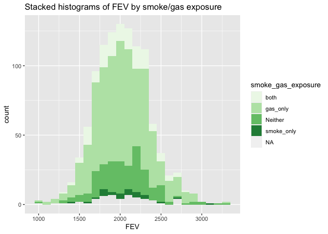
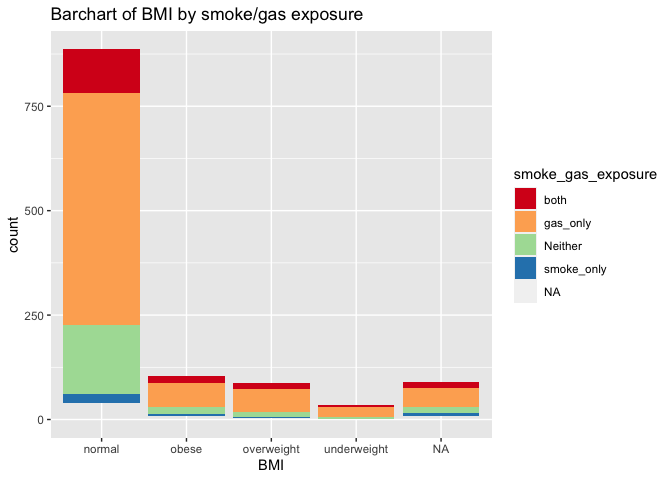

Assignment 2
================

Obejectives: conduct data wrangling and visualize the data with key
questions in mind.

\#Part 1 Data Wrangling

## Step1 reading and merging the data sets

``` r
library(data.table)
library(dplyr)
```

    ## 
    ## Attaching package: 'dplyr'

    ## The following objects are masked from 'package:data.table':
    ## 
    ##     between, first, last

    ## The following objects are masked from 'package:stats':
    ## 
    ##     filter, lag

    ## The following objects are masked from 'package:base':
    ## 
    ##     intersect, setdiff, setequal, union

``` r
library(dtplyr)

chs_ind <- data.table::fread("chs_individual.csv")
chs_reg <- data.table::fread("chs_regional.csv")

chs <- merge(chs_ind, chs_reg, by="townname")
```

The number of observations in chs and chs\_ind is the same (1200), so
there is no repeat data.

\#\#Step 2 creating new categorical varible “obesity\_level and
summarize”

``` r
chs$obesity_level <- as.factor(ifelse(chs$bmi < 14, 'underweight',
                               ifelse(chs$bmi < 22, 'normal', 
                               ifelse(chs$bmi < 24, 'overweight','obese' ))))

summary <- chs[,.(
  minimum = min(bmi, na.rm=TRUE),
  maximum = max(bmi, na.rm=TRUE),
  total = length(bmi)), by=obesity_level]
```

    ## Warning in min(bmi, na.rm = TRUE): no non-missing arguments to min; returning
    ## Inf

    ## Warning in max(bmi, na.rm = TRUE): no non-missing arguments to max; returning
    ## -Inf

``` r
summary
```

    ##    obesity_level  minimum  maximum total
    ## 1:        normal 14.00380 21.96387   886
    ## 2:    overweight 22.02353 23.99650    87
    ## 3:         obese 24.00647 41.26613   103
    ## 4:          <NA>      Inf     -Inf    89
    ## 5:   underweight 11.29640 13.98601    35

\#\#Step 3 Create another categorical variable “smoke\_gas\_exposure”

``` r
chs[, smoke_gas_exposure := fifelse(smoke == 0 & gasstove == 0, "Neither",
        fifelse(smoke == 0 & gasstove == 1, "gas_only",
               fifelse(smoke == 1 & gasstove == 0, "smoke_only",
                       fifelse(smoke == 1 & gasstove == 1, "both", NA_character_))))]
#summarizing 
chs[,.(total = length(smoke)), by=smoke_gas_exposure]
```

    ##    smoke_gas_exposure total
    ## 1:            Neither   214
    ## 2:               <NA>    60
    ## 3:         smoke_only    36
    ## 4:           gas_only   739
    ## 5:               both   151

There is four categories and some missing values.

\#\#Step 4 Create four summary tables showing the average (or
proportion, if binary) and sd of “Forced expiratory volume in 1 second
(ml)” and asthma indicator by town, sex, obesity level, and
“smoke\_gas\_exposure.”

``` r
chs[, .(
    fev_avg_townname      = mean(fev, na.rm=TRUE),
    fev_sd_townname       = sd(fev, na.rm=TRUE),
    asthma_avg_townname   = mean(asthma, na.rm=TRUE),
    asthma_sd_townname    = sd(asthma, na.rm=TRUE)),
    by = townname
    ] 
```

    ##          townname fev_avg_townname fev_sd_townname asthma_avg_townname
    ##  1:        Alpine         2089.014        298.2039           0.1134021
    ##  2:    Atascadero         2079.374        331.8782           0.2551020
    ##  3: Lake Elsinore         2039.787        317.6112           0.1263158
    ##  4:  Lake Gregory         2091.665        337.8286           0.1515152
    ##  5:     Lancaster         2002.550        337.1053           0.1649485
    ##  6:        Lompoc         2038.227        367.4474           0.1134021
    ##  7:    Long Beach         1983.896        330.6271           0.1354167
    ##  8:     Mira Loma         1984.726        336.6416           0.1578947
    ##  9:     Riverside         1986.212        289.7415           0.1100000
    ## 10:     San Dimas         2027.806        321.9740           0.1717172
    ## 11:   Santa Maria         2022.553        330.0457           0.1340206
    ## 12:        Upland         2027.284        357.2010           0.1212121
    ##     asthma_sd_townname
    ##  1:          0.3187308
    ##  2:          0.4381598
    ##  3:          0.3339673
    ##  4:          0.3603750
    ##  5:          0.3730620
    ##  6:          0.3187308
    ##  7:          0.3439642
    ##  8:          0.3665767
    ##  9:          0.3144660
    ## 10:          0.3790537
    ## 11:          0.3424442
    ## 12:          0.3280346

``` r
chs[, .(
    fev_avg_sex      = mean(fev, na.rm=TRUE),
    fev_sd_sex       = sd(fev, na.rm=TRUE),
    asthma_avg_sex   = mean(asthma, na.rm=TRUE),
    asthma_sd_sex    = sd(asthma, na.rm=TRUE)),
    by = male
    ] 
```

    ##    male fev_avg_sex fev_sd_sex asthma_avg_sex asthma_sd_sex
    ## 1:    0    1959.105   327.2948      0.1208054     0.3261747
    ## 2:    1    2103.819   318.2036      0.1727749     0.3783828

``` r
chs[, .(
    fev_avg_obesity      = mean(fev, na.rm=TRUE),
    fev_sd_obesity       = sd(fev, na.rm=TRUE),
    asthma_avg_obesity   = mean(asthma, na.rm=TRUE),
    asthma_sd_obesity    = sd(asthma, na.rm=TRUE)),
    by = obesity_level
   ]
```

    ##    obesity_level fev_avg_obesity fev_sd_obesity asthma_avg_obesity
    ## 1:        normal        1997.974       309.4085         0.14104046
    ## 2:    overweight        2224.322       317.4261         0.16470588
    ## 3:         obese        2269.295       325.5054         0.21000000
    ## 4:          <NA>             NaN             NA         0.13095238
    ## 5:   underweight        1686.800       300.0803         0.08571429
    ##    asthma_sd_obesity
    ## 1:         0.3482647
    ## 2:         0.3731162
    ## 3:         0.4093602
    ## 4:         0.3393744
    ## 5:         0.2840286

``` r
chs[, .(
    fev_avg_smoke_gas_exposure      = mean(fev, na.rm=TRUE),
    fev_sd_smoke_gas_exposure       = sd(fev, na.rm=TRUE),
    asthma_avg_smoke_gas_exposure   = mean(asthma, na.rm=TRUE),
    asthma_sd_smoke_gas_exposure    = sd(asthma, na.rm=TRUE)),
    by = smoke_gas_exposure
   ]
```

    ##    smoke_gas_exposure fev_avg_smoke_gas_exposure fev_sd_smoke_gas_exposure
    ## 1:            Neither                   2059.943                  342.5625
    ## 2:               <NA>                   1999.783                  364.9553
    ## 3:         smoke_only                   2064.346                  333.2266
    ## 4:           gas_only                   2026.308                  328.1240
    ## 5:               both                   2019.974                  313.2327
    ##    asthma_avg_smoke_gas_exposure asthma_sd_smoke_gas_exposure
    ## 1:                     0.1476190                    0.3555696
    ## 2:                     0.1489362                    0.3598746
    ## 3:                     0.1714286                    0.3823853
    ## 4:                     0.1477428                    0.3550878
    ## 5:                     0.1301370                    0.3376123

\#Part 2 Looking at the Data (EDA)

\#\#Step1 Facet plot showing scatterplots with regression lines of BMI
vs FEV by “townname”.

``` r
library(tidyverse)
```

    ## ── Attaching packages ─────────────────────────────────────── tidyverse 1.3.1 ──

    ## ✓ ggplot2 3.3.5     ✓ purrr   0.3.4
    ## ✓ tibble  3.1.2     ✓ stringr 1.4.0
    ## ✓ tidyr   1.1.3     ✓ forcats 0.5.1
    ## ✓ readr   1.4.0

    ## ── Conflicts ────────────────────────────────────────── tidyverse_conflicts() ──
    ## x dplyr::between()   masks data.table::between()
    ## x dplyr::filter()    masks stats::filter()
    ## x dplyr::first()     masks data.table::first()
    ## x dplyr::lag()       masks stats::lag()
    ## x dplyr::last()      masks data.table::last()
    ## x purrr::transpose() masks data.table::transpose()

``` r
ggplot(data=chs, mapping=aes(x = bmi, y = fev)) +
  geom_point() + 
  facet_wrap(~townname) +
  geom_smooth(method='lm', formula = y~x)+
  labs(title = "scatterplots of BMI vs FEV by townname", x="BMI", y="FEV")
```

    ## Warning: Removed 95 rows containing non-finite values (stat_smooth).

    ## Warning: Removed 95 rows containing missing values (geom_point).

<!-- -->

\#\#Step2 Stacked histograms of FEV by BMI category and FEV by smoke/gas
exposure. Use different color schemes than the ggplot default.

``` r
ggplot(data=chs) +
  geom_histogram(aes(x=fev, fill=obesity_level), binwidth = 100)+
  scale_fill_brewer(palette = "Spectral")
```

    ## Warning: Removed 95 rows containing non-finite values (stat_bin).

<!-- -->

``` r
  labs(title = "Stacked histograms of FEV by BMI", x="FEV")
```

    ## $x
    ## [1] "FEV"
    ## 
    ## $title
    ## [1] "Stacked histograms of FEV by BMI"
    ## 
    ## attr(,"class")
    ## [1] "labels"

``` r
ggplot(data=chs) +
  geom_histogram(aes(x=fev, fill=smoke_gas_exposure), binwidth = 100)+
  scale_fill_brewer(palette = "GnBul")+
  labs(title = "Stacked histograms of FEV by smoke/gas exposure", x="FEV")
```

    ## Warning in pal_name(palette, type): Unknown palette GnBul

    ## Warning: Removed 95 rows containing non-finite values (stat_bin).

<!-- -->

\#\#Step3 Barchart of BMI by smoke/gas exposure.

``` r
ggplot(data=chs) +
  geom_bar(aes(x=obesity_level, fill=smoke_gas_exposure))+
  scale_fill_brewer(palette = "Spectral")+
  labs(title = "Barchart of BMI by smoke/gas exposure", x="BMI")
```

<!-- -->

\#\#Step4 Statistical summary graphs of FEV by BMI and FEV by smoke/gas
exposure category.

\#\#Step5 A leaflet map showing the concentrations of PM2.5 mass in each
of the CHS communities.

\#\#Step6 Choose a visualization to examine whether PM2.5 mass is
associated with FEV.
