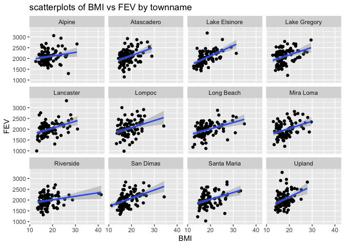
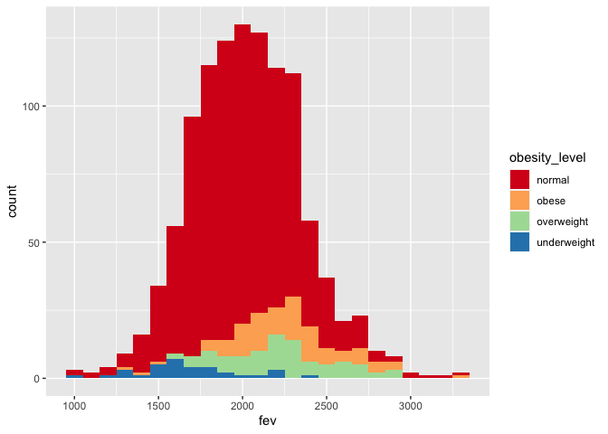
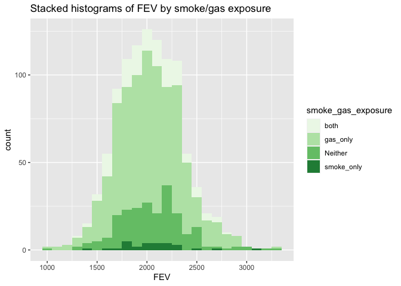
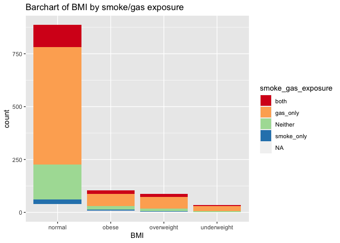
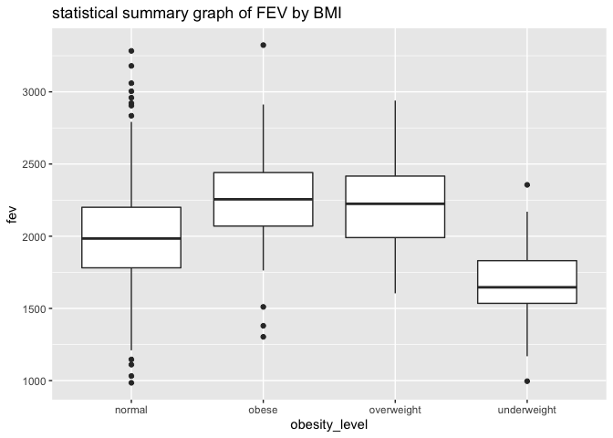
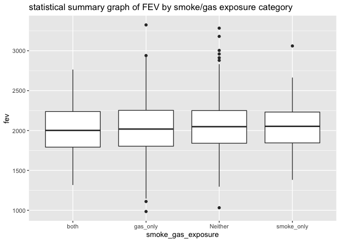
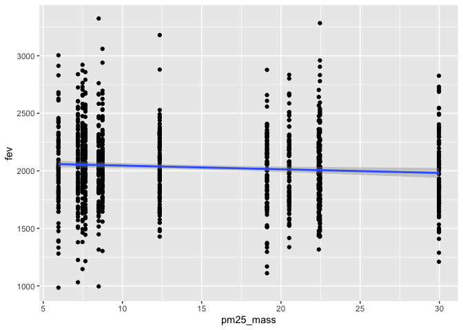

Obejectives: conduct data wrangling and visualize the data with key questions in mind.

# Part 1 Data Wrangling

## Step1 reading and merging the data sets

```r
library(data.table)
library(dplyr)
```

```
## 
## Attaching package: 'dplyr'
```

```
## The following objects are masked from 'package:data.table':
## 
##     between, first, last
```

```
## The following objects are masked from 'package:stats':
## 
##     filter, lag
```

```
## The following objects are masked from 'package:base':
## 
##     intersect, setdiff, setequal, union
```

```r
library(dtplyr)

chs_ind <- data.table::fread("chs_individual.csv")
chs_reg <- data.table::fread("chs_regional.csv")

chs <- merge(chs_ind, chs_reg, by="townname")
```
The number of observations in chs and chs_ind is the same (1200), so there is no repeat data.

## Step 2 creating new categorical varible "obesity_level and summarize"

```r
chs$obesity_level <- as.factor(ifelse(chs$bmi < 14, 'underweight',
                               ifelse(chs$bmi < 22, 'normal', 
                               ifelse(chs$bmi < 24, 'overweight','obese' ))))

summary <- chs[,.(
  minimum = min(bmi, na.rm=TRUE),
  maximum = max(bmi, na.rm=TRUE),
  total = length(bmi)), by=obesity_level]
```

```
## Warning in min(bmi, na.rm = TRUE): no non-missing arguments to min; returning
## Inf
```

```
## Warning in max(bmi, na.rm = TRUE): no non-missing arguments to max; returning
## -Inf
```

```r
summary
```

```
##    obesity_level  minimum  maximum total
## 1:        normal 14.00380 21.96387   886
## 2:    overweight 22.02353 23.99650    87
## 3:         obese 24.00647 41.26613   103
## 4:          <NA>      Inf     -Inf    89
## 5:   underweight 11.29640 13.98601    35
```

## Step 3 Create another categorical variable "smoke_gas_exposure"

```r
chs[, smoke_gas_exposure := fifelse(smoke == 0 & gasstove == 0, "Neither",
        fifelse(smoke == 0 & gasstove == 1, "gas_only",
               fifelse(smoke == 1 & gasstove == 0, "smoke_only",
                       fifelse(smoke == 1 & gasstove == 1, "both", NA_character_))))]
#summarizing 
chs[,.(total = length(smoke)), by=smoke_gas_exposure]
```

```
##    smoke_gas_exposure total
## 1:            Neither   214
## 2:               <NA>    60
## 3:         smoke_only    36
## 4:           gas_only   739
## 5:               both   151
```
There are four categories and some missing values. 

## Step 4 Create four summary tables showing the average (or proportion, if binary) and sd of “Forced expiratory volume in 1 second (ml)” and asthma indicator by town, sex, obesity level, and “smoke_gas_exposure.”

```r
chs[, .(
    fev_avg_townname      = mean(fev, na.rm=TRUE),
    fev_sd_townname       = sd(fev, na.rm=TRUE),
    asthma_avg_townname   = mean(asthma, na.rm=TRUE),
    asthma_sd_townname    = sd(asthma, na.rm=TRUE)),
    by = townname
    ] 
```

```
##          townname fev_avg_townname fev_sd_townname asthma_avg_townname
##  1:        Alpine         2089.014        298.2039           0.1134021
##  2:    Atascadero         2079.374        331.8782           0.2551020
##  3: Lake Elsinore         2039.787        317.6112           0.1263158
##  4:  Lake Gregory         2091.665        337.8286           0.1515152
##  5:     Lancaster         2002.550        337.1053           0.1649485
##  6:        Lompoc         2038.227        367.4474           0.1134021
##  7:    Long Beach         1983.896        330.6271           0.1354167
##  8:     Mira Loma         1984.726        336.6416           0.1578947
##  9:     Riverside         1986.212        289.7415           0.1100000
## 10:     San Dimas         2027.806        321.9740           0.1717172
## 11:   Santa Maria         2022.553        330.0457           0.1340206
## 12:        Upland         2027.284        357.2010           0.1212121
##     asthma_sd_townname
##  1:          0.3187308
##  2:          0.4381598
##  3:          0.3339673
##  4:          0.3603750
##  5:          0.3730620
##  6:          0.3187308
##  7:          0.3439642
##  8:          0.3665767
##  9:          0.3144660
## 10:          0.3790537
## 11:          0.3424442
## 12:          0.3280346
```

```r
chs[, .(
    fev_avg_sex      = mean(fev, na.rm=TRUE),
    fev_sd_sex       = sd(fev, na.rm=TRUE),
    asthma_avg_sex   = mean(asthma, na.rm=TRUE),
    asthma_sd_sex    = sd(asthma, na.rm=TRUE)),
    by = male
    ] 
```

```
##    male fev_avg_sex fev_sd_sex asthma_avg_sex asthma_sd_sex
## 1:    0    1959.105   327.2948      0.1208054     0.3261747
## 2:    1    2103.819   318.2036      0.1727749     0.3783828
```


```r
chs[, .(
    fev_avg_obesity      = mean(fev, na.rm=TRUE),
    fev_sd_obesity       = sd(fev, na.rm=TRUE),
    asthma_avg_obesity   = mean(asthma, na.rm=TRUE),
    asthma_sd_obesity    = sd(asthma, na.rm=TRUE)),
    by = obesity_level
   ]
```

```
##    obesity_level fev_avg_obesity fev_sd_obesity asthma_avg_obesity
## 1:        normal        1997.974       309.4085         0.14104046
## 2:    overweight        2224.322       317.4261         0.16470588
## 3:         obese        2269.295       325.5054         0.21000000
## 4:          <NA>             NaN             NA         0.13095238
## 5:   underweight        1686.800       300.0803         0.08571429
##    asthma_sd_obesity
## 1:         0.3482647
## 2:         0.3731162
## 3:         0.4093602
## 4:         0.3393744
## 5:         0.2840286
```

```r
chs[, .(
    fev_avg_smoke_gas_exposure      = mean(fev, na.rm=TRUE),
    fev_sd_smoke_gas_exposure       = sd(fev, na.rm=TRUE),
    asthma_avg_smoke_gas_exposure   = mean(asthma, na.rm=TRUE),
    asthma_sd_smoke_gas_exposure    = sd(asthma, na.rm=TRUE)),
    by = smoke_gas_exposure
   ]
```

```
##    smoke_gas_exposure fev_avg_smoke_gas_exposure fev_sd_smoke_gas_exposure
## 1:            Neither                   2059.943                  342.5625
## 2:               <NA>                   1999.783                  364.9553
## 3:         smoke_only                   2064.346                  333.2266
## 4:           gas_only                   2026.308                  328.1240
## 5:               both                   2019.974                  313.2327
##    asthma_avg_smoke_gas_exposure asthma_sd_smoke_gas_exposure
## 1:                     0.1476190                    0.3555696
## 2:                     0.1489362                    0.3598746
## 3:                     0.1714286                    0.3823853
## 4:                     0.1477428                    0.3550878
## 5:                     0.1301370                    0.3376123
```

# Part 2 Looking at the Data (EDA)


```r
dim(chs)
```

```
## [1] 1200   51
```

```r
head(chs)
```

```
##    townname sid male race hispanic    agepft height weight      bmi asthma
## 1:   Alpine 835    0    W        0 10.099932    143     69 15.33749      0
## 2:   Alpine 838    0    O        1  9.486653    133     62 15.93183      0
## 3:   Alpine 839    0    M        1 10.053388    142     86 19.38649      0
## 4:   Alpine 840    0    W        0  9.965777    146     78 16.63283      0
## 5:   Alpine 841    1    W        1 10.548939    150     78 15.75758      0
## 6:   Alpine 842    1    M        1  9.489391    139     65 15.29189      0
##    active_asthma father_asthma mother_asthma wheeze hayfever allergy
## 1:             0             0             0      0        0       1
## 2:             0             0             0      0        0       0
## 3:             0             0             1      1        1       1
## 4:             0             0             0      0        0       0
## 5:             0             0             0      0        0       0
## 6:             0             0             0      1        0       0
##    educ_parent smoke pets gasstove      fev      fvc     mmef pm25_mass
## 1:           3     0    1        0 2529.276 2826.316 3406.579      8.74
## 2:           4    NA    1        0 1737.793 1963.545 2133.110      8.74
## 3:           3     1    1        0 2121.711 2326.974 2835.197      8.74
## 4:          NA    NA    0       NA 2466.791 2638.221 3466.464      8.74
## 5:           5     0    1        0 2251.505 2594.649 2445.151      8.74
## 6:           1     1    1        0 2188.716 2423.934 2524.599      8.74
##    pm25_so4 pm25_no3 pm25_nh4 pm25_oc pm25_ec pm25_om pm10_oc pm10_ec pm10_tc
## 1:     1.73     1.59     0.88    2.54    0.48    3.04    3.25    0.49    3.75
## 2:     1.73     1.59     0.88    2.54    0.48    3.04    3.25    0.49    3.75
## 3:     1.73     1.59     0.88    2.54    0.48    3.04    3.25    0.49    3.75
## 4:     1.73     1.59     0.88    2.54    0.48    3.04    3.25    0.49    3.75
## 5:     1.73     1.59     0.88    2.54    0.48    3.04    3.25    0.49    3.75
## 6:     1.73     1.59     0.88    2.54    0.48    3.04    3.25    0.49    3.75
##    formic acetic  hcl hno3 o3_max o3106 o3_24   no2  pm10 no_24hr pm2_5_fr
## 1:   1.03   2.49 0.41 1.98  65.82 55.05 41.23 12.18 24.73    2.48    10.28
## 2:   1.03   2.49 0.41 1.98  65.82 55.05 41.23 12.18 24.73    2.48    10.28
## 3:   1.03   2.49 0.41 1.98  65.82 55.05 41.23 12.18 24.73    2.48    10.28
## 4:   1.03   2.49 0.41 1.98  65.82 55.05 41.23 12.18 24.73    2.48    10.28
## 5:   1.03   2.49 0.41 1.98  65.82 55.05 41.23 12.18 24.73    2.48    10.28
## 6:   1.03   2.49 0.41 1.98  65.82 55.05 41.23 12.18 24.73    2.48    10.28
##    iacid oacid total_acids       lon      lat obesity_level smoke_gas_exposure
## 1:  2.39  3.52         5.5 -116.7664 32.83505        normal            Neither
## 2:  2.39  3.52         5.5 -116.7664 32.83505        normal               <NA>
## 3:  2.39  3.52         5.5 -116.7664 32.83505        normal         smoke_only
## 4:  2.39  3.52         5.5 -116.7664 32.83505        normal               <NA>
## 5:  2.39  3.52         5.5 -116.7664 32.83505        normal            Neither
## 6:  2.39  3.52         5.5 -116.7664 32.83505        normal         smoke_only
```

```r
tail(chs)
```

```
##    townname  sid male race hispanic    agepft height weight      bmi asthma
## 1:   Upland 1866    0    O        1  9.806982    139     60 14.11559      0
## 2:   Upland 1867    0    M        1  9.618070    140     71 16.46568      0
## 3:   Upland 2031    1    W        0  9.798768    135     83 20.70084      0
## 4:   Upland 2032    1    W        0  9.549624    137     59 14.28855      0
## 5:   Upland 2033    0    M        0 10.121834    130     67 18.02044      0
## 6:   Upland 2053    0    W        0        NA     NA     NA       NA      0
##    active_asthma father_asthma mother_asthma wheeze hayfever allergy
## 1:             0            NA             0      0       NA      NA
## 2:             0             1             0      0        0       0
## 3:             0             0             0      1        0       1
## 4:             0             0             1      1        1       1
## 5:             1             0             0      1        1       0
## 6:             0             0             0      0        0       0
##    educ_parent smoke pets gasstove      fev      fvc     mmef pm25_mass
## 1:           3     0    1        0 1691.275 1928.859 1890.604     22.46
## 2:           3     0    1        0 1733.338 1993.040 2072.643     22.46
## 3:           3     0    1        1 2034.177 2505.535 1814.075     22.46
## 4:           3     0    1        1 2077.703 2275.338 2706.081     22.46
## 5:           3     0    1        1 1929.866 2122.148 2558.054     22.46
## 6:           3     0    1        0       NA       NA       NA     22.46
##    pm25_so4 pm25_no3 pm25_nh4 pm25_oc pm25_ec pm25_om pm10_oc pm10_ec pm10_tc
## 1:     2.65     7.75     2.96    6.49    1.19    7.79    8.32    1.22    9.54
## 2:     2.65     7.75     2.96    6.49    1.19    7.79    8.32    1.22    9.54
## 3:     2.65     7.75     2.96    6.49    1.19    7.79    8.32    1.22    9.54
## 4:     2.65     7.75     2.96    6.49    1.19    7.79    8.32    1.22    9.54
## 5:     2.65     7.75     2.96    6.49    1.19    7.79    8.32    1.22    9.54
## 6:     2.65     7.75     2.96    6.49    1.19    7.79    8.32    1.22    9.54
##    formic acetic  hcl hno3 o3_max o3106 o3_24   no2 pm10 no_24hr pm2_5_fr iacid
## 1:   2.67   4.73 0.46 4.03  63.83  46.5  22.2 37.97 40.8   18.48    27.73  4.49
## 2:   2.67   4.73 0.46 4.03  63.83  46.5  22.2 37.97 40.8   18.48    27.73  4.49
## 3:   2.67   4.73 0.46 4.03  63.83  46.5  22.2 37.97 40.8   18.48    27.73  4.49
## 4:   2.67   4.73 0.46 4.03  63.83  46.5  22.2 37.97 40.8   18.48    27.73  4.49
## 5:   2.67   4.73 0.46 4.03  63.83  46.5  22.2 37.97 40.8   18.48    27.73  4.49
## 6:   2.67   4.73 0.46 4.03  63.83  46.5  22.2 37.97 40.8   18.48    27.73  4.49
##    oacid total_acids       lon      lat obesity_level smoke_gas_exposure
## 1:   7.4       11.43 -117.6484 34.09751        normal            Neither
## 2:   7.4       11.43 -117.6484 34.09751        normal            Neither
## 3:   7.4       11.43 -117.6484 34.09751        normal           gas_only
## 4:   7.4       11.43 -117.6484 34.09751        normal           gas_only
## 5:   7.4       11.43 -117.6484 34.09751        normal           gas_only
## 6:   7.4       11.43 -117.6484 34.09751          <NA>            Neither
```

```r
str(chs)
```

```
## Classes 'data.table' and 'data.frame':	1200 obs. of  51 variables:
##  $ townname          : chr  "Alpine" "Alpine" "Alpine" "Alpine" ...
##  $ sid               : int  835 838 839 840 841 842 843 844 847 849 ...
##  $ male              : int  0 0 0 0 1 1 1 1 1 1 ...
##  $ race              : chr  "W" "O" "M" "W" ...
##  $ hispanic          : int  0 1 1 0 1 1 0 1 0 0 ...
##  $ agepft            : num  10.1 9.49 10.05 9.97 10.55 ...
##  $ height            : int  143 133 142 146 150 139 149 143 137 147 ...
##  $ weight            : int  69 62 86 78 78 65 98 65 69 112 ...
##  $ bmi               : num  15.3 15.9 19.4 16.6 15.8 ...
##  $ asthma            : int  0 0 0 0 0 0 0 NA 0 0 ...
##  $ active_asthma     : int  0 0 0 0 0 0 0 0 0 0 ...
##  $ father_asthma     : int  0 0 0 0 0 0 0 NA 0 1 ...
##  $ mother_asthma     : int  0 0 1 0 0 0 0 NA 0 0 ...
##  $ wheeze            : int  0 0 1 0 0 1 1 NA 0 1 ...
##  $ hayfever          : int  0 0 1 0 0 0 0 NA 0 0 ...
##  $ allergy           : int  1 0 1 0 0 0 1 NA 0 1 ...
##  $ educ_parent       : int  3 4 3 NA 5 1 3 NA 5 3 ...
##  $ smoke             : int  0 NA 1 NA 0 1 0 NA 0 0 ...
##  $ pets              : int  1 1 1 0 1 1 1 0 1 1 ...
##  $ gasstove          : int  0 0 0 NA 0 0 1 NA 1 0 ...
##  $ fev               : num  2529 1738 2122 2467 2252 ...
##  $ fvc               : num  2826 1964 2327 2638 2595 ...
##  $ mmef              : num  3407 2133 2835 3466 2445 ...
##  $ pm25_mass         : num  8.74 8.74 8.74 8.74 8.74 8.74 8.74 8.74 8.74 8.74 ...
##  $ pm25_so4          : num  1.73 1.73 1.73 1.73 1.73 1.73 1.73 1.73 1.73 1.73 ...
##  $ pm25_no3          : num  1.59 1.59 1.59 1.59 1.59 1.59 1.59 1.59 1.59 1.59 ...
##  $ pm25_nh4          : num  0.88 0.88 0.88 0.88 0.88 0.88 0.88 0.88 0.88 0.88 ...
##  $ pm25_oc           : num  2.54 2.54 2.54 2.54 2.54 2.54 2.54 2.54 2.54 2.54 ...
##  $ pm25_ec           : num  0.48 0.48 0.48 0.48 0.48 0.48 0.48 0.48 0.48 0.48 ...
##  $ pm25_om           : num  3.04 3.04 3.04 3.04 3.04 3.04 3.04 3.04 3.04 3.04 ...
##  $ pm10_oc           : num  3.25 3.25 3.25 3.25 3.25 3.25 3.25 3.25 3.25 3.25 ...
##  $ pm10_ec           : num  0.49 0.49 0.49 0.49 0.49 0.49 0.49 0.49 0.49 0.49 ...
##  $ pm10_tc           : num  3.75 3.75 3.75 3.75 3.75 3.75 3.75 3.75 3.75 3.75 ...
##  $ formic            : num  1.03 1.03 1.03 1.03 1.03 1.03 1.03 1.03 1.03 1.03 ...
##  $ acetic            : num  2.49 2.49 2.49 2.49 2.49 2.49 2.49 2.49 2.49 2.49 ...
##  $ hcl               : num  0.41 0.41 0.41 0.41 0.41 0.41 0.41 0.41 0.41 0.41 ...
##  $ hno3              : num  1.98 1.98 1.98 1.98 1.98 1.98 1.98 1.98 1.98 1.98 ...
##  $ o3_max            : num  65.8 65.8 65.8 65.8 65.8 ...
##  $ o3106             : num  55 55 55 55 55 ...
##  $ o3_24             : num  41.2 41.2 41.2 41.2 41.2 ...
##  $ no2               : num  12.2 12.2 12.2 12.2 12.2 ...
##  $ pm10              : num  24.7 24.7 24.7 24.7 24.7 ...
##  $ no_24hr           : num  2.48 2.48 2.48 2.48 2.48 2.48 2.48 2.48 2.48 2.48 ...
##  $ pm2_5_fr          : num  10.3 10.3 10.3 10.3 10.3 ...
##  $ iacid             : num  2.39 2.39 2.39 2.39 2.39 2.39 2.39 2.39 2.39 2.39 ...
##  $ oacid             : num  3.52 3.52 3.52 3.52 3.52 3.52 3.52 3.52 3.52 3.52 ...
##  $ total_acids       : num  5.5 5.5 5.5 5.5 5.5 5.5 5.5 5.5 5.5 5.5 ...
##  $ lon               : num  -117 -117 -117 -117 -117 ...
##  $ lat               : num  32.8 32.8 32.8 32.8 32.8 ...
##  $ obesity_level     : Factor w/ 4 levels "normal","obese",..: 1 1 1 1 1 1 1 1 1 3 ...
##  $ smoke_gas_exposure: chr  "Neither" NA "smoke_only" NA ...
##  - attr(*, ".internal.selfref")=<externalptr> 
##  - attr(*, "sorted")= chr "townname"
```

```r
summary(chs$obesity_level)
```

```
##      normal       obese  overweight underweight        NA's 
##         886         103          87          35          89
```

```r
summary(chs$fev)
```

```
##    Min. 1st Qu.  Median    Mean 3rd Qu.    Max.    NA's 
##   984.8  1809.0  2022.7  2031.3  2249.7  3323.7      95
```

```r
summary(chs$smoke_gas_exposure)
```

```
##    Length     Class      Mode 
##      1200 character character
```

```r
summary(chs$pm25_mass)
```

```
##    Min. 1st Qu.  Median    Mean 3rd Qu.    Max. 
##   5.960   7.615  10.545  14.362  20.988  29.970
```

## Step1 Facet plot showing scatterplots with regression lines of BMI vs FEV by “townname”.

```r
library(tidyverse)
```

```
## ── Attaching packages ─────────────────────────────────────── tidyverse 1.3.1 ──
```

```
## ✓ ggplot2 3.3.5     ✓ purrr   0.3.4
## ✓ tibble  3.1.2     ✓ stringr 1.4.0
## ✓ tidyr   1.1.3     ✓ forcats 0.5.1
## ✓ readr   1.4.0
```

```
## ── Conflicts ────────────────────────────────────────── tidyverse_conflicts() ──
## x dplyr::between()   masks data.table::between()
## x dplyr::filter()    masks stats::filter()
## x dplyr::first()     masks data.table::first()
## x dplyr::lag()       masks stats::lag()
## x dplyr::last()      masks data.table::last()
## x purrr::transpose() masks data.table::transpose()
```

```r
ggplot(data=chs, mapping=aes(x = bmi, y = fev)) +
  geom_point() + 
  facet_wrap(~townname) +
  geom_smooth(method='lm', formula = y~x)+
  labs(title = "scatterplots of BMI vs FEV by townname", x="BMI", y="FEV")
```

```
## Warning: Removed 95 rows containing non-finite values (stat_smooth).
```

```
## Warning: Removed 95 rows containing missing values (geom_point).
```

<!-- -->

From those figures we can see that BMI has a relatively positive association with FEV in all of these towns.

## Step2 Stacked histograms of FEV by BMI category and FEV by smoke/gas exposure. Use different color schemes than the ggplot default.

```r
ggplot(data=chs) +
  geom_histogram(aes(x=fev, fill=obesity_level), binwidth = 100)+
  scale_fill_brewer(palette = "Spectral")
```

```
## Warning: Removed 95 rows containing non-finite values (stat_bin).
```

<!-- -->

```r
  labs(title = "Stacked histograms of FEV by BMI", x="FEV")
```

```
## $x
## [1] "FEV"
## 
## $title
## [1] "Stacked histograms of FEV by BMI"
## 
## attr(,"class")
## [1] "labels"
```

From this stacked histogram we can see that people who are underweight has a relatively low fev, and people who are overweight and obese has a relatively high fev. People with normal bmi has fev that concentrated on normal range. 


```r
ggplot(data=chs[-which(is.na(chs$smoke_gas_exposure)=="TRUE"),]) +
  geom_histogram(aes(x=fev, fill=smoke_gas_exposure), binwidth = 100)+
  scale_fill_brewer(palette = "GnBul")+
  labs(title = "Stacked histograms of FEV by smoke/gas exposure", x="FEV")
```

```
## Warning in pal_name(palette, type): Unknown palette GnBul
```

```
## Warning: Removed 87 rows containing non-finite values (stat_bin).
```

<!-- -->

This figure does not show different distributions among the categories. They all seem normally distributed. 

## Step3 Barchart of BMI by smoke/gas exposure.

```r
ggplot(data=chs[-which(is.na(chs$obesity_level)=="TRUE"),]) +
  geom_bar(aes(x=obesity_level, fill=smoke_gas_exposure))+
  scale_fill_brewer(palette = "Spectral")+
  labs(title = "Barchart of BMI by smoke/gas exposure", x="BMI")
```

<!-- -->

This plot shows that the distribution of smoke/gas exposure is not different among the BMI categories. 

## Step4 Statistical summary graphs of FEV by BMI and FEV by smoke/gas exposure category.

```r
ggplot(data=chs[-which(is.na(chs$obesity_level)=="TRUE"),],mapping = aes(x = obesity_level, y = fev))+
  geom_boxplot()+
  labs(title = "statistical summary graph of FEV by BMI")
```

```
## Warning: Removed 6 rows containing non-finite values (stat_boxplot).
```

<!-- -->

This figure gives similar information as the stacked histogram that people who are underweight has a relatively low fev, and people who are overweight and obese has a relatively high fev. People with normal bmi has fev that concentrated on normal range. 


```r
ggplot(data=chs[-which(is.na(chs$smoke_gas_exposure)=="TRUE"),],mapping = aes(x = smoke_gas_exposure, y = fev))+
  geom_boxplot()+
  labs(title = "statistical summary graph of FEV by smoke/gas exposure category")
```

```
## Warning: Removed 87 rows containing non-finite values (stat_boxplot).
```

<!-- -->

This figure does not show different distributions among the categories.

## Step5 A leaflet map showing the concentrations of PM2.5 mass in each of the CHS communities.

```r
library(leaflet)

tem.pal <- colorNumeric(c('green','yellow','red'), domain=chs$pm25_mass)
leaflet(chs) %>% 
  addTiles() %>%
  addCircles (lat = ~lat, lng = ~lon, color = ~tem.pal(pm25_mass),
               label = ~pm25_mass, 
               opacity=1, fillOpacity = 1, radius = 5000) %>%
  addLegend('bottomleft', pal= tem.pal, values = chs$pm25_mass,
             title ='concentrations of PM2.5 mass of the CHS communities', opacity=0.5)
```

```{=html}
<div id="htmlwidget-3da8039d49ec19be016d" style="width:672px;height:480px;" class="leaflet html-widget"></div>
<script type="application/json" data-for="htmlwidget-3da8039d49ec19be016d">{"x":{"options":{"crs":{"crsClass":"L.CRS.EPSG3857","code":null,"proj4def":null,"projectedBounds":null,"options":{}}},"calls":[{"method":"addTiles","args":["//{s}.tile.openstreetmap.org/{z}/{x}/{y}.png",null,null,{"minZoom":0,"maxZoom":18,"tileSize":256,"subdomains":"abc","errorTileUrl":"","tms":false,"noWrap":false,"zoomOffset":0,"zoomReverse":false,"opacity":1,"zIndex":1,"detectRetina":false,"attribution":"&copy; <a href=\"http://openstreetmap.org\">OpenStreetMap<\/a> contributors, <a href=\"http://creativecommons.org/licenses/by-sa/2.0/\">CC-BY-SA<\/a>"}]},{"method":"addCircles","args":[[32.8350521,32.8350521,32.8350521,32.8350521,32.8350521,32.8350521,32.8350521,32.8350521,32.8350521,32.8350521,32.8350521,32.8350521,32.8350521,32.8350521,32.8350521,32.8350521,32.8350521,32.8350521,32.8350521,32.8350521,32.8350521,32.8350521,32.8350521,32.8350521,32.8350521,32.8350521,32.8350521,32.8350521,32.8350521,32.8350521,32.8350521,32.8350521,32.8350521,32.8350521,32.8350521,32.8350521,32.8350521,32.8350521,32.8350521,32.8350521,32.8350521,32.8350521,32.8350521,32.8350521,32.8350521,32.8350521,32.8350521,32.8350521,32.8350521,32.8350521,32.8350521,32.8350521,32.8350521,32.8350521,32.8350521,32.8350521,32.8350521,32.8350521,32.8350521,32.8350521,32.8350521,32.8350521,32.8350521,32.8350521,32.8350521,32.8350521,32.8350521,32.8350521,32.8350521,32.8350521,32.8350521,32.8350521,32.8350521,32.8350521,32.8350521,32.8350521,32.8350521,32.8350521,32.8350521,32.8350521,32.8350521,32.8350521,32.8350521,32.8350521,32.8350521,32.8350521,32.8350521,32.8350521,32.8350521,32.8350521,32.8350521,32.8350521,32.8350521,32.8350521,32.8350521,32.8350521,32.8350521,32.8350521,32.8350521,32.8350521,35.4894169,35.4894169,35.4894169,35.4894169,35.4894169,35.4894169,35.4894169,35.4894169,35.4894169,35.4894169,35.4894169,35.4894169,35.4894169,35.4894169,35.4894169,35.4894169,35.4894169,35.4894169,35.4894169,35.4894169,35.4894169,35.4894169,35.4894169,35.4894169,35.4894169,35.4894169,35.4894169,35.4894169,35.4894169,35.4894169,35.4894169,35.4894169,35.4894169,35.4894169,35.4894169,35.4894169,35.4894169,35.4894169,35.4894169,35.4894169,35.4894169,35.4894169,35.4894169,35.4894169,35.4894169,35.4894169,35.4894169,35.4894169,35.4894169,35.4894169,35.4894169,35.4894169,35.4894169,35.4894169,35.4894169,35.4894169,35.4894169,35.4894169,35.4894169,35.4894169,35.4894169,35.4894169,35.4894169,35.4894169,35.4894169,35.4894169,35.4894169,35.4894169,35.4894169,35.4894169,35.4894169,35.4894169,35.4894169,35.4894169,35.4894169,35.4894169,35.4894169,35.4894169,35.4894169,35.4894169,35.4894169,35.4894169,35.4894169,35.4894169,35.4894169,35.4894169,35.4894169,35.4894169,35.4894169,35.4894169,35.4894169,35.4894169,35.4894169,35.4894169,35.4894169,35.4894169,35.4894169,35.4894169,35.4894169,35.4894169,33.6680772,33.6680772,33.6680772,33.6680772,33.6680772,33.6680772,33.6680772,33.6680772,33.6680772,33.6680772,33.6680772,33.6680772,33.6680772,33.6680772,33.6680772,33.6680772,33.6680772,33.6680772,33.6680772,33.6680772,33.6680772,33.6680772,33.6680772,33.6680772,33.6680772,33.6680772,33.6680772,33.6680772,33.6680772,33.6680772,33.6680772,33.6680772,33.6680772,33.6680772,33.6680772,33.6680772,33.6680772,33.6680772,33.6680772,33.6680772,33.6680772,33.6680772,33.6680772,33.6680772,33.6680772,33.6680772,33.6680772,33.6680772,33.6680772,33.6680772,33.6680772,33.6680772,33.6680772,33.6680772,33.6680772,33.6680772,33.6680772,33.6680772,33.6680772,33.6680772,33.6680772,33.6680772,33.6680772,33.6680772,33.6680772,33.6680772,33.6680772,33.6680772,33.6680772,33.6680772,33.6680772,33.6680772,33.6680772,33.6680772,33.6680772,33.6680772,33.6680772,33.6680772,33.6680772,33.6680772,33.6680772,33.6680772,33.6680772,33.6680772,33.6680772,33.6680772,33.6680772,33.6680772,33.6680772,33.6680772,33.6680772,33.6680772,33.6680772,33.6680772,33.6680772,33.6680772,33.6680772,33.6680772,33.6680772,33.6680772,34.242901,34.242901,34.242901,34.242901,34.242901,34.242901,34.242901,34.242901,34.242901,34.242901,34.242901,34.242901,34.242901,34.242901,34.242901,34.242901,34.242901,34.242901,34.242901,34.242901,34.242901,34.242901,34.242901,34.242901,34.242901,34.242901,34.242901,34.242901,34.242901,34.242901,34.242901,34.242901,34.242901,34.242901,34.242901,34.242901,34.242901,34.242901,34.242901,34.242901,34.242901,34.242901,34.242901,34.242901,34.242901,34.242901,34.242901,34.242901,34.242901,34.242901,34.242901,34.242901,34.242901,34.242901,34.242901,34.242901,34.242901,34.242901,34.242901,34.242901,34.242901,34.242901,34.242901,34.242901,34.242901,34.242901,34.242901,34.242901,34.242901,34.242901,34.242901,34.242901,34.242901,34.242901,34.242901,34.242901,34.242901,34.242901,34.242901,34.242901,34.242901,34.242901,34.242901,34.242901,34.242901,34.242901,34.242901,34.242901,34.242901,34.242901,34.242901,34.242901,34.242901,34.242901,34.242901,34.242901,34.242901,34.242901,34.242901,34.242901,34.6867846,34.6867846,34.6867846,34.6867846,34.6867846,34.6867846,34.6867846,34.6867846,34.6867846,34.6867846,34.6867846,34.6867846,34.6867846,34.6867846,34.6867846,34.6867846,34.6867846,34.6867846,34.6867846,34.6867846,34.6867846,34.6867846,34.6867846,34.6867846,34.6867846,34.6867846,34.6867846,34.6867846,34.6867846,34.6867846,34.6867846,34.6867846,34.6867846,34.6867846,34.6867846,34.6867846,34.6867846,34.6867846,34.6867846,34.6867846,34.6867846,34.6867846,34.6867846,34.6867846,34.6867846,34.6867846,34.6867846,34.6867846,34.6867846,34.6867846,34.6867846,34.6867846,34.6867846,34.6867846,34.6867846,34.6867846,34.6867846,34.6867846,34.6867846,34.6867846,34.6867846,34.6867846,34.6867846,34.6867846,34.6867846,34.6867846,34.6867846,34.6867846,34.6867846,34.6867846,34.6867846,34.6867846,34.6867846,34.6867846,34.6867846,34.6867846,34.6867846,34.6867846,34.6867846,34.6867846,34.6867846,34.6867846,34.6867846,34.6867846,34.6867846,34.6867846,34.6867846,34.6867846,34.6867846,34.6867846,34.6867846,34.6867846,34.6867846,34.6867846,34.6867846,34.6867846,34.6867846,34.6867846,34.6867846,34.6867846,34.6391501,34.6391501,34.6391501,34.6391501,34.6391501,34.6391501,34.6391501,34.6391501,34.6391501,34.6391501,34.6391501,34.6391501,34.6391501,34.6391501,34.6391501,34.6391501,34.6391501,34.6391501,34.6391501,34.6391501,34.6391501,34.6391501,34.6391501,34.6391501,34.6391501,34.6391501,34.6391501,34.6391501,34.6391501,34.6391501,34.6391501,34.6391501,34.6391501,34.6391501,34.6391501,34.6391501,34.6391501,34.6391501,34.6391501,34.6391501,34.6391501,34.6391501,34.6391501,34.6391501,34.6391501,34.6391501,34.6391501,34.6391501,34.6391501,34.6391501,34.6391501,34.6391501,34.6391501,34.6391501,34.6391501,34.6391501,34.6391501,34.6391501,34.6391501,34.6391501,34.6391501,34.6391501,34.6391501,34.6391501,34.6391501,34.6391501,34.6391501,34.6391501,34.6391501,34.6391501,34.6391501,34.6391501,34.6391501,34.6391501,34.6391501,34.6391501,34.6391501,34.6391501,34.6391501,34.6391501,34.6391501,34.6391501,34.6391501,34.6391501,34.6391501,34.6391501,34.6391501,34.6391501,34.6391501,34.6391501,34.6391501,34.6391501,34.6391501,34.6391501,34.6391501,34.6391501,34.6391501,34.6391501,34.6391501,34.6391501,33.7700504,33.7700504,33.7700504,33.7700504,33.7700504,33.7700504,33.7700504,33.7700504,33.7700504,33.7700504,33.7700504,33.7700504,33.7700504,33.7700504,33.7700504,33.7700504,33.7700504,33.7700504,33.7700504,33.7700504,33.7700504,33.7700504,33.7700504,33.7700504,33.7700504,33.7700504,33.7700504,33.7700504,33.7700504,33.7700504,33.7700504,33.7700504,33.7700504,33.7700504,33.7700504,33.7700504,33.7700504,33.7700504,33.7700504,33.7700504,33.7700504,33.7700504,33.7700504,33.7700504,33.7700504,33.7700504,33.7700504,33.7700504,33.7700504,33.7700504,33.7700504,33.7700504,33.7700504,33.7700504,33.7700504,33.7700504,33.7700504,33.7700504,33.7700504,33.7700504,33.7700504,33.7700504,33.7700504,33.7700504,33.7700504,33.7700504,33.7700504,33.7700504,33.7700504,33.7700504,33.7700504,33.7700504,33.7700504,33.7700504,33.7700504,33.7700504,33.7700504,33.7700504,33.7700504,33.7700504,33.7700504,33.7700504,33.7700504,33.7700504,33.7700504,33.7700504,33.7700504,33.7700504,33.7700504,33.7700504,33.7700504,33.7700504,33.7700504,33.7700504,33.7700504,33.7700504,33.7700504,33.7700504,33.7700504,33.7700504,33.9845417,33.9845417,33.9845417,33.9845417,33.9845417,33.9845417,33.9845417,33.9845417,33.9845417,33.9845417,33.9845417,33.9845417,33.9845417,33.9845417,33.9845417,33.9845417,33.9845417,33.9845417,33.9845417,33.9845417,33.9845417,33.9845417,33.9845417,33.9845417,33.9845417,33.9845417,33.9845417,33.9845417,33.9845417,33.9845417,33.9845417,33.9845417,33.9845417,33.9845417,33.9845417,33.9845417,33.9845417,33.9845417,33.9845417,33.9845417,33.9845417,33.9845417,33.9845417,33.9845417,33.9845417,33.9845417,33.9845417,33.9845417,33.9845417,33.9845417,33.9845417,33.9845417,33.9845417,33.9845417,33.9845417,33.9845417,33.9845417,33.9845417,33.9845417,33.9845417,33.9845417,33.9845417,33.9845417,33.9845417,33.9845417,33.9845417,33.9845417,33.9845417,33.9845417,33.9845417,33.9845417,33.9845417,33.9845417,33.9845417,33.9845417,33.9845417,33.9845417,33.9845417,33.9845417,33.9845417,33.9845417,33.9845417,33.9845417,33.9845417,33.9845417,33.9845417,33.9845417,33.9845417,33.9845417,33.9845417,33.9845417,33.9845417,33.9845417,33.9845417,33.9845417,33.9845417,33.9845417,33.9845417,33.9845417,33.9845417,33.9806005,33.9806005,33.9806005,33.9806005,33.9806005,33.9806005,33.9806005,33.9806005,33.9806005,33.9806005,33.9806005,33.9806005,33.9806005,33.9806005,33.9806005,33.9806005,33.9806005,33.9806005,33.9806005,33.9806005,33.9806005,33.9806005,33.9806005,33.9806005,33.9806005,33.9806005,33.9806005,33.9806005,33.9806005,33.9806005,33.9806005,33.9806005,33.9806005,33.9806005,33.9806005,33.9806005,33.9806005,33.9806005,33.9806005,33.9806005,33.9806005,33.9806005,33.9806005,33.9806005,33.9806005,33.9806005,33.9806005,33.9806005,33.9806005,33.9806005,33.9806005,33.9806005,33.9806005,33.9806005,33.9806005,33.9806005,33.9806005,33.9806005,33.9806005,33.9806005,33.9806005,33.9806005,33.9806005,33.9806005,33.9806005,33.9806005,33.9806005,33.9806005,33.9806005,33.9806005,33.9806005,33.9806005,33.9806005,33.9806005,33.9806005,33.9806005,33.9806005,33.9806005,33.9806005,33.9806005,33.9806005,33.9806005,33.9806005,33.9806005,33.9806005,33.9806005,33.9806005,33.9806005,33.9806005,33.9806005,33.9806005,33.9806005,33.9806005,33.9806005,33.9806005,33.9806005,33.9806005,33.9806005,33.9806005,33.9806005,34.1066756,34.1066756,34.1066756,34.1066756,34.1066756,34.1066756,34.1066756,34.1066756,34.1066756,34.1066756,34.1066756,34.1066756,34.1066756,34.1066756,34.1066756,34.1066756,34.1066756,34.1066756,34.1066756,34.1066756,34.1066756,34.1066756,34.1066756,34.1066756,34.1066756,34.1066756,34.1066756,34.1066756,34.1066756,34.1066756,34.1066756,34.1066756,34.1066756,34.1066756,34.1066756,34.1066756,34.1066756,34.1066756,34.1066756,34.1066756,34.1066756,34.1066756,34.1066756,34.1066756,34.1066756,34.1066756,34.1066756,34.1066756,34.1066756,34.1066756,34.1066756,34.1066756,34.1066756,34.1066756,34.1066756,34.1066756,34.1066756,34.1066756,34.1066756,34.1066756,34.1066756,34.1066756,34.1066756,34.1066756,34.1066756,34.1066756,34.1066756,34.1066756,34.1066756,34.1066756,34.1066756,34.1066756,34.1066756,34.1066756,34.1066756,34.1066756,34.1066756,34.1066756,34.1066756,34.1066756,34.1066756,34.1066756,34.1066756,34.1066756,34.1066756,34.1066756,34.1066756,34.1066756,34.1066756,34.1066756,34.1066756,34.1066756,34.1066756,34.1066756,34.1066756,34.1066756,34.1066756,34.1066756,34.1066756,34.1066756,34.9530337,34.9530337,34.9530337,34.9530337,34.9530337,34.9530337,34.9530337,34.9530337,34.9530337,34.9530337,34.9530337,34.9530337,34.9530337,34.9530337,34.9530337,34.9530337,34.9530337,34.9530337,34.9530337,34.9530337,34.9530337,34.9530337,34.9530337,34.9530337,34.9530337,34.9530337,34.9530337,34.9530337,34.9530337,34.9530337,34.9530337,34.9530337,34.9530337,34.9530337,34.9530337,34.9530337,34.9530337,34.9530337,34.9530337,34.9530337,34.9530337,34.9530337,34.9530337,34.9530337,34.9530337,34.9530337,34.9530337,34.9530337,34.9530337,34.9530337,34.9530337,34.9530337,34.9530337,34.9530337,34.9530337,34.9530337,34.9530337,34.9530337,34.9530337,34.9530337,34.9530337,34.9530337,34.9530337,34.9530337,34.9530337,34.9530337,34.9530337,34.9530337,34.9530337,34.9530337,34.9530337,34.9530337,34.9530337,34.9530337,34.9530337,34.9530337,34.9530337,34.9530337,34.9530337,34.9530337,34.9530337,34.9530337,34.9530337,34.9530337,34.9530337,34.9530337,34.9530337,34.9530337,34.9530337,34.9530337,34.9530337,34.9530337,34.9530337,34.9530337,34.9530337,34.9530337,34.9530337,34.9530337,34.9530337,34.9530337,34.09751,34.09751,34.09751,34.09751,34.09751,34.09751,34.09751,34.09751,34.09751,34.09751,34.09751,34.09751,34.09751,34.09751,34.09751,34.09751,34.09751,34.09751,34.09751,34.09751,34.09751,34.09751,34.09751,34.09751,34.09751,34.09751,34.09751,34.09751,34.09751,34.09751,34.09751,34.09751,34.09751,34.09751,34.09751,34.09751,34.09751,34.09751,34.09751,34.09751,34.09751,34.09751,34.09751,34.09751,34.09751,34.09751,34.09751,34.09751,34.09751,34.09751,34.09751,34.09751,34.09751,34.09751,34.09751,34.09751,34.09751,34.09751,34.09751,34.09751,34.09751,34.09751,34.09751,34.09751,34.09751,34.09751,34.09751,34.09751,34.09751,34.09751,34.09751,34.09751,34.09751,34.09751,34.09751,34.09751,34.09751,34.09751,34.09751,34.09751,34.09751,34.09751,34.09751,34.09751,34.09751,34.09751,34.09751,34.09751,34.09751,34.09751,34.09751,34.09751,34.09751,34.09751,34.09751,34.09751,34.09751,34.09751,34.09751,34.09751],[-116.7664109,-116.7664109,-116.7664109,-116.7664109,-116.7664109,-116.7664109,-116.7664109,-116.7664109,-116.7664109,-116.7664109,-116.7664109,-116.7664109,-116.7664109,-116.7664109,-116.7664109,-116.7664109,-116.7664109,-116.7664109,-116.7664109,-116.7664109,-116.7664109,-116.7664109,-116.7664109,-116.7664109,-116.7664109,-116.7664109,-116.7664109,-116.7664109,-116.7664109,-116.7664109,-116.7664109,-116.7664109,-116.7664109,-116.7664109,-116.7664109,-116.7664109,-116.7664109,-116.7664109,-116.7664109,-116.7664109,-116.7664109,-116.7664109,-116.7664109,-116.7664109,-116.7664109,-116.7664109,-116.7664109,-116.7664109,-116.7664109,-116.7664109,-116.7664109,-116.7664109,-116.7664109,-116.7664109,-116.7664109,-116.7664109,-116.7664109,-116.7664109,-116.7664109,-116.7664109,-116.7664109,-116.7664109,-116.7664109,-116.7664109,-116.7664109,-116.7664109,-116.7664109,-116.7664109,-116.7664109,-116.7664109,-116.7664109,-116.7664109,-116.7664109,-116.7664109,-116.7664109,-116.7664109,-116.7664109,-116.7664109,-116.7664109,-116.7664109,-116.7664109,-116.7664109,-116.7664109,-116.7664109,-116.7664109,-116.7664109,-116.7664109,-116.7664109,-116.7664109,-116.7664109,-116.7664109,-116.7664109,-116.7664109,-116.7664109,-116.7664109,-116.7664109,-116.7664109,-116.7664109,-116.7664109,-116.7664109,-120.6707255,-120.6707255,-120.6707255,-120.6707255,-120.6707255,-120.6707255,-120.6707255,-120.6707255,-120.6707255,-120.6707255,-120.6707255,-120.6707255,-120.6707255,-120.6707255,-120.6707255,-120.6707255,-120.6707255,-120.6707255,-120.6707255,-120.6707255,-120.6707255,-120.6707255,-120.6707255,-120.6707255,-120.6707255,-120.6707255,-120.6707255,-120.6707255,-120.6707255,-120.6707255,-120.6707255,-120.6707255,-120.6707255,-120.6707255,-120.6707255,-120.6707255,-120.6707255,-120.6707255,-120.6707255,-120.6707255,-120.6707255,-120.6707255,-120.6707255,-120.6707255,-120.6707255,-120.6707255,-120.6707255,-120.6707255,-120.6707255,-120.6707255,-120.6707255,-120.6707255,-120.6707255,-120.6707255,-120.6707255,-120.6707255,-120.6707255,-120.6707255,-120.6707255,-120.6707255,-120.6707255,-120.6707255,-120.6707255,-120.6707255,-120.6707255,-120.6707255,-120.6707255,-120.6707255,-120.6707255,-120.6707255,-120.6707255,-120.6707255,-120.6707255,-120.6707255,-120.6707255,-120.6707255,-120.6707255,-120.6707255,-120.6707255,-120.6707255,-120.6707255,-120.6707255,-120.6707255,-120.6707255,-120.6707255,-120.6707255,-120.6707255,-120.6707255,-120.6707255,-120.6707255,-120.6707255,-120.6707255,-120.6707255,-120.6707255,-120.6707255,-120.6707255,-120.6707255,-120.6707255,-120.6707255,-120.6707255,-117.3272615,-117.3272615,-117.3272615,-117.3272615,-117.3272615,-117.3272615,-117.3272615,-117.3272615,-117.3272615,-117.3272615,-117.3272615,-117.3272615,-117.3272615,-117.3272615,-117.3272615,-117.3272615,-117.3272615,-117.3272615,-117.3272615,-117.3272615,-117.3272615,-117.3272615,-117.3272615,-117.3272615,-117.3272615,-117.3272615,-117.3272615,-117.3272615,-117.3272615,-117.3272615,-117.3272615,-117.3272615,-117.3272615,-117.3272615,-117.3272615,-117.3272615,-117.3272615,-117.3272615,-117.3272615,-117.3272615,-117.3272615,-117.3272615,-117.3272615,-117.3272615,-117.3272615,-117.3272615,-117.3272615,-117.3272615,-117.3272615,-117.3272615,-117.3272615,-117.3272615,-117.3272615,-117.3272615,-117.3272615,-117.3272615,-117.3272615,-117.3272615,-117.3272615,-117.3272615,-117.3272615,-117.3272615,-117.3272615,-117.3272615,-117.3272615,-117.3272615,-117.3272615,-117.3272615,-117.3272615,-117.3272615,-117.3272615,-117.3272615,-117.3272615,-117.3272615,-117.3272615,-117.3272615,-117.3272615,-117.3272615,-117.3272615,-117.3272615,-117.3272615,-117.3272615,-117.3272615,-117.3272615,-117.3272615,-117.3272615,-117.3272615,-117.3272615,-117.3272615,-117.3272615,-117.3272615,-117.3272615,-117.3272615,-117.3272615,-117.3272615,-117.3272615,-117.3272615,-117.3272615,-117.3272615,-117.3272615,-117.275233,-117.275233,-117.275233,-117.275233,-117.275233,-117.275233,-117.275233,-117.275233,-117.275233,-117.275233,-117.275233,-117.275233,-117.275233,-117.275233,-117.275233,-117.275233,-117.275233,-117.275233,-117.275233,-117.275233,-117.275233,-117.275233,-117.275233,-117.275233,-117.275233,-117.275233,-117.275233,-117.275233,-117.275233,-117.275233,-117.275233,-117.275233,-117.275233,-117.275233,-117.275233,-117.275233,-117.275233,-117.275233,-117.275233,-117.275233,-117.275233,-117.275233,-117.275233,-117.275233,-117.275233,-117.275233,-117.275233,-117.275233,-117.275233,-117.275233,-117.275233,-117.275233,-117.275233,-117.275233,-117.275233,-117.275233,-117.275233,-117.275233,-117.275233,-117.275233,-117.275233,-117.275233,-117.275233,-117.275233,-117.275233,-117.275233,-117.275233,-117.275233,-117.275233,-117.275233,-117.275233,-117.275233,-117.275233,-117.275233,-117.275233,-117.275233,-117.275233,-117.275233,-117.275233,-117.275233,-117.275233,-117.275233,-117.275233,-117.275233,-117.275233,-117.275233,-117.275233,-117.275233,-117.275233,-117.275233,-117.275233,-117.275233,-117.275233,-117.275233,-117.275233,-117.275233,-117.275233,-117.275233,-117.275233,-117.275233,-118.1541632,-118.1541632,-118.1541632,-118.1541632,-118.1541632,-118.1541632,-118.1541632,-118.1541632,-118.1541632,-118.1541632,-118.1541632,-118.1541632,-118.1541632,-118.1541632,-118.1541632,-118.1541632,-118.1541632,-118.1541632,-118.1541632,-118.1541632,-118.1541632,-118.1541632,-118.1541632,-118.1541632,-118.1541632,-118.1541632,-118.1541632,-118.1541632,-118.1541632,-118.1541632,-118.1541632,-118.1541632,-118.1541632,-118.1541632,-118.1541632,-118.1541632,-118.1541632,-118.1541632,-118.1541632,-118.1541632,-118.1541632,-118.1541632,-118.1541632,-118.1541632,-118.1541632,-118.1541632,-118.1541632,-118.1541632,-118.1541632,-118.1541632,-118.1541632,-118.1541632,-118.1541632,-118.1541632,-118.1541632,-118.1541632,-118.1541632,-118.1541632,-118.1541632,-118.1541632,-118.1541632,-118.1541632,-118.1541632,-118.1541632,-118.1541632,-118.1541632,-118.1541632,-118.1541632,-118.1541632,-118.1541632,-118.1541632,-118.1541632,-118.1541632,-118.1541632,-118.1541632,-118.1541632,-118.1541632,-118.1541632,-118.1541632,-118.1541632,-118.1541632,-118.1541632,-118.1541632,-118.1541632,-118.1541632,-118.1541632,-118.1541632,-118.1541632,-118.1541632,-118.1541632,-118.1541632,-118.1541632,-118.1541632,-118.1541632,-118.1541632,-118.1541632,-118.1541632,-118.1541632,-118.1541632,-118.1541632,-120.4579409,-120.4579409,-120.4579409,-120.4579409,-120.4579409,-120.4579409,-120.4579409,-120.4579409,-120.4579409,-120.4579409,-120.4579409,-120.4579409,-120.4579409,-120.4579409,-120.4579409,-120.4579409,-120.4579409,-120.4579409,-120.4579409,-120.4579409,-120.4579409,-120.4579409,-120.4579409,-120.4579409,-120.4579409,-120.4579409,-120.4579409,-120.4579409,-120.4579409,-120.4579409,-120.4579409,-120.4579409,-120.4579409,-120.4579409,-120.4579409,-120.4579409,-120.4579409,-120.4579409,-120.4579409,-120.4579409,-120.4579409,-120.4579409,-120.4579409,-120.4579409,-120.4579409,-120.4579409,-120.4579409,-120.4579409,-120.4579409,-120.4579409,-120.4579409,-120.4579409,-120.4579409,-120.4579409,-120.4579409,-120.4579409,-120.4579409,-120.4579409,-120.4579409,-120.4579409,-120.4579409,-120.4579409,-120.4579409,-120.4579409,-120.4579409,-120.4579409,-120.4579409,-120.4579409,-120.4579409,-120.4579409,-120.4579409,-120.4579409,-120.4579409,-120.4579409,-120.4579409,-120.4579409,-120.4579409,-120.4579409,-120.4579409,-120.4579409,-120.4579409,-120.4579409,-120.4579409,-120.4579409,-120.4579409,-120.4579409,-120.4579409,-120.4579409,-120.4579409,-120.4579409,-120.4579409,-120.4579409,-120.4579409,-120.4579409,-120.4579409,-120.4579409,-120.4579409,-120.4579409,-120.4579409,-120.4579409,-118.1937395,-118.1937395,-118.1937395,-118.1937395,-118.1937395,-118.1937395,-118.1937395,-118.1937395,-118.1937395,-118.1937395,-118.1937395,-118.1937395,-118.1937395,-118.1937395,-118.1937395,-118.1937395,-118.1937395,-118.1937395,-118.1937395,-118.1937395,-118.1937395,-118.1937395,-118.1937395,-118.1937395,-118.1937395,-118.1937395,-118.1937395,-118.1937395,-118.1937395,-118.1937395,-118.1937395,-118.1937395,-118.1937395,-118.1937395,-118.1937395,-118.1937395,-118.1937395,-118.1937395,-118.1937395,-118.1937395,-118.1937395,-118.1937395,-118.1937395,-118.1937395,-118.1937395,-118.1937395,-118.1937395,-118.1937395,-118.1937395,-118.1937395,-118.1937395,-118.1937395,-118.1937395,-118.1937395,-118.1937395,-118.1937395,-118.1937395,-118.1937395,-118.1937395,-118.1937395,-118.1937395,-118.1937395,-118.1937395,-118.1937395,-118.1937395,-118.1937395,-118.1937395,-118.1937395,-118.1937395,-118.1937395,-118.1937395,-118.1937395,-118.1937395,-118.1937395,-118.1937395,-118.1937395,-118.1937395,-118.1937395,-118.1937395,-118.1937395,-118.1937395,-118.1937395,-118.1937395,-118.1937395,-118.1937395,-118.1937395,-118.1937395,-118.1937395,-118.1937395,-118.1937395,-118.1937395,-118.1937395,-118.1937395,-118.1937395,-118.1937395,-118.1937395,-118.1937395,-118.1937395,-118.1937395,-118.1937395,-117.5159449,-117.5159449,-117.5159449,-117.5159449,-117.5159449,-117.5159449,-117.5159449,-117.5159449,-117.5159449,-117.5159449,-117.5159449,-117.5159449,-117.5159449,-117.5159449,-117.5159449,-117.5159449,-117.5159449,-117.5159449,-117.5159449,-117.5159449,-117.5159449,-117.5159449,-117.5159449,-117.5159449,-117.5159449,-117.5159449,-117.5159449,-117.5159449,-117.5159449,-117.5159449,-117.5159449,-117.5159449,-117.5159449,-117.5159449,-117.5159449,-117.5159449,-117.5159449,-117.5159449,-117.5159449,-117.5159449,-117.5159449,-117.5159449,-117.5159449,-117.5159449,-117.5159449,-117.5159449,-117.5159449,-117.5159449,-117.5159449,-117.5159449,-117.5159449,-117.5159449,-117.5159449,-117.5159449,-117.5159449,-117.5159449,-117.5159449,-117.5159449,-117.5159449,-117.5159449,-117.5159449,-117.5159449,-117.5159449,-117.5159449,-117.5159449,-117.5159449,-117.5159449,-117.5159449,-117.5159449,-117.5159449,-117.5159449,-117.5159449,-117.5159449,-117.5159449,-117.5159449,-117.5159449,-117.5159449,-117.5159449,-117.5159449,-117.5159449,-117.5159449,-117.5159449,-117.5159449,-117.5159449,-117.5159449,-117.5159449,-117.5159449,-117.5159449,-117.5159449,-117.5159449,-117.5159449,-117.5159449,-117.5159449,-117.5159449,-117.5159449,-117.5159449,-117.5159449,-117.5159449,-117.5159449,-117.5159449,-117.3754942,-117.3754942,-117.3754942,-117.3754942,-117.3754942,-117.3754942,-117.3754942,-117.3754942,-117.3754942,-117.3754942,-117.3754942,-117.3754942,-117.3754942,-117.3754942,-117.3754942,-117.3754942,-117.3754942,-117.3754942,-117.3754942,-117.3754942,-117.3754942,-117.3754942,-117.3754942,-117.3754942,-117.3754942,-117.3754942,-117.3754942,-117.3754942,-117.3754942,-117.3754942,-117.3754942,-117.3754942,-117.3754942,-117.3754942,-117.3754942,-117.3754942,-117.3754942,-117.3754942,-117.3754942,-117.3754942,-117.3754942,-117.3754942,-117.3754942,-117.3754942,-117.3754942,-117.3754942,-117.3754942,-117.3754942,-117.3754942,-117.3754942,-117.3754942,-117.3754942,-117.3754942,-117.3754942,-117.3754942,-117.3754942,-117.3754942,-117.3754942,-117.3754942,-117.3754942,-117.3754942,-117.3754942,-117.3754942,-117.3754942,-117.3754942,-117.3754942,-117.3754942,-117.3754942,-117.3754942,-117.3754942,-117.3754942,-117.3754942,-117.3754942,-117.3754942,-117.3754942,-117.3754942,-117.3754942,-117.3754942,-117.3754942,-117.3754942,-117.3754942,-117.3754942,-117.3754942,-117.3754942,-117.3754942,-117.3754942,-117.3754942,-117.3754942,-117.3754942,-117.3754942,-117.3754942,-117.3754942,-117.3754942,-117.3754942,-117.3754942,-117.3754942,-117.3754942,-117.3754942,-117.3754942,-117.3754942,-117.8067257,-117.8067257,-117.8067257,-117.8067257,-117.8067257,-117.8067257,-117.8067257,-117.8067257,-117.8067257,-117.8067257,-117.8067257,-117.8067257,-117.8067257,-117.8067257,-117.8067257,-117.8067257,-117.8067257,-117.8067257,-117.8067257,-117.8067257,-117.8067257,-117.8067257,-117.8067257,-117.8067257,-117.8067257,-117.8067257,-117.8067257,-117.8067257,-117.8067257,-117.8067257,-117.8067257,-117.8067257,-117.8067257,-117.8067257,-117.8067257,-117.8067257,-117.8067257,-117.8067257,-117.8067257,-117.8067257,-117.8067257,-117.8067257,-117.8067257,-117.8067257,-117.8067257,-117.8067257,-117.8067257,-117.8067257,-117.8067257,-117.8067257,-117.8067257,-117.8067257,-117.8067257,-117.8067257,-117.8067257,-117.8067257,-117.8067257,-117.8067257,-117.8067257,-117.8067257,-117.8067257,-117.8067257,-117.8067257,-117.8067257,-117.8067257,-117.8067257,-117.8067257,-117.8067257,-117.8067257,-117.8067257,-117.8067257,-117.8067257,-117.8067257,-117.8067257,-117.8067257,-117.8067257,-117.8067257,-117.8067257,-117.8067257,-117.8067257,-117.8067257,-117.8067257,-117.8067257,-117.8067257,-117.8067257,-117.8067257,-117.8067257,-117.8067257,-117.8067257,-117.8067257,-117.8067257,-117.8067257,-117.8067257,-117.8067257,-117.8067257,-117.8067257,-117.8067257,-117.8067257,-117.8067257,-117.8067257,-120.4357191,-120.4357191,-120.4357191,-120.4357191,-120.4357191,-120.4357191,-120.4357191,-120.4357191,-120.4357191,-120.4357191,-120.4357191,-120.4357191,-120.4357191,-120.4357191,-120.4357191,-120.4357191,-120.4357191,-120.4357191,-120.4357191,-120.4357191,-120.4357191,-120.4357191,-120.4357191,-120.4357191,-120.4357191,-120.4357191,-120.4357191,-120.4357191,-120.4357191,-120.4357191,-120.4357191,-120.4357191,-120.4357191,-120.4357191,-120.4357191,-120.4357191,-120.4357191,-120.4357191,-120.4357191,-120.4357191,-120.4357191,-120.4357191,-120.4357191,-120.4357191,-120.4357191,-120.4357191,-120.4357191,-120.4357191,-120.4357191,-120.4357191,-120.4357191,-120.4357191,-120.4357191,-120.4357191,-120.4357191,-120.4357191,-120.4357191,-120.4357191,-120.4357191,-120.4357191,-120.4357191,-120.4357191,-120.4357191,-120.4357191,-120.4357191,-120.4357191,-120.4357191,-120.4357191,-120.4357191,-120.4357191,-120.4357191,-120.4357191,-120.4357191,-120.4357191,-120.4357191,-120.4357191,-120.4357191,-120.4357191,-120.4357191,-120.4357191,-120.4357191,-120.4357191,-120.4357191,-120.4357191,-120.4357191,-120.4357191,-120.4357191,-120.4357191,-120.4357191,-120.4357191,-120.4357191,-120.4357191,-120.4357191,-120.4357191,-120.4357191,-120.4357191,-120.4357191,-120.4357191,-120.4357191,-120.4357191,-117.6483876,-117.6483876,-117.6483876,-117.6483876,-117.6483876,-117.6483876,-117.6483876,-117.6483876,-117.6483876,-117.6483876,-117.6483876,-117.6483876,-117.6483876,-117.6483876,-117.6483876,-117.6483876,-117.6483876,-117.6483876,-117.6483876,-117.6483876,-117.6483876,-117.6483876,-117.6483876,-117.6483876,-117.6483876,-117.6483876,-117.6483876,-117.6483876,-117.6483876,-117.6483876,-117.6483876,-117.6483876,-117.6483876,-117.6483876,-117.6483876,-117.6483876,-117.6483876,-117.6483876,-117.6483876,-117.6483876,-117.6483876,-117.6483876,-117.6483876,-117.6483876,-117.6483876,-117.6483876,-117.6483876,-117.6483876,-117.6483876,-117.6483876,-117.6483876,-117.6483876,-117.6483876,-117.6483876,-117.6483876,-117.6483876,-117.6483876,-117.6483876,-117.6483876,-117.6483876,-117.6483876,-117.6483876,-117.6483876,-117.6483876,-117.6483876,-117.6483876,-117.6483876,-117.6483876,-117.6483876,-117.6483876,-117.6483876,-117.6483876,-117.6483876,-117.6483876,-117.6483876,-117.6483876,-117.6483876,-117.6483876,-117.6483876,-117.6483876,-117.6483876,-117.6483876,-117.6483876,-117.6483876,-117.6483876,-117.6483876,-117.6483876,-117.6483876,-117.6483876,-117.6483876,-117.6483876,-117.6483876,-117.6483876,-117.6483876,-117.6483876,-117.6483876,-117.6483876,-117.6483876,-117.6483876,-117.6483876],5000,null,null,{"interactive":true,"className":"","stroke":true,"color":["#75FF00","#75FF00","#75FF00","#75FF00","#75FF00","#75FF00","#75FF00","#75FF00","#75FF00","#75FF00","#75FF00","#75FF00","#75FF00","#75FF00","#75FF00","#75FF00","#75FF00","#75FF00","#75FF00","#75FF00","#75FF00","#75FF00","#75FF00","#75FF00","#75FF00","#75FF00","#75FF00","#75FF00","#75FF00","#75FF00","#75FF00","#75FF00","#75FF00","#75FF00","#75FF00","#75FF00","#75FF00","#75FF00","#75FF00","#75FF00","#75FF00","#75FF00","#75FF00","#75FF00","#75FF00","#75FF00","#75FF00","#75FF00","#75FF00","#75FF00","#75FF00","#75FF00","#75FF00","#75FF00","#75FF00","#75FF00","#75FF00","#75FF00","#75FF00","#75FF00","#75FF00","#75FF00","#75FF00","#75FF00","#75FF00","#75FF00","#75FF00","#75FF00","#75FF00","#75FF00","#75FF00","#75FF00","#75FF00","#75FF00","#75FF00","#75FF00","#75FF00","#75FF00","#75FF00","#75FF00","#75FF00","#75FF00","#75FF00","#75FF00","#75FF00","#75FF00","#75FF00","#75FF00","#75FF00","#75FF00","#75FF00","#75FF00","#75FF00","#75FF00","#75FF00","#75FF00","#75FF00","#75FF00","#75FF00","#75FF00","#56FF00","#56FF00","#56FF00","#56FF00","#56FF00","#56FF00","#56FF00","#56FF00","#56FF00","#56FF00","#56FF00","#56FF00","#56FF00","#56FF00","#56FF00","#56FF00","#56FF00","#56FF00","#56FF00","#56FF00","#56FF00","#56FF00","#56FF00","#56FF00","#56FF00","#56FF00","#56FF00","#56FF00","#56FF00","#56FF00","#56FF00","#56FF00","#56FF00","#56FF00","#56FF00","#56FF00","#56FF00","#56FF00","#56FF00","#56FF00","#56FF00","#56FF00","#56FF00","#56FF00","#56FF00","#56FF00","#56FF00","#56FF00","#56FF00","#56FF00","#56FF00","#56FF00","#56FF00","#56FF00","#56FF00","#56FF00","#56FF00","#56FF00","#56FF00","#56FF00","#56FF00","#56FF00","#56FF00","#56FF00","#56FF00","#56FF00","#56FF00","#56FF00","#56FF00","#56FF00","#56FF00","#56FF00","#56FF00","#56FF00","#56FF00","#56FF00","#56FF00","#56FF00","#56FF00","#56FF00","#56FF00","#56FF00","#56FF00","#56FF00","#56FF00","#56FF00","#56FF00","#56FF00","#56FF00","#56FF00","#56FF00","#56FF00","#56FF00","#56FF00","#56FF00","#56FF00","#56FF00","#56FF00","#56FF00","#56FF00","#B4FF00","#B4FF00","#B4FF00","#B4FF00","#B4FF00","#B4FF00","#B4FF00","#B4FF00","#B4FF00","#B4FF00","#B4FF00","#B4FF00","#B4FF00","#B4FF00","#B4FF00","#B4FF00","#B4FF00","#B4FF00","#B4FF00","#B4FF00","#B4FF00","#B4FF00","#B4FF00","#B4FF00","#B4FF00","#B4FF00","#B4FF00","#B4FF00","#B4FF00","#B4FF00","#B4FF00","#B4FF00","#B4FF00","#B4FF00","#B4FF00","#B4FF00","#B4FF00","#B4FF00","#B4FF00","#B4FF00","#B4FF00","#B4FF00","#B4FF00","#B4FF00","#B4FF00","#B4FF00","#B4FF00","#B4FF00","#B4FF00","#B4FF00","#B4FF00","#B4FF00","#B4FF00","#B4FF00","#B4FF00","#B4FF00","#B4FF00","#B4FF00","#B4FF00","#B4FF00","#B4FF00","#B4FF00","#B4FF00","#B4FF00","#B4FF00","#B4FF00","#B4FF00","#B4FF00","#B4FF00","#B4FF00","#B4FF00","#B4FF00","#B4FF00","#B4FF00","#B4FF00","#B4FF00","#B4FF00","#B4FF00","#B4FF00","#B4FF00","#B4FF00","#B4FF00","#B4FF00","#B4FF00","#B4FF00","#B4FF00","#B4FF00","#B4FF00","#B4FF00","#B4FF00","#B4FF00","#B4FF00","#B4FF00","#B4FF00","#B4FF00","#B4FF00","#B4FF00","#B4FF00","#B4FF00","#B4FF00","#5BFF00","#5BFF00","#5BFF00","#5BFF00","#5BFF00","#5BFF00","#5BFF00","#5BFF00","#5BFF00","#5BFF00","#5BFF00","#5BFF00","#5BFF00","#5BFF00","#5BFF00","#5BFF00","#5BFF00","#5BFF00","#5BFF00","#5BFF00","#5BFF00","#5BFF00","#5BFF00","#5BFF00","#5BFF00","#5BFF00","#5BFF00","#5BFF00","#5BFF00","#5BFF00","#5BFF00","#5BFF00","#5BFF00","#5BFF00","#5BFF00","#5BFF00","#5BFF00","#5BFF00","#5BFF00","#5BFF00","#5BFF00","#5BFF00","#5BFF00","#5BFF00","#5BFF00","#5BFF00","#5BFF00","#5BFF00","#5BFF00","#5BFF00","#5BFF00","#5BFF00","#5BFF00","#5BFF00","#5BFF00","#5BFF00","#5BFF00","#5BFF00","#5BFF00","#5BFF00","#5BFF00","#5BFF00","#5BFF00","#5BFF00","#5BFF00","#5BFF00","#5BFF00","#5BFF00","#5BFF00","#5BFF00","#5BFF00","#5BFF00","#5BFF00","#5BFF00","#5BFF00","#5BFF00","#5BFF00","#5BFF00","#5BFF00","#5BFF00","#5BFF00","#5BFF00","#5BFF00","#5BFF00","#5BFF00","#5BFF00","#5BFF00","#5BFF00","#5BFF00","#5BFF00","#5BFF00","#5BFF00","#5BFF00","#5BFF00","#5BFF00","#5BFF00","#5BFF00","#5BFF00","#5BFF00","#5BFF00","#70FF00","#70FF00","#70FF00","#70FF00","#70FF00","#70FF00","#70FF00","#70FF00","#70FF00","#70FF00","#70FF00","#70FF00","#70FF00","#70FF00","#70FF00","#70FF00","#70FF00","#70FF00","#70FF00","#70FF00","#70FF00","#70FF00","#70FF00","#70FF00","#70FF00","#70FF00","#70FF00","#70FF00","#70FF00","#70FF00","#70FF00","#70FF00","#70FF00","#70FF00","#70FF00","#70FF00","#70FF00","#70FF00","#70FF00","#70FF00","#70FF00","#70FF00","#70FF00","#70FF00","#70FF00","#70FF00","#70FF00","#70FF00","#70FF00","#70FF00","#70FF00","#70FF00","#70FF00","#70FF00","#70FF00","#70FF00","#70FF00","#70FF00","#70FF00","#70FF00","#70FF00","#70FF00","#70FF00","#70FF00","#70FF00","#70FF00","#70FF00","#70FF00","#70FF00","#70FF00","#70FF00","#70FF00","#70FF00","#70FF00","#70FF00","#70FF00","#70FF00","#70FF00","#70FF00","#70FF00","#70FF00","#70FF00","#70FF00","#70FF00","#70FF00","#70FF00","#70FF00","#70FF00","#70FF00","#70FF00","#70FF00","#70FF00","#70FF00","#70FF00","#70FF00","#70FF00","#70FF00","#70FF00","#70FF00","#70FF00","#00FF00","#00FF00","#00FF00","#00FF00","#00FF00","#00FF00","#00FF00","#00FF00","#00FF00","#00FF00","#00FF00","#00FF00","#00FF00","#00FF00","#00FF00","#00FF00","#00FF00","#00FF00","#00FF00","#00FF00","#00FF00","#00FF00","#00FF00","#00FF00","#00FF00","#00FF00","#00FF00","#00FF00","#00FF00","#00FF00","#00FF00","#00FF00","#00FF00","#00FF00","#00FF00","#00FF00","#00FF00","#00FF00","#00FF00","#00FF00","#00FF00","#00FF00","#00FF00","#00FF00","#00FF00","#00FF00","#00FF00","#00FF00","#00FF00","#00FF00","#00FF00","#00FF00","#00FF00","#00FF00","#00FF00","#00FF00","#00FF00","#00FF00","#00FF00","#00FF00","#00FF00","#00FF00","#00FF00","#00FF00","#00FF00","#00FF00","#00FF00","#00FF00","#00FF00","#00FF00","#00FF00","#00FF00","#00FF00","#00FF00","#00FF00","#00FF00","#00FF00","#00FF00","#00FF00","#00FF00","#00FF00","#00FF00","#00FF00","#00FF00","#00FF00","#00FF00","#00FF00","#00FF00","#00FF00","#00FF00","#00FF00","#00FF00","#00FF00","#00FF00","#00FF00","#00FF00","#00FF00","#00FF00","#00FF00","#00FF00","#FFEE00","#FFEE00","#FFEE00","#FFEE00","#FFEE00","#FFEE00","#FFEE00","#FFEE00","#FFEE00","#FFEE00","#FFEE00","#FFEE00","#FFEE00","#FFEE00","#FFEE00","#FFEE00","#FFEE00","#FFEE00","#FFEE00","#FFEE00","#FFEE00","#FFEE00","#FFEE00","#FFEE00","#FFEE00","#FFEE00","#FFEE00","#FFEE00","#FFEE00","#FFEE00","#FFEE00","#FFEE00","#FFEE00","#FFEE00","#FFEE00","#FFEE00","#FFEE00","#FFEE00","#FFEE00","#FFEE00","#FFEE00","#FFEE00","#FFEE00","#FFEE00","#FFEE00","#FFEE00","#FFEE00","#FFEE00","#FFEE00","#FFEE00","#FFEE00","#FFEE00","#FFEE00","#FFEE00","#FFEE00","#FFEE00","#FFEE00","#FFEE00","#FFEE00","#FFEE00","#FFEE00","#FFEE00","#FFEE00","#FFEE00","#FFEE00","#FFEE00","#FFEE00","#FFEE00","#FFEE00","#FFEE00","#FFEE00","#FFEE00","#FFEE00","#FFEE00","#FFEE00","#FFEE00","#FFEE00","#FFEE00","#FFEE00","#FFEE00","#FFEE00","#FFEE00","#FFEE00","#FFEE00","#FFEE00","#FFEE00","#FFEE00","#FFEE00","#FFEE00","#FFEE00","#FFEE00","#FFEE00","#FFEE00","#FFEE00","#FFEE00","#FFEE00","#FFEE00","#FFEE00","#FFEE00","#FFEE00","#FF0000","#FF0000","#FF0000","#FF0000","#FF0000","#FF0000","#FF0000","#FF0000","#FF0000","#FF0000","#FF0000","#FF0000","#FF0000","#FF0000","#FF0000","#FF0000","#FF0000","#FF0000","#FF0000","#FF0000","#FF0000","#FF0000","#FF0000","#FF0000","#FF0000","#FF0000","#FF0000","#FF0000","#FF0000","#FF0000","#FF0000","#FF0000","#FF0000","#FF0000","#FF0000","#FF0000","#FF0000","#FF0000","#FF0000","#FF0000","#FF0000","#FF0000","#FF0000","#FF0000","#FF0000","#FF0000","#FF0000","#FF0000","#FF0000","#FF0000","#FF0000","#FF0000","#FF0000","#FF0000","#FF0000","#FF0000","#FF0000","#FF0000","#FF0000","#FF0000","#FF0000","#FF0000","#FF0000","#FF0000","#FF0000","#FF0000","#FF0000","#FF0000","#FF0000","#FF0000","#FF0000","#FF0000","#FF0000","#FF0000","#FF0000","#FF0000","#FF0000","#FF0000","#FF0000","#FF0000","#FF0000","#FF0000","#FF0000","#FF0000","#FF0000","#FF0000","#FF0000","#FF0000","#FF0000","#FF0000","#FF0000","#FF0000","#FF0000","#FF0000","#FF0000","#FF0000","#FF0000","#FF0000","#FF0000","#FF0000","#FFBB00","#FFBB00","#FFBB00","#FFBB00","#FFBB00","#FFBB00","#FFBB00","#FFBB00","#FFBB00","#FFBB00","#FFBB00","#FFBB00","#FFBB00","#FFBB00","#FFBB00","#FFBB00","#FFBB00","#FFBB00","#FFBB00","#FFBB00","#FFBB00","#FFBB00","#FFBB00","#FFBB00","#FFBB00","#FFBB00","#FFBB00","#FFBB00","#FFBB00","#FFBB00","#FFBB00","#FFBB00","#FFBB00","#FFBB00","#FFBB00","#FFBB00","#FFBB00","#FFBB00","#FFBB00","#FFBB00","#FFBB00","#FFBB00","#FFBB00","#FFBB00","#FFBB00","#FFBB00","#FFBB00","#FFBB00","#FFBB00","#FFBB00","#FFBB00","#FFBB00","#FFBB00","#FFBB00","#FFBB00","#FFBB00","#FFBB00","#FFBB00","#FFBB00","#FFBB00","#FFBB00","#FFBB00","#FFBB00","#FFBB00","#FFBB00","#FFBB00","#FFBB00","#FFBB00","#FFBB00","#FFBB00","#FFBB00","#FFBB00","#FFBB00","#FFBB00","#FFBB00","#FFBB00","#FFBB00","#FFBB00","#FFBB00","#FFBB00","#FFBB00","#FFBB00","#FFBB00","#FFBB00","#FFBB00","#FFBB00","#FFBB00","#FFBB00","#FFBB00","#FFBB00","#FFBB00","#FFBB00","#FFBB00","#FFBB00","#FFBB00","#FFBB00","#FFBB00","#FFBB00","#FFBB00","#FFBB00","#FFD800","#FFD800","#FFD800","#FFD800","#FFD800","#FFD800","#FFD800","#FFD800","#FFD800","#FFD800","#FFD800","#FFD800","#FFD800","#FFD800","#FFD800","#FFD800","#FFD800","#FFD800","#FFD800","#FFD800","#FFD800","#FFD800","#FFD800","#FFD800","#FFD800","#FFD800","#FFD800","#FFD800","#FFD800","#FFD800","#FFD800","#FFD800","#FFD800","#FFD800","#FFD800","#FFD800","#FFD800","#FFD800","#FFD800","#FFD800","#FFD800","#FFD800","#FFD800","#FFD800","#FFD800","#FFD800","#FFD800","#FFD800","#FFD800","#FFD800","#FFD800","#FFD800","#FFD800","#FFD800","#FFD800","#FFD800","#FFD800","#FFD800","#FFD800","#FFD800","#FFD800","#FFD800","#FFD800","#FFD800","#FFD800","#FFD800","#FFD800","#FFD800","#FFD800","#FFD800","#FFD800","#FFD800","#FFD800","#FFD800","#FFD800","#FFD800","#FFD800","#FFD800","#FFD800","#FFD800","#FFD800","#FFD800","#FFD800","#FFD800","#FFD800","#FFD800","#FFD800","#FFD800","#FFD800","#FFD800","#FFD800","#FFD800","#FFD800","#FFD800","#FFD800","#FFD800","#FFD800","#FFD800","#FFD800","#FFD800","#4DFF00","#4DFF00","#4DFF00","#4DFF00","#4DFF00","#4DFF00","#4DFF00","#4DFF00","#4DFF00","#4DFF00","#4DFF00","#4DFF00","#4DFF00","#4DFF00","#4DFF00","#4DFF00","#4DFF00","#4DFF00","#4DFF00","#4DFF00","#4DFF00","#4DFF00","#4DFF00","#4DFF00","#4DFF00","#4DFF00","#4DFF00","#4DFF00","#4DFF00","#4DFF00","#4DFF00","#4DFF00","#4DFF00","#4DFF00","#4DFF00","#4DFF00","#4DFF00","#4DFF00","#4DFF00","#4DFF00","#4DFF00","#4DFF00","#4DFF00","#4DFF00","#4DFF00","#4DFF00","#4DFF00","#4DFF00","#4DFF00","#4DFF00","#4DFF00","#4DFF00","#4DFF00","#4DFF00","#4DFF00","#4DFF00","#4DFF00","#4DFF00","#4DFF00","#4DFF00","#4DFF00","#4DFF00","#4DFF00","#4DFF00","#4DFF00","#4DFF00","#4DFF00","#4DFF00","#4DFF00","#4DFF00","#4DFF00","#4DFF00","#4DFF00","#4DFF00","#4DFF00","#4DFF00","#4DFF00","#4DFF00","#4DFF00","#4DFF00","#4DFF00","#4DFF00","#4DFF00","#4DFF00","#4DFF00","#4DFF00","#4DFF00","#4DFF00","#4DFF00","#4DFF00","#4DFF00","#4DFF00","#4DFF00","#4DFF00","#4DFF00","#4DFF00","#4DFF00","#4DFF00","#4DFF00","#4DFF00","#FFBA00","#FFBA00","#FFBA00","#FFBA00","#FFBA00","#FFBA00","#FFBA00","#FFBA00","#FFBA00","#FFBA00","#FFBA00","#FFBA00","#FFBA00","#FFBA00","#FFBA00","#FFBA00","#FFBA00","#FFBA00","#FFBA00","#FFBA00","#FFBA00","#FFBA00","#FFBA00","#FFBA00","#FFBA00","#FFBA00","#FFBA00","#FFBA00","#FFBA00","#FFBA00","#FFBA00","#FFBA00","#FFBA00","#FFBA00","#FFBA00","#FFBA00","#FFBA00","#FFBA00","#FFBA00","#FFBA00","#FFBA00","#FFBA00","#FFBA00","#FFBA00","#FFBA00","#FFBA00","#FFBA00","#FFBA00","#FFBA00","#FFBA00","#FFBA00","#FFBA00","#FFBA00","#FFBA00","#FFBA00","#FFBA00","#FFBA00","#FFBA00","#FFBA00","#FFBA00","#FFBA00","#FFBA00","#FFBA00","#FFBA00","#FFBA00","#FFBA00","#FFBA00","#FFBA00","#FFBA00","#FFBA00","#FFBA00","#FFBA00","#FFBA00","#FFBA00","#FFBA00","#FFBA00","#FFBA00","#FFBA00","#FFBA00","#FFBA00","#FFBA00","#FFBA00","#FFBA00","#FFBA00","#FFBA00","#FFBA00","#FFBA00","#FFBA00","#FFBA00","#FFBA00","#FFBA00","#FFBA00","#FFBA00","#FFBA00","#FFBA00","#FFBA00","#FFBA00","#FFBA00","#FFBA00","#FFBA00"],"weight":5,"opacity":1,"fill":true,"fillColor":["#75FF00","#75FF00","#75FF00","#75FF00","#75FF00","#75FF00","#75FF00","#75FF00","#75FF00","#75FF00","#75FF00","#75FF00","#75FF00","#75FF00","#75FF00","#75FF00","#75FF00","#75FF00","#75FF00","#75FF00","#75FF00","#75FF00","#75FF00","#75FF00","#75FF00","#75FF00","#75FF00","#75FF00","#75FF00","#75FF00","#75FF00","#75FF00","#75FF00","#75FF00","#75FF00","#75FF00","#75FF00","#75FF00","#75FF00","#75FF00","#75FF00","#75FF00","#75FF00","#75FF00","#75FF00","#75FF00","#75FF00","#75FF00","#75FF00","#75FF00","#75FF00","#75FF00","#75FF00","#75FF00","#75FF00","#75FF00","#75FF00","#75FF00","#75FF00","#75FF00","#75FF00","#75FF00","#75FF00","#75FF00","#75FF00","#75FF00","#75FF00","#75FF00","#75FF00","#75FF00","#75FF00","#75FF00","#75FF00","#75FF00","#75FF00","#75FF00","#75FF00","#75FF00","#75FF00","#75FF00","#75FF00","#75FF00","#75FF00","#75FF00","#75FF00","#75FF00","#75FF00","#75FF00","#75FF00","#75FF00","#75FF00","#75FF00","#75FF00","#75FF00","#75FF00","#75FF00","#75FF00","#75FF00","#75FF00","#75FF00","#56FF00","#56FF00","#56FF00","#56FF00","#56FF00","#56FF00","#56FF00","#56FF00","#56FF00","#56FF00","#56FF00","#56FF00","#56FF00","#56FF00","#56FF00","#56FF00","#56FF00","#56FF00","#56FF00","#56FF00","#56FF00","#56FF00","#56FF00","#56FF00","#56FF00","#56FF00","#56FF00","#56FF00","#56FF00","#56FF00","#56FF00","#56FF00","#56FF00","#56FF00","#56FF00","#56FF00","#56FF00","#56FF00","#56FF00","#56FF00","#56FF00","#56FF00","#56FF00","#56FF00","#56FF00","#56FF00","#56FF00","#56FF00","#56FF00","#56FF00","#56FF00","#56FF00","#56FF00","#56FF00","#56FF00","#56FF00","#56FF00","#56FF00","#56FF00","#56FF00","#56FF00","#56FF00","#56FF00","#56FF00","#56FF00","#56FF00","#56FF00","#56FF00","#56FF00","#56FF00","#56FF00","#56FF00","#56FF00","#56FF00","#56FF00","#56FF00","#56FF00","#56FF00","#56FF00","#56FF00","#56FF00","#56FF00","#56FF00","#56FF00","#56FF00","#56FF00","#56FF00","#56FF00","#56FF00","#56FF00","#56FF00","#56FF00","#56FF00","#56FF00","#56FF00","#56FF00","#56FF00","#56FF00","#56FF00","#56FF00","#B4FF00","#B4FF00","#B4FF00","#B4FF00","#B4FF00","#B4FF00","#B4FF00","#B4FF00","#B4FF00","#B4FF00","#B4FF00","#B4FF00","#B4FF00","#B4FF00","#B4FF00","#B4FF00","#B4FF00","#B4FF00","#B4FF00","#B4FF00","#B4FF00","#B4FF00","#B4FF00","#B4FF00","#B4FF00","#B4FF00","#B4FF00","#B4FF00","#B4FF00","#B4FF00","#B4FF00","#B4FF00","#B4FF00","#B4FF00","#B4FF00","#B4FF00","#B4FF00","#B4FF00","#B4FF00","#B4FF00","#B4FF00","#B4FF00","#B4FF00","#B4FF00","#B4FF00","#B4FF00","#B4FF00","#B4FF00","#B4FF00","#B4FF00","#B4FF00","#B4FF00","#B4FF00","#B4FF00","#B4FF00","#B4FF00","#B4FF00","#B4FF00","#B4FF00","#B4FF00","#B4FF00","#B4FF00","#B4FF00","#B4FF00","#B4FF00","#B4FF00","#B4FF00","#B4FF00","#B4FF00","#B4FF00","#B4FF00","#B4FF00","#B4FF00","#B4FF00","#B4FF00","#B4FF00","#B4FF00","#B4FF00","#B4FF00","#B4FF00","#B4FF00","#B4FF00","#B4FF00","#B4FF00","#B4FF00","#B4FF00","#B4FF00","#B4FF00","#B4FF00","#B4FF00","#B4FF00","#B4FF00","#B4FF00","#B4FF00","#B4FF00","#B4FF00","#B4FF00","#B4FF00","#B4FF00","#B4FF00","#5BFF00","#5BFF00","#5BFF00","#5BFF00","#5BFF00","#5BFF00","#5BFF00","#5BFF00","#5BFF00","#5BFF00","#5BFF00","#5BFF00","#5BFF00","#5BFF00","#5BFF00","#5BFF00","#5BFF00","#5BFF00","#5BFF00","#5BFF00","#5BFF00","#5BFF00","#5BFF00","#5BFF00","#5BFF00","#5BFF00","#5BFF00","#5BFF00","#5BFF00","#5BFF00","#5BFF00","#5BFF00","#5BFF00","#5BFF00","#5BFF00","#5BFF00","#5BFF00","#5BFF00","#5BFF00","#5BFF00","#5BFF00","#5BFF00","#5BFF00","#5BFF00","#5BFF00","#5BFF00","#5BFF00","#5BFF00","#5BFF00","#5BFF00","#5BFF00","#5BFF00","#5BFF00","#5BFF00","#5BFF00","#5BFF00","#5BFF00","#5BFF00","#5BFF00","#5BFF00","#5BFF00","#5BFF00","#5BFF00","#5BFF00","#5BFF00","#5BFF00","#5BFF00","#5BFF00","#5BFF00","#5BFF00","#5BFF00","#5BFF00","#5BFF00","#5BFF00","#5BFF00","#5BFF00","#5BFF00","#5BFF00","#5BFF00","#5BFF00","#5BFF00","#5BFF00","#5BFF00","#5BFF00","#5BFF00","#5BFF00","#5BFF00","#5BFF00","#5BFF00","#5BFF00","#5BFF00","#5BFF00","#5BFF00","#5BFF00","#5BFF00","#5BFF00","#5BFF00","#5BFF00","#5BFF00","#5BFF00","#70FF00","#70FF00","#70FF00","#70FF00","#70FF00","#70FF00","#70FF00","#70FF00","#70FF00","#70FF00","#70FF00","#70FF00","#70FF00","#70FF00","#70FF00","#70FF00","#70FF00","#70FF00","#70FF00","#70FF00","#70FF00","#70FF00","#70FF00","#70FF00","#70FF00","#70FF00","#70FF00","#70FF00","#70FF00","#70FF00","#70FF00","#70FF00","#70FF00","#70FF00","#70FF00","#70FF00","#70FF00","#70FF00","#70FF00","#70FF00","#70FF00","#70FF00","#70FF00","#70FF00","#70FF00","#70FF00","#70FF00","#70FF00","#70FF00","#70FF00","#70FF00","#70FF00","#70FF00","#70FF00","#70FF00","#70FF00","#70FF00","#70FF00","#70FF00","#70FF00","#70FF00","#70FF00","#70FF00","#70FF00","#70FF00","#70FF00","#70FF00","#70FF00","#70FF00","#70FF00","#70FF00","#70FF00","#70FF00","#70FF00","#70FF00","#70FF00","#70FF00","#70FF00","#70FF00","#70FF00","#70FF00","#70FF00","#70FF00","#70FF00","#70FF00","#70FF00","#70FF00","#70FF00","#70FF00","#70FF00","#70FF00","#70FF00","#70FF00","#70FF00","#70FF00","#70FF00","#70FF00","#70FF00","#70FF00","#70FF00","#00FF00","#00FF00","#00FF00","#00FF00","#00FF00","#00FF00","#00FF00","#00FF00","#00FF00","#00FF00","#00FF00","#00FF00","#00FF00","#00FF00","#00FF00","#00FF00","#00FF00","#00FF00","#00FF00","#00FF00","#00FF00","#00FF00","#00FF00","#00FF00","#00FF00","#00FF00","#00FF00","#00FF00","#00FF00","#00FF00","#00FF00","#00FF00","#00FF00","#00FF00","#00FF00","#00FF00","#00FF00","#00FF00","#00FF00","#00FF00","#00FF00","#00FF00","#00FF00","#00FF00","#00FF00","#00FF00","#00FF00","#00FF00","#00FF00","#00FF00","#00FF00","#00FF00","#00FF00","#00FF00","#00FF00","#00FF00","#00FF00","#00FF00","#00FF00","#00FF00","#00FF00","#00FF00","#00FF00","#00FF00","#00FF00","#00FF00","#00FF00","#00FF00","#00FF00","#00FF00","#00FF00","#00FF00","#00FF00","#00FF00","#00FF00","#00FF00","#00FF00","#00FF00","#00FF00","#00FF00","#00FF00","#00FF00","#00FF00","#00FF00","#00FF00","#00FF00","#00FF00","#00FF00","#00FF00","#00FF00","#00FF00","#00FF00","#00FF00","#00FF00","#00FF00","#00FF00","#00FF00","#00FF00","#00FF00","#00FF00","#FFEE00","#FFEE00","#FFEE00","#FFEE00","#FFEE00","#FFEE00","#FFEE00","#FFEE00","#FFEE00","#FFEE00","#FFEE00","#FFEE00","#FFEE00","#FFEE00","#FFEE00","#FFEE00","#FFEE00","#FFEE00","#FFEE00","#FFEE00","#FFEE00","#FFEE00","#FFEE00","#FFEE00","#FFEE00","#FFEE00","#FFEE00","#FFEE00","#FFEE00","#FFEE00","#FFEE00","#FFEE00","#FFEE00","#FFEE00","#FFEE00","#FFEE00","#FFEE00","#FFEE00","#FFEE00","#FFEE00","#FFEE00","#FFEE00","#FFEE00","#FFEE00","#FFEE00","#FFEE00","#FFEE00","#FFEE00","#FFEE00","#FFEE00","#FFEE00","#FFEE00","#FFEE00","#FFEE00","#FFEE00","#FFEE00","#FFEE00","#FFEE00","#FFEE00","#FFEE00","#FFEE00","#FFEE00","#FFEE00","#FFEE00","#FFEE00","#FFEE00","#FFEE00","#FFEE00","#FFEE00","#FFEE00","#FFEE00","#FFEE00","#FFEE00","#FFEE00","#FFEE00","#FFEE00","#FFEE00","#FFEE00","#FFEE00","#FFEE00","#FFEE00","#FFEE00","#FFEE00","#FFEE00","#FFEE00","#FFEE00","#FFEE00","#FFEE00","#FFEE00","#FFEE00","#FFEE00","#FFEE00","#FFEE00","#FFEE00","#FFEE00","#FFEE00","#FFEE00","#FFEE00","#FFEE00","#FFEE00","#FF0000","#FF0000","#FF0000","#FF0000","#FF0000","#FF0000","#FF0000","#FF0000","#FF0000","#FF0000","#FF0000","#FF0000","#FF0000","#FF0000","#FF0000","#FF0000","#FF0000","#FF0000","#FF0000","#FF0000","#FF0000","#FF0000","#FF0000","#FF0000","#FF0000","#FF0000","#FF0000","#FF0000","#FF0000","#FF0000","#FF0000","#FF0000","#FF0000","#FF0000","#FF0000","#FF0000","#FF0000","#FF0000","#FF0000","#FF0000","#FF0000","#FF0000","#FF0000","#FF0000","#FF0000","#FF0000","#FF0000","#FF0000","#FF0000","#FF0000","#FF0000","#FF0000","#FF0000","#FF0000","#FF0000","#FF0000","#FF0000","#FF0000","#FF0000","#FF0000","#FF0000","#FF0000","#FF0000","#FF0000","#FF0000","#FF0000","#FF0000","#FF0000","#FF0000","#FF0000","#FF0000","#FF0000","#FF0000","#FF0000","#FF0000","#FF0000","#FF0000","#FF0000","#FF0000","#FF0000","#FF0000","#FF0000","#FF0000","#FF0000","#FF0000","#FF0000","#FF0000","#FF0000","#FF0000","#FF0000","#FF0000","#FF0000","#FF0000","#FF0000","#FF0000","#FF0000","#FF0000","#FF0000","#FF0000","#FF0000","#FFBB00","#FFBB00","#FFBB00","#FFBB00","#FFBB00","#FFBB00","#FFBB00","#FFBB00","#FFBB00","#FFBB00","#FFBB00","#FFBB00","#FFBB00","#FFBB00","#FFBB00","#FFBB00","#FFBB00","#FFBB00","#FFBB00","#FFBB00","#FFBB00","#FFBB00","#FFBB00","#FFBB00","#FFBB00","#FFBB00","#FFBB00","#FFBB00","#FFBB00","#FFBB00","#FFBB00","#FFBB00","#FFBB00","#FFBB00","#FFBB00","#FFBB00","#FFBB00","#FFBB00","#FFBB00","#FFBB00","#FFBB00","#FFBB00","#FFBB00","#FFBB00","#FFBB00","#FFBB00","#FFBB00","#FFBB00","#FFBB00","#FFBB00","#FFBB00","#FFBB00","#FFBB00","#FFBB00","#FFBB00","#FFBB00","#FFBB00","#FFBB00","#FFBB00","#FFBB00","#FFBB00","#FFBB00","#FFBB00","#FFBB00","#FFBB00","#FFBB00","#FFBB00","#FFBB00","#FFBB00","#FFBB00","#FFBB00","#FFBB00","#FFBB00","#FFBB00","#FFBB00","#FFBB00","#FFBB00","#FFBB00","#FFBB00","#FFBB00","#FFBB00","#FFBB00","#FFBB00","#FFBB00","#FFBB00","#FFBB00","#FFBB00","#FFBB00","#FFBB00","#FFBB00","#FFBB00","#FFBB00","#FFBB00","#FFBB00","#FFBB00","#FFBB00","#FFBB00","#FFBB00","#FFBB00","#FFBB00","#FFD800","#FFD800","#FFD800","#FFD800","#FFD800","#FFD800","#FFD800","#FFD800","#FFD800","#FFD800","#FFD800","#FFD800","#FFD800","#FFD800","#FFD800","#FFD800","#FFD800","#FFD800","#FFD800","#FFD800","#FFD800","#FFD800","#FFD800","#FFD800","#FFD800","#FFD800","#FFD800","#FFD800","#FFD800","#FFD800","#FFD800","#FFD800","#FFD800","#FFD800","#FFD800","#FFD800","#FFD800","#FFD800","#FFD800","#FFD800","#FFD800","#FFD800","#FFD800","#FFD800","#FFD800","#FFD800","#FFD800","#FFD800","#FFD800","#FFD800","#FFD800","#FFD800","#FFD800","#FFD800","#FFD800","#FFD800","#FFD800","#FFD800","#FFD800","#FFD800","#FFD800","#FFD800","#FFD800","#FFD800","#FFD800","#FFD800","#FFD800","#FFD800","#FFD800","#FFD800","#FFD800","#FFD800","#FFD800","#FFD800","#FFD800","#FFD800","#FFD800","#FFD800","#FFD800","#FFD800","#FFD800","#FFD800","#FFD800","#FFD800","#FFD800","#FFD800","#FFD800","#FFD800","#FFD800","#FFD800","#FFD800","#FFD800","#FFD800","#FFD800","#FFD800","#FFD800","#FFD800","#FFD800","#FFD800","#FFD800","#4DFF00","#4DFF00","#4DFF00","#4DFF00","#4DFF00","#4DFF00","#4DFF00","#4DFF00","#4DFF00","#4DFF00","#4DFF00","#4DFF00","#4DFF00","#4DFF00","#4DFF00","#4DFF00","#4DFF00","#4DFF00","#4DFF00","#4DFF00","#4DFF00","#4DFF00","#4DFF00","#4DFF00","#4DFF00","#4DFF00","#4DFF00","#4DFF00","#4DFF00","#4DFF00","#4DFF00","#4DFF00","#4DFF00","#4DFF00","#4DFF00","#4DFF00","#4DFF00","#4DFF00","#4DFF00","#4DFF00","#4DFF00","#4DFF00","#4DFF00","#4DFF00","#4DFF00","#4DFF00","#4DFF00","#4DFF00","#4DFF00","#4DFF00","#4DFF00","#4DFF00","#4DFF00","#4DFF00","#4DFF00","#4DFF00","#4DFF00","#4DFF00","#4DFF00","#4DFF00","#4DFF00","#4DFF00","#4DFF00","#4DFF00","#4DFF00","#4DFF00","#4DFF00","#4DFF00","#4DFF00","#4DFF00","#4DFF00","#4DFF00","#4DFF00","#4DFF00","#4DFF00","#4DFF00","#4DFF00","#4DFF00","#4DFF00","#4DFF00","#4DFF00","#4DFF00","#4DFF00","#4DFF00","#4DFF00","#4DFF00","#4DFF00","#4DFF00","#4DFF00","#4DFF00","#4DFF00","#4DFF00","#4DFF00","#4DFF00","#4DFF00","#4DFF00","#4DFF00","#4DFF00","#4DFF00","#4DFF00","#FFBA00","#FFBA00","#FFBA00","#FFBA00","#FFBA00","#FFBA00","#FFBA00","#FFBA00","#FFBA00","#FFBA00","#FFBA00","#FFBA00","#FFBA00","#FFBA00","#FFBA00","#FFBA00","#FFBA00","#FFBA00","#FFBA00","#FFBA00","#FFBA00","#FFBA00","#FFBA00","#FFBA00","#FFBA00","#FFBA00","#FFBA00","#FFBA00","#FFBA00","#FFBA00","#FFBA00","#FFBA00","#FFBA00","#FFBA00","#FFBA00","#FFBA00","#FFBA00","#FFBA00","#FFBA00","#FFBA00","#FFBA00","#FFBA00","#FFBA00","#FFBA00","#FFBA00","#FFBA00","#FFBA00","#FFBA00","#FFBA00","#FFBA00","#FFBA00","#FFBA00","#FFBA00","#FFBA00","#FFBA00","#FFBA00","#FFBA00","#FFBA00","#FFBA00","#FFBA00","#FFBA00","#FFBA00","#FFBA00","#FFBA00","#FFBA00","#FFBA00","#FFBA00","#FFBA00","#FFBA00","#FFBA00","#FFBA00","#FFBA00","#FFBA00","#FFBA00","#FFBA00","#FFBA00","#FFBA00","#FFBA00","#FFBA00","#FFBA00","#FFBA00","#FFBA00","#FFBA00","#FFBA00","#FFBA00","#FFBA00","#FFBA00","#FFBA00","#FFBA00","#FFBA00","#FFBA00","#FFBA00","#FFBA00","#FFBA00","#FFBA00","#FFBA00","#FFBA00","#FFBA00","#FFBA00","#FFBA00"],"fillOpacity":1},null,null,["8.74","8.74","8.74","8.74","8.74","8.74","8.74","8.74","8.74","8.74","8.74","8.74","8.74","8.74","8.74","8.74","8.74","8.74","8.74","8.74","8.74","8.74","8.74","8.74","8.74","8.74","8.74","8.74","8.74","8.74","8.74","8.74","8.74","8.74","8.74","8.74","8.74","8.74","8.74","8.74","8.74","8.74","8.74","8.74","8.74","8.74","8.74","8.74","8.74","8.74","8.74","8.74","8.74","8.74","8.74","8.74","8.74","8.74","8.74","8.74","8.74","8.74","8.74","8.74","8.74","8.74","8.74","8.74","8.74","8.74","8.74","8.74","8.74","8.74","8.74","8.74","8.74","8.74","8.74","8.74","8.74","8.74","8.74","8.74","8.74","8.74","8.74","8.74","8.74","8.74","8.74","8.74","8.74","8.74","8.74","8.74","8.74","8.74","8.74","8.74","7.48","7.48","7.48","7.48","7.48","7.48","7.48","7.48","7.48","7.48","7.48","7.48","7.48","7.48","7.48","7.48","7.48","7.48","7.48","7.48","7.48","7.48","7.48","7.48","7.48","7.48","7.48","7.48","7.48","7.48","7.48","7.48","7.48","7.48","7.48","7.48","7.48","7.48","7.48","7.48","7.48","7.48","7.48","7.48","7.48","7.48","7.48","7.48","7.48","7.48","7.48","7.48","7.48","7.48","7.48","7.48","7.48","7.48","7.48","7.48","7.48","7.48","7.48","7.48","7.48","7.48","7.48","7.48","7.48","7.48","7.48","7.48","7.48","7.48","7.48","7.48","7.48","7.48","7.48","7.48","7.48","7.48","7.48","7.48","7.48","7.48","7.48","7.48","7.48","7.48","7.48","7.48","7.48","7.48","7.48","7.48","7.48","7.48","7.48","7.48","12.35","12.35","12.35","12.35","12.35","12.35","12.35","12.35","12.35","12.35","12.35","12.35","12.35","12.35","12.35","12.35","12.35","12.35","12.35","12.35","12.35","12.35","12.35","12.35","12.35","12.35","12.35","12.35","12.35","12.35","12.35","12.35","12.35","12.35","12.35","12.35","12.35","12.35","12.35","12.35","12.35","12.35","12.35","12.35","12.35","12.35","12.35","12.35","12.35","12.35","12.35","12.35","12.35","12.35","12.35","12.35","12.35","12.35","12.35","12.35","12.35","12.35","12.35","12.35","12.35","12.35","12.35","12.35","12.35","12.35","12.35","12.35","12.35","12.35","12.35","12.35","12.35","12.35","12.35","12.35","12.35","12.35","12.35","12.35","12.35","12.35","12.35","12.35","12.35","12.35","12.35","12.35","12.35","12.35","12.35","12.35","12.35","12.35","12.35","12.35","7.66","7.66","7.66","7.66","7.66","7.66","7.66","7.66","7.66","7.66","7.66","7.66","7.66","7.66","7.66","7.66","7.66","7.66","7.66","7.66","7.66","7.66","7.66","7.66","7.66","7.66","7.66","7.66","7.66","7.66","7.66","7.66","7.66","7.66","7.66","7.66","7.66","7.66","7.66","7.66","7.66","7.66","7.66","7.66","7.66","7.66","7.66","7.66","7.66","7.66","7.66","7.66","7.66","7.66","7.66","7.66","7.66","7.66","7.66","7.66","7.66","7.66","7.66","7.66","7.66","7.66","7.66","7.66","7.66","7.66","7.66","7.66","7.66","7.66","7.66","7.66","7.66","7.66","7.66","7.66","7.66","7.66","7.66","7.66","7.66","7.66","7.66","7.66","7.66","7.66","7.66","7.66","7.66","7.66","7.66","7.66","7.66","7.66","7.66","7.66","8.5","8.5","8.5","8.5","8.5","8.5","8.5","8.5","8.5","8.5","8.5","8.5","8.5","8.5","8.5","8.5","8.5","8.5","8.5","8.5","8.5","8.5","8.5","8.5","8.5","8.5","8.5","8.5","8.5","8.5","8.5","8.5","8.5","8.5","8.5","8.5","8.5","8.5","8.5","8.5","8.5","8.5","8.5","8.5","8.5","8.5","8.5","8.5","8.5","8.5","8.5","8.5","8.5","8.5","8.5","8.5","8.5","8.5","8.5","8.5","8.5","8.5","8.5","8.5","8.5","8.5","8.5","8.5","8.5","8.5","8.5","8.5","8.5","8.5","8.5","8.5","8.5","8.5","8.5","8.5","8.5","8.5","8.5","8.5","8.5","8.5","8.5","8.5","8.5","8.5","8.5","8.5","8.5","8.5","8.5","8.5","8.5","8.5","8.5","8.5","5.96","5.96","5.96","5.96","5.96","5.96","5.96","5.96","5.96","5.96","5.96","5.96","5.96","5.96","5.96","5.96","5.96","5.96","5.96","5.96","5.96","5.96","5.96","5.96","5.96","5.96","5.96","5.96","5.96","5.96","5.96","5.96","5.96","5.96","5.96","5.96","5.96","5.96","5.96","5.96","5.96","5.96","5.96","5.96","5.96","5.96","5.96","5.96","5.96","5.96","5.96","5.96","5.96","5.96","5.96","5.96","5.96","5.96","5.96","5.96","5.96","5.96","5.96","5.96","5.96","5.96","5.96","5.96","5.96","5.96","5.96","5.96","5.96","5.96","5.96","5.96","5.96","5.96","5.96","5.96","5.96","5.96","5.96","5.96","5.96","5.96","5.96","5.96","5.96","5.96","5.96","5.96","5.96","5.96","5.96","5.96","5.96","5.96","5.96","5.96","19.12","19.12","19.12","19.12","19.12","19.12","19.12","19.12","19.12","19.12","19.12","19.12","19.12","19.12","19.12","19.12","19.12","19.12","19.12","19.12","19.12","19.12","19.12","19.12","19.12","19.12","19.12","19.12","19.12","19.12","19.12","19.12","19.12","19.12","19.12","19.12","19.12","19.12","19.12","19.12","19.12","19.12","19.12","19.12","19.12","19.12","19.12","19.12","19.12","19.12","19.12","19.12","19.12","19.12","19.12","19.12","19.12","19.12","19.12","19.12","19.12","19.12","19.12","19.12","19.12","19.12","19.12","19.12","19.12","19.12","19.12","19.12","19.12","19.12","19.12","19.12","19.12","19.12","19.12","19.12","19.12","19.12","19.12","19.12","19.12","19.12","19.12","19.12","19.12","19.12","19.12","19.12","19.12","19.12","19.12","19.12","19.12","19.12","19.12","19.12","29.97","29.97","29.97","29.97","29.97","29.97","29.97","29.97","29.97","29.97","29.97","29.97","29.97","29.97","29.97","29.97","29.97","29.97","29.97","29.97","29.97","29.97","29.97","29.97","29.97","29.97","29.97","29.97","29.97","29.97","29.97","29.97","29.97","29.97","29.97","29.97","29.97","29.97","29.97","29.97","29.97","29.97","29.97","29.97","29.97","29.97","29.97","29.97","29.97","29.97","29.97","29.97","29.97","29.97","29.97","29.97","29.97","29.97","29.97","29.97","29.97","29.97","29.97","29.97","29.97","29.97","29.97","29.97","29.97","29.97","29.97","29.97","29.97","29.97","29.97","29.97","29.97","29.97","29.97","29.97","29.97","29.97","29.97","29.97","29.97","29.97","29.97","29.97","29.97","29.97","29.97","29.97","29.97","29.97","29.97","29.97","29.97","29.97","29.97","29.97","22.39","22.39","22.39","22.39","22.39","22.39","22.39","22.39","22.39","22.39","22.39","22.39","22.39","22.39","22.39","22.39","22.39","22.39","22.39","22.39","22.39","22.39","22.39","22.39","22.39","22.39","22.39","22.39","22.39","22.39","22.39","22.39","22.39","22.39","22.39","22.39","22.39","22.39","22.39","22.39","22.39","22.39","22.39","22.39","22.39","22.39","22.39","22.39","22.39","22.39","22.39","22.39","22.39","22.39","22.39","22.39","22.39","22.39","22.39","22.39","22.39","22.39","22.39","22.39","22.39","22.39","22.39","22.39","22.39","22.39","22.39","22.39","22.39","22.39","22.39","22.39","22.39","22.39","22.39","22.39","22.39","22.39","22.39","22.39","22.39","22.39","22.39","22.39","22.39","22.39","22.39","22.39","22.39","22.39","22.39","22.39","22.39","22.39","22.39","22.39","20.52","20.52","20.52","20.52","20.52","20.52","20.52","20.52","20.52","20.52","20.52","20.52","20.52","20.52","20.52","20.52","20.52","20.52","20.52","20.52","20.52","20.52","20.52","20.52","20.52","20.52","20.52","20.52","20.52","20.52","20.52","20.52","20.52","20.52","20.52","20.52","20.52","20.52","20.52","20.52","20.52","20.52","20.52","20.52","20.52","20.52","20.52","20.52","20.52","20.52","20.52","20.52","20.52","20.52","20.52","20.52","20.52","20.52","20.52","20.52","20.52","20.52","20.52","20.52","20.52","20.52","20.52","20.52","20.52","20.52","20.52","20.52","20.52","20.52","20.52","20.52","20.52","20.52","20.52","20.52","20.52","20.52","20.52","20.52","20.52","20.52","20.52","20.52","20.52","20.52","20.52","20.52","20.52","20.52","20.52","20.52","20.52","20.52","20.52","20.52","7.19","7.19","7.19","7.19","7.19","7.19","7.19","7.19","7.19","7.19","7.19","7.19","7.19","7.19","7.19","7.19","7.19","7.19","7.19","7.19","7.19","7.19","7.19","7.19","7.19","7.19","7.19","7.19","7.19","7.19","7.19","7.19","7.19","7.19","7.19","7.19","7.19","7.19","7.19","7.19","7.19","7.19","7.19","7.19","7.19","7.19","7.19","7.19","7.19","7.19","7.19","7.19","7.19","7.19","7.19","7.19","7.19","7.19","7.19","7.19","7.19","7.19","7.19","7.19","7.19","7.19","7.19","7.19","7.19","7.19","7.19","7.19","7.19","7.19","7.19","7.19","7.19","7.19","7.19","7.19","7.19","7.19","7.19","7.19","7.19","7.19","7.19","7.19","7.19","7.19","7.19","7.19","7.19","7.19","7.19","7.19","7.19","7.19","7.19","7.19","22.46","22.46","22.46","22.46","22.46","22.46","22.46","22.46","22.46","22.46","22.46","22.46","22.46","22.46","22.46","22.46","22.46","22.46","22.46","22.46","22.46","22.46","22.46","22.46","22.46","22.46","22.46","22.46","22.46","22.46","22.46","22.46","22.46","22.46","22.46","22.46","22.46","22.46","22.46","22.46","22.46","22.46","22.46","22.46","22.46","22.46","22.46","22.46","22.46","22.46","22.46","22.46","22.46","22.46","22.46","22.46","22.46","22.46","22.46","22.46","22.46","22.46","22.46","22.46","22.46","22.46","22.46","22.46","22.46","22.46","22.46","22.46","22.46","22.46","22.46","22.46","22.46","22.46","22.46","22.46","22.46","22.46","22.46","22.46","22.46","22.46","22.46","22.46","22.46","22.46","22.46","22.46","22.46","22.46","22.46","22.46","22.46","22.46","22.46","22.46"],{"interactive":false,"permanent":false,"direction":"auto","opacity":1,"offset":[0,0],"textsize":"10px","textOnly":false,"className":"","sticky":true},null,null]},{"method":"addLegend","args":[{"colors":["#00FF00 , #8EFF00 16.826322365681%, #D9FF00 37.6509787588505%, #FFE000 58.47563515202%, #FF9000 79.3002915451895%, #FF0000 "],"labels":["10","15","20","25"],"na_color":null,"na_label":"NA","opacity":0.5,"position":"bottomleft","type":"numeric","title":"concentrations of PM2.5 mass of the CHS communities","extra":{"p_1":0.16826322365681,"p_n":0.793002915451895},"layerId":null,"className":"info legend","group":null}]}],"limits":{"lat":[32.8350521,35.4894169],"lng":[-120.6707255,-116.7664109]}},"evals":[],"jsHooks":[]}</script>
```
The mass of PM2.5 is concentrated around Riverside and San Bernardino region, and spread out to the sides. 

## Step6 Choose a visualization to examine whether PM2.5 mass is associated with FEV.

```r
ggplot(data=chs, mapping=aes(x=pm25_mass, y=fev))+
  geom_point()+
  geom_smooth(method='lm', formula = y~x)
```

```
## Warning: Removed 95 rows containing non-finite values (stat_smooth).
```

```
## Warning: Removed 95 rows containing missing values (geom_point).
```

<!-- -->

We can see from the figure that PM2.5 mass does not have obvious association with FEV.
